Ubuntu MATE 22.04 - Tested Hardware & Statistics
------------------------------------------------

A project to collect tested hardware configurations for Ubuntu MATE 22.04.

Anyone can contribute to this report by the [hw-probe](https://github.com/linuxhw/hw-probe) tool:

    sudo -E hw-probe -all -upload

Please contribute! Especially if your hardware is rare.

This is a report for all computer types. See also reports for [desktops](/Dist/Ubuntu_MATE_22.04/Desktop/README.md) and [notebooks](/Dist/Ubuntu_MATE_22.04/Notebook/README.md).

Contents
--------

* [ Test Cases ](#test-cases)

* [ System ](#system)
  - [ Kernel                   ](#kernel)
  - [ Kernel Family            ](#kernel-family)
  - [ Kernel Major Ver.        ](#kernel-major-ver)
  - [ Arch                     ](#arch)
  - [ DE                       ](#de)
  - [ Display Server           ](#display-server)
  - [ Display Manager          ](#display-manager)
  - [ OS Lang                  ](#os-lang)
  - [ Boot Mode                ](#boot-mode)
  - [ Filesystem               ](#filesystem)
  - [ Part. scheme             ](#part-scheme)
  - [ Dual Boot with Linux/BSD ](#dual-boot-with-linuxbsd)
  - [ Dual Boot (Win)          ](#dual-boot-win)

* [ Board ](#board)
  - [ Vendor                   ](#vendor)
  - [ Model                    ](#model)
  - [ Model Family             ](#model-family)
  - [ MFG Year                 ](#mfg-year)
  - [ Form Factor              ](#form-factor)
  - [ Secure Boot              ](#secure-boot)
  - [ Coreboot                 ](#coreboot)
  - [ RAM Size                 ](#ram-size)
  - [ RAM Used                 ](#ram-used)
  - [ Total Drives             ](#total-drives)
  - [ Has CD-ROM               ](#has-cd-rom)
  - [ Has Ethernet             ](#has-ethernet)
  - [ Has WiFi                 ](#has-wifi)
  - [ Has Bluetooth            ](#has-bluetooth)

* [ Location ](#location)
  - [ Country                  ](#country)
  - [ City                     ](#city)

* [ Drives ](#drives)
  - [ Drive Vendor             ](#drive-vendor)
  - [ Drive Model              ](#drive-model)
  - [ HDD Vendor               ](#hdd-vendor)
  - [ SSD Vendor               ](#ssd-vendor)
  - [ Drive Kind               ](#drive-kind)
  - [ Drive Connector          ](#drive-connector)
  - [ Drive Size               ](#drive-size)
  - [ Space Total              ](#space-total)
  - [ Space Used               ](#space-used)
  - [ Malfunc. Drives          ](#malfunc-drives)
  - [ Malfunc. Drive Vendor    ](#malfunc-drive-vendor)
  - [ Malfunc. HDD Vendor      ](#malfunc-hdd-vendor)
  - [ Malfunc. Drive Kind      ](#malfunc-drive-kind)
  - [ Failed Drives            ](#failed-drives)
  - [ Failed Drive Vendor      ](#failed-drive-vendor)
  - [ Drive Status             ](#drive-status)

* [ Storage controller ](#storage-controller)
  - [ Storage Vendor           ](#storage-vendor)
  - [ Storage Model            ](#storage-model)
  - [ Storage Kind             ](#storage-kind)

* [ Processor ](#processor)
  - [ CPU Vendor               ](#cpu-vendor)
  - [ CPU Model                ](#cpu-model)
  - [ CPU Model Family         ](#cpu-model-family)
  - [ CPU Cores                ](#cpu-cores)
  - [ CPU Sockets              ](#cpu-sockets)
  - [ CPU Threads              ](#cpu-threads)
  - [ CPU Op-Modes             ](#cpu-op-modes)
  - [ CPU Microcode            ](#cpu-microcode)
  - [ CPU Microarch            ](#cpu-microarch)

* [ Graphics ](#graphics)
  - [ GPU Vendor               ](#gpu-vendor)
  - [ GPU Model                ](#gpu-model)
  - [ GPU Combo                ](#gpu-combo)
  - [ GPU Driver               ](#gpu-driver)
  - [ GPU Memory               ](#gpu-memory)

* [ Monitor ](#monitor)
  - [ Monitor Vendor           ](#monitor-vendor)
  - [ Monitor Model            ](#monitor-model)
  - [ Monitor Resolution       ](#monitor-resolution)
  - [ Monitor Diagonal         ](#monitor-diagonal)
  - [ Monitor Width            ](#monitor-width)
  - [ Aspect Ratio             ](#aspect-ratio)
  - [ Monitor Area             ](#monitor-area)
  - [ Pixel Density            ](#pixel-density)
  - [ Multiple Monitors        ](#multiple-monitors)

* [ Network ](#network)
  - [ Net Controller Vendor    ](#net-controller-vendor)
  - [ Net Controller Model     ](#net-controller-model)
  - [ Wireless Vendor          ](#wireless-vendor)
  - [ Wireless Model           ](#wireless-model)
  - [ Ethernet Vendor          ](#ethernet-vendor)
  - [ Ethernet Model           ](#ethernet-model)
  - [ Net Controller Kind      ](#net-controller-kind)
  - [ Used Controller          ](#used-controller)
  - [ NICs                     ](#nics)
  - [ IPv6                     ](#ipv6)

* [ Bluetooth ](#bluetooth)
  - [ Bluetooth Vendor         ](#bluetooth-vendor)
  - [ Bluetooth Model          ](#bluetooth-model)

* [ Sound ](#sound)
  - [ Sound Vendor             ](#sound-vendor)
  - [ Sound Model              ](#sound-model)

* [ Memory ](#memory)
  - [ Memory Vendor            ](#memory-vendor)
  - [ Memory Model             ](#memory-model)
  - [ Memory Kind              ](#memory-kind)
  - [ Memory Form Factor       ](#memory-form-factor)
  - [ Memory Size              ](#memory-size)
  - [ Memory Speed             ](#memory-speed)

* [ Printers & scanners ](#printers--scanners)
  - [ Printer Vendor           ](#printer-vendor)
  - [ Printer Model            ](#printer-model)
  - [ Scanner Vendor           ](#scanner-vendor)
  - [ Scanner Model            ](#scanner-model)

* [ Camera ](#camera)
  - [ Camera Vendor            ](#camera-vendor)
  - [ Camera Model             ](#camera-model)

* [ Security ](#security)
  - [ Fingerprint Vendor       ](#fingerprint-vendor)
  - [ Fingerprint Model        ](#fingerprint-model)
  - [ Chipcard Vendor          ](#chipcard-vendor)
  - [ Chipcard Model           ](#chipcard-model)

* [ Unsupported ](#unsupported)
  - [ Unsupported Devices      ](#unsupported-devices)
  - [ Unsupported Device Types ](#unsupported-device-types)

Test Cases
----------

Total: 883

| Vendor        | Model                       | Form-Factor | Probe                                                      | Date         |
|---------------|-----------------------------|-------------|------------------------------------------------------------|--------------|
| HP            | 350 G1                      | Notebook    | [b5560a9d30](https://linux-hardware.org/?probe=b5560a9d30) | Dec 29, 2025 |
| ASUSTek       | G53SX                       | Notebook    | [dd6c3b82ef](https://linux-hardware.org/?probe=dd6c3b82ef) | Dec 21, 2025 |
| ASUSTek       | B85M-E                      | Desktop     | [4d0f3f6dff](https://linux-hardware.org/?probe=4d0f3f6dff) | Dec 19, 2025 |
| ASUSTek       | G53SX                       | Notebook    | [2e780a44f8](https://linux-hardware.org/?probe=2e780a44f8) | Dec 05, 2025 |
| Raspberry ... | Raspberry Pi 4 Model B R... | Soc         | [fb4d126e76](https://linux-hardware.org/?probe=fb4d126e76) | Dec 03, 2025 |
| Dell          | Latitude E5540              | Notebook    | [f6c018e24b](https://linux-hardware.org/?probe=f6c018e24b) | Nov 29, 2025 |
| Dell          | Latitude E5540              | Notebook    | [5d616bcf7e](https://linux-hardware.org/?probe=5d616bcf7e) | Nov 28, 2025 |
| Dell          | Latitude E5540              | Notebook    | [a646884c9f](https://linux-hardware.org/?probe=a646884c9f) | Nov 28, 2025 |
| Dell          | Latitude E5540              | Notebook    | [8e7bd4a66c](https://linux-hardware.org/?probe=8e7bd4a66c) | Nov 28, 2025 |
| ASUSTek       | X550LN                      | Notebook    | [dfad240177](https://linux-hardware.org/?probe=dfad240177) | Nov 21, 2025 |
| Dell          | 08NPPY A00                  | Desktop     | [6f84a2498d](https://linux-hardware.org/?probe=6f84a2498d) | Nov 11, 2025 |
| ECS           | A320-SF110                  | Desktop     | [f40b51e354](https://linux-hardware.org/?probe=f40b51e354) | Oct 06, 2025 |
| Lenovo        | ThinkPad E16 Gen 2 21M50... | Notebook    | [914ed6021b](https://linux-hardware.org/?probe=914ed6021b) | Oct 03, 2025 |
| Dell          | Vostro 3460                 | Notebook    | [43f4e1909b](https://linux-hardware.org/?probe=43f4e1909b) | Sep 13, 2025 |
| ASUSTek       | 970 PRO GAMING/AURA         | Desktop     | [9456ad4dec](https://linux-hardware.org/?probe=9456ad4dec) | Sep 03, 2025 |
| ASUSTek       | 970 PRO GAMING/AURA         | Desktop     | [745f58144f](https://linux-hardware.org/?probe=745f58144f) | Sep 03, 2025 |
| Unknown       | Unknown                     | Desktop     | [1342ebccde](https://linux-hardware.org/?probe=1342ebccde) | Jul 20, 2025 |
| ASUSTek       | X550LN                      | Notebook    | [962e0adddc](https://linux-hardware.org/?probe=962e0adddc) | Jun 21, 2025 |
| ASUSTek       | X550LN                      | Notebook    | [00d9eb320b](https://linux-hardware.org/?probe=00d9eb320b) | Jun 21, 2025 |
| Lenovo        | ThinkBook 15 G2 ITL 20VE    | Notebook    | [8bef5ab75c](https://linux-hardware.org/?probe=8bef5ab75c) | Jun 15, 2025 |
| HP            | EliteBook 850 G6            | Notebook    | [2f0fd20ed5](https://linux-hardware.org/?probe=2f0fd20ed5) | May 31, 2025 |
| Unknown       | Unknown                     | Notebook    | [5189d37805](https://linux-hardware.org/?probe=5189d37805) | May 18, 2025 |
| Fujitsu       | D3091-A1 S26361-D3091-A1    | Desktop     | [27dadfe7a2](https://linux-hardware.org/?probe=27dadfe7a2) | May 18, 2025 |
| Fujitsu       | D3091-A1 S26361-D3091-A1    | Desktop     | [b9c4f91d60](https://linux-hardware.org/?probe=b9c4f91d60) | May 18, 2025 |
| Entroware     | Hades ED05R3                | Desktop     | [6d535b4e99](https://linux-hardware.org/?probe=6d535b4e99) | May 09, 2025 |
| Hardkernel    | Odroid XU4                  | Soc         | [342997fcee](https://linux-hardware.org/?probe=342997fcee) | May 05, 2025 |
| Intel         | H61                         | Desktop     | [317496b189](https://linux-hardware.org/?probe=317496b189) | May 04, 2025 |
| HP            | Unknown                     | Notebook    | [a09d935302](https://linux-hardware.org/?probe=a09d935302) | Apr 28, 2025 |
| Fujitsu       | LIFEBOOK S752               | Notebook    | [18d7206c5a](https://linux-hardware.org/?probe=18d7206c5a) | Apr 27, 2025 |
| HP            | Pavilion Aero Laptop 13-... | Notebook    | [ca69b477da](https://linux-hardware.org/?probe=ca69b477da) | Apr 27, 2025 |
| ASUSTek       | H81M-K                      | Desktop     | [d3b181c3e7](https://linux-hardware.org/?probe=d3b181c3e7) | Apr 19, 2025 |
| HUAWEI        | KLVL-WXX9                   | Notebook    | [db318ace22](https://linux-hardware.org/?probe=db318ace22) | Apr 16, 2025 |
| Toshiba       | Satellite P50-B-10V         | Notebook    | [06c44c7b74](https://linux-hardware.org/?probe=06c44c7b74) | Mar 03, 2025 |
| HP            | 83EB                        | All in one  | [22c158d000](https://linux-hardware.org/?probe=22c158d000) | Feb 27, 2025 |
| HP            | 829E                        | Mini pc     | [40161f8772](https://linux-hardware.org/?probe=40161f8772) | Feb 26, 2025 |
| Lenovo        | B450 1S168003694001K        | Notebook    | [3a899614a8](https://linux-hardware.org/?probe=3a899614a8) | Feb 25, 2025 |
| AZW           | SER V1                      | Mini pc     | [1f8ec85e0c](https://linux-hardware.org/?probe=1f8ec85e0c) | Feb 24, 2025 |
| ASUSTek       | X550LN                      | Notebook    | [83bd92b78c](https://linux-hardware.org/?probe=83bd92b78c) | Feb 11, 2025 |
| Dell          | Inspiron 3531               | Notebook    | [6fe6e86881](https://linux-hardware.org/?probe=6fe6e86881) | Feb 07, 2025 |
| TUXEDO        | InfinityBook Pro Gen8 (M... | Notebook    | [3fd6e5505d](https://linux-hardware.org/?probe=3fd6e5505d) | Jan 26, 2025 |
| Acer          | Aspire ES1-520              | Notebook    | [4c75b8f8ac](https://linux-hardware.org/?probe=4c75b8f8ac) | Jan 10, 2025 |
| Lenovo        | IdeaPad U510 4941           | Notebook    | [78a774dc27](https://linux-hardware.org/?probe=78a774dc27) | Jan 01, 2025 |
| HP            | Pavilion dv4                | Notebook    | [e09129add9](https://linux-hardware.org/?probe=e09129add9) | Dec 30, 2024 |
| Lenovo        | ThinkPad T430 23498F0       | Notebook    | [4b2306ff9f](https://linux-hardware.org/?probe=4b2306ff9f) | Dec 19, 2024 |
| Dell          | 0VHWTR A02                  | Desktop     | [3d32552ab3](https://linux-hardware.org/?probe=3d32552ab3) | Nov 28, 2024 |
| Notebook      | NJx0MU                      | Notebook    | [20e57b7eca](https://linux-hardware.org/?probe=20e57b7eca) | Nov 24, 2024 |
| Lenovo        | ThinkStation D20 4158GK1    | Desktop     | [8af2b2f494](https://linux-hardware.org/?probe=8af2b2f494) | Nov 24, 2024 |
| Notebook      | NJx0MU                      | Notebook    | [76c5e79d46](https://linux-hardware.org/?probe=76c5e79d46) | Nov 23, 2024 |
| AZW           | MINI S                      | Desktop     | [0fc266941c](https://linux-hardware.org/?probe=0fc266941c) | Nov 22, 2024 |
| Acer          | Aspire 5050                 | Notebook    | [eac5cc26a2](https://linux-hardware.org/?probe=eac5cc26a2) | Nov 10, 2024 |
| Dell          | 0C4H12 A00                  | Desktop     | [53891c4e7e](https://linux-hardware.org/?probe=53891c4e7e) | Nov 10, 2024 |
| Dell          | 0HMX8D A01                  | Desktop     | [715b506ea4](https://linux-hardware.org/?probe=715b506ea4) | Nov 08, 2024 |
| Gigabyte      | G41MT-S2                    | Desktop     | [7705d36266](https://linux-hardware.org/?probe=7705d36266) | Oct 23, 2024 |
| HP            | Notebook                    | Notebook    | [00a772808d](https://linux-hardware.org/?probe=00a772808d) | Oct 23, 2024 |
| Microsoft     | Surface Go 2                | Tablet      | [bbf8632ea8](https://linux-hardware.org/?probe=bbf8632ea8) | Oct 18, 2024 |
| Dell          | XPS 13 9310                 | Notebook    | [b8119f542b](https://linux-hardware.org/?probe=b8119f542b) | Oct 18, 2024 |
| Dell          | XPS 13 9310                 | Notebook    | [92736b8de6](https://linux-hardware.org/?probe=92736b8de6) | Oct 18, 2024 |
| Lenovo        | ThinkPad T470s W10DG 20J... | Notebook    | [0bdda39e37](https://linux-hardware.org/?probe=0bdda39e37) | Oct 16, 2024 |
| ASUSTek       | M4A78-E                     | Desktop     | [2c29f9d339](https://linux-hardware.org/?probe=2c29f9d339) | Oct 15, 2024 |
| Notebook      | NJx0MU                      | Notebook    | [78a5ceba6e](https://linux-hardware.org/?probe=78a5ceba6e) | Oct 12, 2024 |
| Lenovo        | ThinkPad T440p 20AWS4N90... | Notebook    | [367e64b3ed](https://linux-hardware.org/?probe=367e64b3ed) | Oct 12, 2024 |
| Notebook      | NJx0MU                      | Notebook    | [4a7041c67c](https://linux-hardware.org/?probe=4a7041c67c) | Oct 11, 2024 |
| Lenovo        | B51-80 80LM                 | Notebook    | [aa39bd173c](https://linux-hardware.org/?probe=aa39bd173c) | Oct 09, 2024 |
| Apple         | Mac-63001698E7A34814 iMa... | All in one  | [031f820ae5](https://linux-hardware.org/?probe=031f820ae5) | Oct 07, 2024 |
| Dell          | XPS L322X                   | Notebook    | [ebe83a8923](https://linux-hardware.org/?probe=ebe83a8923) | Oct 07, 2024 |
| MSI           | PRO Z790-A MAX WIFI         | Desktop     | [154b1e5c1b](https://linux-hardware.org/?probe=154b1e5c1b) | Oct 07, 2024 |
| ASUSTek       | X550LN                      | Notebook    | [61239b6939](https://linux-hardware.org/?probe=61239b6939) | Oct 03, 2024 |
| ASUSTek       | X550LN                      | Notebook    | [aa1afeaff4](https://linux-hardware.org/?probe=aa1afeaff4) | Oct 03, 2024 |
| Acer          | EQ45M                       | Desktop     | [0d9b3aab5f](https://linux-hardware.org/?probe=0d9b3aab5f) | Oct 02, 2024 |
| Dell          | Latitude E7440              | Notebook    | [e214523782](https://linux-hardware.org/?probe=e214523782) | Oct 01, 2024 |
| ASUSTek       | UX305FA                     | Notebook    | [cab58b19a5](https://linux-hardware.org/?probe=cab58b19a5) | Sep 27, 2024 |
| ASUSTek       | ROG Strix G513IM_G513IM     | Notebook    | [4422a8ed1b](https://linux-hardware.org/?probe=4422a8ed1b) | Sep 26, 2024 |
| Gigabyte      | H67MA-UD2H-B3               | Desktop     | [21b8f6e55c](https://linux-hardware.org/?probe=21b8f6e55c) | Sep 21, 2024 |
| HP            | ProBook 640 G8 Notebook ... | Notebook    | [baed1e9059](https://linux-hardware.org/?probe=baed1e9059) | Sep 17, 2024 |
| Lenovo        | ThinkPad T550 20CJS1XB00    | Notebook    | [9146d15a3b](https://linux-hardware.org/?probe=9146d15a3b) | Sep 16, 2024 |
| HP            | ProBook 640 G8 Notebook ... | Notebook    | [0ecccff1eb](https://linux-hardware.org/?probe=0ecccff1eb) | Sep 16, 2024 |
| HP            | ProBook 4710s               | Notebook    | [e6ca3a8cfc](https://linux-hardware.org/?probe=e6ca3a8cfc) | Sep 13, 2024 |
| ASUSTek       | EX-A320M-GAMING             | Desktop     | [846c96bd78](https://linux-hardware.org/?probe=846c96bd78) | Sep 10, 2024 |
| Lenovo        | ThinkPad P53 20QQS2Q500     | Notebook    | [f59c986142](https://linux-hardware.org/?probe=f59c986142) | Sep 08, 2024 |
| Lenovo        | ThinkPad P53 20QQS2Q500     | Notebook    | [036064fb7d](https://linux-hardware.org/?probe=036064fb7d) | Sep 08, 2024 |
| Notebook      | NJx0MU                      | Notebook    | [759b1d1403](https://linux-hardware.org/?probe=759b1d1403) | Sep 07, 2024 |
| Notebook      | NJx0MU                      | Notebook    | [7582b12cfa](https://linux-hardware.org/?probe=7582b12cfa) | Sep 07, 2024 |
| ASUSTek       | X550LN                      | Notebook    | [ce640045ef](https://linux-hardware.org/?probe=ce640045ef) | Sep 03, 2024 |
| Lenovo        | LOQ 15IAX9 83GS             | Notebook    | [4c3b6cd503](https://linux-hardware.org/?probe=4c3b6cd503) | Aug 30, 2024 |
| ASRock        | Z77E-ITX                    | Desktop     | [142d4baaa5](https://linux-hardware.org/?probe=142d4baaa5) | Aug 28, 2024 |
| HP            | Pavilion Aero Laptop 13-... | Notebook    | [8c4be8ba0d](https://linux-hardware.org/?probe=8c4be8ba0d) | Aug 27, 2024 |
| Dell          | Latitude 3420               | Notebook    | [f13d050d62](https://linux-hardware.org/?probe=f13d050d62) | Aug 21, 2024 |
| Mini PC       | Rev ADLN62                  | Mini pc     | [2f5d9a6f7e](https://linux-hardware.org/?probe=2f5d9a6f7e) | Aug 16, 2024 |
| Notebook      | NJx0MU                      | Notebook    | [4fd40665fe](https://linux-hardware.org/?probe=4fd40665fe) | Aug 15, 2024 |
| Notebook      | NJx0MU                      | Notebook    | [752565b32e](https://linux-hardware.org/?probe=752565b32e) | Aug 15, 2024 |
| Apple         | Mac-031B6874CF7F642A iMa... | All in one  | [8fadf1536a](https://linux-hardware.org/?probe=8fadf1536a) | Aug 15, 2024 |
| Notebook      | NJx0MU                      | Notebook    | [72a76100c0](https://linux-hardware.org/?probe=72a76100c0) | Aug 14, 2024 |
| HP            | EliteBook 8570p             | Notebook    | [18231f879f](https://linux-hardware.org/?probe=18231f879f) | Jul 31, 2024 |
| ASUSTek       | X99-DELUXE                  | Desktop     | [a54338842b](https://linux-hardware.org/?probe=a54338842b) | Jul 31, 2024 |
| Dell          | XPS L322X                   | Notebook    | [8b14979f7c](https://linux-hardware.org/?probe=8b14979f7c) | Jul 30, 2024 |
| Dell          | XPS L322X                   | Notebook    | [bf4c97865c](https://linux-hardware.org/?probe=bf4c97865c) | Jul 30, 2024 |
| Lenovo        | ThinkPad L512 2597W1R       | Notebook    | [30c12bace2](https://linux-hardware.org/?probe=30c12bace2) | Jul 30, 2024 |
| Gigabyte      | B450M K-CF                  | Desktop     | [f223f80f64](https://linux-hardware.org/?probe=f223f80f64) | Jul 30, 2024 |
| Dell          | Precision M4800             | Notebook    | [50f7d3e735](https://linux-hardware.org/?probe=50f7d3e735) | Jul 28, 2024 |
| Gigabyte      | B250M-Gaming 3-CF           | Desktop     | [ba43243222](https://linux-hardware.org/?probe=ba43243222) | Jul 26, 2024 |
| HP            | 2AF7                        | Desktop     | [09f9029668](https://linux-hardware.org/?probe=09f9029668) | Jul 25, 2024 |
| HP            | 2AF7                        | Desktop     | [2d3a654d52](https://linux-hardware.org/?probe=2d3a654d52) | Jul 25, 2024 |
| MSI           | B550 GAMING GEN3            | Desktop     | [b1883fc0b9](https://linux-hardware.org/?probe=b1883fc0b9) | Jul 20, 2024 |
| MSI           | B550 GAMING GEN3            | Desktop     | [938ac7f923](https://linux-hardware.org/?probe=938ac7f923) | Jul 20, 2024 |
| Dell          | 040DDP A01                  | Desktop     | [bf9438a172](https://linux-hardware.org/?probe=bf9438a172) | Jul 17, 2024 |
| HP            | EliteBook 820 G1            | Notebook    | [fd49810070](https://linux-hardware.org/?probe=fd49810070) | Jul 14, 2024 |
| Gigabyte      | B550M K                     | Desktop     | [c4a4380ddc](https://linux-hardware.org/?probe=c4a4380ddc) | Jul 11, 2024 |
| Medion        | P8610                       | Notebook    | [a39e7058a3](https://linux-hardware.org/?probe=a39e7058a3) | Jul 09, 2024 |
| HP            | EliteBook 840 G8 Noteboo... | Notebook    | [8bc58488a8](https://linux-hardware.org/?probe=8bc58488a8) | Jul 09, 2024 |
| Notebook      | NJx0MU                      | Notebook    | [a9ffcc9574](https://linux-hardware.org/?probe=a9ffcc9574) | Jul 07, 2024 |
| Notebook      | NJx0MU                      | Notebook    | [d332637cfe](https://linux-hardware.org/?probe=d332637cfe) | Jul 07, 2024 |
| Gigabyte      | B460 HD3                    | Desktop     | [324898f64e](https://linux-hardware.org/?probe=324898f64e) | Jul 02, 2024 |
| AMI           | Intel                       | Desktop     | [5d8240cda1](https://linux-hardware.org/?probe=5d8240cda1) | Jun 26, 2024 |
| HP            | Pavilion dv4                | Notebook    | [4d8fa0dcd3](https://linux-hardware.org/?probe=4d8fa0dcd3) | Jun 23, 2024 |
| Dell          | 08NPPY A00                  | Desktop     | [75cff17c2a](https://linux-hardware.org/?probe=75cff17c2a) | Jun 22, 2024 |
| Dell          | XPS L322X                   | Notebook    | [1af333c86d](https://linux-hardware.org/?probe=1af333c86d) | Jun 18, 2024 |
| Dell          | XPS L322X                   | Notebook    | [34bcf0a790](https://linux-hardware.org/?probe=34bcf0a790) | Jun 18, 2024 |
| Lenovo        | IdeaPad 110-15IBR 80T7      | Notebook    | [a448de0f44](https://linux-hardware.org/?probe=a448de0f44) | Jun 15, 2024 |
| Dell          | 0MWYPT A02                  | Desktop     | [0188202fa9](https://linux-hardware.org/?probe=0188202fa9) | Jun 14, 2024 |
| Dell          | 0NNNCT A01                  | Desktop     | [9cd3c023df](https://linux-hardware.org/?probe=9cd3c023df) | Jun 13, 2024 |
| Raspberry ... | Raspberry Pi 4 Model B R... | Soc         | [75f4137d21](https://linux-hardware.org/?probe=75f4137d21) | Jun 06, 2024 |
| Gigabyte      | B250M-Gaming 3-CF           | Desktop     | [720d7ca6cb](https://linux-hardware.org/?probe=720d7ca6cb) | May 31, 2024 |
| Gigabyte      | B250M-Gaming 3-CF           | Desktop     | [0429104dcc](https://linux-hardware.org/?probe=0429104dcc) | May 30, 2024 |
| Dell          | XPS 15 9560                 | Notebook    | [35684afb98](https://linux-hardware.org/?probe=35684afb98) | May 28, 2024 |
| ASUSTek       | M5A78L LE                   | Desktop     | [5afe282618](https://linux-hardware.org/?probe=5afe282618) | May 27, 2024 |
| HP            | 355 G2                      | Notebook    | [3a458e83e5](https://linux-hardware.org/?probe=3a458e83e5) | May 26, 2024 |
| HP            | 355 G2                      | Notebook    | [8b28adff93](https://linux-hardware.org/?probe=8b28adff93) | May 26, 2024 |
| Acer          | Aspire A515-54              | Notebook    | [fbfb9ee390](https://linux-hardware.org/?probe=fbfb9ee390) | May 24, 2024 |
| Acer          | Aspire 5742G                | Notebook    | [9bc61751b1](https://linux-hardware.org/?probe=9bc61751b1) | May 24, 2024 |
| HP            | OMEN by Laptop 17-cb1xxx    | Notebook    | [5618803794](https://linux-hardware.org/?probe=5618803794) | May 21, 2024 |
| Compumax C... | ONIX-CEL-0001               | Notebook    | [36eb3289fa](https://linux-hardware.org/?probe=36eb3289fa) | May 17, 2024 |
| Compumax C... | ONIX-CEL-0001               | Notebook    | [a667660a0c](https://linux-hardware.org/?probe=a667660a0c) | May 17, 2024 |
| Compumax C... | ONIX-CEL-0001               | Notebook    | [146a53575b](https://linux-hardware.org/?probe=146a53575b) | May 17, 2024 |
| ASUSTek       | VivoBook_ASUSLaptop X512... | Notebook    | [1d905f7200](https://linux-hardware.org/?probe=1d905f7200) | May 15, 2024 |
| Lenovo        | ThinkStation S30 0606AD5    | Desktop     | [81204f95a0](https://linux-hardware.org/?probe=81204f95a0) | May 15, 2024 |
| ASUSTek       | PRIME B450M-A II            | Desktop     | [2ddbbe35d9](https://linux-hardware.org/?probe=2ddbbe35d9) | May 14, 2024 |
| Notebook      | NJx0MU                      | Notebook    | [2d829398cc](https://linux-hardware.org/?probe=2d829398cc) | May 11, 2024 |
| Notebook      | NJx0MU                      | Notebook    | [ee086eec1f](https://linux-hardware.org/?probe=ee086eec1f) | May 09, 2024 |
| BESSTAR Te... | GB1B                        | Mini pc     | [14c3adea64](https://linux-hardware.org/?probe=14c3adea64) | May 08, 2024 |
| Intel         | STCK1A32WFC H67490-302      | Notebook    | [51c75f3848](https://linux-hardware.org/?probe=51c75f3848) | May 08, 2024 |
| ASUSTek       | X550LN                      | Notebook    | [b139a58ea9](https://linux-hardware.org/?probe=b139a58ea9) | May 07, 2024 |
| ASUSTek       | VivoBook 12_ASUS Laptop ... | Notebook    | [1680c3ad15](https://linux-hardware.org/?probe=1680c3ad15) | Apr 27, 2024 |
| Morshow       | v1.0                        | Mini pc     | [cc244a6fc6](https://linux-hardware.org/?probe=cc244a6fc6) | Apr 22, 2024 |
| Morshow       | v1.0                        | Mini pc     | [e4198c0587](https://linux-hardware.org/?probe=e4198c0587) | Apr 22, 2024 |
| Lenovo        | G70-70 80HW                 | Notebook    | [73f307b60b](https://linux-hardware.org/?probe=73f307b60b) | Apr 20, 2024 |
| ASRock        | B650E Taichi                | Desktop     | [cdd2468f64](https://linux-hardware.org/?probe=cdd2468f64) | Apr 20, 2024 |
| AMI           | Unknown                     | Notebook    | [8330483e6e](https://linux-hardware.org/?probe=8330483e6e) | Apr 20, 2024 |
| Toshiba       | STI 001387                  | Desktop     | [240e193806](https://linux-hardware.org/?probe=240e193806) | Apr 20, 2024 |
| Gigabyte      | H97M-D3H                    | Desktop     | [15a0f07250](https://linux-hardware.org/?probe=15a0f07250) | Apr 20, 2024 |
| Lenovo        | ThinkPad L470 20J4002FMX    | Notebook    | [d7337f7684](https://linux-hardware.org/?probe=d7337f7684) | Apr 17, 2024 |
| Dell          | Latitude 5410               | Notebook    | [700b37dcf0](https://linux-hardware.org/?probe=700b37dcf0) | Apr 16, 2024 |
| HP            | Pavilion 13 x2 PC           | Notebook    | [684e30a2e3](https://linux-hardware.org/?probe=684e30a2e3) | Apr 13, 2024 |
| HP            | Pavilion 13 x2 PC           | Notebook    | [60d693276a](https://linux-hardware.org/?probe=60d693276a) | Apr 13, 2024 |
| ASRock        | J4105B-ITX                  | Desktop     | [ecb84ecf2a](https://linux-hardware.org/?probe=ecb84ecf2a) | Apr 12, 2024 |
| Lenovo        | ThinkPad T14 Gen 1 20S1S... | Notebook    | [b6a43ddde6](https://linux-hardware.org/?probe=b6a43ddde6) | Apr 11, 2024 |
| ASUSTek       | H97M-E                      | Desktop     | [431b3ef7f6](https://linux-hardware.org/?probe=431b3ef7f6) | Apr 11, 2024 |
| Raspberry ... | Raspberry Pi 4 Model B R... | Soc         | [23e552156c](https://linux-hardware.org/?probe=23e552156c) | Apr 09, 2024 |
| HP            | EliteBook 2760p             | Notebook    | [37781c3e84](https://linux-hardware.org/?probe=37781c3e84) | Apr 07, 2024 |
| Notebook      | NJx0MU                      | Notebook    | [e8546100eb](https://linux-hardware.org/?probe=e8546100eb) | Apr 07, 2024 |
| Lenovo        | IdeaPad L340-15API 81LW     | Notebook    | [a130a64c11](https://linux-hardware.org/?probe=a130a64c11) | Apr 07, 2024 |
| AMI           | Unknown                     | Notebook    | [e52668ee27](https://linux-hardware.org/?probe=e52668ee27) | Apr 05, 2024 |
| Notebook      | NJx0MU                      | Notebook    | [4f2bc03aca](https://linux-hardware.org/?probe=4f2bc03aca) | Apr 04, 2024 |
| ASRock        | B650M-H/M.2+                | Desktop     | [38f4136e38](https://linux-hardware.org/?probe=38f4136e38) | Apr 03, 2024 |
| Lenovo        | IdeaPad Slim 3 14IAN8 82... | Notebook    | [3709076728](https://linux-hardware.org/?probe=3709076728) | Mar 30, 2024 |
| Dell          | 02YRK5 A02                  | Desktop     | [4c860be642](https://linux-hardware.org/?probe=4c860be642) | Mar 29, 2024 |
| Toshiba       | Satellite C70D-A            | Notebook    | [8489c1e38c](https://linux-hardware.org/?probe=8489c1e38c) | Mar 28, 2024 |
| Dell          | Latitude 3410               | Notebook    | [3aee33bb58](https://linux-hardware.org/?probe=3aee33bb58) | Mar 27, 2024 |
| Monster       | ABRA A5 V17.4               | Notebook    | [153af2c8d9](https://linux-hardware.org/?probe=153af2c8d9) | Mar 23, 2024 |
| Gigabyte      | H87-HD3                     | Desktop     | [39e7b8c321](https://linux-hardware.org/?probe=39e7b8c321) | Mar 22, 2024 |
| Lenovo        | ThinkPad T490s 20NX006HM... | Notebook    | [52e2e29f44](https://linux-hardware.org/?probe=52e2e29f44) | Mar 22, 2024 |
| Toshiba       | PORTEGE R500                | Notebook    | [33c598fc6e](https://linux-hardware.org/?probe=33c598fc6e) | Mar 21, 2024 |
| HP            | EliteBook 820 G3            | Notebook    | [5d5d06eab9](https://linux-hardware.org/?probe=5d5d06eab9) | Mar 20, 2024 |
| Acer          | Aspire XC-886 V:2.0         | Desktop     | [624e1874e9](https://linux-hardware.org/?probe=624e1874e9) | Mar 20, 2024 |
| Gigabyte      | B550 GAMING X V2            | Desktop     | [fc818b5a1b](https://linux-hardware.org/?probe=fc818b5a1b) | Mar 18, 2024 |
| Lenovo        | ThinkStation S30 0606AD5    | Desktop     | [8a703c6f02](https://linux-hardware.org/?probe=8a703c6f02) | Mar 17, 2024 |
| Lenovo        | Z710 20250                  | Notebook    | [60c82a772a](https://linux-hardware.org/?probe=60c82a772a) | Mar 17, 2024 |
| ASUSTek       | ROG STRIX X670E-A GAMING... | Desktop     | [e2617d5a43](https://linux-hardware.org/?probe=e2617d5a43) | Mar 17, 2024 |
| ASUSTek       | PRIME B760-PLUS             | Desktop     | [bb52ad6052](https://linux-hardware.org/?probe=bb52ad6052) | Mar 15, 2024 |
| Sony          | SVE1712T1EB                 | Notebook    | [a01a793d3b](https://linux-hardware.org/?probe=a01a793d3b) | Mar 12, 2024 |
| Sony          | SVE1712T1EB                 | Notebook    | [2bc7cadf31](https://linux-hardware.org/?probe=2bc7cadf31) | Mar 12, 2024 |
| ASUSTek       | ROG STRIX X670E-A GAMING... | Desktop     | [daec1c4210](https://linux-hardware.org/?probe=daec1c4210) | Mar 11, 2024 |
| Dell          | Latitude 3410               | Notebook    | [5ea9fa7a7c](https://linux-hardware.org/?probe=5ea9fa7a7c) | Mar 07, 2024 |
| Dell          | Inspiron 1520               | Notebook    | [6cffe59389](https://linux-hardware.org/?probe=6cffe59389) | Mar 02, 2024 |
| HP            | Notebook                    | Notebook    | [9b7a8a0478](https://linux-hardware.org/?probe=9b7a8a0478) | Feb 29, 2024 |
| Dell          | Precision 5550              | Notebook    | [59677e206f](https://linux-hardware.org/?probe=59677e206f) | Feb 27, 2024 |
| ASRock        | A320M-HDV R4.0              | Desktop     | [69ef5f3bb0](https://linux-hardware.org/?probe=69ef5f3bb0) | Feb 24, 2024 |
| Positivo B... | VJFE59F11X-B0411H           | Notebook    | [f193f8bd36](https://linux-hardware.org/?probe=f193f8bd36) | Feb 23, 2024 |
| Biostar       | B450MHP                     | Desktop     | [5c5906ef27](https://linux-hardware.org/?probe=5c5906ef27) | Feb 21, 2024 |
| Notebook      | NJx0MU                      | Notebook    | [645bf6be84](https://linux-hardware.org/?probe=645bf6be84) | Feb 20, 2024 |
| Dell          | Latitude 5590               | Notebook    | [e25be34559](https://linux-hardware.org/?probe=e25be34559) | Feb 19, 2024 |
| Notebook      | NJx0MU                      | Notebook    | [3c40fa1a9f](https://linux-hardware.org/?probe=3c40fa1a9f) | Feb 19, 2024 |
| Biostar       | B450MHP                     | Desktop     | [81eca30554](https://linux-hardware.org/?probe=81eca30554) | Feb 18, 2024 |
| Dell          | OptiPlex 980                | Desktop     | [9554536e5f](https://linux-hardware.org/?probe=9554536e5f) | Feb 18, 2024 |
| Biostar       | B450MHP                     | Desktop     | [1c50343bc4](https://linux-hardware.org/?probe=1c50343bc4) | Feb 17, 2024 |
| Acer          | Extensa 215-22              | Notebook    | [a7faa9b520](https://linux-hardware.org/?probe=a7faa9b520) | Feb 14, 2024 |
| Dell          | Inspiron 1520               | Notebook    | [953b2c870f](https://linux-hardware.org/?probe=953b2c870f) | Feb 11, 2024 |
| Toshiba       | Satellite C55-B             | Notebook    | [f9989aa45a](https://linux-hardware.org/?probe=f9989aa45a) | Feb 09, 2024 |
| Dell          | Precision 7520              | Notebook    | [3ba06d2c0d](https://linux-hardware.org/?probe=3ba06d2c0d) | Feb 08, 2024 |
| Lenovo        | ThinkPad T460s 20FAS1NF0... | Notebook    | [1d5c5c6bdc](https://linux-hardware.org/?probe=1d5c5c6bdc) | Feb 07, 2024 |
| Lenovo        | ThinkCentre A58 75227MG     | Desktop     | [bf324db579](https://linux-hardware.org/?probe=bf324db579) | Feb 07, 2024 |
| Notebook      | NJx0MU                      | Notebook    | [dbe298a22e](https://linux-hardware.org/?probe=dbe298a22e) | Feb 03, 2024 |
| Notebook      | NJx0MU                      | Notebook    | [6259b53b1c](https://linux-hardware.org/?probe=6259b53b1c) | Feb 02, 2024 |
| Notebook      | NJx0MU                      | Notebook    | [7def8ee544](https://linux-hardware.org/?probe=7def8ee544) | Feb 01, 2024 |
| Lenovo        | ThinkPad X270 W10DG 20K5... | Notebook    | [c62ec1a167](https://linux-hardware.org/?probe=c62ec1a167) | Jan 31, 2024 |
| Notebook      | NJx0MU                      | Notebook    | [6f8f587ec5](https://linux-hardware.org/?probe=6f8f587ec5) | Jan 30, 2024 |
| MSI           | MPG B550 GAMING PLUS        | Desktop     | [7a5a8be027](https://linux-hardware.org/?probe=7a5a8be027) | Jan 25, 2024 |
| Positivo      | POS-EIBTPDC                 | Desktop     | [120ebd1d10](https://linux-hardware.org/?probe=120ebd1d10) | Jan 24, 2024 |
| Apple         | MacBookPro14,1              | Notebook    | [bdf8f178f4](https://linux-hardware.org/?probe=bdf8f178f4) | Jan 18, 2024 |
| Dell          | Latitude E5550              | Notebook    | [0755281d4f](https://linux-hardware.org/?probe=0755281d4f) | Jan 16, 2024 |
| Gigabyte      | Z370N WIFI-CF               | Desktop     | [01eeec96ca](https://linux-hardware.org/?probe=01eeec96ca) | Jan 16, 2024 |
| ASRock        | X570 Steel Legend           | Desktop     | [192feda06a](https://linux-hardware.org/?probe=192feda06a) | Jan 16, 2024 |
| Gigabyte      | A520I AC                    | Desktop     | [1279f6d244](https://linux-hardware.org/?probe=1279f6d244) | Jan 13, 2024 |
| Dell          | Vostro 7620                 | Notebook    | [433547fc16](https://linux-hardware.org/?probe=433547fc16) | Jan 11, 2024 |
| Juniper Sy... | Mesa Pro                    | Tablet      | [9c632df9a1](https://linux-hardware.org/?probe=9c632df9a1) | Jan 10, 2024 |
| Lenovo        | ThinkCentre M55e 9645W2C    | Desktop     | [7f8c8e496a](https://linux-hardware.org/?probe=7f8c8e496a) | Jan 02, 2024 |
| Notebook      | NJx0MU                      | Notebook    | [c038b7f7e4](https://linux-hardware.org/?probe=c038b7f7e4) | Jan 02, 2024 |
| Notebook      | NJx0MU                      | Notebook    | [cdb97873fa](https://linux-hardware.org/?probe=cdb97873fa) | Jan 01, 2024 |
| Notebook      | NJx0MU                      | Notebook    | [f9d4fa4d55](https://linux-hardware.org/?probe=f9d4fa4d55) | Jan 01, 2024 |
| Notebook      | NJx0MU                      | Notebook    | [c7f2d68d77](https://linux-hardware.org/?probe=c7f2d68d77) | Dec 30, 2023 |
| HP            | ProBook 440 G7              | Notebook    | [10d9fd3230](https://linux-hardware.org/?probe=10d9fd3230) | Dec 30, 2023 |
| Raspberry ... | Raspberry Pi 2 Model B R... | Soc         | [f4820a078b](https://linux-hardware.org/?probe=f4820a078b) | Dec 26, 2023 |
| Raspberry ... | Raspberry Pi 2 Model B R... | Soc         | [d25c8e8312](https://linux-hardware.org/?probe=d25c8e8312) | Dec 26, 2023 |
| Medion        | S6445 MD61281               | Notebook    | [b7db1404b6](https://linux-hardware.org/?probe=b7db1404b6) | Dec 26, 2023 |
| Notebook      | NJx0MU                      | Notebook    | [87cef435db](https://linux-hardware.org/?probe=87cef435db) | Dec 24, 2023 |
| Clevo         | W760/M770CU                 | Notebook    | [c64bdf2349](https://linux-hardware.org/?probe=c64bdf2349) | Dec 24, 2023 |
| Notebook      | NJx0MU                      | Notebook    | [b57fdd9854](https://linux-hardware.org/?probe=b57fdd9854) | Dec 24, 2023 |
| GPU Compan... | GWTN116-3                   | Notebook    | [89366f9a48](https://linux-hardware.org/?probe=89366f9a48) | Dec 23, 2023 |
| GPD           | G1621-02                    | Notebook    | [eaf78f9da1](https://linux-hardware.org/?probe=eaf78f9da1) | Dec 22, 2023 |
| MSI           | GF65 Thin 10SDR             | Notebook    | [73408e34a6](https://linux-hardware.org/?probe=73408e34a6) | Dec 21, 2023 |
| HP            | 350 G1                      | Notebook    | [c219133bce](https://linux-hardware.org/?probe=c219133bce) | Dec 20, 2023 |
| RuggedPC      | RuggedPadY22                | Tablet      | [80f7f9c98a](https://linux-hardware.org/?probe=80f7f9c98a) | Dec 20, 2023 |
| Clevo         | W760/M770CU                 | Notebook    | [fdde778b3c](https://linux-hardware.org/?probe=fdde778b3c) | Dec 19, 2023 |
| ASUSTek       | PRIME B760-PLUS             | Desktop     | [f3149a6f22](https://linux-hardware.org/?probe=f3149a6f22) | Dec 19, 2023 |
| Dell          | XPS 15 9560                 | Notebook    | [bb58136a7c](https://linux-hardware.org/?probe=bb58136a7c) | Dec 18, 2023 |
| RuggedPC      | RuggedPadY22                | Tablet      | [da34d3936d](https://linux-hardware.org/?probe=da34d3936d) | Dec 18, 2023 |
| Notebook      | NJx0MU                      | Notebook    | [1446130ae9](https://linux-hardware.org/?probe=1446130ae9) | Dec 17, 2023 |
| Notebook      | NJx0MU                      | Notebook    | [80281cb193](https://linux-hardware.org/?probe=80281cb193) | Dec 17, 2023 |
| ASUSTek       | PRIME B760-PLUS             | Desktop     | [b7a7aa8d5d](https://linux-hardware.org/?probe=b7a7aa8d5d) | Dec 17, 2023 |
| HP            | ProBook 650 G1              | Notebook    | [f58535cbfe](https://linux-hardware.org/?probe=f58535cbfe) | Dec 14, 2023 |
| RuggedPC      | RuggedPadY22                | Tablet      | [cb9765df38](https://linux-hardware.org/?probe=cb9765df38) | Dec 12, 2023 |
| Gigabyte      | X670 AORUS ELITE AX         | Desktop     | [991503ccf4](https://linux-hardware.org/?probe=991503ccf4) | Dec 10, 2023 |
| HP            | ProLiant MicroServer        | Desktop     | [5451582602](https://linux-hardware.org/?probe=5451582602) | Dec 08, 2023 |
| Gigabyte      | X670 AORUS ELITE AX         | Desktop     | [18a5ca0a40](https://linux-hardware.org/?probe=18a5ca0a40) | Dec 07, 2023 |
| ASUSTek       | VivoBook_ASUSLaptop X415... | Notebook    | [1b3b476186](https://linux-hardware.org/?probe=1b3b476186) | Dec 06, 2023 |
| ASUSTek       | VivoBook_ASUSLaptop X415... | Notebook    | [58547d36b7](https://linux-hardware.org/?probe=58547d36b7) | Dec 06, 2023 |
| Gigabyte      | G41MT-S2                    | Desktop     | [06a0da716b](https://linux-hardware.org/?probe=06a0da716b) | Dec 05, 2023 |
| ASUSTek       | X550LN                      | Notebook    | [5f4856fdab](https://linux-hardware.org/?probe=5f4856fdab) | Dec 01, 2023 |
| HP            | ProBook 440 G7              | Notebook    | [bb8295e3fa](https://linux-hardware.org/?probe=bb8295e3fa) | Nov 30, 2023 |
| HP            | ProBook 440 G7              | Notebook    | [0d3ea0a6dc](https://linux-hardware.org/?probe=0d3ea0a6dc) | Nov 30, 2023 |
| Gigabyte      | B550 GAMING X V2            | Desktop     | [4c55de5adb](https://linux-hardware.org/?probe=4c55de5adb) | Nov 28, 2023 |
| Gigabyte      | Z590 UD AC                  | Desktop     | [416fbc3923](https://linux-hardware.org/?probe=416fbc3923) | Nov 28, 2023 |
| HP            | ProBook 440 G2              | Notebook    | [608d264af2](https://linux-hardware.org/?probe=608d264af2) | Nov 27, 2023 |
| HP            | ProBook 440 G2              | Notebook    | [2ecc0c852a](https://linux-hardware.org/?probe=2ecc0c852a) | Nov 27, 2023 |
| ASUSTek       | PRIME Z490-P                | Desktop     | [47d33f722e](https://linux-hardware.org/?probe=47d33f722e) | Nov 25, 2023 |
| HP            | Spectre x360 Convertible... | Convertible | [7caae1b1a0](https://linux-hardware.org/?probe=7caae1b1a0) | Nov 24, 2023 |
| ASRock        | 970 Extreme3 R2.0           | Desktop     | [502e296060](https://linux-hardware.org/?probe=502e296060) | Nov 23, 2023 |
| Lenovo        | Legion 7 16ITHg6 82K6       | Notebook    | [5c0820855b](https://linux-hardware.org/?probe=5c0820855b) | Nov 23, 2023 |
| Lenovo        | Legion 7 16ITHg6 82K6       | Notebook    | [a4cda5b12d](https://linux-hardware.org/?probe=a4cda5b12d) | Nov 22, 2023 |
| Notebook      | NJx0MU                      | Notebook    | [96d6ec7f1f](https://linux-hardware.org/?probe=96d6ec7f1f) | Nov 20, 2023 |
| Notebook      | NJx0MU                      | Notebook    | [c0a0353d6f](https://linux-hardware.org/?probe=c0a0353d6f) | Nov 20, 2023 |
| HP            | ProBook 440 G2              | Notebook    | [6a9af286f8](https://linux-hardware.org/?probe=6a9af286f8) | Nov 19, 2023 |
| ASRock        | X99 Extreme4                | Desktop     | [dfb480c40a](https://linux-hardware.org/?probe=dfb480c40a) | Nov 17, 2023 |
| BANGHO        | 1025                        | Notebook    | [d1d51fc17a](https://linux-hardware.org/?probe=d1d51fc17a) | Nov 15, 2023 |
| ASUSTek       | P8P67-M PRO                 | Desktop     | [9d1c329ebb](https://linux-hardware.org/?probe=9d1c329ebb) | Nov 14, 2023 |
| Dell          | Precision M4800             | Notebook    | [9a63057a12](https://linux-hardware.org/?probe=9a63057a12) | Nov 13, 2023 |
| BANGHO        | 1025                        | Notebook    | [97b39ed05d](https://linux-hardware.org/?probe=97b39ed05d) | Nov 13, 2023 |
| Lenovo        | IdeaPadFlex 4-1470 80SA     | Notebook    | [a206fa30d7](https://linux-hardware.org/?probe=a206fa30d7) | Nov 11, 2023 |
| Notebook      | NJx0MU                      | Notebook    | [70cdbefd00](https://linux-hardware.org/?probe=70cdbefd00) | Nov 07, 2023 |
| Lenovo        | T530-28ICB                  | Desktop     | [ba883f99a0](https://linux-hardware.org/?probe=ba883f99a0) | Nov 06, 2023 |
| Notebook      | NJx0MU                      | Notebook    | [24a052bf0c](https://linux-hardware.org/?probe=24a052bf0c) | Nov 06, 2023 |
| ASUSTek       | VivoBook_ASUSLaptop X712... | Notebook    | [254a87d641](https://linux-hardware.org/?probe=254a87d641) | Nov 05, 2023 |
| Lenovo        | V15 G2 ALC 82KD             | Notebook    | [fc01ceb47b](https://linux-hardware.org/?probe=fc01ceb47b) | Nov 05, 2023 |
| Lenovo        | ThinkPad P53 20QN000FIX     | Notebook    | [40de43c266](https://linux-hardware.org/?probe=40de43c266) | Nov 02, 2023 |
| ASUSTek       | ROG STRIX Z690-E GAMING ... | Desktop     | [d2d21dcf50](https://linux-hardware.org/?probe=d2d21dcf50) | Nov 01, 2023 |
| Panasonic     | CF-53SJCZYLM                | Notebook    | [94941374a2](https://linux-hardware.org/?probe=94941374a2) | Oct 30, 2023 |
| VIT           | P1400                       | Notebook    | [235c6e8c49](https://linux-hardware.org/?probe=235c6e8c49) | Oct 28, 2023 |
| HP            | ProBook 650 G1              | Notebook    | [698c3abcba](https://linux-hardware.org/?probe=698c3abcba) | Oct 27, 2023 |
| Dell          | Latitude 7430               | Notebook    | [e9cfada6a4](https://linux-hardware.org/?probe=e9cfada6a4) | Oct 26, 2023 |
| MSI           | A320M PRO-M2 V2             | Desktop     | [9854f25018](https://linux-hardware.org/?probe=9854f25018) | Oct 26, 2023 |
| Acer          | Aspire 5050                 | Notebook    | [2129ab3e24](https://linux-hardware.org/?probe=2129ab3e24) | Oct 26, 2023 |
| ASRock        | Z370 Killer SLI             | Desktop     | [b01d80e583](https://linux-hardware.org/?probe=b01d80e583) | Oct 24, 2023 |
| Gigabyte      | G5 KC                       | Notebook    | [32743a624c](https://linux-hardware.org/?probe=32743a624c) | Oct 24, 2023 |
| Gigabyte      | G5 KC                       | Notebook    | [23d64978d9](https://linux-hardware.org/?probe=23d64978d9) | Oct 24, 2023 |
| Positivo      | C4128G-15                   | Notebook    | [8d9aa2f206](https://linux-hardware.org/?probe=8d9aa2f206) | Oct 23, 2023 |
| Notebook      | NJx0MU                      | Notebook    | [961c369ea4](https://linux-hardware.org/?probe=961c369ea4) | Oct 21, 2023 |
| Notebook      | NJx0MU                      | Notebook    | [f19c18154b](https://linux-hardware.org/?probe=f19c18154b) | Oct 21, 2023 |
| Acer          | Aspire E3-112M              | Notebook    | [11d6580d3e](https://linux-hardware.org/?probe=11d6580d3e) | Oct 18, 2023 |
| Lenovo        | V15 G2 ALC 82KD             | Notebook    | [bc4cc061a2](https://linux-hardware.org/?probe=bc4cc061a2) | Oct 18, 2023 |
| HP            | 3646h                       | Desktop     | [6a679937c4](https://linux-hardware.org/?probe=6a679937c4) | Oct 18, 2023 |
| Lenovo        | IdeaPad Y700-15ISK 80NV     | Notebook    | [f16973062f](https://linux-hardware.org/?probe=f16973062f) | Oct 15, 2023 |
| Packard Be... | EasyNote ENTG81BA           | Notebook    | [f25cb1517e](https://linux-hardware.org/?probe=f25cb1517e) | Oct 12, 2023 |
| Clevo         | W240HU/W250HUQ              | Notebook    | [deb84129fb](https://linux-hardware.org/?probe=deb84129fb) | Oct 10, 2023 |
| ASUSTek       | K50ID                       | Notebook    | [2763bfac4e](https://linux-hardware.org/?probe=2763bfac4e) | Oct 07, 2023 |
| Lenovo        | ThinkPad A275 20KCS09T1G    | Notebook    | [1e797cb20f](https://linux-hardware.org/?probe=1e797cb20f) | Oct 07, 2023 |
| Infinix       | INBOOK X2                   | Notebook    | [5d39adb330](https://linux-hardware.org/?probe=5d39adb330) | Oct 05, 2023 |
| Google        | Galtic                      | Notebook    | [cae091837b](https://linux-hardware.org/?probe=cae091837b) | Oct 03, 2023 |
| ASRock        | J4105-ITX                   | Desktop     | [f4d4b23c31](https://linux-hardware.org/?probe=f4d4b23c31) | Oct 02, 2023 |
| Lenovo        | 3140 SDK0J40700 WIN 3258... | Desktop     | [b9b34bef50](https://linux-hardware.org/?probe=b9b34bef50) | Oct 02, 2023 |
| GPD           | G1621-02                    | Notebook    | [10ca9df59f](https://linux-hardware.org/?probe=10ca9df59f) | Oct 01, 2023 |
| Notebook      | NJx0MU                      | Notebook    | [f510af1acf](https://linux-hardware.org/?probe=f510af1acf) | Oct 01, 2023 |
| Notebook      | NJx0MU                      | Notebook    | [7b44ef8cd1](https://linux-hardware.org/?probe=7b44ef8cd1) | Oct 01, 2023 |
| HP            | ProBook 440 G4              | Notebook    | [8db3bb5b34](https://linux-hardware.org/?probe=8db3bb5b34) | Oct 01, 2023 |
| Notebook      | NJx0MU                      | Notebook    | [a1f20bb140](https://linux-hardware.org/?probe=a1f20bb140) | Sep 30, 2023 |
| Notebook      | NJx0MU                      | Notebook    | [1449844643](https://linux-hardware.org/?probe=1449844643) | Sep 30, 2023 |
| 3Logic Gro... | DMB-H510-MCA01              | Desktop     | [b952cdd71d](https://linux-hardware.org/?probe=b952cdd71d) | Sep 29, 2023 |
| ASUSTek       | X550LN                      | Notebook    | [390c16a341](https://linux-hardware.org/?probe=390c16a341) | Sep 26, 2023 |
| HP            | 8643 SMVB                   | Desktop     | [64f1cd854d](https://linux-hardware.org/?probe=64f1cd854d) | Sep 26, 2023 |
| Foxconn       | 2ABF                        | Desktop     | [2be1547618](https://linux-hardware.org/?probe=2be1547618) | Sep 26, 2023 |
| Notebook      | NJx0MU                      | Notebook    | [89d81885ff](https://linux-hardware.org/?probe=89d81885ff) | Sep 26, 2023 |
| ASUSTek       | M5A78L-M LX                 | Desktop     | [450edd6547](https://linux-hardware.org/?probe=450edd6547) | Sep 24, 2023 |
| Notebook      | NJx0MU                      | Notebook    | [84bba5e5a7](https://linux-hardware.org/?probe=84bba5e5a7) | Sep 24, 2023 |
| Lenovo        | IdeaPadFlex 5 14ABR8 82X... | Convertible | [5fba7d78c6](https://linux-hardware.org/?probe=5fba7d78c6) | Sep 23, 2023 |
| Dell          | Latitude E5470              | Notebook    | [f6e9a7233c](https://linux-hardware.org/?probe=f6e9a7233c) | Sep 23, 2023 |
| HP            | OMEN by Laptop 15-dc1xxx    | Notebook    | [d00cc6b535](https://linux-hardware.org/?probe=d00cc6b535) | Sep 21, 2023 |
| HP            | OMEN by Laptop 15-dc1xxx    | Notebook    | [89cce2b6cb](https://linux-hardware.org/?probe=89cce2b6cb) | Sep 21, 2023 |
| Lenovo        | ThinkPad X200 74595FG       | Notebook    | [c5cda29091](https://linux-hardware.org/?probe=c5cda29091) | Sep 21, 2023 |
| Notebook      | NV4XMB,ME,MZ                | Notebook    | [43e04cf99c](https://linux-hardware.org/?probe=43e04cf99c) | Sep 20, 2023 |
| ASRock        | A320M-HD                    | Desktop     | [00ce48a639](https://linux-hardware.org/?probe=00ce48a639) | Sep 19, 2023 |
| Acer          | Aspire ES1-531              | Notebook    | [50023a1d3a](https://linux-hardware.org/?probe=50023a1d3a) | Sep 18, 2023 |
| ASUSTek       | N73SM                       | Notebook    | [d4ce8f336d](https://linux-hardware.org/?probe=d4ce8f336d) | Sep 17, 2023 |
| Unknown       | X79M2-Q                     | Desktop     | [670ca9e147](https://linux-hardware.org/?probe=670ca9e147) | Sep 17, 2023 |
| ASUSTek       | PRIME B450M-A II            | Desktop     | [adff9fb2a8](https://linux-hardware.org/?probe=adff9fb2a8) | Sep 14, 2023 |
| ASUSTek       | P8Z77-V LX                  | Desktop     | [103e7031fe](https://linux-hardware.org/?probe=103e7031fe) | Sep 14, 2023 |
| Intel         | DH67CL AAG10212-210         | Desktop     | [21932b1004](https://linux-hardware.org/?probe=21932b1004) | Sep 14, 2023 |
| ASUSTek       | P8P67-M PRO                 | Desktop     | [799a135aca](https://linux-hardware.org/?probe=799a135aca) | Sep 14, 2023 |
| ASUSTek       | P8Z77-V LX                  | Desktop     | [7cea54ec70](https://linux-hardware.org/?probe=7cea54ec70) | Sep 13, 2023 |
| Lenovo        | ThinkPad T490s 20NYS5820... | Notebook    | [22a0210f8f](https://linux-hardware.org/?probe=22a0210f8f) | Sep 13, 2023 |
| Lenovo        | ThinkPad T490s 20NYS5820... | Notebook    | [4c56913d07](https://linux-hardware.org/?probe=4c56913d07) | Sep 13, 2023 |
| HP            | OMEN by Laptop 17-ck0xxx    | Notebook    | [09c2d451ab](https://linux-hardware.org/?probe=09c2d451ab) | Sep 11, 2023 |
| ASUSTek       | P8P67-M PRO                 | Desktop     | [6ec67cd2f1](https://linux-hardware.org/?probe=6ec67cd2f1) | Sep 08, 2023 |
| Lenovo        | Legion Pro 5 16ARX8 82WM    | Notebook    | [55b8608662](https://linux-hardware.org/?probe=55b8608662) | Sep 08, 2023 |
| Notebook      | NJx0MU                      | Notebook    | [4e54155977](https://linux-hardware.org/?probe=4e54155977) | Sep 07, 2023 |
| Notebook      | NJx0MU                      | Notebook    | [db4ba96400](https://linux-hardware.org/?probe=db4ba96400) | Sep 07, 2023 |
| Notebook      | NJx0MU                      | Notebook    | [c02fef3ca2](https://linux-hardware.org/?probe=c02fef3ca2) | Sep 05, 2023 |
| Notebook      | NJx0MU                      | Notebook    | [1c048ac799](https://linux-hardware.org/?probe=1c048ac799) | Sep 04, 2023 |
| Lenovo        | IdeaPad 1 15IGL7 82V7       | Notebook    | [2da95fb8e8](https://linux-hardware.org/?probe=2da95fb8e8) | Sep 03, 2023 |
| Hardkernel    | ODROID-M1                   | Soc         | [1901f4aad9](https://linux-hardware.org/?probe=1901f4aad9) | Sep 02, 2023 |
| ASUSTek       | H61M-K                      | Desktop     | [0e82099e8f](https://linux-hardware.org/?probe=0e82099e8f) | Sep 01, 2023 |
| MSI           | Z97-G43                     | Desktop     | [74492b4424](https://linux-hardware.org/?probe=74492b4424) | Aug 30, 2023 |
| Bluechip C... | TRAVELline TL14W4           | Notebook    | [7959987246](https://linux-hardware.org/?probe=7959987246) | Aug 28, 2023 |
| ASRock        | A320M-HD                    | Desktop     | [dcb65a221f](https://linux-hardware.org/?probe=dcb65a221f) | Aug 27, 2023 |
| Kiano         | Elegance 14.2               | Notebook    | [71ba491330](https://linux-hardware.org/?probe=71ba491330) | Aug 24, 2023 |
| Lenovo        | V145-15AST 81MT             | Notebook    | [36e12540f3](https://linux-hardware.org/?probe=36e12540f3) | Aug 23, 2023 |
| Dell          | OptiPlex 5050               | Desktop     | [045411a33d](https://linux-hardware.org/?probe=045411a33d) | Aug 21, 2023 |
| ASUSTek       | TUF Gaming B650M-PLUS WI... | Desktop     | [f280fd203e](https://linux-hardware.org/?probe=f280fd203e) | Aug 21, 2023 |
| ASRock        | B450M Pro4                  | Desktop     | [cdbe8c2f04](https://linux-hardware.org/?probe=cdbe8c2f04) | Aug 21, 2023 |
| Dell          | OptiPlex 5050               | Desktop     | [e2c9cecddd](https://linux-hardware.org/?probe=e2c9cecddd) | Aug 18, 2023 |
| Unknown       | Unknown                     | Convertible | [24b989fc80](https://linux-hardware.org/?probe=24b989fc80) | Aug 16, 2023 |
| Unknown       | V00                         | Mini pc     | [cfd52d26cd](https://linux-hardware.org/?probe=cfd52d26cd) | Aug 16, 2023 |
| ASUSTek       | X550LN                      | Notebook    | [810d33b380](https://linux-hardware.org/?probe=810d33b380) | Aug 16, 2023 |
| HP            | 829D                        | Desktop     | [448bb23145](https://linux-hardware.org/?probe=448bb23145) | Aug 15, 2023 |
| Gigabyte      | B85M-D3H                    | Desktop     | [6602bb3d0a](https://linux-hardware.org/?probe=6602bb3d0a) | Aug 13, 2023 |
| Gigabyte      | B85M-D3H                    | Desktop     | [5a809fe1c3](https://linux-hardware.org/?probe=5a809fe1c3) | Aug 13, 2023 |
| Lenovo        | IdeaPad L340-15IRH Gamin... | Notebook    | [06316c3471](https://linux-hardware.org/?probe=06316c3471) | Aug 13, 2023 |
| Notebook      | NJx0MU                      | Notebook    | [b97fcb7117](https://linux-hardware.org/?probe=b97fcb7117) | Aug 12, 2023 |
| Dell          | Latitude E7250              | Notebook    | [7418a0dc06](https://linux-hardware.org/?probe=7418a0dc06) | Aug 12, 2023 |
| Notebook      | NJx0MU                      | Notebook    | [6f230d02c1](https://linux-hardware.org/?probe=6f230d02c1) | Aug 12, 2023 |
| Notebook      | NJx0MU                      | Notebook    | [ea4ae0e0f3](https://linux-hardware.org/?probe=ea4ae0e0f3) | Aug 11, 2023 |
| Notebook      | NJx0MU                      | Notebook    | [2db90ee24e](https://linux-hardware.org/?probe=2db90ee24e) | Aug 11, 2023 |
| Biostar       | A10N-8800E                  | Desktop     | [5ccf8e7d00](https://linux-hardware.org/?probe=5ccf8e7d00) | Aug 11, 2023 |
| Unknown       | Unknown                     | Desktop     | [78f477986b](https://linux-hardware.org/?probe=78f477986b) | Aug 10, 2023 |
| MACHINIST     | E5 MR9A PRO MAX V1.1        | Desktop     | [0c4903c4d2](https://linux-hardware.org/?probe=0c4903c4d2) | Aug 10, 2023 |
| Hardkernel    | ODROID-N2Plus               | Soc         | [e76c695348](https://linux-hardware.org/?probe=e76c695348) | Aug 09, 2023 |
| Lenovo        | ThinkPad T420 4236MBG       | Notebook    | [aaaa17358f](https://linux-hardware.org/?probe=aaaa17358f) | Aug 04, 2023 |
| Notebook      | NJx0MU                      | Notebook    | [8b6b5ff142](https://linux-hardware.org/?probe=8b6b5ff142) | Aug 04, 2023 |
| Acer          | Extensa 5630                | Notebook    | [8b3c2a89a1](https://linux-hardware.org/?probe=8b3c2a89a1) | Aug 04, 2023 |
| Acer          | Extensa 5630                | Notebook    | [ba6669a5e7](https://linux-hardware.org/?probe=ba6669a5e7) | Aug 04, 2023 |
| Notebook      | NJx0MU                      | Notebook    | [bd88b4e8fa](https://linux-hardware.org/?probe=bd88b4e8fa) | Aug 04, 2023 |
| Dell          | Precision 7520              | Notebook    | [b5addbb003](https://linux-hardware.org/?probe=b5addbb003) | Aug 01, 2023 |
| Gigabyte      | B85M-D3H                    | Desktop     | [32e3874db3](https://linux-hardware.org/?probe=32e3874db3) | Jul 28, 2023 |
| Lenovo        | 3740 NOK                    | Desktop     | [9e156dd92f](https://linux-hardware.org/?probe=9e156dd92f) | Jul 26, 2023 |
| Notebook      | NJx0MU                      | Notebook    | [f720b1a032](https://linux-hardware.org/?probe=f720b1a032) | Jul 26, 2023 |
| Apple         | Mac-63001698E7A34814 iMa... | All in one  | [33c7ff96a8](https://linux-hardware.org/?probe=33c7ff96a8) | Jul 25, 2023 |
| Dell          | Studio 1537                 | Notebook    | [803a98f7e6](https://linux-hardware.org/?probe=803a98f7e6) | Jul 25, 2023 |
| Notebook      | NJx0MU                      | Notebook    | [c675a3feab](https://linux-hardware.org/?probe=c675a3feab) | Jul 25, 2023 |
| Gigabyte      | B85M-D3H                    | Desktop     | [67daf82d15](https://linux-hardware.org/?probe=67daf82d15) | Jul 24, 2023 |
| Dell          | Precision 7520              | Notebook    | [66922483cf](https://linux-hardware.org/?probe=66922483cf) | Jul 24, 2023 |
| Gigabyte      | B550 GAMING X V2            | Desktop     | [0a3cc7970c](https://linux-hardware.org/?probe=0a3cc7970c) | Jul 23, 2023 |
| ASUSTek       | PRIME Z590-P                | Desktop     | [02903e0210](https://linux-hardware.org/?probe=02903e0210) | Jul 22, 2023 |
| Lenovo        | V15 G2 ALC 82KD             | Notebook    | [a448a20876](https://linux-hardware.org/?probe=a448a20876) | Jul 17, 2023 |
| Gigabyte      | G41MT-S2                    | Desktop     | [d625267663](https://linux-hardware.org/?probe=d625267663) | Jul 17, 2023 |
| HP            | Pavilion Laptop 14-dv0xx... | Notebook    | [d5079cefe1](https://linux-hardware.org/?probe=d5079cefe1) | Jul 13, 2023 |
| Notebook      | NJx0MU                      | Notebook    | [cc7487e50f](https://linux-hardware.org/?probe=cc7487e50f) | Jul 09, 2023 |
| Gigabyte      | B85M-D3H                    | Desktop     | [1e85aec604](https://linux-hardware.org/?probe=1e85aec604) | Jul 09, 2023 |
| Notebook      | NJx0MU                      | Notebook    | [502c216e98](https://linux-hardware.org/?probe=502c216e98) | Jul 08, 2023 |
| Gigabyte      | B85M-D3H                    | Desktop     | [f73623381d](https://linux-hardware.org/?probe=f73623381d) | Jul 08, 2023 |
| Gigabyte      | B85M-D3H                    | Desktop     | [d37d74ba93](https://linux-hardware.org/?probe=d37d74ba93) | Jul 07, 2023 |
| ASRock        | Z370 Killer SLI             | Desktop     | [b7a676e2fc](https://linux-hardware.org/?probe=b7a676e2fc) | Jul 05, 2023 |
| Dell          | Latitude 7420               | Notebook    | [44c51e8365](https://linux-hardware.org/?probe=44c51e8365) | Jul 05, 2023 |
| Dell          | Latitude 7420               | Notebook    | [9eae2c6ad4](https://linux-hardware.org/?probe=9eae2c6ad4) | Jul 05, 2023 |
| ASRock        | Z370 Killer SLI             | Desktop     | [e7c0ca1bfc](https://linux-hardware.org/?probe=e7c0ca1bfc) | Jul 05, 2023 |
| AZW           | Z85                         | Notebook    | [ca44d0b498](https://linux-hardware.org/?probe=ca44d0b498) | Jul 05, 2023 |
| HP            | 350 G1                      | Notebook    | [d965c2785d](https://linux-hardware.org/?probe=d965c2785d) | Jul 04, 2023 |
| HP            | 350 G1                      | Notebook    | [bb742c9ffb](https://linux-hardware.org/?probe=bb742c9ffb) | Jul 04, 2023 |
| Unknown       | Unknown                     | Desktop     | [23956fd693](https://linux-hardware.org/?probe=23956fd693) | Jul 04, 2023 |
| Notebook      | NJx0MU                      | Notebook    | [700348835b](https://linux-hardware.org/?probe=700348835b) | Jul 04, 2023 |
| Notebook      | NJx0MU                      | Notebook    | [63a0b07325](https://linux-hardware.org/?probe=63a0b07325) | Jul 02, 2023 |
| Gigabyte      | B85M-D3H                    | Desktop     | [ce2d3b5375](https://linux-hardware.org/?probe=ce2d3b5375) | Jul 02, 2023 |
| Gigabyte      | B85M-D3H                    | Desktop     | [0bb17f7e1b](https://linux-hardware.org/?probe=0bb17f7e1b) | Jul 01, 2023 |
| ASUSTek       | PRIME Z590-P                | Desktop     | [fb7e164f62](https://linux-hardware.org/?probe=fb7e164f62) | Jul 01, 2023 |
| ASUSTek       | PRIME Z590-P                | Desktop     | [2774be84e6](https://linux-hardware.org/?probe=2774be84e6) | Jul 01, 2023 |
| Notebook      | NJx0MU                      | Notebook    | [6896f4aafb](https://linux-hardware.org/?probe=6896f4aafb) | Jul 01, 2023 |
| Gigabyte      | B85M-D3H                    | Desktop     | [99b07ae636](https://linux-hardware.org/?probe=99b07ae636) | Jun 30, 2023 |
| Gigabyte      | B85M-D3H                    | Desktop     | [498eb9b539](https://linux-hardware.org/?probe=498eb9b539) | Jun 30, 2023 |
| Notebook      | NJx0MU                      | Notebook    | [136060092c](https://linux-hardware.org/?probe=136060092c) | Jun 30, 2023 |
| Lenovo        | ThinkPad T580 20LAS0DL00    | Notebook    | [5d27a44710](https://linux-hardware.org/?probe=5d27a44710) | Jun 28, 2023 |
| HP            | Pavilion 17                 | Notebook    | [01c3ae7698](https://linux-hardware.org/?probe=01c3ae7698) | Jun 28, 2023 |
| Notebook      | NJx0MU                      | Notebook    | [235e541e2d](https://linux-hardware.org/?probe=235e541e2d) | Jun 28, 2023 |
| Acer          | Extensa 2519                | Notebook    | [1a8a4ee11e](https://linux-hardware.org/?probe=1a8a4ee11e) | Jun 27, 2023 |
| Notebook      | NJx0MU                      | Notebook    | [47a0ae93f4](https://linux-hardware.org/?probe=47a0ae93f4) | Jun 25, 2023 |
| Lenovo        | V145-15AST 81MT             | Notebook    | [1fe939429c](https://linux-hardware.org/?probe=1fe939429c) | Jun 24, 2023 |
| ASUSTek       | H61M-K                      | Desktop     | [ddc5e387cb](https://linux-hardware.org/?probe=ddc5e387cb) | Jun 24, 2023 |
| ASUSTek       | P7P55 LX                    | Desktop     | [e700828afa](https://linux-hardware.org/?probe=e700828afa) | Jun 23, 2023 |
| ASUSTek       | P7P55 LX                    | Desktop     | [cd9b9aae75](https://linux-hardware.org/?probe=cd9b9aae75) | Jun 23, 2023 |
| Gigabyte      | B85M-D3H                    | Desktop     | [033c027010](https://linux-hardware.org/?probe=033c027010) | Jun 18, 2023 |
| ASUSTek       | K53SD                       | Notebook    | [ac006b8cb7](https://linux-hardware.org/?probe=ac006b8cb7) | Jun 18, 2023 |
| Gigabyte      | B85M-D3H                    | Desktop     | [fe0d892e82](https://linux-hardware.org/?probe=fe0d892e82) | Jun 16, 2023 |
| HP            | 625 (WT144EA#ABD)           | Notebook    | [352eaf6ce7](https://linux-hardware.org/?probe=352eaf6ce7) | Jun 11, 2023 |
| HP            | 8643 SMVB                   | Desktop     | [db301ecd59](https://linux-hardware.org/?probe=db301ecd59) | Jun 11, 2023 |
| HP            | 625 (WT144EA#ABD)           | Notebook    | [673ab1f0a9](https://linux-hardware.org/?probe=673ab1f0a9) | Jun 11, 2023 |
| Notebook      | NJx0MU                      | Notebook    | [c610b3b9fe](https://linux-hardware.org/?probe=c610b3b9fe) | Jun 10, 2023 |
| Notebook      | NJx0MU                      | Notebook    | [88d3849db5](https://linux-hardware.org/?probe=88d3849db5) | Jun 10, 2023 |
| Gigabyte      | B85M-D3H                    | Desktop     | [befd126f43](https://linux-hardware.org/?probe=befd126f43) | Jun 07, 2023 |
| Gigabyte      | B85M-D3H                    | Desktop     | [e146923f12](https://linux-hardware.org/?probe=e146923f12) | Jun 07, 2023 |
| Notebook      | NJx0MU                      | Notebook    | [0f91c977f0](https://linux-hardware.org/?probe=0f91c977f0) | Jun 06, 2023 |
| HP            | 1998                        | Desktop     | [c6183bd564](https://linux-hardware.org/?probe=c6183bd564) | Jun 05, 2023 |
| Notebook      | NJx0MU                      | Notebook    | [ce1569ee48](https://linux-hardware.org/?probe=ce1569ee48) | Jun 05, 2023 |
| Dell          | Latitude E5540              | Notebook    | [d2bde0e098](https://linux-hardware.org/?probe=d2bde0e098) | Jun 04, 2023 |
| Dell          | Latitude E5540              | Notebook    | [f9483c219e](https://linux-hardware.org/?probe=f9483c219e) | Jun 04, 2023 |
| Gigabyte      | B85M-D3H                    | Desktop     | [0bd595e07a](https://linux-hardware.org/?probe=0bd595e07a) | Jun 04, 2023 |
| Gigabyte      | B85M-D3H                    | Desktop     | [908f094e9d](https://linux-hardware.org/?probe=908f094e9d) | Jun 02, 2023 |
| MSI           | H97 GAMING 3                | Desktop     | [f9c0a669c5](https://linux-hardware.org/?probe=f9c0a669c5) | Jun 02, 2023 |
| ASUSTek       | H61M-K                      | Desktop     | [c6ee1e5e32](https://linux-hardware.org/?probe=c6ee1e5e32) | Jun 02, 2023 |
| Notebook      | NJx0MU                      | Notebook    | [46f5148174](https://linux-hardware.org/?probe=46f5148174) | Jun 01, 2023 |
| Notebook      | NJx0MU                      | Notebook    | [dab4e98680](https://linux-hardware.org/?probe=dab4e98680) | May 31, 2023 |
| HP            | EliteBook 845 G8 Noteboo... | Notebook    | [643710864a](https://linux-hardware.org/?probe=643710864a) | May 30, 2023 |
| Notebook      | NJx0MU                      | Notebook    | [c0ec67e3b1](https://linux-hardware.org/?probe=c0ec67e3b1) | May 30, 2023 |
| Notebook      | NJx0MU                      | Notebook    | [f46b9b1b6a](https://linux-hardware.org/?probe=f46b9b1b6a) | May 29, 2023 |
| Unknown       | HX90                        | Desktop     | [d38fff55af](https://linux-hardware.org/?probe=d38fff55af) | May 28, 2023 |
| Sony          | SVF13N2J2ES                 | Notebook    | [978ae98d6e](https://linux-hardware.org/?probe=978ae98d6e) | May 24, 2023 |
| Sony          | SVF13N2J2ES                 | Notebook    | [01e2285654](https://linux-hardware.org/?probe=01e2285654) | May 24, 2023 |
| Notebook      | NJx0MU                      | Notebook    | [1ff1bde0f0](https://linux-hardware.org/?probe=1ff1bde0f0) | May 23, 2023 |
| Notebook      | NJx0MU                      | Notebook    | [98473b6b1e](https://linux-hardware.org/?probe=98473b6b1e) | May 22, 2023 |
| HP            | Pavilion dv6                | Notebook    | [1b931dc36f](https://linux-hardware.org/?probe=1b931dc36f) | May 17, 2023 |
| Dell          | Latitude E7270              | Notebook    | [c3b39e55f4](https://linux-hardware.org/?probe=c3b39e55f4) | May 17, 2023 |
| Notebook      | NJx0MU                      | Notebook    | [7feff56d1d](https://linux-hardware.org/?probe=7feff56d1d) | May 15, 2023 |
| Notebook      | NJx0MU                      | Notebook    | [41c5120619](https://linux-hardware.org/?probe=41c5120619) | May 14, 2023 |
| Notebook      | NJx0MU                      | Notebook    | [b14b7c3725](https://linux-hardware.org/?probe=b14b7c3725) | May 13, 2023 |
| Notebook      | NJx0MU                      | Notebook    | [9759b380bb](https://linux-hardware.org/?probe=9759b380bb) | May 13, 2023 |
| Gigabyte      | B85M-D3H                    | Desktop     | [67122d7cd6](https://linux-hardware.org/?probe=67122d7cd6) | May 12, 2023 |
| Gigabyte      | B85M-D3H                    | Desktop     | [9c8ffba5f4](https://linux-hardware.org/?probe=9c8ffba5f4) | May 12, 2023 |
| Notebook      | NJx0MU                      | Notebook    | [af88b26379](https://linux-hardware.org/?probe=af88b26379) | May 09, 2023 |
| Notebook      | NJx0MU                      | Notebook    | [9e877e8df9](https://linux-hardware.org/?probe=9e877e8df9) | May 08, 2023 |
| Gigabyte      | B85M-D3H                    | Desktop     | [11a41c975d](https://linux-hardware.org/?probe=11a41c975d) | May 07, 2023 |
| Dell          | Vostro 14-3468              | Notebook    | [0a096de0e1](https://linux-hardware.org/?probe=0a096de0e1) | May 06, 2023 |
| ASUSTek       | PRIME B350-PLUS             | Desktop     | [b6ec076cc6](https://linux-hardware.org/?probe=b6ec076cc6) | May 05, 2023 |
| Acer          | Aspire X1430                | Desktop     | [4bdb74f57e](https://linux-hardware.org/?probe=4bdb74f57e) | May 04, 2023 |
| Gigabyte      | B85M-D3H                    | Desktop     | [f9c27ab898](https://linux-hardware.org/?probe=f9c27ab898) | May 02, 2023 |
| Notebook      | NJx0MU                      | Notebook    | [b7ff999133](https://linux-hardware.org/?probe=b7ff999133) | May 02, 2023 |
| Notebook      | NJx0MU                      | Notebook    | [c56afa707e](https://linux-hardware.org/?probe=c56afa707e) | May 01, 2023 |
| Notebook      | NJx0MU                      | Notebook    | [99a39f6696](https://linux-hardware.org/?probe=99a39f6696) | May 01, 2023 |
| Notebook      | NJx0MU                      | Notebook    | [66a3f8bc3a](https://linux-hardware.org/?probe=66a3f8bc3a) | May 01, 2023 |
| Notebook      | NJx0MU                      | Notebook    | [193fb3ba91](https://linux-hardware.org/?probe=193fb3ba91) | Apr 30, 2023 |
| Notebook      | NJx0MU                      | Notebook    | [5fd8f6db6e](https://linux-hardware.org/?probe=5fd8f6db6e) | Apr 30, 2023 |
| Gigabyte      | B85M-D3H                    | Desktop     | [2fe28d7f43](https://linux-hardware.org/?probe=2fe28d7f43) | Apr 29, 2023 |
| ASUSTek       | M5A78L-M PLUS/USB3          | Desktop     | [ef3f4d1ac1](https://linux-hardware.org/?probe=ef3f4d1ac1) | Apr 29, 2023 |
| Gigabyte      | B85M-D3H                    | Desktop     | [c0c226bf8c](https://linux-hardware.org/?probe=c0c226bf8c) | Apr 28, 2023 |
| Notebook      | NJx0MU                      | Notebook    | [2306f31aa2](https://linux-hardware.org/?probe=2306f31aa2) | Apr 27, 2023 |
| Notebook      | NJx0MU                      | Notebook    | [a660a768ce](https://linux-hardware.org/?probe=a660a768ce) | Apr 26, 2023 |
| Gigabyte      | P55-UD3                     | Desktop     | [cb8885f205](https://linux-hardware.org/?probe=cb8885f205) | Apr 25, 2023 |
| Gigabyte      | P55-UD3                     | Desktop     | [cacc141f4f](https://linux-hardware.org/?probe=cacc141f4f) | Apr 25, 2023 |
| Lenovo        | ThinkPad L14 Gen 3 21C6S... | Notebook    | [554f32b909](https://linux-hardware.org/?probe=554f32b909) | Apr 25, 2023 |
| Gigabyte      | B85M-D3H                    | Desktop     | [88a6d9040e](https://linux-hardware.org/?probe=88a6d9040e) | Apr 23, 2023 |
| ASUSTek       | Z170-P                      | Desktop     | [b003b5c775](https://linux-hardware.org/?probe=b003b5c775) | Apr 22, 2023 |
| ASUSTek       | M5A97 R2.0                  | Desktop     | [90e0cff0ad](https://linux-hardware.org/?probe=90e0cff0ad) | Apr 22, 2023 |
| Lenovo        | IdeaPad Gaming 3 15IAH7 ... | Notebook    | [f0353d1327](https://linux-hardware.org/?probe=f0353d1327) | Apr 16, 2023 |
| AMI           | Intel                       | Desktop     | [b7a63bbfc7](https://linux-hardware.org/?probe=b7a63bbfc7) | Apr 15, 2023 |
| AMI           | Intel                       | Desktop     | [ec0a5e657e](https://linux-hardware.org/?probe=ec0a5e657e) | Apr 14, 2023 |
| Gigabyte      | B85M-D3H                    | Desktop     | [7041b36ac5](https://linux-hardware.org/?probe=7041b36ac5) | Apr 14, 2023 |
| Lenovo        | ThinkStation D20 4158GK1    | Desktop     | [44d9536051](https://linux-hardware.org/?probe=44d9536051) | Apr 14, 2023 |
| HP            | 1494                        | Desktop     | [9c5dc1a221](https://linux-hardware.org/?probe=9c5dc1a221) | Apr 13, 2023 |
| Google        | Chell                       | Notebook    | [64cecf4575](https://linux-hardware.org/?probe=64cecf4575) | Apr 12, 2023 |
| Notebook      | NJx0MU                      | Notebook    | [2bb9767ca7](https://linux-hardware.org/?probe=2bb9767ca7) | Apr 10, 2023 |
| Notebook      | NJx0MU                      | Notebook    | [681be67c93](https://linux-hardware.org/?probe=681be67c93) | Apr 09, 2023 |
| Gigabyte      | B85M-D3H                    | Desktop     | [87be7a6dc0](https://linux-hardware.org/?probe=87be7a6dc0) | Apr 09, 2023 |
| Dell          | 0J3C2F A00                  | Desktop     | [e2c3600e8b](https://linux-hardware.org/?probe=e2c3600e8b) | Apr 07, 2023 |
| HUAWEI        | NDZ-WXX9                    | Notebook    | [707d59612f](https://linux-hardware.org/?probe=707d59612f) | Apr 05, 2023 |
| HUAWEI        | NDZ-WXX9                    | Notebook    | [058290755b](https://linux-hardware.org/?probe=058290755b) | Apr 05, 2023 |
| RCA           | W101AS23T2                  | Tablet      | [21e469a8a9](https://linux-hardware.org/?probe=21e469a8a9) | Apr 03, 2023 |
| ASUSTek       | M5A97 R2.0                  | Desktop     | [248ef68079](https://linux-hardware.org/?probe=248ef68079) | Apr 03, 2023 |
| Gigabyte      | B85M-D3H                    | Desktop     | [77187502c9](https://linux-hardware.org/?probe=77187502c9) | Apr 01, 2023 |
| Notebook      | NJx0MU                      | Notebook    | [207edc0a25](https://linux-hardware.org/?probe=207edc0a25) | Apr 01, 2023 |
| Notebook      | NJx0MU                      | Notebook    | [14751f18b3](https://linux-hardware.org/?probe=14751f18b3) | Apr 01, 2023 |
| Apple         | Mac-942B5BF58194151B        | All in one  | [53a11e07e8](https://linux-hardware.org/?probe=53a11e07e8) | Mar 31, 2023 |
| MSI           | MS-AA5E 0A                  | All in one  | [36d66ad0a2](https://linux-hardware.org/?probe=36d66ad0a2) | Mar 29, 2023 |
| Gigabyte      | B85M-D3H                    | Desktop     | [a074e581b0](https://linux-hardware.org/?probe=a074e581b0) | Mar 28, 2023 |
| Samsung       | 905S3G/906S3G/915S3G/930... | Notebook    | [832b434c38](https://linux-hardware.org/?probe=832b434c38) | Mar 28, 2023 |
| Samsung       | 905S3G/906S3G/915S3G/930... | Notebook    | [7e283bfa25](https://linux-hardware.org/?probe=7e283bfa25) | Mar 28, 2023 |
| ASUSTek       | M5A97 R2.0                  | Desktop     | [d56f48b9d1](https://linux-hardware.org/?probe=d56f48b9d1) | Mar 27, 2023 |
| Notebook      | NJx0MU                      | Notebook    | [bd4eec08fb](https://linux-hardware.org/?probe=bd4eec08fb) | Mar 27, 2023 |
| HUAWEI        | BOHB-WAX9                   | Notebook    | [4cc097dbcf](https://linux-hardware.org/?probe=4cc097dbcf) | Mar 26, 2023 |
| Shenzhen M... | HX90G                       | Desktop     | [fb3f1be00d](https://linux-hardware.org/?probe=fb3f1be00d) | Mar 26, 2023 |
| Notebook      | NJx0MU                      | Notebook    | [5a95cd6ad5](https://linux-hardware.org/?probe=5a95cd6ad5) | Mar 26, 2023 |
| Gigabyte      | B85M-D3H                    | Desktop     | [890cd39d63](https://linux-hardware.org/?probe=890cd39d63) | Mar 26, 2023 |
| HP            | Pavilion x360 Convertibl... | Convertible | [50387b06e7](https://linux-hardware.org/?probe=50387b06e7) | Mar 26, 2023 |
| HP            | Pavilion x360 Convertibl... | Convertible | [2a9ae9d859](https://linux-hardware.org/?probe=2a9ae9d859) | Mar 26, 2023 |
| ASUSTek       | X550LN                      | Notebook    | [182b5af958](https://linux-hardware.org/?probe=182b5af958) | Mar 22, 2023 |
| ASUSTek       | X550LN                      | Notebook    | [e46c856c11](https://linux-hardware.org/?probe=e46c856c11) | Mar 22, 2023 |
| ASUSTek       | H61M-K                      | Desktop     | [dcae89c3e5](https://linux-hardware.org/?probe=dcae89c3e5) | Mar 21, 2023 |
| ASUSTek       | H61M-K                      | Desktop     | [9ff80f0344](https://linux-hardware.org/?probe=9ff80f0344) | Mar 21, 2023 |
| CCE           | NM70-I                      | Desktop     | [3e99b6e12d](https://linux-hardware.org/?probe=3e99b6e12d) | Mar 21, 2023 |
| ASUSTek       | M5A78L LE                   | Desktop     | [e18778e282](https://linux-hardware.org/?probe=e18778e282) | Mar 20, 2023 |
| Lenovo        | Bantry CRB 31900058 STD     | Desktop     | [bbe02b925a](https://linux-hardware.org/?probe=bbe02b925a) | Mar 19, 2023 |
| Lenovo        | Bantry CRB 31900058 STD     | Desktop     | [d376f92f8d](https://linux-hardware.org/?probe=d376f92f8d) | Mar 19, 2023 |
| Gigabyte      | B85M-D3H                    | Desktop     | [605bc3d5b0](https://linux-hardware.org/?probe=605bc3d5b0) | Mar 19, 2023 |
| Notebook      | NJx0MU                      | Notebook    | [cd8f53a887](https://linux-hardware.org/?probe=cd8f53a887) | Mar 19, 2023 |
| Notebook      | NJx0MU                      | Notebook    | [45a412e241](https://linux-hardware.org/?probe=45a412e241) | Mar 18, 2023 |
| Gigabyte      | B85M-D3H                    | Desktop     | [4cee2dc95e](https://linux-hardware.org/?probe=4cee2dc95e) | Mar 18, 2023 |
| MSI           | PRO B660M-A WIFI DDR4       | Desktop     | [7298c4b04b](https://linux-hardware.org/?probe=7298c4b04b) | Mar 17, 2023 |
| MSI           | PRO B660M-A WIFI DDR4       | Desktop     | [794bc239ab](https://linux-hardware.org/?probe=794bc239ab) | Mar 17, 2023 |
| ASUSTek       | X550LN                      | Notebook    | [105acd2203](https://linux-hardware.org/?probe=105acd2203) | Mar 16, 2023 |
| ASUSTek       | M5A97 R2.0                  | Desktop     | [526e33e980](https://linux-hardware.org/?probe=526e33e980) | Mar 15, 2023 |
| ASRock        | A320M-HDV R4.0              | Desktop     | [8d2ca6cedc](https://linux-hardware.org/?probe=8d2ca6cedc) | Mar 14, 2023 |
| ASUSTek       | M5A97 R2.0                  | Desktop     | [2f69480899](https://linux-hardware.org/?probe=2f69480899) | Mar 14, 2023 |
| ASUSTek       | K93SV                       | Notebook    | [aa66f39ad6](https://linux-hardware.org/?probe=aa66f39ad6) | Mar 13, 2023 |
| HP            | 339A                        | Desktop     | [fa78907d67](https://linux-hardware.org/?probe=fa78907d67) | Mar 12, 2023 |
| Gigabyte      | B85M-D3H                    | Desktop     | [f9dfd84f86](https://linux-hardware.org/?probe=f9dfd84f86) | Mar 12, 2023 |
| ASUSTek       | ASUS TUF Gaming A15 FA50... | Notebook    | [406d19d44f](https://linux-hardware.org/?probe=406d19d44f) | Mar 12, 2023 |
| Notebook      | NJx0MU                      | Notebook    | [d5426d5f1e](https://linux-hardware.org/?probe=d5426d5f1e) | Mar 11, 2023 |
| Notebook      | NJx0MU                      | Notebook    | [729d9395f0](https://linux-hardware.org/?probe=729d9395f0) | Mar 11, 2023 |
| Gigabyte      | B85M-D3H                    | Desktop     | [ee115bdfb8](https://linux-hardware.org/?probe=ee115bdfb8) | Mar 11, 2023 |
| HP            | Laptop 15s-eq0xxx           | Notebook    | [7a7e8bc855](https://linux-hardware.org/?probe=7a7e8bc855) | Mar 09, 2023 |
| HP            | Presario CQ61               | Notebook    | [0eab7ae44e](https://linux-hardware.org/?probe=0eab7ae44e) | Mar 09, 2023 |
| MSI           | X370 SLI PLUS               | Desktop     | [d2ac8dd020](https://linux-hardware.org/?probe=d2ac8dd020) | Mar 07, 2023 |
| Gigabyte      | B85M-D3H                    | Desktop     | [adce83e80e](https://linux-hardware.org/?probe=adce83e80e) | Mar 07, 2023 |
| HP            | Stream Laptop 11-ah1XX      | Notebook    | [61e3840465](https://linux-hardware.org/?probe=61e3840465) | Mar 07, 2023 |
| Notebook      | NJx0MU                      | Notebook    | [cb7ac03a2a](https://linux-hardware.org/?probe=cb7ac03a2a) | Mar 07, 2023 |
| Gigabyte      | B85M-D3H                    | Desktop     | [9178ffc6f9](https://linux-hardware.org/?probe=9178ffc6f9) | Mar 05, 2023 |
| Notebook      | NJx0MU                      | Notebook    | [48cf9d748f](https://linux-hardware.org/?probe=48cf9d748f) | Mar 05, 2023 |
| MSI           | X570-A PRO                  | Desktop     | [7d1b3a73f9](https://linux-hardware.org/?probe=7d1b3a73f9) | Mar 05, 2023 |
| Gigabyte      | B85M-D3H                    | Desktop     | [9f5aaa2900](https://linux-hardware.org/?probe=9f5aaa2900) | Mar 04, 2023 |
| Notebook      | NJx0MU                      | Notebook    | [05934ca860](https://linux-hardware.org/?probe=05934ca860) | Mar 04, 2023 |
| Acer          | Aspire ES1-523              | Notebook    | [bd1f7da7bc](https://linux-hardware.org/?probe=bd1f7da7bc) | Mar 03, 2023 |
| Notebook      | NJx0MU                      | Notebook    | [be909f0882](https://linux-hardware.org/?probe=be909f0882) | Mar 03, 2023 |
| Intel         | NUC12EDBi7 M27908-302       | Mini pc     | [bb51e864a7](https://linux-hardware.org/?probe=bb51e864a7) | Mar 03, 2023 |
| ASUSTek       | M5A78L-M LX                 | Desktop     | [0cd2798326](https://linux-hardware.org/?probe=0cd2798326) | Mar 03, 2023 |
| Raspberry ... | Raspberry Pi                | Soc         | [dbc8fc4b0d](https://linux-hardware.org/?probe=dbc8fc4b0d) | Mar 03, 2023 |
| Notebook      | NJx0MU                      | Notebook    | [884979d592](https://linux-hardware.org/?probe=884979d592) | Mar 01, 2023 |
| Gigabyte      | B85M-D3H                    | Desktop     | [b6128fb3e9](https://linux-hardware.org/?probe=b6128fb3e9) | Feb 28, 2023 |
| Notebook      | NJx0MU                      | Notebook    | [fd4d00d935](https://linux-hardware.org/?probe=fd4d00d935) | Feb 28, 2023 |
| MSI           | A320M-A PRO MAX             | Desktop     | [64cf10c762](https://linux-hardware.org/?probe=64cf10c762) | Feb 26, 2023 |
| Sony          | VGN-Z21WRN_B                | Notebook    | [c1b765e164](https://linux-hardware.org/?probe=c1b765e164) | Feb 26, 2023 |
| Gigabyte      | B85M-D3H                    | Desktop     | [b1a38edcc2](https://linux-hardware.org/?probe=b1a38edcc2) | Feb 25, 2023 |
| Notebook      | NJx0MU                      | Notebook    | [ec82e38ab0](https://linux-hardware.org/?probe=ec82e38ab0) | Feb 25, 2023 |
| ASUSTek       | X550LN                      | Notebook    | [6ebe283b1c](https://linux-hardware.org/?probe=6ebe283b1c) | Feb 25, 2023 |
| MSI           | A320M-A PRO MAX             | Desktop     | [24b1205b0c](https://linux-hardware.org/?probe=24b1205b0c) | Feb 24, 2023 |
| HP            | Pavilion dv6000 (GF657EA... | Notebook    | [fe52d35d1a](https://linux-hardware.org/?probe=fe52d35d1a) | Feb 24, 2023 |
| Dell          | 0GDJXY A00                  | All in one  | [ea8027e95b](https://linux-hardware.org/?probe=ea8027e95b) | Feb 24, 2023 |
| Notebook      | NJx0MU                      | Notebook    | [2cc3513ca3](https://linux-hardware.org/?probe=2cc3513ca3) | Feb 24, 2023 |
| Raspberry ... | Raspberry Pi                | Soc         | [e1a9b1b0fa](https://linux-hardware.org/?probe=e1a9b1b0fa) | Feb 21, 2023 |
| HP            | Laptop 15s-fq5xxx           | Notebook    | [fa50111733](https://linux-hardware.org/?probe=fa50111733) | Feb 20, 2023 |
| Notebook      | NJx0MU                      | Notebook    | [76d6c3ad48](https://linux-hardware.org/?probe=76d6c3ad48) | Feb 19, 2023 |
| Dell          | Inspiron 14-3452            | Notebook    | [e08dcd6c59](https://linux-hardware.org/?probe=e08dcd6c59) | Feb 19, 2023 |
| Dell          | Inspiron 14-3452            | Notebook    | [e2cc024607](https://linux-hardware.org/?probe=e2cc024607) | Feb 18, 2023 |
| Sony          | VPCEB2Z1E                   | Notebook    | [5c172121ab](https://linux-hardware.org/?probe=5c172121ab) | Feb 17, 2023 |
| ASUSTek       | TUF B450-PLUS GAMING        | Desktop     | [1029c7f3bb](https://linux-hardware.org/?probe=1029c7f3bb) | Feb 17, 2023 |
| Intel         | NUC8BEB J72692-306          | Mini pc     | [741b7c300c](https://linux-hardware.org/?probe=741b7c300c) | Feb 17, 2023 |
| SLIMBOOK      | TITAN                       | Notebook    | [4638729e72](https://linux-hardware.org/?probe=4638729e72) | Feb 17, 2023 |
| Notebook      | NJx0MU                      | Notebook    | [90fb04bc05](https://linux-hardware.org/?probe=90fb04bc05) | Feb 17, 2023 |
| Apple         | Mac-942B59F58194171B iMa... | All in one  | [ebca46331e](https://linux-hardware.org/?probe=ebca46331e) | Feb 16, 2023 |
| Apple         | Mac-942B59F58194171B iMa... | All in one  | [f3d6e20575](https://linux-hardware.org/?probe=f3d6e20575) | Feb 16, 2023 |
| ASUSTek       | PRIME B360M-C               | Desktop     | [d380600b31](https://linux-hardware.org/?probe=d380600b31) | Feb 15, 2023 |
| Lenovo        | ThinkPad SL 2746AHG         | Notebook    | [c141867fa3](https://linux-hardware.org/?probe=c141867fa3) | Feb 15, 2023 |
| Notebook      | NJx0MU                      | Notebook    | [9565a9f43b](https://linux-hardware.org/?probe=9565a9f43b) | Feb 11, 2023 |
| Gigabyte      | B85M-D3H                    | Desktop     | [ba06eb3e9c](https://linux-hardware.org/?probe=ba06eb3e9c) | Feb 11, 2023 |
| Notebook      | NJx0MU                      | Notebook    | [8a16d2e4bb](https://linux-hardware.org/?probe=8a16d2e4bb) | Feb 11, 2023 |
| Lenovo        | 3741 SDK0T76463 WIN 3422... | Desktop     | [14bde69d96](https://linux-hardware.org/?probe=14bde69d96) | Feb 10, 2023 |
| ASUSTek       | X541UAK                     | Notebook    | [fb254cca56](https://linux-hardware.org/?probe=fb254cca56) | Feb 10, 2023 |
| Acer          | Aspire ES1-523              | Notebook    | [647f120e0b](https://linux-hardware.org/?probe=647f120e0b) | Feb 08, 2023 |
| Notebook      | NJx0MU                      | Notebook    | [0f01d55766](https://linux-hardware.org/?probe=0f01d55766) | Feb 08, 2023 |
| HP            | 240 G3                      | Notebook    | [e3a0318824](https://linux-hardware.org/?probe=e3a0318824) | Feb 07, 2023 |
| Notebook      | NJx0MU                      | Notebook    | [ac340725d3](https://linux-hardware.org/?probe=ac340725d3) | Feb 07, 2023 |
| Sony          | VPCEH1E1E                   | Notebook    | [76589a7570](https://linux-hardware.org/?probe=76589a7570) | Feb 05, 2023 |
| Notebook      | NJx0MU                      | Notebook    | [a55eba93cc](https://linux-hardware.org/?probe=a55eba93cc) | Feb 04, 2023 |
| Dell          | Precision 7550              | Notebook    | [392db977df](https://linux-hardware.org/?probe=392db977df) | Feb 03, 2023 |
| Notebook      | NJx0MU                      | Notebook    | [1a189b08ea](https://linux-hardware.org/?probe=1a189b08ea) | Feb 03, 2023 |
| Notebook      | NJx0MU                      | Notebook    | [a174385328](https://linux-hardware.org/?probe=a174385328) | Feb 02, 2023 |
| Notebook      | NJx0MU                      | Notebook    | [c402e9c063](https://linux-hardware.org/?probe=c402e9c063) | Feb 01, 2023 |
| Notebook      | NJx0MU                      | Notebook    | [eb152c7d4e](https://linux-hardware.org/?probe=eb152c7d4e) | Feb 01, 2023 |
| Notebook      | NJx0MU                      | Notebook    | [58d5bdaa2d](https://linux-hardware.org/?probe=58d5bdaa2d) | Jan 31, 2023 |
| Notebook      | NJx0MU                      | Notebook    | [10cdf2558f](https://linux-hardware.org/?probe=10cdf2558f) | Jan 29, 2023 |
| Notebook      | NJx0MU                      | Notebook    | [09bbe80125](https://linux-hardware.org/?probe=09bbe80125) | Jan 29, 2023 |
| ASUSTek       | K93SV                       | Notebook    | [3b4dd13d9f](https://linux-hardware.org/?probe=3b4dd13d9f) | Jan 29, 2023 |
| ASUSTek       | TUF Gaming FX505DT_FX505... | Notebook    | [4333734c92](https://linux-hardware.org/?probe=4333734c92) | Jan 29, 2023 |
| ASUSTek       | CROSSHAIR VI HERO           | Desktop     | [190a780b8a](https://linux-hardware.org/?probe=190a780b8a) | Jan 29, 2023 |
| Lenovo        | IdeaPad 3 15ALC6 82KU       | Notebook    | [a4ded61661](https://linux-hardware.org/?probe=a4ded61661) | Jan 27, 2023 |
| Notebook      | NJx0MU                      | Notebook    | [26e692f7de](https://linux-hardware.org/?probe=26e692f7de) | Jan 26, 2023 |
| Notebook      | NJx0MU                      | Notebook    | [7c19df8c01](https://linux-hardware.org/?probe=7c19df8c01) | Jan 25, 2023 |
| Notebook      | NJx0MU                      | Notebook    | [54d0592fb2](https://linux-hardware.org/?probe=54d0592fb2) | Jan 24, 2023 |
| Notebook      | NJx0MU                      | Notebook    | [206e04bc7d](https://linux-hardware.org/?probe=206e04bc7d) | Jan 23, 2023 |
| Hardkernel    | ODROID-N2Plus               | Soc         | [eb2e4b24cc](https://linux-hardware.org/?probe=eb2e4b24cc) | Jan 23, 2023 |
| HP            | Pavilion x360 Convertibl... | Convertible | [3a542dd368](https://linux-hardware.org/?probe=3a542dd368) | Jan 22, 2023 |
| Notebook      | NJx0MU                      | Notebook    | [9e9dcb9883](https://linux-hardware.org/?probe=9e9dcb9883) | Jan 22, 2023 |
| Notebook      | NJx0MU                      | Notebook    | [fdca7d69cd](https://linux-hardware.org/?probe=fdca7d69cd) | Jan 22, 2023 |
| Raspberry ... | Raspberry Pi 400 Rev 1.1    | Soc         | [9536b9eedc](https://linux-hardware.org/?probe=9536b9eedc) | Jan 22, 2023 |
| Google        | Relm                        | Notebook    | [44fb1d9db1](https://linux-hardware.org/?probe=44fb1d9db1) | Jan 21, 2023 |
| Raspberry ... | Raspberry Pi 400 Rev 1.1    | Soc         | [571389ffa0](https://linux-hardware.org/?probe=571389ffa0) | Jan 21, 2023 |
| Notebook      | NJx0MU                      | Notebook    | [edee5aee7a](https://linux-hardware.org/?probe=edee5aee7a) | Jan 21, 2023 |
| Notebook      | NJx0MU                      | Notebook    | [c7ab1c1990](https://linux-hardware.org/?probe=c7ab1c1990) | Jan 20, 2023 |
| Gigabyte      | B550 GAMING X V2            | Desktop     | [4f24524e7d](https://linux-hardware.org/?probe=4f24524e7d) | Jan 19, 2023 |
| Raspberry ... | Raspberry Pi 400 Rev 1.1    | Soc         | [e652633643](https://linux-hardware.org/?probe=e652633643) | Jan 18, 2023 |
| ASUSTek       | ASUS TUF Gaming F15 FX50... | Notebook    | [5a1bee99ee](https://linux-hardware.org/?probe=5a1bee99ee) | Jan 18, 2023 |
| Notebook      | NJx0MU                      | Notebook    | [98f8255c15](https://linux-hardware.org/?probe=98f8255c15) | Jan 18, 2023 |
| Raspberry ... | Raspberry Pi 400 Rev 1.1    | Soc         | [c2b8de2fdf](https://linux-hardware.org/?probe=c2b8de2fdf) | Jan 17, 2023 |
| Dell          | Latitude 5410               | Notebook    | [c97379d747](https://linux-hardware.org/?probe=c97379d747) | Jan 17, 2023 |
| Notebook      | NJx0MU                      | Notebook    | [e76a4c32dc](https://linux-hardware.org/?probe=e76a4c32dc) | Jan 17, 2023 |
| Gigabyte      | H510M H                     | Desktop     | [e8cc3131fc](https://linux-hardware.org/?probe=e8cc3131fc) | Jan 15, 2023 |
| Lenovo        | ThinkPad T15 Gen 1 20S6S... | Notebook    | [b4629bd83f](https://linux-hardware.org/?probe=b4629bd83f) | Jan 14, 2023 |
| Notebook      | NJx0MU                      | Notebook    | [cdd815de42](https://linux-hardware.org/?probe=cdd815de42) | Jan 14, 2023 |
| ASUSTek       | X550LN                      | Notebook    | [d412367e44](https://linux-hardware.org/?probe=d412367e44) | Jan 13, 2023 |
| ASUSTek       | X550LN                      | Notebook    | [196ba30ef7](https://linux-hardware.org/?probe=196ba30ef7) | Jan 13, 2023 |
| Notebook      | NJx0MU                      | Notebook    | [ff52c2505f](https://linux-hardware.org/?probe=ff52c2505f) | Jan 13, 2023 |
| HP            | 15                          | Notebook    | [b06a589496](https://linux-hardware.org/?probe=b06a589496) | Jan 12, 2023 |
| ASUSTek       | ROG STRIX Z370-G GAMING     | Desktop     | [d92a983612](https://linux-hardware.org/?probe=d92a983612) | Jan 12, 2023 |
| Gigabyte      | B85M-D3H                    | Desktop     | [e83827b548](https://linux-hardware.org/?probe=e83827b548) | Jan 11, 2023 |
| Gigabyte      | B85M-D3H                    | Desktop     | [0e81ffb471](https://linux-hardware.org/?probe=0e81ffb471) | Jan 11, 2023 |
| Raspberry ... | Raspberry Pi                | Soc         | [433ba8749a](https://linux-hardware.org/?probe=433ba8749a) | Jan 10, 2023 |
| Notebook      | NJx0MU                      | Notebook    | [03505c402c](https://linux-hardware.org/?probe=03505c402c) | Jan 08, 2023 |
| Notebook      | NJx0MU                      | Notebook    | [7ee7875a97](https://linux-hardware.org/?probe=7ee7875a97) | Jan 08, 2023 |
| Lenovo        | ThinkPad R61 8918DEG        | Notebook    | [1ad8a2f766](https://linux-hardware.org/?probe=1ad8a2f766) | Jan 08, 2023 |
| Notebook      | NJx0MU                      | Notebook    | [efd4eaee02](https://linux-hardware.org/?probe=efd4eaee02) | Jan 07, 2023 |
| Dell          | Inspiron 5520               | Notebook    | [9b4925d88d](https://linux-hardware.org/?probe=9b4925d88d) | Jan 07, 2023 |
| Notebook      | NJx0MU                      | Notebook    | [8b7d2f1a46](https://linux-hardware.org/?probe=8b7d2f1a46) | Jan 07, 2023 |
| HP            | ProLiant MicroServer        | Desktop     | [4bdffcda7f](https://linux-hardware.org/?probe=4bdffcda7f) | Jan 07, 2023 |
| Notebook      | NJx0MU                      | Notebook    | [05c69304bb](https://linux-hardware.org/?probe=05c69304bb) | Jan 06, 2023 |
| ASUSTek       | VivoBook_ASUSLaptop M150... | Notebook    | [2cb5d2f306](https://linux-hardware.org/?probe=2cb5d2f306) | Jan 05, 2023 |
| Notebook      | NJx0MU                      | Notebook    | [fc365670d0](https://linux-hardware.org/?probe=fc365670d0) | Jan 05, 2023 |
| Dell          | Precision 7520              | Notebook    | [10c791a9f5](https://linux-hardware.org/?probe=10c791a9f5) | Jan 05, 2023 |
| Acer          | Aspire 5530                 | Notebook    | [8c12909b0a](https://linux-hardware.org/?probe=8c12909b0a) | Jan 04, 2023 |
| HP            | ProLiant ML350p Gen8        | Desktop     | [8a7807ff8c](https://linux-hardware.org/?probe=8a7807ff8c) | Jan 03, 2023 |
| HP            | ProLiant ML350p Gen8        | Desktop     | [1b66a8a1a8](https://linux-hardware.org/?probe=1b66a8a1a8) | Jan 02, 2023 |
| Lenovo        | G500 20236                  | Notebook    | [501b47c258](https://linux-hardware.org/?probe=501b47c258) | Jan 02, 2023 |
| Notebook      | NJx0MU                      | Notebook    | [0eb54f1078](https://linux-hardware.org/?probe=0eb54f1078) | Jan 01, 2023 |
| Notebook      | NJx0MU                      | Notebook    | [43923d1e98](https://linux-hardware.org/?probe=43923d1e98) | Jan 01, 2023 |
| Lenovo        | ThinkPad R61 8918DEG        | Notebook    | [48c688033a](https://linux-hardware.org/?probe=48c688033a) | Dec 30, 2022 |
| Notebook      | NJx0MU                      | Notebook    | [8540c1c554](https://linux-hardware.org/?probe=8540c1c554) | Dec 30, 2022 |
| Lenovo        | ThinkPad R61 8918DEG        | Notebook    | [82cbc15539](https://linux-hardware.org/?probe=82cbc15539) | Dec 30, 2022 |
| Notebook      | NJx0MU                      | Notebook    | [b4c615f28c](https://linux-hardware.org/?probe=b4c615f28c) | Dec 30, 2022 |
| Raspberry ... | Raspberry Pi                | Soc         | [531e60d101](https://linux-hardware.org/?probe=531e60d101) | Dec 30, 2022 |
| ASUSTek       | M5A78L-M LX                 | Desktop     | [b0f7933824](https://linux-hardware.org/?probe=b0f7933824) | Dec 29, 2022 |
| ASUSTek       | H110M-K                     | Desktop     | [4dab06b05f](https://linux-hardware.org/?probe=4dab06b05f) | Dec 29, 2022 |
| Notebook      | NJx0MU                      | Notebook    | [4a26556b6b](https://linux-hardware.org/?probe=4a26556b6b) | Dec 29, 2022 |
| HP            | Stream Laptop 14-cb1xxx     | Notebook    | [7ac222385a](https://linux-hardware.org/?probe=7ac222385a) | Dec 28, 2022 |
| HP            | Stream Laptop 14-cb1xxx     | Notebook    | [faf2c0e5d7](https://linux-hardware.org/?probe=faf2c0e5d7) | Dec 28, 2022 |
| HP            | ZBook 17 G5                 | Notebook    | [870deddfbe](https://linux-hardware.org/?probe=870deddfbe) | Dec 27, 2022 |
| Gigabyte      | B85M-D3H                    | Desktop     | [4283e3bb1e](https://linux-hardware.org/?probe=4283e3bb1e) | Dec 27, 2022 |
| Notebook      | NJx0MU                      | Notebook    | [db1c25cde3](https://linux-hardware.org/?probe=db1c25cde3) | Dec 27, 2022 |
| Notebook      | NJx0MU                      | Notebook    | [037841f71c](https://linux-hardware.org/?probe=037841f71c) | Dec 25, 2022 |
| ASUSTek       | X550LN                      | Notebook    | [207f82e19c](https://linux-hardware.org/?probe=207f82e19c) | Dec 25, 2022 |
| ASUSTek       | TUF Gaming FX505DT_FX505... | Notebook    | [f113c7d475](https://linux-hardware.org/?probe=f113c7d475) | Dec 25, 2022 |
| Notebook      | NJx0MU                      | Notebook    | [cc49bb2ef6](https://linux-hardware.org/?probe=cc49bb2ef6) | Dec 25, 2022 |
| Notebook      | NJx0MU                      | Notebook    | [838eb1f6fa](https://linux-hardware.org/?probe=838eb1f6fa) | Dec 24, 2022 |
| Notebook      | NJx0MU                      | Notebook    | [2995a5ea20](https://linux-hardware.org/?probe=2995a5ea20) | Dec 24, 2022 |
| Acer          | TravelMate 7730             | Notebook    | [8d166266b9](https://linux-hardware.org/?probe=8d166266b9) | Dec 23, 2022 |
| HP            | Compaq Presario CQ61        | Notebook    | [a85b255853](https://linux-hardware.org/?probe=a85b255853) | Dec 22, 2022 |
| Dell          | 0J1C3P A00                  | Desktop     | [b65b20a073](https://linux-hardware.org/?probe=b65b20a073) | Dec 22, 2022 |
| Notebook      | NJx0MU                      | Notebook    | [c1d47a051f](https://linux-hardware.org/?probe=c1d47a051f) | Dec 22, 2022 |
| Notebook      | NJx0MU                      | Notebook    | [0410be2105](https://linux-hardware.org/?probe=0410be2105) | Dec 22, 2022 |
| Notebook      | NJx0MU                      | Notebook    | [d1dc69cc49](https://linux-hardware.org/?probe=d1dc69cc49) | Dec 22, 2022 |
| ASUSTek       | P8Z77-V PRO                 | Desktop     | [2ad8b45619](https://linux-hardware.org/?probe=2ad8b45619) | Dec 21, 2022 |
| ASUSTek       | P8Z77-V PRO                 | Desktop     | [0e53e0be48](https://linux-hardware.org/?probe=0e53e0be48) | Dec 21, 2022 |
| Notebook      | NJx0MU                      | Notebook    | [ae1cc3b6c0](https://linux-hardware.org/?probe=ae1cc3b6c0) | Dec 21, 2022 |
| Notebook      | NJx0MU                      | Notebook    | [2f3edb2954](https://linux-hardware.org/?probe=2f3edb2954) | Dec 20, 2022 |
| Notebook      | NJx0MU                      | Notebook    | [5542739f1e](https://linux-hardware.org/?probe=5542739f1e) | Dec 20, 2022 |
| Notebook      | NJx0MU                      | Notebook    | [0d03f7978b](https://linux-hardware.org/?probe=0d03f7978b) | Dec 20, 2022 |
| Acer          | TravelMate 7730             | Notebook    | [8078925015](https://linux-hardware.org/?probe=8078925015) | Dec 20, 2022 |
| ASRock        | B550M-ITX/ac                | Desktop     | [21a91196b1](https://linux-hardware.org/?probe=21a91196b1) | Dec 19, 2022 |
| Lenovo        | ThinkPad T430 2347G5U       | Notebook    | [ac787dc7dc](https://linux-hardware.org/?probe=ac787dc7dc) | Dec 17, 2022 |
| ASUSTek       | PRIME Z590-P WIFI           | Desktop     | [34ac0b3211](https://linux-hardware.org/?probe=34ac0b3211) | Dec 17, 2022 |
| Lenovo        | ThinkPad T430 2347G5U       | Notebook    | [e47e7c18c9](https://linux-hardware.org/?probe=e47e7c18c9) | Dec 17, 2022 |
| Notebook      | NJx0MU                      | Notebook    | [e3ac894e13](https://linux-hardware.org/?probe=e3ac894e13) | Dec 17, 2022 |
| Notebook      | NJx0MU                      | Notebook    | [987d96714a](https://linux-hardware.org/?probe=987d96714a) | Dec 17, 2022 |
| ASUSTek       | ROG STRIX Z690-A GAMING ... | Desktop     | [ac15fdcc8b](https://linux-hardware.org/?probe=ac15fdcc8b) | Dec 16, 2022 |
| HP            | 2215                        | Desktop     | [78151a5e1b](https://linux-hardware.org/?probe=78151a5e1b) | Dec 16, 2022 |
| ASUSTek       | X550LN                      | Notebook    | [d09c34a000](https://linux-hardware.org/?probe=d09c34a000) | Dec 16, 2022 |
| Notebook      | NJx0MU                      | Notebook    | [7f2f68d436](https://linux-hardware.org/?probe=7f2f68d436) | Dec 16, 2022 |
| HUAWEI        | KPL-W0X                     | Notebook    | [8caca0975b](https://linux-hardware.org/?probe=8caca0975b) | Dec 15, 2022 |
| Notebook      | NJx0MU                      | Notebook    | [2c5167b360](https://linux-hardware.org/?probe=2c5167b360) | Dec 14, 2022 |
| Notebook      | NJx0MU                      | Notebook    | [ca7464eb3f](https://linux-hardware.org/?probe=ca7464eb3f) | Dec 14, 2022 |
| HP            | 14                          | Notebook    | [4794938b36](https://linux-hardware.org/?probe=4794938b36) | Dec 14, 2022 |
| Gigabyte      | F2A68HM-DS2                 | Desktop     | [976923f807](https://linux-hardware.org/?probe=976923f807) | Dec 12, 2022 |
| Notebook      | NJx0MU                      | Notebook    | [345eb47090](https://linux-hardware.org/?probe=345eb47090) | Dec 09, 2022 |
| Gigabyte      | AB350M-Gaming 3-CF          | Desktop     | [7ae8aecc25](https://linux-hardware.org/?probe=7ae8aecc25) | Dec 08, 2022 |
| ASRock        | B550M-ITX/ac                | Desktop     | [1d97601be2](https://linux-hardware.org/?probe=1d97601be2) | Dec 08, 2022 |
| ASRock        | B550M-ITX/ac                | Desktop     | [4943e0aa12](https://linux-hardware.org/?probe=4943e0aa12) | Dec 08, 2022 |
| Notebook      | NJx0MU                      | Notebook    | [bb704e1b90](https://linux-hardware.org/?probe=bb704e1b90) | Dec 08, 2022 |
| ASUSTek       | P7P55 LX                    | Desktop     | [be0753651f](https://linux-hardware.org/?probe=be0753651f) | Dec 07, 2022 |
| Lenovo        | IdeaPad S145-14IIL 81W6     | Notebook    | [c458ba13c3](https://linux-hardware.org/?probe=c458ba13c3) | Dec 05, 2022 |
| Lenovo        | IdeaPad S145-14IIL 81W6     | Notebook    | [bd9f0dc967](https://linux-hardware.org/?probe=bd9f0dc967) | Dec 05, 2022 |
| HP            | 14                          | Notebook    | [868daee488](https://linux-hardware.org/?probe=868daee488) | Dec 03, 2022 |
| Notebook      | NJx0MU                      | Notebook    | [bd06d3a448](https://linux-hardware.org/?probe=bd06d3a448) | Dec 03, 2022 |
| HP            | ProBook 450 G6              | Notebook    | [c9e94d483e](https://linux-hardware.org/?probe=c9e94d483e) | Nov 30, 2022 |
| Notebook      | NJx0MU                      | Notebook    | [d53007b0b3](https://linux-hardware.org/?probe=d53007b0b3) | Nov 30, 2022 |
| Acer          | TravelMate P614-51T-G2      | Notebook    | [37e14fc1c1](https://linux-hardware.org/?probe=37e14fc1c1) | Nov 30, 2022 |
| ASUSTek       | X555LAB                     | Notebook    | [d62cc93587](https://linux-hardware.org/?probe=d62cc93587) | Nov 28, 2022 |
| ASUSTek       | X555LAB                     | Notebook    | [8d8fc0d4d4](https://linux-hardware.org/?probe=8d8fc0d4d4) | Nov 28, 2022 |
| Acer          | Aspire A515-45              | Notebook    | [4cec4d0e04](https://linux-hardware.org/?probe=4cec4d0e04) | Nov 27, 2022 |
| Notebook      | NJx0MU                      | Notebook    | [05d0bf9d8d](https://linux-hardware.org/?probe=05d0bf9d8d) | Nov 25, 2022 |
| HP            | Pavilion Laptop 15-eh1xx... | Notebook    | [9e22e08aa1](https://linux-hardware.org/?probe=9e22e08aa1) | Nov 25, 2022 |
| HP            | ProBook 640 G8 Notebook ... | Notebook    | [ce586530e4](https://linux-hardware.org/?probe=ce586530e4) | Nov 24, 2022 |
| ASUSTek       | ASUS TUF Gaming A17 FA70... | Notebook    | [cf30d2df93](https://linux-hardware.org/?probe=cf30d2df93) | Nov 24, 2022 |
| Notebook      | NJx0MU                      | Notebook    | [bc690a128e](https://linux-hardware.org/?probe=bc690a128e) | Nov 23, 2022 |
| ASRock        | 990FX Extreme3              | Desktop     | [84b8daa5c4](https://linux-hardware.org/?probe=84b8daa5c4) | Nov 20, 2022 |
| Toshiba       | Satellite P50-B-10Z         | Notebook    | [c5413ac393](https://linux-hardware.org/?probe=c5413ac393) | Nov 19, 2022 |
| Acer          | Swift SF114-34              | Notebook    | [96d82e20c4](https://linux-hardware.org/?probe=96d82e20c4) | Nov 19, 2022 |
| Acer          | Swift SF114-34              | Notebook    | [f5fd517d69](https://linux-hardware.org/?probe=f5fd517d69) | Nov 19, 2022 |
| Lenovo        | IdeaPad 130-15AST 81H5      | Notebook    | [d4b8ffffe1](https://linux-hardware.org/?probe=d4b8ffffe1) | Nov 19, 2022 |
| Notebook      | NJx0MU                      | Notebook    | [f2e60e58dc](https://linux-hardware.org/?probe=f2e60e58dc) | Nov 17, 2022 |
| Notebook      | NJx0MU                      | Notebook    | [fe43edb930](https://linux-hardware.org/?probe=fe43edb930) | Nov 16, 2022 |
| HP            | 1998                        | Desktop     | [f9746a4ae0](https://linux-hardware.org/?probe=f9746a4ae0) | Nov 15, 2022 |
| Dell          | Latitude D630               | Notebook    | [3a15603bd6](https://linux-hardware.org/?probe=3a15603bd6) | Nov 13, 2022 |
| Dell          | Latitude D630               | Notebook    | [3e964fdd59](https://linux-hardware.org/?probe=3e964fdd59) | Nov 12, 2022 |
| ASUSTek       | K93SV                       | Notebook    | [8511ee86ad](https://linux-hardware.org/?probe=8511ee86ad) | Nov 12, 2022 |
| Notebook      | NJx0MU                      | Notebook    | [2dc75b76f4](https://linux-hardware.org/?probe=2dc75b76f4) | Nov 12, 2022 |
| Notebook      | NJx0MU                      | Notebook    | [01a339fb27](https://linux-hardware.org/?probe=01a339fb27) | Nov 11, 2022 |
| Microsoft     | Surface 2                   | Tablet      | [0cab1d9501](https://linux-hardware.org/?probe=0cab1d9501) | Nov 10, 2022 |
| Lenovo        | ThinkPad T420 4238LY7       | Notebook    | [c5cf611a37](https://linux-hardware.org/?probe=c5cf611a37) | Nov 07, 2022 |
| Lenovo        | G50-45 80E3                 | Notebook    | [7818a033c6](https://linux-hardware.org/?probe=7818a033c6) | Nov 06, 2022 |
| HP            | Laptop 15s-eq1xxx           | Notebook    | [b59f9dcf48](https://linux-hardware.org/?probe=b59f9dcf48) | Nov 05, 2022 |
| Notebook      | NJx0MU                      | Notebook    | [e56aa65a39](https://linux-hardware.org/?probe=e56aa65a39) | Nov 05, 2022 |
| HP            | Laptop 15s-eq1xxx           | Notebook    | [8fdaec6b5a](https://linux-hardware.org/?probe=8fdaec6b5a) | Nov 04, 2022 |
| HP            | Laptop 15s-eq1xxx           | Notebook    | [4f5b04e8d9](https://linux-hardware.org/?probe=4f5b04e8d9) | Nov 03, 2022 |
| Notebook      | NJx0MU                      | Notebook    | [5c0b61dfb6](https://linux-hardware.org/?probe=5c0b61dfb6) | Nov 03, 2022 |
| HP            | 15 Notebook PC              | Notebook    | [d17e8e8e36](https://linux-hardware.org/?probe=d17e8e8e36) | Nov 03, 2022 |
| Notebook      | NJx0MU                      | Notebook    | [342c7609c9](https://linux-hardware.org/?probe=342c7609c9) | Nov 02, 2022 |
| Notebook      | NJx0MU                      | Notebook    | [5b45883fef](https://linux-hardware.org/?probe=5b45883fef) | Nov 02, 2022 |
| MSI           | B75A-IE35                   | Desktop     | [57b74e4ca2](https://linux-hardware.org/?probe=57b74e4ca2) | Nov 01, 2022 |
| Notebook      | NJx0MU                      | Notebook    | [6b2b490208](https://linux-hardware.org/?probe=6b2b490208) | Nov 01, 2022 |
| Notebook      | NJx0MU                      | Notebook    | [1b626eed02](https://linux-hardware.org/?probe=1b626eed02) | Oct 31, 2022 |
| Notebook      | NJx0MU                      | Notebook    | [1b03bb8445](https://linux-hardware.org/?probe=1b03bb8445) | Oct 30, 2022 |
| Notebook      | NJx0MU                      | Notebook    | [f27aa95917](https://linux-hardware.org/?probe=f27aa95917) | Oct 29, 2022 |
| Dell          | Precision 7760              | Notebook    | [b8fce270db](https://linux-hardware.org/?probe=b8fce270db) | Oct 27, 2022 |
| Notebook      | NJx0MU                      | Notebook    | [2474ff9baf](https://linux-hardware.org/?probe=2474ff9baf) | Oct 27, 2022 |
| Toshiba       | Satellite C50D-A-133        | Notebook    | [c1ba737ccc](https://linux-hardware.org/?probe=c1ba737ccc) | Oct 25, 2022 |
| Apple         | MacBookAir6,1               | Notebook    | [4785b7f6f6](https://linux-hardware.org/?probe=4785b7f6f6) | Oct 25, 2022 |
| ASUSTek       | TUF Gaming B560M-PLUS       | Desktop     | [91bf754e64](https://linux-hardware.org/?probe=91bf754e64) | Oct 24, 2022 |
| ASRock        | Z77 Extreme4                | Desktop     | [7d12ed56e5](https://linux-hardware.org/?probe=7d12ed56e5) | Oct 19, 2022 |
| HP            | ENVY Sleekbook 6            | Notebook    | [a197375e26](https://linux-hardware.org/?probe=a197375e26) | Oct 19, 2022 |
| Gigabyte      | B450M DS3H-CF               | Desktop     | [6e45f7ecd7](https://linux-hardware.org/?probe=6e45f7ecd7) | Oct 15, 2022 |
| ASUSTek       | Z170 PRO GAMING/AURA        | Desktop     | [d1a5c91196](https://linux-hardware.org/?probe=d1a5c91196) | Oct 14, 2022 |
| ASUSTek       | Z170 PRO GAMING/AURA        | Desktop     | [b69b373cc1](https://linux-hardware.org/?probe=b69b373cc1) | Oct 14, 2022 |
| ASUSTek       | ROG STRIX Z590-E GAMING ... | Desktop     | [175ebd8462](https://linux-hardware.org/?probe=175ebd8462) | Oct 14, 2022 |
| Acer          | Aspire 7750G                | Notebook    | [e0c71d09bb](https://linux-hardware.org/?probe=e0c71d09bb) | Oct 11, 2022 |
| MSI           | H310M PRO-VDH PLUS          | Desktop     | [1ba5f65f98](https://linux-hardware.org/?probe=1ba5f65f98) | Oct 10, 2022 |
| MSI           | H310M PRO-VDH PLUS          | Desktop     | [41dd35ae5f](https://linux-hardware.org/?probe=41dd35ae5f) | Oct 10, 2022 |
| Chuwi         | GemiBook Pro                | Notebook    | [02170aab85](https://linux-hardware.org/?probe=02170aab85) | Oct 09, 2022 |
| ASUSTek       | M5A78L LE                   | Desktop     | [69023fe30e](https://linux-hardware.org/?probe=69023fe30e) | Oct 09, 2022 |
| Lenovo        | T530-28ICB                  | Desktop     | [b87998cf32](https://linux-hardware.org/?probe=b87998cf32) | Oct 09, 2022 |
| Dell          | 0DPRF9 A00                  | All in one  | [3d0b820b58](https://linux-hardware.org/?probe=3d0b820b58) | Oct 08, 2022 |
| Chuwi         | GemiBook Pro                | Notebook    | [1a165faedb](https://linux-hardware.org/?probe=1a165faedb) | Oct 08, 2022 |
| HP            | ENVY x360                   | Convertible | [b299af0bca](https://linux-hardware.org/?probe=b299af0bca) | Oct 08, 2022 |
| MSI           | B550-A PRO                  | Desktop     | [be6a0fda35](https://linux-hardware.org/?probe=be6a0fda35) | Oct 08, 2022 |
| Lenovo        | IdeaPad 3 15ALC6 82KU       | Notebook    | [bc1f7e7d02](https://linux-hardware.org/?probe=bc1f7e7d02) | Oct 06, 2022 |
| Lenovo        | T530-28ICB                  | Desktop     | [175a71260e](https://linux-hardware.org/?probe=175a71260e) | Oct 06, 2022 |
| ASUSTek       | PRIME B450-PLUS             | Desktop     | [85eb59fc6d](https://linux-hardware.org/?probe=85eb59fc6d) | Oct 05, 2022 |
| Lenovo        | ThinkPad T460p 20FW002CP... | Notebook    | [b7cd76d0b6](https://linux-hardware.org/?probe=b7cd76d0b6) | Oct 05, 2022 |
| ASUSTek       | UX32VD                      | Notebook    | [0bea9d8673](https://linux-hardware.org/?probe=0bea9d8673) | Oct 05, 2022 |
| Lenovo        | ThinkPad X230 2325Y5L       | Notebook    | [7c5c62cc90](https://linux-hardware.org/?probe=7c5c62cc90) | Oct 03, 2022 |
| Dell          | Latitude 7300               | Notebook    | [d9acb6ec9c](https://linux-hardware.org/?probe=d9acb6ec9c) | Oct 03, 2022 |
| Sony          | VGN-SZ3XP_C                 | Notebook    | [6e9671dd1a](https://linux-hardware.org/?probe=6e9671dd1a) | Oct 02, 2022 |
| Acer          | Aspire 7750G                | Notebook    | [ccf9b69093](https://linux-hardware.org/?probe=ccf9b69093) | Oct 02, 2022 |
| Acer          | Aspire 7750G                | Notebook    | [7b89b5d0cf](https://linux-hardware.org/?probe=7b89b5d0cf) | Oct 02, 2022 |
| HP            | ZBook 14 G2                 | Notebook    | [ac14cbda52](https://linux-hardware.org/?probe=ac14cbda52) | Oct 02, 2022 |
| Lenovo        | SHARKBAY SDK0E50510 PRO     | Desktop     | [cb5d0d1945](https://linux-hardware.org/?probe=cb5d0d1945) | Oct 01, 2022 |
| Lenovo        | SHARKBAY SDK0E50510 PRO     | Desktop     | [3af0c5cc5f](https://linux-hardware.org/?probe=3af0c5cc5f) | Oct 01, 2022 |
| ASUSTek       | PRIME B450-PLUS             | Desktop     | [db15c7b708](https://linux-hardware.org/?probe=db15c7b708) | Oct 01, 2022 |
| ASUSTek       | K30AD_M31AD_M51AD_M32AD     | Desktop     | [608c715bab](https://linux-hardware.org/?probe=608c715bab) | Sep 26, 2022 |
| Intel         | H81U                        | Notebook    | [9e4458528b](https://linux-hardware.org/?probe=9e4458528b) | Sep 25, 2022 |
| Dell          | Precision 7760              | Notebook    | [f6600a1244](https://linux-hardware.org/?probe=f6600a1244) | Sep 22, 2022 |
| Intel         | Kabylake Platform           | Notebook    | [8b1c5eb5bf](https://linux-hardware.org/?probe=8b1c5eb5bf) | Sep 21, 2022 |
| MSI           | H81M-P33                    | Desktop     | [108817dc0f](https://linux-hardware.org/?probe=108817dc0f) | Sep 21, 2022 |
| ASRock        | HM55-HT                     | Desktop     | [64fff8f065](https://linux-hardware.org/?probe=64fff8f065) | Sep 20, 2022 |
| Intel         | NUC8i7HNB J68197-502        | Mini pc     | [1573d65d2d](https://linux-hardware.org/?probe=1573d65d2d) | Sep 18, 2022 |
| MSI           | 870-G45                     | Desktop     | [74af87b0c5](https://linux-hardware.org/?probe=74af87b0c5) | Sep 17, 2022 |
| ASUSTek       | ROG STRIX Z690-A GAMING ... | Desktop     | [081d4b1d50](https://linux-hardware.org/?probe=081d4b1d50) | Sep 16, 2022 |
| ASUSTek       | M2A74-AM                    | Desktop     | [25c30e4e54](https://linux-hardware.org/?probe=25c30e4e54) | Sep 14, 2022 |
| ASUSTek       | M2A74-AM                    | Desktop     | [24e6ffe552](https://linux-hardware.org/?probe=24e6ffe552) | Sep 14, 2022 |
| ASUSTek       | P7P55 LX                    | Desktop     | [cc28ed218f](https://linux-hardware.org/?probe=cc28ed218f) | Sep 13, 2022 |
| Acer          | Aspire 5050                 | Notebook    | [1961d1c468](https://linux-hardware.org/?probe=1961d1c468) | Sep 13, 2022 |
| Raspberry ... | Raspberry Pi                | Soc         | [a86e9d966b](https://linux-hardware.org/?probe=a86e9d966b) | Sep 12, 2022 |
| ASUSTek       | VivoBook_ASUSLaptop X712... | Notebook    | [64b8914cb2](https://linux-hardware.org/?probe=64b8914cb2) | Sep 12, 2022 |
| LG Electro... | 17Z990-R.AAS8U1             | Notebook    | [2df5aeabed](https://linux-hardware.org/?probe=2df5aeabed) | Sep 08, 2022 |
| Acer          | Aspire X3950                | Desktop     | [22d1319220](https://linux-hardware.org/?probe=22d1319220) | Sep 06, 2022 |
| ASUSTek       | P5GZ-MX                     | Desktop     | [883739db23](https://linux-hardware.org/?probe=883739db23) | Sep 05, 2022 |
| ASRock        | B450 Gaming-ITX/ac          | Desktop     | [f16d383b65](https://linux-hardware.org/?probe=f16d383b65) | Sep 05, 2022 |
| Dell          | Precision 7760              | Notebook    | [e920197599](https://linux-hardware.org/?probe=e920197599) | Sep 05, 2022 |
| HP            | Pavilion 15                 | Notebook    | [194bb33f3d](https://linux-hardware.org/?probe=194bb33f3d) | Sep 04, 2022 |
| HP            | 2ADC                        | Desktop     | [d9e5d2b511](https://linux-hardware.org/?probe=d9e5d2b511) | Sep 04, 2022 |
| Dell          | Inspiron 7720               | Notebook    | [0749c352d0](https://linux-hardware.org/?probe=0749c352d0) | Sep 03, 2022 |
| HP            | 18E4                        | Desktop     | [c58c0043cb](https://linux-hardware.org/?probe=c58c0043cb) | Sep 03, 2022 |
| HP            | 3397                        | Desktop     | [5cd2349a9c](https://linux-hardware.org/?probe=5cd2349a9c) | Sep 02, 2022 |
| Dell          | Latitude 5285               | Tablet      | [4e75bec854](https://linux-hardware.org/?probe=4e75bec854) | Sep 01, 2022 |
| HP            | Notebook                    | Notebook    | [573d359faf](https://linux-hardware.org/?probe=573d359faf) | Aug 31, 2022 |
| HP            | 15 Notebook PC              | Notebook    | [1109650747](https://linux-hardware.org/?probe=1109650747) | Aug 31, 2022 |
| Lenovo        | 3111 SDK0J40697 WIN 3305... | Desktop     | [2be9b66ba1](https://linux-hardware.org/?probe=2be9b66ba1) | Aug 30, 2022 |
| Intel         | NUC7i5BNB J31144-311        | Mini pc     | [2d66cac294](https://linux-hardware.org/?probe=2d66cac294) | Aug 28, 2022 |
| LincPlus      | LINNCPLUS P1                | Notebook    | [516427e0e9](https://linux-hardware.org/?probe=516427e0e9) | Aug 23, 2022 |
| Lenovo        | IdeaPad Gaming 3 15ARH05... | Notebook    | [5028378988](https://linux-hardware.org/?probe=5028378988) | Aug 23, 2022 |
| Notebook      | NJx0MU                      | Notebook    | [7a86bdf14e](https://linux-hardware.org/?probe=7a86bdf14e) | Aug 22, 2022 |
| AZW           | GK55                        | Desktop     | [0ae52e1fdf](https://linux-hardware.org/?probe=0ae52e1fdf) | Aug 21, 2022 |
| Dell          | Latitude 7420               | Notebook    | [d599ef65fd](https://linux-hardware.org/?probe=d599ef65fd) | Aug 20, 2022 |
| Lenovo        | IdeaPad 3 15IIL05 81WE      | Notebook    | [4efd818377](https://linux-hardware.org/?probe=4efd818377) | Aug 19, 2022 |
| MSI           | H170M PRO-VDH               | Desktop     | [4d7aa09763](https://linux-hardware.org/?probe=4d7aa09763) | Aug 16, 2022 |
| HP            | EliteBook 745 G5            | Notebook    | [7e8d33a07f](https://linux-hardware.org/?probe=7e8d33a07f) | Aug 16, 2022 |
| Dell          | 08NPPY A00                  | Desktop     | [1b78691cac](https://linux-hardware.org/?probe=1b78691cac) | Aug 14, 2022 |
| Dell          | 08NPPY A00                  | Desktop     | [b41823f392](https://linux-hardware.org/?probe=b41823f392) | Aug 14, 2022 |
| Lenovo        | ThinkBook 14 G2 ITL 20VD    | Notebook    | [644fbe551a](https://linux-hardware.org/?probe=644fbe551a) | Aug 13, 2022 |
| Dell          | Latitude E7470              | Notebook    | [61d0b104e9](https://linux-hardware.org/?probe=61d0b104e9) | Aug 13, 2022 |
| MSI           | MS-77311                    | Desktop     | [86b4d71bc0](https://linux-hardware.org/?probe=86b4d71bc0) | Aug 11, 2022 |
| HP            | 15 Notebook PC              | Notebook    | [46aa83aeb4](https://linux-hardware.org/?probe=46aa83aeb4) | Aug 07, 2022 |
| HONOR         | BOHK-WAX9X                  | Notebook    | [3d426cb1de](https://linux-hardware.org/?probe=3d426cb1de) | Aug 04, 2022 |
| Hardkernel    | ODROID-N2Plus               | Soc         | [40099f2516](https://linux-hardware.org/?probe=40099f2516) | Aug 03, 2022 |
| HP            | 8433 11                     | Desktop     | [cd790281b5](https://linux-hardware.org/?probe=cd790281b5) | Aug 02, 2022 |
| Raspberry ... | Raspberry Pi                | Soc         | [b44bebcab6](https://linux-hardware.org/?probe=b44bebcab6) | Aug 01, 2022 |
| Dell          | 0KWVT8 A03                  | Desktop     | [cdca6713e9](https://linux-hardware.org/?probe=cdca6713e9) | Jul 31, 2022 |
| Dell          | 0KWVT8 A03                  | Desktop     | [1444843fcd](https://linux-hardware.org/?probe=1444843fcd) | Jul 31, 2022 |
| Lenovo        | Legion R9000P2021H 82JQ     | Notebook    | [4f2ba69c49](https://linux-hardware.org/?probe=4f2ba69c49) | Jul 27, 2022 |
| MSI           | 2AE0                        | Desktop     | [5c0034d313](https://linux-hardware.org/?probe=5c0034d313) | Jul 22, 2022 |
| MSI           | 2AE0                        | Desktop     | [df441346da](https://linux-hardware.org/?probe=df441346da) | Jul 22, 2022 |
| Dell          | Latitude E4200              | Notebook    | [6cc0415a8a](https://linux-hardware.org/?probe=6cc0415a8a) | Jul 21, 2022 |
| Medion        | MS-7797                     | Desktop     | [caf13d5392](https://linux-hardware.org/?probe=caf13d5392) | Jul 14, 2022 |
| Lenovo        | 3111 SDK0J40697 WIN 3305... | Mini pc     | [3e74ebae5a](https://linux-hardware.org/?probe=3e74ebae5a) | Jul 14, 2022 |
| Compaq        | Presario CQ-23              | Notebook    | [589a41e629](https://linux-hardware.org/?probe=589a41e629) | Jul 14, 2022 |
| Dell          | 0GM819                      | Desktop     | [3d18cc2632](https://linux-hardware.org/?probe=3d18cc2632) | Jul 08, 2022 |
| Dell          | Latitude 7320 Detachable    | Tablet      | [5f1b339a57](https://linux-hardware.org/?probe=5f1b339a57) | Jul 07, 2022 |
| Gigabyte      | Z87-HD3                     | Desktop     | [95e6ec0822](https://linux-hardware.org/?probe=95e6ec0822) | Jul 05, 2022 |
| HP            | 3646h                       | Desktop     | [9e0737f23f](https://linux-hardware.org/?probe=9e0737f23f) | Jul 04, 2022 |
| Apple         | Mac-F2238BAE iMac11,3       | All in one  | [e0c6593aee](https://linux-hardware.org/?probe=e0c6593aee) | Jul 04, 2022 |
| Gigabyte      | Z87-HD3                     | Desktop     | [28429fdd32](https://linux-hardware.org/?probe=28429fdd32) | Jul 02, 2022 |
| HP            | 8169                        | Desktop     | [18c6ea7678](https://linux-hardware.org/?probe=18c6ea7678) | Jul 01, 2022 |
| HP            | 8169                        | Desktop     | [c479baadc1](https://linux-hardware.org/?probe=c479baadc1) | Jul 01, 2022 |
| MicroByte     | ezbook                      | Notebook    | [91b1fc169b](https://linux-hardware.org/?probe=91b1fc169b) | Jun 28, 2022 |
| Dell          | XPS 17 9710                 | Notebook    | [6e16eed17c](https://linux-hardware.org/?probe=6e16eed17c) | Jun 26, 2022 |
| ASUSTek       | S550CM                      | Notebook    | [c7262ada04](https://linux-hardware.org/?probe=c7262ada04) | Jun 25, 2022 |
| HUAWEI        | KLVD-WXX9                   | Notebook    | [a8c98b76b4](https://linux-hardware.org/?probe=a8c98b76b4) | Jun 24, 2022 |
| Lenovo        | ThinkPad E15 Gen 2 20TDS... | Notebook    | [10de805cb0](https://linux-hardware.org/?probe=10de805cb0) | Jun 24, 2022 |
| Google        | Kled                        | Notebook    | [5f47e6d3e3](https://linux-hardware.org/?probe=5f47e6d3e3) | Jun 16, 2022 |
| Google        | Kled                        | Notebook    | [6a566134c4](https://linux-hardware.org/?probe=6a566134c4) | Jun 16, 2022 |
| Lenovo        | ThinkPad E15 Gen 2 20TDS... | Notebook    | [f7abc9fae0](https://linux-hardware.org/?probe=f7abc9fae0) | Jun 14, 2022 |
| Acer          | Aspire X3950                | Desktop     | [81797815d2](https://linux-hardware.org/?probe=81797815d2) | Jun 13, 2022 |
| Unknown       | Unknown                     | Desktop     | [c62add2d70](https://linux-hardware.org/?probe=c62add2d70) | Jun 13, 2022 |
| Raspberry ... | Raspberry Pi                | Soc         | [efc9e12c05](https://linux-hardware.org/?probe=efc9e12c05) | Jun 12, 2022 |
| Lenovo        | V15 G2 ITL 82KB             | Notebook    | [e956f6b0b8](https://linux-hardware.org/?probe=e956f6b0b8) | Jun 09, 2022 |
| HP            | EliteBook 8560p             | Notebook    | [9bfdb902ce](https://linux-hardware.org/?probe=9bfdb902ce) | Jun 08, 2022 |
| HP            | 3397                        | Desktop     | [55bcbdbc1f](https://linux-hardware.org/?probe=55bcbdbc1f) | Jun 07, 2022 |
| Gigabyte      | B360M AORUS Gaming 3-CF     | Desktop     | [5407d4a1f6](https://linux-hardware.org/?probe=5407d4a1f6) | Jun 07, 2022 |
| Intel         | Kabylake Platform           | Notebook    | [074fd90c6a](https://linux-hardware.org/?probe=074fd90c6a) | Jun 06, 2022 |
| TrekStor      | Surfbook A13B               | Notebook    | [a42b3de31a](https://linux-hardware.org/?probe=a42b3de31a) | Jun 05, 2022 |
| Dell          | Precision M6500             | Notebook    | [1b68d2ca74](https://linux-hardware.org/?probe=1b68d2ca74) | Jun 01, 2022 |
| Apple         | MacBook5,1                  | Notebook    | [74e6dbe9af](https://linux-hardware.org/?probe=74e6dbe9af) | May 23, 2022 |
| Apple         | MacBook5,1                  | Notebook    | [a53d746d08](https://linux-hardware.org/?probe=a53d746d08) | May 23, 2022 |
| ASUSTek       | P5G41T-M LX2/BR             | Desktop     | [9044b2e4e2](https://linux-hardware.org/?probe=9044b2e4e2) | May 18, 2022 |
| ASUSTek       | VivoBook_ASUSLaptop X509... | Notebook    | [5107890ffd](https://linux-hardware.org/?probe=5107890ffd) | May 15, 2022 |
| Sony          | VPCEA36FG                   | Notebook    | [0161a27629](https://linux-hardware.org/?probe=0161a27629) | May 13, 2022 |
| HONOR         | BOHK-WAX9X                  | Notebook    | [e6c4aaa3d8](https://linux-hardware.org/?probe=e6c4aaa3d8) | May 12, 2022 |
| Unknown       | HX90                        | Desktop     | [3a7e2628b0](https://linux-hardware.org/?probe=3a7e2628b0) | May 09, 2022 |
| Lenovo        | ThinkBook 16p Gen 2 20YM    | Notebook    | [e99cdba363](https://linux-hardware.org/?probe=e99cdba363) | May 07, 2022 |
| HP            | EliteBook 840 G5            | Notebook    | [a53b09a7f3](https://linux-hardware.org/?probe=a53b09a7f3) | May 07, 2022 |
| HYPERPC       | PLAY                        | Notebook    | [408e86d04f](https://linux-hardware.org/?probe=408e86d04f) | May 06, 2022 |
| MSI           | B450 TOMAHAWK MAX           | Desktop     | [246c63d834](https://linux-hardware.org/?probe=246c63d834) | May 06, 2022 |
| Apple         | MacBookPro6,2               | Notebook    | [ebaaf4a69b](https://linux-hardware.org/?probe=ebaaf4a69b) | May 01, 2022 |
| HP            | 8433 11                     | Desktop     | [a5b829538b](https://linux-hardware.org/?probe=a5b829538b) | Apr 29, 2022 |
| TYAN Compu... | S7012                       | Server      | [018f293210](https://linux-hardware.org/?probe=018f293210) | Apr 28, 2022 |
| Apple         | MacBookPro9,1               | Notebook    | [35b3b3ae30](https://linux-hardware.org/?probe=35b3b3ae30) | Apr 26, 2022 |
| Apple         | MacBookPro9,1               | Notebook    | [faf447a067](https://linux-hardware.org/?probe=faf447a067) | Apr 24, 2022 |
| Gigabyte      | X99P-SLI-CF                 | Desktop     | [19055b80bc](https://linux-hardware.org/?probe=19055b80bc) | Apr 16, 2022 |
| Lenovo        | IdeaPadFlex 6-14IKB 81EM    | Convertible | [5e31d89c28](https://linux-hardware.org/?probe=5e31d89c28) | Apr 09, 2022 |
| IPASON        | MaxBook P1                  | Notebook    | [d66d062f54](https://linux-hardware.org/?probe=d66d062f54) | Apr 05, 2022 |
| ASUSTek       | PRIME H410M-A               | Desktop     | [9352c21f95](https://linux-hardware.org/?probe=9352c21f95) | Mar 17, 2022 |
| Lenovo        | ThinkPad SL500 27463ZG      | Notebook    | [b746a25ff1](https://linux-hardware.org/?probe=b746a25ff1) | Jan 28, 2022 |
| ASUSTek       | PRIME B550-PLUS             | Desktop     | [4368bd67ac](https://linux-hardware.org/?probe=4368bd67ac) | Nov 23, 2021 |
| ASUSTek       | PRIME B550-PLUS             | Desktop     | [686454975b](https://linux-hardware.org/?probe=686454975b) | Nov 23, 2021 |
| ASUSTek       | ROG Maximus XIII HERO       | Desktop     | [36ac197007](https://linux-hardware.org/?probe=36ac197007) | Nov 17, 2021 |

...

See full list of test cases in the file [Test_Cases.md](</Dist/Ubuntu_MATE_22.04/All/Test_Cases.md>).

System
------

Kernel
------

Version of the Linux kernel

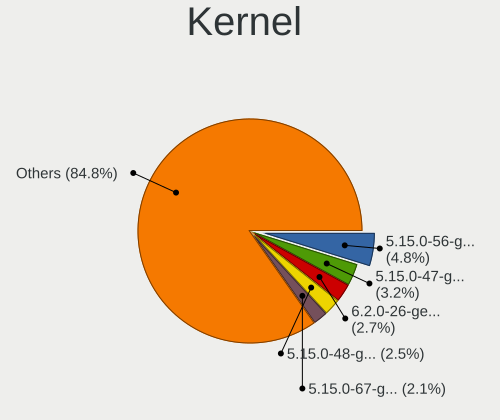

| Version            | Computers | Percent |
|--------------------|-----------|---------|
| 5.15.0-56-generic  | 27        | 4.79%   |
| 5.15.0-47-generic  | 18        | 3.19%   |
| 6.2.0-26-generic   | 15        | 2.66%   |
| 5.15.0-48-generic  | 14        | 2.48%   |
| 5.15.0-67-generic  | 12        | 2.13%   |
| 5.15.0-60-generic  | 12        | 2.13%   |
| 5.15.0-58-generic  | 12        | 2.13%   |
| 5.15.0-52-generic  | 12        | 2.13%   |
| 6.8.0-40-generic   | 11        | 1.95%   |
| 6.5.0-35-generic   | 11        | 1.95%   |
| 6.2.0-32-generic   | 11        | 1.95%   |
| 5.15.0-46-generic  | 11        | 1.95%   |
| 5.15.0-25-generic  | 11        | 1.95%   |
| 5.19.0-32-generic  | 10        | 1.77%   |
| 5.15.0-40-generic  | 9         | 1.6%    |
| 6.2.0-36-generic   | 8         | 1.42%   |
| 5.19.0-38-generic  | 8         | 1.42%   |
| 5.15.0-43-generic  | 8         | 1.42%   |
| 6.5.0-41-generic   | 7         | 1.24%   |
| 6.5.0-28-generic   | 7         | 1.24%   |
| 6.2.0-37-generic   | 7         | 1.24%   |
| 5.15.0-76-generic  | 7         | 1.24%   |
| 5.15.0-53-generic  | 7         | 1.24%   |
| 5.15.0-27-generic  | 7         | 1.24%   |
| 6.8.0-45-generic   | 6         | 1.06%   |
| 6.5.0-26-generic   | 6         | 1.06%   |
| 6.2.0-39-generic   | 6         | 1.06%   |
| 6.2.0-33-generic   | 6         | 1.06%   |
| 5.15.0-91-generic  | 6         | 1.06%   |
| 5.15.0-50-generic  | 6         | 1.06%   |
| 5.15.0-41-generic  | 6         | 1.06%   |
| 5.15.0-101-generic | 6         | 1.06%   |
| 6.8.0-52-generic   | 5         | 0.89%   |
| 6.5.0-25-generic   | 5         | 0.89%   |
| 6.5.0-21-generic   | 5         | 0.89%   |
| 6.5.0-14-generic   | 5         | 0.89%   |
| 6.2.0-35-generic   | 5         | 0.89%   |
| 6.2.0-34-generic   | 5         | 0.89%   |
| 5.19.0-46-generic  | 5         | 0.89%   |
| 5.19.0-35-generic  | 5         | 0.89%   |

Kernel Family
-------------

Linux kernel without a distro release

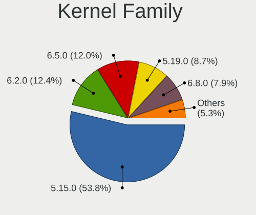

| Version | Computers | Percent |
|---------|-----------|---------|
| 5.15.0  | 265       | 53.75%  |
| 6.2.0   | 61        | 12.37%  |
| 6.5.0   | 59        | 11.97%  |
| 5.19.0  | 43        | 8.72%   |
| 6.8.0   | 39        | 7.91%   |
| 5.18.0  | 3         | 0.61%   |
| 5.17.0  | 2         | 0.41%   |
| 5.14.0  | 2         | 0.41%   |
| 5.13.0  | 2         | 0.41%   |
| 4.9.337 | 2         | 0.41%   |
| 6.8.9   | 1         | 0.2%    |
| 6.8.7   | 1         | 0.2%    |
| 6.6.6   | 1         | 0.2%    |
| 6.4.3   | 1         | 0.2%    |
| 6.4.0   | 1         | 0.2%    |
| 6.2.3   | 1         | 0.2%    |
| 6.14.1  | 1         | 0.2%    |
| 6.11.2  | 1         | 0.2%    |
| 6.1.8   | 1         | 0.2%    |
| 6.1.0   | 1         | 0.2%    |
| 6.0.8   | 1         | 0.2%    |
| 6.0.0   | 1         | 0.2%    |
| 5.4.275 | 1         | 0.2%    |
| 5.17.1  | 1         | 0.2%    |
| 4.14.41 | 1         | 0.2%    |

Kernel Major Ver.
-----------------

Linux kernel major version

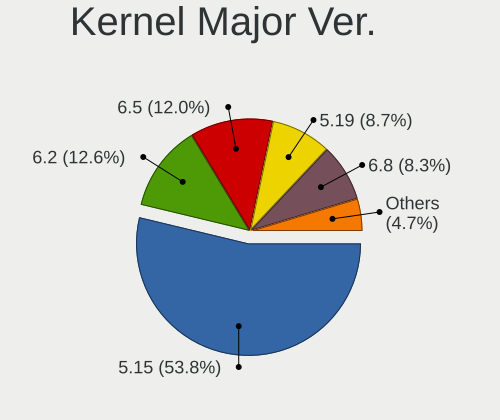

| Version | Computers | Percent |
|---------|-----------|---------|
| 5.15    | 265       | 53.75%  |
| 6.2     | 62        | 12.58%  |
| 6.5     | 59        | 11.97%  |
| 5.19    | 43        | 8.72%   |
| 6.8     | 41        | 8.32%   |
| 5.18    | 3         | 0.61%   |
| 5.17    | 3         | 0.61%   |
| 6.4     | 2         | 0.41%   |
| 6.1     | 2         | 0.41%   |
| 6.0     | 2         | 0.41%   |
| 5.14    | 2         | 0.41%   |
| 5.13    | 2         | 0.41%   |
| 4.9     | 2         | 0.41%   |
| 6.6     | 1         | 0.2%    |
| 6.14    | 1         | 0.2%    |
| 6.11    | 1         | 0.2%    |
| 5.4     | 1         | 0.2%    |
| 4.14    | 1         | 0.2%    |

Arch
----

OS architecture (x86_64, i586, etc.)

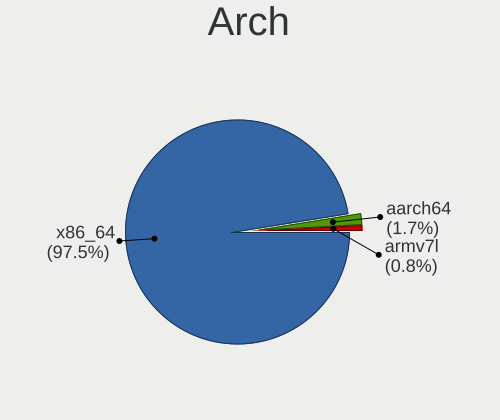

| Name    | Computers | Percent |
|---------|-----------|---------|
| x86_64  | 459       | 97.45%  |
| aarch64 | 8         | 1.7%    |
| armv7l  | 4         | 0.85%   |

DE
--

Desktop Environment

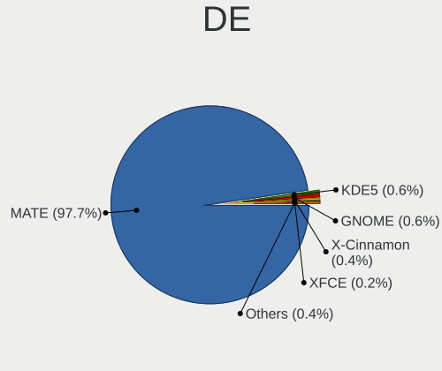

| Name       | Computers | Percent |
|------------|-----------|---------|
| MATE       | 460       | 97.66%  |
| KDE5       | 3         | 0.64%   |
| GNOME      | 3         | 0.64%   |
| X-Cinnamon | 2         | 0.42%   |
| XFCE       | 1         | 0.21%   |
| Cinnamon   | 1         | 0.21%   |
| Budgie     | 1         | 0.21%   |

Display Server
--------------

X11 or Wayland

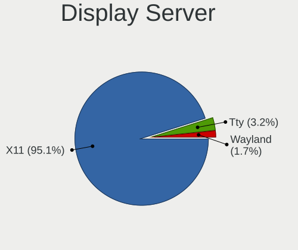

| Name    | Computers | Percent |
|---------|-----------|---------|
| X11     | 448       | 95.12%  |
| Tty     | 15        | 3.18%   |
| Wayland | 8         | 1.7%    |

Display Manager
---------------

SDDM, LightDM, etc.

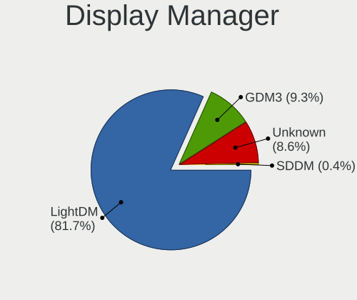

| Name    | Computers | Percent |
|---------|-----------|---------|
| LightDM | 388       | 81.68%  |
| GDM3    | 44        | 9.26%   |
| Unknown | 41        | 8.63%   |
| SDDM    | 2         | 0.42%   |

OS Lang
-------

Language

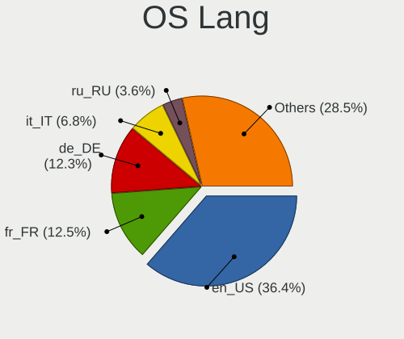

| Lang    | Computers | Percent |
|---------|-----------|---------|
| en_US   | 172       | 36.36%  |
| fr_FR   | 59        | 12.47%  |
| de_DE   | 58        | 12.26%  |
| it_IT   | 32        | 6.77%   |
| ru_RU   | 17        | 3.59%   |
| es_ES   | 13        | 2.75%   |
| en_GB   | 13        | 2.75%   |
| pt_BR   | 12        | 2.54%   |
| en_CA   | 11        | 2.33%   |
| en_AU   | 9         | 1.9%    |
| C       | 8         | 1.69%   |
| pl_PL   | 6         | 1.27%   |
| hu_HU   | 5         | 1.06%   |
| de_CH   | 5         | 1.06%   |
| es_MX   | 4         | 0.85%   |
| zh_TW   | 3         | 0.63%   |
| tr_TR   | 3         | 0.63%   |
| fi_FI   | 3         | 0.63%   |
| es_AR   | 3         | 0.63%   |
| el_GR   | 3         | 0.63%   |
| Unknown | 3         | 0.63%   |
| pt_PT   | 2         | 0.42%   |
| nl_NL   | 2         | 0.42%   |
| hr_HR   | 2         | 0.42%   |
| et_EE   | 2         | 0.42%   |
| es_VE   | 2         | 0.42%   |
| es_PE   | 2         | 0.42%   |
| en_IN   | 2         | 0.42%   |
| cs_CZ   | 2         | 0.42%   |
| zh_CN   | 1         | 0.21%   |
| nl_BE   | 1         | 0.21%   |
| nb_NO   | 1         | 0.21%   |
| ja_JP   | 1         | 0.21%   |
| id_ID   | 1         | 0.21%   |
| fr_CH   | 1         | 0.21%   |
| eu_ES   | 1         | 0.21%   |
| es_PY   | 1         | 0.21%   |
| es_CO   | 1         | 0.21%   |
| es_CL   | 1         | 0.21%   |
| en_NZ   | 1         | 0.21%   |

Boot Mode
---------

EFI or BIOS

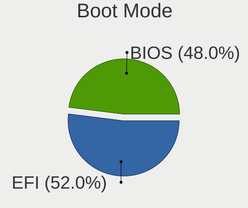

| Mode | Computers | Percent |
|------|-----------|---------|
| EFI  | 249       | 51.98%  |
| BIOS | 230       | 48.02%  |

Filesystem
----------

Type of filesystem

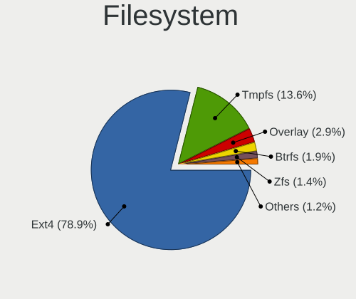

| Type    | Computers | Percent |
|---------|-----------|---------|
| Ext4    | 382       | 78.93%  |
| Tmpfs   | 66        | 13.64%  |
| Overlay | 14        | 2.89%   |
| Btrfs   | 9         | 1.86%   |
| Zfs     | 7         | 1.45%   |
| Xfs     | 3         | 0.62%   |
| Jfs     | 1         | 0.21%   |
| Ext3    | 1         | 0.21%   |
| Ext2    | 1         | 0.21%   |

Part. scheme
------------

Scheme of partitioning

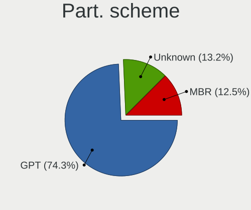

| Type    | Computers | Percent |
|---------|-----------|---------|
| GPT     | 356       | 74.32%  |
| Unknown | 63        | 13.15%  |
| MBR     | 60        | 12.53%  |

Dual Boot with Linux/BSD
------------------------

Hosting more than one Linux/BSD

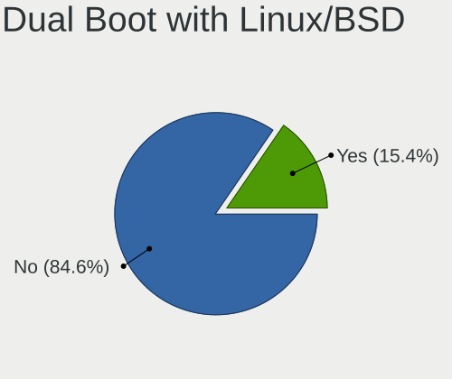

| Dual boot | Computers | Percent |
|-----------|-----------|---------|
| No        | 400       | 84.57%  |
| Yes       | 73        | 15.43%  |

Dual Boot (Win)
---------------

Hosting Linux and Windows

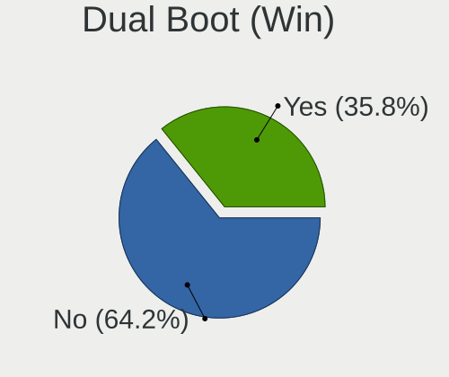

| Dual boot | Computers | Percent |
|-----------|-----------|---------|
| No        | 305       | 64.21%  |
| Yes       | 170       | 35.79%  |

Board
-----

Vendor
------

Motherboard manufacturer

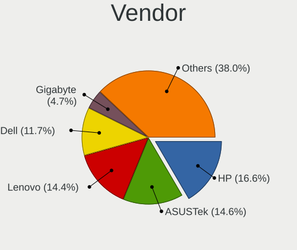

| Name                                 | Computers | Percent |
|--------------------------------------|-----------|---------|
| Hewlett-Packard                      | 78        | 16.56%  |
| ASUSTek Computer                     | 69        | 14.65%  |
| Lenovo                               | 68        | 14.44%  |
| Dell                                 | 55        | 11.68%  |
| Gigabyte Technology                  | 22        | 4.67%   |
| MSI                                  | 21        | 4.46%   |
| Acer                                 | 19        | 4.03%   |
| ASRock                               | 18        | 3.82%   |
| Apple                                | 10        | 2.12%   |
| Unknown                              | 10        | 2.12%   |
| Intel                                | 9         | 1.91%   |
| Toshiba                              | 6         | 1.27%   |
| Sony                                 | 6         | 1.27%   |
| Raspberry Pi Foundation              | 6         | 1.27%   |
| HUAWEI                               | 5         | 1.06%   |
| Hardkernel                           | 5         | 1.06%   |
| AZW                                  | 4         | 0.85%   |
| AMI                                  | 4         | 0.85%   |
| Medion                               | 3         | 0.64%   |
| Google                               | 3         | 0.64%   |
| Positivo                             | 2         | 0.42%   |
| Notebook                             | 2         | 0.42%   |
| Microsoft                            | 2         | 0.42%   |
| Fujitsu                              | 2         | 0.42%   |
| Clevo                                | 2         | 0.42%   |
| Biostar                              | 2         | 0.42%   |
| VIT                                  | 1         | 0.21%   |
| TYAN Computer                        | 1         | 0.21%   |
| TUXEDO                               | 1         | 0.21%   |
| TrekStor                             | 1         | 0.21%   |
| SLIMBOOK                             | 1         | 0.21%   |
| Shenzhen Meigao Electronic Equipment | 1         | 0.21%   |
| Semp Toshiba                         | 1         | 0.21%   |
| Samsung Electronics                  | 1         | 0.21%   |
| RCA                                  | 1         | 0.21%   |
| Positivo Bahia - VAIO                | 1         | 0.21%   |
| Panasonic                            | 1         | 0.21%   |
| Packard Bell                         | 1         | 0.21%   |
| Morshow                              | 1         | 0.21%   |
| Monster                              | 1         | 0.21%   |

Model
-----

Motherboard model

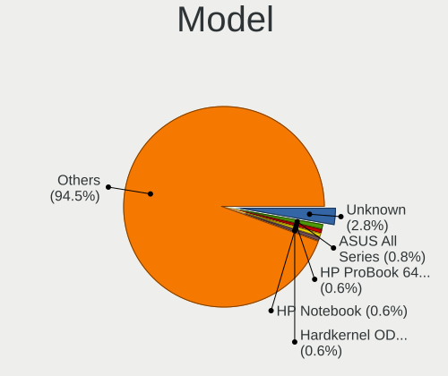

| Name                               | Computers | Percent |
|------------------------------------|-----------|---------|
| Unknown                            | 13        | 2.76%   |
| ASUS All Series                    | 4         | 0.85%   |
| HP ProBook 640 G8 Notebook PC      | 3         | 0.64%   |
| HP Notebook                        | 3         | 0.64%   |
| Hardkernel ODROID-N2Plus           | 3         | 0.64%   |
| Dell Latitude E5540                | 3         | 0.64%   |
| RPi Raspberry Pi 4 Model B Rev 1.4 | 2         | 0.42%   |
| RPi Raspberry Pi                   | 2         | 0.42%   |
| MSI MS-7C56                        | 2         | 0.42%   |
| HP Pavilion dv4                    | 2         | 0.42%   |
| HP EliteDesk 800 G1 SFF            | 2         | 0.42%   |
| HP Desktop M01-F0xxx               | 2         | 0.42%   |
| HP Compaq Elite 8300 SFF           | 2         | 0.42%   |
| HP Compaq 8000 Elite SFF PC        | 2         | 0.42%   |
| Gigabyte B85M-D3H                  | 2         | 0.42%   |
| Dell Precision M4800               | 2         | 0.42%   |
| Dell Precision 7520                | 2         | 0.42%   |
| Dell OptiPlex 3020                 | 2         | 0.42%   |
| Dell Latitude 7420                 | 2         | 0.42%   |
| Dell Latitude 5410                 | 2         | 0.42%   |
| ASUS PRIME B760-PLUS               | 2         | 0.42%   |
| ASUS PRIME B450M-A II              | 2         | 0.42%   |
| ASUS M5A78L LE                     | 2         | 0.42%   |
| ASRock A320M-HDV R4.0              | 2         | 0.42%   |
| AMI Intel                          | 2         | 0.42%   |
| VIT P1400                          | 1         | 0.21%   |
| TYAN S7012                         | 1         | 0.21%   |
| TUXEDO InfinityBook Pro Gen8 (MK1) | 1         | 0.21%   |
| TrekStor Surfbook A13B             | 1         | 0.21%   |
| Toshiba Satellite P50-B-10Z        | 1         | 0.21%   |
| Toshiba Satellite P50-B-10V        | 1         | 0.21%   |
| Toshiba Satellite C70D-A           | 1         | 0.21%   |
| Toshiba Satellite C55-B            | 1         | 0.21%   |
| Toshiba Satellite C50D-A-133       | 1         | 0.21%   |
| Toshiba PORTEGE R500               | 1         | 0.21%   |
| Sony VPCEH1E1E                     | 1         | 0.21%   |
| Sony VPCEB2Z1E                     | 1         | 0.21%   |
| Sony VPCEA36FG                     | 1         | 0.21%   |
| Sony VGN-Z21WRN_B                  | 1         | 0.21%   |
| Sony SVF13N2J2ES                   | 1         | 0.21%   |

Model Family
------------

Motherboard model prefix

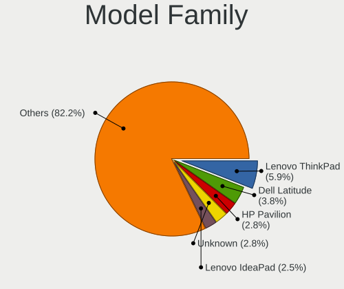

| Name                     | Computers | Percent |
|--------------------------|-----------|---------|
| Lenovo ThinkPad          | 28        | 5.94%   |
| Dell Latitude            | 18        | 3.82%   |
| HP Pavilion              | 13        | 2.76%   |
| Unknown                  | 13        | 2.76%   |
| Lenovo IdeaPad           | 12        | 2.55%   |
| ASUS PRIME               | 12        | 2.55%   |
| Acer Aspire              | 12        | 2.55%   |
| Dell Precision           | 11        | 2.34%   |
| HP EliteBook             | 10        | 2.12%   |
| HP ProBook               | 9         | 1.91%   |
| Dell OptiPlex            | 8         | 1.7%    |
| Dell Inspiron            | 8         | 1.7%    |
| HP Compaq                | 7         | 1.49%   |
| ASUS VivoBook            | 7         | 1.49%   |
| ASUS ROG                 | 7         | 1.49%   |
| RPi Raspberry            | 6         | 1.27%   |
| Toshiba Satellite        | 5         | 1.06%   |
| Lenovo ThinkCentre       | 5         | 1.06%   |
| Dell XPS                 | 5         | 1.06%   |
| HP EliteDesk             | 4         | 0.85%   |
| ASUS All                 | 4         | 0.85%   |
| Lenovo ThinkBook         | 3         | 0.64%   |
| Lenovo IdeaPadFlex       | 3         | 0.64%   |
| HP ProDesk               | 3         | 0.64%   |
| HP OMEN                  | 3         | 0.64%   |
| HP Notebook              | 3         | 0.64%   |
| HP Laptop                | 3         | 0.64%   |
| Hardkernel ODROID-N2Plus | 3         | 0.64%   |
| Dell Vostro              | 3         | 0.64%   |
| ASUS TUF                 | 3         | 0.64%   |
| ASUS ASUS                | 3         | 0.64%   |
| Acer Extensa             | 3         | 0.64%   |
| MSI MS-7C56              | 2         | 0.42%   |
| Microsoft Surface        | 2         | 0.42%   |
| Lenovo V15               | 2         | 0.42%   |
| Lenovo ThinkStation      | 2         | 0.42%   |
| Lenovo Legion            | 2         | 0.42%   |
| Lenovo IdeaCentre        | 2         | 0.42%   |
| HP ZBook                 | 2         | 0.42%   |
| HP Stream                | 2         | 0.42%   |

MFG Year
--------

Motherboard manufacture year

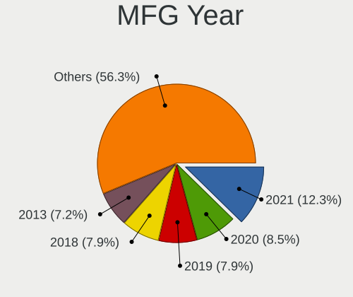

| Year    | Computers | Percent |
|---------|-----------|---------|
| 2021    | 58        | 12.31%  |
| 2020    | 40        | 8.49%   |
| 2019    | 37        | 7.86%   |
| 2018    | 37        | 7.86%   |
| 2013    | 34        | 7.22%   |
| 2022    | 33        | 7.01%   |
| 2012    | 33        | 7.01%   |
| 2014    | 28        | 5.94%   |
| 2011    | 26        | 5.52%   |
| 2017    | 22        | 4.67%   |
| 2015    | 21        | 4.46%   |
| 2016    | 19        | 4.03%   |
| 2009    | 19        | 4.03%   |
| 2010    | 15        | 3.18%   |
| 2008    | 15        | 3.18%   |
| 2023    | 14        | 2.97%   |
| Unknown | 10        | 2.12%   |
| 2007    | 5         | 1.06%   |
| 2006    | 3         | 0.64%   |
| 2024    | 2         | 0.42%   |

Form Factor
-----------

Physical design of the computer

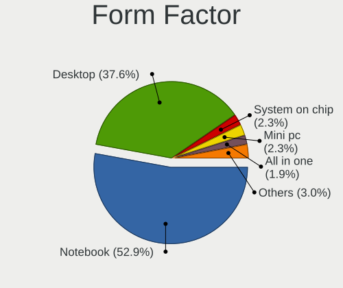

| Name           | Computers | Percent |
|----------------|-----------|---------|
| Notebook       | 249       | 52.87%  |
| Desktop        | 177       | 37.58%  |
| System on chip | 11        | 2.34%   |
| Mini pc        | 11        | 2.34%   |
| All in one     | 9         | 1.91%   |
| Convertible    | 7         | 1.49%   |
| Tablet         | 6         | 1.27%   |
| Server         | 1         | 0.21%   |

Secure Boot
-----------

Enabled or disabled

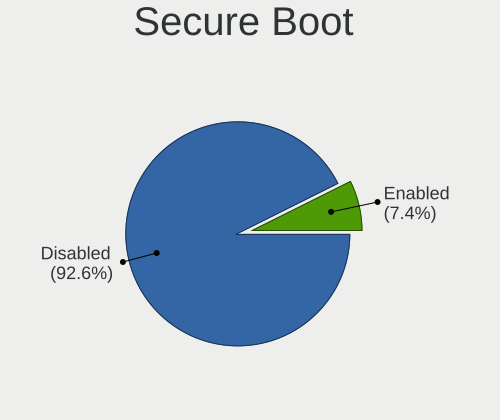

| State    | Computers | Percent |
|----------|-----------|---------|
| Disabled | 440       | 92.63%  |
| Enabled  | 35        | 7.37%   |

Coreboot
--------

Have coreboot on board

| Used | Computers | Percent |
|------|-----------|---------|
| No   | 468       | 99.36%  |
| Yes  | 3         | 0.64%   |

RAM Size
--------

Total RAM memory

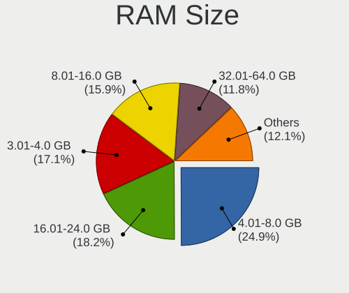

| Size in GB  | Computers | Percent |
|-------------|-----------|---------|
| 4.01-8.0    | 118       | 24.95%  |
| 16.01-24.0  | 86        | 18.18%  |
| 3.01-4.0    | 81        | 17.12%  |
| 8.01-16.0   | 75        | 15.86%  |
| 32.01-64.0  | 56        | 11.84%  |
| 64.01-256.0 | 22        | 4.65%   |
| 1.01-2.0    | 16        | 3.38%   |
| 24.01-32.0  | 14        | 2.96%   |
| 2.01-3.0    | 4         | 0.85%   |
| 0.51-1.0    | 1         | 0.21%   |

RAM Used
--------

Used RAM memory

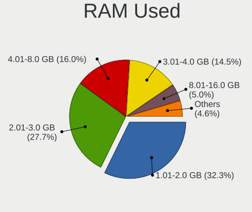

| Used GB    | Computers | Percent |
|------------|-----------|---------|
| 1.01-2.0   | 163       | 32.28%  |
| 2.01-3.0   | 140       | 27.72%  |
| 4.01-8.0   | 81        | 16.04%  |
| 3.01-4.0   | 73        | 14.46%  |
| 8.01-16.0  | 25        | 4.95%   |
| 0.51-1.0   | 13        | 2.57%   |
| 24.01-32.0 | 4         | 0.79%   |
| 16.01-24.0 | 3         | 0.59%   |
| 32.01-64.0 | 2         | 0.4%    |
| 0.01-0.5   | 1         | 0.2%    |

Total Drives
------------

Number of drives on board

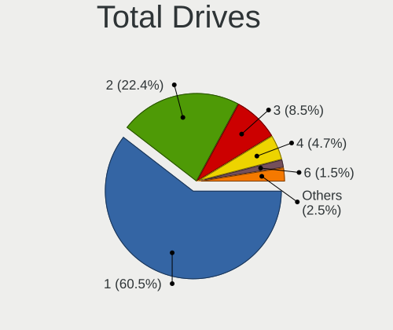

| Drives | Computers | Percent |
|--------|-----------|---------|
| 1      | 286       | 60.47%  |
| 2      | 106       | 22.41%  |
| 3      | 40        | 8.46%   |
| 4      | 22        | 4.65%   |
| 6      | 7         | 1.48%   |
| 5      | 6         | 1.27%   |
| 0      | 2         | 0.42%   |
| 20     | 1         | 0.21%   |
| 9      | 1         | 0.21%   |
| 8      | 1         | 0.21%   |
| 7      | 1         | 0.21%   |

Has CD-ROM
----------

Has CD-ROM on board

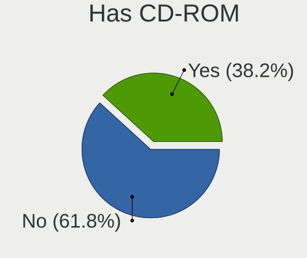

| Presented | Computers | Percent |
|-----------|-----------|---------|
| No        | 291       | 61.78%  |
| Yes       | 180       | 38.22%  |

Has Ethernet
------------

Has Ethernet on board

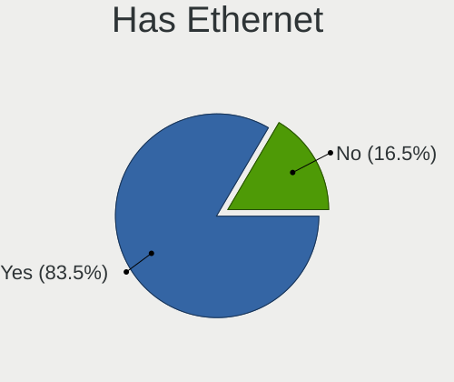

| Presented | Computers | Percent |
|-----------|-----------|---------|
| Yes       | 394       | 83.47%  |
| No        | 78        | 16.53%  |

Has WiFi
--------

Has WiFi module

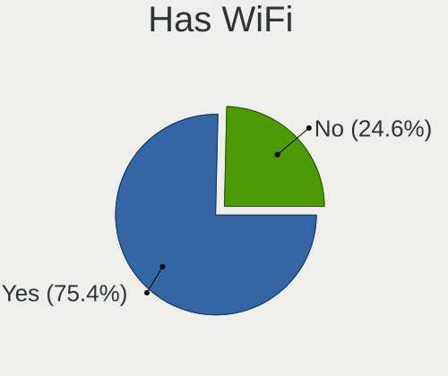

| Presented | Computers | Percent |
|-----------|-----------|---------|
| Yes       | 355       | 75.37%  |
| No        | 116       | 24.63%  |

Has Bluetooth
-------------

Has Bluetooth module

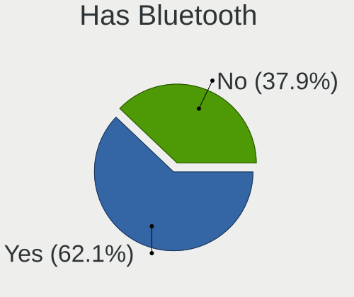

| Presented | Computers | Percent |
|-----------|-----------|---------|
| Yes       | 295       | 62.11%  |
| No        | 180       | 37.89%  |

Location
--------

Country
-------

Geographic location (country)

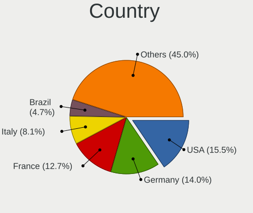

| Country     | Computers | Percent |
|-------------|-----------|---------|
| USA         | 73        | 15.5%   |
| Germany     | 66        | 14.01%  |
| France      | 60        | 12.74%  |
| Italy       | 38        | 8.07%   |
| Brazil      | 22        | 4.67%   |
| Spain       | 19        | 4.03%   |
| Russia      | 18        | 3.82%   |
| Poland      | 11        | 2.34%   |
| Canada      | 11        | 2.34%   |
| UK          | 10        | 2.12%   |
| Turkey      | 8         | 1.7%    |
| Switzerland | 8         | 1.7%    |
| Australia   | 8         | 1.7%    |
| Portugal    | 7         | 1.49%   |
| Hungary     | 7         | 1.49%   |
| Estonia     | 7         | 1.49%   |
| Belgium     | 7         | 1.49%   |
| Finland     | 6         | 1.27%   |
| Austria     | 6         | 1.27%   |
| Mexico      | 5         | 1.06%   |
| Greece      | 5         | 1.06%   |
| Argentina   | 5         | 1.06%   |
| Netherlands | 4         | 0.85%   |
| Indonesia   | 4         | 0.85%   |
| India       | 4         | 0.85%   |
| Peru        | 3         | 0.64%   |
| Croatia     | 3         | 0.64%   |
| Chile       | 3         | 0.64%   |
| Venezuela   | 2         | 0.42%   |
| Ukraine     | 2         | 0.42%   |
| Thailand    | 2         | 0.42%   |
| Taiwan      | 2         | 0.42%   |
| Serbia      | 2         | 0.42%   |
| Romania     | 2         | 0.42%   |
| Paraguay    | 2         | 0.42%   |
| New Zealand | 2         | 0.42%   |
| Israel      | 2         | 0.42%   |
| Hong Kong   | 2         | 0.42%   |
| Denmark     | 2         | 0.42%   |
| Czechia     | 2         | 0.42%   |

City
----

Geographic location (city)

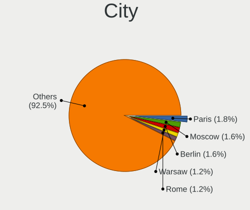

| City              | Computers | Percent |
|-------------------|-----------|---------|
| Paris             | 9         | 1.81%   |
| Moscow            | 8         | 1.61%   |
| Berlin            | 8         | 1.61%   |
| Warsaw            | 6         | 1.21%   |
| Rome              | 6         | 1.21%   |
| Wittingen         | 5         | 1.01%   |
| Sao Paulo         | 4         | 0.81%   |
| Madrid            | 4         | 0.81%   |
| Lisbon            | 4         | 0.81%   |
| Vienna            | 3         | 0.6%    |
| Tallinn           | 3         | 0.6%    |
| Rochester         | 3         | 0.6%    |
| Ozarow Mazowiecki | 3         | 0.6%    |
| Mannheim          | 3         | 0.6%    |
| Hamburg           | 3         | 0.6%    |
| Győr             | 3         | 0.6%    |
| Frankfurt am Main | 3         | 0.6%    |
| Zagreb            | 2         | 0.4%    |
| West Stockbridge  | 2         | 0.4%    |
| Vancouver         | 2         | 0.4%    |
| Turku             | 2         | 0.4%    |
| Toulouse          | 2         | 0.4%    |
| Tabasalu          | 2         | 0.4%    |
| Stuttgart         | 2         | 0.4%    |
| St Petersburg     | 2         | 0.4%    |
| Rio de Janeiro    | 2         | 0.4%    |
| Palermo           | 2         | 0.4%    |
| Ottawa            | 2         | 0.4%    |
| Olathe            | 2         | 0.4%    |
| Nantes            | 2         | 0.4%    |
| Montpellier       | 2         | 0.4%    |
| Melbourne         | 2         | 0.4%    |
| Macon             | 2         | 0.4%    |
| Los Angeles       | 2         | 0.4%    |
| Lima              | 2         | 0.4%    |
| Lansdale          | 2         | 0.4%    |
| Krakow            | 2         | 0.4%    |
| Izmir             | 2         | 0.4%    |
| Hyderabad         | 2         | 0.4%    |
| Houston           | 2         | 0.4%    |

Drives
------

Drive Vendor
------------

Hard drive vendors

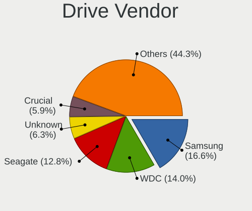

| Vendor                      | Computers | Drives | Percent |
|-----------------------------|-----------|--------|---------|
| Samsung Electronics         | 113       | 205    | 16.64%  |
| WDC                         | 95        | 149    | 13.99%  |
| Seagate                     | 87        | 129    | 12.81%  |
| Unknown                     | 43        | 59     | 6.33%   |
| Crucial                     | 40        | 49     | 5.89%   |
| Toshiba                     | 35        | 67     | 5.15%   |
| Kingston                    | 34        | 44     | 5.01%   |
| SanDisk                     | 31        | 36     | 4.57%   |
| SK hynix                    | 16        | 17     | 2.36%   |
| Hitachi                     | 14        | 16     | 2.06%   |
| A-DATA Technology           | 13        | 14     | 1.91%   |
| Intel                       | 11        | 11     | 1.62%   |
| SPCC                        | 9         | 13     | 1.33%   |
| Phison                      | 8         | 8      | 1.18%   |
| HGST                        | 8         | 8      | 1.18%   |
| China                       | 8         | 9      | 1.18%   |
| Phison Electronics          | 6         | 6      | 0.88%   |
| Unknown                     | 6         | 5      | 0.88%   |
| KIOXIA                      | 5         | 5      | 0.74%   |
| Intenso                     | 5         | 5      | 0.74%   |
| Netac                       | 4         | 4      | 0.59%   |
| KingSpec                    | 4         | 6      | 0.59%   |
| Apple                       | 4         | 5      | 0.59%   |
| Verbatim                    | 3         | 15     | 0.44%   |
| PNY                         | 3         | 3      | 0.44%   |
| Patriot                     | 3         | 3      | 0.44%   |
| Micron Technology           | 3         | 3      | 0.44%   |
| KingFast                    | 3         | 3      | 0.44%   |
| Hewlett-Packard             | 3         | 6      | 0.44%   |
| ASMT                        | 3         | 4      | 0.44%   |
| UMIS                        | 2         | 3      | 0.29%   |
| Team                        | 2         | 2      | 0.29%   |
| Silicon Motion              | 2         | 2      | 0.29%   |
| Realtek Semiconductor       | 2         | 3      | 0.29%   |
| OCZ                         | 2         | 2      | 0.29%   |
| LITEONIT                    | 2         | 2      | 0.29%   |
| LITEON                      | 2         | 2      | 0.29%   |
| LDLC                        | 2         | 2      | 0.29%   |
| KIOXIA-EXCERIA              | 2         | 2      | 0.29%   |
| Kingston Technology Company | 2         | 2      | 0.29%   |

Drive Model
-----------

Hard drive models

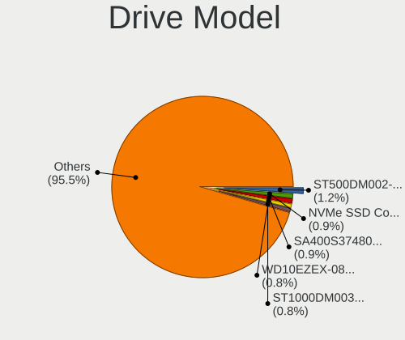

| Model                                              | Computers | Percent |
|----------------------------------------------------|-----------|---------|
| Seagate ST500DM002-1BD142 500GB                    | 9         | 1.16%   |
| Samsung NVMe SSD Controller SM981/PM981/PM983 1TB  | 7         | 0.9%    |
| Kingston SA400S37480G 480GB SSD                    | 7         | 0.9%    |
| WDC WD10EZEX-08WN4A0 1TB                           | 6         | 0.77%   |
| Seagate ST1000DM003-1ER162 1TB                     | 6         | 0.77%   |
| Samsung SSD 870 EVO 500GB                          | 6         | 0.77%   |
| Crucial CT1000BX500SSD1 1TB                        | 6         | 0.77%   |
| Unknown                                            | 6         | 0.77%   |
| Seagate ST500LT012-1DG142 500GB                    | 5         | 0.64%   |
| Seagate ST2000DM008-2FR102 2TB                     | 5         | 0.64%   |
| Samsung SSD 980 PRO 1TB                            | 5         | 0.64%   |
| Samsung SSD 850 EVO 500GB                          | 5         | 0.64%   |
| Samsung NVMe SSD Controller PM9A1/PM9A3/980PRO 1TB | 5         | 0.64%   |
| Kingston SA400S37120G 120GB SSD                    | 5         | 0.64%   |
| Unknown MMC Card  32GB                             | 4         | 0.51%   |
| Toshiba MQ01ABF050 500GB                           | 4         | 0.51%   |
| Seagate ST9500325AS 500GB                          | 4         | 0.51%   |
| Seagate ST1000LM035-1RK172 1TB                     | 4         | 0.51%   |
| Samsung SSD 980 1TB                                | 4         | 0.51%   |
| Samsung MZVLQ512HBLU-00BH1 512GB                   | 4         | 0.51%   |
| Crucial CT500MX500SSD1 500GB                       | 4         | 0.51%   |
| Crucial CT480BX500SSD1 480GB                       | 4         | 0.51%   |
| Crucial CT240BX500SSD1 240GB                       | 4         | 0.51%   |
| Crucial CT2000MX500SSD1 2TB                        | 4         | 0.51%   |
| WDC WDS100T2B0A-00SM50 1TB SSD                     | 3         | 0.39%   |
| WDC WD5003AZEX-00K3CA0 500GB                       | 3         | 0.39%   |
| WDC WD30EFRX-68EUZN0 3TB                           | 3         | 0.39%   |
| Verbatim Vi550 S3 1024GB                           | 3         | 0.39%   |
| Unknown SD/MMC 16GB                                | 3         | 0.39%   |
| Unknown NVMe SSD Drive 512GB                       | 3         | 0.39%   |
| Unknown MMC Card  64GB                             | 3         | 0.39%   |
| Unknown M.S./M.S.Pro/HG 16GB                       | 3         | 0.39%   |
| Unknown Compact Flash 977MB                        | 3         | 0.39%   |
| Toshiba MQ01ABD100 1TB                             | 3         | 0.39%   |
| Seagate ST4000DM004-2CV104 4TB                     | 3         | 0.39%   |
| Seagate ST2000DM001-1ER164 2TB                     | 3         | 0.39%   |
| Samsung SSD 870 QVO 2TB                            | 3         | 0.39%   |
| Samsung SSD 870 QVO 1TB                            | 3         | 0.39%   |
| Samsung SSD 860 EVO 500GB                          | 3         | 0.39%   |
| Samsung NVMe SSD Drive 1TB                         | 3         | 0.39%   |

HDD Vendor
----------

Hard disk drive vendors

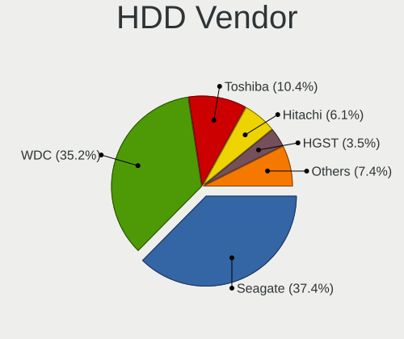

| Vendor              | Computers | Drives | Percent |
|---------------------|-----------|--------|---------|
| Seagate             | 86        | 128    | 37.39%  |
| WDC                 | 81        | 129    | 35.22%  |
| Toshiba             | 24        | 53     | 10.43%  |
| Hitachi             | 14        | 16     | 6.09%   |
| HGST                | 8         | 8      | 3.48%   |
| Samsung Electronics | 7         | 15     | 3.04%   |
| Hewlett-Packard     | 2         | 5      | 0.87%   |
| Maxtor              | 1         | 1      | 0.43%   |
| KESU                | 1         | 1      | 0.43%   |
| JMicron Technology  | 1         | 1      | 0.43%   |
| Intenso             | 1         | 1      | 0.43%   |
| DAS                 | 1         | 6      | 0.43%   |
| ASMT                | 1         | 2      | 0.43%   |
| ASMedia             | 1         | 1      | 0.43%   |
| Apple               | 1         | 1      | 0.43%   |

SSD Vendor
----------

Solid state drive vendors

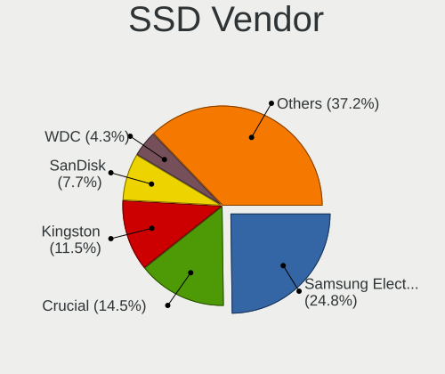

| Vendor              | Computers | Drives | Percent |
|---------------------|-----------|--------|---------|
| Samsung Electronics | 58        | 82     | 24.79%  |
| Crucial             | 34        | 42     | 14.53%  |
| Kingston            | 27        | 36     | 11.54%  |
| SanDisk             | 18        | 21     | 7.69%   |
| WDC                 | 10        | 11     | 4.27%   |
| China               | 8         | 9      | 3.42%   |
| A-DATA Technology   | 8         | 8      | 3.42%   |
| SPCC                | 7         | 11     | 2.99%   |
| Toshiba             | 5         | 8      | 2.14%   |
| KingSpec            | 4         | 6      | 1.71%   |
| Intenso             | 4         | 4      | 1.71%   |
| Verbatim            | 3         | 15     | 1.28%   |
| KingFast            | 3         | 3      | 1.28%   |
| Intel               | 3         | 3      | 1.28%   |
| PNY                 | 2         | 2      | 0.85%   |
| Patriot             | 2         | 2      | 0.85%   |
| OCZ                 | 2         | 2      | 0.85%   |
| Netac               | 2         | 2      | 0.85%   |
| LITEONIT            | 2         | 2      | 0.85%   |
| LITEON              | 2         | 2      | 0.85%   |
| LDLC                | 2         | 2      | 0.85%   |
| ASMT                | 2         | 2      | 0.85%   |
| Apacer              | 2         | 2      | 0.85%   |
| WDC WDS2            | 1         | 1      | 0.43%   |
| Unknown             | 1         | 1      | 0.43%   |
| Transcend           | 1         | 5      | 0.43%   |
| Teclast             | 1         | 1      | 0.43%   |
| Team                | 1         | 1      | 0.43%   |
| T-FORCE             | 1         | 1      | 0.43%   |
| Smartbuy            | 1         | 1      | 0.43%   |
| SK hynix            | 1         | 1      | 0.43%   |
| SABRENT             | 1         | 1      | 0.43%   |
| RZX                 | 1         | 1      | 0.43%   |
| Pichau              | 1         | 1      | 0.43%   |
| Phison              | 1         | 1      | 0.43%   |
| NGFF                | 1         | 1      | 0.43%   |
| Micron Technology   | 1         | 1      | 0.43%   |
| Kston               | 1         | 1      | 0.43%   |
| KIOXIA-EXCERIA      | 1         | 1      | 0.43%   |
| GOODRAM             | 1         | 1      | 0.43%   |

Drive Kind
----------

HDD or SSD

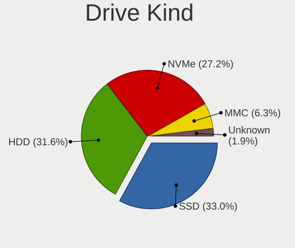

| Kind    | Computers | Drives | Percent |
|---------|-----------|--------|---------|
| SSD     | 205       | 306    | 33.01%  |
| HDD     | 196       | 368    | 31.56%  |
| NVMe    | 169       | 238    | 27.21%  |
| MMC     | 39        | 48     | 6.28%   |
| Unknown | 12        | 22     | 1.93%   |

Drive Connector
---------------

SATA, SAS, NVMe, etc.

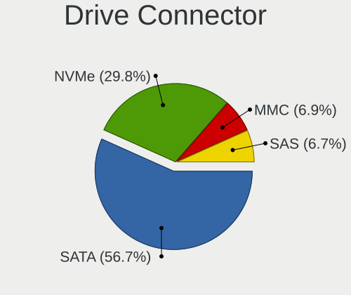

| Type | Computers | Drives | Percent |
|------|-----------|--------|---------|
| SATA | 322       | 634    | 56.69%  |
| NVMe | 169       | 237    | 29.75%  |
| MMC  | 39        | 48     | 6.87%   |
| SAS  | 38        | 63     | 6.69%   |

Drive Size
----------

Size of hard drive

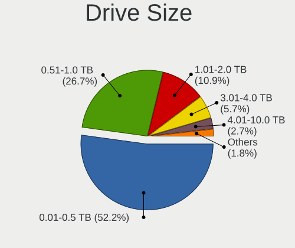

| Size in TB | Computers | Drives | Percent |
|------------|-----------|--------|---------|
| 0.01-0.5   | 229       | 342    | 52.16%  |
| 0.51-1.0   | 117       | 170    | 26.65%  |
| 1.01-2.0   | 48        | 74     | 10.93%  |
| 3.01-4.0   | 25        | 34     | 5.69%   |
| 4.01-10.0  | 12        | 41     | 2.73%   |
| 2.01-3.0   | 7         | 11     | 1.59%   |
| 10.01-20.0 | 1         | 2      | 0.23%   |

Space Total
-----------

Amount of disk space available on the file system

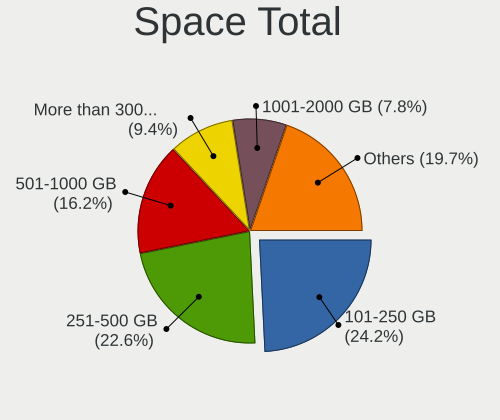

| Size in GB     | Computers | Percent |
|----------------|-----------|---------|
| 101-250        | 118       | 24.23%  |
| 251-500        | 110       | 22.59%  |
| 501-1000       | 79        | 16.22%  |
| More than 3000 | 46        | 9.45%   |
| 1001-2000      | 38        | 7.8%    |
| 51-100         | 38        | 7.8%    |
| 21-50          | 21        | 4.31%   |
| 1-20           | 17        | 3.49%   |
| 2001-3000      | 15        | 3.08%   |
| Unknown        | 5         | 1.03%   |

Space Used
----------

Amount of used disk space

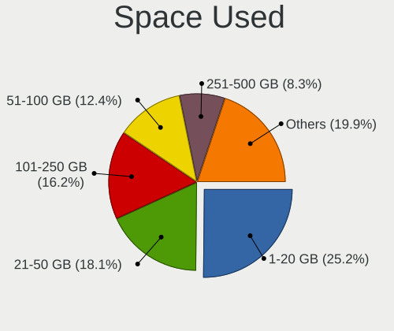

| Used GB        | Computers | Percent |
|----------------|-----------|---------|
| 1-20           | 124       | 25.15%  |
| 21-50          | 89        | 18.05%  |
| 101-250        | 80        | 16.23%  |
| 51-100         | 61        | 12.37%  |
| 251-500        | 41        | 8.32%   |
| 501-1000       | 32        | 6.49%   |
| More than 3000 | 29        | 5.88%   |
| 1001-2000      | 22        | 4.46%   |
| 2001-3000      | 10        | 2.03%   |
| Unknown        | 5         | 1.01%   |

Malfunc. Drives
---------------

Drive models with a malfunction

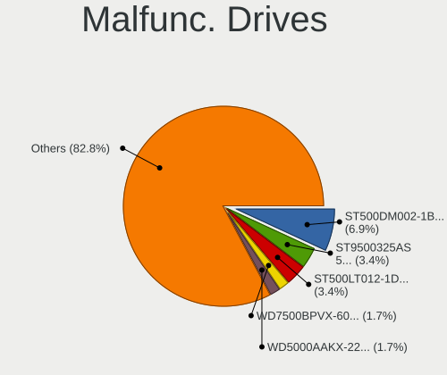

| Model                                                 | Computers | Drives | Percent |
|-------------------------------------------------------|-----------|--------|---------|
| Seagate ST500DM002-1BD142 500GB                       | 4         | 4      | 6.9%    |
| Seagate ST9500325AS 500GB                             | 2         | 2      | 3.45%   |
| Seagate ST500LT012-1DG142 500GB                       | 2         | 2      | 3.45%   |
| WDC WD7500BPVX-60JC3T0 752GB                          | 1         | 2      | 1.72%   |
| WDC WD5000AAKX-22ERMA0 500GB                          | 1         | 1      | 1.72%   |
| WDC WD5000AAKS-00V1A0 500GB                           | 1         | 1      | 1.72%   |
| WDC WD5000AADS-00S9B0 500GB                           | 1         | 1      | 1.72%   |
| WDC WD4000FYYZ-01UL1B3 4TB                            | 1         | 1      | 1.72%   |
| WDC WD40 EFRX-68WT0N0 4TB                             | 1         | 1      | 1.72%   |
| WDC WD40 EFRX-68N32N0 4TB                             | 1         | 1      | 1.72%   |
| WDC WD3200AAJS-22B4A0 320GB                           | 1         | 1      | 1.72%   |
| WDC WD2500AVJS-63B6A0 250GB                           | 1         | 1      | 1.72%   |
| WDC WD10EZEX-08WN4A0 1TB                              | 1         | 1      | 1.72%   |
| WDC WD10EAVS-00D7B0 1TB                               | 1         | 1      | 1.72%   |
| WDC WD1003FZEX-00MK2A0 1TB                            | 1         | 1      | 1.72%   |
| WDC WD1001FALS-40Y6A0 1TB                             | 1         | 1      | 1.72%   |
| Toshiba MQ01ABD075 752GB                              | 1         | 1      | 1.72%   |
| Toshiba MK3263GSXN 320GB                              | 1         | 1      | 1.72%   |
| Toshiba MG07ACA12TE 12TB                              | 1         | 1      | 1.72%   |
| SK hynix BC711 HFM512GD3JX013N 512GB                  | 1         | 1      | 1.72%   |
| Seagate ST9640320AS 640GB                             | 1         | 1      | 1.72%   |
| Seagate ST9500420AS 500GB                             | 1         | 1      | 1.72%   |
| Seagate ST9160821AS 160GB                             | 1         | 1      | 1.72%   |
| Seagate ST3250312AS 250GB                             | 1         | 1      | 1.72%   |
| Seagate ST32000644NS 2TB                              | 1         | 1      | 1.72%   |
| Seagate ST250DM000-1BD141 250GB                       | 1         | 1      | 1.72%   |
| Seagate ST2000DM001-1ER164 2TB                        | 1         | 1      | 1.72%   |
| Seagate ST1000LM035-1RK172 1TB                        | 1         | 1      | 1.72%   |
| Seagate ST1000DM003-1ER162 1TB                        | 1         | 1      | 1.72%   |
| Samsung Electronics SSD 970 EVO 500GB S466NX0K863648L | 1         | 1      | 1.72%   |
| Samsung Electronics SSD 960 PRO 1TB                   | 1         | 1      | 1.72%   |
| Samsung Electronics SSD 870 EVO 500GB                 | 1         | 1      | 1.72%   |
| Samsung Electronics SSD 870 EVO 1TB                   | 1         | 1      | 1.72%   |
| Samsung Electronics MZVLQ512HBLU-00BH1 512GB          | 1         | 1      | 1.72%   |
| OCZ VERTEX3 240GB SSD                                 | 1         | 1      | 1.72%   |
| OCZ AGILITY3 240GB SSD                                | 1         | 1      | 1.72%   |
| NGFF 2280 256GB SSD                                   | 1         | 1      | 1.72%   |
| Netac SSD 256GB                                       | 1         | 1      | 1.72%   |
| LITEON CV8-CE256-HP 256GB SSD                         | 1         | 1      | 1.72%   |
| LDLC SSD 120GB                                        | 1         | 1      | 1.72%   |

Malfunc. Drive Vendor
---------------------

Vendors of faulty drives

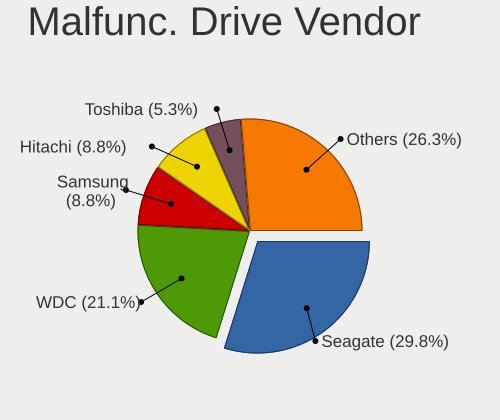

| Vendor              | Computers | Drives | Percent |
|---------------------|-----------|--------|---------|
| Seagate             | 17        | 17     | 29.82%  |
| WDC                 | 12        | 14     | 21.05%  |
| Samsung Electronics | 5         | 5      | 8.77%   |
| Hitachi             | 5         | 5      | 8.77%   |
| Toshiba             | 3         | 3      | 5.26%   |
| OCZ                 | 2         | 2      | 3.51%   |
| Kingston            | 2         | 2      | 3.51%   |
| HGST                | 2         | 2      | 3.51%   |
| SK hynix            | 1         | 1      | 1.75%   |
| NGFF                | 1         | 1      | 1.75%   |
| Netac               | 1         | 1      | 1.75%   |
| LITEON              | 1         | 1      | 1.75%   |
| LDLC                | 1         | 1      | 1.75%   |
| Intenso             | 1         | 1      | 1.75%   |
| Intel               | 1         | 1      | 1.75%   |
| DAS                 | 1         | 3      | 1.75%   |
| China               | 1         | 1      | 1.75%   |

Malfunc. HDD Vendor
-------------------

Vendors of faulty HDD drives

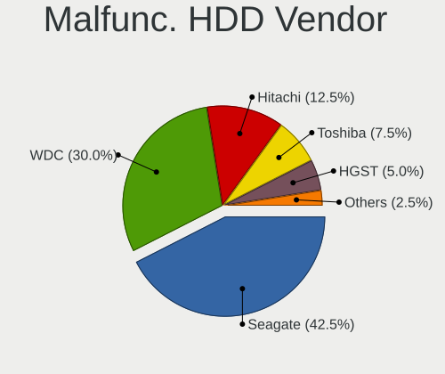

| Vendor  | Computers | Drives | Percent |
|---------|-----------|--------|---------|
| Seagate | 17        | 17     | 42.5%   |
| WDC     | 12        | 14     | 30%     |
| Hitachi | 5         | 5      | 12.5%   |
| Toshiba | 3         | 3      | 7.5%    |
| HGST    | 2         | 2      | 5%      |
| DAS     | 1         | 3      | 2.5%    |

Malfunc. Drive Kind
-------------------

Kinds of faulty drives

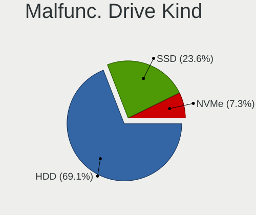

| Kind | Computers | Drives | Percent |
|------|-----------|--------|---------|
| HDD  | 38        | 44     | 69.09%  |
| SSD  | 13        | 13     | 23.64%  |
| NVMe | 4         | 4      | 7.27%   |

Failed Drives
-------------

Failed drive models

Zero info for selected period =(

Failed Drive Vendor
-------------------

Failed drive vendors

Zero info for selected period =(

Drive Status
------------

Number of failed and malfunc. drives

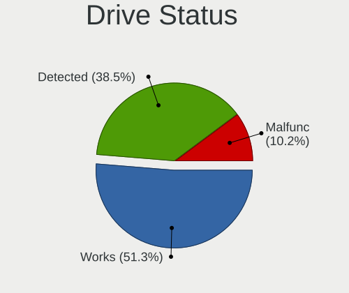

| Status   | Computers | Drives | Percent |
|----------|-----------|--------|---------|
| Works    | 277       | 521    | 51.3%   |
| Detected | 208       | 400    | 38.52%  |
| Malfunc  | 55        | 61     | 10.19%  |

Storage controller
------------------

Storage Vendor
--------------

Storage controller vendors

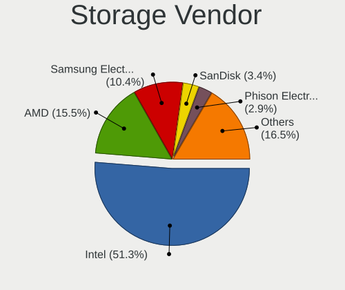

| Vendor                         | Computers | Percent |
|--------------------------------|-----------|---------|
| Intel                          | 301       | 51.28%  |
| AMD                            | 91        | 15.5%   |
| Samsung Electronics            | 61        | 10.39%  |
| SanDisk                        | 20        | 3.41%   |
| Phison Electronics             | 17        | 2.9%    |
| SK hynix                       | 14        | 2.39%   |
| Kingston Technology Company    | 10        | 1.7%    |
| ASMedia Technology             | 10        | 1.7%    |
| Toshiba America Info Systems   | 7         | 1.19%   |
| ADATA Technology               | 7         | 1.19%   |
| Silicon Motion                 | 6         | 1.02%   |
| KIOXIA                         | 6         | 1.02%   |
| Nvidia                         | 4         | 0.68%   |
| Micron/Crucial Technology      | 4         | 0.68%   |
| Micron Technology              | 4         | 0.68%   |
| Marvell Technology Group       | 4         | 0.68%   |
| Realtek Semiconductor          | 3         | 0.51%   |
| MAXIO Technology (Hangzhou)    | 3         | 0.51%   |
| JMicron Technology             | 3         | 0.51%   |
| Union Memory (Shenzhen)        | 2         | 0.34%   |
| Solidigm                       | 2         | 0.34%   |
| Solid State Storage Technology | 1         | 0.17%   |
| Shenzhen Longsys Electronics   | 1         | 0.17%   |
| LSI Logic / Symbios Logic      | 1         | 0.17%   |
| Lenovo                         | 1         | 0.17%   |
| Hewlett-Packard                | 1         | 0.17%   |
| Biwin Storage Technology       | 1         | 0.17%   |
| Apacer Technology              | 1         | 0.17%   |
| Unknown                        | 1         | 0.17%   |

Storage Model
-------------

Storage controller models

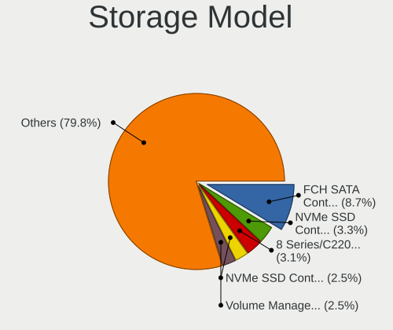

| Model                                                                          | Computers | Percent |
|--------------------------------------------------------------------------------|-----------|---------|
| AMD FCH SATA Controller [AHCI mode]                                            | 58        | 8.68%   |
| Samsung NVMe SSD Controller 980 (DRAM-less)                                    | 22        | 3.29%   |
| Intel 8 Series/C220 Series Chipset Family 6-port SATA Controller 1 [AHCI mode] | 21        | 3.14%   |
| Samsung NVMe SSD Controller PM9A1/PM9A3/980PRO                                 | 17        | 2.54%   |
| Intel Volume Management Device NVMe RAID Controller                            | 17        | 2.54%   |
| Intel 7 Series Chipset Family 6-port SATA Controller [AHCI mode]               | 16        | 2.4%    |
| Samsung NVMe SSD Controller SM981/PM981/PM983                                  | 15        | 2.25%   |
| Intel Sunrise Point-LP SATA Controller [AHCI mode]                             | 14        | 2.1%    |
| Intel Celeron/Pentium Silver Processor SATA Controller                         | 14        | 2.1%    |
| Intel 82801 Mobile SATA Controller [RAID mode]                                 | 14        | 2.1%    |
| AMD SB7x0/SB8x0/SB9x0 IDE Controller                                           | 12        | 1.8%    |
| AMD 400 Series Chipset SATA Controller                                         | 12        | 1.8%    |
| Intel 8 Series SATA Controller 1 [AHCI mode]                                   | 11        | 1.65%   |
| Intel 6 Series/C200 Series Chipset Family 6 port Mobile SATA AHCI Controller   | 11        | 1.65%   |
| ASMedia ASM1061/ASM1062 Serial ATA Controller                                  | 10        | 1.5%    |
| Intel SATA Controller [RAID mode]                                              | 9         | 1.35%   |
| Intel 200 Series PCH SATA controller [AHCI mode]                               | 9         | 1.35%   |
| AMD SB7x0/SB8x0/SB9x0 SATA Controller [IDE mode]                               | 9         | 1.35%   |
| Intel Cannon Lake PCH SATA AHCI Controller                                     | 8         | 1.2%    |
| Intel Atom Processor E3800 Series SATA AHCI Controller                         | 8         | 1.2%    |
| Intel 7 Series/C210 Series Chipset Family 6-port SATA Controller [AHCI mode]   | 8         | 1.2%    |
| Intel 6 Series/C200 Series Chipset Family 6 port Desktop SATA AHCI Controller  | 8         | 1.2%    |
| Intel 500 Series Chipset Family SATA AHCI Controller                           | 8         | 1.2%    |
| AMD SB7x0/SB8x0/SB9x0 SATA Controller [AHCI mode]                              | 8         | 1.2%    |
| Samsung NVMe SSD Controller SM961/PM961/SM963                                  | 7         | 1.05%   |
| Intel Q170/Q150/B150/H170/H110/Z170/CM236 Chipset SATA Controller [AHCI Mode]  | 7         | 1.05%   |
| Intel Comet Lake SATA AHCI Controller                                          | 7         | 1.05%   |
| Intel Alder Lake-S PCH SATA Controller [AHCI Mode]                             | 7         | 1.05%   |
| Intel 82801IBM/IEM (ICH9M/ICH9M-E) 4 port SATA Controller [AHCI mode]          | 7         | 1.05%   |
| AMD A320 Chipset SATA Controller [AHCI mode]                                   | 7         | 1.05%   |
| AMD 500 Series Chipset SATA Controller                                         | 7         | 1.05%   |
| Intel Wildcat Point-LP SATA Controller [AHCI Mode]                             | 6         | 0.9%    |
| Intel 5 Series/3400 Series Chipset 4 port SATA AHCI Controller                 | 6         | 0.9%    |
| Phison E12 NVMe Controller                                                     | 5         | 0.75%   |
| Intel Tiger Lake-LP SATA Controller                                            | 5         | 0.75%   |
| Intel NM10/ICH7 Family SATA Controller [IDE mode]                              | 5         | 0.75%   |
| AMD 600 Series Chipset SATA Controller                                         | 5         | 0.75%   |
| SK hynix Gold P31/BC711/PC711 NVMe Solid State Drive                           | 4         | 0.6%    |
| Silicon Motion SM2263EN/SM2263XT (DRAM-less) NVMe SSD Controllers              | 4         | 0.6%    |
| SanDisk Ultra 3D / WD PC SN530, IX SN530, Blue SN550 NVMe SSD (DRAM-less)      | 4         | 0.6%    |

Storage Kind
------------

Kind of storage controller (IDE, SATA, NVMe, SAS, ...)

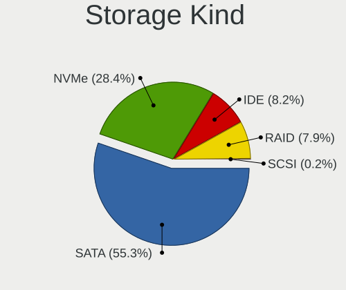

| Kind | Computers | Percent |
|------|-----------|---------|
| SATA | 329       | 55.29%  |
| NVMe | 169       | 28.4%   |
| IDE  | 49        | 8.24%   |
| RAID | 47        | 7.9%    |
| SCSI | 1         | 0.17%   |

Processor
---------

CPU Vendor
----------

Processor vendors

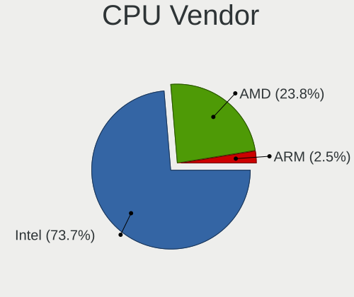

| Vendor | Computers | Percent |
|--------|-----------|---------|
| Intel  | 347       | 73.67%  |
| AMD    | 112       | 23.78%  |
| ARM    | 12        | 2.55%   |

CPU Model
---------

Processor models

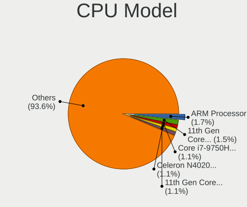

| Model                                         | Computers | Percent |
|-----------------------------------------------|-----------|---------|
| ARM Processor                                 | 8         | 1.7%    |
| Intel 11th Gen Core i5-1135G7 @ 2.40GHz       | 7         | 1.49%   |
| Intel Core i7-9750H CPU @ 2.60GHz             | 5         | 1.06%   |
| Intel Celeron N4020 CPU @ 1.10GHz             | 5         | 1.06%   |
| Intel 11th Gen Core i7-1165G7 @ 2.80GHz       | 5         | 1.06%   |
| AMD Ryzen 9 5900HX with Radeon Graphics       | 5         | 1.06%   |
| AMD Ryzen 5 3500U with Radeon Vega Mobile Gfx | 5         | 1.06%   |
| Intel Core i7-10510U CPU @ 1.80GHz            | 4         | 0.85%   |
| Intel Core i5-8265U CPU @ 1.60GHz             | 4         | 0.85%   |
| AMD Ryzen 5 5600G with Radeon Graphics        | 4         | 0.85%   |
| Intel Core i7-8700K CPU @ 3.70GHz             | 3         | 0.64%   |
| Intel Core i7-7500U CPU @ 2.70GHz             | 3         | 0.64%   |
| Intel Core i7-3517U CPU @ 1.90GHz             | 3         | 0.64%   |
| Intel Core i7-2670QM CPU @ 2.20GHz            | 3         | 0.64%   |
| Intel Core i5-6200U CPU @ 2.30GHz             | 3         | 0.64%   |
| Intel Core i5-4300U CPU @ 1.90GHz             | 3         | 0.64%   |
| Intel Core i5-3470 CPU @ 3.20GHz              | 3         | 0.64%   |
| Intel Core i5-3210M CPU @ 2.50GHz             | 3         | 0.64%   |
| Intel Core i5-2540M CPU @ 2.60GHz             | 3         | 0.64%   |
| Intel Core i5-2400 CPU @ 3.10GHz              | 3         | 0.64%   |
| Intel Core i5-10210U CPU @ 1.60GHz            | 3         | 0.64%   |
| Intel Core i3-4005U CPU @ 1.70GHz             | 3         | 0.64%   |
| Intel Core i3-10110U CPU @ 2.10GHz            | 3         | 0.64%   |
| Intel Celeron N4000 CPU @ 1.10GHz             | 3         | 0.64%   |
| Intel Celeron J4105 CPU @ 1.50GHz             | 3         | 0.64%   |
| Intel Celeron CPU N3060 @ 1.60GHz             | 3         | 0.64%   |
| Intel Celeron CPU N2830 @ 2.16GHz             | 3         | 0.64%   |
| Intel 12th Gen Core i7-12700H                 | 3         | 0.64%   |
| Intel 11th Gen Core i7-1185G7 @ 3.00GHz       | 3         | 0.64%   |
| AMD Ryzen 5 4600H with Radeon Graphics        | 3         | 0.64%   |
| AMD Ryzen 5 3600 6-Core Processor             | 3         | 0.64%   |
| AMD Ryzen 5 2600 Six-Core Processor           | 3         | 0.64%   |
| AMD Ryzen 5 2400G with Radeon Vega Graphics   | 3         | 0.64%   |
| Intel Pentium Silver N6000 @ 1.10GHz          | 2         | 0.42%   |
| Intel Pentium Dual-Core CPU T4400 @ 2.20GHz   | 2         | 0.42%   |
| Intel Pentium CPU N3540 @ 2.16GHz             | 2         | 0.42%   |
| Intel Pentium CPU B940 @ 2.00GHz              | 2         | 0.42%   |
| Intel N100                                    | 2         | 0.42%   |
| Intel Core i7-8700 CPU @ 3.20GHz              | 2         | 0.42%   |
| Intel Core i7-8565U CPU @ 1.80GHz             | 2         | 0.42%   |

CPU Model Family
----------------

Processor model prefix

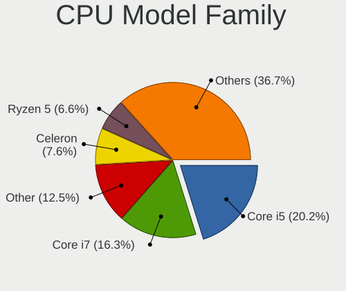

| Model                   | Computers | Percent |
|-------------------------|-----------|---------|
| Intel Core i5           | 95        | 20.17%  |
| Intel Core i7           | 77        | 16.35%  |
| Other                   | 59        | 12.53%  |
| Intel Celeron           | 36        | 7.64%   |
| AMD Ryzen 5             | 31        | 6.58%   |
| Intel Core i3           | 27        | 5.73%   |
| Intel Core 2 Duo        | 20        | 4.25%   |
| AMD Ryzen 7             | 20        | 4.25%   |
| Intel Xeon              | 12        | 2.55%   |
| Intel Pentium           | 12        | 2.55%   |
| AMD Ryzen 9             | 8         | 1.7%    |
| AMD Ryzen 3             | 7         | 1.49%   |
| AMD FX                  | 7         | 1.49%   |
| AMD A6                  | 6         | 1.27%   |
| Intel Pentium Dual-Core | 5         | 1.06%   |
| Intel Atom              | 5         | 1.06%   |
| AMD A8                  | 5         | 1.06%   |
| AMD Athlon II X2        | 4         | 0.85%   |
| Intel Pentium Silver    | 3         | 0.64%   |
| AMD A4                  | 3         | 0.64%   |
| Intel Core 2 Quad       | 2         | 0.42%   |
| ARM BCM                 | 2         | 0.42%   |
| AMD Ryzen 7 PRO         | 2         | 0.42%   |
| AMD E1                  | 2         | 0.42%   |
| AMD E                   | 2         | 0.42%   |
| Intel Pentium D         | 1         | 0.21%   |
| Intel Pentium 4         | 1         | 0.21%   |
| Intel Core m5           | 1         | 0.21%   |
| Intel Core M            | 1         | 0.21%   |
| Intel Core i9           | 1         | 0.21%   |
| AMD Turion II Neo       | 1         | 0.21%   |
| AMD Turion 64 X2 Mobile | 1         | 0.21%   |
| AMD Turion 64 Mobile    | 1         | 0.21%   |
| AMD Sempron             | 1         | 0.21%   |
| AMD Ryzen 5 PRO         | 1         | 0.21%   |
| AMD Quad-Core           | 1         | 0.21%   |
| AMD Phenom II X6        | 1         | 0.21%   |
| AMD Phenom II X4        | 1         | 0.21%   |
| AMD E2                  | 1         | 0.21%   |
| AMD Athlon X2           | 1         | 0.21%   |

CPU Cores
---------

Number of processor cores

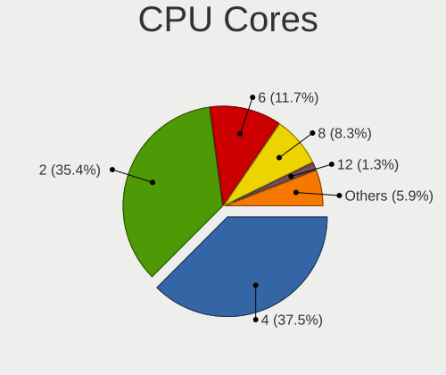

| Number  | Computers | Percent |
|---------|-----------|---------|
| 4       | 177       | 37.5%   |
| 2       | 167       | 35.38%  |
| 6       | 55        | 11.65%  |
| 8       | 39        | 8.26%   |
| 12      | 6         | 1.27%   |
| 14      | 5         | 1.06%   |
| 1       | 5         | 1.06%   |
| Unknown | 5         | 1.06%   |
| 16      | 4         | 0.85%   |
| 10      | 3         | 0.64%   |
| 3       | 3         | 0.64%   |
| 20      | 2         | 0.42%   |
| 24      | 1         | 0.21%   |

CPU Sockets
-----------

Number of sockets

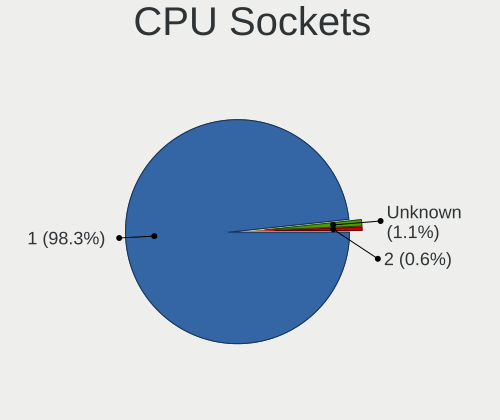

| Number  | Computers | Percent |
|---------|-----------|---------|
| 1       | 464       | 98.31%  |
| Unknown | 5         | 1.06%   |
| 2       | 3         | 0.64%   |

CPU Threads
-----------

Threads per core (Hyper-Threading)

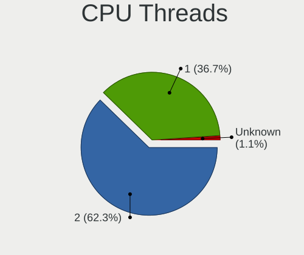

| Number  | Computers | Percent |
|---------|-----------|---------|
| 2       | 294       | 62.29%  |
| 1       | 173       | 36.65%  |
| Unknown | 5         | 1.06%   |

CPU Op-Modes
------------

CPU Operation Modes (32-bit, 64-bit)

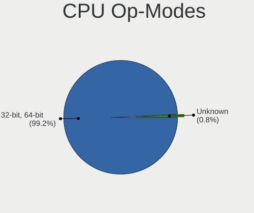

| Op mode        | Computers | Percent |
|----------------|-----------|---------|
| 32-bit, 64-bit | 467       | 99.15%  |
| Unknown        | 4         | 0.85%   |

CPU Microcode
-------------

Microcode number

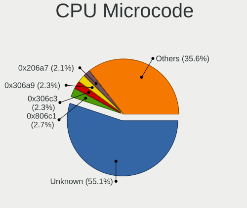

| Number     | Computers | Percent |
|------------|-----------|---------|
| Unknown    | 265       | 55.09%  |
| 0x806c1    | 13        | 2.7%    |
| 0x306c3    | 11        | 2.29%   |
| 0x306a9    | 11        | 2.29%   |
| 0x206a7    | 10        | 2.08%   |
| 0x806ec    | 8         | 1.66%   |
| 0x0a50000c | 8         | 1.66%   |
| 0x08108109 | 8         | 1.66%   |
| 0x40651    | 7         | 1.46%   |
| 0x506e3    | 6         | 1.25%   |
| 0x1067a    | 6         | 1.25%   |
| 0xa0671    | 5         | 1.04%   |
| 0x906ea    | 5         | 1.04%   |
| 0x806ea    | 5         | 1.04%   |
| 0x406e3    | 5         | 1.04%   |
| 0x406c4    | 5         | 1.04%   |
| 0x0700010f | 5         | 1.04%   |
| 0x806d1    | 4         | 0.83%   |
| 0x706a1    | 4         | 0.83%   |
| 0x30678    | 4         | 0.83%   |
| 0x20655    | 4         | 0.83%   |
| 0x0800820d | 4         | 0.83%   |
| 0x906e9    | 3         | 0.62%   |
| 0x906a3    | 3         | 0.62%   |
| 0x706a8    | 3         | 0.62%   |
| 0x6fd      | 3         | 0.62%   |
| 0x506c9    | 3         | 0.62%   |
| 0x106e5    | 3         | 0.62%   |
| 0x10676    | 3         | 0.62%   |
| 0x0a601203 | 3         | 0.62%   |
| 0x0a50000d | 3         | 0.62%   |
| 0x08701021 | 3         | 0.62%   |
| 0x0600611a | 3         | 0.62%   |
| 0x05000119 | 3         | 0.62%   |
| 0x010000c8 | 3         | 0.62%   |
| 0xa0653    | 2         | 0.42%   |
| 0x906c0    | 2         | 0.42%   |
| 0x90672    | 2         | 0.42%   |
| 0x806eb    | 2         | 0.42%   |
| 0x806e9    | 2         | 0.42%   |

CPU Microarch
-------------

Microarchitecture

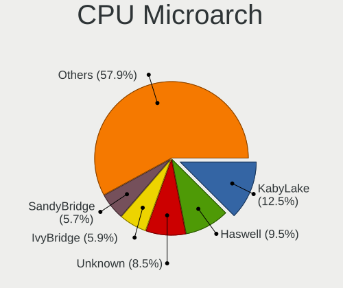

| Name             | Computers | Percent |
|------------------|-----------|---------|
| KabyLake         | 59        | 12.47%  |
| Haswell          | 45        | 9.51%   |
| Unknown          | 40        | 8.46%   |
| IvyBridge        | 28        | 5.92%   |
| SandyBridge      | 27        | 5.71%   |
| Skylake          | 22        | 4.65%   |
| Penryn           | 22        | 4.65%   |
| Zen 3            | 19        | 4.02%   |
| TigerLake        | 19        | 4.02%   |
| Silvermont       | 19        | 4.02%   |
| Zen+             | 16        | 3.38%   |
| Icelake          | 16        | 3.38%   |
| Goldmont plus    | 16        | 3.38%   |
| Zen 2            | 12        | 2.54%   |
| Zen              | 10        | 2.11%   |
| Westmere         | 10        | 2.11%   |
| K10              | 10        | 2.11%   |
| CometLake        | 10        | 2.11%   |
| Alderlake Hybrid | 10        | 2.11%   |
| Broadwell        | 9         | 1.9%    |
| Piledriver       | 7         | 1.48%   |
| Excavator        | 7         | 1.48%   |
| Jaguar           | 6         | 1.27%   |
| Core             | 6         | 1.27%   |
| Nehalem          | 5         | 1.06%   |
| Goldmont         | 4         | 0.85%   |
| Tremont          | 3         | 0.63%   |
| Puma             | 3         | 0.63%   |
| Bobcat           | 3         | 0.63%   |
| NetBurst         | 2         | 0.42%   |
| K8 Hammer        | 2         | 0.42%   |
| Gracemont        | 2         | 0.42%   |
| Bulldozer        | 2         | 0.42%   |
| Steamroller      | 1         | 0.21%   |
| K8 & K10 hybrid  | 1         | 0.21%   |

Graphics
--------

GPU Vendor
----------

Vendors of graphics cards

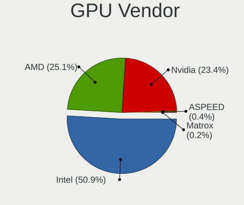

| Vendor                     | Computers | Percent |
|----------------------------|-----------|---------|
| Intel                      | 270       | 50.94%  |
| AMD                        | 133       | 25.09%  |
| Nvidia                     | 124       | 23.4%   |
| ASPEED Technology          | 2         | 0.38%   |
| Matrox Electronics Systems | 1         | 0.19%   |

GPU Model
---------

Graphics card models

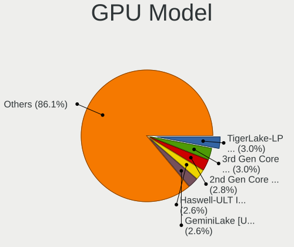

| Model                                                                                    | Computers | Percent |
|------------------------------------------------------------------------------------------|-----------|---------|
| Intel TigerLake-LP GT2 [Iris Xe Graphics]                                                | 16        | 2.97%   |
| Intel 3rd Gen Core processor Graphics Controller                                         | 16        | 2.97%   |
| Intel 2nd Generation Core Processor Family Integrated Graphics Controller                | 15        | 2.79%   |
| Intel Haswell-ULT Integrated Graphics Controller                                         | 14        | 2.6%    |
| Intel GeminiLake [UHD Graphics 600]                                                      | 14        | 2.6%    |
| AMD Cezanne [Radeon Vega Series / Radeon Vega Mobile Series]                             | 13        | 2.42%   |
| Intel Xeon E3-1200 v3/4th Gen Core Processor Integrated Graphics Controller              | 11        | 2.04%   |
| Intel CometLake-U GT2 [UHD Graphics]                                                     | 11        | 2.04%   |
| Intel CoffeeLake-S GT2 [UHD Graphics 630]                                                | 10        | 1.86%   |
| Intel Atom/Celeron/Pentium Processor x5-E8000/J3xxx/N3xxx Integrated Graphics Controller | 10        | 1.86%   |
| AMD Picasso/Raven 2 [Radeon Vega Series / Radeon Vega Mobile Series]                     | 10        | 1.86%   |
| Intel Atom Processor Z36xxx/Z37xxx Series Graphics & Display                             | 9         | 1.67%   |
| Intel Mobile 4 Series Chipset Integrated Graphics Controller                             | 8         | 1.49%   |
| Nvidia GK208B [GeForce GT 710]                                                           | 7         | 1.3%    |
| Nvidia GA106M [GeForce RTX 3060 Mobile / Max-Q]                                          | 7         | 1.3%    |
| Intel WhiskeyLake-U GT2 [UHD Graphics 620]                                               | 7         | 1.3%    |
| Intel Skylake-U GT2 [HD Graphics 520]                                                    | 7         | 1.3%    |
| Intel Kaby Lake-U GT2 [HD Graphics 620]                                                  | 7         | 1.3%    |
| Intel 4th Gen Core Processor Integrated Graphics Controller                              | 7         | 1.3%    |
| AMD Raven Ridge [Radeon Vega Series / Radeon Vega Mobile Series]                         | 7         | 1.3%    |
| Intel Skylake-S GT2 [HD Graphics 530]                                                    | 6         | 1.12%   |
| Intel Broadwell-U GT2 [HD Graphics 5500]                                                 | 6         | 1.12%   |
| Nvidia GP108 [GeForce GT 1030]                                                           | 5         | 0.93%   |
| Nvidia GP106 [GeForce GTX 1060 6GB]                                                      | 5         | 0.93%   |
| Nvidia GF117M [GeForce 610M/710M/810M/820M / GT 620M/625M/630M/720M]                     | 5         | 0.93%   |
| Intel Xeon E3-1200 v2/3rd Gen Core processor Graphics Controller                         | 5         | 0.93%   |
| Intel Kaby Lake-R GT2 [UHD Graphics 620]                                                 | 5         | 0.93%   |
| Intel JasperLake [UHD Graphics]                                                          | 5         | 0.93%   |
| AMD Renoir [Radeon Vega Series / Radeon Vega Mobile Series]                              | 5         | 0.93%   |
| AMD Raphael                                                                              | 5         | 0.93%   |
| AMD Lucienne                                                                             | 5         | 0.93%   |
| Nvidia TU117GLM [Quadro T1000 Mobile]                                                    | 4         | 0.74%   |
| Intel TigerLake-H GT1 [UHD Graphics]                                                     | 4         | 0.74%   |
| Intel Skylake-H GT2 [HD Graphics 530]                                                    | 4         | 0.74%   |
| Intel CoffeeLake-H GT2 [UHD Graphics 630]                                                | 4         | 0.74%   |
| Intel 4 Series Chipset Integrated Graphics Controller                                    | 4         | 0.74%   |
| AMD Wani [Radeon R5/R6/R7 Graphics]                                                      | 4         | 0.74%   |
| AMD Ellesmere [Radeon RX 470/480/570/570X/580/580X/590]                                  | 4         | 0.74%   |
| AMD Cedar [Radeon HD 5000/6000/7350/8350 Series]                                         | 4         | 0.74%   |
| Nvidia TU117M [GeForce GTX 1650 Mobile / Max-Q]                                          | 3         | 0.56%   |

GPU Combo
---------

Combinations of graphics cards

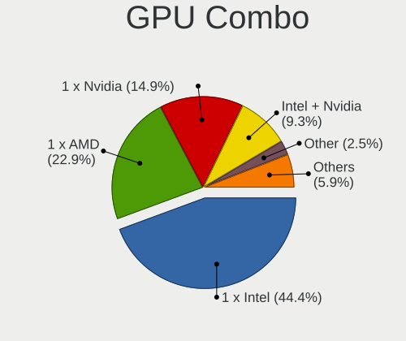

| Name           | Computers | Percent |
|----------------|-----------|---------|
| 1 x Intel      | 209       | 44.37%  |
| 1 x AMD        | 108       | 22.93%  |
| 1 x Nvidia     | 70        | 14.86%  |
| Intel + Nvidia | 44        | 9.34%   |
| Other          | 12        | 2.55%   |
| Intel + AMD    | 11        | 2.34%   |
| AMD + Nvidia   | 9         | 1.91%   |
| 2 x AMD        | 4         | 0.85%   |
| 2 x Nvidia     | 1         | 0.21%   |
| 1 x Matrox     | 1         | 0.21%   |
| 1 x ASPEED     | 1         | 0.21%   |
| AMD + ASPEED   | 1         | 0.21%   |

GPU Driver
----------

Free vs proprietary

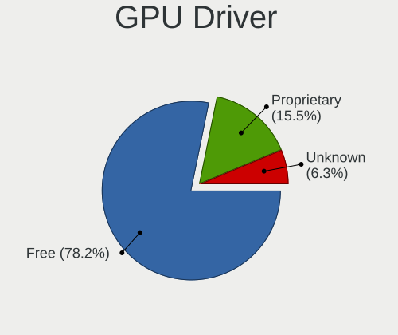

| Driver      | Computers | Percent |
|-------------|-----------|---------|
| Free        | 373       | 78.2%   |
| Proprietary | 74        | 15.51%  |
| Unknown     | 30        | 6.29%   |

GPU Memory
----------

Total video memory

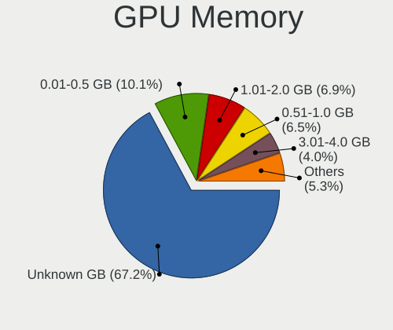

| Size in GB | Computers | Percent |
|------------|-----------|---------|
| Unknown    | 319       | 67.16%  |
| 0.01-0.5   | 48        | 10.11%  |
| 1.01-2.0   | 33        | 6.95%   |
| 0.51-1.0   | 31        | 6.53%   |
| 3.01-4.0   | 19        | 4%      |
| 5.01-6.0   | 11        | 2.32%   |
| 7.01-8.0   | 7         | 1.47%   |
| 16.01-24.0 | 3         | 0.63%   |
| 8.01-16.0  | 3         | 0.63%   |
| 2.01-3.0   | 1         | 0.21%   |

Monitor
-------

Monitor Vendor
--------------

Monitor vendors

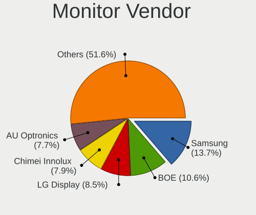

| Vendor                  | Computers | Percent |
|-------------------------|-----------|---------|
| Samsung Electronics     | 71        | 13.68%  |
| BOE                     | 55        | 10.6%   |
| LG Display              | 44        | 8.48%   |
| Chimei Innolux          | 41        | 7.9%    |
| AU Optronics            | 40        | 7.71%   |
| Goldstar                | 30        | 5.78%   |
| Dell                    | 28        | 5.39%   |
| Hewlett-Packard         | 20        | 3.85%   |
| Philips                 | 18        | 3.47%   |
| Acer                    | 15        | 2.89%   |
| Iiyama                  | 14        | 2.7%    |
| BenQ                    | 13        | 2.5%    |
| Lenovo                  | 11        | 2.12%   |
| Apple                   | 10        | 1.93%   |
| Ancor Communications    | 10        | 1.93%   |
| AOC                     | 9         | 1.73%   |
| Sharp                   | 7         | 1.35%   |
| PANDA                   | 6         | 1.16%   |
| Sony                    | 5         | 0.96%   |
| ViewSonic               | 4         | 0.77%   |
| Chi Mei Optoelectronics | 4         | 0.77%   |
| CSO                     | 3         | 0.58%   |
| Vizio                   | 2         | 0.39%   |
| Unknown (XXX)           | 2         | 0.39%   |
| Toshiba                 | 2         | 0.39%   |
| Sceptre Tech            | 2         | 0.39%   |
| Panasonic               | 2         | 0.39%   |
| Packard Bell            | 2         | 0.39%   |
| NEC Computers           | 2         | 0.39%   |
| LG Philips              | 2         | 0.39%   |
| CS_                     | 2         | 0.39%   |
| ASUSTek Computer        | 2         | 0.39%   |
| Westinghouse            | 1         | 0.19%   |
| VMO                     | 1         | 0.19%   |
| Vita                    | 1         | 0.19%   |
| Unknown                 | 1         | 0.19%   |
| UGD                     | 1         | 0.19%   |
| SNC                     | 1         | 0.19%   |
| SKG                     | 1         | 0.19%   |
| SGX                     | 1         | 0.19%   |

Monitor Model
-------------

Monitor models

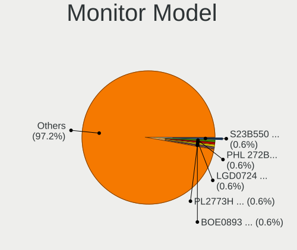

| Model                                                                | Computers | Percent |
|----------------------------------------------------------------------|-----------|---------|
| Samsung Electronics S23B550 SAM0919 1920x1080 510x287mm 23.0-inch    | 3         | 0.56%   |
| Philips PHL 272B8Q PHL0918 2560x1440 597x336mm 27.0-inch             | 3         | 0.56%   |
| LG Display LCD Monitor LGD0724 1920x1080 309x174mm 14.0-inch         | 3         | 0.56%   |
| Iiyama PL2773H IVM660A 1920x1080 598x336mm 27.0-inch                 | 3         | 0.56%   |
| BOE LCD Monitor BOE0893 2160x1440 296x197mm 14.0-inch                | 3         | 0.56%   |
| AU Optronics LCD Monitor AUO23ED 1920x1080 344x193mm 15.5-inch       | 3         | 0.56%   |
| Sony Nvidia Defaul t Flat Panel SNY05FA 1366x768 309x174mm 14.0-inch | 2         | 0.38%   |
| Samsung Electronics SyncMaster SAM01E1 1280x1024 376x301mm 19.0-inch | 2         | 0.38%   |
| Samsung Electronics S22F350 SAM0D1A 1920x1080 477x268mm 21.5-inch    | 2         | 0.38%   |
| Samsung Electronics S22D300 SAM0B3F 1920x1080 477x268mm 21.5-inch    | 2         | 0.38%   |
| Samsung Electronics LCD Monitor SEC3451 1366x768 344x194mm 15.5-inch | 2         | 0.38%   |
| Samsung Electronics LCD Monitor SDC4A51 1366x768 344x194mm 15.5-inch | 2         | 0.38%   |
| Samsung Electronics C27F398 SAM0D44 1920x1080 598x336mm 27.0-inch    | 2         | 0.38%   |
| LG Display LCD Monitor LGD062C 1920x1080 309x174mm 14.0-inch         | 2         | 0.38%   |
| LG Display LCD Monitor LGD05E5 1920x1080 344x194mm 15.5-inch         | 2         | 0.38%   |
| Lenovo LCD Monitor LEN40B0 1366x768 344x194mm 15.5-inch              | 2         | 0.38%   |
| Goldstar LG IPS FULLHD GSM5AB8 1920x1080 480x270mm 21.7-inch         | 2         | 0.38%   |
| Goldstar FULL HD GSM5B55 1920x1080 480x270mm 21.7-inch               | 2         | 0.38%   |
| Goldstar E2240 GSM57A3 1920x1080 477x268mm 21.5-inch                 | 2         | 0.38%   |
| Dell U2715H DELD066 2560x1440 597x336mm 27.0-inch                    | 2         | 0.38%   |
| Dell SE2717H/HX DELD0A1 1920x1080 598x336mm 27.0-inch                | 2         | 0.38%   |
| Dell P2417H DELA0DB 1920x1080 527x296mm 23.8-inch                    | 2         | 0.38%   |
| CS_ LCD Monitor CS_5211 1920x1080 527x296mm 23.8-inch                | 2         | 0.38%   |
| Chimei Innolux LCD Monitor CMN15F5 1920x1080 344x193mm 15.5-inch     | 2         | 0.38%   |
| Chimei Innolux LCD Monitor CMN15DC 1366x768 344x193mm 15.5-inch      | 2         | 0.38%   |
| Chimei Innolux LCD Monitor CMN15C9 1366x768 344x193mm 15.5-inch      | 2         | 0.38%   |
| Chimei Innolux LCD Monitor CMN14D6 1366x768 309x173mm 13.9-inch      | 2         | 0.38%   |
| Chimei Innolux LCD Monitor CMN14D4 1920x1080 309x173mm 13.9-inch     | 2         | 0.38%   |
| Chimei Innolux LCD Monitor CMN14B1 1920x1080 308x173mm 13.9-inch     | 2         | 0.38%   |
| BOE LCD Monitor BOE0974 2560x1440 344x194mm 15.5-inch                | 2         | 0.38%   |
| BOE LCD Monitor BOE0872 1920x1080 344x194mm 15.5-inch                | 2         | 0.38%   |
| BOE LCD Monitor BOE0852 1920x1080 344x194mm 15.5-inch                | 2         | 0.38%   |
| BOE LCD Monitor BOE0812 1920x1080 344x194mm 15.5-inch                | 2         | 0.38%   |
| BOE LCD Monitor BOE07BB 1920x1080 309x173mm 13.9-inch                | 2         | 0.38%   |
| BOE LCD Monitor BOE0713 1920x1080 344x193mm 15.5-inch                | 2         | 0.38%   |
| BOE LCD Monitor BOE0672 1366x768 344x194mm 15.5-inch                 | 2         | 0.38%   |
| AU Optronics LCD Monitor AUO235C 1366x768 256x144mm 11.6-inch        | 2         | 0.38%   |
| AU Optronics LCD Monitor AUO21ED 1920x1080 344x193mm 15.5-inch       | 2         | 0.38%   |
| AU Optronics LCD Monitor AUO213E 1600x900 309x174mm 14.0-inch        | 2         | 0.38%   |
| AU Optronics LCD Monitor AUO119E 1600x900 382x214mm 17.2-inch        | 2         | 0.38%   |

Monitor Resolution
------------------

Monitor screen resolution

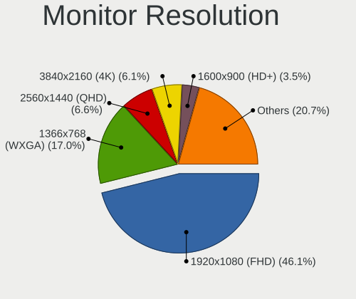

| Resolution         | Computers | Percent |
|--------------------|-----------|---------|
| 1920x1080 (FHD)    | 225       | 46.11%  |
| 1366x768 (WXGA)    | 83        | 17.01%  |
| 2560x1440 (QHD)    | 32        | 6.56%   |
| 3840x2160 (4K)     | 30        | 6.15%   |
| 1600x900 (HD+)     | 17        | 3.48%   |
| 1280x1024 (SXGA)   | 15        | 3.07%   |
| 1440x900 (WXGA+)   | 11        | 2.25%   |
| 1280x800 (WXGA)    | 11        | 2.25%   |
| 1680x1050 (WSXGA+) | 10        | 2.05%   |
| 1920x1200 (WUXGA)  | 9         | 1.84%   |
| 2560x1600          | 7         | 1.43%   |
| 3440x1440          | 6         | 1.23%   |
| 3840x2400          | 4         | 0.82%   |
| Unknown            | 4         | 0.82%   |
| 2560x1080          | 3         | 0.61%   |
| 2160x1440          | 3         | 0.61%   |
| 1920x1280          | 3         | 0.61%   |
| 3840x1080          | 2         | 0.41%   |
| 1360x768           | 2         | 0.41%   |
| 4480x1440          | 1         | 0.2%    |
| 3840x1600          | 1         | 0.2%    |
| 3840x1200          | 1         | 0.2%    |
| 3200x1800 (QHD+)   | 1         | 0.2%    |
| 2880x1800          | 1         | 0.2%    |
| 2880x1620          | 1         | 0.2%    |
| 1920x540           | 1         | 0.2%    |
| 1680x945           | 1         | 0.2%    |
| 1280x960           | 1         | 0.2%    |
| 1280x720 (HD)      | 1         | 0.2%    |
| 1024x768 (XGA)     | 1         | 0.2%    |

Monitor Diagonal
----------------

Diagonal size in inches

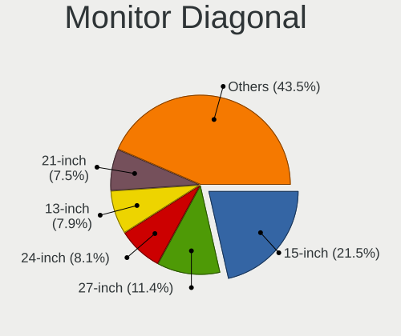

| Inches  | Computers | Percent |
|---------|-----------|---------|
| 15      | 111       | 21.47%  |
| 27      | 59        | 11.41%  |
| 24      | 42        | 8.12%   |
| 13      | 41        | 7.93%   |
| 21      | 39        | 7.54%   |
| 14      | 39        | 7.54%   |
| 17      | 30        | 5.8%    |
| 23      | 27        | 5.22%   |
| 31      | 17        | 3.29%   |
| Unknown | 15        | 2.9%    |
| 19      | 13        | 2.51%   |
| 12      | 11        | 2.13%   |
| 34      | 10        | 1.93%   |
| 16      | 8         | 1.55%   |
| 22      | 6         | 1.16%   |
| 18      | 6         | 1.16%   |
| 11      | 6         | 1.16%   |
| 84      | 4         | 0.77%   |
| 54      | 4         | 0.77%   |
| 32      | 4         | 0.77%   |
| 40      | 3         | 0.58%   |
| 26      | 3         | 0.58%   |
| 72      | 2         | 0.39%   |
| 46      | 2         | 0.39%   |
| 38      | 2         | 0.39%   |
| 28      | 2         | 0.39%   |
| 25      | 2         | 0.39%   |
| 20      | 2         | 0.39%   |
| 10      | 2         | 0.39%   |
| 74      | 1         | 0.19%   |
| 63      | 1         | 0.19%   |
| 42      | 1         | 0.19%   |
| 36      | 1         | 0.19%   |
| 33      | 1         | 0.19%   |

Monitor Width
-------------

Physical width

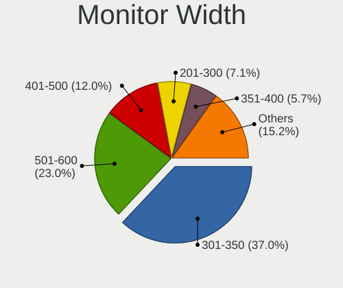

| Width in mm | Computers | Percent |
|-------------|-----------|---------|
| 301-350     | 188       | 37.01%  |
| 501-600     | 117       | 23.03%  |
| 401-500     | 61        | 12.01%  |
| 201-300     | 36        | 7.09%   |
| 351-400     | 29        | 5.71%   |
| 601-700     | 26        | 5.12%   |
| 701-800     | 16        | 3.15%   |
| Unknown     | 15        | 2.95%   |
| 1501-2000   | 7         | 1.38%   |
| 1001-1500   | 7         | 1.38%   |
| 801-900     | 5         | 0.98%   |
| 901-1000    | 1         | 0.2%    |

Aspect Ratio
------------

Proportional relationship between the width and the height

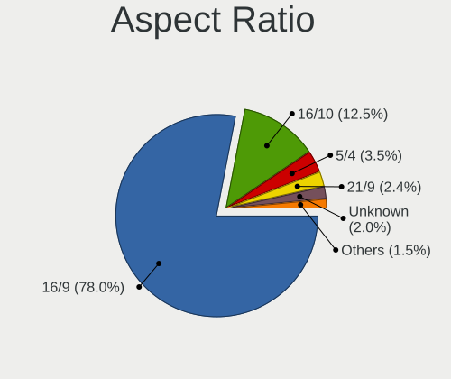

| Ratio   | Computers | Percent |
|---------|-----------|---------|
| 16/9    | 355       | 78.02%  |
| 16/10   | 57        | 12.53%  |
| 5/4     | 16        | 3.52%   |
| 21/9    | 11        | 2.42%   |
| Unknown | 9         | 1.98%   |
| 3/2     | 6         | 1.32%   |
| 4/3     | 1         | 0.22%   |

Monitor Area
------------

Area in inch²

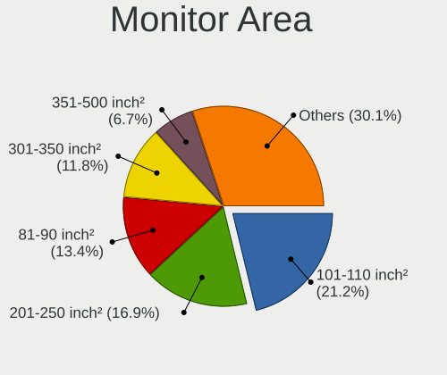

| Area in inch² | Computers | Percent |
|----------------|-----------|---------|
| 101-110        | 108       | 21.22%  |
| 201-250        | 86        | 16.9%   |
| 81-90          | 68        | 13.36%  |
| 301-350        | 60        | 11.79%  |
| 351-500        | 34        | 6.68%   |
| 151-200        | 25        | 4.91%   |
| 121-130        | 18        | 3.54%   |
| 251-300        | 16        | 3.14%   |
| Unknown        | 15        | 2.95%   |
| 141-150        | 13        | 2.55%   |
| More than 1000 | 12        | 2.36%   |
| 71-80          | 12        | 2.36%   |
| 61-70          | 11        | 2.16%   |
| 501-1000       | 9         | 1.77%   |
| 51-60          | 7         | 1.38%   |
| 111-120        | 7         | 1.38%   |
| 131-140        | 4         | 0.79%   |
| 91-100         | 3         | 0.59%   |
| 41-50          | 1         | 0.2%    |

Pixel Density
-------------

Pixels per inch

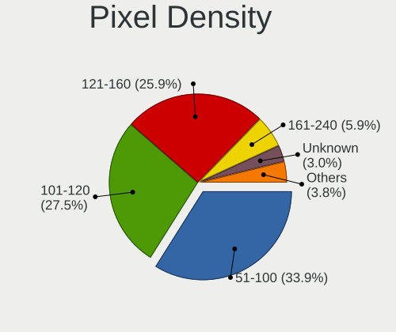

| Density       | Computers | Percent |
|---------------|-----------|---------|
| 51-100        | 168       | 33.94%  |
| 101-120       | 136       | 27.47%  |
| 121-160       | 128       | 25.86%  |
| 161-240       | 29        | 5.86%   |
| Unknown       | 15        | 3.03%   |
| 1-50          | 13        | 2.63%   |
| More than 240 | 6         | 1.21%   |

Multiple Monitors
-----------------

Total monitors connected

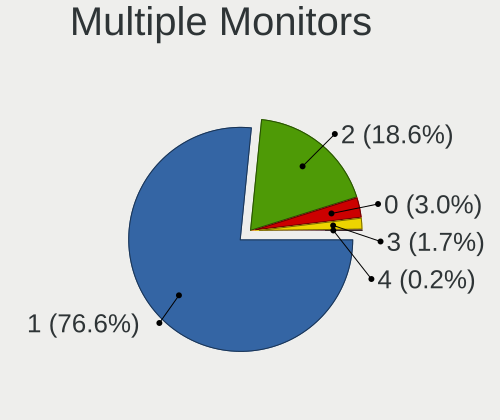

| Total | Computers | Percent |
|-------|-----------|---------|
| 1     | 363       | 76.58%  |
| 2     | 88        | 18.57%  |
| 0     | 14        | 2.95%   |
| 3     | 8         | 1.69%   |
| 4     | 1         | 0.21%   |

Network
-------

Net Controller Vendor
---------------------

Controller vendors

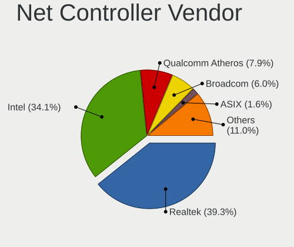

| Vendor                            | Computers | Percent |
|-----------------------------------|-----------|---------|
| Realtek Semiconductor             | 267       | 39.26%  |
| Intel                             | 232       | 34.12%  |
| Qualcomm Atheros                  | 54        | 7.94%   |
| Broadcom                          | 41        | 6.03%   |
| ASIX Electronics                  | 11        | 1.62%   |
| MediaTek                          | 10        | 1.47%   |
| TP-Link                           | 7         | 1.03%   |
| Ralink                            | 7         | 1.03%   |
| Marvell Technology Group          | 5         | 0.74%   |
| Ralink Technology                 | 4         | 0.59%   |
| Broadcom Limited                  | 4         | 0.59%   |
| Qualcomm Atheros Communications   | 3         | 0.44%   |
| Nvidia                            | 3         | 0.44%   |
| Ericsson Business Mobile Networks | 3         | 0.44%   |
| Xiaomi                            | 2         | 0.29%   |
| Sierra Wireless                   | 2         | 0.29%   |
| Samsung Electronics               | 2         | 0.29%   |
| Microchip Technology              | 2         | 0.29%   |
| JMicron Technology                | 2         | 0.29%   |
| Hewlett-Packard                   | 2         | 0.29%   |
| DisplayLink                       | 2         | 0.29%   |
| ZyDAS                             | 1         | 0.15%   |
| Realtek                           | 1         | 0.15%   |
| Raspberry Pi                      | 1         | 0.15%   |
| Quectel Wireless Solutions        | 1         | 0.15%   |
| Qualcomm Technologies             | 1         | 0.15%   |
| Prolific Technology               | 1         | 0.15%   |
| NetXen Incorporated               | 1         | 0.15%   |
| NetGear                           | 1         | 0.15%   |
| Motorola PCS                      | 1         | 0.15%   |
| Lenovo                            | 1         | 0.15%   |
| Dell                              | 1         | 0.15%   |
| D-Link System                     | 1         | 0.15%   |
| AVM                               | 1         | 0.15%   |
| ASUSTek Computer                  | 1         | 0.15%   |
| Aquantia                          | 1         | 0.15%   |

Net Controller Model
--------------------

Controller models

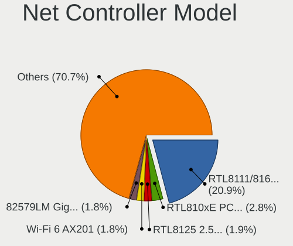

| Model                                                                  | Computers | Percent |
|------------------------------------------------------------------------|-----------|---------|
| Realtek RTL8111/8168/8211/8411 PCI Express Gigabit Ethernet Controller | 172       | 20.9%   |
| Realtek RTL810xE PCI Express Fast Ethernet controller                  | 23        | 2.79%   |
| Realtek RTL8125 2.5GbE Controller                                      | 16        | 1.94%   |
| Intel Wi-Fi 6 AX201                                                    | 15        | 1.82%   |
| Intel 82579LM Gigabit Network Connection (Lewisville)                  | 15        | 1.82%   |
| Intel Wireless 8265 / 8275                                             | 14        | 1.7%    |
| Intel Wi-Fi 6 AX200                                                    | 14        | 1.7%    |
| Realtek RTL8821CE 802.11ac PCIe Wireless Network Adapter               | 13        | 1.58%   |
| Realtek RTL8153 Gigabit Ethernet Adapter                               | 12        | 1.46%   |
| Intel Ethernet Controller I225-V                                       | 12        | 1.46%   |
| Realtek RTL8822CE 802.11ac PCIe Wireless Network Adapter               | 11        | 1.34%   |
| Intel Wireless 7260                                                    | 11        | 1.34%   |
| Intel Comet Lake PCH-LP CNVi WiFi                                      | 11        | 1.34%   |
| ASIX AX88179 Gigabit Ethernet                                          | 11        | 1.34%   |
| Realtek 802.11ac NIC                                                   | 10        | 1.22%   |
| Qualcomm Atheros QCA9565 / AR9565 Wireless Network Adapter             | 10        | 1.22%   |
| Intel Wireless 7265                                                    | 10        | 1.22%   |
| Qualcomm Atheros AR9485 Wireless Network Adapter                       | 9         | 1.09%   |
| Intel Wi-Fi 6E(802.11ax) AX210/AX1675* 2x2 [Typhoon Peak]              | 9         | 1.09%   |
| Realtek RTL8723BE PCIe Wireless Network Adapter                        | 8         | 0.97%   |
| Qualcomm Atheros QCA9377 802.11ac Wireless Network Adapter             | 7         | 0.85%   |
| Intel Wireless 8260                                                    | 7         | 0.85%   |
| Intel Ethernet Connection I217-LM                                      | 7         | 0.85%   |
| Intel Ethernet Connection (2) I219-V                                   | 7         | 0.85%   |
| Intel Centrino Advanced-N 6205 [Taylor Peak]                           | 7         | 0.85%   |
| Intel Cannon Point-LP CNVi [Wireless-AC]                               | 7         | 0.85%   |
| Broadcom BCM43142 802.11b/g/n                                          | 7         | 0.85%   |
| Realtek RTL8822BE 802.11a/b/g/n/ac WiFi adapter                        | 6         | 0.73%   |
| Realtek RTL8188EUS 802.11n Wireless Network Adapter                    | 6         | 0.73%   |
| Qualcomm Atheros AR9285 Wireless Network Adapter (PCI-Express)         | 6         | 0.73%   |
| Intel Wireless 3165                                                    | 6         | 0.73%   |
| Intel Tiger Lake PCH CNVi WiFi                                         | 6         | 0.73%   |
| Intel I211 Gigabit Network Connection                                  | 6         | 0.73%   |
| Ralink RT3290 Wireless 802.11n 1T/1R PCIe                              | 5         | 0.61%   |
| Intel Wireless 3160                                                    | 5         | 0.61%   |
| Intel Gemini Lake PCH CNVi WiFi                                        | 5         | 0.61%   |
| Intel Ethernet Connection (2) I219-LM                                  | 5         | 0.61%   |
| Intel Comet Lake PCH CNVi WiFi                                         | 5         | 0.61%   |
| Realtek RTL8852BE PCIe 802.11ax Wireless Network Controller            | 4         | 0.49%   |
| Realtek RTL8152 Fast Ethernet Adapter                                  | 4         | 0.49%   |

Wireless Vendor
---------------

Wireless vendors

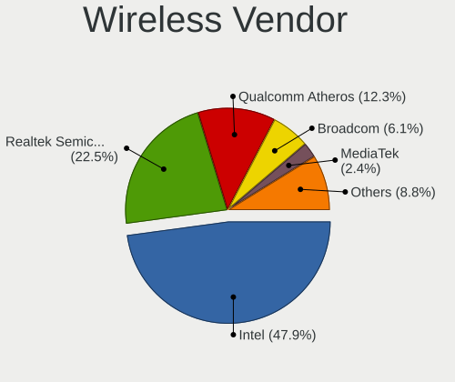

| Vendor                          | Computers | Percent |
|---------------------------------|-----------|---------|
| Intel                           | 179       | 47.86%  |
| Realtek Semiconductor           | 84        | 22.46%  |
| Qualcomm Atheros                | 46        | 12.3%   |
| Broadcom                        | 23        | 6.15%   |
| MediaTek                        | 9         | 2.41%   |
| TP-Link                         | 7         | 1.87%   |
| Ralink                          | 7         | 1.87%   |
| Ralink Technology               | 4         | 1.07%   |
| Qualcomm Atheros Communications | 3         | 0.8%    |
| Sierra Wireless                 | 2         | 0.53%   |
| Broadcom Limited                | 2         | 0.53%   |
| ZyDAS                           | 1         | 0.27%   |
| Realtek                         | 1         | 0.27%   |
| Quectel Wireless Solutions      | 1         | 0.27%   |
| NetGear                         | 1         | 0.27%   |
| Dell                            | 1         | 0.27%   |
| D-Link System                   | 1         | 0.27%   |
| AVM                             | 1         | 0.27%   |
| ASUSTek Computer                | 1         | 0.27%   |

Wireless Model
--------------

Wireless models

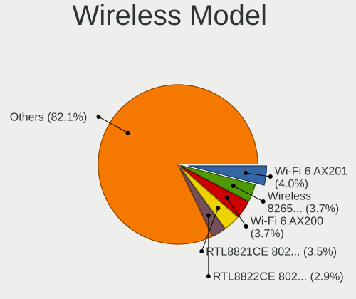

| Model                                                                   | Computers | Percent |
|-------------------------------------------------------------------------|-----------|---------|
| Intel Wi-Fi 6 AX201                                                     | 15        | 4%      |
| Intel Wireless 8265 / 8275                                              | 14        | 3.73%   |
| Intel Wi-Fi 6 AX200                                                     | 14        | 3.73%   |
| Realtek RTL8821CE 802.11ac PCIe Wireless Network Adapter                | 13        | 3.47%   |
| Realtek RTL8822CE 802.11ac PCIe Wireless Network Adapter                | 11        | 2.93%   |
| Intel Wireless 7260                                                     | 11        | 2.93%   |
| Intel Comet Lake PCH-LP CNVi WiFi                                       | 11        | 2.93%   |
| Realtek 802.11ac NIC                                                    | 10        | 2.67%   |
| Qualcomm Atheros QCA9565 / AR9565 Wireless Network Adapter              | 10        | 2.67%   |
| Intel Wireless 7265                                                     | 10        | 2.67%   |
| Qualcomm Atheros AR9485 Wireless Network Adapter                        | 9         | 2.4%    |
| Intel Wi-Fi 6E(802.11ax) AX210/AX1675* 2x2 [Typhoon Peak]               | 9         | 2.4%    |
| Realtek RTL8723BE PCIe Wireless Network Adapter                         | 8         | 2.13%   |
| Qualcomm Atheros QCA9377 802.11ac Wireless Network Adapter              | 7         | 1.87%   |
| Intel Wireless 8260                                                     | 7         | 1.87%   |
| Intel Centrino Advanced-N 6205 [Taylor Peak]                            | 7         | 1.87%   |
| Intel Cannon Point-LP CNVi [Wireless-AC]                                | 7         | 1.87%   |
| Broadcom BCM43142 802.11b/g/n                                           | 7         | 1.87%   |
| Realtek RTL8822BE 802.11a/b/g/n/ac WiFi adapter                         | 6         | 1.6%    |
| Realtek RTL8188EUS 802.11n Wireless Network Adapter                     | 6         | 1.6%    |
| Qualcomm Atheros AR9285 Wireless Network Adapter (PCI-Express)          | 6         | 1.6%    |
| Intel Wireless 3165                                                     | 6         | 1.6%    |
| Intel Tiger Lake PCH CNVi WiFi                                          | 6         | 1.6%    |
| Ralink RT3290 Wireless 802.11n 1T/1R PCIe                               | 5         | 1.33%   |
| Intel Wireless 3160                                                     | 5         | 1.33%   |
| Intel Gemini Lake PCH CNVi WiFi                                         | 5         | 1.33%   |
| Intel Comet Lake PCH CNVi WiFi                                          | 5         | 1.33%   |
| Realtek RTL8852BE PCIe 802.11ax Wireless Network Controller             | 4         | 1.07%   |
| Qualcomm Atheros AR928X Wireless Network Adapter (PCI-Express)          | 4         | 1.07%   |
| Intel WiFi Link 5100                                                    | 4         | 1.07%   |
| Intel Dual Band Wireless-AC 3168NGW [Stone Peak]                        | 4         | 1.07%   |
| Intel Centrino Wireless-N 2230                                          | 4         | 1.07%   |
| TP-Link AC600 wireless Realtek RTL8811AU [Archer T2U Nano]              | 3         | 0.8%    |
| Realtek RTL8812AE 802.11ac PCIe Wireless Network Adapter                | 3         | 0.8%    |
| Realtek RTL8188EE Wireless Network Adapter                              | 3         | 0.8%    |
| Realtek RTL8188CE 802.11b/g/n WiFi Adapter                              | 3         | 0.8%    |
| Ralink MT7601U Wireless Adapter                                         | 3         | 0.8%    |
| Qualcomm Atheros AR9271 802.11n                                         | 3         | 0.8%    |
| Qualcomm Atheros AR242x / AR542x Wireless Network Adapter (PCI-Express) | 3         | 0.8%    |
| MediaTek MT7922 802.11ax PCI Express Wireless Network Adapter           | 3         | 0.8%    |

Ethernet Vendor
---------------

Ethernet vendors

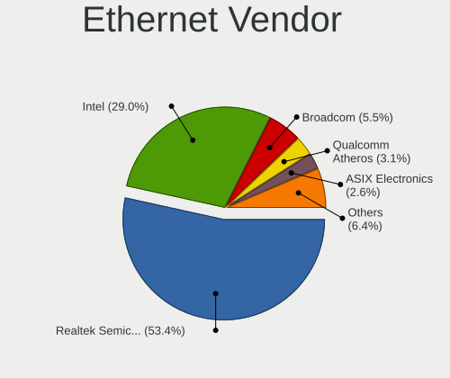

| Vendor                   | Computers | Percent |
|--------------------------|-----------|---------|
| Realtek Semiconductor    | 225       | 53.44%  |
| Intel                    | 122       | 28.98%  |
| Broadcom                 | 23        | 5.46%   |
| Qualcomm Atheros         | 13        | 3.09%   |
| ASIX Electronics         | 11        | 2.61%   |
| Marvell Technology Group | 5         | 1.19%   |
| Nvidia                   | 3         | 0.71%   |
| Xiaomi                   | 2         | 0.48%   |
| Samsung Electronics      | 2         | 0.48%   |
| Microchip Technology     | 2         | 0.48%   |
| JMicron Technology       | 2         | 0.48%   |
| DisplayLink              | 2         | 0.48%   |
| Broadcom Limited         | 2         | 0.48%   |
| Qualcomm Technologies    | 1         | 0.24%   |
| NetXen Incorporated      | 1         | 0.24%   |
| Motorola PCS             | 1         | 0.24%   |
| MediaTek                 | 1         | 0.24%   |
| Lenovo                   | 1         | 0.24%   |
| Hewlett-Packard          | 1         | 0.24%   |
| Aquantia                 | 1         | 0.24%   |

Ethernet Model
--------------

Ethernet models

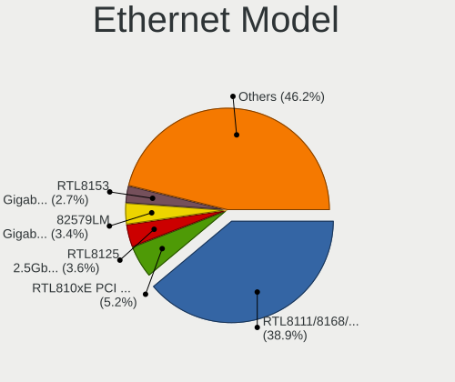

| Model                                                                          | Computers | Percent |
|--------------------------------------------------------------------------------|-----------|---------|
| Realtek RTL8111/8168/8211/8411 PCI Express Gigabit Ethernet Controller         | 172       | 38.91%  |
| Realtek RTL810xE PCI Express Fast Ethernet controller                          | 23        | 5.2%    |
| Realtek RTL8125 2.5GbE Controller                                              | 16        | 3.62%   |
| Intel 82579LM Gigabit Network Connection (Lewisville)                          | 15        | 3.39%   |
| Realtek RTL8153 Gigabit Ethernet Adapter                                       | 12        | 2.71%   |
| Intel Ethernet Controller I225-V                                               | 12        | 2.71%   |
| ASIX AX88179 Gigabit Ethernet                                                  | 11        | 2.49%   |
| Intel Ethernet Connection I217-LM                                              | 7         | 1.58%   |
| Intel Ethernet Connection (2) I219-V                                           | 7         | 1.58%   |
| Intel I211 Gigabit Network Connection                                          | 6         | 1.36%   |
| Intel Ethernet Connection (2) I219-LM                                          | 5         | 1.13%   |
| Realtek RTL8152 Fast Ethernet Adapter                                          | 4         | 0.9%    |
| Intel Ethernet Connection I218-LM                                              | 4         | 0.9%    |
| Intel Ethernet Connection (5) I219-LM                                          | 4         | 0.9%    |
| Intel Ethernet Connection (13) I219-V                                          | 4         | 0.9%    |
| Broadcom NetXtreme BCM5764M Gigabit Ethernet PCIe                              | 4         | 0.9%    |
| Intel I210 Gigabit Network Connection                                          | 3         | 0.68%   |
| Intel Ethernet Connection I219-LM                                              | 3         | 0.68%   |
| Intel Ethernet Connection (7) I219-V                                           | 3         | 0.68%   |
| Intel Ethernet Connection (7) I219-LM                                          | 3         | 0.68%   |
| Intel Ethernet Connection (6) I219-V                                           | 3         | 0.68%   |
| Intel Ethernet Connection (4) I219-V                                           | 3         | 0.68%   |
| Intel Ethernet Connection (3) I218-LM                                          | 3         | 0.68%   |
| Intel Ethernet Connection (2) I218-V                                           | 3         | 0.68%   |
| Intel Ethernet Connection (10) I219-V                                          | 3         | 0.68%   |
| Intel 82579V Gigabit Network Connection                                        | 3         | 0.68%   |
| Intel 82574L Gigabit Network Connection                                        | 3         | 0.68%   |
| Intel 82567LM-3 Gigabit Network Connection                                     | 3         | 0.68%   |
| Intel 82567LM Gigabit Network Connection                                       | 3         | 0.68%   |
| Broadcom NetXtreme BCM57765 Gigabit Ethernet PCIe                              | 3         | 0.68%   |
| Broadcom NetLink BCM57781 Gigabit Ethernet PCIe                                | 3         | 0.68%   |
| Xiaomi Mi/Redmi series (RNDIS)                                                 | 2         | 0.45%   |
| Samsung Galaxy series, misc. (tethering mode)                                  | 2         | 0.45%   |
| Realtek RTL8111/8168/8411 PCI Express Gigabit Ethernet Controller              | 2         | 0.45%   |
| Realtek RTL-8100/8101L/8139 PCI Fast Ethernet Adapter                          | 2         | 0.45%   |
| Qualcomm Atheros QCA8172 Fast Ethernet                                         | 2         | 0.45%   |
| Qualcomm Atheros AR8161 Gigabit Ethernet                                       | 2         | 0.45%   |
| Qualcomm Atheros AR8151 v2.0 Gigabit Ethernet                                  | 2         | 0.45%   |
| Nvidia MCP79 Ethernet                                                          | 2         | 0.45%   |
| Marvell Group Yukon Optima 88E8059 [PCIe Gigabit Ethernet Controller with AVB] | 2         | 0.45%   |

Net Controller Kind
-------------------

Ethernet, WiFi or modem

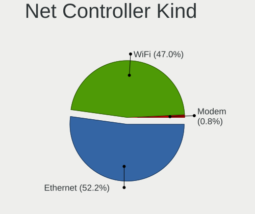

| Kind     | Computers | Percent |
|----------|-----------|---------|
| Ethernet | 394       | 52.19%  |
| WiFi     | 355       | 47.02%  |
| Modem    | 6         | 0.79%   |

Used Controller
---------------

Currently used network controller

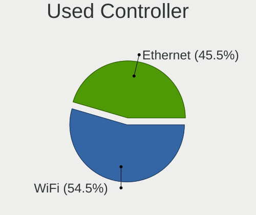

| Kind     | Computers | Percent |
|----------|-----------|---------|
| WiFi     | 265       | 54.53%  |
| Ethernet | 221       | 45.47%  |

NICs
----

Total network controllers on board

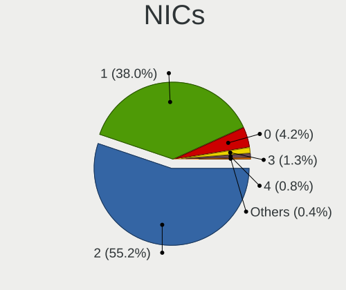

| Total | Computers | Percent |
|-------|-----------|---------|
| 2     | 260       | 55.2%   |
| 1     | 179       | 38%     |
| 0     | 20        | 4.25%   |
| 3     | 6         | 1.27%   |
| 4     | 4         | 0.85%   |
| 6     | 1         | 0.21%   |
| 5     | 1         | 0.21%   |

IPv6
----

IPv6 vs IPv4

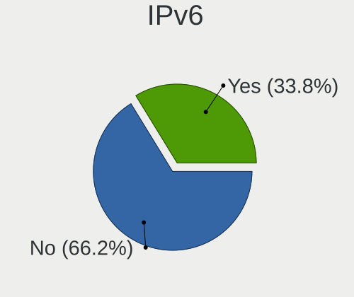

| Used | Computers | Percent |
|------|-----------|---------|
| No   | 318       | 66.25%  |
| Yes  | 162       | 33.75%  |

Bluetooth
---------

Bluetooth Vendor
----------------

Controller vendors

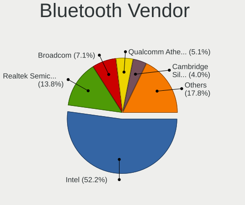

| Vendor                          | Computers | Percent |
|---------------------------------|-----------|---------|
| Intel                           | 155       | 52.19%  |
| Realtek Semiconductor           | 41        | 13.8%   |
| Broadcom                        | 21        | 7.07%   |
| Qualcomm Atheros Communications | 15        | 5.05%   |
| Cambridge Silicon Radio         | 12        | 4.04%   |
| IMC Networks                    | 10        | 3.37%   |
| Apple                           | 8         | 2.69%   |
| Foxconn / Hon Hai               | 7         | 2.36%   |
| Ralink                          | 5         | 1.68%   |
| MediaTek                        | 4         | 1.35%   |
| Toshiba                         | 3         | 1.01%   |
| Lite-On Technology              | 3         | 1.01%   |
| Hewlett-Packard                 | 3         | 1.01%   |
| TP-Link                         | 2         | 0.67%   |
| Integrated System Solution      | 2         | 0.67%   |
| Belkin Components               | 2         | 0.67%   |
| ASUSTek Computer                | 2         | 0.67%   |
| Realtek                         | 1         | 0.34%   |
| Foxconn International           | 1         | 0.34%   |

Bluetooth Model
---------------

Controller models

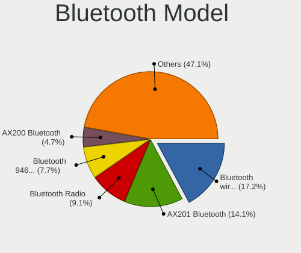

| Model                                                                               | Computers | Percent |
|-------------------------------------------------------------------------------------|-----------|---------|
| Intel Bluetooth wireless interface                                                  | 51        | 17.17%  |
| Intel AX201 Bluetooth                                                               | 42        | 14.14%  |
| Realtek Bluetooth Radio                                                             | 27        | 9.09%   |
| Intel Bluetooth 9460/9560 Jefferson Peak (JfP)                                      | 23        | 7.74%   |
| Intel AX200 Bluetooth                                                               | 14        | 4.71%   |
| Cambridge Silicon Radio Bluetooth Dongle (HCI mode)                                 | 12        | 4.04%   |
| Realtek  Bluetooth 4.2 Adapter                                                      | 8         | 2.69%   |
| Intel AX210 Bluetooth                                                               | 8         | 2.69%   |
| Qualcomm Atheros  Bluetooth Device                                                  | 6         | 2.02%   |
| Intel Centrino Bluetooth Wireless Transceiver                                       | 6         | 2.02%   |
| Ralink RT3290 Bluetooth                                                             | 5         | 1.68%   |
| IMC Networks Bluetooth Radio                                                        | 5         | 1.68%   |
| Qualcomm Atheros AR3012 Bluetooth 4.0                                               | 4         | 1.35%   |
| MediaTek Wireless_Device                                                            | 4         | 1.35%   |
| Intel Wireless-AC 3168 Bluetooth                                                    | 4         | 1.35%   |
| Realtek RTL8723B Bluetooth                                                          | 3         | 1.01%   |
| Qualcomm Atheros AR3011 Bluetooth                                                   | 3         | 1.01%   |
| Intel Bluetooth Device                                                              | 3         | 1.01%   |
| IMC Networks Wireless_Device                                                        | 3         | 1.01%   |
| HP Broadcom 2070 Bluetooth Combo                                                    | 3         | 1.01%   |
| Broadcom BCM20702 Bluetooth 4.0 [ThinkPad]                                          | 3         | 1.01%   |
| Broadcom BCM2045B (BDC-2.1) [Bluetooth Controller]                                  | 3         | 1.01%   |
| Apple Built-in Bluetooth 2.0+EDR HCI                                                | 3         | 1.01%   |
| Apple Bluetooth Host Controller                                                     | 3         | 1.01%   |
| TP-Link TP-T@- UB500 Adapter                                                        | 2         | 0.67%   |
| Toshiba Bluetooth Device                                                            | 2         | 0.67%   |
| Realtek RTL8822BE Bluetooth 4.2 Adapter                                             | 2         | 0.67%   |
| Lite-On Atheros AR3012 Bluetooth                                                    | 2         | 0.67%   |
| Intel Wireless-AC 9260 Bluetooth Adapter                                            | 2         | 0.67%   |
| Intel Centrino Advanced-N 6230 Bluetooth adapter                                    | 2         | 0.67%   |
| Integrated System Solution KY-BT100 Bluetooth Adapter                               | 2         | 0.67%   |
| IMC Networks Bluetooth Device                                                       | 2         | 0.67%   |
| Foxconn / Hon Hai Wireless_Device                                                   | 2         | 0.67%   |
| Foxconn / Hon Hai Foxconn T77H114 BCM2070 [Single-Chip Bluetooth 2.1 + EDR Adapter] | 2         | 0.67%   |
| Foxconn / Hon Hai Bluetooth Device                                                  | 2         | 0.67%   |
| Broadcom BCM92046DG-CL1ROM Bluetooth 2.1 Adapter                                    | 2         | 0.67%   |
| Broadcom BCM43142A0 Bluetooth Device                                                | 2         | 0.67%   |
| Broadcom BCM43142A0 Bluetooth 4.0                                                   | 2         | 0.67%   |
| Broadcom BCM2045B (BDC-2.1)                                                         | 2         | 0.67%   |
| Apple Bluetooth USB Host Controller                                                 | 2         | 0.67%   |

Sound
-----

Sound Vendor
------------

Sound card vendors

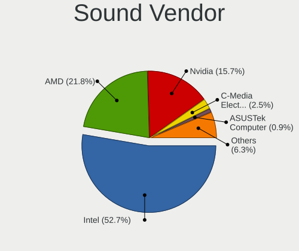

| Vendor                                       | Computers | Percent |
|----------------------------------------------|-----------|---------|
| Intel                                        | 333       | 52.69%  |
| AMD                                          | 138       | 21.84%  |
| Nvidia                                       | 99        | 15.66%  |
| C-Media Electronics                          | 16        | 2.53%   |
| ASUSTek Computer                             | 6         | 0.95%   |
| GN Netcom                                    | 4         | 0.63%   |
| Generalplus Technology                       | 4         | 0.63%   |
| Logitech                                     | 3         | 0.47%   |
| Kingston Technology                          | 3         | 0.47%   |
| JMTek                                        | 3         | 0.47%   |
| DSEA A/S                                     | 2         | 0.32%   |
| Cambridge Silicon Radio                      | 2         | 0.32%   |
| Zoran Co. Personal Media Division (Nogatech) | 1         | 0.16%   |
| Walmart                                      | 1         | 0.16%   |
| VIA Technologies                             | 1         | 0.16%   |
| Texas Instruments                            | 1         | 0.16%   |
| TerraTec Electronic                          | 1         | 0.16%   |
| Tenx Technology                              | 1         | 0.16%   |
| SteelSeries ApS                              | 1         | 0.16%   |
| Realtek Semiconductor                        | 1         | 0.16%   |
| Plantronics                                  | 1         | 0.16%   |
| ONN                                          | 1         | 0.16%   |
| Micro Star International                     | 1         | 0.16%   |
| Meizu                                        | 1         | 0.16%   |
| Lenovo                                       | 1         | 0.16%   |
| Jieli Technology                             | 1         | 0.16%   |
| Focusrite-Novation                           | 1         | 0.16%   |
| Creative Technology                          | 1         | 0.16%   |
| Corsair                                      | 1         | 0.16%   |
| ASRock                                       | 1         | 0.16%   |
| Alesis                                       | 1         | 0.16%   |

Sound Model
-----------

Sound card models

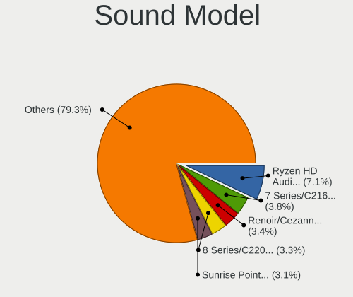

| Model                                                                                             | Computers | Percent |
|---------------------------------------------------------------------------------------------------|-----------|---------|
| AMD Ryzen HD Audio Controller                                                                     | 54        | 7.08%   |
| Intel 7 Series/C216 Chipset Family High Definition Audio Controller                               | 29        | 3.8%    |
| AMD Renoir/Cezanne HDMI/DP Audio Controller                                                       | 26        | 3.41%   |
| Intel 8 Series/C220 Series Chipset High Definition Audio Controller                               | 25        | 3.28%   |
| Intel Sunrise Point-LP HD Audio                                                                   | 24        | 3.15%   |
| Intel 6 Series/C200 Series Chipset Family High Definition Audio Controller                        | 24        | 3.15%   |
| Intel Xeon E3-1200 v3/4th Gen Core Processor HD Audio Controller                                  | 19        | 2.49%   |
| Intel Tiger Lake-LP Smart Sound Technology Audio Controller                                       | 19        | 2.49%   |
| AMD SBx00 Azalia (Intel HDA)                                                                      | 17        | 2.23%   |
| Intel Celeron/Pentium Silver Processor High Definition Audio                                      | 16        | 2.1%    |
| AMD Raven/Raven2/Fenghuang HDMI/DP Audio Controller                                               | 16        | 2.1%    |
| Intel Haswell-ULT HD Audio Controller                                                             | 15        | 1.97%   |
| Intel 8 Series HD Audio Controller                                                                | 15        | 1.97%   |
| AMD FCH Azalia Controller                                                                         | 14        | 1.83%   |
| Intel Cannon Lake PCH cAVS                                                                        | 13        | 1.7%    |
| Intel 82801I (ICH9 Family) HD Audio Controller                                                    | 13        | 1.7%    |
| Intel 5 Series/3400 Series Chipset High Definition Audio                                          | 13        | 1.7%    |
| AMD Kabini HDMI/DP Audio                                                                          | 13        | 1.7%    |
| Intel Tiger Lake-H HD Audio Controller                                                            | 12        | 1.57%   |
| Intel Comet Lake PCH-LP cAVS                                                                      | 11        | 1.44%   |
| Intel 200 Series PCH HD Audio                                                                     | 11        | 1.44%   |
| Nvidia GK208 HDMI/DP Audio Controller                                                             | 10        | 1.31%   |
| Nvidia GA106 High Definition Audio Controller                                                     | 9         | 1.18%   |
| Intel 100 Series/C230 Series Chipset Family HD Audio Controller                                   | 9         | 1.18%   |
| Nvidia TU107 GeForce GTX 1650 High Definition Audio Controller                                    | 8         | 1.05%   |
| Intel Cannon Point-LP High Definition Audio Controller                                            | 8         | 1.05%   |
| Intel Atom Processor Z36xxx/Z37xxx Series High Definition Audio Controller                        | 8         | 1.05%   |
| Intel Alder Lake-S HD Audio Controller                                                            | 8         | 1.05%   |
| AMD Family 17h (Models 00h-0fh) HD Audio Controller                                               | 8         | 1.05%   |
| Intel Wildcat Point-LP High Definition Audio Controller                                           | 7         | 0.92%   |
| Intel Broadwell-U Audio Controller                                                                | 7         | 0.92%   |
| AMD Starship/Matisse HD Audio Controller                                                          | 7         | 0.92%   |
| AMD Family 15h (Models 60h-6fh) Audio Controller                                                  | 7         | 0.92%   |
| Nvidia TU116 High Definition Audio Controller                                                     | 6         | 0.79%   |
| Nvidia GA104 High Definition Audio Controller                                                     | 6         | 0.79%   |
| Intel NM10/ICH7 Family High Definition Audio Controller                                           | 6         | 0.79%   |
| Intel Comet Lake PCH cAVS                                                                         | 6         | 0.79%   |
| Intel Atom/Celeron/Pentium Processor x5-E8000/J3xxx/N3xxx Series High Definition Audio Controller | 6         | 0.79%   |
| AMD Radeon High Definition Audio Controller                                                       | 6         | 0.79%   |
| Nvidia GP108 High Definition Audio Controller                                                     | 5         | 0.66%   |

Memory
------

Memory Vendor
-------------

Memory module vendors

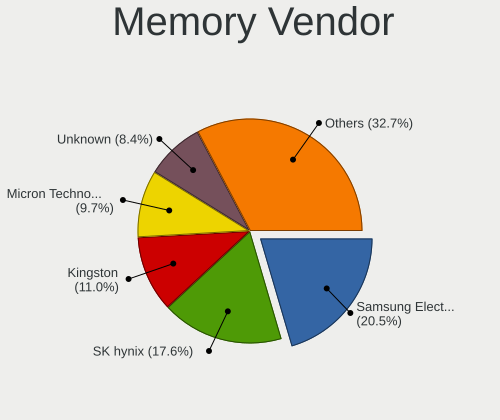

| Vendor              | Computers | Percent |
|---------------------|-----------|---------|
| Samsung Electronics | 80        | 20.46%  |
| SK hynix            | 69        | 17.65%  |
| Kingston            | 43        | 11%     |
| Micron Technology   | 38        | 9.72%   |
| Unknown             | 33        | 8.44%   |
| Crucial             | 29        | 7.42%   |
| Corsair             | 24        | 6.14%   |
| G.Skill             | 16        | 4.09%   |
| Unknown (ABCD)      | 13        | 3.32%   |
| Ramaxel Technology  | 8         | 2.05%   |
| Unknown             | 8         | 2.05%   |
| A-DATA Technology   | 6         | 1.53%   |
| Nanya Technology    | 4         | 1.02%   |
| Elpida              | 4         | 1.02%   |
| Team                | 3         | 0.77%   |
| Hewlett-Packard     | 2         | 0.51%   |
| GOODRAM             | 2         | 0.51%   |
| Unknown (0x7FFF)    | 1         | 0.26%   |
| Unifosa             | 1         | 0.26%   |
| Transcend           | 1         | 0.26%   |
| Teikon              | 1         | 0.26%   |
| Smart               | 1         | 0.26%   |
| OLOY                | 1         | 0.26%   |
| HBS                 | 1         | 0.26%   |
| Atermiter           | 1         | 0.26%   |
| AMD                 | 1         | 0.26%   |

Memory Model
------------

Memory module models

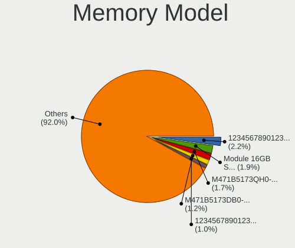

| Model                                                            | Computers | Percent |
|------------------------------------------------------------------|-----------|---------|
| Unknown (ABCD) RAM 123456789012345678 2GB SODIMM LPDDR4 2400MT/s | 9         | 2.18%   |
| Unknown                                                          | 8         | 1.94%   |
| Samsung RAM M471B5173QH0-YK0 4GB SODIMM DDR3 1600MT/s            | 7         | 1.69%   |
| Samsung RAM M471B5173DB0-YK0 4GB SODIMM DDR3 1600MT/s            | 5         | 1.21%   |
| Unknown (ABCD) RAM 123456789012345678 2GB DIMM LPDDR4 2133MT/s   | 4         | 0.97%   |
| Unknown RAM Module 2GB SODIMM DDR2 667MT/s                       | 3         | 0.73%   |
| SK hynix RAM HMT451S6BFR8A-PB 4GB SODIMM DDR3 1600MT/s           | 3         | 0.73%   |
| SK hynix RAM HMT451S6AFR8A-PB 4GB SODIMM DDR3 1600MT/s           | 3         | 0.73%   |
| SK hynix RAM HMAA1GS6CMR6N-VK 8GB SODIMM DDR4 2667MT/s           | 3         | 0.73%   |
| SK hynix RAM HMA81GS6DJR8N-XN 8GB SODIMM DDR4 3200MT/s           | 3         | 0.73%   |
| Samsung RAM Module 16GB SODIMM DDR4 3200MT/s                     | 3         | 0.73%   |
| Samsung RAM M471B1G73DB0-YK0 8GB SODIMM DDR3 1600MT/s            | 3         | 0.73%   |
| Samsung RAM M471A5244CB0-CWE 4GB SODIMM DDR4 3200MT/s            | 3         | 0.73%   |
| Micron RAM 4ATF1G64HZ-3G2E1 8GB SODIMM DDR4 3200MT/s             | 3         | 0.73%   |
| Unknown RAM Module 8GB DIMM DDR3 1600MT/s                        | 2         | 0.48%   |
| Unknown RAM Module 4GB SODIMM DDR3                               | 2         | 0.48%   |
| Unknown RAM Module 4GB DIMM 1333MT/s                             | 2         | 0.48%   |
| Unknown RAM Module 2GB SODIMM DDR3                               | 2         | 0.48%   |
| Unknown RAM Module 1GB SODIMM DDR2 667MT/s                       | 2         | 0.48%   |
| SK hynix RAM Module 4GB SODIMM DDR3 1600MT/s                     | 2         | 0.48%   |
| SK hynix RAM Module 16GB SODIMM DDR4 3200MT/s                    | 2         | 0.48%   |
| SK hynix RAM HMT351U6EFR8C-PB 4GB DIMM DDR3 1600MT/s             | 2         | 0.48%   |
| SK hynix RAM HMT351S6EFR8A-PB 4GB SODIMM DDR3 1600MT/s           | 2         | 0.48%   |
| SK hynix RAM HMA81GS6CJR8N-VK 8GB SODIMM DDR4 2667MT/s           | 2         | 0.48%   |
| Samsung RAM M471B5273DH0-CH9 4GB SODIMM DDR3 1600MT/s            | 2         | 0.48%   |
| Samsung RAM M471B5173EB0-YK0 4GB SODIMM DDR3 1600MT/s            | 2         | 0.48%   |
| Samsung RAM M471B1G73EB0-YK0 8192MB SODIMM DDR3 1600MT/s         | 2         | 0.48%   |
| Samsung RAM M471A2K43EB1-CWE 16GB SODIMM DDR4 3200MT/s           | 2         | 0.48%   |
| Samsung RAM M471A2K43DB1-CWE 16GB SODIMM DDR4 3200MT/s           | 2         | 0.48%   |
| Samsung RAM M471A2K43CB1-CRC 16GB SODIMM DDR4 2667MT/s           | 2         | 0.48%   |
| Samsung RAM M471A1K43DB1-CWE 8GB SODIMM DDR4 3200MT/s            | 2         | 0.48%   |
| Samsung RAM M471A1K43DB1-CTD 8GB SODIMM DDR4 2667MT/s            | 2         | 0.48%   |
| Samsung RAM M471A1K43CB1-CRC 8GB SODIMM DDR4 8400MT/s            | 2         | 0.48%   |
| Samsung RAM M471A1G44BB0-CWE 8GB SODIMM DDR4 3200MT/s            | 2         | 0.48%   |
| Samsung RAM M4 70T5663QZ3-CF7 2GB SODIMM DDR2 2048MT/s           | 2         | 0.48%   |
| Samsung RAM M378A1K43CB2-CTD 8GB DIMM DDR4 3266MT/s              | 2         | 0.48%   |
| Micron RAM 8JTF51264AZ-1G6E1 4GB DIMM DDR3 1600MT/s              | 2         | 0.48%   |
| Micron RAM 8ATF2G64HZ-3G2E2 16GB SODIMM DDR4 3200MT/s            | 2         | 0.48%   |
| Micron RAM 8ATF2G64HZ-3G2E1 8GB Row Of Chips DDR4 3200MT/s       | 2         | 0.48%   |
| Micron RAM 8ATF1G64AZ-2G6E1 8GB DIMM DDR4 2667MT/s               | 2         | 0.48%   |

Memory Kind
-----------

Memory module kinds

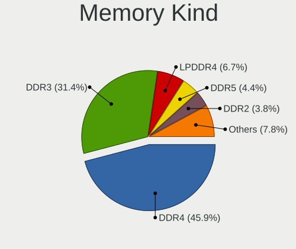

| Kind    | Computers | Percent |
|---------|-----------|---------|
| DDR4    | 158       | 45.93%  |
| DDR3    | 108       | 31.4%   |
| LPDDR4  | 23        | 6.69%   |
| DDR5    | 15        | 4.36%   |
| DDR2    | 13        | 3.78%   |
| SDRAM   | 11        | 3.2%    |
| Unknown | 6         | 1.74%   |
| LPDDR3  | 5         | 1.45%   |
| DDR     | 4         | 1.16%   |
| LPDDR5  | 1         | 0.29%   |

Memory Form Factor
------------------

Physical design of the memory module

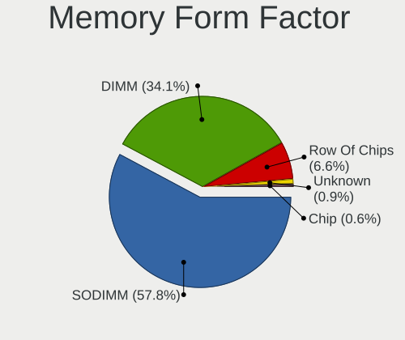

| Name         | Computers | Percent |
|--------------|-----------|---------|
| SODIMM       | 200       | 57.8%   |
| DIMM         | 118       | 34.1%   |
| Row Of Chips | 23        | 6.65%   |
| Unknown      | 3         | 0.87%   |
| Chip         | 2         | 0.58%   |

Memory Size
-----------

Memory module size

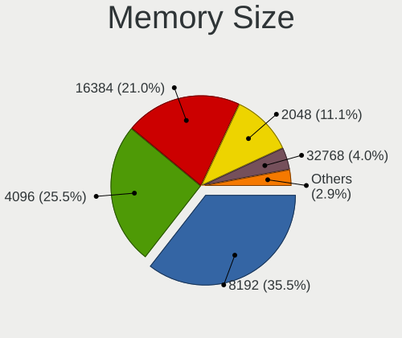

| Size   | Computers | Percent |
|--------|-----------|---------|
| 8192   | 134       | 35.54%  |
| 4096   | 96        | 25.46%  |
| 16384  | 79        | 20.95%  |
| 2048   | 42        | 11.14%  |
| 32768  | 15        | 3.98%   |
| 1024   | 8         | 2.12%   |
| 131072 | 1         | 0.27%   |
| 49152  | 1         | 0.27%   |
| 12288  | 1         | 0.27%   |

Memory Speed
------------

Memory module speed

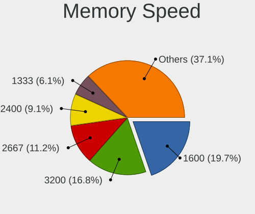

| Speed   | Computers | Percent |
|---------|-----------|---------|
| 1600    | 74        | 19.73%  |
| 3200    | 63        | 16.8%   |
| 2667    | 42        | 11.2%   |
| 2400    | 34        | 9.07%   |
| 1333    | 23        | 6.13%   |
| 2133    | 18        | 4.8%    |
| 3600    | 9         | 2.4%    |
| 800     | 9         | 2.4%    |
| Unknown | 8         | 2.13%   |
| 4267    | 6         | 1.6%    |
| 667     | 6         | 1.6%    |
| 6400    | 5         | 1.33%   |
| 4800    | 5         | 1.33%   |
| 1334    | 5         | 1.33%   |
| 3733    | 4         | 1.07%   |
| 2048    | 4         | 1.07%   |
| 1067    | 4         | 1.07%   |
| 1066    | 4         | 1.07%   |
| 5600    | 3         | 0.8%    |
| 4199    | 3         | 0.8%    |
| 3466    | 3         | 0.8%    |
| 3266    | 3         | 0.8%    |
| 2666    | 3         | 0.8%    |
| 1867    | 3         | 0.8%    |
| 1866    | 3         | 0.8%    |
| 1800    | 3         | 0.8%    |
| 8400    | 2         | 0.53%   |
| 4000    | 2         | 0.53%   |
| 3800    | 2         | 0.53%   |
| 3400    | 2         | 0.53%   |
| 3000    | 2         | 0.53%   |
| 2933    | 2         | 0.53%   |
| 6000    | 1         | 0.27%   |
| 5900    | 1         | 0.27%   |
| 4802    | 1         | 0.27%   |
| 4266    | 1         | 0.27%   |
| 3933    | 1         | 0.27%   |
| 3334    | 1         | 0.27%   |
| 3333    | 1         | 0.27%   |
| 3100    | 1         | 0.27%   |

Printers & scanners
-------------------

Printer Vendor
--------------

Printer device vendors

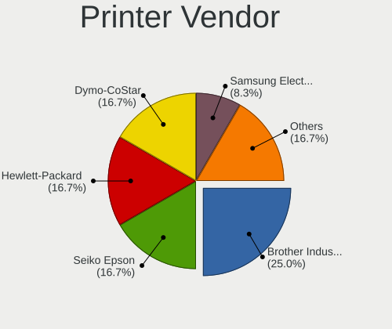

| Vendor              | Computers | Percent |
|---------------------|-----------|---------|
| Brother Industries  | 3         | 25%     |
| Seiko Epson         | 2         | 16.67%  |
| Hewlett-Packard     | 2         | 16.67%  |
| Dymo-CoStar         | 2         | 16.67%  |
| Samsung Electronics | 1         | 8.33%   |
| Graphtec America    | 1         | 8.33%   |
| Canon               | 1         | 8.33%   |

Printer Model
-------------

Printer device models

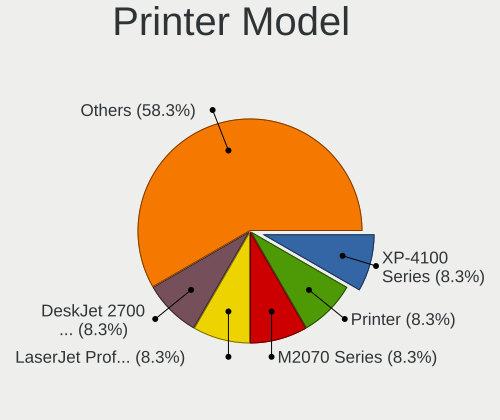

| Model                             | Computers | Percent |
|-----------------------------------|-----------|---------|
| Seiko Epson XP-4100 Series        | 1         | 8.33%   |
| Seiko Epson Printer               | 1         | 8.33%   |
| Samsung M2070 Series              | 1         | 8.33%   |
| HP LaserJet Professional P1102w   | 1         | 8.33%   |
| HP DeskJet 2700 series            | 1         | 8.33%   |
| Graphtec America Graphtec Printer | 1         | 8.33%   |
| Dymo-CoStar LabelWriter 450       | 1         | 8.33%   |
| Dymo-CoStar LabelWriter 310       | 1         | 8.33%   |
| Canon MG5700 series               | 1         | 8.33%   |
| Brother Printer                   | 1         | 8.33%   |
| Brother HL-3140CW series          | 1         | 8.33%   |
| Brother DCP-L5500DN series        | 1         | 8.33%   |

Scanner Vendor
--------------

Scanner device vendors

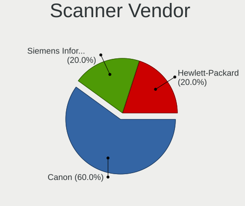

| Vendor                                         | Computers | Percent |
|------------------------------------------------|-----------|---------|
| Canon                                          | 3         | 60%     |
| Siemens Information and Communication Products | 1         | 20%     |
| Hewlett-Packard                                | 1         | 20%     |

Scanner Model
-------------

Scanner device models

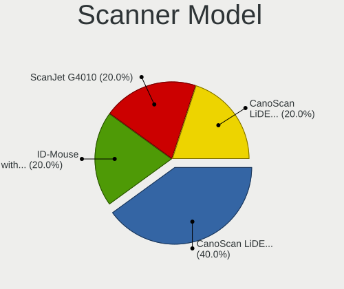

| Model                                                                           | Computers | Percent |
|---------------------------------------------------------------------------------|-----------|---------|
| Canon CanoScan LiDE 110                                                         | 2         | 40%     |
| Siemens Information and Communication Products ID-Mouse with Fingerprint Reader | 1         | 20%     |
| HP ScanJet G4010                                                                | 1         | 20%     |
| Canon CanoScan LiDE 120                                                         | 1         | 20%     |

Camera
------

Camera Vendor
-------------

Camera device vendors

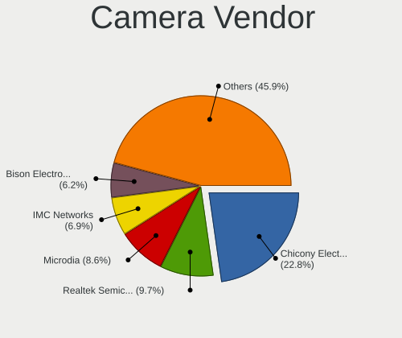

| Vendor                                 | Computers | Percent |
|----------------------------------------|-----------|---------|
| Chicony Electronics                    | 66        | 22.76%  |
| Realtek Semiconductor                  | 28        | 9.66%   |
| Microdia                               | 25        | 8.62%   |
| IMC Networks                           | 20        | 6.9%    |
| Bison Electronics                      | 18        | 6.21%   |
| Logitech                               | 17        | 5.86%   |
| Sunplus Innovation Technology          | 14        | 4.83%   |
| Quanta                                 | 13        | 4.48%   |
| Cheng Uei Precision Industry (Foxlink) | 11        | 3.79%   |
| Syntek                                 | 9         | 3.1%    |
| Suyin                                  | 9         | 3.1%    |
| Apple                                  | 9         | 3.1%    |
| Lite-On Technology                     | 6         | 2.07%   |
| Alcor Micro                            | 5         | 1.72%   |
| Luxvisions Innotech Limited            | 3         | 1.03%   |
| Lenovo                                 | 3         | 1.03%   |
| Generalplus Technology                 | 3         | 1.03%   |
| Z-Star Microelectronics                | 2         | 0.69%   |
| SunplusIT                              | 2         | 0.69%   |
| Silicon Motion                         | 2         | 0.69%   |
| Samsung Electronics                    | 2         | 0.69%   |
| Ricoh                                  | 2         | 0.69%   |
| Razer USA                              | 2         | 0.69%   |
| KYE Systems (Mouse Systems)            | 2         | 0.69%   |
| ARC International                      | 2         | 0.69%   |
| Y Media                                | 1         | 0.34%   |
| WaveRider Communications               | 1         | 0.34%   |
| Sonix Technology                       | 1         | 0.34%   |
| OYT                                    | 1         | 0.34%   |
| OmniVision Technologies                | 1         | 0.34%   |
| Microsoft                              | 1         | 0.34%   |
| LG Electronics                         | 1         | 0.34%   |
| LeCroy                                 | 1         | 0.34%   |
| Intel                                  | 1         | 0.34%   |
| icSpring                               | 1         | 0.34%   |
| Guillemot                              | 1         | 0.34%   |
| eMPIA Technology                       | 1         | 0.34%   |
| Denron                                 | 1         | 0.34%   |
| Arkmicro Technologies                  | 1         | 0.34%   |
| Alcorlink                              | 1         | 0.34%   |

Camera Model
------------

Camera device models

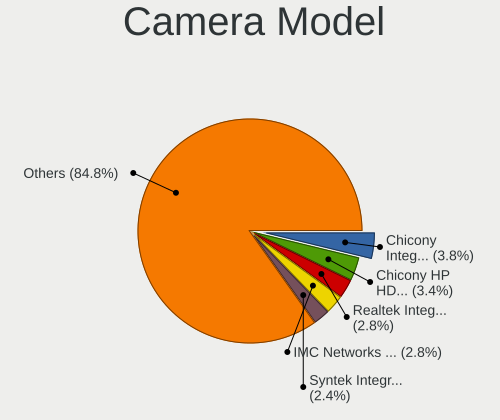

| Model                                         | Computers | Percent |
|-----------------------------------------------|-----------|---------|
| Chicony Integrated Camera                     | 11        | 3.79%   |
| Chicony HP HD Camera                          | 10        | 3.45%   |
| Realtek Integrated_Webcam_HD                  | 8         | 2.76%   |
| IMC Networks USB2.0 HD UVC WebCam             | 8         | 2.76%   |
| Syntek Integrated Camera                      | 7         | 2.41%   |
| Bison Integrated Camera                       | 7         | 2.41%   |
| IMC Networks Integrated Camera                | 6         | 2.07%   |
| Microdia Webcam Vitade AF                     | 5         | 1.72%   |
| Microdia Integrated Webcam                    | 5         | 1.72%   |
| Microdia USB 2.0 Camera                       | 4         | 1.38%   |
| Microdia Integrated_Webcam_HD                 | 4         | 1.38%   |
| Logitech Webcam C270                          | 4         | 1.38%   |
| Lite-On Integrated Camera                     | 4         | 1.38%   |
| Chicony TOSHIBA Web Camera - HD               | 4         | 1.38%   |
| Apple FaceTime HD Camera (Built-in)           | 4         | 1.38%   |
| Sunplus Integrated_Webcam_HD                  | 3         | 1.03%   |
| Realtek USB Camera                            | 3         | 1.03%   |
| Realtek Integrated Webcam HD                  | 3         | 1.03%   |
| Logitech C920 PRO HD Webcam                   | 3         | 1.03%   |
| Chicony VGA Webcam                            | 3         | 1.03%   |
| Chicony HP Wide Vision HD Camera              | 3         | 1.03%   |
| Chicony HP Webcam                             | 3         | 1.03%   |
| Chicony HP Truevision HD camera               | 3         | 1.03%   |
| Chicony HD User Facing                        | 3         | 1.03%   |
| Chicony Chicony USB2.0 Camera                 | 3         | 1.03%   |
| Cheng Uei Precision Industry (Foxlink) Webcam | 3         | 1.03%   |
| Apple Built-in iSight                         | 3         | 1.03%   |
| Alcor Micro USB 2.0 Camera                    | 3         | 1.03%   |
| Suyin Acer/HP Integrated Webcam [CN0314]      | 2         | 0.69%   |
| Sunplus Laptop_Integrated_Webcam_HD           | 2         | 0.69%   |
| Sunplus Integrated_Webcam_FHD                 | 2         | 0.69%   |
| Sunplus FULL HD webcam                        | 2         | 0.69%   |
| Samsung Galaxy series, misc. (MTP mode)       | 2         | 0.69%   |
| Realtek USB2.0 camera                         | 2         | 0.69%   |
| Realtek Acer 640 x 480 laptop camera          | 2         | 0.69%   |
| Razer USA Gaming Webcam [Kiyo]                | 2         | 0.69%   |
| Quanta ov9734_techfront_camera                | 2         | 0.69%   |
| Quanta HP TrueVision HD Camera                | 2         | 0.69%   |
| Quanta HD User Facing                         | 2         | 0.69%   |
| Microdia Sonix USB 2.0 Camera                 | 2         | 0.69%   |

Security
--------

Fingerprint Vendor
------------------

Fingerprint sensor vendors

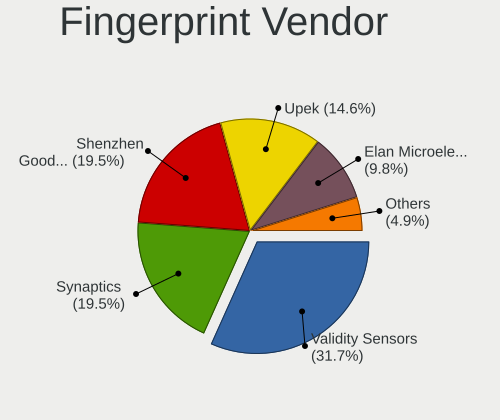

| Vendor                     | Computers | Percent |
|----------------------------|-----------|---------|
| Validity Sensors           | 13        | 31.71%  |
| Synaptics                  | 8         | 19.51%  |
| Shenzhen Goodix Technology | 8         | 19.51%  |
| Upek                       | 6         | 14.63%  |
| Elan Microelectronics      | 4         | 9.76%   |
| AuthenTec                  | 2         | 4.88%   |

Fingerprint Model
-----------------

Fingerprint sensor models

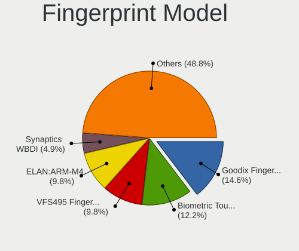

| Model                                                                      | Computers | Percent |
|----------------------------------------------------------------------------|-----------|---------|
| Shenzhen Goodix  Fingerprint Device                                        | 6         | 14.63%  |
| Upek Biometric Touchchip/Touchstrip Fingerprint Sensor                     | 5         | 12.2%   |
| Validity Sensors VFS495 Fingerprint Reader                                 | 4         | 9.76%   |
| Elan ELAN:ARM-M4                                                           | 4         | 9.76%   |
| Validity Sensors Synaptics WBDI                                            | 2         | 4.88%   |
| Validity Sensors Swipe Fingerprint Sensor                                  | 2         | 4.88%   |
| Synaptics Prometheus MIS Touch Fingerprint Reader                          | 2         | 4.88%   |
| Shenzhen Goodix FingerPrint                                                | 2         | 4.88%   |
| AuthenTec AES1600                                                          | 2         | 4.88%   |
| Validity Sensors VFS7500 Touch Fingerprint Sensor                          | 1         | 2.44%   |
| Validity Sensors VFS5011 Fingerprint Reader                                | 1         | 2.44%   |
| Validity Sensors VFS471 Fingerprint Reader                                 | 1         | 2.44%   |
| Validity Sensors Synaptics VFS7552 Touch Fingerprint Sensor with PurePrint | 1         | 2.44%   |
| Validity Sensors Fingerprint scanner                                       | 1         | 2.44%   |
| Upek TCS5B Fingerprint sensor                                              | 1         | 2.44%   |
| Synaptics UWP WBDI Device                                                  | 1         | 2.44%   |
| Synaptics UWP WBDI                                                         | 1         | 2.44%   |
| Synaptics  WBDI                                                            | 1         | 2.44%   |
| Synaptics  FS7604 Touch Fingerprint Sensor with PurePrint                  | 1         | 2.44%   |
| Synaptics Metallica MIS Touch Fingerprint Reader                           | 1         | 2.44%   |
| Synaptics Fingerprint reader [HP G6]                                       | 1         | 2.44%   |

Chipcard Vendor
---------------

Chipcard module vendors

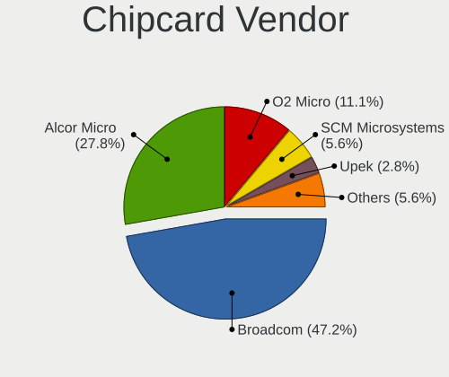

| Vendor                | Computers | Percent |
|-----------------------|-----------|---------|
| Broadcom              | 17        | 47.22%  |
| Alcor Micro           | 10        | 27.78%  |
| O2 Micro              | 4         | 11.11%  |
| SCM Microsystems      | 2         | 5.56%   |
| Upek                  | 1         | 2.78%   |
| OmniKey               | 1         | 2.78%   |
| Advanced Card Systems | 1         | 2.78%   |

Chipcard Model
--------------

Chipcard module models

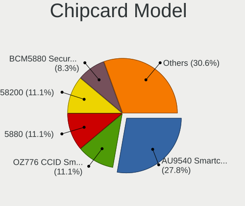

| Model                                                                        | Computers | Percent |
|------------------------------------------------------------------------------|-----------|---------|
| Alcor Micro AU9540 Smartcard Reader                                          | 10        | 27.78%  |
| O2 Micro OZ776 CCID Smartcard Reader                                         | 4         | 11.11%  |
| Broadcom 5880                                                                | 4         | 11.11%  |
| Broadcom 58200                                                               | 4         | 11.11%  |
| Broadcom BCM5880 Secure Applications Processor with fingerprint swipe sensor | 3         | 8.33%   |
| Broadcom BCM5880 Secure Applications Processor                               | 3         | 8.33%   |
| Broadcom BCM58200 ControlVault 3 (FingerPrint sensor + Contacted SmartCard)  | 3         | 8.33%   |
| Upek TouchChip Fingerprint Coprocessor (WBF advanced mode)                   | 1         | 2.78%   |
| SCM Microsystems SCR3500 A Contact Reader                                    | 1         | 2.78%   |
| SCM Microsystems Identiv SmartOS Reader                                      | 1         | 2.78%   |
| OmniKey CardMan 1021                                                         | 1         | 2.78%   |
| Advanced Card Systems ACR38 SmartCard Reader                                 | 1         | 2.78%   |

Unsupported
-----------

Unsupported Devices
-------------------

Total unsupported devices on board

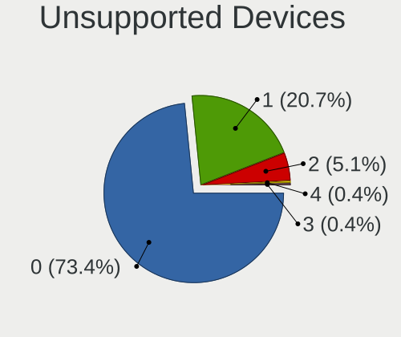

| Total | Computers | Percent |
|-------|-----------|---------|
| 0     | 348       | 73.42%  |
| 1     | 98        | 20.68%  |
| 2     | 24        | 5.06%   |
| 4     | 2         | 0.42%   |
| 3     | 2         | 0.42%   |

Unsupported Device Types
------------------------

Types of unsupported devices

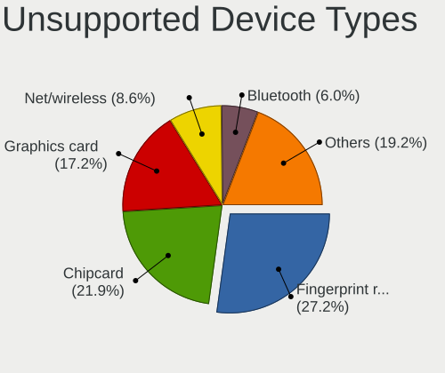

| Type                     | Computers | Percent |
|--------------------------|-----------|---------|
| Fingerprint reader       | 41        | 27.15%  |
| Chipcard                 | 33        | 21.85%  |
| Graphics card            | 26        | 17.22%  |
| Net/wireless             | 13        | 8.61%   |
| Bluetooth                | 9         | 5.96%   |
| Camera                   | 7         | 4.64%   |
| Unassigned class         | 4         | 2.65%   |
| Network                  | 3         | 1.99%   |
| Multimedia controller    | 3         | 1.99%   |
| Communication controller | 3         | 1.99%   |
| Card reader              | 3         | 1.99%   |
| Dvb card                 | 2         | 1.32%   |
| Storage/raid             | 1         | 0.66%   |
| Storage                  | 1         | 0.66%   |
| Sound                    | 1         | 0.66%   |
| Flash memory             | 1         | 0.66%   |

