Ubuntu MATE 22.04 - Tested Hardware & Statistics
------------------------------------------------

A project to collect tested hardware configurations for Ubuntu MATE 22.04.

Anyone can contribute to this report by the [hw-probe](https://github.com/linuxhw/hw-probe) tool:

    sudo -E hw-probe -all -upload

Please contribute! Especially if your hardware is rare.

This is a report for all computer types. See also reports for [desktops](/Dist/Ubuntu_MATE_22.04/Desktop/README.md) and [notebooks](/Dist/Ubuntu_MATE_22.04/Notebook/README.md).

Contents
--------

* [ Test Cases ](#test-cases)

* [ System ](#system)
  - [ Kernel                   ](#kernel)
  - [ Kernel Family            ](#kernel-family)
  - [ Kernel Major Ver.        ](#kernel-major-ver)
  - [ Arch                     ](#arch)
  - [ DE                       ](#de)
  - [ Display Server           ](#display-server)
  - [ Display Manager          ](#display-manager)
  - [ OS Lang                  ](#os-lang)
  - [ Boot Mode                ](#boot-mode)
  - [ Filesystem               ](#filesystem)
  - [ Part. scheme             ](#part-scheme)
  - [ Dual Boot with Linux/BSD ](#dual-boot-with-linuxbsd)
  - [ Dual Boot (Win)          ](#dual-boot-win)

* [ Board ](#board)
  - [ Vendor                   ](#vendor)
  - [ Model                    ](#model)
  - [ Model Family             ](#model-family)
  - [ MFG Year                 ](#mfg-year)
  - [ Form Factor              ](#form-factor)
  - [ Secure Boot              ](#secure-boot)
  - [ Coreboot                 ](#coreboot)
  - [ RAM Size                 ](#ram-size)
  - [ RAM Used                 ](#ram-used)
  - [ Total Drives             ](#total-drives)
  - [ Has CD-ROM               ](#has-cd-rom)
  - [ Has Ethernet             ](#has-ethernet)
  - [ Has WiFi                 ](#has-wifi)
  - [ Has Bluetooth            ](#has-bluetooth)

* [ Location ](#location)
  - [ Country                  ](#country)
  - [ City                     ](#city)

* [ Drives ](#drives)
  - [ Drive Vendor             ](#drive-vendor)
  - [ Drive Model              ](#drive-model)
  - [ HDD Vendor               ](#hdd-vendor)
  - [ SSD Vendor               ](#ssd-vendor)
  - [ Drive Kind               ](#drive-kind)
  - [ Drive Connector          ](#drive-connector)
  - [ Drive Size               ](#drive-size)
  - [ Space Total              ](#space-total)
  - [ Space Used               ](#space-used)
  - [ Malfunc. Drives          ](#malfunc-drives)
  - [ Malfunc. Drive Vendor    ](#malfunc-drive-vendor)
  - [ Malfunc. HDD Vendor      ](#malfunc-hdd-vendor)
  - [ Malfunc. Drive Kind      ](#malfunc-drive-kind)
  - [ Failed Drives            ](#failed-drives)
  - [ Failed Drive Vendor      ](#failed-drive-vendor)
  - [ Drive Status             ](#drive-status)

* [ Storage controller ](#storage-controller)
  - [ Storage Vendor           ](#storage-vendor)
  - [ Storage Model            ](#storage-model)
  - [ Storage Kind             ](#storage-kind)

* [ Processor ](#processor)
  - [ CPU Vendor               ](#cpu-vendor)
  - [ CPU Model                ](#cpu-model)
  - [ CPU Model Family         ](#cpu-model-family)
  - [ CPU Cores                ](#cpu-cores)
  - [ CPU Sockets              ](#cpu-sockets)
  - [ CPU Threads              ](#cpu-threads)
  - [ CPU Op-Modes             ](#cpu-op-modes)
  - [ CPU Microcode            ](#cpu-microcode)
  - [ CPU Microarch            ](#cpu-microarch)

* [ Graphics ](#graphics)
  - [ GPU Vendor               ](#gpu-vendor)
  - [ GPU Model                ](#gpu-model)
  - [ GPU Combo                ](#gpu-combo)
  - [ GPU Driver               ](#gpu-driver)
  - [ GPU Memory               ](#gpu-memory)

* [ Monitor ](#monitor)
  - [ Monitor Vendor           ](#monitor-vendor)
  - [ Monitor Model            ](#monitor-model)
  - [ Monitor Resolution       ](#monitor-resolution)
  - [ Monitor Diagonal         ](#monitor-diagonal)
  - [ Monitor Width            ](#monitor-width)
  - [ Aspect Ratio             ](#aspect-ratio)
  - [ Monitor Area             ](#monitor-area)
  - [ Pixel Density            ](#pixel-density)
  - [ Multiple Monitors        ](#multiple-monitors)

* [ Network ](#network)
  - [ Net Controller Vendor    ](#net-controller-vendor)
  - [ Net Controller Model     ](#net-controller-model)
  - [ Wireless Vendor          ](#wireless-vendor)
  - [ Wireless Model           ](#wireless-model)
  - [ Ethernet Vendor          ](#ethernet-vendor)
  - [ Ethernet Model           ](#ethernet-model)
  - [ Net Controller Kind      ](#net-controller-kind)
  - [ Used Controller          ](#used-controller)
  - [ NICs                     ](#nics)
  - [ IPv6                     ](#ipv6)

* [ Bluetooth ](#bluetooth)
  - [ Bluetooth Vendor         ](#bluetooth-vendor)
  - [ Bluetooth Model          ](#bluetooth-model)

* [ Sound ](#sound)
  - [ Sound Vendor             ](#sound-vendor)
  - [ Sound Model              ](#sound-model)

* [ Memory ](#memory)
  - [ Memory Vendor            ](#memory-vendor)
  - [ Memory Model             ](#memory-model)
  - [ Memory Kind              ](#memory-kind)
  - [ Memory Form Factor       ](#memory-form-factor)
  - [ Memory Size              ](#memory-size)
  - [ Memory Speed             ](#memory-speed)

* [ Printers & scanners ](#printers--scanners)
  - [ Printer Vendor           ](#printer-vendor)
  - [ Printer Model            ](#printer-model)
  - [ Scanner Vendor           ](#scanner-vendor)
  - [ Scanner Model            ](#scanner-model)

* [ Camera ](#camera)
  - [ Camera Vendor            ](#camera-vendor)
  - [ Camera Model             ](#camera-model)

* [ Security ](#security)
  - [ Fingerprint Vendor       ](#fingerprint-vendor)
  - [ Fingerprint Model        ](#fingerprint-model)
  - [ Chipcard Vendor          ](#chipcard-vendor)
  - [ Chipcard Model           ](#chipcard-model)

* [ Unsupported ](#unsupported)
  - [ Unsupported Devices      ](#unsupported-devices)
  - [ Unsupported Device Types ](#unsupported-device-types)

Test Cases
----------

Total: 391

| Vendor        | Model                       | Form-Factor | Probe                                                      | Date         |
|---------------|-----------------------------|-------------|------------------------------------------------------------|--------------|
| Notebook      | NJx0MU                      | Notebook    | [14751f18b3](https://linux-hardware.org/?probe=14751f18b3) | Apr 01, 2023 |
| Apple         | Mac-942B5BF58194151B        | All in one  | [53a11e07e8](https://linux-hardware.org/?probe=53a11e07e8) | Mar 31, 2023 |
| MSI           | MS-AA5E 0A                  | All in one  | [36d66ad0a2](https://linux-hardware.org/?probe=36d66ad0a2) | Mar 29, 2023 |
| Gigabyte      | B85M-D3H                    | Desktop     | [a074e581b0](https://linux-hardware.org/?probe=a074e581b0) | Mar 28, 2023 |
| Samsung       | 905S3G/906S3G/915S3G/930... | Notebook    | [832b434c38](https://linux-hardware.org/?probe=832b434c38) | Mar 28, 2023 |
| Samsung       | 905S3G/906S3G/915S3G/930... | Notebook    | [7e283bfa25](https://linux-hardware.org/?probe=7e283bfa25) | Mar 28, 2023 |
| ASUSTek       | M5A97 R2.0                  | Desktop     | [d56f48b9d1](https://linux-hardware.org/?probe=d56f48b9d1) | Mar 27, 2023 |
| Notebook      | NJx0MU                      | Notebook    | [bd4eec08fb](https://linux-hardware.org/?probe=bd4eec08fb) | Mar 27, 2023 |
| HUAWEI        | BOHB-WAX9                   | Notebook    | [4cc097dbcf](https://linux-hardware.org/?probe=4cc097dbcf) | Mar 26, 2023 |
| Shenzhen M... | HX90G                       | Desktop     | [fb3f1be00d](https://linux-hardware.org/?probe=fb3f1be00d) | Mar 26, 2023 |
| Notebook      | NJx0MU                      | Notebook    | [5a95cd6ad5](https://linux-hardware.org/?probe=5a95cd6ad5) | Mar 26, 2023 |
| Gigabyte      | B85M-D3H                    | Desktop     | [890cd39d63](https://linux-hardware.org/?probe=890cd39d63) | Mar 26, 2023 |
| HP            | Pavilion x360 Convertibl... | Convertible | [50387b06e7](https://linux-hardware.org/?probe=50387b06e7) | Mar 26, 2023 |
| HP            | Pavilion x360 Convertibl... | Convertible | [2a9ae9d859](https://linux-hardware.org/?probe=2a9ae9d859) | Mar 26, 2023 |
| ASUSTek       | X550LN                      | Notebook    | [182b5af958](https://linux-hardware.org/?probe=182b5af958) | Mar 22, 2023 |
| ASUSTek       | X550LN                      | Notebook    | [e46c856c11](https://linux-hardware.org/?probe=e46c856c11) | Mar 22, 2023 |
| ASUSTek       | H61M-K                      | Desktop     | [dcae89c3e5](https://linux-hardware.org/?probe=dcae89c3e5) | Mar 21, 2023 |
| ASUSTek       | H61M-K                      | Desktop     | [9ff80f0344](https://linux-hardware.org/?probe=9ff80f0344) | Mar 21, 2023 |
| CCE           | NM70-I                      | Desktop     | [3e99b6e12d](https://linux-hardware.org/?probe=3e99b6e12d) | Mar 21, 2023 |
| ASUSTek       | M5A78L LE                   | Desktop     | [e18778e282](https://linux-hardware.org/?probe=e18778e282) | Mar 20, 2023 |
| Lenovo        | Bantry CRB 31900058 STD     | Desktop     | [bbe02b925a](https://linux-hardware.org/?probe=bbe02b925a) | Mar 19, 2023 |
| Lenovo        | Bantry CRB 31900058 STD     | Desktop     | [d376f92f8d](https://linux-hardware.org/?probe=d376f92f8d) | Mar 19, 2023 |
| Gigabyte      | B85M-D3H                    | Desktop     | [605bc3d5b0](https://linux-hardware.org/?probe=605bc3d5b0) | Mar 19, 2023 |
| Notebook      | NJx0MU                      | Notebook    | [cd8f53a887](https://linux-hardware.org/?probe=cd8f53a887) | Mar 19, 2023 |
| Notebook      | NJx0MU                      | Notebook    | [45a412e241](https://linux-hardware.org/?probe=45a412e241) | Mar 18, 2023 |
| Gigabyte      | B85M-D3H                    | Desktop     | [4cee2dc95e](https://linux-hardware.org/?probe=4cee2dc95e) | Mar 18, 2023 |
| MSI           | PRO B660M-A WIFI DDR4       | Desktop     | [7298c4b04b](https://linux-hardware.org/?probe=7298c4b04b) | Mar 17, 2023 |
| MSI           | PRO B660M-A WIFI DDR4       | Desktop     | [794bc239ab](https://linux-hardware.org/?probe=794bc239ab) | Mar 17, 2023 |
| ASUSTek       | X550LN                      | Notebook    | [105acd2203](https://linux-hardware.org/?probe=105acd2203) | Mar 16, 2023 |
| ASUSTek       | M5A97 R2.0                  | Desktop     | [526e33e980](https://linux-hardware.org/?probe=526e33e980) | Mar 15, 2023 |
| ASRock        | A320M-HDV R4.0              | Desktop     | [8d2ca6cedc](https://linux-hardware.org/?probe=8d2ca6cedc) | Mar 14, 2023 |
| ASUSTek       | M5A97 R2.0                  | Desktop     | [2f69480899](https://linux-hardware.org/?probe=2f69480899) | Mar 14, 2023 |
| ASUSTek       | K93SV                       | Notebook    | [aa66f39ad6](https://linux-hardware.org/?probe=aa66f39ad6) | Mar 13, 2023 |
| HP            | 339A                        | Desktop     | [fa78907d67](https://linux-hardware.org/?probe=fa78907d67) | Mar 12, 2023 |
| Gigabyte      | B85M-D3H                    | Desktop     | [f9dfd84f86](https://linux-hardware.org/?probe=f9dfd84f86) | Mar 12, 2023 |
| ASUSTek       | ASUS TUF Gaming A15 FA50... | Notebook    | [406d19d44f](https://linux-hardware.org/?probe=406d19d44f) | Mar 12, 2023 |
| Notebook      | NJx0MU                      | Notebook    | [d5426d5f1e](https://linux-hardware.org/?probe=d5426d5f1e) | Mar 11, 2023 |
| Notebook      | NJx0MU                      | Notebook    | [729d9395f0](https://linux-hardware.org/?probe=729d9395f0) | Mar 11, 2023 |
| Gigabyte      | B85M-D3H                    | Desktop     | [ee115bdfb8](https://linux-hardware.org/?probe=ee115bdfb8) | Mar 11, 2023 |
| HP            | Laptop 15s-eq0xxx           | Notebook    | [7a7e8bc855](https://linux-hardware.org/?probe=7a7e8bc855) | Mar 09, 2023 |
| HP            | Presario CQ61               | Notebook    | [0eab7ae44e](https://linux-hardware.org/?probe=0eab7ae44e) | Mar 09, 2023 |
| MSI           | X370 SLI PLUS               | Desktop     | [d2ac8dd020](https://linux-hardware.org/?probe=d2ac8dd020) | Mar 07, 2023 |
| Gigabyte      | B85M-D3H                    | Desktop     | [adce83e80e](https://linux-hardware.org/?probe=adce83e80e) | Mar 07, 2023 |
| HP            | Stream Laptop 11-ah1XX      | Notebook    | [61e3840465](https://linux-hardware.org/?probe=61e3840465) | Mar 07, 2023 |
| Notebook      | NJx0MU                      | Notebook    | [cb7ac03a2a](https://linux-hardware.org/?probe=cb7ac03a2a) | Mar 07, 2023 |
| Gigabyte      | B85M-D3H                    | Desktop     | [9178ffc6f9](https://linux-hardware.org/?probe=9178ffc6f9) | Mar 05, 2023 |
| Notebook      | NJx0MU                      | Notebook    | [48cf9d748f](https://linux-hardware.org/?probe=48cf9d748f) | Mar 05, 2023 |
| MSI           | X570-A PRO                  | Desktop     | [7d1b3a73f9](https://linux-hardware.org/?probe=7d1b3a73f9) | Mar 05, 2023 |
| Gigabyte      | B85M-D3H                    | Desktop     | [9f5aaa2900](https://linux-hardware.org/?probe=9f5aaa2900) | Mar 04, 2023 |
| Notebook      | NJx0MU                      | Notebook    | [05934ca860](https://linux-hardware.org/?probe=05934ca860) | Mar 04, 2023 |
| Acer          | Aspire ES1-523              | Notebook    | [bd1f7da7bc](https://linux-hardware.org/?probe=bd1f7da7bc) | Mar 03, 2023 |
| Notebook      | NJx0MU                      | Notebook    | [be909f0882](https://linux-hardware.org/?probe=be909f0882) | Mar 03, 2023 |
| Intel         | NUC12EDBi7 M27908-302       | Mini pc     | [bb51e864a7](https://linux-hardware.org/?probe=bb51e864a7) | Mar 03, 2023 |
| ASUSTek       | M5A78L-M LX                 | Desktop     | [0cd2798326](https://linux-hardware.org/?probe=0cd2798326) | Mar 03, 2023 |
| Raspberry ... | Raspberry Pi                | Soc         | [dbc8fc4b0d](https://linux-hardware.org/?probe=dbc8fc4b0d) | Mar 03, 2023 |
| Notebook      | NJx0MU                      | Notebook    | [884979d592](https://linux-hardware.org/?probe=884979d592) | Mar 01, 2023 |
| Gigabyte      | B85M-D3H                    | Desktop     | [b6128fb3e9](https://linux-hardware.org/?probe=b6128fb3e9) | Feb 28, 2023 |
| Notebook      | NJx0MU                      | Notebook    | [fd4d00d935](https://linux-hardware.org/?probe=fd4d00d935) | Feb 28, 2023 |
| MSI           | A320M-A PRO MAX             | Desktop     | [64cf10c762](https://linux-hardware.org/?probe=64cf10c762) | Feb 26, 2023 |
| Sony          | VGN-Z21WRN_B                | Notebook    | [c1b765e164](https://linux-hardware.org/?probe=c1b765e164) | Feb 26, 2023 |
| Gigabyte      | B85M-D3H                    | Desktop     | [b1a38edcc2](https://linux-hardware.org/?probe=b1a38edcc2) | Feb 25, 2023 |
| Notebook      | NJx0MU                      | Notebook    | [ec82e38ab0](https://linux-hardware.org/?probe=ec82e38ab0) | Feb 25, 2023 |
| ASUSTek       | X550LN                      | Notebook    | [6ebe283b1c](https://linux-hardware.org/?probe=6ebe283b1c) | Feb 25, 2023 |
| MSI           | A320M-A PRO MAX             | Desktop     | [24b1205b0c](https://linux-hardware.org/?probe=24b1205b0c) | Feb 24, 2023 |
| HP            | Pavilion dv6000 (GF657EA... | Notebook    | [fe52d35d1a](https://linux-hardware.org/?probe=fe52d35d1a) | Feb 24, 2023 |
| Dell          | 0GDJXY A00                  | All in one  | [ea8027e95b](https://linux-hardware.org/?probe=ea8027e95b) | Feb 24, 2023 |
| Notebook      | NJx0MU                      | Notebook    | [2cc3513ca3](https://linux-hardware.org/?probe=2cc3513ca3) | Feb 24, 2023 |
| Raspberry ... | Raspberry Pi                | Soc         | [e1a9b1b0fa](https://linux-hardware.org/?probe=e1a9b1b0fa) | Feb 21, 2023 |
| HP            | Laptop 15s-fq5xxx           | Notebook    | [fa50111733](https://linux-hardware.org/?probe=fa50111733) | Feb 20, 2023 |
| Notebook      | NJx0MU                      | Notebook    | [76d6c3ad48](https://linux-hardware.org/?probe=76d6c3ad48) | Feb 19, 2023 |
| Dell          | Inspiron 14-3452            | Notebook    | [e08dcd6c59](https://linux-hardware.org/?probe=e08dcd6c59) | Feb 19, 2023 |
| Dell          | Inspiron 14-3452            | Notebook    | [e2cc024607](https://linux-hardware.org/?probe=e2cc024607) | Feb 18, 2023 |
| Sony          | VPCEB2Z1E                   | Notebook    | [5c172121ab](https://linux-hardware.org/?probe=5c172121ab) | Feb 17, 2023 |
| ASUSTek       | TUF B450-PLUS GAMING        | Desktop     | [1029c7f3bb](https://linux-hardware.org/?probe=1029c7f3bb) | Feb 17, 2023 |
| Intel         | NUC8BEB J72692-306          | Mini pc     | [741b7c300c](https://linux-hardware.org/?probe=741b7c300c) | Feb 17, 2023 |
| SLIMBOOK      | TITAN                       | Notebook    | [4638729e72](https://linux-hardware.org/?probe=4638729e72) | Feb 17, 2023 |
| Notebook      | NJx0MU                      | Notebook    | [90fb04bc05](https://linux-hardware.org/?probe=90fb04bc05) | Feb 17, 2023 |
| Apple         | Mac-942B59F58194171B iMa... | All in one  | [ebca46331e](https://linux-hardware.org/?probe=ebca46331e) | Feb 16, 2023 |
| Apple         | Mac-942B59F58194171B iMa... | All in one  | [f3d6e20575](https://linux-hardware.org/?probe=f3d6e20575) | Feb 16, 2023 |
| ASUSTek       | PRIME B360M-C               | Desktop     | [d380600b31](https://linux-hardware.org/?probe=d380600b31) | Feb 15, 2023 |
| Lenovo        | ThinkPad SL 2746AHG         | Notebook    | [c141867fa3](https://linux-hardware.org/?probe=c141867fa3) | Feb 15, 2023 |
| Notebook      | NJx0MU                      | Notebook    | [9565a9f43b](https://linux-hardware.org/?probe=9565a9f43b) | Feb 11, 2023 |
| Gigabyte      | B85M-D3H                    | Desktop     | [ba06eb3e9c](https://linux-hardware.org/?probe=ba06eb3e9c) | Feb 11, 2023 |
| Notebook      | NJx0MU                      | Notebook    | [8a16d2e4bb](https://linux-hardware.org/?probe=8a16d2e4bb) | Feb 11, 2023 |
| Lenovo        | 3741 SDK0T76463 WIN 3422... | Desktop     | [14bde69d96](https://linux-hardware.org/?probe=14bde69d96) | Feb 10, 2023 |
| ASUSTek       | X541UAK                     | Notebook    | [fb254cca56](https://linux-hardware.org/?probe=fb254cca56) | Feb 10, 2023 |
| Acer          | Aspire ES1-523              | Notebook    | [647f120e0b](https://linux-hardware.org/?probe=647f120e0b) | Feb 08, 2023 |
| Notebook      | NJx0MU                      | Notebook    | [0f01d55766](https://linux-hardware.org/?probe=0f01d55766) | Feb 08, 2023 |
| HP            | 240 G3                      | Notebook    | [e3a0318824](https://linux-hardware.org/?probe=e3a0318824) | Feb 07, 2023 |
| Notebook      | NJx0MU                      | Notebook    | [ac340725d3](https://linux-hardware.org/?probe=ac340725d3) | Feb 07, 2023 |
| Sony          | VPCEH1E1E                   | Notebook    | [76589a7570](https://linux-hardware.org/?probe=76589a7570) | Feb 05, 2023 |
| Notebook      | NJx0MU                      | Notebook    | [a55eba93cc](https://linux-hardware.org/?probe=a55eba93cc) | Feb 04, 2023 |
| Dell          | Precision 7550              | Notebook    | [392db977df](https://linux-hardware.org/?probe=392db977df) | Feb 03, 2023 |
| Notebook      | NJx0MU                      | Notebook    | [1a189b08ea](https://linux-hardware.org/?probe=1a189b08ea) | Feb 03, 2023 |
| Notebook      | NJx0MU                      | Notebook    | [a174385328](https://linux-hardware.org/?probe=a174385328) | Feb 02, 2023 |
| Notebook      | NJx0MU                      | Notebook    | [c402e9c063](https://linux-hardware.org/?probe=c402e9c063) | Feb 01, 2023 |
| Notebook      | NJx0MU                      | Notebook    | [eb152c7d4e](https://linux-hardware.org/?probe=eb152c7d4e) | Feb 01, 2023 |
| Notebook      | NJx0MU                      | Notebook    | [58d5bdaa2d](https://linux-hardware.org/?probe=58d5bdaa2d) | Jan 31, 2023 |
| Notebook      | NJx0MU                      | Notebook    | [10cdf2558f](https://linux-hardware.org/?probe=10cdf2558f) | Jan 29, 2023 |
| Notebook      | NJx0MU                      | Notebook    | [09bbe80125](https://linux-hardware.org/?probe=09bbe80125) | Jan 29, 2023 |
| ASUSTek       | K93SV                       | Notebook    | [3b4dd13d9f](https://linux-hardware.org/?probe=3b4dd13d9f) | Jan 29, 2023 |
| ASUSTek       | TUF Gaming FX505DT_FX505... | Notebook    | [4333734c92](https://linux-hardware.org/?probe=4333734c92) | Jan 29, 2023 |
| ASUSTek       | CROSSHAIR VI HERO           | Desktop     | [190a780b8a](https://linux-hardware.org/?probe=190a780b8a) | Jan 29, 2023 |
| Lenovo        | IdeaPad 3 15ALC6 82KU       | Notebook    | [a4ded61661](https://linux-hardware.org/?probe=a4ded61661) | Jan 27, 2023 |
| Notebook      | NJx0MU                      | Notebook    | [26e692f7de](https://linux-hardware.org/?probe=26e692f7de) | Jan 26, 2023 |
| Notebook      | NJx0MU                      | Notebook    | [7c19df8c01](https://linux-hardware.org/?probe=7c19df8c01) | Jan 25, 2023 |
| Notebook      | NJx0MU                      | Notebook    | [54d0592fb2](https://linux-hardware.org/?probe=54d0592fb2) | Jan 24, 2023 |
| Notebook      | NJx0MU                      | Notebook    | [206e04bc7d](https://linux-hardware.org/?probe=206e04bc7d) | Jan 23, 2023 |
| Hardkernel    | ODROID-N2Plus               | Soc         | [eb2e4b24cc](https://linux-hardware.org/?probe=eb2e4b24cc) | Jan 23, 2023 |
| HP            | Pavilion x360 Convertibl... | Convertible | [3a542dd368](https://linux-hardware.org/?probe=3a542dd368) | Jan 22, 2023 |
| Notebook      | NJx0MU                      | Notebook    | [9e9dcb9883](https://linux-hardware.org/?probe=9e9dcb9883) | Jan 22, 2023 |
| Notebook      | NJx0MU                      | Notebook    | [fdca7d69cd](https://linux-hardware.org/?probe=fdca7d69cd) | Jan 22, 2023 |
| Raspberry ... | Raspberry Pi 400 Rev 1.1    | Soc         | [9536b9eedc](https://linux-hardware.org/?probe=9536b9eedc) | Jan 22, 2023 |
| Google        | Relm                        | Notebook    | [44fb1d9db1](https://linux-hardware.org/?probe=44fb1d9db1) | Jan 21, 2023 |
| Raspberry ... | Raspberry Pi 400 Rev 1.1    | Soc         | [571389ffa0](https://linux-hardware.org/?probe=571389ffa0) | Jan 21, 2023 |
| Notebook      | NJx0MU                      | Notebook    | [edee5aee7a](https://linux-hardware.org/?probe=edee5aee7a) | Jan 21, 2023 |
| Notebook      | NJx0MU                      | Notebook    | [c7ab1c1990](https://linux-hardware.org/?probe=c7ab1c1990) | Jan 20, 2023 |
| Gigabyte      | B550 GAMING X V2            | Desktop     | [4f24524e7d](https://linux-hardware.org/?probe=4f24524e7d) | Jan 19, 2023 |
| Raspberry ... | Raspberry Pi 400 Rev 1.1    | Soc         | [e652633643](https://linux-hardware.org/?probe=e652633643) | Jan 18, 2023 |
| ASUSTek       | ASUS TUF Gaming F15 FX50... | Notebook    | [5a1bee99ee](https://linux-hardware.org/?probe=5a1bee99ee) | Jan 18, 2023 |
| Notebook      | NJx0MU                      | Notebook    | [98f8255c15](https://linux-hardware.org/?probe=98f8255c15) | Jan 18, 2023 |
| Raspberry ... | Raspberry Pi 400 Rev 1.1    | Soc         | [c2b8de2fdf](https://linux-hardware.org/?probe=c2b8de2fdf) | Jan 17, 2023 |
| Dell          | Latitude 5410               | Notebook    | [c97379d747](https://linux-hardware.org/?probe=c97379d747) | Jan 17, 2023 |
| Notebook      | NJx0MU                      | Notebook    | [e76a4c32dc](https://linux-hardware.org/?probe=e76a4c32dc) | Jan 17, 2023 |
| Gigabyte      | H510M H                     | Desktop     | [e8cc3131fc](https://linux-hardware.org/?probe=e8cc3131fc) | Jan 15, 2023 |
| Lenovo        | ThinkPad T15 Gen 1 20S6S... | Notebook    | [b4629bd83f](https://linux-hardware.org/?probe=b4629bd83f) | Jan 14, 2023 |
| Notebook      | NJx0MU                      | Notebook    | [cdd815de42](https://linux-hardware.org/?probe=cdd815de42) | Jan 14, 2023 |
| ASUSTek       | X550LN                      | Notebook    | [d412367e44](https://linux-hardware.org/?probe=d412367e44) | Jan 13, 2023 |
| ASUSTek       | X550LN                      | Notebook    | [196ba30ef7](https://linux-hardware.org/?probe=196ba30ef7) | Jan 13, 2023 |
| Notebook      | NJx0MU                      | Notebook    | [ff52c2505f](https://linux-hardware.org/?probe=ff52c2505f) | Jan 13, 2023 |
| HP            | 15                          | Notebook    | [b06a589496](https://linux-hardware.org/?probe=b06a589496) | Jan 12, 2023 |
| ASUSTek       | ROG STRIX Z370-G GAMING     | Desktop     | [d92a983612](https://linux-hardware.org/?probe=d92a983612) | Jan 12, 2023 |
| Gigabyte      | B85M-D3H                    | Desktop     | [e83827b548](https://linux-hardware.org/?probe=e83827b548) | Jan 11, 2023 |
| Gigabyte      | B85M-D3H                    | Desktop     | [0e81ffb471](https://linux-hardware.org/?probe=0e81ffb471) | Jan 11, 2023 |
| Raspberry ... | Raspberry Pi                | Soc         | [433ba8749a](https://linux-hardware.org/?probe=433ba8749a) | Jan 10, 2023 |
| Notebook      | NJx0MU                      | Notebook    | [03505c402c](https://linux-hardware.org/?probe=03505c402c) | Jan 08, 2023 |
| Notebook      | NJx0MU                      | Notebook    | [7ee7875a97](https://linux-hardware.org/?probe=7ee7875a97) | Jan 08, 2023 |
| Lenovo        | ThinkPad R61 8918DEG        | Notebook    | [1ad8a2f766](https://linux-hardware.org/?probe=1ad8a2f766) | Jan 08, 2023 |
| Notebook      | NJx0MU                      | Notebook    | [efd4eaee02](https://linux-hardware.org/?probe=efd4eaee02) | Jan 07, 2023 |
| Dell          | Inspiron 5520               | Notebook    | [9b4925d88d](https://linux-hardware.org/?probe=9b4925d88d) | Jan 07, 2023 |
| Notebook      | NJx0MU                      | Notebook    | [8b7d2f1a46](https://linux-hardware.org/?probe=8b7d2f1a46) | Jan 07, 2023 |
| HP            | ProLiant MicroServer        | Desktop     | [4bdffcda7f](https://linux-hardware.org/?probe=4bdffcda7f) | Jan 07, 2023 |
| Notebook      | NJx0MU                      | Notebook    | [05c69304bb](https://linux-hardware.org/?probe=05c69304bb) | Jan 06, 2023 |
| ASUSTek       | VivoBook_ASUSLaptop M150... | Notebook    | [2cb5d2f306](https://linux-hardware.org/?probe=2cb5d2f306) | Jan 05, 2023 |
| Notebook      | NJx0MU                      | Notebook    | [fc365670d0](https://linux-hardware.org/?probe=fc365670d0) | Jan 05, 2023 |
| Dell          | Precision 7520              | Notebook    | [10c791a9f5](https://linux-hardware.org/?probe=10c791a9f5) | Jan 05, 2023 |
| Acer          | Aspire 5530                 | Notebook    | [8c12909b0a](https://linux-hardware.org/?probe=8c12909b0a) | Jan 04, 2023 |
| HP            | ProLiant ML350p Gen8        | Desktop     | [8a7807ff8c](https://linux-hardware.org/?probe=8a7807ff8c) | Jan 03, 2023 |
| HP            | ProLiant ML350p Gen8        | Desktop     | [1b66a8a1a8](https://linux-hardware.org/?probe=1b66a8a1a8) | Jan 02, 2023 |
| Lenovo        | G500 20236                  | Notebook    | [501b47c258](https://linux-hardware.org/?probe=501b47c258) | Jan 02, 2023 |
| Notebook      | NJx0MU                      | Notebook    | [0eb54f1078](https://linux-hardware.org/?probe=0eb54f1078) | Jan 01, 2023 |
| Notebook      | NJx0MU                      | Notebook    | [43923d1e98](https://linux-hardware.org/?probe=43923d1e98) | Jan 01, 2023 |
| Lenovo        | ThinkPad R61 8918DEG        | Notebook    | [48c688033a](https://linux-hardware.org/?probe=48c688033a) | Dec 30, 2022 |
| Notebook      | NJx0MU                      | Notebook    | [8540c1c554](https://linux-hardware.org/?probe=8540c1c554) | Dec 30, 2022 |
| Lenovo        | ThinkPad R61 8918DEG        | Notebook    | [82cbc15539](https://linux-hardware.org/?probe=82cbc15539) | Dec 30, 2022 |
| Notebook      | NJx0MU                      | Notebook    | [b4c615f28c](https://linux-hardware.org/?probe=b4c615f28c) | Dec 30, 2022 |
| Raspberry ... | Raspberry Pi                | Soc         | [531e60d101](https://linux-hardware.org/?probe=531e60d101) | Dec 30, 2022 |
| ASUSTek       | M5A78L-M LX                 | Desktop     | [b0f7933824](https://linux-hardware.org/?probe=b0f7933824) | Dec 29, 2022 |
| ASUSTek       | H110M-K                     | Desktop     | [4dab06b05f](https://linux-hardware.org/?probe=4dab06b05f) | Dec 29, 2022 |
| Notebook      | NJx0MU                      | Notebook    | [4a26556b6b](https://linux-hardware.org/?probe=4a26556b6b) | Dec 29, 2022 |
| HP            | Stream Laptop 14-cb1xxx     | Notebook    | [7ac222385a](https://linux-hardware.org/?probe=7ac222385a) | Dec 28, 2022 |
| HP            | Stream Laptop 14-cb1xxx     | Notebook    | [faf2c0e5d7](https://linux-hardware.org/?probe=faf2c0e5d7) | Dec 28, 2022 |
| HP            | ZBook 17 G5                 | Notebook    | [870deddfbe](https://linux-hardware.org/?probe=870deddfbe) | Dec 27, 2022 |
| Gigabyte      | B85M-D3H                    | Desktop     | [4283e3bb1e](https://linux-hardware.org/?probe=4283e3bb1e) | Dec 27, 2022 |
| Notebook      | NJx0MU                      | Notebook    | [db1c25cde3](https://linux-hardware.org/?probe=db1c25cde3) | Dec 27, 2022 |
| Notebook      | NJx0MU                      | Notebook    | [037841f71c](https://linux-hardware.org/?probe=037841f71c) | Dec 25, 2022 |
| ASUSTek       | X550LN                      | Notebook    | [207f82e19c](https://linux-hardware.org/?probe=207f82e19c) | Dec 25, 2022 |
| ASUSTek       | TUF Gaming FX505DT_FX505... | Notebook    | [f113c7d475](https://linux-hardware.org/?probe=f113c7d475) | Dec 25, 2022 |
| Notebook      | NJx0MU                      | Notebook    | [cc49bb2ef6](https://linux-hardware.org/?probe=cc49bb2ef6) | Dec 25, 2022 |
| Notebook      | NJx0MU                      | Notebook    | [838eb1f6fa](https://linux-hardware.org/?probe=838eb1f6fa) | Dec 24, 2022 |
| Notebook      | NJx0MU                      | Notebook    | [2995a5ea20](https://linux-hardware.org/?probe=2995a5ea20) | Dec 24, 2022 |
| Acer          | TravelMate 7730             | Notebook    | [8d166266b9](https://linux-hardware.org/?probe=8d166266b9) | Dec 23, 2022 |
| HP            | Compaq Presario CQ61        | Notebook    | [a85b255853](https://linux-hardware.org/?probe=a85b255853) | Dec 22, 2022 |
| Dell          | 0J1C3P A00                  | Desktop     | [b65b20a073](https://linux-hardware.org/?probe=b65b20a073) | Dec 22, 2022 |
| Notebook      | NJx0MU                      | Notebook    | [c1d47a051f](https://linux-hardware.org/?probe=c1d47a051f) | Dec 22, 2022 |
| Notebook      | NJx0MU                      | Notebook    | [0410be2105](https://linux-hardware.org/?probe=0410be2105) | Dec 22, 2022 |
| Notebook      | NJx0MU                      | Notebook    | [d1dc69cc49](https://linux-hardware.org/?probe=d1dc69cc49) | Dec 22, 2022 |
| ASUSTek       | P8Z77-V PRO                 | Desktop     | [2ad8b45619](https://linux-hardware.org/?probe=2ad8b45619) | Dec 21, 2022 |
| ASUSTek       | P8Z77-V PRO                 | Desktop     | [0e53e0be48](https://linux-hardware.org/?probe=0e53e0be48) | Dec 21, 2022 |
| Notebook      | NJx0MU                      | Notebook    | [ae1cc3b6c0](https://linux-hardware.org/?probe=ae1cc3b6c0) | Dec 21, 2022 |
| Notebook      | NJx0MU                      | Notebook    | [2f3edb2954](https://linux-hardware.org/?probe=2f3edb2954) | Dec 20, 2022 |
| Notebook      | NJx0MU                      | Notebook    | [5542739f1e](https://linux-hardware.org/?probe=5542739f1e) | Dec 20, 2022 |
| Notebook      | NJx0MU                      | Notebook    | [0d03f7978b](https://linux-hardware.org/?probe=0d03f7978b) | Dec 20, 2022 |
| Acer          | TravelMate 7730             | Notebook    | [8078925015](https://linux-hardware.org/?probe=8078925015) | Dec 20, 2022 |
| ASRock        | B550M-ITX/ac                | Desktop     | [21a91196b1](https://linux-hardware.org/?probe=21a91196b1) | Dec 19, 2022 |
| Lenovo        | ThinkPad T430 2347G5U       | Notebook    | [ac787dc7dc](https://linux-hardware.org/?probe=ac787dc7dc) | Dec 17, 2022 |
| ASUSTek       | PRIME Z590-P WIFI           | Desktop     | [34ac0b3211](https://linux-hardware.org/?probe=34ac0b3211) | Dec 17, 2022 |
| Lenovo        | ThinkPad T430 2347G5U       | Notebook    | [e47e7c18c9](https://linux-hardware.org/?probe=e47e7c18c9) | Dec 17, 2022 |
| Notebook      | NJx0MU                      | Notebook    | [e3ac894e13](https://linux-hardware.org/?probe=e3ac894e13) | Dec 17, 2022 |
| Notebook      | NJx0MU                      | Notebook    | [987d96714a](https://linux-hardware.org/?probe=987d96714a) | Dec 17, 2022 |
| ASUSTek       | ROG STRIX Z690-A GAMING ... | Desktop     | [ac15fdcc8b](https://linux-hardware.org/?probe=ac15fdcc8b) | Dec 16, 2022 |
| HP            | 2215                        | Desktop     | [78151a5e1b](https://linux-hardware.org/?probe=78151a5e1b) | Dec 16, 2022 |
| ASUSTek       | X550LN                      | Notebook    | [d09c34a000](https://linux-hardware.org/?probe=d09c34a000) | Dec 16, 2022 |
| Notebook      | NJx0MU                      | Notebook    | [7f2f68d436](https://linux-hardware.org/?probe=7f2f68d436) | Dec 16, 2022 |
| HUAWEI        | KPL-W0X                     | Notebook    | [8caca0975b](https://linux-hardware.org/?probe=8caca0975b) | Dec 15, 2022 |
| Notebook      | NJx0MU                      | Notebook    | [2c5167b360](https://linux-hardware.org/?probe=2c5167b360) | Dec 14, 2022 |
| Notebook      | NJx0MU                      | Notebook    | [ca7464eb3f](https://linux-hardware.org/?probe=ca7464eb3f) | Dec 14, 2022 |
| HP            | 14                          | Notebook    | [4794938b36](https://linux-hardware.org/?probe=4794938b36) | Dec 14, 2022 |
| Gigabyte      | F2A68HM-DS2                 | Desktop     | [976923f807](https://linux-hardware.org/?probe=976923f807) | Dec 12, 2022 |
| Notebook      | NJx0MU                      | Notebook    | [345eb47090](https://linux-hardware.org/?probe=345eb47090) | Dec 09, 2022 |
| Gigabyte      | AB350M-Gaming 3-CF          | Desktop     | [7ae8aecc25](https://linux-hardware.org/?probe=7ae8aecc25) | Dec 08, 2022 |
| ASRock        | B550M-ITX/ac                | Desktop     | [1d97601be2](https://linux-hardware.org/?probe=1d97601be2) | Dec 08, 2022 |
| ASRock        | B550M-ITX/ac                | Desktop     | [4943e0aa12](https://linux-hardware.org/?probe=4943e0aa12) | Dec 08, 2022 |
| Notebook      | NJx0MU                      | Notebook    | [bb704e1b90](https://linux-hardware.org/?probe=bb704e1b90) | Dec 08, 2022 |
| ASUSTek       | P7P55 LX                    | Desktop     | [be0753651f](https://linux-hardware.org/?probe=be0753651f) | Dec 07, 2022 |
| Lenovo        | IdeaPad S145-14IIL 81W6     | Notebook    | [c458ba13c3](https://linux-hardware.org/?probe=c458ba13c3) | Dec 05, 2022 |
| Lenovo        | IdeaPad S145-14IIL 81W6     | Notebook    | [bd9f0dc967](https://linux-hardware.org/?probe=bd9f0dc967) | Dec 05, 2022 |
| HP            | 14                          | Notebook    | [868daee488](https://linux-hardware.org/?probe=868daee488) | Dec 03, 2022 |
| Notebook      | NJx0MU                      | Notebook    | [bd06d3a448](https://linux-hardware.org/?probe=bd06d3a448) | Dec 03, 2022 |
| HP            | ProBook 450 G6              | Notebook    | [c9e94d483e](https://linux-hardware.org/?probe=c9e94d483e) | Nov 30, 2022 |
| Notebook      | NJx0MU                      | Notebook    | [d53007b0b3](https://linux-hardware.org/?probe=d53007b0b3) | Nov 30, 2022 |
| Acer          | TravelMate P614-51T-G2      | Notebook    | [37e14fc1c1](https://linux-hardware.org/?probe=37e14fc1c1) | Nov 30, 2022 |
| ASUSTek       | X555LAB                     | Notebook    | [d62cc93587](https://linux-hardware.org/?probe=d62cc93587) | Nov 28, 2022 |
| ASUSTek       | X555LAB                     | Notebook    | [8d8fc0d4d4](https://linux-hardware.org/?probe=8d8fc0d4d4) | Nov 28, 2022 |
| Acer          | Aspire A515-45              | Notebook    | [4cec4d0e04](https://linux-hardware.org/?probe=4cec4d0e04) | Nov 27, 2022 |
| Notebook      | NJx0MU                      | Notebook    | [05d0bf9d8d](https://linux-hardware.org/?probe=05d0bf9d8d) | Nov 25, 2022 |
| HP            | Pavilion Laptop 15-eh1xx... | Notebook    | [9e22e08aa1](https://linux-hardware.org/?probe=9e22e08aa1) | Nov 25, 2022 |
| HP            | ProBook 640 G8 Notebook ... | Notebook    | [ce586530e4](https://linux-hardware.org/?probe=ce586530e4) | Nov 24, 2022 |
| ASUSTek       | ASUS TUF Gaming A17 FA70... | Notebook    | [cf30d2df93](https://linux-hardware.org/?probe=cf30d2df93) | Nov 24, 2022 |
| Notebook      | NJx0MU                      | Notebook    | [bc690a128e](https://linux-hardware.org/?probe=bc690a128e) | Nov 23, 2022 |
| ASRock        | 990FX Extreme3              | Desktop     | [84b8daa5c4](https://linux-hardware.org/?probe=84b8daa5c4) | Nov 20, 2022 |
| Toshiba       | Satellite P50-B-10Z         | Notebook    | [c5413ac393](https://linux-hardware.org/?probe=c5413ac393) | Nov 19, 2022 |
| Acer          | Swift SF114-34              | Notebook    | [96d82e20c4](https://linux-hardware.org/?probe=96d82e20c4) | Nov 19, 2022 |
| Acer          | Swift SF114-34              | Notebook    | [f5fd517d69](https://linux-hardware.org/?probe=f5fd517d69) | Nov 19, 2022 |
| Lenovo        | IdeaPad 130-15AST 81H5      | Notebook    | [d4b8ffffe1](https://linux-hardware.org/?probe=d4b8ffffe1) | Nov 19, 2022 |
| Notebook      | NJx0MU                      | Notebook    | [f2e60e58dc](https://linux-hardware.org/?probe=f2e60e58dc) | Nov 17, 2022 |
| Notebook      | NJx0MU                      | Notebook    | [fe43edb930](https://linux-hardware.org/?probe=fe43edb930) | Nov 16, 2022 |
| HP            | 1998                        | Desktop     | [f9746a4ae0](https://linux-hardware.org/?probe=f9746a4ae0) | Nov 15, 2022 |
| Dell          | Latitude D630               | Notebook    | [3a15603bd6](https://linux-hardware.org/?probe=3a15603bd6) | Nov 13, 2022 |
| Dell          | Latitude D630               | Notebook    | [3e964fdd59](https://linux-hardware.org/?probe=3e964fdd59) | Nov 12, 2022 |
| ASUSTek       | K93SV                       | Notebook    | [8511ee86ad](https://linux-hardware.org/?probe=8511ee86ad) | Nov 12, 2022 |
| Notebook      | NJx0MU                      | Notebook    | [2dc75b76f4](https://linux-hardware.org/?probe=2dc75b76f4) | Nov 12, 2022 |
| Notebook      | NJx0MU                      | Notebook    | [01a339fb27](https://linux-hardware.org/?probe=01a339fb27) | Nov 11, 2022 |
| Microsoft     | Surface 2                   | Tablet      | [0cab1d9501](https://linux-hardware.org/?probe=0cab1d9501) | Nov 10, 2022 |
| Lenovo        | ThinkPad T420 4238LY7       | Notebook    | [c5cf611a37](https://linux-hardware.org/?probe=c5cf611a37) | Nov 07, 2022 |
| Lenovo        | G50-45 80E3                 | Notebook    | [7818a033c6](https://linux-hardware.org/?probe=7818a033c6) | Nov 06, 2022 |
| HP            | Laptop 15s-eq1xxx           | Notebook    | [b59f9dcf48](https://linux-hardware.org/?probe=b59f9dcf48) | Nov 05, 2022 |
| Notebook      | NJx0MU                      | Notebook    | [e56aa65a39](https://linux-hardware.org/?probe=e56aa65a39) | Nov 05, 2022 |
| HP            | Laptop 15s-eq1xxx           | Notebook    | [8fdaec6b5a](https://linux-hardware.org/?probe=8fdaec6b5a) | Nov 04, 2022 |
| HP            | Laptop 15s-eq1xxx           | Notebook    | [4f5b04e8d9](https://linux-hardware.org/?probe=4f5b04e8d9) | Nov 03, 2022 |
| Notebook      | NJx0MU                      | Notebook    | [5c0b61dfb6](https://linux-hardware.org/?probe=5c0b61dfb6) | Nov 03, 2022 |
| HP            | 15 Notebook PC              | Notebook    | [d17e8e8e36](https://linux-hardware.org/?probe=d17e8e8e36) | Nov 03, 2022 |
| Notebook      | NJx0MU                      | Notebook    | [342c7609c9](https://linux-hardware.org/?probe=342c7609c9) | Nov 02, 2022 |
| Notebook      | NJx0MU                      | Notebook    | [5b45883fef](https://linux-hardware.org/?probe=5b45883fef) | Nov 02, 2022 |
| MSI           | B75A-IE35                   | Desktop     | [57b74e4ca2](https://linux-hardware.org/?probe=57b74e4ca2) | Nov 01, 2022 |
| Notebook      | NJx0MU                      | Notebook    | [6b2b490208](https://linux-hardware.org/?probe=6b2b490208) | Nov 01, 2022 |
| Notebook      | NJx0MU                      | Notebook    | [1b626eed02](https://linux-hardware.org/?probe=1b626eed02) | Oct 31, 2022 |
| Notebook      | NJx0MU                      | Notebook    | [1b03bb8445](https://linux-hardware.org/?probe=1b03bb8445) | Oct 30, 2022 |
| Notebook      | NJx0MU                      | Notebook    | [f27aa95917](https://linux-hardware.org/?probe=f27aa95917) | Oct 29, 2022 |
| Dell          | Precision 7760              | Notebook    | [b8fce270db](https://linux-hardware.org/?probe=b8fce270db) | Oct 27, 2022 |
| Notebook      | NJx0MU                      | Notebook    | [2474ff9baf](https://linux-hardware.org/?probe=2474ff9baf) | Oct 27, 2022 |
| Toshiba       | Satellite C50D-A-133        | Notebook    | [c1ba737ccc](https://linux-hardware.org/?probe=c1ba737ccc) | Oct 25, 2022 |
| Apple         | MacBookAir6,1               | Notebook    | [4785b7f6f6](https://linux-hardware.org/?probe=4785b7f6f6) | Oct 25, 2022 |
| ASUSTek       | TUF Gaming B560M-PLUS       | Desktop     | [91bf754e64](https://linux-hardware.org/?probe=91bf754e64) | Oct 24, 2022 |
| ASRock        | Z77 Extreme4                | Desktop     | [7d12ed56e5](https://linux-hardware.org/?probe=7d12ed56e5) | Oct 19, 2022 |
| HP            | ENVY Sleekbook 6            | Notebook    | [a197375e26](https://linux-hardware.org/?probe=a197375e26) | Oct 19, 2022 |
| Gigabyte      | B450M DS3H-CF               | Desktop     | [6e45f7ecd7](https://linux-hardware.org/?probe=6e45f7ecd7) | Oct 15, 2022 |
| ASUSTek       | Z170 PRO GAMING/AURA        | Desktop     | [d1a5c91196](https://linux-hardware.org/?probe=d1a5c91196) | Oct 14, 2022 |
| ASUSTek       | Z170 PRO GAMING/AURA        | Desktop     | [b69b373cc1](https://linux-hardware.org/?probe=b69b373cc1) | Oct 14, 2022 |
| ASUSTek       | ROG STRIX Z590-E GAMING ... | Desktop     | [175ebd8462](https://linux-hardware.org/?probe=175ebd8462) | Oct 14, 2022 |
| Acer          | Aspire 7750G                | Notebook    | [e0c71d09bb](https://linux-hardware.org/?probe=e0c71d09bb) | Oct 11, 2022 |
| MSI           | H310M PRO-VDH PLUS          | Desktop     | [1ba5f65f98](https://linux-hardware.org/?probe=1ba5f65f98) | Oct 10, 2022 |
| MSI           | H310M PRO-VDH PLUS          | Desktop     | [41dd35ae5f](https://linux-hardware.org/?probe=41dd35ae5f) | Oct 10, 2022 |
| Chuwi         | GemiBook Pro                | Notebook    | [02170aab85](https://linux-hardware.org/?probe=02170aab85) | Oct 09, 2022 |
| ASUSTek       | M5A78L LE                   | Desktop     | [69023fe30e](https://linux-hardware.org/?probe=69023fe30e) | Oct 09, 2022 |
| Lenovo        | T530-28ICB                  | Desktop     | [b87998cf32](https://linux-hardware.org/?probe=b87998cf32) | Oct 09, 2022 |
| Dell          | 0DPRF9 A00                  | All in one  | [3d0b820b58](https://linux-hardware.org/?probe=3d0b820b58) | Oct 08, 2022 |
| Chuwi         | GemiBook Pro                | Notebook    | [1a165faedb](https://linux-hardware.org/?probe=1a165faedb) | Oct 08, 2022 |
| HP            | ENVY x360                   | Convertible | [b299af0bca](https://linux-hardware.org/?probe=b299af0bca) | Oct 08, 2022 |
| MSI           | B550-A PRO                  | Desktop     | [be6a0fda35](https://linux-hardware.org/?probe=be6a0fda35) | Oct 08, 2022 |
| Lenovo        | IdeaPad 3 15ALC6 82KU       | Notebook    | [bc1f7e7d02](https://linux-hardware.org/?probe=bc1f7e7d02) | Oct 06, 2022 |
| Lenovo        | T530-28ICB                  | Desktop     | [175a71260e](https://linux-hardware.org/?probe=175a71260e) | Oct 06, 2022 |
| ASUSTek       | PRIME B450-PLUS             | Desktop     | [85eb59fc6d](https://linux-hardware.org/?probe=85eb59fc6d) | Oct 05, 2022 |
| Lenovo        | ThinkPad T460p 20FW002CP... | Notebook    | [b7cd76d0b6](https://linux-hardware.org/?probe=b7cd76d0b6) | Oct 05, 2022 |
| ASUSTek       | UX32VD                      | Notebook    | [0bea9d8673](https://linux-hardware.org/?probe=0bea9d8673) | Oct 05, 2022 |
| Lenovo        | ThinkPad X230 2325Y5L       | Notebook    | [7c5c62cc90](https://linux-hardware.org/?probe=7c5c62cc90) | Oct 03, 2022 |
| Dell          | Latitude 7300               | Notebook    | [d9acb6ec9c](https://linux-hardware.org/?probe=d9acb6ec9c) | Oct 03, 2022 |
| Sony          | VGN-SZ3XP_C                 | Notebook    | [6e9671dd1a](https://linux-hardware.org/?probe=6e9671dd1a) | Oct 02, 2022 |
| Acer          | Aspire 7750G                | Notebook    | [ccf9b69093](https://linux-hardware.org/?probe=ccf9b69093) | Oct 02, 2022 |
| Acer          | Aspire 7750G                | Notebook    | [7b89b5d0cf](https://linux-hardware.org/?probe=7b89b5d0cf) | Oct 02, 2022 |
| HP            | ZBook 14 G2                 | Notebook    | [ac14cbda52](https://linux-hardware.org/?probe=ac14cbda52) | Oct 02, 2022 |
| Lenovo        | SHARKBAY SDK0E50510 PRO     | Desktop     | [cb5d0d1945](https://linux-hardware.org/?probe=cb5d0d1945) | Oct 01, 2022 |
| Lenovo        | SHARKBAY SDK0E50510 PRO     | Desktop     | [3af0c5cc5f](https://linux-hardware.org/?probe=3af0c5cc5f) | Oct 01, 2022 |
| ASUSTek       | PRIME B450-PLUS             | Desktop     | [db15c7b708](https://linux-hardware.org/?probe=db15c7b708) | Oct 01, 2022 |
| ASUSTek       | K30AD_M31AD_M51AD_M32AD     | Desktop     | [608c715bab](https://linux-hardware.org/?probe=608c715bab) | Sep 26, 2022 |
| Intel         | H81U                        | Notebook    | [9e4458528b](https://linux-hardware.org/?probe=9e4458528b) | Sep 25, 2022 |
| Dell          | Precision 7760              | Notebook    | [f6600a1244](https://linux-hardware.org/?probe=f6600a1244) | Sep 22, 2022 |
| Intel         | Kabylake Platform           | Notebook    | [8b1c5eb5bf](https://linux-hardware.org/?probe=8b1c5eb5bf) | Sep 21, 2022 |
| MSI           | H81M-P33                    | Desktop     | [108817dc0f](https://linux-hardware.org/?probe=108817dc0f) | Sep 21, 2022 |
| ASRock        | HM55-HT                     | Desktop     | [64fff8f065](https://linux-hardware.org/?probe=64fff8f065) | Sep 20, 2022 |
| Intel         | NUC8i7HNB J68197-502        | Mini pc     | [1573d65d2d](https://linux-hardware.org/?probe=1573d65d2d) | Sep 18, 2022 |
| MSI           | 870-G45                     | Desktop     | [74af87b0c5](https://linux-hardware.org/?probe=74af87b0c5) | Sep 17, 2022 |
| ASUSTek       | ROG STRIX Z690-A GAMING ... | Desktop     | [081d4b1d50](https://linux-hardware.org/?probe=081d4b1d50) | Sep 16, 2022 |
| ASUSTek       | M2A74-AM                    | Desktop     | [25c30e4e54](https://linux-hardware.org/?probe=25c30e4e54) | Sep 14, 2022 |
| ASUSTek       | M2A74-AM                    | Desktop     | [24e6ffe552](https://linux-hardware.org/?probe=24e6ffe552) | Sep 14, 2022 |
| ASUSTek       | P7P55 LX                    | Desktop     | [cc28ed218f](https://linux-hardware.org/?probe=cc28ed218f) | Sep 13, 2022 |
| Acer          | Aspire 5050                 | Notebook    | [1961d1c468](https://linux-hardware.org/?probe=1961d1c468) | Sep 13, 2022 |
| Raspberry ... | Raspberry Pi                | Soc         | [a86e9d966b](https://linux-hardware.org/?probe=a86e9d966b) | Sep 12, 2022 |
| ASUSTek       | VivoBook_ASUSLaptop X712... | Notebook    | [64b8914cb2](https://linux-hardware.org/?probe=64b8914cb2) | Sep 12, 2022 |
| LG Electro... | 17Z990-R.AAS8U1             | Notebook    | [2df5aeabed](https://linux-hardware.org/?probe=2df5aeabed) | Sep 08, 2022 |
| Acer          | Aspire X3950                | Desktop     | [22d1319220](https://linux-hardware.org/?probe=22d1319220) | Sep 06, 2022 |
| ASUSTek       | P5GZ-MX                     | Desktop     | [883739db23](https://linux-hardware.org/?probe=883739db23) | Sep 05, 2022 |
| ASRock        | B450 Gaming-ITX/ac          | Desktop     | [f16d383b65](https://linux-hardware.org/?probe=f16d383b65) | Sep 05, 2022 |
| Dell          | Precision 7760              | Notebook    | [e920197599](https://linux-hardware.org/?probe=e920197599) | Sep 05, 2022 |
| HP            | Pavilion 15                 | Notebook    | [194bb33f3d](https://linux-hardware.org/?probe=194bb33f3d) | Sep 04, 2022 |
| HP            | 2ADC                        | Desktop     | [d9e5d2b511](https://linux-hardware.org/?probe=d9e5d2b511) | Sep 04, 2022 |
| Dell          | Inspiron 7720               | Notebook    | [0749c352d0](https://linux-hardware.org/?probe=0749c352d0) | Sep 03, 2022 |
| HP            | 18E4                        | Desktop     | [c58c0043cb](https://linux-hardware.org/?probe=c58c0043cb) | Sep 03, 2022 |
| HP            | 3397                        | Desktop     | [5cd2349a9c](https://linux-hardware.org/?probe=5cd2349a9c) | Sep 02, 2022 |
| Dell          | Latitude 5285               | Tablet      | [4e75bec854](https://linux-hardware.org/?probe=4e75bec854) | Sep 01, 2022 |
| HP            | Notebook                    | Notebook    | [573d359faf](https://linux-hardware.org/?probe=573d359faf) | Aug 31, 2022 |
| HP            | 15 Notebook PC              | Notebook    | [1109650747](https://linux-hardware.org/?probe=1109650747) | Aug 31, 2022 |
| Lenovo        | 3111 SDK0J40697 WIN 3305... | Desktop     | [2be9b66ba1](https://linux-hardware.org/?probe=2be9b66ba1) | Aug 30, 2022 |
| Intel         | NUC7i5BNB J31144-311        | Mini pc     | [2d66cac294](https://linux-hardware.org/?probe=2d66cac294) | Aug 28, 2022 |
| LincPlus      | LINNCPLUS P1                | Notebook    | [516427e0e9](https://linux-hardware.org/?probe=516427e0e9) | Aug 23, 2022 |
| Lenovo        | IdeaPad Gaming 3 15ARH05... | Notebook    | [5028378988](https://linux-hardware.org/?probe=5028378988) | Aug 23, 2022 |
| Notebook      | NJx0MU                      | Notebook    | [7a86bdf14e](https://linux-hardware.org/?probe=7a86bdf14e) | Aug 22, 2022 |
| AZW           | GK55                        | Desktop     | [0ae52e1fdf](https://linux-hardware.org/?probe=0ae52e1fdf) | Aug 21, 2022 |
| Dell          | Latitude 7420               | Notebook    | [d599ef65fd](https://linux-hardware.org/?probe=d599ef65fd) | Aug 20, 2022 |
| Lenovo        | IdeaPad 3 15IIL05 81WE      | Notebook    | [4efd818377](https://linux-hardware.org/?probe=4efd818377) | Aug 19, 2022 |
| MSI           | H170M PRO-VDH               | Desktop     | [4d7aa09763](https://linux-hardware.org/?probe=4d7aa09763) | Aug 16, 2022 |
| HP            | EliteBook 745 G5            | Notebook    | [7e8d33a07f](https://linux-hardware.org/?probe=7e8d33a07f) | Aug 16, 2022 |
| Dell          | 08NPPY A00                  | Desktop     | [1b78691cac](https://linux-hardware.org/?probe=1b78691cac) | Aug 14, 2022 |
| Dell          | 08NPPY A00                  | Desktop     | [b41823f392](https://linux-hardware.org/?probe=b41823f392) | Aug 14, 2022 |
| Lenovo        | ThinkBook 14 G2 ITL 20VD    | Notebook    | [644fbe551a](https://linux-hardware.org/?probe=644fbe551a) | Aug 13, 2022 |
| Dell          | Latitude E7470              | Notebook    | [61d0b104e9](https://linux-hardware.org/?probe=61d0b104e9) | Aug 13, 2022 |
| MSI           | MS-77311                    | Desktop     | [86b4d71bc0](https://linux-hardware.org/?probe=86b4d71bc0) | Aug 11, 2022 |
| HP            | 15 Notebook PC              | Notebook    | [46aa83aeb4](https://linux-hardware.org/?probe=46aa83aeb4) | Aug 07, 2022 |
| HONOR         | BOHK-WAX9X                  | Notebook    | [3d426cb1de](https://linux-hardware.org/?probe=3d426cb1de) | Aug 04, 2022 |
| Hardkernel    | ODROID-N2Plus               | Soc         | [40099f2516](https://linux-hardware.org/?probe=40099f2516) | Aug 03, 2022 |
| HP            | 8433 11                     | Desktop     | [cd790281b5](https://linux-hardware.org/?probe=cd790281b5) | Aug 02, 2022 |
| Raspberry ... | Raspberry Pi                | Soc         | [b44bebcab6](https://linux-hardware.org/?probe=b44bebcab6) | Aug 01, 2022 |
| Dell          | 0KWVT8 A03                  | Desktop     | [cdca6713e9](https://linux-hardware.org/?probe=cdca6713e9) | Jul 31, 2022 |
| Dell          | 0KWVT8 A03                  | Desktop     | [1444843fcd](https://linux-hardware.org/?probe=1444843fcd) | Jul 31, 2022 |
| Lenovo        | Legion R9000P2021H 82JQ     | Notebook    | [4f2ba69c49](https://linux-hardware.org/?probe=4f2ba69c49) | Jul 27, 2022 |
| MSI           | 2AE0                        | Desktop     | [5c0034d313](https://linux-hardware.org/?probe=5c0034d313) | Jul 22, 2022 |
| MSI           | 2AE0                        | Desktop     | [df441346da](https://linux-hardware.org/?probe=df441346da) | Jul 22, 2022 |
| Dell          | Latitude E4200              | Notebook    | [6cc0415a8a](https://linux-hardware.org/?probe=6cc0415a8a) | Jul 21, 2022 |
| Medion        | MS-7797                     | Desktop     | [caf13d5392](https://linux-hardware.org/?probe=caf13d5392) | Jul 14, 2022 |
| Lenovo        | 3111 SDK0J40697 WIN 3305... | Mini pc     | [3e74ebae5a](https://linux-hardware.org/?probe=3e74ebae5a) | Jul 14, 2022 |
| Compaq        | Presario CQ-23              | Notebook    | [589a41e629](https://linux-hardware.org/?probe=589a41e629) | Jul 14, 2022 |
| Dell          | 0GM819                      | Desktop     | [3d18cc2632](https://linux-hardware.org/?probe=3d18cc2632) | Jul 08, 2022 |
| Dell          | Latitude 7320 Detachable    | Tablet      | [5f1b339a57](https://linux-hardware.org/?probe=5f1b339a57) | Jul 07, 2022 |
| Gigabyte      | Z87-HD3                     | Desktop     | [95e6ec0822](https://linux-hardware.org/?probe=95e6ec0822) | Jul 05, 2022 |
| HP            | 3646h                       | Desktop     | [9e0737f23f](https://linux-hardware.org/?probe=9e0737f23f) | Jul 04, 2022 |
| Apple         | Mac-F2238BAE iMac11,3       | All in one  | [e0c6593aee](https://linux-hardware.org/?probe=e0c6593aee) | Jul 04, 2022 |
| Gigabyte      | Z87-HD3                     | Desktop     | [28429fdd32](https://linux-hardware.org/?probe=28429fdd32) | Jul 02, 2022 |
| HP            | 8169                        | Desktop     | [18c6ea7678](https://linux-hardware.org/?probe=18c6ea7678) | Jul 01, 2022 |
| HP            | 8169                        | Desktop     | [c479baadc1](https://linux-hardware.org/?probe=c479baadc1) | Jul 01, 2022 |
| MicroByte     | ezbook                      | Notebook    | [91b1fc169b](https://linux-hardware.org/?probe=91b1fc169b) | Jun 28, 2022 |
| Dell          | XPS 17 9710                 | Notebook    | [6e16eed17c](https://linux-hardware.org/?probe=6e16eed17c) | Jun 26, 2022 |
| ASUSTek       | S550CM                      | Notebook    | [c7262ada04](https://linux-hardware.org/?probe=c7262ada04) | Jun 25, 2022 |
| HUAWEI        | KLVD-WXX9                   | Notebook    | [a8c98b76b4](https://linux-hardware.org/?probe=a8c98b76b4) | Jun 24, 2022 |
| Lenovo        | ThinkPad E15 Gen 2 20TDS... | Notebook    | [10de805cb0](https://linux-hardware.org/?probe=10de805cb0) | Jun 24, 2022 |
| Google        | Kled                        | Notebook    | [5f47e6d3e3](https://linux-hardware.org/?probe=5f47e6d3e3) | Jun 16, 2022 |
| Google        | Kled                        | Notebook    | [6a566134c4](https://linux-hardware.org/?probe=6a566134c4) | Jun 16, 2022 |
| Lenovo        | ThinkPad E15 Gen 2 20TDS... | Notebook    | [f7abc9fae0](https://linux-hardware.org/?probe=f7abc9fae0) | Jun 14, 2022 |
| Acer          | Aspire X3950                | Desktop     | [81797815d2](https://linux-hardware.org/?probe=81797815d2) | Jun 13, 2022 |
| Unknown       | Unknown                     | Desktop     | [c62add2d70](https://linux-hardware.org/?probe=c62add2d70) | Jun 13, 2022 |
| Raspberry ... | Raspberry Pi                | Soc         | [efc9e12c05](https://linux-hardware.org/?probe=efc9e12c05) | Jun 12, 2022 |
| Lenovo        | V15 G2 ITL 82KB             | Notebook    | [e956f6b0b8](https://linux-hardware.org/?probe=e956f6b0b8) | Jun 09, 2022 |
| HP            | EliteBook 8560p             | Notebook    | [9bfdb902ce](https://linux-hardware.org/?probe=9bfdb902ce) | Jun 08, 2022 |
| HP            | 3397                        | Desktop     | [55bcbdbc1f](https://linux-hardware.org/?probe=55bcbdbc1f) | Jun 07, 2022 |
| Gigabyte      | B360M AORUS Gaming 3-CF     | Desktop     | [5407d4a1f6](https://linux-hardware.org/?probe=5407d4a1f6) | Jun 07, 2022 |
| Intel         | Kabylake Platform           | Notebook    | [074fd90c6a](https://linux-hardware.org/?probe=074fd90c6a) | Jun 06, 2022 |
| TrekStor      | Surfbook A13B               | Notebook    | [a42b3de31a](https://linux-hardware.org/?probe=a42b3de31a) | Jun 05, 2022 |
| Dell          | Precision M6500             | Notebook    | [1b68d2ca74](https://linux-hardware.org/?probe=1b68d2ca74) | Jun 01, 2022 |
| Apple         | MacBook5,1                  | Notebook    | [74e6dbe9af](https://linux-hardware.org/?probe=74e6dbe9af) | May 23, 2022 |
| Apple         | MacBook5,1                  | Notebook    | [a53d746d08](https://linux-hardware.org/?probe=a53d746d08) | May 23, 2022 |
| ASUSTek       | P5G41T-M LX2/BR             | Desktop     | [9044b2e4e2](https://linux-hardware.org/?probe=9044b2e4e2) | May 18, 2022 |
| ASUSTek       | VivoBook_ASUSLaptop X509... | Notebook    | [5107890ffd](https://linux-hardware.org/?probe=5107890ffd) | May 15, 2022 |
| Sony          | VPCEA36FG                   | Notebook    | [0161a27629](https://linux-hardware.org/?probe=0161a27629) | May 13, 2022 |
| HONOR         | BOHK-WAX9X                  | Notebook    | [e6c4aaa3d8](https://linux-hardware.org/?probe=e6c4aaa3d8) | May 12, 2022 |
| Unknown       | HX90                        | Desktop     | [3a7e2628b0](https://linux-hardware.org/?probe=3a7e2628b0) | May 09, 2022 |
| Lenovo        | ThinkBook 16p Gen 2 20YM    | Notebook    | [e99cdba363](https://linux-hardware.org/?probe=e99cdba363) | May 07, 2022 |
| HP            | EliteBook 840 G5            | Notebook    | [a53b09a7f3](https://linux-hardware.org/?probe=a53b09a7f3) | May 07, 2022 |
| HYPERPC       | PLAY                        | Notebook    | [408e86d04f](https://linux-hardware.org/?probe=408e86d04f) | May 06, 2022 |
| MSI           | B450 TOMAHAWK MAX           | Desktop     | [246c63d834](https://linux-hardware.org/?probe=246c63d834) | May 06, 2022 |
| Apple         | MacBookPro6,2               | Notebook    | [ebaaf4a69b](https://linux-hardware.org/?probe=ebaaf4a69b) | May 01, 2022 |
| HP            | 8433 11                     | Desktop     | [a5b829538b](https://linux-hardware.org/?probe=a5b829538b) | Apr 29, 2022 |
| TYAN Compu... | S7012                       | Server      | [018f293210](https://linux-hardware.org/?probe=018f293210) | Apr 28, 2022 |
| Apple         | MacBookPro9,1               | Notebook    | [35b3b3ae30](https://linux-hardware.org/?probe=35b3b3ae30) | Apr 26, 2022 |
| Apple         | MacBookPro9,1               | Notebook    | [faf447a067](https://linux-hardware.org/?probe=faf447a067) | Apr 24, 2022 |
| Gigabyte      | X99P-SLI-CF                 | Desktop     | [19055b80bc](https://linux-hardware.org/?probe=19055b80bc) | Apr 16, 2022 |
| Lenovo        | IdeaPadFlex 6-14IKB 81EM    | Convertible | [5e31d89c28](https://linux-hardware.org/?probe=5e31d89c28) | Apr 09, 2022 |
| IPASON        | MaxBook P1                  | Notebook    | [d66d062f54](https://linux-hardware.org/?probe=d66d062f54) | Apr 05, 2022 |
| ASUSTek       | PRIME H410M-A               | Desktop     | [9352c21f95](https://linux-hardware.org/?probe=9352c21f95) | Mar 17, 2022 |
| Lenovo        | ThinkPad SL500 27463ZG      | Notebook    | [b746a25ff1](https://linux-hardware.org/?probe=b746a25ff1) | Jan 28, 2022 |
| ASUSTek       | PRIME B550-PLUS             | Desktop     | [4368bd67ac](https://linux-hardware.org/?probe=4368bd67ac) | Nov 23, 2021 |
| ASUSTek       | PRIME B550-PLUS             | Desktop     | [686454975b](https://linux-hardware.org/?probe=686454975b) | Nov 23, 2021 |
| ASUSTek       | ROG Maximus XIII HERO       | Desktop     | [36ac197007](https://linux-hardware.org/?probe=36ac197007) | Nov 17, 2021 |

System
------

Kernel
------

Version of the Linux kernel

| Version                                | Computers | Percent |
|----------------------------------------|-----------|---------|
| 5.15.0-56-generic                      | 27        | 11.54%  |
| 5.15.0-47-generic                      | 18        | 7.69%   |
| 5.15.0-48-generic                      | 13        | 5.56%   |
| 5.15.0-60-generic                      | 12        | 5.13%   |
| 5.15.0-58-generic                      | 12        | 5.13%   |
| 5.15.0-52-generic                      | 11        | 4.7%    |
| 5.15.0-46-generic                      | 11        | 4.7%    |
| 5.15.0-67-generic                      | 9         | 3.85%   |
| 5.15.0-40-generic                      | 9         | 3.85%   |
| 5.15.0-25-generic                      | 9         | 3.85%   |
| 5.15.0-43-generic                      | 8         | 3.42%   |
| 5.15.0-53-generic                      | 7         | 2.99%   |
| 5.15.0-27-generic                      | 7         | 2.99%   |
| 5.19.0-32-generic                      | 6         | 2.56%   |
| 5.15.0-50-generic                      | 6         | 2.56%   |
| 5.15.0-41-generic                      | 6         | 2.56%   |
| 5.19.0-35-generic                      | 5         | 2.14%   |
| 5.15.0-57-generic                      | 5         | 2.14%   |
| 5.15.0-30-generic                      | 4         | 1.71%   |
| 5.15.0-37-generic                      | 3         | 1.28%   |
| 5.19.0-38-generic                      | 2         | 0.85%   |
| 5.15.0-58-lowlatency                   | 2         | 0.85%   |
| 5.15.0-56-lowlatency                   | 2         | 0.85%   |
| 5.15.0-52-lowlatency                   | 2         | 0.85%   |
| 5.15.0-39-generic                      | 2         | 0.85%   |
| 5.15.0-35-generic                      | 2         | 0.85%   |
| 5.15.0-1024-raspi                      | 2         | 0.85%   |
| 5.14.0-1054-oem                        | 2         | 0.85%   |
| 6.2.3-x64v1-xanmod1                    | 1         | 0.43%   |
| 6.1.8-x64v1-xanmod1                    | 1         | 0.43%   |
| 6.0.8-x64v1-xanmod1                    | 1         | 0.43%   |
| 5.19.0-37-generic                      | 1         | 0.43%   |
| 5.19.0-1021-lowlatency                 | 1         | 0.43%   |
| 5.19.0-1018-lowlatency                 | 1         | 0.43%   |
| 5.18.0-odroid-arm64                    | 1         | 0.43%   |
| 5.18.0-1-generic                       | 1         | 0.43%   |
| 5.18.0-051800-generic                  | 1         | 0.43%   |
| 5.17.1-051701-generic                  | 1         | 0.43%   |
| 5.17.0-rc4-next-20220217-g21d89a4d51a7 | 1         | 0.43%   |
| 5.17.0-1003-oem                        | 1         | 0.43%   |

Kernel Family
-------------

Linux kernel without a distro release

| Version | Computers | Percent |
|---------|-----------|---------|
| 5.15.0  | 183       | 86.73%  |
| 5.19.0  | 14        | 6.64%   |
| 5.18.0  | 3         | 1.42%   |
| 5.17.0  | 2         | 0.95%   |
| 5.14.0  | 2         | 0.95%   |
| 5.13.0  | 2         | 0.95%   |
| 6.2.3   | 1         | 0.47%   |
| 6.1.8   | 1         | 0.47%   |
| 6.0.8   | 1         | 0.47%   |
| 5.17.1  | 1         | 0.47%   |
| 4.9.337 | 1         | 0.47%   |

Kernel Major Ver.
-----------------

Linux kernel major version

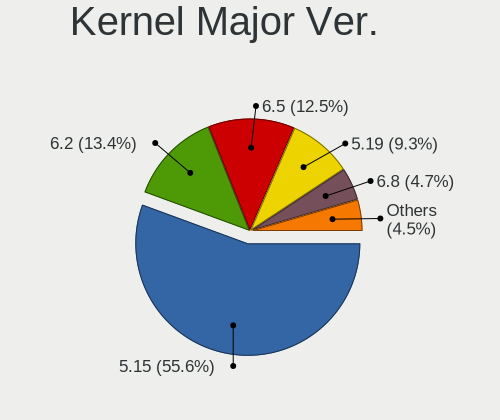

| Version | Computers | Percent |
|---------|-----------|---------|
| 5.15    | 183       | 86.73%  |
| 5.19    | 14        | 6.64%   |
| 5.18    | 3         | 1.42%   |
| 5.17    | 3         | 1.42%   |
| 5.14    | 2         | 0.95%   |
| 5.13    | 2         | 0.95%   |
| 6.2     | 1         | 0.47%   |
| 6.1     | 1         | 0.47%   |
| 6.0     | 1         | 0.47%   |
| 4.9     | 1         | 0.47%   |

Arch
----

OS architecture (x86_64, i586, etc.)

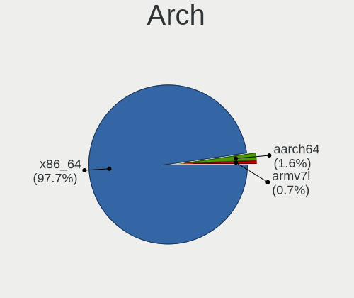

| Name    | Computers | Percent |
|---------|-----------|---------|
| x86_64  | 199       | 97.07%  |
| aarch64 | 4         | 1.95%   |
| armv7l  | 2         | 0.98%   |

DE
--

Desktop Environment

| Name   | Computers | Percent |
|--------|-----------|---------|
| MATE   | 201       | 98.05%  |
| KDE5   | 2         | 0.98%   |
| GNOME  | 1         | 0.49%   |
| Budgie | 1         | 0.49%   |

Display Server
--------------

X11 or Wayland

| Name    | Computers | Percent |
|---------|-----------|---------|
| X11     | 197       | 96.1%   |
| Wayland | 4         | 1.95%   |
| Tty     | 4         | 1.95%   |

Display Manager
---------------

SDDM, LightDM, etc.

| Name    | Computers | Percent |
|---------|-----------|---------|
| LightDM | 171       | 82.21%  |
| GDM3    | 18        | 8.65%   |
| Unknown | 18        | 8.65%   |
| SDDM    | 1         | 0.48%   |

OS Lang
-------

Language

| Lang  | Computers | Percent |
|-------|-----------|---------|
| en_US | 73        | 35.27%  |
| fr_FR | 27        | 13.04%  |
| de_DE | 25        | 12.08%  |
| it_IT | 15        | 7.25%   |
| en_AU | 8         | 3.86%   |
| ru_RU | 7         | 3.38%   |
| en_CA | 7         | 3.38%   |
| pt_BR | 6         | 2.9%    |
| en_GB | 5         | 2.42%   |
| C     | 5         | 2.42%   |
| fi_FI | 3         | 1.45%   |
| es_ES | 3         | 1.45%   |
| de_CH | 3         | 1.45%   |
| pl_PL | 2         | 0.97%   |
| hu_HU | 2         | 0.97%   |
| hr_HR | 2         | 0.97%   |
| es_MX | 2         | 0.97%   |
| es_AR | 2         | 0.97%   |
| el_GR | 2         | 0.97%   |
| zh_TW | 1         | 0.48%   |
| zh_CN | 1         | 0.48%   |
| pt_PT | 1         | 0.48%   |
| nl_NL | 1         | 0.48%   |
| es_PE | 1         | 0.48%   |
| en_IL | 1         | 0.48%   |
| de_AT | 1         | 0.48%   |
| da_DK | 1         | 0.48%   |

Boot Mode
---------

EFI or BIOS

| Mode | Computers | Percent |
|------|-----------|---------|
| BIOS | 106       | 50%     |
| EFI  | 106       | 50%     |

Filesystem
----------

Type of filesystem

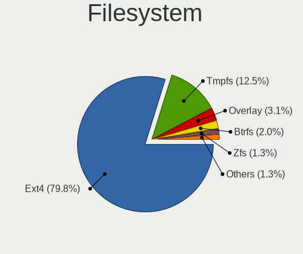

| Type    | Computers | Percent |
|---------|-----------|---------|
| Ext4    | 183       | 88.83%  |
| Overlay | 7         | 3.4%    |
| Btrfs   | 7         | 3.4%    |
| Zfs     | 4         | 1.94%   |
| Xfs     | 3         | 1.46%   |
| Jfs     | 1         | 0.49%   |
| Ext2    | 1         | 0.49%   |

Part. scheme
------------

Scheme of partitioning

| Type    | Computers | Percent |
|---------|-----------|---------|
| GPT     | 146       | 69.52%  |
| Unknown | 41        | 19.52%  |
| MBR     | 23        | 10.95%  |

Dual Boot with Linux/BSD
------------------------

Hosting more than one Linux/BSD

| Dual boot | Computers | Percent |
|-----------|-----------|---------|
| No        | 172       | 83.5%   |
| Yes       | 34        | 16.5%   |

Dual Boot (Win)
---------------

Hosting Linux and Windows

| Dual boot | Computers | Percent |
|-----------|-----------|---------|
| No        | 133       | 63.94%  |
| Yes       | 75        | 36.06%  |

Board
-----

Vendor
------

Motherboard manufacturer

| Name                                 | Computers | Percent |
|--------------------------------------|-----------|---------|
| Hewlett-Packard                      | 38        | 18.54%  |
| ASUSTek Computer                     | 38        | 18.54%  |
| Lenovo                               | 24        | 11.71%  |
| Dell                                 | 20        | 9.76%   |
| MSI                                  | 14        | 6.83%   |
| Gigabyte Technology                  | 8         | 3.9%    |
| Acer                                 | 8         | 3.9%    |
| Apple                                | 7         | 3.41%   |
| Intel                                | 6         | 2.93%   |
| ASRock                               | 6         | 2.93%   |
| Sony                                 | 4         | 1.95%   |
| Raspberry Pi Foundation              | 3         | 1.46%   |
| HUAWEI                               | 3         | 1.46%   |
| Toshiba                              | 2         | 0.98%   |
| Hardkernel                           | 2         | 0.98%   |
| Google                               | 2         | 0.98%   |
| Unknown                              | 2         | 0.98%   |
| TYAN Computer                        | 1         | 0.49%   |
| TrekStor                             | 1         | 0.49%   |
| SLIMBOOK                             | 1         | 0.49%   |
| Shenzhen Meigao Electronic Equipment | 1         | 0.49%   |
| Samsung Electronics                  | 1         | 0.49%   |
| Notebook                             | 1         | 0.49%   |
| Microsoft                            | 1         | 0.49%   |
| MicroByte                            | 1         | 0.49%   |
| Medion                               | 1         | 0.49%   |
| LincPlus                             | 1         | 0.49%   |
| LG Electronics                       | 1         | 0.49%   |
| IPASON                               | 1         | 0.49%   |
| HYPERPC                              | 1         | 0.49%   |
| HONOR                                | 1         | 0.49%   |
| Compaq                               | 1         | 0.49%   |
| Chuwi                                | 1         | 0.49%   |
| CCE                                  | 1         | 0.49%   |
| AZW                                  | 1         | 0.49%   |

Model
-----

Motherboard model

| Name                                       | Computers | Percent |
|--------------------------------------------|-----------|---------|
| RPi Raspberry Pi                           | 2         | 0.98%   |
| HP Compaq Elite 8300 SFF                   | 2         | 0.98%   |
| Hardkernel ODROID-N2Plus                   | 2         | 0.98%   |
| ASUS M5A78L LE                             | 2         | 0.98%   |
| Unknown                                    | 2         | 0.98%   |
| TYAN S7012                                 | 1         | 0.49%   |
| TrekStor Surfbook A13B                     | 1         | 0.49%   |
| Toshiba Satellite P50-B-10Z                | 1         | 0.49%   |
| Toshiba Satellite C50D-A-133               | 1         | 0.49%   |
| Sony VPCEH1E1E                             | 1         | 0.49%   |
| Sony VPCEB2Z1E                             | 1         | 0.49%   |
| Sony VPCEA36FG                             | 1         | 0.49%   |
| Sony VGN-Z21WRN_B                          | 1         | 0.49%   |
| SLIMBOOK TITAN                             | 1         | 0.49%   |
| Shenzhen Meigao Electronic Equipment HX90G | 1         | 0.49%   |
| Samsung 905S3G/906S3G/915S3G/9305SG        | 1         | 0.49%   |
| RPi Raspberry Pi 400 Rev 1.1               | 1         | 0.49%   |
| Notebook NJx0MU                            | 1         | 0.49%   |
| MSI p6-2330                                | 1         | 0.49%   |
| MSI MS-AA5E                                | 1         | 0.49%   |
| MSI MS-7D43                                | 1         | 0.49%   |
| MSI MS-7C56                                | 1         | 0.49%   |
| MSI MS-7C52                                | 1         | 0.49%   |
| MSI MS-7C37                                | 1         | 0.49%   |
| MSI MS-7C09                                | 1         | 0.49%   |
| MSI MS-7C02                                | 1         | 0.49%   |
| MSI MS-7A33                                | 1         | 0.49%   |
| MSI MS-7982                                | 1         | 0.49%   |
| MSI MS-7817                                | 1         | 0.49%   |
| MSI MS-7758                                | 1         | 0.49%   |
| MSI MS-7599                                | 1         | 0.49%   |
| MSI B02311                                 | 1         | 0.49%   |
| Microsoft Surface 2                        | 1         | 0.49%   |
| MicroByte ezbook                           | 1         | 0.49%   |
| Medion MS-7797                             | 1         | 0.49%   |
| LincPlus LINNCPLUS P1                      | 1         | 0.49%   |
| LG 17Z990-R.AAS8U1                         | 1         | 0.49%   |
| Lenovo V15 G2 ITL 82KB                     | 1         | 0.49%   |
| Lenovo ThinkPad X230 2325Y5L               | 1         | 0.49%   |
| Lenovo ThinkPad T460p 20FW002CPB           | 1         | 0.49%   |

Model Family
------------

Motherboard model prefix

| Name                     | Computers | Percent |
|--------------------------|-----------|---------|
| Lenovo ThinkPad          | 9         | 4.39%   |
| HP Pavilion              | 6         | 2.93%   |
| Dell Latitude            | 6         | 2.93%   |
| Lenovo IdeaPad           | 5         | 2.44%   |
| HP Compaq                | 5         | 2.44%   |
| Dell Precision           | 5         | 2.44%   |
| Dell Inspiron            | 5         | 2.44%   |
| ASUS PRIME               | 5         | 2.44%   |
| Acer Aspire              | 5         | 2.44%   |
| ASUS ROG                 | 4         | 1.95%   |
| RPi Raspberry            | 3         | 1.46%   |
| HP Laptop                | 3         | 1.46%   |
| HP EliteDesk             | 3         | 1.46%   |
| HP EliteBook             | 3         | 1.46%   |
| ASUS VivoBook            | 3         | 1.46%   |
| ASUS ASUS                | 3         | 1.46%   |
| Toshiba Satellite        | 2         | 0.98%   |
| Lenovo ThinkCentre       | 2         | 0.98%   |
| Lenovo ThinkBook         | 2         | 0.98%   |
| HP ZBook                 | 2         | 0.98%   |
| HP Stream                | 2         | 0.98%   |
| HP ProLiant              | 2         | 0.98%   |
| HP ProBook               | 2         | 0.98%   |
| HP ENVY                  | 2         | 0.98%   |
| HP 15                    | 2         | 0.98%   |
| Hardkernel ODROID-N2Plus | 2         | 0.98%   |
| Dell XPS                 | 2         | 0.98%   |
| Dell OptiPlex            | 2         | 0.98%   |
| ASUS TUF                 | 2         | 0.98%   |
| ASUS M5A78L              | 2         | 0.98%   |
| Apple iMac12             | 2         | 0.98%   |
| Acer TravelMate          | 2         | 0.98%   |
| Unknown                  | 2         | 0.98%   |
| TYAN S7012               | 1         | 0.49%   |
| TrekStor Surfbook        | 1         | 0.49%   |
| Sony VPCEH1E1E           | 1         | 0.49%   |
| Sony VPCEB2Z1E           | 1         | 0.49%   |
| Sony VPCEA36FG           | 1         | 0.49%   |
| Sony VGN-Z21WRN          | 1         | 0.49%   |
| SLIMBOOK TITAN           | 1         | 0.49%   |

MFG Year
--------

Motherboard manufacture year

| Year    | Computers | Percent |
|---------|-----------|---------|
| 2021    | 31        | 15.12%  |
| 2018    | 20        | 9.76%   |
| 2012    | 20        | 9.76%   |
| 2020    | 17        | 8.29%   |
| 2019    | 15        | 7.32%   |
| 2013    | 13        | 6.34%   |
| 2014    | 12        | 5.85%   |
| 2011    | 12        | 5.85%   |
| 2022    | 11        | 5.37%   |
| 2010    | 10        | 4.88%   |
| 2009    | 8         | 3.9%    |
| 2017    | 7         | 3.41%   |
| 2015    | 7         | 3.41%   |
| 2016    | 6         | 2.93%   |
| 2008    | 6         | 2.93%   |
| Unknown | 5         | 2.44%   |
| 2007    | 3         | 1.46%   |
| 2006    | 2         | 0.98%   |

Form Factor
-----------

Physical design of the computer

| Name           | Computers | Percent |
|----------------|-----------|---------|
| Notebook       | 102       | 49.76%  |
| Desktop        | 79        | 38.54%  |
| All in one     | 6         | 2.93%   |
| System on chip | 5         | 2.44%   |
| Mini pc        | 5         | 2.44%   |
| Convertible    | 4         | 1.95%   |
| Tablet         | 3         | 1.46%   |
| Server         | 1         | 0.49%   |

Secure Boot
-----------

Enabled or disabled

| State    | Computers | Percent |
|----------|-----------|---------|
| Disabled | 194       | 93.27%  |
| Enabled  | 14        | 6.73%   |

Coreboot
--------

Have coreboot on board

| Used | Computers | Percent |
|------|-----------|---------|
| No   | 203       | 99.02%  |
| Yes  | 2         | 0.98%   |

RAM Size
--------

Total RAM memory

| Size in GB  | Computers | Percent |
|-------------|-----------|---------|
| 4.01-8.0    | 45        | 21.95%  |
| 3.01-4.0    | 44        | 21.46%  |
| 8.01-16.0   | 39        | 19.02%  |
| 16.01-24.0  | 31        | 15.12%  |
| 32.01-64.0  | 25        | 12.2%   |
| 64.01-256.0 | 10        | 4.88%   |
| 24.01-32.0  | 4         | 1.95%   |
| 1.01-2.0    | 4         | 1.95%   |
| 2.01-3.0    | 3         | 1.46%   |

RAM Used
--------

Used RAM memory

| Used GB    | Computers | Percent |
|------------|-----------|---------|
| 1.01-2.0   | 69        | 31.65%  |
| 2.01-3.0   | 61        | 27.98%  |
| 4.01-8.0   | 36        | 16.51%  |
| 3.01-4.0   | 27        | 12.39%  |
| 8.01-16.0  | 12        | 5.5%    |
| 0.51-1.0   | 10        | 4.59%   |
| 24.01-32.0 | 2         | 0.92%   |
| 32.01-64.0 | 1         | 0.46%   |

Total Drives
------------

Number of drives on board

| Drives | Computers | Percent |
|--------|-----------|---------|
| 1      | 122       | 59.51%  |
| 2      | 42        | 20.49%  |
| 3      | 20        | 9.76%   |
| 4      | 11        | 5.37%   |
| 6      | 4         | 1.95%   |
| 5      | 2         | 0.98%   |
| 20     | 1         | 0.49%   |
| 8      | 1         | 0.49%   |
| 7      | 1         | 0.49%   |
| 0      | 1         | 0.49%   |

Has CD-ROM
----------

Has CD-ROM on board

| Presented | Computers | Percent |
|-----------|-----------|---------|
| No        | 112       | 54.63%  |
| Yes       | 93        | 45.37%  |

Has Ethernet
------------

Has Ethernet on board

| Presented | Computers | Percent |
|-----------|-----------|---------|
| Yes       | 166       | 80.98%  |
| No        | 39        | 19.02%  |

Has WiFi
--------

Has WiFi module

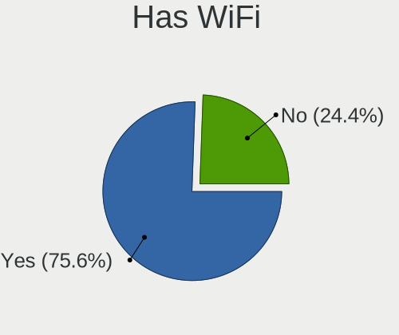

| Presented | Computers | Percent |
|-----------|-----------|---------|
| Yes       | 161       | 78.54%  |
| No        | 44        | 21.46%  |

Has Bluetooth
-------------

Has Bluetooth module

| Presented | Computers | Percent |
|-----------|-----------|---------|
| Yes       | 132       | 64.08%  |
| No        | 74        | 35.92%  |

Location
--------

Country
-------

Geographic location (country)

| Country     | Computers | Percent |
|-------------|-----------|---------|
| USA         | 31        | 15.12%  |
| Germany     | 27        | 13.17%  |
| France      | 26        | 12.68%  |
| Italy       | 19        | 9.27%   |
| Brazil      | 9         | 4.39%   |
| Spain       | 7         | 3.41%   |
| Australia   | 7         | 3.41%   |
| Russia      | 6         | 2.93%   |
| Canada      | 6         | 2.93%   |
| UK          | 5         | 2.44%   |
| Turkey      | 4         | 1.95%   |
| Portugal    | 4         | 1.95%   |
| Hungary     | 4         | 1.95%   |
| Greece      | 4         | 1.95%   |
| Finland     | 4         | 1.95%   |
| Switzerland | 3         | 1.46%   |
| Poland      | 3         | 1.46%   |
| Croatia     | 3         | 1.46%   |
| Belgium     | 3         | 1.46%   |
| Ukraine     | 2         | 0.98%   |
| Serbia      | 2         | 0.98%   |
| Mexico      | 2         | 0.98%   |
| Estonia     | 2         | 0.98%   |
| Austria     | 2         | 0.98%   |
| Argentina   | 2         | 0.98%   |
| Thailand    | 1         | 0.49%   |
| Slovenia    | 1         | 0.49%   |
| Romania     | 1         | 0.49%   |
| Peru        | 1         | 0.49%   |
| Paraguay    | 1         | 0.49%   |
| New Zealand | 1         | 0.49%   |
| Netherlands | 1         | 0.49%   |
| Libya       | 1         | 0.49%   |
| Israel      | 1         | 0.49%   |
| Isle of Man | 1         | 0.49%   |
| India       | 1         | 0.49%   |
| Hong Kong   | 1         | 0.49%   |
| Georgia     | 1         | 0.49%   |
| Denmark     | 1         | 0.49%   |
| Colombia    | 1         | 0.49%   |

City
----

Geographic location (city)

| City             | Computers | Percent |
|------------------|-----------|---------|
| Paris            | 4         | 1.88%   |
| Berlin           | 4         | 1.88%   |
| Rome             | 3         | 1.41%   |
| Mannheim         | 3         | 1.41%   |
| Zagreb           | 2         | 0.94%   |
| West Stockbridge | 2         | 0.94%   |
| Warsaw           | 2         | 0.94%   |
| Vancouver        | 2         | 0.94%   |
| Turku            | 2         | 0.94%   |
| Sao Paulo        | 2         | 0.94%   |
| Olathe           | 2         | 0.94%   |
| Moscow           | 2         | 0.94%   |
| Melbourne        | 2         | 0.94%   |
| Madrid           | 2         | 0.94%   |
| Lansdale         | 2         | 0.94%   |
| Cologne          | 2         | 0.94%   |
| Belgrade         | 2         | 0.94%   |
| Athens           | 2         | 0.94%   |
| Zottegem         | 1         | 0.47%   |
| York             | 1         | 0.47%   |
| Xining           | 1         | 0.47%   |
| Whanganui        | 1         | 0.47%   |
| Washington       | 1         | 0.47%   |
| Viroflay         | 1         | 0.47%   |
| Villeurbanne     | 1         | 0.47%   |
| Victoria         | 1         | 0.47%   |
| Viana do Castelo | 1         | 0.47%   |
| Velyki Mosty     | 1         | 0.47%   |
| Vaudoy-en-Brie   | 1         | 0.47%   |
| Varna            | 1         | 0.47%   |
| Valenciennes     | 1         | 0.47%   |
| Uberaba          | 1         | 0.47%   |
| Tula             | 1         | 0.47%   |
| Tripoli          | 1         | 0.47%   |
| Trenton          | 1         | 0.47%   |
| Toulouse         | 1         | 0.47%   |
| Toulon           | 1         | 0.47%   |
| Torring          | 1         | 0.47%   |
| Thane            | 1         | 0.47%   |
| Terrace          | 1         | 0.47%   |

Drives
------

Drive Vendor
------------

Hard drive vendors

| Vendor                | Computers | Drives | Percent |
|-----------------------|-----------|--------|---------|
| Samsung Electronics   | 49        | 82     | 16.07%  |
| WDC                   | 37        | 57     | 12.13%  |
| Seagate               | 36        | 58     | 11.8%   |
| Crucial               | 20        | 25     | 6.56%   |
| Unknown               | 18        | 27     | 5.9%    |
| SanDisk               | 16        | 21     | 5.25%   |
| Toshiba               | 15        | 30     | 4.92%   |
| Kingston              | 14        | 20     | 4.59%   |
| SK hynix              | 8         | 8      | 2.62%   |
| Phison                | 6         | 6      | 1.97%   |
| Hitachi               | 6         | 6      | 1.97%   |
| A-DATA Technology     | 6         | 6      | 1.97%   |
| SPCC                  | 4         | 7      | 1.31%   |
| KIOXIA                | 4         | 4      | 1.31%   |
| Phison Electronics    | 3         | 3      | 0.98%   |
| Micron Technology     | 3         | 3      | 0.98%   |
| KingSpec              | 3         | 3      | 0.98%   |
| Intenso               | 3         | 3      | 0.98%   |
| Intel                 | 3         | 3      | 0.98%   |
| HGST                  | 3         | 3      | 0.98%   |
| China                 | 3         | 3      | 0.98%   |
| Unknown               | 3         | 3      | 0.98%   |
| Netac                 | 2         | 2      | 0.66%   |
| Hewlett-Packard       | 2         | 3      | 0.66%   |
| Corsair               | 2         | 2      | 0.66%   |
| ZXIC MMC              | 1         | 1      | 0.33%   |
| WDC WDS2              | 1         | 1      | 0.33%   |
| Verbatim              | 1         | 4      | 0.33%   |
| UMIS                  | 1         | 2      | 0.33%   |
| Transcend             | 1         | 1      | 0.33%   |
| Team                  | 1         | 1      | 0.33%   |
| SSSTC                 | 1         | 1      | 0.33%   |
| Silicon Motion        | 1         | 1      | 0.33%   |
| RZX                   | 1         | 1      | 0.33%   |
| Realtek Semiconductor | 1         | 2      | 0.33%   |
| PNY                   | 1         | 1      | 0.33%   |
| Pichau                | 1         | 1      | 0.33%   |
| Patriot               | 1         | 1      | 0.33%   |
| OCZ                   | 1         | 1      | 0.33%   |
| NGFF                  | 1         | 1      | 0.33%   |

Drive Model
-----------

Hard drive models

| Model                                               | Computers | Percent |
|-----------------------------------------------------|-----------|---------|
| Unknown MMC Card  32GB                              | 4         | 1.15%   |
| Seagate ST500DM002-1BD142 500GB                     | 4         | 1.15%   |
| Samsung NVMe SSD Controller SM981/PM981/PM983 250GB | 4         | 1.15%   |
| Kingston SA400S37480G 480GB SSD                     | 4         | 1.15%   |
| Crucial CT240BX500SSD1 240GB                        | 4         | 1.15%   |
| Crucial CT2000MX500SSD1 2TB                         | 4         | 1.15%   |
| Crucial CT1000BX500SSD1 1TB                         | 4         | 1.15%   |
| WDC WD10EZEX-08WN4A0 1TB                            | 3         | 0.86%   |
| Toshiba MQ01ABF050 500GB                            | 3         | 0.86%   |
| Seagate ST2000DM008-2FR102 2TB                      | 3         | 0.86%   |
| Seagate ST2000DM001-1ER164 2TB                      | 3         | 0.86%   |
| Seagate ST1000DM003-1ER162 1TB                      | 3         | 0.86%   |
| Samsung SSD 870 QVO 1TB                             | 3         | 0.86%   |
| Samsung NVMe SSD Drive 1TB                          | 3         | 0.86%   |
| Unknown                                             | 3         | 0.86%   |
| WDC WD40EZAZ-00SF3B0 4TB                            | 2         | 0.58%   |
| WDC WD30EFRX-68EUZN0 3TB                            | 2         | 0.58%   |
| Unknown SD/MMC 2GB                                  | 2         | 0.58%   |
| Unknown M.S./M.S.Pro/HG 16GB                        | 2         | 0.58%   |
| Seagate ST9500325AS 500GB                           | 2         | 0.58%   |
| Seagate ST4000DM004-2CV104 4TB                      | 2         | 0.58%   |
| Seagate ST2000LM015-2E8174 2TB                      | 2         | 0.58%   |
| Seagate ST1000LM035-1RK172 1TB                      | 2         | 0.58%   |
| SanDisk SSD PLUS 480GB                              | 2         | 0.58%   |
| Samsung SSD 980 PRO 500GB                           | 2         | 0.58%   |
| Samsung SSD 980 PRO 1TB                             | 2         | 0.58%   |
| Samsung SSD 980 1TB                                 | 2         | 0.58%   |
| Samsung SSD 970 EVO Plus 250GB                      | 2         | 0.58%   |
| Samsung SSD 870 QVO 2TB                             | 2         | 0.58%   |
| Samsung SSD 870 EVO 500GB                           | 2         | 0.58%   |
| Samsung SSD 860 EVO 250GB                           | 2         | 0.58%   |
| Samsung SSD 850 EVO 250GB                           | 2         | 0.58%   |
| Samsung MZVLQ512HBLU-00BH1 512GB                    | 2         | 0.58%   |
| Kingston SA400S37120G 120GB SSD                     | 2         | 0.58%   |
| Crucial CT480BX500SSD1 480GB                        | 2         | 0.58%   |
| ZXIC MMC Storage 2.31 128GB                         | 1         | 0.29%   |
| WDC WDS240G2G0A-00JH30 240GB SSD                    | 1         | 0.29%   |
| WDC WDS2 50G2B0B-00YS 250GB SSD                     | 1         | 0.29%   |
| WDC WDS100T2B0C 1TB                                 | 1         | 0.29%   |
| WDC WDBNCE0010PNC 1TB SSD                           | 1         | 0.29%   |

HDD Vendor
----------

Hard disk drive vendors

| Vendor              | Computers | Drives | Percent |
|---------------------|-----------|--------|---------|
| Seagate             | 36        | 58     | 36.73%  |
| WDC                 | 34        | 52     | 34.69%  |
| Toshiba             | 11        | 25     | 11.22%  |
| Hitachi             | 6         | 6      | 6.12%   |
| Samsung Electronics | 3         | 6      | 3.06%   |
| HGST                | 3         | 3      | 3.06%   |
| Maxtor              | 1         | 1      | 1.02%   |
| KESU                | 1         | 1      | 1.02%   |
| Hewlett-Packard     | 1         | 2      | 1.02%   |
| DAS                 | 1         | 6      | 1.02%   |
| ASMedia             | 1         | 1      | 1.02%   |

SSD Vendor
----------

Solid state drive vendors

| Vendor              | Computers | Drives | Percent |
|---------------------|-----------|--------|---------|
| Samsung Electronics | 25        | 32     | 22.32%  |
| Crucial             | 19        | 24     | 16.96%  |
| SanDisk             | 11        | 14     | 9.82%   |
| Kingston            | 10        | 15     | 8.93%   |
| A-DATA Technology   | 5         | 5      | 4.46%   |
| SPCC                | 3         | 6      | 2.68%   |
| KingSpec            | 3         | 3      | 2.68%   |
| China               | 3         | 3      | 2.68%   |
| WDC                 | 2         | 2      | 1.79%   |
| Toshiba             | 2         | 3      | 1.79%   |
| Intenso             | 2         | 2      | 1.79%   |
| WDC WDS2            | 1         | 1      | 0.89%   |
| Verbatim            | 1         | 4      | 0.89%   |
| Unknown             | 1         | 1      | 0.89%   |
| Transcend           | 1         | 1      | 0.89%   |
| Team                | 1         | 1      | 0.89%   |
| SK hynix            | 1         | 1      | 0.89%   |
| RZX                 | 1         | 1      | 0.89%   |
| PNY                 | 1         | 1      | 0.89%   |
| Pichau              | 1         | 1      | 0.89%   |
| Patriot             | 1         | 1      | 0.89%   |
| OCZ                 | 1         | 1      | 0.89%   |
| NGFF                | 1         | 1      | 0.89%   |
| Netac               | 1         | 1      | 0.89%   |
| Micron Technology   | 1         | 1      | 0.89%   |
| LITEONIT            | 1         | 1      | 0.89%   |
| LITEON              | 1         | 1      | 0.89%   |
| LDLC                | 1         | 1      | 0.89%   |
| Kston               | 1         | 1      | 0.89%   |
| KIOXIA-EXCERIA      | 1         | 1      | 0.89%   |
| JMicron Technology  | 1         | 1      | 0.89%   |
| Intel               | 1         | 1      | 0.89%   |
| GOODRAM             | 1         | 1      | 0.89%   |
| Corsair             | 1         | 1      | 0.89%   |
| BAITITON            | 1         | 1      | 0.89%   |
| ASMT                | 1         | 1      | 0.89%   |
| Apple               | 1         | 1      | 0.89%   |
| addlink             | 1         | 1      | 0.89%   |

Drive Kind
----------

HDD or SSD

| Kind    | Computers | Drives | Percent |
|---------|-----------|--------|---------|
| SSD     | 95        | 139    | 34.55%  |
| HDD     | 83        | 161    | 30.18%  |
| NVMe    | 74        | 100    | 26.91%  |
| MMC     | 16        | 23     | 5.82%   |
| Unknown | 7         | 11     | 2.55%   |

Drive Connector
---------------

SATA, SAS, NVMe, etc.

| Type | Computers | Drives | Percent |
|------|-----------|--------|---------|
| SATA | 140       | 280    | 56.22%  |
| NVMe | 74        | 100    | 29.72%  |
| SAS  | 19        | 31     | 7.63%   |
| MMC  | 16        | 23     | 6.43%   |

Drive Size
----------

Size of hard drive

| Size in TB | Computers | Drives | Percent |
|------------|-----------|--------|---------|
| 0.01-0.5   | 108       | 156    | 53.73%  |
| 0.51-1.0   | 50        | 76     | 24.88%  |
| 1.01-2.0   | 23        | 30     | 11.44%  |
| 3.01-4.0   | 11        | 14     | 5.47%   |
| 4.01-10.0  | 6         | 17     | 2.99%   |
| 2.01-3.0   | 3         | 7      | 1.49%   |

Space Total
-----------

Amount of disk space available on the file system

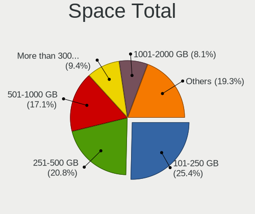

| Size in GB     | Computers | Percent |
|----------------|-----------|---------|
| 101-250        | 59        | 27.83%  |
| 251-500        | 47        | 22.17%  |
| 501-1000       | 27        | 12.74%  |
| More than 3000 | 18        | 8.49%   |
| 1001-2000      | 16        | 7.55%   |
| 21-50          | 14        | 6.6%    |
| 51-100         | 12        | 5.66%   |
| 1-20           | 9         | 4.25%   |
| 2001-3000      | 8         | 3.77%   |
| Unknown        | 2         | 0.94%   |

Space Used
----------

Amount of used disk space

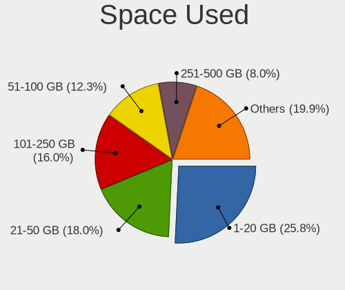

| Used GB        | Computers | Percent |
|----------------|-----------|---------|
| 1-20           | 60        | 28.44%  |
| 21-50          | 36        | 17.06%  |
| 101-250        | 31        | 14.69%  |
| 51-100         | 27        | 12.8%   |
| 501-1000       | 15        | 7.11%   |
| 251-500        | 14        | 6.64%   |
| More than 3000 | 11        | 5.21%   |
| 1001-2000      | 9         | 4.27%   |
| 2001-3000      | 6         | 2.84%   |
| Unknown        | 2         | 0.95%   |

Malfunc. Drives
---------------

Drive models with a malfunction

| Model                                        | Computers | Drives | Percent |
|----------------------------------------------|-----------|--------|---------|
| Seagate ST500DM002-1BD142 500GB              | 3         | 3      | 13.04%  |
| WDC WD5000AADS-00S9B0 500GB                  | 1         | 1      | 4.35%   |
| WDC WD1001FALS-40Y6A0 1TB                    | 1         | 1      | 4.35%   |
| Seagate ST9500420AS 500GB                    | 1         | 1      | 4.35%   |
| Seagate ST9500325AS 500GB                    | 1         | 1      | 4.35%   |
| Seagate ST500LT012-1DG142 500GB              | 1         | 1      | 4.35%   |
| Seagate ST2000DM001-1ER164 2TB               | 1         | 1      | 4.35%   |
| Seagate ST1000LM035-1RK172 1TB               | 1         | 1      | 4.35%   |
| Seagate ST1000DM003-1ER162 1TB               | 1         | 1      | 4.35%   |
| Samsung Electronics SSD 960 PRO 1TB          | 1         | 1      | 4.35%   |
| Samsung Electronics SSD 870 EVO 500GB        | 1         | 1      | 4.35%   |
| Samsung Electronics MZVLQ512HBLU-00BH1 512GB | 1         | 1      | 4.35%   |
| OCZ VERTEX3 240GB SSD                        | 1         | 1      | 4.35%   |
| NGFF 2280 256GB SSD                          | 1         | 1      | 4.35%   |
| Netac SSD 256GB                              | 1         | 1      | 4.35%   |
| Kingston SA400S37240G 240GB SSD              | 1         | 1      | 4.35%   |
| Intel SSDSC2KW512G8 512GB                    | 1         | 1      | 4.35%   |
| Hitachi HTS725032A9A364 320GB                | 1         | 1      | 4.35%   |
| Hitachi HTS721080G9SA00 80GB                 | 1         | 1      | 4.35%   |
| DAS TerraMaster 500GB                        | 1         | 3      | 4.35%   |
| China SSD 180GB                              | 1         | 1      | 4.35%   |

Malfunc. Drive Vendor
---------------------

Vendors of faulty drives

| Vendor              | Computers | Drives | Percent |
|---------------------|-----------|--------|---------|
| Seagate             | 9         | 9      | 39.13%  |
| Samsung Electronics | 3         | 3      | 13.04%  |
| WDC                 | 2         | 2      | 8.7%    |
| Hitachi             | 2         | 2      | 8.7%    |
| OCZ                 | 1         | 1      | 4.35%   |
| NGFF                | 1         | 1      | 4.35%   |
| Netac               | 1         | 1      | 4.35%   |
| Kingston            | 1         | 1      | 4.35%   |
| Intel               | 1         | 1      | 4.35%   |
| DAS                 | 1         | 3      | 4.35%   |
| China               | 1         | 1      | 4.35%   |

Malfunc. HDD Vendor
-------------------

Vendors of faulty HDD drives

| Vendor  | Computers | Drives | Percent |
|---------|-----------|--------|---------|
| Seagate | 9         | 9      | 64.29%  |
| WDC     | 2         | 2      | 14.29%  |
| Hitachi | 2         | 2      | 14.29%  |
| DAS     | 1         | 3      | 7.14%   |

Malfunc. Drive Kind
-------------------

Kinds of faulty drives

| Kind | Computers | Drives | Percent |
|------|-----------|--------|---------|
| HDD  | 13        | 16     | 59.09%  |
| SSD  | 7         | 7      | 31.82%  |
| NVMe | 2         | 2      | 9.09%   |

Failed Drives
-------------

Failed drive models

Zero info for selected period =(

Failed Drive Vendor
-------------------

Failed drive vendors

Zero info for selected period =(

Drive Status
------------

Number of failed and malfunc. drives

| Status   | Computers | Drives | Percent |
|----------|-----------|--------|---------|
| Works    | 120       | 230    | 52.17%  |
| Detected | 88        | 179    | 38.26%  |
| Malfunc  | 22        | 25     | 9.57%   |

Storage controller
------------------

Storage Vendor
--------------

Storage controller vendors

| Vendor                         | Computers | Percent |
|--------------------------------|-----------|---------|
| Intel                          | 120       | 46.88%  |
| AMD                            | 49        | 19.14%  |
| Samsung Electronics            | 27        | 10.55%  |
| Phison Electronics             | 11        | 4.3%    |
| SanDisk                        | 8         | 3.13%   |
| SK hynix                       | 6         | 2.34%   |
| Kingston Technology Company    | 5         | 1.95%   |
| ASMedia Technology             | 5         | 1.95%   |
| Silicon Motion                 | 4         | 1.56%   |
| KIOXIA                         | 4         | 1.56%   |
| Toshiba America Info Systems   | 3         | 1.17%   |
| Nvidia                         | 2         | 0.78%   |
| Micron Technology              | 2         | 0.78%   |
| ADATA Technology               | 2         | 0.78%   |
| Union Memory (Shenzhen)        | 1         | 0.39%   |
| Solid State Storage Technology | 1         | 0.39%   |
| Realtek Semiconductor          | 1         | 0.39%   |
| Micron/Crucial Technology      | 1         | 0.39%   |
| MAXIO Technology (Hangzhou)    | 1         | 0.39%   |
| Marvell Technology Group       | 1         | 0.39%   |
| Lenovo                         | 1         | 0.39%   |
| Hewlett-Packard                | 1         | 0.39%   |

Storage Model
-------------

Storage controller models

| Model                                                                          | Computers | Percent |
|--------------------------------------------------------------------------------|-----------|---------|
| AMD FCH SATA Controller [AHCI mode]                                            | 31        | 10.47%  |
| Samsung NVMe SSD Controller 980                                                | 12        | 4.05%   |
| Intel 7 Series Chipset Family 6-port SATA Controller [AHCI mode]               | 9         | 3.04%   |
| Samsung NVMe SSD Controller SM981/PM981/PM983                                  | 8         | 2.7%    |
| Intel Volume Management Device NVMe RAID Controller                            | 8         | 2.7%    |
| AMD SB7x0/SB8x0/SB9x0 IDE Controller                                           | 8         | 2.7%    |
| Samsung NVMe SSD Controller PM9A1/PM9A3/980PRO                                 | 7         | 2.36%   |
| Intel 8 Series/C220 Series Chipset Family 6-port SATA Controller 1 [AHCI mode] | 7         | 2.36%   |
| Intel 82801 Mobile SATA Controller [RAID mode]                                 | 6         | 2.03%   |
| Intel 7 Series/C210 Series Chipset Family 6-port SATA Controller [AHCI mode]   | 6         | 2.03%   |
| Intel 500 Series Chipset Family SATA AHCI Controller                           | 6         | 2.03%   |
| Intel Sunrise Point-LP SATA Controller [AHCI mode]                             | 5         | 1.69%   |
| Intel Q170/Q150/B150/H170/H110/Z170/CM236 Chipset SATA Controller [AHCI Mode]  | 5         | 1.69%   |
| Intel Alder Lake-S PCH SATA Controller [AHCI Mode]                             | 5         | 1.69%   |
| ASMedia ASM1062 Serial ATA Controller                                          | 5         | 1.69%   |
| AMD SB7x0/SB8x0/SB9x0 SATA Controller [IDE mode]                               | 5         | 1.69%   |
| AMD SB7x0/SB8x0/SB9x0 SATA Controller [AHCI mode]                              | 5         | 1.69%   |
| AMD 400 Series Chipset SATA Controller                                         | 5         | 1.69%   |
| Phison E16 PCIe4 NVMe Controller                                               | 4         | 1.35%   |
| Intel Atom Processor E3800 Series SATA AHCI Controller                         | 4         | 1.35%   |
| Intel 82801IBM/IEM (ICH9M/ICH9M-E) 4 port SATA Controller [AHCI mode]          | 4         | 1.35%   |
| Intel 6 Series/C200 Series Chipset Family 6 port Desktop SATA AHCI Controller  | 4         | 1.35%   |
| Intel 5 Series/3400 Series Chipset 4 port SATA AHCI Controller                 | 4         | 1.35%   |
| Intel 200 Series PCH SATA controller [AHCI mode]                               | 4         | 1.35%   |
| AMD 500 Series Chipset SATA Controller                                         | 4         | 1.35%   |
| Phison PS5013 E13 NVMe Controller                                              | 3         | 1.01%   |
| Kingston Company NVMe Controller                                               | 3         | 1.01%   |
| Intel Tiger Lake-LP SATA Controller                                            | 3         | 1.01%   |
| Intel Comet Lake SATA AHCI Controller                                          | 3         | 1.01%   |
| Intel Celeron/Pentium Silver Processor SATA Controller                         | 3         | 1.01%   |
| Intel Cannon Point-LP SATA Controller [AHCI Mode]                              | 3         | 1.01%   |
| Intel Cannon Lake PCH SATA AHCI Controller                                     | 3         | 1.01%   |
| Intel 8 Series SATA Controller 1 [AHCI mode]                                   | 3         | 1.01%   |
| Intel 5 Series/3400 Series Chipset 6 port SATA AHCI Controller                 | 3         | 1.01%   |
| SK hynix PC401 NVMe Solid State Drive 256GB                                    | 2         | 0.68%   |
| Silicon Motion SM2263EN/SM2263XT SSD Controller                                | 2         | 0.68%   |
| SanDisk WD Black SN750 / PC SN730 NVMe SSD                                     | 2         | 0.68%   |
| Samsung NVMe SSD Controller SM961/PM961/SM963                                  | 2         | 0.68%   |
| Phison NVMe Storage Controller                                                 | 2         | 0.68%   |
| Micron NVMe Storage Controller                                                 | 2         | 0.68%   |

Storage Kind
------------

Kind of storage controller (IDE, SATA, NVMe, SAS, ...)

| Kind | Computers | Percent |
|------|-----------|---------|
| SATA | 148       | 56.06%  |
| NVMe | 74        | 28.03%  |
| IDE  | 23        | 8.71%   |
| RAID | 19        | 7.2%    |

Processor
---------

CPU Vendor
----------

Processor vendors

| Vendor | Computers | Percent |
|--------|-----------|---------|
| Intel  | 139       | 67.8%   |
| AMD    | 60        | 29.27%  |
| ARM    | 6         | 2.93%   |

CPU Model
---------

Processor models

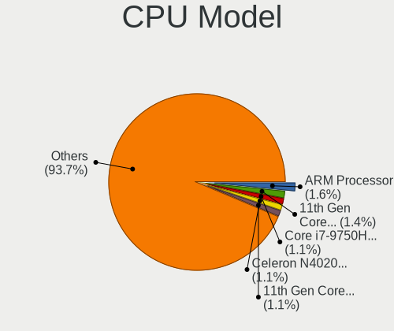

| Model                                         | Computers | Percent |
|-----------------------------------------------|-----------|---------|
| ARM Processor                                 | 4         | 1.95%   |
| AMD Ryzen 9 5900HX with Radeon Graphics       | 4         | 1.95%   |
| Intel Core i7-3517U CPU @ 1.90GHz             | 3         | 1.46%   |
| Intel 11th Gen Core i7-1165G7 @ 2.80GHz       | 3         | 1.46%   |
| Intel Pentium CPU N3540 @ 2.16GHz             | 2         | 0.98%   |
| Intel Core i7-8565U CPU @ 1.80GHz             | 2         | 0.98%   |
| Intel Core i7-4790 CPU @ 3.60GHz              | 2         | 0.98%   |
| Intel Core i7-10510U CPU @ 1.80GHz            | 2         | 0.98%   |
| Intel Core i5-8250U CPU @ 1.60GHz             | 2         | 0.98%   |
| Intel Core i5-3470 CPU @ 3.20GHz              | 2         | 0.98%   |
| Intel Core i5-10210U CPU @ 1.60GHz            | 2         | 0.98%   |
| Intel Core i3-10110U CPU @ 2.10GHz            | 2         | 0.98%   |
| Intel Core i3-1005G1 CPU @ 1.20GHz            | 2         | 0.98%   |
| Intel Celeron N4020 CPU @ 1.10GHz             | 2         | 0.98%   |
| Intel Celeron J4125 CPU @ 2.00GHz             | 2         | 0.98%   |
| Intel Celeron CPU N2830 @ 2.16GHz             | 2         | 0.98%   |
| Intel 11th Gen Core i5-11600K @ 3.90GHz       | 2         | 0.98%   |
| Intel 11th Gen Core i5-1135G7 @ 2.40GHz       | 2         | 0.98%   |
| AMD Ryzen 7 5800H with Radeon Graphics        | 2         | 0.98%   |
| AMD Ryzen 5 4600H with Radeon Graphics        | 2         | 0.98%   |
| AMD Ryzen 5 3600 6-Core Processor             | 2         | 0.98%   |
| AMD Ryzen 5 3500U with Radeon Vega Mobile Gfx | 2         | 0.98%   |
| AMD Ryzen 5 2600 Six-Core Processor           | 2         | 0.98%   |
| AMD Ryzen 5 2400G with Radeon Vega Graphics   | 2         | 0.98%   |
| AMD A8-9600 RADEON R7, 10 COMPUTE CORES 4C+6G | 2         | 0.98%   |
| Intel Xeon CPU X5680 @ 3.33GHz                | 1         | 0.49%   |
| Intel Xeon CPU E5-2650 v3 @ 2.30GHz           | 1         | 0.49%   |
| Intel Xeon CPU E5-2620 0 @ 2.00GHz            | 1         | 0.49%   |
| Intel Xeon CPU E3-1505M v6 @ 3.00GHz          | 1         | 0.49%   |
| Intel Xeon CPU E3-1245 v3 @ 3.40GHz           | 1         | 0.49%   |
| Intel Pentium Silver N6000 @ 1.10GHz          | 1         | 0.49%   |
| Intel Pentium Dual-Core CPU T4400 @ 2.20GHz   | 1         | 0.49%   |
| Intel Pentium CPU N4200 @ 1.10GHz             | 1         | 0.49%   |
| Intel Pentium CPU G4400 @ 3.30GHz             | 1         | 0.49%   |
| Intel Pentium CPU G3240 @ 3.10GHz             | 1         | 0.49%   |
| Intel Pentium CPU G3220 @ 3.00GHz             | 1         | 0.49%   |
| Intel Pentium CPU G2020 @ 2.90GHz             | 1         | 0.49%   |
| Intel Pentium CPU B940 @ 2.00GHz              | 1         | 0.49%   |
| Intel Pentium 4 CPU 3.06GHz                   | 1         | 0.49%   |
| Intel Core i7-9750H CPU @ 2.60GHz             | 1         | 0.49%   |

CPU Model Family
----------------

Processor model prefix

| Model                   | Computers | Percent |
|-------------------------|-----------|---------|
| Intel Core i5           | 36        | 17.56%  |
| Other                   | 27        | 13.17%  |
| Intel Core i7           | 27        | 13.17%  |
| AMD Ryzen 5             | 16        | 7.8%    |
| Intel Core i3           | 15        | 7.32%   |
| Intel Celeron           | 12        | 5.85%   |
| Intel Core 2 Duo        | 10        | 4.88%   |
| Intel Pentium           | 8         | 3.9%    |
| AMD Ryzen 7             | 8         | 3.9%    |
| Intel Xeon              | 5         | 2.44%   |
| AMD Ryzen 9             | 4         | 1.95%   |
| AMD A8                  | 4         | 1.95%   |
| AMD Ryzen 3             | 3         | 1.46%   |
| AMD FX                  | 3         | 1.46%   |
| AMD Athlon II X2        | 3         | 1.46%   |
| AMD A6                  | 3         | 1.46%   |
| AMD A4                  | 3         | 1.46%   |
| Intel Pentium Silver    | 1         | 0.49%   |
| Intel Pentium Dual-Core | 1         | 0.49%   |
| Intel Pentium 4         | 1         | 0.49%   |
| Intel Core 2 Quad       | 1         | 0.49%   |
| ARM BCM                 | 1         | 0.49%   |
| AMD Turion II Neo       | 1         | 0.49%   |
| AMD Turion 64 X2 Mobile | 1         | 0.49%   |
| AMD Turion 64 Mobile    | 1         | 0.49%   |
| AMD Sempron             | 1         | 0.49%   |
| AMD Ryzen 7 PRO         | 1         | 0.49%   |
| AMD Quad-Core           | 1         | 0.49%   |
| AMD Phenom II X6        | 1         | 0.49%   |
| AMD E2                  | 1         | 0.49%   |
| AMD E1                  | 1         | 0.49%   |
| AMD E                   | 1         | 0.49%   |
| AMD Athlon X2           | 1         | 0.49%   |
| AMD Athlon II X4        | 1         | 0.49%   |
| AMD A10                 | 1         | 0.49%   |

CPU Cores
---------

Number of processor cores

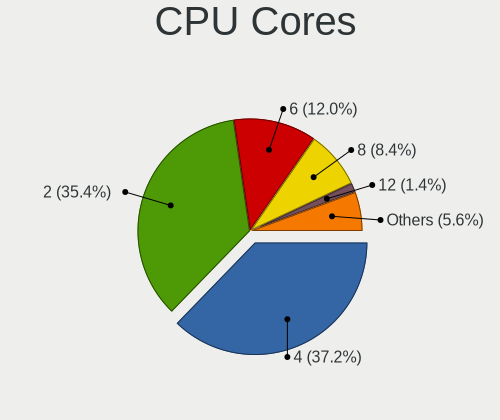

| Number  | Computers | Percent |
|---------|-----------|---------|
| 4       | 78        | 38.05%  |
| 2       | 72        | 35.12%  |
| 6       | 22        | 10.73%  |
| 8       | 15        | 7.32%   |
| 1       | 5         | 2.44%   |
| 12      | 4         | 1.95%   |
| 10      | 3         | 1.46%   |
| 3       | 2         | 0.98%   |
| Unknown | 2         | 0.98%   |
| 16      | 1         | 0.49%   |
| 14      | 1         | 0.49%   |

CPU Sockets
-----------

Number of sockets

| Number  | Computers | Percent |
|---------|-----------|---------|
| 1       | 201       | 98.05%  |
| 2       | 2         | 0.98%   |
| Unknown | 2         | 0.98%   |

CPU Threads
-----------

Threads per core (Hyper-Threading)

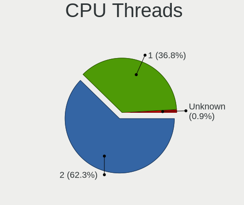

| Number  | Computers | Percent |
|---------|-----------|---------|
| 2       | 126       | 61.46%  |
| 1       | 77        | 37.56%  |
| Unknown | 2         | 0.98%   |

CPU Op-Modes
------------

CPU Operation Modes (32-bit, 64-bit)

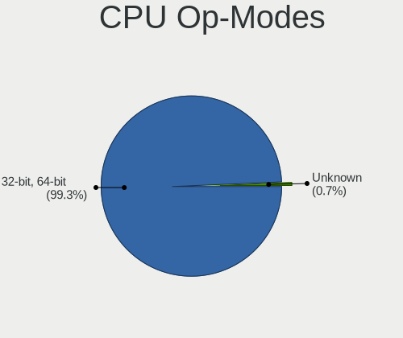

| Op mode        | Computers | Percent |
|----------------|-----------|---------|
| 32-bit, 64-bit | 203       | 99.02%  |
| Unknown        | 2         | 0.98%   |

CPU Microcode
-------------

Microcode number

| Number     | Computers | Percent |
|------------|-----------|---------|
| Unknown    | 85        | 40.09%  |
| 0x306a9    | 10        | 4.72%   |
| 0x806c1    | 7         | 3.3%    |
| 0x206a7    | 7         | 3.3%    |
| 0x806ec    | 6         | 2.83%   |
| 0x0a50000c | 5         | 2.36%   |
| 0x806ea    | 4         | 1.89%   |
| 0x506e3    | 4         | 1.89%   |
| 0x306c3    | 4         | 1.89%   |
| 0x08108109 | 4         | 1.89%   |
| 0xa0671    | 3         | 1.42%   |
| 0x906ea    | 3         | 1.42%   |
| 0x906e9    | 3         | 1.42%   |
| 0x806d1    | 3         | 1.42%   |
| 0x40651    | 3         | 1.42%   |
| 0x30678    | 3         | 1.42%   |
| 0x20655    | 3         | 1.42%   |
| 0x1067a    | 3         | 1.42%   |
| 0x0700010f | 3         | 1.42%   |
| 0x90672    | 2         | 0.94%   |
| 0x806eb    | 2         | 0.94%   |
| 0x706e5    | 2         | 0.94%   |
| 0x706a8    | 2         | 0.94%   |
| 0x6fd      | 2         | 0.94%   |
| 0x506c9    | 2         | 0.94%   |
| 0x10676    | 2         | 0.94%   |
| 0x08608103 | 2         | 0.94%   |
| 0x0800820d | 2         | 0.94%   |
| 0x06001119 | 2         | 0.94%   |
| 0x05000119 | 2         | 0.94%   |
| 0xa0653    | 1         | 0.47%   |
| 0x906ed    | 1         | 0.47%   |
| 0x906c0    | 1         | 0.47%   |
| 0x906a4    | 1         | 0.47%   |
| 0x906a3    | 1         | 0.47%   |
| 0x806e9    | 1         | 0.47%   |
| 0x706a1    | 1         | 0.47%   |
| 0x6fb      | 1         | 0.47%   |
| 0x406e3    | 1         | 0.47%   |
| 0x406c4    | 1         | 0.47%   |

CPU Microarch
-------------

Microarchitecture

| Name             | Computers | Percent |
|------------------|-----------|---------|
| KabyLake         | 26        | 12.56%  |
| IvyBridge        | 17        | 8.21%   |
| Unknown          | 17        | 8.21%   |
| Haswell          | 13        | 6.28%   |
| SandyBridge      | 10        | 4.83%   |
| Zen 3            | 9         | 4.35%   |
| IceLake          | 9         | 4.35%   |
| Zen+             | 8         | 3.86%   |
| TigerLake        | 8         | 3.86%   |
| Penryn           | 8         | 3.86%   |
| Westmere         | 7         | 3.38%   |
| Skylake          | 7         | 3.38%   |
| K10              | 7         | 3.38%   |
| Zen 2            | 6         | 2.9%    |
| Zen              | 6         | 2.9%    |
| Silvermont       | 6         | 2.9%    |
| Goldmont plus    | 5         | 2.42%   |
| Piledriver       | 4         | 1.93%   |
| Excavator        | 4         | 1.93%   |
| Core             | 4         | 1.93%   |
| Alderlake Hybrid | 4         | 1.93%   |
| Jaguar           | 3         | 1.45%   |
| CometLake        | 3         | 1.45%   |
| Puma             | 2         | 0.97%   |
| Nehalem          | 2         | 0.97%   |
| K8 Hammer        | 2         | 0.97%   |
| Goldmont         | 2         | 0.97%   |
| Bulldozer        | 2         | 0.97%   |
| Bobcat           | 2         | 0.97%   |
| Steamroller      | 1         | 0.48%   |
| NetBurst         | 1         | 0.48%   |
| K8 & K10 hybrid  | 1         | 0.48%   |
| Broadwell        | 1         | 0.48%   |

Graphics
--------

GPU Vendor
----------

Vendors of graphics cards

| Vendor                     | Computers | Percent |
|----------------------------|-----------|---------|
| Intel                      | 107       | 46.12%  |
| AMD                        | 67        | 28.88%  |
| Nvidia                     | 56        | 24.14%  |
| Matrox Electronics Systems | 1         | 0.43%   |
| ASPEED Technology          | 1         | 0.43%   |

GPU Model
---------

Graphics card models

| Model                                                                                    | Computers | Percent |
|------------------------------------------------------------------------------------------|-----------|---------|
| Intel 3rd Gen Core processor Graphics Controller                                         | 9         | 3.81%   |
| AMD Cezanne [Radeon Vega Series / Radeon Vega Mobile Series]                             | 7         | 2.97%   |
| Intel TigerLake-LP GT2 [Iris Xe Graphics]                                                | 6         | 2.54%   |
| Intel CometLake-U GT2 [UHD Graphics]                                                     | 6         | 2.54%   |
| Intel 2nd Generation Core Processor Family Integrated Graphics Controller                | 6         | 2.54%   |
| Intel Mobile 4 Series Chipset Integrated Graphics Controller                             | 5         | 2.12%   |
| Intel GeminiLake [UHD Graphics 600]                                                      | 5         | 2.12%   |
| AMD Picasso/Raven 2 [Radeon Vega Series / Radeon Vega Mobile Series]                     | 5         | 2.12%   |
| Nvidia GP108 [GeForce GT 1030]                                                           | 4         | 1.69%   |
| Nvidia GK208B [GeForce GT 710]                                                           | 4         | 1.69%   |
| Intel Xeon E3-1200 v3/4th Gen Core Processor Integrated Graphics Controller              | 4         | 1.69%   |
| Intel Xeon E3-1200 v2/3rd Gen Core processor Graphics Controller                         | 4         | 1.69%   |
| Intel HD Graphics 530                                                                    | 4         | 1.69%   |
| Intel Atom Processor Z36xxx/Z37xxx Series Graphics & Display                             | 4         | 1.69%   |
| AMD Raven Ridge [Radeon Vega Series / Radeon Vega Mobile Series]                         | 4         | 1.69%   |
| Nvidia GK208B [GeForce GT 730]                                                           | 3         | 1.27%   |
| Nvidia GA106M [GeForce RTX 3060 Mobile / Max-Q]                                          | 3         | 1.27%   |
| Intel WhiskeyLake-U GT2 [UHD Graphics 620]                                               | 3         | 1.27%   |
| Intel UHD Graphics 620                                                                   | 3         | 1.27%   |
| Intel Iris Plus Graphics G1 (Ice Lake)                                                   | 3         | 1.27%   |
| Intel Haswell-ULT Integrated Graphics Controller                                         | 3         | 1.27%   |
| Intel CoffeeLake-S GT2 [UHD Graphics 630]                                                | 3         | 1.27%   |
| AMD Renoir                                                                               | 3         | 1.27%   |
| AMD Lucienne                                                                             | 3         | 1.27%   |
| AMD Ellesmere [Radeon RX 470/480/570/570X/580/580X/590]                                  | 3         | 1.27%   |
| Nvidia GP106 [GeForce GTX 1060 6GB]                                                      | 2         | 0.85%   |
| Nvidia GM108M [GeForce MX130]                                                            | 2         | 0.85%   |
| Nvidia GA104M [GeForce RTX 3070 Mobile / Max-Q]                                          | 2         | 0.85%   |
| Intel TigerLake-H GT1 [UHD Graphics]                                                     | 2         | 0.85%   |
| Intel RocketLake-S GT1 [UHD Graphics 750]                                                | 2         | 0.85%   |
| Intel JasperLake [UHD Graphics]                                                          | 2         | 0.85%   |
| Intel HD Graphics 630                                                                    | 2         | 0.85%   |
| Intel HD Graphics 620                                                                    | 2         | 0.85%   |
| Intel Core Processor Integrated Graphics Controller                                      | 2         | 0.85%   |
| Intel CoffeeLake-H GT2 [UHD Graphics 630]                                                | 2         | 0.85%   |
| Intel Atom/Celeron/Pentium Processor x5-E8000/J3xxx/N3xxx Integrated Graphics Controller | 2         | 0.85%   |
| Intel AlderLake-S GT1                                                                    | 2         | 0.85%   |
| AMD Wani [Radeon R5/R6/R7 Graphics]                                                      | 2         | 0.85%   |
| AMD Stoney [Radeon R2/R3/R4/R5 Graphics]                                                 | 2         | 0.85%   |
| AMD RS880M [Mobility Radeon HD 4225/4250]                                                | 2         | 0.85%   |

GPU Combo
---------

Combinations of graphics cards

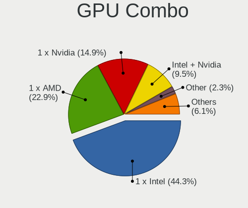

| Name           | Computers | Percent |
|----------------|-----------|---------|
| 1 x Intel      | 81        | 39.51%  |
| 1 x AMD        | 51        | 24.88%  |
| 1 x Nvidia     | 34        | 16.59%  |
| Intel + Nvidia | 16        | 7.8%    |
| Other          | 6         | 2.93%   |
| Intel + AMD    | 6         | 2.93%   |
| AMD + Nvidia   | 6         | 2.93%   |
| 2 x AMD        | 3         | 1.46%   |
| 1 x Matrox     | 1         | 0.49%   |
| AMD + ASPEED   | 1         | 0.49%   |

GPU Driver
----------

Free vs proprietary

| Driver      | Computers | Percent |
|-------------|-----------|---------|
| Free        | 158       | 77.07%  |
| Proprietary | 35        | 17.07%  |
| Unknown     | 12        | 5.85%   |

GPU Memory
----------

Total video memory

| Size in GB | Computers | Percent |
|------------|-----------|---------|
| Unknown    | 136       | 66.02%  |
| 0.01-0.5   | 24        | 11.65%  |
| 0.51-1.0   | 16        | 7.77%   |
| 1.01-2.0   | 13        | 6.31%   |
| 3.01-4.0   | 7         | 3.4%    |
| 7.01-8.0   | 4         | 1.94%   |
| 5.01-6.0   | 4         | 1.94%   |
| 2.01-3.0   | 1         | 0.49%   |
| 8.01-16.0  | 1         | 0.49%   |

Monitor
-------

Monitor Vendor
--------------

Monitor vendors

| Vendor                  | Computers | Percent |
|-------------------------|-----------|---------|
| Samsung Electronics     | 33        | 14.6%   |
| BOE                     | 21        | 9.29%   |
| Chimei Innolux          | 18        | 7.96%   |
| Goldstar                | 17        | 7.52%   |
| AU Optronics            | 16        | 7.08%   |
| Dell                    | 13        | 5.75%   |
| LG Display              | 11        | 4.87%   |
| Philips                 | 9         | 3.98%   |
| Acer                    | 9         | 3.98%   |
| Hewlett-Packard         | 8         | 3.54%   |
| Apple                   | 7         | 3.1%    |
| Iiyama                  | 5         | 2.21%   |
| BenQ                    | 5         | 2.21%   |
| Lenovo                  | 4         | 1.77%   |
| Chi Mei Optoelectronics | 4         | 1.77%   |
| ViewSonic               | 3         | 1.33%   |
| Sony                    | 3         | 1.33%   |
| Sharp                   | 3         | 1.33%   |
| PANDA                   | 3         | 1.33%   |
| AOC                     | 3         | 1.33%   |
| Ancor Communications    | 3         | 1.33%   |
| Vizio                   | 2         | 0.88%   |
| Westinghouse            | 1         | 0.44%   |
| VMO                     | 1         | 0.44%   |
| Vita                    | 1         | 0.44%   |
| Unknown                 | 1         | 0.44%   |
| Toshiba                 | 1         | 0.44%   |
| SNC                     | 1         | 0.44%   |
| Sceptre Tech            | 1         | 0.44%   |
| Quanta Display          | 1         | 0.44%   |
| Packard Bell            | 1         | 0.44%   |
| NEC Computers           | 1         | 0.44%   |
| MSI                     | 1         | 0.44%   |
| Medion                  | 1         | 0.44%   |
| LGD                     | 1         | 0.44%   |
| LG Philips              | 1         | 0.44%   |
| Lenovo Group Limited    | 1         | 0.44%   |
| Kogan                   | 1         | 0.44%   |
| Insignia                | 1         | 0.44%   |
| Idek Iiyama             | 1         | 0.44%   |

Monitor Model
-------------

Monitor models

| Model                                                                | Computers | Percent |
|----------------------------------------------------------------------|-----------|---------|
| AU Optronics LCD Monitor AUO23ED 1920x1080 344x194mm 15.5-inch       | 3         | 1.32%   |
| Sony LCD Monitor SNY05FA 1366x768 340x190mm 15.3-inch                | 2         | 0.88%   |
| Samsung Electronics LCD Monitor SEC3451 1366x768 344x194mm 15.5-inch | 2         | 0.88%   |
| Goldstar E2240 GSM57A3 1920x1080 477x268mm 21.5-inch                 | 2         | 0.88%   |
| Dell SE2717H/HX DELD0A1 1920x1080 598x336mm 27.0-inch                | 2         | 0.88%   |
| Chimei Innolux LCD Monitor CMN14D4 1920x1080 309x173mm 13.9-inch     | 2         | 0.88%   |
| BOE LCD Monitor BOE0974 2560x1440 344x194mm 15.5-inch                | 2         | 0.88%   |
| BOE LCD Monitor BOE0893 2160x1440 296x197mm 14.0-inch                | 2         | 0.88%   |
| BOE LCD Monitor BOE0872 1920x1080 344x194mm 15.5-inch                | 2         | 0.88%   |
| Apple LCD Monitor APP9CA3 1440x900 331x207mm 15.4-inch               | 2         | 0.88%   |
| Acer K272HL H ACR087E 1920x1080 597x336mm 27.0-inch                  | 2         | 0.88%   |
| Acer ET322QU ACR0687 2560x1440 698x393mm 31.5-inch                   | 2         | 0.88%   |
| Westinghouse DWM40F1D1 WDT7811 1920x1080 890x500mm 40.2-inch         | 1         | 0.44%   |
| VMO LCD WQXGA HDM VMO1506 2560x1600 1600x1000mm 74.3-inch            | 1         | 0.44%   |
| Vizio M470NV VIZ0063 1920x1080 1040x585mm 47.0-inch                  | 1         | 0.44%   |
| Vizio E241i-A1 VIZ1005 1920x1080 521x293mm 23.5-inch                 | 1         | 0.44%   |
| Vita LCD Monitor VIT0780 1920x1080                                   | 1         | 0.44%   |
| ViewSonic VP2765 SERIES VSC9F28 1920x1080 598x336mm 27.0-inch        | 1         | 0.44%   |
| ViewSonic VA2431 Series VSCD824 1920x1080 521x293mm 23.5-inch        | 1         | 0.44%   |
| ViewSonic VA2046 SERIES VSC6D2E 1600x900 432x240mm 19.5-inch         | 1         | 0.44%   |
| Unknown SMART TV 0563 1920x1080 1209x680mm 54.6-inch                 | 1         | 0.44%   |
| Toshiba LCD Monitor LCD2109 1280x800 261x163mm 12.1-inch             | 1         | 0.44%   |
| Sony LCD Monitor TV 3840x1080                                        | 1         | 0.44%   |
| Sony LCD Monitor TV                                                  | 1         | 0.44%   |
| SNC SKP_E20-32 SNC3200 1920x1080 477x268mm 21.5-inch                 | 1         | 0.44%   |
| Sharp LQ156M1JW26 SHP1532 1920x1080 344x194mm 15.5-inch              | 1         | 0.44%   |
| Sharp LCD Monitor SHP1526 1920x1280 274x183mm 13.0-inch              | 1         | 0.44%   |
| Sharp LCD Monitor SHP1517 3840x2400 366x229mm 17.0-inch              | 1         | 0.44%   |
| Sceptre Tech E24 SPT099D 1920x1080 409x230mm 18.5-inch               | 1         | 0.44%   |
| Samsung Electronics U28E590 SAM0C4D 3840x2160 607x345mm 27.5-inch    | 1         | 0.44%   |
| Samsung Electronics SyncMaster SAM04D3 1920x1080 531x298mm 24.0-inch | 1         | 0.44%   |
| Samsung Electronics SyncMaster SAM027F 1680x1050 474x296mm 22.0-inch | 1         | 0.44%   |
| Samsung Electronics SyncMaster SAM0225 1440x900 410x257mm 19.1-inch  | 1         | 0.44%   |
| Samsung Electronics SMT27A300 SAM087A 1920x1080 598x336mm 27.0-inch  | 1         | 0.44%   |
| Samsung Electronics SMB2230N SAM0635 1920x1080 477x268mm 21.5-inch   | 1         | 0.44%   |
| Samsung Electronics SMB2220N SAM06A2 1920x1080 477x268mm 21.5-inch   | 1         | 0.44%   |
| Samsung Electronics SA300/SA350 SAM0788 1366x768 410x230mm 18.5-inch | 1         | 0.44%   |
| Samsung Electronics S32F351 SAM0D24 1920x1080 698x393mm 31.5-inch    | 1         | 0.44%   |
| Samsung Electronics S24F350 SAM0D22 1920x1080 521x293mm 23.5-inch    | 1         | 0.44%   |
| Samsung Electronics S24E650 SAM0CB9 1920x1080 521x293mm 23.5-inch    | 1         | 0.44%   |

Monitor Resolution
------------------

Monitor screen resolution

| Resolution         | Computers | Percent |
|--------------------|-----------|---------|
| 1920x1080 (FHD)    | 97        | 46.86%  |
| 1366x768 (WXGA)    | 36        | 17.39%  |
| 2560x1440 (QHD)    | 13        | 6.28%   |
| 3840x2160 (4K)     | 11        | 5.31%   |
| 1440x900 (WXGA+)   | 8         | 3.86%   |
| 1680x1050 (WSXGA+) | 7         | 3.38%   |
| 1280x800 (WXGA)    | 5         | 2.42%   |
| 1600x900 (HD+)     | 4         | 1.93%   |
| 3440x1440          | 3         | 1.45%   |
| 2560x1600          | 3         | 1.45%   |
| 1280x1024 (SXGA)   | 3         | 1.45%   |
| 3840x1080          | 2         | 0.97%   |
| 2160x1440          | 2         | 0.97%   |
| 1920x1280          | 2         | 0.97%   |
| 1920x1200 (WUXGA)  | 2         | 0.97%   |
| 1360x768           | 2         | 0.97%   |
| Unknown            | 2         | 0.97%   |
| 3840x2400          | 1         | 0.48%   |
| 3840x1600          | 1         | 0.48%   |
| 2880x1620          | 1         | 0.48%   |
| 2560x1080          | 1         | 0.48%   |
| 1280x720 (HD)      | 1         | 0.48%   |

Monitor Diagonal
----------------

Diagonal size in inches

| Inches  | Computers | Percent |
|---------|-----------|---------|
| 15      | 51        | 23.18%  |
| 27      | 26        | 11.82%  |
| 21      | 18        | 8.18%   |
| 24      | 16        | 7.27%   |
| 13      | 16        | 7.27%   |
| 23      | 15        | 6.82%   |
| 17      | 14        | 6.36%   |
| 14      | 12        | 5.45%   |
| 31      | 10        | 4.55%   |
| Unknown | 6         | 2.73%   |
| 19      | 5         | 2.27%   |
| 34      | 4         | 1.82%   |
| 22      | 4         | 1.82%   |
| 18      | 4         | 1.82%   |
| 54      | 3         | 1.36%   |
| 12      | 3         | 1.36%   |
| 11      | 3         | 1.36%   |
| 38      | 2         | 0.91%   |
| 25      | 2         | 0.91%   |
| 84      | 1         | 0.45%   |
| 74      | 1         | 0.45%   |
| 72      | 1         | 0.45%   |
| 40      | 1         | 0.45%   |
| 28      | 1         | 0.45%   |
| 16      | 1         | 0.45%   |

Monitor Width
-------------

Physical width

| Width in mm | Computers | Percent |
|-------------|-----------|---------|
| 301-350     | 77        | 35.48%  |
| 501-600     | 53        | 24.42%  |
| 401-500     | 31        | 14.29%  |
| 601-700     | 14        | 6.45%   |
| 201-300     | 13        | 5.99%   |
| 351-400     | 10        | 4.61%   |
| Unknown     | 6         | 2.76%   |
| 701-800     | 4         | 1.84%   |
| 801-900     | 3         | 1.38%   |
| 1501-2000   | 3         | 1.38%   |
| 1001-1500   | 3         | 1.38%   |

Aspect Ratio
------------

Proportional relationship between the width and the height

| Ratio   | Computers | Percent |
|---------|-----------|---------|
| 16/9    | 146       | 76.04%  |
| 16/10   | 29        | 15.1%   |
| 21/9    | 5         | 2.6%    |
| 5/4     | 4         | 2.08%   |
| 3/2     | 4         | 2.08%   |
| Unknown | 4         | 2.08%   |

Monitor Area
------------

Area in inch

| Area in inch | Computers | Percent |
|----------------|-----------|---------|
| 101-110        | 49        | 22.58%  |
| 201-250        | 40        | 18.43%  |
| 301-350        | 26        | 11.98%  |
| 81-90          | 23        | 10.6%   |
| 351-500        | 15        | 6.91%   |
| 151-200        | 10        | 4.61%   |
| 141-150        | 8         | 3.69%   |
| 121-130        | 8         | 3.69%   |
| 251-300        | 7         | 3.23%   |
| More than 1000 | 6         | 2.76%   |
| Unknown        | 6         | 2.76%   |
| 71-80          | 5         | 2.3%    |
| 61-70          | 3         | 1.38%   |
| 51-60          | 3         | 1.38%   |
| 501-1000       | 3         | 1.38%   |
| 131-140        | 2         | 0.92%   |
| 91-100         | 2         | 0.92%   |
| 111-120        | 1         | 0.46%   |

Pixel Density
-------------

Pixels per inch

| Density       | Computers | Percent |
|---------------|-----------|---------|
| 51-100        | 79        | 37.8%   |
| 101-120       | 55        | 26.32%  |
| 121-160       | 50        | 23.92%  |
| 161-240       | 13        | 6.22%   |
| Unknown       | 6         | 2.87%   |
| 1-50          | 5         | 2.39%   |
| More than 240 | 1         | 0.48%   |

Multiple Monitors
-----------------

Total monitors connected

| Total | Computers | Percent |
|-------|-----------|---------|
| 1     | 156       | 75.36%  |
| 2     | 40        | 19.32%  |
| 0     | 8         | 3.86%   |
| 3     | 2         | 0.97%   |
| 4     | 1         | 0.48%   |

Network
-------

Net Controller Vendor
---------------------

Controller vendors

| Vendor                            | Computers | Percent |
|-----------------------------------|-----------|---------|
| Realtek Semiconductor             | 117       | 40.21%  |
| Intel                             | 98        | 33.68%  |
| Qualcomm Atheros                  | 20        | 6.87%   |
| Broadcom                          | 19        | 6.53%   |
| Ralink                            | 5         | 1.72%   |
| TP-Link                           | 3         | 1.03%   |
| MediaTek                          | 3         | 1.03%   |
| Marvell Technology Group          | 3         | 1.03%   |
| Broadcom Limited                  | 3         | 1.03%   |
| ASIX Electronics                  | 3         | 1.03%   |
| Qualcomm Atheros Communications   | 2         | 0.69%   |
| Nvidia                            | 2         | 0.69%   |
| Ericsson Business Mobile Networks | 2         | 0.69%   |
| Raspberry Pi                      | 1         | 0.34%   |
| Quectel Wireless Solutions        | 1         | 0.34%   |
| Prolific Technology               | 1         | 0.34%   |
| NetGear                           | 1         | 0.34%   |
| Motorola PCS                      | 1         | 0.34%   |
| Microchip Technology              | 1         | 0.34%   |
| DisplayLink                       | 1         | 0.34%   |
| D-Link System                     | 1         | 0.34%   |
| AVM                               | 1         | 0.34%   |
| ASUSTek Computer                  | 1         | 0.34%   |
| Aquantia                          | 1         | 0.34%   |

Net Controller Model
--------------------

Controller models

| Model                                                             | Computers | Percent |
|-------------------------------------------------------------------|-----------|---------|
| Realtek RTL8111/8168/8411 PCI Express Gigabit Ethernet Controller | 70        | 20%     |
| Realtek RTL810xE PCI Express Fast Ethernet controller             | 13        | 3.71%   |
| Realtek RTL8822CE 802.11ac PCIe Wireless Network Adapter          | 8         | 2.29%   |
| Realtek RTL8821CE 802.11ac PCIe Wireless Network Adapter          | 7         | 2%      |
| Intel Wireless 8265 / 8275                                        | 7         | 2%      |
| Intel 82579LM Gigabit Network Connection (Lewisville)             | 7         | 2%      |
| Realtek RTL8125 2.5GbE Controller                                 | 6         | 1.71%   |
| Intel Wi-Fi 6 AX201                                               | 6         | 1.71%   |
| Intel Ethernet Controller I225-V                                  | 6         | 1.71%   |
| Intel Comet Lake PCH-LP CNVi WiFi                                 | 6         | 1.71%   |
| Realtek RTL8822BE 802.11a/b/g/n/ac WiFi adapter                   | 5         | 1.43%   |
| Realtek RTL8723BE PCIe Wireless Network Adapter                   | 5         | 1.43%   |
| Realtek 802.11ac NIC                                              | 5         | 1.43%   |
| Intel Wi-Fi 6 AX210/AX211/AX411 160MHz                            | 5         | 1.43%   |
| Intel Wi-Fi 6 AX200                                               | 5         | 1.43%   |
| Intel Wireless 7265                                               | 4         | 1.14%   |
| Intel Ethernet Connection (2) I219-V                              | 4         | 1.14%   |
| Intel Alder Lake-S PCH CNVi WiFi                                  | 4         | 1.14%   |
| Realtek RTL8188EE Wireless Network Adapter                        | 3         | 0.86%   |
| Realtek RTL8153 Gigabit Ethernet Adapter                          | 3         | 0.86%   |
| Ralink RT3290 Wireless 802.11n 1T/1R PCIe                         | 3         | 0.86%   |
| Qualcomm Atheros QCA9565 / AR9565 Wireless Network Adapter        | 3         | 0.86%   |
| Qualcomm Atheros AR9285 Wireless Network Adapter (PCI-Express)    | 3         | 0.86%   |
| Intel Wireless 3165                                               | 3         | 0.86%   |
| Intel Wireless 3160                                               | 3         | 0.86%   |
| Intel WiFi Link 5100                                              | 3         | 0.86%   |
| Intel Tiger Lake PCH CNVi WiFi                                    | 3         | 0.86%   |
| Intel Ethernet Connection (2) I219-LM                             | 3         | 0.86%   |
| Intel Centrino Wireless-N 2230                                    | 3         | 0.86%   |
| Intel Centrino Advanced-N 6205 [Taylor Peak]                      | 3         | 0.86%   |
| Intel Cannon Point-LP CNVi [Wireless-AC]                          | 3         | 0.86%   |
| Broadcom NetXtreme BCM57765 Gigabit Ethernet PCIe                 | 3         | 0.86%   |
| Broadcom NetXtreme BCM5764M Gigabit Ethernet PCIe                 | 3         | 0.86%   |
| Broadcom BCM43142 802.11b/g/n                                     | 3         | 0.86%   |
| ASIX AX88179 Gigabit Ethernet                                     | 3         | 0.86%   |
| Realtek RTL8812AE 802.11ac PCIe Wireless Network Adapter          | 2         | 0.57%   |
| Realtek RTL8188CE 802.11b/g/n WiFi Adapter                        | 2         | 0.57%   |
| Realtek RTL-8100/8101L/8139 PCI Fast Ethernet Adapter             | 2         | 0.57%   |
| Qualcomm Atheros QCA9377 802.11ac Wireless Network Adapter        | 2         | 0.57%   |
| Qualcomm Atheros QCA8172 Fast Ethernet                            | 2         | 0.57%   |

Wireless Vendor
---------------

Wireless vendors

| Vendor                          | Computers | Percent |
|---------------------------------|-----------|---------|
| Intel                           | 78        | 46.15%  |
| Realtek Semiconductor           | 45        | 26.63%  |
| Qualcomm Atheros                | 17        | 10.06%  |
| Broadcom                        | 9         | 5.33%   |
| Ralink                          | 5         | 2.96%   |
| TP-Link                         | 3         | 1.78%   |
| MediaTek                        | 3         | 1.78%   |
| Qualcomm Atheros Communications | 2         | 1.18%   |
| Broadcom Limited                | 2         | 1.18%   |
| Quectel Wireless Solutions      | 1         | 0.59%   |
| NetGear                         | 1         | 0.59%   |
| D-Link System                   | 1         | 0.59%   |
| AVM                             | 1         | 0.59%   |
| ASUSTek Computer                | 1         | 0.59%   |

Wireless Model
--------------

Wireless models

| Model                                                                   | Computers | Percent |
|-------------------------------------------------------------------------|-----------|---------|
| Realtek RTL8822CE 802.11ac PCIe Wireless Network Adapter                | 8         | 4.71%   |
| Realtek RTL8821CE 802.11ac PCIe Wireless Network Adapter                | 7         | 4.12%   |
| Intel Wireless 8265 / 8275                                              | 7         | 4.12%   |
| Intel Wi-Fi 6 AX201                                                     | 6         | 3.53%   |
| Intel Comet Lake PCH-LP CNVi WiFi                                       | 6         | 3.53%   |
| Realtek RTL8822BE 802.11a/b/g/n/ac WiFi adapter                         | 5         | 2.94%   |
| Realtek RTL8723BE PCIe Wireless Network Adapter                         | 5         | 2.94%   |
| Realtek 802.11ac NIC                                                    | 5         | 2.94%   |
| Intel Wi-Fi 6 AX210/AX211/AX411 160MHz                                  | 5         | 2.94%   |
| Intel Wi-Fi 6 AX200                                                     | 5         | 2.94%   |
| Intel Wireless 7265                                                     | 4         | 2.35%   |
| Intel Alder Lake-S PCH CNVi WiFi                                        | 4         | 2.35%   |
| Realtek RTL8188EE Wireless Network Adapter                              | 3         | 1.76%   |
| Ralink RT3290 Wireless 802.11n 1T/1R PCIe                               | 3         | 1.76%   |
| Qualcomm Atheros QCA9565 / AR9565 Wireless Network Adapter              | 3         | 1.76%   |
| Qualcomm Atheros AR9285 Wireless Network Adapter (PCI-Express)          | 3         | 1.76%   |
| Intel Wireless 3165                                                     | 3         | 1.76%   |
| Intel Wireless 3160                                                     | 3         | 1.76%   |
| Intel WiFi Link 5100                                                    | 3         | 1.76%   |
| Intel Tiger Lake PCH CNVi WiFi                                          | 3         | 1.76%   |
| Intel Centrino Wireless-N 2230                                          | 3         | 1.76%   |
| Intel Centrino Advanced-N 6205 [Taylor Peak]                            | 3         | 1.76%   |
| Intel Cannon Point-LP CNVi [Wireless-AC]                                | 3         | 1.76%   |
| Broadcom BCM43142 802.11b/g/n                                           | 3         | 1.76%   |
| Realtek RTL8812AE 802.11ac PCIe Wireless Network Adapter                | 2         | 1.18%   |
| Realtek RTL8188CE 802.11b/g/n WiFi Adapter                              | 2         | 1.18%   |
| Qualcomm Atheros QCA9377 802.11ac Wireless Network Adapter              | 2         | 1.18%   |
| Qualcomm Atheros AR9271 802.11n                                         | 2         | 1.18%   |
| Qualcomm Atheros AR9485 Wireless Network Adapter                        | 2         | 1.18%   |
| Qualcomm Atheros AR93xx Wireless Network Adapter                        | 2         | 1.18%   |
| Qualcomm Atheros AR242x / AR542x Wireless Network Adapter (PCI-Express) | 2         | 1.18%   |
| MediaTek MT7921K (RZ608) Wi-Fi 6E 80MHz                                 | 2         | 1.18%   |
| Intel Wireless 7260                                                     | 2         | 1.18%   |
| Intel Wi-Fi 6 AX201 160MHz                                              | 2         | 1.18%   |
| Intel PRO/Wireless 5100 AGN [Shiloh] Network Connection                 | 2         | 1.18%   |
| Intel Dual Band Wireless-AC 3168NGW [Stone Peak]                        | 2         | 1.18%   |
| Intel Centrino Wireless-N 1000 [Condor Peak]                            | 2         | 1.18%   |
| TP-Link Archer T4U ver.3                                                | 1         | 0.59%   |
| TP-Link AC600 wireless Realtek RTL8811AU [Archer T2U Nano]              | 1         | 0.59%   |
| TP-Link 802.11ac NIC                                                    | 1         | 0.59%   |

Ethernet Vendor
---------------

Ethernet vendors

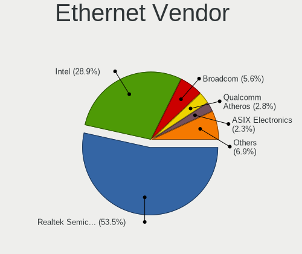

| Vendor                   | Computers | Percent |
|--------------------------|-----------|---------|
| Realtek Semiconductor    | 93        | 54.39%  |
| Intel                    | 49        | 28.65%  |
| Broadcom                 | 12        | 7.02%   |
| Qualcomm Atheros         | 4         | 2.34%   |
| Marvell Technology Group | 3         | 1.75%   |
| ASIX Electronics         | 3         | 1.75%   |
| Nvidia                   | 2         | 1.17%   |
| Motorola PCS             | 1         | 0.58%   |
| Microchip Technology     | 1         | 0.58%   |
| DisplayLink              | 1         | 0.58%   |
| Broadcom Limited         | 1         | 0.58%   |
| Aquantia                 | 1         | 0.58%   |

Ethernet Model
--------------

Ethernet models

| Model                                                                          | Computers | Percent |
|--------------------------------------------------------------------------------|-----------|---------|
| Realtek RTL8111/8168/8411 PCI Express Gigabit Ethernet Controller              | 70        | 39.77%  |
| Realtek RTL810xE PCI Express Fast Ethernet controller                          | 13        | 7.39%   |
| Intel 82579LM Gigabit Network Connection (Lewisville)                          | 7         | 3.98%   |
| Realtek RTL8125 2.5GbE Controller                                              | 6         | 3.41%   |
| Intel Ethernet Controller I225-V                                               | 6         | 3.41%   |
| Intel Ethernet Connection (2) I219-V                                           | 4         | 2.27%   |
| Realtek RTL8153 Gigabit Ethernet Adapter                                       | 3         | 1.7%    |
| Intel Ethernet Connection (2) I219-LM                                          | 3         | 1.7%    |
| Broadcom NetXtreme BCM57765 Gigabit Ethernet PCIe                              | 3         | 1.7%    |
| Broadcom NetXtreme BCM5764M Gigabit Ethernet PCIe                              | 3         | 1.7%    |
| ASIX AX88179 Gigabit Ethernet                                                  | 3         | 1.7%    |
| Realtek RTL-8100/8101L/8139 PCI Fast Ethernet Adapter                          | 2         | 1.14%   |
| Qualcomm Atheros QCA8172 Fast Ethernet                                         | 2         | 1.14%   |
| Marvell Group Yukon Optima 88E8059 [PCIe Gigabit Ethernet Controller with AVB] | 2         | 1.14%   |
| Intel I211 Gigabit Network Connection                                          | 2         | 1.14%   |
| Intel I210 Gigabit Network Connection                                          | 2         | 1.14%   |
| Intel Ethernet Connection I217-LM                                              | 2         | 1.14%   |
| Intel Ethernet Connection (4) I219-V                                           | 2         | 1.14%   |
| Intel Ethernet Connection (13) I219-V                                          | 2         | 1.14%   |
| Intel Ethernet Connection (10) I219-V                                          | 2         | 1.14%   |
| Intel 82567LM Gigabit Network Connection                                       | 2         | 1.14%   |
| Broadcom NetLink BCM57781 Gigabit Ethernet PCIe                                | 2         | 1.14%   |
| Realtek RTL8152 Fast Ethernet Adapter                                          | 1         | 0.57%   |
| Qualcomm Atheros AR8161 Gigabit Ethernet                                       | 1         | 0.57%   |
| Qualcomm Atheros AR8131 Gigabit Ethernet                                       | 1         | 0.57%   |
| Nvidia MCP79 Ethernet                                                          | 1         | 0.57%   |
| Nvidia MCP51 Ethernet Controller                                               | 1         | 0.57%   |
| Motorola PCS moto g pure                                                       | 1         | 0.57%   |
| Microchip LAN7500 Ethernet 10/100/1000 Adapter                                 | 1         | 0.57%   |
| Marvell Group 88E8001 Gigabit Ethernet Controller                              | 1         | 0.57%   |
| Intel Ethernet Connection I217-V                                               | 1         | 0.57%   |
| Intel Ethernet Connection (7) I219-V                                           | 1         | 0.57%   |
| Intel Ethernet Connection (7) I219-LM                                          | 1         | 0.57%   |
| Intel Ethernet Connection (6) I219-V                                           | 1         | 0.57%   |
| Intel Ethernet Connection (6) I219-LM                                          | 1         | 0.57%   |
| Intel Ethernet Connection (5) I219-LM                                          | 1         | 0.57%   |
| Intel Ethernet Connection (3) I218-LM                                          | 1         | 0.57%   |
| Intel Ethernet Connection (2) I218-V                                           | 1         | 0.57%   |
| Intel Ethernet Connection (17) I219-LM                                         | 1         | 0.57%   |
| Intel Ethernet Connection (16) I219-LM                                         | 1         | 0.57%   |

Net Controller Kind
-------------------

Ethernet, WiFi or modem

| Kind     | Computers | Percent |
|----------|-----------|---------|
| Ethernet | 166       | 50.15%  |
| WiFi     | 161       | 48.64%  |
| Modem    | 4         | 1.21%   |

Used Controller
---------------

Currently used network controller

| Kind     | Computers | Percent |
|----------|-----------|---------|
| WiFi     | 118       | 55.4%   |
| Ethernet | 95        | 44.6%   |

NICs
----

Total network controllers on board

| Total | Computers | Percent |
|-------|-----------|---------|
| 2     | 112       | 54.63%  |
| 1     | 80        | 39.02%  |
| 0     | 7         | 3.41%   |
| 3     | 4         | 1.95%   |
| 4     | 2         | 0.98%   |

IPv6
----

IPv6 vs IPv4

| Used | Computers | Percent |
|------|-----------|---------|
| No   | 139       | 67.48%  |
| Yes  | 67        | 32.52%  |

Bluetooth
---------

Bluetooth Vendor
----------------

Controller vendors

| Vendor                          | Computers | Percent |
|---------------------------------|-----------|---------|
| Intel                           | 60        | 45.11%  |
| Realtek Semiconductor           | 24        | 18.05%  |
| Broadcom                        | 11        | 8.27%   |
| IMC Networks                    | 7         | 5.26%   |
| Apple                           | 7         | 5.26%   |
| Cambridge Silicon Radio         | 5         | 3.76%   |
| Ralink                          | 3         | 2.26%   |
| Qualcomm Atheros Communications | 3         | 2.26%   |
| TP-Link                         | 2         | 1.5%    |
| MediaTek                        | 2         | 1.5%    |
| Foxconn / Hon Hai               | 2         | 1.5%    |
| Toshiba                         | 1         | 0.75%   |
| Lite-On Technology              | 1         | 0.75%   |
| Integrated System Solution      | 1         | 0.75%   |
| Hewlett-Packard                 | 1         | 0.75%   |
| Foxconn International           | 1         | 0.75%   |
| Belkin Components               | 1         | 0.75%   |
| ASUSTek Computer                | 1         | 0.75%   |

Bluetooth Model
---------------

Controller models

| Model                                                                               | Computers | Percent |
|-------------------------------------------------------------------------------------|-----------|---------|
| Intel AX201 Bluetooth                                                               | 19        | 14.29%  |
| Intel Bluetooth wireless interface                                                  | 16        | 12.03%  |
| Realtek Bluetooth Radio                                                             | 15        | 11.28%  |
| Intel Bluetooth 9460/9560 Jefferson Peak (JfP)                                      | 8         | 6.02%   |
| Realtek  Bluetooth 4.2 Adapter                                                      | 6         | 4.51%   |
| Intel AX200 Bluetooth                                                               | 5         | 3.76%   |
| Cambridge Silicon Radio Bluetooth Dongle (HCI mode)                                 | 5         | 3.76%   |
| Intel Centrino Bluetooth Wireless Transceiver                                       | 4         | 3.01%   |
| Intel AX210 Bluetooth                                                               | 4         | 3.01%   |
| IMC Networks Bluetooth Radio                                                        | 4         | 3.01%   |
| Ralink RT3290 Bluetooth                                                             | 3         | 2.26%   |
| Apple Built-in Bluetooth 2.0+EDR HCI                                                | 3         | 2.26%   |
| TP-Link UB500 Adapter                                                               | 2         | 1.5%    |
| Realtek RTL8723B Bluetooth                                                          | 2         | 1.5%    |
| MediaTek Wireless_Device                                                            | 2         | 1.5%    |
| Intel Wireless-AC 3168 Bluetooth                                                    | 2         | 1.5%    |
| Intel Bluetooth Device                                                              | 2         | 1.5%    |
| IMC Networks Bluetooth Device                                                       | 2         | 1.5%    |
| Foxconn / Hon Hai Foxconn T77H114 BCM2070 [Single-Chip Bluetooth 2.1 + EDR Adapter] | 2         | 1.5%    |
| Broadcom BCM92046DG-CL1ROM Bluetooth 2.1 Adapter                                    | 2         | 1.5%    |
| Broadcom BCM20702 Bluetooth 4.0 [ThinkPad]                                          | 2         | 1.5%    |
| Broadcom BCM2045B (BDC-2.1) [Bluetooth Controller]                                  | 2         | 1.5%    |
| Apple Bluetooth USB Host Controller                                                 | 2         | 1.5%    |
| Apple Bluetooth Host Controller                                                     | 2         | 1.5%    |
| Toshiba Bluetooth Device                                                            | 1         | 0.75%   |
| Realtek RTL8822BE Bluetooth 4.2 Adapter                                             | 1         | 0.75%   |
| Qualcomm Atheros QCA61x4 Bluetooth 4.0                                              | 1         | 0.75%   |
| Qualcomm Atheros AR3012 Bluetooth 4.0                                               | 1         | 0.75%   |
| Qualcomm Atheros AR3011 Bluetooth                                                   | 1         | 0.75%   |
| Lite-On Qualcomm Atheros QCA9377 Bluetooth                                          | 1         | 0.75%   |
| Integrated System Solution KY-BT100 Bluetooth Adapter                               | 1         | 0.75%   |
| IMC Networks Wireless_Device                                                        | 1         | 0.75%   |
| HP Broadcom 2070 Bluetooth Combo                                                    | 1         | 0.75%   |
| Foxconn International BCM43142A0 Bluetooth module                                   | 1         | 0.75%   |
| Broadcom Bluetooth 3.0 Dongle                                                       | 1         | 0.75%   |
| Broadcom BCM43142A0 Bluetooth Device                                                | 1         | 0.75%   |
| Broadcom BCM43142 Bluetooth 4.0                                                     | 1         | 0.75%   |
| Broadcom BCM2045B (BDC-2) [Bluetooth Controller]                                    | 1         | 0.75%   |
| Broadcom BCM2045 Bluetooth                                                          | 1         | 0.75%   |
| Belkin Components F8T013 Bluetooth Adapter                                          | 1         | 0.75%   |

Sound
-----

Sound Vendor
------------

Sound card vendors

| Vendor                    | Computers | Percent |
|---------------------------|-----------|---------|
| Intel                     | 135       | 47.04%  |
| AMD                       | 71        | 24.74%  |
| Nvidia                    | 47        | 16.38%  |
| C-Media Electronics       | 9         | 3.14%   |
| ASUSTek Computer          | 4         | 1.39%   |
| Generalplus Technology    | 3         | 1.05%   |
| Logitech                  | 2         | 0.7%    |
| JMTek                     | 2         | 0.7%    |
| Cambridge Silicon Radio   | 2         | 0.7%    |
| TerraTec Electronic       | 1         | 0.35%   |
| Sennheiser Communications | 1         | 0.35%   |
| Meizu                     | 1         | 0.35%   |
| Kingston Technology       | 1         | 0.35%   |
| GN Netcom                 | 1         | 0.35%   |
| Focusrite-Novation        | 1         | 0.35%   |
| DSEA A/S                  | 1         | 0.35%   |
| Creative Technology       | 1         | 0.35%   |
| Corsair                   | 1         | 0.35%   |
| Best Buy                  | 1         | 0.35%   |
| Anlya.cn                  | 1         | 0.35%   |
| Alesis                    | 1         | 0.35%   |

Sound Model
-----------

Sound card models

| Model                                                                      | Computers | Percent |
|----------------------------------------------------------------------------|-----------|---------|
| AMD Family 17h/19h HD Audio Controller                                     | 24        | 7.02%   |
| Intel 7 Series/C216 Chipset Family High Definition Audio Controller        | 18        | 5.26%   |
| AMD Renoir Radeon High Definition Audio Controller                         | 12        | 3.51%   |
| AMD SBx00 Azalia (Intel HDA)                                               | 11        | 3.22%   |
| AMD FCH Azalia Controller                                                  | 10        | 2.92%   |
| Intel Tiger Lake-LP Smart Sound Technology Audio Controller                | 8         | 2.34%   |
| Intel 8 Series/C220 Series Chipset High Definition Audio Controller        | 8         | 2.34%   |
| Intel 6 Series/C200 Series Chipset Family High Definition Audio Controller | 8         | 2.34%   |
| Intel 5 Series/3400 Series Chipset High Definition Audio                   | 8         | 2.34%   |
| AMD Raven/Raven2/Fenghuang HDMI/DP Audio Controller                        | 8         | 2.34%   |
| Nvidia GK208 HDMI/DP Audio Controller                                      | 7         | 2.05%   |
| Intel Tiger Lake-H HD Audio Controller                                     | 7         | 2.05%   |
| Intel Sunrise Point-LP HD Audio                                            | 7         | 2.05%   |
| AMD Kabini HDMI/DP Audio                                                   | 7         | 2.05%   |
| Intel Comet Lake PCH-LP cAVS                                               | 6         | 1.75%   |
| Intel 82801I (ICH9 Family) HD Audio Controller                             | 6         | 1.75%   |
| Intel Xeon E3-1200 v3/4th Gen Core Processor HD Audio Controller           | 5         | 1.46%   |
| Intel Celeron/Pentium Silver Processor High Definition Audio               | 5         | 1.46%   |
| Intel Alder Lake-S HD Audio Controller                                     | 5         | 1.46%   |
| Intel 200 Series PCH HD Audio                                              | 5         | 1.46%   |
| Intel 100 Series/C230 Series Chipset Family HD Audio Controller            | 5         | 1.46%   |
| AMD Family 17h (Models 00h-0fh) HD Audio Controller                        | 5         | 1.46%   |
| Nvidia TU107 GeForce GTX 1650 High Definition Audio Controller             | 4         | 1.17%   |
| Nvidia GP108 High Definition Audio Controller                              | 4         | 1.17%   |
| Nvidia GA106 High Definition Audio Controller                              | 4         | 1.17%   |
| Nvidia GA104 High Definition Audio Controller                              | 4         | 1.17%   |
| Intel Haswell-ULT HD Audio Controller                                      | 4         | 1.17%   |
| Intel Cannon Point-LP High Definition Audio Controller                     | 4         | 1.17%   |
| Intel Cannon Lake PCH cAVS                                                 | 4         | 1.17%   |
| Intel Atom Processor Z36xxx/Z37xxx Series High Definition Audio Controller | 4         | 1.17%   |
| Intel 8 Series HD Audio Controller                                         | 4         | 1.17%   |
| AMD Redwood HDMI Audio [Radeon HD 5000 Series]                             | 4         | 1.17%   |
| AMD Family 15h (Models 60h-6fh) Audio Controller                           | 4         | 1.17%   |
| Nvidia GK107 HDMI Audio Controller                                         | 3         | 0.88%   |
| Intel Ice Lake-LP Smart Sound Technology Audio Controller                  | 3         | 0.88%   |
| Generalplus Technology USB Audio Device                                    | 3         | 0.88%   |
| C-Media Electronics Audio Adapter (Unitek Y-247A)                          | 3         | 0.88%   |
| ASUSTek Computer USB Audio                                                 | 3         | 0.88%   |
| AMD Starship/Matisse HD Audio Controller                                   | 3         | 0.88%   |
| AMD Oland/Hainan/Cape Verde/Pitcairn HDMI Audio [Radeon HD 7000 Series]    | 3         | 0.88%   |

Memory
------

Memory Vendor
-------------

Memory module vendors

| Vendor              | Computers | Percent |
|---------------------|-----------|---------|
| Samsung Electronics | 31        | 18.79%  |
| SK hynix            | 28        | 16.97%  |
| Kingston            | 19        | 11.52%  |
| Unknown             | 18        | 10.91%  |
| Micron Technology   | 18        | 10.91%  |
| Crucial             | 15        | 9.09%   |
| Corsair             | 11        | 6.67%   |
| G.Skill             | 6         | 3.64%   |
| Unknown (ABCD)      | 4         | 2.42%   |
| Nanya Technology    | 3         | 1.82%   |
| Team                | 2         | 1.21%   |
| Ramaxel Technology  | 2         | 1.21%   |
| A-DATA Technology   | 2         | 1.21%   |
| Unifosa             | 1         | 0.61%   |
| Hewlett-Packard     | 1         | 0.61%   |
| HBS                 | 1         | 0.61%   |
| GOODRAM             | 1         | 0.61%   |
| Atermiter           | 1         | 0.61%   |
| Unknown             | 1         | 0.61%   |

Memory Model
------------

Memory module models

| Model                                                            | Computers | Percent |
|------------------------------------------------------------------|-----------|---------|
| Unknown (ABCD) RAM 123456789012345678 2GB SODIMM LPDDR4 2400MT/s | 4         | 2.26%   |
| Samsung RAM M471B5173QH0-YK0 4GB SODIMM DDR3 1600MT/s            | 4         | 2.26%   |
| Unknown RAM Module 2GB SODIMM DDR2 667MT/s                       | 3         | 1.69%   |
| Samsung RAM M471A5244CB0-CWE 4GB SODIMM DDR4 3200MT/s            | 3         | 1.69%   |
| Unknown RAM Module 4GB SODIMM DDR3                               | 2         | 1.13%   |
| Unknown RAM Module 1GB SODIMM DDR2 667MT/s                       | 2         | 1.13%   |
| SK hynix RAM HMT451S6BFR8A-PB 4GB SODIMM DDR3 1600MT/s           | 2         | 1.13%   |
| SK hynix RAM HMT451S6AFR8A-PB 4GB SODIMM DDR3 1600MT/s           | 2         | 1.13%   |
| SK hynix RAM HMA81GS6DJR8N-XN 8GB SODIMM DDR4 3200MT/s           | 2         | 1.13%   |
| SK hynix RAM HMA81GS6CJR8N-VK 8GB SODIMM DDR4 2667MT/s           | 2         | 1.13%   |
| Samsung RAM M471A1G44BB0-CWE 8GB SODIMM DDR4 3200MT/s            | 2         | 1.13%   |
| Micron RAM 4ATF1G64HZ-3G2E1 8GB SODIMM DDR4 3200MT/s             | 2         | 1.13%   |
| Corsair RAM CMK16GX4M2B3000C15 8GB DIMM DDR4 3200MT/s            | 2         | 1.13%   |
| Unknown RAM Module 8GB DIMM DDR3 1600MT/s                        | 1         | 0.56%   |
| Unknown RAM Module 8GB DIMM DDR3 1333MT/s                        | 1         | 0.56%   |
| Unknown RAM Module 4GB SODIMM DDR4 2667MT/s                      | 1         | 0.56%   |
| Unknown RAM Module 4GB DIMM DDR2 800MT/s                         | 1         | 0.56%   |
| Unknown RAM Module 4GB DIMM DDR 1333MT/s                         | 1         | 0.56%   |
| Unknown RAM Module 4GB DIMM                                      | 1         | 0.56%   |
| Unknown RAM Module 4096MB SODIMM DDR2                            | 1         | 0.56%   |
| Unknown RAM Module 2GB SODIMM DDR3                               | 1         | 0.56%   |
| Unknown RAM Module 2GB SODIMM DDR2                               | 1         | 0.56%   |
| Unknown RAM Module 2GB SODIMM 1067MT/s                           | 1         | 0.56%   |
| Unknown RAM Module 2GB DIMM DDR 1333MT/s                         | 1         | 0.56%   |
| Unknown RAM Module 2GB DIMM 667MT/s                              | 1         | 0.56%   |
| Unknown RAM MEM-DOWN 8192MB SODIMM DDR4 2400MT/s                 | 1         | 0.56%   |
| Unknown RAM DDR4 NB 8G 2400 8192MB SODIMM DDR4 2667MT/s          | 1         | 0.56%   |
| Unknown RAM DDR4 NB 16G 2666 16384MB SODIMM DDR4 2667MT/s        | 1         | 0.56%   |
| Unifosa RAM GU512303EP0202 2GB DIMM DDR3 1333MT/s                | 1         | 0.56%   |
| Team RAM TEAMGROUP-UD4-3200 8GB DIMM DDR4 3800MT/s               | 1         | 0.56%   |
| Team RAM TEAMGROUP-SD4-3200 32GB SODIMM DDR4 3200MT/s            | 1         | 0.56%   |
| SK hynix RAM Module 8GB SODIMM DDR4 2400MT/s                     | 1         | 0.56%   |
| SK hynix RAM Module 4GB SODIMM DDR3 1600MT/s                     | 1         | 0.56%   |
| SK hynix RAM Module 16GB SODIMM DDR4 2400MT/s                    | 1         | 0.56%   |
| SK hynix RAM HYMP125S64CP8-S6 2GB SODIMM DDR 800MT/s             | 1         | 0.56%   |
| SK hynix RAM HYMP112U64CP8-S6 1GB DIMM DDR2 800MT/s              | 1         | 0.56%   |
| SK hynix RAM HYMP112S64CP6-S6 1GB SODIMM DDR2 800MT/s            | 1         | 0.56%   |
| SK hynix RAM HMT451U6BFR8A-PB 4GB DIMM DDR3 1648MT/s             | 1         | 0.56%   |
| SK hynix RAM HMT451S6DFR8A-PB 4GB SODIMM DDR3 1600MT/s           | 1         | 0.56%   |
| SK hynix RAM HMT41GS6BFR8A-PB 8GB SODIMM DDR3 1333MT/s           | 1         | 0.56%   |

Memory Kind
-----------

Memory module kinds

| Kind    | Computers | Percent |
|---------|-----------|---------|
| DDR4    | 72        | 49.32%  |
| DDR3    | 49        | 33.56%  |
| DDR2    | 9         | 6.16%   |
| LPDDR4  | 7         | 4.79%   |
| Unknown | 3         | 2.05%   |
| SDRAM   | 2         | 1.37%   |
| DDR5    | 2         | 1.37%   |
| LPDDR3  | 1         | 0.68%   |
| DDR     | 1         | 0.68%   |

Memory Form Factor
------------------

Physical design of the memory module

| Name         | Computers | Percent |
|--------------|-----------|---------|
| SODIMM       | 91        | 61.07%  |
| DIMM         | 46        | 30.87%  |
| Row Of Chips | 10        | 6.71%   |
| Chip         | 1         | 0.67%   |
| Unknown      | 1         | 0.67%   |

Memory Size
-----------

Memory module size

| Size  | Computers | Percent |
|-------|-----------|---------|
| 8192  | 55        | 34.38%  |
| 4096  | 47        | 29.38%  |
| 16384 | 28        | 17.5%   |
| 2048  | 18        | 11.25%  |
| 32768 | 7         | 4.38%   |
| 1024  | 5         | 3.13%   |

Memory Speed
------------

Memory module speed

| Speed   | Computers | Percent |
|---------|-----------|---------|
| 1600    | 32        | 20.65%  |
| 3200    | 30        | 19.35%  |
| 2667    | 18        | 11.61%  |
| 2400    | 18        | 11.61%  |
| 1333    | 12        | 7.74%   |
| Unknown | 5         | 3.23%   |
| 667     | 4         | 2.58%   |
| 2133    | 3         | 1.94%   |
| 1334    | 3         | 1.94%   |
| 800     | 3         | 1.94%   |
| 4267    | 2         | 1.29%   |
| 3600    | 2         | 1.29%   |
| 3466    | 2         | 1.29%   |
| 3266    | 2         | 1.29%   |
| 2048    | 2         | 1.29%   |
| 1067    | 2         | 1.29%   |
| 4802    | 1         | 0.65%   |
| 4800    | 1         | 0.65%   |
| 4000    | 1         | 0.65%   |
| 3800    | 1         | 0.65%   |
| 3400    | 1         | 0.65%   |
| 3333    | 1         | 0.65%   |
| 3100    | 1         | 0.65%   |
| 2800    | 1         | 0.65%   |
| 2747    | 1         | 0.65%   |
| 2666    | 1         | 0.65%   |
| 1867    | 1         | 0.65%   |
| 1866    | 1         | 0.65%   |
| 1648    | 1         | 0.65%   |
| 1066    | 1         | 0.65%   |
| 975     | 1         | 0.65%   |

Printers & scanners
-------------------

Printer Vendor
--------------

Printer device vendors

| Vendor              | Computers | Percent |
|---------------------|-----------|---------|
| Hewlett-Packard     | 2         | 22.22%  |
| Dymo-CoStar         | 2         | 22.22%  |
| Brother Industries  | 2         | 22.22%  |
| Seiko Epson         | 1         | 11.11%  |
| Samsung Electronics | 1         | 11.11%  |
| Graphtec America    | 1         | 11.11%  |

Printer Model
-------------

Printer device models

| Model                             | Computers | Percent |
|-----------------------------------|-----------|---------|
| Seiko Epson XP-4100 Series        | 1         | 11.11%  |
| Samsung M2070 Series              | 1         | 11.11%  |
| HP LaserJet Professional P1102w   | 1         | 11.11%  |
| HP DeskJet 2700 series            | 1         | 11.11%  |
| Graphtec America Graphtec Printer | 1         | 11.11%  |
| Dymo-CoStar LabelWriter 450       | 1         | 11.11%  |
| Dymo-CoStar LabelWriter 310       | 1         | 11.11%  |
| Brother HL-3140CW series          | 1         | 11.11%  |
| Brother DCP-L5500DN series        | 1         | 11.11%  |

Scanner Vendor
--------------

Scanner device vendors

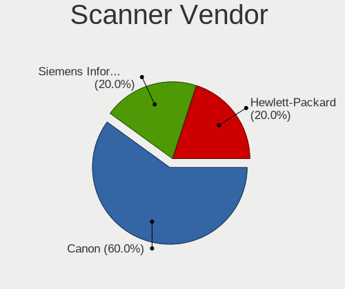

| Vendor                                         | Computers | Percent |
|------------------------------------------------|-----------|---------|
| Canon                                          | 2         | 50%     |
| Siemens Information and Communication Products | 1         | 25%     |
| Hewlett-Packard                                | 1         | 25%     |

Scanner Model
-------------

Scanner device models

| Model                                                                           | Computers | Percent |
|---------------------------------------------------------------------------------|-----------|---------|
| Siemens Information and Communication Products ID-Mouse with Fingerprint Reader | 1         | 25%     |
| HP ScanJet G4010                                                                | 1         | 25%     |
| Canon CanoScan LiDE 120                                                         | 1         | 25%     |
| Canon CanoScan LiDE 110                                                         | 1         | 25%     |

Camera
------

Camera Vendor
-------------

Camera device vendors

| Vendor                                 | Computers | Percent |
|----------------------------------------|-----------|---------|
| Chicony Electronics                    | 29        | 23.2%   |
| Realtek Semiconductor                  | 14        | 11.2%   |
| Quanta                                 | 9         | 7.2%    |
| IMC Networks                           | 9         | 7.2%    |
| Logitech                               | 8         | 6.4%    |
| Microdia                               | 7         | 5.6%    |
| Apple                                  | 7         | 5.6%    |
| Syntek                                 | 5         | 4%      |
| Suyin                                  | 4         | 3.2%    |
| Cheng Uei Precision Industry (Foxlink) | 4         | 3.2%    |
| Sunplus Innovation Technology          | 2         | 1.6%    |
| Silicon Motion                         | 2         | 1.6%    |
| Ricoh                                  | 2         | 1.6%    |
| Razer USA                              | 2         | 1.6%    |
| Luxvisions Innotech Limited            | 2         | 1.6%    |
| Lite-On Technology                     | 2         | 1.6%    |
| Lenovo                                 | 2         | 1.6%    |
| Generalplus Technology                 | 2         | 1.6%    |
| Bison Electronics                      | 2         | 1.6%    |
| ARC International                      | 2         | 1.6%    |
| Acer                                   | 2         | 1.6%    |
| Z-Star Microelectronics                | 1         | 0.8%    |
| SunplusIT                              | 1         | 0.8%    |
| Sonix Technology                       | 1         | 0.8%    |
| Samsung Electronics                    | 1         | 0.8%    |
| Microsoft                              | 1         | 0.8%    |
| Alcorlink                              | 1         | 0.8%    |
| Alcor Micro                            | 1         | 0.8%    |

Camera Model
------------

Camera device models

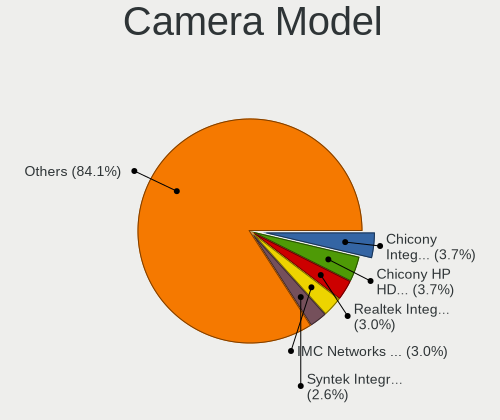

| Model                                         | Computers | Percent |
|-----------------------------------------------|-----------|---------|
| IMC Networks USB2.0 HD UVC WebCam             | 5         | 4%      |
| Syntek Integrated Camera                      | 4         | 3.2%    |
| Chicony HP HD Camera                          | 4         | 3.2%    |
| Realtek USB Camera                            | 3         | 2.4%    |
| Realtek Integrated_Webcam_HD                  | 3         | 2.4%    |
| Microdia Webcam Vitade AF                     | 3         | 2.4%    |
| Chicony integrated camera                     | 3         | 2.4%    |
| Chicony HP Webcam                             | 3         | 2.4%    |
| Apple Built-in iSight                         | 3         | 2.4%    |
| Suyin Acer/HP Integrated Webcam [CN0314]      | 2         | 1.6%    |
| Realtek USB2.0 camera                         | 2         | 1.6%    |
| Realtek Integrated Webcam HD                  | 2         | 1.6%    |
| Razer USA Gaming Webcam [Kiyo]                | 2         | 1.6%    |
| Quanta HP TrueVision HD Camera                | 2         | 1.6%    |
| Quanta HD User Facing                         | 2         | 1.6%    |
| Luxvisions Innotech Limited Integrated Camera | 2         | 1.6%    |
| Logitech Webcam C270                          | 2         | 1.6%    |
| Lenovo CNF7237&CNF7238                        | 2         | 1.6%    |
| IMC Networks Integrated Camera                | 2         | 1.6%    |
| Chicony USB2.0 Camera                         | 2         | 1.6%    |
| Chicony Integrated IR Camera                  | 2         | 1.6%    |
| Chicony HP Truevision HD camera               | 2         | 1.6%    |
| Chicony HD User Facing                        | 2         | 1.6%    |
| ARC International Camera                      | 2         | 1.6%    |
| Apple FaceTime HD Camera (Built-in)           | 2         | 1.6%    |
| Z-Star HP 3-MegaPixel Webcam GX607AA          | 1         | 0.8%    |
| Syntek Lenovo EasyCamera                      | 1         | 0.8%    |
| Suyin USB 2.0 Camera                          | 1         | 0.8%    |
| Suyin Laptop_Integrated_Webcam_HD             | 1         | 0.8%    |
| SunplusIT PC Camera                           | 1         | 0.8%    |
| Sunplus Integrated_Webcam_FHD                 | 1         | 0.8%    |
| Sunplus HP Truevision HD                      | 1         | 0.8%    |
| Sonix USB2.0 HD UVC WebCam                    | 1         | 0.8%    |
| Silicon Motion WebCam SC-10HDD13335N          | 1         | 0.8%    |
| Silicon Motion HP Webcam-101                  | 1         | 0.8%    |
| Samsung Galaxy A5 (MTP)                       | 1         | 0.8%    |
| Ricoh Sony Vaio Integrated Webcam             | 1         | 0.8%    |
| Ricoh Dell Laptop Integrated Webcam           | 1         | 0.8%    |
| Realtek NexiGo N960E FHD Webcam               | 1         | 0.8%    |
| Realtek Laptop_Integrated_Webcam_HD           | 1         | 0.8%    |

Security
--------

Fingerprint Vendor
------------------

Fingerprint sensor vendors

| Vendor                     | Computers | Percent |
|----------------------------|-----------|---------|
| Validity Sensors           | 4         | 21.05%  |
| Upek                       | 4         | 21.05%  |
| Synaptics                  | 4         | 21.05%  |
| Shenzhen Goodix Technology | 4         | 21.05%  |
| Elan Microelectronics      | 2         | 10.53%  |
| AuthenTec                  | 1         | 5.26%   |

Fingerprint Model
-----------------

Fingerprint sensor models

| Model                                                                      | Computers | Percent |
|----------------------------------------------------------------------------|-----------|---------|
| Upek Biometric Touchchip/Touchstrip Fingerprint Sensor                     | 4         | 21.05%  |
| Shenzhen Goodix  FingerPrint Device                                        | 4         | 21.05%  |
| Elan ELAN:ARM-M4                                                           | 2         | 10.53%  |
| Validity Sensors VFS7500 Touch Fingerprint Sensor                          | 1         | 5.26%   |
| Validity Sensors VFS495 Fingerprint Reader                                 | 1         | 5.26%   |
| Validity Sensors VFS471 Fingerprint Reader                                 | 1         | 5.26%   |
| Validity Sensors Synaptics VFS7552 Touch Fingerprint Sensor with PurePrint | 1         | 5.26%   |
| Synaptics UWP WBDI                                                         | 1         | 5.26%   |
| Synaptics  WBDI                                                            | 1         | 5.26%   |
| Synaptics  VFS7552 Touch Fingerprint Sensor with PurePrint                 | 1         | 5.26%   |
| Synaptics Prometheus MIS Touch Fingerprint Reader                          | 1         | 5.26%   |
| AuthenTec AES1600                                                          | 1         | 5.26%   |

Chipcard Vendor
---------------

Chipcard module vendors

| Vendor                | Computers | Percent |
|-----------------------|-----------|---------|
| Broadcom              | 8         | 50%     |
| Alcor Micro           | 4         | 25%     |
| Upek                  | 1         | 6.25%   |
| SCM Microsystems      | 1         | 6.25%   |
| O2 Micro              | 1         | 6.25%   |
| Advanced Card Systems | 1         | 6.25%   |

Chipcard Model
--------------

Chipcard module models

| Model                                                                        | Computers | Percent |
|------------------------------------------------------------------------------|-----------|---------|
| Broadcom 58200                                                               | 5         | 31.25%  |
| Alcor Micro AU9540 Smartcard Reader                                          | 4         | 25%     |
| Broadcom BCM5880 Secure Applications Processor with fingerprint swipe sensor | 2         | 12.5%   |
| Upek TouchChip Fingerprint Coprocessor (WBF advanced mode)                   | 1         | 6.25%   |
| SCM Microsystems SCR3500 A Contact Reader                                    | 1         | 6.25%   |
| O2 Micro OZ776 CCID Smartcard Reader                                         | 1         | 6.25%   |
| Broadcom 5880                                                                | 1         | 6.25%   |
| Advanced Card Systems ACR38 SmartCard Reader                                 | 1         | 6.25%   |

Unsupported
-----------

Unsupported Devices
-------------------

Total unsupported devices on board

| Total | Computers | Percent |
|-------|-----------|---------|
| 0     | 153       | 73.91%  |
| 1     | 41        | 19.81%  |
| 2     | 10        | 4.83%   |
| 3     | 2         | 0.97%   |
| 4     | 1         | 0.48%   |

Unsupported Device Types
------------------------

Types of unsupported devices

| Type                  | Computers | Percent |
|-----------------------|-----------|---------|
| Fingerprint reader    | 19        | 29.23%  |
| Chipcard              | 16        | 24.62%  |
| Graphics card         | 9         | 13.85%  |
| Net/wireless          | 6         | 9.23%   |
| Bluetooth             | 5         | 7.69%   |
| Camera                | 4         | 6.15%   |
| Unassigned class      | 1         | 1.54%   |
| Network               | 1         | 1.54%   |
| Multimedia controller | 1         | 1.54%   |
| Flash memory          | 1         | 1.54%   |
| Dvb card              | 1         | 1.54%   |
| Card reader           | 1         | 1.54%   |

