Ubuntu MATE 22.04 - Tested Hardware & Statistics (Desktops)
-----------------------------------------------------------

A project to collect tested hardware configurations for Ubuntu MATE 22.04.

Anyone can contribute to this report by the [hw-probe](https://github.com/linuxhw/hw-probe) tool:

    sudo -E hw-probe -all -upload

Please contribute! Especially if your hardware is rare.

Contents
--------

* [ Test Cases ](#test-cases)

* [ System ](#system)
  - [ Kernel                   ](#kernel)
  - [ Kernel Family            ](#kernel-family)
  - [ Kernel Major Ver.        ](#kernel-major-ver)
  - [ Arch                     ](#arch)
  - [ DE                       ](#de)
  - [ Display Server           ](#display-server)
  - [ Display Manager          ](#display-manager)
  - [ OS Lang                  ](#os-lang)
  - [ Boot Mode                ](#boot-mode)
  - [ Filesystem               ](#filesystem)
  - [ Part. scheme             ](#part-scheme)
  - [ Dual Boot with Linux/BSD ](#dual-boot-with-linuxbsd)
  - [ Dual Boot (Win)          ](#dual-boot-win)

* [ Board ](#board)
  - [ Vendor                   ](#vendor)
  - [ Model                    ](#model)
  - [ Model Family             ](#model-family)
  - [ MFG Year                 ](#mfg-year)
  - [ Form Factor              ](#form-factor)
  - [ Secure Boot              ](#secure-boot)
  - [ Coreboot                 ](#coreboot)
  - [ RAM Size                 ](#ram-size)
  - [ RAM Used                 ](#ram-used)
  - [ Total Drives             ](#total-drives)
  - [ Has CD-ROM               ](#has-cd-rom)
  - [ Has Ethernet             ](#has-ethernet)
  - [ Has WiFi                 ](#has-wifi)
  - [ Has Bluetooth            ](#has-bluetooth)

* [ Location ](#location)
  - [ Country                  ](#country)
  - [ City                     ](#city)

* [ Drives ](#drives)
  - [ Drive Vendor             ](#drive-vendor)
  - [ Drive Model              ](#drive-model)
  - [ HDD Vendor               ](#hdd-vendor)
  - [ SSD Vendor               ](#ssd-vendor)
  - [ Drive Kind               ](#drive-kind)
  - [ Drive Connector          ](#drive-connector)
  - [ Drive Size               ](#drive-size)
  - [ Space Total              ](#space-total)
  - [ Space Used               ](#space-used)
  - [ Malfunc. Drives          ](#malfunc-drives)
  - [ Malfunc. Drive Vendor    ](#malfunc-drive-vendor)
  - [ Malfunc. HDD Vendor      ](#malfunc-hdd-vendor)
  - [ Malfunc. Drive Kind      ](#malfunc-drive-kind)
  - [ Failed Drives            ](#failed-drives)
  - [ Failed Drive Vendor      ](#failed-drive-vendor)
  - [ Drive Status             ](#drive-status)

* [ Storage controller ](#storage-controller)
  - [ Storage Vendor           ](#storage-vendor)
  - [ Storage Model            ](#storage-model)
  - [ Storage Kind             ](#storage-kind)

* [ Processor ](#processor)
  - [ CPU Vendor               ](#cpu-vendor)
  - [ CPU Model                ](#cpu-model)
  - [ CPU Model Family         ](#cpu-model-family)
  - [ CPU Cores                ](#cpu-cores)
  - [ CPU Sockets              ](#cpu-sockets)
  - [ CPU Threads              ](#cpu-threads)
  - [ CPU Op-Modes             ](#cpu-op-modes)
  - [ CPU Microcode            ](#cpu-microcode)
  - [ CPU Microarch            ](#cpu-microarch)

* [ Graphics ](#graphics)
  - [ GPU Vendor               ](#gpu-vendor)
  - [ GPU Model                ](#gpu-model)
  - [ GPU Combo                ](#gpu-combo)
  - [ GPU Driver               ](#gpu-driver)
  - [ GPU Memory               ](#gpu-memory)

* [ Monitor ](#monitor)
  - [ Monitor Vendor           ](#monitor-vendor)
  - [ Monitor Model            ](#monitor-model)
  - [ Monitor Resolution       ](#monitor-resolution)
  - [ Monitor Diagonal         ](#monitor-diagonal)
  - [ Monitor Width            ](#monitor-width)
  - [ Aspect Ratio             ](#aspect-ratio)
  - [ Monitor Area             ](#monitor-area)
  - [ Pixel Density            ](#pixel-density)
  - [ Multiple Monitors        ](#multiple-monitors)

* [ Network ](#network)
  - [ Net Controller Vendor    ](#net-controller-vendor)
  - [ Net Controller Model     ](#net-controller-model)
  - [ Wireless Vendor          ](#wireless-vendor)
  - [ Wireless Model           ](#wireless-model)
  - [ Ethernet Vendor          ](#ethernet-vendor)
  - [ Ethernet Model           ](#ethernet-model)
  - [ Net Controller Kind      ](#net-controller-kind)
  - [ Used Controller          ](#used-controller)
  - [ NICs                     ](#nics)
  - [ IPv6                     ](#ipv6)

* [ Bluetooth ](#bluetooth)
  - [ Bluetooth Vendor         ](#bluetooth-vendor)
  - [ Bluetooth Model          ](#bluetooth-model)

* [ Sound ](#sound)
  - [ Sound Vendor             ](#sound-vendor)
  - [ Sound Model              ](#sound-model)

* [ Memory ](#memory)
  - [ Memory Vendor            ](#memory-vendor)
  - [ Memory Model             ](#memory-model)
  - [ Memory Kind              ](#memory-kind)
  - [ Memory Form Factor       ](#memory-form-factor)
  - [ Memory Size              ](#memory-size)
  - [ Memory Speed             ](#memory-speed)

* [ Printers & scanners ](#printers--scanners)
  - [ Printer Vendor           ](#printer-vendor)
  - [ Printer Model            ](#printer-model)
  - [ Scanner Vendor           ](#scanner-vendor)
  - [ Scanner Model            ](#scanner-model)

* [ Camera ](#camera)
  - [ Camera Vendor            ](#camera-vendor)
  - [ Camera Model             ](#camera-model)

* [ Security ](#security)
  - [ Fingerprint Vendor       ](#fingerprint-vendor)
  - [ Fingerprint Model        ](#fingerprint-model)
  - [ Chipcard Vendor          ](#chipcard-vendor)
  - [ Chipcard Model           ](#chipcard-model)

* [ Unsupported ](#unsupported)
  - [ Unsupported Devices      ](#unsupported-devices)
  - [ Unsupported Device Types ](#unsupported-device-types)

Test Cases
----------

Total: 289

| Vendor        | Model                       | Probe                                                      | Date         |
|---------------|-----------------------------|------------------------------------------------------------|--------------|
| ASUSTek       | B85M-E                      | [4d0f3f6dff](https://linux-hardware.org/?probe=4d0f3f6dff) | Dec 19, 2025 |
| Dell          | 08NPPY A00                  | [6f84a2498d](https://linux-hardware.org/?probe=6f84a2498d) | Nov 11, 2025 |
| ECS           | A320-SF110                  | [f40b51e354](https://linux-hardware.org/?probe=f40b51e354) | Oct 06, 2025 |
| ASUSTek       | 970 PRO GAMING/AURA         | [9456ad4dec](https://linux-hardware.org/?probe=9456ad4dec) | Sep 03, 2025 |
| ASUSTek       | 970 PRO GAMING/AURA         | [745f58144f](https://linux-hardware.org/?probe=745f58144f) | Sep 03, 2025 |
| Unknown       | Unknown                     | [1342ebccde](https://linux-hardware.org/?probe=1342ebccde) | Jul 20, 2025 |
| Fujitsu       | D3091-A1 S26361-D3091-A1    | [27dadfe7a2](https://linux-hardware.org/?probe=27dadfe7a2) | May 18, 2025 |
| Fujitsu       | D3091-A1 S26361-D3091-A1    | [b9c4f91d60](https://linux-hardware.org/?probe=b9c4f91d60) | May 18, 2025 |
| Entroware     | Hades ED05R3                | [6d535b4e99](https://linux-hardware.org/?probe=6d535b4e99) | May 09, 2025 |
| Intel         | H61                         | [317496b189](https://linux-hardware.org/?probe=317496b189) | May 04, 2025 |
| ASUSTek       | H81M-K                      | [d3b181c3e7](https://linux-hardware.org/?probe=d3b181c3e7) | Apr 19, 2025 |
| Dell          | 0VHWTR A02                  | [3d32552ab3](https://linux-hardware.org/?probe=3d32552ab3) | Nov 28, 2024 |
| Lenovo        | ThinkStation D20 4158GK1    | [8af2b2f494](https://linux-hardware.org/?probe=8af2b2f494) | Nov 24, 2024 |
| AZW           | MINI S                      | [0fc266941c](https://linux-hardware.org/?probe=0fc266941c) | Nov 22, 2024 |
| Dell          | 0C4H12 A00                  | [53891c4e7e](https://linux-hardware.org/?probe=53891c4e7e) | Nov 10, 2024 |
| Dell          | 0HMX8D A01                  | [715b506ea4](https://linux-hardware.org/?probe=715b506ea4) | Nov 08, 2024 |
| Gigabyte      | G41MT-S2                    | [7705d36266](https://linux-hardware.org/?probe=7705d36266) | Oct 23, 2024 |
| ASUSTek       | M4A78-E                     | [2c29f9d339](https://linux-hardware.org/?probe=2c29f9d339) | Oct 15, 2024 |
| MSI           | PRO Z790-A MAX WIFI         | [154b1e5c1b](https://linux-hardware.org/?probe=154b1e5c1b) | Oct 07, 2024 |
| Acer          | EQ45M                       | [0d9b3aab5f](https://linux-hardware.org/?probe=0d9b3aab5f) | Oct 02, 2024 |
| Gigabyte      | H67MA-UD2H-B3               | [21b8f6e55c](https://linux-hardware.org/?probe=21b8f6e55c) | Sep 21, 2024 |
| ASUSTek       | EX-A320M-GAMING             | [846c96bd78](https://linux-hardware.org/?probe=846c96bd78) | Sep 10, 2024 |
| ASRock        | Z77E-ITX                    | [142d4baaa5](https://linux-hardware.org/?probe=142d4baaa5) | Aug 28, 2024 |
| ASUSTek       | X99-DELUXE                  | [a54338842b](https://linux-hardware.org/?probe=a54338842b) | Jul 31, 2024 |
| Gigabyte      | B450M K-CF                  | [f223f80f64](https://linux-hardware.org/?probe=f223f80f64) | Jul 30, 2024 |
| Gigabyte      | B250M-Gaming 3-CF           | [ba43243222](https://linux-hardware.org/?probe=ba43243222) | Jul 26, 2024 |
| HP            | 2AF7                        | [09f9029668](https://linux-hardware.org/?probe=09f9029668) | Jul 25, 2024 |
| HP            | 2AF7                        | [2d3a654d52](https://linux-hardware.org/?probe=2d3a654d52) | Jul 25, 2024 |
| MSI           | B550 GAMING GEN3            | [b1883fc0b9](https://linux-hardware.org/?probe=b1883fc0b9) | Jul 20, 2024 |
| MSI           | B550 GAMING GEN3            | [938ac7f923](https://linux-hardware.org/?probe=938ac7f923) | Jul 20, 2024 |
| Dell          | 040DDP A01                  | [bf9438a172](https://linux-hardware.org/?probe=bf9438a172) | Jul 17, 2024 |
| Gigabyte      | B550M K                     | [c4a4380ddc](https://linux-hardware.org/?probe=c4a4380ddc) | Jul 11, 2024 |
| Gigabyte      | B460 HD3                    | [324898f64e](https://linux-hardware.org/?probe=324898f64e) | Jul 02, 2024 |
| AMI           | Intel                       | [5d8240cda1](https://linux-hardware.org/?probe=5d8240cda1) | Jun 26, 2024 |
| Dell          | 08NPPY A00                  | [75cff17c2a](https://linux-hardware.org/?probe=75cff17c2a) | Jun 22, 2024 |
| Dell          | 0MWYPT A02                  | [0188202fa9](https://linux-hardware.org/?probe=0188202fa9) | Jun 14, 2024 |
| Dell          | 0NNNCT A01                  | [9cd3c023df](https://linux-hardware.org/?probe=9cd3c023df) | Jun 13, 2024 |
| Gigabyte      | B250M-Gaming 3-CF           | [720d7ca6cb](https://linux-hardware.org/?probe=720d7ca6cb) | May 31, 2024 |
| Gigabyte      | B250M-Gaming 3-CF           | [0429104dcc](https://linux-hardware.org/?probe=0429104dcc) | May 30, 2024 |
| ASUSTek       | M5A78L LE                   | [5afe282618](https://linux-hardware.org/?probe=5afe282618) | May 27, 2024 |
| Lenovo        | ThinkStation S30 0606AD5    | [81204f95a0](https://linux-hardware.org/?probe=81204f95a0) | May 15, 2024 |
| ASUSTek       | PRIME B450M-A II            | [2ddbbe35d9](https://linux-hardware.org/?probe=2ddbbe35d9) | May 14, 2024 |
| ASRock        | B650E Taichi                | [cdd2468f64](https://linux-hardware.org/?probe=cdd2468f64) | Apr 20, 2024 |
| Toshiba       | STI 001387                  | [240e193806](https://linux-hardware.org/?probe=240e193806) | Apr 20, 2024 |
| Gigabyte      | H97M-D3H                    | [15a0f07250](https://linux-hardware.org/?probe=15a0f07250) | Apr 20, 2024 |
| ASRock        | J4105B-ITX                  | [ecb84ecf2a](https://linux-hardware.org/?probe=ecb84ecf2a) | Apr 12, 2024 |
| ASUSTek       | H97M-E                      | [431b3ef7f6](https://linux-hardware.org/?probe=431b3ef7f6) | Apr 11, 2024 |
| ASRock        | B650M-H/M.2+                | [38f4136e38](https://linux-hardware.org/?probe=38f4136e38) | Apr 03, 2024 |
| Dell          | 02YRK5 A02                  | [4c860be642](https://linux-hardware.org/?probe=4c860be642) | Mar 29, 2024 |
| Gigabyte      | H87-HD3                     | [39e7b8c321](https://linux-hardware.org/?probe=39e7b8c321) | Mar 22, 2024 |
| Acer          | Aspire XC-886 V:2.0         | [624e1874e9](https://linux-hardware.org/?probe=624e1874e9) | Mar 20, 2024 |
| Gigabyte      | B550 GAMING X V2            | [fc818b5a1b](https://linux-hardware.org/?probe=fc818b5a1b) | Mar 18, 2024 |
| Lenovo        | ThinkStation S30 0606AD5    | [8a703c6f02](https://linux-hardware.org/?probe=8a703c6f02) | Mar 17, 2024 |
| ASUSTek       | ROG STRIX X670E-A GAMING... | [e2617d5a43](https://linux-hardware.org/?probe=e2617d5a43) | Mar 17, 2024 |
| ASUSTek       | PRIME B760-PLUS             | [bb52ad6052](https://linux-hardware.org/?probe=bb52ad6052) | Mar 15, 2024 |
| ASUSTek       | ROG STRIX X670E-A GAMING... | [daec1c4210](https://linux-hardware.org/?probe=daec1c4210) | Mar 11, 2024 |
| ASRock        | A320M-HDV R4.0              | [69ef5f3bb0](https://linux-hardware.org/?probe=69ef5f3bb0) | Feb 24, 2024 |
| Biostar       | B450MHP                     | [5c5906ef27](https://linux-hardware.org/?probe=5c5906ef27) | Feb 21, 2024 |
| Biostar       | B450MHP                     | [81eca30554](https://linux-hardware.org/?probe=81eca30554) | Feb 18, 2024 |
| Dell          | OptiPlex 980                | [9554536e5f](https://linux-hardware.org/?probe=9554536e5f) | Feb 18, 2024 |
| Biostar       | B450MHP                     | [1c50343bc4](https://linux-hardware.org/?probe=1c50343bc4) | Feb 17, 2024 |
| Lenovo        | ThinkCentre A58 75227MG     | [bf324db579](https://linux-hardware.org/?probe=bf324db579) | Feb 07, 2024 |
| MSI           | MPG B550 GAMING PLUS        | [7a5a8be027](https://linux-hardware.org/?probe=7a5a8be027) | Jan 25, 2024 |
| Positivo      | POS-EIBTPDC                 | [120ebd1d10](https://linux-hardware.org/?probe=120ebd1d10) | Jan 24, 2024 |
| Gigabyte      | Z370N WIFI-CF               | [01eeec96ca](https://linux-hardware.org/?probe=01eeec96ca) | Jan 16, 2024 |
| ASRock        | X570 Steel Legend           | [192feda06a](https://linux-hardware.org/?probe=192feda06a) | Jan 16, 2024 |
| Gigabyte      | A520I AC                    | [1279f6d244](https://linux-hardware.org/?probe=1279f6d244) | Jan 13, 2024 |
| Lenovo        | ThinkCentre M55e 9645W2C    | [7f8c8e496a](https://linux-hardware.org/?probe=7f8c8e496a) | Jan 02, 2024 |
| ASUSTek       | PRIME B760-PLUS             | [f3149a6f22](https://linux-hardware.org/?probe=f3149a6f22) | Dec 19, 2023 |
| ASUSTek       | PRIME B760-PLUS             | [b7a7aa8d5d](https://linux-hardware.org/?probe=b7a7aa8d5d) | Dec 17, 2023 |
| Gigabyte      | X670 AORUS ELITE AX         | [991503ccf4](https://linux-hardware.org/?probe=991503ccf4) | Dec 10, 2023 |
| HP            | ProLiant MicroServer        | [5451582602](https://linux-hardware.org/?probe=5451582602) | Dec 08, 2023 |
| Gigabyte      | X670 AORUS ELITE AX         | [18a5ca0a40](https://linux-hardware.org/?probe=18a5ca0a40) | Dec 07, 2023 |
| Gigabyte      | G41MT-S2                    | [06a0da716b](https://linux-hardware.org/?probe=06a0da716b) | Dec 05, 2023 |
| Gigabyte      | B550 GAMING X V2            | [4c55de5adb](https://linux-hardware.org/?probe=4c55de5adb) | Nov 28, 2023 |
| Gigabyte      | Z590 UD AC                  | [416fbc3923](https://linux-hardware.org/?probe=416fbc3923) | Nov 28, 2023 |
| ASUSTek       | PRIME Z490-P                | [47d33f722e](https://linux-hardware.org/?probe=47d33f722e) | Nov 25, 2023 |
| ASRock        | 970 Extreme3 R2.0           | [502e296060](https://linux-hardware.org/?probe=502e296060) | Nov 23, 2023 |
| ASRock        | X99 Extreme4                | [dfb480c40a](https://linux-hardware.org/?probe=dfb480c40a) | Nov 17, 2023 |
| ASUSTek       | P8P67-M PRO                 | [9d1c329ebb](https://linux-hardware.org/?probe=9d1c329ebb) | Nov 14, 2023 |
| Lenovo        | T530-28ICB                  | [ba883f99a0](https://linux-hardware.org/?probe=ba883f99a0) | Nov 06, 2023 |
| ASUSTek       | ROG STRIX Z690-E GAMING ... | [d2d21dcf50](https://linux-hardware.org/?probe=d2d21dcf50) | Nov 01, 2023 |
| MSI           | A320M PRO-M2 V2             | [9854f25018](https://linux-hardware.org/?probe=9854f25018) | Oct 26, 2023 |
| ASRock        | Z370 Killer SLI             | [b01d80e583](https://linux-hardware.org/?probe=b01d80e583) | Oct 24, 2023 |
| HP            | 3646h                       | [6a679937c4](https://linux-hardware.org/?probe=6a679937c4) | Oct 18, 2023 |
| ASRock        | J4105-ITX                   | [f4d4b23c31](https://linux-hardware.org/?probe=f4d4b23c31) | Oct 02, 2023 |
| Lenovo        | 3140 SDK0J40700 WIN 3258... | [b9b34bef50](https://linux-hardware.org/?probe=b9b34bef50) | Oct 02, 2023 |
| 3Logic Gro... | DMB-H510-MCA01              | [b952cdd71d](https://linux-hardware.org/?probe=b952cdd71d) | Sep 29, 2023 |
| HP            | 8643 SMVB                   | [64f1cd854d](https://linux-hardware.org/?probe=64f1cd854d) | Sep 26, 2023 |
| Foxconn       | 2ABF                        | [2be1547618](https://linux-hardware.org/?probe=2be1547618) | Sep 26, 2023 |
| ASUSTek       | M5A78L-M LX                 | [450edd6547](https://linux-hardware.org/?probe=450edd6547) | Sep 24, 2023 |
| ASRock        | A320M-HD                    | [00ce48a639](https://linux-hardware.org/?probe=00ce48a639) | Sep 19, 2023 |
| Unknown       | X79M2-Q                     | [670ca9e147](https://linux-hardware.org/?probe=670ca9e147) | Sep 17, 2023 |
| ASUSTek       | PRIME B450M-A II            | [adff9fb2a8](https://linux-hardware.org/?probe=adff9fb2a8) | Sep 14, 2023 |
| ASUSTek       | P8Z77-V LX                  | [103e7031fe](https://linux-hardware.org/?probe=103e7031fe) | Sep 14, 2023 |
| Intel         | DH67CL AAG10212-210         | [21932b1004](https://linux-hardware.org/?probe=21932b1004) | Sep 14, 2023 |
| ASUSTek       | P8P67-M PRO                 | [799a135aca](https://linux-hardware.org/?probe=799a135aca) | Sep 14, 2023 |
| ASUSTek       | P8Z77-V LX                  | [7cea54ec70](https://linux-hardware.org/?probe=7cea54ec70) | Sep 13, 2023 |
| ASUSTek       | P8P67-M PRO                 | [6ec67cd2f1](https://linux-hardware.org/?probe=6ec67cd2f1) | Sep 08, 2023 |
| ASUSTek       | H61M-K                      | [0e82099e8f](https://linux-hardware.org/?probe=0e82099e8f) | Sep 01, 2023 |
| MSI           | Z97-G43                     | [74492b4424](https://linux-hardware.org/?probe=74492b4424) | Aug 30, 2023 |
| ASRock        | A320M-HD                    | [dcb65a221f](https://linux-hardware.org/?probe=dcb65a221f) | Aug 27, 2023 |
| Dell          | OptiPlex 5050               | [045411a33d](https://linux-hardware.org/?probe=045411a33d) | Aug 21, 2023 |
| ASUSTek       | TUF Gaming B650M-PLUS WI... | [f280fd203e](https://linux-hardware.org/?probe=f280fd203e) | Aug 21, 2023 |
| ASRock        | B450M Pro4                  | [cdbe8c2f04](https://linux-hardware.org/?probe=cdbe8c2f04) | Aug 21, 2023 |
| Dell          | OptiPlex 5050               | [e2c9cecddd](https://linux-hardware.org/?probe=e2c9cecddd) | Aug 18, 2023 |
| HP            | 829D                        | [448bb23145](https://linux-hardware.org/?probe=448bb23145) | Aug 15, 2023 |
| Gigabyte      | B85M-D3H                    | [6602bb3d0a](https://linux-hardware.org/?probe=6602bb3d0a) | Aug 13, 2023 |
| Gigabyte      | B85M-D3H                    | [5a809fe1c3](https://linux-hardware.org/?probe=5a809fe1c3) | Aug 13, 2023 |
| Biostar       | A10N-8800E                  | [5ccf8e7d00](https://linux-hardware.org/?probe=5ccf8e7d00) | Aug 11, 2023 |
| Unknown       | Unknown                     | [78f477986b](https://linux-hardware.org/?probe=78f477986b) | Aug 10, 2023 |
| MACHINIST     | E5 MR9A PRO MAX V1.1        | [0c4903c4d2](https://linux-hardware.org/?probe=0c4903c4d2) | Aug 10, 2023 |
| Gigabyte      | B85M-D3H                    | [32e3874db3](https://linux-hardware.org/?probe=32e3874db3) | Jul 28, 2023 |
| Lenovo        | 3740 NOK                    | [9e156dd92f](https://linux-hardware.org/?probe=9e156dd92f) | Jul 26, 2023 |
| Gigabyte      | B85M-D3H                    | [67daf82d15](https://linux-hardware.org/?probe=67daf82d15) | Jul 24, 2023 |
| Gigabyte      | B550 GAMING X V2            | [0a3cc7970c](https://linux-hardware.org/?probe=0a3cc7970c) | Jul 23, 2023 |
| ASUSTek       | PRIME Z590-P                | [02903e0210](https://linux-hardware.org/?probe=02903e0210) | Jul 22, 2023 |
| Gigabyte      | G41MT-S2                    | [d625267663](https://linux-hardware.org/?probe=d625267663) | Jul 17, 2023 |
| Gigabyte      | B85M-D3H                    | [1e85aec604](https://linux-hardware.org/?probe=1e85aec604) | Jul 09, 2023 |
| Gigabyte      | B85M-D3H                    | [f73623381d](https://linux-hardware.org/?probe=f73623381d) | Jul 08, 2023 |
| Gigabyte      | B85M-D3H                    | [d37d74ba93](https://linux-hardware.org/?probe=d37d74ba93) | Jul 07, 2023 |
| ASRock        | Z370 Killer SLI             | [b7a676e2fc](https://linux-hardware.org/?probe=b7a676e2fc) | Jul 05, 2023 |
| ASRock        | Z370 Killer SLI             | [e7c0ca1bfc](https://linux-hardware.org/?probe=e7c0ca1bfc) | Jul 05, 2023 |
| Unknown       | Unknown                     | [23956fd693](https://linux-hardware.org/?probe=23956fd693) | Jul 04, 2023 |
| Gigabyte      | B85M-D3H                    | [ce2d3b5375](https://linux-hardware.org/?probe=ce2d3b5375) | Jul 02, 2023 |
| Gigabyte      | B85M-D3H                    | [0bb17f7e1b](https://linux-hardware.org/?probe=0bb17f7e1b) | Jul 01, 2023 |
| ASUSTek       | PRIME Z590-P                | [fb7e164f62](https://linux-hardware.org/?probe=fb7e164f62) | Jul 01, 2023 |
| ASUSTek       | PRIME Z590-P                | [2774be84e6](https://linux-hardware.org/?probe=2774be84e6) | Jul 01, 2023 |
| Gigabyte      | B85M-D3H                    | [99b07ae636](https://linux-hardware.org/?probe=99b07ae636) | Jun 30, 2023 |
| Gigabyte      | B85M-D3H                    | [498eb9b539](https://linux-hardware.org/?probe=498eb9b539) | Jun 30, 2023 |
| ASUSTek       | H61M-K                      | [ddc5e387cb](https://linux-hardware.org/?probe=ddc5e387cb) | Jun 24, 2023 |
| ASUSTek       | P7P55 LX                    | [e700828afa](https://linux-hardware.org/?probe=e700828afa) | Jun 23, 2023 |
| ASUSTek       | P7P55 LX                    | [cd9b9aae75](https://linux-hardware.org/?probe=cd9b9aae75) | Jun 23, 2023 |
| Gigabyte      | B85M-D3H                    | [033c027010](https://linux-hardware.org/?probe=033c027010) | Jun 18, 2023 |
| Gigabyte      | B85M-D3H                    | [fe0d892e82](https://linux-hardware.org/?probe=fe0d892e82) | Jun 16, 2023 |
| HP            | 8643 SMVB                   | [db301ecd59](https://linux-hardware.org/?probe=db301ecd59) | Jun 11, 2023 |
| Gigabyte      | B85M-D3H                    | [befd126f43](https://linux-hardware.org/?probe=befd126f43) | Jun 07, 2023 |
| Gigabyte      | B85M-D3H                    | [e146923f12](https://linux-hardware.org/?probe=e146923f12) | Jun 07, 2023 |
| HP            | 1998                        | [c6183bd564](https://linux-hardware.org/?probe=c6183bd564) | Jun 05, 2023 |
| Gigabyte      | B85M-D3H                    | [0bd595e07a](https://linux-hardware.org/?probe=0bd595e07a) | Jun 04, 2023 |
| Gigabyte      | B85M-D3H                    | [908f094e9d](https://linux-hardware.org/?probe=908f094e9d) | Jun 02, 2023 |
| MSI           | H97 GAMING 3                | [f9c0a669c5](https://linux-hardware.org/?probe=f9c0a669c5) | Jun 02, 2023 |
| ASUSTek       | H61M-K                      | [c6ee1e5e32](https://linux-hardware.org/?probe=c6ee1e5e32) | Jun 02, 2023 |
| Unknown       | HX90                        | [d38fff55af](https://linux-hardware.org/?probe=d38fff55af) | May 28, 2023 |
| Gigabyte      | B85M-D3H                    | [67122d7cd6](https://linux-hardware.org/?probe=67122d7cd6) | May 12, 2023 |
| Gigabyte      | B85M-D3H                    | [9c8ffba5f4](https://linux-hardware.org/?probe=9c8ffba5f4) | May 12, 2023 |
| Gigabyte      | B85M-D3H                    | [11a41c975d](https://linux-hardware.org/?probe=11a41c975d) | May 07, 2023 |
| ASUSTek       | PRIME B350-PLUS             | [b6ec076cc6](https://linux-hardware.org/?probe=b6ec076cc6) | May 05, 2023 |
| Acer          | Aspire X1430                | [4bdb74f57e](https://linux-hardware.org/?probe=4bdb74f57e) | May 04, 2023 |
| Gigabyte      | B85M-D3H                    | [f9c27ab898](https://linux-hardware.org/?probe=f9c27ab898) | May 02, 2023 |
| Gigabyte      | B85M-D3H                    | [2fe28d7f43](https://linux-hardware.org/?probe=2fe28d7f43) | Apr 29, 2023 |
| ASUSTek       | M5A78L-M PLUS/USB3          | [ef3f4d1ac1](https://linux-hardware.org/?probe=ef3f4d1ac1) | Apr 29, 2023 |
| Gigabyte      | B85M-D3H                    | [c0c226bf8c](https://linux-hardware.org/?probe=c0c226bf8c) | Apr 28, 2023 |
| Gigabyte      | P55-UD3                     | [cb8885f205](https://linux-hardware.org/?probe=cb8885f205) | Apr 25, 2023 |
| Gigabyte      | P55-UD3                     | [cacc141f4f](https://linux-hardware.org/?probe=cacc141f4f) | Apr 25, 2023 |
| Gigabyte      | B85M-D3H                    | [88a6d9040e](https://linux-hardware.org/?probe=88a6d9040e) | Apr 23, 2023 |
| ASUSTek       | Z170-P                      | [b003b5c775](https://linux-hardware.org/?probe=b003b5c775) | Apr 22, 2023 |
| ASUSTek       | M5A97 R2.0                  | [90e0cff0ad](https://linux-hardware.org/?probe=90e0cff0ad) | Apr 22, 2023 |
| AMI           | Intel                       | [b7a63bbfc7](https://linux-hardware.org/?probe=b7a63bbfc7) | Apr 15, 2023 |
| AMI           | Intel                       | [ec0a5e657e](https://linux-hardware.org/?probe=ec0a5e657e) | Apr 14, 2023 |
| Gigabyte      | B85M-D3H                    | [7041b36ac5](https://linux-hardware.org/?probe=7041b36ac5) | Apr 14, 2023 |
| Lenovo        | ThinkStation D20 4158GK1    | [44d9536051](https://linux-hardware.org/?probe=44d9536051) | Apr 14, 2023 |
| HP            | 1494                        | [9c5dc1a221](https://linux-hardware.org/?probe=9c5dc1a221) | Apr 13, 2023 |
| Gigabyte      | B85M-D3H                    | [87be7a6dc0](https://linux-hardware.org/?probe=87be7a6dc0) | Apr 09, 2023 |
| Dell          | 0J3C2F A00                  | [e2c3600e8b](https://linux-hardware.org/?probe=e2c3600e8b) | Apr 07, 2023 |
| ASUSTek       | M5A97 R2.0                  | [248ef68079](https://linux-hardware.org/?probe=248ef68079) | Apr 03, 2023 |
| Gigabyte      | B85M-D3H                    | [77187502c9](https://linux-hardware.org/?probe=77187502c9) | Apr 01, 2023 |
| Gigabyte      | B85M-D3H                    | [a074e581b0](https://linux-hardware.org/?probe=a074e581b0) | Mar 28, 2023 |
| ASUSTek       | M5A97 R2.0                  | [d56f48b9d1](https://linux-hardware.org/?probe=d56f48b9d1) | Mar 27, 2023 |
| Shenzhen M... | HX90G                       | [fb3f1be00d](https://linux-hardware.org/?probe=fb3f1be00d) | Mar 26, 2023 |
| Gigabyte      | B85M-D3H                    | [890cd39d63](https://linux-hardware.org/?probe=890cd39d63) | Mar 26, 2023 |
| ASUSTek       | H61M-K                      | [dcae89c3e5](https://linux-hardware.org/?probe=dcae89c3e5) | Mar 21, 2023 |
| ASUSTek       | H61M-K                      | [9ff80f0344](https://linux-hardware.org/?probe=9ff80f0344) | Mar 21, 2023 |
| CCE           | NM70-I                      | [3e99b6e12d](https://linux-hardware.org/?probe=3e99b6e12d) | Mar 21, 2023 |
| ASUSTek       | M5A78L LE                   | [e18778e282](https://linux-hardware.org/?probe=e18778e282) | Mar 20, 2023 |
| Lenovo        | Bantry CRB 31900058 STD     | [bbe02b925a](https://linux-hardware.org/?probe=bbe02b925a) | Mar 19, 2023 |
| Lenovo        | Bantry CRB 31900058 STD     | [d376f92f8d](https://linux-hardware.org/?probe=d376f92f8d) | Mar 19, 2023 |
| Gigabyte      | B85M-D3H                    | [605bc3d5b0](https://linux-hardware.org/?probe=605bc3d5b0) | Mar 19, 2023 |
| Gigabyte      | B85M-D3H                    | [4cee2dc95e](https://linux-hardware.org/?probe=4cee2dc95e) | Mar 18, 2023 |
| MSI           | PRO B660M-A WIFI DDR4       | [7298c4b04b](https://linux-hardware.org/?probe=7298c4b04b) | Mar 17, 2023 |
| MSI           | PRO B660M-A WIFI DDR4       | [794bc239ab](https://linux-hardware.org/?probe=794bc239ab) | Mar 17, 2023 |
| ASUSTek       | M5A97 R2.0                  | [526e33e980](https://linux-hardware.org/?probe=526e33e980) | Mar 15, 2023 |
| ASRock        | A320M-HDV R4.0              | [8d2ca6cedc](https://linux-hardware.org/?probe=8d2ca6cedc) | Mar 14, 2023 |
| ASUSTek       | M5A97 R2.0                  | [2f69480899](https://linux-hardware.org/?probe=2f69480899) | Mar 14, 2023 |
| HP            | 339A                        | [fa78907d67](https://linux-hardware.org/?probe=fa78907d67) | Mar 12, 2023 |
| Gigabyte      | B85M-D3H                    | [f9dfd84f86](https://linux-hardware.org/?probe=f9dfd84f86) | Mar 12, 2023 |
| Gigabyte      | B85M-D3H                    | [ee115bdfb8](https://linux-hardware.org/?probe=ee115bdfb8) | Mar 11, 2023 |
| MSI           | X370 SLI PLUS               | [d2ac8dd020](https://linux-hardware.org/?probe=d2ac8dd020) | Mar 07, 2023 |
| Gigabyte      | B85M-D3H                    | [adce83e80e](https://linux-hardware.org/?probe=adce83e80e) | Mar 07, 2023 |
| Gigabyte      | B85M-D3H                    | [9178ffc6f9](https://linux-hardware.org/?probe=9178ffc6f9) | Mar 05, 2023 |
| MSI           | X570-A PRO                  | [7d1b3a73f9](https://linux-hardware.org/?probe=7d1b3a73f9) | Mar 05, 2023 |
| Gigabyte      | B85M-D3H                    | [9f5aaa2900](https://linux-hardware.org/?probe=9f5aaa2900) | Mar 04, 2023 |
| ASUSTek       | M5A78L-M LX                 | [0cd2798326](https://linux-hardware.org/?probe=0cd2798326) | Mar 03, 2023 |
| Gigabyte      | B85M-D3H                    | [b6128fb3e9](https://linux-hardware.org/?probe=b6128fb3e9) | Feb 28, 2023 |
| MSI           | A320M-A PRO MAX             | [64cf10c762](https://linux-hardware.org/?probe=64cf10c762) | Feb 26, 2023 |
| Gigabyte      | B85M-D3H                    | [b1a38edcc2](https://linux-hardware.org/?probe=b1a38edcc2) | Feb 25, 2023 |
| MSI           | A320M-A PRO MAX             | [24b1205b0c](https://linux-hardware.org/?probe=24b1205b0c) | Feb 24, 2023 |
| ASUSTek       | TUF B450-PLUS GAMING        | [1029c7f3bb](https://linux-hardware.org/?probe=1029c7f3bb) | Feb 17, 2023 |
| ASUSTek       | PRIME B360M-C               | [d380600b31](https://linux-hardware.org/?probe=d380600b31) | Feb 15, 2023 |
| Gigabyte      | B85M-D3H                    | [ba06eb3e9c](https://linux-hardware.org/?probe=ba06eb3e9c) | Feb 11, 2023 |
| Lenovo        | 3741 SDK0T76463 WIN 3422... | [14bde69d96](https://linux-hardware.org/?probe=14bde69d96) | Feb 10, 2023 |
| ASUSTek       | CROSSHAIR VI HERO           | [190a780b8a](https://linux-hardware.org/?probe=190a780b8a) | Jan 29, 2023 |
| Gigabyte      | B550 GAMING X V2            | [4f24524e7d](https://linux-hardware.org/?probe=4f24524e7d) | Jan 19, 2023 |
| Gigabyte      | H510M H                     | [e8cc3131fc](https://linux-hardware.org/?probe=e8cc3131fc) | Jan 15, 2023 |
| ASUSTek       | ROG STRIX Z370-G GAMING     | [d92a983612](https://linux-hardware.org/?probe=d92a983612) | Jan 12, 2023 |
| Gigabyte      | B85M-D3H                    | [e83827b548](https://linux-hardware.org/?probe=e83827b548) | Jan 11, 2023 |
| Gigabyte      | B85M-D3H                    | [0e81ffb471](https://linux-hardware.org/?probe=0e81ffb471) | Jan 11, 2023 |
| HP            | ProLiant MicroServer        | [4bdffcda7f](https://linux-hardware.org/?probe=4bdffcda7f) | Jan 07, 2023 |
| HP            | ProLiant ML350p Gen8        | [8a7807ff8c](https://linux-hardware.org/?probe=8a7807ff8c) | Jan 03, 2023 |
| HP            | ProLiant ML350p Gen8        | [1b66a8a1a8](https://linux-hardware.org/?probe=1b66a8a1a8) | Jan 02, 2023 |
| ASUSTek       | M5A78L-M LX                 | [b0f7933824](https://linux-hardware.org/?probe=b0f7933824) | Dec 29, 2022 |
| ASUSTek       | H110M-K                     | [4dab06b05f](https://linux-hardware.org/?probe=4dab06b05f) | Dec 29, 2022 |
| Gigabyte      | B85M-D3H                    | [4283e3bb1e](https://linux-hardware.org/?probe=4283e3bb1e) | Dec 27, 2022 |
| Dell          | 0J1C3P A00                  | [b65b20a073](https://linux-hardware.org/?probe=b65b20a073) | Dec 22, 2022 |
| ASUSTek       | P8Z77-V PRO                 | [2ad8b45619](https://linux-hardware.org/?probe=2ad8b45619) | Dec 21, 2022 |
| ASUSTek       | P8Z77-V PRO                 | [0e53e0be48](https://linux-hardware.org/?probe=0e53e0be48) | Dec 21, 2022 |
| ASRock        | B550M-ITX/ac                | [21a91196b1](https://linux-hardware.org/?probe=21a91196b1) | Dec 19, 2022 |
| ASUSTek       | PRIME Z590-P WIFI           | [34ac0b3211](https://linux-hardware.org/?probe=34ac0b3211) | Dec 17, 2022 |
| ASUSTek       | ROG STRIX Z690-A GAMING ... | [ac15fdcc8b](https://linux-hardware.org/?probe=ac15fdcc8b) | Dec 16, 2022 |
| HP            | 2215                        | [78151a5e1b](https://linux-hardware.org/?probe=78151a5e1b) | Dec 16, 2022 |
| Gigabyte      | F2A68HM-DS2                 | [976923f807](https://linux-hardware.org/?probe=976923f807) | Dec 12, 2022 |
| Gigabyte      | AB350M-Gaming 3-CF          | [7ae8aecc25](https://linux-hardware.org/?probe=7ae8aecc25) | Dec 08, 2022 |
| ASRock        | B550M-ITX/ac                | [1d97601be2](https://linux-hardware.org/?probe=1d97601be2) | Dec 08, 2022 |
| ASRock        | B550M-ITX/ac                | [4943e0aa12](https://linux-hardware.org/?probe=4943e0aa12) | Dec 08, 2022 |
| ASUSTek       | P7P55 LX                    | [be0753651f](https://linux-hardware.org/?probe=be0753651f) | Dec 07, 2022 |
| ASRock        | 990FX Extreme3              | [84b8daa5c4](https://linux-hardware.org/?probe=84b8daa5c4) | Nov 20, 2022 |
| HP            | 1998                        | [f9746a4ae0](https://linux-hardware.org/?probe=f9746a4ae0) | Nov 15, 2022 |
| MSI           | B75A-IE35                   | [57b74e4ca2](https://linux-hardware.org/?probe=57b74e4ca2) | Nov 01, 2022 |
| ASUSTek       | TUF Gaming B560M-PLUS       | [91bf754e64](https://linux-hardware.org/?probe=91bf754e64) | Oct 24, 2022 |
| ASRock        | Z77 Extreme4                | [7d12ed56e5](https://linux-hardware.org/?probe=7d12ed56e5) | Oct 19, 2022 |
| Gigabyte      | B450M DS3H-CF               | [6e45f7ecd7](https://linux-hardware.org/?probe=6e45f7ecd7) | Oct 15, 2022 |
| ASUSTek       | Z170 PRO GAMING/AURA        | [d1a5c91196](https://linux-hardware.org/?probe=d1a5c91196) | Oct 14, 2022 |
| ASUSTek       | Z170 PRO GAMING/AURA        | [b69b373cc1](https://linux-hardware.org/?probe=b69b373cc1) | Oct 14, 2022 |
| ASUSTek       | ROG STRIX Z590-E GAMING ... | [175ebd8462](https://linux-hardware.org/?probe=175ebd8462) | Oct 14, 2022 |
| MSI           | H310M PRO-VDH PLUS          | [1ba5f65f98](https://linux-hardware.org/?probe=1ba5f65f98) | Oct 10, 2022 |
| MSI           | H310M PRO-VDH PLUS          | [41dd35ae5f](https://linux-hardware.org/?probe=41dd35ae5f) | Oct 10, 2022 |
| ASUSTek       | M5A78L LE                   | [69023fe30e](https://linux-hardware.org/?probe=69023fe30e) | Oct 09, 2022 |
| Lenovo        | T530-28ICB                  | [b87998cf32](https://linux-hardware.org/?probe=b87998cf32) | Oct 09, 2022 |
| MSI           | B550-A PRO                  | [be6a0fda35](https://linux-hardware.org/?probe=be6a0fda35) | Oct 08, 2022 |
| Lenovo        | T530-28ICB                  | [175a71260e](https://linux-hardware.org/?probe=175a71260e) | Oct 06, 2022 |
| ASUSTek       | PRIME B450-PLUS             | [85eb59fc6d](https://linux-hardware.org/?probe=85eb59fc6d) | Oct 05, 2022 |
| Lenovo        | SHARKBAY SDK0E50510 PRO     | [cb5d0d1945](https://linux-hardware.org/?probe=cb5d0d1945) | Oct 01, 2022 |
| Lenovo        | SHARKBAY SDK0E50510 PRO     | [3af0c5cc5f](https://linux-hardware.org/?probe=3af0c5cc5f) | Oct 01, 2022 |
| ASUSTek       | PRIME B450-PLUS             | [db15c7b708](https://linux-hardware.org/?probe=db15c7b708) | Oct 01, 2022 |
| ASUSTek       | K30AD_M31AD_M51AD_M32AD     | [608c715bab](https://linux-hardware.org/?probe=608c715bab) | Sep 26, 2022 |
| MSI           | H81M-P33                    | [108817dc0f](https://linux-hardware.org/?probe=108817dc0f) | Sep 21, 2022 |
| ASRock        | HM55-HT                     | [64fff8f065](https://linux-hardware.org/?probe=64fff8f065) | Sep 20, 2022 |
| MSI           | 870-G45                     | [74af87b0c5](https://linux-hardware.org/?probe=74af87b0c5) | Sep 17, 2022 |
| ASUSTek       | ROG STRIX Z690-A GAMING ... | [081d4b1d50](https://linux-hardware.org/?probe=081d4b1d50) | Sep 16, 2022 |
| ASUSTek       | M2A74-AM                    | [25c30e4e54](https://linux-hardware.org/?probe=25c30e4e54) | Sep 14, 2022 |
| ASUSTek       | M2A74-AM                    | [24e6ffe552](https://linux-hardware.org/?probe=24e6ffe552) | Sep 14, 2022 |
| ASUSTek       | P7P55 LX                    | [cc28ed218f](https://linux-hardware.org/?probe=cc28ed218f) | Sep 13, 2022 |
| Acer          | Aspire X3950                | [22d1319220](https://linux-hardware.org/?probe=22d1319220) | Sep 06, 2022 |
| ASUSTek       | P5GZ-MX                     | [883739db23](https://linux-hardware.org/?probe=883739db23) | Sep 05, 2022 |
| ASRock        | B450 Gaming-ITX/ac          | [f16d383b65](https://linux-hardware.org/?probe=f16d383b65) | Sep 05, 2022 |
| HP            | 2ADC                        | [d9e5d2b511](https://linux-hardware.org/?probe=d9e5d2b511) | Sep 04, 2022 |
| HP            | 18E4                        | [c58c0043cb](https://linux-hardware.org/?probe=c58c0043cb) | Sep 03, 2022 |
| HP            | 3397                        | [5cd2349a9c](https://linux-hardware.org/?probe=5cd2349a9c) | Sep 02, 2022 |
| Lenovo        | 3111 SDK0J40697 WIN 3305... | [2be9b66ba1](https://linux-hardware.org/?probe=2be9b66ba1) | Aug 30, 2022 |
| AZW           | GK55                        | [0ae52e1fdf](https://linux-hardware.org/?probe=0ae52e1fdf) | Aug 21, 2022 |
| MSI           | H170M PRO-VDH               | [4d7aa09763](https://linux-hardware.org/?probe=4d7aa09763) | Aug 16, 2022 |
| Dell          | 08NPPY A00                  | [1b78691cac](https://linux-hardware.org/?probe=1b78691cac) | Aug 14, 2022 |
| Dell          | 08NPPY A00                  | [b41823f392](https://linux-hardware.org/?probe=b41823f392) | Aug 14, 2022 |
| MSI           | MS-77311                    | [86b4d71bc0](https://linux-hardware.org/?probe=86b4d71bc0) | Aug 11, 2022 |
| HP            | 8433 11                     | [cd790281b5](https://linux-hardware.org/?probe=cd790281b5) | Aug 02, 2022 |
| Dell          | 0KWVT8 A03                  | [cdca6713e9](https://linux-hardware.org/?probe=cdca6713e9) | Jul 31, 2022 |
| Dell          | 0KWVT8 A03                  | [1444843fcd](https://linux-hardware.org/?probe=1444843fcd) | Jul 31, 2022 |
| MSI           | 2AE0                        | [5c0034d313](https://linux-hardware.org/?probe=5c0034d313) | Jul 22, 2022 |
| MSI           | 2AE0                        | [df441346da](https://linux-hardware.org/?probe=df441346da) | Jul 22, 2022 |
| Medion        | MS-7797                     | [caf13d5392](https://linux-hardware.org/?probe=caf13d5392) | Jul 14, 2022 |
| Dell          | 0GM819                      | [3d18cc2632](https://linux-hardware.org/?probe=3d18cc2632) | Jul 08, 2022 |
| Gigabyte      | Z87-HD3                     | [95e6ec0822](https://linux-hardware.org/?probe=95e6ec0822) | Jul 05, 2022 |
| HP            | 3646h                       | [9e0737f23f](https://linux-hardware.org/?probe=9e0737f23f) | Jul 04, 2022 |
| Gigabyte      | Z87-HD3                     | [28429fdd32](https://linux-hardware.org/?probe=28429fdd32) | Jul 02, 2022 |
| HP            | 8169                        | [18c6ea7678](https://linux-hardware.org/?probe=18c6ea7678) | Jul 01, 2022 |
| HP            | 8169                        | [c479baadc1](https://linux-hardware.org/?probe=c479baadc1) | Jul 01, 2022 |
| Acer          | Aspire X3950                | [81797815d2](https://linux-hardware.org/?probe=81797815d2) | Jun 13, 2022 |
| Unknown       | Unknown                     | [c62add2d70](https://linux-hardware.org/?probe=c62add2d70) | Jun 13, 2022 |
| HP            | 3397                        | [55bcbdbc1f](https://linux-hardware.org/?probe=55bcbdbc1f) | Jun 07, 2022 |
| Gigabyte      | B360M AORUS Gaming 3-CF     | [5407d4a1f6](https://linux-hardware.org/?probe=5407d4a1f6) | Jun 07, 2022 |
| ASUSTek       | P5G41T-M LX2/BR             | [9044b2e4e2](https://linux-hardware.org/?probe=9044b2e4e2) | May 18, 2022 |
| Unknown       | HX90                        | [3a7e2628b0](https://linux-hardware.org/?probe=3a7e2628b0) | May 09, 2022 |
| MSI           | B450 TOMAHAWK MAX           | [246c63d834](https://linux-hardware.org/?probe=246c63d834) | May 06, 2022 |
| HP            | 8433 11                     | [a5b829538b](https://linux-hardware.org/?probe=a5b829538b) | Apr 29, 2022 |
| Gigabyte      | X99P-SLI-CF                 | [19055b80bc](https://linux-hardware.org/?probe=19055b80bc) | Apr 16, 2022 |
| ASUSTek       | PRIME H410M-A               | [9352c21f95](https://linux-hardware.org/?probe=9352c21f95) | Mar 17, 2022 |
| ASUSTek       | PRIME B550-PLUS             | [4368bd67ac](https://linux-hardware.org/?probe=4368bd67ac) | Nov 23, 2021 |
| ASUSTek       | PRIME B550-PLUS             | [686454975b](https://linux-hardware.org/?probe=686454975b) | Nov 23, 2021 |
| ASUSTek       | ROG Maximus XIII HERO       | [36ac197007](https://linux-hardware.org/?probe=36ac197007) | Nov 17, 2021 |

System
------

Kernel
------

Version of the Linux kernel

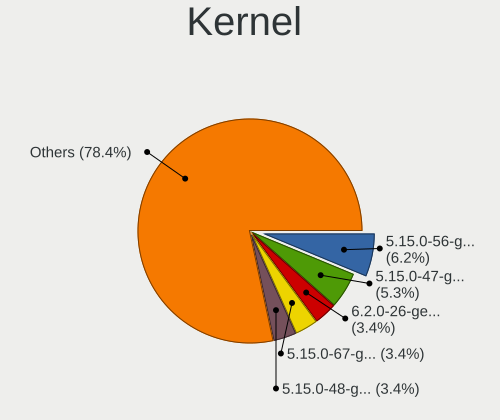

| Version            | Desktops | Percent |
|--------------------|----------|---------|
| 5.15.0-56-generic  | 13       | 6.25%   |
| 5.15.0-47-generic  | 11       | 5.29%   |
| 6.2.0-26-generic   | 7        | 3.37%   |
| 5.15.0-67-generic  | 7        | 3.37%   |
| 5.15.0-48-generic  | 7        | 3.37%   |
| 6.2.0-32-generic   | 6        | 2.88%   |
| 5.15.0-76-generic  | 5        | 2.4%    |
| 5.15.0-60-generic  | 5        | 2.4%    |
| 5.15.0-52-generic  | 5        | 2.4%    |
| 5.15.0-50-generic  | 5        | 2.4%    |
| 6.5.0-35-generic   | 4        | 1.92%   |
| 6.5.0-14-generic   | 4        | 1.92%   |
| 5.19.0-32-generic  | 4        | 1.92%   |
| 5.15.0-25-generic  | 4        | 1.92%   |
| 5.15.0-101-generic | 4        | 1.92%   |
| 6.5.0-27-generic   | 3        | 1.44%   |
| 6.5.0-25-generic   | 3        | 1.44%   |
| 6.2.0-37-generic   | 3        | 1.44%   |
| 5.19.0-38-generic  | 3        | 1.44%   |
| 5.15.0-94-generic  | 3        | 1.44%   |
| 5.15.0-89-generic  | 3        | 1.44%   |
| 5.15.0-46-generic  | 3        | 1.44%   |
| 5.15.0-40-generic  | 3        | 1.44%   |
| 5.15.0-27-generic  | 3        | 1.44%   |
| 6.8.0-45-generic   | 2        | 0.96%   |
| 6.5.0-41-generic   | 2        | 0.96%   |
| 6.5.0-28-generic   | 2        | 0.96%   |
| 6.2.0-39-generic   | 2        | 0.96%   |
| 6.2.0-35-generic   | 2        | 0.96%   |
| 6.2.0-33-generic   | 2        | 0.96%   |
| 5.19.0-35-generic  | 2        | 0.96%   |
| 5.15.0-84-generic  | 2        | 0.96%   |
| 5.15.0-82-generic  | 2        | 0.96%   |
| 5.15.0-71-generic  | 2        | 0.96%   |
| 5.15.0-70-generic  | 2        | 0.96%   |
| 5.15.0-69-generic  | 2        | 0.96%   |
| 5.15.0-58-generic  | 2        | 0.96%   |
| 5.15.0-57-generic  | 2        | 0.96%   |
| 5.15.0-41-generic  | 2        | 0.96%   |
| 5.15.0-37-generic  | 2        | 0.96%   |

Kernel Family
-------------

Linux kernel without a distro release

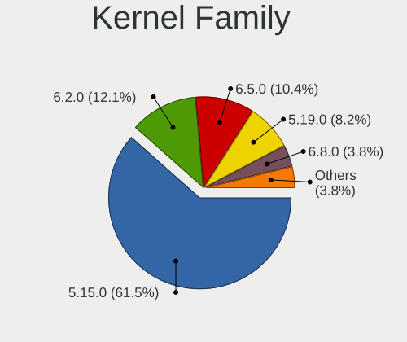

| Version | Desktops | Percent |
|---------|----------|---------|
| 5.15.0  | 112      | 61.54%  |
| 6.2.0   | 22       | 12.09%  |
| 6.5.0   | 19       | 10.44%  |
| 5.19.0  | 15       | 8.24%   |
| 6.8.0   | 7        | 3.85%   |
| 5.13.0  | 2        | 1.1%    |
| 6.8.9   | 1        | 0.55%   |
| 6.8.7   | 1        | 0.55%   |
| 6.4.0   | 1        | 0.55%   |
| 5.18.0  | 1        | 0.55%   |
| 5.14.0  | 1        | 0.55%   |

Kernel Major Ver.
-----------------

Linux kernel major version

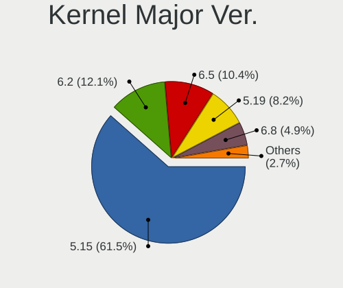

| Version | Desktops | Percent |
|---------|----------|---------|
| 5.15    | 112      | 61.54%  |
| 6.2     | 22       | 12.09%  |
| 6.5     | 19       | 10.44%  |
| 5.19    | 15       | 8.24%   |
| 6.8     | 9        | 4.95%   |
| 5.13    | 2        | 1.1%    |
| 6.4     | 1        | 0.55%   |
| 5.18    | 1        | 0.55%   |
| 5.14    | 1        | 0.55%   |

Arch
----

OS architecture (x86_64, i586, etc.)

| Name   | Desktops | Percent |
|--------|----------|---------|
| x86_64 | 177      | 100%    |

DE
--

Desktop Environment

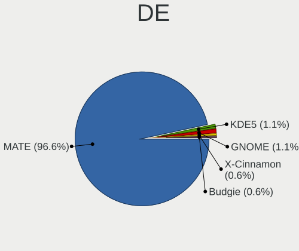

| Name       | Desktops | Percent |
|------------|----------|---------|
| MATE       | 171      | 96.61%  |
| KDE5       | 2        | 1.13%   |
| GNOME      | 2        | 1.13%   |
| X-Cinnamon | 1        | 0.56%   |
| Budgie     | 1        | 0.56%   |

Display Server
--------------

X11 or Wayland

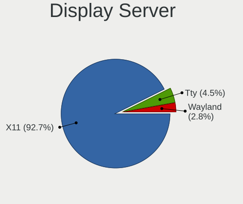

| Name    | Desktops | Percent |
|---------|----------|---------|
| X11     | 164      | 92.66%  |
| Tty     | 8        | 4.52%   |
| Wayland | 5        | 2.82%   |

Display Manager
---------------

SDDM, LightDM, etc.

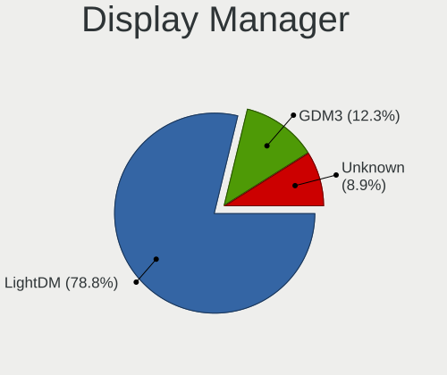

| Name    | Desktops | Percent |
|---------|----------|---------|
| LightDM | 141      | 78.77%  |
| GDM3    | 22       | 12.29%  |
| Unknown | 16       | 8.94%   |

OS Lang
-------

Language

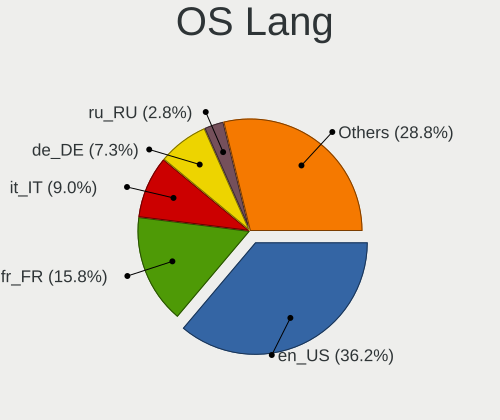

| Lang    | Desktops | Percent |
|---------|----------|---------|
| en_US   | 64       | 36.16%  |
| fr_FR   | 28       | 15.82%  |
| it_IT   | 16       | 9.04%   |
| de_DE   | 13       | 7.34%   |
| ru_RU   | 5        | 2.82%   |
| en_GB   | 5        | 2.82%   |
| en_AU   | 5        | 2.82%   |
| pt_BR   | 4        | 2.26%   |
| en_CA   | 4        | 2.26%   |
| de_CH   | 4        | 2.26%   |
| es_ES   | 3        | 1.69%   |
| C       | 3        | 1.69%   |
| tr_TR   | 2        | 1.13%   |
| hr_HR   | 2        | 1.13%   |
| es_AR   | 2        | 1.13%   |
| zh_TW   | 1        | 0.56%   |
| pl_PL   | 1        | 0.56%   |
| nl_NL   | 1        | 0.56%   |
| nb_NO   | 1        | 0.56%   |
| hu_HU   | 1        | 0.56%   |
| fi_FI   | 1        | 0.56%   |
| et_EE   | 1        | 0.56%   |
| es_VE   | 1        | 0.56%   |
| es_PE   | 1        | 0.56%   |
| es_MX   | 1        | 0.56%   |
| en_IL   | 1        | 0.56%   |
| el_GR   | 1        | 0.56%   |
| de_AT   | 1        | 0.56%   |
| da_DK   | 1        | 0.56%   |
| cs_CZ   | 1        | 0.56%   |
| ar_KW   | 1        | 0.56%   |
| Unknown | 1        | 0.56%   |

Boot Mode
---------

EFI or BIOS

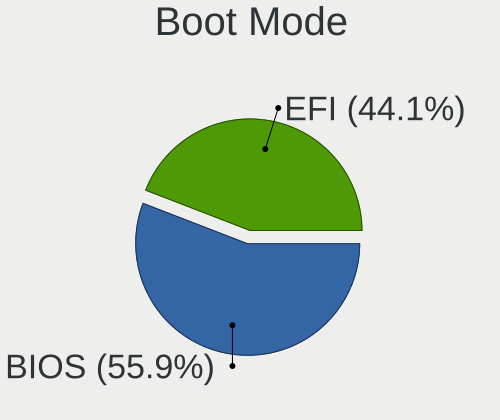

| Mode | Desktops | Percent |
|------|----------|---------|
| BIOS | 100      | 55.87%  |
| EFI  | 79       | 44.13%  |

Filesystem
----------

Type of filesystem

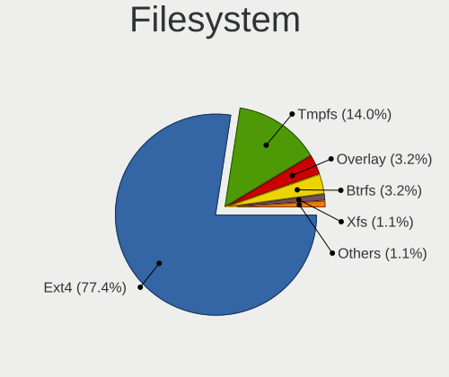

| Type    | Desktops | Percent |
|---------|----------|---------|
| Ext4    | 144      | 77.42%  |
| Tmpfs   | 26       | 13.98%  |
| Overlay | 6        | 3.23%   |
| Btrfs   | 6        | 3.23%   |
| Xfs     | 2        | 1.08%   |
| Zfs     | 1        | 0.54%   |
| Ext2    | 1        | 0.54%   |

Part. scheme
------------

Scheme of partitioning

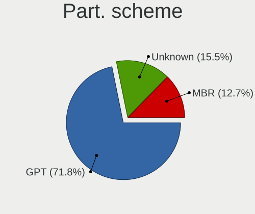

| Type    | Desktops | Percent |
|---------|----------|---------|
| GPT     | 130      | 71.82%  |
| Unknown | 28       | 15.47%  |
| MBR     | 23       | 12.71%  |

Dual Boot with Linux/BSD
------------------------

Hosting more than one Linux/BSD

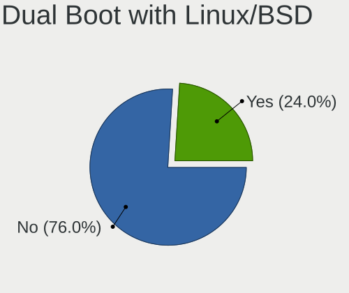

| Dual boot | Desktops | Percent |
|-----------|----------|---------|
| No        | 136      | 75.98%  |
| Yes       | 43       | 24.02%  |

Dual Boot (Win)
---------------

Hosting Linux and Windows

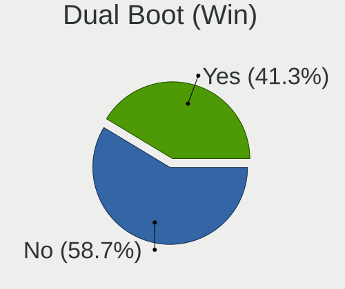

| Dual boot | Desktops | Percent |
|-----------|----------|---------|
| No        | 105      | 58.66%  |
| Yes       | 74       | 41.34%  |

Board
-----

Vendor
------

Motherboard manufacturer

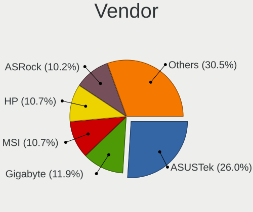

| Name                                 | Desktops | Percent |
|--------------------------------------|----------|---------|
| ASUSTek Computer                     | 46       | 25.99%  |
| Gigabyte Technology                  | 21       | 11.86%  |
| MSI                                  | 19       | 10.73%  |
| Hewlett-Packard                      | 19       | 10.73%  |
| ASRock                               | 18       | 10.17%  |
| Dell                                 | 14       | 7.91%   |
| Lenovo                               | 10       | 5.65%   |
| Unknown                              | 7        | 3.95%   |
| Acer                                 | 4        | 2.26%   |
| Intel                                | 2        | 1.13%   |
| Biostar                              | 2        | 1.13%   |
| AZW                                  | 2        | 1.13%   |
| AMI                                  | 2        | 1.13%   |
| Shenzhen Meigao Electronic Equipment | 1        | 0.56%   |
| Semp Toshiba                         | 1        | 0.56%   |
| Positivo                             | 1        | 0.56%   |
| Medion                               | 1        | 0.56%   |
| MACHINIST                            | 1        | 0.56%   |
| Fujitsu                              | 1        | 0.56%   |
| Foxconn                              | 1        | 0.56%   |
| Entroware                            | 1        | 0.56%   |
| ECS                                  | 1        | 0.56%   |
| CCE                                  | 1        | 0.56%   |
| 3Logic Group                         | 1        | 0.56%   |

Model
-----

Motherboard model

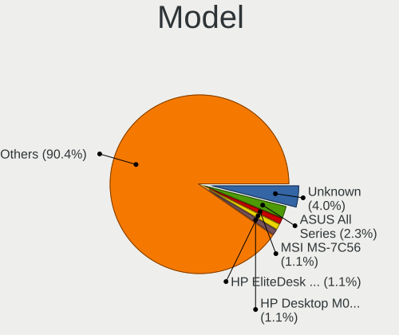

| Name                                        | Desktops | Percent |
|---------------------------------------------|----------|---------|
| Unknown                                     | 7        | 3.95%   |
| ASUS All Series                             | 4        | 2.26%   |
| MSI MS-7C56                                 | 2        | 1.13%   |
| HP EliteDesk 800 G1 SFF                     | 2        | 1.13%   |
| HP Desktop M01-F0xxx                        | 2        | 1.13%   |
| HP Compaq Elite 8300 SFF                    | 2        | 1.13%   |
| HP Compaq 8000 Elite SFF PC                 | 2        | 1.13%   |
| Gigabyte B85M-D3H                           | 2        | 1.13%   |
| Dell OptiPlex 3020                          | 2        | 1.13%   |
| ASUS PRIME B760-PLUS                        | 2        | 1.13%   |
| ASUS PRIME B450M-A II                       | 2        | 1.13%   |
| ASUS M5A78L LE                              | 2        | 1.13%   |
| ASRock A320M-HDV R4.0                       | 2        | 1.13%   |
| AMI Intel                                   | 2        | 1.13%   |
| Shenzhen Meigao Electronic Equipment HX90G  | 1        | 0.56%   |
| Semp Toshiba STI                            | 1        | 0.56%   |
| Positivo POS-EIBTPDC                        | 1        | 0.56%   |
| MSI p6-2330                                 | 1        | 0.56%   |
| MSI MS-7E07                                 | 1        | 0.56%   |
| MSI MS-7D43                                 | 1        | 0.56%   |
| MSI MS-7C52                                 | 1        | 0.56%   |
| MSI MS-7C37                                 | 1        | 0.56%   |
| MSI MS-7C09                                 | 1        | 0.56%   |
| MSI MS-7C02                                 | 1        | 0.56%   |
| MSI MS-7B86                                 | 1        | 0.56%   |
| MSI MS-7B84                                 | 1        | 0.56%   |
| MSI MS-7A33                                 | 1        | 0.56%   |
| MSI MS-7982                                 | 1        | 0.56%   |
| MSI MS-7918                                 | 1        | 0.56%   |
| MSI MS-7817                                 | 1        | 0.56%   |
| MSI MS-7816                                 | 1        | 0.56%   |
| MSI MS-7758                                 | 1        | 0.56%   |
| MSI MS-7599                                 | 1        | 0.56%   |
| MSI B02311                                  | 1        | 0.56%   |
| Medion MS-7797                              | 1        | 0.56%   |
| MACHINIST E5 MR9A PRO MAX V1.1              | 1        | 0.56%   |
| Lenovo ThinkStation S30 0606AD5             | 1        | 0.56%   |
| Lenovo ThinkStation D20 4158GK1             | 1        | 0.56%   |
| Lenovo ThinkCentre neo 50t Gen 3 11SE00A7AX | 1        | 0.56%   |
| Lenovo ThinkCentre M710q 10MQSC0N00         | 1        | 0.56%   |

Model Family
------------

Motherboard model prefix

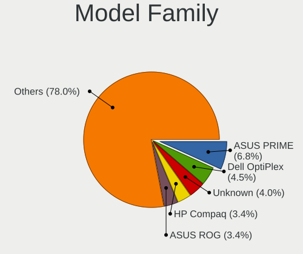

| Name                                       | Desktops | Percent |
|--------------------------------------------|----------|---------|
| ASUS PRIME                                 | 12       | 6.78%   |
| Dell OptiPlex                              | 8        | 4.52%   |
| Unknown                                    | 7        | 3.95%   |
| HP Compaq                                  | 6        | 3.39%   |
| ASUS ROG                                   | 6        | 3.39%   |
| Lenovo ThinkCentre                         | 4        | 2.26%   |
| HP EliteDesk                               | 4        | 2.26%   |
| ASUS All                                   | 4        | 2.26%   |
| Dell Precision                             | 3        | 1.69%   |
| Acer Aspire                                | 3        | 1.69%   |
| MSI MS-7C56                                | 2        | 1.13%   |
| Lenovo ThinkStation                        | 2        | 1.13%   |
| Lenovo IdeaCentre                          | 2        | 1.13%   |
| HP ProLiant                                | 2        | 1.13%   |
| HP ProDesk                                 | 2        | 1.13%   |
| HP Desktop                                 | 2        | 1.13%   |
| Gigabyte B85M-D3H                          | 2        | 1.13%   |
| Gigabyte B450M                             | 2        | 1.13%   |
| ASUS TUF                                   | 2        | 1.13%   |
| ASUS P8Z77-V                               | 2        | 1.13%   |
| ASUS M5A78L-M                              | 2        | 1.13%   |
| ASUS M5A78L                                | 2        | 1.13%   |
| ASRock A320M-HDV                           | 2        | 1.13%   |
| AMI Intel                                  | 2        | 1.13%   |
| Shenzhen Meigao Electronic Equipment HX90G | 1        | 0.56%   |
| Semp Toshiba STI                           | 1        | 0.56%   |
| Positivo POS-EIBTPDC                       | 1        | 0.56%   |
| MSI p6-2330                                | 1        | 0.56%   |
| MSI MS-7E07                                | 1        | 0.56%   |
| MSI MS-7D43                                | 1        | 0.56%   |
| MSI MS-7C52                                | 1        | 0.56%   |
| MSI MS-7C37                                | 1        | 0.56%   |
| MSI MS-7C09                                | 1        | 0.56%   |
| MSI MS-7C02                                | 1        | 0.56%   |
| MSI MS-7B86                                | 1        | 0.56%   |
| MSI MS-7B84                                | 1        | 0.56%   |
| MSI MS-7A33                                | 1        | 0.56%   |
| MSI MS-7982                                | 1        | 0.56%   |
| MSI MS-7918                                | 1        | 0.56%   |
| MSI MS-7817                                | 1        | 0.56%   |

MFG Year
--------

Motherboard manufacture year

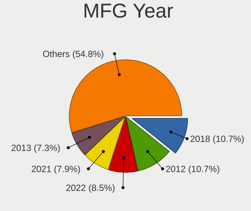

| Year | Desktops | Percent |
|------|----------|---------|
| 2018 | 19       | 10.73%  |
| 2012 | 19       | 10.73%  |
| 2022 | 15       | 8.47%   |
| 2021 | 14       | 7.91%   |
| 2013 | 13       | 7.34%   |
| 2011 | 13       | 7.34%   |
| 2020 | 12       | 6.78%   |
| 2019 | 12       | 6.78%   |
| 2014 | 12       | 6.78%   |
| 2009 | 11       | 6.21%   |
| 2017 | 9        | 5.08%   |
| 2023 | 8        | 4.52%   |
| 2010 | 6        | 3.39%   |
| 2015 | 5        | 2.82%   |
| 2016 | 4        | 2.26%   |
| 2008 | 2        | 1.13%   |
| 2006 | 2        | 1.13%   |
| 2007 | 1        | 0.56%   |

Form Factor
-----------

Physical design of the computer

| Name    | Desktops | Percent |
|---------|----------|---------|
| Desktop | 177      | 100%    |

Secure Boot
-----------

Enabled or disabled

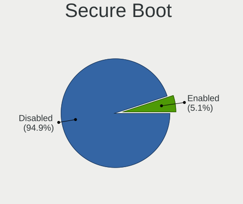

| State    | Desktops | Percent |
|----------|----------|---------|
| Disabled | 169      | 94.94%  |
| Enabled  | 9        | 5.06%   |

Coreboot
--------

Have coreboot on board

| Used | Desktops | Percent |
|------|----------|---------|
| No   | 177      | 100%    |

RAM Size
--------

Total RAM memory

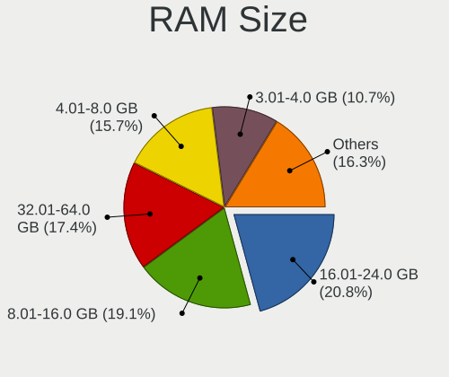

| Size in GB  | Desktops | Percent |
|-------------|----------|---------|
| 16.01-24.0  | 37       | 20.79%  |
| 8.01-16.0   | 34       | 19.1%   |
| 32.01-64.0  | 31       | 17.42%  |
| 4.01-8.0    | 28       | 15.73%  |
| 3.01-4.0    | 19       | 10.67%  |
| 64.01-256.0 | 17       | 9.55%   |
| 24.01-32.0  | 7        | 3.93%   |
| 1.01-2.0    | 4        | 2.25%   |
| 2.01-3.0    | 1        | 0.56%   |

RAM Used
--------

Used RAM memory

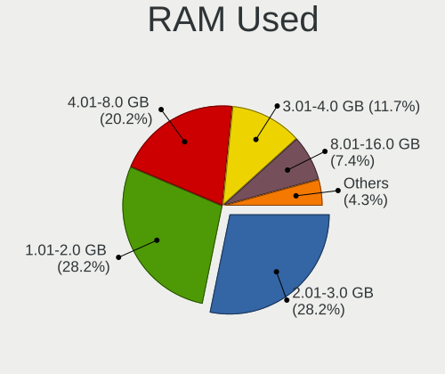

| Used GB    | Desktops | Percent |
|------------|----------|---------|
| 2.01-3.0   | 53       | 28.19%  |
| 1.01-2.0   | 53       | 28.19%  |
| 4.01-8.0   | 38       | 20.21%  |
| 3.01-4.0   | 22       | 11.7%   |
| 8.01-16.0  | 14       | 7.45%   |
| 0.51-1.0   | 3        | 1.6%    |
| 24.01-32.0 | 2        | 1.06%   |
| 16.01-24.0 | 2        | 1.06%   |
| 32.01-64.0 | 1        | 0.53%   |

Total Drives
------------

Number of drives on board

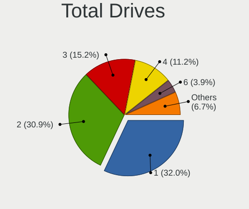

| Drives | Desktops | Percent |
|--------|----------|---------|
| 1      | 57       | 32.02%  |
| 2      | 55       | 30.9%   |
| 3      | 27       | 15.17%  |
| 4      | 20       | 11.24%  |
| 6      | 7        | 3.93%   |
| 5      | 6        | 3.37%   |
| 0      | 2        | 1.12%   |
| 20     | 1        | 0.56%   |
| 9      | 1        | 0.56%   |
| 8      | 1        | 0.56%   |
| 7      | 1        | 0.56%   |

Has CD-ROM
----------

Has CD-ROM on board

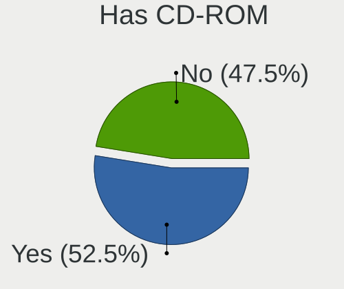

| Presented | Desktops | Percent |
|-----------|----------|---------|
| Yes       | 93       | 52.54%  |
| No        | 84       | 47.46%  |

Has Ethernet
------------

Has Ethernet on board

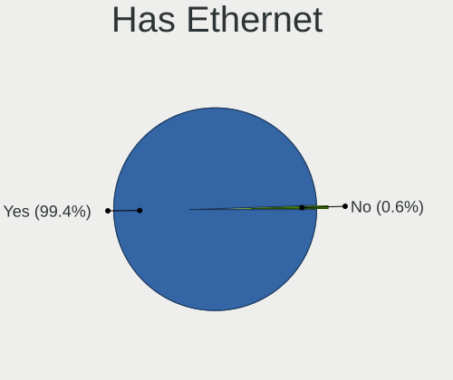

| Presented | Desktops | Percent |
|-----------|----------|---------|
| Yes       | 176      | 99.44%  |
| No        | 1        | 0.56%   |

Has WiFi
--------

Has WiFi module

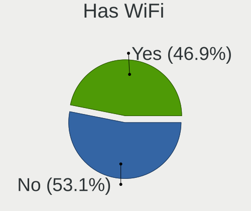

| Presented | Desktops | Percent |
|-----------|----------|---------|
| No        | 94       | 53.11%  |
| Yes       | 83       | 46.89%  |

Has Bluetooth
-------------

Has Bluetooth module

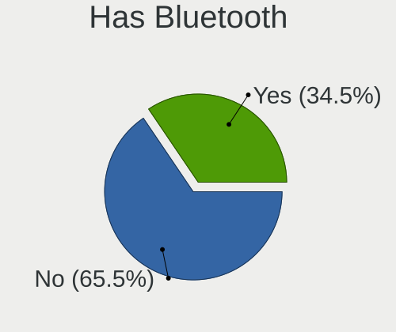

| Presented | Desktops | Percent |
|-----------|----------|---------|
| No        | 116      | 65.54%  |
| Yes       | 61       | 34.46%  |

Location
--------

Country
-------

Geographic location (country)

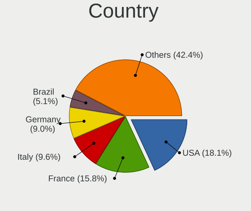

| Country      | Desktops | Percent |
|--------------|----------|---------|
| USA          | 32       | 18.08%  |
| France       | 28       | 15.82%  |
| Italy        | 17       | 9.6%    |
| Germany      | 16       | 9.04%   |
| Brazil       | 9        | 5.08%   |
| Russia       | 6        | 3.39%   |
| UK           | 5        | 2.82%   |
| Switzerland  | 5        | 2.82%   |
| Australia    | 5        | 2.82%   |
| Poland       | 4        | 2.26%   |
| Canada       | 4        | 2.26%   |
| Spain        | 3        | 1.69%   |
| Portugal     | 3        | 1.69%   |
| Croatia      | 3        | 1.69%   |
| Belgium      | 3        | 1.69%   |
| Austria      | 3        | 1.69%   |
| Argentina    | 3        | 1.69%   |
| Turkey       | 2        | 1.13%   |
| Hungary      | 2        | 1.13%   |
| Greece       | 2        | 1.13%   |
| Finland      | 2        | 1.13%   |
| Denmark      | 2        | 1.13%   |
| Vietnam      | 1        | 0.56%   |
| Venezuela    | 1        | 0.56%   |
| Uruguay      | 1        | 0.56%   |
| Ukraine      | 1        | 0.56%   |
| Taiwan       | 1        | 0.56%   |
| Saudi Arabia | 1        | 0.56%   |
| Peru         | 1        | 0.56%   |
| Norway       | 1        | 0.56%   |
| New Zealand  | 1        | 0.56%   |
| Netherlands  | 1        | 0.56%   |
| Morocco      | 1        | 0.56%   |
| Moldova      | 1        | 0.56%   |
| Mexico       | 1        | 0.56%   |
| Israel       | 1        | 0.56%   |
| Isle of Man  | 1        | 0.56%   |
| Estonia      | 1        | 0.56%   |
| Czechia      | 1        | 0.56%   |
| Algeria      | 1        | 0.56%   |

City
----

Geographic location (city)

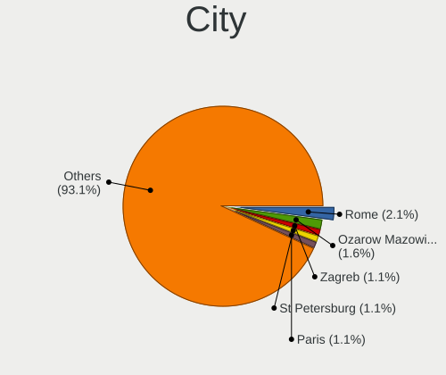

| City              | Desktops | Percent |
|-------------------|----------|---------|
| Rome              | 4        | 2.12%   |
| Ozarow Mazowiecki | 3        | 1.59%   |
| Zagreb            | 2        | 1.06%   |
| St Petersburg     | 2        | 1.06%   |
| Paris             | 2        | 1.06%   |
| Melbourne         | 2        | 1.06%   |
| Los Angeles       | 2        | 1.06%   |
| Lansdale          | 2        | 1.06%   |
| Forlì            | 2        | 1.06%   |
| Bologna           | 2        | 1.06%   |
| Berlin            | 2        | 1.06%   |
| Zurich            | 1        | 0.53%   |
| Zottegem          | 1        | 0.53%   |
| York              | 1        | 0.53%   |
| Yonkers           | 1        | 0.53%   |
| Wuelfrath         | 1        | 0.53%   |
| Wittingen         | 1        | 0.53%   |
| Wintzenheim       | 1        | 0.53%   |
| Wilmington        | 1        | 0.53%   |
| Whanganui         | 1        | 0.53%   |
| Washington        | 1        | 0.53%   |
| Warsaw            | 1        | 0.53%   |
| Villefontaine     | 1        | 0.53%   |
| Viljandi          | 1        | 0.53%   |
| Viana do Castelo  | 1        | 0.53%   |
| Versailles        | 1        | 0.53%   |
| Velyki Mosty      | 1        | 0.53%   |
| Varese            | 1        | 0.53%   |
| Vancouver         | 1        | 0.53%   |
| Untersiggenthal   | 1        | 0.53%   |
| Uberaba           | 1        | 0.53%   |
| Twickenham        | 1        | 0.53%   |
| Turku             | 1        | 0.53%   |
| Trondheim         | 1        | 0.53%   |
| Toulouse          | 1        | 0.53%   |
| Toulon            | 1        | 0.53%   |
| Torring           | 1        | 0.53%   |
| Tighina           | 1        | 0.53%   |
| Terrace           | 1        | 0.53%   |
| Tel Aviv          | 1        | 0.53%   |

Drives
------

Drive Vendor
------------

Hard drive vendors

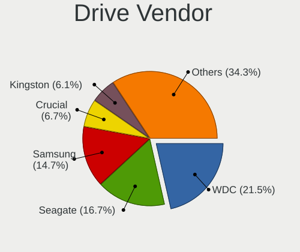

| Vendor                      | Desktops | Drives | Percent |
|-----------------------------|----------|--------|---------|
| WDC                         | 67       | 120    | 21.47%  |
| Seagate                     | 52       | 92     | 16.67%  |
| Samsung Electronics         | 46       | 90     | 14.74%  |
| Crucial                     | 21       | 28     | 6.73%   |
| Kingston                    | 19       | 27     | 6.09%   |
| Toshiba                     | 15       | 43     | 4.81%   |
| SanDisk                     | 13       | 16     | 4.17%   |
| Hitachi                     | 7        | 9      | 2.24%   |
| Unknown                     | 6        | 14     | 1.92%   |
| A-DATA Technology           | 5        | 6      | 1.6%    |
| Phison Electronics          | 4        | 4      | 1.28%   |
| Phison                      | 4        | 4      | 1.28%   |
| Intel                       | 4        | 4      | 1.28%   |
| SPCC                        | 3        | 5      | 0.96%   |
| China                       | 3        | 3      | 0.96%   |
| Team                        | 2        | 2      | 0.64%   |
| SK hynix                    | 2        | 2      | 0.64%   |
| PNY                         | 2        | 2      | 0.64%   |
| LDLC                        | 2        | 2      | 0.64%   |
| KIOXIA-EXCERIA              | 2        | 2      | 0.64%   |
| KingSpec                    | 2        | 2      | 0.64%   |
| KingFast                    | 2        | 2      | 0.64%   |
| Hewlett-Packard             | 2        | 5      | 0.64%   |
| ASMT                        | 2        | 3      | 0.64%   |
| Apacer                      | 2        | 2      | 0.64%   |
| Transcend                   | 1        | 5      | 0.32%   |
| T-FORCE                     | 1        | 1      | 0.32%   |
| RZX                         | 1        | 1      | 0.32%   |
| Realtek Semiconductor       | 1        | 1      | 0.32%   |
| Pichau                      | 1        | 1      | 0.32%   |
| Patriot                     | 1        | 1      | 0.32%   |
| OCZ                         | 1        | 1      | 0.32%   |
| NGFF                        | 1        | 1      | 0.32%   |
| Netac                       | 1        | 1      | 0.32%   |
| Maxtor                      | 1        | 1      | 0.32%   |
| MAXIO Technology (Hangzhou) | 1        | 1      | 0.32%   |
| Kingston Technology Company | 1        | 1      | 0.32%   |
| Kimtigo                     | 1        | 1      | 0.32%   |
| KESU                        | 1        | 1      | 0.32%   |
| Intenso                     | 1        | 1      | 0.32%   |

Drive Model
-----------

Hard drive models

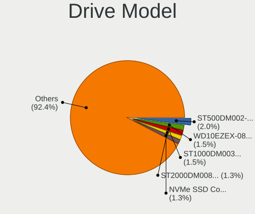

| Model                                             | Desktops | Percent |
|---------------------------------------------------|----------|---------|
| Seagate ST500DM002-1BD142 500GB                   | 8        | 2.02%   |
| WDC WD10EZEX-08WN4A0 1TB                          | 6        | 1.52%   |
| Seagate ST1000DM003-1ER162 1TB                    | 6        | 1.52%   |
| Seagate ST2000DM008-2FR102 2TB                    | 5        | 1.26%   |
| Samsung NVMe SSD Controller SM981/PM981/PM983 1TB | 5        | 1.26%   |
| Samsung SSD 870 EVO 500GB                         | 4        | 1.01%   |
| Samsung SSD 850 EVO 500GB                         | 4        | 1.01%   |
| Kingston SA400S37480G 480GB SSD                   | 4        | 1.01%   |
| Kingston SA400S37120G 120GB SSD                   | 4        | 1.01%   |
| Crucial CT1000BX500SSD1 1TB                       | 4        | 1.01%   |
| WDC WDS100T2B0A-00SM50 1TB SSD                    | 3        | 0.76%   |
| WDC WD5003AZEX-00K3CA0 500GB                      | 3        | 0.76%   |
| WDC WD30EFRX-68EUZN0 3TB                          | 3        | 0.76%   |
| Unknown SD/MMC 16GB                               | 3        | 0.76%   |
| Unknown M.S./M.S.Pro/HG 16GB                      | 3        | 0.76%   |
| Unknown Compact Flash 977MB                       | 3        | 0.76%   |
| Seagate ST4000DM004-2CV104 4TB                    | 3        | 0.76%   |
| Seagate ST2000DM001-1ER164 2TB                    | 3        | 0.76%   |
| Samsung SSD 870 QVO 1TB                           | 3        | 0.76%   |
| Crucial CT480BX500SSD1 480GB                      | 3        | 0.76%   |
| WDC WDS500G2B0A-00SM50 500GB                      | 2        | 0.51%   |
| WDC WD5000AAKX-00ERMA0 500GB                      | 2        | 0.51%   |
| WDC WD40EZRZ-00GXCB0 4TB                          | 2        | 0.51%   |
| WDC WD40EZAZ-00SF3B0 4TB                          | 2        | 0.51%   |
| WDC WD1003FZEX-00MK2A0 1TB                        | 2        | 0.51%   |
| Toshiba HDWD130 3TB                               | 2        | 0.51%   |
| Toshiba DT01ACA100 1TB                            | 2        | 0.51%   |
| Toshiba DT01ACA050 500GB                          | 2        | 0.51%   |
| Seagate ST9500325AS 500GB                         | 2        | 0.51%   |
| Seagate ST3500312CS 500GB                         | 2        | 0.51%   |
| Seagate ST2000DM006-2DM164 2TB                    | 2        | 0.51%   |
| Seagate ST1000DM003-1SB102 1TB                    | 2        | 0.51%   |
| Samsung SSD 980 PRO 2TB                           | 2        | 0.51%   |
| Samsung SSD 980 PRO 1TB                           | 2        | 0.51%   |
| Samsung SSD 980 1TB                               | 2        | 0.51%   |
| Samsung SSD 870 QVO 2TB                           | 2        | 0.51%   |
| Samsung SSD 860 QVO 1TB                           | 2        | 0.51%   |
| Samsung SSD 860 PRO 256GB                         | 2        | 0.51%   |
| Samsung SSD 860 EVO 500GB                         | 2        | 0.51%   |
| Samsung SSD 840 Series 120GB                      | 2        | 0.51%   |

HDD Vendor
----------

Hard disk drive vendors

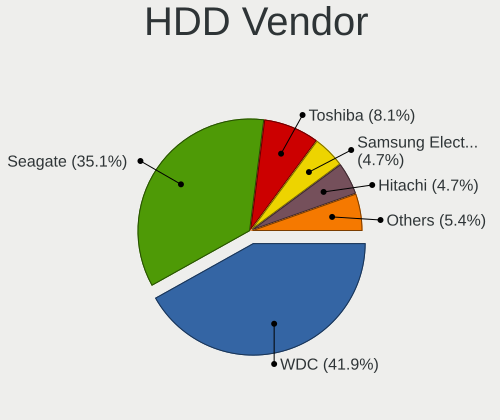

| Vendor              | Desktops | Drives | Percent |
|---------------------|----------|--------|---------|
| WDC                 | 62       | 109    | 41.89%  |
| Seagate             | 52       | 92     | 35.14%  |
| Toshiba             | 12       | 38     | 8.11%   |
| Samsung Electronics | 7        | 15     | 4.73%   |
| Hitachi             | 7        | 9      | 4.73%   |
| Hewlett-Packard     | 2        | 5      | 1.35%   |
| Maxtor              | 1        | 1      | 0.68%   |
| KESU                | 1        | 1      | 0.68%   |
| Intenso             | 1        | 1      | 0.68%   |
| HGST                | 1        | 1      | 0.68%   |
| DAS                 | 1        | 6      | 0.68%   |
| ASMT                | 1        | 2      | 0.68%   |

SSD Vendor
----------

Solid state drive vendors

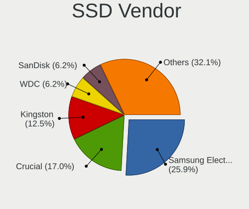

| Vendor              | Desktops | Drives | Percent |
|---------------------|----------|--------|---------|
| Samsung Electronics | 29       | 47     | 25.89%  |
| Crucial             | 19       | 25     | 16.96%  |
| Kingston            | 14       | 22     | 12.5%   |
| WDC                 | 7        | 8      | 6.25%   |
| SanDisk             | 7        | 9      | 6.25%   |
| SPCC                | 3        | 5      | 2.68%   |
| China               | 3        | 3      | 2.68%   |
| A-DATA Technology   | 3        | 3      | 2.68%   |
| Toshiba             | 2        | 4      | 1.79%   |
| LDLC                | 2        | 2      | 1.79%   |
| KingSpec            | 2        | 2      | 1.79%   |
| KingFast            | 2        | 2      | 1.79%   |
| Apacer              | 2        | 2      | 1.79%   |
| Unknown             | 1        | 1      | 0.89%   |
| Transcend           | 1        | 5      | 0.89%   |
| Team                | 1        | 1      | 0.89%   |
| T-FORCE             | 1        | 1      | 0.89%   |
| RZX                 | 1        | 1      | 0.89%   |
| PNY                 | 1        | 1      | 0.89%   |
| Pichau              | 1        | 1      | 0.89%   |
| Patriot             | 1        | 1      | 0.89%   |
| OCZ                 | 1        | 1      | 0.89%   |
| NGFF                | 1        | 1      | 0.89%   |
| KIOXIA-EXCERIA      | 1        | 1      | 0.89%   |
| Intel               | 1        | 1      | 0.89%   |
| GOODRAM             | 1        | 1      | 0.89%   |
| FORESEE             | 1        | 1      | 0.89%   |
| BAITITON            | 1        | 1      | 0.89%   |
| ASMT                | 1        | 1      | 0.89%   |
| Unknown             | 1        | 1      | 0.89%   |

Drive Kind
----------

HDD or SSD

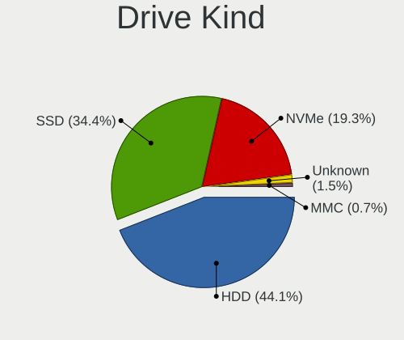

| Kind    | Desktops | Drives | Percent |
|---------|----------|--------|---------|
| HDD     | 119      | 280    | 44.07%  |
| SSD     | 93       | 155    | 34.44%  |
| NVMe    | 52       | 72     | 19.26%  |
| Unknown | 4        | 15     | 1.48%   |
| MMC     | 2        | 2      | 0.74%   |

Drive Connector
---------------

SATA, SAS, NVMe, etc.

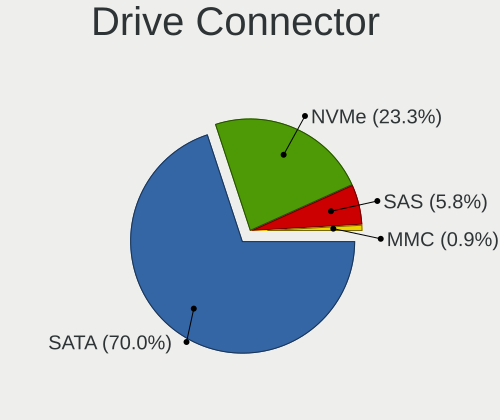

| Type | Desktops | Drives | Percent |
|------|----------|--------|---------|
| SATA | 156      | 414    | 69.96%  |
| NVMe | 52       | 72     | 23.32%  |
| SAS  | 13       | 36     | 5.83%   |
| MMC  | 2        | 2      | 0.9%    |

Drive Size
----------

Size of hard drive

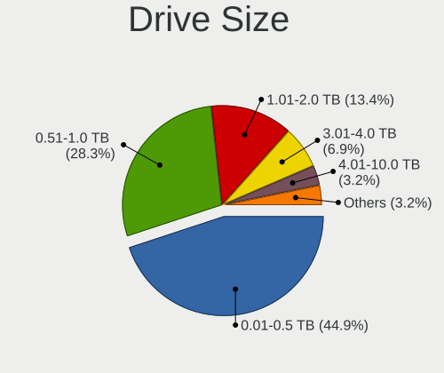

| Size in TB | Desktops | Drives | Percent |
|------------|----------|--------|---------|
| 0.01-0.5   | 111      | 200    | 44.94%  |
| 0.51-1.0   | 70       | 120    | 28.34%  |
| 1.01-2.0   | 33       | 40     | 13.36%  |
| 3.01-4.0   | 17       | 25     | 6.88%   |
| 4.01-10.0  | 8        | 37     | 3.24%   |
| 2.01-3.0   | 7        | 11     | 2.83%   |
| 10.01-20.0 | 1        | 2      | 0.4%    |

Space Total
-----------

Amount of disk space available on the file system

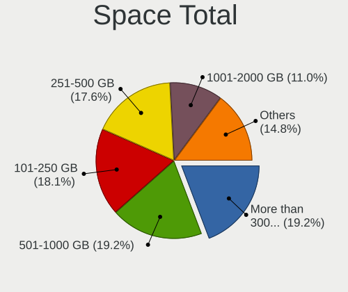

| Size in GB     | Desktops | Percent |
|----------------|----------|---------|
| More than 3000 | 35       | 19.23%  |
| 501-1000       | 35       | 19.23%  |
| 101-250        | 33       | 18.13%  |
| 251-500        | 32       | 17.58%  |
| 1001-2000      | 20       | 10.99%  |
| 2001-3000      | 8        | 4.4%    |
| 51-100         | 8        | 4.4%    |
| 1-20           | 5        | 2.75%   |
| 21-50          | 4        | 2.2%    |
| Unknown        | 2        | 1.1%    |

Space Used
----------

Amount of used disk space

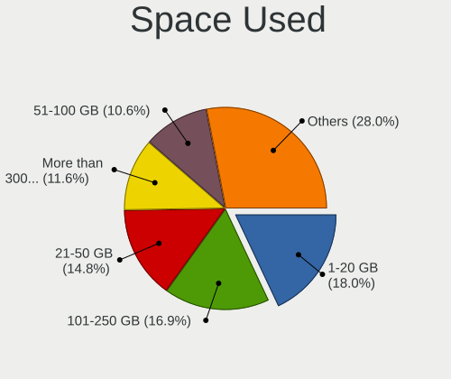

| Used GB        | Desktops | Percent |
|----------------|----------|---------|
| 1-20           | 34       | 17.99%  |
| 101-250        | 32       | 16.93%  |
| 21-50          | 28       | 14.81%  |
| More than 3000 | 22       | 11.64%  |
| 51-100         | 20       | 10.58%  |
| 1001-2000      | 17       | 8.99%   |
| 251-500        | 15       | 7.94%   |
| 501-1000       | 14       | 7.41%   |
| 2001-3000      | 5        | 2.65%   |
| Unknown        | 2        | 1.06%   |

Malfunc. Drives
---------------

Drive models with a malfunction

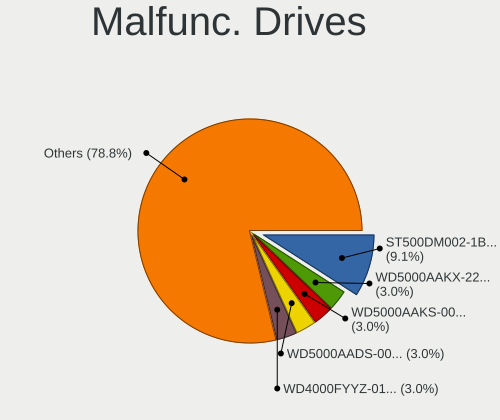

| Model                                                 | Desktops | Drives | Percent |
|-------------------------------------------------------|----------|--------|---------|
| Seagate ST500DM002-1BD142 500GB                       | 3        | 3      | 9.09%   |
| WDC WD5000AAKX-22ERMA0 500GB                          | 1        | 1      | 3.03%   |
| WDC WD5000AAKS-00V1A0 500GB                           | 1        | 1      | 3.03%   |
| WDC WD5000AADS-00S9B0 500GB                           | 1        | 1      | 3.03%   |
| WDC WD4000FYYZ-01UL1B3 4TB                            | 1        | 1      | 3.03%   |
| WDC WD40 EFRX-68WT0N0 4TB                             | 1        | 1      | 3.03%   |
| WDC WD3200AAJS-22B4A0 320GB                           | 1        | 1      | 3.03%   |
| WDC WD2500AVJS-63B6A0 250GB                           | 1        | 1      | 3.03%   |
| WDC WD10EZEX-08WN4A0 1TB                              | 1        | 1      | 3.03%   |
| WDC WD10EAVS-00D7B0 1TB                               | 1        | 1      | 3.03%   |
| WDC WD1003FZEX-00MK2A0 1TB                            | 1        | 1      | 3.03%   |
| Toshiba MG07ACA12TE 12TB                              | 1        | 1      | 3.03%   |
| Seagate ST9640320AS 640GB                             | 1        | 1      | 3.03%   |
| Seagate ST9500325AS 500GB                             | 1        | 1      | 3.03%   |
| Seagate ST9160821AS 160GB                             | 1        | 1      | 3.03%   |
| Seagate ST3250312AS 250GB                             | 1        | 1      | 3.03%   |
| Seagate ST32000644NS 2TB                              | 1        | 1      | 3.03%   |
| Seagate ST250DM000-1BD141 250GB                       | 1        | 1      | 3.03%   |
| Seagate ST2000DM001-1ER164 2TB                        | 1        | 1      | 3.03%   |
| Seagate ST1000DM003-1ER162 1TB                        | 1        | 1      | 3.03%   |
| Samsung Electronics SSD 970 EVO 500GB S466NX0K863648L | 1        | 1      | 3.03%   |
| Samsung Electronics SSD 960 PRO 1TB                   | 1        | 1      | 3.03%   |
| Samsung Electronics SSD 870 EVO 1TB                   | 1        | 1      | 3.03%   |
| OCZ AGILITY3 240GB SSD                                | 1        | 1      | 3.03%   |
| NGFF 2280 256GB SSD                                   | 1        | 1      | 3.03%   |
| LDLC SSD 120GB                                        | 1        | 1      | 3.03%   |
| Kingston RBU-SNS8350DES3128GP 128GB SSD               | 1        | 1      | 3.03%   |
| Hitachi HTS721080G9SA00 80GB                          | 1        | 1      | 3.03%   |
| Hitachi HTS547550A9E384 500GB                         | 1        | 1      | 3.03%   |
| DAS TerraMaster 6TB                                   | 1        | 3      | 3.03%   |
| China SSD 180GB                                       | 1        | 1      | 3.03%   |

Malfunc. Drive Vendor
---------------------

Vendors of faulty drives

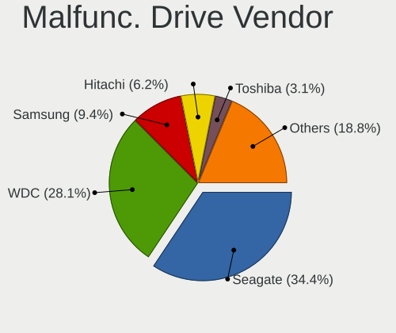

| Vendor              | Desktops | Drives | Percent |
|---------------------|----------|--------|---------|
| Seagate             | 11       | 11     | 34.38%  |
| WDC                 | 9        | 10     | 28.13%  |
| Samsung Electronics | 3        | 3      | 9.38%   |
| Hitachi             | 2        | 2      | 6.25%   |
| Toshiba             | 1        | 1      | 3.13%   |
| OCZ                 | 1        | 1      | 3.13%   |
| NGFF                | 1        | 1      | 3.13%   |
| LDLC                | 1        | 1      | 3.13%   |
| Kingston            | 1        | 1      | 3.13%   |
| DAS                 | 1        | 3      | 3.13%   |
| China               | 1        | 1      | 3.13%   |

Malfunc. HDD Vendor
-------------------

Vendors of faulty HDD drives

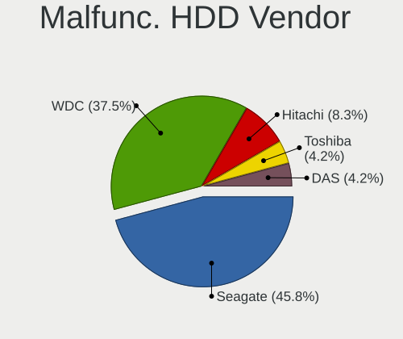

| Vendor  | Desktops | Drives | Percent |
|---------|----------|--------|---------|
| Seagate | 11       | 11     | 45.83%  |
| WDC     | 9        | 10     | 37.5%   |
| Hitachi | 2        | 2      | 8.33%   |
| Toshiba | 1        | 1      | 4.17%   |
| DAS     | 1        | 3      | 4.17%   |

Malfunc. Drive Kind
-------------------

Kinds of faulty drives

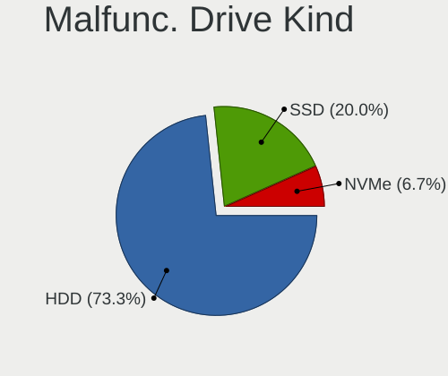

| Kind | Desktops | Drives | Percent |
|------|----------|--------|---------|
| HDD  | 22       | 27     | 73.33%  |
| SSD  | 6        | 6      | 20%     |
| NVMe | 2        | 2      | 6.67%   |

Failed Drives
-------------

Failed drive models

Zero info for selected period =(

Failed Drive Vendor
-------------------

Failed drive vendors

Zero info for selected period =(

Drive Status
------------

Number of failed and malfunc. drives

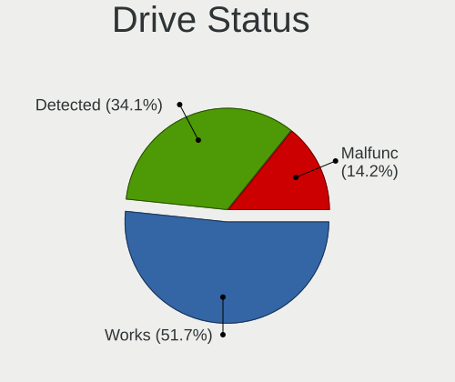

| Status   | Desktops | Drives | Percent |
|----------|----------|--------|---------|
| Works    | 109      | 293    | 51.66%  |
| Detected | 72       | 196    | 34.12%  |
| Malfunc  | 30       | 35     | 14.22%  |

Storage controller
------------------

Storage Vendor
--------------

Storage controller vendors

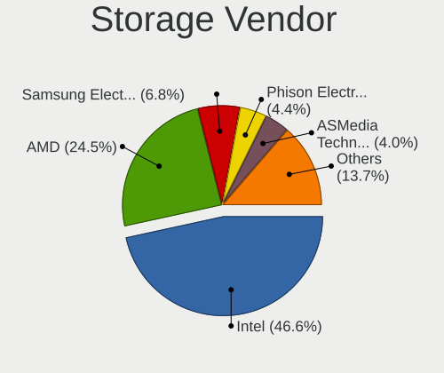

| Vendor                       | Desktops | Percent |
|------------------------------|----------|---------|
| Intel                        | 116      | 46.59%  |
| AMD                          | 61       | 24.5%   |
| Samsung Electronics          | 17       | 6.83%   |
| Phison Electronics           | 11       | 4.42%   |
| ASMedia Technology           | 10       | 4.02%   |
| SanDisk                      | 8        | 3.21%   |
| Kingston Technology Company  | 6        | 2.41%   |
| Marvell Technology Group     | 3        | 1.2%    |
| JMicron Technology           | 3        | 1.2%    |
| SK hynix                     | 2        | 0.8%    |
| Silicon Motion               | 2        | 0.8%    |
| Micron/Crucial Technology    | 2        | 0.8%    |
| ADATA Technology             | 2        | 0.8%    |
| Toshiba America Info Systems | 1        | 0.4%    |
| Realtek Semiconductor        | 1        | 0.4%    |
| MAXIO Technology (Hangzhou)  | 1        | 0.4%    |
| LSI Logic / Symbios Logic    | 1        | 0.4%    |
| KIOXIA                       | 1        | 0.4%    |
| Hewlett-Packard              | 1        | 0.4%    |

Storage Model
-------------

Storage controller models

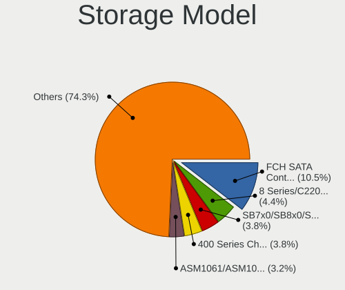

| Model                                                                                   | Desktops | Percent |
|-----------------------------------------------------------------------------------------|----------|---------|
| AMD FCH SATA Controller [AHCI mode]                                                     | 33       | 10.48%  |
| Intel 8 Series/C220 Series Chipset Family 6-port SATA Controller 1 [AHCI mode]          | 14       | 4.44%   |
| AMD SB7x0/SB8x0/SB9x0 IDE Controller                                                    | 12       | 3.81%   |
| AMD 400 Series Chipset SATA Controller                                                  | 12       | 3.81%   |
| ASMedia ASM1061/ASM1062 Serial ATA Controller                                           | 10       | 3.17%   |
| AMD SB7x0/SB8x0/SB9x0 SATA Controller [IDE mode]                                        | 9        | 2.86%   |
| Samsung NVMe SSD Controller SM981/PM981/PM983                                           | 8        | 2.54%   |
| Intel SATA Controller [RAID mode]                                                       | 8        | 2.54%   |
| Intel 7 Series/C210 Series Chipset Family 6-port SATA Controller [AHCI mode]            | 8        | 2.54%   |
| Intel 500 Series Chipset Family SATA AHCI Controller                                    | 8        | 2.54%   |
| Samsung NVMe SSD Controller PM9A1/PM9A3/980PRO                                          | 7        | 2.22%   |
| Intel 200 Series PCH SATA controller [AHCI mode]                                        | 7        | 2.22%   |
| AMD A320 Chipset SATA Controller [AHCI mode]                                            | 7        | 2.22%   |
| AMD 500 Series Chipset SATA Controller                                                  | 7        | 2.22%   |
| Intel Cannon Lake PCH SATA AHCI Controller                                              | 6        | 1.9%    |
| Intel Alder Lake-S PCH SATA Controller [AHCI Mode]                                      | 6        | 1.9%    |
| Intel 6 Series/C200 Series Chipset Family 6 port Desktop SATA AHCI Controller           | 6        | 1.9%    |
| Intel Q170/Q150/B150/H170/H110/Z170/CM236 Chipset SATA Controller [AHCI Mode]           | 5        | 1.59%   |
| Intel NM10/ICH7 Family SATA Controller [IDE mode]                                       | 5        | 1.59%   |
| Intel Celeron/Pentium Silver Processor SATA Controller                                  | 5        | 1.59%   |
| AMD 600 Series Chipset SATA Controller                                                  | 5        | 1.59%   |
| Intel Raptor Lake SATA AHCI Controller                                                  | 4        | 1.27%   |
| Intel 9 Series Chipset Family SATA Controller [AHCI Mode]                               | 4        | 1.27%   |
| AMD SB7x0/SB8x0/SB9x0 SATA Controller [AHCI mode]                                       | 4        | 1.27%   |
| Phison E8 PCIe3 x2 NVMe Controller                                                      | 3        | 0.95%   |
| Kingston Company NV1 NVMe SSD [SM2263XT] (DRAM-less)                                    | 3        | 0.95%   |
| Intel Volume Management Device NVMe RAID Controller                                     | 3        | 0.95%   |
| Intel 82801G (ICH7 Family) IDE Controller                                               | 3        | 0.95%   |
| Intel 8 Series/C220 Series Chipset Family 4-port SATA Controller 1 [IDE mode]           | 3        | 0.95%   |
| Intel 6 Series/C200 Series Chipset Family Desktop SATA Controller (IDE mode, ports 4-5) | 3        | 0.95%   |
| Intel 6 Series/C200 Series Chipset Family Desktop SATA Controller (IDE mode, ports 0-3) | 3        | 0.95%   |
| AMD 300 Series Chipset SATA Controller                                                  | 3        | 0.95%   |
| Silicon Motion SM2263EN/SM2263XT (DRAM-less) NVMe SSD Controllers                       | 2        | 0.63%   |
| SanDisk Ultra 3D / WD PC SN530, IX SN530, Blue SN550 NVMe SSD (DRAM-less)               | 2        | 0.63%   |
| SanDisk Ultra 3D / WD Blue SN570 NVMe SSD (DRAM-less)                                   | 2        | 0.63%   |
| Samsung NVMe SSD Controller SM961/PM961/SM963                                           | 2        | 0.63%   |
| Samsung NVMe SSD Controller S4LV008[Pascal]                                             | 2        | 0.63%   |
| Samsung NVMe SSD Controller 980 (DRAM-less)                                             | 2        | 0.63%   |
| Phison PS5013-E13 PCIe3 NVMe Controller (DRAM-less)                                     | 2        | 0.63%   |
| Phison E16 PCIe4 NVMe Controller                                                        | 2        | 0.63%   |

Storage Kind
------------

Kind of storage controller (IDE, SATA, NVMe, SAS, ...)

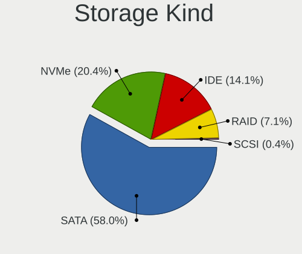

| Kind | Desktops | Percent |
|------|----------|---------|
| SATA | 148      | 58.04%  |
| NVMe | 52       | 20.39%  |
| IDE  | 36       | 14.12%  |
| RAID | 18       | 7.06%   |
| SCSI | 1        | 0.39%   |

Processor
---------

CPU Vendor
----------

Processor vendors

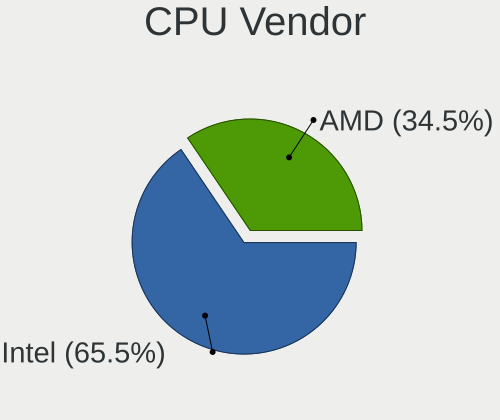

| Vendor | Desktops | Percent |
|--------|----------|---------|
| Intel  | 116      | 65.54%  |
| AMD    | 61       | 34.46%  |

CPU Model
---------

Processor models

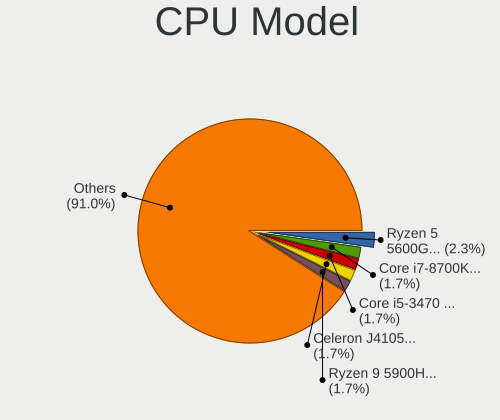

| Model                                         | Desktops | Percent |
|-----------------------------------------------|----------|---------|
| AMD Ryzen 5 5600G with Radeon Graphics        | 4        | 2.26%   |
| Intel Core i7-8700K CPU @ 3.70GHz             | 3        | 1.69%   |
| Intel Core i5-3470 CPU @ 3.20GHz              | 3        | 1.69%   |
| Intel Celeron J4105 CPU @ 1.50GHz             | 3        | 1.69%   |
| AMD Ryzen 9 5900HX with Radeon Graphics       | 3        | 1.69%   |
| AMD Ryzen 5 3600 6-Core Processor             | 3        | 1.69%   |
| AMD Ryzen 5 2600 Six-Core Processor           | 3        | 1.69%   |
| AMD Ryzen 5 2400G with Radeon Vega Graphics   | 3        | 1.69%   |
| Intel Core i7-4790 CPU @ 3.60GHz              | 2        | 1.13%   |
| Intel Core i7-2600 CPU @ 3.40GHz              | 2        | 1.13%   |
| Intel Core i5-9400 CPU @ 2.90GHz              | 2        | 1.13%   |
| Intel Core i5-6600 CPU @ 3.30GHz              | 2        | 1.13%   |
| Intel Core i5-6500 CPU @ 3.20GHz              | 2        | 1.13%   |
| Intel Core i5-4670K CPU @ 3.40GHz             | 2        | 1.13%   |
| Intel Core i5-4570 CPU @ 3.20GHz              | 2        | 1.13%   |
| Intel Core i5-4460 CPU @ 3.20GHz              | 2        | 1.13%   |
| Intel Core i5-3570K CPU @ 3.40GHz             | 2        | 1.13%   |
| Intel Core i5-2400 CPU @ 3.10GHz              | 2        | 1.13%   |
| Intel Core i5-2320 CPU @ 3.00GHz              | 2        | 1.13%   |
| Intel Core i5-10400 CPU @ 2.90GHz             | 2        | 1.13%   |
| Intel 13th Gen Core i7-13700K                 | 2        | 1.13%   |
| Intel 12th Gen Core i5-12400                  | 2        | 1.13%   |
| Intel 11th Gen Core i9-11900K @ 3.50GHz       | 2        | 1.13%   |
| Intel 11th Gen Core i5-11600K @ 3.90GHz       | 2        | 1.13%   |
| AMD Ryzen 7 7700 8-Core Processor             | 2        | 1.13%   |
| AMD Ryzen 5 5500                              | 2        | 1.13%   |
| AMD Ryzen 5 1600 Six-Core Processor           | 2        | 1.13%   |
| AMD Ryzen 3 3200G with Radeon Vega Graphics   | 2        | 1.13%   |
| AMD Ryzen 3 2200G with Radeon Vega Graphics   | 2        | 1.13%   |
| AMD FX-6300 Six-Core Processor                | 2        | 1.13%   |
| AMD A8-9600 RADEON R7, 10 COMPUTE CORES 4C+6G | 2        | 1.13%   |
| Intel Xeon D-2796TE CPU @ 2.00GHz             | 1        | 0.56%   |
| Intel Xeon CPU E5620 @ 2.40GHz                | 1        | 0.56%   |
| Intel Xeon CPU E5-4640 0 @ 2.40GHz            | 1        | 0.56%   |
| Intel Xeon CPU E5-2680 v4 @ 2.40GHz           | 1        | 0.56%   |
| Intel Xeon CPU E5-2650 v3 @ 2.30GHz           | 1        | 0.56%   |
| Intel Xeon CPU E5-2640 0 @ 2.50GHz            | 1        | 0.56%   |
| Intel Xeon CPU E5-2620 0 @ 2.00GHz            | 1        | 0.56%   |
| Intel Xeon CPU E3120 @ 3.16GHz                | 1        | 0.56%   |
| Intel Xeon CPU E3-1245 v3 @ 3.40GHz           | 1        | 0.56%   |

CPU Model Family
----------------

Processor model prefix

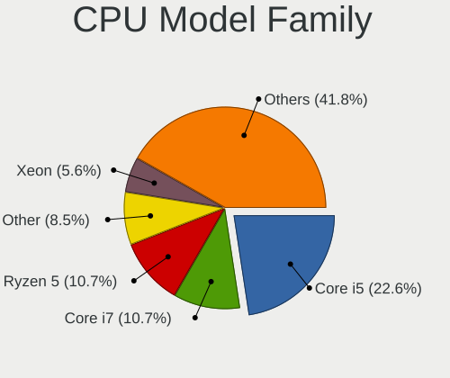

| Model                   | Desktops | Percent |
|-------------------------|----------|---------|
| Intel Core i5           | 40       | 22.6%   |
| Intel Core i7           | 19       | 10.73%  |
| AMD Ryzen 5             | 19       | 10.73%  |
| Other                   | 15       | 8.47%   |
| Intel Xeon              | 10       | 5.65%   |
| Intel Core i3           | 9        | 5.08%   |
| Intel Celeron           | 8        | 4.52%   |
| AMD Ryzen 7             | 8        | 4.52%   |
| AMD FX                  | 7        | 3.95%   |
| AMD Ryzen 9             | 6        | 3.39%   |
| AMD Ryzen 3             | 5        | 2.82%   |
| Intel Pentium           | 4        | 2.26%   |
| Intel Core 2 Duo        | 4        | 2.26%   |
| AMD Athlon II X2        | 3        | 1.69%   |
| AMD A8                  | 3        | 1.69%   |
| Intel Pentium Dual-Core | 2        | 1.13%   |
| Intel Core 2 Quad       | 2        | 1.13%   |
| AMD E                   | 2        | 1.13%   |
| Intel Pentium D         | 1        | 0.56%   |
| Intel Pentium 4         | 1        | 0.56%   |
| Intel Core i9           | 1        | 0.56%   |
| AMD Turion II Neo       | 1        | 0.56%   |
| AMD Phenom II X6        | 1        | 0.56%   |
| AMD Phenom II X4        | 1        | 0.56%   |
| AMD Athlon II X4        | 1        | 0.56%   |
| AMD Athlon              | 1        | 0.56%   |
| AMD A6                  | 1        | 0.56%   |
| AMD A4                  | 1        | 0.56%   |
| AMD A10                 | 1        | 0.56%   |

CPU Cores
---------

Number of processor cores

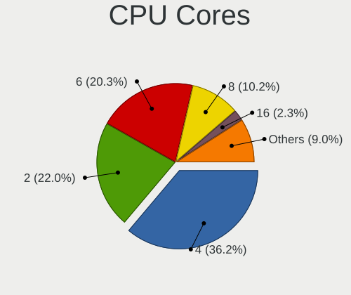

| Number | Desktops | Percent |
|--------|----------|---------|
| 4      | 64       | 36.16%  |
| 2      | 39       | 22.03%  |
| 6      | 36       | 20.34%  |
| 8      | 18       | 10.17%  |
| 16     | 4        | 2.26%   |
| 12     | 4        | 2.26%   |
| 3      | 3        | 1.69%   |
| 1      | 3        | 1.69%   |
| 20     | 2        | 1.13%   |
| 10     | 2        | 1.13%   |
| 24     | 1        | 0.56%   |
| 14     | 1        | 0.56%   |

CPU Sockets
-----------

Number of sockets

| Number | Desktops | Percent |
|--------|----------|---------|
| 1      | 175      | 98.87%  |
| 2      | 2        | 1.13%   |

CPU Threads
-----------

Threads per core (Hyper-Threading)

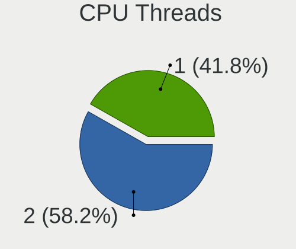

| Number | Desktops | Percent |
|--------|----------|---------|
| 2      | 103      | 58.19%  |
| 1      | 74       | 41.81%  |

CPU Op-Modes
------------

CPU Operation Modes (32-bit, 64-bit)

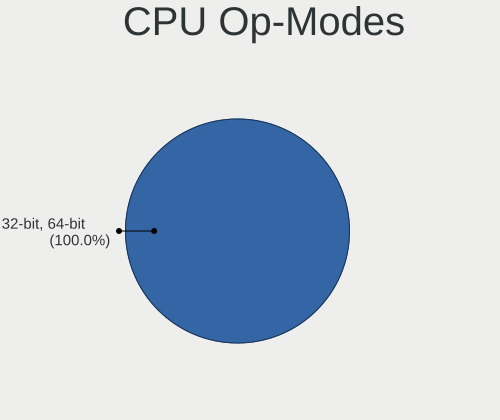

| Op mode        | Desktops | Percent |
|----------------|----------|---------|
| 32-bit, 64-bit | 177      | 100%    |

CPU Microcode
-------------

Microcode number

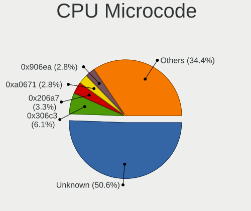

| Number     | Desktops | Percent |
|------------|----------|---------|
| Unknown    | 91       | 50.56%  |
| 0x306c3    | 11       | 6.11%   |
| 0x206a7    | 6        | 3.33%   |
| 0xa0671    | 5        | 2.78%   |
| 0x906ea    | 5        | 2.78%   |
| 0x506e3    | 5        | 2.78%   |
| 0x306a9    | 5        | 2.78%   |
| 0x0a50000c | 4        | 2.22%   |
| 0x0800820d | 4        | 2.22%   |
| 0x706a1    | 3        | 1.67%   |
| 0x08701021 | 3        | 1.67%   |
| 0x08108109 | 3        | 1.67%   |
| 0xa0653    | 2        | 1.11%   |
| 0x20655    | 2        | 1.11%   |
| 0x106e5    | 2        | 1.11%   |
| 0x0a601203 | 2        | 1.11%   |
| 0x0a50000d | 2        | 1.11%   |
| 0x0600611a | 2        | 1.11%   |
| 0x06001119 | 2        | 1.11%   |
| 0x06000852 | 2        | 1.11%   |
| 0x05000119 | 2        | 1.11%   |
| 0x010000c8 | 2        | 1.11%   |
| 0xb0671    | 1        | 0.56%   |
| 0x906ed    | 1        | 0.56%   |
| 0x90672    | 1        | 0.56%   |
| 0x6fd      | 1        | 0.56%   |
| 0x606c1    | 1        | 0.56%   |
| 0x306f2    | 1        | 0.56%   |
| 0x206d7    | 1        | 0.56%   |
| 0x1067a    | 1        | 0.56%   |
| 0x10677    | 1        | 0.56%   |
| 0x10676    | 1        | 0.56%   |
| 0x0810100b | 1        | 0.56%   |
| 0x08001138 | 1        | 0.56%   |
| 0x06003106 | 1        | 0.56%   |
| 0x0600063e | 1        | 0.56%   |
| 0x010000dc | 1        | 0.56%   |

CPU Microarch
-------------

Microarchitecture

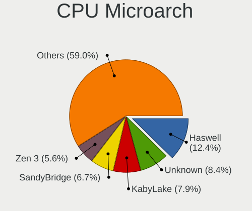

| Name             | Desktops | Percent |
|------------------|----------|---------|
| Haswell          | 22       | 12.36%  |
| Unknown          | 15       | 8.43%   |
| KabyLake         | 14       | 7.87%   |
| SandyBridge      | 12       | 6.74%   |
| Zen 3            | 10       | 5.62%   |
| IvyBridge        | 10       | 5.62%   |
| Zen+             | 9        | 5.06%   |
| Skylake          | 9        | 5.06%   |
| Zen              | 8        | 4.49%   |
| Penryn           | 8        | 4.49%   |
| Zen 2            | 7        | 3.93%   |
| Piledriver       | 7        | 3.93%   |
| K10              | 7        | 3.93%   |
| Icelake          | 5        | 2.81%   |
| Goldmont plus    | 5        | 2.81%   |
| CometLake        | 5        | 2.81%   |
| Westmere         | 4        | 2.25%   |
| Excavator        | 3        | 1.69%   |
| Alderlake Hybrid | 3        | 1.69%   |
| NetBurst         | 2        | 1.12%   |
| Nehalem          | 2        | 1.12%   |
| Bulldozer        | 2        | 1.12%   |
| Broadwell        | 2        | 1.12%   |
| Bobcat           | 2        | 1.12%   |
| Tremont          | 1        | 0.56%   |
| Steamroller      | 1        | 0.56%   |
| Silvermont       | 1        | 0.56%   |
| Gracemont        | 1        | 0.56%   |
| Core             | 1        | 0.56%   |

Graphics
--------

GPU Vendor
----------

Vendors of graphics cards

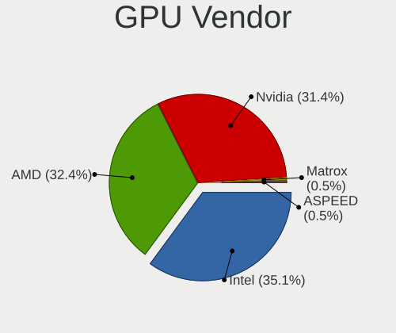

| Vendor                     | Desktops | Percent |
|----------------------------|----------|---------|
| Intel                      | 66       | 35.11%  |
| AMD                        | 61       | 32.45%  |
| Nvidia                     | 59       | 31.38%  |
| Matrox Electronics Systems | 1        | 0.53%   |
| ASPEED Technology          | 1        | 0.53%   |

GPU Model
---------

Graphics card models

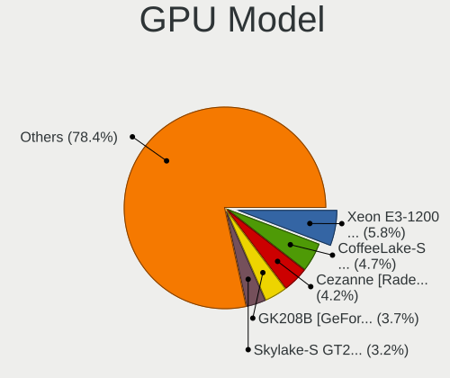

| Model                                                                       | Desktops | Percent |
|-----------------------------------------------------------------------------|----------|---------|
| Intel Xeon E3-1200 v3/4th Gen Core Processor Integrated Graphics Controller | 11       | 5.79%   |
| Intel CoffeeLake-S GT2 [UHD Graphics 630]                                   | 9        | 4.74%   |
| AMD Cezanne [Radeon Vega Series / Radeon Vega Mobile Series]                | 8        | 4.21%   |
| Nvidia GK208B [GeForce GT 710]                                              | 7        | 3.68%   |
| Intel Skylake-S GT2 [HD Graphics 530]                                       | 6        | 3.16%   |
| Nvidia GP108 [GeForce GT 1030]                                              | 5        | 2.63%   |
| Nvidia GP106 [GeForce GTX 1060 6GB]                                         | 5        | 2.63%   |
| Intel Xeon E3-1200 v2/3rd Gen Core processor Graphics Controller            | 5        | 2.63%   |
| AMD Raven Ridge [Radeon Vega Series / Radeon Vega Mobile Series]            | 5        | 2.63%   |
| Intel GeminiLake [UHD Graphics 600]                                         | 4        | 2.11%   |
| Intel 4 Series Chipset Integrated Graphics Controller                       | 4        | 2.11%   |
| AMD Raphael                                                                 | 4        | 2.11%   |
| AMD Ellesmere [Radeon RX 470/480/570/570X/580/580X/590]                     | 4        | 2.11%   |
| AMD Cedar [Radeon HD 5000/6000/7350/8350 Series]                            | 4        | 2.11%   |
| Nvidia GK208B [GeForce GT 730]                                              | 3        | 1.58%   |
| Intel Alder Lake-S GT1 [UHD Graphics 730]                                   | 3        | 1.58%   |
| AMD Wani [Radeon R5/R6/R7 Graphics]                                         | 3        | 1.58%   |
| AMD Picasso/Raven 2 [Radeon Vega Series / Radeon Vega Mobile Series]        | 3        | 1.58%   |
| Nvidia GT218 [GeForce 210]                                                  | 2        | 1.05%   |
| Nvidia GP107GL [Quadro P620]                                                | 2        | 1.05%   |
| Nvidia GP107 [GeForce GTX 1050 Ti]                                          | 2        | 1.05%   |
| Nvidia GM206 [GeForce GTX 960]                                              | 2        | 1.05%   |
| Nvidia GM107GL [Quadro K620]                                                | 2        | 1.05%   |
| Nvidia AD102 [GeForce RTX 4090]                                             | 2        | 1.05%   |
| Intel RocketLake-S GT1 [UHD Graphics 750]                                   | 2        | 1.05%   |
| Intel Raptor Lake-S GT1 [UHD Graphics 770]                                  | 2        | 1.05%   |
| Intel IvyBridge GT2 [HD Graphics 4000]                                      | 2        | 1.05%   |
| Intel CometLake-S GT2 [UHD Graphics 630]                                    | 2        | 1.05%   |
| Intel 4th Generation Core Processor Family Integrated Graphics Controller   | 2        | 1.05%   |
| Intel 2nd Generation Core Processor Family Integrated Graphics Controller   | 2        | 1.05%   |
| AMD Vega 10 XL/XT [Radeon RX Vega 56/64]                                    | 2        | 1.05%   |
| AMD Redwood PRO [Radeon HD 5550/5570/5630/6510/6610/7570]                   | 2        | 1.05%   |
| AMD Navi 23 [Radeon RX 6600/6600 XT/6600M]                                  | 2        | 1.05%   |
| AMD Caicos [Radeon HD 6450/7450/8450 / R5 230 OEM]                          | 2        | 1.05%   |
| Nvidia TU117GL [T400 4GB / T400E]                                           | 1        | 0.53%   |
| Nvidia TU116 [GeForce GTX 1660]                                             | 1        | 0.53%   |
| Nvidia TU116 [GeForce GTX 1660 Ti]                                          | 1        | 0.53%   |
| Nvidia TU116 [GeForce GTX 1660 SUPER]                                       | 1        | 0.53%   |
| Nvidia TU116 [GeForce GTX 1650 SUPER]                                       | 1        | 0.53%   |
| Nvidia TU106 [GeForce RTX 2060 Rev. A]                                      | 1        | 0.53%   |

GPU Combo
---------

Combinations of graphics cards

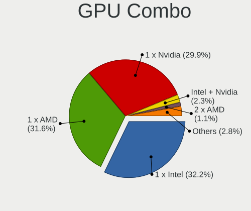

| Name           | Desktops | Percent |
|----------------|----------|---------|
| 1 x Intel      | 57       | 32.2%   |
| 1 x AMD        | 56       | 31.64%  |
| 1 x Nvidia     | 53       | 29.94%  |
| Intel + Nvidia | 4        | 2.26%   |
| 2 x AMD        | 2        | 1.13%   |
| AMD + Nvidia   | 2        | 1.13%   |
| 1 x Matrox     | 1        | 0.56%   |
| Intel + AMD    | 1        | 0.56%   |
| 1 x ASPEED     | 1        | 0.56%   |

GPU Driver
----------

Free vs proprietary

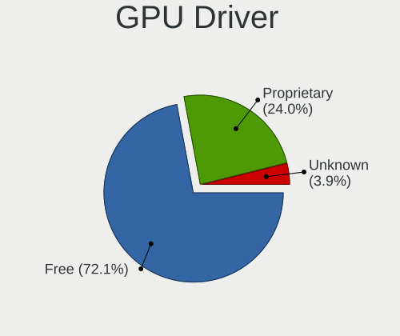

| Driver      | Desktops | Percent |
|-------------|----------|---------|
| Free        | 129      | 72.07%  |
| Proprietary | 43       | 24.02%  |
| Unknown     | 7        | 3.91%   |

GPU Memory
----------

Total video memory

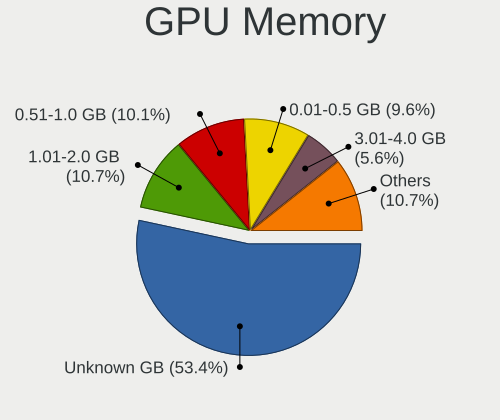

| Size in GB | Desktops | Percent |
|------------|----------|---------|
| Unknown    | 95       | 53.37%  |
| 1.01-2.0   | 19       | 10.67%  |
| 0.51-1.0   | 18       | 10.11%  |
| 0.01-0.5   | 17       | 9.55%   |
| 3.01-4.0   | 10       | 5.62%   |
| 5.01-6.0   | 7        | 3.93%   |
| 7.01-8.0   | 6        | 3.37%   |
| 16.01-24.0 | 3        | 1.69%   |
| 8.01-16.0  | 2        | 1.12%   |
| 2.01-3.0   | 1        | 0.56%   |

Monitor
-------

Monitor Vendor
--------------

Monitor vendors

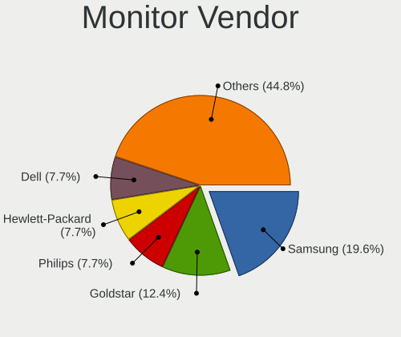

| Vendor               | Desktops | Percent |
|----------------------|----------|---------|
| Samsung Electronics  | 38       | 19.59%  |
| Goldstar             | 24       | 12.37%  |
| Philips              | 15       | 7.73%   |
| Hewlett-Packard      | 15       | 7.73%   |
| Dell                 | 15       | 7.73%   |
| Acer                 | 13       | 6.7%    |
| Iiyama               | 12       | 6.19%   |
| BenQ                 | 9        | 4.64%   |
| AOC                  | 6        | 3.09%   |
| Ancor Communications | 6        | 3.09%   |
| Lenovo               | 4        | 2.06%   |
| ViewSonic            | 3        | 1.55%   |
| Sony                 | 2        | 1.03%   |
| NEC Computers        | 2        | 1.03%   |
| Westinghouse         | 1        | 0.52%   |
| VMO                  | 1        | 0.52%   |
| Vizio                | 1        | 0.52%   |
| Vita                 | 1        | 0.52%   |
| Toshiba              | 1        | 0.52%   |
| SNC                  | 1        | 0.52%   |
| SKG                  | 1        | 0.52%   |
| SGX                  | 1        | 0.52%   |
| Sceptre Tech         | 1        | 0.52%   |
| PXO                  | 1        | 0.52%   |
| Panasonic            | 1        | 0.52%   |
| Packard Bell         | 1        | 0.52%   |
| OEM                  | 1        | 0.52%   |
| NYC                  | 1        | 0.52%   |
| Medion               | 1        | 0.52%   |
| LG Electronics       | 1        | 0.52%   |
| Lenovo Group Limited | 1        | 0.52%   |
| Lanix                | 1        | 0.52%   |
| Kogan                | 1        | 0.52%   |
| ITE                  | 1        | 0.52%   |
| Insignia             | 1        | 0.52%   |
| Idek Iiyama          | 1        | 0.52%   |
| HPN                  | 1        | 0.52%   |
| Gateway              | 1        | 0.52%   |
| Fujitsu Siemens      | 1        | 0.52%   |
| Envision Peripherals | 1        | 0.52%   |

Monitor Model
-------------

Monitor models

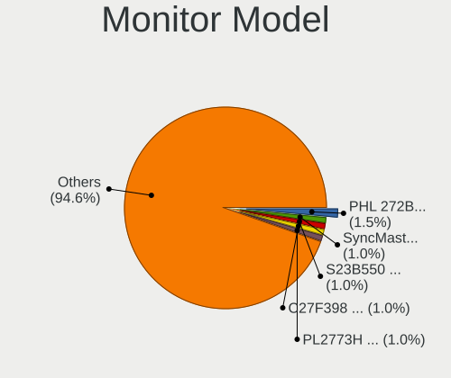

| Model                                                                 | Desktops | Percent |
|-----------------------------------------------------------------------|----------|---------|
| Philips PHL 272B8Q PHL0918 2560x1440 597x336mm 27.0-inch              | 3        | 1.46%   |
| Samsung Electronics SyncMaster SAM01E1 1280x1024 376x301mm 19.0-inch  | 2        | 0.98%   |
| Samsung Electronics S23B550 SAM0919 1920x1080 510x287mm 23.0-inch     | 2        | 0.98%   |
| Samsung Electronics C27F398 SAM0D44 1920x1080 598x336mm 27.0-inch     | 2        | 0.98%   |
| Iiyama PL2773H IVM660A 1920x1080 598x336mm 27.0-inch                  | 2        | 0.98%   |
| Goldstar E2240 GSM57A3 1920x1080 477x268mm 21.5-inch                  | 2        | 0.98%   |
| Dell U2715H DELD066 2560x1440 597x336mm 27.0-inch                     | 2        | 0.98%   |
| Acer ET322QU ACR0687 2560x1440 698x393mm 31.5-inch                    | 2        | 0.98%   |
| Westinghouse DWM40F1D1 WDT7811 1920x1080 890x500mm 40.2-inch          | 1        | 0.49%   |
| VMO LCD WQHD HDMI VMO1506 2560x1440 1600x1000mm 74.3-inch             | 1        | 0.49%   |
| Vizio XVT323SV VIZ0063 1920x1080 698x393mm 31.5-inch                  | 1        | 0.49%   |
| Vita LCD Monitor VIT0780 1920x1080                                    | 1        | 0.49%   |
| ViewSonic VX2776-4K-mhd VSC7137 3840x2160 608x355mm 27.7-inch         | 1        | 0.49%   |
| ViewSonic VA2431 Series VSCD824 1920x1080 521x293mm 23.5-inch         | 1        | 0.49%   |
| ViewSonic VA2046 SERIES VSC6D2E 1600x900 432x240mm 19.5-inch          | 1        | 0.49%   |
| Toshiba TV TSB0108 1920x1080 698x393mm 31.5-inch                      | 1        | 0.49%   |
| Sony TV SNY3002 1920x1080 886x498mm 40.0-inch                         | 1        | 0.49%   |
| Sony LCD Monitor TV 3840x1080                                         | 1        | 0.49%   |
| Sony LCD Monitor TV                                                   | 1        | 0.49%   |
| SNC SKP_E20-32 SNC3200 1920x1080 477x268mm 21.5-inch                  | 1        | 0.49%   |
| SKG DEXP DF27N1 SKG2713 1920x1080 597x336mm 27.0-inch                 | 1        | 0.49%   |
| SGX LCD Monitor SGX1000 1280x1024                                     | 1        | 0.49%   |
| Sceptre Tech Sceptre H40 SPT0FF1 1920x1080 575x323mm 26.0-inch        | 1        | 0.49%   |
| Samsung Electronics U28E590 SAM0C4D 3840x2160 607x345mm 27.5-inch     | 1        | 0.49%   |
| Samsung Electronics SyncMaster SAM05CB 1920x1080 530x300mm 24.0-inch  | 1        | 0.49%   |
| Samsung Electronics SyncMaster SAM056A 1680x1050 459x296mm 21.5-inch  | 1        | 0.49%   |
| Samsung Electronics SyncMaster SAM027F 1680x1050 474x296mm 22.0-inch  | 1        | 0.49%   |
| Samsung Electronics SyncMaster SAM0225 1440x900 410x257mm 19.1-inch   | 1        | 0.49%   |
| Samsung Electronics SyncMaster SAM01D3 1440x900 410x260mm 19.1-inch   | 1        | 0.49%   |
| Samsung Electronics SyncMaster SAM006A 1280x1024 338x270mm 17.0-inch  | 1        | 0.49%   |
| Samsung Electronics SMBX2440 SAM068A 1920x1080 531x299mm 24.0-inch    | 1        | 0.49%   |
| Samsung Electronics SMB2230N SAM0635 1920x1080 477x268mm 21.5-inch    | 1        | 0.49%   |
| Samsung Electronics SMB2030 SAM063C 1600x900 443x249mm 20.0-inch      | 1        | 0.49%   |
| Samsung Electronics SE790C SAM0BFE 3440x1440 797x333mm 34.0-inch      | 1        | 0.49%   |
| Samsung Electronics SAMTRON STN001C 1024x768 267x200mm 13.1-inch      | 1        | 0.49%   |
| Samsung Electronics SA300/SA350 SAM078E 1920x1080 477x268mm 21.5-inch | 1        | 0.49%   |
| Samsung Electronics SA300/SA350 SAM0788 1366x768 410x230mm 18.5-inch  | 1        | 0.49%   |
| Samsung Electronics S32F351 SAM0D24 1920x1080 698x393mm 31.5-inch     | 1        | 0.49%   |
| Samsung Electronics S27F358 SAM0D72 1920x1080 598x336mm 27.0-inch     | 1        | 0.49%   |
| Samsung Electronics S27C450 SAM09D1 1920x1080 598x336mm 27.0-inch     | 1        | 0.49%   |

Monitor Resolution
------------------

Monitor screen resolution

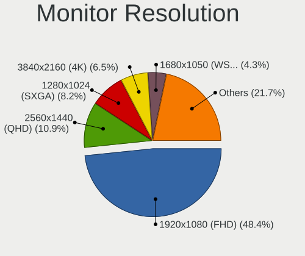

| Resolution         | Desktops | Percent |
|--------------------|----------|---------|
| 1920x1080 (FHD)    | 89       | 48.37%  |
| 2560x1440 (QHD)    | 20       | 10.87%  |
| 1280x1024 (SXGA)   | 15       | 8.15%   |
| 3840x2160 (4K)     | 12       | 6.52%   |
| 1680x1050 (WSXGA+) | 8        | 4.35%   |
| 1440x900 (WXGA+)   | 6        | 3.26%   |
| 3440x1440          | 5        | 2.72%   |
| 1600x900 (HD+)     | 5        | 2.72%   |
| 1366x768 (WXGA)    | 5        | 2.72%   |
| Unknown            | 4        | 2.17%   |
| 1920x1200 (WUXGA)  | 3        | 1.63%   |
| 3840x1080          | 2        | 1.09%   |
| 2560x1080          | 2        | 1.09%   |
| 4480x1440          | 1        | 0.54%   |
| 3840x1600          | 1        | 0.54%   |
| 3840x1200          | 1        | 0.54%   |
| 2560x1600          | 1        | 0.54%   |
| 1920x540           | 1        | 0.54%   |
| 1360x768           | 1        | 0.54%   |
| 1280x720 (HD)      | 1        | 0.54%   |
| 1024x768 (XGA)     | 1        | 0.54%   |

Monitor Diagonal
----------------

Diagonal size in inches

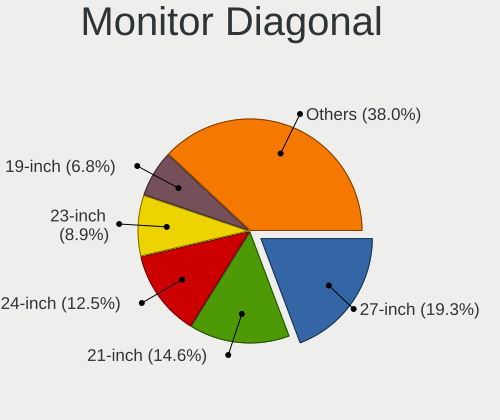

| Inches  | Desktops | Percent |
|---------|----------|---------|
| 27      | 37       | 19.27%  |
| 21      | 28       | 14.58%  |
| 24      | 24       | 12.5%   |
| 23      | 17       | 8.85%   |
| 19      | 13       | 6.77%   |
| Unknown | 13       | 6.77%   |
| 31      | 9        | 4.69%   |
| 17      | 9        | 4.69%   |
| 34      | 8        | 4.17%   |
| 22      | 5        | 2.6%    |
| 18      | 4        | 2.08%   |
| 32      | 3        | 1.56%   |
| 26      | 3        | 1.56%   |
| 84      | 2        | 1.04%   |
| 72      | 2        | 1.04%   |
| 54      | 2        | 1.04%   |
| 46      | 2        | 1.04%   |
| 38      | 2        | 1.04%   |
| 15      | 2        | 1.04%   |
| 74      | 1        | 0.52%   |
| 40      | 1        | 0.52%   |
| 33      | 1        | 0.52%   |
| 28      | 1        | 0.52%   |
| 25      | 1        | 0.52%   |
| 20      | 1        | 0.52%   |
| 13      | 1        | 0.52%   |

Monitor Width
-------------

Physical width

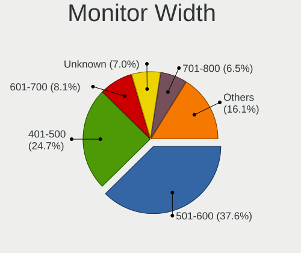

| Width in mm | Desktops | Percent |
|-------------|----------|---------|
| 501-600     | 70       | 37.63%  |
| 401-500     | 46       | 24.73%  |
| 601-700     | 15       | 8.06%   |
| Unknown     | 13       | 6.99%   |
| 701-800     | 12       | 6.45%   |
| 301-350     | 10       | 5.38%   |
| 351-400     | 7        | 3.76%   |
| 1501-2000   | 5        | 2.69%   |
| 1001-1500   | 4        | 2.15%   |
| 801-900     | 3        | 1.61%   |
| 201-300     | 1        | 0.54%   |

Aspect Ratio
------------

Proportional relationship between the width and the height

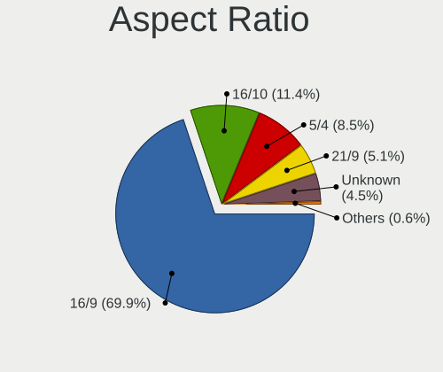

| Ratio   | Desktops | Percent |
|---------|----------|---------|
| 16/9    | 123      | 69.89%  |
| 16/10   | 20       | 11.36%  |
| 5/4     | 15       | 8.52%   |
| 21/9    | 9        | 5.11%   |
| Unknown | 8        | 4.55%   |
| 4/3     | 1        | 0.57%   |

Monitor Area
------------

Area in inch²

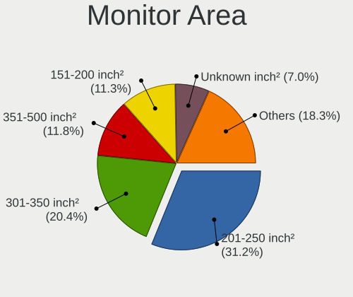

| Area in inch² | Desktops | Percent |
|----------------|----------|---------|
| 201-250        | 58       | 31.18%  |
| 301-350        | 38       | 20.43%  |
| 351-500        | 22       | 11.83%  |
| 151-200        | 21       | 11.29%  |
| Unknown        | 13       | 6.99%   |
| 141-150        | 10       | 5.38%   |
| 251-300        | 8        | 4.3%    |
| More than 1000 | 7        | 3.76%   |
| 501-1000       | 5        | 2.69%   |
| 101-110        | 2        | 1.08%   |
| 81-90          | 1        | 0.54%   |
| 131-140        | 1        | 0.54%   |

Pixel Density
-------------

Pixels per inch

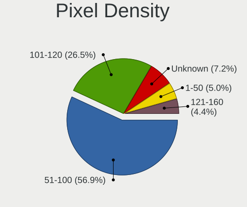

| Density | Desktops | Percent |
|---------|----------|---------|
| 51-100  | 103      | 56.91%  |
| 101-120 | 48       | 26.52%  |
| Unknown | 13       | 7.18%   |
| 1-50    | 9        | 4.97%   |
| 121-160 | 8        | 4.42%   |

Multiple Monitors
-----------------

Total monitors connected

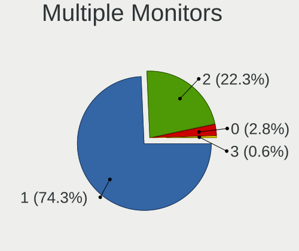

| Total | Desktops | Percent |
|-------|----------|---------|
| 1     | 133      | 74.3%   |
| 2     | 40       | 22.35%  |
| 0     | 5        | 2.79%   |
| 3     | 1        | 0.56%   |

Network
-------

Net Controller Vendor
---------------------

Controller vendors

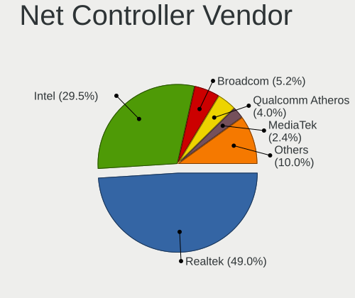

| Vendor                          | Desktops | Percent |
|---------------------------------|----------|---------|
| Realtek Semiconductor           | 123      | 49%     |
| Intel                           | 74       | 29.48%  |
| Broadcom                        | 13       | 5.18%   |
| Qualcomm Atheros                | 10       | 3.98%   |
| MediaTek                        | 6        | 2.39%   |
| TP-Link                         | 4        | 1.59%   |
| Ralink Technology               | 3        | 1.2%    |
| Ralink                          | 3        | 1.2%    |
| Xiaomi                          | 2        | 0.8%    |
| Qualcomm Atheros Communications | 2        | 0.8%    |
| Marvell Technology Group        | 2        | 0.8%    |
| ZyDAS                           | 1        | 0.4%    |
| Realtek                         | 1        | 0.4%    |
| Qualcomm Technologies           | 1        | 0.4%    |
| NetXen Incorporated             | 1        | 0.4%    |
| NetGear                         | 1        | 0.4%    |
| Motorola PCS                    | 1        | 0.4%    |
| Broadcom Limited                | 1        | 0.4%    |
| ASUSTek Computer                | 1        | 0.4%    |
| ASIX Electronics                | 1        | 0.4%    |

Net Controller Model
--------------------

Controller models

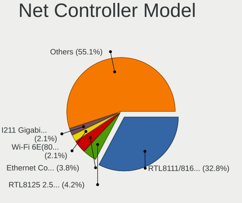

| Model                                                                  | Desktops | Percent |
|------------------------------------------------------------------------|----------|---------|
| Realtek RTL8111/8168/8211/8411 PCI Express Gigabit Ethernet Controller | 94       | 32.75%  |
| Realtek RTL8125 2.5GbE Controller                                      | 12       | 4.18%   |
| Intel Ethernet Controller I225-V                                       | 11       | 3.83%   |
| Intel Wi-Fi 6E(802.11ax) AX210/AX1675* 2x2 [Typhoon Peak]              | 6        | 2.09%   |
| Intel I211 Gigabit Network Connection                                  | 6        | 2.09%   |
| Intel Ethernet Connection (2) I219-V                                   | 6        | 2.09%   |
| Intel 82579LM Gigabit Network Connection (Lewisville)                  | 6        | 2.09%   |
| Realtek RTL8821CE 802.11ac PCIe Wireless Network Adapter               | 3        | 1.05%   |
| Realtek RTL8812AE 802.11ac PCIe Wireless Network Adapter               | 3        | 1.05%   |
| Realtek RTL8188EUS 802.11n Wireless Network Adapter                    | 3        | 1.05%   |
| Realtek RTL810xE PCI Express Fast Ethernet controller                  | 3        | 1.05%   |
| MediaTek MT7921K (RZ608) Wi-Fi 6E 80MHz                                | 3        | 1.05%   |
| Intel Wireless 7265                                                    | 3        | 1.05%   |
| Intel Ethernet Connection I217-LM                                      | 3        | 1.05%   |
| Intel Ethernet Connection (2) I218-V                                   | 3        | 1.05%   |
| Intel Dual Band Wireless-AC 3168NGW [Stone Peak]                       | 3        | 1.05%   |
| Intel Alder Lake-S PCH CNVi WiFi                                       | 3        | 1.05%   |
| Intel 82567LM-3 Gigabit Network Connection                             | 3        | 1.05%   |
| Broadcom NetLink BCM57781 Gigabit Ethernet PCIe                        | 3        | 1.05%   |
| Xiaomi Mi/Redmi series (RNDIS)                                         | 2        | 0.7%    |
| Realtek RTL8822BE 802.11a/b/g/n/ac WiFi adapter                        | 2        | 0.7%    |
| Realtek RTL8723BE PCIe Wireless Network Adapter                        | 2        | 0.7%    |
| Realtek RTL8188FTV 802.11b/g/n 1T1R 2.4G WLAN Adapter                  | 2        | 0.7%    |
| Realtek RTL8153 Gigabit Ethernet Adapter                               | 2        | 0.7%    |
| Realtek RTL8111/8168/8411 PCI Express Gigabit Ethernet Controller      | 2        | 0.7%    |
| Realtek 802.11ac NIC                                                   | 2        | 0.7%    |
| Ralink MT7601U Wireless Adapter                                        | 2        | 0.7%    |
| Qualcomm Atheros AR9271 802.11n                                        | 2        | 0.7%    |
| Qualcomm Atheros AR9485 Wireless Network Adapter                       | 2        | 0.7%    |
| MediaTek MT7922 802.11ax PCI Express Wireless Network Adapter          | 2        | 0.7%    |
| Intel Wireless 3165                                                    | 2        | 0.7%    |
| Intel Tiger Lake PCH CNVi WiFi                                         | 2        | 0.7%    |
| Intel Ethernet Connection (2) I219-LM                                  | 2        | 0.7%    |
| Intel Dual Band Wireless-AC 3165 Plus Bluetooth                        | 2        | 0.7%    |
| Intel 82579V Gigabit Network Connection                                | 2        | 0.7%    |
| Intel 82574L Gigabit Network Connection                                | 2        | 0.7%    |
| ZyDAS ZD1211B 802.11g                                                  | 1        | 0.35%   |
| TP-Link TL-WN823N v2/v3 [Realtek RTL8192EU]                            | 1        | 0.35%   |
| TP-Link TL-WN821N v5/v6 [RTL8192EU]                                    | 1        | 0.35%   |
| TP-Link Archer T4U ver.3                                               | 1        | 0.35%   |

Wireless Vendor
---------------

Wireless vendors

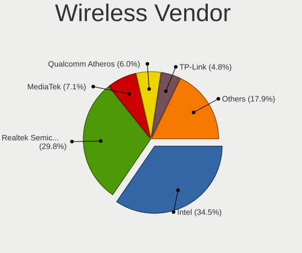

| Vendor                          | Desktops | Percent |
|---------------------------------|----------|---------|
| Intel                           | 29       | 34.52%  |
| Realtek Semiconductor           | 25       | 29.76%  |
| MediaTek                        | 6        | 7.14%   |
| Qualcomm Atheros                | 5        | 5.95%   |
| TP-Link                         | 4        | 4.76%   |
| Ralink Technology               | 3        | 3.57%   |
| Ralink                          | 3        | 3.57%   |
| Broadcom                        | 3        | 3.57%   |
| Qualcomm Atheros Communications | 2        | 2.38%   |
| ZyDAS                           | 1        | 1.19%   |
| Realtek                         | 1        | 1.19%   |
| NetGear                         | 1        | 1.19%   |
| ASUSTek Computer                | 1        | 1.19%   |

Wireless Model
--------------

Wireless models

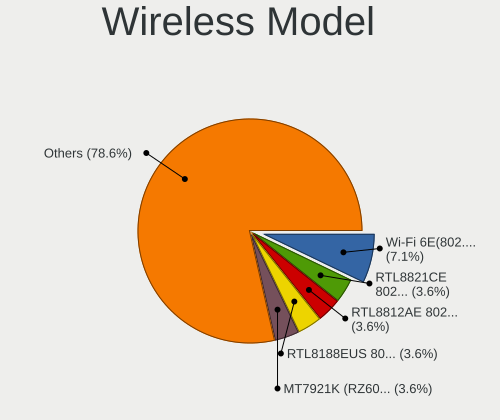

| Model                                                          | Desktops | Percent |
|----------------------------------------------------------------|----------|---------|
| Intel Wi-Fi 6E(802.11ax) AX210/AX1675* 2x2 [Typhoon Peak]      | 6        | 7.14%   |
| Realtek RTL8821CE 802.11ac PCIe Wireless Network Adapter       | 3        | 3.57%   |
| Realtek RTL8812AE 802.11ac PCIe Wireless Network Adapter       | 3        | 3.57%   |
| Realtek RTL8188EUS 802.11n Wireless Network Adapter            | 3        | 3.57%   |
| MediaTek MT7921K (RZ608) Wi-Fi 6E 80MHz                        | 3        | 3.57%   |
| Intel Wireless 7265                                            | 3        | 3.57%   |
| Intel Dual Band Wireless-AC 3168NGW [Stone Peak]               | 3        | 3.57%   |
| Realtek RTL8822BE 802.11a/b/g/n/ac WiFi adapter                | 2        | 2.38%   |
| Realtek RTL8723BE PCIe Wireless Network Adapter                | 2        | 2.38%   |
| Realtek RTL8188FTV 802.11b/g/n 1T1R 2.4G WLAN Adapter          | 2        | 2.38%   |
| Realtek 802.11ac NIC                                           | 2        | 2.38%   |
| Ralink MT7601U Wireless Adapter                                | 2        | 2.38%   |
| Qualcomm Atheros AR9271 802.11n                                | 2        | 2.38%   |
| Qualcomm Atheros AR9485 Wireless Network Adapter               | 2        | 2.38%   |
| MediaTek MT7922 802.11ax PCI Express Wireless Network Adapter  | 2        | 2.38%   |
| Intel Wireless 3165                                            | 2        | 2.38%   |
| Intel Tiger Lake PCH CNVi WiFi                                 | 2        | 2.38%   |
| Intel Dual Band Wireless-AC 3165 Plus Bluetooth                | 2        | 2.38%   |
| Intel Alder Lake-S PCH CNVi WiFi                               | 2        | 2.38%   |
| ZyDAS ZD1211B 802.11g                                          | 1        | 1.19%   |
| TP-Link TL-WN823N v2/v3 [Realtek RTL8192EU]                    | 1        | 1.19%   |
| TP-Link TL-WN821N v5/v6 [RTL8192EU]                            | 1        | 1.19%   |
| TP-Link Archer T4U ver.3                                       | 1        | 1.19%   |
| TP-Link AC600 wireless Realtek RTL8811AU [Archer T2U Nano]     | 1        | 1.19%   |
| Realtek RTL88x2bu [AC1200 Techkey]                             | 1        | 1.19%   |
| Realtek RTL8821AE 802.11ac PCIe Wireless Network Adapter       | 1        | 1.19%   |
| Realtek RTL8192EU 802.11b/g/n WLAN Adapter                     | 1        | 1.19%   |
| Realtek RTL8192EE PCIe Wireless Network Adapter                | 1        | 1.19%   |
| Realtek RTL8191SU 802.11n WLAN Adapter                         | 1        | 1.19%   |
| Realtek RTL8191SEvB Wireless LAN Controller                    | 1        | 1.19%   |
| Realtek RTL8188CUS 802.11n WLAN Adapter                        | 1        | 1.19%   |
| Realtek RTL8188CE 802.11b/g/n WiFi Adapter                     | 1        | 1.19%   |
| Realtek 802.11ac WLAN Adapter                                  | 1        | 1.19%   |
| Ralink RT2870 Wireless Adapter                                 | 1        | 1.19%   |
| Ralink RT5390R 802.11bgn PCIe Wireless Network Adapter         | 1        | 1.19%   |
| Ralink RT3290 Wireless 802.11n 1T/1R PCIe                      | 1        | 1.19%   |
| Ralink RT2561/RT61 802.11g PCI                                 | 1        | 1.19%   |
| Qualcomm Atheros QCA9565 / AR9565 Wireless Network Adapter     | 1        | 1.19%   |
| Qualcomm Atheros AR928X Wireless Network Adapter (PCI-Express) | 1        | 1.19%   |
| Qualcomm Atheros AR9287 Wireless Network Adapter (PCI-Express) | 1        | 1.19%   |

Ethernet Vendor
---------------

Ethernet vendors

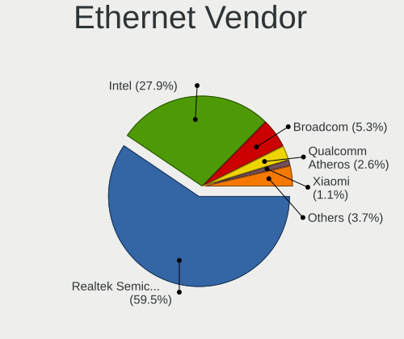

| Vendor                   | Desktops | Percent |
|--------------------------|----------|---------|
| Realtek Semiconductor    | 113      | 59.47%  |
| Intel                    | 53       | 27.89%  |
| Broadcom                 | 10       | 5.26%   |
| Qualcomm Atheros         | 5        | 2.63%   |
| Xiaomi                   | 2        | 1.05%   |
| Marvell Technology Group | 2        | 1.05%   |
| Qualcomm Technologies    | 1        | 0.53%   |
| NetXen Incorporated      | 1        | 0.53%   |
| Motorola PCS             | 1        | 0.53%   |
| Broadcom Limited         | 1        | 0.53%   |
| ASIX Electronics         | 1        | 0.53%   |

Ethernet Model
--------------

Ethernet models

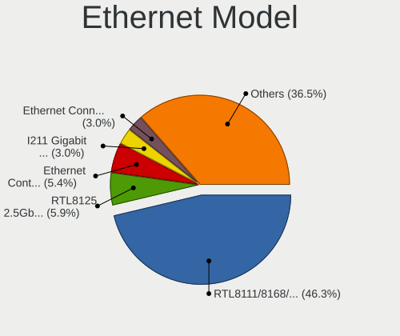

| Model                                                                  | Desktops | Percent |
|------------------------------------------------------------------------|----------|---------|
| Realtek RTL8111/8168/8211/8411 PCI Express Gigabit Ethernet Controller | 94       | 46.31%  |
| Realtek RTL8125 2.5GbE Controller                                      | 12       | 5.91%   |
| Intel Ethernet Controller I225-V                                       | 11       | 5.42%   |
| Intel I211 Gigabit Network Connection                                  | 6        | 2.96%   |
| Intel Ethernet Connection (2) I219-V                                   | 6        | 2.96%   |
| Intel 82579LM Gigabit Network Connection (Lewisville)                  | 6        | 2.96%   |
| Realtek RTL810xE PCI Express Fast Ethernet controller                  | 3        | 1.48%   |
| Intel Ethernet Connection I217-LM                                      | 3        | 1.48%   |
| Intel Ethernet Connection (2) I218-V                                   | 3        | 1.48%   |
| Intel 82567LM-3 Gigabit Network Connection                             | 3        | 1.48%   |
| Broadcom NetLink BCM57781 Gigabit Ethernet PCIe                        | 3        | 1.48%   |
| Xiaomi Mi/Redmi series (RNDIS)                                         | 2        | 0.99%   |
| Realtek RTL8153 Gigabit Ethernet Adapter                               | 2        | 0.99%   |
| Realtek RTL8111/8168/8411 PCI Express Gigabit Ethernet Controller      | 2        | 0.99%   |
| Intel Ethernet Connection (2) I219-LM                                  | 2        | 0.99%   |
| Intel 82579V Gigabit Network Connection                                | 2        | 0.99%   |
| Intel 82574L Gigabit Network Connection                                | 2        | 0.99%   |
| Realtek RTL8169 PCI Gigabit Ethernet Controller                        | 1        | 0.49%   |
| Realtek RTL8152 Fast Ethernet Adapter                                  | 1        | 0.49%   |
| Realtek RTL-8100/8101L/8139 PCI Fast Ethernet Adapter                  | 1        | 0.49%   |
| Realtek Killer E3000 2.5GbE Controller                                 | 1        | 0.49%   |
| Qualcomm WCN785x Wi-Fi 7(802.11be) 320MHz 2x2 [FastConnect 7800]       | 1        | 0.49%   |
| Qualcomm Atheros Killer E220x Gigabit Ethernet Controller              | 1        | 0.49%   |
| Qualcomm Atheros AR8161 Gigabit Ethernet                               | 1        | 0.49%   |
| Qualcomm Atheros AR8151 v1.0 Gigabit Ethernet                          | 1        | 0.49%   |
| Qualcomm Atheros AR8131 Gigabit Ethernet                               | 1        | 0.49%   |
| Qualcomm Atheros AR8121/AR8113/AR8114 Gigabit or Fast Ethernet         | 1        | 0.49%   |
| NetXen Incorporated NX3031 Multifunction 1/10-Gigabit Server Adapter   | 1        | 0.49%   |
| Motorola PCS motorola one 5G ace                                       | 1        | 0.49%   |
| Marvell Group 88E8057 PCI-E Gigabit Ethernet Controller                | 1        | 0.49%   |
| Marvell Group 88E8001 Gigabit Ethernet Controller                      | 1        | 0.49%   |
| Intel I210 Gigabit Network Connection                                  | 1        | 0.49%   |
| Intel Ethernet Controller X550                                         | 1        | 0.49%   |
| Intel Ethernet Controller I225-IT                                      | 1        | 0.49%   |
| Intel Ethernet Connection I217-V                                       | 1        | 0.49%   |
| Intel Ethernet Connection E823-C for SFP                               | 1        | 0.49%   |
| Intel Ethernet Connection (7) I219-V                                   | 1        | 0.49%   |
| Intel Ethernet Connection (7) I219-LM                                  | 1        | 0.49%   |
| Intel Ethernet Connection (5) I219-V                                   | 1        | 0.49%   |
| Intel Ethernet Connection (5) I219-LM                                  | 1        | 0.49%   |

Net Controller Kind
-------------------

Ethernet, WiFi or modem

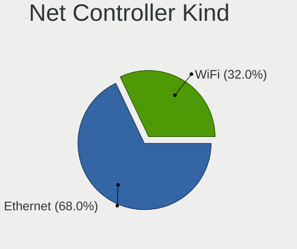

| Kind     | Desktops | Percent |
|----------|----------|---------|
| Ethernet | 176      | 67.95%  |
| WiFi     | 83       | 32.05%  |

Used Controller
---------------

Currently used network controller

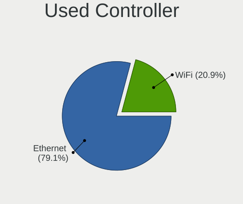

| Kind     | Desktops | Percent |
|----------|----------|---------|
| Ethernet | 148      | 79.14%  |
| WiFi     | 39       | 20.86%  |

NICs
----

Total network controllers on board

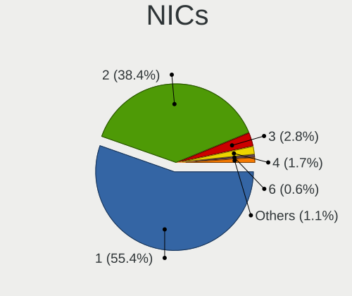

| Total | Desktops | Percent |
|-------|----------|---------|
| 1     | 98       | 55.37%  |
| 2     | 68       | 38.42%  |
| 3     | 5        | 2.82%   |
| 4     | 3        | 1.69%   |
| 6     | 1        | 0.56%   |
| 5     | 1        | 0.56%   |
| 0     | 1        | 0.56%   |

IPv6
----

IPv6 vs IPv4

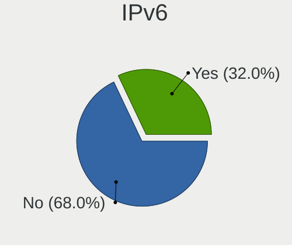

| Used | Desktops | Percent |
|------|----------|---------|
| No   | 123      | 67.96%  |
| Yes  | 58       | 32.04%  |

Bluetooth
---------

Bluetooth Vendor
----------------

Controller vendors

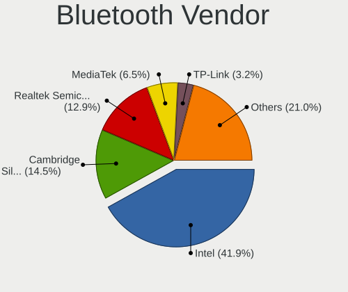

| Vendor                          | Desktops | Percent |
|---------------------------------|----------|---------|
| Intel                           | 26       | 41.94%  |
| Cambridge Silicon Radio         | 9        | 14.52%  |
| Realtek Semiconductor           | 8        | 12.9%   |
| MediaTek                        | 4        | 6.45%   |
| TP-Link                         | 2        | 3.23%   |
| IMC Networks                    | 2        | 3.23%   |
| Foxconn / Hon Hai               | 2        | 3.23%   |
| Broadcom                        | 2        | 3.23%   |
| Belkin Components               | 2        | 3.23%   |
| ASUSTek Computer                | 2        | 3.23%   |
| Ralink                          | 1        | 1.61%   |
| Qualcomm Atheros Communications | 1        | 1.61%   |
| Integrated System Solution      | 1        | 1.61%   |

Bluetooth Model
---------------

Controller models

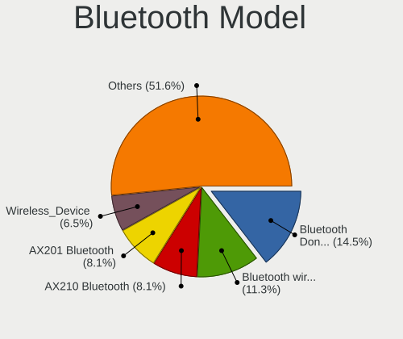

| Model                                                 | Desktops | Percent |
|-------------------------------------------------------|----------|---------|
| Cambridge Silicon Radio Bluetooth Dongle (HCI mode)   | 9        | 14.52%  |
| Intel Bluetooth wireless interface                    | 7        | 11.29%  |
| Intel AX210 Bluetooth                                 | 5        | 8.06%   |
| Intel AX201 Bluetooth                                 | 5        | 8.06%   |
| MediaTek Wireless_Device                              | 4        | 6.45%   |
| Realtek  Bluetooth 4.2 Adapter                        | 3        | 4.84%   |
| Intel Wireless-AC 3168 Bluetooth                      | 3        | 4.84%   |
| Intel Bluetooth 9460/9560 Jefferson Peak (JfP)        | 3        | 4.84%   |
| TP-Link TP-T@- UB500 Adapter                          | 2        | 3.23%   |
| Realtek RTL8723B Bluetooth                            | 2        | 3.23%   |
| Realtek Bluetooth Radio                               | 2        | 3.23%   |
| Realtek Bluetooth 5.3 Radio                           | 1        | 1.61%   |
| Ralink RT3290 Bluetooth                               | 1        | 1.61%   |
| Qualcomm Atheros AR9462 Bluetooth                     | 1        | 1.61%   |
| Intel Wireless-AC 9260 Bluetooth Adapter              | 1        | 1.61%   |
| Intel Bluetooth Device                                | 1        | 1.61%   |
| Intel AX200 Bluetooth                                 | 1        | 1.61%   |
| Integrated System Solution KY-BT100 Bluetooth Adapter | 1        | 1.61%   |
| IMC Networks Wireless_Device                          | 1        | 1.61%   |
| IMC Networks Bluetooth Radio                          | 1        | 1.61%   |
| Foxconn / Hon Hai Wireless_Device                     | 1        | 1.61%   |
| Foxconn / Hon Hai Bluetooth Device                    | 1        | 1.61%   |
| Broadcom BCM92046DG-CL1ROM Bluetooth 2.1 Adapter      | 1        | 1.61%   |
| Broadcom BCM43142 Bluetooth 4.0                       | 1        | 1.61%   |
| Belkin Components F8T065BF Mini Bluetooth 4.0 Adapter | 1        | 1.61%   |
| Belkin Components F8T013 Bluetooth Adapter            | 1        | 1.61%   |
| ASUS Broadcom BCM20702 Single-Chip Bluetooth 4.0 + LE | 1        | 1.61%   |
| ASUS Bluetooth Radio                                  | 1        | 1.61%   |

Sound
-----

Sound Vendor
------------

Sound card vendors

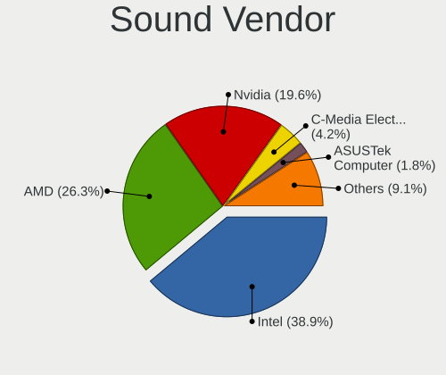

| Vendor                   | Desktops | Percent |
|--------------------------|----------|---------|
| Intel                    | 111      | 38.95%  |
| AMD                      | 75       | 26.32%  |
| Nvidia                   | 56       | 19.65%  |
| C-Media Electronics      | 12       | 4.21%   |
| ASUSTek Computer         | 5        | 1.75%   |
| GN Netcom                | 3        | 1.05%   |
| Generalplus Technology   | 3        | 1.05%   |
| Kingston Technology      | 2        | 0.7%    |
| JMTek                    | 2        | 0.7%    |
| Walmart                  | 1        | 0.35%   |
| VIA Technologies         | 1        | 0.35%   |
| Texas Instruments        | 1        | 0.35%   |
| TerraTec Electronic      | 1        | 0.35%   |
| Tenx Technology          | 1        | 0.35%   |
| SteelSeries ApS          | 1        | 0.35%   |
| ONN                      | 1        | 0.35%   |
| Micro Star International | 1        | 0.35%   |
| Logitech                 | 1        | 0.35%   |
| Focusrite-Novation       | 1        | 0.35%   |
| DSEA A/S                 | 1        | 0.35%   |
| Creative Technology      | 1        | 0.35%   |
| Corsair                  | 1        | 0.35%   |
| Cambridge Silicon Radio  | 1        | 0.35%   |
| ASRock                   | 1        | 0.35%   |
| Alesis                   | 1        | 0.35%   |

Sound Model
-----------

Sound card models

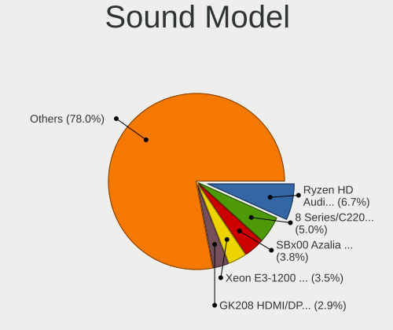

| Model                                                                      | Desktops | Percent |
|----------------------------------------------------------------------------|----------|---------|
| AMD Ryzen HD Audio Controller                                              | 23       | 6.74%   |
| Intel 8 Series/C220 Series Chipset High Definition Audio Controller        | 17       | 4.99%   |
| AMD SBx00 Azalia (Intel HDA)                                               | 13       | 3.81%   |
| Intel Xeon E3-1200 v3/4th Gen Core Processor HD Audio Controller           | 12       | 3.52%   |
| Nvidia GK208 HDMI/DP Audio Controller                                      | 10       | 2.93%   |
| Intel 7 Series/C216 Chipset Family High Definition Audio Controller        | 10       | 2.93%   |
| Intel 6 Series/C200 Series Chipset Family High Definition Audio Controller | 10       | 2.93%   |
| AMD Renoir/Cezanne HDMI/DP Audio Controller                                | 10       | 2.93%   |
| Intel 200 Series PCH HD Audio                                              | 9        | 2.64%   |
| AMD Raven/Raven2/Fenghuang HDMI/DP Audio Controller                        | 8        | 2.35%   |
| AMD Family 17h (Models 00h-0fh) HD Audio Controller                        | 8        | 2.35%   |
| AMD Starship/Matisse HD Audio Controller                                   | 7        | 2.05%   |
| Intel Tiger Lake-H HD Audio Controller                                     | 6        | 1.76%   |
| Intel Cannon Lake PCH cAVS                                                 | 6        | 1.76%   |
| Intel Alder Lake-S HD Audio Controller                                     | 6        | 1.76%   |
| Intel 100 Series/C230 Series Chipset Family HD Audio Controller            | 6        | 1.76%   |
| Nvidia GP108 High Definition Audio Controller                              | 5        | 1.47%   |
| Nvidia GP107GL High Definition Audio Controller                            | 5        | 1.47%   |
| Nvidia GP106 High Definition Audio Controller                              | 5        | 1.47%   |
| Intel NM10/ICH7 Family High Definition Audio Controller                    | 5        | 1.47%   |
| Intel Celeron/Pentium Silver Processor High Definition Audio               | 5        | 1.47%   |
| Intel 5 Series/3400 Series Chipset High Definition Audio                   | 5        | 1.47%   |
| ASUSTek Computer USB Audio                                                 | 5        | 1.47%   |
| AMD Navi 21/23 HDMI/DP Audio Controller                                    | 5        | 1.47%   |
| Nvidia TU116 High Definition Audio Controller                              | 4        | 1.17%   |
| Nvidia GM107 High Definition Audio Controller [GeForce 940MX]              | 4        | 1.17%   |
| Intel Raptor Lake High Definition Audio Controller                         | 4        | 1.17%   |
| Intel 9 Series Chipset Family HD Audio Controller                          | 4        | 1.17%   |
| AMD Radeon High Definition Audio Controller                                | 4        | 1.17%   |
| AMD FCH Azalia Controller                                                  | 4        | 1.17%   |
| AMD Ellesmere HDMI Audio [Radeon RX 470/480 / 570/580/590]                 | 4        | 1.17%   |
| Nvidia GM206 High Definition Audio Controller                              | 3        | 0.88%   |
| Intel C610/X99 series chipset HD Audio Controller                          | 3        | 0.88%   |
| Intel 82801JD/DO (ICH10 Family) HD Audio Controller                        | 3        | 0.88%   |
| Generalplus Technology USB Audio Device                                    | 3        | 0.88%   |
| C-Media Electronics Audio Adapter (Unitek Y-247A)                          | 3        | 0.88%   |
| AMD Redwood HDMI Audio [Radeon HD 5000 Series]                             | 3        | 0.88%   |
| AMD Kabini HDMI/DP Audio                                                   | 3        | 0.88%   |
| AMD Family 15h (Models 60h-6fh) Audio Controller                           | 3        | 0.88%   |
| AMD Cedar HDMI Audio [Radeon HD 5400/6300/7300 Series]                     | 3        | 0.88%   |

Memory
------

Memory Vendor
-------------

Memory module vendors

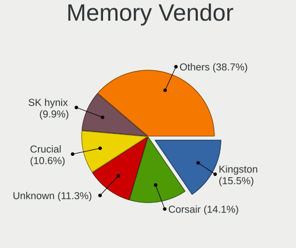

| Vendor              | Desktops | Percent |
|---------------------|----------|---------|
| Kingston            | 22       | 15.49%  |
| Corsair             | 20       | 14.08%  |
| Unknown             | 16       | 11.27%  |
| Crucial             | 15       | 10.56%  |
| SK hynix            | 14       | 9.86%   |
| Samsung Electronics | 13       | 9.15%   |
| G.Skill             | 12       | 8.45%   |
| Micron Technology   | 7        | 4.93%   |
| A-DATA Technology   | 3        | 2.11%   |
| Unknown             | 3        | 2.11%   |
| Unknown (ABCD)      | 2        | 1.41%   |
| Team                | 2        | 1.41%   |
| Hewlett-Packard     | 2        | 1.41%   |
| Elpida              | 2        | 1.41%   |
| Unknown (0x7FFF)    | 1        | 0.7%    |
| Unifosa             | 1        | 0.7%    |
| Transcend           | 1        | 0.7%    |
| Ramaxel Technology  | 1        | 0.7%    |
| OLOY                | 1        | 0.7%    |
| HBS                 | 1        | 0.7%    |
| GOODRAM             | 1        | 0.7%    |
| Atermiter           | 1        | 0.7%    |
| AMD                 | 1        | 0.7%    |

Memory Model
------------

Memory module models

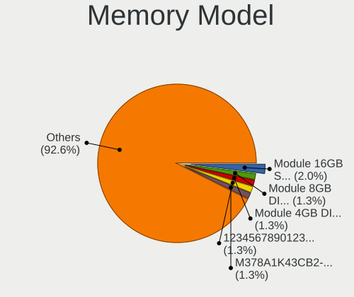

| Model                                                           | Desktops | Percent |
|-----------------------------------------------------------------|----------|---------|
| Unknown                                                         | 3        | 2.01%   |
| Unknown RAM Module 8GB DIMM DDR3 1600MT/s                       | 2        | 1.34%   |
| Unknown RAM Module 4GB DIMM 1333MT/s                            | 2        | 1.34%   |
| Unknown (ABCD) RAM 123456789012345678 2GB DIMM LPDDR4 2133MT/s  | 2        | 1.34%   |
| SK hynix RAM HMT351U6EFR8C-PB 4GB DIMM DDR3 1600MT/s            | 2        | 1.34%   |
| Samsung RAM M378A1K43CB2-CTD 8GB DIMM DDR4 3266MT/s             | 2        | 1.34%   |
| Micron RAM 8JTF51264AZ-1G6E1 4GB DIMM DDR3 1600MT/s             | 2        | 1.34%   |
| Micron RAM 8ATF1G64AZ-2G6E1 8GB DIMM DDR4 2667MT/s              | 2        | 1.34%   |
| Kingston RAM KHX1600C10D3/8G 8GB DIMM DDR3 2133MT/s             | 2        | 1.34%   |
| Kingston RAM KF3600C18D4/16GX 16GB DIMM DDR4 3733MT/s           | 2        | 1.34%   |
| G.Skill RAM F5-6000J3636F16G 16GB DIMM DDR5 6400MT/s            | 2        | 1.34%   |
| Corsair RAM CMK16GX4M2B3200C16 8GB DIMM DDR4 3600MT/s           | 2        | 1.34%   |
| Corsair RAM CMK16GX4M2B3000C15 8GB DIMM DDR4 3600MT/s           | 2        | 1.34%   |
| Corsair RAM CMK16GX4M2A2666C16 8GB DIMM DDR4 3400MT/s           | 2        | 1.34%   |
| Unknown RAM Module 8GB DIMM DDR3 1333MT/s                       | 1        | 0.67%   |
| Unknown RAM Module 4GB DIMM DDR2 800MT/s                        | 1        | 0.67%   |
| Unknown RAM Module 4GB DIMM DDR 1333MT/s                        | 1        | 0.67%   |
| Unknown RAM Module 4GB DIMM                                     | 1        | 0.67%   |
| Unknown RAM Module 2GB DIMM SDRAM 800MT/s                       | 1        | 0.67%   |
| Unknown RAM Module 2GB DIMM DDR 800MT/s                         | 1        | 0.67%   |
| Unknown RAM Module 2GB DIMM DDR 133MT/s                         | 1        | 0.67%   |
| Unknown RAM Module 2GB DIMM DDR 1333MT/s                        | 1        | 0.67%   |
| Unknown RAM Module 2GB DIMM 667MT/s                             | 1        | 0.67%   |
| Unknown RAM Module 2GB DIMM 1066MT/s                            | 1        | 0.67%   |
| Unknown RAM DDR4 NB 8G 2400 8192MB SODIMM DDR4 2667MT/s         | 1        | 0.67%   |
| Unknown RAM DDR4 NB 16G 2666 16384MB SODIMM DDR4 2667MT/s       | 1        | 0.67%   |
| Unknown RAM 1866 CL10 Series 8192MB DIMM DDR3 933MT/s           | 1        | 0.67%   |
| Unknown (0x7FFF) RAM GRAVITON 8GB-288P01 8GB DIMM DDR4 3200MT/s | 1        | 0.67%   |
| Unifosa RAM GU512303EP0202 2GB DIMM DDR3 1333MT/s               | 1        | 0.67%   |
| Transcend RAM JM1600KLH-8G 8GB DIMM DDR3 1600MT/s               | 1        | 0.67%   |
| Team RAM TEAMGROUP-UD4-3200 8GB DIMM DDR4 3800MT/s              | 1        | 0.67%   |
| Team RAM Elite-1333 8GB DIMM DDR3 1333MT/s                      | 1        | 0.67%   |
| SK hynix RAM Module 8GB DIMM DDR4 2133MT/s                      | 1        | 0.67%   |
| SK hynix RAM Module 2GB DIMM DDR3 1333MT/s                      | 1        | 0.67%   |
| SK hynix RAM HYMP112U64CP8-S6 1GB DIMM DDR2 800MT/s             | 1        | 0.67%   |
| SK hynix RAM HMT451U6BFR8A-PB 4GB DIMM DDR3 1600MT/s            | 1        | 0.67%   |
| SK hynix RAM HMT451U6AFR8C-PB 4GB DIMM DDR3 1600MT/s            | 1        | 0.67%   |
| SK hynix RAM HMT351U7BFR8C-H9 4GB DIMM DDR3 1333MT/s            | 1        | 0.67%   |
| SK hynix RAM HMT351U6CFR8C-PB 4GB DIMM DDR3 1600MT/s            | 1        | 0.67%   |
| SK hynix RAM HMT351U6CFR8C-H9 4GB DIMM DDR3 1333MT/s            | 1        | 0.67%   |

Memory Kind
-----------

Memory module kinds

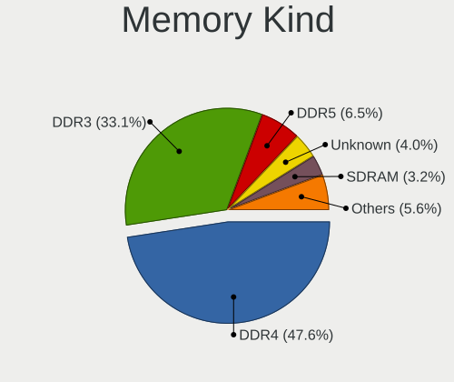

| Kind    | Desktops | Percent |
|---------|----------|---------|
| DDR4    | 59       | 47.58%  |
| DDR3    | 41       | 33.06%  |
| DDR5    | 8        | 6.45%   |
| Unknown | 5        | 4.03%   |
| SDRAM   | 4        | 3.23%   |
| DDR     | 3        | 2.42%   |
| LPDDR4  | 2        | 1.61%   |
| DDR2    | 2        | 1.61%   |

Memory Form Factor
------------------

Physical design of the memory module

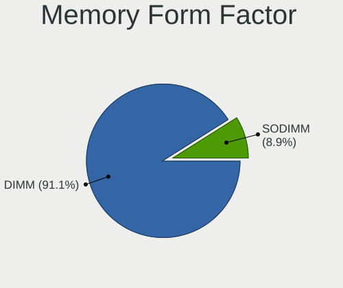

| Name   | Desktops | Percent |
|--------|----------|---------|
| DIMM   | 112      | 91.06%  |
| SODIMM | 11       | 8.94%   |

Memory Size
-----------

Memory module size

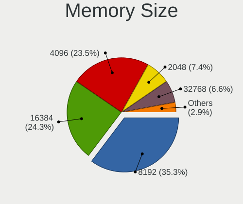

| Size   | Desktops | Percent |
|--------|----------|---------|
| 8192   | 48       | 35.29%  |
| 16384  | 33       | 24.26%  |
| 4096   | 32       | 23.53%  |
| 2048   | 10       | 7.35%   |
| 32768  | 9        | 6.62%   |
| 1024   | 2        | 1.47%   |
| 131072 | 1        | 0.74%   |
| 49152  | 1        | 0.74%   |

Memory Speed
------------

Memory module speed

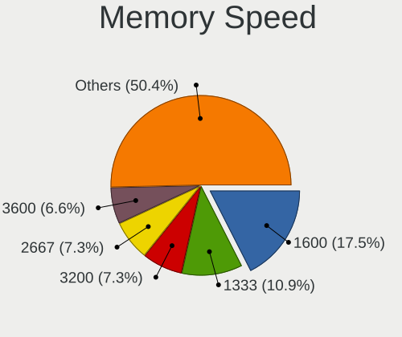

| Speed   | Desktops | Percent |
|---------|----------|---------|
| 1600    | 24       | 17.52%  |
| 1333    | 15       | 10.95%  |
| 3200    | 10       | 7.3%    |
| 2667    | 10       | 7.3%    |
| 3600    | 9        | 6.57%   |
| 2133    | 8        | 5.84%   |
| 2400    | 6        | 4.38%   |
| 800     | 5        | 3.65%   |
| 6400    | 4        | 2.92%   |
| 3733    | 4        | 2.92%   |
| 3466    | 3        | 2.19%   |
| 2666    | 3        | 2.19%   |
| 1866    | 3        | 2.19%   |
| 1800    | 3        | 2.19%   |
| 4000    | 2        | 1.46%   |
| 3800    | 2        | 1.46%   |
| 3400    | 2        | 1.46%   |
| 3266    | 2        | 1.46%   |
| 3000    | 2        | 1.46%   |
| Unknown | 2        | 1.46%   |
| 6000    | 1        | 0.73%   |
| 5900    | 1        | 0.73%   |
| 4802    | 1        | 0.73%   |
| 4800    | 1        | 0.73%   |
| 3933    | 1        | 0.73%   |
| 3334    | 1        | 0.73%   |
| 3333    | 1        | 0.73%   |
| 3100    | 1        | 0.73%   |
| 2933    | 1        | 0.73%   |
| 2800    | 1        | 0.73%   |
| 2747    | 1        | 0.73%   |
| 2734    | 1        | 0.73%   |
| 2448    | 1        | 0.73%   |
| 1648    | 1        | 0.73%   |
| 1632    | 1        | 0.73%   |
| 1066    | 1        | 0.73%   |
| 667     | 1        | 0.73%   |
| 133     | 1        | 0.73%   |

Printers & scanners
-------------------

Printer Vendor
--------------

Printer device vendors

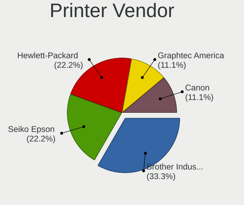

| Vendor             | Desktops | Percent |
|--------------------|----------|---------|
| Brother Industries | 3        | 33.33%  |
| Seiko Epson        | 2        | 22.22%  |
| Hewlett-Packard    | 2        | 22.22%  |
| Graphtec America   | 1        | 11.11%  |
| Canon              | 1        | 11.11%  |

Printer Model
-------------

Printer device models

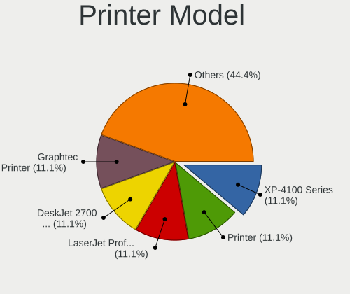

| Model                             | Desktops | Percent |
|-----------------------------------|----------|---------|
| Seiko Epson XP-4100 Series        | 1        | 11.11%  |
| Seiko Epson Printer               | 1        | 11.11%  |
| HP LaserJet Professional P1102w   | 1        | 11.11%  |
| HP DeskJet 2700 series            | 1        | 11.11%  |
| Graphtec America Graphtec Printer | 1        | 11.11%  |
| Canon MG5700 series               | 1        | 11.11%  |
| Brother Printer                   | 1        | 11.11%  |
| Brother HL-3140CW series          | 1        | 11.11%  |
| Brother DCP-L5500DN series        | 1        | 11.11%  |

Scanner Vendor
--------------

Scanner device vendors

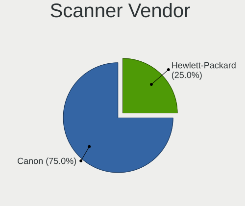

| Vendor          | Desktops | Percent |
|-----------------|----------|---------|
| Canon           | 3        | 75%     |
| Hewlett-Packard | 1        | 25%     |

Scanner Model
-------------

Scanner device models

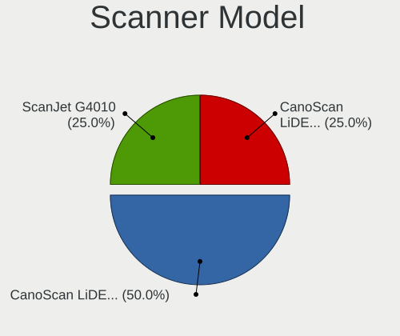

| Model                   | Desktops | Percent |
|-------------------------|----------|---------|
| Canon CanoScan LiDE 110 | 2        | 50%     |
| HP ScanJet G4010        | 1        | 25%     |
| Canon CanoScan LiDE 120 | 1        | 25%     |

Camera
------

Camera Vendor
-------------

Camera device vendors

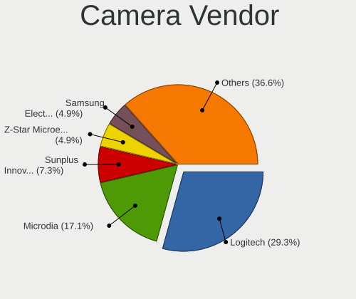

| Vendor                        | Desktops | Percent |
|-------------------------------|----------|---------|
| Logitech                      | 12       | 29.27%  |
| Microdia                      | 7        | 17.07%  |
| Sunplus Innovation Technology | 3        | 7.32%   |
| Z-Star Microelectronics       | 2        | 4.88%   |
| Samsung Electronics           | 2        | 4.88%   |
| KYE Systems (Mouse Systems)   | 2        | 4.88%   |
| Generalplus Technology        | 2        | 4.88%   |
| WaveRider Communications      | 1        | 2.44%   |
| Realtek Semiconductor         | 1        | 2.44%   |
| Razer USA                     | 1        | 2.44%   |
| Microsoft                     | 1        | 2.44%   |
| LG Electronics                | 1        | 2.44%   |
| LeCroy                        | 1        | 2.44%   |
| Guillemot                     | 1        | 2.44%   |
| ARC International             | 1        | 2.44%   |
| Apple                         | 1        | 2.44%   |
| Alcorlink                     | 1        | 2.44%   |
| Alcor Micro                   | 1        | 2.44%   |

Camera Model
------------

Camera device models

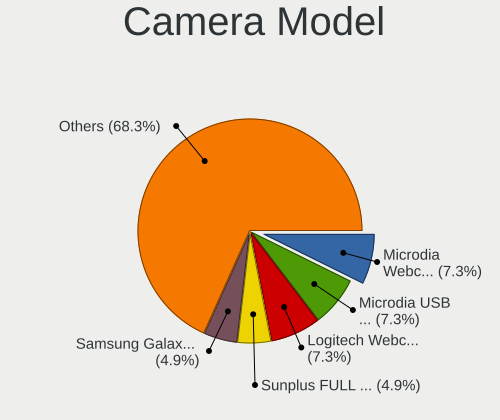

| Model                                                 | Desktops | Percent |
|-------------------------------------------------------|----------|---------|
| Microdia Webcam Vitade AF                             | 3        | 7.32%   |
| Microdia USB 2.0 Camera                               | 3        | 7.32%   |
| Logitech Webcam C270                                  | 3        | 7.32%   |
| Sunplus FULL HD webcam                                | 2        | 4.88%   |
| Samsung Galaxy series, misc. (MTP mode)               | 2        | 4.88%   |
| Logitech HD Pro Webcam C920                           | 2        | 4.88%   |
| Logitech C920 PRO HD Webcam                           | 2        | 4.88%   |
| KYE Systems (Mouse Systems) USB 2.0 HD1080P PC Camera | 2        | 4.88%   |
| Z-Star Venus USB2.0 Camera                            | 1        | 2.44%   |
| Z-Star HP 3-MegaPixel Webcam GX607AA                  | 1        | 2.44%   |
| WaveRider USB 2.0 Camera                              | 1        | 2.44%   |
| Sunplus Integrated_Webcam_HD                          | 1        | 2.44%   |
| Realtek HP 1.0MP High Definition Webcam               | 1        | 2.44%   |
| Razer USA Gaming Webcam [Kiyo]                        | 1        | 2.44%   |
| Microsoft LifeCam VX-500 [1357]                       | 1        | 2.44%   |
| Microdia CyberTrack H7                                | 1        | 2.44%   |
| Logitech Webcam Pro 9000                              | 1        | 2.44%   |
| Logitech QuickCam E 3500                              | 1        | 2.44%   |
| Logitech Quickcam 3000 For Business                   | 1        | 2.44%   |
| Logitech Logitech Webcam C925e                        | 1        | 2.44%   |
| Logitech Logitech Webcam C100                         | 1        | 2.44%   |
| LG LM-X420xxx/G2/G3 Android Phone (MTP/download mode) | 1        | 2.44%   |
| LeCroy USB 2.0 PC Camera                              | 1        | 2.44%   |
| Guillemot Hercules HD Twist                           | 1        | 2.44%   |
| Generalplus GENERAL WEBCAM                            | 1        | 2.44%   |
| Generalplus 808 Camera #9 (web-cam mode)              | 1        | 2.44%   |
| ARC International Camera                              | 1        | 2.44%   |
| Apple iPhone 5/5C/5S/6/SE/7/8/X                       | 1        | 2.44%   |
| Alcorlink USB 2.0 Camera                              | 1        | 2.44%   |
| Alcor Micro USB 2.0 PC Camera                         | 1        | 2.44%   |

Security
--------

Fingerprint Vendor
------------------

Fingerprint sensor vendors

Zero info for selected period =(

Fingerprint Model
-----------------

Fingerprint sensor models

Zero info for selected period =(

Chipcard Vendor
---------------

Chipcard module vendors

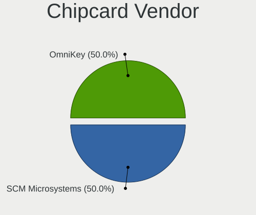

| Vendor           | Desktops | Percent |
|------------------|----------|---------|
| SCM Microsystems | 1        | 50%     |
| OmniKey          | 1        | 50%     |

Chipcard Model
--------------

Chipcard module models

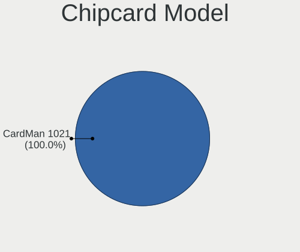

| Model                                   | Desktops | Percent |
|-----------------------------------------|----------|---------|
| SCM Microsystems Identiv SmartOS Reader | 1        | 50%     |
| OmniKey CardMan 1021                    | 1        | 50%     |

Unsupported
-----------

Unsupported Devices
-------------------

Total unsupported devices on board

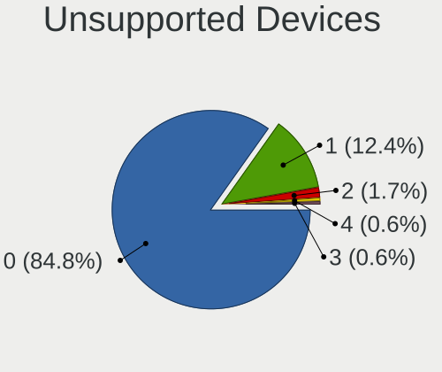

| Total | Desktops | Percent |
|-------|----------|---------|
| 0     | 151      | 84.83%  |
| 1     | 22       | 12.36%  |
| 2     | 3        | 1.69%   |
| 4     | 1        | 0.56%   |
| 3     | 1        | 0.56%   |

Unsupported Device Types
------------------------

Types of unsupported devices

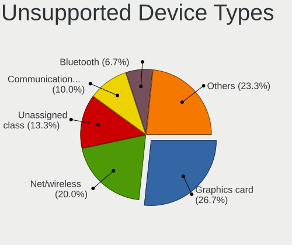

| Type                     | Desktops | Percent |
|--------------------------|----------|---------|
| Graphics card            | 8        | 26.67%  |
| Net/wireless             | 6        | 20%     |
| Unassigned class         | 4        | 13.33%  |
| Communication controller | 3        | 10%     |
| Bluetooth                | 2        | 6.67%   |
| Storage/raid             | 1        | 3.33%   |
| Sound                    | 1        | 3.33%   |
| Network                  | 1        | 3.33%   |
| Dvb card                 | 1        | 3.33%   |
| Chipcard                 | 1        | 3.33%   |
| Card reader              | 1        | 3.33%   |
| Camera                   | 1        | 3.33%   |

