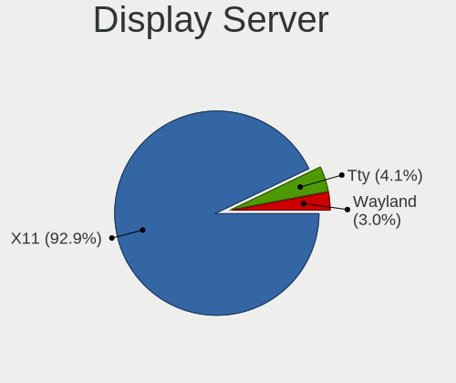
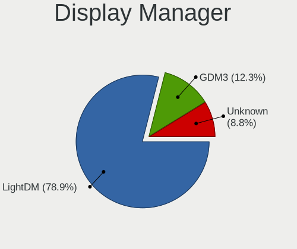
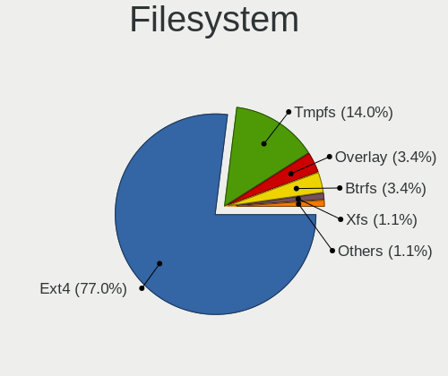
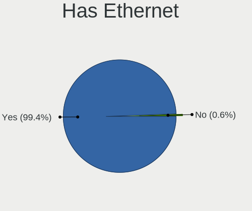
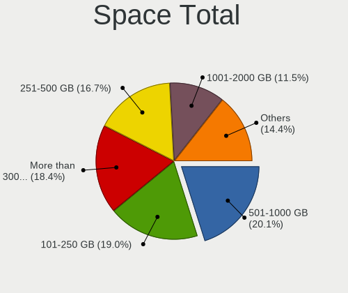
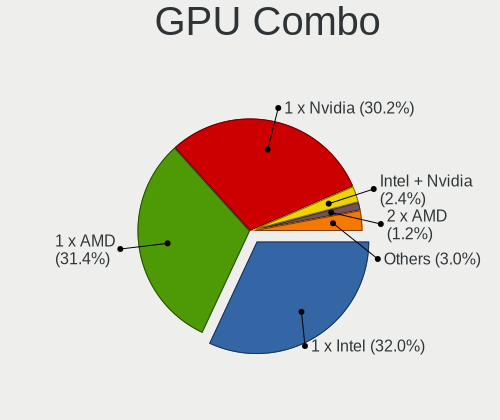
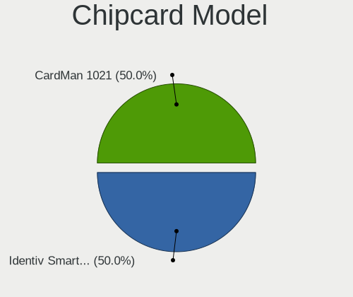

Ubuntu MATE 22.04 - Tested Hardware & Statistics (Desktops)
-----------------------------------------------------------

A project to collect tested hardware configurations for Ubuntu MATE 22.04.

Anyone can contribute to this report by the [hw-probe](https://github.com/linuxhw/hw-probe) tool:

    sudo -E hw-probe -all -upload

Please contribute! Especially if your hardware is rare.

Contents
--------

* [ Test Cases ](#test-cases)

* [ System ](#system)
  - [ Kernel                   ](#kernel)
  - [ Kernel Family            ](#kernel-family)
  - [ Kernel Major Ver.        ](#kernel-major-ver)
  - [ Arch                     ](#arch)
  - [ DE                       ](#de)
  - [ Display Server           ](#display-server)
  - [ Display Manager          ](#display-manager)
  - [ OS Lang                  ](#os-lang)
  - [ Boot Mode                ](#boot-mode)
  - [ Filesystem               ](#filesystem)
  - [ Part. scheme             ](#part-scheme)
  - [ Dual Boot with Linux/BSD ](#dual-boot-with-linuxbsd)
  - [ Dual Boot (Win)          ](#dual-boot-win)

* [ Board ](#board)
  - [ Vendor                   ](#vendor)
  - [ Model                    ](#model)
  - [ Model Family             ](#model-family)
  - [ MFG Year                 ](#mfg-year)
  - [ Form Factor              ](#form-factor)
  - [ Secure Boot              ](#secure-boot)
  - [ Coreboot                 ](#coreboot)
  - [ RAM Size                 ](#ram-size)
  - [ RAM Used                 ](#ram-used)
  - [ Total Drives             ](#total-drives)
  - [ Has CD-ROM               ](#has-cd-rom)
  - [ Has Ethernet             ](#has-ethernet)
  - [ Has WiFi                 ](#has-wifi)
  - [ Has Bluetooth            ](#has-bluetooth)

* [ Location ](#location)
  - [ Country                  ](#country)
  - [ City                     ](#city)

* [ Drives ](#drives)
  - [ Drive Vendor             ](#drive-vendor)
  - [ Drive Model              ](#drive-model)
  - [ HDD Vendor               ](#hdd-vendor)
  - [ SSD Vendor               ](#ssd-vendor)
  - [ Drive Kind               ](#drive-kind)
  - [ Drive Connector          ](#drive-connector)
  - [ Drive Size               ](#drive-size)
  - [ Space Total              ](#space-total)
  - [ Space Used               ](#space-used)
  - [ Malfunc. Drives          ](#malfunc-drives)
  - [ Malfunc. Drive Vendor    ](#malfunc-drive-vendor)
  - [ Malfunc. HDD Vendor      ](#malfunc-hdd-vendor)
  - [ Malfunc. Drive Kind      ](#malfunc-drive-kind)
  - [ Failed Drives            ](#failed-drives)
  - [ Failed Drive Vendor      ](#failed-drive-vendor)
  - [ Drive Status             ](#drive-status)

* [ Storage controller ](#storage-controller)
  - [ Storage Vendor           ](#storage-vendor)
  - [ Storage Model            ](#storage-model)
  - [ Storage Kind             ](#storage-kind)

* [ Processor ](#processor)
  - [ CPU Vendor               ](#cpu-vendor)
  - [ CPU Model                ](#cpu-model)
  - [ CPU Model Family         ](#cpu-model-family)
  - [ CPU Cores                ](#cpu-cores)
  - [ CPU Sockets              ](#cpu-sockets)
  - [ CPU Threads              ](#cpu-threads)
  - [ CPU Op-Modes             ](#cpu-op-modes)
  - [ CPU Microcode            ](#cpu-microcode)
  - [ CPU Microarch            ](#cpu-microarch)

* [ Graphics ](#graphics)
  - [ GPU Vendor               ](#gpu-vendor)
  - [ GPU Model                ](#gpu-model)
  - [ GPU Combo                ](#gpu-combo)
  - [ GPU Driver               ](#gpu-driver)
  - [ GPU Memory               ](#gpu-memory)

* [ Monitor ](#monitor)
  - [ Monitor Vendor           ](#monitor-vendor)
  - [ Monitor Model            ](#monitor-model)
  - [ Monitor Resolution       ](#monitor-resolution)
  - [ Monitor Diagonal         ](#monitor-diagonal)
  - [ Monitor Width            ](#monitor-width)
  - [ Aspect Ratio             ](#aspect-ratio)
  - [ Monitor Area             ](#monitor-area)
  - [ Pixel Density            ](#pixel-density)
  - [ Multiple Monitors        ](#multiple-monitors)

* [ Network ](#network)
  - [ Net Controller Vendor    ](#net-controller-vendor)
  - [ Net Controller Model     ](#net-controller-model)
  - [ Wireless Vendor          ](#wireless-vendor)
  - [ Wireless Model           ](#wireless-model)
  - [ Ethernet Vendor          ](#ethernet-vendor)
  - [ Ethernet Model           ](#ethernet-model)
  - [ Net Controller Kind      ](#net-controller-kind)
  - [ Used Controller          ](#used-controller)
  - [ NICs                     ](#nics)
  - [ IPv6                     ](#ipv6)

* [ Bluetooth ](#bluetooth)
  - [ Bluetooth Vendor         ](#bluetooth-vendor)
  - [ Bluetooth Model          ](#bluetooth-model)

* [ Sound ](#sound)
  - [ Sound Vendor             ](#sound-vendor)
  - [ Sound Model              ](#sound-model)

* [ Memory ](#memory)
  - [ Memory Vendor            ](#memory-vendor)
  - [ Memory Model             ](#memory-model)
  - [ Memory Kind              ](#memory-kind)
  - [ Memory Form Factor       ](#memory-form-factor)
  - [ Memory Size              ](#memory-size)
  - [ Memory Speed             ](#memory-speed)

* [ Printers & scanners ](#printers--scanners)
  - [ Printer Vendor           ](#printer-vendor)
  - [ Printer Model            ](#printer-model)
  - [ Scanner Vendor           ](#scanner-vendor)
  - [ Scanner Model            ](#scanner-model)

* [ Camera ](#camera)
  - [ Camera Vendor            ](#camera-vendor)
  - [ Camera Model             ](#camera-model)

* [ Security ](#security)
  - [ Fingerprint Vendor       ](#fingerprint-vendor)
  - [ Fingerprint Model        ](#fingerprint-model)
  - [ Chipcard Vendor          ](#chipcard-vendor)
  - [ Chipcard Model           ](#chipcard-model)

* [ Unsupported ](#unsupported)
  - [ Unsupported Devices      ](#unsupported-devices)
  - [ Unsupported Device Types ](#unsupported-device-types)

Test Cases
----------

Total: 208

| Vendor        | Model                       | Probe                                                      | Date         |
|---------------|-----------------------------|------------------------------------------------------------|--------------|
| ASUSTek       | ROG STRIX Z690-E GAMING ... | [d2d21dcf50](https://linux-hardware.org/?probe=d2d21dcf50) | Nov 01, 2023 |
| MSI           | A320M PRO-M2 V2             | [9854f25018](https://linux-hardware.org/?probe=9854f25018) | Oct 26, 2023 |
| ASRock        | Z370 Killer SLI             | [b01d80e583](https://linux-hardware.org/?probe=b01d80e583) | Oct 24, 2023 |
| HP            | 3646h                       | [6a679937c4](https://linux-hardware.org/?probe=6a679937c4) | Oct 18, 2023 |
| ASRock        | J4105-ITX                   | [f4d4b23c31](https://linux-hardware.org/?probe=f4d4b23c31) | Oct 02, 2023 |
| Lenovo        | 3140 SDK0J40700 WIN 3258... | [b9b34bef50](https://linux-hardware.org/?probe=b9b34bef50) | Oct 02, 2023 |
| 3Logic Gro... | DMB-H510-MCA01              | [b952cdd71d](https://linux-hardware.org/?probe=b952cdd71d) | Sep 29, 2023 |
| HP            | 8643 SMVB                   | [64f1cd854d](https://linux-hardware.org/?probe=64f1cd854d) | Sep 26, 2023 |
| Foxconn       | 2ABF                        | [2be1547618](https://linux-hardware.org/?probe=2be1547618) | Sep 26, 2023 |
| ASUSTek       | M5A78L-M LX                 | [450edd6547](https://linux-hardware.org/?probe=450edd6547) | Sep 24, 2023 |
| ASRock        | A320M-HD                    | [00ce48a639](https://linux-hardware.org/?probe=00ce48a639) | Sep 19, 2023 |
| Unknown       | X79M2-Q                     | [670ca9e147](https://linux-hardware.org/?probe=670ca9e147) | Sep 17, 2023 |
| ASUSTek       | PRIME B450M-A II            | [adff9fb2a8](https://linux-hardware.org/?probe=adff9fb2a8) | Sep 14, 2023 |
| ASUSTek       | P8Z77-V LX                  | [103e7031fe](https://linux-hardware.org/?probe=103e7031fe) | Sep 14, 2023 |
| Intel         | DH67CL AAG10212-210         | [21932b1004](https://linux-hardware.org/?probe=21932b1004) | Sep 14, 2023 |
| ASUSTek       | P8P67-M PRO                 | [799a135aca](https://linux-hardware.org/?probe=799a135aca) | Sep 14, 2023 |
| ASUSTek       | P8Z77-V LX                  | [7cea54ec70](https://linux-hardware.org/?probe=7cea54ec70) | Sep 13, 2023 |
| ASUSTek       | P8P67-M PRO                 | [6ec67cd2f1](https://linux-hardware.org/?probe=6ec67cd2f1) | Sep 08, 2023 |
| ASUSTek       | H61M-K                      | [0e82099e8f](https://linux-hardware.org/?probe=0e82099e8f) | Sep 01, 2023 |
| MSI           | Z97-G43                     | [74492b4424](https://linux-hardware.org/?probe=74492b4424) | Aug 30, 2023 |
| ASRock        | A320M-HD                    | [dcb65a221f](https://linux-hardware.org/?probe=dcb65a221f) | Aug 27, 2023 |
| Dell          | OptiPlex 5050               | [045411a33d](https://linux-hardware.org/?probe=045411a33d) | Aug 21, 2023 |
| ASUSTek       | TUF Gaming B650M-PLUS WI... | [f280fd203e](https://linux-hardware.org/?probe=f280fd203e) | Aug 21, 2023 |
| ASRock        | B450M Pro4                  | [cdbe8c2f04](https://linux-hardware.org/?probe=cdbe8c2f04) | Aug 21, 2023 |
| Dell          | OptiPlex 5050               | [e2c9cecddd](https://linux-hardware.org/?probe=e2c9cecddd) | Aug 18, 2023 |
| HP            | 829D                        | [448bb23145](https://linux-hardware.org/?probe=448bb23145) | Aug 15, 2023 |
| Gigabyte      | B85M-D3H                    | [6602bb3d0a](https://linux-hardware.org/?probe=6602bb3d0a) | Aug 13, 2023 |
| Gigabyte      | B85M-D3H                    | [5a809fe1c3](https://linux-hardware.org/?probe=5a809fe1c3) | Aug 13, 2023 |
| Biostar       | A10N-8800E                  | [5ccf8e7d00](https://linux-hardware.org/?probe=5ccf8e7d00) | Aug 11, 2023 |
| Unknown       | Unknown                     | [78f477986b](https://linux-hardware.org/?probe=78f477986b) | Aug 10, 2023 |
| MACHINIST     | E5 MR9A PRO MAX V1.1        | [0c4903c4d2](https://linux-hardware.org/?probe=0c4903c4d2) | Aug 10, 2023 |
| Gigabyte      | B85M-D3H                    | [32e3874db3](https://linux-hardware.org/?probe=32e3874db3) | Jul 28, 2023 |
| Lenovo        | 3740 NOK                    | [9e156dd92f](https://linux-hardware.org/?probe=9e156dd92f) | Jul 26, 2023 |
| Gigabyte      | B85M-D3H                    | [67daf82d15](https://linux-hardware.org/?probe=67daf82d15) | Jul 24, 2023 |
| Gigabyte      | B550 GAMING X V2            | [0a3cc7970c](https://linux-hardware.org/?probe=0a3cc7970c) | Jul 23, 2023 |
| ASUSTek       | PRIME Z590-P                | [02903e0210](https://linux-hardware.org/?probe=02903e0210) | Jul 22, 2023 |
| Gigabyte      | G41MT-S2                    | [d625267663](https://linux-hardware.org/?probe=d625267663) | Jul 17, 2023 |
| Gigabyte      | B85M-D3H                    | [1e85aec604](https://linux-hardware.org/?probe=1e85aec604) | Jul 09, 2023 |
| Gigabyte      | B85M-D3H                    | [f73623381d](https://linux-hardware.org/?probe=f73623381d) | Jul 08, 2023 |
| Gigabyte      | B85M-D3H                    | [d37d74ba93](https://linux-hardware.org/?probe=d37d74ba93) | Jul 07, 2023 |
| ASRock        | Z370 Killer SLI             | [b7a676e2fc](https://linux-hardware.org/?probe=b7a676e2fc) | Jul 05, 2023 |
| ASRock        | Z370 Killer SLI             | [e7c0ca1bfc](https://linux-hardware.org/?probe=e7c0ca1bfc) | Jul 05, 2023 |
| Unknown       | Unknown                     | [23956fd693](https://linux-hardware.org/?probe=23956fd693) | Jul 04, 2023 |
| Gigabyte      | B85M-D3H                    | [ce2d3b5375](https://linux-hardware.org/?probe=ce2d3b5375) | Jul 02, 2023 |
| Gigabyte      | B85M-D3H                    | [0bb17f7e1b](https://linux-hardware.org/?probe=0bb17f7e1b) | Jul 01, 2023 |
| ASUSTek       | PRIME Z590-P                | [fb7e164f62](https://linux-hardware.org/?probe=fb7e164f62) | Jul 01, 2023 |
| ASUSTek       | PRIME Z590-P                | [2774be84e6](https://linux-hardware.org/?probe=2774be84e6) | Jul 01, 2023 |
| Gigabyte      | B85M-D3H                    | [99b07ae636](https://linux-hardware.org/?probe=99b07ae636) | Jun 30, 2023 |
| Gigabyte      | B85M-D3H                    | [498eb9b539](https://linux-hardware.org/?probe=498eb9b539) | Jun 30, 2023 |
| ASUSTek       | H61M-K                      | [ddc5e387cb](https://linux-hardware.org/?probe=ddc5e387cb) | Jun 24, 2023 |
| ASUSTek       | P7P55 LX                    | [e700828afa](https://linux-hardware.org/?probe=e700828afa) | Jun 23, 2023 |
| ASUSTek       | P7P55 LX                    | [cd9b9aae75](https://linux-hardware.org/?probe=cd9b9aae75) | Jun 23, 2023 |
| Gigabyte      | B85M-D3H                    | [033c027010](https://linux-hardware.org/?probe=033c027010) | Jun 18, 2023 |
| Gigabyte      | B85M-D3H                    | [fe0d892e82](https://linux-hardware.org/?probe=fe0d892e82) | Jun 16, 2023 |
| HP            | 8643 SMVB                   | [db301ecd59](https://linux-hardware.org/?probe=db301ecd59) | Jun 11, 2023 |
| Gigabyte      | B85M-D3H                    | [befd126f43](https://linux-hardware.org/?probe=befd126f43) | Jun 07, 2023 |
| Gigabyte      | B85M-D3H                    | [e146923f12](https://linux-hardware.org/?probe=e146923f12) | Jun 07, 2023 |
| HP            | 1998                        | [c6183bd564](https://linux-hardware.org/?probe=c6183bd564) | Jun 05, 2023 |
| Gigabyte      | B85M-D3H                    | [0bd595e07a](https://linux-hardware.org/?probe=0bd595e07a) | Jun 04, 2023 |
| Gigabyte      | B85M-D3H                    | [908f094e9d](https://linux-hardware.org/?probe=908f094e9d) | Jun 02, 2023 |
| MSI           | H97 GAMING 3                | [f9c0a669c5](https://linux-hardware.org/?probe=f9c0a669c5) | Jun 02, 2023 |
| ASUSTek       | H61M-K                      | [c6ee1e5e32](https://linux-hardware.org/?probe=c6ee1e5e32) | Jun 02, 2023 |
| Unknown       | HX90                        | [d38fff55af](https://linux-hardware.org/?probe=d38fff55af) | May 28, 2023 |
| Gigabyte      | B85M-D3H                    | [67122d7cd6](https://linux-hardware.org/?probe=67122d7cd6) | May 12, 2023 |
| Gigabyte      | B85M-D3H                    | [9c8ffba5f4](https://linux-hardware.org/?probe=9c8ffba5f4) | May 12, 2023 |
| Gigabyte      | B85M-D3H                    | [11a41c975d](https://linux-hardware.org/?probe=11a41c975d) | May 07, 2023 |
| ASUSTek       | PRIME B350-PLUS             | [b6ec076cc6](https://linux-hardware.org/?probe=b6ec076cc6) | May 05, 2023 |
| Acer          | Aspire X1430                | [4bdb74f57e](https://linux-hardware.org/?probe=4bdb74f57e) | May 04, 2023 |
| Gigabyte      | B85M-D3H                    | [f9c27ab898](https://linux-hardware.org/?probe=f9c27ab898) | May 02, 2023 |
| Gigabyte      | B85M-D3H                    | [2fe28d7f43](https://linux-hardware.org/?probe=2fe28d7f43) | Apr 29, 2023 |
| ASUSTek       | M5A78L-M PLUS/USB3          | [ef3f4d1ac1](https://linux-hardware.org/?probe=ef3f4d1ac1) | Apr 29, 2023 |
| Gigabyte      | B85M-D3H                    | [c0c226bf8c](https://linux-hardware.org/?probe=c0c226bf8c) | Apr 28, 2023 |
| Gigabyte      | P55-UD3                     | [cb8885f205](https://linux-hardware.org/?probe=cb8885f205) | Apr 25, 2023 |
| Gigabyte      | P55-UD3                     | [cacc141f4f](https://linux-hardware.org/?probe=cacc141f4f) | Apr 25, 2023 |
| Gigabyte      | B85M-D3H                    | [88a6d9040e](https://linux-hardware.org/?probe=88a6d9040e) | Apr 23, 2023 |
| ASUSTek       | Z170-P                      | [b003b5c775](https://linux-hardware.org/?probe=b003b5c775) | Apr 22, 2023 |
| ASUSTek       | M5A97 R2.0                  | [90e0cff0ad](https://linux-hardware.org/?probe=90e0cff0ad) | Apr 22, 2023 |
| AMI           | Intel                       | [b7a63bbfc7](https://linux-hardware.org/?probe=b7a63bbfc7) | Apr 15, 2023 |
| AMI           | Intel                       | [ec0a5e657e](https://linux-hardware.org/?probe=ec0a5e657e) | Apr 14, 2023 |
| Gigabyte      | B85M-D3H                    | [7041b36ac5](https://linux-hardware.org/?probe=7041b36ac5) | Apr 14, 2023 |
| Lenovo        | ThinkStation D20 4158GK1    | [44d9536051](https://linux-hardware.org/?probe=44d9536051) | Apr 14, 2023 |
| HP            | 1494                        | [9c5dc1a221](https://linux-hardware.org/?probe=9c5dc1a221) | Apr 13, 2023 |
| Gigabyte      | B85M-D3H                    | [87be7a6dc0](https://linux-hardware.org/?probe=87be7a6dc0) | Apr 09, 2023 |
| Dell          | 0J3C2F A00                  | [e2c3600e8b](https://linux-hardware.org/?probe=e2c3600e8b) | Apr 07, 2023 |
| ASUSTek       | M5A97 R2.0                  | [248ef68079](https://linux-hardware.org/?probe=248ef68079) | Apr 03, 2023 |
| Gigabyte      | B85M-D3H                    | [77187502c9](https://linux-hardware.org/?probe=77187502c9) | Apr 01, 2023 |
| Gigabyte      | B85M-D3H                    | [a074e581b0](https://linux-hardware.org/?probe=a074e581b0) | Mar 28, 2023 |
| ASUSTek       | M5A97 R2.0                  | [d56f48b9d1](https://linux-hardware.org/?probe=d56f48b9d1) | Mar 27, 2023 |
| Shenzhen M... | HX90G                       | [fb3f1be00d](https://linux-hardware.org/?probe=fb3f1be00d) | Mar 26, 2023 |
| Gigabyte      | B85M-D3H                    | [890cd39d63](https://linux-hardware.org/?probe=890cd39d63) | Mar 26, 2023 |
| ASUSTek       | H61M-K                      | [dcae89c3e5](https://linux-hardware.org/?probe=dcae89c3e5) | Mar 21, 2023 |
| ASUSTek       | H61M-K                      | [9ff80f0344](https://linux-hardware.org/?probe=9ff80f0344) | Mar 21, 2023 |
| CCE           | NM70-I                      | [3e99b6e12d](https://linux-hardware.org/?probe=3e99b6e12d) | Mar 21, 2023 |
| ASUSTek       | M5A78L LE                   | [e18778e282](https://linux-hardware.org/?probe=e18778e282) | Mar 20, 2023 |
| Lenovo        | Bantry CRB 31900058 STD     | [bbe02b925a](https://linux-hardware.org/?probe=bbe02b925a) | Mar 19, 2023 |
| Lenovo        | Bantry CRB 31900058 STD     | [d376f92f8d](https://linux-hardware.org/?probe=d376f92f8d) | Mar 19, 2023 |
| Gigabyte      | B85M-D3H                    | [605bc3d5b0](https://linux-hardware.org/?probe=605bc3d5b0) | Mar 19, 2023 |
| Gigabyte      | B85M-D3H                    | [4cee2dc95e](https://linux-hardware.org/?probe=4cee2dc95e) | Mar 18, 2023 |
| MSI           | PRO B660M-A WIFI DDR4       | [7298c4b04b](https://linux-hardware.org/?probe=7298c4b04b) | Mar 17, 2023 |
| MSI           | PRO B660M-A WIFI DDR4       | [794bc239ab](https://linux-hardware.org/?probe=794bc239ab) | Mar 17, 2023 |
| ASUSTek       | M5A97 R2.0                  | [526e33e980](https://linux-hardware.org/?probe=526e33e980) | Mar 15, 2023 |
| ASRock        | A320M-HDV R4.0              | [8d2ca6cedc](https://linux-hardware.org/?probe=8d2ca6cedc) | Mar 14, 2023 |
| ASUSTek       | M5A97 R2.0                  | [2f69480899](https://linux-hardware.org/?probe=2f69480899) | Mar 14, 2023 |
| HP            | 339A                        | [fa78907d67](https://linux-hardware.org/?probe=fa78907d67) | Mar 12, 2023 |
| Gigabyte      | B85M-D3H                    | [f9dfd84f86](https://linux-hardware.org/?probe=f9dfd84f86) | Mar 12, 2023 |
| Gigabyte      | B85M-D3H                    | [ee115bdfb8](https://linux-hardware.org/?probe=ee115bdfb8) | Mar 11, 2023 |
| MSI           | X370 SLI PLUS               | [d2ac8dd020](https://linux-hardware.org/?probe=d2ac8dd020) | Mar 07, 2023 |
| Gigabyte      | B85M-D3H                    | [adce83e80e](https://linux-hardware.org/?probe=adce83e80e) | Mar 07, 2023 |
| Gigabyte      | B85M-D3H                    | [9178ffc6f9](https://linux-hardware.org/?probe=9178ffc6f9) | Mar 05, 2023 |
| MSI           | X570-A PRO                  | [7d1b3a73f9](https://linux-hardware.org/?probe=7d1b3a73f9) | Mar 05, 2023 |
| Gigabyte      | B85M-D3H                    | [9f5aaa2900](https://linux-hardware.org/?probe=9f5aaa2900) | Mar 04, 2023 |
| ASUSTek       | M5A78L-M LX                 | [0cd2798326](https://linux-hardware.org/?probe=0cd2798326) | Mar 03, 2023 |
| Gigabyte      | B85M-D3H                    | [b6128fb3e9](https://linux-hardware.org/?probe=b6128fb3e9) | Feb 28, 2023 |
| MSI           | A320M-A PRO MAX             | [64cf10c762](https://linux-hardware.org/?probe=64cf10c762) | Feb 26, 2023 |
| Gigabyte      | B85M-D3H                    | [b1a38edcc2](https://linux-hardware.org/?probe=b1a38edcc2) | Feb 25, 2023 |
| MSI           | A320M-A PRO MAX             | [24b1205b0c](https://linux-hardware.org/?probe=24b1205b0c) | Feb 24, 2023 |
| ASUSTek       | TUF B450-PLUS GAMING        | [1029c7f3bb](https://linux-hardware.org/?probe=1029c7f3bb) | Feb 17, 2023 |
| ASUSTek       | PRIME B360M-C               | [d380600b31](https://linux-hardware.org/?probe=d380600b31) | Feb 15, 2023 |
| Gigabyte      | B85M-D3H                    | [ba06eb3e9c](https://linux-hardware.org/?probe=ba06eb3e9c) | Feb 11, 2023 |
| Lenovo        | 3741 SDK0T76463 WIN 3422... | [14bde69d96](https://linux-hardware.org/?probe=14bde69d96) | Feb 10, 2023 |
| ASUSTek       | CROSSHAIR VI HERO           | [190a780b8a](https://linux-hardware.org/?probe=190a780b8a) | Jan 29, 2023 |
| Gigabyte      | B550 GAMING X V2            | [4f24524e7d](https://linux-hardware.org/?probe=4f24524e7d) | Jan 19, 2023 |
| Gigabyte      | H510M H                     | [e8cc3131fc](https://linux-hardware.org/?probe=e8cc3131fc) | Jan 15, 2023 |
| ASUSTek       | ROG STRIX Z370-G GAMING     | [d92a983612](https://linux-hardware.org/?probe=d92a983612) | Jan 12, 2023 |
| Gigabyte      | B85M-D3H                    | [e83827b548](https://linux-hardware.org/?probe=e83827b548) | Jan 11, 2023 |
| Gigabyte      | B85M-D3H                    | [0e81ffb471](https://linux-hardware.org/?probe=0e81ffb471) | Jan 11, 2023 |
| HP            | ProLiant MicroServer        | [4bdffcda7f](https://linux-hardware.org/?probe=4bdffcda7f) | Jan 07, 2023 |
| HP            | ProLiant ML350p Gen8        | [8a7807ff8c](https://linux-hardware.org/?probe=8a7807ff8c) | Jan 03, 2023 |
| HP            | ProLiant ML350p Gen8        | [1b66a8a1a8](https://linux-hardware.org/?probe=1b66a8a1a8) | Jan 02, 2023 |
| ASUSTek       | M5A78L-M LX                 | [b0f7933824](https://linux-hardware.org/?probe=b0f7933824) | Dec 29, 2022 |
| ASUSTek       | H110M-K                     | [4dab06b05f](https://linux-hardware.org/?probe=4dab06b05f) | Dec 29, 2022 |
| Gigabyte      | B85M-D3H                    | [4283e3bb1e](https://linux-hardware.org/?probe=4283e3bb1e) | Dec 27, 2022 |
| Dell          | 0J1C3P A00                  | [b65b20a073](https://linux-hardware.org/?probe=b65b20a073) | Dec 22, 2022 |
| ASUSTek       | P8Z77-V PRO                 | [2ad8b45619](https://linux-hardware.org/?probe=2ad8b45619) | Dec 21, 2022 |
| ASUSTek       | P8Z77-V PRO                 | [0e53e0be48](https://linux-hardware.org/?probe=0e53e0be48) | Dec 21, 2022 |
| ASRock        | B550M-ITX/ac                | [21a91196b1](https://linux-hardware.org/?probe=21a91196b1) | Dec 19, 2022 |
| ASUSTek       | PRIME Z590-P WIFI           | [34ac0b3211](https://linux-hardware.org/?probe=34ac0b3211) | Dec 17, 2022 |
| ASUSTek       | ROG STRIX Z690-A GAMING ... | [ac15fdcc8b](https://linux-hardware.org/?probe=ac15fdcc8b) | Dec 16, 2022 |
| HP            | 2215                        | [78151a5e1b](https://linux-hardware.org/?probe=78151a5e1b) | Dec 16, 2022 |
| Gigabyte      | F2A68HM-DS2                 | [976923f807](https://linux-hardware.org/?probe=976923f807) | Dec 12, 2022 |
| Gigabyte      | AB350M-Gaming 3-CF          | [7ae8aecc25](https://linux-hardware.org/?probe=7ae8aecc25) | Dec 08, 2022 |
| ASRock        | B550M-ITX/ac                | [1d97601be2](https://linux-hardware.org/?probe=1d97601be2) | Dec 08, 2022 |
| ASRock        | B550M-ITX/ac                | [4943e0aa12](https://linux-hardware.org/?probe=4943e0aa12) | Dec 08, 2022 |
| ASUSTek       | P7P55 LX                    | [be0753651f](https://linux-hardware.org/?probe=be0753651f) | Dec 07, 2022 |
| ASRock        | 990FX Extreme3              | [84b8daa5c4](https://linux-hardware.org/?probe=84b8daa5c4) | Nov 20, 2022 |
| HP            | 1998                        | [f9746a4ae0](https://linux-hardware.org/?probe=f9746a4ae0) | Nov 15, 2022 |
| MSI           | B75A-IE35                   | [57b74e4ca2](https://linux-hardware.org/?probe=57b74e4ca2) | Nov 01, 2022 |
| ASUSTek       | TUF Gaming B560M-PLUS       | [91bf754e64](https://linux-hardware.org/?probe=91bf754e64) | Oct 24, 2022 |
| ASRock        | Z77 Extreme4                | [7d12ed56e5](https://linux-hardware.org/?probe=7d12ed56e5) | Oct 19, 2022 |
| Gigabyte      | B450M DS3H-CF               | [6e45f7ecd7](https://linux-hardware.org/?probe=6e45f7ecd7) | Oct 15, 2022 |
| ASUSTek       | Z170 PRO GAMING/AURA        | [d1a5c91196](https://linux-hardware.org/?probe=d1a5c91196) | Oct 14, 2022 |
| ASUSTek       | Z170 PRO GAMING/AURA        | [b69b373cc1](https://linux-hardware.org/?probe=b69b373cc1) | Oct 14, 2022 |
| ASUSTek       | ROG STRIX Z590-E GAMING ... | [175ebd8462](https://linux-hardware.org/?probe=175ebd8462) | Oct 14, 2022 |
| MSI           | H310M PRO-VDH PLUS          | [1ba5f65f98](https://linux-hardware.org/?probe=1ba5f65f98) | Oct 10, 2022 |
| MSI           | H310M PRO-VDH PLUS          | [41dd35ae5f](https://linux-hardware.org/?probe=41dd35ae5f) | Oct 10, 2022 |
| ASUSTek       | M5A78L LE                   | [69023fe30e](https://linux-hardware.org/?probe=69023fe30e) | Oct 09, 2022 |
| Lenovo        | T530-28ICB                  | [b87998cf32](https://linux-hardware.org/?probe=b87998cf32) | Oct 09, 2022 |
| MSI           | B550-A PRO                  | [be6a0fda35](https://linux-hardware.org/?probe=be6a0fda35) | Oct 08, 2022 |
| Lenovo        | T530-28ICB                  | [175a71260e](https://linux-hardware.org/?probe=175a71260e) | Oct 06, 2022 |
| ASUSTek       | PRIME B450-PLUS             | [85eb59fc6d](https://linux-hardware.org/?probe=85eb59fc6d) | Oct 05, 2022 |
| Lenovo        | SHARKBAY SDK0E50510 PRO     | [cb5d0d1945](https://linux-hardware.org/?probe=cb5d0d1945) | Oct 01, 2022 |
| Lenovo        | SHARKBAY SDK0E50510 PRO     | [3af0c5cc5f](https://linux-hardware.org/?probe=3af0c5cc5f) | Oct 01, 2022 |
| ASUSTek       | PRIME B450-PLUS             | [db15c7b708](https://linux-hardware.org/?probe=db15c7b708) | Oct 01, 2022 |
| ASUSTek       | K30AD_M31AD_M51AD_M32AD     | [608c715bab](https://linux-hardware.org/?probe=608c715bab) | Sep 26, 2022 |
| MSI           | H81M-P33                    | [108817dc0f](https://linux-hardware.org/?probe=108817dc0f) | Sep 21, 2022 |
| ASRock        | HM55-HT                     | [64fff8f065](https://linux-hardware.org/?probe=64fff8f065) | Sep 20, 2022 |
| MSI           | 870-G45                     | [74af87b0c5](https://linux-hardware.org/?probe=74af87b0c5) | Sep 17, 2022 |
| ASUSTek       | ROG STRIX Z690-A GAMING ... | [081d4b1d50](https://linux-hardware.org/?probe=081d4b1d50) | Sep 16, 2022 |
| ASUSTek       | M2A74-AM                    | [25c30e4e54](https://linux-hardware.org/?probe=25c30e4e54) | Sep 14, 2022 |
| ASUSTek       | M2A74-AM                    | [24e6ffe552](https://linux-hardware.org/?probe=24e6ffe552) | Sep 14, 2022 |
| ASUSTek       | P7P55 LX                    | [cc28ed218f](https://linux-hardware.org/?probe=cc28ed218f) | Sep 13, 2022 |
| Acer          | Aspire X3950                | [22d1319220](https://linux-hardware.org/?probe=22d1319220) | Sep 06, 2022 |
| ASUSTek       | P5GZ-MX                     | [883739db23](https://linux-hardware.org/?probe=883739db23) | Sep 05, 2022 |
| ASRock        | B450 Gaming-ITX/ac          | [f16d383b65](https://linux-hardware.org/?probe=f16d383b65) | Sep 05, 2022 |
| HP            | 2ADC                        | [d9e5d2b511](https://linux-hardware.org/?probe=d9e5d2b511) | Sep 04, 2022 |
| HP            | 18E4                        | [c58c0043cb](https://linux-hardware.org/?probe=c58c0043cb) | Sep 03, 2022 |
| HP            | 3397                        | [5cd2349a9c](https://linux-hardware.org/?probe=5cd2349a9c) | Sep 02, 2022 |
| Lenovo        | 3111 SDK0J40697 WIN 3305... | [2be9b66ba1](https://linux-hardware.org/?probe=2be9b66ba1) | Aug 30, 2022 |
| AZW           | GK55                        | [0ae52e1fdf](https://linux-hardware.org/?probe=0ae52e1fdf) | Aug 21, 2022 |
| MSI           | H170M PRO-VDH               | [4d7aa09763](https://linux-hardware.org/?probe=4d7aa09763) | Aug 16, 2022 |
| Dell          | 08NPPY A00                  | [1b78691cac](https://linux-hardware.org/?probe=1b78691cac) | Aug 14, 2022 |
| Dell          | 08NPPY A00                  | [b41823f392](https://linux-hardware.org/?probe=b41823f392) | Aug 14, 2022 |
| MSI           | MS-77311                    | [86b4d71bc0](https://linux-hardware.org/?probe=86b4d71bc0) | Aug 11, 2022 |
| HP            | 8433 11                     | [cd790281b5](https://linux-hardware.org/?probe=cd790281b5) | Aug 02, 2022 |
| Dell          | 0KWVT8 A03                  | [cdca6713e9](https://linux-hardware.org/?probe=cdca6713e9) | Jul 31, 2022 |
| Dell          | 0KWVT8 A03                  | [1444843fcd](https://linux-hardware.org/?probe=1444843fcd) | Jul 31, 2022 |
| MSI           | 2AE0                        | [5c0034d313](https://linux-hardware.org/?probe=5c0034d313) | Jul 22, 2022 |
| MSI           | 2AE0                        | [df441346da](https://linux-hardware.org/?probe=df441346da) | Jul 22, 2022 |
| Medion        | MS-7797                     | [caf13d5392](https://linux-hardware.org/?probe=caf13d5392) | Jul 14, 2022 |
| Dell          | 0GM819                      | [3d18cc2632](https://linux-hardware.org/?probe=3d18cc2632) | Jul 08, 2022 |
| Gigabyte      | Z87-HD3                     | [95e6ec0822](https://linux-hardware.org/?probe=95e6ec0822) | Jul 05, 2022 |
| HP            | 3646h                       | [9e0737f23f](https://linux-hardware.org/?probe=9e0737f23f) | Jul 04, 2022 |
| Gigabyte      | Z87-HD3                     | [28429fdd32](https://linux-hardware.org/?probe=28429fdd32) | Jul 02, 2022 |
| HP            | 8169                        | [18c6ea7678](https://linux-hardware.org/?probe=18c6ea7678) | Jul 01, 2022 |
| HP            | 8169                        | [c479baadc1](https://linux-hardware.org/?probe=c479baadc1) | Jul 01, 2022 |
| Acer          | Aspire X3950                | [81797815d2](https://linux-hardware.org/?probe=81797815d2) | Jun 13, 2022 |
| Unknown       | Unknown                     | [c62add2d70](https://linux-hardware.org/?probe=c62add2d70) | Jun 13, 2022 |
| HP            | 3397                        | [55bcbdbc1f](https://linux-hardware.org/?probe=55bcbdbc1f) | Jun 07, 2022 |
| Gigabyte      | B360M AORUS Gaming 3-CF     | [5407d4a1f6](https://linux-hardware.org/?probe=5407d4a1f6) | Jun 07, 2022 |
| ASUSTek       | P5G41T-M LX2/BR             | [9044b2e4e2](https://linux-hardware.org/?probe=9044b2e4e2) | May 18, 2022 |
| Unknown       | HX90                        | [3a7e2628b0](https://linux-hardware.org/?probe=3a7e2628b0) | May 09, 2022 |
| MSI           | B450 TOMAHAWK MAX           | [246c63d834](https://linux-hardware.org/?probe=246c63d834) | May 06, 2022 |
| HP            | 8433 11                     | [a5b829538b](https://linux-hardware.org/?probe=a5b829538b) | Apr 29, 2022 |
| Gigabyte      | X99P-SLI-CF                 | [19055b80bc](https://linux-hardware.org/?probe=19055b80bc) | Apr 16, 2022 |
| ASUSTek       | PRIME H410M-A               | [9352c21f95](https://linux-hardware.org/?probe=9352c21f95) | Mar 17, 2022 |
| ASUSTek       | PRIME B550-PLUS             | [4368bd67ac](https://linux-hardware.org/?probe=4368bd67ac) | Nov 23, 2021 |
| ASUSTek       | PRIME B550-PLUS             | [686454975b](https://linux-hardware.org/?probe=686454975b) | Nov 23, 2021 |
| ASUSTek       | ROG Maximus XIII HERO       | [36ac197007](https://linux-hardware.org/?probe=36ac197007) | Nov 17, 2021 |

System
------

Kernel
------

Version of the Linux kernel

| Version              | Desktops | Percent |
|----------------------|----------|---------|
| 5.15.0-56-generic    | 13       | 9.42%   |
| 5.15.0-47-generic    | 11       | 7.97%   |
| 6.2.0-26-generic     | 7        | 5.07%   |
| 5.15.0-48-generic    | 7        | 5.07%   |
| 5.15.0-67-generic    | 6        | 4.35%   |
| 5.15.0-60-generic    | 6        | 4.35%   |
| 6.2.0-32-generic     | 5        | 3.62%   |
| 5.15.0-76-generic    | 5        | 3.62%   |
| 5.15.0-50-generic    | 5        | 3.62%   |
| 5.19.0-32-generic    | 4        | 2.9%    |
| 5.15.0-52-generic    | 4        | 2.9%    |
| 5.15.0-25-generic    | 4        | 2.9%    |
| 5.19.0-38-generic    | 3        | 2.17%   |
| 5.15.0-46-generic    | 3        | 2.17%   |
| 5.15.0-40-generic    | 3        | 2.17%   |
| 5.15.0-27-generic    | 3        | 2.17%   |
| 6.2.0-35-generic     | 2        | 1.45%   |
| 6.2.0-33-generic     | 2        | 1.45%   |
| 5.19.0-35-generic    | 2        | 1.45%   |
| 5.15.0-84-generic    | 2        | 1.45%   |
| 5.15.0-82-generic    | 2        | 1.45%   |
| 5.15.0-71-generic    | 2        | 1.45%   |
| 5.15.0-70-generic    | 2        | 1.45%   |
| 5.15.0-69-generic    | 2        | 1.45%   |
| 5.15.0-58-generic    | 2        | 1.45%   |
| 5.15.0-57-generic    | 2        | 1.45%   |
| 5.15.0-41-generic    | 2        | 1.45%   |
| 5.15.0-37-generic    | 2        | 1.45%   |
| 6.4.0-060400-generic | 1        | 0.72%   |
| 5.19.0-50-generic    | 1        | 0.72%   |
| 5.19.0-43-generic    | 1        | 0.72%   |
| 5.19.0-42-generic    | 1        | 0.72%   |
| 5.19.0-41-generic    | 1        | 0.72%   |
| 5.19.0-40-generic    | 1        | 0.72%   |
| 5.19.0-37-generic    | 1        | 0.72%   |
| 5.18.0-1-generic     | 1        | 0.72%   |
| 5.15.0-86-generic    | 1        | 0.72%   |
| 5.15.0-83-generic    | 1        | 0.72%   |
| 5.15.0-79-generic    | 1        | 0.72%   |
| 5.15.0-78-generic    | 1        | 0.72%   |

Kernel Family
-------------

Linux kernel without a distro release

| Version | Desktops | Percent |
|---------|----------|---------|
| 5.15.0  | 88       | 71.54%  |
| 6.2.0   | 15       | 12.2%   |
| 5.19.0  | 15       | 12.2%   |
| 5.13.0  | 2        | 1.63%   |
| 6.4.0   | 1        | 0.81%   |
| 5.18.0  | 1        | 0.81%   |
| 5.14.0  | 1        | 0.81%   |

Kernel Major Ver.
-----------------

Linux kernel major version

| Version | Desktops | Percent |
|---------|----------|---------|
| 5.15    | 88       | 71.54%  |
| 6.2     | 15       | 12.2%   |
| 5.19    | 15       | 12.2%   |
| 5.13    | 2        | 1.63%   |
| 6.4     | 1        | 0.81%   |
| 5.18    | 1        | 0.81%   |
| 5.14    | 1        | 0.81%   |

Arch
----

OS architecture (x86_64, i586, etc.)

| Name   | Desktops | Percent |
|--------|----------|---------|
| x86_64 | 120      | 100%    |

DE
--

Desktop Environment

| Name   | Desktops | Percent |
|--------|----------|---------|
| MATE   | 117      | 97.5%   |
| KDE5   | 1        | 0.83%   |
| GNOME  | 1        | 0.83%   |
| Budgie | 1        | 0.83%   |

Display Server
--------------

X11 or Wayland

| Name    | Desktops | Percent |
|---------|----------|---------|
| X11     | 112      | 93.33%  |
| Wayland | 5        | 4.17%   |
| Tty     | 3        | 2.5%    |

Display Manager
---------------

SDDM, LightDM, etc.

| Name    | Desktops | Percent |
|---------|----------|---------|
| LightDM | 96       | 78.69%  |
| GDM3    | 15       | 12.3%   |
| Unknown | 11       | 9.02%   |

OS Lang
-------

Language

| Lang  | Desktops | Percent |
|-------|----------|---------|
| en_US | 44       | 36.67%  |
| fr_FR | 15       | 12.5%   |
| it_IT | 12       | 10%     |
| de_DE | 12       | 10%     |
| en_AU | 5        | 4.17%   |
| pt_BR | 4        | 3.33%   |
| ru_RU | 2        | 1.67%   |
| hr_HR | 2        | 1.67%   |
| es_AR | 2        | 1.67%   |
| en_GB | 2        | 1.67%   |
| en_CA | 2        | 1.67%   |
| de_CH | 2        | 1.67%   |
| C     | 2        | 1.67%   |
| zh_TW | 1        | 0.83%   |
| nl_NL | 1        | 0.83%   |
| hu_HU | 1        | 0.83%   |
| fi_FI | 1        | 0.83%   |
| et_EE | 1        | 0.83%   |
| es_VE | 1        | 0.83%   |
| es_PE | 1        | 0.83%   |
| es_MX | 1        | 0.83%   |
| es_ES | 1        | 0.83%   |
| en_IL | 1        | 0.83%   |
| de_AT | 1        | 0.83%   |
| da_DK | 1        | 0.83%   |
| cs_CZ | 1        | 0.83%   |
| ar_KW | 1        | 0.83%   |

Boot Mode
---------

EFI or BIOS

| Mode | Desktops | Percent |
|------|----------|---------|
| BIOS | 72       | 59.02%  |
| EFI  | 50       | 40.98%  |

Filesystem
----------

Type of filesystem

| Type    | Desktops | Percent |
|---------|----------|---------|
| Ext4    | 96       | 78.05%  |
| Tmpfs   | 12       | 9.76%   |
| Overlay | 6        | 4.88%   |
| Btrfs   | 5        | 4.07%   |
| Xfs     | 2        | 1.63%   |
| Zfs     | 1        | 0.81%   |
| Ext2    | 1        | 0.81%   |

Part. scheme
------------

Scheme of partitioning

| Type    | Desktops | Percent |
|---------|----------|---------|
| GPT     | 82       | 67.21%  |
| Unknown | 23       | 18.85%  |
| MBR     | 17       | 13.93%  |

Dual Boot with Linux/BSD
------------------------

Hosting more than one Linux/BSD

| Dual boot | Desktops | Percent |
|-----------|----------|---------|
| No        | 96       | 79.34%  |
| Yes       | 25       | 20.66%  |

Dual Boot (Win)
---------------

Hosting Linux and Windows

| Dual boot | Desktops | Percent |
|-----------|----------|---------|
| No        | 72       | 59.5%   |
| Yes       | 49       | 40.5%   |

Board
-----

Vendor
------

Motherboard manufacturer

| Name                                 | Desktops | Percent |
|--------------------------------------|----------|---------|
| ASUSTek Computer                     | 34       | 28.33%  |
| Hewlett-Packard                      | 18       | 15%     |
| MSI                                  | 16       | 13.33%  |
| Gigabyte Technology                  | 11       | 9.17%   |
| ASRock                               | 10       | 8.33%   |
| Lenovo                               | 7        | 5.83%   |
| Dell                                 | 6        | 5%      |
| Unknown                              | 6        | 5%      |
| Acer                                 | 2        | 1.67%   |
| Shenzhen Meigao Electronic Equipment | 1        | 0.83%   |
| Medion                               | 1        | 0.83%   |
| MACHINIST                            | 1        | 0.83%   |
| Intel                                | 1        | 0.83%   |
| Foxconn                              | 1        | 0.83%   |
| CCE                                  | 1        | 0.83%   |
| Biostar                              | 1        | 0.83%   |
| AZW                                  | 1        | 0.83%   |
| AMI                                  | 1        | 0.83%   |
| 3Logic Group                         | 1        | 0.83%   |

Model
-----

Motherboard model

| Name                                       | Desktops | Percent |
|--------------------------------------------|----------|---------|
| Unknown                                    | 6        | 5%      |
| HP EliteDesk 800 G1 SFF                    | 2        | 1.67%   |
| HP Desktop M01-F0xxx                       | 2        | 1.67%   |
| HP Compaq Elite 8300 SFF                   | 2        | 1.67%   |
| HP Compaq 8000 Elite SFF PC                | 2        | 1.67%   |
| Gigabyte B85M-D3H                          | 2        | 1.67%   |
| ASUS M5A78L LE                             | 2        | 1.67%   |
| Shenzhen Meigao Electronic Equipment HX90G | 1        | 0.83%   |
| MSI p6-2330                                | 1        | 0.83%   |
| MSI MS-7D43                                | 1        | 0.83%   |
| MSI MS-7C56                                | 1        | 0.83%   |
| MSI MS-7C52                                | 1        | 0.83%   |
| MSI MS-7C37                                | 1        | 0.83%   |
| MSI MS-7C09                                | 1        | 0.83%   |
| MSI MS-7C02                                | 1        | 0.83%   |
| MSI MS-7B84                                | 1        | 0.83%   |
| MSI MS-7A33                                | 1        | 0.83%   |
| MSI MS-7982                                | 1        | 0.83%   |
| MSI MS-7918                                | 1        | 0.83%   |
| MSI MS-7817                                | 1        | 0.83%   |
| MSI MS-7816                                | 1        | 0.83%   |
| MSI MS-7758                                | 1        | 0.83%   |
| MSI MS-7599                                | 1        | 0.83%   |
| MSI B02311                                 | 1        | 0.83%   |
| Medion MS-7797                             | 1        | 0.83%   |
| MACHINIST E5 MR9A PRO MAX V1.1             | 1        | 0.83%   |
| Lenovo ThinkStation D20 4158GK1            | 1        | 0.83%   |
| Lenovo ThinkCentre neo 50t Gen 3 11SE      | 1        | 0.83%   |
| Lenovo ThinkCentre M710q 10MQSC0N00        | 1        | 0.83%   |
| Lenovo T530-28ICB                          | 1        | 0.83%   |
| Lenovo IdeaCentre 510S-07ICB 90K800H1BF    | 1        | 0.83%   |
| Lenovo IdeaCentre 5 14IAB7 90T2000SUS      | 1        | 0.83%   |
| Lenovo H50-55 90BG000TFR                   | 1        | 0.83%   |
| Intel DH67CL AAG10212-210                  | 1        | 0.83%   |
| HP ProLiant ML350p Gen8                    | 1        | 0.83%   |
| HP ProLiant MicroServer                    | 1        | 0.83%   |
| HP ProDesk 600 G3 MT                       | 1        | 0.83%   |
| HP ProDesk 600 G2 DM                       | 1        | 0.83%   |
| HP Pavilion 590-p0049 3LC38AA              | 1        | 0.83%   |
| HP EliteDesk 800 G1 TWR                    | 1        | 0.83%   |

Model Family
------------

Motherboard model prefix

| Name                                       | Desktops | Percent |
|--------------------------------------------|----------|---------|
| ASUS PRIME                                 | 8        | 6.67%   |
| HP Compaq                                  | 6        | 5%      |
| Unknown                                    | 6        | 5%      |
| ASUS ROG                                   | 5        | 4.17%   |
| HP EliteDesk                               | 4        | 3.33%   |
| Dell OptiPlex                              | 4        | 3.33%   |
| Lenovo ThinkCentre                         | 2        | 1.67%   |
| Lenovo IdeaCentre                          | 2        | 1.67%   |
| HP ProLiant                                | 2        | 1.67%   |
| HP ProDesk                                 | 2        | 1.67%   |
| HP Desktop                                 | 2        | 1.67%   |
| Gigabyte B85M-D3H                          | 2        | 1.67%   |
| ASUS TUF                                   | 2        | 1.67%   |
| ASUS P8Z77-V                               | 2        | 1.67%   |
| ASUS M5A78L-M                              | 2        | 1.67%   |
| ASUS M5A78L                                | 2        | 1.67%   |
| Acer Aspire                                | 2        | 1.67%   |
| Shenzhen Meigao Electronic Equipment HX90G | 1        | 0.83%   |
| MSI p6-2330                                | 1        | 0.83%   |
| MSI MS-7D43                                | 1        | 0.83%   |
| MSI MS-7C56                                | 1        | 0.83%   |
| MSI MS-7C52                                | 1        | 0.83%   |
| MSI MS-7C37                                | 1        | 0.83%   |
| MSI MS-7C09                                | 1        | 0.83%   |
| MSI MS-7C02                                | 1        | 0.83%   |
| MSI MS-7B84                                | 1        | 0.83%   |
| MSI MS-7A33                                | 1        | 0.83%   |
| MSI MS-7982                                | 1        | 0.83%   |
| MSI MS-7918                                | 1        | 0.83%   |
| MSI MS-7817                                | 1        | 0.83%   |
| MSI MS-7816                                | 1        | 0.83%   |
| MSI MS-7758                                | 1        | 0.83%   |
| MSI MS-7599                                | 1        | 0.83%   |
| MSI B02311                                 | 1        | 0.83%   |
| Medion MS-7797                             | 1        | 0.83%   |
| MACHINIST E5                               | 1        | 0.83%   |
| Lenovo ThinkStation                        | 1        | 0.83%   |
| Lenovo T530-28ICB                          | 1        | 0.83%   |
| Lenovo H50-55                              | 1        | 0.83%   |
| Intel DH67CL                               | 1        | 0.83%   |

MFG Year
--------

Motherboard manufacture year

| Year | Desktops | Percent |
|------|----------|---------|
| 2018 | 15       | 12.5%   |
| 2021 | 12       | 10%     |
| 2012 | 12       | 10%     |
| 2013 | 11       | 9.17%   |
| 2011 | 11       | 9.17%   |
| 2022 | 8        | 6.67%   |
| 2019 | 8        | 6.67%   |
| 2020 | 7        | 5.83%   |
| 2017 | 6        | 5%      |
| 2014 | 6        | 5%      |
| 2009 | 6        | 5%      |
| 2015 | 5        | 4.17%   |
| 2010 | 5        | 4.17%   |
| 2016 | 3        | 2.5%    |
| 2023 | 2        | 1.67%   |
| 2008 | 1        | 0.83%   |
| 2007 | 1        | 0.83%   |
| 2006 | 1        | 0.83%   |

Form Factor
-----------

Physical design of the computer

| Name    | Desktops | Percent |
|---------|----------|---------|
| Desktop | 120      | 100%    |

Secure Boot
-----------

Enabled or disabled

| State    | Desktops | Percent |
|----------|----------|---------|
| Disabled | 113      | 94.17%  |
| Enabled  | 7        | 5.83%   |

Coreboot
--------

Have coreboot on board

| Used | Desktops | Percent |
|------|----------|---------|
| No   | 120      | 100%    |

RAM Size
--------

Total RAM memory

| Size in GB  | Desktops | Percent |
|-------------|----------|---------|
| 8.01-16.0   | 24       | 20%     |
| 32.01-64.0  | 23       | 19.17%  |
| 16.01-24.0  | 22       | 18.33%  |
| 4.01-8.0    | 20       | 16.67%  |
| 3.01-4.0    | 16       | 13.33%  |
| 64.01-256.0 | 9        | 7.5%    |
| 24.01-32.0  | 4        | 3.33%   |
| 2.01-3.0    | 1        | 0.83%   |
| 1.01-2.0    | 1        | 0.83%   |

RAM Used
--------

Used RAM memory

| Used GB    | Desktops | Percent |
|------------|----------|---------|
| 2.01-3.0   | 40       | 32%     |
| 1.01-2.0   | 35       | 28%     |
| 4.01-8.0   | 23       | 18.4%   |
| 3.01-4.0   | 13       | 10.4%   |
| 8.01-16.0  | 9        | 7.2%    |
| 0.51-1.0   | 2        | 1.6%    |
| 32.01-64.0 | 1        | 0.8%    |
| 24.01-32.0 | 1        | 0.8%    |
| 16.01-24.0 | 1        | 0.8%    |

Total Drives
------------

Number of drives on board

| Drives | Desktops | Percent |
|--------|----------|---------|
| 1      | 42       | 35%     |
| 2      | 33       | 27.5%   |
| 3      | 19       | 15.83%  |
| 4      | 12       | 10%     |
| 6      | 5        | 4.17%   |
| 5      | 3        | 2.5%    |
| 0      | 2        | 1.67%   |
| 20     | 1        | 0.83%   |
| 9      | 1        | 0.83%   |
| 8      | 1        | 0.83%   |
| 7      | 1        | 0.83%   |

Has CD-ROM
----------

Has CD-ROM on board

| Presented | Desktops | Percent |
|-----------|----------|---------|
| Yes       | 64       | 53.33%  |
| No        | 56       | 46.67%  |

Has Ethernet
------------

Has Ethernet on board

| Presented | Desktops | Percent |
|-----------|----------|---------|
| Yes       | 120      | 100%    |

Has WiFi
--------

Has WiFi module

| Presented | Desktops | Percent |
|-----------|----------|---------|
| No        | 67       | 55.83%  |
| Yes       | 53       | 44.17%  |

Has Bluetooth
-------------

Has Bluetooth module

| Presented | Desktops | Percent |
|-----------|----------|---------|
| No        | 82       | 68.33%  |
| Yes       | 38       | 31.67%  |

Location
--------

Country
-------

Geographic location (country)

| Country      | Desktops | Percent |
|--------------|----------|---------|
| USA          | 17       | 14.17%  |
| France       | 14       | 11.67%  |
| Italy        | 13       | 10.83%  |
| Germany      | 13       | 10.83%  |
| Brazil       | 6        | 5%      |
| Australia    | 5        | 4.17%   |
| Switzerland  | 3        | 2.5%    |
| Russia       | 3        | 2.5%    |
| Portugal     | 3        | 2.5%    |
| Croatia      | 3        | 2.5%    |
| Canada       | 3        | 2.5%    |
| Belgium      | 3        | 2.5%    |
| Austria      | 3        | 2.5%    |
| Argentina    | 3        | 2.5%    |
| UK           | 2        | 1.67%   |
| Poland       | 2        | 1.67%   |
| Hungary      | 2        | 1.67%   |
| Finland      | 2        | 1.67%   |
| Denmark      | 2        | 1.67%   |
| Vietnam      | 1        | 0.83%   |
| Venezuela    | 1        | 0.83%   |
| Ukraine      | 1        | 0.83%   |
| Taiwan       | 1        | 0.83%   |
| Spain        | 1        | 0.83%   |
| Saudi Arabia | 1        | 0.83%   |
| Peru         | 1        | 0.83%   |
| New Zealand  | 1        | 0.83%   |
| Netherlands  | 1        | 0.83%   |
| Morocco      | 1        | 0.83%   |
| Moldova      | 1        | 0.83%   |
| Mexico       | 1        | 0.83%   |
| Israel       | 1        | 0.83%   |
| Isle of Man  | 1        | 0.83%   |
| Greece       | 1        | 0.83%   |
| Estonia      | 1        | 0.83%   |
| Czechia      | 1        | 0.83%   |
| Algeria      | 1        | 0.83%   |

City
----

Geographic location (city)

| City             | Desktops | Percent |
|------------------|----------|---------|
| Zagreb           | 2        | 1.57%   |
| Rome             | 2        | 1.57%   |
| Melbourne        | 2        | 1.57%   |
| Lansdale         | 2        | 1.57%   |
| Forl           | 2        | 1.57%   |
| Zottegem         | 1        | 0.79%   |
| York             | 1        | 0.79%   |
| Yonkers          | 1        | 0.79%   |
| Wuelfrath        | 1        | 0.79%   |
| Wittingen        | 1        | 0.79%   |
| Whanganui        | 1        | 0.79%   |
| Washington       | 1        | 0.79%   |
| Warsaw           | 1        | 0.79%   |
| Villefontaine    | 1        | 0.79%   |
| Viljandi         | 1        | 0.79%   |
| Viana do Castelo | 1        | 0.79%   |
| Versailles       | 1        | 0.79%   |
| Velyki Mosty     | 1        | 0.79%   |
| Vancouver        | 1        | 0.79%   |
| Untersiggenthal  | 1        | 0.79%   |
| Uberaba          | 1        | 0.79%   |
| Turku            | 1        | 0.79%   |
| Toulon           | 1        | 0.79%   |
| Torring          | 1        | 0.79%   |
| Tighina          | 1        | 0.79%   |
| Terrace          | 1        | 0.79%   |
| Tel Aviv         | 1        | 0.79%   |
| Taranto          | 1        | 0.79%   |
| Talence          | 1        | 0.79%   |
| Stuttgart        | 1        | 0.79%   |
| St Petersburg    | 1        | 0.79%   |
| Split            | 1        | 0.79%   |
| Singen           | 1        | 0.79%   |
| Seia             | 1        | 0.79%   |
| Schmelz          | 1        | 0.79%   |
| Santo Andr     | 1        | 0.79%   |
| Samara           | 1        | 0.79%   |
| Saint-Etienne    | 1        | 0.79%   |
| Saint Paul       | 1        | 0.79%   |
| Rochester        | 1        | 0.79%   |

Drives
------

Drive Vendor
------------

Hard drive vendors

| Vendor              | Desktops | Drives | Percent |
|---------------------|----------|--------|---------|
| WDC                 | 46       | 76     | 21.9%   |
| Seagate             | 34       | 64     | 16.19%  |
| Samsung Electronics | 31       | 60     | 14.76%  |
| Kingston            | 14       | 20     | 6.67%   |
| Crucial             | 13       | 17     | 6.19%   |
| SanDisk             | 8        | 11     | 3.81%   |
| Toshiba             | 6        | 30     | 2.86%   |
| Hitachi             | 6        | 8      | 2.86%   |
| Unknown             | 5        | 10     | 2.38%   |
| A-DATA Technology   | 5        | 6      | 2.38%   |
| SPCC                | 3        | 5      | 1.43%   |
| Phison Electronics  | 3        | 3      | 1.43%   |
| Phison              | 3        | 3      | 1.43%   |
| SK hynix            | 2        | 2      | 0.95%   |
| KingSpec            | 2        | 2      | 0.95%   |
| KingFast            | 2        | 2      | 0.95%   |
| Intel               | 2        | 2      | 0.95%   |
| China               | 2        | 2      | 0.95%   |
| ASMT                | 2        | 3      | 0.95%   |
| Apacer              | 2        | 2      | 0.95%   |
| Transcend           | 1        | 5      | 0.48%   |
| Team                | 1        | 1      | 0.48%   |
| RZX                 | 1        | 1      | 0.48%   |
| PNY                 | 1        | 1      | 0.48%   |
| Pichau              | 1        | 1      | 0.48%   |
| OCZ                 | 1        | 1      | 0.48%   |
| NGFF                | 1        | 1      | 0.48%   |
| Maxtor              | 1        | 1      | 0.48%   |
| LDLC                | 1        | 1      | 0.48%   |
| KIOXIA-EXCERIA      | 1        | 1      | 0.48%   |
| Kimtigo             | 1        | 1      | 0.48%   |
| KESU                | 1        | 1      | 0.48%   |
| Intenso             | 1        | 1      | 0.48%   |
| Hewlett-Packard     | 1        | 2      | 0.48%   |
| GOODRAM             | 1        | 1      | 0.48%   |
| DAS                 | 1        | 6      | 0.48%   |
| Corsair             | 1        | 1      | 0.48%   |
| BAITITON            | 1        | 1      | 0.48%   |
| Unknown             | 1        | 1      | 0.48%   |

Drive Model
-----------

Hard drive models

| Model                                             | Desktops | Percent |
|---------------------------------------------------|----------|---------|
| Seagate ST500DM002-1BD142 500GB                   | 5        | 1.94%   |
| WDC WD10EZEX-08WN4A0 1TB                          | 4        | 1.55%   |
| Seagate ST1000DM003-1ER162 1TB                    | 4        | 1.55%   |
| Samsung NVMe SSD Controller SM981/PM981/PM983 1TB | 4        | 1.55%   |
| Kingston SA400S37120G 120GB SSD                   | 4        | 1.55%   |
| WDC WD5003AZEX-00K3CA0 500GB                      | 3        | 1.16%   |
| WDC WD30EFRX-68EUZN0 3TB                          | 3        | 1.16%   |
| Unknown SD/MMC 2GB                                | 3        | 1.16%   |
| Unknown M.S./M.S.Pro/HG 16GB                      | 3        | 1.16%   |
| Seagate ST2000DM008-2FR102 2TB                    | 3        | 1.16%   |
| Seagate ST2000DM001-1ER164 2TB                    | 3        | 1.16%   |
| Samsung SSD 870 QVO 1TB                           | 3        | 1.16%   |
| Kingston SA400S37480G 480GB SSD                   | 3        | 1.16%   |
| WDC WD5000AAKX-00ERMA0 500GB                      | 2        | 0.78%   |
| WDC WD40EZAZ-00SF3B0 4TB                          | 2        | 0.78%   |
| Seagate ST4000DM004-2CV104 4TB                    | 2        | 0.78%   |
| Seagate ST1000DM003-1SB102 1TB                    | 2        | 0.78%   |
| Samsung SSD 870 QVO 2TB                           | 2        | 0.78%   |
| Samsung SSD 870 EVO 500GB                         | 2        | 0.78%   |
| Samsung SSD 860 QVO 1TB                           | 2        | 0.78%   |
| Samsung SSD 840 Series 120GB                      | 2        | 0.78%   |
| Samsung NVMe SSD Drive 1TB                        | 2        | 0.78%   |
| Samsung HD103SI 1TB                               | 2        | 0.78%   |
| Kingston SNVS500G 500GB                           | 2        | 0.78%   |
| Crucial CT480BX500SSD1 480GB                      | 2        | 0.78%   |
| Crucial CT240BX500SSD1 240GB                      | 2        | 0.78%   |
| Crucial CT2000MX500SSD1 2TB                       | 2        | 0.78%   |
| Crucial CT1000BX500SSD1 1TB                       | 2        | 0.78%   |
| A-DATA SU800 256GB SSD                            | 2        | 0.78%   |
| WDC WDS240G2G0A-00JH30 240GB SSD                  | 1        | 0.39%   |
| WDC WDS100T2B0A-00SM50 1TB SSD                    | 1        | 0.39%   |
| WDC WDBNCE0010PNC 1TB SSD                         | 1        | 0.39%   |
| WDC WD8001FZBX-00ASYA0 8TB                        | 1        | 0.39%   |
| WDC WD6400AAKS-00E4A0 640GB                       | 1        | 0.39%   |
| WDC WD60 EFAX-68JH4N1 6TB                         | 1        | 0.39%   |
| WDC WD5003AZEX-00K1GA0 500GB                      | 1        | 0.39%   |
| WDC WD5001AALS-00J7B1 500GB                       | 1        | 0.39%   |
| WDC WD5000AZRX-00A8LB0 500GB                      | 1        | 0.39%   |
| WDC WD5000AZLX-75K2TA0 500GB                      | 1        | 0.39%   |
| WDC WD5000AAKX-22ERMA0 500GB                      | 1        | 0.39%   |

HDD Vendor
----------

Hard disk drive vendors

| Vendor              | Desktops | Drives | Percent |
|---------------------|----------|--------|---------|
| WDC                 | 44       | 71     | 44%     |
| Seagate             | 34       | 64     | 34%     |
| Toshiba             | 6        | 30     | 6%      |
| Hitachi             | 6        | 8      | 6%      |
| Samsung Electronics | 5        | 11     | 5%      |
| Maxtor              | 1        | 1      | 1%      |
| KESU                | 1        | 1      | 1%      |
| Hewlett-Packard     | 1        | 2      | 1%      |
| DAS                 | 1        | 6      | 1%      |
| ASMT                | 1        | 2      | 1%      |

SSD Vendor
----------

Solid state drive vendors

| Vendor              | Desktops | Drives | Percent |
|---------------------|----------|--------|---------|
| Samsung Electronics | 19       | 31     | 25%     |
| Crucial             | 12       | 16     | 15.79%  |
| Kingston            | 10       | 16     | 13.16%  |
| SanDisk             | 4        | 6      | 5.26%   |
| WDC                 | 3        | 3      | 3.95%   |
| SPCC                | 3        | 5      | 3.95%   |
| A-DATA Technology   | 3        | 3      | 3.95%   |
| KingSpec            | 2        | 2      | 2.63%   |
| KingFast            | 2        | 2      | 2.63%   |
| China               | 2        | 2      | 2.63%   |
| Apacer              | 2        | 2      | 2.63%   |
| Unknown             | 1        | 1      | 1.32%   |
| Transcend           | 1        | 5      | 1.32%   |
| Team                | 1        | 1      | 1.32%   |
| RZX                 | 1        | 1      | 1.32%   |
| PNY                 | 1        | 1      | 1.32%   |
| Pichau              | 1        | 1      | 1.32%   |
| OCZ                 | 1        | 1      | 1.32%   |
| NGFF                | 1        | 1      | 1.32%   |
| LDLC                | 1        | 1      | 1.32%   |
| KIOXIA-EXCERIA      | 1        | 1      | 1.32%   |
| GOODRAM             | 1        | 1      | 1.32%   |
| BAITITON            | 1        | 1      | 1.32%   |
| ASMT                | 1        | 1      | 1.32%   |
| Unknown             | 1        | 1      | 1.32%   |

Drive Kind
----------

HDD or SSD

| Kind    | Desktops | Drives | Percent |
|---------|----------|--------|---------|
| HDD     | 80       | 196    | 43.72%  |
| SSD     | 65       | 106    | 35.52%  |
| NVMe    | 34       | 45     | 18.58%  |
| Unknown | 3        | 9      | 1.64%   |
| MMC     | 1        | 1      | 0.55%   |

Drive Connector
---------------

SATA, SAS, NVMe, etc.

| Type | Desktops | Drives | Percent |
|------|----------|--------|---------|
| SATA | 106      | 286    | 70.67%  |
| NVMe | 34       | 45     | 22.67%  |
| SAS  | 9        | 25     | 6%      |
| MMC  | 1        | 1      | 0.67%   |

Drive Size
----------

Size of hard drive

| Size in TB | Desktops | Drives | Percent |
|------------|----------|--------|---------|
| 0.01-0.5   | 79       | 126    | 46.2%   |
| 0.51-1.0   | 47       | 89     | 27.49%  |
| 1.01-2.0   | 22       | 29     | 12.87%  |
| 3.01-4.0   | 12       | 14     | 7.02%   |
| 4.01-10.0  | 6        | 35     | 3.51%   |
| 2.01-3.0   | 5        | 9      | 2.92%   |

Space Total
-----------

Amount of disk space available on the file system

| Size in GB     | Desktops | Percent |
|----------------|----------|---------|
| 101-250        | 25       | 20.33%  |
| 251-500        | 23       | 18.7%   |
| 501-1000       | 22       | 17.89%  |
| More than 3000 | 21       | 17.07%  |
| 1001-2000      | 13       | 10.57%  |
| 2001-3000      | 5        | 4.07%   |
| 1-20           | 5        | 4.07%   |
| 21-50          | 4        | 3.25%   |
| 51-100         | 3        | 2.44%   |
| Unknown        | 2        | 1.63%   |

Space Used
----------

Amount of used disk space

| Used GB        | Desktops | Percent |
|----------------|----------|---------|
| 1-20           | 30       | 24%     |
| 101-250        | 20       | 16%     |
| 21-50          | 16       | 12.8%   |
| More than 3000 | 12       | 9.6%    |
| 51-100         | 12       | 9.6%    |
| 501-1000       | 11       | 8.8%    |
| 1001-2000      | 10       | 8%      |
| 251-500        | 8        | 6.4%    |
| 2001-3000      | 4        | 3.2%    |
| Unknown        | 2        | 1.6%    |

Malfunc. Drives
---------------

Drive models with a malfunction

| Model                                   | Desktops | Drives | Percent |
|-----------------------------------------|----------|--------|---------|
| Seagate ST500DM002-1BD142 500GB         | 2        | 2      | 12.5%   |
| WDC WD5000AAKX-22ERMA0 500GB            | 1        | 1      | 6.25%   |
| WDC WD5000AADS-00S9B0 500GB             | 1        | 1      | 6.25%   |
| WDC WD10EAVS-00D7B0 1TB                 | 1        | 1      | 6.25%   |
| WDC WD1003FZEX-00MK2A0 1TB              | 1        | 1      | 6.25%   |
| Seagate ST3250312AS 250GB               | 1        | 1      | 6.25%   |
| Seagate ST2000DM001-1ER164 2TB          | 1        | 1      | 6.25%   |
| Seagate ST1000DM003-1ER162 1TB          | 1        | 1      | 6.25%   |
| Samsung Electronics SSD 960 PRO 1TB     | 1        | 1      | 6.25%   |
| OCZ AGILITY3 240GB SSD                  | 1        | 1      | 6.25%   |
| NGFF 2280 256GB SSD                     | 1        | 1      | 6.25%   |
| Kingston RBU-SNS8350DES3128GP 128GB SSD | 1        | 1      | 6.25%   |
| Hitachi HTS721080G9SA00 80GB            | 1        | 1      | 6.25%   |
| DAS TerraMaster 6TB                     | 1        | 3      | 6.25%   |
| China SSD 180GB                         | 1        | 1      | 6.25%   |

Malfunc. Drive Vendor
---------------------

Vendors of faulty drives

| Vendor              | Desktops | Drives | Percent |
|---------------------|----------|--------|---------|
| Seagate             | 5        | 5      | 31.25%  |
| WDC                 | 4        | 4      | 25%     |
| Samsung Electronics | 1        | 1      | 6.25%   |
| OCZ                 | 1        | 1      | 6.25%   |
| NGFF                | 1        | 1      | 6.25%   |
| Kingston            | 1        | 1      | 6.25%   |
| Hitachi             | 1        | 1      | 6.25%   |
| DAS                 | 1        | 3      | 6.25%   |
| China               | 1        | 1      | 6.25%   |

Malfunc. HDD Vendor
-------------------

Vendors of faulty HDD drives

| Vendor  | Desktops | Drives | Percent |
|---------|----------|--------|---------|
| Seagate | 5        | 5      | 45.45%  |
| WDC     | 4        | 4      | 36.36%  |
| Hitachi | 1        | 1      | 9.09%   |
| DAS     | 1        | 3      | 9.09%   |

Malfunc. Drive Kind
-------------------

Kinds of faulty drives

| Kind | Desktops | Drives | Percent |
|------|----------|--------|---------|
| HDD  | 10       | 13     | 66.67%  |
| SSD  | 4        | 4      | 26.67%  |
| NVMe | 1        | 1      | 6.67%   |

Failed Drives
-------------

Failed drive models

Zero info for selected period =(

Failed Drive Vendor
-------------------

Failed drive vendors

Zero info for selected period =(

Drive Status
------------

Number of failed and malfunc. drives

| Status   | Desktops | Drives | Percent |
|----------|----------|--------|---------|
| Works    | 69       | 200    | 51.11%  |
| Detected | 51       | 139    | 37.78%  |
| Malfunc  | 15       | 18     | 11.11%  |

Storage controller
------------------

Storage Vendor
--------------

Storage controller vendors

| Vendor                      | Desktops | Percent |
|-----------------------------|----------|---------|
| Intel                       | 77       | 46.39%  |
| AMD                         | 43       | 25.9%   |
| Samsung Electronics         | 12       | 7.23%   |
| Phison Electronics          | 7        | 4.22%   |
| ASMedia Technology          | 7        | 4.22%   |
| SanDisk                     | 5        | 3.01%   |
| Kingston Technology Company | 4        | 2.41%   |
| SK hynix                    | 2        | 1.2%    |
| Marvell Technology Group    | 2        | 1.2%    |
| JMicron Technology          | 2        | 1.2%    |
| ADATA Technology            | 2        | 1.2%    |
| Silicon Motion              | 1        | 0.6%    |
| Micron/Crucial Technology   | 1        | 0.6%    |
| Hewlett-Packard             | 1        | 0.6%    |

Storage Model
-------------

Storage controller models

| Model                                                                          | Desktops | Percent |
|--------------------------------------------------------------------------------|----------|---------|
| AMD FCH SATA Controller [AHCI mode]                                            | 27       | 12.86%  |
| AMD SB7x0/SB8x0/SB9x0 IDE Controller                                           | 10       | 4.76%   |
| AMD 400 Series Chipset SATA Controller                                         | 9        | 4.29%   |
| Intel 8 Series/C220 Series Chipset Family 6-port SATA Controller 1 [AHCI mode] | 8        | 3.81%   |
| Intel 7 Series/C210 Series Chipset Family 6-port SATA Controller [AHCI mode]   | 7        | 3.33%   |
| Intel 500 Series Chipset Family SATA AHCI Controller                           | 7        | 3.33%   |
| ASMedia ASM1062 Serial ATA Controller                                          | 7        | 3.33%   |
| Samsung NVMe SSD Controller SM981/PM981/PM983                                  | 6        | 2.86%   |
| Intel Alder Lake-S PCH SATA Controller [AHCI Mode]                             | 6        | 2.86%   |
| Intel 6 Series/C200 Series Chipset Family 6 port Desktop SATA AHCI Controller  | 6        | 2.86%   |
| AMD SB7x0/SB8x0/SB9x0 SATA Controller [IDE mode]                               | 6        | 2.86%   |
| Intel Q170/Q150/B150/H170/H110/Z170/CM236 Chipset SATA Controller [AHCI Mode]  | 5        | 2.38%   |
| Intel 200 Series PCH SATA controller [AHCI mode]                               | 5        | 2.38%   |
| Samsung NVMe SSD Controller PM9A1/PM9A3/980PRO                                 | 4        | 1.9%    |
| Intel Cannon Lake PCH SATA AHCI Controller                                     | 4        | 1.9%    |
| AMD FCH SATA Controller D                                                      | 4        | 1.9%    |
| AMD 500 Series Chipset SATA Controller                                         | 4        | 1.9%    |
| Kingston Company NV1 NVMe SSD SM2263XT                                         | 3        | 1.43%   |
| Intel SATA Controller [RAID mode]                                              | 3        | 1.43%   |
| Intel NM10/ICH7 Family SATA Controller [IDE mode]                              | 3        | 1.43%   |
| Intel Celeron/Pentium Silver Processor SATA Controller                         | 3        | 1.43%   |
| AMD SB7x0/SB8x0/SB9x0 SATA Controller [AHCI mode]                              | 3        | 1.43%   |
| AMD 300 Series Chipset SATA Controller                                         | 3        | 1.43%   |
| Samsung NVMe SSD Controller SM961/PM961/SM963                                  | 2        | 0.95%   |
| Phison PS5013-E13 PCIe3 NVMe Controller (DRAM-less)                            | 2        | 0.95%   |
| Phison E8 PCIe3 NVMe Controller                                                | 2        | 0.95%   |
| Phison E16 PCIe4 NVMe Controller                                               | 2        | 0.95%   |
| Intel Volume Management Device NVMe RAID Controller                            | 2        | 0.95%   |
| Intel 9 Series Chipset Family SATA Controller [AHCI Mode]                      | 2        | 0.95%   |
| Intel 82801G (ICH7 Family) IDE Controller                                      | 2        | 0.95%   |
| Intel 8 Series/C220 Series Chipset Family 4-port SATA Controller 1 [IDE mode]  | 2        | 0.95%   |
| Intel 5 Series/3400 Series Chipset 6 port SATA AHCI Controller                 | 2        | 0.95%   |
| Intel 5 Series/3400 Series Chipset 4 port SATA IDE Controller                  | 2        | 0.95%   |
| Intel 5 Series/3400 Series Chipset 2 port SATA IDE Controller                  | 2        | 0.95%   |
| AMD X370 Series Chipset SATA Controller                                        | 2        | 0.95%   |
| SK hynix Gold P31/BC711/PC711 NVMe Solid State Drive                           | 1        | 0.48%   |
| SK hynix BC501 NVMe Solid State Drive                                          | 1        | 0.48%   |
| Silicon Motion SM2263EN/SM2263XT (DRAM-less) NVMe SSD Controllers              | 1        | 0.48%   |
| SanDisk WD PC SN810 / Black SN850 NVMe SSD                                     | 1        | 0.48%   |
| SanDisk WD Black SN770 / PC SN740 256GB / PC SN560 (DRAM-less) NVMe SSD        | 1        | 0.48%   |

Storage Kind
------------

Kind of storage controller (IDE, SATA, NVMe, SAS, ...)

| Kind | Desktops | Percent |
|------|----------|---------|
| SATA | 104      | 61.18%  |
| NVMe | 32       | 18.82%  |
| IDE  | 24       | 14.12%  |
| RAID | 10       | 5.88%   |

Processor
---------

CPU Vendor
----------

Processor vendors

| Vendor | Desktops | Percent |
|--------|----------|---------|
| Intel  | 77       | 64.17%  |
| AMD    | 43       | 35.83%  |

CPU Model
---------

Processor models

| Model                                         | Desktops | Percent |
|-----------------------------------------------|----------|---------|
| Intel Core i5-3470 CPU @ 3.20GHz              | 3        | 2.5%    |
| AMD Ryzen 9 5900HX with Radeon Graphics       | 3        | 2.5%    |
| AMD Ryzen 5 5600G with Radeon Graphics        | 3        | 2.5%    |
| AMD Ryzen 5 2600 Six-Core Processor           | 3        | 2.5%    |
| Intel Core i7-8700K CPU @ 3.70GHz             | 2        | 1.67%   |
| Intel Core i7-4790 CPU @ 3.60GHz              | 2        | 1.67%   |
| Intel Core i5-6600 CPU @ 3.30GHz              | 2        | 1.67%   |
| Intel Core i5-2400 CPU @ 3.10GHz              | 2        | 1.67%   |
| Intel Core i5-2320 CPU @ 3.00GHz              | 2        | 1.67%   |
| Intel Celeron J4105 CPU @ 1.50GHz             | 2        | 1.67%   |
| Intel 11th Gen Core i5-11600K @ 3.90GHz       | 2        | 1.67%   |
| AMD Ryzen 5 3600 6-Core Processor             | 2        | 1.67%   |
| AMD Ryzen 5 2400G with Radeon Vega Graphics   | 2        | 1.67%   |
| AMD Ryzen 3 2200G with Radeon Vega Graphics   | 2        | 1.67%   |
| AMD FX-6300 Six-Core Processor                | 2        | 1.67%   |
| AMD A8-9600 RADEON R7, 10 COMPUTE CORES 4C+6G | 2        | 1.67%   |
| Intel Xeon D-2796TE CPU @ 2.00GHz             | 1        | 0.83%   |
| Intel Xeon CPU E5620 @ 2.40GHz                | 1        | 0.83%   |
| Intel Xeon CPU E5-2680 v4 @ 2.40GHz           | 1        | 0.83%   |
| Intel Xeon CPU E5-2650 v3 @ 2.30GHz           | 1        | 0.83%   |
| Intel Xeon CPU E5-2640 0 @ 2.50GHz            | 1        | 0.83%   |
| Intel Xeon CPU E5-2620 0 @ 2.00GHz            | 1        | 0.83%   |
| Intel Xeon CPU E3-1245 v3 @ 3.40GHz           | 1        | 0.83%   |
| Intel Pentium Dual-Core CPU E6700 @ 3.20GHz   | 1        | 0.83%   |
| Intel Pentium Dual-Core CPU E5400 @ 2.70GHz   | 1        | 0.83%   |
| Intel Pentium CPU G4400 @ 3.30GHz             | 1        | 0.83%   |
| Intel Pentium CPU G3240 @ 3.10GHz             | 1        | 0.83%   |
| Intel Pentium CPU G3220 @ 3.00GHz             | 1        | 0.83%   |
| Intel Pentium CPU G2020 @ 2.90GHz             | 1        | 0.83%   |
| Intel Pentium 4 CPU 3.06GHz                   | 1        | 0.83%   |
| Intel Core i7-9750H CPU @ 2.60GHz             | 1        | 0.83%   |
| Intel Core i7-6700K CPU @ 4.00GHz             | 1        | 0.83%   |
| Intel Core i7-6700 CPU @ 3.40GHz              | 1        | 0.83%   |
| Intel Core i7-4770K CPU @ 3.50GHz             | 1        | 0.83%   |
| Intel Core i7-3770K CPU @ 3.50GHz             | 1        | 0.83%   |
| Intel Core i7-2600 CPU @ 3.40GHz              | 1        | 0.83%   |
| Intel Core i5-9600K CPU @ 3.70GHz             | 1        | 0.83%   |
| Intel Core i5-9400F CPU @ 2.90GHz             | 1        | 0.83%   |
| Intel Core i5-9400 CPU @ 2.90GHz              | 1        | 0.83%   |
| Intel Core i5-8400 CPU @ 2.80GHz              | 1        | 0.83%   |

CPU Model Family
----------------

Processor model prefix

| Model                   | Desktops | Percent |
|-------------------------|----------|---------|
| Intel Core i5           | 27       | 22.5%   |
| AMD Ryzen 5             | 14       | 11.67%  |
| Other                   | 11       | 9.17%   |
| Intel Core i7           | 10       | 8.33%   |
| Intel Xeon              | 7        | 5.83%   |
| Intel Core i3           | 7        | 5.83%   |
| Intel Celeron           | 5        | 4.17%   |
| AMD FX                  | 5        | 4.17%   |
| Intel Pentium           | 4        | 3.33%   |
| AMD Ryzen 7             | 4        | 3.33%   |
| AMD Ryzen 9             | 3        | 2.5%    |
| AMD Ryzen 3             | 3        | 2.5%    |
| AMD A8                  | 3        | 2.5%    |
| Intel Pentium Dual-Core | 2        | 1.67%   |
| Intel Core 2 Duo        | 2        | 1.67%   |
| AMD E                   | 2        | 1.67%   |
| AMD Athlon II X2        | 2        | 1.67%   |
| Intel Pentium 4         | 1        | 0.83%   |
| Intel Core 2 Quad       | 1        | 0.83%   |
| AMD Turion II Neo       | 1        | 0.83%   |
| AMD Phenom II X6        | 1        | 0.83%   |
| AMD Athlon II X4        | 1        | 0.83%   |
| AMD Athlon              | 1        | 0.83%   |
| AMD A6                  | 1        | 0.83%   |
| AMD A4                  | 1        | 0.83%   |
| AMD A10                 | 1        | 0.83%   |

CPU Cores
---------

Number of processor cores

| Number | Desktops | Percent |
|--------|----------|---------|
| 4      | 44       | 36.67%  |
| 2      | 27       | 22.5%   |
| 6      | 24       | 20%     |
| 8      | 11       | 9.17%   |
| 3      | 3        | 2.5%    |
| 1      | 3        | 2.5%    |
| 16     | 2        | 1.67%   |
| 12     | 2        | 1.67%   |
| 10     | 2        | 1.67%   |
| 20     | 1        | 0.83%   |
| 14     | 1        | 0.83%   |

CPU Sockets
-----------

Number of sockets

| Number | Desktops | Percent |
|--------|----------|---------|
| 1      | 118      | 98.33%  |
| 2      | 2        | 1.67%   |

CPU Threads
-----------

Threads per core (Hyper-Threading)

| Number | Desktops | Percent |
|--------|----------|---------|
| 2      | 69       | 57.5%   |
| 1      | 51       | 42.5%   |

CPU Op-Modes
------------

CPU Operation Modes (32-bit, 64-bit)

| Op mode        | Desktops | Percent |
|----------------|----------|---------|
| 32-bit, 64-bit | 120      | 100%    |

CPU Microcode
-------------

Microcode number

| Number     | Desktops | Percent |
|------------|----------|---------|
| Unknown    | 57       | 47.11%  |
| 0x506e3    | 5        | 4.13%   |
| 0x306c3    | 5        | 4.13%   |
| 0x206a7    | 5        | 4.13%   |
| 0xa0671    | 4        | 3.31%   |
| 0x306a9    | 4        | 3.31%   |
| 0x0a50000c | 4        | 3.31%   |
| 0x906ea    | 3        | 2.48%   |
| 0x08108109 | 3        | 2.48%   |
| 0x0800820d | 3        | 2.48%   |
| 0xa0653    | 2        | 1.65%   |
| 0x20655    | 2        | 1.65%   |
| 0x0a50000d | 2        | 1.65%   |
| 0x0600611a | 2        | 1.65%   |
| 0x06001119 | 2        | 1.65%   |
| 0x05000119 | 2        | 1.65%   |
| 0x906ed    | 1        | 0.83%   |
| 0x90672    | 1        | 0.83%   |
| 0x706a1    | 1        | 0.83%   |
| 0x6fd      | 1        | 0.83%   |
| 0x606c1    | 1        | 0.83%   |
| 0x306f2    | 1        | 0.83%   |
| 0x206d7    | 1        | 0.83%   |
| 0x106e5    | 1        | 0.83%   |
| 0x1067a    | 1        | 0.83%   |
| 0x10677    | 1        | 0.83%   |
| 0x0810100b | 1        | 0.83%   |
| 0x06003106 | 1        | 0.83%   |
| 0x06000852 | 1        | 0.83%   |
| 0x0600063e | 1        | 0.83%   |
| 0x010000dc | 1        | 0.83%   |
| 0x010000c8 | 1        | 0.83%   |

CPU Microarch
-------------

Microarchitecture

| Name             | Desktops | Percent |
|------------------|----------|---------|
| Haswell          | 12       | 9.92%   |
| SandyBridge      | 9        | 7.44%   |
| IvyBridge        | 9        | 7.44%   |
| Unknown          | 9        | 7.44%   |
| Zen 3            | 8        | 6.61%   |
| Skylake          | 8        | 6.61%   |
| KabyLake         | 8        | 6.61%   |
| Zen+             | 7        | 5.79%   |
| Zen              | 6        | 4.96%   |
| Piledriver       | 5        | 4.13%   |
| K10              | 5        | 4.13%   |
| Westmere         | 4        | 3.31%   |
| Penryn           | 4        | 3.31%   |
| Icelake          | 4        | 3.31%   |
| Zen 2            | 3        | 2.48%   |
| Goldmont plus    | 3        | 2.48%   |
| Excavator        | 3        | 2.48%   |
| CometLake        | 3        | 2.48%   |
| Bulldozer        | 2        | 1.65%   |
| Bobcat           | 2        | 1.65%   |
| Tremont          | 1        | 0.83%   |
| Steamroller      | 1        | 0.83%   |
| NetBurst         | 1        | 0.83%   |
| Nehalem          | 1        | 0.83%   |
| Core             | 1        | 0.83%   |
| Broadwell        | 1        | 0.83%   |
| Alderlake Hybrid | 1        | 0.83%   |

Graphics
--------

GPU Vendor
----------

Vendors of graphics cards

| Vendor                     | Desktops | Percent |
|----------------------------|----------|---------|
| Intel                      | 45       | 35.16%  |
| AMD                        | 44       | 34.38%  |
| Nvidia                     | 37       | 28.91%  |
| Matrox Electronics Systems | 1        | 0.78%   |
| ASPEED Technology          | 1        | 0.78%   |

GPU Model
---------

Graphics card models

| Model                                                                       | Desktops | Percent |
|-----------------------------------------------------------------------------|----------|---------|
| Intel Xeon E3-1200 v3/4th Gen Core Processor Integrated Graphics Controller | 7        | 5.38%   |
| AMD Cezanne [Radeon Vega Series / Radeon Vega Mobile Series]                | 7        | 5.38%   |
| Nvidia GK208B [GeForce GT 710]                                              | 6        | 4.62%   |
| Intel Xeon E3-1200 v2/3rd Gen Core processor Graphics Controller            | 5        | 3.85%   |
| Intel HD Graphics 530                                                       | 5        | 3.85%   |
| Intel CoffeeLake-S GT2 [UHD Graphics 630]                                   | 5        | 3.85%   |
| Nvidia GP108 [GeForce GT 1030]                                              | 4        | 3.08%   |
| Nvidia GP106 [GeForce GTX 1060 6GB]                                         | 4        | 3.08%   |
| AMD Raven Ridge [Radeon Vega Series / Radeon Vega Mobile Series]            | 4        | 3.08%   |
| Nvidia GK208B [GeForce GT 730]                                              | 3        | 2.31%   |
| Intel GeminiLake [UHD Graphics 600]                                         | 3        | 2.31%   |
| AMD Wani [Radeon R5/R6/R7 Graphics]                                         | 3        | 2.31%   |
| AMD Picasso/Raven 2 [Radeon Vega Series / Radeon Vega Mobile Series]        | 3        | 2.31%   |
| AMD Ellesmere [Radeon RX 470/480/570/570X/580/580X/590]                     | 3        | 2.31%   |
| Intel RocketLake-S GT1 [UHD Graphics 750]                                   | 2        | 1.54%   |
| Intel CometLake-S GT2 [UHD Graphics 630]                                    | 2        | 1.54%   |
| Intel Alder Lake-S GT1 [UHD Graphics 730]                                   | 2        | 1.54%   |
| Intel 4 Series Chipset Integrated Graphics Controller                       | 2        | 1.54%   |
| Intel 2nd Generation Core Processor Family Integrated Graphics Controller   | 2        | 1.54%   |
| AMD Redwood PRO [Radeon HD 5550/5570/5630/6510/6610/7570]                   | 2        | 1.54%   |
| AMD Cedar [Radeon HD 5000/6000/7350/8350 Series]                            | 2        | 1.54%   |
| AMD Caicos [Radeon HD 6450/7450/8450 / R5 230 OEM]                          | 2        | 1.54%   |
| Nvidia TU117GL [T400 4GB]                                                   | 1        | 0.77%   |
| Nvidia TU116 [GeForce GTX 1660]                                             | 1        | 0.77%   |
| Nvidia TU116 [GeForce GTX 1660 SUPER]                                       | 1        | 0.77%   |
| Nvidia TU116 [GeForce GTX 1650 SUPER]                                       | 1        | 0.77%   |
| Nvidia TU106 [GeForce RTX 2060 Rev. A]                                      | 1        | 0.77%   |
| Nvidia GT218 [GeForce 210]                                                  | 1        | 0.77%   |
| Nvidia GP107GL [Quadro P620]                                                | 1        | 0.77%   |
| Nvidia GP107 [GeForce GTX 1050 Ti]                                          | 1        | 0.77%   |
| Nvidia GP104 [GeForce GTX 1070 Ti]                                          | 1        | 0.77%   |
| Nvidia GM206GL [Quadro M2000]                                               | 1        | 0.77%   |
| Nvidia GM107GL [Quadro K620]                                                | 1        | 0.77%   |
| Nvidia GM107 [GeForce GTX 745]                                              | 1        | 0.77%   |
| Nvidia GK107 [GeForce GTX 650]                                              | 1        | 0.77%   |
| Nvidia GK106 [GeForce GTX 660]                                              | 1        | 0.77%   |
| Nvidia GK104 [GeForce GTX 680]                                              | 1        | 0.77%   |
| Nvidia GF119 [GeForce GT 520]                                               | 1        | 0.77%   |
| Nvidia GF110 [GeForce GTX 580]                                              | 1        | 0.77%   |
| Nvidia GF106GL [Quadro 2000]                                                | 1        | 0.77%   |

GPU Combo
---------

Combinations of graphics cards

| Name           | Desktops | Percent |
|----------------|----------|---------|
| 1 x AMD        | 40       | 33.33%  |
| 1 x Intel      | 38       | 31.67%  |
| 1 x Nvidia     | 33       | 27.5%   |
| Intel + Nvidia | 3        | 2.5%    |
| 2 x AMD        | 2        | 1.67%   |
| 1 x Matrox     | 1        | 0.83%   |
| Intel + AMD    | 1        | 0.83%   |
| 1 x ASPEED     | 1        | 0.83%   |
| AMD + Nvidia   | 1        | 0.83%   |

GPU Driver
----------

Free vs proprietary

| Driver      | Desktops | Percent |
|-------------|----------|---------|
| Free        | 92       | 76.67%  |
| Proprietary | 26       | 21.67%  |
| Unknown     | 2        | 1.67%   |

GPU Memory
----------

Total video memory

| Size in GB | Desktops | Percent |
|------------|----------|---------|
| Unknown    | 66       | 55%     |
| 1.01-2.0   | 12       | 10%     |
| 0.51-1.0   | 12       | 10%     |
| 0.01-0.5   | 11       | 9.17%   |
| 3.01-4.0   | 8        | 6.67%   |
| 5.01-6.0   | 5        | 4.17%   |
| 7.01-8.0   | 4        | 3.33%   |
| 2.01-3.0   | 1        | 0.83%   |
| 8.01-16.0  | 1        | 0.83%   |

Monitor
-------

Monitor Vendor
--------------

Monitor vendors

| Vendor               | Desktops | Percent |
|----------------------|----------|---------|
| Samsung Electronics  | 28       | 20.59%  |
| Goldstar             | 20       | 14.71%  |
| Philips              | 11       | 8.09%   |
| Hewlett-Packard      | 11       | 8.09%   |
| Dell                 | 11       | 8.09%   |
| Acer                 | 9        | 6.62%   |
| Iiyama               | 6        | 4.41%   |
| BenQ                 | 5        | 3.68%   |
| Ancor Communications | 4        | 2.94%   |
| AOC                  | 3        | 2.21%   |
| ViewSonic            | 2        | 1.47%   |
| Sony                 | 2        | 1.47%   |
| NEC Computers        | 2        | 1.47%   |
| Lenovo               | 2        | 1.47%   |
| Westinghouse         | 1        | 0.74%   |
| VMO                  | 1        | 0.74%   |
| Vizio                | 1        | 0.74%   |
| Vita                 | 1        | 0.74%   |
| SNC                  | 1        | 0.74%   |
| SGX                  | 1        | 0.74%   |
| PXO                  | 1        | 0.74%   |
| Packard Bell         | 1        | 0.74%   |
| Medion               | 1        | 0.74%   |
| Lenovo Group Limited | 1        | 0.74%   |
| Kogan                | 1        | 0.74%   |
| Insignia             | 1        | 0.74%   |
| Idek Iiyama          | 1        | 0.74%   |
| HPN                  | 1        | 0.74%   |
| Gateway              | 1        | 0.74%   |
| Fujitsu Siemens      | 1        | 0.74%   |
| Envision Peripherals | 1        | 0.74%   |
| D&T                  | 1        | 0.74%   |
| CHR                  | 1        | 0.74%   |
| ASUSTek Computer     | 1        | 0.74%   |

Monitor Model
-------------

Monitor models

| Model                                                                 | Desktops | Percent |
|-----------------------------------------------------------------------|----------|---------|
| Samsung Electronics SyncMaster SAM01E1 1280x1024 376x301mm 19.0-inch  | 2        | 1.39%   |
| Samsung Electronics S23B550 SAM0919 1920x1080 510x290mm 23.1-inch     | 2        | 1.39%   |
| Philips PHL 272B8Q PHL0918 2560x1440 597x336mm 27.0-inch              | 2        | 1.39%   |
| Goldstar E2240 GSM57A3 1920x1080 477x268mm 21.5-inch                  | 2        | 1.39%   |
| Dell U2715H DELD066 2560x1440 600x340mm 27.2-inch                     | 2        | 1.39%   |
| Acer ET322QU ACR0687 2560x1440 698x393mm 31.5-inch                    | 2        | 1.39%   |
| Westinghouse DWM40F1D1 WDT7811 1920x1080 890x500mm 40.2-inch          | 1        | 0.69%   |
| VMO LCD WQXGA HDM VMO1506 2560x1600 1600x1000mm 74.3-inch             | 1        | 0.69%   |
| Vizio M470NV VIZ0063 1920x1080 1040x585mm 47.0-inch                   | 1        | 0.69%   |
| Vita LCD Monitor VIT0780 1920x1080                                    | 1        | 0.69%   |
| ViewSonic VA2431 Series VSCD824 1920x1080 521x293mm 23.5-inch         | 1        | 0.69%   |
| ViewSonic VA2046 SERIES VSC6D2E 1600x900 430x240mm 19.4-inch          | 1        | 0.69%   |
| Sony TV SNY3002 1920x1080 886x498mm 40.0-inch                         | 1        | 0.69%   |
| Sony LCD Monitor TV 3840x1080                                         | 1        | 0.69%   |
| Sony LCD Monitor TV                                                   | 1        | 0.69%   |
| SNC SKP_E20-32 SNC3200 1920x1080 477x268mm 21.5-inch                  | 1        | 0.69%   |
| SGX LCD Monitor SGX1000 1280x1024                                     | 1        | 0.69%   |
| Samsung Electronics U28E590 SAM0C4D 3840x2160 610x350mm 27.7-inch     | 1        | 0.69%   |
| Samsung Electronics SyncMaster SAM027F 1680x1050 474x296mm 22.0-inch  | 1        | 0.69%   |
| Samsung Electronics SyncMaster SAM0225 1440x900 410x257mm 19.1-inch   | 1        | 0.69%   |
| Samsung Electronics SyncMaster SAM01D3 1440x900 408x225mm 18.3-inch   | 1        | 0.69%   |
| Samsung Electronics SyncMaster SAM006A 1280x1024 338x270mm 17.0-inch  | 1        | 0.69%   |
| Samsung Electronics SMS22A300B SAM078E 1920x1080 477x268mm 21.5-inch  | 1        | 0.69%   |
| Samsung Electronics SMBX2440 SAM068A 1920x1080 531x299mm 24.0-inch    | 1        | 0.69%   |
| Samsung Electronics SMB2230N SAM0635 1920x1080 477x268mm 21.5-inch    | 1        | 0.69%   |
| Samsung Electronics SMB2030 SAM063C 1600x900 443x249mm 20.0-inch      | 1        | 0.69%   |
| Samsung Electronics SA300/SA350 SAM0788 1366x768 410x230mm 18.5-inch  | 1        | 0.69%   |
| Samsung Electronics S32F351 SAM0D24 1920x1080 698x393mm 31.5-inch     | 1        | 0.69%   |
| Samsung Electronics S27F358 SAM0D72 1920x1080 598x336mm 27.0-inch     | 1        | 0.69%   |
| Samsung Electronics S24D330 SAM0D92 1920x1080 530x300mm 24.0-inch     | 1        | 0.69%   |
| Samsung Electronics S24B300 SAM08CC 1920x1080 521x293mm 23.5-inch     | 1        | 0.69%   |
| Samsung Electronics S22F350 SAM0D1A 1920x1080 477x268mm 21.5-inch     | 1        | 0.69%   |
| Samsung Electronics S22E450 SAM0C79 1920x1080 477x268mm 21.5-inch     | 1        | 0.69%   |
| Samsung Electronics S19C301 SAM0B07 1366x768 410x230mm 18.5-inch      | 1        | 0.69%   |
| Samsung Electronics LCD Monitor SyncMaster 3840x1080                  | 1        | 0.69%   |
| Samsung Electronics LCD Monitor SMBX2440                              | 1        | 0.69%   |
| Samsung Electronics LCD Monitor SAM0D4B 1366x768 609x347mm 27.6-inch  | 1        | 0.69%   |
| Samsung Electronics LCD Monitor SAM08FE 1920x1080                     | 1        | 0.69%   |
| Samsung Electronics LCD Monitor SAM07C0 1920x1080 890x500mm 40.2-inch | 1        | 0.69%   |
| Samsung Electronics LCD Monitor SAM03D3 1360x768 410x256mm 19.0-inch  | 1        | 0.69%   |

Monitor Resolution
------------------

Monitor screen resolution

| Resolution         | Desktops | Percent |
|--------------------|----------|---------|
| 1920x1080 (FHD)    | 63       | 49.22%  |
| 2560x1440 (QHD)    | 11       | 8.59%   |
| 1280x1024 (SXGA)   | 11       | 8.59%   |
| 3840x2160 (4K)     | 7        | 5.47%   |
| 1680x1050 (WSXGA+) | 5        | 3.91%   |
| 1440x900 (WXGA+)   | 4        | 3.13%   |
| 1366x768 (WXGA)    | 4        | 3.13%   |
| Unknown            | 4        | 3.13%   |
| 3440x1440          | 3        | 2.34%   |
| 1920x1200 (WUXGA)  | 3        | 2.34%   |
| 1600x900 (HD+)     | 3        | 2.34%   |
| 3840x1080          | 2        | 1.56%   |
| 1360x768           | 2        | 1.56%   |
| 4480x1440          | 1        | 0.78%   |
| 3840x1600          | 1        | 0.78%   |
| 3840x1200          | 1        | 0.78%   |
| 2560x1600          | 1        | 0.78%   |
| 2560x1080          | 1        | 0.78%   |
| 1280x720 (HD)      | 1        | 0.78%   |

Monitor Diagonal
----------------

Diagonal size in inches

| Inches  | Desktops | Percent |
|---------|----------|---------|
| 27      | 23       | 17.42%  |
| 21      | 19       | 14.39%  |
| 23      | 16       | 12.12%  |
| 24      | 15       | 11.36%  |
| Unknown | 10       | 7.58%   |
| 31      | 8        | 6.06%   |
| 19      | 8        | 6.06%   |
| 17      | 7        | 5.3%    |
| 34      | 5        | 3.79%   |
| 18      | 5        | 3.79%   |
| 22      | 3        | 2.27%   |
| 46      | 2        | 1.52%   |
| 38      | 2        | 1.52%   |
| 74      | 1        | 0.76%   |
| 72      | 1        | 0.76%   |
| 54      | 1        | 0.76%   |
| 40      | 1        | 0.76%   |
| 33      | 1        | 0.76%   |
| 26      | 1        | 0.76%   |
| 25      | 1        | 0.76%   |
| 20      | 1        | 0.76%   |
| 15      | 1        | 0.76%   |

Monitor Width
-------------

Physical width

| Width in mm | Desktops | Percent |
|-------------|----------|---------|
| 501-600     | 47       | 36.72%  |
| 401-500     | 33       | 25.78%  |
| 601-700     | 12       | 9.38%   |
| Unknown     | 10       | 7.81%   |
| 301-350     | 8        | 6.25%   |
| 701-800     | 6        | 4.69%   |
| 351-400     | 4        | 3.13%   |
| 801-900     | 3        | 2.34%   |
| 1001-1500   | 3        | 2.34%   |
| 1501-2000   | 2        | 1.56%   |

Aspect Ratio
------------

Proportional relationship between the width and the height

| Ratio   | Desktops | Percent |
|---------|----------|---------|
| 16/9    | 81       | 66.94%  |
| 16/10   | 16       | 13.22%  |
| 5/4     | 12       | 9.92%   |
| 21/9    | 6        | 4.96%   |
| Unknown | 6        | 4.96%   |

Monitor Area
------------

Area in inch

| Area in inch | Desktops | Percent |
|----------------|----------|---------|
| 201-250        | 41       | 32.03%  |
| 301-350        | 23       | 17.97%  |
| 351-500        | 14       | 10.94%  |
| 151-200        | 14       | 10.94%  |
| 141-150        | 10       | 7.81%   |
| Unknown        | 10       | 7.81%   |
| 251-300        | 7        | 5.47%   |
| 501-1000       | 5        | 3.91%   |
| More than 1000 | 3        | 2.34%   |
| 101-110        | 1        | 0.78%   |

Pixel Density
-------------

Pixels per inch

| Density | Desktops | Percent |
|---------|----------|---------|
| 51-100  | 74       | 60.16%  |
| 101-120 | 30       | 24.39%  |
| Unknown | 10       | 8.13%   |
| 1-50    | 5        | 4.07%   |
| 121-160 | 4        | 3.25%   |

Multiple Monitors
-----------------

Total monitors connected

| Total | Desktops | Percent |
|-------|----------|---------|
| 1     | 86       | 70.49%  |
| 2     | 33       | 27.05%  |
| 0     | 3        | 2.46%   |

Network
-------

Net Controller Vendor
---------------------

Controller vendors

| Vendor                          | Desktops | Percent |
|---------------------------------|----------|---------|
| Realtek Semiconductor           | 81       | 49.39%  |
| Intel                           | 50       | 30.49%  |
| Broadcom                        | 8        | 4.88%   |
| Qualcomm Atheros                | 7        | 4.27%   |
| MediaTek                        | 4        | 2.44%   |
| TP-Link                         | 3        | 1.83%   |
| Ralink                          | 3        | 1.83%   |
| Xiaomi                          | 1        | 0.61%   |
| Qualcomm Atheros Communications | 1        | 0.61%   |
| NetXen Incorporated             | 1        | 0.61%   |
| NetGear                         | 1        | 0.61%   |
| Motorola PCS                    | 1        | 0.61%   |
| Marvell Technology Group        | 1        | 0.61%   |
| Broadcom Limited                | 1        | 0.61%   |
| ASUSTek Computer                | 1        | 0.61%   |

Net Controller Model
--------------------

Controller models

| Model                                                             | Desktops | Percent |
|-------------------------------------------------------------------|----------|---------|
| Realtek RTL8111/8168/8411 PCI Express Gigabit Ethernet Controller | 65       | 35.33%  |
| Intel Ethernet Controller I225-V                                  | 9        | 4.89%   |
| Realtek RTL8125 2.5GbE Controller                                 | 6        | 3.26%   |
| Intel 82579LM Gigabit Network Connection (Lewisville)             | 5        | 2.72%   |
| Intel Wi-Fi 6 AX210/AX211/AX411 160MHz                            | 4        | 2.17%   |
| Intel Ethernet Connection (2) I219-V                              | 4        | 2.17%   |
| MediaTek MT7921K (RZ608) Wi-Fi 6E 80MHz                           | 3        | 1.63%   |
| Intel Ethernet Connection I217-LM                                 | 3        | 1.63%   |
| Intel Alder Lake-S PCH CNVi WiFi                                  | 3        | 1.63%   |
| Realtek RTL8822BE 802.11a/b/g/n/ac WiFi adapter                   | 2        | 1.09%   |
| Realtek RTL8821CE 802.11ac PCIe Wireless Network Adapter          | 2        | 1.09%   |
| Realtek RTL8812AE 802.11ac PCIe Wireless Network Adapter          | 2        | 1.09%   |
| Realtek RTL8723BE PCIe Wireless Network Adapter                   | 2        | 1.09%   |
| Realtek 802.11ac NIC                                              | 2        | 1.09%   |
| Intel Wireless 7265                                               | 2        | 1.09%   |
| Intel I211 Gigabit Network Connection                             | 2        | 1.09%   |
| Intel Dual Band Wireless-AC 3168NGW [Stone Peak]                  | 2        | 1.09%   |
| Intel Dual Band Wireless-AC 3165 Plus Bluetooth                   | 2        | 1.09%   |
| Intel 82579V Gigabit Network Connection                           | 2        | 1.09%   |
| Intel 82567LM-3 Gigabit Network Connection                        | 2        | 1.09%   |
| Broadcom NetLink BCM57781 Gigabit Ethernet PCIe                   | 2        | 1.09%   |
| Xiaomi Mi/Redmi series (RNDIS)                                    | 1        | 0.54%   |
| TP-Link TL-WN823N v2/v3 [Realtek RTL8192EU]                       | 1        | 0.54%   |
| TP-Link Archer T4U ver.3                                          | 1        | 0.54%   |
| TP-Link AC600 wireless Realtek RTL8811AU [Archer T2U Nano]        | 1        | 0.54%   |
| Realtek RTL8821AE 802.11ac PCIe Wireless Network Adapter          | 1        | 0.54%   |
| Realtek RTL8192EE PCIe Wireless Network Adapter                   | 1        | 0.54%   |
| Realtek RTL8191SU 802.11n WLAN Adapter                            | 1        | 0.54%   |
| Realtek RTL8188FTV 802.11b/g/n 1T1R 2.4G WLAN Adapter             | 1        | 0.54%   |
| Realtek RTL8188EUS 802.11n Wireless Network Adapter               | 1        | 0.54%   |
| Realtek RTL8188CUS 802.11n WLAN Adapter                           | 1        | 0.54%   |
| Realtek RTL8188CE 802.11b/g/n WiFi Adapter                        | 1        | 0.54%   |
| Realtek RTL8153 Gigabit Ethernet Adapter                          | 1        | 0.54%   |
| Realtek RTL8152 Fast Ethernet Adapter                             | 1        | 0.54%   |
| Realtek RTL810xE PCI Express Fast Ethernet controller             | 1        | 0.54%   |
| Realtek RTL-8100/8101L/8139 PCI Fast Ethernet Adapter             | 1        | 0.54%   |
| Ralink RT5390R 802.11bgn PCIe Wireless Network Adapter            | 1        | 0.54%   |
| Ralink RT3290 Wireless 802.11n 1T/1R PCIe                         | 1        | 0.54%   |
| Ralink RT2561/RT61 802.11g PCI                                    | 1        | 0.54%   |
| Qualcomm Atheros Killer E220x Gigabit Ethernet Controller         | 1        | 0.54%   |

Wireless Vendor
---------------

Wireless vendors

| Vendor                          | Desktops | Percent |
|---------------------------------|----------|---------|
| Intel                           | 18       | 33.96%  |
| Realtek Semiconductor           | 17       | 32.08%  |
| MediaTek                        | 4        | 7.55%   |
| TP-Link                         | 3        | 5.66%   |
| Ralink                          | 3        | 5.66%   |
| Qualcomm Atheros                | 3        | 5.66%   |
| Broadcom                        | 2        | 3.77%   |
| Qualcomm Atheros Communications | 1        | 1.89%   |
| NetGear                         | 1        | 1.89%   |
| ASUSTek Computer                | 1        | 1.89%   |

Wireless Model
--------------

Wireless models

| Model                                                          | Desktops | Percent |
|----------------------------------------------------------------|----------|---------|
| Intel Wi-Fi 6 AX210/AX211/AX411 160MHz                         | 4        | 7.55%   |
| MediaTek MT7921K (RZ608) Wi-Fi 6E 80MHz                        | 3        | 5.66%   |
| Intel Alder Lake-S PCH CNVi WiFi                               | 3        | 5.66%   |
| Realtek RTL8822BE 802.11a/b/g/n/ac WiFi adapter                | 2        | 3.77%   |
| Realtek RTL8821CE 802.11ac PCIe Wireless Network Adapter       | 2        | 3.77%   |
| Realtek RTL8812AE 802.11ac PCIe Wireless Network Adapter       | 2        | 3.77%   |
| Realtek RTL8723BE PCIe Wireless Network Adapter                | 2        | 3.77%   |
| Realtek 802.11ac NIC                                           | 2        | 3.77%   |
| Intel Wireless 7265                                            | 2        | 3.77%   |
| Intel Dual Band Wireless-AC 3168NGW [Stone Peak]               | 2        | 3.77%   |
| Intel Dual Band Wireless-AC 3165 Plus Bluetooth                | 2        | 3.77%   |
| TP-Link TL-WN823N v2/v3 [Realtek RTL8192EU]                    | 1        | 1.89%   |
| TP-Link Archer T4U ver.3                                       | 1        | 1.89%   |
| TP-Link AC600 wireless Realtek RTL8811AU [Archer T2U Nano]     | 1        | 1.89%   |
| Realtek RTL8821AE 802.11ac PCIe Wireless Network Adapter       | 1        | 1.89%   |
| Realtek RTL8192EE PCIe Wireless Network Adapter                | 1        | 1.89%   |
| Realtek RTL8191SU 802.11n WLAN Adapter                         | 1        | 1.89%   |
| Realtek RTL8188FTV 802.11b/g/n 1T1R 2.4G WLAN Adapter          | 1        | 1.89%   |
| Realtek RTL8188EUS 802.11n Wireless Network Adapter            | 1        | 1.89%   |
| Realtek RTL8188CUS 802.11n WLAN Adapter                        | 1        | 1.89%   |
| Realtek RTL8188CE 802.11b/g/n WiFi Adapter                     | 1        | 1.89%   |
| Ralink RT5390R 802.11bgn PCIe Wireless Network Adapter         | 1        | 1.89%   |
| Ralink RT3290 Wireless 802.11n 1T/1R PCIe                      | 1        | 1.89%   |
| Ralink RT2561/RT61 802.11g PCI                                 | 1        | 1.89%   |
| Qualcomm Atheros AR9271 802.11n                                | 1        | 1.89%   |
| Qualcomm Atheros AR9485 Wireless Network Adapter               | 1        | 1.89%   |
| Qualcomm Atheros AR928X Wireless Network Adapter (PCI-Express) | 1        | 1.89%   |
| Qualcomm Atheros AR9287 Wireless Network Adapter (PCI-Express) | 1        | 1.89%   |
| NetGear A6150                                                  | 1        | 1.89%   |
| MediaTek MT7921 802.11ax PCI Express Wireless Network Adapter  | 1        | 1.89%   |
| Intel Wireless 3165                                            | 1        | 1.89%   |
| Intel Wireless 3160                                            | 1        | 1.89%   |
| Intel Wi-Fi 6 AX200                                            | 1        | 1.89%   |
| Intel Tiger Lake PCH CNVi WiFi                                 | 1        | 1.89%   |
| Intel Gemini Lake PCH CNVi WiFi                                | 1        | 1.89%   |
| Broadcom Network controller                                    | 1        | 1.89%   |
| Broadcom BCM43142 802.11b/g/n                                  | 1        | 1.89%   |
| ASUS 802.11ac NIC                                              | 1        | 1.89%   |

Ethernet Vendor
---------------

Ethernet vendors

| Vendor                   | Desktops | Percent |
|--------------------------|----------|---------|
| Realtek Semiconductor    | 74       | 58.27%  |
| Intel                    | 38       | 29.92%  |
| Broadcom                 | 6        | 4.72%   |
| Qualcomm Atheros         | 4        | 3.15%   |
| Xiaomi                   | 1        | 0.79%   |
| NetXen Incorporated      | 1        | 0.79%   |
| Motorola PCS             | 1        | 0.79%   |
| Marvell Technology Group | 1        | 0.79%   |
| Broadcom Limited         | 1        | 0.79%   |

Ethernet Model
--------------

Ethernet models

| Model                                                                | Desktops | Percent |
|----------------------------------------------------------------------|----------|---------|
| Realtek RTL8111/8168/8411 PCI Express Gigabit Ethernet Controller    | 65       | 49.62%  |
| Intel Ethernet Controller I225-V                                     | 9        | 6.87%   |
| Realtek RTL8125 2.5GbE Controller                                    | 6        | 4.58%   |
| Intel 82579LM Gigabit Network Connection (Lewisville)                | 5        | 3.82%   |
| Intel Ethernet Connection (2) I219-V                                 | 4        | 3.05%   |
| Intel Ethernet Connection I217-LM                                    | 3        | 2.29%   |
| Intel I211 Gigabit Network Connection                                | 2        | 1.53%   |
| Intel 82579V Gigabit Network Connection                              | 2        | 1.53%   |
| Intel 82567LM-3 Gigabit Network Connection                           | 2        | 1.53%   |
| Broadcom NetLink BCM57781 Gigabit Ethernet PCIe                      | 2        | 1.53%   |
| Xiaomi Mi/Redmi series (RNDIS)                                       | 1        | 0.76%   |
| Realtek RTL8153 Gigabit Ethernet Adapter                             | 1        | 0.76%   |
| Realtek RTL8152 Fast Ethernet Adapter                                | 1        | 0.76%   |
| Realtek RTL810xE PCI Express Fast Ethernet controller                | 1        | 0.76%   |
| Realtek RTL-8100/8101L/8139 PCI Fast Ethernet Adapter                | 1        | 0.76%   |
| Qualcomm Atheros Killer E220x Gigabit Ethernet Controller            | 1        | 0.76%   |
| Qualcomm Atheros AR8161 Gigabit Ethernet                             | 1        | 0.76%   |
| Qualcomm Atheros AR8151 v1.0 Gigabit Ethernet                        | 1        | 0.76%   |
| Qualcomm Atheros AR8131 Gigabit Ethernet                             | 1        | 0.76%   |
| NetXen Incorporated NX3031 Multifunction 1/10-Gigabit Server Adapter | 1        | 0.76%   |
| Motorola PCS motorola one macro                                      | 1        | 0.76%   |
| Marvell Group 88E8001 Gigabit Ethernet Controller                    | 1        | 0.76%   |
| Intel I210 Gigabit Network Connection                                | 1        | 0.76%   |
| Intel Ethernet Controller I225-IT                                    | 1        | 0.76%   |
| Intel Ethernet Connection I217-V                                     | 1        | 0.76%   |
| Intel Ethernet Connection E823-C for SFP                             | 1        | 0.76%   |
| Intel Ethernet Connection (7) I219-V                                 | 1        | 0.76%   |
| Intel Ethernet Connection (5) I219-V                                 | 1        | 0.76%   |
| Intel Ethernet Connection (5) I219-LM                                | 1        | 0.76%   |
| Intel Ethernet Connection (2) I219-LM                                | 1        | 0.76%   |
| Intel Ethernet Connection (2) I218-V                                 | 1        | 0.76%   |
| Intel Ethernet Connection (17) I219-V                                | 1        | 0.76%   |
| Intel Ethernet Connection (17) I219-LM                               | 1        | 0.76%   |
| Intel Ethernet Connection (14) I219-V                                | 1        | 0.76%   |
| Intel 82576 Gigabit Network Connection                               | 1        | 0.76%   |
| Intel 82566DM-2 Gigabit Network Connection                           | 1        | 0.76%   |
| Broadcom NetXtreme BCM5762 Gigabit Ethernet PCIe                     | 1        | 0.76%   |
| Broadcom NetXtreme BCM5754 Gigabit Ethernet PCI Express              | 1        | 0.76%   |
| Broadcom NetXtreme BCM5723 Gigabit Ethernet PCIe                     | 1        | 0.76%   |
| Broadcom NetXtreme BCM5719 Gigabit Ethernet PCIe                     | 1        | 0.76%   |

Net Controller Kind
-------------------

Ethernet, WiFi or modem

| Kind     | Desktops | Percent |
|----------|----------|---------|
| Ethernet | 120      | 69.36%  |
| WiFi     | 53       | 30.64%  |

Used Controller
---------------

Currently used network controller

| Kind     | Desktops | Percent |
|----------|----------|---------|
| Ethernet | 101      | 83.47%  |
| WiFi     | 20       | 16.53%  |

NICs
----

Total network controllers on board

| Total | Desktops | Percent |
|-------|----------|---------|
| 1     | 68       | 56.67%  |
| 2     | 45       | 37.5%   |
| 3     | 3        | 2.5%    |
| 4     | 2        | 1.67%   |
| 6     | 1        | 0.83%   |
| 5     | 1        | 0.83%   |

IPv6
----

IPv6 vs IPv4

| Used | Desktops | Percent |
|------|----------|---------|
| No   | 88       | 72.73%  |
| Yes  | 33       | 27.27%  |

Bluetooth
---------

Bluetooth Vendor
----------------

Controller vendors

| Vendor                  | Desktops | Percent |
|-------------------------|----------|---------|
| Intel                   | 15       | 39.47%  |
| Realtek Semiconductor   | 6        | 15.79%  |
| Cambridge Silicon Radio | 4        | 10.53%  |
| MediaTek                | 3        | 7.89%   |
| TP-Link                 | 2        | 5.26%   |
| IMC Networks            | 2        | 5.26%   |
| Broadcom                | 2        | 5.26%   |
| Belkin Components       | 2        | 5.26%   |
| Ralink                  | 1        | 2.63%   |
| ASUSTek Computer        | 1        | 2.63%   |

Bluetooth Model
---------------

Controller models

| Model                                                 | Desktops | Percent |
|-------------------------------------------------------|----------|---------|
| Intel Bluetooth wireless interface                    | 4        | 10.53%  |
| Cambridge Silicon Radio Bluetooth Dongle (HCI mode)   | 4        | 10.53%  |
| Realtek  Bluetooth 4.2 Adapter                        | 3        | 7.89%   |
| MediaTek Wireless_Device                              | 3        | 7.89%   |
| Intel AX210 Bluetooth                                 | 3        | 7.89%   |
| Intel AX201 Bluetooth                                 | 3        | 7.89%   |
| TP-Link UB500 Adapter                                 | 2        | 5.26%   |
| Realtek RTL8723B Bluetooth                            | 2        | 5.26%   |
| Intel Wireless-AC 3168 Bluetooth                      | 2        | 5.26%   |
| Realtek Bluetooth Radio                               | 1        | 2.63%   |
| Ralink RT3290 Bluetooth                               | 1        | 2.63%   |
| Intel Bluetooth Device                                | 1        | 2.63%   |
| Intel Bluetooth 9460/9560 Jefferson Peak (JfP)        | 1        | 2.63%   |
| Intel AX200 Bluetooth                                 | 1        | 2.63%   |
| IMC Networks Wireless_Device                          | 1        | 2.63%   |
| IMC Networks Bluetooth Radio                          | 1        | 2.63%   |
| Broadcom BCM92046DG-CL1ROM Bluetooth 2.1 Adapter      | 1        | 2.63%   |
| Broadcom BCM43142 Bluetooth 4.0                       | 1        | 2.63%   |
| Belkin Components F8T065BF Mini Bluetooth 4.0 Adapter | 1        | 2.63%   |
| Belkin Components F8T013 Bluetooth Adapter            | 1        | 2.63%   |
| ASUS Bluetooth Radio                                  | 1        | 2.63%   |

Sound
-----

Sound Vendor
------------

Sound card vendors

| Vendor                    | Desktops | Percent |
|---------------------------|----------|---------|
| Intel                     | 73       | 37.63%  |
| AMD                       | 53       | 27.32%  |
| Nvidia                    | 37       | 19.07%  |
| C-Media Electronics       | 10       | 5.15%   |
| ASUSTek Computer          | 4        | 2.06%   |
| Generalplus Technology    | 3        | 1.55%   |
| GN Netcom                 | 2        | 1.03%   |
| TerraTec Electronic       | 1        | 0.52%   |
| SteelSeries ApS           | 1        | 0.52%   |
| Sennheiser Communications | 1        | 0.52%   |
| ONN                       | 1        | 0.52%   |
| Kingston Technology       | 1        | 0.52%   |
| JMTek                     | 1        | 0.52%   |
| Focusrite-Novation        | 1        | 0.52%   |
| Creative Technology       | 1        | 0.52%   |
| Corsair                   | 1        | 0.52%   |
| Cambridge Silicon Radio   | 1        | 0.52%   |
| Anlya.cn                  | 1        | 0.52%   |
| Alesis                    | 1        | 0.52%   |

Sound Model
-----------

Sound card models

| Model                                                                      | Desktops | Percent |
|----------------------------------------------------------------------------|----------|---------|
| AMD Family 17h/19h HD Audio Controller                                     | 16       | 6.81%   |
| Intel 8 Series/C220 Series Chipset High Definition Audio Controller        | 10       | 4.26%   |
| AMD SBx00 Azalia (Intel HDA)                                               | 10       | 4.26%   |
| Nvidia GK208 HDMI/DP Audio Controller                                      | 9        | 3.83%   |
| Intel 7 Series/C216 Chipset Family High Definition Audio Controller        | 9        | 3.83%   |
| Intel Xeon E3-1200 v3/4th Gen Core Processor HD Audio Controller           | 8        | 3.4%    |
| Intel 6 Series/C200 Series Chipset Family High Definition Audio Controller | 8        | 3.4%    |
| AMD Renoir Radeon High Definition Audio Controller                         | 8        | 3.4%    |
| AMD Raven/Raven2/Fenghuang HDMI/DP Audio Controller                        | 7        | 2.98%   |
| Intel Alder Lake-S HD Audio Controller                                     | 6        | 2.55%   |
| Intel 200 Series PCH HD Audio                                              | 6        | 2.55%   |
| AMD Family 17h (Models 00h-0fh) HD Audio Controller                        | 6        | 2.55%   |
| Intel Tiger Lake-H HD Audio Controller                                     | 5        | 2.13%   |
| Intel 100 Series/C230 Series Chipset Family HD Audio Controller            | 5        | 2.13%   |
| Nvidia GP108 High Definition Audio Controller                              | 4        | 1.7%    |
| Nvidia GP106 High Definition Audio Controller                              | 4        | 1.7%    |
| Intel Cannon Lake PCH cAVS                                                 | 4        | 1.7%    |
| Intel 5 Series/3400 Series Chipset High Definition Audio                   | 4        | 1.7%    |
| ASUSTek Computer USB Audio                                                 | 4        | 1.7%    |
| AMD FCH Azalia Controller                                                  | 4        | 1.7%    |
| Nvidia TU116 High Definition Audio Controller                              | 3        | 1.28%   |
| Intel NM10/ICH7 Family High Definition Audio Controller                    | 3        | 1.28%   |
| Intel Celeron/Pentium Silver Processor High Definition Audio               | 3        | 1.28%   |
| Generalplus Technology USB Audio Device                                    | 3        | 1.28%   |
| C-Media Electronics Audio Adapter (Unitek Y-247A)                          | 3        | 1.28%   |
| AMD Starship/Matisse HD Audio Controller                                   | 3        | 1.28%   |
| AMD Redwood HDMI Audio [Radeon HD 5000 Series]                             | 3        | 1.28%   |
| AMD Navi 21/23 HDMI/DP Audio Controller                                    | 3        | 1.28%   |
| AMD Kabini HDMI/DP Audio                                                   | 3        | 1.28%   |
| AMD Family 15h (Models 60h-6fh) Audio Controller                           | 3        | 1.28%   |
| AMD Ellesmere HDMI Audio [Radeon RX 470/480 / 570/580/590]                 | 3        | 1.28%   |
| Nvidia GP107GL High Definition Audio Controller                            | 2        | 0.85%   |
| Nvidia GM107 High Definition Audio Controller [GeForce 940MX]              | 2        | 0.85%   |
| Intel Smart Sound Technology (SST) Audio Controller                        | 2        | 0.85%   |
| Intel 9 Series Chipset Family HD Audio Controller                          | 2        | 0.85%   |
| Intel 82801JD/DO (ICH10 Family) HD Audio Controller                        | 2        | 0.85%   |
| C-Media Electronics USB Audio Device                                       | 2        | 0.85%   |
| AMD Wrestler HDMI Audio                                                    | 2        | 0.85%   |
| AMD Trinity HDMI Audio Controller                                          | 2        | 0.85%   |
| AMD Oland/Hainan/Cape Verde/Pitcairn HDMI Audio [Radeon HD 7000 Series]    | 2        | 0.85%   |

Memory
------

Memory Vendor
-------------

Memory module vendors

| Vendor              | Desktops | Percent |
|---------------------|----------|---------|
| Kingston            | 15       | 16.3%   |
| Corsair             | 14       | 15.22%  |
| Unknown             | 11       | 11.96%  |
| SK hynix            | 10       | 10.87%  |
| Samsung Electronics | 10       | 10.87%  |
| Crucial             | 9        | 9.78%   |
| G.Skill             | 7        | 7.61%   |
| Micron Technology   | 4        | 4.35%   |
| Team                | 2        | 2.17%   |
| Unknown (ABCD)      | 1        | 1.09%   |
| Unknown (0x7FFF)    | 1        | 1.09%   |
| Unifosa             | 1        | 1.09%   |
| Ramaxel Technology  | 1        | 1.09%   |
| Hewlett-Packard     | 1        | 1.09%   |
| HBS                 | 1        | 1.09%   |
| GOODRAM             | 1        | 1.09%   |
| Elpida              | 1        | 1.09%   |
| Atermiter           | 1        | 1.09%   |
| A-DATA Technology   | 1        | 1.09%   |

Memory Model
------------

Memory module models

| Model                                                           | Desktops | Percent |
|-----------------------------------------------------------------|----------|---------|
| Unknown RAM Module 8GB DIMM DDR3 1600MT/s                       | 2        | 2.08%   |
| Samsung RAM M378A1K43CB2-CTD 8GB DIMM DDR4 3266MT/s             | 2        | 2.08%   |
| Micron RAM 8JTF51264AZ-1G6E1 4GB DIMM DDR3 1600MT/s             | 2        | 2.08%   |
| Kingston RAM KF3600C18D4/16GX 16GB DIMM DDR4 3600MT/s           | 2        | 2.08%   |
| Corsair RAM CMK16GX4M2B3200C16 8GB DIMM DDR4 3600MT/s           | 2        | 2.08%   |
| Corsair RAM CMK16GX4M2B3000C15 8GB DIMM DDR4 3533MT/s           | 2        | 2.08%   |
| Corsair RAM CMK16GX4M2A2666C16 8GB DIMM DDR4 3400MT/s           | 2        | 2.08%   |
| Unknown RAM Module 8GB DIMM DDR3 1333MT/s                       | 1        | 1.04%   |
| Unknown RAM Module 4GB DIMM DDR2 800MT/s                        | 1        | 1.04%   |
| Unknown RAM Module 4GB DIMM DDR 1333MT/s                        | 1        | 1.04%   |
| Unknown RAM Module 4GB DIMM 1333MT/s                            | 1        | 1.04%   |
| Unknown RAM Module 4GB DIMM                                     | 1        | 1.04%   |
| Unknown RAM Module 2GB DIMM DDR 1333MT/s                        | 1        | 1.04%   |
| Unknown RAM Module 2GB DIMM 667MT/s                             | 1        | 1.04%   |
| Unknown RAM DDR4 NB 8G 2400 8192MB SODIMM DDR4 2667MT/s         | 1        | 1.04%   |
| Unknown RAM DDR4 NB 16G 2666 16384MB SODIMM DDR4 2667MT/s       | 1        | 1.04%   |
| Unknown RAM 1866 CL10 Series 8192MB DIMM DDR3 933MT/s           | 1        | 1.04%   |
| Unknown (ABCD) RAM 123456789012345678 2GB DIMM LPDDR4 2400MT/s  | 1        | 1.04%   |
| Unknown (0x7FFF) RAM GRAVITON 8GB-288P01 8GB DIMM DDR4 2667MT/s | 1        | 1.04%   |
| Unifosa RAM GU512303EP0202 2048MB DIMM DDR3 1333MT/s            | 1        | 1.04%   |
| Team RAM TEAMGROUP-UD4-3200 16GB DIMM DDR4 3800MT/s             | 1        | 1.04%   |
| Team RAM Elite-1333 4GB DIMM DDR3 1333MT/s                      | 1        | 1.04%   |
| SK hynix RAM Module 8GB DIMM DDR4 2133MT/s                      | 1        | 1.04%   |
| SK hynix RAM Module 2GB DIMM DDR3 1333MT/s                      | 1        | 1.04%   |
| SK hynix RAM HYMP112U64CP8-S6 1GB DIMM DDR2 800MT/s             | 1        | 1.04%   |
| SK hynix RAM HMT451U6BFR8A-PB 4GB DIMM DDR3 1600MT/s            | 1        | 1.04%   |
| SK hynix RAM HMT351U7BFR8C-H9 4GB DIMM DDR3 1333MT/s            | 1        | 1.04%   |
| SK hynix RAM HMT351U6EFR8C-PB 4GB DIMM DDR3 1800MT/s            | 1        | 1.04%   |
| SK hynix RAM HMT351U6EFR8C-PB 4GB DIMM DDR3 1600MT/s            | 1        | 1.04%   |
| SK hynix RAM HMT351S6BFR8C-H9 4GB DIMM DDR3 1333MT/s            | 1        | 1.04%   |
| SK hynix RAM HMT325U6EFR8C-PB 2GB DIMM DDR3 1600MT/s            | 1        | 1.04%   |
| SK hynix RAM HMABAGL7ABR4N-XN 128GB DIMM DDR4 3200MT/s          | 1        | 1.04%   |
| SK hynix RAM HMA82GU6JJR8N-VK 16GB DIMM DDR4 2667MT/s           | 1        | 1.04%   |
| Samsung RAM Module 4GB DIMM DDR3 1333MT/s                       | 1        | 1.04%   |
| Samsung RAM M471A2K43EB1-CWE 16GB SODIMM DDR4 3200MT/s          | 1        | 1.04%   |
| Samsung RAM M378B5273DH0-CH9 4096MB DIMM DDR3 2133MT/s          | 1        | 1.04%   |
| Samsung RAM M378B5173EB0-CK0 4GB DIMM DDR3 1600MT/s             | 1        | 1.04%   |
| Samsung RAM M378B5173DB0-CK0 4GB DIMM DDR3 1600MT/s             | 1        | 1.04%   |
| Samsung RAM M378A5244CB0-CTD 4GB DIMM DDR4 3334MT/s             | 1        | 1.04%   |
| Samsung RAM M323R2GA3BB0-CQKOL 16GB DIMM DDR5 4802MT/s          | 1        | 1.04%   |

Memory Kind
-----------

Memory module kinds

| Kind    | Desktops | Percent |
|---------|----------|---------|
| DDR4    | 41       | 51.9%   |
| DDR3    | 28       | 35.44%  |
| DDR5    | 3        | 3.8%    |
| Unknown | 3        | 3.8%    |
| DDR2    | 2        | 2.53%   |
| LPDDR4  | 1        | 1.27%   |
| DDR     | 1        | 1.27%   |

Memory Form Factor
------------------

Physical design of the memory module

| Name   | Desktops | Percent |
|--------|----------|---------|
| DIMM   | 71       | 89.87%  |
| SODIMM | 8        | 10.13%  |

Memory Size
-----------

Memory module size

| Size   | Desktops | Percent |
|--------|----------|---------|
| 8192   | 29       | 32.22%  |
| 4096   | 26       | 28.89%  |
| 16384  | 22       | 24.44%  |
| 32768  | 5        | 5.56%   |
| 2048   | 5        | 5.56%   |
| 1024   | 2        | 2.22%   |
| 131072 | 1        | 1.11%   |

Memory Speed
------------

Memory module speed

| Speed   | Desktops | Percent |
|---------|----------|---------|
| 1600    | 14       | 16.28%  |
| 1333    | 13       | 15.12%  |
| 3200    | 7        | 8.14%   |
| 2400    | 7        | 8.14%   |
| 3600    | 6        | 6.98%   |
| 2667    | 5        | 5.81%   |
| 3400    | 3        | 3.49%   |
| 2133    | 3        | 3.49%   |
| 1800    | 3        | 3.49%   |
| 3533    | 2        | 2.33%   |
| 3266    | 2        | 2.33%   |
| 1866    | 2        | 2.33%   |
| 800     | 2        | 2.33%   |
| 6400    | 1        | 1.16%   |
| 5808    | 1        | 1.16%   |
| 4802    | 1        | 1.16%   |
| 4000    | 1        | 1.16%   |
| 3933    | 1        | 1.16%   |
| 3800    | 1        | 1.16%   |
| 3466    | 1        | 1.16%   |
| 3334    | 1        | 1.16%   |
| 3333    | 1        | 1.16%   |
| 3100    | 1        | 1.16%   |
| 3000    | 1        | 1.16%   |
| 2933    | 1        | 1.16%   |
| 2800    | 1        | 1.16%   |
| 2747    | 1        | 1.16%   |
| 1648    | 1        | 1.16%   |
| 667     | 1        | 1.16%   |
| Unknown | 1        | 1.16%   |

Printers & scanners
-------------------

Printer Vendor
--------------

Printer device vendors

| Vendor             | Desktops | Percent |
|--------------------|----------|---------|
| Seiko Epson        | 2        | 28.57%  |
| Hewlett-Packard    | 2        | 28.57%  |
| Brother Industries | 2        | 28.57%  |
| Graphtec America   | 1        | 14.29%  |

Printer Model
-------------

Printer device models

| Model                             | Desktops | Percent |
|-----------------------------------|----------|---------|
| Seiko Epson XP-4100 Series        | 1        | 14.29%  |
| Seiko Epson Printer               | 1        | 14.29%  |
| HP LaserJet Professional P1102w   | 1        | 14.29%  |
| HP DeskJet 2700 series            | 1        | 14.29%  |
| Graphtec America Graphtec Printer | 1        | 14.29%  |
| Brother HL-3140CW series          | 1        | 14.29%  |
| Brother DCP-L5500DN series        | 1        | 14.29%  |

Scanner Vendor
--------------

Scanner device vendors

| Vendor          | Desktops | Percent |
|-----------------|----------|---------|
| Canon           | 2        | 66.67%  |
| Hewlett-Packard | 1        | 33.33%  |

Scanner Model
-------------

Scanner device models

| Model                   | Desktops | Percent |
|-------------------------|----------|---------|
| HP ScanJet G4010        | 1        | 33.33%  |
| Canon CanoScan LiDE 120 | 1        | 33.33%  |
| Canon CanoScan LiDE 110 | 1        | 33.33%  |

Camera
------

Camera Vendor
-------------

Camera device vendors

| Vendor                        | Desktops | Percent |
|-------------------------------|----------|---------|
| Logitech                      | 8        | 29.63%  |
| Microdia                      | 3        | 11.11%  |
| Z-Star Microelectronics       | 2        | 7.41%   |
| Samsung Electronics           | 2        | 7.41%   |
| Generalplus Technology        | 2        | 7.41%   |
| Sunplus Innovation Technology | 1        | 3.7%    |
| Realtek Semiconductor         | 1        | 3.7%    |
| Razer USA                     | 1        | 3.7%    |
| Microsoft                     | 1        | 3.7%    |
| LeCroy                        | 1        | 3.7%    |
| KYE Systems (Mouse Systems)   | 1        | 3.7%    |
| ARC International             | 1        | 3.7%    |
| Apple                         | 1        | 3.7%    |
| Alcorlink                     | 1        | 3.7%    |
| Alcor Micro                   | 1        | 3.7%    |

Camera Model
------------

Camera device models

| Model                                      | Desktops | Percent |
|--------------------------------------------|----------|---------|
| Samsung Galaxy series, misc. (MTP mode)    | 2        | 7.41%   |
| Microdia Webcam Vitade AF                  | 2        | 7.41%   |
| Logitech Webcam C270                       | 2        | 7.41%   |
| Logitech HD Pro Webcam C920                | 2        | 7.41%   |
| Z-Star Venus USB2.0 Camera                 | 1        | 3.7%    |
| Z-Star HP 3-MegaPixel Webcam GX607AA       | 1        | 3.7%    |
| Sunplus Integrated_Webcam_HD               | 1        | 3.7%    |
| Realtek HP 1.0MP High Definition Webcam    | 1        | 3.7%    |
| Razer USA Gaming Webcam [Kiyo]             | 1        | 3.7%    |
| Microsoft LifeCam VX-500 [1357]            | 1        | 3.7%    |
| Microdia USB 2.0 Camera                    | 1        | 3.7%    |
| Logitech Webcam C925e                      | 1        | 3.7%    |
| Logitech QuickCam E 3500                   | 1        | 3.7%    |
| Logitech Quickcam 3000 For Business        | 1        | 3.7%    |
| Logitech C920 PRO HD Webcam                | 1        | 3.7%    |
| LeCroy USB 2.0 PC Camera                   | 1        | 3.7%    |
| KYE Systems (Mouse Systems) PC-LM1E Camera | 1        | 3.7%    |
| Generalplus GENERAL WEBCAM                 | 1        | 3.7%    |
| Generalplus 808 Camera #9 (web-cam mode)   | 1        | 3.7%    |
| ARC International Camera                   | 1        | 3.7%    |
| Apple iPhone 5/5C/5S/6/SE/7/8/X            | 1        | 3.7%    |
| Alcorlink USB 2.0 Camera                   | 1        | 3.7%    |
| Alcor Micro USB 2.0 PC Camera              | 1        | 3.7%    |

Security
--------

Fingerprint Vendor
------------------

Fingerprint sensor vendors

Zero info for selected period =(

Fingerprint Model
-----------------

Fingerprint sensor models

Zero info for selected period =(

Chipcard Vendor
---------------

Chipcard module vendors

| Vendor           | Desktops | Percent |
|------------------|----------|---------|
| SCM Microsystems | 1        | 50%     |
| OmniKey          | 1        | 50%     |

Chipcard Model
--------------

Chipcard module models

| Model                                   | Desktops | Percent |
|-----------------------------------------|----------|---------|
| SCM Microsystems Identiv SmartOS Reader | 1        | 50%     |
| OmniKey CardMan 1021                    | 1        | 50%     |

Unsupported
-----------

Unsupported Devices
-------------------

Total unsupported devices on board

| Total | Desktops | Percent |
|-------|----------|---------|
| 0     | 111      | 91.74%  |
| 1     | 8        | 6.61%   |
| 3     | 1        | 0.83%   |
| 2     | 1        | 0.83%   |

Unsupported Device Types
------------------------

Types of unsupported devices

| Type                     | Desktops | Percent |
|--------------------------|----------|---------|
| Net/wireless             | 4        | 33.33%  |
| Unassigned class         | 2        | 16.67%  |
| Graphics card            | 2        | 16.67%  |
| Communication controller | 1        | 8.33%   |
| Chipcard                 | 1        | 8.33%   |
| Card reader              | 1        | 8.33%   |
| Bluetooth                | 1        | 8.33%   |

