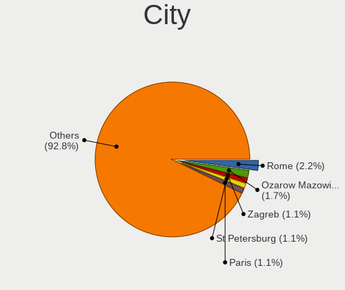
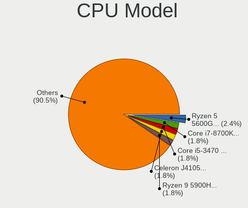
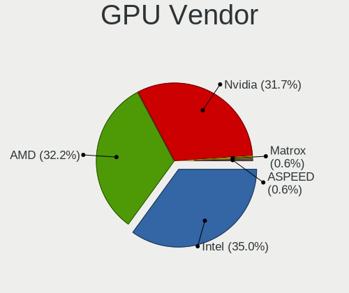
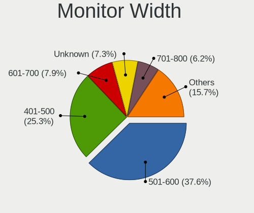
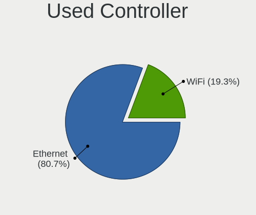
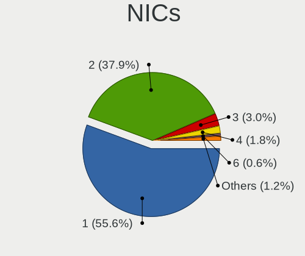
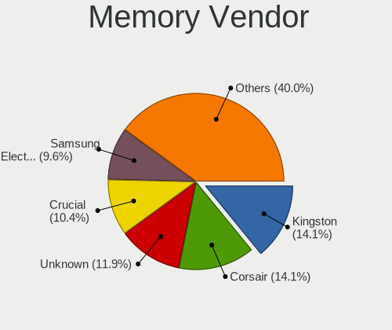

Ubuntu MATE 22.04 - Tested Hardware & Statistics (Desktops)
-----------------------------------------------------------

A project to collect tested hardware configurations for Ubuntu MATE 22.04.

Anyone can contribute to this report by the [hw-probe](https://github.com/linuxhw/hw-probe) tool:

    sudo -E hw-probe -all -upload

Please contribute! Especially if your hardware is rare.

Contents
--------

* [ Test Cases ](#test-cases)

* [ System ](#system)
  - [ Kernel                   ](#kernel)
  - [ Kernel Family            ](#kernel-family)
  - [ Kernel Major Ver.        ](#kernel-major-ver)
  - [ Arch                     ](#arch)
  - [ DE                       ](#de)
  - [ Display Server           ](#display-server)
  - [ Display Manager          ](#display-manager)
  - [ OS Lang                  ](#os-lang)
  - [ Boot Mode                ](#boot-mode)
  - [ Filesystem               ](#filesystem)
  - [ Part. scheme             ](#part-scheme)
  - [ Dual Boot with Linux/BSD ](#dual-boot-with-linuxbsd)
  - [ Dual Boot (Win)          ](#dual-boot-win)

* [ Board ](#board)
  - [ Vendor                   ](#vendor)
  - [ Model                    ](#model)
  - [ Model Family             ](#model-family)
  - [ MFG Year                 ](#mfg-year)
  - [ Form Factor              ](#form-factor)
  - [ Secure Boot              ](#secure-boot)
  - [ Coreboot                 ](#coreboot)
  - [ RAM Size                 ](#ram-size)
  - [ RAM Used                 ](#ram-used)
  - [ Total Drives             ](#total-drives)
  - [ Has CD-ROM               ](#has-cd-rom)
  - [ Has Ethernet             ](#has-ethernet)
  - [ Has WiFi                 ](#has-wifi)
  - [ Has Bluetooth            ](#has-bluetooth)

* [ Location ](#location)
  - [ Country                  ](#country)
  - [ City                     ](#city)

* [ Drives ](#drives)
  - [ Drive Vendor             ](#drive-vendor)
  - [ Drive Model              ](#drive-model)
  - [ HDD Vendor               ](#hdd-vendor)
  - [ SSD Vendor               ](#ssd-vendor)
  - [ Drive Kind               ](#drive-kind)
  - [ Drive Connector          ](#drive-connector)
  - [ Drive Size               ](#drive-size)
  - [ Space Total              ](#space-total)
  - [ Space Used               ](#space-used)
  - [ Malfunc. Drives          ](#malfunc-drives)
  - [ Malfunc. Drive Vendor    ](#malfunc-drive-vendor)
  - [ Malfunc. HDD Vendor      ](#malfunc-hdd-vendor)
  - [ Malfunc. Drive Kind      ](#malfunc-drive-kind)
  - [ Failed Drives            ](#failed-drives)
  - [ Failed Drive Vendor      ](#failed-drive-vendor)
  - [ Drive Status             ](#drive-status)

* [ Storage controller ](#storage-controller)
  - [ Storage Vendor           ](#storage-vendor)
  - [ Storage Model            ](#storage-model)
  - [ Storage Kind             ](#storage-kind)

* [ Processor ](#processor)
  - [ CPU Vendor               ](#cpu-vendor)
  - [ CPU Model                ](#cpu-model)
  - [ CPU Model Family         ](#cpu-model-family)
  - [ CPU Cores                ](#cpu-cores)
  - [ CPU Sockets              ](#cpu-sockets)
  - [ CPU Threads              ](#cpu-threads)
  - [ CPU Op-Modes             ](#cpu-op-modes)
  - [ CPU Microcode            ](#cpu-microcode)
  - [ CPU Microarch            ](#cpu-microarch)

* [ Graphics ](#graphics)
  - [ GPU Vendor               ](#gpu-vendor)
  - [ GPU Model                ](#gpu-model)
  - [ GPU Combo                ](#gpu-combo)
  - [ GPU Driver               ](#gpu-driver)
  - [ GPU Memory               ](#gpu-memory)

* [ Monitor ](#monitor)
  - [ Monitor Vendor           ](#monitor-vendor)
  - [ Monitor Model            ](#monitor-model)
  - [ Monitor Resolution       ](#monitor-resolution)
  - [ Monitor Diagonal         ](#monitor-diagonal)
  - [ Monitor Width            ](#monitor-width)
  - [ Aspect Ratio             ](#aspect-ratio)
  - [ Monitor Area             ](#monitor-area)
  - [ Pixel Density            ](#pixel-density)
  - [ Multiple Monitors        ](#multiple-monitors)

* [ Network ](#network)
  - [ Net Controller Vendor    ](#net-controller-vendor)
  - [ Net Controller Model     ](#net-controller-model)
  - [ Wireless Vendor          ](#wireless-vendor)
  - [ Wireless Model           ](#wireless-model)
  - [ Ethernet Vendor          ](#ethernet-vendor)
  - [ Ethernet Model           ](#ethernet-model)
  - [ Net Controller Kind      ](#net-controller-kind)
  - [ Used Controller          ](#used-controller)
  - [ NICs                     ](#nics)
  - [ IPv6                     ](#ipv6)

* [ Bluetooth ](#bluetooth)
  - [ Bluetooth Vendor         ](#bluetooth-vendor)
  - [ Bluetooth Model          ](#bluetooth-model)

* [ Sound ](#sound)
  - [ Sound Vendor             ](#sound-vendor)
  - [ Sound Model              ](#sound-model)

* [ Memory ](#memory)
  - [ Memory Vendor            ](#memory-vendor)
  - [ Memory Model             ](#memory-model)
  - [ Memory Kind              ](#memory-kind)
  - [ Memory Form Factor       ](#memory-form-factor)
  - [ Memory Size              ](#memory-size)
  - [ Memory Speed             ](#memory-speed)

* [ Printers & scanners ](#printers--scanners)
  - [ Printer Vendor           ](#printer-vendor)
  - [ Printer Model            ](#printer-model)
  - [ Scanner Vendor           ](#scanner-vendor)
  - [ Scanner Model            ](#scanner-model)

* [ Camera ](#camera)
  - [ Camera Vendor            ](#camera-vendor)
  - [ Camera Model             ](#camera-model)

* [ Security ](#security)
  - [ Fingerprint Vendor       ](#fingerprint-vendor)
  - [ Fingerprint Model        ](#fingerprint-model)
  - [ Chipcard Vendor          ](#chipcard-vendor)
  - [ Chipcard Model           ](#chipcard-model)

* [ Unsupported ](#unsupported)
  - [ Unsupported Devices      ](#unsupported-devices)
  - [ Unsupported Device Types ](#unsupported-device-types)

Test Cases
----------

Total: 48

| Vendor   | Model                       | Probe                                                      | Date         |
|----------|-----------------------------|------------------------------------------------------------|--------------|
| Lenovo   | SHARKBAY SDK0E50510 PRO     | [cb5d0d1945](https://linux-hardware.org/?probe=cb5d0d1945) | Oct 01, 2022 |
| Lenovo   | SHARKBAY SDK0E50510 PRO     | [3af0c5cc5f](https://linux-hardware.org/?probe=3af0c5cc5f) | Oct 01, 2022 |
| ASUSTek  | PRIME B450-PLUS             | [db15c7b708](https://linux-hardware.org/?probe=db15c7b708) | Oct 01, 2022 |
| ASUSTek  | K30AD_M31AD_M51AD_M32AD     | [608c715bab](https://linux-hardware.org/?probe=608c715bab) | Sep 26, 2022 |
| MSI      | H81M-P33                    | [108817dc0f](https://linux-hardware.org/?probe=108817dc0f) | Sep 21, 2022 |
| ASRock   | HM55-HT                     | [64fff8f065](https://linux-hardware.org/?probe=64fff8f065) | Sep 20, 2022 |
| MSI      | 870-G45                     | [74af87b0c5](https://linux-hardware.org/?probe=74af87b0c5) | Sep 17, 2022 |
| ASUSTek  | ROG STRIX Z690-A GAMING ... | [081d4b1d50](https://linux-hardware.org/?probe=081d4b1d50) | Sep 16, 2022 |
| ASUSTek  | M2A74-AM                    | [25c30e4e54](https://linux-hardware.org/?probe=25c30e4e54) | Sep 14, 2022 |
| ASUSTek  | M2A74-AM                    | [24e6ffe552](https://linux-hardware.org/?probe=24e6ffe552) | Sep 14, 2022 |
| ASUSTek  | P7P55 LX                    | [cc28ed218f](https://linux-hardware.org/?probe=cc28ed218f) | Sep 13, 2022 |
| Acer     | Aspire X3950                | [22d1319220](https://linux-hardware.org/?probe=22d1319220) | Sep 06, 2022 |
| ASUSTek  | P5GZ-MX                     | [883739db23](https://linux-hardware.org/?probe=883739db23) | Sep 05, 2022 |
| ASRock   | B450 Gaming-ITX/ac          | [f16d383b65](https://linux-hardware.org/?probe=f16d383b65) | Sep 05, 2022 |
| HP       | 2ADC                        | [d9e5d2b511](https://linux-hardware.org/?probe=d9e5d2b511) | Sep 04, 2022 |
| HP       | 18E4                        | [c58c0043cb](https://linux-hardware.org/?probe=c58c0043cb) | Sep 03, 2022 |
| HP       | 3397                        | [5cd2349a9c](https://linux-hardware.org/?probe=5cd2349a9c) | Sep 02, 2022 |
| Lenovo   | 3111 SDK0J40697 WIN 3305... | [2be9b66ba1](https://linux-hardware.org/?probe=2be9b66ba1) | Aug 30, 2022 |
| AZW      | GK55                        | [0ae52e1fdf](https://linux-hardware.org/?probe=0ae52e1fdf) | Aug 21, 2022 |
| MSI      | H170M PRO-VDH               | [4d7aa09763](https://linux-hardware.org/?probe=4d7aa09763) | Aug 16, 2022 |
| Dell     | 08NPPY A00                  | [1b78691cac](https://linux-hardware.org/?probe=1b78691cac) | Aug 14, 2022 |
| Dell     | 08NPPY A00                  | [b41823f392](https://linux-hardware.org/?probe=b41823f392) | Aug 14, 2022 |
| MSI      | MS-77311                    | [86b4d71bc0](https://linux-hardware.org/?probe=86b4d71bc0) | Aug 11, 2022 |
| HP       | 8433 11                     | [cd790281b5](https://linux-hardware.org/?probe=cd790281b5) | Aug 02, 2022 |
| Dell     | 0KWVT8 A03                  | [cdca6713e9](https://linux-hardware.org/?probe=cdca6713e9) | Jul 31, 2022 |
| Dell     | 0KWVT8 A03                  | [1444843fcd](https://linux-hardware.org/?probe=1444843fcd) | Jul 31, 2022 |
| MSI      | 2AE0                        | [5c0034d313](https://linux-hardware.org/?probe=5c0034d313) | Jul 22, 2022 |
| MSI      | 2AE0                        | [df441346da](https://linux-hardware.org/?probe=df441346da) | Jul 22, 2022 |
| Medion   | MS-7797                     | [caf13d5392](https://linux-hardware.org/?probe=caf13d5392) | Jul 14, 2022 |
| Dell     | 0GM819                      | [3d18cc2632](https://linux-hardware.org/?probe=3d18cc2632) | Jul 08, 2022 |
| Gigabyte | Z87-HD3                     | [95e6ec0822](https://linux-hardware.org/?probe=95e6ec0822) | Jul 05, 2022 |
| HP       | 3646h                       | [9e0737f23f](https://linux-hardware.org/?probe=9e0737f23f) | Jul 04, 2022 |
| Gigabyte | Z87-HD3                     | [28429fdd32](https://linux-hardware.org/?probe=28429fdd32) | Jul 02, 2022 |
| HP       | 8169                        | [18c6ea7678](https://linux-hardware.org/?probe=18c6ea7678) | Jul 01, 2022 |
| HP       | 8169                        | [c479baadc1](https://linux-hardware.org/?probe=c479baadc1) | Jul 01, 2022 |
| Acer     | Aspire X3950                | [81797815d2](https://linux-hardware.org/?probe=81797815d2) | Jun 13, 2022 |
| Unknown  | Unknown                     | [c62add2d70](https://linux-hardware.org/?probe=c62add2d70) | Jun 13, 2022 |
| HP       | 3397                        | [55bcbdbc1f](https://linux-hardware.org/?probe=55bcbdbc1f) | Jun 07, 2022 |
| Gigabyte | B360M AORUS Gaming 3-CF     | [5407d4a1f6](https://linux-hardware.org/?probe=5407d4a1f6) | Jun 07, 2022 |
| ASUSTek  | P5G41T-M LX2/BR             | [9044b2e4e2](https://linux-hardware.org/?probe=9044b2e4e2) | May 18, 2022 |
| Unknown  | HX90                        | [3a7e2628b0](https://linux-hardware.org/?probe=3a7e2628b0) | May 09, 2022 |
| MSI      | B450 TOMAHAWK MAX           | [246c63d834](https://linux-hardware.org/?probe=246c63d834) | May 06, 2022 |
| HP       | 8433 11                     | [a5b829538b](https://linux-hardware.org/?probe=a5b829538b) | Apr 29, 2022 |
| Gigabyte | X99P-SLI-CF                 | [19055b80bc](https://linux-hardware.org/?probe=19055b80bc) | Apr 16, 2022 |
| ASUSTek  | PRIME H410M-A               | [9352c21f95](https://linux-hardware.org/?probe=9352c21f95) | Mar 17, 2022 |
| ASUSTek  | PRIME B550-PLUS             | [4368bd67ac](https://linux-hardware.org/?probe=4368bd67ac) | Nov 23, 2021 |
| ASUSTek  | PRIME B550-PLUS             | [686454975b](https://linux-hardware.org/?probe=686454975b) | Nov 23, 2021 |
| ASUSTek  | ROG Maximus XIII HERO       | [36ac197007](https://linux-hardware.org/?probe=36ac197007) | Nov 17, 2021 |

System
------

Kernel
------

Version of the Linux kernel

| Version           | Desktops | Percent |
|-------------------|----------|---------|
| 5.15.0-47-generic | 11       | 28.21%  |
| 5.15.0-48-generic | 4        | 10.26%  |
| 5.15.0-46-generic | 3        | 7.69%   |
| 5.15.0-40-generic | 3        | 7.69%   |
| 5.15.0-27-generic | 3        | 7.69%   |
| 5.15.0-41-generic | 2        | 5.13%   |
| 5.15.0-37-generic | 2        | 5.13%   |
| 5.15.0-25-generic | 2        | 5.13%   |
| 5.18.0-1-generic  | 1        | 2.56%   |
| 5.15.0-43-generic | 1        | 2.56%   |
| 5.15.0-39-generic | 1        | 2.56%   |
| 5.15.0-35-generic | 1        | 2.56%   |
| 5.15.0-30-generic | 1        | 2.56%   |
| 5.15.0-22-generic | 1        | 2.56%   |
| 5.15.0-11-generic | 1        | 2.56%   |
| 5.13.0-52-generic | 1        | 2.56%   |
| 5.13.0-19-generic | 1        | 2.56%   |

Kernel Family
-------------

Linux kernel without a distro release

| Version | Desktops | Percent |
|---------|----------|---------|
| 5.15.0  | 35       | 92.11%  |
| 5.13.0  | 2        | 5.26%   |
| 5.18.0  | 1        | 2.63%   |

Kernel Major Ver.
-----------------

Linux kernel major version

| Version | Desktops | Percent |
|---------|----------|---------|
| 5.15    | 35       | 92.11%  |
| 5.13    | 2        | 5.26%   |
| 5.18    | 1        | 2.63%   |

Arch
----

OS architecture (x86_64, i586, etc.)

| Name   | Desktops | Percent |
|--------|----------|---------|
| x86_64 | 37       | 100%    |

DE
--

Desktop Environment

| Name | Desktops | Percent |
|------|----------|---------|
| MATE | 36       | 97.3%   |
| KDE5 | 1        | 2.7%    |

Display Server
--------------

X11 or Wayland

| Name    | Desktops | Percent |
|---------|----------|---------|
| X11     | 36       | 97.3%   |
| Wayland | 1        | 2.7%    |

Display Manager
---------------

SDDM, LightDM, etc.

| Name    | Desktops | Percent |
|---------|----------|---------|
| LightDM | 30       | 78.95%  |
| GDM3    | 4        | 10.53%  |
| Unknown | 4        | 10.53%  |

OS Lang
-------

Language

| Lang  | Desktops | Percent |
|-------|----------|---------|
| en_US | 14       | 37.84%  |
| fr_FR | 5        | 13.51%  |
| en_AU | 3        | 8.11%   |
| de_DE | 3        | 8.11%   |
| pt_BR | 2        | 5.41%   |
| it_IT | 2        | 5.41%   |
| en_CA | 2        | 5.41%   |
| de_CH | 2        | 5.41%   |
| nl_NL | 1        | 2.7%    |
| es_PE | 1        | 2.7%    |
| es_AR | 1        | 2.7%    |
| en_GB | 1        | 2.7%    |

Boot Mode
---------

EFI or BIOS

| Mode | Desktops | Percent |
|------|----------|---------|
| BIOS | 24       | 63.16%  |
| EFI  | 14       | 36.84%  |

Filesystem
----------

Type of filesystem

| Type  | Desktops | Percent |
|-------|----------|---------|
| Ext4  | 36       | 94.74%  |
| Zfs   | 1        | 2.63%   |
| Btrfs | 1        | 2.63%   |

Part. scheme
------------

Scheme of partitioning

| Type    | Desktops | Percent |
|---------|----------|---------|
| Unknown | 18       | 47.37%  |
| GPT     | 16       | 42.11%  |
| MBR     | 4        | 10.53%  |

Dual Boot with Linux/BSD
------------------------

Hosting more than one Linux/BSD

| Dual boot | Desktops | Percent |
|-----------|----------|---------|
| No        | 32       | 86.49%  |
| Yes       | 5        | 13.51%  |

Dual Boot (Win)
---------------

Hosting Linux and Windows

| Dual boot | Desktops | Percent |
|-----------|----------|---------|
| No        | 24       | 63.16%  |
| Yes       | 14       | 36.84%  |

Board
-----

Vendor
------

Motherboard manufacturer

| Name                | Desktops | Percent |
|---------------------|----------|---------|
| ASUSTek Computer    | 10       | 27.03%  |
| Hewlett-Packard     | 7        | 18.92%  |
| MSI                 | 6        | 16.22%  |
| Dell                | 3        | 8.11%   |
| Lenovo              | 2        | 5.41%   |
| Gigabyte Technology | 2        | 5.41%   |
| ASRock              | 2        | 5.41%   |
| Unknown             | 2        | 5.41%   |
| Medion              | 1        | 2.7%    |
| AZW                 | 1        | 2.7%    |
| Acer                | 1        | 2.7%    |

Model
-----

Motherboard model

| Name                                 | Desktops | Percent |
|--------------------------------------|----------|---------|
| HP Compaq Elite 8300 SFF             | 2        | 5.41%   |
| Unknown                              | 2        | 5.41%   |
| MSI p6-2330                          | 1        | 2.7%    |
| MSI MS-7C02                          | 1        | 2.7%    |
| MSI MS-7982                          | 1        | 2.7%    |
| MSI MS-7817                          | 1        | 2.7%    |
| MSI MS-7599                          | 1        | 2.7%    |
| MSI B02311                           | 1        | 2.7%    |
| Medion MS-7797                       | 1        | 2.7%    |
| Lenovo ThinkCentre M83z 10C20003FR   | 1        | 2.7%    |
| Lenovo ThinkCentre M710q 10MQSC0N00  | 1        | 2.7%    |
| HP ProDesk 600 G2 DM                 | 1        | 2.7%    |
| HP Pavilion 590-p0049 3LC38AA        | 1        | 2.7%    |
| HP EliteDesk 800 G1 TWR              | 1        | 2.7%    |
| HP Compaq 8000 Elite SFF PC          | 1        | 2.7%    |
| HP 23-d027c                          | 1        | 2.7%    |
| Gigabyte Z87-HD3                     | 1        | 2.7%    |
| Gigabyte X99P-SLI-CF                 | 1        | 2.7%    |
| Dell XPS 8700                        | 1        | 2.7%    |
| Dell OptiPlex 755                    | 1        | 2.7%    |
| Dell OptiPlex 3050                   | 1        | 2.7%    |
| AZW GK55                             | 1        | 2.7%    |
| ASUS ROG STRIX Z690-A GAMING WIFI D4 | 1        | 2.7%    |
| ASUS ROG Maximus XIII HERO           | 1        | 2.7%    |
| ASUS PRIME H410M-A                   | 1        | 2.7%    |
| ASUS PRIME B550-PLUS                 | 1        | 2.7%    |
| ASUS PRIME B450-PLUS                 | 1        | 2.7%    |
| ASUS P7P55 LX                        | 1        | 2.7%    |
| ASUS P5GZ-MX                         | 1        | 2.7%    |
| ASUS P5G41T-M LX2/BR                 | 1        | 2.7%    |
| ASUS M2A74-AM                        | 1        | 2.7%    |
| ASUS K30AD_M31AD_M51AD               | 1        | 2.7%    |
| ASRock HM55-HT                       | 1        | 2.7%    |
| ASRock B450 Gaming-ITX/ac            | 1        | 2.7%    |
| Acer Aspire X3950                    | 1        | 2.7%    |

Model Family
------------

Motherboard model prefix

| Name                 | Desktops | Percent |
|----------------------|----------|---------|
| HP Compaq            | 3        | 8.11%   |
| ASUS PRIME           | 3        | 8.11%   |
| Lenovo ThinkCentre   | 2        | 5.41%   |
| Dell OptiPlex        | 2        | 5.41%   |
| ASUS ROG             | 2        | 5.41%   |
| Unknown              | 2        | 5.41%   |
| MSI p6-2330          | 1        | 2.7%    |
| MSI MS-7C02          | 1        | 2.7%    |
| MSI MS-7982          | 1        | 2.7%    |
| MSI MS-7817          | 1        | 2.7%    |
| MSI MS-7599          | 1        | 2.7%    |
| MSI B02311           | 1        | 2.7%    |
| Medion MS-7797       | 1        | 2.7%    |
| HP ProDesk           | 1        | 2.7%    |
| HP Pavilion          | 1        | 2.7%    |
| HP EliteDesk         | 1        | 2.7%    |
| HP 23-d027c          | 1        | 2.7%    |
| Gigabyte Z87-HD3     | 1        | 2.7%    |
| Gigabyte X99P-SLI-CF | 1        | 2.7%    |
| Dell XPS             | 1        | 2.7%    |
| AZW GK55             | 1        | 2.7%    |
| ASUS P7P55           | 1        | 2.7%    |
| ASUS P5GZ-MX         | 1        | 2.7%    |
| ASUS P5G41T-M        | 1        | 2.7%    |
| ASUS M2A74-AM        | 1        | 2.7%    |
| ASUS K30AD           | 1        | 2.7%    |
| ASRock HM55-HT       | 1        | 2.7%    |
| ASRock B450          | 1        | 2.7%    |
| Acer Aspire          | 1        | 2.7%    |

MFG Year
--------

Motherboard manufacture year

| Year | Desktops | Percent |
|------|----------|---------|
| 2013 | 5        | 13.51%  |
| 2020 | 4        | 10.81%  |
| 2018 | 4        | 10.81%  |
| 2009 | 4        | 10.81%  |
| 2021 | 3        | 8.11%   |
| 2015 | 3        | 8.11%   |
| 2012 | 3        | 8.11%   |
| 2010 | 3        | 8.11%   |
| 2014 | 2        | 5.41%   |
| 2019 | 1        | 2.7%    |
| 2017 | 1        | 2.7%    |
| 2016 | 1        | 2.7%    |
| 2011 | 1        | 2.7%    |
| 2007 | 1        | 2.7%    |
| 2006 | 1        | 2.7%    |

Form Factor
-----------

Physical design of the computer

| Name    | Desktops | Percent |
|---------|----------|---------|
| Desktop | 37       | 100%    |

Secure Boot
-----------

Enabled or disabled

| State    | Desktops | Percent |
|----------|----------|---------|
| Disabled | 37       | 100%    |

Coreboot
--------

Have coreboot on board

| Used | Desktops | Percent |
|------|----------|---------|
| No   | 37       | 100%    |

RAM Size
--------

Total RAM memory

| Size in GB  | Desktops | Percent |
|-------------|----------|---------|
| 3.01-4.0    | 8        | 21.62%  |
| 4.01-8.0    | 7        | 18.92%  |
| 8.01-16.0   | 7        | 18.92%  |
| 32.01-64.0  | 6        | 16.22%  |
| 16.01-24.0  | 5        | 13.51%  |
| 64.01-256.0 | 2        | 5.41%   |
| 24.01-32.0  | 1        | 2.7%    |
| 1.01-2.0    | 1        | 2.7%    |

RAM Used
--------

Used RAM memory

| Used GB   | Desktops | Percent |
|-----------|----------|---------|
| 2.01-3.0  | 13       | 35.14%  |
| 1.01-2.0  | 11       | 29.73%  |
| 4.01-8.0  | 5        | 13.51%  |
| 3.01-4.0  | 4        | 10.81%  |
| 8.01-16.0 | 2        | 5.41%   |
| 0.51-1.0  | 2        | 5.41%   |

Total Drives
------------

Number of drives on board

| Drives | Desktops | Percent |
|--------|----------|---------|
| 1      | 17       | 45.95%  |
| 3      | 6        | 16.22%  |
| 2      | 5        | 13.51%  |
| 4      | 4        | 10.81%  |
| 6      | 3        | 8.11%   |
| 5      | 2        | 5.41%   |

Has CD-ROM
----------

Has CD-ROM on board

| Presented | Desktops | Percent |
|-----------|----------|---------|
| Yes       | 22       | 59.46%  |
| No        | 15       | 40.54%  |

Has Ethernet
------------

Has Ethernet on board

| Presented | Desktops | Percent |
|-----------|----------|---------|
| Yes       | 37       | 100%    |

Has WiFi
--------

Has WiFi module

| Presented | Desktops | Percent |
|-----------|----------|---------|
| Yes       | 24       | 64.86%  |
| No        | 13       | 35.14%  |

Has Bluetooth
-------------

Has Bluetooth module

| Presented | Desktops | Percent |
|-----------|----------|---------|
| No        | 23       | 62.16%  |
| Yes       | 14       | 37.84%  |

Location
--------

Country
-------

Geographic location (country)

| Country     | Desktops | Percent |
|-------------|----------|---------|
| USA         | 8        | 21.62%  |
| France      | 5        | 13.51%  |
| Germany     | 3        | 8.11%   |
| Canada      | 3        | 8.11%   |
| Australia   | 3        | 8.11%   |
| Switzerland | 2        | 5.41%   |
| Italy       | 2        | 5.41%   |
| Brazil      | 2        | 5.41%   |
| Ukraine     | 1        | 2.7%    |
| UK          | 1        | 2.7%    |
| Portugal    | 1        | 2.7%    |
| Peru        | 1        | 2.7%    |
| Finland     | 1        | 2.7%    |
| Croatia     | 1        | 2.7%    |
| Belgium     | 1        | 2.7%    |
| Austria     | 1        | 2.7%    |
| Argentina   | 1        | 2.7%    |

City
----

Geographic location (city)

| City                 | Desktops | Percent |
|----------------------|----------|---------|
| Melbourne            | 2        | 5.26%   |
| York                 | 1        | 2.63%   |
| Viana do Castelo     | 1        | 2.63%   |
| Velyki Mosty         | 1        | 2.63%   |
| Vancouver            | 1        | 2.63%   |
| Valenciennes         | 1        | 2.63%   |
| Terrace              | 1        | 2.63%   |
| Talence              | 1        | 2.63%   |
| Split                | 1        | 2.63%   |
| Pindamonhangaba      | 1        | 2.63%   |
| Paris                | 1        | 2.63%   |
| Palermo              | 1        | 2.63%   |
| Overpelt             | 1        | 2.63%   |
| Noventa Vicentina    | 1        | 2.63%   |
| Mount Waverley       | 1        | 2.63%   |
| Miami                | 1        | 2.63%   |
| Marysville           | 1        | 2.63%   |
| Maitenbeth           | 1        | 2.63%   |
| Limoges              | 1        | 2.63%   |
| Lima                 | 1        | 2.63%   |
| Lansdale             | 1        | 2.63%   |
| Lanigan              | 1        | 2.63%   |
| Kematen an der Ybbs  | 1        | 2.63%   |
| Joigny               | 1        | 2.63%   |
| Imperatriz           | 1        | 2.63%   |
| Houston              | 1        | 2.63%   |
| Helsinki             | 1        | 2.63%   |
| Heerbrugg            | 1        | 2.63%   |
| Goslar               | 1        | 2.63%   |
| Gams                 | 1        | 2.63%   |
| Florence             | 1        | 2.63%   |
| El Palomar           | 1        | 2.63%   |
| Columbia             | 1        | 2.63%   |
| Buchs / Buchs (Dorf) | 1        | 2.63%   |
| Bracknell            | 1        | 2.63%   |
| Bad Iburg            | 1        | 2.63%   |
| Albuquerque          | 1        | 2.63%   |

Drives
------

Drive Vendor
------------

Hard drive vendors

| Vendor              | Desktops | Drives | Percent |
|---------------------|----------|--------|---------|
| WDC                 | 13       | 20     | 20%     |
| Seagate             | 11       | 14     | 16.92%  |
| Samsung Electronics | 10       | 19     | 15.38%  |
| Hitachi             | 4        | 4      | 6.15%   |
| Crucial             | 4        | 4      | 6.15%   |
| Unknown             | 3        | 4      | 4.62%   |
| Toshiba             | 2        | 2      | 3.08%   |
| SanDisk             | 2        | 4      | 3.08%   |
| A-DATA Technology   | 2        | 2      | 3.08%   |
| SPCC                | 1        | 1      | 1.54%   |
| RZX                 | 1        | 1      | 1.54%   |
| Phison              | 1        | 1      | 1.54%   |
| NGFF                | 1        | 1      | 1.54%   |
| Maxtor              | 1        | 1      | 1.54%   |
| KIOXIA-EXCERIA      | 1        | 1      | 1.54%   |
| Kingston            | 1        | 1      | 1.54%   |
| KingSpec            | 1        | 1      | 1.54%   |
| Kimtigo             | 1        | 1      | 1.54%   |
| KESU                | 1        | 1      | 1.54%   |
| GOODRAM             | 1        | 1      | 1.54%   |
| DAS                 | 1        | 6      | 1.54%   |
| China               | 1        | 1      | 1.54%   |
| BAITITON            | 1        | 1      | 1.54%   |

Drive Model
-----------

Hard drive models

| Model                           | Desktops | Percent |
|---------------------------------|----------|---------|
| Seagate ST2000DM001-1ER164 2TB  | 3        | 3.7%    |
| WDC WD40EZAZ-00SF3B0 4TB        | 2        | 2.47%   |
| Samsung SSD 870 QVO 1TB         | 2        | 2.47%   |
| Crucial CT1000BX500SSD1 1TB     | 2        | 2.47%   |
| WDC WDBNCE0010PNC 1TB SSD       | 1        | 1.23%   |
| WDC WD6400AAKS-00E4A0 640GB     | 1        | 1.23%   |
| WDC WD60 EFAX-68JH4N1 6TB       | 1        | 1.23%   |
| WDC WD5000AZLX-75K2TA0 500GB    | 1        | 1.23%   |
| WDC WD5000AAKX-08U6AA0 500GB    | 1        | 1.23%   |
| WDC WD5000AAKX-08ERMA0 500GB    | 1        | 1.23%   |
| WDC WD40 PURZ-85TTDY0 4TB       | 1        | 1.23%   |
| WDC WD30EFRX-68N32N0 3TB        | 1        | 1.23%   |
| WDC WD30EFRX-68EUZN0 3TB        | 1        | 1.23%   |
| WDC WD3000HLFS-01G6U0 304GB     | 1        | 1.23%   |
| WDC WD2500AAKX-753CA1 250GB     | 1        | 1.23%   |
| WDC WD10EZRZ-00HTKB0 1TB        | 1        | 1.23%   |
| WDC WD10EZRX-00A8LB0 1TB        | 1        | 1.23%   |
| WDC WD10EZEX-75WN4A0 1TB        | 1        | 1.23%   |
| WDC WD10EZEX-60ZF5A0 1TB        | 1        | 1.23%   |
| WDC WD10EZEX-60WN4A0 1TB        | 1        | 1.23%   |
| WDC WD10EZEX-00KUWA0 1TB        | 1        | 1.23%   |
| WDC WD10 01FALS-00J7B1 1TB      | 1        | 1.23%   |
| Unknown SD/MMC 16GB             | 1        | 1.23%   |
| Unknown M.S./M.S.Pro/HG 16GB    | 1        | 1.23%   |
| Unknown CBADS  32GB             | 1        | 1.23%   |
| Unknown 256GB PCS 2.5" S        | 1        | 1.23%   |
| Toshiba HDWG180 8TB             | 1        | 1.23%   |
| Toshiba DT01ACA200 2TB          | 1        | 1.23%   |
| SPCC Solid State Disk 256GB     | 1        | 1.23%   |
| Seagate ST500DM002-1BD142 500GB | 1        | 1.23%   |
| Seagate ST4000DM004-2CV104 4TB  | 1        | 1.23%   |
| Seagate ST380013AS 80GB         | 1        | 1.23%   |
| Seagate ST3500418AS 500GB       | 1        | 1.23%   |
| Seagate ST3500414CS 500GB       | 1        | 1.23%   |
| Seagate ST3500312CS 500GB       | 1        | 1.23%   |
| Seagate ST325082 0AS 250GB      | 1        | 1.23%   |
| Seagate ST2000DM008-2FR102 2TB  | 1        | 1.23%   |
| Seagate ST1000DM003-1ER162 1TB  | 1        | 1.23%   |
| SanDisk SSD PLUS 240GB          | 1        | 1.23%   |
| SanDisk SSD PLUS 1000GB         | 1        | 1.23%   |

HDD Vendor
----------

Hard disk drive vendors

| Vendor              | Desktops | Drives | Percent |
|---------------------|----------|--------|---------|
| WDC                 | 13       | 19     | 37.14%  |
| Seagate             | 11       | 14     | 31.43%  |
| Hitachi             | 4        | 4      | 11.43%  |
| Toshiba             | 2        | 2      | 5.71%   |
| Samsung Electronics | 2        | 3      | 5.71%   |
| Maxtor              | 1        | 1      | 2.86%   |
| KESU                | 1        | 1      | 2.86%   |
| DAS                 | 1        | 6      | 2.86%   |

SSD Vendor
----------

Solid state drive vendors

| Vendor              | Desktops | Drives | Percent |
|---------------------|----------|--------|---------|
| Samsung Electronics | 7        | 10     | 29.17%  |
| Crucial             | 4        | 4      | 16.67%  |
| SanDisk             | 2        | 4      | 8.33%   |
| WDC                 | 1        | 1      | 4.17%   |
| Unknown             | 1        | 1      | 4.17%   |
| SPCC                | 1        | 1      | 4.17%   |
| RZX                 | 1        | 1      | 4.17%   |
| NGFF                | 1        | 1      | 4.17%   |
| KIOXIA-EXCERIA      | 1        | 1      | 4.17%   |
| KingSpec            | 1        | 1      | 4.17%   |
| GOODRAM             | 1        | 1      | 4.17%   |
| China               | 1        | 1      | 4.17%   |
| BAITITON            | 1        | 1      | 4.17%   |
| A-DATA Technology   | 1        | 1      | 4.17%   |

Drive Kind
----------

HDD or SSD

| Kind    | Desktops | Drives | Percent |
|---------|----------|--------|---------|
| HDD     | 25       | 50     | 48.08%  |
| SSD     | 18       | 29     | 34.62%  |
| NVMe    | 7        | 10     | 13.46%  |
| MMC     | 1        | 1      | 1.92%   |
| Unknown | 1        | 2      | 1.92%   |

Drive Connector
---------------

SATA, SAS, NVMe, etc.

| Type | Desktops | Drives | Percent |
|------|----------|--------|---------|
| SATA | 34       | 68     | 72.34%  |
| NVMe | 7        | 10     | 14.89%  |
| SAS  | 5        | 13     | 10.64%  |
| MMC  | 1        | 1      | 2.13%   |

Drive Size
----------

Size of hard drive

| Size in TB | Desktops | Drives | Percent |
|------------|----------|--------|---------|
| 0.01-0.5   | 26       | 41     | 47.27%  |
| 0.51-1.0   | 15       | 21     | 27.27%  |
| 1.01-2.0   | 7        | 9      | 12.73%  |
| 3.01-4.0   | 4        | 4      | 7.27%   |
| 4.01-10.0  | 2        | 2      | 3.64%   |
| 2.01-3.0   | 1        | 2      | 1.82%   |

Space Total
-----------

Amount of disk space available on the file system

| Size in GB     | Desktops | Percent |
|----------------|----------|---------|
| 251-500        | 10       | 27.03%  |
| 501-1000       | 8        | 21.62%  |
| More than 3000 | 6        | 16.22%  |
| 101-250        | 6        | 16.22%  |
| 1001-2000      | 3        | 8.11%   |
| 51-100         | 2        | 5.41%   |
| 21-50          | 1        | 2.7%    |
| 2001-3000      | 1        | 2.7%    |

Space Used
----------

Amount of used disk space

| Used GB        | Desktops | Percent |
|----------------|----------|---------|
| 1-20           | 9        | 24.32%  |
| 501-1000       | 6        | 16.22%  |
| 21-50          | 5        | 13.51%  |
| More than 3000 | 4        | 10.81%  |
| 251-500        | 4        | 10.81%  |
| 101-250        | 4        | 10.81%  |
| 51-100         | 3        | 8.11%   |
| 1001-2000      | 2        | 5.41%   |

Malfunc. Drives
---------------

Drive models with a malfunction

| Model                               | Desktops | Drives | Percent |
|-------------------------------------|----------|--------|---------|
| Seagate ST500DM002-1BD142 500GB     | 1        | 1      | 14.29%  |
| Seagate ST2000DM001-1ER164 2TB      | 1        | 1      | 14.29%  |
| Samsung Electronics SSD 960 PRO 1TB | 1        | 1      | 14.29%  |
| NGFF 2280 256GB SSD                 | 1        | 1      | 14.29%  |
| Hitachi HTS721080G9SA00 80GB        | 1        | 1      | 14.29%  |
| DAS TerraMaster 500GB               | 1        | 3      | 14.29%  |
| China SSD 180GB                     | 1        | 1      | 14.29%  |

Malfunc. Drive Vendor
---------------------

Vendors of faulty drives

| Vendor              | Desktops | Drives | Percent |
|---------------------|----------|--------|---------|
| Seagate             | 2        | 2      | 28.57%  |
| Samsung Electronics | 1        | 1      | 14.29%  |
| NGFF                | 1        | 1      | 14.29%  |
| Hitachi             | 1        | 1      | 14.29%  |
| DAS                 | 1        | 3      | 14.29%  |
| China               | 1        | 1      | 14.29%  |

Malfunc. HDD Vendor
-------------------

Vendors of faulty HDD drives

| Vendor  | Desktops | Drives | Percent |
|---------|----------|--------|---------|
| Seagate | 2        | 2      | 50%     |
| Hitachi | 1        | 1      | 25%     |
| DAS     | 1        | 3      | 25%     |

Malfunc. Drive Kind
-------------------

Kinds of faulty drives

| Kind | Desktops | Drives | Percent |
|------|----------|--------|---------|
| HDD  | 3        | 6      | 50%     |
| SSD  | 2        | 2      | 33.33%  |
| NVMe | 1        | 1      | 16.67%  |

Failed Drives
-------------

Failed drive models

Zero info for selected period =(

Failed Drive Vendor
-------------------

Failed drive vendors

Zero info for selected period =(

Drive Status
------------

Number of failed and malfunc. drives

| Status   | Desktops | Drives | Percent |
|----------|----------|--------|---------|
| Detected | 19       | 48     | 44.19%  |
| Works    | 18       | 35     | 41.86%  |
| Malfunc  | 6        | 9      | 13.95%  |

Storage controller
------------------

Storage Vendor
--------------

Storage controller vendors

| Vendor                      | Desktops | Percent |
|-----------------------------|----------|---------|
| Intel                       | 26       | 57.78%  |
| AMD                         | 10       | 22.22%  |
| Samsung Electronics         | 3        | 6.67%   |
| ASMedia Technology          | 2        | 4.44%   |
| Silicon Motion              | 1        | 2.22%   |
| Phison Electronics          | 1        | 2.22%   |
| Kingston Technology Company | 1        | 2.22%   |
| ADATA Technology            | 1        | 2.22%   |

Storage Model
-------------

Storage controller models

| Model                                                                          | Desktops | Percent |
|--------------------------------------------------------------------------------|----------|---------|
| AMD FCH SATA Controller [AHCI mode]                                            | 6        | 9.84%   |
| Intel 8 Series/C220 Series Chipset Family 6-port SATA Controller 1 [AHCI mode] | 5        | 8.2%    |
| Intel 7 Series/C210 Series Chipset Family 6-port SATA Controller [AHCI mode]   | 3        | 4.92%   |
| AMD SB7x0/SB8x0/SB9x0 IDE Controller                                           | 3        | 4.92%   |
| AMD 400 Series Chipset SATA Controller                                         | 3        | 4.92%   |
| Samsung NVMe SSD Controller SM981/PM981/PM983                                  | 2        | 3.28%   |
| Samsung NVMe SSD Controller SM961/PM961/SM963                                  | 2        | 3.28%   |
| Intel SATA Controller [RAID mode]                                              | 2        | 3.28%   |
| Intel Q170/Q150/B150/H170/H110/Z170/CM236 Chipset SATA Controller [AHCI Mode]  | 2        | 3.28%   |
| Intel NM10/ICH7 Family SATA Controller [IDE mode]                              | 2        | 3.28%   |
| Intel 82801G (ICH7 Family) IDE Controller                                      | 2        | 3.28%   |
| ASMedia ASM1062 Serial ATA Controller                                          | 2        | 3.28%   |
| AMD SB7x0/SB8x0/SB9x0 SATA Controller [IDE mode]                               | 2        | 3.28%   |
| Silicon Motion SM2263EN/SM2263XT SSD Controller                                | 1        | 1.64%   |
| Samsung NVMe SSD Controller PM9A1/PM9A3/980PRO                                 | 1        | 1.64%   |
| Phison NVMe Storage Controller                                                 | 1        | 1.64%   |
| Kingston Company Company Non-Volatile memory controller                        | 1        | 1.64%   |
| Intel Volume Management Device NVMe RAID Controller                            | 1        | 1.64%   |
| Intel Celeron/Pentium Silver Processor SATA Controller                         | 1        | 1.64%   |
| Intel Cannon Lake PCH SATA AHCI Controller                                     | 1        | 1.64%   |
| Intel Alder Lake-S PCH SATA Controller [AHCI Mode]                             | 1        | 1.64%   |
| Intel 82Q35 Express PT IDER Controller                                         | 1        | 1.64%   |
| Intel 82801IR/IO/IH (ICH9R/DO/DH) 6 port SATA Controller [AHCI mode]           | 1        | 1.64%   |
| Intel 8 Series/C220 Series Chipset Family 4-port SATA Controller 1 [IDE mode]  | 1        | 1.64%   |
| Intel 8 Series/C220 Series Chipset Family 2-port SATA Controller 2 [IDE mode]  | 1        | 1.64%   |
| Intel 6 Series/C200 Series Chipset Family 6 port Desktop SATA AHCI Controller  | 1        | 1.64%   |
| Intel 500 Series Chipset Family SATA AHCI Controller                           | 1        | 1.64%   |
| Intel 5 Series/3400 Series Chipset 6 port SATA AHCI Controller                 | 1        | 1.64%   |
| Intel 5 Series/3400 Series Chipset 4 port SATA IDE Controller                  | 1        | 1.64%   |
| Intel 5 Series/3400 Series Chipset 4 port SATA AHCI Controller                 | 1        | 1.64%   |
| Intel 5 Series/3400 Series Chipset 2 port SATA IDE Controller                  | 1        | 1.64%   |
| Intel 400 Series Chipset Family SATA AHCI Controller                           | 1        | 1.64%   |
| Intel 4 Series Chipset PT IDER Controller                                      | 1        | 1.64%   |
| Intel 200 Series PCH SATA controller [AHCI mode]                               | 1        | 1.64%   |
| AMD SB7x0/SB8x0/SB9x0 SATA Controller [AHCI mode]                              | 1        | 1.64%   |
| AMD 500 Series Chipset SATA Controller                                         | 1        | 1.64%   |
| AMD 300 Series Chipset SATA Controller                                         | 1        | 1.64%   |
| ADATA XPG SX8200 Pro PCIe Gen3x4 M.2 2280 Solid State Drive                    | 1        | 1.64%   |

Storage Kind
------------

Kind of storage controller (IDE, SATA, NVMe, SAS, ...)

| Kind | Desktops | Percent |
|------|----------|---------|
| SATA | 31       | 62%     |
| IDE  | 9        | 18%     |
| NVMe | 7        | 14%     |
| RAID | 3        | 6%      |

Processor
---------

CPU Vendor
----------

Processor vendors

| Vendor | Desktops | Percent |
|--------|----------|---------|
| Intel  | 27       | 72.97%  |
| AMD    | 10       | 27.03%  |

CPU Model
---------

Processor models

| Model                                       | Desktops | Percent |
|---------------------------------------------|----------|---------|
| Intel Core i7-4790 CPU @ 3.60GHz            | 2        | 5.41%   |
| AMD Ryzen 5 2400G with Radeon Vega Graphics | 2        | 5.41%   |
| Intel Xeon CPU E5-2650 v3 @ 2.30GHz         | 1        | 2.7%    |
| Intel Pentium CPU G3240 @ 3.10GHz           | 1        | 2.7%    |
| Intel Pentium CPU G3220 @ 3.00GHz           | 1        | 2.7%    |
| Intel Pentium 4 CPU 3.06GHz                 | 1        | 2.7%    |
| Intel Core i7-9750H CPU @ 2.60GHz           | 1        | 2.7%    |
| Intel Core i7-4770K CPU @ 3.50GHz           | 1        | 2.7%    |
| Intel Core i5-7400T CPU @ 2.40GHz           | 1        | 2.7%    |
| Intel Core i5-6500T CPU @ 2.50GHz           | 1        | 2.7%    |
| Intel Core i5-6500 CPU @ 3.20GHz            | 1        | 2.7%    |
| Intel Core i5-6400 CPU @ 2.70GHz            | 1        | 2.7%    |
| Intel Core i5-3570 CPU @ 3.40GHz            | 1        | 2.7%    |
| Intel Core i5-3470 CPU @ 3.20GHz            | 1        | 2.7%    |
| Intel Core i5-3330S CPU @ 2.70GHz           | 1        | 2.7%    |
| Intel Core i5 CPU 650 @ 3.20GHz             | 1        | 2.7%    |
| Intel Core i3-4150 CPU @ 3.50GHz            | 1        | 2.7%    |
| Intel Core i3-3220 CPU @ 3.30GHz            | 1        | 2.7%    |
| Intel Core i3-10100F CPU @ 3.60GHz          | 1        | 2.7%    |
| Intel Core i3 CPU M 330 @ 2.13GHz           | 1        | 2.7%    |
| Intel Core i3 CPU 550 @ 3.20GHz             | 1        | 2.7%    |
| Intel Core 2 Quad CPU Q8200 @ 2.33GHz       | 1        | 2.7%    |
| Intel Core 2 Duo CPU E8400 @ 3.00GHz        | 1        | 2.7%    |
| Intel Core 2 Duo CPU E4600 @ 2.40GHz        | 1        | 2.7%    |
| Intel Celeron J4125 CPU @ 2.00GHz           | 1        | 2.7%    |
| Intel 12th Gen Core i7-12700F               | 1        | 2.7%    |
| Intel 11th Gen Core i9-11900K @ 3.50GHz     | 1        | 2.7%    |
| AMD Ryzen 9 5900HX with Radeon Graphics     | 1        | 2.7%    |
| AMD Ryzen 5 3600 6-Core Processor           | 1        | 2.7%    |
| AMD Ryzen 5 3500X 6-Core Processor          | 1        | 2.7%    |
| AMD Ryzen 5 1600 Six-Core Processor         | 1        | 2.7%    |
| AMD Phenom II X6 1090T Processor            | 1        | 2.7%    |
| AMD E-450 APU with Radeon HD Graphics       | 1        | 2.7%    |
| AMD Athlon II X4 635 Processor              | 1        | 2.7%    |
| AMD A6-5400K APU with Radeon HD Graphics    | 1        | 2.7%    |

CPU Model Family
----------------

Processor model prefix

| Model             | Desktops | Percent |
|-------------------|----------|---------|
| Intel Core i5     | 8        | 21.62%  |
| Intel Core i3     | 5        | 13.51%  |
| AMD Ryzen 5       | 5        | 13.51%  |
| Intel Core i7     | 4        | 10.81%  |
| Other             | 2        | 5.41%   |
| Intel Pentium     | 2        | 5.41%   |
| Intel Core 2 Duo  | 2        | 5.41%   |
| Intel Xeon        | 1        | 2.7%    |
| Intel Pentium 4   | 1        | 2.7%    |
| Intel Core 2 Quad | 1        | 2.7%    |
| Intel Celeron     | 1        | 2.7%    |
| AMD Ryzen 9       | 1        | 2.7%    |
| AMD Phenom II X6  | 1        | 2.7%    |
| AMD E             | 1        | 2.7%    |
| AMD Athlon II X4  | 1        | 2.7%    |
| AMD A6            | 1        | 2.7%    |

CPU Cores
---------

Number of processor cores

| Number | Desktops | Percent |
|--------|----------|---------|
| 4      | 16       | 43.24%  |
| 2      | 10       | 27.03%  |
| 6      | 5        | 13.51%  |
| 8      | 2        | 5.41%   |
| 1      | 2        | 5.41%   |
| 12     | 1        | 2.7%    |
| 10     | 1        | 2.7%    |

CPU Sockets
-----------

Number of sockets

| Number | Desktops | Percent |
|--------|----------|---------|
| 1      | 37       | 100%    |

CPU Threads
-----------

Threads per core (Hyper-Threading)

| Number | Desktops | Percent |
|--------|----------|---------|
| 2      | 19       | 51.35%  |
| 1      | 18       | 48.65%  |

CPU Op-Modes
------------

CPU Operation Modes (32-bit, 64-bit)

| Op mode        | Desktops | Percent |
|----------------|----------|---------|
| 32-bit, 64-bit | 37       | 100%    |

CPU Microcode
-------------

Microcode number

| Number     | Desktops | Percent |
|------------|----------|---------|
| Unknown    | 18       | 48.65%  |
| 0x306c3    | 3        | 8.11%   |
| 0x306a9    | 2        | 5.41%   |
| 0x20655    | 2        | 5.41%   |
| 0xa0671    | 1        | 2.7%    |
| 0xa0653    | 1        | 2.7%    |
| 0x906ed    | 1        | 2.7%    |
| 0x90672    | 1        | 2.7%    |
| 0x6fd      | 1        | 2.7%    |
| 0x506e3    | 1        | 2.7%    |
| 0x306f2    | 1        | 2.7%    |
| 0x10677    | 1        | 2.7%    |
| 0x0a50000c | 1        | 2.7%    |
| 0x06001119 | 1        | 2.7%    |
| 0x05000119 | 1        | 2.7%    |
| 0x010000dc | 1        | 2.7%    |

CPU Microarch
-------------

Microarchitecture

| Name             | Desktops | Percent |
|------------------|----------|---------|
| Haswell          | 7        | 18.92%  |
| IvyBridge        | 4        | 10.81%  |
| Westmere         | 3        | 8.11%   |
| Skylake          | 3        | 8.11%   |
| Zen 2            | 2        | 5.41%   |
| Zen              | 2        | 5.41%   |
| Penryn           | 2        | 5.41%   |
| KabyLake         | 2        | 5.41%   |
| K10              | 2        | 5.41%   |
| Zen+             | 1        | 2.7%    |
| Zen 3            | 1        | 2.7%    |
| Piledriver       | 1        | 2.7%    |
| NetBurst         | 1        | 2.7%    |
| Icelake          | 1        | 2.7%    |
| Goldmont plus    | 1        | 2.7%    |
| Core             | 1        | 2.7%    |
| CometLake        | 1        | 2.7%    |
| Bobcat           | 1        | 2.7%    |
| Alderlake Hybrid | 1        | 2.7%    |

Graphics
--------

GPU Vendor
----------

Vendors of graphics cards

| Vendor | Desktops | Percent |
|--------|----------|---------|
| Intel  | 17       | 44.74%  |
| AMD    | 11       | 28.95%  |
| Nvidia | 10       | 26.32%  |

GPU Model
---------

Graphics card models

| Model                                                                       | Desktops | Percent |
|-----------------------------------------------------------------------------|----------|---------|
| Intel Xeon E3-1200 v3/4th Gen Core Processor Integrated Graphics Controller | 3        | 7.89%   |
| Intel Xeon E3-1200 v2/3rd Gen Core processor Graphics Controller            | 3        | 7.89%   |
| Intel HD Graphics 530                                                       | 3        | 7.89%   |
| Nvidia GK208B [GeForce GT 730]                                              | 2        | 5.26%   |
| AMD Raven Ridge [Radeon Vega Series / Radeon Vega Mobile Series]            | 2        | 5.26%   |
| Nvidia TU116 [GeForce GTX 1660]                                             | 1        | 2.63%   |
| Nvidia GP108 [GeForce GT 1030]                                              | 1        | 2.63%   |
| Nvidia GP104 [GeForce GTX 1070 Ti]                                          | 1        | 2.63%   |
| Nvidia GM107 [GeForce GTX 745]                                              | 1        | 2.63%   |
| Nvidia GK208B [GeForce GT 710]                                              | 1        | 2.63%   |
| Nvidia GK107 [GeForce GTX 650]                                              | 1        | 2.63%   |
| Nvidia GK104 [GeForce GTX 680]                                              | 1        | 2.63%   |
| Nvidia GA102 [GeForce RTX 3080 Lite Hash Rate]                              | 1        | 2.63%   |
| Intel HD Graphics 630                                                       | 1        | 2.63%   |
| Intel GeminiLake [UHD Graphics 600]                                         | 1        | 2.63%   |
| Intel Core Processor Integrated Graphics Controller                         | 1        | 2.63%   |
| Intel CoffeeLake-H GT2 [UHD Graphics 630]                                   | 1        | 2.63%   |
| Intel 82Q35 Express Integrated Graphics Controller                          | 1        | 2.63%   |
| Intel 82945G/GZ Integrated Graphics Controller                              | 1        | 2.63%   |
| Intel 4th Generation Core Processor Family Integrated Graphics Controller   | 1        | 2.63%   |
| Intel 4 Series Chipset Integrated Graphics Controller                       | 1        | 2.63%   |
| AMD Wrestler [Radeon HD 6320]                                               | 1        | 2.63%   |
| AMD Trinity 2 [Radeon HD 7540D]                                             | 1        | 2.63%   |
| AMD Redwood XT [Radeon HD 5670/5690/5730]                                   | 1        | 2.63%   |
| AMD Redwood PRO [Radeon HD 5550/5570/5630/6510/6610/7570]                   | 1        | 2.63%   |
| AMD Navi 10 [Radeon RX 5600 OEM/5600 XT / 5700/5700 XT]                     | 1        | 2.63%   |
| AMD Ellesmere [Radeon RX 470/480/570/570X/580/580X/590]                     | 1        | 2.63%   |
| AMD Cezanne                                                                 | 1        | 2.63%   |
| AMD Cedar [Radeon HD 5000/6000/7350/8350 Series]                            | 1        | 2.63%   |
| AMD Bonaire XTX [Radeon R7 260X/360]                                        | 1        | 2.63%   |

GPU Combo
---------

Combinations of graphics cards

| Name        | Desktops | Percent |
|-------------|----------|---------|
| 1 x Intel   | 16       | 43.24%  |
| 1 x Nvidia  | 10       | 27.03%  |
| 1 x AMD     | 10       | 27.03%  |
| Intel + AMD | 1        | 2.7%    |

GPU Driver
----------

Free vs proprietary

| Driver      | Desktops | Percent |
|-------------|----------|---------|
| Free        | 29       | 78.38%  |
| Proprietary | 7        | 18.92%  |
| Unknown     | 1        | 2.7%    |

GPU Memory
----------

Total video memory

| Size in GB | Desktops | Percent |
|------------|----------|---------|
| Unknown    | 25       | 67.57%  |
| 0.51-1.0   | 3        | 8.11%   |
| 0.01-0.5   | 3        | 8.11%   |
| 3.01-4.0   | 2        | 5.41%   |
| 7.01-8.0   | 1        | 2.7%    |
| 5.01-6.0   | 1        | 2.7%    |
| 1.01-2.0   | 1        | 2.7%    |
| 8.01-16.0  | 1        | 2.7%    |

Monitor
-------

Monitor Vendor
--------------

Monitor vendors

| Vendor               | Desktops | Percent |
|----------------------|----------|---------|
| Samsung Electronics  | 8        | 21.05%  |
| Goldstar             | 6        | 15.79%  |
| Philips              | 3        | 7.89%   |
| Hewlett-Packard      | 3        | 7.89%   |
| Acer                 | 3        | 7.89%   |
| Lenovo               | 2        | 5.26%   |
| Iiyama               | 2        | 5.26%   |
| Dell                 | 2        | 5.26%   |
| Ancor Communications | 2        | 5.26%   |
| Westinghouse         | 1        | 2.63%   |
| Vizio                | 1        | 2.63%   |
| Insignia             | 1        | 2.63%   |
| Gateway              | 1        | 2.63%   |
| BenQ                 | 1        | 2.63%   |
| ASUSTek Computer     | 1        | 2.63%   |
| AOC                  | 1        | 2.63%   |

Monitor Model
-------------

Monitor models

| Model                                                                  | Desktops | Percent |
|------------------------------------------------------------------------|----------|---------|
| Westinghouse DWM40F1D1 WDT7811 1920x1080 890x500mm 40.2-inch           | 1        | 2.63%   |
| Vizio XVT553SV VIZ0063 1920x1080 1210x680mm 54.6-inch                  | 1        | 2.63%   |
| Samsung Electronics U32R59x SAM0F94 3840x2160 697x392mm 31.5-inch      | 1        | 2.63%   |
| Samsung Electronics SyncMaster SAM027F 1680x1050 474x296mm 22.0-inch   | 1        | 2.63%   |
| Samsung Electronics SyncMaster SAM0225 1440x900 410x257mm 19.1-inch    | 1        | 2.63%   |
| Samsung Electronics SMB2230N SAM0635 1920x1080 477x268mm 21.5-inch     | 1        | 2.63%   |
| Samsung Electronics S32F351 SAM0D24 1920x1080 698x393mm 31.5-inch      | 1        | 2.63%   |
| Samsung Electronics S23B550 SAM0919 1920x1080 510x287mm 23.0-inch      | 1        | 2.63%   |
| Samsung Electronics LCD Monitor SAM0D4B 1366x768 609x347mm 27.6-inch   | 1        | 2.63%   |
| Samsung Electronics EPSON PJ SECA605 1600x1200                         | 1        | 2.63%   |
| Philips PHL 273V7 PHLC156 1920x1080 598x336mm 27.0-inch                | 1        | 2.63%   |
| Philips PHL 272B8Q PHL0918 2560x1440 597x336mm 27.0-inch               | 1        | 2.63%   |
| Philips 246EL2SBH PHLC074 1920x1080 521x293mm 23.5-inch                | 1        | 2.63%   |
| Lenovo LEN-M82-C LEN00A2 1920x1080 476x268mm 21.5-inch                 | 1        | 2.63%   |
| Lenovo C27-35 LEN66BA 1920x1080 597x336mm 27.0-inch                    | 1        | 2.63%   |
| Insignia NS-19E310A13 BBY0101 1360x768 410x230mm 18.5-inch             | 1        | 2.63%   |
| Iiyama PLX436S IVM46D7 1280x1024 340x270mm 17.1-inch                   | 1        | 2.63%   |
| Iiyama PL2730H IVM663A 1920x1080 598x336mm 27.0-inch                   | 1        | 2.63%   |
| Hewlett-Packard w2216 HWP280C 1680x1050 465x291mm 21.6-inch            | 1        | 2.63%   |
| Hewlett-Packard LCD Monitor HWP1001 1920x1080 477x268mm 21.5-inch      | 1        | 2.63%   |
| Hewlett-Packard 24fh HPN3546 1920x1080 527x296mm 23.8-inch             | 1        | 2.63%   |
| Goldstar W1642C GSM3E89 1366x768 344x194mm 15.5-inch                   | 1        | 2.63%   |
| Goldstar ULTRAWIDE GSM76E4 3440x1440 800x335mm 34.1-inch               | 1        | 2.63%   |
| Goldstar Ultra HD GSM5B09 3840x2160 600x340mm 27.2-inch                | 1        | 2.63%   |
| Goldstar L1717S GSM43FF 1280x1024 338x270mm 17.0-inch                  | 1        | 2.63%   |
| Goldstar IPS FULLHD GSM5AB6 1920x1080 480x270mm 21.7-inch              | 1        | 2.63%   |
| Goldstar 23EA53 GSM59A9 1920x1080 510x290mm 23.1-inch                  | 1        | 2.63%   |
| Gateway GTW KX2703 GTW0394 1920x1080 598x336mm 27.0-inch               | 1        | 2.63%   |
| Dell U3421WE DELA192 3440x1440 800x335mm 34.1-inch                     | 1        | 2.63%   |
| Dell P1913 DELA087 1440x900 410x260mm 19.1-inch                        | 1        | 2.63%   |
| BenQ T2200HD BNQ7726 1920x1080 477x268mm 21.5-inch                     | 1        | 2.63%   |
| ASUSTek Computer VY249 AUS24DB 1920x1080 527x296mm 23.8-inch           | 1        | 2.63%   |
| AOC 731W AOC1731 1280x720 340x270mm 17.1-inch                          | 1        | 2.63%   |
| Ancor Communications ASUS VE278 ACI27F6 1920x1080 598x336mm 27.0-inch  | 1        | 2.63%   |
| Ancor Communications ASUS PB287Q ACI28A3 3840x2160 620x340mm 27.8-inch | 1        | 2.63%   |
| Acer R240HY ACR046F 1920x1080 527x296mm 23.8-inch                      | 1        | 2.63%   |
| Acer H236HL ACR0318 1920x1080 509x286mm 23.0-inch                      | 1        | 2.63%   |
| Acer ET322QU ACR0687 2560x1440 698x393mm 31.5-inch                     | 1        | 2.63%   |

Monitor Resolution
------------------

Monitor screen resolution

| Resolution         | Desktops | Percent |
|--------------------|----------|---------|
| 1920x1080 (FHD)    | 17       | 48.57%  |
| 3840x2160 (4K)     | 3        | 8.57%   |
| 1680x1050 (WSXGA+) | 3        | 8.57%   |
| 3440x1440          | 2        | 5.71%   |
| 2560x1440 (QHD)    | 2        | 5.71%   |
| 1440x900 (WXGA+)   | 2        | 5.71%   |
| 1366x768 (WXGA)    | 2        | 5.71%   |
| 1280x1024 (SXGA)   | 2        | 5.71%   |
| 1360x768           | 1        | 2.86%   |
| 1280x720 (HD)      | 1        | 2.86%   |

Monitor Diagonal
----------------

Diagonal size in inches

| Inches  | Desktops | Percent |
|---------|----------|---------|
| 27      | 8        | 21.05%  |
| 23      | 7        | 18.42%  |
| 21      | 5        | 13.16%  |
| 31      | 4        | 10.53%  |
| 17      | 3        | 7.89%   |
| 34      | 2        | 5.26%   |
| 19      | 2        | 5.26%   |
| 54      | 1        | 2.63%   |
| 40      | 1        | 2.63%   |
| 24      | 1        | 2.63%   |
| 22      | 1        | 2.63%   |
| 18      | 1        | 2.63%   |
| 15      | 1        | 2.63%   |
| Unknown | 1        | 2.63%   |

Monitor Width
-------------

Physical width

| Width in mm | Desktops | Percent |
|-------------|----------|---------|
| 501-600     | 14       | 37.84%  |
| 401-500     | 9        | 24.32%  |
| 601-700     | 5        | 13.51%  |
| 301-350     | 4        | 10.81%  |
| 701-800     | 2        | 5.41%   |
| 801-900     | 1        | 2.7%    |
| 1001-1500   | 1        | 2.7%    |
| Unknown     | 1        | 2.7%    |

Aspect Ratio
------------

Proportional relationship between the width and the height

| Ratio | Desktops | Percent |
|-------|----------|---------|
| 16/9  | 22       | 66.67%  |
| 16/10 | 6        | 18.18%  |
| 5/4   | 3        | 9.09%   |
| 21/9  | 2        | 6.06%   |

Monitor Area
------------

Area in inch

| Area in inch | Desktops | Percent |
|----------------|----------|---------|
| 201-250        | 12       | 32.43%  |
| 301-350        | 8        | 21.62%  |
| 351-500        | 6        | 16.22%  |
| 141-150        | 4        | 10.81%  |
| 151-200        | 3        | 8.11%   |
| More than 1000 | 1        | 2.7%    |
| 101-110        | 1        | 2.7%    |
| 501-1000       | 1        | 2.7%    |
| Unknown        | 1        | 2.7%    |

Pixel Density
-------------

Pixels per inch

| Density | Desktops | Percent |
|---------|----------|---------|
| 51-100  | 21       | 63.64%  |
| 101-120 | 7        | 21.21%  |
| 1-50    | 2        | 6.06%   |
| 121-160 | 2        | 6.06%   |
| Unknown | 1        | 3.03%   |

Multiple Monitors
-----------------

Total monitors connected

| Total | Desktops | Percent |
|-------|----------|---------|
| 1     | 30       | 78.95%  |
| 2     | 7        | 18.42%  |
| 0     | 1        | 2.63%   |

Network
-------

Net Controller Vendor
---------------------

Controller vendors

| Vendor                   | Desktops | Percent |
|--------------------------|----------|---------|
| Realtek Semiconductor    | 24       | 46.15%  |
| Intel                    | 16       | 30.77%  |
| Qualcomm Atheros         | 3        | 5.77%   |
| Ralink                   | 2        | 3.85%   |
| Broadcom                 | 2        | 3.85%   |
| TP-Link                  | 1        | 1.92%   |
| NetGear                  | 1        | 1.92%   |
| MediaTek                 | 1        | 1.92%   |
| Marvell Technology Group | 1        | 1.92%   |
| ASUSTek Computer         | 1        | 1.92%   |

Net Controller Model
--------------------

Controller models

| Model                                                             | Desktops | Percent |
|-------------------------------------------------------------------|----------|---------|
| Realtek RTL8111/8168/8411 PCI Express Gigabit Ethernet Controller | 20       | 31.75%  |
| Intel Ethernet Controller I225-V                                  | 3        | 4.76%   |
| Intel Ethernet Connection I217-V                                  | 2        | 3.17%   |
| Intel 82579LM Gigabit Network Connection (Lewisville)             | 2        | 3.17%   |
| TP-Link Archer T4U ver.3                                          | 1        | 1.59%   |
| Realtek RTL8822BE 802.11a/b/g/n/ac WiFi adapter                   | 1        | 1.59%   |
| Realtek RTL8821AE 802.11ac PCIe Wireless Network Adapter          | 1        | 1.59%   |
| Realtek RTL8812AE 802.11ac PCIe Wireless Network Adapter          | 1        | 1.59%   |
| Realtek RTL8723BE PCIe Wireless Network Adapter                   | 1        | 1.59%   |
| Realtek RTL8191SU 802.11n WLAN Adapter                            | 1        | 1.59%   |
| Realtek RTL8188FTV 802.11b/g/n 1T1R 2.4G WLAN Adapter             | 1        | 1.59%   |
| Realtek RTL8188CUS 802.11n WLAN Adapter                           | 1        | 1.59%   |
| Realtek RTL8188CE 802.11b/g/n WiFi Adapter                        | 1        | 1.59%   |
| Realtek RTL8153 Gigabit Ethernet Adapter                          | 1        | 1.59%   |
| Realtek RTL-8100/8101L/8139 PCI Fast Ethernet Adapter             | 1        | 1.59%   |
| Ralink RT5390R 802.11bgn PCIe Wireless Network Adapter            | 1        | 1.59%   |
| Ralink RT3290 Wireless 802.11n 1T/1R PCIe                         | 1        | 1.59%   |
| Qualcomm Atheros AR9287 Wireless Network Adapter (PCI-Express)    | 1        | 1.59%   |
| Qualcomm Atheros AR8161 Gigabit Ethernet                          | 1        | 1.59%   |
| Qualcomm Atheros AR8131 Gigabit Ethernet                          | 1        | 1.59%   |
| NetGear A6150                                                     | 1        | 1.59%   |
| MediaTek MT7921K (RZ608) Wi-Fi 6E 80MHz                           | 1        | 1.59%   |
| Marvell Group 88E8001 Gigabit Ethernet Controller                 | 1        | 1.59%   |
| Intel Wireless 7265                                               | 1        | 1.59%   |
| Intel Wireless 7260                                               | 1        | 1.59%   |
| Intel Wireless 3165                                               | 1        | 1.59%   |
| Intel Wireless 3160                                               | 1        | 1.59%   |
| Intel Wi-Fi 6 AX210/AX211/AX411 160MHz                            | 1        | 1.59%   |
| Intel I211 Gigabit Network Connection                             | 1        | 1.59%   |
| Intel Ethernet Connection I217-LM                                 | 1        | 1.59%   |
| Intel Ethernet Connection (2) I219-V                              | 1        | 1.59%   |
| Intel Ethernet Connection (2) I219-LM                             | 1        | 1.59%   |
| Intel Ethernet Connection (2) I218-V                              | 1        | 1.59%   |
| Intel Dual Band Wireless-AC 3168NGW [Stone Peak]                  | 1        | 1.59%   |
| Intel Alder Lake-S PCH CNVi WiFi                                  | 1        | 1.59%   |
| Intel 82567LM-3 Gigabit Network Connection                        | 1        | 1.59%   |
| Intel 82566DM-2 Gigabit Network Connection                        | 1        | 1.59%   |
| Broadcom Network controller                                       | 1        | 1.59%   |
| Broadcom BCM43142 802.11b/g/n                                     | 1        | 1.59%   |
| ASUS 802.11ac NIC                                                 | 1        | 1.59%   |

Wireless Vendor
---------------

Wireless vendors

| Vendor                | Desktops | Percent |
|-----------------------|----------|---------|
| Realtek Semiconductor | 8        | 33.33%  |
| Intel                 | 7        | 29.17%  |
| Ralink                | 2        | 8.33%   |
| Broadcom              | 2        | 8.33%   |
| TP-Link               | 1        | 4.17%   |
| Qualcomm Atheros      | 1        | 4.17%   |
| NetGear               | 1        | 4.17%   |
| MediaTek              | 1        | 4.17%   |
| ASUSTek Computer      | 1        | 4.17%   |

Wireless Model
--------------

Wireless models

| Model                                                          | Desktops | Percent |
|----------------------------------------------------------------|----------|---------|
| TP-Link Archer T4U ver.3                                       | 1        | 4.17%   |
| Realtek RTL8822BE 802.11a/b/g/n/ac WiFi adapter                | 1        | 4.17%   |
| Realtek RTL8821AE 802.11ac PCIe Wireless Network Adapter       | 1        | 4.17%   |
| Realtek RTL8812AE 802.11ac PCIe Wireless Network Adapter       | 1        | 4.17%   |
| Realtek RTL8723BE PCIe Wireless Network Adapter                | 1        | 4.17%   |
| Realtek RTL8191SU 802.11n WLAN Adapter                         | 1        | 4.17%   |
| Realtek RTL8188FTV 802.11b/g/n 1T1R 2.4G WLAN Adapter          | 1        | 4.17%   |
| Realtek RTL8188CUS 802.11n WLAN Adapter                        | 1        | 4.17%   |
| Realtek RTL8188CE 802.11b/g/n WiFi Adapter                     | 1        | 4.17%   |
| Ralink RT5390R 802.11bgn PCIe Wireless Network Adapter         | 1        | 4.17%   |
| Ralink RT3290 Wireless 802.11n 1T/1R PCIe                      | 1        | 4.17%   |
| Qualcomm Atheros AR9287 Wireless Network Adapter (PCI-Express) | 1        | 4.17%   |
| NetGear A6150                                                  | 1        | 4.17%   |
| MediaTek MT7921K (RZ608) Wi-Fi 6E 80MHz                        | 1        | 4.17%   |
| Intel Wireless 7265                                            | 1        | 4.17%   |
| Intel Wireless 7260                                            | 1        | 4.17%   |
| Intel Wireless 3165                                            | 1        | 4.17%   |
| Intel Wireless 3160                                            | 1        | 4.17%   |
| Intel Wi-Fi 6 AX210/AX211/AX411 160MHz                         | 1        | 4.17%   |
| Intel Dual Band Wireless-AC 3168NGW [Stone Peak]               | 1        | 4.17%   |
| Intel Alder Lake-S PCH CNVi WiFi                               | 1        | 4.17%   |
| Broadcom Network controller                                    | 1        | 4.17%   |
| Broadcom BCM43142 802.11b/g/n                                  | 1        | 4.17%   |
| ASUS 802.11ac NIC                                              | 1        | 4.17%   |

Ethernet Vendor
---------------

Ethernet vendors

| Vendor                   | Desktops | Percent |
|--------------------------|----------|---------|
| Realtek Semiconductor    | 21       | 55.26%  |
| Intel                    | 14       | 36.84%  |
| Qualcomm Atheros         | 2        | 5.26%   |
| Marvell Technology Group | 1        | 2.63%   |

Ethernet Model
--------------

Ethernet models

| Model                                                             | Desktops | Percent |
|-------------------------------------------------------------------|----------|---------|
| Realtek RTL8111/8168/8411 PCI Express Gigabit Ethernet Controller | 20       | 51.28%  |
| Intel Ethernet Controller I225-V                                  | 3        | 7.69%   |
| Intel Ethernet Connection I217-V                                  | 2        | 5.13%   |
| Intel 82579LM Gigabit Network Connection (Lewisville)             | 2        | 5.13%   |
| Realtek RTL8153 Gigabit Ethernet Adapter                          | 1        | 2.56%   |
| Realtek RTL-8100/8101L/8139 PCI Fast Ethernet Adapter             | 1        | 2.56%   |
| Qualcomm Atheros AR8161 Gigabit Ethernet                          | 1        | 2.56%   |
| Qualcomm Atheros AR8131 Gigabit Ethernet                          | 1        | 2.56%   |
| Marvell Group 88E8001 Gigabit Ethernet Controller                 | 1        | 2.56%   |
| Intel I211 Gigabit Network Connection                             | 1        | 2.56%   |
| Intel Ethernet Connection I217-LM                                 | 1        | 2.56%   |
| Intel Ethernet Connection (2) I219-V                              | 1        | 2.56%   |
| Intel Ethernet Connection (2) I219-LM                             | 1        | 2.56%   |
| Intel Ethernet Connection (2) I218-V                              | 1        | 2.56%   |
| Intel 82567LM-3 Gigabit Network Connection                        | 1        | 2.56%   |
| Intel 82566DM-2 Gigabit Network Connection                        | 1        | 2.56%   |

Net Controller Kind
-------------------

Ethernet, WiFi or modem

| Kind     | Desktops | Percent |
|----------|----------|---------|
| Ethernet | 37       | 60.66%  |
| WiFi     | 24       | 39.34%  |

Used Controller
---------------

Currently used network controller

| Kind     | Desktops | Percent |
|----------|----------|---------|
| Ethernet | 28       | 71.79%  |
| WiFi     | 11       | 28.21%  |

NICs
----

Total network controllers on board

| Total | Desktops | Percent |
|-------|----------|---------|
| 1     | 18       | 48.65%  |
| 2     | 17       | 45.95%  |
| 3     | 2        | 5.41%   |

IPv6
----

IPv6 vs IPv4

| Used | Desktops | Percent |
|------|----------|---------|
| No   | 29       | 76.32%  |
| Yes  | 9        | 23.68%  |

Bluetooth
---------

Bluetooth Vendor
----------------

Controller vendors

| Vendor                  | Desktops | Percent |
|-------------------------|----------|---------|
| Intel                   | 5        | 35.71%  |
| Realtek Semiconductor   | 2        | 14.29%  |
| Broadcom                | 2        | 14.29%  |
| Ralink                  | 1        | 7.14%   |
| MediaTek                | 1        | 7.14%   |
| IMC Networks            | 1        | 7.14%   |
| Cambridge Silicon Radio | 1        | 7.14%   |
| Belkin Components       | 1        | 7.14%   |

Bluetooth Model
---------------

Controller models

| Model                                               | Desktops | Percent |
|-----------------------------------------------------|----------|---------|
| Intel Bluetooth wireless interface                  | 3        | 21.43%  |
| Realtek RTL8723B Bluetooth                          | 1        | 7.14%   |
| Realtek  Bluetooth 4.2 Adapter                      | 1        | 7.14%   |
| Ralink RT3290 Bluetooth                             | 1        | 7.14%   |
| MediaTek Wireless_Device                            | 1        | 7.14%   |
| Intel Wireless-AC 3168 Bluetooth                    | 1        | 7.14%   |
| Intel AX201 Bluetooth                               | 1        | 7.14%   |
| IMC Networks Bluetooth Radio                        | 1        | 7.14%   |
| Cambridge Silicon Radio Bluetooth Dongle (HCI mode) | 1        | 7.14%   |
| Broadcom BCM92046DG-CL1ROM Bluetooth 2.1 Adapter    | 1        | 7.14%   |
| Broadcom BCM43142 Bluetooth 4.0                     | 1        | 7.14%   |
| Belkin Components F8T013 Bluetooth Adapter          | 1        | 7.14%   |

Sound
-----

Sound Vendor
------------

Sound card vendors

| Vendor                 | Desktops | Percent |
|------------------------|----------|---------|
| Intel                  | 26       | 46.43%  |
| AMD                    | 13       | 23.21%  |
| Nvidia                 | 10       | 17.86%  |
| C-Media Electronics    | 3        | 5.36%   |
| ASUSTek Computer       | 2        | 3.57%   |
| Generalplus Technology | 1        | 1.79%   |
| Corsair                | 1        | 1.79%   |

Sound Model
-----------

Sound card models

| Model                                                                      | Desktops | Percent |
|----------------------------------------------------------------------------|----------|---------|
| Intel 8 Series/C220 Series Chipset High Definition Audio Controller        | 6        | 9.38%   |
| Nvidia GK208 HDMI/DP Audio Controller                                      | 3        | 4.69%   |
| Intel 7 Series/C216 Chipset Family High Definition Audio Controller        | 3        | 4.69%   |
| Intel 5 Series/3400 Series Chipset High Definition Audio                   | 3        | 4.69%   |
| AMD SBx00 Azalia (Intel HDA)                                               | 3        | 4.69%   |
| AMD Family 17h/19h HD Audio Controller                                     | 3        | 4.69%   |
| Intel Xeon E3-1200 v3/4th Gen Core Processor HD Audio Controller           | 2        | 3.13%   |
| Intel NM10/ICH7 Family High Definition Audio Controller                    | 2        | 3.13%   |
| Intel 200 Series PCH HD Audio                                              | 2        | 3.13%   |
| Intel 100 Series/C230 Series Chipset Family HD Audio Controller            | 2        | 3.13%   |
| ASUSTek Computer USB Audio                                                 | 2        | 3.13%   |
| AMD Starship/Matisse HD Audio Controller                                   | 2        | 3.13%   |
| AMD Redwood HDMI Audio [Radeon HD 5000 Series]                             | 2        | 3.13%   |
| AMD Raven/Raven2/Fenghuang HDMI/DP Audio Controller                        | 2        | 3.13%   |
| Nvidia TU116 High Definition Audio Controller                              | 1        | 1.56%   |
| Nvidia GP108 High Definition Audio Controller                              | 1        | 1.56%   |
| Nvidia GP104 High Definition Audio Controller                              | 1        | 1.56%   |
| Nvidia GM107 High Definition Audio Controller [GeForce 940MX]              | 1        | 1.56%   |
| Nvidia GK107 HDMI Audio Controller                                         | 1        | 1.56%   |
| Nvidia GK104 HDMI Audio Controller                                         | 1        | 1.56%   |
| Nvidia GA102 High Definition Audio Controller                              | 1        | 1.56%   |
| Intel Tiger Lake-H HD Audio Controller                                     | 1        | 1.56%   |
| Intel Comet Lake PCH-V cAVS                                                | 1        | 1.56%   |
| Intel Celeron/Pentium Silver Processor High Definition Audio               | 1        | 1.56%   |
| Intel Cannon Lake PCH cAVS                                                 | 1        | 1.56%   |
| Intel C610/X99 series chipset HD Audio Controller                          | 1        | 1.56%   |
| Intel Alder Lake-S HD Audio Controller                                     | 1        | 1.56%   |
| Intel 82801JD/DO (ICH10 Family) HD Audio Controller                        | 1        | 1.56%   |
| Intel 6 Series/C200 Series Chipset Family High Definition Audio Controller | 1        | 1.56%   |
| Generalplus Technology Usb Audio Device                                    | 1        | 1.56%   |
| Corsair VOID ELITE Wireless Gaming Dongle                                  | 1        | 1.56%   |
| C-Media Electronics USB MICROPHONE                                         | 1        | 1.56%   |
| C-Media Electronics CM106 Like Sound Device                                | 1        | 1.56%   |
| C-Media Electronics Audio Adapter (Unitek Y-247A)                          | 1        | 1.56%   |
| AMD Wrestler HDMI Audio                                                    | 1        | 1.56%   |
| AMD Tobago HDMI Audio [Radeon R7 360 / R9 360 OEM]                         | 1        | 1.56%   |
| AMD Renoir Radeon High Definition Audio Controller                         | 1        | 1.56%   |
| AMD Navi 10 HDMI Audio                                                     | 1        | 1.56%   |
| AMD FCH Azalia Controller                                                  | 1        | 1.56%   |
| AMD Family 17h (Models 00h-0fh) HD Audio Controller                        | 1        | 1.56%   |

Memory
------

Memory Vendor
-------------

Memory module vendors

| Vendor              | Desktops | Percent |
|---------------------|----------|---------|
| Unknown             | 5        | 20%     |
| SK hynix            | 4        | 16%     |
| Samsung Electronics | 4        | 16%     |
| Corsair             | 4        | 16%     |
| Kingston            | 2        | 8%      |
| Crucial             | 2        | 8%      |
| Unifosa             | 1        | 4%      |
| Micron Technology   | 1        | 4%      |
| HBS                 | 1        | 4%      |
| G.Skill             | 1        | 4%      |

Memory Model
------------

Memory module models

| Model                                                     | Desktops | Percent |
|-----------------------------------------------------------|----------|---------|
| Unknown RAM Module 4GB DIMM DDR2 800MT/s                  | 1        | 3.7%    |
| Unknown RAM Module 4GB DIMM DDR 1333MT/s                  | 1        | 3.7%    |
| Unknown RAM Module 4GB DIMM                               | 1        | 3.7%    |
| Unknown RAM Module 2GB DIMM DDR 1333MT/s                  | 1        | 3.7%    |
| Unknown RAM DDR4 NB 8G 2400 8192MB SODIMM DDR4 2667MT/s   | 1        | 3.7%    |
| Unknown RAM DDR4 NB 16G 2666 16384MB SODIMM DDR4 2667MT/s | 1        | 3.7%    |
| Unifosa RAM GU512303EP0202 2GB DIMM DDR3 1333MT/s         | 1        | 3.7%    |
| SK hynix RAM HYMP112U64CP8-S6 1GB DIMM DDR 800MT/s        | 1        | 3.7%    |
| SK hynix RAM HMT451U6BFR8A-PB 4GB DIMM DDR3 1600MT/s      | 1        | 3.7%    |
| SK hynix RAM HMT351U6EFR8C-PB 4GB DIMM DDR3 1600MT/s      | 1        | 3.7%    |
| SK hynix RAM HMT351S6BFR8C-H9 4GB DIMM DDR3 1333MT/s      | 1        | 3.7%    |
| SK hynix RAM HMT325U6EFR8C-PB 2GB DIMM DDR3 1600MT/s      | 1        | 3.7%    |
| Samsung RAM M471B5173DB0-YK0 4GB SODIMM DDR3 1600MT/s     | 1        | 3.7%    |
| Samsung RAM M471A2K43EB1-CWE 16GB SODIMM DDR4 3200MT/s    | 1        | 3.7%    |
| Samsung RAM M378A1K43CB2-CTD 8192MB DIMM DDR4 3200MT/s    | 1        | 3.7%    |
| Samsung RAM M3 78T2953EZ3-CF7 1GB DIMM DDR2 800MT/s       | 1        | 3.7%    |
| Micron RAM 8JTF51264AZ-1G6E1 4GB DIMM DDR3 1600MT/s       | 1        | 3.7%    |
| Kingston RAM KHX2666C13/16GX 16GB DIMM DDR4 3200MT/s      | 1        | 3.7%    |
| Kingston RAM KF2666C16D4/16G 16GB DIMM DDR4 2666MT/s      | 1        | 3.7%    |
| HBS RAM SO8G1600CL11L 8GB SODIMM DDR3 1600MT/s            | 1        | 3.7%    |
| G.Skill RAM F4-3200C16-16GTZR 16GB DIMM DDR4 3333MT/s     | 1        | 3.7%    |
| Crucial RAM CT8G4DFD8213.C16FAR2 8GB DIMM DDR4 2133MT/s   | 1        | 3.7%    |
| Crucial RAM BLS16G4D240FSC.16FA 16GB DIMM DDR4 2400MT/s   | 1        | 3.7%    |
| Corsair RAM CMZ8GX3M2A1600C9 4096MB DIMM DDR3 1600MT/s    | 1        | 3.7%    |
| Corsair RAM CMK16GX4M1A2666C16 16384MB DIMM DDR4 2667MT/s | 1        | 3.7%    |
| Corsair RAM CMH32GX4M2E3200C16 16GB DIMM DDR4 2133MT/s    | 1        | 3.7%    |
| Corsair RAM CM4X8GF2400Z16K4 8GB DIMM DDR4 2400MT/s       | 1        | 3.7%    |

Memory Kind
-----------

Memory module kinds

| Kind    | Desktops | Percent |
|---------|----------|---------|
| DDR4    | 10       | 45.45%  |
| DDR3    | 8        | 36.36%  |
| DDR2    | 2        | 9.09%   |
| DDR     | 1        | 4.55%   |
| Unknown | 1        | 4.55%   |

Memory Form Factor
------------------

Physical design of the memory module

| Name   | Desktops | Percent |
|--------|----------|---------|
| DIMM   | 17       | 77.27%  |
| SODIMM | 5        | 22.73%  |

Memory Size
-----------

Memory module size

| Size  | Desktops | Percent |
|-------|----------|---------|
| 4096  | 9        | 34.62%  |
| 16384 | 8        | 30.77%  |
| 8192  | 5        | 19.23%  |
| 2048  | 3        | 11.54%  |
| 1024  | 1        | 3.85%   |

Memory Speed
------------

Memory module speed

| Speed   | Desktops | Percent |
|---------|----------|---------|
| 1600    | 6        | 26.09%  |
| 2667    | 3        | 13.04%  |
| 1333    | 3        | 13.04%  |
| 3200    | 2        | 8.7%    |
| 2400    | 2        | 8.7%    |
| 2133    | 2        | 8.7%    |
| 800     | 2        | 8.7%    |
| 3333    | 1        | 4.35%   |
| 2666    | 1        | 4.35%   |
| Unknown | 1        | 4.35%   |

Printers & scanners
-------------------

Printer Vendor
--------------

Printer device vendors

| Vendor           | Desktops | Percent |
|------------------|----------|---------|
| Seiko Epson      | 1        | 50%     |
| Graphtec America | 1        | 50%     |

Printer Model
-------------

Printer device models

| Model                             | Desktops | Percent |
|-----------------------------------|----------|---------|
| Seiko Epson XP-4100 Series        | 1        | 50%     |
| Graphtec America Graphtec Printer | 1        | 50%     |

Scanner Vendor
--------------

Scanner device vendors

Zero info for selected period =(

Scanner Model
-------------

Scanner device models

Zero info for selected period =(

Camera
------

Camera Vendor
-------------

Camera device vendors

| Vendor                 | Desktops | Percent |
|------------------------|----------|---------|
| Logitech               | 3        | 33.33%  |
| Realtek Semiconductor  | 1        | 11.11%  |
| Microsoft              | 1        | 11.11%  |
| Microdia               | 1        | 11.11%  |
| Generalplus Technology | 1        | 11.11%  |
| ARC International      | 1        | 11.11%  |
| Apple                  | 1        | 11.11%  |

Camera Model
------------

Camera device models

| Model                                   | Desktops | Percent |
|-----------------------------------------|----------|---------|
| Realtek HP 1.0MP High Definition Webcam | 1        | 11.11%  |
| Microsoft LifeCam VX-500 [1357]         | 1        | 11.11%  |
| Microdia Webcam Vitade AF               | 1        | 11.11%  |
| Logitech Webcam C925e                   | 1        | 11.11%  |
| Logitech Webcam C270                    | 1        | 11.11%  |
| Logitech QuickCam E 3500                | 1        | 11.11%  |
| Generalplus GENERAL WEBCAM              | 1        | 11.11%  |
| ARC International Camera                | 1        | 11.11%  |
| Apple iPhone5/5C/5S/6                   | 1        | 11.11%  |

Security
--------

Fingerprint Vendor
------------------

Fingerprint sensor vendors

Zero info for selected period =(

Fingerprint Model
-----------------

Fingerprint sensor models

Zero info for selected period =(

Chipcard Vendor
---------------

Chipcard module vendors

Zero info for selected period =(

Chipcard Model
--------------

Chipcard module models

Zero info for selected period =(

Unsupported
-----------

Unsupported Devices
-------------------

Total unsupported devices on board

| Total | Desktops | Percent |
|-------|----------|---------|
| 0     | 32       | 84.21%  |
| 1     | 6        | 15.79%  |

Unsupported Device Types
------------------------

Types of unsupported devices

| Type             | Desktops | Percent |
|------------------|----------|---------|
| Net/wireless     | 2        | 33.33%  |
| Unassigned class | 1        | 16.67%  |
| Graphics card    | 1        | 16.67%  |
| Card reader      | 1        | 16.67%  |
| Bluetooth        | 1        | 16.67%  |

