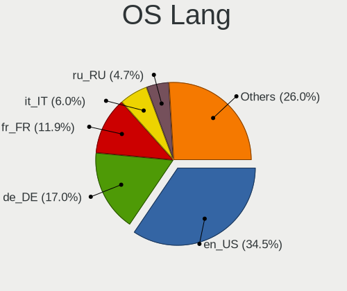
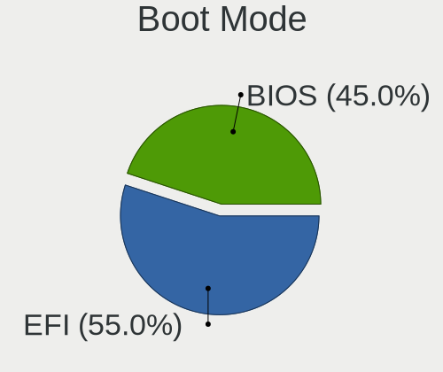
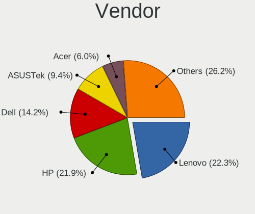
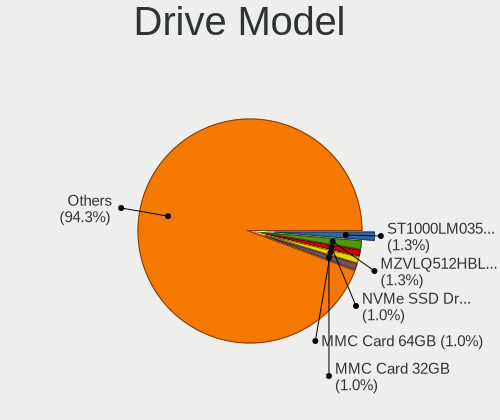
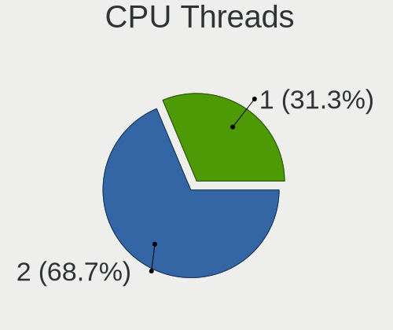
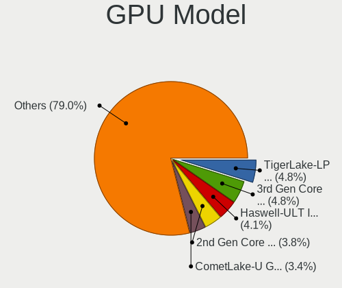
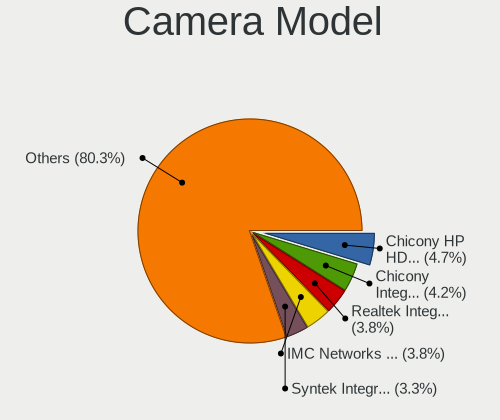

Ubuntu MATE 22.04 - Tested Hardware & Statistics (Notebooks)
------------------------------------------------------------

A project to collect tested hardware configurations for Ubuntu MATE 22.04.

Anyone can contribute to this report by the [hw-probe](https://github.com/linuxhw/hw-probe) tool:

    sudo -E hw-probe -all -upload

Please contribute! Especially if your hardware is rare.

Contents
--------

* [ Test Cases ](#test-cases)

* [ System ](#system)
  - [ Kernel                   ](#kernel)
  - [ Kernel Family            ](#kernel-family)
  - [ Kernel Major Ver.        ](#kernel-major-ver)
  - [ Arch                     ](#arch)
  - [ DE                       ](#de)
  - [ Display Server           ](#display-server)
  - [ Display Manager          ](#display-manager)
  - [ OS Lang                  ](#os-lang)
  - [ Boot Mode                ](#boot-mode)
  - [ Filesystem               ](#filesystem)
  - [ Part. scheme             ](#part-scheme)
  - [ Dual Boot with Linux/BSD ](#dual-boot-with-linuxbsd)
  - [ Dual Boot (Win)          ](#dual-boot-win)

* [ Board ](#board)
  - [ Vendor                   ](#vendor)
  - [ Model                    ](#model)
  - [ Model Family             ](#model-family)
  - [ MFG Year                 ](#mfg-year)
  - [ Form Factor              ](#form-factor)
  - [ Secure Boot              ](#secure-boot)
  - [ Coreboot                 ](#coreboot)
  - [ RAM Size                 ](#ram-size)
  - [ RAM Used                 ](#ram-used)
  - [ Total Drives             ](#total-drives)
  - [ Has CD-ROM               ](#has-cd-rom)
  - [ Has Ethernet             ](#has-ethernet)
  - [ Has WiFi                 ](#has-wifi)
  - [ Has Bluetooth            ](#has-bluetooth)

* [ Location ](#location)
  - [ Country                  ](#country)
  - [ City                     ](#city)

* [ Drives ](#drives)
  - [ Drive Vendor             ](#drive-vendor)
  - [ Drive Model              ](#drive-model)
  - [ HDD Vendor               ](#hdd-vendor)
  - [ SSD Vendor               ](#ssd-vendor)
  - [ Drive Kind               ](#drive-kind)
  - [ Drive Connector          ](#drive-connector)
  - [ Drive Size               ](#drive-size)
  - [ Space Total              ](#space-total)
  - [ Space Used               ](#space-used)
  - [ Malfunc. Drives          ](#malfunc-drives)
  - [ Malfunc. Drive Vendor    ](#malfunc-drive-vendor)
  - [ Malfunc. HDD Vendor      ](#malfunc-hdd-vendor)
  - [ Malfunc. Drive Kind      ](#malfunc-drive-kind)
  - [ Failed Drives            ](#failed-drives)
  - [ Failed Drive Vendor      ](#failed-drive-vendor)
  - [ Drive Status             ](#drive-status)

* [ Storage controller ](#storage-controller)
  - [ Storage Vendor           ](#storage-vendor)
  - [ Storage Model            ](#storage-model)
  - [ Storage Kind             ](#storage-kind)

* [ Processor ](#processor)
  - [ CPU Vendor               ](#cpu-vendor)
  - [ CPU Model                ](#cpu-model)
  - [ CPU Model Family         ](#cpu-model-family)
  - [ CPU Cores                ](#cpu-cores)
  - [ CPU Sockets              ](#cpu-sockets)
  - [ CPU Threads              ](#cpu-threads)
  - [ CPU Op-Modes             ](#cpu-op-modes)
  - [ CPU Microcode            ](#cpu-microcode)
  - [ CPU Microarch            ](#cpu-microarch)

* [ Graphics ](#graphics)
  - [ GPU Vendor               ](#gpu-vendor)
  - [ GPU Model                ](#gpu-model)
  - [ GPU Combo                ](#gpu-combo)
  - [ GPU Driver               ](#gpu-driver)
  - [ GPU Memory               ](#gpu-memory)

* [ Monitor ](#monitor)
  - [ Monitor Vendor           ](#monitor-vendor)
  - [ Monitor Model            ](#monitor-model)
  - [ Monitor Resolution       ](#monitor-resolution)
  - [ Monitor Diagonal         ](#monitor-diagonal)
  - [ Monitor Width            ](#monitor-width)
  - [ Aspect Ratio             ](#aspect-ratio)
  - [ Monitor Area             ](#monitor-area)
  - [ Pixel Density            ](#pixel-density)
  - [ Multiple Monitors        ](#multiple-monitors)

* [ Network ](#network)
  - [ Net Controller Vendor    ](#net-controller-vendor)
  - [ Net Controller Model     ](#net-controller-model)
  - [ Wireless Vendor          ](#wireless-vendor)
  - [ Wireless Model           ](#wireless-model)
  - [ Ethernet Vendor          ](#ethernet-vendor)
  - [ Ethernet Model           ](#ethernet-model)
  - [ Net Controller Kind      ](#net-controller-kind)
  - [ Used Controller          ](#used-controller)
  - [ NICs                     ](#nics)
  - [ IPv6                     ](#ipv6)

* [ Bluetooth ](#bluetooth)
  - [ Bluetooth Vendor         ](#bluetooth-vendor)
  - [ Bluetooth Model          ](#bluetooth-model)

* [ Sound ](#sound)
  - [ Sound Vendor             ](#sound-vendor)
  - [ Sound Model              ](#sound-model)

* [ Memory ](#memory)
  - [ Memory Vendor            ](#memory-vendor)
  - [ Memory Model             ](#memory-model)
  - [ Memory Kind              ](#memory-kind)
  - [ Memory Form Factor       ](#memory-form-factor)
  - [ Memory Size              ](#memory-size)
  - [ Memory Speed             ](#memory-speed)

* [ Printers & scanners ](#printers--scanners)
  - [ Printer Vendor           ](#printer-vendor)
  - [ Printer Model            ](#printer-model)
  - [ Scanner Vendor           ](#scanner-vendor)
  - [ Scanner Model            ](#scanner-model)

* [ Camera ](#camera)
  - [ Camera Vendor            ](#camera-vendor)
  - [ Camera Model             ](#camera-model)

* [ Security ](#security)
  - [ Fingerprint Vendor       ](#fingerprint-vendor)
  - [ Fingerprint Model        ](#fingerprint-model)
  - [ Chipcard Vendor          ](#chipcard-vendor)
  - [ Chipcard Model           ](#chipcard-model)

* [ Unsupported ](#unsupported)
  - [ Unsupported Devices      ](#unsupported-devices)
  - [ Unsupported Device Types ](#unsupported-device-types)

Test Cases
----------

Total: 76

| Vendor        | Model                       | Probe                                                      | Date         |
|---------------|-----------------------------|------------------------------------------------------------|--------------|
| Notebook      | NJx0MU                      | [5df0554ade](https://linux-hardware.org/?probe=5df0554ade) | Oct 01, 2022 |
| Notebook      | NJx0MU                      | [9eba2a1ed4](https://linux-hardware.org/?probe=9eba2a1ed4) | Oct 01, 2022 |
| Notebook      | NJx0MU                      | [91c0e46209](https://linux-hardware.org/?probe=91c0e46209) | Sep 28, 2022 |
| Intel         | H81U                        | [9e4458528b](https://linux-hardware.org/?probe=9e4458528b) | Sep 25, 2022 |
| Notebook      | NJx0MU                      | [09411a9eb9](https://linux-hardware.org/?probe=09411a9eb9) | Sep 25, 2022 |
| Notebook      | NJx0MU                      | [25b9bc1637](https://linux-hardware.org/?probe=25b9bc1637) | Sep 24, 2022 |
| Notebook      | NJx0MU                      | [0cfbd1e652](https://linux-hardware.org/?probe=0cfbd1e652) | Sep 24, 2022 |
| Dell          | Precision 7760              | [f6600a1244](https://linux-hardware.org/?probe=f6600a1244) | Sep 22, 2022 |
| Intel         | Kabylake Platform           | [8b1c5eb5bf](https://linux-hardware.org/?probe=8b1c5eb5bf) | Sep 21, 2022 |
| Notebook      | NJx0MU                      | [c89ed0e55a](https://linux-hardware.org/?probe=c89ed0e55a) | Sep 20, 2022 |
| Notebook      | NJx0MU                      | [0a1fb0cc40](https://linux-hardware.org/?probe=0a1fb0cc40) | Sep 20, 2022 |
| Notebook      | NJx0MU                      | [47d871031b](https://linux-hardware.org/?probe=47d871031b) | Sep 19, 2022 |
| Notebook      | NJx0MU                      | [f27d1aacb6](https://linux-hardware.org/?probe=f27d1aacb6) | Sep 18, 2022 |
| Notebook      | NJx0MU                      | [2f9a798b3b](https://linux-hardware.org/?probe=2f9a798b3b) | Sep 18, 2022 |
| Notebook      | NJx0MU                      | [43264d7e6e](https://linux-hardware.org/?probe=43264d7e6e) | Sep 15, 2022 |
| Intel         | Kabylake Platform           | [9889cc50de](https://linux-hardware.org/?probe=9889cc50de) | Sep 14, 2022 |
| Acer          | Aspire 5050                 | [1961d1c468](https://linux-hardware.org/?probe=1961d1c468) | Sep 13, 2022 |
| Notebook      | NJx0MU                      | [a72ef6cb0b](https://linux-hardware.org/?probe=a72ef6cb0b) | Sep 13, 2022 |
| ASUSTek       | VivoBook_ASUSLaptop X712... | [64b8914cb2](https://linux-hardware.org/?probe=64b8914cb2) | Sep 12, 2022 |
| Notebook      | NJx0MU                      | [8c6f7ca8a0](https://linux-hardware.org/?probe=8c6f7ca8a0) | Sep 10, 2022 |
| LG Electro... | 17Z990-R.AAS8U1             | [2df5aeabed](https://linux-hardware.org/?probe=2df5aeabed) | Sep 08, 2022 |
| Notebook      | NJx0MU                      | [4ac227c8fe](https://linux-hardware.org/?probe=4ac227c8fe) | Sep 06, 2022 |
| Dell          | Precision 7760              | [e920197599](https://linux-hardware.org/?probe=e920197599) | Sep 05, 2022 |
| Notebook      | NJx0MU                      | [928ba60e7e](https://linux-hardware.org/?probe=928ba60e7e) | Sep 05, 2022 |
| HP            | Pavilion 15                 | [194bb33f3d](https://linux-hardware.org/?probe=194bb33f3d) | Sep 04, 2022 |
| Dell          | Inspiron 7720               | [0749c352d0](https://linux-hardware.org/?probe=0749c352d0) | Sep 03, 2022 |
| Notebook      | NJx0MU                      | [fd02bdd474](https://linux-hardware.org/?probe=fd02bdd474) | Sep 02, 2022 |
| HP            | Notebook                    | [573d359faf](https://linux-hardware.org/?probe=573d359faf) | Aug 31, 2022 |
| HP            | 15 Notebook PC              | [1109650747](https://linux-hardware.org/?probe=1109650747) | Aug 31, 2022 |
| Notebook      | NJx0MU                      | [169efa4465](https://linux-hardware.org/?probe=169efa4465) | Aug 31, 2022 |
| Notebook      | NJx0MU                      | [81d8e17fed](https://linux-hardware.org/?probe=81d8e17fed) | Aug 31, 2022 |
| Notebook      | NJx0MU                      | [5103a6fa3d](https://linux-hardware.org/?probe=5103a6fa3d) | Aug 30, 2022 |
| Notebook      | NJx0MU                      | [d9d556aea3](https://linux-hardware.org/?probe=d9d556aea3) | Aug 26, 2022 |
| Notebook      | NJx0MU                      | [90476bcf5e](https://linux-hardware.org/?probe=90476bcf5e) | Aug 25, 2022 |
| LincPlus      | LINNCPLUS P1                | [516427e0e9](https://linux-hardware.org/?probe=516427e0e9) | Aug 23, 2022 |
| Lenovo        | IdeaPad Gaming 3 15ARH05... | [5028378988](https://linux-hardware.org/?probe=5028378988) | Aug 23, 2022 |
| Notebook      | NJx0MU                      | [7a86bdf14e](https://linux-hardware.org/?probe=7a86bdf14e) | Aug 22, 2022 |
| Dell          | Latitude 7420               | [d599ef65fd](https://linux-hardware.org/?probe=d599ef65fd) | Aug 20, 2022 |
| Lenovo        | IdeaPad 3 15IIL05 81WE      | [4efd818377](https://linux-hardware.org/?probe=4efd818377) | Aug 19, 2022 |
| HP            | EliteBook 745 G5            | [7e8d33a07f](https://linux-hardware.org/?probe=7e8d33a07f) | Aug 16, 2022 |
| Lenovo        | ThinkBook 14 G2 ITL 20VD    | [644fbe551a](https://linux-hardware.org/?probe=644fbe551a) | Aug 13, 2022 |
| Dell          | Latitude E7470              | [61d0b104e9](https://linux-hardware.org/?probe=61d0b104e9) | Aug 13, 2022 |
| HP            | 15 Notebook PC              | [46aa83aeb4](https://linux-hardware.org/?probe=46aa83aeb4) | Aug 07, 2022 |
| HONOR         | BOHK-WAX9X                  | [3d426cb1de](https://linux-hardware.org/?probe=3d426cb1de) | Aug 04, 2022 |
| Lenovo        | Legion R9000P2021H 82JQ     | [4f2ba69c49](https://linux-hardware.org/?probe=4f2ba69c49) | Jul 27, 2022 |
| Dell          | Latitude E4200              | [6cc0415a8a](https://linux-hardware.org/?probe=6cc0415a8a) | Jul 21, 2022 |
| Compaq        | Presario CQ-23              | [589a41e629](https://linux-hardware.org/?probe=589a41e629) | Jul 14, 2022 |
| HONOR         | BOHK-WAX9X                  | [4070d60511](https://linux-hardware.org/?probe=4070d60511) | Jul 05, 2022 |
| MicroByte     | ezbook                      | [91b1fc169b](https://linux-hardware.org/?probe=91b1fc169b) | Jun 28, 2022 |
| Dell          | XPS 17 9710                 | [6e16eed17c](https://linux-hardware.org/?probe=6e16eed17c) | Jun 26, 2022 |
| ASUSTek       | S550CM                      | [c7262ada04](https://linux-hardware.org/?probe=c7262ada04) | Jun 25, 2022 |
| HUAWEI        | KLVD-WXX9                   | [a8c98b76b4](https://linux-hardware.org/?probe=a8c98b76b4) | Jun 24, 2022 |
| Lenovo        | ThinkPad E15 Gen 2 20TDS... | [10de805cb0](https://linux-hardware.org/?probe=10de805cb0) | Jun 24, 2022 |
| Google        | Kled                        | [5f47e6d3e3](https://linux-hardware.org/?probe=5f47e6d3e3) | Jun 16, 2022 |
| Google        | Kled                        | [6a566134c4](https://linux-hardware.org/?probe=6a566134c4) | Jun 16, 2022 |
| Lenovo        | ThinkPad E15 Gen 2 20TDS... | [f7abc9fae0](https://linux-hardware.org/?probe=f7abc9fae0) | Jun 14, 2022 |
| Lenovo        | V15 G2 ITL 82KB             | [e956f6b0b8](https://linux-hardware.org/?probe=e956f6b0b8) | Jun 09, 2022 |
| HONOR         | BOHK-WAX9X                  | [30b6c5f641](https://linux-hardware.org/?probe=30b6c5f641) | Jun 09, 2022 |
| HP            | EliteBook 8560p             | [9bfdb902ce](https://linux-hardware.org/?probe=9bfdb902ce) | Jun 08, 2022 |
| Intel         | Kabylake Platform           | [074fd90c6a](https://linux-hardware.org/?probe=074fd90c6a) | Jun 06, 2022 |
| TrekStor      | Surfbook A13B               | [a42b3de31a](https://linux-hardware.org/?probe=a42b3de31a) | Jun 05, 2022 |
| Dell          | Precision M6500             | [1b68d2ca74](https://linux-hardware.org/?probe=1b68d2ca74) | Jun 01, 2022 |
| HONOR         | BOHK-WAX9X                  | [7941caaa08](https://linux-hardware.org/?probe=7941caaa08) | May 29, 2022 |
| Apple         | MacBook5,1                  | [74e6dbe9af](https://linux-hardware.org/?probe=74e6dbe9af) | May 23, 2022 |
| Apple         | MacBook5,1                  | [a53d746d08](https://linux-hardware.org/?probe=a53d746d08) | May 23, 2022 |
| ASUSTek       | VivoBook_ASUSLaptop X509... | [5107890ffd](https://linux-hardware.org/?probe=5107890ffd) | May 15, 2022 |
| Sony          | VPCEA36FG                   | [0161a27629](https://linux-hardware.org/?probe=0161a27629) | May 13, 2022 |
| HONOR         | BOHK-WAX9X                  | [e6c4aaa3d8](https://linux-hardware.org/?probe=e6c4aaa3d8) | May 12, 2022 |
| Lenovo        | ThinkBook 16p Gen 2 20YM    | [e99cdba363](https://linux-hardware.org/?probe=e99cdba363) | May 07, 2022 |
| HP            | EliteBook 840 G5            | [a53b09a7f3](https://linux-hardware.org/?probe=a53b09a7f3) | May 07, 2022 |
| HYPERPC       | PLAY                        | [408e86d04f](https://linux-hardware.org/?probe=408e86d04f) | May 06, 2022 |
| Apple         | MacBookPro6,2               | [ebaaf4a69b](https://linux-hardware.org/?probe=ebaaf4a69b) | May 01, 2022 |
| Apple         | MacBookPro9,1               | [35b3b3ae30](https://linux-hardware.org/?probe=35b3b3ae30) | Apr 26, 2022 |
| Apple         | MacBookPro9,1               | [faf447a067](https://linux-hardware.org/?probe=faf447a067) | Apr 24, 2022 |
| IPASON        | MaxBook P1                  | [d66d062f54](https://linux-hardware.org/?probe=d66d062f54) | Apr 05, 2022 |
| Lenovo        | ThinkPad SL500 27463ZG      | [b746a25ff1](https://linux-hardware.org/?probe=b746a25ff1) | Jan 28, 2022 |

System
------

Kernel
------

Version of the Linux kernel

| Version               | Notebooks | Percent |
|-----------------------|-----------|---------|
| 5.15.0-47-generic     | 6         | 13.33%  |
| 5.15.0-46-generic     | 6         | 13.33%  |
| 5.15.0-40-generic     | 5         | 11.11%  |
| 5.15.0-25-generic     | 5         | 11.11%  |
| 5.15.0-43-generic     | 3         | 6.67%   |
| 5.15.0-30-generic     | 3         | 6.67%   |
| 5.15.0-27-generic     | 3         | 6.67%   |
| 5.15.0-41-generic     | 2         | 4.44%   |
| 5.15.0-37-generic     | 2         | 4.44%   |
| 5.18.0-051800-generic | 1         | 2.22%   |
| 5.17.1-051701-generic | 1         | 2.22%   |
| 5.17.0-1003-oem       | 1         | 2.22%   |
| 5.15.0-48-lowlatency  | 1         | 2.22%   |
| 5.15.0-48-generic     | 1         | 2.22%   |
| 5.15.0-46-lowlatency  | 1         | 2.22%   |
| 5.15.0-39-generic     | 1         | 2.22%   |
| 5.15.0-35-generic     | 1         | 2.22%   |
| 5.15.0-33-generic     | 1         | 2.22%   |
| 5.15.0-18-generic     | 1         | 2.22%   |

Kernel Family
-------------

Linux kernel without a distro release

| Version | Notebooks | Percent |
|---------|-----------|---------|
| 5.15.0  | 37        | 92.5%   |
| 5.18.0  | 1         | 2.5%    |
| 5.17.1  | 1         | 2.5%    |
| 5.17.0  | 1         | 2.5%    |

Kernel Major Ver.
-----------------

Linux kernel major version

| Version | Notebooks | Percent |
|---------|-----------|---------|
| 5.15    | 37        | 92.5%   |
| 5.17    | 2         | 5%      |
| 5.18    | 1         | 2.5%    |

Arch
----

OS architecture (x86_64, i586, etc.)

| Name   | Notebooks | Percent |
|--------|-----------|---------|
| x86_64 | 40        | 100%    |

DE
--

Desktop Environment

| Name | Notebooks | Percent |
|------|-----------|---------|
| MATE | 40        | 100%    |

Display Server
--------------

X11 or Wayland

| Name | Notebooks | Percent |
|------|-----------|---------|
| X11  | 40        | 100%    |

Display Manager
---------------

SDDM, LightDM, etc.

| Name    | Notebooks | Percent |
|---------|-----------|---------|
| LightDM | 33        | 82.5%   |
| Unknown | 5         | 12.5%   |
| GDM3    | 2         | 5%      |

OS Lang
-------

Language

| Lang  | Notebooks | Percent |
|-------|-----------|---------|
| en_US | 20        | 50%     |
| de_DE | 5         | 12.5%   |
| it_IT | 4         | 10%     |
| ru_RU | 3         | 7.5%    |
| fr_FR | 3         | 7.5%    |
| pt_BR | 2         | 5%      |
| zh_CN | 1         | 2.5%    |
| es_ES | 1         | 2.5%    |
| en_AU | 1         | 2.5%    |

Boot Mode
---------

EFI or BIOS

| Mode | Notebooks | Percent |
|------|-----------|---------|
| EFI  | 25        | 59.52%  |
| BIOS | 17        | 40.48%  |

Filesystem
----------

Type of filesystem

| Type    | Notebooks | Percent |
|---------|-----------|---------|
| Ext4    | 33        | 82.5%   |
| Zfs     | 3         | 7.5%    |
| Overlay | 2         | 5%      |
| Jfs     | 1         | 2.5%    |
| Btrfs   | 1         | 2.5%    |

Part. scheme
------------

Scheme of partitioning

| Type    | Notebooks | Percent |
|---------|-----------|---------|
| GPT     | 26        | 65%     |
| Unknown | 12        | 30%     |
| MBR     | 2         | 5%      |

Dual Boot with Linux/BSD
------------------------

Hosting more than one Linux/BSD

| Dual boot | Notebooks | Percent |
|-----------|-----------|---------|
| No        | 33        | 82.5%   |
| Yes       | 7         | 17.5%   |

Dual Boot (Win)
---------------

Hosting Linux and Windows

| Dual boot | Notebooks | Percent |
|-----------|-----------|---------|
| No        | 26        | 65%     |
| Yes       | 14        | 35%     |

Board
-----

Vendor
------

Motherboard manufacturer

| Name             | Notebooks | Percent |
|------------------|-----------|---------|
| Lenovo           | 7         | 17.5%   |
| Hewlett-Packard  | 6         | 15%     |
| Dell             | 6         | 15%     |
| ASUSTek Computer | 3         | 7.5%    |
| Apple            | 3         | 7.5%    |
| Intel            | 2         | 5%      |
| TrekStor         | 1         | 2.5%    |
| Sony             | 1         | 2.5%    |
| Notebook         | 1         | 2.5%    |
| MicroByte        | 1         | 2.5%    |
| LincPlus         | 1         | 2.5%    |
| LG Electronics   | 1         | 2.5%    |
| IPASON           | 1         | 2.5%    |
| HYPERPC          | 1         | 2.5%    |
| HUAWEI           | 1         | 2.5%    |
| HONOR            | 1         | 2.5%    |
| Google           | 1         | 2.5%    |
| Compaq           | 1         | 2.5%    |
| Acer             | 1         | 2.5%    |

Model
-----

Motherboard model

| Name                                   | Notebooks | Percent |
|----------------------------------------|-----------|---------|
| TrekStor Surfbook A13B                 | 1         | 2.5%    |
| Sony VPCEA36FG                         | 1         | 2.5%    |
| Notebook NJx0MU                        | 1         | 2.5%    |
| MicroByte ezbook                       | 1         | 2.5%    |
| LincPlus LINNCPLUS P1                  | 1         | 2.5%    |
| LG 17Z990-R.AAS8U1                     | 1         | 2.5%    |
| Lenovo V15 G2 ITL 82KB                 | 1         | 2.5%    |
| Lenovo ThinkPad SL500 27463ZG          | 1         | 2.5%    |
| Lenovo ThinkPad E15 Gen 2 20TDS0T500   | 1         | 2.5%    |
| Lenovo ThinkBook 16p Gen 2 20YM        | 1         | 2.5%    |
| Lenovo ThinkBook 14 G2 ITL 20VD        | 1         | 2.5%    |
| Lenovo IdeaPad Gaming 3 15ARH05 82EY   | 1         | 2.5%    |
| Lenovo IdeaPad 3 15IIL05 81WE          | 1         | 2.5%    |
| IPASON MaxBook P1                      | 1         | 2.5%    |
| Intel Kabylake Platform                | 1         | 2.5%    |
| Intel H81U                             | 1         | 2.5%    |
| HYPERPC PLAY                           | 1         | 2.5%    |
| HUAWEI KLVD-WXX9                       | 1         | 2.5%    |
| HONOR BOHK-WAX9X                       | 1         | 2.5%    |
| HP Pavilion 15                         | 1         | 2.5%    |
| HP Notebook                            | 1         | 2.5%    |
| HP EliteBook 8560p                     | 1         | 2.5%    |
| HP EliteBook 840 G5                    | 1         | 2.5%    |
| HP EliteBook 745 G5                    | 1         | 2.5%    |
| HP 15 Notebook PC                      | 1         | 2.5%    |
| Google Kled                            | 1         | 2.5%    |
| Dell XPS 17 9710                       | 1         | 2.5%    |
| Dell Precision M6500                   | 1         | 2.5%    |
| Dell Precision 7760                    | 1         | 2.5%    |
| Dell Latitude E4200                    | 1         | 2.5%    |
| Dell Latitude 7420                     | 1         | 2.5%    |
| Dell Inspiron 7720                     | 1         | 2.5%    |
| Compaq Presario CQ-23                  | 1         | 2.5%    |
| ASUS VivoBook_ASUSLaptop X712JA_X712JA | 1         | 2.5%    |
| ASUS VivoBook_ASUSLaptop X509BA_M509BA | 1         | 2.5%    |
| ASUS S550CM                            | 1         | 2.5%    |
| Apple MacBookPro9,1                    | 1         | 2.5%    |
| Apple MacBookPro6,2                    | 1         | 2.5%    |
| Apple MacBook5,1                       | 1         | 2.5%    |
| Acer Aspire 5050                       | 1         | 2.5%    |

Model Family
------------

Motherboard model prefix

| Name               | Notebooks | Percent |
|--------------------|-----------|---------|
| HP EliteBook       | 3         | 7.5%    |
| Lenovo ThinkPad    | 2         | 5%      |
| Lenovo ThinkBook   | 2         | 5%      |
| Lenovo IdeaPad     | 2         | 5%      |
| Dell Precision     | 2         | 5%      |
| Dell Latitude      | 2         | 5%      |
| ASUS VivoBook      | 2         | 5%      |
| TrekStor Surfbook  | 1         | 2.5%    |
| Sony VPCEA36FG     | 1         | 2.5%    |
| Notebook NJx0MU    | 1         | 2.5%    |
| MicroByte ezbook   | 1         | 2.5%    |
| LincPlus LINNCPLUS | 1         | 2.5%    |
| LG 17Z990-R.AAS8U1 | 1         | 2.5%    |
| Lenovo V15         | 1         | 2.5%    |
| IPASON MaxBook     | 1         | 2.5%    |
| Intel Kabylake     | 1         | 2.5%    |
| Intel H81U         | 1         | 2.5%    |
| HYPERPC PLAY       | 1         | 2.5%    |
| HUAWEI KLVD-WXX9   | 1         | 2.5%    |
| HONOR BOHK-WAX9X   | 1         | 2.5%    |
| HP Pavilion        | 1         | 2.5%    |
| HP Notebook        | 1         | 2.5%    |
| HP 15              | 1         | 2.5%    |
| Google Kled        | 1         | 2.5%    |
| Dell XPS           | 1         | 2.5%    |
| Dell Inspiron      | 1         | 2.5%    |
| Compaq Presario    | 1         | 2.5%    |
| ASUS S550CM        | 1         | 2.5%    |
| Apple MacBookPro9  | 1         | 2.5%    |
| Apple MacBookPro6  | 1         | 2.5%    |
| Apple MacBook5     | 1         | 2.5%    |
| Acer Aspire        | 1         | 2.5%    |

MFG Year
--------

Motherboard manufacture year

| Year | Notebooks | Percent |
|------|-----------|---------|
| 2021 | 12        | 30%     |
| 2020 | 5         | 12.5%   |
| 2019 | 4         | 10%     |
| 2018 | 3         | 7.5%    |
| 2012 | 3         | 7.5%    |
| 2010 | 3         | 7.5%    |
| 2009 | 2         | 5%      |
| 2022 | 1         | 2.5%    |
| 2017 | 1         | 2.5%    |
| 2016 | 1         | 2.5%    |
| 2015 | 1         | 2.5%    |
| 2013 | 1         | 2.5%    |
| 2011 | 1         | 2.5%    |
| 2008 | 1         | 2.5%    |
| 2006 | 1         | 2.5%    |

Form Factor
-----------

Physical design of the computer

| Name     | Notebooks | Percent |
|----------|-----------|---------|
| Notebook | 40        | 100%    |

Secure Boot
-----------

Enabled or disabled

| State    | Notebooks | Percent |
|----------|-----------|---------|
| Disabled | 36        | 85.71%  |
| Enabled  | 6         | 14.29%  |

Coreboot
--------

Have coreboot on board

| Used | Notebooks | Percent |
|------|-----------|---------|
| No   | 39        | 97.5%   |
| Yes  | 1         | 2.5%    |

RAM Size
--------

Total RAM memory

| Size in GB  | Notebooks | Percent |
|-------------|-----------|---------|
| 4.01-8.0    | 11        | 27.5%   |
| 3.01-4.0    | 8         | 20%     |
| 16.01-24.0  | 8         | 20%     |
| 8.01-16.0   | 8         | 20%     |
| 32.01-64.0  | 3         | 7.5%    |
| 64.01-256.0 | 2         | 5%      |

RAM Used
--------

Used RAM memory

| Used GB   | Notebooks | Percent |
|-----------|-----------|---------|
| 2.01-3.0  | 14        | 32.56%  |
| 3.01-4.0  | 10        | 23.26%  |
| 1.01-2.0  | 10        | 23.26%  |
| 4.01-8.0  | 6         | 13.95%  |
| 8.01-16.0 | 2         | 4.65%   |
| 0.51-1.0  | 1         | 2.33%   |

Total Drives
------------

Number of drives on board

| Drives | Notebooks | Percent |
|--------|-----------|---------|
| 1      | 32        | 80%     |
| 2      | 6         | 15%     |
| 3      | 2         | 5%      |

Has CD-ROM
----------

Has CD-ROM on board

| Presented | Notebooks | Percent |
|-----------|-----------|---------|
| No        | 26        | 65%     |
| Yes       | 14        | 35%     |

Has Ethernet
------------

Has Ethernet on board

| Presented | Notebooks | Percent |
|-----------|-----------|---------|
| Yes       | 29        | 72.5%   |
| No        | 11        | 27.5%   |

Has WiFi
--------

Has WiFi module

| Presented | Notebooks | Percent |
|-----------|-----------|---------|
| Yes       | 40        | 100%    |

Has Bluetooth
-------------

Has Bluetooth module

| Presented | Notebooks | Percent |
|-----------|-----------|---------|
| Yes       | 34        | 85%     |
| No        | 6         | 15%     |

Location
--------

Country
-------

Geographic location (country)

| Country     | Notebooks | Percent |
|-------------|-----------|---------|
| Italy       | 6         | 15%     |
| Germany     | 6         | 15%     |
| USA         | 5         | 12.5%   |
| Brazil      | 4         | 10%     |
| Spain       | 3         | 7.5%    |
| Russia      | 3         | 7.5%    |
| France      | 2         | 5%      |
| UK          | 1         | 2.5%    |
| Turkey      | 1         | 2.5%    |
| Serbia      | 1         | 2.5%    |
| Romania     | 1         | 2.5%    |
| Paraguay    | 1         | 2.5%    |
| Netherlands | 1         | 2.5%    |
| India       | 1         | 2.5%    |
| Georgia     | 1         | 2.5%    |
| Estonia     | 1         | 2.5%    |
| Colombia    | 1         | 2.5%    |
| China       | 1         | 2.5%    |

City
----

Geographic location (city)

| City              | Notebooks | Percent |
|-------------------|-----------|---------|
| Mannheim          | 2         | 4.88%   |
| Xining            | 1         | 2.44%   |
| Thane             | 1         | 2.44%   |
| Seville           | 1         | 2.44%   |
| Settimo Torinese  | 1         | 2.44%   |
| Sao Paulo         | 1         | 2.44%   |
| Rostov-on-Don     | 1         | 2.44%   |
| Porto Alegre      | 1         | 2.44%   |
| Pärnu            | 1         | 2.44%   |
| Paris             | 1         | 2.44%   |
| Ortuella          | 1         | 2.44%   |
| North Wilkesboro  | 1         | 2.44%   |
| Newport News      | 1         | 2.44%   |
| Naaldwijk         | 1         | 2.44%   |
| Moscow            | 1         | 2.44%   |
| Milan             | 1         | 2.44%   |
| Memphis           | 1         | 2.44%   |
| Medellín         | 1         | 2.44%   |
| Marseille         | 1         | 2.44%   |
| Magdeburg         | 1         | 2.44%   |
| Limbiate          | 1         | 2.44%   |
| Laubach           | 1         | 2.44%   |
| la Nucia          | 1         | 2.44%   |
| K'alak'i T'bilisi | 1         | 2.44%   |
| Jundiaí          | 1         | 2.44%   |
| Iesi              | 1         | 2.44%   |
| Hamburg           | 1         | 2.44%   |
| Guarulhos         | 1         | 2.44%   |
| Edinburgh         | 1         | 2.44%   |
| College Station   | 1         | 2.44%   |
| Casale Litta      | 1         | 2.44%   |
| Caltagirone       | 1         | 2.44%   |
| Bucharest         | 1         | 2.44%   |
| Berlin            | 1         | 2.44%   |
| Belgrade          | 1         | 2.44%   |
| Barnaul           | 1         | 2.44%   |
| Bakersfield       | 1         | 2.44%   |
| Avigliano         | 1         | 2.44%   |
| Asunción         | 1         | 2.44%   |
| Artvin            | 1         | 2.44%   |

Drives
------

Drive Vendor
------------

Hard drive vendors

| Vendor              | Notebooks | Drives | Percent |
|---------------------|-----------|--------|---------|
| Samsung Electronics | 11        | 15     | 22.92%  |
| Toshiba             | 6         | 7      | 12.5%   |
| Crucial             | 5         | 5      | 10.42%  |
| Unknown             | 2         | 2      | 4.17%   |
| SanDisk             | 2         | 5      | 4.17%   |
| Phison              | 2         | 2      | 4.17%   |
| Kingston            | 2         | 2      | 4.17%   |
| KingSpec            | 2         | 2      | 4.17%   |
| WDC                 | 1         | 1      | 2.08%   |
| SK hynix            | 1         | 1      | 2.08%   |
| Seagate             | 1         | 1      | 2.08%   |
| Micron Technology   | 1         | 1      | 2.08%   |
| Lenovo              | 1         | 1      | 2.08%   |
| Kston               | 1         | 1      | 2.08%   |
| KIOXIA              | 1         | 1      | 2.08%   |
| JMicron Technology  | 1         | 1      | 2.08%   |
| Intenso             | 1         | 1      | 2.08%   |
| Intel               | 1         | 1      | 2.08%   |
| Hjwdz               | 1         | 1      | 2.08%   |
| Hitachi             | 1         | 1      | 2.08%   |
| Gigabyte Technology | 1         | 1      | 2.08%   |
| faspeed             | 1         | 1      | 2.08%   |
| China               | 1         | 1      | 2.08%   |
| A-DATA Technology   | 1         | 1      | 2.08%   |

Drive Model
-----------

Hard drive models

| Model                                | Notebooks | Percent |
|--------------------------------------|-----------|---------|
| Crucial CT240BX500SSD1 240GB         | 2         | 4.08%   |
| Crucial CT1000BX500SSD1 1TB          | 2         | 4.08%   |
| WDC PC SN730 SDBPNTY-1T00-1101 1TB   | 1         | 2.04%   |
| Unknown SLD64G  64GB                 | 1         | 2.04%   |
| Unknown Biwin  64GB                  | 1         | 2.04%   |
| Toshiba THNSNK256GVN8 256GB SSD      | 1         | 2.04%   |
| Toshiba MQ04ABF100 1TB               | 1         | 2.04%   |
| Toshiba MQ01ABF050 500GB             | 1         | 2.04%   |
| Toshiba MK3259GSXP 320GB             | 1         | 2.04%   |
| Toshiba KBG40ZNT256G MEMORY 256GB    | 1         | 2.04%   |
| Toshiba KBG30ZMV256G 256GB           | 1         | 2.04%   |
| SK hynix HFM128GDJTNG-8310A 128GB    | 1         | 2.04%   |
| Seagate ST2000LM015-2E8174 2TB       | 1         | 2.04%   |
| SanDisk SSD U100 24GB                | 1         | 2.04%   |
| SanDisk NVMe SSD Drive 512GB         | 1         | 2.04%   |
| Samsung SSD PM830 mSATA 32GB         | 1         | 2.04%   |
| Samsung SSD PM800 TM 128GB           | 1         | 2.04%   |
| Samsung SSD 980 PRO 1TB              | 1         | 2.04%   |
| Samsung SSD 860 EVO 250GB            | 1         | 2.04%   |
| Samsung SSD 850 EVO 250GB            | 1         | 2.04%   |
| Samsung PM9A1 NVMe 512GB             | 1         | 2.04%   |
| Samsung NVMe SSD Drive 256GB         | 1         | 2.04%   |
| Samsung MZVL2512HCJQ-00B00 512GB     | 1         | 2.04%   |
| Samsung MZNLN512HAJQ-00000 512GB SSD | 1         | 2.04%   |
| Samsung MZALQ512HBLU-00BL2 512GB     | 1         | 2.04%   |
| Samsung MZALQ512HALU-000L2 512GB     | 1         | 2.04%   |
| Samsung MZALQ256HBJD-00BL1 256GB     | 1         | 2.04%   |
| Phison HYPERPC-SSD2000GP50 2TB       | 1         | 2.04%   |
| Phison 311CD0512GB                   | 1         | 2.04%   |
| Micron 1100 SATA 512GB SSD           | 1         | 2.04%   |
| Lenovo NVMe SSD Drive 256GB          | 1         | 2.04%   |
| Kston SSD 64GB                       | 1         | 2.04%   |
| KIOXIA KXG70PNV2T04 NVMe 2048GB      | 1         | 2.04%   |
| Kingston SV300S37A60G 64GB SSD       | 1         | 2.04%   |
| Kingston SA400S37480G 480GB SSD      | 1         | 2.04%   |
| KingSpec P3-256 256GB                | 1         | 2.04%   |
| KingSpec MT-128 128GB SSD            | 1         | 2.04%   |
| JMicron Generic 120GB                | 1         | 2.04%   |
| Intenso SSD Sata III 120GB           | 1         | 2.04%   |
| Intel SSDPEKNW020T8 2TB              | 1         | 2.04%   |

HDD Vendor
----------

Hard disk drive vendors

| Vendor  | Notebooks | Drives | Percent |
|---------|-----------|--------|---------|
| Toshiba | 3         | 3      | 60%     |
| Seagate | 1         | 1      | 20%     |
| Hitachi | 1         | 1      | 20%     |

SSD Vendor
----------

Solid state drive vendors

| Vendor              | Notebooks | Drives | Percent |
|---------------------|-----------|--------|---------|
| Crucial             | 5         | 5      | 25%     |
| Samsung Electronics | 4         | 5      | 20%     |
| Kingston            | 2         | 2      | 10%     |
| KingSpec            | 2         | 2      | 10%     |
| Toshiba             | 1         | 2      | 5%      |
| SanDisk             | 1         | 1      | 5%      |
| Micron Technology   | 1         | 1      | 5%      |
| Kston               | 1         | 1      | 5%      |
| Intenso             | 1         | 1      | 5%      |
| China               | 1         | 1      | 5%      |
| A-DATA Technology   | 1         | 1      | 5%      |

Drive Kind
----------

HDD or SSD

| Kind    | Notebooks | Drives | Percent |
|---------|-----------|--------|---------|
| NVMe    | 19        | 25     | 43.18%  |
| SSD     | 17        | 22     | 38.64%  |
| HDD     | 4         | 5      | 9.09%   |
| MMC     | 2         | 2      | 4.55%   |
| Unknown | 2         | 2      | 4.55%   |

Drive Connector
---------------

SATA, SAS, NVMe, etc.

| Type | Notebooks | Drives | Percent |
|------|-----------|--------|---------|
| SATA | 22        | 28     | 50%     |
| NVMe | 18        | 24     | 40.91%  |
| SAS  | 2         | 2      | 4.55%   |
| MMC  | 2         | 2      | 4.55%   |

Drive Size
----------

Size of hard drive

| Size in TB | Notebooks | Drives | Percent |
|------------|-----------|--------|---------|
| 0.01-0.5   | 16        | 20     | 69.57%  |
| 0.51-1.0   | 6         | 6      | 26.09%  |
| 1.01-2.0   | 1         | 1      | 4.35%   |

Space Total
-----------

Amount of disk space available on the file system

| Size in GB     | Notebooks | Percent |
|----------------|-----------|---------|
| 101-250        | 15        | 37.5%   |
| 251-500        | 8         | 20%     |
| 1-20           | 4         | 10%     |
| 1001-2000      | 3         | 7.5%    |
| 501-1000       | 3         | 7.5%    |
| 21-50          | 2         | 5%      |
| 51-100         | 2         | 5%      |
| More than 3000 | 1         | 2.5%    |
| 2001-3000      | 1         | 2.5%    |
| Unknown        | 1         | 2.5%    |

Space Used
----------

Amount of used disk space

| Used GB   | Notebooks | Percent |
|-----------|-----------|---------|
| 1-20      | 12        | 29.27%  |
| 21-50     | 8         | 19.51%  |
| 101-250   | 8         | 19.51%  |
| 51-100    | 5         | 12.2%   |
| 1001-2000 | 3         | 7.32%   |
| 501-1000  | 2         | 4.88%   |
| 251-500   | 1         | 2.44%   |
| 2001-3000 | 1         | 2.44%   |
| Unknown   | 1         | 2.44%   |

Malfunc. Drives
---------------

Drive models with a malfunction

Zero info for selected period =(

Malfunc. Drive Vendor
---------------------

Vendors of faulty drives

Zero info for selected period =(

Malfunc. HDD Vendor
-------------------

Vendors of faulty HDD drives

Zero info for selected period =(

Malfunc. Drive Kind
-------------------

Kinds of faulty drives

Zero info for selected period =(

Failed Drives
-------------

Failed drive models

Zero info for selected period =(

Failed Drive Vendor
-------------------

Failed drive vendors

Zero info for selected period =(

Drive Status
------------

Number of failed and malfunc. drives

| Status   | Notebooks | Drives | Percent |
|----------|-----------|--------|---------|
| Works    | 27        | 35     | 62.79%  |
| Detected | 16        | 21     | 37.21%  |

Storage controller
------------------

Storage Vendor
--------------

Storage controller vendors

| Vendor                       | Notebooks | Percent |
|------------------------------|-----------|---------|
| Intel                        | 28        | 54.9%   |
| Samsung Electronics          | 7         | 13.73%  |
| AMD                          | 5         | 9.8%    |
| Phison Electronics           | 3         | 5.88%   |
| SanDisk                      | 2         | 3.92%   |
| KIOXIA                       | 2         | 3.92%   |
| Toshiba America Info Systems | 1         | 1.96%   |
| SK hynix                     | 1         | 1.96%   |
| Nvidia                       | 1         | 1.96%   |
| Lenovo                       | 1         | 1.96%   |

Storage Model
-------------

Storage controller models

| Model                                                                                  | Notebooks | Percent |
|----------------------------------------------------------------------------------------|-----------|---------|
| Samsung NVMe SSD Controller 980                                                        | 4         | 7.14%   |
| Intel 82801 Mobile SATA Controller [RAID mode]                                         | 4         | 7.14%   |
| Intel 7 Series Chipset Family 6-port SATA Controller [AHCI mode]                       | 4         | 7.14%   |
| AMD FCH SATA Controller [AHCI mode]                                                    | 4         | 7.14%   |
| Samsung NVMe SSD Controller PM9A1/PM9A3/980PRO                                         | 3         | 5.36%   |
| Intel Volume Management Device NVMe RAID Controller                                    | 3         | 5.36%   |
| Intel Tiger Lake-LP SATA Controller                                                    | 3         | 5.36%   |
| SanDisk WD Black SN750 / PC SN730 NVMe SSD                                             | 2         | 3.57%   |
| Phison E16 PCIe4 NVMe Controller                                                       | 2         | 3.57%   |
| Intel Celeron/Pentium Silver Processor SATA Controller                                 | 2         | 3.57%   |
| Intel Celeron N3350/Pentium N4200/Atom E3900 Series SATA AHCI Controller               | 2         | 3.57%   |
| Intel Atom Processor E3800 Series SATA AHCI Controller                                 | 2         | 3.57%   |
| Intel 5 Series/3400 Series Chipset 4 port SATA AHCI Controller                         | 2         | 3.57%   |
| Toshiba America Info Systems BG3 NVMe SSD Controller                                   | 1         | 1.79%   |
| SK hynix BC501 NVMe Solid State Drive                                                  | 1         | 1.79%   |
| Phison PS5013 E13 NVMe Controller                                                      | 1         | 1.79%   |
| Nvidia MCP79 AHCI Controller                                                           | 1         | 1.79%   |
| Lenovo Non-Volatile memory controller                                                  | 1         | 1.79%   |
| KIOXIA NVMe SSD Controller BG4                                                         | 1         | 1.79%   |
| KIOXIA Non-Volatile memory controller                                                  | 1         | 1.79%   |
| Intel Sunrise Point-LP SATA Controller [AHCI mode]                                     | 1         | 1.79%   |
| Intel SSD 660P Series                                                                  | 1         | 1.79%   |
| Intel Ice Lake-LP SATA Controller [AHCI mode]                                          | 1         | 1.79%   |
| Intel Comet Lake SATA AHCI Controller                                                  | 1         | 1.79%   |
| Intel Cannon Point-LP SATA Controller [AHCI Mode]                                      | 1         | 1.79%   |
| Intel 82801IBM/IEM (ICH9M/ICH9M-E) 4 port SATA Controller [AHCI mode]                  | 1         | 1.79%   |
| Intel 8 Series SATA Controller 1 [AHCI mode]                                           | 1         | 1.79%   |
| Intel 6 Series/C200 Series Chipset Family Mobile SATA Controller (IDE mode, ports 4-5) | 1         | 1.79%   |
| Intel 6 Series/C200 Series Chipset Family Mobile SATA Controller (IDE mode, ports 0-3) | 1         | 1.79%   |
| Intel 500 Series Chipset Family SATA AHCI Controller                                   | 1         | 1.79%   |
| AMD IXP SB4x0 Serial ATA Controller                                                    | 1         | 1.79%   |
| AMD IXP SB4x0 IDE Controller                                                           | 1         | 1.79%   |

Storage Kind
------------

Kind of storage controller (IDE, SATA, NVMe, SAS, ...)

| Kind | Notebooks | Percent |
|------|-----------|---------|
| SATA | 27        | 50%     |
| NVMe | 18        | 33.33%  |
| RAID | 7         | 12.96%  |
| IDE  | 2         | 3.7%    |

Processor
---------

CPU Vendor
----------

Processor vendors

| Vendor | Notebooks | Percent |
|--------|-----------|---------|
| Intel  | 33        | 82.5%   |
| AMD    | 7         | 17.5%   |

CPU Model
---------

Processor models

| Model                                           | Notebooks | Percent |
|-------------------------------------------------|-----------|---------|
| Intel 11th Gen Core i7-1165G7 @ 2.80GHz         | 3         | 7.5%    |
| Intel Pentium CPU N4200 @ 1.10GHz               | 1         | 2.5%    |
| Intel Pentium CPU N3540 @ 2.16GHz               | 1         | 2.5%    |
| Intel Core i7-8565U CPU @ 1.80GHz               | 1         | 2.5%    |
| Intel Core i7-7500U CPU @ 2.70GHz               | 1         | 2.5%    |
| Intel Core i7-3720QM CPU @ 2.60GHz              | 1         | 2.5%    |
| Intel Core i7-3630QM CPU @ 2.40GHz              | 1         | 2.5%    |
| Intel Core i7-3517U CPU @ 1.90GHz               | 1         | 2.5%    |
| Intel Core i7 CPU X 920 @ 2.00GHz               | 1         | 2.5%    |
| Intel Core i5-8250U CPU @ 1.60GHz               | 1         | 2.5%    |
| Intel Core i5-4300Y CPU @ 1.60GHz               | 1         | 2.5%    |
| Intel Core i5-2540M CPU @ 2.60GHz               | 1         | 2.5%    |
| Intel Core i5-1035G1 CPU @ 1.00GHz              | 1         | 2.5%    |
| Intel Core i5 CPU M 560 @ 2.67GHz               | 1         | 2.5%    |
| Intel Core i5 CPU M 520 @ 2.40GHz               | 1         | 2.5%    |
| Intel Core i3-3110M CPU @ 2.40GHz               | 1         | 2.5%    |
| Intel Core i3-10110U CPU @ 2.10GHz              | 1         | 2.5%    |
| Intel Core i3-1005G1 CPU @ 1.20GHz              | 1         | 2.5%    |
| Intel Core 2 Duo CPU U9600 @ 1.60GHz            | 1         | 2.5%    |
| Intel Core 2 Duo CPU T9550 @ 2.66GHz            | 1         | 2.5%    |
| Intel Core 2 Duo CPU P8600 @ 2.40GHz            | 1         | 2.5%    |
| Intel Celeron N4020 CPU @ 1.10GHz               | 1         | 2.5%    |
| Intel Celeron J4125 CPU @ 2.00GHz               | 1         | 2.5%    |
| Intel Celeron CPU N3450 @ 1.10GHz               | 1         | 2.5%    |
| Intel Celeron CPU N2830 @ 2.16GHz               | 1         | 2.5%    |
| Intel 11th Gen Core i9-11980HK @ 2.60GHz        | 1         | 2.5%    |
| Intel 11th Gen Core i9-11900H @ 2.50GHz         | 1         | 2.5%    |
| Intel 11th Gen Core i7-1185G7 @ 3.00GHz         | 1         | 2.5%    |
| Intel 11th Gen Core i7-11850H @ 2.50GHz         | 1         | 2.5%    |
| Intel 11th Gen Core i5-1135G7 @ 2.40GHz         | 1         | 2.5%    |
| Intel 11th Gen Core i3-1115G4 @ 3.00GHz         | 1         | 2.5%    |
| AMD Turion 64 Mobile Technology MK-38           | 1         | 2.5%    |
| AMD Ryzen 9 5900HX with Radeon Graphics         | 1         | 2.5%    |
| AMD Ryzen 7 PRO 2700U w/ Radeon Vega Mobile Gfx | 1         | 2.5%    |
| AMD Ryzen 7 3700U with Radeon Vega Mobile Gfx   | 1         | 2.5%    |
| AMD Ryzen 5 4600H with Radeon Graphics          | 1         | 2.5%    |
| AMD A8-7410 APU with AMD Radeon R5 Graphics     | 1         | 2.5%    |
| AMD A4-9125 RADEON R3, 4 COMPUTE CORES 2C+2G    | 1         | 2.5%    |

CPU Model Family
----------------

Processor model prefix

| Model                | Notebooks | Percent |
|----------------------|-----------|---------|
| Other                | 9         | 22.5%   |
| Intel Core i7        | 6         | 15%     |
| Intel Core i5        | 6         | 15%     |
| Intel Celeron        | 4         | 10%     |
| Intel Core i3        | 3         | 7.5%    |
| Intel Core 2 Duo     | 3         | 7.5%    |
| Intel Pentium        | 2         | 5%      |
| AMD Turion 64 Mobile | 1         | 2.5%    |
| AMD Ryzen 9          | 1         | 2.5%    |
| AMD Ryzen 7 PRO      | 1         | 2.5%    |
| AMD Ryzen 7          | 1         | 2.5%    |
| AMD Ryzen 5          | 1         | 2.5%    |
| AMD A8               | 1         | 2.5%    |
| AMD A4               | 1         | 2.5%    |

CPU Cores
---------

Number of processor cores

| Number | Notebooks | Percent |
|--------|-----------|---------|
| 4      | 18        | 45%     |
| 2      | 16        | 40%     |
| 8      | 4         | 10%     |
| 6      | 1         | 2.5%    |
| 1      | 1         | 2.5%    |

CPU Sockets
-----------

Number of sockets

| Number | Notebooks | Percent |
|--------|-----------|---------|
| 1      | 40        | 100%    |

CPU Threads
-----------

Threads per core (Hyper-Threading)

| Number | Notebooks | Percent |
|--------|-----------|---------|
| 2      | 28        | 70%     |
| 1      | 12        | 30%     |

CPU Op-Modes
------------

CPU Operation Modes (32-bit, 64-bit)

| Op mode        | Notebooks | Percent |
|----------------|-----------|---------|
| 32-bit, 64-bit | 40        | 100%    |

CPU Microcode
-------------

Microcode number

| Number     | Notebooks | Percent |
|------------|-----------|---------|
| Unknown    | 13        | 30.95%  |
| 0x806c1    | 5         | 11.9%   |
| 0x806d1    | 3         | 7.14%   |
| 0x706e5    | 2         | 4.76%   |
| 0x706a8    | 2         | 4.76%   |
| 0x506c9    | 2         | 4.76%   |
| 0x306a9    | 2         | 4.76%   |
| 0x1067a    | 2         | 4.76%   |
| 0x806ec    | 1         | 2.38%   |
| 0x806eb    | 1         | 2.38%   |
| 0x806ea    | 1         | 2.38%   |
| 0x806e9    | 1         | 2.38%   |
| 0x40651    | 1         | 2.38%   |
| 0x206a7    | 1         | 2.38%   |
| 0x20655    | 1         | 2.38%   |
| 0x0a50000c | 1         | 2.38%   |
| 0x08108109 | 1         | 2.38%   |
| 0x08101016 | 1         | 2.38%   |
| 0x07030105 | 1         | 2.38%   |

CPU Microarch
-------------

Microarchitecture

| Name          | Notebooks | Percent |
|---------------|-----------|---------|
| TigerLake     | 6         | 15%     |
| IceLake       | 5         | 12.5%   |
| KabyLake      | 4         | 10%     |
| IvyBridge     | 4         | 10%     |
| Penryn        | 3         | 7.5%    |
| Westmere      | 2         | 5%      |
| Silvermont    | 2         | 5%      |
| Goldmont plus | 2         | 5%      |
| Goldmont      | 2         | 5%      |
| Zen+          | 1         | 2.5%    |
| Zen 3         | 1         | 2.5%    |
| Zen 2         | 1         | 2.5%    |
| Zen           | 1         | 2.5%    |
| SandyBridge   | 1         | 2.5%    |
| Puma          | 1         | 2.5%    |
| Nehalem       | 1         | 2.5%    |
| K8 Hammer     | 1         | 2.5%    |
| Haswell       | 1         | 2.5%    |
| Excavator     | 1         | 2.5%    |

Graphics
--------

GPU Vendor
----------

Vendors of graphics cards

| Vendor | Notebooks | Percent |
|--------|-----------|---------|
| Intel  | 28        | 58.33%  |
| Nvidia | 11        | 22.92%  |
| AMD    | 9         | 18.75%  |

GPU Model
---------

Graphics card models

| Model                                                                              | Notebooks | Percent |
|------------------------------------------------------------------------------------|-----------|---------|
| Intel TigerLake-LP GT2 [Iris Xe Graphics]                                          | 5         | 10.42%  |
| Intel 3rd Gen Core processor Graphics Controller                                   | 3         | 6.25%   |
| Nvidia GA106M [GeForce RTX 3060 Mobile / Max-Q]                                    | 2         | 4.17%   |
| Intel TigerLake-H GT1 [UHD Graphics]                                               | 2         | 4.17%   |
| Intel Mobile 4 Series Chipset Integrated Graphics Controller                       | 2         | 4.17%   |
| Intel Iris Plus Graphics G1 (Ice Lake)                                             | 2         | 4.17%   |
| Intel GeminiLake [UHD Graphics 600]                                                | 2         | 4.17%   |
| Intel Atom Processor Z36xxx/Z37xxx Series Graphics & Display                       | 2         | 4.17%   |
| Nvidia TU117M [GeForce GTX 1650 Ti Mobile]                                         | 1         | 2.08%   |
| Nvidia GT216M [GeForce GT 330M]                                                    | 1         | 2.08%   |
| Nvidia GK107M [GeForce GT 650M]                                                    | 1         | 2.08%   |
| Nvidia GK107M [GeForce GT 650M Mac Edition]                                        | 1         | 2.08%   |
| Nvidia GF108M [GeForce GT 635M]                                                    | 1         | 2.08%   |
| Nvidia GA104M [GeForce RTX 3080 Mobile / Max-Q 8GB/16GB]                           | 1         | 2.08%   |
| Nvidia GA104GLM [RTX A3000 Mobile]                                                 | 1         | 2.08%   |
| Nvidia G92GLM [Quadro FX 2800M]                                                    | 1         | 2.08%   |
| Nvidia C79 [GeForce 9400M]                                                         | 1         | 2.08%   |
| Intel WhiskeyLake-U GT2 [UHD Graphics 620]                                         | 1         | 2.08%   |
| Intel UHD Graphics 620                                                             | 1         | 2.08%   |
| Intel Tiger Lake UHD Graphics                                                      | 1         | 2.08%   |
| Intel HD Graphics 620                                                              | 1         | 2.08%   |
| Intel HD Graphics 500                                                              | 1         | 2.08%   |
| Intel Haswell-ULT High Definition Audio Controller [HD Graphics]                   | 1         | 2.08%   |
| Intel Core Processor Integrated Graphics Controller                                | 1         | 2.08%   |
| Intel CometLake-U GT2 [UHD Graphics]                                               | 1         | 2.08%   |
| Intel Celeron N3350/Pentium N4200/Atom E3900 Series Integrated Graphics Controller | 1         | 2.08%   |
| Intel 2nd Generation Core Processor Family Integrated Graphics Controller          | 1         | 2.08%   |
| AMD Sun XT [Radeon HD 8670A/8670M/8690M / R5 M330 / M430 / Radeon 520 Mobile]      | 1         | 2.08%   |
| AMD Stoney [Radeon R2/R3/R4/R5 Graphics]                                           | 1         | 2.08%   |
| AMD RS482M [Mobility Radeon Xpress 200]                                            | 1         | 2.08%   |
| AMD Renoir                                                                         | 1         | 2.08%   |
| AMD Raven Ridge [Radeon Vega Series / Radeon Vega Mobile Series]                   | 1         | 2.08%   |
| AMD Picasso/Raven 2 [Radeon Vega Series / Radeon Vega Mobile Series]               | 1         | 2.08%   |
| AMD Mullins [Radeon R4/R5 Graphics]                                                | 1         | 2.08%   |
| AMD Madison [Mobility Radeon HD 5650/5750 / 6530M/6550M]                           | 1         | 2.08%   |
| AMD Cezanne                                                                        | 1         | 2.08%   |

GPU Combo
---------

Combinations of graphics cards

| Name           | Notebooks | Percent |
|----------------|-----------|---------|
| 1 x Intel      | 22        | 55%     |
| 1 x AMD        | 6         | 15%     |
| Intel + Nvidia | 5         | 12.5%   |
| 1 x Nvidia     | 4         | 10%     |
| AMD + Nvidia   | 2         | 5%      |
| Intel + AMD    | 1         | 2.5%    |

GPU Driver
----------

Free vs proprietary

| Driver      | Notebooks | Percent |
|-------------|-----------|---------|
| Free        | 34        | 85%     |
| Proprietary | 6         | 15%     |

GPU Memory
----------

Total video memory

| Size in GB | Notebooks | Percent |
|------------|-----------|---------|
| Unknown    | 32        | 78.05%  |
| 0.51-1.0   | 3         | 7.32%   |
| 0.01-0.5   | 3         | 7.32%   |
| 1.01-2.0   | 2         | 4.88%   |
| 5.01-6.0   | 1         | 2.44%   |

Monitor
-------

Monitor Vendor
--------------

Monitor vendors

| Vendor                  | Notebooks | Percent |
|-------------------------|-----------|---------|
| BOE                     | 8         | 17.39%  |
| Chimei Innolux          | 7         | 15.22%  |
| Samsung Electronics     | 5         | 10.87%  |
| LG Display              | 4         | 8.7%    |
| AU Optronics            | 3         | 6.52%   |
| Apple                   | 3         | 6.52%   |
| Chi Mei Optoelectronics | 2         | 4.35%   |
| AOC                     | 2         | 4.35%   |
| Toshiba                 | 1         | 2.17%   |
| Sony                    | 1         | 2.17%   |
| Sharp                   | 1         | 2.17%   |
| Sceptre Tech            | 1         | 2.17%   |
| Philips                 | 1         | 2.17%   |
| PANDA                   | 1         | 2.17%   |
| Lenovo                  | 1         | 2.17%   |
| Iiyama                  | 1         | 2.17%   |
| Hitachi                 | 1         | 2.17%   |
| HannStar                | 1         | 2.17%   |
| CS_                     | 1         | 2.17%   |
| BenQ                    | 1         | 2.17%   |

Monitor Model
-------------

Monitor models

| Model                                                                    | Notebooks | Percent |
|--------------------------------------------------------------------------|-----------|---------|
| Apple LCD Monitor APP9CA3 1440x900 331x207mm 15.4-inch                   | 2         | 4.35%   |
| Toshiba LCD Monitor LCD2109 1280x800 261x163mm 12.1-inch                 | 1         | 2.17%   |
| Sony LCD Monitor SNY05FA 1366x768 340x190mm 15.3-inch                    | 1         | 2.17%   |
| Sharp LCD Monitor SHP1517 3840x2400 366x229mm 17.0-inch                  | 1         | 2.17%   |
| Sceptre Tech E24 SPT099D 1920x1080 521x293mm 23.5-inch                   | 1         | 2.17%   |
| Samsung Electronics SMB2220N SAM06A2 1920x1080 480x270mm 21.7-inch       | 1         | 2.17%   |
| Samsung Electronics S22D300 SAM0B3F 1920x1080 477x268mm 21.5-inch        | 1         | 2.17%   |
| Samsung Electronics LCD Monitor SEC5442 1440x900 303x190mm 14.1-inch     | 1         | 2.17%   |
| Samsung Electronics LCD Monitor SEC5044 1920x1080 382x215mm 17.3-inch    | 1         | 2.17%   |
| Samsung Electronics LCD Monitor SEC334A 1366x768 344x194mm 15.5-inch     | 1         | 2.17%   |
| Philips 247EL PHLC084 1920x1080 521x293mm 23.5-inch                      | 1         | 2.17%   |
| PANDA LC133LF2L03 NCP0015 1920x1080 294x165mm 13.3-inch                  | 1         | 2.17%   |
| LG Display LCD Monitor LGD05F8 2560x1600 366x229mm 17.0-inch             | 1         | 2.17%   |
| LG Display LCD Monitor LGD05F1 1920x1080 309x174mm 14.0-inch             | 1         | 2.17%   |
| LG Display LCD Monitor LGD0493 1366x768 344x194mm 15.5-inch              | 1         | 2.17%   |
| LG Display LCD Monitor LGD034D 1366x768 344x194mm 15.5-inch              | 1         | 2.17%   |
| Lenovo LCD Monitor LEN4050 1280x800 331x207mm 15.4-inch                  | 1         | 2.17%   |
| Iiyama PL2773H IVM660A 1920x1080 598x336mm 27.0-inch                     | 1         | 2.17%   |
| Hitachi HISENSE HEC0030 3840x2160 1872x1053mm 84.6-inch                  | 1         | 2.17%   |
| HannStar Hanns.G Hi221 HSD2469 1680x1050 474x297mm 22.0-inch             | 1         | 2.17%   |
| CS_ LCD Monitor CS_5211 1366x768 518x333mm 24.2-inch                     | 1         | 2.17%   |
| Chimei Innolux LCD Monitor CMN174A 1920x1080 381x214mm 17.2-inch         | 1         | 2.17%   |
| Chimei Innolux LCD Monitor CMN1745 1600x900 382x214mm 17.2-inch          | 1         | 2.17%   |
| Chimei Innolux LCD Monitor CMN15E6 1366x768 344x193mm 15.5-inch          | 1         | 2.17%   |
| Chimei Innolux LCD Monitor CMN15C6 1366x768 344x193mm 15.5-inch          | 1         | 2.17%   |
| Chimei Innolux LCD Monitor CMN151E 1920x1080 344x193mm 15.5-inch         | 1         | 2.17%   |
| Chimei Innolux LCD Monitor CMN14E8 1920x1080 309x173mm 13.9-inch         | 1         | 2.17%   |
| Chimei Innolux LCD Monitor CMN14D4 1920x1080 309x173mm 13.9-inch         | 1         | 2.17%   |
| Chi Mei Optoelectronics LCD Monitor CMO15A1 1366x768 344x193mm 15.5-inch | 1         | 2.17%   |
| Chi Mei Optoelectronics LCD Monitor CMO1409 1280x800 303x190mm 14.1-inch | 1         | 2.17%   |
| BOE LCD Monitor BOE09BA 2560x1600 345x215mm 16.0-inch                    | 1         | 2.17%   |
| BOE LCD Monitor BOE0974 2560x1440 344x194mm 15.5-inch                    | 1         | 2.17%   |
| BOE LCD Monitor BOE08D5 1920x1080 344x194mm 15.5-inch                    | 1         | 2.17%   |
| BOE LCD Monitor BOE0893 2160x1440 296x197mm 14.0-inch                    | 1         | 2.17%   |
| BOE LCD Monitor BOE0872 1920x1080 344x194mm 15.5-inch                    | 1         | 2.17%   |
| BOE LCD Monitor BOE085E 1920x1080 344x194mm 15.5-inch                    | 1         | 2.17%   |
| BOE LCD Monitor BOE07CB 1920x1080 344x193mm 15.5-inch                    | 1         | 2.17%   |
| BOE LCD Monitor BOE05F0 1366x768 309x173mm 13.9-inch                     | 1         | 2.17%   |
| BenQ PD2500Q BNQ802A 2560x1440 550x310mm 24.9-inch                       | 1         | 2.17%   |
| AU Optronics LCD Monitor AUOD1ED 1920x1080 344x193mm 15.5-inch           | 1         | 2.17%   |

Monitor Resolution
------------------

Monitor screen resolution

| Resolution         | Notebooks | Percent |
|--------------------|-----------|---------|
| 1920x1080 (FHD)    | 20        | 44.44%  |
| 1366x768 (WXGA)    | 8         | 17.78%  |
| 1280x800 (WXGA)    | 4         | 8.89%   |
| 1440x900 (WXGA+)   | 3         | 6.67%   |
| 3840x2160 (4K)     | 2         | 4.44%   |
| 2560x1600          | 2         | 4.44%   |
| 2560x1440 (QHD)    | 2         | 4.44%   |
| 3840x2400          | 1         | 2.22%   |
| 2160x1440          | 1         | 2.22%   |
| 1680x1050 (WSXGA+) | 1         | 2.22%   |
| 1600x900 (HD+)     | 1         | 2.22%   |

Monitor Diagonal
----------------

Diagonal size in inches

| Inches | Notebooks | Percent |
|--------|-----------|---------|
| 15     | 17        | 36.96%  |
| 17     | 7         | 15.22%  |
| 13     | 5         | 10.87%  |
| 14     | 4         | 8.7%    |
| 27     | 2         | 4.35%   |
| 24     | 2         | 4.35%   |
| 23     | 2         | 4.35%   |
| 21     | 2         | 4.35%   |
| 84     | 1         | 2.17%   |
| 25     | 1         | 2.17%   |
| 22     | 1         | 2.17%   |
| 16     | 1         | 2.17%   |
| 12     | 1         | 2.17%   |

Monitor Width
-------------

Physical width

| Width in mm | Notebooks | Percent |
|-------------|-----------|---------|
| 301-350     | 24        | 52.17%  |
| 501-600     | 7         | 15.22%  |
| 351-400     | 7         | 15.22%  |
| 201-300     | 4         | 8.7%    |
| 401-500     | 3         | 6.52%   |
| 1501-2000   | 1         | 2.17%   |

Aspect Ratio
------------

Proportional relationship between the width and the height

| Ratio | Notebooks | Percent |
|-------|-----------|---------|
| 16/9  | 29        | 69.05%  |
| 16/10 | 12        | 28.57%  |
| 3/2   | 1         | 2.38%   |

Monitor Area
------------

Area in inch²

| Area in inch² | Notebooks | Percent |
|----------------|-----------|---------|
| 101-110        | 16        | 35.56%  |
| 81-90          | 7         | 15.56%  |
| 121-130        | 6         | 13.33%  |
| 201-250        | 5         | 11.11%  |
| 71-80          | 2         | 4.44%   |
| 301-350        | 2         | 4.44%   |
| 251-300        | 2         | 4.44%   |
| More than 1000 | 1         | 2.22%   |
| 61-70          | 1         | 2.22%   |
| 131-140        | 1         | 2.22%   |
| 111-120        | 1         | 2.22%   |
| 91-100         | 1         | 2.22%   |

Pixel Density
-------------

Pixels per inch

| Density       | Notebooks | Percent |
|---------------|-----------|---------|
| 101-120       | 15        | 34.09%  |
| 121-160       | 14        | 31.82%  |
| 51-100        | 9         | 20.45%  |
| 161-240       | 5         | 11.36%  |
| More than 240 | 1         | 2.27%   |

Multiple Monitors
-----------------

Total monitors connected

| Total | Notebooks | Percent |
|-------|-----------|---------|
| 1     | 33        | 82.5%   |
| 2     | 6         | 15%     |
| 3     | 1         | 2.5%    |

Network
-------

Net Controller Vendor
---------------------

Controller vendors

| Vendor                            | Notebooks | Percent |
|-----------------------------------|-----------|---------|
| Intel                             | 25        | 43.1%   |
| Realtek Semiconductor             | 21        | 36.21%  |
| Broadcom                          | 4         | 6.9%    |
| Qualcomm Atheros                  | 2         | 3.45%   |
| Qualcomm Atheros Communications   | 1         | 1.72%   |
| Nvidia                            | 1         | 1.72%   |
| Marvell Technology Group          | 1         | 1.72%   |
| Ericsson Business Mobile Networks | 1         | 1.72%   |
| Broadcom Limited                  | 1         | 1.72%   |
| ASIX Electronics                  | 1         | 1.72%   |

Net Controller Model
--------------------

Controller models

| Model                                                                          | Notebooks | Percent |
|--------------------------------------------------------------------------------|-----------|---------|
| Realtek RTL8111/8168/8411 PCI Express Gigabit Ethernet Controller              | 10        | 13.51%  |
| Realtek RTL810xE PCI Express Fast Ethernet controller                          | 4         | 5.41%   |
| Intel Wi-Fi 6 AX201                                                            | 4         | 5.41%   |
| Realtek RTL8821CE 802.11ac PCIe Wireless Network Adapter                       | 3         | 4.05%   |
| Realtek RTL8188EE Wireless Network Adapter                                     | 3         | 4.05%   |
| Realtek RTL8822CE 802.11ac PCIe Wireless Network Adapter                       | 2         | 2.7%    |
| Realtek RTL8153 Gigabit Ethernet Adapter                                       | 2         | 2.7%    |
| Intel Wireless 8265 / 8275                                                     | 2         | 2.7%    |
| Intel Wireless 3165                                                            | 2         | 2.7%    |
| Intel Wi-Fi 6 AX210/AX211/AX411 160MHz                                         | 2         | 2.7%    |
| Intel Wi-Fi 6 AX200                                                            | 2         | 2.7%    |
| Intel Tiger Lake PCH CNVi WiFi                                                 | 2         | 2.7%    |
| Realtek RTL8812AU 802.11a/b/g/n/ac 2T2R DB WLAN Adapter                        | 1         | 1.35%   |
| Realtek RTL8723BE PCIe Wireless Network Adapter                                | 1         | 1.35%   |
| Realtek RTL8125 2.5GbE Controller                                              | 1         | 1.35%   |
| Realtek RTL-8100/8101L/8139 PCI Fast Ethernet Adapter                          | 1         | 1.35%   |
| Realtek 802.11ac NIC                                                           | 1         | 1.35%   |
| Qualcomm Atheros QCA9377 802.11ac Wireless Network Adapter                     | 1         | 1.35%   |
| Qualcomm Atheros AR9271 802.11n                                                | 1         | 1.35%   |
| Qualcomm Atheros AR242x / AR542x Wireless Network Adapter (PCI-Express)        | 1         | 1.35%   |
| Nvidia MCP79 Ethernet                                                          | 1         | 1.35%   |
| Marvell Group Yukon Optima 88E8059 [PCIe Gigabit Ethernet Controller with AVB] | 1         | 1.35%   |
| Intel Wireless 7260                                                            | 1         | 1.35%   |
| Intel Wireless 3160                                                            | 1         | 1.35%   |
| Intel WiFi Link 5100                                                           | 1         | 1.35%   |
| Intel PRO/Wireless 5100 AGN [Shiloh] Network Connection                        | 1         | 1.35%   |
| Intel Ice Lake-LP PCH CNVi WiFi                                                | 1         | 1.35%   |
| Intel I210 Gigabit Network Connection                                          | 1         | 1.35%   |
| Intel Gemini Lake PCH CNVi WiFi                                                | 1         | 1.35%   |
| Intel Ethernet Connection (4) I219-V                                           | 1         | 1.35%   |
| Intel Ethernet Connection (14) I219-LM                                         | 1         | 1.35%   |
| Intel Ethernet Connection (13) I219-V                                          | 1         | 1.35%   |
| Intel Comet Lake PCH-LP CNVi WiFi                                              | 1         | 1.35%   |
| Intel Centrino Wireless-N 2230                                                 | 1         | 1.35%   |
| Intel Centrino Wireless-N 1000 [Condor Peak]                                   | 1         | 1.35%   |
| Intel Centrino Advanced-N 6205 [Taylor Peak]                                   | 1         | 1.35%   |
| Intel Cannon Point-LP CNVi [Wireless-AC]                                       | 1         | 1.35%   |
| Intel 82579LM Gigabit Network Connection (Lewisville)                          | 1         | 1.35%   |
| Intel 82567LM Gigabit Network Connection                                       | 1         | 1.35%   |
| Ericsson Business Mobile Networks F3507g Mobile Broadband Module               | 1         | 1.35%   |

Wireless Vendor
---------------

Wireless vendors

| Vendor                          | Notebooks | Percent |
|---------------------------------|-----------|---------|
| Intel                           | 25        | 58.14%  |
| Realtek Semiconductor           | 11        | 25.58%  |
| Broadcom                        | 3         | 6.98%   |
| Qualcomm Atheros                | 2         | 4.65%   |
| Qualcomm Atheros Communications | 1         | 2.33%   |
| Broadcom Limited                | 1         | 2.33%   |

Wireless Model
--------------

Wireless models

| Model                                                                   | Notebooks | Percent |
|-------------------------------------------------------------------------|-----------|---------|
| Intel Wi-Fi 6 AX201                                                     | 4         | 9.3%    |
| Realtek RTL8821CE 802.11ac PCIe Wireless Network Adapter                | 3         | 6.98%   |
| Realtek RTL8188EE Wireless Network Adapter                              | 3         | 6.98%   |
| Realtek RTL8822CE 802.11ac PCIe Wireless Network Adapter                | 2         | 4.65%   |
| Intel Wireless 8265 / 8275                                              | 2         | 4.65%   |
| Intel Wireless 3165                                                     | 2         | 4.65%   |
| Intel Wi-Fi 6 AX210/AX211/AX411 160MHz                                  | 2         | 4.65%   |
| Intel Wi-Fi 6 AX200                                                     | 2         | 4.65%   |
| Intel Tiger Lake PCH CNVi WiFi                                          | 2         | 4.65%   |
| Realtek RTL8812AU 802.11a/b/g/n/ac 2T2R DB WLAN Adapter                 | 1         | 2.33%   |
| Realtek RTL8723BE PCIe Wireless Network Adapter                         | 1         | 2.33%   |
| Realtek 802.11ac NIC                                                    | 1         | 2.33%   |
| Qualcomm Atheros QCA9377 802.11ac Wireless Network Adapter              | 1         | 2.33%   |
| Qualcomm Atheros AR9271 802.11n                                         | 1         | 2.33%   |
| Qualcomm Atheros AR242x / AR542x Wireless Network Adapter (PCI-Express) | 1         | 2.33%   |
| Intel Wireless 7260                                                     | 1         | 2.33%   |
| Intel Wireless 3160                                                     | 1         | 2.33%   |
| Intel WiFi Link 5100                                                    | 1         | 2.33%   |
| Intel PRO/Wireless 5100 AGN [Shiloh] Network Connection                 | 1         | 2.33%   |
| Intel Ice Lake-LP PCH CNVi WiFi                                         | 1         | 2.33%   |
| Intel Gemini Lake PCH CNVi WiFi                                         | 1         | 2.33%   |
| Intel Comet Lake PCH-LP CNVi WiFi                                       | 1         | 2.33%   |
| Intel Centrino Wireless-N 2230                                          | 1         | 2.33%   |
| Intel Centrino Wireless-N 1000 [Condor Peak]                            | 1         | 2.33%   |
| Intel Centrino Advanced-N 6205 [Taylor Peak]                            | 1         | 2.33%   |
| Intel Cannon Point-LP CNVi [Wireless-AC]                                | 1         | 2.33%   |
| Broadcom Limited BCM4312 802.11b/g LP-PHY                               | 1         | 2.33%   |
| Broadcom BCM4331 802.11a/b/g/n                                          | 1         | 2.33%   |
| Broadcom BCM43224 802.11a/b/g/n                                         | 1         | 2.33%   |
| Broadcom BCM4322 802.11a/b/g/n Wireless LAN Controller                  | 1         | 2.33%   |

Ethernet Vendor
---------------

Ethernet vendors

| Vendor                   | Notebooks | Percent |
|--------------------------|-----------|---------|
| Realtek Semiconductor    | 17        | 58.62%  |
| Intel                    | 6         | 20.69%  |
| Broadcom                 | 3         | 10.34%  |
| Nvidia                   | 1         | 3.45%   |
| Marvell Technology Group | 1         | 3.45%   |
| ASIX Electronics         | 1         | 3.45%   |

Ethernet Model
--------------

Ethernet models

| Model                                                                          | Notebooks | Percent |
|--------------------------------------------------------------------------------|-----------|---------|
| Realtek RTL8111/8168/8411 PCI Express Gigabit Ethernet Controller              | 10        | 33.33%  |
| Realtek RTL810xE PCI Express Fast Ethernet controller                          | 4         | 13.33%  |
| Realtek RTL8153 Gigabit Ethernet Adapter                                       | 2         | 6.67%   |
| Realtek RTL8125 2.5GbE Controller                                              | 1         | 3.33%   |
| Realtek RTL-8100/8101L/8139 PCI Fast Ethernet Adapter                          | 1         | 3.33%   |
| Nvidia MCP79 Ethernet                                                          | 1         | 3.33%   |
| Marvell Group Yukon Optima 88E8059 [PCIe Gigabit Ethernet Controller with AVB] | 1         | 3.33%   |
| Intel I210 Gigabit Network Connection                                          | 1         | 3.33%   |
| Intel Ethernet Connection (4) I219-V                                           | 1         | 3.33%   |
| Intel Ethernet Connection (14) I219-LM                                         | 1         | 3.33%   |
| Intel Ethernet Connection (13) I219-V                                          | 1         | 3.33%   |
| Intel 82579LM Gigabit Network Connection (Lewisville)                          | 1         | 3.33%   |
| Intel 82567LM Gigabit Network Connection                                       | 1         | 3.33%   |
| Broadcom NetXtreme BCM57765 Gigabit Ethernet PCIe                              | 1         | 3.33%   |
| Broadcom NetXtreme BCM5764M Gigabit Ethernet PCIe                              | 1         | 3.33%   |
| Broadcom NetXtreme BCM5761e Gigabit Ethernet PCIe                              | 1         | 3.33%   |
| ASIX AX88179 Gigabit Ethernet                                                  | 1         | 3.33%   |

Net Controller Kind
-------------------

Ethernet, WiFi or modem

| Kind     | Notebooks | Percent |
|----------|-----------|---------|
| WiFi     | 40        | 57.14%  |
| Ethernet | 29        | 41.43%  |
| Modem    | 1         | 1.43%   |

Used Controller
---------------

Currently used network controller

| Kind     | Notebooks | Percent |
|----------|-----------|---------|
| WiFi     | 36        | 75%     |
| Ethernet | 12        | 25%     |

NICs
----

Total network controllers on board

| Total | Notebooks | Percent |
|-------|-----------|---------|
| 2     | 27        | 67.5%   |
| 1     | 13        | 32.5%   |

IPv6
----

IPv6 vs IPv4

| Used | Notebooks | Percent |
|------|-----------|---------|
| No   | 24        | 60%     |
| Yes  | 16        | 40%     |

Bluetooth
---------

Bluetooth Vendor
----------------

Controller vendors

| Vendor                  | Notebooks | Percent |
|-------------------------|-----------|---------|
| Intel                   | 19        | 54.29%  |
| Realtek Semiconductor   | 6         | 17.14%  |
| Apple                   | 3         | 8.57%   |
| IMC Networks            | 2         | 5.71%   |
| Broadcom                | 2         | 5.71%   |
| Hewlett-Packard         | 1         | 2.86%   |
| Foxconn / Hon Hai       | 1         | 2.86%   |
| Cambridge Silicon Radio | 1         | 2.86%   |

Bluetooth Model
---------------

Controller models

| Model                                                                               | Notebooks | Percent |
|-------------------------------------------------------------------------------------|-----------|---------|
| Intel AX201 Bluetooth                                                               | 7         | 20%     |
| Realtek Bluetooth Radio                                                             | 6         | 17.14%  |
| Intel Bluetooth wireless interface                                                  | 4         | 11.43%  |
| Intel Bluetooth 9460/9560 Jefferson Peak (JfP)                                      | 3         | 8.57%   |
| Intel AX210 Bluetooth                                                               | 2         | 5.71%   |
| Intel AX200 Bluetooth                                                               | 2         | 5.71%   |
| Apple Bluetooth Host Controller                                                     | 2         | 5.71%   |
| Intel Centrino Bluetooth Wireless Transceiver                                       | 1         | 2.86%   |
| IMC Networks Bluetooth Radio                                                        | 1         | 2.86%   |
| IMC Networks Bluetooth Device                                                       | 1         | 2.86%   |
| HP Broadcom 2070 Bluetooth Combo                                                    | 1         | 2.86%   |
| Foxconn / Hon Hai Foxconn T77H114 BCM2070 [Single-Chip Bluetooth 2.1 + EDR Adapter] | 1         | 2.86%   |
| Cambridge Silicon Radio Bluetooth Dongle (HCI mode)                                 | 1         | 2.86%   |
| Broadcom BCM92046DG-CL1ROM Bluetooth 2.1 Adapter                                    | 1         | 2.86%   |
| Broadcom BCM2045B (BDC-2.1) [Bluetooth Controller]                                  | 1         | 2.86%   |
| Apple Bluetooth USB Host Controller                                                 | 1         | 2.86%   |

Sound
-----

Sound Vendor
------------

Sound card vendors

| Vendor                 | Notebooks | Percent |
|------------------------|-----------|---------|
| Intel                  | 32        | 59.26%  |
| Nvidia                 | 10        | 18.52%  |
| AMD                    | 8         | 14.81%  |
| C-Media Electronics    | 2         | 3.7%    |
| Meizu                  | 1         | 1.85%   |
| Generalplus Technology | 1         | 1.85%   |

Sound Model
-----------

Sound card models

| Model                                                                      | Notebooks | Percent |
|----------------------------------------------------------------------------|-----------|---------|
| Intel Tiger Lake-LP Smart Sound Technology Audio Controller                | 6         | 10%     |
| Intel 7 Series/C216 Chipset Family High Definition Audio Controller        | 4         | 6.67%   |
| AMD Family 17h/19h HD Audio Controller                                     | 4         | 6.67%   |
| Intel Tiger Lake-H HD Audio Controller                                     | 3         | 5%      |
| Intel 5 Series/3400 Series Chipset High Definition Audio                   | 3         | 5%      |
| Nvidia GK107 HDMI Audio Controller                                         | 2         | 3.33%   |
| Nvidia GA106 High Definition Audio Controller                              | 2         | 3.33%   |
| Nvidia GA104 High Definition Audio Controller                              | 2         | 3.33%   |
| Intel Sunrise Point-LP HD Audio                                            | 2         | 3.33%   |
| Intel Ice Lake-LP Smart Sound Technology Audio Controller                  | 2         | 3.33%   |
| Intel Celeron/Pentium Silver Processor High Definition Audio               | 2         | 3.33%   |
| Intel Celeron N3350/Pentium N4200/Atom E3900 Series Audio Cluster          | 2         | 3.33%   |
| Intel Atom Processor Z36xxx/Z37xxx Series High Definition Audio Controller | 2         | 3.33%   |
| Intel 82801I (ICH9 Family) HD Audio Controller                             | 2         | 3.33%   |
| AMD Raven/Raven2/Fenghuang HDMI/DP Audio Controller                        | 2         | 3.33%   |
| Nvidia TU107 GeForce GTX 1650 High Definition Audio Controller             | 1         | 1.67%   |
| Nvidia stereo controller                                                   | 1         | 1.67%   |
| Nvidia MCP79 High Definition Audio                                         | 1         | 1.67%   |
| Nvidia GT216 HDMI Audio Controller                                         | 1         | 1.67%   |
| Nvidia GF108 High Definition Audio Controller                              | 1         | 1.67%   |
| Meizu HiFi DAC Headphone Amplifier                                         | 1         | 1.67%   |
| Intel Haswell-ULT HD Audio Controller                                      | 1         | 1.67%   |
| Intel Comet Lake PCH-LP cAVS                                               | 1         | 1.67%   |
| Intel Cannon Point-LP High Definition Audio Controller                     | 1         | 1.67%   |
| Intel 8 Series HD Audio Controller                                         | 1         | 1.67%   |
| Intel 6 Series/C200 Series Chipset Family High Definition Audio Controller | 1         | 1.67%   |
| Generalplus Technology Usb Audio Device                                    | 1         | 1.67%   |
| C-Media Electronics USB Advanced Audio Device                              | 1         | 1.67%   |
| C-Media Electronics Audio Adapter                                          | 1         | 1.67%   |
| AMD Redwood HDMI Audio [Radeon HD 5000 Series]                             | 1         | 1.67%   |
| AMD Kabini HDMI/DP Audio                                                   | 1         | 1.67%   |
| AMD IXP SB4x0 High Definition Audio Controller                             | 1         | 1.67%   |
| AMD High Definition Audio Controller                                       | 1         | 1.67%   |
| AMD FCH Azalia Controller                                                  | 1         | 1.67%   |
| AMD Family 15h (Models 60h-6fh) Audio Controller                           | 1         | 1.67%   |

Memory
------

Memory Vendor
-------------

Memory module vendors

| Vendor              | Notebooks | Percent |
|---------------------|-----------|---------|
| SK hynix            | 9         | 25%     |
| Samsung Electronics | 6         | 16.67%  |
| Kingston            | 5         | 13.89%  |
| Unknown (ABCD)      | 4         | 11.11%  |
| Unknown             | 4         | 11.11%  |
| Micron Technology   | 4         | 11.11%  |
| G.Skill             | 2         | 5.56%   |
| Nanya Technology    | 1         | 2.78%   |
| Crucial             | 1         | 2.78%   |

Memory Model
------------

Memory module models

| Model                                                            | Notebooks | Percent |
|------------------------------------------------------------------|-----------|---------|
| Unknown (ABCD) RAM 123456789012345678 1GB SODIMM LPDDR4 2400MT/s | 4         | 10%     |
| SK hynix RAM HMA81GS6DJR8N-XN 8GB SODIMM DDR4 3200MT/s           | 2         | 5%      |
| Samsung RAM M471A5244CB0-CWE 4GB SODIMM DDR4 3200MT/s            | 2         | 5%      |
| Unknown RAM Module 4GB SODIMM DDR4 2667MT/s                      | 1         | 2.5%    |
| Unknown RAM Module 4GB SODIMM DDR3                               | 1         | 2.5%    |
| Unknown RAM Module 4096MB SODIMM DDR2                            | 1         | 2.5%    |
| Unknown RAM Module 2GB SODIMM DDR3                               | 1         | 2.5%    |
| Unknown RAM MEM-DOWN 8192MB SODIMM DDR4 2400MT/s                 | 1         | 2.5%    |
| SK hynix RAM Module 8GB SODIMM DDR4 2400MT/s                     | 1         | 2.5%    |
| SK hynix RAM Module 16GB SODIMM DDR4 2400MT/s                    | 1         | 2.5%    |
| SK hynix RAM HMT451S6DFR8A-PB 4GB SODIMM DDR3 1600MT/s           | 1         | 2.5%    |
| SK hynix RAM HMT451S6AFR8A-PB 4GB SODIMM DDR3 1600MT/s           | 1         | 2.5%    |
| SK hynix RAM HMT451S6AFR8A-PB 4096MB SODIMM DDR3 1600MT/s        | 1         | 2.5%    |
| SK hynix RAM HMT351S6BFR8C-G7 4GB SODIMM DDR3 1067MT/s           | 1         | 2.5%    |
| SK hynix RAM HMAA1GS6CMR6N-VK 8GB Row Of Chips DDR4 2667MT/s     | 1         | 2.5%    |
| SK hynix RAM HMAA1GS6CJR6N-XN 8GB Row Of Chips DDR4 3200MT/s     | 1         | 2.5%    |
| Samsung RAM Module 1GB SODIMM DDR3 1066MT/s                      | 1         | 2.5%    |
| Samsung RAM M471A5244CB0-CTD 4GB Row Of Chips DDR4 2667MT/s      | 1         | 2.5%    |
| Samsung RAM M471A2G44AM0-CWE 16GB Row Of Chips DDR4 3200MT/s     | 1         | 2.5%    |
| Samsung RAM M471A2G43AB2-CWE 16GB SODIMM DDR4 3200MT/s           | 1         | 2.5%    |
| Samsung RAM M471A1K43CB1-CRC 8GB SODIMM DDR4 2667MT/s            | 1         | 2.5%    |
| Samsung RAM M471A1G44BB0-CWE 8GB SODIMM DDR4 3200MT/s            | 1         | 2.5%    |
| Nanya RAM NT4GC64B8HB0NS-CG 4GB SODIMM DDR3 1334MT/s             | 1         | 2.5%    |
| Micron RAM Module 8GB SODIMM DDR4 2400MT/s                       | 1         | 2.5%    |
| Micron RAM 8ATF2G64HZ-3G2E1 8GB Row Of Chips DDR4 3200MT/s       | 1         | 2.5%    |
| Micron RAM 8ATF1G64HZ-2G3B1 8GB SODIMM DDR4 2400MT/s             | 1         | 2.5%    |
| Micron RAM 53E2G32D4NQ-046 4GB Row Of Chips LPDDR4 4267MT/s      | 1         | 2.5%    |
| Kingston RAM LV32D4S2S8HD-8 8GB SODIMM DDR4 3200MT/s             | 1         | 2.5%    |
| Kingston RAM KP6FH5-MIE 32GB SODIMM DDR4 3200MT/s                | 1         | 2.5%    |
| Kingston RAM KF3200C20S4/16GX 16384MB SODIMM DDR4 3200MT/s       | 1         | 2.5%    |
| Kingston RAM 9905744-035.A00G 16GB SODIMM DDR4 3200MT/s          | 1         | 2.5%    |
| Kingston RAM 9905700-104.A00G 8GB SODIMM DDR4 3200MT/s           | 1         | 2.5%    |
| G.Skill RAM Module 8GB SODIMM DDR3 1867MT/s                      | 1         | 2.5%    |
| G.Skill RAM F4-3200C22-32GRS 32GB SODIMM DDR4 3200MT/s           | 1         | 2.5%    |
| Crucial RAM CT8G4SFS824A.C8FBD1 8GB SODIMM DDR4 2667MT/s         | 1         | 2.5%    |

Memory Kind
-----------

Memory module kinds

| Kind   | Notebooks | Percent |
|--------|-----------|---------|
| DDR4   | 17        | 56.67%  |
| DDR3   | 7         | 23.33%  |
| LPDDR4 | 5         | 16.67%  |
| DDR2   | 1         | 3.33%   |

Memory Form Factor
------------------

Physical design of the memory module

| Name         | Notebooks | Percent |
|--------------|-----------|---------|
| SODIMM       | 27        | 81.82%  |
| Row Of Chips | 6         | 18.18%  |

Memory Size
-----------

Memory module size

| Size  | Notebooks | Percent |
|-------|-----------|---------|
| 4096  | 15        | 42.86%  |
| 8192  | 12        | 34.29%  |
| 16384 | 4         | 11.43%  |
| 32768 | 2         | 5.71%   |
| 2048  | 1         | 2.86%   |
| 1024  | 1         | 2.86%   |

Memory Speed
------------

Memory module speed

| Speed   | Notebooks | Percent |
|---------|-----------|---------|
| 3200    | 11        | 32.35%  |
| 2400    | 8         | 23.53%  |
| 2667    | 5         | 14.71%  |
| 1600    | 3         | 8.82%   |
| Unknown | 2         | 5.88%   |
| 4267    | 1         | 2.94%   |
| 1867    | 1         | 2.94%   |
| 1334    | 1         | 2.94%   |
| 1067    | 1         | 2.94%   |
| 1066    | 1         | 2.94%   |

Printers & scanners
-------------------

Printer Vendor
--------------

Printer device vendors

Zero info for selected period =(

Printer Model
-------------

Printer device models

Zero info for selected period =(

Scanner Vendor
--------------

Scanner device vendors

Zero info for selected period =(

Scanner Model
-------------

Scanner device models

Zero info for selected period =(

Camera
------

Camera Vendor
-------------

Camera device vendors

| Vendor                                 | Notebooks | Percent |
|----------------------------------------|-----------|---------|
| Chicony Electronics                    | 10        | 27.03%  |
| Realtek Semiconductor                  | 5         | 13.51%  |
| Apple                                  | 3         | 8.11%   |
| Syntek                                 | 2         | 5.41%   |
| Quanta                                 | 2         | 5.41%   |
| Microdia                               | 2         | 5.41%   |
| Luxvisions Innotech Limited            | 2         | 5.41%   |
| IMC Networks                           | 2         | 5.41%   |
| U0AS01A-0                              | 1         | 2.7%    |
| Suyin                                  | 1         | 2.7%    |
| Sunplus Innovation Technology          | 1         | 2.7%    |
| Ricoh                                  | 1         | 2.7%    |
| Lenovo                                 | 1         | 2.7%    |
| Cheng Uei Precision Industry (Foxlink) | 1         | 2.7%    |
| ARC International                      | 1         | 2.7%    |
| Alcor Micro                            | 1         | 2.7%    |
| Acer                                   | 1         | 2.7%    |

Camera Model
------------

Camera device models

| Model                                                   | Notebooks | Percent |
|---------------------------------------------------------|-----------|---------|
| Syntek Integrated Camera                                | 2         | 5.41%   |
| Realtek USB2.0 camera                                   | 2         | 5.41%   |
| Luxvisions Innotech Limited Integrated Camera           | 2         | 5.41%   |
| Apple Built-in iSight                                   | 2         | 5.41%   |
| U0AS01A-0 U0AS01A-0                                     | 1         | 2.7%    |
| Suyin USB 2.0 Camera                                    | 1         | 2.7%    |
| Sunplus Integrated_Webcam_FHD                           | 1         | 2.7%    |
| Ricoh Dell Laptop Integrated Webcam                     | 1         | 2.7%    |
| Realtek USB Camera                                      | 1         | 2.7%    |
| Realtek Laptop_Integrated_Webcam_HD                     | 1         | 2.7%    |
| Realtek Integrated_Webcam_HD                            | 1         | 2.7%    |
| Quanta ov9734_techfront_camera                          | 1         | 2.7%    |
| Quanta HD User Facing                                   | 1         | 2.7%    |
| Microdia Webcam Vitade AF                               | 1         | 2.7%    |
| Microdia Integrated_Webcam_2M                           | 1         | 2.7%    |
| Lenovo CNF7237&CNF7238                                  | 1         | 2.7%    |
| IMC Networks USB2.0 HD UVC WebCam                       | 1         | 2.7%    |
| IMC Networks Integrated Camera                          | 1         | 2.7%    |
| Chicony USB2.0 VGA UVC WebCam                           | 1         | 2.7%    |
| Chicony USB2.0 Camera                                   | 1         | 2.7%    |
| Chicony USB 2.0 Camera                                  | 1         | 2.7%    |
| Chicony LG Camera                                       | 1         | 2.7%    |
| Chicony Integrated HP HD Webcam                         | 1         | 2.7%    |
| Chicony Integrated Camera                               | 1         | 2.7%    |
| Chicony HP Webcam                                       | 1         | 2.7%    |
| Chicony HP Truevision HD                                | 1         | 2.7%    |
| Chicony HP HD Camera                                    | 1         | 2.7%    |
| Chicony HD Webcam                                       | 1         | 2.7%    |
| Cheng Uei Precision Industry (Foxlink) HP TrueVision HD | 1         | 2.7%    |
| ARC International Camera                                | 1         | 2.7%    |
| Apple FaceTime HD Camera                                | 1         | 2.7%    |
| Alcor Micro SHUNCCM2MP                                  | 1         | 2.7%    |
| Acer Orbicam                                            | 1         | 2.7%    |

Security
--------

Fingerprint Vendor
------------------

Fingerprint sensor vendors

| Vendor                     | Notebooks | Percent |
|----------------------------|-----------|---------|
| Shenzhen Goodix Technology | 4         | 66.67%  |
| Validity Sensors           | 1         | 16.67%  |
| Upek                       | 1         | 16.67%  |

Fingerprint Model
-----------------

Fingerprint sensor models

| Model                                                  | Notebooks | Percent |
|--------------------------------------------------------|-----------|---------|
| Shenzhen Goodix  FingerPrint Device                    | 4         | 66.67%  |
| Validity Sensors VFS471 Fingerprint Reader             | 1         | 16.67%  |
| Upek Biometric Touchchip/Touchstrip Fingerprint Sensor | 1         | 16.67%  |

Chipcard Vendor
---------------

Chipcard module vendors

| Vendor                | Notebooks | Percent |
|-----------------------|-----------|---------|
| Broadcom              | 4         | 66.67%  |
| SCM Microsystems      | 1         | 16.67%  |
| Advanced Card Systems | 1         | 16.67%  |

Chipcard Model
--------------

Chipcard module models

| Model                                                                        | Notebooks | Percent |
|------------------------------------------------------------------------------|-----------|---------|
| Broadcom BCM5880 Secure Applications Processor with fingerprint swipe sensor | 2         | 33.33%  |
| Broadcom 58200                                                               | 2         | 33.33%  |
| SCM Microsystems SCR3500 A Contact Reader                                    | 1         | 16.67%  |
| Advanced Card Systems ACR38 SmartCard Reader                                 | 1         | 16.67%  |

Unsupported
-----------

Unsupported Devices
-------------------

Total unsupported devices on board

| Total | Notebooks | Percent |
|-------|-----------|---------|
| 0     | 26        | 65%     |
| 1     | 10        | 25%     |
| 2     | 3         | 7.5%    |
| 3     | 1         | 2.5%    |

Unsupported Device Types
------------------------

Types of unsupported devices

| Type               | Notebooks | Percent |
|--------------------|-----------|---------|
| Fingerprint reader | 6         | 35.29%  |
| Chipcard           | 6         | 35.29%  |
| Net/wireless       | 1         | 5.88%   |
| Graphics card      | 1         | 5.88%   |
| Flash memory       | 1         | 5.88%   |
| Camera             | 1         | 5.88%   |
| Bluetooth          | 1         | 5.88%   |

