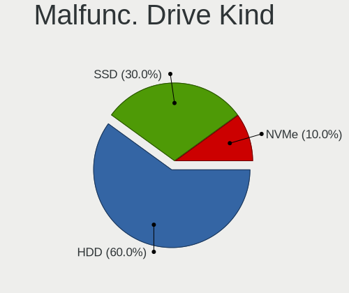
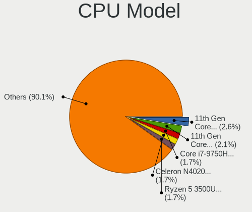
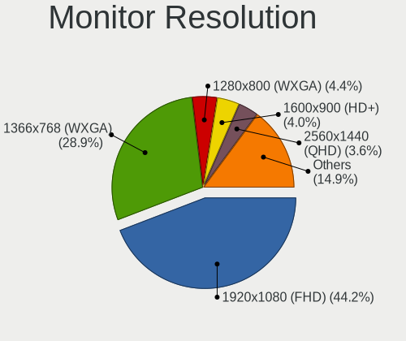
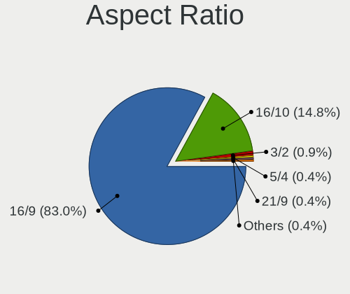
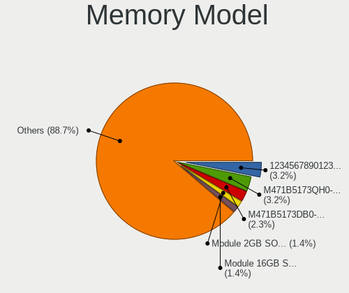
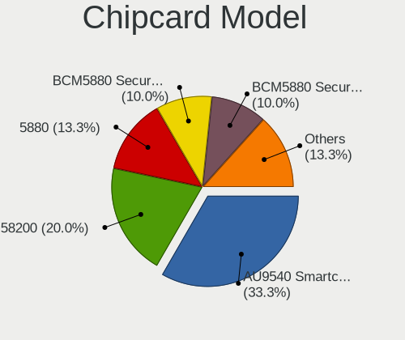

Ubuntu MATE 22.04 - Tested Hardware & Statistics (Notebooks)
------------------------------------------------------------

A project to collect tested hardware configurations for Ubuntu MATE 22.04.

Anyone can contribute to this report by the [hw-probe](https://github.com/linuxhw/hw-probe) tool:

    sudo -E hw-probe -all -upload

Please contribute! Especially if your hardware is rare.

Contents
--------

* [ Test Cases ](#test-cases)

* [ System ](#system)
  - [ Kernel                   ](#kernel)
  - [ Kernel Family            ](#kernel-family)
  - [ Kernel Major Ver.        ](#kernel-major-ver)
  - [ Arch                     ](#arch)
  - [ DE                       ](#de)
  - [ Display Server           ](#display-server)
  - [ Display Manager          ](#display-manager)
  - [ OS Lang                  ](#os-lang)
  - [ Boot Mode                ](#boot-mode)
  - [ Filesystem               ](#filesystem)
  - [ Part. scheme             ](#part-scheme)
  - [ Dual Boot with Linux/BSD ](#dual-boot-with-linuxbsd)
  - [ Dual Boot (Win)          ](#dual-boot-win)

* [ Board ](#board)
  - [ Vendor                   ](#vendor)
  - [ Model                    ](#model)
  - [ Model Family             ](#model-family)
  - [ MFG Year                 ](#mfg-year)
  - [ Form Factor              ](#form-factor)
  - [ Secure Boot              ](#secure-boot)
  - [ Coreboot                 ](#coreboot)
  - [ RAM Size                 ](#ram-size)
  - [ RAM Used                 ](#ram-used)
  - [ Total Drives             ](#total-drives)
  - [ Has CD-ROM               ](#has-cd-rom)
  - [ Has Ethernet             ](#has-ethernet)
  - [ Has WiFi                 ](#has-wifi)
  - [ Has Bluetooth            ](#has-bluetooth)

* [ Location ](#location)
  - [ Country                  ](#country)
  - [ City                     ](#city)

* [ Drives ](#drives)
  - [ Drive Vendor             ](#drive-vendor)
  - [ Drive Model              ](#drive-model)
  - [ HDD Vendor               ](#hdd-vendor)
  - [ SSD Vendor               ](#ssd-vendor)
  - [ Drive Kind               ](#drive-kind)
  - [ Drive Connector          ](#drive-connector)
  - [ Drive Size               ](#drive-size)
  - [ Space Total              ](#space-total)
  - [ Space Used               ](#space-used)
  - [ Malfunc. Drives          ](#malfunc-drives)
  - [ Malfunc. Drive Vendor    ](#malfunc-drive-vendor)
  - [ Malfunc. HDD Vendor      ](#malfunc-hdd-vendor)
  - [ Malfunc. Drive Kind      ](#malfunc-drive-kind)
  - [ Failed Drives            ](#failed-drives)
  - [ Failed Drive Vendor      ](#failed-drive-vendor)
  - [ Drive Status             ](#drive-status)

* [ Storage controller ](#storage-controller)
  - [ Storage Vendor           ](#storage-vendor)
  - [ Storage Model            ](#storage-model)
  - [ Storage Kind             ](#storage-kind)

* [ Processor ](#processor)
  - [ CPU Vendor               ](#cpu-vendor)
  - [ CPU Model                ](#cpu-model)
  - [ CPU Model Family         ](#cpu-model-family)
  - [ CPU Cores                ](#cpu-cores)
  - [ CPU Sockets              ](#cpu-sockets)
  - [ CPU Threads              ](#cpu-threads)
  - [ CPU Op-Modes             ](#cpu-op-modes)
  - [ CPU Microcode            ](#cpu-microcode)
  - [ CPU Microarch            ](#cpu-microarch)

* [ Graphics ](#graphics)
  - [ GPU Vendor               ](#gpu-vendor)
  - [ GPU Model                ](#gpu-model)
  - [ GPU Combo                ](#gpu-combo)
  - [ GPU Driver               ](#gpu-driver)
  - [ GPU Memory               ](#gpu-memory)

* [ Monitor ](#monitor)
  - [ Monitor Vendor           ](#monitor-vendor)
  - [ Monitor Model            ](#monitor-model)
  - [ Monitor Resolution       ](#monitor-resolution)
  - [ Monitor Diagonal         ](#monitor-diagonal)
  - [ Monitor Width            ](#monitor-width)
  - [ Aspect Ratio             ](#aspect-ratio)
  - [ Monitor Area             ](#monitor-area)
  - [ Pixel Density            ](#pixel-density)
  - [ Multiple Monitors        ](#multiple-monitors)

* [ Network ](#network)
  - [ Net Controller Vendor    ](#net-controller-vendor)
  - [ Net Controller Model     ](#net-controller-model)
  - [ Wireless Vendor          ](#wireless-vendor)
  - [ Wireless Model           ](#wireless-model)
  - [ Ethernet Vendor          ](#ethernet-vendor)
  - [ Ethernet Model           ](#ethernet-model)
  - [ Net Controller Kind      ](#net-controller-kind)
  - [ Used Controller          ](#used-controller)
  - [ NICs                     ](#nics)
  - [ IPv6                     ](#ipv6)

* [ Bluetooth ](#bluetooth)
  - [ Bluetooth Vendor         ](#bluetooth-vendor)
  - [ Bluetooth Model          ](#bluetooth-model)

* [ Sound ](#sound)
  - [ Sound Vendor             ](#sound-vendor)
  - [ Sound Model              ](#sound-model)

* [ Memory ](#memory)
  - [ Memory Vendor            ](#memory-vendor)
  - [ Memory Model             ](#memory-model)
  - [ Memory Kind              ](#memory-kind)
  - [ Memory Form Factor       ](#memory-form-factor)
  - [ Memory Size              ](#memory-size)
  - [ Memory Speed             ](#memory-speed)

* [ Printers & scanners ](#printers--scanners)
  - [ Printer Vendor           ](#printer-vendor)
  - [ Printer Model            ](#printer-model)
  - [ Scanner Vendor           ](#scanner-vendor)
  - [ Scanner Model            ](#scanner-model)

* [ Camera ](#camera)
  - [ Camera Vendor            ](#camera-vendor)
  - [ Camera Model             ](#camera-model)

* [ Security ](#security)
  - [ Fingerprint Vendor       ](#fingerprint-vendor)
  - [ Fingerprint Model        ](#fingerprint-model)
  - [ Chipcard Vendor          ](#chipcard-vendor)
  - [ Chipcard Model           ](#chipcard-model)

* [ Unsupported ](#unsupported)
  - [ Unsupported Devices      ](#unsupported-devices)
  - [ Unsupported Device Types ](#unsupported-device-types)

Test Cases
----------

Total: 185

| Vendor        | Model                       | Probe                                                      | Date         |
|---------------|-----------------------------|------------------------------------------------------------|--------------|
| Notebook      | NJx0MU                      | [c402e9c063](https://linux-hardware.org/?probe=c402e9c063) | Feb 01, 2023 |
| Notebook      | NJx0MU                      | [eb152c7d4e](https://linux-hardware.org/?probe=eb152c7d4e) | Feb 01, 2023 |
| Notebook      | NJx0MU                      | [58d5bdaa2d](https://linux-hardware.org/?probe=58d5bdaa2d) | Jan 31, 2023 |
| Notebook      | NJx0MU                      | [10cdf2558f](https://linux-hardware.org/?probe=10cdf2558f) | Jan 29, 2023 |
| Notebook      | NJx0MU                      | [09bbe80125](https://linux-hardware.org/?probe=09bbe80125) | Jan 29, 2023 |
| ASUSTek       | K93SV                       | [3b4dd13d9f](https://linux-hardware.org/?probe=3b4dd13d9f) | Jan 29, 2023 |
| ASUSTek       | TUF Gaming FX505DT_FX505... | [4333734c92](https://linux-hardware.org/?probe=4333734c92) | Jan 29, 2023 |
| Lenovo        | IdeaPad 3 15ALC6 82KU       | [a4ded61661](https://linux-hardware.org/?probe=a4ded61661) | Jan 27, 2023 |
| Notebook      | NJx0MU                      | [26e692f7de](https://linux-hardware.org/?probe=26e692f7de) | Jan 26, 2023 |
| Notebook      | NJx0MU                      | [7c19df8c01](https://linux-hardware.org/?probe=7c19df8c01) | Jan 25, 2023 |
| Notebook      | NJx0MU                      | [54d0592fb2](https://linux-hardware.org/?probe=54d0592fb2) | Jan 24, 2023 |
| Notebook      | NJx0MU                      | [206e04bc7d](https://linux-hardware.org/?probe=206e04bc7d) | Jan 23, 2023 |
| Notebook      | NJx0MU                      | [9e9dcb9883](https://linux-hardware.org/?probe=9e9dcb9883) | Jan 22, 2023 |
| Notebook      | NJx0MU                      | [fdca7d69cd](https://linux-hardware.org/?probe=fdca7d69cd) | Jan 22, 2023 |
| Google        | Relm                        | [44fb1d9db1](https://linux-hardware.org/?probe=44fb1d9db1) | Jan 21, 2023 |
| Notebook      | NJx0MU                      | [edee5aee7a](https://linux-hardware.org/?probe=edee5aee7a) | Jan 21, 2023 |
| Notebook      | NJx0MU                      | [c7ab1c1990](https://linux-hardware.org/?probe=c7ab1c1990) | Jan 20, 2023 |
| ASUSTek       | ASUS TUF Gaming F15 FX50... | [5a1bee99ee](https://linux-hardware.org/?probe=5a1bee99ee) | Jan 18, 2023 |
| Notebook      | NJx0MU                      | [98f8255c15](https://linux-hardware.org/?probe=98f8255c15) | Jan 18, 2023 |
| Dell          | Latitude 5410               | [c97379d747](https://linux-hardware.org/?probe=c97379d747) | Jan 17, 2023 |
| Notebook      | NJx0MU                      | [e76a4c32dc](https://linux-hardware.org/?probe=e76a4c32dc) | Jan 17, 2023 |
| Lenovo        | ThinkPad T15 Gen 1 20S6S... | [b4629bd83f](https://linux-hardware.org/?probe=b4629bd83f) | Jan 14, 2023 |
| Notebook      | NJx0MU                      | [cdd815de42](https://linux-hardware.org/?probe=cdd815de42) | Jan 14, 2023 |
| ASUSTek       | X550LN                      | [d412367e44](https://linux-hardware.org/?probe=d412367e44) | Jan 13, 2023 |
| ASUSTek       | X550LN                      | [196ba30ef7](https://linux-hardware.org/?probe=196ba30ef7) | Jan 13, 2023 |
| Notebook      | NJx0MU                      | [ff52c2505f](https://linux-hardware.org/?probe=ff52c2505f) | Jan 13, 2023 |
| HP            | 15                          | [b06a589496](https://linux-hardware.org/?probe=b06a589496) | Jan 12, 2023 |
| Notebook      | NJx0MU                      | [03505c402c](https://linux-hardware.org/?probe=03505c402c) | Jan 08, 2023 |
| Notebook      | NJx0MU                      | [7ee7875a97](https://linux-hardware.org/?probe=7ee7875a97) | Jan 08, 2023 |
| Lenovo        | ThinkPad R61 8918DEG        | [1ad8a2f766](https://linux-hardware.org/?probe=1ad8a2f766) | Jan 08, 2023 |
| Notebook      | NJx0MU                      | [efd4eaee02](https://linux-hardware.org/?probe=efd4eaee02) | Jan 07, 2023 |
| Dell          | Inspiron 5520               | [9b4925d88d](https://linux-hardware.org/?probe=9b4925d88d) | Jan 07, 2023 |
| Notebook      | NJx0MU                      | [8b7d2f1a46](https://linux-hardware.org/?probe=8b7d2f1a46) | Jan 07, 2023 |
| Notebook      | NJx0MU                      | [05c69304bb](https://linux-hardware.org/?probe=05c69304bb) | Jan 06, 2023 |
| ASUSTek       | VivoBook_ASUSLaptop M150... | [2cb5d2f306](https://linux-hardware.org/?probe=2cb5d2f306) | Jan 05, 2023 |
| Notebook      | NJx0MU                      | [fc365670d0](https://linux-hardware.org/?probe=fc365670d0) | Jan 05, 2023 |
| Dell          | Precision 7520              | [10c791a9f5](https://linux-hardware.org/?probe=10c791a9f5) | Jan 05, 2023 |
| Acer          | Aspire 5530                 | [8c12909b0a](https://linux-hardware.org/?probe=8c12909b0a) | Jan 04, 2023 |
| Lenovo        | G500 20236                  | [501b47c258](https://linux-hardware.org/?probe=501b47c258) | Jan 02, 2023 |
| Notebook      | NJx0MU                      | [0eb54f1078](https://linux-hardware.org/?probe=0eb54f1078) | Jan 01, 2023 |
| Notebook      | NJx0MU                      | [43923d1e98](https://linux-hardware.org/?probe=43923d1e98) | Jan 01, 2023 |
| Lenovo        | ThinkPad R61 8918DEG        | [48c688033a](https://linux-hardware.org/?probe=48c688033a) | Dec 30, 2022 |
| Notebook      | NJx0MU                      | [8540c1c554](https://linux-hardware.org/?probe=8540c1c554) | Dec 30, 2022 |
| Lenovo        | ThinkPad R61 8918DEG        | [82cbc15539](https://linux-hardware.org/?probe=82cbc15539) | Dec 30, 2022 |
| Notebook      | NJx0MU                      | [b4c615f28c](https://linux-hardware.org/?probe=b4c615f28c) | Dec 30, 2022 |
| Notebook      | NJx0MU                      | [4a26556b6b](https://linux-hardware.org/?probe=4a26556b6b) | Dec 29, 2022 |
| HP            | Stream Laptop 14-cb1xxx     | [7ac222385a](https://linux-hardware.org/?probe=7ac222385a) | Dec 28, 2022 |
| HP            | Stream Laptop 14-cb1xxx     | [faf2c0e5d7](https://linux-hardware.org/?probe=faf2c0e5d7) | Dec 28, 2022 |
| HP            | ZBook 17 G5                 | [870deddfbe](https://linux-hardware.org/?probe=870deddfbe) | Dec 27, 2022 |
| Notebook      | NJx0MU                      | [db1c25cde3](https://linux-hardware.org/?probe=db1c25cde3) | Dec 27, 2022 |
| Notebook      | NJx0MU                      | [037841f71c](https://linux-hardware.org/?probe=037841f71c) | Dec 25, 2022 |
| ASUSTek       | X550LN                      | [207f82e19c](https://linux-hardware.org/?probe=207f82e19c) | Dec 25, 2022 |
| ASUSTek       | TUF Gaming FX505DT_FX505... | [f113c7d475](https://linux-hardware.org/?probe=f113c7d475) | Dec 25, 2022 |
| Notebook      | NJx0MU                      | [cc49bb2ef6](https://linux-hardware.org/?probe=cc49bb2ef6) | Dec 25, 2022 |
| Notebook      | NJx0MU                      | [838eb1f6fa](https://linux-hardware.org/?probe=838eb1f6fa) | Dec 24, 2022 |
| Notebook      | NJx0MU                      | [2995a5ea20](https://linux-hardware.org/?probe=2995a5ea20) | Dec 24, 2022 |
| Acer          | TravelMate 7730             | [8d166266b9](https://linux-hardware.org/?probe=8d166266b9) | Dec 23, 2022 |
| HP            | Compaq Presario CQ61        | [a85b255853](https://linux-hardware.org/?probe=a85b255853) | Dec 22, 2022 |
| Notebook      | NJx0MU                      | [c1d47a051f](https://linux-hardware.org/?probe=c1d47a051f) | Dec 22, 2022 |
| Notebook      | NJx0MU                      | [0410be2105](https://linux-hardware.org/?probe=0410be2105) | Dec 22, 2022 |
| Notebook      | NJx0MU                      | [d1dc69cc49](https://linux-hardware.org/?probe=d1dc69cc49) | Dec 22, 2022 |
| Notebook      | NJx0MU                      | [ae1cc3b6c0](https://linux-hardware.org/?probe=ae1cc3b6c0) | Dec 21, 2022 |
| Notebook      | NJx0MU                      | [2f3edb2954](https://linux-hardware.org/?probe=2f3edb2954) | Dec 20, 2022 |
| Notebook      | NJx0MU                      | [5542739f1e](https://linux-hardware.org/?probe=5542739f1e) | Dec 20, 2022 |
| Notebook      | NJx0MU                      | [0d03f7978b](https://linux-hardware.org/?probe=0d03f7978b) | Dec 20, 2022 |
| Acer          | TravelMate 7730             | [8078925015](https://linux-hardware.org/?probe=8078925015) | Dec 20, 2022 |
| Lenovo        | ThinkPad T430 2347G5U       | [ac787dc7dc](https://linux-hardware.org/?probe=ac787dc7dc) | Dec 17, 2022 |
| Lenovo        | ThinkPad T430 2347G5U       | [e47e7c18c9](https://linux-hardware.org/?probe=e47e7c18c9) | Dec 17, 2022 |
| Notebook      | NJx0MU                      | [e3ac894e13](https://linux-hardware.org/?probe=e3ac894e13) | Dec 17, 2022 |
| Notebook      | NJx0MU                      | [987d96714a](https://linux-hardware.org/?probe=987d96714a) | Dec 17, 2022 |
| ASUSTek       | X550LN                      | [d09c34a000](https://linux-hardware.org/?probe=d09c34a000) | Dec 16, 2022 |
| Notebook      | NJx0MU                      | [7f2f68d436](https://linux-hardware.org/?probe=7f2f68d436) | Dec 16, 2022 |
| HUAWEI        | KPL-W0X                     | [8caca0975b](https://linux-hardware.org/?probe=8caca0975b) | Dec 15, 2022 |
| Notebook      | NJx0MU                      | [2c5167b360](https://linux-hardware.org/?probe=2c5167b360) | Dec 14, 2022 |
| Notebook      | NJx0MU                      | [ca7464eb3f](https://linux-hardware.org/?probe=ca7464eb3f) | Dec 14, 2022 |
| HP            | 14                          | [4794938b36](https://linux-hardware.org/?probe=4794938b36) | Dec 14, 2022 |
| Notebook      | NJx0MU                      | [345eb47090](https://linux-hardware.org/?probe=345eb47090) | Dec 09, 2022 |
| Notebook      | NJx0MU                      | [bb704e1b90](https://linux-hardware.org/?probe=bb704e1b90) | Dec 08, 2022 |
| Lenovo        | IdeaPad S145-14IIL 81W6     | [c458ba13c3](https://linux-hardware.org/?probe=c458ba13c3) | Dec 05, 2022 |
| Lenovo        | IdeaPad S145-14IIL 81W6     | [bd9f0dc967](https://linux-hardware.org/?probe=bd9f0dc967) | Dec 05, 2022 |
| HP            | 14                          | [868daee488](https://linux-hardware.org/?probe=868daee488) | Dec 03, 2022 |
| Notebook      | NJx0MU                      | [bd06d3a448](https://linux-hardware.org/?probe=bd06d3a448) | Dec 03, 2022 |
| HP            | ProBook 450 G6              | [c9e94d483e](https://linux-hardware.org/?probe=c9e94d483e) | Nov 30, 2022 |
| Notebook      | NJx0MU                      | [d53007b0b3](https://linux-hardware.org/?probe=d53007b0b3) | Nov 30, 2022 |
| Acer          | TravelMate P614-51T-G2      | [37e14fc1c1](https://linux-hardware.org/?probe=37e14fc1c1) | Nov 30, 2022 |
| ASUSTek       | X555LAB                     | [d62cc93587](https://linux-hardware.org/?probe=d62cc93587) | Nov 28, 2022 |
| ASUSTek       | X555LAB                     | [8d8fc0d4d4](https://linux-hardware.org/?probe=8d8fc0d4d4) | Nov 28, 2022 |
| Acer          | Aspire A515-45              | [4cec4d0e04](https://linux-hardware.org/?probe=4cec4d0e04) | Nov 27, 2022 |
| Notebook      | NJx0MU                      | [05d0bf9d8d](https://linux-hardware.org/?probe=05d0bf9d8d) | Nov 25, 2022 |
| HP            | Pavilion Laptop 15-eh1xx... | [9e22e08aa1](https://linux-hardware.org/?probe=9e22e08aa1) | Nov 25, 2022 |
| HP            | ProBook 640 G8 Notebook ... | [ce586530e4](https://linux-hardware.org/?probe=ce586530e4) | Nov 24, 2022 |
| ASUSTek       | ASUS TUF Gaming A17 FA70... | [cf30d2df93](https://linux-hardware.org/?probe=cf30d2df93) | Nov 24, 2022 |
| Notebook      | NJx0MU                      | [bc690a128e](https://linux-hardware.org/?probe=bc690a128e) | Nov 23, 2022 |
| Toshiba       | Satellite P50-B-10Z         | [c5413ac393](https://linux-hardware.org/?probe=c5413ac393) | Nov 19, 2022 |
| Acer          | Swift SF114-34              | [96d82e20c4](https://linux-hardware.org/?probe=96d82e20c4) | Nov 19, 2022 |
| Acer          | Swift SF114-34              | [f5fd517d69](https://linux-hardware.org/?probe=f5fd517d69) | Nov 19, 2022 |
| Lenovo        | IdeaPad 130-15AST 81H5      | [d4b8ffffe1](https://linux-hardware.org/?probe=d4b8ffffe1) | Nov 19, 2022 |
| Notebook      | NJx0MU                      | [f2e60e58dc](https://linux-hardware.org/?probe=f2e60e58dc) | Nov 17, 2022 |
| Notebook      | NJx0MU                      | [fe43edb930](https://linux-hardware.org/?probe=fe43edb930) | Nov 16, 2022 |
| Dell          | Latitude D630               | [3a15603bd6](https://linux-hardware.org/?probe=3a15603bd6) | Nov 13, 2022 |
| Dell          | Latitude D630               | [3e964fdd59](https://linux-hardware.org/?probe=3e964fdd59) | Nov 12, 2022 |
| ASUSTek       | K93SV                       | [8511ee86ad](https://linux-hardware.org/?probe=8511ee86ad) | Nov 12, 2022 |
| Notebook      | NJx0MU                      | [2dc75b76f4](https://linux-hardware.org/?probe=2dc75b76f4) | Nov 12, 2022 |
| Notebook      | NJx0MU                      | [01a339fb27](https://linux-hardware.org/?probe=01a339fb27) | Nov 11, 2022 |
| Lenovo        | ThinkPad T420 4238LY7       | [c5cf611a37](https://linux-hardware.org/?probe=c5cf611a37) | Nov 07, 2022 |
| Lenovo        | G50-45 80E3                 | [7818a033c6](https://linux-hardware.org/?probe=7818a033c6) | Nov 06, 2022 |
| HP            | Laptop 15s-eq1xxx           | [b59f9dcf48](https://linux-hardware.org/?probe=b59f9dcf48) | Nov 05, 2022 |
| Notebook      | NJx0MU                      | [e56aa65a39](https://linux-hardware.org/?probe=e56aa65a39) | Nov 05, 2022 |
| HP            | Laptop 15s-eq1xxx           | [8fdaec6b5a](https://linux-hardware.org/?probe=8fdaec6b5a) | Nov 04, 2022 |
| HP            | Laptop 15s-eq1xxx           | [4f5b04e8d9](https://linux-hardware.org/?probe=4f5b04e8d9) | Nov 03, 2022 |
| Notebook      | NJx0MU                      | [5c0b61dfb6](https://linux-hardware.org/?probe=5c0b61dfb6) | Nov 03, 2022 |
| HP            | 15 Notebook PC              | [d17e8e8e36](https://linux-hardware.org/?probe=d17e8e8e36) | Nov 03, 2022 |
| Notebook      | NJx0MU                      | [342c7609c9](https://linux-hardware.org/?probe=342c7609c9) | Nov 02, 2022 |
| Notebook      | NJx0MU                      | [5b45883fef](https://linux-hardware.org/?probe=5b45883fef) | Nov 02, 2022 |
| Notebook      | NJx0MU                      | [6b2b490208](https://linux-hardware.org/?probe=6b2b490208) | Nov 01, 2022 |
| Notebook      | NJx0MU                      | [1b626eed02](https://linux-hardware.org/?probe=1b626eed02) | Oct 31, 2022 |
| Notebook      | NJx0MU                      | [1b03bb8445](https://linux-hardware.org/?probe=1b03bb8445) | Oct 30, 2022 |
| Notebook      | NJx0MU                      | [f27aa95917](https://linux-hardware.org/?probe=f27aa95917) | Oct 29, 2022 |
| Dell          | Precision 7760              | [b8fce270db](https://linux-hardware.org/?probe=b8fce270db) | Oct 27, 2022 |
| Notebook      | NJx0MU                      | [2474ff9baf](https://linux-hardware.org/?probe=2474ff9baf) | Oct 27, 2022 |
| Toshiba       | Satellite C50D-A-133        | [c1ba737ccc](https://linux-hardware.org/?probe=c1ba737ccc) | Oct 25, 2022 |
| Apple         | MacBookAir6,1               | [4785b7f6f6](https://linux-hardware.org/?probe=4785b7f6f6) | Oct 25, 2022 |
| HP            | ENVY Sleekbook 6            | [a197375e26](https://linux-hardware.org/?probe=a197375e26) | Oct 19, 2022 |
| Acer          | Aspire 7750G                | [e0c71d09bb](https://linux-hardware.org/?probe=e0c71d09bb) | Oct 11, 2022 |
| Chuwi         | GemiBook Pro                | [02170aab85](https://linux-hardware.org/?probe=02170aab85) | Oct 09, 2022 |
| Chuwi         | GemiBook Pro                | [1a165faedb](https://linux-hardware.org/?probe=1a165faedb) | Oct 08, 2022 |
| Lenovo        | IdeaPad 3 15ALC6 82KU       | [bc1f7e7d02](https://linux-hardware.org/?probe=bc1f7e7d02) | Oct 06, 2022 |
| Lenovo        | ThinkPad T460p 20FW002CP... | [b7cd76d0b6](https://linux-hardware.org/?probe=b7cd76d0b6) | Oct 05, 2022 |
| ASUSTek       | UX32VD                      | [0bea9d8673](https://linux-hardware.org/?probe=0bea9d8673) | Oct 05, 2022 |
| Lenovo        | ThinkPad X230 2325Y5L       | [7c5c62cc90](https://linux-hardware.org/?probe=7c5c62cc90) | Oct 03, 2022 |
| Dell          | Latitude 7300               | [d9acb6ec9c](https://linux-hardware.org/?probe=d9acb6ec9c) | Oct 03, 2022 |
| Sony          | VGN-SZ3XP_C                 | [6e9671dd1a](https://linux-hardware.org/?probe=6e9671dd1a) | Oct 02, 2022 |
| Acer          | Aspire 7750G                | [ccf9b69093](https://linux-hardware.org/?probe=ccf9b69093) | Oct 02, 2022 |
| Acer          | Aspire 7750G                | [7b89b5d0cf](https://linux-hardware.org/?probe=7b89b5d0cf) | Oct 02, 2022 |
| HP            | ZBook 14 G2                 | [ac14cbda52](https://linux-hardware.org/?probe=ac14cbda52) | Oct 02, 2022 |
| Intel         | H81U                        | [9e4458528b](https://linux-hardware.org/?probe=9e4458528b) | Sep 25, 2022 |
| Dell          | Precision 7760              | [f6600a1244](https://linux-hardware.org/?probe=f6600a1244) | Sep 22, 2022 |
| Intel         | Kabylake Platform           | [8b1c5eb5bf](https://linux-hardware.org/?probe=8b1c5eb5bf) | Sep 21, 2022 |
| Acer          | Aspire 5050                 | [1961d1c468](https://linux-hardware.org/?probe=1961d1c468) | Sep 13, 2022 |
| ASUSTek       | VivoBook_ASUSLaptop X712... | [64b8914cb2](https://linux-hardware.org/?probe=64b8914cb2) | Sep 12, 2022 |
| LG Electro... | 17Z990-R.AAS8U1             | [2df5aeabed](https://linux-hardware.org/?probe=2df5aeabed) | Sep 08, 2022 |
| Dell          | Precision 7760              | [e920197599](https://linux-hardware.org/?probe=e920197599) | Sep 05, 2022 |
| HP            | Pavilion 15                 | [194bb33f3d](https://linux-hardware.org/?probe=194bb33f3d) | Sep 04, 2022 |
| Dell          | Inspiron 7720               | [0749c352d0](https://linux-hardware.org/?probe=0749c352d0) | Sep 03, 2022 |
| HP            | Notebook                    | [573d359faf](https://linux-hardware.org/?probe=573d359faf) | Aug 31, 2022 |
| HP            | 15 Notebook PC              | [1109650747](https://linux-hardware.org/?probe=1109650747) | Aug 31, 2022 |
| LincPlus      | LINNCPLUS P1                | [516427e0e9](https://linux-hardware.org/?probe=516427e0e9) | Aug 23, 2022 |
| Lenovo        | IdeaPad Gaming 3 15ARH05... | [5028378988](https://linux-hardware.org/?probe=5028378988) | Aug 23, 2022 |
| Notebook      | NJx0MU                      | [7a86bdf14e](https://linux-hardware.org/?probe=7a86bdf14e) | Aug 22, 2022 |
| Dell          | Latitude 7420               | [d599ef65fd](https://linux-hardware.org/?probe=d599ef65fd) | Aug 20, 2022 |
| Lenovo        | IdeaPad 3 15IIL05 81WE      | [4efd818377](https://linux-hardware.org/?probe=4efd818377) | Aug 19, 2022 |
| HP            | EliteBook 745 G5            | [7e8d33a07f](https://linux-hardware.org/?probe=7e8d33a07f) | Aug 16, 2022 |
| Lenovo        | ThinkBook 14 G2 ITL 20VD    | [644fbe551a](https://linux-hardware.org/?probe=644fbe551a) | Aug 13, 2022 |
| Dell          | Latitude E7470              | [61d0b104e9](https://linux-hardware.org/?probe=61d0b104e9) | Aug 13, 2022 |
| HP            | 15 Notebook PC              | [46aa83aeb4](https://linux-hardware.org/?probe=46aa83aeb4) | Aug 07, 2022 |
| HONOR         | BOHK-WAX9X                  | [3d426cb1de](https://linux-hardware.org/?probe=3d426cb1de) | Aug 04, 2022 |
| Lenovo        | Legion R9000P2021H 82JQ     | [4f2ba69c49](https://linux-hardware.org/?probe=4f2ba69c49) | Jul 27, 2022 |
| Dell          | Latitude E4200              | [6cc0415a8a](https://linux-hardware.org/?probe=6cc0415a8a) | Jul 21, 2022 |
| Compaq        | Presario CQ-23              | [589a41e629](https://linux-hardware.org/?probe=589a41e629) | Jul 14, 2022 |
| MicroByte     | ezbook                      | [91b1fc169b](https://linux-hardware.org/?probe=91b1fc169b) | Jun 28, 2022 |
| Dell          | XPS 17 9710                 | [6e16eed17c](https://linux-hardware.org/?probe=6e16eed17c) | Jun 26, 2022 |
| ASUSTek       | S550CM                      | [c7262ada04](https://linux-hardware.org/?probe=c7262ada04) | Jun 25, 2022 |
| HUAWEI        | KLVD-WXX9                   | [a8c98b76b4](https://linux-hardware.org/?probe=a8c98b76b4) | Jun 24, 2022 |
| Lenovo        | ThinkPad E15 Gen 2 20TDS... | [10de805cb0](https://linux-hardware.org/?probe=10de805cb0) | Jun 24, 2022 |
| Google        | Kled                        | [5f47e6d3e3](https://linux-hardware.org/?probe=5f47e6d3e3) | Jun 16, 2022 |
| Google        | Kled                        | [6a566134c4](https://linux-hardware.org/?probe=6a566134c4) | Jun 16, 2022 |
| Lenovo        | ThinkPad E15 Gen 2 20TDS... | [f7abc9fae0](https://linux-hardware.org/?probe=f7abc9fae0) | Jun 14, 2022 |
| Lenovo        | V15 G2 ITL 82KB             | [e956f6b0b8](https://linux-hardware.org/?probe=e956f6b0b8) | Jun 09, 2022 |
| HP            | EliteBook 8560p             | [9bfdb902ce](https://linux-hardware.org/?probe=9bfdb902ce) | Jun 08, 2022 |
| Intel         | Kabylake Platform           | [074fd90c6a](https://linux-hardware.org/?probe=074fd90c6a) | Jun 06, 2022 |
| TrekStor      | Surfbook A13B               | [a42b3de31a](https://linux-hardware.org/?probe=a42b3de31a) | Jun 05, 2022 |
| Dell          | Precision M6500             | [1b68d2ca74](https://linux-hardware.org/?probe=1b68d2ca74) | Jun 01, 2022 |
| Apple         | MacBook5,1                  | [74e6dbe9af](https://linux-hardware.org/?probe=74e6dbe9af) | May 23, 2022 |
| Apple         | MacBook5,1                  | [a53d746d08](https://linux-hardware.org/?probe=a53d746d08) | May 23, 2022 |
| ASUSTek       | VivoBook_ASUSLaptop X509... | [5107890ffd](https://linux-hardware.org/?probe=5107890ffd) | May 15, 2022 |
| Sony          | VPCEA36FG                   | [0161a27629](https://linux-hardware.org/?probe=0161a27629) | May 13, 2022 |
| HONOR         | BOHK-WAX9X                  | [e6c4aaa3d8](https://linux-hardware.org/?probe=e6c4aaa3d8) | May 12, 2022 |
| Lenovo        | ThinkBook 16p Gen 2 20YM    | [e99cdba363](https://linux-hardware.org/?probe=e99cdba363) | May 07, 2022 |
| HP            | EliteBook 840 G5            | [a53b09a7f3](https://linux-hardware.org/?probe=a53b09a7f3) | May 07, 2022 |
| HYPERPC       | PLAY                        | [408e86d04f](https://linux-hardware.org/?probe=408e86d04f) | May 06, 2022 |
| Apple         | MacBookPro6,2               | [ebaaf4a69b](https://linux-hardware.org/?probe=ebaaf4a69b) | May 01, 2022 |
| Apple         | MacBookPro9,1               | [35b3b3ae30](https://linux-hardware.org/?probe=35b3b3ae30) | Apr 26, 2022 |
| Apple         | MacBookPro9,1               | [faf447a067](https://linux-hardware.org/?probe=faf447a067) | Apr 24, 2022 |
| IPASON        | MaxBook P1                  | [d66d062f54](https://linux-hardware.org/?probe=d66d062f54) | Apr 05, 2022 |
| Lenovo        | ThinkPad SL500 27463ZG      | [b746a25ff1](https://linux-hardware.org/?probe=b746a25ff1) | Jan 28, 2022 |

System
------

Kernel
------

Version of the Linux kernel

| Version               | Notebooks | Percent |
|-----------------------|-----------|---------|
| 5.15.0-56-generic     | 13        | 13.68%  |
| 5.15.0-53-generic     | 7         | 7.37%   |
| 5.15.0-52-generic     | 7         | 7.37%   |
| 5.15.0-43-generic     | 7         | 7.37%   |
| 5.15.0-47-generic     | 6         | 6.32%   |
| 5.15.0-46-generic     | 6         | 6.32%   |
| 5.15.0-25-generic     | 6         | 6.32%   |
| 5.15.0-58-generic     | 5         | 5.26%   |
| 5.15.0-48-generic     | 5         | 5.26%   |
| 5.15.0-40-generic     | 4         | 4.21%   |
| 5.15.0-57-generic     | 3         | 3.16%   |
| 5.15.0-41-generic     | 3         | 3.16%   |
| 5.15.0-30-generic     | 3         | 3.16%   |
| 5.15.0-27-generic     | 3         | 3.16%   |
| 5.15.0-52-lowlatency  | 2         | 2.11%   |
| 6.1.8-x64v1-xanmod1   | 1         | 1.05%   |
| 6.0.8-x64v1-xanmod1   | 1         | 1.05%   |
| 5.18.0-051800-generic | 1         | 1.05%   |
| 5.17.1-051701-generic | 1         | 1.05%   |
| 5.17.0-1003-oem       | 1         | 1.05%   |
| 5.15.0-58-lowlatency  | 1         | 1.05%   |
| 5.15.0-56-lowlatency  | 1         | 1.05%   |
| 5.15.0-50-generic     | 1         | 1.05%   |
| 5.15.0-46-lowlatency  | 1         | 1.05%   |
| 5.15.0-39-generic     | 1         | 1.05%   |
| 5.15.0-37-generic     | 1         | 1.05%   |
| 5.15.0-35-generic     | 1         | 1.05%   |
| 5.15.0-33-generic     | 1         | 1.05%   |
| 5.15.0-18-generic     | 1         | 1.05%   |
| 5.14.0-1054-oem       | 1         | 1.05%   |

Kernel Family
-------------

Linux kernel without a distro release

| Version | Notebooks | Percent |
|---------|-----------|---------|
| 5.15.0  | 79        | 92.94%  |
| 6.1.8   | 1         | 1.18%   |
| 6.0.8   | 1         | 1.18%   |
| 5.18.0  | 1         | 1.18%   |
| 5.17.1  | 1         | 1.18%   |
| 5.17.0  | 1         | 1.18%   |
| 5.14.0  | 1         | 1.18%   |

Kernel Major Ver.
-----------------

Linux kernel major version

| Version | Notebooks | Percent |
|---------|-----------|---------|
| 5.15    | 79        | 92.94%  |
| 5.17    | 2         | 2.35%   |
| 6.1     | 1         | 1.18%   |
| 6.0     | 1         | 1.18%   |
| 5.18    | 1         | 1.18%   |
| 5.14    | 1         | 1.18%   |

Arch
----

OS architecture (x86_64, i586, etc.)

| Name   | Notebooks | Percent |
|--------|-----------|---------|
| x86_64 | 84        | 100%    |

DE
--

Desktop Environment

| Name | Notebooks | Percent |
|------|-----------|---------|
| MATE | 84        | 100%    |

Display Server
--------------

X11 or Wayland

| Name    | Notebooks | Percent |
|---------|-----------|---------|
| X11     | 82        | 97.62%  |
| Wayland | 1         | 1.19%   |
| Tty     | 1         | 1.19%   |

Display Manager
---------------

SDDM, LightDM, etc.

| Name    | Notebooks | Percent |
|---------|-----------|---------|
| LightDM | 70        | 82.35%  |
| Unknown | 9         | 10.59%  |
| GDM3    | 6         | 7.06%   |

OS Lang
-------

Language

| Lang  | Notebooks | Percent |
|-------|-----------|---------|
| en_US | 33        | 38.37%  |
| de_DE | 12        | 13.95%  |
| fr_FR | 11        | 12.79%  |
| it_IT | 6         | 6.98%   |
| ru_RU | 5         | 5.81%   |
| pt_BR | 2         | 2.33%   |
| pl_PL | 2         | 2.33%   |
| fi_FI | 2         | 2.33%   |
| es_ES | 2         | 2.33%   |
| en_GB | 2         | 2.33%   |
| en_CA | 2         | 2.33%   |
| en_AU | 2         | 2.33%   |
| zh_CN | 1         | 1.16%   |
| hu_HU | 1         | 1.16%   |
| el_GR | 1         | 1.16%   |
| de_CH | 1         | 1.16%   |
| C     | 1         | 1.16%   |

Boot Mode
---------

EFI or BIOS

| Mode | Notebooks | Percent |
|------|-----------|---------|
| EFI  | 48        | 54.55%  |
| BIOS | 40        | 45.45%  |

Filesystem
----------

Type of filesystem

| Type    | Notebooks | Percent |
|---------|-----------|---------|
| Ext4    | 73        | 86.9%   |
| Overlay | 5         | 5.95%   |
| Zfs     | 3         | 3.57%   |
| Xfs     | 1         | 1.19%   |
| Jfs     | 1         | 1.19%   |
| Btrfs   | 1         | 1.19%   |

Part. scheme
------------

Scheme of partitioning

| Type    | Notebooks | Percent |
|---------|-----------|---------|
| GPT     | 62        | 72.09%  |
| Unknown | 16        | 18.6%   |
| MBR     | 8         | 9.3%    |

Dual Boot with Linux/BSD
------------------------

Hosting more than one Linux/BSD

| Dual boot | Notebooks | Percent |
|-----------|-----------|---------|
| No        | 72        | 85.71%  |
| Yes       | 12        | 14.29%  |

Dual Boot (Win)
---------------

Hosting Linux and Windows

| Dual boot | Notebooks | Percent |
|-----------|-----------|---------|
| No        | 57        | 66.28%  |
| Yes       | 29        | 33.72%  |

Board
-----

Vendor
------

Motherboard manufacturer

| Name             | Notebooks | Percent |
|------------------|-----------|---------|
| Lenovo           | 17        | 20.24%  |
| Hewlett-Packard  | 17        | 20.24%  |
| ASUSTek Computer | 11        | 13.1%   |
| Dell             | 10        | 11.9%   |
| Acer             | 6         | 7.14%   |
| Apple            | 4         | 4.76%   |
| Toshiba          | 2         | 2.38%   |
| Intel            | 2         | 2.38%   |
| HUAWEI           | 2         | 2.38%   |
| Google           | 2         | 2.38%   |
| TrekStor         | 1         | 1.19%   |
| Sony             | 1         | 1.19%   |
| Notebook         | 1         | 1.19%   |
| MicroByte        | 1         | 1.19%   |
| LincPlus         | 1         | 1.19%   |
| LG Electronics   | 1         | 1.19%   |
| IPASON           | 1         | 1.19%   |
| HYPERPC          | 1         | 1.19%   |
| HONOR            | 1         | 1.19%   |
| Compaq           | 1         | 1.19%   |
| Chuwi            | 1         | 1.19%   |

Model
-----

Motherboard model

| Name                                 | Notebooks | Percent |
|--------------------------------------|-----------|---------|
| TrekStor Surfbook A13B               | 1         | 1.19%   |
| Toshiba Satellite P50-B-10Z          | 1         | 1.19%   |
| Toshiba Satellite C50D-A-133         | 1         | 1.19%   |
| Sony VPCEA36FG                       | 1         | 1.19%   |
| Notebook NJx0MU                      | 1         | 1.19%   |
| MicroByte ezbook                     | 1         | 1.19%   |
| LincPlus LINNCPLUS P1                | 1         | 1.19%   |
| LG 17Z990-R.AAS8U1                   | 1         | 1.19%   |
| Lenovo V15 G2 ITL 82KB               | 1         | 1.19%   |
| Lenovo ThinkPad X230 2325Y5L         | 1         | 1.19%   |
| Lenovo ThinkPad T460p 20FW002CPB     | 1         | 1.19%   |
| Lenovo ThinkPad T430 2347G5U         | 1         | 1.19%   |
| Lenovo ThinkPad T420 4238LY7         | 1         | 1.19%   |
| Lenovo ThinkPad T15 Gen 1 20S6S1HN00 | 1         | 1.19%   |
| Lenovo ThinkPad SL500 27463ZG        | 1         | 1.19%   |
| Lenovo ThinkPad R61 8918DEG          | 1         | 1.19%   |
| Lenovo ThinkPad E15 Gen 2 20TDS0T500 | 1         | 1.19%   |
| Lenovo ThinkBook 16p Gen 2 20YM      | 1         | 1.19%   |
| Lenovo ThinkBook 14 G2 ITL 20VD      | 1         | 1.19%   |
| Lenovo IdeaPad S145-14IIL 81W6       | 1         | 1.19%   |
| Lenovo IdeaPad Gaming 3 15ARH05 82EY | 1         | 1.19%   |
| Lenovo IdeaPad 3 15IIL05 81WE        | 1         | 1.19%   |
| Lenovo IdeaPad 3 15ALC6 82KU         | 1         | 1.19%   |
| Lenovo IdeaPad 130-15AST 81H5        | 1         | 1.19%   |
| Lenovo G500 20236                    | 1         | 1.19%   |
| IPASON MaxBook P1                    | 1         | 1.19%   |
| Intel Kabylake Platform              | 1         | 1.19%   |
| Intel H81U                           | 1         | 1.19%   |
| HYPERPC PLAY                         | 1         | 1.19%   |
| HUAWEI KPL-W0X                       | 1         | 1.19%   |
| HUAWEI KLVD-WXX9                     | 1         | 1.19%   |
| HONOR BOHK-WAX9X                     | 1         | 1.19%   |
| HP ZBook 17 G5                       | 1         | 1.19%   |
| HP ZBook 14 G2                       | 1         | 1.19%   |
| HP Stream Laptop 14-cb1xxx           | 1         | 1.19%   |
| HP ProBook 640 G8 Notebook PC        | 1         | 1.19%   |
| HP ProBook 450 G6                    | 1         | 1.19%   |
| HP Pavilion Laptop 15-eh1xxx         | 1         | 1.19%   |
| HP Pavilion 15                       | 1         | 1.19%   |
| HP Notebook                          | 1         | 1.19%   |

Model Family
------------

Motherboard model prefix

| Name               | Notebooks | Percent |
|--------------------|-----------|---------|
| Lenovo ThinkPad    | 8         | 9.52%   |
| Lenovo IdeaPad     | 5         | 5.95%   |
| Dell Latitude      | 4         | 4.76%   |
| HP EliteBook       | 3         | 3.57%   |
| Dell Precision     | 3         | 3.57%   |
| ASUS VivoBook      | 3         | 3.57%   |
| Acer Aspire        | 3         | 3.57%   |
| Toshiba Satellite  | 2         | 2.38%   |
| Lenovo ThinkBook   | 2         | 2.38%   |
| HP ZBook           | 2         | 2.38%   |
| HP ProBook         | 2         | 2.38%   |
| HP Pavilion        | 2         | 2.38%   |
| HP 15              | 2         | 2.38%   |
| Dell Inspiron      | 2         | 2.38%   |
| ASUS ASUS          | 2         | 2.38%   |
| Acer TravelMate    | 2         | 2.38%   |
| TrekStor Surfbook  | 1         | 1.19%   |
| Sony VPCEA36FG     | 1         | 1.19%   |
| Notebook NJx0MU    | 1         | 1.19%   |
| MicroByte ezbook   | 1         | 1.19%   |
| LincPlus LINNCPLUS | 1         | 1.19%   |
| LG 17Z990-R.AAS8U1 | 1         | 1.19%   |
| Lenovo V15         | 1         | 1.19%   |
| Lenovo G500        | 1         | 1.19%   |
| IPASON MaxBook     | 1         | 1.19%   |
| Intel Kabylake     | 1         | 1.19%   |
| Intel H81U         | 1         | 1.19%   |
| HYPERPC PLAY       | 1         | 1.19%   |
| HUAWEI KPL-W0X     | 1         | 1.19%   |
| HUAWEI KLVD-WXX9   | 1         | 1.19%   |
| HONOR BOHK-WAX9X   | 1         | 1.19%   |
| HP Stream          | 1         | 1.19%   |
| HP Notebook        | 1         | 1.19%   |
| HP Laptop          | 1         | 1.19%   |
| HP ENVY            | 1         | 1.19%   |
| HP Compaq          | 1         | 1.19%   |
| HP 14              | 1         | 1.19%   |
| Google Relm        | 1         | 1.19%   |
| Google Kled        | 1         | 1.19%   |
| Dell XPS           | 1         | 1.19%   |

MFG Year
--------

Motherboard manufacture year

| Year | Notebooks | Percent |
|------|-----------|---------|
| 2021 | 18        | 21.43%  |
| 2020 | 9         | 10.71%  |
| 2012 | 8         | 9.52%   |
| 2019 | 7         | 8.33%   |
| 2018 | 7         | 8.33%   |
| 2022 | 5         | 5.95%   |
| 2013 | 5         | 5.95%   |
| 2014 | 4         | 4.76%   |
| 2011 | 3         | 3.57%   |
| 2010 | 3         | 3.57%   |
| 2009 | 3         | 3.57%   |
| 2008 | 3         | 3.57%   |
| 2017 | 2         | 2.38%   |
| 2016 | 2         | 2.38%   |
| 2015 | 2         | 2.38%   |
| 2007 | 2         | 2.38%   |
| 2006 | 1         | 1.19%   |

Form Factor
-----------

Physical design of the computer

| Name     | Notebooks | Percent |
|----------|-----------|---------|
| Notebook | 84        | 100%    |

Secure Boot
-----------

Enabled or disabled

| State    | Notebooks | Percent |
|----------|-----------|---------|
| Disabled | 79        | 90.8%   |
| Enabled  | 8         | 9.2%    |

Coreboot
--------

Have coreboot on board

| Used | Notebooks | Percent |
|------|-----------|---------|
| No   | 82        | 97.62%  |
| Yes  | 2         | 2.38%   |

RAM Size
--------

Total RAM memory

| Size in GB  | Notebooks | Percent |
|-------------|-----------|---------|
| 4.01-8.0    | 27        | 32.14%  |
| 3.01-4.0    | 19        | 22.62%  |
| 8.01-16.0   | 15        | 17.86%  |
| 16.01-24.0  | 12        | 14.29%  |
| 32.01-64.0  | 5         | 5.95%   |
| 64.01-256.0 | 3         | 3.57%   |
| 24.01-32.0  | 2         | 2.38%   |
| 2.01-3.0    | 1         | 1.19%   |

RAM Used
--------

Used RAM memory

| Used GB   | Notebooks | Percent |
|-----------|-----------|---------|
| 2.01-3.0  | 28        | 30.43%  |
| 1.01-2.0  | 23        | 25%     |
| 3.01-4.0  | 17        | 18.48%  |
| 4.01-8.0  | 16        | 17.39%  |
| 8.01-16.0 | 5         | 5.43%   |
| 0.51-1.0  | 3         | 3.26%   |

Total Drives
------------

Number of drives on board

| Drives | Notebooks | Percent |
|--------|-----------|---------|
| 1      | 65        | 77.38%  |
| 2      | 14        | 16.67%  |
| 3      | 5         | 5.95%   |

Has CD-ROM
----------

Has CD-ROM on board

| Presented | Notebooks | Percent |
|-----------|-----------|---------|
| No        | 55        | 65.48%  |
| Yes       | 29        | 34.52%  |

Has Ethernet
------------

Has Ethernet on board

| Presented | Notebooks | Percent |
|-----------|-----------|---------|
| Yes       | 62        | 73.81%  |
| No        | 22        | 26.19%  |

Has WiFi
--------

Has WiFi module

| Presented | Notebooks | Percent |
|-----------|-----------|---------|
| Yes       | 84        | 100%    |

Has Bluetooth
-------------

Has Bluetooth module

| Presented | Notebooks | Percent |
|-----------|-----------|---------|
| Yes       | 75        | 88.24%  |
| No        | 10        | 11.76%  |

Location
--------

Country
-------

Geographic location (country)

| Country     | Notebooks | Percent |
|-------------|-----------|---------|
| Germany     | 12        | 14.29%  |
| USA         | 10        | 11.9%   |
| France      | 10        | 11.9%   |
| Italy       | 8         | 9.52%   |
| Spain       | 5         | 5.95%   |
| Russia      | 5         | 5.95%   |
| Brazil      | 4         | 4.76%   |
| UK          | 3         | 3.57%   |
| Turkey      | 3         | 3.57%   |
| Serbia      | 2         | 2.38%   |
| Poland      | 2         | 2.38%   |
| Hungary     | 2         | 2.38%   |
| Greece      | 2         | 2.38%   |
| Finland     | 2         | 2.38%   |
| Estonia     | 2         | 2.38%   |
| Switzerland | 1         | 1.19%   |
| Slovenia    | 1         | 1.19%   |
| Romania     | 1         | 1.19%   |
| Paraguay    | 1         | 1.19%   |
| Netherlands | 1         | 1.19%   |
| India       | 1         | 1.19%   |
| Georgia     | 1         | 1.19%   |
| Colombia    | 1         | 1.19%   |
| China       | 1         | 1.19%   |
| Chile       | 1         | 1.19%   |
| Bulgaria    | 1         | 1.19%   |
| Australia   | 1         | 1.19%   |

City
----

Geographic location (city)

| City             | Notebooks | Percent |
|------------------|-----------|---------|
| Mannheim         | 3         | 3.49%   |
| Warsaw           | 2         | 2.33%   |
| Moscow           | 2         | 2.33%   |
| Belgrade         | 2         | 2.33%   |
| Xining           | 1         | 1.16%   |
| Viroflay         | 1         | 1.16%   |
| Villeurbanne     | 1         | 1.16%   |
| Vaudoy-en-Brie   | 1         | 1.16%   |
| Varna            | 1         | 1.16%   |
| Valenciennes     | 1         | 1.16%   |
| Turku            | 1         | 1.16%   |
| Tula             | 1         | 1.16%   |
| Toulouse         | 1         | 1.16%   |
| Thane            | 1         | 1.16%   |
| Tartu            | 1         | 1.16%   |
| Talcahuano       | 1         | 1.16%   |
| Seville          | 1         | 1.16%   |
| Settimo Torinese | 1         | 1.16%   |
| Sarospatak       | 1         | 1.16%   |
| Sao Paulo        | 1         | 1.16%   |
| Rostov-on-Don    | 1         | 1.16%   |
| Rome             | 1         | 1.16%   |
| Rennes           | 1         | 1.16%   |
| Porto Alegre     | 1         | 1.16%   |
| Pärnu           | 1         | 1.16%   |
| Paris            | 1         | 1.16%   |
| Ortuella         | 1         | 1.16%   |
| Olympia          | 1         | 1.16%   |
| Olathe           | 1         | 1.16%   |
| Nova Gorica      | 1         | 1.16%   |
| Norwich          | 1         | 1.16%   |
| North Wilkesboro | 1         | 1.16%   |
| Newport News     | 1         | 1.16%   |
| Naaldwijk        | 1         | 1.16%   |
| Moosseedorf      | 1         | 1.16%   |
| Montpellier      | 1         | 1.16%   |
| Milan            | 1         | 1.16%   |
| Memphis          | 1         | 1.16%   |
| Medellín        | 1         | 1.16%   |
| Marseille        | 1         | 1.16%   |

Drives
------

Drive Vendor
------------

Hard drive vendors

| Vendor                | Notebooks | Drives | Percent |
|-----------------------|-----------|--------|---------|
| Samsung Electronics   | 20        | 30     | 19.05%  |
| Toshiba               | 7         | 9      | 6.67%   |
| Seagate               | 7         | 8      | 6.67%   |
| SanDisk               | 7         | 9      | 6.67%   |
| Crucial               | 7         | 8      | 6.67%   |
| WDC                   | 5         | 5      | 4.76%   |
| Unknown               | 5         | 6      | 4.76%   |
| SK hynix              | 4         | 4      | 3.81%   |
| Kingston              | 4         | 5      | 3.81%   |
| Intel                 | 3         | 3      | 2.86%   |
| HGST                  | 3         | 3      | 2.86%   |
| A-DATA Technology     | 3         | 3      | 2.86%   |
| SPCC                  | 2         | 3      | 1.9%    |
| Phison                | 2         | 2      | 1.9%    |
| Micron Technology     | 2         | 2      | 1.9%    |
| KingSpec              | 2         | 2      | 1.9%    |
| China                 | 2         | 2      | 1.9%    |
| WDC WDS2              | 1         | 1      | 0.95%   |
| Verbatim              | 1         | 2      | 0.95%   |
| UMIS                  | 1         | 2      | 0.95%   |
| Realtek Semiconductor | 1         | 2      | 0.95%   |
| Patriot               | 1         | 1      | 0.95%   |
| Netac                 | 1         | 1      | 0.95%   |
| LITEONIT              | 1         | 1      | 0.95%   |
| Lenovo                | 1         | 1      | 0.95%   |
| Kston                 | 1         | 1      | 0.95%   |
| KIOXIA                | 1         | 1      | 0.95%   |
| JMicron Technology    | 1         | 1      | 0.95%   |
| Intenso               | 1         | 1      | 0.95%   |
| Hjwdz                 | 1         | 1      | 0.95%   |
| Hitachi               | 1         | 1      | 0.95%   |
| Gigabyte Technology   | 1         | 1      | 0.95%   |
| faspeed               | 1         | 1      | 0.95%   |
| Corsair               | 1         | 1      | 0.95%   |
| Apple                 | 1         | 1      | 0.95%   |
| addlink               | 1         | 1      | 0.95%   |
| ADATA Technology      | 1         | 1      | 0.95%   |

Drive Model
-----------

Hard drive models

| Model                                | Notebooks | Percent |
|--------------------------------------|-----------|---------|
| Toshiba MQ01ABF050 500GB             | 2         | 1.83%   |
| Seagate ST2000LM015-2E8174 2TB       | 2         | 1.83%   |
| Samsung MZVLQ512HBLU-00BH1 512GB     | 2         | 1.83%   |
| Crucial CT240BX500SSD1 240GB         | 2         | 1.83%   |
| Crucial CT1000BX500SSD1 1TB          | 2         | 1.83%   |
| WDC WDS2 50G2B0B-00YS 250GB SSD      | 1         | 0.92%   |
| WDC WD5000LPVX-60V0TT0 500GB         | 1         | 0.92%   |
| WDC WD3200BEVT-22ZCT0 320GB          | 1         | 0.92%   |
| WDC WD10SPZX-22Z10T0 1TB             | 1         | 0.92%   |
| WDC PC SN730 SDBPNTY-1T00-1101 1TB   | 1         | 0.92%   |
| WDC PC SN520 SDAPNUW-512G-1014 512GB | 1         | 0.92%   |
| Verbatim Vi550 S3 256GB SSD          | 1         | 0.92%   |
| Unknown SLD64G  64GB                 | 1         | 0.92%   |
| Unknown MMC Card  7GB                | 1         | 0.92%   |
| Unknown MMC Card  64GB               | 1         | 0.92%   |
| Unknown MMC Card  32GB               | 1         | 0.92%   |
| Unknown MMC Card  16GB               | 1         | 0.92%   |
| Unknown Biwin  64GB                  | 1         | 0.92%   |
| UMIS RPJTJ256MEE1OWX 256GB           | 1         | 0.92%   |
| Toshiba THNSNK256GVN8 256GB SSD      | 1         | 0.92%   |
| Toshiba MQ04ABF100 1TB               | 1         | 0.92%   |
| Toshiba MK3259GSXP 320GB             | 1         | 0.92%   |
| Toshiba KBG40ZNT256G MEMORY 256GB    | 1         | 0.92%   |
| Toshiba KBG30ZMV256G 256GB           | 1         | 0.92%   |
| SPCC Solid State Disk 1024GB         | 1         | 0.92%   |
| SPCC M.2 PCIe SSD 1TB                | 1         | 0.92%   |
| SK hynix SC311 SATA 256GB SSD        | 1         | 0.92%   |
| SK hynix PC401 NVMe 1TB              | 1         | 0.92%   |
| SK hynix HFM128GDJTNG-8310A 128GB    | 1         | 0.92%   |
| SK hynix BC511 NVMe 256GB            | 1         | 0.92%   |
| Seagate ST9500420AS 500GB            | 1         | 0.92%   |
| Seagate ST9250827AS 250GB            | 1         | 0.92%   |
| Seagate ST1000LM035-1RK172 1TB       | 1         | 0.92%   |
| Seagate One Touch HDD 5TB            | 1         | 0.92%   |
| Seagate BUP BK 4TB                   | 1         | 0.92%   |
| SanDisk SSD U100 24GB                | 1         | 0.92%   |
| SanDisk SSD i100 24GB                | 1         | 0.92%   |
| SanDisk SD7TB3Q-256G-1006 256GB SSD  | 1         | 0.92%   |
| SanDisk SD6SB1M-128G-1006 128GB SSD  | 1         | 0.92%   |
| SanDisk SD6PP4M-256G-1006 256GB SSD  | 1         | 0.92%   |

HDD Vendor
----------

Hard disk drive vendors

| Vendor  | Notebooks | Drives | Percent |
|---------|-----------|--------|---------|
| Seagate | 7         | 8      | 38.89%  |
| Toshiba | 4         | 5      | 22.22%  |
| WDC     | 3         | 3      | 16.67%  |
| HGST    | 3         | 3      | 16.67%  |
| Hitachi | 1         | 1      | 5.56%   |

SSD Vendor
----------

Solid state drive vendors

| Vendor              | Notebooks | Drives | Percent |
|---------------------|-----------|--------|---------|
| Samsung Electronics | 7         | 8      | 15.56%  |
| Crucial             | 7         | 8      | 15.56%  |
| SanDisk             | 5         | 6      | 11.11%  |
| Kingston            | 3         | 4      | 6.67%   |
| A-DATA Technology   | 3         | 3      | 6.67%   |
| KingSpec            | 2         | 2      | 4.44%   |
| China               | 2         | 2      | 4.44%   |
| WDC WDS2            | 1         | 1      | 2.22%   |
| Verbatim            | 1         | 2      | 2.22%   |
| Toshiba             | 1         | 2      | 2.22%   |
| SPCC                | 1         | 2      | 2.22%   |
| SK hynix            | 1         | 1      | 2.22%   |
| Patriot             | 1         | 1      | 2.22%   |
| Netac               | 1         | 1      | 2.22%   |
| Micron Technology   | 1         | 1      | 2.22%   |
| LITEONIT            | 1         | 1      | 2.22%   |
| Kston               | 1         | 1      | 2.22%   |
| JMicron Technology  | 1         | 1      | 2.22%   |
| Intenso             | 1         | 1      | 2.22%   |
| Intel               | 1         | 1      | 2.22%   |
| Corsair             | 1         | 1      | 2.22%   |
| Apple               | 1         | 1      | 2.22%   |
| addlink             | 1         | 1      | 2.22%   |

Drive Kind
----------

HDD or SSD

| Kind    | Notebooks | Drives | Percent |
|---------|-----------|--------|---------|
| SSD     | 37        | 52     | 38.54%  |
| NVMe    | 35        | 47     | 36.46%  |
| HDD     | 17        | 20     | 17.71%  |
| MMC     | 5         | 6      | 5.21%   |
| Unknown | 2         | 2      | 2.08%   |

Drive Connector
---------------

SATA, SAS, NVMe, etc.

| Type | Notebooks | Drives | Percent |
|------|-----------|--------|---------|
| SATA | 49        | 67     | 51.58%  |
| NVMe | 35        | 47     | 36.84%  |
| SAS  | 6         | 7      | 6.32%   |
| MMC  | 5         | 6      | 5.26%   |

Drive Size
----------

Size of hard drive

| Size in TB | Notebooks | Drives | Percent |
|------------|-----------|--------|---------|
| 0.01-0.5   | 38        | 48     | 66.67%  |
| 0.51-1.0   | 13        | 14     | 22.81%  |
| 1.01-2.0   | 4         | 7      | 7.02%   |
| 3.01-4.0   | 1         | 2      | 1.75%   |
| 4.01-10.0  | 1         | 1      | 1.75%   |

Space Total
-----------

Amount of disk space available on the file system

| Size in GB     | Notebooks | Percent |
|----------------|-----------|---------|
| 101-250        | 29        | 33.33%  |
| 251-500        | 22        | 25.29%  |
| 1001-2000      | 7         | 8.05%   |
| 1-20           | 7         | 8.05%   |
| 501-1000       | 6         | 6.9%    |
| 21-50          | 5         | 5.75%   |
| 51-100         | 5         | 5.75%   |
| 2001-3000      | 3         | 3.45%   |
| More than 3000 | 2         | 2.3%    |
| Unknown        | 1         | 1.15%   |

Space Used
----------

Amount of used disk space

| Used GB        | Notebooks | Percent |
|----------------|-----------|---------|
| 1-20           | 27        | 30.68%  |
| 21-50          | 16        | 18.18%  |
| 101-250        | 16        | 18.18%  |
| 51-100         | 12        | 13.64%  |
| 251-500        | 6         | 6.82%   |
| 1001-2000      | 4         | 4.55%   |
| 501-1000       | 4         | 4.55%   |
| More than 3000 | 1         | 1.14%   |
| 2001-3000      | 1         | 1.14%   |
| Unknown        | 1         | 1.14%   |

Malfunc. Drives
---------------

Drive models with a malfunction

| Model                                        | Notebooks | Drives | Percent |
|----------------------------------------------|-----------|--------|---------|
| Seagate ST9500420AS 500GB                    | 1         | 1      | 25%     |
| Samsung Electronics MZVLQ512HBLU-00BH1 512GB | 1         | 1      | 25%     |
| Netac SSD 256GB                              | 1         | 1      | 25%     |
| Intel SSDSC2KW512G8 512GB                    | 1         | 1      | 25%     |

Malfunc. Drive Vendor
---------------------

Vendors of faulty drives

| Vendor              | Notebooks | Drives | Percent |
|---------------------|-----------|--------|---------|
| Seagate             | 1         | 1      | 25%     |
| Samsung Electronics | 1         | 1      | 25%     |
| Netac               | 1         | 1      | 25%     |
| Intel               | 1         | 1      | 25%     |

Malfunc. HDD Vendor
-------------------

Vendors of faulty HDD drives

| Vendor  | Notebooks | Drives | Percent |
|---------|-----------|--------|---------|
| Seagate | 1         | 1      | 100%    |

Malfunc. Drive Kind
-------------------

Kinds of faulty drives

| Kind | Notebooks | Drives | Percent |
|------|-----------|--------|---------|
| SSD  | 2         | 2      | 50%     |
| NVMe | 1         | 1      | 25%     |
| HDD  | 1         | 1      | 25%     |

Failed Drives
-------------

Failed drive models

Zero info for selected period =(

Failed Drive Vendor
-------------------

Failed drive vendors

Zero info for selected period =(

Drive Status
------------

Number of failed and malfunc. drives

| Status   | Notebooks | Drives | Percent |
|----------|-----------|--------|---------|
| Works    | 55        | 71     | 59.78%  |
| Detected | 33        | 52     | 35.87%  |
| Malfunc  | 4         | 4      | 4.35%   |

Storage controller
------------------

Storage Vendor
--------------

Storage controller vendors

| Vendor                       | Notebooks | Percent |
|------------------------------|-----------|---------|
| Intel                        | 54        | 52.43%  |
| Samsung Electronics          | 13        | 12.62%  |
| AMD                          | 13        | 12.62%  |
| SanDisk                      | 4         | 3.88%   |
| SK hynix                     | 3         | 2.91%   |
| Phison Electronics           | 3         | 2.91%   |
| Toshiba America Info Systems | 2         | 1.94%   |
| KIOXIA                       | 2         | 1.94%   |
| Union Memory (Shenzhen)      | 1         | 0.97%   |
| Realtek Semiconductor        | 1         | 0.97%   |
| Nvidia                       | 1         | 0.97%   |
| Micron Technology            | 1         | 0.97%   |
| MAXIO Technology (Hangzhou)  | 1         | 0.97%   |
| Marvell Technology Group     | 1         | 0.97%   |
| Lenovo                       | 1         | 0.97%   |
| Kingston Technology Company  | 1         | 0.97%   |
| ADATA Technology             | 1         | 0.97%   |

Storage Model
-------------

Storage controller models

| Model                                                                                  | Notebooks | Percent |
|----------------------------------------------------------------------------------------|-----------|---------|
| AMD FCH SATA Controller [AHCI mode]                                                    | 11        | 9.91%   |
| Samsung NVMe SSD Controller 980                                                        | 9         | 8.11%   |
| Intel 7 Series Chipset Family 6-port SATA Controller [AHCI mode]                       | 9         | 8.11%   |
| Intel Volume Management Device NVMe RAID Controller                                    | 5         | 4.5%    |
| Intel 82801 Mobile SATA Controller [RAID mode]                                         | 5         | 4.5%    |
| Samsung NVMe SSD Controller PM9A1/PM9A3/980PRO                                         | 3         | 2.7%    |
| Intel Tiger Lake-LP SATA Controller                                                    | 3         | 2.7%    |
| Intel Atom Processor E3800 Series SATA AHCI Controller                                 | 3         | 2.7%    |
| Intel 8 Series SATA Controller 1 [AHCI mode]                                           | 3         | 2.7%    |
| SanDisk WD Black SN750 / PC SN730 NVMe SSD                                             | 2         | 1.8%    |
| Phison E16 PCIe4 NVMe Controller                                                       | 2         | 1.8%    |
| Intel Ice Lake-LP SATA Controller [AHCI mode]                                          | 2         | 1.8%    |
| Intel Celeron/Pentium Silver Processor SATA Controller                                 | 2         | 1.8%    |
| Intel Celeron N3350/Pentium N4200/Atom E3900 Series SATA AHCI Controller               | 2         | 1.8%    |
| Intel Cannon Point-LP SATA Controller [AHCI Mode]                                      | 2         | 1.8%    |
| Intel 82801IBM/IEM (ICH9M/ICH9M-E) 4 port SATA Controller [AHCI mode]                  | 2         | 1.8%    |
| Intel 82801HM/HEM (ICH8M/ICH8M-E) SATA Controller [AHCI mode]                          | 2         | 1.8%    |
| Intel 82801HM/HEM (ICH8M/ICH8M-E) IDE Controller                                       | 2         | 1.8%    |
| Intel 6 Series/C200 Series Chipset Family Mobile SATA Controller (IDE mode, ports 4-5) | 2         | 1.8%    |
| Intel 6 Series/C200 Series Chipset Family Mobile SATA Controller (IDE mode, ports 0-3) | 2         | 1.8%    |
| Intel 5 Series/3400 Series Chipset 4 port SATA AHCI Controller                         | 2         | 1.8%    |
| Union Memory (Shenzhen) Non-Volatile memory controller                                 | 1         | 0.9%    |
| Toshiba America Info Systems Toshiba America Info SATA controller                      | 1         | 0.9%    |
| Toshiba America Info Systems BG3 NVMe SSD Controller                                   | 1         | 0.9%    |
| SK hynix PC401 NVMe Solid State Drive 256GB                                            | 1         | 0.9%    |
| SK hynix BC511                                                                         | 1         | 0.9%    |
| SK hynix BC501 NVMe Solid State Drive                                                  | 1         | 0.9%    |
| SanDisk WD Blue SN500 / PC SN520 NVMe SSD                                              | 1         | 0.9%    |
| SanDisk PC SN520 NVMe SSD                                                              | 1         | 0.9%    |
| Samsung NVMe SSD Controller SM981/PM981/PM983                                          | 1         | 0.9%    |
| Realtek Realtek Non-Volatile memory controller                                         | 1         | 0.9%    |
| Phison PS5013 E13 NVMe Controller                                                      | 1         | 0.9%    |
| Nvidia MCP79 AHCI Controller                                                           | 1         | 0.9%    |
| Micron Non-Volatile memory controller                                                  | 1         | 0.9%    |
| MAXIO (Hangzhou) NVMe SSD Controller MAP1202                                           | 1         | 0.9%    |
| Marvell Group 88SS9183 PCIe SSD Controller                                             | 1         | 0.9%    |
| Lenovo Non-Volatile memory controller                                                  | 1         | 0.9%    |
| KIOXIA NVMe SSD Controller BG4                                                         | 1         | 0.9%    |
| KIOXIA Non-Volatile memory controller                                                  | 1         | 0.9%    |
| Kingston Company Company Non-Volatile memory controller                                | 1         | 0.9%    |

Storage Kind
------------

Kind of storage controller (IDE, SATA, NVMe, SAS, ...)

| Kind | Notebooks | Percent |
|------|-----------|---------|
| SATA | 56        | 52.34%  |
| NVMe | 35        | 32.71%  |
| RAID | 10        | 9.35%   |
| IDE  | 6         | 5.61%   |

Processor
---------

CPU Vendor
----------

Processor vendors

| Vendor | Notebooks | Percent |
|--------|-----------|---------|
| Intel  | 65        | 77.38%  |
| AMD    | 19        | 22.62%  |

CPU Model
---------

Processor models

| Model                                       | Notebooks | Percent |
|---------------------------------------------|-----------|---------|
| Intel Core i7-3517U CPU @ 1.90GHz           | 3         | 3.57%   |
| Intel 11th Gen Core i7-1165G7 @ 2.80GHz     | 3         | 3.57%   |
| Intel Pentium CPU N3540 @ 2.16GHz           | 2         | 2.38%   |
| Intel Core i7-8565U CPU @ 1.80GHz           | 2         | 2.38%   |
| Intel Core i5-10210U CPU @ 1.60GHz          | 2         | 2.38%   |
| Intel Core i3-1005G1 CPU @ 1.20GHz          | 2         | 2.38%   |
| Intel Celeron N4020 CPU @ 1.10GHz           | 2         | 2.38%   |
| Intel 11th Gen Core i5-1135G7 @ 2.40GHz     | 2         | 2.38%   |
| AMD Ryzen 5 4600H with Radeon Graphics      | 2         | 2.38%   |
| Intel Xeon CPU E3-1505M v6 @ 3.00GHz        | 1         | 1.19%   |
| Intel Pentium Silver N6000 @ 1.10GHz        | 1         | 1.19%   |
| Intel Pentium Dual-Core CPU T4400 @ 2.20GHz | 1         | 1.19%   |
| Intel Pentium CPU N4200 @ 1.10GHz           | 1         | 1.19%   |
| Intel Core i7-8850H CPU @ 2.60GHz           | 1         | 1.19%   |
| Intel Core i7-7500U CPU @ 2.70GHz           | 1         | 1.19%   |
| Intel Core i7-5500U CPU @ 2.40GHz           | 1         | 1.19%   |
| Intel Core i7-4710HQ CPU @ 2.50GHz          | 1         | 1.19%   |
| Intel Core i7-3720QM CPU @ 2.60GHz          | 1         | 1.19%   |
| Intel Core i7-3630QM CPU @ 2.40GHz          | 1         | 1.19%   |
| Intel Core i7-3610QM CPU @ 2.30GHz          | 1         | 1.19%   |
| Intel Core i7-2670QM CPU @ 2.20GHz          | 1         | 1.19%   |
| Intel Core i7-10510U CPU @ 1.80GHz          | 1         | 1.19%   |
| Intel Core i7 CPU X 920 @ 2.00GHz           | 1         | 1.19%   |
| Intel Core i5-8250U CPU @ 1.60GHz           | 1         | 1.19%   |
| Intel Core i5-6300HQ CPU @ 2.30GHz          | 1         | 1.19%   |
| Intel Core i5-4300Y CPU @ 1.60GHz           | 1         | 1.19%   |
| Intel Core i5-4250U CPU @ 1.30GHz           | 1         | 1.19%   |
| Intel Core i5-3380M CPU @ 2.90GHz           | 1         | 1.19%   |
| Intel Core i5-3320M CPU @ 2.60GHz           | 1         | 1.19%   |
| Intel Core i5-3210M CPU @ 2.50GHz           | 1         | 1.19%   |
| Intel Core i5-2540M CPU @ 2.60GHz           | 1         | 1.19%   |
| Intel Core i5-2520M CPU @ 2.50GHz           | 1         | 1.19%   |
| Intel Core i5-1035G1 CPU @ 1.00GHz          | 1         | 1.19%   |
| Intel Core i5 CPU M 560 @ 2.67GHz           | 1         | 1.19%   |
| Intel Core i5 CPU M 520 @ 2.40GHz           | 1         | 1.19%   |
| Intel Core i3-4010U CPU @ 1.70GHz           | 1         | 1.19%   |
| Intel Core i3-4005U CPU @ 1.70GHz           | 1         | 1.19%   |
| Intel Core i3-3110M CPU @ 2.40GHz           | 1         | 1.19%   |
| Intel Core i3-10110U CPU @ 2.10GHz          | 1         | 1.19%   |
| Intel Core 2 Duo CPU U9600 @ 1.60GHz        | 1         | 1.19%   |

CPU Model Family
----------------

Processor model prefix

| Model                   | Notebooks | Percent |
|-------------------------|-----------|---------|
| Intel Core i7           | 15        | 17.86%  |
| Intel Core i5           | 14        | 16.67%  |
| Other                   | 11        | 13.1%   |
| Intel Celeron           | 7         | 8.33%   |
| Intel Core i3           | 6         | 7.14%   |
| Intel Core 2 Duo        | 6         | 7.14%   |
| AMD Ryzen 7             | 4         | 4.76%   |
| AMD Ryzen 5             | 4         | 4.76%   |
| Intel Pentium           | 3         | 3.57%   |
| AMD Ryzen 3             | 2         | 2.38%   |
| AMD A6                  | 2         | 2.38%   |
| Intel Xeon              | 1         | 1.19%   |
| Intel Pentium Silver    | 1         | 1.19%   |
| Intel Pentium Dual-Core | 1         | 1.19%   |
| AMD Turion 64 Mobile    | 1         | 1.19%   |
| AMD Ryzen 9             | 1         | 1.19%   |
| AMD Ryzen 7 PRO         | 1         | 1.19%   |
| AMD E1                  | 1         | 1.19%   |
| AMD Athlon X2           | 1         | 1.19%   |
| AMD A8                  | 1         | 1.19%   |
| AMD A4                  | 1         | 1.19%   |

CPU Cores
---------

Number of processor cores

| Number | Notebooks | Percent |
|--------|-----------|---------|
| 4      | 36        | 42.86%  |
| 2      | 36        | 42.86%  |
| 8      | 6         | 7.14%   |
| 6      | 4         | 4.76%   |
| 14     | 1         | 1.19%   |
| 1      | 1         | 1.19%   |

CPU Sockets
-----------

Number of sockets

| Number | Notebooks | Percent |
|--------|-----------|---------|
| 1      | 84        | 100%    |

CPU Threads
-----------

Threads per core (Hyper-Threading)

| Number | Notebooks | Percent |
|--------|-----------|---------|
| 2      | 57        | 67.86%  |
| 1      | 27        | 32.14%  |

CPU Op-Modes
------------

CPU Operation Modes (32-bit, 64-bit)

| Op mode        | Notebooks | Percent |
|----------------|-----------|---------|
| 32-bit, 64-bit | 84        | 100%    |

CPU Microcode
-------------

Microcode number

| Number     | Notebooks | Percent |
|------------|-----------|---------|
| Unknown    | 32        | 35.56%  |
| 0x806c1    | 6         | 6.67%   |
| 0x306a9    | 6         | 6.67%   |
| 0x806ec    | 4         | 4.44%   |
| 0x806d1    | 3         | 3.33%   |
| 0x40651    | 3         | 3.33%   |
| 0x1067a    | 3         | 3.33%   |
| 0x706e5    | 2         | 2.22%   |
| 0x706a8    | 2         | 2.22%   |
| 0x506c9    | 2         | 2.22%   |
| 0x30678    | 2         | 2.22%   |
| 0x206a7    | 2         | 2.22%   |
| 0x0a50000c | 2         | 2.22%   |
| 0x08608103 | 2         | 2.22%   |
| 0x0700010f | 2         | 2.22%   |
| 0x906e9    | 1         | 1.11%   |
| 0x906c0    | 1         | 1.11%   |
| 0x906a3    | 1         | 1.11%   |
| 0x806eb    | 1         | 1.11%   |
| 0x806ea    | 1         | 1.11%   |
| 0x806e9    | 1         | 1.11%   |
| 0x6fd      | 1         | 1.11%   |
| 0x6fb      | 1         | 1.11%   |
| 0x506e3    | 1         | 1.11%   |
| 0x406c4    | 1         | 1.11%   |
| 0x20655    | 1         | 1.11%   |
| 0x10676    | 1         | 1.11%   |
| 0x08608102 | 1         | 1.11%   |
| 0x08108109 | 1         | 1.11%   |
| 0x08101016 | 1         | 1.11%   |
| 0x07030105 | 1         | 1.11%   |
| 0x02000032 | 1         | 1.11%   |

CPU Microarch
-------------

Microarchitecture

| Name             | Notebooks | Percent |
|------------------|-----------|---------|
| KabyLake         | 10        | 11.76%  |
| IvyBridge        | 10        | 11.76%  |
| TigerLake        | 7         | 8.24%   |
| IceLake          | 6         | 7.06%   |
| Unknown          | 6         | 7.06%   |
| Penryn           | 5         | 5.88%   |
| Haswell          | 5         | 5.88%   |
| Silvermont       | 4         | 4.71%   |
| Zen 2            | 3         | 3.53%   |
| SandyBridge      | 3         | 3.53%   |
| Goldmont plus    | 3         | 3.53%   |
| Zen+             | 2         | 2.35%   |
| Zen 3            | 2         | 2.35%   |
| Zen              | 2         | 2.35%   |
| Westmere         | 2         | 2.35%   |
| Jaguar           | 2         | 2.35%   |
| Goldmont         | 2         | 2.35%   |
| Excavator        | 2         | 2.35%   |
| Core             | 2         | 2.35%   |
| Skylake          | 1         | 1.18%   |
| Puma             | 1         | 1.18%   |
| Nehalem          | 1         | 1.18%   |
| K8 Hammer        | 1         | 1.18%   |
| K8 & K10 hybrid  | 1         | 1.18%   |
| Broadwell        | 1         | 1.18%   |
| Alderlake Hybrid | 1         | 1.18%   |

Graphics
--------

GPU Vendor
----------

Vendors of graphics cards

| Vendor | Notebooks | Percent |
|--------|-----------|---------|
| Intel  | 58        | 55.77%  |
| AMD    | 25        | 24.04%  |
| Nvidia | 21        | 20.19%  |

GPU Model
---------

Graphics card models

| Model                                                                     | Notebooks | Percent |
|---------------------------------------------------------------------------|-----------|---------|
| Intel 3rd Gen Core processor Graphics Controller                          | 9         | 8.49%   |
| Intel TigerLake-LP GT2 [Iris Xe Graphics]                                 | 6         | 5.66%   |
| Intel CometLake-U GT2 [UHD Graphics]                                      | 4         | 3.77%   |
| Nvidia GA106M [GeForce RTX 3060 Mobile / Max-Q]                           | 3         | 2.83%   |
| Intel Mobile 4 Series Chipset Integrated Graphics Controller              | 3         | 2.83%   |
| Intel Iris Plus Graphics G1 (Ice Lake)                                    | 3         | 2.83%   |
| Intel Haswell-ULT Integrated Graphics Controller                          | 3         | 2.83%   |
| Intel GeminiLake [UHD Graphics 600]                                       | 3         | 2.83%   |
| Intel Atom Processor Z36xxx/Z37xxx Series Graphics & Display              | 3         | 2.83%   |
| Intel 2nd Generation Core Processor Family Integrated Graphics Controller | 3         | 2.83%   |
| AMD Renoir                                                                | 3         | 2.83%   |
| AMD Lucienne                                                              | 3         | 2.83%   |
| Intel WhiskeyLake-U GT2 [UHD Graphics 620]                                | 2         | 1.89%   |
| Intel TigerLake-H GT1 [UHD Graphics]                                      | 2         | 1.89%   |
| Intel JasperLake [UHD Graphics]                                           | 2         | 1.89%   |
| AMD Stoney [Radeon R2/R3/R4/R5 Graphics]                                  | 2         | 1.89%   |
| AMD Raven Ridge [Radeon Vega Series / Radeon Vega Mobile Series]          | 2         | 1.89%   |
| AMD Picasso/Raven 2 [Radeon Vega Series / Radeon Vega Mobile Series]      | 2         | 1.89%   |
| AMD Cezanne [Radeon Vega Series / Radeon Vega Mobile Series]              | 2         | 1.89%   |
| Nvidia TU117M [GeForce GTX 1650 Ti Mobile]                                | 1         | 0.94%   |
| Nvidia TU117M [GeForce GTX 1650 Mobile / Max-Q]                           | 1         | 0.94%   |
| Nvidia TU117M                                                             | 1         | 0.94%   |
| Nvidia GT216M [GeForce GT 330M]                                           | 1         | 0.94%   |
| Nvidia GM206GLM [Quadro M2200 Mobile]                                     | 1         | 0.94%   |
| Nvidia GM108M [GeForce MX130]                                             | 1         | 0.94%   |
| Nvidia GM108M [GeForce 840M]                                              | 1         | 0.94%   |
| Nvidia GK107M [GeForce GT 650M]                                           | 1         | 0.94%   |
| Nvidia GK107M [GeForce GT 650M Mac Edition]                               | 1         | 0.94%   |
| Nvidia GF117M [GeForce 610M/710M/810M/820M / GT 620M/625M/630M/720M]      | 1         | 0.94%   |
| Nvidia GF108M [GeForce GT 635M]                                           | 1         | 0.94%   |
| Nvidia GF108M [GeForce GT 540M]                                           | 1         | 0.94%   |
| Nvidia GA104M [GeForce RTX 3080 Mobile / Max-Q 8GB/16GB]                  | 1         | 0.94%   |
| Nvidia GA104GLM [RTX A3000 Mobile]                                        | 1         | 0.94%   |
| Nvidia G98M [GeForce G 103M]                                              | 1         | 0.94%   |
| Nvidia G92GLM [Quadro FX 2800M]                                           | 1         | 0.94%   |
| Nvidia G86M [Quadro NVS 140M]                                             | 1         | 0.94%   |
| Nvidia C79 [GeForce 9400M]                                                | 1         | 0.94%   |
| Intel UHD Graphics 620                                                    | 1         | 0.94%   |
| Intel Tiger Lake-LP GT2 [UHD Graphics G4]                                 | 1         | 0.94%   |
| Intel Mobile GM965/GL960 Integrated Graphics Controller (secondary)       | 1         | 0.94%   |

GPU Combo
---------

Combinations of graphics cards

| Name           | Notebooks | Percent |
|----------------|-----------|---------|
| 1 x Intel      | 42        | 50%     |
| 1 x AMD        | 15        | 17.86%  |
| Intel + Nvidia | 11        | 13.1%   |
| 1 x Nvidia     | 6         | 7.14%   |
| Intel + AMD    | 5         | 5.95%   |
| AMD + Nvidia   | 4         | 4.76%   |
| 2 x AMD        | 1         | 1.19%   |

GPU Driver
----------

Free vs proprietary

| Driver      | Notebooks | Percent |
|-------------|-----------|---------|
| Free        | 72        | 85.71%  |
| Proprietary | 11        | 13.1%   |
| Unknown     | 1         | 1.19%   |

GPU Memory
----------

Total video memory

| Size in GB | Notebooks | Percent |
|------------|-----------|---------|
| Unknown    | 63        | 74.12%  |
| 0.01-0.5   | 11        | 12.94%  |
| 0.51-1.0   | 5         | 5.88%   |
| 1.01-2.0   | 4         | 4.71%   |
| 5.01-6.0   | 1         | 1.18%   |
| 3.01-4.0   | 1         | 1.18%   |

Monitor
-------

Monitor Vendor
--------------

Monitor vendors

| Vendor                  | Notebooks | Percent |
|-------------------------|-----------|---------|
| BOE                     | 16        | 15.84%  |
| Chimei Innolux          | 14        | 13.86%  |
| Samsung Electronics     | 12        | 11.88%  |
| LG Display              | 11        | 10.89%  |
| AU Optronics            | 11        | 10.89%  |
| Chi Mei Optoelectronics | 4         | 3.96%   |
| Apple                   | 4         | 3.96%   |
| PANDA                   | 3         | 2.97%   |
| Dell                    | 3         | 2.97%   |
| Lenovo                  | 2         | 1.98%   |
| AOC                     | 2         | 1.98%   |
| Ancor Communications    | 2         | 1.98%   |
| ViewSonic               | 1         | 0.99%   |
| Unknown                 | 1         | 0.99%   |
| Toshiba                 | 1         | 0.99%   |
| Sony                    | 1         | 0.99%   |
| Sharp                   | 1         | 0.99%   |
| Sceptre Tech            | 1         | 0.99%   |
| Philips                 | 1         | 0.99%   |
| LG Philips              | 1         | 0.99%   |
| Iiyama                  | 1         | 0.99%   |
| IBM                     | 1         | 0.99%   |
| Hitachi                 | 1         | 0.99%   |
| Hewlett-Packard         | 1         | 0.99%   |
| HannStar                | 1         | 0.99%   |
| Goldstar                | 1         | 0.99%   |
| CS_                     | 1         | 0.99%   |
| BenQ                    | 1         | 0.99%   |
| Acer                    | 1         | 0.99%   |

Monitor Model
-------------

Monitor models

| Model                                                                 | Notebooks | Percent |
|-----------------------------------------------------------------------|-----------|---------|
| BOE LCD Monitor BOE0893 2160x1440 296x197mm 14.0-inch                 | 2         | 1.98%   |
| Apple LCD Monitor APP9CA3 1440x900 331x207mm 15.4-inch                | 2         | 1.98%   |
| ViewSonic VP2765 SERIES VSC9F28 1920x1080 598x336mm 27.0-inch         | 1         | 0.99%   |
| Unknown SMART TV 0563 1920x1080 1209x680mm 54.6-inch                  | 1         | 0.99%   |
| Toshiba LCD Monitor LCD2109 1280x800 261x163mm 12.1-inch              | 1         | 0.99%   |
| Sony Nvidia Defaul t Flat Panel SNY05FA 1366x768 309x174mm 14.0-inch  | 1         | 0.99%   |
| Sharp LCD Monitor SHP1517 3840x2400 366x229mm 17.0-inch               | 1         | 0.99%   |
| Sceptre Tech E24 SPT099D 1920x1080 521x293mm 23.5-inch                | 1         | 0.99%   |
| Samsung Electronics SMT27A300 SAM087A 1920x1080 598x336mm 27.0-inch   | 1         | 0.99%   |
| Samsung Electronics SMB2220N SAM06A2 1920x1080 477x268mm 21.5-inch    | 1         | 0.99%   |
| Samsung Electronics S27F350 SAM0D22 1920x1080 600x340mm 27.2-inch     | 1         | 0.99%   |
| Samsung Electronics S22D300 SAM0B3F 1920x1080 477x268mm 21.5-inch     | 1         | 0.99%   |
| Samsung Electronics LCD Monitor SEC5442 1440x900 331x207mm 15.4-inch  | 1         | 0.99%   |
| Samsung Electronics LCD Monitor SEC3451 1366x768 344x194mm 15.5-inch  | 1         | 0.99%   |
| Samsung Electronics LCD Monitor SEC334A 1366x768 344x194mm 15.5-inch  | 1         | 0.99%   |
| Samsung Electronics LCD Monitor SEC3157 1280x800 261x163mm 12.1-inch  | 1         | 0.99%   |
| Samsung Electronics LCD Monitor SDC4347 1366x768 344x193mm 15.5-inch  | 1         | 0.99%   |
| Samsung Electronics LCD Monitor SDC416E 2880x1620 344x194mm 15.5-inch | 1         | 0.99%   |
| Samsung Electronics LCD Monitor SAM094E 1920x1080 700x390mm 31.5-inch | 1         | 0.99%   |
| Samsung Electronics 173HT02-T01 SEC5044 1920x1080 382x215mm 17.3-inch | 1         | 0.99%   |
| Philips 247EL PHLC084 1920x1080 521x293mm 23.5-inch                   | 1         | 0.99%   |
| PANDA LCD Monitor NCP0040 1920x1080 344x194mm 15.5-inch               | 1         | 0.99%   |
| PANDA LCD Monitor NCP002D 1920x1080 344x194mm 15.5-inch               | 1         | 0.99%   |
| PANDA LC133LF2L03 NCP0015 1920x1080 294x165mm 13.3-inch               | 1         | 0.99%   |
| LG Philips LCD Monitor LPLA106 1440x900 367x230mm 17.1-inch           | 1         | 0.99%   |
| LG Display LCD Monitor LGD40A0 1366x768 310x174mm 14.0-inch           | 1         | 0.99%   |
| LG Display LCD Monitor LGD0724 1920x1080 309x174mm 14.0-inch          | 1         | 0.99%   |
| LG Display LCD Monitor LGD069A 1920x1080 344x194mm 15.5-inch          | 1         | 0.99%   |
| LG Display LCD Monitor LGD05F8 2560x1600 366x229mm 17.0-inch          | 1         | 0.99%   |
| LG Display LCD Monitor LGD05F1 1920x1080 309x174mm 14.0-inch          | 1         | 0.99%   |
| LG Display LCD Monitor LGD0493 1366x768 344x194mm 15.5-inch           | 1         | 0.99%   |
| LG Display LCD Monitor LGD045C 1366x768 345x194mm 15.6-inch           | 1         | 0.99%   |
| LG Display LCD Monitor LGD03DB 1366x768 345x194mm 15.6-inch           | 1         | 0.99%   |
| LG Display LCD Monitor LGD03A3 1366x768 277x156mm 12.5-inch           | 1         | 0.99%   |
| LG Display LCD Monitor LGD034D 1366x768 344x194mm 15.5-inch           | 1         | 0.99%   |
| LG Display LCD Monitor LGD033A 1366x768 344x194mm 15.5-inch           | 1         | 0.99%   |
| Lenovo LCD Monitor LEN40BA 1920x1080 344x194mm 15.5-inch              | 1         | 0.99%   |
| Lenovo LCD Monitor LEN4050 1280x800 331x207mm 15.4-inch               | 1         | 0.99%   |
| Iiyama PL2773H IVM660A 1920x1080 600x340mm 27.2-inch                  | 1         | 0.99%   |
| IBM LCD Monitor IBM2887 1680x1050 331x207mm 15.4-inch                 | 1         | 0.99%   |

Monitor Resolution
------------------

Monitor screen resolution

| Resolution         | Notebooks | Percent |
|--------------------|-----------|---------|
| 1920x1080 (FHD)    | 43        | 45.74%  |
| 1366x768 (WXGA)    | 24        | 25.53%  |
| 2560x1440 (QHD)    | 5         | 5.32%   |
| 1440x900 (WXGA+)   | 5         | 5.32%   |
| 1280x800 (WXGA)    | 4         | 4.26%   |
| 3840x2160 (4K)     | 2         | 2.13%   |
| 2560x1600          | 2         | 2.13%   |
| 2160x1440          | 2         | 2.13%   |
| 1680x1050 (WSXGA+) | 2         | 2.13%   |
| 1600x900 (HD+)     | 2         | 2.13%   |
| 3840x2400          | 1         | 1.06%   |
| 2880x1620          | 1         | 1.06%   |
| 1920x1200 (WUXGA)  | 1         | 1.06%   |

Monitor Diagonal
----------------

Diagonal size in inches

| Inches | Notebooks | Percent |
|--------|-----------|---------|
| 15     | 38        | 38%     |
| 13     | 12        | 12%     |
| 14     | 11        | 11%     |
| 17     | 10        | 10%     |
| 27     | 8         | 8%      |
| 24     | 4         | 4%      |
| 23     | 3         | 3%      |
| 21     | 3         | 3%      |
| 54     | 2         | 2%      |
| 12     | 2         | 2%      |
| 11     | 2         | 2%      |
| 84     | 1         | 1%      |
| 25     | 1         | 1%      |
| 22     | 1         | 1%      |
| 18     | 1         | 1%      |
| 16     | 1         | 1%      |

Monitor Width
-------------

Physical width

| Width in mm | Notebooks | Percent |
|-------------|-----------|---------|
| 301-350     | 57        | 57.58%  |
| 501-600     | 15        | 15.15%  |
| 351-400     | 10        | 10.1%   |
| 201-300     | 9         | 9.09%   |
| 401-500     | 5         | 5.05%   |
| 1001-1500   | 2         | 2.02%   |
| 1501-2000   | 1         | 1.01%   |

Aspect Ratio
------------

Proportional relationship between the width and the height

| Ratio | Notebooks | Percent |
|-------|-----------|---------|
| 16/9  | 67        | 78.82%  |
| 16/10 | 16        | 18.82%  |
| 3/2   | 2         | 2.35%   |

Monitor Area
------------

Area in inch²

| Area in inch² | Notebooks | Percent |
|----------------|-----------|---------|
| 101-110        | 37        | 37.37%  |
| 81-90          | 20        | 20.2%   |
| 301-350        | 8         | 8.08%   |
| 201-250        | 8         | 8.08%   |
| 121-130        | 8         | 8.08%   |
| More than 1000 | 3         | 3.03%   |
| 71-80          | 3         | 3.03%   |
| 251-300        | 3         | 3.03%   |
| 61-70          | 2         | 2.02%   |
| 51-60          | 2         | 2.02%   |
| 131-140        | 2         | 2.02%   |
| 141-150        | 1         | 1.01%   |
| 111-120        | 1         | 1.01%   |
| 91-100         | 1         | 1.01%   |

Pixel Density
-------------

Pixels per inch

| Density       | Notebooks | Percent |
|---------------|-----------|---------|
| 121-160       | 36        | 37.5%   |
| 101-120       | 28        | 29.17%  |
| 51-100        | 20        | 20.83%  |
| 161-240       | 9         | 9.38%   |
| 1-50          | 2         | 2.08%   |
| More than 240 | 1         | 1.04%   |

Multiple Monitors
-----------------

Total monitors connected

| Total | Notebooks | Percent |
|-------|-----------|---------|
| 1     | 65        | 77.38%  |
| 2     | 15        | 17.86%  |
| 3     | 2         | 2.38%   |
| 4     | 1         | 1.19%   |
| 0     | 1         | 1.19%   |

Network
-------

Net Controller Vendor
---------------------

Controller vendors

| Vendor                            | Notebooks | Percent |
|-----------------------------------|-----------|---------|
| Intel                             | 51        | 42.15%  |
| Realtek Semiconductor             | 40        | 33.06%  |
| Qualcomm Atheros                  | 8         | 6.61%   |
| Broadcom                          | 7         | 5.79%   |
| Broadcom Limited                  | 3         | 2.48%   |
| Ericsson Business Mobile Networks | 2         | 1.65%   |
| ASIX Electronics                  | 2         | 1.65%   |
| TP-Link                           | 1         | 0.83%   |
| Ralink                            | 1         | 0.83%   |
| Quectel Wireless Solutions        | 1         | 0.83%   |
| Qualcomm Atheros Communications   | 1         | 0.83%   |
| Nvidia                            | 1         | 0.83%   |
| Microchip Technology              | 1         | 0.83%   |
| MediaTek                          | 1         | 0.83%   |
| Marvell Technology Group          | 1         | 0.83%   |

Net Controller Model
--------------------

Controller models

| Model                                                                   | Notebooks | Percent |
|-------------------------------------------------------------------------|-----------|---------|
| Realtek RTL8111/8168/8411 PCI Express Gigabit Ethernet Controller       | 19        | 12.18%  |
| Realtek RTL810xE PCI Express Fast Ethernet controller                   | 9         | 5.77%   |
| Realtek RTL8822CE 802.11ac PCIe Wireless Network Adapter                | 7         | 4.49%   |
| Intel Wi-Fi 6 AX201                                                     | 5         | 3.21%   |
| Realtek RTL8821CE 802.11ac PCIe Wireless Network Adapter                | 4         | 2.56%   |
| Intel Wireless 8265 / 8275                                              | 4         | 2.56%   |
| Intel Comet Lake PCH-LP CNVi WiFi                                       | 4         | 2.56%   |
| Intel 82579LM Gigabit Network Connection (Lewisville)                   | 4         | 2.56%   |
| Realtek RTL8188EE Wireless Network Adapter                              | 3         | 1.92%   |
| Realtek 802.11ac NIC                                                    | 3         | 1.92%   |
| Intel Wi-Fi 6 AX200                                                     | 3         | 1.92%   |
| Intel Centrino Wireless-N 2230                                          | 3         | 1.92%   |
| Intel Centrino Advanced-N 6205 [Taylor Peak]                            | 3         | 1.92%   |
| Realtek RTL8153 Gigabit Ethernet Adapter                                | 2         | 1.28%   |
| Qualcomm Atheros QCA9565 / AR9565 Wireless Network Adapter              | 2         | 1.28%   |
| Qualcomm Atheros QCA8172 Fast Ethernet                                  | 2         | 1.28%   |
| Qualcomm Atheros AR242x / AR542x Wireless Network Adapter (PCI-Express) | 2         | 1.28%   |
| Intel Wireless 7265                                                     | 2         | 1.28%   |
| Intel Wireless 7260                                                     | 2         | 1.28%   |
| Intel Wireless 3165                                                     | 2         | 1.28%   |
| Intel Wireless 3160                                                     | 2         | 1.28%   |
| Intel WiFi Link 5100                                                    | 2         | 1.28%   |
| Intel Wi-Fi 6 AX210/AX211/AX411 160MHz                                  | 2         | 1.28%   |
| Intel Wi-Fi 6 AX201 160MHz                                              | 2         | 1.28%   |
| Intel Tiger Lake PCH CNVi WiFi                                          | 2         | 1.28%   |
| Intel Ethernet Connection (13) I219-V                                   | 2         | 1.28%   |
| Intel Ethernet Connection (10) I219-V                                   | 2         | 1.28%   |
| Intel Centrino Wireless-N 1000 [Condor Peak]                            | 2         | 1.28%   |
| Intel Cannon Point-LP CNVi [Wireless-AC]                                | 2         | 1.28%   |
| Broadcom NetXtreme BCM5764M Gigabit Ethernet PCIe                       | 2         | 1.28%   |
| Broadcom BCM43142 802.11b/g/n                                           | 2         | 1.28%   |
| ASIX AX88179 Gigabit Ethernet                                           | 2         | 1.28%   |
| TP-Link 802.11ac NIC                                                    | 1         | 0.64%   |
| Realtek RTL8852AE 802.11ax PCIe Wireless Network Adapter                | 1         | 0.64%   |
| Realtek RTL8812AU 802.11a/b/g/n/ac 2T2R DB WLAN Adapter                 | 1         | 0.64%   |
| Realtek RTL8811AU 802.11a/b/g/n/ac WLAN Adapter                         | 1         | 0.64%   |
| Realtek RTL8723BE PCIe Wireless Network Adapter                         | 1         | 0.64%   |
| Realtek RTL8125 2.5GbE Controller                                       | 1         | 0.64%   |
| Realtek RTL-8100/8101L/8139 PCI Fast Ethernet Adapter                   | 1         | 0.64%   |
| Ralink RT3290 Wireless 802.11n 1T/1R PCIe                               | 1         | 0.64%   |

Wireless Vendor
---------------

Wireless vendors

| Vendor                          | Notebooks | Percent |
|---------------------------------|-----------|---------|
| Intel                           | 51        | 56.67%  |
| Realtek Semiconductor           | 20        | 22.22%  |
| Qualcomm Atheros                | 7         | 7.78%   |
| Broadcom                        | 5         | 5.56%   |
| Broadcom Limited                | 2         | 2.22%   |
| TP-Link                         | 1         | 1.11%   |
| Ralink                          | 1         | 1.11%   |
| Quectel Wireless Solutions      | 1         | 1.11%   |
| Qualcomm Atheros Communications | 1         | 1.11%   |
| MediaTek                        | 1         | 1.11%   |

Wireless Model
--------------

Wireless models

| Model                                                                   | Notebooks | Percent |
|-------------------------------------------------------------------------|-----------|---------|
| Realtek RTL8822CE 802.11ac PCIe Wireless Network Adapter                | 7         | 7.69%   |
| Intel Wi-Fi 6 AX201                                                     | 5         | 5.49%   |
| Realtek RTL8821CE 802.11ac PCIe Wireless Network Adapter                | 4         | 4.4%    |
| Intel Wireless 8265 / 8275                                              | 4         | 4.4%    |
| Intel Comet Lake PCH-LP CNVi WiFi                                       | 4         | 4.4%    |
| Realtek RTL8188EE Wireless Network Adapter                              | 3         | 3.3%    |
| Realtek 802.11ac NIC                                                    | 3         | 3.3%    |
| Intel Wi-Fi 6 AX200                                                     | 3         | 3.3%    |
| Intel Centrino Wireless-N 2230                                          | 3         | 3.3%    |
| Intel Centrino Advanced-N 6205 [Taylor Peak]                            | 3         | 3.3%    |
| Qualcomm Atheros QCA9565 / AR9565 Wireless Network Adapter              | 2         | 2.2%    |
| Qualcomm Atheros AR242x / AR542x Wireless Network Adapter (PCI-Express) | 2         | 2.2%    |
| Intel Wireless 7265                                                     | 2         | 2.2%    |
| Intel Wireless 7260                                                     | 2         | 2.2%    |
| Intel Wireless 3165                                                     | 2         | 2.2%    |
| Intel Wireless 3160                                                     | 2         | 2.2%    |
| Intel WiFi Link 5100                                                    | 2         | 2.2%    |
| Intel Wi-Fi 6 AX210/AX211/AX411 160MHz                                  | 2         | 2.2%    |
| Intel Wi-Fi 6 AX201 160MHz                                              | 2         | 2.2%    |
| Intel Tiger Lake PCH CNVi WiFi                                          | 2         | 2.2%    |
| Intel Centrino Wireless-N 1000 [Condor Peak]                            | 2         | 2.2%    |
| Intel Cannon Point-LP CNVi [Wireless-AC]                                | 2         | 2.2%    |
| Broadcom BCM43142 802.11b/g/n                                           | 2         | 2.2%    |
| TP-Link 802.11ac NIC                                                    | 1         | 1.1%    |
| Realtek RTL8852AE 802.11ax PCIe Wireless Network Adapter                | 1         | 1.1%    |
| Realtek RTL8812AU 802.11a/b/g/n/ac 2T2R DB WLAN Adapter                 | 1         | 1.1%    |
| Realtek RTL8811AU 802.11a/b/g/n/ac WLAN Adapter                         | 1         | 1.1%    |
| Realtek RTL8723BE PCIe Wireless Network Adapter                         | 1         | 1.1%    |
| Ralink RT3290 Wireless 802.11n 1T/1R PCIe                               | 1         | 1.1%    |
| Quectel Wireless Solutions EM12G-ACER                                   | 1         | 1.1%    |
| Qualcomm Atheros QCA9377 802.11ac Wireless Network Adapter              | 1         | 1.1%    |
| Qualcomm Atheros QCA6174 802.11ac Wireless Network Adapter              | 1         | 1.1%    |
| Qualcomm Atheros AR9271 802.11n                                         | 1         | 1.1%    |
| Qualcomm Atheros AR9485 Wireless Network Adapter                        | 1         | 1.1%    |
| MediaTek MT7921 802.11ax PCI Express Wireless Network Adapter           | 1         | 1.1%    |
| Intel Wireless 8260                                                     | 1         | 1.1%    |
| Intel PRO/Wireless 5100 AGN [Shiloh] Network Connection                 | 1         | 1.1%    |
| Intel PRO/Wireless 4965 AG or AGN [Kedron] Network Connection           | 1         | 1.1%    |
| Intel Ice Lake-LP PCH CNVi WiFi                                         | 1         | 1.1%    |
| Intel Gemini Lake PCH CNVi WiFi                                         | 1         | 1.1%    |

Ethernet Vendor
---------------

Ethernet vendors

| Vendor                   | Notebooks | Percent |
|--------------------------|-----------|---------|
| Realtek Semiconductor    | 31        | 50%     |
| Intel                    | 19        | 30.65%  |
| Broadcom                 | 4         | 6.45%   |
| Qualcomm Atheros         | 2         | 3.23%   |
| ASIX Electronics         | 2         | 3.23%   |
| Nvidia                   | 1         | 1.61%   |
| Microchip Technology     | 1         | 1.61%   |
| Marvell Technology Group | 1         | 1.61%   |
| Broadcom Limited         | 1         | 1.61%   |

Ethernet Model
--------------

Ethernet models

| Model                                                                          | Notebooks | Percent |
|--------------------------------------------------------------------------------|-----------|---------|
| Realtek RTL8111/8168/8411 PCI Express Gigabit Ethernet Controller              | 19        | 30.16%  |
| Realtek RTL810xE PCI Express Fast Ethernet controller                          | 9         | 14.29%  |
| Intel 82579LM Gigabit Network Connection (Lewisville)                          | 4         | 6.35%   |
| Realtek RTL8153 Gigabit Ethernet Adapter                                       | 2         | 3.17%   |
| Qualcomm Atheros QCA8172 Fast Ethernet                                         | 2         | 3.17%   |
| Intel Ethernet Connection (13) I219-V                                          | 2         | 3.17%   |
| Intel Ethernet Connection (10) I219-V                                          | 2         | 3.17%   |
| Broadcom NetXtreme BCM5764M Gigabit Ethernet PCIe                              | 2         | 3.17%   |
| ASIX AX88179 Gigabit Ethernet                                                  | 2         | 3.17%   |
| Realtek RTL8125 2.5GbE Controller                                              | 1         | 1.59%   |
| Realtek RTL-8100/8101L/8139 PCI Fast Ethernet Adapter                          | 1         | 1.59%   |
| Nvidia MCP79 Ethernet                                                          | 1         | 1.59%   |
| Microchip LAN7500 Ethernet 10/100/1000 Adapter                                 | 1         | 1.59%   |
| Marvell Group Yukon Optima 88E8059 [PCIe Gigabit Ethernet Controller with AVB] | 1         | 1.59%   |
| Intel I210 Gigabit Network Connection                                          | 1         | 1.59%   |
| Intel Ethernet Connection (7) I219-LM                                          | 1         | 1.59%   |
| Intel Ethernet Connection (6) I219-LM                                          | 1         | 1.59%   |
| Intel Ethernet Connection (5) I219-LM                                          | 1         | 1.59%   |
| Intel Ethernet Connection (4) I219-V                                           | 1         | 1.59%   |
| Intel Ethernet Connection (3) I218-LM                                          | 1         | 1.59%   |
| Intel Ethernet Connection (2) I219-LM                                          | 1         | 1.59%   |
| Intel Ethernet Connection (16) I219-LM                                         | 1         | 1.59%   |
| Intel Ethernet Connection (14) I219-LM                                         | 1         | 1.59%   |
| Intel 82567LM Gigabit Network Connection                                       | 1         | 1.59%   |
| Intel 82566MC Gigabit Network Connection                                       | 1         | 1.59%   |
| Broadcom NetXtreme BCM57765 Gigabit Ethernet PCIe                              | 1         | 1.59%   |
| Broadcom NetXtreme BCM5761e Gigabit Ethernet PCIe                              | 1         | 1.59%   |
| Broadcom Limited NetXtreme BCM5764M Gigabit Ethernet PCIe                      | 1         | 1.59%   |

Net Controller Kind
-------------------

Ethernet, WiFi or modem

| Kind     | Notebooks | Percent |
|----------|-----------|---------|
| WiFi     | 84        | 56.76%  |
| Ethernet | 62        | 41.89%  |
| Modem    | 2         | 1.35%   |

Used Controller
---------------

Currently used network controller

| Kind     | Notebooks | Percent |
|----------|-----------|---------|
| WiFi     | 72        | 76.6%   |
| Ethernet | 22        | 23.4%   |

NICs
----

Total network controllers on board

| Total | Notebooks | Percent |
|-------|-----------|---------|
| 2     | 58        | 69.05%  |
| 1     | 25        | 29.76%  |
| 0     | 1         | 1.19%   |

IPv6
----

IPv6 vs IPv4

| Used | Notebooks | Percent |
|------|-----------|---------|
| No   | 53        | 63.1%   |
| Yes  | 31        | 36.9%   |

Bluetooth
---------

Bluetooth Vendor
----------------

Controller vendors

| Vendor                          | Notebooks | Percent |
|---------------------------------|-----------|---------|
| Intel                           | 38        | 50%     |
| Realtek Semiconductor           | 11        | 14.47%  |
| Broadcom                        | 8         | 10.53%  |
| IMC Networks                    | 6         | 7.89%   |
| Apple                           | 4         | 5.26%   |
| Cambridge Silicon Radio         | 3         | 3.95%   |
| Toshiba                         | 1         | 1.32%   |
| Ralink                          | 1         | 1.32%   |
| Qualcomm Atheros Communications | 1         | 1.32%   |
| Hewlett-Packard                 | 1         | 1.32%   |
| Foxconn International           | 1         | 1.32%   |
| Foxconn / Hon Hai               | 1         | 1.32%   |

Bluetooth Model
---------------

Controller models

| Model                                                                               | Notebooks | Percent |
|-------------------------------------------------------------------------------------|-----------|---------|
| Intel Bluetooth Device                                                              | 14        | 18.42%  |
| Realtek Bluetooth Radio                                                             | 11        | 14.47%  |
| Intel Bluetooth wireless interface                                                  | 10        | 13.16%  |
| Intel Bluetooth 9460/9560 Jefferson Peak (JfP)                                      | 5         | 6.58%   |
| Intel Centrino Bluetooth Wireless Transceiver                                       | 4         | 5.26%   |
| Intel AX200 Bluetooth                                                               | 3         | 3.95%   |
| IMC Networks Bluetooth Radio                                                        | 3         | 3.95%   |
| Cambridge Silicon Radio Bluetooth Dongle (HCI mode)                                 | 3         | 3.95%   |
| Intel AX210 Bluetooth                                                               | 2         | 2.63%   |
| IMC Networks Bluetooth Device                                                       | 2         | 2.63%   |
| Broadcom BCM20702 Bluetooth 4.0 [ThinkPad]                                          | 2         | 2.63%   |
| Apple Bluetooth USB Host Controller                                                 | 2         | 2.63%   |
| Apple Bluetooth Host Controller                                                     | 2         | 2.63%   |
| Toshiba Bluetooth Device                                                            | 1         | 1.32%   |
| Ralink RT3290 Bluetooth                                                             | 1         | 1.32%   |
| Qualcomm Atheros QCA61x4 Bluetooth 4.0                                              | 1         | 1.32%   |
| IMC Networks Wireless_Device                                                        | 1         | 1.32%   |
| HP Broadcom 2070 Bluetooth Combo                                                    | 1         | 1.32%   |
| Foxconn International BCM43142A0 Bluetooth module                                   | 1         | 1.32%   |
| Foxconn / Hon Hai Foxconn T77H114 BCM2070 [Single-Chip Bluetooth 2.1 + EDR Adapter] | 1         | 1.32%   |
| Broadcom Bluetooth 3.0 USB Dongle                                                   | 1         | 1.32%   |
| Broadcom BCM92046DG-CL1ROM Bluetooth 2.1 Adapter                                    | 1         | 1.32%   |
| Broadcom BCM43142A0 Bluetooth Device                                                | 1         | 1.32%   |
| Broadcom BCM2045B (BDC-2.1) [Bluetooth Controller]                                  | 1         | 1.32%   |
| Broadcom BCM2045B (BDC-2) [Bluetooth Controller]                                    | 1         | 1.32%   |
| Broadcom BCM2045 Bluetooth                                                          | 1         | 1.32%   |

Sound
-----

Sound Vendor
------------

Sound card vendors

| Vendor                 | Notebooks | Percent |
|------------------------|-----------|---------|
| Intel                  | 64        | 60.95%  |
| AMD                    | 20        | 19.05%  |
| Nvidia                 | 15        | 14.29%  |
| C-Media Electronics    | 2         | 1.9%    |
| Meizu                  | 1         | 0.95%   |
| Generalplus Technology | 1         | 0.95%   |
| DSEA A/S               | 1         | 0.95%   |
| ASUSTek Computer       | 1         | 0.95%   |

Sound Model
-----------

Sound card models

| Model                                                                                             | Notebooks | Percent |
|---------------------------------------------------------------------------------------------------|-----------|---------|
| AMD Family 17h/19h HD Audio Controller                                                            | 12        | 9.45%   |
| Intel 7 Series/C216 Chipset Family High Definition Audio Controller                               | 10        | 7.87%   |
| Intel Tiger Lake-LP Smart Sound Technology Audio Controller                                       | 7         | 5.51%   |
| AMD Renoir Radeon High Definition Audio Controller                                                | 6         | 4.72%   |
| Intel Haswell-ULT HD Audio Controller                                                             | 4         | 3.15%   |
| Intel Comet Lake PCH-LP cAVS                                                                      | 4         | 3.15%   |
| Intel 82801I (ICH9 Family) HD Audio Controller                                                    | 4         | 3.15%   |
| Intel 8 Series HD Audio Controller                                                                | 4         | 3.15%   |
| Nvidia TU107 GeForce GTX 1650 High Definition Audio Controller                                    | 3         | 2.36%   |
| Nvidia GA106 High Definition Audio Controller                                                     | 3         | 2.36%   |
| Intel Tiger Lake-H HD Audio Controller                                                            | 3         | 2.36%   |
| Intel Ice Lake-LP Smart Sound Technology Audio Controller                                         | 3         | 2.36%   |
| Intel Celeron/Pentium Silver Processor High Definition Audio                                      | 3         | 2.36%   |
| Intel Atom Processor Z36xxx/Z37xxx Series High Definition Audio Controller                        | 3         | 2.36%   |
| Intel 6 Series/C200 Series Chipset Family High Definition Audio Controller                        | 3         | 2.36%   |
| Intel 5 Series/3400 Series Chipset High Definition Audio                                          | 3         | 2.36%   |
| AMD Raven/Raven2/Fenghuang HDMI/DP Audio Controller                                               | 3         | 2.36%   |
| AMD Kabini HDMI/DP Audio                                                                          | 3         | 2.36%   |
| AMD FCH Azalia Controller                                                                         | 3         | 2.36%   |
| Nvidia GK107 HDMI Audio Controller                                                                | 2         | 1.57%   |
| Nvidia GF108 High Definition Audio Controller                                                     | 2         | 1.57%   |
| Nvidia GA104 High Definition Audio Controller                                                     | 2         | 1.57%   |
| Intel Sunrise Point-LP HD Audio                                                                   | 2         | 1.57%   |
| Intel Jasper Lake HD Audio                                                                        | 2         | 1.57%   |
| Intel Celeron N3350/Pentium N4200/Atom E3900 Series Audio Cluster                                 | 2         | 1.57%   |
| Intel Cannon Point-LP High Definition Audio Controller                                            | 2         | 1.57%   |
| Intel 82801H (ICH8 Family) HD Audio Controller                                                    | 2         | 1.57%   |
| AMD High Definition Audio Controller                                                              | 2         | 1.57%   |
| AMD Family 15h (Models 60h-6fh) Audio Controller                                                  | 2         | 1.57%   |
| Nvidia stereo controller                                                                          | 1         | 0.79%   |
| Nvidia MCP79 High Definition Audio                                                                | 1         | 0.79%   |
| Nvidia GT216 HDMI Audio Controller                                                                | 1         | 0.79%   |
| Nvidia GM206 High Definition Audio Controller                                                     | 1         | 0.79%   |
| Meizu HiFi DAC Headphone Amplifier                                                                | 1         | 0.79%   |
| Intel Xeon E3-1200 v3/4th Gen Core Processor HD Audio Controller                                  | 1         | 0.79%   |
| Intel Wildcat Point-LP High Definition Audio Controller                                           | 1         | 0.79%   |
| Intel CM238 HD Audio Controller                                                                   | 1         | 0.79%   |
| Intel Cannon Lake PCH cAVS                                                                        | 1         | 0.79%   |
| Intel Broadwell-U Audio Controller                                                                | 1         | 0.79%   |
| Intel Atom/Celeron/Pentium Processor x5-E8000/J3xxx/N3xxx Series High Definition Audio Controller | 1         | 0.79%   |

Memory
------

Memory Vendor
-------------

Memory module vendors

| Vendor              | Notebooks | Percent |
|---------------------|-----------|---------|
| Samsung Electronics | 20        | 26.67%  |
| SK hynix            | 18        | 24%     |
| Micron Technology   | 11        | 14.67%  |
| Unknown             | 7         | 9.33%   |
| Kingston            | 7         | 9.33%   |
| Unknown (ABCD)      | 4         | 5.33%   |
| Crucial             | 3         | 4%      |
| Nanya Technology    | 2         | 2.67%   |
| G.Skill             | 2         | 2.67%   |
| Ramaxel Technology  | 1         | 1.33%   |

Memory Model
------------

Memory module models

| Model                                                            | Notebooks | Percent |
|------------------------------------------------------------------|-----------|---------|
| Unknown (ABCD) RAM 123456789012345678 2GB SODIMM LPDDR4 2400MT/s | 4         | 4.76%   |
| Samsung RAM M471B5173QH0-YK0 4GB SODIMM DDR3 1600MT/s            | 3         | 3.57%   |
| Samsung RAM M471A5244CB0-CWE 4GB SODIMM DDR4 3200MT/s            | 3         | 3.57%   |
| Unknown RAM Module 2GB SODIMM DDR2 667MT/s                       | 2         | 2.38%   |
| SK hynix RAM HMT451S6AFR8A-PB 4GB SODIMM DDR3 1600MT/s           | 2         | 2.38%   |
| SK hynix RAM HMA81GS6DJR8N-XN 8GB SODIMM DDR4 3200MT/s           | 2         | 2.38%   |
| Samsung RAM M471A1G44BB0-CWE 8GB SODIMM DDR4 3200MT/s            | 2         | 2.38%   |
| Micron RAM 4ATF1G64HZ-3G2E1 8GB SODIMM DDR4 3200MT/s             | 2         | 2.38%   |
| Unknown RAM Module 4GB SODIMM DDR4 2667MT/s                      | 1         | 1.19%   |
| Unknown RAM Module 4GB SODIMM DDR3                               | 1         | 1.19%   |
| Unknown RAM Module 4096MB SODIMM DDR2                            | 1         | 1.19%   |
| Unknown RAM Module 2GB SODIMM DDR3                               | 1         | 1.19%   |
| Unknown RAM Module 2GB SODIMM DDR2                               | 1         | 1.19%   |
| Unknown RAM Module 1GB SODIMM DDR2 667MT/s                       | 1         | 1.19%   |
| Unknown RAM MEM-DOWN 8192MB SODIMM DDR4 2400MT/s                 | 1         | 1.19%   |
| SK hynix RAM Module 8GB SODIMM DDR4 2400MT/s                     | 1         | 1.19%   |
| SK hynix RAM Module 4GB SODIMM DDR3 1600MT/s                     | 1         | 1.19%   |
| SK hynix RAM Module 16GB SODIMM DDR4 2400MT/s                    | 1         | 1.19%   |
| SK hynix RAM HMT451S6DFR8A-PB 4GB SODIMM DDR3 1600MT/s           | 1         | 1.19%   |
| SK hynix RAM HMT451S6BFR8A-PB 4GB SODIMM DDR3 1600MT/s           | 1         | 1.19%   |
| SK hynix RAM HMT351S6EFR8A-PB 4GB SODIMM DDR3 1600MT/s           | 1         | 1.19%   |
| SK hynix RAM HMT351S6CFR8C-H9 4GB SODIMM DDR3 1334MT/s           | 1         | 1.19%   |
| SK hynix RAM HMT351S6BFR8C-G7 4GB SODIMM DDR3 1067MT/s           | 1         | 1.19%   |
| SK hynix RAM HMT325S6CFR8C-PB 2GB SODIMM DDR3 1600MT/s           | 1         | 1.19%   |
| SK hynix RAM HMAA1GS6CMR6N-VK 8GB SODIMM DDR4 2667MT/s           | 1         | 1.19%   |
| SK hynix RAM HMAA1GS6CMR6N-VK 8GB Row Of Chips DDR4 2667MT/s     | 1         | 1.19%   |
| SK hynix RAM HMAA1GS6CJR6N-XN 8GB SODIMM DDR4 3200MT/s           | 1         | 1.19%   |
| SK hynix RAM HMAA1GS6CJR6N-XN 8GB Row Of Chips DDR4 3200MT/s     | 1         | 1.19%   |
| SK hynix RAM HMA851S6DJR6N-XN 4GB SODIMM DDR4 3200MT/s           | 1         | 1.19%   |
| SK hynix RAM HMA851S6DJR6N-XN 4GB Row Of Chips DDR4 3200MT/s     | 1         | 1.19%   |
| SK hynix RAM HMA81GS6CJR8N-VK 8GB SODIMM DDR4 2667MT/s           | 1         | 1.19%   |
| SK hynix RAM H9CCNNN8GTMLAR-NUD 2GB LPDDR3 1600MT/s              | 1         | 1.19%   |
| Samsung RAM Module 1GB SODIMM DDR3 1066MT/s                      | 1         | 1.19%   |
| Samsung RAM Module 16GB SODIMM DDR4 3200MT/s                     | 1         | 1.19%   |
| Samsung RAM M471B5273DH0-CH9 4GB SODIMM DDR3 1334MT/s            | 1         | 1.19%   |
| Samsung RAM M471B5173EB0-YK0 4GB SODIMM DDR3 1600MT/s            | 1         | 1.19%   |
| Samsung RAM M471B5173DB0-YK0 4GB SODIMM DDR3 1600MT/s            | 1         | 1.19%   |
| Samsung RAM M471B5173BH0-YK0 4GB SODIMM DDR3 1600MT/s            | 1         | 1.19%   |
| Samsung RAM M471B1G73EB0-YK0 8GB SODIMM DDR3 1600MT/s            | 1         | 1.19%   |
| Samsung RAM M471B1G73DB0-YK0 8GB SODIMM DDR3 1600MT/s            | 1         | 1.19%   |

Memory Kind
-----------

Memory module kinds

| Kind   | Notebooks | Percent |
|--------|-----------|---------|
| DDR4   | 29        | 46.03%  |
| DDR3   | 21        | 33.33%  |
| LPDDR4 | 6         | 9.52%   |
| DDR2   | 4         | 6.35%   |
| SDRAM  | 1         | 1.59%   |
| LPDDR3 | 1         | 1.59%   |
| DDR5   | 1         | 1.59%   |

Memory Form Factor
------------------

Physical design of the memory module

| Name         | Notebooks | Percent |
|--------------|-----------|---------|
| SODIMM       | 57        | 85.07%  |
| Row Of Chips | 8         | 11.94%  |
| Chip         | 1         | 1.49%   |
| Unknown      | 1         | 1.49%   |

Memory Size
-----------

Memory module size

| Size  | Notebooks | Percent |
|-------|-----------|---------|
| 8192  | 29        | 40.85%  |
| 4096  | 24        | 33.8%   |
| 16384 | 7         | 9.86%   |
| 2048  | 7         | 9.86%   |
| 32768 | 2         | 2.82%   |
| 1024  | 2         | 2.82%   |

Memory Speed
------------

Memory module speed

| Speed   | Notebooks | Percent |
|---------|-----------|---------|
| 3200    | 20        | 28.99%  |
| 1600    | 17        | 24.64%  |
| 2400    | 10        | 14.49%  |
| 2667    | 7         | 10.14%  |
| 1334    | 3         | 4.35%   |
| Unknown | 3         | 4.35%   |
| 667     | 2         | 2.9%    |
| 4800    | 1         | 1.45%   |
| 4267    | 1         | 1.45%   |
| 2133    | 1         | 1.45%   |
| 2048    | 1         | 1.45%   |
| 1867    | 1         | 1.45%   |
| 1067    | 1         | 1.45%   |
| 1066    | 1         | 1.45%   |

Printers & scanners
-------------------

Printer Vendor
--------------

Printer device vendors

| Vendor              | Notebooks | Percent |
|---------------------|-----------|---------|
| Samsung Electronics | 1         | 100%    |

Printer Model
-------------

Printer device models

| Model                | Notebooks | Percent |
|----------------------|-----------|---------|
| Samsung M2070 Series | 1         | 100%    |

Scanner Vendor
--------------

Scanner device vendors

Zero info for selected period =(

Scanner Model
-------------

Scanner device models

Zero info for selected period =(

Camera
------

Camera Vendor
-------------

Camera device vendors

| Vendor                                 | Notebooks | Percent |
|----------------------------------------|-----------|---------|
| Chicony Electronics                    | 22        | 28.21%  |
| Realtek Semiconductor                  | 10        | 12.82%  |
| IMC Networks                           | 7         | 8.97%   |
| Quanta                                 | 6         | 7.69%   |
| Syntek                                 | 5         | 6.41%   |
| Suyin                                  | 4         | 5.13%   |
| Microdia                               | 3         | 3.85%   |
| Cheng Uei Precision Industry (Foxlink) | 3         | 3.85%   |
| Apple                                  | 3         | 3.85%   |
| Acer                                   | 3         | 3.85%   |
| Sunplus Innovation Technology          | 2         | 2.56%   |
| Luxvisions Innotech Limited            | 2         | 2.56%   |
| U0AS01A-0                              | 1         | 1.28%   |
| Sonix Technology                       | 1         | 1.28%   |
| Ricoh                                  | 1         | 1.28%   |
| Logitech                               | 1         | 1.28%   |
| Lite-On Technology                     | 1         | 1.28%   |
| Lenovo                                 | 1         | 1.28%   |
| ARC International                      | 1         | 1.28%   |
| Alcor Micro                            | 1         | 1.28%   |

Camera Model
------------

Camera device models

| Model                                         | Notebooks | Percent |
|-----------------------------------------------|-----------|---------|
| Syntek Integrated Camera                      | 4         | 5.13%   |
| IMC Networks USB2.0 HD UVC WebCam             | 4         | 5.13%   |
| Chicony HP HD Camera                          | 4         | 5.13%   |
| Realtek USB Camera                            | 3         | 3.85%   |
| Suyin Acer/HP Integrated Webcam [CN0314]      | 2         | 2.56%   |
| Realtek MTD camera                            | 2         | 2.56%   |
| Realtek Integrated_Webcam_HD                  | 2         | 2.56%   |
| Quanta HD User Facing                         | 2         | 2.56%   |
| Microdia Webcam Vitade AF                     | 2         | 2.56%   |
| Luxvisions Innotech Limited Integrated Camera | 2         | 2.56%   |
| IMC Networks Integrated Camera                | 2         | 2.56%   |
| Chicony integrated camera                     | 2         | 2.56%   |
| Chicony HP Webcam                             | 2         | 2.56%   |
| Chicony HD User Facing                        | 2         | 2.56%   |
| Apple Built-in iSight                         | 2         | 2.56%   |
| Acer Integrated Camera                        | 2         | 2.56%   |
| U0AS01A-0 U0AS01A-0                           | 1         | 1.28%   |
| Syntek Lenovo EasyCamera                      | 1         | 1.28%   |
| Suyin USB 2.0 Camera                          | 1         | 1.28%   |
| Suyin Laptop_Integrated_Webcam_HD             | 1         | 1.28%   |
| Sunplus Integrated_Webcam_FHD                 | 1         | 1.28%   |
| Sunplus HP Truevision HD                      | 1         | 1.28%   |
| Sonix USB2.0 HD UVC WebCam                    | 1         | 1.28%   |
| Ricoh Dell Laptop Integrated Webcam           | 1         | 1.28%   |
| Realtek NexiGo N660P FHD Webcam               | 1         | 1.28%   |
| Realtek Laptop_Integrated_Webcam_HD           | 1         | 1.28%   |
| Realtek Integrated Webcam HD                  | 1         | 1.28%   |
| Quanta ov9734_techfront_camera                | 1         | 1.28%   |
| Quanta HP Webcam-101                          | 1         | 1.28%   |
| Quanta HP TrueVision HD Camera                | 1         | 1.28%   |
| Quanta Chromebook HD Camera                   | 1         | 1.28%   |
| Microdia Integrated_Webcam_2M                 | 1         | 1.28%   |
| Logitech HD Webcam C615                       | 1         | 1.28%   |
| Lite-On HP HD Webcam                          | 1         | 1.28%   |
| Lenovo CNF7237&CNF7238                        | 1         | 1.28%   |
| IMC Networks TOSHIBA Web Camera - HD          | 1         | 1.28%   |
| Chicony USB2.0 VGA UVC WebCam                 | 1         | 1.28%   |
| Chicony USB2.0 Camera                         | 1         | 1.28%   |
| Chicony USB 2.0 Camera                        | 1         | 1.28%   |
| Chicony TOSHIBA Web Camera - HD               | 1         | 1.28%   |

Security
--------

Fingerprint Vendor
------------------

Fingerprint sensor vendors

| Vendor                     | Notebooks | Percent |
|----------------------------|-----------|---------|
| Validity Sensors           | 4         | 28.57%  |
| Shenzhen Goodix Technology | 4         | 28.57%  |
| Upek                       | 2         | 14.29%  |
| Synaptics                  | 2         | 14.29%  |
| Elan Microelectronics      | 1         | 7.14%   |
| AuthenTec                  | 1         | 7.14%   |

Fingerprint Model
-----------------

Fingerprint sensor models

| Model                                                                      | Notebooks | Percent |
|----------------------------------------------------------------------------|-----------|---------|
| Shenzhen Goodix  FingerPrint Device                                        | 4         | 28.57%  |
| Upek Biometric Touchchip/Touchstrip Fingerprint Sensor                     | 2         | 14.29%  |
| Validity Sensors VFS7500 Touch Fingerprint Sensor                          | 1         | 7.14%   |
| Validity Sensors VFS495 Fingerprint Reader                                 | 1         | 7.14%   |
| Validity Sensors VFS471 Fingerprint Reader                                 | 1         | 7.14%   |
| Validity Sensors Synaptics VFS7552 Touch Fingerprint Sensor with PurePrint | 1         | 7.14%   |
| Synaptics  VFS7552 Touch Fingerprint Sensor with PurePrint                 | 1         | 7.14%   |
| Synaptics Prometheus MIS Touch Fingerprint Reader                          | 1         | 7.14%   |
| Elan ELAN:ARM-M4                                                           | 1         | 7.14%   |
| AuthenTec AES1600                                                          | 1         | 7.14%   |

Chipcard Vendor
---------------

Chipcard module vendors

| Vendor                | Notebooks | Percent |
|-----------------------|-----------|---------|
| Broadcom              | 6         | 42.86%  |
| Alcor Micro           | 4         | 28.57%  |
| Upek                  | 1         | 7.14%   |
| SCM Microsystems      | 1         | 7.14%   |
| O2 Micro              | 1         | 7.14%   |
| Advanced Card Systems | 1         | 7.14%   |

Chipcard Model
--------------

Chipcard module models

| Model                                                                        | Notebooks | Percent |
|------------------------------------------------------------------------------|-----------|---------|
| Alcor Micro AU9540 Smartcard Reader                                          | 4         | 28.57%  |
| Broadcom 58200                                                               | 3         | 21.43%  |
| Broadcom BCM5880 Secure Applications Processor with fingerprint swipe sensor | 2         | 14.29%  |
| Upek TouchChip Fingerprint Coprocessor (WBF advanced mode)                   | 1         | 7.14%   |
| SCM Microsystems SCR3500 A Contact Reader                                    | 1         | 7.14%   |
| O2 Micro OZ776 CCID Smartcard Reader                                         | 1         | 7.14%   |
| Broadcom 5880                                                                | 1         | 7.14%   |
| Advanced Card Systems ACR38 SmartCard Reader                                 | 1         | 7.14%   |

Unsupported
-----------

Unsupported Devices
-------------------

Total unsupported devices on board

| Total | Notebooks | Percent |
|-------|-----------|---------|
| 0     | 50        | 58.82%  |
| 1     | 26        | 30.59%  |
| 2     | 7         | 8.24%   |
| 3     | 2         | 2.35%   |

Unsupported Device Types
------------------------

Types of unsupported devices

| Type                  | Notebooks | Percent |
|-----------------------|-----------|---------|
| Fingerprint reader    | 14        | 32.56%  |
| Chipcard              | 14        | 32.56%  |
| Bluetooth             | 4         | 9.3%    |
| Net/wireless          | 3         | 6.98%   |
| Graphics card         | 3         | 6.98%   |
| Camera                | 3         | 6.98%   |
| Multimedia controller | 1         | 2.33%   |
| Flash memory          | 1         | 2.33%   |

