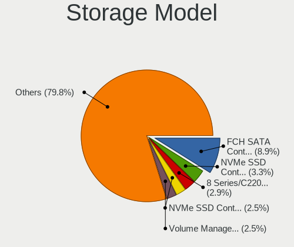
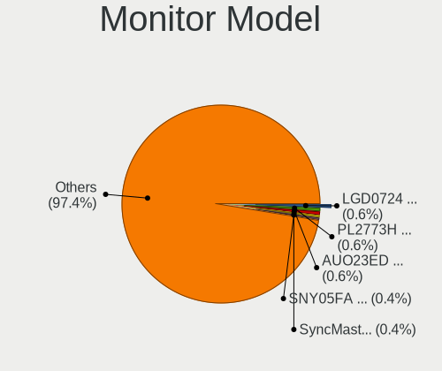
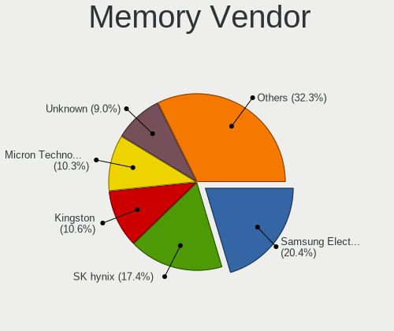
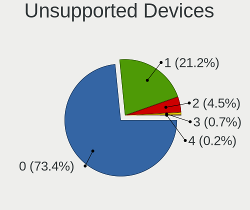

Ubuntu MATE 22.04 - Tested Hardware & Statistics
------------------------------------------------

A project to collect tested hardware configurations for Ubuntu MATE 22.04.

Anyone can contribute to this report by the [hw-probe](https://github.com/linuxhw/hw-probe) tool:

    sudo -E hw-probe -all -upload

Please contribute! Especially if your hardware is rare.

This is a report for all computer types. See also reports for [desktops](/Dist/Ubuntu_MATE_22.04/Desktop/README.md) and [notebooks](/Dist/Ubuntu_MATE_22.04/Notebook/README.md).

Contents
--------

* [ Test Cases ](#test-cases)

* [ System ](#system)
  - [ Kernel                   ](#kernel)
  - [ Kernel Family            ](#kernel-family)
  - [ Kernel Major Ver.        ](#kernel-major-ver)
  - [ Arch                     ](#arch)
  - [ DE                       ](#de)
  - [ Display Server           ](#display-server)
  - [ Display Manager          ](#display-manager)
  - [ OS Lang                  ](#os-lang)
  - [ Boot Mode                ](#boot-mode)
  - [ Filesystem               ](#filesystem)
  - [ Part. scheme             ](#part-scheme)
  - [ Dual Boot with Linux/BSD ](#dual-boot-with-linuxbsd)
  - [ Dual Boot (Win)          ](#dual-boot-win)

* [ Board ](#board)
  - [ Vendor                   ](#vendor)
  - [ Model                    ](#model)
  - [ Model Family             ](#model-family)
  - [ MFG Year                 ](#mfg-year)
  - [ Form Factor              ](#form-factor)
  - [ Secure Boot              ](#secure-boot)
  - [ Coreboot                 ](#coreboot)
  - [ RAM Size                 ](#ram-size)
  - [ RAM Used                 ](#ram-used)
  - [ Total Drives             ](#total-drives)
  - [ Has CD-ROM               ](#has-cd-rom)
  - [ Has Ethernet             ](#has-ethernet)
  - [ Has WiFi                 ](#has-wifi)
  - [ Has Bluetooth            ](#has-bluetooth)

* [ Location ](#location)
  - [ Country                  ](#country)
  - [ City                     ](#city)

* [ Drives ](#drives)
  - [ Drive Vendor             ](#drive-vendor)
  - [ Drive Model              ](#drive-model)
  - [ HDD Vendor               ](#hdd-vendor)
  - [ SSD Vendor               ](#ssd-vendor)
  - [ Drive Kind               ](#drive-kind)
  - [ Drive Connector          ](#drive-connector)
  - [ Drive Size               ](#drive-size)
  - [ Space Total              ](#space-total)
  - [ Space Used               ](#space-used)
  - [ Malfunc. Drives          ](#malfunc-drives)
  - [ Malfunc. Drive Vendor    ](#malfunc-drive-vendor)
  - [ Malfunc. HDD Vendor      ](#malfunc-hdd-vendor)
  - [ Malfunc. Drive Kind      ](#malfunc-drive-kind)
  - [ Failed Drives            ](#failed-drives)
  - [ Failed Drive Vendor      ](#failed-drive-vendor)
  - [ Drive Status             ](#drive-status)

* [ Storage controller ](#storage-controller)
  - [ Storage Vendor           ](#storage-vendor)
  - [ Storage Model            ](#storage-model)
  - [ Storage Kind             ](#storage-kind)

* [ Processor ](#processor)
  - [ CPU Vendor               ](#cpu-vendor)
  - [ CPU Model                ](#cpu-model)
  - [ CPU Model Family         ](#cpu-model-family)
  - [ CPU Cores                ](#cpu-cores)
  - [ CPU Sockets              ](#cpu-sockets)
  - [ CPU Threads              ](#cpu-threads)
  - [ CPU Op-Modes             ](#cpu-op-modes)
  - [ CPU Microcode            ](#cpu-microcode)
  - [ CPU Microarch            ](#cpu-microarch)

* [ Graphics ](#graphics)
  - [ GPU Vendor               ](#gpu-vendor)
  - [ GPU Model                ](#gpu-model)
  - [ GPU Combo                ](#gpu-combo)
  - [ GPU Driver               ](#gpu-driver)
  - [ GPU Memory               ](#gpu-memory)

* [ Monitor ](#monitor)
  - [ Monitor Vendor           ](#monitor-vendor)
  - [ Monitor Model            ](#monitor-model)
  - [ Monitor Resolution       ](#monitor-resolution)
  - [ Monitor Diagonal         ](#monitor-diagonal)
  - [ Monitor Width            ](#monitor-width)
  - [ Aspect Ratio             ](#aspect-ratio)
  - [ Monitor Area             ](#monitor-area)
  - [ Pixel Density            ](#pixel-density)
  - [ Multiple Monitors        ](#multiple-monitors)

* [ Network ](#network)
  - [ Net Controller Vendor    ](#net-controller-vendor)
  - [ Net Controller Model     ](#net-controller-model)
  - [ Wireless Vendor          ](#wireless-vendor)
  - [ Wireless Model           ](#wireless-model)
  - [ Ethernet Vendor          ](#ethernet-vendor)
  - [ Ethernet Model           ](#ethernet-model)
  - [ Net Controller Kind      ](#net-controller-kind)
  - [ Used Controller          ](#used-controller)
  - [ NICs                     ](#nics)
  - [ IPv6                     ](#ipv6)

* [ Bluetooth ](#bluetooth)
  - [ Bluetooth Vendor         ](#bluetooth-vendor)
  - [ Bluetooth Model          ](#bluetooth-model)

* [ Sound ](#sound)
  - [ Sound Vendor             ](#sound-vendor)
  - [ Sound Model              ](#sound-model)

* [ Memory ](#memory)
  - [ Memory Vendor            ](#memory-vendor)
  - [ Memory Model             ](#memory-model)
  - [ Memory Kind              ](#memory-kind)
  - [ Memory Form Factor       ](#memory-form-factor)
  - [ Memory Size              ](#memory-size)
  - [ Memory Speed             ](#memory-speed)

* [ Printers & scanners ](#printers--scanners)
  - [ Printer Vendor           ](#printer-vendor)
  - [ Printer Model            ](#printer-model)
  - [ Scanner Vendor           ](#scanner-vendor)
  - [ Scanner Model            ](#scanner-model)

* [ Camera ](#camera)
  - [ Camera Vendor            ](#camera-vendor)
  - [ Camera Model             ](#camera-model)

* [ Security ](#security)
  - [ Fingerprint Vendor       ](#fingerprint-vendor)
  - [ Fingerprint Model        ](#fingerprint-model)
  - [ Chipcard Vendor          ](#chipcard-vendor)
  - [ Chipcard Model           ](#chipcard-model)

* [ Unsupported ](#unsupported)
  - [ Unsupported Devices      ](#unsupported-devices)
  - [ Unsupported Device Types ](#unsupported-device-types)

Test Cases
----------

Total: 240

| Vendor        | Model                       | Form-Factor | Probe                                                      | Date         |
|---------------|-----------------------------|-------------|------------------------------------------------------------|--------------|
| Notebook      | NJx0MU                      | Notebook    | [43923d1e98](https://linux-hardware.org/?probe=43923d1e98) | Jan 01, 2023 |
| Lenovo        | ThinkPad R61 8918DEG        | Notebook    | [48c688033a](https://linux-hardware.org/?probe=48c688033a) | Dec 30, 2022 |
| Notebook      | NJx0MU                      | Notebook    | [8540c1c554](https://linux-hardware.org/?probe=8540c1c554) | Dec 30, 2022 |
| Lenovo        | ThinkPad R61 8918DEG        | Notebook    | [82cbc15539](https://linux-hardware.org/?probe=82cbc15539) | Dec 30, 2022 |
| Notebook      | NJx0MU                      | Notebook    | [b4c615f28c](https://linux-hardware.org/?probe=b4c615f28c) | Dec 30, 2022 |
| Raspberry ... | Raspberry Pi 4 Model B R... | Soc         | [531e60d101](https://linux-hardware.org/?probe=531e60d101) | Dec 30, 2022 |
| ASUSTek       | M5A78L-M LX                 | Desktop     | [b0f7933824](https://linux-hardware.org/?probe=b0f7933824) | Dec 29, 2022 |
| ASUSTek       | H110M-K                     | Desktop     | [4dab06b05f](https://linux-hardware.org/?probe=4dab06b05f) | Dec 29, 2022 |
| Notebook      | NJx0MU                      | Notebook    | [4a26556b6b](https://linux-hardware.org/?probe=4a26556b6b) | Dec 29, 2022 |
| HP            | Stream Laptop 14-cb1xxx     | Notebook    | [7ac222385a](https://linux-hardware.org/?probe=7ac222385a) | Dec 28, 2022 |
| HP            | Stream Laptop 14-cb1xxx     | Notebook    | [faf2c0e5d7](https://linux-hardware.org/?probe=faf2c0e5d7) | Dec 28, 2022 |
| HP            | ZBook 17 G5                 | Notebook    | [870deddfbe](https://linux-hardware.org/?probe=870deddfbe) | Dec 27, 2022 |
| Gigabyte      | B85M-D3H                    | Desktop     | [4283e3bb1e](https://linux-hardware.org/?probe=4283e3bb1e) | Dec 27, 2022 |
| Notebook      | NJx0MU                      | Notebook    | [db1c25cde3](https://linux-hardware.org/?probe=db1c25cde3) | Dec 27, 2022 |
| Notebook      | NJx0MU                      | Notebook    | [037841f71c](https://linux-hardware.org/?probe=037841f71c) | Dec 25, 2022 |
| ASUSTek       | X550LN                      | Notebook    | [207f82e19c](https://linux-hardware.org/?probe=207f82e19c) | Dec 25, 2022 |
| ASUSTek       | TUF Gaming FX505DT_FX505... | Notebook    | [f113c7d475](https://linux-hardware.org/?probe=f113c7d475) | Dec 25, 2022 |
| Notebook      | NJx0MU                      | Notebook    | [cc49bb2ef6](https://linux-hardware.org/?probe=cc49bb2ef6) | Dec 25, 2022 |
| Notebook      | NJx0MU                      | Notebook    | [838eb1f6fa](https://linux-hardware.org/?probe=838eb1f6fa) | Dec 24, 2022 |
| Notebook      | NJx0MU                      | Notebook    | [2995a5ea20](https://linux-hardware.org/?probe=2995a5ea20) | Dec 24, 2022 |
| Acer          | TravelMate 7730             | Notebook    | [8d166266b9](https://linux-hardware.org/?probe=8d166266b9) | Dec 23, 2022 |
| HP            | Compaq Presario CQ61        | Notebook    | [a85b255853](https://linux-hardware.org/?probe=a85b255853) | Dec 22, 2022 |
| Dell          | 0J1C3P A00                  | Desktop     | [b65b20a073](https://linux-hardware.org/?probe=b65b20a073) | Dec 22, 2022 |
| Notebook      | NJx0MU                      | Notebook    | [c1d47a051f](https://linux-hardware.org/?probe=c1d47a051f) | Dec 22, 2022 |
| Notebook      | NJx0MU                      | Notebook    | [0410be2105](https://linux-hardware.org/?probe=0410be2105) | Dec 22, 2022 |
| Notebook      | NJx0MU                      | Notebook    | [d1dc69cc49](https://linux-hardware.org/?probe=d1dc69cc49) | Dec 22, 2022 |
| ASUSTek       | P8Z77-V PRO                 | Desktop     | [2ad8b45619](https://linux-hardware.org/?probe=2ad8b45619) | Dec 21, 2022 |
| ASUSTek       | P8Z77-V PRO                 | Desktop     | [0e53e0be48](https://linux-hardware.org/?probe=0e53e0be48) | Dec 21, 2022 |
| Notebook      | NJx0MU                      | Notebook    | [ae1cc3b6c0](https://linux-hardware.org/?probe=ae1cc3b6c0) | Dec 21, 2022 |
| Notebook      | NJx0MU                      | Notebook    | [2f3edb2954](https://linux-hardware.org/?probe=2f3edb2954) | Dec 20, 2022 |
| Notebook      | NJx0MU                      | Notebook    | [5542739f1e](https://linux-hardware.org/?probe=5542739f1e) | Dec 20, 2022 |
| Notebook      | NJx0MU                      | Notebook    | [0d03f7978b](https://linux-hardware.org/?probe=0d03f7978b) | Dec 20, 2022 |
| Acer          | TravelMate 7730             | Notebook    | [8078925015](https://linux-hardware.org/?probe=8078925015) | Dec 20, 2022 |
| ASRock        | B550M-ITX/ac                | Desktop     | [21a91196b1](https://linux-hardware.org/?probe=21a91196b1) | Dec 19, 2022 |
| Lenovo        | ThinkPad T430 2347G5U       | Notebook    | [ac787dc7dc](https://linux-hardware.org/?probe=ac787dc7dc) | Dec 17, 2022 |
| ASUSTek       | PRIME Z590-P WIFI           | Desktop     | [34ac0b3211](https://linux-hardware.org/?probe=34ac0b3211) | Dec 17, 2022 |
| Lenovo        | ThinkPad T430 2347G5U       | Notebook    | [e47e7c18c9](https://linux-hardware.org/?probe=e47e7c18c9) | Dec 17, 2022 |
| Notebook      | NJx0MU                      | Notebook    | [e3ac894e13](https://linux-hardware.org/?probe=e3ac894e13) | Dec 17, 2022 |
| Notebook      | NJx0MU                      | Notebook    | [987d96714a](https://linux-hardware.org/?probe=987d96714a) | Dec 17, 2022 |
| ASUSTek       | ROG STRIX Z690-A GAMING ... | Desktop     | [ac15fdcc8b](https://linux-hardware.org/?probe=ac15fdcc8b) | Dec 16, 2022 |
| HP            | 2215                        | Desktop     | [78151a5e1b](https://linux-hardware.org/?probe=78151a5e1b) | Dec 16, 2022 |
| ASUSTek       | X550LN                      | Notebook    | [d09c34a000](https://linux-hardware.org/?probe=d09c34a000) | Dec 16, 2022 |
| Notebook      | NJx0MU                      | Notebook    | [7f2f68d436](https://linux-hardware.org/?probe=7f2f68d436) | Dec 16, 2022 |
| HUAWEI        | KPL-W0X                     | Notebook    | [8caca0975b](https://linux-hardware.org/?probe=8caca0975b) | Dec 15, 2022 |
| Notebook      | NJx0MU                      | Notebook    | [2c5167b360](https://linux-hardware.org/?probe=2c5167b360) | Dec 14, 2022 |
| Notebook      | NJx0MU                      | Notebook    | [ca7464eb3f](https://linux-hardware.org/?probe=ca7464eb3f) | Dec 14, 2022 |
| HP            | 14                          | Notebook    | [4794938b36](https://linux-hardware.org/?probe=4794938b36) | Dec 14, 2022 |
| Gigabyte      | F2A68HM-DS2                 | Desktop     | [976923f807](https://linux-hardware.org/?probe=976923f807) | Dec 12, 2022 |
| Notebook      | NJx0MU                      | Notebook    | [345eb47090](https://linux-hardware.org/?probe=345eb47090) | Dec 09, 2022 |
| Gigabyte      | AB350M-Gaming 3-CF          | Desktop     | [7ae8aecc25](https://linux-hardware.org/?probe=7ae8aecc25) | Dec 08, 2022 |
| ASRock        | B550M-ITX/ac                | Desktop     | [1d97601be2](https://linux-hardware.org/?probe=1d97601be2) | Dec 08, 2022 |
| ASRock        | B550M-ITX/ac                | Desktop     | [4943e0aa12](https://linux-hardware.org/?probe=4943e0aa12) | Dec 08, 2022 |
| Notebook      | NJx0MU                      | Notebook    | [bb704e1b90](https://linux-hardware.org/?probe=bb704e1b90) | Dec 08, 2022 |
| ASUSTek       | P7P55 LX                    | Desktop     | [be0753651f](https://linux-hardware.org/?probe=be0753651f) | Dec 07, 2022 |
| Lenovo        | IdeaPad S145-14IIL 81W6     | Notebook    | [c458ba13c3](https://linux-hardware.org/?probe=c458ba13c3) | Dec 05, 2022 |
| Lenovo        | IdeaPad S145-14IIL 81W6     | Notebook    | [bd9f0dc967](https://linux-hardware.org/?probe=bd9f0dc967) | Dec 05, 2022 |
| HP            | 14                          | Notebook    | [868daee488](https://linux-hardware.org/?probe=868daee488) | Dec 03, 2022 |
| Notebook      | NJx0MU                      | Notebook    | [bd06d3a448](https://linux-hardware.org/?probe=bd06d3a448) | Dec 03, 2022 |
| HP            | ProBook 450 G6              | Notebook    | [c9e94d483e](https://linux-hardware.org/?probe=c9e94d483e) | Nov 30, 2022 |
| Notebook      | NJx0MU                      | Notebook    | [d53007b0b3](https://linux-hardware.org/?probe=d53007b0b3) | Nov 30, 2022 |
| Acer          | TravelMate P614-51T-G2      | Notebook    | [37e14fc1c1](https://linux-hardware.org/?probe=37e14fc1c1) | Nov 30, 2022 |
| ASUSTek       | X555LAB                     | Notebook    | [d62cc93587](https://linux-hardware.org/?probe=d62cc93587) | Nov 28, 2022 |
| ASUSTek       | X555LAB                     | Notebook    | [8d8fc0d4d4](https://linux-hardware.org/?probe=8d8fc0d4d4) | Nov 28, 2022 |
| Acer          | Aspire A515-45              | Notebook    | [4cec4d0e04](https://linux-hardware.org/?probe=4cec4d0e04) | Nov 27, 2022 |
| Notebook      | NJx0MU                      | Notebook    | [05d0bf9d8d](https://linux-hardware.org/?probe=05d0bf9d8d) | Nov 25, 2022 |
| HP            | Pavilion Laptop 15-eh1xx... | Notebook    | [9e22e08aa1](https://linux-hardware.org/?probe=9e22e08aa1) | Nov 25, 2022 |
| HP            | ProBook 640 G8 Notebook ... | Notebook    | [ce586530e4](https://linux-hardware.org/?probe=ce586530e4) | Nov 24, 2022 |
| ASUSTek       | ASUS TUF Gaming A17 FA70... | Notebook    | [cf30d2df93](https://linux-hardware.org/?probe=cf30d2df93) | Nov 24, 2022 |
| Notebook      | NJx0MU                      | Notebook    | [bc690a128e](https://linux-hardware.org/?probe=bc690a128e) | Nov 23, 2022 |
| ASRock        | 990FX Extreme3              | Desktop     | [84b8daa5c4](https://linux-hardware.org/?probe=84b8daa5c4) | Nov 20, 2022 |
| Toshiba       | Satellite P50-B-10Z         | Notebook    | [c5413ac393](https://linux-hardware.org/?probe=c5413ac393) | Nov 19, 2022 |
| Acer          | Swift SF114-34              | Notebook    | [96d82e20c4](https://linux-hardware.org/?probe=96d82e20c4) | Nov 19, 2022 |
| Acer          | Swift SF114-34              | Notebook    | [f5fd517d69](https://linux-hardware.org/?probe=f5fd517d69) | Nov 19, 2022 |
| Lenovo        | IdeaPad 130-15AST 81H5      | Notebook    | [d4b8ffffe1](https://linux-hardware.org/?probe=d4b8ffffe1) | Nov 19, 2022 |
| Notebook      | NJx0MU                      | Notebook    | [f2e60e58dc](https://linux-hardware.org/?probe=f2e60e58dc) | Nov 17, 2022 |
| Notebook      | NJx0MU                      | Notebook    | [fe43edb930](https://linux-hardware.org/?probe=fe43edb930) | Nov 16, 2022 |
| HP            | 1998                        | Desktop     | [f9746a4ae0](https://linux-hardware.org/?probe=f9746a4ae0) | Nov 15, 2022 |
| Dell          | Latitude D630               | Notebook    | [3a15603bd6](https://linux-hardware.org/?probe=3a15603bd6) | Nov 13, 2022 |
| Dell          | Latitude D630               | Notebook    | [3e964fdd59](https://linux-hardware.org/?probe=3e964fdd59) | Nov 12, 2022 |
| ASUSTek       | K93SV                       | Notebook    | [8511ee86ad](https://linux-hardware.org/?probe=8511ee86ad) | Nov 12, 2022 |
| Notebook      | NJx0MU                      | Notebook    | [2dc75b76f4](https://linux-hardware.org/?probe=2dc75b76f4) | Nov 12, 2022 |
| Notebook      | NJx0MU                      | Notebook    | [01a339fb27](https://linux-hardware.org/?probe=01a339fb27) | Nov 11, 2022 |
| Microsoft     | Surface 2                   | Tablet      | [0cab1d9501](https://linux-hardware.org/?probe=0cab1d9501) | Nov 10, 2022 |
| Lenovo        | ThinkPad T420 4238LY7       | Notebook    | [c5cf611a37](https://linux-hardware.org/?probe=c5cf611a37) | Nov 07, 2022 |
| Lenovo        | G50-45 80E3                 | Notebook    | [7818a033c6](https://linux-hardware.org/?probe=7818a033c6) | Nov 06, 2022 |
| HP            | Laptop 15s-eq1xxx           | Notebook    | [b59f9dcf48](https://linux-hardware.org/?probe=b59f9dcf48) | Nov 05, 2022 |
| Notebook      | NJx0MU                      | Notebook    | [e56aa65a39](https://linux-hardware.org/?probe=e56aa65a39) | Nov 05, 2022 |
| HP            | Laptop 15s-eq1xxx           | Notebook    | [8fdaec6b5a](https://linux-hardware.org/?probe=8fdaec6b5a) | Nov 04, 2022 |
| HP            | Laptop 15s-eq1xxx           | Notebook    | [4f5b04e8d9](https://linux-hardware.org/?probe=4f5b04e8d9) | Nov 03, 2022 |
| Notebook      | NJx0MU                      | Notebook    | [5c0b61dfb6](https://linux-hardware.org/?probe=5c0b61dfb6) | Nov 03, 2022 |
| HP            | 15 Notebook PC              | Notebook    | [d17e8e8e36](https://linux-hardware.org/?probe=d17e8e8e36) | Nov 03, 2022 |
| Notebook      | NJx0MU                      | Notebook    | [342c7609c9](https://linux-hardware.org/?probe=342c7609c9) | Nov 02, 2022 |
| Notebook      | NJx0MU                      | Notebook    | [5b45883fef](https://linux-hardware.org/?probe=5b45883fef) | Nov 02, 2022 |
| MSI           | B75A-IE35                   | Desktop     | [57b74e4ca2](https://linux-hardware.org/?probe=57b74e4ca2) | Nov 01, 2022 |
| Notebook      | NJx0MU                      | Notebook    | [6b2b490208](https://linux-hardware.org/?probe=6b2b490208) | Nov 01, 2022 |
| Notebook      | NJx0MU                      | Notebook    | [1b626eed02](https://linux-hardware.org/?probe=1b626eed02) | Oct 31, 2022 |
| Notebook      | NJx0MU                      | Notebook    | [1b03bb8445](https://linux-hardware.org/?probe=1b03bb8445) | Oct 30, 2022 |
| Notebook      | NJx0MU                      | Notebook    | [f27aa95917](https://linux-hardware.org/?probe=f27aa95917) | Oct 29, 2022 |
| Dell          | Precision 7760              | Notebook    | [b8fce270db](https://linux-hardware.org/?probe=b8fce270db) | Oct 27, 2022 |
| Notebook      | NJx0MU                      | Notebook    | [2474ff9baf](https://linux-hardware.org/?probe=2474ff9baf) | Oct 27, 2022 |
| Toshiba       | Satellite C50D-A-133        | Notebook    | [c1ba737ccc](https://linux-hardware.org/?probe=c1ba737ccc) | Oct 25, 2022 |
| Apple         | MacBookAir6,1               | Notebook    | [4785b7f6f6](https://linux-hardware.org/?probe=4785b7f6f6) | Oct 25, 2022 |
| ASUSTek       | TUF Gaming B560M-PLUS       | Desktop     | [91bf754e64](https://linux-hardware.org/?probe=91bf754e64) | Oct 24, 2022 |
| ASRock        | Z77 Extreme4                | Desktop     | [7d12ed56e5](https://linux-hardware.org/?probe=7d12ed56e5) | Oct 19, 2022 |
| HP            | ENVY Sleekbook 6            | Notebook    | [a197375e26](https://linux-hardware.org/?probe=a197375e26) | Oct 19, 2022 |
| Gigabyte      | B450M DS3H-CF               | Desktop     | [6e45f7ecd7](https://linux-hardware.org/?probe=6e45f7ecd7) | Oct 15, 2022 |
| ASUSTek       | Z170 PRO GAMING/AURA        | Desktop     | [d1a5c91196](https://linux-hardware.org/?probe=d1a5c91196) | Oct 14, 2022 |
| ASUSTek       | Z170 PRO GAMING/AURA        | Desktop     | [b69b373cc1](https://linux-hardware.org/?probe=b69b373cc1) | Oct 14, 2022 |
| ASUSTek       | ROG STRIX Z590-E GAMING ... | Desktop     | [175ebd8462](https://linux-hardware.org/?probe=175ebd8462) | Oct 14, 2022 |
| Acer          | Aspire 7750G                | Notebook    | [e0c71d09bb](https://linux-hardware.org/?probe=e0c71d09bb) | Oct 11, 2022 |
| MSI           | H310M PRO-VDH PLUS          | Desktop     | [1ba5f65f98](https://linux-hardware.org/?probe=1ba5f65f98) | Oct 10, 2022 |
| MSI           | H310M PRO-VDH PLUS          | Desktop     | [41dd35ae5f](https://linux-hardware.org/?probe=41dd35ae5f) | Oct 10, 2022 |
| Chuwi         | GemiBook Pro                | Notebook    | [02170aab85](https://linux-hardware.org/?probe=02170aab85) | Oct 09, 2022 |
| ASUSTek       | M5A78L LE                   | Desktop     | [69023fe30e](https://linux-hardware.org/?probe=69023fe30e) | Oct 09, 2022 |
| Lenovo        | T530-28ICB                  | Desktop     | [b87998cf32](https://linux-hardware.org/?probe=b87998cf32) | Oct 09, 2022 |
| Dell          | 0DPRF9 A00                  | All in one  | [3d0b820b58](https://linux-hardware.org/?probe=3d0b820b58) | Oct 08, 2022 |
| Chuwi         | GemiBook Pro                | Notebook    | [1a165faedb](https://linux-hardware.org/?probe=1a165faedb) | Oct 08, 2022 |
| HP            | ENVY x360                   | Convertible | [b299af0bca](https://linux-hardware.org/?probe=b299af0bca) | Oct 08, 2022 |
| MSI           | B550-A PRO                  | Desktop     | [be6a0fda35](https://linux-hardware.org/?probe=be6a0fda35) | Oct 08, 2022 |
| Lenovo        | IdeaPad 3 15ALC6 82KU       | Notebook    | [bc1f7e7d02](https://linux-hardware.org/?probe=bc1f7e7d02) | Oct 06, 2022 |
| Lenovo        | T530-28ICB                  | Desktop     | [175a71260e](https://linux-hardware.org/?probe=175a71260e) | Oct 06, 2022 |
| ASUSTek       | PRIME B450-PLUS             | Desktop     | [85eb59fc6d](https://linux-hardware.org/?probe=85eb59fc6d) | Oct 05, 2022 |
| Lenovo        | ThinkPad T460p 20FW002CP... | Notebook    | [b7cd76d0b6](https://linux-hardware.org/?probe=b7cd76d0b6) | Oct 05, 2022 |
| ASUSTek       | UX32VD                      | Notebook    | [0bea9d8673](https://linux-hardware.org/?probe=0bea9d8673) | Oct 05, 2022 |
| Lenovo        | ThinkPad X230 2325Y5L       | Notebook    | [7c5c62cc90](https://linux-hardware.org/?probe=7c5c62cc90) | Oct 03, 2022 |
| Dell          | Latitude 7300               | Notebook    | [d9acb6ec9c](https://linux-hardware.org/?probe=d9acb6ec9c) | Oct 03, 2022 |
| Sony          | VGN-SZ3XP_C                 | Notebook    | [6e9671dd1a](https://linux-hardware.org/?probe=6e9671dd1a) | Oct 02, 2022 |
| Acer          | Aspire 7750G                | Notebook    | [ccf9b69093](https://linux-hardware.org/?probe=ccf9b69093) | Oct 02, 2022 |
| Acer          | Aspire 7750G                | Notebook    | [7b89b5d0cf](https://linux-hardware.org/?probe=7b89b5d0cf) | Oct 02, 2022 |
| HP            | ZBook 14 G2                 | Notebook    | [ac14cbda52](https://linux-hardware.org/?probe=ac14cbda52) | Oct 02, 2022 |
| Lenovo        | SHARKBAY SDK0E50510 PRO     | Desktop     | [cb5d0d1945](https://linux-hardware.org/?probe=cb5d0d1945) | Oct 01, 2022 |
| Lenovo        | SHARKBAY SDK0E50510 PRO     | Desktop     | [3af0c5cc5f](https://linux-hardware.org/?probe=3af0c5cc5f) | Oct 01, 2022 |
| ASUSTek       | PRIME B450-PLUS             | Desktop     | [db15c7b708](https://linux-hardware.org/?probe=db15c7b708) | Oct 01, 2022 |
| ASUSTek       | K30AD_M31AD_M51AD_M32AD     | Desktop     | [608c715bab](https://linux-hardware.org/?probe=608c715bab) | Sep 26, 2022 |
| Intel         | H81U                        | Notebook    | [9e4458528b](https://linux-hardware.org/?probe=9e4458528b) | Sep 25, 2022 |
| Dell          | Precision 7760              | Notebook    | [f6600a1244](https://linux-hardware.org/?probe=f6600a1244) | Sep 22, 2022 |
| Intel         | Kabylake Platform           | Notebook    | [8b1c5eb5bf](https://linux-hardware.org/?probe=8b1c5eb5bf) | Sep 21, 2022 |
| MSI           | H81M-P33                    | Desktop     | [108817dc0f](https://linux-hardware.org/?probe=108817dc0f) | Sep 21, 2022 |
| ASRock        | HM55-HT                     | Desktop     | [64fff8f065](https://linux-hardware.org/?probe=64fff8f065) | Sep 20, 2022 |
| Intel         | NUC8i7HNB J68197-502        | Mini pc     | [1573d65d2d](https://linux-hardware.org/?probe=1573d65d2d) | Sep 18, 2022 |
| MSI           | 870-G45                     | Desktop     | [74af87b0c5](https://linux-hardware.org/?probe=74af87b0c5) | Sep 17, 2022 |
| ASUSTek       | ROG STRIX Z690-A GAMING ... | Desktop     | [081d4b1d50](https://linux-hardware.org/?probe=081d4b1d50) | Sep 16, 2022 |
| ASUSTek       | M2A74-AM                    | Desktop     | [25c30e4e54](https://linux-hardware.org/?probe=25c30e4e54) | Sep 14, 2022 |
| ASUSTek       | M2A74-AM                    | Desktop     | [24e6ffe552](https://linux-hardware.org/?probe=24e6ffe552) | Sep 14, 2022 |
| ASUSTek       | P7P55 LX                    | Desktop     | [cc28ed218f](https://linux-hardware.org/?probe=cc28ed218f) | Sep 13, 2022 |
| Acer          | Aspire 5050                 | Notebook    | [1961d1c468](https://linux-hardware.org/?probe=1961d1c468) | Sep 13, 2022 |
| Raspberry ... | Raspberry Pi 4 Model B R... | Soc         | [a86e9d966b](https://linux-hardware.org/?probe=a86e9d966b) | Sep 12, 2022 |
| ASUSTek       | VivoBook_ASUSLaptop X712... | Notebook    | [64b8914cb2](https://linux-hardware.org/?probe=64b8914cb2) | Sep 12, 2022 |
| LG Electro... | 17Z990-R.AAS8U1             | Notebook    | [2df5aeabed](https://linux-hardware.org/?probe=2df5aeabed) | Sep 08, 2022 |
| Acer          | Aspire X3950                | Desktop     | [22d1319220](https://linux-hardware.org/?probe=22d1319220) | Sep 06, 2022 |
| ASUSTek       | P5GZ-MX                     | Desktop     | [883739db23](https://linux-hardware.org/?probe=883739db23) | Sep 05, 2022 |
| ASRock        | B450 Gaming-ITX/ac          | Desktop     | [f16d383b65](https://linux-hardware.org/?probe=f16d383b65) | Sep 05, 2022 |
| Dell          | Precision 7760              | Notebook    | [e920197599](https://linux-hardware.org/?probe=e920197599) | Sep 05, 2022 |
| HP            | Pavilion 15                 | Notebook    | [194bb33f3d](https://linux-hardware.org/?probe=194bb33f3d) | Sep 04, 2022 |
| HP            | 2ADC                        | Desktop     | [d9e5d2b511](https://linux-hardware.org/?probe=d9e5d2b511) | Sep 04, 2022 |
| Dell          | Inspiron 7720               | Notebook    | [0749c352d0](https://linux-hardware.org/?probe=0749c352d0) | Sep 03, 2022 |
| HP            | 18E4                        | Desktop     | [c58c0043cb](https://linux-hardware.org/?probe=c58c0043cb) | Sep 03, 2022 |
| HP            | 3397                        | Desktop     | [5cd2349a9c](https://linux-hardware.org/?probe=5cd2349a9c) | Sep 02, 2022 |
| Dell          | Latitude 5285               | Tablet      | [4e75bec854](https://linux-hardware.org/?probe=4e75bec854) | Sep 01, 2022 |
| HP            | Notebook                    | Notebook    | [573d359faf](https://linux-hardware.org/?probe=573d359faf) | Aug 31, 2022 |
| HP            | 15 Notebook PC              | Notebook    | [1109650747](https://linux-hardware.org/?probe=1109650747) | Aug 31, 2022 |
| Lenovo        | 3111 SDK0J40697 WIN 3305... | Desktop     | [2be9b66ba1](https://linux-hardware.org/?probe=2be9b66ba1) | Aug 30, 2022 |
| Intel         | NUC7i5BNB J31144-311        | Mini pc     | [2d66cac294](https://linux-hardware.org/?probe=2d66cac294) | Aug 28, 2022 |
| LincPlus      | LINNCPLUS P1                | Notebook    | [516427e0e9](https://linux-hardware.org/?probe=516427e0e9) | Aug 23, 2022 |
| Lenovo        | IdeaPad Gaming 3 15ARH05... | Notebook    | [5028378988](https://linux-hardware.org/?probe=5028378988) | Aug 23, 2022 |
| Notebook      | NJx0MU                      | Notebook    | [7a86bdf14e](https://linux-hardware.org/?probe=7a86bdf14e) | Aug 22, 2022 |
| AZW           | GK55                        | Desktop     | [0ae52e1fdf](https://linux-hardware.org/?probe=0ae52e1fdf) | Aug 21, 2022 |
| Dell          | Latitude 7420               | Notebook    | [d599ef65fd](https://linux-hardware.org/?probe=d599ef65fd) | Aug 20, 2022 |
| Lenovo        | IdeaPad 3 15IIL05 81WE      | Notebook    | [4efd818377](https://linux-hardware.org/?probe=4efd818377) | Aug 19, 2022 |
| MSI           | H170M PRO-VDH               | Desktop     | [4d7aa09763](https://linux-hardware.org/?probe=4d7aa09763) | Aug 16, 2022 |
| HP            | EliteBook 745 G5            | Notebook    | [7e8d33a07f](https://linux-hardware.org/?probe=7e8d33a07f) | Aug 16, 2022 |
| Dell          | 08NPPY A00                  | Desktop     | [1b78691cac](https://linux-hardware.org/?probe=1b78691cac) | Aug 14, 2022 |
| Dell          | 08NPPY A00                  | Desktop     | [b41823f392](https://linux-hardware.org/?probe=b41823f392) | Aug 14, 2022 |
| Lenovo        | ThinkBook 14 G2 ITL 20VD    | Notebook    | [644fbe551a](https://linux-hardware.org/?probe=644fbe551a) | Aug 13, 2022 |
| Dell          | Latitude E7470              | Notebook    | [61d0b104e9](https://linux-hardware.org/?probe=61d0b104e9) | Aug 13, 2022 |
| MSI           | MS-77311                    | Desktop     | [86b4d71bc0](https://linux-hardware.org/?probe=86b4d71bc0) | Aug 11, 2022 |
| HP            | 15 Notebook PC              | Notebook    | [46aa83aeb4](https://linux-hardware.org/?probe=46aa83aeb4) | Aug 07, 2022 |
| HONOR         | BOHK-WAX9X                  | Notebook    | [3d426cb1de](https://linux-hardware.org/?probe=3d426cb1de) | Aug 04, 2022 |
| Hardkernel    | ODROID-N2Plus               | Soc         | [40099f2516](https://linux-hardware.org/?probe=40099f2516) | Aug 03, 2022 |
| HP            | 8433 11                     | Desktop     | [cd790281b5](https://linux-hardware.org/?probe=cd790281b5) | Aug 02, 2022 |
| Raspberry ... | Raspberry Pi 4 Model B R... | Soc         | [b44bebcab6](https://linux-hardware.org/?probe=b44bebcab6) | Aug 01, 2022 |
| Dell          | 0KWVT8 A03                  | Desktop     | [cdca6713e9](https://linux-hardware.org/?probe=cdca6713e9) | Jul 31, 2022 |
| Dell          | 0KWVT8 A03                  | Desktop     | [1444843fcd](https://linux-hardware.org/?probe=1444843fcd) | Jul 31, 2022 |
| Lenovo        | Legion R9000P2021H 82JQ     | Notebook    | [4f2ba69c49](https://linux-hardware.org/?probe=4f2ba69c49) | Jul 27, 2022 |
| MSI           | 2AE0                        | Desktop     | [5c0034d313](https://linux-hardware.org/?probe=5c0034d313) | Jul 22, 2022 |
| MSI           | 2AE0                        | Desktop     | [df441346da](https://linux-hardware.org/?probe=df441346da) | Jul 22, 2022 |
| Dell          | Latitude E4200              | Notebook    | [6cc0415a8a](https://linux-hardware.org/?probe=6cc0415a8a) | Jul 21, 2022 |
| Medion        | MS-7797                     | Desktop     | [caf13d5392](https://linux-hardware.org/?probe=caf13d5392) | Jul 14, 2022 |
| Lenovo        | 3111 SDK0J40697 WIN 3305... | Mini pc     | [3e74ebae5a](https://linux-hardware.org/?probe=3e74ebae5a) | Jul 14, 2022 |
| Compaq        | Presario CQ-23              | Notebook    | [589a41e629](https://linux-hardware.org/?probe=589a41e629) | Jul 14, 2022 |
| Dell          | 0GM819                      | Desktop     | [3d18cc2632](https://linux-hardware.org/?probe=3d18cc2632) | Jul 08, 2022 |
| Dell          | Latitude 7320 Detachable    | Tablet      | [5f1b339a57](https://linux-hardware.org/?probe=5f1b339a57) | Jul 07, 2022 |
| Gigabyte      | Z87-HD3                     | Desktop     | [95e6ec0822](https://linux-hardware.org/?probe=95e6ec0822) | Jul 05, 2022 |
| HP            | 3646h                       | Desktop     | [9e0737f23f](https://linux-hardware.org/?probe=9e0737f23f) | Jul 04, 2022 |
| Apple         | Mac-F2238BAE iMac11,3       | All in one  | [e0c6593aee](https://linux-hardware.org/?probe=e0c6593aee) | Jul 04, 2022 |
| Gigabyte      | Z87-HD3                     | Desktop     | [28429fdd32](https://linux-hardware.org/?probe=28429fdd32) | Jul 02, 2022 |
| HP            | 8169                        | Desktop     | [18c6ea7678](https://linux-hardware.org/?probe=18c6ea7678) | Jul 01, 2022 |
| HP            | 8169                        | Desktop     | [c479baadc1](https://linux-hardware.org/?probe=c479baadc1) | Jul 01, 2022 |
| MicroByte     | ezbook                      | Notebook    | [91b1fc169b](https://linux-hardware.org/?probe=91b1fc169b) | Jun 28, 2022 |
| Dell          | XPS 17 9710                 | Notebook    | [6e16eed17c](https://linux-hardware.org/?probe=6e16eed17c) | Jun 26, 2022 |
| ASUSTek       | S550CM                      | Notebook    | [c7262ada04](https://linux-hardware.org/?probe=c7262ada04) | Jun 25, 2022 |
| HUAWEI        | KLVD-WXX9                   | Notebook    | [a8c98b76b4](https://linux-hardware.org/?probe=a8c98b76b4) | Jun 24, 2022 |
| Lenovo        | ThinkPad E15 Gen 2 20TDS... | Notebook    | [10de805cb0](https://linux-hardware.org/?probe=10de805cb0) | Jun 24, 2022 |
| Google        | Kled                        | Notebook    | [5f47e6d3e3](https://linux-hardware.org/?probe=5f47e6d3e3) | Jun 16, 2022 |
| Google        | Kled                        | Notebook    | [6a566134c4](https://linux-hardware.org/?probe=6a566134c4) | Jun 16, 2022 |
| Lenovo        | ThinkPad E15 Gen 2 20TDS... | Notebook    | [f7abc9fae0](https://linux-hardware.org/?probe=f7abc9fae0) | Jun 14, 2022 |
| Acer          | Aspire X3950                | Desktop     | [81797815d2](https://linux-hardware.org/?probe=81797815d2) | Jun 13, 2022 |
| Unknown       | Unknown                     | Desktop     | [c62add2d70](https://linux-hardware.org/?probe=c62add2d70) | Jun 13, 2022 |
| Raspberry ... | Raspberry Pi 4 Model B R... | Soc         | [efc9e12c05](https://linux-hardware.org/?probe=efc9e12c05) | Jun 12, 2022 |
| Lenovo        | V15 G2 ITL 82KB             | Notebook    | [e956f6b0b8](https://linux-hardware.org/?probe=e956f6b0b8) | Jun 09, 2022 |
| HP            | EliteBook 8560p             | Notebook    | [9bfdb902ce](https://linux-hardware.org/?probe=9bfdb902ce) | Jun 08, 2022 |
| HP            | 3397                        | Desktop     | [55bcbdbc1f](https://linux-hardware.org/?probe=55bcbdbc1f) | Jun 07, 2022 |
| Gigabyte      | B360M AORUS Gaming 3-CF     | Desktop     | [5407d4a1f6](https://linux-hardware.org/?probe=5407d4a1f6) | Jun 07, 2022 |
| Intel         | Kabylake Platform           | Notebook    | [074fd90c6a](https://linux-hardware.org/?probe=074fd90c6a) | Jun 06, 2022 |
| TrekStor      | Surfbook A13B               | Notebook    | [a42b3de31a](https://linux-hardware.org/?probe=a42b3de31a) | Jun 05, 2022 |
| Dell          | Precision M6500             | Notebook    | [1b68d2ca74](https://linux-hardware.org/?probe=1b68d2ca74) | Jun 01, 2022 |
| Apple         | MacBook5,1                  | Notebook    | [74e6dbe9af](https://linux-hardware.org/?probe=74e6dbe9af) | May 23, 2022 |
| Apple         | MacBook5,1                  | Notebook    | [a53d746d08](https://linux-hardware.org/?probe=a53d746d08) | May 23, 2022 |
| ASUSTek       | P5G41T-M LX2/BR             | Desktop     | [9044b2e4e2](https://linux-hardware.org/?probe=9044b2e4e2) | May 18, 2022 |
| ASUSTek       | VivoBook_ASUSLaptop X509... | Notebook    | [5107890ffd](https://linux-hardware.org/?probe=5107890ffd) | May 15, 2022 |
| Sony          | VPCEA36FG                   | Notebook    | [0161a27629](https://linux-hardware.org/?probe=0161a27629) | May 13, 2022 |
| HONOR         | BOHK-WAX9X                  | Notebook    | [e6c4aaa3d8](https://linux-hardware.org/?probe=e6c4aaa3d8) | May 12, 2022 |
| Unknown       | HX90                        | Desktop     | [3a7e2628b0](https://linux-hardware.org/?probe=3a7e2628b0) | May 09, 2022 |
| Lenovo        | ThinkBook 16p Gen 2 20YM    | Notebook    | [e99cdba363](https://linux-hardware.org/?probe=e99cdba363) | May 07, 2022 |
| HP            | EliteBook 840 G5            | Notebook    | [a53b09a7f3](https://linux-hardware.org/?probe=a53b09a7f3) | May 07, 2022 |
| HYPERPC       | PLAY                        | Notebook    | [408e86d04f](https://linux-hardware.org/?probe=408e86d04f) | May 06, 2022 |
| MSI           | B450 TOMAHAWK MAX           | Desktop     | [246c63d834](https://linux-hardware.org/?probe=246c63d834) | May 06, 2022 |
| Apple         | MacBookPro6,2               | Notebook    | [ebaaf4a69b](https://linux-hardware.org/?probe=ebaaf4a69b) | May 01, 2022 |
| HP            | 8433 11                     | Desktop     | [a5b829538b](https://linux-hardware.org/?probe=a5b829538b) | Apr 29, 2022 |
| TYAN Compu... | S7012                       | Server      | [018f293210](https://linux-hardware.org/?probe=018f293210) | Apr 28, 2022 |
| Apple         | MacBookPro9,1               | Notebook    | [35b3b3ae30](https://linux-hardware.org/?probe=35b3b3ae30) | Apr 26, 2022 |
| Apple         | MacBookPro9,1               | Notebook    | [faf447a067](https://linux-hardware.org/?probe=faf447a067) | Apr 24, 2022 |
| Gigabyte      | X99P-SLI-CF                 | Desktop     | [19055b80bc](https://linux-hardware.org/?probe=19055b80bc) | Apr 16, 2022 |
| Lenovo        | IdeaPadFlex 6-14IKB 81EM    | Convertible | [5e31d89c28](https://linux-hardware.org/?probe=5e31d89c28) | Apr 09, 2022 |
| IPASON        | MaxBook P1                  | Notebook    | [d66d062f54](https://linux-hardware.org/?probe=d66d062f54) | Apr 05, 2022 |
| ASUSTek       | PRIME H410M-A               | Desktop     | [9352c21f95](https://linux-hardware.org/?probe=9352c21f95) | Mar 17, 2022 |
| Lenovo        | ThinkPad SL500 27463ZG      | Notebook    | [b746a25ff1](https://linux-hardware.org/?probe=b746a25ff1) | Jan 28, 2022 |
| ASUSTek       | PRIME B550-PLUS             | Desktop     | [4368bd67ac](https://linux-hardware.org/?probe=4368bd67ac) | Nov 23, 2021 |
| ASUSTek       | PRIME B550-PLUS             | Desktop     | [686454975b](https://linux-hardware.org/?probe=686454975b) | Nov 23, 2021 |
| ASUSTek       | ROG Maximus XIII HERO       | Desktop     | [36ac197007](https://linux-hardware.org/?probe=36ac197007) | Nov 17, 2021 |

System
------

Kernel
------

Version of the Linux kernel

| Version                                | Computers | Percent |
|----------------------------------------|-----------|---------|
| 5.15.0-56-generic                      | 19        | 12.03%  |
| 5.15.0-47-generic                      | 18        | 11.39%  |
| 5.15.0-48-generic                      | 13        | 8.23%   |
| 5.15.0-52-generic                      | 11        | 6.96%   |
| 5.15.0-46-generic                      | 11        | 6.96%   |
| 5.15.0-40-generic                      | 9         | 5.7%    |
| 5.15.0-25-generic                      | 8         | 5.06%   |
| 5.15.0-53-generic                      | 7         | 4.43%   |
| 5.15.0-43-generic                      | 7         | 4.43%   |
| 5.15.0-27-generic                      | 7         | 4.43%   |
| 5.15.0-50-generic                      | 6         | 3.8%    |
| 5.15.0-41-generic                      | 6         | 3.8%    |
| 5.15.0-30-generic                      | 4         | 2.53%   |
| 5.15.0-37-generic                      | 3         | 1.9%    |
| 5.15.0-56-lowlatency                   | 2         | 1.27%   |
| 5.15.0-52-lowlatency                   | 2         | 1.27%   |
| 5.15.0-39-generic                      | 2         | 1.27%   |
| 5.15.0-35-generic                      | 2         | 1.27%   |
| 5.14.0-1054-oem                        | 2         | 1.27%   |
| 6.0.8-x64v1-xanmod1                    | 1         | 0.63%   |
| 5.18.0-odroid-arm64                    | 1         | 0.63%   |
| 5.18.0-1-generic                       | 1         | 0.63%   |
| 5.18.0-051800-generic                  | 1         | 0.63%   |
| 5.17.1-051701-generic                  | 1         | 0.63%   |
| 5.17.0-rc4-next-20220217-g21d89a4d51a7 | 1         | 0.63%   |
| 5.17.0-1003-oem                        | 1         | 0.63%   |
| 5.15.0-46-lowlatency                   | 1         | 0.63%   |
| 5.15.0-33-generic                      | 1         | 0.63%   |
| 5.15.0-23-generic                      | 1         | 0.63%   |
| 5.15.0-22-generic                      | 1         | 0.63%   |
| 5.15.0-18-generic                      | 1         | 0.63%   |
| 5.15.0-11-generic                      | 1         | 0.63%   |
| 5.15.0-1021-raspi                      | 1         | 0.63%   |
| 5.15.0-1014-raspi                      | 1         | 0.63%   |
| 5.15.0-1012-raspi                      | 1         | 0.63%   |
| 5.15.0-1011-raspi                      | 1         | 0.63%   |
| 5.13.0-52-generic                      | 1         | 0.63%   |
| 5.13.0-19-generic                      | 1         | 0.63%   |

Kernel Family
-------------

Linux kernel without a distro release

| Version | Computers | Percent |
|---------|-----------|---------|
| 5.15.0  | 135       | 92.47%  |
| 5.18.0  | 3         | 2.05%   |
| 5.17.0  | 2         | 1.37%   |
| 5.14.0  | 2         | 1.37%   |
| 5.13.0  | 2         | 1.37%   |
| 6.0.8   | 1         | 0.68%   |
| 5.17.1  | 1         | 0.68%   |

Kernel Major Ver.
-----------------

Linux kernel major version

| Version | Computers | Percent |
|---------|-----------|---------|
| 5.15    | 135       | 92.47%  |
| 5.18    | 3         | 2.05%   |
| 5.17    | 3         | 2.05%   |
| 5.14    | 2         | 1.37%   |
| 5.13    | 2         | 1.37%   |
| 6.0     | 1         | 0.68%   |

Arch
----

OS architecture (x86_64, i586, etc.)

| Name    | Computers | Percent |
|---------|-----------|---------|
| x86_64  | 142       | 97.93%  |
| aarch64 | 2         | 1.38%   |
| armv7l  | 1         | 0.69%   |

DE
--

Desktop Environment

| Name   | Computers | Percent |
|--------|-----------|---------|
| MATE   | 142       | 97.93%  |
| KDE5   | 2         | 1.38%   |
| Budgie | 1         | 0.69%   |

Display Server
--------------

X11 or Wayland

| Name    | Computers | Percent |
|---------|-----------|---------|
| X11     | 139       | 95.86%  |
| Wayland | 4         | 2.76%   |
| Tty     | 2         | 1.38%   |

Display Manager
---------------

SDDM, LightDM, etc.

| Name    | Computers | Percent |
|---------|-----------|---------|
| LightDM | 118       | 79.73%  |
| GDM3    | 15        | 10.14%  |
| Unknown | 14        | 9.46%   |
| SDDM    | 1         | 0.68%   |

OS Lang
-------

Language

| Lang  | Computers | Percent |
|-------|-----------|---------|
| en_US | 57        | 39.31%  |
| de_DE | 15        | 10.34%  |
| fr_FR | 14        | 9.66%   |
| it_IT | 11        | 7.59%   |
| ru_RU | 5         | 3.45%   |
| en_GB | 5         | 3.45%   |
| en_CA | 5         | 3.45%   |
| en_AU | 5         | 3.45%   |
| pt_BR | 4         | 2.76%   |
| fi_FI | 3         | 2.07%   |
| de_CH | 3         | 2.07%   |
| C     | 3         | 2.07%   |
| pl_PL | 2         | 1.38%   |
| hu_HU | 2         | 1.38%   |
| hr_HR | 2         | 1.38%   |
| es_ES | 2         | 1.38%   |
| zh_CN | 1         | 0.69%   |
| nl_NL | 1         | 0.69%   |
| es_PE | 1         | 0.69%   |
| es_AR | 1         | 0.69%   |
| en_IL | 1         | 0.69%   |
| el_GR | 1         | 0.69%   |
| de_AT | 1         | 0.69%   |

Boot Mode
---------

EFI or BIOS

| Mode | Computers | Percent |
|------|-----------|---------|
| BIOS | 79        | 51.97%  |
| EFI  | 73        | 48.03%  |

Filesystem
----------

Type of filesystem

| Type    | Computers | Percent |
|---------|-----------|---------|
| Ext4    | 133       | 91.1%   |
| Zfs     | 4         | 2.74%   |
| Overlay | 4         | 2.74%   |
| Xfs     | 2         | 1.37%   |
| Btrfs   | 2         | 1.37%   |
| Jfs     | 1         | 0.68%   |

Part. scheme
------------

Scheme of partitioning

| Type    | Computers | Percent |
|---------|-----------|---------|
| GPT     | 99        | 66%     |
| Unknown | 36        | 24%     |
| MBR     | 15        | 10%     |

Dual Boot with Linux/BSD
------------------------

Hosting more than one Linux/BSD

| Dual boot | Computers | Percent |
|-----------|-----------|---------|
| No        | 117       | 80.69%  |
| Yes       | 28        | 19.31%  |

Dual Boot (Win)
---------------

Hosting Linux and Windows

| Dual boot | Computers | Percent |
|-----------|-----------|---------|
| No        | 92        | 62.59%  |
| Yes       | 55        | 37.41%  |

Board
-----

Vendor
------

Motherboard manufacturer

| Name                    | Computers | Percent |
|-------------------------|-----------|---------|
| ASUSTek Computer        | 27        | 18.62%  |
| Hewlett-Packard         | 26        | 17.93%  |
| Lenovo                  | 19        | 13.1%   |
| Dell                    | 14        | 9.66%   |
| MSI                     | 9         | 6.21%   |
| Gigabyte Technology     | 6         | 4.14%   |
| Acer                    | 6         | 4.14%   |
| ASRock                  | 5         | 3.45%   |
| Apple                   | 5         | 3.45%   |
| Intel                   | 4         | 2.76%   |
| Toshiba                 | 2         | 1.38%   |
| HUAWEI                  | 2         | 1.38%   |
| Unknown                 | 2         | 1.38%   |
| TYAN Computer           | 1         | 0.69%   |
| TrekStor                | 1         | 0.69%   |
| Sony                    | 1         | 0.69%   |
| Raspberry Pi Foundation | 1         | 0.69%   |
| Notebook                | 1         | 0.69%   |
| Microsoft               | 1         | 0.69%   |
| MicroByte               | 1         | 0.69%   |
| Medion                  | 1         | 0.69%   |
| LincPlus                | 1         | 0.69%   |
| LG Electronics          | 1         | 0.69%   |
| IPASON                  | 1         | 0.69%   |
| HYPERPC                 | 1         | 0.69%   |
| HONOR                   | 1         | 0.69%   |
| Hardkernel              | 1         | 0.69%   |
| Google                  | 1         | 0.69%   |
| Compaq                  | 1         | 0.69%   |
| Chuwi                   | 1         | 0.69%   |
| AZW                     | 1         | 0.69%   |

Model
-----

Motherboard model

| Name                                 | Computers | Percent |
|--------------------------------------|-----------|---------|
| HP Compaq Elite 8300 SFF             | 2         | 1.38%   |
| Unknown                              | 2         | 1.38%   |
| TYAN S7012                           | 1         | 0.69%   |
| TrekStor Surfbook A13B               | 1         | 0.69%   |
| Toshiba Satellite P50-B-10Z          | 1         | 0.69%   |
| Toshiba Satellite C50D-A-133         | 1         | 0.69%   |
| Sony VPCEA36FG                       | 1         | 0.69%   |
| RPi Raspberry Pi 4 Model B Rev 1.4   | 1         | 0.69%   |
| Notebook NJx0MU                      | 1         | 0.69%   |
| MSI p6-2330                          | 1         | 0.69%   |
| MSI MS-7C56                          | 1         | 0.69%   |
| MSI MS-7C09                          | 1         | 0.69%   |
| MSI MS-7C02                          | 1         | 0.69%   |
| MSI MS-7982                          | 1         | 0.69%   |
| MSI MS-7817                          | 1         | 0.69%   |
| MSI MS-7758                          | 1         | 0.69%   |
| MSI MS-7599                          | 1         | 0.69%   |
| MSI B02311                           | 1         | 0.69%   |
| Microsoft Surface 2                  | 1         | 0.69%   |
| MicroByte ezbook                     | 1         | 0.69%   |
| Medion MS-7797                       | 1         | 0.69%   |
| LincPlus LINNCPLUS P1                | 1         | 0.69%   |
| LG 17Z990-R.AAS8U1                   | 1         | 0.69%   |
| Lenovo V15 G2 ITL 82KB               | 1         | 0.69%   |
| Lenovo ThinkPad X230 2325Y5L         | 1         | 0.69%   |
| Lenovo ThinkPad T460p 20FW002CPB     | 1         | 0.69%   |
| Lenovo ThinkPad T430 2347G5U         | 1         | 0.69%   |
| Lenovo ThinkPad T420 4238LY7         | 1         | 0.69%   |
| Lenovo ThinkPad SL500 27463ZG        | 1         | 0.69%   |
| Lenovo ThinkPad R61 8918DEG          | 1         | 0.69%   |
| Lenovo ThinkPad E15 Gen 2 20TDS0T500 | 1         | 0.69%   |
| Lenovo ThinkCentre M710q 10MQSC0N00  | 1         | 0.69%   |
| Lenovo ThinkCentre M710q 10MQS0FR01  | 1         | 0.69%   |
| Lenovo ThinkBook 16p Gen 2 20YM      | 1         | 0.69%   |
| Lenovo ThinkBook 14 G2 ITL 20VD      | 1         | 0.69%   |
| Lenovo T530-28ICB                    | 1         | 0.69%   |
| Lenovo IdeaPadFlex 6-14IKB 81EM      | 1         | 0.69%   |
| Lenovo IdeaPad S145-14IIL 81W6       | 1         | 0.69%   |
| Lenovo IdeaPad Gaming 3 15ARH05 82EY | 1         | 0.69%   |
| Lenovo IdeaPad 3 15IIL05 81WE        | 1         | 0.69%   |

Model Family
------------

Motherboard model prefix

| Name               | Computers | Percent |
|--------------------|-----------|---------|
| Lenovo ThinkPad    | 7         | 4.83%   |
| Lenovo IdeaPad     | 5         | 3.45%   |
| Dell Latitude      | 5         | 3.45%   |
| HP Compaq          | 4         | 2.76%   |
| ASUS PRIME         | 4         | 2.76%   |
| HP Pavilion        | 3         | 2.07%   |
| HP EliteDesk       | 3         | 2.07%   |
| HP EliteBook       | 3         | 2.07%   |
| Dell Precision     | 3         | 2.07%   |
| ASUS ROG           | 3         | 2.07%   |
| Acer Aspire        | 3         | 2.07%   |
| Toshiba Satellite  | 2         | 1.38%   |
| Lenovo ThinkCentre | 2         | 1.38%   |
| Lenovo ThinkBook   | 2         | 1.38%   |
| HP ZBook           | 2         | 1.38%   |
| HP ProBook         | 2         | 1.38%   |
| HP ENVY            | 2         | 1.38%   |
| Dell XPS           | 2         | 1.38%   |
| Dell OptiPlex      | 2         | 1.38%   |
| Dell Inspiron      | 2         | 1.38%   |
| ASUS VivoBook      | 2         | 1.38%   |
| ASUS TUF           | 2         | 1.38%   |
| Acer TravelMate    | 2         | 1.38%   |
| Unknown            | 2         | 1.38%   |
| TYAN S7012         | 1         | 0.69%   |
| TrekStor Surfbook  | 1         | 0.69%   |
| Sony VPCEA36FG     | 1         | 0.69%   |
| RPi Raspberry      | 1         | 0.69%   |
| Notebook NJx0MU    | 1         | 0.69%   |
| MSI p6-2330        | 1         | 0.69%   |
| MSI MS-7C56        | 1         | 0.69%   |
| MSI MS-7C09        | 1         | 0.69%   |
| MSI MS-7C02        | 1         | 0.69%   |
| MSI MS-7982        | 1         | 0.69%   |
| MSI MS-7817        | 1         | 0.69%   |
| MSI MS-7758        | 1         | 0.69%   |
| MSI MS-7599        | 1         | 0.69%   |
| MSI B02311         | 1         | 0.69%   |
| Microsoft Surface  | 1         | 0.69%   |
| MicroByte ezbook   | 1         | 0.69%   |

MFG Year
--------

Motherboard manufacture year

| Year    | Computers | Percent |
|---------|-----------|---------|
| 2021    | 26        | 17.93%  |
| 2018    | 14        | 9.66%   |
| 2020    | 13        | 8.97%   |
| 2012    | 13        | 8.97%   |
| 2019    | 10        | 6.9%    |
| 2014    | 10        | 6.9%    |
| 2013    | 10        | 6.9%    |
| 2010    | 8         | 5.52%   |
| 2011    | 7         | 4.83%   |
| 2009    | 7         | 4.83%   |
| 2022    | 5         | 3.45%   |
| 2016    | 5         | 3.45%   |
| 2017    | 4         | 2.76%   |
| 2015    | 4         | 2.76%   |
| 2007    | 3         | 2.07%   |
| 2008    | 2         | 1.38%   |
| 2006    | 2         | 1.38%   |
| Unknown | 2         | 1.38%   |

Form Factor
-----------

Physical design of the computer

| Name           | Computers | Percent |
|----------------|-----------|---------|
| Notebook       | 74        | 51.03%  |
| Desktop        | 58        | 40%     |
| Tablet         | 3         | 2.07%   |
| Mini pc        | 3         | 2.07%   |
| System on chip | 2         | 1.38%   |
| Convertible    | 2         | 1.38%   |
| All in one     | 2         | 1.38%   |
| Server         | 1         | 0.69%   |

Secure Boot
-----------

Enabled or disabled

| State    | Computers | Percent |
|----------|-----------|---------|
| Disabled | 139       | 93.92%  |
| Enabled  | 9         | 6.08%   |

Coreboot
--------

Have coreboot on board

| Used | Computers | Percent |
|------|-----------|---------|
| No   | 144       | 99.31%  |
| Yes  | 1         | 0.69%   |

RAM Size
--------

Total RAM memory

| Size in GB  | Computers | Percent |
|-------------|-----------|---------|
| 4.01-8.0    | 36        | 24.83%  |
| 3.01-4.0    | 27        | 18.62%  |
| 8.01-16.0   | 27        | 18.62%  |
| 16.01-24.0  | 23        | 15.86%  |
| 32.01-64.0  | 20        | 13.79%  |
| 64.01-256.0 | 6         | 4.14%   |
| 24.01-32.0  | 3         | 2.07%   |
| 1.01-2.0    | 2         | 1.38%   |
| 2.01-3.0    | 1         | 0.69%   |

RAM Used
--------

Used RAM memory

| Used GB    | Computers | Percent |
|------------|-----------|---------|
| 1.01-2.0   | 43        | 28.67%  |
| 2.01-3.0   | 40        | 26.67%  |
| 4.01-8.0   | 30        | 20%     |
| 3.01-4.0   | 20        | 13.33%  |
| 8.01-16.0  | 8         | 5.33%   |
| 0.51-1.0   | 8         | 5.33%   |
| 24.01-32.0 | 1         | 0.67%   |

Total Drives
------------

Number of drives on board

| Drives | Computers | Percent |
|--------|-----------|---------|
| 1      | 86        | 59.31%  |
| 2      | 25        | 17.24%  |
| 3      | 17        | 11.72%  |
| 4      | 10        | 6.9%    |
| 6      | 4         | 2.76%   |
| 5      | 2         | 1.38%   |
| 7      | 1         | 0.69%   |

Has CD-ROM
----------

Has CD-ROM on board

| Presented | Computers | Percent |
|-----------|-----------|---------|
| No        | 82        | 56.55%  |
| Yes       | 63        | 43.45%  |

Has Ethernet
------------

Has Ethernet on board

| Presented | Computers | Percent |
|-----------|-----------|---------|
| Yes       | 118       | 81.38%  |
| No        | 27        | 18.62%  |

Has WiFi
--------

Has WiFi module

| Presented | Computers | Percent |
|-----------|-----------|---------|
| Yes       | 117       | 80.69%  |
| No        | 28        | 19.31%  |

Has Bluetooth
-------------

Has Bluetooth module

| Presented | Computers | Percent |
|-----------|-----------|---------|
| Yes       | 93        | 63.7%   |
| No        | 53        | 36.3%   |

Location
--------

Country
-------

Geographic location (country)

| Country     | Computers | Percent |
|-------------|-----------|---------|
| USA         | 25        | 17.24%  |
| Germany     | 18        | 12.41%  |
| Italy       | 14        | 9.66%   |
| France      | 13        | 8.97%   |
| Brazil      | 6         | 4.14%   |
| UK          | 5         | 3.45%   |
| Spain       | 5         | 3.45%   |
| Russia      | 5         | 3.45%   |
| Canada      | 5         | 3.45%   |
| Hungary     | 4         | 2.76%   |
| Finland     | 4         | 2.76%   |
| Australia   | 4         | 2.76%   |
| Turkey      | 3         | 2.07%   |
| Switzerland | 3         | 2.07%   |
| Greece      | 3         | 2.07%   |
| Croatia     | 3         | 2.07%   |
| Serbia      | 2         | 1.38%   |
| Portugal    | 2         | 1.38%   |
| Poland      | 2         | 1.38%   |
| Estonia     | 2         | 1.38%   |
| Belgium     | 2         | 1.38%   |
| Austria     | 2         | 1.38%   |
| Ukraine     | 1         | 0.69%   |
| Romania     | 1         | 0.69%   |
| Peru        | 1         | 0.69%   |
| Paraguay    | 1         | 0.69%   |
| Netherlands | 1         | 0.69%   |
| Israel      | 1         | 0.69%   |
| India       | 1         | 0.69%   |
| Georgia     | 1         | 0.69%   |
| Colombia    | 1         | 0.69%   |
| China       | 1         | 0.69%   |
| Chile       | 1         | 0.69%   |
| Bulgaria    | 1         | 0.69%   |
| Argentina   | 1         | 0.69%   |

City
----

Geographic location (city)

| City             | Computers | Percent |
|------------------|-----------|---------|
| Mannheim         | 3         | 2.01%   |
| Berlin           | 3         | 2.01%   |
| Zagreb           | 2         | 1.34%   |
| Warsaw           | 2         | 1.34%   |
| Vancouver        | 2         | 1.34%   |
| Turku            | 2         | 1.34%   |
| Paris            | 2         | 1.34%   |
| Olathe           | 2         | 1.34%   |
| Melbourne        | 2         | 1.34%   |
| Lansdale         | 2         | 1.34%   |
| Belgrade         | 2         | 1.34%   |
| Zottegem         | 1         | 0.67%   |
| York             | 1         | 0.67%   |
| Xining           | 1         | 0.67%   |
| West Stockbridge | 1         | 0.67%   |
| Washington       | 1         | 0.67%   |
| Viroflay         | 1         | 0.67%   |
| Villeurbanne     | 1         | 0.67%   |
| Viana do Castelo | 1         | 0.67%   |
| Velyki Mosty     | 1         | 0.67%   |
| Varna            | 1         | 0.67%   |
| Valenciennes     | 1         | 0.67%   |
| Tula             | 1         | 0.67%   |
| Trenton          | 1         | 0.67%   |
| Toulon           | 1         | 0.67%   |
| Thane            | 1         | 0.67%   |
| Terrace          | 1         | 0.67%   |
| Tel Aviv         | 1         | 0.67%   |
| Tartu            | 1         | 0.67%   |
| Taranto          | 1         | 0.67%   |
| Talence          | 1         | 0.67%   |
| Talcahuano       | 1         | 0.67%   |
| Stuttgart        | 1         | 0.67%   |
| St Petersburg    | 1         | 0.67%   |
| Split            | 1         | 0.67%   |
| Southampton      | 1         | 0.67%   |
| Seville          | 1         | 0.67%   |
| Settimo Torinese | 1         | 0.67%   |
| Selargius        | 1         | 0.67%   |
| Seia             | 1         | 0.67%   |

Drives
------

Drive Vendor
------------

Hard drive vendors

| Vendor                | Computers | Drives | Percent |
|-----------------------|-----------|--------|---------|
| Samsung Electronics   | 38        | 64     | 17.12%  |
| WDC                   | 28        | 45     | 12.61%  |
| Seagate               | 26        | 31     | 11.71%  |
| Crucial               | 15        | 18     | 6.76%   |
| SanDisk               | 14        | 19     | 6.31%   |
| Toshiba               | 13        | 18     | 5.86%   |
| Unknown               | 10        | 14     | 4.5%    |
| Kingston              | 10        | 12     | 4.5%    |
| Phison                | 5         | 5      | 2.25%   |
| Hitachi               | 5         | 5      | 2.25%   |
| A-DATA Technology     | 5         | 5      | 2.25%   |
| SK hynix              | 4         | 4      | 1.8%    |
| SPCC                  | 3         | 4      | 1.35%   |
| KingSpec              | 3         | 3      | 1.35%   |
| China                 | 3         | 3      | 1.35%   |
| Netac                 | 2         | 2      | 0.9%    |
| Micron Technology     | 2         | 2      | 0.9%    |
| KIOXIA                | 2         | 2      | 0.9%    |
| Intel                 | 2         | 2      | 0.9%    |
| HGST                  | 2         | 2      | 0.9%    |
| WDC WDS2              | 1         | 1      | 0.45%   |
| Verbatim              | 1         | 1      | 0.45%   |
| UMIS                  | 1         | 1      | 0.45%   |
| SSSTC                 | 1         | 1      | 0.45%   |
| RZX                   | 1         | 1      | 0.45%   |
| Realtek Semiconductor | 1         | 1      | 0.45%   |
| Phison Electronics    | 1         | 1      | 0.45%   |
| Patriot               | 1         | 1      | 0.45%   |
| NGFF                  | 1         | 1      | 0.45%   |
| Maxtor                | 1         | 1      | 0.45%   |
| LITEONIT              | 1         | 1      | 0.45%   |
| LITEON                | 1         | 1      | 0.45%   |
| Lenovo                | 1         | 1      | 0.45%   |
| Kston                 | 1         | 1      | 0.45%   |
| KIOXIA-EXCERIA        | 1         | 1      | 0.45%   |
| Kimtigo               | 1         | 1      | 0.45%   |
| KESU                  | 1         | 1      | 0.45%   |
| JMicron Technology    | 1         | 1      | 0.45%   |
| Intenso               | 1         | 1      | 0.45%   |
| Hjwdz                 | 1         | 1      | 0.45%   |

Drive Model
-----------

Hard drive models

| Model                                               | Computers | Percent |
|-----------------------------------------------------|-----------|---------|
| Crucial CT1000BX500SSD1 1TB                         | 4         | 1.56%   |
| Seagate ST500DM002-1BD142 500GB                     | 3         | 1.17%   |
| Seagate ST2000DM001-1ER164 2TB                      | 3         | 1.17%   |
| Samsung NVMe SSD Drive 1TB                          | 3         | 1.17%   |
| Samsung NVMe SSD Controller SM981/PM981/PM983 500GB | 3         | 1.17%   |
| Crucial CT240BX500SSD1 240GB                        | 3         | 1.17%   |
| Crucial CT2000MX500SSD1 2TB                         | 3         | 1.17%   |
| WDC WD40EZAZ-00SF3B0 4TB                            | 2         | 0.78%   |
| WDC WD30EFRX-68EUZN0 3TB                            | 2         | 0.78%   |
| WDC WD10EZEX-08WN4A0 1TB                            | 2         | 0.78%   |
| Toshiba MQ01ABF050 500GB                            | 2         | 0.78%   |
| Seagate ST4000DM004-2CV104 4TB                      | 2         | 0.78%   |
| Seagate ST2000LM015-2E8174 2TB                      | 2         | 0.78%   |
| Seagate ST2000DM008-2FR102 2TB                      | 2         | 0.78%   |
| Seagate ST1000DM003-1ER162 1TB                      | 2         | 0.78%   |
| SanDisk SSD PLUS 480GB                              | 2         | 0.78%   |
| Samsung SSD 980 PRO 1TB                             | 2         | 0.78%   |
| Samsung SSD 980 1TB                                 | 2         | 0.78%   |
| Samsung SSD 870 QVO 2TB                             | 2         | 0.78%   |
| Samsung SSD 870 QVO 1TB                             | 2         | 0.78%   |
| Samsung MZVLQ512HBLU-00BH1 512GB                    | 2         | 0.78%   |
| Kingston SA400S37480G 480GB SSD                     | 2         | 0.78%   |
| Kingston SA400S37120G 120GB SSD                     | 2         | 0.78%   |
| WDC WDS240G2G0A-00JH30 240GB SSD                    | 1         | 0.39%   |
| WDC WDS2 50G2B0B-00YS 250GB SSD                     | 1         | 0.39%   |
| WDC WDS100T2B0C 1TB                                 | 1         | 0.39%   |
| WDC WDBNCE0010PNC 1TB SSD                           | 1         | 0.39%   |
| WDC WD800JD-22JNC0 69GB                             | 1         | 0.39%   |
| WDC WD8001FZBX-00ASYA0 8TB                          | 1         | 0.39%   |
| WDC WD6400AAKS-00E4A0 640GB                         | 1         | 0.39%   |
| WDC WD60 EFAX-68JH4N1 6TB                           | 1         | 0.39%   |
| WDC WD5003AZEX-00K1GA0 500GB                        | 1         | 0.39%   |
| WDC WD5000LPVX-60V0TT0 500GB                        | 1         | 0.39%   |
| WDC WD5000AZLX-75K2TA0 500GB                        | 1         | 0.39%   |
| WDC WD5000AAKX-08ERMA0 500GB                        | 1         | 0.39%   |
| WDC WD5000AAKX-003CA0 500GB                         | 1         | 0.39%   |
| WDC WD5000AAKS-65TMA0 500GB                         | 1         | 0.39%   |
| WDC WD5000AAKS-00A7B0 500GB                         | 1         | 0.39%   |
| WDC WD5000AADS-00S9B0 500GB                         | 1         | 0.39%   |
| WDC WD40EZRZ-22GXCB0 4TB                            | 1         | 0.39%   |

HDD Vendor
----------

Hard disk drive vendors

| Vendor              | Computers | Drives | Percent |
|---------------------|-----------|--------|---------|
| Seagate             | 26        | 31     | 35.62%  |
| WDC                 | 25        | 40     | 34.25%  |
| Toshiba             | 10        | 14     | 13.7%   |
| Hitachi             | 5         | 5      | 6.85%   |
| Samsung Electronics | 2         | 5      | 2.74%   |
| HGST                | 2         | 2      | 2.74%   |
| Maxtor              | 1         | 1      | 1.37%   |
| KESU                | 1         | 1      | 1.37%   |
| DAS                 | 1         | 6      | 1.37%   |

SSD Vendor
----------

Solid state drive vendors

| Vendor              | Computers | Drives | Percent |
|---------------------|-----------|--------|---------|
| Samsung Electronics | 18        | 25     | 20.69%  |
| Crucial             | 15        | 18     | 17.24%  |
| SanDisk             | 10        | 13     | 11.49%  |
| Kingston            | 7         | 8      | 8.05%   |
| A-DATA Technology   | 4         | 4      | 4.6%    |
| SPCC                | 3         | 4      | 3.45%   |
| KingSpec            | 3         | 3      | 3.45%   |
| China               | 3         | 3      | 3.45%   |
| WDC                 | 2         | 2      | 2.3%    |
| WDC WDS2            | 1         | 1      | 1.15%   |
| Verbatim            | 1         | 1      | 1.15%   |
| Unknown             | 1         | 1      | 1.15%   |
| Toshiba             | 1         | 2      | 1.15%   |
| SK hynix            | 1         | 1      | 1.15%   |
| RZX                 | 1         | 1      | 1.15%   |
| Patriot             | 1         | 1      | 1.15%   |
| NGFF                | 1         | 1      | 1.15%   |
| Netac               | 1         | 1      | 1.15%   |
| Micron Technology   | 1         | 1      | 1.15%   |
| LITEONIT            | 1         | 1      | 1.15%   |
| LITEON              | 1         | 1      | 1.15%   |
| Kston               | 1         | 1      | 1.15%   |
| KIOXIA-EXCERIA      | 1         | 1      | 1.15%   |
| JMicron Technology  | 1         | 1      | 1.15%   |
| Intenso             | 1         | 1      | 1.15%   |
| Intel               | 1         | 1      | 1.15%   |
| GOODRAM             | 1         | 1      | 1.15%   |
| BAITITON            | 1         | 1      | 1.15%   |
| ASMT                | 1         | 1      | 1.15%   |
| Apple               | 1         | 1      | 1.15%   |
| addlink             | 1         | 1      | 1.15%   |

Drive Kind
----------

HDD or SSD

| Kind    | Computers | Drives | Percent |
|---------|-----------|--------|---------|
| SSD     | 71        | 103    | 36.41%  |
| HDD     | 59        | 105    | 30.26%  |
| NVMe    | 52        | 70     | 26.67%  |
| MMC     | 9         | 12     | 4.62%   |
| Unknown | 4         | 5      | 2.05%   |

Drive Connector
---------------

SATA, SAS, NVMe, etc.

| Type | Computers | Drives | Percent |
|------|-----------|--------|---------|
| SATA | 102       | 191    | 57.63%  |
| NVMe | 52        | 70     | 29.38%  |
| SAS  | 14        | 22     | 7.91%   |
| MMC  | 9         | 12     | 5.08%   |

Drive Size
----------

Size of hard drive

| Size in TB | Computers | Drives | Percent |
|------------|-----------|--------|---------|
| 0.01-0.5   | 81        | 119    | 53.64%  |
| 0.51-1.0   | 36        | 44     | 23.84%  |
| 1.01-2.0   | 18        | 22     | 11.92%  |
| 3.01-4.0   | 8         | 9      | 5.3%    |
| 4.01-10.0  | 6         | 8      | 3.97%   |
| 2.01-3.0   | 2         | 6      | 1.32%   |

Space Total
-----------

Amount of disk space available on the file system

| Size in GB     | Computers | Percent |
|----------------|-----------|---------|
| 101-250        | 41        | 27.7%   |
| 251-500        | 36        | 24.32%  |
| 501-1000       | 18        | 12.16%  |
| More than 3000 | 13        | 8.78%   |
| 1001-2000      | 13        | 8.78%   |
| 51-100         | 8         | 5.41%   |
| 21-50          | 7         | 4.73%   |
| 1-20           | 6         | 4.05%   |
| 2001-3000      | 5         | 3.38%   |
| Unknown        | 1         | 0.68%   |

Space Used
----------

Amount of used disk space

| Used GB        | Computers | Percent |
|----------------|-----------|---------|
| 1-20           | 38        | 25.68%  |
| 101-250        | 26        | 17.57%  |
| 21-50          | 23        | 15.54%  |
| 51-100         | 20        | 13.51%  |
| 501-1000       | 12        | 8.11%   |
| More than 3000 | 9         | 6.08%   |
| 251-500        | 9         | 6.08%   |
| 1001-2000      | 8         | 5.41%   |
| 2001-3000      | 2         | 1.35%   |
| Unknown        | 1         | 0.68%   |

Malfunc. Drives
---------------

Drive models with a malfunction

| Model                                        | Computers | Drives | Percent |
|----------------------------------------------|-----------|--------|---------|
| Seagate ST500DM002-1BD142 500GB              | 3         | 3      | 20%     |
| WDC WD5000AADS-00S9B0 500GB                  | 1         | 1      | 6.67%   |
| WDC WD1001FALS-40Y6A0 1TB                    | 1         | 1      | 6.67%   |
| Seagate ST9500420AS 500GB                    | 1         | 1      | 6.67%   |
| Seagate ST2000DM001-1ER164 2TB               | 1         | 1      | 6.67%   |
| Samsung Electronics SSD 960 PRO 1TB          | 1         | 1      | 6.67%   |
| Samsung Electronics MZVLQ512HBLU-00BH1 512GB | 1         | 1      | 6.67%   |
| NGFF 2280 256GB SSD                          | 1         | 1      | 6.67%   |
| Netac SSD 256GB                              | 1         | 1      | 6.67%   |
| Intel SSDSC2KW512G8 512GB                    | 1         | 1      | 6.67%   |
| Hitachi HTS721080G9SA00 80GB                 | 1         | 1      | 6.67%   |
| DAS TerraMaster 500GB                        | 1         | 3      | 6.67%   |
| China SSD 180GB                              | 1         | 1      | 6.67%   |

Malfunc. Drive Vendor
---------------------

Vendors of faulty drives

| Vendor              | Computers | Drives | Percent |
|---------------------|-----------|--------|---------|
| Seagate             | 5         | 5      | 33.33%  |
| WDC                 | 2         | 2      | 13.33%  |
| Samsung Electronics | 2         | 2      | 13.33%  |
| NGFF                | 1         | 1      | 6.67%   |
| Netac               | 1         | 1      | 6.67%   |
| Intel               | 1         | 1      | 6.67%   |
| Hitachi             | 1         | 1      | 6.67%   |
| DAS                 | 1         | 3      | 6.67%   |
| China               | 1         | 1      | 6.67%   |

Malfunc. HDD Vendor
-------------------

Vendors of faulty HDD drives

| Vendor  | Computers | Drives | Percent |
|---------|-----------|--------|---------|
| Seagate | 5         | 5      | 55.56%  |
| WDC     | 2         | 2      | 22.22%  |
| Hitachi | 1         | 1      | 11.11%  |
| DAS     | 1         | 3      | 11.11%  |

Malfunc. Drive Kind
-------------------

Kinds of faulty drives

| Kind | Computers | Drives | Percent |
|------|-----------|--------|---------|
| HDD  | 8         | 11     | 57.14%  |
| SSD  | 4         | 4      | 28.57%  |
| NVMe | 2         | 2      | 14.29%  |

Failed Drives
-------------

Failed drive models

Zero info for selected period =(

Failed Drive Vendor
-------------------

Failed drive vendors

Zero info for selected period =(

Drive Status
------------

Number of failed and malfunc. drives

| Status   | Computers | Drives | Percent |
|----------|-----------|--------|---------|
| Works    | 87        | 152    | 53.05%  |
| Detected | 63        | 126    | 38.41%  |
| Malfunc  | 14        | 17     | 8.54%   |

Storage controller
------------------

Storage Vendor
--------------

Storage controller vendors

| Vendor                         | Computers | Percent |
|--------------------------------|-----------|---------|
| Intel                          | 93        | 50.27%  |
| AMD                            | 31        | 16.76%  |
| Samsung Electronics            | 21        | 11.35%  |
| SanDisk                        | 7         | 3.78%   |
| Phison Electronics             | 7         | 3.78%   |
| Kingston Technology Company    | 4         | 2.16%   |
| ASMedia Technology             | 4         | 2.16%   |
| Toshiba America Info Systems   | 3         | 1.62%   |
| SK hynix                       | 2         | 1.08%   |
| Silicon Motion                 | 2         | 1.08%   |
| KIOXIA                         | 2         | 1.08%   |
| ADATA Technology               | 2         | 1.08%   |
| Union Memory (Shenzhen)        | 1         | 0.54%   |
| Solid State Storage Technology | 1         | 0.54%   |
| Realtek Semiconductor          | 1         | 0.54%   |
| Nvidia                         | 1         | 0.54%   |
| Micron Technology              | 1         | 0.54%   |
| Marvell Technology Group       | 1         | 0.54%   |
| Lenovo                         | 1         | 0.54%   |

Storage Model
-------------

Storage controller models

| Model                                                                          | Computers | Percent |
|--------------------------------------------------------------------------------|-----------|---------|
| AMD FCH SATA Controller [AHCI mode]                                            | 19        | 8.8%    |
| Samsung NVMe SSD Controller 980                                                | 10        | 4.63%   |
| Intel Volume Management Device NVMe RAID Controller                            | 7         | 3.24%   |
| Intel 8 Series/C220 Series Chipset Family 6-port SATA Controller 1 [AHCI mode] | 7         | 3.24%   |
| Intel 7 Series Chipset Family 6-port SATA Controller [AHCI mode]               | 7         | 3.24%   |
| Samsung NVMe SSD Controller PM9A1/PM9A3/980PRO                                 | 6         | 2.78%   |
| AMD SB7x0/SB8x0/SB9x0 IDE Controller                                           | 6         | 2.78%   |
| Samsung NVMe SSD Controller SM981/PM981/PM983                                  | 5         | 2.31%   |
| Intel 82801 Mobile SATA Controller [RAID mode]                                 | 5         | 2.31%   |
| Intel 7 Series/C210 Series Chipset Family 6-port SATA Controller [AHCI mode]   | 5         | 2.31%   |
| Intel 500 Series Chipset Family SATA AHCI Controller                           | 5         | 2.31%   |
| Kingston Company Company Non-Volatile memory controller                        | 4         | 1.85%   |
| Intel Q170/Q150/B150/H170/H110/Z170/CM236 Chipset SATA Controller [AHCI Mode]  | 4         | 1.85%   |
| ASMedia ASM1062 Serial ATA Controller                                          | 4         | 1.85%   |
| AMD SB7x0/SB8x0/SB9x0 SATA Controller [IDE mode]                               | 4         | 1.85%   |
| AMD 400 Series Chipset SATA Controller                                         | 4         | 1.85%   |
| Phison E16 PCIe4 NVMe Controller                                               | 3         | 1.39%   |
| Intel Tiger Lake-LP SATA Controller                                            | 3         | 1.39%   |
| Intel Sunrise Point-LP SATA Controller [AHCI mode]                             | 3         | 1.39%   |
| Intel Celeron/Pentium Silver Processor SATA Controller                         | 3         | 1.39%   |
| Intel Atom Processor E3800 Series SATA AHCI Controller                         | 3         | 1.39%   |
| Intel 8 Series SATA Controller 1 [AHCI mode]                                   | 3         | 1.39%   |
| Intel 5 Series/3400 Series Chipset 6 port SATA AHCI Controller                 | 3         | 1.39%   |
| Intel 5 Series/3400 Series Chipset 4 port SATA AHCI Controller                 | 3         | 1.39%   |
| Intel 200 Series PCH SATA controller [AHCI mode]                               | 3         | 1.39%   |
| AMD 500 Series Chipset SATA Controller                                         | 3         | 1.39%   |
| Silicon Motion SM2263EN/SM2263XT SSD Controller                                | 2         | 0.93%   |
| SanDisk WD Black SN750 / PC SN730 NVMe SSD                                     | 2         | 0.93%   |
| Samsung NVMe SSD Controller SM961/PM961/SM963                                  | 2         | 0.93%   |
| Phison NVMe Storage Controller                                                 | 2         | 0.93%   |
| Intel SATA Controller [RAID mode]                                              | 2         | 0.93%   |
| Intel NM10/ICH7 Family SATA Controller [IDE mode]                              | 2         | 0.93%   |
| Intel Ice Lake-LP SATA Controller [AHCI mode]                                  | 2         | 0.93%   |
| Intel Celeron N3350/Pentium N4200/Atom E3900 Series SATA AHCI Controller       | 2         | 0.93%   |
| Intel Cannon Point-LP SATA Controller [AHCI Mode]                              | 2         | 0.93%   |
| Intel Cannon Lake PCH SATA AHCI Controller                                     | 2         | 0.93%   |
| Intel Alder Lake-S PCH SATA Controller [AHCI Mode]                             | 2         | 0.93%   |
| Intel 82801IBM/IEM (ICH9M/ICH9M-E) 4 port SATA Controller [AHCI mode]          | 2         | 0.93%   |
| Intel 82801HM/HEM (ICH8M/ICH8M-E) SATA Controller [AHCI mode]                  | 2         | 0.93%   |
| Intel 82801HM/HEM (ICH8M/ICH8M-E) IDE Controller                               | 2         | 0.93%   |

Storage Kind
------------

Kind of storage controller (IDE, SATA, NVMe, SAS, ...)

| Kind | Computers | Percent |
|------|-----------|---------|
| SATA | 108       | 55.67%  |
| NVMe | 52        | 26.8%   |
| IDE  | 19        | 9.79%   |
| RAID | 15        | 7.73%   |

Processor
---------

CPU Vendor
----------

Processor vendors

| Vendor | Computers | Percent |
|--------|-----------|---------|
| Intel  | 105       | 72.41%  |
| AMD    | 37        | 25.52%  |
| ARM    | 3         | 2.07%   |

CPU Model
---------

Processor models

| Model                                       | Computers | Percent |
|---------------------------------------------|-----------|---------|
| Intel Core i7-3517U CPU @ 1.90GHz           | 3         | 2.07%   |
| Intel 11th Gen Core i7-1165G7 @ 2.80GHz     | 3         | 2.07%   |
| Intel Pentium CPU N3540 @ 2.16GHz           | 2         | 1.38%   |
| Intel Core i7-8565U CPU @ 1.80GHz           | 2         | 1.38%   |
| Intel Core i7-4790 CPU @ 3.60GHz            | 2         | 1.38%   |
| Intel Core i5-8250U CPU @ 1.60GHz           | 2         | 1.38%   |
| Intel Core i3-1005G1 CPU @ 1.20GHz          | 2         | 1.38%   |
| Intel Celeron N4020 CPU @ 1.10GHz           | 2         | 1.38%   |
| Intel Celeron J4125 CPU @ 2.00GHz           | 2         | 1.38%   |
| Intel 11th Gen Core i5-11600K @ 3.90GHz     | 2         | 1.38%   |
| Intel 11th Gen Core i5-1135G7 @ 2.40GHz     | 2         | 1.38%   |
| ARM Processor                               | 2         | 1.38%   |
| AMD Ryzen 9 5900HX with Radeon Graphics     | 2         | 1.38%   |
| AMD Ryzen 5 4600H with Radeon Graphics      | 2         | 1.38%   |
| AMD Ryzen 5 2400G with Radeon Vega Graphics | 2         | 1.38%   |
| Intel Xeon CPU X5680 @ 3.33GHz              | 1         | 0.69%   |
| Intel Xeon CPU E5-2650 v3 @ 2.30GHz         | 1         | 0.69%   |
| Intel Xeon CPU E3-1245 v3 @ 3.40GHz         | 1         | 0.69%   |
| Intel Pentium Silver N6000 @ 1.10GHz        | 1         | 0.69%   |
| Intel Pentium Dual-Core CPU T4400 @ 2.20GHz | 1         | 0.69%   |
| Intel Pentium CPU N4200 @ 1.10GHz           | 1         | 0.69%   |
| Intel Pentium CPU G4400 @ 3.30GHz           | 1         | 0.69%   |
| Intel Pentium CPU G3240 @ 3.10GHz           | 1         | 0.69%   |
| Intel Pentium CPU G3220 @ 3.00GHz           | 1         | 0.69%   |
| Intel Pentium 4 CPU 3.06GHz                 | 1         | 0.69%   |
| Intel Core i7-9750H CPU @ 2.60GHz           | 1         | 0.69%   |
| Intel Core i7-8850H CPU @ 2.60GHz           | 1         | 0.69%   |
| Intel Core i7-8705G CPU @ 3.10GHz           | 1         | 0.69%   |
| Intel Core i7-7700T CPU @ 2.90GHz           | 1         | 0.69%   |
| Intel Core i7-7600U CPU @ 2.80GHz           | 1         | 0.69%   |
| Intel Core i7-7500U CPU @ 2.70GHz           | 1         | 0.69%   |
| Intel Core i7-6700K CPU @ 4.00GHz           | 1         | 0.69%   |
| Intel Core i7-5500U CPU @ 2.40GHz           | 1         | 0.69%   |
| Intel Core i7-4770K CPU @ 3.50GHz           | 1         | 0.69%   |
| Intel Core i7-4710HQ CPU @ 2.50GHz          | 1         | 0.69%   |
| Intel Core i7-3770K CPU @ 3.50GHz           | 1         | 0.69%   |
| Intel Core i7-3720QM CPU @ 2.60GHz          | 1         | 0.69%   |
| Intel Core i7-3630QM CPU @ 2.40GHz          | 1         | 0.69%   |
| Intel Core i7-2670QM CPU @ 2.20GHz          | 1         | 0.69%   |
| Intel Core i7-10510U CPU @ 1.80GHz          | 1         | 0.69%   |

CPU Model Family
----------------

Processor model prefix

| Model                   | Computers | Percent |
|-------------------------|-----------|---------|
| Intel Core i5           | 26        | 17.93%  |
| Intel Core i7           | 23        | 15.86%  |
| Other                   | 20        | 13.79%  |
| AMD Ryzen 5             | 12        | 8.28%   |
| Intel Core i3           | 11        | 7.59%   |
| Intel Core 2 Duo        | 8         | 5.52%   |
| Intel Celeron           | 7         | 4.83%   |
| Intel Pentium           | 6         | 4.14%   |
| AMD Ryzen 7             | 4         | 2.76%   |
| Intel Xeon              | 3         | 2.07%   |
| AMD Ryzen 3             | 3         | 2.07%   |
| AMD Athlon II X2        | 3         | 2.07%   |
| AMD Ryzen 9             | 2         | 1.38%   |
| AMD A8                  | 2         | 1.38%   |
| AMD A6                  | 2         | 1.38%   |
| AMD A4                  | 2         | 1.38%   |
| Intel Pentium Silver    | 1         | 0.69%   |
| Intel Pentium Dual-Core | 1         | 0.69%   |
| Intel Pentium 4         | 1         | 0.69%   |
| Intel Core 2 Quad       | 1         | 0.69%   |
| AMD Turion 64 Mobile    | 1         | 0.69%   |
| AMD Ryzen 7 PRO         | 1         | 0.69%   |
| AMD Phenom II X6        | 1         | 0.69%   |
| AMD FX                  | 1         | 0.69%   |
| AMD E1                  | 1         | 0.69%   |
| AMD E                   | 1         | 0.69%   |
| AMD Athlon II X4        | 1         | 0.69%   |

CPU Cores
---------

Number of processor cores

| Number  | Computers | Percent |
|---------|-----------|---------|
| 4       | 61        | 42.07%  |
| 2       | 51        | 35.17%  |
| 6       | 15        | 10.34%  |
| 8       | 9         | 6.21%   |
| 1       | 4         | 2.76%   |
| 12      | 2         | 1.38%   |
| 16      | 1         | 0.69%   |
| 10      | 1         | 0.69%   |
| Unknown | 1         | 0.69%   |

CPU Sockets
-----------

Number of sockets

| Number  | Computers | Percent |
|---------|-----------|---------|
| 1       | 143       | 98.62%  |
| 2       | 1         | 0.69%   |
| Unknown | 1         | 0.69%   |

CPU Threads
-----------

Threads per core (Hyper-Threading)

| Number  | Computers | Percent |
|---------|-----------|---------|
| 2       | 90        | 62.07%  |
| 1       | 54        | 37.24%  |
| Unknown | 1         | 0.69%   |

CPU Op-Modes
------------

CPU Operation Modes (32-bit, 64-bit)

| Op mode        | Computers | Percent |
|----------------|-----------|---------|
| 32-bit, 64-bit | 144       | 99.31%  |
| Unknown        | 1         | 0.69%   |

CPU Microcode
-------------

Microcode number

| Number     | Computers | Percent |
|------------|-----------|---------|
| Unknown    | 61        | 40.4%   |
| 0x306a9    | 8         | 5.3%    |
| 0x806c1    | 7         | 4.64%   |
| 0x506e3    | 4         | 2.65%   |
| 0x306c3    | 4         | 2.65%   |
| 0x206a7    | 4         | 2.65%   |
| 0xa0671    | 3         | 1.99%   |
| 0x806d1    | 3         | 1.99%   |
| 0x20655    | 3         | 1.99%   |
| 0x1067a    | 3         | 1.99%   |
| 0x0a50000c | 3         | 1.99%   |
| 0x08108109 | 3         | 1.99%   |
| 0x906ea    | 2         | 1.32%   |
| 0x906e9    | 2         | 1.32%   |
| 0x806ec    | 2         | 1.32%   |
| 0x806ea    | 2         | 1.32%   |
| 0x706e5    | 2         | 1.32%   |
| 0x706a8    | 2         | 1.32%   |
| 0x6fd      | 2         | 1.32%   |
| 0x506c9    | 2         | 1.32%   |
| 0x40651    | 2         | 1.32%   |
| 0x30678    | 2         | 1.32%   |
| 0x08608103 | 2         | 1.32%   |
| 0x06001119 | 2         | 1.32%   |
| 0xa0653    | 1         | 0.66%   |
| 0x906ed    | 1         | 0.66%   |
| 0x906c0    | 1         | 0.66%   |
| 0x90672    | 1         | 0.66%   |
| 0x806eb    | 1         | 0.66%   |
| 0x806e9    | 1         | 0.66%   |
| 0x6fb      | 1         | 0.66%   |
| 0x306f2    | 1         | 0.66%   |
| 0x206c2    | 1         | 0.66%   |
| 0x106e5    | 1         | 0.66%   |
| 0x10677    | 1         | 0.66%   |
| 0x10676    | 1         | 0.66%   |
| 0x08608102 | 1         | 0.66%   |
| 0x08101016 | 1         | 0.66%   |
| 0x0800820d | 1         | 0.66%   |
| 0x07030105 | 1         | 0.66%   |

CPU Microarch
-------------

Microarchitecture

| Name             | Computers | Percent |
|------------------|-----------|---------|
| KabyLake         | 16        | 10.88%  |
| IvyBridge        | 13        | 8.84%   |
| Haswell          | 13        | 8.84%   |
| Unknown          | 12        | 8.16%   |
| IceLake          | 9         | 6.12%   |
| TigerLake        | 8         | 5.44%   |
| Penryn           | 7         | 4.76%   |
| Zen+             | 6         | 4.08%   |
| Westmere         | 6         | 4.08%   |
| Skylake          | 6         | 4.08%   |
| Zen 2            | 5         | 3.4%    |
| SandyBridge      | 5         | 3.4%    |
| K10              | 5         | 3.4%    |
| Zen 3            | 4         | 2.72%   |
| Zen              | 4         | 2.72%   |
| Goldmont plus    | 4         | 2.72%   |
| Silvermont       | 3         | 2.04%   |
| Piledriver       | 3         | 2.04%   |
| Core             | 3         | 2.04%   |
| Nehalem          | 2         | 1.36%   |
| Goldmont         | 2         | 1.36%   |
| Excavator        | 2         | 1.36%   |
| Puma             | 1         | 0.68%   |
| NetBurst         | 1         | 0.68%   |
| K8 Hammer        | 1         | 0.68%   |
| Jaguar           | 1         | 0.68%   |
| CometLake        | 1         | 0.68%   |
| Bulldozer        | 1         | 0.68%   |
| Broadwell        | 1         | 0.68%   |
| Bobcat           | 1         | 0.68%   |
| Alderlake Hybrid | 1         | 0.68%   |

Graphics
--------

GPU Vendor
----------

Vendors of graphics cards

| Vendor            | Computers | Percent |
|-------------------|-----------|---------|
| Intel             | 79        | 48.17%  |
| AMD               | 47        | 28.66%  |
| Nvidia            | 37        | 22.56%  |
| ASPEED Technology | 1         | 0.61%   |

GPU Model
---------

Graphics card models

| Model                                                                       | Computers | Percent |
|-----------------------------------------------------------------------------|-----------|---------|
| Intel 3rd Gen Core processor Graphics Controller                            | 7         | 4.24%   |
| Intel TigerLake-LP GT2 [Iris Xe Graphics]                                   | 6         | 3.64%   |
| Intel Xeon E3-1200 v3/4th Gen Core Processor Integrated Graphics Controller | 4         | 2.42%   |
| Intel HD Graphics 530                                                       | 4         | 2.42%   |
| Intel GeminiLake [UHD Graphics 600]                                         | 4         | 2.42%   |
| AMD Raven Ridge [Radeon Vega Series / Radeon Vega Mobile Series]            | 4         | 2.42%   |
| AMD Picasso/Raven 2 [Radeon Vega Series / Radeon Vega Mobile Series]        | 4         | 2.42%   |
| AMD Cezanne [Radeon Vega Series / Radeon Vega Mobile Series]                | 4         | 2.42%   |
| Nvidia GK208B [GeForce GT 710]                                              | 3         | 1.82%   |
| Intel Xeon E3-1200 v2/3rd Gen Core processor Graphics Controller            | 3         | 1.82%   |
| Intel Mobile 4 Series Chipset Integrated Graphics Controller                | 3         | 1.82%   |
| Intel Iris Plus Graphics G1 (Ice Lake)                                      | 3         | 1.82%   |
| Intel Haswell-ULT Integrated Graphics Controller                            | 3         | 1.82%   |
| Intel Atom Processor Z36xxx/Z37xxx Series Graphics & Display                | 3         | 1.82%   |
| Intel 2nd Generation Core Processor Family Integrated Graphics Controller   | 3         | 1.82%   |
| AMD Renoir                                                                  | 3         | 1.82%   |
| AMD Lucienne                                                                | 3         | 1.82%   |
| Nvidia GP108 [GeForce GT 1030]                                              | 2         | 1.21%   |
| Nvidia GK208B [GeForce GT 730]                                              | 2         | 1.21%   |
| Nvidia GA106M [GeForce RTX 3060 Mobile / Max-Q]                             | 2         | 1.21%   |
| Intel WhiskeyLake-U GT2 [UHD Graphics 620]                                  | 2         | 1.21%   |
| Intel UHD Graphics 620                                                      | 2         | 1.21%   |
| Intel TigerLake-H GT1 [UHD Graphics]                                        | 2         | 1.21%   |
| Intel RocketLake-S GT1 [UHD Graphics 750]                                   | 2         | 1.21%   |
| Intel JasperLake [UHD Graphics]                                             | 2         | 1.21%   |
| Intel HD Graphics 630                                                       | 2         | 1.21%   |
| Intel HD Graphics 620                                                       | 2         | 1.21%   |
| Intel Core Processor Integrated Graphics Controller                         | 2         | 1.21%   |
| Intel CometLake-U GT2 [UHD Graphics]                                        | 2         | 1.21%   |
| Intel CoffeeLake-H GT2 [UHD Graphics 630]                                   | 2         | 1.21%   |
| AMD Stoney [Radeon R2/R3/R4/R5 Graphics]                                    | 2         | 1.21%   |
| AMD Ellesmere [Radeon RX 470/480/570/570X/580/580X/590]                     | 2         | 1.21%   |
| Nvidia TU117M [GeForce GTX 1650 Ti Mobile]                                  | 1         | 0.61%   |
| Nvidia TU117M [GeForce GTX 1650 Mobile / Max-Q]                             | 1         | 0.61%   |
| Nvidia TU117M                                                               | 1         | 0.61%   |
| Nvidia TU116 [GeForce GTX 1660]                                             | 1         | 0.61%   |
| Nvidia GT216M [GeForce GT 330M]                                             | 1         | 0.61%   |
| Nvidia GP107GL [Quadro P620]                                                | 1         | 0.61%   |
| Nvidia GP106 [GeForce GTX 1060 6GB]                                         | 1         | 0.61%   |
| Nvidia GP104 [GeForce GTX 1070 Ti]                                          | 1         | 0.61%   |

GPU Combo
---------

Combinations of graphics cards

| Name           | Computers | Percent |
|----------------|-----------|---------|
| 1 x Intel      | 63        | 43.45%  |
| 1 x AMD        | 37        | 25.52%  |
| 1 x Nvidia     | 22        | 15.17%  |
| Intel + Nvidia | 10        | 6.9%    |
| AMD + Nvidia   | 5         | 3.45%   |
| Intel + AMD    | 4         | 2.76%   |
| Other          | 3         | 2.07%   |
| AMD + ASPEED   | 1         | 0.69%   |

GPU Driver
----------

Free vs proprietary

| Driver      | Computers | Percent |
|-------------|-----------|---------|
| Free        | 118       | 81.38%  |
| Proprietary | 21        | 14.48%  |
| Unknown     | 6         | 4.14%   |

GPU Memory
----------

Total video memory

| Size in GB | Computers | Percent |
|------------|-----------|---------|
| Unknown    | 100       | 68.49%  |
| 0.01-0.5   | 14        | 9.59%   |
| 0.51-1.0   | 12        | 8.22%   |
| 1.01-2.0   | 8         | 5.48%   |
| 3.01-4.0   | 6         | 4.11%   |
| 5.01-6.0   | 3         | 2.05%   |
| 7.01-8.0   | 1         | 0.68%   |
| 2.01-3.0   | 1         | 0.68%   |
| 8.01-16.0  | 1         | 0.68%   |

Monitor
-------

Monitor Vendor
--------------

Monitor vendors

| Vendor                  | Computers | Percent |
|-------------------------|-----------|---------|
| Samsung Electronics     | 25        | 15.06%  |
| BOE                     | 15        | 9.04%   |
| Chimei Innolux          | 14        | 8.43%   |
| Goldstar                | 12        | 7.23%   |
| LG Display              | 10        | 6.02%   |
| AU Optronics            | 10        | 6.02%   |
| Dell                    | 9         | 5.42%   |
| Acer                    | 9         | 5.42%   |
| Philips                 | 6         | 3.61%   |
| Hewlett-Packard         | 6         | 3.61%   |
| Apple                   | 5         | 3.01%   |
| BenQ                    | 4         | 2.41%   |
| PANDA                   | 3         | 1.81%   |
| Lenovo                  | 3         | 1.81%   |
| Iiyama                  | 3         | 1.81%   |
| Chi Mei Optoelectronics | 3         | 1.81%   |
| AOC                     | 3         | 1.81%   |
| Ancor Communications    | 3         | 1.81%   |
| Vizio                   | 2         | 1.2%    |
| ViewSonic               | 2         | 1.2%    |
| Sharp                   | 2         | 1.2%    |
| Westinghouse            | 1         | 0.6%    |
| VMO                     | 1         | 0.6%    |
| Unknown                 | 1         | 0.6%    |
| Toshiba                 | 1         | 0.6%    |
| Sony                    | 1         | 0.6%    |
| Sceptre Tech            | 1         | 0.6%    |
| Packard Bell            | 1         | 0.6%    |
| NEC Computers           | 1         | 0.6%    |
| Medion                  | 1         | 0.6%    |
| LG Philips              | 1         | 0.6%    |
| Insignia                | 1         | 0.6%    |
| IBM                     | 1         | 0.6%    |
| Hitachi                 | 1         | 0.6%    |
| HannStar                | 1         | 0.6%    |
| Gateway                 | 1         | 0.6%    |
| CS_                     | 1         | 0.6%    |
| ASUSTek Computer        | 1         | 0.6%    |

Monitor Model
-------------

Monitor models

| Model                                                                 | Computers | Percent |
|-----------------------------------------------------------------------|-----------|---------|
| Dell SE2717H/HX DELD0A1 1920x1080 600x340mm 27.2-inch                 | 2         | 1.2%    |
| Chimei Innolux LCD Monitor CMN14D4 1920x1080 309x173mm 13.9-inch      | 2         | 1.2%    |
| BOE LCD Monitor BOE0893 2160x1440 296x197mm 14.0-inch                 | 2         | 1.2%    |
| AU Optronics LCD Monitor AUO23ED 1920x1080 344x194mm 15.5-inch        | 2         | 1.2%    |
| Apple LCD Monitor APP9CA3 1440x900 331x207mm 15.4-inch                | 2         | 1.2%    |
| Acer K272HL H ACR087E 1920x1080 600x330mm 27.0-inch                   | 2         | 1.2%    |
| Acer ET322QU ACR0687 2560x1440 698x393mm 31.5-inch                    | 2         | 1.2%    |
| Westinghouse DWM40F1D1 WDT7811 1920x1080 890x500mm 40.2-inch          | 1         | 0.6%    |
| VMO LCD WQXGA HDM VMO1506 2560x1600 1600x1000mm 74.3-inch             | 1         | 0.6%    |
| Vizio XVT553SV VIZ0063 1920x1080 1210x680mm 54.6-inch                 | 1         | 0.6%    |
| Vizio E241i-B1 VIZ1005 1920x1080 521x293mm 23.5-inch                  | 1         | 0.6%    |
| ViewSonic VP2765 SERIES VSC9F28 1920x1080 598x336mm 27.0-inch         | 1         | 0.6%    |
| ViewSonic VA2431 Series VSCD824 1920x1080 521x293mm 23.5-inch         | 1         | 0.6%    |
| Unknown SMART TV 0563 1920x1080 1209x680mm 54.6-inch                  | 1         | 0.6%    |
| Toshiba LCD Monitor LCD2109 1280x800 261x163mm 12.1-inch              | 1         | 0.6%    |
| Sony NvidiaDefault SNY05FA 1366x768 290x170mm 13.2-inch               | 1         | 0.6%    |
| Sharp LCD Monitor SHP1526 1920x1280 274x183mm 13.0-inch               | 1         | 0.6%    |
| Sharp LCD Monitor SHP1517 3840x2400 366x229mm 17.0-inch               | 1         | 0.6%    |
| Sceptre Tech Sceptre E24 SPT099D 1920x1080 521x293mm 23.5-inch        | 1         | 0.6%    |
| Samsung Electronics U32R59x SAM0F94 3840x2160 697x392mm 31.5-inch     | 1         | 0.6%    |
| Samsung Electronics U28E590 SAM0C4D 3840x2160 607x345mm 27.5-inch     | 1         | 0.6%    |
| Samsung Electronics SyncMaster SAM04D3 1920x1080 531x298mm 24.0-inch  | 1         | 0.6%    |
| Samsung Electronics SyncMaster SAM027F 1680x1050 474x296mm 22.0-inch  | 1         | 0.6%    |
| Samsung Electronics SyncMaster SAM0225 1440x900 410x257mm 19.1-inch   | 1         | 0.6%    |
| Samsung Electronics SMT27A300 SAM087A 1920x1080 598x336mm 27.0-inch   | 1         | 0.6%    |
| Samsung Electronics SMB2230N SAM0635 1920x1080 477x268mm 21.5-inch    | 1         | 0.6%    |
| Samsung Electronics SMB2220N SAM06A2 1920x1080 480x270mm 21.7-inch    | 1         | 0.6%    |
| Samsung Electronics S32F351 SAM0D24 1920x1080 698x393mm 31.5-inch     | 1         | 0.6%    |
| Samsung Electronics S24E650 SAM0CB9 1920x1080 521x293mm 23.5-inch     | 1         | 0.6%    |
| Samsung Electronics S24D330 SAM0D92 1920x1080 531x299mm 24.0-inch     | 1         | 0.6%    |
| Samsung Electronics S23B550 SAM0919 1920x1080 510x290mm 23.1-inch     | 1         | 0.6%    |
| Samsung Electronics S22E450 SAM0C79 1920x1080 477x268mm 21.5-inch     | 1         | 0.6%    |
| Samsung Electronics S22D300 SAM0B3F 1920x1080 477x268mm 21.5-inch     | 1         | 0.6%    |
| Samsung Electronics LU28R55 SAM1018 3840x2160 632x360mm 28.6-inch     | 1         | 0.6%    |
| Samsung Electronics LCD Monitor SEC5442 1440x900 331x207mm 15.4-inch  | 1         | 0.6%    |
| Samsung Electronics LCD Monitor SEC5044 1920x1080 382x215mm 17.3-inch | 1         | 0.6%    |
| Samsung Electronics LCD Monitor SEC3451 1366x768 344x194mm 15.5-inch  | 1         | 0.6%    |
| Samsung Electronics LCD Monitor SEC334A 1366x768 344x194mm 15.5-inch  | 1         | 0.6%    |
| Samsung Electronics LCD Monitor SEC3157 1280x800 303x190mm 14.1-inch  | 1         | 0.6%    |
| Samsung Electronics LCD Monitor SDC4347 1366x768 344x193mm 15.5-inch  | 1         | 0.6%    |

Monitor Resolution
------------------

Monitor screen resolution

| Resolution         | Computers | Percent |
|--------------------|-----------|---------|
| 1920x1080 (FHD)    | 75        | 50%     |
| 1366x768 (WXGA)    | 22        | 14.67%  |
| 3840x2160 (4K)     | 8         | 5.33%   |
| 2560x1440 (QHD)    | 7         | 4.67%   |
| 1440x900 (WXGA+)   | 7         | 4.67%   |
| 1680x1050 (WSXGA+) | 6         | 4%      |
| 1280x800 (WXGA)    | 4         | 2.67%   |
| 3440x1440          | 3         | 2%      |
| 2560x1600          | 3         | 2%      |
| 2160x1440          | 2         | 1.33%   |
| 1920x1280          | 2         | 1.33%   |
| 1920x1200 (WUXGA)  | 2         | 1.33%   |
| 1600x900 (HD+)     | 2         | 1.33%   |
| 1360x768           | 2         | 1.33%   |
| 1280x1024 (SXGA)   | 2         | 1.33%   |
| 3840x2400          | 1         | 0.67%   |
| 2560x1080          | 1         | 0.67%   |
| 1280x720 (HD)      | 1         | 0.67%   |

Monitor Diagonal
----------------

Diagonal size in inches

| Inches  | Computers | Percent |
|---------|-----------|---------|
| 15      | 33        | 20.37%  |
| 27      | 17        | 10.49%  |
| 24      | 14        | 8.64%   |
| 23      | 14        | 8.64%   |
| 21      | 13        | 8.02%   |
| 17      | 13        | 8.02%   |
| 13      | 13        | 8.02%   |
| 14      | 11        | 6.79%   |
| 31      | 8         | 4.94%   |
| 34      | 4         | 2.47%   |
| 54      | 3         | 1.85%   |
| 22      | 3         | 1.85%   |
| 19      | 3         | 1.85%   |
| 12      | 3         | 1.85%   |
| 18      | 2         | 1.23%   |
| 84      | 1         | 0.62%   |
| 74      | 1         | 0.62%   |
| 40      | 1         | 0.62%   |
| 28      | 1         | 0.62%   |
| 25      | 1         | 0.62%   |
| 16      | 1         | 0.62%   |
| 11      | 1         | 0.62%   |
| Unknown | 1         | 0.62%   |

Monitor Width
-------------

Physical width

| Width in mm | Computers | Percent |
|-------------|-----------|---------|
| 301-350     | 55        | 34.38%  |
| 501-600     | 42        | 26.25%  |
| 401-500     | 21        | 13.13%  |
| 601-700     | 11        | 6.88%   |
| 351-400     | 10        | 6.25%   |
| 201-300     | 10        | 6.25%   |
| 701-800     | 4         | 2.5%    |
| 1001-1500   | 3         | 1.88%   |
| 1501-2000   | 2         | 1.25%   |
| 801-900     | 1         | 0.63%   |
| Unknown     | 1         | 0.63%   |

Aspect Ratio
------------

Proportional relationship between the width and the height

| Ratio | Computers | Percent |
|-------|-----------|---------|
| 16/9  | 104       | 74.29%  |
| 16/10 | 25        | 17.86%  |
| 3/2   | 4         | 2.86%   |
| 21/9  | 4         | 2.86%   |
| 5/4   | 3         | 2.14%   |

Monitor Area
------------

Area in inch

| Area in inch | Computers | Percent |
|----------------|-----------|---------|
| 201-250        | 34        | 21.38%  |
| 101-110        | 32        | 20.13%  |
| 81-90          | 20        | 12.58%  |
| 301-350        | 17        | 10.69%  |
| 351-500        | 13        | 8.18%   |
| 121-130        | 8         | 5.03%   |
| 151-200        | 6         | 3.77%   |
| More than 1000 | 5         | 3.14%   |
| 251-300        | 5         | 3.14%   |
| 141-150        | 5         | 3.14%   |
| 71-80          | 4         | 2.52%   |
| 61-70          | 3         | 1.89%   |
| 131-140        | 2         | 1.26%   |
| 51-60          | 1         | 0.63%   |
| 111-120        | 1         | 0.63%   |
| 501-1000       | 1         | 0.63%   |
| 91-100         | 1         | 0.63%   |
| Unknown        | 1         | 0.63%   |

Pixel Density
-------------

Pixels per inch

| Density       | Computers | Percent |
|---------------|-----------|---------|
| 51-100        | 58        | 38.16%  |
| 121-160       | 39        | 25.66%  |
| 101-120       | 39        | 25.66%  |
| 161-240       | 9         | 5.92%   |
| 1-50          | 5         | 3.29%   |
| More than 240 | 1         | 0.66%   |
| Unknown       | 1         | 0.66%   |

Multiple Monitors
-----------------

Total monitors connected

| Total | Computers | Percent |
|-------|-----------|---------|
| 1     | 112       | 76.71%  |
| 2     | 27        | 18.49%  |
| 0     | 4         | 2.74%   |
| 3     | 2         | 1.37%   |
| 4     | 1         | 0.68%   |

Network
-------

Net Controller Vendor
---------------------

Controller vendors

| Vendor                            | Computers | Percent |
|-----------------------------------|-----------|---------|
| Realtek Semiconductor             | 82        | 39.81%  |
| Intel                             | 75        | 36.41%  |
| Broadcom                          | 12        | 5.83%   |
| Qualcomm Atheros                  | 11        | 5.34%   |
| Ralink                            | 4         | 1.94%   |
| TP-Link                           | 3         | 1.46%   |
| ASIX Electronics                  | 3         | 1.46%   |
| Qualcomm Atheros Communications   | 2         | 0.97%   |
| Marvell Technology Group          | 2         | 0.97%   |
| Ericsson Business Mobile Networks | 2         | 0.97%   |
| Broadcom Limited                  | 2         | 0.97%   |
| Raspberry Pi                      | 1         | 0.49%   |
| Quectel Wireless Solutions        | 1         | 0.49%   |
| Nvidia                            | 1         | 0.49%   |
| NetGear                           | 1         | 0.49%   |
| Microchip Technology              | 1         | 0.49%   |
| MediaTek                          | 1         | 0.49%   |
| AVM                               | 1         | 0.49%   |
| ASUSTek Computer                  | 1         | 0.49%   |

Net Controller Model
--------------------

Controller models

| Model                                                             | Computers | Percent |
|-------------------------------------------------------------------|-----------|---------|
| Realtek RTL8111/8168/8411 PCI Express Gigabit Ethernet Controller | 52        | 20.63%  |
| Realtek RTL8822CE 802.11ac PCIe Wireless Network Adapter          | 7         | 2.78%   |
| Realtek RTL810xE PCI Express Fast Ethernet controller             | 7         | 2.78%   |
| Intel Wireless 8265 / 8275                                        | 6         | 2.38%   |
| Intel Wi-Fi 6 AX201                                               | 6         | 2.38%   |
| Intel 82579LM Gigabit Network Connection (Lewisville)             | 6         | 2.38%   |
| Intel Ethernet Controller I225-V                                  | 5         | 1.98%   |
| Realtek RTL8821CE 802.11ac PCIe Wireless Network Adapter          | 4         | 1.59%   |
| Realtek 802.11ac NIC                                              | 4         | 1.59%   |
| Intel Wi-Fi 6 AX210/AX211/AX411 160MHz                            | 4         | 1.59%   |
| Realtek RTL8822BE 802.11a/b/g/n/ac WiFi adapter                   | 3         | 1.19%   |
| Realtek RTL8188EE Wireless Network Adapter                        | 3         | 1.19%   |
| Realtek RTL8153 Gigabit Ethernet Adapter                          | 3         | 1.19%   |
| Realtek RTL8125 2.5GbE Controller                                 | 3         | 1.19%   |
| Intel Wireless 7265                                               | 3         | 1.19%   |
| Intel Wireless 3165                                               | 3         | 1.19%   |
| Intel Wireless 3160                                               | 3         | 1.19%   |
| Intel Wi-Fi 6 AX200                                               | 3         | 1.19%   |
| Intel Tiger Lake PCH CNVi WiFi                                    | 3         | 1.19%   |
| Intel Ethernet Connection (2) I219-V                              | 3         | 1.19%   |
| Intel Ethernet Connection (2) I219-LM                             | 3         | 1.19%   |
| Intel Centrino Advanced-N 6205 [Taylor Peak]                      | 3         | 1.19%   |
| Broadcom NetXtreme BCM5764M Gigabit Ethernet PCIe                 | 3         | 1.19%   |
| ASIX AX88179 Gigabit Ethernet                                     | 3         | 1.19%   |
| Realtek RTL8812AE 802.11ac PCIe Wireless Network Adapter          | 2         | 0.79%   |
| Realtek RTL8723BE PCIe Wireless Network Adapter                   | 2         | 0.79%   |
| Realtek RTL-8100/8101L/8139 PCI Fast Ethernet Adapter             | 2         | 0.79%   |
| Ralink RT3290 Wireless 802.11n 1T/1R PCIe                         | 2         | 0.79%   |
| Qualcomm Atheros QCA9565 / AR9565 Wireless Network Adapter        | 2         | 0.79%   |
| Qualcomm Atheros AR9271 802.11n                                   | 2         | 0.79%   |
| Qualcomm Atheros AR9485 Wireless Network Adapter                  | 2         | 0.79%   |
| Intel Wireless 7260                                               | 2         | 0.79%   |
| Intel WiFi Link 5100                                              | 2         | 0.79%   |
| Intel Wi-Fi 6 AX201 160MHz                                        | 2         | 0.79%   |
| Intel I210 Gigabit Network Connection                             | 2         | 0.79%   |
| Intel Ethernet Connection I217-LM                                 | 2         | 0.79%   |
| Intel Ethernet Connection (4) I219-V                              | 2         | 0.79%   |
| Intel Ethernet Connection (13) I219-V                             | 2         | 0.79%   |
| Intel Dual Band Wireless-AC 3168NGW [Stone Peak]                  | 2         | 0.79%   |
| Intel Comet Lake PCH-LP CNVi WiFi                                 | 2         | 0.79%   |

Wireless Vendor
---------------

Wireless vendors

| Vendor                          | Computers | Percent |
|---------------------------------|-----------|---------|
| Intel                           | 60        | 49.18%  |
| Realtek Semiconductor           | 31        | 25.41%  |
| Qualcomm Atheros                | 9         | 7.38%   |
| Broadcom                        | 6         | 4.92%   |
| Ralink                          | 4         | 3.28%   |
| TP-Link                         | 3         | 2.46%   |
| Qualcomm Atheros Communications | 2         | 1.64%   |
| Broadcom Limited                | 2         | 1.64%   |
| Quectel Wireless Solutions      | 1         | 0.82%   |
| NetGear                         | 1         | 0.82%   |
| MediaTek                        | 1         | 0.82%   |
| AVM                             | 1         | 0.82%   |
| ASUSTek Computer                | 1         | 0.82%   |

Wireless Model
--------------

Wireless models

| Model                                                      | Computers | Percent |
|------------------------------------------------------------|-----------|---------|
| Realtek RTL8822CE 802.11ac PCIe Wireless Network Adapter   | 7         | 5.69%   |
| Intel Wireless 8265 / 8275                                 | 6         | 4.88%   |
| Intel Wi-Fi 6 AX201                                        | 6         | 4.88%   |
| Realtek RTL8821CE 802.11ac PCIe Wireless Network Adapter   | 4         | 3.25%   |
| Realtek 802.11ac NIC                                       | 4         | 3.25%   |
| Intel Wi-Fi 6 AX210/AX211/AX411 160MHz                     | 4         | 3.25%   |
| Realtek RTL8822BE 802.11a/b/g/n/ac WiFi adapter            | 3         | 2.44%   |
| Realtek RTL8188EE Wireless Network Adapter                 | 3         | 2.44%   |
| Intel Wireless 7265                                        | 3         | 2.44%   |
| Intel Wireless 3165                                        | 3         | 2.44%   |
| Intel Wireless 3160                                        | 3         | 2.44%   |
| Intel Wi-Fi 6 AX200                                        | 3         | 2.44%   |
| Intel Tiger Lake PCH CNVi WiFi                             | 3         | 2.44%   |
| Intel Centrino Advanced-N 6205 [Taylor Peak]               | 3         | 2.44%   |
| Realtek RTL8812AE 802.11ac PCIe Wireless Network Adapter   | 2         | 1.63%   |
| Realtek RTL8723BE PCIe Wireless Network Adapter            | 2         | 1.63%   |
| Ralink RT3290 Wireless 802.11n 1T/1R PCIe                  | 2         | 1.63%   |
| Qualcomm Atheros QCA9565 / AR9565 Wireless Network Adapter | 2         | 1.63%   |
| Qualcomm Atheros AR9271 802.11n                            | 2         | 1.63%   |
| Qualcomm Atheros AR9485 Wireless Network Adapter           | 2         | 1.63%   |
| Intel Wireless 7260                                        | 2         | 1.63%   |
| Intel WiFi Link 5100                                       | 2         | 1.63%   |
| Intel Wi-Fi 6 AX201 160MHz                                 | 2         | 1.63%   |
| Intel Dual Band Wireless-AC 3168NGW [Stone Peak]           | 2         | 1.63%   |
| Intel Comet Lake PCH-LP CNVi WiFi                          | 2         | 1.63%   |
| Intel Centrino Wireless-N 2230                             | 2         | 1.63%   |
| Intel Centrino Wireless-N 1000 [Condor Peak]               | 2         | 1.63%   |
| Intel Cannon Point-LP CNVi [Wireless-AC]                   | 2         | 1.63%   |
| TP-Link Archer T4U ver.3                                   | 1         | 0.81%   |
| TP-Link AC600 wireless Realtek RTL8811AU [Archer T2U Nano] | 1         | 0.81%   |
| TP-Link 802.11ac NIC                                       | 1         | 0.81%   |
| Realtek RTL8852AE 802.11ax PCIe Wireless Network Adapter   | 1         | 0.81%   |
| Realtek RTL8821AE 802.11ac PCIe Wireless Network Adapter   | 1         | 0.81%   |
| Realtek RTL8812AU 802.11a/b/g/n/ac 2T2R DB WLAN Adapter    | 1         | 0.81%   |
| Realtek RTL8191SU 802.11n WLAN Adapter                     | 1         | 0.81%   |
| Realtek RTL8188FTV 802.11b/g/n 1T1R 2.4G WLAN Adapter      | 1         | 0.81%   |
| Realtek RTL8188CUS 802.11n WLAN Adapter                    | 1         | 0.81%   |
| Realtek RTL8188CE 802.11b/g/n WiFi Adapter                 | 1         | 0.81%   |
| Ralink RT5390R 802.11bgn PCIe Wireless Network Adapter     | 1         | 0.81%   |
| Ralink RT2561/RT61 802.11g PCI                             | 1         | 0.81%   |

Ethernet Vendor
---------------

Ethernet vendors

| Vendor                   | Computers | Percent |
|--------------------------|-----------|---------|
| Realtek Semiconductor    | 66        | 54.55%  |
| Intel                    | 37        | 30.58%  |
| Broadcom                 | 8         | 6.61%   |
| Qualcomm Atheros         | 3         | 2.48%   |
| ASIX Electronics         | 3         | 2.48%   |
| Marvell Technology Group | 2         | 1.65%   |
| Nvidia                   | 1         | 0.83%   |
| Microchip Technology     | 1         | 0.83%   |

Ethernet Model
--------------

Ethernet models

| Model                                                                          | Computers | Percent |
|--------------------------------------------------------------------------------|-----------|---------|
| Realtek RTL8111/8168/8411 PCI Express Gigabit Ethernet Controller              | 52        | 41.27%  |
| Realtek RTL810xE PCI Express Fast Ethernet controller                          | 7         | 5.56%   |
| Intel 82579LM Gigabit Network Connection (Lewisville)                          | 6         | 4.76%   |
| Intel Ethernet Controller I225-V                                               | 5         | 3.97%   |
| Realtek RTL8153 Gigabit Ethernet Adapter                                       | 3         | 2.38%   |
| Realtek RTL8125 2.5GbE Controller                                              | 3         | 2.38%   |
| Intel Ethernet Connection (2) I219-V                                           | 3         | 2.38%   |
| Intel Ethernet Connection (2) I219-LM                                          | 3         | 2.38%   |
| Broadcom NetXtreme BCM5764M Gigabit Ethernet PCIe                              | 3         | 2.38%   |
| ASIX AX88179 Gigabit Ethernet                                                  | 3         | 2.38%   |
| Realtek RTL-8100/8101L/8139 PCI Fast Ethernet Adapter                          | 2         | 1.59%   |
| Intel I210 Gigabit Network Connection                                          | 2         | 1.59%   |
| Intel Ethernet Connection I217-LM                                              | 2         | 1.59%   |
| Intel Ethernet Connection (4) I219-V                                           | 2         | 1.59%   |
| Intel Ethernet Connection (13) I219-V                                          | 2         | 1.59%   |
| Broadcom NetLink BCM57781 Gigabit Ethernet PCIe                                | 2         | 1.59%   |
| Realtek RTL8152 Fast Ethernet Adapter                                          | 1         | 0.79%   |
| Qualcomm Atheros QCA8172 Fast Ethernet                                         | 1         | 0.79%   |
| Qualcomm Atheros AR8161 Gigabit Ethernet                                       | 1         | 0.79%   |
| Qualcomm Atheros AR8131 Gigabit Ethernet                                       | 1         | 0.79%   |
| Nvidia MCP79 Ethernet                                                          | 1         | 0.79%   |
| Microchip LAN7500 Ethernet 10/100/1000 Adapter                                 | 1         | 0.79%   |
| Marvell Group Yukon Optima 88E8059 [PCIe Gigabit Ethernet Controller with AVB] | 1         | 0.79%   |
| Marvell Group 88E8001 Gigabit Ethernet Controller                              | 1         | 0.79%   |
| Intel I211 Gigabit Network Connection                                          | 1         | 0.79%   |
| Intel Ethernet Connection I217-V                                               | 1         | 0.79%   |
| Intel Ethernet Connection (7) I219-LM                                          | 1         | 0.79%   |
| Intel Ethernet Connection (6) I219-LM                                          | 1         | 0.79%   |
| Intel Ethernet Connection (3) I218-LM                                          | 1         | 0.79%   |
| Intel Ethernet Connection (2) I218-V                                           | 1         | 0.79%   |
| Intel Ethernet Connection (17) I219-LM                                         | 1         | 0.79%   |
| Intel Ethernet Connection (14) I219-LM                                         | 1         | 0.79%   |
| Intel 82579V Gigabit Network Connection                                        | 1         | 0.79%   |
| Intel 82576 Gigabit Network Connection                                         | 1         | 0.79%   |
| Intel 82574L Gigabit Network Connection                                        | 1         | 0.79%   |
| Intel 82567LM-3 Gigabit Network Connection                                     | 1         | 0.79%   |
| Intel 82567LM Gigabit Network Connection                                       | 1         | 0.79%   |
| Intel 82566MC Gigabit Network Connection                                       | 1         | 0.79%   |
| Intel 82566DM-2 Gigabit Network Connection                                     | 1         | 0.79%   |
| Broadcom NetXtreme BCM57765 Gigabit Ethernet PCIe                              | 1         | 0.79%   |

Net Controller Kind
-------------------

Ethernet, WiFi or modem

| Kind     | Computers | Percent |
|----------|-----------|---------|
| Ethernet | 118       | 49.58%  |
| WiFi     | 117       | 49.16%  |
| Modem    | 3         | 1.26%   |

Used Controller
---------------

Currently used network controller

| Kind     | Computers | Percent |
|----------|-----------|---------|
| WiFi     | 86        | 55.48%  |
| Ethernet | 69        | 44.52%  |

NICs
----

Total network controllers on board

| Total | Computers | Percent |
|-------|-----------|---------|
| 2     | 78        | 53.79%  |
| 1     | 58        | 40%     |
| 3     | 4         | 2.76%   |
| 0     | 4         | 2.76%   |
| 4     | 1         | 0.69%   |

IPv6
----

IPv6 vs IPv4

| Used | Computers | Percent |
|------|-----------|---------|
| No   | 100       | 68.49%  |
| Yes  | 46        | 31.51%  |

Bluetooth
---------

Bluetooth Vendor
----------------

Controller vendors

| Vendor                          | Computers | Percent |
|---------------------------------|-----------|---------|
| Intel                           | 44        | 46.81%  |
| Realtek Semiconductor           | 16        | 17.02%  |
| Broadcom                        | 9         | 9.57%   |
| IMC Networks                    | 6         | 6.38%   |
| Cambridge Silicon Radio         | 5         | 5.32%   |
| Apple                           | 5         | 5.32%   |
| Ralink                          | 2         | 2.13%   |
| Toshiba                         | 1         | 1.06%   |
| Qualcomm Atheros Communications | 1         | 1.06%   |
| MediaTek                        | 1         | 1.06%   |
| Integrated System Solution      | 1         | 1.06%   |
| Hewlett-Packard                 | 1         | 1.06%   |
| Foxconn / Hon Hai               | 1         | 1.06%   |
| Belkin Components               | 1         | 1.06%   |

Bluetooth Model
---------------

Controller models

| Model                                                                               | Computers | Percent |
|-------------------------------------------------------------------------------------|-----------|---------|
| Intel Bluetooth wireless interface                                                  | 14        | 14.89%  |
| Intel AX201 Bluetooth                                                               | 14        | 14.89%  |
| Realtek Bluetooth Radio                                                             | 13        | 13.83%  |
| Intel Bluetooth 9460/9560 Jefferson Peak (JfP)                                      | 5         | 5.32%   |
| Cambridge Silicon Radio Bluetooth Dongle (HCI mode)                                 | 5         | 5.32%   |
| IMC Networks Bluetooth Radio                                                        | 4         | 4.26%   |
| Intel Centrino Bluetooth Wireless Transceiver                                       | 3         | 3.19%   |
| Intel AX210 Bluetooth                                                               | 3         | 3.19%   |
| Intel AX200 Bluetooth                                                               | 3         | 3.19%   |
| Realtek  Bluetooth 4.2 Adapter                                                      | 2         | 2.13%   |
| Ralink RT3290 Bluetooth                                                             | 2         | 2.13%   |
| Intel Wireless-AC 3168 Bluetooth                                                    | 2         | 2.13%   |
| IMC Networks Bluetooth Device                                                       | 2         | 2.13%   |
| Broadcom BCM92046DG-CL1ROM Bluetooth 2.1 Adapter                                    | 2         | 2.13%   |
| Broadcom BCM20702 Bluetooth 4.0 [ThinkPad]                                          | 2         | 2.13%   |
| Apple Bluetooth USB Host Controller                                                 | 2         | 2.13%   |
| Apple Bluetooth Host Controller                                                     | 2         | 2.13%   |
| Toshiba Bluetooth Device                                                            | 1         | 1.06%   |
| Realtek RTL8723B Bluetooth                                                          | 1         | 1.06%   |
| Qualcomm Atheros QCA61x4 Bluetooth 4.0                                              | 1         | 1.06%   |
| MediaTek Wireless_Device                                                            | 1         | 1.06%   |
| Integrated System Solution KY-BT100 Bluetooth Adapter                               | 1         | 1.06%   |
| HP Broadcom 2070 Bluetooth Combo                                                    | 1         | 1.06%   |
| Foxconn / Hon Hai Foxconn T77H114 BCM2070 [Single-Chip Bluetooth 2.1 + EDR Adapter] | 1         | 1.06%   |
| Broadcom Bluetooth 3.0 Dongle                                                       | 1         | 1.06%   |
| Broadcom BCM43142 Bluetooth 4.0                                                     | 1         | 1.06%   |
| Broadcom BCM2045B (BDC-2.1) [Bluetooth Controller]                                  | 1         | 1.06%   |
| Broadcom BCM2045B (BDC-2) [Bluetooth Controller]                                    | 1         | 1.06%   |
| Broadcom BCM2045 Bluetooth                                                          | 1         | 1.06%   |
| Belkin Components F8T013 Bluetooth Adapter                                          | 1         | 1.06%   |
| Apple Built-in Bluetooth 2.0+EDR HCI                                                | 1         | 1.06%   |

Sound
-----

Sound Vendor
------------

Sound card vendors

| Vendor                  | Computers | Percent |
|-------------------------|-----------|---------|
| Intel                   | 102       | 49.28%  |
| AMD                     | 47        | 22.71%  |
| Nvidia                  | 31        | 14.98%  |
| C-Media Electronics     | 7         | 3.38%   |
| Generalplus Technology  | 3         | 1.45%   |
| ASUSTek Computer        | 3         | 1.45%   |
| Logitech                | 2         | 0.97%   |
| JMTek                   | 2         | 0.97%   |
| ONN                     | 1         | 0.48%   |
| Meizu                   | 1         | 0.48%   |
| Kingston Technology     | 1         | 0.48%   |
| GN Netcom               | 1         | 0.48%   |
| DSEA A/S                | 1         | 0.48%   |
| Creative Technology     | 1         | 0.48%   |
| Corsair                 | 1         | 0.48%   |
| Cambridge Silicon Radio | 1         | 0.48%   |
| Anlya.cn                | 1         | 0.48%   |
| Alesis                  | 1         | 0.48%   |

Sound Model
-----------

Sound card models

| Model                                                                      | Computers | Percent |
|----------------------------------------------------------------------------|-----------|---------|
| AMD Family 17h/19h HD Audio Controller                                     | 18        | 7.38%   |
| Intel 7 Series/C216 Chipset Family High Definition Audio Controller        | 14        | 5.74%   |
| Intel Tiger Lake-LP Smart Sound Technology Audio Controller                | 8         | 3.28%   |
| Intel 8 Series/C220 Series Chipset High Definition Audio Controller        | 8         | 3.28%   |
| AMD Renoir Radeon High Definition Audio Controller                         | 8         | 3.28%   |
| Intel Tiger Lake-H HD Audio Controller                                     | 7         | 2.87%   |
| Intel 5 Series/3400 Series Chipset High Definition Audio                   | 7         | 2.87%   |
| AMD SBx00 Azalia (Intel HDA)                                               | 7         | 2.87%   |
| AMD Raven/Raven2/Fenghuang HDMI/DP Audio Controller                        | 7         | 2.87%   |
| Nvidia GK208 HDMI/DP Audio Controller                                      | 5         | 2.05%   |
| Intel Xeon E3-1200 v3/4th Gen Core Processor HD Audio Controller           | 5         | 2.05%   |
| Intel Sunrise Point-LP HD Audio                                            | 5         | 2.05%   |
| Intel 100 Series/C230 Series Chipset Family HD Audio Controller            | 5         | 2.05%   |
| AMD FCH Azalia Controller                                                  | 5         | 2.05%   |
| Intel Haswell-ULT HD Audio Controller                                      | 4         | 1.64%   |
| Intel Celeron/Pentium Silver Processor High Definition Audio               | 4         | 1.64%   |
| Intel 82801I (ICH9 Family) HD Audio Controller                             | 4         | 1.64%   |
| Intel 8 Series HD Audio Controller                                         | 4         | 1.64%   |
| Intel 6 Series/C200 Series Chipset Family High Definition Audio Controller | 4         | 1.64%   |
| Intel 200 Series PCH HD Audio                                              | 4         | 1.64%   |
| Nvidia TU107 GeForce GTX 1650 High Definition Audio Controller             | 3         | 1.23%   |
| Nvidia GK107 HDMI Audio Controller                                         | 3         | 1.23%   |
| Nvidia GA106 High Definition Audio Controller                              | 3         | 1.23%   |
| Intel Ice Lake-LP Smart Sound Technology Audio Controller                  | 3         | 1.23%   |
| Intel Cannon Lake PCH cAVS                                                 | 3         | 1.23%   |
| Intel Atom Processor Z36xxx/Z37xxx Series High Definition Audio Controller | 3         | 1.23%   |
| Generalplus Technology USB Audio Device                                    | 3         | 1.23%   |
| ASUSTek Computer USB Audio                                                 | 3         | 1.23%   |
| AMD Redwood HDMI Audio [Radeon HD 5000 Series]                             | 3         | 1.23%   |
| Nvidia GP108 High Definition Audio Controller                              | 2         | 0.82%   |
| Nvidia GM107 High Definition Audio Controller [GeForce 940MX]              | 2         | 0.82%   |
| Nvidia GF108 High Definition Audio Controller                              | 2         | 0.82%   |
| Nvidia GA104 High Definition Audio Controller                              | 2         | 0.82%   |
| Intel NM10/ICH7 Family High Definition Audio Controller                    | 2         | 0.82%   |
| Intel Jasper Lake HD Audio                                                 | 2         | 0.82%   |
| Intel Comet Lake PCH-LP cAVS                                               | 2         | 0.82%   |
| Intel Celeron N3350/Pentium N4200/Atom E3900 Series Audio Cluster          | 2         | 0.82%   |
| Intel Cannon Point-LP High Definition Audio Controller                     | 2         | 0.82%   |
| Intel Alder Lake-S HD Audio Controller                                     | 2         | 0.82%   |
| Intel 82801H (ICH8 Family) HD Audio Controller                             | 2         | 0.82%   |

Memory
------

Memory Vendor
-------------

Memory module vendors

| Vendor              | Computers | Percent |
|---------------------|-----------|---------|
| Samsung Electronics | 22        | 19.3%   |
| SK hynix            | 21        | 18.42%  |
| Kingston            | 14        | 12.28%  |
| Crucial             | 13        | 11.4%   |
| Unknown             | 11        | 9.65%   |
| Micron Technology   | 10        | 8.77%   |
| Corsair             | 8         | 7.02%   |
| Unknown (ABCD)      | 4         | 3.51%   |
| G.Skill             | 4         | 3.51%   |
| Nanya Technology    | 2         | 1.75%   |
| Unifosa             | 1         | 0.88%   |
| Ramaxel Technology  | 1         | 0.88%   |
| HBS                 | 1         | 0.88%   |
| A-DATA Technology   | 1         | 0.88%   |
| Unknown             | 1         | 0.88%   |

Memory Model
------------

Memory module models

| Model                                                            | Computers | Percent |
|------------------------------------------------------------------|-----------|---------|
| Unknown (ABCD) RAM 123456789012345678 2GB SODIMM LPDDR4 2400MT/s | 4         | 3.25%   |
| Samsung RAM M471A5244CB0-CWE 4GB SODIMM DDR4 3200MT/s            | 3         | 2.44%   |
| Unknown RAM Module 2GB SODIMM DDR2 667MT/s                       | 2         | 1.63%   |
| SK hynix RAM HMT451S6AFR8A-PB 4GB SODIMM DDR3 1600MT/s           | 2         | 1.63%   |
| SK hynix RAM HMA81GS6DJR8N-XN 8GB SODIMM DDR4 3200MT/s           | 2         | 1.63%   |
| SK hynix RAM HMA81GS6CJR8N-VK 8GB SODIMM DDR4 2667MT/s           | 2         | 1.63%   |
| Samsung RAM M471B5173QH0-YK0 4GB SODIMM DDR3 1600MT/s            | 2         | 1.63%   |
| Unknown RAM Module 4GB SODIMM DDR4 2667MT/s                      | 1         | 0.81%   |
| Unknown RAM Module 4GB SODIMM DDR3                               | 1         | 0.81%   |
| Unknown RAM Module 4GB DIMM DDR2 800MT/s                         | 1         | 0.81%   |
| Unknown RAM Module 4GB DIMM DDR 1333MT/s                         | 1         | 0.81%   |
| Unknown RAM Module 4GB DIMM                                      | 1         | 0.81%   |
| Unknown RAM Module 4096MB SODIMM DDR2                            | 1         | 0.81%   |
| Unknown RAM Module 2GB SODIMM DDR3                               | 1         | 0.81%   |
| Unknown RAM Module 2GB DIMM DDR 1333MT/s                         | 1         | 0.81%   |
| Unknown RAM Module 1GB SODIMM DDR2 667MT/s                       | 1         | 0.81%   |
| Unknown RAM MEM-DOWN 8192MB SODIMM DDR4 2400MT/s                 | 1         | 0.81%   |
| Unknown RAM DDR4 NB 8G 2400 8192MB SODIMM DDR4 2667MT/s          | 1         | 0.81%   |
| Unknown RAM DDR4 NB 16G 2666 16384MB SODIMM DDR4 2667MT/s        | 1         | 0.81%   |
| Unifosa RAM GU512303EP0202 2048MB DIMM DDR3 1333MT/s             | 1         | 0.81%   |
| SK hynix RAM Module 8GB SODIMM DDR4 2400MT/s                     | 1         | 0.81%   |
| SK hynix RAM Module 16GB SODIMM DDR4 2400MT/s                    | 1         | 0.81%   |
| SK hynix RAM HYMP112U64CP8-S6 1GB DIMM DDR2 800MT/s              | 1         | 0.81%   |
| SK hynix RAM HMT451U6BFR8A-PB 4GB DIMM DDR3 1648MT/s             | 1         | 0.81%   |
| SK hynix RAM HMT451S6DFR8A-PB 4GB SODIMM DDR3 1600MT/s           | 1         | 0.81%   |
| SK hynix RAM HMT451S6BFR8A-PB 4GB SODIMM DDR3 1600MT/s           | 1         | 0.81%   |
| SK hynix RAM HMT351U6EFR8C-PB 4GB DIMM DDR3 1600MT/s             | 1         | 0.81%   |
| SK hynix RAM HMT351S6BFR8C-H9 4GB DIMM DDR3 1333MT/s             | 1         | 0.81%   |
| SK hynix RAM HMT351S6BFR8C-G7 4GB SODIMM DDR3 1067MT/s           | 1         | 0.81%   |
| SK hynix RAM HMT325U6EFR8C-PB 2GB DIMM DDR3 1600MT/s             | 1         | 0.81%   |
| SK hynix RAM HMT325S6CFR8C-PB 2GB SODIMM DDR3 1600MT/s           | 1         | 0.81%   |
| SK hynix RAM HMAA1GS6CMR6N-VK 8GB SODIMM DDR4 2667MT/s           | 1         | 0.81%   |
| SK hynix RAM HMAA1GS6CMR6N-VK 8GB Row Of Chips DDR4 2667MT/s     | 1         | 0.81%   |
| SK hynix RAM HMAA1GS6CJR6N-XN 8GB SODIMM DDR4 3200MT/s           | 1         | 0.81%   |
| SK hynix RAM HMAA1GS6CJR6N-XN 8GB Row Of Chips DDR4 3200MT/s     | 1         | 0.81%   |
| SK hynix RAM HMA851S6DJR6N-XN 4GB SODIMM DDR4 3200MT/s           | 1         | 0.81%   |
| SK hynix RAM HMA851S6DJR6N-XN 4GB Row Of Chips DDR4 3200MT/s     | 1         | 0.81%   |
| SK hynix RAM HMA82GU6JJR8N-VK 16GB DIMM DDR4 2667MT/s            | 1         | 0.81%   |
| Samsung RAM Module 1GB SODIMM DDR3 1066MT/s                      | 1         | 0.81%   |
| Samsung RAM Module 16GB SODIMM DDR4 3200MT/s                     | 1         | 0.81%   |

Memory Kind
-----------

Memory module kinds

| Kind    | Computers | Percent |
|---------|-----------|---------|
| DDR4    | 50        | 50%     |
| DDR3    | 34        | 34%     |
| LPDDR4  | 7         | 7%      |
| DDR2    | 5         | 5%      |
| SDRAM   | 1         | 1%      |
| DDR5    | 1         | 1%      |
| DDR     | 1         | 1%      |
| Unknown | 1         | 1%      |

Memory Form Factor
------------------

Physical design of the memory module

| Name         | Computers | Percent |
|--------------|-----------|---------|
| SODIMM       | 57        | 54.81%  |
| DIMM         | 37        | 35.58%  |
| Row Of Chips | 9         | 8.65%   |
| Chip         | 1         | 0.96%   |

Memory Size
-----------

Memory module size

| Size  | Computers | Percent |
|-------|-----------|---------|
| 8192  | 41        | 36.94%  |
| 4096  | 33        | 29.73%  |
| 16384 | 20        | 18.02%  |
| 2048  | 10        | 9.01%   |
| 32768 | 4         | 3.6%    |
| 1024  | 3         | 2.7%    |

Memory Speed
------------

Memory module speed

| Speed   | Computers | Percent |
|---------|-----------|---------|
| 1600    | 21        | 20%     |
| 3200    | 20        | 19.05%  |
| 2400    | 14        | 13.33%  |
| 2667    | 13        | 12.38%  |
| 1333    | 8         | 7.62%   |
| 2133    | 3         | 2.86%   |
| Unknown | 3         | 2.86%   |
| 4267    | 2         | 1.9%    |
| 3600    | 2         | 1.9%    |
| 1334    | 2         | 1.9%    |
| 800     | 2         | 1.9%    |
| 667     | 2         | 1.9%    |
| 4800    | 1         | 0.95%   |
| 4000    | 1         | 0.95%   |
| 3466    | 1         | 0.95%   |
| 3400    | 1         | 0.95%   |
| 3333    | 1         | 0.95%   |
| 3100    | 1         | 0.95%   |
| 2800    | 1         | 0.95%   |
| 2666    | 1         | 0.95%   |
| 2048    | 1         | 0.95%   |
| 1867    | 1         | 0.95%   |
| 1648    | 1         | 0.95%   |
| 1067    | 1         | 0.95%   |
| 1066    | 1         | 0.95%   |

Printers & scanners
-------------------

Printer Vendor
--------------

Printer device vendors

| Vendor              | Computers | Percent |
|---------------------|-----------|---------|
| Dymo-CoStar         | 2         | 33.33%  |
| Seiko Epson         | 1         | 16.67%  |
| Samsung Electronics | 1         | 16.67%  |
| Graphtec America    | 1         | 16.67%  |
| Brother Industries  | 1         | 16.67%  |

Printer Model
-------------

Printer device models

| Model                             | Computers | Percent |
|-----------------------------------|-----------|---------|
| Seiko Epson XP-4100 Series        | 1         | 16.67%  |
| Samsung M2070 Series              | 1         | 16.67%  |
| Graphtec America Graphtec Printer | 1         | 16.67%  |
| Dymo-CoStar LabelWriter 450       | 1         | 16.67%  |
| Dymo-CoStar LabelWriter 310       | 1         | 16.67%  |
| Brother HL-3140CW series          | 1         | 16.67%  |

Scanner Vendor
--------------

Scanner device vendors

| Vendor          | Computers | Percent |
|-----------------|-----------|---------|
| Canon           | 2         | 66.67%  |
| Hewlett-Packard | 1         | 33.33%  |

Scanner Model
-------------

Scanner device models

| Model                   | Computers | Percent |
|-------------------------|-----------|---------|
| HP ScanJet G4010        | 1         | 33.33%  |
| Canon CanoScan LiDE 120 | 1         | 33.33%  |
| Canon CanoScan LiDE 110 | 1         | 33.33%  |

Camera
------

Camera Vendor
-------------

Camera device vendors

| Vendor                                 | Computers | Percent |
|----------------------------------------|-----------|---------|
| Chicony Electronics                    | 23        | 26.44%  |
| Realtek Semiconductor                  | 10        | 11.49%  |
| Logitech                               | 8         | 9.2%    |
| Quanta                                 | 5         | 5.75%   |
| IMC Networks                           | 5         | 5.75%   |
| Apple                                  | 5         | 5.75%   |
| Syntek                                 | 4         | 4.6%    |
| Microdia                               | 4         | 4.6%    |
| Cheng Uei Precision Industry (Foxlink) | 3         | 3.45%   |
| Acer                                   | 3         | 3.45%   |
| Suyin                                  | 2         | 2.3%    |
| Sunplus Innovation Technology          | 2         | 2.3%    |
| Luxvisions Innotech Limited            | 2         | 2.3%    |
| ARC International                      | 2         | 2.3%    |
| Z-Star Microelectronics                | 1         | 1.15%   |
| U0AS01A-0                              | 1         | 1.15%   |
| Ricoh                                  | 1         | 1.15%   |
| Razer USA                              | 1         | 1.15%   |
| Microsoft                              | 1         | 1.15%   |
| Lite-On Technology                     | 1         | 1.15%   |
| Lenovo                                 | 1         | 1.15%   |
| Generalplus Technology                 | 1         | 1.15%   |
| Alcor Micro                            | 1         | 1.15%   |

Camera Model
------------

Camera device models

| Model                                         | Computers | Percent |
|-----------------------------------------------|-----------|---------|
| Syntek Integrated Camera                      | 4         | 4.6%    |
| Chicony HP HD Camera                          | 4         | 4.6%    |
| Realtek USB Camera                            | 3         | 3.45%   |
| Microdia Webcam Vitade AF                     | 3         | 3.45%   |
| IMC Networks USB2.0 HD UVC WebCam             | 3         | 3.45%   |
| Chicony integrated camera                     | 3         | 3.45%   |
| Apple Built-in iSight                         | 3         | 3.45%   |
| Realtek USB2.0 camera                         | 2         | 2.3%    |
| Quanta HD User Facing                         | 2         | 2.3%    |
| Luxvisions Innotech Limited Integrated Camera | 2         | 2.3%    |
| Logitech Webcam C270                          | 2         | 2.3%    |
| Chicony HP Webcam                             | 2         | 2.3%    |
| Chicony HD User Facing                        | 2         | 2.3%    |
| ARC International Camera                      | 2         | 2.3%    |
| Acer Integrated Camera                        | 2         | 2.3%    |
| Z-Star HP 3-MegaPixel Webcam GX607AA          | 1         | 1.15%   |
| U0AS01A-0 U0AS01A-0                           | 1         | 1.15%   |
| Suyin USB 2.0 Camera                          | 1         | 1.15%   |
| Suyin Acer/HP Integrated Webcam [CN0314]      | 1         | 1.15%   |
| Sunplus Integrated_Webcam_FHD                 | 1         | 1.15%   |
| Sunplus HP Truevision HD                      | 1         | 1.15%   |
| Ricoh Dell Laptop Integrated Webcam           | 1         | 1.15%   |
| Realtek NexiGo N660P FHD Webcam               | 1         | 1.15%   |
| Realtek Laptop_Integrated_Webcam_HD           | 1         | 1.15%   |
| Realtek Integrated_Webcam_HD                  | 1         | 1.15%   |
| Realtek Integrated Webcam HD                  | 1         | 1.15%   |
| Realtek HP 1.0MP High Definition Webcam       | 1         | 1.15%   |
| Razer USA Gaming Webcam [Kiyo]                | 1         | 1.15%   |
| Quanta ov9734_techfront_camera                | 1         | 1.15%   |
| Quanta HP Webcam-101                          | 1         | 1.15%   |
| Quanta HP TrueVision HD Camera                | 1         | 1.15%   |
| Microsoft LifeCam VX-500 [1357]               | 1         | 1.15%   |
| Microdia Integrated_Webcam_2M                 | 1         | 1.15%   |
| Logitech Webcam C925e                         | 1         | 1.15%   |
| Logitech StreamCam                            | 1         | 1.15%   |
| Logitech QuickCam E 3500                      | 1         | 1.15%   |
| Logitech HD Webcam C615                       | 1         | 1.15%   |
| Logitech HD Webcam C525                       | 1         | 1.15%   |
| Logitech HD Pro Webcam C920                   | 1         | 1.15%   |
| Lite-On HP HD Webcam                          | 1         | 1.15%   |

Security
--------

Fingerprint Vendor
------------------

Fingerprint sensor vendors

| Vendor                     | Computers | Percent |
|----------------------------|-----------|---------|
| Validity Sensors           | 4         | 26.67%  |
| Shenzhen Goodix Technology | 4         | 26.67%  |
| Synaptics                  | 3         | 20%     |
| Upek                       | 2         | 13.33%  |
| Elan Microelectronics      | 1         | 6.67%   |
| AuthenTec                  | 1         | 6.67%   |

Fingerprint Model
-----------------

Fingerprint sensor models

| Model                                                                      | Computers | Percent |
|----------------------------------------------------------------------------|-----------|---------|
| Shenzhen Goodix  FingerPrint Device                                        | 4         | 26.67%  |
| Upek Biometric Touchchip/Touchstrip Fingerprint Sensor                     | 2         | 13.33%  |
| Validity Sensors VFS7500 Touch Fingerprint Sensor                          | 1         | 6.67%   |
| Validity Sensors VFS495 Fingerprint Reader                                 | 1         | 6.67%   |
| Validity Sensors VFS471 Fingerprint Reader                                 | 1         | 6.67%   |
| Validity Sensors Synaptics VFS7552 Touch Fingerprint Sensor with PurePrint | 1         | 6.67%   |
| Synaptics  WBDI                                                            | 1         | 6.67%   |
| Synaptics  VFS7552 Touch Fingerprint Sensor with PurePrint                 | 1         | 6.67%   |
| Elan ELAN:ARM-M4                                                           | 1         | 6.67%   |
| AuthenTec AES1600                                                          | 1         | 6.67%   |
| Unknown                                                                    | 1         | 6.67%   |

Chipcard Vendor
---------------

Chipcard module vendors

| Vendor                | Computers | Percent |
|-----------------------|-----------|---------|
| Broadcom              | 5         | 41.67%  |
| Alcor Micro           | 3         | 25%     |
| Upek                  | 1         | 8.33%   |
| SCM Microsystems      | 1         | 8.33%   |
| O2 Micro              | 1         | 8.33%   |
| Advanced Card Systems | 1         | 8.33%   |

Chipcard Model
--------------

Chipcard module models

| Model                                                                        | Computers | Percent |
|------------------------------------------------------------------------------|-----------|---------|
| Broadcom 58200                                                               | 3         | 25%     |
| Alcor Micro AU9540 Smartcard Reader                                          | 3         | 25%     |
| Broadcom BCM5880 Secure Applications Processor with fingerprint swipe sensor | 2         | 16.67%  |
| Upek TouchChip Fingerprint Coprocessor (WBF advanced mode)                   | 1         | 8.33%   |
| SCM Microsystems SCR3500 A Contact Reader                                    | 1         | 8.33%   |
| O2 Micro OZ776 CCID Smartcard Reader                                         | 1         | 8.33%   |
| Advanced Card Systems ACR38 SmartCard Reader                                 | 1         | 8.33%   |

Unsupported
-----------

Unsupported Devices
-------------------

Total unsupported devices on board

| Total | Computers | Percent |
|-------|-----------|---------|
| 0     | 106       | 72.11%  |
| 1     | 32        | 21.77%  |
| 2     | 7         | 4.76%   |
| 3     | 2         | 1.36%   |

Unsupported Device Types
------------------------

Types of unsupported devices

| Type                  | Computers | Percent |
|-----------------------|-----------|---------|
| Fingerprint reader    | 15        | 31.25%  |
| Chipcard              | 12        | 25%     |
| Net/wireless          | 6         | 12.5%   |
| Graphics card         | 5         | 10.42%  |
| Bluetooth             | 3         | 6.25%   |
| Camera                | 2         | 4.17%   |
| Unassigned class      | 1         | 2.08%   |
| Network               | 1         | 2.08%   |
| Multimedia controller | 1         | 2.08%   |
| Flash memory          | 1         | 2.08%   |
| Card reader           | 1         | 2.08%   |

