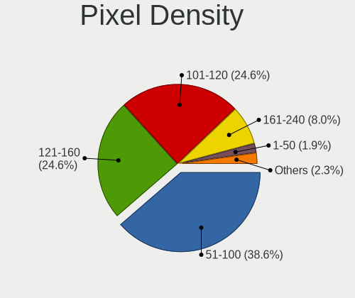
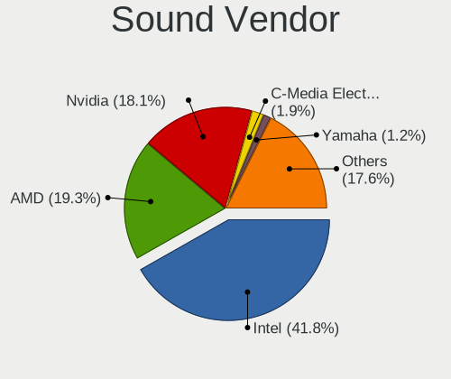
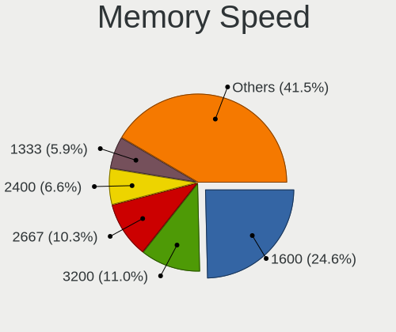
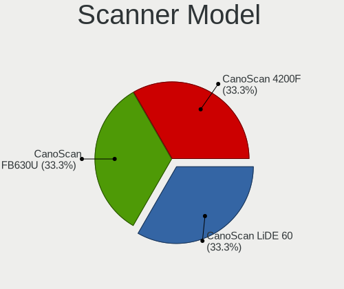

Ubuntu Studio - Tested Hardware & Statistics
--------------------------------------------

A project to collect tested hardware configurations for Ubuntu Studio.

Anyone can contribute to this report by the [hw-probe](https://github.com/linuxhw/hw-probe) tool:

    sudo -E hw-probe -all -upload

Please contribute! Especially if your hardware is rare.

This is a report for all computer types. See also reports for [desktops](/Dist/Ubuntu_Studio/Desktop/README.md) and [notebooks](/Dist/Ubuntu_Studio/Notebook/README.md).

Contents
--------

* [ Test Cases ](#test-cases)

* [ System ](#system)
  - [ OS                       ](#os)
  - [ OS Family                ](#os-family)
  - [ Kernel                   ](#kernel)
  - [ Kernel Family            ](#kernel-family)
  - [ Kernel Major Ver.        ](#kernel-major-ver)
  - [ Arch                     ](#arch)
  - [ DE                       ](#de)
  - [ Display Server           ](#display-server)
  - [ Display Manager          ](#display-manager)
  - [ OS Lang                  ](#os-lang)
  - [ Boot Mode                ](#boot-mode)
  - [ Filesystem               ](#filesystem)
  - [ Part. scheme             ](#part-scheme)
  - [ Dual Boot with Linux/BSD ](#dual-boot-with-linuxbsd)
  - [ Dual Boot (Win)          ](#dual-boot-win)

* [ Board ](#board)
  - [ Vendor                   ](#vendor)
  - [ Model                    ](#model)
  - [ Model Family             ](#model-family)
  - [ MFG Year                 ](#mfg-year)
  - [ Form Factor              ](#form-factor)
  - [ Secure Boot              ](#secure-boot)
  - [ Coreboot                 ](#coreboot)
  - [ RAM Size                 ](#ram-size)
  - [ RAM Used                 ](#ram-used)
  - [ Total Drives             ](#total-drives)
  - [ Has CD-ROM               ](#has-cd-rom)
  - [ Has Ethernet             ](#has-ethernet)
  - [ Has WiFi                 ](#has-wifi)
  - [ Has Bluetooth            ](#has-bluetooth)

* [ Location ](#location)
  - [ Country                  ](#country)
  - [ City                     ](#city)

* [ Drives ](#drives)
  - [ Drive Vendor             ](#drive-vendor)
  - [ Drive Model              ](#drive-model)
  - [ HDD Vendor               ](#hdd-vendor)
  - [ SSD Vendor               ](#ssd-vendor)
  - [ Drive Kind               ](#drive-kind)
  - [ Drive Connector          ](#drive-connector)
  - [ Drive Size               ](#drive-size)
  - [ Space Total              ](#space-total)
  - [ Space Used               ](#space-used)
  - [ Malfunc. Drives          ](#malfunc-drives)
  - [ Malfunc. Drive Vendor    ](#malfunc-drive-vendor)
  - [ Malfunc. HDD Vendor      ](#malfunc-hdd-vendor)
  - [ Malfunc. Drive Kind      ](#malfunc-drive-kind)
  - [ Failed Drives            ](#failed-drives)
  - [ Failed Drive Vendor      ](#failed-drive-vendor)
  - [ Drive Status             ](#drive-status)

* [ Storage controller ](#storage-controller)
  - [ Storage Vendor           ](#storage-vendor)
  - [ Storage Model            ](#storage-model)
  - [ Storage Kind             ](#storage-kind)

* [ Processor ](#processor)
  - [ CPU Vendor               ](#cpu-vendor)
  - [ CPU Model                ](#cpu-model)
  - [ CPU Model Family         ](#cpu-model-family)
  - [ CPU Cores                ](#cpu-cores)
  - [ CPU Sockets              ](#cpu-sockets)
  - [ CPU Threads              ](#cpu-threads)
  - [ CPU Op-Modes             ](#cpu-op-modes)
  - [ CPU Microcode            ](#cpu-microcode)
  - [ CPU Microarch            ](#cpu-microarch)

* [ Graphics ](#graphics)
  - [ GPU Vendor               ](#gpu-vendor)
  - [ GPU Model                ](#gpu-model)
  - [ GPU Combo                ](#gpu-combo)
  - [ GPU Driver               ](#gpu-driver)
  - [ GPU Memory               ](#gpu-memory)

* [ Monitor ](#monitor)
  - [ Monitor Vendor           ](#monitor-vendor)
  - [ Monitor Model            ](#monitor-model)
  - [ Monitor Resolution       ](#monitor-resolution)
  - [ Monitor Diagonal         ](#monitor-diagonal)
  - [ Monitor Width            ](#monitor-width)
  - [ Aspect Ratio             ](#aspect-ratio)
  - [ Monitor Area             ](#monitor-area)
  - [ Pixel Density            ](#pixel-density)
  - [ Multiple Monitors        ](#multiple-monitors)

* [ Network ](#network)
  - [ Net Controller Vendor    ](#net-controller-vendor)
  - [ Net Controller Model     ](#net-controller-model)
  - [ Wireless Vendor          ](#wireless-vendor)
  - [ Wireless Model           ](#wireless-model)
  - [ Ethernet Vendor          ](#ethernet-vendor)
  - [ Ethernet Model           ](#ethernet-model)
  - [ Net Controller Kind      ](#net-controller-kind)
  - [ Used Controller          ](#used-controller)
  - [ NICs                     ](#nics)
  - [ IPv6                     ](#ipv6)

* [ Bluetooth ](#bluetooth)
  - [ Bluetooth Vendor         ](#bluetooth-vendor)
  - [ Bluetooth Model          ](#bluetooth-model)

* [ Sound ](#sound)
  - [ Sound Vendor             ](#sound-vendor)
  - [ Sound Model              ](#sound-model)

* [ Memory ](#memory)
  - [ Memory Vendor            ](#memory-vendor)
  - [ Memory Model             ](#memory-model)
  - [ Memory Kind              ](#memory-kind)
  - [ Memory Form Factor       ](#memory-form-factor)
  - [ Memory Size              ](#memory-size)
  - [ Memory Speed             ](#memory-speed)

* [ Printers & scanners ](#printers--scanners)
  - [ Printer Vendor           ](#printer-vendor)
  - [ Printer Model            ](#printer-model)
  - [ Scanner Vendor           ](#scanner-vendor)
  - [ Scanner Model            ](#scanner-model)

* [ Camera ](#camera)
  - [ Camera Vendor            ](#camera-vendor)
  - [ Camera Model             ](#camera-model)

* [ Security ](#security)
  - [ Fingerprint Vendor       ](#fingerprint-vendor)
  - [ Fingerprint Model        ](#fingerprint-model)
  - [ Chipcard Vendor          ](#chipcard-vendor)
  - [ Chipcard Model           ](#chipcard-model)

* [ Unsupported ](#unsupported)
  - [ Unsupported Devices      ](#unsupported-devices)
  - [ Unsupported Device Types ](#unsupported-device-types)

Test Cases
----------

Total: 225

| Vendor        | Model                       | Form-Factor | Probe                                                      | Date         |
|---------------|-----------------------------|-------------|------------------------------------------------------------|--------------|
| HP            | ZBook 17 G5                 | Notebook    | [4377844e75](https://linux-hardware.org/?probe=4377844e75) | Nov 02, 2023 |
| Lenovo        | ZIWB2                       | Notebook    | [9e6bd45db9](https://linux-hardware.org/?probe=9e6bd45db9) | Oct 29, 2023 |
| Lenovo        | ZIWB2                       | Notebook    | [2537a6e7b9](https://linux-hardware.org/?probe=2537a6e7b9) | Oct 26, 2023 |
| Gigabyte      | H270-HD3P-CF                | Desktop     | [43fedd61b1](https://linux-hardware.org/?probe=43fedd61b1) | Oct 23, 2023 |
| Gigabyte      | H270-HD3P-CF                | Desktop     | [22baba8799](https://linux-hardware.org/?probe=22baba8799) | Oct 23, 2023 |
| Lenovo        | ThinkPad T480 20L50101US    | Notebook    | [c6913c1b75](https://linux-hardware.org/?probe=c6913c1b75) | Oct 16, 2023 |
| Apple         | MacBookPro9,2               | Notebook    | [188b107eb5](https://linux-hardware.org/?probe=188b107eb5) | Oct 05, 2023 |
| Unknown       | Unknown                     | Desktop     | [7e1caa679f](https://linux-hardware.org/?probe=7e1caa679f) | Sep 24, 2023 |
| Unknown       | Unknown                     | Desktop     | [5a57428971](https://linux-hardware.org/?probe=5a57428971) | Sep 24, 2023 |
| ASUSTek       | VivoBook_ASUSLaptop X515... | Notebook    | [bab5438645](https://linux-hardware.org/?probe=bab5438645) | Sep 22, 2023 |
| HP            | 829A                        | Mini pc     | [52aac4ac46](https://linux-hardware.org/?probe=52aac4ac46) | Sep 16, 2023 |
| Microsoft     | Surface Laptop 3            | Tablet      | [794f6d999a](https://linux-hardware.org/?probe=794f6d999a) | Sep 12, 2023 |
| Apple         | Mac-BE088AF8C5EB4FA2 iMa... | All in one  | [69bf752a4a](https://linux-hardware.org/?probe=69bf752a4a) | Sep 06, 2023 |
| Gigabyte      | H61M-D2-B3                  | Desktop     | [6ffb2379fa](https://linux-hardware.org/?probe=6ffb2379fa) | Aug 30, 2023 |
| ASUSTek       | VivoBook_ASUSLaptop X515... | Notebook    | [ab3c1508f9](https://linux-hardware.org/?probe=ab3c1508f9) | Aug 30, 2023 |
| ASUSTek       | ROG STRIX Z390-F GAMING     | Desktop     | [17136ed242](https://linux-hardware.org/?probe=17136ed242) | Aug 28, 2023 |
| MSI           | B550M PRO-VDH WIFI          | Desktop     | [fcfb9cd970](https://linux-hardware.org/?probe=fcfb9cd970) | Aug 26, 2023 |
| MSI           | B550M PRO-VDH WIFI          | Desktop     | [c3490914f6](https://linux-hardware.org/?probe=c3490914f6) | Aug 26, 2023 |
| MSI           | PRO B760M-P DDR4            | Desktop     | [499c14b0f7](https://linux-hardware.org/?probe=499c14b0f7) | Aug 26, 2023 |
| Toshiba       | Satellite A505              | Notebook    | [a7b1465809](https://linux-hardware.org/?probe=a7b1465809) | Aug 25, 2023 |
| Acer          | Nitro AN515-55              | Notebook    | [191aa2a04f](https://linux-hardware.org/?probe=191aa2a04f) | Aug 04, 2023 |
| Toshiba       | Satellite L505              | Notebook    | [bab52bec2c](https://linux-hardware.org/?probe=bab52bec2c) | Aug 04, 2023 |
| ASUSTek       | TUF Gaming X570-PLUS        | Desktop     | [50ee937fb2](https://linux-hardware.org/?probe=50ee937fb2) | Aug 02, 2023 |
| Shenzhen M... | HX90G                       | Desktop     | [c04f6d6467](https://linux-hardware.org/?probe=c04f6d6467) | Aug 01, 2023 |
| MSI           | PRO B760M-P DDR4            | Desktop     | [6a0b0513cd](https://linux-hardware.org/?probe=6a0b0513cd) | Jul 22, 2023 |
| win elemen... | MoreFine S500+              | Notebook    | [d3718d1a8d](https://linux-hardware.org/?probe=d3718d1a8d) | Jul 16, 2023 |
| ASUSTek       | G73Jh                       | Notebook    | [60e43d39b2](https://linux-hardware.org/?probe=60e43d39b2) | Jul 10, 2023 |
| Gigabyte      | 970A-DS3P                   | Desktop     | [97ebfed554](https://linux-hardware.org/?probe=97ebfed554) | Jul 02, 2023 |
| Lenovo        | IdeaPadFlex 5 14IIL05 81... | Convertible | [57d511fdb3](https://linux-hardware.org/?probe=57d511fdb3) | Jun 18, 2023 |
| Lenovo        | ThinkPad P50 20EQS0VV03     | Notebook    | [c2a4d4d2c0](https://linux-hardware.org/?probe=c2a4d4d2c0) | Jun 17, 2023 |
| HP            | EliteBook 745 G3            | Notebook    | [5a1b8d9fd3](https://linux-hardware.org/?probe=5a1b8d9fd3) | Jun 04, 2023 |
| COM1          | NBINF-X5-9G5                | Notebook    | [33aa60eaa2](https://linux-hardware.org/?probe=33aa60eaa2) | May 22, 2023 |
| Lenovo        | ThinkPad L460 20FVS3JK00    | Notebook    | [c812ee44af](https://linux-hardware.org/?probe=c812ee44af) | May 18, 2023 |
| ATOPNUC       | MA90                        | Mini pc     | [bffa46ef83](https://linux-hardware.org/?probe=bffa46ef83) | May 07, 2023 |
| ASUSTek       | M4A785-M                    | Desktop     | [cbf9d11153](https://linux-hardware.org/?probe=cbf9d11153) | May 07, 2023 |
| ECS           | H410-SF110                  | Desktop     | [5e5011bdd3](https://linux-hardware.org/?probe=5e5011bdd3) | May 07, 2023 |
| HP            | 1495                        | Desktop     | [d6e629523f](https://linux-hardware.org/?probe=d6e629523f) | May 01, 2023 |
| DEPO Compu... | MS-7846                     | Desktop     | [bf72733735](https://linux-hardware.org/?probe=bf72733735) | Apr 13, 2023 |
| GPU Compan... | GWNR71517                   | Notebook    | [2743830739](https://linux-hardware.org/?probe=2743830739) | Apr 11, 2023 |
| Apple         | Mac-BE088AF8C5EB4FA2 iMa... | All in one  | [6347cdcf9c](https://linux-hardware.org/?probe=6347cdcf9c) | Apr 05, 2023 |
| Lenovo        | ThinkPad X1 Yoga Gen 7 2... | Convertible | [06275c19f3](https://linux-hardware.org/?probe=06275c19f3) | Apr 01, 2023 |
| Gigabyte      | B150M-D2V DDR3-CF           | Desktop     | [35bae3b94d](https://linux-hardware.org/?probe=35bae3b94d) | Apr 01, 2023 |
| Lenovo        | ThinkPad E14 Gen 3 20Y70... | Notebook    | [3ce456f3c8](https://linux-hardware.org/?probe=3ce456f3c8) | Mar 25, 2023 |
| Fujitsu       | D3162-B1 S26361-D3162-B1    | Desktop     | [a2c287936d](https://linux-hardware.org/?probe=a2c287936d) | Mar 24, 2023 |
| Lenovo        | ThinkPad X250 20CL001LMB    | Notebook    | [d78880e600](https://linux-hardware.org/?probe=d78880e600) | Mar 17, 2023 |
| HP            | Pavilion dv8                | Notebook    | [105a616a39](https://linux-hardware.org/?probe=105a616a39) | Mar 14, 2023 |
| Dell          | 0HHV7N A00                  | Desktop     | [8553f4abea](https://linux-hardware.org/?probe=8553f4abea) | Mar 13, 2023 |
| Dell          | 0HHV7N A00                  | Desktop     | [7d9e6e46db](https://linux-hardware.org/?probe=7d9e6e46db) | Mar 13, 2023 |
| Dell          | 0WR7PY A02                  | Desktop     | [257b3941af](https://linux-hardware.org/?probe=257b3941af) | Mar 10, 2023 |
| Lenovo        | ThinkPad T530 24296HG       | Notebook    | [4794c72566](https://linux-hardware.org/?probe=4794c72566) | Feb 21, 2023 |
| ASUSTek       | TP300UA                     | Notebook    | [22ff7f5827](https://linux-hardware.org/?probe=22ff7f5827) | Feb 20, 2023 |
| HP            | 8455                        | Desktop     | [f75db6c5d5](https://linux-hardware.org/?probe=f75db6c5d5) | Feb 12, 2023 |
| Dell          | Latitude 5511               | Notebook    | [05e11b64d6](https://linux-hardware.org/?probe=05e11b64d6) | Feb 09, 2023 |
| Apple         | MacBookPro8,2               | Notebook    | [ffc97bf3de](https://linux-hardware.org/?probe=ffc97bf3de) | Feb 06, 2023 |
| ASRock        | B450M Pro4                  | Desktop     | [c63c663181](https://linux-hardware.org/?probe=c63c663181) | Jan 30, 2023 |
| HP            | 304Ah                       | Desktop     | [a41a25807f](https://linux-hardware.org/?probe=a41a25807f) | Jan 25, 2023 |
| HP            | EliteBook 735 G6            | Notebook    | [bb321263f8](https://linux-hardware.org/?probe=bb321263f8) | Jan 24, 2023 |
| HP            | 1497                        | Desktop     | [5f7e021023](https://linux-hardware.org/?probe=5f7e021023) | Jan 22, 2023 |
| Gigabyte      | A520M H                     | Desktop     | [db3b391bd0](https://linux-hardware.org/?probe=db3b391bd0) | Jan 20, 2023 |
| ASUSTek       | K53U                        | Notebook    | [c7c4beb8cb](https://linux-hardware.org/?probe=c7c4beb8cb) | Jan 10, 2023 |
| Intel         | NUC7i5DNB J57626-509        | Mini pc     | [3140672f28](https://linux-hardware.org/?probe=3140672f28) | Jan 10, 2023 |
| Apple         | MacBookPro8,2               | Notebook    | [3d8320e362](https://linux-hardware.org/?probe=3d8320e362) | Dec 25, 2022 |
| ASUSTek       | M4A785-M                    | Desktop     | [f36c085389](https://linux-hardware.org/?probe=f36c085389) | Dec 25, 2022 |
| Gigabyte      | B550M DS3H                  | Desktop     | [ffe85423d8](https://linux-hardware.org/?probe=ffe85423d8) | Dec 15, 2022 |
| Gigabyte      | B150M-D2V DDR3-CF           | Desktop     | [9d689be2ab](https://linux-hardware.org/?probe=9d689be2ab) | Dec 11, 2022 |
| Acer          | Aspire E5-573G              | Notebook    | [ec1e8e146a](https://linux-hardware.org/?probe=ec1e8e146a) | Dec 10, 2022 |
| Dell          | Latitude E6500              | Notebook    | [291fbde8c4](https://linux-hardware.org/?probe=291fbde8c4) | Dec 08, 2022 |
| System76      | Thelio thelio-r1            | Desktop     | [a888eb38b3](https://linux-hardware.org/?probe=a888eb38b3) | Dec 01, 2022 |
| Lenovo        | G70-80 80FF                 | Notebook    | [022ce8e2c8](https://linux-hardware.org/?probe=022ce8e2c8) | Nov 29, 2022 |
| ASUSTek       | PRIME X570-PRO              | Desktop     | [78defd6c12](https://linux-hardware.org/?probe=78defd6c12) | Nov 21, 2022 |
| Dell          | 0XPDFK A01                  | Desktop     | [b76898d624](https://linux-hardware.org/?probe=b76898d624) | Nov 21, 2022 |
| Dell          | 0XPDFK A01                  | Desktop     | [5147db88ea](https://linux-hardware.org/?probe=5147db88ea) | Nov 14, 2022 |
| Gigabyte      | AERO 15-X9                  | Notebook    | [1d490bb7d1](https://linux-hardware.org/?probe=1d490bb7d1) | Nov 11, 2022 |
| HP            | 09F8h                       | Desktop     | [f1107e91f2](https://linux-hardware.org/?probe=f1107e91f2) | Nov 01, 2022 |
| MSI           | Z77A-G45 Thunderbolt        | Desktop     | [fa189cf50b](https://linux-hardware.org/?probe=fa189cf50b) | Oct 30, 2022 |
| ASUSTek       | PRIME X570-PRO              | Desktop     | [ea04a21af7](https://linux-hardware.org/?probe=ea04a21af7) | Oct 27, 2022 |
| Lenovo        | ThinkPad X230 2333A86       | Notebook    | [55771f0c33](https://linux-hardware.org/?probe=55771f0c33) | Oct 18, 2022 |
| Lenovo        | ThinkPad X230 2333A86       | Notebook    | [7e0028c2fa](https://linux-hardware.org/?probe=7e0028c2fa) | Oct 18, 2022 |
| Gigabyte      | X79S-UP5                    | Desktop     | [62f59af32c](https://linux-hardware.org/?probe=62f59af32c) | Oct 15, 2022 |
| ASUSTek       | ASUS EXPERTBOOK B1500CEA... | Notebook    | [5bfc8f0a7d](https://linux-hardware.org/?probe=5bfc8f0a7d) | Sep 30, 2022 |
| HP            | ZBook 15 G3                 | Notebook    | [2dc3febd4d](https://linux-hardware.org/?probe=2dc3febd4d) | Sep 24, 2022 |
| ASUSTek       | ROG STRIX Z370-H GAMING     | Desktop     | [5b39dcf114](https://linux-hardware.org/?probe=5b39dcf114) | Sep 19, 2022 |
| ASUSTek       | GL503VD                     | Notebook    | [b1d97f239e](https://linux-hardware.org/?probe=b1d97f239e) | Sep 16, 2022 |
| HUAWEI        | KLVL-WXXW                   | Notebook    | [de37b9cf96](https://linux-hardware.org/?probe=de37b9cf96) | Sep 13, 2022 |
| Gigabyte      | AERO 15-X9                  | Notebook    | [d6d8f577e0](https://linux-hardware.org/?probe=d6d8f577e0) | Sep 12, 2022 |
| ASUSTek       | P8P67 LE                    | Desktop     | [07428c96e1](https://linux-hardware.org/?probe=07428c96e1) | Sep 11, 2022 |
| Lenovo        | IdeaPad 3 14ARE05 81W3      | Notebook    | [b8c22aafab](https://linux-hardware.org/?probe=b8c22aafab) | Sep 01, 2022 |
| Lenovo        | 36F4 SDK0J40697 WIN 3305... | All in one  | [c129f7c9b1](https://linux-hardware.org/?probe=c129f7c9b1) | Aug 29, 2022 |
| Lenovo        | IdeaPad 3 15ABA7 82RN       | Notebook    | [a23b4a8cd4](https://linux-hardware.org/?probe=a23b4a8cd4) | Aug 27, 2022 |
| HP            | 18E7                        | Desktop     | [698520133f](https://linux-hardware.org/?probe=698520133f) | Aug 22, 2022 |
| Lenovo        | 36F4 SDK0J40697 WIN 3305... | All in one  | [5cbe471be8](https://linux-hardware.org/?probe=5cbe471be8) | Aug 19, 2022 |
| Lenovo        | 36F4 SDK0J40697 WIN 3305... | All in one  | [4b585d8c34](https://linux-hardware.org/?probe=4b585d8c34) | Aug 18, 2022 |
| Dell          | 0T10XW A02                  | Desktop     | [45491460bc](https://linux-hardware.org/?probe=45491460bc) | Aug 12, 2022 |
| Dell          | 08WKV3 A00                  | Desktop     | [fe23b6e49a](https://linux-hardware.org/?probe=fe23b6e49a) | Jul 27, 2022 |
| HP            | G62                         | Notebook    | [3c4aab40ae](https://linux-hardware.org/?probe=3c4aab40ae) | Jul 20, 2022 |
| AZW           | SER V01                     | Mini pc     | [0bf81855b6](https://linux-hardware.org/?probe=0bf81855b6) | Jul 18, 2022 |
| Apple         | MacBookPro11,5              | Notebook    | [25e69108df](https://linux-hardware.org/?probe=25e69108df) | Jul 03, 2022 |
| Dell          | 0TTDMJ A00                  | Desktop     | [e45e0b0c90](https://linux-hardware.org/?probe=e45e0b0c90) | Jun 29, 2022 |
| ASUSTek       | VivoBook_ASUSLaptop X580... | Notebook    | [4ed102b3fa](https://linux-hardware.org/?probe=4ed102b3fa) | Jun 15, 2022 |
| Apple         | Mac-031AEE4D24BFF0B1 Mac... | Mini pc     | [6023bfb4cc](https://linux-hardware.org/?probe=6023bfb4cc) | Jun 09, 2022 |
| ASRock        | B250M-HDV                   | Desktop     | [a4aa661ab1](https://linux-hardware.org/?probe=a4aa661ab1) | Jun 01, 2022 |
| Gigabyte      | A320M-S2H-CF                | Desktop     | [0754e1c6e6](https://linux-hardware.org/?probe=0754e1c6e6) | May 23, 2022 |
| Gigabyte      | F2A78M-HD2                  | Desktop     | [fdc743e9e1](https://linux-hardware.org/?probe=fdc743e9e1) | May 23, 2022 |
| Gigabyte      | A320M-S2H-CF                | Desktop     | [900181bbff](https://linux-hardware.org/?probe=900181bbff) | May 22, 2022 |
| ASUSTek       | Z87-DELUXE                  | Desktop     | [bcd22d5d0e](https://linux-hardware.org/?probe=bcd22d5d0e) | May 20, 2022 |
| Getac         | S400G3                      | Notebook    | [56cc8b4c1a](https://linux-hardware.org/?probe=56cc8b4c1a) | May 16, 2022 |
| Dell          | 0RW203                      | Desktop     | [fc3e449b4d](https://linux-hardware.org/?probe=fc3e449b4d) | May 09, 2022 |
| Dell          | Inspiron 7506 2n1           | Convertible | [b2bddaf1b1](https://linux-hardware.org/?probe=b2bddaf1b1) | Apr 27, 2022 |
| Dell          | Inspiron 7506 2n1           | Convertible | [02b0c35fed](https://linux-hardware.org/?probe=02b0c35fed) | Apr 27, 2022 |
| Gigabyte      | H170-HD3-CF                 | Desktop     | [cebf5b3135](https://linux-hardware.org/?probe=cebf5b3135) | Apr 17, 2022 |
| Acer          | Aspire A114-32              | Notebook    | [3c048f588e](https://linux-hardware.org/?probe=3c048f588e) | Apr 12, 2022 |
| Acer          | Aspire C27-1655             | All in one  | [aff1557d72](https://linux-hardware.org/?probe=aff1557d72) | Apr 11, 2022 |
| Acer          | Aspire C27-1655             | All in one  | [a87f9de14e](https://linux-hardware.org/?probe=a87f9de14e) | Apr 03, 2022 |
| ASUSTek       | H81M-PLUS                   | Desktop     | [a517bb6633](https://linux-hardware.org/?probe=a517bb6633) | Apr 03, 2022 |
| ASUSTek       | ROG ZENITH II EXTREME AL... | Desktop     | [01ad19348a](https://linux-hardware.org/?probe=01ad19348a) | Mar 20, 2022 |
| Dell          | XPS 15 9570                 | Notebook    | [3f8fe40793](https://linux-hardware.org/?probe=3f8fe40793) | Mar 08, 2022 |
| Dell          | Inspiron N5110              | Notebook    | [4206238fce](https://linux-hardware.org/?probe=4206238fce) | Mar 01, 2022 |
| HP            | Sona                        | Notebook    | [4fcab0b3b7](https://linux-hardware.org/?probe=4fcab0b3b7) | Feb 24, 2022 |
| HP            | Sona                        | Notebook    | [d0b3189e0f](https://linux-hardware.org/?probe=d0b3189e0f) | Feb 24, 2022 |
| Lenovo        | ThinkPad X230 2325AJG       | Notebook    | [eccfa3a972](https://linux-hardware.org/?probe=eccfa3a972) | Feb 12, 2022 |
| ASUSTek       | P5QC                        | Desktop     | [82f706b315](https://linux-hardware.org/?probe=82f706b315) | Feb 11, 2022 |
| Google        | Nami                        | Notebook    | [5f1ba9ab72](https://linux-hardware.org/?probe=5f1ba9ab72) | Feb 10, 2022 |
| Lenovo        | Legion 5 15ARH05H 82B1      | Notebook    | [feb1c1d6a2](https://linux-hardware.org/?probe=feb1c1d6a2) | Feb 10, 2022 |
| Dell          | 055H3G A01                  | Desktop     | [05f63f2396](https://linux-hardware.org/?probe=05f63f2396) | Feb 04, 2022 |
| Samsung       | 305V4A/305V5A               | Notebook    | [5a1bf3cb9e](https://linux-hardware.org/?probe=5a1bf3cb9e) | Feb 04, 2022 |
| HP            | EliteBook 840 G3            | Notebook    | [fe9fed2a45](https://linux-hardware.org/?probe=fe9fed2a45) | Jan 26, 2022 |
| Lenovo        | ThinkPad T520 4243K86       | Notebook    | [5ccce1fb71](https://linux-hardware.org/?probe=5ccce1fb71) | Jan 21, 2022 |
| Lenovo        | ThinkPad T520 4243K86       | Notebook    | [91adda5a0e](https://linux-hardware.org/?probe=91adda5a0e) | Jan 21, 2022 |
| Clevo         | W35_37ET                    | Notebook    | [f8858fd0c3](https://linux-hardware.org/?probe=f8858fd0c3) | Jan 20, 2022 |
| Dell          | Inspiron 7348               | Notebook    | [b479441fe2](https://linux-hardware.org/?probe=b479441fe2) | Jan 15, 2022 |
| HP            | 3396                        | Desktop     | [97720dddd1](https://linux-hardware.org/?probe=97720dddd1) | Jan 10, 2022 |
| Fujitsu       | D3230-A1 S26361-D3230-A1    | Desktop     | [7f94c66f93](https://linux-hardware.org/?probe=7f94c66f93) | Jan 09, 2022 |
| AZW           | GK35                        | Desktop     | [ed1be3dbf7](https://linux-hardware.org/?probe=ed1be3dbf7) | Jan 07, 2022 |
| Dell          | Inspiron 3501               | Notebook    | [e071d4f83a](https://linux-hardware.org/?probe=e071d4f83a) | Jan 02, 2022 |
| ASUSTek       | ROG STRIX Z490-I GAMING     | Desktop     | [4c55363bc2](https://linux-hardware.org/?probe=4c55363bc2) | Dec 04, 2021 |
| Toshiba       | Satellite C855              | Notebook    | [7914ab9929](https://linux-hardware.org/?probe=7914ab9929) | Dec 03, 2021 |
| Lenovo        | IdeaPad Gaming 3 15ARH05... | Notebook    | [a271c08df2](https://linux-hardware.org/?probe=a271c08df2) | Oct 21, 2021 |
| Lenovo        | IdeaPad Gaming 3 15ARH05... | Notebook    | [2a9e8d32e2](https://linux-hardware.org/?probe=2a9e8d32e2) | Oct 15, 2021 |
| Lenovo        | IdeaPad Gaming 3 15ARH05... | Notebook    | [f0a9d13afb](https://linux-hardware.org/?probe=f0a9d13afb) | Oct 14, 2021 |
| Lenovo        | ThinkPad X1 Carbon 2nd 2... | Notebook    | [1dbff2c4f9](https://linux-hardware.org/?probe=1dbff2c4f9) | Oct 09, 2021 |
| Razer         | Blade Stealth 13 Late 20... | Notebook    | [22033e7185](https://linux-hardware.org/?probe=22033e7185) | Oct 05, 2021 |
| Toshiba       | Satellite L755D             | Notebook    | [aca989dcc4](https://linux-hardware.org/?probe=aca989dcc4) | Sep 29, 2021 |
| ASUSTek       | ROG Zephyrus G15 GA502IU... | Notebook    | [7725289d30](https://linux-hardware.org/?probe=7725289d30) | Sep 17, 2021 |
| ASUSTek       | UX305FA                     | Notebook    | [91b4275b9b](https://linux-hardware.org/?probe=91b4275b9b) | Aug 25, 2021 |
| HUAWEI        | HLYL-WXX9                   | Notebook    | [35e6393ea4](https://linux-hardware.org/?probe=35e6393ea4) | Aug 01, 2021 |
| ASUSTek       | H110M-A/M.2                 | Desktop     | [b62225a801](https://linux-hardware.org/?probe=b62225a801) | Jul 24, 2021 |
| Lenovo        | ThinkPad X1 Carbon 6th 2... | Notebook    | [9d8c462df3](https://linux-hardware.org/?probe=9d8c462df3) | Jul 20, 2021 |
| HP            | Pavilion dv6                | Notebook    | [089a39fe70](https://linux-hardware.org/?probe=089a39fe70) | Jul 07, 2021 |
| Acer          | Aspire U5-710               | All in one  | [c2ff1a33ee](https://linux-hardware.org/?probe=c2ff1a33ee) | Jun 19, 2021 |
| Lenovo        | IdeaPad Gaming 3 15IMH05... | Notebook    | [64c8a86c5b](https://linux-hardware.org/?probe=64c8a86c5b) | Jun 19, 2021 |
| HP            | 1495                        | Desktop     | [56251d62e1](https://linux-hardware.org/?probe=56251d62e1) | Jun 17, 2021 |
| Intel Clie... | LAPBC510                    | Notebook    | [06421d0916](https://linux-hardware.org/?probe=06421d0916) | Jun 15, 2021 |
| HP            | Stream Laptop 14-cb0XX      | Notebook    | [f88f0c3680](https://linux-hardware.org/?probe=f88f0c3680) | Jun 14, 2021 |
| Pegatron      | NARRA3                      | Desktop     | [38ac9a9ea6](https://linux-hardware.org/?probe=38ac9a9ea6) | May 18, 2021 |
| Dell          | 0P4T42 A00                  | All in one  | [80ca4b15a5](https://linux-hardware.org/?probe=80ca4b15a5) | May 16, 2021 |
| HP            | 158A                        | Desktop     | [2fac0fa486](https://linux-hardware.org/?probe=2fac0fa486) | May 01, 2021 |
| Lenovo        | SHARKBAY SDK0E50510 WIN     | Desktop     | [ef264215af](https://linux-hardware.org/?probe=ef264215af) | Apr 24, 2021 |
| ASUSTek       | H110M-A/M.2                 | Desktop     | [04a4129216](https://linux-hardware.org/?probe=04a4129216) | Apr 20, 2021 |
| HP            | OMEN by Laptop 15-ce0xx     | Notebook    | [749002b5ad](https://linux-hardware.org/?probe=749002b5ad) | Apr 20, 2021 |
| HP            | OMEN by Laptop 15-ce0xx     | Notebook    | [aec24cb317](https://linux-hardware.org/?probe=aec24cb317) | Apr 20, 2021 |
| Dell          | Precision M4500             | Notebook    | [8c35250407](https://linux-hardware.org/?probe=8c35250407) | Apr 17, 2021 |
| ASUSTek       | P8P67 EVO                   | Desktop     | [5e98e0ae38](https://linux-hardware.org/?probe=5e98e0ae38) | Apr 14, 2021 |
| Apple         | Mac-7BA5B2D9E42DDD94 iMa... | Desktop     | [43cb3af3a5](https://linux-hardware.org/?probe=43cb3af3a5) | Apr 12, 2021 |
| Foxconn       | 2ABF                        | Desktop     | [9414f40cf2](https://linux-hardware.org/?probe=9414f40cf2) | Apr 03, 2021 |
| Fujitsu       | D3654-C1 S26361-D3654-C1    | Desktop     | [4cd56bcfa1](https://linux-hardware.org/?probe=4cd56bcfa1) | Apr 02, 2021 |
| ASUSTek       | P6T SE                      | Desktop     | [5ff7a11404](https://linux-hardware.org/?probe=5ff7a11404) | Mar 28, 2021 |
| Gigabyte      | X570 AORUS ELITE WIFI       | Desktop     | [7b7a266de6](https://linux-hardware.org/?probe=7b7a266de6) | Mar 22, 2021 |
| Gigabyte      | X570 AORUS ELITE WIFI       | Desktop     | [d9f29b65da](https://linux-hardware.org/?probe=d9f29b65da) | Mar 15, 2021 |
| ASUSTek       | X541NA                      | Notebook    | [db3ab2a133](https://linux-hardware.org/?probe=db3ab2a133) | Mar 15, 2021 |
| HP            | Pavilion dv6                | Notebook    | [369f0a0cdb](https://linux-hardware.org/?probe=369f0a0cdb) | Mar 12, 2021 |
| Lenovo        | G50-45 80E3                 | Notebook    | [e4fb438978](https://linux-hardware.org/?probe=e4fb438978) | Feb 24, 2021 |
| ASUSTek       | TUF B360-PRO GAMING         | Desktop     | [19bc1494c6](https://linux-hardware.org/?probe=19bc1494c6) | Feb 21, 2021 |
| Sony          | VGN-NS31M_W                 | Notebook    | [dcc1660569](https://linux-hardware.org/?probe=dcc1660569) | Feb 17, 2021 |
| ASUSTek       | A68HM-PLUS                  | Desktop     | [387cfadf45](https://linux-hardware.org/?probe=387cfadf45) | Feb 06, 2021 |
| IBM           | 8188PPV                     | Desktop     | [6d4f098a65](https://linux-hardware.org/?probe=6d4f098a65) | Jan 31, 2021 |
| Dell          | 02YRK5 A01                  | Desktop     | [6a2d5cd538](https://linux-hardware.org/?probe=6a2d5cd538) | Jan 30, 2021 |
| Gigabyte      | GA-MA770-DS3                | Desktop     | [c9af16a580](https://linux-hardware.org/?probe=c9af16a580) | Jan 24, 2021 |
| Dell          | 0D28YY A03                  | Desktop     | [e74dbb590d](https://linux-hardware.org/?probe=e74dbb590d) | Jan 21, 2021 |
| Intel         | DQ965GF AAD41676-402        | Desktop     | [2e9a342427](https://linux-hardware.org/?probe=2e9a342427) | Jan 13, 2021 |
| Acidanther... | Mac-F60DEB81FF30ACF6 Mac... | Desktop     | [772bf2459f](https://linux-hardware.org/?probe=772bf2459f) | Jan 11, 2021 |
| Gigabyte      | B450M S2H                   | Desktop     | [13edd89415](https://linux-hardware.org/?probe=13edd89415) | Jan 11, 2021 |
| ASUSTek       | U56E                        | Notebook    | [eba46128ee](https://linux-hardware.org/?probe=eba46128ee) | Jan 04, 2021 |
| Fujitsu       | D3221-A1 S26361-D3221-A1    | Desktop     | [a8ebb648f7](https://linux-hardware.org/?probe=a8ebb648f7) | Jan 03, 2021 |
| Acer          | Aspire X3400                | Desktop     | [da9e0d0bb4](https://linux-hardware.org/?probe=da9e0d0bb4) | Jan 02, 2021 |
| Packard Be... | WMCP78M                     | Desktop     | [6a6c4577d4](https://linux-hardware.org/?probe=6a6c4577d4) | Dec 31, 2020 |
| HP            | 1850                        | Desktop     | [b86e749745](https://linux-hardware.org/?probe=b86e749745) | Dec 30, 2020 |
| Raspberry ... | Raspberry Pi 4 Model B R... | Soc         | [4332bc902d](https://linux-hardware.org/?probe=4332bc902d) | Dec 21, 2020 |
| Dell          | 0J3C2F A00                  | Desktop     | [b2e5d9d8b0](https://linux-hardware.org/?probe=b2e5d9d8b0) | Dec 09, 2020 |
| ASUSTek       | M4A88TD-M/USB3              | Desktop     | [2291f0c106](https://linux-hardware.org/?probe=2291f0c106) | Dec 08, 2020 |
| Dell          | 04YP6J A02                  | Desktop     | [6c15ba650c](https://linux-hardware.org/?probe=6c15ba650c) | Dec 06, 2020 |
| Intel         | NUC8BEB J72692-304          | Mini pc     | [505443aeb1](https://linux-hardware.org/?probe=505443aeb1) | Dec 02, 2020 |
| MSI           | Z270 MPOWER GAMING TITAN... | Desktop     | [73e35c07b8](https://linux-hardware.org/?probe=73e35c07b8) | Dec 02, 2020 |
| MSI           | Z270 MPOWER GAMING TITAN... | Desktop     | [3b24badd98](https://linux-hardware.org/?probe=3b24badd98) | Dec 02, 2020 |
| Dell          | Inspiron 3543               | Notebook    | [1b1044cc21](https://linux-hardware.org/?probe=1b1044cc21) | Nov 28, 2020 |
| Medion        | B360H4-EM V1.0              | Desktop     | [1915ad5c58](https://linux-hardware.org/?probe=1915ad5c58) | Nov 15, 2020 |
| Dell          | Latitude E6530              | Notebook    | [3d606b3078](https://linux-hardware.org/?probe=3d606b3078) | Nov 09, 2020 |
| ASUSTek       | CS-B                        | Desktop     | [4e0f76c433](https://linux-hardware.org/?probe=4e0f76c433) | Nov 02, 2020 |
| Dell          | Latitude E7250              | Notebook    | [d5e2f8b706](https://linux-hardware.org/?probe=d5e2f8b706) | Nov 01, 2020 |
| Acer          | ASPIRE1420P_MSFT            | Notebook    | [5185b46abc](https://linux-hardware.org/?probe=5185b46abc) | Oct 31, 2020 |
| HP            | 3047h                       | Desktop     | [a23efe0e20](https://linux-hardware.org/?probe=a23efe0e20) | Oct 26, 2020 |
| ASRock        | H55M/USB3                   | Desktop     | [74202436b2](https://linux-hardware.org/?probe=74202436b2) | Oct 18, 2020 |
| Dell          | 0F8098                      | Desktop     | [a2217fa6a7](https://linux-hardware.org/?probe=a2217fa6a7) | Sep 25, 2020 |
| Dell          | 0F8098                      | Desktop     | [2c747bcc47](https://linux-hardware.org/?probe=2c747bcc47) | Sep 25, 2020 |
| Avell High... | Avell G1555 MUV / A62 MU... | Notebook    | [c2994bb093](https://linux-hardware.org/?probe=c2994bb093) | Sep 18, 2020 |
| Dell          | Inspiron 1520               | Notebook    | [e00620b124](https://linux-hardware.org/?probe=e00620b124) | Sep 06, 2020 |
| HP            | Laptop 15s-fq1xxx           | Notebook    | [57d3d832f5](https://linux-hardware.org/?probe=57d3d832f5) | Sep 04, 2020 |
| Dell          | Latitude E4300              | Notebook    | [3e0fb2e03f](https://linux-hardware.org/?probe=3e0fb2e03f) | Sep 03, 2020 |
| ASRock        | X470 Master SLI             | Desktop     | [03bcf3b1fd](https://linux-hardware.org/?probe=03bcf3b1fd) | Sep 02, 2020 |
| HP            | Compaq 8510p                | Notebook    | [2ea87d13f0](https://linux-hardware.org/?probe=2ea87d13f0) | Aug 26, 2020 |
| ASUSTek       | 1001P                       | Notebook    | [d4f13322ac](https://linux-hardware.org/?probe=d4f13322ac) | Aug 19, 2020 |
| ASRock        | B450M Pro4                  | Desktop     | [d2851c54e9](https://linux-hardware.org/?probe=d2851c54e9) | Aug 18, 2020 |
| ASUSTek       | 1001P                       | Notebook    | [92e2a05f2d](https://linux-hardware.org/?probe=92e2a05f2d) | Aug 13, 2020 |
| ASUSTek       | 1001P                       | Notebook    | [0ae5a1aab2](https://linux-hardware.org/?probe=0ae5a1aab2) | Aug 13, 2020 |
| ASUSTek       | TUF Gaming X570-PLUS        | Desktop     | [96ba8dc0e8](https://linux-hardware.org/?probe=96ba8dc0e8) | Jul 31, 2020 |
| Dell          | Inspiron 5566               | Notebook    | [3162979c2e](https://linux-hardware.org/?probe=3162979c2e) | Jul 24, 2020 |
| ASUSTek       | H81M-C/BR                   | Desktop     | [d21c458a4f](https://linux-hardware.org/?probe=d21c458a4f) | Jul 24, 2020 |
| Lenovo        | IdeaPad 5 15ARE05 81YQ      | Notebook    | [a253e286bf](https://linux-hardware.org/?probe=a253e286bf) | Jul 06, 2020 |
| Lenovo        | IdeaPad 5 15ARE05 81YQ      | Notebook    | [c2c3727c6a](https://linux-hardware.org/?probe=c2c3727c6a) | Jun 30, 2020 |
| Gigabyte      | B450 I AORUS PRO WIFI-CF    | Desktop     | [957ec007de](https://linux-hardware.org/?probe=957ec007de) | Jun 27, 2020 |
| ASUSTek       | M5A78L-M/USB3               | Desktop     | [cb240b6e7e](https://linux-hardware.org/?probe=cb240b6e7e) | Jun 05, 2020 |
| HP            | Notebook                    | Notebook    | [e406d5cf9e](https://linux-hardware.org/?probe=e406d5cf9e) | Jun 02, 2020 |
| Apple         | Mac-F2268DAE                | All in one  | [8271aeba33](https://linux-hardware.org/?probe=8271aeba33) | Mar 19, 2020 |
| Lenovo        | ThinkPad W530 2447IG0       | Notebook    | [f7125d9a17](https://linux-hardware.org/?probe=f7125d9a17) | Mar 19, 2020 |
| Lenovo        | ThinkPad X230 23245S1       | Notebook    | [047f29b7c7](https://linux-hardware.org/?probe=047f29b7c7) | Nov 01, 2019 |
| Lenovo        | G50-45 80E3                 | Notebook    | [ebbf8cd8d4](https://linux-hardware.org/?probe=ebbf8cd8d4) | May 27, 2019 |

System
------

OS
--

Installed operating systems

| Name                | Computers | Percent |
|---------------------|-----------|---------|
| Ubuntu Studio 20.04 | 84        | 43.98%  |
| Ubuntu Studio 22.04 | 53        | 27.75%  |
| Ubuntu Studio 23.04 | 13        | 6.81%   |
| Ubuntu Studio 20.10 | 13        | 6.81%   |
| Ubuntu Studio 22.10 | 9         | 4.71%   |
| Ubuntu Studio 21.10 | 7         | 3.66%   |
| Ubuntu Studio 21.04 | 5         | 2.62%   |
| Ubuntu Studio 18.04 | 3         | 1.57%   |
| Ubuntu Studio 19.10 | 2         | 1.05%   |
| Ubuntu Studio 23.10 | 1         | 0.52%   |
| Ubuntu Studio 16.04 | 1         | 0.52%   |

OS Family
---------

OS without a version

| Name          | Computers | Percent |
|---------------|-----------|---------|
| Ubuntu Studio | 189       | 100%    |

Kernel
------

Version of the Linux kernel

| Version                | Computers | Percent |
|------------------------|-----------|---------|
| 5.15.0-56-lowlatency   | 5         | 2.55%   |
| 5.15.0-46-lowlatency   | 5         | 2.55%   |
| 5.13.0-28-lowlatency   | 5         | 2.55%   |
| 6.2.0-1009-lowlatency  | 4         | 2.04%   |
| 6.2.0-1003-lowlatency  | 4         | 2.04%   |
| 5.4.0-52-lowlatency    | 4         | 2.04%   |
| 5.4.0-42-lowlatency    | 4         | 2.04%   |
| 6.2.0-1012-lowlatency  | 3         | 1.53%   |
| 5.8.0-55-lowlatency    | 3         | 1.53%   |
| 5.8.0-50-lowlatency    | 3         | 1.53%   |
| 5.8.0-44-lowlatency    | 3         | 1.53%   |
| 5.8.0-25-lowlatency    | 3         | 1.53%   |
| 5.4.0-65-lowlatency    | 3         | 1.53%   |
| 5.4.0-26-lowlatency    | 3         | 1.53%   |
| 5.15.0-67-lowlatency   | 3         | 1.53%   |
| 5.15.0-58-lowlatency   | 3         | 1.53%   |
| 5.15.0-52-lowlatency   | 3         | 1.53%   |
| 5.15.0-50-lowlatency   | 3         | 1.53%   |
| 5.15.0-48-lowlatency   | 3         | 1.53%   |
| 5.15.0-47-lowlatency   | 3         | 1.53%   |
| 5.11.0-44-lowlatency   | 3         | 1.53%   |
| 5.11.0-34-lowlatency   | 3         | 1.53%   |
| 6.2.0-1014-lowlatency  | 2         | 1.02%   |
| 5.8.0-48-lowlatency    | 2         | 1.02%   |
| 5.8.0-29-lowlatency    | 2         | 1.02%   |
| 5.4.0-94-lowlatency    | 2         | 1.02%   |
| 5.4.0-58-lowlatency    | 2         | 1.02%   |
| 5.4.0-56-lowlatency    | 2         | 1.02%   |
| 5.4.0-45-lowlatency    | 2         | 1.02%   |
| 5.19.0-1021-lowlatency | 2         | 1.02%   |
| 5.19.0-1017-lowlatency | 2         | 1.02%   |
| 5.19.0-1015-lowlatency | 2         | 1.02%   |
| 5.19.0-1007-lowlatency | 2         | 1.02%   |
| 5.15.0-79-lowlatency   | 2         | 1.02%   |
| 5.15.0-76-lowlatency   | 2         | 1.02%   |
| 5.15.0-71-lowlatency   | 2         | 1.02%   |
| 5.15.0-69-lowlatency   | 2         | 1.02%   |
| 5.15.0-53-lowlatency   | 2         | 1.02%   |
| 5.15.0-40-lowlatency   | 2         | 1.02%   |
| 5.15.0-30-lowlatency   | 2         | 1.02%   |

Kernel Family
-------------

Linux kernel without a distro release

| Version | Computers | Percent |
|---------|-----------|---------|
| 5.4.0   | 53        | 27.75%  |
| 5.15.0  | 49        | 25.65%  |
| 5.8.0   | 23        | 12.04%  |
| 6.2.0   | 17        | 8.9%    |
| 5.11.0  | 15        | 7.85%   |
| 5.19.0  | 13        | 6.81%   |
| 5.13.0  | 10        | 5.24%   |
| 4.15.0  | 3         | 1.57%   |
| 5.3.0   | 2         | 1.05%   |
| 6.5.0   | 1         | 0.52%   |
| 6.2.8   | 1         | 0.52%   |
| 5.7.6   | 1         | 0.52%   |
| 5.17.1  | 1         | 0.52%   |
| 5.15.6  | 1         | 0.52%   |
| 4.4.0   | 1         | 0.52%   |

Kernel Major Ver.
-----------------

Linux kernel major version

| Version | Computers | Percent |
|---------|-----------|---------|
| 5.4     | 53        | 27.75%  |
| 5.15    | 50        | 26.18%  |
| 5.8     | 23        | 12.04%  |
| 6.2     | 18        | 9.42%   |
| 5.11    | 15        | 7.85%   |
| 5.19    | 13        | 6.81%   |
| 5.13    | 10        | 5.24%   |
| 4.15    | 3         | 1.57%   |
| 5.3     | 2         | 1.05%   |
| 6.5     | 1         | 0.52%   |
| 5.7     | 1         | 0.52%   |
| 5.17    | 1         | 0.52%   |
| 4.4     | 1         | 0.52%   |

Arch
----

OS architecture (x86_64, i586, etc.)

| Name    | Computers | Percent |
|---------|-----------|---------|
| x86_64  | 187       | 98.94%  |
| i686    | 1         | 0.53%   |
| aarch64 | 1         | 0.53%   |

DE
--

Desktop Environment

| Name            | Computers | Percent |
|-----------------|-----------|---------|
| KDE5            | 91        | 47.89%  |
| XFCE            | 81        | 42.63%  |
| GNOME           | 10        | 5.26%   |
| LXQt            | 3         | 1.58%   |
| MATE            | 2         | 1.05%   |
| KDE             | 1         | 0.53%   |
| GNOME Flashback | 1         | 0.53%   |
| Cinnamon        | 1         | 0.53%   |

Display Server
--------------

X11 or Wayland

| Name    | Computers | Percent |
|---------|-----------|---------|
| X11     | 178       | 93.68%  |
| Wayland | 8         | 4.21%   |
| Tty     | 4         | 2.11%   |

Display Manager
---------------

SDDM, LightDM, etc.

| Name    | Computers | Percent |
|---------|-----------|---------|
| SDDM    | 84        | 44.44%  |
| TDM     | 49        | 25.93%  |
| LightDM | 43        | 22.75%  |
| GDM     | 11        | 5.82%   |
| LXDM    | 1         | 0.53%   |
| GDM3    | 1         | 0.53%   |

OS Lang
-------

Language

| Lang       | Computers | Percent |
|------------|-----------|---------|
| en_US      | 78        | 41.05%  |
| fr_FR      | 23        | 12.11%  |
| de_DE      | 13        | 6.84%   |
| en_GB      | 9         | 4.74%   |
| C          | 8         | 4.21%   |
| ru_RU      | 7         | 3.68%   |
| it_IT      | 7         | 3.68%   |
| pt_BR      | 6         | 3.16%   |
| es_ES      | 4         | 2.11%   |
| en_CA      | 4         | 2.11%   |
| en_AU      | 3         | 1.58%   |
| nl_NL      | 2         | 1.05%   |
| es_AR      | 2         | 1.05%   |
| en_AG      | 2         | 1.05%   |
| Unknown    | 2         | 1.05%   |
| sv_SE      | 1         | 0.53%   |
| sk_SK      | 1         | 0.53%   |
| nl_BE      | 1         | 0.53%   |
| nb_NO      | 1         | 0.53%   |
| hu_HU      | 1         | 0.53%   |
| fr_FR.UTF8 | 1         | 0.53%   |
| fr_CH      | 1         | 0.53%   |
| fr_BE      | 1         | 0.53%   |
| es_NI      | 1         | 0.53%   |
| es_MX      | 1         | 0.53%   |
| es_GT      | 1         | 0.53%   |
| es_CR      | 1         | 0.53%   |
| en_NG      | 1         | 0.53%   |
| en_IL      | 1         | 0.53%   |
| en_IE      | 1         | 0.53%   |
| en_DE      | 1         | 0.53%   |
| de_CH      | 1         | 0.53%   |
| de_AT      | 1         | 0.53%   |
| ca_ES      | 1         | 0.53%   |
| ca_AD      | 1         | 0.53%   |

Boot Mode
---------

EFI or BIOS

| Mode | Computers | Percent |
|------|-----------|---------|
| EFI  | 113       | 59.79%  |
| BIOS | 76        | 40.21%  |

Filesystem
----------

Type of filesystem

| Type    | Computers | Percent |
|---------|-----------|---------|
| Ext4    | 181       | 95.77%  |
| Overlay | 6         | 3.17%   |
| Xfs     | 1         | 0.53%   |
| Ext2    | 1         | 0.53%   |

Part. scheme
------------

Scheme of partitioning

| Type | Computers | Percent |
|------|-----------|---------|
| GPT  | 124       | 65.61%  |
| MBR  | 65        | 34.39%  |

Dual Boot with Linux/BSD
------------------------

Hosting more than one Linux/BSD

| Dual boot | Computers | Percent |
|-----------|-----------|---------|
| No        | 153       | 80.1%   |
| Yes       | 38        | 19.9%   |

Dual Boot (Win)
---------------

Hosting Linux and Windows

| Dual boot | Computers | Percent |
|-----------|-----------|---------|
| No        | 107       | 56.32%  |
| Yes       | 83        | 43.68%  |

Board
-----

Vendor
------

Motherboard manufacturer

| Name                                 | Computers | Percent |
|--------------------------------------|-----------|---------|
| ASUSTek Computer                     | 34        | 17.99%  |
| Lenovo                               | 27        | 14.29%  |
| Dell                                 | 26        | 13.76%  |
| Hewlett-Packard                      | 25        | 13.23%  |
| Gigabyte Technology                  | 15        | 7.94%   |
| Apple                                | 8         | 4.23%   |
| Acer                                 | 7         | 3.7%    |
| Toshiba                              | 4         | 2.12%   |
| MSI                                  | 4         | 2.12%   |
| Fujitsu                              | 4         | 2.12%   |
| Intel                                | 3         | 1.59%   |
| ASRock                               | 3         | 1.59%   |
| HUAWEI                               | 2         | 1.06%   |
| AZW                                  | 2         | 1.06%   |
| win element                          | 1         | 0.53%   |
| System76                             | 1         | 0.53%   |
| Sony                                 | 1         | 0.53%   |
| Shenzhen Meigao Electronic Equipment | 1         | 0.53%   |
| Samsung Electronics                  | 1         | 0.53%   |
| Razer                                | 1         | 0.53%   |
| Raspberry Pi Foundation              | 1         | 0.53%   |
| Pegatron                             | 1         | 0.53%   |
| Packard Bell                         | 1         | 0.53%   |
| Microsoft                            | 1         | 0.53%   |
| Medion                               | 1         | 0.53%   |
| Intel Client Systems                 | 1         | 0.53%   |
| IBM                                  | 1         | 0.53%   |
| GPU Company                          | 1         | 0.53%   |
| Google                               | 1         | 0.53%   |
| Getac                                | 1         | 0.53%   |
| Foxconn                              | 1         | 0.53%   |
| ECS                                  | 1         | 0.53%   |
| DEPO Computers                       | 1         | 0.53%   |
| COM1                                 | 1         | 0.53%   |
| Clevo                                | 1         | 0.53%   |
| Avell High Performance               | 1         | 0.53%   |
| ATOPNUC                              | 1         | 0.53%   |
| Acidanthera                          | 1         | 0.53%   |
| Unknown                              | 1         | 0.53%   |

Model
-----

Motherboard model

| Name                                       | Computers | Percent |
|--------------------------------------------|-----------|---------|
| ASUS All Series                            | 4         | 2.12%   |
| Lenovo G50-45 80E3                         | 2         | 1.06%   |
| HP Pavilion dv6                            | 2         | 1.06%   |
| Dell OptiPlex 790                          | 2         | 1.06%   |
| ASUS TUF Gaming X570-PLUS                  | 2         | 1.06%   |
| ASUS PRIME X570-PRO                        | 2         | 1.06%   |
| ASUS M4A785-M                              | 2         | 1.06%   |
| Apple iMac18,3                             | 2         | 1.06%   |
| win element MoreFine S500+                 | 1         | 0.53%   |
| Toshiba Satellite L755D                    | 1         | 0.53%   |
| Toshiba Satellite L505                     | 1         | 0.53%   |
| Toshiba Satellite C855                     | 1         | 0.53%   |
| Toshiba Satellite A505                     | 1         | 0.53%   |
| System76 Thelio                            | 1         | 0.53%   |
| Sony VGN-NS31M_W                           | 1         | 0.53%   |
| Shenzhen Meigao Electronic Equipment HX90G | 1         | 0.53%   |
| Samsung 305V4A/305V5A                      | 1         | 0.53%   |
| Razer Blade Stealth 13 Late 2019           | 1         | 0.53%   |
| RPi Raspberry Pi 4 Model B Rev 1.4         | 1         | 0.53%   |
| Pegatron FL368AA-UUZ SR5612CH              | 1         | 0.53%   |
| Packard Bell IMEDIA S3220                  | 1         | 0.53%   |
| MSI MS-7E02                                | 1         | 0.53%   |
| MSI MS-7C95                                | 1         | 0.53%   |
| MSI MS-7A57                                | 1         | 0.53%   |
| MSI MS-7752                                | 1         | 0.53%   |
| Microsoft Surface Laptop 3                 | 1         | 0.53%   |
| Medion MD34207/C746                        | 1         | 0.53%   |
| Lenovo ZIWB2                               | 1         | 0.53%   |
| Lenovo ThinkPad X250 20CL001LMB            | 1         | 0.53%   |
| Lenovo ThinkPad X230 2333A86               | 1         | 0.53%   |
| Lenovo ThinkPad X230 2325AJG               | 1         | 0.53%   |
| Lenovo ThinkPad X230 23245S1               | 1         | 0.53%   |
| Lenovo ThinkPad X1 Yoga Gen 7 21CDCTO1WW   | 1         | 0.53%   |
| Lenovo ThinkPad X1 Carbon 6th 20KHCTO1WW   | 1         | 0.53%   |
| Lenovo ThinkPad X1 Carbon 2nd 20A80035US   | 1         | 0.53%   |
| Lenovo ThinkPad W530 2447IG0               | 1         | 0.53%   |
| Lenovo ThinkPad T530 24296HG               | 1         | 0.53%   |
| Lenovo ThinkPad T520 4243K86               | 1         | 0.53%   |
| Lenovo ThinkPad T480 20L50101US            | 1         | 0.53%   |
| Lenovo ThinkPad P50 20EQS0VV03             | 1         | 0.53%   |

Model Family
------------

Motherboard model prefix

| Name                                       | Computers | Percent |
|--------------------------------------------|-----------|---------|
| Lenovo ThinkPad                            | 14        | 7.41%   |
| Dell OptiPlex                              | 9         | 4.76%   |
| HP Compaq                                  | 8         | 4.23%   |
| Dell Inspiron                              | 8         | 4.23%   |
| Lenovo IdeaPad                             | 5         | 2.65%   |
| Dell Latitude                              | 5         | 2.65%   |
| ASUS ROG                                   | 5         | 2.65%   |
| Acer Aspire                                | 5         | 2.65%   |
| Toshiba Satellite                          | 4         | 2.12%   |
| ASUS All                                   | 4         | 2.12%   |
| HP Pavilion                                | 3         | 1.59%   |
| HP EliteBook                               | 3         | 1.59%   |
| Fujitsu ESPRIMO                            | 3         | 1.59%   |
| Dell Precision                             | 3         | 1.59%   |
| ASUS TUF                                   | 3         | 1.59%   |
| Lenovo G50-45                              | 2         | 1.06%   |
| HP ZBook                                   | 2         | 1.06%   |
| ASUS VivoBook                              | 2         | 1.06%   |
| ASUS PRIME                                 | 2         | 1.06%   |
| ASUS P8P67                                 | 2         | 1.06%   |
| ASUS M4A785-M                              | 2         | 1.06%   |
| Apple iMac18                               | 2         | 1.06%   |
| win element MoreFine                       | 1         | 0.53%   |
| System76 Thelio                            | 1         | 0.53%   |
| Sony VGN-NS31M                             | 1         | 0.53%   |
| Shenzhen Meigao Electronic Equipment HX90G | 1         | 0.53%   |
| Samsung 305V4A                             | 1         | 0.53%   |
| Razer Blade                                | 1         | 0.53%   |
| RPi Raspberry                              | 1         | 0.53%   |
| Pegatron FL368AA-UUZ                       | 1         | 0.53%   |
| Packard Bell IMEDIA                        | 1         | 0.53%   |
| MSI MS-7E02                                | 1         | 0.53%   |
| MSI MS-7C95                                | 1         | 0.53%   |
| MSI MS-7A57                                | 1         | 0.53%   |
| MSI MS-7752                                | 1         | 0.53%   |
| Microsoft Surface                          | 1         | 0.53%   |
| Medion MD34207                             | 1         | 0.53%   |
| Lenovo ZIWB2                               | 1         | 0.53%   |
| Lenovo ThinkCentre                         | 1         | 0.53%   |
| Lenovo Legion                              | 1         | 0.53%   |

MFG Year
--------

Motherboard manufacture year

| Year | Computers | Percent |
|------|-----------|---------|
| 2020 | 21        | 11.11%  |
| 2019 | 17        | 8.99%   |
| 2012 | 17        | 8.99%   |
| 2018 | 15        | 7.94%   |
| 2014 | 13        | 6.88%   |
| 2011 | 13        | 6.88%   |
| 2013 | 12        | 6.35%   |
| 2021 | 11        | 5.82%   |
| 2017 | 11        | 5.82%   |
| 2016 | 11        | 5.82%   |
| 2015 | 10        | 5.29%   |
| 2009 | 9         | 4.76%   |
| 2010 | 8         | 4.23%   |
| 2022 | 7         | 3.7%    |
| 2008 | 7         | 3.7%    |
| 2007 | 4         | 2.12%   |
| 2005 | 3         | 1.59%   |

Form Factor
-----------

Physical design of the computer

| Name           | Computers | Percent |
|----------------|-----------|---------|
| Desktop        | 86        | 45.5%   |
| Notebook       | 85        | 44.97%  |
| All in one     | 7         | 3.7%    |
| Mini pc        | 6         | 3.17%   |
| Convertible    | 3         | 1.59%   |
| System on chip | 1         | 0.53%   |
| Tablet         | 1         | 0.53%   |

Secure Boot
-----------

Enabled or disabled

| State    | Computers | Percent |
|----------|-----------|---------|
| Disabled | 178       | 94.18%  |
| Enabled  | 11        | 5.82%   |

Coreboot
--------

Have coreboot on board

| Used | Computers | Percent |
|------|-----------|---------|
| No   | 187       | 98.94%  |
| Yes  | 2         | 1.06%   |

RAM Size
--------

Total RAM memory

| Size in GB  | Computers | Percent |
|-------------|-----------|---------|
| 4.01-8.0    | 54        | 28.42%  |
| 16.01-24.0  | 39        | 20.53%  |
| 8.01-16.0   | 37        | 19.47%  |
| 32.01-64.0  | 24        | 12.63%  |
| 3.01-4.0    | 16        | 8.42%   |
| 64.01-256.0 | 10        | 5.26%   |
| 1.01-2.0    | 4         | 2.11%   |
| 24.01-32.0  | 3         | 1.58%   |
| 2.01-3.0    | 3         | 1.58%   |

RAM Used
--------

Used RAM memory

| Used GB    | Computers | Percent |
|------------|-----------|---------|
| 1.01-2.0   | 59        | 30.57%  |
| 2.01-3.0   | 46        | 23.83%  |
| 4.01-8.0   | 36        | 18.65%  |
| 3.01-4.0   | 33        | 17.1%   |
| 8.01-16.0  | 14        | 7.25%   |
| 0.51-1.0   | 4         | 2.07%   |
| 24.01-32.0 | 1         | 0.52%   |

Total Drives
------------

Number of drives on board

| Drives | Computers | Percent |
|--------|-----------|---------|
| 1      | 100       | 52.63%  |
| 2      | 64        | 33.68%  |
| 3      | 10        | 5.26%   |
| 4      | 5         | 2.63%   |
| 7      | 3         | 1.58%   |
| 5      | 3         | 1.58%   |
| 0      | 2         | 1.05%   |
| 16     | 1         | 0.53%   |
| 11     | 1         | 0.53%   |
| 10     | 1         | 0.53%   |

Has CD-ROM
----------

Has CD-ROM on board

| Presented | Computers | Percent |
|-----------|-----------|---------|
| No        | 109       | 57.37%  |
| Yes       | 81        | 42.63%  |

Has Ethernet
------------

Has Ethernet on board

| Presented | Computers | Percent |
|-----------|-----------|---------|
| Yes       | 170       | 89.47%  |
| No        | 20        | 10.53%  |

Has WiFi
--------

Has WiFi module

| Presented | Computers | Percent |
|-----------|-----------|---------|
| Yes       | 140       | 74.07%  |
| No        | 49        | 25.93%  |

Has Bluetooth
-------------

Has Bluetooth module

| Presented | Computers | Percent |
|-----------|-----------|---------|
| Yes       | 106       | 56.08%  |
| No        | 83        | 43.92%  |

Location
--------

Country
-------

Geographic location (country)

| Country                | Computers | Percent |
|------------------------|-----------|---------|
| USA                    | 49        | 25.93%  |
| France                 | 23        | 12.17%  |
| Germany                | 20        | 10.58%  |
| Italy                  | 11        | 5.82%   |
| Russia                 | 8         | 4.23%   |
| Brazil                 | 8         | 4.23%   |
| Spain                  | 7         | 3.7%    |
| UK                     | 5         | 2.65%   |
| Canada                 | 5         | 2.65%   |
| Austria                | 5         | 2.65%   |
| Belgium                | 4         | 2.12%   |
| Australia              | 4         | 2.12%   |
| Sweden                 | 3         | 1.59%   |
| Norway                 | 3         | 1.59%   |
| Netherlands            | 3         | 1.59%   |
| Taiwan                 | 2         | 1.06%   |
| Switzerland            | 2         | 1.06%   |
| Romania                | 2         | 1.06%   |
| Mexico                 | 2         | 1.06%   |
| Ivory Coast            | 2         | 1.06%   |
| Costa Rica             | 2         | 1.06%   |
| Argentina              | 2         | 1.06%   |
| Yemen                  | 1         | 0.53%   |
| Turkey                 | 1         | 0.53%   |
| South Africa           | 1         | 0.53%   |
| Slovakia               | 1         | 0.53%   |
| Poland                 | 1         | 0.53%   |
| Peru                   | 1         | 0.53%   |
| Nigeria                | 1         | 0.53%   |
| Nicaragua              | 1         | 0.53%   |
| Luxembourg             | 1         | 0.53%   |
| Kenya                  | 1         | 0.53%   |
| Israel                 | 1         | 0.53%   |
| Indonesia              | 1         | 0.53%   |
| Hungary                | 1         | 0.53%   |
| Guatemala              | 1         | 0.53%   |
| Finland                | 1         | 0.53%   |
| Bulgaria               | 1         | 0.53%   |
| Bosnia and Herzegovina | 1         | 0.53%   |

City
----

Geographic location (city)

| City          | Computers | Percent |
|---------------|-----------|---------|
| Vienna        | 3         | 1.57%   |
| Stockholm     | 3         | 1.57%   |
| Paris         | 3         | 1.57%   |
| Madrid        | 3         | 1.57%   |
| Houston       | 3         | 1.57%   |
| Turin         | 2         | 1.05%   |
| Stuttgart     | 2         | 1.05%   |
| San Francisco | 2         | 1.05%   |
| Moscow        | 2         | 1.05%   |
| Montreal      | 2         | 1.05%   |
| Mississauga   | 2         | 1.05%   |
| Hamburg       | 2         | 1.05%   |
| Groningen     | 2         | 1.05%   |
| Denver        | 2         | 1.05%   |
| Bucharest     | 2         | 1.05%   |
| Bziers      | 2         | 1.05%   |
| Abidjan       | 2         | 1.05%   |
| Zanesville    | 1         | 0.52%   |
| Yonkers       | 1         | 0.52%   |
| Yekaterinburg | 1         | 0.52%   |
| Wroclaw       | 1         | 0.52%   |
| Woonsocket    | 1         | 0.52%   |
| Woodland Park | 1         | 0.52%   |
| Wildenfels    | 1         | 0.52%   |
| West Mifflin  | 1         | 0.52%   |
| Warner Robins | 1         | 0.52%   |
| Villefontaine | 1         | 0.52%   |
| Verviers      | 1         | 0.52%   |
| Verdal        | 1         | 0.52%   |
| Velleron      | 1         | 0.52%   |
| Toulouse      | 1         | 0.52%   |
| Tilburg       | 1         | 0.52%   |
| Taylor        | 1         | 0.52%   |
| Tarragona     | 1         | 0.52%   |
| Taipei        | 1         | 0.52%   |
| Taichung      | 1         | 0.52%   |
| Sunderland    | 1         | 0.52%   |
| Stabekk       | 1         | 0.52%   |
| St Petersburg | 1         | 0.52%   |
| Sofia         | 1         | 0.52%   |

Drives
------

Drive Vendor
------------

Hard drive vendors

| Vendor                | Computers | Drives | Percent |
|-----------------------|-----------|--------|---------|
| Samsung Electronics   | 49        | 62     | 16.67%  |
| WDC                   | 48        | 58     | 16.33%  |
| Seagate               | 35        | 59     | 11.9%   |
| Toshiba               | 18        | 19     | 6.12%   |
| SanDisk               | 18        | 19     | 6.12%   |
| Intel                 | 10        | 14     | 3.4%    |
| Hitachi               | 10        | 11     | 3.4%    |
| Kingston              | 9         | 10     | 3.06%   |
| Crucial               | 9         | 9      | 3.06%   |
| Unknown               | 7         | 7      | 2.38%   |
| SK hynix              | 6         | 7      | 2.04%   |
| Phison                | 5         | 5      | 1.7%    |
| HGST                  | 5         | 6      | 1.7%    |
| PNY                   | 4         | 4      | 1.36%   |
| Micron Technology     | 4         | 4      | 1.36%   |
| Team                  | 3         | 3      | 1.02%   |
| SPCC                  | 3         | 3      | 1.02%   |
| JMicron Technology    | 3         | 3      | 1.02%   |
| Intenso               | 3         | 3      | 1.02%   |
| China                 | 3         | 3      | 1.02%   |
| ASMT                  | 3         | 3      | 1.02%   |
| Apple                 | 3         | 5      | 1.02%   |
| A-DATA Technology     | 3         | 4      | 1.02%   |
| KIOXIA                | 2         | 2      | 0.68%   |
| Fujitsu               | 2         | 2      | 0.68%   |
| Corsair               | 2         | 3      | 0.68%   |
| BHT                   | 2         | 2      | 0.68%   |
| XPG                   | 1         | 1      | 0.34%   |
| Wibtek                | 1         | 1      | 0.34%   |
| USB 3.0               | 1         | 2      | 0.34%   |
| Union Memory          | 1         | 1      | 0.34%   |
| UMIS                  | 1         | 1      | 0.34%   |
| TO Exter              | 1         | 1      | 0.34%   |
| Silicon Motion        | 1         | 1      | 0.34%   |
| SCY                   | 1         | 1      | 0.34%   |
| Reeinno               | 1         | 1      | 0.34%   |
| Realtek Semiconductor | 1         | 1      | 0.34%   |
| Realtek               | 1         | 1      | 0.34%   |
| Phison Electronics    | 1         | 1      | 0.34%   |
| Patriot               | 1         | 1      | 0.34%   |

Drive Model
-----------

Hard drive models

| Model                                     | Computers | Percent |
|-------------------------------------------|-----------|---------|
| Toshiba MQ01ABD100 1TB                    | 4         | 1.22%   |
| Seagate ST500DM002-1BD142 500GB           | 4         | 1.22%   |
| Seagate ST2000DM001-1ER164 2TB            | 4         | 1.22%   |
| Samsung SSD 870 EVO 1TB                   | 4         | 1.22%   |
| Samsung SSD 860 EVO 500GB                 | 4         | 1.22%   |
| Seagate ST2000DM008-2FR102 2TB            | 3         | 0.91%   |
| Kingston SA400S37240G 240GB SSD           | 3         | 0.91%   |
| Crucial CT500MX500SSD1 500GB              | 3         | 0.91%   |
| WDC WDS200T2B0A-00SM50 2TB SSD            | 2         | 0.61%   |
| WDC WD10EZEX-08WN4A0 1TB                  | 2         | 0.61%   |
| WDC PC SN530 SDBPNPZ-512G-1002 512GB      | 2         | 0.61%   |
| Toshiba MQ04ABF100 1TB                    | 2         | 0.61%   |
| Toshiba HDWD130 3TB                       | 2         | 0.61%   |
| Toshiba DT01ACA050 500GB                  | 2         | 0.61%   |
| Team T253X6001T 1024GB SSD                | 2         | 0.61%   |
| SPCC Solid State Disk 256GB               | 2         | 0.61%   |
| SK hynix SKHynix_HFM512GDHTNI-87A0B 512GB | 2         | 0.61%   |
| Seagate ST5000LM000-2AN170 5TB            | 2         | 0.61%   |
| Seagate Expansion Desk 3TB                | 2         | 0.61%   |
| Seagate Expansion 1TB                     | 2         | 0.61%   |
| SanDisk SSD PLUS 240GB                    | 2         | 0.61%   |
| SanDisk SDSSDA240G 240GB                  | 2         | 0.61%   |
| Samsung SSD 970 EVO Plus 500GB            | 2         | 0.61%   |
| Samsung SSD 970 EVO Plus 1TB              | 2         | 0.61%   |
| Samsung SSD 960 PRO 512GB                 | 2         | 0.61%   |
| Samsung SSD 860 EVO 1TB                   | 2         | 0.61%   |
| Samsung SSD 850 EVO 500GB                 | 2         | 0.61%   |
| Samsung MZ7TD256HAFV-000L7 256GB SSD      | 2         | 0.61%   |
| Samsung HD753LJ 752GB                     | 2         | 0.61%   |
| Phison Sabrent 256GB                      | 2         | 0.61%   |
| Kingston SA400S37120G 120GB SSD           | 2         | 0.61%   |
| JMicron Generic 256GB                     | 2         | 0.61%   |
| Crucial CT1000MX500SSD1 1TB               | 2         | 0.61%   |
| China SSD 1TB                             | 2         | 0.61%   |
| Apple SSD SM0032L 32GB                    | 2         | 0.61%   |
| Apple HDD ST1000DM003 1TB                 | 2         | 0.61%   |
| XPG GAMMIX S7 1TB                         | 1         | 0.3%    |
| Wibtek W800S 512GB SSD                    | 1         | 0.3%    |
| WDC WDS512G1X0C-00ENX0 512GB              | 1         | 0.3%    |
| WDC WDS100T2G0A-00JH30 1TB SSD            | 1         | 0.3%    |

HDD Vendor
----------

Hard disk drive vendors

| Vendor              | Computers | Drives | Percent |
|---------------------|-----------|--------|---------|
| WDC                 | 36        | 46     | 31.3%   |
| Seagate             | 34        | 57     | 29.57%  |
| Toshiba             | 17        | 18     | 14.78%  |
| Hitachi             | 10        | 11     | 8.7%    |
| Samsung Electronics | 5         | 5      | 4.35%   |
| HGST                | 5         | 6      | 4.35%   |
| Fujitsu             | 2         | 2      | 1.74%   |
| Apple               | 2         | 2      | 1.74%   |
| USB 3.0             | 1         | 2      | 0.87%   |
| Unknown             | 1         | 1      | 0.87%   |
| Maxtor              | 1         | 1      | 0.87%   |
| ASMT                | 1         | 1      | 0.87%   |

SSD Vendor
----------

Solid state drive vendors

| Vendor              | Computers | Drives | Percent |
|---------------------|-----------|--------|---------|
| Samsung Electronics | 29        | 34     | 27.62%  |
| SanDisk             | 15        | 16     | 14.29%  |
| Kingston            | 8         | 9      | 7.62%   |
| Crucial             | 8         | 8      | 7.62%   |
| WDC                 | 4         | 4      | 3.81%   |
| PNY                 | 4         | 4      | 3.81%   |
| SPCC                | 3         | 3      | 2.86%   |
| Micron Technology   | 3         | 3      | 2.86%   |
| Intenso             | 3         | 3      | 2.86%   |
| China               | 3         | 3      | 2.86%   |
| Team                | 2         | 2      | 1.9%    |
| BHT                 | 2         | 2      | 1.9%    |
| ASMT                | 2         | 2      | 1.9%    |
| A-DATA Technology   | 2         | 2      | 1.9%    |
| Wibtek              | 1         | 1      | 0.95%   |
| Toshiba             | 1         | 1      | 0.95%   |
| TO Exter            | 1         | 1      | 0.95%   |
| SK hynix            | 1         | 1      | 0.95%   |
| SCY                 | 1         | 1      | 0.95%   |
| Reeinno             | 1         | 1      | 0.95%   |
| Patriot             | 1         | 1      | 0.95%   |
| OCZ                 | 1         | 1      | 0.95%   |
| NGFF                | 1         | 1      | 0.95%   |
| Leven               | 1         | 1      | 0.95%   |
| KingSpec            | 1         | 1      | 0.95%   |
| Intel               | 1         | 1      | 0.95%   |
| Integral            | 1         | 1      | 0.95%   |
| Inateck             | 1         | 1      | 0.95%   |
| EDGE eMe            | 1         | 1      | 0.95%   |
| Dogfish             | 1         | 1      | 0.95%   |
| Corsair             | 1         | 1      | 0.95%   |

Drive Kind
----------

HDD or SSD

| Kind    | Computers | Drives | Percent |
|---------|-----------|--------|---------|
| HDD     | 92        | 152    | 36.95%  |
| SSD     | 87        | 112    | 34.94%  |
| NVMe    | 59        | 80     | 23.69%  |
| MMC     | 8         | 9      | 3.21%   |
| Unknown | 3         | 3      | 1.2%    |

Drive Connector
---------------

SATA, SAS, NVMe, etc.

| Type | Computers | Drives | Percent |
|------|-----------|--------|---------|
| SATA | 144       | 246    | 63.16%  |
| NVMe | 58        | 77     | 25.44%  |
| SAS  | 18        | 24     | 7.89%   |
| MMC  | 8         | 9      | 3.51%   |

Drive Size
----------

Size of hard drive

| Size in TB | Computers | Drives | Percent |
|------------|-----------|--------|---------|
| 0.01-0.5   | 103       | 132    | 51.5%   |
| 0.51-1.0   | 59        | 72     | 29.5%   |
| 1.01-2.0   | 18        | 21     | 9%      |
| 3.01-4.0   | 9         | 11     | 4.5%    |
| 4.01-10.0  | 6         | 22     | 3%      |
| 2.01-3.0   | 5         | 6      | 2.5%    |

Space Total
-----------

Amount of disk space available on the file system

| Size in GB     | Computers | Percent |
|----------------|-----------|---------|
| 101-250        | 51        | 26.56%  |
| 251-500        | 35        | 18.23%  |
| 501-1000       | 35        | 18.23%  |
| 1001-2000      | 27        | 14.06%  |
| More than 3000 | 15        | 7.81%   |
| 51-100         | 11        | 5.73%   |
| 21-50          | 10        | 5.21%   |
| 1-20           | 6         | 3.13%   |
| 2001-3000      | 2         | 1.04%   |

Space Used
----------

Amount of used disk space

| Used GB        | Computers | Percent |
|----------------|-----------|---------|
| 1-20           | 60        | 31.09%  |
| 21-50          | 33        | 17.1%   |
| 101-250        | 31        | 16.06%  |
| 251-500        | 18        | 9.33%   |
| 501-1000       | 15        | 7.77%   |
| 51-100         | 15        | 7.77%   |
| More than 3000 | 9         | 4.66%   |
| 1001-2000      | 8         | 4.15%   |
| 2001-3000      | 4         | 2.07%   |

Malfunc. Drives
---------------

Drive models with a malfunction

| Model                                               | Computers | Drives | Percent |
|-----------------------------------------------------|-----------|--------|---------|
| Seagate ST500DM002-1BD142 500GB                     | 3         | 3      | 7.32%   |
| Samsung Electronics SSD 870 EVO 1TB                 | 2         | 3      | 4.88%   |
| Samsung Electronics HD753LJ 752GB                   | 2         | 2      | 4.88%   |
| WDC WD5000LPVX-75V0TT0 500GB                        | 1         | 1      | 2.44%   |
| WDC WD5000AVDS-63U7B1 500GB                         | 1         | 1      | 2.44%   |
| WDC WD3200BPVT-80ZEST0 320GB                        | 1         | 1      | 2.44%   |
| WDC WD3200BEKT-75PVMT1 320GB                        | 1         | 1      | 2.44%   |
| WDC WD3200BEKT-60V5T1 320GB                         | 1         | 1      | 2.44%   |
| WDC WD2500BEVT-22ZCT0 250GB                         | 1         | 1      | 2.44%   |
| WDC WD1600AAJS-08L7A0 160GB                         | 1         | 1      | 2.44%   |
| WDC WD10EZEX-22BN5A0 1TB                            | 1         | 1      | 2.44%   |
| WDC WD10EAVS-32D7B1 1TB                             | 1         | 1      | 2.44%   |
| WDC WD10EADS-00M2B0 1TB                             | 1         | 1      | 2.44%   |
| Toshiba MQ01ABF050 500GB                            | 1         | 1      | 2.44%   |
| Toshiba MK1637GSX 160GB                             | 1         | 1      | 2.44%   |
| Toshiba HDWE140 4TB                                 | 1         | 1      | 2.44%   |
| Seagate ST9500420AS 500GB                           | 1         | 1      | 2.44%   |
| Seagate ST9320320AS 320GB                           | 1         | 1      | 2.44%   |
| Seagate ST8000DM004-2CX1 8TB                        | 1         | 6      | 2.44%   |
| Seagate ST500LM012 HN-M500MBB 500GB                 | 1         | 1      | 2.44%   |
| Seagate ST3320820AS 320GB                           | 1         | 1      | 2.44%   |
| Seagate ST3200822AS 200GB                           | 1         | 1      | 2.44%   |
| Seagate ST1000VM002-9ZL162 1TB                      | 1         | 1      | 2.44%   |
| Seagate ST1000LM049-2GH172 1TB                      | 1         | 1      | 2.44%   |
| Samsung Electronics SSD 960 PRO 512GB               | 1         | 1      | 2.44%   |
| Samsung Electronics HN-M500MBB 500GB                | 1         | 1      | 2.44%   |
| Samsung Electronics HM320JI 320GB                   | 1         | 1      | 2.44%   |
| Micron Technology MTFDDAV256TBN-1AR15ABHA 256GB SSD | 1         | 1      | 2.44%   |
| KingSpec P3-256 256GB                               | 1         | 1      | 2.44%   |
| Intel SSDSCKKF180H6H 180GB                          | 1         | 1      | 2.44%   |
| Hitachi HTS723232A7A364 320GB                       | 1         | 1      | 2.44%   |
| Hitachi HTS545050B9A300 500GB                       | 1         | 1      | 2.44%   |
| Hitachi HDS721010CLA332 1TB                         | 1         | 1      | 2.44%   |
| Hitachi HDS5C1010CLA382 1TB                         | 1         | 1      | 2.44%   |
| HGST HTS721010A9 1TB                                | 1         | 1      | 2.44%   |
| A-DATA Technology SU650 240GB SSD                   | 1         | 1      | 2.44%   |
| A-DATA Technology SP550 240GB SSD                   | 1         | 1      | 2.44%   |

Malfunc. Drive Vendor
---------------------

Vendors of faulty drives

| Vendor              | Computers | Drives | Percent |
|---------------------|-----------|--------|---------|
| Seagate             | 11        | 16     | 27.5%   |
| WDC                 | 9         | 10     | 22.5%   |
| Samsung Electronics | 7         | 8      | 17.5%   |
| Hitachi             | 4         | 4      | 10%     |
| Toshiba             | 3         | 3      | 7.5%    |
| A-DATA Technology   | 2         | 2      | 5%      |
| Micron Technology   | 1         | 1      | 2.5%    |
| KingSpec            | 1         | 1      | 2.5%    |
| Intel               | 1         | 1      | 2.5%    |
| HGST                | 1         | 1      | 2.5%    |

Malfunc. HDD Vendor
-------------------

Vendors of faulty HDD drives

| Vendor              | Computers | Drives | Percent |
|---------------------|-----------|--------|---------|
| Seagate             | 11        | 16     | 34.38%  |
| WDC                 | 9         | 10     | 28.13%  |
| Samsung Electronics | 4         | 4      | 12.5%   |
| Hitachi             | 4         | 4      | 12.5%   |
| Toshiba             | 3         | 3      | 9.38%   |
| HGST                | 1         | 1      | 3.13%   |

Malfunc. Drive Kind
-------------------

Kinds of faulty drives

| Kind | Computers | Drives | Percent |
|------|-----------|--------|---------|
| HDD  | 30        | 38     | 78.95%  |
| SSD  | 7         | 8      | 18.42%  |
| NVMe | 1         | 1      | 2.63%   |

Failed Drives
-------------

Failed drive models

| Model                                 | Computers | Drives | Percent |
|---------------------------------------|-----------|--------|---------|
| WDC WD10EAVS-00D7B1 1TB               | 1         | 1      | 50%     |
| Samsung Electronics SSD 960 EVO 250GB | 1         | 1      | 50%     |

Failed Drive Vendor
-------------------

Failed drive vendors

| Vendor              | Computers | Drives | Percent |
|---------------------|-----------|--------|---------|
| WDC                 | 1         | 1      | 50%     |
| Samsung Electronics | 1         | 1      | 50%     |

Drive Status
------------

Number of failed and malfunc. drives

| Status   | Computers | Drives | Percent |
|----------|-----------|--------|---------|
| Works    | 161       | 275    | 71.56%  |
| Malfunc  | 38        | 47     | 16.89%  |
| Detected | 24        | 32     | 10.67%  |
| Failed   | 2         | 2      | 0.89%   |

Storage controller
------------------

Storage Vendor
--------------

Storage controller vendors

| Vendor                       | Computers | Percent |
|------------------------------|-----------|---------|
| Intel                        | 130       | 52.21%  |
| AMD                          | 43        | 17.27%  |
| Samsung Electronics          | 20        | 8.03%   |
| SanDisk                      | 10        | 4.02%   |
| Phison Electronics           | 8         | 3.21%   |
| SK hynix                     | 5         | 2.01%   |
| Marvell Technology Group     | 5         | 2.01%   |
| ASMedia Technology           | 5         | 2.01%   |
| Nvidia                       | 3         | 1.2%    |
| Union Memory (Shenzhen)      | 2         | 0.8%    |
| Realtek Semiconductor        | 2         | 0.8%    |
| JMicron Technology           | 2         | 0.8%    |
| VIA Technologies             | 1         | 0.4%    |
| Toshiba America Info Systems | 1         | 0.4%    |
| Silicon Motion               | 1         | 0.4%    |
| Silicon Image                | 1         | 0.4%    |
| Seagate Technology           | 1         | 0.4%    |
| Micron/Crucial Technology    | 1         | 0.4%    |
| Micron Technology            | 1         | 0.4%    |
| MAXIO Technology (Hangzhou)  | 1         | 0.4%    |
| LSI Logic / Symbios Logic    | 1         | 0.4%    |
| KIOXIA                       | 1         | 0.4%    |
| Kingston Technology Company  | 1         | 0.4%    |
| Apple                        | 1         | 0.4%    |
| ADATA Technology             | 1         | 0.4%    |
| Adaptec                      | 1         | 0.4%    |

Storage Model
-------------

Storage controller models

| Model                                                                          | Computers | Percent |
|--------------------------------------------------------------------------------|-----------|---------|
| AMD FCH SATA Controller [AHCI mode]                                            | 29        | 10.03%  |
| Intel 8 Series/C220 Series Chipset Family 6-port SATA Controller 1 [AHCI mode] | 13        | 4.5%    |
| Samsung NVMe SSD Controller SM981/PM981/PM983                                  | 12        | 4.15%   |
| Intel Q170/Q150/B150/H170/H110/Z170/CM236 Chipset SATA Controller [AHCI Mode]  | 9         | 3.11%   |
| Intel 82801 Mobile SATA Controller [RAID mode]                                 | 9         | 3.11%   |
| Intel 7 Series Chipset Family 6-port SATA Controller [AHCI mode]               | 9         | 3.11%   |
| Intel 6 Series/C200 Series Chipset Family 6 port Desktop SATA AHCI Controller  | 7         | 2.42%   |
| Intel Wildcat Point-LP SATA Controller [AHCI Mode]                             | 6         | 2.08%   |
| Intel 200 Series PCH SATA controller [AHCI mode]                               | 6         | 2.08%   |
| Samsung NVMe SSD Controller SM961/PM961/SM963                                  | 5         | 1.73%   |
| Intel Sunrise Point-LP SATA Controller [AHCI mode]                             | 5         | 1.73%   |
| Intel 7 Series/C210 Series Chipset Family 6-port SATA Controller [AHCI mode]   | 5         | 1.73%   |
| Intel 6 Series/C200 Series Chipset Family 6 port Mobile SATA AHCI Controller   | 5         | 1.73%   |
| ASMedia ASM1062 Serial ATA Controller                                          | 5         | 1.73%   |
| AMD SB7x0/SB8x0/SB9x0 SATA Controller [IDE mode]                               | 5         | 1.73%   |
| AMD SB7x0/SB8x0/SB9x0 IDE Controller                                           | 5         | 1.73%   |
| SanDisk Ultra 3D / WD Blue SN550 NVMe SSD                                      | 4         | 1.38%   |
| Phison E12 NVMe Controller                                                     | 4         | 1.38%   |
| Intel Cannon Lake PCH SATA AHCI Controller                                     | 4         | 1.38%   |
| Intel 5 Series/3400 Series Chipset 6 port SATA AHCI Controller                 | 4         | 1.38%   |
| AMD 400 Series Chipset SATA Controller                                         | 4         | 1.38%   |
| Intel Volume Management Device NVMe RAID Controller                            | 3         | 1.04%   |
| Intel SSD DC P4101/Pro 7600p/760p/E 6100p Series                               | 3         | 1.04%   |
| Intel 82801IBM/IEM (ICH9M/ICH9M-E) 4 port SATA Controller [AHCI mode]          | 3         | 1.04%   |
| Intel 8 Series SATA Controller 1 [AHCI mode]                                   | 3         | 1.04%   |
| Intel 5 Series/3400 Series Chipset 4 port SATA AHCI Controller                 | 3         | 1.04%   |
| Intel 400 Series Chipset Family SATA AHCI Controller                           | 3         | 1.04%   |
| AMD SB7x0/SB8x0/SB9x0 SATA Controller [AHCI mode]                              | 3         | 1.04%   |
| AMD 500 Series Chipset SATA Controller                                         | 3         | 1.04%   |
| Union Memory (Shenzhen) AM620 PCIe 3.0 NVMe SSD 256GB                          | 2         | 0.69%   |
| SK hynix BC511 NVMe SSD                                                        | 2         | 0.69%   |
| SK hynix BC501 NVMe Solid State Drive                                          | 2         | 0.69%   |
| Samsung NVMe SSD SM0032L                                                       | 2         | 0.69%   |
| Samsung NVMe SSD Controller PM9A1/PM9A3/980PRO                                 | 2         | 0.69%   |
| Phison PS5013-E13 PCIe3 NVMe Controller (DRAM-less)                            | 2         | 0.69%   |
| Phison E16 PCIe4 NVMe Controller                                               | 2         | 0.69%   |
| Nvidia MCP78S [GeForce 8200] IDE                                               | 2         | 0.69%   |
| Nvidia MCP78S [GeForce 8200] AHCI Controller                                   | 2         | 0.69%   |
| Marvell Group 88SE9172 SATA 6Gb/s Controller                                   | 2         | 0.69%   |
| Intel Tiger Lake-LP SATA Controller                                            | 2         | 0.69%   |

Storage Kind
------------

Kind of storage controller (IDE, SATA, NVMe, SAS, ...)

| Kind | Computers | Percent |
|------|-----------|---------|
| SATA | 145       | 58%     |
| NVMe | 59        | 23.6%   |
| IDE  | 26        | 10.4%   |
| RAID | 16        | 6.4%    |
| SAS  | 3         | 1.2%    |
| SCSI | 1         | 0.4%    |

Processor
---------

CPU Vendor
----------

Processor vendors

| Vendor | Computers | Percent |
|--------|-----------|---------|
| Intel  | 137       | 72.49%  |
| AMD    | 51        | 26.98%  |
| ARM    | 1         | 0.53%   |

CPU Model
---------

Processor models

| Model                                   | Computers | Percent |
|-----------------------------------------|-----------|---------|
| Intel Core i7-1065G7 CPU @ 1.30GHz      | 3         | 1.59%   |
| Intel Core i5-6500 CPU @ 3.20GHz        | 3         | 1.59%   |
| Intel Core i5-3470 CPU @ 3.20GHz        | 3         | 1.59%   |
| Intel Core i5-2450M CPU @ 2.50GHz       | 3         | 1.59%   |
| AMD Ryzen 5 4600H with Radeon Graphics  | 3         | 1.59%   |
| Intel Core i7-8750H CPU @ 2.20GHz       | 2         | 1.06%   |
| Intel Core i7-7700HQ CPU @ 2.80GHz      | 2         | 1.06%   |
| Intel Core i7-6820HQ CPU @ 2.70GHz      | 2         | 1.06%   |
| Intel Core i7-5600U CPU @ 2.60GHz       | 2         | 1.06%   |
| Intel Core i7-4790 CPU @ 3.60GHz        | 2         | 1.06%   |
| Intel Core i7-3770 CPU @ 3.40GHz        | 2         | 1.06%   |
| Intel Core i7 CPU Q 720 @ 1.60GHz       | 2         | 1.06%   |
| Intel Core i5-4590 CPU @ 3.30GHz        | 2         | 1.06%   |
| Intel Core i5-4440 CPU @ 3.10GHz        | 2         | 1.06%   |
| Intel Core i5-3210M CPU @ 2.50GHz       | 2         | 1.06%   |
| Intel Core i5-2400 CPU @ 3.10GHz        | 2         | 1.06%   |
| Intel Core i5-10300H CPU @ 2.50GHz      | 2         | 1.06%   |
| Intel 11th Gen Core i7-1165G7 @ 2.80GHz | 2         | 1.06%   |
| Intel 11th Gen Core i5-1135G7 @ 2.40GHz | 2         | 1.06%   |
| AMD Ryzen 9 5900HX with Radeon Graphics | 2         | 1.06%   |
| AMD Ryzen 9 3950X 16-Core Processor     | 2         | 1.06%   |
| AMD Ryzen 9 3900X 12-Core Processor     | 2         | 1.06%   |
| AMD Ryzen 7 5825U with Radeon Graphics  | 2         | 1.06%   |
| AMD Ryzen 5 5600G with Radeon Graphics  | 2         | 1.06%   |
| AMD Ryzen 5 5500U with Radeon Graphics  | 2         | 1.06%   |
| AMD Phenom II X4 945 Processor          | 2         | 1.06%   |
| Intel Xeon W-2150B CPU @ 3.00GHz        | 1         | 0.53%   |
| Intel Xeon CPU E5420 @ 2.50GHz          | 1         | 0.53%   |
| Intel Xeon CPU E5-1650 v3 @ 3.50GHz     | 1         | 0.53%   |
| Intel Xeon CPU E5-1620 0 @ 3.60GHz      | 1         | 0.53%   |
| Intel Processor 5Y10 CPU @ 0.80GHz      | 1         | 0.53%   |
| Intel Pentium Dual CPU T3400 @ 2.16GHz  | 1         | 0.53%   |
| Intel Pentium D CPU 3.40GHz             | 1         | 0.53%   |
| Intel Pentium CPU G3220 @ 3.00GHz       | 1         | 0.53%   |
| Intel Pentium 4 CPU 3.20GHz             | 1         | 0.53%   |
| Intel Pentium 4 CPU 2.80GHz             | 1         | 0.53%   |
| Intel Genuine CPU U2300 @ 1.20GHz       | 1         | 0.53%   |
| Intel Core i9-9900K CPU @ 3.60GHz       | 1         | 0.53%   |
| Intel Core i9-8950HK CPU @ 2.90GHz      | 1         | 0.53%   |
| Intel Core i9-10900K CPU @ 3.70GHz      | 1         | 0.53%   |

CPU Model Family
----------------

Processor model prefix

| Model                  | Computers | Percent |
|------------------------|-----------|---------|
| Intel Core i5          | 48        | 25.4%   |
| Intel Core i7          | 44        | 23.28%  |
| Intel Core i3          | 12        | 6.35%   |
| AMD Ryzen 5            | 11        | 5.82%   |
| Other                  | 10        | 5.29%   |
| AMD Ryzen 7            | 8         | 4.23%   |
| Intel Core 2 Duo       | 6         | 3.17%   |
| AMD Ryzen 9            | 6         | 3.17%   |
| Intel Celeron          | 5         | 2.65%   |
| Intel Xeon             | 4         | 2.12%   |
| Intel Core i9          | 4         | 2.12%   |
| AMD Phenom II X4       | 4         | 2.12%   |
| AMD E                  | 3         | 1.59%   |
| Intel Pentium 4        | 2         | 1.06%   |
| AMD Ryzen 3            | 2         | 1.06%   |
| AMD FX                 | 2         | 1.06%   |
| AMD Athlon II X2       | 2         | 1.06%   |
| AMD A4                 | 2         | 1.06%   |
| Intel Pentium Dual     | 1         | 0.53%   |
| Intel Pentium D        | 1         | 0.53%   |
| Intel Pentium          | 1         | 0.53%   |
| Intel Genuine          | 1         | 0.53%   |
| Intel Core 2           | 1         | 0.53%   |
| AMD Ryzen Threadripper | 1         | 0.53%   |
| AMD Ryzen 3 PRO        | 1         | 0.53%   |
| AMD E2                 | 1         | 0.53%   |
| AMD E1                 | 1         | 0.53%   |
| AMD Athlon X4          | 1         | 0.53%   |
| AMD Athlon Dual Core   | 1         | 0.53%   |
| AMD Athlon 64 X2       | 1         | 0.53%   |
| AMD A6                 | 1         | 0.53%   |
| AMD A10                | 1         | 0.53%   |

CPU Cores
---------

Number of processor cores

| Number | Computers | Percent |
|--------|-----------|---------|
| 4      | 79        | 41.8%   |
| 2      | 63        | 33.33%  |
| 6      | 22        | 11.64%  |
| 8      | 13        | 6.88%   |
| 12     | 3         | 1.59%   |
| 10     | 3         | 1.59%   |
| 1      | 3         | 1.59%   |
| 16     | 2         | 1.06%   |
| 32     | 1         | 0.53%   |

CPU Sockets
-----------

Number of sockets

| Number | Computers | Percent |
|--------|-----------|---------|
| 1      | 188       | 99.47%  |
| 2      | 1         | 0.53%   |

CPU Threads
-----------

Threads per core (Hyper-Threading)

| Number | Computers | Percent |
|--------|-----------|---------|
| 2      | 123       | 65.08%  |
| 1      | 66        | 34.92%  |

CPU Op-Modes
------------

CPU Operation Modes (32-bit, 64-bit)

| Op mode        | Computers | Percent |
|----------------|-----------|---------|
| 32-bit, 64-bit | 188       | 99.47%  |
| 32-bit         | 1         | 0.53%   |

CPU Microcode
-------------

Microcode number

| Number     | Computers | Percent |
|------------|-----------|---------|
| Unknown    | 30        | 15.71%  |
| 0x306c3    | 14        | 7.33%   |
| 0x206a7    | 14        | 7.33%   |
| 0x306a9    | 13        | 6.81%   |
| 0x906ea    | 8         | 4.19%   |
| 0x506e3    | 5         | 2.62%   |
| 0x306d4    | 5         | 2.62%   |
| 0x806ea    | 4         | 2.09%   |
| 0x806c1    | 4         | 2.09%   |
| 0x08701021 | 4         | 2.09%   |
| 0x08600104 | 4         | 2.09%   |
| 0xa0652    | 3         | 1.57%   |
| 0x906e9    | 3         | 1.57%   |
| 0x706e5    | 3         | 1.57%   |
| 0x406e3    | 3         | 1.57%   |
| 0x40651    | 3         | 1.57%   |
| 0x106e5    | 3         | 1.57%   |
| 0x10676    | 3         | 1.57%   |
| 0x0a50000d | 3         | 1.57%   |
| 0x0a50000c | 3         | 1.57%   |
| 0x08108109 | 3         | 1.57%   |
| 0x010000c8 | 3         | 1.57%   |
| 0xf41      | 2         | 1.05%   |
| 0xa0655    | 2         | 1.05%   |
| 0x906ed    | 2         | 1.05%   |
| 0x6fd      | 2         | 1.05%   |
| 0x206d7    | 2         | 1.05%   |
| 0x08600106 | 2         | 1.05%   |
| 0x07030105 | 2         | 1.05%   |
| 0x010000b6 | 2         | 1.05%   |
| 0xf65      | 1         | 0.52%   |
| 0x906ec    | 1         | 0.52%   |
| 0x906a3    | 1         | 0.52%   |
| 0x90675    | 1         | 0.52%   |
| 0x806e9    | 1         | 0.52%   |
| 0x706a1    | 1         | 0.52%   |
| 0x6fb      | 1         | 0.52%   |
| 0x6f6      | 1         | 0.52%   |
| 0x506ca    | 1         | 0.52%   |
| 0x506c9    | 1         | 0.52%   |

CPU Microarch
-------------

Microarchitecture

| Name             | Computers | Percent |
|------------------|-----------|---------|
| KabyLake         | 26        | 13.76%  |
| Haswell          | 19        | 10.05%  |
| SandyBridge      | 16        | 8.47%   |
| Zen 2            | 15        | 7.94%   |
| IvyBridge        | 15        | 7.94%   |
| Skylake          | 14        | 7.41%   |
| Zen 3            | 8         | 4.23%   |
| Penryn           | 6         | 3.17%   |
| K10              | 6         | 3.17%   |
| Broadwell        | 6         | 3.17%   |
| Nehalem          | 5         | 2.65%   |
| CometLake        | 5         | 2.65%   |
| Zen+             | 4         | 2.12%   |
| Westmere         | 4         | 2.12%   |
| TigerLake        | 4         | 2.12%   |
| IceLake          | 4         | 2.12%   |
| Core             | 4         | 2.12%   |
| Puma             | 3         | 1.59%   |
| Piledriver       | 3         | 1.59%   |
| NetBurst         | 3         | 1.59%   |
| Excavator        | 3         | 1.59%   |
| Unknown          | 3         | 1.59%   |
| K8 Hammer        | 2         | 1.06%   |
| Goldmont         | 2         | 1.06%   |
| Bobcat           | 2         | 1.06%   |
| Alderlake Hybrid | 2         | 1.06%   |
| Zen              | 1         | 0.53%   |
| Steamroller      | 1         | 0.53%   |
| Silvermont       | 1         | 0.53%   |
| K10 Llano        | 1         | 0.53%   |
| Goldmont plus    | 1         | 0.53%   |

Graphics
--------

GPU Vendor
----------

Vendors of graphics cards

| Vendor | Computers | Percent |
|--------|-----------|---------|
| Intel  | 98        | 44.55%  |
| Nvidia | 69        | 31.36%  |
| AMD    | 53        | 24.09%  |

GPU Model
---------

Graphics card models

| Model                                                                       | Computers | Percent |
|-----------------------------------------------------------------------------|-----------|---------|
| Intel 3rd Gen Core processor Graphics Controller                            | 8         | 3.56%   |
| Intel 2nd Generation Core Processor Family Integrated Graphics Controller   | 8         | 3.56%   |
| Intel Xeon E3-1200 v3/4th Gen Core Processor Integrated Graphics Controller | 7         | 3.11%   |
| AMD Renoir [Radeon RX Vega 6 (Ryzen 4000/5000 Mobile Series)]               | 7         | 3.11%   |
| Intel HD Graphics 530                                                       | 6         | 2.67%   |
| Intel CoffeeLake-H GT2 [UHD Graphics 630]                                   | 6         | 2.67%   |
| Nvidia TU117M [GeForce GTX 1650 Mobile / Max-Q]                             | 5         | 2.22%   |
| Intel HD Graphics 5500                                                      | 5         | 2.22%   |
| Intel CoffeeLake-S GT2 [UHD Graphics 630]                                   | 5         | 2.22%   |
| Intel UHD Graphics 620                                                      | 4         | 1.78%   |
| Intel TigerLake-LP GT2 [Iris Xe Graphics]                                   | 4         | 1.78%   |
| Intel Skylake GT2 [HD Graphics 520]                                         | 4         | 1.78%   |
| Intel Mobile 4 Series Chipset Integrated Graphics Controller                | 4         | 1.78%   |
| Intel HD Graphics 630                                                       | 4         | 1.78%   |
| AMD Picasso/Raven 2 [Radeon Vega Series / Radeon Vega Mobile Series]        | 4         | 1.78%   |
| AMD Ellesmere [Radeon RX 470/480/570/570X/580/580X/590]                     | 4         | 1.78%   |
| AMD Cezanne [Radeon Vega Series / Radeon Vega Mobile Series]                | 4         | 1.78%   |
| Nvidia GP108 [GeForce GT 1030]                                              | 3         | 1.33%   |
| Nvidia GP107 [GeForce GTX 1050 Ti]                                          | 3         | 1.33%   |
| Nvidia GK208B [GeForce GT 710]                                              | 3         | 1.33%   |
| Intel Iris Plus Graphics G7                                                 | 3         | 1.33%   |
| Intel Haswell-ULT Integrated Graphics Controller                            | 3         | 1.33%   |
| Intel Core Processor Integrated Graphics Controller                         | 3         | 1.33%   |
| Intel CometLake-H GT2 [UHD Graphics]                                        | 3         | 1.33%   |
| Nvidia TU116M [GeForce GTX 1660 Ti Mobile]                                  | 2         | 0.89%   |
| Nvidia GT218 [GeForce 210]                                                  | 2         | 0.89%   |
| Nvidia GP107M [GeForce GTX 1050 Mobile]                                     | 2         | 0.89%   |
| Nvidia GP106 [GeForce GTX 1060 6GB]                                         | 2         | 0.89%   |
| Nvidia GM204 [GeForce GTX 970]                                              | 2         | 0.89%   |
| Nvidia GK208BM [GeForce 920M]                                               | 2         | 0.89%   |
| Nvidia GK208B [GeForce GT 730]                                              | 2         | 0.89%   |
| Nvidia GA102 [GeForce RTX 3080]                                             | 2         | 0.89%   |
| Nvidia G98 [GeForce 8400 GS Rev. 2]                                         | 2         | 0.89%   |
| Intel Xeon E3-1200 v2/3rd Gen Core processor Graphics Controller            | 2         | 0.89%   |
| Intel HD Graphics 500                                                       | 2         | 0.89%   |
| Intel CometLake-S GT2 [UHD Graphics 630]                                    | 2         | 0.89%   |
| Intel 82945G/GZ Integrated Graphics Controller                              | 2         | 0.89%   |
| Intel 4th Gen Core Processor Integrated Graphics Controller                 | 2         | 0.89%   |
| AMD Wrestler [Radeon HD 6310]                                               | 2         | 0.89%   |
| AMD Seymour [Radeon HD 6400M/7400M Series]                                  | 2         | 0.89%   |

GPU Combo
---------

Combinations of graphics cards

| Name           | Computers | Percent |
|----------------|-----------|---------|
| 1 x Intel      | 69        | 36.51%  |
| 1 x AMD        | 44        | 23.28%  |
| 1 x Nvidia     | 43        | 22.75%  |
| Intel + Nvidia | 21        | 11.11%  |
| AMD + Nvidia   | 4         | 2.12%   |
| Intel + AMD    | 3         | 1.59%   |
| 2 x AMD        | 2         | 1.06%   |
| Other          | 1         | 0.53%   |
| 2 x Nvidia     | 1         | 0.53%   |
| 2 x Intel      | 1         | 0.53%   |

GPU Driver
----------

Free vs proprietary

| Driver      | Computers | Percent |
|-------------|-----------|---------|
| Free        | 154       | 81.05%  |
| Proprietary | 34        | 17.89%  |
| Unknown     | 2         | 1.05%   |

GPU Memory
----------

Total video memory

| Size in GB | Computers | Percent |
|------------|-----------|---------|
| Unknown    | 83        | 43.68%  |
| 1.01-2.0   | 27        | 14.21%  |
| 0.01-0.5   | 27        | 14.21%  |
| 0.51-1.0   | 20        | 10.53%  |
| 3.01-4.0   | 14        | 7.37%   |
| 7.01-8.0   | 7         | 3.68%   |
| 5.01-6.0   | 5         | 2.63%   |
| 8.01-16.0  | 5         | 2.63%   |
| 2.01-3.0   | 1         | 0.53%   |
| 16.01-24.0 | 1         | 0.53%   |

Monitor
-------

Monitor Vendor
--------------

Monitor vendors

| Vendor                  | Computers | Percent |
|-------------------------|-----------|---------|
| Samsung Electronics     | 28        | 13.08%  |
| LG Display              | 21        | 9.81%   |
| AU Optronics            | 18        | 8.41%   |
| Goldstar                | 14        | 6.54%   |
| Dell                    | 13        | 6.07%   |
| Hewlett-Packard         | 12        | 5.61%   |
| Chimei Innolux          | 12        | 5.61%   |
| BOE                     | 12        | 5.61%   |
| Acer                    | 11        | 5.14%   |
| Philips                 | 10        | 4.67%   |
| Ancor Communications    | 8         | 3.74%   |
| Apple                   | 6         | 2.8%    |
| Lenovo                  | 4         | 1.87%   |
| Sharp                   | 3         | 1.4%    |
| BenQ                    | 3         | 1.4%    |
| ASUSTek Computer        | 3         | 1.4%    |
| AOC                     | 3         | 1.4%    |
| ONN                     | 2         | 0.93%   |
| Iiyama                  | 2         | 0.93%   |
| Hannspree               | 2         | 0.93%   |
| Fujitsu Siemens         | 2         | 0.93%   |
| Eizo                    | 2         | 0.93%   |
| Chi Mei Optoelectronics | 2         | 0.93%   |
| ViewSonic               | 1         | 0.47%   |
| VIE                     | 1         | 0.47%   |
| Unknown                 | 1         | 0.47%   |
| UGD                     | 1         | 0.47%   |
| TVT                     | 1         | 0.47%   |
| TCH                     | 1         | 0.47%   |
| Targa Visionary         | 1         | 0.47%   |
| Sony                    | 1         | 0.47%   |
| Seiki                   | 1         | 0.47%   |
| Onkyo                   | 1         | 0.47%   |
| NEC Computers           | 1         | 0.47%   |
| MSI                     | 1         | 0.47%   |
| Medion                  | 1         | 0.47%   |
| LG Philips              | 1         | 0.47%   |
| KTC                     | 1         | 0.47%   |
| HKC                     | 1         | 0.47%   |
| HannStar                | 1         | 0.47%   |

Monitor Model
-------------

Monitor models

| Model                                                                 | Computers | Percent |
|-----------------------------------------------------------------------|-----------|---------|
| ONN 100002487 ONN0101 1920x1080 517x323mm 24.0-inch                   | 2         | 0.89%   |
| LG Display LCD Monitor LGD046F 1920x1080 345x194mm 15.6-inch          | 2         | 0.89%   |
| LG Display LCD Monitor LGD02DC 1366x768 344x194mm 15.5-inch           | 2         | 0.89%   |
| LG Display LCD Monitor LGD02D8 1366x768 277x156mm 12.5-inch           | 2         | 0.89%   |
| Hannspree HF207 HSG18C5 1600x900 443x249mm 20.0-inch                  | 2         | 0.89%   |
| Dell U2412M DELA07A 1920x1200 518x324mm 24.1-inch                     | 2         | 0.89%   |
| Chimei Innolux LCD Monitor CMN15E7 1920x1080 344x193mm 15.5-inch      | 2         | 0.89%   |
| Chimei Innolux LCD Monitor CMN14C4 1366x768 309x173mm 13.9-inch       | 2         | 0.89%   |
| BOE LCD Monitor BOE0747 1920x1080 344x194mm 15.5-inch                 | 2         | 0.89%   |
| AU Optronics LCD Monitor AUOD1ED 1920x1080 344x193mm 15.5-inch        | 2         | 0.89%   |
| Apple iMac APPAE11 3840x2160 597x336mm 27.0-inch                      | 2         | 0.89%   |
| Ancor Communications ASUS VS247 ACI249A 1920x1080 521x293mm 23.5-inch | 2         | 0.89%   |
| ViewSonic VA2432-FHD VSCB639 1920x1080 527x296mm 23.8-inch            | 1         | 0.44%   |
| VIE LED MONITOR VIE2302 1920x1080 473x296mm 22.0-inch                 | 1         | 0.44%   |
| Unknown LCD Monitor SAMSUNG 5760x2160                                 | 1         | 0.44%   |
| UGD Artist 12 pro UGD1102 1920x1080 256x144mm 11.6-inch               | 1         | 0.44%   |
| TVT T910 TVT005E 1280x1024 376x301mm 19.0-inch                        | 1         | 0.44%   |
| TCH TYPE-C TCH5600 1920x1080 344x194mm 15.5-inch                      | 1         | 0.44%   |
| Targa Visionary LCD 24-1 Wide TARA240 1920x1080 521x293mm 23.5-inch   | 1         | 0.44%   |
| Sony TV *00 SNY8004 3840x2160 1218x685mm 55.0-inch                    | 1         | 0.44%   |
| Sharp LQ150P1JX51 SHP14B4 2496x1664 317x211mm 15.0-inch               | 1         | 0.44%   |
| Sharp LCD Monitor SHP14B8 1920x1080 294x165mm 13.3-inch               | 1         | 0.44%   |
| Sharp LCD Monitor SHP149A 1920x1080 344x194mm 15.5-inch               | 1         | 0.44%   |
| Seiki SE19HE01 SEK078A 1366x768 410x230mm 18.5-inch                   | 1         | 0.44%   |
| Samsung Electronics U32J59x SAM0F35 3840x2160 697x392mm 31.5-inch     | 1         | 0.44%   |
| Samsung Electronics U28E590 SAM0C4E 3840x2160 608x345mm 27.5-inch     | 1         | 0.44%   |
| Samsung Electronics SyncMaster SAM059A 1920x1080 477x268mm 21.5-inch  | 1         | 0.44%   |
| Samsung Electronics SyncMaster SAM0467 1920x1200 518x324mm 24.1-inch  | 1         | 0.44%   |
| Samsung Electronics SyncMaster SAM03E0 1440x900 410x257mm 19.1-inch   | 1         | 0.44%   |
| Samsung Electronics SyncMaster SAM02F3 1680x1050 474x296mm 22.0-inch  | 1         | 0.44%   |
| Samsung Electronics SyncMaster SAM027F 1680x1050 474x296mm 22.0-inch  | 1         | 0.44%   |
| Samsung Electronics SyncMaster SAM0226 1440x900 410x257mm 19.1-inch   | 1         | 0.44%   |
| Samsung Electronics SyncMaster SAM01AB 1280x1024 312x234mm 15.4-inch  | 1         | 0.44%   |
| Samsung Electronics SyncMaster SAM010B 1280x1024 340x270mm 17.1-inch  | 1         | 0.44%   |
| Samsung Electronics SMS27A350H SAM07CE 1920x1080 598x336mm 27.0-inch  | 1         | 0.44%   |
| Samsung Electronics SMB2330HD SAM0710 1920x1080 510x290mm 23.1-inch   | 1         | 0.44%   |
| Samsung Electronics SMB2330HD SAM070E 1920x1080 510x290mm 23.1-inch   | 1         | 0.44%   |
| Samsung Electronics SMB2330H SAM064A 1920x1080 509x286mm 23.0-inch    | 1         | 0.44%   |
| Samsung Electronics SMB1930N SAM0632 1366x768 410x230mm 18.5-inch     | 1         | 0.44%   |
| Samsung Electronics SA300/SA350 SAM0789 1366x768 410x230mm 18.5-inch  | 1         | 0.44%   |

Monitor Resolution
------------------

Monitor screen resolution

| Resolution         | Computers | Percent |
|--------------------|-----------|---------|
| 1920x1080 (FHD)    | 97        | 48.5%   |
| 1366x768 (WXGA)    | 28        | 14%     |
| 3840x2160 (4K)     | 18        | 9%      |
| 1280x1024 (SXGA)   | 10        | 5%      |
| 1680x1050 (WSXGA+) | 9         | 4.5%    |
| 1600x900 (HD+)     | 7         | 3.5%    |
| 1920x1200 (WUXGA)  | 6         | 3%      |
| 2560x1440 (QHD)    | 5         | 2.5%    |
| 1440x900 (WXGA+)   | 4         | 2%      |
| 1280x800 (WXGA)    | 3         | 1.5%    |
| 3440x1440          | 2         | 1%      |
| 1360x768           | 2         | 1%      |
| Unknown            | 2         | 1%      |
| 5760x2160          | 1         | 0.5%    |
| 3280x1080          | 1         | 0.5%    |
| 2880x1800          | 1         | 0.5%    |
| 2496x1664          | 1         | 0.5%    |
| 2160x1440          | 1         | 0.5%    |
| 1600x1200          | 1         | 0.5%    |
| 1400x1050          | 1         | 0.5%    |

Monitor Diagonal
----------------

Diagonal size in inches

| Inches  | Computers | Percent |
|---------|-----------|---------|
| 15      | 52        | 24.3%   |
| 27      | 21        | 9.81%   |
| 23      | 19        | 8.88%   |
| 24      | 18        | 8.41%   |
| 21      | 18        | 8.41%   |
| 13      | 13        | 6.07%   |
| 17      | 10        | 4.67%   |
| 14      | 10        | 4.67%   |
| 19      | 9         | 4.21%   |
| 22      | 7         | 3.27%   |
| 31      | 6         | 2.8%    |
| 18      | 6         | 2.8%    |
| 12      | 5         | 2.34%   |
| 20      | 4         | 1.87%   |
| Unknown | 3         | 1.4%    |
| 84      | 2         | 0.93%   |
| 65      | 1         | 0.47%   |
| 54      | 1         | 0.47%   |
| 52      | 1         | 0.47%   |
| 50      | 1         | 0.47%   |
| 43      | 1         | 0.47%   |
| 40      | 1         | 0.47%   |
| 34      | 1         | 0.47%   |
| 32      | 1         | 0.47%   |
| 26      | 1         | 0.47%   |
| 16      | 1         | 0.47%   |
| 11      | 1         | 0.47%   |

Monitor Width
-------------

Physical width

| Width in mm | Computers | Percent |
|-------------|-----------|---------|
| 301-350     | 73        | 35.1%   |
| 501-600     | 53        | 25.48%  |
| 401-500     | 38        | 18.27%  |
| 201-300     | 13        | 6.25%   |
| 351-400     | 10        | 4.81%   |
| 601-700     | 8         | 3.85%   |
| 1001-1500   | 4         | 1.92%   |
| Unknown     | 3         | 1.44%   |
| 701-800     | 2         | 0.96%   |
| 1501-2000   | 2         | 0.96%   |
| 801-900     | 1         | 0.48%   |
| 901-1000    | 1         | 0.48%   |

Aspect Ratio
------------

Proportional relationship between the width and the height

| Ratio   | Computers | Percent |
|---------|-----------|---------|
| 16/9    | 146       | 76.04%  |
| 16/10   | 28        | 14.58%  |
| 5/4     | 9         | 4.69%   |
| 3/2     | 3         | 1.56%   |
| Unknown | 3         | 1.56%   |
| 4/3     | 2         | 1.04%   |
| 21/9    | 1         | 0.52%   |

Monitor Area
------------

Area in inch

| Area in inch | Computers | Percent |
|----------------|-----------|---------|
| 101-110        | 52        | 24.88%  |
| 201-250        | 48        | 22.97%  |
| 301-350        | 22        | 10.53%  |
| 81-90          | 18        | 8.61%   |
| 151-200        | 15        | 7.18%   |
| 141-150        | 12        | 5.74%   |
| 351-500        | 8         | 3.83%   |
| 251-300        | 7         | 3.35%   |
| More than 1000 | 6         | 2.87%   |
| 71-80          | 5         | 2.39%   |
| 61-70          | 5         | 2.39%   |
| 121-130        | 3         | 1.44%   |
| Unknown        | 3         | 1.44%   |
| 501-1000       | 2         | 0.96%   |
| 51-60          | 1         | 0.48%   |
| 131-140        | 1         | 0.48%   |
| 111-120        | 1         | 0.48%   |

Pixel Density
-------------

Pixels per inch

| Density       | Computers | Percent |
|---------------|-----------|---------|
| 51-100        | 82        | 40.59%  |
| 121-160       | 49        | 24.26%  |
| 101-120       | 48        | 23.76%  |
| 161-240       | 16        | 7.92%   |
| Unknown       | 3         | 1.49%   |
| More than 240 | 2         | 0.99%   |
| 1-50          | 2         | 0.99%   |

Multiple Monitors
-----------------

Total monitors connected

| Total | Computers | Percent |
|-------|-----------|---------|
| 1     | 146       | 76.44%  |
| 2     | 42        | 21.99%  |
| 3     | 2         | 1.05%   |
| 0     | 1         | 0.52%   |

Network
-------

Net Controller Vendor
---------------------

Controller vendors

| Vendor                            | Computers | Percent |
|-----------------------------------|-----------|---------|
| Intel                             | 104       | 36.24%  |
| Realtek Semiconductor             | 100       | 34.84%  |
| Qualcomm Atheros                  | 29        | 10.1%   |
| Broadcom                          | 16        | 5.57%   |
| MediaTek                          | 6         | 2.09%   |
| ASIX Electronics                  | 4         | 1.39%   |
| TP-Link                           | 3         | 1.05%   |
| Nvidia                            | 3         | 1.05%   |
| Broadcom Limited                  | 3         | 1.05%   |
| Ralink                            | 2         | 0.7%    |
| Ericsson Business Mobile Networks | 2         | 0.7%    |
| Aquantia                          | 2         | 0.7%    |
| ZyDAS                             | 1         | 0.35%   |
| Wacom                             | 1         | 0.35%   |
| Ralink Technology                 | 1         | 0.35%   |
| Qualcomm Atheros Communications   | 1         | 0.35%   |
| NetGear                           | 1         | 0.35%   |
| Motorola PCS                      | 1         | 0.35%   |
| Microsoft                         | 1         | 0.35%   |
| Marvell Technology Group          | 1         | 0.35%   |
| InterBiometrics                   | 1         | 0.35%   |
| Input Club                        | 1         | 0.35%   |
| ICS Advent                        | 1         | 0.35%   |
| Huawei Technologies               | 1         | 0.35%   |
| DisplayLink                       | 1         | 0.35%   |

Net Controller Model
--------------------

Controller models

| Model                                                                         | Computers | Percent |
|-------------------------------------------------------------------------------|-----------|---------|
| Realtek RTL8111/8168/8411 PCI Express Gigabit Ethernet Controller             | 70        | 20.71%  |
| Intel 82579LM Gigabit Network Connection (Lewisville)                         | 17        | 5.03%   |
| Intel Wireless 7265                                                           | 10        | 2.96%   |
| Realtek RTL8153 Gigabit Ethernet Adapter                                      | 7         | 2.07%   |
| Realtek RTL810xE PCI Express Fast Ethernet controller                         | 7         | 2.07%   |
| Intel Cannon Lake PCH CNVi WiFi                                               | 7         | 2.07%   |
| Realtek RTL8822CE 802.11ac PCIe Wireless Network Adapter                      | 6         | 1.78%   |
| Intel Wireless 8265 / 8275                                                    | 6         | 1.78%   |
| Intel I211 Gigabit Network Connection                                         | 6         | 1.78%   |
| Qualcomm Atheros AR9485 Wireless Network Adapter                              | 5         | 1.48%   |
| Intel Wireless-AC 9260                                                        | 5         | 1.48%   |
| Intel Ethernet Connection I217-LM                                             | 5         | 1.48%   |
| Intel Centrino Advanced-N 6205 [Taylor Peak]                                  | 5         | 1.48%   |
| Realtek 802.11ac NIC                                                          | 4         | 1.18%   |
| MediaTek MT7921K (RZ608) Wi-Fi 6E 80MHz                                       | 4         | 1.18%   |
| Intel Wireless 8260                                                           | 4         | 1.18%   |
| Intel Wi-Fi 6 AX201                                                           | 4         | 1.18%   |
| Intel Ethernet Connection (2) I219-V                                          | 4         | 1.18%   |
| Qualcomm Atheros QCA9565 / AR9565 Wireless Network Adapter                    | 3         | 0.89%   |
| Qualcomm Atheros QCA9377 802.11ac Wireless Network Adapter                    | 3         | 0.89%   |
| Qualcomm Atheros QCA6174 802.11ac Wireless Network Adapter                    | 3         | 0.89%   |
| Intel Wireless 7260                                                           | 3         | 0.89%   |
| Intel WiFi Link 5100                                                          | 3         | 0.89%   |
| Intel Wi-Fi 6 AX200                                                           | 3         | 0.89%   |
| Intel Ethernet Controller I225-V                                              | 3         | 0.89%   |
| Intel Centrino Ultimate-N 6300                                                | 3         | 0.89%   |
| Broadcom BCM43602 802.11ac Wireless LAN SoC                                   | 3         | 0.89%   |
| Broadcom BCM4331 802.11a/b/g/n                                                | 3         | 0.89%   |
| ASIX AX88179 Gigabit Ethernet                                                 | 3         | 0.89%   |
| Realtek RTL8821CE 802.11ac PCIe Wireless Network Adapter                      | 2         | 0.59%   |
| Realtek RTL8188CE 802.11b/g/n WiFi Adapter                                    | 2         | 0.59%   |
| Qualcomm Atheros Killer E2500 Gigabit Ethernet Controller                     | 2         | 0.59%   |
| Qualcomm Atheros AR928X Wireless Network Adapter (PCI-Express)                | 2         | 0.59%   |
| Qualcomm Atheros AR8131 Gigabit Ethernet                                      | 2         | 0.59%   |
| Qualcomm Atheros AR2413/AR2414 Wireless Network Adapter [AR5005G(S) 802.11bg] | 2         | 0.59%   |
| Nvidia MCP77 Ethernet                                                         | 2         | 0.59%   |
| Intel Wireless 3160                                                           | 2         | 0.59%   |
| Intel Ice Lake-LP PCH CNVi WiFi                                               | 2         | 0.59%   |
| Intel Ethernet Connection I219-LM                                             | 2         | 0.59%   |
| Intel Ethernet Connection I217-V                                              | 2         | 0.59%   |

Wireless Vendor
---------------

Wireless vendors

| Vendor                          | Computers | Percent |
|---------------------------------|-----------|---------|
| Intel                           | 69        | 48.25%  |
| Realtek Semiconductor           | 24        | 16.78%  |
| Qualcomm Atheros                | 23        | 16.08%  |
| Broadcom                        | 10        | 6.99%   |
| MediaTek                        | 5         | 3.5%    |
| TP-Link                         | 3         | 2.1%    |
| Ralink                          | 2         | 1.4%    |
| ZyDAS                           | 1         | 0.7%    |
| Wacom                           | 1         | 0.7%    |
| Ralink Technology               | 1         | 0.7%    |
| Qualcomm Atheros Communications | 1         | 0.7%    |
| NetGear                         | 1         | 0.7%    |
| Microsoft                       | 1         | 0.7%    |
| Broadcom Limited                | 1         | 0.7%    |

Wireless Model
--------------

Wireless models

| Model                                                                         | Computers | Percent |
|-------------------------------------------------------------------------------|-----------|---------|
| Intel Wireless 7265                                                           | 10        | 6.94%   |
| Intel Cannon Lake PCH CNVi WiFi                                               | 7         | 4.86%   |
| Realtek RTL8822CE 802.11ac PCIe Wireless Network Adapter                      | 6         | 4.17%   |
| Intel Wireless 8265 / 8275                                                    | 6         | 4.17%   |
| Qualcomm Atheros AR9485 Wireless Network Adapter                              | 5         | 3.47%   |
| Intel Wireless-AC 9260                                                        | 5         | 3.47%   |
| Intel Centrino Advanced-N 6205 [Taylor Peak]                                  | 5         | 3.47%   |
| Realtek 802.11ac NIC                                                          | 4         | 2.78%   |
| MediaTek MT7921K (RZ608) Wi-Fi 6E 80MHz                                       | 4         | 2.78%   |
| Intel Wireless 8260                                                           | 4         | 2.78%   |
| Intel Wi-Fi 6 AX201                                                           | 4         | 2.78%   |
| Qualcomm Atheros QCA9565 / AR9565 Wireless Network Adapter                    | 3         | 2.08%   |
| Qualcomm Atheros QCA9377 802.11ac Wireless Network Adapter                    | 3         | 2.08%   |
| Qualcomm Atheros QCA6174 802.11ac Wireless Network Adapter                    | 3         | 2.08%   |
| Intel Wireless 7260                                                           | 3         | 2.08%   |
| Intel WiFi Link 5100                                                          | 3         | 2.08%   |
| Intel Wi-Fi 6 AX200                                                           | 3         | 2.08%   |
| Intel Centrino Ultimate-N 6300                                                | 3         | 2.08%   |
| Broadcom BCM43602 802.11ac Wireless LAN SoC                                   | 3         | 2.08%   |
| Broadcom BCM4331 802.11a/b/g/n                                                | 3         | 2.08%   |
| Realtek RTL8821CE 802.11ac PCIe Wireless Network Adapter                      | 2         | 1.39%   |
| Realtek RTL8188CE 802.11b/g/n WiFi Adapter                                    | 2         | 1.39%   |
| Qualcomm Atheros AR928X Wireless Network Adapter (PCI-Express)                | 2         | 1.39%   |
| Qualcomm Atheros AR2413/AR2414 Wireless Network Adapter [AR5005G(S) 802.11bg] | 2         | 1.39%   |
| Intel Wireless 3160                                                           | 2         | 1.39%   |
| Intel Ice Lake-LP PCH CNVi WiFi                                               | 2         | 1.39%   |
| Intel Comet Lake PCH CNVi WiFi                                                | 2         | 1.39%   |
| Broadcom BCM43142 802.11b/g/n                                                 | 2         | 1.39%   |
| ZyDAS ZD1211B 802.11g                                                         | 1         | 0.69%   |
| Wacom ACK-40401 [Wireless Accessory Kit]                                      | 1         | 0.69%   |
| TP-Link AC600 wireless Realtek RTL8811AU [Archer T2U Nano]                    | 1         | 0.69%   |
| TP-Link 802.11ac WLAN Adapter                                                 | 1         | 0.69%   |
| TP-Link 802.11ac NIC                                                          | 1         | 0.69%   |
| Realtek RTL8852BE PCIe 802.11ax Wireless Network Controller                   | 1         | 0.69%   |
| Realtek RTL8822BE 802.11a/b/g/n/ac WiFi adapter                               | 1         | 0.69%   |
| Realtek RTL8723BE PCIe Wireless Network Adapter                               | 1         | 0.69%   |
| Realtek RTL8192EE PCIe Wireless Network Adapter                               | 1         | 0.69%   |
| Realtek RTL8191SEvB Wireless LAN Controller                                   | 1         | 0.69%   |
| Realtek RTL8188ETV Wireless LAN 802.11n Network Adapter                       | 1         | 0.69%   |
| Realtek RTL8188EE Wireless Network Adapter                                    | 1         | 0.69%   |

Ethernet Vendor
---------------

Ethernet vendors

| Vendor                   | Computers | Percent |
|--------------------------|-----------|---------|
| Realtek Semiconductor    | 85        | 46.2%   |
| Intel                    | 66        | 35.87%  |
| Broadcom                 | 10        | 5.43%   |
| Qualcomm Atheros         | 8         | 4.35%   |
| ASIX Electronics         | 4         | 2.17%   |
| Nvidia                   | 3         | 1.63%   |
| Broadcom Limited         | 2         | 1.09%   |
| Aquantia                 | 2         | 1.09%   |
| MediaTek                 | 1         | 0.54%   |
| Marvell Technology Group | 1         | 0.54%   |
| ICS Advent               | 1         | 0.54%   |
| DisplayLink              | 1         | 0.54%   |

Ethernet Model
--------------

Ethernet models

| Model                                                             | Computers | Percent |
|-------------------------------------------------------------------|-----------|---------|
| Realtek RTL8111/8168/8411 PCI Express Gigabit Ethernet Controller | 70        | 37.23%  |
| Intel 82579LM Gigabit Network Connection (Lewisville)             | 17        | 9.04%   |
| Realtek RTL8153 Gigabit Ethernet Adapter                          | 7         | 3.72%   |
| Realtek RTL810xE PCI Express Fast Ethernet controller             | 7         | 3.72%   |
| Intel I211 Gigabit Network Connection                             | 6         | 3.19%   |
| Intel Ethernet Connection I217-LM                                 | 5         | 2.66%   |
| Intel Ethernet Connection (2) I219-V                              | 4         | 2.13%   |
| Intel Ethernet Controller I225-V                                  | 3         | 1.6%    |
| ASIX AX88179 Gigabit Ethernet                                     | 3         | 1.6%    |
| Qualcomm Atheros Killer E2500 Gigabit Ethernet Controller         | 2         | 1.06%   |
| Qualcomm Atheros AR8131 Gigabit Ethernet                          | 2         | 1.06%   |
| Nvidia MCP77 Ethernet                                             | 2         | 1.06%   |
| Intel Ethernet Connection I219-LM                                 | 2         | 1.06%   |
| Intel Ethernet Connection I217-V                                  | 2         | 1.06%   |
| Intel Ethernet Connection (7) I219-V                              | 2         | 1.06%   |
| Intel Ethernet Connection (7) I219-LM                             | 2         | 1.06%   |
| Intel Ethernet Connection (5) I219-LM                             | 2         | 1.06%   |
| Intel Ethernet Connection (3) I218-LM                             | 2         | 1.06%   |
| Intel Ethernet Connection (2) I219-LM                             | 2         | 1.06%   |
| Intel 82574L Gigabit Network Connection                           | 2         | 1.06%   |
| Intel 82567LM Gigabit Network Connection                          | 2         | 1.06%   |
| Broadcom NetXtreme BCM57766 Gigabit Ethernet PCIe                 | 2         | 1.06%   |
| Broadcom NetXtreme BCM57765 Gigabit Ethernet PCIe                 | 2         | 1.06%   |
| Aquantia AQC107 NBase-T/IEEE 802.3bz Ethernet Controller [AQtion] | 2         | 1.06%   |
| Realtek RTL8169 PCI Gigabit Ethernet Controller                   | 1         | 0.53%   |
| Realtek RTL8125 2.5GbE Controller                                 | 1         | 0.53%   |
| Realtek RTL-8110SC/8169SC Gigabit Ethernet                        | 1         | 0.53%   |
| Realtek Killer E2600 Gigabit Ethernet Controller                  | 1         | 0.53%   |
| Qualcomm Atheros AR8162 Fast Ethernet                             | 1         | 0.53%   |
| Qualcomm Atheros AR8152 v2.0 Fast Ethernet                        | 1         | 0.53%   |
| Qualcomm Atheros AR8151 v2.0 Gigabit Ethernet                     | 1         | 0.53%   |
| Qualcomm Atheros AR8121/AR8113/AR8114 Gigabit or Fast Ethernet    | 1         | 0.53%   |
| Nvidia MCP61 Ethernet                                             | 1         | 0.53%   |
| MediaTek Wiko U316AT                                              | 1         | 0.53%   |
| Marvell Group 88E8055 PCI-E Gigabit Ethernet Controller           | 1         | 0.53%   |
| Intel Ethernet Connection I219-V                                  | 1         | 0.53%   |
| Intel Ethernet Connection I218-LM                                 | 1         | 0.53%   |
| Intel Ethernet Connection (6) I219-V                              | 1         | 0.53%   |
| Intel Ethernet Connection (4) I219-V                              | 1         | 0.53%   |
| Intel Ethernet Connection (4) I219-LM                             | 1         | 0.53%   |

Net Controller Kind
-------------------

Ethernet, WiFi or modem

| Kind     | Computers | Percent |
|----------|-----------|---------|
| Ethernet | 170       | 53.8%   |
| WiFi     | 140       | 44.3%   |
| Modem    | 5         | 1.58%   |
| Unknown  | 1         | 0.32%   |

Used Controller
---------------

Currently used network controller

| Kind     | Computers | Percent |
|----------|-----------|---------|
| WiFi     | 102       | 50.25%  |
| Ethernet | 101       | 49.75%  |

NICs
----

Total network controllers on board

| Total | Computers | Percent |
|-------|-----------|---------|
| 2     | 106       | 56.08%  |
| 1     | 77        | 40.74%  |
| 3     | 4         | 2.12%   |
| 0     | 2         | 1.06%   |

IPv6
----

IPv6 vs IPv4

| Used | Computers | Percent |
|------|-----------|---------|
| No   | 147       | 77.37%  |
| Yes  | 43        | 22.63%  |

Bluetooth
---------

Bluetooth Vendor
----------------

Controller vendors

| Vendor                          | Computers | Percent |
|---------------------------------|-----------|---------|
| Intel                           | 52        | 48.6%   |
| Realtek Semiconductor           | 8         | 7.48%   |
| Qualcomm Atheros Communications | 8         | 7.48%   |
| Apple                           | 7         | 6.54%   |
| Cambridge Silicon Radio         | 6         | 5.61%   |
| Broadcom                        | 6         | 5.61%   |
| MediaTek                        | 4         | 3.74%   |
| ASUSTek Computer                | 4         | 3.74%   |
| Realtek                         | 2         | 1.87%   |
| Ralink Technology               | 2         | 1.87%   |
| Lite-On Technology              | 2         | 1.87%   |
| IMC Networks                    | 2         | 1.87%   |
| Hewlett-Packard                 | 2         | 1.87%   |
| Foxconn International           | 1         | 0.93%   |
| Dell                            | 1         | 0.93%   |

Bluetooth Model
---------------

Controller models

| Model                                               | Computers | Percent |
|-----------------------------------------------------|-----------|---------|
| Intel Bluetooth wireless interface                  | 24        | 22.43%  |
| Intel Bluetooth 9460/9560 Jefferson Peak (JfP)      | 8         | 7.48%   |
| Intel AX201 Bluetooth                               | 8         | 7.48%   |
| Realtek Bluetooth Radio                             | 6         | 5.61%   |
| Cambridge Silicon Radio Bluetooth Dongle (HCI mode) | 6         | 5.61%   |
| Intel Wireless-AC 9260 Bluetooth Adapter            | 5         | 4.67%   |
| MediaTek Wireless_Device                            | 4         | 3.74%   |
| Broadcom BCM20702 Bluetooth 4.0 [ThinkPad]          | 4         | 3.74%   |
| Apple Bluetooth USB Host Controller                 | 4         | 3.74%   |
| Intel AX200 Bluetooth                               | 3         | 2.8%    |
| Realtek Bluetooth Radio                             | 2         | 1.87%   |
| Qualcomm Atheros  Bluetooth Device                  | 2         | 1.87%   |
| Qualcomm Atheros QCA61x4 Bluetooth 4.0              | 2         | 1.87%   |
| Qualcomm Atheros AR9462 Bluetooth                   | 2         | 1.87%   |
| Lite-On Qualcomm Atheros QCA9377 Bluetooth          | 2         | 1.87%   |
| Intel Bluetooth Device                              | 2         | 1.87%   |
| IMC Networks Bluetooth Radio                        | 2         | 1.87%   |
| ASUS Broadcom BCM20702A0 Bluetooth                  | 2         | 1.87%   |
| Apple Bluetooth Host Controller                     | 2         | 1.87%   |
| Realtek RTL8723B Bluetooth                          | 1         | 0.93%   |
| Realtek  Bluetooth 4.2 Adapter                      | 1         | 0.93%   |
| Ralink Motorola BC4 Bluetooth 3.0+HS Adapter        | 1         | 0.93%   |
| Ralink CSR BS8510                                   | 1         | 0.93%   |
| Qualcomm Atheros AR3012 Bluetooth 4.0               | 1         | 0.93%   |
| Qualcomm Atheros AR3011 Bluetooth                   | 1         | 0.93%   |
| Intel Wireless-AC 3168 Bluetooth                    | 1         | 0.93%   |
| Intel AX210 Bluetooth                               | 1         | 0.93%   |
| HP Broadcom 2070 Bluetooth Combo                    | 1         | 0.93%   |
| HP Bluetooth 2.0 Interface [Broadcom BCM2045]       | 1         | 0.93%   |
| Foxconn International BCM43142A0 Bluetooth module   | 1         | 0.93%   |
| Dell Wireless 370 Bluetooth Mini-card               | 1         | 0.93%   |
| Broadcom BCM43142 Bluetooth 4.0                     | 1         | 0.93%   |
| Broadcom BCM20702A0 Bluetooth 4.0                   | 1         | 0.93%   |
| ASUS BT-270 Bluetooth Adapter                       | 1         | 0.93%   |
| ASUS BCM20702A0                                     | 1         | 0.93%   |
| Apple Built-in Bluetooth 2.0+EDR HCI                | 1         | 0.93%   |

Sound
-----

Sound Vendor
------------

Sound card vendors

| Vendor                               | Computers | Percent |
|--------------------------------------|-----------|---------|
| Intel                                | 132       | 42.04%  |
| AMD                                  | 60        | 19.11%  |
| Nvidia                               | 57        | 18.15%  |
| C-Media Electronics                  | 7         | 2.23%   |
| Texas Instruments                    | 5         | 1.59%   |
| Yamaha                               | 4         | 1.27%   |
| M-Audio                              | 3         | 0.96%   |
| Logitech                             | 3         | 0.96%   |
| JMTek                                | 3         | 0.96%   |
| QinHeng Electronics                  | 2         | 0.64%   |
| PreSonus Audio Electronics           | 2         | 0.64%   |
| Mackie Designs                       | 2         | 0.64%   |
| Generalplus Technology               | 2         | 0.64%   |
| Focusrite-Novation                   | 2         | 0.64%   |
| Creative Technology                  | 2         | 0.64%   |
| ASUSTek Computer                     | 2         | 0.64%   |
| ZOOM                                 | 1         | 0.32%   |
| Yealink Network Technology           | 1         | 0.32%   |
| Xilinx                               | 1         | 0.32%   |
| Thesycon Systemsoftware & Consulting | 1         | 0.32%   |
| Textech International                | 1         | 0.32%   |
| Tenx Technology                      | 1         | 0.32%   |
| TEAC                                 | 1         | 0.32%   |
| Studiologic                          | 1         | 0.32%   |
| SteelSeries ApS                      | 1         | 0.32%   |
| Samson Technologies                  | 1         | 0.32%   |
| Plantronics                          | 1         | 0.32%   |
| MIDITECH                             | 1         | 0.32%   |
| Medeli Electronics                   | 1         | 0.32%   |
| Mark of the Unicorn                  | 1         | 0.32%   |
| Lenovo                               | 1         | 0.32%   |
| KTMicro                              | 1         | 0.32%   |
| Jieli Technology                     | 1         | 0.32%   |
| Harman                               | 1         | 0.32%   |
| Ensoniq                              | 1         | 0.32%   |
| Dell                                 | 1         | 0.32%   |
| Behringer.......                     | 1         | 0.32%   |
| BEHRINGER International              | 1         | 0.32%   |
| Audient                              | 1         | 0.32%   |
| Apple                                | 1         | 0.32%   |

Sound Model
-----------

Sound card models

| Model                                                                             | Computers | Percent |
|-----------------------------------------------------------------------------------|-----------|---------|
| AMD Family 17h/19h HD Audio Controller                                            | 19        | 5.15%   |
| Intel 8 Series/C220 Series Chipset High Definition Audio Controller               | 15        | 4.07%   |
| Intel 7 Series/C216 Chipset Family High Definition Audio Controller               | 14        | 3.79%   |
| Intel 6 Series/C200 Series Chipset Family High Definition Audio Controller        | 13        | 3.52%   |
| AMD Renoir Radeon High Definition Audio Controller                                | 13        | 3.52%   |
| Intel Cannon Lake PCH cAVS                                                        | 12        | 3.25%   |
| Intel Xeon E3-1200 v3/4th Gen Core Processor HD Audio Controller                  | 10        | 2.71%   |
| Intel Sunrise Point-LP HD Audio                                                   | 9         | 2.44%   |
| Intel 100 Series/C230 Series Chipset Family HD Audio Controller                   | 9         | 2.44%   |
| AMD Starship/Matisse HD Audio Controller                                          | 9         | 2.44%   |
| Nvidia GK208 HDMI/DP Audio Controller                                             | 8         | 2.17%   |
| Intel 5 Series/3400 Series Chipset High Definition Audio                          | 8         | 2.17%   |
| AMD SBx00 Azalia (Intel HDA)                                                      | 8         | 2.17%   |
| AMD FCH Azalia Controller                                                         | 7         | 1.9%    |
| Intel Wildcat Point-LP High Definition Audio Controller                           | 6         | 1.63%   |
| Intel Broadwell-U Audio Controller                                                | 6         | 1.63%   |
| Intel 200 Series PCH HD Audio                                                     | 6         | 1.63%   |
| Nvidia TU107 GeForce GTX 1650 High Definition Audio Controller                    | 5         | 1.36%   |
| Intel 82801I (ICH9 Family) HD Audio Controller                                    | 5         | 1.36%   |
| AMD Raven/Raven2/Fenghuang HDMI/DP Audio Controller                               | 5         | 1.36%   |
| Nvidia GF108 High Definition Audio Controller                                     | 4         | 1.08%   |
| Intel Tiger Lake-LP Smart Sound Technology Audio Controller                       | 4         | 1.08%   |
| Intel Ice Lake-LP Smart Sound Technology Audio Controller                         | 4         | 1.08%   |
| Intel Comet Lake PCH cAVS                                                         | 4         | 1.08%   |
| AMD Kabini HDMI/DP Audio                                                          | 4         | 1.08%   |
| AMD Ellesmere HDMI Audio [Radeon RX 470/480 / 570/580/590]                        | 4         | 1.08%   |
| AMD Caicos HDMI Audio [Radeon HD 6450 / 7450/8450/8490 OEM / R5 230/235/235X OEM] | 4         | 1.08%   |
| Texas Instruments PCM2902 Audio Codec                                             | 3         | 0.81%   |
| Nvidia TU116 High Definition Audio Controller                                     | 3         | 0.81%   |
| Nvidia GT216 HDMI Audio Controller                                                | 3         | 0.81%   |
| Nvidia GP108 High Definition Audio Controller                                     | 3         | 0.81%   |
| Nvidia GP107GL High Definition Audio Controller                                   | 3         | 0.81%   |
| Nvidia GP106 High Definition Audio Controller                                     | 3         | 0.81%   |
| Nvidia GP104 High Definition Audio Controller                                     | 3         | 0.81%   |
| Nvidia GM107 High Definition Audio Controller [GeForce 940MX]                     | 3         | 0.81%   |
| Nvidia GA102 High Definition Audio Controller                                     | 3         | 0.81%   |
| Intel Haswell-ULT HD Audio Controller                                             | 3         | 0.81%   |
| Intel 82801H (ICH8 Family) HD Audio Controller                                    | 3         | 0.81%   |
| Intel 8 Series HD Audio Controller                                                | 3         | 0.81%   |
| QinHeng Electronics CH345 MIDI adapter                                            | 2         | 0.54%   |

Memory
------

Memory Vendor
-------------

Memory module vendors

| Vendor              | Computers | Percent |
|---------------------|-----------|---------|
| Samsung Electronics | 49        | 21.49%  |
| SK hynix            | 46        | 20.18%  |
| Kingston            | 26        | 11.4%   |
| Micron Technology   | 21        | 9.21%   |
| Unknown             | 16        | 7.02%   |
| Crucial             | 15        | 6.58%   |
| Corsair             | 12        | 5.26%   |
| G.Skill             | 10        | 4.39%   |
| Patriot             | 6         | 2.63%   |
| Ramaxel Technology  | 4         | 1.75%   |
| Nanya Technology    | 3         | 1.32%   |
| A-DATA Technology   | 3         | 1.32%   |
| Timetec             | 2         | 0.88%   |
| Elpida              | 2         | 0.88%   |
| Wodposit            | 1         | 0.44%   |
| Unifosa             | 1         | 0.44%   |
| Transcend           | 1         | 0.44%   |
| Smart               | 1         | 0.44%   |
| S                   | 1         | 0.44%   |
| PNY                 | 1         | 0.44%   |
| OCZ                 | 1         | 0.44%   |
| M                   | 1         | 0.44%   |
| HBS                 | 1         | 0.44%   |
| Goldkey             | 1         | 0.44%   |
| Aeneon              | 1         | 0.44%   |
| 0194808980CE        | 1         | 0.44%   |
| Unknown             | 1         | 0.44%   |

Memory Model
------------

Memory module models

| Model                                                     | Computers | Percent |
|-----------------------------------------------------------|-----------|---------|
| SK hynix RAM HMT351S6BFR8C-H9 4GB SODIMM DDR3 1334MT/s    | 3         | 1.19%   |
| Samsung RAM M471B5173EB0-YK0 4GB SODIMM DDR3 1600MT/s     | 3         | 1.19%   |
| Samsung RAM M471B5173DB0-YK0 4GB SODIMM DDR3 1600MT/s     | 3         | 1.19%   |
| Samsung RAM M378B5173QH0-CK0 4GB DIMM DDR3 1600MT/s       | 3         | 1.19%   |
| Patriot RAM 3200 C16 Series 8GB DIMM DDR4 3266MT/s        | 3         | 1.19%   |
| Kingston RAM LV32D4S2S8HD-8 8GB SODIMM DDR4 3200MT/s      | 3         | 1.19%   |
| G.Skill RAM F4-3200C16-16GVK 16GB DIMM DDR4 3600MT/s      | 3         | 1.19%   |
| Unknown RAM Module 4096MB DIMM 1600MT/s                   | 2         | 0.79%   |
| Unknown RAM Module 2GB DIMM DDR2 667MT/s                  | 2         | 0.79%   |
| SK hynix RAM HMT451S6BFR8A-PB 4GB SODIMM DDR3 1600MT/s    | 2         | 0.79%   |
| SK hynix RAM HMT41GS6BFR8A-PB 8192MB SODIMM DDR3 1600MT/s | 2         | 0.79%   |
| SK hynix RAM HMT351U6CFR8C-PB 4GB DIMM DDR3 1800MT/s      | 2         | 0.79%   |
| SK hynix RAM HMT351S6CFR8C-PB 4GB SODIMM DDR3 1600MT/s    | 2         | 0.79%   |
| SK hynix RAM HMA851S6DJR6N-XN 4GB SODIMM DDR4 3200MT/s    | 2         | 0.79%   |
| SK hynix RAM HMA81GS6AFR8N-UH 8GB SODIMM DDR4 2667MT/s    | 2         | 0.79%   |
| Samsung RAM Module 4GB SODIMM DDR3 1600MT/s               | 2         | 0.79%   |
| Samsung RAM M471B5773DH0-CH9 2048MB SODIMM DDR3 1600MT/s  | 2         | 0.79%   |
| Samsung RAM M471B5273DH0-CK0 4GB SODIMM DDR3 1600MT/s     | 2         | 0.79%   |
| Samsung RAM M471B5273CH0-CH9 4GB SODIMM DDR3 1334MT/s     | 2         | 0.79%   |
| Samsung RAM M471A2K43CB1-CRC 16GB SODIMM DDR4 2667MT/s    | 2         | 0.79%   |
| Samsung RAM M378B5173DB0-CK0 4GB DIMM DDR3 1600MT/s       | 2         | 0.79%   |
| Patriot RAM 2400 C15 Series 16GB SODIMM DDR4 2667MT/s     | 2         | 0.79%   |
| Micron RAM 8JTF51264AZ-1G6E1 4GB DIMM DDR3 1600MT/s       | 2         | 0.79%   |
| Kingston RAM 99U5584-005.A00LF 4GB DIMM DDR3 1600MT/s     | 2         | 0.79%   |
| Corsair RAM CMW32GX4M2C3200C16 16GB DIMM DDR4 3200MT/s    | 2         | 0.79%   |
| Wodposit RAM WPBH26D408SWA-8G 8GB SODIMM DDR4 2667MT/s    | 1         | 0.4%    |
| Unknown RAM Module 8192MB SODIMM DDR3 1600MT/s            | 1         | 0.4%    |
| Unknown RAM Module 512MB DIMM DDR 533MT/s                 | 1         | 0.4%    |
| Unknown RAM Module 512MB DIMM DDR                         | 1         | 0.4%    |
| Unknown RAM Module 4GB DIMM DDR2 667MT/s                  | 1         | 0.4%    |
| Unknown RAM Module 4096MB SODIMM LPDDR3 1600MT/s          | 1         | 0.4%    |
| Unknown RAM Module 4096MB DIMM 1333MT/s                   | 1         | 0.4%    |
| Unknown RAM Module 256MB DIMM DDR                         | 1         | 0.4%    |
| Unknown RAM Module 2048MB SODIMM DDR2 667MT/s             | 1         | 0.4%    |
| Unknown RAM Module 2048MB SODIMM DDR2                     | 1         | 0.4%    |
| Unknown RAM Module 2048MB DIMM SDRAM                      | 1         | 0.4%    |
| Unknown RAM Module 2048MB DIMM 1066MT/s                   | 1         | 0.4%    |
| Unknown RAM Module 1GB DIMM DDR2 667MT/s                  | 1         | 0.4%    |
| Unknown RAM Module 16GB SODIMM DDR4 2400MT/s              | 1         | 0.4%    |
| Unknown RAM Module 1024MB DIMM DDR 800MT/s                | 1         | 0.4%    |

Memory Kind
-----------

Memory module kinds

| Kind    | Computers | Percent |
|---------|-----------|---------|
| DDR3    | 84        | 43.52%  |
| DDR4    | 78        | 40.41%  |
| DDR2    | 12        | 6.22%   |
| SDRAM   | 5         | 2.59%   |
| Unknown | 5         | 2.59%   |
| LPDDR4  | 3         | 1.55%   |
| DDR     | 3         | 1.55%   |
| LPDDR3  | 2         | 1.04%   |
| LPDDR5  | 1         | 0.52%   |

Memory Form Factor
------------------

Physical design of the memory module

| Name         | Computers | Percent |
|--------------|-----------|---------|
| SODIMM       | 98        | 51.31%  |
| DIMM         | 78        | 40.84%  |
| Row Of Chips | 11        | 5.76%   |
| RIMM         | 1         | 0.52%   |
| FB-DIMM      | 1         | 0.52%   |
| Chip         | 1         | 0.52%   |
| Unknown      | 1         | 0.52%   |

Memory Size
-----------

Memory module size

| Size  | Computers | Percent |
|-------|-----------|---------|
| 8192  | 70        | 31.96%  |
| 4096  | 70        | 31.96%  |
| 16384 | 26        | 11.87%  |
| 2048  | 26        | 11.87%  |
| 32768 | 13        | 5.94%   |
| 1024  | 11        | 5.02%   |
| 512   | 2         | 0.91%   |
| 256   | 1         | 0.46%   |

Memory Speed
------------

Memory module speed

| Speed   | Computers | Percent |
|---------|-----------|---------|
| 1600    | 59        | 28.1%   |
| 3200    | 22        | 10.48%  |
| 2667    | 19        | 9.05%   |
| 1333    | 15        | 7.14%   |
| 2400    | 14        | 6.67%   |
| 2133    | 10        | 4.76%   |
| 1334    | 8         | 3.81%   |
| 667     | 8         | 3.81%   |
| 3600    | 7         | 3.33%   |
| 3266    | 5         | 2.38%   |
| 1866    | 5         | 2.38%   |
| 1800    | 4         | 1.9%    |
| 1066    | 4         | 1.9%    |
| 800     | 4         | 1.9%    |
| 4267    | 3         | 1.43%   |
| Unknown | 3         | 1.43%   |
| 4199    | 2         | 0.95%   |
| 2933    | 2         | 0.95%   |
| 1867    | 2         | 0.95%   |
| 1067    | 2         | 0.95%   |
| 533     | 2         | 0.95%   |
| 6400    | 1         | 0.48%   |
| 3500    | 1         | 0.48%   |
| 3466    | 1         | 0.48%   |
| 3000    | 1         | 0.48%   |
| 2934    | 1         | 0.48%   |
| 2800    | 1         | 0.48%   |
| 2666    | 1         | 0.48%   |
| 2472    | 1         | 0.48%   |
| 1639    | 1         | 0.48%   |
| 1632    | 1         | 0.48%   |

Printers & scanners
-------------------

Printer Vendor
--------------

Printer device vendors

| Vendor          | Computers | Percent |
|-----------------|-----------|---------|
| Hewlett-Packard | 3         | 60%     |
| Ricoh           | 1         | 20%     |
| Canon           | 1         | 20%     |

Printer Model
-------------

Printer device models

| Model                 | Computers | Percent |
|-----------------------|-----------|---------|
| Ricoh Aficio SP 100SU | 1         | 20%     |
| HP OfficeJet Pro 6960 | 1         | 20%     |
| HP OfficeJet 6950     | 1         | 20%     |
| HP LaserJet 1022      | 1         | 20%     |
| Canon LiDE 400        | 1         | 20%     |

Scanner Vendor
--------------

Scanner device vendors

| Vendor | Computers | Percent |
|--------|-----------|---------|
| Canon  | 3         | 100%    |

Scanner Model
-------------

Scanner device models

| Model                  | Computers | Percent |
|------------------------|-----------|---------|
| Canon CanoScan LiDE 60 | 1         | 33.33%  |
| Canon CanoScan FB630U  | 1         | 33.33%  |
| Canon CanoScan 4200F   | 1         | 33.33%  |

Camera
------

Camera Vendor
-------------

Camera device vendors

| Vendor                                 | Computers | Percent |
|----------------------------------------|-----------|---------|
| Chicony Electronics                    | 21        | 18.92%  |
| Logitech                               | 8         | 7.21%   |
| IMC Networks                           | 8         | 7.21%   |
| Realtek Semiconductor                  | 7         | 6.31%   |
| Microdia                               | 7         | 6.31%   |
| Suyin                                  | 6         | 5.41%   |
| Sunplus Innovation Technology          | 6         | 5.41%   |
| Syntek                                 | 5         | 4.5%    |
| Apple                                  | 5         | 4.5%    |
| Quanta                                 | 4         | 3.6%    |
| Bison Electronics                      | 4         | 3.6%    |
| Cheng Uei Precision Industry (Foxlink) | 3         | 2.7%    |
| Samsung Electronics                    | 2         | 1.8%    |
| Philips (or NXP)                       | 2         | 1.8%    |
| Microsoft                              | 2         | 1.8%    |
| Lite-On Technology                     | 2         | 1.8%    |
| Xiongmai                               | 1         | 0.9%    |
| ViewSonic                              | 1         | 0.9%    |
| ViewQuest Technologies                 | 1         | 0.9%    |
| Trust                                  | 1         | 0.9%    |
| Sweex                                  | 1         | 0.9%    |
| Sunplus IT                             | 1         | 0.9%    |
| Sonix Technology                       | 1         | 0.9%    |
| Silicon Motion                         | 1         | 0.9%    |
| SHENZHEN AONI ELECTRONIC               | 1         | 0.9%    |
| Ricoh                                  | 1         | 0.9%    |
| Razer USA                              | 1         | 0.9%    |
| MacroSilicon                           | 1         | 0.9%    |
| Jieli Technology                       | 1         | 0.9%    |
| Intel                                  | 1         | 0.9%    |
| Importek                               | 1         | 0.9%    |
| HRY                                    | 1         | 0.9%    |
| Dynex                                  | 1         | 0.9%    |
| Dell                                   | 1         | 0.9%    |
| Acer                                   | 1         | 0.9%    |

Camera Model
------------

Camera device models

| Model                                             | Computers | Percent |
|---------------------------------------------------|-----------|---------|
| Syntek Integrated Camera                          | 5         | 4.46%   |
| Chicony Integrated Camera                         | 5         | 4.46%   |
| IMC Networks Integrated Camera                    | 4         | 3.57%   |
| Realtek Lenovo EasyCamera                         | 3         | 2.68%   |
| IMC Networks USB2.0 HD UVC WebCam                 | 3         | 2.68%   |
| Chicony Integrated Camera [ThinkPad]              | 3         | 2.68%   |
| Suyin USB 2.0 Camera                              | 2         | 1.79%   |
| Suyin Asus Integrated Webcam                      | 2         | 1.79%   |
| Sunplus Integrated_Webcam_HD                      | 2         | 1.79%   |
| Sunplus HD WebCam                                 | 2         | 1.79%   |
| Samsung Galaxy series, misc. (MTP mode)           | 2         | 1.79%   |
| Microdia Integrated_Webcam_HD                     | 2         | 1.79%   |
| Logitech Webcam C270                              | 2         | 1.79%   |
| Chicony HP HD Camera                              | 2         | 1.79%   |
| Chicony HD Webcam                                 | 2         | 1.79%   |
| Chicony HD User Facing                            | 2         | 1.79%   |
| Bison Integrated Camera                           | 2         | 1.79%   |
| Apple FaceTime HD Camera (Built-in)               | 2         | 1.79%   |
| Apple FaceTime HD Camera                          | 2         | 1.79%   |
| Xiongmai web camera                               | 1         | 0.89%   |
| ViewSonic PC Camera                               | 1         | 0.89%   |
| ViewQuest Ability GABB Webcam                     | 1         | 0.89%   |
| Trust AUKEY PC-LM1A Webcam                        | 1         | 0.89%   |
| Sweex WC060 Series HD Webcam                      | 1         | 0.89%   |
| Suyin HP Webcam                                   | 1         | 0.89%   |
| Suyin HP TrueVision HD Integrated Webcam          | 1         | 0.89%   |
| Sunplus IT AUKEY PC-LM1 USB Camera                | 1         | 0.89%   |
| Sunplus Full HD webcam                            | 1         | 0.89%   |
| Sunplus Dell HD Webcam                            | 1         | 0.89%   |
| Sonix USB2.0 HD UVC WebCam                        | 1         | 0.89%   |
| Silicon Motion WebCam SCB-1100N                   | 1         | 0.89%   |
| SHENZHEN AONI ELECTRONIC NexiGo N930AF FHD Webcam | 1         | 0.89%   |
| Ricoh Sony Vaio Integrated Webcam                 | 1         | 0.89%   |
| Realtek VGA WebCam                                | 1         | 0.89%   |
| Realtek USB2.0 camera                             | 1         | 0.89%   |
| Realtek Integrated_Webcam_HD                      | 1         | 0.89%   |
| Realtek HP Wide Vision HD Camera                  | 1         | 0.89%   |
| Razer USA Gaming Webcam [Kiyo]                    | 1         | 0.89%   |
| Quanta ov9734_techfront_camera                    | 1         | 0.89%   |
| Quanta HP Webcam                                  | 1         | 0.89%   |

Security
--------

Fingerprint Vendor
------------------

Fingerprint sensor vendors

| Vendor                     | Computers | Percent |
|----------------------------|-----------|---------|
| Validity Sensors           | 8         | 44.44%  |
| Shenzhen Goodix Technology | 4         | 22.22%  |
| Synaptics                  | 3         | 16.67%  |
| LighTuning Technology      | 1         | 5.56%   |
| Focal-systems.Corp         | 1         | 5.56%   |
| AuthenTec                  | 1         | 5.56%   |

Fingerprint Model
-----------------

Fingerprint sensor models

| Model                                             | Computers | Percent |
|---------------------------------------------------|-----------|---------|
| Validity Sensors VFS495 Fingerprint Reader        | 2         | 11.11%  |
| Validity Sensors VFS 5011 fingerprint sensor      | 2         | 11.11%  |
| Synaptics Metallica MIS Touch Fingerprint Reader  | 2         | 11.11%  |
| Shenzhen Goodix  Fingerprint Device               | 2         | 11.11%  |
| Shenzhen Goodix Fingerprint Reader                | 2         | 11.11%  |
| Validity Sensors VFS7500 Touch Fingerprint Sensor | 1         | 5.56%   |
| Validity Sensors VFS5011 Fingerprint Reader       | 1         | 5.56%   |
| Validity Sensors VFS301 Fingerprint Reader        | 1         | 5.56%   |
| Validity Sensors Fingerprint scanner              | 1         | 5.56%   |
| Synaptics Fingerprint reader [HP G6]              | 1         | 5.56%   |
| LighTuning ES603 Swipe Fingerprint Sensor         | 1         | 5.56%   |
| Focal-systems.Corp FT9201Fingerprint.             | 1         | 5.56%   |
| AuthenTec AES2501 Fingerprint Sensor              | 1         | 5.56%   |

Chipcard Vendor
---------------

Chipcard module vendors

| Vendor      | Computers | Percent |
|-------------|-----------|---------|
| Broadcom    | 4         | 40%     |
| Upek        | 3         | 30%     |
| Alcor Micro | 2         | 20%     |
| Lenovo      | 1         | 10%     |

Chipcard Model
--------------

Chipcard module models

| Model                                                                        | Computers | Percent |
|------------------------------------------------------------------------------|-----------|---------|
| Upek TouchChip Fingerprint Coprocessor (WBF advanced mode)                   | 3         | 30%     |
| Broadcom BCM5880 Secure Applications Processor with fingerprint swipe sensor | 2         | 20%     |
| Broadcom BCM5880 Secure Applications Processor                               | 2         | 20%     |
| Alcor Micro AU9540 Smartcard Reader                                          | 2         | 20%     |
| Lenovo Integrated Smart Card Reader                                          | 1         | 10%     |

Unsupported
-----------

Unsupported Devices
-------------------

Total unsupported devices on board

| Total | Computers | Percent |
|-------|-----------|---------|
| 0     | 136       | 71.96%  |
| 1     | 47        | 24.87%  |
| 2     | 5         | 2.65%   |
| 3     | 1         | 0.53%   |

Unsupported Device Types
------------------------

Types of unsupported devices

| Type                     | Computers | Percent |
|--------------------------|-----------|---------|
| Fingerprint reader       | 18        | 32.14%  |
| Graphics card            | 11        | 19.64%  |
| Chipcard                 | 9         | 16.07%  |
| Net/wireless             | 7         | 12.5%   |
| Camera                   | 3         | 5.36%   |
| Sound                    | 2         | 3.57%   |
| Multimedia controller    | 2         | 3.57%   |
| Unassigned class         | 1         | 1.79%   |
| Modem                    | 1         | 1.79%   |
| Communication controller | 1         | 1.79%   |
| Card reader              | 1         | 1.79%   |

