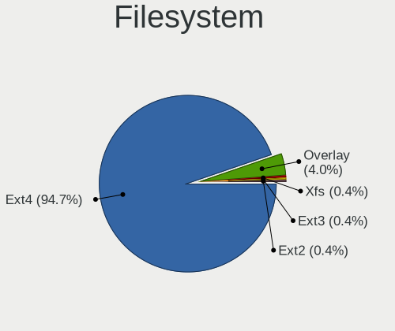
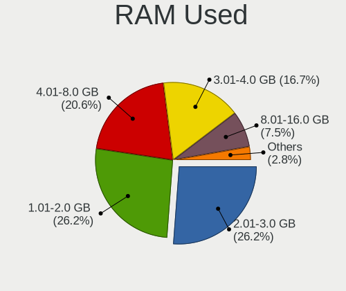
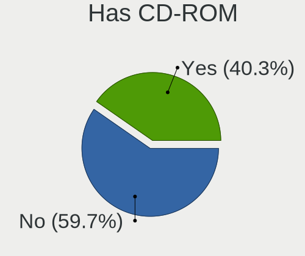
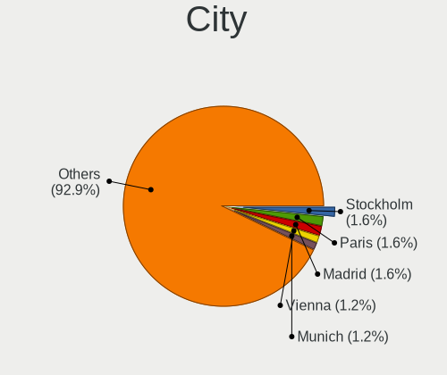
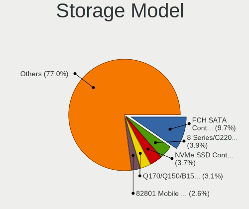
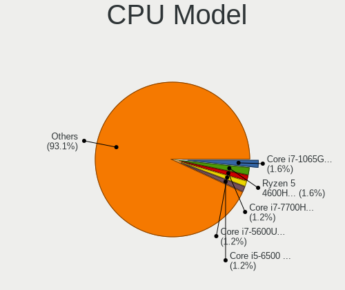
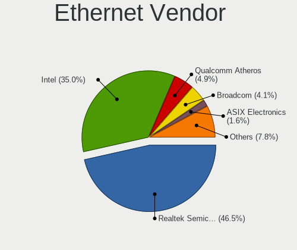
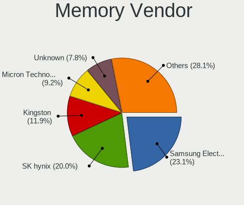
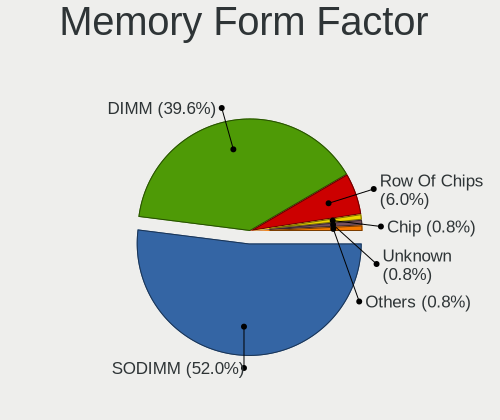

Ubuntu Studio - Tested Hardware & Statistics
--------------------------------------------

A project to collect tested hardware configurations for Ubuntu Studio.

Anyone can contribute to this report by the [hw-probe](https://github.com/linuxhw/hw-probe) tool:

    sudo -E hw-probe -all -upload

Please contribute! Especially if your hardware is rare.

This is a report for all computer types. See also reports for [desktops](/Dist/Ubuntu_Studio/Desktop/README.md) and [notebooks](/Dist/Ubuntu_Studio/Notebook/README.md).

Contents
--------

* [ Test Cases ](#test-cases)

* [ System ](#system)
  - [ OS                       ](#os)
  - [ OS Family                ](#os-family)
  - [ Kernel                   ](#kernel)
  - [ Kernel Family            ](#kernel-family)
  - [ Kernel Major Ver.        ](#kernel-major-ver)
  - [ Arch                     ](#arch)
  - [ DE                       ](#de)
  - [ Display Server           ](#display-server)
  - [ Display Manager          ](#display-manager)
  - [ OS Lang                  ](#os-lang)
  - [ Boot Mode                ](#boot-mode)
  - [ Filesystem               ](#filesystem)
  - [ Part. scheme             ](#part-scheme)
  - [ Dual Boot with Linux/BSD ](#dual-boot-with-linuxbsd)
  - [ Dual Boot (Win)          ](#dual-boot-win)

* [ Board ](#board)
  - [ Vendor                   ](#vendor)
  - [ Model                    ](#model)
  - [ Model Family             ](#model-family)
  - [ MFG Year                 ](#mfg-year)
  - [ Form Factor              ](#form-factor)
  - [ Secure Boot              ](#secure-boot)
  - [ Coreboot                 ](#coreboot)
  - [ RAM Size                 ](#ram-size)
  - [ RAM Used                 ](#ram-used)
  - [ Total Drives             ](#total-drives)
  - [ Has CD-ROM               ](#has-cd-rom)
  - [ Has Ethernet             ](#has-ethernet)
  - [ Has WiFi                 ](#has-wifi)
  - [ Has Bluetooth            ](#has-bluetooth)

* [ Location ](#location)
  - [ Country                  ](#country)
  - [ City                     ](#city)

* [ Drives ](#drives)
  - [ Drive Vendor             ](#drive-vendor)
  - [ Drive Model              ](#drive-model)
  - [ HDD Vendor               ](#hdd-vendor)
  - [ SSD Vendor               ](#ssd-vendor)
  - [ Drive Kind               ](#drive-kind)
  - [ Drive Connector          ](#drive-connector)
  - [ Drive Size               ](#drive-size)
  - [ Space Total              ](#space-total)
  - [ Space Used               ](#space-used)
  - [ Malfunc. Drives          ](#malfunc-drives)
  - [ Malfunc. Drive Vendor    ](#malfunc-drive-vendor)
  - [ Malfunc. HDD Vendor      ](#malfunc-hdd-vendor)
  - [ Malfunc. Drive Kind      ](#malfunc-drive-kind)
  - [ Failed Drives            ](#failed-drives)
  - [ Failed Drive Vendor      ](#failed-drive-vendor)
  - [ Drive Status             ](#drive-status)

* [ Storage controller ](#storage-controller)
  - [ Storage Vendor           ](#storage-vendor)
  - [ Storage Model            ](#storage-model)
  - [ Storage Kind             ](#storage-kind)

* [ Processor ](#processor)
  - [ CPU Vendor               ](#cpu-vendor)
  - [ CPU Model                ](#cpu-model)
  - [ CPU Model Family         ](#cpu-model-family)
  - [ CPU Cores                ](#cpu-cores)
  - [ CPU Sockets              ](#cpu-sockets)
  - [ CPU Threads              ](#cpu-threads)
  - [ CPU Op-Modes             ](#cpu-op-modes)
  - [ CPU Microcode            ](#cpu-microcode)
  - [ CPU Microarch            ](#cpu-microarch)

* [ Graphics ](#graphics)
  - [ GPU Vendor               ](#gpu-vendor)
  - [ GPU Model                ](#gpu-model)
  - [ GPU Combo                ](#gpu-combo)
  - [ GPU Driver               ](#gpu-driver)
  - [ GPU Memory               ](#gpu-memory)

* [ Monitor ](#monitor)
  - [ Monitor Vendor           ](#monitor-vendor)
  - [ Monitor Model            ](#monitor-model)
  - [ Monitor Resolution       ](#monitor-resolution)
  - [ Monitor Diagonal         ](#monitor-diagonal)
  - [ Monitor Width            ](#monitor-width)
  - [ Aspect Ratio             ](#aspect-ratio)
  - [ Monitor Area             ](#monitor-area)
  - [ Pixel Density            ](#pixel-density)
  - [ Multiple Monitors        ](#multiple-monitors)

* [ Network ](#network)
  - [ Net Controller Vendor    ](#net-controller-vendor)
  - [ Net Controller Model     ](#net-controller-model)
  - [ Wireless Vendor          ](#wireless-vendor)
  - [ Wireless Model           ](#wireless-model)
  - [ Ethernet Vendor          ](#ethernet-vendor)
  - [ Ethernet Model           ](#ethernet-model)
  - [ Net Controller Kind      ](#net-controller-kind)
  - [ Used Controller          ](#used-controller)
  - [ NICs                     ](#nics)
  - [ IPv6                     ](#ipv6)

* [ Bluetooth ](#bluetooth)
  - [ Bluetooth Vendor         ](#bluetooth-vendor)
  - [ Bluetooth Model          ](#bluetooth-model)

* [ Sound ](#sound)
  - [ Sound Vendor             ](#sound-vendor)
  - [ Sound Model              ](#sound-model)

* [ Memory ](#memory)
  - [ Memory Vendor            ](#memory-vendor)
  - [ Memory Model             ](#memory-model)
  - [ Memory Kind              ](#memory-kind)
  - [ Memory Form Factor       ](#memory-form-factor)
  - [ Memory Size              ](#memory-size)
  - [ Memory Speed             ](#memory-speed)

* [ Printers & scanners ](#printers--scanners)
  - [ Printer Vendor           ](#printer-vendor)
  - [ Printer Model            ](#printer-model)
  - [ Scanner Vendor           ](#scanner-vendor)
  - [ Scanner Model            ](#scanner-model)

* [ Camera ](#camera)
  - [ Camera Vendor            ](#camera-vendor)
  - [ Camera Model             ](#camera-model)

* [ Security ](#security)
  - [ Fingerprint Vendor       ](#fingerprint-vendor)
  - [ Fingerprint Model        ](#fingerprint-model)
  - [ Chipcard Vendor          ](#chipcard-vendor)
  - [ Chipcard Model           ](#chipcard-model)

* [ Unsupported ](#unsupported)
  - [ Unsupported Devices      ](#unsupported-devices)
  - [ Unsupported Device Types ](#unsupported-device-types)

Test Cases
----------

Total: 164

| Vendor        | Model                       | Form-Factor | Probe                                                      | Date         |
|---------------|-----------------------------|-------------|------------------------------------------------------------|--------------|
| Apple         | MacBookPro8,2               | Notebook    | [3d8320e362](https://linux-hardware.org/?probe=3d8320e362) | Dec 25, 2022 |
| ASUSTek       | M4A785-M                    | Desktop     | [f36c085389](https://linux-hardware.org/?probe=f36c085389) | Dec 25, 2022 |
| Gigabyte      | B550M DS3H                  | Desktop     | [ffe85423d8](https://linux-hardware.org/?probe=ffe85423d8) | Dec 15, 2022 |
| Gigabyte      | B150M-D2V DDR3-CF           | Desktop     | [9d689be2ab](https://linux-hardware.org/?probe=9d689be2ab) | Dec 11, 2022 |
| Acer          | Aspire E5-573G              | Notebook    | [ec1e8e146a](https://linux-hardware.org/?probe=ec1e8e146a) | Dec 10, 2022 |
| Dell          | Latitude E6500              | Notebook    | [291fbde8c4](https://linux-hardware.org/?probe=291fbde8c4) | Dec 08, 2022 |
| System76      | Thelio thelio-r1            | Desktop     | [a888eb38b3](https://linux-hardware.org/?probe=a888eb38b3) | Dec 01, 2022 |
| Lenovo        | G70-80 80FF                 | Notebook    | [022ce8e2c8](https://linux-hardware.org/?probe=022ce8e2c8) | Nov 29, 2022 |
| ASUSTek       | PRIME X570-PRO              | Desktop     | [78defd6c12](https://linux-hardware.org/?probe=78defd6c12) | Nov 21, 2022 |
| Dell          | 0XPDFK A01                  | Desktop     | [b76898d624](https://linux-hardware.org/?probe=b76898d624) | Nov 21, 2022 |
| Dell          | 0XPDFK A01                  | Desktop     | [5147db88ea](https://linux-hardware.org/?probe=5147db88ea) | Nov 14, 2022 |
| Gigabyte      | AERO 15-X9                  | Notebook    | [1d490bb7d1](https://linux-hardware.org/?probe=1d490bb7d1) | Nov 11, 2022 |
| HP            | 09F8h                       | Desktop     | [f1107e91f2](https://linux-hardware.org/?probe=f1107e91f2) | Nov 01, 2022 |
| MSI           | Z77A-G45 Thunderbolt        | Desktop     | [fa189cf50b](https://linux-hardware.org/?probe=fa189cf50b) | Oct 30, 2022 |
| ASUSTek       | PRIME X570-PRO              | Desktop     | [ea04a21af7](https://linux-hardware.org/?probe=ea04a21af7) | Oct 27, 2022 |
| Lenovo        | ThinkPad X230 2333A86       | Notebook    | [55771f0c33](https://linux-hardware.org/?probe=55771f0c33) | Oct 18, 2022 |
| Lenovo        | ThinkPad X230 2333A86       | Notebook    | [7e0028c2fa](https://linux-hardware.org/?probe=7e0028c2fa) | Oct 18, 2022 |
| Gigabyte      | X79S-UP5                    | Desktop     | [62f59af32c](https://linux-hardware.org/?probe=62f59af32c) | Oct 15, 2022 |
| ASUSTek       | ASUS EXPERTBOOK B1500CEA... | Notebook    | [5bfc8f0a7d](https://linux-hardware.org/?probe=5bfc8f0a7d) | Sep 30, 2022 |
| HP            | ZBook 15 G3                 | Notebook    | [2dc3febd4d](https://linux-hardware.org/?probe=2dc3febd4d) | Sep 24, 2022 |
| ASUSTek       | ROG STRIX Z370-H GAMING     | Desktop     | [5b39dcf114](https://linux-hardware.org/?probe=5b39dcf114) | Sep 19, 2022 |
| ASUSTek       | GL503VD                     | Notebook    | [b1d97f239e](https://linux-hardware.org/?probe=b1d97f239e) | Sep 16, 2022 |
| HUAWEI        | KLVL-WXXW                   | Notebook    | [de37b9cf96](https://linux-hardware.org/?probe=de37b9cf96) | Sep 13, 2022 |
| Gigabyte      | AERO 15-X9                  | Notebook    | [d6d8f577e0](https://linux-hardware.org/?probe=d6d8f577e0) | Sep 12, 2022 |
| ASUSTek       | P8P67 LE                    | Desktop     | [07428c96e1](https://linux-hardware.org/?probe=07428c96e1) | Sep 11, 2022 |
| Lenovo        | IdeaPad 3 14ARE05 81W3      | Notebook    | [b8c22aafab](https://linux-hardware.org/?probe=b8c22aafab) | Sep 01, 2022 |
| Lenovo        | 36F4 SDK0J40697 WIN 3305... | All in one  | [c129f7c9b1](https://linux-hardware.org/?probe=c129f7c9b1) | Aug 29, 2022 |
| Lenovo        | IdeaPad 3 15ABA7 82RN       | Notebook    | [a23b4a8cd4](https://linux-hardware.org/?probe=a23b4a8cd4) | Aug 27, 2022 |
| HP            | 18E7                        | Desktop     | [698520133f](https://linux-hardware.org/?probe=698520133f) | Aug 22, 2022 |
| Lenovo        | 36F4 SDK0J40697 WIN 3305... | All in one  | [5cbe471be8](https://linux-hardware.org/?probe=5cbe471be8) | Aug 19, 2022 |
| Lenovo        | 36F4 SDK0J40697 WIN 3305... | All in one  | [4b585d8c34](https://linux-hardware.org/?probe=4b585d8c34) | Aug 18, 2022 |
| Dell          | 0T10XW A02                  | Desktop     | [45491460bc](https://linux-hardware.org/?probe=45491460bc) | Aug 12, 2022 |
| Dell          | 08WKV3 A00                  | Desktop     | [fe23b6e49a](https://linux-hardware.org/?probe=fe23b6e49a) | Jul 27, 2022 |
| HP            | G62                         | Notebook    | [3c4aab40ae](https://linux-hardware.org/?probe=3c4aab40ae) | Jul 20, 2022 |
| AZW           | SER V01                     | Mini pc     | [0bf81855b6](https://linux-hardware.org/?probe=0bf81855b6) | Jul 18, 2022 |
| Apple         | MacBookPro11,5              | Notebook    | [25e69108df](https://linux-hardware.org/?probe=25e69108df) | Jul 03, 2022 |
| Dell          | 0TTDMJ A00                  | Desktop     | [e45e0b0c90](https://linux-hardware.org/?probe=e45e0b0c90) | Jun 29, 2022 |
| ASUSTek       | VivoBook_ASUSLaptop X580... | Notebook    | [4ed102b3fa](https://linux-hardware.org/?probe=4ed102b3fa) | Jun 15, 2022 |
| Apple         | Mac-031AEE4D24BFF0B1 Mac... | Mini pc     | [6023bfb4cc](https://linux-hardware.org/?probe=6023bfb4cc) | Jun 09, 2022 |
| ASRock        | B250M-HDV                   | Desktop     | [a4aa661ab1](https://linux-hardware.org/?probe=a4aa661ab1) | Jun 01, 2022 |
| Gigabyte      | A320M-S2H-CF                | Desktop     | [0754e1c6e6](https://linux-hardware.org/?probe=0754e1c6e6) | May 23, 2022 |
| Gigabyte      | F2A78M-HD2                  | Desktop     | [fdc743e9e1](https://linux-hardware.org/?probe=fdc743e9e1) | May 23, 2022 |
| Gigabyte      | A320M-S2H-CF                | Desktop     | [900181bbff](https://linux-hardware.org/?probe=900181bbff) | May 22, 2022 |
| ASUSTek       | Z87-DELUXE                  | Desktop     | [bcd22d5d0e](https://linux-hardware.org/?probe=bcd22d5d0e) | May 20, 2022 |
| Getac         | S400G3                      | Notebook    | [56cc8b4c1a](https://linux-hardware.org/?probe=56cc8b4c1a) | May 16, 2022 |
| Dell          | 0RW203                      | Desktop     | [fc3e449b4d](https://linux-hardware.org/?probe=fc3e449b4d) | May 09, 2022 |
| Dell          | Inspiron 7506 2n1           | Convertible | [b2bddaf1b1](https://linux-hardware.org/?probe=b2bddaf1b1) | Apr 27, 2022 |
| Dell          | Inspiron 7506 2n1           | Convertible | [02b0c35fed](https://linux-hardware.org/?probe=02b0c35fed) | Apr 27, 2022 |
| Gigabyte      | H170-HD3-CF                 | Desktop     | [cebf5b3135](https://linux-hardware.org/?probe=cebf5b3135) | Apr 17, 2022 |
| Acer          | Aspire A114-32              | Notebook    | [3c048f588e](https://linux-hardware.org/?probe=3c048f588e) | Apr 12, 2022 |
| Acer          | Aspire C27-1655             | All in one  | [aff1557d72](https://linux-hardware.org/?probe=aff1557d72) | Apr 11, 2022 |
| Acer          | Aspire C27-1655             | All in one  | [a87f9de14e](https://linux-hardware.org/?probe=a87f9de14e) | Apr 03, 2022 |
| ASUSTek       | H81M-PLUS                   | Desktop     | [a517bb6633](https://linux-hardware.org/?probe=a517bb6633) | Apr 03, 2022 |
| ASUSTek       | ROG ZENITH II EXTREME AL... | Desktop     | [01ad19348a](https://linux-hardware.org/?probe=01ad19348a) | Mar 20, 2022 |
| Dell          | XPS 15 9570                 | Notebook    | [3f8fe40793](https://linux-hardware.org/?probe=3f8fe40793) | Mar 08, 2022 |
| Dell          | Inspiron N5110              | Notebook    | [4206238fce](https://linux-hardware.org/?probe=4206238fce) | Mar 01, 2022 |
| HP            | Sona                        | Notebook    | [4fcab0b3b7](https://linux-hardware.org/?probe=4fcab0b3b7) | Feb 24, 2022 |
| HP            | Sona                        | Notebook    | [d0b3189e0f](https://linux-hardware.org/?probe=d0b3189e0f) | Feb 24, 2022 |
| Lenovo        | ThinkPad X230 2325AJG       | Notebook    | [eccfa3a972](https://linux-hardware.org/?probe=eccfa3a972) | Feb 12, 2022 |
| ASUSTek       | P5QC                        | Desktop     | [82f706b315](https://linux-hardware.org/?probe=82f706b315) | Feb 11, 2022 |
| Google        | Nami                        | Notebook    | [5f1ba9ab72](https://linux-hardware.org/?probe=5f1ba9ab72) | Feb 10, 2022 |
| Lenovo        | Legion 5 15ARH05H 82B1      | Notebook    | [feb1c1d6a2](https://linux-hardware.org/?probe=feb1c1d6a2) | Feb 10, 2022 |
| Dell          | 055H3G A01                  | Desktop     | [05f63f2396](https://linux-hardware.org/?probe=05f63f2396) | Feb 04, 2022 |
| Samsung       | 305V4A/305V5A               | Notebook    | [5a1bf3cb9e](https://linux-hardware.org/?probe=5a1bf3cb9e) | Feb 04, 2022 |
| HP            | EliteBook 840 G3            | Notebook    | [fe9fed2a45](https://linux-hardware.org/?probe=fe9fed2a45) | Jan 26, 2022 |
| Lenovo        | ThinkPad T520 4243K86       | Notebook    | [5ccce1fb71](https://linux-hardware.org/?probe=5ccce1fb71) | Jan 21, 2022 |
| Lenovo        | ThinkPad T520 4243K86       | Notebook    | [91adda5a0e](https://linux-hardware.org/?probe=91adda5a0e) | Jan 21, 2022 |
| Clevo         | W35_37ET                    | Notebook    | [f8858fd0c3](https://linux-hardware.org/?probe=f8858fd0c3) | Jan 20, 2022 |
| Dell          | Inspiron 7348               | Notebook    | [b479441fe2](https://linux-hardware.org/?probe=b479441fe2) | Jan 15, 2022 |
| HP            | 3396                        | Desktop     | [97720dddd1](https://linux-hardware.org/?probe=97720dddd1) | Jan 10, 2022 |
| Fujitsu       | D3230-A1 S26361-D3230-A1    | Desktop     | [7f94c66f93](https://linux-hardware.org/?probe=7f94c66f93) | Jan 09, 2022 |
| AZW           | GK35                        | Desktop     | [ed1be3dbf7](https://linux-hardware.org/?probe=ed1be3dbf7) | Jan 07, 2022 |
| Dell          | Inspiron 3501               | Notebook    | [e071d4f83a](https://linux-hardware.org/?probe=e071d4f83a) | Jan 02, 2022 |
| ASUSTek       | ROG STRIX Z490-I GAMING     | Desktop     | [4c55363bc2](https://linux-hardware.org/?probe=4c55363bc2) | Dec 04, 2021 |
| Toshiba       | Satellite C855              | Notebook    | [7914ab9929](https://linux-hardware.org/?probe=7914ab9929) | Dec 03, 2021 |
| Lenovo        | IdeaPad Gaming 3 15ARH05... | Notebook    | [a271c08df2](https://linux-hardware.org/?probe=a271c08df2) | Oct 21, 2021 |
| Lenovo        | IdeaPad Gaming 3 15ARH05... | Notebook    | [2a9e8d32e2](https://linux-hardware.org/?probe=2a9e8d32e2) | Oct 15, 2021 |
| Lenovo        | IdeaPad Gaming 3 15ARH05... | Notebook    | [f0a9d13afb](https://linux-hardware.org/?probe=f0a9d13afb) | Oct 14, 2021 |
| Lenovo        | ThinkPad X1 Carbon 2nd 2... | Notebook    | [1dbff2c4f9](https://linux-hardware.org/?probe=1dbff2c4f9) | Oct 09, 2021 |
| Razer         | Blade Stealth 13 Late 20... | Notebook    | [22033e7185](https://linux-hardware.org/?probe=22033e7185) | Oct 05, 2021 |
| Toshiba       | Satellite L755D             | Notebook    | [aca989dcc4](https://linux-hardware.org/?probe=aca989dcc4) | Sep 29, 2021 |
| ASUSTek       | ROG Zephyrus G15 GA502IU... | Notebook    | [7725289d30](https://linux-hardware.org/?probe=7725289d30) | Sep 17, 2021 |
| ASUSTek       | UX305FA                     | Notebook    | [91b4275b9b](https://linux-hardware.org/?probe=91b4275b9b) | Aug 25, 2021 |
| HUAWEI        | HLYL-WXX9                   | Notebook    | [35e6393ea4](https://linux-hardware.org/?probe=35e6393ea4) | Aug 01, 2021 |
| ASUSTek       | H110M-A/M.2                 | Desktop     | [b62225a801](https://linux-hardware.org/?probe=b62225a801) | Jul 24, 2021 |
| Lenovo        | ThinkPad X1 Carbon 6th 2... | Notebook    | [9d8c462df3](https://linux-hardware.org/?probe=9d8c462df3) | Jul 20, 2021 |
| HP            | Pavilion dv6                | Notebook    | [089a39fe70](https://linux-hardware.org/?probe=089a39fe70) | Jul 07, 2021 |
| Acer          | Aspire U5-710               | All in one  | [c2ff1a33ee](https://linux-hardware.org/?probe=c2ff1a33ee) | Jun 19, 2021 |
| Lenovo        | IdeaPad Gaming 3 15IMH05... | Notebook    | [64c8a86c5b](https://linux-hardware.org/?probe=64c8a86c5b) | Jun 19, 2021 |
| HP            | 1495                        | Desktop     | [56251d62e1](https://linux-hardware.org/?probe=56251d62e1) | Jun 17, 2021 |
| Intel Clie... | LAPBC510                    | Notebook    | [06421d0916](https://linux-hardware.org/?probe=06421d0916) | Jun 15, 2021 |
| HP            | Stream Laptop 14-cb0XX      | Notebook    | [f88f0c3680](https://linux-hardware.org/?probe=f88f0c3680) | Jun 14, 2021 |
| Pegatron      | NARRA3                      | Desktop     | [38ac9a9ea6](https://linux-hardware.org/?probe=38ac9a9ea6) | May 18, 2021 |
| Dell          | 0P4T42 A00                  | All in one  | [80ca4b15a5](https://linux-hardware.org/?probe=80ca4b15a5) | May 16, 2021 |
| HP            | 158A                        | Desktop     | [2fac0fa486](https://linux-hardware.org/?probe=2fac0fa486) | May 01, 2021 |
| Lenovo        | SHARKBAY SDK0E50510 WIN     | Desktop     | [ef264215af](https://linux-hardware.org/?probe=ef264215af) | Apr 24, 2021 |
| ASUSTek       | H110M-A/M.2                 | Desktop     | [04a4129216](https://linux-hardware.org/?probe=04a4129216) | Apr 20, 2021 |
| HP            | OMEN by Laptop 15-ce0xx     | Notebook    | [749002b5ad](https://linux-hardware.org/?probe=749002b5ad) | Apr 20, 2021 |
| HP            | OMEN by Laptop 15-ce0xx     | Notebook    | [aec24cb317](https://linux-hardware.org/?probe=aec24cb317) | Apr 20, 2021 |
| Dell          | Precision M4500             | Notebook    | [8c35250407](https://linux-hardware.org/?probe=8c35250407) | Apr 17, 2021 |
| ASUSTek       | P8P67 EVO                   | Desktop     | [5e98e0ae38](https://linux-hardware.org/?probe=5e98e0ae38) | Apr 14, 2021 |
| Apple         | Mac-7BA5B2D9E42DDD94 iMa... | Desktop     | [43cb3af3a5](https://linux-hardware.org/?probe=43cb3af3a5) | Apr 12, 2021 |
| Foxconn       | 2ABF                        | Desktop     | [9414f40cf2](https://linux-hardware.org/?probe=9414f40cf2) | Apr 03, 2021 |
| Fujitsu       | D3654-C1 S26361-D3654-C1    | Desktop     | [4cd56bcfa1](https://linux-hardware.org/?probe=4cd56bcfa1) | Apr 02, 2021 |
| ASUSTek       | P6T SE                      | Desktop     | [5ff7a11404](https://linux-hardware.org/?probe=5ff7a11404) | Mar 28, 2021 |
| Gigabyte      | X570 AORUS ELITE WIFI       | Desktop     | [7b7a266de6](https://linux-hardware.org/?probe=7b7a266de6) | Mar 22, 2021 |
| Gigabyte      | X570 AORUS ELITE WIFI       | Desktop     | [d9f29b65da](https://linux-hardware.org/?probe=d9f29b65da) | Mar 15, 2021 |
| ASUSTek       | X541NA                      | Notebook    | [db3ab2a133](https://linux-hardware.org/?probe=db3ab2a133) | Mar 15, 2021 |
| HP            | Pavilion dv6                | Notebook    | [369f0a0cdb](https://linux-hardware.org/?probe=369f0a0cdb) | Mar 12, 2021 |
| Lenovo        | G50-45 80E3                 | Notebook    | [e4fb438978](https://linux-hardware.org/?probe=e4fb438978) | Feb 24, 2021 |
| ASUSTek       | TUF B360-PRO GAMING         | Desktop     | [19bc1494c6](https://linux-hardware.org/?probe=19bc1494c6) | Feb 21, 2021 |
| Sony          | VGN-NS31M_W                 | Notebook    | [dcc1660569](https://linux-hardware.org/?probe=dcc1660569) | Feb 17, 2021 |
| ASUSTek       | A68HM-PLUS                  | Desktop     | [387cfadf45](https://linux-hardware.org/?probe=387cfadf45) | Feb 06, 2021 |
| IBM           | 8188PPV                     | Desktop     | [6d4f098a65](https://linux-hardware.org/?probe=6d4f098a65) | Jan 31, 2021 |
| Dell          | 02YRK5 A01                  | Desktop     | [6a2d5cd538](https://linux-hardware.org/?probe=6a2d5cd538) | Jan 30, 2021 |
| Gigabyte      | GA-MA770-DS3                | Desktop     | [c9af16a580](https://linux-hardware.org/?probe=c9af16a580) | Jan 24, 2021 |
| Dell          | 0D28YY A03                  | Desktop     | [e74dbb590d](https://linux-hardware.org/?probe=e74dbb590d) | Jan 21, 2021 |
| Intel         | DQ965GF AAD41676-402        | Desktop     | [2e9a342427](https://linux-hardware.org/?probe=2e9a342427) | Jan 13, 2021 |
| Acidanther... | Mac-F60DEB81FF30ACF6 Mac... | Desktop     | [772bf2459f](https://linux-hardware.org/?probe=772bf2459f) | Jan 11, 2021 |
| Gigabyte      | B450M S2H                   | Desktop     | [13edd89415](https://linux-hardware.org/?probe=13edd89415) | Jan 11, 2021 |
| ASUSTek       | U56E                        | Notebook    | [eba46128ee](https://linux-hardware.org/?probe=eba46128ee) | Jan 04, 2021 |
| Fujitsu       | D3221-A1 S26361-D3221-A1    | Desktop     | [a8ebb648f7](https://linux-hardware.org/?probe=a8ebb648f7) | Jan 03, 2021 |
| Acer          | Aspire X3400                | Desktop     | [da9e0d0bb4](https://linux-hardware.org/?probe=da9e0d0bb4) | Jan 02, 2021 |
| Packard Be... | WMCP78M                     | Desktop     | [6a6c4577d4](https://linux-hardware.org/?probe=6a6c4577d4) | Dec 31, 2020 |
| HP            | 1850                        | Desktop     | [b86e749745](https://linux-hardware.org/?probe=b86e749745) | Dec 30, 2020 |
| Raspberry ... | Raspberry Pi 4 Model B R... | Soc         | [4332bc902d](https://linux-hardware.org/?probe=4332bc902d) | Dec 21, 2020 |
| Dell          | 0J3C2F A00                  | Desktop     | [b2e5d9d8b0](https://linux-hardware.org/?probe=b2e5d9d8b0) | Dec 09, 2020 |
| ASUSTek       | M4A88TD-M/USB3              | Desktop     | [2291f0c106](https://linux-hardware.org/?probe=2291f0c106) | Dec 08, 2020 |
| Dell          | 04YP6J A02                  | Desktop     | [6c15ba650c](https://linux-hardware.org/?probe=6c15ba650c) | Dec 06, 2020 |
| Intel         | NUC8BEB J72692-304          | Mini pc     | [505443aeb1](https://linux-hardware.org/?probe=505443aeb1) | Dec 02, 2020 |
| MSI           | Z270 MPOWER GAMING TITAN... | Desktop     | [73e35c07b8](https://linux-hardware.org/?probe=73e35c07b8) | Dec 02, 2020 |
| MSI           | Z270 MPOWER GAMING TITAN... | Desktop     | [3b24badd98](https://linux-hardware.org/?probe=3b24badd98) | Dec 02, 2020 |
| Dell          | Inspiron 3543               | Notebook    | [1b1044cc21](https://linux-hardware.org/?probe=1b1044cc21) | Nov 28, 2020 |
| Medion        | B360H4-EM V1.0              | Desktop     | [1915ad5c58](https://linux-hardware.org/?probe=1915ad5c58) | Nov 15, 2020 |
| Dell          | Latitude E6530              | Notebook    | [3d606b3078](https://linux-hardware.org/?probe=3d606b3078) | Nov 09, 2020 |
| ASUSTek       | CS-B                        | Desktop     | [4e0f76c433](https://linux-hardware.org/?probe=4e0f76c433) | Nov 02, 2020 |
| Dell          | Latitude E7250              | Notebook    | [d5e2f8b706](https://linux-hardware.org/?probe=d5e2f8b706) | Nov 01, 2020 |
| Acer          | ASPIRE1420P_MSFT            | Notebook    | [5185b46abc](https://linux-hardware.org/?probe=5185b46abc) | Oct 31, 2020 |
| HP            | 3047h                       | Desktop     | [a23efe0e20](https://linux-hardware.org/?probe=a23efe0e20) | Oct 26, 2020 |
| ASRock        | H55M/USB3                   | Desktop     | [74202436b2](https://linux-hardware.org/?probe=74202436b2) | Oct 18, 2020 |
| Dell          | 0F8098                      | Desktop     | [a2217fa6a7](https://linux-hardware.org/?probe=a2217fa6a7) | Sep 25, 2020 |
| Dell          | 0F8098                      | Desktop     | [2c747bcc47](https://linux-hardware.org/?probe=2c747bcc47) | Sep 25, 2020 |
| Avell High... | Avell G1555 MUV / A62 MU... | Notebook    | [c2994bb093](https://linux-hardware.org/?probe=c2994bb093) | Sep 18, 2020 |
| Dell          | Inspiron 1520               | Notebook    | [e00620b124](https://linux-hardware.org/?probe=e00620b124) | Sep 06, 2020 |
| HP            | Laptop 15s-fq1xxx           | Notebook    | [57d3d832f5](https://linux-hardware.org/?probe=57d3d832f5) | Sep 04, 2020 |
| Dell          | Latitude E4300              | Notebook    | [3e0fb2e03f](https://linux-hardware.org/?probe=3e0fb2e03f) | Sep 03, 2020 |
| ASRock        | X470 Master SLI             | Desktop     | [03bcf3b1fd](https://linux-hardware.org/?probe=03bcf3b1fd) | Sep 02, 2020 |
| HP            | Compaq 8510p                | Notebook    | [2ea87d13f0](https://linux-hardware.org/?probe=2ea87d13f0) | Aug 26, 2020 |
| ASUSTek       | 1001P                       | Notebook    | [d4f13322ac](https://linux-hardware.org/?probe=d4f13322ac) | Aug 19, 2020 |
| ASRock        | B450M Pro4                  | Desktop     | [d2851c54e9](https://linux-hardware.org/?probe=d2851c54e9) | Aug 18, 2020 |
| ASUSTek       | 1001P                       | Notebook    | [92e2a05f2d](https://linux-hardware.org/?probe=92e2a05f2d) | Aug 13, 2020 |
| ASUSTek       | 1001P                       | Notebook    | [0ae5a1aab2](https://linux-hardware.org/?probe=0ae5a1aab2) | Aug 13, 2020 |
| ASUSTek       | TUF Gaming X570-PLUS        | Desktop     | [96ba8dc0e8](https://linux-hardware.org/?probe=96ba8dc0e8) | Jul 31, 2020 |
| Dell          | Inspiron 5566               | Notebook    | [3162979c2e](https://linux-hardware.org/?probe=3162979c2e) | Jul 24, 2020 |
| ASUSTek       | H81M-C/BR                   | Desktop     | [d21c458a4f](https://linux-hardware.org/?probe=d21c458a4f) | Jul 24, 2020 |
| Lenovo        | IdeaPad 5 15ARE05 81YQ      | Notebook    | [a253e286bf](https://linux-hardware.org/?probe=a253e286bf) | Jul 06, 2020 |
| Lenovo        | IdeaPad 5 15ARE05 81YQ      | Notebook    | [c2c3727c6a](https://linux-hardware.org/?probe=c2c3727c6a) | Jun 30, 2020 |
| Gigabyte      | B450 I AORUS PRO WIFI-CF    | Desktop     | [957ec007de](https://linux-hardware.org/?probe=957ec007de) | Jun 27, 2020 |
| ASUSTek       | M5A78L-M/USB3               | Desktop     | [cb240b6e7e](https://linux-hardware.org/?probe=cb240b6e7e) | Jun 05, 2020 |
| HP            | Notebook                    | Notebook    | [e406d5cf9e](https://linux-hardware.org/?probe=e406d5cf9e) | Jun 02, 2020 |
| Apple         | Mac-F2268DAE                | All in one  | [8271aeba33](https://linux-hardware.org/?probe=8271aeba33) | Mar 19, 2020 |
| Lenovo        | ThinkPad W530 2447IG0       | Notebook    | [f7125d9a17](https://linux-hardware.org/?probe=f7125d9a17) | Mar 19, 2020 |
| Lenovo        | ThinkPad X230 23245S1       | Notebook    | [047f29b7c7](https://linux-hardware.org/?probe=047f29b7c7) | Nov 01, 2019 |
| Lenovo        | G50-45 80E3                 | Notebook    | [ebbf8cd8d4](https://linux-hardware.org/?probe=ebbf8cd8d4) | May 27, 2019 |

System
------

OS
--

Installed operating systems

| Name                | Computers | Percent |
|---------------------|-----------|---------|
| Ubuntu Studio 20.04 | 80        | 57.97%  |
| Ubuntu Studio 22.04 | 26        | 18.84%  |
| Ubuntu Studio 20.10 | 13        | 9.42%   |
| Ubuntu Studio 21.10 | 7         | 5.07%   |
| Ubuntu Studio 21.04 | 5         | 3.62%   |
| Ubuntu Studio 18.04 | 3         | 2.17%   |
| Ubuntu Studio 19.10 | 2         | 1.45%   |
| Ubuntu Studio 22.10 | 1         | 0.72%   |
| Ubuntu Studio 16.04 | 1         | 0.72%   |

OS Family
---------

OS without a version

| Name          | Computers | Percent |
|---------------|-----------|---------|
| Ubuntu Studio | 138       | 100%    |

Kernel
------

Version of the Linux kernel

| Version                 | Computers | Percent |
|-------------------------|-----------|---------|
| 5.15.0-56-lowlatency    | 5         | 3.57%   |
| 5.15.0-46-lowlatency    | 5         | 3.57%   |
| 5.13.0-28-lowlatency    | 5         | 3.57%   |
| 5.4.0-52-lowlatency     | 4         | 2.86%   |
| 5.4.0-42-lowlatency     | 4         | 2.86%   |
| 5.8.0-55-lowlatency     | 3         | 2.14%   |
| 5.8.0-50-lowlatency     | 3         | 2.14%   |
| 5.8.0-44-lowlatency     | 3         | 2.14%   |
| 5.8.0-25-lowlatency     | 3         | 2.14%   |
| 5.4.0-65-lowlatency     | 3         | 2.14%   |
| 5.4.0-26-lowlatency     | 3         | 2.14%   |
| 5.15.0-52-lowlatency    | 3         | 2.14%   |
| 5.15.0-47-lowlatency    | 3         | 2.14%   |
| 5.11.0-44-lowlatency    | 3         | 2.14%   |
| 5.11.0-34-lowlatency    | 3         | 2.14%   |
| 5.8.0-48-lowlatency     | 2         | 1.43%   |
| 5.8.0-29-lowlatency     | 2         | 1.43%   |
| 5.4.0-94-lowlatency     | 2         | 1.43%   |
| 5.4.0-58-lowlatency     | 2         | 1.43%   |
| 5.4.0-56-lowlatency     | 2         | 1.43%   |
| 5.4.0-45-lowlatency     | 2         | 1.43%   |
| 5.15.0-53-lowlatency    | 2         | 1.43%   |
| 5.15.0-50-lowlatency    | 2         | 1.43%   |
| 5.15.0-48-lowlatency    | 2         | 1.43%   |
| 5.15.0-40-lowlatency    | 2         | 1.43%   |
| 5.15.0-30-lowlatency    | 2         | 1.43%   |
| 5.13.0-30-lowlatency    | 2         | 1.43%   |
| 5.11.0-27-lowlatency    | 2         | 1.43%   |
| 5.8.0-59-lowlatency     | 1         | 0.71%   |
| 5.8.0-45-lowlatency     | 1         | 0.71%   |
| 5.8.0-43-lowlatency     | 1         | 0.71%   |
| 5.8.0-36-lowlatency     | 1         | 0.71%   |
| 5.8.0-34-lowlatency     | 1         | 0.71%   |
| 5.8.0-34-generic        | 1         | 0.71%   |
| 5.8.0-33-lowlatency     | 1         | 0.71%   |
| 5.7.6-050706-lowlatency | 1         | 0.71%   |
| 5.7.6-050706-generic    | 1         | 0.71%   |
| 5.4.0-99-lowlatency     | 1         | 0.71%   |
| 5.4.0-96-lowlatency     | 1         | 0.71%   |
| 5.4.0-88-lowlatency     | 1         | 0.71%   |

Kernel Family
-------------

Linux kernel without a distro release

| Version | Computers | Percent |
|---------|-----------|---------|
| 5.4.0   | 51        | 36.96%  |
| 5.15.0  | 29        | 21.01%  |
| 5.8.0   | 23        | 16.67%  |
| 5.11.0  | 15        | 10.87%  |
| 5.13.0  | 10        | 7.25%   |
| 4.15.0  | 3         | 2.17%   |
| 5.3.0   | 2         | 1.45%   |
| 5.7.6   | 1         | 0.72%   |
| 5.19.0  | 1         | 0.72%   |
| 5.17.1  | 1         | 0.72%   |
| 5.15.6  | 1         | 0.72%   |
| 4.4.0   | 1         | 0.72%   |

Kernel Major Ver.
-----------------

Linux kernel major version

| Version | Computers | Percent |
|---------|-----------|---------|
| 5.4     | 51        | 36.96%  |
| 5.15    | 30        | 21.74%  |
| 5.8     | 23        | 16.67%  |
| 5.11    | 15        | 10.87%  |
| 5.13    | 10        | 7.25%   |
| 4.15    | 3         | 2.17%   |
| 5.3     | 2         | 1.45%   |
| 5.7     | 1         | 0.72%   |
| 5.19    | 1         | 0.72%   |
| 5.17    | 1         | 0.72%   |
| 4.4     | 1         | 0.72%   |

Arch
----

OS architecture (x86_64, i586, etc.)

| Name    | Computers | Percent |
|---------|-----------|---------|
| x86_64  | 136       | 98.55%  |
| i686    | 1         | 0.72%   |
| aarch64 | 1         | 0.72%   |

DE
--

Desktop Environment

| Name            | Computers | Percent |
|-----------------|-----------|---------|
| XFCE            | 76        | 55.07%  |
| KDE5            | 45        | 32.61%  |
| GNOME           | 10        | 7.25%   |
| MATE            | 2         | 1.45%   |
| LXQt            | 2         | 1.45%   |
| KDE             | 1         | 0.72%   |
| GNOME Flashback | 1         | 0.72%   |
| Cinnamon        | 1         | 0.72%   |

Display Server
--------------

X11 or Wayland

| Name    | Computers | Percent |
|---------|-----------|---------|
| X11     | 131       | 94.93%  |
| Wayland | 5         | 3.62%   |
| Tty     | 2         | 1.45%   |

Display Manager
---------------

SDDM, LightDM, etc.

| Name    | Computers | Percent |
|---------|-----------|---------|
| TDM     | 49        | 35.51%  |
| SDDM    | 42        | 30.43%  |
| LightDM | 35        | 25.36%  |
| GDM     | 11        | 7.97%   |
| LXDM    | 1         | 0.72%   |

OS Lang
-------

Language

| Lang       | Computers | Percent |
|------------|-----------|---------|
| en_US      | 56        | 40.58%  |
| fr_FR      | 20        | 14.49%  |
| de_DE      | 9         | 6.52%   |
| pt_BR      | 6         | 4.35%   |
| it_IT      | 6         | 4.35%   |
| C          | 6         | 4.35%   |
| en_GB      | 4         | 2.9%    |
| en_CA      | 4         | 2.9%    |
| nl_NL      | 2         | 1.45%   |
| es_ES      | 2         | 1.45%   |
| en_AU      | 2         | 1.45%   |
| en_AG      | 2         | 1.45%   |
| Unknown    | 2         | 1.45%   |
| sk_SK      | 1         | 0.72%   |
| ru_RU      | 1         | 0.72%   |
| nl_BE      | 1         | 0.72%   |
| nb_NO      | 1         | 0.72%   |
| hu_HU      | 1         | 0.72%   |
| fr_FR.UTF8 | 1         | 0.72%   |
| fr_CH      | 1         | 0.72%   |
| es_NI      | 1         | 0.72%   |
| es_GT      | 1         | 0.72%   |
| es_CR      | 1         | 0.72%   |
| es_AR      | 1         | 0.72%   |
| en_NG      | 1         | 0.72%   |
| en_IE      | 1         | 0.72%   |
| en_DE      | 1         | 0.72%   |
| de_AT      | 1         | 0.72%   |
| ca_ES      | 1         | 0.72%   |
| ca_AD      | 1         | 0.72%   |

Boot Mode
---------

EFI or BIOS

| Mode | Computers | Percent |
|------|-----------|---------|
| EFI  | 75        | 54.35%  |
| BIOS | 63        | 45.65%  |

Filesystem
----------

Type of filesystem

| Type    | Computers | Percent |
|---------|-----------|---------|
| Ext4    | 132       | 95.65%  |
| Overlay | 4         | 2.9%    |
| Xfs     | 1         | 0.72%   |
| Ext2    | 1         | 0.72%   |

Part. scheme
------------

Scheme of partitioning

| Type | Computers | Percent |
|------|-----------|---------|
| GPT  | 83        | 60.14%  |
| MBR  | 55        | 39.86%  |

Dual Boot with Linux/BSD
------------------------

Hosting more than one Linux/BSD

| Dual boot | Computers | Percent |
|-----------|-----------|---------|
| No        | 110       | 79.71%  |
| Yes       | 28        | 20.29%  |

Dual Boot (Win)
---------------

Hosting Linux and Windows

| Dual boot | Computers | Percent |
|-----------|-----------|---------|
| No        | 75        | 54.35%  |
| Yes       | 63        | 45.65%  |

Board
-----

Vendor
------

Motherboard manufacturer

| Name                    | Computers | Percent |
|-------------------------|-----------|---------|
| ASUSTek Computer        | 27        | 19.57%  |
| Dell                    | 23        | 16.67%  |
| Lenovo                  | 18        | 13.04%  |
| Hewlett-Packard         | 17        | 12.32%  |
| Gigabyte Technology     | 11        | 7.97%   |
| Acer                    | 6         | 4.35%   |
| Apple                   | 5         | 3.62%   |
| Fujitsu                 | 3         | 2.17%   |
| Toshiba                 | 2         | 1.45%   |
| MSI                     | 2         | 1.45%   |
| Intel                   | 2         | 1.45%   |
| HUAWEI                  | 2         | 1.45%   |
| AZW                     | 2         | 1.45%   |
| ASRock                  | 2         | 1.45%   |
| System76                | 1         | 0.72%   |
| Sony                    | 1         | 0.72%   |
| Samsung Electronics     | 1         | 0.72%   |
| Razer                   | 1         | 0.72%   |
| Raspberry Pi Foundation | 1         | 0.72%   |
| Pegatron                | 1         | 0.72%   |
| Packard Bell            | 1         | 0.72%   |
| Medion                  | 1         | 0.72%   |
| Intel Client Systems    | 1         | 0.72%   |
| IBM                     | 1         | 0.72%   |
| Google                  | 1         | 0.72%   |
| Getac                   | 1         | 0.72%   |
| Foxconn                 | 1         | 0.72%   |
| Clevo                   | 1         | 0.72%   |
| Avell High Performance  | 1         | 0.72%   |
| Acidanthera             | 1         | 0.72%   |

Model
-----

Motherboard model

| Name                                       | Computers | Percent |
|--------------------------------------------|-----------|---------|
| ASUS All Series                            | 4         | 2.9%    |
| Lenovo G50-45 80E3                         | 2         | 1.45%   |
| HP Pavilion dv6                            | 2         | 1.45%   |
| Dell OptiPlex 790                          | 2         | 1.45%   |
| ASUS PRIME X570-PRO                        | 2         | 1.45%   |
| Toshiba Satellite L755D                    | 1         | 0.72%   |
| Toshiba Satellite C855                     | 1         | 0.72%   |
| System76 Thelio                            | 1         | 0.72%   |
| Sony VGN-NS31M_W                           | 1         | 0.72%   |
| Samsung 305V4A/305V5A                      | 1         | 0.72%   |
| Razer Blade Stealth 13 Late 2019           | 1         | 0.72%   |
| RPi Raspberry Pi 4 Model B Rev 1.4         | 1         | 0.72%   |
| Pegatron FL368AA-UUZ SR5612CH              | 1         | 0.72%   |
| Packard Bell IMEDIA S3220                  | 1         | 0.72%   |
| MSI MS-7A57                                | 1         | 0.72%   |
| MSI MS-7752                                | 1         | 0.72%   |
| Medion MD34207/C746                        | 1         | 0.72%   |
| Lenovo ThinkPad X230 2333A86               | 1         | 0.72%   |
| Lenovo ThinkPad X230 2325AJG               | 1         | 0.72%   |
| Lenovo ThinkPad X230 23245S1               | 1         | 0.72%   |
| Lenovo ThinkPad X1 Carbon 6th 20KHCTO1WW   | 1         | 0.72%   |
| Lenovo ThinkPad X1 Carbon 2nd 20A80035US   | 1         | 0.72%   |
| Lenovo ThinkPad W530 2447IG0               | 1         | 0.72%   |
| Lenovo ThinkPad T520 4243K86               | 1         | 0.72%   |
| Lenovo ThinkCentre M93p 10A8S45S00         | 1         | 0.72%   |
| Lenovo Legion 5 15ARH05H 82B1              | 1         | 0.72%   |
| Lenovo IdeaPad Gaming 3 15IMH05 81Y4       | 1         | 0.72%   |
| Lenovo IdeaPad Gaming 3 15ARH05 82EY       | 1         | 0.72%   |
| Lenovo IdeaPad 5 15ARE05 81YQ              | 1         | 0.72%   |
| Lenovo IdeaPad 3 15ABA7 82RN               | 1         | 0.72%   |
| Lenovo IdeaPad 3 14ARE05 81W3              | 1         | 0.72%   |
| Lenovo IdeaCentre AIO 520-27ICB F0DE00EJRI | 1         | 0.72%   |
| Lenovo G70-80 80FF                         | 1         | 0.72%   |
| Intel NUC8i5BEH                            | 1         | 0.72%   |
| Intel DQ965GF HD/FP Audio                  | 1         | 0.72%   |
| Intel Client Systems LAPBC510              | 1         | 0.72%   |
| IBM 8188PPV                                | 1         | 0.72%   |
| HUAWEI KLVL-WXXW                           | 1         | 0.72%   |
| HUAWEI HLYL-WXX9                           | 1         | 0.72%   |
| HP ZBook 15 G3                             | 1         | 0.72%   |

Model Family
------------

Motherboard model prefix

| Name                          | Computers | Percent |
|-------------------------------|-----------|---------|
| Dell OptiPlex                 | 8         | 5.8%    |
| Dell Inspiron                 | 8         | 5.8%    |
| Lenovo ThinkPad               | 7         | 5.07%   |
| HP Compaq                     | 6         | 4.35%   |
| Lenovo IdeaPad                | 5         | 3.62%   |
| Acer Aspire                   | 5         | 3.62%   |
| Dell Latitude                 | 4         | 2.9%    |
| ASUS ROG                      | 4         | 2.9%    |
| ASUS All                      | 4         | 2.9%    |
| Fujitsu ESPRIMO               | 3         | 2.17%   |
| Toshiba Satellite             | 2         | 1.45%   |
| Lenovo G50-45                 | 2         | 1.45%   |
| HP Pavilion                   | 2         | 1.45%   |
| Dell Precision                | 2         | 1.45%   |
| ASUS TUF                      | 2         | 1.45%   |
| ASUS PRIME                    | 2         | 1.45%   |
| ASUS P8P67                    | 2         | 1.45%   |
| System76 Thelio               | 1         | 0.72%   |
| Sony VGN-NS31M                | 1         | 0.72%   |
| Samsung 305V4A                | 1         | 0.72%   |
| Razer Blade                   | 1         | 0.72%   |
| RPi Raspberry                 | 1         | 0.72%   |
| Pegatron FL368AA-UUZ          | 1         | 0.72%   |
| Packard Bell IMEDIA           | 1         | 0.72%   |
| MSI MS-7A57                   | 1         | 0.72%   |
| MSI MS-7752                   | 1         | 0.72%   |
| Medion MD34207                | 1         | 0.72%   |
| Lenovo ThinkCentre            | 1         | 0.72%   |
| Lenovo Legion                 | 1         | 0.72%   |
| Lenovo IdeaCentre             | 1         | 0.72%   |
| Lenovo G70-80                 | 1         | 0.72%   |
| Intel NUC8i5BEH               | 1         | 0.72%   |
| Intel DQ965GF                 | 1         | 0.72%   |
| Intel Client Systems LAPBC510 | 1         | 0.72%   |
| IBM 8188PPV                   | 1         | 0.72%   |
| HUAWEI KLVL-WXXW              | 1         | 0.72%   |
| HUAWEI HLYL-WXX9              | 1         | 0.72%   |
| HP ZBook                      | 1         | 0.72%   |
| HP Z620                       | 1         | 0.72%   |
| HP Stream                     | 1         | 0.72%   |

MFG Year
--------

Motherboard manufacture year

| Year | Computers | Percent |
|------|-----------|---------|
| 2020 | 15        | 10.87%  |
| 2012 | 14        | 10.14%  |
| 2014 | 13        | 9.42%   |
| 2019 | 12        | 8.7%    |
| 2018 | 11        | 7.97%   |
| 2011 | 10        | 7.25%   |
| 2013 | 9         | 6.52%   |
| 2017 | 8         | 5.8%    |
| 2021 | 7         | 5.07%   |
| 2015 | 7         | 5.07%   |
| 2010 | 7         | 5.07%   |
| 2008 | 7         | 5.07%   |
| 2016 | 6         | 4.35%   |
| 2009 | 4         | 2.9%    |
| 2007 | 4         | 2.9%    |
| 2005 | 3         | 2.17%   |
| 2022 | 1         | 0.72%   |

Form Factor
-----------

Physical design of the computer

| Name           | Computers | Percent |
|----------------|-----------|---------|
| Desktop        | 66        | 47.83%  |
| Notebook       | 62        | 44.93%  |
| All in one     | 5         | 3.62%   |
| Mini pc        | 3         | 2.17%   |
| System on chip | 1         | 0.72%   |
| Convertible    | 1         | 0.72%   |

Secure Boot
-----------

Enabled or disabled

| State    | Computers | Percent |
|----------|-----------|---------|
| Disabled | 130       | 94.2%   |
| Enabled  | 8         | 5.8%    |

Coreboot
--------

Have coreboot on board

| Used | Computers | Percent |
|------|-----------|---------|
| No   | 136       | 98.55%  |
| Yes  | 2         | 1.45%   |

RAM Size
--------

Total RAM memory

| Size in GB  | Computers | Percent |
|-------------|-----------|---------|
| 4.01-8.0    | 38        | 27.54%  |
| 16.01-24.0  | 32        | 23.19%  |
| 8.01-16.0   | 25        | 18.12%  |
| 3.01-4.0    | 15        | 10.87%  |
| 32.01-64.0  | 12        | 8.7%    |
| 64.01-256.0 | 6         | 4.35%   |
| 1.01-2.0    | 4         | 2.9%    |
| 24.01-32.0  | 3         | 2.17%   |
| 2.01-3.0    | 3         | 2.17%   |

RAM Used
--------

Used RAM memory

| Used GB    | Computers | Percent |
|------------|-----------|---------|
| 1.01-2.0   | 51        | 36.43%  |
| 2.01-3.0   | 32        | 22.86%  |
| 4.01-8.0   | 23        | 16.43%  |
| 3.01-4.0   | 18        | 12.86%  |
| 8.01-16.0  | 11        | 7.86%   |
| 0.51-1.0   | 4         | 2.86%   |
| 24.01-32.0 | 1         | 0.71%   |

Total Drives
------------

Number of drives on board

| Drives | Computers | Percent |
|--------|-----------|---------|
| 1      | 75        | 54.35%  |
| 2      | 44        | 31.88%  |
| 3      | 7         | 5.07%   |
| 4      | 3         | 2.17%   |
| 7      | 2         | 1.45%   |
| 5      | 2         | 1.45%   |
| 0      | 2         | 1.45%   |
| 16     | 1         | 0.72%   |
| 11     | 1         | 0.72%   |
| 10     | 1         | 0.72%   |

Has CD-ROM
----------

Has CD-ROM on board

| Presented | Computers | Percent |
|-----------|-----------|---------|
| No        | 70        | 50.72%  |
| Yes       | 68        | 49.28%  |

Has Ethernet
------------

Has Ethernet on board

| Presented | Computers | Percent |
|-----------|-----------|---------|
| Yes       | 124       | 89.86%  |
| No        | 14        | 10.14%  |

Has WiFi
--------

Has WiFi module

| Presented | Computers | Percent |
|-----------|-----------|---------|
| Yes       | 101       | 73.19%  |
| No        | 37        | 26.81%  |

Has Bluetooth
-------------

Has Bluetooth module

| Presented | Computers | Percent |
|-----------|-----------|---------|
| Yes       | 76        | 55.07%  |
| No        | 62        | 44.93%  |

Location
--------

Country
-------

Geographic location (country)

| Country                | Computers | Percent |
|------------------------|-----------|---------|
| USA                    | 31        | 22.46%  |
| France                 | 22        | 15.94%  |
| Germany                | 15        | 10.87%  |
| Italy                  | 9         | 6.52%   |
| Brazil                 | 7         | 5.07%   |
| Canada                 | 5         | 3.62%   |
| UK                     | 4         | 2.9%    |
| Spain                  | 4         | 2.9%    |
| Austria                | 4         | 2.9%    |
| Russia                 | 3         | 2.17%   |
| Australia              | 3         | 2.17%   |
| Taiwan                 | 2         | 1.45%   |
| Romania                | 2         | 1.45%   |
| Norway                 | 2         | 1.45%   |
| Netherlands            | 2         | 1.45%   |
| Mexico                 | 2         | 1.45%   |
| Costa Rica             | 2         | 1.45%   |
| Belgium                | 2         | 1.45%   |
| Yemen                  | 1         | 0.72%   |
| Turkey                 | 1         | 0.72%   |
| Switzerland            | 1         | 0.72%   |
| Sweden                 | 1         | 0.72%   |
| Slovakia               | 1         | 0.72%   |
| Poland                 | 1         | 0.72%   |
| Nigeria                | 1         | 0.72%   |
| Nicaragua              | 1         | 0.72%   |
| Kenya                  | 1         | 0.72%   |
| Ivory Coast            | 1         | 0.72%   |
| Indonesia              | 1         | 0.72%   |
| Hungary                | 1         | 0.72%   |
| Guatemala              | 1         | 0.72%   |
| Finland                | 1         | 0.72%   |
| Bulgaria               | 1         | 0.72%   |
| Bosnia and Herzegovina | 1         | 0.72%   |
| Argentina              | 1         | 0.72%   |

City
----

Geographic location (city)

| City                    | Computers | Percent |
|-------------------------|-----------|---------|
| Paris                   | 3         | 2.16%   |
| Vienna                  | 2         | 1.44%   |
| Turin                   | 2         | 1.44%   |
| Stuttgart               | 2         | 1.44%   |
| Montreal                | 2         | 1.44%   |
| Mississauga             | 2         | 1.44%   |
| Madrid                  | 2         | 1.44%   |
| Houston                 | 2         | 1.44%   |
| Denver                  | 2         | 1.44%   |
| Bucharest               | 2         | 1.44%   |
| Bziers                | 2         | 1.44%   |
| Zanesville              | 1         | 0.72%   |
| Yekaterinburg           | 1         | 0.72%   |
| Wroclaw                 | 1         | 0.72%   |
| Woonsocket              | 1         | 0.72%   |
| Woodland Park           | 1         | 0.72%   |
| Villefontaine           | 1         | 0.72%   |
| Velleron                | 1         | 0.72%   |
| Tilburg                 | 1         | 0.72%   |
| Taylor                  | 1         | 0.72%   |
| Taipei                  | 1         | 0.72%   |
| Taichung                | 1         | 0.72%   |
| Sunderland              | 1         | 0.72%   |
| Stockholm               | 1         | 0.72%   |
| Stabekk                 | 1         | 0.72%   |
| Sofia                   | 1         | 0.72%   |
| Sleman                  | 1         | 0.72%   |
| Sherman Oaks            | 1         | 0.72%   |
| Seropedica              | 1         | 0.72%   |
| Sarajevo                | 1         | 0.72%   |
| Sao Paulo               | 1         | 0.72%   |
| Santa Barbara d'Oeste   | 1         | 0.72%   |
| Sanaa                   | 1         | 0.72%   |
| San Secondo di Pinerolo | 1         | 0.72%   |
| San Juan                | 1         | 0.72%   |
| Samara                  | 1         | 0.72%   |
| Saint-Ouen-l'Aumone     | 1         | 0.72%   |
| Rio Grande da Serra     | 1         | 0.72%   |
| Rio de Janeiro          | 1         | 0.72%   |
| Rennes                  | 1         | 0.72%   |

Drives
------

Drive Vendor
------------

Hard drive vendors

| Vendor              | Computers | Drives | Percent |
|---------------------|-----------|--------|---------|
| Samsung Electronics | 38        | 47     | 17.84%  |
| WDC                 | 32        | 39     | 15.02%  |
| Seagate             | 26        | 46     | 12.21%  |
| Toshiba             | 15        | 16     | 7.04%   |
| SanDisk             | 15        | 16     | 7.04%   |
| Kingston            | 8         | 8      | 3.76%   |
| Intel               | 8         | 11     | 3.76%   |
| Unknown             | 7         | 7      | 3.29%   |
| Crucial             | 7         | 7      | 3.29%   |
| Hitachi             | 6         | 6      | 2.82%   |
| HGST                | 5         | 6      | 2.35%   |
| SK hynix            | 3         | 4      | 1.41%   |
| Micron Technology   | 3         | 3      | 1.41%   |
| Intenso             | 3         | 3      | 1.41%   |
| ASMT                | 3         | 3      | 1.41%   |
| Team                | 2         | 2      | 0.94%   |
| Phison              | 2         | 2      | 0.94%   |
| JMicron Technology  | 2         | 2      | 0.94%   |
| Fujitsu             | 2         | 2      | 0.94%   |
| Corsair             | 2         | 3      | 0.94%   |
| China               | 2         | 2      | 0.94%   |
| BHT                 | 2         | 2      | 0.94%   |
| A-DATA Technology   | 2         | 2      | 0.94%   |
| USB 3.0             | 1         | 2      | 0.47%   |
| Union Memory        | 1         | 1      | 0.47%   |
| UMIS                | 1         | 1      | 0.47%   |
| TO Exter            | 1         | 1      | 0.47%   |
| SPCC                | 1         | 1      | 0.47%   |
| PNY                 | 1         | 1      | 0.47%   |
| Phison Electronics  | 1         | 1      | 0.47%   |
| Patriot             | 1         | 1      | 0.47%   |
| OCZ                 | 1         | 1      | 0.47%   |
| NGFF                | 1         | 1      | 0.47%   |
| Maxtor              | 1         | 1      | 0.47%   |
| Leven               | 1         | 1      | 0.47%   |
| KIOXIA              | 1         | 1      | 0.47%   |
| KingSpec            | 1         | 1      | 0.47%   |
| Integral            | 1         | 1      | 0.47%   |
| Inateck             | 1         | 1      | 0.47%   |
| EAGET               | 1         | 1      | 0.47%   |

Drive Model
-----------

Hard drive models

| Model                                     | Computers | Percent |
|-------------------------------------------|-----------|---------|
| Toshiba MQ01ABD100 1TB                    | 4         | 1.68%   |
| Seagate ST500DM002-1BD142 500GB           | 4         | 1.68%   |
| Samsung SSD 870 EVO 1TB                   | 4         | 1.68%   |
| Seagate ST2000DM001-1ER164 2TB            | 3         | 1.26%   |
| Samsung SSD 860 EVO 500GB                 | 3         | 1.26%   |
| Kingston SA400S37240G 240GB SSD           | 3         | 1.26%   |
| Crucial CT500MX500SSD1 500GB              | 3         | 1.26%   |
| WDC WD10EZEX-08WN4A0 1TB                  | 2         | 0.84%   |
| WDC PC SN530 SDBPNPZ-512G-1002 512GB      | 2         | 0.84%   |
| Toshiba MQ04ABF100 1TB                    | 2         | 0.84%   |
| Toshiba HDWD130 3TB                       | 2         | 0.84%   |
| SK hynix SKHynix_HFM512GDHTNI-87A0B 512GB | 2         | 0.84%   |
| Seagate ST5000LM000-2AN170 5TB            | 2         | 0.84%   |
| Seagate ST2000DM008-2FR102 2TB            | 2         | 0.84%   |
| Seagate Expansion 4TB                     | 2         | 0.84%   |
| SanDisk SSD PLUS 240GB                    | 2         | 0.84%   |
| SanDisk SDSSDA240G 240GB                  | 2         | 0.84%   |
| Samsung SSD 970 EVO Plus 500GB            | 2         | 0.84%   |
| Samsung SSD 960 PRO 512GB                 | 2         | 0.84%   |
| Samsung SSD 860 EVO 1TB                   | 2         | 0.84%   |
| Samsung SSD 850 EVO 500GB                 | 2         | 0.84%   |
| Samsung MZ7TD256HAFV-000L7 256GB SSD      | 2         | 0.84%   |
| Samsung HD753LJ 752GB                     | 2         | 0.84%   |
| JMicron Generic 240GB SSD                 | 2         | 0.84%   |
| WDC WDS512G1X0C-00ENX0 512GB              | 1         | 0.42%   |
| WDC WDS200T2B0A-00SM50 2TB SSD            | 1         | 0.42%   |
| WDC WDS100T2B0C-00PXH0 1TB                | 1         | 0.42%   |
| WDC WD6400AAKS-22A7B2 640GB               | 1         | 0.42%   |
| WDC WD5000LPVX-75V0TT0 500GB              | 1         | 0.42%   |
| WDC WD5000BPKT-60PK4T0 500GB              | 1         | 0.42%   |
| WDC WD5000AAKS-75V0A0 500GB               | 1         | 0.42%   |
| WDC WD40EZRZ-00GXCB0 4TB                  | 1         | 0.42%   |
| WDC WD40EFRX-68N32N0 4TB                  | 1         | 0.42%   |
| WDC WD40EFAX-68JH4N1 4TB                  | 1         | 0.42%   |
| WDC WD40EFAX-68JH4N0 4TB                  | 1         | 0.42%   |
| WDC WD3200BPVT-80ZEST0 320GB              | 1         | 0.42%   |
| WDC WD3200BPVT-75JJ5T0 320GB              | 1         | 0.42%   |
| WDC WD3200BEVT-22ZCT0 320GB               | 1         | 0.42%   |
| WDC WD3200BEKT-75PVMT1 320GB              | 1         | 0.42%   |
| WDC WD3200AAKS-00VYA0 320GB               | 1         | 0.42%   |

HDD Vendor
----------

Hard disk drive vendors

| Vendor              | Computers | Drives | Percent |
|---------------------|-----------|--------|---------|
| WDC                 | 26        | 33     | 29.21%  |
| Seagate             | 25        | 44     | 28.09%  |
| Toshiba             | 14        | 15     | 15.73%  |
| Hitachi             | 6         | 6      | 6.74%   |
| Samsung Electronics | 5         | 5      | 5.62%   |
| HGST                | 5         | 6      | 5.62%   |
| Fujitsu             | 2         | 2      | 2.25%   |
| ASMT                | 2         | 2      | 2.25%   |
| USB 3.0             | 1         | 2      | 1.12%   |
| Unknown             | 1         | 1      | 1.12%   |
| Maxtor              | 1         | 1      | 1.12%   |
| Inateck             | 1         | 1      | 1.12%   |

SSD Vendor
----------

Solid state drive vendors

| Vendor              | Computers | Drives | Percent |
|---------------------|-----------|--------|---------|
| Samsung Electronics | 24        | 27     | 30.38%  |
| SanDisk             | 13        | 14     | 16.46%  |
| Kingston            | 7         | 7      | 8.86%   |
| Crucial             | 7         | 7      | 8.86%   |
| Intenso             | 3         | 3      | 3.8%    |
| Micron Technology   | 2         | 2      | 2.53%   |
| JMicron Technology  | 2         | 2      | 2.53%   |
| China               | 2         | 2      | 2.53%   |
| BHT                 | 2         | 2      | 2.53%   |
| A-DATA Technology   | 2         | 2      | 2.53%   |
| WDC                 | 1         | 1      | 1.27%   |
| Toshiba             | 1         | 1      | 1.27%   |
| TO Exter            | 1         | 1      | 1.27%   |
| Team                | 1         | 1      | 1.27%   |
| SPCC                | 1         | 1      | 1.27%   |
| PNY                 | 1         | 1      | 1.27%   |
| Patriot             | 1         | 1      | 1.27%   |
| OCZ                 | 1         | 1      | 1.27%   |
| NGFF                | 1         | 1      | 1.27%   |
| Leven               | 1         | 1      | 1.27%   |
| KingSpec            | 1         | 1      | 1.27%   |
| Intel               | 1         | 1      | 1.27%   |
| Integral            | 1         | 1      | 1.27%   |
| Corsair             | 1         | 1      | 1.27%   |
| ASMT                | 1         | 1      | 1.27%   |

Drive Kind
----------

HDD or SSD

| Kind    | Computers | Drives | Percent |
|---------|-----------|--------|---------|
| HDD     | 71        | 118    | 39.23%  |
| SSD     | 66        | 83     | 36.46%  |
| NVMe    | 35        | 47     | 19.34%  |
| MMC     | 7         | 8      | 3.87%   |
| Unknown | 2         | 2      | 1.1%    |

Drive Connector
---------------

SATA, SAS, NVMe, etc.

| Type | Computers | Drives | Percent |
|------|-----------|--------|---------|
| SATA | 107       | 184    | 66.05%  |
| NVMe | 35        | 47     | 21.6%   |
| SAS  | 13        | 19     | 8.02%   |
| MMC  | 7         | 8      | 4.32%   |

Drive Size
----------

Size of hard drive

| Size in TB | Computers | Drives | Percent |
|------------|-----------|--------|---------|
| 0.01-0.5   | 81        | 102    | 53.29%  |
| 0.51-1.0   | 41        | 48     | 26.97%  |
| 1.01-2.0   | 11        | 13     | 7.24%   |
| 3.01-4.0   | 9         | 11     | 5.92%   |
| 4.01-10.0  | 7         | 23     | 4.61%   |
| 2.01-3.0   | 3         | 4      | 1.97%   |

Space Total
-----------

Amount of disk space available on the file system

| Size in GB     | Computers | Percent |
|----------------|-----------|---------|
| 101-250        | 41        | 29.5%   |
| 251-500        | 24        | 17.27%  |
| 501-1000       | 22        | 15.83%  |
| 1001-2000      | 16        | 11.51%  |
| More than 3000 | 12        | 8.63%   |
| 51-100         | 10        | 7.19%   |
| 21-50          | 8         | 5.76%   |
| 1-20           | 5         | 3.6%    |
| 2001-3000      | 1         | 0.72%   |

Space Used
----------

Amount of used disk space

| Used GB        | Computers | Percent |
|----------------|-----------|---------|
| 1-20           | 45        | 32.14%  |
| 21-50          | 26        | 18.57%  |
| 101-250        | 21        | 15%     |
| 251-500        | 13        | 9.29%   |
| 51-100         | 12        | 8.57%   |
| 501-1000       | 8         | 5.71%   |
| More than 3000 | 6         | 4.29%   |
| 1001-2000      | 5         | 3.57%   |
| 2001-3000      | 4         | 2.86%   |

Malfunc. Drives
---------------

Drive models with a malfunction

| Model                                               | Computers | Drives | Percent |
|-----------------------------------------------------|-----------|--------|---------|
| Seagate ST500DM002-1BD142 500GB                     | 3         | 3      | 9.38%   |
| Samsung Electronics HD753LJ 752GB                   | 2         | 2      | 6.25%   |
| WDC WD5000LPVX-75V0TT0 500GB                        | 1         | 1      | 3.13%   |
| WDC WD3200BPVT-80ZEST0 320GB                        | 1         | 1      | 3.13%   |
| WDC WD3200BEKT-75PVMT1 320GB                        | 1         | 1      | 3.13%   |
| WDC WD2500BEVT-22ZCT0 250GB                         | 1         | 1      | 3.13%   |
| WDC WD1600AAJS-08L7A0 160GB                         | 1         | 1      | 3.13%   |
| WDC WD10EZEX-22BN5A0 1TB                            | 1         | 1      | 3.13%   |
| Toshiba MK1637GSX 160GB                             | 1         | 1      | 3.13%   |
| Toshiba HDWE140 4TB                                 | 1         | 1      | 3.13%   |
| Seagate ST9320320AS 320GB                           | 1         | 1      | 3.13%   |
| Seagate ST8000DM004-2CX1 8TB                        | 1         | 6      | 3.13%   |
| Seagate ST500LM012 HN-M500MBB 500GB                 | 1         | 1      | 3.13%   |
| Seagate ST3320820AS 320GB                           | 1         | 1      | 3.13%   |
| Seagate ST3200822AS 200GB                           | 1         | 1      | 3.13%   |
| Seagate ST1000VM002-9ZL162 1TB                      | 1         | 1      | 3.13%   |
| Seagate ST1000LM049-2GH172 1TB                      | 1         | 1      | 3.13%   |
| Samsung Electronics SSD 960 PRO 512GB               | 1         | 1      | 3.13%   |
| Samsung Electronics SSD 870 EVO 1TB                 | 1         | 1      | 3.13%   |
| Samsung Electronics HN-M500MBB 500GB                | 1         | 1      | 3.13%   |
| Samsung Electronics HM320JI 320GB                   | 1         | 1      | 3.13%   |
| Micron Technology MTFDDAV256TBN-1AR15ABHA 256GB SSD | 1         | 1      | 3.13%   |
| KingSpec P3-256 256GB                               | 1         | 1      | 3.13%   |
| Intel SSDSCKKF180H6H 180GB                          | 1         | 1      | 3.13%   |
| Hitachi HTS723232A7A364 320GB                       | 1         | 1      | 3.13%   |
| Hitachi HDS5C1010CLA382 1TB                         | 1         | 1      | 3.13%   |
| HGST HTS721010A9 1TB                                | 1         | 1      | 3.13%   |
| A-DATA Technology SU650 240GB SSD                   | 1         | 1      | 3.13%   |
| A-DATA Technology SP550 240GB SSD                   | 1         | 1      | 3.13%   |

Malfunc. Drive Vendor
---------------------

Vendors of faulty drives

| Vendor              | Computers | Drives | Percent |
|---------------------|-----------|--------|---------|
| Seagate             | 10        | 15     | 31.25%  |
| WDC                 | 6         | 6      | 18.75%  |
| Samsung Electronics | 6         | 6      | 18.75%  |
| Toshiba             | 2         | 2      | 6.25%   |
| Hitachi             | 2         | 2      | 6.25%   |
| A-DATA Technology   | 2         | 2      | 6.25%   |
| Micron Technology   | 1         | 1      | 3.13%   |
| KingSpec            | 1         | 1      | 3.13%   |
| Intel               | 1         | 1      | 3.13%   |
| HGST                | 1         | 1      | 3.13%   |

Malfunc. HDD Vendor
-------------------

Vendors of faulty HDD drives

| Vendor              | Computers | Drives | Percent |
|---------------------|-----------|--------|---------|
| Seagate             | 10        | 15     | 40%     |
| WDC                 | 6         | 6      | 24%     |
| Samsung Electronics | 4         | 4      | 16%     |
| Toshiba             | 2         | 2      | 8%      |
| Hitachi             | 2         | 2      | 8%      |
| HGST                | 1         | 1      | 4%      |

Malfunc. Drive Kind
-------------------

Kinds of faulty drives

| Kind | Computers | Drives | Percent |
|------|-----------|--------|---------|
| HDD  | 24        | 30     | 77.42%  |
| SSD  | 6         | 6      | 19.35%  |
| NVMe | 1         | 1      | 3.23%   |

Failed Drives
-------------

Failed drive models

| Model                                 | Computers | Drives | Percent |
|---------------------------------------|-----------|--------|---------|
| WDC WD10EAVS-00D7B1 1TB               | 1         | 1      | 50%     |
| Samsung Electronics SSD 960 EVO 250GB | 1         | 1      | 50%     |

Failed Drive Vendor
-------------------

Failed drive vendors

| Vendor              | Computers | Drives | Percent |
|---------------------|-----------|--------|---------|
| WDC                 | 1         | 1      | 50%     |
| Samsung Electronics | 1         | 1      | 50%     |

Drive Status
------------

Number of failed and malfunc. drives

| Status   | Computers | Drives | Percent |
|----------|-----------|--------|---------|
| Works    | 112       | 193    | 68.71%  |
| Malfunc  | 31        | 37     | 19.02%  |
| Detected | 18        | 26     | 11.04%  |
| Failed   | 2         | 2      | 1.23%   |

Storage controller
------------------

Storage Vendor
--------------

Storage controller vendors

| Vendor                      | Computers | Percent |
|-----------------------------|-----------|---------|
| Intel                       | 97        | 54.19%  |
| AMD                         | 30        | 16.76%  |
| Samsung Electronics         | 12        | 6.7%    |
| SanDisk                     | 6         | 3.35%   |
| Phison Electronics          | 5         | 2.79%   |
| Marvell Technology Group    | 5         | 2.79%   |
| ASMedia Technology          | 5         | 2.79%   |
| SK hynix                    | 3         | 1.68%   |
| Nvidia                      | 3         | 1.68%   |
| Union Memory (Shenzhen)     | 2         | 1.12%   |
| JMicron Technology          | 2         | 1.12%   |
| VIA Technologies            | 1         | 0.56%   |
| Silicon Image               | 1         | 0.56%   |
| Seagate Technology          | 1         | 0.56%   |
| Micron Technology           | 1         | 0.56%   |
| LSI Logic / Symbios Logic   | 1         | 0.56%   |
| KIOXIA                      | 1         | 0.56%   |
| Kingston Technology Company | 1         | 0.56%   |
| Apple                       | 1         | 0.56%   |
| Adaptec                     | 1         | 0.56%   |

Storage Model
-------------

Storage controller models

| Model                                                                          | Computers | Percent |
|--------------------------------------------------------------------------------|-----------|---------|
| AMD FCH SATA Controller [AHCI mode]                                            | 21        | 9.81%   |
| Intel 8 Series/C220 Series Chipset Family 6-port SATA Controller 1 [AHCI mode] | 12        | 5.61%   |
| Samsung NVMe SSD Controller SM981/PM981/PM983                                  | 9         | 4.21%   |
| Intel 7 Series Chipset Family 6-port SATA Controller [AHCI mode]               | 7         | 3.27%   |
| Intel Q170/Q150/B150/H170/H110/Z170/CM236 Chipset SATA Controller [AHCI Mode]  | 6         | 2.8%    |
| Intel 82801 Mobile SATA Controller [RAID mode]                                 | 6         | 2.8%    |
| Intel 6 Series/C200 Series Chipset Family 6 port Desktop SATA AHCI Controller  | 6         | 2.8%    |
| Intel Wildcat Point-LP SATA Controller [AHCI Mode]                             | 5         | 2.34%   |
| Intel 6 Series/C200 Series Chipset Family 6 port Mobile SATA AHCI Controller   | 5         | 2.34%   |
| ASMedia ASM1062 Serial ATA Controller                                          | 5         | 2.34%   |
| SanDisk WD Blue SN550 NVMe SSD                                                 | 4         | 1.87%   |
| Samsung NVMe SSD Controller SM961/PM961/SM963                                  | 4         | 1.87%   |
| Intel 200 Series PCH SATA controller [AHCI mode]                               | 4         | 1.87%   |
| Intel Volume Management Device NVMe RAID Controller                            | 3         | 1.4%    |
| Intel Non-Volatile memory controller                                           | 3         | 1.4%    |
| Intel Cannon Lake PCH SATA AHCI Controller                                     | 3         | 1.4%    |
| Intel 7 Series/C210 Series Chipset Family 6-port SATA Controller [AHCI mode]   | 3         | 1.4%    |
| AMD SB7x0/SB8x0/SB9x0 SATA Controller [IDE mode]                               | 3         | 1.4%    |
| AMD SB7x0/SB8x0/SB9x0 IDE Controller                                           | 3         | 1.4%    |
| AMD 400 Series Chipset SATA Controller                                         | 3         | 1.4%    |
| Union Memory (Shenzhen) Non-Volatile memory controller                         | 2         | 0.93%   |
| SK hynix BC511                                                                 | 2         | 0.93%   |
| Phison E16 PCIe4 NVMe Controller                                               | 2         | 0.93%   |
| Phison E12 NVMe Controller                                                     | 2         | 0.93%   |
| Nvidia MCP78S [GeForce 8200] IDE                                               | 2         | 0.93%   |
| Nvidia MCP78S [GeForce 8200] AHCI Controller                                   | 2         | 0.93%   |
| Marvell Group 88SE9172 SATA 6Gb/s Controller                                   | 2         | 0.93%   |
| Intel Tiger Lake-LP SATA Controller                                            | 2         | 0.93%   |
| Intel Sunrise Point-LP SATA Controller [AHCI mode]                             | 2         | 0.93%   |
| Intel SSD Pro 7600p/760p/E 6100p Series                                        | 2         | 0.93%   |
| Intel NM10/ICH7 Family SATA Controller [IDE mode]                              | 2         | 0.93%   |
| Intel Celeron N3350/Pentium N4200/Atom E3900 Series SATA AHCI Controller       | 2         | 0.93%   |
| Intel 82801JI (ICH10 Family) 4 port SATA IDE Controller #1                     | 2         | 0.93%   |
| Intel 82801JI (ICH10 Family) 2 port SATA IDE Controller #2                     | 2         | 0.93%   |
| Intel 82801IBM/IEM (ICH9M/ICH9M-E) 4 port SATA Controller [AHCI mode]          | 2         | 0.93%   |
| Intel 82801HM/HEM (ICH8M/ICH8M-E) IDE Controller                               | 2         | 0.93%   |
| Intel 82801G (ICH7 Family) IDE Controller                                      | 2         | 0.93%   |
| Intel 8 Series SATA Controller 1 [AHCI mode]                                   | 2         | 0.93%   |
| Intel 5 Series/3400 Series Chipset 6 port SATA AHCI Controller                 | 2         | 0.93%   |
| AMD SB7x0/SB8x0/SB9x0 SATA Controller [AHCI mode]                              | 2         | 0.93%   |

Storage Kind
------------

Kind of storage controller (IDE, SATA, NVMe, SAS, ...)

| Kind | Computers | Percent |
|------|-----------|---------|
| SATA | 105       | 58.33%  |
| NVMe | 36        | 20%     |
| IDE  | 23        | 12.78%  |
| RAID | 12        | 6.67%   |
| SAS  | 3         | 1.67%   |
| SCSI | 1         | 0.56%   |

Processor
---------

CPU Vendor
----------

Processor vendors

| Vendor | Computers | Percent |
|--------|-----------|---------|
| Intel  | 102       | 73.91%  |
| AMD    | 35        | 25.36%  |
| ARM    | 1         | 0.72%   |

CPU Model
---------

Processor models

| Model                                   | Computers | Percent |
|-----------------------------------------|-----------|---------|
| Intel Core i5-6500 CPU @ 3.20GHz        | 3         | 2.17%   |
| Intel Core i5-3470 CPU @ 3.20GHz        | 3         | 2.17%   |
| Intel Core i5-2450M CPU @ 2.50GHz       | 3         | 2.17%   |
| AMD Ryzen 5 4600H with Radeon Graphics  | 3         | 2.17%   |
| Intel Core i7-8750H CPU @ 2.20GHz       | 2         | 1.45%   |
| Intel Core i7-7700HQ CPU @ 2.80GHz      | 2         | 1.45%   |
| Intel Core i7-4790 CPU @ 3.60GHz        | 2         | 1.45%   |
| Intel Core i5-4440 CPU @ 3.10GHz        | 2         | 1.45%   |
| Intel Core i5-2400 CPU @ 3.10GHz        | 2         | 1.45%   |
| Intel 11th Gen Core i7-1165G7 @ 2.80GHz | 2         | 1.45%   |
| Intel 11th Gen Core i5-1135G7 @ 2.40GHz | 2         | 1.45%   |
| AMD Ryzen 9 3950X 16-Core Processor     | 2         | 1.45%   |
| AMD Ryzen 9 3900X 12-Core Processor     | 2         | 1.45%   |
| Intel Xeon W-2150B CPU @ 3.00GHz        | 1         | 0.72%   |
| Intel Xeon CPU E5420 @ 2.50GHz          | 1         | 0.72%   |
| Intel Xeon CPU E5-1620 0 @ 3.60GHz      | 1         | 0.72%   |
| Intel Processor 5Y10 CPU @ 0.80GHz      | 1         | 0.72%   |
| Intel Pentium Dual CPU T3400 @ 2.16GHz  | 1         | 0.72%   |
| Intel Pentium D CPU 3.40GHz             | 1         | 0.72%   |
| Intel Pentium CPU G3220 @ 3.00GHz       | 1         | 0.72%   |
| Intel Pentium 4 CPU 3.20GHz             | 1         | 0.72%   |
| Intel Pentium 4 CPU 2.80GHz             | 1         | 0.72%   |
| Intel Genuine CPU U2300 @ 1.20GHz       | 1         | 0.72%   |
| Intel Core i9-8950HK CPU @ 2.90GHz      | 1         | 0.72%   |
| Intel Core i9-10900K CPU @ 3.70GHz      | 1         | 0.72%   |
| Intel Core i7-9700 CPU @ 3.00GHz        | 1         | 0.72%   |
| Intel Core i7-8550U CPU @ 1.80GHz       | 1         | 0.72%   |
| Intel Core i7-7700K CPU @ 4.20GHz       | 1         | 0.72%   |
| Intel Core i7-6820HQ CPU @ 2.70GHz      | 1         | 0.72%   |
| Intel Core i7-6700T CPU @ 2.80GHz       | 1         | 0.72%   |
| Intel Core i7-6600U CPU @ 2.60GHz       | 1         | 0.72%   |
| Intel Core i7-5600U CPU @ 2.60GHz       | 1         | 0.72%   |
| Intel Core i7-5500U CPU @ 2.40GHz       | 1         | 0.72%   |
| Intel Core i7-4870HQ CPU @ 2.50GHz      | 1         | 0.72%   |
| Intel Core i7-4770K CPU @ 3.50GHz       | 1         | 0.72%   |
| Intel Core i7-4700MQ CPU @ 2.40GHz      | 1         | 0.72%   |
| Intel Core i7-4600U CPU @ 2.10GHz       | 1         | 0.72%   |
| Intel Core i7-3940XM CPU @ 3.00GHz      | 1         | 0.72%   |
| Intel Core i7-3930K CPU @ 3.20GHz       | 1         | 0.72%   |
| Intel Core i7-3770 CPU @ 3.40GHz        | 1         | 0.72%   |

CPU Model Family
----------------

Processor model prefix

| Model                  | Computers | Percent |
|------------------------|-----------|---------|
| Intel Core i5          | 35        | 25.36%  |
| Intel Core i7          | 30        | 21.74%  |
| Intel Core i3          | 10        | 7.25%   |
| Other                  | 6         | 4.35%   |
| AMD Ryzen 5            | 6         | 4.35%   |
| Intel Core 2 Duo       | 5         | 3.62%   |
| Intel Celeron          | 5         | 3.62%   |
| AMD Ryzen 7            | 5         | 3.62%   |
| AMD Ryzen 9            | 4         | 2.9%    |
| Intel Xeon             | 3         | 2.17%   |
| AMD Phenom II X4       | 3         | 2.17%   |
| Intel Pentium 4        | 2         | 1.45%   |
| Intel Core i9          | 2         | 1.45%   |
| AMD Ryzen 3            | 2         | 1.45%   |
| AMD E                  | 2         | 1.45%   |
| AMD Athlon II X2       | 2         | 1.45%   |
| AMD A4                 | 2         | 1.45%   |
| Intel Pentium Dual     | 1         | 0.72%   |
| Intel Pentium D        | 1         | 0.72%   |
| Intel Pentium          | 1         | 0.72%   |
| Intel Genuine          | 1         | 0.72%   |
| Intel Core 2           | 1         | 0.72%   |
| AMD Ryzen Threadripper | 1         | 0.72%   |
| AMD FX                 | 1         | 0.72%   |
| AMD E2                 | 1         | 0.72%   |
| AMD E1                 | 1         | 0.72%   |
| AMD Athlon X4          | 1         | 0.72%   |
| AMD Athlon Dual Core   | 1         | 0.72%   |
| AMD Athlon 64 X2       | 1         | 0.72%   |
| AMD A6                 | 1         | 0.72%   |
| AMD A10                | 1         | 0.72%   |

CPU Cores
---------

Number of processor cores

| Number | Computers | Percent |
|--------|-----------|---------|
| 4      | 57        | 41.3%   |
| 2      | 50        | 36.23%  |
| 6      | 14        | 10.14%  |
| 8      | 7         | 5.07%   |
| 1      | 3         | 2.17%   |
| 16     | 2         | 1.45%   |
| 12     | 2         | 1.45%   |
| 10     | 2         | 1.45%   |
| 32     | 1         | 0.72%   |

CPU Sockets
-----------

Number of sockets

| Number | Computers | Percent |
|--------|-----------|---------|
| 1      | 137       | 99.28%  |
| 2      | 1         | 0.72%   |

CPU Threads
-----------

Threads per core (Hyper-Threading)

| Number | Computers | Percent |
|--------|-----------|---------|
| 2      | 85        | 61.59%  |
| 1      | 53        | 38.41%  |

CPU Op-Modes
------------

CPU Operation Modes (32-bit, 64-bit)

| Op mode        | Computers | Percent |
|----------------|-----------|---------|
| 32-bit, 64-bit | 137       | 99.28%  |
| 32-bit         | 1         | 0.72%   |

CPU Microcode
-------------

Microcode number

| Number     | Computers | Percent |
|------------|-----------|---------|
| Unknown    | 14        | 10.07%  |
| 0x306c3    | 13        | 9.35%   |
| 0x206a7    | 12        | 8.63%   |
| 0x306a9    | 11        | 7.91%   |
| 0x906ea    | 7         | 5.04%   |
| 0x506e3    | 5         | 3.6%    |
| 0x806ea    | 4         | 2.88%   |
| 0x806c1    | 4         | 2.88%   |
| 0x306d4    | 4         | 2.88%   |
| 0x08701021 | 4         | 2.88%   |
| 0x08600104 | 4         | 2.88%   |
| 0x10676    | 3         | 2.16%   |
| 0x010000c8 | 3         | 2.16%   |
| 0xf41      | 2         | 1.44%   |
| 0x906e9    | 2         | 1.44%   |
| 0x706e5    | 2         | 1.44%   |
| 0x6fd      | 2         | 1.44%   |
| 0x406e3    | 2         | 1.44%   |
| 0x40651    | 2         | 1.44%   |
| 0x206d7    | 2         | 1.44%   |
| 0x106e5    | 2         | 1.44%   |
| 0x08600106 | 2         | 1.44%   |
| 0x07030105 | 2         | 1.44%   |
| 0xf65      | 1         | 0.72%   |
| 0xa0655    | 1         | 0.72%   |
| 0xa0652    | 1         | 0.72%   |
| 0x906ed    | 1         | 0.72%   |
| 0x706a1    | 1         | 0.72%   |
| 0x6fb      | 1         | 0.72%   |
| 0x6f6      | 1         | 0.72%   |
| 0x506ca    | 1         | 0.72%   |
| 0x506c9    | 1         | 0.72%   |
| 0x50654    | 1         | 0.72%   |
| 0x406c4    | 1         | 0.72%   |
| 0x40661    | 1         | 0.72%   |
| 0x20655    | 1         | 0.72%   |
| 0x106a5    | 1         | 0.72%   |
| 0x1067a    | 1         | 0.72%   |
| 0x0a50000d | 1         | 0.72%   |
| 0x0a50000c | 1         | 0.72%   |

CPU Microarch
-------------

Microarchitecture

| Name          | Computers | Percent |
|---------------|-----------|---------|
| KabyLake      | 16        | 11.59%  |
| Haswell       | 16        | 11.59%  |
| SandyBridge   | 14        | 10.14%  |
| Zen 2         | 13        | 9.42%   |
| Skylake       | 11        | 7.97%   |
| IvyBridge     | 11        | 7.97%   |
| Penryn        | 5         | 3.62%   |
| K10           | 5         | 3.62%   |
| Broadwell     | 5         | 3.62%   |
| TigerLake     | 4         | 2.9%    |
| Core          | 4         | 2.9%    |
| Zen 3         | 3         | 2.17%   |
| Puma          | 3         | 2.17%   |
| NetBurst      | 3         | 2.17%   |
| Nehalem       | 3         | 2.17%   |
| Westmere      | 2         | 1.45%   |
| Piledriver    | 2         | 1.45%   |
| K8 Hammer     | 2         | 1.45%   |
| IceLake       | 2         | 1.45%   |
| Goldmont      | 2         | 1.45%   |
| CometLake     | 2         | 1.45%   |
| Unknown       | 2         | 1.45%   |
| Zen+          | 1         | 0.72%   |
| Zen           | 1         | 0.72%   |
| Steamroller   | 1         | 0.72%   |
| Silvermont    | 1         | 0.72%   |
| K10 Llano     | 1         | 0.72%   |
| Goldmont plus | 1         | 0.72%   |
| Excavator     | 1         | 0.72%   |
| Bobcat        | 1         | 0.72%   |

Graphics
--------

GPU Vendor
----------

Vendors of graphics cards

| Vendor | Computers | Percent |
|--------|-----------|---------|
| Intel  | 73        | 44.79%  |
| Nvidia | 53        | 32.52%  |
| AMD    | 37        | 22.7%   |

GPU Model
---------

Graphics card models

| Model                                                                       | Computers | Percent |
|-----------------------------------------------------------------------------|-----------|---------|
| Intel 2nd Generation Core Processor Family Integrated Graphics Controller   | 7         | 4.19%   |
| AMD Renoir                                                                  | 7         | 4.19%   |
| Intel Xeon E3-1200 v3/4th Gen Core Processor Integrated Graphics Controller | 6         | 3.59%   |
| Intel HD Graphics 530                                                       | 6         | 3.59%   |
| Intel 3rd Gen Core processor Graphics Controller                            | 6         | 3.59%   |
| Intel TigerLake-LP GT2 [Iris Xe Graphics]                                   | 4         | 2.4%    |
| Intel HD Graphics 5500                                                      | 4         | 2.4%    |
| Intel CoffeeLake-H GT2 [UHD Graphics 630]                                   | 4         | 2.4%    |
| Nvidia GP108 [GeForce GT 1030]                                              | 3         | 1.8%    |
| Nvidia GP107 [GeForce GTX 1050 Ti]                                          | 3         | 1.8%    |
| Intel UHD Graphics 620                                                      | 3         | 1.8%    |
| Intel Mobile 4 Series Chipset Integrated Graphics Controller                | 3         | 1.8%    |
| Intel CoffeeLake-S GT2 [UHD Graphics 630]                                   | 3         | 1.8%    |
| Nvidia TU117M                                                               | 2         | 1.2%    |
| Nvidia TU116M [GeForce GTX 1660 Ti Mobile]                                  | 2         | 1.2%    |
| Nvidia GT218 [GeForce 210]                                                  | 2         | 1.2%    |
| Nvidia GP107M [GeForce GTX 1050 Mobile]                                     | 2         | 1.2%    |
| Nvidia GM204 [GeForce GTX 970]                                              | 2         | 1.2%    |
| Nvidia GK208BM [GeForce 920M]                                               | 2         | 1.2%    |
| Nvidia GK208B [GeForce GT 710]                                              | 2         | 1.2%    |
| Nvidia GA102 [GeForce RTX 3080]                                             | 2         | 1.2%    |
| Nvidia G98 [GeForce 8400 GS Rev. 2]                                         | 2         | 1.2%    |
| Intel Skylake GT2 [HD Graphics 520]                                         | 2         | 1.2%    |
| Intel HD Graphics 630                                                       | 2         | 1.2%    |
| Intel HD Graphics 500                                                       | 2         | 1.2%    |
| Intel Haswell-ULT Integrated Graphics Controller                            | 2         | 1.2%    |
| Intel Core Processor Integrated Graphics Controller                         | 2         | 1.2%    |
| Intel 82945G/GZ Integrated Graphics Controller                              | 2         | 1.2%    |
| Intel 4th Gen Core Processor Integrated Graphics Controller                 | 2         | 1.2%    |
| AMD Seymour [Radeon HD 6400M/7400M Series]                                  | 2         | 1.2%    |
| AMD Ellesmere [Radeon RX 470/480/570/570X/580/580X/590]                     | 2         | 1.2%    |
| Nvidia TU117M [GeForce GTX 1650 Mobile / Max-Q]                             | 1         | 0.6%    |
| Nvidia TU116 [GeForce GTX 1660]                                             | 1         | 0.6%    |
| Nvidia TU106M [GeForce RTX 2070 Mobile]                                     | 1         | 0.6%    |
| Nvidia NV34 [GeForce FX 5500]                                               | 1         | 0.6%    |
| Nvidia GT216GLM [Quadro FX 880M]                                            | 1         | 0.6%    |
| Nvidia GT216 [GeForce 315]                                                  | 1         | 0.6%    |
| Nvidia GP107M [GeForce GTX 1050 Ti Mobile]                                  | 1         | 0.6%    |
| Nvidia GP106BM [GeForce GTX 1060 Mobile 6GB]                                | 1         | 0.6%    |
| Nvidia GP106 [GeForce GTX 1060 6GB]                                         | 1         | 0.6%    |

GPU Combo
---------

Combinations of graphics cards

| Name           | Computers | Percent |
|----------------|-----------|---------|
| 1 x Intel      | 50        | 36.23%  |
| 1 x Nvidia     | 32        | 23.19%  |
| 1 x AMD        | 29        | 21.01%  |
| Intel + Nvidia | 16        | 11.59%  |
| AMD + Nvidia   | 4         | 2.9%    |
| Intel + AMD    | 3         | 2.17%   |
| Other          | 1         | 0.72%   |
| 2 x Nvidia     | 1         | 0.72%   |
| 2 x Intel      | 1         | 0.72%   |
| 2 x AMD        | 1         | 0.72%   |

GPU Driver
----------

Free vs proprietary

| Driver      | Computers | Percent |
|-------------|-----------|---------|
| Free        | 110       | 79.71%  |
| Proprietary | 26        | 18.84%  |
| Unknown     | 2         | 1.45%   |

GPU Memory
----------

Total video memory

| Size in GB | Computers | Percent |
|------------|-----------|---------|
| Unknown    | 60        | 43.48%  |
| 1.01-2.0   | 20        | 14.49%  |
| 0.01-0.5   | 19        | 13.77%  |
| 0.51-1.0   | 16        | 11.59%  |
| 3.01-4.0   | 10        | 7.25%   |
| 5.01-6.0   | 4         | 2.9%    |
| 8.01-16.0  | 4         | 2.9%    |
| 7.01-8.0   | 3         | 2.17%   |
| 2.01-3.0   | 1         | 0.72%   |
| 16.01-24.0 | 1         | 0.72%   |

Monitor
-------

Monitor Vendor
--------------

Monitor vendors

| Vendor                  | Computers | Percent |
|-------------------------|-----------|---------|
| Samsung Electronics     | 23        | 14.65%  |
| AU Optronics            | 15        | 9.55%   |
| LG Display              | 14        | 8.92%   |
| Hewlett-Packard         | 10        | 6.37%   |
| Goldstar                | 10        | 6.37%   |
| Dell                    | 9         | 5.73%   |
| BOE                     | 9         | 5.73%   |
| Philips                 | 8         | 5.1%    |
| Acer                    | 8         | 5.1%    |
| Chimei Innolux          | 7         | 4.46%   |
| Ancor Communications    | 7         | 4.46%   |
| Lenovo                  | 3         | 1.91%   |
| Apple                   | 3         | 1.91%   |
| Sharp                   | 2         | 1.27%   |
| Iiyama                  | 2         | 1.27%   |
| Hannspree               | 2         | 1.27%   |
| Eizo                    | 2         | 1.27%   |
| BenQ                    | 2         | 1.27%   |
| AOC                     | 2         | 1.27%   |
| VIE                     | 1         | 0.64%   |
| Unknown                 | 1         | 0.64%   |
| UGD                     | 1         | 0.64%   |
| TVT                     | 1         | 0.64%   |
| Targa Visionary         | 1         | 0.64%   |
| Sony                    | 1         | 0.64%   |
| Seiki                   | 1         | 0.64%   |
| ONN                     | 1         | 0.64%   |
| Onkyo                   | 1         | 0.64%   |
| NEC Computers           | 1         | 0.64%   |
| Medion                  | 1         | 0.64%   |
| LG Philips              | 1         | 0.64%   |
| KTC                     | 1         | 0.64%   |
| Fujitsu Siemens         | 1         | 0.64%   |
| DENON                   | 1         | 0.64%   |
| CPT                     | 1         | 0.64%   |
| Chi Mei Optoelectronics | 1         | 0.64%   |
| ASUSTek Computer        | 1         | 0.64%   |
| Arnos Instruments       | 1         | 0.64%   |

Monitor Model
-------------

Monitor models

| Model                                                                   | Computers | Percent |
|-------------------------------------------------------------------------|-----------|---------|
| LG Display LCD Monitor LGD046F 1920x1080 344x194mm 15.5-inch            | 2         | 1.2%    |
| LG Display LCD Monitor LGD02DC 1366x768 344x194mm 15.5-inch             | 2         | 1.2%    |
| LG Display LCD Monitor LGD02D8 1366x768 277x156mm 12.5-inch             | 2         | 1.2%    |
| Hannspree HF207 HSG18C5 1600x900 443x249mm 20.0-inch                    | 2         | 1.2%    |
| Dell U2412M DELA07A 1920x1200 518x324mm 24.1-inch                       | 2         | 1.2%    |
| Chimei Innolux LCD Monitor CMN14C4 1366x768 309x173mm 13.9-inch         | 2         | 1.2%    |
| AU Optronics LCD Monitor AUOD1ED 1920x1080 344x193mm 15.5-inch          | 2         | 1.2%    |
| VIE LED MONITOR VIE2302 1920x1080 473x296mm 22.0-inch                   | 1         | 0.6%    |
| Unknown LCD Monitor SAMSUNG 5760x2160                                   | 1         | 0.6%    |
| UGD Artist 12 pro UGD1102 1920x1080 256x144mm 11.6-inch                 | 1         | 0.6%    |
| TVT T910 TVT005E 1280x1024 376x301mm 19.0-inch                          | 1         | 0.6%    |
| Targa Visionary LCD 24-1 Wide TARA240 1920x1080 521x293mm 23.5-inch     | 1         | 0.6%    |
| Sony TV  *00 SNY8004 3840x2160 1440x810mm 65.0-inch                     | 1         | 0.6%    |
| Sharp LCD Monitor SHP14B8 1920x1080 294x165mm 13.3-inch                 | 1         | 0.6%    |
| Sharp LCD Monitor SHP149A 1920x1080 344x194mm 15.5-inch                 | 1         | 0.6%    |
| Seiki SE19HE01 SEK078A 1366x768 410x230mm 18.5-inch                     | 1         | 0.6%    |
| Samsung Electronics U32J59x SAM0F35 3840x2160 697x392mm 31.5-inch       | 1         | 0.6%    |
| Samsung Electronics U28E590 SAM0C4E 3840x2160 608x345mm 27.5-inch       | 1         | 0.6%    |
| Samsung Electronics SyncMaster SAM059A 1920x1080 477x268mm 21.5-inch    | 1         | 0.6%    |
| Samsung Electronics SyncMaster SAM0467 1920x1200 518x324mm 24.1-inch    | 1         | 0.6%    |
| Samsung Electronics SyncMaster SAM03E0 1440x900 410x257mm 19.1-inch     | 1         | 0.6%    |
| Samsung Electronics SyncMaster SAM02F3 1680x1050 474x296mm 22.0-inch    | 1         | 0.6%    |
| Samsung Electronics SyncMaster SAM0226 1440x900 410x260mm 19.1-inch     | 1         | 0.6%    |
| Samsung Electronics SyncMaster SAM01AB 1280x1024 312x234mm 15.4-inch    | 1         | 0.6%    |
| Samsung Electronics SyncMaster SAM010B 1280x1024 340x270mm 17.1-inch    | 1         | 0.6%    |
| Samsung Electronics SMS27A350H SAM07CE 1920x1080 598x336mm 27.0-inch    | 1         | 0.6%    |
| Samsung Electronics SMB2330HD SAM0710 1920x1080 510x290mm 23.1-inch     | 1         | 0.6%    |
| Samsung Electronics SMB2330HD SAM070E 1920x1080 510x290mm 23.1-inch     | 1         | 0.6%    |
| Samsung Electronics SMB2330H SAM064A 1920x1080 509x286mm 23.0-inch      | 1         | 0.6%    |
| Samsung Electronics SMB1930N SAM0632 1366x768 410x230mm 18.5-inch       | 1         | 0.6%    |
| Samsung Electronics SA300/SA350 SAM0789 1366x768 410x230mm 18.5-inch    | 1         | 0.6%    |
| Samsung Electronics LCD Monitor SEC5443 1920x1200 331x207mm 15.4-inch   | 1         | 0.6%    |
| Samsung Electronics LCD Monitor SEC4151 1366x768 344x194mm 15.5-inch    | 1         | 0.6%    |
| Samsung Electronics LCD Monitor SEC3649 1366x768 309x174mm 14.0-inch    | 1         | 0.6%    |
| Samsung Electronics LCD Monitor SEC334A 1366x768 344x194mm 15.5-inch    | 1         | 0.6%    |
| Samsung Electronics LCD Monitor SEC3052 1024x600 223x125mm 10.1-inch    | 1         | 0.6%    |
| Samsung Electronics LCD Monitor SDC4C48 1920x1080 239x134mm 10.8-inch   | 1         | 0.6%    |
| Samsung Electronics LCD Monitor SDC4852 1366x768 340x190mm 15.3-inch    | 1         | 0.6%    |
| Samsung Electronics LCD Monitor SAM0FEE 3840x2160 1872x1053mm 84.6-inch | 1         | 0.6%    |
| Samsung Electronics LCD Monitor SAM0F13 3840x2160 1872x1053mm 84.6-inch | 1         | 0.6%    |

Monitor Resolution
------------------

Monitor screen resolution

| Resolution         | Computers | Percent |
|--------------------|-----------|---------|
| 1920x1080 (FHD)    | 66        | 44.59%  |
| 1366x768 (WXGA)    | 23        | 15.54%  |
| 3840x2160 (4K)     | 13        | 8.78%   |
| 1280x1024 (SXGA)   | 10        | 6.76%   |
| 1680x1050 (WSXGA+) | 7         | 4.73%   |
| 1600x900 (HD+)     | 7         | 4.73%   |
| 2560x1440 (QHD)    | 4         | 2.7%    |
| 1920x1200 (WUXGA)  | 4         | 2.7%    |
| 1440x900 (WXGA+)   | 4         | 2.7%    |
| 1360x768           | 2         | 1.35%   |
| 1280x800 (WXGA)    | 2         | 1.35%   |
| 5760x2160          | 1         | 0.68%   |
| 2880x1800          | 1         | 0.68%   |
| 2160x1440          | 1         | 0.68%   |
| 1600x1200          | 1         | 0.68%   |
| 1400x1050          | 1         | 0.68%   |
| Unknown            | 1         | 0.68%   |

Monitor Diagonal
----------------

Diagonal size in inches

| Inches  | Computers | Percent |
|---------|-----------|---------|
| 15      | 39        | 24.84%  |
| 21      | 17        | 10.83%  |
| 24      | 14        | 8.92%   |
| 23      | 12        | 7.64%   |
| 27      | 11        | 7.01%   |
| 19      | 8         | 5.1%    |
| 17      | 8         | 5.1%    |
| 13      | 8         | 5.1%    |
| 14      | 6         | 3.82%   |
| 22      | 5         | 3.18%   |
| 18      | 5         | 3.18%   |
| 31      | 4         | 2.55%   |
| 20      | 4         | 2.55%   |
| 12      | 4         | 2.55%   |
| 84      | 2         | 1.27%   |
| 65      | 1         | 0.64%   |
| 54      | 1         | 0.64%   |
| 52      | 1         | 0.64%   |
| 50      | 1         | 0.64%   |
| 43      | 1         | 0.64%   |
| 32      | 1         | 0.64%   |
| 26      | 1         | 0.64%   |
| 16      | 1         | 0.64%   |
| 11      | 1         | 0.64%   |
| Unknown | 1         | 0.64%   |

Monitor Width
-------------

Physical width

| Width in mm | Computers | Percent |
|-------------|-----------|---------|
| 301-350     | 55        | 35.95%  |
| 501-600     | 34        | 22.22%  |
| 401-500     | 33        | 21.57%  |
| 201-300     | 9         | 5.88%   |
| 351-400     | 7         | 4.58%   |
| 601-700     | 6         | 3.92%   |
| 1001-1500   | 4         | 2.61%   |
| 1501-2000   | 2         | 1.31%   |
| 701-800     | 1         | 0.65%   |
| 901-1000    | 1         | 0.65%   |
| Unknown     | 1         | 0.65%   |

Aspect Ratio
------------

Proportional relationship between the width and the height

| Ratio   | Computers | Percent |
|---------|-----------|---------|
| 16/9    | 105       | 74.47%  |
| 16/10   | 22        | 15.6%   |
| 5/4     | 9         | 6.38%   |
| 4/3     | 2         | 1.42%   |
| 3/2     | 2         | 1.42%   |
| Unknown | 1         | 0.71%   |

Monitor Area
------------

Area in inch

| Area in inch | Computers | Percent |
|----------------|-----------|---------|
| 101-110        | 39        | 25.16%  |
| 201-250        | 37        | 23.87%  |
| 151-200        | 15        | 9.68%   |
| 301-350        | 12        | 7.74%   |
| 81-90          | 11        | 7.1%    |
| 141-150        | 11        | 7.1%    |
| More than 1000 | 6         | 3.87%   |
| 251-300        | 6         | 3.87%   |
| 351-500        | 5         | 3.23%   |
| 61-70          | 4         | 2.58%   |
| 71-80          | 3         | 1.94%   |
| 51-60          | 1         | 0.65%   |
| 131-140        | 1         | 0.65%   |
| 121-130        | 1         | 0.65%   |
| 111-120        | 1         | 0.65%   |
| 501-1000       | 1         | 0.65%   |
| Unknown        | 1         | 0.65%   |

Pixel Density
-------------

Pixels per inch

| Density       | Computers | Percent |
|---------------|-----------|---------|
| 51-100        | 62        | 41.89%  |
| 101-120       | 40        | 27.03%  |
| 121-160       | 33        | 22.3%   |
| 161-240       | 8         | 5.41%   |
| More than 240 | 2         | 1.35%   |
| 1-50          | 2         | 1.35%   |
| Unknown       | 1         | 0.68%   |

Multiple Monitors
-----------------

Total monitors connected

| Total | Computers | Percent |
|-------|-----------|---------|
| 1     | 104       | 74.29%  |
| 2     | 34        | 24.29%  |
| 3     | 1         | 0.71%   |
| 0     | 1         | 0.71%   |

Network
-------

Net Controller Vendor
---------------------

Controller vendors

| Vendor                            | Computers | Percent |
|-----------------------------------|-----------|---------|
| Realtek Semiconductor             | 75        | 35.21%  |
| Intel                             | 72        | 33.8%   |
| Qualcomm Atheros                  | 25        | 11.74%  |
| Broadcom                          | 12        | 5.63%   |
| TP-Link                           | 3         | 1.41%   |
| Nvidia                            | 3         | 1.41%   |
| Broadcom Limited                  | 3         | 1.41%   |
| ASIX Electronics                  | 3         | 1.41%   |
| Ralink                            | 2         | 0.94%   |
| MediaTek                          | 2         | 0.94%   |
| Aquantia                          | 2         | 0.94%   |
| ZyDAS                             | 1         | 0.47%   |
| Wacom                             | 1         | 0.47%   |
| Ralink Technology                 | 1         | 0.47%   |
| Qualcomm Atheros Communications   | 1         | 0.47%   |
| NetGear                           | 1         | 0.47%   |
| Microsoft                         | 1         | 0.47%   |
| Marvell Technology Group          | 1         | 0.47%   |
| InterBiometrics                   | 1         | 0.47%   |
| Huawei Technologies               | 1         | 0.47%   |
| Ericsson Business Mobile Networks | 1         | 0.47%   |
| DisplayLink                       | 1         | 0.47%   |

Net Controller Model
--------------------

Controller models

| Model                                                             | Computers | Percent |
|-------------------------------------------------------------------|-----------|---------|
| Realtek RTL8111/8168/8411 PCI Express Gigabit Ethernet Controller | 52        | 21.4%   |
| Intel 82579LM Gigabit Network Connection (Lewisville)             | 13        | 5.35%   |
| Intel Wireless 7265                                               | 7         | 2.88%   |
| Intel I211 Gigabit Network Connection                             | 6         | 2.47%   |
| Realtek RTL810xE PCI Express Fast Ethernet controller             | 5         | 2.06%   |
| Intel Cannon Lake PCH CNVi WiFi                                   | 5         | 2.06%   |
| Realtek RTL8822CE 802.11ac PCIe Wireless Network Adapter          | 4         | 1.65%   |
| Qualcomm Atheros AR9485 Wireless Network Adapter                  | 4         | 1.65%   |
| Intel Wireless-AC 9260                                            | 4         | 1.65%   |
| Intel Wi-Fi 6 AX201                                               | 4         | 1.65%   |
| Intel Ethernet Connection I217-LM                                 | 4         | 1.65%   |
| Intel Centrino Advanced-N 6205 [Taylor Peak]                      | 4         | 1.65%   |
| Realtek RTL8153 Gigabit Ethernet Adapter                          | 3         | 1.23%   |
| Qualcomm Atheros QCA9565 / AR9565 Wireless Network Adapter        | 3         | 1.23%   |
| Qualcomm Atheros QCA9377 802.11ac Wireless Network Adapter        | 3         | 1.23%   |
| Intel Wireless 8265 / 8275                                        | 3         | 1.23%   |
| Intel Wi-Fi 6 AX200                                               | 3         | 1.23%   |
| Intel Ethernet Connection (2) I219-V                              | 3         | 1.23%   |
| Intel Centrino Ultimate-N 6300                                    | 3         | 1.23%   |
| Realtek RTL8188CE 802.11b/g/n WiFi Adapter                        | 2         | 0.82%   |
| Realtek 802.11ac NIC                                              | 2         | 0.82%   |
| Qualcomm Atheros QCA6174 802.11ac Wireless Network Adapter        | 2         | 0.82%   |
| Qualcomm Atheros Killer E2500 Gigabit Ethernet Controller         | 2         | 0.82%   |
| Qualcomm Atheros AR928X Wireless Network Adapter (PCI-Express)    | 2         | 0.82%   |
| Nvidia MCP77 Ethernet                                             | 2         | 0.82%   |
| Intel Wireless 8260                                               | 2         | 0.82%   |
| Intel Wireless 7260                                               | 2         | 0.82%   |
| Intel WiFi Link 5100                                              | 2         | 0.82%   |
| Intel Ethernet Connection I217-V                                  | 2         | 0.82%   |
| Intel 82567LM Gigabit Network Connection                          | 2         | 0.82%   |
| Broadcom BCM4331 802.11a/b/g/n                                    | 2         | 0.82%   |
| Broadcom BCM43142 802.11b/g/n                                     | 2         | 0.82%   |
| ASIX AX88179 Gigabit Ethernet                                     | 2         | 0.82%   |
| Aquantia AQC107 NBase-T/IEEE 802.3bz Ethernet Controller [AQtion] | 2         | 0.82%   |
| ZyDAS ZD1211B 802.11g                                             | 1         | 0.41%   |
| Wacom ACK-40401 [Wireless Accessory Kit]                          | 1         | 0.41%   |
| TP-Link AC600 wireless Realtek RTL8811AU [Archer T2U Nano]        | 1         | 0.41%   |
| TP-Link 802.11ac WLAN Adapter                                     | 1         | 0.41%   |
| TP-Link 802.11ac NIC                                              | 1         | 0.41%   |
| Realtek RTL8822BE 802.11a/b/g/n/ac WiFi adapter                   | 1         | 0.41%   |

Wireless Vendor
---------------

Wireless vendors

| Vendor                          | Computers | Percent |
|---------------------------------|-----------|---------|
| Intel                           | 48        | 46.6%   |
| Qualcomm Atheros                | 19        | 18.45%  |
| Realtek Semiconductor           | 16        | 15.53%  |
| Broadcom                        | 7         | 6.8%    |
| TP-Link                         | 3         | 2.91%   |
| Ralink                          | 2         | 1.94%   |
| ZyDAS                           | 1         | 0.97%   |
| Wacom                           | 1         | 0.97%   |
| Ralink Technology               | 1         | 0.97%   |
| Qualcomm Atheros Communications | 1         | 0.97%   |
| NetGear                         | 1         | 0.97%   |
| Microsoft                       | 1         | 0.97%   |
| MediaTek                        | 1         | 0.97%   |
| Broadcom Limited                | 1         | 0.97%   |

Wireless Model
--------------

Wireless models

| Model                                                            | Computers | Percent |
|------------------------------------------------------------------|-----------|---------|
| Intel Wireless 7265                                              | 7         | 6.73%   |
| Intel Cannon Lake PCH CNVi WiFi                                  | 5         | 4.81%   |
| Realtek RTL8822CE 802.11ac PCIe Wireless Network Adapter         | 4         | 3.85%   |
| Qualcomm Atheros AR9485 Wireless Network Adapter                 | 4         | 3.85%   |
| Intel Wireless-AC 9260                                           | 4         | 3.85%   |
| Intel Wi-Fi 6 AX201                                              | 4         | 3.85%   |
| Intel Centrino Advanced-N 6205 [Taylor Peak]                     | 4         | 3.85%   |
| Qualcomm Atheros QCA9565 / AR9565 Wireless Network Adapter       | 3         | 2.88%   |
| Qualcomm Atheros QCA9377 802.11ac Wireless Network Adapter       | 3         | 2.88%   |
| Intel Wireless 8265 / 8275                                       | 3         | 2.88%   |
| Intel Wi-Fi 6 AX200                                              | 3         | 2.88%   |
| Intel Centrino Ultimate-N 6300                                   | 3         | 2.88%   |
| Realtek RTL8188CE 802.11b/g/n WiFi Adapter                       | 2         | 1.92%   |
| Realtek 802.11ac NIC                                             | 2         | 1.92%   |
| Qualcomm Atheros QCA6174 802.11ac Wireless Network Adapter       | 2         | 1.92%   |
| Qualcomm Atheros AR928X Wireless Network Adapter (PCI-Express)   | 2         | 1.92%   |
| Intel Wireless 8260                                              | 2         | 1.92%   |
| Intel Wireless 7260                                              | 2         | 1.92%   |
| Intel WiFi Link 5100                                             | 2         | 1.92%   |
| Broadcom BCM4331 802.11a/b/g/n                                   | 2         | 1.92%   |
| Broadcom BCM43142 802.11b/g/n                                    | 2         | 1.92%   |
| ZyDAS ZD1211B 802.11g                                            | 1         | 0.96%   |
| Wacom ACK-40401 [Wireless Accessory Kit]                         | 1         | 0.96%   |
| TP-Link AC600 wireless Realtek RTL8811AU [Archer T2U Nano]       | 1         | 0.96%   |
| TP-Link 802.11ac WLAN Adapter                                    | 1         | 0.96%   |
| TP-Link 802.11ac NIC                                             | 1         | 0.96%   |
| Realtek RTL8822BE 802.11a/b/g/n/ac WiFi adapter                  | 1         | 0.96%   |
| Realtek RTL8821CE 802.11ac PCIe Wireless Network Adapter         | 1         | 0.96%   |
| Realtek RTL8723BE PCIe Wireless Network Adapter                  | 1         | 0.96%   |
| Realtek RTL8188ETV Wireless LAN 802.11n Network Adapter          | 1         | 0.96%   |
| Realtek RTL8188EE Wireless Network Adapter                       | 1         | 0.96%   |
| Realtek RTL8188CUS 802.11n WLAN Adapter                          | 1         | 0.96%   |
| Realtek RTL-8185 IEEE 802.11a/b/g Wireless LAN Controller        | 1         | 0.96%   |
| Realtek Realtek Network controller                               | 1         | 0.96%   |
| Ralink RT2870/RT3070 Wireless Adapter                            | 1         | 0.96%   |
| Ralink RT5390 [802.11 b/g/n 1T1R G-band PCI Express Single Chip] | 1         | 0.96%   |
| Ralink RT3090 Wireless 802.11n 1T/1R PCIe                        | 1         | 0.96%   |
| Qualcomm Atheros AR9271 802.11n                                  | 1         | 0.96%   |
| Qualcomm Atheros AR93xx Wireless Network Adapter                 | 1         | 0.96%   |
| Qualcomm Atheros AR9287 Wireless Network Adapter (PCI-Express)   | 1         | 0.96%   |

Ethernet Vendor
---------------

Ethernet vendors

| Vendor                   | Computers | Percent |
|--------------------------|-----------|---------|
| Realtek Semiconductor    | 62        | 45.93%  |
| Intel                    | 46        | 34.07%  |
| Qualcomm Atheros         | 7         | 5.19%   |
| Broadcom                 | 7         | 5.19%   |
| Nvidia                   | 3         | 2.22%   |
| ASIX Electronics         | 3         | 2.22%   |
| Broadcom Limited         | 2         | 1.48%   |
| Aquantia                 | 2         | 1.48%   |
| MediaTek                 | 1         | 0.74%   |
| Marvell Technology Group | 1         | 0.74%   |
| DisplayLink              | 1         | 0.74%   |

Ethernet Model
--------------

Ethernet models

| Model                                                             | Computers | Percent |
|-------------------------------------------------------------------|-----------|---------|
| Realtek RTL8111/8168/8411 PCI Express Gigabit Ethernet Controller | 52        | 38.24%  |
| Intel 82579LM Gigabit Network Connection (Lewisville)             | 13        | 9.56%   |
| Intel I211 Gigabit Network Connection                             | 6         | 4.41%   |
| Realtek RTL810xE PCI Express Fast Ethernet controller             | 5         | 3.68%   |
| Intel Ethernet Connection I217-LM                                 | 4         | 2.94%   |
| Realtek RTL8153 Gigabit Ethernet Adapter                          | 3         | 2.21%   |
| Intel Ethernet Connection (2) I219-V                              | 3         | 2.21%   |
| Qualcomm Atheros Killer E2500 Gigabit Ethernet Controller         | 2         | 1.47%   |
| Nvidia MCP77 Ethernet                                             | 2         | 1.47%   |
| Intel Ethernet Connection I217-V                                  | 2         | 1.47%   |
| Intel 82567LM Gigabit Network Connection                          | 2         | 1.47%   |
| ASIX AX88179 Gigabit Ethernet                                     | 2         | 1.47%   |
| Aquantia AQC107 NBase-T/IEEE 802.3bz Ethernet Controller [AQtion] | 2         | 1.47%   |
| Realtek RTL8169 PCI Gigabit Ethernet Controller                   | 1         | 0.74%   |
| Realtek RTL-8110SC/8169SC Gigabit Ethernet                        | 1         | 0.74%   |
| Qualcomm Atheros AR8162 Fast Ethernet                             | 1         | 0.74%   |
| Qualcomm Atheros AR8152 v2.0 Fast Ethernet                        | 1         | 0.74%   |
| Qualcomm Atheros AR8151 v2.0 Gigabit Ethernet                     | 1         | 0.74%   |
| Qualcomm Atheros AR8131 Gigabit Ethernet                          | 1         | 0.74%   |
| Qualcomm Atheros AR8121/AR8113/AR8114 Gigabit or Fast Ethernet    | 1         | 0.74%   |
| Nvidia MCP61 Ethernet                                             | 1         | 0.74%   |
| MediaTek Infinix NOTE 11                                          | 1         | 0.74%   |
| Marvell Group 88E8055 PCI-E Gigabit Ethernet Controller           | 1         | 0.74%   |
| Intel Ethernet Controller I225-V                                  | 1         | 0.74%   |
| Intel Ethernet Connection I219-LM                                 | 1         | 0.74%   |
| Intel Ethernet Connection I218-LM                                 | 1         | 0.74%   |
| Intel Ethernet Connection (7) I219-V                              | 1         | 0.74%   |
| Intel Ethernet Connection (6) I219-V                              | 1         | 0.74%   |
| Intel Ethernet Connection (5) I219-LM                             | 1         | 0.74%   |
| Intel Ethernet Connection (4) I219-V                              | 1         | 0.74%   |
| Intel Ethernet Connection (3) I218-LM                             | 1         | 0.74%   |
| Intel Ethernet Connection (2) I219-LM                             | 1         | 0.74%   |
| Intel Ethernet Connection (2) I218-LM                             | 1         | 0.74%   |
| Intel Ethernet Connection (13) I219-V                             | 1         | 0.74%   |
| Intel 82579V Gigabit Network Connection                           | 1         | 0.74%   |
| Intel 82577LM Gigabit Network Connection                          | 1         | 0.74%   |
| Intel 82574L Gigabit Network Connection                           | 1         | 0.74%   |
| Intel 82566MM Gigabit Network Connection                          | 1         | 0.74%   |
| Intel 82566DM Gigabit Network Connection                          | 1         | 0.74%   |
| Intel 82562EZ 10/100 Ethernet Controller                          | 1         | 0.74%   |

Net Controller Kind
-------------------

Ethernet, WiFi or modem

| Kind     | Computers | Percent |
|----------|-----------|---------|
| Ethernet | 124       | 54.39%  |
| WiFi     | 101       | 44.3%   |
| Modem    | 3         | 1.32%   |

Used Controller
---------------

Currently used network controller

| Kind     | Computers | Percent |
|----------|-----------|---------|
| Ethernet | 74        | 50.34%  |
| WiFi     | 73        | 49.66%  |

NICs
----

Total network controllers on board

| Total | Computers | Percent |
|-------|-----------|---------|
| 2     | 78        | 56.52%  |
| 1     | 57        | 41.3%   |
| 3     | 2         | 1.45%   |
| 0     | 1         | 0.72%   |

IPv6
----

IPv6 vs IPv4

| Used | Computers | Percent |
|------|-----------|---------|
| No   | 111       | 80.43%  |
| Yes  | 27        | 19.57%  |

Bluetooth
---------

Bluetooth Vendor
----------------

Controller vendors

| Vendor                          | Computers | Percent |
|---------------------------------|-----------|---------|
| Intel                           | 36        | 46.75%  |
| Qualcomm Atheros Communications | 8         | 10.39%  |
| Realtek Semiconductor           | 6         | 7.79%   |
| Cambridge Silicon Radio         | 6         | 7.79%   |
| Broadcom                        | 4         | 5.19%   |
| Apple                           | 4         | 5.19%   |
| ASUSTek Computer                | 3         | 3.9%    |
| Realtek                         | 2         | 2.6%    |
| Ralink Technology               | 2         | 2.6%    |
| Lite-On Technology              | 2         | 2.6%    |
| MediaTek                        | 1         | 1.3%    |
| Hewlett-Packard                 | 1         | 1.3%    |
| Foxconn International           | 1         | 1.3%    |
| Dell                            | 1         | 1.3%    |

Bluetooth Model
---------------

Controller models

| Model                                               | Computers | Percent |
|-----------------------------------------------------|-----------|---------|
| Intel Bluetooth wireless interface                  | 15        | 19.48%  |
| Intel Bluetooth 9460/9560 Jefferson Peak (JfP)      | 6         | 7.79%   |
| Intel AX201 Bluetooth                               | 6         | 7.79%   |
| Cambridge Silicon Radio Bluetooth Dongle (HCI mode) | 6         | 7.79%   |
| Realtek Bluetooth Radio                             | 4         | 5.19%   |
| Intel Wireless-AC 9260 Bluetooth Adapter            | 4         | 5.19%   |
| Intel AX200 Bluetooth                               | 3         | 3.9%    |
| Broadcom BCM20702 Bluetooth 4.0 [ThinkPad]          | 3         | 3.9%    |
| Realtek Bluetooth Radio                             | 2         | 2.6%    |
| Qualcomm Atheros  Bluetooth Device                  | 2         | 2.6%    |
| Qualcomm Atheros QCA61x4 Bluetooth 4.0              | 2         | 2.6%    |
| Qualcomm Atheros AR9462 Bluetooth                   | 2         | 2.6%    |
| Lite-On Qualcomm Atheros QCA9377 Bluetooth          | 2         | 2.6%    |
| ASUS Broadcom BCM20702A0 Bluetooth                  | 2         | 2.6%    |
| Apple Bluetooth Host Controller                     | 2         | 2.6%    |
| Realtek RTL8723B Bluetooth                          | 1         | 1.3%    |
| Realtek  Bluetooth 4.2 Adapter                      | 1         | 1.3%    |
| Ralink Motorola BC4 Bluetooth 3.0+HS Adapter        | 1         | 1.3%    |
| Ralink CSR BS8510                                   | 1         | 1.3%    |
| Qualcomm Atheros AR3012 Bluetooth 4.0               | 1         | 1.3%    |
| Qualcomm Atheros AR3011 Bluetooth                   | 1         | 1.3%    |
| MediaTek Wireless_Device                            | 1         | 1.3%    |
| Intel Centrino Advanced-N 6230 Bluetooth adapter    | 1         | 1.3%    |
| Intel AX210 Bluetooth                               | 1         | 1.3%    |
| HP Bluetooth 2.0 Interface [Broadcom BCM2045]       | 1         | 1.3%    |
| Foxconn International BCM43142A0 Bluetooth module   | 1         | 1.3%    |
| Dell Wireless 370 Bluetooth Mini-card               | 1         | 1.3%    |
| Broadcom BCM43142 Bluetooth 4.0                     | 1         | 1.3%    |
| ASUS BCM20702A0                                     | 1         | 1.3%    |
| Apple Built-in Bluetooth 2.0+EDR HCI                | 1         | 1.3%    |
| Apple Bluetooth USB Host Controller                 | 1         | 1.3%    |

Sound
-----

Sound Vendor
------------

Sound card vendors

| Vendor                               | Computers | Percent |
|--------------------------------------|-----------|---------|
| Intel                                | 98        | 43.36%  |
| Nvidia                               | 43        | 19.03%  |
| AMD                                  | 40        | 17.7%   |
| Texas Instruments                    | 5         | 2.21%   |
| C-Media Electronics                  | 5         | 2.21%   |
| Yamaha                               | 3         | 1.33%   |
| Logitech                             | 3         | 1.33%   |
| QinHeng Electronics                  | 2         | 0.88%   |
| Mackie Designs                       | 2         | 0.88%   |
| M-Audio                              | 2         | 0.88%   |
| ZOOM                                 | 1         | 0.44%   |
| Yealink Network Technology           | 1         | 0.44%   |
| Xilinx                               | 1         | 0.44%   |
| Thesycon Systemsoftware & Consulting | 1         | 0.44%   |
| Textech International                | 1         | 0.44%   |
| Studiologic                          | 1         | 0.44%   |
| SteelSeries ApS                      | 1         | 0.44%   |
| Samson Technologies                  | 1         | 0.44%   |
| PreSonus Audio Electronics           | 1         | 0.44%   |
| Plantronics                          | 1         | 0.44%   |
| Medeli Electronics                   | 1         | 0.44%   |
| Mark of the Unicorn                  | 1         | 0.44%   |
| KTMicro                              | 1         | 0.44%   |
| JMTek                                | 1         | 0.44%   |
| Generalplus Technology               | 1         | 0.44%   |
| Focusrite-Novation                   | 1         | 0.44%   |
| Ensoniq                              | 1         | 0.44%   |
| BR25                                 | 1         | 0.44%   |
| Behringer.......                     | 1         | 0.44%   |
| BEHRINGER International              | 1         | 0.44%   |
| ASUSTek Computer                     | 1         | 0.44%   |
| Apple                                | 1         | 0.44%   |
| Alesis                               | 1         | 0.44%   |

Sound Model
-----------

Sound card models

| Model                                                                             | Computers | Percent |
|-----------------------------------------------------------------------------------|-----------|---------|
| Intel 8 Series/C220 Series Chipset High Definition Audio Controller               | 14        | 5.28%   |
| Intel 7 Series/C216 Chipset Family High Definition Audio Controller               | 11        | 4.15%   |
| Intel 6 Series/C200 Series Chipset Family High Definition Audio Controller        | 11        | 4.15%   |
| AMD Family 17h/19h HD Audio Controller                                            | 11        | 4.15%   |
| Intel Xeon E3-1200 v3/4th Gen Core Processor HD Audio Controller                  | 9         | 3.4%    |
| Intel Cannon Lake PCH cAVS                                                        | 8         | 3.02%   |
| AMD Renoir Radeon High Definition Audio Controller                                | 8         | 3.02%   |
| AMD FCH Azalia Controller                                                         | 7         | 2.64%   |
| Nvidia GK208 HDMI/DP Audio Controller                                             | 6         | 2.26%   |
| Intel 100 Series/C230 Series Chipset Family HD Audio Controller                   | 6         | 2.26%   |
| AMD Starship/Matisse HD Audio Controller                                          | 6         | 2.26%   |
| Intel Wildcat Point-LP High Definition Audio Controller                           | 5         | 1.89%   |
| Intel Sunrise Point-LP HD Audio                                                   | 5         | 1.89%   |
| Intel Broadwell-U Audio Controller                                                | 5         | 1.89%   |
| AMD SBx00 Azalia (Intel HDA)                                                      | 5         | 1.89%   |
| Intel Tiger Lake-LP Smart Sound Technology Audio Controller                       | 4         | 1.51%   |
| Intel 82801I (ICH9 Family) HD Audio Controller                                    | 4         | 1.51%   |
| Intel 5 Series/3400 Series Chipset High Definition Audio                          | 4         | 1.51%   |
| Intel 200 Series PCH HD Audio                                                     | 4         | 1.51%   |
| Texas Instruments PCM2902 Audio Codec                                             | 3         | 1.13%   |
| Nvidia TU116 High Definition Audio Controller                                     | 3         | 1.13%   |
| Nvidia TU107 GeForce GTX 1650 High Definition Audio Controller                    | 3         | 1.13%   |
| Nvidia GP108 High Definition Audio Controller                                     | 3         | 1.13%   |
| Nvidia GP107GL High Definition Audio Controller                                   | 3         | 1.13%   |
| Nvidia GA102 High Definition Audio Controller                                     | 3         | 1.13%   |
| Intel 82801H (ICH8 Family) HD Audio Controller                                    | 3         | 1.13%   |
| AMD Kabini HDMI/DP Audio                                                          | 3         | 1.13%   |
| AMD Caicos HDMI Audio [Radeon HD 6450 / 7450/8450/8490 OEM / R5 230/235/235X OEM] | 3         | 1.13%   |
| QinHeng Electronics CH345 MIDI adapter                                            | 2         | 0.75%   |
| Nvidia MCP72XE/MCP72P/MCP78U/MCP78S High Definition Audio                         | 2         | 0.75%   |
| Nvidia High Definition Audio Controller                                           | 2         | 0.75%   |
| Nvidia GT216 HDMI Audio Controller                                                | 2         | 0.75%   |
| Nvidia GP106 High Definition Audio Controller                                     | 2         | 0.75%   |
| Nvidia GP104 High Definition Audio Controller                                     | 2         | 0.75%   |
| Nvidia GM204 High Definition Audio Controller                                     | 2         | 0.75%   |
| Nvidia GM107 High Definition Audio Controller [GeForce 940MX]                     | 2         | 0.75%   |
| Nvidia GF119 HDMI Audio Controller                                                | 2         | 0.75%   |
| Nvidia GF108 High Definition Audio Controller                                     | 2         | 0.75%   |
| M-Audio M-Track                                                                   | 2         | 0.75%   |
| Intel Ice Lake-LP Smart Sound Technology Audio Controller                         | 2         | 0.75%   |

Memory
------

Memory Vendor
-------------

Memory module vendors

| Vendor              | Computers | Percent |
|---------------------|-----------|---------|
| Samsung Electronics | 37        | 22.16%  |
| SK hynix            | 35        | 20.96%  |
| Kingston            | 20        | 11.98%  |
| Micron Technology   | 14        | 8.38%   |
| Unknown             | 13        | 7.78%   |
| Crucial             | 11        | 6.59%   |
| Corsair             | 11        | 6.59%   |
| G.Skill             | 6         | 3.59%   |
| Ramaxel Technology  | 3         | 1.8%    |
| Patriot             | 3         | 1.8%    |
| Nanya Technology    | 3         | 1.8%    |
| Transcend           | 1         | 0.6%    |
| Timetec             | 1         | 0.6%    |
| Smart               | 1         | 0.6%    |
| S                   | 1         | 0.6%    |
| PNY                 | 1         | 0.6%    |
| M                   | 1         | 0.6%    |
| HBS                 | 1         | 0.6%    |
| Elpida              | 1         | 0.6%    |
| Aeneon              | 1         | 0.6%    |
| 0194808980CE        | 1         | 0.6%    |
| Unknown             | 1         | 0.6%    |

Memory Model
------------

Memory module models

| Model                                                     | Computers | Percent |
|-----------------------------------------------------------|-----------|---------|
| SK hynix RAM HMT351S6BFR8C-H9 4GB SODIMM DDR3 1334MT/s    | 3         | 1.6%    |
| Samsung RAM M471B5173DB0-YK0 4GB SODIMM DDR3 1600MT/s     | 3         | 1.6%    |
| Kingston RAM LV32D4S2S8HD-8 8GB SODIMM DDR4 3200MT/s      | 3         | 1.6%    |
| Unknown RAM Module 4096MB DIMM 1600MT/s                   | 2         | 1.07%   |
| SK hynix RAM HMA851S6DJR6N-XN 4GB SODIMM DDR4 3200MT/s    | 2         | 1.07%   |
| Samsung RAM Module 4GB SODIMM DDR3 1600MT/s               | 2         | 1.07%   |
| Samsung RAM M471B5773DH0-CH9 2GB SODIMM DDR3 1600MT/s     | 2         | 1.07%   |
| Samsung RAM M471B5173EB0-YK0 4GB SODIMM DDR3 1600MT/s     | 2         | 1.07%   |
| Samsung RAM M471A2K43CB1-CRC 16GB SODIMM DDR4 2667MT/s    | 2         | 1.07%   |
| Samsung RAM M378B5173QH0-CK0 4GB DIMM DDR3 1600MT/s       | 2         | 1.07%   |
| Samsung RAM M378B5173DB0-CK0 4GB DIMM DDR3 1600MT/s       | 2         | 1.07%   |
| Patriot RAM 3200 C16 Series 16GB DIMM DDR4 3200MT/s       | 2         | 1.07%   |
| Micron RAM 8JTF51264AZ-1G6E1 4GB DIMM DDR3 1600MT/s       | 2         | 1.07%   |
| Kingston RAM 99U5584-005.A00LF 4GB DIMM DDR3 1600MT/s     | 2         | 1.07%   |
| Corsair RAM CMW32GX4M2C3200C16 16GB DIMM DDR4 3200MT/s    | 2         | 1.07%   |
| Unknown RAM Module 8192MB SODIMM DDR3 1600MT/s            | 1         | 0.53%   |
| Unknown RAM Module 512MB DIMM DDR 533MT/s                 | 1         | 0.53%   |
| Unknown RAM Module 512MB DIMM DDR                         | 1         | 0.53%   |
| Unknown RAM Module 4GB DIMM DDR2 667MT/s                  | 1         | 0.53%   |
| Unknown RAM Module 4096MB SODIMM LPDDR3 1600MT/s          | 1         | 0.53%   |
| Unknown RAM Module 2GB DIMM DDR2 667MT/s                  | 1         | 0.53%   |
| Unknown RAM Module 256MB DIMM DDR                         | 1         | 0.53%   |
| Unknown RAM Module 2048MB SODIMM DDR2 667MT/s             | 1         | 0.53%   |
| Unknown RAM Module 2048MB SODIMM DDR2                     | 1         | 0.53%   |
| Unknown RAM Module 2048MB DIMM SDRAM                      | 1         | 0.53%   |
| Unknown RAM Module 2048MB DIMM 1066MT/s                   | 1         | 0.53%   |
| Unknown RAM Module 1024MB DIMM DDR 800MT/s                | 1         | 0.53%   |
| Unknown RAM Module 1024MB DIMM DDR                        | 1         | 0.53%   |
| Unknown RAM Module 1024MB DIMM 667MT/s                    | 1         | 0.53%   |
| Unknown RAM M0650120 512MB DIMM DDR 533MT/s               | 1         | 0.53%   |
| Transcend RAM TS1GSK64W6H 8GB SODIMM DDR3 1600MT/s        | 1         | 0.53%   |
| Timetec RAM SD3-1600 8GB SODIMM DDR3 1600MT/s             | 1         | 0.53%   |
| Smart RAM SH564568FH8N0QHSC 2GB DIMM DDR3 1333MT/s        | 1         | 0.53%   |
| SK hynix RAM TMT41GU6BFR8C-PBSC 8192MB DIMM DDR3 1600MT/s | 1         | 0.53%   |
| SK hynix RAM Module 8GB SODIMM DDR4 2133MT/s              | 1         | 0.53%   |
| SK hynix RAM Module 4096MB SODIMM DDR4 2400MT/s           | 1         | 0.53%   |
| SK hynix RAM Module 4096MB SODIMM DDR3 1067MT/s           | 1         | 0.53%   |
| SK hynix RAM Module 32GB SODIMM DDR4 2666MT/s             | 1         | 0.53%   |
| SK hynix RAM Module 2048MB SODIMM DDR3 1067MT/s           | 1         | 0.53%   |
| SK hynix RAM HYMP564U64BP8-C4 512MB DIMM DDR 533MT/s      | 1         | 0.53%   |

Memory Kind
-----------

Memory module kinds

| Kind    | Computers | Percent |
|---------|-----------|---------|
| DDR3    | 67        | 47.18%  |
| DDR4    | 48        | 33.8%   |
| DDR2    | 11        | 7.75%   |
| SDRAM   | 4         | 2.82%   |
| Unknown | 4         | 2.82%   |
| LPDDR4  | 3         | 2.11%   |
| DDR     | 3         | 2.11%   |
| LPDDR3  | 2         | 1.41%   |

Memory Form Factor
------------------

Physical design of the memory module

| Name         | Computers | Percent |
|--------------|-----------|---------|
| SODIMM       | 67        | 47.52%  |
| DIMM         | 62        | 43.97%  |
| Row Of Chips | 9         | 6.38%   |
| FB-DIMM      | 1         | 0.71%   |
| Chip         | 1         | 0.71%   |
| Unknown      | 1         | 0.71%   |

Memory Size
-----------

Memory module size

| Size  | Computers | Percent |
|-------|-----------|---------|
| 4096  | 56        | 35%     |
| 8192  | 45        | 28.13%  |
| 2048  | 22        | 13.75%  |
| 16384 | 18        | 11.25%  |
| 1024  | 10        | 6.25%   |
| 32768 | 6         | 3.75%   |
| 512   | 2         | 1.25%   |
| 256   | 1         | 0.63%   |

Memory Speed
------------

Memory module speed

| Speed   | Computers | Percent |
|---------|-----------|---------|
| 1600    | 49        | 32.24%  |
| 3200    | 17        | 11.18%  |
| 2667    | 11        | 7.24%   |
| 1333    | 10        | 6.58%   |
| 2133    | 8         | 5.26%   |
| 1334    | 7         | 4.61%   |
| 667     | 7         | 4.61%   |
| 2400    | 5         | 3.29%   |
| 1066    | 4         | 2.63%   |
| 800     | 4         | 2.63%   |
| 4267    | 3         | 1.97%   |
| 3600    | 3         | 1.97%   |
| 1866    | 3         | 1.97%   |
| Unknown | 3         | 1.97%   |
| 4199    | 2         | 1.32%   |
| 1867    | 2         | 1.32%   |
| 1800    | 2         | 1.32%   |
| 533     | 2         | 1.32%   |
| 3500    | 1         | 0.66%   |
| 3466    | 1         | 0.66%   |
| 3266    | 1         | 0.66%   |
| 3000    | 1         | 0.66%   |
| 2933    | 1         | 0.66%   |
| 2800    | 1         | 0.66%   |
| 2666    | 1         | 0.66%   |
| 2472    | 1         | 0.66%   |
| 1639    | 1         | 0.66%   |
| 1067    | 1         | 0.66%   |

Printers & scanners
-------------------

Printer Vendor
--------------

Printer device vendors

| Vendor          | Computers | Percent |
|-----------------|-----------|---------|
| Hewlett-Packard | 3         | 75%     |
| Canon           | 1         | 25%     |

Printer Model
-------------

Printer device models

| Model                 | Computers | Percent |
|-----------------------|-----------|---------|
| HP OfficeJet Pro 6960 | 1         | 25%     |
| HP OfficeJet 6950     | 1         | 25%     |
| HP LaserJet 1022      | 1         | 25%     |
| Canon LiDE 400        | 1         | 25%     |

Scanner Vendor
--------------

Scanner device vendors

| Vendor | Computers | Percent |
|--------|-----------|---------|
| Canon  | 3         | 100%    |

Scanner Model
-------------

Scanner device models

| Model                  | Computers | Percent |
|------------------------|-----------|---------|
| Canon CanoScan LiDE 60 | 1         | 33.33%  |
| Canon CanoScan FB630U  | 1         | 33.33%  |
| Canon CanoScan 4200F   | 1         | 33.33%  |

Camera
------

Camera Vendor
-------------

Camera device vendors

| Vendor                                 | Computers | Percent |
|----------------------------------------|-----------|---------|
| Chicony Electronics                    | 14        | 18.42%  |
| Microdia                               | 7         | 9.21%   |
| IMC Networks                           | 7         | 9.21%   |
| Sunplus Innovation Technology          | 6         | 7.89%   |
| Realtek Semiconductor                  | 6         | 7.89%   |
| Logitech                               | 6         | 7.89%   |
| Syntek                                 | 4         | 5.26%   |
| Suyin                                  | 3         | 3.95%   |
| Cheng Uei Precision Industry (Foxlink) | 3         | 3.95%   |
| Samsung Electronics                    | 2         | 2.63%   |
| Quanta                                 | 2         | 2.63%   |
| Philips (or NXP)                       | 2         | 2.63%   |
| Microsoft                              | 2         | 2.63%   |
| Apple                                  | 2         | 2.63%   |
| Acer                                   | 2         | 2.63%   |
| Xiongmai                               | 1         | 1.32%   |
| ViewSonic                              | 1         | 1.32%   |
| ViewQuest Technologies                 | 1         | 1.32%   |
| Sweex                                  | 1         | 1.32%   |
| Silicon Motion                         | 1         | 1.32%   |
| Ricoh                                  | 1         | 1.32%   |
| Intel                                  | 1         | 1.32%   |
| Importek                               | 1         | 1.32%   |

Camera Model
------------

Camera device models

| Model                                      | Computers | Percent |
|--------------------------------------------|-----------|---------|
| Syntek Integrated Camera                   | 4         | 5.19%   |
| Chicony Integrated Camera                  | 4         | 5.19%   |
| IMC Networks USB2.0 HD UVC WebCam          | 3         | 3.9%    |
| IMC Networks Integrated Camera             | 3         | 3.9%    |
| Sunplus Integrated_Webcam_HD               | 2         | 2.6%    |
| Sunplus HD WebCam                          | 2         | 2.6%    |
| Samsung Galaxy A5 (MTP)                    | 2         | 2.6%    |
| Realtek Lenovo EasyCamera                  | 2         | 2.6%    |
| Microdia Integrated_Webcam_HD              | 2         | 2.6%    |
| Logitech Webcam C270                       | 2         | 2.6%    |
| Chicony Integrated Camera [ThinkPad]       | 2         | 2.6%    |
| Xiongmai web camera                        | 1         | 1.3%    |
| ViewSonic PC Camera                        | 1         | 1.3%    |
| ViewQuest Ability GABB Webcam              | 1         | 1.3%    |
| Sweex WC060 Series HD Webcam               | 1         | 1.3%    |
| Suyin HP Webcam                            | 1         | 1.3%    |
| Suyin HP TrueVision HD Integrated Webcam   | 1         | 1.3%    |
| Suyin Asus Integrated Webcam               | 1         | 1.3%    |
| Sunplus HD 720P webcam                     | 1         | 1.3%    |
| Sunplus Dell HD Webcam                     | 1         | 1.3%    |
| Silicon Motion WebCam SCB-1100N            | 1         | 1.3%    |
| Ricoh Sony Vaio Integrated Webcam          | 1         | 1.3%    |
| Realtek VGA WebCam                         | 1         | 1.3%    |
| Realtek USB2.0 camera                      | 1         | 1.3%    |
| Realtek Integrated_Webcam_HD               | 1         | 1.3%    |
| Realtek HP Wide Vision HD Camera           | 1         | 1.3%    |
| Quanta ov9734_techfront_camera             | 1         | 1.3%    |
| Quanta HP TrueVision HD Camera             | 1         | 1.3%    |
| Philips (or NXP) Webcam SPC530NC           | 1         | 1.3%    |
| Philips (or NXP) PCVC740K ToUcam Pro [pwc] | 1         | 1.3%    |
| Microsoft LifeCam VX-5000                  | 1         | 1.3%    |
| Microsoft LifeCam Cinema                   | 1         | 1.3%    |
| Microdia USB 2.0 Camera                    | 1         | 1.3%    |
| Microdia Sonix Integrated Webcam           | 1         | 1.3%    |
| Microdia MSI Starcam Racer                 | 1         | 1.3%    |
| Microdia Integrated_Webcam_FHD             | 1         | 1.3%    |
| Microdia Integrated Webcam HD              | 1         | 1.3%    |
| Logitech QuickCam Communicate MP/S5500     | 1         | 1.3%    |
| Logitech Portable Webcam C905              | 1         | 1.3%    |
| Logitech HD Webcam C910                    | 1         | 1.3%    |

Security
--------

Fingerprint Vendor
------------------

Fingerprint sensor vendors

| Vendor                     | Computers | Percent |
|----------------------------|-----------|---------|
| Validity Sensors           | 3         | 33.33%  |
| Shenzhen Goodix Technology | 3         | 33.33%  |
| Synaptics                  | 1         | 11.11%  |
| LighTuning Technology      | 1         | 11.11%  |
| AuthenTec                  | 1         | 11.11%  |

Fingerprint Model
-----------------

Fingerprint sensor models

| Model                                            | Computers | Percent |
|--------------------------------------------------|-----------|---------|
| Shenzhen Goodix  Fingerprint Device              | 2         | 22.22%  |
| Validity Sensors VFS495 Fingerprint Reader       | 1         | 11.11%  |
| Validity Sensors VFS 5011 fingerprint sensor     | 1         | 11.11%  |
| Validity Sensors Fingerprint scanner             | 1         | 11.11%  |
| Synaptics Metallica MIS Touch Fingerprint Reader | 1         | 11.11%  |
| Shenzhen Goodix Fingerprint Reader               | 1         | 11.11%  |
| LighTuning ES603 Swipe Fingerprint Sensor        | 1         | 11.11%  |
| AuthenTec AES2501 Fingerprint Sensor             | 1         | 11.11%  |

Chipcard Vendor
---------------

Chipcard module vendors

| Vendor      | Computers | Percent |
|-------------|-----------|---------|
| Broadcom    | 4         | 50%     |
| Upek        | 2         | 25%     |
| Lenovo      | 1         | 12.5%   |
| Alcor Micro | 1         | 12.5%   |

Chipcard Model
--------------

Chipcard module models

| Model                                                                        | Computers | Percent |
|------------------------------------------------------------------------------|-----------|---------|
| Upek TouchChip Fingerprint Coprocessor (WBF advanced mode)                   | 2         | 25%     |
| Broadcom BCM5880 Secure Applications Processor with fingerprint swipe sensor | 2         | 25%     |
| Broadcom BCM5880 Secure Applications Processor                               | 2         | 25%     |
| Lenovo Integrated Smart Card Reader                                          | 1         | 12.5%   |
| Alcor Micro AU9540 Smartcard Reader                                          | 1         | 12.5%   |

Unsupported
-----------

Unsupported Devices
-------------------

Total unsupported devices on board

| Total | Computers | Percent |
|-------|-----------|---------|
| 0     | 101       | 73.19%  |
| 1     | 34        | 24.64%  |
| 2     | 2         | 1.45%   |
| 3     | 1         | 0.72%   |

Unsupported Device Types
------------------------

Types of unsupported devices

| Type                     | Computers | Percent |
|--------------------------|-----------|---------|
| Graphics card            | 9         | 24.32%  |
| Fingerprint reader       | 9         | 24.32%  |
| Chipcard                 | 7         | 18.92%  |
| Net/wireless             | 5         | 13.51%  |
| Sound                    | 2         | 5.41%   |
| Multimedia controller    | 2         | 5.41%   |
| Modem                    | 1         | 2.7%    |
| Communication controller | 1         | 2.7%    |
| Camera                   | 1         | 2.7%    |

