Ubuntu Studio - Tested Hardware & Statistics (Desktops)
-------------------------------------------------------

A project to collect tested hardware configurations for Ubuntu Studio.

Anyone can contribute to this report by the [hw-probe](https://github.com/linuxhw/hw-probe) tool:

    sudo -E hw-probe -all -upload

Please contribute! Especially if your hardware is rare.

Contents
--------

* [ Test Cases ](#test-cases)

* [ System ](#system)
  - [ OS                       ](#os)
  - [ OS Family                ](#os-family)
  - [ Kernel                   ](#kernel)
  - [ Kernel Family            ](#kernel-family)
  - [ Kernel Major Ver.        ](#kernel-major-ver)
  - [ Arch                     ](#arch)
  - [ DE                       ](#de)
  - [ Display Server           ](#display-server)
  - [ Display Manager          ](#display-manager)
  - [ OS Lang                  ](#os-lang)
  - [ Boot Mode                ](#boot-mode)
  - [ Filesystem               ](#filesystem)
  - [ Part. scheme             ](#part-scheme)
  - [ Dual Boot with Linux/BSD ](#dual-boot-with-linuxbsd)
  - [ Dual Boot (Win)          ](#dual-boot-win)

* [ Board ](#board)
  - [ Vendor                   ](#vendor)
  - [ Model                    ](#model)
  - [ Model Family             ](#model-family)
  - [ MFG Year                 ](#mfg-year)
  - [ Form Factor              ](#form-factor)
  - [ Secure Boot              ](#secure-boot)
  - [ Coreboot                 ](#coreboot)
  - [ RAM Size                 ](#ram-size)
  - [ RAM Used                 ](#ram-used)
  - [ Total Drives             ](#total-drives)
  - [ Has CD-ROM               ](#has-cd-rom)
  - [ Has Ethernet             ](#has-ethernet)
  - [ Has WiFi                 ](#has-wifi)
  - [ Has Bluetooth            ](#has-bluetooth)

* [ Location ](#location)
  - [ Country                  ](#country)
  - [ City                     ](#city)

* [ Drives ](#drives)
  - [ Drive Vendor             ](#drive-vendor)
  - [ Drive Model              ](#drive-model)
  - [ HDD Vendor               ](#hdd-vendor)
  - [ SSD Vendor               ](#ssd-vendor)
  - [ Drive Kind               ](#drive-kind)
  - [ Drive Connector          ](#drive-connector)
  - [ Drive Size               ](#drive-size)
  - [ Space Total              ](#space-total)
  - [ Space Used               ](#space-used)
  - [ Malfunc. Drives          ](#malfunc-drives)
  - [ Malfunc. Drive Vendor    ](#malfunc-drive-vendor)
  - [ Malfunc. HDD Vendor      ](#malfunc-hdd-vendor)
  - [ Malfunc. Drive Kind      ](#malfunc-drive-kind)
  - [ Failed Drives            ](#failed-drives)
  - [ Failed Drive Vendor      ](#failed-drive-vendor)
  - [ Drive Status             ](#drive-status)

* [ Storage controller ](#storage-controller)
  - [ Storage Vendor           ](#storage-vendor)
  - [ Storage Model            ](#storage-model)
  - [ Storage Kind             ](#storage-kind)

* [ Processor ](#processor)
  - [ CPU Vendor               ](#cpu-vendor)
  - [ CPU Model                ](#cpu-model)
  - [ CPU Model Family         ](#cpu-model-family)
  - [ CPU Cores                ](#cpu-cores)
  - [ CPU Sockets              ](#cpu-sockets)
  - [ CPU Threads              ](#cpu-threads)
  - [ CPU Op-Modes             ](#cpu-op-modes)
  - [ CPU Microcode            ](#cpu-microcode)
  - [ CPU Microarch            ](#cpu-microarch)

* [ Graphics ](#graphics)
  - [ GPU Vendor               ](#gpu-vendor)
  - [ GPU Model                ](#gpu-model)
  - [ GPU Combo                ](#gpu-combo)
  - [ GPU Driver               ](#gpu-driver)
  - [ GPU Memory               ](#gpu-memory)

* [ Monitor ](#monitor)
  - [ Monitor Vendor           ](#monitor-vendor)
  - [ Monitor Model            ](#monitor-model)
  - [ Monitor Resolution       ](#monitor-resolution)
  - [ Monitor Diagonal         ](#monitor-diagonal)
  - [ Monitor Width            ](#monitor-width)
  - [ Aspect Ratio             ](#aspect-ratio)
  - [ Monitor Area             ](#monitor-area)
  - [ Pixel Density            ](#pixel-density)
  - [ Multiple Monitors        ](#multiple-monitors)

* [ Network ](#network)
  - [ Net Controller Vendor    ](#net-controller-vendor)
  - [ Net Controller Model     ](#net-controller-model)
  - [ Wireless Vendor          ](#wireless-vendor)
  - [ Wireless Model           ](#wireless-model)
  - [ Ethernet Vendor          ](#ethernet-vendor)
  - [ Ethernet Model           ](#ethernet-model)
  - [ Net Controller Kind      ](#net-controller-kind)
  - [ Used Controller          ](#used-controller)
  - [ NICs                     ](#nics)
  - [ IPv6                     ](#ipv6)

* [ Bluetooth ](#bluetooth)
  - [ Bluetooth Vendor         ](#bluetooth-vendor)
  - [ Bluetooth Model          ](#bluetooth-model)

* [ Sound ](#sound)
  - [ Sound Vendor             ](#sound-vendor)
  - [ Sound Model              ](#sound-model)

* [ Memory ](#memory)
  - [ Memory Vendor            ](#memory-vendor)
  - [ Memory Model             ](#memory-model)
  - [ Memory Kind              ](#memory-kind)
  - [ Memory Form Factor       ](#memory-form-factor)
  - [ Memory Size              ](#memory-size)
  - [ Memory Speed             ](#memory-speed)

* [ Printers & scanners ](#printers--scanners)
  - [ Printer Vendor           ](#printer-vendor)
  - [ Printer Model            ](#printer-model)
  - [ Scanner Vendor           ](#scanner-vendor)
  - [ Scanner Model            ](#scanner-model)

* [ Camera ](#camera)
  - [ Camera Vendor            ](#camera-vendor)
  - [ Camera Model             ](#camera-model)

* [ Security ](#security)
  - [ Fingerprint Vendor       ](#fingerprint-vendor)
  - [ Fingerprint Model        ](#fingerprint-model)
  - [ Chipcard Vendor          ](#chipcard-vendor)
  - [ Chipcard Model           ](#chipcard-model)

* [ Unsupported ](#unsupported)
  - [ Unsupported Devices      ](#unsupported-devices)
  - [ Unsupported Device Types ](#unsupported-device-types)

Test Cases
----------

Total: 144

| Vendor        | Model                       | Probe                                                      | Date         |
|---------------|-----------------------------|------------------------------------------------------------|--------------|
| ASUSTek       | CM6340                      | [4cac6f6b9c](https://linux-hardware.org/?probe=4cac6f6b9c) | Nov 17, 2025 |
| Dell          | 0VD5HY A07                  | [6055227e85](https://linux-hardware.org/?probe=6055227e85) | Oct 16, 2025 |
| HP            | 8055                        | [bce6fbfe28](https://linux-hardware.org/?probe=bce6fbfe28) | Oct 15, 2025 |
| Dell          | 0HY9JP A02                  | [fe08b94fa8](https://linux-hardware.org/?probe=fe08b94fa8) | Oct 08, 2025 |
| Gigabyte      | B650M GAMING PLUS WIFI      | [d4b0a08df4](https://linux-hardware.org/?probe=d4b0a08df4) | Sep 16, 2025 |
| Gigabyte      | B650M GAMING PLUS WIFI      | [350bd77ebe](https://linux-hardware.org/?probe=350bd77ebe) | Aug 30, 2025 |
| Dell          | 0XNJ2Y A00                  | [611805cb86](https://linux-hardware.org/?probe=611805cb86) | Aug 23, 2025 |
| Dell          | 0XNJ2Y A00                  | [bbb846e6c3](https://linux-hardware.org/?probe=bbb846e6c3) | Aug 23, 2025 |
| MSI           | PRO B760M-A WIFI DDR4       | [ae2e4435bd](https://linux-hardware.org/?probe=ae2e4435bd) | Jul 16, 2025 |
| MSI           | B550M PRO-VDH               | [0d1acc43ef](https://linux-hardware.org/?probe=0d1acc43ef) | Jul 02, 2025 |
| ASUSTek       | ROG STRIX X870E-E GAMING... | [e63e22bb2f](https://linux-hardware.org/?probe=e63e22bb2f) | May 18, 2025 |
| ASUSTek       | PRIME Z390-A                | [84ec19b5d9](https://linux-hardware.org/?probe=84ec19b5d9) | Mar 22, 2025 |
| Gigabyte      | B550M DS3H                  | [5b5fe01c8c](https://linux-hardware.org/?probe=5b5fe01c8c) | Feb 23, 2025 |
| Gigabyte      | B450M DS3H-CF               | [cf2814f7bc](https://linux-hardware.org/?probe=cf2814f7bc) | Feb 19, 2025 |
| HP            | 212B                        | [6ba5de0521](https://linux-hardware.org/?probe=6ba5de0521) | Feb 15, 2025 |
| HP            | 212B                        | [5145984b7f](https://linux-hardware.org/?probe=5145984b7f) | Feb 15, 2025 |
| Lenovo        | 3728 SDK0J40709 WIN 3259... | [04c0c560d4](https://linux-hardware.org/?probe=04c0c560d4) | Jan 03, 2025 |
| Gigabyte      | X570 AORUS PRO WIFI         | [27824c7505](https://linux-hardware.org/?probe=27824c7505) | Dec 09, 2024 |
| ASUSTek       | ROG STRIX Z390-H GAMING     | [0dc0dd7a62](https://linux-hardware.org/?probe=0dc0dd7a62) | Nov 20, 2024 |
| MSI           | Z370 PC PRO                 | [518166326c](https://linux-hardware.org/?probe=518166326c) | Nov 11, 2024 |
| ASRock        | H97M Pro4                   | [c694317e1f](https://linux-hardware.org/?probe=c694317e1f) | Nov 08, 2024 |
| Gigabyte      | GA-78LMT-USB3 SEx           | [7ae1cb1ad0](https://linux-hardware.org/?probe=7ae1cb1ad0) | Nov 01, 2024 |
| Gigabyte      | GA-A75M-DS2                 | [1bf6907ed6](https://linux-hardware.org/?probe=1bf6907ed6) | Oct 20, 2024 |
| Lenovo        | ThinkCentre M58p 7220RY8    | [9a160a771d](https://linux-hardware.org/?probe=9a160a771d) | Sep 16, 2024 |
| Alienware     | 01NYPT A00                  | [953351e395](https://linux-hardware.org/?probe=953351e395) | Aug 31, 2024 |
| MSI           | 970A SLI Krait Edition      | [a1636d9c36](https://linux-hardware.org/?probe=a1636d9c36) | Aug 01, 2024 |
| MSI           | 970A SLI Krait Edition      | [337a3488ce](https://linux-hardware.org/?probe=337a3488ce) | Aug 01, 2024 |
| HP            | 2B16                        | [f8836660b7](https://linux-hardware.org/?probe=f8836660b7) | Jul 24, 2024 |
| ASUSTek       | P5KPL-CM                    | [93e318f098](https://linux-hardware.org/?probe=93e318f098) | Jul 24, 2024 |
| ASUSTek       | B150M-A/M.2                 | [e3507bd66f](https://linux-hardware.org/?probe=e3507bd66f) | Jul 08, 2024 |
| ASUSTek       | PRIME B550M-A AC            | [34e04923f3](https://linux-hardware.org/?probe=34e04923f3) | Jun 28, 2024 |
| MSI           | Z790 GAMING PLUS WIFI       | [54b86a5399](https://linux-hardware.org/?probe=54b86a5399) | Jun 23, 2024 |
| ASUSTek       | ROG CROSSHAIR X670E HERO    | [0bf1e098c0](https://linux-hardware.org/?probe=0bf1e098c0) | Jun 19, 2024 |
| MSI           | Z790 GAMING PLUS WIFI       | [134f7ad848](https://linux-hardware.org/?probe=134f7ad848) | May 10, 2024 |
| ASUSTek       | PRIME B450M-A               | [1572659f68](https://linux-hardware.org/?probe=1572659f68) | Apr 24, 2024 |
| ASUSTek       | P5WDG2 WS Pro               | [c370aff195](https://linux-hardware.org/?probe=c370aff195) | Apr 13, 2024 |
| Unknown       | Unknown                     | [b3cf1a2d4e](https://linux-hardware.org/?probe=b3cf1a2d4e) | Apr 05, 2024 |
| ASUSTek       | P5G41-M                     | [cbab9e248d](https://linux-hardware.org/?probe=cbab9e248d) | Dec 20, 2023 |
| Intel         | Unknown                     | [3ae9554945](https://linux-hardware.org/?probe=3ae9554945) | Dec 05, 2023 |
| Dell          | 0PRR48 A01                  | [0942eb512e](https://linux-hardware.org/?probe=0942eb512e) | Nov 30, 2023 |
| Gigabyte      | X58A-UD3R                   | [99719fb0f6](https://linux-hardware.org/?probe=99719fb0f6) | Nov 27, 2023 |
| Gigabyte      | X58A-UD3R                   | [eec1358334](https://linux-hardware.org/?probe=eec1358334) | Nov 27, 2023 |
| Gigabyte      | H270-HD3P-CF                | [43fedd61b1](https://linux-hardware.org/?probe=43fedd61b1) | Oct 23, 2023 |
| Gigabyte      | H270-HD3P-CF                | [22baba8799](https://linux-hardware.org/?probe=22baba8799) | Oct 23, 2023 |
| Unknown       | Unknown                     | [7e1caa679f](https://linux-hardware.org/?probe=7e1caa679f) | Sep 24, 2023 |
| Unknown       | Unknown                     | [5a57428971](https://linux-hardware.org/?probe=5a57428971) | Sep 24, 2023 |
| Gigabyte      | H61M-D2-B3                  | [6ffb2379fa](https://linux-hardware.org/?probe=6ffb2379fa) | Aug 30, 2023 |
| ASUSTek       | ROG STRIX Z390-F GAMING     | [17136ed242](https://linux-hardware.org/?probe=17136ed242) | Aug 28, 2023 |
| MSI           | B550M PRO-VDH WIFI          | [fcfb9cd970](https://linux-hardware.org/?probe=fcfb9cd970) | Aug 26, 2023 |
| MSI           | B550M PRO-VDH WIFI          | [c3490914f6](https://linux-hardware.org/?probe=c3490914f6) | Aug 26, 2023 |
| MSI           | PRO B760M-P DDR4            | [499c14b0f7](https://linux-hardware.org/?probe=499c14b0f7) | Aug 26, 2023 |
| ASUSTek       | TUF Gaming X570-PLUS        | [50ee937fb2](https://linux-hardware.org/?probe=50ee937fb2) | Aug 02, 2023 |
| Shenzhen M... | HX90G                       | [c04f6d6467](https://linux-hardware.org/?probe=c04f6d6467) | Aug 01, 2023 |
| MSI           | PRO B760M-P DDR4            | [6a0b0513cd](https://linux-hardware.org/?probe=6a0b0513cd) | Jul 22, 2023 |
| Gigabyte      | 970A-DS3P                   | [97ebfed554](https://linux-hardware.org/?probe=97ebfed554) | Jul 02, 2023 |
| ASUSTek       | M4A785-M                    | [cbf9d11153](https://linux-hardware.org/?probe=cbf9d11153) | May 07, 2023 |
| ECS           | H410-SF110                  | [5e5011bdd3](https://linux-hardware.org/?probe=5e5011bdd3) | May 07, 2023 |
| HP            | 1495                        | [d6e629523f](https://linux-hardware.org/?probe=d6e629523f) | May 01, 2023 |
| DEPO Compu... | MS-7846                     | [bf72733735](https://linux-hardware.org/?probe=bf72733735) | Apr 13, 2023 |
| Gigabyte      | B150M-D2V DDR3-CF           | [35bae3b94d](https://linux-hardware.org/?probe=35bae3b94d) | Apr 01, 2023 |
| Fujitsu       | D3162-B1 S26361-D3162-B1    | [a2c287936d](https://linux-hardware.org/?probe=a2c287936d) | Mar 24, 2023 |
| Dell          | 0HHV7N A00                  | [8553f4abea](https://linux-hardware.org/?probe=8553f4abea) | Mar 13, 2023 |
| Dell          | 0HHV7N A00                  | [7d9e6e46db](https://linux-hardware.org/?probe=7d9e6e46db) | Mar 13, 2023 |
| Dell          | 0WR7PY A02                  | [257b3941af](https://linux-hardware.org/?probe=257b3941af) | Mar 10, 2023 |
| HP            | 8455                        | [f75db6c5d5](https://linux-hardware.org/?probe=f75db6c5d5) | Feb 12, 2023 |
| ASRock        | B450M Pro4                  | [c63c663181](https://linux-hardware.org/?probe=c63c663181) | Jan 30, 2023 |
| HP            | 304Ah                       | [a41a25807f](https://linux-hardware.org/?probe=a41a25807f) | Jan 25, 2023 |
| HP            | 1497                        | [5f7e021023](https://linux-hardware.org/?probe=5f7e021023) | Jan 22, 2023 |
| Gigabyte      | A520M H                     | [db3b391bd0](https://linux-hardware.org/?probe=db3b391bd0) | Jan 20, 2023 |
| ASUSTek       | M4A785-M                    | [f36c085389](https://linux-hardware.org/?probe=f36c085389) | Dec 25, 2022 |
| Gigabyte      | B550M DS3H                  | [ffe85423d8](https://linux-hardware.org/?probe=ffe85423d8) | Dec 15, 2022 |
| Gigabyte      | B150M-D2V DDR3-CF           | [9d689be2ab](https://linux-hardware.org/?probe=9d689be2ab) | Dec 11, 2022 |
| System76      | Thelio thelio-r1            | [a888eb38b3](https://linux-hardware.org/?probe=a888eb38b3) | Dec 01, 2022 |
| ASUSTek       | PRIME X570-PRO              | [78defd6c12](https://linux-hardware.org/?probe=78defd6c12) | Nov 21, 2022 |
| Dell          | 0XPDFK A01                  | [b76898d624](https://linux-hardware.org/?probe=b76898d624) | Nov 21, 2022 |
| Dell          | 0XPDFK A01                  | [5147db88ea](https://linux-hardware.org/?probe=5147db88ea) | Nov 14, 2022 |
| HP            | 09F8h                       | [f1107e91f2](https://linux-hardware.org/?probe=f1107e91f2) | Nov 01, 2022 |
| MSI           | Z77A-G45 Thunderbolt        | [fa189cf50b](https://linux-hardware.org/?probe=fa189cf50b) | Oct 30, 2022 |
| ASUSTek       | PRIME X570-PRO              | [ea04a21af7](https://linux-hardware.org/?probe=ea04a21af7) | Oct 27, 2022 |
| Gigabyte      | X79S-UP5                    | [62f59af32c](https://linux-hardware.org/?probe=62f59af32c) | Oct 15, 2022 |
| ASUSTek       | ROG STRIX Z370-H GAMING     | [5b39dcf114](https://linux-hardware.org/?probe=5b39dcf114) | Sep 19, 2022 |
| ASUSTek       | P8P67 LE                    | [07428c96e1](https://linux-hardware.org/?probe=07428c96e1) | Sep 11, 2022 |
| HP            | 18E7                        | [698520133f](https://linux-hardware.org/?probe=698520133f) | Aug 22, 2022 |
| Dell          | 0T10XW A02                  | [45491460bc](https://linux-hardware.org/?probe=45491460bc) | Aug 12, 2022 |
| Dell          | 08WKV3 A00                  | [fe23b6e49a](https://linux-hardware.org/?probe=fe23b6e49a) | Jul 27, 2022 |
| Dell          | 0TTDMJ A00                  | [e45e0b0c90](https://linux-hardware.org/?probe=e45e0b0c90) | Jun 29, 2022 |
| ASRock        | B250M-HDV                   | [a4aa661ab1](https://linux-hardware.org/?probe=a4aa661ab1) | Jun 01, 2022 |
| Gigabyte      | A320M-S2H-CF                | [0754e1c6e6](https://linux-hardware.org/?probe=0754e1c6e6) | May 23, 2022 |
| Gigabyte      | F2A78M-HD2                  | [fdc743e9e1](https://linux-hardware.org/?probe=fdc743e9e1) | May 23, 2022 |
| Gigabyte      | A320M-S2H-CF                | [900181bbff](https://linux-hardware.org/?probe=900181bbff) | May 22, 2022 |
| ASUSTek       | Z87-DELUXE                  | [bcd22d5d0e](https://linux-hardware.org/?probe=bcd22d5d0e) | May 20, 2022 |
| Dell          | 0RW203                      | [fc3e449b4d](https://linux-hardware.org/?probe=fc3e449b4d) | May 09, 2022 |
| Gigabyte      | H170-HD3-CF                 | [cebf5b3135](https://linux-hardware.org/?probe=cebf5b3135) | Apr 17, 2022 |
| ASUSTek       | H81M-PLUS                   | [a517bb6633](https://linux-hardware.org/?probe=a517bb6633) | Apr 03, 2022 |
| ASUSTek       | ROG ZENITH II EXTREME AL... | [01ad19348a](https://linux-hardware.org/?probe=01ad19348a) | Mar 20, 2022 |
| ASUSTek       | P5QC                        | [82f706b315](https://linux-hardware.org/?probe=82f706b315) | Feb 11, 2022 |
| Dell          | 055H3G A01                  | [05f63f2396](https://linux-hardware.org/?probe=05f63f2396) | Feb 04, 2022 |
| HP            | 3396                        | [97720dddd1](https://linux-hardware.org/?probe=97720dddd1) | Jan 10, 2022 |
| Fujitsu       | D3230-A1 S26361-D3230-A1    | [7f94c66f93](https://linux-hardware.org/?probe=7f94c66f93) | Jan 09, 2022 |
| AZW           | GK35                        | [ed1be3dbf7](https://linux-hardware.org/?probe=ed1be3dbf7) | Jan 07, 2022 |
| ASUSTek       | ROG STRIX Z490-I GAMING     | [4c55363bc2](https://linux-hardware.org/?probe=4c55363bc2) | Dec 04, 2021 |
| ASUSTek       | H110M-A/M.2                 | [b62225a801](https://linux-hardware.org/?probe=b62225a801) | Jul 24, 2021 |
| HP            | 1495                        | [56251d62e1](https://linux-hardware.org/?probe=56251d62e1) | Jun 17, 2021 |
| Pegatron      | NARRA3                      | [38ac9a9ea6](https://linux-hardware.org/?probe=38ac9a9ea6) | May 18, 2021 |
| HP            | 158A                        | [2fac0fa486](https://linux-hardware.org/?probe=2fac0fa486) | May 01, 2021 |
| Lenovo        | SHARKBAY SDK0E50510 WIN     | [ef264215af](https://linux-hardware.org/?probe=ef264215af) | Apr 24, 2021 |
| ASUSTek       | H110M-A/M.2                 | [04a4129216](https://linux-hardware.org/?probe=04a4129216) | Apr 20, 2021 |
| ASUSTek       | P8P67 EVO                   | [5e98e0ae38](https://linux-hardware.org/?probe=5e98e0ae38) | Apr 14, 2021 |
| Apple         | Mac-7BA5B2D9E42DDD94 iMa... | [43cb3af3a5](https://linux-hardware.org/?probe=43cb3af3a5) | Apr 12, 2021 |
| Foxconn       | 2ABF                        | [9414f40cf2](https://linux-hardware.org/?probe=9414f40cf2) | Apr 03, 2021 |
| Fujitsu       | D3654-C1 S26361-D3654-C1    | [4cd56bcfa1](https://linux-hardware.org/?probe=4cd56bcfa1) | Apr 02, 2021 |
| ASUSTek       | P6T SE                      | [5ff7a11404](https://linux-hardware.org/?probe=5ff7a11404) | Mar 28, 2021 |
| Gigabyte      | X570 AORUS ELITE WIFI       | [7b7a266de6](https://linux-hardware.org/?probe=7b7a266de6) | Mar 22, 2021 |
| Gigabyte      | X570 AORUS ELITE WIFI       | [d9f29b65da](https://linux-hardware.org/?probe=d9f29b65da) | Mar 15, 2021 |
| ASUSTek       | TUF B360-PRO GAMING         | [19bc1494c6](https://linux-hardware.org/?probe=19bc1494c6) | Feb 21, 2021 |
| ASUSTek       | A68HM-PLUS                  | [387cfadf45](https://linux-hardware.org/?probe=387cfadf45) | Feb 06, 2021 |
| IBM           | 8188PPV                     | [6d4f098a65](https://linux-hardware.org/?probe=6d4f098a65) | Jan 31, 2021 |
| Dell          | 02YRK5 A01                  | [6a2d5cd538](https://linux-hardware.org/?probe=6a2d5cd538) | Jan 30, 2021 |
| Gigabyte      | GA-MA770-DS3                | [c9af16a580](https://linux-hardware.org/?probe=c9af16a580) | Jan 24, 2021 |
| Dell          | 0D28YY A03                  | [e74dbb590d](https://linux-hardware.org/?probe=e74dbb590d) | Jan 21, 2021 |
| Intel         | DQ965GF AAD41676-402        | [2e9a342427](https://linux-hardware.org/?probe=2e9a342427) | Jan 13, 2021 |
| Acidanther... | Mac-F60DEB81FF30ACF6 Mac... | [772bf2459f](https://linux-hardware.org/?probe=772bf2459f) | Jan 11, 2021 |
| Gigabyte      | B450M S2H                   | [13edd89415](https://linux-hardware.org/?probe=13edd89415) | Jan 11, 2021 |
| Fujitsu       | D3221-A1 S26361-D3221-A1    | [a8ebb648f7](https://linux-hardware.org/?probe=a8ebb648f7) | Jan 03, 2021 |
| Acer          | Aspire X3400                | [da9e0d0bb4](https://linux-hardware.org/?probe=da9e0d0bb4) | Jan 02, 2021 |
| Packard Be... | WMCP78M                     | [6a6c4577d4](https://linux-hardware.org/?probe=6a6c4577d4) | Dec 31, 2020 |
| HP            | 1850                        | [b86e749745](https://linux-hardware.org/?probe=b86e749745) | Dec 30, 2020 |
| Dell          | 0J3C2F A00                  | [b2e5d9d8b0](https://linux-hardware.org/?probe=b2e5d9d8b0) | Dec 09, 2020 |
| ASUSTek       | M4A88TD-M/USB3              | [2291f0c106](https://linux-hardware.org/?probe=2291f0c106) | Dec 08, 2020 |
| Dell          | 04YP6J A02                  | [6c15ba650c](https://linux-hardware.org/?probe=6c15ba650c) | Dec 06, 2020 |
| MSI           | Z270 MPOWER GAMING TITAN... | [73e35c07b8](https://linux-hardware.org/?probe=73e35c07b8) | Dec 02, 2020 |
| MSI           | Z270 MPOWER GAMING TITAN... | [3b24badd98](https://linux-hardware.org/?probe=3b24badd98) | Dec 02, 2020 |
| Medion        | B360H4-EM V1.0              | [1915ad5c58](https://linux-hardware.org/?probe=1915ad5c58) | Nov 15, 2020 |
| ASUSTek       | CS-B                        | [4e0f76c433](https://linux-hardware.org/?probe=4e0f76c433) | Nov 02, 2020 |
| HP            | 3047h                       | [a23efe0e20](https://linux-hardware.org/?probe=a23efe0e20) | Oct 26, 2020 |
| ASRock        | H55M/USB3                   | [74202436b2](https://linux-hardware.org/?probe=74202436b2) | Oct 18, 2020 |
| Dell          | 0F8098                      | [a2217fa6a7](https://linux-hardware.org/?probe=a2217fa6a7) | Sep 25, 2020 |
| Dell          | 0F8098                      | [2c747bcc47](https://linux-hardware.org/?probe=2c747bcc47) | Sep 25, 2020 |
| ASRock        | X470 Master SLI             | [03bcf3b1fd](https://linux-hardware.org/?probe=03bcf3b1fd) | Sep 02, 2020 |
| ASRock        | B450M Pro4                  | [d2851c54e9](https://linux-hardware.org/?probe=d2851c54e9) | Aug 18, 2020 |
| ASUSTek       | TUF Gaming X570-PLUS        | [96ba8dc0e8](https://linux-hardware.org/?probe=96ba8dc0e8) | Jul 31, 2020 |
| ASUSTek       | H81M-C/BR                   | [d21c458a4f](https://linux-hardware.org/?probe=d21c458a4f) | Jul 24, 2020 |
| Gigabyte      | B450 I AORUS PRO WIFI-CF    | [957ec007de](https://linux-hardware.org/?probe=957ec007de) | Jun 27, 2020 |
| ASUSTek       | M5A78L-M/USB3               | [cb240b6e7e](https://linux-hardware.org/?probe=cb240b6e7e) | Jun 05, 2020 |

System
------

OS
--

Installed operating systems

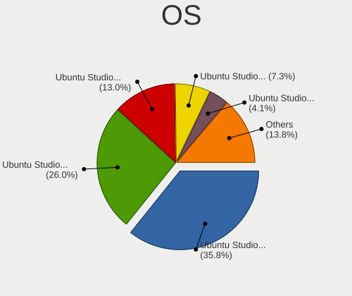

| Name                | Desktops | Percent |
|---------------------|----------|---------|
| Ubuntu Studio 20.04 | 44       | 35.77%  |
| Ubuntu Studio 22.04 | 32       | 26.02%  |
| Ubuntu Studio 24.04 | 16       | 13.01%  |
| Ubuntu Studio 20.10 | 9        | 7.32%   |
| Ubuntu Studio 23.10 | 5        | 4.07%   |
| Ubuntu Studio 22.10 | 4        | 3.25%   |
| Ubuntu Studio 25.04 | 3        | 2.44%   |
| Ubuntu Studio 21.10 | 3        | 2.44%   |
| Ubuntu Studio 24.10 | 2        | 1.63%   |
| Ubuntu Studio 23.04 | 2        | 1.63%   |
| Ubuntu Studio 21.04 | 2        | 1.63%   |
| Ubuntu Studio 16.04 | 1        | 0.81%   |

OS Family
---------

OS without a version

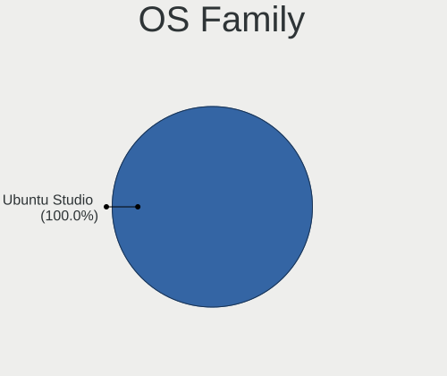

| Name          | Desktops | Percent |
|---------------|----------|---------|
| Ubuntu Studio | 122      | 100%    |

Kernel
------

Version of the Linux kernel

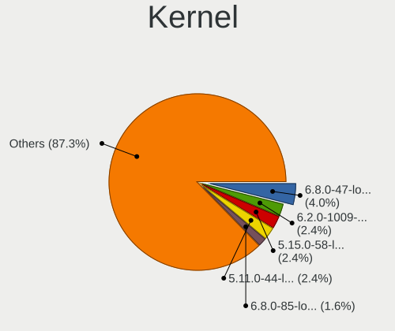

| Version                | Desktops | Percent |
|------------------------|----------|---------|
| 6.8.0-47-lowlatency    | 5        | 3.97%   |
| 6.2.0-1009-lowlatency  | 3        | 2.38%   |
| 5.15.0-58-lowlatency   | 3        | 2.38%   |
| 5.11.0-44-lowlatency   | 3        | 2.38%   |
| 6.8.0-85-lowlatency    | 2        | 1.59%   |
| 6.8.0-53-lowlatency    | 2        | 1.59%   |
| 6.5.0-41-lowlatency    | 2        | 1.59%   |
| 6.5.0-28-lowlatency    | 2        | 1.59%   |
| 5.8.0-48-lowlatency    | 2        | 1.59%   |
| 5.8.0-44-lowlatency    | 2        | 1.59%   |
| 5.8.0-25-lowlatency    | 2        | 1.59%   |
| 5.4.0-58-lowlatency    | 2        | 1.59%   |
| 5.4.0-56-lowlatency    | 2        | 1.59%   |
| 5.4.0-42-lowlatency    | 2        | 1.59%   |
| 5.4.0-26-lowlatency    | 2        | 1.59%   |
| 5.19.0-1021-lowlatency | 2        | 1.59%   |
| 5.15.0-89-lowlatency   | 2        | 1.59%   |
| 5.15.0-79-lowlatency   | 2        | 1.59%   |
| 5.15.0-71-lowlatency   | 2        | 1.59%   |
| 5.15.0-56-lowlatency   | 2        | 1.59%   |
| 5.15.0-53-lowlatency   | 2        | 1.59%   |
| 5.15.0-52-lowlatency   | 2        | 1.59%   |
| 5.15.0-46-lowlatency   | 2        | 1.59%   |
| 5.15.0-140-lowlatency  | 2        | 1.59%   |
| 5.13.0-28-lowlatency   | 2        | 1.59%   |
| 6.8.0-63-lowlatency    | 1        | 0.79%   |
| 6.8.0-49-lowlatency    | 1        | 0.79%   |
| 6.8.0-41-lowlatency    | 1        | 0.79%   |
| 6.8.0-39-lowlatency    | 1        | 0.79%   |
| 6.8.0-38-generic       | 1        | 0.79%   |
| 6.8.0-36-lowlatency    | 1        | 0.79%   |
| 6.8.0-35-lowlatency    | 1        | 0.79%   |
| 6.5.0-9-lowlatency     | 1        | 0.79%   |
| 6.5.0-5-lowlatency     | 1        | 0.79%   |
| 6.5.0-44-lowlatency    | 1        | 0.79%   |
| 6.5.0-27-lowlatency    | 1        | 0.79%   |
| 6.5.0-13-lowlatency    | 1        | 0.79%   |
| 6.2.0-1014-lowlatency  | 1        | 0.79%   |
| 6.2.0-1007-lowlatency  | 1        | 0.79%   |
| 6.14.0-33-generic      | 1        | 0.79%   |

Kernel Family
-------------

Linux kernel without a distro release

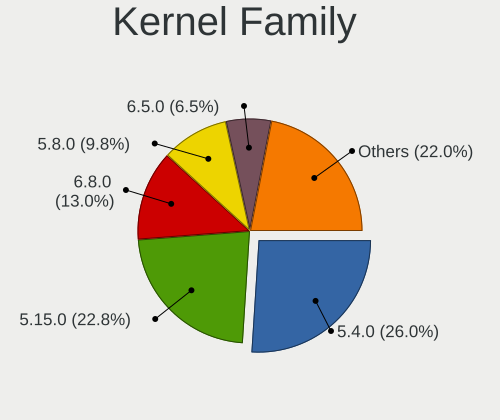

| Version | Desktops | Percent |
|---------|----------|---------|
| 5.4.0   | 32       | 26.02%  |
| 5.15.0  | 28       | 22.76%  |
| 6.8.0   | 16       | 13.01%  |
| 5.8.0   | 12       | 9.76%   |
| 6.5.0   | 8        | 6.5%    |
| 5.11.0  | 6        | 4.88%   |
| 6.2.0   | 5        | 4.07%   |
| 5.19.0  | 5        | 4.07%   |
| 6.14.0  | 3        | 2.44%   |
| 6.11.0  | 3        | 2.44%   |
| 5.13.0  | 3        | 2.44%   |
| 5.15.6  | 1        | 0.81%   |
| 4.4.0   | 1        | 0.81%   |

Kernel Major Ver.
-----------------

Linux kernel major version

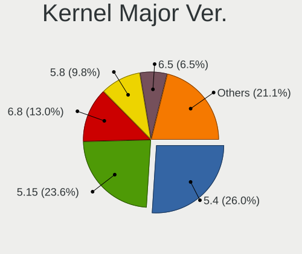

| Version | Desktops | Percent |
|---------|----------|---------|
| 5.4     | 32       | 26.02%  |
| 5.15    | 29       | 23.58%  |
| 6.8     | 16       | 13.01%  |
| 5.8     | 12       | 9.76%   |
| 6.5     | 8        | 6.5%    |
| 5.11    | 6        | 4.88%   |
| 6.2     | 5        | 4.07%   |
| 5.19    | 5        | 4.07%   |
| 6.14    | 3        | 2.44%   |
| 6.11    | 3        | 2.44%   |
| 5.13    | 3        | 2.44%   |
| 4.4     | 1        | 0.81%   |

Arch
----

OS architecture (x86_64, i586, etc.)

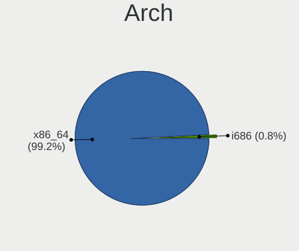

| Name   | Desktops | Percent |
|--------|----------|---------|
| x86_64 | 121      | 99.18%  |
| i686   | 1        | 0.82%   |

DE
--

Desktop Environment

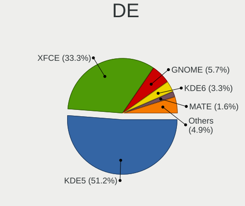

| Name            | Desktops | Percent |
|-----------------|----------|---------|
| KDE5            | 63       | 51.22%  |
| XFCE            | 41       | 33.33%  |
| GNOME           | 7        | 5.69%   |
| KDE6            | 4        | 3.25%   |
| MATE            | 2        | 1.63%   |
| LXQt            | 2        | 1.63%   |
| KDE             | 1        | 0.81%   |
| GNOME Flashback | 1        | 0.81%   |
| Cinnamon        | 1        | 0.81%   |
| Unknown         | 1        | 0.81%   |

Display Server
--------------

X11 or Wayland

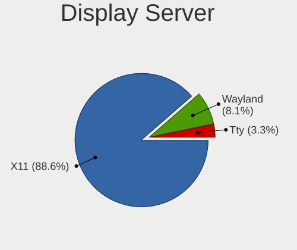

| Name    | Desktops | Percent |
|---------|----------|---------|
| X11     | 109      | 88.62%  |
| Wayland | 10       | 8.13%   |
| Tty     | 4        | 3.25%   |

Display Manager
---------------

SDDM, LightDM, etc.

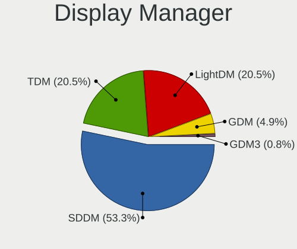

| Name    | Desktops | Percent |
|---------|----------|---------|
| SDDM    | 65       | 53.28%  |
| TDM     | 25       | 20.49%  |
| LightDM | 25       | 20.49%  |
| GDM     | 6        | 4.92%   |
| GDM3    | 1        | 0.82%   |

OS Lang
-------

Language

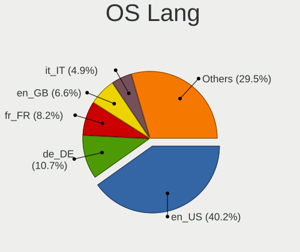

| Lang       | Desktops | Percent |
|------------|----------|---------|
| en_US      | 49       | 40.16%  |
| de_DE      | 13       | 10.66%  |
| fr_FR      | 10       | 8.2%    |
| en_GB      | 8        | 6.56%   |
| it_IT      | 6        | 4.92%   |
| pt_BR      | 4        | 3.28%   |
| es_ES      | 4        | 3.28%   |
| ru_RU      | 3        | 2.46%   |
| en_CA      | 3        | 2.46%   |
| C          | 3        | 2.46%   |
| en_AU      | 2        | 1.64%   |
| tr_TR      | 1        | 0.82%   |
| sv_SE      | 1        | 0.82%   |
| nl_NL      | 1        | 0.82%   |
| nl_BE      | 1        | 0.82%   |
| nb_NO      | 1        | 0.82%   |
| fr_FR.UTF8 | 1        | 0.82%   |
| fr_CH      | 1        | 0.82%   |
| fr_BE      | 1        | 0.82%   |
| es_GT      | 1        | 0.82%   |
| es_AR      | 1        | 0.82%   |
| en_NZ      | 1        | 0.82%   |
| en_IL      | 1        | 0.82%   |
| en_DE      | 1        | 0.82%   |
| de_AT      | 1        | 0.82%   |
| ca_ES      | 1        | 0.82%   |
| ca_AD      | 1        | 0.82%   |
| bg_BG      | 1        | 0.82%   |

Boot Mode
---------

EFI or BIOS

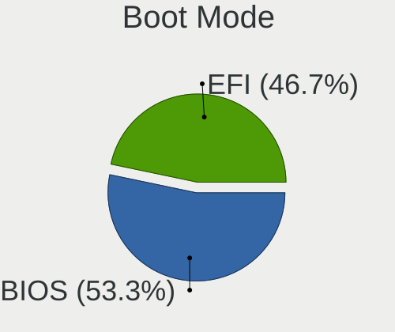

| Mode | Desktops | Percent |
|------|----------|---------|
| BIOS | 65       | 53.28%  |
| EFI  | 57       | 46.72%  |

Filesystem
----------

Type of filesystem

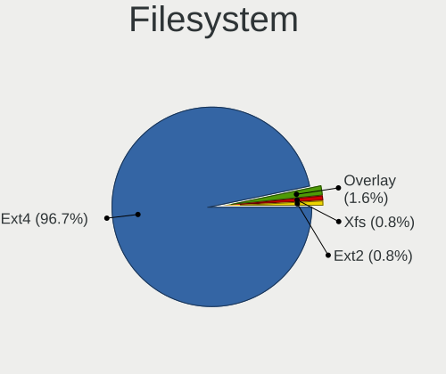

| Type    | Desktops | Percent |
|---------|----------|---------|
| Ext4    | 118      | 96.72%  |
| Overlay | 2        | 1.64%   |
| Xfs     | 1        | 0.82%   |
| Ext2    | 1        | 0.82%   |

Part. scheme
------------

Scheme of partitioning

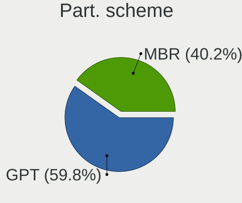

| Type | Desktops | Percent |
|------|----------|---------|
| GPT  | 73       | 59.84%  |
| MBR  | 49       | 40.16%  |

Dual Boot with Linux/BSD
------------------------

Hosting more than one Linux/BSD

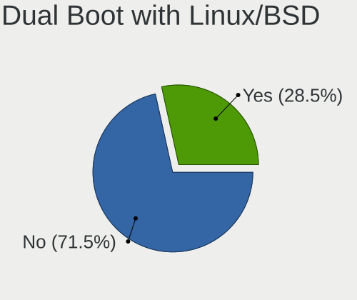

| Dual boot | Desktops | Percent |
|-----------|----------|---------|
| No        | 88       | 71.54%  |
| Yes       | 35       | 28.46%  |

Dual Boot (Win)
---------------

Hosting Linux and Windows

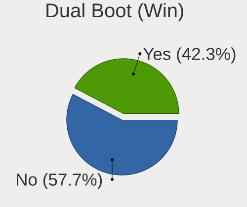

| Dual boot | Desktops | Percent |
|-----------|----------|---------|
| No        | 71       | 57.72%  |
| Yes       | 52       | 42.28%  |

Board
-----

Vendor
------

Motherboard manufacturer

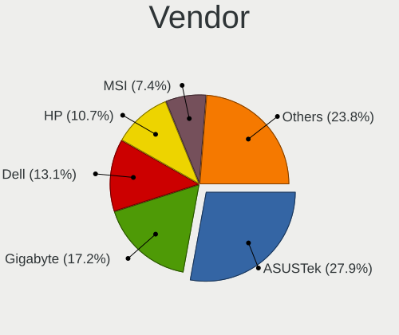

| Name                                 | Desktops | Percent |
|--------------------------------------|----------|---------|
| ASUSTek Computer                     | 34       | 27.87%  |
| Gigabyte Technology                  | 21       | 17.21%  |
| Dell                                 | 16       | 13.11%  |
| Hewlett-Packard                      | 13       | 10.66%  |
| MSI                                  | 9        | 7.38%   |
| Fujitsu                              | 4        | 3.28%   |
| ASRock                               | 4        | 3.28%   |
| Lenovo                               | 3        | 2.46%   |
| Intel                                | 2        | 1.64%   |
| Unknown                              | 2        | 1.64%   |
| System76                             | 1        | 0.82%   |
| Shenzhen Meigao Electronic Equipment | 1        | 0.82%   |
| Pegatron                             | 1        | 0.82%   |
| Packard Bell                         | 1        | 0.82%   |
| Medion                               | 1        | 0.82%   |
| IBM                                  | 1        | 0.82%   |
| Foxconn                              | 1        | 0.82%   |
| ECS                                  | 1        | 0.82%   |
| DEPO Computers                       | 1        | 0.82%   |
| AZW                                  | 1        | 0.82%   |
| Apple                                | 1        | 0.82%   |
| Alienware                            | 1        | 0.82%   |
| Acidanthera                          | 1        | 0.82%   |
| Acer                                 | 1        | 0.82%   |

Model
-----

Motherboard model

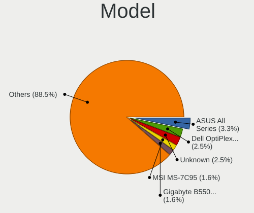

| Name                                       | Desktops | Percent |
|--------------------------------------------|----------|---------|
| ASUS All Series                            | 4        | 3.28%   |
| Dell OptiPlex 790                          | 3        | 2.46%   |
| Unknown                                    | 3        | 2.46%   |
| MSI MS-7C95                                | 2        | 1.64%   |
| Gigabyte B550M DS3H                        | 2        | 1.64%   |
| ASUS TUF Gaming X570-PLUS                  | 2        | 1.64%   |
| ASUS PRIME X570-PRO                        | 2        | 1.64%   |
| ASUS M4A785-M                              | 2        | 1.64%   |
| System76 Thelio                            | 1        | 0.82%   |
| Shenzhen Meigao Electronic Equipment HX90G | 1        | 0.82%   |
| Pegatron FL368AA-UUZ SR5612CH              | 1        | 0.82%   |
| Packard Bell IMEDIA S3220                  | 1        | 0.82%   |
| MSI PC Primescan AC                        | 1        | 0.82%   |
| MSI MS-7E06                                | 1        | 0.82%   |
| MSI MS-7E02                                | 1        | 0.82%   |
| MSI MS-7D99                                | 1        | 0.82%   |
| MSI MS-7A57                                | 1        | 0.82%   |
| MSI MS-7752                                | 1        | 0.82%   |
| MSI MS-7693                                | 1        | 0.82%   |
| Medion MD34207/C746                        | 1        | 0.82%   |
| Lenovo ThinkCentre M93p 10A8S45S00         | 1        | 0.82%   |
| Lenovo ThinkCentre M58p 7220RY8            | 1        | 0.82%   |
| Lenovo IdeaCentre 5 14ARE05 90Q3004YMH     | 1        | 0.82%   |
| Intel DQ965GF HD/FP Audio                  | 1        | 0.82%   |
| IBM 8188PPV                                | 1        | 0.82%   |
| HP Z620 Workstation                        | 1        | 0.82%   |
| HP Z440 Workstation                        | 1        | 0.82%   |
| HP Z2 Tower G4 Workstation                 | 1        | 0.82%   |
| HP ProDesk 600 G1 SFF                      | 1        | 0.82%   |
| HP EliteDesk 800 G2 DM 35W                 | 1        | 0.82%   |
| HP Compaq Pro 6305 SFF                     | 1        | 0.82%   |
| HP Compaq Elite 8300 CMT                   | 1        | 0.82%   |
| HP Compaq dc7600 Small Form Factor         | 1        | 0.82%   |
| HP Compaq 8200 Elite SFF PC                | 1        | 0.82%   |
| HP Compaq 8100 Elite SFF PC                | 1        | 0.82%   |
| HP Compaq 6200 Pro MT PC                   | 1        | 0.82%   |
| HP Compaq 6005 Pro MT PC                   | 1        | 0.82%   |
| HP 23-s010                                 | 1        | 0.82%   |
| Gigabyte X79S-UP5                          | 1        | 0.82%   |
| Gigabyte X58A-UD3R                         | 1        | 0.82%   |

Model Family
------------

Motherboard model prefix

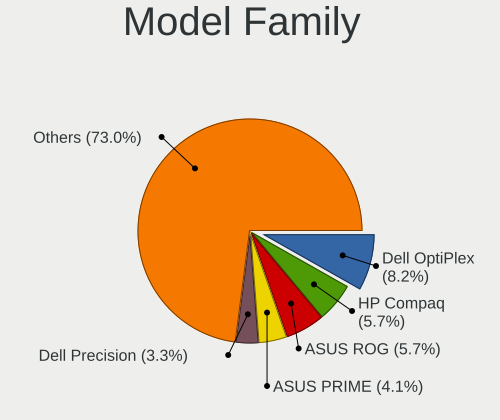

| Name                                       | Desktops | Percent |
|--------------------------------------------|----------|---------|
| Dell OptiPlex                              | 10       | 8.2%    |
| HP Compaq                                  | 7        | 5.74%   |
| ASUS ROG                                   | 7        | 5.74%   |
| ASUS PRIME                                 | 5        | 4.1%    |
| Dell Precision                             | 4        | 3.28%   |
| ASUS All                                   | 4        | 3.28%   |
| Fujitsu ESPRIMO                            | 3        | 2.46%   |
| ASUS TUF                                   | 3        | 2.46%   |
| Unknown                                    | 3        | 2.46%   |
| MSI MS-7C95                                | 2        | 1.64%   |
| Lenovo ThinkCentre                         | 2        | 1.64%   |
| Gigabyte X570                              | 2        | 1.64%   |
| Gigabyte B550M                             | 2        | 1.64%   |
| Gigabyte B450M                             | 2        | 1.64%   |
| ASUS P8P67                                 | 2        | 1.64%   |
| ASUS M4A785-M                              | 2        | 1.64%   |
| System76 Thelio                            | 1        | 0.82%   |
| Shenzhen Meigao Electronic Equipment HX90G | 1        | 0.82%   |
| Pegatron FL368AA-UUZ                       | 1        | 0.82%   |
| Packard Bell IMEDIA                        | 1        | 0.82%   |
| MSI PC                                     | 1        | 0.82%   |
| MSI MS-7E06                                | 1        | 0.82%   |
| MSI MS-7E02                                | 1        | 0.82%   |
| MSI MS-7D99                                | 1        | 0.82%   |
| MSI MS-7A57                                | 1        | 0.82%   |
| MSI MS-7752                                | 1        | 0.82%   |
| MSI MS-7693                                | 1        | 0.82%   |
| Medion MD34207                             | 1        | 0.82%   |
| Lenovo IdeaCentre                          | 1        | 0.82%   |
| Intel DQ965GF                              | 1        | 0.82%   |
| IBM 8188PPV                                | 1        | 0.82%   |
| HP Z620                                    | 1        | 0.82%   |
| HP Z440                                    | 1        | 0.82%   |
| HP Z2                                      | 1        | 0.82%   |
| HP ProDesk                                 | 1        | 0.82%   |
| HP EliteDesk                               | 1        | 0.82%   |
| HP 23-s010                                 | 1        | 0.82%   |
| Gigabyte X79S-UP5                          | 1        | 0.82%   |
| Gigabyte X58A-UD3R                         | 1        | 0.82%   |
| Gigabyte H61M-D2-B3                        | 1        | 0.82%   |

MFG Year
--------

Motherboard manufacture year

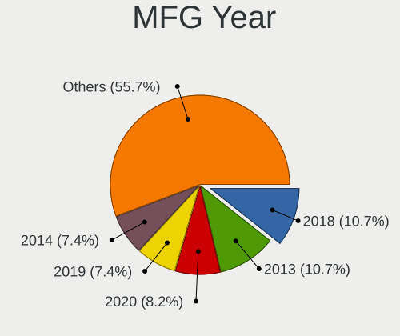

| Year | Desktops | Percent |
|------|----------|---------|
| 2018 | 13       | 10.66%  |
| 2013 | 13       | 10.66%  |
| 2020 | 10       | 8.2%    |
| 2019 | 9        | 7.38%   |
| 2014 | 9        | 7.38%   |
| 2016 | 8        | 6.56%   |
| 2011 | 8        | 6.56%   |
| 2022 | 7        | 5.74%   |
| 2012 | 7        | 5.74%   |
| 2009 | 7        | 5.74%   |
| 2015 | 6        | 4.92%   |
| 2008 | 6        | 4.92%   |
| 2010 | 4        | 3.28%   |
| 2021 | 3        | 2.46%   |
| 2017 | 3        | 2.46%   |
| 2005 | 3        | 2.46%   |
| 2024 | 2        | 1.64%   |
| 2023 | 2        | 1.64%   |
| 2007 | 2        | 1.64%   |

Form Factor
-----------

Physical design of the computer

| Name    | Desktops | Percent |
|---------|----------|---------|
| Desktop | 122      | 100%    |

Secure Boot
-----------

Enabled or disabled

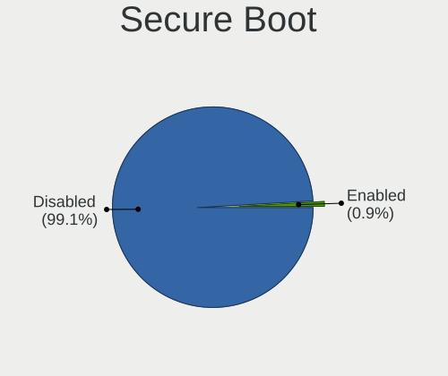

| State    | Desktops | Percent |
|----------|----------|---------|
| Disabled | 119      | 97.54%  |
| Enabled  | 3        | 2.46%   |

Coreboot
--------

Have coreboot on board

| Used | Desktops | Percent |
|------|----------|---------|
| No   | 122      | 100%    |

RAM Size
--------

Total RAM memory

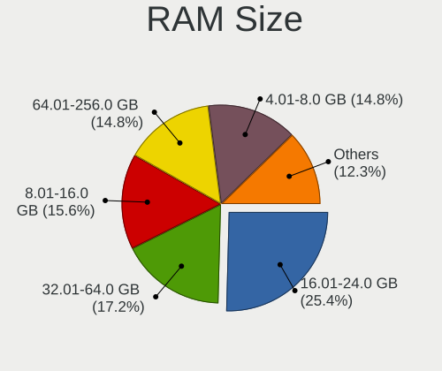

| Size in GB  | Desktops | Percent |
|-------------|----------|---------|
| 16.01-24.0  | 31       | 25.41%  |
| 32.01-64.0  | 21       | 17.21%  |
| 8.01-16.0   | 19       | 15.57%  |
| 4.01-8.0    | 18       | 14.75%  |
| 64.01-256.0 | 18       | 14.75%  |
| 3.01-4.0    | 9        | 7.38%   |
| 1.01-2.0    | 3        | 2.46%   |
| 24.01-32.0  | 2        | 1.64%   |
| 2.01-3.0    | 1        | 0.82%   |

RAM Used
--------

Used RAM memory

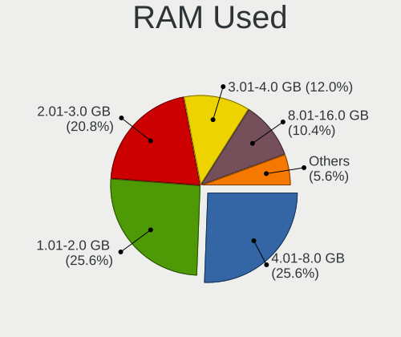

| Used GB    | Desktops | Percent |
|------------|----------|---------|
| 4.01-8.0   | 32       | 25.6%   |
| 1.01-2.0   | 32       | 25.6%   |
| 2.01-3.0   | 26       | 20.8%   |
| 3.01-4.0   | 15       | 12%     |
| 8.01-16.0  | 13       | 10.4%   |
| 0.51-1.0   | 3        | 2.4%    |
| 24.01-32.0 | 2        | 1.6%    |
| 32.01-64.0 | 1        | 0.8%    |
| 16.01-24.0 | 1        | 0.8%    |

Total Drives
------------

Number of drives on board

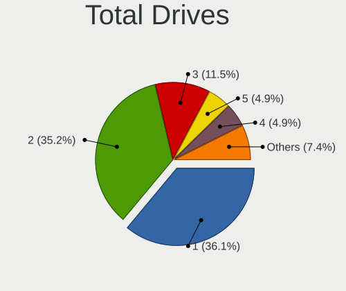

| Drives | Desktops | Percent |
|--------|----------|---------|
| 1      | 44       | 36.07%  |
| 2      | 43       | 35.25%  |
| 3      | 14       | 11.48%  |
| 5      | 6        | 4.92%   |
| 4      | 6        | 4.92%   |
| 7      | 5        | 4.1%    |
| 16     | 1        | 0.82%   |
| 11     | 1        | 0.82%   |
| 10     | 1        | 0.82%   |
| 6      | 1        | 0.82%   |

Has CD-ROM
----------

Has CD-ROM on board

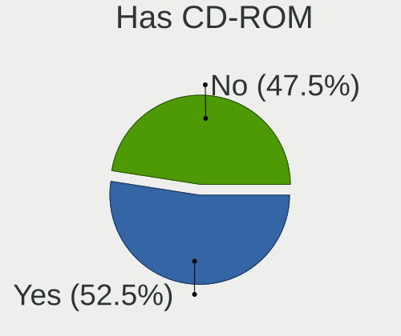

| Presented | Desktops | Percent |
|-----------|----------|---------|
| Yes       | 64       | 52.46%  |
| No        | 58       | 47.54%  |

Has Ethernet
------------

Has Ethernet on board

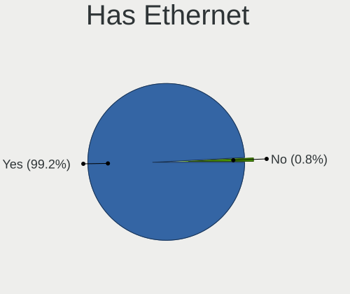

| Presented | Desktops | Percent |
|-----------|----------|---------|
| Yes       | 121      | 99.18%  |
| No        | 1        | 0.82%   |

Has WiFi
--------

Has WiFi module

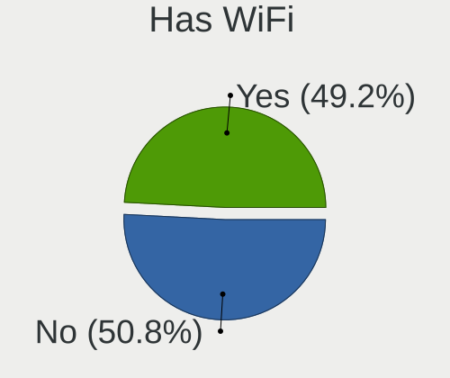

| Presented | Desktops | Percent |
|-----------|----------|---------|
| No        | 62       | 50.82%  |
| Yes       | 60       | 49.18%  |

Has Bluetooth
-------------

Has Bluetooth module

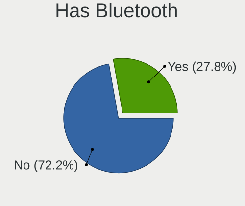

| Presented | Desktops | Percent |
|-----------|----------|---------|
| No        | 78       | 63.93%  |
| Yes       | 44       | 36.07%  |

Location
--------

Country
-------

Geographic location (country)

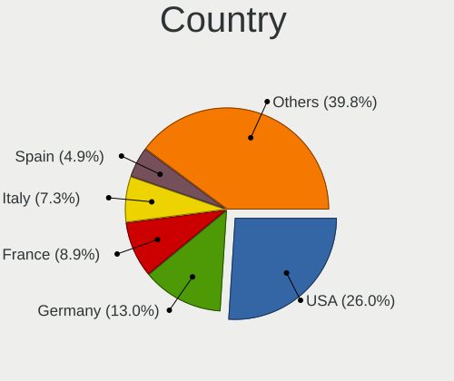

| Country                | Desktops | Percent |
|------------------------|----------|---------|
| USA                    | 32       | 26.02%  |
| Germany                | 16       | 13.01%  |
| France                 | 11       | 8.94%   |
| Italy                  | 9        | 7.32%   |
| Spain                  | 6        | 4.88%   |
| UK                     | 5        | 4.07%   |
| Brazil                 | 5        | 4.07%   |
| Austria                | 5        | 4.07%   |
| Belgium                | 4        | 3.25%   |
| Russia                 | 3        | 2.44%   |
| Canada                 | 3        | 2.44%   |
| Sweden                 | 2        | 1.63%   |
| Netherlands            | 2        | 1.63%   |
| Mexico                 | 2        | 1.63%   |
| Israel                 | 2        | 1.63%   |
| Australia              | 2        | 1.63%   |
| Turkey                 | 1        | 0.81%   |
| Switzerland            | 1        | 0.81%   |
| Romania                | 1        | 0.81%   |
| Philippines            | 1        | 0.81%   |
| Norway                 | 1        | 0.81%   |
| New Zealand            | 1        | 0.81%   |
| Luxembourg             | 1        | 0.81%   |
| Kenya                  | 1        | 0.81%   |
| Iran                   | 1        | 0.81%   |
| Indonesia              | 1        | 0.81%   |
| Guatemala              | 1        | 0.81%   |
| Bulgaria               | 1        | 0.81%   |
| Bosnia and Herzegovina | 1        | 0.81%   |
| Argentina              | 1        | 0.81%   |

City
----

Geographic location (city)

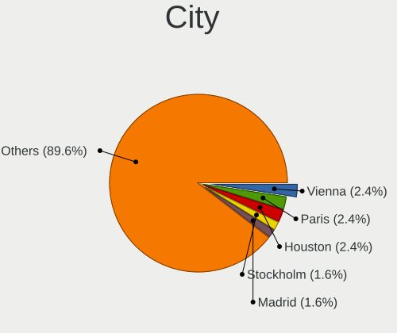

| City                    | Desktops | Percent |
|-------------------------|----------|---------|
| Vienna                  | 3        | 2.4%    |
| Paris                   | 3        | 2.4%    |
| Houston                 | 3        | 2.4%    |
| Stockholm               | 2        | 1.6%    |
| Madrid                  | 2        | 1.6%    |
| Zanesville              | 1        | 0.8%    |
| Wildenfels              | 1        | 0.8%    |
| West Mifflin            | 1        | 0.8%    |
| Villetaneuse            | 1        | 0.8%    |
| Villefontaine           | 1        | 0.8%    |
| Vic                     | 1        | 0.8%    |
| Verviers                | 1        | 0.8%    |
| Vaals                   | 1        | 0.8%    |
| Turin                   | 1        | 0.8%    |
| Tucson                  | 1        | 0.8%    |
| Tilburg                 | 1        | 0.8%    |
| Tel Aviv                | 1        | 0.8%    |
| Stuttgart               | 1        | 0.8%    |
| Sherman Oaks            | 1        | 0.8%    |
| Sarajevo                | 1        | 0.8%    |
| Sao Paulo               | 1        | 0.8%    |
| Santa Barbara d'Oeste   | 1        | 0.8%    |
| San Secondo di Pinerolo | 1        | 0.8%    |
| Saint-Ouen-l'Aumone     | 1        | 0.8%    |
| Rome                    | 1        | 0.8%    |
| Rio Grande da Serra     | 1        | 0.8%    |
| Rennes                  | 1        | 0.8%    |
| Prenzlau                | 1        | 0.8%    |
| Potsdam                 | 1        | 0.8%    |
| Port Moody              | 1        | 0.8%    |
| Pisa                    | 1        | 0.8%    |
| Philadelphia            | 1        | 0.8%    |
| Perth                   | 1        | 0.8%    |
| Pamplona                | 1        | 0.8%    |
| Palermo                 | 1        | 0.8%    |
| Oslo                    | 1        | 0.8%    |
| Olympia                 | 1        | 0.8%    |
| Oldenburg               | 1        | 0.8%    |
| Oberhausen              | 1        | 0.8%    |
| Novosibirsk             | 1        | 0.8%    |

Drives
------

Drive Vendor
------------

Hard drive vendors

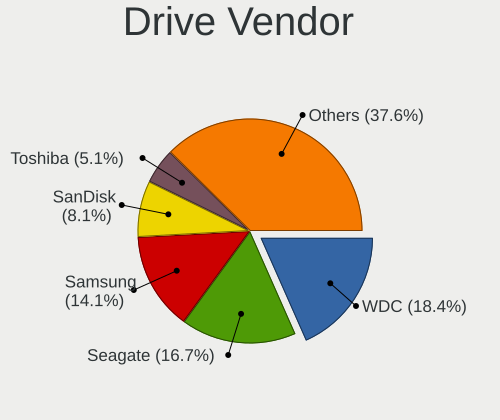

| Vendor                      | Desktops | Drives | Percent |
|-----------------------------|----------|--------|---------|
| WDC                         | 43       | 57     | 18.38%  |
| Seagate                     | 39       | 66     | 16.67%  |
| Samsung Electronics         | 33       | 53     | 14.1%   |
| SanDisk                     | 19       | 22     | 8.12%   |
| Toshiba                     | 12       | 13     | 5.13%   |
| Crucial                     | 11       | 17     | 4.7%    |
| Hitachi                     | 10       | 11     | 4.27%   |
| Kingston                    | 9        | 10     | 3.85%   |
| HGST                        | 4        | 5      | 1.71%   |
| PNY                         | 3        | 4      | 1.28%   |
| Phison                      | 3        | 3      | 1.28%   |
| Intenso                     | 3        | 3      | 1.28%   |
| Team                        | 2        | 2      | 0.85%   |
| SPCC                        | 2        | 2      | 0.85%   |
| Patriot                     | 2        | 2      | 0.85%   |
| Lexar                       | 2        | 5      | 0.85%   |
| Kingston Technology Company | 2        | 2      | 0.85%   |
| JMicron Technology          | 2        | 2      | 0.85%   |
| Intel                       | 2        | 2      | 0.85%   |
| Corsair                     | 2        | 3      | 0.85%   |
| ASMT                        | 2        | 2      | 0.85%   |
| A-DATA Technology           | 2        | 2      | 0.85%   |
| V-GeN                       | 1        | 1      | 0.43%   |
| USB 3.0                     | 1        | 2      | 0.43%   |
| UMIS                        | 1        | 1      | 0.43%   |
| TO Exter                    | 1        | 1      | 0.43%   |
| Timetec                     | 1        | 1      | 0.43%   |
| SK hynix                    | 1        | 1      | 0.43%   |
| Silicon Motion              | 1        | 1      | 0.43%   |
| RX7                         | 1        | 1      | 0.43%   |
| Realtek Semiconductor       | 1        | 1      | 0.43%   |
| Realtek                     | 1        | 1      | 0.43%   |
| Pioneer                     | 1        | 2      | 0.43%   |
| Phison Electronics          | 1        | 1      | 0.43%   |
| OCZ                         | 1        | 1      | 0.43%   |
| NGFF                        | 1        | 1      | 0.43%   |
| Micron Technology           | 1        | 1      | 0.43%   |
| Maxtor                      | 1        | 1      | 0.43%   |
| MAXIO Technology (Hangzhou) | 1        | 1      | 0.43%   |
| LITEON                      | 1        | 1      | 0.43%   |

Drive Model
-----------

Hard drive models

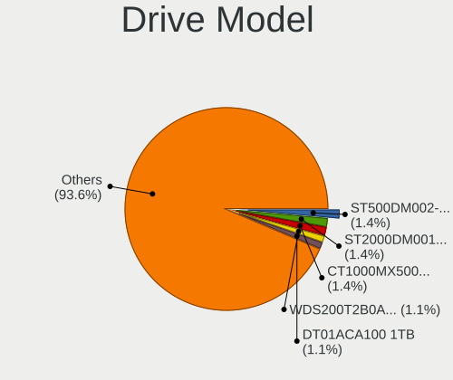

| Model                            | Desktops | Percent |
|----------------------------------|----------|---------|
| Seagate ST500DM002-1BD142 500GB  | 4        | 1.42%   |
| Seagate ST2000DM001-1ER164 2TB   | 4        | 1.42%   |
| Crucial CT1000MX500SSD1 1TB      | 4        | 1.42%   |
| WDC WDS200T2B0A-00SM50 2TB SSD   | 3        | 1.07%   |
| Toshiba DT01ACA100 1TB           | 3        | 1.07%   |
| Toshiba DT01ACA050 500GB         | 3        | 1.07%   |
| Seagate ST2000DM008-2FR102 2TB   | 3        | 1.07%   |
| Seagate Expansion 2TB            | 3        | 1.07%   |
| Samsung SSD 850 EVO 500GB        | 3        | 1.07%   |
| Crucial CT500MX500SSD1 500GB     | 3        | 1.07%   |
| WDC WDS500G3X0C-00SJG0 500GB     | 2        | 0.71%   |
| WDC WD20EZRX-00D8PB0 2TB         | 2        | 0.71%   |
| WDC WD10EZEX-08WN4A0 1TB         | 2        | 0.71%   |
| Toshiba HDWD130 3TB              | 2        | 0.71%   |
| Team T253X6001T 1024GB SSD       | 2        | 0.71%   |
| SPCC Solid State Disk 256GB      | 2        | 0.71%   |
| Seagate ST5000LM000-2AN170 5TB   | 2        | 0.71%   |
| Seagate ST1000DM003-1CH162 1TB   | 2        | 0.71%   |
| Seagate Expansion Desk 4TB       | 2        | 0.71%   |
| SanDisk SDSSDA240G 240GB         | 2        | 0.71%   |
| SanDisk NVMe SSD Drive 1TB       | 2        | 0.71%   |
| Samsung SSD 970 EVO Plus 500GB   | 2        | 0.71%   |
| Samsung SSD 970 EVO Plus 1TB     | 2        | 0.71%   |
| Samsung SSD 870 EVO 1TB          | 2        | 0.71%   |
| Samsung SSD 860 EVO 1TB          | 2        | 0.71%   |
| Samsung HD753LJ 752GB            | 2        | 0.71%   |
| Kingston SV300S37A120G 120GB SSD | 2        | 0.71%   |
| Kingston SA400S37480G 480GB SSD  | 2        | 0.71%   |
| Kingston SA400S37120G 120GB SSD  | 2        | 0.71%   |
| Hitachi HDS721010CLA332 1TB      | 2        | 0.71%   |
| WDC WDS512G1X0C-00ENX0 512GB     | 1        | 0.36%   |
| WDC WDS500G2B0A-00SM50 500GB     | 1        | 0.36%   |
| WDC WDS240G2G0A-00JH30 240GB SSD | 1        | 0.36%   |
| WDC WDS200T2B0C-00PXH0 2TB       | 1        | 0.36%   |
| WDC WDBNCE5000PNC 500GB SSD      | 1        | 0.36%   |
| WDC WD6400AAKS-22A7B2 640GB      | 1        | 0.36%   |
| WDC WD60EFAX-68JH4N1 6TB         | 1        | 0.36%   |
| WDC WD5000BPKT-60PK4T0 500GB     | 1        | 0.36%   |
| WDC WD5000AVDS-63U7B1 500GB      | 1        | 0.36%   |
| WDC WD5000AAKX-60U6AA0 500GB     | 1        | 0.36%   |

HDD Vendor
----------

Hard disk drive vendors

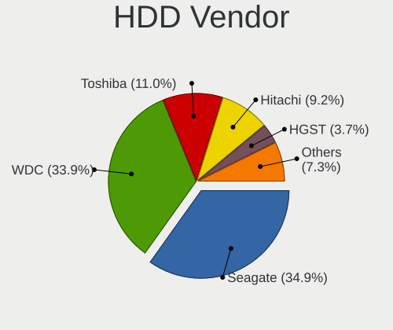

| Vendor              | Desktops | Drives | Percent |
|---------------------|----------|--------|---------|
| Seagate             | 38       | 63     | 34.86%  |
| WDC                 | 37       | 46     | 33.94%  |
| Toshiba             | 12       | 13     | 11.01%  |
| Hitachi             | 10       | 11     | 9.17%   |
| HGST                | 4        | 5      | 3.67%   |
| Samsung Electronics | 3        | 3      | 2.75%   |
| USB 3.0             | 1        | 2      | 0.92%   |
| TO Exter            | 1        | 1      | 0.92%   |
| Maxtor              | 1        | 1      | 0.92%   |
| JMicron Technology  | 1        | 1      | 0.92%   |
| Fujitsu             | 1        | 1      | 0.92%   |

SSD Vendor
----------

Solid state drive vendors

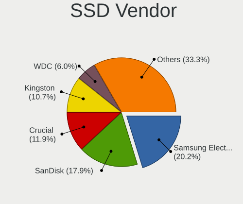

| Vendor              | Desktops | Drives | Percent |
|---------------------|----------|--------|---------|
| Samsung Electronics | 17       | 22     | 20.24%  |
| SanDisk             | 15       | 16     | 17.86%  |
| Crucial             | 10       | 16     | 11.9%   |
| Kingston            | 9        | 10     | 10.71%  |
| WDC                 | 5        | 7      | 5.95%   |
| PNY                 | 3        | 4      | 3.57%   |
| Intenso             | 3        | 3      | 3.57%   |
| Team                | 2        | 2      | 2.38%   |
| SPCC                | 2        | 2      | 2.38%   |
| Patriot             | 2        | 2      | 2.38%   |
| ASMT                | 2        | 2      | 2.38%   |
| A-DATA Technology   | 2        | 2      | 2.38%   |
| V-GeN               | 1        | 1      | 1.19%   |
| Seagate             | 1        | 1      | 1.19%   |
| RX7                 | 1        | 1      | 1.19%   |
| Pioneer             | 1        | 2      | 1.19%   |
| OCZ                 | 1        | 1      | 1.19%   |
| NGFF                | 1        | 1      | 1.19%   |
| Micron Technology   | 1        | 1      | 1.19%   |
| Leven               | 1        | 1      | 1.19%   |
| Integral            | 1        | 1      | 1.19%   |
| Corsair             | 1        | 1      | 1.19%   |
| China               | 1        | 1      | 1.19%   |
| BHT                 | 1        | 1      | 1.19%   |

Drive Kind
----------

HDD or SSD

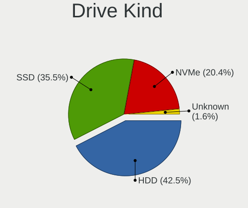

| Kind    | Desktops | Drives | Percent |
|---------|----------|--------|---------|
| HDD     | 79       | 147    | 42.47%  |
| SSD     | 66       | 101    | 35.48%  |
| NVMe    | 38       | 64     | 20.43%  |
| Unknown | 3        | 3      | 1.61%   |

Drive Connector
---------------

SATA, SAS, NVMe, etc.

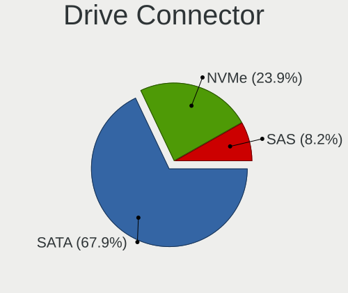

| Type | Desktops | Drives | Percent |
|------|----------|--------|---------|
| SATA | 108      | 232    | 67.92%  |
| NVMe | 38       | 63     | 23.9%   |
| SAS  | 13       | 20     | 8.18%   |

Drive Size
----------

Size of hard drive

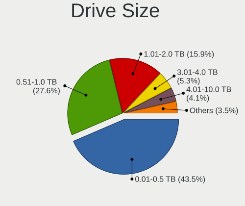

| Size in TB | Desktops | Drives | Percent |
|------------|----------|--------|---------|
| 0.01-0.5   | 74       | 107    | 43.53%  |
| 0.51-1.0   | 47       | 64     | 27.65%  |
| 1.01-2.0   | 27       | 34     | 15.88%  |
| 3.01-4.0   | 9        | 11     | 5.29%   |
| 4.01-10.0  | 7        | 24     | 4.12%   |
| 2.01-3.0   | 6        | 8      | 3.53%   |

Space Total
-----------

Amount of disk space available on the file system

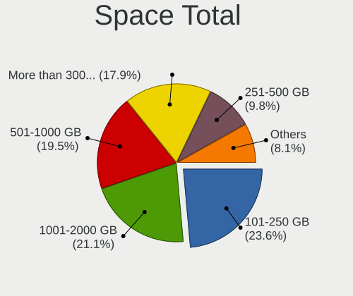

| Size in GB     | Desktops | Percent |
|----------------|----------|---------|
| 101-250        | 29       | 23.58%  |
| 1001-2000      | 26       | 21.14%  |
| 501-1000       | 24       | 19.51%  |
| More than 3000 | 22       | 17.89%  |
| 251-500        | 12       | 9.76%   |
| 51-100         | 4        | 3.25%   |
| 21-50          | 2        | 1.63%   |
| 2001-3000      | 2        | 1.63%   |
| 1-20           | 2        | 1.63%   |

Space Used
----------

Amount of used disk space

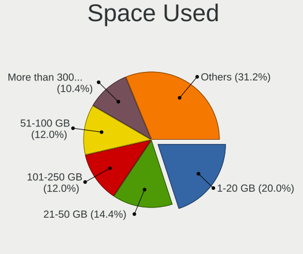

| Used GB        | Desktops | Percent |
|----------------|----------|---------|
| 1-20           | 25       | 20%     |
| 21-50          | 18       | 14.4%   |
| 101-250        | 15       | 12%     |
| 51-100         | 15       | 12%     |
| More than 3000 | 13       | 10.4%   |
| 251-500        | 13       | 10.4%   |
| 501-1000       | 12       | 9.6%    |
| 1001-2000      | 9        | 7.2%    |
| 2001-3000      | 5        | 4%      |

Malfunc. Drives
---------------

Drive models with a malfunction

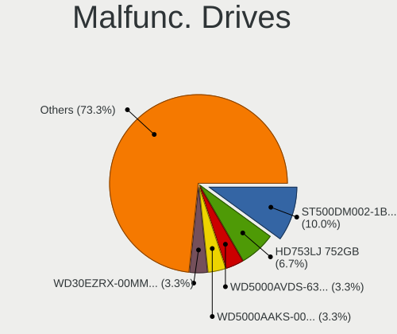

| Model                                 | Desktops | Drives | Percent |
|---------------------------------------|----------|--------|---------|
| Seagate ST500DM002-1BD142 500GB       | 3        | 3      | 10%     |
| Samsung Electronics HD753LJ 752GB     | 2        | 2      | 6.67%   |
| WDC WD5000AVDS-63U7B1 500GB           | 1        | 1      | 3.33%   |
| WDC WD5000AAKS-00TMA0 500GB           | 1        | 1      | 3.33%   |
| WDC WD30EZRX-00MMMB0 3TB              | 1        | 1      | 3.33%   |
| WDC WD1600AAJS-08L7A0 160GB           | 1        | 1      | 3.33%   |
| WDC WD10EZEX-22BN5A0 1TB              | 1        | 1      | 3.33%   |
| WDC WD10EAVS-32D7B1 1TB               | 1        | 1      | 3.33%   |
| WDC WD10EADS-00M2B0 1TB               | 1        | 1      | 3.33%   |
| Toshiba MQ01ABF050 500GB              | 1        | 1      | 3.33%   |
| Toshiba HDWE140 4TB                   | 1        | 1      | 3.33%   |
| Seagate ST8000DM004-2CX1 8TB          | 1        | 6      | 3.33%   |
| Seagate ST3320820AS 320GB             | 1        | 1      | 3.33%   |
| Seagate ST3200822AS 200GB             | 1        | 1      | 3.33%   |
| Seagate ST2000DM006-2DM164 2TB        | 1        | 1      | 3.33%   |
| Seagate ST2000DM001-9YN164 2TB        | 1        | 1      | 3.33%   |
| Seagate ST2000DM001-1CH164 2TB        | 1        | 1      | 3.33%   |
| Seagate ST1000VM002-9ZL162 1TB        | 1        | 1      | 3.33%   |
| Samsung Electronics SSD 970 EVO 1TB   | 1        | 1      | 3.33%   |
| Samsung Electronics SSD 960 PRO 512GB | 1        | 1      | 3.33%   |
| Samsung Electronics SSD 870 EVO 1TB   | 1        | 2      | 3.33%   |
| Hitachi HUA722020ALA331 2TB           | 1        | 1      | 3.33%   |
| Hitachi HDS721010CLA332 1TB           | 1        | 1      | 3.33%   |
| Hitachi HDS5C1010CLA382 1TB           | 1        | 1      | 3.33%   |
| HGST HTS721010A9 1TB                  | 1        | 1      | 3.33%   |
| A-DATA Technology SU650 240GB SSD     | 1        | 1      | 3.33%   |
| A-DATA Technology SP550 240GB SSD     | 1        | 1      | 3.33%   |

Malfunc. Drive Vendor
---------------------

Vendors of faulty drives

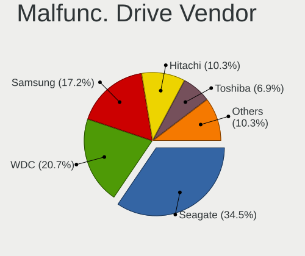

| Vendor              | Desktops | Drives | Percent |
|---------------------|----------|--------|---------|
| Seagate             | 10       | 15     | 34.48%  |
| WDC                 | 6        | 7      | 20.69%  |
| Samsung Electronics | 5        | 6      | 17.24%  |
| Hitachi             | 3        | 3      | 10.34%  |
| Toshiba             | 2        | 2      | 6.9%    |
| A-DATA Technology   | 2        | 2      | 6.9%    |
| HGST                | 1        | 1      | 3.45%   |

Malfunc. HDD Vendor
-------------------

Vendors of faulty HDD drives

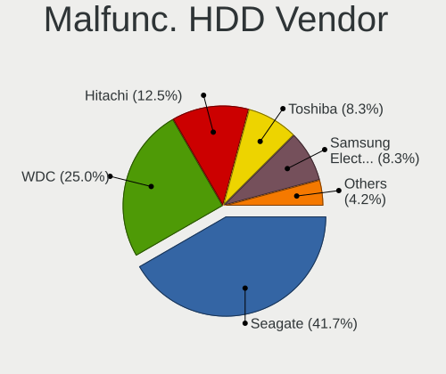

| Vendor              | Desktops | Drives | Percent |
|---------------------|----------|--------|---------|
| Seagate             | 10       | 15     | 41.67%  |
| WDC                 | 6        | 7      | 25%     |
| Hitachi             | 3        | 3      | 12.5%   |
| Toshiba             | 2        | 2      | 8.33%   |
| Samsung Electronics | 2        | 2      | 8.33%   |
| HGST                | 1        | 1      | 4.17%   |

Malfunc. Drive Kind
-------------------

Kinds of faulty drives

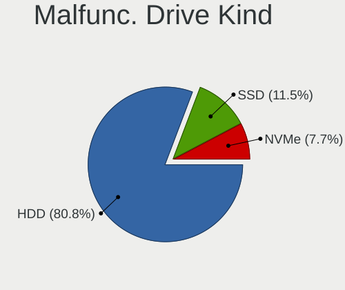

| Kind | Desktops | Drives | Percent |
|------|----------|--------|---------|
| HDD  | 21       | 30     | 80.77%  |
| SSD  | 3        | 4      | 11.54%  |
| NVMe | 2        | 2      | 7.69%   |

Failed Drives
-------------

Failed drive models

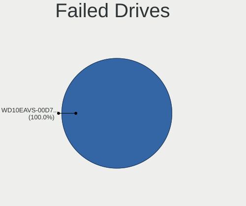

| Model                                 | Desktops | Drives | Percent |
|---------------------------------------|----------|--------|---------|
| WDC WD10EAVS-00D7B1 1TB               | 1        | 1      | 50%     |
| Samsung Electronics SSD 960 EVO 250GB | 1        | 1      | 50%     |

Failed Drive Vendor
-------------------

Failed drive vendors

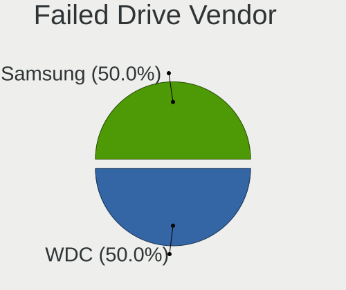

| Vendor              | Desktops | Drives | Percent |
|---------------------|----------|--------|---------|
| WDC                 | 1        | 1      | 50%     |
| Samsung Electronics | 1        | 1      | 50%     |

Drive Status
------------

Number of failed and malfunc. drives

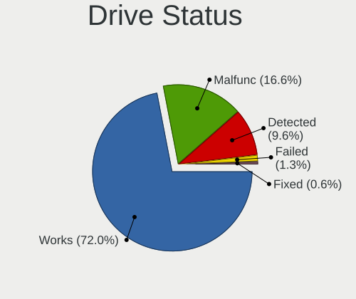

| Status   | Desktops | Drives | Percent |
|----------|----------|--------|---------|
| Works    | 113      | 251    | 71.97%  |
| Malfunc  | 26       | 36     | 16.56%  |
| Detected | 15       | 25     | 9.55%   |
| Failed   | 2        | 2      | 1.27%   |
| Fixed    | 1        | 1      | 0.64%   |

Storage controller
------------------

Storage Vendor
--------------

Storage controller vendors

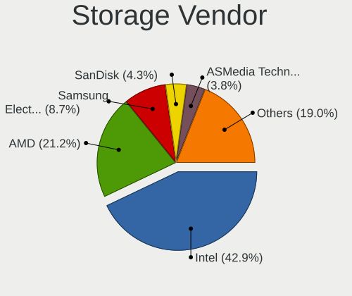

| Vendor                       | Desktops | Percent |
|------------------------------|----------|---------|
| Intel                        | 79       | 42.93%  |
| AMD                          | 39       | 21.2%   |
| Samsung Electronics          | 16       | 8.7%    |
| SanDisk                      | 8        | 4.35%   |
| ASMedia Technology           | 7        | 3.8%    |
| Phison Electronics           | 6        | 3.26%   |
| Marvell Technology Group     | 6        | 3.26%   |
| Nvidia                       | 3        | 1.63%   |
| Silicon Motion               | 2        | 1.09%   |
| MAXIO Technology (Hangzhou)  | 2        | 1.09%   |
| Kingston Technology Company  | 2        | 1.09%   |
| JMicron Technology           | 2        | 1.09%   |
| VIA Technologies             | 1        | 0.54%   |
| Union Memory (Shenzhen)      | 1        | 0.54%   |
| SK hynix                     | 1        | 0.54%   |
| Silicon Image                | 1        | 0.54%   |
| Shenzhen Longsys Electronics | 1        | 0.54%   |
| Realtek Semiconductor        | 1        | 0.54%   |
| Micron/Crucial Technology    | 1        | 0.54%   |
| LSI Logic / Symbios Logic    | 1        | 0.54%   |
| Lite-On Technology           | 1        | 0.54%   |
| HighPoint Technologies       | 1        | 0.54%   |
| Apple                        | 1        | 0.54%   |
| Adaptec                      | 1        | 0.54%   |

Storage Model
-------------

Storage controller models

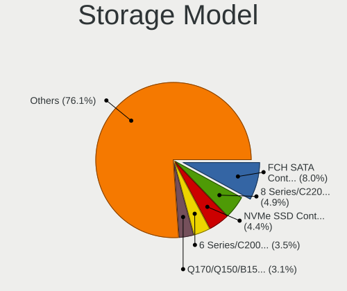

| Model                                                                                   | Desktops | Percent |
|-----------------------------------------------------------------------------------------|----------|---------|
| AMD FCH SATA Controller [AHCI mode]                                                     | 18       | 7.96%   |
| Intel 8 Series/C220 Series Chipset Family 6-port SATA Controller 1 [AHCI mode]          | 11       | 4.87%   |
| Samsung NVMe SSD Controller SM981/PM981/PM983                                           | 10       | 4.42%   |
| Intel 6 Series/C200 Series Chipset Family 6 port Desktop SATA AHCI Controller           | 8        | 3.54%   |
| Intel Q170/Q150/B150/H170/H110/Z170/CM236 Chipset SATA Controller [AHCI Mode]           | 7        | 3.1%    |
| Intel 200 Series PCH SATA controller [AHCI mode]                                        | 7        | 3.1%    |
| ASMedia ASM1061/ASM1062 Serial ATA Controller                                           | 7        | 3.1%    |
| AMD 500 Series Chipset SATA Controller                                                  | 7        | 3.1%    |
| Intel 7 Series/C210 Series Chipset Family 6-port SATA Controller [AHCI mode]            | 6        | 2.65%   |
| AMD 400 Series Chipset SATA Controller                                                  | 6        | 2.65%   |
| Intel NM10/ICH7 Family SATA Controller [IDE mode]                                       | 5        | 2.21%   |
| Intel Cannon Lake PCH SATA AHCI Controller                                              | 5        | 2.21%   |
| Intel 82801G (ICH7 Family) IDE Controller                                               | 5        | 2.21%   |
| AMD SB7x0/SB8x0/SB9x0 SATA Controller [IDE mode]                                        | 5        | 2.21%   |
| AMD SB7x0/SB8x0/SB9x0 IDE Controller                                                    | 5        | 2.21%   |
| Samsung NVMe SSD Controller SM961/PM961/SM963                                           | 4        | 1.77%   |
| Intel SATA Controller [RAID mode]                                                       | 4        | 1.77%   |
| Intel Raptor Lake SATA AHCI Controller                                                  | 3        | 1.33%   |
| AMD SB7x0/SB8x0/SB9x0 SATA Controller [AHCI mode]                                       | 3        | 1.33%   |
| AMD 600 Series Chipset SATA Controller                                                  | 3        | 1.33%   |
| Silicon Motion SM2263EN/SM2263XT (DRAM-less) NVMe SSD Controllers                       | 2        | 0.88%   |
| SanDisk Ultra 3D / WD Blue SN570 NVMe SSD (DRAM-less)                                   | 2        | 0.88%   |
| Samsung NVMe SSD Controller PM9A1/PM9A3/980PRO                                          | 2        | 0.88%   |
| Phison PS5013-E13 PCIe3 NVMe Controller (DRAM-less)                                     | 2        | 0.88%   |
| Phison E16 PCIe4 NVMe Controller                                                        | 2        | 0.88%   |
| Phison E12 NVMe Controller                                                              | 2        | 0.88%   |
| Nvidia MCP78S [GeForce 8200] IDE                                                        | 2        | 0.88%   |
| Nvidia MCP78S [GeForce 8200] AHCI Controller                                            | 2        | 0.88%   |
| Marvell Group 88SE9172 SATA 6Gb/s Controller                                            | 2        | 0.88%   |
| Kingston Company NV2 NVMe SSD [SM2267XT] (DRAM-less)                                    | 2        | 0.88%   |
| Intel C610/X99 series chipset 6-Port SATA Controller [AHCI mode]                        | 2        | 0.88%   |
| Intel 9 Series Chipset Family SATA Controller [AHCI Mode]                               | 2        | 0.88%   |
| Intel 82801JI (ICH10 Family) 4 port SATA IDE Controller #1                              | 2        | 0.88%   |
| Intel 82801JI (ICH10 Family) 2 port SATA IDE Controller #2                              | 2        | 0.88%   |
| Intel 6 Series/C200 Series Chipset Family Desktop SATA Controller (IDE mode, ports 4-5) | 2        | 0.88%   |
| Intel 6 Series/C200 Series Chipset Family Desktop SATA Controller (IDE mode, ports 0-3) | 2        | 0.88%   |
| Intel 5 Series/3400 Series Chipset 4 port SATA IDE Controller                           | 2        | 0.88%   |
| Intel 5 Series/3400 Series Chipset 2 port SATA IDE Controller                           | 2        | 0.88%   |
| AMD FCH IDE Controller                                                                  | 2        | 0.88%   |
| VIA VT6415 PATA IDE Host Controller                                                     | 1        | 0.44%   |

Storage Kind
------------

Kind of storage controller (IDE, SATA, NVMe, SAS, ...)

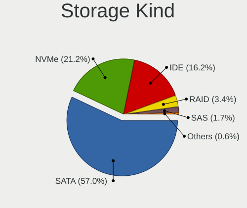

| Kind | Desktops | Percent |
|------|----------|---------|
| SATA | 102      | 56.98%  |
| NVMe | 38       | 21.23%  |
| IDE  | 29       | 16.2%   |
| RAID | 6        | 3.35%   |
| SAS  | 3        | 1.68%   |
| SCSI | 1        | 0.56%   |

Processor
---------

CPU Vendor
----------

Processor vendors

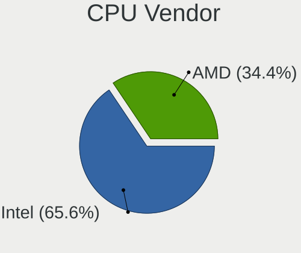

| Vendor | Desktops | Percent |
|--------|----------|---------|
| Intel  | 80       | 65.57%  |
| AMD    | 42       | 34.43%  |

CPU Model
---------

Processor models

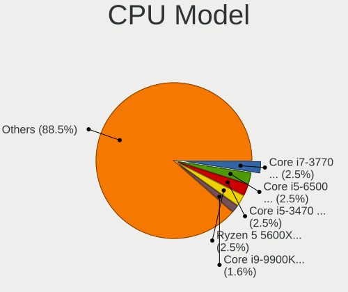

| Model                                   | Desktops | Percent |
|-----------------------------------------|----------|---------|
| Intel Core i7-3770 CPU @ 3.40GHz        | 3        | 2.46%   |
| Intel Core i5-6500 CPU @ 3.20GHz        | 3        | 2.46%   |
| Intel Core i5-3470 CPU @ 3.20GHz        | 3        | 2.46%   |
| AMD Ryzen 5 5600X 6-Core Processor      | 3        | 2.46%   |
| Intel Core i9-9900K CPU @ 3.60GHz       | 2        | 1.64%   |
| Intel Core i7-4790 CPU @ 3.60GHz        | 2        | 1.64%   |
| Intel Core i5-4590 CPU @ 3.30GHz        | 2        | 1.64%   |
| Intel Core i5-4440 CPU @ 3.10GHz        | 2        | 1.64%   |
| Intel Core i5-2500 CPU @ 3.30GHz        | 2        | 1.64%   |
| Intel Core i5-2400 CPU @ 3.10GHz        | 2        | 1.64%   |
| Intel Core i5 CPU 650 @ 3.20GHz         | 2        | 1.64%   |
| Intel Core i3-6100 CPU @ 3.70GHz        | 2        | 1.64%   |
| Intel Core 2 Duo CPU E8400 @ 3.00GHz    | 2        | 1.64%   |
| AMD Ryzen 9 5900HX with Radeon Graphics | 2        | 1.64%   |
| AMD Ryzen 9 3950X 16-Core Processor     | 2        | 1.64%   |
| AMD Ryzen 9 3900X 12-Core Processor     | 2        | 1.64%   |
| AMD Ryzen 7 3800X 8-Core Processor      | 2        | 1.64%   |
| AMD Ryzen 5 5600G with Radeon Graphics  | 2        | 1.64%   |
| AMD Phenom II X4 945 Processor          | 2        | 1.64%   |
| AMD FX-8350 Eight-Core Processor        | 2        | 1.64%   |
| Intel Xeon W-2150B CPU @ 3.00GHz        | 1        | 0.82%   |
| Intel Xeon CPU E5420 @ 2.50GHz          | 1        | 0.82%   |
| Intel Xeon CPU E5-2667 v4 @ 3.20GHz     | 1        | 0.82%   |
| Intel Xeon CPU E5-1650 v3 @ 3.50GHz     | 1        | 0.82%   |
| Intel Xeon CPU E5-1620 0 @ 3.60GHz      | 1        | 0.82%   |
| Intel Xeon CPU E3-1225 v3 @ 3.20GHz     | 1        | 0.82%   |
| Intel Pentium D CPU 3.40GHz             | 1        | 0.82%   |
| Intel Pentium CPU G3220 @ 3.00GHz       | 1        | 0.82%   |
| Intel Pentium 4 CPU 3.20GHz             | 1        | 0.82%   |
| Intel Pentium 4 CPU 2.80GHz             | 1        | 0.82%   |
| Intel Core i9-10980XE CPU @ 3.00GHz     | 1        | 0.82%   |
| Intel Core i9-10900K CPU @ 3.70GHz      | 1        | 0.82%   |
| Intel Core i9-10900 CPU @ 2.80GHz       | 1        | 0.82%   |
| Intel Core i7-9700K CPU @ 3.60GHz       | 1        | 0.82%   |
| Intel Core i7-9700 CPU @ 3.00GHz        | 1        | 0.82%   |
| Intel Core i7-8700K CPU @ 3.70GHz       | 1        | 0.82%   |
| Intel Core i7-8700 CPU @ 3.20GHz        | 1        | 0.82%   |
| Intel Core i7-7700K CPU @ 4.20GHz       | 1        | 0.82%   |
| Intel Core i7-6700 CPU @ 3.40GHz        | 1        | 0.82%   |
| Intel Core i7-4790S CPU @ 3.20GHz       | 1        | 0.82%   |

CPU Model Family
----------------

Processor model prefix

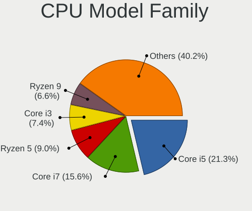

| Model                  | Desktops | Percent |
|------------------------|----------|---------|
| Intel Core i5          | 26       | 21.31%  |
| Intel Core i7          | 19       | 15.57%  |
| AMD Ryzen 5            | 11       | 9.02%   |
| Intel Core i3          | 9        | 7.38%   |
| AMD Ryzen 9            | 8        | 6.56%   |
| Intel Xeon             | 6        | 4.92%   |
| Intel Core i9          | 5        | 4.1%    |
| Other                  | 4        | 3.28%   |
| AMD Ryzen 7            | 4        | 3.28%   |
| AMD Phenom II X4       | 4        | 3.28%   |
| AMD FX                 | 4        | 3.28%   |
| Intel Core 2 Quad      | 3        | 2.46%   |
| Intel Pentium 4        | 2        | 1.64%   |
| Intel Core 2 Duo       | 2        | 1.64%   |
| AMD Athlon II X2       | 2        | 1.64%   |
| Intel Pentium D        | 1        | 0.82%   |
| Intel Pentium          | 1        | 0.82%   |
| Intel Core 2           | 1        | 0.82%   |
| Intel Celeron          | 1        | 0.82%   |
| AMD Ryzen Threadripper | 1        | 0.82%   |
| AMD Ryzen 3            | 1        | 0.82%   |
| AMD E                  | 1        | 0.82%   |
| AMD Athlon X4          | 1        | 0.82%   |
| AMD Athlon II X4       | 1        | 0.82%   |
| AMD Athlon Dual Core   | 1        | 0.82%   |
| AMD Athlon 64 X2       | 1        | 0.82%   |
| AMD A4                 | 1        | 0.82%   |
| AMD A10                | 1        | 0.82%   |

CPU Cores
---------

Number of processor cores

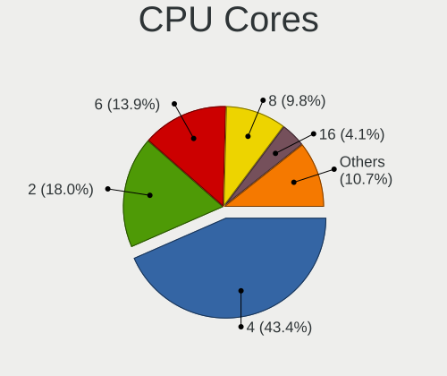

| Number | Desktops | Percent |
|--------|----------|---------|
| 4      | 53       | 43.44%  |
| 2      | 22       | 18.03%  |
| 6      | 17       | 13.93%  |
| 8      | 12       | 9.84%   |
| 16     | 5        | 4.1%    |
| 10     | 4        | 3.28%   |
| 1      | 3        | 2.46%   |
| 14     | 2        | 1.64%   |
| 12     | 2        | 1.64%   |
| 32     | 1        | 0.82%   |
| 18     | 1        | 0.82%   |

CPU Sockets
-----------

Number of sockets

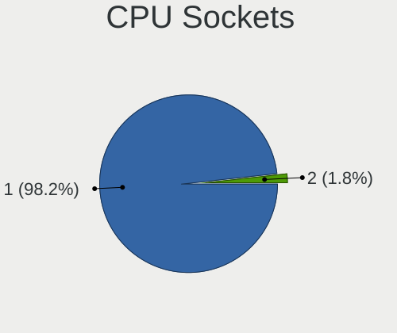

| Number | Desktops | Percent |
|--------|----------|---------|
| 1      | 121      | 99.18%  |
| 2      | 1        | 0.82%   |

CPU Threads
-----------

Threads per core (Hyper-Threading)

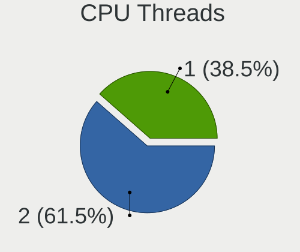

| Number | Desktops | Percent |
|--------|----------|---------|
| 2      | 75       | 61.48%  |
| 1      | 47       | 38.52%  |

CPU Op-Modes
------------

CPU Operation Modes (32-bit, 64-bit)

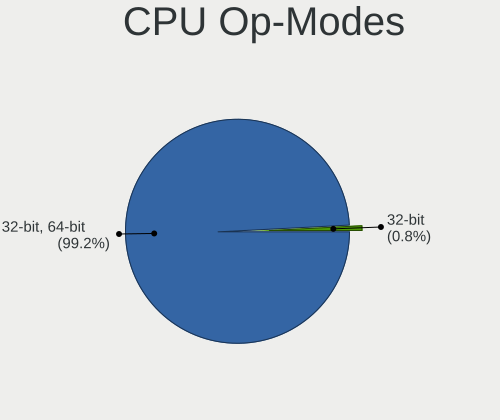

| Op mode        | Desktops | Percent |
|----------------|----------|---------|
| 32-bit, 64-bit | 121      | 99.18%  |
| 32-bit         | 1        | 0.82%   |

CPU Microcode
-------------

Microcode number

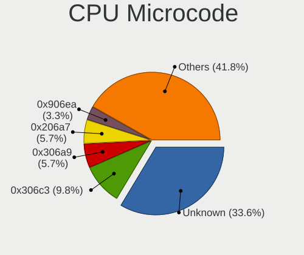

| Number     | Desktops | Percent |
|------------|----------|---------|
| Unknown    | 41       | 33.61%  |
| 0x306c3    | 12       | 9.84%   |
| 0x306a9    | 7        | 5.74%   |
| 0x206a7    | 7        | 5.74%   |
| 0x906ea    | 4        | 3.28%   |
| 0x506e3    | 4        | 3.28%   |
| 0x08701021 | 4        | 3.28%   |
| 0x0a50000d | 3        | 2.46%   |
| 0x010000c8 | 3        | 2.46%   |
| 0xf41      | 2        | 1.64%   |
| 0xa0655    | 2        | 1.64%   |
| 0x906ed    | 2        | 1.64%   |
| 0x206d7    | 2        | 1.64%   |
| 0x106a5    | 2        | 1.64%   |
| 0x10676    | 2        | 1.64%   |
| 0x010000b6 | 2        | 1.64%   |
| 0xf65      | 1        | 0.82%   |
| 0x906ec    | 1        | 0.82%   |
| 0x906a4    | 1        | 0.82%   |
| 0x90675    | 1        | 0.82%   |
| 0x6f6      | 1        | 0.82%   |
| 0x506ca    | 1        | 0.82%   |
| 0x50654    | 1        | 0.82%   |
| 0x306f2    | 1        | 0.82%   |
| 0x20655    | 1        | 0.82%   |
| 0x20652    | 1        | 0.82%   |
| 0x0a50000c | 1        | 0.82%   |
| 0x0a20120a | 1        | 0.82%   |
| 0x0a201009 | 1        | 0.82%   |
| 0x08701013 | 1        | 0.82%   |
| 0x08301039 | 1        | 0.82%   |
| 0x08108109 | 1        | 0.82%   |
| 0x08101016 | 1        | 0.82%   |
| 0x08001138 | 1        | 0.82%   |
| 0x06003106 | 1        | 0.82%   |
| 0x06001119 | 1        | 0.82%   |
| 0x06000852 | 1        | 0.82%   |
| 0x0600081f | 1        | 0.82%   |
| 0x010000c7 | 1        | 0.82%   |

CPU Microarch
-------------

Microarchitecture

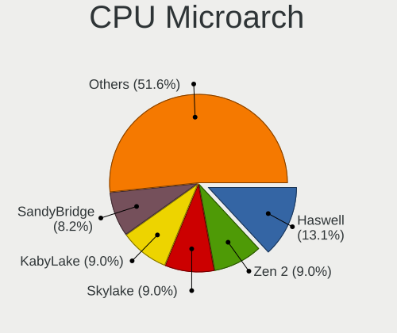

| Name             | Desktops | Percent |
|------------------|----------|---------|
| Haswell          | 16       | 13.11%  |
| Zen 2            | 11       | 9.02%   |
| Skylake          | 11       | 9.02%   |
| KabyLake         | 11       | 9.02%   |
| SandyBridge      | 10       | 8.2%    |
| Zen 3            | 8        | 6.56%   |
| IvyBridge        | 8        | 6.56%   |
| K10              | 6        | 4.92%   |
| Piledriver       | 5        | 4.1%    |
| Penryn           | 5        | 4.1%    |
| Alderlake Hybrid | 5        | 4.1%    |
| Westmere         | 3        | 2.46%   |
| NetBurst         | 3        | 2.46%   |
| Unknown          | 3        | 2.46%   |
| Zen+             | 2        | 1.64%   |
| Zen              | 2        | 1.64%   |
| Nehalem          | 2        | 1.64%   |
| K8 Hammer        | 2        | 1.64%   |
| Core             | 2        | 1.64%   |
| CometLake        | 2        | 1.64%   |
| Steamroller      | 1        | 0.82%   |
| K10 Llano        | 1        | 0.82%   |
| Goldmont         | 1        | 0.82%   |
| Excavator        | 1        | 0.82%   |
| Broadwell        | 1        | 0.82%   |

Graphics
--------

GPU Vendor
----------

Vendors of graphics cards

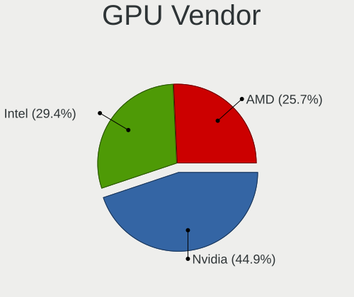

| Vendor | Desktops | Percent |
|--------|----------|---------|
| Nvidia | 61       | 44.85%  |
| Intel  | 40       | 29.41%  |
| AMD    | 35       | 25.74%  |

GPU Model
---------

Graphics card models

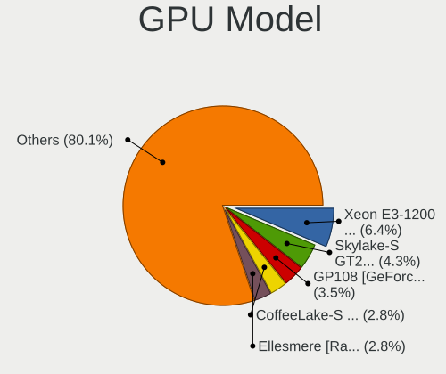

| Model                                                                       | Desktops | Percent |
|-----------------------------------------------------------------------------|----------|---------|
| Intel Xeon E3-1200 v3/4th Gen Core Processor Integrated Graphics Controller | 9        | 6.38%   |
| Intel Skylake-S GT2 [HD Graphics 530]                                       | 6        | 4.26%   |
| Nvidia GP108 [GeForce GT 1030]                                              | 5        | 3.55%   |
| Intel CoffeeLake-S GT2 [UHD Graphics 630]                                   | 4        | 2.84%   |
| AMD Ellesmere [Radeon RX 470/480/570/570X/580/580X/590]                     | 4        | 2.84%   |
| AMD Cezanne [Radeon Vega Series / Radeon Vega Mobile Series]                | 4        | 2.84%   |
| Nvidia GP107 [GeForce GTX 1050 Ti]                                          | 3        | 2.13%   |
| Nvidia GM204 [GeForce GTX 970]                                              | 3        | 2.13%   |
| Nvidia GM107 [GeForce GTX 750 Ti]                                           | 3        | 2.13%   |
| Nvidia GK208B [GeForce GT 710]                                              | 3        | 2.13%   |
| Nvidia GA106 [GeForce RTX 3060 Lite Hash Rate]                              | 3        | 2.13%   |
| Nvidia GT218 [GeForce 210]                                                  | 2        | 1.42%   |
| Nvidia GP106 [GeForce GTX 1060 6GB]                                         | 2        | 1.42%   |
| Nvidia GP104 [GeForce GTX 1070]                                             | 2        | 1.42%   |
| Nvidia GK208B [GeForce GT 730]                                              | 2        | 1.42%   |
| Nvidia GA102 [GeForce RTX 3080]                                             | 2        | 1.42%   |
| Nvidia G98 [GeForce 8400 GS Rev. 2]                                         | 2        | 1.42%   |
| Intel Xeon E3-1200 v2/3rd Gen Core processor Graphics Controller            | 2        | 1.42%   |
| Intel Raptor Lake-S GT1 [UHD Graphics 770]                                  | 2        | 1.42%   |
| Intel Kaby Lake-S GT2 [HD Graphics 630]                                     | 2        | 1.42%   |
| Intel Core Processor Integrated Graphics Controller                         | 2        | 1.42%   |
| Intel CometLake-S GT2 [UHD Graphics 630]                                    | 2        | 1.42%   |
| Intel 82945G/GZ Integrated Graphics Controller                              | 2        | 1.42%   |
| Intel 2nd Generation Core Processor Family Integrated Graphics Controller   | 2        | 1.42%   |
| AMD Raphael                                                                 | 2        | 1.42%   |
| AMD Picasso/Raven 2 [Radeon Vega Series / Radeon Vega Mobile Series]        | 2        | 1.42%   |
| AMD Park [Mobility Radeon HD 5430]                                          | 2        | 1.42%   |
| AMD Navi 22 [Radeon RX 6700/6700 XT/6750 XT / 6800M/6850M XT]               | 2        | 1.42%   |
| Nvidia TU117 [GeForce GTX 1650]                                             | 1        | 0.71%   |
| Nvidia TU116 [GeForce GTX 1660]                                             | 1        | 0.71%   |
| Nvidia TU104GL [Quadro RTX 4000]                                            | 1        | 0.71%   |
| Nvidia TU104 [GeForce RTX 2080 Rev. A]                                      | 1        | 0.71%   |
| Nvidia NV34 [GeForce FX 5500]                                               | 1        | 0.71%   |
| Nvidia GT216 [GeForce 315]                                                  | 1        | 0.71%   |
| Nvidia GT200 [GeForce GTX 260]                                              | 1        | 0.71%   |
| Nvidia GP104 [GeForce GTX 1080]                                             | 1        | 0.71%   |
| Nvidia GM206GL [Quadro M2000]                                               | 1        | 0.71%   |
| Nvidia GM206 [GeForce GTX 960]                                              | 1        | 0.71%   |
| Nvidia GK208 [GeForce GT 720]                                               | 1        | 0.71%   |
| Nvidia GK110 [GeForce GTX 780]                                              | 1        | 0.71%   |

GPU Combo
---------

Combinations of graphics cards

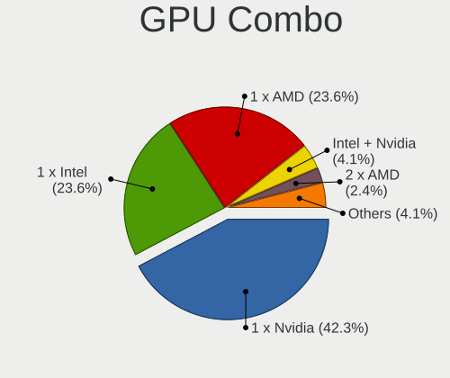

| Name           | Desktops | Percent |
|----------------|----------|---------|
| 1 x Nvidia     | 52       | 42.28%  |
| 1 x Intel      | 29       | 23.58%  |
| 1 x AMD        | 29       | 23.58%  |
| Intel + Nvidia | 5        | 4.07%   |
| 2 x AMD        | 3        | 2.44%   |
| AMD + Nvidia   | 3        | 2.44%   |
| 2 x Nvidia     | 2        | 1.63%   |

GPU Driver
----------

Free vs proprietary

| Driver      | Desktops | Percent |
|-------------|----------|---------|
| Free        | 82       | 66.67%  |
| Proprietary | 40       | 32.52%  |
| Unknown     | 1        | 0.81%   |

GPU Memory
----------

Total video memory

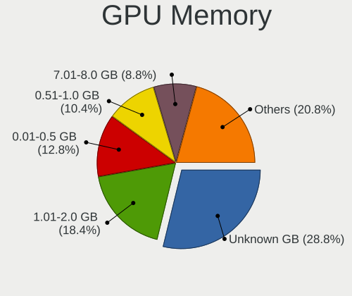

| Size in GB | Desktops | Percent |
|------------|----------|---------|
| Unknown    | 36       | 28.8%   |
| 1.01-2.0   | 23       | 18.4%   |
| 0.01-0.5   | 16       | 12.8%   |
| 0.51-1.0   | 13       | 10.4%   |
| 7.01-8.0   | 11       | 8.8%    |
| 8.01-16.0  | 10       | 8%      |
| 3.01-4.0   | 9        | 7.2%    |
| 5.01-6.0   | 3        | 2.4%    |
| 16.01-24.0 | 2        | 1.6%    |
| 32.01-64.0 | 1        | 0.8%    |
| 2.01-3.0   | 1        | 0.8%    |

Monitor
-------

Monitor Vendor
--------------

Monitor vendors

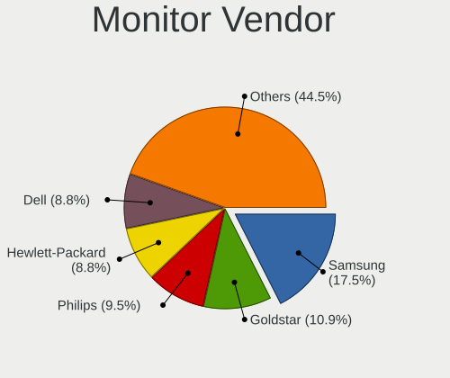

| Vendor               | Desktops | Percent |
|----------------------|----------|---------|
| Samsung Electronics  | 24       | 17.52%  |
| Goldstar             | 15       | 10.95%  |
| Philips              | 13       | 9.49%   |
| Hewlett-Packard      | 12       | 8.76%   |
| Dell                 | 12       | 8.76%   |
| Acer                 | 9        | 6.57%   |
| Ancor Communications | 6        | 4.38%   |
| Sony                 | 4        | 2.92%   |
| Eizo                 | 3        | 2.19%   |
| BenQ                 | 3        | 2.19%   |
| AOC                  | 3        | 2.19%   |
| ViewSonic            | 2        | 1.46%   |
| Unknown              | 2        | 1.46%   |
| ONN                  | 2        | 1.46%   |
| Hitachi              | 2        | 1.46%   |
| Fujitsu Siemens      | 2        | 1.46%   |
| ASUSTek Computer     | 2        | 1.46%   |
| Westinghouse         | 1        | 0.73%   |
| VIE                  | 1        | 0.73%   |
| TVT                  | 1        | 0.73%   |
| TCH                  | 1        | 0.73%   |
| Targa Visionary      | 1        | 0.73%   |
| Seiki                | 1        | 0.73%   |
| RTK                  | 1        | 0.73%   |
| Onkyo                | 1        | 0.73%   |
| NEC Computers        | 1        | 0.73%   |
| MSI                  | 1        | 0.73%   |
| Medion               | 1        | 0.73%   |
| LOE                  | 1        | 0.73%   |
| KTC                  | 1        | 0.73%   |
| Iiyama               | 1        | 0.73%   |
| Hyundai ImageQuest   | 1        | 0.73%   |
| Hannspree            | 1        | 0.73%   |
| Gigabyte Technology  | 1        | 0.73%   |
| DENON                | 1        | 0.73%   |
| Daewoo               | 1        | 0.73%   |
| Apple                | 1        | 0.73%   |
| Unknown              | 1        | 0.73%   |

Monitor Model
-------------

Monitor models

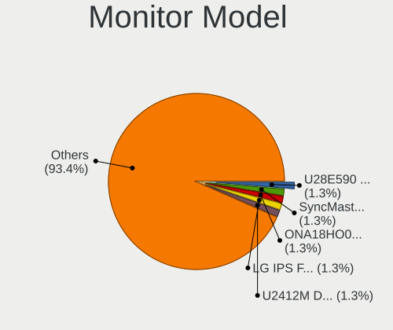

| Model                                                                | Desktops | Percent |
|----------------------------------------------------------------------|----------|---------|
| Samsung Electronics U28E590 SAM0C4E 3840x2160 608x345mm 27.5-inch    | 2        | 1.32%   |
| Samsung Electronics SyncMaster SAM027F 1680x1050 474x296mm 22.0-inch | 2        | 1.32%   |
| ONN ONA18HO015 ONN0101 1920x1080 698x393mm 31.5-inch                 | 2        | 1.32%   |
| Goldstar LG IPS FULLHD GSM5AB8 1920x1080 480x270mm 21.7-inch         | 2        | 1.32%   |
| Dell U2412M DELA07A 1920x1200 518x324mm 24.1-inch                    | 2        | 1.32%   |
| Westinghouse SK-26H730S WDE15CC 1366x768 575x323mm 26.0-inch         | 1        | 0.66%   |
| ViewSonic VX2758-C-MH VSC35DD 1920x1080 597x336mm 27.0-inch          | 1        | 0.66%   |
| ViewSonic VA2432-FHD VSCB639 1920x1080 527x296mm 23.8-inch           | 1        | 0.66%   |
| VIE LED MONITOR VIE2302 1920x1080 473x296mm 22.0-inch                | 1        | 0.66%   |
| Unknown LCD Monitor SAMSUNG 5760x2160                                | 1        | 0.66%   |
| Unknown LCD Monitor FFFF 2288x1287 2550x2550mm 142.0-inch            | 1        | 0.66%   |
| TVT T910 TVT005E 1280x1024 376x301mm 19.0-inch                       | 1        | 0.66%   |
| TCH HDMI TCH5600 1920x1080 344x194mm 15.5-inch                       | 1        | 0.66%   |
| Targa Visionary LCD 24-1 Wide TARA240 1920x1080 521x293mm 23.5-inch  | 1        | 0.66%   |
| Sony TV SNYEA01 1920x1080                                            | 1        | 0.66%   |
| Sony TV SNY4201 1360x768 710x400mm 32.1-inch                         | 1        | 0.66%   |
| Sony TV *30 SNYB105 3840x2160 1218x685mm 55.0-inch                   | 1        | 0.66%   |
| Sony TV *00 SNY8004 3840x2160 1439x809mm 65.0-inch                   | 1        | 0.66%   |
| Seiki SE19HE01 SEK078A 1366x768 410x230mm 18.5-inch                  | 1        | 0.66%   |
| Samsung Electronics U32J59x SAM0F35 3840x2160 697x392mm 31.5-inch    | 1        | 0.66%   |
| Samsung Electronics T22D390 SAM0B6B 1920x1080 477x268mm 21.5-inch    | 1        | 0.66%   |
| Samsung Electronics SyncMaster SAM059A 1920x1080 477x268mm 21.5-inch | 1        | 0.66%   |
| Samsung Electronics SyncMaster SAM0522 1600x900 443x249mm 20.0-inch  | 1        | 0.66%   |
| Samsung Electronics SyncMaster SAM0484 1920x1080 520x320mm 24.0-inch | 1        | 0.66%   |
| Samsung Electronics SyncMaster SAM0467 1920x1200 518x324mm 24.1-inch | 1        | 0.66%   |
| Samsung Electronics SyncMaster SAM03E0 1440x900 410x257mm 19.1-inch  | 1        | 0.66%   |
| Samsung Electronics SyncMaster SAM02F3 1680x1050 474x296mm 22.0-inch | 1        | 0.66%   |
| Samsung Electronics SyncMaster SAM01AB 1280x1024 312x234mm 15.4-inch | 1        | 0.66%   |
| Samsung Electronics SyncMaster SAM010B 1280x1024 338x270mm 17.0-inch | 1        | 0.66%   |
| Samsung Electronics SMS27A350H SAM07CE 1920x1080 598x336mm 27.0-inch | 1        | 0.66%   |
| Samsung Electronics SMB2330HD SAM0710 1920x1080 510x290mm 23.1-inch  | 1        | 0.66%   |
| Samsung Electronics SMB2330HD SAM070E 1920x1080 510x290mm 23.1-inch  | 1        | 0.66%   |
| Samsung Electronics SMB2330H SAM064A 1920x1080 509x286mm 23.0-inch   | 1        | 0.66%   |
| Samsung Electronics SMB1930N SAM0632 1366x768 410x230mm 18.5-inch    | 1        | 0.66%   |
| Samsung Electronics SA300/SA350 SAM0789 1366x768 410x230mm 18.5-inch | 1        | 0.66%   |
| Samsung Electronics S27R35x SAM1053 1920x1080 598x336mm 27.0-inch    | 1        | 0.66%   |
| Samsung Electronics S27D590C SAM0BEA 1920x1080 598x336mm 27.0-inch   | 1        | 0.66%   |
| Samsung Electronics S24F350 SAM0D20 1920x1080 521x293mm 23.5-inch    | 1        | 0.66%   |
| Samsung Electronics LF27T35 SAM707F 1920x1080 598x337mm 27.0-inch    | 1        | 0.66%   |
| Samsung Electronics LCD Monitor SyncMaster                           | 1        | 0.66%   |

Monitor Resolution
------------------

Monitor screen resolution

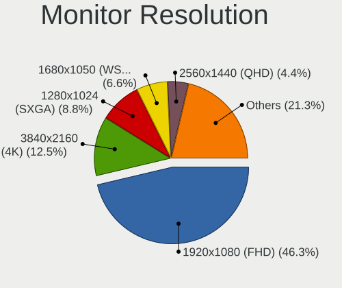

| Resolution         | Desktops | Percent |
|--------------------|----------|---------|
| 1920x1080 (FHD)    | 63       | 46.32%  |
| 3840x2160 (4K)     | 17       | 12.5%   |
| 1280x1024 (SXGA)   | 12       | 8.82%   |
| 1680x1050 (WSXGA+) | 9        | 6.62%   |
| 2560x1440 (QHD)    | 6        | 4.41%   |
| 1920x1200 (WUXGA)  | 5        | 3.68%   |
| 1366x768 (WXGA)    | 4        | 2.94%   |
| 1600x900 (HD+)     | 3        | 2.21%   |
| 1440x900 (WXGA+)   | 3        | 2.21%   |
| 1360x768           | 3        | 2.21%   |
| Unknown            | 2        | 1.47%   |
| 5760x2160          | 1        | 0.74%   |
| 3840x1080          | 1        | 0.74%   |
| 3440x1440          | 1        | 0.74%   |
| 3280x1080          | 1        | 0.74%   |
| 2288x1287          | 1        | 0.74%   |
| 1920x540           | 1        | 0.74%   |
| 1600x1200          | 1        | 0.74%   |
| 1400x1050          | 1        | 0.74%   |
| 1024x768 (XGA)     | 1        | 0.74%   |

Monitor Diagonal
----------------

Diagonal size in inches

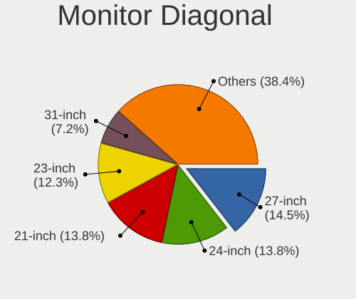

| Inches  | Desktops | Percent |
|---------|----------|---------|
| 27      | 20       | 14.49%  |
| 24      | 19       | 13.77%  |
| 21      | 19       | 13.77%  |
| 23      | 17       | 12.32%  |
| 31      | 10       | 7.25%   |
| 22      | 9        | 6.52%   |
| 19      | 7        | 5.07%   |
| 17      | 6        | 4.35%   |
| 84      | 5        | 3.62%   |
| 20      | 4        | 2.9%    |
| 18      | 4        | 2.9%    |
| 32      | 3        | 2.17%   |
| Unknown | 3        | 2.17%   |
| 15      | 2        | 1.45%   |
| 142     | 1        | 0.72%   |
| 75      | 1        | 0.72%   |
| 72      | 1        | 0.72%   |
| 65      | 1        | 0.72%   |
| 52      | 1        | 0.72%   |
| 50      | 1        | 0.72%   |
| 49      | 1        | 0.72%   |
| 43      | 1        | 0.72%   |
| 26      | 1        | 0.72%   |
| 16      | 1        | 0.72%   |

Monitor Width
-------------

Physical width

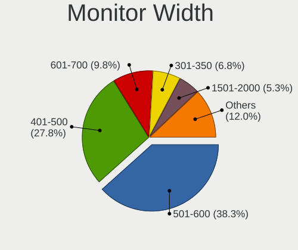

| Width in mm    | Desktops | Percent |
|----------------|----------|---------|
| 501-600        | 51       | 38.35%  |
| 401-500        | 37       | 27.82%  |
| 601-700        | 13       | 9.77%   |
| 301-350        | 9        | 6.77%   |
| 1501-2000      | 7        | 5.26%   |
| 351-400        | 4        | 3.01%   |
| 1001-1500      | 4        | 3.01%   |
| 701-800        | 3        | 2.26%   |
| Unknown        | 3        | 2.26%   |
| More than 2000 | 1        | 0.75%   |
| 901-1000       | 1        | 0.75%   |

Aspect Ratio
------------

Proportional relationship between the width and the height

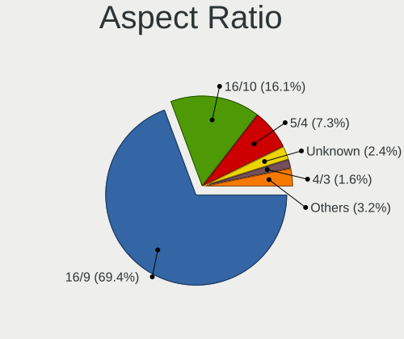

| Ratio   | Desktops | Percent |
|---------|----------|---------|
| 16/9    | 86       | 69.35%  |
| 16/10   | 20       | 16.13%  |
| 5/4     | 9        | 7.26%   |
| Unknown | 3        | 2.42%   |
| 4/3     | 2        | 1.61%   |
| 6/5     | 1        | 0.81%   |
| 32/9    | 1        | 0.81%   |
| 3/2     | 1        | 0.81%   |
| 1.00    | 1        | 0.81%   |

Monitor Area
------------

Area in inch²

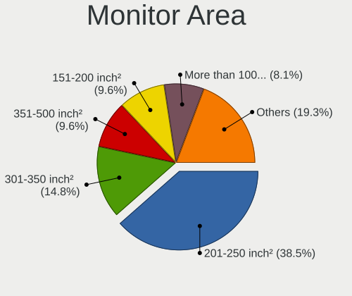

| Area in inch² | Desktops | Percent |
|----------------|----------|---------|
| 201-250        | 52       | 38.52%  |
| 301-350        | 20       | 14.81%  |
| 351-500        | 13       | 9.63%   |
| 151-200        | 13       | 9.63%   |
| More than 1000 | 11       | 8.15%   |
| 141-150        | 10       | 7.41%   |
| 251-300        | 8        | 5.93%   |
| Unknown        | 3        | 2.22%   |
| 501-1000       | 2        | 1.48%   |
| 131-140        | 1        | 0.74%   |
| 111-120        | 1        | 0.74%   |
| 101-110        | 1        | 0.74%   |

Pixel Density
-------------

Pixels per inch

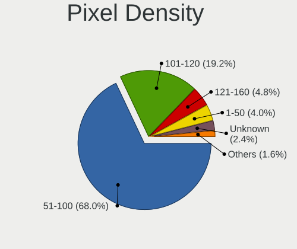

| Density | Desktops | Percent |
|---------|----------|---------|
| 51-100  | 85       | 68%     |
| 101-120 | 24       | 19.2%   |
| 121-160 | 6        | 4.8%    |
| 1-50    | 5        | 4%      |
| Unknown | 3        | 2.4%    |
| 161-240 | 2        | 1.6%    |

Multiple Monitors
-----------------

Total monitors connected

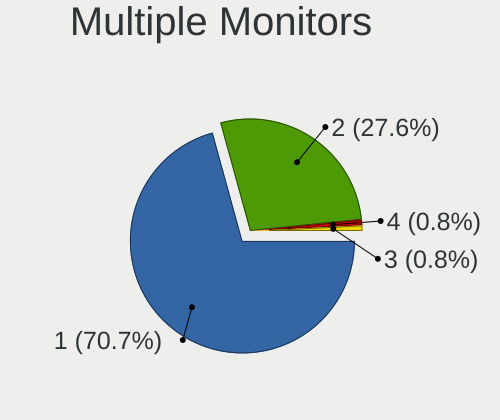

| Total | Desktops | Percent |
|-------|----------|---------|
| 1     | 87       | 70.73%  |
| 2     | 34       | 27.64%  |
| 4     | 1        | 0.81%   |
| 3     | 1        | 0.81%   |

Network
-------

Net Controller Vendor
---------------------

Controller vendors

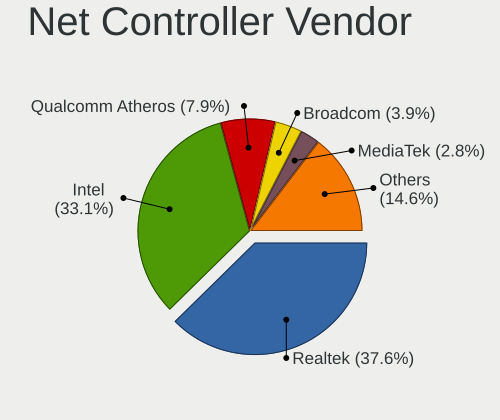

| Vendor                          | Desktops | Percent |
|---------------------------------|----------|---------|
| Realtek Semiconductor           | 67       | 37.64%  |
| Intel                           | 59       | 33.15%  |
| Qualcomm Atheros                | 14       | 7.87%   |
| Broadcom                        | 7        | 3.93%   |
| MediaTek                        | 5        | 2.81%   |
| TP-Link                         | 4        | 2.25%   |
| Nvidia                          | 3        | 1.69%   |
| Aquantia                        | 3        | 1.69%   |
| Ralink Technology               | 2        | 1.12%   |
| Qualcomm Atheros Communications | 2        | 1.12%   |
| Broadcom Limited                | 2        | 1.12%   |
| ZyDAS                           | 1        | 0.56%   |
| Wacom                           | 1        | 0.56%   |
| Ralink                          | 1        | 0.56%   |
| NetGear                         | 1        | 0.56%   |
| Microsoft                       | 1        | 0.56%   |
| Marvell Technology Group        | 1        | 0.56%   |
| InterBiometrics                 | 1        | 0.56%   |
| Input Club                      | 1        | 0.56%   |
| ASUSTek Computer                | 1        | 0.56%   |
| ASIX Electronics                | 1        | 0.56%   |

Net Controller Model
--------------------

Controller models

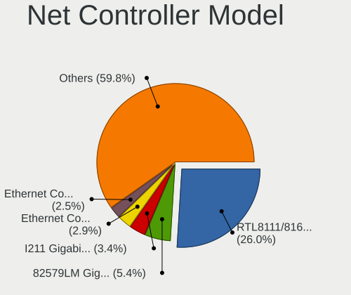

| Model                                                                          | Desktops | Percent |
|--------------------------------------------------------------------------------|----------|---------|
| Realtek RTL8111/8168/8211/8411 PCI Express Gigabit Ethernet Controller         | 53       | 25.98%  |
| Intel 82579LM Gigabit Network Connection (Lewisville)                          | 11       | 5.39%   |
| Intel I211 Gigabit Network Connection                                          | 7        | 3.43%   |
| Intel Ethernet Connection I217-LM                                              | 6        | 2.94%   |
| Intel Ethernet Controller I225-V                                               | 5        | 2.45%   |
| Intel Ethernet Connection (2) I219-V                                           | 5        | 2.45%   |
| Intel Wi-Fi 6E(802.11ax) AX210/AX1675* 2x2 [Typhoon Peak]                      | 4        | 1.96%   |
| Intel Wi-Fi 5(802.11ac) Wireless-AC 9x6x [Thunder Peak]                        | 4        | 1.96%   |
| Intel Ethernet Connection (7) I219-V                                           | 4        | 1.96%   |
| Realtek RTL88x2bu [AC1200 Techkey]                                             | 3        | 1.47%   |
| Realtek RTL8153 Gigabit Ethernet Adapter                                       | 3        | 1.47%   |
| Qualcomm Atheros AR8121/AR8113/AR8114 Gigabit or Fast Ethernet                 | 3        | 1.47%   |
| Aquantia AQtion AQC107 NBase-T/IEEE 802.3an Ethernet Controller [Atlantic 10G] | 3        | 1.47%   |
| TP-Link AC600 wireless Realtek RTL8811AU [Archer T2U Nano]                     | 2        | 0.98%   |
| Realtek RTL8821CE 802.11ac PCIe Wireless Network Adapter                       | 2        | 0.98%   |
| Realtek RTL8169 PCI Gigabit Ethernet Controller                                | 2        | 0.98%   |
| Realtek RTL8125 2.5GbE Controller                                              | 2        | 0.98%   |
| Realtek 802.11ac NIC                                                           | 2        | 0.98%   |
| Qualcomm Atheros AR9271 802.11n                                                | 2        | 0.98%   |
| Qualcomm Atheros AR9485 Wireless Network Adapter                               | 2        | 0.98%   |
| Qualcomm Atheros AR2413/AR2414 Wireless Network Adapter [AR5005G(S) 802.11bg]  | 2        | 0.98%   |
| Nvidia MCP77 Ethernet                                                          | 2        | 0.98%   |
| MediaTek MT7921K (RZ608) Wi-Fi 6E 80MHz                                        | 2        | 0.98%   |
| Intel Wireless 8265 / 8275                                                     | 2        | 0.98%   |
| Intel Wireless 3165                                                            | 2        | 0.98%   |
| Intel Ethernet Connection I217-V                                               | 2        | 0.98%   |
| Intel Ethernet Connection (5) I219-LM                                          | 2        | 0.98%   |
| Intel Cannon Lake PCH CNVi WiFi                                                | 2        | 0.98%   |
| Intel 82574L Gigabit Network Connection                                        | 2        | 0.98%   |
| Intel 700 Series Chipset CNVi WiFi                                             | 2        | 0.98%   |
| ZyDAS ZD1211B 802.11g                                                          | 1        | 0.49%   |
| Wacom ACK-40401 [Wireless Accessory Kit]                                       | 1        | 0.49%   |
| TP-Link 802.11ac WLAN Adapter                                                  | 1        | 0.49%   |
| TP-Link 802.11ac NIC                                                           | 1        | 0.49%   |
| Realtek USB 10/100/1G/2.5 LAN                                                  | 1        | 0.49%   |
| Realtek RTL8851BE PCIe 802.11ax Wireless Network Controller                    | 1        | 0.49%   |
| Realtek RTL8822CE 802.11ac PCIe Wireless Network Adapter                       | 1        | 0.49%   |
| Realtek RTL8192EE PCIe Wireless Network Adapter                                | 1        | 0.49%   |
| Realtek RTL8188ETV Wireless LAN 802.11n Network Adapter                        | 1        | 0.49%   |
| Realtek RTL8188CUS 802.11n WLAN Adapter                                        | 1        | 0.49%   |

Wireless Vendor
---------------

Wireless vendors

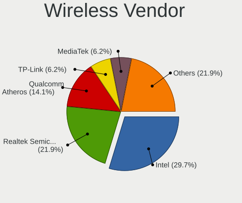

| Vendor                          | Desktops | Percent |
|---------------------------------|----------|---------|
| Intel                           | 19       | 29.69%  |
| Realtek Semiconductor           | 14       | 21.88%  |
| Qualcomm Atheros                | 9        | 14.06%  |
| TP-Link                         | 4        | 6.25%   |
| MediaTek                        | 4        | 6.25%   |
| Broadcom                        | 4        | 6.25%   |
| Ralink Technology               | 2        | 3.13%   |
| Qualcomm Atheros Communications | 2        | 3.13%   |
| ZyDAS                           | 1        | 1.56%   |
| Wacom                           | 1        | 1.56%   |
| Ralink                          | 1        | 1.56%   |
| NetGear                         | 1        | 1.56%   |
| Microsoft                       | 1        | 1.56%   |
| ASUSTek Computer                | 1        | 1.56%   |

Wireless Model
--------------

Wireless models

| Model                                                                           | Desktops | Percent |
|---------------------------------------------------------------------------------|----------|---------|
| Intel Wi-Fi 6E(802.11ax) AX210/AX1675* 2x2 [Typhoon Peak]                       | 4        | 6.25%   |
| Intel Wi-Fi 5(802.11ac) Wireless-AC 9x6x [Thunder Peak]                         | 4        | 6.25%   |
| Realtek RTL88x2bu [AC1200 Techkey]                                              | 3        | 4.69%   |
| TP-Link AC600 wireless Realtek RTL8811AU [Archer T2U Nano]                      | 2        | 3.13%   |
| Realtek RTL8821CE 802.11ac PCIe Wireless Network Adapter                        | 2        | 3.13%   |
| Realtek 802.11ac NIC                                                            | 2        | 3.13%   |
| Qualcomm Atheros AR9271 802.11n                                                 | 2        | 3.13%   |
| Qualcomm Atheros AR9485 Wireless Network Adapter                                | 2        | 3.13%   |
| Qualcomm Atheros AR2413/AR2414 Wireless Network Adapter [AR5005G(S) 802.11bg]   | 2        | 3.13%   |
| MediaTek MT7921K (RZ608) Wi-Fi 6E 80MHz                                         | 2        | 3.13%   |
| Intel Wireless 8265 / 8275                                                      | 2        | 3.13%   |
| Intel Wireless 3165                                                             | 2        | 3.13%   |
| Intel Cannon Lake PCH CNVi WiFi                                                 | 2        | 3.13%   |
| Intel 700 Series Chipset CNVi WiFi                                              | 2        | 3.13%   |
| ZyDAS ZD1211B 802.11g                                                           | 1        | 1.56%   |
| Wacom ACK-40401 [Wireless Accessory Kit]                                        | 1        | 1.56%   |
| TP-Link 802.11ac WLAN Adapter                                                   | 1        | 1.56%   |
| TP-Link 802.11ac NIC                                                            | 1        | 1.56%   |
| Realtek RTL8851BE PCIe 802.11ax Wireless Network Controller                     | 1        | 1.56%   |
| Realtek RTL8822CE 802.11ac PCIe Wireless Network Adapter                        | 1        | 1.56%   |
| Realtek RTL8192EE PCIe Wireless Network Adapter                                 | 1        | 1.56%   |
| Realtek RTL8188ETV Wireless LAN 802.11n Network Adapter                         | 1        | 1.56%   |
| Realtek RTL8188CUS 802.11n WLAN Adapter                                         | 1        | 1.56%   |
| Realtek RTL-8185 IEEE 802.11a/b/g Wireless LAN Controller                       | 1        | 1.56%   |
| Realtek 802.11ax WLAN Adapter                                                   | 1        | 1.56%   |
| Ralink RT2870/RT3070 Wireless Adapter                                           | 1        | 1.56%   |
| Ralink MT7601U Wireless Adapter                                                 | 1        | 1.56%   |
| Ralink RT3090 Wireless 802.11n 1T/1R PCIe                                       | 1        | 1.56%   |
| Qualcomm Atheros QCA9565 / AR9565 Wireless Network Adapter                      | 1        | 1.56%   |
| Qualcomm Atheros AR93xx Wireless Network Adapter                                | 1        | 1.56%   |
| Qualcomm Atheros AR9287 Wireless Network Adapter (PCI-Express)                  | 1        | 1.56%   |
| Qualcomm Atheros AR9227 Wireless Network Adapter                                | 1        | 1.56%   |
| Qualcomm Atheros AR5212/5213/2414 Wireless Network Adapter                      | 1        | 1.56%   |
| NetGear A6100 AC600 DB Wireless Adapter [Realtek RTL8811AU]                     | 1        | 1.56%   |
| Microsoft Xbox 360 Wireless Adapter                                             | 1        | 1.56%   |
| MediaTek MT7927 802.11be 320MHz 2x2 PCIe Wireless Network Adapter [Filogic 380] | 1        | 1.56%   |
| MediaTek 802.11 n WLAN                                                          | 1        | 1.56%   |
| Intel Wireless 8260                                                             | 1        | 1.56%   |
| Intel Wi-Fi 6 AX200                                                             | 1        | 1.56%   |
| Intel Dual Band Wireless-AC 3168NGW [Stone Peak]                                | 1        | 1.56%   |

Ethernet Vendor
---------------

Ethernet vendors

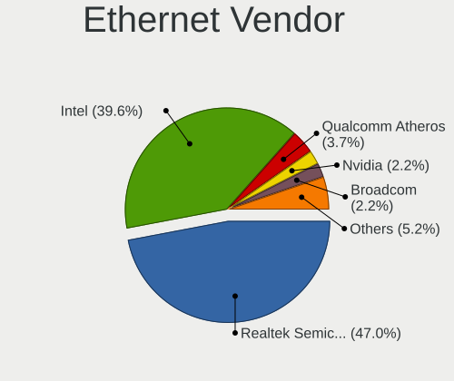

| Vendor                   | Desktops | Percent |
|--------------------------|----------|---------|
| Realtek Semiconductor    | 63       | 47.01%  |
| Intel                    | 53       | 39.55%  |
| Qualcomm Atheros         | 5        | 3.73%   |
| Nvidia                   | 3        | 2.24%   |
| Broadcom                 | 3        | 2.24%   |
| Aquantia                 | 3        | 2.24%   |
| Broadcom Limited         | 2        | 1.49%   |
| Marvell Technology Group | 1        | 0.75%   |
| ASIX Electronics         | 1        | 0.75%   |

Ethernet Model
--------------

Ethernet models

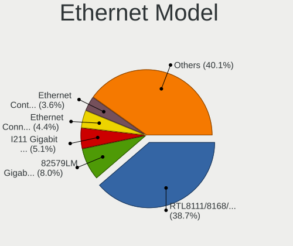

| Model                                                                          | Desktops | Percent |
|--------------------------------------------------------------------------------|----------|---------|
| Realtek RTL8111/8168/8211/8411 PCI Express Gigabit Ethernet Controller         | 53       | 38.69%  |
| Intel 82579LM Gigabit Network Connection (Lewisville)                          | 11       | 8.03%   |
| Intel I211 Gigabit Network Connection                                          | 7        | 5.11%   |
| Intel Ethernet Connection I217-LM                                              | 6        | 4.38%   |
| Intel Ethernet Controller I225-V                                               | 5        | 3.65%   |
| Intel Ethernet Connection (2) I219-V                                           | 5        | 3.65%   |
| Intel Ethernet Connection (7) I219-V                                           | 4        | 2.92%   |
| Realtek RTL8153 Gigabit Ethernet Adapter                                       | 3        | 2.19%   |
| Qualcomm Atheros AR8121/AR8113/AR8114 Gigabit or Fast Ethernet                 | 3        | 2.19%   |
| Aquantia AQtion AQC107 NBase-T/IEEE 802.3an Ethernet Controller [Atlantic 10G] | 3        | 2.19%   |
| Realtek RTL8169 PCI Gigabit Ethernet Controller                                | 2        | 1.46%   |
| Realtek RTL8125 2.5GbE Controller                                              | 2        | 1.46%   |
| Nvidia MCP77 Ethernet                                                          | 2        | 1.46%   |
| Intel Ethernet Connection I217-V                                               | 2        | 1.46%   |
| Intel Ethernet Connection (5) I219-LM                                          | 2        | 1.46%   |
| Intel 82574L Gigabit Network Connection                                        | 2        | 1.46%   |
| Realtek USB 10/100/1G/2.5 LAN                                                  | 1        | 0.73%   |
| Realtek RTL8126 5GbE Controller                                                | 1        | 0.73%   |
| Realtek RTL810xE PCI Express Fast Ethernet controller                          | 1        | 0.73%   |
| Realtek RTL-8110SC/8169SC Gigabit Ethernet                                     | 1        | 0.73%   |
| Qualcomm Atheros Killer E2500 Gigabit Ethernet Controller                      | 1        | 0.73%   |
| Qualcomm Atheros Killer E2400 Gigabit Ethernet Controller                      | 1        | 0.73%   |
| Nvidia MCP61 Ethernet                                                          | 1        | 0.73%   |
| Marvell Group 88E8052 PCI-E ASF Gigabit Ethernet Controller                    | 1        | 0.73%   |
| Marvell Group 88E8001 Gigabit Ethernet Controller                              | 1        | 0.73%   |
| Intel Ethernet Connection (7) I219-LM                                          | 1        | 0.73%   |
| Intel Ethernet Connection (2) I219-LM                                          | 1        | 0.73%   |
| Intel Ethernet Connection (2) I218-V                                           | 1        | 0.73%   |
| Intel Ethernet Connection (2) I218-LM                                          | 1        | 0.73%   |
| Intel Ethernet Connection (17) I219-LM                                         | 1        | 0.73%   |
| Intel 82579V Gigabit Network Connection                                        | 1        | 0.73%   |
| Intel 82578DM Gigabit Network Connection                                       | 1        | 0.73%   |
| Intel 82567LM-3 Gigabit Network Connection                                     | 1        | 0.73%   |
| Intel 82566DM Gigabit Network Connection                                       | 1        | 0.73%   |
| Intel 82562EZ 10/100 Ethernet Controller                                       | 1        | 0.73%   |
| Broadcom NetXtreme BCM5761 Gigabit Ethernet PCIe                               | 1        | 0.73%   |
| Broadcom NetXtreme BCM5754 Gigabit Ethernet PCI Express                        | 1        | 0.73%   |
| Broadcom NetXtreme BCM5751 Gigabit Ethernet PCI Express                        | 1        | 0.73%   |
| Broadcom Limited NetXtreme BCM5761 Gigabit Ethernet PCIe                       | 1        | 0.73%   |
| Broadcom Limited NetXtreme BCM5752 Gigabit Ethernet PCI Express                | 1        | 0.73%   |

Net Controller Kind
-------------------

Ethernet, WiFi or modem

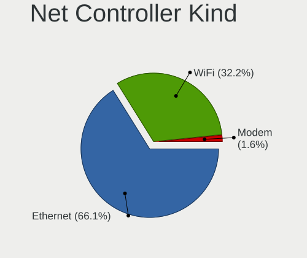

| Kind     | Desktops | Percent |
|----------|----------|---------|
| Ethernet | 121      | 66.12%  |
| WiFi     | 59       | 32.24%  |
| Modem    | 3        | 1.64%   |

Used Controller
---------------

Currently used network controller

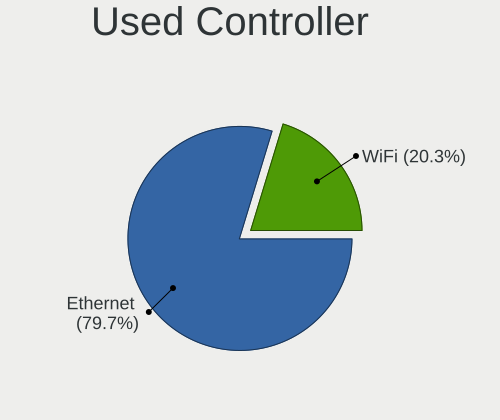

| Kind     | Desktops | Percent |
|----------|----------|---------|
| Ethernet | 106      | 79.7%   |
| WiFi     | 27       | 20.3%   |

NICs
----

Total network controllers on board

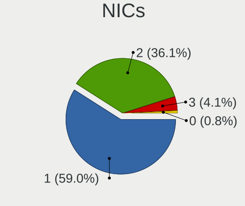

| Total | Desktops | Percent |
|-------|----------|---------|
| 1     | 72       | 59.02%  |
| 2     | 44       | 36.07%  |
| 3     | 5        | 4.1%    |
| 0     | 1        | 0.82%   |

IPv6
----

IPv6 vs IPv4

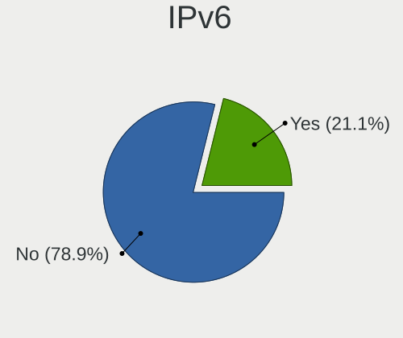

| Used | Desktops | Percent |
|------|----------|---------|
| No   | 97       | 78.86%  |
| Yes  | 26       | 21.14%  |

Bluetooth
---------

Bluetooth Vendor
----------------

Controller vendors

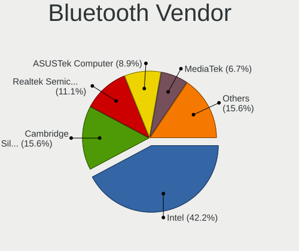

| Vendor                          | Desktops | Percent |
|---------------------------------|----------|---------|
| Intel                           | 19       | 42.22%  |
| Cambridge Silicon Radio         | 7        | 15.56%  |
| Realtek Semiconductor           | 5        | 11.11%  |
| ASUSTek Computer                | 4        | 8.89%   |
| MediaTek                        | 3        | 6.67%   |
| Qualcomm Atheros Communications | 2        | 4.44%   |
| Broadcom                        | 2        | 4.44%   |
| TP-Link                         | 1        | 2.22%   |
| IMC Networks                    | 1        | 2.22%   |
| Foxconn / Hon Hai               | 1        | 2.22%   |

Bluetooth Model
---------------

Controller models

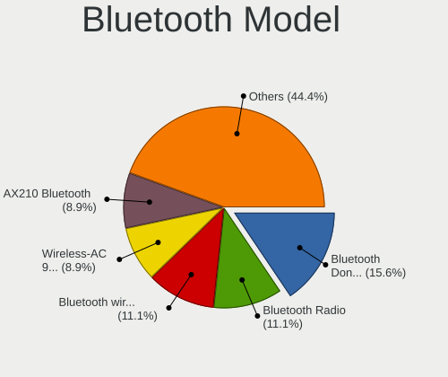

| Model                                               | Desktops | Percent |
|-----------------------------------------------------|----------|---------|
| Cambridge Silicon Radio Bluetooth Dongle (HCI mode) | 7        | 15.56%  |
| Realtek Bluetooth Radio                             | 5        | 11.11%  |
| Intel Bluetooth wireless interface                  | 5        | 11.11%  |
| Intel Wireless-AC 9260 Bluetooth Adapter            | 4        | 8.89%   |
| Intel AX210 Bluetooth                               | 4        | 8.89%   |
| MediaTek Wireless_Device                            | 3        | 6.67%   |
| Intel Bluetooth Device                              | 2        | 4.44%   |
| Intel Bluetooth 9460/9560 Jefferson Peak (JfP)      | 2        | 4.44%   |
| ASUS Broadcom BCM20702A0 Bluetooth                  | 2        | 4.44%   |
| TP-Link TP-T@- UB500 Adapter                        | 1        | 2.22%   |
| Qualcomm Atheros AR9462 Bluetooth                   | 1        | 2.22%   |
| Qualcomm Atheros AR3011 Bluetooth                   | 1        | 2.22%   |
| Intel Wireless-AC 3168 Bluetooth                    | 1        | 2.22%   |
| Intel AX200 Bluetooth                               | 1        | 2.22%   |
| IMC Networks Bluetooth Radio                        | 1        | 2.22%   |
| Foxconn / Hon Hai Wireless_Device                   | 1        | 2.22%   |
| Broadcom HP Portable Bumble Bee                     | 1        | 2.22%   |
| Broadcom BCM20702A0 Bluetooth 4.0                   | 1        | 2.22%   |
| ASUS BCM20702A0                                     | 1        | 2.22%   |
| ASUS ASUS USB-BT500                                 | 1        | 2.22%   |

Sound
-----

Sound Vendor
------------

Sound card vendors

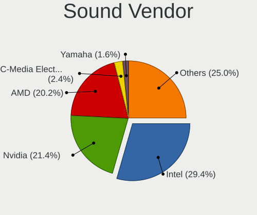

| Vendor                               | Desktops | Percent |
|--------------------------------------|----------|---------|
| Intel                                | 73       | 29.44%  |
| Nvidia                               | 53       | 21.37%  |
| AMD                                  | 50       | 20.16%  |
| C-Media Electronics                  | 6        | 2.42%   |
| Yamaha                               | 4        | 1.61%   |
| Texas Instruments                    | 4        | 1.61%   |
| PreSonus Audio Electronics           | 4        | 1.61%   |
| M-Audio                              | 4        | 1.61%   |
| JMTek                                | 4        | 1.61%   |
| Focusrite-Novation                   | 4        | 1.61%   |
| Logitech                             | 3        | 1.21%   |
| ASUSTek Computer                     | 3        | 1.21%   |
| Plantronics                          | 2        | 0.81%   |
| ZOOM                                 | 1        | 0.4%    |
| Xilinx                               | 1        | 0.4%    |
| Unknown                              | 1        | 0.4%    |
| Universal Audio                      | 1        | 0.4%    |
| Thomann                              | 1        | 0.4%    |
| Thesycon Systemsoftware & Consulting | 1        | 0.4%    |
| Textech International                | 1        | 0.4%    |
| Tenx Technology                      | 1        | 0.4%    |
| TEAC                                 | 1        | 0.4%    |
| Studiologic                          | 1        | 0.4%    |
| SteelSeries ApS                      | 1        | 0.4%    |
| Samson Technologies                  | 1        | 0.4%    |
| Razer USA                            | 1        | 0.4%    |
| QinHeng Electronics                  | 1        | 0.4%    |
| NXP Semiconductors                   | 1        | 0.4%    |
| MIDITECH                             | 1        | 0.4%    |
| Medeli Electronics                   | 1        | 0.4%    |
| Mark of the Unicorn                  | 1        | 0.4%    |
| KTMicro                              | 1        | 0.4%    |
| Harman                               | 1        | 0.4%    |
| Generalplus Technology               | 1        | 0.4%    |
| Evolution Electronics                | 1        | 0.4%    |
| ESI Audiotechnik                     | 1        | 0.4%    |
| Ensoniq                              | 1        | 0.4%    |
| Elektron Music Machines              | 1        | 0.4%    |
| Digidesign                           | 1        | 0.4%    |
| Creative Technology                  | 1        | 0.4%    |

Sound Model
-----------

Sound card models

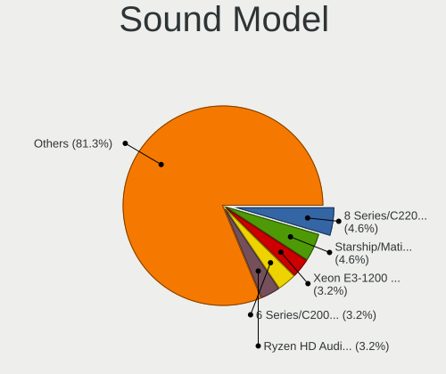

| Model                                                                             | Desktops | Percent |
|-----------------------------------------------------------------------------------|----------|---------|
| Intel 8 Series/C220 Series Chipset High Definition Audio Controller               | 13       | 4.59%   |
| AMD Starship/Matisse HD Audio Controller                                          | 13       | 4.59%   |
| Intel Xeon E3-1200 v3/4th Gen Core Processor HD Audio Controller                  | 9        | 3.18%   |
| Intel 6 Series/C200 Series Chipset Family High Definition Audio Controller        | 9        | 3.18%   |
| AMD Ryzen HD Audio Controller                                                     | 9        | 3.18%   |
| AMD SBx00 Azalia (Intel HDA)                                                      | 8        | 2.83%   |
| Intel Cannon Lake PCH cAVS                                                        | 7        | 2.47%   |
| Intel 100 Series/C230 Series Chipset Family HD Audio Controller                   | 7        | 2.47%   |
| Nvidia GK208 HDMI/DP Audio Controller                                             | 6        | 2.12%   |
| Nvidia GP108 High Definition Audio Controller                                     | 5        | 1.77%   |
| Nvidia GA102 High Definition Audio Controller                                     | 5        | 1.77%   |
| Intel 7 Series/C216 Chipset Family High Definition Audio Controller               | 5        | 1.77%   |
| Intel 200 Series PCH HD Audio                                                     | 5        | 1.77%   |
| AMD Renoir/Cezanne HDMI/DP Audio Controller                                       | 5        | 1.77%   |
| AMD Ellesmere HDMI Audio [Radeon RX 470/480 / 570/580/590]                        | 5        | 1.77%   |
| Nvidia GA106 High Definition Audio Controller                                     | 4        | 1.41%   |
| Intel NM10/ICH7 Family High Definition Audio Controller                           | 4        | 1.41%   |
| AMD Navi 21/23 HDMI/DP Audio Controller                                           | 4        | 1.41%   |
| AMD FCH Azalia Controller                                                         | 4        | 1.41%   |
| Texas Instruments PCM2902 Audio Codec                                             | 3        | 1.06%   |
| PreSonus Audio Electronics Studio 24c                                             | 3        | 1.06%   |
| Nvidia GP107GL High Definition Audio Controller                                   | 3        | 1.06%   |
| Nvidia GP104 High Definition Audio Controller                                     | 3        | 1.06%   |
| Nvidia GM204 High Definition Audio Controller                                     | 3        | 1.06%   |
| Nvidia GM107 High Definition Audio Controller [GeForce 940MX]                     | 3        | 1.06%   |
| Intel Raptor Lake High Definition Audio Controller                                | 3        | 1.06%   |
| Intel 82801JI (ICH10 Family) HD Audio Controller                                  | 3        | 1.06%   |
| Intel 5 Series/3400 Series Chipset High Definition Audio                          | 3        | 1.06%   |
| ASUSTek Computer USB Audio                                                        | 3        | 1.06%   |
| AMD Raven/Raven2/Fenghuang HDMI/DP Audio Controller                               | 3        | 1.06%   |
| AMD Radeon High Definition Audio Controller                                       | 3        | 1.06%   |
| AMD Cedar HDMI Audio [Radeon HD 5400/6300/7300 Series]                            | 3        | 1.06%   |
| AMD Caicos HDMI Audio [Radeon HD 6450 / 7450/8450/8490 OEM / R5 230/235/235X OEM] | 3        | 1.06%   |
| Yamaha AG06/AG03                                                                  | 2        | 0.71%   |
| Nvidia TU104 HD Audio Controller                                                  | 2        | 0.71%   |
| Nvidia MCP72XE/MCP72P/MCP78U/MCP78S High Definition Audio                         | 2        | 0.71%   |
| Nvidia High Definition Audio Controller                                           | 2        | 0.71%   |
| Nvidia GP106 High Definition Audio Controller                                     | 2        | 0.71%   |
| Nvidia GM206 High Definition Audio Controller                                     | 2        | 0.71%   |
| Nvidia GF108 High Definition Audio Controller                                     | 2        | 0.71%   |

Memory
------

Memory Vendor
-------------

Memory module vendors

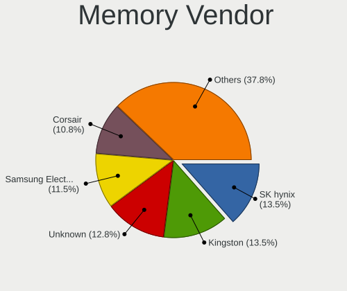

| Vendor              | Desktops | Percent |
|---------------------|----------|---------|
| SK hynix            | 20       | 13.51%  |
| Kingston            | 20       | 13.51%  |
| Unknown             | 19       | 12.84%  |
| Samsung Electronics | 17       | 11.49%  |
| Corsair             | 16       | 10.81%  |
| Crucial             | 13       | 8.78%   |
| G.Skill             | 10       | 6.76%   |
| Micron Technology   | 9        | 6.08%   |
| Patriot             | 4        | 2.7%    |
| A-DATA Technology   | 3        | 2.03%   |
| Unknown             | 3        | 2.03%   |
| Nanya Technology    | 2        | 1.35%   |
| Unifosa             | 1        | 0.68%   |
| Smart               | 1        | 0.68%   |
| S                   | 1        | 0.68%   |
| PNY                 | 1        | 0.68%   |
| OCZ                 | 1        | 0.68%   |
| M                   | 1        | 0.68%   |
| HBS                 | 1        | 0.68%   |
| Goldkey             | 1        | 0.68%   |
| Elpida              | 1        | 0.68%   |
| Avant               | 1        | 0.68%   |
| Aeneon              | 1        | 0.68%   |
| 0194808980CE        | 1        | 0.68%   |

Memory Model
------------

Memory module models

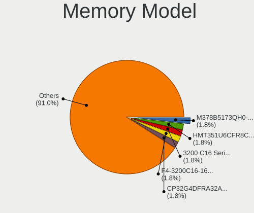

| Model                                                       | Desktops | Percent |
|-------------------------------------------------------------|----------|---------|
| SK hynix RAM HMT351U6CFR8C-PB 4GB DIMM DDR3 1800MT/s        | 3        | 1.81%   |
| Samsung RAM M378B5173QH0-CK0 4GB DIMM DDR3                  | 3        | 1.81%   |
| Patriot RAM 3200 C16 Series 8GB DIMM DDR4 3600MT/s          | 3        | 1.81%   |
| G.Skill RAM F4-3200C16-16GVK 16GB DIMM DDR4 3600MT/s        | 3        | 1.81%   |
| Unknown                                                     | 3        | 1.81%   |
| Unknown RAM Module 4096MB DIMM 1600MT/s                     | 2        | 1.2%    |
| Unknown RAM Module 2GB DIMM DDR2 800MT/s                    | 2        | 1.2%    |
| Unknown RAM Module 2GB DIMM DDR2 667MT/s                    | 2        | 1.2%    |
| SK hynix RAM HMT351U6EFR8C-PB 4GB DIMM DDR3 1600MT/s        | 2        | 1.2%    |
| Samsung RAM M378B5173DB0-CK0 4096MB DIMM DDR3 1600MT/s      | 2        | 1.2%    |
| Micron RAM 8JTF51264AZ-1G6E1 4GB DIMM DDR3 1600MT/s         | 2        | 1.2%    |
| Kingston RAM 99U5584-005.A00LF 4GB DIMM DDR3 1600MT/s       | 2        | 1.2%    |
| Corsair RAM CMW32GX4M2C3200C16 16GB DIMM DDR4 3400MT/s      | 2        | 1.2%    |
| Corsair RAM CMK16GX4M2B3200C16 8GB DIMM DDR4 3600MT/s       | 2        | 1.2%    |
| Unknown RAM Module 8GB DIMM 1333MT/s                        | 1        | 0.6%    |
| Unknown RAM Module 8192MB SODIMM DDR3 1600MT/s              | 1        | 0.6%    |
| Unknown RAM Module 512MB DIMM DDR 533MT/s                   | 1        | 0.6%    |
| Unknown RAM Module 512MB DIMM DDR                           | 1        | 0.6%    |
| Unknown RAM Module 4GB DIMM SDRAM                           | 1        | 0.6%    |
| Unknown RAM Module 4GB DIMM DDR2 667MT/s                    | 1        | 0.6%    |
| Unknown RAM Module 4GB DIMM 400MT/s                         | 1        | 0.6%    |
| Unknown RAM Module 4096MB DIMM 1333MT/s                     | 1        | 0.6%    |
| Unknown RAM Module 2GB DIMM DDR2                            | 1        | 0.6%    |
| Unknown RAM Module 256MB DIMM DDR                           | 1        | 0.6%    |
| Unknown RAM Module 2048MB DIMM SDRAM                        | 1        | 0.6%    |
| Unknown RAM Module 2048MB DIMM 1066MT/s                     | 1        | 0.6%    |
| Unknown RAM Module 1GB DIMM DDR2 667MT/s                    | 1        | 0.6%    |
| Unknown RAM Module 16GB DIMM DDR4 2666MT/s                  | 1        | 0.6%    |
| Unknown RAM Module 1024MB DIMM DDR 800MT/s                  | 1        | 0.6%    |
| Unknown RAM Module 1024MB DIMM DDR                          | 1        | 0.6%    |
| Unknown RAM Module 1024MB DIMM 667MT/s                      | 1        | 0.6%    |
| Unknown RAM M0650120 512MB DIMM DDR 533MT/s                 | 1        | 0.6%    |
| Unifosa RAM GU512303EP0202 2GB DIMM DDR3 1333MT/s           | 1        | 0.6%    |
| Smart RAM SH564568FH8N0QHSC 2GB DIMM DDR3 1333MT/s          | 1        | 0.6%    |
| SK hynix RAM TMT41GU6BFR8C-PBSC 8GB DIMM DDR3 1600MT/s      | 1        | 0.6%    |
| SK hynix RAM Module 4GB DIMM DDR3 1333MT/s                  | 1        | 0.6%    |
| SK hynix RAM Module 32GB SODIMM DDR4 2666MT/s               | 1        | 0.6%    |
| SK hynix RAM Module 32GB DIMM DDR4 2667MT/s                 | 1        | 0.6%    |
| SK hynix RAM HYMP564U64BP8-C4 512MB DIMM DDR 533MT/s        | 1        | 0.6%    |
| SK hynix RAM HYMP125F72CP8N3-Y5 2048MB FB-DIMM DDR2 667MT/s | 1        | 0.6%    |

Memory Kind
-----------

Memory module kinds

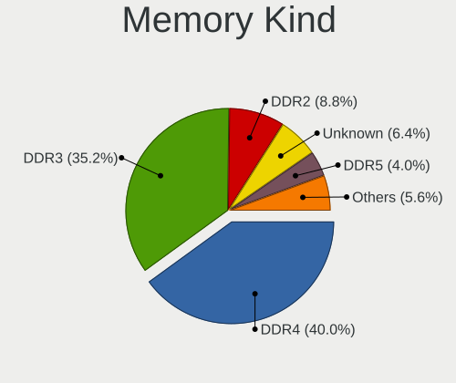

| Kind    | Desktops | Percent |
|---------|----------|---------|
| DDR4    | 50       | 40%     |
| DDR3    | 44       | 35.2%   |
| DDR2    | 11       | 8.8%    |
| Unknown | 8        | 6.4%    |
| DDR5    | 5        | 4%      |
| SDRAM   | 4        | 3.2%    |
| DDR     | 3        | 2.4%    |

Memory Form Factor
------------------

Physical design of the memory module

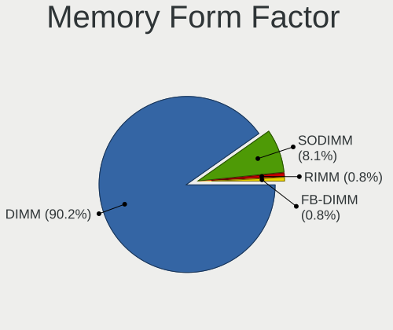

| Name    | Desktops | Percent |
|---------|----------|---------|
| DIMM    | 111      | 90.24%  |
| SODIMM  | 10       | 8.13%   |
| RIMM    | 1        | 0.81%   |
| FB-DIMM | 1        | 0.81%   |

Memory Size
-----------

Memory module size

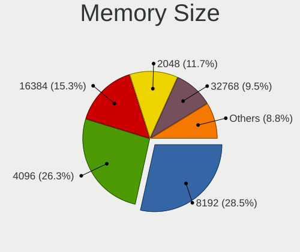

| Size  | Desktops | Percent |
|-------|----------|---------|
| 8192  | 39       | 28.47%  |
| 4096  | 36       | 26.28%  |
| 16384 | 21       | 15.33%  |
| 2048  | 16       | 11.68%  |
| 32768 | 13       | 9.49%   |
| 1024  | 8        | 5.84%   |
| 512   | 2        | 1.46%   |
| 65536 | 1        | 0.73%   |
| 256   | 1        | 0.73%   |

Memory Speed
------------

Memory module speed

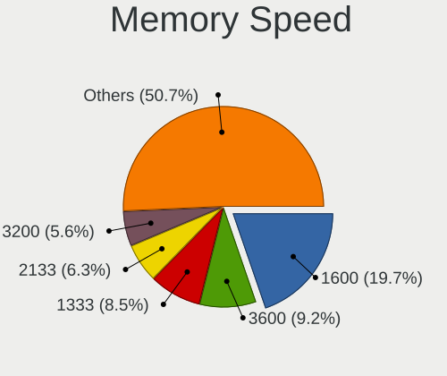

| Speed   | Desktops | Percent |
|---------|----------|---------|
| 1600    | 28       | 19.72%  |
| 3600    | 13       | 9.15%   |
| 1333    | 12       | 8.45%   |
| 2133    | 9        | 6.34%   |
| 3200    | 8        | 5.63%   |
| 2400    | 6        | 4.23%   |
| 1866    | 6        | 4.23%   |
| 1800    | 6        | 4.23%   |
| 800     | 5        | 3.52%   |
| 667     | 5        | 3.52%   |
| 2667    | 4        | 2.82%   |
| 1066    | 4        | 2.82%   |
| Unknown | 4        | 2.82%   |
| 2933    | 3        | 2.11%   |
| 2666    | 3        | 2.11%   |
| 5600    | 2        | 1.41%   |
| 3733    | 2        | 1.41%   |
| 3400    | 2        | 1.41%   |
| 1867    | 2        | 1.41%   |
| 533     | 2        | 1.41%   |
| 7200    | 1        | 0.7%    |
| 4802    | 1        | 0.7%    |
| 4800    | 1        | 0.7%    |
| 3866    | 1        | 0.7%    |
| 3800    | 1        | 0.7%    |
| 3500    | 1        | 0.7%    |
| 3467    | 1        | 0.7%    |
| 3466    | 1        | 0.7%    |
| 3266    | 1        | 0.7%    |
| 3000    | 1        | 0.7%    |
| 2934    | 1        | 0.7%    |
| 2800    | 1        | 0.7%    |
| 2465    | 1        | 0.7%    |
| 1632    | 1        | 0.7%    |
| 1067    | 1        | 0.7%    |
| 400     | 1        | 0.7%    |

Printers & scanners
-------------------

Printer Vendor
--------------

Printer device vendors

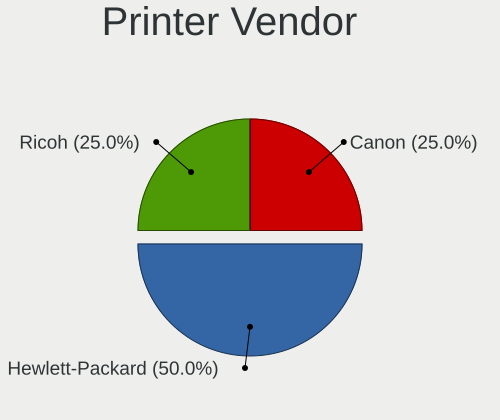

| Vendor          | Desktops | Percent |
|-----------------|----------|---------|
| Hewlett-Packard | 2        | 50%     |
| Ricoh           | 1        | 25%     |
| Canon           | 1        | 25%     |

Printer Model
-------------

Printer device models

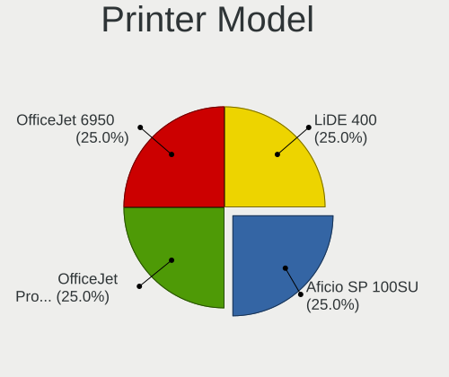

| Model                 | Desktops | Percent |
|-----------------------|----------|---------|
| Ricoh Aficio SP 100SU | 1        | 25%     |
| HP OfficeJet Pro 6960 | 1        | 25%     |
| HP OfficeJet 6950     | 1        | 25%     |
| Canon LiDE 400        | 1        | 25%     |

Scanner Vendor
--------------

Scanner device vendors

| Vendor | Desktops | Percent |
|--------|----------|---------|
| Canon  | 2        | 100%    |

Scanner Model
-------------

Scanner device models

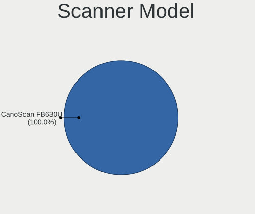

| Model                  | Desktops | Percent |
|------------------------|----------|---------|
| Canon CanoScan LiDE 60 | 1        | 50%     |
| Canon CanoScan FB630U  | 1        | 50%     |

Camera
------

Camera Vendor
-------------

Camera device vendors

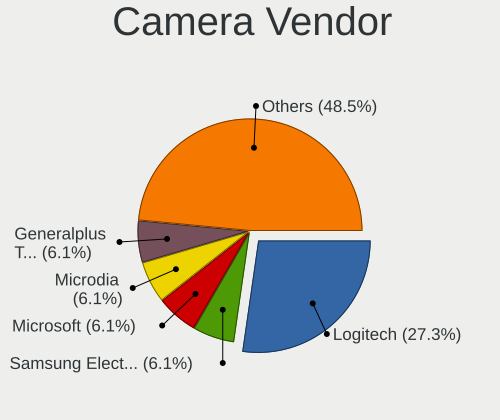

| Vendor                        | Desktops | Percent |
|-------------------------------|----------|---------|
| Logitech                      | 9        | 27.27%  |
| Samsung Electronics           | 2        | 6.06%   |
| Microsoft                     | 2        | 6.06%   |
| Microdia                      | 2        | 6.06%   |
| Generalplus Technology        | 2        | 6.06%   |
| Xiongmai                      | 1        | 3.03%   |
| ViewSonic                     | 1        | 3.03%   |
| Trust                         | 1        | 3.03%   |
| Sweex                         | 1        | 3.03%   |
| Sunplus IT                    | 1        | 3.03%   |
| Sunplus Innovation Technology | 1        | 3.03%   |
| SHENZHEN AONI ELECTRONIC      | 1        | 3.03%   |
| Philips (or NXP)              | 1        | 3.03%   |
| OmniVision Technologies       | 1        | 3.03%   |
| MacroSilicon                  | 1        | 3.03%   |
| Jieli Technology              | 1        | 3.03%   |
| Intel                         | 1        | 3.03%   |
| Huawei Technologies           | 1        | 3.03%   |
| Elgato Systems                | 1        | 3.03%   |
| Dell                          | 1        | 3.03%   |
| Chicony Electronics           | 1        | 3.03%   |

Camera Model
------------

Camera device models

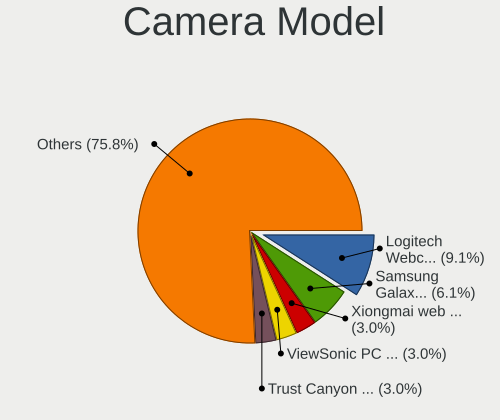

| Model                                             | Desktops | Percent |
|---------------------------------------------------|----------|---------|
| Logitech Webcam C270                              | 3        | 9.09%   |
| Samsung Galaxy series, misc. (MTP mode)           | 2        | 6.06%   |
| Xiongmai web camera                               | 1        | 3.03%   |
| ViewSonic PC Camera                               | 1        | 3.03%   |
| Trust Canyon CNS-CWC6 Webcam                      | 1        | 3.03%   |
| Sweex USB keyboard                                | 1        | 3.03%   |
| Sunplus IT AUKEY PC-LM1 USB Camera                | 1        | 3.03%   |
| Sunplus Full HD webcam                            | 1        | 3.03%   |
| SHENZHEN AONI ELECTRONIC NexiGo N930AF FHD Webcam | 1        | 3.03%   |
| Philips (or NXP) Webcam SPC530NC                  | 1        | 3.03%   |
| OmniVision USB Camera-OV580                       | 1        | 3.03%   |
| Microsoft LifeCam VX-5000                         | 1        | 3.03%   |
| Microsoft LifeCam Cinema                          | 1        | 3.03%   |
| Microdia MSI Starcam Racer                        | 1        | 3.03%   |
| Microdia HoverCam Solo Spark Audio                | 1        | 3.03%   |
| MacroSilicon USB Video                            | 1        | 3.03%   |
| Logitech QuickCam Communicate MP/S5500            | 1        | 3.03%   |
| Logitech Portable Webcam C905                     | 1        | 3.03%   |
| Logitech Logitech Webcam C925e                    | 1        | 3.03%   |
| Logitech HD Webcam C910                           | 1        | 3.03%   |
| Logitech HD Webcam C510                           | 1        | 3.03%   |
| Logitech HD Pro Webcam C920                       | 1        | 3.03%   |
| Jieli USB PHY 2.0                                 | 1        | 3.03%   |
| Intel RealSense 3D Camera (Front F200)            | 1        | 3.03%   |
| Huawei HiCamera                                   | 1        | 3.03%   |
| Generalplus WEB CAM                               | 1        | 3.03%   |
| Generalplus GENERAL WEBCAM                        | 1        | 3.03%   |
| Elgato Systems Cam Link 4K                        | 1        | 3.03%   |
| Dell Dell Webcam WB7022                           | 1        | 3.03%   |
| Chicony HP High Definition 1MP Webcam             | 1        | 3.03%   |

Security
--------

Fingerprint Vendor
------------------

Fingerprint sensor vendors

Zero info for selected period =(

Fingerprint Model
-----------------

Fingerprint sensor models

Zero info for selected period =(

Chipcard Vendor
---------------

Chipcard module vendors

Zero info for selected period =(

Chipcard Model
--------------

Chipcard module models

Zero info for selected period =(

Unsupported
-----------

Unsupported Devices
-------------------

Total unsupported devices on board

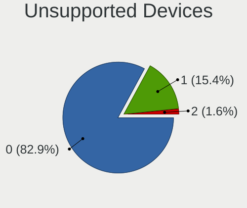

| Total | Desktops | Percent |
|-------|----------|---------|
| 0     | 102      | 82.93%  |
| 1     | 19       | 15.45%  |
| 2     | 2        | 1.63%   |

Unsupported Device Types
------------------------

Types of unsupported devices

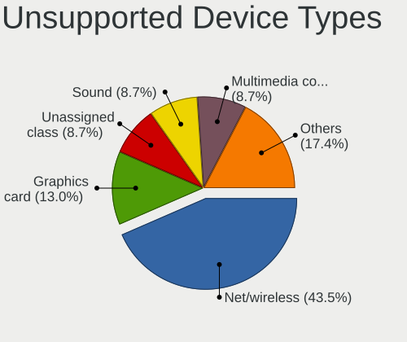

| Type                     | Desktops | Percent |
|--------------------------|----------|---------|
| Net/wireless             | 10       | 43.48%  |
| Graphics card            | 3        | 13.04%  |
| Unassigned class         | 2        | 8.7%    |
| Sound                    | 2        | 8.7%    |
| Multimedia controller    | 2        | 8.7%    |
| Storage/raid             | 1        | 4.35%   |
| Net/ethernet             | 1        | 4.35%   |
| Modem                    | 1        | 4.35%   |
| Communication controller | 1        | 4.35%   |

