Ubuntu Studio - Tested Hardware & Statistics (Desktops)
-------------------------------------------------------

A project to collect tested hardware configurations for Ubuntu Studio.

Anyone can contribute to this report by the [hw-probe](https://github.com/linuxhw/hw-probe) tool:

    sudo -E hw-probe -all -upload

Please contribute! Especially if your hardware is rare.

Contents
--------

* [ Test Cases ](#test-cases)

* [ System ](#system)
  - [ OS                       ](#os)
  - [ OS Family                ](#os-family)
  - [ Kernel                   ](#kernel)
  - [ Kernel Family            ](#kernel-family)
  - [ Kernel Major Ver.        ](#kernel-major-ver)
  - [ Arch                     ](#arch)
  - [ DE                       ](#de)
  - [ Display Server           ](#display-server)
  - [ Display Manager          ](#display-manager)
  - [ OS Lang                  ](#os-lang)
  - [ Boot Mode                ](#boot-mode)
  - [ Filesystem               ](#filesystem)
  - [ Part. scheme             ](#part-scheme)
  - [ Dual Boot with Linux/BSD ](#dual-boot-with-linuxbsd)
  - [ Dual Boot (Win)          ](#dual-boot-win)

* [ Board ](#board)
  - [ Vendor                   ](#vendor)
  - [ Model                    ](#model)
  - [ Model Family             ](#model-family)
  - [ MFG Year                 ](#mfg-year)
  - [ Form Factor              ](#form-factor)
  - [ Secure Boot              ](#secure-boot)
  - [ Coreboot                 ](#coreboot)
  - [ RAM Size                 ](#ram-size)
  - [ RAM Used                 ](#ram-used)
  - [ Total Drives             ](#total-drives)
  - [ Has CD-ROM               ](#has-cd-rom)
  - [ Has Ethernet             ](#has-ethernet)
  - [ Has WiFi                 ](#has-wifi)
  - [ Has Bluetooth            ](#has-bluetooth)

* [ Location ](#location)
  - [ Country                  ](#country)
  - [ City                     ](#city)

* [ Drives ](#drives)
  - [ Drive Vendor             ](#drive-vendor)
  - [ Drive Model              ](#drive-model)
  - [ HDD Vendor               ](#hdd-vendor)
  - [ SSD Vendor               ](#ssd-vendor)
  - [ Drive Kind               ](#drive-kind)
  - [ Drive Connector          ](#drive-connector)
  - [ Drive Size               ](#drive-size)
  - [ Space Total              ](#space-total)
  - [ Space Used               ](#space-used)
  - [ Malfunc. Drives          ](#malfunc-drives)
  - [ Malfunc. Drive Vendor    ](#malfunc-drive-vendor)
  - [ Malfunc. HDD Vendor      ](#malfunc-hdd-vendor)
  - [ Malfunc. Drive Kind      ](#malfunc-drive-kind)
  - [ Failed Drives            ](#failed-drives)
  - [ Failed Drive Vendor      ](#failed-drive-vendor)
  - [ Drive Status             ](#drive-status)

* [ Storage controller ](#storage-controller)
  - [ Storage Vendor           ](#storage-vendor)
  - [ Storage Model            ](#storage-model)
  - [ Storage Kind             ](#storage-kind)

* [ Processor ](#processor)
  - [ CPU Vendor               ](#cpu-vendor)
  - [ CPU Model                ](#cpu-model)
  - [ CPU Model Family         ](#cpu-model-family)
  - [ CPU Cores                ](#cpu-cores)
  - [ CPU Sockets              ](#cpu-sockets)
  - [ CPU Threads              ](#cpu-threads)
  - [ CPU Op-Modes             ](#cpu-op-modes)
  - [ CPU Microcode            ](#cpu-microcode)
  - [ CPU Microarch            ](#cpu-microarch)

* [ Graphics ](#graphics)
  - [ GPU Vendor               ](#gpu-vendor)
  - [ GPU Model                ](#gpu-model)
  - [ GPU Combo                ](#gpu-combo)
  - [ GPU Driver               ](#gpu-driver)
  - [ GPU Memory               ](#gpu-memory)

* [ Monitor ](#monitor)
  - [ Monitor Vendor           ](#monitor-vendor)
  - [ Monitor Model            ](#monitor-model)
  - [ Monitor Resolution       ](#monitor-resolution)
  - [ Monitor Diagonal         ](#monitor-diagonal)
  - [ Monitor Width            ](#monitor-width)
  - [ Aspect Ratio             ](#aspect-ratio)
  - [ Monitor Area             ](#monitor-area)
  - [ Pixel Density            ](#pixel-density)
  - [ Multiple Monitors        ](#multiple-monitors)

* [ Network ](#network)
  - [ Net Controller Vendor    ](#net-controller-vendor)
  - [ Net Controller Model     ](#net-controller-model)
  - [ Wireless Vendor          ](#wireless-vendor)
  - [ Wireless Model           ](#wireless-model)
  - [ Ethernet Vendor          ](#ethernet-vendor)
  - [ Ethernet Model           ](#ethernet-model)
  - [ Net Controller Kind      ](#net-controller-kind)
  - [ Used Controller          ](#used-controller)
  - [ NICs                     ](#nics)
  - [ IPv6                     ](#ipv6)

* [ Bluetooth ](#bluetooth)
  - [ Bluetooth Vendor         ](#bluetooth-vendor)
  - [ Bluetooth Model          ](#bluetooth-model)

* [ Sound ](#sound)
  - [ Sound Vendor             ](#sound-vendor)
  - [ Sound Model              ](#sound-model)

* [ Memory ](#memory)
  - [ Memory Vendor            ](#memory-vendor)
  - [ Memory Model             ](#memory-model)
  - [ Memory Kind              ](#memory-kind)
  - [ Memory Form Factor       ](#memory-form-factor)
  - [ Memory Size              ](#memory-size)
  - [ Memory Speed             ](#memory-speed)

* [ Printers & scanners ](#printers--scanners)
  - [ Printer Vendor           ](#printer-vendor)
  - [ Printer Model            ](#printer-model)
  - [ Scanner Vendor           ](#scanner-vendor)
  - [ Scanner Model            ](#scanner-model)

* [ Camera ](#camera)
  - [ Camera Vendor            ](#camera-vendor)
  - [ Camera Model             ](#camera-model)

* [ Security ](#security)
  - [ Fingerprint Vendor       ](#fingerprint-vendor)
  - [ Fingerprint Model        ](#fingerprint-model)
  - [ Chipcard Vendor          ](#chipcard-vendor)
  - [ Chipcard Model           ](#chipcard-model)

* [ Unsupported ](#unsupported)
  - [ Unsupported Devices      ](#unsupported-devices)
  - [ Unsupported Device Types ](#unsupported-device-types)

Test Cases
----------

Total: 59

| Vendor        | Model                       | Probe                                                      | Date         |
|---------------|-----------------------------|------------------------------------------------------------|--------------|
| Dell          | 0TTDMJ A00                  | [e45e0b0c90](https://linux-hardware.org/?probe=e45e0b0c90) | Jun 29, 2022 |
| ASRock        | B250M-HDV                   | [a4aa661ab1](https://linux-hardware.org/?probe=a4aa661ab1) | Jun 01, 2022 |
| Gigabyte      | A320M-S2H-CF                | [0754e1c6e6](https://linux-hardware.org/?probe=0754e1c6e6) | May 23, 2022 |
| Gigabyte      | F2A78M-HD2                  | [fdc743e9e1](https://linux-hardware.org/?probe=fdc743e9e1) | May 23, 2022 |
| Gigabyte      | A320M-S2H-CF                | [900181bbff](https://linux-hardware.org/?probe=900181bbff) | May 22, 2022 |
| ASUSTek       | Z87-DELUXE                  | [bcd22d5d0e](https://linux-hardware.org/?probe=bcd22d5d0e) | May 20, 2022 |
| Dell          | 0RW203                      | [fc3e449b4d](https://linux-hardware.org/?probe=fc3e449b4d) | May 09, 2022 |
| Gigabyte      | H170-HD3-CF                 | [cebf5b3135](https://linux-hardware.org/?probe=cebf5b3135) | Apr 17, 2022 |
| ASUSTek       | H81M-PLUS                   | [a517bb6633](https://linux-hardware.org/?probe=a517bb6633) | Apr 03, 2022 |
| ASUSTek       | ROG ZENITH II EXTREME AL... | [01ad19348a](https://linux-hardware.org/?probe=01ad19348a) | Mar 20, 2022 |
| ASUSTek       | P5QC                        | [82f706b315](https://linux-hardware.org/?probe=82f706b315) | Feb 11, 2022 |
| Dell          | 055H3G A01                  | [05f63f2396](https://linux-hardware.org/?probe=05f63f2396) | Feb 04, 2022 |
| HP            | 3396                        | [97720dddd1](https://linux-hardware.org/?probe=97720dddd1) | Jan 10, 2022 |
| Fujitsu       | D3230-A1 S26361-D3230-A1    | [7f94c66f93](https://linux-hardware.org/?probe=7f94c66f93) | Jan 09, 2022 |
| AZW           | GK35                        | [ed1be3dbf7](https://linux-hardware.org/?probe=ed1be3dbf7) | Jan 07, 2022 |
| ASUSTek       | ROG STRIX Z490-I GAMING     | [4c55363bc2](https://linux-hardware.org/?probe=4c55363bc2) | Dec 04, 2021 |
| ASUSTek       | H110M-A/M.2                 | [b62225a801](https://linux-hardware.org/?probe=b62225a801) | Jul 24, 2021 |
| HP            | 1495                        | [56251d62e1](https://linux-hardware.org/?probe=56251d62e1) | Jun 17, 2021 |
| Pegatron      | NARRA3                      | [38ac9a9ea6](https://linux-hardware.org/?probe=38ac9a9ea6) | May 18, 2021 |
| HP            | 158A                        | [2fac0fa486](https://linux-hardware.org/?probe=2fac0fa486) | May 01, 2021 |
| Lenovo        | SHARKBAY SDK0E50510 WIN     | [ef264215af](https://linux-hardware.org/?probe=ef264215af) | Apr 24, 2021 |
| ASUSTek       | H110M-A/M.2                 | [04a4129216](https://linux-hardware.org/?probe=04a4129216) | Apr 20, 2021 |
| ASUSTek       | P8P67 EVO                   | [5e98e0ae38](https://linux-hardware.org/?probe=5e98e0ae38) | Apr 14, 2021 |
| Apple         | Mac-7BA5B2D9E42DDD94 iMa... | [43cb3af3a5](https://linux-hardware.org/?probe=43cb3af3a5) | Apr 12, 2021 |
| Foxconn       | 2ABF                        | [9414f40cf2](https://linux-hardware.org/?probe=9414f40cf2) | Apr 03, 2021 |
| Fujitsu       | D3654-C1 S26361-D3654-C1    | [4cd56bcfa1](https://linux-hardware.org/?probe=4cd56bcfa1) | Apr 02, 2021 |
| ASUSTek       | P6T SE                      | [5ff7a11404](https://linux-hardware.org/?probe=5ff7a11404) | Mar 28, 2021 |
| Gigabyte      | X570 AORUS ELITE WIFI       | [7b7a266de6](https://linux-hardware.org/?probe=7b7a266de6) | Mar 22, 2021 |
| Gigabyte      | X570 AORUS ELITE WIFI       | [d9f29b65da](https://linux-hardware.org/?probe=d9f29b65da) | Mar 15, 2021 |
| ASUSTek       | TUF B360-PRO GAMING         | [19bc1494c6](https://linux-hardware.org/?probe=19bc1494c6) | Feb 21, 2021 |
| ASUSTek       | A68HM-PLUS                  | [387cfadf45](https://linux-hardware.org/?probe=387cfadf45) | Feb 06, 2021 |
| IBM           | 8188PPV                     | [6d4f098a65](https://linux-hardware.org/?probe=6d4f098a65) | Jan 31, 2021 |
| Dell          | 02YRK5 A01                  | [6a2d5cd538](https://linux-hardware.org/?probe=6a2d5cd538) | Jan 30, 2021 |
| Gigabyte      | GA-MA770-DS3                | [c9af16a580](https://linux-hardware.org/?probe=c9af16a580) | Jan 24, 2021 |
| Dell          | 0D28YY A03                  | [e74dbb590d](https://linux-hardware.org/?probe=e74dbb590d) | Jan 21, 2021 |
| Intel         | DQ965GF AAD41676-402        | [2e9a342427](https://linux-hardware.org/?probe=2e9a342427) | Jan 13, 2021 |
| Acidanther... | Mac-F60DEB81FF30ACF6 Mac... | [772bf2459f](https://linux-hardware.org/?probe=772bf2459f) | Jan 11, 2021 |
| Gigabyte      | B450M S2H                   | [13edd89415](https://linux-hardware.org/?probe=13edd89415) | Jan 11, 2021 |
| Fujitsu       | D3221-A1 S26361-D3221-A1    | [a8ebb648f7](https://linux-hardware.org/?probe=a8ebb648f7) | Jan 03, 2021 |
| Acer          | Aspire X3400                | [da9e0d0bb4](https://linux-hardware.org/?probe=da9e0d0bb4) | Jan 02, 2021 |
| Packard Be... | WMCP78M                     | [6a6c4577d4](https://linux-hardware.org/?probe=6a6c4577d4) | Dec 31, 2020 |
| HP            | 1850                        | [b86e749745](https://linux-hardware.org/?probe=b86e749745) | Dec 30, 2020 |
| Dell          | 0J3C2F A00                  | [b2e5d9d8b0](https://linux-hardware.org/?probe=b2e5d9d8b0) | Dec 09, 2020 |
| ASUSTek       | M4A88TD-M/USB3              | [2291f0c106](https://linux-hardware.org/?probe=2291f0c106) | Dec 08, 2020 |
| Dell          | 04YP6J A02                  | [6c15ba650c](https://linux-hardware.org/?probe=6c15ba650c) | Dec 06, 2020 |
| MSI           | Z270 MPOWER GAMING TITAN... | [73e35c07b8](https://linux-hardware.org/?probe=73e35c07b8) | Dec 02, 2020 |
| MSI           | Z270 MPOWER GAMING TITAN... | [3b24badd98](https://linux-hardware.org/?probe=3b24badd98) | Dec 02, 2020 |
| Medion        | B360H4-EM V1.0              | [1915ad5c58](https://linux-hardware.org/?probe=1915ad5c58) | Nov 15, 2020 |
| ASUSTek       | CS-B                        | [4e0f76c433](https://linux-hardware.org/?probe=4e0f76c433) | Nov 02, 2020 |
| HP            | 3047h                       | [a23efe0e20](https://linux-hardware.org/?probe=a23efe0e20) | Oct 26, 2020 |
| ASRock        | H55M/USB3                   | [74202436b2](https://linux-hardware.org/?probe=74202436b2) | Oct 18, 2020 |
| Dell          | 0F8098                      | [a2217fa6a7](https://linux-hardware.org/?probe=a2217fa6a7) | Sep 25, 2020 |
| Dell          | 0F8098                      | [2c747bcc47](https://linux-hardware.org/?probe=2c747bcc47) | Sep 25, 2020 |
| ASRock        | X470 Master SLI             | [03bcf3b1fd](https://linux-hardware.org/?probe=03bcf3b1fd) | Sep 02, 2020 |
| ASRock        | B450M Pro4                  | [d2851c54e9](https://linux-hardware.org/?probe=d2851c54e9) | Aug 18, 2020 |
| ASUSTek       | TUF Gaming X570-PLUS        | [96ba8dc0e8](https://linux-hardware.org/?probe=96ba8dc0e8) | Jul 31, 2020 |
| ASUSTek       | H81M-C/BR                   | [d21c458a4f](https://linux-hardware.org/?probe=d21c458a4f) | Jul 24, 2020 |
| Gigabyte      | B450 I AORUS PRO WIFI-CF    | [957ec007de](https://linux-hardware.org/?probe=957ec007de) | Jun 27, 2020 |
| ASUSTek       | M5A78L-M/USB3               | [cb240b6e7e](https://linux-hardware.org/?probe=cb240b6e7e) | Jun 05, 2020 |

System
------

OS
--

Installed operating systems

| Name                | Desktops | Percent |
|---------------------|----------|---------|
| Ubuntu Studio 20.04 | 34       | 65.38%  |
| Ubuntu Studio 20.10 | 9        | 17.31%  |
| Ubuntu Studio 22.04 | 3        | 5.77%   |
| Ubuntu Studio 21.10 | 3        | 5.77%   |
| Ubuntu Studio 21.04 | 2        | 3.85%   |
| Ubuntu Studio 16.04 | 1        | 1.92%   |

OS Family
---------

OS without a version

| Name          | Desktops | Percent |
|---------------|----------|---------|
| Ubuntu Studio | 52       | 100%    |

Kernel
------

Version of the Linux kernel

| Version                  | Desktops | Percent |
|--------------------------|----------|---------|
| 5.11.0-44-lowlatency     | 3        | 5.77%   |
| 5.8.0-48-lowlatency      | 2        | 3.85%   |
| 5.8.0-44-lowlatency      | 2        | 3.85%   |
| 5.8.0-25-lowlatency      | 2        | 3.85%   |
| 5.4.0-58-lowlatency      | 2        | 3.85%   |
| 5.4.0-56-lowlatency      | 2        | 3.85%   |
| 5.4.0-42-lowlatency      | 2        | 3.85%   |
| 5.4.0-26-lowlatency      | 2        | 3.85%   |
| 5.13.0-28-lowlatency     | 2        | 3.85%   |
| 5.8.0-50-lowlatency      | 1        | 1.92%   |
| 5.8.0-45-lowlatency      | 1        | 1.92%   |
| 5.8.0-36-lowlatency      | 1        | 1.92%   |
| 5.8.0-34-lowlatency      | 1        | 1.92%   |
| 5.8.0-33-lowlatency      | 1        | 1.92%   |
| 5.8.0-29-lowlatency      | 1        | 1.92%   |
| 5.4.0-99-lowlatency      | 1        | 1.92%   |
| 5.4.0-72-lowlatency      | 1        | 1.92%   |
| 5.4.0-71-lowlatency      | 1        | 1.92%   |
| 5.4.0-70-lowlatency      | 1        | 1.92%   |
| 5.4.0-65-lowlatency      | 1        | 1.92%   |
| 5.4.0-65-generic         | 1        | 1.92%   |
| 5.4.0-64-lowlatency      | 1        | 1.92%   |
| 5.4.0-62-lowlatency      | 1        | 1.92%   |
| 5.4.0-60-lowlatency      | 1        | 1.92%   |
| 5.4.0-53-lowlatency      | 1        | 1.92%   |
| 5.4.0-52-lowlatency      | 1        | 1.92%   |
| 5.4.0-51-lowlatency      | 1        | 1.92%   |
| 5.4.0-48-lowlatency      | 1        | 1.92%   |
| 5.4.0-47-lowlatency      | 1        | 1.92%   |
| 5.4.0-39-lowlatency      | 1        | 1.92%   |
| 5.4.0-33-lowlatency      | 1        | 1.92%   |
| 5.4.0-110-lowlatency     | 1        | 1.92%   |
| 5.4.0-109-lowlatency     | 1        | 1.92%   |
| 5.15.6-051506-lowlatency | 1        | 1.92%   |
| 5.15.0-40-lowlatency     | 1        | 1.92%   |
| 5.15.0-30-lowlatency     | 1        | 1.92%   |
| 5.15.0-24-lowlatency     | 1        | 1.92%   |
| 5.13.0-35-lowlatency     | 1        | 1.92%   |
| 5.11.0-49-lowlatency     | 1        | 1.92%   |
| 5.11.0-34-lowlatency     | 1        | 1.92%   |
| 5.11.0-18-lowlatency     | 1        | 1.92%   |
| 4.4.0-189-generic        | 1        | 1.92%   |

Kernel Family
-------------

Linux kernel without a distro release

| Version | Desktops | Percent |
|---------|----------|---------|
| 5.4.0   | 26       | 50%     |
| 5.8.0   | 12       | 23.08%  |
| 5.11.0  | 6        | 11.54%  |
| 5.15.0  | 3        | 5.77%   |
| 5.13.0  | 3        | 5.77%   |
| 5.15.6  | 1        | 1.92%   |
| 4.4.0   | 1        | 1.92%   |

Kernel Major Ver.
-----------------

Linux kernel major version

| Version | Desktops | Percent |
|---------|----------|---------|
| 5.4     | 26       | 50%     |
| 5.8     | 12       | 23.08%  |
| 5.11    | 6        | 11.54%  |
| 5.15    | 4        | 7.69%   |
| 5.13    | 3        | 5.77%   |
| 4.4     | 1        | 1.92%   |

Arch
----

OS architecture (x86_64, i586, etc.)

| Name   | Desktops | Percent |
|--------|----------|---------|
| x86_64 | 51       | 98.08%  |
| i686   | 1        | 1.92%   |

DE
--

Desktop Environment

| Name            | Desktops | Percent |
|-----------------|----------|---------|
| XFCE            | 27       | 51.92%  |
| KDE5            | 14       | 26.92%  |
| GNOME           | 5        | 9.62%   |
| MATE            | 2        | 3.85%   |
| LXQt            | 1        | 1.92%   |
| KDE             | 1        | 1.92%   |
| GNOME Flashback | 1        | 1.92%   |
| Cinnamon        | 1        | 1.92%   |

Display Server
--------------

X11 or Wayland

| Name    | Desktops | Percent |
|---------|----------|---------|
| X11     | 48       | 92.31%  |
| Wayland | 2        | 3.85%   |
| Tty     | 2        | 3.85%   |

Display Manager
---------------

SDDM, LightDM, etc.

| Name    | Desktops | Percent |
|---------|----------|---------|
| TDM     | 25       | 48.08%  |
| SDDM    | 13       | 25%     |
| LightDM | 8        | 15.38%  |
| GDM     | 6        | 11.54%  |

OS Lang
-------

Language

| Lang       | Desktops | Percent |
|------------|----------|---------|
| en_US      | 20       | 38.46%  |
| fr_FR      | 6        | 11.54%  |
| de_DE      | 6        | 11.54%  |
| pt_BR      | 4        | 7.69%   |
| en_GB      | 3        | 5.77%   |
| it_IT      | 2        | 3.85%   |
| en_AU      | 2        | 3.85%   |
| nl_NL      | 1        | 1.92%   |
| nl_BE      | 1        | 1.92%   |
| nb_NO      | 1        | 1.92%   |
| fr_FR.UTF8 | 1        | 1.92%   |
| fr_CH      | 1        | 1.92%   |
| es_AR      | 1        | 1.92%   |
| en_DE      | 1        | 1.92%   |
| en_CA      | 1        | 1.92%   |
| ca_ES      | 1        | 1.92%   |

Boot Mode
---------

EFI or BIOS

| Mode | Desktops | Percent |
|------|----------|---------|
| BIOS | 30       | 57.69%  |
| EFI  | 22       | 42.31%  |

Filesystem
----------

Type of filesystem

| Type | Desktops | Percent |
|------|----------|---------|
| Ext4 | 50       | 96.15%  |
| Xfs  | 1        | 1.92%   |
| Ext2 | 1        | 1.92%   |

Part. scheme
------------

Scheme of partitioning

| Type | Desktops | Percent |
|------|----------|---------|
| MBR  | 27       | 51.92%  |
| GPT  | 25       | 48.08%  |

Dual Boot with Linux/BSD
------------------------

Hosting more than one Linux/BSD

| Dual boot | Desktops | Percent |
|-----------|----------|---------|
| No        | 39       | 75%     |
| Yes       | 13       | 25%     |

Dual Boot (Win)
---------------

Hosting Linux and Windows

| Dual boot | Desktops | Percent |
|-----------|----------|---------|
| No        | 29       | 55.77%  |
| Yes       | 23       | 44.23%  |

Board
-----

Vendor
------

Motherboard manufacturer

| Name                | Desktops | Percent |
|---------------------|----------|---------|
| ASUSTek Computer    | 15       | 28.85%  |
| Dell                | 8        | 15.38%  |
| Gigabyte Technology | 7        | 13.46%  |
| Hewlett-Packard     | 5        | 9.62%   |
| Fujitsu             | 3        | 5.77%   |
| ASRock              | 2        | 3.85%   |
| Pegatron            | 1        | 1.92%   |
| Packard Bell        | 1        | 1.92%   |
| MSI                 | 1        | 1.92%   |
| Medion              | 1        | 1.92%   |
| Lenovo              | 1        | 1.92%   |
| Intel               | 1        | 1.92%   |
| IBM                 | 1        | 1.92%   |
| Foxconn             | 1        | 1.92%   |
| AZW                 | 1        | 1.92%   |
| Apple               | 1        | 1.92%   |
| Acidanthera         | 1        | 1.92%   |
| Acer                | 1        | 1.92%   |

Model
-----

Motherboard model

| Name                               | Desktops | Percent |
|------------------------------------|----------|---------|
| ASUS All Series                    | 4        | 7.69%   |
| Dell OptiPlex 790                  | 2        | 3.85%   |
| Pegatron FL368AA-UUZ SR5612CH      | 1        | 1.92%   |
| Packard Bell IMEDIA S3220          | 1        | 1.92%   |
| MSI MS-7A57                        | 1        | 1.92%   |
| Medion MD34207/C746                | 1        | 1.92%   |
| Lenovo ThinkCentre M93p 10A8S45S00 | 1        | 1.92%   |
| Intel DQ965GF HD/FP Audio          | 1        | 1.92%   |
| IBM 8188PPV                        | 1        | 1.92%   |
| HP Z620 Workstation                | 1        | 1.92%   |
| HP Compaq Pro 6305 SFF             | 1        | 1.92%   |
| HP Compaq Elite 8300 CMT           | 1        | 1.92%   |
| HP Compaq 8200 Elite SFF PC        | 1        | 1.92%   |
| HP Compaq 6005 Pro MT PC           | 1        | 1.92%   |
| Gigabyte X570 AORUS ELITE WIFI     | 1        | 1.92%   |
| Gigabyte H170-HD3-CF               | 1        | 1.92%   |
| Gigabyte GA-MA770-DS3              | 1        | 1.92%   |
| Gigabyte F2A78M-HD2                | 1        | 1.92%   |
| Gigabyte B450M S2H                 | 1        | 1.92%   |
| Gigabyte B450 I AORUS PRO WIFI     | 1        | 1.92%   |
| Gigabyte A320M-S2H                 | 1        | 1.92%   |
| Fujitsu ESPRIMO P420               | 1        | 1.92%   |
| Fujitsu ESPRIMO G558               | 1        | 1.92%   |
| Fujitsu ESPRIMO E720               | 1        | 1.92%   |
| Foxconn Pro3500 Series             | 1        | 1.92%   |
| Dell Precision WorkStation T5400   | 1        | 1.92%   |
| Dell OptiPlex GX620                | 1        | 1.92%   |
| Dell OptiPlex 7050                 | 1        | 1.92%   |
| Dell OptiPlex 3040                 | 1        | 1.92%   |
| Dell OptiPlex 3020                 | 1        | 1.92%   |
| Dell Inspiron 3647                 | 1        | 1.92%   |
| AZW GK35                           | 1        | 1.92%   |
| ASUS TUF Gaming X570-PLUS          | 1        | 1.92%   |
| ASUS TUF B360-PRO GAMING           | 1        | 1.92%   |
| ASUS ROG ZENITH II EXTREME ALPHA   | 1        | 1.92%   |
| ASUS ROG STRIX Z490-I GAMING       | 1        | 1.92%   |
| ASUS P8P67 EVO                     | 1        | 1.92%   |
| ASUS P6T SE                        | 1        | 1.92%   |
| ASUS P5QC                          | 1        | 1.92%   |
| ASUS M5A78L-M/USB3                 | 1        | 1.92%   |
| ASUS M4A88TD-M/USB3                | 1        | 1.92%   |
| ASUS H110M-A/M.2                   | 1        | 1.92%   |
| ASUS A68HM-PLUS                    | 1        | 1.92%   |
| ASRock H55M/USB3                   | 1        | 1.92%   |
| ASRock B250M-HDV                   | 1        | 1.92%   |
| Apple iMacPro1,1                   | 1        | 1.92%   |
| Acidanthera MacPro6,1              | 1        | 1.92%   |
| Acer Aspire X3400                  | 1        | 1.92%   |

Model Family
------------

Motherboard model prefix

| Name                  | Desktops | Percent |
|-----------------------|----------|---------|
| Dell OptiPlex         | 6        | 11.54%  |
| HP Compaq             | 4        | 7.69%   |
| ASUS All              | 4        | 7.69%   |
| Fujitsu ESPRIMO       | 3        | 5.77%   |
| ASUS TUF              | 2        | 3.85%   |
| ASUS ROG              | 2        | 3.85%   |
| Pegatron FL368AA-UUZ  | 1        | 1.92%   |
| Packard Bell IMEDIA   | 1        | 1.92%   |
| MSI MS-7A57           | 1        | 1.92%   |
| Medion MD34207        | 1        | 1.92%   |
| Lenovo ThinkCentre    | 1        | 1.92%   |
| Intel DQ965GF         | 1        | 1.92%   |
| IBM 8188PPV           | 1        | 1.92%   |
| HP Z620               | 1        | 1.92%   |
| Gigabyte X570         | 1        | 1.92%   |
| Gigabyte H170-HD3-CF  | 1        | 1.92%   |
| Gigabyte GA-MA770-DS3 | 1        | 1.92%   |
| Gigabyte F2A78M-HD2   | 1        | 1.92%   |
| Gigabyte B450M        | 1        | 1.92%   |
| Gigabyte B450         | 1        | 1.92%   |
| Gigabyte A320M-S2H    | 1        | 1.92%   |
| Foxconn Pro3500       | 1        | 1.92%   |
| Dell Precision        | 1        | 1.92%   |
| Dell Inspiron         | 1        | 1.92%   |
| AZW GK35              | 1        | 1.92%   |
| ASUS P8P67            | 1        | 1.92%   |
| ASUS P6T              | 1        | 1.92%   |
| ASUS P5QC             | 1        | 1.92%   |
| ASUS M5A78L-M         | 1        | 1.92%   |
| ASUS M4A88TD-M        | 1        | 1.92%   |
| ASUS H110M-A          | 1        | 1.92%   |
| ASUS A68HM-PLUS       | 1        | 1.92%   |
| ASRock H55M           | 1        | 1.92%   |
| ASRock B250M-HDV      | 1        | 1.92%   |
| Apple iMacPro1        | 1        | 1.92%   |
| Acidanthera MacPro6   | 1        | 1.92%   |
| Acer Aspire           | 1        | 1.92%   |

MFG Year
--------

Motherboard manufacture year

| Year | Desktops | Percent |
|------|----------|---------|
| 2018 | 5        | 9.62%   |
| 2014 | 5        | 9.62%   |
| 2013 | 5        | 9.62%   |
| 2019 | 4        | 7.69%   |
| 2012 | 4        | 7.69%   |
| 2011 | 4        | 7.69%   |
| 2010 | 4        | 7.69%   |
| 2020 | 3        | 5.77%   |
| 2017 | 3        | 5.77%   |
| 2008 | 3        | 5.77%   |
| 2021 | 2        | 3.85%   |
| 2016 | 2        | 3.85%   |
| 2015 | 2        | 3.85%   |
| 2009 | 2        | 3.85%   |
| 2007 | 2        | 3.85%   |
| 2005 | 2        | 3.85%   |

Form Factor
-----------

Physical design of the computer

| Name    | Desktops | Percent |
|---------|----------|---------|
| Desktop | 52       | 100%    |

Secure Boot
-----------

Enabled or disabled

| State    | Desktops | Percent |
|----------|----------|---------|
| Disabled | 51       | 98.08%  |
| Enabled  | 1        | 1.92%   |

Coreboot
--------

Have coreboot on board

| Used | Desktops | Percent |
|------|----------|---------|
| No   | 52       | 100%    |

RAM Size
--------

Total RAM memory

| Size in GB  | Desktops | Percent |
|-------------|----------|---------|
| 16.01-24.0  | 17       | 32.69%  |
| 4.01-8.0    | 8        | 15.38%  |
| 8.01-16.0   | 8        | 15.38%  |
| 32.01-64.0  | 5        | 9.62%   |
| 3.01-4.0    | 5        | 9.62%   |
| 64.01-256.0 | 4        | 7.69%   |
| 1.01-2.0    | 3        | 5.77%   |
| 24.01-32.0  | 1        | 1.92%   |
| 2.01-3.0    | 1        | 1.92%   |

RAM Used
--------

Used RAM memory

| Used GB    | Desktops | Percent |
|------------|----------|---------|
| 1.01-2.0   | 22       | 42.31%  |
| 2.01-3.0   | 11       | 21.15%  |
| 4.01-8.0   | 8        | 15.38%  |
| 8.01-16.0  | 6        | 11.54%  |
| 3.01-4.0   | 3        | 5.77%   |
| 24.01-32.0 | 1        | 1.92%   |
| 0.51-1.0   | 1        | 1.92%   |

Total Drives
------------

Number of drives on board

| Drives | Desktops | Percent |
|--------|----------|---------|
| 2      | 21       | 40.38%  |
| 1      | 21       | 40.38%  |
| 3      | 5        | 9.62%   |
| 4      | 2        | 3.85%   |
| 11     | 1        | 1.92%   |
| 10     | 1        | 1.92%   |
| 7      | 1        | 1.92%   |

Has CD-ROM
----------

Has CD-ROM on board

| Presented | Desktops | Percent |
|-----------|----------|---------|
| Yes       | 34       | 65.38%  |
| No        | 18       | 34.62%  |

Has Ethernet
------------

Has Ethernet on board

| Presented | Desktops | Percent |
|-----------|----------|---------|
| Yes       | 52       | 100%    |

Has WiFi
--------

Has WiFi module

| Presented | Desktops | Percent |
|-----------|----------|---------|
| No        | 29       | 55.77%  |
| Yes       | 23       | 44.23%  |

Has Bluetooth
-------------

Has Bluetooth module

| Presented | Desktops | Percent |
|-----------|----------|---------|
| No        | 39       | 75%     |
| Yes       | 13       | 25%     |

Location
--------

Country
-------

Geographic location (country)

| Country                | Desktops | Percent |
|------------------------|----------|---------|
| USA                    | 10       | 19.23%  |
| France                 | 9        | 17.31%  |
| Germany                | 8        | 15.38%  |
| Brazil                 | 5        | 9.62%   |
| Italy                  | 4        | 7.69%   |
| Belgium                | 2        | 3.85%   |
| Australia              | 2        | 3.85%   |
| UK                     | 1        | 1.92%   |
| Switzerland            | 1        | 1.92%   |
| Sweden                 | 1        | 1.92%   |
| Spain                  | 1        | 1.92%   |
| Romania                | 1        | 1.92%   |
| Norway                 | 1        | 1.92%   |
| Netherlands            | 1        | 1.92%   |
| Mexico                 | 1        | 1.92%   |
| Kenya                  | 1        | 1.92%   |
| Bosnia and Herzegovina | 1        | 1.92%   |
| Austria                | 1        | 1.92%   |
| Argentina              | 1        | 1.92%   |

City
----

Geographic location (city)

| City                    | Desktops | Percent |
|-------------------------|----------|---------|
| Paris                   | 3        | 5.77%   |
| Houston                 | 2        | 3.85%   |
| Zanesville              | 1        | 1.92%   |
| Villefontaine           | 1        | 1.92%   |
| Turin                   | 1        | 1.92%   |
| Tilburg                 | 1        | 1.92%   |
| Stuttgart               | 1        | 1.92%   |
| Stockholm               | 1        | 1.92%   |
| Sherman Oaks            | 1        | 1.92%   |
| Sarajevo                | 1        | 1.92%   |
| Sao Paulo               | 1        | 1.92%   |
| Santa Barbara d'Oeste   | 1        | 1.92%   |
| San Secondo di Pinerolo | 1        | 1.92%   |
| Saint-Ouen-l'Aumone     | 1        | 1.92%   |
| Rio Grande da Serra     | 1        | 1.92%   |
| Rennes                  | 1        | 1.92%   |
| Perth                   | 1        | 1.92%   |
| Palermo                 | 1        | 1.92%   |
| Oslo                    | 1        | 1.92%   |
| Olympia                 | 1        | 1.92%   |
| Oldenburg               | 1        | 1.92%   |
| Naumburg                | 1        | 1.92%   |
| Nairobi                 | 1        | 1.92%   |
| Modesto                 | 1        | 1.92%   |
| Mérida                 | 1        | 1.92%   |
| Merced                  | 1        | 1.92%   |
| Maidenhead              | 1        | 1.92%   |
| Lyon                    | 1        | 1.92%   |
| Lomas de Zamora         | 1        | 1.92%   |
| Limbach-Oberfrohna      | 1        | 1.92%   |
| Leongatha               | 1        | 1.92%   |
| Langenhagen             | 1        | 1.92%   |
| Haldensleben I          | 1        | 1.92%   |
| Haar                    | 1        | 1.92%   |
| Gresham                 | 1        | 1.92%   |
| Graz                    | 1        | 1.92%   |
| Geneva                  | 1        | 1.92%   |
| Formosa                 | 1        | 1.92%   |
| Évreux                 | 1        | 1.92%   |
| Ephrata                 | 1        | 1.92%   |
| Diessen am Ammersee     | 1        | 1.92%   |
| Curitiba                | 1        | 1.92%   |
| Cape Coral              | 1        | 1.92%   |
| Bucharest               | 1        | 1.92%   |
| Brussels                | 1        | 1.92%   |
| Bologna                 | 1        | 1.92%   |
| Boisjean                | 1        | 1.92%   |
| Badalona                | 1        | 1.92%   |
| Antwerp                 | 1        | 1.92%   |

Drives
------

Drive Vendor
------------

Hard drive vendors

| Vendor              | Desktops | Drives | Percent |
|---------------------|----------|--------|---------|
| WDC                 | 16       | 21     | 17.2%   |
| Seagate             | 16       | 24     | 17.2%   |
| Samsung Electronics | 15       | 22     | 16.13%  |
| Toshiba             | 6        | 7      | 6.45%   |
| SanDisk             | 5        | 5      | 5.38%   |
| Kingston            | 4        | 4      | 4.3%    |
| Hitachi             | 3        | 3      | 3.23%   |
| HGST                | 3        | 3      | 3.23%   |
| Crucial             | 3        | 3      | 3.23%   |
| Intel               | 2        | 2      | 2.15%   |
| A-DATA Technology   | 2        | 2      | 2.15%   |
| USB 3.0             | 1        | 2      | 1.08%   |
| TO Exter            | 1        | 1      | 1.08%   |
| SPCC                | 1        | 1      | 1.08%   |
| Phison Electronics  | 1        | 1      | 1.08%   |
| Patriot             | 1        | 1      | 1.08%   |
| OCZ                 | 1        | 1      | 1.08%   |
| NGFF                | 1        | 1      | 1.08%   |
| Micron Technology   | 1        | 1      | 1.08%   |
| Maxtor              | 1        | 1      | 1.08%   |
| Leven               | 1        | 1      | 1.08%   |
| Intenso             | 1        | 1      | 1.08%   |
| Integral            | 1        | 1      | 1.08%   |
| Fujitsu             | 1        | 1      | 1.08%   |
| Corsair             | 1        | 1      | 1.08%   |
| China               | 1        | 1      | 1.08%   |
| BHT                 | 1        | 1      | 1.08%   |
| ASMT                | 1        | 1      | 1.08%   |
| Apple               | 1        | 1      | 1.08%   |

Drive Model
-----------

Hard drive models

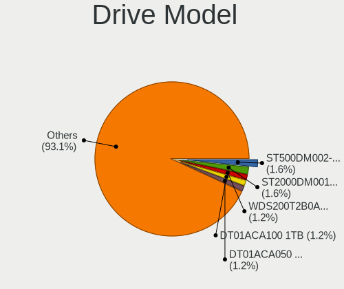

| Model                           | Desktops | Percent |
|---------------------------------|----------|---------|
| Seagate ST500DM002-1BD142 500GB | 3        | 2.7%    |
| Seagate ST2000DM001-1ER164 2TB  | 3        | 2.7%    |
| Seagate Expansion 1TB           | 2        | 1.8%    |
| SanDisk SDSSDA240G 240GB        | 2        | 1.8%    |
| Samsung SSD 970 EVO Plus 500GB  | 2        | 1.8%    |
| Samsung SSD 870 EVO 1TB         | 2        | 1.8%    |
| Samsung SSD 850 EVO 500GB       | 2        | 1.8%    |
| WDC WDS200T2B0A-00SM50 2TB SSD  | 1        | 0.9%    |
| WDC WD6400AAKS-22A7B2 640GB     | 1        | 0.9%    |
| WDC WD5000AAKS-75V0A0 500GB     | 1        | 0.9%    |
| WDC WD40EZRZ-00GXCB0 4TB        | 1        | 0.9%    |
| WDC WD3200BEVT-22ZCT0 320GB     | 1        | 0.9%    |
| WDC WD3200AAKS-00VYA0 320GB     | 1        | 0.9%    |
| WDC WD30EZRZ-00Z5HB0 3TB        | 1        | 0.9%    |
| WDC WD30EZRX-00SPEB0 3TB        | 1        | 0.9%    |
| WDC WD2500AAKX-001CA0 250GB     | 1        | 0.9%    |
| WDC WD20EZRX-00D8PB0 2TB        | 1        | 0.9%    |
| WDC WD20EZAZ-00GGJB0 2TB        | 1        | 0.9%    |
| WDC WD1600AAJS-60Z0A0 160GB     | 1        | 0.9%    |
| WDC WD1600AAJS-08L7A0 160GB     | 1        | 0.9%    |
| WDC WD10EZEX-22RKKA0 1TB        | 1        | 0.9%    |
| WDC WD10EZEX-22MFCA0 1TB        | 1        | 0.9%    |
| WDC WD10EZEX-22BN5A0 1TB        | 1        | 0.9%    |
| WDC WD10EZEX-08WN4A0 1TB        | 1        | 0.9%    |
| WDC WD10EAVS-00D7B1 1TB         | 1        | 0.9%    |
| WDC WD10EARS-00Y5B1 1TB         | 1        | 0.9%    |
| WDC WD10EADS-00L5B1 1TB         | 1        | 0.9%    |
| WDC WD1003FBYZ-010FB0 1TB       | 1        | 0.9%    |
| USB 3.0 Disk 640GB              | 1        | 0.9%    |
| Toshiba MQ01ABB200 2TB          | 1        | 0.9%    |
| Toshiba HDWE150 5TB             | 1        | 0.9%    |
| Toshiba HDWE140 4TB             | 1        | 0.9%    |
| Toshiba HDWD130 3TB             | 1        | 0.9%    |
| Toshiba DT01ACA200 2TB          | 1        | 0.9%    |
| Toshiba DT01ACA100 1TB          | 1        | 0.9%    |
| Toshiba DT01ACA050 500GB        | 1        | 0.9%    |
| TO Exter nal USB 3.0 256GB      | 1        | 0.9%    |
| SPCC Solid State Disk 256GB     | 1        | 0.9%    |
| Seagate ST8000NM0105 8TB        | 1        | 0.9%    |
| Seagate ST8000DM004-2CX188 8TB  | 1        | 0.9%    |
| Seagate ST5000LM000-2AN170 5TB  | 1        | 0.9%    |
| Seagate ST3320820AS 320GB       | 1        | 0.9%    |
| Seagate ST3320620AS 320GB       | 1        | 0.9%    |
| Seagate ST3250410AS 250GB       | 1        | 0.9%    |
| Seagate ST2000LX001-1RG174 2TB  | 1        | 0.9%    |
| Seagate ST2000DM008-2FR102 2TB  | 1        | 0.9%    |
| Seagate ST1000VM002-9ZL162 1TB  | 1        | 0.9%    |
| Seagate ST1000DM003-1CH162 1TB  | 1        | 0.9%    |
| Seagate ST1000DL004 HD105SI 1TB | 1        | 0.9%    |
| Seagate Expansion+ Desk 4TB     | 1        | 0.9%    |
| Seagate BUP Portable 5TB        | 1        | 0.9%    |
| Seagate Backup+ Hub BK 8TB      | 1        | 0.9%    |
| Seagate Backup+ BK 2TB          | 1        | 0.9%    |
| SanDisk SSD PLUS 240GB          | 1        | 0.9%    |
| SanDisk SDSSDP064G 64GB         | 1        | 0.9%    |
| SanDisk SDSSDH3500G 500GB       | 1        | 0.9%    |
| Samsung SSD 980 PRO 2TB         | 1        | 0.9%    |
| Samsung SSD 980 PRO 1TB         | 1        | 0.9%    |
| Samsung SSD 970 EVO Plus 1TB    | 1        | 0.9%    |
| Samsung SSD 960 PRO 512GB       | 1        | 0.9%    |

HDD Vendor
----------

Hard disk drive vendors

| Vendor              | Desktops | Drives | Percent |
|---------------------|----------|--------|---------|
| Seagate             | 16       | 23     | 33.33%  |
| WDC                 | 15       | 20     | 31.25%  |
| Toshiba             | 6        | 7      | 12.5%   |
| Hitachi             | 3        | 3      | 6.25%   |
| HGST                | 3        | 3      | 6.25%   |
| Samsung Electronics | 2        | 2      | 4.17%   |
| USB 3.0             | 1        | 2      | 2.08%   |
| Maxtor              | 1        | 1      | 2.08%   |
| Fujitsu             | 1        | 1      | 2.08%   |

SSD Vendor
----------

Solid state drive vendors

| Vendor              | Desktops | Drives | Percent |
|---------------------|----------|--------|---------|
| Samsung Electronics | 9        | 12     | 24.32%  |
| SanDisk             | 5        | 5      | 13.51%  |
| Kingston            | 4        | 4      | 10.81%  |
| Crucial             | 3        | 3      | 8.11%   |
| A-DATA Technology   | 2        | 2      | 5.41%   |
| WDC                 | 1        | 1      | 2.7%    |
| TO Exter            | 1        | 1      | 2.7%    |
| SPCC                | 1        | 1      | 2.7%    |
| Patriot             | 1        | 1      | 2.7%    |
| OCZ                 | 1        | 1      | 2.7%    |
| NGFF                | 1        | 1      | 2.7%    |
| Micron Technology   | 1        | 1      | 2.7%    |
| Leven               | 1        | 1      | 2.7%    |
| Intenso             | 1        | 1      | 2.7%    |
| Integral            | 1        | 1      | 2.7%    |
| Corsair             | 1        | 1      | 2.7%    |
| China               | 1        | 1      | 2.7%    |
| BHT                 | 1        | 1      | 2.7%    |
| ASMT                | 1        | 1      | 2.7%    |

Drive Kind
----------

HDD or SSD

| Kind    | Desktops | Drives | Percent |
|---------|----------|--------|---------|
| HDD     | 35       | 62     | 46.67%  |
| SSD     | 31       | 40     | 41.33%  |
| NVMe    | 8        | 12     | 10.67%  |
| Unknown | 1        | 1      | 1.33%   |

Drive Connector
---------------

SATA, SAS, NVMe, etc.

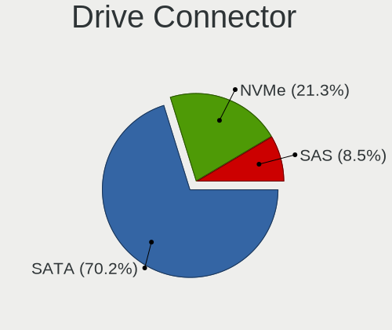

| Type | Desktops | Drives | Percent |
|------|----------|--------|---------|
| SATA | 49       | 93     | 77.78%  |
| NVMe | 8        | 12     | 12.7%   |
| SAS  | 6        | 10     | 9.52%   |

Drive Size
----------

Size of hard drive

| Size in TB | Desktops | Drives | Percent |
|------------|----------|--------|---------|
| 0.01-0.5   | 34       | 48     | 44.74%  |
| 0.51-1.0   | 24       | 30     | 31.58%  |
| 1.01-2.0   | 8        | 10     | 10.53%  |
| 3.01-4.0   | 4        | 4      | 5.26%   |
| 4.01-10.0  | 4        | 7      | 5.26%   |
| 2.01-3.0   | 2        | 3      | 2.63%   |

Space Total
-----------

Amount of disk space available on the file system

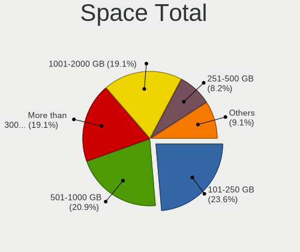

| Size in GB     | Desktops | Percent |
|----------------|----------|---------|
| 101-250        | 19       | 36.54%  |
| 501-1000       | 10       | 19.23%  |
| 1001-2000      | 8        | 15.38%  |
| More than 3000 | 7        | 13.46%  |
| 251-500        | 3        | 5.77%   |
| 21-50          | 2        | 3.85%   |
| 51-100         | 2        | 3.85%   |
| 1-20           | 1        | 1.92%   |

Space Used
----------

Amount of used disk space

| Used GB        | Desktops | Percent |
|----------------|----------|---------|
| 1-20           | 18       | 34.62%  |
| 21-50          | 10       | 19.23%  |
| 101-250        | 5        | 9.62%   |
| 51-100         | 5        | 9.62%   |
| More than 3000 | 4        | 7.69%   |
| 501-1000       | 4        | 7.69%   |
| 251-500        | 3        | 5.77%   |
| 1001-2000      | 2        | 3.85%   |
| 2001-3000      | 1        | 1.92%   |

Malfunc. Drives
---------------

Drive models with a malfunction

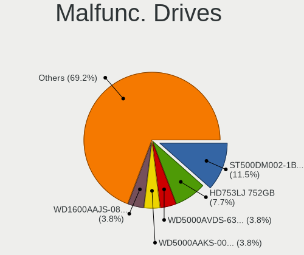

| Model                                 | Desktops | Drives | Percent |
|---------------------------------------|----------|--------|---------|
| Seagate ST500DM002-1BD142 500GB       | 2        | 2      | 15.38%  |
| WDC WD1600AAJS-08L7A0 160GB           | 1        | 1      | 7.69%   |
| WDC WD10EZEX-22BN5A0 1TB              | 1        | 1      | 7.69%   |
| Toshiba HDWE140 4TB                   | 1        | 1      | 7.69%   |
| Seagate ST3320820AS 320GB             | 1        | 1      | 7.69%   |
| Seagate ST1000VM002-9ZL162 1TB        | 1        | 1      | 7.69%   |
| Samsung Electronics SSD 960 PRO 512GB | 1        | 1      | 7.69%   |
| Samsung Electronics HD753LJ 752GB     | 1        | 1      | 7.69%   |
| Hitachi HDS5C1010CLA382 1TB           | 1        | 1      | 7.69%   |
| HGST HTS721010A9 1TB                  | 1        | 1      | 7.69%   |
| A-DATA Technology SU650 240GB SSD     | 1        | 1      | 7.69%   |
| A-DATA Technology SP550 240GB SSD     | 1        | 1      | 7.69%   |

Malfunc. Drive Vendor
---------------------

Vendors of faulty drives

| Vendor              | Desktops | Drives | Percent |
|---------------------|----------|--------|---------|
| Seagate             | 4        | 4      | 30.77%  |
| WDC                 | 2        | 2      | 15.38%  |
| Samsung Electronics | 2        | 2      | 15.38%  |
| A-DATA Technology   | 2        | 2      | 15.38%  |
| Toshiba             | 1        | 1      | 7.69%   |
| Hitachi             | 1        | 1      | 7.69%   |
| HGST                | 1        | 1      | 7.69%   |

Malfunc. HDD Vendor
-------------------

Vendors of faulty HDD drives

| Vendor              | Desktops | Drives | Percent |
|---------------------|----------|--------|---------|
| Seagate             | 4        | 4      | 40%     |
| WDC                 | 2        | 2      | 20%     |
| Toshiba             | 1        | 1      | 10%     |
| Samsung Electronics | 1        | 1      | 10%     |
| Hitachi             | 1        | 1      | 10%     |
| HGST                | 1        | 1      | 10%     |

Malfunc. Drive Kind
-------------------

Kinds of faulty drives

| Kind | Desktops | Drives | Percent |
|------|----------|--------|---------|
| HDD  | 9        | 10     | 75%     |
| SSD  | 2        | 2      | 16.67%  |
| NVMe | 1        | 1      | 8.33%   |

Failed Drives
-------------

Failed drive models

| Model                   | Desktops | Drives | Percent |
|-------------------------|----------|--------|---------|
| WDC WD10EAVS-00D7B1 1TB | 1        | 1      | 100%    |

Failed Drive Vendor
-------------------

Failed drive vendors

| Vendor | Desktops | Drives | Percent |
|--------|----------|--------|---------|
| WDC    | 1        | 1      | 100%    |

Drive Status
------------

Number of failed and malfunc. drives

| Status   | Desktops | Drives | Percent |
|----------|----------|--------|---------|
| Works    | 47       | 91     | 71.21%  |
| Malfunc  | 12       | 13     | 18.18%  |
| Detected | 6        | 10     | 9.09%   |
| Failed   | 1        | 1      | 1.52%   |

Storage controller
------------------

Storage Vendor
--------------

Storage controller vendors

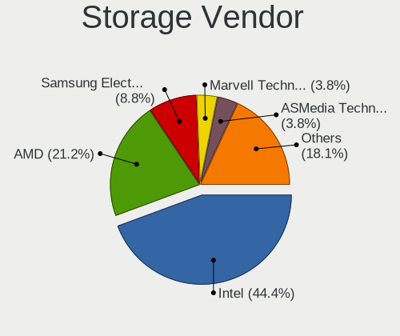

| Vendor                   | Desktops | Percent |
|--------------------------|----------|---------|
| Intel                    | 35       | 50%     |
| AMD                      | 13       | 18.57%  |
| Samsung Electronics      | 5        | 7.14%   |
| ASMedia Technology       | 5        | 7.14%   |
| Nvidia                   | 3        | 4.29%   |
| Marvell Technology Group | 3        | 4.29%   |
| JMicron Technology       | 2        | 2.86%   |
| VIA Technologies         | 1        | 1.43%   |
| Silicon Image            | 1        | 1.43%   |
| Phison Electronics       | 1        | 1.43%   |
| Apple                    | 1        | 1.43%   |

Storage Model
-------------

Storage controller models

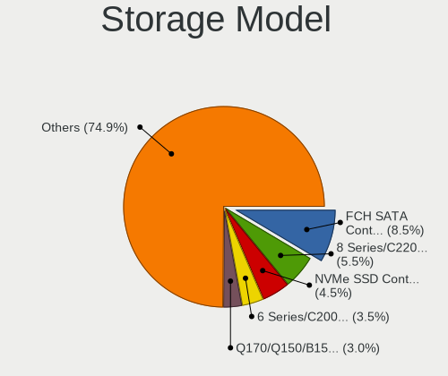

| Model                                                                                   | Desktops | Percent |
|-----------------------------------------------------------------------------------------|----------|---------|
| Intel 8 Series/C220 Series Chipset Family 6-port SATA Controller 1 [AHCI mode]          | 8        | 8.51%   |
| AMD FCH SATA Controller [AHCI mode]                                                     | 8        | 8.51%   |
| ASMedia ASM1062 Serial ATA Controller                                                   | 5        | 5.32%   |
| Samsung NVMe SSD Controller SM981/PM981/PM983                                           | 4        | 4.26%   |
| Intel 6 Series/C200 Series Chipset Family 6 port Desktop SATA AHCI Controller           | 4        | 4.26%   |
| Intel Q170/Q150/B150/H170/H110/Z170/CM236 Chipset SATA Controller [AHCI Mode]           | 3        | 3.19%   |
| Intel 200 Series PCH SATA controller [AHCI mode]                                        | 3        | 3.19%   |
| Samsung NVMe SSD Controller SM961/PM961/SM963                                           | 2        | 2.13%   |
| Nvidia MCP78S [GeForce 8200] IDE                                                        | 2        | 2.13%   |
| Nvidia MCP78S [GeForce 8200] AHCI Controller                                            | 2        | 2.13%   |
| Intel Cannon Lake PCH SATA AHCI Controller                                              | 2        | 2.13%   |
| Intel 82801JI (ICH10 Family) 4 port SATA IDE Controller #1                              | 2        | 2.13%   |
| Intel 82801JI (ICH10 Family) 2 port SATA IDE Controller #2                              | 2        | 2.13%   |
| Intel 7 Series/C210 Series Chipset Family 6-port SATA Controller [AHCI mode]            | 2        | 2.13%   |
| AMD SB7x0/SB8x0/SB9x0 SATA Controller [IDE mode]                                        | 2        | 2.13%   |
| AMD SB7x0/SB8x0/SB9x0 IDE Controller                                                    | 2        | 2.13%   |
| AMD 400 Series Chipset SATA Controller                                                  | 2        | 2.13%   |
| VIA VT6415 PATA IDE Host Controller                                                     | 1        | 1.06%   |
| Silicon Image SiI 3132 Serial ATA Raid II Controller                                    | 1        | 1.06%   |
| Samsung NVMe SSD Controller PM9A1/PM9A3/980PRO                                          | 1        | 1.06%   |
| Phison E12 NVMe Controller                                                              | 1        | 1.06%   |
| Nvidia MCP61 SATA Controller                                                            | 1        | 1.06%   |
| Nvidia MCP61 IDE                                                                        | 1        | 1.06%   |
| Marvell Group 88SE9172 SATA 6Gb/s Controller                                            | 1        | 1.06%   |
| Marvell Group 88SE6111/6121 SATA II / PATA Controller                                   | 1        | 1.06%   |
| Marvell Group 88SE6101/6102 single-port PATA133 interface                               | 1        | 1.06%   |
| JMicron JMB363 SATA/IDE Controller                                                      | 1        | 1.06%   |
| JMicron JMB362 SATA Controller                                                          | 1        | 1.06%   |
| Intel SSD Pro 7600p/760p/E 6100p Series                                                 | 1        | 1.06%   |
| Intel SATA Controller [RAID mode]                                                       | 1        | 1.06%   |
| Intel NVMe Optane Memory Series                                                         | 1        | 1.06%   |
| Intel NM10/ICH7 Family SATA Controller [IDE mode]                                       | 1        | 1.06%   |
| Intel Comet Lake SATA AHCI Controller                                                   | 1        | 1.06%   |
| Intel Celeron N3350/Pentium N4200/Atom E3900 Series SATA AHCI Controller                | 1        | 1.06%   |
| Intel C602 chipset 4-Port SATA Storage Control Unit                                     | 1        | 1.06%   |
| Intel C600/X79 series chipset SATA RAID Controller                                      | 1        | 1.06%   |
| Intel C600/X79 series chipset IDE-r Controller                                          | 1        | 1.06%   |
| Intel 82Q963/Q965 PT IDER Controller                                                    | 1        | 1.06%   |
| Intel 82801HR/HO/HH (ICH8R/DO/DH) 2 port SATA Controller [IDE mode]                     | 1        | 1.06%   |
| Intel 82801H (ICH8 Family) 4 port SATA Controller [IDE mode]                            | 1        | 1.06%   |
| Intel 82801G (ICH7 Family) IDE Controller                                               | 1        | 1.06%   |
| Intel 82801EB (ICH5) SATA Controller                                                    | 1        | 1.06%   |
| Intel 8 Series/C220 Series Chipset Family 4-port SATA Controller 1 [IDE mode]           | 1        | 1.06%   |
| Intel 8 Series/C220 Series Chipset Family 2-port SATA Controller 2 [IDE mode]           | 1        | 1.06%   |
| Intel 631xESB/632xESB SATA AHCI Controller                                              | 1        | 1.06%   |
| Intel 631xESB/632xESB IDE Controller                                                    | 1        | 1.06%   |
| Intel 6 Series/C200 Series Chipset Family Desktop SATA Controller (IDE mode, ports 4-5) | 1        | 1.06%   |
| Intel 6 Series/C200 Series Chipset Family Desktop SATA Controller (IDE mode, ports 0-3) | 1        | 1.06%   |
| Intel 5 Series/3400 Series Chipset 4 port SATA IDE Controller                           | 1        | 1.06%   |
| Intel 5 Series/3400 Series Chipset 2 port SATA IDE Controller                           | 1        | 1.06%   |
| Apple ANS2 NVMe Controller                                                              | 1        | 1.06%   |
| AMD SB7x0/SB8x0/SB9x0 SATA Controller [AHCI mode]                                       | 1        | 1.06%   |
| AMD SB600 Non-Raid-5 SATA                                                               | 1        | 1.06%   |
| AMD SB600 IDE                                                                           | 1        | 1.06%   |
| AMD FCH SATA Controller D                                                               | 1        | 1.06%   |
| AMD FCH IDE Controller                                                                  | 1        | 1.06%   |

Storage Kind
------------

Kind of storage controller (IDE, SATA, NVMe, SAS, ...)

| Kind | Desktops | Percent |
|------|----------|---------|
| SATA | 40       | 57.97%  |
| IDE  | 17       | 24.64%  |
| NVMe | 8        | 11.59%  |
| RAID | 3        | 4.35%   |
| SAS  | 1        | 1.45%   |

Processor
---------

CPU Vendor
----------

Processor vendors

| Vendor | Desktops | Percent |
|--------|----------|---------|
| Intel  | 36       | 69.23%  |
| AMD    | 16       | 30.77%  |

CPU Model
---------

Processor models

| Model                                           | Desktops | Percent |
|-------------------------------------------------|----------|---------|
| Intel Core i5-6500 CPU @ 3.20GHz                | 3        | 5.77%   |
| Intel Core i5-3470 CPU @ 3.20GHz                | 3        | 5.77%   |
| Intel Core i7-4790 CPU @ 3.60GHz                | 2        | 3.85%   |
| Intel Core i5-4440 CPU @ 3.10GHz                | 2        | 3.85%   |
| Intel Core i5-2400 CPU @ 3.10GHz                | 2        | 3.85%   |
| Intel Xeon W-2150B CPU @ 3.00GHz                | 1        | 1.92%   |
| Intel Xeon CPU E5420 @ 2.50GHz                  | 1        | 1.92%   |
| Intel Xeon CPU E5-1620 0 @ 3.60GHz              | 1        | 1.92%   |
| Intel Pentium CPU G3220 @ 3.00GHz               | 1        | 1.92%   |
| Intel Pentium 4 CPU 3.20GHz                     | 1        | 1.92%   |
| Intel Pentium 4 CPU 2.80GHz                     | 1        | 1.92%   |
| Intel Core i9-10900K CPU @ 3.70GHz              | 1        | 1.92%   |
| Intel Core i7-9700 CPU @ 3.00GHz                | 1        | 1.92%   |
| Intel Core i7-7700K CPU @ 4.20GHz               | 1        | 1.92%   |
| Intel Core i7-4770K CPU @ 3.50GHz               | 1        | 1.92%   |
| Intel Core i7-2600 CPU @ 3.40GHz                | 1        | 1.92%   |
| Intel Core i7 CPU 930 @ 2.80GHz                 | 1        | 1.92%   |
| Intel Core i5-9400T CPU @ 1.80GHz               | 1        | 1.92%   |
| Intel Core i5-8400 CPU @ 2.80GHz                | 1        | 1.92%   |
| Intel Core i5-6400 CPU @ 2.70GHz                | 1        | 1.92%   |
| Intel Core i5-4590 CPU @ 3.30GHz                | 1        | 1.92%   |
| Intel Core i5-2500K CPU @ 3.30GHz               | 1        | 1.92%   |
| Intel Core i3-6100T CPU @ 3.20GHz               | 1        | 1.92%   |
| Intel Core i3-4340 CPU @ 3.60GHz                | 1        | 1.92%   |
| Intel Core i3-4130 CPU @ 3.40GHz                | 1        | 1.92%   |
| Intel Core i3 CPU 540 @ 3.07GHz                 | 1        | 1.92%   |
| Intel Core 2 Duo CPU E8400 @ 3.00GHz            | 1        | 1.92%   |
| Intel Core 2 CPU 6600 @ 2.40GHz                 | 1        | 1.92%   |
| Intel Celeron CPU J3455 @ 1.50GHz               | 1        | 1.92%   |
| AMD Ryzen Threadripper 3970X 32-Core Processor  | 1        | 1.92%   |
| AMD Ryzen 9 3950X 16-Core Processor             | 1        | 1.92%   |
| AMD Ryzen 7 3800X 8-Core Processor              | 1        | 1.92%   |
| AMD Ryzen 5 5600X 6-Core Processor              | 1        | 1.92%   |
| AMD Ryzen 3 2200G with Radeon Vega Graphics     | 1        | 1.92%   |
| AMD Phenom II X4 B97 Processor                  | 1        | 1.92%   |
| AMD Phenom II X4 B55 Processor                  | 1        | 1.92%   |
| AMD FX-8350 Eight-Core Processor                | 1        | 1.92%   |
| AMD Eng Sample: PD340SC5M4MFH_37/34_Y           | 1        | 1.92%   |
| AMD Athlon X4 845 Quad Core Processor           | 1        | 1.92%   |
| AMD Athlon II X2 240 Processor                  | 1        | 1.92%   |
| AMD Athlon II X2 220 Processor                  | 1        | 1.92%   |
| AMD Athlon Dual Core Processor 4450e            | 1        | 1.92%   |
| AMD Athlon 64 X2 Dual Core Processor 5000+      | 1        | 1.92%   |
| AMD A4-5300B APU with Radeon HD Graphics        | 1        | 1.92%   |
| AMD A10-7850K Radeon R7, 12 Compute Cores 4C+8G | 1        | 1.92%   |

CPU Model Family
----------------

Processor model prefix

| Model                  | Desktops | Percent |
|------------------------|----------|---------|
| Intel Core i5          | 15       | 28.85%  |
| Intel Core i7          | 7        | 13.46%  |
| Intel Core i3          | 4        | 7.69%   |
| Intel Xeon             | 3        | 5.77%   |
| Intel Pentium 4        | 2        | 3.85%   |
| AMD Phenom II X4       | 2        | 3.85%   |
| AMD Athlon II X2       | 2        | 3.85%   |
| Intel Pentium          | 1        | 1.92%   |
| Intel Core i9          | 1        | 1.92%   |
| Intel Core 2 Duo       | 1        | 1.92%   |
| Intel Core 2           | 1        | 1.92%   |
| Intel Celeron          | 1        | 1.92%   |
| AMD Ryzen Threadripper | 1        | 1.92%   |
| AMD Ryzen 9            | 1        | 1.92%   |
| AMD Ryzen 7            | 1        | 1.92%   |
| AMD Ryzen 5            | 1        | 1.92%   |
| AMD Ryzen 3            | 1        | 1.92%   |
| AMD FX                 | 1        | 1.92%   |
| AMD E                  | 1        | 1.92%   |
| AMD Athlon X4          | 1        | 1.92%   |
| AMD Athlon Dual Core   | 1        | 1.92%   |
| AMD Athlon 64 X2       | 1        | 1.92%   |
| AMD A4                 | 1        | 1.92%   |
| AMD A10                | 1        | 1.92%   |

CPU Cores
---------

Number of processor cores

| Number | Desktops | Percent |
|--------|----------|---------|
| 4      | 26       | 50%     |
| 2      | 13       | 25%     |
| 8      | 3        | 5.77%   |
| 6      | 3        | 5.77%   |
| 1      | 3        | 5.77%   |
| 10     | 2        | 3.85%   |
| 32     | 1        | 1.92%   |
| 16     | 1        | 1.92%   |

CPU Sockets
-----------

Number of sockets

| Number | Desktops | Percent |
|--------|----------|---------|
| 1      | 51       | 98.08%  |
| 2      | 1        | 1.92%   |

CPU Threads
-----------

Threads per core (Hyper-Threading)

| Number | Desktops | Percent |
|--------|----------|---------|
| 1      | 28       | 53.85%  |
| 2      | 24       | 46.15%  |

CPU Op-Modes
------------

CPU Operation Modes (32-bit, 64-bit)

| Op mode        | Desktops | Percent |
|----------------|----------|---------|
| 32-bit, 64-bit | 51       | 98.08%  |
| 32-bit         | 1        | 1.92%   |

CPU Microcode
-------------

Microcode number

| Number     | Desktops | Percent |
|------------|----------|---------|
| 0x306c3    | 9        | 17.31%  |
| Unknown    | 7        | 13.46%  |
| 0x206a7    | 4        | 7.69%   |
| 0x506e3    | 3        | 5.77%   |
| 0x306a9    | 3        | 5.77%   |
| 0x010000c8 | 3        | 5.77%   |
| 0xf41      | 2        | 3.85%   |
| 0x906ea    | 2        | 3.85%   |
| 0x10676    | 2        | 3.85%   |
| 0xa0655    | 1        | 1.92%   |
| 0x906ed    | 1        | 1.92%   |
| 0x6f6      | 1        | 1.92%   |
| 0x506ca    | 1        | 1.92%   |
| 0x50654    | 1        | 1.92%   |
| 0x206d7    | 1        | 1.92%   |
| 0x20655    | 1        | 1.92%   |
| 0x106a5    | 1        | 1.92%   |
| 0x0a201009 | 1        | 1.92%   |
| 0x08701021 | 1        | 1.92%   |
| 0x08301039 | 1        | 1.92%   |
| 0x08108109 | 1        | 1.92%   |
| 0x08101016 | 1        | 1.92%   |
| 0x06003106 | 1        | 1.92%   |
| 0x06001119 | 1        | 1.92%   |
| 0x06000852 | 1        | 1.92%   |
| 0x010000c7 | 1        | 1.92%   |

CPU Microarch
-------------

Microarchitecture

| Name        | Desktops | Percent |
|-------------|----------|---------|
| Haswell     | 9        | 17.31%  |
| Skylake     | 6        | 11.54%  |
| SandyBridge | 5        | 9.62%   |
| KabyLake    | 4        | 7.69%   |
| K10         | 4        | 7.69%   |
| Zen 2       | 3        | 5.77%   |
| IvyBridge   | 3        | 5.77%   |
| Piledriver  | 2        | 3.85%   |
| Penryn      | 2        | 3.85%   |
| NetBurst    | 2        | 3.85%   |
| K8 Hammer   | 2        | 3.85%   |
| Zen+        | 1        | 1.92%   |
| Zen 3       | 1        | 1.92%   |
| Zen         | 1        | 1.92%   |
| Westmere    | 1        | 1.92%   |
| Steamroller | 1        | 1.92%   |
| Nehalem     | 1        | 1.92%   |
| Goldmont    | 1        | 1.92%   |
| Excavator   | 1        | 1.92%   |
| Core        | 1        | 1.92%   |
| CometLake   | 1        | 1.92%   |

Graphics
--------

GPU Vendor
----------

Vendors of graphics cards

| Vendor | Desktops | Percent |
|--------|----------|---------|
| Nvidia | 27       | 48.21%  |
| Intel  | 17       | 30.36%  |
| AMD    | 12       | 21.43%  |

GPU Model
---------

Graphics card models

| Model                                                                       | Desktops | Percent |
|-----------------------------------------------------------------------------|----------|---------|
| Intel Xeon E3-1200 v3/4th Gen Core Processor Integrated Graphics Controller | 5        | 8.77%   |
| Nvidia GP108 [GeForce GT 1030]                                              | 3        | 5.26%   |
| Nvidia GP107 [GeForce GTX 1050 Ti]                                          | 3        | 5.26%   |
| Intel HD Graphics 530                                                       | 3        | 5.26%   |
| Nvidia GK208B [GeForce GT 710]                                              | 2        | 3.51%   |
| Nvidia G98 [GeForce 8400 GS Rev. 2]                                         | 2        | 3.51%   |
| AMD Ellesmere [Radeon RX 470/480/570/570X/580/580X/590]                     | 2        | 3.51%   |
| Nvidia TU116 [GeForce GTX 1660]                                             | 1        | 1.75%   |
| Nvidia NV34 [GeForce FX 5500]                                               | 1        | 1.75%   |
| Nvidia GT218 [GeForce 210]                                                  | 1        | 1.75%   |
| Nvidia GT216 [GeForce 315]                                                  | 1        | 1.75%   |
| Nvidia GP104 [GeForce GTX 1080]                                             | 1        | 1.75%   |
| Nvidia GM204 [GeForce GTX 970]                                              | 1        | 1.75%   |
| Nvidia GM107 [GeForce GTX 750 Ti]                                           | 1        | 1.75%   |
| Nvidia GK208B [GeForce GT 730]                                              | 1        | 1.75%   |
| Nvidia GK208 [GeForce GT 720]                                               | 1        | 1.75%   |
| Nvidia GK110 [GeForce GTX 780]                                              | 1        | 1.75%   |
| Nvidia GK106 [GeForce GTX 660]                                              | 1        | 1.75%   |
| Nvidia GF108 [GeForce GT 630]                                               | 1        | 1.75%   |
| Nvidia GA102 [GeForce RTX 3090]                                             | 1        | 1.75%   |
| Nvidia GA102 [GeForce RTX 3080]                                             | 1        | 1.75%   |
| Nvidia G96C [GeForce 9500 GT]                                               | 1        | 1.75%   |
| Nvidia G92 [GeForce 8800 GT]                                                | 1        | 1.75%   |
| Nvidia C77 [GeForce 8200]                                                   | 1        | 1.75%   |
| Nvidia C61 [GeForce 6150SE nForce 430]                                      | 1        | 1.75%   |
| Intel Xeon E3-1200 v2/3rd Gen Core processor Graphics Controller            | 1        | 1.75%   |
| Intel HD Graphics 630                                                       | 1        | 1.75%   |
| Intel HD Graphics 500                                                       | 1        | 1.75%   |
| Intel Core Processor Integrated Graphics Controller                         | 1        | 1.75%   |
| Intel CometLake-S GT2 [UHD Graphics 630]                                    | 1        | 1.75%   |
| Intel CoffeeLake-S GT2 [UHD Graphics 630]                                   | 1        | 1.75%   |
| Intel 82Q963/Q965 Integrated Graphics Controller                            | 1        | 1.75%   |
| Intel 82945G/GZ Integrated Graphics Controller                              | 1        | 1.75%   |
| Intel 4th Generation Core Processor Family Integrated Graphics Controller   | 1        | 1.75%   |
| AMD Vega 10 [Radeon Instinct MI25]                                          | 1        | 1.75%   |
| AMD Trinity 2 [Radeon HD 7480D]                                             | 1        | 1.75%   |
| AMD Raven Ridge [Radeon Vega Series / Radeon Vega Mobile Series]            | 1        | 1.75%   |
| AMD Picasso/Raven 2 [Radeon Vega Series / Radeon Vega Mobile Series]        | 1        | 1.75%   |
| AMD Navi 22 [Radeon RX 6700/6700 XT/6750 XT / 6800M]                        | 1        | 1.75%   |
| AMD Kaveri [Radeon R7 Graphics]                                             | 1        | 1.75%   |
| AMD Hawaii PRO [Radeon R9 290/390]                                          | 1        | 1.75%   |
| AMD Caicos [Radeon HD 6450/7450/8450 / R5 230 OEM]                          | 1        | 1.75%   |
| AMD Caicos XTX [Radeon HD 8490 / R5 235X OEM]                               | 1        | 1.75%   |
| AMD Baffin [Radeon RX 460/560D / Pro 450/455/460/555/555X/560/560X]         | 1        | 1.75%   |

GPU Combo
---------

Combinations of graphics cards

| Name           | Desktops | Percent |
|----------------|----------|---------|
| 1 x Nvidia     | 24       | 46.15%  |
| 1 x Intel      | 14       | 26.92%  |
| 1 x AMD        | 11       | 21.15%  |
| 2 x Nvidia     | 1        | 1.92%   |
| Intel + Nvidia | 1        | 1.92%   |
| AMD + Nvidia   | 1        | 1.92%   |

GPU Driver
----------

Free vs proprietary

| Driver      | Desktops | Percent |
|-------------|----------|---------|
| Free        | 37       | 71.15%  |
| Proprietary | 15       | 28.85%  |

GPU Memory
----------

Total video memory

| Size in GB | Desktops | Percent |
|------------|----------|---------|
| Unknown    | 16       | 30.77%  |
| 1.01-2.0   | 11       | 21.15%  |
| 0.01-0.5   | 7        | 13.46%  |
| 0.51-1.0   | 6        | 11.54%  |
| 3.01-4.0   | 5        | 9.62%   |
| 7.01-8.0   | 2        | 3.85%   |
| 8.01-16.0  | 2        | 3.85%   |
| 5.01-6.0   | 1        | 1.92%   |
| 2.01-3.0   | 1        | 1.92%   |
| 16.01-24.0 | 1        | 1.92%   |

Monitor
-------

Monitor Vendor
--------------

Monitor vendors

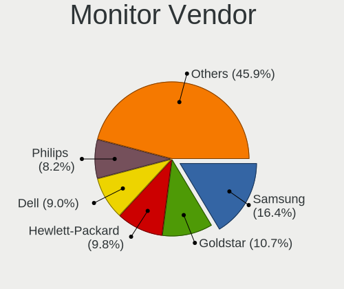

| Vendor               | Desktops | Percent |
|----------------------|----------|---------|
| Samsung Electronics  | 9        | 14.52%  |
| Goldstar             | 8        | 12.9%   |
| Philips              | 6        | 9.68%   |
| Dell                 | 6        | 9.68%   |
| Acer                 | 6        | 9.68%   |
| Ancor Communications | 5        | 8.06%   |
| Hewlett-Packard      | 3        | 4.84%   |
| Eizo                 | 2        | 3.23%   |
| AOC                  | 2        | 3.23%   |
| VIE                  | 1        | 1.61%   |
| Unknown              | 1        | 1.61%   |
| Targa Visionary      | 1        | 1.61%   |
| Sony                 | 1        | 1.61%   |
| Seiki                | 1        | 1.61%   |
| Onkyo                | 1        | 1.61%   |
| NEC Computers        | 1        | 1.61%   |
| Medion               | 1        | 1.61%   |
| KTC                  | 1        | 1.61%   |
| Iiyama               | 1        | 1.61%   |
| Hannspree            | 1        | 1.61%   |
| Fujitsu Siemens      | 1        | 1.61%   |
| DENON                | 1        | 1.61%   |
| ASUSTek Computer     | 1        | 1.61%   |
| Apple                | 1        | 1.61%   |

Monitor Model
-------------

Monitor models

| Model                                                                   | Desktops | Percent |
|-------------------------------------------------------------------------|----------|---------|
| Dell U2412M DELA07A 1920x1200 518x324mm 24.1-inch                       | 2        | 2.94%   |
| VIE LED MONITOR VIE2302 1920x1080 473x296mm 22.0-inch                   | 1        | 1.47%   |
| Unknown LCD Monitor SAMSUNG 5760x2160                                   | 1        | 1.47%   |
| Targa Visionary LCD 24-1 Wide TARA240 1920x1080 521x293mm 23.5-inch     | 1        | 1.47%   |
| Sony TV *00 SNY8004 3840x2160 1218x685mm 55.0-inch                      | 1        | 1.47%   |
| Seiki SE19HE01 SEK078A 1366x768 410x230mm 18.5-inch                     | 1        | 1.47%   |
| Samsung Electronics U32J59x SAM0F35 3840x2160 697x392mm 31.5-inch       | 1        | 1.47%   |
| Samsung Electronics U28E590 SAM0C4E 3840x2160 608x345mm 27.5-inch       | 1        | 1.47%   |
| Samsung Electronics SyncMaster SAM03E0 1440x900 410x257mm 19.1-inch     | 1        | 1.47%   |
| Samsung Electronics SyncMaster SAM02F3 1680x1050 474x296mm 22.0-inch    | 1        | 1.47%   |
| Samsung Electronics SyncMaster SAM01AB 1280x1024 312x234mm 15.4-inch    | 1        | 1.47%   |
| Samsung Electronics SyncMaster SAM010B 1280x1024 340x270mm 17.1-inch    | 1        | 1.47%   |
| Samsung Electronics SMS27A350H SAM07CE 1920x1080 598x336mm 27.0-inch    | 1        | 1.47%   |
| Samsung Electronics SMB2330H SAM064A 1920x1080 509x286mm 23.0-inch      | 1        | 1.47%   |
| Samsung Electronics SMB1930N SAM0632 1366x768 410x230mm 18.5-inch       | 1        | 1.47%   |
| Samsung Electronics SA300/SA350 SAM0789 1366x768 410x230mm 18.5-inch    | 1        | 1.47%   |
| Samsung Electronics LCD Monitor SAM0FEE 3840x2160 1872x1053mm 84.6-inch | 1        | 1.47%   |
| Philips PHL 244E5 PHLC0C0 1920x1080 527x296mm 23.8-inch                 | 1        | 1.47%   |
| Philips 227E4LH PHLC0AC 1920x1080 480x270mm 21.7-inch                   | 1        | 1.47%   |
| Philips 226V4 PHLC0B1 1920x1080 477x268mm 21.5-inch                     | 1        | 1.47%   |
| Philips 201E PHLC033 1600x900 443x249mm 20.0-inch                       | 1        | 1.47%   |
| Philips 190V PHL0847 1280x1024 376x301mm 19.0-inch                      | 1        | 1.47%   |
| Philips 170S PHL081E 1280x1024 338x270mm 17.0-inch                      | 1        | 1.47%   |
| Onkyo HT-R494 ONK0F43 3840x2160 1150x650mm 52.0-inch                    | 1        | 1.47%   |
| NEC Computers LCD2180UX NEC662C 1600x1200 430x320mm 21.1-inch           | 1        | 1.47%   |
| Medion MD32119PR MED89C1 1280x1024 376x301mm 19.0-inch                  | 1        | 1.47%   |
| KTC H-W2206S-D KTC2203 1680x1050 433x270mm 20.1-inch                    | 1        | 1.47%   |
| Iiyama PL2435M IVM6112 1920x1080 521x293mm 23.5-inch                    | 1        | 1.47%   |
| Hewlett-Packard w2207 HWP26A9 1680x1050 473x296mm 22.0-inch             | 1        | 1.47%   |
| Hewlett-Packard LE2202x HWP2966 1920x1080 476x268mm 21.5-inch           | 1        | 1.47%   |
| Hewlett-Packard 24fw HPN3545 1920x1080 527x296mm 23.8-inch              | 1        | 1.47%   |
| Hannspree HF207 HSG18C5 1600x900 443x249mm 20.0-inch                    | 1        | 1.47%   |
| Goldstar W2253 GSM56DC 1920x1080 480x270mm 21.7-inch                    | 1        | 1.47%   |
| Goldstar LG UltraFine GSM5B11                                           | 1        | 1.47%   |
| Goldstar L227W GSM566F 1680x1050 474x296mm 22.0-inch                    | 1        | 1.47%   |
| Goldstar L194WT GSM4B06 1440x900 408x255mm 18.9-inch                    | 1        | 1.47%   |
| Goldstar L1942 GSM4B85 1280x1024 376x301mm 19.0-inch                    | 1        | 1.47%   |
| Goldstar E1960 GSM4BE6 1360x768 406x229mm 18.4-inch                     | 1        | 1.47%   |
| Goldstar BK550Y GSM5B41 1920x1080 480x270mm 21.7-inch                   | 1        | 1.47%   |
| Goldstar 2D FHD TV GSM59C6 1920x1080 509x286mm 23.0-inch                | 1        | 1.47%   |
| Goldstar 2D FHD TV GSM59C4 1920x1080 509x286mm 23.0-inch                | 1        | 1.47%   |
| Fujitsu Siemens B22W-6 LED FUS07F3 1680x1050 474x296mm 22.0-inch        | 1        | 1.47%   |
| Eizo S1910 ENC1786 1280x1024 376x301mm 19.0-inch                        | 1        | 1.47%   |
| Eizo EV2736W ENC2382 2560x1440 597x336mm 27.0-inch                      | 1        | 1.47%   |
| DENON AVRHD DON0042 3840x2160 1120x630mm 50.6-inch                      | 1        | 1.47%   |
| Dell U2412M DELA07B 1920x1200 518x324mm 24.1-inch                       | 1        | 1.47%   |
| Dell SE2216H DELF070 1920x1080 476x268mm 21.5-inch                      | 1        | 1.47%   |
| Dell LCD Monitor S2715H 5760x2160                                       | 1        | 1.47%   |
| Dell E2214H DELA09D 1920x1080 477x268mm 21.5-inch                       | 1        | 1.47%   |
| Dell 2209WA DELF011 1680x1050 474x296mm 22.0-inch                       | 1        | 1.47%   |
| Dell 2209WA DELF010 1680x1050 474x296mm 22.0-inch                       | 1        | 1.47%   |
| ASUSTek Computer PA278QV AUS2701 2560x1440 597x336mm 27.0-inch          | 1        | 1.47%   |
| Apple iMac APPAE1D 3840x2160 597x336mm 27.0-inch                        | 1        | 1.47%   |
| AOC G2460 AOC2460 1920x1080 530x300mm 24.0-inch                         | 1        | 1.47%   |
| AOC 2460G5 AOC0001 1920x1080 530x300mm 24.0-inch                        | 1        | 1.47%   |
| AOC 2436 AOC2436 1920x1080 521x293mm 23.5-inch                          | 1        | 1.47%   |
| Ancor Communications VS278 ACI27A1 1920x1080 598x336mm 27.0-inch        | 1        | 1.47%   |
| Ancor Communications ASUS VW193D ACI19D5 1440x900 410x260mm 19.1-inch   | 1        | 1.47%   |
| Ancor Communications ASUS VS247 ACI249A 1920x1080 521x293mm 23.5-inch   | 1        | 1.47%   |
| Ancor Communications ASUS VS229 ACI22D3 1920x1080 480x270mm 21.7-inch   | 1        | 1.47%   |

Monitor Resolution
------------------

Monitor screen resolution

| Resolution         | Desktops | Percent |
|--------------------|----------|---------|
| 1920x1080 (FHD)    | 24       | 41.38%  |
| 1280x1024 (SXGA)   | 7        | 12.07%  |
| 3840x2160 (4K)     | 6        | 10.34%  |
| 1680x1050 (WSXGA+) | 5        | 8.62%   |
| 1440x900 (WXGA+)   | 3        | 5.17%   |
| 2560x1440 (QHD)    | 2        | 3.45%   |
| 1920x1200 (WUXGA)  | 2        | 3.45%   |
| 1600x900 (HD+)     | 2        | 3.45%   |
| 1366x768 (WXGA)    | 2        | 3.45%   |
| 5760x2160          | 1        | 1.72%   |
| 1600x1200          | 1        | 1.72%   |
| 1400x1050          | 1        | 1.72%   |
| 1360x768           | 1        | 1.72%   |
| Unknown            | 1        | 1.72%   |

Monitor Diagonal
----------------

Diagonal size in inches

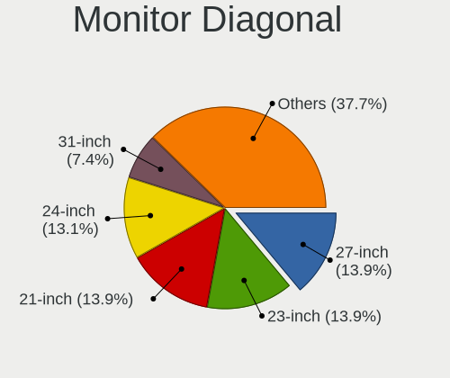

| Inches  | Desktops | Percent |
|---------|----------|---------|
| 21      | 10       | 16.67%  |
| 23      | 9        | 15%     |
| 27      | 7        | 11.67%  |
| 24      | 6        | 10%     |
| 19      | 6        | 10%     |
| 22      | 5        | 8.33%   |
| 20      | 3        | 5%      |
| 18      | 3        | 5%      |
| 17      | 3        | 5%      |
| 84      | 1        | 1.67%   |
| 65      | 1        | 1.67%   |
| 52      | 1        | 1.67%   |
| 50      | 1        | 1.67%   |
| 32      | 1        | 1.67%   |
| 31      | 1        | 1.67%   |
| 15      | 1        | 1.67%   |
| Unknown | 1        | 1.67%   |

Monitor Width
-------------

Physical width

| Width in mm | Desktops | Percent |
|-------------|----------|---------|
| 401-500     | 22       | 38.6%   |
| 501-600     | 20       | 35.09%  |
| 301-350     | 4        | 7.02%   |
| 351-400     | 3        | 5.26%   |
| 1001-1500   | 3        | 5.26%   |
| 601-700     | 2        | 3.51%   |
| 701-800     | 1        | 1.75%   |
| 1501-2000   | 1        | 1.75%   |
| Unknown     | 1        | 1.75%   |

Aspect Ratio
------------

Proportional relationship between the width and the height

| Ratio   | Desktops | Percent |
|---------|----------|---------|
| 16/9    | 35       | 62.5%   |
| 16/10   | 11       | 19.64%  |
| 5/4     | 6        | 10.71%  |
| 4/3     | 2        | 3.57%   |
| 3/2     | 1        | 1.79%   |
| Unknown | 1        | 1.79%   |

Monitor Area
------------

Area in inch²

| Area in inch² | Desktops | Percent |
|----------------|----------|---------|
| 201-250        | 26       | 44.07%  |
| 151-200        | 10       | 16.95%  |
| 301-350        | 7        | 11.86%  |
| 141-150        | 6        | 10.17%  |
| More than 1000 | 4        | 6.78%   |
| 351-500        | 2        | 3.39%   |
| 251-300        | 2        | 3.39%   |
| 111-120        | 1        | 1.69%   |
| Unknown        | 1        | 1.69%   |

Pixel Density
-------------

Pixels per inch

| Density | Desktops | Percent |
|---------|----------|---------|
| 51-100  | 39       | 70.91%  |
| 101-120 | 12       | 21.82%  |
| 121-160 | 2        | 3.64%   |
| 161-240 | 1        | 1.82%   |
| Unknown | 1        | 1.82%   |

Multiple Monitors
-----------------

Total monitors connected

| Total | Desktops | Percent |
|-------|----------|---------|
| 1     | 35       | 67.31%  |
| 2     | 17       | 32.69%  |

Network
-------

Net Controller Vendor
---------------------

Controller vendors

| Vendor                          | Desktops | Percent |
|---------------------------------|----------|---------|
| Realtek Semiconductor           | 29       | 37.66%  |
| Intel                           | 23       | 29.87%  |
| Qualcomm Atheros                | 7        | 9.09%   |
| Broadcom                        | 5        | 6.49%   |
| Nvidia                          | 3        | 3.9%    |
| Aquantia                        | 2        | 2.6%    |
| ZyDAS                           | 1        | 1.3%    |
| Wacom                           | 1        | 1.3%    |
| TP-Link                         | 1        | 1.3%    |
| Qualcomm Atheros Communications | 1        | 1.3%    |
| NetGear                         | 1        | 1.3%    |
| Microsoft                       | 1        | 1.3%    |
| Broadcom Limited                | 1        | 1.3%    |
| ASIX Electronics                | 1        | 1.3%    |

Net Controller Model
--------------------

Controller models

| Model                                                             | Desktops | Percent |
|-------------------------------------------------------------------|----------|---------|
| Realtek RTL8111/8168/8411 PCI Express Gigabit Ethernet Controller | 23       | 27.71%  |
| Intel 82579LM Gigabit Network Connection (Lewisville)             | 6        | 7.23%   |
| Intel Wireless-AC 9260                                            | 3        | 3.61%   |
| Intel I211 Gigabit Network Connection                             | 3        | 3.61%   |
| Qualcomm Atheros AR9485 Wireless Network Adapter                  | 2        | 2.41%   |
| Nvidia MCP77 Ethernet                                             | 2        | 2.41%   |
| Intel Ethernet Connection I217-V                                  | 2        | 2.41%   |
| Intel Ethernet Connection I217-LM                                 | 2        | 2.41%   |
| Intel Ethernet Connection (2) I219-V                              | 2        | 2.41%   |
| Intel Cannon Lake PCH CNVi WiFi                                   | 2        | 2.41%   |
| Aquantia AQC107 NBase-T/IEEE 802.3bz Ethernet Controller [AQtion] | 2        | 2.41%   |
| ZyDAS ZD1211B 802.11g                                             | 1        | 1.2%    |
| Wacom ACK-40401 [Wireless Accessory Kit]                          | 1        | 1.2%    |
| TP-Link AC600 wireless Realtek RTL8811AU [Archer T2U Nano]        | 1        | 1.2%    |
| Realtek RTL8821CE 802.11ac PCIe Wireless Network Adapter          | 1        | 1.2%    |
| Realtek RTL8188CUS 802.11n WLAN Adapter                           | 1        | 1.2%    |
| Realtek RTL8169 PCI Gigabit Ethernet Controller                   | 1        | 1.2%    |
| Realtek RTL8153 Gigabit Ethernet Adapter                          | 1        | 1.2%    |
| Realtek RTL-8185 IEEE 802.11a/b/g Wireless LAN Controller         | 1        | 1.2%    |
| Realtek RTL-8110SC/8169SC Gigabit Ethernet                        | 1        | 1.2%    |
| Realtek 802.11ac NIC                                              | 1        | 1.2%    |
| Qualcomm Atheros QCA9565 / AR9565 Wireless Network Adapter        | 1        | 1.2%    |
| Qualcomm Atheros Killer E2500 Gigabit Ethernet Controller         | 1        | 1.2%    |
| Qualcomm Atheros AR9271 802.11n                                   | 1        | 1.2%    |
| Qualcomm Atheros AR9227 Wireless Network Adapter                  | 1        | 1.2%    |
| Qualcomm Atheros AR8121/AR8113/AR8114 Gigabit or Fast Ethernet    | 1        | 1.2%    |
| Qualcomm Atheros AR5212/5213/2414 Wireless Network Adapter        | 1        | 1.2%    |
| Nvidia MCP61 Ethernet                                             | 1        | 1.2%    |
| NetGear A6100 AC600 DB Wireless Adapter [Realtek RTL8811AU]       | 1        | 1.2%    |
| Microsoft Xbox 360 Wireless Adapter                               | 1        | 1.2%    |
| Intel Wireless 8265 / 8275                                        | 1        | 1.2%    |
| Intel Ethernet Controller I225-V                                  | 1        | 1.2%    |
| Intel Ethernet Connection (7) I219-V                              | 1        | 1.2%    |
| Intel Ethernet Connection (5) I219-LM                             | 1        | 1.2%    |
| Intel 82579V Gigabit Network Connection                           | 1        | 1.2%    |
| Intel 82574L Gigabit Network Connection                           | 1        | 1.2%    |
| Intel 82566DM Gigabit Network Connection                          | 1        | 1.2%    |
| Intel 82562EZ 10/100 Ethernet Controller                          | 1        | 1.2%    |
| Broadcom NetXtreme BCM5761 Gigabit Ethernet PCIe                  | 1        | 1.2%    |
| Broadcom NetXtreme BCM5754 Gigabit Ethernet PCI Express           | 1        | 1.2%    |
| Broadcom NetXtreme BCM5751 Gigabit Ethernet PCI Express           | 1        | 1.2%    |
| Broadcom Limited NetXtreme BCM5761 Gigabit Ethernet PCIe          | 1        | 1.2%    |
| Broadcom BCM4364 802.11ac Wireless Network Adapter                | 1        | 1.2%    |
| Broadcom BCM4352 802.11ac Wireless Network Adapter                | 1        | 1.2%    |
| ASIX AX88772B                                                     | 1        | 1.2%    |

Wireless Vendor
---------------

Wireless vendors

| Vendor                          | Desktops | Percent |
|---------------------------------|----------|---------|
| Intel                           | 6        | 26.09%  |
| Qualcomm Atheros                | 5        | 21.74%  |
| Realtek Semiconductor           | 4        | 17.39%  |
| Broadcom                        | 2        | 8.7%    |
| ZyDAS                           | 1        | 4.35%   |
| Wacom                           | 1        | 4.35%   |
| TP-Link                         | 1        | 4.35%   |
| Qualcomm Atheros Communications | 1        | 4.35%   |
| NetGear                         | 1        | 4.35%   |
| Microsoft                       | 1        | 4.35%   |

Wireless Model
--------------

Wireless models

| Model                                                       | Desktops | Percent |
|-------------------------------------------------------------|----------|---------|
| Intel Wireless-AC 9260                                      | 3        | 13.04%  |
| Qualcomm Atheros AR9485 Wireless Network Adapter            | 2        | 8.7%    |
| Intel Cannon Lake PCH CNVi WiFi                             | 2        | 8.7%    |
| ZyDAS ZD1211B 802.11g                                       | 1        | 4.35%   |
| Wacom ACK-40401 [Wireless Accessory Kit]                    | 1        | 4.35%   |
| TP-Link AC600 wireless Realtek RTL8811AU [Archer T2U Nano]  | 1        | 4.35%   |
| Realtek RTL8821CE 802.11ac PCIe Wireless Network Adapter    | 1        | 4.35%   |
| Realtek RTL8188CUS 802.11n WLAN Adapter                     | 1        | 4.35%   |
| Realtek RTL-8185 IEEE 802.11a/b/g Wireless LAN Controller   | 1        | 4.35%   |
| Realtek 802.11ac NIC                                        | 1        | 4.35%   |
| Qualcomm Atheros QCA9565 / AR9565 Wireless Network Adapter  | 1        | 4.35%   |
| Qualcomm Atheros AR9271 802.11n                             | 1        | 4.35%   |
| Qualcomm Atheros AR9227 Wireless Network Adapter            | 1        | 4.35%   |
| Qualcomm Atheros AR5212/5213/2414 Wireless Network Adapter  | 1        | 4.35%   |
| NetGear A6100 AC600 DB Wireless Adapter [Realtek RTL8811AU] | 1        | 4.35%   |
| Microsoft Xbox 360 Wireless Adapter                         | 1        | 4.35%   |
| Intel Wireless 8265 / 8275                                  | 1        | 4.35%   |
| Broadcom BCM4364 802.11ac Wireless Network Adapter          | 1        | 4.35%   |
| Broadcom BCM4352 802.11ac Wireless Network Adapter          | 1        | 4.35%   |

Ethernet Vendor
---------------

Ethernet vendors

| Vendor                | Desktops | Percent |
|-----------------------|----------|---------|
| Realtek Semiconductor | 26       | 44.07%  |
| Intel                 | 21       | 35.59%  |
| Nvidia                | 3        | 5.08%   |
| Broadcom              | 3        | 5.08%   |
| Qualcomm Atheros      | 2        | 3.39%   |
| Aquantia              | 2        | 3.39%   |
| Broadcom Limited      | 1        | 1.69%   |
| ASIX Electronics      | 1        | 1.69%   |

Ethernet Model
--------------

Ethernet models

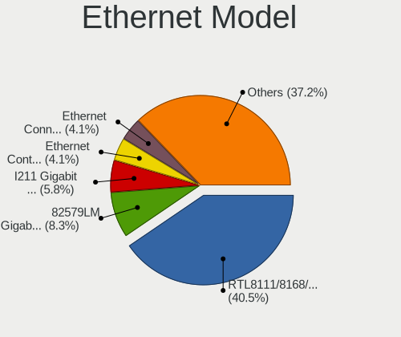

| Model                                                             | Desktops | Percent |
|-------------------------------------------------------------------|----------|---------|
| Realtek RTL8111/8168/8411 PCI Express Gigabit Ethernet Controller | 23       | 38.33%  |
| Intel 82579LM Gigabit Network Connection (Lewisville)             | 6        | 10%     |
| Intel I211 Gigabit Network Connection                             | 3        | 5%      |
| Nvidia MCP77 Ethernet                                             | 2        | 3.33%   |
| Intel Ethernet Connection I217-V                                  | 2        | 3.33%   |
| Intel Ethernet Connection I217-LM                                 | 2        | 3.33%   |
| Intel Ethernet Connection (2) I219-V                              | 2        | 3.33%   |
| Aquantia AQC107 NBase-T/IEEE 802.3bz Ethernet Controller [AQtion] | 2        | 3.33%   |
| Realtek RTL8169 PCI Gigabit Ethernet Controller                   | 1        | 1.67%   |
| Realtek RTL8153 Gigabit Ethernet Adapter                          | 1        | 1.67%   |
| Realtek RTL-8110SC/8169SC Gigabit Ethernet                        | 1        | 1.67%   |
| Qualcomm Atheros Killer E2500 Gigabit Ethernet Controller         | 1        | 1.67%   |
| Qualcomm Atheros AR8121/AR8113/AR8114 Gigabit or Fast Ethernet    | 1        | 1.67%   |
| Nvidia MCP61 Ethernet                                             | 1        | 1.67%   |
| Intel Ethernet Controller I225-V                                  | 1        | 1.67%   |
| Intel Ethernet Connection (7) I219-V                              | 1        | 1.67%   |
| Intel Ethernet Connection (5) I219-LM                             | 1        | 1.67%   |
| Intel 82579V Gigabit Network Connection                           | 1        | 1.67%   |
| Intel 82574L Gigabit Network Connection                           | 1        | 1.67%   |
| Intel 82566DM Gigabit Network Connection                          | 1        | 1.67%   |
| Intel 82562EZ 10/100 Ethernet Controller                          | 1        | 1.67%   |
| Broadcom NetXtreme BCM5761 Gigabit Ethernet PCIe                  | 1        | 1.67%   |
| Broadcom NetXtreme BCM5754 Gigabit Ethernet PCI Express           | 1        | 1.67%   |
| Broadcom NetXtreme BCM5751 Gigabit Ethernet PCI Express           | 1        | 1.67%   |
| Broadcom Limited NetXtreme BCM5761 Gigabit Ethernet PCIe          | 1        | 1.67%   |
| ASIX AX88772B                                                     | 1        | 1.67%   |

Net Controller Kind
-------------------

Ethernet, WiFi or modem

| Kind     | Desktops | Percent |
|----------|----------|---------|
| Ethernet | 52       | 69.33%  |
| WiFi     | 23       | 30.67%  |

Used Controller
---------------

Currently used network controller

| Kind     | Desktops | Percent |
|----------|----------|---------|
| Ethernet | 48       | 82.76%  |
| WiFi     | 10       | 17.24%  |

NICs
----

Total network controllers on board

| Total | Desktops | Percent |
|-------|----------|---------|
| 1     | 32       | 61.54%  |
| 2     | 19       | 36.54%  |
| 3     | 1        | 1.92%   |

IPv6
----

IPv6 vs IPv4

| Used | Desktops | Percent |
|------|----------|---------|
| No   | 46       | 88.46%  |
| Yes  | 6        | 11.54%  |

Bluetooth
---------

Bluetooth Vendor
----------------

Controller vendors

| Vendor                          | Desktops | Percent |
|---------------------------------|----------|---------|
| Intel                           | 6        | 46.15%  |
| Cambridge Silicon Radio         | 3        | 23.08%  |
| Qualcomm Atheros Communications | 2        | 15.38%  |
| Realtek Semiconductor           | 1        | 7.69%   |
| ASUSTek Computer                | 1        | 7.69%   |

Bluetooth Model
---------------

Controller models

| Model                                               | Desktops | Percent |
|-----------------------------------------------------|----------|---------|
| Intel Wireless-AC 9260 Bluetooth Adapter            | 3        | 23.08%  |
| Cambridge Silicon Radio Bluetooth Dongle (HCI mode) | 3        | 23.08%  |
| Intel Bluetooth 9460/9560 Jefferson Peak (JfP)      | 2        | 15.38%  |
| Realtek Bluetooth Radio                             | 1        | 7.69%   |
| Qualcomm Atheros AR9462 Bluetooth                   | 1        | 7.69%   |
| Qualcomm Atheros AR3011 Bluetooth                   | 1        | 7.69%   |
| Intel Bluetooth wireless interface                  | 1        | 7.69%   |
| ASUS BCM20702A0                                     | 1        | 7.69%   |

Sound
-----

Sound Vendor
------------

Sound card vendors

| Vendor                               | Desktops | Percent |
|--------------------------------------|----------|---------|
| Intel                                | 34       | 33.33%  |
| Nvidia                               | 22       | 21.57%  |
| AMD                                  | 16       | 15.69%  |
| Texas Instruments                    | 4        | 3.92%   |
| C-Media Electronics                  | 4        | 3.92%   |
| Yamaha                               | 3        | 2.94%   |
| Logitech                             | 2        | 1.96%   |
| ZOOM                                 | 1        | 0.98%   |
| Thesycon Systemsoftware & Consulting | 1        | 0.98%   |
| Textech International                | 1        | 0.98%   |
| Studiologic                          | 1        | 0.98%   |
| SteelSeries ApS                      | 1        | 0.98%   |
| QinHeng Electronics                  | 1        | 0.98%   |
| Plantronics                          | 1        | 0.98%   |
| Medeli Electronics                   | 1        | 0.98%   |
| Mark of the Unicorn                  | 1        | 0.98%   |
| M-Audio                              | 1        | 0.98%   |
| KTMicro                              | 1        | 0.98%   |
| JMTek                                | 1        | 0.98%   |
| Focusrite-Novation                   | 1        | 0.98%   |
| Ensoniq                              | 1        | 0.98%   |
| BEHRINGER International              | 1        | 0.98%   |
| ASUSTek Computer                     | 1        | 0.98%   |
| Apple                                | 1        | 0.98%   |

Sound Model
-----------

Sound card models

| Model                                                                             | Desktops | Percent |
|-----------------------------------------------------------------------------------|----------|---------|
| Intel 8 Series/C220 Series Chipset High Definition Audio Controller               | 9        | 7.69%   |
| Intel Xeon E3-1200 v3/4th Gen Core Processor HD Audio Controller                  | 6        | 5.13%   |
| Intel 6 Series/C200 Series Chipset Family High Definition Audio Controller        | 5        | 4.27%   |
| Nvidia GK208 HDMI/DP Audio Controller                                             | 4        | 3.42%   |
| Texas Instruments PCM2902 Audio Codec                                             | 3        | 2.56%   |
| Nvidia GP108 High Definition Audio Controller                                     | 3        | 2.56%   |
| Nvidia GP107GL High Definition Audio Controller                                   | 3        | 2.56%   |
| Intel Cannon Lake PCH cAVS                                                        | 3        | 2.56%   |
| Intel 200 Series PCH HD Audio                                                     | 3        | 2.56%   |
| Intel 100 Series/C230 Series Chipset Family HD Audio Controller                   | 3        | 2.56%   |
| AMD Starship/Matisse HD Audio Controller                                          | 3        | 2.56%   |
| AMD SBx00 Azalia (Intel HDA)                                                      | 3        | 2.56%   |
| AMD FCH Azalia Controller                                                         | 3        | 2.56%   |
| Nvidia MCP72XE/MCP72P/MCP78U/MCP78S High Definition Audio                         | 2        | 1.71%   |
| Nvidia GA102 High Definition Audio Controller                                     | 2        | 1.71%   |
| Intel 82801JI (ICH10 Family) HD Audio Controller                                  | 2        | 1.71%   |
| Intel 7 Series/C216 Chipset Family High Definition Audio Controller               | 2        | 1.71%   |
| C-Media Electronics CMI8788 [Oxygen HD Audio]                                     | 2        | 1.71%   |
| AMD Raven/Raven2/Fenghuang HDMI/DP Audio Controller                               | 2        | 1.71%   |
| AMD Family 17h/19h HD Audio Controller                                            | 2        | 1.71%   |
| AMD Ellesmere HDMI Audio [Radeon RX 470/480 / 570/580/590]                        | 2        | 1.71%   |
| AMD Caicos HDMI Audio [Radeon HD 6450 / 7450/8450/8490 OEM / R5 230/235/235X OEM] | 2        | 1.71%   |
| ZOOM U-22                                                                         | 1        | 0.85%   |
| Yamaha YMF-744B [DS-1S Audio Controller]                                          | 1        | 0.85%   |
| Yamaha MG-XU                                                                      | 1        | 0.85%   |
| Yamaha AG06/AG03                                                                  | 1        | 0.85%   |
| Thesycon Systemsoftware & Consulting USB HiRes Audio                              | 1        | 0.85%   |
| Textech International MIDI Interface cable                                        | 1        | 0.85%   |
| Texas Instruments PCM2900 Audio Codec                                             | 1        | 0.85%   |
| Studiologic SL STUDIO                                                             | 1        | 0.85%   |
| SteelSeries ApS Arctis Pro Wireless                                               | 1        | 0.85%   |
| QinHeng Electronics CH345 MIDI adapter                                            | 1        | 0.85%   |
| Plantronics DA40                                                                  | 1        | 0.85%   |
| Nvidia TU116 High Definition Audio Controller                                     | 1        | 0.85%   |
| Nvidia MCP61 High Definition Audio                                                | 1        | 0.85%   |
| Nvidia High Definition Audio Controller                                           | 1        | 0.85%   |
| Nvidia GT216 HDMI Audio Controller                                                | 1        | 0.85%   |
| Nvidia GP104 High Definition Audio Controller                                     | 1        | 0.85%   |
| Nvidia GM204 High Definition Audio Controller                                     | 1        | 0.85%   |
| Nvidia GM107 High Definition Audio Controller [GeForce 940MX]                     | 1        | 0.85%   |
| Nvidia GK110 High Definition Audio Controller                                     | 1        | 0.85%   |
| Nvidia GK106 HDMI Audio Controller                                                | 1        | 0.85%   |
| Nvidia GF108 High Definition Audio Controller                                     | 1        | 0.85%   |
| Medeli Electronics USB Audio Device                                               | 1        | 0.85%   |
| Mark of the Unicorn M Series                                                      | 1        | 0.85%   |
| M-Audio M-Track                                                                   | 1        | 0.85%   |
| Logitech USB Headset                                                              | 1        | 0.85%   |
| Logitech Headset H390                                                             | 1        | 0.85%   |
| KTMicro KT_USB_AUDIO                                                              | 1        | 0.85%   |
| JMTek USB PnP Audio Device                                                        | 1        | 0.85%   |
| Intel Comet Lake PCH cAVS                                                         | 1        | 0.85%   |
| Intel Celeron N3350/Pentium N4200/Atom E3900 Series Audio Cluster                 | 1        | 0.85%   |
| Intel C600/X79 series chipset High Definition Audio Controller                    | 1        | 0.85%   |
| Intel 82801H (ICH8 Family) HD Audio Controller                                    | 1        | 0.85%   |
| Intel 82801G (ICH7 Family) AC'97 Audio Controller                                 | 1        | 0.85%   |
| Intel 82801EB/ER (ICH5/ICH5R) AC'97 Audio Controller                              | 1        | 0.85%   |
| Intel 5 Series/3400 Series Chipset High Definition Audio                          | 1        | 0.85%   |
| Focusrite-Novation Scarlett 2i4 USB                                               | 1        | 0.85%   |
| Ensoniq 5880B / Creative Labs CT5880                                              | 1        | 0.85%   |
| C-Media Electronics CM8888 [Oxygen Express]                                       | 1        | 0.85%   |

Memory
------

Memory Vendor
-------------

Memory module vendors

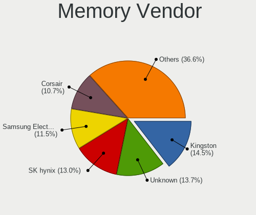

| Vendor              | Desktops | Percent |
|---------------------|----------|---------|
| SK hynix            | 11       | 16.67%  |
| Unknown             | 9        | 13.64%  |
| Samsung Electronics | 9        | 13.64%  |
| Kingston            | 8        | 12.12%  |
| Corsair             | 7        | 10.61%  |
| Crucial             | 6        | 9.09%   |
| Micron Technology   | 4        | 6.06%   |
| G.Skill             | 3        | 4.55%   |
| Patriot             | 2        | 3.03%   |
| Smart               | 1        | 1.52%   |
| S                   | 1        | 1.52%   |
| Nanya Technology    | 1        | 1.52%   |
| M                   | 1        | 1.52%   |
| HBS                 | 1        | 1.52%   |
| Aeneon              | 1        | 1.52%   |
| 0194808980CE        | 1        | 1.52%   |

Memory Model
------------

Memory module models

| Model                                                       | Desktops | Percent |
|-------------------------------------------------------------|----------|---------|
| Unknown RAM Module 4096MB DIMM 1600MT/s                     | 2        | 2.6%    |
| Samsung RAM M378B5173QH0-CK0 4096MB DIMM DDR3 1866MT/s      | 2        | 2.6%    |
| Samsung RAM M378B5173DB0-CK0 4GB DIMM DDR3 1600MT/s         | 2        | 2.6%    |
| Patriot RAM 3200 C16 Series 8GB DIMM DDR4 3200MT/s          | 2        | 2.6%    |
| Kingston RAM 99U5584-005.A00LF 4GB DIMM DDR3 1600MT/s       | 2        | 2.6%    |
| Unknown RAM Module 8192MB SODIMM DDR3 1600MT/s              | 1        | 1.3%    |
| Unknown RAM Module 512MB DIMM DDR 533MT/s                   | 1        | 1.3%    |
| Unknown RAM Module 512MB DIMM DDR                           | 1        | 1.3%    |
| Unknown RAM Module 256MB DIMM DDR                           | 1        | 1.3%    |
| Unknown RAM Module 2048MB DIMM SDRAM                        | 1        | 1.3%    |
| Unknown RAM Module 2048MB DIMM 1066MT/s                     | 1        | 1.3%    |
| Unknown RAM Module 1024MB DIMM DDR 800MT/s                  | 1        | 1.3%    |
| Unknown RAM Module 1024MB DIMM DDR                          | 1        | 1.3%    |
| Unknown RAM Module 1024MB DIMM 667MT/s                      | 1        | 1.3%    |
| Unknown RAM M0650120 512MB DIMM DDR 533MT/s                 | 1        | 1.3%    |
| Smart RAM SH564568FH8N0QHSC 2GB DIMM DDR3 1333MT/s          | 1        | 1.3%    |
| SK hynix RAM TMT41GU6BFR8C-PBSC 8192MB DIMM DDR3 1600MT/s   | 1        | 1.3%    |
| SK hynix RAM Module 32GB SODIMM DDR4 2666MT/s               | 1        | 1.3%    |
| SK hynix RAM HYMP564U64BP8-C4 512MB DIMM DDR 533MT/s        | 1        | 1.3%    |
| SK hynix RAM HYMP125F72CP8N3-Y5 2048MB FB-DIMM DDR2 667MT/s | 1        | 1.3%    |
| SK hynix RAM HYMP125F72CP8D3-Y5 2048MB FB-DIMM DDR2 667MT/s | 1        | 1.3%    |
| SK hynix RAM HMT41GU6MFR8C-PB 8192MB DIMM DDR3 1600MT/s     | 1        | 1.3%    |
| SK hynix RAM HMT41GU6BFR8A-PB 8GB DIMM DDR3 1600MT/s        | 1        | 1.3%    |
| SK hynix RAM HMT351U7CFR8C-PB 4096MB DIMM DDR3 1600MT/s     | 1        | 1.3%    |
| SK hynix RAM HMT351U6EFR8C-PB 4GB DIMM DDR3 1800MT/s        | 1        | 1.3%    |
| SK hynix RAM HMT325U7CFR8C-PB 2GB DIMM DDR3 1600MT/s        | 1        | 1.3%    |
| SK hynix RAM HMT325U6CFR8C-H9 2GB DIMM DDR3 1600MT/s        | 1        | 1.3%    |
| SK hynix RAM HMT325U6BFR8C-H9 2GB DIMM DDR3 1333MT/s        | 1        | 1.3%    |
| SK hynix RAM HMT125U6TFR8C-H9 2048MB DIMM DDR3              | 1        | 1.3%    |
| SK hynix RAM HMA81GS6AFR8N-UH 8GB SODIMM DDR4 2667MT/s      | 1        | 1.3%    |
| Samsung RAM Module 2048MB DIMM DDR3 1066MT/s                | 1        | 1.3%    |
| Samsung RAM M395T5750GZ4-CE66 2048MB FB-DIMM DDR2 667MT/s   | 1        | 1.3%    |
| Samsung RAM M395T5160QZ4-CE66 4GB FB-DIMM DDR2 667MT/s      | 1        | 1.3%    |
| Samsung RAM M378B5273DH0-CH9 4GB DIMM DDR3 2133MT/s         | 1        | 1.3%    |
| Samsung RAM M378A1K43CB2-CRC 8GB DIMM DDR4 3500MT/s         | 1        | 1.3%    |
| Samsung RAM M3 78T2953EZ3-CF7 1GB DIMM DDR2 800MT/s         | 1        | 1.3%    |
| S RAM Module 8192MB DIMM DDR3 1600MT/s                      | 1        | 1.3%    |
| Nanya RAM M2F2G64CB88B7N-CG 2048MB DIMM DDR3 1333MT/s       | 1        | 1.3%    |
| Micron RAM 8JTF51264AZ-1G6E1 4GB DIMM DDR3 1600MT/s         | 1        | 1.3%    |
| Micron RAM 8HTF6464AY-53EB7 512MB DIMM DDR 533MT/s          | 1        | 1.3%    |
| Micron RAM 8ATF1G64HZ-2G6E1 8192MB SODIMM DDR4 2667MT/s     | 1        | 1.3%    |
| Micron RAM 18JSF51272AZ-1G9K 4096MB DIMM DDR3 1866MT/s      | 1        | 1.3%    |
| Micron RAM 18JSF1G72AZ-1G6E1 8192MB DIMM DDR3 1600MT/s      | 1        | 1.3%    |
| M RAM Module 8192MB DIMM DDR3 1600MT/s                      | 1        | 1.3%    |
| Kingston RAM Module 4096MB DIMM DDR3 1066MT/s               | 1        | 1.3%    |
| Kingston RAM KHX1600C10D3/8G 8GB DIMM DDR3 1600MT/s         | 1        | 1.3%    |
| Kingston RAM K531R8-MIN 4096MB DIMM DDR3 1600MT/s           | 1        | 1.3%    |
| Kingston RAM 99U5471-036.A00LF 8GB DIMM DDR3 1600MT/s       | 1        | 1.3%    |
| Kingston RAM 99U5458-035.A00LF 8192MB DIMM DDR3 1333MT/s    | 1        | 1.3%    |
| Kingston RAM 9965525-033.A00LF 4096MB DIMM DDR3 1333MT/s    | 1        | 1.3%    |
| Kingston RAM 9905584-032.A 4GB DIMM DDR3 1600MT/s           | 1        | 1.3%    |
| Kingston RAM 9905471-011.A00LF 4GB DIMM DDR3 1600MT/s       | 1        | 1.3%    |
| HBS RAM HB3DU004GFM8MMC16 4096MB DIMM DDR3 1333MT/s         | 1        | 1.3%    |
| G.Skill RAM F4-3200C16-32GTZN 32GB DIMM DDR4 3200MT/s       | 1        | 1.3%    |
| G.Skill RAM F4-3200C16-16GVK 16GB DIMM DDR4 3600MT/s        | 1        | 1.3%    |
| G.Skill RAM F3-1866C10-8GAB 8GB DIMM DDR3 1867MT/s          | 1        | 1.3%    |
| Crucial RAM CT8G4DFS8266.M8FD 8GB DIMM DDR4 2667MT/s        | 1        | 1.3%    |
| Crucial RAM CT8G4DFS8213.M8FB 8GB DIMM DDR4 2133MT/s        | 1        | 1.3%    |
| Crucial RAM CT51272BD160B.M18 4096MB DIMM DDR3 1600MT/s     | 1        | 1.3%    |
| Crucial RAM BLT8G3D21BCT1.16FN 8192MB DIMM DDR3 1600MT/s    | 1        | 1.3%    |

Memory Kind
-----------

Memory module kinds

| Kind    | Desktops | Percent |
|---------|----------|---------|
| DDR3    | 25       | 47.17%  |
| DDR4    | 16       | 30.19%  |
| DDR2    | 4        | 7.55%   |
| Unknown | 4        | 7.55%   |
| DDR     | 3        | 5.66%   |
| SDRAM   | 1        | 1.89%   |

Memory Form Factor
------------------

Physical design of the memory module

| Name    | Desktops | Percent |
|---------|----------|---------|
| DIMM    | 47       | 90.38%  |
| SODIMM  | 4        | 7.69%   |
| FB-DIMM | 1        | 1.92%   |

Memory Size
-----------

Memory module size

| Size  | Desktops | Percent |
|-------|----------|---------|
| 8192  | 18       | 31.03%  |
| 4096  | 14       | 24.14%  |
| 2048  | 8        | 13.79%  |
| 16384 | 6        | 10.34%  |
| 1024  | 5        | 8.62%   |
| 32768 | 4        | 6.9%    |
| 512   | 2        | 3.45%   |
| 256   | 1        | 1.72%   |

Memory Speed
------------

Memory module speed

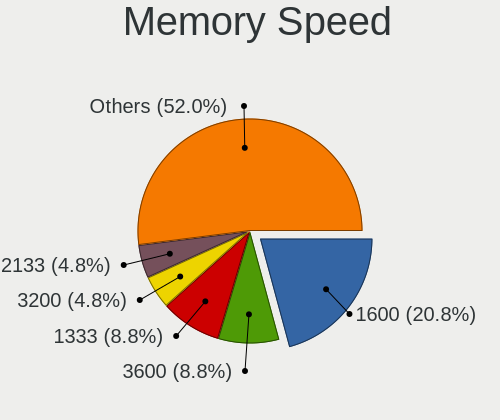

| Speed   | Desktops | Percent |
|---------|----------|---------|
| 1600    | 18       | 30.51%  |
| 1333    | 6        | 10.17%  |
| 3200    | 4        | 6.78%   |
| 2667    | 3        | 5.08%   |
| 2133    | 3        | 5.08%   |
| 1866    | 3        | 5.08%   |
| 1066    | 3        | 5.08%   |
| 800     | 3        | 5.08%   |
| 1867    | 2        | 3.39%   |
| 667     | 2        | 3.39%   |
| Unknown | 2        | 3.39%   |
| 3600    | 1        | 1.69%   |
| 3500    | 1        | 1.69%   |
| 3466    | 1        | 1.69%   |
| 3266    | 1        | 1.69%   |
| 2933    | 1        | 1.69%   |
| 2800    | 1        | 1.69%   |
| 2666    | 1        | 1.69%   |
| 2400    | 1        | 1.69%   |
| 1800    | 1        | 1.69%   |
| 533     | 1        | 1.69%   |

Printers & scanners
-------------------

Printer Vendor
--------------

Printer device vendors

| Vendor          | Desktops | Percent |
|-----------------|----------|---------|
| Hewlett-Packard | 2        | 66.67%  |
| Canon           | 1        | 33.33%  |

Printer Model
-------------

Printer device models

| Model                 | Desktops | Percent |
|-----------------------|----------|---------|
| HP OfficeJet Pro 6960 | 1        | 33.33%  |
| HP OfficeJet 6950     | 1        | 33.33%  |
| Canon LiDE 400        | 1        | 33.33%  |

Scanner Vendor
--------------

Scanner device vendors

| Vendor | Desktops | Percent |
|--------|----------|---------|
| Canon  | 1        | 100%    |

Scanner Model
-------------

Scanner device models

| Model                 | Desktops | Percent |
|-----------------------|----------|---------|
| Canon CanoScan FB630U | 1        | 100%    |

Camera
------

Camera Vendor
-------------

Camera device vendors

| Vendor                        | Desktops | Percent |
|-------------------------------|----------|---------|
| Logitech                      | 5        | 38.46%  |
| Samsung Electronics           | 2        | 15.38%  |
| Microsoft                     | 2        | 15.38%  |
| ViewSonic                     | 1        | 7.69%   |
| Sweex                         | 1        | 7.69%   |
| Sunplus Innovation Technology | 1        | 7.69%   |
| Philips (or NXP)              | 1        | 7.69%   |

Camera Model
------------

Camera device models

| Model                                   | Desktops | Percent |
|-----------------------------------------|----------|---------|
| Samsung Galaxy series, misc. (MTP mode) | 2        | 15.38%  |
| ViewSonic PC Camera                     | 1        | 7.69%   |
| Sweex WC060 Series HD Webcam            | 1        | 7.69%   |
| Sunplus Full HD webcam                  | 1        | 7.69%   |
| Philips (or NXP) Webcam SPC530NC        | 1        | 7.69%   |
| Microsoft LifeCam VX-5000               | 1        | 7.69%   |
| Microsoft LifeCam Cinema                | 1        | 7.69%   |
| Logitech Webcam C270                    | 1        | 7.69%   |
| Logitech QuickCam Communicate MP/S5500  | 1        | 7.69%   |
| Logitech Portable Webcam C905           | 1        | 7.69%   |
| Logitech HD Webcam C910                 | 1        | 7.69%   |
| Logitech HD Pro Webcam C920             | 1        | 7.69%   |

Security
--------

Fingerprint Vendor
------------------

Fingerprint sensor vendors

Zero info for selected period =(

Fingerprint Model
-----------------

Fingerprint sensor models

Zero info for selected period =(

Chipcard Vendor
---------------

Chipcard module vendors

Zero info for selected period =(

Chipcard Model
--------------

Chipcard module models

Zero info for selected period =(

Unsupported
-----------

Unsupported Devices
-------------------

Total unsupported devices on board

| Total | Desktops | Percent |
|-------|----------|---------|
| 0     | 47       | 90.38%  |
| 1     | 5        | 9.62%   |

Unsupported Device Types
------------------------

Types of unsupported devices

| Type                     | Desktops | Percent |
|--------------------------|----------|---------|
| Sound                    | 2        | 40%     |
| Net/wireless             | 2        | 40%     |
| Communication controller | 1        | 20%     |

