Ubuntu Studio - Tested Hardware & Statistics (Notebooks)
--------------------------------------------------------

A project to collect tested hardware configurations for Ubuntu Studio.

Anyone can contribute to this report by the [hw-probe](https://github.com/linuxhw/hw-probe) tool:

    sudo -E hw-probe -all -upload

Please contribute! Especially if your hardware is rare.

Contents
--------

* [ Test Cases ](#test-cases)

* [ System ](#system)
  - [ OS                       ](#os)
  - [ OS Family                ](#os-family)
  - [ Kernel                   ](#kernel)
  - [ Kernel Family            ](#kernel-family)
  - [ Kernel Major Ver.        ](#kernel-major-ver)
  - [ Arch                     ](#arch)
  - [ DE                       ](#de)
  - [ Display Server           ](#display-server)
  - [ Display Manager          ](#display-manager)
  - [ OS Lang                  ](#os-lang)
  - [ Boot Mode                ](#boot-mode)
  - [ Filesystem               ](#filesystem)
  - [ Part. scheme             ](#part-scheme)
  - [ Dual Boot with Linux/BSD ](#dual-boot-with-linuxbsd)
  - [ Dual Boot (Win)          ](#dual-boot-win)

* [ Board ](#board)
  - [ Vendor                   ](#vendor)
  - [ Model                    ](#model)
  - [ Model Family             ](#model-family)
  - [ MFG Year                 ](#mfg-year)
  - [ Form Factor              ](#form-factor)
  - [ Secure Boot              ](#secure-boot)
  - [ Coreboot                 ](#coreboot)
  - [ RAM Size                 ](#ram-size)
  - [ RAM Used                 ](#ram-used)
  - [ Total Drives             ](#total-drives)
  - [ Has CD-ROM               ](#has-cd-rom)
  - [ Has Ethernet             ](#has-ethernet)
  - [ Has WiFi                 ](#has-wifi)
  - [ Has Bluetooth            ](#has-bluetooth)

* [ Location ](#location)
  - [ Country                  ](#country)
  - [ City                     ](#city)

* [ Drives ](#drives)
  - [ Drive Vendor             ](#drive-vendor)
  - [ Drive Model              ](#drive-model)
  - [ HDD Vendor               ](#hdd-vendor)
  - [ SSD Vendor               ](#ssd-vendor)
  - [ Drive Kind               ](#drive-kind)
  - [ Drive Connector          ](#drive-connector)
  - [ Drive Size               ](#drive-size)
  - [ Space Total              ](#space-total)
  - [ Space Used               ](#space-used)
  - [ Malfunc. Drives          ](#malfunc-drives)
  - [ Malfunc. Drive Vendor    ](#malfunc-drive-vendor)
  - [ Malfunc. HDD Vendor      ](#malfunc-hdd-vendor)
  - [ Malfunc. Drive Kind      ](#malfunc-drive-kind)
  - [ Failed Drives            ](#failed-drives)
  - [ Failed Drive Vendor      ](#failed-drive-vendor)
  - [ Drive Status             ](#drive-status)

* [ Storage controller ](#storage-controller)
  - [ Storage Vendor           ](#storage-vendor)
  - [ Storage Model            ](#storage-model)
  - [ Storage Kind             ](#storage-kind)

* [ Processor ](#processor)
  - [ CPU Vendor               ](#cpu-vendor)
  - [ CPU Model                ](#cpu-model)
  - [ CPU Model Family         ](#cpu-model-family)
  - [ CPU Cores                ](#cpu-cores)
  - [ CPU Sockets              ](#cpu-sockets)
  - [ CPU Threads              ](#cpu-threads)
  - [ CPU Op-Modes             ](#cpu-op-modes)
  - [ CPU Microcode            ](#cpu-microcode)
  - [ CPU Microarch            ](#cpu-microarch)

* [ Graphics ](#graphics)
  - [ GPU Vendor               ](#gpu-vendor)
  - [ GPU Model                ](#gpu-model)
  - [ GPU Combo                ](#gpu-combo)
  - [ GPU Driver               ](#gpu-driver)
  - [ GPU Memory               ](#gpu-memory)

* [ Monitor ](#monitor)
  - [ Monitor Vendor           ](#monitor-vendor)
  - [ Monitor Model            ](#monitor-model)
  - [ Monitor Resolution       ](#monitor-resolution)
  - [ Monitor Diagonal         ](#monitor-diagonal)
  - [ Monitor Width            ](#monitor-width)
  - [ Aspect Ratio             ](#aspect-ratio)
  - [ Monitor Area             ](#monitor-area)
  - [ Pixel Density            ](#pixel-density)
  - [ Multiple Monitors        ](#multiple-monitors)

* [ Network ](#network)
  - [ Net Controller Vendor    ](#net-controller-vendor)
  - [ Net Controller Model     ](#net-controller-model)
  - [ Wireless Vendor          ](#wireless-vendor)
  - [ Wireless Model           ](#wireless-model)
  - [ Ethernet Vendor          ](#ethernet-vendor)
  - [ Ethernet Model           ](#ethernet-model)
  - [ Net Controller Kind      ](#net-controller-kind)
  - [ Used Controller          ](#used-controller)
  - [ NICs                     ](#nics)
  - [ IPv6                     ](#ipv6)

* [ Bluetooth ](#bluetooth)
  - [ Bluetooth Vendor         ](#bluetooth-vendor)
  - [ Bluetooth Model          ](#bluetooth-model)

* [ Sound ](#sound)
  - [ Sound Vendor             ](#sound-vendor)
  - [ Sound Model              ](#sound-model)

* [ Memory ](#memory)
  - [ Memory Vendor            ](#memory-vendor)
  - [ Memory Model             ](#memory-model)
  - [ Memory Kind              ](#memory-kind)
  - [ Memory Form Factor       ](#memory-form-factor)
  - [ Memory Size              ](#memory-size)
  - [ Memory Speed             ](#memory-speed)

* [ Printers & scanners ](#printers--scanners)
  - [ Printer Vendor           ](#printer-vendor)
  - [ Printer Model            ](#printer-model)
  - [ Scanner Vendor           ](#scanner-vendor)
  - [ Scanner Model            ](#scanner-model)

* [ Camera ](#camera)
  - [ Camera Vendor            ](#camera-vendor)
  - [ Camera Model             ](#camera-model)

* [ Security ](#security)
  - [ Fingerprint Vendor       ](#fingerprint-vendor)
  - [ Fingerprint Model        ](#fingerprint-model)
  - [ Chipcard Vendor          ](#chipcard-vendor)
  - [ Chipcard Model           ](#chipcard-model)

* [ Unsupported ](#unsupported)
  - [ Unsupported Devices      ](#unsupported-devices)
  - [ Unsupported Device Types ](#unsupported-device-types)

Test Cases
----------

Total: 158

| Vendor        | Model                       | Probe                                                      | Date         |
|---------------|-----------------------------|------------------------------------------------------------|--------------|
| Lenovo        | G50-80 80E5                 | [43b34ee3cb](https://linux-hardware.org/?probe=43b34ee3cb) | Oct 25, 2025 |
| HP            | ZBook 15 G3                 | [cbb40cc359](https://linux-hardware.org/?probe=cbb40cc359) | Oct 13, 2025 |
| Acer          | Aspire AG15-42P             | [3322344bca](https://linux-hardware.org/?probe=3322344bca) | Oct 11, 2025 |
| Samsung       | 700Z7C                      | [5d318252c4](https://linux-hardware.org/?probe=5d318252c4) | Sep 07, 2025 |
| HP            | Laptop 15-dy2xxx            | [a2dbe3fbfa](https://linux-hardware.org/?probe=a2dbe3fbfa) | Aug 12, 2025 |
| Alienware     | 16X Aurora AC16251          | [8877f4e027](https://linux-hardware.org/?probe=8877f4e027) | Jul 31, 2025 |
| Notebook      | N8xEJEK                     | [b6e2a0deef](https://linux-hardware.org/?probe=b6e2a0deef) | Jun 05, 2025 |
| Lenovo        | Legion 9 16IRX9 83G0        | [fea13dc137](https://linux-hardware.org/?probe=fea13dc137) | May 23, 2025 |
| Acer          | Swift SFG14-42              | [ad709b8e5f](https://linux-hardware.org/?probe=ad709b8e5f) | May 18, 2025 |
| Gigabyte      | AERO 17 XB                  | [dd8b3e1d0c](https://linux-hardware.org/?probe=dd8b3e1d0c) | Mar 25, 2025 |
| Lenovo        | IdeaPadFlex 14 20308        | [7488d92ad7](https://linux-hardware.org/?probe=7488d92ad7) | Mar 03, 2025 |
| Lenovo        | IdeaPad 120S-14IAP 81A5     | [41694d55b3](https://linux-hardware.org/?probe=41694d55b3) | Feb 03, 2025 |
| ASUSTek       | ROG Strix G533QS_G533QS     | [5fa7e8de2d](https://linux-hardware.org/?probe=5fa7e8de2d) | Feb 03, 2025 |
| MSI           | Prestige 13 AI+ Evo A2VM... | [e0ef8014cc](https://linux-hardware.org/?probe=e0ef8014cc) | Dec 31, 2024 |
| ASUSTek       | N750JV                      | [39dd282ac2](https://linux-hardware.org/?probe=39dd282ac2) | Dec 26, 2024 |
| Unknown       | Unknown                     | [ee3d394ad4](https://linux-hardware.org/?probe=ee3d394ad4) | Dec 22, 2024 |
| HP            | ProBook 640 G2              | [9e14504376](https://linux-hardware.org/?probe=9e14504376) | Dec 02, 2024 |
| HP            | EliteBook 840 G3            | [a1c6d79081](https://linux-hardware.org/?probe=a1c6d79081) | Oct 23, 2024 |
| Sony          | VPCCB3C5E                   | [32c8a0fd43](https://linux-hardware.org/?probe=32c8a0fd43) | Oct 23, 2024 |
| Lenovo        | ThinkPad X13 Gen 1 20UGS... | [8132169207](https://linux-hardware.org/?probe=8132169207) | Oct 17, 2024 |
| Lenovo        | ThinkPad X13 Gen 1 20UGS... | [d875e5f8df](https://linux-hardware.org/?probe=d875e5f8df) | Oct 11, 2024 |
| Lenovo        | ThinkPad X1 Carbon 2nd 2... | [ffd8af5438](https://linux-hardware.org/?probe=ffd8af5438) | Sep 25, 2024 |
| Apple         | MacBookPro12,1              | [ce7cf8209e](https://linux-hardware.org/?probe=ce7cf8209e) | Aug 30, 2024 |
| Lenovo        | ThinkPad X1 Carbon 2nd 2... | [7d197b82ba](https://linux-hardware.org/?probe=7d197b82ba) | Aug 29, 2024 |
| Lenovo        | IdeaPad 3 15IIL05 81WE      | [b6ee09c245](https://linux-hardware.org/?probe=b6ee09c245) | Aug 14, 2024 |
| Lenovo        | IdeaPad 3 15IIL05 81WE      | [53a28ccde0](https://linux-hardware.org/?probe=53a28ccde0) | Aug 14, 2024 |
| Lenovo        | ThinkPad T450s 20BWS0X00... | [a6f146c7b7](https://linux-hardware.org/?probe=a6f146c7b7) | Aug 09, 2024 |
| Lenovo        | IdeaPad S145-14IWL 81MU     | [0b60161050](https://linux-hardware.org/?probe=0b60161050) | Jul 24, 2024 |
| Dell          | Precision 5520              | [d7b6062639](https://linux-hardware.org/?probe=d7b6062639) | Jul 21, 2024 |
| ASUSTek       | ASUS EXPERTBOOK L1500CDA... | [a3ffc85576](https://linux-hardware.org/?probe=a3ffc85576) | Jun 21, 2024 |
| Lenovo        | IdeaPad Slim 3 16IAH8 83... | [ae3b8db2e7](https://linux-hardware.org/?probe=ae3b8db2e7) | Jun 18, 2024 |
| Lenovo        | ThinkPad T420 4236A38       | [eec5a148c0](https://linux-hardware.org/?probe=eec5a148c0) | Jun 14, 2024 |
| Lenovo        | ThinkPad T420 4236A38       | [fb0d42ccdd](https://linux-hardware.org/?probe=fb0d42ccdd) | Jun 13, 2024 |
| Dell          | Latitude 3450               | [c7b7155c10](https://linux-hardware.org/?probe=c7b7155c10) | Jun 03, 2024 |
| HP            | Pavilion dv6                | [1d8af97b78](https://linux-hardware.org/?probe=1d8af97b78) | May 15, 2024 |
| Acer          | Aspire ES1-571              | [87a9fcc5ab](https://linux-hardware.org/?probe=87a9fcc5ab) | May 12, 2024 |
| Acer          | Nitro AN16-41               | [4ccd0953dd](https://linux-hardware.org/?probe=4ccd0953dd) | May 09, 2024 |
| Gigabyte      | AERO 15-X9                  | [a62c895461](https://linux-hardware.org/?probe=a62c895461) | Apr 26, 2024 |
| Gigabyte      | AERO 15-X9                  | [25245adc43](https://linux-hardware.org/?probe=25245adc43) | Apr 26, 2024 |
| Samsung       | 730QCJ/730QCR               | [0d6a3363b8](https://linux-hardware.org/?probe=0d6a3363b8) | Apr 15, 2024 |
| Acer          | Aspire A317-53              | [ddd85b18e6](https://linux-hardware.org/?probe=ddd85b18e6) | Apr 04, 2024 |
| HP            | Pavilion 15                 | [520fd1241e](https://linux-hardware.org/?probe=520fd1241e) | Mar 14, 2024 |
| ARDOR GAMI... | V15x_V17xPNKPNJPNH          | [cf518d2630](https://linux-hardware.org/?probe=cf518d2630) | Mar 10, 2024 |
| MSI           | Alpha 15 A4DEK              | [bf844ef78f](https://linux-hardware.org/?probe=bf844ef78f) | Mar 09, 2024 |
| Lenovo        | ThinkPad L540 20AV004VGE    | [05d6a4d686](https://linux-hardware.org/?probe=05d6a4d686) | Feb 03, 2024 |
| Dell          | Latitude E6420              | [f4dcc8c239](https://linux-hardware.org/?probe=f4dcc8c239) | Jan 26, 2024 |
| Acer          | Aspire A317-53              | [efa0303d01](https://linux-hardware.org/?probe=efa0303d01) | Jan 24, 2024 |
| Dell          | Inspiron 3482               | [bbcb062420](https://linux-hardware.org/?probe=bbcb062420) | Dec 29, 2023 |
| Lenovo        | IdeaPad 300-17ISK 80QH      | [0c55b9f3e3](https://linux-hardware.org/?probe=0c55b9f3e3) | Dec 28, 2023 |
| Lenovo        | IdeaPad 300-17ISK 80QH      | [9197fe40a7](https://linux-hardware.org/?probe=9197fe40a7) | Dec 28, 2023 |
| ASUSTek       | ASUS TUF Gaming A17 FA70... | [e36502092e](https://linux-hardware.org/?probe=e36502092e) | Dec 27, 2023 |
| Lenovo        | Legion 5 15ARH05 82B5       | [b000376310](https://linux-hardware.org/?probe=b000376310) | Dec 26, 2023 |
| Lenovo        | Legion 5 15ARH05 82B5       | [ff3773b480](https://linux-hardware.org/?probe=ff3773b480) | Dec 26, 2023 |
| HP            | EliteBook 850 G3            | [1265cfb294](https://linux-hardware.org/?probe=1265cfb294) | Dec 21, 2023 |
| HP            | EliteBook 850 G3            | [6067c56124](https://linux-hardware.org/?probe=6067c56124) | Dec 19, 2023 |
| HP            | EliteBook 640 14 inch G9... | [51b0a49d02](https://linux-hardware.org/?probe=51b0a49d02) | Nov 27, 2023 |
| Dell          | System XPS L502X            | [33f54ee5dc](https://linux-hardware.org/?probe=33f54ee5dc) | Nov 16, 2023 |
| HP            | ZBook 17 G5                 | [4377844e75](https://linux-hardware.org/?probe=4377844e75) | Nov 02, 2023 |
| Lenovo        | ZIWB2                       | [9e6bd45db9](https://linux-hardware.org/?probe=9e6bd45db9) | Oct 29, 2023 |
| Lenovo        | ZIWB2                       | [2537a6e7b9](https://linux-hardware.org/?probe=2537a6e7b9) | Oct 26, 2023 |
| Lenovo        | ThinkPad T480 20L50101US    | [c6913c1b75](https://linux-hardware.org/?probe=c6913c1b75) | Oct 16, 2023 |
| Apple         | MacBookPro9,2               | [188b107eb5](https://linux-hardware.org/?probe=188b107eb5) | Oct 05, 2023 |
| ASUSTek       | VivoBook_ASUSLaptop X515... | [bab5438645](https://linux-hardware.org/?probe=bab5438645) | Sep 22, 2023 |
| ASUSTek       | VivoBook_ASUSLaptop X515... | [ab3c1508f9](https://linux-hardware.org/?probe=ab3c1508f9) | Aug 30, 2023 |
| Toshiba       | Satellite A505              | [a7b1465809](https://linux-hardware.org/?probe=a7b1465809) | Aug 25, 2023 |
| Acer          | Nitro AN515-55              | [191aa2a04f](https://linux-hardware.org/?probe=191aa2a04f) | Aug 04, 2023 |
| Toshiba       | Satellite L505              | [bab52bec2c](https://linux-hardware.org/?probe=bab52bec2c) | Aug 04, 2023 |
| win elemen... | MoreFine S500+              | [d3718d1a8d](https://linux-hardware.org/?probe=d3718d1a8d) | Jul 16, 2023 |
| ASUSTek       | G73Jh                       | [60e43d39b2](https://linux-hardware.org/?probe=60e43d39b2) | Jul 10, 2023 |
| Lenovo        | ThinkPad P50 20EQS0VV03     | [c2a4d4d2c0](https://linux-hardware.org/?probe=c2a4d4d2c0) | Jun 17, 2023 |
| HP            | EliteBook 745 G3            | [5a1b8d9fd3](https://linux-hardware.org/?probe=5a1b8d9fd3) | Jun 04, 2023 |
| COM1          | NBINF-X5-9G5                | [33aa60eaa2](https://linux-hardware.org/?probe=33aa60eaa2) | May 22, 2023 |
| Lenovo        | ThinkPad L460 20FVS3JK00    | [c812ee44af](https://linux-hardware.org/?probe=c812ee44af) | May 18, 2023 |
| GPU Compan... | GWNR71517                   | [2743830739](https://linux-hardware.org/?probe=2743830739) | Apr 11, 2023 |
| Lenovo        | ThinkPad E14 Gen 3 20Y70... | [3ce456f3c8](https://linux-hardware.org/?probe=3ce456f3c8) | Mar 25, 2023 |
| Lenovo        | ThinkPad X250 20CL001LMB    | [d78880e600](https://linux-hardware.org/?probe=d78880e600) | Mar 17, 2023 |
| HP            | Pavilion dv8                | [105a616a39](https://linux-hardware.org/?probe=105a616a39) | Mar 14, 2023 |
| Lenovo        | ThinkPad T530 24296HG       | [4794c72566](https://linux-hardware.org/?probe=4794c72566) | Feb 21, 2023 |
| ASUSTek       | TP300UA                     | [22ff7f5827](https://linux-hardware.org/?probe=22ff7f5827) | Feb 20, 2023 |
| Dell          | Latitude 5511               | [05e11b64d6](https://linux-hardware.org/?probe=05e11b64d6) | Feb 09, 2023 |
| Apple         | MacBookPro8,2               | [ffc97bf3de](https://linux-hardware.org/?probe=ffc97bf3de) | Feb 06, 2023 |
| HP            | EliteBook 735 G6            | [bb321263f8](https://linux-hardware.org/?probe=bb321263f8) | Jan 24, 2023 |
| ASUSTek       | K53U                        | [c7c4beb8cb](https://linux-hardware.org/?probe=c7c4beb8cb) | Jan 10, 2023 |
| Apple         | MacBookPro8,2               | [3d8320e362](https://linux-hardware.org/?probe=3d8320e362) | Dec 25, 2022 |
| Acer          | Aspire E5-573G              | [ec1e8e146a](https://linux-hardware.org/?probe=ec1e8e146a) | Dec 10, 2022 |
| Dell          | Latitude E6500              | [291fbde8c4](https://linux-hardware.org/?probe=291fbde8c4) | Dec 08, 2022 |
| Lenovo        | G70-80 80FF                 | [022ce8e2c8](https://linux-hardware.org/?probe=022ce8e2c8) | Nov 29, 2022 |
| Gigabyte      | AERO 15-X9                  | [1d490bb7d1](https://linux-hardware.org/?probe=1d490bb7d1) | Nov 11, 2022 |
| Lenovo        | ThinkPad X230 2333A86       | [55771f0c33](https://linux-hardware.org/?probe=55771f0c33) | Oct 18, 2022 |
| Lenovo        | ThinkPad X230 2333A86       | [7e0028c2fa](https://linux-hardware.org/?probe=7e0028c2fa) | Oct 18, 2022 |
| ASUSTek       | ASUS EXPERTBOOK B1500CEA... | [5bfc8f0a7d](https://linux-hardware.org/?probe=5bfc8f0a7d) | Sep 30, 2022 |
| HP            | ZBook 15 G3                 | [2dc3febd4d](https://linux-hardware.org/?probe=2dc3febd4d) | Sep 24, 2022 |
| ASUSTek       | GL503VD                     | [b1d97f239e](https://linux-hardware.org/?probe=b1d97f239e) | Sep 16, 2022 |
| HUAWEI        | KLVL-WXXW                   | [de37b9cf96](https://linux-hardware.org/?probe=de37b9cf96) | Sep 13, 2022 |
| Gigabyte      | AERO 15-X9                  | [d6d8f577e0](https://linux-hardware.org/?probe=d6d8f577e0) | Sep 12, 2022 |
| Lenovo        | IdeaPad 3 14ARE05 81W3      | [b8c22aafab](https://linux-hardware.org/?probe=b8c22aafab) | Sep 01, 2022 |
| Lenovo        | IdeaPad 3 15ABA7 82RN       | [a23b4a8cd4](https://linux-hardware.org/?probe=a23b4a8cd4) | Aug 27, 2022 |
| HP            | G62                         | [3c4aab40ae](https://linux-hardware.org/?probe=3c4aab40ae) | Jul 20, 2022 |
| Apple         | MacBookPro11,5              | [25e69108df](https://linux-hardware.org/?probe=25e69108df) | Jul 03, 2022 |
| ASUSTek       | VivoBook_ASUSLaptop X580... | [4ed102b3fa](https://linux-hardware.org/?probe=4ed102b3fa) | Jun 15, 2022 |
| Getac         | S400G3                      | [56cc8b4c1a](https://linux-hardware.org/?probe=56cc8b4c1a) | May 16, 2022 |
| Acer          | Aspire A114-32              | [3c048f588e](https://linux-hardware.org/?probe=3c048f588e) | Apr 12, 2022 |
| Dell          | XPS 15 9570                 | [3f8fe40793](https://linux-hardware.org/?probe=3f8fe40793) | Mar 08, 2022 |
| Dell          | Inspiron N5110              | [4206238fce](https://linux-hardware.org/?probe=4206238fce) | Mar 01, 2022 |
| HP            | Sona                        | [4fcab0b3b7](https://linux-hardware.org/?probe=4fcab0b3b7) | Feb 24, 2022 |
| HP            | Sona                        | [d0b3189e0f](https://linux-hardware.org/?probe=d0b3189e0f) | Feb 24, 2022 |
| Lenovo        | ThinkPad X230 2325AJG       | [eccfa3a972](https://linux-hardware.org/?probe=eccfa3a972) | Feb 12, 2022 |
| Google        | Nami                        | [5f1ba9ab72](https://linux-hardware.org/?probe=5f1ba9ab72) | Feb 10, 2022 |
| Lenovo        | Legion 5 15ARH05H 82B1      | [feb1c1d6a2](https://linux-hardware.org/?probe=feb1c1d6a2) | Feb 10, 2022 |
| Samsung       | 305V4A/305V5A               | [5a1bf3cb9e](https://linux-hardware.org/?probe=5a1bf3cb9e) | Feb 04, 2022 |
| HP            | EliteBook 840 G3            | [fe9fed2a45](https://linux-hardware.org/?probe=fe9fed2a45) | Jan 26, 2022 |
| Lenovo        | ThinkPad T520 4243K86       | [5ccce1fb71](https://linux-hardware.org/?probe=5ccce1fb71) | Jan 21, 2022 |
| Lenovo        | ThinkPad T520 4243K86       | [91adda5a0e](https://linux-hardware.org/?probe=91adda5a0e) | Jan 21, 2022 |
| Clevo         | W35_37ET                    | [f8858fd0c3](https://linux-hardware.org/?probe=f8858fd0c3) | Jan 20, 2022 |
| Dell          | Inspiron 7348               | [b479441fe2](https://linux-hardware.org/?probe=b479441fe2) | Jan 15, 2022 |
| Dell          | Inspiron 3501               | [e071d4f83a](https://linux-hardware.org/?probe=e071d4f83a) | Jan 02, 2022 |
| Toshiba       | Satellite C855              | [7914ab9929](https://linux-hardware.org/?probe=7914ab9929) | Dec 03, 2021 |
| Lenovo        | IdeaPad Gaming 3 15ARH05... | [a271c08df2](https://linux-hardware.org/?probe=a271c08df2) | Oct 21, 2021 |
| Lenovo        | IdeaPad Gaming 3 15ARH05... | [2a9e8d32e2](https://linux-hardware.org/?probe=2a9e8d32e2) | Oct 15, 2021 |
| Lenovo        | IdeaPad Gaming 3 15ARH05... | [f0a9d13afb](https://linux-hardware.org/?probe=f0a9d13afb) | Oct 14, 2021 |
| Lenovo        | ThinkPad X1 Carbon 2nd 2... | [1dbff2c4f9](https://linux-hardware.org/?probe=1dbff2c4f9) | Oct 09, 2021 |
| Razer         | Blade Stealth 13 Late 20... | [22033e7185](https://linux-hardware.org/?probe=22033e7185) | Oct 05, 2021 |
| Toshiba       | Satellite L755D             | [aca989dcc4](https://linux-hardware.org/?probe=aca989dcc4) | Sep 29, 2021 |
| ASUSTek       | ROG Zephyrus G15 GA502IU... | [7725289d30](https://linux-hardware.org/?probe=7725289d30) | Sep 17, 2021 |
| ASUSTek       | UX305FA                     | [91b4275b9b](https://linux-hardware.org/?probe=91b4275b9b) | Aug 25, 2021 |
| HUAWEI        | HLYL-WXX9                   | [35e6393ea4](https://linux-hardware.org/?probe=35e6393ea4) | Aug 01, 2021 |
| Lenovo        | ThinkPad X1 Carbon 6th 2... | [9d8c462df3](https://linux-hardware.org/?probe=9d8c462df3) | Jul 20, 2021 |
| HP            | Pavilion dv6                | [089a39fe70](https://linux-hardware.org/?probe=089a39fe70) | Jul 07, 2021 |
| Lenovo        | IdeaPad Gaming 3 15IMH05... | [64c8a86c5b](https://linux-hardware.org/?probe=64c8a86c5b) | Jun 19, 2021 |
| Intel Clie... | LAPBC510                    | [06421d0916](https://linux-hardware.org/?probe=06421d0916) | Jun 15, 2021 |
| HP            | Stream Laptop 14-cb0XX      | [f88f0c3680](https://linux-hardware.org/?probe=f88f0c3680) | Jun 14, 2021 |
| HP            | OMEN by Laptop 15-ce0xx     | [749002b5ad](https://linux-hardware.org/?probe=749002b5ad) | Apr 20, 2021 |
| HP            | OMEN by Laptop 15-ce0xx     | [aec24cb317](https://linux-hardware.org/?probe=aec24cb317) | Apr 20, 2021 |
| Dell          | Precision M4500             | [8c35250407](https://linux-hardware.org/?probe=8c35250407) | Apr 17, 2021 |
| ASUSTek       | X541NA                      | [db3ab2a133](https://linux-hardware.org/?probe=db3ab2a133) | Mar 15, 2021 |
| HP            | Pavilion dv6                | [369f0a0cdb](https://linux-hardware.org/?probe=369f0a0cdb) | Mar 12, 2021 |
| Lenovo        | G50-45 80E3                 | [e4fb438978](https://linux-hardware.org/?probe=e4fb438978) | Feb 24, 2021 |
| Sony          | VGN-NS31M_W                 | [dcc1660569](https://linux-hardware.org/?probe=dcc1660569) | Feb 17, 2021 |
| ASUSTek       | U56E                        | [eba46128ee](https://linux-hardware.org/?probe=eba46128ee) | Jan 04, 2021 |
| Dell          | Inspiron 3543               | [1b1044cc21](https://linux-hardware.org/?probe=1b1044cc21) | Nov 28, 2020 |
| Dell          | Latitude E6530              | [3d606b3078](https://linux-hardware.org/?probe=3d606b3078) | Nov 09, 2020 |
| Dell          | Latitude E7250              | [d5e2f8b706](https://linux-hardware.org/?probe=d5e2f8b706) | Nov 01, 2020 |
| Acer          | ASPIRE1420P_MSFT            | [5185b46abc](https://linux-hardware.org/?probe=5185b46abc) | Oct 31, 2020 |
| Avell High... | Avell G1555 MUV / A62 MU... | [c2994bb093](https://linux-hardware.org/?probe=c2994bb093) | Sep 18, 2020 |
| Dell          | Inspiron 1520               | [e00620b124](https://linux-hardware.org/?probe=e00620b124) | Sep 06, 2020 |
| HP            | Laptop 15s-fq1xxx           | [57d3d832f5](https://linux-hardware.org/?probe=57d3d832f5) | Sep 04, 2020 |
| Dell          | Latitude E4300              | [3e0fb2e03f](https://linux-hardware.org/?probe=3e0fb2e03f) | Sep 03, 2020 |
| HP            | Compaq 8510p                | [2ea87d13f0](https://linux-hardware.org/?probe=2ea87d13f0) | Aug 26, 2020 |
| ASUSTek       | 1001P                       | [d4f13322ac](https://linux-hardware.org/?probe=d4f13322ac) | Aug 19, 2020 |
| ASUSTek       | 1001P                       | [92e2a05f2d](https://linux-hardware.org/?probe=92e2a05f2d) | Aug 13, 2020 |
| ASUSTek       | 1001P                       | [0ae5a1aab2](https://linux-hardware.org/?probe=0ae5a1aab2) | Aug 13, 2020 |
| Dell          | Inspiron 5566               | [3162979c2e](https://linux-hardware.org/?probe=3162979c2e) | Jul 24, 2020 |
| Lenovo        | IdeaPad 5 15ARE05 81YQ      | [a253e286bf](https://linux-hardware.org/?probe=a253e286bf) | Jul 06, 2020 |
| Lenovo        | IdeaPad 5 15ARE05 81YQ      | [c2c3727c6a](https://linux-hardware.org/?probe=c2c3727c6a) | Jun 30, 2020 |
| HP            | Notebook                    | [e406d5cf9e](https://linux-hardware.org/?probe=e406d5cf9e) | Jun 02, 2020 |
| Lenovo        | ThinkPad W530 2447IG0       | [f7125d9a17](https://linux-hardware.org/?probe=f7125d9a17) | Mar 19, 2020 |
| Lenovo        | ThinkPad X230 23245S1       | [047f29b7c7](https://linux-hardware.org/?probe=047f29b7c7) | Nov 01, 2019 |
| Lenovo        | G50-45 80E3                 | [ebbf8cd8d4](https://linux-hardware.org/?probe=ebbf8cd8d4) | May 27, 2019 |

System
------

OS
--

Installed operating systems

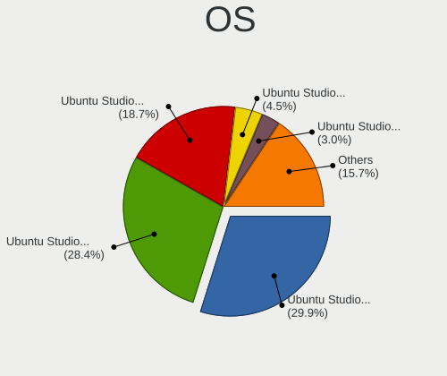

| Name                | Notebooks | Percent |
|---------------------|-----------|---------|
| Ubuntu Studio 20.04 | 40        | 29.85%  |
| Ubuntu Studio 22.04 | 38        | 28.36%  |
| Ubuntu Studio 24.04 | 25        | 18.66%  |
| Ubuntu Studio 23.04 | 6         | 4.48%   |
| Ubuntu Studio 25.04 | 4         | 2.99%   |
| Ubuntu Studio 23.10 | 4         | 2.99%   |
| Ubuntu Studio 22.10 | 4         | 2.99%   |
| Ubuntu Studio 21.10 | 3         | 2.24%   |
| Ubuntu Studio 21.04 | 3         | 2.24%   |
| Ubuntu Studio 20.10 | 3         | 2.24%   |
| Ubuntu Studio 18.04 | 2         | 1.49%   |
| Ubuntu Studio 24.10 | 1         | 0.75%   |
| Ubuntu Studio 19.10 | 1         | 0.75%   |

OS Family
---------

OS without a version

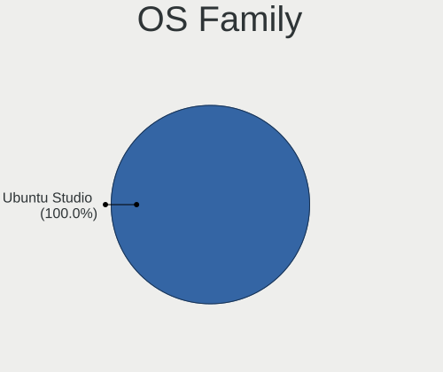

| Name          | Notebooks | Percent |
|---------------|-----------|---------|
| Ubuntu Studio | 132       | 100%    |

Kernel
------

Version of the Linux kernel

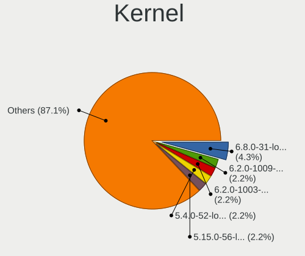

| Version                | Notebooks | Percent |
|------------------------|-----------|---------|
| 6.8.0-31-lowlatency    | 6         | 4.32%   |
| 6.2.0-1009-lowlatency  | 3         | 2.16%   |
| 6.2.0-1003-lowlatency  | 3         | 2.16%   |
| 5.4.0-52-lowlatency    | 3         | 2.16%   |
| 5.15.0-56-lowlatency   | 3         | 2.16%   |
| 5.15.0-47-lowlatency   | 3         | 2.16%   |
| 5.13.0-28-lowlatency   | 3         | 2.16%   |
| 6.8.0-85-lowlatency    | 2         | 1.44%   |
| 6.8.0-52-lowlatency    | 2         | 1.44%   |
| 6.8.0-47-lowlatency    | 2         | 1.44%   |
| 6.8.0-45-lowlatency    | 2         | 1.44%   |
| 6.8.0-41-lowlatency    | 2         | 1.44%   |
| 6.5.0-27-lowlatency    | 2         | 1.44%   |
| 6.5.0-25-lowlatency    | 2         | 1.44%   |
| 6.5.0-15-lowlatency    | 2         | 1.44%   |
| 6.2.0-1018-lowlatency  | 2         | 1.44%   |
| 6.14.0-15-generic      | 2         | 1.44%   |
| 6.11.0-1009-lowlatency | 2         | 1.44%   |
| 5.8.0-55-lowlatency    | 2         | 1.44%   |
| 5.4.0-94-lowlatency    | 2         | 1.44%   |
| 5.4.0-65-lowlatency    | 2         | 1.44%   |
| 5.4.0-45-lowlatency    | 2         | 1.44%   |
| 5.4.0-42-lowlatency    | 2         | 1.44%   |
| 5.19.0-1015-lowlatency | 2         | 1.44%   |
| 5.15.0-67-lowlatency   | 2         | 1.44%   |
| 5.15.0-50-lowlatency   | 2         | 1.44%   |
| 5.15.0-48-lowlatency   | 2         | 1.44%   |
| 5.15.0-46-lowlatency   | 2         | 1.44%   |
| 5.13.0-30-lowlatency   | 2         | 1.44%   |
| 5.11.0-34-lowlatency   | 2         | 1.44%   |
| 5.11.0-27-lowlatency   | 2         | 1.44%   |
| 6.8.0-50-lowlatency    | 1         | 0.72%   |
| 6.8.0-49-generic       | 1         | 0.72%   |
| 6.8.0-40-lowlatency    | 1         | 0.72%   |
| 6.8.0-39-lowlatency    | 1         | 0.72%   |
| 6.8.0-38-lowlatency    | 1         | 0.72%   |
| 6.8.0-35-lowlatency    | 1         | 0.72%   |
| 6.5.0-28-lowlatency    | 1         | 0.72%   |
| 6.5.0-17-lowlatency    | 1         | 0.72%   |
| 6.5.0-13-lowlatency    | 1         | 0.72%   |

Kernel Family
-------------

Linux kernel without a distro release

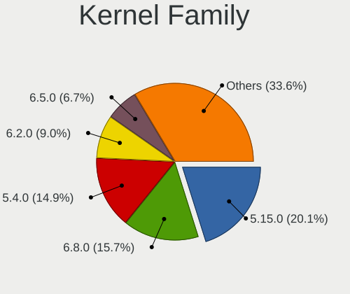

| Version | Notebooks | Percent |
|---------|-----------|---------|
| 5.15.0  | 27        | 20.15%  |
| 6.8.0   | 21        | 15.67%  |
| 5.4.0   | 20        | 14.93%  |
| 6.2.0   | 12        | 8.96%   |
| 6.5.0   | 9         | 6.72%   |
| 5.8.0   | 9         | 6.72%   |
| 5.11.0  | 9         | 6.72%   |
| 5.19.0  | 6         | 4.48%   |
| 5.13.0  | 6         | 4.48%   |
| 6.14.0  | 5         | 3.73%   |
| 6.11.0  | 5         | 3.73%   |
| 4.15.0  | 2         | 1.49%   |
| 6.2.8   | 1         | 0.75%   |
| 5.7.6   | 1         | 0.75%   |
| 5.3.0   | 1         | 0.75%   |

Kernel Major Ver.
-----------------

Linux kernel major version

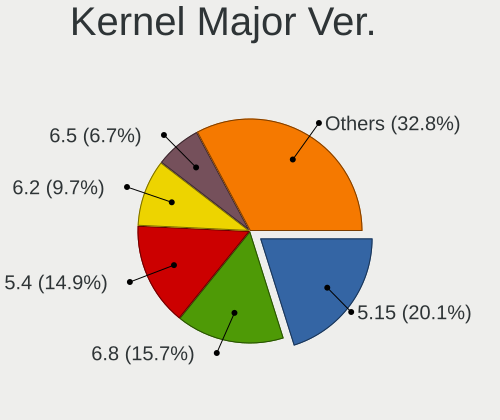

| Version | Notebooks | Percent |
|---------|-----------|---------|
| 5.15    | 27        | 20.15%  |
| 6.8     | 21        | 15.67%  |
| 5.4     | 20        | 14.93%  |
| 6.2     | 13        | 9.7%    |
| 6.5     | 9         | 6.72%   |
| 5.8     | 9         | 6.72%   |
| 5.11    | 9         | 6.72%   |
| 5.19    | 6         | 4.48%   |
| 5.13    | 6         | 4.48%   |
| 6.14    | 5         | 3.73%   |
| 6.11    | 5         | 3.73%   |
| 4.15    | 2         | 1.49%   |
| 5.7     | 1         | 0.75%   |
| 5.3     | 1         | 0.75%   |

Arch
----

OS architecture (x86_64, i586, etc.)

| Name   | Notebooks | Percent |
|--------|-----------|---------|
| x86_64 | 132       | 100%    |

DE
--

Desktop Environment

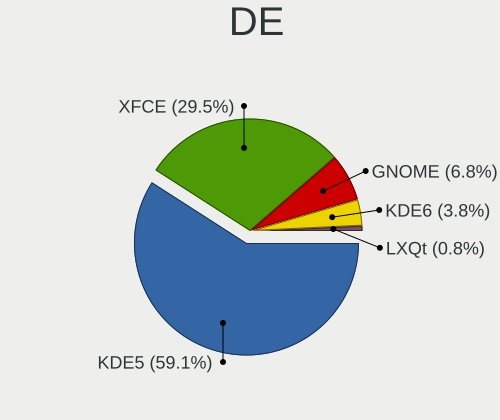

| Name  | Notebooks | Percent |
|-------|-----------|---------|
| KDE5  | 78        | 59.09%  |
| XFCE  | 39        | 29.55%  |
| GNOME | 9         | 6.82%   |
| KDE6  | 5         | 3.79%   |
| LXQt  | 1         | 0.76%   |

Display Server
--------------

X11 or Wayland

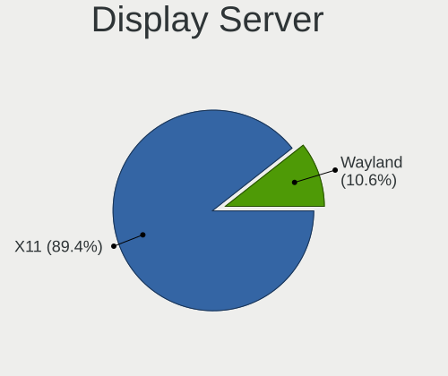

| Name    | Notebooks | Percent |
|---------|-----------|---------|
| X11     | 118       | 89.39%  |
| Wayland | 14        | 10.61%  |

Display Manager
---------------

SDDM, LightDM, etc.

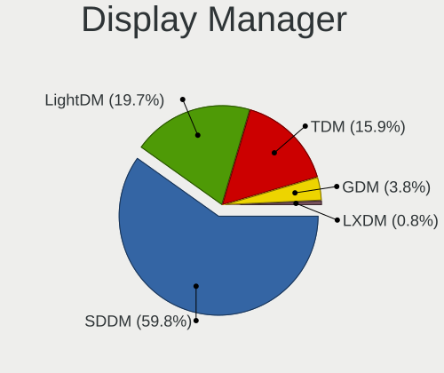

| Name    | Notebooks | Percent |
|---------|-----------|---------|
| SDDM    | 79        | 59.85%  |
| LightDM | 26        | 19.7%   |
| TDM     | 21        | 15.91%  |
| GDM     | 5         | 3.79%   |
| LXDM    | 1         | 0.76%   |

OS Lang
-------

Language

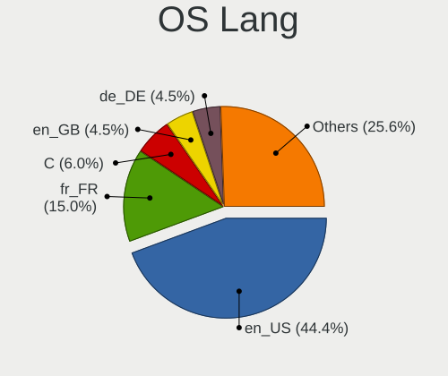

| Lang    | Notebooks | Percent |
|---------|-----------|---------|
| en_US   | 59        | 44.36%  |
| fr_FR   | 20        | 15.04%  |
| C       | 8         | 6.02%   |
| en_GB   | 6         | 4.51%   |
| de_DE   | 6         | 4.51%   |
| ru_RU   | 5         | 3.76%   |
| it_IT   | 4         | 3.01%   |
| es_ES   | 4         | 3.01%   |
| en_CA   | 3         | 2.26%   |
| pt_BR   | 2         | 1.5%    |
| hu_HU   | 2         | 1.5%    |
| es_MX   | 2         | 1.5%    |
| en_IE   | 2         | 1.5%    |
| Unknown | 2         | 1.5%    |
| nl_NL   | 1         | 0.75%   |
| es_NI   | 1         | 0.75%   |
| es_CR   | 1         | 0.75%   |
| es_AR   | 1         | 0.75%   |
| en_NG   | 1         | 0.75%   |
| en_AU   | 1         | 0.75%   |
| en_AG   | 1         | 0.75%   |
| de_CH   | 1         | 0.75%   |

Boot Mode
---------

EFI or BIOS

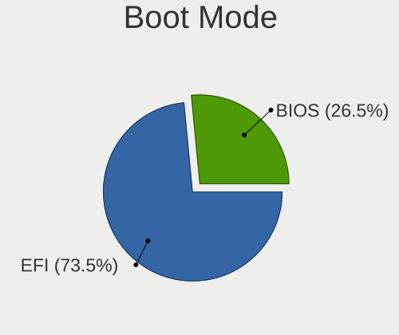

| Mode | Notebooks | Percent |
|------|-----------|---------|
| EFI  | 97        | 73.48%  |
| BIOS | 35        | 26.52%  |

Filesystem
----------

Type of filesystem

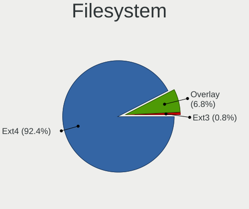

| Type    | Notebooks | Percent |
|---------|-----------|---------|
| Ext4    | 122       | 92.42%  |
| Overlay | 9         | 6.82%   |
| Ext3    | 1         | 0.76%   |

Part. scheme
------------

Scheme of partitioning

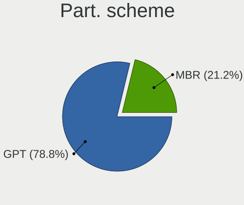

| Type | Notebooks | Percent |
|------|-----------|---------|
| GPT  | 104       | 78.79%  |
| MBR  | 28        | 21.21%  |

Dual Boot with Linux/BSD
------------------------

Hosting more than one Linux/BSD

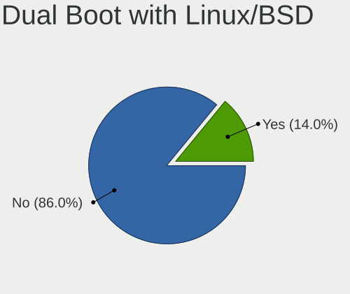

| Dual boot | Notebooks | Percent |
|-----------|-----------|---------|
| No        | 118       | 88.06%  |
| Yes       | 16        | 11.94%  |

Dual Boot (Win)
---------------

Hosting Linux and Windows

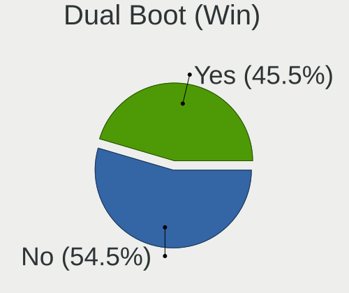

| Dual boot | Notebooks | Percent |
|-----------|-----------|---------|
| No        | 72        | 54.55%  |
| Yes       | 60        | 45.45%  |

Board
-----

Vendor
------

Motherboard manufacturer

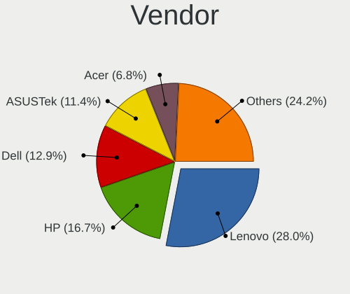

| Name                   | Notebooks | Percent |
|------------------------|-----------|---------|
| Lenovo                 | 37        | 28.03%  |
| Hewlett-Packard        | 22        | 16.67%  |
| Dell                   | 17        | 12.88%  |
| ASUSTek Computer       | 15        | 11.36%  |
| Acer                   | 9         | 6.82%   |
| Toshiba                | 4         | 3.03%   |
| Apple                  | 4         | 3.03%   |
| Samsung Electronics    | 3         | 2.27%   |
| Sony                   | 2         | 1.52%   |
| MSI                    | 2         | 1.52%   |
| HUAWEI                 | 2         | 1.52%   |
| Gigabyte Technology    | 2         | 1.52%   |
| win element            | 1         | 0.76%   |
| Razer                  | 1         | 0.76%   |
| Notebook               | 1         | 0.76%   |
| Intel Client Systems   | 1         | 0.76%   |
| GPU Company            | 1         | 0.76%   |
| Google                 | 1         | 0.76%   |
| Getac                  | 1         | 0.76%   |
| COM1                   | 1         | 0.76%   |
| Clevo                  | 1         | 0.76%   |
| Avell High Performance | 1         | 0.76%   |
| ARDOR GAMING           | 1         | 0.76%   |
| Alienware              | 1         | 0.76%   |
| Unknown                | 1         | 0.76%   |

Model
-----

Motherboard model

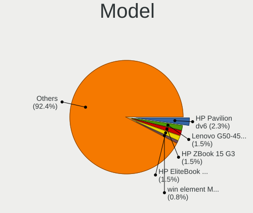

| Name                                     | Notebooks | Percent |
|------------------------------------------|-----------|---------|
| HP Pavilion dv6                          | 3         | 2.27%   |
| Lenovo G50-45 80E3                       | 2         | 1.52%   |
| HP ZBook 15 G3                           | 2         | 1.52%   |
| HP EliteBook 840 G3                      | 2         | 1.52%   |
| win element MoreFine S500+               | 1         | 0.76%   |
| Toshiba Satellite L755D                  | 1         | 0.76%   |
| Toshiba Satellite L505                   | 1         | 0.76%   |
| Toshiba Satellite C855                   | 1         | 0.76%   |
| Toshiba Satellite A505                   | 1         | 0.76%   |
| Sony VPCCB3C5E                           | 1         | 0.76%   |
| Sony VGN-NS31M_W                         | 1         | 0.76%   |
| Samsung 730QCJ/730QCR                    | 1         | 0.76%   |
| Samsung 700Z7C                           | 1         | 0.76%   |
| Samsung 305V4A/305V5A                    | 1         | 0.76%   |
| Razer Blade Stealth 13 Late 2019         | 1         | 0.76%   |
| Notebook N8xEJEK                         | 1         | 0.76%   |
| MSI Prestige 13 AI+ Evo A2VMG            | 1         | 0.76%   |
| MSI Alpha 15 A4DEK                       | 1         | 0.76%   |
| Lenovo ZIWB2                             | 1         | 0.76%   |
| Lenovo ThinkPad X250 20CL001LMB          | 1         | 0.76%   |
| Lenovo ThinkPad X230 2333A86             | 1         | 0.76%   |
| Lenovo ThinkPad X230 2325AJG             | 1         | 0.76%   |
| Lenovo ThinkPad X230 23245S1             | 1         | 0.76%   |
| Lenovo ThinkPad X13 Gen 1 20UGS28900     | 1         | 0.76%   |
| Lenovo ThinkPad X1 Carbon 6th 20KHCTO1WW | 1         | 0.76%   |
| Lenovo ThinkPad X1 Carbon 2nd 20A8S0ET00 | 1         | 0.76%   |
| Lenovo ThinkPad X1 Carbon 2nd 20A80035US | 1         | 0.76%   |
| Lenovo ThinkPad W530 2447IG0             | 1         | 0.76%   |
| Lenovo ThinkPad T530 24296HG             | 1         | 0.76%   |
| Lenovo ThinkPad T520 4243K86             | 1         | 0.76%   |
| Lenovo ThinkPad T480 20L50101US          | 1         | 0.76%   |
| Lenovo ThinkPad T450s 20BWS0X000         | 1         | 0.76%   |
| Lenovo ThinkPad T420 4236A38             | 1         | 0.76%   |
| Lenovo ThinkPad P50 20EQS0VV03           | 1         | 0.76%   |
| Lenovo ThinkPad L540 20AV004VGE          | 1         | 0.76%   |
| Lenovo ThinkPad L460 20FVS3JK00          | 1         | 0.76%   |
| Lenovo ThinkPad E14 Gen 3 20Y70073GE     | 1         | 0.76%   |
| Lenovo Legion 9 16IRX9 83G0              | 1         | 0.76%   |
| Lenovo Legion 5 15ARH05H 82B1            | 1         | 0.76%   |
| Lenovo Legion 5 15ARH05 82B5             | 1         | 0.76%   |

Model Family
------------

Motherboard model prefix

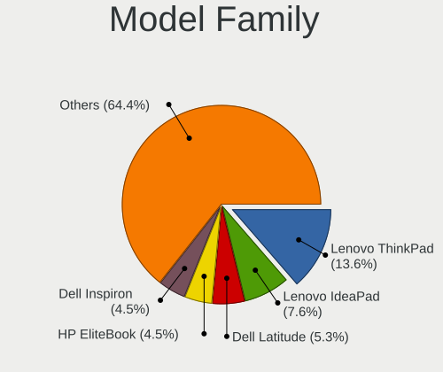

| Name                          | Notebooks | Percent |
|-------------------------------|-----------|---------|
| Lenovo ThinkPad               | 18        | 13.64%  |
| Lenovo IdeaPad                | 10        | 7.58%   |
| Dell Latitude                 | 7         | 5.3%    |
| HP EliteBook                  | 6         | 4.55%   |
| Dell Inspiron                 | 6         | 4.55%   |
| HP Pavilion                   | 5         | 3.79%   |
| Acer Aspire                   | 5         | 3.79%   |
| Toshiba Satellite             | 4         | 3.03%   |
| Lenovo Legion                 | 3         | 2.27%   |
| HP ZBook                      | 3         | 2.27%   |
| ASUS ASUS                     | 3         | 2.27%   |
| Lenovo G50-45                 | 2         | 1.52%   |
| HP Laptop                     | 2         | 1.52%   |
| Gigabyte AERO                 | 2         | 1.52%   |
| Dell Precision                | 2         | 1.52%   |
| ASUS VivoBook                 | 2         | 1.52%   |
| ASUS ROG                      | 2         | 1.52%   |
| Acer Nitro                    | 2         | 1.52%   |
| win element MoreFine          | 1         | 0.76%   |
| Sony VPCCB3C5E                | 1         | 0.76%   |
| Sony VGN-NS31M                | 1         | 0.76%   |
| Samsung 730QCJ                | 1         | 0.76%   |
| Samsung 700Z7C                | 1         | 0.76%   |
| Samsung 305V4A                | 1         | 0.76%   |
| Razer Blade                   | 1         | 0.76%   |
| Notebook N8xEJEK              | 1         | 0.76%   |
| MSI Prestige                  | 1         | 0.76%   |
| MSI Alpha                     | 1         | 0.76%   |
| Lenovo ZIWB2                  | 1         | 0.76%   |
| Lenovo IdeaPadFlex            | 1         | 0.76%   |
| Lenovo G70-80                 | 1         | 0.76%   |
| Lenovo G50-80                 | 1         | 0.76%   |
| Intel Client Systems LAPBC510 | 1         | 0.76%   |
| HUAWEI KLVL-WXXW              | 1         | 0.76%   |
| HUAWEI HLYL-WXX9              | 1         | 0.76%   |
| HP Stream                     | 1         | 0.76%   |
| HP Sona                       | 1         | 0.76%   |
| HP ProBook                    | 1         | 0.76%   |
| HP OMEN                       | 1         | 0.76%   |
| HP Notebook                   | 1         | 0.76%   |

MFG Year
--------

Motherboard manufacture year

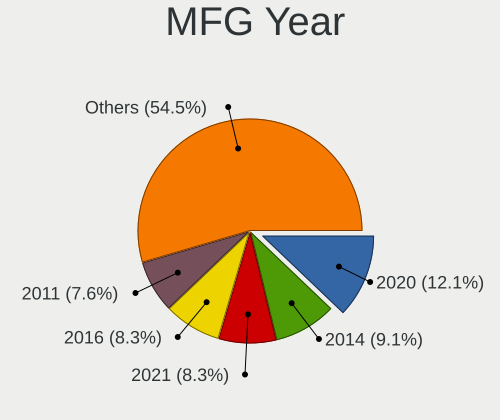

| Year | Notebooks | Percent |
|------|-----------|---------|
| 2020 | 16        | 12.12%  |
| 2014 | 12        | 9.09%   |
| 2021 | 11        | 8.33%   |
| 2016 | 11        | 8.33%   |
| 2011 | 10        | 7.58%   |
| 2015 | 9         | 6.82%   |
| 2012 | 9         | 6.82%   |
| 2008 | 9         | 6.82%   |
| 2019 | 8         | 6.06%   |
| 2018 | 7         | 5.3%    |
| 2017 | 7         | 5.3%    |
| 2022 | 4         | 3.03%   |
| 2013 | 4         | 3.03%   |
| 2024 | 3         | 2.27%   |
| 2023 | 3         | 2.27%   |
| 2010 | 3         | 2.27%   |
| 2009 | 3         | 2.27%   |
| 2007 | 2         | 1.52%   |
| 2025 | 1         | 0.76%   |

Form Factor
-----------

Physical design of the computer

| Name     | Notebooks | Percent |
|----------|-----------|---------|
| Notebook | 132       | 100%    |

Secure Boot
-----------

Enabled or disabled

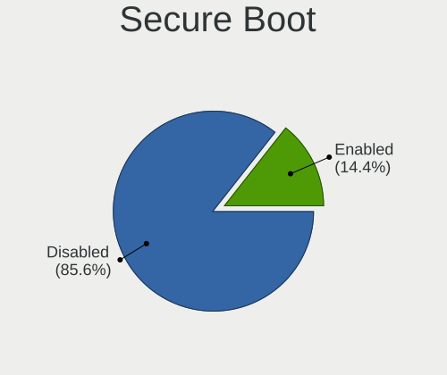

| State    | Notebooks | Percent |
|----------|-----------|---------|
| Disabled | 113       | 85.61%  |
| Enabled  | 19        | 14.39%  |

Coreboot
--------

Have coreboot on board

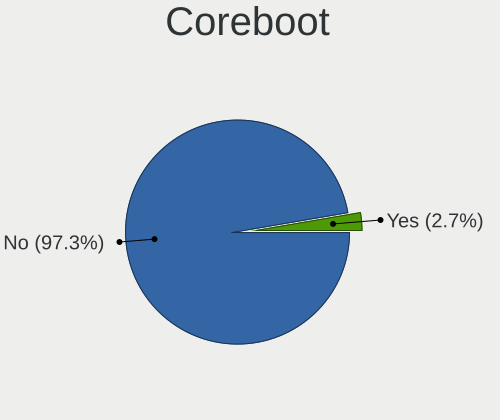

| Used | Notebooks | Percent |
|------|-----------|---------|
| No   | 130       | 98.48%  |
| Yes  | 2         | 1.52%   |

RAM Size
--------

Total RAM memory

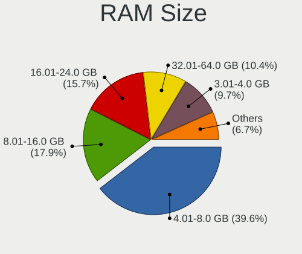

| Size in GB  | Notebooks | Percent |
|-------------|-----------|---------|
| 4.01-8.0    | 53        | 39.55%  |
| 8.01-16.0   | 24        | 17.91%  |
| 16.01-24.0  | 21        | 15.67%  |
| 32.01-64.0  | 14        | 10.45%  |
| 3.01-4.0    | 13        | 9.7%    |
| 24.01-32.0  | 4         | 2.99%   |
| 2.01-3.0    | 2         | 1.49%   |
| 64.01-256.0 | 2         | 1.49%   |
| 1.01-2.0    | 1         | 0.75%   |

RAM Used
--------

Used RAM memory

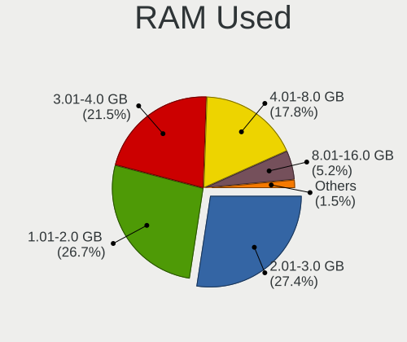

| Used GB    | Notebooks | Percent |
|------------|-----------|---------|
| 2.01-3.0   | 37        | 27.41%  |
| 1.01-2.0   | 36        | 26.67%  |
| 3.01-4.0   | 29        | 21.48%  |
| 4.01-8.0   | 24        | 17.78%  |
| 8.01-16.0  | 7         | 5.19%   |
| 24.01-32.0 | 1         | 0.74%   |
| 0.51-1.0   | 1         | 0.74%   |

Total Drives
------------

Number of drives on board

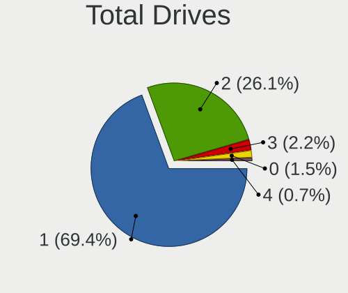

| Drives | Notebooks | Percent |
|--------|-----------|---------|
| 1      | 93        | 69.4%   |
| 2      | 35        | 26.12%  |
| 3      | 3         | 2.24%   |
| 0      | 2         | 1.49%   |
| 4      | 1         | 0.75%   |

Has CD-ROM
----------

Has CD-ROM on board

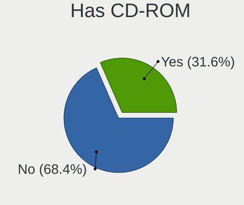

| Presented | Notebooks | Percent |
|-----------|-----------|---------|
| No        | 91        | 68.42%  |
| Yes       | 42        | 31.58%  |

Has Ethernet
------------

Has Ethernet on board

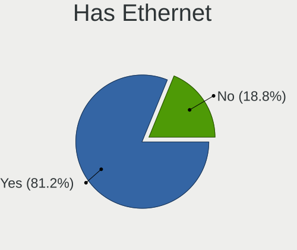

| Presented | Notebooks | Percent |
|-----------|-----------|---------|
| Yes       | 108       | 81.2%   |
| No        | 25        | 18.8%   |

Has WiFi
--------

Has WiFi module

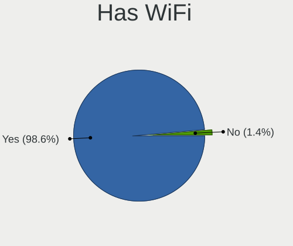

| Presented | Notebooks | Percent |
|-----------|-----------|---------|
| Yes       | 131       | 99.24%  |
| No        | 1         | 0.76%   |

Has Bluetooth
-------------

Has Bluetooth module

| Presented | Notebooks | Percent |
|-----------|-----------|---------|
| Yes       | 109       | 82.58%  |
| No        | 23        | 17.42%  |

Location
--------

Country
-------

Geographic location (country)

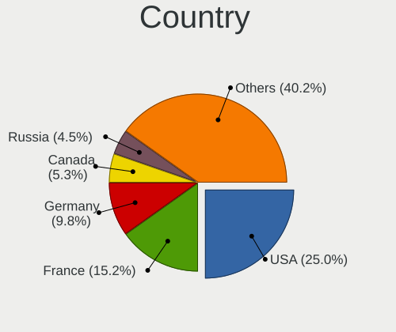

| Country      | Notebooks | Percent |
|--------------|-----------|---------|
| USA          | 33        | 25%     |
| France       | 20        | 15.15%  |
| Germany      | 13        | 9.85%   |
| Canada       | 7         | 5.3%    |
| Russia       | 6         | 4.55%   |
| Italy        | 6         | 4.55%   |
| UK           | 4         | 3.03%   |
| Spain        | 4         | 3.03%   |
| Mexico       | 3         | 2.27%   |
| Brazil       | 3         | 2.27%   |
| Switzerland  | 2         | 1.52%   |
| Sweden       | 2         | 1.52%   |
| Norway       | 2         | 1.52%   |
| Netherlands  | 2         | 1.52%   |
| Ivory Coast  | 2         | 1.52%   |
| Hungary      | 2         | 1.52%   |
| Costa Rica   | 2         | 1.52%   |
| Australia    | 2         | 1.52%   |
| Yemen        | 1         | 0.76%   |
| Turkey       | 1         | 0.76%   |
| Taiwan       | 1         | 0.76%   |
| Sri Lanka    | 1         | 0.76%   |
| South Africa | 1         | 0.76%   |
| Poland       | 1         | 0.76%   |
| Peru         | 1         | 0.76%   |
| Nigeria      | 1         | 0.76%   |
| Nicaragua    | 1         | 0.76%   |
| Ireland      | 1         | 0.76%   |
| Indonesia    | 1         | 0.76%   |
| Finland      | 1         | 0.76%   |
| Denmark      | 1         | 0.76%   |
| Bulgaria     | 1         | 0.76%   |
| Belgium      | 1         | 0.76%   |
| Austria      | 1         | 0.76%   |
| Argentina    | 1         | 0.76%   |

City
----

Geographic location (city)

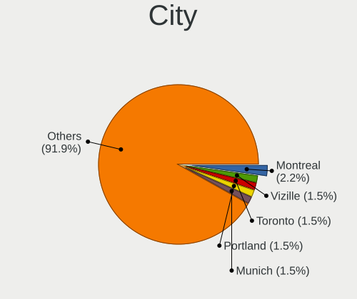

| City          | Notebooks | Percent |
|---------------|-----------|---------|
| Montreal      | 3         | 2.22%   |
| Vizille       | 2         | 1.48%   |
| Toronto       | 2         | 1.48%   |
| Portland      | 2         | 1.48%   |
| Munich        | 2         | 1.48%   |
| Madrid        | 2         | 1.48%   |
| Hamburg       | 2         | 1.48%   |
| Groningen     | 2         | 1.48%   |
| Denver        | 2         | 1.48%   |
| Budapest      | 2         | 1.48%   |
| Béziers      | 2         | 1.48%   |
| Abidjan       | 2         | 1.48%   |
| Zele          | 1         | 0.74%   |
| Yonkers       | 1         | 0.74%   |
| Yekaterinburg | 1         | 0.74%   |
| Wroclaw       | 1         | 0.74%   |
| Woonsocket    | 1         | 0.74%   |
| Woodland Park | 1         | 0.74%   |
| Warner Robins | 1         | 0.74%   |
| Voiron        | 1         | 0.74%   |
| Vienna        | 1         | 0.74%   |
| Viborg        | 1         | 0.74%   |
| Verdal        | 1         | 0.74%   |
| Velleron      | 1         | 0.74%   |
| Turin         | 1         | 0.74%   |
| Toulouse      | 1         | 0.74%   |
| Toluca        | 1         | 0.74%   |
| Tarragona     | 1         | 0.74%   |
| Taipei        | 1         | 0.74%   |
| Sydney        | 1         | 0.74%   |
| Sunderland    | 1         | 0.74%   |
| Stuttgart     | 1         | 0.74%   |
| Stockholm     | 1         | 0.74%   |
| Stabekk       | 1         | 0.74%   |
| St Petersburg | 1         | 0.74%   |
| Sofia         | 1         | 0.74%   |
| Sleman        | 1         | 0.74%   |
| Seropedica    | 1         | 0.74%   |
| Santo André  | 1         | 0.74%   |
| Sanaa         | 1         | 0.74%   |

Drives
------

Drive Vendor
------------

Hard drive vendors

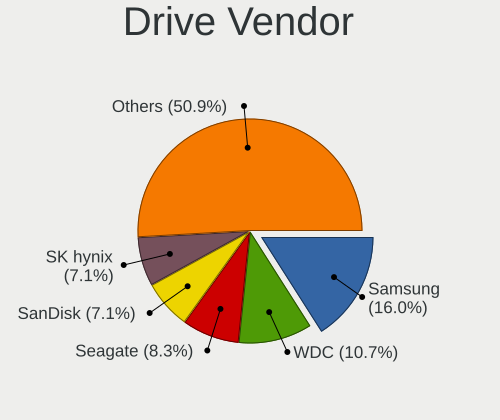

| Vendor                      | Notebooks | Drives | Percent |
|-----------------------------|-----------|--------|---------|
| Samsung Electronics         | 27        | 27     | 15.98%  |
| WDC                         | 18        | 19     | 10.65%  |
| Seagate                     | 14        | 15     | 8.28%   |
| SK hynix                    | 12        | 14     | 7.1%    |
| SanDisk                     | 12        | 12     | 7.1%    |
| Toshiba                     | 8         | 8      | 4.73%   |
| Intel                       | 6         | 11     | 3.55%   |
| Hitachi                     | 6         | 6      | 3.55%   |
| Micron Technology           | 5         | 5      | 2.96%   |
| Unknown                     | 4         | 4      | 2.37%   |
| Kingston                    | 4         | 4      | 2.37%   |
| PNY                         | 3         | 3      | 1.78%   |
| Phison                      | 3         | 3      | 1.78%   |
| KIOXIA                      | 3         | 3      | 1.78%   |
| Kingston Technology Company | 3         | 4      | 1.78%   |
| Crucial                     | 3         | 3      | 1.78%   |
| Unknown                     | 3         | 3      | 1.78%   |
| UMIS                        | 2         | 2      | 1.18%   |
| China                       | 2         | 2      | 1.18%   |
| XrayDisk                    | 1         | 1      | 0.59%   |
| XPG                         | 1         | 1      | 0.59%   |
| Wibtek                      | 1         | 1      | 0.59%   |
| USB                         | 1         | 1      | 0.59%   |
| Union Memory                | 1         | 1      | 0.59%   |
| Team                        | 1         | 1      | 0.59%   |
| SSSTC                       | 1         | 1      | 0.59%   |
| SPCC                        | 1         | 1      | 0.59%   |
| SP                          | 1         | 1      | 0.59%   |
| Silicon Motion              | 1         | 1      | 0.59%   |
| Reeinno                     | 1         | 1      | 0.59%   |
| Realtek                     | 1         | 1      | 0.59%   |
| MAXIO Technology (Hangzhou) | 1         | 1      | 0.59%   |
| LITEONIT                    | 1         | 1      | 0.59%   |
| LITEON                      | 1         | 1      | 0.59%   |
| Lexar                       | 1         | 1      | 0.59%   |
| LDLC                        | 1         | 1      | 0.59%   |
| KingSpec                    | 1         | 1      | 0.59%   |
| JMicron Technology          | 1         | 1      | 0.59%   |
| Inateck                     | 1         | 1      | 0.59%   |
| HGST                        | 1         | 1      | 0.59%   |

Drive Model
-----------

Hard drive models

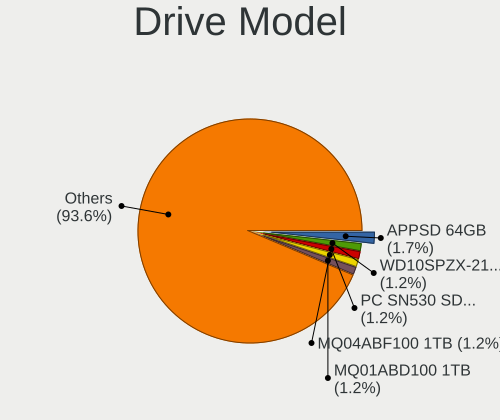

| Model                                     | Notebooks | Percent |
|-------------------------------------------|-----------|---------|
| Unknown                                   | 3         | 1.73%   |
| WDC WD10SPZX-21Z10T0 1TB                  | 2         | 1.16%   |
| WDC PC SN530 SDBPNPZ-512G-1002 512GB      | 2         | 1.16%   |
| Toshiba MQ04ABF100 1TB                    | 2         | 1.16%   |
| Toshiba MQ01ABD100 1TB                    | 2         | 1.16%   |
| SK hynix SKHynix_HFM512GDHTNI-87A0B 512GB | 2         | 1.16%   |
| Seagate ST500LM021-1KJ152 500GB           | 2         | 1.16%   |
| Seagate ST1000LM035-1RK172 1TB            | 2         | 1.16%   |
| Seagate ST1000LM024 HN-M101MBB 1TB        | 2         | 1.16%   |
| SanDisk DF4064  64GB                      | 2         | 1.16%   |
| Samsung SSD 870 EVO 1TB                   | 2         | 1.16%   |
| Samsung SSD 860 EVO 500GB                 | 2         | 1.16%   |
| Samsung MZ7TD256HAFV-000L7 256GB SSD      | 2         | 1.16%   |
| Phison Sabrent 2TB                        | 2         | 1.16%   |
| Kingston Company OM8PGP4512Q-AA 512GB     | 2         | 1.16%   |
| Kingston SA400S37240G 240GB SSD           | 2         | 1.16%   |
| China SSD 1TB                             | 2         | 1.16%   |
| XrayDisk 1TB SSD                          | 1         | 0.58%   |
| XPG GAMMIX S7 1TB                         | 1         | 0.58%   |
| Wibtek W800S 512GB                        | 1         | 0.58%   |
| WDC WDS100T2G0A-00JH30 1TB SSD            | 1         | 0.58%   |
| WDC WDS100T2B0C-00PXH0 1TB                | 1         | 0.58%   |
| WDC WDS100T2B0A-00SM50 1TB SSD            | 1         | 0.58%   |
| WDC WD7500BPKT-80PK4T0 752GB              | 1         | 0.58%   |
| WDC WD5000LPVX-75V0TT0 500GB              | 1         | 0.58%   |
| WDC WD5000LPLX-08ZNTT0 500GB              | 1         | 0.58%   |
| WDC WD5000BEKT-60KA9T0 500GB              | 1         | 0.58%   |
| WDC WD3200BPVT-80ZEST0 320GB              | 1         | 0.58%   |
| WDC WD3200BEKT-75PVMT1 320GB              | 1         | 0.58%   |
| WDC WD3200BEKT-60V5T1 320GB               | 1         | 0.58%   |
| WDC WD2500BEVT-22ZCT0 250GB               | 1         | 0.58%   |
| WDC WD10JPVT-75A1YT0 1TB                  | 1         | 0.58%   |
| WDC PC SN530 SDBPMPZ-256G-1001 256GB      | 1         | 0.58%   |
| WDC PC SN520 SDAPMUW-512G-1101 512GB      | 1         | 0.58%   |
| USB SanDisk 3.2Gen1 496GB                 | 1         | 0.58%   |
| Unknown MMC Card  4GB                     | 1         | 0.58%   |
| Unknown MMC Card  16GB                    | 1         | 0.58%   |
| Unknown DA4128  128GB                     | 1         | 0.58%   |
| Unknown 032G34  32GB                      | 1         | 0.58%   |
| Union Memory UMIS RPJTJ256MEE1OWX 256GB   | 1         | 0.58%   |

HDD Vendor
----------

Hard disk drive vendors

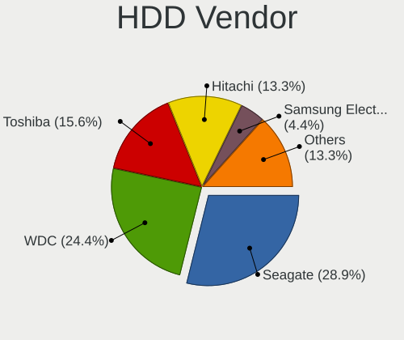

| Vendor              | Notebooks | Drives | Percent |
|---------------------|-----------|--------|---------|
| Seagate             | 13        | 13     | 28.89%  |
| WDC                 | 11        | 12     | 24.44%  |
| Toshiba             | 7         | 7      | 15.56%  |
| Hitachi             | 6         | 6      | 13.33%  |
| Samsung Electronics | 2         | 2      | 4.44%   |
| JMicron Technology  | 1         | 1      | 2.22%   |
| Inateck             | 1         | 1      | 2.22%   |
| HGST                | 1         | 1      | 2.22%   |
| Fujitsu             | 1         | 1      | 2.22%   |
| External            | 1         | 1      | 2.22%   |
| ASMT                | 1         | 1      | 2.22%   |

SSD Vendor
----------

Solid state drive vendors

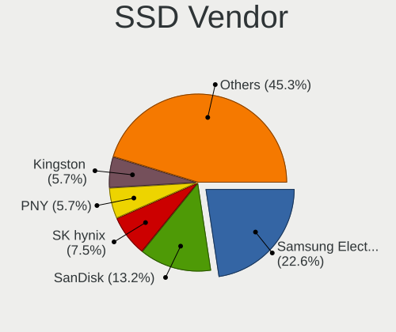

| Vendor              | Notebooks | Drives | Percent |
|---------------------|-----------|--------|---------|
| Samsung Electronics | 12        | 12     | 22.64%  |
| SanDisk             | 7         | 7      | 13.21%  |
| SK hynix            | 4         | 5      | 7.55%   |
| PNY                 | 3         | 3      | 5.66%   |
| Kingston            | 3         | 3      | 5.66%   |
| WDC                 | 2         | 2      | 3.77%   |
| Micron Technology   | 2         | 2      | 3.77%   |
| Crucial             | 2         | 2      | 3.77%   |
| China               | 2         | 2      | 3.77%   |
| XrayDisk            | 1         | 1      | 1.89%   |
| Wibtek              | 1         | 1      | 1.89%   |
| Toshiba             | 1         | 1      | 1.89%   |
| SPCC                | 1         | 1      | 1.89%   |
| Reeinno             | 1         | 1      | 1.89%   |
| LITEONIT            | 1         | 1      | 1.89%   |
| LITEON              | 1         | 1      | 1.89%   |
| Lexar               | 1         | 1      | 1.89%   |
| LDLC                | 1         | 1      | 1.89%   |
| KingSpec            | 1         | 1      | 1.89%   |
| Intel               | 1         | 1      | 1.89%   |
| Fanxiang            | 1         | 1      | 1.89%   |
| Dogfish             | 1         | 1      | 1.89%   |
| BHT                 | 1         | 1      | 1.89%   |
| ASMedia             | 1         | 1      | 1.89%   |
| Apple               | 1         | 1      | 1.89%   |

Drive Kind
----------

HDD or SSD

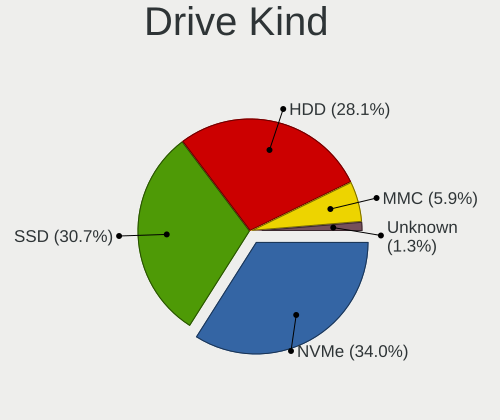

| Kind    | Notebooks | Drives | Percent |
|---------|-----------|--------|---------|
| NVMe    | 52        | 68     | 33.99%  |
| SSD     | 47        | 54     | 30.72%  |
| HDD     | 43        | 46     | 28.1%   |
| MMC     | 9         | 10     | 5.88%   |
| Unknown | 2         | 2      | 1.31%   |

Drive Connector
---------------

SATA, SAS, NVMe, etc.

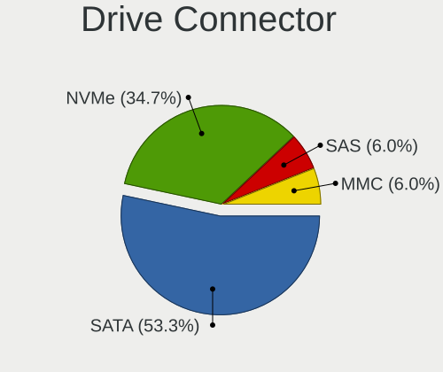

| Type | Notebooks | Drives | Percent |
|------|-----------|--------|---------|
| SATA | 80        | 93     | 53.33%  |
| NVMe | 52        | 67     | 34.67%  |
| SAS  | 9         | 10     | 6%      |
| MMC  | 9         | 10     | 6%      |

Drive Size
----------

Size of hard drive

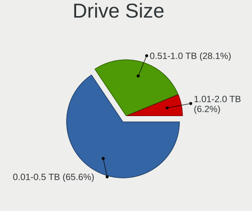

| Size in TB | Notebooks | Drives | Percent |
|------------|-----------|--------|---------|
| 0.01-0.5   | 63        | 67     | 65.63%  |
| 0.51-1.0   | 27        | 27     | 28.13%  |
| 1.01-2.0   | 6         | 6      | 6.25%   |

Space Total
-----------

Amount of disk space available on the file system

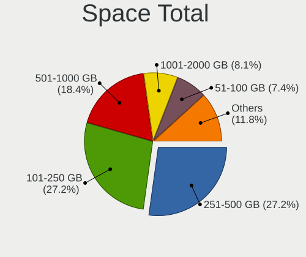

| Size in GB | Notebooks | Percent |
|------------|-----------|---------|
| 251-500    | 37        | 27.21%  |
| 101-250    | 37        | 27.21%  |
| 501-1000   | 25        | 18.38%  |
| 1001-2000  | 11        | 8.09%   |
| 51-100     | 10        | 7.35%   |
| 21-50      | 8         | 5.88%   |
| 1-20       | 5         | 3.68%   |
| 2001-3000  | 3         | 2.21%   |

Space Used
----------

Amount of used disk space

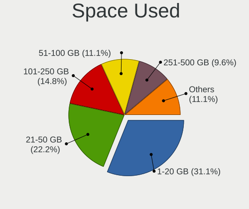

| Used GB   | Notebooks | Percent |
|-----------|-----------|---------|
| 1-20      | 42        | 31.11%  |
| 21-50     | 30        | 22.22%  |
| 101-250   | 20        | 14.81%  |
| 51-100    | 15        | 11.11%  |
| 251-500   | 13        | 9.63%   |
| 501-1000  | 11        | 8.15%   |
| 1001-2000 | 4         | 2.96%   |

Malfunc. Drives
---------------

Drive models with a malfunction

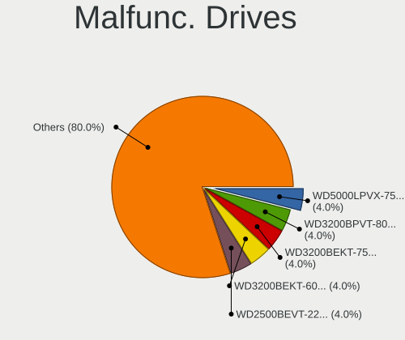

| Model                                               | Notebooks | Drives | Percent |
|-----------------------------------------------------|-----------|--------|---------|
| WDC WD5000LPVX-75V0TT0 500GB                        | 1         | 1      | 4%      |
| WDC WD3200BPVT-80ZEST0 320GB                        | 1         | 1      | 4%      |
| WDC WD3200BEKT-75PVMT1 320GB                        | 1         | 1      | 4%      |
| WDC WD3200BEKT-60V5T1 320GB                         | 1         | 1      | 4%      |
| WDC WD2500BEVT-22ZCT0 250GB                         | 1         | 1      | 4%      |
| UMIS RPITJ512VME2OWD 512GB                          | 1         | 1      | 4%      |
| Toshiba MK1637GSX 160GB                             | 1         | 1      | 4%      |
| SSSTC CL1-4D512 512GB                               | 1         | 1      | 4%      |
| SK hynix HFS256G39TND-N210A 256GB SSD               | 1         | 2      | 4%      |
| Seagate ST9500420AS 500GB                           | 1         | 1      | 4%      |
| Seagate ST9320320AS 320GB                           | 1         | 1      | 4%      |
| Seagate ST500LM012 HN-M500MBB 500GB                 | 1         | 1      | 4%      |
| Seagate ST1000LM049-2GH172 1TB                      | 1         | 1      | 4%      |
| SanDisk SSD PLUS 1000GB                             | 1         | 1      | 4%      |
| Samsung Electronics SSD 970 EVO 1TB S467NF0K604975T | 1         | 1      | 4%      |
| Samsung Electronics SSD 870 EVO 1TB                 | 1         | 1      | 4%      |
| Samsung Electronics HN-M500MBB 500GB                | 1         | 1      | 4%      |
| Samsung Electronics HM320JI 320GB                   | 1         | 1      | 4%      |
| Micron Technology MTFDDAV256TBN-1AR15ABHA 256GB SSD | 1         | 1      | 4%      |
| KingSpec P3-256 256GB SSD                           | 1         | 1      | 4%      |
| Intel SSDSCKKF180H6H 180GB                          | 1         | 1      | 4%      |
| Hitachi HTS725050A9A360 500GB                       | 1         | 1      | 4%      |
| Hitachi HTS723232A7A364 320GB                       | 1         | 1      | 4%      |
| Hitachi HTS547564A9E384 640GB                       | 1         | 1      | 4%      |
| Hitachi HTS545050B9A300 500GB                       | 1         | 1      | 4%      |

Malfunc. Drive Vendor
---------------------

Vendors of faulty drives

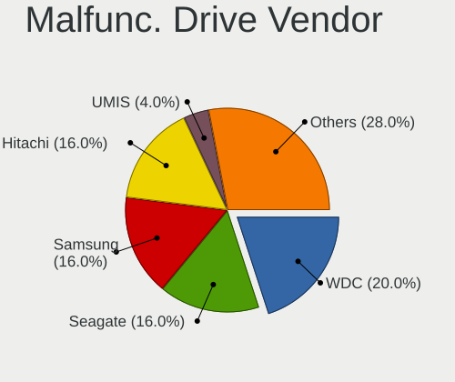

| Vendor              | Notebooks | Drives | Percent |
|---------------------|-----------|--------|---------|
| WDC                 | 5         | 5      | 20%     |
| Seagate             | 4         | 4      | 16%     |
| Samsung Electronics | 4         | 4      | 16%     |
| Hitachi             | 4         | 4      | 16%     |
| UMIS                | 1         | 1      | 4%      |
| Toshiba             | 1         | 1      | 4%      |
| SSSTC               | 1         | 1      | 4%      |
| SK hynix            | 1         | 2      | 4%      |
| SanDisk             | 1         | 1      | 4%      |
| Micron Technology   | 1         | 1      | 4%      |
| KingSpec            | 1         | 1      | 4%      |
| Intel               | 1         | 1      | 4%      |

Malfunc. HDD Vendor
-------------------

Vendors of faulty HDD drives

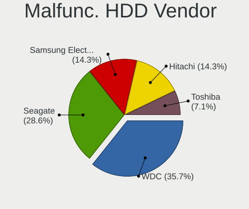

| Vendor              | Notebooks | Drives | Percent |
|---------------------|-----------|--------|---------|
| WDC                 | 5         | 5      | 31.25%  |
| Seagate             | 4         | 4      | 25%     |
| Hitachi             | 4         | 4      | 25%     |
| Samsung Electronics | 2         | 2      | 12.5%   |
| Toshiba             | 1         | 1      | 6.25%   |

Malfunc. Drive Kind
-------------------

Kinds of faulty drives

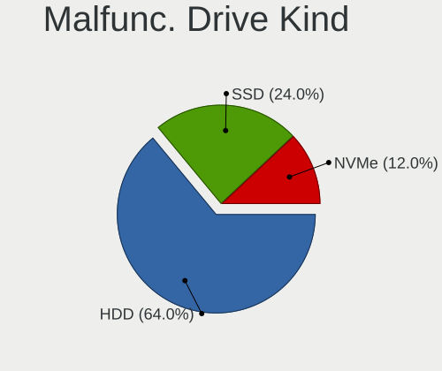

| Kind | Notebooks | Drives | Percent |
|------|-----------|--------|---------|
| HDD  | 16        | 16     | 64%     |
| SSD  | 6         | 7      | 24%     |
| NVMe | 3         | 3      | 12%     |

Failed Drives
-------------

Failed drive models

Zero info for selected period =(

Failed Drive Vendor
-------------------

Failed drive vendors

Zero info for selected period =(

Drive Status
------------

Number of failed and malfunc. drives

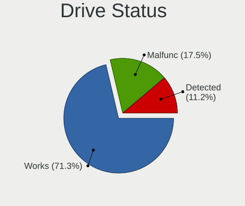

| Status   | Notebooks | Drives | Percent |
|----------|-----------|--------|---------|
| Works    | 102       | 134    | 71.33%  |
| Malfunc  | 25        | 26     | 17.48%  |
| Detected | 16        | 20     | 11.19%  |

Storage controller
------------------

Storage Vendor
--------------

Storage controller vendors

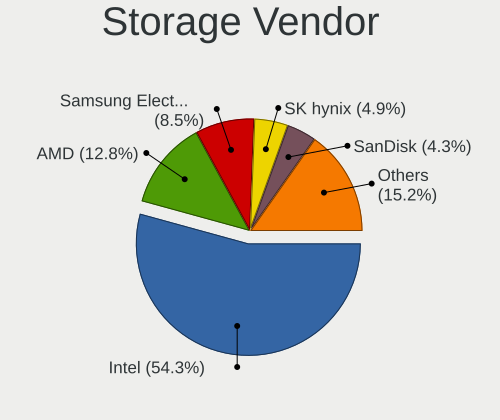

| Vendor                         | Notebooks | Percent |
|--------------------------------|-----------|---------|
| Intel                          | 89        | 54.27%  |
| AMD                            | 21        | 12.8%   |
| Samsung Electronics            | 14        | 8.54%   |
| SK hynix                       | 8         | 4.88%   |
| SanDisk                        | 7         | 4.27%   |
| Phison Electronics             | 4         | 2.44%   |
| Kingston Technology Company    | 4         | 2.44%   |
| Union Memory (Shenzhen)        | 3         | 1.83%   |
| Micron Technology              | 3         | 1.83%   |
| KIOXIA                         | 2         | 1.22%   |
| Toshiba America Info Systems   | 1         | 0.61%   |
| Solid State Storage Technology | 1         | 0.61%   |
| Silicon Motion                 | 1         | 0.61%   |
| Seagate Technology             | 1         | 0.61%   |
| Realtek Semiconductor          | 1         | 0.61%   |
| Micron/Crucial Technology      | 1         | 0.61%   |
| MAXIO Technology (Hangzhou)    | 1         | 0.61%   |
| INNOGRIT                       | 1         | 0.61%   |
| ADATA Technology               | 1         | 0.61%   |

Storage Model
-------------

Storage controller models

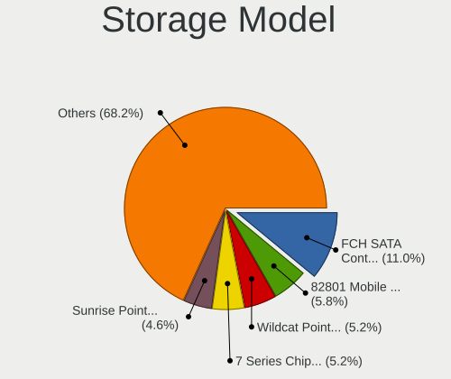

| Model                                                                          | Notebooks | Percent |
|--------------------------------------------------------------------------------|-----------|---------|
| AMD FCH SATA Controller [AHCI mode]                                            | 19        | 10.98%  |
| Intel 82801 Mobile SATA Controller [RAID mode]                                 | 10        | 5.78%   |
| Intel Wildcat Point-LP SATA Controller [AHCI Mode]                             | 9         | 5.2%    |
| Intel 7 Series Chipset Family 6-port SATA Controller [AHCI mode]               | 9         | 5.2%    |
| Intel Sunrise Point-LP SATA Controller [AHCI mode]                             | 8         | 4.62%   |
| Intel 6 Series/C200 Series Chipset Family 6 port Mobile SATA AHCI Controller   | 8         | 4.62%   |
| Intel 8 Series SATA Controller 1 [AHCI mode]                                   | 7         | 4.05%   |
| Samsung NVMe SSD Controller SM981/PM981/PM983                                  | 6         | 3.47%   |
| Intel Q170/Q150/B150/H170/H110/Z170/CM236 Chipset SATA Controller [AHCI Mode]  | 4         | 2.31%   |
| SanDisk Ultra 3D / WD PC SN530, IX SN530, Blue SN550 NVMe SSD (DRAM-less)      | 3         | 1.73%   |
| Samsung NVMe SSD Controller 980 (DRAM-less)                                    | 3         | 1.73%   |
| Phison E12 NVMe Controller                                                     | 3         | 1.73%   |
| Intel Volume Management Device NVMe RAID Controller                            | 3         | 1.73%   |
| Intel Cannon Lake Mobile PCH SATA AHCI Controller                              | 3         | 1.73%   |
| Intel 82801IBM/IEM (ICH9M/ICH9M-E) 4 port SATA Controller [AHCI mode]          | 3         | 1.73%   |
| Intel 8 Series/C220 Series Chipset Family 6-port SATA Controller 1 [AHCI mode] | 3         | 1.73%   |
| Intel 5 Series/3400 Series Chipset 4 port SATA AHCI Controller                 | 3         | 1.73%   |
| Union Memory (Shenzhen) AM620 PCIe 3.0 NVMe SSD 256GB                          | 2         | 1.16%   |
| SK hynix BC511 NVMe SSD                                                        | 2         | 1.16%   |
| SK hynix BC501 NVMe Solid State Drive                                          | 2         | 1.16%   |
| Samsung NVMe SSD Controller SM961/PM961/SM963                                  | 2         | 1.16%   |
| Kingston Company OM8PGP4 NVMe PCIe SSD (DRAM-less)                             | 2         | 1.16%   |
| Intel Tiger Lake-LP SATA Controller                                            | 2         | 1.16%   |
| Intel SSD DC P4101/Pro 7600p/760p/E 6100p Series                               | 2         | 1.16%   |
| Intel SSD 670p Series [Keystone Harbor]                                        | 2         | 1.16%   |
| Intel Celeron/Pentium Silver Processor SATA Controller                         | 2         | 1.16%   |
| Intel Celeron N3350/Pentium N4200/Atom E3900 Series SATA AHCI Controller       | 2         | 1.16%   |
| Intel 82801HM/HEM (ICH8M/ICH8M-E) IDE Controller                               | 2         | 1.16%   |
| Intel 5 Series/3400 Series Chipset 6 port SATA AHCI Controller                 | 2         | 1.16%   |
| Intel 400 Series Chipset Family SATA AHCI Controller                           | 2         | 1.16%   |
| AMD SB7x0/SB8x0/SB9x0 SATA Controller [AHCI mode]                              | 2         | 1.16%   |
| Union Memory (Shenzhen) AH631 PCIe 3.0 NVMe SSD 512GB                          | 1         | 0.58%   |
| Toshiba America Info Systems XG6 NVMe SSD Controller                           | 1         | 0.58%   |
| Solid State Storage CL1-3D256-Q11 NVMe SSD M.2                                 | 1         | 0.58%   |
| SK hynix PC611 NVMe Solid State Drive                                          | 1         | 0.58%   |
| SK hynix PC401 NVMe Solid State Drive 256GB                                    | 1         | 0.58%   |
| SK hynix Gold P31/BC711/PC711 NVMe Solid State Drive                           | 1         | 0.58%   |
| SK hynix BC901 NVMe Solid State Drive (DRAM-less)                              | 1         | 0.58%   |
| Silicon Motion SM2263EN/SM2263XT (DRAM-less) NVMe SSD Controllers              | 1         | 0.58%   |
| Seagate E18 PCIe SSD                                                           | 1         | 0.58%   |

Storage Kind
------------

Kind of storage controller (IDE, SATA, NVMe, SAS, ...)

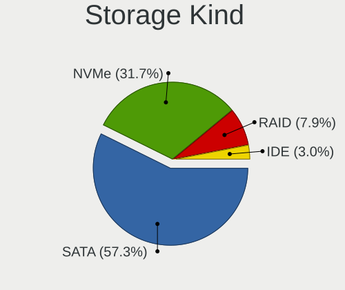

| Kind | Notebooks | Percent |
|------|-----------|---------|
| SATA | 94        | 57.32%  |
| NVMe | 52        | 31.71%  |
| RAID | 13        | 7.93%   |
| IDE  | 5         | 3.05%   |

Processor
---------

CPU Vendor
----------

Processor vendors

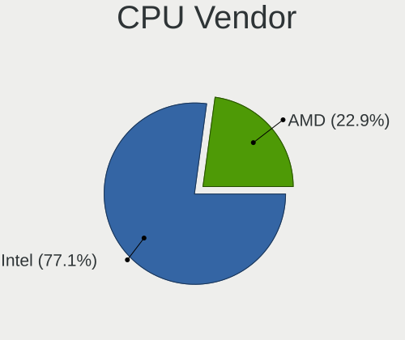

| Vendor | Notebooks | Percent |
|--------|-----------|---------|
| Intel  | 102       | 77.27%  |
| AMD    | 30        | 22.73%  |

CPU Model
---------

Processor models

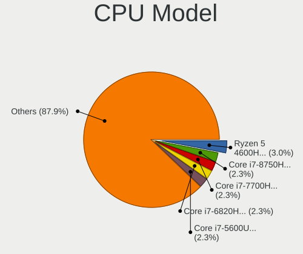

| Model                                   | Notebooks | Percent |
|-----------------------------------------|-----------|---------|
| AMD Ryzen 5 4600H with Radeon Graphics  | 4         | 3.03%   |
| Intel Core i7-8750H CPU @ 2.20GHz       | 3         | 2.27%   |
| Intel Core i7-7700HQ CPU @ 2.80GHz      | 3         | 2.27%   |
| Intel Core i7-6820HQ CPU @ 2.70GHz      | 3         | 2.27%   |
| Intel Core i7-5600U CPU @ 2.60GHz       | 3         | 2.27%   |
| Intel Core i7-1065G7 CPU @ 1.30GHz      | 3         | 2.27%   |
| Intel Core i5-2540M CPU @ 2.60GHz       | 3         | 2.27%   |
| Intel Core i5-2450M CPU @ 2.50GHz       | 3         | 2.27%   |
| AMD Ryzen 7 5825U with Radeon Graphics  | 3         | 2.27%   |
| Intel Core i7-6600U CPU @ 2.60GHz       | 2         | 1.52%   |
| Intel Core i7-5500U CPU @ 2.40GHz       | 2         | 1.52%   |
| Intel Core i7-4600U CPU @ 2.10GHz       | 2         | 1.52%   |
| Intel Core i7-2630QM CPU @ 2.00GHz      | 2         | 1.52%   |
| Intel Core i7 CPU Q 720 @ 1.60GHz       | 2         | 1.52%   |
| Intel Core i5-6200U CPU @ 2.30GHz       | 2         | 1.52%   |
| Intel Core i5-4200U CPU @ 1.60GHz       | 2         | 1.52%   |
| Intel Core i5-10300H CPU @ 2.50GHz      | 2         | 1.52%   |
| Intel Core i3-5005U CPU @ 2.00GHz       | 2         | 1.52%   |
| Intel Celeron N4000 CPU @ 1.10GHz       | 2         | 1.52%   |
| Intel 11th Gen Core i3-1115G4 @ 3.00GHz | 2         | 1.52%   |
| AMD Ryzen 5 5500U with Radeon Graphics  | 2         | 1.52%   |
| Intel Processor 5Y10 CPU @ 0.80GHz      | 1         | 0.76%   |
| Intel Pentium Dual CPU T3400 @ 2.16GHz  | 1         | 0.76%   |
| Intel Pentium CPU 5405U @ 2.30GHz       | 1         | 0.76%   |
| Intel Genuine CPU U2300 @ 1.20GHz       | 1         | 0.76%   |
| Intel Core Ultra 9 288V                 | 1         | 0.76%   |
| Intel Core Ultra 9 275HX                | 1         | 0.76%   |
| Intel Core i9-8950HK CPU @ 2.90GHz      | 1         | 0.76%   |
| Intel Core i9-14900HX                   | 1         | 0.76%   |
| Intel Core i7-9750H CPU @ 2.60GHz       | 1         | 0.76%   |
| Intel Core i7-8850H CPU @ 2.60GHz       | 1         | 0.76%   |
| Intel Core i7-8550U CPU @ 1.80GHz       | 1         | 0.76%   |
| Intel Core i7-6500U CPU @ 2.50GHz       | 1         | 0.76%   |
| Intel Core i7-4870HQ CPU @ 2.50GHz      | 1         | 0.76%   |
| Intel Core i7-4700HQ CPU @ 2.40GHz      | 1         | 0.76%   |
| Intel Core i7-3940XM CPU @ 3.00GHz      | 1         | 0.76%   |
| Intel Core i7-3635QM CPU @ 2.40GHz      | 1         | 0.76%   |
| Intel Core i7-3630QM CPU @ 2.40GHz      | 1         | 0.76%   |
| Intel Core i7-3520M CPU @ 2.90GHz       | 1         | 0.76%   |
| Intel Core i7-2640M CPU @ 2.80GHz       | 1         | 0.76%   |

CPU Model Family
----------------

Processor model prefix

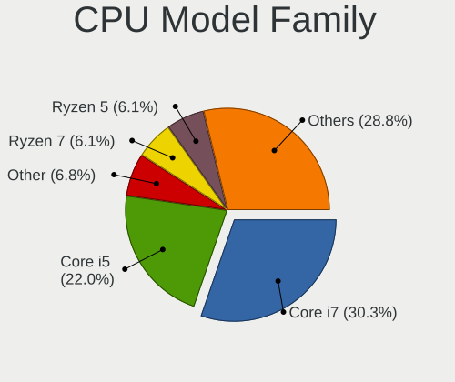

| Model              | Notebooks | Percent |
|--------------------|-----------|---------|
| Intel Core i7      | 40        | 30.3%   |
| Intel Core i5      | 29        | 21.97%  |
| Other              | 9         | 6.82%   |
| AMD Ryzen 7        | 8         | 6.06%   |
| AMD Ryzen 5        | 8         | 6.06%   |
| Intel Celeron      | 7         | 5.3%    |
| Intel Core i3      | 6         | 4.55%   |
| Intel Core 2 Duo   | 5         | 3.79%   |
| Intel Core i9      | 2         | 1.52%   |
| Intel Core         | 2         | 1.52%   |
| AMD Ryzen 3        | 2         | 1.52%   |
| AMD E              | 2         | 1.52%   |
| AMD A8             | 2         | 1.52%   |
| Intel Pentium Dual | 1         | 0.76%   |
| Intel Pentium      | 1         | 0.76%   |
| Intel Genuine      | 1         | 0.76%   |
| AMD Ryzen 9        | 1         | 0.76%   |
| AMD Ryzen 5 PRO    | 1         | 0.76%   |
| AMD Ryzen 3 PRO    | 1         | 0.76%   |
| AMD E2             | 1         | 0.76%   |
| AMD E1             | 1         | 0.76%   |
| AMD A6             | 1         | 0.76%   |
| AMD A4             | 1         | 0.76%   |

CPU Cores
---------

Number of processor cores

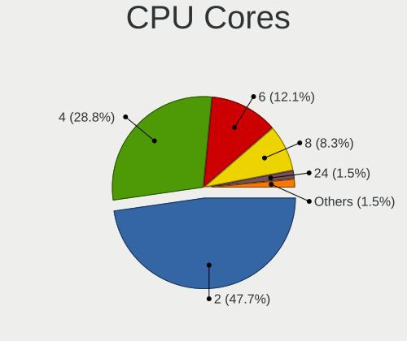

| Number | Notebooks | Percent |
|--------|-----------|---------|
| 2      | 63        | 47.73%  |
| 4      | 38        | 28.79%  |
| 6      | 16        | 12.12%  |
| 8      | 11        | 8.33%   |
| 24     | 2         | 1.52%   |
| 12     | 1         | 0.76%   |
| 10     | 1         | 0.76%   |

CPU Sockets
-----------

Number of sockets

| Number | Notebooks | Percent |
|--------|-----------|---------|
| 1      | 132       | 100%    |

CPU Threads
-----------

Threads per core (Hyper-Threading)

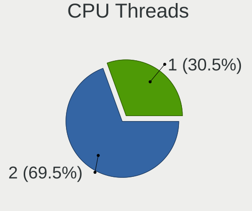

| Number | Notebooks | Percent |
|--------|-----------|---------|
| 2      | 103       | 78.03%  |
| 1      | 29        | 21.97%  |

CPU Op-Modes
------------

CPU Operation Modes (32-bit, 64-bit)

| Op mode        | Notebooks | Percent |
|----------------|-----------|---------|
| 32-bit, 64-bit | 132       | 100%    |

CPU Microcode
-------------

Microcode number

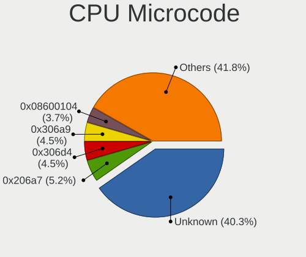

| Number     | Notebooks | Percent |
|------------|-----------|---------|
| Unknown    | 54        | 40.3%   |
| 0x206a7    | 7         | 5.22%   |
| 0x306d4    | 6         | 4.48%   |
| 0x306a9    | 6         | 4.48%   |
| 0x08600104 | 5         | 3.73%   |
| 0x906ea    | 4         | 2.99%   |
| 0xa0652    | 3         | 2.24%   |
| 0x806ea    | 3         | 2.24%   |
| 0x706e5    | 3         | 2.24%   |
| 0x406e3    | 3         | 2.24%   |
| 0x40651    | 3         | 2.24%   |
| 0x0a50000c | 3         | 2.24%   |
| 0x906e9    | 2         | 1.49%   |
| 0x806c1    | 2         | 1.49%   |
| 0x6fd      | 2         | 1.49%   |
| 0x106e5    | 2         | 1.49%   |
| 0x08600106 | 2         | 1.49%   |
| 0x08108109 | 2         | 1.49%   |
| 0x07030105 | 2         | 1.49%   |
| 0x806ec    | 1         | 0.75%   |
| 0x706a1    | 1         | 0.75%   |
| 0x6fb      | 1         | 0.75%   |
| 0x506e3    | 1         | 0.75%   |
| 0x506c9    | 1         | 0.75%   |
| 0x406c4    | 1         | 0.75%   |
| 0x40661    | 1         | 0.75%   |
| 0x306c3    | 1         | 0.75%   |
| 0x1067a    | 1         | 0.75%   |
| 0x10676    | 1         | 0.75%   |
| 0x0a704101 | 1         | 0.75%   |
| 0x08608103 | 1         | 0.75%   |
| 0x08608102 | 1         | 0.75%   |
| 0x08600103 | 1         | 0.75%   |
| 0x07030106 | 1         | 0.75%   |
| 0x07030104 | 1         | 0.75%   |
| 0x06006110 | 1         | 0.75%   |
| 0x0500010d | 1         | 0.75%   |
| 0x05000029 | 1         | 0.75%   |
| 0x03000027 | 1         | 0.75%   |

CPU Microarch
-------------

Microarchitecture

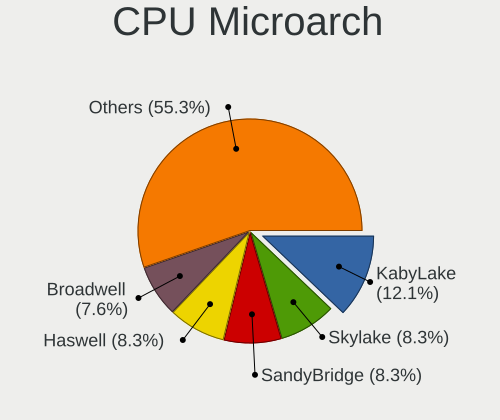

| Name             | Notebooks | Percent |
|------------------|-----------|---------|
| KabyLake         | 16        | 12.12%  |
| Skylake          | 11        | 8.33%   |
| SandyBridge      | 11        | 8.33%   |
| Haswell          | 11        | 8.33%   |
| Broadwell        | 10        | 7.58%   |
| Zen 2            | 9         | 6.82%   |
| IvyBridge        | 8         | 6.06%   |
| Zen 3            | 5         | 3.79%   |
| TigerLake        | 4         | 3.03%   |
| Puma             | 4         | 3.03%   |
| Penryn           | 4         | 3.03%   |
| IceLake          | 4         | 3.03%   |
| CometLake        | 4         | 3.03%   |
| Alderlake Hybrid | 4         | 3.03%   |
| Unknown          | 4         | 3.03%   |
| Zen+             | 3         | 2.27%   |
| Nehalem          | 3         | 2.27%   |
| Core             | 3         | 2.27%   |
| Westmere         | 2         | 1.52%   |
| Lunarlake Hybrid | 2         | 1.52%   |
| K10 Llano        | 2         | 1.52%   |
| Goldmont plus    | 2         | 1.52%   |
| Goldmont         | 2         | 1.52%   |
| Bobcat           | 2         | 1.52%   |
| Silvermont       | 1         | 0.76%   |
| Excavator        | 1         | 0.76%   |

Graphics
--------

GPU Vendor
----------

Vendors of graphics cards

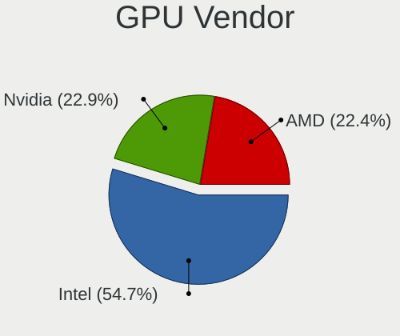

| Vendor | Notebooks | Percent |
|--------|-----------|---------|
| Intel  | 93        | 54.71%  |
| Nvidia | 39        | 22.94%  |
| AMD    | 38        | 22.35%  |

GPU Model
---------

Graphics card models

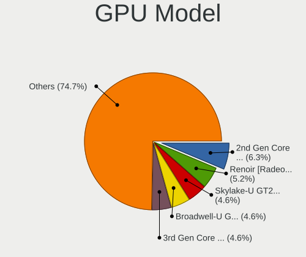

| Model                                                                     | Notebooks | Percent |
|---------------------------------------------------------------------------|-----------|---------|
| Intel 2nd Generation Core Processor Family Integrated Graphics Controller | 11        | 6.32%   |
| AMD Renoir [Radeon Vega Series / Radeon Vega Mobile Series]               | 9         | 5.17%   |
| Intel Skylake-U GT2 [HD Graphics 520]                                     | 8         | 4.6%    |
| Intel Broadwell-U GT2 [HD Graphics 5500]                                  | 8         | 4.6%    |
| Intel 3rd Gen Core processor Graphics Controller                          | 8         | 4.6%    |
| Intel Haswell-ULT Integrated Graphics Controller                          | 7         | 4.02%   |
| Intel CoffeeLake-H GT2 [UHD Graphics 630]                                 | 7         | 4.02%   |
| Nvidia TU117M [GeForce GTX 1650 Mobile / Max-Q]                           | 5         | 2.87%   |
| Intel Mobile 4 Series Chipset Integrated Graphics Controller              | 4         | 2.3%    |
| Intel Kaby Lake-R GT2 [UHD Graphics 620]                                  | 4         | 2.3%    |
| Intel CometLake-H GT2 [UHD Graphics]                                      | 4         | 2.3%    |
| Nvidia GP107M [GeForce GTX 1050 Mobile]                                   | 3         | 1.72%   |
| Intel Iris Plus Graphics G7                                               | 3         | 1.72%   |
| Intel 4th Gen Core Processor Integrated Graphics Controller               | 3         | 1.72%   |
| AMD Picasso/Raven 2 [Radeon Vega Series / Radeon Vega Mobile Series]      | 3         | 1.72%   |
| AMD Barcelo                                                               | 3         | 1.72%   |
| Nvidia TU116M [GeForce GTX 1660 Ti Mobile]                                | 2         | 1.15%   |
| Nvidia GM107GLM [Quadro M2000M]                                           | 2         | 1.15%   |
| Nvidia GK208BM [GeForce 920M]                                             | 2         | 1.15%   |
| Nvidia GF108M [GeForce GT 525M]                                           | 2         | 1.15%   |
| Intel TigerLake-LP GT2 [Iris Xe Graphics]                                 | 2         | 1.15%   |
| Intel Tiger Lake-LP GT2 [UHD Graphics G4]                                 | 2         | 1.15%   |
| Intel Skylake-H GT2 [HD Graphics 530]                                     | 2         | 1.15%   |
| Intel Kaby Lake-H GT2 [HD Graphics 630]                                   | 2         | 1.15%   |
| Intel GeminiLake [UHD Graphics 600]                                       | 2         | 1.15%   |
| Intel Core Processor Integrated Graphics Controller                       | 2         | 1.15%   |
| Intel Apollo Lake GT1 [HD Graphics 500]                                   | 2         | 1.15%   |
| AMD Wrestler [Radeon HD 6310]                                             | 2         | 1.15%   |
| AMD Seymour [Radeon HD 6400M/7400M Series]                                | 2         | 1.15%   |
| AMD Phoenix1                                                              | 2         | 1.15%   |
| AMD Mullins [Radeon R4/R5 Graphics]                                       | 2         | 1.15%   |
| AMD Lucienne                                                              | 2         | 1.15%   |
| AMD Cezanne [Radeon Vega Series / Radeon Vega Mobile Series]              | 2         | 1.15%   |
| Nvidia TU117M [GeForce GTX 1650 Ti Mobile]                                | 1         | 0.57%   |
| Nvidia TU106M [GeForce RTX 2070 Mobile]                                   | 1         | 0.57%   |
| Nvidia TU104M [GeForce RTX 2070 SUPER Mobile / Max-Q]                     | 1         | 0.57%   |
| Nvidia GT216M [GeForce GT 230M]                                           | 1         | 0.57%   |
| Nvidia GT216GLM [Quadro FX 880M]                                          | 1         | 0.57%   |
| Nvidia GP107M [GeForce GTX 1050 Ti Mobile]                                | 1         | 0.57%   |
| Nvidia GP106BM [GeForce GTX 1060 Mobile 6GB]                              | 1         | 0.57%   |

GPU Combo
---------

Combinations of graphics cards

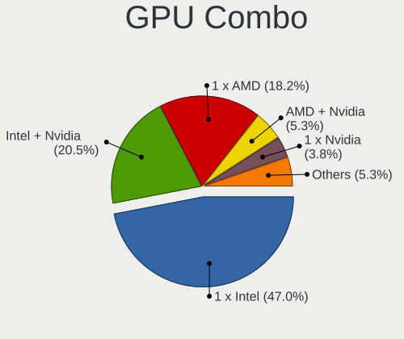

| Name           | Notebooks | Percent |
|----------------|-----------|---------|
| 1 x Intel      | 62        | 46.97%  |
| Intel + Nvidia | 27        | 20.45%  |
| 1 x AMD        | 24        | 18.18%  |
| AMD + Nvidia   | 7         | 5.3%    |
| 1 x Nvidia     | 5         | 3.79%   |
| Intel + AMD    | 4         | 3.03%   |
| 2 x AMD        | 3         | 2.27%   |

GPU Driver
----------

Free vs proprietary

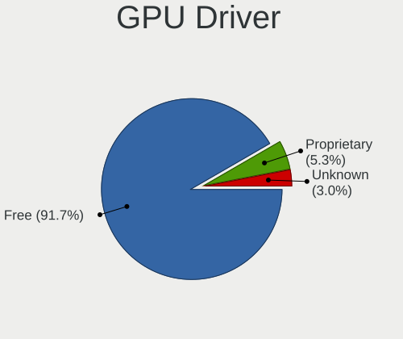

| Driver      | Notebooks | Percent |
|-------------|-----------|---------|
| Free        | 121       | 91.67%  |
| Proprietary | 7         | 5.3%    |
| Unknown     | 4         | 3.03%   |

GPU Memory
----------

Total video memory

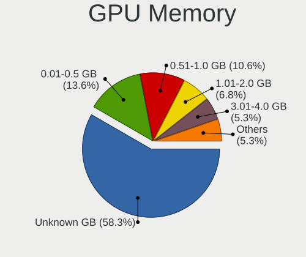

| Size in GB | Notebooks | Percent |
|------------|-----------|---------|
| Unknown    | 77        | 58.33%  |
| 0.01-0.5   | 18        | 13.64%  |
| 0.51-1.0   | 14        | 10.61%  |
| 1.01-2.0   | 9         | 6.82%   |
| 3.01-4.0   | 7         | 5.3%    |
| 5.01-6.0   | 4         | 3.03%   |
| 8.01-16.0  | 3         | 2.27%   |

Monitor
-------

Monitor Vendor
--------------

Monitor vendors

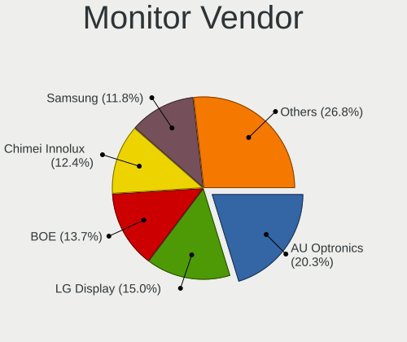

| Vendor                  | Notebooks | Percent |
|-------------------------|-----------|---------|
| AU Optronics            | 31        | 20.26%  |
| LG Display              | 23        | 15.03%  |
| BOE                     | 21        | 13.73%  |
| Chimei Innolux          | 19        | 12.42%  |
| Samsung Electronics     | 18        | 11.76%  |
| Sharp                   | 4         | 2.61%   |
| Lenovo                  | 4         | 2.61%   |
| Apple                   | 4         | 2.61%   |
| Hewlett-Packard         | 3         | 1.96%   |
| Goldstar                | 3         | 1.96%   |
| Dell                    | 3         | 1.96%   |
| Chi Mei Optoelectronics | 3         | 1.96%   |
| BenQ                    | 3         | 1.96%   |
| ASUSTek Computer        | 2         | 1.31%   |
| Ancor Communications    | 2         | 1.31%   |
| Philips                 | 1         | 0.65%   |
| LG Philips              | 1         | 0.65%   |
| Iiyama                  | 1         | 0.65%   |
| HKC                     | 1         | 0.65%   |
| HannStar                | 1         | 0.65%   |
| Hannspree               | 1         | 0.65%   |
| CSW                     | 1         | 0.65%   |
| CPT                     | 1         | 0.65%   |
| Arnos Instruments       | 1         | 0.65%   |
| Acer                    | 1         | 0.65%   |

Monitor Model
-------------

Monitor models

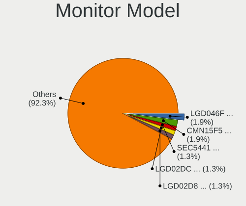

| Model                                                                  | Notebooks | Percent |
|------------------------------------------------------------------------|-----------|---------|
| LG Display LCD Monitor LGD046F 1920x1080 344x194mm 15.5-inch           | 3         | 1.94%   |
| Chimei Innolux LCD Monitor CMN15F5 1920x1080 344x193mm 15.5-inch       | 3         | 1.94%   |
| Samsung Electronics LCD Monitor SEC5441 1280x800 331x207mm 15.4-inch   | 2         | 1.29%   |
| LG Display LCD Monitor LGD02DC 1366x768 344x194mm 15.5-inch            | 2         | 1.29%   |
| LG Display LCD Monitor LGD02D8 1366x768 277x156mm 12.5-inch            | 2         | 1.29%   |
| Chimei Innolux LCD Monitor CMN15E7 1920x1080 344x193mm 15.5-inch       | 2         | 1.29%   |
| Chimei Innolux LCD Monitor CMN14C4 1366x768 309x173mm 13.9-inch        | 2         | 1.29%   |
| Chimei Innolux LCD Monitor CMN14C3 1366x768 309x173mm 13.9-inch        | 2         | 1.29%   |
| BOE LCD Monitor BOE0747 1920x1080 344x194mm 15.5-inch                  | 2         | 1.29%   |
| AU Optronics LCD Monitor AUOD1ED 1920x1080 344x193mm 15.5-inch         | 2         | 1.29%   |
| AU Optronics LCD Monitor AUO229E 1600x900 382x214mm 17.2-inch          | 2         | 1.29%   |
| AU Optronics LCD Monitor AUO123D 1920x1080 309x173mm 13.9-inch         | 2         | 1.29%   |
| Sharp LQ156M1JW25 SHP152C 1920x1080 344x194mm 15.5-inch                | 1         | 0.65%   |
| Sharp LCD Monitor SHP14B8 1920x1080 294x165mm 13.3-inch                | 1         | 0.65%   |
| Sharp LCD Monitor SHP149A 1920x1080 344x194mm 15.5-inch                | 1         | 0.65%   |
| Sharp LCD Monitor SHP1453 1920x1080 346x194mm 15.6-inch                | 1         | 0.65%   |
| Samsung Electronics SyncMaster SAM0226 1440x900 410x257mm 19.1-inch    | 1         | 0.65%   |
| Samsung Electronics LCD Monitor SEC5443 1920x1200 367x230mm 17.1-inch  | 1         | 0.65%   |
| Samsung Electronics LCD Monitor SEC4251 1366x768 344x194mm 15.5-inch   | 1         | 0.65%   |
| Samsung Electronics LCD Monitor SEC4151 1366x768 344x194mm 15.5-inch   | 1         | 0.65%   |
| Samsung Electronics LCD Monitor SEC3649 1366x768 309x174mm 14.0-inch   | 1         | 0.65%   |
| Samsung Electronics LCD Monitor SEC334A 1366x768 344x194mm 15.5-inch   | 1         | 0.65%   |
| Samsung Electronics LCD Monitor SEC314A 1920x1080 408x230mm 18.4-inch  | 1         | 0.65%   |
| Samsung Electronics LCD Monitor SEC3052 1366x768 256x144mm 11.6-inch   | 1         | 0.65%   |
| Samsung Electronics LCD Monitor SEC3041 1366x768 353x198mm 15.9-inch   | 1         | 0.65%   |
| Samsung Electronics LCD Monitor SDC4C48 1920x1080 293x165mm 13.2-inch  | 1         | 0.65%   |
| Samsung Electronics LCD Monitor SDC4951 1366x768 344x194mm 15.5-inch   | 1         | 0.65%   |
| Samsung Electronics LCD Monitor SDC4852 1366x768 344x194mm 15.5-inch   | 1         | 0.65%   |
| Samsung Electronics LCD Monitor SDC41A8 2880x1800 286x179mm 13.3-inch  | 1         | 0.65%   |
| Samsung Electronics LCD Monitor SDC4181 2880x1800 302x189mm 14.0-inch  | 1         | 0.65%   |
| Samsung Electronics LCD Monitor SAM0F13 3840x2160 950x540mm 43.0-inch  | 1         | 0.65%   |
| Samsung Electronics LCD Monitor SAM0D4F 1920x1080 1210x680mm 54.6-inch | 1         | 0.65%   |
| Philips PHL 216V6 PHLC10D 1920x1080 419x262mm 19.5-inch                | 1         | 0.65%   |
| LG Philips LCD Monitor LPL1901 1680x1050 331x207mm 15.4-inch           | 1         | 0.65%   |
| LG Display LCD Monitor LGDD801 1366x768 344x194mm 15.5-inch            | 1         | 0.65%   |
| LG Display LCD Monitor LGD069C 1920x1080 310x170mm 13.9-inch           | 1         | 0.65%   |
| LG Display LCD Monitor LGD05EC 1920x1080 309x174mm 14.0-inch           | 1         | 0.65%   |
| LG Display LCD Monitor LGD05C0 1920x1080 344x194mm 15.5-inch           | 1         | 0.65%   |
| LG Display LCD Monitor LGD0521 1920x1080 309x174mm 14.0-inch           | 1         | 0.65%   |
| LG Display LCD Monitor LGD04F0 2560x1440 310x174mm 14.0-inch           | 1         | 0.65%   |

Monitor Resolution
------------------

Monitor screen resolution

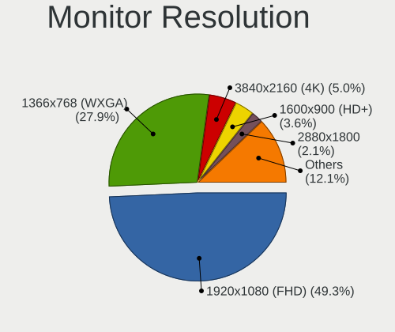

| Resolution         | Notebooks | Percent |
|--------------------|-----------|---------|
| 1920x1080 (FHD)    | 69        | 49.29%  |
| 1366x768 (WXGA)    | 39        | 27.86%  |
| 3840x2160 (4K)     | 7         | 5%      |
| 1600x900 (HD+)     | 5         | 3.57%   |
| 2880x1800          | 3         | 2.14%   |
| 1920x1200 (WUXGA)  | 3         | 2.14%   |
| 1680x1050 (WSXGA+) | 3         | 2.14%   |
| 1280x800 (WXGA)    | 3         | 2.14%   |
| 2560x1600          | 2         | 1.43%   |
| 2560x1440 (QHD)    | 2         | 1.43%   |
| 3440x1440          | 1         | 0.71%   |
| 3200x2000          | 1         | 0.71%   |
| 2160x1440          | 1         | 0.71%   |
| 1440x900 (WXGA+)   | 1         | 0.71%   |

Monitor Diagonal
----------------

Diagonal size in inches

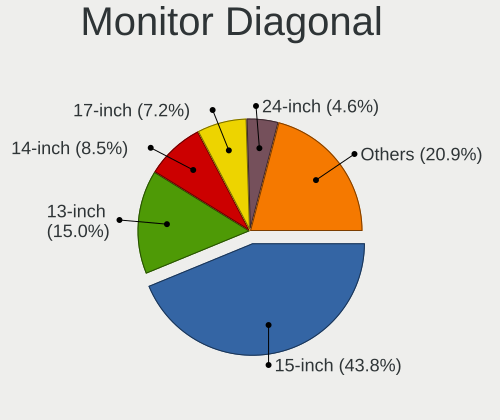

| Inches | Notebooks | Percent |
|--------|-----------|---------|
| 15     | 67        | 43.79%  |
| 13     | 23        | 15.03%  |
| 14     | 13        | 8.5%    |
| 17     | 11        | 7.19%   |
| 24     | 7         | 4.58%   |
| 16     | 5         | 3.27%   |
| 12     | 5         | 3.27%   |
| 27     | 4         | 2.61%   |
| 21     | 4         | 2.61%   |
| 31     | 2         | 1.31%   |
| 23     | 2         | 1.31%   |
| 19     | 2         | 1.31%   |
| 18     | 2         | 1.31%   |
| 84     | 1         | 0.65%   |
| 54     | 1         | 0.65%   |
| 40     | 1         | 0.65%   |
| 34     | 1         | 0.65%   |
| 22     | 1         | 0.65%   |
| 20     | 1         | 0.65%   |

Monitor Width
-------------

Physical width

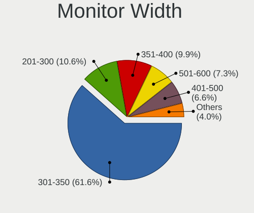

| Width in mm | Notebooks | Percent |
|-------------|-----------|---------|
| 301-350     | 93        | 61.59%  |
| 201-300     | 16        | 10.6%   |
| 351-400     | 15        | 9.93%   |
| 501-600     | 11        | 7.28%   |
| 401-500     | 10        | 6.62%   |
| 601-700     | 2         | 1.32%   |
| 801-900     | 1         | 0.66%   |
| 701-800     | 1         | 0.66%   |
| 1501-2000   | 1         | 0.66%   |
| 1001-1500   | 1         | 0.66%   |

Aspect Ratio
------------

Proportional relationship between the width and the height

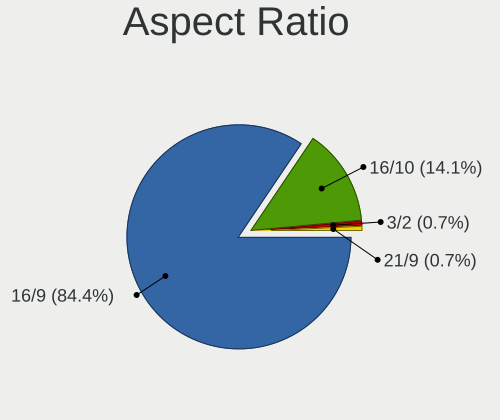

| Ratio | Notebooks | Percent |
|-------|-----------|---------|
| 16/9  | 114       | 84.44%  |
| 16/10 | 19        | 14.07%  |
| 3/2   | 1         | 0.74%   |
| 21/9  | 1         | 0.74%   |

Monitor Area
------------

Area in inch²

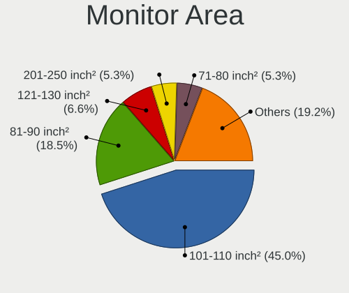

| Area in inch² | Notebooks | Percent |
|----------------|-----------|---------|
| 101-110        | 68        | 45.03%  |
| 81-90          | 28        | 18.54%  |
| 121-130        | 10        | 6.62%   |
| 71-80          | 8         | 5.3%    |
| 201-250        | 8         | 5.3%    |
| 61-70          | 5         | 3.31%   |
| 301-350        | 4         | 2.65%   |
| 151-200        | 4         | 2.65%   |
| 111-120        | 4         | 2.65%   |
| 351-500        | 3         | 1.99%   |
| 251-300        | 3         | 1.99%   |
| More than 1000 | 2         | 1.32%   |
| 141-150        | 2         | 1.32%   |
| 131-140        | 1         | 0.66%   |
| 501-1000       | 1         | 0.66%   |

Pixel Density
-------------

Pixels per inch

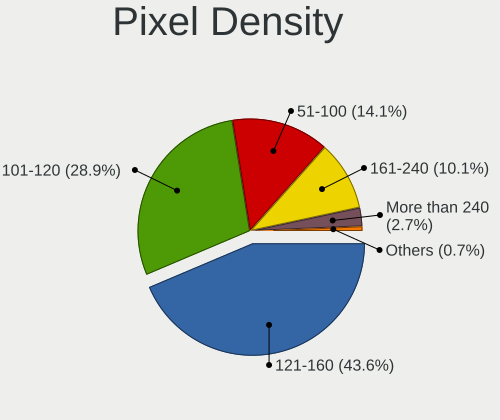

| Density       | Notebooks | Percent |
|---------------|-----------|---------|
| 121-160       | 65        | 43.62%  |
| 101-120       | 43        | 28.86%  |
| 51-100        | 21        | 14.09%  |
| 161-240       | 15        | 10.07%  |
| More than 240 | 4         | 2.68%   |
| 1-50          | 1         | 0.67%   |

Multiple Monitors
-----------------

Total monitors connected

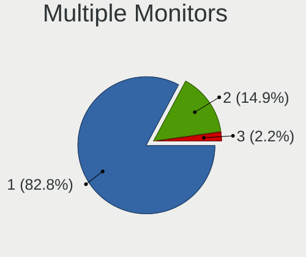

| Total | Notebooks | Percent |
|-------|-----------|---------|
| 1     | 111       | 82.84%  |
| 2     | 20        | 14.93%  |
| 3     | 3         | 2.24%   |

Network
-------

Net Controller Vendor
---------------------

Controller vendors

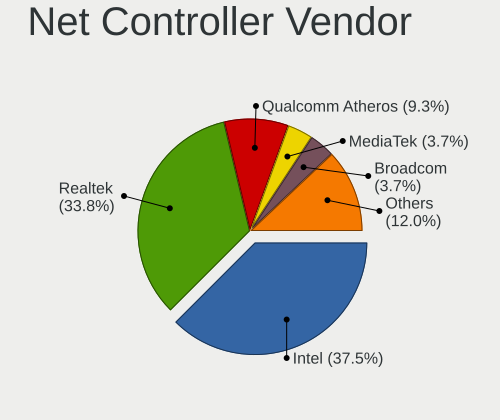

| Vendor                            | Notebooks | Percent |
|-----------------------------------|-----------|---------|
| Intel                             | 81        | 37.5%   |
| Realtek Semiconductor             | 73        | 33.8%   |
| Qualcomm Atheros                  | 20        | 9.26%   |
| MediaTek                          | 8         | 3.7%    |
| Broadcom                          | 8         | 3.7%    |
| Ralink                            | 4         | 1.85%   |
| ASIX Electronics                  | 3         | 1.39%   |
| Lenovo                            | 2         | 0.93%   |
| Ericsson Business Mobile Networks | 2         | 0.93%   |
| Broadcom Limited                  | 2         | 0.93%   |
| Xiaomi                            | 1         | 0.46%   |
| Sierra Wireless                   | 1         | 0.46%   |
| Shenzhen Goodix Technology        | 1         | 0.46%   |
| Samsung Electronics               | 1         | 0.46%   |
| Ralink Technology                 | 1         | 0.46%   |
| Motorola PCS                      | 1         | 0.46%   |
| Marvell Technology Group          | 1         | 0.46%   |
| ICS Advent                        | 1         | 0.46%   |
| Huawei Technologies               | 1         | 0.46%   |
| Hewlett-Packard                   | 1         | 0.46%   |
| Google                            | 1         | 0.46%   |
| DisplayLink                       | 1         | 0.46%   |
| Dell                              | 1         | 0.46%   |

Net Controller Model
--------------------

Controller models

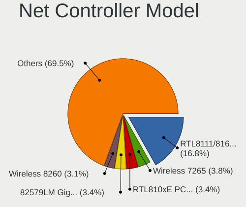

| Model                                                                  | Notebooks | Percent |
|------------------------------------------------------------------------|-----------|---------|
| Realtek RTL8111/8168/8211/8411 PCI Express Gigabit Ethernet Controller | 44        | 16.79%  |
| Intel Wireless 7265                                                    | 10        | 3.82%   |
| Realtek RTL810xE PCI Express Fast Ethernet controller                  | 9         | 3.44%   |
| Intel 82579LM Gigabit Network Connection (Lewisville)                  | 9         | 3.44%   |
| Intel Wireless 8260                                                    | 8         | 3.05%   |
| Intel Centrino Advanced-N 6205 [Taylor Peak]                           | 7         | 2.67%   |
| Realtek RTL8822CE 802.11ac PCIe Wireless Network Adapter               | 6         | 2.29%   |
| Qualcomm Atheros AR9485 Wireless Network Adapter                       | 6         | 2.29%   |
| Intel Wi-Fi 6 AX200                                                    | 6         | 2.29%   |
| Realtek RTL8153 Gigabit Ethernet Adapter                               | 5         | 1.91%   |
| Intel Wireless 7260                                                    | 5         | 1.91%   |
| Intel Cannon Lake PCH CNVi WiFi                                        | 5         | 1.91%   |
| Qualcomm Atheros QCA9377 802.11ac Wireless Network Adapter             | 4         | 1.53%   |
| Intel Wireless 8265 / 8275                                             | 4         | 1.53%   |
| Realtek Killer E2600 GbE Controller                                    | 3         | 1.15%   |
| Qualcomm Atheros QCA6174 802.11ac Wireless Network Adapter             | 3         | 1.15%   |
| MediaTek MT7921 802.11ax PCIe Wireless Network Adapter [Filogic 330]   | 3         | 1.15%   |
| Intel Wireless 3160                                                    | 3         | 1.15%   |
| Intel WiFi Link 5100                                                   | 3         | 1.15%   |
| Intel Wi-Fi 6 AX201                                                    | 3         | 1.15%   |
| Intel Ethernet Connection I219-LM                                      | 3         | 1.15%   |
| Intel Ethernet Connection (3) I218-LM                                  | 3         | 1.15%   |
| Intel Ethernet Connection (2) I219-LM                                  | 3         | 1.15%   |
| Intel Centrino Ultimate-N 6300                                         | 3         | 1.15%   |
| ASIX AX88179 Gigabit Ethernet                                          | 3         | 1.15%   |
| Realtek RTL8821CE 802.11ac PCIe Wireless Network Adapter               | 2         | 0.76%   |
| Realtek RTL8723BE PCIe Wireless Network Adapter                        | 2         | 0.76%   |
| Realtek RTL8188CE 802.11b/g/n WiFi Adapter                             | 2         | 0.76%   |
| Realtek 802.11ac NIC                                                   | 2         | 0.76%   |
| Qualcomm Atheros AR8151 v2.0 Gigabit Ethernet                          | 2         | 0.76%   |
| Qualcomm Atheros AR8131 Gigabit Ethernet                               | 2         | 0.76%   |
| MediaTek MT7922 802.11ax PCI Express Wireless Network Adapter          | 2         | 0.76%   |
| Intel Wi-Fi 5(802.11ac) Wireless-AC 9x6x [Thunder Peak]                | 2         | 0.76%   |
| Intel Ice Lake-LP PCH CNVi WiFi                                        | 2         | 0.76%   |
| Intel Ethernet Connection I219-V                                       | 2         | 0.76%   |
| Intel Ethernet Connection I218-LM                                      | 2         | 0.76%   |
| Intel Dual Band Wireless-AC 3165 Plus Bluetooth                        | 2         | 0.76%   |
| Intel Comet Lake PCH CNVi WiFi                                         | 2         | 0.76%   |
| Intel Alder Lake-P PCH CNVi WiFi                                       | 2         | 0.76%   |
| Intel 82567LM Gigabit Network Connection                               | 2         | 0.76%   |

Wireless Vendor
---------------

Wireless vendors

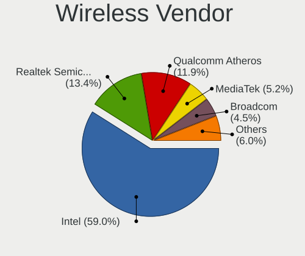

| Vendor                | Notebooks | Percent |
|-----------------------|-----------|---------|
| Intel                 | 79        | 58.96%  |
| Realtek Semiconductor | 18        | 13.43%  |
| Qualcomm Atheros      | 16        | 11.94%  |
| MediaTek              | 7         | 5.22%   |
| Broadcom              | 6         | 4.48%   |
| Ralink                | 4         | 2.99%   |
| Broadcom Limited      | 2         | 1.49%   |
| Sierra Wireless       | 1         | 0.75%   |
| Ralink Technology     | 1         | 0.75%   |

Wireless Model
--------------

Wireless models

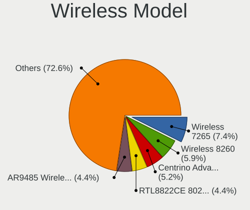

| Model                                                                | Notebooks | Percent |
|----------------------------------------------------------------------|-----------|---------|
| Intel Wireless 7265                                                  | 10        | 7.41%   |
| Intel Wireless 8260                                                  | 8         | 5.93%   |
| Intel Centrino Advanced-N 6205 [Taylor Peak]                         | 7         | 5.19%   |
| Realtek RTL8822CE 802.11ac PCIe Wireless Network Adapter             | 6         | 4.44%   |
| Qualcomm Atheros AR9485 Wireless Network Adapter                     | 6         | 4.44%   |
| Intel Wi-Fi 6 AX200                                                  | 6         | 4.44%   |
| Intel Wireless 7260                                                  | 5         | 3.7%    |
| Intel Cannon Lake PCH CNVi WiFi                                      | 5         | 3.7%    |
| Qualcomm Atheros QCA9377 802.11ac Wireless Network Adapter           | 4         | 2.96%   |
| Intel Wireless 8265 / 8275                                           | 4         | 2.96%   |
| Qualcomm Atheros QCA6174 802.11ac Wireless Network Adapter           | 3         | 2.22%   |
| MediaTek MT7921 802.11ax PCIe Wireless Network Adapter [Filogic 330] | 3         | 2.22%   |
| Intel Wireless 3160                                                  | 3         | 2.22%   |
| Intel WiFi Link 5100                                                 | 3         | 2.22%   |
| Intel Wi-Fi 6 AX201                                                  | 3         | 2.22%   |
| Intel Centrino Ultimate-N 6300                                       | 3         | 2.22%   |
| Realtek RTL8821CE 802.11ac PCIe Wireless Network Adapter             | 2         | 1.48%   |
| Realtek RTL8723BE PCIe Wireless Network Adapter                      | 2         | 1.48%   |
| Realtek RTL8188CE 802.11b/g/n WiFi Adapter                           | 2         | 1.48%   |
| Realtek 802.11ac NIC                                                 | 2         | 1.48%   |
| MediaTek MT7922 802.11ax PCI Express Wireless Network Adapter        | 2         | 1.48%   |
| Intel Wi-Fi 5(802.11ac) Wireless-AC 9x6x [Thunder Peak]              | 2         | 1.48%   |
| Intel Ice Lake-LP PCH CNVi WiFi                                      | 2         | 1.48%   |
| Intel Dual Band Wireless-AC 3165 Plus Bluetooth                      | 2         | 1.48%   |
| Intel Comet Lake PCH CNVi WiFi                                       | 2         | 1.48%   |
| Intel Alder Lake-P PCH CNVi WiFi                                     | 2         | 1.48%   |
| Broadcom BCM43602 802.11ac Wireless LAN SoC                          | 2         | 1.48%   |
| Broadcom BCM4331 802.11a/b/g/n                                       | 2         | 1.48%   |
| Broadcom BCM43142 802.11b/g/n                                        | 2         | 1.48%   |
| Sierra Wireless EM7345 4G LTE                                        | 1         | 0.74%   |
| Realtek RTL8852BE PCIe 802.11ax Wireless Network Controller          | 1         | 0.74%   |
| Realtek RTL8822BE 802.11a/b/g/n/ac WiFi adapter                      | 1         | 0.74%   |
| Realtek RTL8191SEvB Wireless LAN Controller                          | 1         | 0.74%   |
| Realtek RTL8188EE Wireless Network Adapter                           | 1         | 0.74%   |
| Ralink RT2870/RT3070 Wireless Adapter                                | 1         | 0.74%   |
| Ralink RT5390 [802.11 b/g/n 1T1R G-band PCI Express Single Chip]     | 1         | 0.74%   |
| Ralink RT5390 Wireless 802.11n 1T/1R PCIe                            | 1         | 0.74%   |
| Ralink RT3290 Wireless 802.11n 1T/1R PCIe                            | 1         | 0.74%   |
| Ralink RT3090 Wireless 802.11n 1T/1R PCIe                            | 1         | 0.74%   |
| Qualcomm Atheros QCA9565 / AR9565 Wireless Network Adapter           | 1         | 0.74%   |

Ethernet Vendor
---------------

Ethernet vendors

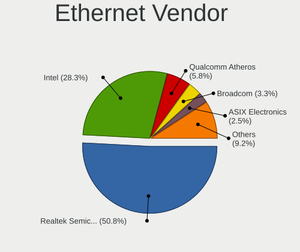

| Vendor                   | Notebooks | Percent |
|--------------------------|-----------|---------|
| Realtek Semiconductor    | 61        | 50.83%  |
| Intel                    | 34        | 28.33%  |
| Qualcomm Atheros         | 7         | 5.83%   |
| Broadcom                 | 4         | 3.33%   |
| ASIX Electronics         | 3         | 2.5%    |
| Lenovo                   | 2         | 1.67%   |
| Xiaomi                   | 1         | 0.83%   |
| Samsung Electronics      | 1         | 0.83%   |
| Motorola PCS             | 1         | 0.83%   |
| MediaTek                 | 1         | 0.83%   |
| Marvell Technology Group | 1         | 0.83%   |
| ICS Advent               | 1         | 0.83%   |
| Hewlett-Packard          | 1         | 0.83%   |
| Google                   | 1         | 0.83%   |
| DisplayLink              | 1         | 0.83%   |

Ethernet Model
--------------

Ethernet models

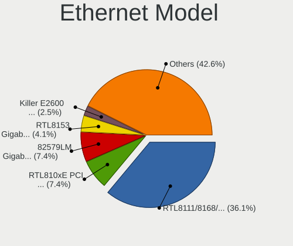

| Model                                                                  | Notebooks | Percent |
|------------------------------------------------------------------------|-----------|---------|
| Realtek RTL8111/8168/8211/8411 PCI Express Gigabit Ethernet Controller | 44        | 36.07%  |
| Realtek RTL810xE PCI Express Fast Ethernet controller                  | 9         | 7.38%   |
| Intel 82579LM Gigabit Network Connection (Lewisville)                  | 9         | 7.38%   |
| Realtek RTL8153 Gigabit Ethernet Adapter                               | 5         | 4.1%    |
| Realtek Killer E2600 GbE Controller                                    | 3         | 2.46%   |
| Intel Ethernet Connection I219-LM                                      | 3         | 2.46%   |
| Intel Ethernet Connection (3) I218-LM                                  | 3         | 2.46%   |
| Intel Ethernet Connection (2) I219-LM                                  | 3         | 2.46%   |
| ASIX AX88179 Gigabit Ethernet                                          | 3         | 2.46%   |
| Qualcomm Atheros AR8151 v2.0 Gigabit Ethernet                          | 2         | 1.64%   |
| Qualcomm Atheros AR8131 Gigabit Ethernet                               | 2         | 1.64%   |
| Intel Ethernet Connection I219-V                                       | 2         | 1.64%   |
| Intel Ethernet Connection I218-LM                                      | 2         | 1.64%   |
| Intel 82567LM Gigabit Network Connection                               | 2         | 1.64%   |
| Broadcom NetXtreme BCM57765 Gigabit Ethernet PCIe                      | 2         | 1.64%   |
| Xiaomi Mi/Redmi series (RNDIS)                                         | 1         | 0.82%   |
| Samsung Galaxy series, misc. (tethering mode)                          | 1         | 0.82%   |
| Realtek RTL8125 2.5GbE Controller                                      | 1         | 0.82%   |
| Realtek Killer E3000 2.5GbE Controller                                 | 1         | 0.82%   |
| Qualcomm Atheros Killer E2500 Gigabit Ethernet Controller              | 1         | 0.82%   |
| Qualcomm Atheros AR8162 Fast Ethernet                                  | 1         | 0.82%   |
| Qualcomm Atheros AR8152 v2.0 Fast Ethernet                             | 1         | 0.82%   |
| Motorola PCS moto g100 pro                                             | 1         | 0.82%   |
| MediaTek Infinix HOT 50i                                               | 1         | 0.82%   |
| Marvell Group 88E8055 PCI-E Gigabit Ethernet Controller                | 1         | 0.82%   |
| Lenovo ThinkPad Lan                                                    | 1         | 0.82%   |
| Lenovo RTL8153 Gigabit Ethernet [ThinkPad OneLink Pro Dock]            | 1         | 0.82%   |
| Intel Ethernet Connection I217-V                                       | 1         | 0.82%   |
| Intel Ethernet Connection (7) I219-LM                                  | 1         | 0.82%   |
| Intel Ethernet Connection (4) I219-V                                   | 1         | 0.82%   |
| Intel Ethernet Connection (4) I219-LM                                  | 1         | 0.82%   |
| Intel Ethernet Connection (2) I218-LM                                  | 1         | 0.82%   |
| Intel Ethernet Connection (16) I219-V                                  | 1         | 0.82%   |
| Intel Ethernet Connection (13) I219-V                                  | 1         | 0.82%   |
| Intel Ethernet Connection (11) I219-LM                                 | 1         | 0.82%   |
| Intel 82577LM Gigabit Network Connection                               | 1         | 0.82%   |
| Intel 82566MM Gigabit Network Connection                               | 1         | 0.82%   |
| ICS Advent DM9601 Fast Ethernet Adapter                                | 1         | 0.82%   |
| HP HP lt4120 Snapdragon X5 LTE                                         | 1         | 0.82%   |
| Google Nexus/Pixel Device (tether+ debug)                              | 1         | 0.82%   |

Net Controller Kind
-------------------

Ethernet, WiFi or modem

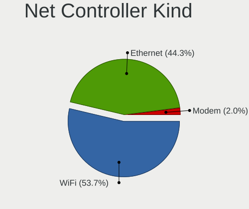

| Kind     | Notebooks | Percent |
|----------|-----------|---------|
| WiFi     | 131       | 53.69%  |
| Ethernet | 108       | 44.26%  |
| Modem    | 5         | 2.05%   |

Used Controller
---------------

Currently used network controller

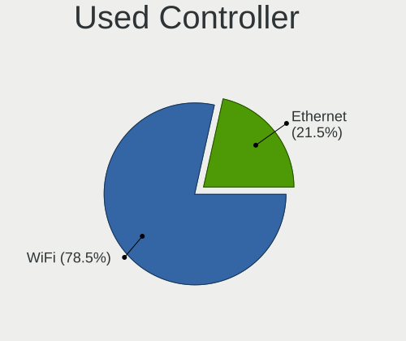

| Kind     | Notebooks | Percent |
|----------|-----------|---------|
| WiFi     | 113       | 78.47%  |
| Ethernet | 31        | 21.53%  |

NICs
----

Total network controllers on board

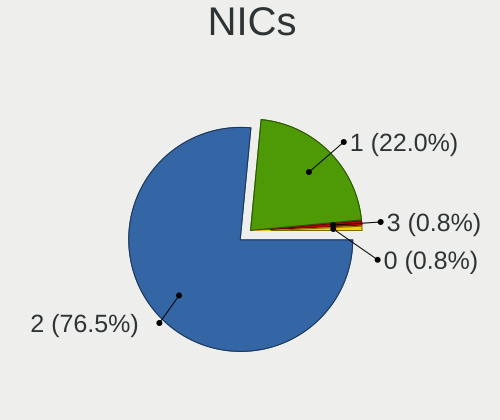

| Total | Notebooks | Percent |
|-------|-----------|---------|
| 2     | 101       | 76.52%  |
| 1     | 29        | 21.97%  |
| 3     | 1         | 0.76%   |
| 0     | 1         | 0.76%   |

IPv6
----

IPv6 vs IPv4

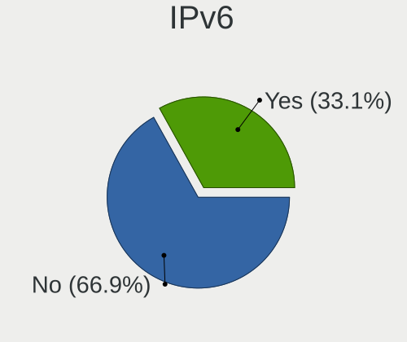

| Used | Notebooks | Percent |
|------|-----------|---------|
| No   | 89        | 66.92%  |
| Yes  | 44        | 33.08%  |

Bluetooth
---------

Bluetooth Vendor
----------------

Controller vendors

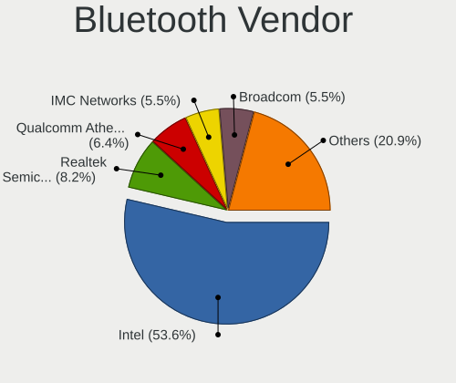

| Vendor                          | Notebooks | Percent |
|---------------------------------|-----------|---------|
| Intel                           | 59        | 53.64%  |
| Realtek Semiconductor           | 9         | 8.18%   |
| Qualcomm Atheros Communications | 7         | 6.36%   |
| IMC Networks                    | 6         | 5.45%   |
| Broadcom                        | 6         | 5.45%   |
| Foxconn / Hon Hai               | 4         | 3.64%   |
| Apple                           | 4         | 3.64%   |
| Realtek                         | 2         | 1.82%   |
| Ralink Technology               | 2         | 1.82%   |
| Lite-On Technology              | 2         | 1.82%   |
| Hewlett-Packard                 | 2         | 1.82%   |
| Dell                            | 2         | 1.82%   |
| Ralink                          | 1         | 0.91%   |
| MediaTek                        | 1         | 0.91%   |
| Foxconn International           | 1         | 0.91%   |
| Cambridge Silicon Radio         | 1         | 0.91%   |
| ASUSTek Computer                | 1         | 0.91%   |

Bluetooth Model
---------------

Controller models

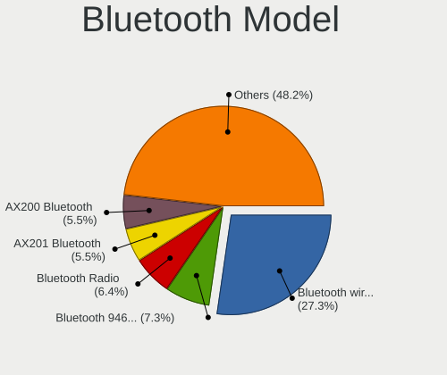

| Model                                               | Notebooks | Percent |
|-----------------------------------------------------|-----------|---------|
| Intel Bluetooth wireless interface                  | 30        | 27.27%  |
| Intel Bluetooth 9460/9560 Jefferson Peak (JfP)      | 8         | 7.27%   |
| Realtek Bluetooth Radio                             | 7         | 6.36%   |
| Intel AX201 Bluetooth                               | 6         | 5.45%   |
| Intel AX200 Bluetooth                               | 6         | 5.45%   |
| Intel Bluetooth Device                              | 4         | 3.64%   |
| Broadcom BCM20702 Bluetooth 4.0 [ThinkPad]          | 4         | 3.64%   |
| Qualcomm Atheros  Bluetooth Device                  | 3         | 2.73%   |
| IMC Networks Wireless_Device                        | 3         | 2.73%   |
| Foxconn / Hon Hai Wireless_Device                   | 3         | 2.73%   |
| Apple Bluetooth Host Controller                     | 3         | 2.73%   |
| Realtek Bluetooth Radio                             | 2         | 1.82%   |
| Qualcomm Atheros QCA61x4 Bluetooth 4.0              | 2         | 1.82%   |
| Qualcomm Atheros AR3012 Bluetooth 4.0               | 2         | 1.82%   |
| Lite-On Qualcomm Atheros QCA9377 Bluetooth          | 2         | 1.82%   |
| Intel Wireless-AC 9260 Bluetooth Adapter            | 2         | 1.82%   |
| Realtek RTL8723B Bluetooth                          | 1         | 0.91%   |
| Realtek  Bluetooth 4.2 Adapter                      | 1         | 0.91%   |
| Ralink Motorola BC4 Bluetooth 3.0+HS Adapter        | 1         | 0.91%   |
| Ralink CSR BS8510                                   | 1         | 0.91%   |
| Ralink RT3290 Bluetooth                             | 1         | 0.91%   |
| MediaTek Wireless_Device                            | 1         | 0.91%   |
| Intel Centrino Bluetooth Wireless Transceiver       | 1         | 0.91%   |
| Intel Centrino Advanced-N 6230 Bluetooth adapter    | 1         | 0.91%   |
| Intel AX210 Bluetooth                               | 1         | 0.91%   |
| IMC Networks Bluetooth USB Host Controller          | 1         | 0.91%   |
| IMC Networks Bluetooth Radio                        | 1         | 0.91%   |
| IMC Networks Bluetooth Device                       | 1         | 0.91%   |
| HP Broadcom 2070 Bluetooth Combo                    | 1         | 0.91%   |
| HP Bluetooth 2.0 Interface [Broadcom BCM2045]       | 1         | 0.91%   |
| Foxconn International BCM43142A0 Bluetooth module   | 1         | 0.91%   |
| Foxconn / Hon Hai Bluetooth USB Host Controller     | 1         | 0.91%   |
| Dell Wireless 370 Bluetooth Mini-card               | 1         | 0.91%   |
| Dell DW375 Bluetooth Module                         | 1         | 0.91%   |
| Cambridge Silicon Radio Bluetooth Dongle (HCI mode) | 1         | 0.91%   |
| Broadcom BCM43142 Bluetooth 4.0                     | 1         | 0.91%   |
| Broadcom BCM2045B (BDC-2.1)                         | 1         | 0.91%   |
| ASUS BT-270 Bluetooth Adapter                       | 1         | 0.91%   |
| Apple Bluetooth USB Host Controller                 | 1         | 0.91%   |

Sound
-----

Sound Vendor
------------

Sound card vendors

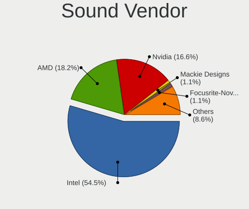

| Vendor                               | Notebooks | Percent |
|--------------------------------------|-----------|---------|
| Intel                                | 102       | 54.55%  |
| AMD                                  | 34        | 18.18%  |
| Nvidia                               | 31        | 16.58%  |
| Mackie Designs                       | 2         | 1.07%   |
| Focusrite-Novation                   | 2         | 1.07%   |
| C-Media Electronics                  | 2         | 1.07%   |
| Yealink Network Technology           | 1         | 0.53%   |
| Yamaha                               | 1         | 0.53%   |
| Thesycon Systemsoftware & Consulting | 1         | 0.53%   |
| Realtek Semiconductor                | 1         | 0.53%   |
| QinHeng Electronics                  | 1         | 0.53%   |
| Plantronics                          | 1         | 0.53%   |
| Mark of the Unicorn                  | 1         | 0.53%   |
| Logitech                             | 1         | 0.53%   |
| Lenovo                               | 1         | 0.53%   |
| Jieli Technology                     | 1         | 0.53%   |
| Dell                                 | 1         | 0.53%   |
| Behringer.......                     | 1         | 0.53%   |
| BEHRINGER International              | 1         | 0.53%   |
| ASUSTek Computer                     | 1         | 0.53%   |

Sound Model
-----------

Sound card models

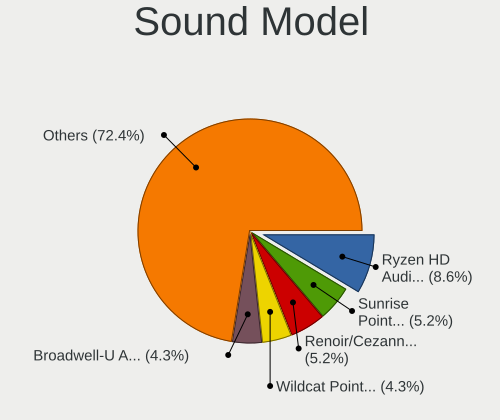

| Model                                                                      | Notebooks | Percent |
|----------------------------------------------------------------------------|-----------|---------|
| AMD Ryzen HD Audio Controller                                              | 20        | 8.62%   |
| Intel Sunrise Point-LP HD Audio                                            | 12        | 5.17%   |
| AMD Renoir/Cezanne HDMI/DP Audio Controller                                | 12        | 5.17%   |
| Intel Wildcat Point-LP High Definition Audio Controller                    | 10        | 4.31%   |
| Intel Broadwell-U Audio Controller                                         | 10        | 4.31%   |
| Intel 7 Series/C216 Chipset Family High Definition Audio Controller        | 10        | 4.31%   |
| Intel 6 Series/C200 Series Chipset Family High Definition Audio Controller | 9         | 3.88%   |
| Intel Cannon Lake PCH cAVS                                                 | 7         | 3.02%   |
| Intel 8 Series HD Audio Controller                                         | 7         | 3.02%   |
| Nvidia TU107 GeForce GTX 1650 High Definition Audio Controller             | 6         | 2.59%   |
| Intel Haswell-ULT HD Audio Controller                                      | 6         | 2.59%   |
| AMD FCH Azalia Controller                                                  | 6         | 2.59%   |
| Intel 82801I (ICH9 Family) HD Audio Controller                             | 5         | 2.16%   |
| Intel 5 Series/3400 Series Chipset High Definition Audio                   | 5         | 2.16%   |
| AMD Kabini HDMI/DP Audio                                                   | 5         | 2.16%   |
| Intel Tiger Lake-LP Smart Sound Technology Audio Controller                | 4         | 1.72%   |
| Intel Ice Lake-LP Smart Sound Technology Audio Controller                  | 4         | 1.72%   |
| Intel Comet Lake PCH cAVS                                                  | 4         | 1.72%   |
| Intel 8 Series/C220 Series Chipset High Definition Audio Controller        | 4         | 1.72%   |
| Nvidia GM107 High Definition Audio Controller [GeForce 940MX]              | 3         | 1.29%   |
| Nvidia GF108 High Definition Audio Controller                              | 3         | 1.29%   |
| Intel Xeon E3-1200 v3/4th Gen Core Processor HD Audio Controller           | 3         | 1.29%   |
| Intel CM238 HD Audio Controller                                            | 3         | 1.29%   |
| Intel Alder Lake PCH-P High Definition Audio Controller                    | 3         | 1.29%   |
| Intel 100 Series/C230 Series Chipset Family HD Audio Controller            | 3         | 1.29%   |
| AMD Raven/Raven2/Fenghuang HDMI/DP Audio Controller                        | 3         | 1.29%   |
| Nvidia TU116 High Definition Audio Controller                              | 2         | 0.86%   |
| Nvidia GT216 HDMI Audio Controller                                         | 2         | 0.86%   |
| Nvidia GK208 HDMI/DP Audio Controller                                      | 2         | 0.86%   |
| Nvidia GF119 HDMI Audio Controller                                         | 2         | 0.86%   |
| Intel Celeron/Pentium Silver Processor High Definition Audio               | 2         | 0.86%   |
| Intel Celeron N3350/Pentium N4200/Atom E3900 Series Audio Cluster          | 2         | 0.86%   |
| Intel 82801H (ICH8 Family) HD Audio Controller                             | 2         | 0.86%   |
| AMD Wrestler HDMI Audio                                                    | 2         | 0.86%   |
| AMD SBx00 Azalia (Intel HDA)                                               | 2         | 0.86%   |
| AMD Radeon High Definition Audio Controller                                | 2         | 0.86%   |
| AMD BeaverCreek HDMI Audio [Radeon HD 6500D and 6400G-6600G series]        | 2         | 0.86%   |
| Yealink Network Technology VoIP Phone                                      | 1         | 0.43%   |
| Yamaha Steinberg UR242                                                     | 1         | 0.43%   |
| Thesycon Systemsoftware & Consulting Audio Interface                       | 1         | 0.43%   |

Memory
------

Memory Vendor
-------------

Memory module vendors

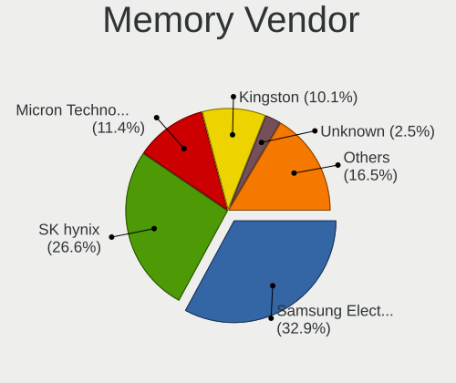

| Vendor              | Notebooks | Percent |
|---------------------|-----------|---------|
| Samsung Electronics | 52        | 32.91%  |
| SK hynix            | 42        | 26.58%  |
| Micron Technology   | 18        | 11.39%  |
| Kingston            | 16        | 10.13%  |
| Unknown             | 4         | 2.53%   |
| Ramaxel Technology  | 4         | 2.53%   |
| Crucial             | 4         | 2.53%   |
| G.Skill             | 3         | 1.9%    |
| Transcend           | 2         | 1.27%   |
| Timetec             | 2         | 1.27%   |
| Nanya Technology    | 2         | 1.27%   |
| Elpida              | 2         | 1.27%   |
| A-DATA Technology   | 2         | 1.27%   |
| Patriot             | 1         | 0.63%   |
| CSX                 | 1         | 0.63%   |
| Corsair             | 1         | 0.63%   |
| Apacer              | 1         | 0.63%   |
| Unknown             | 1         | 0.63%   |

Memory Model
------------

Memory module models

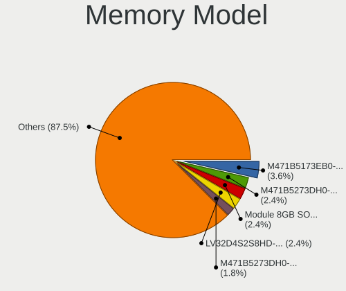

| Model                                                   | Notebooks | Percent |
|---------------------------------------------------------|-----------|---------|
| Samsung RAM M471B5173EB0-YK0 4GB SODIMM DDR3 1600MT/s   | 6         | 3.57%   |
| SK hynix RAM Module 8GB SODIMM DDR4 2133MT/s            | 4         | 2.38%   |
| Samsung RAM M471B5273DH0-CH9 4GB SODIMM DDR3 1600MT/s   | 4         | 2.38%   |
| Kingston RAM LV32D4S2S8HD-8 8GB SODIMM DDR4 3200MT/s    | 4         | 2.38%   |
| SK hynix RAM HMT451S6BFR8A-PB 4GB SODIMM DDR3 1600MT/s  | 3         | 1.79%   |
| SK hynix RAM HMT41GS6BFR8A-PB 8GB SODIMM DDR3 2667MT/s  | 3         | 1.79%   |
| SK hynix RAM HMT41GS6AFR8A-PB 8GiB SODIMM DDR3 2667MT/s | 3         | 1.79%   |
| SK hynix RAM HMT351S6BFR8C-H9 4GB SODIMM 1334MT/s       | 3         | 1.79%   |
| Samsung RAM M471B5273DH0-CK0 4GB SODIMM DDR3 2400MT/s   | 3         | 1.79%   |
| Samsung RAM M471B5173DB0-YK0 4GB SODIMM DDR3 1600MT/s   | 3         | 1.79%   |
| SK hynix RAM HMT351S6CFR8C-PB 4GB SODIMM DDR3 1600MT/s  | 2         | 1.19%   |
| SK hynix RAM HMCG88AGBSA095N 32GB SODIMM DDR5 5600MT/s  | 2         | 1.19%   |
| SK hynix RAM HMA851S6DJR6N-XN 4GB SODIMM DDR4 3200MT/s  | 2         | 1.19%   |
| Samsung RAM M471B5773DH0-CH9 2GB SODIMM DDR3 1600MT/s   | 2         | 1.19%   |
| Samsung RAM M471B5674-H0-YK0--- 4GB Chip DDR3 1600MT/s  | 2         | 1.19%   |
| Samsung RAM M471B5273CH0-CH9 4GB SODIMM DDR3 1334MT/s   | 2         | 1.19%   |
| Samsung RAM M471B1G73DB0-YK0 8GB SODIMM DDR3 1600MT/s   | 2         | 1.19%   |
| Samsung RAM M471A2K43CB1-CRC 16GB SODIMM DDR4 2667MT/s  | 2         | 1.19%   |
| Micron RAM 4ATF51264HZ-2G6E1 4GB SODIMM DDR4 2667MT/s   | 2         | 1.19%   |
| Micron RAM 4ATF1G64HZ-3G2E1 8GB SODIMM DDR4 3200MT/s    | 2         | 1.19%   |
| Unknown RAM Module 4GB SODIMM DDR3                      | 1         | 0.6%    |
| Unknown RAM Module 4096MB SODIMM LPDDR3 1600MT/s        | 1         | 0.6%    |
| Unknown RAM Module 2048MB SODIMM DDR2 667MT/s           | 1         | 0.6%    |
| Unknown RAM Module 2048MB SODIMM DDR2                   | 1         | 0.6%    |
| Transcend RAM TS1GSK64W6H 8GB SODIMM DDR3 1600MT/s      | 1         | 0.6%    |
| Transcend RAM JM3200HSB-16G 16GB SODIMM DDR4 3200MT/s   | 1         | 0.6%    |
| Timetec RAM SD3-1600 8GB SODIMM DDR3 1600MT/s           | 1         | 0.6%    |
| Timetec RAM Module 8GB SODIMM DDR3 1600MT/s             | 1         | 0.6%    |
| SK hynix RAM Module 4GB SODIMM DDR3 1600MT/s            | 1         | 0.6%    |
| SK hynix RAM Module 4096MB SODIMM DDR4 2400MT/s         | 1         | 0.6%    |
| SK hynix RAM HYMP512S64CP8-Y5 1GB SODIMM DDR 667MT/s    | 1         | 0.6%    |
| SK hynix RAM HMT451S6DFR8A-PB 4GB SODIMM DDR3 1600MT/s  | 1         | 0.6%    |
| SK hynix RAM HMT351S6EFR8C-PB 4GB SODIMM DDR3 800MT/s   | 1         | 0.6%    |
| SK hynix RAM HMT351S6CFR8C-H9 4GB SODIMM DDR3 1334MT/s  | 1         | 0.6%    |
| SK hynix RAM HMT351S6CFR8C-H9 4GB SODIMM DDR3 1333MT/s  | 1         | 0.6%    |
| SK hynix RAM HMT351S6BFR8C-H9 4GB SODIMM DDR3 1333MT/s  | 1         | 0.6%    |
| SK hynix RAM HMT325S6CFR8C-H9 2GB SODIMM DDR3 1334MT/s  | 1         | 0.6%    |
| SK hynix RAM HMT325S6BFR8C-H9 2GB SODIMM DDR3 1600MT/s  | 1         | 0.6%    |
| SK hynix RAM HMCG66AGBSA092N 8GB SODIMM DDR5 5600MT/s   | 1         | 0.6%    |
| SK hynix RAM HMAB2GS6AMR6N-XN 16GB SODIMM DDR4 3200MT/s | 1         | 0.6%    |

Memory Kind
-----------

Memory module kinds

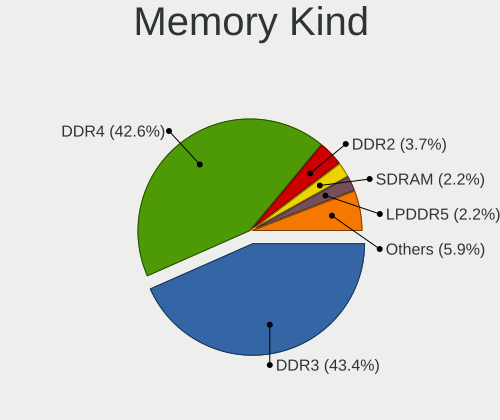

| Kind   | Notebooks | Percent |
|--------|-----------|---------|
| DDR3   | 59        | 43.38%  |
| DDR4   | 58        | 42.65%  |
| DDR2   | 5         | 3.68%   |
| SDRAM  | 3         | 2.21%   |
| LPDDR5 | 3         | 2.21%   |
| LPDDR4 | 3         | 2.21%   |
| DDR5   | 3         | 2.21%   |
| LPDDR3 | 2         | 1.47%   |

Memory Form Factor
------------------

Physical design of the memory module

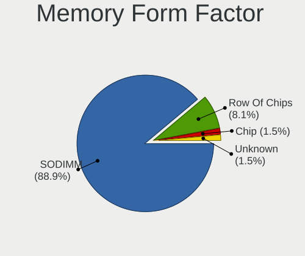

| Name         | Notebooks | Percent |
|--------------|-----------|---------|
| SODIMM       | 120       | 88.89%  |
| Row Of Chips | 11        | 8.15%   |
| Chip         | 2         | 1.48%   |
| Unknown      | 2         | 1.48%   |

Memory Size
-----------

Memory module size

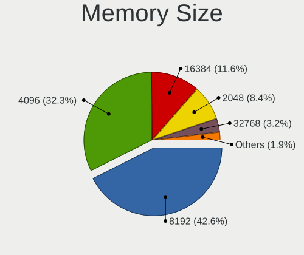

| Size  | Notebooks | Percent |
|-------|-----------|---------|
| 8192  | 66        | 42.58%  |
| 4096  | 50        | 32.26%  |
| 16384 | 18        | 11.61%  |
| 2048  | 13        | 8.39%   |
| 32768 | 5         | 3.23%   |
| 1024  | 3         | 1.94%   |

Memory Speed
------------

Memory module speed

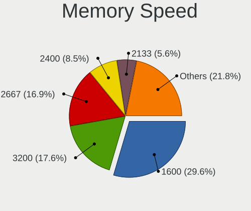

| Speed   | Notebooks | Percent |
|---------|-----------|---------|
| 1600    | 42        | 29.58%  |
| 3200    | 25        | 17.61%  |
| 2667    | 24        | 16.9%   |
| 2400    | 12        | 8.45%   |
| 2133    | 8         | 5.63%   |
| 1334    | 7         | 4.93%   |
| 1333    | 5         | 3.52%   |
| 5600    | 3         | 2.11%   |
| 667     | 3         | 2.11%   |
| 6400    | 2         | 1.41%   |
| 4267    | 2         | 1.41%   |
| 4199    | 2         | 1.41%   |
| Unknown | 2         | 1.41%   |
| 8533    | 1         | 0.7%    |
| 1867    | 1         | 0.7%    |
| 1639    | 1         | 0.7%    |
| 1067    | 1         | 0.7%    |
| 800     | 1         | 0.7%    |

Printers & scanners
-------------------

Printer Vendor
--------------

Printer device vendors

| Vendor          | Notebooks | Percent |
|-----------------|-----------|---------|
| Hewlett-Packard | 1         | 100%    |

Printer Model
-------------

Printer device models

| Model            | Notebooks | Percent |
|------------------|-----------|---------|
| HP LaserJet 1022 | 1         | 100%    |

Scanner Vendor
--------------

Scanner device vendors

| Vendor | Notebooks | Percent |
|--------|-----------|---------|
| Canon  | 1         | 100%    |

Scanner Model
-------------

Scanner device models

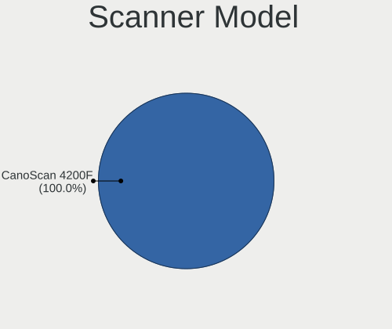

| Model                | Notebooks | Percent |
|----------------------|-----------|---------|
| Canon CanoScan 4200F | 1         | 100%    |

Camera
------

Camera Vendor
-------------

Camera device vendors

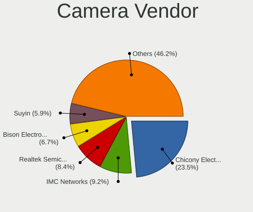

| Vendor                                 | Notebooks | Percent |
|----------------------------------------|-----------|---------|
| Chicony Electronics                    | 28        | 23.53%  |
| IMC Networks                           | 11        | 9.24%   |
| Realtek Semiconductor                  | 10        | 8.4%    |
| Bison Electronics                      | 8         | 6.72%   |
| Suyin                                  | 7         | 5.88%   |
| Syntek                                 | 6         | 5.04%   |
| Sunplus Innovation Technology          | 6         | 5.04%   |
| Microdia                               | 6         | 5.04%   |
| Lite-On Technology                     | 6         | 5.04%   |
| Quanta                                 | 5         | 4.2%    |
| Cheng Uei Precision Industry (Foxlink) | 4         | 3.36%   |
| Sonix Technology                       | 3         | 2.52%   |
| Luxvisions Innotech Limited            | 3         | 2.52%   |
| Silicon Motion                         | 2         | 1.68%   |
| Ricoh                                  | 2         | 1.68%   |
| Apple                                  | 2         | 1.68%   |
| ViewQuest Technologies                 | 1         | 0.84%   |
| Shenzhen Kingcome Optoelectronic       | 1         | 0.84%   |
| Razer USA                              | 1         | 0.84%   |
| Philips (or NXP)                       | 1         | 0.84%   |
| Microsoft                              | 1         | 0.84%   |
| Logitech                               | 1         | 0.84%   |
| Importek                               | 1         | 0.84%   |
| HRY                                    | 1         | 0.84%   |
| Dell                                   | 1         | 0.84%   |
| Acer                                   | 1         | 0.84%   |

Camera Model
------------

Camera device models

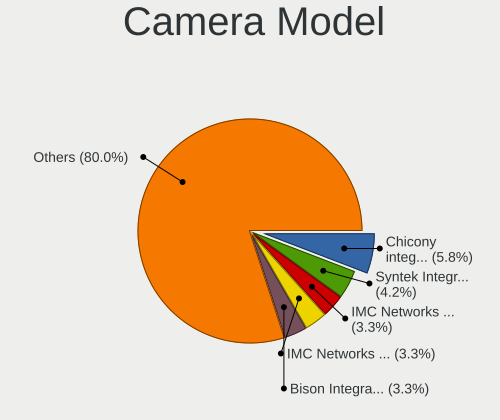

| Model                                               | Notebooks | Percent |
|-----------------------------------------------------|-----------|---------|
| Chicony integrated camera                           | 7         | 5.83%   |
| Syntek Integrated Camera                            | 5         | 4.17%   |
| IMC Networks USB2.0 HD UVC WebCam                   | 4         | 3.33%   |
| IMC Networks Integrated Camera                      | 4         | 3.33%   |
| Bison Integrated Camera                             | 4         | 3.33%   |
| Sunplus Integrated_Webcam_HD                        | 3         | 2.5%    |
| Sonix USB2.0 HD UVC WebCam                          | 3         | 2.5%    |
| Realtek Lenovo EasyCamera                           | 3         | 2.5%    |
| Microdia Integrated_Webcam_HD                       | 3         | 2.5%    |
| Lite-On Integrated Camera                           | 3         | 2.5%    |
| Chicony Integrated Camera [ThinkPad]                | 3         | 2.5%    |
| Chicony HD Webcam                                   | 3         | 2.5%    |
| Chicony HD User Facing                              | 3         | 2.5%    |
| Suyin USB 2.0 Camera                                | 2         | 1.67%   |
| Suyin Asus Integrated Webcam                        | 2         | 1.67%   |
| Sunplus HD WebCam                                   | 2         | 1.67%   |
| Lite-On HP HD Webcam                                | 2         | 1.67%   |
| Chicony HP HD Camera                                | 2         | 1.67%   |
| Chicony ACER HD User Facing                         | 2         | 1.67%   |
| Cheng Uei Precision Industry (Foxlink) HP HD Camera | 2         | 1.67%   |
| Apple FaceTime HD Camera                            | 2         | 1.67%   |
| ViewQuest Ability GABB Webcam                       | 1         | 0.83%   |
| Syntek Lenovo EasyCamera                            | 1         | 0.83%   |
| Suyin HP Webcam                                     | 1         | 0.83%   |
| Suyin HP TrueVision HD Integrated Webcam            | 1         | 0.83%   |
| Suyin HP TrueVision HD                              | 1         | 0.83%   |
| Sunplus Dell HD Webcam                              | 1         | 0.83%   |
| Silicon Motion WebCam SCB-1100N                     | 1         | 0.83%   |
| Silicon Motion WebCam SC-13HDL11431N                | 1         | 0.83%   |
| Shenzhen Kingcome Optoelectronic 720p HD Camera     | 1         | 0.83%   |
| Ricoh USB2.0 Camera                                 | 1         | 0.83%   |
| Ricoh Sony Vaio Integrated Webcam                   | 1         | 0.83%   |
| Realtek VGA WebCam                                  | 1         | 0.83%   |
| Realtek Integrated_Webcam_HD                        | 1         | 0.83%   |
| Realtek Integrated_Webcam_FHD                       | 1         | 0.83%   |
| Realtek HP Wide Vision HD Camera                    | 1         | 0.83%   |
| Realtek HP "Truevision HD" laptop camera            | 1         | 0.83%   |
| Realtek EasyCamera                                  | 1         | 0.83%   |
| Realtek Acer 640 x 480 laptop camera                | 1         | 0.83%   |
| Razer USA Gaming Webcam [Kiyo]                      | 1         | 0.83%   |

Security
--------

Fingerprint Vendor
------------------

Fingerprint sensor vendors

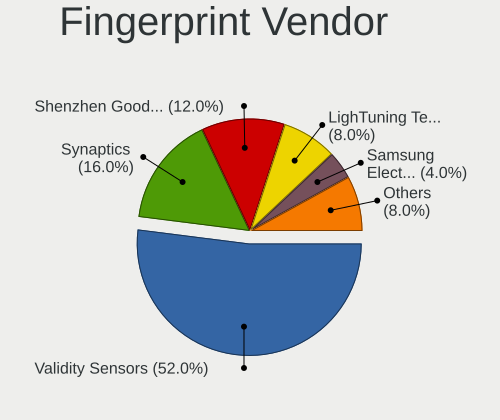

| Vendor                     | Notebooks | Percent |
|----------------------------|-----------|---------|
| Validity Sensors           | 13        | 52%     |
| Synaptics                  | 4         | 16%     |
| Shenzhen Goodix Technology | 3         | 12%     |
| LighTuning Technology      | 2         | 8%      |
| Samsung Electronics        | 1         | 4%      |
| Focal-systems.Corp         | 1         | 4%      |
| AuthenTec                  | 1         | 4%      |

Fingerprint Model
-----------------

Fingerprint sensor models

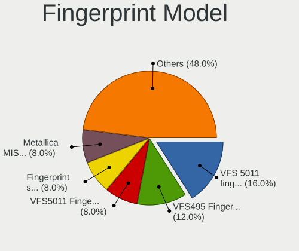

| Model                                             | Notebooks | Percent |
|---------------------------------------------------|-----------|---------|
| Validity Sensors VFS 5011 fingerprint sensor      | 4         | 16%     |
| Validity Sensors VFS495 Fingerprint Reader        | 3         | 12%     |
| Validity Sensors VFS5011 Fingerprint Reader       | 2         | 8%      |
| Validity Sensors Fingerprint scanner              | 2         | 8%      |
| Synaptics Metallica MIS Touch Fingerprint Reader  | 2         | 8%      |
| Shenzhen Goodix  Fingerprint Device               | 2         | 8%      |
| LighTuning ES603 Swipe Fingerprint Sensor         | 2         | 8%      |
| Validity Sensors VFS7500 Touch Fingerprint Sensor | 1         | 4%      |
| Validity Sensors VFS301 Fingerprint Reader        | 1         | 4%      |
| Synaptics Prometheus MIS Touch Fingerprint Reader | 1         | 4%      |
| Synaptics Fingerprint reader [HP G6]              | 1         | 4%      |
| Shenzhen Goodix Fingerprint Reader                | 1         | 4%      |
| Samsung Fingerprint Sensor Device - 730B          | 1         | 4%      |
| Focal-systems.Corp FT9201Fingerprint.             | 1         | 4%      |
| AuthenTec AES2501 Fingerprint Sensor              | 1         | 4%      |

Chipcard Vendor
---------------

Chipcard module vendors

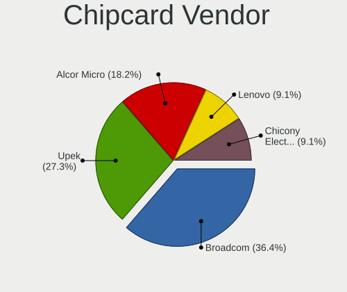

| Vendor              | Notebooks | Percent |
|---------------------|-----------|---------|
| Broadcom            | 5         | 41.67%  |
| Upek                | 3         | 25%     |
| Alcor Micro         | 2         | 16.67%  |
| Lenovo              | 1         | 8.33%   |
| Chicony Electronics | 1         | 8.33%   |

Chipcard Model
--------------

Chipcard module models

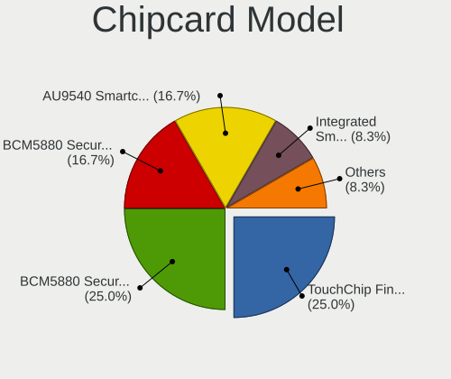

| Model                                                                        | Notebooks | Percent |
|------------------------------------------------------------------------------|-----------|---------|
| Upek TouchChip Fingerprint Coprocessor (WBF advanced mode)                   | 3         | 25%     |
| Broadcom BCM5880 Secure Applications Processor                               | 3         | 25%     |
| Broadcom BCM5880 Secure Applications Processor with fingerprint swipe sensor | 2         | 16.67%  |
| Alcor Micro AU9540 Smartcard Reader                                          | 2         | 16.67%  |
| Lenovo Integrated Smart Card Reader                                          | 1         | 8.33%   |
| Chicony Electronics HP Skylab USB Smartcard Keyboard                         | 1         | 8.33%   |

Unsupported
-----------

Unsupported Devices
-------------------

Total unsupported devices on board

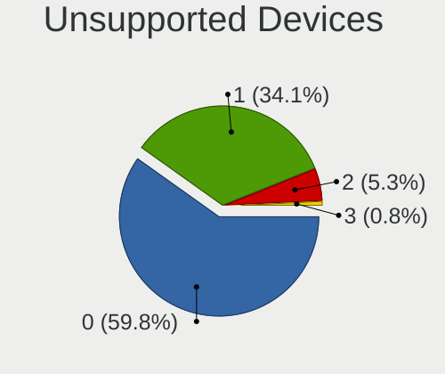

| Total | Notebooks | Percent |
|-------|-----------|---------|
| 0     | 79        | 59.85%  |
| 1     | 45        | 34.09%  |
| 2     | 7         | 5.3%    |
| 3     | 1         | 0.76%   |

Unsupported Device Types
------------------------

Types of unsupported devices

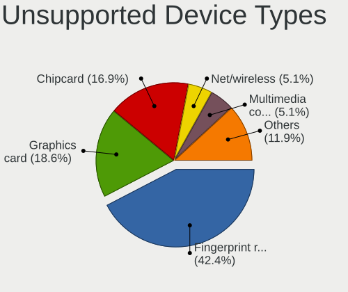

| Type                     | Notebooks | Percent |
|--------------------------|-----------|---------|
| Fingerprint reader       | 25        | 42.37%  |
| Graphics card            | 11        | 18.64%  |
| Chipcard                 | 10        | 16.95%  |
| Net/wireless             | 3         | 5.08%   |
| Multimedia controller    | 3         | 5.08%   |
| Card reader              | 2         | 3.39%   |
| Camera                   | 2         | 3.39%   |
| Storage                  | 1         | 1.69%   |
| Communication controller | 1         | 1.69%   |
| Bluetooth                | 1         | 1.69%   |

