Ubuntu Studio - Tested Hardware & Statistics (Notebooks)
--------------------------------------------------------

A project to collect tested hardware configurations for Ubuntu Studio.

Anyone can contribute to this report by the [hw-probe](https://github.com/linuxhw/hw-probe) tool:

    sudo -E hw-probe -all -upload

Please contribute! Especially if your hardware is rare.

Contents
--------

* [ Test Cases ](#test-cases)

* [ System ](#system)
  - [ OS                       ](#os)
  - [ OS Family                ](#os-family)
  - [ Kernel                   ](#kernel)
  - [ Kernel Family            ](#kernel-family)
  - [ Kernel Major Ver.        ](#kernel-major-ver)
  - [ Arch                     ](#arch)
  - [ DE                       ](#de)
  - [ Display Server           ](#display-server)
  - [ Display Manager          ](#display-manager)
  - [ OS Lang                  ](#os-lang)
  - [ Boot Mode                ](#boot-mode)
  - [ Filesystem               ](#filesystem)
  - [ Part. scheme             ](#part-scheme)
  - [ Dual Boot with Linux/BSD ](#dual-boot-with-linuxbsd)
  - [ Dual Boot (Win)          ](#dual-boot-win)

* [ Board ](#board)
  - [ Vendor                   ](#vendor)
  - [ Model                    ](#model)
  - [ Model Family             ](#model-family)
  - [ MFG Year                 ](#mfg-year)
  - [ Form Factor              ](#form-factor)
  - [ Secure Boot              ](#secure-boot)
  - [ Coreboot                 ](#coreboot)
  - [ RAM Size                 ](#ram-size)
  - [ RAM Used                 ](#ram-used)
  - [ Total Drives             ](#total-drives)
  - [ Has CD-ROM               ](#has-cd-rom)
  - [ Has Ethernet             ](#has-ethernet)
  - [ Has WiFi                 ](#has-wifi)
  - [ Has Bluetooth            ](#has-bluetooth)

* [ Location ](#location)
  - [ Country                  ](#country)
  - [ City                     ](#city)

* [ Drives ](#drives)
  - [ Drive Vendor             ](#drive-vendor)
  - [ Drive Model              ](#drive-model)
  - [ HDD Vendor               ](#hdd-vendor)
  - [ SSD Vendor               ](#ssd-vendor)
  - [ Drive Kind               ](#drive-kind)
  - [ Drive Connector          ](#drive-connector)
  - [ Drive Size               ](#drive-size)
  - [ Space Total              ](#space-total)
  - [ Space Used               ](#space-used)
  - [ Malfunc. Drives          ](#malfunc-drives)
  - [ Malfunc. Drive Vendor    ](#malfunc-drive-vendor)
  - [ Malfunc. HDD Vendor      ](#malfunc-hdd-vendor)
  - [ Malfunc. Drive Kind      ](#malfunc-drive-kind)
  - [ Failed Drives            ](#failed-drives)
  - [ Failed Drive Vendor      ](#failed-drive-vendor)
  - [ Drive Status             ](#drive-status)

* [ Storage controller ](#storage-controller)
  - [ Storage Vendor           ](#storage-vendor)
  - [ Storage Model            ](#storage-model)
  - [ Storage Kind             ](#storage-kind)

* [ Processor ](#processor)
  - [ CPU Vendor               ](#cpu-vendor)
  - [ CPU Model                ](#cpu-model)
  - [ CPU Model Family         ](#cpu-model-family)
  - [ CPU Cores                ](#cpu-cores)
  - [ CPU Sockets              ](#cpu-sockets)
  - [ CPU Threads              ](#cpu-threads)
  - [ CPU Op-Modes             ](#cpu-op-modes)
  - [ CPU Microcode            ](#cpu-microcode)
  - [ CPU Microarch            ](#cpu-microarch)

* [ Graphics ](#graphics)
  - [ GPU Vendor               ](#gpu-vendor)
  - [ GPU Model                ](#gpu-model)
  - [ GPU Combo                ](#gpu-combo)
  - [ GPU Driver               ](#gpu-driver)
  - [ GPU Memory               ](#gpu-memory)

* [ Monitor ](#monitor)
  - [ Monitor Vendor           ](#monitor-vendor)
  - [ Monitor Model            ](#monitor-model)
  - [ Monitor Resolution       ](#monitor-resolution)
  - [ Monitor Diagonal         ](#monitor-diagonal)
  - [ Monitor Width            ](#monitor-width)
  - [ Aspect Ratio             ](#aspect-ratio)
  - [ Monitor Area             ](#monitor-area)
  - [ Pixel Density            ](#pixel-density)
  - [ Multiple Monitors        ](#multiple-monitors)

* [ Network ](#network)
  - [ Net Controller Vendor    ](#net-controller-vendor)
  - [ Net Controller Model     ](#net-controller-model)
  - [ Wireless Vendor          ](#wireless-vendor)
  - [ Wireless Model           ](#wireless-model)
  - [ Ethernet Vendor          ](#ethernet-vendor)
  - [ Ethernet Model           ](#ethernet-model)
  - [ Net Controller Kind      ](#net-controller-kind)
  - [ Used Controller          ](#used-controller)
  - [ NICs                     ](#nics)
  - [ IPv6                     ](#ipv6)

* [ Bluetooth ](#bluetooth)
  - [ Bluetooth Vendor         ](#bluetooth-vendor)
  - [ Bluetooth Model          ](#bluetooth-model)

* [ Sound ](#sound)
  - [ Sound Vendor             ](#sound-vendor)
  - [ Sound Model              ](#sound-model)

* [ Memory ](#memory)
  - [ Memory Vendor            ](#memory-vendor)
  - [ Memory Model             ](#memory-model)
  - [ Memory Kind              ](#memory-kind)
  - [ Memory Form Factor       ](#memory-form-factor)
  - [ Memory Size              ](#memory-size)
  - [ Memory Speed             ](#memory-speed)

* [ Printers & scanners ](#printers--scanners)
  - [ Printer Vendor           ](#printer-vendor)
  - [ Printer Model            ](#printer-model)
  - [ Scanner Vendor           ](#scanner-vendor)
  - [ Scanner Model            ](#scanner-model)

* [ Camera ](#camera)
  - [ Camera Vendor            ](#camera-vendor)
  - [ Camera Model             ](#camera-model)

* [ Security ](#security)
  - [ Fingerprint Vendor       ](#fingerprint-vendor)
  - [ Fingerprint Model        ](#fingerprint-model)
  - [ Chipcard Vendor          ](#chipcard-vendor)
  - [ Chipcard Model           ](#chipcard-model)

* [ Unsupported ](#unsupported)
  - [ Unsupported Devices      ](#unsupported-devices)
  - [ Unsupported Device Types ](#unsupported-device-types)

Test Cases
----------

Total: 63

| Vendor        | Model                       | Probe                                                      | Date         |
|---------------|-----------------------------|------------------------------------------------------------|--------------|
| Lenovo        | IdeaPad 3 14ARE05 81W3      | [b8c22aafab](https://linux-hardware.org/?probe=b8c22aafab) | Sep 01, 2022 |
| Lenovo        | IdeaPad 3 15ABA7 82RN       | [a23b4a8cd4](https://linux-hardware.org/?probe=a23b4a8cd4) | Aug 27, 2022 |
| HP            | G62                         | [3c4aab40ae](https://linux-hardware.org/?probe=3c4aab40ae) | Jul 20, 2022 |
| Apple         | MacBookPro11,5              | [25e69108df](https://linux-hardware.org/?probe=25e69108df) | Jul 03, 2022 |
| ASUSTek       | VivoBook_ASUSLaptop X580... | [4ed102b3fa](https://linux-hardware.org/?probe=4ed102b3fa) | Jun 15, 2022 |
| Getac         | S400G3                      | [56cc8b4c1a](https://linux-hardware.org/?probe=56cc8b4c1a) | May 16, 2022 |
| Acer          | Aspire A114-32              | [3c048f588e](https://linux-hardware.org/?probe=3c048f588e) | Apr 12, 2022 |
| Dell          | XPS 15 9570                 | [3f8fe40793](https://linux-hardware.org/?probe=3f8fe40793) | Mar 08, 2022 |
| Dell          | Inspiron N5110              | [4206238fce](https://linux-hardware.org/?probe=4206238fce) | Mar 01, 2022 |
| HP            | Sona                        | [4fcab0b3b7](https://linux-hardware.org/?probe=4fcab0b3b7) | Feb 24, 2022 |
| HP            | Sona                        | [d0b3189e0f](https://linux-hardware.org/?probe=d0b3189e0f) | Feb 24, 2022 |
| Lenovo        | ThinkPad X230 2325AJG       | [eccfa3a972](https://linux-hardware.org/?probe=eccfa3a972) | Feb 12, 2022 |
| Google        | Nami                        | [5f1ba9ab72](https://linux-hardware.org/?probe=5f1ba9ab72) | Feb 10, 2022 |
| Lenovo        | Legion 5 15ARH05H 82B1      | [feb1c1d6a2](https://linux-hardware.org/?probe=feb1c1d6a2) | Feb 10, 2022 |
| Samsung       | 305V4A/305V5A               | [5a1bf3cb9e](https://linux-hardware.org/?probe=5a1bf3cb9e) | Feb 04, 2022 |
| HP            | EliteBook 840 G3            | [fe9fed2a45](https://linux-hardware.org/?probe=fe9fed2a45) | Jan 26, 2022 |
| Lenovo        | ThinkPad T520 4243K86       | [5ccce1fb71](https://linux-hardware.org/?probe=5ccce1fb71) | Jan 21, 2022 |
| Lenovo        | ThinkPad T520 4243K86       | [91adda5a0e](https://linux-hardware.org/?probe=91adda5a0e) | Jan 21, 2022 |
| Clevo         | W35_37ET                    | [f8858fd0c3](https://linux-hardware.org/?probe=f8858fd0c3) | Jan 20, 2022 |
| Dell          | Inspiron 7348               | [b479441fe2](https://linux-hardware.org/?probe=b479441fe2) | Jan 15, 2022 |
| Dell          | Inspiron 3501               | [e071d4f83a](https://linux-hardware.org/?probe=e071d4f83a) | Jan 02, 2022 |
| Toshiba       | Satellite C855              | [7914ab9929](https://linux-hardware.org/?probe=7914ab9929) | Dec 03, 2021 |
| Lenovo        | IdeaPad Gaming 3 15ARH05... | [a271c08df2](https://linux-hardware.org/?probe=a271c08df2) | Oct 21, 2021 |
| Lenovo        | IdeaPad Gaming 3 15ARH05... | [2a9e8d32e2](https://linux-hardware.org/?probe=2a9e8d32e2) | Oct 15, 2021 |
| Lenovo        | IdeaPad Gaming 3 15ARH05... | [f0a9d13afb](https://linux-hardware.org/?probe=f0a9d13afb) | Oct 14, 2021 |
| Lenovo        | ThinkPad X1 Carbon 2nd 2... | [1dbff2c4f9](https://linux-hardware.org/?probe=1dbff2c4f9) | Oct 09, 2021 |
| Razer         | Blade Stealth 13 Late 20... | [22033e7185](https://linux-hardware.org/?probe=22033e7185) | Oct 05, 2021 |
| Toshiba       | Satellite L755D             | [aca989dcc4](https://linux-hardware.org/?probe=aca989dcc4) | Sep 29, 2021 |
| ASUSTek       | ROG Zephyrus G15 GA502IU... | [7725289d30](https://linux-hardware.org/?probe=7725289d30) | Sep 17, 2021 |
| ASUSTek       | UX305FA                     | [91b4275b9b](https://linux-hardware.org/?probe=91b4275b9b) | Aug 25, 2021 |
| HUAWEI        | HLYL-WXX9                   | [35e6393ea4](https://linux-hardware.org/?probe=35e6393ea4) | Aug 01, 2021 |
| Lenovo        | ThinkPad X1 Carbon 6th 2... | [9d8c462df3](https://linux-hardware.org/?probe=9d8c462df3) | Jul 20, 2021 |
| HP            | Pavilion dv6                | [089a39fe70](https://linux-hardware.org/?probe=089a39fe70) | Jul 07, 2021 |
| Lenovo        | IdeaPad Gaming 3 15IMH05... | [64c8a86c5b](https://linux-hardware.org/?probe=64c8a86c5b) | Jun 19, 2021 |
| Intel Clie... | LAPBC510                    | [06421d0916](https://linux-hardware.org/?probe=06421d0916) | Jun 15, 2021 |
| HP            | Stream Laptop 14-cb0XX      | [f88f0c3680](https://linux-hardware.org/?probe=f88f0c3680) | Jun 14, 2021 |
| HP            | OMEN by Laptop 15-ce0xx     | [749002b5ad](https://linux-hardware.org/?probe=749002b5ad) | Apr 20, 2021 |
| HP            | OMEN by Laptop 15-ce0xx     | [aec24cb317](https://linux-hardware.org/?probe=aec24cb317) | Apr 20, 2021 |
| Dell          | Precision M4500             | [8c35250407](https://linux-hardware.org/?probe=8c35250407) | Apr 17, 2021 |
| ASUSTek       | X541NA                      | [db3ab2a133](https://linux-hardware.org/?probe=db3ab2a133) | Mar 15, 2021 |
| HP            | Pavilion dv6                | [369f0a0cdb](https://linux-hardware.org/?probe=369f0a0cdb) | Mar 12, 2021 |
| Lenovo        | G50-45 80E3                 | [e4fb438978](https://linux-hardware.org/?probe=e4fb438978) | Feb 24, 2021 |
| Sony          | VGN-NS31M_W                 | [dcc1660569](https://linux-hardware.org/?probe=dcc1660569) | Feb 17, 2021 |
| ASUSTek       | U56E                        | [eba46128ee](https://linux-hardware.org/?probe=eba46128ee) | Jan 04, 2021 |
| Dell          | Inspiron 3543               | [1b1044cc21](https://linux-hardware.org/?probe=1b1044cc21) | Nov 28, 2020 |
| Dell          | Latitude E6530              | [3d606b3078](https://linux-hardware.org/?probe=3d606b3078) | Nov 09, 2020 |
| Dell          | Latitude E7250              | [d5e2f8b706](https://linux-hardware.org/?probe=d5e2f8b706) | Nov 01, 2020 |
| Acer          | ASPIRE1420P_MSFT            | [5185b46abc](https://linux-hardware.org/?probe=5185b46abc) | Oct 31, 2020 |
| Avell High... | Avell G1555 MUV / A62 MU... | [c2994bb093](https://linux-hardware.org/?probe=c2994bb093) | Sep 18, 2020 |
| Dell          | Inspiron 1520               | [e00620b124](https://linux-hardware.org/?probe=e00620b124) | Sep 06, 2020 |
| HP            | Laptop 15s-fq1xxx           | [57d3d832f5](https://linux-hardware.org/?probe=57d3d832f5) | Sep 04, 2020 |
| Dell          | Latitude E4300              | [3e0fb2e03f](https://linux-hardware.org/?probe=3e0fb2e03f) | Sep 03, 2020 |
| HP            | Compaq 8510p                | [2ea87d13f0](https://linux-hardware.org/?probe=2ea87d13f0) | Aug 26, 2020 |
| ASUSTek       | 1001P                       | [d4f13322ac](https://linux-hardware.org/?probe=d4f13322ac) | Aug 19, 2020 |
| ASUSTek       | 1001P                       | [92e2a05f2d](https://linux-hardware.org/?probe=92e2a05f2d) | Aug 13, 2020 |
| ASUSTek       | 1001P                       | [0ae5a1aab2](https://linux-hardware.org/?probe=0ae5a1aab2) | Aug 13, 2020 |
| Dell          | Inspiron 5566               | [3162979c2e](https://linux-hardware.org/?probe=3162979c2e) | Jul 24, 2020 |
| Lenovo        | IdeaPad 5 15ARE05 81YQ      | [a253e286bf](https://linux-hardware.org/?probe=a253e286bf) | Jul 06, 2020 |
| Lenovo        | IdeaPad 5 15ARE05 81YQ      | [c2c3727c6a](https://linux-hardware.org/?probe=c2c3727c6a) | Jun 30, 2020 |
| HP            | Notebook                    | [e406d5cf9e](https://linux-hardware.org/?probe=e406d5cf9e) | Jun 02, 2020 |
| Lenovo        | ThinkPad W530 2447IG0       | [f7125d9a17](https://linux-hardware.org/?probe=f7125d9a17) | Mar 19, 2020 |
| Lenovo        | ThinkPad X230 23245S1       | [047f29b7c7](https://linux-hardware.org/?probe=047f29b7c7) | Nov 01, 2019 |
| Lenovo        | G50-45 80E3                 | [ebbf8cd8d4](https://linux-hardware.org/?probe=ebbf8cd8d4) | May 27, 2019 |

System
------

OS
--

Installed operating systems

| Name                | Notebooks | Percent |
|---------------------|-----------|---------|
| Ubuntu Studio 20.04 | 35        | 67.31%  |
| Ubuntu Studio 22.04 | 5         | 9.62%   |
| Ubuntu Studio 21.10 | 3         | 5.77%   |
| Ubuntu Studio 21.04 | 3         | 5.77%   |
| Ubuntu Studio 20.10 | 3         | 5.77%   |
| Ubuntu Studio 18.04 | 2         | 3.85%   |
| Ubuntu Studio 19.10 | 1         | 1.92%   |

OS Family
---------

OS without a version

| Name          | Notebooks | Percent |
|---------------|-----------|---------|
| Ubuntu Studio | 52        | 100%    |

Kernel
------

Version of the Linux kernel

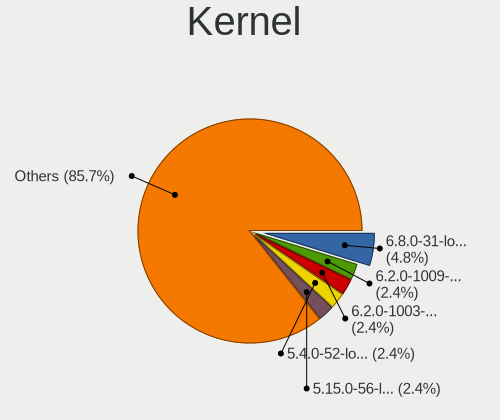

| Version                 | Notebooks | Percent |
|-------------------------|-----------|---------|
| 5.4.0-52-lowlatency     | 3         | 5.66%   |
| 5.13.0-28-lowlatency    | 3         | 5.66%   |
| 5.8.0-55-lowlatency     | 2         | 3.77%   |
| 5.4.0-94-lowlatency     | 2         | 3.77%   |
| 5.4.0-65-lowlatency     | 2         | 3.77%   |
| 5.4.0-45-lowlatency     | 2         | 3.77%   |
| 5.4.0-42-lowlatency     | 2         | 3.77%   |
| 5.13.0-30-lowlatency    | 2         | 3.77%   |
| 5.11.0-34-lowlatency    | 2         | 3.77%   |
| 5.11.0-27-lowlatency    | 2         | 3.77%   |
| 5.8.0-59-lowlatency     | 1         | 1.89%   |
| 5.8.0-50-lowlatency     | 1         | 1.89%   |
| 5.8.0-44-lowlatency     | 1         | 1.89%   |
| 5.8.0-43-lowlatency     | 1         | 1.89%   |
| 5.8.0-34-generic        | 1         | 1.89%   |
| 5.8.0-29-lowlatency     | 1         | 1.89%   |
| 5.8.0-25-lowlatency     | 1         | 1.89%   |
| 5.7.6-050706-lowlatency | 1         | 1.89%   |
| 5.7.6-050706-generic    | 1         | 1.89%   |
| 5.4.0-96-lowlatency     | 1         | 1.89%   |
| 5.4.0-88-lowlatency     | 1         | 1.89%   |
| 5.4.0-52-generic        | 1         | 1.89%   |
| 5.4.0-45-generic        | 1         | 1.89%   |
| 5.4.0-34-lowlatency     | 1         | 1.89%   |
| 5.4.0-26-lowlatency     | 1         | 1.89%   |
| 5.4.0-107-lowlatency    | 1         | 1.89%   |
| 5.4.0-100-lowlatency    | 1         | 1.89%   |
| 5.3.0-19-lowlatency     | 1         | 1.89%   |
| 5.15.0-47-lowlatency    | 1         | 1.89%   |
| 5.15.0-46-lowlatency    | 1         | 1.89%   |
| 5.15.0-40-lowlatency    | 1         | 1.89%   |
| 5.15.0-37-lowlatency    | 1         | 1.89%   |
| 5.15.0-30-lowlatency    | 1         | 1.89%   |
| 5.13.0-30-generic       | 1         | 1.89%   |
| 5.11.0-41-lowlatency    | 1         | 1.89%   |
| 5.11.0-36-lowlatency    | 1         | 1.89%   |
| 5.11.0-25-lowlatency    | 1         | 1.89%   |
| 5.11.0-22-lowlatency    | 1         | 1.89%   |
| 5.11.0-16-lowlatency    | 1         | 1.89%   |
| 4.15.0-91-lowlatency    | 1         | 1.89%   |
| 4.15.0-50-lowlatency    | 1         | 1.89%   |

Kernel Family
-------------

Linux kernel without a distro release

| Version | Notebooks | Percent |
|---------|-----------|---------|
| 5.4.0   | 19        | 36.54%  |
| 5.8.0   | 9         | 17.31%  |
| 5.11.0  | 9         | 17.31%  |
| 5.13.0  | 6         | 11.54%  |
| 5.15.0  | 5         | 9.62%   |
| 4.15.0  | 2         | 3.85%   |
| 5.7.6   | 1         | 1.92%   |
| 5.3.0   | 1         | 1.92%   |

Kernel Major Ver.
-----------------

Linux kernel major version

| Version | Notebooks | Percent |
|---------|-----------|---------|
| 5.4     | 19        | 36.54%  |
| 5.8     | 9         | 17.31%  |
| 5.11    | 9         | 17.31%  |
| 5.13    | 6         | 11.54%  |
| 5.15    | 5         | 9.62%   |
| 4.15    | 2         | 3.85%   |
| 5.7     | 1         | 1.92%   |
| 5.3     | 1         | 1.92%   |

Arch
----

OS architecture (x86_64, i586, etc.)

| Name   | Notebooks | Percent |
|--------|-----------|---------|
| x86_64 | 52        | 100%    |

DE
--

Desktop Environment

| Name  | Notebooks | Percent |
|-------|-----------|---------|
| XFCE  | 34        | 65.38%  |
| KDE5  | 12        | 23.08%  |
| GNOME | 5         | 9.62%   |
| LXQt  | 1         | 1.92%   |

Display Server
--------------

X11 or Wayland

| Name    | Notebooks | Percent |
|---------|-----------|---------|
| X11     | 49        | 94.23%  |
| Wayland | 3         | 5.77%   |

Display Manager
---------------

SDDM, LightDM, etc.

| Name    | Notebooks | Percent |
|---------|-----------|---------|
| TDM     | 21        | 40.38%  |
| LightDM | 16        | 30.77%  |
| SDDM    | 9         | 17.31%  |
| GDM     | 5         | 9.62%   |
| LXDM    | 1         | 1.92%   |

OS Lang
-------

Language

| Lang    | Notebooks | Percent |
|---------|-----------|---------|
| en_US   | 23        | 44.23%  |
| fr_FR   | 9         | 17.31%  |
| C       | 4         | 7.69%   |
| pt_BR   | 2         | 3.85%   |
| en_CA   | 2         | 3.85%   |
| Unknown | 2         | 3.85%   |
| ru_RU   | 1         | 1.92%   |
| it_IT   | 1         | 1.92%   |
| hu_HU   | 1         | 1.92%   |
| es_NI   | 1         | 1.92%   |
| es_ES   | 1         | 1.92%   |
| es_CR   | 1         | 1.92%   |
| en_NG   | 1         | 1.92%   |
| en_IE   | 1         | 1.92%   |
| en_AG   | 1         | 1.92%   |
| de_DE   | 1         | 1.92%   |

Boot Mode
---------

EFI or BIOS

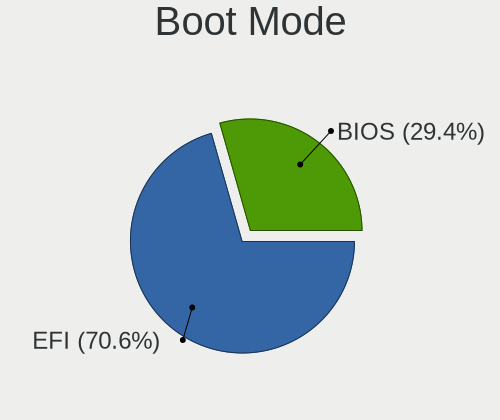

| Mode | Notebooks | Percent |
|------|-----------|---------|
| EFI  | 32        | 61.54%  |
| BIOS | 20        | 38.46%  |

Filesystem
----------

Type of filesystem

| Type    | Notebooks | Percent |
|---------|-----------|---------|
| Ext4    | 48        | 92.31%  |
| Overlay | 4         | 7.69%   |

Part. scheme
------------

Scheme of partitioning

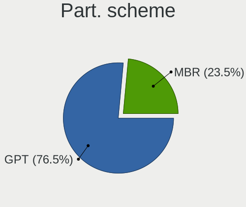

| Type | Notebooks | Percent |
|------|-----------|---------|
| GPT  | 35        | 67.31%  |
| MBR  | 17        | 32.69%  |

Dual Boot with Linux/BSD
------------------------

Hosting more than one Linux/BSD

| Dual boot | Notebooks | Percent |
|-----------|-----------|---------|
| No        | 46        | 88.46%  |
| Yes       | 6         | 11.54%  |

Dual Boot (Win)
---------------

Hosting Linux and Windows

| Dual boot | Notebooks | Percent |
|-----------|-----------|---------|
| Yes       | 26        | 50%     |
| No        | 26        | 50%     |

Board
-----

Vendor
------

Motherboard manufacturer

| Name                   | Notebooks | Percent |
|------------------------|-----------|---------|
| Lenovo                 | 14        | 26.92%  |
| Dell                   | 10        | 19.23%  |
| Hewlett-Packard        | 9         | 17.31%  |
| ASUSTek Computer       | 5         | 9.62%   |
| Toshiba                | 2         | 3.85%   |
| Acer                   | 2         | 3.85%   |
| Sony                   | 1         | 1.92%   |
| Samsung Electronics    | 1         | 1.92%   |
| Razer                  | 1         | 1.92%   |
| Intel Client Systems   | 1         | 1.92%   |
| HUAWEI                 | 1         | 1.92%   |
| Google                 | 1         | 1.92%   |
| Getac                  | 1         | 1.92%   |
| Clevo                  | 1         | 1.92%   |
| Avell High Performance | 1         | 1.92%   |
| Apple                  | 1         | 1.92%   |

Model
-----

Motherboard model

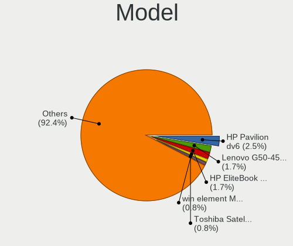

| Name                                             | Notebooks | Percent |
|--------------------------------------------------|-----------|---------|
| Lenovo G50-45 80E3                               | 2         | 3.85%   |
| HP Pavilion dv6                                  | 2         | 3.85%   |
| Toshiba Satellite L755D                          | 1         | 1.92%   |
| Toshiba Satellite C855                           | 1         | 1.92%   |
| Sony VGN-NS31M_W                                 | 1         | 1.92%   |
| Samsung 305V4A/305V5A                            | 1         | 1.92%   |
| Razer Blade Stealth 13 Late 2019                 | 1         | 1.92%   |
| Lenovo ThinkPad X230 2325AJG                     | 1         | 1.92%   |
| Lenovo ThinkPad X230 23245S1                     | 1         | 1.92%   |
| Lenovo ThinkPad X1 Carbon 6th 20KHCTO1WW         | 1         | 1.92%   |
| Lenovo ThinkPad X1 Carbon 2nd 20A80035US         | 1         | 1.92%   |
| Lenovo ThinkPad W530 2447IG0                     | 1         | 1.92%   |
| Lenovo ThinkPad T520 4243K86                     | 1         | 1.92%   |
| Lenovo Legion 5 15ARH05H 82B1                    | 1         | 1.92%   |
| Lenovo IdeaPad Gaming 3 15IMH05 81Y4             | 1         | 1.92%   |
| Lenovo IdeaPad Gaming 3 15ARH05 82EY             | 1         | 1.92%   |
| Lenovo IdeaPad 5 15ARE05 81YQ                    | 1         | 1.92%   |
| Lenovo IdeaPad 3 15ABA7 82RN                     | 1         | 1.92%   |
| Lenovo IdeaPad 3 14ARE05 81W3                    | 1         | 1.92%   |
| Intel Client Systems LAPBC510                    | 1         | 1.92%   |
| HUAWEI HLYL-WXX9                                 | 1         | 1.92%   |
| HP Stream Laptop 14-cb0XX                        | 1         | 1.92%   |
| HP Sona                                          | 1         | 1.92%   |
| HP OMEN by Laptop 15-ce0xx                       | 1         | 1.92%   |
| HP Notebook                                      | 1         | 1.92%   |
| HP Laptop 15s-fq1xxx                             | 1         | 1.92%   |
| HP EliteBook 840 G3                              | 1         | 1.92%   |
| HP Compaq 8510p                                  | 1         | 1.92%   |
| Google Nami                                      | 1         | 1.92%   |
| Getac S400G3                                     | 1         | 1.92%   |
| Dell XPS 15 9570                                 | 1         | 1.92%   |
| Dell Precision M4500                             | 1         | 1.92%   |
| Dell Latitude E7250                              | 1         | 1.92%   |
| Dell Latitude E6530                              | 1         | 1.92%   |
| Dell Latitude E4300                              | 1         | 1.92%   |
| Dell Inspiron N5110                              | 1         | 1.92%   |
| Dell Inspiron 7348                               | 1         | 1.92%   |
| Dell Inspiron 5566                               | 1         | 1.92%   |
| Dell Inspiron 3543                               | 1         | 1.92%   |
| Dell Inspiron 1520                               | 1         | 1.92%   |
| Clevo W35_37ET                                   | 1         | 1.92%   |
| Avell High Performance Avell G1555 MUV / A62 MUV | 1         | 1.92%   |
| ASUS X541NA                                      | 1         | 1.92%   |
| ASUS VivoBook_ASUSLaptop X580GD_M580GD           | 1         | 1.92%   |
| ASUS UX305FA                                     | 1         | 1.92%   |
| ASUS U56E                                        | 1         | 1.92%   |
| ASUS ROG Zephyrus G15 GA502IU_GA502IU            | 1         | 1.92%   |
| Apple MacBookPro11,5                             | 1         | 1.92%   |
| Acer ASPIRE1420P_MSFT                            | 1         | 1.92%   |
| Acer Aspire A114-32                              | 1         | 1.92%   |

Model Family
------------

Motherboard model prefix

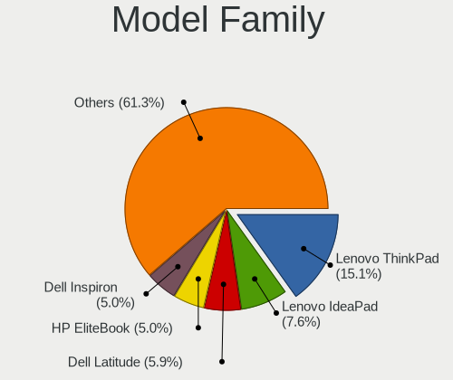

| Name                          | Notebooks | Percent |
|-------------------------------|-----------|---------|
| Lenovo ThinkPad               | 6         | 11.54%  |
| Lenovo IdeaPad                | 5         | 9.62%   |
| Dell Inspiron                 | 5         | 9.62%   |
| Dell Latitude                 | 3         | 5.77%   |
| Toshiba Satellite             | 2         | 3.85%   |
| Lenovo G50-45                 | 2         | 3.85%   |
| HP Pavilion                   | 2         | 3.85%   |
| Sony VGN-NS31M                | 1         | 1.92%   |
| Samsung 305V4A                | 1         | 1.92%   |
| Razer Blade                   | 1         | 1.92%   |
| Lenovo Legion                 | 1         | 1.92%   |
| Intel Client Systems LAPBC510 | 1         | 1.92%   |
| HUAWEI HLYL-WXX9              | 1         | 1.92%   |
| HP Stream                     | 1         | 1.92%   |
| HP Sona                       | 1         | 1.92%   |
| HP OMEN                       | 1         | 1.92%   |
| HP Notebook                   | 1         | 1.92%   |
| HP Laptop                     | 1         | 1.92%   |
| HP EliteBook                  | 1         | 1.92%   |
| HP Compaq                     | 1         | 1.92%   |
| Google Nami                   | 1         | 1.92%   |
| Getac S400G3                  | 1         | 1.92%   |
| Dell XPS                      | 1         | 1.92%   |
| Dell Precision                | 1         | 1.92%   |
| Clevo W35                     | 1         | 1.92%   |
| Avell High Performance Avell  | 1         | 1.92%   |
| ASUS X541NA                   | 1         | 1.92%   |
| ASUS VivoBook                 | 1         | 1.92%   |
| ASUS UX305FA                  | 1         | 1.92%   |
| ASUS U56E                     | 1         | 1.92%   |
| ASUS ROG                      | 1         | 1.92%   |
| Apple MacBookPro11            | 1         | 1.92%   |
| Acer ASPIRE1420P              | 1         | 1.92%   |
| Acer Aspire                   | 1         | 1.92%   |

MFG Year
--------

Motherboard manufacture year

| Year | Notebooks | Percent |
|------|-----------|---------|
| 2020 | 7         | 13.46%  |
| 2014 | 7         | 13.46%  |
| 2012 | 6         | 11.54%  |
| 2011 | 5         | 9.62%   |
| 2019 | 4         | 7.69%   |
| 2018 | 4         | 7.69%   |
| 2017 | 3         | 5.77%   |
| 2016 | 3         | 5.77%   |
| 2008 | 3         | 5.77%   |
| 2022 | 2         | 3.85%   |
| 2021 | 2         | 3.85%   |
| 2010 | 2         | 3.85%   |
| 2007 | 2         | 3.85%   |
| 2015 | 1         | 1.92%   |
| 2009 | 1         | 1.92%   |

Form Factor
-----------

Physical design of the computer

| Name     | Notebooks | Percent |
|----------|-----------|---------|
| Notebook | 52        | 100%    |

Secure Boot
-----------

Enabled or disabled

| State    | Notebooks | Percent |
|----------|-----------|---------|
| Disabled | 47        | 90.38%  |
| Enabled  | 5         | 9.62%   |

Coreboot
--------

Have coreboot on board

| Used | Notebooks | Percent |
|------|-----------|---------|
| No   | 50        | 96.15%  |
| Yes  | 2         | 3.85%   |

RAM Size
--------

Total RAM memory

| Size in GB | Notebooks | Percent |
|------------|-----------|---------|
| 4.01-8.0   | 25        | 48.08%  |
| 16.01-24.0 | 8         | 15.38%  |
| 3.01-4.0   | 7         | 13.46%  |
| 8.01-16.0  | 6         | 11.54%  |
| 32.01-64.0 | 2         | 3.85%   |
| 2.01-3.0   | 2         | 3.85%   |
| 24.01-32.0 | 1         | 1.92%   |
| 1.01-2.0   | 1         | 1.92%   |

RAM Used
--------

Used RAM memory

| Used GB   | Notebooks | Percent |
|-----------|-----------|---------|
| 1.01-2.0  | 23        | 43.4%   |
| 2.01-3.0  | 10        | 18.87%  |
| 3.01-4.0  | 9         | 16.98%  |
| 4.01-8.0  | 8         | 15.09%  |
| 8.01-16.0 | 2         | 3.77%   |
| 0.51-1.0  | 1         | 1.89%   |

Total Drives
------------

Number of drives on board

| Drives | Notebooks | Percent |
|--------|-----------|---------|
| 1      | 38        | 73.08%  |
| 2      | 12        | 23.08%  |
| 0      | 2         | 3.85%   |

Has CD-ROM
----------

Has CD-ROM on board

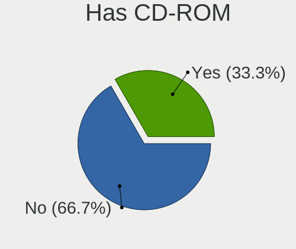

| Presented | Notebooks | Percent |
|-----------|-----------|---------|
| No        | 34        | 65.38%  |
| Yes       | 18        | 34.62%  |

Has Ethernet
------------

Has Ethernet on board

| Presented | Notebooks | Percent |
|-----------|-----------|---------|
| Yes       | 41        | 78.85%  |
| No        | 11        | 21.15%  |

Has WiFi
--------

Has WiFi module

| Presented | Notebooks | Percent |
|-----------|-----------|---------|
| Yes       | 51        | 98.08%  |
| No        | 1         | 1.92%   |

Has Bluetooth
-------------

Has Bluetooth module

| Presented | Notebooks | Percent |
|-----------|-----------|---------|
| Yes       | 39        | 75%     |
| No        | 13        | 25%     |

Location
--------

Country
-------

Geographic location (country)

| Country    | Notebooks | Percent |
|------------|-----------|---------|
| USA        | 11        | 21.15%  |
| France     | 9         | 17.31%  |
| Germany    | 4         | 7.69%   |
| Canada     | 4         | 7.69%   |
| Russia     | 3         | 5.77%   |
| UK         | 2         | 3.85%   |
| Italy      | 2         | 3.85%   |
| Costa Rica | 2         | 3.85%   |
| Brazil     | 2         | 3.85%   |
| Turkey     | 1         | 1.92%   |
| Taiwan     | 1         | 1.92%   |
| Spain      | 1         | 1.92%   |
| Poland     | 1         | 1.92%   |
| Norway     | 1         | 1.92%   |
| Nigeria    | 1         | 1.92%   |
| Nicaragua  | 1         | 1.92%   |
| Mexico     | 1         | 1.92%   |
| Indonesia  | 1         | 1.92%   |
| Hungary    | 1         | 1.92%   |
| Finland    | 1         | 1.92%   |
| Bulgaria   | 1         | 1.92%   |
| Austria    | 1         | 1.92%   |

City
----

Geographic location (city)

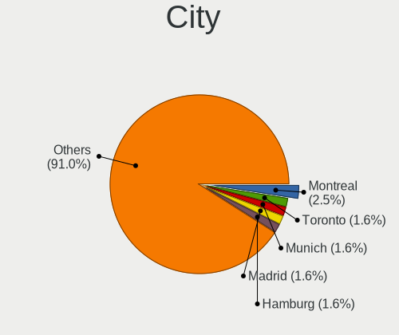

| City                   | Notebooks | Percent |
|------------------------|-----------|---------|
| Montreal               | 2         | 3.85%   |
| Béziers               | 2         | 3.85%   |
| Yekaterinburg          | 1         | 1.92%   |
| Wroclaw                | 1         | 1.92%   |
| Woonsocket             | 1         | 1.92%   |
| Woodland Park          | 1         | 1.92%   |
| Vienna                 | 1         | 1.92%   |
| Velleron               | 1         | 1.92%   |
| Turin                  | 1         | 1.92%   |
| Taipei                 | 1         | 1.92%   |
| Sunderland             | 1         | 1.92%   |
| Stuttgart              | 1         | 1.92%   |
| Stabekk                | 1         | 1.92%   |
| Sofia                  | 1         | 1.92%   |
| Sleman                 | 1         | 1.92%   |
| Seropedica             | 1         | 1.92%   |
| San Juan               | 1         | 1.92%   |
| Samara                 | 1         | 1.92%   |
| Rio de Janeiro         | 1         | 1.92%   |
| Ragusa                 | 1         | 1.92%   |
| Portland               | 1         | 1.92%   |
| Port Harcourt          | 1         | 1.92%   |
| Phoenix                | 1         | 1.92%   |
| Moscow                 | 1         | 1.92%   |
| Mississauga            | 1         | 1.92%   |
| Mexico City            | 1         | 1.92%   |
| Managua                | 1         | 1.92%   |
| Madrid                 | 1         | 1.92%   |
| Madison                | 1         | 1.92%   |
| Lindsay                | 1         | 1.92%   |
| Lille                  | 1         | 1.92%   |
| Kirkland               | 1         | 1.92%   |
| Istanbul               | 1         | 1.92%   |
| Illkirch-Graffenstaden | 1         | 1.92%   |
| Helsinki               | 1         | 1.92%   |
| Hamburg                | 1         | 1.92%   |
| Grasse                 | 1         | 1.92%   |
| Giroussens             | 1         | 1.92%   |
| Essen                  | 1         | 1.92%   |
| Esparza                | 1         | 1.92%   |
| Denver                 | 1         | 1.92%   |
| Concord                | 1         | 1.92%   |
| Chalette-sur-Loing     | 1         | 1.92%   |
| Cergy                  | 1         | 1.92%   |
| Budapest               | 1         | 1.92%   |
| Bryan                  | 1         | 1.92%   |
| Branson                | 1         | 1.92%   |
| Aylesbury              | 1         | 1.92%   |
| Auburn                 | 1         | 1.92%   |
| Aidlingen              | 1         | 1.92%   |

Drives
------

Drive Vendor
------------

Hard drive vendors

| Vendor              | Notebooks | Drives | Percent |
|---------------------|-----------|--------|---------|
| Samsung Electronics | 12        | 12     | 20%     |
| WDC                 | 7         | 7      | 11.67%  |
| SanDisk             | 6         | 6      | 10%     |
| Toshiba             | 5         | 5      | 8.33%   |
| Unknown             | 4         | 4      | 6.67%   |
| SK hynix            | 3         | 4      | 5%      |
| Seagate             | 3         | 3      | 5%      |
| Kingston            | 3         | 3      | 5%      |
| Intel               | 3         | 3      | 5%      |
| Hitachi             | 2         | 2      | 3.33%   |
| Union Memory        | 1         | 1      | 1.67%   |
| UMIS                | 1         | 1      | 1.67%   |
| Team                | 1         | 1      | 1.67%   |
| Micron Technology   | 1         | 1      | 1.67%   |
| KIOXIA              | 1         | 1      | 1.67%   |
| KingSpec            | 1         | 1      | 1.67%   |
| JMicron Technology  | 1         | 1      | 1.67%   |
| Inateck             | 1         | 1      | 1.67%   |
| HGST                | 1         | 1      | 1.67%   |
| Fujitsu             | 1         | 1      | 1.67%   |
| Crucial             | 1         | 1      | 1.67%   |
| BHT                 | 1         | 1      | 1.67%   |

Drive Model
-----------

Hard drive models

| Model                                     | Notebooks | Percent |
|-------------------------------------------|-----------|---------|
| Toshiba MQ04ABF100 1TB                    | 2         | 3.33%   |
| SK hynix SKHynix_HFM512GDHTNI-87A0B 512GB | 2         | 3.33%   |
| Samsung MZ7TD256HAFV-000L7 256GB SSD      | 2         | 3.33%   |
| Kingston SA400S37240G 240GB SSD           | 2         | 3.33%   |
| WDC WDS100T2B0C-00PXH0 1TB                | 1         | 1.67%   |
| WDC WD5000LPVX-75V0TT0 500GB              | 1         | 1.67%   |
| WDC WD3200BPVT-80ZEST0 320GB              | 1         | 1.67%   |
| WDC WD3200BEKT-75PVMT1 320GB              | 1         | 1.67%   |
| WDC WD2500BEVT-22ZCT0 250GB               | 1         | 1.67%   |
| WDC WD10JPVT-75A1YT0 1TB                  | 1         | 1.67%   |
| WDC PC SN530 SDBPNPZ-512G-1002 512GB      | 1         | 1.67%   |
| Unknown MMC Card  4GB                     | 1         | 1.67%   |
| Unknown MMC Card  16GB                    | 1         | 1.67%   |
| Unknown DA4128  128GB                     | 1         | 1.67%   |
| Unknown 032G34  32GB                      | 1         | 1.67%   |
| Union Memory UMIS RPJTJ256MEE1OWX 256GB   | 1         | 1.67%   |
| UMIS RPJTJ256MEE1OWX 256GB                | 1         | 1.67%   |
| Toshiba TR150 240GB SSD                   | 1         | 1.67%   |
| Toshiba MQ01ABD100 1TB                    | 1         | 1.67%   |
| Toshiba MK1637GSX 160GB                   | 1         | 1.67%   |
| Team TM8FP4001T 1TB                       | 1         | 1.67%   |
| SK hynix SKHynix_HFS256GD9TNI-L2A0B 256GB | 1         | 1.67%   |
| Seagate ST9320320AS 320GB                 | 1         | 1.67%   |
| Seagate ST500LM012 HN-M500MBB 500GB       | 1         | 1.67%   |
| Seagate ST1000LM049-2GH172 1TB            | 1         | 1.67%   |
| SanDisk SSD PLUS 240GB                    | 1         | 1.67%   |
| SanDisk SD9SN8W128G1002 128GB SSD         | 1         | 1.67%   |
| SanDisk SD7SN3Q128G1002 128GB SSD         | 1         | 1.67%   |
| SanDisk Extreme SSD 500GB                 | 1         | 1.67%   |
| SanDisk DF4064  64GB                      | 1         | 1.67%   |
| SanDisk DF4032  32GB                      | 1         | 1.67%   |
| Samsung SSD PM851 mSATA 256GB             | 1         | 1.67%   |
| Samsung SSD 970 PRO 1TB                   | 1         | 1.67%   |
| Samsung SSD 960 PRO 512GB                 | 1         | 1.67%   |
| Samsung SSD 870 EVO 1TB                   | 1         | 1.67%   |
| Samsung SSD 860 EVO 500GB                 | 1         | 1.67%   |
| Samsung PM981 NVMe 1024GB                 | 1         | 1.67%   |
| Samsung MZVLB512HBJQ-00000 512GB          | 1         | 1.67%   |
| Samsung MZ7TY256HDHP-000L7 256GB SSD      | 1         | 1.67%   |
| Samsung HN-M500MBB 500GB                  | 1         | 1.67%   |
| Samsung HM320JI 320GB                     | 1         | 1.67%   |
| Micron MTFDDAV256TBN-1AR15ABHA 256GB SSD  | 1         | 1.67%   |
| KIOXIA KBG40ZNV1T02 1TB                   | 1         | 1.67%   |
| Kingston SA2000M81000G 1TB                | 1         | 1.67%   |
| KingSpec P3-256 256GB SSD                 | 1         | 1.67%   |
| JMicron Generic 160GB                     | 1         | 1.67%   |
| Intel SSDSCKKF180H6H 180GB                | 1         | 1.67%   |
| Intel SSDPEKNW512GZL 512GB                | 1         | 1.67%   |
| Intel HBRPEKNX0202A 512GB                 | 1         | 1.67%   |
| Inateck ASM1153E 32GB                     | 1         | 1.67%   |
| Hitachi HTS727550A9E364 500GB             | 1         | 1.67%   |
| Hitachi HTS723232A7A364 320GB             | 1         | 1.67%   |
| HGST HTS725050A7E630 500GB                | 1         | 1.67%   |
| Fujitsu MJA2080BH G2 80GB                 | 1         | 1.67%   |
| Crucial CT256MX100SSD1 256GB              | 1         | 1.67%   |
| BHT WR202HH032G E70215F5 32GB SSD         | 1         | 1.67%   |

HDD Vendor
----------

Hard disk drive vendors

| Vendor              | Notebooks | Drives | Percent |
|---------------------|-----------|--------|---------|
| WDC                 | 5         | 5      | 27.78%  |
| Toshiba             | 4         | 4      | 22.22%  |
| Seagate             | 3         | 3      | 16.67%  |
| Samsung Electronics | 2         | 2      | 11.11%  |
| Hitachi             | 2         | 2      | 11.11%  |
| HGST                | 1         | 1      | 5.56%   |
| Fujitsu             | 1         | 1      | 5.56%   |

SSD Vendor
----------

Solid state drive vendors

| Vendor              | Notebooks | Drives | Percent |
|---------------------|-----------|--------|---------|
| Samsung Electronics | 6         | 6      | 30%     |
| SanDisk             | 4         | 4      | 20%     |
| Kingston            | 2         | 2      | 10%     |
| Toshiba             | 1         | 1      | 5%      |
| Micron Technology   | 1         | 1      | 5%      |
| KingSpec            | 1         | 1      | 5%      |
| JMicron Technology  | 1         | 1      | 5%      |
| Intel               | 1         | 1      | 5%      |
| Inateck             | 1         | 1      | 5%      |
| Crucial             | 1         | 1      | 5%      |
| BHT                 | 1         | 1      | 5%      |

Drive Kind
----------

HDD or SSD

| Kind | Notebooks | Drives | Percent |
|------|-----------|--------|---------|
| SSD  | 18        | 20     | 32.14%  |
| HDD  | 18        | 18     | 32.14%  |
| NVMe | 15        | 17     | 26.79%  |
| MMC  | 5         | 6      | 8.93%   |

Drive Connector
---------------

SATA, SAS, NVMe, etc.

| Type | Notebooks | Drives | Percent |
|------|-----------|--------|---------|
| SATA | 32        | 35     | 58.18%  |
| NVMe | 15        | 17     | 27.27%  |
| MMC  | 5         | 6      | 9.09%   |
| SAS  | 3         | 3      | 5.45%   |

Drive Size
----------

Size of hard drive

| Size in TB | Notebooks | Drives | Percent |
|------------|-----------|--------|---------|
| 0.01-0.5   | 30        | 32     | 83.33%  |
| 0.51-1.0   | 6         | 6      | 16.67%  |

Space Total
-----------

Amount of disk space available on the file system

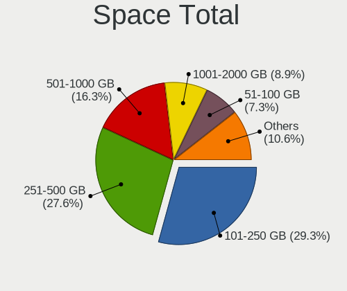

| Size in GB | Notebooks | Percent |
|------------|-----------|---------|
| 101-250    | 17        | 32.69%  |
| 251-500    | 12        | 23.08%  |
| 51-100     | 7         | 13.46%  |
| 21-50      | 6         | 11.54%  |
| 501-1000   | 5         | 9.62%   |
| 1-20       | 4         | 7.69%   |
| 1001-2000  | 1         | 1.92%   |

Space Used
----------

Amount of used disk space

| Used GB   | Notebooks | Percent |
|-----------|-----------|---------|
| 1-20      | 26        | 49.06%  |
| 101-250   | 9         | 16.98%  |
| 21-50     | 8         | 15.09%  |
| 51-100    | 5         | 9.43%   |
| 251-500   | 2         | 3.77%   |
| 501-1000  | 2         | 3.77%   |
| 1001-2000 | 1         | 1.89%   |

Malfunc. Drives
---------------

Drive models with a malfunction

| Model                                               | Notebooks | Drives | Percent |
|-----------------------------------------------------|-----------|--------|---------|
| WDC WD5000LPVX-75V0TT0 500GB                        | 1         | 1      | 6.67%   |
| WDC WD3200BPVT-80ZEST0 320GB                        | 1         | 1      | 6.67%   |
| WDC WD3200BEKT-75PVMT1 320GB                        | 1         | 1      | 6.67%   |
| WDC WD2500BEVT-22ZCT0 250GB                         | 1         | 1      | 6.67%   |
| Toshiba MK1637GSX 160GB                             | 1         | 1      | 6.67%   |
| Seagate ST9320320AS 320GB                           | 1         | 1      | 6.67%   |
| Seagate ST500LM012 HN-M500MBB 500GB                 | 1         | 1      | 6.67%   |
| Seagate ST1000LM049-2GH172 1TB                      | 1         | 1      | 6.67%   |
| Samsung Electronics SSD 870 EVO 1TB                 | 1         | 1      | 6.67%   |
| Samsung Electronics HN-M500MBB 500GB                | 1         | 1      | 6.67%   |
| Samsung Electronics HM320JI 320GB                   | 1         | 1      | 6.67%   |
| Micron Technology MTFDDAV256TBN-1AR15ABHA 256GB SSD | 1         | 1      | 6.67%   |
| KingSpec P3-256 256GB SSD                           | 1         | 1      | 6.67%   |
| Intel SSDSCKKF180H6H 180GB                          | 1         | 1      | 6.67%   |
| Hitachi HTS723232A7A364 320GB                       | 1         | 1      | 6.67%   |

Malfunc. Drive Vendor
---------------------

Vendors of faulty drives

| Vendor              | Notebooks | Drives | Percent |
|---------------------|-----------|--------|---------|
| WDC                 | 4         | 4      | 26.67%  |
| Seagate             | 3         | 3      | 20%     |
| Samsung Electronics | 3         | 3      | 20%     |
| Toshiba             | 1         | 1      | 6.67%   |
| Micron Technology   | 1         | 1      | 6.67%   |
| KingSpec            | 1         | 1      | 6.67%   |
| Intel               | 1         | 1      | 6.67%   |
| Hitachi             | 1         | 1      | 6.67%   |

Malfunc. HDD Vendor
-------------------

Vendors of faulty HDD drives

| Vendor              | Notebooks | Drives | Percent |
|---------------------|-----------|--------|---------|
| WDC                 | 4         | 4      | 36.36%  |
| Seagate             | 3         | 3      | 27.27%  |
| Samsung Electronics | 2         | 2      | 18.18%  |
| Toshiba             | 1         | 1      | 9.09%   |
| Hitachi             | 1         | 1      | 9.09%   |

Malfunc. Drive Kind
-------------------

Kinds of faulty drives

| Kind | Notebooks | Drives | Percent |
|------|-----------|--------|---------|
| HDD  | 11        | 11     | 73.33%  |
| SSD  | 4         | 4      | 26.67%  |

Failed Drives
-------------

Failed drive models

Zero info for selected period =(

Failed Drive Vendor
-------------------

Failed drive vendors

Zero info for selected period =(

Drive Status
------------

Number of failed and malfunc. drives

| Status   | Notebooks | Drives | Percent |
|----------|-----------|--------|---------|
| Works    | 33        | 38     | 60%     |
| Malfunc  | 15        | 15     | 27.27%  |
| Detected | 7         | 8      | 12.73%  |

Storage controller
------------------

Storage Vendor
--------------

Storage controller vendors

| Vendor                      | Notebooks | Percent |
|-----------------------------|-----------|---------|
| Intel                       | 35        | 58.33%  |
| AMD                         | 11        | 18.33%  |
| Samsung Electronics         | 4         | 6.67%   |
| SK hynix                    | 3         | 5%      |
| Union Memory (Shenzhen)     | 2         | 3.33%   |
| SanDisk                     | 2         | 3.33%   |
| Phison Electronics          | 1         | 1.67%   |
| KIOXIA                      | 1         | 1.67%   |
| Kingston Technology Company | 1         | 1.67%   |

Storage Model
-------------

Storage controller models

| Model                                                                          | Notebooks | Percent |
|--------------------------------------------------------------------------------|-----------|---------|
| AMD FCH SATA Controller [AHCI mode]                                            | 10        | 15.63%  |
| Intel 7 Series Chipset Family 6-port SATA Controller [AHCI mode]               | 5         | 7.81%   |
| Intel Wildcat Point-LP SATA Controller [AHCI Mode]                             | 4         | 6.25%   |
| Intel 82801 Mobile SATA Controller [RAID mode]                                 | 4         | 6.25%   |
| Intel 6 Series/C200 Series Chipset Family 6 port Mobile SATA AHCI Controller   | 4         | 6.25%   |
| Samsung NVMe SSD Controller SM981/PM981/PM983                                  | 3         | 4.69%   |
| Union Memory (Shenzhen) Non-Volatile memory controller                         | 2         | 3.13%   |
| SK hynix BC511                                                                 | 2         | 3.13%   |
| SanDisk WD Blue SN550 NVMe SSD                                                 | 2         | 3.13%   |
| Intel Sunrise Point-LP SATA Controller [AHCI mode]                             | 2         | 3.13%   |
| Intel Non-Volatile memory controller                                           | 2         | 3.13%   |
| Intel 82801IBM/IEM (ICH9M/ICH9M-E) 4 port SATA Controller [AHCI mode]          | 2         | 3.13%   |
| Intel 82801HM/HEM (ICH8M/ICH8M-E) IDE Controller                               | 2         | 3.13%   |
| SK hynix Non-Volatile memory controller                                        | 1         | 1.56%   |
| Samsung NVMe SSD Controller SM961/PM961/SM963                                  | 1         | 1.56%   |
| Phison E12 NVMe Controller                                                     | 1         | 1.56%   |
| KIOXIA NVMe SSD Controller BG4                                                 | 1         | 1.56%   |
| Kingston Company A2000 NVMe SSD                                                | 1         | 1.56%   |
| Intel Mobile PM965/GM965 PT IDER Controller                                    | 1         | 1.56%   |
| Intel HM170/QM170 Chipset SATA Controller [AHCI Mode]                          | 1         | 1.56%   |
| Intel Celeron/Pentium Silver Processor SATA Controller                         | 1         | 1.56%   |
| Intel Celeron N3350/Pentium N4200/Atom E3900 Series SATA AHCI Controller       | 1         | 1.56%   |
| Intel Cannon Lake Mobile PCH SATA AHCI Controller                              | 1         | 1.56%   |
| Intel 82801HM/HEM (ICH8M/ICH8M-E) SATA Controller [IDE mode]                   | 1         | 1.56%   |
| Intel 82801HM/HEM (ICH8M/ICH8M-E) SATA Controller [AHCI mode]                  | 1         | 1.56%   |
| Intel 8 Series/C220 Series Chipset Family 6-port SATA Controller 1 [AHCI mode] | 1         | 1.56%   |
| Intel 8 Series SATA Controller 1 [AHCI mode]                                   | 1         | 1.56%   |
| Intel 7 Series Chipset Family 4-port SATA Controller [IDE mode]                | 1         | 1.56%   |
| Intel 7 Series Chipset Family 2-port SATA Controller [IDE mode]                | 1         | 1.56%   |
| Intel 5 Series/3400 Series Chipset 6 port SATA AHCI Controller                 | 1         | 1.56%   |
| Intel 5 Series/3400 Series Chipset 4 port SATA AHCI Controller                 | 1         | 1.56%   |
| Intel 400 Series Chipset Family SATA AHCI Controller                           | 1         | 1.56%   |
| AMD SB7x0/SB8x0/SB9x0 SATA Controller [AHCI mode]                              | 1         | 1.56%   |

Storage Kind
------------

Kind of storage controller (IDE, SATA, NVMe, SAS, ...)

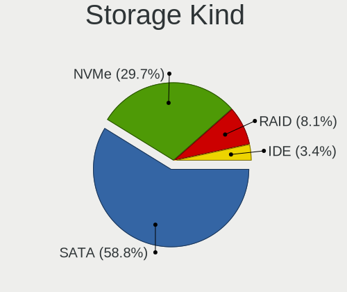

| Kind | Notebooks | Percent |
|------|-----------|---------|
| SATA | 38        | 63.33%  |
| NVMe | 15        | 25%     |
| RAID | 4         | 6.67%   |
| IDE  | 3         | 5%      |

Processor
---------

CPU Vendor
----------

Processor vendors

| Vendor | Notebooks | Percent |
|--------|-----------|---------|
| Intel  | 40        | 76.92%  |
| AMD    | 12        | 23.08%  |

CPU Model
---------

Processor models

| Model                                       | Notebooks | Percent |
|---------------------------------------------|-----------|---------|
| Intel Core i5-2450M CPU @ 2.50GHz           | 3         | 5.77%   |
| AMD Ryzen 5 4600H with Radeon Graphics      | 3         | 5.77%   |
| Intel Processor 5Y10 CPU @ 0.80GHz          | 1         | 1.92%   |
| Intel Pentium Dual CPU T3400 @ 2.16GHz      | 1         | 1.92%   |
| Intel Genuine CPU U2300 @ 1.20GHz           | 1         | 1.92%   |
| Intel Core i9-8950HK CPU @ 2.90GHz          | 1         | 1.92%   |
| Intel Core i7-8750H CPU @ 2.20GHz           | 1         | 1.92%   |
| Intel Core i7-8550U CPU @ 1.80GHz           | 1         | 1.92%   |
| Intel Core i7-7700HQ CPU @ 2.80GHz          | 1         | 1.92%   |
| Intel Core i7-6600U CPU @ 2.60GHz           | 1         | 1.92%   |
| Intel Core i7-5600U CPU @ 2.60GHz           | 1         | 1.92%   |
| Intel Core i7-5500U CPU @ 2.40GHz           | 1         | 1.92%   |
| Intel Core i7-4870HQ CPU @ 2.50GHz          | 1         | 1.92%   |
| Intel Core i7-4600U CPU @ 2.10GHz           | 1         | 1.92%   |
| Intel Core i7-3940XM CPU @ 3.00GHz          | 1         | 1.92%   |
| Intel Core i7-3520M CPU @ 2.90GHz           | 1         | 1.92%   |
| Intel Core i7-2630QM CPU @ 2.00GHz          | 1         | 1.92%   |
| Intel Core i7-1065G7 CPU @ 1.30GHz          | 1         | 1.92%   |
| Intel Core i7 CPU Q 720 @ 1.60GHz           | 1         | 1.92%   |
| Intel Core i5-9300H CPU @ 2.40GHz           | 1         | 1.92%   |
| Intel Core i5-8250U CPU @ 1.60GHz           | 1         | 1.92%   |
| Intel Core i5-5200U CPU @ 2.20GHz           | 1         | 1.92%   |
| Intel Core i5-4310M CPU @ 2.70GHz           | 1         | 1.92%   |
| Intel Core i5-3340M CPU @ 2.70GHz           | 1         | 1.92%   |
| Intel Core i5-3230M CPU @ 2.60GHz           | 1         | 1.92%   |
| Intel Core i5-2540M CPU @ 2.60GHz           | 1         | 1.92%   |
| Intel Core i5-1035G1 CPU @ 1.00GHz          | 1         | 1.92%   |
| Intel Core i5-10300H CPU @ 2.50GHz          | 1         | 1.92%   |
| Intel Core i5 CPU M 460 @ 2.53GHz           | 1         | 1.92%   |
| Intel Core i3-8130U CPU @ 2.20GHz           | 1         | 1.92%   |
| Intel Core i3-6006U CPU @ 2.00GHz           | 1         | 1.92%   |
| Intel Core 2 Duo CPU T7500 @ 2.20GHz        | 1         | 1.92%   |
| Intel Core 2 Duo CPU T5250 @ 1.50GHz        | 1         | 1.92%   |
| Intel Core 2 Duo CPU P9400 @ 2.40GHz        | 1         | 1.92%   |
| Intel Celeron N4000 CPU @ 1.10GHz           | 1         | 1.92%   |
| Intel Celeron CPU N3450 @ 1.10GHz           | 1         | 1.92%   |
| Intel Celeron CPU N3060 @ 1.60GHz           | 1         | 1.92%   |
| Intel Celeron CPU 847 @ 1.10GHz             | 1         | 1.92%   |
| Intel 11th Gen Core i5-1135G7 @ 2.40GHz     | 1         | 1.92%   |
| AMD Ryzen 7 5825U with Radeon Graphics      | 1         | 1.92%   |
| AMD Ryzen 7 4800HS with Radeon Graphics     | 1         | 1.92%   |
| AMD Ryzen 7 4700U with Radeon Graphics      | 1         | 1.92%   |
| AMD Ryzen 3 4300U with Radeon Graphics      | 1         | 1.92%   |
| AMD E2-7110 APU with AMD Radeon R2 Graphics | 1         | 1.92%   |
| AMD E1-6010 APU with AMD Radeon R2 Graphics | 1         | 1.92%   |
| AMD E-350 Processor                         | 1         | 1.92%   |
| AMD A6-6310 APU with AMD Radeon R4 Graphics | 1         | 1.92%   |
| AMD A4-3310MX APU with Radeon HD Graphics   | 1         | 1.92%   |

CPU Model Family
----------------

Processor model prefix

| Model              | Notebooks | Percent |
|--------------------|-----------|---------|
| Intel Core i7      | 13        | 25%     |
| Intel Core i5      | 13        | 25%     |
| Intel Celeron      | 4         | 7.69%   |
| Intel Core 2 Duo   | 3         | 5.77%   |
| AMD Ryzen 7        | 3         | 5.77%   |
| AMD Ryzen 5        | 3         | 5.77%   |
| Other              | 2         | 3.85%   |
| Intel Core i3      | 2         | 3.85%   |
| Intel Pentium Dual | 1         | 1.92%   |
| Intel Genuine      | 1         | 1.92%   |
| Intel Core i9      | 1         | 1.92%   |
| AMD Ryzen 3        | 1         | 1.92%   |
| AMD E2             | 1         | 1.92%   |
| AMD E1             | 1         | 1.92%   |
| AMD E              | 1         | 1.92%   |
| AMD A6             | 1         | 1.92%   |
| AMD A4             | 1         | 1.92%   |

CPU Cores
---------

Number of processor cores

| Number | Notebooks | Percent |
|--------|-----------|---------|
| 2      | 28        | 53.85%  |
| 4      | 16        | 30.77%  |
| 6      | 5         | 9.62%   |
| 8      | 3         | 5.77%   |

CPU Sockets
-----------

Number of sockets

| Number | Notebooks | Percent |
|--------|-----------|---------|
| 1      | 52        | 100%    |

CPU Threads
-----------

Threads per core (Hyper-Threading)

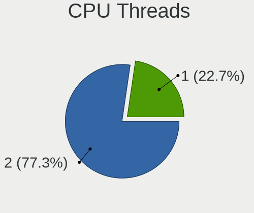

| Number | Notebooks | Percent |
|--------|-----------|---------|
| 2      | 34        | 65.38%  |
| 1      | 18        | 34.62%  |

CPU Op-Modes
------------

CPU Operation Modes (32-bit, 64-bit)

| Op mode        | Notebooks | Percent |
|----------------|-----------|---------|
| 32-bit, 64-bit | 52        | 100%    |

CPU Microcode
-------------

Microcode number

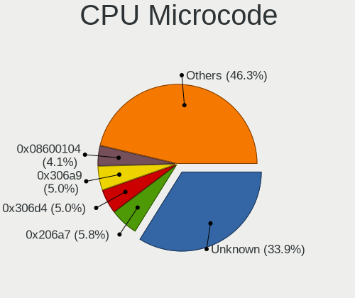

| Number     | Notebooks | Percent |
|------------|-----------|---------|
| 0x206a7    | 6         | 11.54%  |
| 0x306a9    | 4         | 7.69%   |
| 0x08600104 | 4         | 7.69%   |
| Unknown    | 4         | 7.69%   |
| 0x806ea    | 3         | 5.77%   |
| 0x306d4    | 3         | 5.77%   |
| 0x906ea    | 2         | 3.85%   |
| 0x706e5    | 2         | 3.85%   |
| 0x6fd      | 2         | 3.85%   |
| 0x406e3    | 2         | 3.85%   |
| 0x07030105 | 2         | 3.85%   |
| 0xa0652    | 1         | 1.92%   |
| 0x906e9    | 1         | 1.92%   |
| 0x806c1    | 1         | 1.92%   |
| 0x706a1    | 1         | 1.92%   |
| 0x6fb      | 1         | 1.92%   |
| 0x506c9    | 1         | 1.92%   |
| 0x406c4    | 1         | 1.92%   |
| 0x40661    | 1         | 1.92%   |
| 0x40651    | 1         | 1.92%   |
| 0x306c3    | 1         | 1.92%   |
| 0x106e5    | 1         | 1.92%   |
| 0x1067a    | 1         | 1.92%   |
| 0x0a50000c | 1         | 1.92%   |
| 0x08600106 | 1         | 1.92%   |
| 0x08600103 | 1         | 1.92%   |
| 0x07030104 | 1         | 1.92%   |
| 0x05000029 | 1         | 1.92%   |
| 0x03000027 | 1         | 1.92%   |

CPU Microarch
-------------

Microarchitecture

| Name          | Notebooks | Percent |
|---------------|-----------|---------|
| KabyLake      | 7         | 13.46%  |
| Zen 2         | 6         | 11.54%  |
| SandyBridge   | 6         | 11.54%  |
| IvyBridge     | 4         | 7.69%   |
| Broadwell     | 4         | 7.69%   |
| Puma          | 3         | 5.77%   |
| Haswell       | 3         | 5.77%   |
| Core          | 3         | 5.77%   |
| Skylake       | 2         | 3.85%   |
| Penryn        | 2         | 3.85%   |
| IceLake       | 2         | 3.85%   |
| Zen 3         | 1         | 1.92%   |
| Westmere      | 1         | 1.92%   |
| TigerLake     | 1         | 1.92%   |
| Silvermont    | 1         | 1.92%   |
| Nehalem       | 1         | 1.92%   |
| K10 Llano     | 1         | 1.92%   |
| Goldmont plus | 1         | 1.92%   |
| Goldmont      | 1         | 1.92%   |
| CometLake     | 1         | 1.92%   |
| Bobcat        | 1         | 1.92%   |

Graphics
--------

GPU Vendor
----------

Vendors of graphics cards

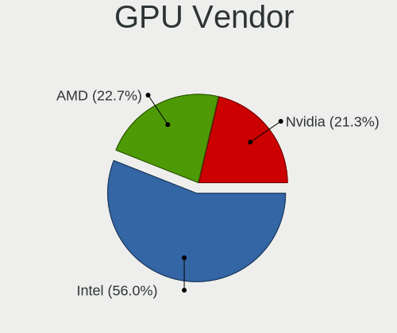

| Vendor | Notebooks | Percent |
|--------|-----------|---------|
| Intel  | 35        | 54.69%  |
| AMD    | 16        | 25%     |
| Nvidia | 13        | 20.31%  |

GPU Model
---------

Graphics card models

| Model                                                                                    | Notebooks | Percent |
|------------------------------------------------------------------------------------------|-----------|---------|
| Intel 2nd Generation Core Processor Family Integrated Graphics Controller                | 6         | 9.09%   |
| AMD Renoir                                                                               | 6         | 9.09%   |
| Intel 3rd Gen Core processor Graphics Controller                                         | 4         | 6.06%   |
| Intel UHD Graphics 620                                                                   | 3         | 4.55%   |
| Intel HD Graphics 5500                                                                   | 3         | 4.55%   |
| Intel CoffeeLake-H GT2 [UHD Graphics 630]                                                | 3         | 4.55%   |
| Nvidia TU117M                                                                            | 2         | 3.03%   |
| Nvidia TU116M [GeForce GTX 1660 Ti Mobile]                                               | 2         | 3.03%   |
| Intel Skylake GT2 [HD Graphics 520]                                                      | 2         | 3.03%   |
| Intel Mobile 4 Series Chipset Integrated Graphics Controller                             | 2         | 3.03%   |
| Nvidia TU117M [GeForce GTX 1650 Mobile / Max-Q]                                          | 1         | 1.52%   |
| Nvidia GT216GLM [Quadro FX 880M]                                                         | 1         | 1.52%   |
| Nvidia GP107M [GeForce GTX 1050 Ti Mobile]                                               | 1         | 1.52%   |
| Nvidia GP107M [GeForce GTX 1050 Mobile]                                                  | 1         | 1.52%   |
| Nvidia GP106BM [GeForce GTX 1060 Mobile 6GB]                                             | 1         | 1.52%   |
| Nvidia GK107M [GeForce GTX 660M]                                                         | 1         | 1.52%   |
| Nvidia GK107GLM [Quadro K1000M]                                                          | 1         | 1.52%   |
| Nvidia GF119M [Quadro NVS 4200M]                                                         | 1         | 1.52%   |
| Nvidia GF108M [GeForce GT 525M]                                                          | 1         | 1.52%   |
| Intel TigerLake-LP GT2 [Iris Xe Graphics]                                                | 1         | 1.52%   |
| Intel Mobile GM965/GL960 Integrated Graphics Controller (secondary)                      | 1         | 1.52%   |
| Intel Mobile GM965/GL960 Integrated Graphics Controller (primary)                        | 1         | 1.52%   |
| Intel Iris Plus Graphics G7                                                              | 1         | 1.52%   |
| Intel Iris Plus Graphics G1 (Ice Lake)                                                   | 1         | 1.52%   |
| Intel HD Graphics 5300                                                                   | 1         | 1.52%   |
| Intel HD Graphics 500                                                                    | 1         | 1.52%   |
| Intel Haswell-ULT Integrated Graphics Controller                                         | 1         | 1.52%   |
| Intel GeminiLake [UHD Graphics 600]                                                      | 1         | 1.52%   |
| Intel Core Processor Integrated Graphics Controller                                      | 1         | 1.52%   |
| Intel CometLake-H GT2 [UHD Graphics]                                                     | 1         | 1.52%   |
| Intel Atom/Celeron/Pentium Processor x5-E8000/J3xxx/N3xxx Integrated Graphics Controller | 1         | 1.52%   |
| Intel 4th Gen Core Processor Integrated Graphics Controller                              | 1         | 1.52%   |
| AMD Wrestler [Radeon HD 6310]                                                            | 1         | 1.52%   |
| AMD Venus XT [Radeon HD 8870M / R9 M270X/M370X]                                          | 1         | 1.52%   |
| AMD Sun LE [Radeon HD 8550M / R5 M230]                                                   | 1         | 1.52%   |
| AMD Sumo [Radeon HD 6480G]                                                               | 1         | 1.52%   |
| AMD Seymour [Radeon HD 6400M/7400M Series]                                               | 1         | 1.52%   |
| AMD RV630/M76 [Mobility Radeon HD 2600]                                                  | 1         | 1.52%   |
| AMD RV620/M82 [Mobility Radeon HD 3410/3430]                                             | 1         | 1.52%   |
| AMD Mullins [Radeon R4/R5 Graphics]                                                      | 1         | 1.52%   |
| AMD Mullins [Radeon R3 Graphics]                                                         | 1         | 1.52%   |
| AMD Mullins [Radeon R2 Graphics]                                                         | 1         | 1.52%   |
| AMD Barcelo                                                                              | 1         | 1.52%   |

GPU Combo
---------

Combinations of graphics cards

| Name           | Notebooks | Percent |
|----------------|-----------|---------|
| 1 x Intel      | 26        | 50%     |
| 1 x AMD        | 11        | 21.15%  |
| Intel + Nvidia | 8         | 15.38%  |
| AMD + Nvidia   | 3         | 5.77%   |
| 1 x Nvidia     | 2         | 3.85%   |
| 2 x AMD        | 1         | 1.92%   |
| Intel + AMD    | 1         | 1.92%   |

GPU Driver
----------

Free vs proprietary

| Driver      | Notebooks | Percent |
|-------------|-----------|---------|
| Free        | 49        | 94.23%  |
| Proprietary | 3         | 5.77%   |

GPU Memory
----------

Total video memory

| Size in GB | Notebooks | Percent |
|------------|-----------|---------|
| Unknown    | 30        | 57.69%  |
| 0.51-1.0   | 7         | 13.46%  |
| 0.01-0.5   | 7         | 13.46%  |
| 1.01-2.0   | 4         | 7.69%   |
| 5.01-6.0   | 2         | 3.85%   |
| 3.01-4.0   | 2         | 3.85%   |

Monitor
-------

Monitor Vendor
--------------

Monitor vendors

| Vendor                  | Notebooks | Percent |
|-------------------------|-----------|---------|
| AU Optronics            | 13        | 22.03%  |
| LG Display              | 10        | 16.95%  |
| Samsung Electronics     | 8         | 13.56%  |
| BOE                     | 7         | 11.86%  |
| Chimei Innolux          | 6         | 10.17%  |
| Sharp                   | 2         | 3.39%   |
| Lenovo                  | 2         | 3.39%   |
| LG Philips              | 1         | 1.69%   |
| Iiyama                  | 1         | 1.69%   |
| Hannspree               | 1         | 1.69%   |
| Dell                    | 1         | 1.69%   |
| CPT                     | 1         | 1.69%   |
| Chi Mei Optoelectronics | 1         | 1.69%   |
| BenQ                    | 1         | 1.69%   |
| Arnos Instruments       | 1         | 1.69%   |
| Apple                   | 1         | 1.69%   |
| Ancor Communications    | 1         | 1.69%   |
| Acer                    | 1         | 1.69%   |

Monitor Model
-------------

Monitor models

| Model                                                                    | Notebooks | Percent |
|--------------------------------------------------------------------------|-----------|---------|
| LG Display LCD Monitor LGD02DC 1366x768 344x194mm 15.5-inch              | 2         | 3.39%   |
| LG Display LCD Monitor LGD02D8 1366x768 277x156mm 12.5-inch              | 2         | 3.39%   |
| Chimei Innolux LCD Monitor CMN14C4 1366x768 309x173mm 13.9-inch          | 2         | 3.39%   |
| AU Optronics LCD Monitor AUOD1ED 1920x1080 344x193mm 15.5-inch           | 2         | 3.39%   |
| Sharp LCD Monitor SHP14B8 1920x1080 294x165mm 13.3-inch                  | 1         | 1.69%   |
| Sharp LCD Monitor SHP149A 1920x1080 344x194mm 15.5-inch                  | 1         | 1.69%   |
| Samsung Electronics SyncMaster SAM0226 1440x900 410x257mm 19.1-inch      | 1         | 1.69%   |
| Samsung Electronics LCD Monitor SEC4151 1366x768 344x194mm 15.5-inch     | 1         | 1.69%   |
| Samsung Electronics LCD Monitor SEC3649 1366x768 310x170mm 13.9-inch     | 1         | 1.69%   |
| Samsung Electronics LCD Monitor SEC334A 1366x768 344x194mm 15.5-inch     | 1         | 1.69%   |
| Samsung Electronics LCD Monitor SEC3052 1024x600 223x125mm 10.1-inch     | 1         | 1.69%   |
| Samsung Electronics LCD Monitor SDC4C48 1920x1080 344x194mm 15.5-inch    | 1         | 1.69%   |
| Samsung Electronics LCD Monitor SDC4852 1366x768 344x194mm 15.5-inch     | 1         | 1.69%   |
| Samsung Electronics LCD Monitor SAM0F13 3840x2160 1872x1053mm 84.6-inch  | 1         | 1.69%   |
| LG Philips LCD Monitor LPL1901 1680x1050 331x207mm 15.4-inch             | 1         | 1.69%   |
| LG Display LCD Monitor LGD05EC 1920x1080 309x174mm 14.0-inch             | 1         | 1.69%   |
| LG Display LCD Monitor LGD04D4 3840x2160 344x194mm 15.5-inch             | 1         | 1.69%   |
| LG Display LCD Monitor LGD044B 1366x768 344x194mm 15.5-inch              | 1         | 1.69%   |
| LG Display LCD Monitor LGD033A 1366x768 344x194mm 15.5-inch              | 1         | 1.69%   |
| LG Display LCD Monitor LGD0338 1600x900 344x194mm 15.5-inch              | 1         | 1.69%   |
| LG Display LCD Monitor LGD0259 1920x1080 345x194mm 15.6-inch             | 1         | 1.69%   |
| Lenovo LEN L27i-28 LEN65E0 1920x1080 598x336mm 27.0-inch                 | 1         | 1.69%   |
| Lenovo LCD Monitor LEN40B1 1600x900 344x194mm 15.5-inch                  | 1         | 1.69%   |
| Iiyama PLE2483H IVM6113 1920x1080 531x299mm 24.0-inch                    | 1         | 1.69%   |
| Hannspree HF207 HSG18C5 1600x900 443x249mm 20.0-inch                     | 1         | 1.69%   |
| Dell U2415 DELA0BA 1920x1200 520x320mm 24.0-inch                         | 1         | 1.69%   |
| CPT LCD Monitor CPT141F 1280x800 331x207mm 15.4-inch                     | 1         | 1.69%   |
| Chimei Innolux LCD Monitor CMN15F5 1920x1080 344x193mm 15.5-inch         | 1         | 1.69%   |
| Chimei Innolux LCD Monitor CMN15E7 1920x1080 344x193mm 15.5-inch         | 1         | 1.69%   |
| Chimei Innolux LCD Monitor CMN1521 1920x1080 344x193mm 15.5-inch         | 1         | 1.69%   |
| Chimei Innolux LCD Monitor CMN1482 1600x900 309x174mm 14.0-inch          | 1         | 1.69%   |
| Chi Mei Optoelectronics LCD Monitor CMO15A2 1366x768 344x193mm 15.5-inch | 1         | 1.69%   |
| BOE LCD Monitor BOE08F5 1920x1080 344x194mm 15.5-inch                    | 1         | 1.69%   |
| BOE LCD Monitor BOE08E2 1920x1080 344x194mm 15.5-inch                    | 1         | 1.69%   |
| BOE LCD Monitor BOE08C2 1920x1080 344x194mm 15.5-inch                    | 1         | 1.69%   |
| BOE LCD Monitor BOE0878 1920x1080 355x200mm 16.0-inch                    | 1         | 1.69%   |
| BOE LCD Monitor BOE0747 1920x1080 344x194mm 15.5-inch                    | 1         | 1.69%   |
| BOE LCD Monitor BOE0671 1366x768 344x194mm 15.5-inch                     | 1         | 1.69%   |
| BOE LCD Monitor BOE05F4 1366x768 277x156mm 12.5-inch                     | 1         | 1.69%   |
| BenQ GW2283 BNQ78E9 1920x1080 480x270mm 21.7-inch                        | 1         | 1.69%   |
| AU Optronics LCD Monitor AUO5024 1280x800 286x178mm 13.3-inch            | 1         | 1.69%   |
| AU Optronics LCD Monitor AUO42ED 1920x1080 344x193mm 15.5-inch           | 1         | 1.69%   |
| AU Optronics LCD Monitor AUO413D 1920x1080 309x173mm 13.9-inch           | 1         | 1.69%   |
| AU Optronics LCD Monitor AUO2D3C 1366x768 309x173mm 13.9-inch            | 1         | 1.69%   |
| AU Optronics LCD Monitor AUO2336 2560x1440 309x174mm 14.0-inch           | 1         | 1.69%   |
| AU Optronics LCD Monitor AUO212D 1920x1080 293x165mm 13.2-inch           | 1         | 1.69%   |
| AU Optronics LCD Monitor AUO20ED 1920x1080 344x194mm 15.5-inch           | 1         | 1.69%   |
| AU Optronics LCD Monitor AUO183C 1366x768 309x173mm 13.9-inch            | 1         | 1.69%   |
| AU Optronics LCD Monitor AUO123D 1920x1080 309x173mm 13.9-inch           | 1         | 1.69%   |
| AU Optronics LCD Monitor AUO11ED 1920x1080 344x193mm 15.5-inch           | 1         | 1.69%   |
| AU Optronics LCD Monitor AUO11EC 1366x768 344x193mm 15.5-inch            | 1         | 1.69%   |
| Arnos Instruments L-W22 AIC1003 1920x1080 477x268mm 21.5-inch            | 1         | 1.69%   |
| Apple Color LCD APPA02E 2880x1800 331x207mm 15.4-inch                    | 1         | 1.69%   |
| Ancor Communications VS248 ACI2498 1920x1080 531x299mm 24.0-inch         | 1         | 1.69%   |
| Acer AL1715 ACR06B0 1280x1024 338x270mm 17.0-inch                        | 1         | 1.69%   |

Monitor Resolution
------------------

Monitor screen resolution

| Resolution         | Notebooks | Percent |
|--------------------|-----------|---------|
| 1920x1080 (FHD)    | 24        | 43.64%  |
| 1366x768 (WXGA)    | 18        | 32.73%  |
| 1600x900 (HD+)     | 4         | 7.27%   |
| 3840x2160 (4K)     | 3         | 5.45%   |
| 1280x800 (WXGA)    | 2         | 3.64%   |
| 2880x1800          | 1         | 1.82%   |
| 2560x1440 (QHD)    | 1         | 1.82%   |
| 1680x1050 (WSXGA+) | 1         | 1.82%   |
| 1440x900 (WXGA+)   | 1         | 1.82%   |

Monitor Diagonal
----------------

Diagonal size in inches

| Inches | Notebooks | Percent |
|--------|-----------|---------|
| 15     | 31        | 52.54%  |
| 13     | 8         | 13.56%  |
| 14     | 5         | 8.47%   |
| 24     | 3         | 5.08%   |
| 12     | 3         | 5.08%   |
| 27     | 2         | 3.39%   |
| 21     | 2         | 3.39%   |
| 84     | 1         | 1.69%   |
| 20     | 1         | 1.69%   |
| 19     | 1         | 1.69%   |
| 18     | 1         | 1.69%   |
| 16     | 1         | 1.69%   |

Monitor Width
-------------

Physical width

| Width in mm | Notebooks | Percent |
|-------------|-----------|---------|
| 301-350     | 41        | 70.69%  |
| 201-300     | 6         | 10.34%  |
| 401-500     | 5         | 8.62%   |
| 501-600     | 4         | 6.9%    |
| 351-400     | 1         | 1.72%   |
| 1501-2000   | 1         | 1.72%   |

Aspect Ratio
------------

Proportional relationship between the width and the height

| Ratio | Notebooks | Percent |
|-------|-----------|---------|
| 16/9  | 46        | 88.46%  |
| 16/10 | 6         | 11.54%  |

Monitor Area
------------

Area in inch²

| Area in inch² | Notebooks | Percent |
|----------------|-----------|---------|
| 101-110        | 32        | 54.24%  |
| 81-90          | 10        | 16.95%  |
| 71-80          | 3         | 5.08%   |
| 61-70          | 3         | 5.08%   |
| 201-250        | 3         | 5.08%   |
| 151-200        | 3         | 5.08%   |
| 301-350        | 2         | 3.39%   |
| More than 1000 | 1         | 1.69%   |
| 251-300        | 1         | 1.69%   |
| 141-150        | 1         | 1.69%   |

Pixel Density
-------------

Pixels per inch

| Density       | Notebooks | Percent |
|---------------|-----------|---------|
| 121-160       | 23        | 40.35%  |
| 101-120       | 19        | 33.33%  |
| 51-100        | 9         | 15.79%  |
| 161-240       | 5         | 8.77%   |
| More than 240 | 1         | 1.75%   |

Multiple Monitors
-----------------

Total monitors connected

| Total | Notebooks | Percent |
|-------|-----------|---------|
| 1     | 44        | 83.02%  |
| 2     | 8         | 15.09%  |
| 3     | 1         | 1.89%   |

Network
-------

Net Controller Vendor
---------------------

Controller vendors

| Vendor                            | Notebooks | Percent |
|-----------------------------------|-----------|---------|
| Intel                             | 31        | 37.8%   |
| Realtek Semiconductor             | 28        | 34.15%  |
| Qualcomm Atheros                  | 10        | 12.2%   |
| Broadcom                          | 4         | 4.88%   |
| Ralink                            | 2         | 2.44%   |
| ASIX Electronics                  | 2         | 2.44%   |
| MediaTek                          | 1         | 1.22%   |
| Marvell Technology Group          | 1         | 1.22%   |
| Huawei Technologies               | 1         | 1.22%   |
| Ericsson Business Mobile Networks | 1         | 1.22%   |
| Broadcom Limited                  | 1         | 1.22%   |

Net Controller Model
--------------------

Controller models

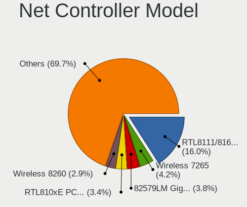

| Model                                                              | Notebooks | Percent |
|--------------------------------------------------------------------|-----------|---------|
| Realtek RTL8111/8168/8411 PCI Express Gigabit Ethernet Controller  | 14        | 14.43%  |
| Intel Wireless 7265                                                | 6         | 6.19%   |
| Realtek RTL810xE PCI Express Fast Ethernet controller              | 5         | 5.15%   |
| Intel 82579LM Gigabit Network Connection (Lewisville)              | 5         | 5.15%   |
| Realtek RTL8822CE 802.11ac PCIe Wireless Network Adapter           | 3         | 3.09%   |
| Intel Wi-Fi 6 AX200                                                | 3         | 3.09%   |
| Intel Centrino Ultimate-N 6300                                     | 3         | 3.09%   |
| Intel Centrino Advanced-N 6205 [Taylor Peak]                       | 3         | 3.09%   |
| Realtek RTL8188CE 802.11b/g/n WiFi Adapter                         | 2         | 2.06%   |
| Realtek RTL8153 Gigabit Ethernet Adapter                           | 2         | 2.06%   |
| Qualcomm Atheros QCA6174 802.11ac Wireless Network Adapter         | 2         | 2.06%   |
| Qualcomm Atheros AR9485 Wireless Network Adapter                   | 2         | 2.06%   |
| Intel Wireless 7260                                                | 2         | 2.06%   |
| Intel Cannon Lake PCH CNVi WiFi                                    | 2         | 2.06%   |
| Broadcom BCM43142 802.11b/g/n                                      | 2         | 2.06%   |
| ASIX AX88179 Gigabit Ethernet                                      | 2         | 2.06%   |
| Realtek RTL8822BE 802.11a/b/g/n/ac WiFi adapter                    | 1         | 1.03%   |
| Realtek RTL8723BE PCIe Wireless Network Adapter                    | 1         | 1.03%   |
| Realtek RTL8188EE Wireless Network Adapter                         | 1         | 1.03%   |
| Realtek Realtek Network controller                                 | 1         | 1.03%   |
| Ralink RT5390 [802.11 b/g/n 1T1R G-band PCI Express Single Chip]   | 1         | 1.03%   |
| Ralink RT3090 Wireless 802.11n 1T/1R PCIe                          | 1         | 1.03%   |
| Qualcomm Atheros QCA9565 / AR9565 Wireless Network Adapter         | 1         | 1.03%   |
| Qualcomm Atheros QCA9377 802.11ac Wireless Network Adapter         | 1         | 1.03%   |
| Qualcomm Atheros AR928X Wireless Network Adapter (PCI-Express)     | 1         | 1.03%   |
| Qualcomm Atheros AR8162 Fast Ethernet                              | 1         | 1.03%   |
| Qualcomm Atheros AR8152 v2.0 Fast Ethernet                         | 1         | 1.03%   |
| Qualcomm Atheros AR8151 v2.0 Gigabit Ethernet                      | 1         | 1.03%   |
| Qualcomm Atheros AR8131 Gigabit Ethernet                           | 1         | 1.03%   |
| MediaTek moto e6s                                                  | 1         | 1.03%   |
| Marvell Group 88E8055 PCI-E Gigabit Ethernet Controller            | 1         | 1.03%   |
| Intel Wireless 8265 / 8275                                         | 1         | 1.03%   |
| Intel Wireless 8260                                                | 1         | 1.03%   |
| Intel WiFi Link 5100                                               | 1         | 1.03%   |
| Intel Wi-Fi 6 AX201                                                | 1         | 1.03%   |
| Intel PRO/Wireless 4965 AG or AGN [Kedron] Network Connection      | 1         | 1.03%   |
| Intel PRO/Wireless 3945ABG [Golan] Network Connection              | 1         | 1.03%   |
| Intel Ice Lake-LP PCH CNVi WiFi                                    | 1         | 1.03%   |
| Intel Ethernet Connection I219-LM                                  | 1         | 1.03%   |
| Intel Ethernet Connection I218-LM                                  | 1         | 1.03%   |
| Intel Ethernet Connection (4) I219-V                               | 1         | 1.03%   |
| Intel Ethernet Connection (3) I218-LM                              | 1         | 1.03%   |
| Intel Ethernet Connection (2) I218-LM                              | 1         | 1.03%   |
| Intel Comet Lake PCH CNVi WiFi                                     | 1         | 1.03%   |
| Intel Centrino Wireless-N 6150                                     | 1         | 1.03%   |
| Intel Centrino Wireless-N 1030 [Rainbow Peak]                      | 1         | 1.03%   |
| Intel Centrino Wireless-N + WiMAX 6150                             | 1         | 1.03%   |
| Intel 82577LM Gigabit Network Connection                           | 1         | 1.03%   |
| Intel 82567LM Gigabit Network Connection                           | 1         | 1.03%   |
| Intel 82566MM Gigabit Network Connection                           | 1         | 1.03%   |
| Huawei Mobile                                                      | 1         | 1.03%   |
| Ericsson Business Mobile Networks H5321 gw Mobile Broadband Module | 1         | 1.03%   |
| Broadcom Limited BCM4312 802.11b/g LP-PHY                          | 1         | 1.03%   |
| Broadcom BCM4401-B0 100Base-TX                                     | 1         | 1.03%   |
| Broadcom BCM43602 802.11ac Wireless LAN SoC                        | 1         | 1.03%   |

Wireless Vendor
---------------

Wireless vendors

| Vendor                | Notebooks | Percent |
|-----------------------|-----------|---------|
| Intel                 | 29        | 56.86%  |
| Realtek Semiconductor | 9         | 17.65%  |
| Qualcomm Atheros      | 7         | 13.73%  |
| Broadcom              | 3         | 5.88%   |
| Ralink                | 2         | 3.92%   |
| Broadcom Limited      | 1         | 1.96%   |

Wireless Model
--------------

Wireless models

| Model                                                            | Notebooks | Percent |
|------------------------------------------------------------------|-----------|---------|
| Intel Wireless 7265                                              | 6         | 11.54%  |
| Realtek RTL8822CE 802.11ac PCIe Wireless Network Adapter         | 3         | 5.77%   |
| Intel Wi-Fi 6 AX200                                              | 3         | 5.77%   |
| Intel Centrino Ultimate-N 6300                                   | 3         | 5.77%   |
| Intel Centrino Advanced-N 6205 [Taylor Peak]                     | 3         | 5.77%   |
| Realtek RTL8188CE 802.11b/g/n WiFi Adapter                       | 2         | 3.85%   |
| Qualcomm Atheros QCA6174 802.11ac Wireless Network Adapter       | 2         | 3.85%   |
| Qualcomm Atheros AR9485 Wireless Network Adapter                 | 2         | 3.85%   |
| Intel Wireless 7260                                              | 2         | 3.85%   |
| Intel Cannon Lake PCH CNVi WiFi                                  | 2         | 3.85%   |
| Broadcom BCM43142 802.11b/g/n                                    | 2         | 3.85%   |
| Realtek RTL8822BE 802.11a/b/g/n/ac WiFi adapter                  | 1         | 1.92%   |
| Realtek RTL8723BE PCIe Wireless Network Adapter                  | 1         | 1.92%   |
| Realtek RTL8188EE Wireless Network Adapter                       | 1         | 1.92%   |
| Realtek Realtek Network controller                               | 1         | 1.92%   |
| Ralink RT5390 [802.11 b/g/n 1T1R G-band PCI Express Single Chip] | 1         | 1.92%   |
| Ralink RT3090 Wireless 802.11n 1T/1R PCIe                        | 1         | 1.92%   |
| Qualcomm Atheros QCA9565 / AR9565 Wireless Network Adapter       | 1         | 1.92%   |
| Qualcomm Atheros QCA9377 802.11ac Wireless Network Adapter       | 1         | 1.92%   |
| Qualcomm Atheros AR928X Wireless Network Adapter (PCI-Express)   | 1         | 1.92%   |
| Intel Wireless 8265 / 8275                                       | 1         | 1.92%   |
| Intel Wireless 8260                                              | 1         | 1.92%   |
| Intel WiFi Link 5100                                             | 1         | 1.92%   |
| Intel Wi-Fi 6 AX201                                              | 1         | 1.92%   |
| Intel PRO/Wireless 4965 AG or AGN [Kedron] Network Connection    | 1         | 1.92%   |
| Intel PRO/Wireless 3945ABG [Golan] Network Connection            | 1         | 1.92%   |
| Intel Ice Lake-LP PCH CNVi WiFi                                  | 1         | 1.92%   |
| Intel Comet Lake PCH CNVi WiFi                                   | 1         | 1.92%   |
| Intel Centrino Wireless-N 6150                                   | 1         | 1.92%   |
| Intel Centrino Wireless-N 1030 [Rainbow Peak]                    | 1         | 1.92%   |
| Intel Centrino Wireless-N + WiMAX 6150                           | 1         | 1.92%   |
| Broadcom Limited BCM4312 802.11b/g LP-PHY                        | 1         | 1.92%   |
| Broadcom BCM43602 802.11ac Wireless LAN SoC                      | 1         | 1.92%   |

Ethernet Vendor
---------------

Ethernet vendors

| Vendor                   | Notebooks | Percent |
|--------------------------|-----------|---------|
| Realtek Semiconductor    | 21        | 48.84%  |
| Intel                    | 13        | 30.23%  |
| Qualcomm Atheros         | 4         | 9.3%    |
| ASIX Electronics         | 2         | 4.65%   |
| MediaTek                 | 1         | 2.33%   |
| Marvell Technology Group | 1         | 2.33%   |
| Broadcom                 | 1         | 2.33%   |

Ethernet Model
--------------

Ethernet models

| Model                                                             | Notebooks | Percent |
|-------------------------------------------------------------------|-----------|---------|
| Realtek RTL8111/8168/8411 PCI Express Gigabit Ethernet Controller | 14        | 32.56%  |
| Realtek RTL810xE PCI Express Fast Ethernet controller             | 5         | 11.63%  |
| Intel 82579LM Gigabit Network Connection (Lewisville)             | 5         | 11.63%  |
| Realtek RTL8153 Gigabit Ethernet Adapter                          | 2         | 4.65%   |
| ASIX AX88179 Gigabit Ethernet                                     | 2         | 4.65%   |
| Qualcomm Atheros AR8162 Fast Ethernet                             | 1         | 2.33%   |
| Qualcomm Atheros AR8152 v2.0 Fast Ethernet                        | 1         | 2.33%   |
| Qualcomm Atheros AR8151 v2.0 Gigabit Ethernet                     | 1         | 2.33%   |
| Qualcomm Atheros AR8131 Gigabit Ethernet                          | 1         | 2.33%   |
| MediaTek moto e6s                                                 | 1         | 2.33%   |
| Marvell Group 88E8055 PCI-E Gigabit Ethernet Controller           | 1         | 2.33%   |
| Intel Ethernet Connection I219-LM                                 | 1         | 2.33%   |
| Intel Ethernet Connection I218-LM                                 | 1         | 2.33%   |
| Intel Ethernet Connection (4) I219-V                              | 1         | 2.33%   |
| Intel Ethernet Connection (3) I218-LM                             | 1         | 2.33%   |
| Intel Ethernet Connection (2) I218-LM                             | 1         | 2.33%   |
| Intel 82577LM Gigabit Network Connection                          | 1         | 2.33%   |
| Intel 82567LM Gigabit Network Connection                          | 1         | 2.33%   |
| Intel 82566MM Gigabit Network Connection                          | 1         | 2.33%   |
| Broadcom BCM4401-B0 100Base-TX                                    | 1         | 2.33%   |

Net Controller Kind
-------------------

Ethernet, WiFi or modem

| Kind     | Notebooks | Percent |
|----------|-----------|---------|
| WiFi     | 51        | 54.26%  |
| Ethernet | 41        | 43.62%  |
| Modem    | 2         | 2.13%   |

Used Controller
---------------

Currently used network controller

| Kind     | Notebooks | Percent |
|----------|-----------|---------|
| WiFi     | 44        | 81.48%  |
| Ethernet | 10        | 18.52%  |

NICs
----

Total network controllers on board

| Total | Notebooks | Percent |
|-------|-----------|---------|
| 2     | 37        | 71.15%  |
| 1     | 15        | 28.85%  |

IPv6
----

IPv6 vs IPv4

| Used | Notebooks | Percent |
|------|-----------|---------|
| No   | 40        | 76.92%  |
| Yes  | 12        | 23.08%  |

Bluetooth
---------

Bluetooth Vendor
----------------

Controller vendors

| Vendor                          | Notebooks | Percent |
|---------------------------------|-----------|---------|
| Intel                           | 19        | 48.72%  |
| Realtek Semiconductor           | 5         | 12.82%  |
| Qualcomm Atheros Communications | 4         | 10.26%  |
| Broadcom                        | 4         | 10.26%  |
| Ralink Technology               | 2         | 5.13%   |
| Realtek                         | 1         | 2.56%   |
| Lite-On Technology              | 1         | 2.56%   |
| Hewlett-Packard                 | 1         | 2.56%   |
| Foxconn International           | 1         | 2.56%   |
| Apple                           | 1         | 2.56%   |

Bluetooth Model
---------------

Controller models

| Model                                             | Notebooks | Percent |
|---------------------------------------------------|-----------|---------|
| Intel Bluetooth wireless interface                | 10        | 25.64%  |
| Realtek Bluetooth Radio                           | 3         | 7.69%   |
| Intel AX201 Bluetooth                             | 3         | 7.69%   |
| Intel AX200 Bluetooth                             | 3         | 7.69%   |
| Broadcom BCM20702 Bluetooth 4.0 [ThinkPad]        | 3         | 7.69%   |
| Qualcomm Atheros QCA61x4 Bluetooth 4.0            | 2         | 5.13%   |
| Intel Bluetooth 9460/9560 Jefferson Peak (JfP)    | 2         | 5.13%   |
| Realtek RTL8723B Bluetooth                        | 1         | 2.56%   |
| Realtek  Bluetooth 4.2 Adapter                    | 1         | 2.56%   |
| Realtek Bluetooth Radio                           | 1         | 2.56%   |
| Ralink Motorola BC4 Bluetooth 3.0+HS Adapter      | 1         | 2.56%   |
| Ralink CSR BS8510                                 | 1         | 2.56%   |
| Qualcomm Atheros  Bluetooth Device                | 1         | 2.56%   |
| Qualcomm Atheros AR3012 Bluetooth 4.0             | 1         | 2.56%   |
| Lite-On Qualcomm Atheros QCA9377 Bluetooth        | 1         | 2.56%   |
| Intel Centrino Advanced-N 6230 Bluetooth adapter  | 1         | 2.56%   |
| HP Bluetooth 2.0 Interface [Broadcom BCM2045]     | 1         | 2.56%   |
| Foxconn International BCM43142A0 Bluetooth module | 1         | 2.56%   |
| Broadcom BCM43142 Bluetooth 4.0                   | 1         | 2.56%   |
| Apple Bluetooth Host Controller                   | 1         | 2.56%   |

Sound
-----

Sound Vendor
------------

Sound card vendors

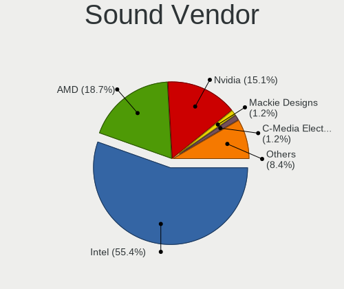

| Vendor                     | Notebooks | Percent |
|----------------------------|-----------|---------|
| Intel                      | 40        | 56.34%  |
| AMD                        | 14        | 19.72%  |
| Nvidia                     | 10        | 14.08%  |
| Yealink Network Technology | 1         | 1.41%   |
| QinHeng Electronics        | 1         | 1.41%   |
| Mackie Designs             | 1         | 1.41%   |
| Logitech                   | 1         | 1.41%   |
| C-Media Electronics        | 1         | 1.41%   |
| BR25                       | 1         | 1.41%   |
| Behringer.......           | 1         | 1.41%   |

Sound Model
-----------

Sound card models

| Model                                                                                             | Notebooks | Percent |
|---------------------------------------------------------------------------------------------------|-----------|---------|
| AMD Family 17h/19h HD Audio Controller                                                            | 7         | 8.05%   |
| Intel 7 Series/C216 Chipset Family High Definition Audio Controller                               | 6         | 6.9%    |
| Intel Sunrise Point-LP HD Audio                                                                   | 5         | 5.75%   |
| AMD Renoir Radeon High Definition Audio Controller                                                | 5         | 5.75%   |
| Intel Wildcat Point-LP High Definition Audio Controller                                           | 4         | 4.6%    |
| Intel Broadwell-U Audio Controller                                                                | 4         | 4.6%    |
| Intel 6 Series/C200 Series Chipset Family High Definition Audio Controller                        | 4         | 4.6%    |
| AMD FCH Azalia Controller                                                                         | 4         | 4.6%    |
| Nvidia TU107 GeForce GTX 1650 High Definition Audio Controller                                    | 3         | 3.45%   |
| Intel Cannon Lake PCH cAVS                                                                        | 3         | 3.45%   |
| Intel 82801I (ICH9 Family) HD Audio Controller                                                    | 3         | 3.45%   |
| AMD Kabini HDMI/DP Audio                                                                          | 3         | 3.45%   |
| Nvidia TU116 High Definition Audio Controller                                                     | 2         | 2.3%    |
| Intel Ice Lake-LP Smart Sound Technology Audio Controller                                         | 2         | 2.3%    |
| Intel 82801H (ICH8 Family) HD Audio Controller                                                    | 2         | 2.3%    |
| Intel 8 Series/C220 Series Chipset High Definition Audio Controller                               | 2         | 2.3%    |
| Intel 5 Series/3400 Series Chipset High Definition Audio                                          | 2         | 2.3%    |
| Yealink Network Technology VoIP Phone                                                             | 1         | 1.15%   |
| QinHeng Electronics CH345 MIDI adapter                                                            | 1         | 1.15%   |
| Nvidia GT216 HDMI Audio Controller                                                                | 1         | 1.15%   |
| Nvidia GP106 High Definition Audio Controller                                                     | 1         | 1.15%   |
| Nvidia GK107 HDMI Audio Controller                                                                | 1         | 1.15%   |
| Nvidia GF119 HDMI Audio Controller                                                                | 1         | 1.15%   |
| Nvidia GF108 High Definition Audio Controller                                                     | 1         | 1.15%   |
| Mackie Designs BIG KNOB STUDIO+                                                                   | 1         | 1.15%   |
| Logitech 960 Headset                                                                              | 1         | 1.15%   |
| Intel Xeon E3-1200 v3/4th Gen Core Processor HD Audio Controller                                  | 1         | 1.15%   |
| Intel Tiger Lake-LP Smart Sound Technology Audio Controller                                       | 1         | 1.15%   |
| Intel Haswell-ULT HD Audio Controller                                                             | 1         | 1.15%   |
| Intel Comet Lake PCH cAVS                                                                         | 1         | 1.15%   |
| Intel CM238 HD Audio Controller                                                                   | 1         | 1.15%   |
| Intel Celeron/Pentium Silver Processor High Definition Audio                                      | 1         | 1.15%   |
| Intel Celeron N3350/Pentium N4200/Atom E3900 Series Audio Cluster                                 | 1         | 1.15%   |
| Intel Atom/Celeron/Pentium Processor x5-E8000/J3xxx/N3xxx Series High Definition Audio Controller | 1         | 1.15%   |
| Intel 8 Series HD Audio Controller                                                                | 1         | 1.15%   |
| C-Media Electronics Blue Snowball                                                                 | 1         | 1.15%   |
| BR25 USB Composite Device                                                                         | 1         | 1.15%   |
| Behringer....... BIGFOOT                                                                          | 1         | 1.15%   |
| AMD Wrestler HDMI Audio                                                                           | 1         | 1.15%   |
| AMD SBx00 Azalia (Intel HDA)                                                                      | 1         | 1.15%   |
| AMD RV630 HDMI Audio [Radeon HD 2600 PRO/XT / HD 3610]                                            | 1         | 1.15%   |
| AMD Oland/Hainan/Cape Verde/Pitcairn HDMI Audio [Radeon HD 7000 Series]                           | 1         | 1.15%   |
| AMD BeaverCreek HDMI Audio [Radeon HD 6500D and 6400G-6600G series]                               | 1         | 1.15%   |

Memory
------

Memory Vendor
-------------

Memory module vendors

| Vendor              | Notebooks | Percent |
|---------------------|-----------|---------|
| Samsung Electronics | 20        | 32.26%  |
| SK hynix            | 18        | 29.03%  |
| Micron Technology   | 7         | 11.29%  |
| Kingston            | 6         | 9.68%   |
| Unknown             | 3         | 4.84%   |
| Ramaxel Technology  | 2         | 3.23%   |
| Nanya Technology    | 2         | 3.23%   |
| Crucial             | 2         | 3.23%   |
| Transcend           | 1         | 1.61%   |
| Corsair             | 1         | 1.61%   |

Memory Model
------------

Memory module models

| Model                                                         | Notebooks | Percent |
|---------------------------------------------------------------|-----------|---------|
| SK hynix RAM HMT351S6BFR8C-H9 4GB SODIMM DDR3 1334MT/s        | 3         | 4.41%   |
| Kingston RAM LV32D4S2S8HD-8 8GB SODIMM DDR4 3200MT/s          | 3         | 4.41%   |
| SK hynix RAM HMA851S6DJR6N-XN 4GB SODIMM DDR4 3200MT/s        | 2         | 2.94%   |
| Samsung RAM M471B5773DH0-CH9 2048MB SODIMM DDR3 1600MT/s      | 2         | 2.94%   |
| Samsung RAM M471B5173DB0-YK0 4096MB SODIMM DDR3 1600MT/s      | 2         | 2.94%   |
| Unknown RAM Module 4096MB SODIMM LPDDR3 1600MT/s              | 1         | 1.47%   |
| Unknown RAM Module 2048MB SODIMM DDR2 667MT/s                 | 1         | 1.47%   |
| Unknown RAM Module 2048MB SODIMM DDR2                         | 1         | 1.47%   |
| Transcend RAM TS1GSK64W6H 8192MB SODIMM DDR3 1600MT/s         | 1         | 1.47%   |
| SK hynix RAM Module 4096MB SODIMM DDR4 2400MT/s               | 1         | 1.47%   |
| SK hynix RAM HYMP512S64CP8-Y5 1GB SODIMM DDR2 667MT/s         | 1         | 1.47%   |
| SK hynix RAM HMT451S6DFR8A-PB 4GB SODIMM DDR3 1600MT/s        | 1         | 1.47%   |
| SK hynix RAM HMT451S6BFR8A-PB 4GB SODIMM DDR3 1600MT/s        | 1         | 1.47%   |
| SK hynix RAM HMT41GS6BFR8A-PB 8GB SODIMM DDR3 1600MT/s        | 1         | 1.47%   |
| SK hynix RAM HMT41GS6AFR8A-PB 8GB SODIMM DDR3 1600MT/s        | 1         | 1.47%   |
| SK hynix RAM HMT351S6EFR8C-PB 4GB SODIMM DDR3 1600MT/s        | 1         | 1.47%   |
| SK hynix RAM HMT351S6CFR8C-PB 4GB SODIMM DDR3 1600MT/s        | 1         | 1.47%   |
| SK hynix RAM HMT351S6CFR8C-H9 4GB SODIMM DDR3 1334MT/s        | 1         | 1.47%   |
| SK hynix RAM HMT351S6CFR8C-H9 4GB SODIMM DDR3 1333MT/s        | 1         | 1.47%   |
| SK hynix RAM HMT325S6CFR8C-H9 2GB SODIMM DDR3 1334MT/s        | 1         | 1.47%   |
| SK hynix RAM HMT325S6BFR8C-H9 2GB SODIMM DDR3 1600MT/s        | 1         | 1.47%   |
| SK hynix RAM HMAA1GS6CMR6N-VK 8GB Row Of Chips DDR4 2667MT/s  | 1         | 1.47%   |
| SK hynix RAM HMA851S6CJR6N-VK 4GB SODIMM DDR4 2400MT/s        | 1         | 1.47%   |
| SK hynix RAM HMA851S6CJR6N-VK 4GB DDR4 2400MT/s               | 1         | 1.47%   |
| Samsung RAM Module 8192MB SODIMM DDR4 2133MT/s                | 1         | 1.47%   |
| Samsung RAM Module 8192MB SODIMM DDR3 1600MT/s                | 1         | 1.47%   |
| Samsung RAM M471B5773CHS-CH9 2GB SODIMM DDR3 4199MT/s         | 1         | 1.47%   |
| Samsung RAM M471B5674-H0-YK0--- 4GB Chip DDR3 1600MT/s        | 1         | 1.47%   |
| Samsung RAM M471B5673EH1-CF8 2048MB SODIMM DDR3 4199MT/s      | 1         | 1.47%   |
| Samsung RAM M471B5273DH0-CK0 4GB SODIMM DDR3 1600MT/s         | 1         | 1.47%   |
| Samsung RAM M471B5273DH0-CH9 4096MB SODIMM DDR3 1334MT/s      | 1         | 1.47%   |
| Samsung RAM M471B5273CH0-CH9 4096MB SODIMM DDR3 1334MT/s      | 1         | 1.47%   |
| Samsung RAM M471B5173EB0-YK0 4GB SODIMM DDR3 1600MT/s         | 1         | 1.47%   |
| Samsung RAM M471B5173BH0-CK0 4GB SODIMM DDR3 1600MT/s         | 1         | 1.47%   |
| Samsung RAM M471B1G73BH0-CK0 8GB SODIMM DDR3 1600MT/s         | 1         | 1.47%   |
| Samsung RAM M471A5244CB0-CWE 4GB Row Of Chips DDR4 3200MT/s   | 1         | 1.47%   |
| Samsung RAM M471A2K43CB1-CRC 16GB SODIMM DDR4 2667MT/s        | 1         | 1.47%   |
| Samsung RAM M471A1K43CB1-CWE 8GB SODIMM DDR4 3200MT/s         | 1         | 1.47%   |
| Samsung RAM M471A1K43BB1-CRC 8GB SODIMM DDR4 2667MT/s         | 1         | 1.47%   |
| Samsung RAM M471A1G44AB0-CWE 8GB Row Of Chips DDR4 3200MT/s   | 1         | 1.47%   |
| Samsung RAM M4 70T2864QZ3-CE6 1GB SODIMM DDR 1639MT/s         | 1         | 1.47%   |
| Samsung RAM K4UBE3D4AA-MGCL 8GB Row Of Chips LPDDR4 4267MT/s  | 1         | 1.47%   |
| Ramaxel RAM RMT3170MK58F8F1600 2GB SODIMM DDR3 1600MT/s       | 1         | 1.47%   |
| Ramaxel RAM RMT3170ME68F9F1600 4096MB SODIMM DDR3 1600MT/s    | 1         | 1.47%   |
| Ramaxel RAM RMSA3260NA78HAF-2666 8GB SODIMM DDR4 2667MT/s     | 1         | 1.47%   |
| Nanya RAM NT2GT64U8HD0BN-3C 2GB SODIMM DDR 667MT/s            | 1         | 1.47%   |
| Nanya RAM NT2GC64B88B0NS-CG 2GB SODIMM DDR3 1334MT/s          | 1         | 1.47%   |
| Micron RAM MT52L1G32D4PG-093 8GB Row Of Chips LPDDR3 2133MT/s | 1         | 1.47%   |
| Micron RAM MT40A1G16RC-062E:B 8GB Row Of Chips DDR4 3200MT/s  | 1         | 1.47%   |
| Micron RAM Module 8GB SODIMM DDR3 1600MT/s                    | 1         | 1.47%   |
| Micron RAM 53E512M32D2NP-046 1GB Row Of Chips LPDDR4 4267MT/s | 1         | 1.47%   |
| Micron RAM 16KTF51264HZ-1G6M1 4GB SODIMM DDR3 1600MT/s        | 1         | 1.47%   |
| Micron RAM 16KTF51264HZ-1G6K1 4096MB SODIMM DDR3 1600MT/s     | 1         | 1.47%   |
| Micron RAM 16ATF2G64HZ-2G6E1 16GB SODIMM DDR4 2667MT/s        | 1         | 1.47%   |
| Kingston RAM HP16D3LS1KBGH/4G 4GB SODIMM DDR3 1600MT/s        | 1         | 1.47%   |
| Kingston RAM ACR128X64D3S1333C9 1GB SODIMM DDR3 1333MT/s      | 1         | 1.47%   |
| Kingston RAM 99U5428-014.A00G 2048MB SODIMM DDR3 1333MT/s     | 1         | 1.47%   |
| Kingston RAM 9905700-046.A00G 16384MB SODIMM DDR4 3200MT/s    | 1         | 1.47%   |
| Crucial RAM CT51264BF160BJ.M8F 4GB SODIMM DDR3 1600MT/s       | 1         | 1.47%   |
| Crucial RAM CT102464BF160B.M16 8GB SODIMM DDR3 1600MT/s       | 1         | 1.47%   |

Memory Kind
-----------

Memory module kinds

| Kind   | Notebooks | Percent |
|--------|-----------|---------|
| DDR3   | 27        | 49.09%  |
| DDR4   | 17        | 30.91%  |
| DDR2   | 4         | 7.27%   |
| SDRAM  | 3         | 5.45%   |
| LPDDR4 | 2         | 3.64%   |
| LPDDR3 | 2         | 3.64%   |

Memory Form Factor
------------------

Physical design of the memory module

| Name         | Notebooks | Percent |
|--------------|-----------|---------|
| SODIMM       | 46        | 83.64%  |
| Row Of Chips | 7         | 12.73%  |
| Chip         | 1         | 1.82%   |
| Unknown      | 1         | 1.82%   |

Memory Size
-----------

Memory module size

| Size  | Notebooks | Percent |
|-------|-----------|---------|
| 4096  | 27        | 43.55%  |
| 8192  | 19        | 30.65%  |
| 2048  | 10        | 16.13%  |
| 16384 | 3         | 4.84%   |
| 1024  | 3         | 4.84%   |

Memory Speed
------------

Memory module speed

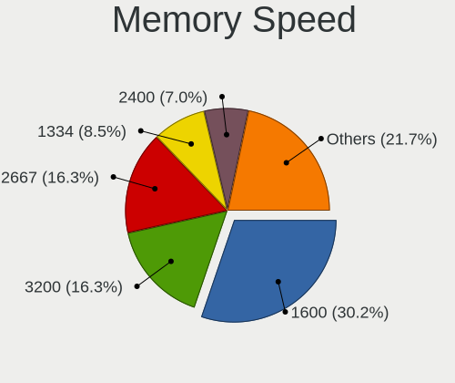

| Speed   | Notebooks | Percent |
|---------|-----------|---------|
| 1600    | 21        | 36.84%  |
| 3200    | 7         | 12.28%  |
| 1334    | 7         | 12.28%  |
| 2667    | 5         | 8.77%   |
| 2400    | 3         | 5.26%   |
| 2133    | 3         | 5.26%   |
| 667     | 3         | 5.26%   |
| 4267    | 2         | 3.51%   |
| 4199    | 2         | 3.51%   |
| 1333    | 2         | 3.51%   |
| 1639    | 1         | 1.75%   |
| Unknown | 1         | 1.75%   |

Printers & scanners
-------------------

Printer Vendor
--------------

Printer device vendors

| Vendor          | Notebooks | Percent |
|-----------------|-----------|---------|
| Hewlett-Packard | 1         | 100%    |

Printer Model
-------------

Printer device models

| Model            | Notebooks | Percent |
|------------------|-----------|---------|
| HP LaserJet 1022 | 1         | 100%    |

Scanner Vendor
--------------

Scanner device vendors

| Vendor | Notebooks | Percent |
|--------|-----------|---------|
| Canon  | 1         | 100%    |

Scanner Model
-------------

Scanner device models

| Model                | Notebooks | Percent |
|----------------------|-----------|---------|
| Canon CanoScan 4200F | 1         | 100%    |

Camera
------

Camera Vendor
-------------

Camera device vendors

| Vendor                                 | Notebooks | Percent |
|----------------------------------------|-----------|---------|
| Chicony Electronics                    | 13        | 30.23%  |
| IMC Networks                           | 5         | 11.63%  |
| Syntek                                 | 3         | 6.98%   |
| Suyin                                  | 3         | 6.98%   |
| Sunplus Innovation Technology          | 3         | 6.98%   |
| Realtek Semiconductor                  | 3         | 6.98%   |
| Microdia                               | 3         | 6.98%   |
| Quanta                                 | 2         | 4.65%   |
| Acer                                   | 2         | 4.65%   |
| ViewQuest Technologies                 | 1         | 2.33%   |
| Silicon Motion                         | 1         | 2.33%   |
| Ricoh                                  | 1         | 2.33%   |
| Philips (or NXP)                       | 1         | 2.33%   |
| Importek                               | 1         | 2.33%   |
| Cheng Uei Precision Industry (Foxlink) | 1         | 2.33%   |

Camera Model
------------

Camera device models

| Model                                            | Notebooks | Percent |
|--------------------------------------------------|-----------|---------|
| Syntek Integrated Camera                         | 3         | 6.82%   |
| Microdia Integrated_Webcam_HD                    | 3         | 6.82%   |
| IMC Networks Integrated Camera                   | 3         | 6.82%   |
| Chicony Integrated Camera                        | 3         | 6.82%   |
| Sunplus Integrated_Webcam_HD                     | 2         | 4.55%   |
| Chicony Integrated Camera [ThinkPad]             | 2         | 4.55%   |
| ViewQuest Ability GABB Webcam                    | 1         | 2.27%   |
| Suyin HP Webcam                                  | 1         | 2.27%   |
| Suyin HP TrueVision HD Integrated Webcam         | 1         | 2.27%   |
| Suyin Asus Integrated Webcam                     | 1         | 2.27%   |
| Sunplus Dell HD Webcam                           | 1         | 2.27%   |
| Silicon Motion WebCam SCB-1100N                  | 1         | 2.27%   |
| Ricoh Sony Vaio Integrated Webcam                | 1         | 2.27%   |
| Realtek VGA WebCam                               | 1         | 2.27%   |
| Realtek Lenovo EasyCamera                        | 1         | 2.27%   |
| Realtek HP Wide Vision HD Camera                 | 1         | 2.27%   |
| Quanta ov9734_techfront_camera                   | 1         | 2.27%   |
| Quanta HP TrueVision HD Camera                   | 1         | 2.27%   |
| Philips (or NXP) PCVC740K ToUcam Pro [pwc]       | 1         | 2.27%   |
| Importek TOSHIBA Web Camera - HD                 | 1         | 2.27%   |
| IMC Networks UVC VGA Webcam                      | 1         | 2.27%   |
| IMC Networks USB2.0 HD UVC WebCam                | 1         | 2.27%   |
| Chicony Lenovo Integrated Camera (0.3MP)         | 1         | 2.27%   |
| Chicony Integrated IR Camera                     | 1         | 2.27%   |
| Chicony HP Wide Vision HD Camera                 | 1         | 2.27%   |
| Chicony HP TrueVision HD                         | 1         | 2.27%   |
| Chicony HP HD Camera                             | 1         | 2.27%   |
| Chicony HD Webcam                                | 1         | 2.27%   |
| Chicony HD User Facing                           | 1         | 2.27%   |
| Chicony CNF9055 Toshiba Webcam                   | 1         | 2.27%   |
| Chicony 4-Port Hub                               | 1         | 2.27%   |
| Cheng Uei Precision Industry (Foxlink) HP Webcam | 1         | 2.27%   |
| Acer Lenovo EasyCamera                           | 1         | 2.27%   |
| Acer BisonCam, NB Pro                            | 1         | 2.27%   |

Security
--------

Fingerprint Vendor
------------------

Fingerprint sensor vendors

| Vendor                     | Notebooks | Percent |
|----------------------------|-----------|---------|
| Validity Sensors           | 3         | 37.5%   |
| Shenzhen Goodix Technology | 2         | 25%     |
| Synaptics                  | 1         | 12.5%   |
| LighTuning Technology      | 1         | 12.5%   |
| AuthenTec                  | 1         | 12.5%   |

Fingerprint Model
-----------------

Fingerprint sensor models

| Model                                            | Notebooks | Percent |
|--------------------------------------------------|-----------|---------|
| Validity Sensors VFS495 Fingerprint Reader       | 1         | 12.5%   |
| Validity Sensors VFS 5011 fingerprint sensor     | 1         | 12.5%   |
| Validity Sensors Fingerprint scanner             | 1         | 12.5%   |
| Synaptics Metallica MIS Touch Fingerprint Reader | 1         | 12.5%   |
| Shenzhen Goodix  FingerPrint Device              | 1         | 12.5%   |
| Shenzhen Goodix Fingerprint Reader               | 1         | 12.5%   |
| LighTuning ES603 Swipe Fingerprint Sensor        | 1         | 12.5%   |
| AuthenTec AES2501 Fingerprint Sensor             | 1         | 12.5%   |

Chipcard Vendor
---------------

Chipcard module vendors

| Vendor      | Notebooks | Percent |
|-------------|-----------|---------|
| Broadcom    | 3         | 42.86%  |
| Upek        | 2         | 28.57%  |
| Lenovo      | 1         | 14.29%  |
| Alcor Micro | 1         | 14.29%  |

Chipcard Model
--------------

Chipcard module models

| Model                                                                        | Notebooks | Percent |
|------------------------------------------------------------------------------|-----------|---------|
| Upek TouchChip Fingerprint Coprocessor (WBF advanced mode)                   | 2         | 28.57%  |
| Broadcom BCM5880 Secure Applications Processor with fingerprint swipe sensor | 2         | 28.57%  |
| Lenovo Integrated Smart Card Reader                                          | 1         | 14.29%  |
| Broadcom BCM5880 Secure Applications Processor                               | 1         | 14.29%  |
| Alcor Micro AU9540 Smartcard Reader                                          | 1         | 14.29%  |

Unsupported
-----------

Unsupported Devices
-------------------

Total unsupported devices on board

| Total | Notebooks | Percent |
|-------|-----------|---------|
| 0     | 30        | 57.69%  |
| 1     | 19        | 36.54%  |
| 2     | 2         | 3.85%   |
| 3     | 1         | 1.92%   |

Unsupported Device Types
------------------------

Types of unsupported devices

| Type                  | Notebooks | Percent |
|-----------------------|-----------|---------|
| Fingerprint reader    | 8         | 34.78%  |
| Graphics card         | 6         | 26.09%  |
| Chipcard              | 6         | 26.09%  |
| Multimedia controller | 2         | 8.7%    |
| Net/wireless          | 1         | 4.35%   |

