Ubuntu Unity - Tested Hardware & Statistics (Desktops)
------------------------------------------------------

A project to collect tested hardware configurations for Ubuntu Unity.

Anyone can contribute to this report by the [hw-probe](https://github.com/linuxhw/hw-probe) tool:

    sudo -E hw-probe -all -upload

Please contribute! Especially if your hardware is rare.

Contents
--------

* [ Test Cases ](#test-cases)

* [ System ](#system)
  - [ OS                       ](#os)
  - [ OS Family                ](#os-family)
  - [ Kernel                   ](#kernel)
  - [ Kernel Family            ](#kernel-family)
  - [ Kernel Major Ver.        ](#kernel-major-ver)
  - [ Arch                     ](#arch)
  - [ DE                       ](#de)
  - [ Display Server           ](#display-server)
  - [ Display Manager          ](#display-manager)
  - [ OS Lang                  ](#os-lang)
  - [ Boot Mode                ](#boot-mode)
  - [ Filesystem               ](#filesystem)
  - [ Part. scheme             ](#part-scheme)
  - [ Dual Boot with Linux/BSD ](#dual-boot-with-linuxbsd)
  - [ Dual Boot (Win)          ](#dual-boot-win)

* [ Board ](#board)
  - [ Vendor                   ](#vendor)
  - [ Model                    ](#model)
  - [ Model Family             ](#model-family)
  - [ MFG Year                 ](#mfg-year)
  - [ Form Factor              ](#form-factor)
  - [ Secure Boot              ](#secure-boot)
  - [ Coreboot                 ](#coreboot)
  - [ RAM Size                 ](#ram-size)
  - [ RAM Used                 ](#ram-used)
  - [ Total Drives             ](#total-drives)
  - [ Has CD-ROM               ](#has-cd-rom)
  - [ Has Ethernet             ](#has-ethernet)
  - [ Has WiFi                 ](#has-wifi)
  - [ Has Bluetooth            ](#has-bluetooth)

* [ Location ](#location)
  - [ Country                  ](#country)
  - [ City                     ](#city)

* [ Drives ](#drives)
  - [ Drive Vendor             ](#drive-vendor)
  - [ Drive Model              ](#drive-model)
  - [ HDD Vendor               ](#hdd-vendor)
  - [ SSD Vendor               ](#ssd-vendor)
  - [ Drive Kind               ](#drive-kind)
  - [ Drive Connector          ](#drive-connector)
  - [ Drive Size               ](#drive-size)
  - [ Space Total              ](#space-total)
  - [ Space Used               ](#space-used)
  - [ Malfunc. Drives          ](#malfunc-drives)
  - [ Malfunc. Drive Vendor    ](#malfunc-drive-vendor)
  - [ Malfunc. HDD Vendor      ](#malfunc-hdd-vendor)
  - [ Malfunc. Drive Kind      ](#malfunc-drive-kind)
  - [ Failed Drives            ](#failed-drives)
  - [ Failed Drive Vendor      ](#failed-drive-vendor)
  - [ Drive Status             ](#drive-status)

* [ Storage controller ](#storage-controller)
  - [ Storage Vendor           ](#storage-vendor)
  - [ Storage Model            ](#storage-model)
  - [ Storage Kind             ](#storage-kind)

* [ Processor ](#processor)
  - [ CPU Vendor               ](#cpu-vendor)
  - [ CPU Model                ](#cpu-model)
  - [ CPU Model Family         ](#cpu-model-family)
  - [ CPU Cores                ](#cpu-cores)
  - [ CPU Sockets              ](#cpu-sockets)
  - [ CPU Threads              ](#cpu-threads)
  - [ CPU Op-Modes             ](#cpu-op-modes)
  - [ CPU Microcode            ](#cpu-microcode)
  - [ CPU Microarch            ](#cpu-microarch)

* [ Graphics ](#graphics)
  - [ GPU Vendor               ](#gpu-vendor)
  - [ GPU Model                ](#gpu-model)
  - [ GPU Combo                ](#gpu-combo)
  - [ GPU Driver               ](#gpu-driver)
  - [ GPU Memory               ](#gpu-memory)

* [ Monitor ](#monitor)
  - [ Monitor Vendor           ](#monitor-vendor)
  - [ Monitor Model            ](#monitor-model)
  - [ Monitor Resolution       ](#monitor-resolution)
  - [ Monitor Diagonal         ](#monitor-diagonal)
  - [ Monitor Width            ](#monitor-width)
  - [ Aspect Ratio             ](#aspect-ratio)
  - [ Monitor Area             ](#monitor-area)
  - [ Pixel Density            ](#pixel-density)
  - [ Multiple Monitors        ](#multiple-monitors)

* [ Network ](#network)
  - [ Net Controller Vendor    ](#net-controller-vendor)
  - [ Net Controller Model     ](#net-controller-model)
  - [ Wireless Vendor          ](#wireless-vendor)
  - [ Wireless Model           ](#wireless-model)
  - [ Ethernet Vendor          ](#ethernet-vendor)
  - [ Ethernet Model           ](#ethernet-model)
  - [ Net Controller Kind      ](#net-controller-kind)
  - [ Used Controller          ](#used-controller)
  - [ NICs                     ](#nics)
  - [ IPv6                     ](#ipv6)

* [ Bluetooth ](#bluetooth)
  - [ Bluetooth Vendor         ](#bluetooth-vendor)
  - [ Bluetooth Model          ](#bluetooth-model)

* [ Sound ](#sound)
  - [ Sound Vendor             ](#sound-vendor)
  - [ Sound Model              ](#sound-model)

* [ Memory ](#memory)
  - [ Memory Vendor            ](#memory-vendor)
  - [ Memory Model             ](#memory-model)
  - [ Memory Kind              ](#memory-kind)
  - [ Memory Form Factor       ](#memory-form-factor)
  - [ Memory Size              ](#memory-size)
  - [ Memory Speed             ](#memory-speed)

* [ Printers & scanners ](#printers--scanners)
  - [ Printer Vendor           ](#printer-vendor)
  - [ Printer Model            ](#printer-model)
  - [ Scanner Vendor           ](#scanner-vendor)
  - [ Scanner Model            ](#scanner-model)

* [ Camera ](#camera)
  - [ Camera Vendor            ](#camera-vendor)
  - [ Camera Model             ](#camera-model)

* [ Security ](#security)
  - [ Fingerprint Vendor       ](#fingerprint-vendor)
  - [ Fingerprint Model        ](#fingerprint-model)
  - [ Chipcard Vendor          ](#chipcard-vendor)
  - [ Chipcard Model           ](#chipcard-model)

* [ Unsupported ](#unsupported)
  - [ Unsupported Devices      ](#unsupported-devices)
  - [ Unsupported Device Types ](#unsupported-device-types)

Test Cases
----------

Total: 685

| Vendor        | Model                       | Probe                                                      | Date         |
|---------------|-----------------------------|------------------------------------------------------------|--------------|
| ECS           | MCP61M-M3                   | [4a66244a0d](https://linux-hardware.org/?probe=4a66244a0d) | May 08, 2024 |
| ASUSTek       | TUF B450M-PRO GAMING        | [e442e79602](https://linux-hardware.org/?probe=e442e79602) | Apr 30, 2024 |
| Gigabyte      | F2A88XN-WIFI                | [25d9669839](https://linux-hardware.org/?probe=25d9669839) | Mar 25, 2024 |
| Dell          | 0PRR48 A01                  | [7c69b5e082](https://linux-hardware.org/?probe=7c69b5e082) | Mar 20, 2024 |
| Intel         | H61                         | [fc2cf214b0](https://linux-hardware.org/?probe=fc2cf214b0) | Feb 20, 2024 |
| Lenovo        | ThinkStation D30 4223AU4    | [bd10aa2839](https://linux-hardware.org/?probe=bd10aa2839) | Feb 13, 2024 |
| Gigabyte      | GA-970A-UD3                 | [78586dd263](https://linux-hardware.org/?probe=78586dd263) | Feb 06, 2024 |
| ASRock        | X370 Professional Gaming    | [ddff1295a4](https://linux-hardware.org/?probe=ddff1295a4) | Jan 30, 2024 |
| ASUSTek       | ROG STRIX B350-F GAMING     | [1adb0efb30](https://linux-hardware.org/?probe=1adb0efb30) | Jan 27, 2024 |
| ASUSTek       | SABERTOOTH 990FX R2.0       | [040dbb275e](https://linux-hardware.org/?probe=040dbb275e) | Jan 26, 2024 |
| Gigabyte      | Z68X-UD4-B3                 | [e114381673](https://linux-hardware.org/?probe=e114381673) | Jan 25, 2024 |
| HP            | 3048h                       | [ed2d54328f](https://linux-hardware.org/?probe=ed2d54328f) | Jan 25, 2024 |
| Lenovo        | 3178 SDK0J40700 WIN 3258... | [ed95c81dcc](https://linux-hardware.org/?probe=ed95c81dcc) | Jan 19, 2024 |
| Gigabyte      | 970A-DS3                    | [cad7bc7542](https://linux-hardware.org/?probe=cad7bc7542) | Dec 07, 2023 |
| ASUSTek       | ROG STRIX B550-F GAMING ... | [69fcc32b2c](https://linux-hardware.org/?probe=69fcc32b2c) | Dec 07, 2023 |
| Gigabyte      | Z77X-UP5 TH-CF              | [5ab684ace6](https://linux-hardware.org/?probe=5ab684ace6) | Nov 27, 2023 |
| ECS           | H81H3-M7                    | [d2afbe33c7](https://linux-hardware.org/?probe=d2afbe33c7) | Nov 09, 2023 |
| ECS           | H81H3-M7                    | [e5ea8b4820](https://linux-hardware.org/?probe=e5ea8b4820) | Nov 09, 2023 |
| Gigabyte      | GA-790XTA-UD4               | [71fd69724b](https://linux-hardware.org/?probe=71fd69724b) | Nov 03, 2023 |
| Unknown       | Unknown                     | [4bd69e46d1](https://linux-hardware.org/?probe=4bd69e46d1) | Oct 30, 2023 |
| ASUSTek       | M5A78L-M LX PLUS            | [6e2384b7ee](https://linux-hardware.org/?probe=6e2384b7ee) | Oct 27, 2023 |
| ASUSTek       | M5A78L-M LX PLUS            | [bea4c3f8b4](https://linux-hardware.org/?probe=bea4c3f8b4) | Oct 26, 2023 |
| Unknown       | SpringdalePE                | [e29427ba94](https://linux-hardware.org/?probe=e29427ba94) | Oct 10, 2023 |
| MSI           | Z87-G45 GAMING              | [358f4a0030](https://linux-hardware.org/?probe=358f4a0030) | Oct 08, 2023 |
| Foxconn       | 2ABF                        | [887c13dff8](https://linux-hardware.org/?probe=887c13dff8) | Oct 06, 2023 |
| Foxconn       | 2ABF                        | [5bd11bbd69](https://linux-hardware.org/?probe=5bd11bbd69) | Oct 06, 2023 |
| Gigabyte      | H410M H V3                  | [6861d58ee0](https://linux-hardware.org/?probe=6861d58ee0) | Sep 20, 2023 |
| ASUSTek       | ROG STRIX B550-F GAMING ... | [ecc13f9294](https://linux-hardware.org/?probe=ecc13f9294) | Sep 12, 2023 |
| ASUSTek       | ROG STRIX B550-F GAMING ... | [f08f8e5ce8](https://linux-hardware.org/?probe=f08f8e5ce8) | Sep 09, 2023 |
| ASUSTek       | ROG STRIX B550-F GAMING ... | [fd7e472e9b](https://linux-hardware.org/?probe=fd7e472e9b) | Sep 07, 2023 |
| HP            | 8592                        | [667f4402e7](https://linux-hardware.org/?probe=667f4402e7) | Aug 31, 2023 |
| System76      | Thelio Major                | [eeea316849](https://linux-hardware.org/?probe=eeea316849) | Aug 04, 2023 |
| ASUSTek       | A_F_K20BF                   | [f2ae40130e](https://linux-hardware.org/?probe=f2ae40130e) | Jul 20, 2023 |
| Dell          | 0C2425 A00                  | [130edcd2b5](https://linux-hardware.org/?probe=130edcd2b5) | Jul 06, 2023 |
| Gigabyte      | GA-970A-UD3                 | [157d424ec0](https://linux-hardware.org/?probe=157d424ec0) | Jun 26, 2023 |
| Dell          | 06NWYK A01                  | [c731dec189](https://linux-hardware.org/?probe=c731dec189) | Jun 14, 2023 |
| DJI           | MANIFOLD 2-C                | [44edfc848e](https://linux-hardware.org/?probe=44edfc848e) | Jun 13, 2023 |
| ASUSTek       | M2N68-AM Plus               | [7411937d5b](https://linux-hardware.org/?probe=7411937d5b) | Jun 09, 2023 |
| ASRock        | J5040-ITX                   | [5e1bb16065](https://linux-hardware.org/?probe=5e1bb16065) | Jun 04, 2023 |
| HP            | 802E                        | [1837c96bfd](https://linux-hardware.org/?probe=1837c96bfd) | Jun 02, 2023 |
| Gigabyte      | J4005ND2P-CF                | [ccc5d73179](https://linux-hardware.org/?probe=ccc5d73179) | May 28, 2023 |
| Intel         | X58M                        | [912addab98](https://linux-hardware.org/?probe=912addab98) | May 27, 2023 |
| Biostar       | N61PB-M2S                   | [e4669affdb](https://linux-hardware.org/?probe=e4669affdb) | May 24, 2023 |
| Gigabyte      | H55M-USB3                   | [bb5b5bd73c](https://linux-hardware.org/?probe=bb5b5bd73c) | May 19, 2023 |
| Lenovo        | 1030 SDK0J40697 WIN 3305... | [af1e17cc95](https://linux-hardware.org/?probe=af1e17cc95) | May 17, 2023 |
| ASUSTek       | PRIME B450M-K II            | [e77f91338e](https://linux-hardware.org/?probe=e77f91338e) | May 16, 2023 |
| ELSKY         | M219F-6C                    | [5f41223856](https://linux-hardware.org/?probe=5f41223856) | Apr 21, 2023 |
| ASUSTek       | P4C800-E                    | [4521f2b9b4](https://linux-hardware.org/?probe=4521f2b9b4) | Apr 17, 2023 |
| Gigabyte      | A520M DS3H                  | [9a85729d53](https://linux-hardware.org/?probe=9a85729d53) | Apr 12, 2023 |
| HP            | 3396                        | [25eac72561](https://linux-hardware.org/?probe=25eac72561) | Apr 12, 2023 |
| HP            | 1497                        | [94c6f8a63a](https://linux-hardware.org/?probe=94c6f8a63a) | Mar 27, 2023 |
| Gigabyte      | GA-880GM-UD2H               | [8e9a11831c](https://linux-hardware.org/?probe=8e9a11831c) | Mar 24, 2023 |
| Gigabyte      | B75M-D3H                    | [d45d6dce3b](https://linux-hardware.org/?probe=d45d6dce3b) | Mar 15, 2023 |
| Lenovo        | 313A SDK0L77767 WIN 3423... | [869582f7a7](https://linux-hardware.org/?probe=869582f7a7) | Mar 10, 2023 |
| Gigabyte      | A320M-S2H-CF                | [daf758d941](https://linux-hardware.org/?probe=daf758d941) | Mar 08, 2023 |
| DIEBOLD       | H55H-CM                     | [fadb939dd7](https://linux-hardware.org/?probe=fadb939dd7) | Mar 02, 2023 |
| Foxconn       | 2ABF                        | [f9213f29ca](https://linux-hardware.org/?probe=f9213f29ca) | Mar 01, 2023 |
| ASUSTek       | B85M-E                      | [8fb68b4ad6](https://linux-hardware.org/?probe=8fb68b4ad6) | Feb 26, 2023 |
| Gigabyte      | M68MT-S2P                   | [d205de771a](https://linux-hardware.org/?probe=d205de771a) | Feb 26, 2023 |
| Gigabyte      | Z77X-D3H                    | [b57e519074](https://linux-hardware.org/?probe=b57e519074) | Feb 25, 2023 |
| Gigabyte      | Z77X-D3H                    | [bf3c4ff51d](https://linux-hardware.org/?probe=bf3c4ff51d) | Feb 25, 2023 |
| HP            | 1497                        | [b27560d384](https://linux-hardware.org/?probe=b27560d384) | Feb 14, 2023 |
| Packard Be... | IMEDIA S3840                | [cc92542e21](https://linux-hardware.org/?probe=cc92542e21) | Feb 08, 2023 |
| Packard Be... | IMEDIA S3840                | [190d8c3b40](https://linux-hardware.org/?probe=190d8c3b40) | Feb 08, 2023 |
| Shenzhen M... | F7BFC                       | [04f7bc268b](https://linux-hardware.org/?probe=04f7bc268b) | Feb 07, 2023 |
| ASRock        | Z97 Extreme6                | [4ffae2148d](https://linux-hardware.org/?probe=4ffae2148d) | Jan 26, 2023 |
| Dell          | 0JP3NX A01                  | [f75ac14e70](https://linux-hardware.org/?probe=f75ac14e70) | Jan 23, 2023 |
| Dell          | 0JP3NX A01                  | [7189416b97](https://linux-hardware.org/?probe=7189416b97) | Jan 22, 2023 |
| Pegatron      | 2ACB                        | [6a129c6fde](https://linux-hardware.org/?probe=6a129c6fde) | Jan 13, 2023 |
| ASUSTek       | H110M-R                     | [1318c97f67](https://linux-hardware.org/?probe=1318c97f67) | Jan 13, 2023 |
| ASRock        | B450M Pro4-F                | [182a43f2b4](https://linux-hardware.org/?probe=182a43f2b4) | Jan 08, 2023 |
| HP            | 3397                        | [ef794d730d](https://linux-hardware.org/?probe=ef794d730d) | Jan 05, 2023 |
| ASUSTek       | TUF B450-PLUS GAMING        | [fd8b340292](https://linux-hardware.org/?probe=fd8b340292) | Jan 05, 2023 |
| Dell          | 0MTFWP A00                  | [1bec4602bb](https://linux-hardware.org/?probe=1bec4602bb) | Jan 05, 2023 |
| Dell          | 0P99M4 A01                  | [0b6a911c16](https://linux-hardware.org/?probe=0b6a911c16) | Jan 03, 2023 |
| Dell          | 0D24M8 A00                  | [def123de2d](https://linux-hardware.org/?probe=def123de2d) | Dec 31, 2022 |
| Acer          | ERC410M                     | [e25233896a](https://linux-hardware.org/?probe=e25233896a) | Dec 21, 2022 |
| Gigabyte      | Z790 AORUS MASTER           | [a5f6a25d72](https://linux-hardware.org/?probe=a5f6a25d72) | Dec 19, 2022 |
| Gigabyte      | Z790 AORUS MASTER           | [2b955ca3b3](https://linux-hardware.org/?probe=2b955ca3b3) | Dec 19, 2022 |
| Dell          | 0MTFWP A00                  | [b701f65ffc](https://linux-hardware.org/?probe=b701f65ffc) | Dec 17, 2022 |
| Gigabyte      | GA-970A-UD3                 | [50ccab1267](https://linux-hardware.org/?probe=50ccab1267) | Dec 10, 2022 |
| Dell          | 0593VH A00                  | [1cbf8ccc4a](https://linux-hardware.org/?probe=1cbf8ccc4a) | Dec 07, 2022 |
| ASUSTek       | H81I-PLUS                   | [4aba048a46](https://linux-hardware.org/?probe=4aba048a46) | Nov 28, 2022 |
| ASUSTek       | H81I-PLUS                   | [2042d30c8b](https://linux-hardware.org/?probe=2042d30c8b) | Nov 28, 2022 |
| ASUSTek       | ROG STRIX Z790-E GAMING ... | [97ede0876f](https://linux-hardware.org/?probe=97ede0876f) | Nov 25, 2022 |
| Acer          | E946GZ                      | [f084e099d5](https://linux-hardware.org/?probe=f084e099d5) | Nov 17, 2022 |
| Dell          | 07N90W A00                  | [e941d01470](https://linux-hardware.org/?probe=e941d01470) | Nov 02, 2022 |
| Dell          | 07N90W A00                  | [60ca16eaff](https://linux-hardware.org/?probe=60ca16eaff) | Oct 30, 2022 |
| Dell          | 07N90W A00                  | [ded0ce1d3e](https://linux-hardware.org/?probe=ded0ce1d3e) | Oct 29, 2022 |
| Dell          | 07N90W A00                  | [73f4952d74](https://linux-hardware.org/?probe=73f4952d74) | Oct 29, 2022 |
| Gigabyte      | Z370M DS3H-CF               | [1b93a2f7df](https://linux-hardware.org/?probe=1b93a2f7df) | Oct 28, 2022 |
| Gigabyte      | Z370M DS3H-CF               | [9a01d62b1e](https://linux-hardware.org/?probe=9a01d62b1e) | Oct 28, 2022 |
| Toshiba       | STI 005492G                 | [e7fccc3a84](https://linux-hardware.org/?probe=e7fccc3a84) | Oct 25, 2022 |
| ASUSTek       | PRIME B550M-A               | [d135b32e8b](https://linux-hardware.org/?probe=d135b32e8b) | Oct 21, 2022 |
| Dell          | 07N90W A00                  | [17c133e933](https://linux-hardware.org/?probe=17c133e933) | Oct 15, 2022 |
| Dell          | 07N90W A00                  | [1f2485fab4](https://linux-hardware.org/?probe=1f2485fab4) | Oct 08, 2022 |
| Dell          | 0UW457 A03                  | [e9b6d4e613](https://linux-hardware.org/?probe=e9b6d4e613) | Oct 05, 2022 |
| HP            | 1497                        | [86ab60b437](https://linux-hardware.org/?probe=86ab60b437) | Sep 30, 2022 |
| Dell          | 0F5C5X A00                  | [0408dbc0cc](https://linux-hardware.org/?probe=0408dbc0cc) | Sep 19, 2022 |
| Dell          | 0F5C5X A00                  | [55497ec8a3](https://linux-hardware.org/?probe=55497ec8a3) | Sep 19, 2022 |
| ASRock        | A520M-HDV                   | [9e4267bcc6](https://linux-hardware.org/?probe=9e4267bcc6) | Sep 15, 2022 |
| ASRock        | A520M-HDV                   | [bd9b94b7f8](https://linux-hardware.org/?probe=bd9b94b7f8) | Sep 15, 2022 |
| Dell          | 0F5C5X A00                  | [575e8f5f81](https://linux-hardware.org/?probe=575e8f5f81) | Sep 14, 2022 |
| MSI           | B350M PRO-VDH               | [e5067297e8](https://linux-hardware.org/?probe=e5067297e8) | Sep 07, 2022 |
| Dell          | 0MWYPT A00                  | [9b33533a8d](https://linux-hardware.org/?probe=9b33533a8d) | Aug 09, 2022 |
| HP            | 0B4Ch D                     | [06422a72b8](https://linux-hardware.org/?probe=06422a72b8) | Aug 08, 2022 |
| Acer          | EM61SM/EM61PM               | [2de6d95c80](https://linux-hardware.org/?probe=2de6d95c80) | Jul 28, 2022 |
| Gigabyte      | Z590 D                      | [fe718899cb](https://linux-hardware.org/?probe=fe718899cb) | Jul 26, 2022 |
| Huanan        | X79 VAA1                    | [9069c6e2ad](https://linux-hardware.org/?probe=9069c6e2ad) | Jul 19, 2022 |
| Gigabyte      | H110M-S2H-CF                | [e400d050db](https://linux-hardware.org/?probe=e400d050db) | Jul 05, 2022 |
| Gigabyte      | H81M-S2PH                   | [cc62a478ac](https://linux-hardware.org/?probe=cc62a478ac) | Jul 01, 2022 |
| ASUSTek       | P5G41T-M LX2/GB             | [3bbee83307](https://linux-hardware.org/?probe=3bbee83307) | Jun 30, 2022 |
| ASUSTek       | P5G41T-M LX2/GB             | [0b299bea1b](https://linux-hardware.org/?probe=0b299bea1b) | Jun 30, 2022 |
| Biostar       | H510MH/E                    | [7b28198a82](https://linux-hardware.org/?probe=7b28198a82) | Jun 30, 2022 |
| ASUSTek       | P5Q-E                       | [5ad081e335](https://linux-hardware.org/?probe=5ad081e335) | Jun 13, 2022 |
| ASUSTek       | P5Q-E                       | [73f3d67b14](https://linux-hardware.org/?probe=73f3d67b14) | Jun 13, 2022 |
| HP            | 3398                        | [fe4629c354](https://linux-hardware.org/?probe=fe4629c354) | Jun 05, 2022 |
| HP            | 09E8h                       | [9c75a338fc](https://linux-hardware.org/?probe=9c75a338fc) | May 31, 2022 |
| ASRock        | AB350M Pro4                 | [dd39f18241](https://linux-hardware.org/?probe=dd39f18241) | May 25, 2022 |
| Shuttle       | FH170                       | [2645369ebc](https://linux-hardware.org/?probe=2645369ebc) | May 24, 2022 |
| HP            | 3398                        | [d7e6c0c903](https://linux-hardware.org/?probe=d7e6c0c903) | May 22, 2022 |
| Shuttle       | FH170                       | [9a5b55b35c](https://linux-hardware.org/?probe=9a5b55b35c) | May 13, 2022 |
| ASRock        | AM1B-ITX                    | [622db6a0da](https://linux-hardware.org/?probe=622db6a0da) | May 12, 2022 |
| ASRock        | B550 Steel Legend           | [a940d31b37](https://linux-hardware.org/?probe=a940d31b37) | May 10, 2022 |
| Gigabyte      | H170-HD3 DDR3-CF            | [b23594dfa0](https://linux-hardware.org/?probe=b23594dfa0) | Apr 29, 2022 |
| HP            | 3646h                       | [131d2ef893](https://linux-hardware.org/?probe=131d2ef893) | Apr 23, 2022 |
| MSI           | Z77A-GD65                   | [75dc6c44e5](https://linux-hardware.org/?probe=75dc6c44e5) | Apr 23, 2022 |
| HP            | 3646h                       | [e232464dd6](https://linux-hardware.org/?probe=e232464dd6) | Apr 22, 2022 |
| MSI           | Z77A-G43                    | [e0729e8375](https://linux-hardware.org/?probe=e0729e8375) | Apr 22, 2022 |
| Gigabyte      | G31M-ES2L                   | [0150424029](https://linux-hardware.org/?probe=0150424029) | Apr 22, 2022 |
| MSI           | MAG B460 TOMAHAWK           | [8ef18c7ea4](https://linux-hardware.org/?probe=8ef18c7ea4) | Apr 21, 2022 |
| Gigabyte      | Z97X-UD5H                   | [15bba912da](https://linux-hardware.org/?probe=15bba912da) | Apr 21, 2022 |
| Dell          | 0N867P A01                  | [749dc04756](https://linux-hardware.org/?probe=749dc04756) | Apr 12, 2022 |
| HP            | 0A54h                       | [0efed10555](https://linux-hardware.org/?probe=0efed10555) | Mar 29, 2022 |
| Dell          | 0D24M8 A01                  | [60b0ea7dd1](https://linux-hardware.org/?probe=60b0ea7dd1) | Mar 26, 2022 |
| Gigabyte      | Z77-DS3H                    | [f758ccfcbe](https://linux-hardware.org/?probe=f758ccfcbe) | Mar 25, 2022 |
| Dell          | Precision WorkStation 53... | [0969471740](https://linux-hardware.org/?probe=0969471740) | Mar 05, 2022 |
| Acer          | Aspire X3950                | [29e02ae274](https://linux-hardware.org/?probe=29e02ae274) | Feb 27, 2022 |
| Dell          | 0JP3NX A01                  | [95b1251334](https://linux-hardware.org/?probe=95b1251334) | Feb 23, 2022 |
| Gigabyte      | G31M-S2L                    | [38511163be](https://linux-hardware.org/?probe=38511163be) | Feb 22, 2022 |
| HP            | 1494                        | [f2b67d46d0](https://linux-hardware.org/?probe=f2b67d46d0) | Feb 19, 2022 |
| MSI           | MS-AAA71 100                | [cf1a921cae](https://linux-hardware.org/?probe=cf1a921cae) | Feb 19, 2022 |
| MSI           | B450-A PRO MAX              | [16b6deff57](https://linux-hardware.org/?probe=16b6deff57) | Feb 19, 2022 |
| MSI           | B450-A PRO MAX              | [7814d1e2f8](https://linux-hardware.org/?probe=7814d1e2f8) | Feb 18, 2022 |
| ASUSTek       | ROG STRIX Z390-F GAMING     | [ee8d1e4b48](https://linux-hardware.org/?probe=ee8d1e4b48) | Feb 13, 2022 |
| ASUSTek       | ROG STRIX Z390-F GAMING     | [7a511b44b6](https://linux-hardware.org/?probe=7a511b44b6) | Feb 12, 2022 |
| Dell          | 0D24M8 A01                  | [a45da375c0](https://linux-hardware.org/?probe=a45da375c0) | Feb 11, 2022 |
| ASRock        | X99M Extreme4               | [c07bb42ff3](https://linux-hardware.org/?probe=c07bb42ff3) | Feb 08, 2022 |
| ASRock        | X99M Extreme4               | [eeb38fc01d](https://linux-hardware.org/?probe=eeb38fc01d) | Feb 07, 2022 |
| Gigabyte      | Z77-D3H                     | [190a99dd63](https://linux-hardware.org/?probe=190a99dd63) | Jan 31, 2022 |
| Acer          | Aspire X3950                | [c3e1066388](https://linux-hardware.org/?probe=c3e1066388) | Jan 30, 2022 |
| ASUSTek       | P8H77-M PRO                 | [16d9024680](https://linux-hardware.org/?probe=16d9024680) | Jan 26, 2022 |
| Acer          | Veriton M4630G V:1.0        | [5aa25aeeeb](https://linux-hardware.org/?probe=5aa25aeeeb) | Jan 21, 2022 |
| MSI           | H310M-S03                   | [8c009a1259](https://linux-hardware.org/?probe=8c009a1259) | Jan 17, 2022 |
| Unknown       | Unknown                     | [d43bc9ead0](https://linux-hardware.org/?probe=d43bc9ead0) | Jan 08, 2022 |
| Unknown       | Unknown                     | [5cabde7162](https://linux-hardware.org/?probe=5cabde7162) | Jan 08, 2022 |
| MSI           | B150 GAMING M3              | [3514e82b43](https://linux-hardware.org/?probe=3514e82b43) | Jan 07, 2022 |
| ASUSTek       | ROG STRIX Z490-I GAMING     | [c3a0a425f9](https://linux-hardware.org/?probe=c3a0a425f9) | Jan 07, 2022 |
| ASUSTek       | ROG STRIX Z490-I GAMING     | [ea4bdf8279](https://linux-hardware.org/?probe=ea4bdf8279) | Jan 06, 2022 |
| Gigabyte      | D525TUD                     | [bc75234559](https://linux-hardware.org/?probe=bc75234559) | Jan 06, 2022 |
| Gigabyte      | D525TUD                     | [3d44173eda](https://linux-hardware.org/?probe=3d44173eda) | Jan 05, 2022 |
| Gigabyte      | D525TUD                     | [759f405820](https://linux-hardware.org/?probe=759f405820) | Jan 05, 2022 |
| Dell          | 0MM599                      | [82532cb19f](https://linux-hardware.org/?probe=82532cb19f) | Jan 03, 2022 |
| Gigabyte      | M61PME-S2                   | [f7fd55088e](https://linux-hardware.org/?probe=f7fd55088e) | Dec 27, 2021 |
| Gigabyte      | B550M DS3H                  | [9fb08ebeb4](https://linux-hardware.org/?probe=9fb08ebeb4) | Dec 26, 2021 |
| Dell          | 0NDYHG A01                  | [093e7e5784](https://linux-hardware.org/?probe=093e7e5784) | Dec 20, 2021 |
| Intel         | DG41CN AAE82429-102         | [cd0e6354c3](https://linux-hardware.org/?probe=cd0e6354c3) | Dec 11, 2021 |
| ASRockRack    | E3C232D4U-V1L               | [139a75e689](https://linux-hardware.org/?probe=139a75e689) | Dec 07, 2021 |
| Gigabyte      | H110M-S2V-CF                | [ad91050095](https://linux-hardware.org/?probe=ad91050095) | Dec 03, 2021 |
| Fujitsu       | D2912-A1 S26361-D2912-A1    | [a9ef047f21](https://linux-hardware.org/?probe=a9ef047f21) | Dec 02, 2021 |
| ASUSTek       | P8Z77-V LX                  | [c9ed75dd92](https://linux-hardware.org/?probe=c9ed75dd92) | Dec 02, 2021 |
| ASUSTek       | PRIME H510M-K               | [dc3ffc2288](https://linux-hardware.org/?probe=dc3ffc2288) | Nov 20, 2021 |
| MSI           | Boston                      | [6e0d850a8e](https://linux-hardware.org/?probe=6e0d850a8e) | Nov 17, 2021 |
| ECS           | GeForce6100PM-M2            | [a9cf3f2b5b](https://linux-hardware.org/?probe=a9cf3f2b5b) | Nov 08, 2021 |
| Gigabyte      | Z77X-UD5H                   | [85d8ecd997](https://linux-hardware.org/?probe=85d8ecd997) | Nov 08, 2021 |
| Dell          | 0MTFWP A00                  | [46f1aaf23a](https://linux-hardware.org/?probe=46f1aaf23a) | Nov 03, 2021 |
| Gigabyte      | H61M-DS2                    | [042607d7f1](https://linux-hardware.org/?probe=042607d7f1) | Oct 31, 2021 |
| Gigabyte      | H61M-DS2                    | [11527ae3f9](https://linux-hardware.org/?probe=11527ae3f9) | Oct 31, 2021 |
| Dell          | 0KWVT8 A03                  | [ec418886cd](https://linux-hardware.org/?probe=ec418886cd) | Oct 22, 2021 |
| Dell          | 0KWVT8 A02                  | [17baa8dc0e](https://linux-hardware.org/?probe=17baa8dc0e) | Oct 19, 2021 |
| Gigabyte      | Z77X-UD5H                   | [dd8ce106ae](https://linux-hardware.org/?probe=dd8ce106ae) | Oct 17, 2021 |
| Dell          | 0WMJ54 A01                  | [bf52ab65ff](https://linux-hardware.org/?probe=bf52ab65ff) | Oct 17, 2021 |
| Dell          | 040DDP A00                  | [95249e56f5](https://linux-hardware.org/?probe=95249e56f5) | Oct 15, 2021 |
| ASUSTek       | M2NPV-VM                    | [19bdd9712d](https://linux-hardware.org/?probe=19bdd9712d) | Oct 09, 2021 |
| Lenovo        | MAHOBAY                     | [f1420c5af0](https://linux-hardware.org/?probe=f1420c5af0) | Sep 29, 2021 |
| Dell          | 0GXM1W A00                  | [57b3b27a47](https://linux-hardware.org/?probe=57b3b27a47) | Sep 28, 2021 |
| eMachines     | EL1352                      | [2d5f9a7733](https://linux-hardware.org/?probe=2d5f9a7733) | Sep 27, 2021 |
| Pegatron      | 2AB6                        | [31e1740325](https://linux-hardware.org/?probe=31e1740325) | Sep 24, 2021 |
| Pegatron      | 2AB6                        | [5b046ba6ee](https://linux-hardware.org/?probe=5b046ba6ee) | Sep 24, 2021 |
| Dell          | 0XCR8D A00                  | [a2d02a9a2d](https://linux-hardware.org/?probe=a2d02a9a2d) | Sep 20, 2021 |
| Dell          | 0NNNCT A01                  | [db2503f46f](https://linux-hardware.org/?probe=db2503f46f) | Sep 07, 2021 |
| MSI           | Z590-A PRO                  | [b5b00e8498](https://linux-hardware.org/?probe=b5b00e8498) | Sep 06, 2021 |
| Fujitsu       | D2990-A1 S26361-D2990-A1    | [ee76fbd8e5](https://linux-hardware.org/?probe=ee76fbd8e5) | Sep 03, 2021 |
| ASUSTek       | M4A88TD-V EVO/USB3          | [5bdbb1445f](https://linux-hardware.org/?probe=5bdbb1445f) | Sep 03, 2021 |
| HP            | 3032h                       | [7d94cc3baa](https://linux-hardware.org/?probe=7d94cc3baa) | Sep 01, 2021 |
| Gigabyte      | H61M-S2PV                   | [6c149c6405](https://linux-hardware.org/?probe=6c149c6405) | Aug 31, 2021 |
| Gigabyte      | GA-880GM-UD2H               | [781fc26452](https://linux-hardware.org/?probe=781fc26452) | Aug 23, 2021 |
| ASUSTek       | P5K PRO                     | [8de53a9490](https://linux-hardware.org/?probe=8de53a9490) | Aug 04, 2021 |
| ASUSTek       | P5K PRO                     | [ec6ce0a80c](https://linux-hardware.org/?probe=ec6ce0a80c) | Aug 04, 2021 |
| ASUSTek       | H81M-C                      | [955d3e4330](https://linux-hardware.org/?probe=955d3e4330) | Aug 02, 2021 |
| ASRock        | Z170 OC Formula             | [0d1ca849b8](https://linux-hardware.org/?probe=0d1ca849b8) | Jul 29, 2021 |
| MSI           | H110M PRO-VD                | [b7fec1807a](https://linux-hardware.org/?probe=b7fec1807a) | Jul 29, 2021 |
| Gigabyte      | P31-DS3L                    | [48b32724e2](https://linux-hardware.org/?probe=48b32724e2) | Jul 27, 2021 |
| ASUSTek       | Z97-K                       | [d7369d7eb4](https://linux-hardware.org/?probe=d7369d7eb4) | Jul 26, 2021 |
| HP            | 1494                        | [fe57b848c7](https://linux-hardware.org/?probe=fe57b848c7) | Jul 22, 2021 |
| Gigabyte      | Z390 D                      | [8bf86066a5](https://linux-hardware.org/?probe=8bf86066a5) | Jul 22, 2021 |
| Dell          | 0MTFWP A00                  | [bde85c8a04](https://linux-hardware.org/?probe=bde85c8a04) | Jul 21, 2021 |
| HP            | 1494                        | [2c30dc2cf3](https://linux-hardware.org/?probe=2c30dc2cf3) | Jul 19, 2021 |
| Pegatron      | EVE                         | [a8fb12adae](https://linux-hardware.org/?probe=a8fb12adae) | Jul 16, 2021 |
| MSI           | J1900I                      | [31b65c37c9](https://linux-hardware.org/?probe=31b65c37c9) | Jul 07, 2021 |
| Dell          | 0HY9JP A00                  | [300272bb79](https://linux-hardware.org/?probe=300272bb79) | Jul 03, 2021 |
| Gigabyte      | Z77-D3H                     | [222b34dd03](https://linux-hardware.org/?probe=222b34dd03) | Jul 01, 2021 |
| Gigabyte      | G31M-S2L                    | [ab620ec059](https://linux-hardware.org/?probe=ab620ec059) | Jun 29, 2021 |
| Gigabyte      | P110-D3-CF                  | [37aab1ae76](https://linux-hardware.org/?probe=37aab1ae76) | Jun 29, 2021 |
| HP            | 18E7                        | [5f0e216922](https://linux-hardware.org/?probe=5f0e216922) | Jun 28, 2021 |
| Gigabyte      | X570 I AORUS PRO WIFI       | [ada772c932](https://linux-hardware.org/?probe=ada772c932) | Jun 27, 2021 |
| ASUSTek       | PRIME B360-PLUS             | [1f4ef21a29](https://linux-hardware.org/?probe=1f4ef21a29) | Jun 24, 2021 |
| MSI           | 870A-G54                    | [b1b8e74ea3](https://linux-hardware.org/?probe=b1b8e74ea3) | Jun 16, 2021 |
| Intel         | S3000AHLX D40858-208        | [ab61e363eb](https://linux-hardware.org/?probe=ab61e363eb) | Jun 12, 2021 |
| Lenovo        | 30C1                        | [e6fcdd8be6](https://linux-hardware.org/?probe=e6fcdd8be6) | Jun 08, 2021 |
| Gigabyte      | GA-MA785GT-UD3H             | [6018f18645](https://linux-hardware.org/?probe=6018f18645) | Jun 02, 2021 |
| Gigabyte      | GA-MA785GT-UD3H             | [03b8f35b44](https://linux-hardware.org/?probe=03b8f35b44) | Jun 02, 2021 |
| ASUSTek       | Z87-K                       | [d7e0be00c1](https://linux-hardware.org/?probe=d7e0be00c1) | May 27, 2021 |
| ASUSTek       | P4S800-MX SE                | [7a323363ef](https://linux-hardware.org/?probe=7a323363ef) | May 27, 2021 |
| MSI           | MPG Z490 GAMING PLUS        | [4ea4310ddc](https://linux-hardware.org/?probe=4ea4310ddc) | May 22, 2021 |
| ECS           | A780GM-A                    | [03853132a4](https://linux-hardware.org/?probe=03853132a4) | May 20, 2021 |
| Gigabyte      | H61M-S2-B3                  | [b5c18575bf](https://linux-hardware.org/?probe=b5c18575bf) | May 15, 2021 |
| ASUSTek       | M5A78L-M PLUS/USB3          | [98ad000dc7](https://linux-hardware.org/?probe=98ad000dc7) | May 11, 2021 |
| Dell          | 0DXYK6 A01                  | [a3183357c9](https://linux-hardware.org/?probe=a3183357c9) | May 10, 2021 |
| HP            | 3029h                       | [dfcd82490e](https://linux-hardware.org/?probe=dfcd82490e) | May 08, 2021 |
| HP            | 3029h                       | [f54bf8eeb9](https://linux-hardware.org/?probe=f54bf8eeb9) | May 08, 2021 |
| Biostar       | IH61MF-Q5                   | [21134da958](https://linux-hardware.org/?probe=21134da958) | May 06, 2021 |
| ASRock        | FM2A58M-HD+                 | [22cfe5b72a](https://linux-hardware.org/?probe=22cfe5b72a) | May 04, 2021 |
| OEM           | G41 775 ICH7 8712           | [0ff4565a31](https://linux-hardware.org/?probe=0ff4565a31) | May 02, 2021 |
| ASUSTek       | Amberine M                  | [9eeaeb53fc](https://linux-hardware.org/?probe=9eeaeb53fc) | Apr 26, 2021 |
| ASUSTek       | M2N-SLI DELUXE              | [34ab0fd5ed](https://linux-hardware.org/?probe=34ab0fd5ed) | Apr 24, 2021 |
| Dell          | 0J37VM A01                  | [1e2ec488ee](https://linux-hardware.org/?probe=1e2ec488ee) | Apr 21, 2021 |
| Dell          | 0J37VM A01                  | [171825e444](https://linux-hardware.org/?probe=171825e444) | Apr 21, 2021 |
| Gigabyte      | B85M-D3H                    | [1bcff94731](https://linux-hardware.org/?probe=1bcff94731) | Apr 20, 2021 |
| ASRock        | B550 Steel Legend           | [d8db6d8577](https://linux-hardware.org/?probe=d8db6d8577) | Apr 18, 2021 |
| Gigabyte      | Z390 DESIGNARE-CF           | [2070ae5e60](https://linux-hardware.org/?probe=2070ae5e60) | Apr 11, 2021 |
| ASRock        | X370 Gaming X               | [ec2915656d](https://linux-hardware.org/?probe=ec2915656d) | Apr 09, 2021 |
| ASUSTek       | M4N68T-M-LE-V2              | [b5253eecf6](https://linux-hardware.org/?probe=b5253eecf6) | Apr 05, 2021 |
| ASUSTek       | P5G41T-M LX                 | [bc3cceab26](https://linux-hardware.org/?probe=bc3cceab26) | Mar 28, 2021 |
| ASUSTek       | P5G41T-M LX                 | [981ef499d5](https://linux-hardware.org/?probe=981ef499d5) | Mar 28, 2021 |
| ASUSTek       | P5G41T-M LX                 | [f5335bcba5](https://linux-hardware.org/?probe=f5335bcba5) | Mar 28, 2021 |
| ASUSTek       | M4N68T-M-LE-V2              | [92223923ad](https://linux-hardware.org/?probe=92223923ad) | Mar 28, 2021 |
| ASRock        | Z87 Extreme3                | [702e348746](https://linux-hardware.org/?probe=702e348746) | Mar 25, 2021 |
| Acer          | ERC410M                     | [de264500c8](https://linux-hardware.org/?probe=de264500c8) | Mar 24, 2021 |
| Dell          | 096JG8 A01                  | [27f1098177](https://linux-hardware.org/?probe=27f1098177) | Mar 20, 2021 |
| Gigabyte      | H87-HD3                     | [290838c751](https://linux-hardware.org/?probe=290838c751) | Mar 19, 2021 |
| Gigabyte      | H67A-UD3H-B3                | [daf57d1fe4](https://linux-hardware.org/?probe=daf57d1fe4) | Mar 17, 2021 |
| Lenovo        | MAHOBAY Win8 STD MM DPK ... | [ef2bfba994](https://linux-hardware.org/?probe=ef2bfba994) | Mar 17, 2021 |
| ECS           | MCP61M-M3                   | [39fb7fbfdd](https://linux-hardware.org/?probe=39fb7fbfdd) | Mar 17, 2021 |
| MSI           | Z270 GAMING M7              | [b72439b299](https://linux-hardware.org/?probe=b72439b299) | Mar 17, 2021 |
| Acer          | B350AM4-M                   | [277bbc0e9e](https://linux-hardware.org/?probe=277bbc0e9e) | Mar 16, 2021 |
| Gigabyte      | GA-78LMT-USB3               | [35db155267](https://linux-hardware.org/?probe=35db155267) | Mar 15, 2021 |
| Medion        | H61H2-LM3 V1.0              | [baec6f54e0](https://linux-hardware.org/?probe=baec6f54e0) | Mar 14, 2021 |
| Uniwill       | 255KI / 259KI Series        | [e9bc9b3c8a](https://linux-hardware.org/?probe=e9bc9b3c8a) | Mar 13, 2021 |
| Dell          | 0GM819                      | [8c4895a06b](https://linux-hardware.org/?probe=8c4895a06b) | Mar 13, 2021 |
| Dell          | 084J0R A00                  | [f4de81ccba](https://linux-hardware.org/?probe=f4de81ccba) | Mar 11, 2021 |
| MSI           | MS-7369                     | [6b76ab1b0c](https://linux-hardware.org/?probe=6b76ab1b0c) | Mar 06, 2021 |
| MSI           | MS-7369                     | [c26816dad0](https://linux-hardware.org/?probe=c26816dad0) | Mar 06, 2021 |
| Pegatron      | NARRA5                      | [e7550259a4](https://linux-hardware.org/?probe=e7550259a4) | Mar 06, 2021 |
| ASRock        | QC5000-ITX/PH               | [025e863d24](https://linux-hardware.org/?probe=025e863d24) | Mar 05, 2021 |
| MSI           | B450M PRO-M2 MAX            | [4451a45c7f](https://linux-hardware.org/?probe=4451a45c7f) | Mar 03, 2021 |
| Itautec       | ST 4254 ST-4254 Padrao 0... | [f9edf81d02](https://linux-hardware.org/?probe=f9edf81d02) | Mar 02, 2021 |
| MSI           | H61M-P22                    | [2b1f47c25e](https://linux-hardware.org/?probe=2b1f47c25e) | Feb 28, 2021 |
| Dell          | 0XFWHV A00                  | [439e40ec4f](https://linux-hardware.org/?probe=439e40ec4f) | Feb 25, 2021 |
| ASUSTek       | PRIME B350-PLUS             | [adbd82e6f8](https://linux-hardware.org/?probe=adbd82e6f8) | Feb 23, 2021 |
| Intel         | DH55PJ AAE93812-302         | [b255f21865](https://linux-hardware.org/?probe=b255f21865) | Feb 22, 2021 |
| Dell          | 03CPWF A00                  | [126a2e8974](https://linux-hardware.org/?probe=126a2e8974) | Feb 22, 2021 |
| Gigabyte      | AB350M-Gaming 3-CF          | [a4096f684a](https://linux-hardware.org/?probe=a4096f684a) | Feb 21, 2021 |
| ASUSTek       | Maximus VI HERO             | [5e5e5b2190](https://linux-hardware.org/?probe=5e5e5b2190) | Feb 15, 2021 |
| ASUSTek       | M5A99X EVO                  | [26169a65ed](https://linux-hardware.org/?probe=26169a65ed) | Feb 13, 2021 |
| Dell          | 096JG8 A01                  | [f4b9bbaa28](https://linux-hardware.org/?probe=f4b9bbaa28) | Feb 13, 2021 |
| Dell          | 096JG8 A01                  | [dfe8b342e5](https://linux-hardware.org/?probe=dfe8b342e5) | Feb 13, 2021 |
| Foxconn       | 2ABF                        | [8ec8f1ce75](https://linux-hardware.org/?probe=8ec8f1ce75) | Feb 11, 2021 |
| ASUSTek       | M5A99X EVO                  | [e5b3c2f659](https://linux-hardware.org/?probe=e5b3c2f659) | Feb 10, 2021 |
| Gigabyte      | GA-MA78G-DS3H               | [62247a6f15](https://linux-hardware.org/?probe=62247a6f15) | Feb 08, 2021 |
| ASRock        | C226 WS                     | [ea5438d5ff](https://linux-hardware.org/?probe=ea5438d5ff) | Feb 06, 2021 |
| MSI           | B350M MORTAR                | [6b0f675fd7](https://linux-hardware.org/?probe=6b0f675fd7) | Feb 04, 2021 |
| ASRock        | FM2A58M-HD+                 | [d629981b18](https://linux-hardware.org/?probe=d629981b18) | Feb 03, 2021 |
| MSI           | MPG Z490 GAMING PLUS        | [59683af6d8](https://linux-hardware.org/?probe=59683af6d8) | Feb 03, 2021 |
| Gigabyte      | H310M H                     | [0ab01adfd8](https://linux-hardware.org/?probe=0ab01adfd8) | Feb 02, 2021 |
| Dell          | 0GM819                      | [a58974e595](https://linux-hardware.org/?probe=a58974e595) | Jan 24, 2021 |
| ASUSTek       | K30BF_M32BF_A_F_K31BF       | [f8fdb6f4b3](https://linux-hardware.org/?probe=f8fdb6f4b3) | Jan 24, 2021 |
| Intel         | DX48BT2 AAE26191-206        | [fd2f76fd1e](https://linux-hardware.org/?probe=fd2f76fd1e) | Jan 22, 2021 |
| Gigabyte      | F2A88XM-D3HP                | [5b01cff11a](https://linux-hardware.org/?probe=5b01cff11a) | Jan 20, 2021 |
| Pegatron      | 2AB5                        | [4b06224bf0](https://linux-hardware.org/?probe=4b06224bf0) | Jan 19, 2021 |
| ASUSTek       | M4A89GTD-PRO/USB3           | [a69186697c](https://linux-hardware.org/?probe=a69186697c) | Jan 18, 2021 |
| HP            | 0984h                       | [5bb1bf036f](https://linux-hardware.org/?probe=5bb1bf036f) | Jan 16, 2021 |
| Intel         | S3000AHLX D40858-208        | [8508696f16](https://linux-hardware.org/?probe=8508696f16) | Jan 16, 2021 |
| Gigabyte      | GA-MA770-UD3                | [6b9e20079b](https://linux-hardware.org/?probe=6b9e20079b) | Jan 13, 2021 |
| Gigabyte      | GA-MA770-UD3                | [cbbb4ea83c](https://linux-hardware.org/?probe=cbbb4ea83c) | Jan 13, 2021 |
| ECS           | Nettle2                     | [53d1c62d82](https://linux-hardware.org/?probe=53d1c62d82) | Jan 10, 2021 |
| Lenovo        | ThinkCentre M58p 6137B28    | [62fa506663](https://linux-hardware.org/?probe=62fa506663) | Jan 08, 2021 |
| ASRock        | C226 WS                     | [476dfd5e9b](https://linux-hardware.org/?probe=476dfd5e9b) | Jan 05, 2021 |
| ASUSTek       | PRIME B350-PLUS             | [c7b7c0f082](https://linux-hardware.org/?probe=c7b7c0f082) | Jan 04, 2021 |
| Gigabyte      | 970A-UD3P                   | [31844373c2](https://linux-hardware.org/?probe=31844373c2) | Jan 03, 2021 |
| Gigabyte      | 970A-UD3P                   | [ad1bd88f4e](https://linux-hardware.org/?probe=ad1bd88f4e) | Jan 03, 2021 |
| IBM           | 8114W15                     | [a0b58efd51](https://linux-hardware.org/?probe=a0b58efd51) | Jan 02, 2021 |
| ASUSTek       | P5Q DELUXE                  | [cec4fcbdea](https://linux-hardware.org/?probe=cec4fcbdea) | Jan 02, 2021 |
| Dell          | 0XJ8C4 A00                  | [a7fc4110ab](https://linux-hardware.org/?probe=a7fc4110ab) | Jan 01, 2021 |
| Gigabyte      | GA-MA790FXT-UD5P            | [dee2ede561](https://linux-hardware.org/?probe=dee2ede561) | Dec 31, 2020 |
| ASRock        | Z390 Taichi                 | [9b2f7341f2](https://linux-hardware.org/?probe=9b2f7341f2) | Dec 30, 2020 |
| ASUSTek       | P5N73-AM                    | [47d2381c33](https://linux-hardware.org/?probe=47d2381c33) | Dec 29, 2020 |
| ASUSTek       | P8Z68-V                     | [3a553168b5](https://linux-hardware.org/?probe=3a553168b5) | Dec 27, 2020 |
| ASRock        | FM2A58M-HD+                 | [cd038bd21f](https://linux-hardware.org/?probe=cd038bd21f) | Dec 26, 2020 |
| ASUSTek       | H81M-K                      | [03b737b966](https://linux-hardware.org/?probe=03b737b966) | Dec 23, 2020 |
| MSI           | 870A-G54                    | [479ee62f9f](https://linux-hardware.org/?probe=479ee62f9f) | Dec 21, 2020 |
| Dell          | 0TP412                      | [30196a7c77](https://linux-hardware.org/?probe=30196a7c77) | Dec 21, 2020 |
| HP            | 0B4Ch D                     | [57a12f2fb0](https://linux-hardware.org/?probe=57a12f2fb0) | Dec 21, 2020 |
| Dell          | 0N867P A01                  | [1975eb324e](https://linux-hardware.org/?probe=1975eb324e) | Dec 19, 2020 |
| Dell          | 0N867P A01                  | [b8d37533eb](https://linux-hardware.org/?probe=b8d37533eb) | Dec 14, 2020 |
| Dell          | 0TP412                      | [9b3c5cdcaa](https://linux-hardware.org/?probe=9b3c5cdcaa) | Dec 13, 2020 |
| Dell          | 0TP412                      | [d3683dc02c](https://linux-hardware.org/?probe=d3683dc02c) | Dec 12, 2020 |
| Gigabyte      | EX58-UD5                    | [846fea1d93](https://linux-hardware.org/?probe=846fea1d93) | Dec 11, 2020 |
| Gigabyte      | 970A-D3P                    | [59bb1dc077](https://linux-hardware.org/?probe=59bb1dc077) | Dec 09, 2020 |
| Gigabyte      | Z390 AORUS ELITE-CF         | [910a8c0514](https://linux-hardware.org/?probe=910a8c0514) | Dec 08, 2020 |
| ASRock        | N68C-S UCC                  | [d08e11665d](https://linux-hardware.org/?probe=d08e11665d) | Dec 07, 2020 |
| Dell          | OptiPlex 3010               | [41dabae1fc](https://linux-hardware.org/?probe=41dabae1fc) | Dec 07, 2020 |
| Dell          | 0TP412                      | [9fcc10bab8](https://linux-hardware.org/?probe=9fcc10bab8) | Dec 06, 2020 |
| ASUSTek       | EMERY                       | [1b9cd9a176](https://linux-hardware.org/?probe=1b9cd9a176) | Dec 03, 2020 |
| ASUSTek       | H81M-C/BR                   | [7f7531aadb](https://linux-hardware.org/?probe=7f7531aadb) | Nov 25, 2020 |
| Positivo      | P5VD2-MX                    | [b2a60399bd](https://linux-hardware.org/?probe=b2a60399bd) | Nov 25, 2020 |
| Gigabyte      | GA-MA785GM-US2H             | [dd831ee6ef](https://linux-hardware.org/?probe=dd831ee6ef) | Nov 22, 2020 |
| ASUSTek       | M4A785-M                    | [a245d69e45](https://linux-hardware.org/?probe=a245d69e45) | Nov 22, 2020 |
| Gigabyte      | 970A-DS3P FX                | [2b39f0d95c](https://linux-hardware.org/?probe=2b39f0d95c) | Nov 20, 2020 |
| Lenovo        | MAHOBAY                     | [23269890ea](https://linux-hardware.org/?probe=23269890ea) | Nov 20, 2020 |
| ASRock        | N68C-S UCC                  | [3ca88d3de2](https://linux-hardware.org/?probe=3ca88d3de2) | Nov 19, 2020 |
| Gigabyte      | P35-DS3L                    | [2385da6b14](https://linux-hardware.org/?probe=2385da6b14) | Nov 18, 2020 |
| Dell          | 0PU052                      | [17818ae6d5](https://linux-hardware.org/?probe=17818ae6d5) | Nov 18, 2020 |
| Gigabyte      | H61M-S1                     | [7867789c72](https://linux-hardware.org/?probe=7867789c72) | Nov 13, 2020 |
| ASUSTek       | PRIME B450M-A               | [b86dbcfe65](https://linux-hardware.org/?probe=b86dbcfe65) | Nov 11, 2020 |
| ASUSTek       | PRIME B450M-A               | [5ccb6559a1](https://linux-hardware.org/?probe=5ccb6559a1) | Nov 11, 2020 |
| ASRock        | 880GM-LE FX                 | [c16ef7ddf0](https://linux-hardware.org/?probe=c16ef7ddf0) | Nov 09, 2020 |
| ASUSTek       | H110M-K D3                  | [114c634725](https://linux-hardware.org/?probe=114c634725) | Nov 09, 2020 |
| ASRock        | N68C-S UCC                  | [35d9993cdc](https://linux-hardware.org/?probe=35d9993cdc) | Nov 08, 2020 |
| MSI           | 870A-G54                    | [d14df17124](https://linux-hardware.org/?probe=d14df17124) | Nov 08, 2020 |
| MSI           | H81M-E33                    | [bb70f807c6](https://linux-hardware.org/?probe=bb70f807c6) | Nov 08, 2020 |
| ASUSTek       | P5G41-M                     | [7bdeab772b](https://linux-hardware.org/?probe=7bdeab772b) | Nov 08, 2020 |
| Dell          | 0PU052                      | [3179b2018f](https://linux-hardware.org/?probe=3179b2018f) | Nov 04, 2020 |
| HP            | ProLiant MicroServer        | [cdc24d2269](https://linux-hardware.org/?probe=cdc24d2269) | Nov 02, 2020 |
| Acer          | Aspire XC-704               | [b4b6521607](https://linux-hardware.org/?probe=b4b6521607) | Nov 01, 2020 |
| ASUSTek       | H110M-A                     | [f8fa4c9c31](https://linux-hardware.org/?probe=f8fa4c9c31) | Nov 01, 2020 |
| Fujitsu Si... | D2811-A1 S26361-D2811-A1    | [941da7c937](https://linux-hardware.org/?probe=941da7c937) | Oct 30, 2020 |
| Foxconn       | 2ABF                        | [a4caa7de36](https://linux-hardware.org/?probe=a4caa7de36) | Oct 30, 2020 |
| Biostar       | J1800MH2                    | [96c321390a](https://linux-hardware.org/?probe=96c321390a) | Oct 30, 2020 |
| ASRock        | B150M-DVS R2.0              | [fe0d972e21](https://linux-hardware.org/?probe=fe0d972e21) | Oct 29, 2020 |
| Positivo      | POS-PIH81DI                 | [92e06f833e](https://linux-hardware.org/?probe=92e06f833e) | Oct 28, 2020 |
| Gigabyte      | H61M-S1                     | [8ed7fab224](https://linux-hardware.org/?probe=8ed7fab224) | Oct 27, 2020 |
| Unknown       | Unknown                     | [01e13eca3a](https://linux-hardware.org/?probe=01e13eca3a) | Oct 27, 2020 |
| Apple         | Mac-F4208DC8 PVT            | [28db491892](https://linux-hardware.org/?probe=28db491892) | Oct 26, 2020 |
| Gigabyte      | P35-DS3R                    | [1c154e0968](https://linux-hardware.org/?probe=1c154e0968) | Oct 24, 2020 |
| Gigabyte      | P35-DS3R                    | [a8d7e7913f](https://linux-hardware.org/?probe=a8d7e7913f) | Oct 24, 2020 |
| Intel         | D915GAV AAC64134-400        | [73b829201a](https://linux-hardware.org/?probe=73b829201a) | Oct 24, 2020 |
| Intel         | D915GAV AAC64134-400        | [5df08a35e8](https://linux-hardware.org/?probe=5df08a35e8) | Oct 24, 2020 |
| Intel         | B75                         | [c593a50d39](https://linux-hardware.org/?probe=c593a50d39) | Oct 22, 2020 |
| HP            | 3029h                       | [5156424aad](https://linux-hardware.org/?probe=5156424aad) | Oct 11, 2020 |
| ASUSTek       | G11CB                       | [9fafa60d0b](https://linux-hardware.org/?probe=9fafa60d0b) | Oct 11, 2020 |
| ASRock        | FM2A58M-HD+                 | [2971e5263a](https://linux-hardware.org/?probe=2971e5263a) | Oct 10, 2020 |
| Dell          | 0DT031 A00                  | [2b5dd78a1d](https://linux-hardware.org/?probe=2b5dd78a1d) | Oct 09, 2020 |
| ASUSTek       | PRIME B450M-GAMING/BR       | [b8d157004d](https://linux-hardware.org/?probe=b8d157004d) | Oct 08, 2020 |
| ASUSTek       | TUF Gaming X570-PLUS        | [615c1db3f0](https://linux-hardware.org/?probe=615c1db3f0) | Oct 08, 2020 |
| Gigabyte      | 970A-DS3P FX                | [2914e9b28e](https://linux-hardware.org/?probe=2914e9b28e) | Oct 06, 2020 |
| Gigabyte      | 970A-DS3P FX                | [e6221b2a9c](https://linux-hardware.org/?probe=e6221b2a9c) | Oct 06, 2020 |
| ASUSTek       | P5VD2-VM SE                 | [0316df3f18](https://linux-hardware.org/?probe=0316df3f18) | Oct 04, 2020 |
| Dell          | 00FKMJ A00                  | [516d723c41](https://linux-hardware.org/?probe=516d723c41) | Oct 04, 2020 |
| MSI           | 990FXA-GD65                 | [fe2c088ea6](https://linux-hardware.org/?probe=fe2c088ea6) | Oct 03, 2020 |
| ASUSTek       | P5VD2-VM SE                 | [c4db0a9703](https://linux-hardware.org/?probe=c4db0a9703) | Oct 03, 2020 |
| MSI           | 990FXA-GD65                 | [e4175eb759](https://linux-hardware.org/?probe=e4175eb759) | Oct 03, 2020 |
| HP            | 0B4Ch D                     | [2b417363dd](https://linux-hardware.org/?probe=2b417363dd) | Oct 02, 2020 |
| ASRock        | N68-S                       | [e867c049a3](https://linux-hardware.org/?probe=e867c049a3) | Sep 30, 2020 |
| ASRock        | N68-S                       | [5e39fce3e2](https://linux-hardware.org/?probe=5e39fce3e2) | Sep 30, 2020 |
| HP            | 3048h                       | [038b6a6740](https://linux-hardware.org/?probe=038b6a6740) | Sep 30, 2020 |
| Gigabyte      | GA-78LMT-USB3 SEx           | [cb88d55f32](https://linux-hardware.org/?probe=cb88d55f32) | Sep 29, 2020 |
| Penguin Co... | Altus 1800i                 | [2d9133376a](https://linux-hardware.org/?probe=2d9133376a) | Sep 28, 2020 |
| Fujitsu Si... | D2811-A1 S26361-D2811-A1    | [a039ec6724](https://linux-hardware.org/?probe=a039ec6724) | Sep 28, 2020 |
| MSI           | A88XM-E35                   | [32556e96bf](https://linux-hardware.org/?probe=32556e96bf) | Sep 27, 2020 |
| MSI           | A88XM-E35                   | [7176092b12](https://linux-hardware.org/?probe=7176092b12) | Sep 27, 2020 |
| Dell          | 0JC474                      | [e26ccdd878](https://linux-hardware.org/?probe=e26ccdd878) | Sep 26, 2020 |
| MSI           | MS-7204                     | [56ffd4a54c](https://linux-hardware.org/?probe=56ffd4a54c) | Sep 23, 2020 |
| Gigabyte      | H81M-H                      | [bab729c6d0](https://linux-hardware.org/?probe=bab729c6d0) | Sep 22, 2020 |
| MSI           | X570-A PRO                  | [009f06d707](https://linux-hardware.org/?probe=009f06d707) | Sep 20, 2020 |
| Fujitsu       | D3061-A1 S26361-D3061-A1    | [27dd15deec](https://linux-hardware.org/?probe=27dd15deec) | Sep 17, 2020 |
| Unknown       | Unknown                     | [67ad062e28](https://linux-hardware.org/?probe=67ad062e28) | Sep 17, 2020 |
| Unknown       | Unknown                     | [0bc4949d0e](https://linux-hardware.org/?probe=0bc4949d0e) | Sep 17, 2020 |
| ASRock        | A55M-HVS                    | [dd77b0b202](https://linux-hardware.org/?probe=dd77b0b202) | Sep 16, 2020 |
| Dell          | 0GXM1W A02                  | [228bbe0e9b](https://linux-hardware.org/?probe=228bbe0e9b) | Sep 16, 2020 |
| HP            | 304Ah                       | [5acd57b9db](https://linux-hardware.org/?probe=5acd57b9db) | Sep 15, 2020 |
| Fujitsu Si... | P5LD2-FM-DH-VP              | [dae3374f32](https://linux-hardware.org/?probe=dae3374f32) | Sep 14, 2020 |
| ASUSTek       | PRIME B450M-GAMING/BR       | [798495635e](https://linux-hardware.org/?probe=798495635e) | Sep 11, 2020 |
| ASRock        | G31M-S                      | [a409d7a8ca](https://linux-hardware.org/?probe=a409d7a8ca) | Sep 09, 2020 |
| Fujitsu Si... | D2811-A1 S26361-D2811-A1    | [bff3dd3f59](https://linux-hardware.org/?probe=bff3dd3f59) | Sep 09, 2020 |
| HP            | 82F2                        | [b0a2f3a18c](https://linux-hardware.org/?probe=b0a2f3a18c) | Sep 09, 2020 |
| Dell          | 0200DY A00                  | [b5e8077f81](https://linux-hardware.org/?probe=b5e8077f81) | Sep 09, 2020 |
| Dell          | 0200DY A00                  | [e2fb633f39](https://linux-hardware.org/?probe=e2fb633f39) | Sep 08, 2020 |
| Pegatron      | Maureen                     | [b4ea26c722](https://linux-hardware.org/?probe=b4ea26c722) | Sep 06, 2020 |
| Pegatron      | Maureen                     | [34dbf74d05](https://linux-hardware.org/?probe=34dbf74d05) | Sep 05, 2020 |
| Unknown       | Intel X79                   | [4f01949bdf](https://linux-hardware.org/?probe=4f01949bdf) | Sep 03, 2020 |
| Foxconn       | A76ML-K 30                  | [ff9f6f0b7a](https://linux-hardware.org/?probe=ff9f6f0b7a) | Sep 03, 2020 |
| Dell          | 0MTFWP A00                  | [15ec55c640](https://linux-hardware.org/?probe=15ec55c640) | Sep 02, 2020 |
| Dell          | 0MTFWP A00                  | [1cacb34274](https://linux-hardware.org/?probe=1cacb34274) | Sep 02, 2020 |
| ASUSTek       | H81M-PLUS                   | [04222e60b0](https://linux-hardware.org/?probe=04222e60b0) | Sep 02, 2020 |
| ASUSTek       | M4A87TD/USB3                | [7c3048c8af](https://linux-hardware.org/?probe=7c3048c8af) | Sep 01, 2020 |
| Intel         | DX48BT2 AAE26191-206        | [f2984a450a](https://linux-hardware.org/?probe=f2984a450a) | Sep 01, 2020 |
| Unknown       | Unknown                     | [2af0e5e962](https://linux-hardware.org/?probe=2af0e5e962) | Sep 01, 2020 |
| Gigabyte      | H170-HD3 DDR3-CF            | [b48f1779ec](https://linux-hardware.org/?probe=b48f1779ec) | Aug 30, 2020 |
| ASUSTek       | M4A78T-E                    | [10a426556b](https://linux-hardware.org/?probe=10a426556b) | Aug 29, 2020 |
| ASUSTek       | H110M-K D3                  | [5e4fc68354](https://linux-hardware.org/?probe=5e4fc68354) | Aug 28, 2020 |
| ASUSTek       | X99-WS/IPMI                 | [77b76c4d0e](https://linux-hardware.org/?probe=77b76c4d0e) | Aug 27, 2020 |
| Intel         | E98683-352                  | [2cced3a630](https://linux-hardware.org/?probe=2cced3a630) | Aug 26, 2020 |
| Positivo      | POS-MI945AA                 | [816ee83c22](https://linux-hardware.org/?probe=816ee83c22) | Aug 25, 2020 |
| Unknown       | NF-MCP61                    | [9335ffe76f](https://linux-hardware.org/?probe=9335ffe76f) | Aug 25, 2020 |
| ASRock        | B360M-HDV                   | [4f441e2005](https://linux-hardware.org/?probe=4f441e2005) | Aug 24, 2020 |
| ASRock        | Z390 Taichi                 | [9be9ba0eda](https://linux-hardware.org/?probe=9be9ba0eda) | Aug 24, 2020 |
| MSI           | 870A-G54                    | [727980a18d](https://linux-hardware.org/?probe=727980a18d) | Aug 23, 2020 |
| MSI           | Z270 GAMING M5              | [222b2dec91](https://linux-hardware.org/?probe=222b2dec91) | Aug 23, 2020 |
| Gigabyte      | H67A-UD3H-B3                | [3d5e79dd16](https://linux-hardware.org/?probe=3d5e79dd16) | Aug 19, 2020 |
| Dell          | 0C27VV A03                  | [7b6e2d97b2](https://linux-hardware.org/?probe=7b6e2d97b2) | Aug 18, 2020 |
| Dell          | 0C27VV A03                  | [c7bb7ce026](https://linux-hardware.org/?probe=c7bb7ce026) | Aug 18, 2020 |
| MSI           | 870A-G54                    | [292a02f724](https://linux-hardware.org/?probe=292a02f724) | Aug 17, 2020 |
| Medion        | H110H4-EM                   | [a8d20bd97b](https://linux-hardware.org/?probe=a8d20bd97b) | Aug 17, 2020 |
| HP            | 09F0h                       | [7005371be0](https://linux-hardware.org/?probe=7005371be0) | Aug 17, 2020 |
| Medion        | H110H4-EM                   | [90e4b496b4](https://linux-hardware.org/?probe=90e4b496b4) | Aug 17, 2020 |
| Intel         | D975XBX AAD27094-302        | [30b7113c76](https://linux-hardware.org/?probe=30b7113c76) | Aug 16, 2020 |
| ASRock        | N68-VS3 UCC                 | [8432cad64a](https://linux-hardware.org/?probe=8432cad64a) | Aug 14, 2020 |
| ASRock        | N68-VS3 UCC                 | [ad3f1c3c1a](https://linux-hardware.org/?probe=ad3f1c3c1a) | Aug 14, 2020 |
| ASUSTek       | H87-PLUS                    | [86e2176cdc](https://linux-hardware.org/?probe=86e2176cdc) | Aug 11, 2020 |
| ASRock        | N68-VS3 UCC                 | [7e8c46f1c3](https://linux-hardware.org/?probe=7e8c46f1c3) | Aug 09, 2020 |
| Unknown       | NF-MCP61                    | [ede8420de5](https://linux-hardware.org/?probe=ede8420de5) | Aug 09, 2020 |
| PCWare        | IPX1800E2                   | [6cfa308031](https://linux-hardware.org/?probe=6cfa308031) | Aug 09, 2020 |
| ASUSTek       | ROG STRIX X570-E GAMING     | [5c3dc530c3](https://linux-hardware.org/?probe=5c3dc530c3) | Aug 04, 2020 |
| Unknown       | NF-MCP61                    | [8215b642e5](https://linux-hardware.org/?probe=8215b642e5) | Aug 04, 2020 |
| ASUSTek       | P4C800-E                    | [b5d4f4918e](https://linux-hardware.org/?probe=b5d4f4918e) | Aug 02, 2020 |
| ASUSTek       | TUF Gaming X570-PLUS        | [4979da83b9](https://linux-hardware.org/?probe=4979da83b9) | Aug 02, 2020 |
| ASUSTek       | ROG STRIX Z390-F GAMING     | [0761e6ab9f](https://linux-hardware.org/?probe=0761e6ab9f) | Aug 02, 2020 |
| HP            | 2820h                       | [07f1d4d4c5](https://linux-hardware.org/?probe=07f1d4d4c5) | Aug 01, 2020 |
| Dell          | 00V62H A01                  | [48a7e7a9d8](https://linux-hardware.org/?probe=48a7e7a9d8) | Jul 31, 2020 |
| Dell          | 0GM819                      | [cac66f44a8](https://linux-hardware.org/?probe=cac66f44a8) | Jul 30, 2020 |
| ASRock        | Z390 Phantom Gaming 4S-I... | [aaffbba24a](https://linux-hardware.org/?probe=aaffbba24a) | Jul 29, 2020 |
| ASUSTek       | P8H77-V                     | [ff6accba9d](https://linux-hardware.org/?probe=ff6accba9d) | Jul 28, 2020 |
| Gigabyte      | B450 I AORUS PRO WIFI-CF    | [cc6f0af16b](https://linux-hardware.org/?probe=cc6f0af16b) | Jul 25, 2020 |
| Gigabyte      | B450 I AORUS PRO WIFI-CF    | [ce0cb99009](https://linux-hardware.org/?probe=ce0cb99009) | Jul 25, 2020 |
| ASUSTek       | P5VD2-MX                    | [b145b99009](https://linux-hardware.org/?probe=b145b99009) | Jul 24, 2020 |
| Unknown       | GSUO H61V10C                | [3f3328b61b](https://linux-hardware.org/?probe=3f3328b61b) | Jul 24, 2020 |
| Unknown       | GSUO H61V10C                | [692657f281](https://linux-hardware.org/?probe=692657f281) | Jul 24, 2020 |
| Unknown       | Unknown                     | [68d45554a5](https://linux-hardware.org/?probe=68d45554a5) | Jul 23, 2020 |
| ASUSTek       | P5VDC-MX                    | [f4321138e7](https://linux-hardware.org/?probe=f4321138e7) | Jul 22, 2020 |
| Fujitsu Si... | MS-7504VP-PV                | [4a5e33eca2](https://linux-hardware.org/?probe=4a5e33eca2) | Jul 22, 2020 |
| ASUSTek       | PRIME B360-PLUS             | [66a90bea5d](https://linux-hardware.org/?probe=66a90bea5d) | Jul 21, 2020 |
| Lenovo        | ThinkCentre M58e 7303A87    | [ca71ce086f](https://linux-hardware.org/?probe=ca71ce086f) | Jul 20, 2020 |
| Lenovo        | ThinkCentre M58e 7303A87    | [0f8c6a8994](https://linux-hardware.org/?probe=0f8c6a8994) | Jul 19, 2020 |
| Pegatron      | 2AC2                        | [7cb7db77ea](https://linux-hardware.org/?probe=7cb7db77ea) | Jul 19, 2020 |
| PCWare        | PW-945GCX                   | [3dfeed2fb1](https://linux-hardware.org/?probe=3dfeed2fb1) | Jul 16, 2020 |
| Unknown       | Unknown                     | [cd8f4333f4](https://linux-hardware.org/?probe=cd8f4333f4) | Jul 16, 2020 |
| MSI           | 870A-G54                    | [74d1532bd8](https://linux-hardware.org/?probe=74d1532bd8) | Jul 15, 2020 |
| MSI           | 870A-G54                    | [9110e601b2](https://linux-hardware.org/?probe=9110e601b2) | Jul 15, 2020 |
| ASUSTek       | PRIME X370-A                | [79a158ba84](https://linux-hardware.org/?probe=79a158ba84) | Jul 13, 2020 |
| ASUSTek       | P5VDC-MX                    | [b94f0e8e89](https://linux-hardware.org/?probe=b94f0e8e89) | Jul 12, 2020 |
| WIPRO         | H55MXV Series               | [9328f95175](https://linux-hardware.org/?probe=9328f95175) | Jul 12, 2020 |
| MSI           | 870A-G54                    | [ce919dba00](https://linux-hardware.org/?probe=ce919dba00) | Jul 09, 2020 |
| Packard Be... | PT890-8237A                 | [089d020111](https://linux-hardware.org/?probe=089d020111) | Jul 08, 2020 |
| Fujitsu Si... | D2750-A2 S26361-D2750-A2    | [0090669be1](https://linux-hardware.org/?probe=0090669be1) | Jul 08, 2020 |
| Fujitsu Si... | D2750-A2 S26361-D2750-A2    | [2f71639d5a](https://linux-hardware.org/?probe=2f71639d5a) | Jul 02, 2020 |
| MSI           | MS-7046                     | [4fa9dc421f](https://linux-hardware.org/?probe=4fa9dc421f) | Jul 02, 2020 |
| MSI           | 2AE0                        | [b8f8010ef8](https://linux-hardware.org/?probe=b8f8010ef8) | Jul 02, 2020 |
| MSI           | 2AE0                        | [cad5de09eb](https://linux-hardware.org/?probe=cad5de09eb) | Jul 02, 2020 |
| Lenovo        | 3704 SDK0R32862 WIN 3258... | [1b39ab29d1](https://linux-hardware.org/?probe=1b39ab29d1) | Jul 01, 2020 |
| Gigabyte      | 970A-D3P                    | [55e71afa91](https://linux-hardware.org/?probe=55e71afa91) | Jun 29, 2020 |
| MSI           | GF615M-P33 V2               | [3d5ceb6580](https://linux-hardware.org/?probe=3d5ceb6580) | Jun 29, 2020 |
| Dell          | 0773VG A00                  | [bde6f8112f](https://linux-hardware.org/?probe=bde6f8112f) | Jun 28, 2020 |
| ASUSTek       | M5A97 EVO R2.0              | [ddd3057154](https://linux-hardware.org/?probe=ddd3057154) | Jun 28, 2020 |
| Intel         | X79 V2.72A                  | [8b42699856](https://linux-hardware.org/?probe=8b42699856) | Jun 27, 2020 |
| Intel         | X79 V2.72A                  | [4736b47f09](https://linux-hardware.org/?probe=4736b47f09) | Jun 27, 2020 |
| Fujitsu       | D3417-B1 S26361-D3417-B1    | [1d59993dbf](https://linux-hardware.org/?probe=1d59993dbf) | Jun 27, 2020 |
| Dell          | 0773VG A00                  | [046d3ac2ef](https://linux-hardware.org/?probe=046d3ac2ef) | Jun 26, 2020 |
| MSI           | MS-7046                     | [b6e375fb89](https://linux-hardware.org/?probe=b6e375fb89) | Jun 26, 2020 |
| ASUSTek       | PRIME Z370-P                | [bb99626a40](https://linux-hardware.org/?probe=bb99626a40) | Jun 25, 2020 |
| Dell          | 0K216C                      | [a774d63bd9](https://linux-hardware.org/?probe=a774d63bd9) | Jun 25, 2020 |
| HP            | 3397                        | [3421ad000d](https://linux-hardware.org/?probe=3421ad000d) | Jun 21, 2020 |
| ECS           | Nettle                      | [7127a292b7](https://linux-hardware.org/?probe=7127a292b7) | Jun 20, 2020 |
| Gigabyte      | Z97X-SLI-CF                 | [73d0b89c9b](https://linux-hardware.org/?probe=73d0b89c9b) | Jun 18, 2020 |
| MSI           | B450 GAMING PLUS MAX        | [cb0f4c9548](https://linux-hardware.org/?probe=cb0f4c9548) | Jun 18, 2020 |
| MSI           | B450 GAMING PLUS MAX        | [129777670e](https://linux-hardware.org/?probe=129777670e) | Jun 18, 2020 |
| MSI           | B450 GAMING PLUS MAX        | [6e7f34f58c](https://linux-hardware.org/?probe=6e7f34f58c) | Jun 15, 2020 |
| MSI           | 870A-G54                    | [4c34d33e03](https://linux-hardware.org/?probe=4c34d33e03) | Jun 15, 2020 |
| MSI           | 870A-G54                    | [8f14b79b6a](https://linux-hardware.org/?probe=8f14b79b6a) | Jun 14, 2020 |
| Fujitsu Si... | D2151-A1 S26361-D2151-A1    | [a93e346cbc](https://linux-hardware.org/?probe=a93e346cbc) | Jun 13, 2020 |
| ASUSTek       | PRIME A320M-K               | [0b205fc1d2](https://linux-hardware.org/?probe=0b205fc1d2) | Jun 11, 2020 |
| Biostar       | Hi-Fi A68U3P                | [ec653ae1fc](https://linux-hardware.org/?probe=ec653ae1fc) | Jun 11, 2020 |
| MSI           | G41M-P26                    | [01089d258b](https://linux-hardware.org/?probe=01089d258b) | Jun 09, 2020 |
| ASUSTek       | STRIX Z270H GAMING K1       | [4027aaa720](https://linux-hardware.org/?probe=4027aaa720) | Jun 08, 2020 |
| ASUSTek       | STRIX Z270H GAMING K1       | [f96eafeaa1](https://linux-hardware.org/?probe=f96eafeaa1) | Jun 08, 2020 |
| ASUSTek       | Q87T                        | [8eae2b51f5](https://linux-hardware.org/?probe=8eae2b51f5) | Jun 08, 2020 |
| ASUSTek       | PRIME B350-PLUS             | [8937fa7da7](https://linux-hardware.org/?probe=8937fa7da7) | Jun 07, 2020 |
| Lenovo        | 0833AL2                     | [e648610bef](https://linux-hardware.org/?probe=e648610bef) | Jun 06, 2020 |
| Lenovo        | 0833AL2                     | [582d333d15](https://linux-hardware.org/?probe=582d333d15) | Jun 06, 2020 |
| Dell          | 084J0R A00                  | [ed8f509f8d](https://linux-hardware.org/?probe=ed8f509f8d) | Jun 06, 2020 |
| HP            | 2820h                       | [c946b2f69f](https://linux-hardware.org/?probe=c946b2f69f) | Jun 04, 2020 |
| Dell          | 01TKCC A01                  | [492e4cf9f8](https://linux-hardware.org/?probe=492e4cf9f8) | Jun 04, 2020 |
| ASUSTek       | P5LD2-X/GBL                 | [e4302a022e](https://linux-hardware.org/?probe=e4302a022e) | Jun 04, 2020 |
| ASUSTek       | P5LD2-X/GBL                 | [f918fba2a4](https://linux-hardware.org/?probe=f918fba2a4) | Jun 03, 2020 |
| ASUSTek       | P5LD2-X/GBL                 | [3d5ae205d5](https://linux-hardware.org/?probe=3d5ae205d5) | Jun 03, 2020 |
| ASRock        | FM2A78M-HD+                 | [0b6d98ead5](https://linux-hardware.org/?probe=0b6d98ead5) | Jun 02, 2020 |
| Fujitsu       | D2924-A1 S26361-D2924-A1    | [76816ee4c7](https://linux-hardware.org/?probe=76816ee4c7) | Jun 02, 2020 |
| MSI           | H110M GAMING                | [58c02952ac](https://linux-hardware.org/?probe=58c02952ac) | May 31, 2020 |
| ASRock        | G41M-VS3                    | [8918ed5ee1](https://linux-hardware.org/?probe=8918ed5ee1) | May 29, 2020 |
| ASUSTek       | M4A88TD-V EVO/USB3          | [e7c37b8e51](https://linux-hardware.org/?probe=e7c37b8e51) | May 27, 2020 |
| Dell          | 01TKCC A01                  | [d9b3e9af2d](https://linux-hardware.org/?probe=d9b3e9af2d) | May 25, 2020 |
| Dell          | 0WMJ54 A01                  | [4c93d3634b](https://linux-hardware.org/?probe=4c93d3634b) | May 24, 2020 |
| Dell          | 084J0R A00                  | [b567290d35](https://linux-hardware.org/?probe=b567290d35) | May 23, 2020 |
| ASRock        | G41M-VS3                    | [b8573ae92c](https://linux-hardware.org/?probe=b8573ae92c) | May 23, 2020 |
| Foxconn       | G31MXP FAB:1.1              | [c095d05a76](https://linux-hardware.org/?probe=c095d05a76) | May 22, 2020 |
| ASUSTek       | PRIME A320M-K/BR            | [27da19bc5d](https://linux-hardware.org/?probe=27da19bc5d) | May 21, 2020 |
| ASUSTek       | PRIME A320M-K/BR            | [06f643b075](https://linux-hardware.org/?probe=06f643b075) | May 21, 2020 |
| Dell          | 018D1Y A00                  | [d6351a82ef](https://linux-hardware.org/?probe=d6351a82ef) | May 20, 2020 |
| Gigabyte      | Z370M AORUS Gaming-CF       | [4b67ebd0c6](https://linux-hardware.org/?probe=4b67ebd0c6) | May 20, 2020 |
| Unknown       | 775i65G                     | [7bbcba152d](https://linux-hardware.org/?probe=7bbcba152d) | May 19, 2020 |
| Unknown       | 775i65G                     | [cf0a700b63](https://linux-hardware.org/?probe=cf0a700b63) | May 19, 2020 |
| Dell          | 084J0R A00                  | [9119b80edf](https://linux-hardware.org/?probe=9119b80edf) | May 18, 2020 |
| ASUSTek       | M4A87TD/USB3                | [848371bd5c](https://linux-hardware.org/?probe=848371bd5c) | May 16, 2020 |
| Intel         | DH61WW AAG23116-204         | [80bd79cb65](https://linux-hardware.org/?probe=80bd79cb65) | May 16, 2020 |
| Intel         | D525MW AAE93082-402         | [e3fed43667](https://linux-hardware.org/?probe=e3fed43667) | May 15, 2020 |
| ASUSTek       | F2A85-M LE                  | [36d1479f39](https://linux-hardware.org/?probe=36d1479f39) | May 15, 2020 |
| Gigabyte      | 970A-D3P                    | [973e075347](https://linux-hardware.org/?probe=973e075347) | May 15, 2020 |
| Dell          | 0RJ291                      | [92da992292](https://linux-hardware.org/?probe=92da992292) | May 12, 2020 |
| Gigabyte      | GA-7VA                      | [279c8e8873](https://linux-hardware.org/?probe=279c8e8873) | May 10, 2020 |
| MSI           | B75MA-E33                   | [6a20367b8a](https://linux-hardware.org/?probe=6a20367b8a) | May 08, 2020 |
| Gigabyte      | G41M-Combo                  | [35366d24ca](https://linux-hardware.org/?probe=35366d24ca) | May 08, 2020 |
| Gigabyte      | G41M-Combo                  | [9291596ec6](https://linux-hardware.org/?probe=9291596ec6) | May 08, 2020 |
| Gigabyte      | H270M-D3H-CF                | [98efc397d8](https://linux-hardware.org/?probe=98efc397d8) | May 06, 2020 |
| ASRock        | G41C-GS R2.0                | [dbb0455ab1](https://linux-hardware.org/?probe=dbb0455ab1) | May 05, 2020 |
| ASRock        | G41C-GS R2.0                | [fb4f50ed1f](https://linux-hardware.org/?probe=fb4f50ed1f) | May 05, 2020 |
| PCChips       | P17G ECS                    | [8220dc9d9a](https://linux-hardware.org/?probe=8220dc9d9a) | May 04, 2020 |
| ASUSTek       | PRIME A320M-R               | [c00bf5a392](https://linux-hardware.org/?probe=c00bf5a392) | May 03, 2020 |
| MSI           | B250M PRO-VDH               | [0b6a4b6b98](https://linux-hardware.org/?probe=0b6a4b6b98) | May 02, 2020 |
| MSI           | B250M PRO-VDH               | [137236ee09](https://linux-hardware.org/?probe=137236ee09) | May 02, 2020 |
| ASUSTek       | A7N8X-X                     | [e975d79594](https://linux-hardware.org/?probe=e975d79594) | May 01, 2020 |
| ASUSTek       | A7N8X-X                     | [75dea3bce3](https://linux-hardware.org/?probe=75dea3bce3) | May 01, 2020 |
| ASUSTek       | P5K SE/EPU                  | [ae1bdb128c](https://linux-hardware.org/?probe=ae1bdb128c) | Apr 30, 2020 |
| ASUSTek       | P5K SE/EPU                  | [c59ce96e89](https://linux-hardware.org/?probe=c59ce96e89) | Apr 30, 2020 |
| HP            | 09F0h                       | [810a0c1fa8](https://linux-hardware.org/?probe=810a0c1fa8) | Apr 28, 2020 |
| Positivo      | POS-MI945AA                 | [897ea6c302](https://linux-hardware.org/?probe=897ea6c302) | Apr 28, 2020 |
| ASUSTek       | M2N68-CM                    | [6f787e35a1](https://linux-hardware.org/?probe=6f787e35a1) | Apr 27, 2020 |
| Gigabyte      | Z97P-D3                     | [70d416807b](https://linux-hardware.org/?probe=70d416807b) | Apr 25, 2020 |
| Intel         | X79 V2.72A                  | [23524199aa](https://linux-hardware.org/?probe=23524199aa) | Apr 23, 2020 |
| Gigabyte      | GA-78LMT-USB3 SEx           | [177e7ad9a2](https://linux-hardware.org/?probe=177e7ad9a2) | Apr 17, 2020 |
| UNITCOM       | B85H3-M4/2.0                | [7e39b26e35](https://linux-hardware.org/?probe=7e39b26e35) | Apr 17, 2020 |
| Gigabyte      | GA-78LMT-USB3 SEx           | [d6604f052e](https://linux-hardware.org/?probe=d6604f052e) | Apr 16, 2020 |
| Gigabyte      | GA-78LMT-USB3 SEx           | [6c542a17b4](https://linux-hardware.org/?probe=6c542a17b4) | Apr 14, 2020 |
| ASUSTek       | H110I-PLUS                  | [a6f978a01f](https://linux-hardware.org/?probe=a6f978a01f) | Apr 14, 2020 |
| Gigabyte      | EP35-DS3                    | [686cd298e3](https://linux-hardware.org/?probe=686cd298e3) | Apr 13, 2020 |
| Gigabyte      | 945GCM-S2C                  | [7e415ac332](https://linux-hardware.org/?probe=7e415ac332) | Apr 12, 2020 |
| Gigabyte      | 945GCM-S2C                  | [7d299427d7](https://linux-hardware.org/?probe=7d299427d7) | Apr 12, 2020 |
| Gigabyte      | 945GCM-S2C                  | [bd2ab9908f](https://linux-hardware.org/?probe=bd2ab9908f) | Apr 12, 2020 |
| Gigabyte      | 945GCM-S2C                  | [bb2022fdd2](https://linux-hardware.org/?probe=bb2022fdd2) | Apr 11, 2020 |
| ASUSTek       | P8H61-MX USB3               | [244c7a27ce](https://linux-hardware.org/?probe=244c7a27ce) | Apr 11, 2020 |
| ASUSTek       | P5K-VM                      | [90e9457471](https://linux-hardware.org/?probe=90e9457471) | Apr 11, 2020 |
| HP            | 843B                        | [25b249c7d2](https://linux-hardware.org/?probe=25b249c7d2) | Apr 11, 2020 |
| ASUSTek       | M5A78L-M/USB3               | [c781edacb6](https://linux-hardware.org/?probe=c781edacb6) | Apr 10, 2020 |
| HP            | 843B                        | [b9b9d7ca0f](https://linux-hardware.org/?probe=b9b9d7ca0f) | Apr 09, 2020 |
| HP            | 09E8h                       | [07a8064330](https://linux-hardware.org/?probe=07a8064330) | Apr 09, 2020 |
| ASUSTek       | P4C800-E                    | [daa5a3d519](https://linux-hardware.org/?probe=daa5a3d519) | Apr 08, 2020 |
| Gigabyte      | P31-DS3L                    | [b713dcca4f](https://linux-hardware.org/?probe=b713dcca4f) | Apr 08, 2020 |
| MSI           | MS-7372                     | [9b4a4b461c](https://linux-hardware.org/?probe=9b4a4b461c) | Apr 08, 2020 |
| ASRock        | ALiveNF5-eSATA2+            | [41613d6831](https://linux-hardware.org/?probe=41613d6831) | Apr 07, 2020 |
| Gigabyte      | Z170X-Ultra Gaming-CF       | [d24068a7c3](https://linux-hardware.org/?probe=d24068a7c3) | Apr 07, 2020 |
| Dell          | 0GM819                      | [07dcdb2c01](https://linux-hardware.org/?probe=07dcdb2c01) | Apr 07, 2020 |
| Dell          | 0GM819                      | [d102e71fbb](https://linux-hardware.org/?probe=d102e71fbb) | Apr 07, 2020 |
| MSI           | MS-7255 V2.0                | [1a8cbca9d7](https://linux-hardware.org/?probe=1a8cbca9d7) | Apr 06, 2020 |
| MSI           | MS-7255 V2.0                | [9d5c20570d](https://linux-hardware.org/?probe=9d5c20570d) | Apr 06, 2020 |
| MSI           | MS-7255 V2.0                | [d332ed410e](https://linux-hardware.org/?probe=d332ed410e) | Apr 06, 2020 |
| Biostar       | Hi-Fi A68U3P                | [35b973ebbb](https://linux-hardware.org/?probe=35b973ebbb) | Apr 03, 2020 |
| Gigabyte      | EX58-UD4P                   | [80df709114](https://linux-hardware.org/?probe=80df709114) | Apr 02, 2020 |
| Lenovo        | ThinkCentre M57e 9356W2K    | [663d112138](https://linux-hardware.org/?probe=663d112138) | Apr 02, 2020 |
| ASUSTek       | M5A78L-M LX                 | [5699f2b676](https://linux-hardware.org/?probe=5699f2b676) | Apr 01, 2020 |
| Unknown       | Unknown                     | [c3983e6074](https://linux-hardware.org/?probe=c3983e6074) | Mar 31, 2020 |
| Intel         | DG31PR AAD97573-305         | [16b46d0972](https://linux-hardware.org/?probe=16b46d0972) | Mar 31, 2020 |
| Intel         | DG31PR AAD97573-305         | [756572e439](https://linux-hardware.org/?probe=756572e439) | Mar 31, 2020 |
| Unknown       | Unknown                     | [df51a87843](https://linux-hardware.org/?probe=df51a87843) | Mar 31, 2020 |
| Dell          | 0YXT71 A02                  | [0c810bb836](https://linux-hardware.org/?probe=0c810bb836) | Mar 30, 2020 |
| ASUSTek       | P5B                         | [42af89f000](https://linux-hardware.org/?probe=42af89f000) | Mar 28, 2020 |
| MSI           | MS-7357                     | [dd315713e7](https://linux-hardware.org/?probe=dd315713e7) | Mar 28, 2020 |
| ASRock        | J3455-ITX                   | [9be6518d3f](https://linux-hardware.org/?probe=9be6518d3f) | Mar 26, 2020 |
| Dell          | 0HP962                      | [adc2718e05](https://linux-hardware.org/?probe=adc2718e05) | Mar 26, 2020 |
| Dell          | 0HP962                      | [5524699e19](https://linux-hardware.org/?probe=5524699e19) | Mar 26, 2020 |
| ASUSTek       | ROG CROSSHAIR VII HERO      | [26486f2fff](https://linux-hardware.org/?probe=26486f2fff) | Mar 24, 2020 |
| HP            | 3029h                       | [928204ecf0](https://linux-hardware.org/?probe=928204ecf0) | Mar 22, 2020 |
| ASUSTek       | Z170-A                      | [71fb10171c](https://linux-hardware.org/?probe=71fb10171c) | Mar 22, 2020 |
| HP            | 3029h                       | [c784005e2d](https://linux-hardware.org/?probe=c784005e2d) | Mar 18, 2020 |
| Dell          | 0RK936                      | [8bf1df5cc0](https://linux-hardware.org/?probe=8bf1df5cc0) | Mar 18, 2020 |
| Dell          | 0RK936                      | [f8a0fd5846](https://linux-hardware.org/?probe=f8a0fd5846) | Mar 18, 2020 |
| OEM_MB        | 2A72h                       | [e7fcd023d6](https://linux-hardware.org/?probe=e7fcd023d6) | Mar 17, 2020 |
| OEM_MB        | 2A72h                       | [f9d272581c](https://linux-hardware.org/?probe=f9d272581c) | Mar 17, 2020 |
| OEM_MB        | 2A72h                       | [8b2655f510](https://linux-hardware.org/?probe=8b2655f510) | Mar 17, 2020 |
| ASUSTek       | Oxford                      | [fc04dcd793](https://linux-hardware.org/?probe=fc04dcd793) | Mar 14, 2020 |
| ASUSTek       | P5QPL-AM                    | [729981a4d2](https://linux-hardware.org/?probe=729981a4d2) | Mar 14, 2020 |
| ASUSTek       | M5A78L-M LX PLUS            | [75431a4bc2](https://linux-hardware.org/?probe=75431a4bc2) | Mar 13, 2020 |
| Unknown       | NF-MCP61                    | [1246c080a5](https://linux-hardware.org/?probe=1246c080a5) | Mar 13, 2020 |
| Unknown       | NF-MCP61                    | [399ddc4bbf](https://linux-hardware.org/?probe=399ddc4bbf) | Mar 12, 2020 |
| ECS           | H310H5-M2                   | [3028547da1](https://linux-hardware.org/?probe=3028547da1) | Mar 11, 2020 |
| ASUSTek       | P8H67-M LE                  | [5720baea0b](https://linux-hardware.org/?probe=5720baea0b) | Mar 10, 2020 |
| MSI           | B85M-G43                    | [90bdb004f3](https://linux-hardware.org/?probe=90bdb004f3) | Mar 07, 2020 |
| IP3 Tech      | Cherry Trail CR             | [a4c0e81814](https://linux-hardware.org/?probe=a4c0e81814) | Mar 06, 2020 |
| IBM           | 819421G                     | [60a7f83f19](https://linux-hardware.org/?probe=60a7f83f19) | Mar 03, 2020 |
| Alienware     | 0PGRP5 A00                  | [94cb5c8e35](https://linux-hardware.org/?probe=94cb5c8e35) | Mar 01, 2020 |
| Alienware     | 0PGRP5 A00                  | [0c793a7269](https://linux-hardware.org/?probe=0c793a7269) | Mar 01, 2020 |
| Intel         | DQ57TM AAE92694-402         | [e82b578dad](https://linux-hardware.org/?probe=e82b578dad) | Feb 28, 2020 |
| Dell          | 0PU052                      | [ca6b732b46](https://linux-hardware.org/?probe=ca6b732b46) | Feb 28, 2020 |
| ASRock        | H87M Pro4                   | [df78334f1a](https://linux-hardware.org/?probe=df78334f1a) | Feb 27, 2020 |
| Gigabyte      | Z170M-D3H-CF                | [4e651a00bc](https://linux-hardware.org/?probe=4e651a00bc) | Feb 24, 2020 |
| Gigabyte      | Z170M-D3H-CF                | [847728d786](https://linux-hardware.org/?probe=847728d786) | Feb 24, 2020 |
| Lenovo        | MAHOBAY NO DPK              | [a7c8f79170](https://linux-hardware.org/?probe=a7c8f79170) | Feb 24, 2020 |
| Lenovo        | MAHOBAY NO DPK              | [2342faa76c](https://linux-hardware.org/?probe=2342faa76c) | Feb 21, 2020 |
| Lenovo        | MAHOBAY NO DPK              | [85411f91bb](https://linux-hardware.org/?probe=85411f91bb) | Feb 21, 2020 |
| Dell          | 0DR845                      | [574f284c08](https://linux-hardware.org/?probe=574f284c08) | Feb 16, 2020 |
| Unknown       | Unknown                     | [0061763167](https://linux-hardware.org/?probe=0061763167) | Feb 11, 2020 |
| ASUSTek       | P5K-E                       | [c755d3536a](https://linux-hardware.org/?probe=c755d3536a) | Feb 09, 2020 |
| Gigabyte      | M68M-S2P                    | [b719057f0f](https://linux-hardware.org/?probe=b719057f0f) | Feb 05, 2020 |
| ECS           | A55F2-M3                    | [1eef01825a](https://linux-hardware.org/?probe=1eef01825a) | Feb 05, 2020 |
| Dell          | 0KP561                      | [576fba867e](https://linux-hardware.org/?probe=576fba867e) | Feb 04, 2020 |
| Dell          | 0TP412                      | [5247fc03ca](https://linux-hardware.org/?probe=5247fc03ca) | Feb 04, 2020 |
| Dell          | 0HX555                      | [215dad0b50](https://linux-hardware.org/?probe=215dad0b50) | Feb 03, 2020 |
| ASUSTek       | P5P800                      | [d6bd28c216](https://linux-hardware.org/?probe=d6bd28c216) | Feb 02, 2020 |
| HP            | 0A04h                       | [b4cb3a3e90](https://linux-hardware.org/?probe=b4cb3a3e90) | Jan 31, 2020 |
| ASUSTek       | M5A78L-M LX PLUS            | [5fcd594076](https://linux-hardware.org/?probe=5fcd594076) | Jan 28, 2020 |
| ASUSTek       | M2N68-CM                    | [201ca7dd72](https://linux-hardware.org/?probe=201ca7dd72) | Jan 28, 2020 |
| MSI           | H310M PRO-M2 PLUS           | [2f657d538c](https://linux-hardware.org/?probe=2f657d538c) | Jan 23, 2020 |
| MSI           | H310M PRO-M2 PLUS           | [159fceeec5](https://linux-hardware.org/?probe=159fceeec5) | Jan 23, 2020 |
| ASUSTek       | PRIME Z270-K                | [11734702c7](https://linux-hardware.org/?probe=11734702c7) | Jan 22, 2020 |
| Gigabyte      | GA-MA785GMT-UD2H            | [a6568ac80b](https://linux-hardware.org/?probe=a6568ac80b) | Jan 18, 2020 |
| ASUSTek       | P5KPL-AM                    | [67c51708ab](https://linux-hardware.org/?probe=67c51708ab) | Jan 17, 2020 |
| Gigabyte      | H81M-S                      | [e1fea46207](https://linux-hardware.org/?probe=e1fea46207) | Jan 12, 2020 |
| Gigabyte      | H81M-S                      | [9044efffa0](https://linux-hardware.org/?probe=9044efffa0) | Jan 12, 2020 |
| Gigabyte      | B450 I AORUS PRO WIFI-CF    | [56d01c2d20](https://linux-hardware.org/?probe=56d01c2d20) | Jan 12, 2020 |
| Positivo      | POS-VVCN896BD               | [1872f46f82](https://linux-hardware.org/?probe=1872f46f82) | Jan 11, 2020 |
| ASUSTek       | Maximus VI HERO             | [4cda9a7cf6](https://linux-hardware.org/?probe=4cda9a7cf6) | Jan 11, 2020 |
| Gigabyte      | PH67A-D3-B3                 | [c597952b41](https://linux-hardware.org/?probe=c597952b41) | Jan 05, 2020 |
| HP            | 2B01                        | [8d9a5cce89](https://linux-hardware.org/?probe=8d9a5cce89) | Jan 04, 2020 |
| Gigabyte      | P35-DS3L                    | [9e904a9804](https://linux-hardware.org/?probe=9e904a9804) | Jan 04, 2020 |
| IBM           | 81713FG                     | [53dead81c6](https://linux-hardware.org/?probe=53dead81c6) | Jan 03, 2020 |
| IBM           | 81713FG                     | [d8e454de5c](https://linux-hardware.org/?probe=d8e454de5c) | Jan 03, 2020 |
| HP            | 2B01                        | [032985947c](https://linux-hardware.org/?probe=032985947c) | Jan 02, 2020 |
| Intel         | DP55WB AAE64798-206         | [bb1c5e0c3a](https://linux-hardware.org/?probe=bb1c5e0c3a) | Jan 01, 2020 |
| Acer          | MRS600M                     | [7febda4084](https://linux-hardware.org/?probe=7febda4084) | Dec 30, 2019 |
| Gigabyte      | P67A-UD3R-B3                | [04dde34cd2](https://linux-hardware.org/?probe=04dde34cd2) | Dec 30, 2019 |
| Dell          | 0WG864                      | [94fe8bb2bd](https://linux-hardware.org/?probe=94fe8bb2bd) | Dec 30, 2019 |
| Dell          | 0C7195                      | [9f2d67a15d](https://linux-hardware.org/?probe=9f2d67a15d) | Dec 30, 2019 |
| Dell          | 0C7195                      | [888b00ca6e](https://linux-hardware.org/?probe=888b00ca6e) | Dec 30, 2019 |
| Intel         | MAHOBAY                     | [30a583066a](https://linux-hardware.org/?probe=30a583066a) | Dec 29, 2019 |
| Pegatron      | IPMTB-GS                    | [f140183571](https://linux-hardware.org/?probe=f140183571) | Dec 26, 2019 |
| ASUSTek       | M5A78L-M LX PLUS            | [3c504f06a2](https://linux-hardware.org/?probe=3c504f06a2) | Dec 26, 2019 |
| Acer          | EM61SM/EM61PM               | [f60b0be33d](https://linux-hardware.org/?probe=f60b0be33d) | Dec 25, 2019 |
| Dell          | 0WG864                      | [9bd54a84f0](https://linux-hardware.org/?probe=9bd54a84f0) | Dec 22, 2019 |
| VIA Techno... | VT8367-8235                 | [1a7e23374f](https://linux-hardware.org/?probe=1a7e23374f) | Dec 21, 2019 |
| ASUSTek       | M3N78-EM                    | [6fd74adf75](https://linux-hardware.org/?probe=6fd74adf75) | Dec 14, 2019 |
| Intel         | DP55WB AAE64798-206         | [c137a7866b](https://linux-hardware.org/?probe=c137a7866b) | Dec 14, 2019 |
| Phitronics    | PC3500                      | [b991274ce3](https://linux-hardware.org/?probe=b991274ce3) | Dec 08, 2019 |
| Phitronics    | PC3500                      | [9539ba9c95](https://linux-hardware.org/?probe=9539ba9c95) | Dec 08, 2019 |
| Gigabyte      | 945GM-S2                    | [c6b23ec021](https://linux-hardware.org/?probe=c6b23ec021) | Dec 07, 2019 |
| MSI           | H110M PRO-VH                | [1e55d134a9](https://linux-hardware.org/?probe=1e55d134a9) | Dec 06, 2019 |
| ASUSTek       | H61M-A/BR                   | [a8bbacd547](https://linux-hardware.org/?probe=a8bbacd547) | Dec 04, 2019 |
| Huanan        | X79 V1.2                    | [41eeb14b47](https://linux-hardware.org/?probe=41eeb14b47) | Dec 03, 2019 |
| Fujitsu       | D3161-A1 S26361-D3161-A1    | [48378ae22b](https://linux-hardware.org/?probe=48378ae22b) | Nov 28, 2019 |
| Dell          | 0M5DCD A00                  | [bcd8241d24](https://linux-hardware.org/?probe=bcd8241d24) | Nov 28, 2019 |
| Gigabyte      | F2A88XM-D3HP                | [de68096cdc](https://linux-hardware.org/?probe=de68096cdc) | Nov 27, 2019 |
| Gigabyte      | 945P-S3                     | [f2b7867caa](https://linux-hardware.org/?probe=f2b7867caa) | Nov 26, 2019 |
| Fujitsu       | D3417-B1 S26361-D3417-B1    | [58b6d1185f](https://linux-hardware.org/?probe=58b6d1185f) | Nov 25, 2019 |
| Gigabyte      | G31M-ES2L                   | [9582de835c](https://linux-hardware.org/?probe=9582de835c) | Nov 18, 2019 |
| Gigabyte      | G31M-ES2L                   | [fb99d2ad4c](https://linux-hardware.org/?probe=fb99d2ad4c) | Nov 17, 2019 |
| Gigabyte      | H310M D3H                   | [225f90b92f](https://linux-hardware.org/?probe=225f90b92f) | Nov 16, 2019 |
| ASUSTek       | B85M-G                      | [3d5203a376](https://linux-hardware.org/?probe=3d5203a376) | Nov 14, 2019 |
| HP            | 843C                        | [e5e15df58d](https://linux-hardware.org/?probe=e5e15df58d) | Nov 14, 2019 |
| Gigabyte      | Z77-DS3H                    | [8eab821c62](https://linux-hardware.org/?probe=8eab821c62) | Nov 11, 2019 |
| Gigabyte      | Z77-DS3H                    | [0e77ebee84](https://linux-hardware.org/?probe=0e77ebee84) | Nov 11, 2019 |
| Gigabyte      | Z77-DS3H                    | [8e5a37fc3e](https://linux-hardware.org/?probe=8e5a37fc3e) | Nov 11, 2019 |
| Dell          | 0N4YC8 A00                  | [074ec6f292](https://linux-hardware.org/?probe=074ec6f292) | Feb 05, 2019 |
| HP            | 1998                        | [e53e36e326](https://linux-hardware.org/?probe=e53e36e326) | Dec 20, 2018 |
| Dell          | 0N4YC8 A00                  | [775c907bf1](https://linux-hardware.org/?probe=775c907bf1) | Oct 23, 2018 |
| Gigabyte      | GA-M51GM-S2G                | [3c81018e32](https://linux-hardware.org/?probe=3c81018e32) | Jul 02, 2018 |
| Gigabyte      | H55M-S2H                    | [ad611271f0](https://linux-hardware.org/?probe=ad611271f0) | Jul 02, 2018 |
| Gigabyte      | H55M-S2H                    | [7f52e22e85](https://linux-hardware.org/?probe=7f52e22e85) | Jul 02, 2018 |
| ASUSTek       | M5A99X EVO R2.0             | [388b21bb52](https://linux-hardware.org/?probe=388b21bb52) | May 10, 2018 |

...

See full list of test cases in the file [Test_Cases.md](</Dist/Ubuntu_Unity/Desktop/Test_Cases.md>).

System
------

OS
--

Installed operating systems

| Name               | Desktops | Percent |
|--------------------|----------|---------|
| Ubuntu Unity 16.04 | 228      | 46.82%  |
| Ubuntu Unity 20.04 | 110      | 22.59%  |
| Ubuntu Unity 18.04 | 84       | 17.25%  |
| Ubuntu Unity 22.04 | 28       | 5.75%   |
| Ubuntu Unity 19.10 | 7        | 1.44%   |
| Ubuntu Unity 22.10 | 6        | 1.23%   |
| Ubuntu Unity 23.04 | 5        | 1.03%   |
| Ubuntu Unity 20.10 | 5        | 1.03%   |
| Ubuntu Unity 21.10 | 4        | 0.82%   |
| Ubuntu Unity 23.10 | 3        | 0.62%   |
| Ubuntu Unity 14.04 | 3        | 0.62%   |
| Ubuntu Unity 21.04 | 2        | 0.41%   |
| Ubuntu Unity 17.04 | 2        | 0.41%   |

OS Family
---------

OS without a version

| Name         | Desktops | Percent |
|--------------|----------|---------|
| Ubuntu Unity | 478      | 100%    |

Kernel
------

Version of the Linux kernel

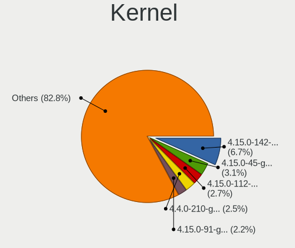

| Version            | Desktops | Percent |
|--------------------|----------|---------|
| 4.15.0-142-generic | 32       | 6.04%   |
| 4.15.0-45-generic  | 16       | 3.02%   |
| 4.15.0-112-generic | 15       | 2.83%   |
| 4.4.0-210-generic  | 14       | 2.64%   |
| 4.15.0-91-generic  | 12       | 2.26%   |
| 4.15.0-88-generic  | 12       | 2.26%   |
| 4.15.0-72-generic  | 10       | 1.89%   |
| 4.15.0-101-generic | 10       | 1.89%   |
| 4.15.0-96-generic  | 9        | 1.7%    |
| 4.15.0-122-generic | 9        | 1.7%    |
| 4.15.0-118-generic | 9        | 1.7%    |
| 5.4.0-52-generic   | 8        | 1.51%   |
| 5.4.0-42-generic   | 8        | 1.51%   |
| 4.15.0-99-generic  | 8        | 1.51%   |
| 5.4.0-66-generic   | 6        | 1.13%   |
| 5.4.0-58-generic   | 6        | 1.13%   |
| 4.4.0-184-generic  | 6        | 1.13%   |
| 4.4.0-177-generic  | 6        | 1.13%   |
| 4.15.0-74-generic  | 6        | 1.13%   |
| 4.15.0-128-generic | 6        | 1.13%   |
| 4.15.0-117-generic | 6        | 1.13%   |
| 4.15.0-106-generic | 6        | 1.13%   |
| 5.4.0-65-generic   | 5        | 0.94%   |
| 5.4.0-48-generic   | 5        | 0.94%   |
| 4.4.0-178-generic  | 5        | 0.94%   |
| 4.15.0-107-generic | 5        | 0.94%   |
| 5.4.0-67-generic   | 4        | 0.75%   |
| 5.15.0-56-generic  | 4        | 0.75%   |
| 4.4.0-31-generic   | 4        | 0.75%   |
| 4.4.0-179-generic  | 4        | 0.75%   |
| 4.15.0-76-generic  | 4        | 0.75%   |
| 5.4.0-91-generic   | 3        | 0.57%   |
| 5.4.0-89-generic   | 3        | 0.57%   |
| 5.4.0-88-generic   | 3        | 0.57%   |
| 5.4.0-37-generic   | 3        | 0.57%   |
| 5.4.0-33-generic   | 3        | 0.57%   |
| 5.19.0-38-generic  | 3        | 0.57%   |
| 5.19.0-29-generic  | 3        | 0.57%   |
| 5.15.0-25-generic  | 3        | 0.57%   |
| 4.4.0-194-generic  | 3        | 0.57%   |

Kernel Family
-------------

Linux kernel without a distro release

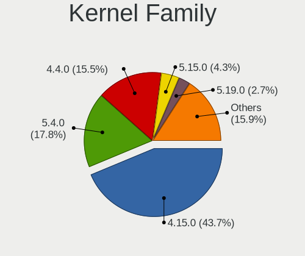

| Version | Desktops | Percent |
|---------|----------|---------|
| 4.15.0  | 215      | 43.97%  |
| 5.4.0   | 90       | 18.4%   |
| 4.4.0   | 79       | 16.16%  |
| 5.15.0  | 21       | 4.29%   |
| 5.19.0  | 14       | 2.86%   |
| 5.8.0   | 12       | 2.45%   |
| 5.3.0   | 12       | 2.45%   |
| 5.13.0  | 11       | 2.25%   |
| 6.5.0   | 7        | 1.43%   |
| 6.2.0   | 6        | 1.23%   |
| 5.11.0  | 6        | 1.23%   |
| 3.13.0  | 3        | 0.61%   |
| 5.0.0   | 2        | 0.41%   |
| 4.10.0  | 2        | 0.41%   |
| 5.7.2   | 1        | 0.2%    |
| 5.7.10  | 1        | 0.2%    |
| 5.3.14  | 1        | 0.2%    |
| 5.17.6  | 1        | 0.2%    |
| 5.14.0  | 1        | 0.2%    |
| 5.13.6  | 1        | 0.2%    |
| 4.8.0   | 1        | 0.2%    |
| 4.15.18 | 1        | 0.2%    |
| 4.13.0  | 1        | 0.2%    |

Kernel Major Ver.
-----------------

Linux kernel major version

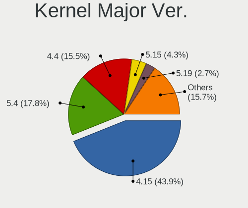

| Version | Desktops | Percent |
|---------|----------|---------|
| 4.15    | 216      | 44.17%  |
| 5.4     | 90       | 18.4%   |
| 4.4     | 79       | 16.16%  |
| 5.15    | 21       | 4.29%   |
| 5.19    | 14       | 2.86%   |
| 5.3     | 13       | 2.66%   |
| 5.8     | 12       | 2.45%   |
| 5.13    | 12       | 2.45%   |
| 6.5     | 7        | 1.43%   |
| 6.2     | 6        | 1.23%   |
| 5.11    | 6        | 1.23%   |
| 3.13    | 3        | 0.61%   |
| 5.7     | 2        | 0.41%   |
| 5.0     | 2        | 0.41%   |
| 4.10    | 2        | 0.41%   |
| 5.17    | 1        | 0.2%    |
| 5.14    | 1        | 0.2%    |
| 4.8     | 1        | 0.2%    |
| 4.13    | 1        | 0.2%    |

Arch
----

OS architecture (x86_64, i586, etc.)

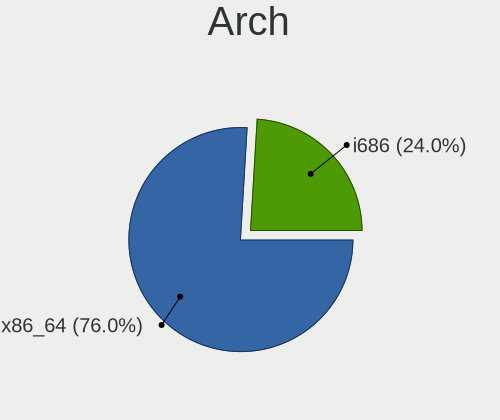

| Name   | Desktops | Percent |
|--------|----------|---------|
| x86_64 | 363      | 75.63%  |
| i686   | 117      | 24.38%  |

DE
--

Desktop Environment

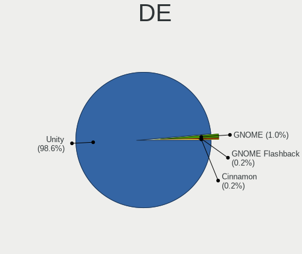

| Name     | Desktops | Percent |
|----------|----------|---------|
| Unity    | 472      | 98.74%  |
| GNOME    | 5        | 1.05%   |
| Cinnamon | 1        | 0.21%   |

Display Server
--------------

X11 or Wayland

| Name    | Desktops | Percent |
|---------|----------|---------|
| X11     | 450      | 93.95%  |
| Wayland | 23       | 4.8%    |
| Tty     | 6        | 1.25%   |

Display Manager
---------------

SDDM, LightDM, etc.

| Name    | Desktops | Percent |
|---------|----------|---------|
| Unknown | 291      | 60.12%  |
| LightDM | 120      | 24.79%  |
| GDM     | 50       | 10.33%  |
| GDM3    | 23       | 4.75%   |

OS Lang
-------

Language

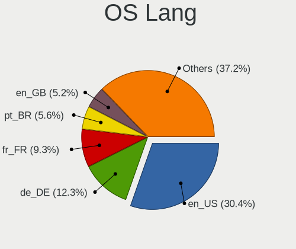

| Lang    | Desktops | Percent |
|---------|----------|---------|
| en_US   | 144      | 30.13%  |
| de_DE   | 60       | 12.55%  |
| fr_FR   | 42       | 8.79%   |
| pt_BR   | 27       | 5.65%   |
| en_GB   | 25       | 5.23%   |
| ru_RU   | 19       | 3.97%   |
| it_IT   | 18       | 3.77%   |
| es_ES   | 15       | 3.14%   |
| en_IN   | 14       | 2.93%   |
| en_CA   | 13       | 2.72%   |
| nl_NL   | 10       | 2.09%   |
| pl_PL   | 7        | 1.46%   |
| es_AR   | 7        | 1.46%   |
| hu_HU   | 6        | 1.26%   |
| pt_PT   | 5        | 1.05%   |
| Unknown | 5        | 1.05%   |
| ru_UA   | 4        | 0.84%   |
| en_ZA   | 4        | 0.84%   |
| en_AU   | 4        | 0.84%   |
| cs_CZ   | 4        | 0.84%   |
| es_MX   | 3        | 0.63%   |
| en_PH   | 3        | 0.63%   |
| zh_CN   | 2        | 0.42%   |
| tr_TR   | 2        | 0.42%   |
| sl_SI   | 2        | 0.42%   |
| ja_JP   | 2        | 0.42%   |
| fi_FI   | 2        | 0.42%   |
| en_SG   | 2        | 0.42%   |
| en_NZ   | 2        | 0.42%   |
| el_GR   | 2        | 0.42%   |
| C       | 2        | 0.42%   |
| zh_TW   | 1        | 0.21%   |
| uk_UA   | 1        | 0.21%   |
| sv_SE   | 1        | 0.21%   |
| sk_SK   | 1        | 0.21%   |
| ro_RO   | 1        | 0.21%   |
| nl_BE   | 1        | 0.21%   |
| nb_NO   | 1        | 0.21%   |
| ko_KR   | 1        | 0.21%   |
| hr_HR   | 1        | 0.21%   |

Boot Mode
---------

EFI or BIOS

| Mode | Desktops | Percent |
|------|----------|---------|
| BIOS | 373      | 77.55%  |
| EFI  | 108      | 22.45%  |

Filesystem
----------

Type of filesystem

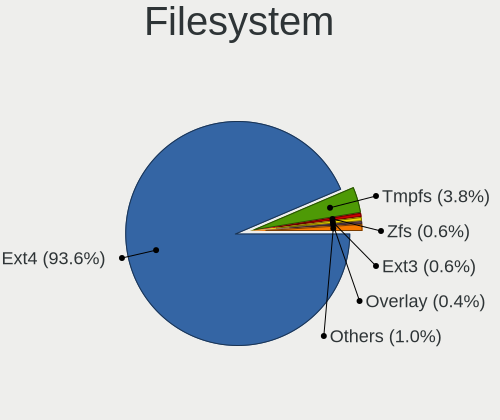

| Type    | Desktops | Percent |
|---------|----------|---------|
| Ext4    | 456      | 95%     |
| Tmpfs   | 12       | 2.5%    |
| Zfs     | 3        | 0.63%   |
| Ext3    | 3        | 0.63%   |
| Aufs    | 2        | 0.42%   |
| Overlay | 1        | 0.21%   |
| Jfs     | 1        | 0.21%   |
| Ext2    | 1        | 0.21%   |
| Btrfs   | 1        | 0.21%   |

Part. scheme
------------

Scheme of partitioning

| Type    | Desktops | Percent |
|---------|----------|---------|
| Unknown | 345      | 71.73%  |
| GPT     | 79       | 16.42%  |
| MBR     | 57       | 11.85%  |

Dual Boot with Linux/BSD
------------------------

Hosting more than one Linux/BSD

| Dual boot | Desktops | Percent |
|-----------|----------|---------|
| No        | 381      | 78.72%  |
| Yes       | 103      | 21.28%  |

Dual Boot (Win)
---------------

Hosting Linux and Windows

| Dual boot | Desktops | Percent |
|-----------|----------|---------|
| No        | 291      | 59.88%  |
| Yes       | 195      | 40.12%  |

Board
-----

Vendor
------

Motherboard manufacturer

| Name                                 | Desktops | Percent |
|--------------------------------------|----------|---------|
| ASUSTek Computer                     | 97       | 20.29%  |
| Gigabyte Technology                  | 88       | 18.41%  |
| Dell                                 | 59       | 12.34%  |
| MSI                                  | 40       | 8.37%   |
| Hewlett-Packard                      | 36       | 7.53%   |
| ASRock                               | 32       | 6.69%   |
| Intel                                | 18       | 3.77%   |
| Lenovo                               | 14       | 2.93%   |
| Unknown                              | 13       | 2.72%   |
| Acer                                 | 9        | 1.88%   |
| ECS                                  | 8        | 1.67%   |
| Pegatron                             | 7        | 1.46%   |
| Fujitsu                              | 6        | 1.26%   |
| Fujitsu Siemens                      | 5        | 1.05%   |
| Biostar                              | 5        | 1.05%   |
| Positivo                             | 4        | 0.84%   |
| Foxconn                              | 4        | 0.84%   |
| IBM                                  | 3        | 0.63%   |
| PCWare                               | 2        | 0.42%   |
| Packard Bell                         | 2        | 0.42%   |
| Medion                               | 2        | 0.42%   |
| Huanan                               | 2        | 0.42%   |
| WIPRO                                | 1        | 0.21%   |
| VIA Technologies                     | 1        | 0.21%   |
| Uniwill                              | 1        | 0.21%   |
| UNITCOM                              | 1        | 0.21%   |
| System76                             | 1        | 0.21%   |
| Shuttle                              | 1        | 0.21%   |
| Shenzhen Meigao Electronic Equipment | 1        | 0.21%   |
| Semp Toshiba                         | 1        | 0.21%   |
| Phitronics                           | 1        | 0.21%   |
| Penguin Computing                    | 1        | 0.21%   |
| PCChips                              | 1        | 0.21%   |
| OEM_MB                               | 1        | 0.21%   |
| OEM                                  | 1        | 0.21%   |
| Itautec                              | 1        | 0.21%   |
| IP3 Tech                             | 1        | 0.21%   |
| eMachines                            | 1        | 0.21%   |
| ELSKY                                | 1        | 0.21%   |
| DJI                                  | 1        | 0.21%   |

Model
-----

Motherboard model

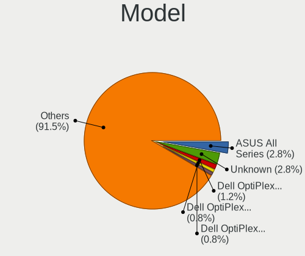

| Name                                   | Desktops | Percent |
|----------------------------------------|----------|---------|
| ASUS All Series                        | 13       | 2.72%   |
| Unknown                                | 13       | 2.72%   |
| Dell OptiPlex 755                      | 6        | 1.26%   |
| Dell OptiPlex 9020                     | 4        | 0.84%   |
| Dell OptiPlex 7010                     | 4        | 0.84%   |
| HP Z400 Workstation                    | 3        | 0.63%   |
| Gigabyte GA-78LMT-USB3 6.0             | 3        | 0.63%   |
| Gigabyte G31M-ES2L                     | 3        | 0.63%   |
| ASUS P4C800-E                          | 3        | 0.63%   |
| MSI MS-7B86                            | 2        | 0.42%   |
| MSI MS-7996                            | 2        | 0.42%   |
| Intel X79 V2.72A                       | 2        | 0.42%   |
| HP Compaq Elite 8300 USDT              | 2        | 0.42%   |
| HP Compaq Elite 8300 SFF               | 2        | 0.42%   |
| HP Compaq dc7600 Convertible Minitower | 2        | 0.42%   |
| HP Compaq dc5850 Small Form Factor     | 2        | 0.42%   |
| HP Compaq 6200 Pro MT PC               | 2        | 0.42%   |
| HP Compaq 6000 Pro SFF PC              | 2        | 0.42%   |
| Gigabyte P35-DS3L                      | 2        | 0.42%   |
| Gigabyte F2A88XM-D3HP                  | 2        | 0.42%   |
| Gigabyte B450 I AORUS PRO WIFI         | 2        | 0.42%   |
| Gigabyte 945GCM-S2C                    | 2        | 0.42%   |
| ECS MCP61M-M3                          | 2        | 0.42%   |
| Dell XPS 8700                          | 2        | 0.42%   |
| Dell Precision WorkStation T3400       | 2        | 0.42%   |
| Dell OptiPlex 745                      | 2        | 0.42%   |
| Dell OptiPlex 7050                     | 2        | 0.42%   |
| Dell OptiPlex 3020                     | 2        | 0.42%   |
| ASUS ROG STRIX Z390-F GAMING           | 2        | 0.42%   |
| ASUS PRIME B360-PLUS                   | 2        | 0.42%   |
| ASUS PRIME B350-PLUS                   | 2        | 0.42%   |
| ASUS M5A78L-M LX PLUS                  | 2        | 0.42%   |
| ASRock N68C-S UCC                      | 2        | 0.42%   |
| Acer Aspire T180                       | 2        | 0.42%   |
| WIPRO H55MXV Series                    | 1        | 0.21%   |
| VIA VT8367-8235                        | 1        | 0.21%   |
| Uniwill 255KI / 259KI Series           | 1        | 0.21%   |
| UNITCOM B85H3-M4                       | 1        | 0.21%   |
| System76 Thelio Major                  | 1        | 0.21%   |
| Shuttle SH170                          | 1        | 0.21%   |

Model Family
------------

Motherboard model prefix

| Name                    | Desktops | Percent |
|-------------------------|----------|---------|
| Dell OptiPlex           | 33       | 6.9%    |
| HP Compaq               | 23       | 4.81%   |
| ASUS PRIME              | 13       | 2.72%   |
| ASUS All                | 13       | 2.72%   |
| Unknown                 | 13       | 2.72%   |
| Dell Precision          | 9        | 1.88%   |
| ASUS ROG                | 8        | 1.67%   |
| Dell Inspiron           | 7        | 1.46%   |
| ASUS M5A78L-M           | 5        | 1.05%   |
| Acer Aspire             | 5        | 1.05%   |
| Lenovo ThinkCentre      | 4        | 0.84%   |
| Fujitsu ESPRIMO         | 4        | 0.84%   |
| HP Z400                 | 3        | 0.63%   |
| Gigabyte Z390           | 3        | 0.63%   |
| Gigabyte GA-78LMT-USB3  | 3        | 0.63%   |
| Gigabyte G31M-ES2L      | 3        | 0.63%   |
| Dell XPS                | 3        | 0.63%   |
| Dell Vostro             | 3        | 0.63%   |
| ASUS TUF                | 3        | 0.63%   |
| ASUS P4C800-E           | 3        | 0.63%   |
| Packard Bell IMEDIA     | 2        | 0.42%   |
| MSI MS-7B86             | 2        | 0.42%   |
| MSI MS-7996             | 2        | 0.42%   |
| Lenovo ThinkStation     | 2        | 0.42%   |
| Lenovo IdeaCentre       | 2        | 0.42%   |
| Intel X79               | 2        | 0.42%   |
| Huanan X79              | 2        | 0.42%   |
| HP Pavilion             | 2        | 0.42%   |
| HP EliteDesk            | 2        | 0.42%   |
| Gigabyte Z370M          | 2        | 0.42%   |
| Gigabyte P35-DS3L       | 2        | 0.42%   |
| Gigabyte H310M          | 2        | 0.42%   |
| Gigabyte F2A88XM-D3HP   | 2        | 0.42%   |
| Gigabyte B450           | 2        | 0.42%   |
| Gigabyte 945GCM-S2C     | 2        | 0.42%   |
| Fujitsu Siemens ESPRIMO | 2        | 0.42%   |
| ECS MCP61M-M3           | 2        | 0.42%   |
| Dell Dimension          | 2        | 0.42%   |
| ASUS P5K                | 2        | 0.42%   |
| ASRock Z390             | 2        | 0.42%   |

MFG Year
--------

Motherboard manufacture year

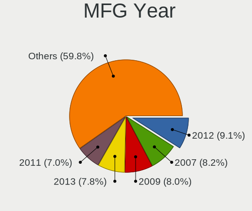

| Year | Desktops | Percent |
|------|----------|---------|
| 2012 | 44       | 9.21%   |
| 2007 | 40       | 8.37%   |
| 2009 | 37       | 7.74%   |
| 2013 | 36       | 7.53%   |
| 2011 | 35       | 7.32%   |
| 2008 | 35       | 7.32%   |
| 2017 | 31       | 6.49%   |
| 2018 | 30       | 6.28%   |
| 2010 | 28       | 5.86%   |
| 2014 | 25       | 5.23%   |
| 2016 | 23       | 4.81%   |
| 2015 | 21       | 4.39%   |
| 2006 | 20       | 4.18%   |
| 2019 | 19       | 3.97%   |
| 2020 | 13       | 2.72%   |
| 2005 | 11       | 2.3%    |
| 2021 | 9        | 1.88%   |
| 2004 | 8        | 1.67%   |
| 2003 | 6        | 1.26%   |
| 2022 | 4        | 0.84%   |
| 2023 | 2        | 0.42%   |
| 2002 | 1        | 0.21%   |

Form Factor
-----------

Physical design of the computer

| Name    | Desktops | Percent |
|---------|----------|---------|
| Desktop | 478      | 100%    |

Secure Boot
-----------

Enabled or disabled

| State    | Desktops | Percent |
|----------|----------|---------|
| Disabled | 472      | 98.74%  |
| Enabled  | 6        | 1.26%   |

Coreboot
--------

Have coreboot on board

| Used | Desktops | Percent |
|------|----------|---------|
| No   | 478      | 100%    |

RAM Size
--------

Total RAM memory

| Size in GB  | Desktops | Percent |
|-------------|----------|---------|
| 3.01-4.0    | 97       | 19.92%  |
| 16.01-24.0  | 87       | 17.86%  |
| 8.01-16.0   | 82       | 16.84%  |
| 4.01-8.0    | 75       | 15.4%   |
| 32.01-64.0  | 46       | 9.45%   |
| 1.01-2.0    | 44       | 9.03%   |
| 2.01-3.0    | 25       | 5.13%   |
| 0.51-1.0    | 13       | 2.67%   |
| 64.01-256.0 | 12       | 2.46%   |
| 24.01-32.0  | 6        | 1.23%   |

RAM Used
--------

Used RAM memory

| Used GB     | Desktops | Percent |
|-------------|----------|---------|
| 1.01-2.0    | 202      | 39.84%  |
| 2.01-3.0    | 95       | 18.74%  |
| 0.51-1.0    | 65       | 12.82%  |
| 3.01-4.0    | 58       | 11.44%  |
| 4.01-8.0    | 51       | 10.06%  |
| 8.01-16.0   | 22       | 4.34%   |
| 16.01-24.0  | 4        | 0.79%   |
| 0.01-0.5    | 3        | 0.59%   |
| Unknown     | 3        | 0.59%   |
| 24.01-32.0  | 2        | 0.39%   |
| 32.01-64.0  | 1        | 0.2%    |
| 64.01-256.0 | 1        | 0.2%    |

Total Drives
------------

Number of drives on board

| Drives | Desktops | Percent |
|--------|----------|---------|
| 1      | 241      | 49.08%  |
| 2      | 134      | 27.29%  |
| 3      | 57       | 11.61%  |
| 4      | 30       | 6.11%   |
| 6      | 10       | 2.04%   |
| 5      | 10       | 2.04%   |
| 9      | 3        | 0.61%   |
| 7      | 3        | 0.61%   |
| 11     | 1        | 0.2%    |
| 10     | 1        | 0.2%    |
| 0      | 1        | 0.2%    |

Has CD-ROM
----------

Has CD-ROM on board

| Presented | Desktops | Percent |
|-----------|----------|---------|
| Yes       | 293      | 61.17%  |
| No        | 186      | 38.83%  |

Has Ethernet
------------

Has Ethernet on board

| Presented | Desktops | Percent |
|-----------|----------|---------|
| Yes       | 471      | 98.54%  |
| No        | 7        | 1.46%   |

Has WiFi
--------

Has WiFi module

| Presented | Desktops | Percent |
|-----------|----------|---------|
| No        | 284      | 59.04%  |
| Yes       | 197      | 40.96%  |

Has Bluetooth
-------------

Has Bluetooth module

| Presented | Desktops | Percent |
|-----------|----------|---------|
| No        | 397      | 82.54%  |
| Yes       | 84       | 17.46%  |

Location
--------

Country
-------

Geographic location (country)

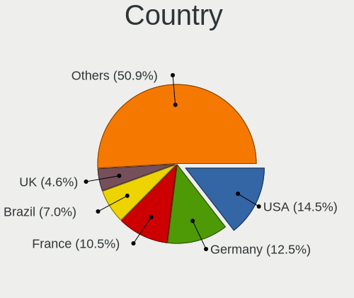

| Country      | Desktops | Percent |
|--------------|----------|---------|
| USA          | 68       | 14.23%  |
| Germany      | 61       | 12.76%  |
| France       | 48       | 10.04%  |
| Brazil       | 34       | 7.11%   |
| UK           | 22       | 4.6%    |
| Russia       | 20       | 4.18%   |
| Italy        | 20       | 4.18%   |
| India        | 15       | 3.14%   |
| Spain        | 14       | 2.93%   |
| Canada       | 14       | 2.93%   |
| Netherlands  | 13       | 2.72%   |
| Poland       | 9        | 1.88%   |
| Hungary      | 7        | 1.46%   |
| Greece       | 7        | 1.46%   |
| China        | 7        | 1.46%   |
| Argentina    | 7        | 1.46%   |
| Ukraine      | 6        | 1.26%   |
| Bulgaria     | 6        | 1.26%   |
| South Africa | 5        | 1.05%   |
| Romania      | 5        | 1.05%   |
| Czechia      | 5        | 1.05%   |
| Sweden       | 4        | 0.84%   |
| Portugal     | 4        | 0.84%   |
| Indonesia    | 4        | 0.84%   |
| Colombia     | 4        | 0.84%   |
| Australia    | 4        | 0.84%   |
| Turkey       | 3        | 0.63%   |
| Switzerland  | 3        | 0.63%   |
| Serbia       | 3        | 0.63%   |
| Philippines  | 3        | 0.63%   |
| Mexico       | 3        | 0.63%   |
| Israel       | 3        | 0.63%   |
| Finland      | 3        | 0.63%   |
| Belgium      | 3        | 0.63%   |
| Austria      | 3        | 0.63%   |
| Vietnam      | 2        | 0.42%   |
| Sri Lanka    | 2        | 0.42%   |
| South Korea  | 2        | 0.42%   |
| Slovenia     | 2        | 0.42%   |
| Slovakia     | 2        | 0.42%   |

City
----

Geographic location (city)

| City              | Desktops | Percent |
|-------------------|----------|---------|
| Berlin            | 12       | 2.42%   |
| Paris             | 8        | 1.61%   |
| Hamburg           | 6        | 1.21%   |
| Sao Paulo         | 5        | 1.01%   |
| Moscow            | 5        | 1.01%   |
| Rome              | 4        | 0.81%   |
| Rio de Janeiro    | 4        | 0.81%   |
| Athens            | 4        | 0.81%   |
| Wuppertal         | 3        | 0.6%    |
| Wroclaw           | 3        | 0.6%    |
| Toronto           | 3        | 0.6%    |
| Montreal          | 3        | 0.6%    |
| La Rochelle       | 3        | 0.6%    |
| Genoa             | 3        | 0.6%    |
| Frankfurt am Main | 3        | 0.6%    |
| Budapest          | 3        | 0.6%    |
| Bengaluru         | 3        | 0.6%    |
| Zurich            | 2        | 0.4%    |
| Vienna            | 2        | 0.4%    |
| Vancouver         | 2        | 0.4%    |
| Tatabnya        | 2        | 0.4%    |
| Surabaya          | 2        | 0.4%    |
| Stuttgart         | 2        | 0.4%    |
| Strasbourg        | 2        | 0.4%    |
| Singapore         | 2        | 0.4%    |
| Seattle           | 2        | 0.4%    |
| Sao Goncalo       | 2        | 0.4%    |
| Santo Andr      | 2        | 0.4%    |
| Quilmes           | 2        | 0.4%    |
| Pretoria          | 2        | 0.4%    |
| Patna             | 2        | 0.4%    |
| Nizhniy Novgorod  | 2        | 0.4%    |
| Nice              | 2        | 0.4%    |
| Munich            | 2        | 0.4%    |
| Milan             | 2        | 0.4%    |
| Marseille         | 2        | 0.4%    |
| Manaus            | 2        | 0.4%    |
| Lviv              | 2        | 0.4%    |
| Louveira          | 2        | 0.4%    |
| Land O' Lakes     | 2        | 0.4%    |

Drives
------

Drive Vendor
------------

Hard drive vendors

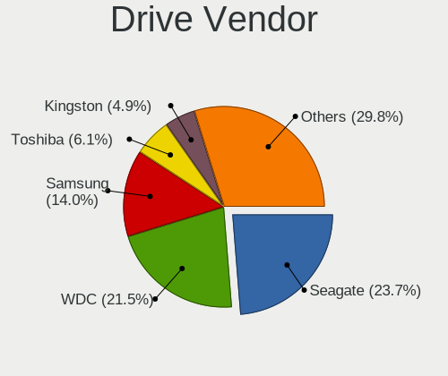

| Vendor                    | Desktops | Drives | Percent |
|---------------------------|----------|--------|---------|
| Seagate                   | 184      | 269    | 23.74%  |
| WDC                       | 170      | 254    | 21.94%  |
| Samsung Electronics       | 108      | 153    | 13.94%  |
| Toshiba                   | 48       | 56     | 6.19%   |
| Kingston                  | 38       | 48     | 4.9%    |
| Hitachi                   | 32       | 39     | 4.13%   |
| SanDisk                   | 30       | 38     | 3.87%   |
| Crucial                   | 26       | 34     | 3.35%   |
| Maxtor                    | 14       | 14     | 1.81%   |
| Intel                     | 11       | 12     | 1.42%   |
| A-DATA Technology         | 9        | 9      | 1.16%   |
| PNY                       | 7        | 12     | 0.9%    |
| Patriot                   | 7        | 8      | 0.9%    |
| OCZ                       | 7        | 8      | 0.9%    |
| Intenso                   | 7        | 9      | 0.9%    |
| Unknown                   | 6        | 8      | 0.77%   |
| Micron Technology         | 6        | 10     | 0.77%   |
| HGST                      | 6        | 9      | 0.77%   |
| Transcend                 | 5        | 5      | 0.65%   |
| China                     | 5        | 5      | 0.65%   |
| Phison                    | 3        | 4      | 0.39%   |
| Micron/Crucial Technology | 3        | 3      | 0.39%   |
| Corsair                   | 3        | 3      | 0.39%   |
| XPG                       | 2        | 3      | 0.26%   |
| SK hynix                  | 2        | 2      | 0.26%   |
| Fujitsu                   | 2        | 2      | 0.26%   |
| Apple                     | 2        | 2      | 0.26%   |
| Apacer                    | 2        | 2      | 0.26%   |
| XrayDisk                  | 1        | 1      | 0.13%   |
| Vaseky                    | 1        | 1      | 0.13%   |
| USB3.0                    | 1        | 1      | 0.13%   |
| SSK                       | 1        | 1      | 0.13%   |
| SPCC                      | 1        | 2      | 0.13%   |
| Smartbuy                  | 1        | 1      | 0.13%   |
| ShiJi                     | 1        | 1      | 0.13%   |
| SABRENT                   | 1        | 1      | 0.13%   |
| Realtek Semiconductor     | 1        | 1      | 0.13%   |
| NVMe                      | 1        | 1      | 0.13%   |
| Mushkin                   | 1        | 1      | 0.13%   |
| LITEONIT                  | 1        | 2      | 0.13%   |

Drive Model
-----------

Hard drive models

| Model                                  | Desktops | Percent |
|----------------------------------------|----------|---------|
| Seagate ST500DM002-1BD142 500GB        | 15       | 1.67%   |
| Seagate ST1000DM010-2EP102 1TB         | 13       | 1.45%   |
| Toshiba DT01ACA100 1TB                 | 9        | 1%      |
| Kingston SA400S37240G 240GB SSD        | 9        | 1%      |
| Samsung SSD 850 EVO 250GB              | 7        | 0.78%   |
| WDC WD10EZEX-08WN4A0 1TB               | 6        | 0.67%   |
| WDC WD10EZEX-00BN5A0 1TB               | 6        | 0.67%   |
| Seagate ST380815AS 80GB                | 6        | 0.67%   |
| Seagate ST2000DM001-1ER164 2TB         | 6        | 0.67%   |
| Seagate ST1000DM003-1SB102 1TB         | 6        | 0.67%   |
| Samsung SSD 860 EVO 500GB              | 6        | 0.67%   |
| Kingston SV300S37A120G 120GB SSD       | 6        | 0.67%   |
| WDC WD5000AAKX-001CA0 500GB            | 5        | 0.56%   |
| Seagate ST3500418AS 500GB              | 5        | 0.56%   |
| Seagate ST3320620AS 320GB              | 5        | 0.56%   |
| Seagate ST1000DM003-9YN162 1TB         | 5        | 0.56%   |
| Seagate ST1000DM003-1ER162 1TB         | 5        | 0.56%   |
| Seagate ST1000DM003-1CH162 1TB         | 5        | 0.56%   |
| SanDisk NVMe SSD Drive 500GB           | 5        | 0.56%   |
| Samsung SSD 860 EVO 250GB              | 5        | 0.56%   |
| Samsung SM963 2.5" NVMe PCIe SSD 250GB | 5        | 0.56%   |
| Samsung HD161HJ 160GB                  | 5        | 0.56%   |
| WDC WD20EZRZ-00Z5HB0 2TB               | 4        | 0.44%   |
| WDC WD20EFRX-68EUZN0 2TB               | 4        | 0.44%   |
| WDC WD10EZEX-60WN4A0 1TB               | 4        | 0.44%   |
| Toshiba DT01ACA050 500GB               | 4        | 0.44%   |
| Seagate ST3320820AS 320GB              | 4        | 0.44%   |
| Seagate ST3250318AS 250GB              | 4        | 0.44%   |
| Seagate ST3250310AS 250GB              | 4        | 0.44%   |
| Seagate ST3160815AS 160GB              | 4        | 0.44%   |
| Seagate ST2000DM008-2FR102 2TB         | 4        | 0.44%   |
| Seagate Expansion+ Desk 4TB            | 4        | 0.44%   |
| Samsung SSD 850 PRO 256GB              | 4        | 0.44%   |
| Samsung SSD 840 EVO 250GB              | 4        | 0.44%   |
| Samsung HD322HJ 320GB                  | 4        | 0.44%   |
| Kingston SUV400S37240G 240GB SSD       | 4        | 0.44%   |
| Kingston SA400S37480G 480GB SSD        | 4        | 0.44%   |
| Hitachi HDS721050CLA362 500GB          | 4        | 0.44%   |
| WDC WD5000AZRX-00A8LB0 500GB           | 3        | 0.33%   |
| WDC WD5000AAKX-00ERMA0 500GB           | 3        | 0.33%   |

HDD Vendor
----------

Hard disk drive vendors

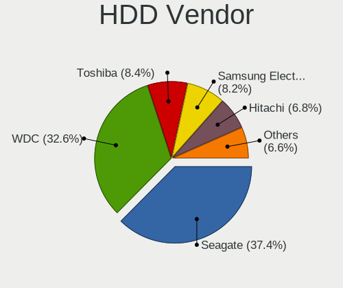

| Vendor              | Desktops | Drives | Percent |
|---------------------|----------|--------|---------|
| Seagate             | 184      | 267    | 37.32%  |
| WDC                 | 163      | 244    | 33.06%  |
| Toshiba             | 42       | 47     | 8.52%   |
| Samsung Electronics | 41       | 51     | 8.32%   |
| Hitachi             | 32       | 39     | 6.49%   |
| Maxtor              | 14       | 14     | 2.84%   |
| HGST                | 6        | 9      | 1.22%   |
| Unknown             | 2        | 1      | 0.41%   |
| Intenso             | 2        | 2      | 0.41%   |
| Fujitsu             | 2        | 2      | 0.41%   |
| Apple               | 2        | 2      | 0.41%   |
| SABRENT             | 1        | 1      | 0.2%    |
| Lenovo              | 1        | 1      | 0.2%    |
| Hewlett-Packard     | 1        | 2      | 0.2%    |

SSD Vendor
----------

Solid state drive vendors

| Vendor              | Desktops | Drives | Percent |
|---------------------|----------|--------|---------|
| Samsung Electronics | 51       | 72     | 23.08%  |
| Kingston            | 32       | 40     | 14.48%  |
| SanDisk             | 25       | 30     | 11.31%  |
| Crucial             | 24       | 32     | 10.86%  |
| Intel               | 10       | 11     | 4.52%   |
| WDC                 | 8        | 9      | 3.62%   |
| PNY                 | 7        | 12     | 3.17%   |
| OCZ                 | 7        | 8      | 3.17%   |
| A-DATA Technology   | 7        | 7      | 3.17%   |
| Patriot             | 6        | 7      | 2.71%   |
| Micron Technology   | 6        | 10     | 2.71%   |
| Toshiba             | 5        | 6      | 2.26%   |
| China               | 5        | 5      | 2.26%   |
| Transcend           | 4        | 4      | 1.81%   |
| Intenso             | 3        | 4      | 1.36%   |
| Apacer              | 2        | 2      | 0.9%    |
| XrayDisk            | 1        | 1      | 0.45%   |
| Vaseky              | 1        | 1      | 0.45%   |
| USB3.0              | 1        | 1      | 0.45%   |
| SSK                 | 1        | 1      | 0.45%   |
| SPCC                | 1        | 2      | 0.45%   |
| Smartbuy            | 1        | 1      | 0.45%   |
| Seagate             | 1        | 1      | 0.45%   |
| Mushkin             | 1        | 1      | 0.45%   |
| LITEONIT            | 1        | 2      | 0.45%   |
| LITEON              | 1        | 2      | 0.45%   |
| KingSpec            | 1        | 2      | 0.45%   |
| Hikvision           | 1        | 2      | 0.45%   |
| GBDriver            | 1        | 1      | 0.45%   |
| FORESEE             | 1        | 1      | 0.45%   |
| Force               | 1        | 1      | 0.45%   |
| Fanxiang            | 1        | 1      | 0.45%   |
| EDGE                | 1        | 1      | 0.45%   |
| Drevo               | 1        | 1      | 0.45%   |
| Corsair             | 1        | 1      | 0.45%   |

Drive Kind
----------

HDD or SSD

| Kind    | Desktops | Drives | Percent |
|---------|----------|--------|---------|
| HDD     | 392      | 682    | 61.35%  |
| SSD     | 182      | 283    | 28.48%  |
| NVMe    | 53       | 77     | 8.29%   |
| Unknown | 11       | 15     | 1.72%   |
| MMC     | 1        | 1      | 0.16%   |

Drive Connector
---------------

SATA, SAS, NVMe, etc.

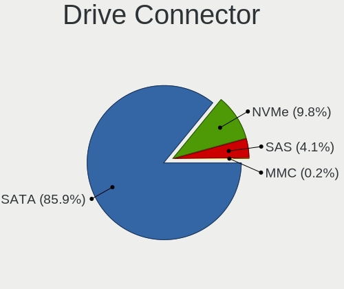

| Type | Desktops | Drives | Percent |
|------|----------|--------|---------|
| SATA | 465      | 948    | 85.95%  |
| NVMe | 53       | 77     | 9.8%    |
| SAS  | 22       | 32     | 4.07%   |
| MMC  | 1        | 1      | 0.18%   |

Drive Size
----------

Size of hard drive

| Size in TB | Desktops | Drives | Percent |
|------------|----------|--------|---------|
| 0.01-0.5   | 369      | 568    | 57.48%  |
| 0.51-1.0   | 155      | 203    | 24.14%  |
| 1.01-2.0   | 53       | 75     | 8.26%   |
| 2.01-3.0   | 26       | 39     | 4.05%   |
| 3.01-4.0   | 23       | 46     | 3.58%   |
| 4.01-10.0  | 12       | 26     | 1.87%   |
| 10.01-20.0 | 4        | 8      | 0.62%   |

Space Total
-----------

Amount of disk space available on the file system

| Size in GB     | Desktops | Percent |
|----------------|----------|---------|
| 101-250        | 127      | 25.71%  |
| 251-500        | 109      | 22.06%  |
| 501-1000       | 66       | 13.36%  |
| 51-100         | 50       | 10.12%  |
| 1001-2000      | 49       | 9.92%   |
| More than 3000 | 38       | 7.69%   |
| 2001-3000      | 23       | 4.66%   |
| 21-50          | 20       | 4.05%   |
| 1-20           | 10       | 2.02%   |
| Unknown        | 2        | 0.4%    |

Space Used
----------

Amount of used disk space

| Used GB        | Desktops | Percent |
|----------------|----------|---------|
| 1-20           | 159      | 31.67%  |
| 21-50          | 69       | 13.75%  |
| 51-100         | 68       | 13.55%  |
| 101-250        | 64       | 12.75%  |
| 501-1000       | 44       | 8.76%   |
| 251-500        | 43       | 8.57%   |
| More than 3000 | 20       | 3.98%   |
| 1001-2000      | 20       | 3.98%   |
| 2001-3000      | 13       | 2.59%   |
| Unknown        | 2        | 0.4%    |

Malfunc. Drives
---------------

Drive models with a malfunction

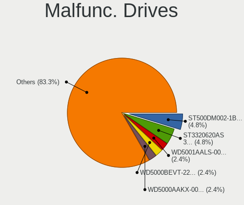

| Model                                               | Desktops | Drives | Percent |
|-----------------------------------------------------|----------|--------|---------|
| Seagate ST500DM002-1BD142 500GB                     | 2        | 3      | 5.56%   |
| Seagate ST3320620AS 320GB                           | 2        | 2      | 5.56%   |
| WDC WD5001AALS-00LWTA0 500GB                        | 1        | 1      | 2.78%   |
| WDC WD5000AAKX-001CA0 500GB                         | 1        | 1      | 2.78%   |
| WDC WD30EFRX-68EUZN0 3TB                            | 1        | 1      | 2.78%   |
| WDC WD20EARS-22MVWB0 2TB                            | 1        | 1      | 2.78%   |
| WDC WD10PURX-64D85Y0 1TB                            | 1        | 1      | 2.78%   |
| WDC WD10EADX-22TDHB0 1TB                            | 1        | 1      | 2.78%   |
| Toshiba MK6465GSX 640GB                             | 1        | 1      | 2.78%   |
| Seagate ST9250315AS 250GB                           | 1        | 1      | 2.78%   |
| Seagate ST500DM002-1SB10A 500GB                     | 1        | 1      | 2.78%   |
| Seagate ST3750330NS 752GB                           | 1        | 1      | 2.78%   |
| Seagate ST3500630AS 500GB                           | 1        | 1      | 2.78%   |
| Seagate ST320LM001 HN-M320MBB 320GB                 | 1        | 1      | 2.78%   |
| Seagate ST32000542AS 2TB                            | 1        | 1      | 2.78%   |
| Seagate ST3160815AS 160GB                           | 1        | 1      | 2.78%   |
| Seagate ST31000524NS 1TB                            | 1        | 1      | 2.78%   |
| Seagate ST3000DM001-1CH166 3TB                      | 1        | 2      | 2.78%   |
| Samsung Electronics SSD 840 PRO Series 256GB        | 1        | 1      | 2.78%   |
| Samsung Electronics HD501LJ 500GB                   | 1        | 1      | 2.78%   |
| Samsung Electronics HD161HJ 160GB                   | 1        | 1      | 2.78%   |
| Samsung Electronics HD080HJ 80GB                    | 1        | 1      | 2.78%   |
| Patriot P210 1024GB SSD                             | 1        | 1      | 2.78%   |
| Micron Technology MTFDDAK256MAY-1AH12ABHA 256GB SSD | 1        | 1      | 2.78%   |
| Kingston SH100S3240G 240GB SSD                      | 1        | 1      | 2.78%   |
| Kingston SA400S37240G 240GB SSD                     | 1        | 1      | 2.78%   |
| Kingston SA400S37 120GB SSD                         | 1        | 1      | 2.78%   |
| Hitachi HDS722020ALA330 2TB                         | 1        | 1      | 2.78%   |
| Hitachi HDS721016CLA382 160GB                       | 1        | 1      | 2.78%   |
| Crucial CT750MX300SSD1 752GB                        | 1        | 1      | 2.78%   |
| Crucial CT480M500SSD1 480GB                         | 1        | 1      | 2.78%   |
| China SSD 128GB                                     | 1        | 1      | 2.78%   |
| Apple HDD HTS541010A9E632 1TB                       | 1        | 1      | 2.78%   |
| A-DATA Technology SX900 112GB SSD                   | 1        | 1      | 2.78%   |

Malfunc. Drive Vendor
---------------------

Vendors of faulty drives

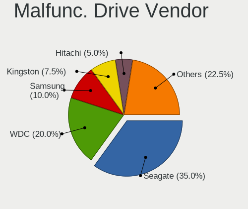

| Vendor              | Desktops | Drives | Percent |
|---------------------|----------|--------|---------|
| Seagate             | 13       | 15     | 37.14%  |
| WDC                 | 6        | 6      | 17.14%  |
| Samsung Electronics | 4        | 4      | 11.43%  |
| Kingston            | 2        | 3      | 5.71%   |
| Hitachi             | 2        | 2      | 5.71%   |
| Crucial             | 2        | 2      | 5.71%   |
| Toshiba             | 1        | 1      | 2.86%   |
| Patriot             | 1        | 1      | 2.86%   |
| Micron Technology   | 1        | 1      | 2.86%   |
| China               | 1        | 1      | 2.86%   |
| Apple               | 1        | 1      | 2.86%   |
| A-DATA Technology   | 1        | 1      | 2.86%   |

Malfunc. HDD Vendor
-------------------

Vendors of faulty HDD drives

| Vendor              | Desktops | Drives | Percent |
|---------------------|----------|--------|---------|
| Seagate             | 13       | 15     | 50%     |
| WDC                 | 6        | 6      | 23.08%  |
| Samsung Electronics | 3        | 3      | 11.54%  |
| Hitachi             | 2        | 2      | 7.69%   |
| Toshiba             | 1        | 1      | 3.85%   |
| Apple               | 1        | 1      | 3.85%   |

Malfunc. Drive Kind
-------------------

Kinds of faulty drives

| Kind | Desktops | Drives | Percent |
|------|----------|--------|---------|
| HDD  | 23       | 28     | 71.88%  |
| SSD  | 9        | 10     | 28.13%  |

Failed Drives
-------------

Failed drive models

| Model                   | Desktops | Drives | Percent |
|-------------------------|----------|--------|---------|
| Toshiba MK5065GSX 500GB | 1        | 1      | 100%    |

Failed Drive Vendor
-------------------

Failed drive vendors

| Vendor  | Desktops | Drives | Percent |
|---------|----------|--------|---------|
| Toshiba | 1        | 1      | 100%    |

Drive Status
------------

Number of failed and malfunc. drives

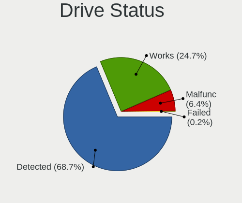

| Status   | Desktops | Drives | Percent |
|----------|----------|--------|---------|
| Detected | 359      | 749    | 70.12%  |
| Works    | 122      | 270    | 23.83%  |
| Malfunc  | 30       | 38     | 5.86%   |
| Failed   | 1        | 1      | 0.2%    |

Storage controller
------------------

Storage Vendor
--------------

Storage controller vendors

| Vendor                           | Desktops | Percent |
|----------------------------------|----------|---------|
| Intel                            | 338      | 55.87%  |
| AMD                              | 92       | 15.21%  |
| Nvidia                           | 33       | 5.45%   |
| Samsung Electronics              | 23       | 3.8%    |
| JMicron Technology               | 22       | 3.64%   |
| Marvell Technology Group         | 17       | 2.81%   |
| ASMedia Technology               | 16       | 2.64%   |
| VIA Technologies                 | 10       | 1.65%   |
| SanDisk                          | 8        | 1.32%   |
| Kingston Technology Company      | 7        | 1.16%   |
| Phison Electronics               | 5        | 0.83%   |
| Silicon Motion                   | 4        | 0.66%   |
| Silicon Image                    | 4        | 0.66%   |
| Micron/Crucial Technology        | 4        | 0.66%   |
| ADATA Technology                 | 4        | 0.66%   |
| Promise Technology               | 3        | 0.5%    |
| LSI Logic / Symbios Logic        | 3        | 0.5%    |
| Toshiba America Info Systems     | 2        | 0.33%   |
| SK hynix                         | 2        | 0.33%   |
| Silicon Integrated Systems [SiS] | 2        | 0.33%   |
| Realtek Semiconductor            | 2        | 0.33%   |
| ULi Electronics                  | 1        | 0.17%   |
| Shenzhen Longsys Electronics     | 1        | 0.17%   |
| KIOXIA                           | 1        | 0.17%   |
| Adaptec                          | 1        | 0.17%   |

Storage Model
-------------

Storage controller models

| Model                                                                                   | Desktops | Percent |
|-----------------------------------------------------------------------------------------|----------|---------|
| Intel NM10/ICH7 Family SATA Controller [IDE mode]                                       | 50       | 6.08%   |
| AMD FCH SATA Controller [AHCI mode]                                                     | 40       | 4.86%   |
| Intel 82801G (ICH7 Family) IDE Controller                                               | 37       | 4.5%    |
| Intel 8 Series/C220 Series Chipset Family 6-port SATA Controller 1 [AHCI mode]          | 32       | 3.89%   |
| AMD SB7x0/SB8x0/SB9x0 IDE Controller                                                    | 30       | 3.65%   |
| Intel 7 Series/C210 Series Chipset Family 6-port SATA Controller [AHCI mode]            | 25       | 3.04%   |
| AMD SB7x0/SB8x0/SB9x0 SATA Controller [IDE mode]                                        | 25       | 3.04%   |
| Intel 6 Series/C200 Series Chipset Family 6 port Desktop SATA AHCI Controller           | 24       | 2.92%   |
| Nvidia MCP61 SATA Controller                                                            | 22       | 2.67%   |
| Intel Q170/Q150/B150/H170/H110/Z170/CM236 Chipset SATA Controller [AHCI Mode]           | 21       | 2.55%   |
| Nvidia MCP61 IDE                                                                        | 20       | 2.43%   |
| Intel SATA Controller [RAID mode]                                                       | 20       | 2.43%   |
| Intel Cannon Lake PCH SATA AHCI Controller                                              | 19       | 2.31%   |
| JMicron JMB363 SATA/IDE Controller                                                      | 14       | 1.7%    |
| Intel 82801I (ICH9 Family) 2 port SATA Controller [IDE mode]                            | 14       | 1.7%    |
| Intel 200 Series PCH SATA controller [AHCI mode]                                        | 14       | 1.7%    |
| AMD SB7x0/SB8x0/SB9x0 SATA Controller [AHCI mode]                                       | 14       | 1.7%    |
| Intel 6 Series/C200 Series Chipset Family Desktop SATA Controller (IDE mode, ports 4-5) | 13       | 1.58%   |
| Intel 6 Series/C200 Series Chipset Family Desktop SATA Controller (IDE mode, ports 0-3) | 13       | 1.58%   |
| ASMedia ASM1061/ASM1062 Serial ATA Controller                                           | 13       | 1.58%   |
| AMD 400 Series Chipset SATA Controller                                                  | 11       | 1.34%   |
| VIA VT82C586A/B/VT82C686/A/B/VT823x/A/C PIPC Bus Master IDE                             | 10       | 1.22%   |
| Samsung NVMe SSD Controller SM961/PM961/SM963                                           | 8        | 0.97%   |
| Intel 82801IR/IO/IH (ICH9R/DO/DH) 4 port SATA Controller [IDE mode]                     | 8        | 0.97%   |
| AMD 300 Series Chipset SATA Controller                                                  | 8        | 0.97%   |
| Samsung NVMe SSD Controller SM981/PM981/PM983                                           | 7        | 0.85%   |
| Marvell Group 88SE9172 SATA 6Gb/s Controller                                            | 7        | 0.85%   |
| JMicron JMB368 IDE controller                                                           | 7        | 0.85%   |
| Intel 82801FB/FBM/FR/FW/FRW (ICH6 Family) IDE Controller                                | 7        | 0.85%   |
| Intel 82801EB/ER (ICH5/ICH5R) IDE Controller                                            | 7        | 0.85%   |
| Intel 82Q35 Express PT IDER Controller                                                  | 6        | 0.73%   |
| Intel 82801IB (ICH9) 2 port SATA Controller [IDE mode]                                  | 6        | 0.73%   |
| Intel 82801FB/FW (ICH6/ICH6W) SATA Controller                                           | 6        | 0.73%   |
| Intel 500 Series Chipset Family SATA AHCI Controller                                    | 6        | 0.73%   |
| Intel 5 Series/3400 Series Chipset 6 port SATA AHCI Controller                          | 6        | 0.73%   |
| AMD 500 Series Chipset SATA Controller                                                  | 6        | 0.73%   |
| Marvell Group 88SE6111/6121 SATA II / PATA Controller                                   | 5        | 0.61%   |
| Intel C600/X79 series chipset 6-Port SATA AHCI Controller                               | 5        | 0.61%   |
| Intel 82801JI (ICH10 Family) SATA AHCI Controller                                       | 5        | 0.61%   |
| Intel 82801JD/DO (ICH10 Family) SATA AHCI Controller                                    | 5        | 0.61%   |

Storage Kind
------------

Kind of storage controller (IDE, SATA, NVMe, SAS, ...)

| Kind | Desktops | Percent |
|------|----------|---------|
| SATA | 294      | 48.12%  |
| IDE  | 225      | 36.82%  |
| NVMe | 53       | 8.67%   |
| RAID | 34       | 5.56%   |
| SAS  | 3        | 0.49%   |
| SCSI | 2        | 0.33%   |

Processor
---------

CPU Vendor
----------

Processor vendors

| Vendor       | Desktops | Percent |
|--------------|----------|---------|
| Intel        | 350      | 73.22%  |
| AMD          | 126      | 26.36%  |
| CentaurHauls | 2        | 0.42%   |

CPU Model
---------

Processor models

| Model                                       | Desktops | Percent |
|---------------------------------------------|----------|---------|
| Intel Pentium 4 CPU 3.00GHz                 | 13       | 2.72%   |
| Intel Core i7-3770 CPU @ 3.40GHz            | 7        | 1.46%   |
| Intel Core 2 Duo CPU E7200 @ 2.53GHz        | 7        | 1.46%   |
| Intel Core i7-8700 CPU @ 3.20GHz            | 6        | 1.26%   |
| Intel Core i7-4790 CPU @ 3.60GHz            | 6        | 1.26%   |
| Intel Core i3-2100 CPU @ 3.10GHz            | 6        | 1.26%   |
| Intel Core 2 Duo CPU E6550 @ 2.33GHz        | 6        | 1.26%   |
| AMD Ryzen 5 3600 6-Core Processor           | 6        | 1.26%   |
| Intel Pentium Dual CPU E2180 @ 2.00GHz      | 5        | 1.05%   |
| Intel Pentium D CPU 2.80GHz                 | 5        | 1.05%   |
| Intel Pentium 4 CPU 3.20GHz                 | 5        | 1.05%   |
| Intel Core i7-4770K CPU @ 3.50GHz           | 5        | 1.05%   |
| Intel Core i3-6100 CPU @ 3.70GHz            | 5        | 1.05%   |
| Intel Core 2 Duo CPU E8500 @ 3.16GHz        | 5        | 1.05%   |
| AMD FX-8350 Eight-Core Processor            | 5        | 1.05%   |
| Intel Pentium Dual-Core CPU E5800 @ 3.20GHz | 4        | 0.84%   |
| Intel Core i7-2600 CPU @ 3.40GHz            | 4        | 0.84%   |
| Intel Core i5-8500 CPU @ 3.00GHz            | 4        | 0.84%   |
| Intel Core i5-8400 CPU @ 2.80GHz            | 4        | 0.84%   |
| Intel Core 2 Duo CPU E8400 @ 3.00GHz        | 4        | 0.84%   |
| Intel Core 2 Duo CPU E7500 @ 2.93GHz        | 4        | 0.84%   |
| AMD Athlon 64 X2 Dual Core Processor 4200+  | 4        | 0.84%   |
| Intel Pentium Dual-Core CPU E5400 @ 2.70GHz | 3        | 0.63%   |
| Intel Pentium CPU G2030 @ 3.00GHz           | 3        | 0.63%   |
| Intel Core i7-9700K CPU @ 3.60GHz           | 3        | 0.63%   |
| Intel Core i7-7700K CPU @ 4.20GHz           | 3        | 0.63%   |
| Intel Core i7-6700 CPU @ 3.40GHz            | 3        | 0.63%   |
| Intel Core i7-4770 CPU @ 3.40GHz            | 3        | 0.63%   |
| Intel Core i5-6500T CPU @ 2.50GHz           | 3        | 0.63%   |
| Intel Core i5-4590 CPU @ 3.30GHz            | 3        | 0.63%   |
| Intel Core i5-4440 CPU @ 3.10GHz            | 3        | 0.63%   |
| Intel Core i5-3570K CPU @ 3.40GHz           | 3        | 0.63%   |
| Intel Core i5-3570 CPU @ 3.40GHz            | 3        | 0.63%   |
| Intel Core i5-2400 CPU @ 3.10GHz            | 3        | 0.63%   |
| Intel Core i3-4160 CPU @ 3.60GHz            | 3        | 0.63%   |
| Intel Core i3-4150 CPU @ 3.50GHz            | 3        | 0.63%   |
| Intel Core i3-3220 CPU @ 3.30GHz            | 3        | 0.63%   |
| Intel Core 2 Quad CPU Q6600 @ 2.40GHz       | 3        | 0.63%   |
| Intel Core 2 Duo CPU E4600 @ 2.40GHz        | 3        | 0.63%   |
| Intel Core 2 Duo CPU E4500 @ 2.20GHz        | 3        | 0.63%   |

CPU Model Family
----------------

Processor model prefix

| Model                   | Desktops | Percent |
|-------------------------|----------|---------|
| Intel Core i5           | 64       | 13.39%  |
| Intel Core i7           | 60       | 12.55%  |
| Intel Core 2 Duo        | 38       | 7.95%   |
| Intel Core i3           | 37       | 7.74%   |
| Intel Pentium 4         | 26       | 5.44%   |
| Intel Xeon              | 25       | 5.23%   |
| Intel Pentium           | 18       | 3.77%   |
| Intel Celeron           | 18       | 3.77%   |
| AMD Ryzen 5             | 17       | 3.56%   |
| AMD FX                  | 16       | 3.35%   |
| Intel Pentium Dual-Core | 15       | 3.14%   |
| AMD Athlon 64 X2        | 11       | 2.3%    |
| AMD Phenom II X4        | 10       | 2.09%   |
| Intel Pentium D         | 9        | 1.88%   |
| Intel Core 2 Quad       | 9        | 1.88%   |
| AMD Athlon II X2        | 8        | 1.67%   |
| Intel Core 2            | 7        | 1.46%   |
| AMD Ryzen 7             | 7        | 1.46%   |
| AMD Ryzen 3             | 6        | 1.26%   |
| Other                   | 5        | 1.05%   |
| Intel Pentium Dual      | 5        | 1.05%   |
| AMD Ryzen 9             | 5        | 1.05%   |
| AMD Athlon Dual Core    | 5        | 1.05%   |
| Intel Core i9           | 4        | 0.84%   |
| Intel Atom              | 4        | 0.84%   |
| AMD Phenom              | 4        | 0.84%   |
| AMD A10                 | 4        | 0.84%   |
| Intel Genuine           | 3        | 0.63%   |
| AMD Sempron             | 3        | 0.63%   |
| AMD Phenom II X6        | 3        | 0.63%   |
| AMD A8                  | 3        | 0.63%   |
| CentaurHauls VIA C7     | 2        | 0.42%   |
| AMD Athlon XP           | 2        | 0.42%   |
| AMD Athlon X4           | 2        | 0.42%   |
| AMD Athlon II X4        | 2        | 0.42%   |
| AMD Athlon II X3        | 2        | 0.42%   |
| AMD Athlon 64           | 2        | 0.42%   |
| AMD Athlon              | 2        | 0.42%   |
| AMD A6                  | 2        | 0.42%   |
| AMD A4                  | 2        | 0.42%   |

CPU Cores
---------

Number of processor cores

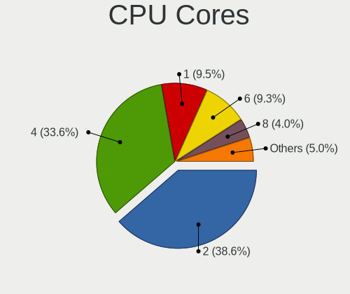

| Number | Desktops | Percent |
|--------|----------|---------|
| 2      | 185      | 38.7%   |
| 4      | 162      | 33.89%  |
| 1      | 45       | 9.41%   |
| 6      | 44       | 9.21%   |
| 8      | 20       | 4.18%   |
| 3      | 8        | 1.67%   |
| 16     | 5        | 1.05%   |
| 12     | 4        | 0.84%   |
| 24     | 3        | 0.63%   |
| 10     | 2        | 0.42%   |

CPU Sockets
-----------

Number of sockets

| Number | Desktops | Percent |
|--------|----------|---------|
| 1      | 471      | 98.54%  |
| 2      | 7        | 1.46%   |

CPU Threads
-----------

Threads per core (Hyper-Threading)

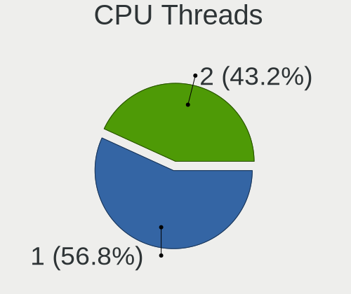

| Number | Desktops | Percent |
|--------|----------|---------|
| 1      | 275      | 57.41%  |
| 2      | 204      | 42.59%  |

CPU Op-Modes
------------

CPU Operation Modes (32-bit, 64-bit)

| Op mode        | Desktops | Percent |
|----------------|----------|---------|
| 32-bit, 64-bit | 456      | 95.4%   |
| 32-bit         | 22       | 4.6%    |

CPU Microcode
-------------

Microcode number

| Number     | Desktops | Percent |
|------------|----------|---------|
| Unknown    | 86       | 17.59%  |
| 0x306c3    | 37       | 7.57%   |
| 0x1067a    | 32       | 6.54%   |
| 0x306a9    | 30       | 6.13%   |
| 0x206a7    | 28       | 5.73%   |
| 0x506e3    | 20       | 4.09%   |
| 0x906ea    | 19       | 3.89%   |
| 0x06000852 | 13       | 2.66%   |
| 0x6fb      | 12       | 2.45%   |
| 0x10676    | 12       | 2.45%   |
| 0x010000c8 | 12       | 2.45%   |
| 0x6fd      | 11       | 2.25%   |
| 0x906e9    | 9        | 1.84%   |
| 0x6f2      | 7        | 1.43%   |
| 0xf41      | 6        | 1.23%   |
| 0xf34      | 6        | 1.23%   |
| 0x08701021 | 6        | 1.23%   |
| 0x06001119 | 6        | 1.23%   |
| 0xf49      | 5        | 1.02%   |
| 0x206d7    | 5        | 1.02%   |
| 0x106e5    | 5        | 1.02%   |
| 0x0800820d | 5        | 1.02%   |
| 0x010000db | 5        | 1.02%   |
| 0xf47      | 4        | 0.82%   |
| 0xa0655    | 4        | 0.82%   |
| 0x906ed    | 4        | 0.82%   |
| 0x6f6      | 4        | 0.82%   |
| 0x20655    | 4        | 0.82%   |
| 0x08701013 | 4        | 0.82%   |
| 0x010000dc | 4        | 0.82%   |
| 0xf65      | 3        | 0.61%   |
| 0xf29      | 3        | 0.61%   |
| 0x30678    | 3        | 0.61%   |
| 0x206c2    | 3        | 0.61%   |
| 0x106a5    | 3        | 0.61%   |
| 0x08108109 | 3        | 0.61%   |
| 0x06003106 | 3        | 0.61%   |
| 0x01000095 | 3        | 0.61%   |
| 0xf62      | 2        | 0.41%   |
| 0xf4a      | 2        | 0.41%   |

CPU Microarch
-------------

Microarchitecture

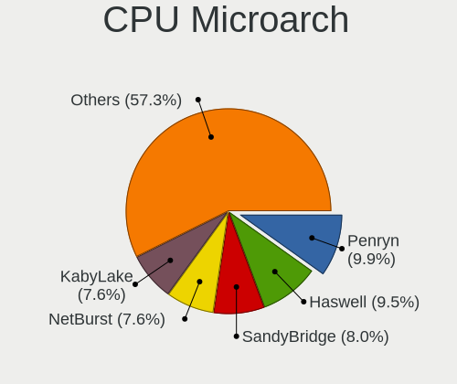

| Name             | Desktops | Percent |
|------------------|----------|---------|
| Penryn           | 48       | 10.04%  |
| Haswell          | 43       | 9%      |
| SandyBridge      | 40       | 8.37%   |
| KabyLake         | 38       | 7.95%   |
| NetBurst         | 37       | 7.74%   |
| Core             | 36       | 7.53%   |
| K10              | 34       | 7.11%   |
| IvyBridge        | 32       | 6.69%   |
| Skylake          | 24       | 5.02%   |
| Piledriver       | 22       | 4.6%    |
| K8 Hammer        | 20       | 4.18%   |
| Zen 2            | 13       | 2.72%   |
| Zen              | 12       | 2.51%   |
| Westmere         | 10       | 2.09%   |
| CometLake        | 10       | 2.09%   |
| Zen+             | 9        | 1.88%   |
| Nehalem          | 8        | 1.67%   |
| Silvermont       | 7        | 1.46%   |
| Unknown          | 6        | 1.26%   |
| Steamroller      | 4        | 0.84%   |
| K6               | 3        | 0.63%   |
| Goldmont         | 3        | 0.63%   |
| Bonnell          | 3        | 0.63%   |
| Alderlake Hybrid | 3        | 0.63%   |
| Zen 3            | 2        | 0.42%   |
| K10 Llano        | 2        | 0.42%   |
| Jaguar           | 2        | 0.42%   |
| Goldmont plus    | 2        | 0.42%   |
| Broadwell        | 2        | 0.42%   |
| P6               | 1        | 0.21%   |
| Excavator        | 1        | 0.21%   |
| Bulldozer        | 1        | 0.21%   |

Graphics
--------

GPU Vendor
----------

Vendors of graphics cards

| Vendor                           | Desktops | Percent |
|----------------------------------|----------|---------|
| Intel                            | 194      | 37.89%  |
| Nvidia                           | 183      | 35.74%  |
| AMD                              | 126      | 24.61%  |
| VIA Technologies                 | 3        | 0.59%   |
| Silicon Motion                   | 2        | 0.39%   |
| ASPEED Technology                | 2        | 0.39%   |
| Silicon Integrated Systems [SiS] | 1        | 0.2%    |
| Matrox Electronics Systems       | 1        | 0.2%    |

GPU Model
---------

Graphics card models

| Model                                                                       | Desktops | Percent |
|-----------------------------------------------------------------------------|----------|---------|
| Intel 2nd Generation Core Processor Family Integrated Graphics Controller   | 22       | 4.17%   |
| Intel Xeon E3-1200 v3/4th Gen Core Processor Integrated Graphics Controller | 20       | 3.79%   |
| Intel 4 Series Chipset Integrated Graphics Controller                       | 19       | 3.6%    |
| Intel HD Graphics 530                                                       | 15       | 2.84%   |
| Intel CoffeeLake-S GT2 [UHD Graphics 630]                                   | 14       | 2.65%   |
| Nvidia GT218 [GeForce 210]                                                  | 13       | 2.46%   |
| AMD Ellesmere [Radeon RX 470/480/570/570X/580/580X/590]                     | 12       | 2.27%   |
| Intel Xeon E3-1200 v2/3rd Gen Core processor Graphics Controller            | 10       | 1.89%   |
| Intel 82945G/GZ Integrated Graphics Controller                              | 10       | 1.89%   |
| Intel 82G33/G31 Express Integrated Graphics Controller                      | 9        | 1.7%    |
| Intel 4th Generation Core Processor Family Integrated Graphics Controller   | 9        | 1.7%    |
| Nvidia GP106 [GeForce GTX 1060 6GB]                                         | 8        | 1.52%   |
| Nvidia GF119 [GeForce GT 610]                                               | 8        | 1.52%   |
| Nvidia GK208B [GeForce GT 710]                                              | 6        | 1.14%   |
| Intel CometLake-S GT2 [UHD Graphics 630]                                    | 6        | 1.14%   |
| Intel 82915G/GV/910GL Integrated Graphics Controller                        | 6        | 1.14%   |
| AMD Cedar [Radeon HD 5000/6000/7350/8350 Series]                            | 6        | 1.14%   |
| AMD Caicos [Radeon HD 6450/7450/8450 / R5 230 OEM]                          | 6        | 1.14%   |
| Nvidia G96C [GeForce 9500 GT]                                               | 5        | 0.95%   |
| Intel Atom Processor Z36xxx/Z37xxx Series Graphics & Display                | 5        | 0.95%   |
| Intel 82Q35 Express Integrated Graphics Controller                          | 5        | 0.95%   |
| AMD RS780L [Radeon 3000]                                                    | 5        | 0.95%   |
| Nvidia GP108 [GeForce GT 1030]                                              | 4        | 0.76%   |
| Nvidia GP107 [GeForce GTX 1050]                                             | 4        | 0.76%   |
| Nvidia GM206 [GeForce GTX 960]                                              | 4        | 0.76%   |
| Nvidia GM206 [GeForce GTX 950]                                              | 4        | 0.76%   |
| Nvidia GM107 [GeForce GTX 750 Ti]                                           | 4        | 0.76%   |
| Nvidia GK208B [GeForce GT 730]                                              | 4        | 0.76%   |
| Nvidia GK107 [GeForce GTX 650]                                              | 4        | 0.76%   |
| Nvidia GF108 [GeForce GT 430]                                               | 4        | 0.76%   |
| Intel IvyBridge GT2 [HD Graphics 4000]                                      | 4        | 0.76%   |
| Intel HD Graphics 630                                                       | 4        | 0.76%   |
| Intel Core Processor Integrated Graphics Controller                         | 4        | 0.76%   |
| AMD Turks PRO [Radeon HD 6570/7570/8550 / R5 230]                           | 4        | 0.76%   |
| VIA Technologies CN896/VN896/P4M900 [Chrome 9 HC]                           | 3        | 0.57%   |
| Nvidia TU106 [GeForce RTX 2060 Rev. A]                                      | 3        | 0.57%   |
| Nvidia GP107 [GeForce GTX 1050 Ti]                                          | 3        | 0.57%   |
| Nvidia GP106 [GeForce GTX 1060 3GB]                                         | 3        | 0.57%   |
| Nvidia G96CGL [Quadro FX 580]                                               | 3        | 0.57%   |
| Nvidia G86 [Quadro NVS 290]                                                 | 3        | 0.57%   |

GPU Combo
---------

Combinations of graphics cards

| Name               | Desktops | Percent |
|--------------------|----------|---------|
| 1 x Nvidia         | 172      | 35.76%  |
| 1 x Intel          | 167      | 34.72%  |
| 1 x AMD            | 108      | 22.45%  |
| 2 x AMD            | 11       | 2.29%   |
| Intel + Nvidia     | 7        | 1.46%   |
| 1 x VIA            | 3        | 0.62%   |
| Intel + AMD        | 3        | 0.62%   |
| 2 x Nvidia         | 2        | 0.42%   |
| 1 x Silicon Motion | 2        | 0.42%   |
| AMD + Nvidia       | 2        | 0.42%   |
| 1 x SiS            | 1        | 0.21%   |
| 1 x Matrox         | 1        | 0.21%   |
| 1 x ASPEED         | 1        | 0.21%   |
| AMD + ASPEED       | 1        | 0.21%   |

GPU Driver
----------

Free vs proprietary

| Driver      | Desktops | Percent |
|-------------|----------|---------|
| Free        | 364      | 76.15%  |
| Proprietary | 83       | 17.36%  |
| Unknown     | 31       | 6.49%   |

GPU Memory
----------

Total video memory

| Size in GB | Desktops | Percent |
|------------|----------|---------|
| Unknown    | 127      | 26.02%  |
| 0.01-0.5   | 126      | 25.82%  |
| 1.01-2.0   | 116      | 23.77%  |
| 0.51-1.0   | 57       | 11.68%  |
| 3.01-4.0   | 33       | 6.76%   |
| 7.01-8.0   | 13       | 2.66%   |
| 5.01-6.0   | 9        | 1.84%   |
| 2.01-3.0   | 4        | 0.82%   |
| 8.01-16.0  | 2        | 0.41%   |
| 4.01-5.0   | 1        | 0.2%    |

Monitor
-------

Monitor Vendor
--------------

Monitor vendors

| Vendor               | Desktops | Percent |
|----------------------|----------|---------|
| Samsung Electronics  | 71       | 15.92%  |
| Dell                 | 49       | 10.99%  |
| Goldstar             | 44       | 9.87%   |
| Acer                 | 37       | 8.3%    |
| Hewlett-Packard      | 33       | 7.4%    |
| AOC                  | 25       | 5.61%   |
| Ancor Communications | 25       | 5.61%   |
| Philips              | 19       | 4.26%   |
| BenQ                 | 19       | 4.26%   |
| LG Electronics       | 10       | 2.24%   |
| Sony                 | 7        | 1.57%   |
| Iiyama               | 7        | 1.57%   |
| Fujitsu Siemens      | 6        | 1.35%   |
| Medion               | 5        | 1.12%   |
| Lenovo               | 5        | 1.12%   |
| ASUSTek Computer     | 5        | 1.12%   |
| Unknown              | 4        | 0.9%    |
| ViewSonic            | 3        | 0.67%   |
| Vestel Elektronik    | 3        | 0.67%   |
| KTC                  | 3        | 0.67%   |
| HannStar             | 3        | 0.67%   |
| Eizo                 | 3        | 0.67%   |
| Toshiba              | 2        | 0.45%   |
| Sceptre Tech         | 2        | 0.45%   |
| SANYO                | 2        | 0.45%   |
| Panasonic            | 2        | 0.45%   |
| NEC Computers        | 2        | 0.45%   |
| IBM                  | 2        | 0.45%   |
| HannStar Display     | 2        | 0.45%   |
| CVT                  | 2        | 0.45%   |
| Yakumo               | 1        | 0.22%   |
| Westinghouse         | 1        | 0.22%   |
| Vizio                | 1        | 0.22%   |
| Vestel               | 1        | 0.22%   |
| Unknown (XXX)        | 1        | 0.22%   |
| Unknown (ADA)        | 1        | 0.22%   |
| TXD                  | 1        | 0.22%   |
| Tech Concepts        | 1        | 0.22%   |
| TCL                  | 1        | 0.22%   |
| Sun                  | 1        | 0.22%   |

Monitor Model
-------------

Monitor models

| Model                                                                 | Desktops | Percent |
|-----------------------------------------------------------------------|----------|---------|
| Vestel Elektronik 22W_LCD_TV VES3700 1920x540                         | 3        | 0.64%   |
| Unknown LCD Monitor SAMSUNG 1920x1080                                 | 3        | 0.64%   |
| Samsung Electronics SyncMaster SAM011E 1280x1024 338x270mm 17.0-inch  | 3        | 0.64%   |
| AOC 24B2W1 AOC2402 1920x1080 527x296mm 23.8-inch                      | 3        | 0.64%   |
| Ancor Communications VE247 ACI2493 1920x1080 531x299mm 24.0-inch      | 3        | 0.64%   |
| Samsung Electronics SyncMaster SAM027E 1680x1050 474x296mm 22.0-inch  | 2        | 0.43%   |
| Samsung Electronics S19D300 SAM0B34 1366x768 410x230mm 18.5-inch      | 2        | 0.43%   |
| Philips 226VL PHLC081 1920x1080 480x268mm 21.6-inch                   | 2        | 0.43%   |
| Medion MD30999PD MED89C4 1440x900 408x255mm 18.9-inch                 | 2        | 0.43%   |
| LG Electronics LCD Monitor LG ULTRAWIDE 2560x1080                     | 2        | 0.43%   |
| LG Electronics LCD Monitor LG IPS WSXGA 1440x900                      | 2        | 0.43%   |
| Iiyama PLE2483H IVM6113 1920x1080 531x299mm 24.0-inch                 | 2        | 0.43%   |
| Hewlett-Packard L1950 HWP26E7 1280x1024 380x300mm 19.1-inch           | 2        | 0.43%   |
| Hewlett-Packard 24o HPN337B 1920x1080 531x299mm 24.0-inch             | 2        | 0.43%   |
| HannStar Display LCD Monitor Hanns.G Hi221 1680x1050                  | 2        | 0.43%   |
| Goldstar ULTRAWIDE GSM59F1 2560x1080 673x284mm 28.8-inch              | 2        | 0.43%   |
| Goldstar HDR 4K GSM774F 3840x2160 697x392mm 31.5-inch                 | 2        | 0.43%   |
| Goldstar FULL HD GSM5B55 1920x1080 480x270mm 21.7-inch                | 2        | 0.43%   |
| Dell U2410 DELF016 1920x1200 518x324mm 24.1-inch                      | 2        | 0.43%   |
| Dell S2340L DELD058 1920x1080 509x286mm 23.0-inch                     | 2        | 0.43%   |
| Dell E172FP DELA00A 1280x1024 338x270mm 17.0-inch                     | 2        | 0.43%   |
| BenQ G2020HDA BNQ781E 1600x900 443x249mm 20.0-inch                    | 2        | 0.43%   |
| AOC Q27P1B AOC2701 2560x1440 597x336mm 27.0-inch                      | 2        | 0.43%   |
| AOC F19 AOC1900 1366x768 410x230mm 18.5-inch                          | 2        | 0.43%   |
| AOC e2752Vq AOC2752 1920x1080 600x340mm 27.2-inch                     | 2        | 0.43%   |
| AOC 24B1W1G5 AOC2401 1920x1080 527x296mm 23.8-inch                    | 2        | 0.43%   |
| AOC 1970W AOC1970 1366x768 410x230mm 18.5-inch                        | 2        | 0.43%   |
| Ancor Communications ASUS VS228 ACI22FD 1920x1080 476x268mm 21.5-inch | 2        | 0.43%   |
| Acer S200HL ACR0294 1600x900 442x249mm 20.0-inch                      | 2        | 0.43%   |
| Acer AL1751 ACRAD40 1280x1024 340x270mm 17.1-inch                     | 2        | 0.43%   |
| Yakumo 19DXJ YAK03C6 1280x1024 376x301mm 19.0-inch                    | 1        | 0.21%   |
| Westinghouse LD-2685VX WDE17E8 1920x1080 710x400mm 32.1-inch          | 1        | 0.21%   |
| Vizio E500i-A1 VIZ1004 1920x1080 1095x616mm 49.5-inch                 | 1        | 0.21%   |
| ViewSonic VA2407 Series VSC8C31 1920x1080 521x293mm 23.5-inch         | 1        | 0.21%   |
| ViewSonic VA2231 Series VSCBB25 1920x1080 477x268mm 21.5-inch         | 1        | 0.21%   |
| ViewSonic VA1931 Series VSC5826 1366x768 410x230mm 18.5-inch          | 1        | 0.21%   |
| Vestel LCD Monitor 48UHD_LCD_TV                                       | 1        | 0.21%   |
| Unknown LCD Monitor Maxdata/XXXXXXX o.disp3.1_19 3200x1080            | 1        | 0.21%   |
| Unknown (XXX) 1772E XXX1772 1280x1024 320x250mm 16.0-inch             | 1        | 0.21%   |
| Unknown (ADA) LCD Monitor ADA0004 1280x800 150x100mm 7.1-inch         | 1        | 0.21%   |

Monitor Resolution
------------------

Monitor screen resolution

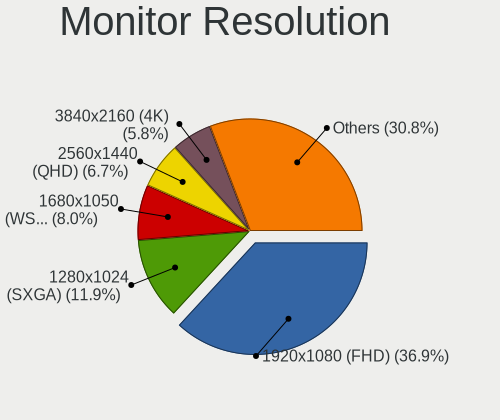

| Resolution         | Desktops | Percent |
|--------------------|----------|---------|
| 1920x1080 (FHD)    | 164      | 36.77%  |
| 1280x1024 (SXGA)   | 54       | 12.11%  |
| 1680x1050 (WSXGA+) | 34       | 7.62%   |
| 2560x1440 (QHD)    | 30       | 6.73%   |
| 1366x768 (WXGA)    | 26       | 5.83%   |
| 3840x2160 (4K)     | 25       | 5.61%   |
| 1600x900 (HD+)     | 21       | 4.71%   |
| 1440x900 (WXGA+)   | 16       | 3.59%   |
| 1360x768           | 13       | 2.91%   |
| 1920x1200 (WUXGA)  | 12       | 2.69%   |
| Unknown            | 11       | 2.47%   |
| 1024x768 (XGA)     | 7        | 1.57%   |
| 2560x1080          | 6        | 1.35%   |
| 3440x1440          | 4        | 0.9%    |
| 1600x1200          | 4        | 0.9%    |
| 1280x720 (HD)      | 4        | 0.9%    |
| 3840x1200          | 2        | 0.45%   |
| 3840x1080          | 2        | 0.45%   |
| 1920x540           | 2        | 0.45%   |
| 1280x960           | 2        | 0.45%   |
| 7120x1080          | 1        | 0.22%   |
| 3840x1303          | 1        | 0.22%   |
| 3200x1200          | 1        | 0.22%   |
| 3200x1080          | 1        | 0.22%   |
| 2560x1600          | 1        | 0.22%   |
| 2048x1152          | 1        | 0.22%   |
| 1280x800 (WXGA)    | 1        | 0.22%   |

Monitor Diagonal
----------------

Diagonal size in inches

| Inches  | Desktops | Percent |
|---------|----------|---------|
| Unknown | 50       | 11.31%  |
| 24      | 48       | 10.86%  |
| 21      | 48       | 10.86%  |
| 23      | 42       | 9.5%    |
| 19      | 40       | 9.05%   |
| 27      | 39       | 8.82%   |
| 17      | 28       | 6.33%   |
| 18      | 26       | 5.88%   |
| 20      | 25       | 5.66%   |
| 22      | 19       | 4.3%    |
| 15      | 14       | 3.17%   |
| 31      | 11       | 2.49%   |
| 32      | 7        | 1.58%   |
| 34      | 6        | 1.36%   |
| 25      | 6        | 1.36%   |
| 84      | 5        | 1.13%   |
| 72      | 4        | 0.9%    |
| 54      | 4        | 0.9%    |
| 26      | 3        | 0.68%   |
| 16      | 2        | 0.45%   |
| 70      | 1        | 0.23%   |
| 52      | 1        | 0.23%   |
| 50      | 1        | 0.23%   |
| 46      | 1        | 0.23%   |
| 44      | 1        | 0.23%   |
| 42      | 1        | 0.23%   |
| 40      | 1        | 0.23%   |
| 39      | 1        | 0.23%   |
| 35      | 1        | 0.23%   |
| 30      | 1        | 0.23%   |
| 29      | 1        | 0.23%   |
| 28      | 1        | 0.23%   |
| 13      | 1        | 0.23%   |
| 12      | 1        | 0.23%   |
| 7       | 1        | 0.23%   |

Monitor Width
-------------

Physical width

| Width in mm | Desktops | Percent |
|-------------|----------|---------|
| 401-500     | 134      | 30.73%  |
| 501-600     | 127      | 29.13%  |
| Unknown     | 50       | 11.47%  |
| 301-350     | 41       | 9.4%    |
| 351-400     | 29       | 6.65%   |
| 601-700     | 18       | 4.13%   |
| 701-800     | 13       | 2.98%   |
| 1501-2000   | 10       | 2.29%   |
| 1001-1500   | 7        | 1.61%   |
| 801-900     | 3        | 0.69%   |
| 901-1000    | 2        | 0.46%   |
| 201-300     | 1        | 0.23%   |
| 101-200     | 1        | 0.23%   |

Aspect Ratio
------------

Proportional relationship between the width and the height

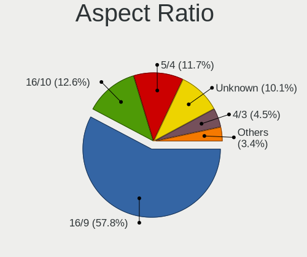

| Ratio   | Desktops | Percent |
|---------|----------|---------|
| 16/9    | 249      | 58.31%  |
| 5/4     | 51       | 11.94%  |
| 16/10   | 50       | 11.71%  |
| Unknown | 44       | 10.3%   |
| 4/3     | 19       | 4.45%   |
| 21/9    | 8        | 1.87%   |
| 3/2     | 4        | 0.94%   |
| 6/5     | 1        | 0.23%   |
| 32/9    | 1        | 0.23%   |

Monitor Area
------------

Area in inch

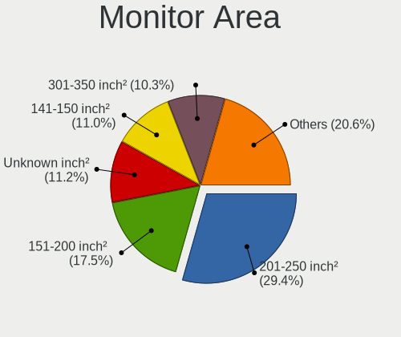

| Area in inch | Desktops | Percent |
|----------------|----------|---------|
| 201-250        | 133      | 30.37%  |
| 151-200        | 74       | 16.89%  |
| 141-150        | 50       | 11.42%  |
| Unknown        | 50       | 11.42%  |
| 301-350        | 42       | 9.59%   |
| 351-500        | 27       | 6.16%   |
| 251-300        | 20       | 4.57%   |
| More than 1000 | 16       | 3.65%   |
| 101-110        | 11       | 2.51%   |
| 501-1000       | 5        | 1.14%   |
| 111-120        | 3        | 0.68%   |
| 131-140        | 2        | 0.46%   |
| 121-130        | 2        | 0.46%   |
| 81-90          | 1        | 0.23%   |
| 71-80          | 1        | 0.23%   |
| 1-40           | 1        | 0.23%   |

Pixel Density
-------------

Pixels per inch

| Density | Desktops | Percent |
|---------|----------|---------|
| 51-100  | 271      | 63.17%  |
| 101-120 | 74       | 17.25%  |
| Unknown | 50       | 11.66%  |
| 1-50    | 17       | 3.96%   |
| 121-160 | 9        | 2.1%    |
| 161-240 | 8        | 1.86%   |

Multiple Monitors
-----------------

Total monitors connected

| Total | Desktops | Percent |
|-------|----------|---------|
| 1     | 408      | 84.65%  |
| 2     | 40       | 8.3%    |
| 0     | 28       | 5.81%   |
| 3     | 4        | 0.83%   |
| 4     | 2        | 0.41%   |

Network
-------

Net Controller Vendor
---------------------

Controller vendors

| Vendor                           | Desktops | Percent |
|----------------------------------|----------|---------|
| Realtek Semiconductor            | 273      | 39.45%  |
| Intel                            | 149      | 21.53%  |
| Qualcomm Atheros                 | 49       | 7.08%   |
| Nvidia                           | 26       | 3.76%   |
| Broadcom                         | 26       | 3.76%   |
| Ralink Technology                | 25       | 3.61%   |
| Marvell Technology Group         | 16       | 2.31%   |
| Ralink                           | 14       | 2.02%   |
| Broadcom Limited                 | 13       | 1.88%   |
| TP-Link                          | 12       | 1.73%   |
| NetGear                          | 9        | 1.3%    |
| VIA Technologies                 | 8        | 1.16%   |
| Qualcomm Atheros Communications  | 6        | 0.87%   |
| D-Link System                    | 6        | 0.87%   |
| Samsung Electronics              | 5        | 0.72%   |
| D-Link                           | 5        | 0.72%   |
| MediaTek                         | 4        | 0.58%   |
| ASIX Electronics                 | 4        | 0.58%   |
| 3Com                             | 4        | 0.58%   |
| ASUSTek Computer                 | 3        | 0.43%   |
| Aquantia                         | 3        | 0.43%   |
| Xiaomi                           | 2        | 0.29%   |
| Sitecom Europe                   | 2        | 0.29%   |
| Silicon Integrated Systems [SiS] | 2        | 0.29%   |
| Qualcomm                         | 2        | 0.29%   |
| Motorola                         | 2        | 0.29%   |
| Linksys                          | 2        | 0.29%   |
| Huawei Technologies              | 2        | 0.29%   |
| AVM                              | 2        | 0.29%   |
| ZTE WCDMA Technologies MSM       | 1        | 0.14%   |
| Texas Instruments                | 1        | 0.14%   |
| Standard Microsystems [SMC]      | 1        | 0.14%   |
| Spreadtrum Communications        | 1        | 0.14%   |
| Pulse-Eight                      | 1        | 0.14%   |
| PLANEX                           | 1        | 0.14%   |
| Motorola PCS                     | 1        | 0.14%   |
| Microsoft                        | 1        | 0.14%   |
| Microchip Technology             | 1        | 0.14%   |
| Mercucys                         | 1        | 0.14%   |
| Intersil                         | 1        | 0.14%   |

Net Controller Model
--------------------

Controller models

| Model                                                                  | Desktops | Percent |
|------------------------------------------------------------------------|----------|---------|
| Realtek RTL8111/8168/8211/8411 PCI Express Gigabit Ethernet Controller | 211      | 28.02%  |
| Nvidia MCP61 Ethernet                                                  | 18       | 2.39%   |
| Intel 82579LM Gigabit Network Connection (Lewisville)                  | 18       | 2.39%   |
| Realtek RTL810xE PCI Express Fast Ethernet controller                  | 17       | 2.26%   |
| Realtek RTL8188EUS 802.11n Wireless Network Adapter                    | 12       | 1.59%   |
| Realtek RTL-8100/8101L/8139 PCI Fast Ethernet Adapter                  | 11       | 1.46%   |
| Intel I211 Gigabit Network Connection                                  | 11       | 1.46%   |
| Marvell Group 88E8056 PCI-E Gigabit Ethernet Controller                | 10       | 1.33%   |
| Ralink MT7601U Wireless Adapter                                        | 9        | 1.2%    |
| Qualcomm Atheros AR9485 Wireless Network Adapter                       | 9        | 1.2%    |
| Intel Ethernet Connection (2) I219-V                                   | 9        | 1.2%    |
| Intel 82579V Gigabit Network Connection                                | 9        | 1.2%    |
| Intel Ethernet Connection I217-LM                                      | 8        | 1.06%   |
| VIA VT6102/VT6103 [Rhine-II]                                           | 7        | 0.93%   |
| Intel Ethernet Connection (7) I219-V                                   | 7        | 0.93%   |
| Intel 82566DM-2 Gigabit Network Connection                             | 7        | 0.93%   |
| Ralink RT5370 Wireless Adapter                                         | 6        | 0.8%    |
| Intel Ethernet Connection I217-V                                       | 6        | 0.8%    |
| Intel Ethernet Connection (2) I219-LM                                  | 6        | 0.8%    |
| Intel 82567LM-3 Gigabit Network Connection                             | 6        | 0.8%    |
| Realtek RTL8188FTV 802.11b/g/n 1T1R 2.4G WLAN Adapter                  | 5        | 0.66%   |
| Realtek RTL8153 Gigabit Ethernet Adapter                               | 5        | 0.66%   |
| Qualcomm Atheros AR9271 802.11n                                        | 5        | 0.66%   |
| Qualcomm Atheros AR8151 v2.0 Gigabit Ethernet                          | 5        | 0.66%   |
| Intel I210 Gigabit Network Connection                                  | 5        | 0.66%   |
| Broadcom Limited NetXtreme BCM5751 Gigabit Ethernet PCI Express        | 5        | 0.66%   |
| Realtek RTL88x2bu [AC1200 Techkey]                                     | 4        | 0.53%   |
| Realtek RTL8169 PCI Gigabit Ethernet Controller                        | 4        | 0.53%   |
| Realtek RTL8125 2.5GbE Controller                                      | 4        | 0.53%   |
| Realtek 802.11ac NIC                                                   | 4        | 0.53%   |
| Qualcomm Atheros AR93xx Wireless Network Adapter                       | 4        | 0.53%   |
| Marvell Group 88E8001 Gigabit Ethernet Controller                      | 4        | 0.53%   |
| Intel Ethernet Controller I225-V                                       | 4        | 0.53%   |
| Intel 82578DM Gigabit Network Connection                               | 4        | 0.53%   |
| D-Link System DGE-528T Gigabit Ethernet Adapter                        | 4        | 0.53%   |
| Broadcom NetXtreme BCM5754 Gigabit Ethernet PCI Express                | 4        | 0.53%   |
| Broadcom BCM4360 802.11ac Dual Band Wireless Network Adapter           | 4        | 0.53%   |
| TP-Link TL-WN823N v2/v3 [Realtek RTL8192EU]                            | 3        | 0.4%    |
| Samsung GT-I9070 (network tethering, USB debugging enabled)            | 3        | 0.4%    |
| Realtek RTL8821AE 802.11ac PCIe Wireless Network Adapter               | 3        | 0.4%    |

Wireless Vendor
---------------

Wireless vendors

| Vendor                                | Desktops | Percent |
|---------------------------------------|----------|---------|
| Realtek Semiconductor                 | 56       | 26.67%  |
| Qualcomm Atheros                      | 27       | 12.86%  |
| Ralink Technology                     | 25       | 11.9%   |
| Intel                                 | 23       | 10.95%  |
| Ralink                                | 14       | 6.67%   |
| TP-Link                               | 12       | 5.71%   |
| Broadcom                              | 10       | 4.76%   |
| NetGear                               | 9        | 4.29%   |
| Qualcomm Atheros Communications       | 6        | 2.86%   |
| D-Link                                | 5        | 2.38%   |
| MediaTek                              | 3        | 1.43%   |
| Broadcom Limited                      | 3        | 1.43%   |
| ASUSTek Computer                      | 3        | 1.43%   |
| Sitecom Europe                        | 2        | 0.95%   |
| Linksys                               | 2        | 0.95%   |
| D-Link System                         | 2        | 0.95%   |
| AVM                                   | 2        | 0.95%   |
| PLANEX                                | 1        | 0.48%   |
| Microsoft                             | 1        | 0.48%   |
| Mercucys                              | 1        | 0.48%   |
| Marvell Technology Group              | 1        | 0.48%   |
| Intersil                              | 1        | 0.48%   |
| 802.11g Adapter [Linksys WUSB54GC v3] | 1        | 0.48%   |

Wireless Model
--------------

Wireless models

| Model                                                               | Desktops | Percent |
|---------------------------------------------------------------------|----------|---------|
| Realtek RTL8188EUS 802.11n Wireless Network Adapter                 | 12       | 5.71%   |
| Ralink MT7601U Wireless Adapter                                     | 9        | 4.29%   |
| Qualcomm Atheros AR9485 Wireless Network Adapter                    | 9        | 4.29%   |
| Ralink RT5370 Wireless Adapter                                      | 6        | 2.86%   |
| Realtek RTL8188FTV 802.11b/g/n 1T1R 2.4G WLAN Adapter               | 5        | 2.38%   |
| Qualcomm Atheros AR9271 802.11n                                     | 5        | 2.38%   |
| Realtek RTL88x2bu [AC1200 Techkey]                                  | 4        | 1.9%    |
| Realtek 802.11ac NIC                                                | 4        | 1.9%    |
| Qualcomm Atheros AR93xx Wireless Network Adapter                    | 4        | 1.9%    |
| Broadcom BCM4360 802.11ac Dual Band Wireless Network Adapter        | 4        | 1.9%    |
| TP-Link TL-WN823N v2/v3 [Realtek RTL8192EU]                         | 3        | 1.43%   |
| Realtek RTL8821AE 802.11ac PCIe Wireless Network Adapter            | 3        | 1.43%   |
| Realtek RTL8192CU 802.11n WLAN Adapter                              | 3        | 1.43%   |
| Realtek RTL8188EE Wireless Network Adapter                          | 3        | 1.43%   |
| Ralink RT2870/RT3070 Wireless Adapter                               | 3        | 1.43%   |
| Ralink RT2561/RT61 802.11g PCI                                      | 3        | 1.43%   |
| Qualcomm Atheros AR2417 Wireless Network Adapter [AR5007G 802.11bg] | 3        | 1.43%   |
| Intel Wireless 7260                                                 | 3        | 1.43%   |
| Intel Wi-Fi 5(802.11ac) Wireless-AC 9x6x [Thunder Peak]             | 3        | 1.43%   |
| Intel Dual Band Wireless-AC 3168NGW [Stone Peak]                    | 3        | 1.43%   |
| TP-Link TL-WN822N Version 4 RTL8192EU                               | 2        | 0.95%   |
| Realtek RTL8821CE 802.11ac PCIe Wireless Network Adapter            | 2        | 0.95%   |
| Realtek RTL8192EU 802.11b/g/n WLAN Adapter                          | 2        | 0.95%   |
| Realtek RTL8192EE PCIe Wireless Network Adapter                     | 2        | 0.95%   |
| Realtek RTL8188CUS 802.11n WLAN Adapter                             | 2        | 0.95%   |
| Ralink RT3072 Wireless Adapter                                      | 2        | 0.95%   |
| Ralink RT2501/RT2573 Wireless Adapter                               | 2        | 0.95%   |
| Ralink MT7610U ("Archer T2U" 2.4G+5G WLAN Adapter                   | 2        | 0.95%   |
| Ralink RT5392 PCIe Wireless Network Adapter                         | 2        | 0.95%   |
| Ralink RT5390 Wireless 802.11n 1T/1R PCIe                           | 2        | 0.95%   |
| Ralink RT2790 Wireless 802.11n 1T/2R PCIe                           | 2        | 0.95%   |
| Qualcomm Atheros AR922X Wireless Network Adapter                    | 2        | 0.95%   |
| Qualcomm Atheros AR5212/5213/2414 Wireless Network Adapter          | 2        | 0.95%   |
| NetGear WNA3100M(v1) Wireless-N 300 [Realtek RTL8192CU]             | 2        | 0.95%   |
| NetGear WNA1000M 802.11bgn [Realtek RTL8188CUS]                     | 2        | 0.95%   |
| MediaTek MT7921K (RZ608) Wi-Fi 6E 80MHz                             | 2        | 0.95%   |
| Linksys AM10 v1 802.11n [Ralink RT3072]                             | 2        | 0.95%   |
| Intel Wireless 7265                                                 | 2        | 0.95%   |
| Intel Wireless 3165                                                 | 2        | 0.95%   |
| Intel Wi-Fi 6E(802.11ax) AX210/AX1675* 2x2 [Typhoon Peak]           | 2        | 0.95%   |

Ethernet Vendor
---------------

Ethernet vendors

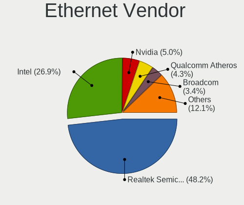

| Vendor                           | Desktops | Percent |
|----------------------------------|----------|---------|
| Realtek Semiconductor            | 248      | 47.97%  |
| Intel                            | 138      | 26.69%  |
| Nvidia                           | 26       | 5.03%   |
| Qualcomm Atheros                 | 22       | 4.26%   |
| Broadcom                         | 17       | 3.29%   |
| Marvell Technology Group         | 15       | 2.9%    |
| Broadcom Limited                 | 10       | 1.93%   |
| VIA Technologies                 | 8        | 1.55%   |
| Samsung Electronics              | 5        | 0.97%   |
| D-Link System                    | 4        | 0.77%   |
| ASIX Electronics                 | 4        | 0.77%   |
| 3Com                             | 4        | 0.77%   |
| Aquantia                         | 3        | 0.58%   |
| Xiaomi                           | 2        | 0.39%   |
| Silicon Integrated Systems [SiS] | 2        | 0.39%   |
| Qualcomm                         | 2        | 0.39%   |
| ZTE WCDMA Technologies MSM       | 1        | 0.19%   |
| Standard Microsystems [SMC]      | 1        | 0.19%   |
| Spreadtrum Communications        | 1        | 0.19%   |
| MediaTek                         | 1        | 0.19%   |
| ICS Advent                       | 1        | 0.19%   |
| Huawei Technologies              | 1        | 0.19%   |
| HMD Global                       | 1        | 0.19%   |

Ethernet Model
--------------

Ethernet models

| Model                                                                  | Desktops | Percent |
|------------------------------------------------------------------------|----------|---------|
| Realtek RTL8111/8168/8211/8411 PCI Express Gigabit Ethernet Controller | 211      | 39.66%  |
| Nvidia MCP61 Ethernet                                                  | 18       | 3.38%   |
| Intel 82579LM Gigabit Network Connection (Lewisville)                  | 18       | 3.38%   |
| Realtek RTL810xE PCI Express Fast Ethernet controller                  | 17       | 3.2%    |
| Realtek RTL-8100/8101L/8139 PCI Fast Ethernet Adapter                  | 11       | 2.07%   |
| Intel I211 Gigabit Network Connection                                  | 11       | 2.07%   |
| Marvell Group 88E8056 PCI-E Gigabit Ethernet Controller                | 10       | 1.88%   |
| Intel Ethernet Connection (2) I219-V                                   | 9        | 1.69%   |
| Intel 82579V Gigabit Network Connection                                | 9        | 1.69%   |
| Intel Ethernet Connection I217-LM                                      | 8        | 1.5%    |
| VIA VT6102/VT6103 [Rhine-II]                                           | 7        | 1.32%   |
| Intel Ethernet Connection (7) I219-V                                   | 7        | 1.32%   |
| Intel 82566DM-2 Gigabit Network Connection                             | 7        | 1.32%   |
| Intel Ethernet Connection I217-V                                       | 6        | 1.13%   |
| Intel Ethernet Connection (2) I219-LM                                  | 6        | 1.13%   |
| Intel 82567LM-3 Gigabit Network Connection                             | 6        | 1.13%   |
| Realtek RTL8153 Gigabit Ethernet Adapter                               | 5        | 0.94%   |
| Qualcomm Atheros AR8151 v2.0 Gigabit Ethernet                          | 5        | 0.94%   |
| Intel I210 Gigabit Network Connection                                  | 5        | 0.94%   |
| Broadcom Limited NetXtreme BCM5751 Gigabit Ethernet PCI Express        | 5        | 0.94%   |
| Realtek RTL8169 PCI Gigabit Ethernet Controller                        | 4        | 0.75%   |
| Realtek RTL8125 2.5GbE Controller                                      | 4        | 0.75%   |
| Marvell Group 88E8001 Gigabit Ethernet Controller                      | 4        | 0.75%   |
| Intel Ethernet Controller I225-V                                       | 4        | 0.75%   |
| Intel 82578DM Gigabit Network Connection                               | 4        | 0.75%   |
| D-Link System DGE-528T Gigabit Ethernet Adapter                        | 4        | 0.75%   |
| Broadcom NetXtreme BCM5754 Gigabit Ethernet PCI Express                | 4        | 0.75%   |
| Samsung GT-I9070 (network tethering, USB debugging enabled)            | 3        | 0.56%   |
| Qualcomm Atheros AR8161 Gigabit Ethernet                               | 3        | 0.56%   |
| Qualcomm Atheros AR8121/AR8113/AR8114 Gigabit or Fast Ethernet         | 3        | 0.56%   |
| Intel Ethernet Connection (14) I219-V                                  | 3        | 0.56%   |
| Intel 82578DC Gigabit Network Connection                               | 3        | 0.56%   |
| Intel 82574L Gigabit Network Connection                                | 3        | 0.56%   |
| Intel 82547EI Gigabit Ethernet Controller                              | 3        | 0.56%   |
| Broadcom NetXtreme BCM5764M Gigabit Ethernet PCIe                      | 3        | 0.56%   |
| ASIX AX88179 Gigabit Ethernet                                          | 3        | 0.56%   |
| 3Com 3c905B 100BaseTX [Cyclone]                                        | 3        | 0.56%   |
| Xiaomi Mi/Redmi series (RNDIS)                                         | 2        | 0.38%   |
| Silicon Integrated Systems [SiS] SiS900 PCI Fast Ethernet              | 2        | 0.38%   |
| Samsung Galaxy series, misc. (tethering mode)                          | 2        | 0.38%   |

Net Controller Kind
-------------------

Ethernet, WiFi or modem

| Kind     | Desktops | Percent |
|----------|----------|---------|
| Ethernet | 471      | 69.57%  |
| WiFi     | 195      | 28.8%   |
| Modem    | 10       | 1.48%   |
| Unknown  | 1        | 0.15%   |

Used Controller
---------------

Currently used network controller

| Kind     | Desktops | Percent |
|----------|----------|---------|
| Ethernet | 358      | 72.91%  |
| WiFi     | 133      | 27.09%  |

NICs
----

Total network controllers on board

| Total | Desktops | Percent |
|-------|----------|---------|
| 1     | 339      | 70.48%  |
| 2     | 123      | 25.57%  |
| 3     | 11       | 2.29%   |
| 0     | 6        | 1.25%   |
| 5     | 1        | 0.21%   |
| 4     | 1        | 0.21%   |

IPv6
----

IPv6 vs IPv4

| Used | Desktops | Percent |
|------|----------|---------|
| No   | 424      | 87.42%  |
| Yes  | 61       | 12.58%  |

Bluetooth
---------

Bluetooth Vendor
----------------

Controller vendors

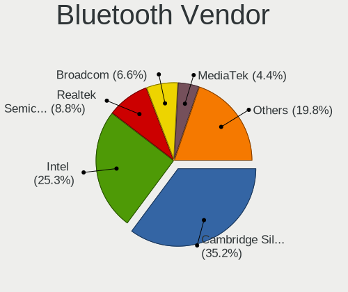

| Vendor                          | Desktops | Percent |
|---------------------------------|----------|---------|
| Cambridge Silicon Radio         | 31       | 36.05%  |
| Intel                           | 21       | 24.42%  |
| Realtek Semiconductor           | 8        | 9.3%    |
| Broadcom                        | 6        | 6.98%   |
| IMC Networks                    | 3        | 3.49%   |
| Apple                           | 3        | 3.49%   |
| TP-Link                         | 2        | 2.33%   |
| Qualcomm Atheros Communications | 2        | 2.33%   |
| MediaTek                        | 2        | 2.33%   |
| Hewlett-Packard                 | 2        | 2.33%   |
| ASUSTek Computer                | 2        | 2.33%   |
| Lite-On Technology              | 1        | 1.16%   |
| Integrated System Solution      | 1        | 1.16%   |
| Dynex                           | 1        | 1.16%   |
| Conwise Technology              | 1        | 1.16%   |

Bluetooth Model
---------------

Controller models

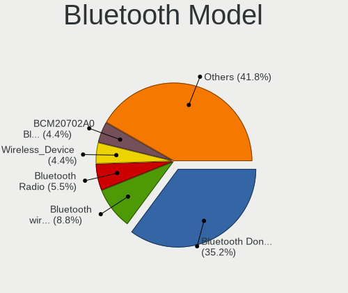

| Model                                                    | Desktops | Percent |
|----------------------------------------------------------|----------|---------|
| Cambridge Silicon Radio Bluetooth Dongle (HCI mode)      | 31       | 36.05%  |
| Intel Bluetooth wireless interface                       | 6        | 6.98%   |
| Realtek Bluetooth Radio                                  | 5        | 5.81%   |
| Broadcom BCM20702A0 Bluetooth 4.0                        | 4        | 4.65%   |
| Intel Wireless-AC 9260 Bluetooth Adapter                 | 3        | 3.49%   |
| Intel Wireless-AC 3168 Bluetooth                         | 3        | 3.49%   |
| IMC Networks Bluetooth Radio                             | 3        | 3.49%   |
| Apple Bluetooth Host Controller                          | 3        | 3.49%   |
| TP-Link UB500 Adapter                                    | 2        | 2.33%   |
| Realtek  Bluetooth 4.2 Adapter                           | 2        | 2.33%   |
| Qualcomm Atheros Bluetooth USB Host Controller           | 2        | 2.33%   |
| MediaTek Wireless_Device                                 | 2        | 2.33%   |
| Intel AX211 Bluetooth                                    | 2        | 2.33%   |
| Intel AX210 Bluetooth                                    | 2        | 2.33%   |
| Intel AX200 Bluetooth                                    | 2        | 2.33%   |
| HP Bluetooth 2.0 Interface [Broadcom BCM2045]            | 2        | 2.33%   |
| Realtek RTL8822BE Bluetooth 4.2 Adapter                  | 1        | 1.16%   |
| Lite-On Qualcomm Atheros QCA9377 Bluetooth               | 1        | 1.16%   |
| Intel Bluetooth Device                                   | 1        | 1.16%   |
| Intel Bluetooth 9460/9560 Jefferson Peak (JfP)           | 1        | 1.16%   |
| Intel AX201 Bluetooth                                    | 1        | 1.16%   |
| Integrated System Solution KY-BT100 Bluetooth Adapter    | 1        | 1.16%   |
| Dynex Bluetooth 4.0 Adapter [Broadcom, 1.12, BCM20702A0] | 1        | 1.16%   |
| Conwise CW6622                                           | 1        | 1.16%   |
| Broadcom BCM43142 Bluetooth 4.0                          | 1        | 1.16%   |
| Broadcom BCM2035 Bluetooth dongle                        | 1        | 1.16%   |
| ASUS Broadcom BCM20702A0 Bluetooth                       | 1        | 1.16%   |
| ASUS Bluetooth Adapter                                   | 1        | 1.16%   |

Sound
-----

Sound Vendor
------------

Sound card vendors

| Vendor                           | Desktops | Percent |
|----------------------------------|----------|---------|
| Intel                            | 323      | 46.47%  |
| Nvidia                           | 153      | 22.01%  |
| AMD                              | 135      | 19.42%  |
| C-Media Electronics              | 13       | 1.87%   |
| VIA Technologies                 | 12       | 1.73%   |
| Logitech                         | 8        | 1.15%   |
| Creative Labs                    | 6        | 0.86%   |
| GN Netcom                        | 5        | 0.72%   |
| Generalplus Technology           | 3        | 0.43%   |
| Ensoniq                          | 3        | 0.43%   |
| Texas Instruments                | 2        | 0.29%   |
| Syntek                           | 2        | 0.29%   |
| SteelSeries ApS                  | 2        | 0.29%   |
| Silicon Integrated Systems [SiS] | 2        | 0.29%   |
| Sennheiser Communications        | 2        | 0.29%   |
| KORG                             | 2        | 0.29%   |
| Kingston Technology              | 2        | 0.29%   |
| JMTek                            | 2        | 0.29%   |
| DSEA A/S                         | 2        | 0.29%   |
| Corsair                          | 2        | 0.29%   |
| ZOOM                             | 1        | 0.14%   |
| ULi Electronics                  | 1        | 0.14%   |
| TerraTec Electronic              | 1        | 0.14%   |
| SAVITECH                         | 1        | 0.14%   |
| Realtek Semiconductor            | 1        | 0.14%   |
| Razer USA                        | 1        | 0.14%   |
| Novra/IDC/Wegener                | 1        | 0.14%   |
| Fortemedia                       | 1        | 0.14%   |
| Dell                             | 1        | 0.14%   |
| Creative Technology              | 1        | 0.14%   |
| Cirrus Logic                     | 1        | 0.14%   |
| Blue Microphones                 | 1        | 0.14%   |
| BEHRINGER International          | 1        | 0.14%   |
| ASUSTek Computer                 | 1        | 0.14%   |

Sound Model
-----------

Sound card models

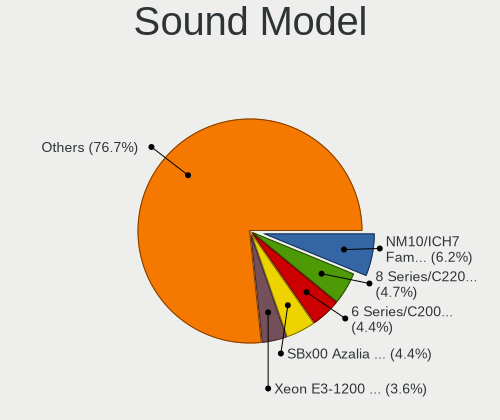

| Model                                                                             | Desktops | Percent |
|-----------------------------------------------------------------------------------|----------|---------|
| Intel NM10/ICH7 Family High Definition Audio Controller                           | 50       | 6.33%   |
| Intel 8 Series/C220 Series Chipset High Definition Audio Controller               | 36       | 4.56%   |
| Intel 6 Series/C200 Series Chipset Family High Definition Audio Controller        | 36       | 4.56%   |
| AMD SBx00 Azalia (Intel HDA)                                                      | 35       | 4.43%   |
| Intel Xeon E3-1200 v3/4th Gen Core Processor HD Audio Controller                  | 27       | 3.42%   |
| Intel 7 Series/C216 Chipset Family High Definition Audio Controller               | 27       | 3.42%   |
| Intel 82801I (ICH9 Family) HD Audio Controller                                    | 24       | 3.04%   |
| Intel 100 Series/C230 Series Chipset Family HD Audio Controller                   | 23       | 2.91%   |
| Nvidia High Definition Audio Controller                                           | 20       | 2.53%   |
| Nvidia MCP61 High Definition Audio                                                | 19       | 2.41%   |
| Intel Cannon Lake PCH cAVS                                                        | 19       | 2.41%   |
| Intel 200 Series PCH HD Audio                                                     | 15       | 1.9%    |
| AMD FCH Azalia Controller                                                         | 15       | 1.9%    |
| AMD Family 17h (Models 00h-0fh) HD Audio Controller                               | 14       | 1.77%   |
| AMD Starship/Matisse HD Audio Controller                                          | 13       | 1.65%   |
| AMD Oland/Hainan/Cape Verde/Pitcairn HDMI Audio [Radeon HD 7000 Series]           | 13       | 1.65%   |
| AMD Ellesmere HDMI Audio [Radeon RX 470/480 / 570/580/590]                        | 13       | 1.65%   |
| Nvidia GP106 High Definition Audio Controller                                     | 12       | 1.52%   |
| Nvidia GK208 HDMI/DP Audio Controller                                             | 12       | 1.52%   |
| Intel 5 Series/3400 Series Chipset High Definition Audio                          | 11       | 1.39%   |
| Nvidia GP107GL High Definition Audio Controller                                   | 10       | 1.27%   |
| Nvidia GF108 High Definition Audio Controller                                     | 10       | 1.27%   |
| Intel 82801JI (ICH10 Family) HD Audio Controller                                  | 10       | 1.27%   |
| AMD Family 17h/19h HD Audio Controller                                            | 10       | 1.27%   |
| AMD Caicos HDMI Audio [Radeon HD 6450 / 7450/8450/8490 OEM / R5 230/235/235X OEM] | 10       | 1.27%   |
| Nvidia GM206 High Definition Audio Controller                                     | 9        | 1.14%   |
| Nvidia GF119 HDMI Audio Controller                                                | 9        | 1.14%   |
| AMD Cedar HDMI Audio [Radeon HD 5400/6300/7300 Series]                            | 9        | 1.14%   |
| VIA Technologies VX900/VT8xxx High Definition Audio Controller                    | 7        | 0.89%   |
| Nvidia GM107 High Definition Audio Controller [GeForce 940MX]                     | 7        | 0.89%   |
| Intel 82801JD/DO (ICH10 Family) HD Audio Controller                               | 7        | 0.89%   |
| Intel 82801EB/ER (ICH5/ICH5R) AC'97 Audio Controller                              | 7        | 0.89%   |
| AMD Turks HDMI Audio [Radeon HD 6500/6600 / 6700M Series]                         | 7        | 0.89%   |
| Intel C600/X79 series chipset High Definition Audio Controller                    | 6        | 0.76%   |
| Nvidia TU106 High Definition Audio Controller                                     | 5        | 0.63%   |
| Nvidia GP104 High Definition Audio Controller                                     | 5        | 0.63%   |
| Nvidia GK107 HDMI Audio Controller                                                | 5        | 0.63%   |
| Intel Smart Sound Technology (SST) Audio Controller                               | 5        | 0.63%   |
| Intel Atom Processor Z36xxx/Z37xxx Series High Definition Audio Controller        | 5        | 0.63%   |
| Intel 82801H (ICH8 Family) HD Audio Controller                                    | 5        | 0.63%   |

Memory
------

Memory Vendor
-------------

Memory module vendors

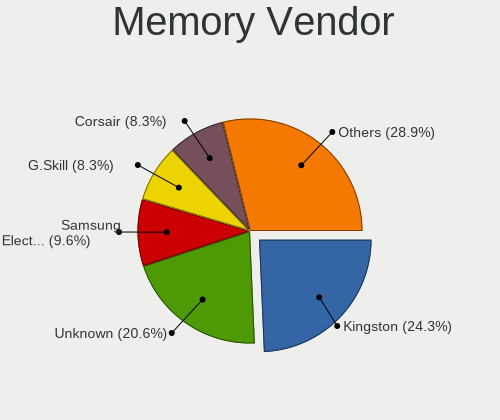

| Vendor              | Desktops | Percent |
|---------------------|----------|---------|
| Kingston            | 47       | 23.27%  |
| Unknown             | 43       | 21.29%  |
| Samsung Electronics | 20       | 9.9%    |
| G.Skill             | 18       | 8.91%   |
| Corsair             | 17       | 8.42%   |
| SK hynix            | 13       | 6.44%   |
| Crucial             | 12       | 5.94%   |
| Micron Technology   | 9        | 4.46%   |
| Patriot             | 3        | 1.49%   |
| Nanya Technology    | 3        | 1.49%   |
| A-DATA Technology   | 3        | 1.49%   |
| Transcend           | 2        | 0.99%   |
| Ramaxel Technology  | 2        | 0.99%   |
| Unknown (07FB)      | 1        | 0.5%    |
| Unifosa             | 1        | 0.5%    |
| Timetec             | 1        | 0.5%    |
| Smart               | 1        | 0.5%    |
| Silicon Power       | 1        | 0.5%    |
| Qumo                | 1        | 0.5%    |
| PNY                 | 1        | 0.5%    |
| Goldkey             | 1        | 0.5%    |
| Exceleram           | 1        | 0.5%    |
| A Force             | 1        | 0.5%    |

Memory Model
------------

Memory module models

| Model                                                  | Desktops | Percent |
|--------------------------------------------------------|----------|---------|
| Kingston RAM KHX1866C10D3/4G 4GB DIMM DDR3 1923MT/s    | 5        | 2.21%   |
| Unknown RAM Module 4096MB DIMM 1333MT/s                | 4        | 1.77%   |
| Unknown RAM Module 8GB DIMM 1333MT/s                   | 3        | 1.33%   |
| Unknown RAM Module 2048MB DIMM 1333MT/s                | 3        | 1.33%   |
| Kingston RAM KHX2400C15/8G 8GB DIMM DDR4 3400MT/s      | 3        | 1.33%   |
| Unknown RAM Module 8192MB DIMM DDR3 1333MT/s           | 2        | 0.88%   |
| Unknown RAM Module 4GB DIMM DDR3 1333MT/s              | 2        | 0.88%   |
| Unknown RAM Module 2GB DIMM 1333MT/s                   | 2        | 0.88%   |
| Unknown RAM Module 2048MB DIMM 667MT/s                 | 2        | 0.88%   |
| SK hynix RAM HMA81GS6AFR8N-UH 8GB SODIMM DDR4 2667MT/s | 2        | 0.88%   |
| Samsung RAM M378B5273DH0-CK0 4GB DIMM DDR3 2200MT/s    | 2        | 0.88%   |
| Samsung RAM M378B5173EB0-CK0 4GB DIMM DDR3 1600MT/s    | 2        | 0.88%   |
| Nanya RAM NT2GC64B88G0NF-CG 2GB DIMM DDR3 1333MT/s     | 2        | 0.88%   |
| Micron RAM 8JTF25664AZ-1G4D1 2GB DIMM DDR3 1333MT/s    | 2        | 0.88%   |
| Micron RAM 16KTF1G64AZ-1G6E1 8GB DIMM DDR3 1600MT/s    | 2        | 0.88%   |
| Kingston RAM KHX2133C14/8G 8GB DIMM DDR4 2666MT/s      | 2        | 0.88%   |
| Kingston RAM KHX1600C10D3/8G 8GB DIMM DDR3 1648MT/s    | 2        | 0.88%   |
| Kingston RAM 99U5474-038.A00LF 4GB DIMM DDR3 1333MT/s  | 2        | 0.88%   |
| G.Skill RAM F4-3200C16-8GVKB 8GB DIMM DDR4 3866MT/s    | 2        | 0.88%   |
| G.Skill RAM F4-2400C15-8GVR 8GB DIMM DDR4 3200MT/s     | 2        | 0.88%   |
| Crucial RAM CB8GU2666.C8RT 8GB DIMM DDR4 2667MT/s      | 2        | 0.88%   |
| Corsair RAM CMK16GX4M2B3200C16 8GB DIMM DDR4 3600MT/s  | 2        | 0.88%   |
| Unknown RAM Module 8GB DIMM SDRAM                      | 1        | 0.44%   |
| Unknown RAM Module 8GB DIMM DDR3 1333MT/s              | 1        | 0.44%   |
| Unknown RAM Module 8GB DIMM 667MT/s                    | 1        | 0.44%   |
| Unknown RAM Module 8192MB DIMM SDRAM 1066MT/s          | 1        | 0.44%   |
| Unknown RAM Module 8192MB DIMM 1333MT/s                | 1        | 0.44%   |
| Unknown RAM Module 4GB DIMM 1333MT/s                   | 1        | 0.44%   |
| Unknown RAM Module 4096MB DIMM 1600MT/s                | 1        | 0.44%   |
| Unknown RAM Module 2GB DIMM SDRAM                      | 1        | 0.44%   |
| Unknown RAM Module 2GB DIMM DDR3 1333MT/s              | 1        | 0.44%   |
| Unknown RAM Module 2GB DIMM DDR2 667MT/s               | 1        | 0.44%   |
| Unknown RAM Module 2GB DIMM DDR                        | 1        | 0.44%   |
| Unknown RAM Module 2GB DIMM 1066MT/s                   | 1        | 0.44%   |
| Unknown RAM Module 2GB DIMM                            | 1        | 0.44%   |
| Unknown RAM Module 256MB DIMM SDRAM                    | 1        | 0.44%   |
| Unknown RAM Module 2048MB DIMM SDRAM 800MT/s           | 1        | 0.44%   |
| Unknown RAM Module 2048MB DIMM SDRAM                   | 1        | 0.44%   |
| Unknown RAM Module 2048MB DIMM DDR3 800MT/s            | 1        | 0.44%   |
| Unknown RAM Module 2048MB DIMM DDR2 533MT/s            | 1        | 0.44%   |

Memory Kind
-----------

Memory module kinds

| Kind    | Desktops | Percent |
|---------|----------|---------|
| DDR3    | 76       | 41.76%  |
| DDR4    | 59       | 32.42%  |
| Unknown | 20       | 10.99%  |
| DDR2    | 13       | 7.14%   |
| SDRAM   | 7        | 3.85%   |
| DDR5    | 5        | 2.75%   |
| DDR     | 2        | 1.1%    |

Memory Form Factor
------------------

Physical design of the memory module

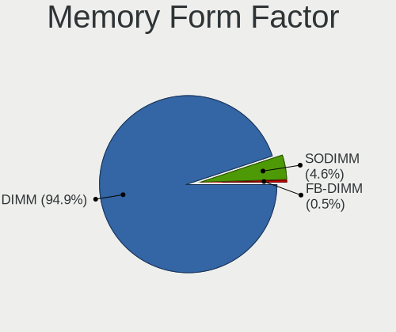

| Name    | Desktops | Percent |
|---------|----------|---------|
| DIMM    | 173      | 95.05%  |
| SODIMM  | 8        | 4.4%    |
| FB-DIMM | 1        | 0.55%   |

Memory Size
-----------

Memory module size

| Size  | Desktops | Percent |
|-------|----------|---------|
| 8192  | 75       | 36.95%  |
| 4096  | 50       | 24.63%  |
| 2048  | 31       | 15.27%  |
| 16384 | 27       | 13.3%   |
| 1024  | 13       | 6.4%    |
| 32768 | 5        | 2.46%   |
| 512   | 1        | 0.49%   |
| 256   | 1        | 0.49%   |

Memory Speed
------------

Memory module speed

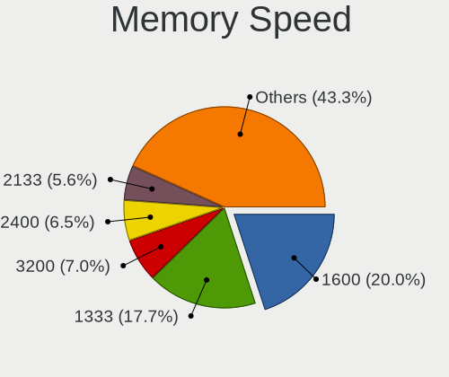

| Speed   | Desktops | Percent |
|---------|----------|---------|
| 1600    | 37       | 18.59%  |
| 1333    | 37       | 18.59%  |
| 3200    | 15       | 7.54%   |
| 2667    | 12       | 6.03%   |
| 2400    | 12       | 6.03%   |
| 2133    | 12       | 6.03%   |
| 800     | 9        | 4.52%   |
| Unknown | 8        | 4.02%   |
| 667     | 6        | 3.02%   |
| 3600    | 5        | 2.51%   |
| 4800    | 4        | 2.01%   |
| 2666    | 4        | 2.01%   |
| 1066    | 4        | 2.01%   |
| 3400    | 3        | 1.51%   |
| 3000    | 3        | 1.51%   |
| 1867    | 3        | 1.51%   |
| 1866    | 3        | 1.51%   |
| 533     | 3        | 1.51%   |
| 400     | 3        | 1.51%   |
| 3866    | 2        | 1.01%   |
| 2200    | 2        | 1.01%   |
| 1800    | 2        | 1.01%   |
| 6400    | 1        | 0.5%    |
| 3733    | 1        | 0.5%    |
| 3266    | 1        | 0.5%    |
| 3100    | 1        | 0.5%    |
| 2934    | 1        | 0.5%    |
| 2733    | 1        | 0.5%    |
| 2473    | 1        | 0.5%    |
| 2187    | 1        | 0.5%    |
| 2048    | 1        | 0.5%    |
| 2000    | 1        | 0.5%    |

Printers & scanners
-------------------

Printer Vendor
--------------

Printer device vendors

| Vendor                   | Desktops | Percent |
|--------------------------|----------|---------|
| Hewlett-Packard          | 18       | 47.37%  |
| Canon                    | 7        | 18.42%  |
| Samsung Electronics      | 3        | 7.89%   |
| Seiko Epson              | 2        | 5.26%   |
| Brother Industries       | 2        | 5.26%   |
| Zhuhai Poskey Technology | 1        | 2.63%   |
| Xerox                    | 1        | 2.63%   |
| Ricoh                    | 1        | 2.63%   |
| QinHeng Electronics      | 1        | 2.63%   |
| Lexmark International    | 1        | 2.63%   |
| Kyocera                  | 1        | 2.63%   |

Printer Model
-------------

Printer device models

| Model                           | Desktops | Percent |
|---------------------------------|----------|---------|
| Zhuhai Poskey Printer           | 1        | 2.56%   |
| Xerox Phaser 6130N              | 1        | 2.56%   |
| Seiko Epson L375 Series         | 1        | 2.56%   |
| Seiko Epson L365 Series         | 1        | 2.56%   |
| Samsung SCX-472x Series         | 1        | 2.56%   |
| Samsung SCX-3200 Series         | 1        | 2.56%   |
| Samsung M267x 287x Series       | 1        | 2.56%   |
| Ricoh SP 150SUw                 | 1        | 2.56%   |
| QinHeng CH340S                  | 1        | 2.56%   |
| Lexmark International CS727de   | 1        | 2.56%   |
| Kyocera FS-1020D Printer        | 1        | 2.56%   |
| HP Officejet 4500 G510g-m       | 1        | 2.56%   |
| HP OfficeJet 3830 series        | 1        | 2.56%   |
| HP LaserJet P2055 series        | 1        | 2.56%   |
| HP LaserJet M101-M106           | 1        | 2.56%   |
| HP LaserJet 1020                | 1        | 2.56%   |
| HP LaserJet 1018                | 1        | 2.56%   |
| HP HP LaserJet M14-M17          | 1        | 2.56%   |
| HP ENVY Photo 7800 series       | 1        | 2.56%   |
| HP ENVY 4500 series             | 1        | 2.56%   |
| HP Deskjet F4500 series         | 1        | 2.56%   |
| HP DeskJet F2100 Printer series | 1        | 2.56%   |
| HP DeskJet 5650c                | 1        | 2.56%   |
| HP DeskJet 2600 series          | 1        | 2.56%   |
| HP Deskjet 2540 series          | 1        | 2.56%   |
| HP DeskJet 2130 series          | 1        | 2.56%   |
| HP Deskjet 1050 J410            | 1        | 2.56%   |
| HP ColorLaserJet M253-M254      | 1        | 2.56%   |
| HP Color LaserJet 2605          | 1        | 2.56%   |
| Canon TR8500 series             | 1        | 2.56%   |
| Canon PIXMA MX920 Series        | 1        | 2.56%   |
| Canon PIXMA MX720 Series        | 1        | 2.56%   |
| Canon PIXMA MG2900 Series       | 1        | 2.56%   |
| Canon MF632C/634C               | 1        | 2.56%   |
| Canon MF4320-4350               | 1        | 2.56%   |
| Canon LBP6230/6240              | 1        | 2.56%   |
| Canon iP7200 series             | 1        | 2.56%   |
| Brother MFC-L2740DW             | 1        | 2.56%   |
| Brother HL-L3270CDW series      | 1        | 2.56%   |

Scanner Vendor
--------------

Scanner device vendors

| Vendor          | Desktops | Percent |
|-----------------|----------|---------|
| Hewlett-Packard | 2        | 28.57%  |
| Canon           | 2        | 28.57%  |
| Seiko Epson     | 1        | 14.29%  |
| Mustek Systems  | 1        | 14.29%  |
| AGFA-Gevaert NV | 1        | 14.29%  |

Scanner Model
-------------

Scanner device models

| Model                                         | Desktops | Percent |
|-----------------------------------------------|----------|---------|
| Seiko Epson GT-9300UF [Perfection 2400 PHOTO] | 1        | 14.29%  |
| Mustek Systems ScanExpress 1200 CU Plus       | 1        | 14.29%  |
| HP ScanJet 5200c                              | 1        | 14.29%  |
| HP ScanJet 3570c                              | 1        | 14.29%  |
| Canon CanoScan LiDE 220                       | 1        | 14.29%  |
| Canon CanoScan LiDE 110                       | 1        | 14.29%  |
| AGFA-Gevaert NV Snapscan e40                  | 1        | 14.29%  |

Camera
------

Camera Vendor
-------------

Camera device vendors

| Vendor                          | Desktops | Percent |
|---------------------------------|----------|---------|
| Logitech                        | 25       | 32.05%  |
| Microdia                        | 9        | 11.54%  |
| Microsoft                       | 6        | 7.69%   |
| Samsung Electronics             | 5        | 6.41%   |
| GEMBIRD                         | 4        | 5.13%   |
| Chicony Electronics             | 4        | 5.13%   |
| Apple                           | 4        | 5.13%   |
| Generalplus Technology          | 3        | 3.85%   |
| IMC Networks                    | 2        | 2.56%   |
| Hewlett-Packard                 | 2        | 2.56%   |
| Z-Star Microelectronics         | 1        | 1.28%   |
| YGTek                           | 1        | 1.28%   |
| USB3.0 HD Audio Capture         | 1        | 1.28%   |
| Trust                           | 1        | 1.28%   |
| Realtek Semiconductor           | 1        | 1.28%   |
| Philips (or NXP)                | 1        | 1.28%   |
| Jieli Technology                | 1        | 1.28%   |
| iPassion Technology             | 1        | 1.28%   |
| IDS Imaging Development Systems | 1        | 1.28%   |
| Huawei Technologies             | 1        | 1.28%   |
| Google                          | 1        | 1.28%   |
| Cubeternet                      | 1        | 1.28%   |
| Canon                           | 1        | 1.28%   |
| Bison Electronics               | 1        | 1.28%   |

Camera Model
------------

Camera device models

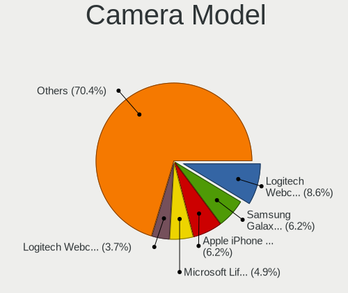

| Model                                           | Desktops | Percent |
|-------------------------------------------------|----------|---------|
| Logitech Webcam C270                            | 7        | 8.97%   |
| Samsung Galaxy series, misc. (MTP mode)         | 4        | 5.13%   |
| Apple iPhone 5/5C/5S/6/SE/7/8/X                 | 4        | 5.13%   |
| Microsoft LifeCam HD-3000                       | 3        | 3.85%   |
| Logitech Webcam C310                            | 3        | 3.85%   |
| GEMBIRD USB2.0 PC CAMERA                        | 3        | 3.85%   |
| Microsoft LifeCam VX-800                        | 2        | 2.56%   |
| Microdia USB 2.0 Camera                         | 2        | 2.56%   |
| Microdia Sonix USB 2.0 Camera                   | 2        | 2.56%   |
| Microdia Camera                                 | 2        | 2.56%   |
| Logitech HD Webcam C910                         | 2        | 2.56%   |
| Logitech HD Webcam C615                         | 2        | 2.56%   |
| Logitech HD Pro Webcam C920                     | 2        | 2.56%   |
| IMC Networks XHC Camera                         | 2        | 2.56%   |
| Generalplus 808 Camera                          | 2        | 2.56%   |
| Chicony CNF7042                                 | 2        | 2.56%   |
| Z-Star Vega USB 2.0 Camera                      | 1        | 1.28%   |
| YGTek Webcam                                    | 1        | 1.28%   |
| USB3.0 HD Audio Capture USB3.0 HD Video Capture | 1        | 1.28%   |
| Trust HDH Webcam USB                            | 1        | 1.28%   |
| Samsung USB2.0 UVC HQ WebCam                    | 1        | 1.28%   |
| Realtek Back Camera                             | 1        | 1.28%   |
| Philips (or NXP) SPC 1330NC                     | 1        | 1.28%   |
| Microsoft LifeCam HD-5000                       | 1        | 1.28%   |
| Microdia Webcam Vitade AF                       | 1        | 1.28%   |
| Microdia Laptop_Integrated_Webcam_HD            | 1        | 1.28%   |
| Microdia Defender G-Lens 2577 HD720p Camera     | 1        | 1.28%   |
| Logitech Webcam Pro 9000                        | 1        | 1.28%   |
| Logitech Webcam C210                            | 1        | 1.28%   |
| Logitech StreamCam                              | 1        | 1.28%   |
| Logitech QuickCam Zoom                          | 1        | 1.28%   |
| Logitech Logitech Webcam C160                   | 1        | 1.28%   |
| Logitech Logi Webcam C920e                      | 1        | 1.28%   |
| Logitech HD Webcam C525                         | 1        | 1.28%   |
| Logitech C922 Pro Stream Webcam                 | 1        | 1.28%   |
| Logitech B525 HD Webcam                         | 1        | 1.28%   |
| Jieli USB PHY 2.0                               | 1        | 1.28%   |
| iPassion PC Camera/Webcam controller            | 1        | 1.28%   |
| IDS Imaging Development Systems USB 3.0 Camera  | 1        | 1.28%   |
| Huawei HiCamera                                 | 1        | 1.28%   |

Security
--------

Fingerprint Vendor
------------------

Fingerprint sensor vendors

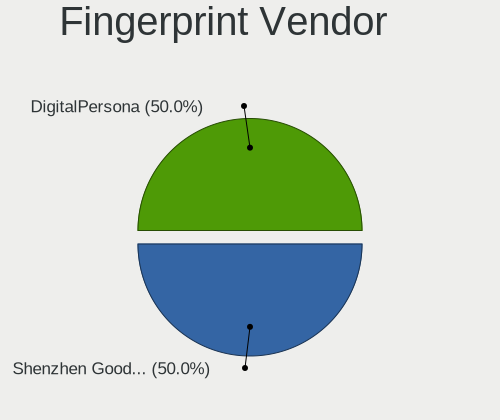

| Vendor                     | Desktops | Percent |
|----------------------------|----------|---------|
| Shenzhen Goodix Technology | 1        | 50%     |
| DigitalPersona             | 1        | 50%     |

Fingerprint Model
-----------------

Fingerprint sensor models

| Model                               | Desktops | Percent |
|-------------------------------------|----------|---------|
| Shenzhen Goodix  Fingerprint Device | 1        | 50%     |
| DigitalPersona Fingerprint Reader   | 1        | 50%     |

Chipcard Vendor
---------------

Chipcard module vendors

| Vendor           | Desktops | Percent |
|------------------|----------|---------|
| SCM Microsystems | 1        | 50%     |
| Alcor Micro      | 1        | 50%     |

Chipcard Model
--------------

Chipcard module models

| Model                                            | Desktops | Percent |
|--------------------------------------------------|----------|---------|
| SCM Microsystems Elektra331-USB SmartCard Reader | 1        | 33.33%  |
| SCM Microsystems CLOUD 2700 F Smart Card Reader  | 1        | 33.33%  |
| Alcor Micro AU9540 Smartcard Reader              | 1        | 33.33%  |

Unsupported
-----------

Unsupported Devices
-------------------

Total unsupported devices on board

| Total | Desktops | Percent |
|-------|----------|---------|
| 0     | 386      | 79.75%  |
| 1     | 85       | 17.56%  |
| 2     | 10       | 2.07%   |
| 4     | 2        | 0.41%   |
| 5     | 1        | 0.21%   |

Unsupported Device Types
------------------------

Types of unsupported devices

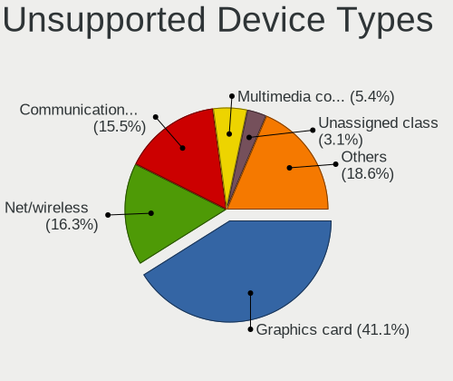

| Type                     | Desktops | Percent |
|--------------------------|----------|---------|
| Graphics card            | 45       | 40.18%  |
| Net/wireless             | 21       | 18.75%  |
| Communication controller | 15       | 13.39%  |
| Multimedia controller    | 7        | 6.25%   |
| Modem                    | 4        | 3.57%   |
| Unassigned class         | 3        | 2.68%   |
| Sound                    | 3        | 2.68%   |
| Dvb card                 | 2        | 1.79%   |
| Chipcard                 | 2        | 1.79%   |
| Card reader              | 2        | 1.79%   |
| Camera                   | 2        | 1.79%   |
| Tv card                  | 1        | 0.89%   |
| Storage/raid             | 1        | 0.89%   |
| Storage                  | 1        | 0.89%   |
| Net/ethernet             | 1        | 0.89%   |
| Fingerprint reader       | 1        | 0.89%   |
| Bluetooth                | 1        | 0.89%   |

