Ubuntu Unity - Tested Hardware & Statistics (Notebooks)
-------------------------------------------------------

A project to collect tested hardware configurations for Ubuntu Unity.

Anyone can contribute to this report by the [hw-probe](https://github.com/linuxhw/hw-probe) tool:

    sudo -E hw-probe -all -upload

Please contribute! Especially if your hardware is rare.

Contents
--------

* [ Test Cases ](#test-cases)

* [ System ](#system)
  - [ OS                       ](#os)
  - [ OS Family                ](#os-family)
  - [ Kernel                   ](#kernel)
  - [ Kernel Family            ](#kernel-family)
  - [ Kernel Major Ver.        ](#kernel-major-ver)
  - [ Arch                     ](#arch)
  - [ DE                       ](#de)
  - [ Display Server           ](#display-server)
  - [ Display Manager          ](#display-manager)
  - [ OS Lang                  ](#os-lang)
  - [ Boot Mode                ](#boot-mode)
  - [ Filesystem               ](#filesystem)
  - [ Part. scheme             ](#part-scheme)
  - [ Dual Boot with Linux/BSD ](#dual-boot-with-linuxbsd)
  - [ Dual Boot (Win)          ](#dual-boot-win)

* [ Board ](#board)
  - [ Vendor                   ](#vendor)
  - [ Model                    ](#model)
  - [ Model Family             ](#model-family)
  - [ MFG Year                 ](#mfg-year)
  - [ Form Factor              ](#form-factor)
  - [ Secure Boot              ](#secure-boot)
  - [ Coreboot                 ](#coreboot)
  - [ RAM Size                 ](#ram-size)
  - [ RAM Used                 ](#ram-used)
  - [ Total Drives             ](#total-drives)
  - [ Has CD-ROM               ](#has-cd-rom)
  - [ Has Ethernet             ](#has-ethernet)
  - [ Has WiFi                 ](#has-wifi)
  - [ Has Bluetooth            ](#has-bluetooth)

* [ Location ](#location)
  - [ Country                  ](#country)
  - [ City                     ](#city)

* [ Drives ](#drives)
  - [ Drive Vendor             ](#drive-vendor)
  - [ Drive Model              ](#drive-model)
  - [ HDD Vendor               ](#hdd-vendor)
  - [ SSD Vendor               ](#ssd-vendor)
  - [ Drive Kind               ](#drive-kind)
  - [ Drive Connector          ](#drive-connector)
  - [ Drive Size               ](#drive-size)
  - [ Space Total              ](#space-total)
  - [ Space Used               ](#space-used)
  - [ Malfunc. Drives          ](#malfunc-drives)
  - [ Malfunc. Drive Vendor    ](#malfunc-drive-vendor)
  - [ Malfunc. HDD Vendor      ](#malfunc-hdd-vendor)
  - [ Malfunc. Drive Kind      ](#malfunc-drive-kind)
  - [ Failed Drives            ](#failed-drives)
  - [ Failed Drive Vendor      ](#failed-drive-vendor)
  - [ Drive Status             ](#drive-status)

* [ Storage controller ](#storage-controller)
  - [ Storage Vendor           ](#storage-vendor)
  - [ Storage Model            ](#storage-model)
  - [ Storage Kind             ](#storage-kind)

* [ Processor ](#processor)
  - [ CPU Vendor               ](#cpu-vendor)
  - [ CPU Model                ](#cpu-model)
  - [ CPU Model Family         ](#cpu-model-family)
  - [ CPU Cores                ](#cpu-cores)
  - [ CPU Sockets              ](#cpu-sockets)
  - [ CPU Threads              ](#cpu-threads)
  - [ CPU Op-Modes             ](#cpu-op-modes)
  - [ CPU Microcode            ](#cpu-microcode)
  - [ CPU Microarch            ](#cpu-microarch)

* [ Graphics ](#graphics)
  - [ GPU Vendor               ](#gpu-vendor)
  - [ GPU Model                ](#gpu-model)
  - [ GPU Combo                ](#gpu-combo)
  - [ GPU Driver               ](#gpu-driver)
  - [ GPU Memory               ](#gpu-memory)

* [ Monitor ](#monitor)
  - [ Monitor Vendor           ](#monitor-vendor)
  - [ Monitor Model            ](#monitor-model)
  - [ Monitor Resolution       ](#monitor-resolution)
  - [ Monitor Diagonal         ](#monitor-diagonal)
  - [ Monitor Width            ](#monitor-width)
  - [ Aspect Ratio             ](#aspect-ratio)
  - [ Monitor Area             ](#monitor-area)
  - [ Pixel Density            ](#pixel-density)
  - [ Multiple Monitors        ](#multiple-monitors)

* [ Network ](#network)
  - [ Net Controller Vendor    ](#net-controller-vendor)
  - [ Net Controller Model     ](#net-controller-model)
  - [ Wireless Vendor          ](#wireless-vendor)
  - [ Wireless Model           ](#wireless-model)
  - [ Ethernet Vendor          ](#ethernet-vendor)
  - [ Ethernet Model           ](#ethernet-model)
  - [ Net Controller Kind      ](#net-controller-kind)
  - [ Used Controller          ](#used-controller)
  - [ NICs                     ](#nics)
  - [ IPv6                     ](#ipv6)

* [ Bluetooth ](#bluetooth)
  - [ Bluetooth Vendor         ](#bluetooth-vendor)
  - [ Bluetooth Model          ](#bluetooth-model)

* [ Sound ](#sound)
  - [ Sound Vendor             ](#sound-vendor)
  - [ Sound Model              ](#sound-model)

* [ Memory ](#memory)
  - [ Memory Vendor            ](#memory-vendor)
  - [ Memory Model             ](#memory-model)
  - [ Memory Kind              ](#memory-kind)
  - [ Memory Form Factor       ](#memory-form-factor)
  - [ Memory Size              ](#memory-size)
  - [ Memory Speed             ](#memory-speed)

* [ Printers & scanners ](#printers--scanners)
  - [ Printer Vendor           ](#printer-vendor)
  - [ Printer Model            ](#printer-model)
  - [ Scanner Vendor           ](#scanner-vendor)
  - [ Scanner Model            ](#scanner-model)

* [ Camera ](#camera)
  - [ Camera Vendor            ](#camera-vendor)
  - [ Camera Model             ](#camera-model)

* [ Security ](#security)
  - [ Fingerprint Vendor       ](#fingerprint-vendor)
  - [ Fingerprint Model        ](#fingerprint-model)
  - [ Chipcard Vendor          ](#chipcard-vendor)
  - [ Chipcard Model           ](#chipcard-model)

* [ Unsupported ](#unsupported)
  - [ Unsupported Devices      ](#unsupported-devices)
  - [ Unsupported Device Types ](#unsupported-device-types)

Test Cases
----------

Total: 1161

| Vendor        | Model                       | Probe                                                      | Date         |
|---------------|-----------------------------|------------------------------------------------------------|--------------|
| ASUSTek       | Zenbook UX3402VA_UX3402V... | [8db7bbe19c](https://linux-hardware.org/?probe=8db7bbe19c) | Jan 03, 2026 |
| Dell          | Precision M4700             | [963e8404c3](https://linux-hardware.org/?probe=963e8404c3) | Jan 03, 2026 |
| ASUSTek       | Zenbook UX3402VA_UX3402V... | [8e17835232](https://linux-hardware.org/?probe=8e17835232) | Jan 02, 2026 |
| ASUSTek       | Zenbook UX3402VA_UX3402V... | [00e52ecd2b](https://linux-hardware.org/?probe=00e52ecd2b) | Jan 01, 2026 |
| ASUSTek       | Zenbook UX3402VA_UX3402V... | [fb8f69a7d9](https://linux-hardware.org/?probe=fb8f69a7d9) | Dec 31, 2025 |
| ASUSTek       | Zenbook UX3402VA_UX3402V... | [16a1c3db74](https://linux-hardware.org/?probe=16a1c3db74) | Dec 30, 2025 |
| ASUSTek       | Zenbook UX3402VA_UX3402V... | [60ce442816](https://linux-hardware.org/?probe=60ce442816) | Dec 29, 2025 |
| ASUSTek       | Zenbook UX3402VA_UX3402V... | [05fd374438](https://linux-hardware.org/?probe=05fd374438) | Dec 28, 2025 |
| ASUSTek       | Zenbook UX3402VA_UX3402V... | [de88fac558](https://linux-hardware.org/?probe=de88fac558) | Dec 27, 2025 |
| ASUSTek       | Zenbook UX3402VA_UX3402V... | [8b6b8ad8ae](https://linux-hardware.org/?probe=8b6b8ad8ae) | Dec 26, 2025 |
| ASUSTek       | Zenbook UX3402VA_UX3402V... | [84b8852842](https://linux-hardware.org/?probe=84b8852842) | Dec 25, 2025 |
| ASUSTek       | Zenbook UX3402VA_UX3402V... | [19b197f8b5](https://linux-hardware.org/?probe=19b197f8b5) | Dec 24, 2025 |
| ASUSTek       | Zenbook UX3402VA_UX3402V... | [8a5187637e](https://linux-hardware.org/?probe=8a5187637e) | Dec 23, 2025 |
| ASUSTek       | Zenbook UX3402VA_UX3402V... | [c3729a7752](https://linux-hardware.org/?probe=c3729a7752) | Dec 22, 2025 |
| ASUSTek       | Zenbook UX3402VA_UX3402V... | [d4cd56d8dd](https://linux-hardware.org/?probe=d4cd56d8dd) | Dec 21, 2025 |
| ASUSTek       | Zenbook UX3402VA_UX3402V... | [07062bdeec](https://linux-hardware.org/?probe=07062bdeec) | Dec 20, 2025 |
| ASUSTek       | Zenbook UX3402VA_UX3402V... | [a12eadd229](https://linux-hardware.org/?probe=a12eadd229) | Dec 19, 2025 |
| ASUSTek       | Zenbook UX3402VA_UX3402V... | [5a01757378](https://linux-hardware.org/?probe=5a01757378) | Dec 18, 2025 |
| ASUSTek       | Zenbook UX3402VA_UX3402V... | [f680d8c01b](https://linux-hardware.org/?probe=f680d8c01b) | Dec 16, 2025 |
| ASUSTek       | Zenbook UX3402VA_UX3402V... | [1675599a28](https://linux-hardware.org/?probe=1675599a28) | Dec 15, 2025 |
| ASUSTek       | Zenbook UX3402VA_UX3402V... | [1cb48ebf1d](https://linux-hardware.org/?probe=1cb48ebf1d) | Dec 14, 2025 |
| ASUSTek       | Zenbook UX3402VA_UX3402V... | [610886c77b](https://linux-hardware.org/?probe=610886c77b) | Dec 13, 2025 |
| ASUSTek       | Zenbook UX3402VA_UX3402V... | [4f06c09daa](https://linux-hardware.org/?probe=4f06c09daa) | Dec 12, 2025 |
| ASUSTek       | Zenbook UX3402VA_UX3402V... | [20f7fa4310](https://linux-hardware.org/?probe=20f7fa4310) | Dec 11, 2025 |
| ASUSTek       | Zenbook UX3402VA_UX3402V... | [47853119ab](https://linux-hardware.org/?probe=47853119ab) | Dec 10, 2025 |
| ASUSTek       | Zenbook UX3402VA_UX3402V... | [f71fe16c89](https://linux-hardware.org/?probe=f71fe16c89) | Dec 09, 2025 |
| ASUSTek       | Zenbook UX3402VA_UX3402V... | [05f65480c2](https://linux-hardware.org/?probe=05f65480c2) | Dec 08, 2025 |
| ASUSTek       | Zenbook UX3402VA_UX3402V... | [1d481b28ef](https://linux-hardware.org/?probe=1d481b28ef) | Dec 07, 2025 |
| ASUSTek       | Zenbook UX3402VA_UX3402V... | [9ae2dfd45f](https://linux-hardware.org/?probe=9ae2dfd45f) | Dec 06, 2025 |
| ASUSTek       | Zenbook UX3402VA_UX3402V... | [f3cbe24179](https://linux-hardware.org/?probe=f3cbe24179) | Dec 05, 2025 |
| ASUSTek       | Zenbook UX3402VA_UX3402V... | [e52b339314](https://linux-hardware.org/?probe=e52b339314) | Dec 03, 2025 |
| ASUSTek       | VivoBook_ASUSLaptop X150... | [f82f767998](https://linux-hardware.org/?probe=f82f767998) | Dec 02, 2025 |
| ASUSTek       | Zenbook UX3402VA_UX3402V... | [e412ceb307](https://linux-hardware.org/?probe=e412ceb307) | Dec 02, 2025 |
| ASUSTek       | Zenbook UX3402VA_UX3402V... | [662e13460e](https://linux-hardware.org/?probe=662e13460e) | Dec 01, 2025 |
| ASUSTek       | Zenbook UX3402VA_UX3402V... | [60acbd72c8](https://linux-hardware.org/?probe=60acbd72c8) | Nov 30, 2025 |
| ASUSTek       | Zenbook UX3402VA_UX3402V... | [45a1b9d54c](https://linux-hardware.org/?probe=45a1b9d54c) | Nov 29, 2025 |
| ASUSTek       | Zenbook UX3402VA_UX3402V... | [9656c15786](https://linux-hardware.org/?probe=9656c15786) | Nov 28, 2025 |
| ASUSTek       | Zenbook UX3402VA_UX3402V... | [1100faf505](https://linux-hardware.org/?probe=1100faf505) | Nov 27, 2025 |
| ASUSTek       | Zenbook UX3402VA_UX3402V... | [b3dfcf130a](https://linux-hardware.org/?probe=b3dfcf130a) | Nov 26, 2025 |
| ASUSTek       | Zenbook UX3402VA_UX3402V... | [7c7c1f28ac](https://linux-hardware.org/?probe=7c7c1f28ac) | Nov 25, 2025 |
| ASUSTek       | Zenbook UX3402VA_UX3402V... | [cf73e0ea11](https://linux-hardware.org/?probe=cf73e0ea11) | Nov 24, 2025 |
| ASUSTek       | Zenbook UX3402VA_UX3402V... | [a6077cf4ba](https://linux-hardware.org/?probe=a6077cf4ba) | Nov 23, 2025 |
| ASUSTek       | Zenbook UX3402VA_UX3402V... | [cb02687309](https://linux-hardware.org/?probe=cb02687309) | Nov 22, 2025 |
| ASUSTek       | Zenbook UX3402VA_UX3402V... | [a92e7a26f6](https://linux-hardware.org/?probe=a92e7a26f6) | Nov 21, 2025 |
| ASUSTek       | Zenbook UX3402VA_UX3402V... | [fa82e320a3](https://linux-hardware.org/?probe=fa82e320a3) | Nov 20, 2025 |
| ASUSTek       | Zenbook UX3402VA_UX3402V... | [56901e9af9](https://linux-hardware.org/?probe=56901e9af9) | Nov 19, 2025 |
| ASUSTek       | Zenbook UX3402VA_UX3402V... | [8631853d0e](https://linux-hardware.org/?probe=8631853d0e) | Nov 18, 2025 |
| Dell          | Precision M4500             | [8c09335252](https://linux-hardware.org/?probe=8c09335252) | Nov 17, 2025 |
| ASUSTek       | Zenbook UX3402VA_UX3402V... | [0260b7556d](https://linux-hardware.org/?probe=0260b7556d) | Nov 17, 2025 |
| ASUSTek       | Zenbook UX3402VA_UX3402V... | [4fe5a305f2](https://linux-hardware.org/?probe=4fe5a305f2) | Nov 16, 2025 |
| ASUSTek       | Zenbook UX3402VA_UX3402V... | [56b5319bcd](https://linux-hardware.org/?probe=56b5319bcd) | Nov 15, 2025 |
| ASUSTek       | Zenbook UX3402VA_UX3402V... | [0feac85b0d](https://linux-hardware.org/?probe=0feac85b0d) | Nov 14, 2025 |
| ASUSTek       | Zenbook UX3402VA_UX3402V... | [8d48b4e072](https://linux-hardware.org/?probe=8d48b4e072) | Nov 13, 2025 |
| ASUSTek       | Zenbook UX3402VA_UX3402V... | [c364233bba](https://linux-hardware.org/?probe=c364233bba) | Nov 12, 2025 |
| ASUSTek       | Zenbook UX3402VA_UX3402V... | [1ba2198211](https://linux-hardware.org/?probe=1ba2198211) | Nov 11, 2025 |
| ASUSTek       | Zenbook UX3402VA_UX3402V... | [0349f223aa](https://linux-hardware.org/?probe=0349f223aa) | Nov 07, 2025 |
| ASUSTek       | Zenbook UX3402VA_UX3402V... | [47dc10e508](https://linux-hardware.org/?probe=47dc10e508) | Nov 06, 2025 |
| ASUSTek       | Zenbook UX3402VA_UX3402V... | [fc06411722](https://linux-hardware.org/?probe=fc06411722) | Nov 05, 2025 |
| ASUSTek       | Zenbook UX3402VA_UX3402V... | [9af2c03eb1](https://linux-hardware.org/?probe=9af2c03eb1) | Nov 04, 2025 |
| ASUSTek       | Zenbook UX3402VA_UX3402V... | [9269ff3eec](https://linux-hardware.org/?probe=9269ff3eec) | Nov 03, 2025 |
| ASUSTek       | Zenbook UX3402VA_UX3402V... | [6f4e057e67](https://linux-hardware.org/?probe=6f4e057e67) | Nov 02, 2025 |
| ASUSTek       | Zenbook UX3402VA_UX3402V... | [558f83cd7c](https://linux-hardware.org/?probe=558f83cd7c) | Nov 01, 2025 |
| ASUSTek       | Zenbook UX3402VA_UX3402V... | [92c6a3ceff](https://linux-hardware.org/?probe=92c6a3ceff) | Oct 30, 2025 |
| ASUSTek       | Zenbook UX3402VA_UX3402V... | [b4b7b9d3c9](https://linux-hardware.org/?probe=b4b7b9d3c9) | Oct 29, 2025 |
| ASUSTek       | Zenbook UX3402VA_UX3402V... | [4388bceba7](https://linux-hardware.org/?probe=4388bceba7) | Oct 28, 2025 |
| ASUSTek       | Zenbook UX3402VA_UX3402V... | [dc08949fc4](https://linux-hardware.org/?probe=dc08949fc4) | Oct 27, 2025 |
| ASUSTek       | Zenbook UX3402VA_UX3402V... | [687815a9c4](https://linux-hardware.org/?probe=687815a9c4) | Oct 26, 2025 |
| ASUSTek       | Zenbook UX3402VA_UX3402V... | [31b25ec7ac](https://linux-hardware.org/?probe=31b25ec7ac) | Oct 25, 2025 |
| ASUSTek       | Zenbook UX3402VA_UX3402V... | [ee83490d4e](https://linux-hardware.org/?probe=ee83490d4e) | Oct 24, 2025 |
| ASUSTek       | Zenbook UX3402VA_UX3402V... | [06191804d4](https://linux-hardware.org/?probe=06191804d4) | Oct 23, 2025 |
| ASUSTek       | Zenbook UX3402VA_UX3402V... | [088a558715](https://linux-hardware.org/?probe=088a558715) | Oct 22, 2025 |
| ASUSTek       | Zenbook UX3402VA_UX3402V... | [768f146258](https://linux-hardware.org/?probe=768f146258) | Oct 21, 2025 |
| ASUSTek       | Zenbook UX3402VA_UX3402V... | [ca298cc92d](https://linux-hardware.org/?probe=ca298cc92d) | Oct 20, 2025 |
| ASUSTek       | Zenbook UX3402VA_UX3402V... | [f593ba6ace](https://linux-hardware.org/?probe=f593ba6ace) | Oct 19, 2025 |
| ASUSTek       | Zenbook UX3402VA_UX3402V... | [243963f1b2](https://linux-hardware.org/?probe=243963f1b2) | Oct 18, 2025 |
| ASUSTek       | Zenbook UX3402VA_UX3402V... | [07bf1a74ac](https://linux-hardware.org/?probe=07bf1a74ac) | Oct 17, 2025 |
| ASUSTek       | VivoBook_ASUSLaptop X150... | [a1070fe86e](https://linux-hardware.org/?probe=a1070fe86e) | Oct 16, 2025 |
| ASUSTek       | Zenbook UX3402VA_UX3402V... | [3daa47c557](https://linux-hardware.org/?probe=3daa47c557) | Oct 16, 2025 |
| XIAOMI        | Redmi Book Pro 14 2024      | [96745c0b5d](https://linux-hardware.org/?probe=96745c0b5d) | Oct 15, 2025 |
| ASUSTek       | Zenbook UX3402VA_UX3402V... | [9646634d45](https://linux-hardware.org/?probe=9646634d45) | Oct 15, 2025 |
| ASUSTek       | Zenbook UX3402VA_UX3402V... | [19158c503e](https://linux-hardware.org/?probe=19158c503e) | Oct 14, 2025 |
| ASUSTek       | Zenbook UX3402VA_UX3402V... | [0941871acd](https://linux-hardware.org/?probe=0941871acd) | Oct 13, 2025 |
| HP            | Laptop 17-by0xxx            | [81de05d5d6](https://linux-hardware.org/?probe=81de05d5d6) | Oct 11, 2025 |
| HP            | Laptop 17-by0xxx            | [624f744c8b](https://linux-hardware.org/?probe=624f744c8b) | Oct 11, 2025 |
| ASUSTek       | Zenbook UX3402VA_UX3402V... | [14f787ba25](https://linux-hardware.org/?probe=14f787ba25) | Oct 09, 2025 |
| ASUSTek       | Zenbook UX3402VA_UX3402V... | [7376cded55](https://linux-hardware.org/?probe=7376cded55) | Oct 08, 2025 |
| ASUSTek       | Zenbook UX3402VA_UX3402V... | [9e2c54a20b](https://linux-hardware.org/?probe=9e2c54a20b) | Oct 07, 2025 |
| ASUSTek       | Zenbook UX3402VA_UX3402V... | [95de847470](https://linux-hardware.org/?probe=95de847470) | Oct 06, 2025 |
| ASUSTek       | Zenbook UX3402VA_UX3402V... | [747cca0892](https://linux-hardware.org/?probe=747cca0892) | Oct 05, 2025 |
| ASUSTek       | Zenbook UX3402VA_UX3402V... | [c38172e6e7](https://linux-hardware.org/?probe=c38172e6e7) | Oct 04, 2025 |
| ASUSTek       | Zenbook UX3402VA_UX3402V... | [0d868ce511](https://linux-hardware.org/?probe=0d868ce511) | Oct 03, 2025 |
| ASUSTek       | Zenbook UX3402VA_UX3402V... | [51f1a606c9](https://linux-hardware.org/?probe=51f1a606c9) | Oct 02, 2025 |
| ASUSTek       | Zenbook UX3402VA_UX3402V... | [a287364c1e](https://linux-hardware.org/?probe=a287364c1e) | Oct 01, 2025 |
| ASUSTek       | Zenbook UX3402VA_UX3402V... | [8ec2287fe7](https://linux-hardware.org/?probe=8ec2287fe7) | Sep 30, 2025 |
| ASUSTek       | Zenbook UX3402VA_UX3402V... | [89b6e113c9](https://linux-hardware.org/?probe=89b6e113c9) | Sep 29, 2025 |
| ASUSTek       | Zenbook UX3402VA_UX3402V... | [1e9157f5ba](https://linux-hardware.org/?probe=1e9157f5ba) | Sep 28, 2025 |
| ASUSTek       | Zenbook UX3402VA_UX3402V... | [b93e379428](https://linux-hardware.org/?probe=b93e379428) | Sep 27, 2025 |
| ASUSTek       | Zenbook UX3402VA_UX3402V... | [2034e5f751](https://linux-hardware.org/?probe=2034e5f751) | Sep 26, 2025 |
| ASUSTek       | Zenbook UX3402VA_UX3402V... | [864de59e7f](https://linux-hardware.org/?probe=864de59e7f) | Sep 25, 2025 |
| ASUSTek       | Zenbook UX3402VA_UX3402V... | [8333a9000c](https://linux-hardware.org/?probe=8333a9000c) | Sep 24, 2025 |
| ASUSTek       | Zenbook UX3402VA_UX3402V... | [f81760d2f2](https://linux-hardware.org/?probe=f81760d2f2) | Sep 23, 2025 |
| ASUSTek       | Zenbook UX3402VA_UX3402V... | [46f292121f](https://linux-hardware.org/?probe=46f292121f) | Sep 22, 2025 |
| ASUSTek       | Zenbook UX3402VA_UX3402V... | [462191b984](https://linux-hardware.org/?probe=462191b984) | Sep 21, 2025 |
| ASUSTek       | Zenbook UX3402VA_UX3402V... | [c04350d7f3](https://linux-hardware.org/?probe=c04350d7f3) | Sep 20, 2025 |
| ASUSTek       | Zenbook UX3402VA_UX3402V... | [683beb0342](https://linux-hardware.org/?probe=683beb0342) | Sep 19, 2025 |
| ASUSTek       | Zenbook UX3402VA_UX3402V... | [f0cdd3dee8](https://linux-hardware.org/?probe=f0cdd3dee8) | Sep 18, 2025 |
| ASUSTek       | Zenbook UX3402VA_UX3402V... | [6f79d7d98a](https://linux-hardware.org/?probe=6f79d7d98a) | Sep 17, 2025 |
| ASUSTek       | Zenbook UX3402VA_UX3402V... | [17431249e8](https://linux-hardware.org/?probe=17431249e8) | Sep 16, 2025 |
| ASUSTek       | Zenbook UX3402VA_UX3402V... | [184466a374](https://linux-hardware.org/?probe=184466a374) | Sep 15, 2025 |
| ASUSTek       | Zenbook UX3402VA_UX3402V... | [6f55339d6e](https://linux-hardware.org/?probe=6f55339d6e) | Sep 14, 2025 |
| ASUSTek       | Zenbook UX3402VA_UX3402V... | [5ff4d6a82e](https://linux-hardware.org/?probe=5ff4d6a82e) | Sep 13, 2025 |
| ASUSTek       | Zenbook UX3402VA_UX3402V... | [6a0b49bd43](https://linux-hardware.org/?probe=6a0b49bd43) | Sep 12, 2025 |
| ASUSTek       | Zenbook UX3402VA_UX3402V... | [911b1f1496](https://linux-hardware.org/?probe=911b1f1496) | Sep 11, 2025 |
| ASUSTek       | Zenbook UX3402VA_UX3402V... | [655d5c3b14](https://linux-hardware.org/?probe=655d5c3b14) | Sep 10, 2025 |
| ASUSTek       | Zenbook UX3402VA_UX3402V... | [ad0f2b463c](https://linux-hardware.org/?probe=ad0f2b463c) | Sep 09, 2025 |
| ASUSTek       | Zenbook UX3402VA_UX3402V... | [fb42450649](https://linux-hardware.org/?probe=fb42450649) | Sep 08, 2025 |
| ASUSTek       | Zenbook UX3402VA_UX3402V... | [d1a27392fc](https://linux-hardware.org/?probe=d1a27392fc) | Sep 07, 2025 |
| HP            | Notebook                    | [d2361c3b3a](https://linux-hardware.org/?probe=d2361c3b3a) | Sep 06, 2025 |
| ASUSTek       | Zenbook UX3402VA_UX3402V... | [079f4a8e59](https://linux-hardware.org/?probe=079f4a8e59) | Sep 06, 2025 |
| ASUSTek       | Zenbook UX3402VA_UX3402V... | [128133cfe2](https://linux-hardware.org/?probe=128133cfe2) | Sep 05, 2025 |
| Dell          | Latitude 3420               | [ed7d979154](https://linux-hardware.org/?probe=ed7d979154) | Sep 04, 2025 |
| ASUSTek       | Zenbook UX3402VA_UX3402V... | [3d8758e12a](https://linux-hardware.org/?probe=3d8758e12a) | Sep 04, 2025 |
| ASUSTek       | Zenbook UX3402VA_UX3402V... | [cf5dca2f5c](https://linux-hardware.org/?probe=cf5dca2f5c) | Sep 03, 2025 |
| ASUSTek       | Zenbook UX3402VA_UX3402V... | [7b4cfa7cb5](https://linux-hardware.org/?probe=7b4cfa7cb5) | Sep 02, 2025 |
| ASUSTek       | Zenbook UX3402VA_UX3402V... | [03c1a47435](https://linux-hardware.org/?probe=03c1a47435) | Sep 01, 2025 |
| ASUSTek       | Zenbook UX3402VA_UX3402V... | [327f135880](https://linux-hardware.org/?probe=327f135880) | Aug 31, 2025 |
| ASUSTek       | Zenbook UX3402VA_UX3402V... | [ba793d8337](https://linux-hardware.org/?probe=ba793d8337) | Aug 30, 2025 |
| ASUSTek       | Zenbook UX3402VA_UX3402V... | [b3bb317a29](https://linux-hardware.org/?probe=b3bb317a29) | Aug 29, 2025 |
| ASUSTek       | Zenbook UX3402VA_UX3402V... | [6b4697fdbe](https://linux-hardware.org/?probe=6b4697fdbe) | Aug 28, 2025 |
| ASUSTek       | Zenbook UX3402VA_UX3402V... | [3ab51e67a2](https://linux-hardware.org/?probe=3ab51e67a2) | Aug 27, 2025 |
| ASUSTek       | Zenbook UX3402VA_UX3402V... | [728ebda7b9](https://linux-hardware.org/?probe=728ebda7b9) | Aug 26, 2025 |
| ASUSTek       | Zenbook UX3402VA_UX3402V... | [44f0f7103f](https://linux-hardware.org/?probe=44f0f7103f) | Aug 24, 2025 |
| ASUSTek       | Zenbook UX3402VA_UX3402V... | [5b3f0395ab](https://linux-hardware.org/?probe=5b3f0395ab) | Aug 23, 2025 |
| Lenovo        | ThinkPad T510 43843AU       | [14886f99a0](https://linux-hardware.org/?probe=14886f99a0) | Aug 17, 2025 |
| Lenovo        | ThinkPad T510 43843AU       | [108a25fdf3](https://linux-hardware.org/?probe=108a25fdf3) | Aug 17, 2025 |
| Dell          | Latitude 7370               | [f38c269e7c](https://linux-hardware.org/?probe=f38c269e7c) | Aug 14, 2025 |
| Lenovo        | IdeaPad 710S-13ISK 80SW     | [d0229eef6d](https://linux-hardware.org/?probe=d0229eef6d) | Aug 12, 2025 |
| Lenovo        | ThinkBook 16 G7 ARP 21MW    | [349944704f](https://linux-hardware.org/?probe=349944704f) | Jun 29, 2025 |
| HP            | EliteBook 830 G6            | [f0b2c77a35](https://linux-hardware.org/?probe=f0b2c77a35) | Jun 25, 2025 |
| Dell          | Precision 5520              | [88a161aab3](https://linux-hardware.org/?probe=88a161aab3) | Jun 17, 2025 |
| Dell          | Precision 5520              | [f3c8ba5c73](https://linux-hardware.org/?probe=f3c8ba5c73) | Jun 17, 2025 |
| Lenovo        | ThinkPad X270 20HMS5R700    | [1ff561893e](https://linux-hardware.org/?probe=1ff561893e) | Jun 04, 2025 |
| Acer          | Nitro AN515-54              | [f788e286da](https://linux-hardware.org/?probe=f788e286da) | May 27, 2025 |
| Lenovo        | G500 20236                  | [89ce8aaf13](https://linux-hardware.org/?probe=89ce8aaf13) | May 26, 2025 |
| Lenovo        | IdeaPad 3 15ALC6 82KU       | [eca25c9886](https://linux-hardware.org/?probe=eca25c9886) | May 25, 2025 |
| HP            | Pavilion dv7                | [b64090360d](https://linux-hardware.org/?probe=b64090360d) | May 20, 2025 |
| ASUSTek       | Zenbook UX3402VA_UX3402V... | [587b287c4c](https://linux-hardware.org/?probe=587b287c4c) | May 14, 2025 |
| ASUSTek       | Zenbook UX3402VA_UX3402V... | [3a17b706e3](https://linux-hardware.org/?probe=3a17b706e3) | May 13, 2025 |
| ASUSTek       | Zenbook UX3402VA_UX3402V... | [ed44e7702e](https://linux-hardware.org/?probe=ed44e7702e) | May 12, 2025 |
| ASUSTek       | Zenbook UX3402VA_UX3402V... | [92ddeacb9a](https://linux-hardware.org/?probe=92ddeacb9a) | May 11, 2025 |
| ASUSTek       | Zenbook UX3402VA_UX3402V... | [b30bc4c5e8](https://linux-hardware.org/?probe=b30bc4c5e8) | May 10, 2025 |
| ASUSTek       | Zenbook UX3402VA_UX3402V... | [ea26cfe4e1](https://linux-hardware.org/?probe=ea26cfe4e1) | May 09, 2025 |
| ASUSTek       | Zenbook UX3402VA_UX3402V... | [ebafed0b40](https://linux-hardware.org/?probe=ebafed0b40) | May 08, 2025 |
| ASUSTek       | Zenbook UX3402VA_UX3402V... | [9c27fdbf4e](https://linux-hardware.org/?probe=9c27fdbf4e) | May 07, 2025 |
| ASUSTek       | Zenbook UX3402VA_UX3402V... | [0f85985c0c](https://linux-hardware.org/?probe=0f85985c0c) | May 06, 2025 |
| HP            | Pavilion Plus Laptop 14-... | [214bd41aa0](https://linux-hardware.org/?probe=214bd41aa0) | May 05, 2025 |
| ASUSTek       | Zenbook UX3402VA_UX3402V... | [43a9256485](https://linux-hardware.org/?probe=43a9256485) | May 05, 2025 |
| ASUSTek       | Zenbook UX3402VA_UX3402V... | [b40b2f175f](https://linux-hardware.org/?probe=b40b2f175f) | May 04, 2025 |
| ASUSTek       | Zenbook UX3402VA_UX3402V... | [703a1cbe77](https://linux-hardware.org/?probe=703a1cbe77) | May 03, 2025 |
| ASUSTek       | Zenbook UX3402VA_UX3402V... | [797a5e6b54](https://linux-hardware.org/?probe=797a5e6b54) | May 01, 2025 |
| ASUSTek       | Zenbook UX3402VA_UX3402V... | [99e76ebc3d](https://linux-hardware.org/?probe=99e76ebc3d) | Apr 30, 2025 |
| Toshiba       | PORTEGE Z30-C               | [3f5c176ce9](https://linux-hardware.org/?probe=3f5c176ce9) | Apr 29, 2025 |
| ASUSTek       | Zenbook UX3402VA_UX3402V... | [47e16968cd](https://linux-hardware.org/?probe=47e16968cd) | Apr 28, 2025 |
| ASUSTek       | Zenbook UX3402VA_UX3402V... | [6a98d85ad0](https://linux-hardware.org/?probe=6a98d85ad0) | Apr 27, 2025 |
| ASUSTek       | Zenbook UX3402VA_UX3402V... | [392f7692da](https://linux-hardware.org/?probe=392f7692da) | Apr 26, 2025 |
| ASUSTek       | Zenbook UX3402VA_UX3402V... | [f2a9377b80](https://linux-hardware.org/?probe=f2a9377b80) | Apr 25, 2025 |
| ASUSTek       | Zenbook UX3402VA_UX3402V... | [0af0914a21](https://linux-hardware.org/?probe=0af0914a21) | Apr 24, 2025 |
| ASUSTek       | Zenbook UX3402VA_UX3402V... | [6aebedf546](https://linux-hardware.org/?probe=6aebedf546) | Apr 23, 2025 |
| XIAOMI        | Redmi Book Pro 14 2024      | [711293474d](https://linux-hardware.org/?probe=711293474d) | Apr 22, 2025 |
| ASUSTek       | Zenbook UX3402VA_UX3402V... | [1842c57731](https://linux-hardware.org/?probe=1842c57731) | Apr 22, 2025 |
| Dell          | XPS 9320                    | [62b7994ce5](https://linux-hardware.org/?probe=62b7994ce5) | Apr 21, 2025 |
| ASUSTek       | Zenbook UX3402VA_UX3402V... | [79c01f91f7](https://linux-hardware.org/?probe=79c01f91f7) | Apr 21, 2025 |
| ASUSTek       | Zenbook UX3402VA_UX3402V... | [9cf937aa36](https://linux-hardware.org/?probe=9cf937aa36) | Apr 20, 2025 |
| ASUSTek       | Zenbook UX3402VA_UX3402V... | [4ae89da943](https://linux-hardware.org/?probe=4ae89da943) | Apr 19, 2025 |
| ASUSTek       | Zenbook UX3402VA_UX3402V... | [fe8aee8449](https://linux-hardware.org/?probe=fe8aee8449) | Apr 18, 2025 |
| ASUSTek       | Zenbook UX3402VA_UX3402V... | [6eb2ca1a07](https://linux-hardware.org/?probe=6eb2ca1a07) | Apr 17, 2025 |
| ASUSTek       | Zenbook UX3402VA_UX3402V... | [93f8d3e773](https://linux-hardware.org/?probe=93f8d3e773) | Apr 16, 2025 |
| ASUSTek       | Zenbook UX3402VA_UX3402V... | [f8f0483242](https://linux-hardware.org/?probe=f8f0483242) | Apr 15, 2025 |
| Dell          | XPS 13 7390                 | [ab5c9ae5fc](https://linux-hardware.org/?probe=ab5c9ae5fc) | Apr 13, 2025 |
| ASUSTek       | Zenbook UX3402VA_UX3402V... | [471ad6ee03](https://linux-hardware.org/?probe=471ad6ee03) | Apr 13, 2025 |
| ASUSTek       | Zenbook UX3402VA_UX3402V... | [05d526a7a1](https://linux-hardware.org/?probe=05d526a7a1) | Apr 12, 2025 |
| ASUSTek       | Zenbook UX3402VA_UX3402V... | [cfcd205589](https://linux-hardware.org/?probe=cfcd205589) | Apr 11, 2025 |
| ASUSTek       | Zenbook UX3402VA_UX3402V... | [a4eafcc2d7](https://linux-hardware.org/?probe=a4eafcc2d7) | Apr 10, 2025 |
| ASUSTek       | Zenbook UX3402VA_UX3402V... | [e75de7db9a](https://linux-hardware.org/?probe=e75de7db9a) | Apr 09, 2025 |
| ASUSTek       | Zenbook UX3402VA_UX3402V... | [ea1c10539a](https://linux-hardware.org/?probe=ea1c10539a) | Apr 08, 2025 |
| ASUSTek       | Zenbook UX3402VA_UX3402V... | [44333f941e](https://linux-hardware.org/?probe=44333f941e) | Apr 07, 2025 |
| ASUSTek       | Zenbook UX3402VA_UX3402V... | [f469cb2ff2](https://linux-hardware.org/?probe=f469cb2ff2) | Apr 06, 2025 |
| ASUSTek       | Zenbook UX3402VA_UX3402V... | [891bbfd15c](https://linux-hardware.org/?probe=891bbfd15c) | Apr 05, 2025 |
| ASUSTek       | UX410UAK                    | [645f19a833](https://linux-hardware.org/?probe=645f19a833) | Apr 04, 2025 |
| ASUSTek       | Zenbook UX3402VA_UX3402V... | [7b6d195b91](https://linux-hardware.org/?probe=7b6d195b91) | Apr 04, 2025 |
| HP            | ProBook 650 G1              | [2767984234](https://linux-hardware.org/?probe=2767984234) | Apr 04, 2025 |
| HP            | ProBook 650 G5              | [fe70b77b38](https://linux-hardware.org/?probe=fe70b77b38) | Apr 03, 2025 |
| ASUSTek       | Zenbook UX3402VA_UX3402V... | [8dbb077608](https://linux-hardware.org/?probe=8dbb077608) | Apr 03, 2025 |
| ASUSTek       | Zenbook UX3402VA_UX3402V... | [86ce6761e4](https://linux-hardware.org/?probe=86ce6761e4) | Apr 02, 2025 |
| ASUSTek       | Zenbook UX3402VA_UX3402V... | [bdaac84721](https://linux-hardware.org/?probe=bdaac84721) | Apr 01, 2025 |
| ASUSTek       | Zenbook UX3402VA_UX3402V... | [a111886695](https://linux-hardware.org/?probe=a111886695) | Mar 31, 2025 |
| ASUSTek       | Zenbook UX3402VA_UX3402V... | [bae8ddb959](https://linux-hardware.org/?probe=bae8ddb959) | Mar 30, 2025 |
| ASUSTek       | Zenbook UX3402VA_UX3402V... | [52b72a4b8b](https://linux-hardware.org/?probe=52b72a4b8b) | Mar 29, 2025 |
| ASUSTek       | Zenbook UX3402VA_UX3402V... | [7d200f0399](https://linux-hardware.org/?probe=7d200f0399) | Mar 28, 2025 |
| ASUSTek       | Zenbook UX3402VA_UX3402V... | [1ec80005e0](https://linux-hardware.org/?probe=1ec80005e0) | Mar 27, 2025 |
| ASUSTek       | Zenbook UX3402VA_UX3402V... | [c450fcba9f](https://linux-hardware.org/?probe=c450fcba9f) | Mar 26, 2025 |
| ASUSTek       | Zenbook UX3402VA_UX3402V... | [6cce0855fd](https://linux-hardware.org/?probe=6cce0855fd) | Mar 25, 2025 |
| ASUSTek       | Zenbook UX3402VA_UX3402V... | [01c303e7c3](https://linux-hardware.org/?probe=01c303e7c3) | Mar 24, 2025 |
| ASUSTek       | Zenbook UX3402VA_UX3402V... | [6c80164d71](https://linux-hardware.org/?probe=6c80164d71) | Mar 23, 2025 |
| ASUSTek       | Zenbook UX3402VA_UX3402V... | [17aac91b6c](https://linux-hardware.org/?probe=17aac91b6c) | Mar 22, 2025 |
| ASUSTek       | Zenbook UX3402VA_UX3402V... | [a6ac70c6da](https://linux-hardware.org/?probe=a6ac70c6da) | Mar 21, 2025 |
| ASUSTek       | Zenbook UX3402VA_UX3402V... | [76ac219750](https://linux-hardware.org/?probe=76ac219750) | Mar 20, 2025 |
| ASUSTek       | Zenbook UX3402VA_UX3402V... | [060010e87d](https://linux-hardware.org/?probe=060010e87d) | Mar 19, 2025 |
| ASUSTek       | Zenbook UX3402VA_UX3402V... | [4362e8cdcc](https://linux-hardware.org/?probe=4362e8cdcc) | Mar 18, 2025 |
| ASUSTek       | Zenbook UX3402VA_UX3402V... | [c820014f72](https://linux-hardware.org/?probe=c820014f72) | Mar 17, 2025 |
| ASUSTek       | Zenbook UX3402VA_UX3402V... | [442d26b451](https://linux-hardware.org/?probe=442d26b451) | Mar 16, 2025 |
| ASUSTek       | Zenbook UX3402VA_UX3402V... | [19f38ef8cc](https://linux-hardware.org/?probe=19f38ef8cc) | Mar 15, 2025 |
| ASUSTek       | Zenbook UX3402VA_UX3402V... | [0105f61e9a](https://linux-hardware.org/?probe=0105f61e9a) | Mar 14, 2025 |
| Acer          | Aspire A315-24PT            | [6fbaa9e71d](https://linux-hardware.org/?probe=6fbaa9e71d) | Mar 13, 2025 |
| MSI           | Prestige 14 A10SC           | [a636b70a78](https://linux-hardware.org/?probe=a636b70a78) | Feb 10, 2025 |
| Lenovo        | B320-14IKB 81CC             | [efbf3d5892](https://linux-hardware.org/?probe=efbf3d5892) | Feb 06, 2025 |
| Lenovo        | ThinkPad T420 4236BH8       | [43c645f6d1](https://linux-hardware.org/?probe=43c645f6d1) | Feb 03, 2025 |
| HP            | Pavilion Plus Laptop 14-... | [e522044a66](https://linux-hardware.org/?probe=e522044a66) | Jan 30, 2025 |
| Lenovo        | ThinkPad E590 20NB002BRT    | [58e63ffb90](https://linux-hardware.org/?probe=58e63ffb90) | Jan 14, 2025 |
| Dell          | Precision 3561              | [bb7b6c44bd](https://linux-hardware.org/?probe=bb7b6c44bd) | Jan 07, 2025 |
| HP            | 15                          | [f63355af6a](https://linux-hardware.org/?probe=f63355af6a) | Jan 07, 2025 |
| Clevo         | W240HU/W250HUQ              | [fa4538a983](https://linux-hardware.org/?probe=fa4538a983) | Dec 29, 2024 |
| Clevo         | W240HU/W250HUQ              | [a2f67a9324](https://linux-hardware.org/?probe=a2f67a9324) | Dec 25, 2024 |
| Clevo         | W240HU/W250HUQ              | [a81e88cd1b](https://linux-hardware.org/?probe=a81e88cd1b) | Dec 25, 2024 |
| Clevo         | W240HU/W250HUQ              | [7f63df74a6](https://linux-hardware.org/?probe=7f63df74a6) | Dec 24, 2024 |
| Lenovo        | ThinkPad X250 20CLS21F00    | [bb120a943a](https://linux-hardware.org/?probe=bb120a943a) | Dec 21, 2024 |
| Lenovo        | ThinkPad X250 20CLS64200    | [d92935db90](https://linux-hardware.org/?probe=d92935db90) | Dec 17, 2024 |
| ASUSTek       | Zenbook UX3402VA_UX3402V... | [8d51a6d1e3](https://linux-hardware.org/?probe=8d51a6d1e3) | Dec 07, 2024 |
| ASUSTek       | Zenbook UX3402VA_UX3402V... | [bc6e165df6](https://linux-hardware.org/?probe=bc6e165df6) | Dec 06, 2024 |
| HP            | Compaq Mini 311-1000        | [da25f2f11a](https://linux-hardware.org/?probe=da25f2f11a) | Dec 01, 2024 |
| Dell          | Vostro 3578                 | [2490918f08](https://linux-hardware.org/?probe=2490918f08) | Nov 24, 2024 |
| Dell          | Latitude 7300               | [6371109a3f](https://linux-hardware.org/?probe=6371109a3f) | Nov 23, 2024 |
| ASUSTek       | 1005HA                      | [39603774e5](https://linux-hardware.org/?probe=39603774e5) | Nov 20, 2024 |
| HP            | Laptop 15-bs1xx             | [27cfaae835](https://linux-hardware.org/?probe=27cfaae835) | Nov 20, 2024 |
| Dell          | Latitude D630               | [0b5738d0df](https://linux-hardware.org/?probe=0b5738d0df) | Nov 13, 2024 |
| Toshiba       | Satellite L745              | [143975f623](https://linux-hardware.org/?probe=143975f623) | Nov 09, 2024 |
| Toshiba       | Satellite C850-1G2          | [1a8e3e84b5](https://linux-hardware.org/?probe=1a8e3e84b5) | Nov 04, 2024 |
| Acer          | Extensa 7630EZ              | [5c48b2f063](https://linux-hardware.org/?probe=5c48b2f063) | Nov 02, 2024 |
| Unknown       | Unknown                     | [5e2c531d43](https://linux-hardware.org/?probe=5e2c531d43) | Oct 28, 2024 |
| Acer          | Extensa 7630EZ              | [65c6658e55](https://linux-hardware.org/?probe=65c6658e55) | Oct 25, 2024 |
| Unknown       | Unknown                     | [98d6d0497e](https://linux-hardware.org/?probe=98d6d0497e) | Oct 24, 2024 |
| XIAOMI        | Redmi Book Pro 14 2024      | [b18bcaafa6](https://linux-hardware.org/?probe=b18bcaafa6) | Oct 23, 2024 |
| XIAOMI        | Redmi Book Pro 14 2024      | [f371a56300](https://linux-hardware.org/?probe=f371a56300) | Oct 14, 2024 |
| Notebook      | NP5x_NP6x_NP7xPNP           | [d60c92d4fc](https://linux-hardware.org/?probe=d60c92d4fc) | Oct 12, 2024 |
| Notebook      | NP5x_NP6x_NP7xPNP           | [75f40c3c5e](https://linux-hardware.org/?probe=75f40c3c5e) | Oct 12, 2024 |
| Lenovo        | ThinkPad X220 429136G       | [048e1b5215](https://linux-hardware.org/?probe=048e1b5215) | Oct 12, 2024 |
| XIAOMI        | Redmi Book Pro 14 2024      | [b7320420c9](https://linux-hardware.org/?probe=b7320420c9) | Oct 12, 2024 |
| Dell          | Inspiron 15 3511            | [e4ae88eaec](https://linux-hardware.org/?probe=e4ae88eaec) | Oct 03, 2024 |
| Lenovo        | ThinkBook 15 G2 ITL 20VE    | [86a9c5b481](https://linux-hardware.org/?probe=86a9c5b481) | Sep 30, 2024 |
| HP            | ZBook Firefly 14 G7 Mobi... | [3ae4c69593](https://linux-hardware.org/?probe=3ae4c69593) | Sep 30, 2024 |
| Lenovo        | IdeaPad 320-15IKB 81BG      | [db77b134d1](https://linux-hardware.org/?probe=db77b134d1) | Sep 24, 2024 |
| Toshiba       | STI NI 1401                 | [3abf4867f1](https://linux-hardware.org/?probe=3abf4867f1) | Sep 22, 2024 |
| Lenovo        | G500 20236                  | [6866916a20](https://linux-hardware.org/?probe=6866916a20) | Sep 21, 2024 |
| Dell          | XPS 15 9510                 | [3b471e0e73](https://linux-hardware.org/?probe=3b471e0e73) | Sep 15, 2024 |
| XIAOMI        | Redmi Book Pro 14 2024      | [35da799420](https://linux-hardware.org/?probe=35da799420) | Sep 08, 2024 |
| Lenovo        | ThinkPad X131e 33681Q1      | [f3e3569ea0](https://linux-hardware.org/?probe=f3e3569ea0) | Sep 03, 2024 |
| Toshiba       | STI NI 1401                 | [43c42c00f4](https://linux-hardware.org/?probe=43c42c00f4) | Aug 30, 2024 |
| XIAOMI        | Redmi Book Pro 14 2024      | [7d0a8023b8](https://linux-hardware.org/?probe=7d0a8023b8) | Aug 30, 2024 |
| Dell          | Latitude 5421               | [f1bb1223a1](https://linux-hardware.org/?probe=f1bb1223a1) | Aug 23, 2024 |
| XIAOMI        | Redmi Book Pro 14 2024      | [04284ff64d](https://linux-hardware.org/?probe=04284ff64d) | Aug 05, 2024 |
| XIAOMI        | Redmi Book Pro 14 2024      | [62354fe581](https://linux-hardware.org/?probe=62354fe581) | Jul 19, 2024 |
| Apple         | MacBookPro12,1              | [7989202548](https://linux-hardware.org/?probe=7989202548) | Jul 11, 2024 |
| Dell          | Precision 7540              | [54c96aa3f5](https://linux-hardware.org/?probe=54c96aa3f5) | Jul 08, 2024 |
| Lenovo        | ThinkPad X13 Gen 1 20UGS... | [fa8f1445c6](https://linux-hardware.org/?probe=fa8f1445c6) | Jul 07, 2024 |
| XIAOMI        | Redmi Book Pro 14 2024      | [de9d781d51](https://linux-hardware.org/?probe=de9d781d51) | Jul 06, 2024 |
| HP            | G61                         | [e091151b6e](https://linux-hardware.org/?probe=e091151b6e) | Jun 13, 2024 |
| Dell          | Inspiron MM061              | [b154563b73](https://linux-hardware.org/?probe=b154563b73) | Jun 08, 2024 |
| Apple         | MacBookPro9,2               | [be344b10dc](https://linux-hardware.org/?probe=be344b10dc) | Jun 05, 2024 |
| Lenovo        | ThinkPad R60 9459WJF        | [075b8e4949](https://linux-hardware.org/?probe=075b8e4949) | May 30, 2024 |
| Lenovo        | ThinkPad T500 20827MG       | [812523cb5e](https://linux-hardware.org/?probe=812523cb5e) | May 29, 2024 |
| Notebook      | W94_W95BU                   | [d252bada3c](https://linux-hardware.org/?probe=d252bada3c) | May 23, 2024 |
| Matsushita... | CF-19HH205NW                | [3671ae4823](https://linux-hardware.org/?probe=3671ae4823) | May 20, 2024 |
| Dell          | Inspiron N7010              | [538f6e2c91](https://linux-hardware.org/?probe=538f6e2c91) | May 06, 2024 |
| Dell          | Precision 5530              | [373556c210](https://linux-hardware.org/?probe=373556c210) | May 02, 2024 |
| ASUSTek       | ET2031I                     | [d27647c450](https://linux-hardware.org/?probe=d27647c450) | Apr 29, 2024 |
| HP            | ProBook 4510s               | [8de734fc37](https://linux-hardware.org/?probe=8de734fc37) | Apr 28, 2024 |
| HP            | ENVY TS 15                  | [ef90289a1a](https://linux-hardware.org/?probe=ef90289a1a) | Apr 17, 2024 |
| Gigabyte      | AORUS 16X ASG               | [58a22b5fcc](https://linux-hardware.org/?probe=58a22b5fcc) | Apr 16, 2024 |
| Lenovo        | ThinkPad X250 20CLS21F00    | [a00d0bb1b4](https://linux-hardware.org/?probe=a00d0bb1b4) | Apr 16, 2024 |
| HP            | ENVY TS 15                  | [2cf9b070a4](https://linux-hardware.org/?probe=2cf9b070a4) | Apr 15, 2024 |
| Medion        | WIM2170                     | [190b555e0c](https://linux-hardware.org/?probe=190b555e0c) | Mar 23, 2024 |
| Dell          | Inspiron 16 Plus 7620       | [597b022119](https://linux-hardware.org/?probe=597b022119) | Feb 29, 2024 |
| Lenovo        | ThinkPad T520 42406BG       | [c2f80860e5](https://linux-hardware.org/?probe=c2f80860e5) | Feb 15, 2024 |
| Exo           | Smart T                     | [6691435d42](https://linux-hardware.org/?probe=6691435d42) | Feb 10, 2024 |
| Positivo      | Q4128C-S                    | [8c01f80e79](https://linux-hardware.org/?probe=8c01f80e79) | Feb 06, 2024 |
| Dell          | Latitude D620               | [c0f28567a4](https://linux-hardware.org/?probe=c0f28567a4) | Jan 31, 2024 |
| Lenovo        | ThinkPad Edge 030244U       | [911ffd60a5](https://linux-hardware.org/?probe=911ffd60a5) | Jan 04, 2024 |
| Dell          | Latitude 5480               | [cf678e4c6d](https://linux-hardware.org/?probe=cf678e4c6d) | Dec 31, 2023 |
| Dell          | Latitude 5480               | [a1bc8df9e4](https://linux-hardware.org/?probe=a1bc8df9e4) | Dec 30, 2023 |
| Lenovo        | ThinkPad T450 20BUS2VK00    | [15de64acfb](https://linux-hardware.org/?probe=15de64acfb) | Dec 29, 2023 |
| Acer          | Nitro AN515-43              | [b1342e1524](https://linux-hardware.org/?probe=b1342e1524) | Dec 23, 2023 |
| Apple         | MacBookPro16,1              | [d67a62b447](https://linux-hardware.org/?probe=d67a62b447) | Dec 21, 2023 |
| Dell          | Inspiron 5558               | [b847e03f71](https://linux-hardware.org/?probe=b847e03f71) | Dec 21, 2023 |
| System76      | Adder WS                    | [d272c23e51](https://linux-hardware.org/?probe=d272c23e51) | Dec 21, 2023 |
| Toshiba       | NB505                       | [7aa351f4c3](https://linux-hardware.org/?probe=7aa351f4c3) | Dec 19, 2023 |
| Toshiba       | NB505                       | [9ed9ded2ea](https://linux-hardware.org/?probe=9ed9ded2ea) | Dec 19, 2023 |
| HP            | Pavilion 15                 | [8041cb2da6](https://linux-hardware.org/?probe=8041cb2da6) | Dec 09, 2023 |
| Samsung       | R530/R730                   | [3919c76efa](https://linux-hardware.org/?probe=3919c76efa) | Dec 04, 2023 |
| Toshiba       | NB205                       | [a3f0bef4d4](https://linux-hardware.org/?probe=a3f0bef4d4) | Nov 15, 2023 |
| Apple         | MacBook6,1                  | [527e45b73b](https://linux-hardware.org/?probe=527e45b73b) | Nov 15, 2023 |
| HP            | ZHAN 66 Pro G2 Notebook ... | [f93402c5f5](https://linux-hardware.org/?probe=f93402c5f5) | Nov 14, 2023 |
| HONOR         | GLO-GXXX                    | [a1519ee799](https://linux-hardware.org/?probe=a1519ee799) | Nov 09, 2023 |
| Dell          | Precision 3551              | [da2f2a5993](https://linux-hardware.org/?probe=da2f2a5993) | Nov 08, 2023 |
| ASUSTek       | GL702VMK                    | [4cb218a4f4](https://linux-hardware.org/?probe=4cb218a4f4) | Nov 08, 2023 |
| HP            | Pavilion Gaming Notebook    | [c2a37daf7d](https://linux-hardware.org/?probe=c2a37daf7d) | Nov 07, 2023 |
| ASUSTek       | VivoBook_ASUSLaptop X521... | [1d56b84bdd](https://linux-hardware.org/?probe=1d56b84bdd) | Nov 05, 2023 |
| ASUSTek       | X553SA                      | [0eba32de41](https://linux-hardware.org/?probe=0eba32de41) | Nov 01, 2023 |
| Lenovo        | ThinkPad Edge 030244U       | [bf7045fe69](https://linux-hardware.org/?probe=bf7045fe69) | Nov 01, 2023 |
| Lenovo        | G500 20236                  | [6232ddb7f2](https://linux-hardware.org/?probe=6232ddb7f2) | Oct 28, 2023 |
| Lenovo        | ThinkPad Edge 030244U       | [0cbd6a255a](https://linux-hardware.org/?probe=0cbd6a255a) | Oct 25, 2023 |
| Dell          | Inspiron 6000               | [5ba1518578](https://linux-hardware.org/?probe=5ba1518578) | Oct 22, 2023 |
| Notebook      | N150ZU                      | [cbaeef6994](https://linux-hardware.org/?probe=cbaeef6994) | Oct 05, 2023 |
| Notebook      | N150ZU                      | [3a555e095f](https://linux-hardware.org/?probe=3a555e095f) | Oct 05, 2023 |
| Dell          | Inspiron 5575               | [48afb4262c](https://linux-hardware.org/?probe=48afb4262c) | Oct 04, 2023 |
| ASUSTek       | X553SA                      | [451784974b](https://linux-hardware.org/?probe=451784974b) | Sep 21, 2023 |
| ASUSTek       | ASUS EXPERTBOOK B1500CEA... | [11777b411d](https://linux-hardware.org/?probe=11777b411d) | Sep 20, 2023 |
| Lenovo        | ThinkPad T460 20FN002VUS    | [46c6a66e5b](https://linux-hardware.org/?probe=46c6a66e5b) | Sep 19, 2023 |
| ASUSTek       | X502CA                      | [8d0117a5f3](https://linux-hardware.org/?probe=8d0117a5f3) | Sep 13, 2023 |
| ASUSTek       | ASUS TUF Gaming F15 FX50... | [e1b135961f](https://linux-hardware.org/?probe=e1b135961f) | Sep 12, 2023 |
| ASUSTek       | X502CA                      | [d630819b59](https://linux-hardware.org/?probe=d630819b59) | Sep 05, 2023 |
| Dell          | Latitude 7480               | [6c5351c835](https://linux-hardware.org/?probe=6c5351c835) | Sep 01, 2023 |
| ASUSTek       | X502CA                      | [04492867e2](https://linux-hardware.org/?probe=04492867e2) | Aug 31, 2023 |
| ASUSTek       | X553SA                      | [ca9ccf934d](https://linux-hardware.org/?probe=ca9ccf934d) | Aug 27, 2023 |
| HP            | Pavilion dv6                | [38fbd02f14](https://linux-hardware.org/?probe=38fbd02f14) | Aug 23, 2023 |
| Dell          | Inspiron 1200               | [2340dcab47](https://linux-hardware.org/?probe=2340dcab47) | Aug 17, 2023 |
| Lenovo        | ThinkPad X220 4290EC5       | [a3982248d3](https://linux-hardware.org/?probe=a3982248d3) | Aug 13, 2023 |
| Acer          | Aspire 5733Z                | [977c66cbc0](https://linux-hardware.org/?probe=977c66cbc0) | Aug 12, 2023 |
| Dell          | Latitude D630               | [a57bb7cde1](https://linux-hardware.org/?probe=a57bb7cde1) | Aug 08, 2023 |
| Acer          | Aspire 1825PTZ              | [553d2539fa](https://linux-hardware.org/?probe=553d2539fa) | Aug 07, 2023 |
| Dell          | G5 5587                     | [320fffbb49](https://linux-hardware.org/?probe=320fffbb49) | Aug 04, 2023 |
| Lenovo        | ThinkPad X220 4290EC5       | [6ffb3ac7e7](https://linux-hardware.org/?probe=6ffb3ac7e7) | Aug 02, 2023 |
| Lenovo        | ThinkPad X220 4290EC5       | [e6d6527380](https://linux-hardware.org/?probe=e6d6527380) | Aug 01, 2023 |
| Panasonic     | CF-20-1                     | [0b59968d03](https://linux-hardware.org/?probe=0b59968d03) | Jul 29, 2023 |
| OEM           | Unknown                     | [d0d59fb363](https://linux-hardware.org/?probe=d0d59fb363) | Jul 24, 2023 |
| Lenovo        | IdeaPad 3 15IIL05 81WE      | [f81b2bedb9](https://linux-hardware.org/?probe=f81b2bedb9) | Jul 18, 2023 |
| HP            | Pavilion 17                 | [46ae665800](https://linux-hardware.org/?probe=46ae665800) | Jun 18, 2023 |
| HP            | Pavilion 17                 | [f0e1e5aae8](https://linux-hardware.org/?probe=f0e1e5aae8) | Jun 18, 2023 |
| Lenovo        | G580 20157                  | [8c47ad5e92](https://linux-hardware.org/?probe=8c47ad5e92) | Jun 16, 2023 |
| HP            | Pavilion Laptop 15-cc5xx    | [68af03eefe](https://linux-hardware.org/?probe=68af03eefe) | Jun 10, 2023 |
| Dell          | G15 5511                    | [ddee46cbfa](https://linux-hardware.org/?probe=ddee46cbfa) | Jun 07, 2023 |
| HP            | Pavilion Laptop 15-cc5xx    | [3067e6332a](https://linux-hardware.org/?probe=3067e6332a) | Jun 02, 2023 |
| GPU Compan... | GWTN156-11                  | [544fc521be](https://linux-hardware.org/?probe=544fc521be) | May 30, 2023 |
| Samsung       | 950XED                      | [8d4e3bcb94](https://linux-hardware.org/?probe=8d4e3bcb94) | May 08, 2023 |
| Dell          | XPS 15 9570                 | [100534a570](https://linux-hardware.org/?probe=100534a570) | May 08, 2023 |
| Unknown       | AG958                       | [70aa4b6cf2](https://linux-hardware.org/?probe=70aa4b6cf2) | May 08, 2023 |
| Toshiba       | TECRA A11                   | [456421ff37](https://linux-hardware.org/?probe=456421ff37) | May 07, 2023 |
| Acer          | Aspire 7530G                | [5c19c9f6e4](https://linux-hardware.org/?probe=5c19c9f6e4) | May 04, 2023 |
| ASUSTek       | ROG Zephyrus M16 GU603HE... | [2016e42226](https://linux-hardware.org/?probe=2016e42226) | May 03, 2023 |
| TELECOMITA... | M7x0S                       | [d8256a8177](https://linux-hardware.org/?probe=d8256a8177) | May 03, 2023 |
| TELECOMITA... | M7x0S                       | [d4019e13f1](https://linux-hardware.org/?probe=d4019e13f1) | May 03, 2023 |
| ASUSTek       | ZenBook UX434FAC_UX434FA    | [4a6eed684e](https://linux-hardware.org/?probe=4a6eed684e) | Apr 26, 2023 |
| ASUSTek       | X45C                        | [759ed58d76](https://linux-hardware.org/?probe=759ed58d76) | Apr 23, 2023 |
| Fujitsu Si... | AMILO PRO V3515             | [be2d8594c3](https://linux-hardware.org/?probe=be2d8594c3) | Apr 13, 2023 |
| Lenovo        | ThinkPad E14 Gen 3 20Y70... | [85a8b8b452](https://linux-hardware.org/?probe=85a8b8b452) | Mar 26, 2023 |
| Alienware     | m17 R3                      | [6c62c223ed](https://linux-hardware.org/?probe=6c62c223ed) | Mar 21, 2023 |
| Dell          | Latitude 7480               | [c4e5e8923c](https://linux-hardware.org/?probe=c4e5e8923c) | Mar 05, 2023 |
| ASUSTek       | VivoBook_ASUSLaptop K340... | [e1733fa8c9](https://linux-hardware.org/?probe=e1733fa8c9) | Mar 01, 2023 |
| Dell          | Latitude 7330               | [caf4a2b3ac](https://linux-hardware.org/?probe=caf4a2b3ac) | Feb 16, 2023 |
| HP            | Mini 210-1000               | [a97b152ab2](https://linux-hardware.org/?probe=a97b152ab2) | Feb 09, 2023 |
| HP            | Mini 210-1000               | [1546202e50](https://linux-hardware.org/?probe=1546202e50) | Feb 08, 2023 |
| ASUSTek       | 1101HA                      | [28cb433eb0](https://linux-hardware.org/?probe=28cb433eb0) | Feb 03, 2023 |
| HP            | ProBook 455 G1              | [eabdd1585c](https://linux-hardware.org/?probe=eabdd1585c) | Jan 26, 2023 |
| Lenovo        | ThinkPad P51 20HJS1EJ1B     | [2ac4b56c2f](https://linux-hardware.org/?probe=2ac4b56c2f) | Jan 20, 2023 |
| Fujitsu Si... | ESPRIMO Mobile V5535        | [be320f363d](https://linux-hardware.org/?probe=be320f363d) | Jan 19, 2023 |
| HP            | Pavilion Notebook           | [c2dd87db86](https://linux-hardware.org/?probe=c2dd87db86) | Jan 17, 2023 |
| Lenovo        | IdeaPad S340-15API 81NC     | [674f3e9cae](https://linux-hardware.org/?probe=674f3e9cae) | Jan 17, 2023 |
| Acer          | Aspire V5-122P              | [c5d70f195f](https://linux-hardware.org/?probe=c5d70f195f) | Jan 16, 2023 |
| Apple         | MacBookPro9,2               | [4d89e9dec4](https://linux-hardware.org/?probe=4d89e9dec4) | Jan 14, 2023 |
| Acer          | Aspire A515-46              | [79cb54f05f](https://linux-hardware.org/?probe=79cb54f05f) | Jan 12, 2023 |
| Lenovo        | ThinkPad Edge 030244U       | [f9833c6d79](https://linux-hardware.org/?probe=f9833c6d79) | Jan 03, 2023 |
| ASUSTek       | G71GX                       | [7650c66520](https://linux-hardware.org/?probe=7650c66520) | Jan 01, 2023 |
| HP            | ZBook Studio G5             | [6d0b6881ac](https://linux-hardware.org/?probe=6d0b6881ac) | Dec 30, 2022 |
| Samsung       | 550XBE/350XBE               | [33c4b80d0a](https://linux-hardware.org/?probe=33c4b80d0a) | Dec 29, 2022 |
| Apple         | MacBookPro9,2               | [ef194165fc](https://linux-hardware.org/?probe=ef194165fc) | Dec 24, 2022 |
| Lenovo        | IdeaPad S110 20126          | [dd7fd03edd](https://linux-hardware.org/?probe=dd7fd03edd) | Dec 24, 2022 |
| Lenovo        | IdeaPad 310-15IAP 80TT      | [7fe5232b14](https://linux-hardware.org/?probe=7fe5232b14) | Dec 20, 2022 |
| Dell          | XPS 13 9370                 | [0f360efa8f](https://linux-hardware.org/?probe=0f360efa8f) | Dec 20, 2022 |
| Dell          | Latitude E5420              | [c9a7b379e6](https://linux-hardware.org/?probe=c9a7b379e6) | Dec 19, 2022 |
| Irbis         | NB264                       | [4bb5935a41](https://linux-hardware.org/?probe=4bb5935a41) | Dec 19, 2022 |
| Irbis         | NB264                       | [1209e6c899](https://linux-hardware.org/?probe=1209e6c899) | Dec 19, 2022 |
| SINTRONES     | AMB-5000G1                  | [3f9a3badb0](https://linux-hardware.org/?probe=3f9a3badb0) | Dec 17, 2022 |
| SINTRONES     | AMB-5000G1                  | [b1738a6528](https://linux-hardware.org/?probe=b1738a6528) | Dec 17, 2022 |
| Gigabyte      | MMLP3AP-00                  | [6b53aab624](https://linux-hardware.org/?probe=6b53aab624) | Dec 14, 2022 |
| HP            | Pavilion dv7                | [1e10e0306f](https://linux-hardware.org/?probe=1e10e0306f) | Dec 12, 2022 |
| Sony          | VGN-NS220TH                 | [29e1373be4](https://linux-hardware.org/?probe=29e1373be4) | Dec 11, 2022 |
| HP            | ProBook 650 G2              | [ad7c0195e5](https://linux-hardware.org/?probe=ad7c0195e5) | Dec 10, 2022 |
| ASUSTek       | 1225B                       | [87f1b143de](https://linux-hardware.org/?probe=87f1b143de) | Nov 27, 2022 |
| Chuwi         | CoreBook X                  | [f0e76c8866](https://linux-hardware.org/?probe=f0e76c8866) | Nov 26, 2022 |
| Lenovo        | ThinkPad P1 Gen 2 20QTS0... | [37d3dc95f1](https://linux-hardware.org/?probe=37d3dc95f1) | Nov 25, 2022 |
| HP            | EliteBook 8470p             | [b7ff70b9b2](https://linux-hardware.org/?probe=b7ff70b9b2) | Nov 14, 2022 |
| HP            | EliteBook 8470p             | [f6bfbc00ba](https://linux-hardware.org/?probe=f6bfbc00ba) | Nov 14, 2022 |
| HP            | ZBook 14                    | [27b57aad86](https://linux-hardware.org/?probe=27b57aad86) | Nov 12, 2022 |
| Dell          | Inspiron 3543               | [227f62cdb9](https://linux-hardware.org/?probe=227f62cdb9) | Nov 11, 2022 |
| HP            | EliteBook 8470p             | [bdca860f08](https://linux-hardware.org/?probe=bdca860f08) | Nov 06, 2022 |
| Gigabyte      | AERO 15-X9                  | [f4ef4d30b0](https://linux-hardware.org/?probe=f4ef4d30b0) | Nov 06, 2022 |
| Lenovo        | Legion Y9000X IAH7 82TF     | [73ba8f75b7](https://linux-hardware.org/?probe=73ba8f75b7) | Nov 04, 2022 |
| HP            | Pavilion 10 TS              | [49e1be474a](https://linux-hardware.org/?probe=49e1be474a) | Nov 01, 2022 |
| ASUSTek       | U50Vg                       | [5f2997ec95](https://linux-hardware.org/?probe=5f2997ec95) | Oct 28, 2022 |
| HP            | G60                         | [e9af8a9e61](https://linux-hardware.org/?probe=e9af8a9e61) | Oct 28, 2022 |
| ASUSTek       | VivoBook_ASUSLaptop X421... | [c9393d50b5](https://linux-hardware.org/?probe=c9393d50b5) | Oct 24, 2022 |
| ASUSTek       | VivoBook_ASUSLaptop X421... | [5199be5418](https://linux-hardware.org/?probe=5199be5418) | Oct 24, 2022 |
| Acer          | Aspire A515-51              | [64030c9ba3](https://linux-hardware.org/?probe=64030c9ba3) | Oct 24, 2022 |
| Samsung       | 550P5C/550P7C               | [7dca4296ee](https://linux-hardware.org/?probe=7dca4296ee) | Oct 23, 2022 |
| Acer          | Aspire E5-551               | [0e72f3b2e8](https://linux-hardware.org/?probe=0e72f3b2e8) | Oct 21, 2022 |
| Dell          | XPS 13 9300                 | [ec9a97a15d](https://linux-hardware.org/?probe=ec9a97a15d) | Oct 20, 2022 |
| Lenovo        | ThinkPad T470 20HD002TCD    | [0b0ca5a5f6](https://linux-hardware.org/?probe=0b0ca5a5f6) | Oct 20, 2022 |
| Lenovo        | G580 2689H2G                | [1d81a2fb3b](https://linux-hardware.org/?probe=1d81a2fb3b) | Oct 18, 2022 |
| Notebook      | N15_17RD,RD2                | [50713b916b](https://linux-hardware.org/?probe=50713b916b) | Oct 18, 2022 |
| Toshiba       | Satellite L755              | [8a3de9dbf2](https://linux-hardware.org/?probe=8a3de9dbf2) | Oct 18, 2022 |
| Toshiba       | Satellite L755              | [3dd30d87be](https://linux-hardware.org/?probe=3dd30d87be) | Oct 18, 2022 |
| HP            | Presario C300 (RM500EA#A... | [c35d7b0ee3](https://linux-hardware.org/?probe=c35d7b0ee3) | Oct 14, 2022 |
| HP            | ENVY Laptop 15-ep1xxx       | [b02e3ede3f](https://linux-hardware.org/?probe=b02e3ede3f) | Oct 14, 2022 |
| HP            | ENVY Laptop 15-ep1xxx       | [33efe8c37a](https://linux-hardware.org/?probe=33efe8c37a) | Oct 14, 2022 |
| Dell          | Precision M3800             | [96ea6a1a31](https://linux-hardware.org/?probe=96ea6a1a31) | Oct 13, 2022 |
| IBM           | ThinkPad R51 1836Q4U        | [f77e633009](https://linux-hardware.org/?probe=f77e633009) | Oct 11, 2022 |
| Unknown       | Unknown                     | [fc558ece05](https://linux-hardware.org/?probe=fc558ece05) | Oct 02, 2022 |
| Dell          | Inspiron 3442               | [8272a6655b](https://linux-hardware.org/?probe=8272a6655b) | Sep 28, 2022 |
| Dell          | Inspiron 3442               | [be9d7b3e42](https://linux-hardware.org/?probe=be9d7b3e42) | Sep 28, 2022 |
| Acer          | AO532h                      | [383ce70d97](https://linux-hardware.org/?probe=383ce70d97) | Sep 25, 2022 |
| Lenovo        | ThinkPad Edge 0578JJG       | [fef4bc54eb](https://linux-hardware.org/?probe=fef4bc54eb) | Sep 20, 2022 |
| Lenovo        | ThinkPad Edge 0578JJG       | [db6bdb0dbd](https://linux-hardware.org/?probe=db6bdb0dbd) | Sep 20, 2022 |
| Dell          | System XPS L702X            | [6f7b318b6d](https://linux-hardware.org/?probe=6f7b318b6d) | Sep 17, 2022 |
| Dell          | System XPS L702X            | [4b812d3653](https://linux-hardware.org/?probe=4b812d3653) | Sep 17, 2022 |
| Lenovo        | Legion Y9000X IAH7 82TF     | [3b63a75571](https://linux-hardware.org/?probe=3b63a75571) | Sep 16, 2022 |
| HUAWEI        | MACH-WX9                    | [f90bed17e2](https://linux-hardware.org/?probe=f90bed17e2) | Sep 13, 2022 |
| HP            | ZBook Fury 15.6 inch G8 ... | [1d387a1216](https://linux-hardware.org/?probe=1d387a1216) | Sep 07, 2022 |
| HP            | Compaq 6830s (FR883LA#AB... | [bceac5a658](https://linux-hardware.org/?probe=bceac5a658) | Aug 30, 2022 |
| Dell          | Latitude E6500              | [defd0003bc](https://linux-hardware.org/?probe=defd0003bc) | Aug 22, 2022 |
| Samsung       | R59P/R60P/R61P              | [552d907afc](https://linux-hardware.org/?probe=552d907afc) | Aug 20, 2022 |
| Lenovo        | ThinkPad T580 20L9S14S00    | [aa4b21b3a7](https://linux-hardware.org/?probe=aa4b21b3a7) | Aug 12, 2022 |
| Lenovo        | ThinkPad Edge 030244U       | [b8b2ea30e1](https://linux-hardware.org/?probe=b8b2ea30e1) | Aug 08, 2022 |
| ASUSTek       | 1015PX                      | [af43595e7b](https://linux-hardware.org/?probe=af43595e7b) | Aug 08, 2022 |
| Lenovo        | B570e HuronRiver Platfor... | [2d4b30ec72](https://linux-hardware.org/?probe=2d4b30ec72) | Aug 07, 2022 |
| Samsung       | R59P/R60P/R61P              | [0ebff09d2b](https://linux-hardware.org/?probe=0ebff09d2b) | Aug 07, 2022 |
| HP            | ZBook 17 G3                 | [bc4cf926f2](https://linux-hardware.org/?probe=bc4cf926f2) | Aug 06, 2022 |
| Samsung       | R59P/R60P/R61P              | [93794bf0b1](https://linux-hardware.org/?probe=93794bf0b1) | Aug 01, 2022 |
| Samsung       | R59P/R60P/R61P              | [b0b9ddad28](https://linux-hardware.org/?probe=b0b9ddad28) | Jul 30, 2022 |
| Apple         | MacBookPro9,2               | [2ba1ac3ec9](https://linux-hardware.org/?probe=2ba1ac3ec9) | Jul 23, 2022 |
| Toshiba       | EQUIUM A110                 | [4b6ace9122](https://linux-hardware.org/?probe=4b6ace9122) | Jul 22, 2022 |
| Dell          | Inspiron 5566               | [f653a494f3](https://linux-hardware.org/?probe=f653a494f3) | Jul 18, 2022 |
| HP            | Presario V2000 (EC158UA#... | [d46bb41a18](https://linux-hardware.org/?probe=d46bb41a18) | Jul 08, 2022 |
| HP            | Presario V2000 (EC158UA#... | [c55a6d7cca](https://linux-hardware.org/?probe=c55a6d7cca) | Jul 08, 2022 |
| Samsung       | R59P/R60P/R61P              | [c09a3e0c24](https://linux-hardware.org/?probe=c09a3e0c24) | Jul 08, 2022 |
| Lenovo        | ThinkPad W510 431963G       | [672749ef0e](https://linux-hardware.org/?probe=672749ef0e) | Jun 22, 2022 |
| Lenovo        | ThinkPad W510 431963G       | [f395d01890](https://linux-hardware.org/?probe=f395d01890) | Jun 21, 2022 |
| HP            | Compaq nc6120 (PN936AV)     | [c1ecdd7b5a](https://linux-hardware.org/?probe=c1ecdd7b5a) | Jun 17, 2022 |
| Lenovo        | IdeaPad 700-17ISK 80RV      | [ba10f6ee4f](https://linux-hardware.org/?probe=ba10f6ee4f) | Jun 14, 2022 |
| Lenovo        | IdeaPad S145-15IKB 81XM     | [4f9d7a297e](https://linux-hardware.org/?probe=4f9d7a297e) | Jun 05, 2022 |
| Dell          | Inspiron 15 3511            | [3fbca187e7](https://linux-hardware.org/?probe=3fbca187e7) | May 31, 2022 |
| HP            | ZBook Firefly 14 inch G8... | [55e99cb697](https://linux-hardware.org/?probe=55e99cb697) | May 30, 2022 |
| AXIOO         | NEON HNM MODEL              | [0fbd1cf4af](https://linux-hardware.org/?probe=0fbd1cf4af) | May 30, 2022 |
| HP            | Compaq 6730s                | [4dabec8399](https://linux-hardware.org/?probe=4dabec8399) | May 26, 2022 |
| HP            | Compaq 6720s                | [b7ea743814](https://linux-hardware.org/?probe=b7ea743814) | May 22, 2022 |
| HP            | Compaq 6720s                | [c0b723e185](https://linux-hardware.org/?probe=c0b723e185) | May 22, 2022 |
| HP            | Mini 210-1000               | [f4d6735690](https://linux-hardware.org/?probe=f4d6735690) | May 20, 2022 |
| HP            | OMEN by Laptop              | [0a25740096](https://linux-hardware.org/?probe=0a25740096) | May 18, 2022 |
| HP            | Mini 110-1000               | [e1a5afc203](https://linux-hardware.org/?probe=e1a5afc203) | May 06, 2022 |
| HP            | Compaq 6830s (FR883LA#AB... | [a3eb29c75d](https://linux-hardware.org/?probe=a3eb29c75d) | May 04, 2022 |
| HUAWEI        | BOHK-WAX9X                  | [329673fcbf](https://linux-hardware.org/?probe=329673fcbf) | May 03, 2022 |
| HP            | 255 G6 Notebook PC          | [f639c7c8f5](https://linux-hardware.org/?probe=f639c7c8f5) | Apr 29, 2022 |
| Acer          | TM4750                      | [8254e2b47d](https://linux-hardware.org/?probe=8254e2b47d) | Apr 27, 2022 |
| Toshiba       | Satellite L300              | [242592fee5](https://linux-hardware.org/?probe=242592fee5) | Apr 15, 2022 |
| Dell          | Latitude 5420               | [7ef3e515d9](https://linux-hardware.org/?probe=7ef3e515d9) | Apr 15, 2022 |
| Dell          | Latitude D630               | [6c715d7619](https://linux-hardware.org/?probe=6c715d7619) | Apr 09, 2022 |
| Timi          | TM1701                      | [e2930f3884](https://linux-hardware.org/?probe=e2930f3884) | Apr 06, 2022 |
| Lenovo        | ThinkPad P70 20ESS04S00     | [18bcdf72db](https://linux-hardware.org/?probe=18bcdf72db) | Apr 05, 2022 |
| HP            | ProBook 6550b               | [d337221af6](https://linux-hardware.org/?probe=d337221af6) | Apr 01, 2022 |
| eMachines     | eM350                       | [19b0ed12cc](https://linux-hardware.org/?probe=19b0ed12cc) | Mar 26, 2022 |
| Panasonic     | CF-19AHUDX1M                | [638470e61d](https://linux-hardware.org/?probe=638470e61d) | Mar 25, 2022 |
| ASUSTek       | N501VW                      | [e3df8d9fc2](https://linux-hardware.org/?probe=e3df8d9fc2) | Mar 18, 2022 |
| Apple         | MacBookPro1,1               | [4add06ac06](https://linux-hardware.org/?probe=4add06ac06) | Mar 17, 2022 |
| Apple         | MacBookPro1,1               | [1f948586ca](https://linux-hardware.org/?probe=1f948586ca) | Mar 14, 2022 |
| HP            | Laptop 14s-dk0xxx           | [737a2d4c61](https://linux-hardware.org/?probe=737a2d4c61) | Mar 14, 2022 |
| Medion        | Akoya THE TOUCH 10          | [be2c2c791c](https://linux-hardware.org/?probe=be2c2c791c) | Mar 09, 2022 |
| Apple         | MacBookPro1,1               | [6563e94c95](https://linux-hardware.org/?probe=6563e94c95) | Mar 09, 2022 |
| Lenovo        | ThinkBook 16p Gen 2 20YM    | [33ce116b8a](https://linux-hardware.org/?probe=33ce116b8a) | Mar 08, 2022 |
| Dell          | System XPS L322X            | [2aa0c05f64](https://linux-hardware.org/?probe=2aa0c05f64) | Mar 06, 2022 |
| Toshiba       | Satellite Pro A40-C         | [49766126e1](https://linux-hardware.org/?probe=49766126e1) | Feb 27, 2022 |
| Dell          | Inspiron 1011               | [092837b70d](https://linux-hardware.org/?probe=092837b70d) | Feb 19, 2022 |
| MSI           | EX620                       | [8eda01e2a8](https://linux-hardware.org/?probe=8eda01e2a8) | Feb 14, 2022 |
| HP            | Compaq Mini CQ10-100        | [5a471683f7](https://linux-hardware.org/?probe=5a471683f7) | Feb 05, 2022 |
| Dell          | Latitude E6400              | [c55769f459](https://linux-hardware.org/?probe=c55769f459) | Feb 02, 2022 |
| Lenovo        | Yoga Slim 7 13ACN5 82CY     | [b685151ac1](https://linux-hardware.org/?probe=b685151ac1) | Jan 31, 2022 |
| Dell          | Inspiron 3521               | [712c420215](https://linux-hardware.org/?probe=712c420215) | Jan 31, 2022 |
| Dell          | Inspiron 3521               | [0c05019294](https://linux-hardware.org/?probe=0c05019294) | Jan 31, 2022 |
| ASUSTek       | X551CA                      | [0cb832f85f](https://linux-hardware.org/?probe=0cb832f85f) | Jan 27, 2022 |
| Medion        | Akoya THE TOUCH 10          | [753fcd1661](https://linux-hardware.org/?probe=753fcd1661) | Jan 08, 2022 |
| Lenovo        | G50-70 20351                | [5467cc6a24](https://linux-hardware.org/?probe=5467cc6a24) | Jan 06, 2022 |
| Dell          | Inspiron 5570               | [8834da8d25](https://linux-hardware.org/?probe=8834da8d25) | Jan 02, 2022 |
| Lenovo        | ThinkPad T430 23426FU       | [53e2109383](https://linux-hardware.org/?probe=53e2109383) | Dec 30, 2021 |
| MSI           | GS66 Stealth 11UE           | [ab09d4463d](https://linux-hardware.org/?probe=ab09d4463d) | Dec 20, 2021 |
| Toshiba       | Satellite C600              | [dd417ecb87](https://linux-hardware.org/?probe=dd417ecb87) | Dec 15, 2021 |
| Sony          | VGN-NR430E                  | [305865a785](https://linux-hardware.org/?probe=305865a785) | Dec 12, 2021 |
| Sony          | VGN-NR430E                  | [3ca106703d](https://linux-hardware.org/?probe=3ca106703d) | Dec 11, 2021 |
| Dell          | Latitude 3410               | [4b84ebe353](https://linux-hardware.org/?probe=4b84ebe353) | Dec 08, 2021 |
| Dell          | Latitude 3410               | [c2a6a9ad6b](https://linux-hardware.org/?probe=c2a6a9ad6b) | Dec 08, 2021 |
| HP            | 255 G8 Notebook PC          | [a700683a6f](https://linux-hardware.org/?probe=a700683a6f) | Dec 05, 2021 |
| Lenovo        | ThinkPad R61 89337HG        | [670c02b990](https://linux-hardware.org/?probe=670c02b990) | Dec 02, 2021 |
| Fujitsu Si... | LIFEBOOK E8310              | [09fd8a63b7](https://linux-hardware.org/?probe=09fd8a63b7) | Nov 30, 2021 |
| Sony          | VGN-FE31B                   | [9c79f90f8d](https://linux-hardware.org/?probe=9c79f90f8d) | Nov 27, 2021 |
| HP            | Pavilion 17                 | [b5f54d657a](https://linux-hardware.org/?probe=b5f54d657a) | Nov 27, 2021 |
| Acer          | Aspire 6920                 | [ecd71d1bde](https://linux-hardware.org/?probe=ecd71d1bde) | Nov 26, 2021 |
| Chuwi         | GemiBook Pro                | [1dc5d193a3](https://linux-hardware.org/?probe=1dc5d193a3) | Nov 24, 2021 |
| HP            | Pavilion Notebook           | [7045bece2c](https://linux-hardware.org/?probe=7045bece2c) | Nov 23, 2021 |
| Packard Be... | EasyNote TJ75               | [76b8b98ec9](https://linux-hardware.org/?probe=76b8b98ec9) | Nov 21, 2021 |
| Lenovo        | IdeaPad Z460 0913           | [0bb3eea006](https://linux-hardware.org/?probe=0bb3eea006) | Nov 16, 2021 |
| Lenovo        | G580 26897JJ                | [dc2120663a](https://linux-hardware.org/?probe=dc2120663a) | Nov 10, 2021 |
| Dell          | XPS 13 9310                 | [0c99cea4ba](https://linux-hardware.org/?probe=0c99cea4ba) | Nov 07, 2021 |
| Notebook      | NP50DE_DB                   | [6ecc612580](https://linux-hardware.org/?probe=6ecc612580) | Nov 07, 2021 |
| Dell          | Latitude 7490               | [43eeb8d632](https://linux-hardware.org/?probe=43eeb8d632) | Nov 06, 2021 |
| Dell          | Latitude 7490               | [209cc4c51e](https://linux-hardware.org/?probe=209cc4c51e) | Nov 06, 2021 |
| Fujitsu Si... | LIFEBOOK E8310              | [5f0bcd4c39](https://linux-hardware.org/?probe=5f0bcd4c39) | Oct 30, 2021 |
| Lenovo        | IdeaPad 320-15ABR 80XS      | [e4aa5740c5](https://linux-hardware.org/?probe=e4aa5740c5) | Oct 25, 2021 |
| Lenovo        | IdeaPad 3 15IIL05 81WE      | [338ddd258e](https://linux-hardware.org/?probe=338ddd258e) | Oct 24, 2021 |
| Dell          | Precision 3520              | [cf720e50db](https://linux-hardware.org/?probe=cf720e50db) | Oct 24, 2021 |
| Dell          | Latitude D620               | [19049fd2bd](https://linux-hardware.org/?probe=19049fd2bd) | Oct 23, 2021 |
| Dell          | Latitude D620               | [08fd9efc01](https://linux-hardware.org/?probe=08fd9efc01) | Oct 23, 2021 |
| Acer          | Aspire E5-432               | [ff1a22fdc4](https://linux-hardware.org/?probe=ff1a22fdc4) | Oct 08, 2021 |
| Toshiba       | dynabook R634/K             | [f0e385cbfb](https://linux-hardware.org/?probe=f0e385cbfb) | Oct 08, 2021 |
| Lenovo        | ThinkPad E15 20RD001CGE     | [f7d150a85c](https://linux-hardware.org/?probe=f7d150a85c) | Oct 04, 2021 |
| Apple         | MacBookPro5,3               | [b0ea83da4d](https://linux-hardware.org/?probe=b0ea83da4d) | Oct 02, 2021 |
| Lenovo        | ThinkPad X260 20F5S31G00    | [575dd64064](https://linux-hardware.org/?probe=575dd64064) | Oct 01, 2021 |
| HP            | EliteBook 745 G2            | [d80eb2d42c](https://linux-hardware.org/?probe=d80eb2d42c) | Sep 30, 2021 |
| Acer          | Aspire one 1-431            | [3ff4be2b55](https://linux-hardware.org/?probe=3ff4be2b55) | Sep 21, 2021 |
| Acer          | AO751h                      | [d217a1c6b7](https://linux-hardware.org/?probe=d217a1c6b7) | Sep 18, 2021 |
| Lenovo        | ThinkBook 14 G2 ITL 20VD    | [96463d6903](https://linux-hardware.org/?probe=96463d6903) | Sep 16, 2021 |
| Acer          | Acadia V1.45                | [aa3f685f0a](https://linux-hardware.org/?probe=aa3f685f0a) | Sep 15, 2021 |
| Acer          | Acadia V1.45                | [cd630332c7](https://linux-hardware.org/?probe=cd630332c7) | Sep 15, 2021 |
| Dell          | Inspiron 7577               | [1a39f562b3](https://linux-hardware.org/?probe=1a39f562b3) | Sep 13, 2021 |
| Dell          | Inspiron 1545               | [271309ac53](https://linux-hardware.org/?probe=271309ac53) | Sep 12, 2021 |
| Toshiba       | Satellite A100              | [0d3b75782b](https://linux-hardware.org/?probe=0d3b75782b) | Sep 03, 2021 |
| Panasonic     | CF-20-1                     | [6f921aa428](https://linux-hardware.org/?probe=6f921aa428) | Sep 02, 2021 |
| HUAWEI        | KPL-W0X                     | [27b23ba02b](https://linux-hardware.org/?probe=27b23ba02b) | Aug 29, 2021 |
| ARCELIK       | GNB 15xx B1 Serisi          | [8537b57efa](https://linux-hardware.org/?probe=8537b57efa) | Aug 24, 2021 |
| Dell          | Vostro 1015                 | [f0a640519a](https://linux-hardware.org/?probe=f0a640519a) | Aug 17, 2021 |
| Samsung       | R59P/R60P/R61P              | [87d045fa9c](https://linux-hardware.org/?probe=87d045fa9c) | Aug 16, 2021 |
| Samsung       | R59P/R60P/R61P              | [feaabd09c8](https://linux-hardware.org/?probe=feaabd09c8) | Aug 10, 2021 |
| Dell          | Latitude E7450              | [5e94ad6881](https://linux-hardware.org/?probe=5e94ad6881) | Aug 10, 2021 |
| Dell          | Latitude E7450              | [110fc3ebef](https://linux-hardware.org/?probe=110fc3ebef) | Aug 10, 2021 |
| HUAWEI        | HLYL-WXX9                   | [8227b4305d](https://linux-hardware.org/?probe=8227b4305d) | Aug 09, 2021 |
| Acer          | AO531h                      | [f677e6e910](https://linux-hardware.org/?probe=f677e6e910) | Aug 09, 2021 |
| Acer          | AO531h                      | [42bc030846](https://linux-hardware.org/?probe=42bc030846) | Aug 09, 2021 |
| Acer          | AO531h                      | [3475d2f343](https://linux-hardware.org/?probe=3475d2f343) | Aug 09, 2021 |
| HP            | ENVY 17                     | [1d6dd8440c](https://linux-hardware.org/?probe=1d6dd8440c) | Aug 05, 2021 |
| Dell          | Studio 1737                 | [b4f16960c4](https://linux-hardware.org/?probe=b4f16960c4) | Aug 05, 2021 |
| Teclast       | F6 Pro                      | [e28004c24b](https://linux-hardware.org/?probe=e28004c24b) | Jul 27, 2021 |
| Gateway       | NE570                       | [f9ccf3665f](https://linux-hardware.org/?probe=f9ccf3665f) | Jul 19, 2021 |
| Dell          | Inspiron 7577               | [b221cbc463](https://linux-hardware.org/?probe=b221cbc463) | Jul 17, 2021 |
| Timi          | A35S                        | [27f9e877a1](https://linux-hardware.org/?probe=27f9e877a1) | Jul 14, 2021 |
| Medion        | Akoya THE TOUCH 10          | [7908947c9f](https://linux-hardware.org/?probe=7908947c9f) | Jul 14, 2021 |
| HP            | Pavilion dv6                | [aee9cfed82](https://linux-hardware.org/?probe=aee9cfed82) | Jul 11, 2021 |
| Acer          | Aspire 7740                 | [d8694dd629](https://linux-hardware.org/?probe=d8694dd629) | Jul 09, 2021 |
| Dell          | Vostro 14-3468              | [2e203beafd](https://linux-hardware.org/?probe=2e203beafd) | Jul 08, 2021 |
| Dell          | Latitude 5511               | [cac1bff4a1](https://linux-hardware.org/?probe=cac1bff4a1) | Jul 06, 2021 |
| HP            | EliteBook 8540w             | [6130e48df9](https://linux-hardware.org/?probe=6130e48df9) | Jul 05, 2021 |
| HP            | EliteBook 8540w             | [8fcf62f37c](https://linux-hardware.org/?probe=8fcf62f37c) | Jul 05, 2021 |
| HP            | Pavilion g4                 | [fa58b1dd24](https://linux-hardware.org/?probe=fa58b1dd24) | Jun 30, 2021 |
| Dell          | Precision 7550              | [79a56a6b22](https://linux-hardware.org/?probe=79a56a6b22) | Jun 30, 2021 |
| Apple         | MacBook3,1                  | [4fd63df257](https://linux-hardware.org/?probe=4fd63df257) | Jun 30, 2021 |
| Lenovo        | ThinkPad T490s 20NYS7MM0... | [4e01561e2d](https://linux-hardware.org/?probe=4e01561e2d) | Jun 25, 2021 |
| Dell          | Latitude 5591               | [0a888c201f](https://linux-hardware.org/?probe=0a888c201f) | Jun 25, 2021 |
| Lenovo        | ThinkPad T490s 20NYS7MM0... | [424e9fe919](https://linux-hardware.org/?probe=424e9fe919) | Jun 24, 2021 |
| Dell          | Precision 5550              | [7b9e5a1b30](https://linux-hardware.org/?probe=7b9e5a1b30) | Jun 23, 2021 |
| Dell          | Latitude 5511               | [6625368d80](https://linux-hardware.org/?probe=6625368d80) | Jun 21, 2021 |
| Dell          | Latitude 5511               | [3b8bd7756c](https://linux-hardware.org/?probe=3b8bd7756c) | Jun 20, 2021 |
| HP            | ProBook 6550b               | [262ede4645](https://linux-hardware.org/?probe=262ede4645) | Jun 16, 2021 |
| Acer          | Aspire ES1-512              | [9814f75415](https://linux-hardware.org/?probe=9814f75415) | Jun 11, 2021 |
| ASUSTek       | VivoBook_ASUS Laptop E40... | [3d0b697005](https://linux-hardware.org/?probe=3d0b697005) | Jun 09, 2021 |
| ASUSTek       | VivoBook_ASUS Laptop E40... | [977558100f](https://linux-hardware.org/?probe=977558100f) | Jun 09, 2021 |
| HP            | Notebook                    | [aa603459f8](https://linux-hardware.org/?probe=aa603459f8) | Jun 06, 2021 |
| Toshiba       | Satellite Pro A40-C         | [a467cae210](https://linux-hardware.org/?probe=a467cae210) | Jun 03, 2021 |
| Acer          | Aspire 4830TG               | [0233ed2211](https://linux-hardware.org/?probe=0233ed2211) | May 31, 2021 |
| HP            | Pavilion dv6000 (RP297UA... | [5f6d9f025a](https://linux-hardware.org/?probe=5f6d9f025a) | May 29, 2021 |
| Lenovo        | ThinkPad T530 24291H4       | [9ecbb7a946](https://linux-hardware.org/?probe=9ecbb7a946) | May 28, 2021 |
| Hometech      | N1401A                      | [421dcf0a2f](https://linux-hardware.org/?probe=421dcf0a2f) | May 27, 2021 |
| ASUSTek       | VivoBook 15_ASUS Laptop ... | [1779bd65f6](https://linux-hardware.org/?probe=1779bd65f6) | May 18, 2021 |
| ASUSTek       | VivoBook 15_ASUS Laptop ... | [8771b02dfe](https://linux-hardware.org/?probe=8771b02dfe) | May 17, 2021 |
| Lenovo        | V145-15AST 81MT             | [80f0e0228b](https://linux-hardware.org/?probe=80f0e0228b) | May 16, 2021 |
| Dell          | XPS 13 9370                 | [9b05fb9e1f](https://linux-hardware.org/?probe=9b05fb9e1f) | May 16, 2021 |
| Dell          | XPS 13 9370                 | [0d397cf104](https://linux-hardware.org/?probe=0d397cf104) | May 16, 2021 |
| Gigabyte      | AERO 15-X9                  | [df4d80f1f9](https://linux-hardware.org/?probe=df4d80f1f9) | May 14, 2021 |
| Acer          | LuganoII                    | [c26e330dae](https://linux-hardware.org/?probe=c26e330dae) | May 13, 2021 |
| Acer          | AOA150                      | [21647e22ba](https://linux-hardware.org/?probe=21647e22ba) | May 12, 2021 |
| Acer          | LuganoII                    | [3a87a5cef9](https://linux-hardware.org/?probe=3a87a5cef9) | May 12, 2021 |
| Lenovo        | M5400 20281                 | [b0b95cd759](https://linux-hardware.org/?probe=b0b95cd759) | May 09, 2021 |
| HP            | Pavilion dv6                | [dce60f14e1](https://linux-hardware.org/?probe=dce60f14e1) | May 08, 2021 |
| Lenovo        | 3000 N500 423374G           | [a2ec86f284](https://linux-hardware.org/?probe=a2ec86f284) | May 08, 2021 |
| Lenovo        | IdeaPad L3 15IML05 81Y3     | [3890d7877d](https://linux-hardware.org/?probe=3890d7877d) | May 06, 2021 |
| Lenovo        | IdeaPad L3 15IML05 81Y3     | [44810c2cc1](https://linux-hardware.org/?probe=44810c2cc1) | May 06, 2021 |
| Lenovo        | ThinkPad P14s Gen 1 20Y1... | [bc90a54ebf](https://linux-hardware.org/?probe=bc90a54ebf) | May 06, 2021 |
| Lenovo        | ThinkPad L14 Gen 1 20U1S... | [522b86dc40](https://linux-hardware.org/?probe=522b86dc40) | May 03, 2021 |
| Dell          | Latitude E5440              | [ea59351ece](https://linux-hardware.org/?probe=ea59351ece) | May 01, 2021 |
| Dell          | Latitude 7480               | [6b9e1797c6](https://linux-hardware.org/?probe=6b9e1797c6) | Apr 29, 2021 |
| Dell          | Vostro 5402                 | [bd53dff836](https://linux-hardware.org/?probe=bd53dff836) | Apr 23, 2021 |
| HP            | EliteBook 2560p             | [c75019619f](https://linux-hardware.org/?probe=c75019619f) | Apr 17, 2021 |
| Dell          | XPS 13 9360                 | [a7a9af4a65](https://linux-hardware.org/?probe=a7a9af4a65) | Apr 04, 2021 |
| Acer          | TravelMate 5530             | [6b6df6431c](https://linux-hardware.org/?probe=6b6df6431c) | Apr 02, 2021 |
| ASUSTek       | X550LD                      | [ed77da0a7f](https://linux-hardware.org/?probe=ed77da0a7f) | Mar 27, 2021 |
| HP            | ProBook 440 G7              | [12fd74ecdc](https://linux-hardware.org/?probe=12fd74ecdc) | Mar 26, 2021 |
| Dell          | Vostro 15-3568              | [2c8acbf86c](https://linux-hardware.org/?probe=2c8acbf86c) | Mar 21, 2021 |
| Dell          | Latitude 5591               | [440c09d385](https://linux-hardware.org/?probe=440c09d385) | Mar 19, 2021 |
| MSI           | EX620                       | [92223bedbf](https://linux-hardware.org/?probe=92223bedbf) | Mar 18, 2021 |
| Acer          | Aspire A515-56              | [1bdc8a756f](https://linux-hardware.org/?probe=1bdc8a756f) | Mar 17, 2021 |
| IDEALMAX      | H34                         | [3a80074655](https://linux-hardware.org/?probe=3a80074655) | Mar 17, 2021 |
| Sony          | VPCEB2M1E                   | [b66618f38f](https://linux-hardware.org/?probe=b66618f38f) | Mar 16, 2021 |
| Positivo      | Mobile                      | [b6bf80e4a0](https://linux-hardware.org/?probe=b6bf80e4a0) | Mar 15, 2021 |
| Dell          | Latitude E5250              | [df9d913f0f](https://linux-hardware.org/?probe=df9d913f0f) | Mar 13, 2021 |
| Lenovo        | ThinkPad X250 20CLS0LJ04    | [3ea7e7e0eb](https://linux-hardware.org/?probe=3ea7e7e0eb) | Mar 10, 2021 |
| Lenovo        | ThinkPad X250 20CLS0LJ04    | [fbc708f40b](https://linux-hardware.org/?probe=fbc708f40b) | Mar 10, 2021 |
| HP            | ZBook Power G7 Mobile Wo... | [d55c9ab43d](https://linux-hardware.org/?probe=d55c9ab43d) | Mar 09, 2021 |
| Dell          | Latitude E5250              | [78f0a24d9a](https://linux-hardware.org/?probe=78f0a24d9a) | Mar 07, 2021 |
| Toshiba       | Satellite U405D             | [c39fbac2a3](https://linux-hardware.org/?probe=c39fbac2a3) | Mar 07, 2021 |
| Dell          | Precision M3800             | [946b253122](https://linux-hardware.org/?probe=946b253122) | Mar 03, 2021 |
| Acer          | Aspire E1-571G              | [11e6858209](https://linux-hardware.org/?probe=11e6858209) | Feb 28, 2021 |
| Toshiba       | Satellite Pro A100          | [403755cbe6](https://linux-hardware.org/?probe=403755cbe6) | Feb 25, 2021 |
| Dell          | Latitude 7280               | [07efc65c6a](https://linux-hardware.org/?probe=07efc65c6a) | Feb 21, 2021 |
| Toshiba       | IS-1522                     | [6e0892a006](https://linux-hardware.org/?probe=6e0892a006) | Feb 19, 2021 |
| Acer          | Aspire 5610                 | [c5681a4097](https://linux-hardware.org/?probe=c5681a4097) | Feb 17, 2021 |
| Toshiba       | Satellite C50D-B            | [4114652578](https://linux-hardware.org/?probe=4114652578) | Feb 16, 2021 |
| Toshiba       | Satellite C50D-B            | [63a04a0d52](https://linux-hardware.org/?probe=63a04a0d52) | Feb 16, 2021 |
| Dell          | Latitude E4310              | [37a49f8182](https://linux-hardware.org/?probe=37a49f8182) | Feb 15, 2021 |
| Dell          | Latitude 7480               | [92f5ef8b15](https://linux-hardware.org/?probe=92f5ef8b15) | Feb 14, 2021 |
| Dell          | Latitude 7480               | [7fc96867c5](https://linux-hardware.org/?probe=7fc96867c5) | Feb 14, 2021 |
| Fujitsu Si... | LIFEBOOK E8420              | [ea78db0716](https://linux-hardware.org/?probe=ea78db0716) | Feb 14, 2021 |
| ASUSTek       | X55U                        | [aea7a001db](https://linux-hardware.org/?probe=aea7a001db) | Feb 13, 2021 |
| Lenovo        | IdeaPad S340-14IIL 81VV     | [4b2cd43abc](https://linux-hardware.org/?probe=4b2cd43abc) | Feb 10, 2021 |
| Dell          | Inspiron 3542               | [8e6c1aadd3](https://linux-hardware.org/?probe=8e6c1aadd3) | Feb 10, 2021 |
| Dell          | Inspiron 3542               | [2589d166ca](https://linux-hardware.org/?probe=2589d166ca) | Feb 10, 2021 |
| Dell          | G3 3779                     | [363e754d51](https://linux-hardware.org/?probe=363e754d51) | Feb 06, 2021 |
| Compal        | PBL10                       | [5cf67578d7](https://linux-hardware.org/?probe=5cf67578d7) | Feb 04, 2021 |
| Compal        | PBL10                       | [a20e9d9588](https://linux-hardware.org/?probe=a20e9d9588) | Feb 04, 2021 |
| ASUSTek       | 1005HA                      | [3271c9fcf1](https://linux-hardware.org/?probe=3271c9fcf1) | Feb 04, 2021 |
| HP            | ProBook 6550b               | [b41bf411ae](https://linux-hardware.org/?probe=b41bf411ae) | Jan 31, 2021 |
| Dell          | XPS 13 7390                 | [002dbe9174](https://linux-hardware.org/?probe=002dbe9174) | Jan 30, 2021 |
| Lenovo        | 3000 N500 423374G           | [e58a22a75a](https://linux-hardware.org/?probe=e58a22a75a) | Jan 30, 2021 |
| Dell          | XPS 13 9343                 | [b3c1b54fb7](https://linux-hardware.org/?probe=b3c1b54fb7) | Jan 30, 2021 |
| HP            | ProBook 4510s               | [90108b85c2](https://linux-hardware.org/?probe=90108b85c2) | Jan 28, 2021 |
| Lenovo        | ThinkPad T420s 41732AU      | [0f7cf25542](https://linux-hardware.org/?probe=0f7cf25542) | Jan 27, 2021 |
| Fujitsu Si... | LIFEBOOK S7220              | [407c5fa547](https://linux-hardware.org/?probe=407c5fa547) | Jan 27, 2021 |
| Fujitsu Si... | LIFEBOOK S7220              | [76ed8917b5](https://linux-hardware.org/?probe=76ed8917b5) | Jan 27, 2021 |
| HP            | ProBook 6550b               | [90cc726402](https://linux-hardware.org/?probe=90cc726402) | Jan 27, 2021 |
| HP            | EliteBook 820 G2            | [b45017b059](https://linux-hardware.org/?probe=b45017b059) | Jan 24, 2021 |
| Lenovo        | Legion 5 15IMH05H 81Y6      | [bdfeee2839](https://linux-hardware.org/?probe=bdfeee2839) | Jan 21, 2021 |
| HP            | ProBook 4510s               | [249c4254b8](https://linux-hardware.org/?probe=249c4254b8) | Jan 20, 2021 |
| Lenovo        | ThinkPad X1 Carbon 3rd 2... | [f34a9b325b](https://linux-hardware.org/?probe=f34a9b325b) | Jan 18, 2021 |
| Dell          | Latitude D420               | [8cea54aabf](https://linux-hardware.org/?probe=8cea54aabf) | Jan 17, 2021 |
| Itautec       | Infoway w7430               | [de4a2289ae](https://linux-hardware.org/?probe=de4a2289ae) | Jan 14, 2021 |
| Lenovo        | ThinkPad E14 20RAS0BY00     | [0178b6f04d](https://linux-hardware.org/?probe=0178b6f04d) | Jan 13, 2021 |
| Lenovo        | ThinkPad R400 7440CL2       | [d9662809ae](https://linux-hardware.org/?probe=d9662809ae) | Jan 13, 2021 |
| Lenovo        | ThinkPad R400 7440CL2       | [2b357b7a62](https://linux-hardware.org/?probe=2b357b7a62) | Jan 13, 2021 |
| HP            | ProBook 4520s               | [46240490b5](https://linux-hardware.org/?probe=46240490b5) | Jan 12, 2021 |
| HP            | Pavilion g6                 | [a8eaaf47b0](https://linux-hardware.org/?probe=a8eaaf47b0) | Jan 10, 2021 |
| Toshiba       | Satellite L755              | [601e76c662](https://linux-hardware.org/?probe=601e76c662) | Jan 09, 2021 |
| Dell          | Inspiron N5030              | [e7b2580e2b](https://linux-hardware.org/?probe=e7b2580e2b) | Jan 09, 2021 |
| HP            | ProBook 6550b               | [af743262a6](https://linux-hardware.org/?probe=af743262a6) | Jan 09, 2021 |
| Dell          | Inspiron N5030              | [299420cc02](https://linux-hardware.org/?probe=299420cc02) | Jan 09, 2021 |
| HP            | 510 Notebook PC (RU964AA... | [fe8a07348f](https://linux-hardware.org/?probe=fe8a07348f) | Jan 08, 2021 |
| HP            | 510 Notebook PC (RU964AA... | [86ef2cddd1](https://linux-hardware.org/?probe=86ef2cddd1) | Jan 08, 2021 |
| HP            | ProBook 455 G1              | [7e08feac35](https://linux-hardware.org/?probe=7e08feac35) | Jan 07, 2021 |
| Packard Be... | EasyNote TK36               | [d5aeb5be31](https://linux-hardware.org/?probe=d5aeb5be31) | Jan 02, 2021 |
| Toshiba       | Satellite C650              | [da33e577bf](https://linux-hardware.org/?probe=da33e577bf) | Jan 02, 2021 |
| Packard Be... | EasyNote TK36               | [43b59e2a0c](https://linux-hardware.org/?probe=43b59e2a0c) | Jan 02, 2021 |
| NEC Comput... | Packard Bell EasyNote       | [c0b37bc3c3](https://linux-hardware.org/?probe=c0b37bc3c3) | Jan 02, 2021 |
| NEC Comput... | Packard Bell EasyNote       | [953e9fbfda](https://linux-hardware.org/?probe=953e9fbfda) | Jan 02, 2021 |
| Toshiba       | Satellite C650              | [3ccf619144](https://linux-hardware.org/?probe=3ccf619144) | Dec 31, 2020 |
| HP            | Compaq nc6400 (RH478EA#A... | [d7fd1a7a8d](https://linux-hardware.org/?probe=d7fd1a7a8d) | Dec 31, 2020 |
| Sony          | VGN-Z21MN_B                 | [db832121d8](https://linux-hardware.org/?probe=db832121d8) | Dec 30, 2020 |
| Acer          | Swift SF314-55G             | [6f94a2e40c](https://linux-hardware.org/?probe=6f94a2e40c) | Dec 30, 2020 |
| ASUSTek       | K53U                        | [92d200393a](https://linux-hardware.org/?probe=92d200393a) | Dec 29, 2020 |
| ASUSTek       | K53U                        | [99610b1976](https://linux-hardware.org/?probe=99610b1976) | Dec 29, 2020 |
| Advent        | Verona                      | [3cb47bf21d](https://linux-hardware.org/?probe=3cb47bf21d) | Dec 29, 2020 |
| Lenovo        | IdeaPad 310-15IKB 80TV      | [c3f9fc25d4](https://linux-hardware.org/?probe=c3f9fc25d4) | Dec 29, 2020 |
| Lenovo        | IdeaPad 310-15IKB 80TV      | [dbc2669fc0](https://linux-hardware.org/?probe=dbc2669fc0) | Dec 28, 2020 |
| Lenovo        | ThinkPad L450 20DT001DUS    | [dd815dfd6a](https://linux-hardware.org/?probe=dd815dfd6a) | Dec 25, 2020 |
| Apple         | MacBook5,1                  | [4a85297f60](https://linux-hardware.org/?probe=4a85297f60) | Dec 23, 2020 |
| Samsung       | R530/R730                   | [397b075add](https://linux-hardware.org/?probe=397b075add) | Dec 23, 2020 |
| Apple         | MacBookPro8,2               | [e99e06a590](https://linux-hardware.org/?probe=e99e06a590) | Dec 23, 2020 |
| Acer          | Aspire 7741                 | [bb04468cdd](https://linux-hardware.org/?probe=bb04468cdd) | Dec 22, 2020 |
| Dell          | Inspiron 15-3552            | [2d64eaea6f](https://linux-hardware.org/?probe=2d64eaea6f) | Dec 22, 2020 |
| Apple         | MacBook5,1                  | [f9cf955187](https://linux-hardware.org/?probe=f9cf955187) | Dec 22, 2020 |
| Fujitsu       | LIFEBOOK A557               | [b82c30b180](https://linux-hardware.org/?probe=b82c30b180) | Dec 21, 2020 |
| Lenovo        | IdeaPad 520S-14IKB 80X2     | [289dc71948](https://linux-hardware.org/?probe=289dc71948) | Dec 21, 2020 |
| ASUSTek       | UX305FA                     | [01059cbee4](https://linux-hardware.org/?probe=01059cbee4) | Dec 20, 2020 |
| Dell          | Precision 5540              | [eea500d1e4](https://linux-hardware.org/?probe=eea500d1e4) | Dec 18, 2020 |
| Dell          | Precision 5540              | [0e06bc0dae](https://linux-hardware.org/?probe=0e06bc0dae) | Dec 18, 2020 |
| Dell          | Inspiron 910                | [87ff58828e](https://linux-hardware.org/?probe=87ff58828e) | Dec 16, 2020 |
| HP            | Laptop 15-da0xxx            | [73fa61c233](https://linux-hardware.org/?probe=73fa61c233) | Dec 15, 2020 |
| Dell          | Inspiron 1545               | [5a179cb315](https://linux-hardware.org/?probe=5a179cb315) | Dec 14, 2020 |
| Lenovo        | ThinkPad X301 4057W3A       | [ca140372c9](https://linux-hardware.org/?probe=ca140372c9) | Dec 13, 2020 |
| HP            | EliteBook 8470p             | [941a457fa1](https://linux-hardware.org/?probe=941a457fa1) | Dec 12, 2020 |
| Toshiba       | Portable PC                 | [9aec36b4b9](https://linux-hardware.org/?probe=9aec36b4b9) | Dec 11, 2020 |
| HP            | Laptop 15-da0xxx            | [fb4783aeba](https://linux-hardware.org/?probe=fb4783aeba) | Dec 10, 2020 |
| Dell          | Inspiron 1545               | [1bd7a01295](https://linux-hardware.org/?probe=1bd7a01295) | Dec 09, 2020 |
| Lenovo        | ThinkPad T410 2522A92       | [dd93682c3c](https://linux-hardware.org/?probe=dd93682c3c) | Dec 09, 2020 |
| ASUSTek       | ZenBook UX433FN_UX433FN     | [d9258de65c](https://linux-hardware.org/?probe=d9258de65c) | Dec 09, 2020 |
| Acer          | Extensa 2519                | [b2ccfa56ae](https://linux-hardware.org/?probe=b2ccfa56ae) | Dec 08, 2020 |
| Acer          | Extensa 2519                | [2e71470fef](https://linux-hardware.org/?probe=2e71470fef) | Dec 08, 2020 |
| Acer          | TravelMate 5530             | [0e494e91b0](https://linux-hardware.org/?probe=0e494e91b0) | Dec 06, 2020 |
| Dell          | Inspiron 7577               | [2a527149d7](https://linux-hardware.org/?probe=2a527149d7) | Dec 03, 2020 |
| Dell          | Latitude 7480               | [a04feb1736](https://linux-hardware.org/?probe=a04feb1736) | Dec 01, 2020 |
| Acer          | Aspire VN7-591G             | [a30c2da246](https://linux-hardware.org/?probe=a30c2da246) | Nov 26, 2020 |
| Lenovo        | ThinkPad T460s 20FAS2BV0... | [c58bafb526](https://linux-hardware.org/?probe=c58bafb526) | Nov 23, 2020 |
| Dell          | Inspiron 11-3168            | [9464486b83](https://linux-hardware.org/?probe=9464486b83) | Nov 22, 2020 |
| Dell          | Inspiron 3542               | [1817281db6](https://linux-hardware.org/?probe=1817281db6) | Nov 21, 2020 |
| HP            | Pavilion dv6                | [ee09691432](https://linux-hardware.org/?probe=ee09691432) | Nov 18, 2020 |
| HP            | Pavilion Laptop 15-cs3xx... | [4019b6c1ff](https://linux-hardware.org/?probe=4019b6c1ff) | Nov 16, 2020 |
| Timi          | TM1701                      | [ee53272b88](https://linux-hardware.org/?probe=ee53272b88) | Nov 14, 2020 |
| HP            | ENVY 15                     | [fb33289aed](https://linux-hardware.org/?probe=fb33289aed) | Nov 13, 2020 |
| ASUSTek       | UL30VT                      | [d5921db40a](https://linux-hardware.org/?probe=d5921db40a) | Nov 12, 2020 |
| ASUSTek       | N76VB                       | [be1a7a1846](https://linux-hardware.org/?probe=be1a7a1846) | Nov 11, 2020 |
| HP            | ZBook 17 G3                 | [6edcc11c0e](https://linux-hardware.org/?probe=6edcc11c0e) | Nov 11, 2020 |
| HP            | ProBook 640 G2              | [239d1a4663](https://linux-hardware.org/?probe=239d1a4663) | Nov 09, 2020 |
| Dell          | XPS 13 7390                 | [78c640d460](https://linux-hardware.org/?probe=78c640d460) | Nov 09, 2020 |
| Dell          | Latitude XT2                | [8fba8f46db](https://linux-hardware.org/?probe=8fba8f46db) | Nov 08, 2020 |
| Acer          | Aspire 5738                 | [e349021135](https://linux-hardware.org/?probe=e349021135) | Nov 08, 2020 |
| Toshiba       | Satellite A505              | [d76aa15e2c](https://linux-hardware.org/?probe=d76aa15e2c) | Nov 07, 2020 |
| Lenovo        | ThinkPad X301 4057AL1       | [b52207277d](https://linux-hardware.org/?probe=b52207277d) | Nov 04, 2020 |
| ASUSTek       | X453SA                      | [1bb7c5cfe5](https://linux-hardware.org/?probe=1bb7c5cfe5) | Nov 03, 2020 |
| Lenovo        | ThinkPad T60 1951AH4        | [f23ac90595](https://linux-hardware.org/?probe=f23ac90595) | Nov 03, 2020 |
| Lenovo        | ThinkPad T60 1951AH4        | [52d6742358](https://linux-hardware.org/?probe=52d6742358) | Nov 03, 2020 |
| ASUSTek       | T101MT                      | [5842dd654b](https://linux-hardware.org/?probe=5842dd654b) | Nov 01, 2020 |
| Dell          | Inspiron 5567               | [16e2be9f0f](https://linux-hardware.org/?probe=16e2be9f0f) | Nov 01, 2020 |
| LG Electro... | 14ZB990-GP70ML              | [7184b7e890](https://linux-hardware.org/?probe=7184b7e890) | Oct 29, 2020 |
| Dell          | Vostro 1000                 | [05849c4d22](https://linux-hardware.org/?probe=05849c4d22) | Oct 28, 2020 |
| Dell          | Vostro 1000                 | [f55377552a](https://linux-hardware.org/?probe=f55377552a) | Oct 27, 2020 |
| Dell          | Vostro 1400                 | [e27c854a39](https://linux-hardware.org/?probe=e27c854a39) | Oct 27, 2020 |
| Dell          | Vostro 1400                 | [102eafaf81](https://linux-hardware.org/?probe=102eafaf81) | Oct 27, 2020 |
| HUAWEI        | KPL-W0X                     | [cf48a4f7b0](https://linux-hardware.org/?probe=cf48a4f7b0) | Oct 26, 2020 |
| Lenovo        | ThinkPad T570 20H9CTO1WW    | [c8f0e5e6fa](https://linux-hardware.org/?probe=c8f0e5e6fa) | Oct 26, 2020 |
| ASUSTek       | K55VJ                       | [53e73c71d1](https://linux-hardware.org/?probe=53e73c71d1) | Oct 23, 2020 |
| ASUSTek       | K55VJ                       | [5351f3ac0f](https://linux-hardware.org/?probe=5351f3ac0f) | Oct 23, 2020 |
| Apple         | MacBookPro1,1               | [2a6c327452](https://linux-hardware.org/?probe=2a6c327452) | Oct 23, 2020 |
| Dell          | XPS 15 9560                 | [0ea98ac7d2](https://linux-hardware.org/?probe=0ea98ac7d2) | Oct 22, 2020 |
| Dell          | XPS 13 9310                 | [ca9da289db](https://linux-hardware.org/?probe=ca9da289db) | Oct 19, 2020 |
| Lenovo        | ThinkPad T60 1952EB4        | [62681b5680](https://linux-hardware.org/?probe=62681b5680) | Oct 19, 2020 |
| Intel         | JV10_CS                     | [8c95378d1f](https://linux-hardware.org/?probe=8c95378d1f) | Oct 18, 2020 |
| ASUSTek       | K53SJ                       | [5635f2d532](https://linux-hardware.org/?probe=5635f2d532) | Oct 16, 2020 |
| LG Electro... | P430-K.BE48P1               | [366bd09248](https://linux-hardware.org/?probe=366bd09248) | Oct 15, 2020 |
| Acer          | Aspire A515-51              | [a92208292e](https://linux-hardware.org/?probe=a92208292e) | Oct 13, 2020 |
| Lenovo        | Z710 20250                  | [c864fda22e](https://linux-hardware.org/?probe=c864fda22e) | Oct 13, 2020 |
| Acer          | Swift SF514-53T             | [cfac356307](https://linux-hardware.org/?probe=cfac356307) | Oct 13, 2020 |
| Fujitsu       | LIFEBOOK NH532              | [08ebefc47e](https://linux-hardware.org/?probe=08ebefc47e) | Oct 12, 2020 |
| Medion        | Akoya THE TOUCH 10          | [1500397c93](https://linux-hardware.org/?probe=1500397c93) | Oct 10, 2020 |
| HP            | Compaq Presario A900        | [352f29d57c](https://linux-hardware.org/?probe=352f29d57c) | Oct 08, 2020 |
| Lenovo        | G50-80 80E5                 | [80f6028032](https://linux-hardware.org/?probe=80f6028032) | Oct 07, 2020 |
| Apple         | MacBookPro1,1               | [03e2d99987](https://linux-hardware.org/?probe=03e2d99987) | Oct 07, 2020 |
| Toshiba       | Satellite A135              | [872e375f7d](https://linux-hardware.org/?probe=872e375f7d) | Oct 06, 2020 |
| Toshiba       | Satellite A135              | [51279c1662](https://linux-hardware.org/?probe=51279c1662) | Oct 06, 2020 |
| Dell          | G5 5590                     | [30d1a3f785](https://linux-hardware.org/?probe=30d1a3f785) | Oct 05, 2020 |
| HP            | Mini 210-1000               | [ad7e5e722f](https://linux-hardware.org/?probe=ad7e5e722f) | Oct 05, 2020 |
| Dell          | Studio 1537                 | [fb2730ecf5](https://linux-hardware.org/?probe=fb2730ecf5) | Oct 05, 2020 |
| HP            | Compaq nc6220 (PL814AV)     | [7f042faa64](https://linux-hardware.org/?probe=7f042faa64) | Oct 04, 2020 |
| HUAWEI        | WRT-WX9                     | [1fe32b8f6d](https://linux-hardware.org/?probe=1fe32b8f6d) | Oct 04, 2020 |
| LG Electro... | X120-H.CSVPG                | [548d6618e3](https://linux-hardware.org/?probe=548d6618e3) | Oct 02, 2020 |
| LG Electro... | X120-H.CSVPG                | [4853246cce](https://linux-hardware.org/?probe=4853246cce) | Oct 02, 2020 |
| Lenovo        | ThinkPad T580 20L9CTO1WW    | [0f4425d89a](https://linux-hardware.org/?probe=0f4425d89a) | Oct 02, 2020 |
| HP            | ENVY TS m7                  | [1e21fdd484](https://linux-hardware.org/?probe=1e21fdd484) | Sep 30, 2020 |
| Dell          | Latitude E7450              | [7df34be11f](https://linux-hardware.org/?probe=7df34be11f) | Sep 29, 2020 |
| Dell          | Latitude E7450              | [8149a50311](https://linux-hardware.org/?probe=8149a50311) | Sep 29, 2020 |
| Samsung       | R610                        | [6d82e49339](https://linux-hardware.org/?probe=6d82e49339) | Sep 29, 2020 |
| Notebook      | W54_55SU1,SUW               | [8616e28654](https://linux-hardware.org/?probe=8616e28654) | Sep 29, 2020 |
| Samsung       | R610                        | [e8416ebd86](https://linux-hardware.org/?probe=e8416ebd86) | Sep 28, 2020 |
| Dell          | XPS 13 9343                 | [98a248903d](https://linux-hardware.org/?probe=98a248903d) | Sep 28, 2020 |
| Lenovo        | Legion Y540-15IRH 81SX      | [2a0e9530f3](https://linux-hardware.org/?probe=2a0e9530f3) | Sep 28, 2020 |
| Apple         | MacBook2,1                  | [a11af3313e](https://linux-hardware.org/?probe=a11af3313e) | Sep 28, 2020 |
| Itautec       | Infoway                     | [7208bdf264](https://linux-hardware.org/?probe=7208bdf264) | Sep 28, 2020 |
| Dell          | Inspiron 7560               | [e5c43c8206](https://linux-hardware.org/?probe=e5c43c8206) | Sep 28, 2020 |
| Toshiba       | Satellite L755              | [32e663a3d9](https://linux-hardware.org/?probe=32e663a3d9) | Sep 27, 2020 |
| HP            | EliteBook 755 G5            | [48467304f0](https://linux-hardware.org/?probe=48467304f0) | Sep 26, 2020 |
| HP            | EliteBook 755 G5            | [cee814d244](https://linux-hardware.org/?probe=cee814d244) | Sep 26, 2020 |
| HP            | EliteBook 8460p             | [a9c8f7c921](https://linux-hardware.org/?probe=a9c8f7c921) | Sep 26, 2020 |
| Lenovo        | ThinkPad T490s 20NX000EM... | [cc52f7719c](https://linux-hardware.org/?probe=cc52f7719c) | Sep 26, 2020 |
| Lenovo        | ThinkPad T490s 20NX000EM... | [48212a4f99](https://linux-hardware.org/?probe=48212a4f99) | Sep 26, 2020 |
| Dell          | XPS 13 9370                 | [6790f8d26f](https://linux-hardware.org/?probe=6790f8d26f) | Sep 24, 2020 |
| Dell          | G3 3500                     | [387113ea62](https://linux-hardware.org/?probe=387113ea62) | Sep 24, 2020 |
| MSI           | Creator 15M A10SD           | [9d39878ae6](https://linux-hardware.org/?probe=9d39878ae6) | Sep 23, 2020 |
| Dell          | Precision 3520              | [62f622c78a](https://linux-hardware.org/?probe=62f622c78a) | Sep 23, 2020 |
| Dell          | G3 3500                     | [9c5bcc318d](https://linux-hardware.org/?probe=9c5bcc318d) | Sep 22, 2020 |
| Dell          | G3 3500                     | [a2e67cdcc9](https://linux-hardware.org/?probe=a2e67cdcc9) | Sep 22, 2020 |
| Lenovo        | ThinkPad R61e 7650E8G       | [900df41d5f](https://linux-hardware.org/?probe=900df41d5f) | Sep 21, 2020 |
| HP            | ProBook 6470b               | [3ab44ecc2c](https://linux-hardware.org/?probe=3ab44ecc2c) | Sep 20, 2020 |
| ASUSTek       | F7F                         | [0ffb1837f3](https://linux-hardware.org/?probe=0ffb1837f3) | Sep 20, 2020 |
| Positivo      | Mobile                      | [c6539534cd](https://linux-hardware.org/?probe=c6539534cd) | Sep 19, 2020 |
| HP            | Pavilion ZV6000 (PZ987EA... | [1b21bd3742](https://linux-hardware.org/?probe=1b21bd3742) | Sep 17, 2020 |
| Toshiba       | Satellite L755              | [e702908245](https://linux-hardware.org/?probe=e702908245) | Sep 17, 2020 |
| HP            | EliteBook 840 G3            | [6261260ac9](https://linux-hardware.org/?probe=6261260ac9) | Sep 17, 2020 |
| HP            | EliteBook 840 G3            | [cfbf78b903](https://linux-hardware.org/?probe=cfbf78b903) | Sep 17, 2020 |
| Acer          | Aspire M3-481               | [55949e4f33](https://linux-hardware.org/?probe=55949e4f33) | Sep 17, 2020 |
| Dell          | Inspiron 3583               | [906a07309d](https://linux-hardware.org/?probe=906a07309d) | Sep 16, 2020 |
| Acer          | Aspire 8735                 | [a2a7136928](https://linux-hardware.org/?probe=a2a7136928) | Sep 16, 2020 |
| Acer          | Aspire 8735                 | [7b66b4dc9f](https://linux-hardware.org/?probe=7b66b4dc9f) | Sep 16, 2020 |
| HP            | ProBook 455 G7              | [d84e4c8838](https://linux-hardware.org/?probe=d84e4c8838) | Sep 13, 2020 |
| HP            | ProBook 455 G7              | [290aad9d0d](https://linux-hardware.org/?probe=290aad9d0d) | Sep 12, 2020 |
| Fujitsu Si... | STYLISTIC ST6012            | [72148c32bd](https://linux-hardware.org/?probe=72148c32bd) | Sep 11, 2020 |
| Fujitsu Si... | STYLISTIC ST6012            | [c505144130](https://linux-hardware.org/?probe=c505144130) | Sep 10, 2020 |
| Lenovo        | IdeaPad Z400 VIWZ1          | [030c29af1f](https://linux-hardware.org/?probe=030c29af1f) | Sep 10, 2020 |
| Lenovo        | ThinkPad E460 20ETCTO1WW    | [120e943a1b](https://linux-hardware.org/?probe=120e943a1b) | Sep 09, 2020 |
| Lenovo        | S10-3c 20074                | [0d39849816](https://linux-hardware.org/?probe=0d39849816) | Sep 08, 2020 |
| Lenovo        | ThinkPad R400 2787W11       | [2f2eb25da3](https://linux-hardware.org/?probe=2f2eb25da3) | Sep 07, 2020 |
| Acer          | Aspire 3680                 | [af35aa2ade](https://linux-hardware.org/?probe=af35aa2ade) | Sep 05, 2020 |
| Medion        | Akoya E1318T                | [edcd65aa12](https://linux-hardware.org/?probe=edcd65aa12) | Sep 03, 2020 |
| Lenovo        | ThinkPad T480s 20L7004PG... | [a5a20d77c9](https://linux-hardware.org/?probe=a5a20d77c9) | Sep 03, 2020 |
| Toshiba       | dynabook SS MX/25AE         | [8d195475bf](https://linux-hardware.org/?probe=8d195475bf) | Sep 02, 2020 |
| Toshiba       | Satellite C650D             | [10ae6c43c5](https://linux-hardware.org/?probe=10ae6c43c5) | Aug 30, 2020 |
| Toshiba       | Satellite C650D             | [57077112d3](https://linux-hardware.org/?probe=57077112d3) | Aug 30, 2020 |
| Dell          | Latitude D620               | [2cee9ad674](https://linux-hardware.org/?probe=2cee9ad674) | Aug 29, 2020 |
| HP            | 15 Notebook PC              | [f1588185ac](https://linux-hardware.org/?probe=f1588185ac) | Aug 26, 2020 |
| Toshiba       | Satellite X205              | [b0d5e7d0dd](https://linux-hardware.org/?probe=b0d5e7d0dd) | Aug 26, 2020 |
| Toshiba       | Satellite X205              | [45e52f3631](https://linux-hardware.org/?probe=45e52f3631) | Aug 26, 2020 |
| Toshiba       | Satellite C50D-A-11Q        | [4b48f63343](https://linux-hardware.org/?probe=4b48f63343) | Aug 25, 2020 |
| HP            | Unknown                     | [d0efd61c2d](https://linux-hardware.org/?probe=d0efd61c2d) | Aug 25, 2020 |
| Dell          | Latitude E6410              | [e322cf98fb](https://linux-hardware.org/?probe=e322cf98fb) | Aug 25, 2020 |
| Lenovo        | Edge 15 80K9                | [15e564f54c](https://linux-hardware.org/?probe=15e564f54c) | Aug 23, 2020 |
| ASUSTek       | X55U                        | [494a947812](https://linux-hardware.org/?probe=494a947812) | Aug 23, 2020 |
| Toshiba       | Satellite U405              | [f1c6390b3e](https://linux-hardware.org/?probe=f1c6390b3e) | Aug 22, 2020 |
| HP            | ProBook 6460b               | [36272d35ee](https://linux-hardware.org/?probe=36272d35ee) | Aug 22, 2020 |
| Lenovo        | ThinkPad T500 2055WSP       | [fd5c4e454f](https://linux-hardware.org/?probe=fd5c4e454f) | Aug 21, 2020 |
| Dell          | Inspiron 5559               | [f025aea472](https://linux-hardware.org/?probe=f025aea472) | Aug 20, 2020 |
| Acer          | Aspire E5-553G              | [361152fbed](https://linux-hardware.org/?probe=361152fbed) | Aug 20, 2020 |
| Lenovo        | ThinkPad L430 24654A1       | [1f3055baa5](https://linux-hardware.org/?probe=1f3055baa5) | Aug 19, 2020 |
| Acer          | Aspire 4935 V1.02           | [25bd21367a](https://linux-hardware.org/?probe=25bd21367a) | Aug 19, 2020 |
| Acer          | Aspire 4935 V1.02           | [b441525d9e](https://linux-hardware.org/?probe=b441525d9e) | Aug 19, 2020 |
| Apple         | MacBookPro13,2              | [dc00e06c33](https://linux-hardware.org/?probe=dc00e06c33) | Aug 19, 2020 |
| Lenovo        | ThinkPad E470 20H20003BR    | [61dc6ea167](https://linux-hardware.org/?probe=61dc6ea167) | Aug 18, 2020 |
| HP            | Compaq 6730b (NN204ET#AB... | [e7408dcfa5](https://linux-hardware.org/?probe=e7408dcfa5) | Aug 17, 2020 |
| Apple         | MacBookPro1,1               | [c07ccea74c](https://linux-hardware.org/?probe=c07ccea74c) | Aug 17, 2020 |
| Itautec       | W7655                       | [36ee5a4438](https://linux-hardware.org/?probe=36ee5a4438) | Aug 17, 2020 |
| Itautec       | W7655                       | [c13826f24a](https://linux-hardware.org/?probe=c13826f24a) | Aug 16, 2020 |
| Samsung       | NC10                        | [dc87dc6f43](https://linux-hardware.org/?probe=dc87dc6f43) | Aug 16, 2020 |
| HP            | ZBook 14u G5                | [ecb7904486](https://linux-hardware.org/?probe=ecb7904486) | Aug 16, 2020 |
| Lenovo        | ThinkPad E15 20RD0011GE     | [b88b8f8632](https://linux-hardware.org/?probe=b88b8f8632) | Aug 13, 2020 |
| Lenovo        | ThinkPad E15 20RD0011GE     | [d4b87a0017](https://linux-hardware.org/?probe=d4b87a0017) | Aug 13, 2020 |
| Lenovo        | Yoga 3 Pro-1370 80HE        | [4b2756518b](https://linux-hardware.org/?probe=4b2756518b) | Aug 12, 2020 |
| Acer          | AOD255                      | [627daa28b5](https://linux-hardware.org/?probe=627daa28b5) | Aug 11, 2020 |
| HP            | EliteBook 8570w             | [c172701a56](https://linux-hardware.org/?probe=c172701a56) | Aug 11, 2020 |
| Lenovo        | Yoga 3 Pro-1370 80HE        | [e6328da842](https://linux-hardware.org/?probe=e6328da842) | Aug 10, 2020 |
| Lenovo        | G505 20240                  | [3badf66815](https://linux-hardware.org/?probe=3badf66815) | Aug 08, 2020 |
| Samsung       | R59P/R60P/R61P              | [96248ed0e5](https://linux-hardware.org/?probe=96248ed0e5) | Aug 07, 2020 |
| Samsung       | 270E5G/270E5U               | [3b51f2c435](https://linux-hardware.org/?probe=3b51f2c435) | Aug 06, 2020 |
| Dell          | Vostro 15-3568              | [a8ae8e7d68](https://linux-hardware.org/?probe=a8ae8e7d68) | Aug 05, 2020 |
| Lenovo        | M50-70 80HK                 | [4ea6dd3142](https://linux-hardware.org/?probe=4ea6dd3142) | Aug 04, 2020 |
| HP            | 15                          | [7f6981dba4](https://linux-hardware.org/?probe=7f6981dba4) | Aug 04, 2020 |
| Dell          | Inspiron 3442               | [e1e212c52e](https://linux-hardware.org/?probe=e1e212c52e) | Aug 03, 2020 |
| Apple         | MacBookPro13,2              | [45b4f88f53](https://linux-hardware.org/?probe=45b4f88f53) | Aug 01, 2020 |
| Timi          | TM1613                      | [ce5abb6b58](https://linux-hardware.org/?probe=ce5abb6b58) | Jul 31, 2020 |
| Toshiba       | Satellite C75D-B            | [311243fefe](https://linux-hardware.org/?probe=311243fefe) | Jul 29, 2020 |
| Toshiba       | Satellite C75D-B            | [b6c3db5d62](https://linux-hardware.org/?probe=b6c3db5d62) | Jul 29, 2020 |
| Acer          | LuganoII                    | [11b588f8af](https://linux-hardware.org/?probe=11b588f8af) | Jul 29, 2020 |
| HP            | ProBook 430 G3              | [7d3e5091ef](https://linux-hardware.org/?probe=7d3e5091ef) | Jul 29, 2020 |
| LG Electro... | 14ZB990-GP70ML              | [953e68f29d](https://linux-hardware.org/?probe=953e68f29d) | Jul 29, 2020 |
| Dell          | Precision M3800             | [a8e05164be](https://linux-hardware.org/?probe=a8e05164be) | Jul 28, 2020 |
| ASUSTek       | 1101HA                      | [64f7e52a9d](https://linux-hardware.org/?probe=64f7e52a9d) | Jul 27, 2020 |
| Acer          | Aspire one                  | [cb5f7734ad](https://linux-hardware.org/?probe=cb5f7734ad) | Jul 27, 2020 |
| ASUSTek       | 1101HA                      | [7d761b8773](https://linux-hardware.org/?probe=7d761b8773) | Jul 27, 2020 |
| HP            | G62                         | [aa3b52f1ea](https://linux-hardware.org/?probe=aa3b52f1ea) | Jul 25, 2020 |
| Lenovo        | ThinkPad E480 20KN005GVA    | [f77c6858ad](https://linux-hardware.org/?probe=f77c6858ad) | Jul 24, 2020 |
| Dell          | Inspiron 5458               | [9d78f4363b](https://linux-hardware.org/?probe=9d78f4363b) | Jul 24, 2020 |
| Dell          | Inspiron 5590               | [ec0eb2593d](https://linux-hardware.org/?probe=ec0eb2593d) | Jul 24, 2020 |
| Lenovo        | IdeaPad Y530                | [e65b34145f](https://linux-hardware.org/?probe=e65b34145f) | Jul 23, 2020 |
| HP            | ENVY TS m7                  | [d0d8e40468](https://linux-hardware.org/?probe=d0d8e40468) | Jul 22, 2020 |
| Dell          | Vostro 15-3568              | [52281c5c2d](https://linux-hardware.org/?probe=52281c5c2d) | Jul 22, 2020 |
| Dell          | Latitude E4310              | [ebd0aeeec6](https://linux-hardware.org/?probe=ebd0aeeec6) | Jul 21, 2020 |
| Sony          | VPCM120AB                   | [de54365475](https://linux-hardware.org/?probe=de54365475) | Jul 18, 2020 |
| HP            | EliteBook 840 G5            | [e919ef10ac](https://linux-hardware.org/?probe=e919ef10ac) | Jul 15, 2020 |
| ASUSTek       | X541UAK                     | [789952264e](https://linux-hardware.org/?probe=789952264e) | Jul 13, 2020 |
| HP            | EliteBook 840 G4            | [60d19a8f76](https://linux-hardware.org/?probe=60d19a8f76) | Jul 13, 2020 |
| HP            | 530 Notebook PC(GH634AA#... | [271e393696](https://linux-hardware.org/?probe=271e393696) | Jul 12, 2020 |
| Medion        | P8610                       | [719c317781](https://linux-hardware.org/?probe=719c317781) | Jul 10, 2020 |
| Dell          | XPS 15 7590                 | [4a62b53405](https://linux-hardware.org/?probe=4a62b53405) | Jul 07, 2020 |
| Lenovo        | E4325 20306                 | [fad20cd5b9](https://linux-hardware.org/?probe=fad20cd5b9) | Jul 05, 2020 |
| Dell          | Vostro 3446                 | [3fac624026](https://linux-hardware.org/?probe=3fac624026) | Jul 01, 2020 |
| Sony          | VPCYB35AN                   | [d333a2a489](https://linux-hardware.org/?probe=d333a2a489) | Jun 30, 2020 |
| Dell          | Latitude D520               | [14b70df5bb](https://linux-hardware.org/?probe=14b70df5bb) | Jun 29, 2020 |
| Acer          | AOA150                      | [d77ef53611](https://linux-hardware.org/?probe=d77ef53611) | Jun 28, 2020 |
| Lenovo        | ThinkPad R400 2787W11       | [f584bf0743](https://linux-hardware.org/?probe=f584bf0743) | Jun 24, 2020 |
| Dell          | Latitude 2120               | [81e5528854](https://linux-hardware.org/?probe=81e5528854) | Jun 24, 2020 |
| Dell          | Latitude 2120               | [abf223959e](https://linux-hardware.org/?probe=abf223959e) | Jun 24, 2020 |
| ASUSTek       | L4000H                      | [d385784b22](https://linux-hardware.org/?probe=d385784b22) | Jun 22, 2020 |
| ASUSTek       | X75VD                       | [19be75e878](https://linux-hardware.org/?probe=19be75e878) | Jun 18, 2020 |
| Acer          | LuganoII                    | [7e838ae29c](https://linux-hardware.org/?probe=7e838ae29c) | Jun 17, 2020 |
| Sony          | VPCEH1L8E                   | [3b8814bf8e](https://linux-hardware.org/?probe=3b8814bf8e) | Jun 15, 2020 |
| Notebook      | W9x0LU                      | [862b20ad4a](https://linux-hardware.org/?probe=862b20ad4a) | Jun 14, 2020 |
| Acer          | Aspire E5-553G              | [7ac3604857](https://linux-hardware.org/?probe=7ac3604857) | Jun 14, 2020 |
| HP            | Pavilion dv7                | [84c62ec138](https://linux-hardware.org/?probe=84c62ec138) | Jun 13, 2020 |
| Toshiba       | Satellite A200              | [a71e147fa5](https://linux-hardware.org/?probe=a71e147fa5) | Jun 13, 2020 |
| Lenovo        | ThinkPad T430 23498R6       | [0abc86809d](https://linux-hardware.org/?probe=0abc86809d) | Jun 10, 2020 |
| ASUSTek       | X555LDB                     | [d332d315e0](https://linux-hardware.org/?probe=d332d315e0) | Jun 10, 2020 |
| TG            | NXI-A7000 Series            | [20018e6c2a](https://linux-hardware.org/?probe=20018e6c2a) | Jun 07, 2020 |
| HP            | Compaq nx7400 (EY508ES#A... | [d28414a8c7](https://linux-hardware.org/?probe=d28414a8c7) | Jun 06, 2020 |
| Gateway       | NV52 Series                 | [967f9cd454](https://linux-hardware.org/?probe=967f9cd454) | Jun 06, 2020 |
| Gateway       | NV52 Series                 | [df1a4710aa](https://linux-hardware.org/?probe=df1a4710aa) | Jun 06, 2020 |
| Dell          | Precision 3541              | [5a6781a448](https://linux-hardware.org/?probe=5a6781a448) | Jun 05, 2020 |
| HP            | ProBook 6550b               | [6293b416bd](https://linux-hardware.org/?probe=6293b416bd) | Jun 05, 2020 |
| Dell          | Precision 3541              | [be3ef4d26f](https://linux-hardware.org/?probe=be3ef4d26f) | Jun 04, 2020 |
| HP            | Pavilion dv6000 (RE149PA... | [cb4959392e](https://linux-hardware.org/?probe=cb4959392e) | Jun 03, 2020 |
| HP            | ProBook 440 G3              | [5c581c3814](https://linux-hardware.org/?probe=5c581c3814) | May 29, 2020 |
| HP            | ProBook 440 G3              | [2308b69ab8](https://linux-hardware.org/?probe=2308b69ab8) | May 28, 2020 |
| HP            | Pavilion dv6000 (RP297UA... | [1bd24ff33d](https://linux-hardware.org/?probe=1bd24ff33d) | May 27, 2020 |
| Dell          | XPS L701X                   | [20ec605202](https://linux-hardware.org/?probe=20ec605202) | May 26, 2020 |
| Dell          | Inspiron 1545               | [83046b7849](https://linux-hardware.org/?probe=83046b7849) | May 25, 2020 |
| Samsung       | RV411/RV511/E3511/S3511     | [cd8907b605](https://linux-hardware.org/?probe=cd8907b605) | May 23, 2020 |
| Acer          | Aspire one V1.03            | [558ed13a5a](https://linux-hardware.org/?probe=558ed13a5a) | May 22, 2020 |
| Toshiba       | Satellite L300              | [0c8ca0d58e](https://linux-hardware.org/?probe=0c8ca0d58e) | May 22, 2020 |
| Toshiba       | Satellite S70-B             | [1a3ffc8a72](https://linux-hardware.org/?probe=1a3ffc8a72) | May 21, 2020 |
| Dell          | Inspiron MM061              | [35895807f5](https://linux-hardware.org/?probe=35895807f5) | May 20, 2020 |
| VIT           | P3400                       | [48c981187d](https://linux-hardware.org/?probe=48c981187d) | May 18, 2020 |
| Lenovo        | G480 20156                  | [6cb3a28f6a](https://linux-hardware.org/?probe=6cb3a28f6a) | May 18, 2020 |
| Lenovo        | G480 20156                  | [7487bf67c4](https://linux-hardware.org/?probe=7487bf67c4) | May 18, 2020 |
| Dell          | Inspiron N5110              | [b5a1053ad3](https://linux-hardware.org/?probe=b5a1053ad3) | May 18, 2020 |
| HP            | ProBook 6550b               | [118d12cb4c](https://linux-hardware.org/?probe=118d12cb4c) | May 18, 2020 |
| ASUSTek       | UX305UA                     | [6d5f38b3d2](https://linux-hardware.org/?probe=6d5f38b3d2) | May 17, 2020 |
| Dell          | Vostro 2520                 | [ad99356f1b](https://linux-hardware.org/?probe=ad99356f1b) | May 17, 2020 |
| Dell          | Inspiron 3521               | [2210de4f65](https://linux-hardware.org/?probe=2210de4f65) | May 17, 2020 |
| ASUSTek       | UX305UA                     | [f32207ccb3](https://linux-hardware.org/?probe=f32207ccb3) | May 16, 2020 |
| Lex BayTra... | 3I380D                      | [4f8230c9a2](https://linux-hardware.org/?probe=4f8230c9a2) | May 16, 2020 |
| Lenovo        | ThinkPad T400 6475WNL       | [f3ac8274e3](https://linux-hardware.org/?probe=f3ac8274e3) | May 15, 2020 |
| Lenovo        | ThinkPad T400 6475WNL       | [00572d8593](https://linux-hardware.org/?probe=00572d8593) | May 15, 2020 |
| Toshiba       | NB505                       | [72e6f791ce](https://linux-hardware.org/?probe=72e6f791ce) | May 15, 2020 |
| Apple         | MacBookPro1,2               | [97001e1ce6](https://linux-hardware.org/?probe=97001e1ce6) | May 15, 2020 |
| ASUSTek       | X541SA                      | [9f6745d23a](https://linux-hardware.org/?probe=9f6745d23a) | May 15, 2020 |
| HP            | Presario C300 (RH208UA#A... | [50e95ff237](https://linux-hardware.org/?probe=50e95ff237) | May 14, 2020 |
| HP            | Presario C300 (RH208UA#A... | [6b4a8eab4c](https://linux-hardware.org/?probe=6b4a8eab4c) | May 14, 2020 |
| VIT           | P3400                       | [f9be2de38c](https://linux-hardware.org/?probe=f9be2de38c) | May 14, 2020 |
| ASUSTek       | X751LX                      | [83624c1187](https://linux-hardware.org/?probe=83624c1187) | May 14, 2020 |
| Lex BayTra... | 3I380D                      | [0b64a0a886](https://linux-hardware.org/?probe=0b64a0a886) | May 13, 2020 |
| Dell          | Inspiron 5570               | [f4130ff0f8](https://linux-hardware.org/?probe=f4130ff0f8) | May 11, 2020 |
| ASUSTek       | E202SA                      | [7381f36d6a](https://linux-hardware.org/?probe=7381f36d6a) | May 11, 2020 |
| HP            | G5000 (GF767EA#B1A)         | [39fd61954e](https://linux-hardware.org/?probe=39fd61954e) | May 10, 2020 |
| HP            | Compaq Presario CQ60        | [2dfcbbd4d8](https://linux-hardware.org/?probe=2dfcbbd4d8) | May 10, 2020 |
| Lenovo        | ThinkPad X100e 35084RG      | [e12da0b079](https://linux-hardware.org/?probe=e12da0b079) | May 09, 2020 |
| HP            | Pavilion dv6                | [d158cadba4](https://linux-hardware.org/?probe=d158cadba4) | May 08, 2020 |
| ASUSTek       | W5A                         | [dc722cc814](https://linux-hardware.org/?probe=dc722cc814) | May 07, 2020 |
| ASUSTek       | W5A                         | [87796c2fd4](https://linux-hardware.org/?probe=87796c2fd4) | May 07, 2020 |
| Lenovo        | 3000 G500 VIWGP             | [6d9498e4c2](https://linux-hardware.org/?probe=6d9498e4c2) | May 06, 2020 |
| HP            | ProBook 6550b               | [a66a5084a3](https://linux-hardware.org/?probe=a66a5084a3) | May 05, 2020 |
| HP            | Compaq 621                  | [1236725b50](https://linux-hardware.org/?probe=1236725b50) | May 05, 2020 |
| Dell          | Inspiron 1545               | [ce93456147](https://linux-hardware.org/?probe=ce93456147) | May 04, 2020 |
| Dell          | Inspiron 5567               | [7eb357588a](https://linux-hardware.org/?probe=7eb357588a) | May 04, 2020 |
| Itautec       | Infoway                     | [3b6ec6e95c](https://linux-hardware.org/?probe=3b6ec6e95c) | May 04, 2020 |
| ASUSTek       | K54C                        | [09ff64b15a](https://linux-hardware.org/?probe=09ff64b15a) | May 03, 2020 |
| Dell          | Latitude E6410              | [f0737d5440](https://linux-hardware.org/?probe=f0737d5440) | May 03, 2020 |
| HP            | EliteBook 745 G2            | [60ee09d8aa](https://linux-hardware.org/?probe=60ee09d8aa) | May 02, 2020 |
| ASUSTek       | K75VJ                       | [9a3f6325dc](https://linux-hardware.org/?probe=9a3f6325dc) | May 02, 2020 |
| ASUSTek       | K75VJ                       | [56b1736c9b](https://linux-hardware.org/?probe=56b1736c9b) | May 02, 2020 |
| Lenovo        | ThinkPad T490 20N2S07D00    | [b1d38c2260](https://linux-hardware.org/?probe=b1d38c2260) | May 02, 2020 |
| HP            | EliteBook 830 G5            | [d3768e3e33](https://linux-hardware.org/?probe=d3768e3e33) | May 02, 2020 |
| Sony          | VPCEH25EN                   | [655c814c3d](https://linux-hardware.org/?probe=655c814c3d) | Apr 30, 2020 |
| Dell          | Inspiron 1525               | [5b97d1d480](https://linux-hardware.org/?probe=5b97d1d480) | Apr 30, 2020 |
| ASUSTek       | G72GX                       | [de6b18fb9e](https://linux-hardware.org/?probe=de6b18fb9e) | Apr 28, 2020 |
| ASUSTek       | G72GX                       | [0d847a29ab](https://linux-hardware.org/?probe=0d847a29ab) | Apr 28, 2020 |
| SLIMBOOK      | Unknown                     | [13560b10be](https://linux-hardware.org/?probe=13560b10be) | Apr 28, 2020 |
| NEC Comput... | Versa Premium 5a            | [2ebe23dbfd](https://linux-hardware.org/?probe=2ebe23dbfd) | Apr 25, 2020 |
| Sony          | VGN-NW270F                  | [938bb8c95e](https://linux-hardware.org/?probe=938bb8c95e) | Apr 24, 2020 |
| Sony          | VGN-NW270F                  | [fea6fb950a](https://linux-hardware.org/?probe=fea6fb950a) | Apr 24, 2020 |
| VIT           | P3400                       | [cd75b7e2c3](https://linux-hardware.org/?probe=cd75b7e2c3) | Apr 24, 2020 |
| HP            | ProBook 440 G3              | [d4b19d60e9](https://linux-hardware.org/?probe=d4b19d60e9) | Apr 23, 2020 |
| Lenovo        | 1.01UL F40-30               | [f47294cfcf](https://linux-hardware.org/?probe=f47294cfcf) | Apr 23, 2020 |
| Acer          | Aspire ES1-420              | [4c7ef7f6bb](https://linux-hardware.org/?probe=4c7ef7f6bb) | Apr 22, 2020 |
| Dell          | Inspiron 15-3552            | [b5721fa9d5](https://linux-hardware.org/?probe=b5721fa9d5) | Apr 22, 2020 |
| Acer          | Extensa 5635Z               | [1e6ec15658](https://linux-hardware.org/?probe=1e6ec15658) | Apr 22, 2020 |
| Acer          | Aspire ES1-420              | [b91215f4ef](https://linux-hardware.org/?probe=b91215f4ef) | Apr 20, 2020 |
| Lenovo        | ThinkPad X200 7458Y28       | [97a042d661](https://linux-hardware.org/?probe=97a042d661) | Apr 20, 2020 |
| Lenovo        | ThinkPad T430 23501D3       | [ef23b7cd57](https://linux-hardware.org/?probe=ef23b7cd57) | Apr 19, 2020 |
| Dell          | Latitude E6520              | [a14bc6170a](https://linux-hardware.org/?probe=a14bc6170a) | Apr 19, 2020 |
| ASUSTek       | 1005HA                      | [5e56323e54](https://linux-hardware.org/?probe=5e56323e54) | Apr 19, 2020 |
| Fujitsu Si... | STYLISTIC ST5112            | [11b436117a](https://linux-hardware.org/?probe=11b436117a) | Apr 18, 2020 |
| Lenovo        | ThinkPad T430 23501D3       | [0676ef554d](https://linux-hardware.org/?probe=0676ef554d) | Apr 18, 2020 |
| ASUSTek       | P43SJ                       | [43a6fcc05e](https://linux-hardware.org/?probe=43a6fcc05e) | Apr 18, 2020 |
| Dell          | Latitude E6400              | [5132bac24a](https://linux-hardware.org/?probe=5132bac24a) | Apr 18, 2020 |
| Dell          | Inspiron 3185               | [9085b76bc2](https://linux-hardware.org/?probe=9085b76bc2) | Apr 18, 2020 |
| Dell          | Inspiron 3185               | [0284898568](https://linux-hardware.org/?probe=0284898568) | Apr 18, 2020 |
| MSI           | Prestige 15 A10SC           | [754f3c176f](https://linux-hardware.org/?probe=754f3c176f) | Apr 18, 2020 |
| Dell          | Inspiron MM061              | [cff92bdf34](https://linux-hardware.org/?probe=cff92bdf34) | Apr 16, 2020 |
| Dell          | Inspiron 3576               | [f13c5f31c8](https://linux-hardware.org/?probe=f13c5f31c8) | Apr 15, 2020 |
| HP            | Compaq Presario CQ60        | [3386ba8a3c](https://linux-hardware.org/?probe=3386ba8a3c) | Apr 15, 2020 |
| Dell          | Inspiron 3576               | [18fa847f1f](https://linux-hardware.org/?probe=18fa847f1f) | Apr 14, 2020 |
| Sony          | VGN-Z21MN_B                 | [89452da1dc](https://linux-hardware.org/?probe=89452da1dc) | Apr 14, 2020 |
| Dell          | Latitude D630               | [518fc3dfc3](https://linux-hardware.org/?probe=518fc3dfc3) | Apr 14, 2020 |
| Toshiba       | PORTEGE M780                | [a7232daef2](https://linux-hardware.org/?probe=a7232daef2) | Apr 14, 2020 |
| Dell          | Latitude D630               | [40d3ea7579](https://linux-hardware.org/?probe=40d3ea7579) | Apr 14, 2020 |
| HP            | Compaq Presario CQ40        | [2e5f5dd30a](https://linux-hardware.org/?probe=2e5f5dd30a) | Apr 13, 2020 |
| HP            | Compaq Presario CQ40        | [d5d9475dc1](https://linux-hardware.org/?probe=d5d9475dc1) | Apr 13, 2020 |
| Medion        | Akoya E1318T                | [7107850c16](https://linux-hardware.org/?probe=7107850c16) | Apr 12, 2020 |
| Intel         | CAPELL VALLEY CRB           | [2d21b4d154](https://linux-hardware.org/?probe=2d21b4d154) | Apr 12, 2020 |
| Lenovo        | IdeaPad Y700-17ISK 80Q0     | [3abad4b18a](https://linux-hardware.org/?probe=3abad4b18a) | Apr 12, 2020 |
| ASUSTek       | 1005HA                      | [ee675e0638](https://linux-hardware.org/?probe=ee675e0638) | Apr 12, 2020 |
| Toshiba       | Portable PC                 | [b6d0428f39](https://linux-hardware.org/?probe=b6d0428f39) | Apr 11, 2020 |
| Toshiba       | Portable PC                 | [6c71de9757](https://linux-hardware.org/?probe=6c71de9757) | Apr 11, 2020 |
| Acer          | Okinawa                     | [ea53ec1d8f](https://linux-hardware.org/?probe=ea53ec1d8f) | Apr 09, 2020 |
| Acer          | AOD257                      | [8e02677217](https://linux-hardware.org/?probe=8e02677217) | Apr 09, 2020 |
| HP            | Notebook                    | [243b502286](https://linux-hardware.org/?probe=243b502286) | Apr 09, 2020 |
| HP            | Notebook                    | [c4d76c217e](https://linux-hardware.org/?probe=c4d76c217e) | Apr 09, 2020 |
| Dell          | Inspiron 3576               | [78de5db868](https://linux-hardware.org/?probe=78de5db868) | Apr 08, 2020 |
| Lenovo        | B50-30 20382                | [70ccb27a0e](https://linux-hardware.org/?probe=70ccb27a0e) | Apr 07, 2020 |
| Positivo      | N1103                       | [cc072662e7](https://linux-hardware.org/?probe=cc072662e7) | Apr 06, 2020 |
| HP            | 246 G6 Notebook PC          | [a17480222d](https://linux-hardware.org/?probe=a17480222d) | Apr 04, 2020 |
| HP            | EliteBook 745 G2            | [68ecbaa367](https://linux-hardware.org/?probe=68ecbaa367) | Apr 03, 2020 |
| ASUSTek       | PU301LA                     | [84ffd7b059](https://linux-hardware.org/?probe=84ffd7b059) | Apr 02, 2020 |
| HP            | Compaq nc6320 (EY396EA#A... | [737a6eaa7d](https://linux-hardware.org/?probe=737a6eaa7d) | Apr 02, 2020 |
| Acer          | Aspire V5-431               | [65337d1b6e](https://linux-hardware.org/?probe=65337d1b6e) | Apr 02, 2020 |
| Positivo      | N1103                       | [65afb5b440](https://linux-hardware.org/?probe=65afb5b440) | Apr 01, 2020 |

...

See full list of test cases in the file [Test_Cases.md](</Dist/Ubuntu_Unity/Notebook/Test_Cases.md>).

System
------

OS
--

Installed operating systems

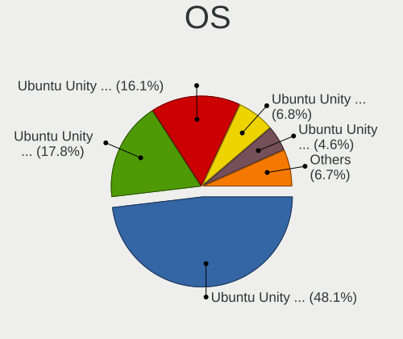

| Name               | Notebooks | Percent |
|--------------------|-----------|---------|
| Ubuntu Unity 16.04 | 347       | 48.13%  |
| Ubuntu Unity 20.04 | 128       | 17.75%  |
| Ubuntu Unity 18.04 | 116       | 16.09%  |
| Ubuntu Unity 22.04 | 49        | 6.8%    |
| Ubuntu Unity 24.04 | 33        | 4.58%   |
| Ubuntu Unity 22.10 | 9         | 1.25%   |
| Ubuntu Unity 23.10 | 5         | 0.69%   |
| Ubuntu Unity 23.04 | 5         | 0.69%   |
| Ubuntu Unity 21.10 | 5         | 0.69%   |
| Ubuntu Unity 21.04 | 5         | 0.69%   |
| Ubuntu Unity 19.10 | 5         | 0.69%   |
| Ubuntu Unity 25.04 | 4         | 0.55%   |
| Ubuntu Unity 24.10 | 4         | 0.55%   |
| Ubuntu Unity 20.10 | 2         | 0.28%   |
| Ubuntu Unity 14.04 | 2         | 0.28%   |
| Ubuntu Unity 19.04 | 1         | 0.14%   |
| Ubuntu Unity 18.10 | 1         | 0.14%   |

OS Family
---------

OS without a version

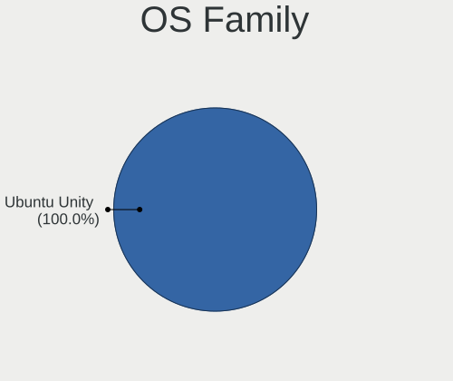

| Name         | Notebooks | Percent |
|--------------|-----------|---------|
| Ubuntu Unity | 717       | 100%    |

Kernel
------

Version of the Linux kernel

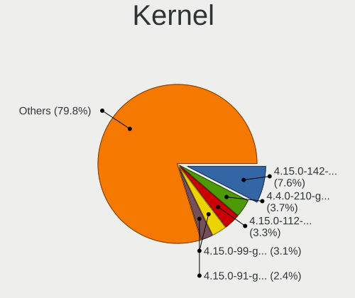

| Version            | Notebooks | Percent |
|--------------------|-----------|---------|
| 4.15.0-142-generic | 59        | 7.58%   |
| 4.4.0-210-generic  | 29        | 3.73%   |
| 4.15.0-112-generic | 26        | 3.34%   |
| 4.15.0-99-generic  | 24        | 3.08%   |
| 4.15.0-91-generic  | 19        | 2.44%   |
| 4.15.0-96-generic  | 18        | 2.31%   |
| 4.15.0-45-generic  | 17        | 2.19%   |
| 4.15.0-72-generic  | 15        | 1.93%   |
| 5.4.0-48-generic   | 12        | 1.54%   |
| 5.4.0-42-generic   | 12        | 1.54%   |
| 4.15.0-88-generic  | 11        | 1.41%   |
| 4.15.0-118-generic | 9         | 1.16%   |
| 4.4.0-177-generic  | 8         | 1.03%   |
| 4.15.0-76-generic  | 8         | 1.03%   |
| 4.15.0-128-generic | 8         | 1.03%   |
| 4.15.0-101-generic | 8         | 1.03%   |
| 5.4.0-58-generic   | 7         | 0.9%    |
| 5.4.0-47-generic   | 7         | 0.9%    |
| 4.15.0-74-generic  | 7         | 0.9%    |
| 4.15.0-213-generic | 7         | 0.9%    |
| 4.15.0-117-generic | 7         | 0.9%    |
| 5.4.0-52-generic   | 6         | 0.77%   |
| 4.4.0-176-generic  | 6         | 0.77%   |
| 4.4.0-174-generic  | 6         | 0.77%   |
| 4.15.0-70-generic  | 6         | 0.77%   |
| 4.15.0-133-generic | 6         | 0.77%   |
| 4.15.0-129-generic | 6         | 0.77%   |
| 4.15.0-107-generic | 6         | 0.77%   |
| 4.15.0-106-generic | 6         | 0.77%   |
| 5.15.0-56-generic  | 5         | 0.64%   |
| 4.4.0-184-generic  | 5         | 0.64%   |
| 4.4.0-173-generic  | 5         | 0.64%   |
| 4.15.0-122-generic | 5         | 0.64%   |
| 6.8.0-41-generic   | 4         | 0.51%   |
| 6.2.0-20-generic   | 4         | 0.51%   |
| 6.14.0-15-generic  | 4         | 0.51%   |
| 5.4.0-65-generic   | 4         | 0.51%   |
| 5.4.0-56-generic   | 4         | 0.51%   |
| 5.19.0-23-generic  | 4         | 0.51%   |
| 5.11.0-38-generic  | 4         | 0.51%   |

Kernel Family
-------------

Linux kernel without a distro release

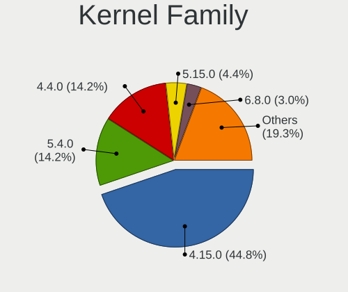

| Version | Notebooks | Percent |
|---------|-----------|---------|
| 4.15.0  | 327       | 44.79%  |
| 5.4.0   | 104       | 14.25%  |
| 4.4.0   | 104       | 14.25%  |
| 5.15.0  | 32        | 4.38%   |
| 6.8.0   | 22        | 3.01%   |
| 5.19.0  | 16        | 2.19%   |
| 5.8.0   | 15        | 2.05%   |
| 6.14.0  | 11        | 1.51%   |
| 5.3.0   | 11        | 1.51%   |
| 5.11.0  | 11        | 1.51%   |
| 6.2.0   | 10        | 1.37%   |
| 6.5.0   | 9         | 1.23%   |
| 6.11.0  | 8         | 1.1%    |
| 5.13.0  | 8         | 1.1%    |
| 5.0.0   | 6         | 0.82%   |
| 4.13.0  | 5         | 0.68%   |
| 4.8.0   | 3         | 0.41%   |
| 6.0.0   | 2         | 0.27%   |
| 5.14.0  | 2         | 0.27%   |
| 4.18.0  | 2         | 0.27%   |
| 6.9.3   | 1         | 0.14%   |
| 6.2.11  | 1         | 0.14%   |
| 6.17.3  | 1         | 0.14%   |
| 6.14.3  | 1         | 0.14%   |
| 6.13.5  | 1         | 0.14%   |
| 6.10.9  | 1         | 0.14%   |
| 6.10.3  | 1         | 0.14%   |
| 6.1.0   | 1         | 0.14%   |
| 5.9.6   | 1         | 0.14%   |
| 5.7.19  | 1         | 0.14%   |
| 5.7.1   | 1         | 0.14%   |
| 5.5.11  | 1         | 0.14%   |
| 5.4.14  | 1         | 0.14%   |
| 5.17.0  | 1         | 0.14%   |
| 5.16.8  | 1         | 0.14%   |
| 5.16.4  | 1         | 0.14%   |
| 5.12.1  | 1         | 0.14%   |
| 5.12.0  | 1         | 0.14%   |
| 5.0.7   | 1         | 0.14%   |
| 4.19.88 | 1         | 0.14%   |

Kernel Major Ver.
-----------------

Linux kernel major version

| Version | Notebooks | Percent |
|---------|-----------|---------|
| 4.15    | 327       | 44.86%  |
| 5.4     | 105       | 14.4%   |
| 4.4     | 104       | 14.27%  |
| 5.15    | 32        | 4.39%   |
| 6.8     | 22        | 3.02%   |
| 5.19    | 16        | 2.19%   |
| 5.8     | 15        | 2.06%   |
| 6.14    | 12        | 1.65%   |
| 6.2     | 11        | 1.51%   |
| 5.3     | 11        | 1.51%   |
| 5.11    | 11        | 1.51%   |
| 6.5     | 9         | 1.23%   |
| 6.11    | 8         | 1.1%    |
| 5.13    | 8         | 1.1%    |
| 5.0     | 7         | 0.96%   |
| 4.13    | 5         | 0.69%   |
| 4.8     | 3         | 0.41%   |
| 6.0     | 2         | 0.27%   |
| 5.7     | 2         | 0.27%   |
| 5.16    | 2         | 0.27%   |
| 5.14    | 2         | 0.27%   |
| 5.12    | 2         | 0.27%   |
| 4.19    | 2         | 0.27%   |
| 4.18    | 2         | 0.27%   |
| 6.9     | 1         | 0.14%   |
| 6.17    | 1         | 0.14%   |
| 6.13    | 1         | 0.14%   |
| 6.10    | 1         | 0.14%   |
| 6.1     | 1         | 0.14%   |
| 5.9     | 1         | 0.14%   |
| 5.5     | 1         | 0.14%   |
| 5.17    | 1         | 0.14%   |
| 3.13    | 1         | 0.14%   |

Arch
----

OS architecture (x86_64, i586, etc.)

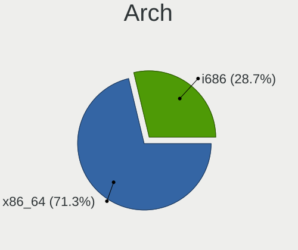

| Name   | Notebooks | Percent |
|--------|-----------|---------|
| x86_64 | 511       | 71.27%  |
| i686   | 206       | 28.73%  |

DE
--

Desktop Environment

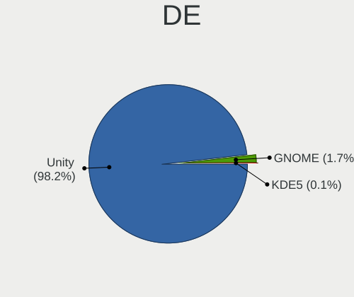

| Name  | Notebooks | Percent |
|-------|-----------|---------|
| Unity | 705       | 98.19%  |
| GNOME | 12        | 1.67%   |
| KDE5  | 1         | 0.14%   |

Display Server
--------------

X11 or Wayland

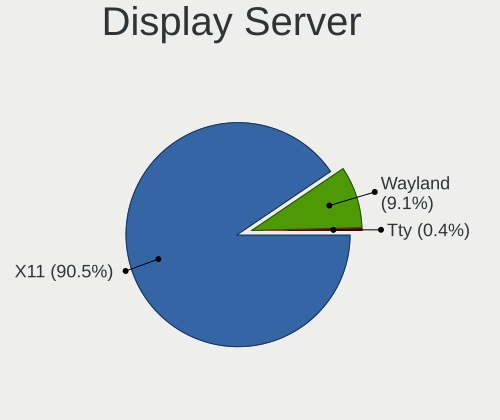

| Name    | Notebooks | Percent |
|---------|-----------|---------|
| X11     | 650       | 90.53%  |
| Wayland | 65        | 9.05%   |
| Tty     | 3         | 0.42%   |

Display Manager
---------------

SDDM, LightDM, etc.

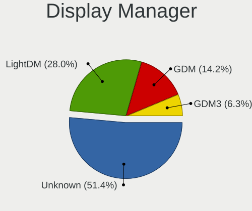

| Name    | Notebooks | Percent |
|---------|-----------|---------|
| Unknown | 376       | 51.44%  |
| LightDM | 205       | 28.04%  |
| GDM     | 104       | 14.23%  |
| GDM3    | 46        | 6.29%   |

OS Lang
-------

Language

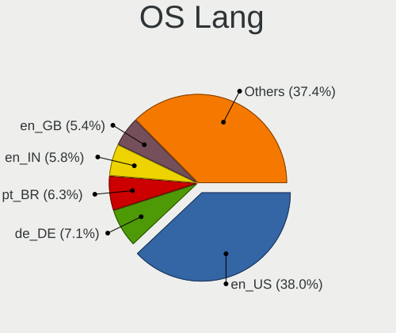

| Lang    | Notebooks | Percent |
|---------|-----------|---------|
| en_US   | 273       | 37.97%  |
| de_DE   | 51        | 7.09%   |
| pt_BR   | 45        | 6.26%   |
| en_IN   | 42        | 5.84%   |
| en_GB   | 39        | 5.42%   |
| fr_FR   | 34        | 4.73%   |
| it_IT   | 23        | 3.2%    |
| ru_RU   | 21        | 2.92%   |
| es_ES   | 21        | 2.92%   |
| Unknown | 20        | 2.78%   |
| pl_PL   | 13        | 1.81%   |
| en_AU   | 11        | 1.53%   |
| en_CA   | 10        | 1.39%   |
| hu_HU   | 8         | 1.11%   |
| tr_TR   | 7         | 0.97%   |
| pt_PT   | 6         | 0.83%   |
| es_MX   | 6         | 0.83%   |
| zh_CN   | 5         | 0.7%    |
| nl_NL   | 5         | 0.7%    |
| en_ZA   | 5         | 0.7%    |
| da_DK   | 5         | 0.7%    |
| es_CO   | 4         | 0.56%   |
| es_AR   | 4         | 0.56%   |
| el_GR   | 4         | 0.56%   |
| cs_CZ   | 4         | 0.56%   |
| C       | 4         | 0.56%   |
| ro_RO   | 3         | 0.42%   |
| nl_BE   | 3         | 0.42%   |
| ja_JP   | 3         | 0.42%   |
| de_CH   | 3         | 0.42%   |
| zh_TW   | 2         | 0.28%   |
| sv_SE   | 2         | 0.28%   |
| sk_SK   | 2         | 0.28%   |
| es_GT   | 2         | 0.28%   |
| en_PH   | 2         | 0.28%   |
| en_NZ   | 2         | 0.28%   |
| en_IE   | 2         | 0.28%   |
| de_AT   | 2         | 0.28%   |
| bg_BG   | 2         | 0.28%   |
| th_TH   | 1         | 0.14%   |

Boot Mode
---------

EFI or BIOS

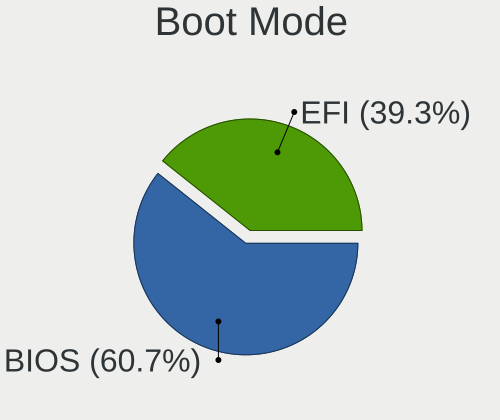

| Mode | Notebooks | Percent |
|------|-----------|---------|
| BIOS | 437       | 60.69%  |
| EFI  | 283       | 39.31%  |

Filesystem
----------

Type of filesystem

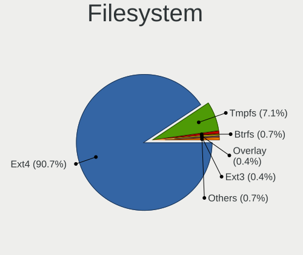

| Type     | Notebooks | Percent |
|----------|-----------|---------|
| Ext4     | 653       | 90.69%  |
| Tmpfs    | 51        | 7.08%   |
| Btrfs    | 5         | 0.69%   |
| Overlay  | 3         | 0.42%   |
| Ext3     | 3         | 0.42%   |
| Ext2     | 2         | 0.28%   |
| Zfs      | 1         | 0.14%   |
| SquasXfs | 1         | 0.14%   |
| Aufs     | 1         | 0.14%   |

Part. scheme
------------

Scheme of partitioning

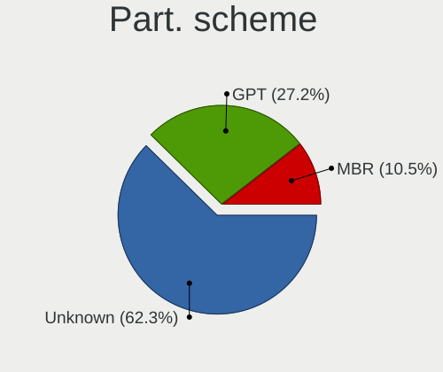

| Type    | Notebooks | Percent |
|---------|-----------|---------|
| Unknown | 452       | 62.34%  |
| GPT     | 197       | 27.17%  |
| MBR     | 76        | 10.48%  |

Dual Boot with Linux/BSD
------------------------

Hosting more than one Linux/BSD

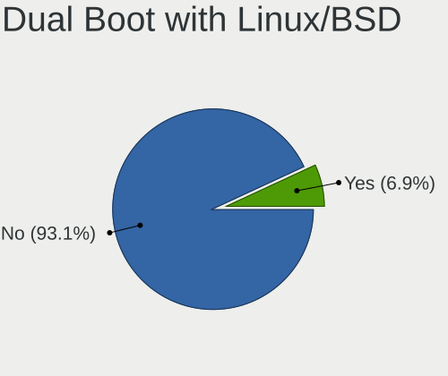

| Dual boot | Notebooks | Percent |
|-----------|-----------|---------|
| No        | 674       | 93.09%  |
| Yes       | 50        | 6.91%   |

Dual Boot (Win)
---------------

Hosting Linux and Windows

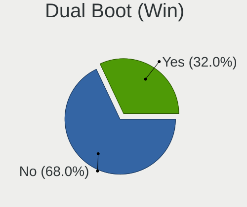

| Dual boot | Notebooks | Percent |
|-----------|-----------|---------|
| No        | 490       | 67.96%  |
| Yes       | 231       | 32.04%  |

Board
-----

Vendor
------

Motherboard manufacturer

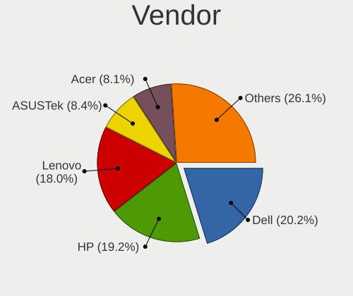

| Name                | Notebooks | Percent |
|---------------------|-----------|---------|
| Dell                | 145       | 20.22%  |
| Hewlett-Packard     | 138       | 19.25%  |
| Lenovo              | 129       | 17.99%  |
| ASUSTek Computer    | 60        | 8.37%   |
| Acer                | 58        | 8.09%   |
| Toshiba             | 39        | 5.44%   |
| Apple               | 15        | 2.09%   |
| Sony                | 11        | 1.53%   |
| Samsung Electronics | 10        | 1.39%   |
| Fujitsu Siemens     | 10        | 1.39%   |
| Positivo            | 7         | 0.98%   |
| Notebook            | 7         | 0.98%   |
| MSI                 | 6         | 0.84%   |
| HUAWEI              | 6         | 0.84%   |
| Fujitsu             | 6         | 0.84%   |
| Medion              | 5         | 0.7%    |
| Timi                | 4         | 0.56%   |
| Itautec             | 4         | 0.56%   |
| LG Electronics      | 3         | 0.42%   |
| Gigabyte Technology | 3         | 0.42%   |
| Unknown             | 3         | 0.42%   |
| Semp Toshiba        | 2         | 0.28%   |
| Panasonic           | 2         | 0.28%   |
| Packard Bell        | 2         | 0.28%   |
| NEC Computers       | 2         | 0.28%   |
| Lex BayTrail        | 2         | 0.28%   |
| Intel               | 2         | 0.28%   |
| Hometech            | 2         | 0.28%   |
| Gateway             | 2         | 0.28%   |
| eMachines           | 2         | 0.28%   |
| Chuwi               | 2         | 0.28%   |
| Alienware           | 2         | 0.28%   |
| XIAOMI              | 1         | 0.14%   |
| VIT                 | 1         | 0.14%   |
| TG                  | 1         | 0.14%   |
| TELECOMITALIA       | 1         | 0.14%   |
| Teclast             | 1         | 0.14%   |
| System76            | 1         | 0.14%   |
| SLIMBOOK            | 1         | 0.14%   |
| SINTRONES           | 1         | 0.14%   |

Model
-----

Motherboard model

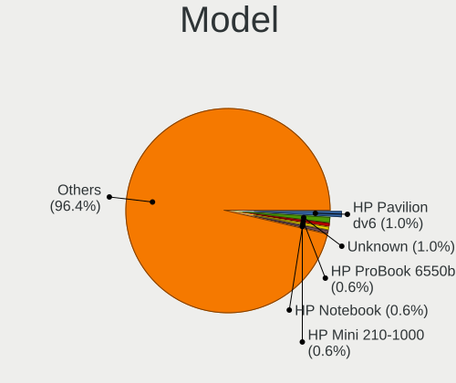

| Name                             | Notebooks | Percent |
|----------------------------------|-----------|---------|
| HP Pavilion dv6                  | 7         | 0.98%   |
| Unknown                          | 7         | 0.98%   |
| HP ProBook 6550b                 | 4         | 0.56%   |
| HP Notebook                      | 4         | 0.56%   |
| HP Mini 210-1000                 | 4         | 0.56%   |
| Dell Latitude 7480               | 4         | 0.56%   |
| Toshiba Satellite L300           | 3         | 0.42%   |
| Positivo Mobile                  | 3         | 0.42%   |
| Itautec Infoway                  | 3         | 0.42%   |
| HP Pavilion dv7                  | 3         | 0.42%   |
| Dell XPS 13 9370                 | 3         | 0.42%   |
| Dell XPS 13 7390                 | 3         | 0.42%   |
| Dell Latitude D630               | 3         | 0.42%   |
| Dell Latitude D620               | 3         | 0.42%   |
| Dell Inspiron MM061              | 3         | 0.42%   |
| Dell Inspiron 5570               | 3         | 0.42%   |
| Dell Inspiron 3521               | 3         | 0.42%   |
| Dell Inspiron 1545               | 3         | 0.42%   |
| ASUS 1005HA                      | 3         | 0.42%   |
| Toshiba Satellite L745           | 2         | 0.28%   |
| Toshiba Portable PC              | 2         | 0.28%   |
| Toshiba NB505                    | 2         | 0.28%   |
| Timi TM1701                      | 2         | 0.28%   |
| Samsung R530/R730                | 2         | 0.28%   |
| Positivo N1103                   | 2         | 0.28%   |
| Medion Akoya THE TOUCH 10        | 2         | 0.28%   |
| Lenovo V145-15AST 81MT           | 2         | 0.28%   |
| Lenovo IdeaPad 3 15IIL05 81WE    | 2         | 0.28%   |
| Lenovo G50-70 20351              | 2         | 0.28%   |
| Lenovo B320-14IKB 81CC           | 2         | 0.28%   |
| HP ZBook 17 G3                   | 2         | 0.28%   |
| HP ProBook 455 G1                | 2         | 0.28%   |
| HP ProBook 4510s                 | 2         | 0.28%   |
| HP ProBook 440 G3                | 2         | 0.28%   |
| HP Pavilion Notebook             | 2         | 0.28%   |
| HP Pavilion g4                   | 2         | 0.28%   |
| HP Pavilion dv6000 (RP297UA#ABA) | 2         | 0.28%   |
| HP Pavilion 17                   | 2         | 0.28%   |
| HP Pavilion 15                   | 2         | 0.28%   |
| HP Compaq Presario CQ60          | 2         | 0.28%   |

Model Family
------------

Motherboard model prefix

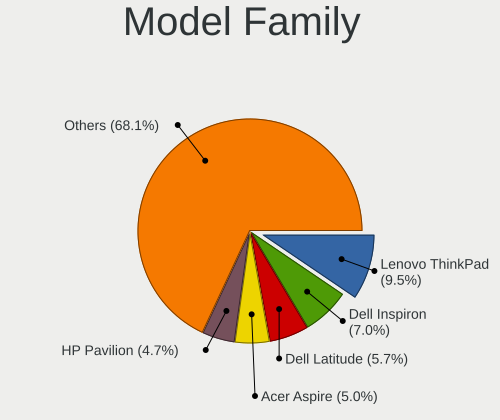

| Name                     | Notebooks | Percent |
|--------------------------|-----------|---------|
| Lenovo ThinkPad          | 68        | 9.48%   |
| Dell Inspiron            | 50        | 6.97%   |
| Dell Latitude            | 41        | 5.72%   |
| Acer Aspire              | 36        | 5.02%   |
| HP Pavilion              | 34        | 4.74%   |
| Toshiba Satellite        | 27        | 3.77%   |
| HP ProBook               | 21        | 2.93%   |
| Lenovo IdeaPad           | 20        | 2.79%   |
| Dell XPS                 | 20        | 2.79%   |
| HP Compaq                | 16        | 2.23%   |
| HP EliteBook             | 15        | 2.09%   |
| Dell Precision           | 14        | 1.95%   |
| Dell Vostro              | 10        | 1.39%   |
| HP ZBook                 | 9         | 1.26%   |
| Unknown                  | 7         | 0.98%   |
| HP Mini                  | 6         | 0.84%   |
| HP Laptop                | 6         | 0.84%   |
| ASUS VivoBook            | 6         | 0.84%   |
| HP ENVY                  | 5         | 0.7%    |
| Fujitsu LIFEBOOK         | 5         | 0.7%    |
| Acer Extensa             | 5         | 0.7%    |
| Lenovo ThinkBook         | 4         | 0.56%   |
| Itautec Infoway          | 4         | 0.56%   |
| HP Presario              | 4         | 0.56%   |
| HP Notebook              | 4         | 0.56%   |
| Fujitsu Siemens LIFEBOOK | 4         | 0.56%   |
| ASUS Zenbook             | 4         | 0.56%   |
| Acer TravelMate          | 4         | 0.56%   |
| Positivo Mobile          | 3         | 0.42%   |
| Medion Akoya             | 3         | 0.42%   |
| Lenovo Legion            | 3         | 0.42%   |
| Lenovo G580              | 3         | 0.42%   |
| Lenovo 3000              | 3         | 0.42%   |
| HP 15                    | 3         | 0.42%   |
| Dell System              | 3         | 0.42%   |
| Dell G5                  | 3         | 0.42%   |
| ASUS 1005HA              | 3         | 0.42%   |
| Apple MacBookPro1        | 3         | 0.42%   |
| Acer Nitro               | 3         | 0.42%   |
| Toshiba TECRA            | 2         | 0.28%   |

MFG Year
--------

Motherboard manufacture year

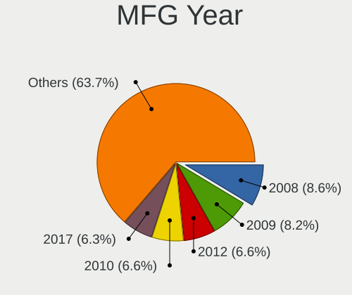

| Year    | Notebooks | Percent |
|---------|-----------|---------|
| 2008    | 62        | 8.65%   |
| 2009    | 59        | 8.23%   |
| 2012    | 47        | 6.56%   |
| 2010    | 47        | 6.56%   |
| 2017    | 45        | 6.28%   |
| 2011    | 45        | 6.28%   |
| 2015    | 44        | 6.14%   |
| 2018    | 43        | 6%      |
| 2016    | 43        | 6%      |
| 2019    | 41        | 5.72%   |
| 2013    | 40        | 5.58%   |
| 2007    | 39        | 5.44%   |
| 2014    | 33        | 4.6%    |
| 2020    | 32        | 4.46%   |
| 2006    | 32        | 4.46%   |
| 2021    | 24        | 3.35%   |
| 2022    | 16        | 2.23%   |
| 2005    | 16        | 2.23%   |
| 2024    | 3         | 0.42%   |
| 2023    | 3         | 0.42%   |
| Unknown | 2         | 0.28%   |
| 2002    | 1         | 0.14%   |

Form Factor
-----------

Physical design of the computer

| Name     | Notebooks | Percent |
|----------|-----------|---------|
| Notebook | 717       | 100%    |

Secure Boot
-----------

Enabled or disabled

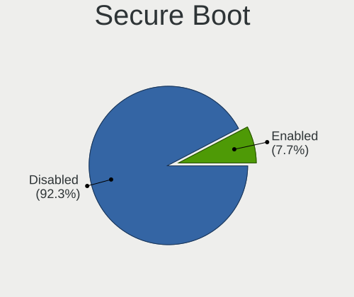

| State    | Notebooks | Percent |
|----------|-----------|---------|
| Disabled | 662       | 92.33%  |
| Enabled  | 55        | 7.67%   |

Coreboot
--------

Have coreboot on board

| Used | Notebooks | Percent |
|------|-----------|---------|
| No   | 717       | 100%    |

RAM Size
--------

Total RAM memory

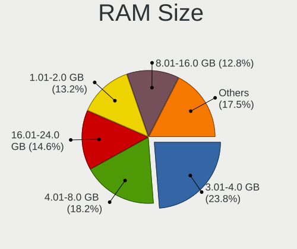

| Size in GB  | Notebooks | Percent |
|-------------|-----------|---------|
| 3.01-4.0    | 171       | 23.75%  |
| 4.01-8.0    | 131       | 18.19%  |
| 16.01-24.0  | 105       | 14.58%  |
| 1.01-2.0    | 95        | 13.19%  |
| 8.01-16.0   | 92        | 12.78%  |
| 2.01-3.0    | 39        | 5.42%   |
| 0.51-1.0    | 39        | 5.42%   |
| 32.01-64.0  | 33        | 4.58%   |
| 24.01-32.0  | 8         | 1.11%   |
| 64.01-256.0 | 5         | 0.69%   |
| 0.01-0.5    | 2         | 0.28%   |

RAM Used
--------

Used RAM memory

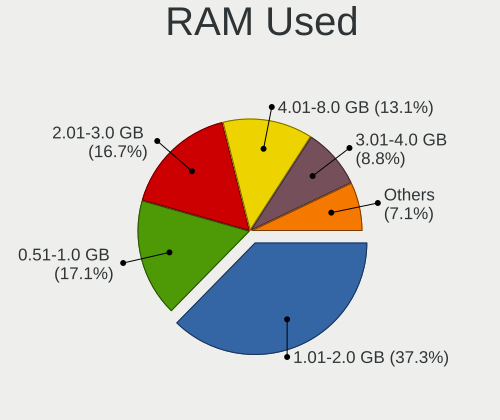

| Used GB    | Notebooks | Percent |
|------------|-----------|---------|
| 1.01-2.0   | 280       | 37.33%  |
| 0.51-1.0   | 128       | 17.07%  |
| 2.01-3.0   | 125       | 16.67%  |
| 4.01-8.0   | 98        | 13.07%  |
| 3.01-4.0   | 66        | 8.8%    |
| 8.01-16.0  | 37        | 4.93%   |
| 0.01-0.5   | 8         | 1.07%   |
| 16.01-24.0 | 6         | 0.8%    |
| 32.01-64.0 | 1         | 0.13%   |
| Unknown    | 1         | 0.13%   |

Total Drives
------------

Number of drives on board

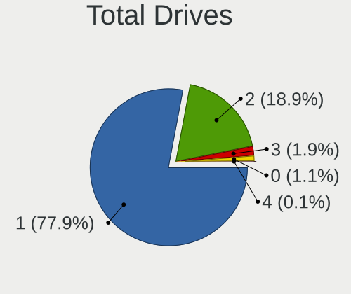

| Drives | Notebooks | Percent |
|--------|-----------|---------|
| 1      | 562       | 77.95%  |
| 2      | 136       | 18.86%  |
| 3      | 14        | 1.94%   |
| 0      | 8         | 1.11%   |
| 4      | 1         | 0.14%   |

Has CD-ROM
----------

Has CD-ROM on board

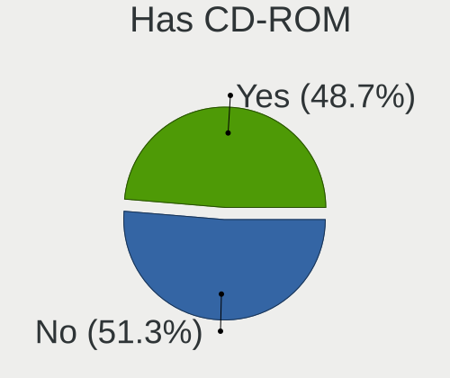

| Presented | Notebooks | Percent |
|-----------|-----------|---------|
| No        | 369       | 51.32%  |
| Yes       | 350       | 48.68%  |

Has Ethernet
------------

Has Ethernet on board

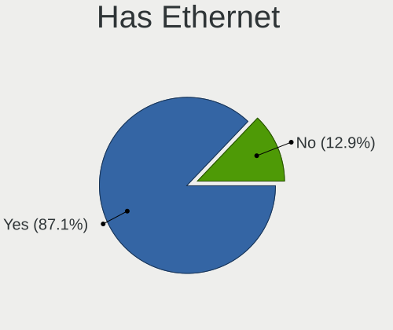

| Presented | Notebooks | Percent |
|-----------|-----------|---------|
| Yes       | 629       | 87.12%  |
| No        | 93        | 12.88%  |

Has WiFi
--------

Has WiFi module

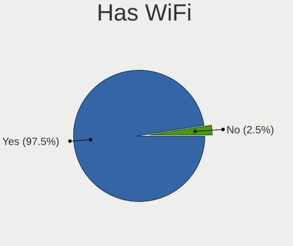

| Presented | Notebooks | Percent |
|-----------|-----------|---------|
| Yes       | 699       | 97.49%  |
| No        | 18        | 2.51%   |

Has Bluetooth
-------------

Has Bluetooth module

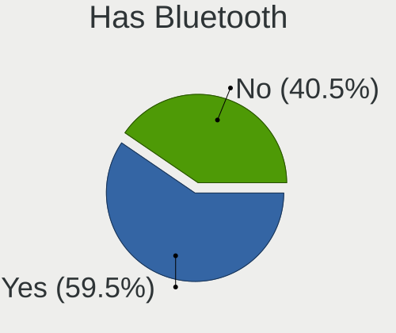

| Presented | Notebooks | Percent |
|-----------|-----------|---------|
| Yes       | 431       | 59.53%  |
| No        | 293       | 40.47%  |

Location
--------

Country
-------

Geographic location (country)

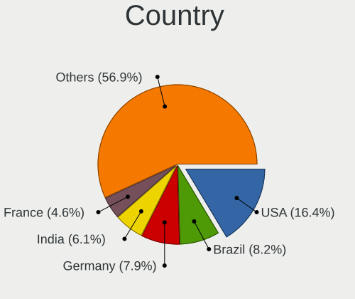

| Country      | Notebooks | Percent |
|--------------|-----------|---------|
| USA          | 118       | 16.37%  |
| Brazil       | 59        | 8.18%   |
| Germany      | 57        | 7.91%   |
| India        | 44        | 6.1%    |
| France       | 33        | 4.58%   |
| UK           | 32        | 4.44%   |
| Russia       | 30        | 4.16%   |
| Spain        | 28        | 3.88%   |
| Italy        | 25        | 3.47%   |
| Belgium      | 15        | 2.08%   |
| Turkey       | 14        | 1.94%   |
| Poland       | 14        | 1.94%   |
| Canada       | 13        | 1.8%    |
| Romania      | 11        | 1.53%   |
| Netherlands  | 11        | 1.53%   |
| Australia    | 11        | 1.53%   |
| Mexico       | 10        | 1.39%   |
| Denmark      | 9         | 1.25%   |
| Ukraine      | 8         | 1.11%   |
| Hungary      | 8         | 1.11%   |
| Portugal     | 7         | 0.97%   |
| Japan        | 7         | 0.97%   |
| Colombia     | 7         | 0.97%   |
| Bulgaria     | 7         | 0.97%   |
| Indonesia    | 6         | 0.83%   |
| Czechia      | 6         | 0.83%   |
| Austria      | 6         | 0.83%   |
| Argentina    | 6         | 0.83%   |
| Vietnam      | 5         | 0.69%   |
| Switzerland  | 5         | 0.69%   |
| South Africa | 5         | 0.69%   |
| Morocco      | 5         | 0.69%   |
| Greece       | 5         | 0.69%   |
| New Zealand  | 4         | 0.55%   |
| China        | 4         | 0.55%   |
| Sweden       | 3         | 0.42%   |
| Slovakia     | 3         | 0.42%   |
| Pakistan     | 3         | 0.42%   |
| Lithuania    | 3         | 0.42%   |
| Latvia       | 3         | 0.42%   |

City
----

Geographic location (city)

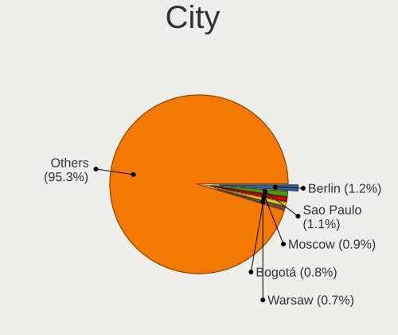

| City              | Notebooks | Percent |
|-------------------|-----------|---------|
| Berlin            | 9         | 1.2%    |
| Sao Paulo         | 8         | 1.07%   |
| Moscow            | 7         | 0.94%   |
| Bogotá           | 6         | 0.8%    |
| Warsaw            | 5         | 0.67%   |
| Sydney            | 5         | 0.67%   |
| Hyderabad         | 5         | 0.67%   |
| Brasília         | 5         | 0.67%   |
| Barcelona         | 5         | 0.67%   |
| Amsterdam         | 5         | 0.67%   |
| Viborg            | 4         | 0.54%   |
| Rome              | 4         | 0.54%   |
| Rio de Janeiro    | 4         | 0.54%   |
| Pune              | 4         | 0.54%   |
| New Delhi         | 4         | 0.54%   |
| Montreal          | 4         | 0.54%   |
| Milan             | 4         | 0.54%   |
| Madrid            | 4         | 0.54%   |
| Istanbul          | 4         | 0.54%   |
| Budapest          | 4         | 0.54%   |
| Bengaluru         | 4         | 0.54%   |
| Yekaterinburg     | 3         | 0.4%    |
| Valencia          | 3         | 0.4%    |
| St Petersburg     | 3         | 0.4%    |
| Paris             | 3         | 0.4%    |
| Mumbai            | 3         | 0.4%    |
| London            | 3         | 0.4%    |
| Lisbon            | 3         | 0.4%    |
| Kyiv              | 3         | 0.4%    |
| Krakow            | 3         | 0.4%    |
| Hanoi             | 3         | 0.4%    |
| Frankfurt am Main | 3         | 0.4%    |
| Delhi             | 3         | 0.4%    |
| Cologne           | 3         | 0.4%    |
| Cape Town         | 3         | 0.4%    |
| Buenos Aires      | 3         | 0.4%    |
| Athens            | 3         | 0.4%    |
| Ankara            | 3         | 0.4%    |
| Wetteren          | 2         | 0.27%   |
| Voronezh          | 2         | 0.27%   |

Drives
------

Drive Vendor
------------

Hard drive vendors

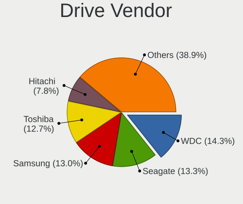

| Vendor                         | Notebooks | Drives | Percent |
|--------------------------------|-----------|--------|---------|
| WDC                            | 117       | 128    | 14.3%   |
| Seagate                        | 109       | 118    | 13.33%  |
| Samsung Electronics            | 106       | 125    | 12.96%  |
| Toshiba                        | 104       | 119    | 12.71%  |
| Hitachi                        | 64        | 67     | 7.82%   |
| HGST                           | 39        | 49     | 4.77%   |
| Kingston                       | 36        | 39     | 4.4%    |
| Unknown                        | 30        | 32     | 3.67%   |
| SanDisk                        | 29        | 42     | 3.55%   |
| Micron Technology              | 22        | 25     | 2.69%   |
| Crucial                        | 18        | 20     | 2.2%    |
| SK hynix                       | 16        | 16     | 1.96%   |
| Intel                          | 16        | 18     | 1.96%   |
| Fujitsu                        | 15        | 15     | 1.83%   |
| LITEON                         | 11        | 13     | 1.34%   |
| KIOXIA                         | 7         | 7      | 0.86%   |
| A-DATA Technology              | 6         | 6      | 0.73%   |
| SPCC                           | 5         | 6      | 0.61%   |
| LITEONIT                       | 5         | 8      | 0.61%   |
| PNY                            | 4         | 4      | 0.49%   |
| Intenso                        | 4         | 5      | 0.49%   |
| Apple                          | 4         | 5      | 0.49%   |
| Verbatim                       | 3         | 4      | 0.37%   |
| Transcend                      | 3         | 3      | 0.37%   |
| Patriot                        | 3         | 3      | 0.37%   |
| OCZ                            | 3         | 3      | 0.37%   |
| StoreJet                       | 2         | 2      | 0.24%   |
| Silicon Motion                 | 2         | 2      | 0.24%   |
| Lenovo                         | 2         | 2      | 0.24%   |
| KingSpec                       | 2         | 3      | 0.24%   |
| KingDian                       | 2         | 2      | 0.24%   |
| JMicron Technology             | 2         | 2      | 0.24%   |
| IBM/Hitachi                    | 2         | 2      | 0.24%   |
| XrayDisk                       | 1         | 1      | 0.12%   |
| USB                            | 1         | 2      | 0.12%   |
| Team                           | 1         | 3      | 0.12%   |
| SUNEAST                        | 1         | 1      | 0.12%   |
| STEC                           | 1         | 1      | 0.12%   |
| Solid State Storage Technology | 1         | 1      | 0.12%   |
| SABRENT                        | 1         | 1      | 0.12%   |

Drive Model
-----------

Hard drive models

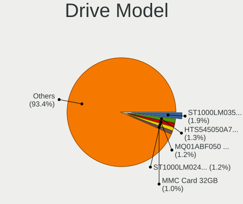

| Model                              | Notebooks | Percent |
|------------------------------------|-----------|---------|
| Seagate ST1000LM035-1RK172 1TB     | 16        | 1.91%   |
| HGST HTS545050A7E680 500GB         | 11        | 1.31%   |
| Toshiba MQ01ABF050 500GB           | 10        | 1.19%   |
| Seagate ST1000LM024 HN-M101MBB 1TB | 10        | 1.19%   |
| Unknown MMC Card  32GB             | 8         | 0.96%   |
| Seagate ST500LT012-1DG142 500GB    | 7         | 0.84%   |
| HGST HTS721010A9E630 1TB           | 7         | 0.84%   |
| Samsung SSD 850 EVO 250GB          | 6         | 0.72%   |
| Kingston SA400S37240G 240GB SSD    | 6         | 0.72%   |
| Hitachi HTS545032B9A300 320GB      | 6         | 0.72%   |
| Toshiba MQ01ACF050 500GB           | 5         | 0.6%    |
| Seagate ST500LT012-9WS142 500GB    | 5         | 0.6%    |
| Samsung NVMe SSD Drive 512GB       | 5         | 0.6%    |
| Samsung HM321HI 320GB              | 5         | 0.6%    |
| Samsung HM160HI 160GB              | 5         | 0.6%    |
| Kingston SA400S37120G 120GB SSD    | 5         | 0.6%    |
| HGST HTS725050A7E630 500GB         | 5         | 0.6%    |
| WDC WD10JPVX-75JC3T0 1TB           | 4         | 0.48%   |
| Unknown MMC Card  128GB            | 4         | 0.48%   |
| Toshiba MQ01ABD100 1TB             | 4         | 0.48%   |
| Toshiba MQ01ABD075 752GB           | 4         | 0.48%   |
| Seagate ST9320423AS 320GB          | 4         | 0.48%   |
| Samsung NVMe SSD Drive 256GB       | 4         | 0.48%   |
| LITEON CV8-8E128-HP 128GB SSD      | 4         | 0.48%   |
| Kingston SV300S37A120G 120GB SSD   | 4         | 0.48%   |
| HGST HTS541010A9E680 1TB           | 4         | 0.48%   |
| Crucial CT240BX500SSD1 240GB       | 4         | 0.48%   |
| Crucial CT1000MX500SSD1 1TB        | 4         | 0.48%   |
| WDC WD5000LPVX-22V0TT0 500GB       | 3         | 0.36%   |
| WDC WD3200BPVT-22ZEST0 320GB       | 3         | 0.36%   |
| WDC WD2500BEVS-22UST0 250GB        | 3         | 0.36%   |
| WDC WD10SPZX-21Z10T0 1TB           | 3         | 0.36%   |
| WDC WD10JPVX-22JC3T0 1TB           | 3         | 0.36%   |
| WDC WD10JPCX-24UE4T0 1TB           | 3         | 0.36%   |
| Toshiba MQ04ABF100 1TB             | 3         | 0.36%   |
| Toshiba MQ01ABD032 320GB           | 3         | 0.36%   |
| Toshiba MK1655GSX 160GB            | 3         | 0.36%   |
| Seagate ST98823AS 80GB             | 3         | 0.36%   |
| Seagate ST9500420AS 500GB          | 3         | 0.36%   |
| Seagate ST9500325AS 500GB          | 3         | 0.36%   |

HDD Vendor
----------

Hard disk drive vendors

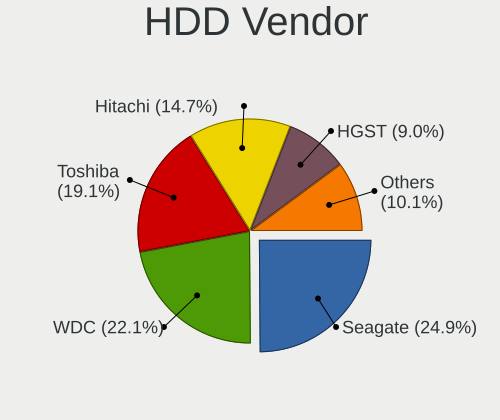

| Vendor              | Notebooks | Drives | Percent |
|---------------------|-----------|--------|---------|
| Seagate             | 108       | 116    | 24.88%  |
| WDC                 | 96        | 106    | 22.12%  |
| Toshiba             | 83        | 95     | 19.12%  |
| Hitachi             | 64        | 67     | 14.75%  |
| HGST                | 39        | 49     | 8.99%   |
| Samsung Electronics | 17        | 18     | 3.92%   |
| Fujitsu             | 15        | 15     | 3.46%   |
| Unknown             | 2         | 2      | 0.46%   |
| JMicron Technology  | 2         | 2      | 0.46%   |
| IBM/Hitachi         | 2         | 2      | 0.46%   |
| XrayDisk            | 1         | 1      | 0.23%   |
| USB                 | 1         | 2      | 0.23%   |
| StoreJet            | 1         | 1      | 0.23%   |
| STEC                | 1         | 1      | 0.23%   |
| Intenso             | 1         | 2      | 0.23%   |
| Apple               | 1         | 1      | 0.23%   |

SSD Vendor
----------

Solid state drive vendors

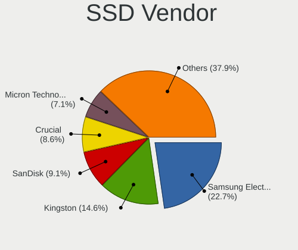

| Vendor              | Notebooks | Drives | Percent |
|---------------------|-----------|--------|---------|
| Samsung Electronics | 45        | 58     | 22.73%  |
| Kingston            | 29        | 32     | 14.65%  |
| SanDisk             | 18        | 20     | 9.09%   |
| Crucial             | 17        | 19     | 8.59%   |
| Micron Technology   | 14        | 15     | 7.07%   |
| LITEON              | 9         | 11     | 4.55%   |
| WDC                 | 7         | 7      | 3.54%   |
| Toshiba             | 5         | 6      | 2.53%   |
| LITEONIT            | 5         | 8      | 2.53%   |
| Intel               | 5         | 5      | 2.53%   |
| SK hynix            | 4         | 4      | 2.02%   |
| PNY                 | 4         | 4      | 2.02%   |
| A-DATA Technology   | 4         | 4      | 2.02%   |
| Verbatim            | 3         | 4      | 1.52%   |
| SPCC                | 3         | 3      | 1.52%   |
| Patriot             | 3         | 3      | 1.52%   |
| OCZ                 | 3         | 3      | 1.52%   |
| Intenso             | 3         | 3      | 1.52%   |
| Transcend           | 2         | 2      | 1.01%   |
| KingDian            | 2         | 2      | 1.01%   |
| Team                | 1         | 3      | 0.51%   |
| SUNEAST             | 1         | 1      | 0.51%   |
| StoreJet            | 1         | 1      | 0.51%   |
| SABRENT             | 1         | 1      | 0.51%   |
| NGFF                | 1         | 1      | 0.51%   |
| MidasForce          | 1         | 1      | 0.51%   |
| Lexar               | 1         | 1      | 0.51%   |
| Innodisk            | 1         | 1      | 0.51%   |
| GOODRAM             | 1         | 1      | 0.51%   |
| Dell                | 1         | 1      | 0.51%   |
| China               | 1         | 1      | 0.51%   |
| BIWIN               | 1         | 1      | 0.51%   |
| Apple               | 1         | 1      | 0.51%   |

Drive Kind
----------

HDD or SSD

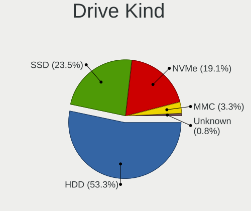

| Kind    | Notebooks | Drives | Percent |
|---------|-----------|--------|---------|
| HDD     | 421       | 480    | 53.29%  |
| SSD     | 186       | 228    | 23.54%  |
| NVMe    | 151       | 184    | 19.11%  |
| MMC     | 26        | 28     | 3.29%   |
| Unknown | 6         | 6      | 0.76%   |

Drive Connector
---------------

SATA, SAS, NVMe, etc.

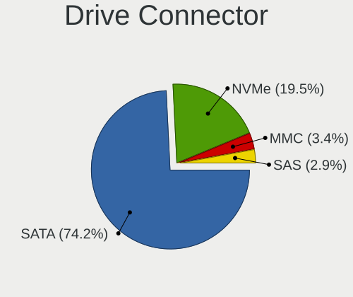

| Type | Notebooks | Drives | Percent |
|------|-----------|--------|---------|
| SATA | 570       | 689    | 74.22%  |
| NVMe | 150       | 183    | 19.53%  |
| MMC  | 26        | 28     | 3.39%   |
| SAS  | 22        | 26     | 2.86%   |

Drive Size
----------

Size of hard drive

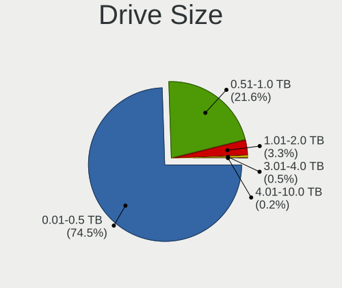

| Size in TB | Notebooks | Drives | Percent |
|------------|-----------|--------|---------|
| 0.01-0.5   | 458       | 529    | 74.47%  |
| 0.51-1.0   | 133       | 152    | 21.63%  |
| 1.01-2.0   | 20        | 23     | 3.25%   |
| 3.01-4.0   | 3         | 3      | 0.49%   |
| 4.01-10.0  | 1         | 1      | 0.16%   |

Space Total
-----------

Amount of disk space available on the file system

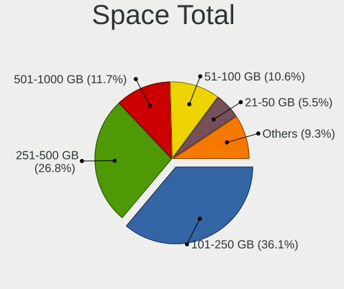

| Size in GB     | Notebooks | Percent |
|----------------|-----------|---------|
| 101-250        | 263       | 36.13%  |
| 251-500        | 195       | 26.79%  |
| 501-1000       | 85        | 11.68%  |
| 51-100         | 77        | 10.58%  |
| 21-50          | 40        | 5.49%   |
| 1001-2000      | 34        | 4.67%   |
| 1-20           | 19        | 2.61%   |
| 2001-3000      | 8         | 1.1%    |
| More than 3000 | 7         | 0.96%   |

Space Used
----------

Amount of used disk space

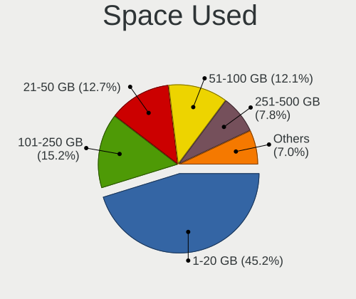

| Used GB        | Notebooks | Percent |
|----------------|-----------|---------|
| 1-20           | 336       | 45.22%  |
| 101-250        | 113       | 15.21%  |
| 21-50          | 94        | 12.65%  |
| 51-100         | 90        | 12.11%  |
| 251-500        | 58        | 7.81%   |
| 501-1000       | 35        | 4.71%   |
| 1001-2000      | 14        | 1.88%   |
| 2001-3000      | 2         | 0.27%   |
| More than 3000 | 1         | 0.13%   |

Malfunc. Drives
---------------

Drive models with a malfunction

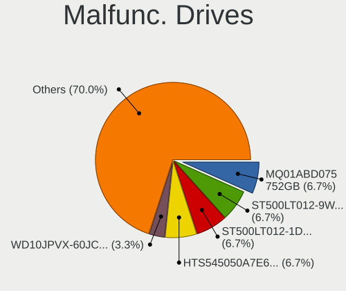

| Model                                             | Notebooks | Drives | Percent |
|---------------------------------------------------|-----------|--------|---------|
| Toshiba MQ01ABD075 752GB                          | 2         | 2      | 6.67%   |
| Seagate ST500LT012-9WS142 500GB                   | 2         | 2      | 6.67%   |
| Seagate ST500LT012-1DG142 500GB                   | 2         | 2      | 6.67%   |
| HGST HTS545050A7E680 500GB                        | 2         | 2      | 6.67%   |
| WDC WD10JPVX-60JC3T0 1TB                          | 1         | 1      | 3.33%   |
| WDC WD10JPCX-24UE4T0 1TB                          | 1         | 1      | 3.33%   |
| Toshiba MQ01ABF050 500GB                          | 1         | 1      | 3.33%   |
| Toshiba MQ01ABD100M 1TB                           | 1         | 1      | 3.33%   |
| Toshiba MQ01ABD100 1TB                            | 1         | 1      | 3.33%   |
| Toshiba MK6475GSX 640GB                           | 1         | 1      | 3.33%   |
| Toshiba MK3261GSYN 320GB                          | 1         | 1      | 3.33%   |
| Toshiba MK3252GSX 320GB                           | 1         | 2      | 3.33%   |
| Seagate ST1000LM035-1RK172 1TB                    | 1         | 1      | 3.33%   |
| Seagate ST1000LM 035-1RK172 1TB                   | 1         | 1      | 3.33%   |
| Samsung Electronics SSD 850 EVO 250GB             | 1         | 1      | 3.33%   |
| Samsung Electronics HM320II 320GB                 | 1         | 1      | 3.33%   |
| Micron Technology MTFDDAK1T0MBF-1AN1ZABHA 1TB SSD | 1         | 1      | 3.33%   |
| Micron Technology 1100_MTFDDAV256TBN 256GB SSD    | 1         | 1      | 3.33%   |
| Micron Technology 1100 SATA 256GB SSD             | 1         | 1      | 3.33%   |
| LITEON CV8-8E128-HP 128GB SSD                     | 1         | 1      | 3.33%   |
| Hitachi HTS547575A9E384 752GB                     | 1         | 1      | 3.33%   |
| Hitachi HTS541040G9AT00 40GB                      | 1         | 1      | 3.33%   |
| HGST HTS725050A7E630 500GB                        | 1         | 1      | 3.33%   |
| HGST HTS541010A7E630 1TB                          | 1         | 2      | 3.33%   |
| Crucial CT275MX300SSD1 275GB                      | 1         | 1      | 3.33%   |
| China SSD 256GB                                   | 1         | 1      | 3.33%   |

Malfunc. Drive Vendor
---------------------

Vendors of faulty drives

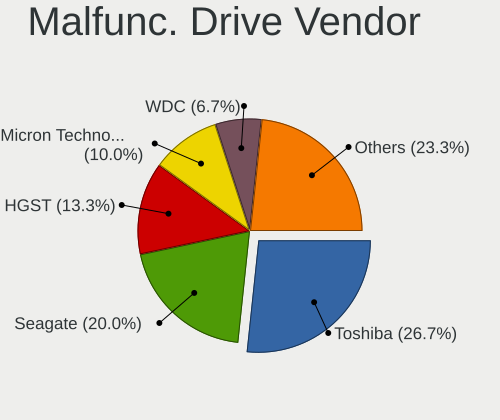

| Vendor              | Notebooks | Drives | Percent |
|---------------------|-----------|--------|---------|
| Toshiba             | 8         | 9      | 26.67%  |
| Seagate             | 6         | 6      | 20%     |
| HGST                | 4         | 5      | 13.33%  |
| Micron Technology   | 3         | 3      | 10%     |
| WDC                 | 2         | 2      | 6.67%   |
| Samsung Electronics | 2         | 2      | 6.67%   |
| Hitachi             | 2         | 2      | 6.67%   |
| LITEON              | 1         | 1      | 3.33%   |
| Crucial             | 1         | 1      | 3.33%   |
| China               | 1         | 1      | 3.33%   |

Malfunc. HDD Vendor
-------------------

Vendors of faulty HDD drives

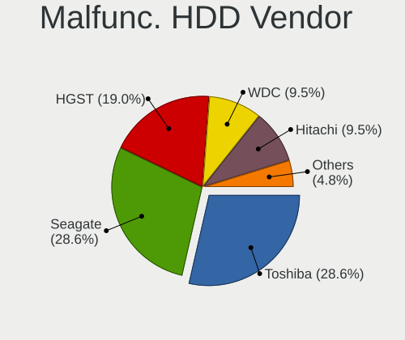

| Vendor              | Notebooks | Drives | Percent |
|---------------------|-----------|--------|---------|
| Toshiba             | 8         | 9      | 34.78%  |
| Seagate             | 6         | 6      | 26.09%  |
| HGST                | 4         | 5      | 17.39%  |
| WDC                 | 2         | 2      | 8.7%    |
| Hitachi             | 2         | 2      | 8.7%    |
| Samsung Electronics | 1         | 1      | 4.35%   |

Malfunc. Drive Kind
-------------------

Kinds of faulty drives

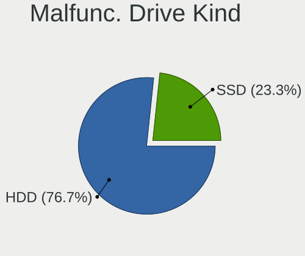

| Kind | Notebooks | Drives | Percent |
|------|-----------|--------|---------|
| HDD  | 23        | 25     | 76.67%  |
| SSD  | 7         | 7      | 23.33%  |

Failed Drives
-------------

Failed drive models

Zero info for selected period =(

Failed Drive Vendor
-------------------

Failed drive vendors

Zero info for selected period =(

Drive Status
------------

Number of failed and malfunc. drives

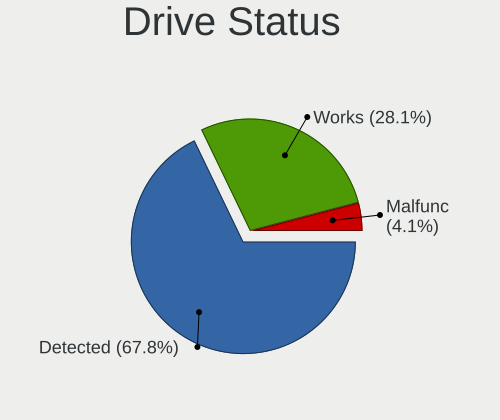

| Status   | Notebooks | Drives | Percent |
|----------|-----------|--------|---------|
| Detected | 500       | 643    | 67.84%  |
| Works    | 207       | 251    | 28.09%  |
| Malfunc  | 30        | 32     | 4.07%   |

Storage controller
------------------

Storage Vendor
--------------

Storage controller vendors

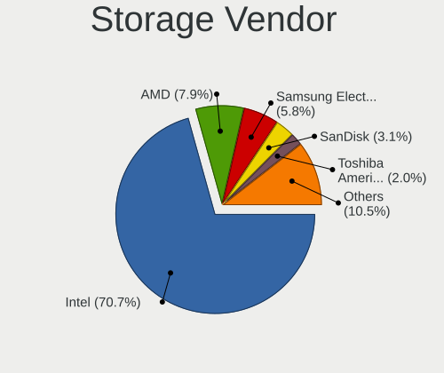

| Vendor                           | Notebooks | Percent |
|----------------------------------|-----------|---------|
| Intel                            | 564       | 70.68%  |
| AMD                              | 63        | 7.89%   |
| Samsung Electronics              | 46        | 5.76%   |
| SanDisk                          | 25        | 3.13%   |
| Toshiba America Info Systems     | 16        | 2.01%   |
| SK hynix                         | 12        | 1.5%    |
| Silicon Integrated Systems [SiS] | 10        | 1.25%   |
| Nvidia                           | 9         | 1.13%   |
| Micron Technology                | 8         | 1%      |
| KIOXIA                           | 8         | 1%      |
| Kingston Technology Company      | 8         | 1%      |
| VIA Technologies                 | 5         | 0.63%   |
| Silicon Motion                   | 5         | 0.63%   |
| Phison Electronics               | 4         | 0.5%    |
| ADATA Technology                 | 3         | 0.38%   |
| Lite-On Technology               | 2         | 0.25%   |
| Lenovo                           | 2         | 0.25%   |
| Apple                            | 2         | 0.25%   |
| Solid State Storage Technology   | 1         | 0.13%   |
| Silicon Image                    | 1         | 0.13%   |
| Shenzhen Longsys Electronics     | 1         | 0.13%   |
| Seagate Technology               | 1         | 0.13%   |
| Micron/Crucial Technology        | 1         | 0.13%   |
| MAXIO Technology (Hangzhou)      | 1         | 0.13%   |

Storage Model
-------------

Storage controller models

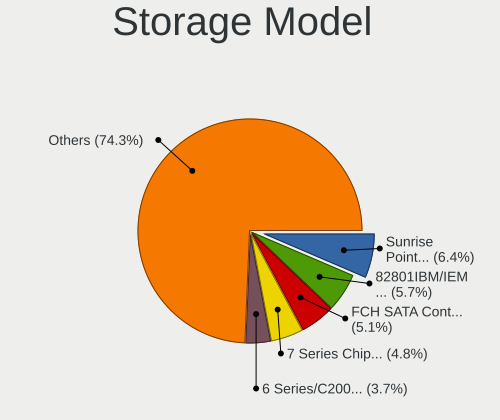

| Model                                                                            | Notebooks | Percent |
|----------------------------------------------------------------------------------|-----------|---------|
| Intel Sunrise Point-LP SATA Controller [AHCI mode]                               | 58        | 6.44%   |
| Intel 82801IBM/IEM (ICH9M/ICH9M-E) 4 port SATA Controller [AHCI mode]            | 51        | 5.67%   |
| AMD FCH SATA Controller [AHCI mode]                                              | 46        | 5.11%   |
| Intel 7 Series Chipset Family 6-port SATA Controller [AHCI mode]                 | 43        | 4.78%   |
| Intel 6 Series/C200 Series Chipset Family 6 port Mobile SATA AHCI Controller     | 33        | 3.67%   |
| Intel 82801HM/HEM (ICH8M/ICH8M-E) IDE Controller                                 | 30        | 3.33%   |
| Intel 82801G (ICH7 Family) IDE Controller                                        | 30        | 3.33%   |
| Intel 82801 Mobile SATA Controller [RAID mode]                                   | 29        | 3.22%   |
| Intel 82801GBM/GHM (ICH7-M Family) SATA Controller [IDE mode]                    | 28        | 3.11%   |
| Intel 82801GBM/GHM (ICH7-M Family) SATA Controller [AHCI mode]                   | 26        | 2.89%   |
| Intel 82801HM/HEM (ICH8M/ICH8M-E) SATA Controller [AHCI mode]                    | 23        | 2.56%   |
| Intel Wildcat Point-LP SATA Controller [AHCI Mode]                               | 21        | 2.33%   |
| Samsung NVMe SSD Controller SM981/PM981/PM983                                    | 19        | 2.11%   |
| Intel 8 Series SATA Controller 1 [AHCI mode]                                     | 19        | 2.11%   |
| Intel NM10/ICH7 Family SATA Controller [AHCI mode]                               | 17        | 1.89%   |
| Intel 5 Series/3400 Series Chipset 6 port SATA AHCI Controller                   | 16        | 1.78%   |
| Intel 5 Series/3400 Series Chipset 4 port SATA AHCI Controller                   | 16        | 1.78%   |
| Intel Cannon Lake Mobile PCH SATA AHCI Controller                                | 15        | 1.67%   |
| Intel HM170/QM170 Chipset SATA Controller [AHCI Mode]                            | 14        | 1.56%   |
| Intel 82801FB/FBM/FR/FW/FRW (ICH6 Family) IDE Controller                         | 13        | 1.44%   |
| AMD SB7x0/SB8x0/SB9x0 SATA Controller [AHCI mode]                                | 13        | 1.44%   |
| Intel Volume Management Device NVMe RAID Controller                              | 12        | 1.33%   |
| Intel Atom/Celeron/Pentium Processor x5-E8000/J3xxx/N3xxx Series SATA Controller | 12        | 1.33%   |
| Silicon Integrated Systems [SiS] 5513 IDE Controller                             | 10        | 1.11%   |
| Intel Comet Lake SATA AHCI Controller                                            | 10        | 1.11%   |
| Intel 8 Series/C220 Series Chipset Family 6-port SATA Controller 1 [AHCI mode]   | 10        | 1.11%   |
| Samsung NVMe SSD Controller 980 (DRAM-less)                                      | 9         | 1%      |
| Intel Atom Processor E3800 Series SATA AHCI Controller                           | 9         | 1%      |
| Intel Q170/Q150/B150/H170/H110/Z170/CM236 Chipset SATA Controller [AHCI Mode]    | 8         | 0.89%   |
| Intel 82801HM/HEM (ICH8M/ICH8M-E) SATA Controller [IDE mode]                     | 8         | 0.89%   |
| SanDisk Extreme Pro / WD Black SN750 / PC SN730 / Red SN700 NVMe SSD             | 7         | 0.78%   |
| Intel Tiger Lake-LP SATA Controller                                              | 7         | 0.78%   |
| Silicon Integrated Systems [SiS] SATA Controller / IDE mode                      | 6         | 0.67%   |
| Samsung NVMe SSD Controller SM961/PM961/SM963                                    | 6         | 0.67%   |
| KIOXIA NVMe SSD Controller BG4 (DRAM-less)                                       | 6         | 0.67%   |
| Intel RST Volume Management Device Controller                                    | 6         | 0.67%   |
| Intel Mobile 4 Series Chipset PT IDER Controller                                 | 6         | 0.67%   |
| Intel Cannon Point-LP SATA Controller [AHCI Mode]                                | 6         | 0.67%   |
| Toshiba America Info Systems XG5 NVMe SSD Controller                             | 5         | 0.56%   |
| SanDisk Ultra 3D / WD PC SN530, IX SN530, Blue SN550 NVMe SSD (DRAM-less)        | 5         | 0.56%   |

Storage Kind
------------

Kind of storage controller (IDE, SATA, NVMe, SAS, ...)

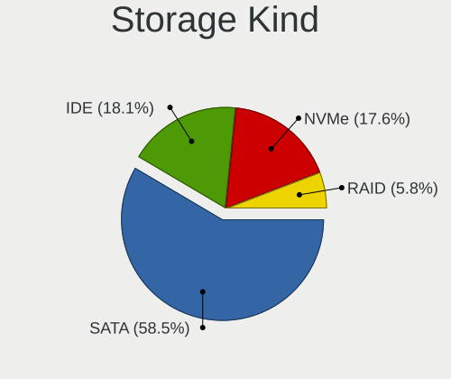

| Kind | Notebooks | Percent |
|------|-----------|---------|
| SATA | 503       | 58.49%  |
| IDE  | 156       | 18.14%  |
| NVMe | 151       | 17.56%  |
| RAID | 50        | 5.81%   |

Processor
---------

CPU Vendor
----------

Processor vendors

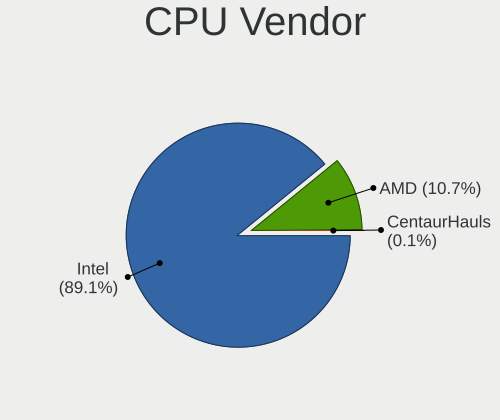

| Vendor       | Notebooks | Percent |
|--------------|-----------|---------|
| Intel        | 639       | 89.12%  |
| AMD          | 77        | 10.74%  |
| CentaurHauls | 1         | 0.14%   |

CPU Model
---------

Processor models

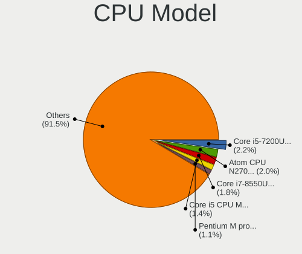

| Model                                       | Notebooks | Percent |
|---------------------------------------------|-----------|---------|
| Intel Core i5-7200U CPU @ 2.50GHz           | 16        | 2.23%   |
| Intel Atom CPU N270 @ 1.60GHz               | 14        | 1.95%   |
| Intel Core i7-8550U CPU @ 1.80GHz           | 13        | 1.81%   |
| Intel Core i5 CPU M 520 @ 2.40GHz           | 10        | 1.39%   |
| Intel Pentium M processor 1.73GHz           | 8         | 1.12%   |
| Intel Core i7-7500U CPU @ 2.70GHz           | 8         | 1.12%   |
| Intel Core i7-10510U CPU @ 1.80GHz          | 8         | 1.12%   |
| Intel Core i5-5200U CPU @ 2.20GHz           | 8         | 1.12%   |
| Intel Pentium Dual-Core CPU T4400 @ 2.20GHz | 7         | 0.98%   |
| Intel Core i7-8565U CPU @ 1.80GHz           | 7         | 0.98%   |
| Intel Core i7-6700HQ CPU @ 2.60GHz          | 7         | 0.98%   |
| Intel Core i5-3230M CPU @ 2.60GHz           | 7         | 0.98%   |
| Intel Core 2 Duo CPU P8700 @ 2.53GHz        | 7         | 0.98%   |
| Intel Core 2 Duo CPU P8600 @ 2.40GHz        | 7         | 0.98%   |
| Intel Core i7-9750H CPU @ 2.60GHz           | 6         | 0.84%   |
| Intel Core i7-7700HQ CPU @ 2.80GHz          | 6         | 0.84%   |
| Intel Core i5-8265U CPU @ 1.60GHz           | 6         | 0.84%   |
| Intel Core i5-2520M CPU @ 2.50GHz           | 6         | 0.84%   |
| Intel Core i5-10210U CPU @ 1.60GHz          | 6         | 0.84%   |
| Intel Core 2 Duo CPU T7250 @ 2.00GHz        | 6         | 0.84%   |
| Intel Celeron CPU N3060 @ 1.60GHz           | 6         | 0.84%   |
| Intel Atom CPU N450 @ 1.66GHz               | 6         | 0.84%   |
| Intel Pentium Dual-Core CPU T4300 @ 2.10GHz | 5         | 0.7%    |
| Intel Pentium CPU N3700 @ 1.60GHz           | 5         | 0.7%    |
| Intel Core i7-8750H CPU @ 2.20GHz           | 5         | 0.7%    |
| Intel Core i7-6500U CPU @ 2.50GHz           | 5         | 0.7%    |
| Intel Core i7-10750H CPU @ 2.60GHz          | 5         | 0.7%    |
| Intel Core i5-8250U CPU @ 1.60GHz           | 5         | 0.7%    |
| Intel Core i5-6200U CPU @ 2.30GHz           | 5         | 0.7%    |
| Intel Core i5-5300U CPU @ 2.30GHz           | 5         | 0.7%    |
| Intel Core i5-4210U CPU @ 1.70GHz           | 5         | 0.7%    |
| Intel Core i3-2350M CPU @ 2.30GHz           | 5         | 0.7%    |
| Intel Atom CPU N455 @ 1.66GHz               | 5         | 0.7%    |
| Intel 11th Gen Core i7-1165G7 @ 2.80GHz     | 5         | 0.7%    |
| Intel Pentium Dual-Core CPU T4500 @ 2.30GHz | 4         | 0.56%   |
| Intel Pentium Dual-Core CPU T4200 @ 2.00GHz | 4         | 0.56%   |
| Intel Pentium Dual CPU T3400 @ 2.16GHz      | 4         | 0.56%   |
| Intel Pentium Dual CPU T2390 @ 1.86GHz      | 4         | 0.56%   |
| Intel Genuine CPU T2300 @ 1.66GHz           | 4         | 0.56%   |
| Intel Core i7-6600U CPU @ 2.60GHz           | 4         | 0.56%   |

CPU Model Family
----------------

Processor model prefix

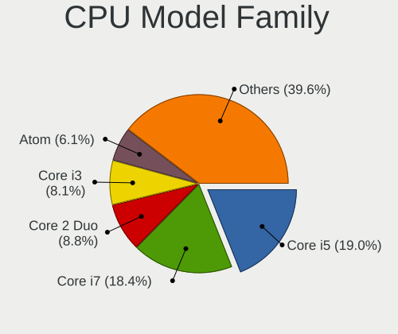

| Model                          | Notebooks | Percent |
|--------------------------------|-----------|---------|
| Intel Core i5                  | 136       | 18.97%  |
| Intel Core i7                  | 132       | 18.41%  |
| Intel Core 2 Duo               | 63        | 8.79%   |
| Intel Core i3                  | 58        | 8.09%   |
| Intel Atom                     | 44        | 6.14%   |
| Other                          | 38        | 5.3%    |
| Intel Celeron                  | 36        | 5.02%   |
| Intel Genuine                  | 25        | 3.49%   |
| Intel Pentium                  | 23        | 3.21%   |
| Intel Pentium Dual-Core        | 20        | 2.79%   |
| Intel Pentium M                | 14        | 1.95%   |
| Intel Celeron M                | 13        | 1.81%   |
| AMD Ryzen 5                    | 13        | 1.81%   |
| Intel Pentium Dual             | 11        | 1.53%   |
| Intel Core 2                   | 9         | 1.26%   |
| AMD A4                         | 8         | 1.12%   |
| AMD Ryzen 7                    | 6         | 0.84%   |
| Intel Core Duo                 | 5         | 0.7%    |
| AMD A6                         | 5         | 0.7%    |
| Intel Core i9                  | 4         | 0.56%   |
| AMD A8                         | 4         | 0.56%   |
| AMD A10                        | 4         | 0.56%   |
| AMD Turion X2 Dual-Core Mobile | 3         | 0.42%   |
| AMD E1                         | 3         | 0.42%   |
| Intel Pentium Silver           | 2         | 0.28%   |
| Intel Celeron Dual-Core        | 2         | 0.28%   |
| AMD Ryzen 7 PRO                | 2         | 0.28%   |
| AMD Phenom II                  | 2         | 0.28%   |
| AMD E2                         | 2         | 0.28%   |
| AMD E                          | 2         | 0.28%   |
| AMD C-60                       | 2         | 0.28%   |
| AMD Athlon X2                  | 2         | 0.28%   |
| AMD Athlon II                  | 2         | 0.28%   |
| Intel Xeon                     | 1         | 0.14%   |
| Intel Mobile Pentium 4         | 1         | 0.14%   |
| Intel Core m7                  | 1         | 0.14%   |
| Intel Core m5                  | 1         | 0.14%   |
| Intel Core m3                  | 1         | 0.14%   |
| Intel Core M                   | 1         | 0.14%   |
| Intel Core 2 Extreme           | 1         | 0.14%   |

CPU Cores
---------

Number of processor cores

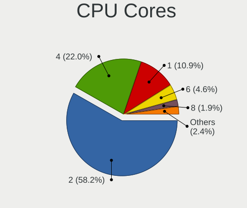

| Number | Notebooks | Percent |
|--------|-----------|---------|
| 2      | 418       | 58.22%  |
| 4      | 158       | 22.01%  |
| 1      | 78        | 10.86%  |
| 6      | 33        | 4.6%    |
| 8      | 14        | 1.95%   |
| 14     | 6         | 0.84%   |
| 12     | 4         | 0.56%   |
| 10     | 3         | 0.42%   |
| 16     | 2         | 0.28%   |
| 3      | 2         | 0.28%   |

CPU Sockets
-----------

Number of sockets

| Number | Notebooks | Percent |
|--------|-----------|---------|
| 1      | 717       | 100%    |

CPU Threads
-----------

Threads per core (Hyper-Threading)

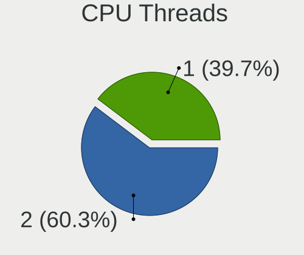

| Number | Notebooks | Percent |
|--------|-----------|---------|
| 2      | 433       | 60.31%  |
| 1      | 285       | 39.69%  |

CPU Op-Modes
------------

CPU Operation Modes (32-bit, 64-bit)

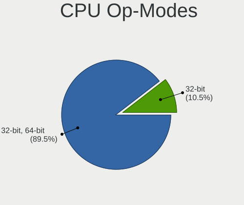

| Op mode        | Notebooks | Percent |
|----------------|-----------|---------|
| 32-bit, 64-bit | 642       | 89.54%  |
| 32-bit         | 75        | 10.46%  |

CPU Microcode
-------------

Microcode number

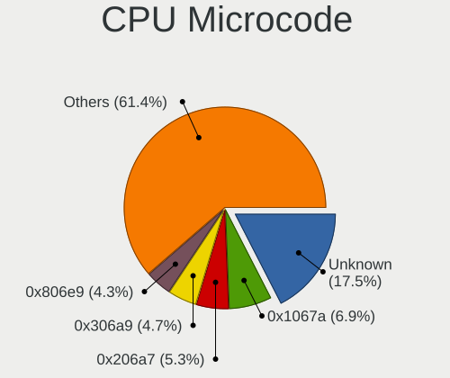

| Number     | Notebooks | Percent |
|------------|-----------|---------|
| Unknown    | 126       | 17.45%  |
| 0x1067a    | 50        | 6.93%   |
| 0x206a7    | 38        | 5.26%   |
| 0x306a9    | 34        | 4.71%   |
| 0x806e9    | 31        | 4.29%   |
| 0x6fd      | 28        | 3.88%   |
| 0x20655    | 21        | 2.91%   |
| 0x806ea    | 20        | 2.77%   |
| 0x6e8      | 20        | 2.77%   |
| 0x106c2    | 20        | 2.77%   |
| 0x40651    | 18        | 2.49%   |
| 0x806ec    | 17        | 2.35%   |
| 0x306d4    | 17        | 2.35%   |
| 0x106ca    | 17        | 2.35%   |
| 0x6d8      | 16        | 2.22%   |
| 0x406e3    | 16        | 2.22%   |
| 0x906ea    | 14        | 1.94%   |
| 0x6ec      | 13        | 1.8%    |
| 0x506e3    | 12        | 1.66%   |
| 0x10676    | 12        | 1.66%   |
| 0x30678    | 11        | 1.52%   |
| 0x306c3    | 10        | 1.39%   |
| 0x20652    | 10        | 1.39%   |
| 0x906e9    | 9         | 1.25%   |
| 0x406c3    | 9         | 1.25%   |
| 0xa0652    | 8         | 1.11%   |
| 0x406c4    | 8         | 1.11%   |
| 0x6f6      | 7         | 0.97%   |
| 0x05000119 | 7         | 0.97%   |
| 0x806c1    | 6         | 0.83%   |
| 0x10661    | 6         | 0.83%   |
| 0x0700010f | 6         | 0.83%   |
| 0x806eb    | 5         | 0.69%   |
| 0x706e5    | 5         | 0.69%   |
| 0x07030105 | 5         | 0.69%   |
| 0x6fb      | 4         | 0.55%   |
| 0x08108109 | 4         | 0.55%   |
| 0x010000c8 | 4         | 0.55%   |
| 0x906a3    | 3         | 0.42%   |
| 0x30661    | 3         | 0.42%   |

CPU Microarch
-------------

Microarchitecture

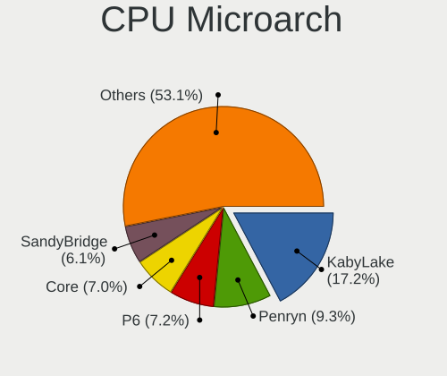

| Name              | Notebooks | Percent |
|-------------------|-----------|---------|
| KabyLake          | 124       | 17.25%  |
| Penryn            | 67        | 9.32%   |
| P6                | 52        | 7.23%   |
| Core              | 50        | 6.95%   |
| SandyBridge       | 44        | 6.12%   |
| IvyBridge         | 43        | 5.98%   |
| Bonnell           | 40        | 5.56%   |
| Skylake           | 37        | 5.15%   |
| Westmere          | 35        | 4.87%   |
| Haswell           | 31        | 4.31%   |
| Silvermont        | 30        | 4.17%   |
| Broadwell         | 23        | 3.2%    |
| Unknown           | 14        | 1.95%   |
| CometLake         | 12        | 1.67%   |
| Alderlake Hybrid  | 12        | 1.67%   |
| TigerLake         | 11        | 1.53%   |
| Icelake           | 10        | 1.39%   |
| Excavator         | 9         | 1.25%   |
| Zen+              | 7         | 0.97%   |
| Puma              | 7         | 0.97%   |
| Bobcat            | 7         | 0.97%   |
| K8 & K10 hybrid   | 6         | 0.83%   |
| K10               | 6         | 0.83%   |
| Jaguar            | 6         | 0.83%   |
| Zen 2             | 5         | 0.7%    |
| K8 Hammer         | 5         | 0.7%    |
| Goldmont plus     | 5         | 0.7%    |
| Zen               | 4         | 0.56%   |
| Zen 3             | 3         | 0.42%   |
| Piledriver        | 3         | 0.42%   |
| Steamroller       | 2         | 0.28%   |
| Nehalem           | 2         | 0.28%   |
| K10 Llano         | 2         | 0.28%   |
| Goldmont          | 2         | 0.28%   |
| Tremont           | 1         | 0.14%   |
| NetBurst          | 1         | 0.14%   |
| Meteorlake Hybrid | 1         | 0.14%   |

Graphics
--------

GPU Vendor
----------

Vendors of graphics cards

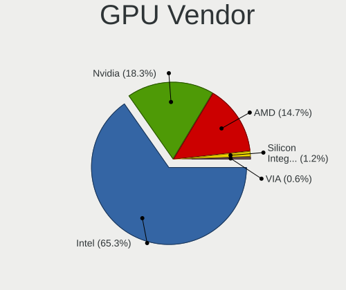

| Vendor                           | Notebooks | Percent |
|----------------------------------|-----------|---------|
| Intel                            | 561       | 65.31%  |
| Nvidia                           | 157       | 18.28%  |
| AMD                              | 126       | 14.67%  |
| Silicon Integrated Systems [SiS] | 10        | 1.16%   |
| VIA Technologies                 | 5         | 0.58%   |

GPU Model
---------

Graphics card models

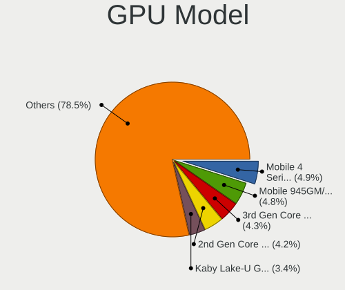

| Model                                                                                    | Notebooks | Percent |
|------------------------------------------------------------------------------------------|-----------|---------|
| Intel Mobile 4 Series Chipset Integrated Graphics Controller                             | 46        | 4.9%    |
| Intel Mobile 945GM/GMS/GME, 943/940GML Express Integrated Graphics Controller            | 45        | 4.79%   |
| Intel 3rd Gen Core processor Graphics Controller                                         | 40        | 4.26%   |
| Intel 2nd Generation Core Processor Family Integrated Graphics Controller                | 39        | 4.15%   |
| Intel Kaby Lake-U GT2 [HD Graphics 620]                                                  | 32        | 3.41%   |
| Intel Mobile 945GM/GMS, 943/940GML Express Integrated Graphics Controller                | 28        | 2.98%   |
| Intel Core Processor Integrated Graphics Controller                                      | 28        | 2.98%   |
| Intel Kaby Lake-R GT2 [UHD Graphics 620]                                                 | 26        | 2.77%   |
| Intel Mobile GM965/GL960 Integrated Graphics Controller (secondary)                      | 23        | 2.45%   |
| Intel Mobile GM965/GL960 Integrated Graphics Controller (primary)                        | 23        | 2.45%   |
| Intel Haswell-ULT Integrated Graphics Controller                                         | 21        | 2.24%   |
| Intel Skylake-U GT2 [HD Graphics 520]                                                    | 19        | 2.02%   |
| Intel CoffeeLake-H GT2 [UHD Graphics 630]                                                | 19        | 2.02%   |
| Intel Broadwell-U GT2 [HD Graphics 5500]                                                 | 19        | 2.02%   |
| Intel Atom/Celeron/Pentium Processor x5-E8000/J3xxx/N3xxx Integrated Graphics Controller | 18        | 1.92%   |
| Intel Mobile 945GSE Express Integrated Graphics Controller                               | 17        | 1.81%   |
| Intel Atom Processor D4xx/D5xx/N4xx/N5xx Integrated Graphics Controller                  | 17        | 1.81%   |
| Intel WhiskeyLake-U GT2 [UHD Graphics 620]                                               | 16        | 1.7%    |
| Intel Mobile 915GM/GMS/910GML Express Graphics Controller                                | 15        | 1.6%    |
| Intel CometLake-U GT2 [UHD Graphics]                                                     | 15        | 1.6%    |
| Intel Skylake-H GT2 [HD Graphics 530]                                                    | 12        | 1.28%   |
| Intel Atom Processor Z36xxx/Z37xxx Series Graphics & Display                             | 12        | 1.28%   |
| Intel 4th Gen Core Processor Integrated Graphics Controller                              | 10        | 1.06%   |
| AMD Topaz XT [Radeon R7 M260/M265 / M340/M360 / M440/M445 / 530/535 / 620/625 Mobile]    | 10        | 1.06%   |
| Intel TigerLake-LP GT2 [Iris Xe Graphics]                                                | 9         | 0.96%   |
| Intel TigerLake-H GT1 [UHD Graphics]                                                     | 9         | 0.96%   |
| Intel Kaby Lake-H GT2 [HD Graphics 630]                                                  | 9         | 0.96%   |
| Intel CometLake-H GT2 [UHD Graphics]                                                     | 9         | 0.96%   |
| Silicon Integrated Systems [SiS] 771/671 PCIE VGA Display Adapter                        | 8         | 0.85%   |
| Nvidia TU117M [GeForce GTX 1650 Mobile / Max-Q]                                          | 7         | 0.75%   |
| Nvidia GM107M [GeForce GTX 960M]                                                         | 7         | 0.75%   |
| AMD Sun XT [Radeon HD 8670A/8670M/8690M / R5 M330 / M430 / Radeon 520 Mobile]            | 7         | 0.75%   |
| AMD Picasso/Raven 2 [Radeon Vega Series / Radeon Vega Mobile Series]                     | 7         | 0.75%   |
| Nvidia GP108M [GeForce MX150]                                                            | 6         | 0.64%   |
| Nvidia GA106M [GeForce RTX 3060 Mobile / Max-Q]                                          | 6         | 0.64%   |
| Intel Raptor Lake-P [Iris Xe Graphics]                                                   | 6         | 0.64%   |
| Intel Alder Lake-P GT2 [Iris Xe Graphics]                                                | 6         | 0.64%   |
| AMD RS880M [Mobility Radeon HD 4225/4250]                                                | 6         | 0.64%   |
| AMD Mullins [Radeon R4/R5 Graphics]                                                      | 6         | 0.64%   |
| Nvidia TU117GLM [Quadro T2000 Mobile / Max-Q]                                            | 5         | 0.53%   |

GPU Combo
---------

Combinations of graphics cards

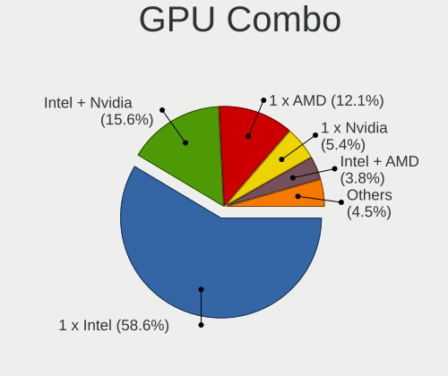

| Name           | Notebooks | Percent |
|----------------|-----------|---------|
| 1 x Intel      | 420       | 58.58%  |
| Intel + Nvidia | 112       | 15.62%  |
| 1 x AMD        | 87        | 12.13%  |
| 1 x Nvidia     | 39        | 5.44%   |
| Intel + AMD    | 27        | 3.77%   |
| 1 x SiS        | 10        | 1.39%   |
| 2 x AMD        | 9         | 1.26%   |
| 1 x VIA        | 5         | 0.7%    |
| 2 x Nvidia     | 3         | 0.42%   |
| AMD + Nvidia   | 3         | 0.42%   |
| Other          | 1         | 0.14%   |
| 2 x Intel      | 1         | 0.14%   |

GPU Driver
----------

Free vs proprietary

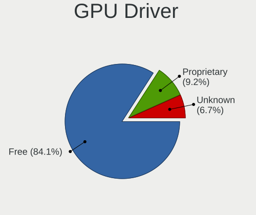

| Driver      | Notebooks | Percent |
|-------------|-----------|---------|
| Free        | 604       | 84.12%  |
| Proprietary | 66        | 9.19%   |
| Unknown     | 48        | 6.69%   |

GPU Memory
----------

Total video memory

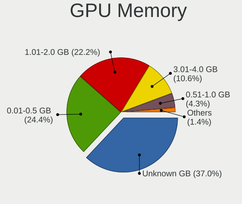

| Size in GB | Notebooks | Percent |
|------------|-----------|---------|
| Unknown    | 268       | 37.02%  |
| 0.01-0.5   | 177       | 24.45%  |
| 1.01-2.0   | 161       | 22.24%  |
| 3.01-4.0   | 77        | 10.64%  |
| 0.51-1.0   | 31        | 4.28%   |
| 5.01-6.0   | 5         | 0.69%   |
| 7.01-8.0   | 3         | 0.41%   |
| 2.01-3.0   | 2         | 0.28%   |

Monitor
-------

Monitor Vendor
--------------

Monitor vendors

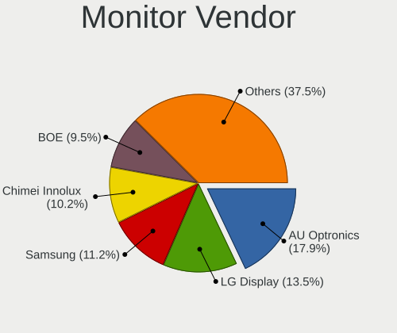

| Vendor                  | Notebooks | Percent |
|-------------------------|-----------|---------|
| AU Optronics            | 139       | 17.94%  |
| LG Display              | 105       | 13.55%  |
| Samsung Electronics     | 87        | 11.23%  |
| Chimei Innolux          | 79        | 10.19%  |
| BOE                     | 74        | 9.55%   |
| Sharp                   | 29        | 3.74%   |
| Lenovo                  | 28        | 3.61%   |
| Chi Mei Optoelectronics | 28        | 3.61%   |
| LG Philips              | 18        | 2.32%   |
| Dell                    | 16        | 2.06%   |
| Apple                   | 16        | 2.06%   |
| Acer                    | 15        | 1.94%   |
| Goldstar                | 14        | 1.81%   |
| HannStar                | 11        | 1.42%   |
| Hewlett-Packard         | 9         | 1.16%   |
| InfoVision              | 8         | 1.03%   |
| Ancor Communications    | 8         | 1.03%   |
| InnoLux Display         | 7         | 0.9%    |
| AOC                     | 7         | 0.9%    |
| Quanta Display          | 6         | 0.77%   |
| Philips                 | 6         | 0.77%   |
| Seiko/Epson             | 5         | 0.65%   |
| CPT                     | 5         | 0.65%   |
| PANDA                   | 4         | 0.52%   |
| BenQ                    | 4         | 0.52%   |
| ViewSonic               | 3         | 0.39%   |
| Vestel Elektronik       | 3         | 0.39%   |
| Unknown                 | 3         | 0.39%   |
| KDC                     | 3         | 0.39%   |
| Iiyama                  | 3         | 0.39%   |
| IBM                     | 3         | 0.39%   |
| Sony                    | 2         | 0.26%   |
| Panasonic               | 2         | 0.26%   |
| CSO                     | 2         | 0.26%   |
| ___                     | 1         | 0.13%   |
| Westinghouse            | 1         | 0.13%   |
| Vizio                   | 1         | 0.13%   |
| Toshiba                 | 1         | 0.13%   |
| TMX                     | 1         | 0.13%   |
| TCL                     | 1         | 0.13%   |

Monitor Model
-------------

Monitor models

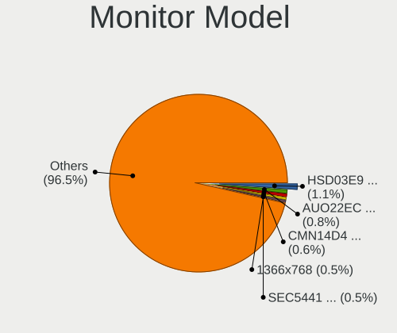

| Model                                                                    | Notebooks | Percent |
|--------------------------------------------------------------------------|-----------|---------|
| HannStar LCD Monitor HSD03E9 1024x600 220x129mm 10.0-inch                | 9         | 1.14%   |
| AU Optronics LCD Monitor AUO22EC 1366x768 344x193mm 15.5-inch            | 6         | 0.76%   |
| Chimei Innolux LCD Monitor CMN14D4 1920x1080 309x173mm 13.9-inch         | 5         | 0.63%   |
| Seiko/Epson LCD Monitor 1366x768                                         | 4         | 0.51%   |
| Samsung Electronics LCD Monitor SEC5441 1280x800 331x207mm 15.4-inch     | 4         | 0.51%   |
| LG Display LCD Monitor LGD033A 1366x768 344x194mm 15.5-inch              | 4         | 0.51%   |
| Chimei Innolux LCD Monitor CMN15F5 1920x1080 344x193mm 15.5-inch         | 4         | 0.51%   |
| Chimei Innolux LCD Monitor CMN15C4 1920x1080 344x193mm 15.5-inch         | 4         | 0.51%   |
| Chimei Innolux LCD Monitor CMN15AB 1366x768 344x193mm 15.5-inch          | 4         | 0.51%   |
| Chi Mei Optoelectronics LCD Monitor CMO15A7 1366x768 344x193mm 15.5-inch | 4         | 0.51%   |
| AU Optronics LCD Monitor AUO21ED 1920x1080 344x193mm 15.5-inch           | 4         | 0.51%   |
| Vestel Elektronik 40UHD_LCD_TV VES3700 3840x2160 880x500mm 39.8-inch     | 3         | 0.38%   |
| Samsung Electronics LCD Monitor SEC3741 1280x800 331x207mm 15.4-inch     | 3         | 0.38%   |
| Samsung Electronics LCD Monitor SDC4171 2880x1800 302x189mm 14.0-inch    | 3         | 0.38%   |
| LG Display LCD Monitor LGD02DC 1366x768 344x194mm 15.5-inch              | 3         | 0.38%   |
| Lenovo LCD Monitor LEN4036 1440x900 303x190mm 14.1-inch                  | 3         | 0.38%   |
| IBM LCD Monitor IBM2887 1680x1050 331x207mm 15.4-inch                    | 3         | 0.38%   |
| Chimei Innolux LCD Monitor CMN1738 1920x1080 381x214mm 17.2-inch         | 3         | 0.38%   |
| Chi Mei Optoelectronics LCD Monitor CMO0209 1024x600 195x113mm 8.9-inch  | 3         | 0.38%   |
| BOE LCD Monitor BOE0747 1920x1080 344x194mm 15.5-inch                    | 3         | 0.38%   |
| AU Optronics LCD Monitor AUO38ED 1920x1080 344x193mm 15.5-inch           | 3         | 0.38%   |
| AU Optronics LCD Monitor AUO31D2 1024x600 223x125mm 10.1-inch            | 3         | 0.38%   |
| AU Optronics LCD Monitor AUO30D2 1024x600 223x125mm 10.1-inch            | 3         | 0.38%   |
| AU Optronics LCD Monitor AUO213E 1600x900 309x174mm 14.0-inch            | 3         | 0.38%   |
| AU Optronics LCD Monitor AUO20EC 1366x768 344x193mm 15.5-inch            | 3         | 0.38%   |
| Sharp LCD Monitor SHP14F9 1920x1200 288x180mm 13.4-inch                  | 2         | 0.25%   |
| Sharp LCD Monitor SHP14B9 3840x2160 344x194mm 15.5-inch                  | 2         | 0.25%   |
| Sharp LCD Monitor SHP1453 1920x1080 346x194mm 15.6-inch                  | 2         | 0.25%   |
| Sharp LCD Monitor SHP1447 1920x1080 294x165mm 13.3-inch                  | 2         | 0.25%   |
| Sharp LCD Monitor SHP13CA 1280x800 331x207mm 15.4-inch                   | 2         | 0.25%   |
| Samsung Electronics LCD Monitor SEC4545 1280x800 331x207mm 15.4-inch     | 2         | 0.25%   |
| Samsung Electronics LCD Monitor SEC4442 1280x800 303x190mm 14.1-inch     | 2         | 0.25%   |
| Samsung Electronics LCD Monitor SEC4258 1024x768 286x214mm 14.1-inch     | 2         | 0.25%   |
| Samsung Electronics LCD Monitor SEC4252 1366x768 344x194mm 15.5-inch     | 2         | 0.25%   |
| Samsung Electronics LCD Monitor SEC3641 1366x768 353x198mm 15.9-inch     | 2         | 0.25%   |
| Samsung Electronics LCD Monitor SEC3358 1280x800 331x207mm 15.4-inch     | 2         | 0.25%   |
| Samsung Electronics LCD Monitor SEC3245 1366x768 340x190mm 15.3-inch     | 2         | 0.25%   |
| Samsung Electronics LCD Monitor SDC374A 3200x1800 293x165mm 13.2-inch    | 2         | 0.25%   |
| Quanta Display LCD Monitor QDS0027 1280x800 331x207mm 15.4-inch          | 2         | 0.25%   |
| LG Philips LCD Monitor LPLA500 1280x800 304x190mm 14.1-inch              | 2         | 0.25%   |

Monitor Resolution
------------------

Monitor screen resolution

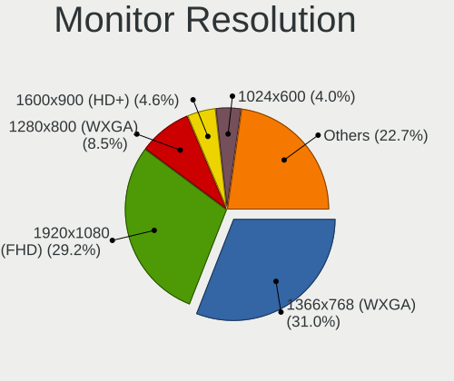

| Resolution         | Notebooks | Percent |
|--------------------|-----------|---------|
| 1366x768 (WXGA)    | 230       | 30.96%  |
| 1920x1080 (FHD)    | 217       | 29.21%  |
| 1280x800 (WXGA)    | 63        | 8.48%   |
| 1600x900 (HD+)     | 34        | 4.58%   |
| 1024x600           | 30        | 4.04%   |
| 3840x2160 (4K)     | 28        | 3.77%   |
| 1440x900 (WXGA+)   | 25        | 3.36%   |
| 2560x1440 (QHD)    | 13        | 1.75%   |
| 1920x1200 (WUXGA)  | 12        | 1.62%   |
| 1680x1050 (WSXGA+) | 12        | 1.62%   |
| 1024x768 (XGA)     | 12        | 1.62%   |
| 3200x1800 (QHD+)   | 6         | 0.81%   |
| 2880x1800          | 6         | 0.81%   |
| 2560x1600          | 6         | 0.81%   |
| 1360x768           | 6         | 0.81%   |
| Unknown            | 6         | 0.81%   |
| 3440x1440          | 4         | 0.54%   |
| 2160x1440          | 4         | 0.54%   |
| 1280x1024 (SXGA)   | 4         | 0.54%   |
| 3840x2400          | 2         | 0.27%   |
| 3840x1080          | 2         | 0.27%   |
| 3456x2160          | 2         | 0.27%   |
| 3072x1920          | 2         | 0.27%   |
| 2560x1080          | 2         | 0.27%   |
| 1920x540           | 2         | 0.27%   |
| 1680x945           | 2         | 0.27%   |
| 1280x720 (HD)      | 2         | 0.27%   |
| 3360x1080          | 1         | 0.13%   |
| 3286x1080          | 1         | 0.13%   |
| 3000x2000          | 1         | 0.13%   |
| 2736x1824          | 1         | 0.13%   |
| 2732x768           | 1         | 0.13%   |
| 2520x1680          | 1         | 0.13%   |
| 2288x1287          | 1         | 0.13%   |
| 1400x1050          | 1         | 0.13%   |
| 1024x576           | 1         | 0.13%   |

Monitor Diagonal
----------------

Diagonal size in inches

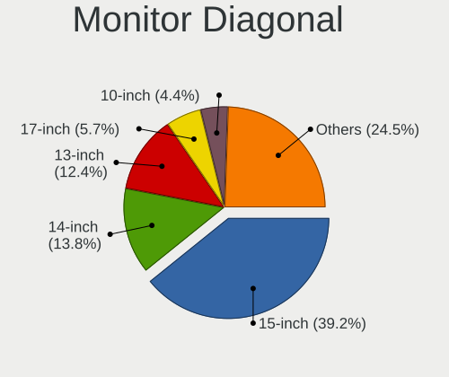

| Inches  | Notebooks | Percent |
|---------|-----------|---------|
| 15      | 303       | 39.2%   |
| 14      | 107       | 13.84%  |
| 13      | 96        | 12.42%  |
| 17      | 44        | 5.69%   |
| 10      | 34        | 4.4%    |
| 27      | 24        | 3.1%    |
| 24      | 23        | 2.98%   |
| Unknown | 18        | 2.33%   |
| 12      | 16        | 2.07%   |
| 23      | 14        | 1.81%   |
| 11      | 14        | 1.81%   |
| 16      | 10        | 1.29%   |
| 21      | 9         | 1.16%   |
| 31      | 8         | 1.03%   |
| 34      | 6         | 0.78%   |
| 22      | 6         | 0.78%   |
| 19      | 5         | 0.65%   |
| 84      | 4         | 0.52%   |
| 32      | 4         | 0.52%   |
| 72      | 3         | 0.39%   |
| 40      | 3         | 0.39%   |
| 20      | 3         | 0.39%   |
| 18      | 3         | 0.39%   |
| 8       | 3         | 0.39%   |
| 48      | 2         | 0.26%   |
| 28      | 2         | 0.26%   |
| 142     | 1         | 0.13%   |
| 86      | 1         | 0.13%   |
| 60      | 1         | 0.13%   |
| 54      | 1         | 0.13%   |
| 52      | 1         | 0.13%   |
| 42      | 1         | 0.13%   |
| 30      | 1         | 0.13%   |
| 26      | 1         | 0.13%   |
| 25      | 1         | 0.13%   |

Monitor Width
-------------

Physical width

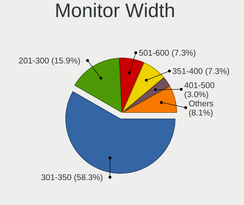

| Width in mm    | Notebooks | Percent |
|----------------|-----------|---------|
| 301-350        | 446       | 58.3%   |
| 201-300        | 122       | 15.95%  |
| 501-600        | 56        | 7.32%   |
| 351-400        | 56        | 7.32%   |
| 401-500        | 23        | 3.01%   |
| Unknown        | 18        | 2.35%   |
| 601-700        | 13        | 1.7%    |
| 701-800        | 10        | 1.31%   |
| 1501-2000      | 7         | 0.92%   |
| 1001-1500      | 6         | 0.78%   |
| 801-900        | 3         | 0.39%   |
| 101-200        | 3         | 0.39%   |
| More than 2000 | 1         | 0.13%   |
| 901-1000       | 1         | 0.13%   |

Aspect Ratio
------------

Proportional relationship between the width and the height

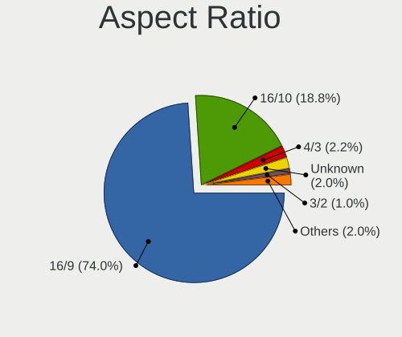

| Ratio   | Notebooks | Percent |
|---------|-----------|---------|
| 16/9    | 511       | 73.95%  |
| 16/10   | 130       | 18.81%  |
| 4/3     | 15        | 2.17%   |
| Unknown | 14        | 2.03%   |
| 3/2     | 7         | 1.01%   |
| 21/9    | 6         | 0.87%   |
| 5/4     | 4         | 0.58%   |
| 32/9    | 2         | 0.29%   |
| 1.00    | 1         | 0.14%   |
| 0.56    | 1         | 0.14%   |

Monitor Area
------------

Area in inch²

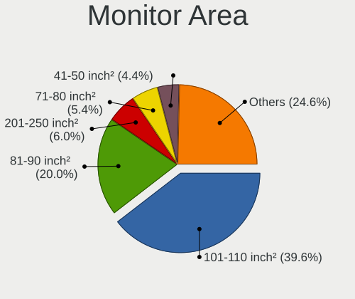

| Area in inch² | Notebooks | Percent |
|----------------|-----------|---------|
| 101-110        | 305       | 39.56%  |
| 81-90          | 154       | 19.97%  |
| 201-250        | 46        | 5.97%   |
| 71-80          | 42        | 5.45%   |
| 41-50          | 34        | 4.41%   |
| 121-130        | 31        | 4.02%   |
| 301-350        | 24        | 3.11%   |
| Unknown        | 18        | 2.33%   |
| 351-500        | 17        | 2.2%    |
| 61-70          | 15        | 1.95%   |
| 51-60          | 14        | 1.82%   |
| More than 1000 | 12        | 1.56%   |
| 131-140        | 11        | 1.43%   |
| 151-200        | 9         | 1.17%   |
| 251-300        | 8         | 1.04%   |
| 111-120        | 8         | 1.04%   |
| 91-100         | 8         | 1.04%   |
| 501-1000       | 7         | 0.91%   |
| 141-150        | 5         | 0.65%   |
| 1-40           | 3         | 0.39%   |

Pixel Density
-------------

Pixels per inch

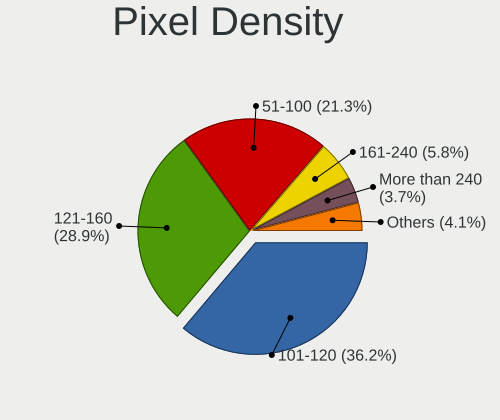

| Density       | Notebooks | Percent |
|---------------|-----------|---------|
| 101-120       | 273       | 36.16%  |
| 121-160       | 218       | 28.87%  |
| 51-100        | 161       | 21.32%  |
| 161-240       | 44        | 5.83%   |
| More than 240 | 28        | 3.71%   |
| Unknown       | 18        | 2.38%   |
| 1-50          | 13        | 1.72%   |

Multiple Monitors
-----------------

Total monitors connected

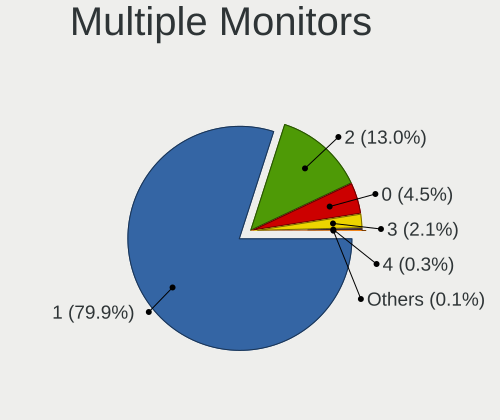

| Total | Notebooks | Percent |
|-------|-----------|---------|
| 1     | 582       | 79.95%  |
| 2     | 95        | 13.05%  |
| 0     | 33        | 4.53%   |
| 3     | 15        | 2.06%   |
| 4     | 2         | 0.27%   |
| 6     | 1         | 0.14%   |

Network
-------

Net Controller Vendor
---------------------

Controller vendors

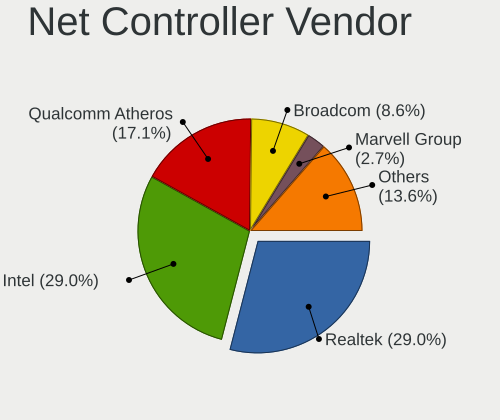

| Vendor                            | Notebooks | Percent |
|-----------------------------------|-----------|---------|
| Realtek Semiconductor             | 346       | 29.03%  |
| Intel                             | 346       | 29.03%  |
| Qualcomm Atheros                  | 204       | 17.11%  |
| Broadcom                          | 102       | 8.56%   |
| Marvell Technology Group          | 32        | 2.68%   |
| Broadcom Limited                  | 30        | 2.52%   |
| Ralink                            | 17        | 1.43%   |
| Shenzhen Goodix Technology        | 13        | 1.09%   |
| Silicon Integrated Systems [SiS]  | 10        | 0.84%   |
| MediaTek                          | 10        | 0.84%   |
| TP-Link                           | 8         | 0.67%   |
| Nvidia                            | 7         | 0.59%   |
| Ericsson Business Mobile Networks | 7         | 0.59%   |
| Ralink Technology                 | 5         | 0.42%   |
| JMicron Technology                | 5         | 0.42%   |
| Xiaomi                            | 4         | 0.34%   |
| VIA Technologies                  | 4         | 0.34%   |
| ASIX Electronics                  | 4         | 0.34%   |
| Sierra Wireless                   | 3         | 0.25%   |
| Samsung Electronics               | 3         | 0.25%   |
| DisplayLink                       | 3         | 0.25%   |
| Dell                              | 3         | 0.25%   |
| Qualcomm                          | 2         | 0.17%   |
| NetGear                           | 2         | 0.17%   |
| Huawei Technologies               | 2         | 0.17%   |
| Fibocom                           | 2         | 0.17%   |
| Edimax Technology                 | 2         | 0.17%   |
| ZyDAS                             | 1         | 0.08%   |
| ZTE WCDMA Technologies MSM        | 1         | 0.08%   |
| STMicroelectronics                | 1         | 0.08%   |
| Qualcomm Atheros Communications   | 1         | 0.08%   |
| OpenMoko                          | 1         | 0.08%   |
| Motorola PCS                      | 1         | 0.08%   |
| Lenovo                            | 1         | 0.08%   |
| ICS Advent                        | 1         | 0.08%   |
| Hewlett-Packard                   | 1         | 0.08%   |
| Espressif                         | 1         | 0.08%   |
| D-Link                            | 1         | 0.08%   |
| Attansic Technology               | 1         | 0.08%   |
| Arduino SA                        | 1         | 0.08%   |

Net Controller Model
--------------------

Controller models

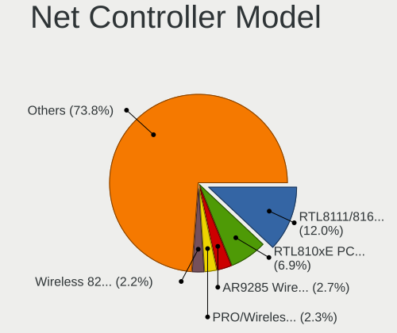

| Model                                                                   | Notebooks | Percent |
|-------------------------------------------------------------------------|-----------|---------|
| Realtek RTL8111/8168/8211/8411 PCI Express Gigabit Ethernet Controller  | 172       | 12.01%  |
| Realtek RTL810xE PCI Express Fast Ethernet controller                   | 99        | 6.91%   |
| Qualcomm Atheros AR9285 Wireless Network Adapter (PCI-Express)          | 39        | 2.72%   |
| Intel PRO/Wireless 3945ABG [Golan] Network Connection                   | 33        | 2.3%    |
| Intel Wireless 8265 / 8275                                              | 32        | 2.23%   |
| Qualcomm Atheros QCA9565 / AR9565 Wireless Network Adapter              | 29        | 2.03%   |
| Qualcomm Atheros AR242x / AR542x Wireless Network Adapter (PCI-Express) | 26        | 1.82%   |
| Realtek RTL8153 Gigabit Ethernet Adapter                                | 22        | 1.54%   |
| Broadcom BCM4313 802.11bgn Wireless Network Adapter                     | 20        | 1.4%    |
| Qualcomm Atheros AR9485 Wireless Network Adapter                        | 19        | 1.33%   |
| Intel 82579LM Gigabit Network Connection (Lewisville)                   | 19        | 1.33%   |
| Intel Wireless 8260                                                     | 17        | 1.19%   |
| Intel Wi-Fi 6 AX200                                                     | 17        | 1.19%   |
| Qualcomm Atheros QCA9377 802.11ac Wireless Network Adapter              | 16        | 1.12%   |
| Intel Wireless 7265                                                     | 16        | 1.12%   |
| Intel Centrino Advanced-N 6205 [Taylor Peak]                            | 16        | 1.12%   |
| Qualcomm Atheros QCA6174 802.11ac Wireless Network Adapter              | 15        | 1.05%   |
| Intel Centrino Advanced-N 6200                                          | 15        | 1.05%   |
| Realtek RTL-8100/8101L/8139 PCI Fast Ethernet Adapter                   | 14        | 0.98%   |
| Intel 82567LM Gigabit Network Connection                                | 14        | 0.98%   |
| Shenzhen Goodix Fingerprint Reader                                      | 13        | 0.91%   |
| Realtek RTL8723BE PCIe Wireless Network Adapter                         | 13        | 0.91%   |
| Qualcomm Atheros AR928X Wireless Network Adapter (PCI-Express)          | 13        | 0.91%   |
| Qualcomm Atheros AR8132 Fast Ethernet                                   | 13        | 0.91%   |
| Intel Comet Lake PCH-LP CNVi WiFi                                       | 12        | 0.84%   |
| Intel Cannon Lake PCH CNVi WiFi                                         | 12        | 0.84%   |
| Intel 82577LM Gigabit Network Connection                                | 12        | 0.84%   |
| Realtek RTL8188CE 802.11b/g/n WiFi Adapter                              | 11        | 0.77%   |
| Intel PRO/Wireless 5100 AGN [Shiloh] Network Connection                 | 11        | 0.77%   |
| Intel Ethernet Connection (4) I219-LM                                   | 11        | 0.77%   |
| Intel Cannon Point-LP CNVi [Wireless-AC]                                | 11        | 0.77%   |
| Broadcom BCM43142 802.11b/g/n                                           | 11        | 0.77%   |
| Broadcom BCM4311 802.11b/g WLAN                                         | 11        | 0.77%   |
| Intel Wireless 3165                                                     | 10        | 0.7%    |
| Intel 82801FB/FBM/FR/FW/FRW (ICH6 Family) AC'97 Modem Controller        | 10        | 0.7%    |
| Realtek RTL8188EE Wireless Network Adapter                              | 9         | 0.63%   |
| Intel Centrino Wireless-N 1000 [Condor Peak]                            | 9         | 0.63%   |
| Silicon Integrated Systems [SiS] 191 Gigabit Ethernet Adapter           | 8         | 0.56%   |
| Ralink RT3290 Wireless 802.11n 1T/1R PCIe                               | 8         | 0.56%   |
| Intel Ultimate N WiFi Link 5300                                         | 8         | 0.56%   |

Wireless Vendor
---------------

Wireless vendors

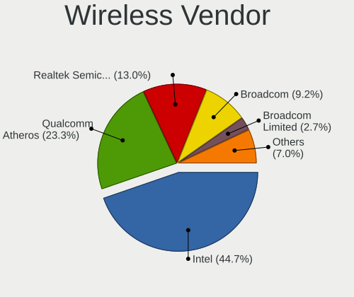

| Vendor                          | Notebooks | Percent |
|---------------------------------|-----------|---------|
| Intel                           | 326       | 44.72%  |
| Qualcomm Atheros                | 170       | 23.32%  |
| Realtek Semiconductor           | 95        | 13.03%  |
| Broadcom                        | 67        | 9.19%   |
| Broadcom Limited                | 20        | 2.74%   |
| Ralink                          | 17        | 2.33%   |
| MediaTek                        | 8         | 1.1%    |
| TP-Link                         | 7         | 0.96%   |
| Ralink Technology               | 5         | 0.69%   |
| Sierra Wireless                 | 3         | 0.41%   |
| NetGear                         | 2         | 0.27%   |
| Fibocom                         | 2         | 0.27%   |
| Edimax Technology               | 2         | 0.27%   |
| Dell                            | 2         | 0.27%   |
| ZyDAS                           | 1         | 0.14%   |
| Qualcomm Atheros Communications | 1         | 0.14%   |
| D-Link                          | 1         | 0.14%   |

Wireless Model
--------------

Wireless models

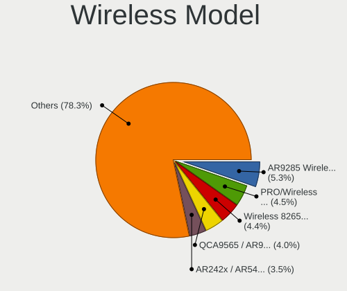

| Model                                                                   | Notebooks | Percent |
|-------------------------------------------------------------------------|-----------|---------|
| Qualcomm Atheros AR9285 Wireless Network Adapter (PCI-Express)          | 39        | 5.32%   |
| Intel PRO/Wireless 3945ABG [Golan] Network Connection                   | 33        | 4.5%    |
| Intel Wireless 8265 / 8275                                              | 32        | 4.37%   |
| Qualcomm Atheros QCA9565 / AR9565 Wireless Network Adapter              | 29        | 3.96%   |
| Qualcomm Atheros AR242x / AR542x Wireless Network Adapter (PCI-Express) | 26        | 3.55%   |
| Broadcom BCM4313 802.11bgn Wireless Network Adapter                     | 20        | 2.73%   |
| Qualcomm Atheros AR9485 Wireless Network Adapter                        | 19        | 2.59%   |
| Intel Wireless 8260                                                     | 17        | 2.32%   |
| Intel Wi-Fi 6 AX200                                                     | 17        | 2.32%   |
| Qualcomm Atheros QCA9377 802.11ac Wireless Network Adapter              | 16        | 2.18%   |
| Intel Wireless 7265                                                     | 16        | 2.18%   |
| Intel Centrino Advanced-N 6205 [Taylor Peak]                            | 16        | 2.18%   |
| Qualcomm Atheros QCA6174 802.11ac Wireless Network Adapter              | 15        | 2.05%   |
| Intel Centrino Advanced-N 6200                                          | 15        | 2.05%   |
| Realtek RTL8723BE PCIe Wireless Network Adapter                         | 13        | 1.77%   |
| Qualcomm Atheros AR928X Wireless Network Adapter (PCI-Express)          | 13        | 1.77%   |
| Intel Comet Lake PCH-LP CNVi WiFi                                       | 12        | 1.64%   |
| Intel Cannon Lake PCH CNVi WiFi                                         | 12        | 1.64%   |
| Realtek RTL8188CE 802.11b/g/n WiFi Adapter                              | 11        | 1.5%    |
| Intel PRO/Wireless 5100 AGN [Shiloh] Network Connection                 | 11        | 1.5%    |
| Intel Cannon Point-LP CNVi [Wireless-AC]                                | 11        | 1.5%    |
| Broadcom BCM43142 802.11b/g/n                                           | 11        | 1.5%    |
| Broadcom BCM4311 802.11b/g WLAN                                         | 11        | 1.5%    |
| Intel Wireless 3165                                                     | 10        | 1.36%   |
| Realtek RTL8188EE Wireless Network Adapter                              | 9         | 1.23%   |
| Intel Centrino Wireless-N 1000 [Condor Peak]                            | 9         | 1.23%   |
| Ralink RT3290 Wireless 802.11n 1T/1R PCIe                               | 8         | 1.09%   |
| Intel Ultimate N WiFi Link 5300                                         | 8         | 1.09%   |
| Intel PRO/Wireless 2200BG [Calexico2] Network Connection                | 8         | 1.09%   |
| Intel Comet Lake PCH CNVi WiFi                                          | 8         | 1.09%   |
| Broadcom Limited BCM4312 802.11b/g LP-PHY                               | 8         | 1.09%   |
| Broadcom BCM4312 802.11b/g LP-PHY                                       | 8         | 1.09%   |
| Realtek RTL8821CE 802.11ac PCIe Wireless Network Adapter                | 7         | 0.95%   |
| Intel Wireless 7260                                                     | 7         | 0.95%   |
| Intel Wi-Fi 6 AX201                                                     | 7         | 0.95%   |
| Intel PRO/Wireless 4965 AG or AGN [Kedron] Network Connection           | 7         | 0.95%   |
| Intel Dual Band Wireless-AC 3165 Plus Bluetooth                         | 7         | 0.95%   |
| Realtek RTL8822CE 802.11ac PCIe Wireless Network Adapter                | 6         | 0.82%   |
| Intel Wireless 3160                                                     | 6         | 0.82%   |
| Intel Tiger Lake PCH CNVi WiFi                                          | 6         | 0.82%   |

Ethernet Vendor
---------------

Ethernet vendors

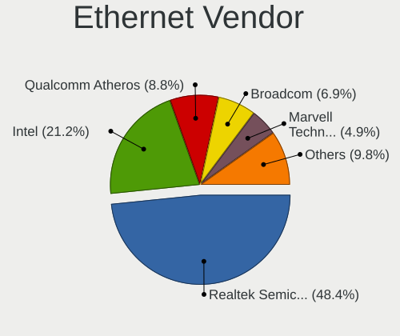

| Vendor                           | Notebooks | Percent |
|----------------------------------|-----------|---------|
| Realtek Semiconductor            | 315       | 48.39%  |
| Intel                            | 138       | 21.2%   |
| Qualcomm Atheros                 | 57        | 8.76%   |
| Broadcom                         | 45        | 6.91%   |
| Marvell Technology Group         | 32        | 4.92%   |
| Silicon Integrated Systems [SiS] | 10        | 1.54%   |
| Broadcom Limited                 | 10        | 1.54%   |
| Nvidia                           | 7         | 1.08%   |
| JMicron Technology               | 5         | 0.77%   |
| Xiaomi                           | 4         | 0.61%   |
| VIA Technologies                 | 4         | 0.61%   |
| ASIX Electronics                 | 4         | 0.61%   |
| Samsung Electronics              | 3         | 0.46%   |
| DisplayLink                      | 3         | 0.46%   |
| Qualcomm                         | 2         | 0.31%   |
| MediaTek                         | 2         | 0.31%   |
| Huawei Technologies              | 2         | 0.31%   |
| ZTE WCDMA Technologies MSM       | 1         | 0.15%   |
| TP-Link                          | 1         | 0.15%   |
| Motorola PCS                     | 1         | 0.15%   |
| Lenovo                           | 1         | 0.15%   |
| ICS Advent                       | 1         | 0.15%   |
| Attansic Technology              | 1         | 0.15%   |
| Archos                           | 1         | 0.15%   |
| Apple                            | 1         | 0.15%   |

Ethernet Model
--------------

Ethernet models

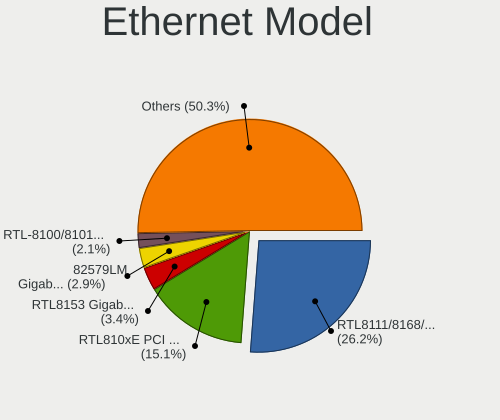

| Model                                                                  | Notebooks | Percent |
|------------------------------------------------------------------------|-----------|---------|
| Realtek RTL8111/8168/8211/8411 PCI Express Gigabit Ethernet Controller | 172       | 26.22%  |
| Realtek RTL810xE PCI Express Fast Ethernet controller                  | 99        | 15.09%  |
| Realtek RTL8153 Gigabit Ethernet Adapter                               | 22        | 3.35%   |
| Intel 82579LM Gigabit Network Connection (Lewisville)                  | 19        | 2.9%    |
| Realtek RTL-8100/8101L/8139 PCI Fast Ethernet Adapter                  | 14        | 2.13%   |
| Intel 82567LM Gigabit Network Connection                               | 14        | 2.13%   |
| Qualcomm Atheros AR8132 Fast Ethernet                                  | 13        | 1.98%   |
| Intel 82577LM Gigabit Network Connection                               | 12        | 1.83%   |
| Intel Ethernet Connection (4) I219-LM                                  | 11        | 1.68%   |
| Silicon Integrated Systems [SiS] 191 Gigabit Ethernet Adapter          | 8         | 1.22%   |
| Qualcomm Atheros AR8131 Gigabit Ethernet                               | 7         | 1.07%   |
| Marvell Group 88E8040 PCI-E Fast Ethernet Controller                   | 7         | 1.07%   |
| Intel PRO/100 VE Network Connection                                    | 7         | 1.07%   |
| Qualcomm Atheros AR8162 Fast Ethernet                                  | 6         | 0.91%   |
| Qualcomm Atheros AR8161 Gigabit Ethernet                               | 6         | 0.91%   |
| Marvell Group 88E8055 PCI-E Gigabit Ethernet Controller                | 6         | 0.91%   |
| Intel Ethernet Connection I219-LM                                      | 6         | 0.91%   |
| Intel Ethernet Connection (4) I219-V                                   | 6         | 0.91%   |
| Intel Ethernet Connection (3) I218-LM                                  | 6         | 0.91%   |
| Broadcom NetLink BCM5787M Gigabit Ethernet PCI Express                 | 6         | 0.91%   |
| Broadcom BCM4401-B0 100Base-TX                                         | 6         | 0.91%   |
| Nvidia MCP79 Ethernet                                                  | 5         | 0.76%   |
| Marvell Group 88E8053 PCI-E Gigabit Ethernet Controller                | 5         | 0.76%   |
| Intel Ethernet Connection (2) I219-LM                                  | 5         | 0.76%   |
| Intel 82577LC Gigabit Network Connection                               | 5         | 0.76%   |
| Broadcom NetLink BCM57780 Gigabit Ethernet PCIe                        | 5         | 0.76%   |
| Xiaomi Mi/Redmi series (RNDIS)                                         | 4         | 0.61%   |
| VIA VT6102/VT6103 [Rhine-II]                                           | 4         | 0.61%   |
| Qualcomm Atheros QCA8172 Fast Ethernet                                 | 4         | 0.61%   |
| Qualcomm Atheros AR8152 v2.0 Fast Ethernet                             | 4         | 0.61%   |
| Qualcomm Atheros AR8152 v1.1 Fast Ethernet                             | 4         | 0.61%   |
| Marvell Group 88E8072 PCI-E Gigabit Ethernet Controller                | 4         | 0.61%   |
| Marvell Group 88E8039 PCI-E Fast Ethernet Controller                   | 4         | 0.61%   |
| Intel Ethernet Connection I219-V                                       | 4         | 0.61%   |
| Intel Ethernet Connection I218-LM                                      | 4         | 0.61%   |
| Intel 82562ET/EZ/GT/GZ - PRO/100 VE (LOM) Ethernet Controller Mobile   | 4         | 0.61%   |
| Broadcom NetXtreme BCM5764M Gigabit Ethernet PCIe                      | 4         | 0.61%   |
| Broadcom NetXtreme BCM5752 Gigabit Ethernet PCI Express                | 4         | 0.61%   |
| Broadcom NetLink BCM5784M Gigabit Ethernet PCIe                        | 4         | 0.61%   |
| Realtek RTL8152 Fast Ethernet Adapter                                  | 3         | 0.46%   |

Net Controller Kind
-------------------

Ethernet, WiFi or modem

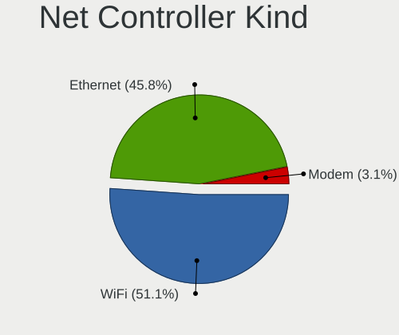

| Kind     | Notebooks | Percent |
|----------|-----------|---------|
| WiFi     | 699       | 51.1%   |
| Ethernet | 626       | 45.76%  |
| Modem    | 43        | 3.14%   |

Used Controller
---------------

Currently used network controller

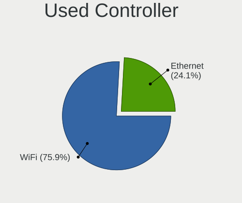

| Kind     | Notebooks | Percent |
|----------|-----------|---------|
| WiFi     | 576       | 75.89%  |
| Ethernet | 183       | 24.11%  |

NICs
----

Total network controllers on board

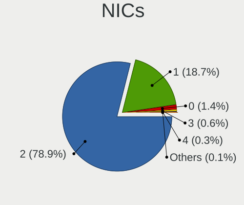

| Total | Notebooks | Percent |
|-------|-----------|---------|
| 2     | 566       | 78.94%  |
| 1     | 134       | 18.69%  |
| 0     | 10        | 1.39%   |
| 3     | 4         | 0.56%   |
| 4     | 2         | 0.28%   |
| 7     | 1         | 0.14%   |

IPv6
----

IPv6 vs IPv4

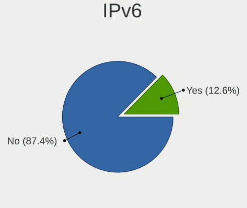

| Used | Notebooks | Percent |
|------|-----------|---------|
| No   | 637       | 87.38%  |
| Yes  | 92        | 12.62%  |

Bluetooth
---------

Bluetooth Vendor
----------------

Controller vendors

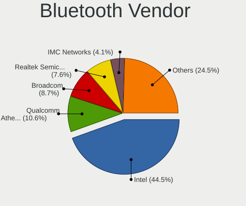

| Vendor                          | Notebooks | Percent |
|---------------------------------|-----------|---------|
| Intel                           | 194       | 44.5%   |
| Qualcomm Atheros Communications | 46        | 10.55%  |
| Broadcom                        | 38        | 8.72%   |
| Realtek Semiconductor           | 33        | 7.57%   |
| IMC Networks                    | 18        | 4.13%   |
| Foxconn / Hon Hai               | 16        | 3.67%   |
| Apple                           | 13        | 2.98%   |
| Lite-On Technology              | 12        | 2.75%   |
| Hewlett-Packard                 | 11        | 2.52%   |
| Cambridge Silicon Radio         | 11        | 2.52%   |
| Ralink                          | 8         | 1.83%   |
| Dell                            | 8         | 1.83%   |
| Toshiba                         | 6         | 1.38%   |
| ASUSTek Computer                | 5         | 1.15%   |
| Taiyo Yuden                     | 3         | 0.69%   |
| Alps Electric                   | 3         | 0.69%   |
| Realtek                         | 2         | 0.46%   |
| Foxconn International           | 2         | 0.46%   |
| TP-Link                         | 1         | 0.23%   |
| Smart Modular Technologies      | 1         | 0.23%   |
| Qcom                            | 1         | 0.23%   |
| Micro Star International        | 1         | 0.23%   |
| MediaTek                        | 1         | 0.23%   |
| Chicony Electronics             | 1         | 0.23%   |
| Askey Computer                  | 1         | 0.23%   |

Bluetooth Model
---------------

Controller models

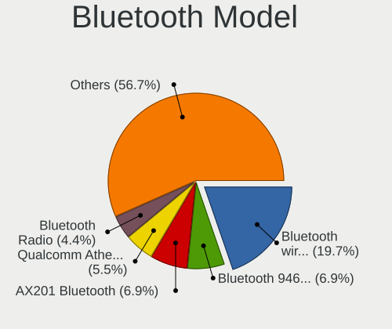

| Model                                               | Notebooks | Percent |
|-----------------------------------------------------|-----------|---------|
| Intel Bluetooth wireless interface                  | 86        | 19.72%  |
| Intel Bluetooth 9460/9560 Jefferson Peak (JfP)      | 30        | 6.88%   |
| Intel AX201 Bluetooth                               | 30        | 6.88%   |
| Qualcomm Atheros  Bluetooth Device                  | 24        | 5.5%    |
| Realtek Bluetooth Radio                             | 19        | 4.36%   |
| Intel AX200 Bluetooth                               | 17        | 3.9%    |
| Intel Bluetooth Device                              | 11        | 2.52%   |
| Cambridge Silicon Radio Bluetooth Dongle (HCI mode) | 11        | 2.52%   |
| Realtek  Bluetooth 4.2 Adapter                      | 8         | 1.83%   |
| Ralink RT3290 Bluetooth                             | 8         | 1.83%   |
| Qualcomm Atheros AR3011 Bluetooth                   | 8         | 1.83%   |
| Intel Centrino Bluetooth Wireless Transceiver       | 7         | 1.61%   |
| Foxconn / Hon Hai Bluetooth Device                  | 7         | 1.61%   |
| Qualcomm Atheros AR9462 Bluetooth                   | 6         | 1.38%   |
| Broadcom BCM2045B (BDC-2.1)                         | 6         | 1.38%   |
| Apple Bluetooth Host Controller                     | 6         | 1.38%   |
| Apple Bluetooth HCI                                 | 6         | 1.38%   |
| Intel Wireless-AC 3168 Bluetooth                    | 5         | 1.15%   |
| IMC Networks Bluetooth Device                       | 5         | 1.15%   |
| HP Bluetooth 2.0 Interface [Broadcom BCM2045]       | 5         | 1.15%   |
| Broadcom BCM2045B (BDC-2.1) [Bluetooth Controller]  | 5         | 1.15%   |
| Qualcomm Atheros QCA61x4 Bluetooth 4.0              | 4         | 0.92%   |
| Intel Wireless-AC 9260 Bluetooth Adapter            | 4         | 0.92%   |
| IMC Networks Wireless_Device                        | 4         | 0.92%   |
| IMC Networks Bluetooth Radio                        | 4         | 0.92%   |
| HP Broadcom 2070 Bluetooth Combo                    | 4         | 0.92%   |
| Broadcom BCM2045 Bluetooth                          | 4         | 0.92%   |
| Toshiba Bluetooth Device                            | 3         | 0.69%   |
| Realtek RTL8723B Bluetooth                          | 3         | 0.69%   |
| Qualcomm Atheros AR3012 Bluetooth 4.0               | 3         | 0.69%   |
| Lite-On Qualcomm Atheros QCA9377 Bluetooth          | 3         | 0.69%   |
| Lite-On Atheros AR3012 Bluetooth                    | 3         | 0.69%   |
| Dell Wireless 355 Bluetooth                         | 3         | 0.69%   |
| Broadcom BCM43142A0 Bluetooth 4.0                   | 3         | 0.69%   |
| Broadcom BCM43142 Bluetooth 4.0                     | 3         | 0.69%   |
| Broadcom BCM2045B (BDC-2) [Bluetooth Controller]    | 3         | 0.69%   |
| Toshiba Integrated Bluetooth HCI                    | 2         | 0.46%   |
| Realtek RTL8821A Bluetooth                          | 2         | 0.46%   |
| Realtek Bluetooth Radio                             | 2         | 0.46%   |
| Lite-On Wireless_Device                             | 2         | 0.46%   |

Sound
-----

Sound Vendor
------------

Sound card vendors

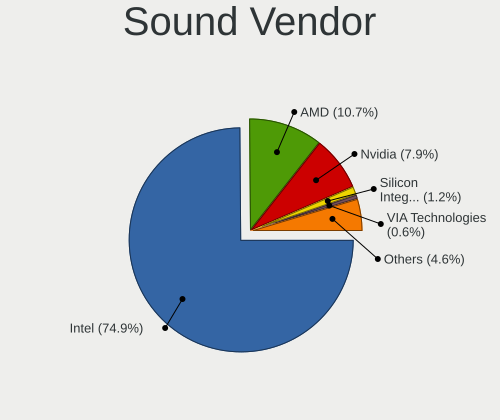

| Vendor                           | Notebooks | Percent |
|----------------------------------|-----------|---------|
| Intel                            | 614       | 74.88%  |
| AMD                              | 88        | 10.73%  |
| Nvidia                           | 65        | 7.93%   |
| Silicon Integrated Systems [SiS] | 10        | 1.22%   |
| VIA Technologies                 | 5         | 0.61%   |
| Realtek Semiconductor            | 4         | 0.49%   |
| Plantronics                      | 4         | 0.49%   |
| GN Netcom                        | 4         | 0.49%   |
| C-Media Electronics              | 3         | 0.37%   |
| Walmart                          | 2         | 0.24%   |
| JMTek                            | 2         | 0.24%   |
| Unknown                          | 2         | 0.24%   |
| Yamaha                           | 1         | 0.12%   |
| Texas Instruments                | 1         | 0.12%   |
| Tenx Technology                  | 1         | 0.12%   |
| Samson Technologies              | 1         | 0.12%   |
| Pioneer DJ                       | 1         | 0.12%   |
| Logitech                         | 1         | 0.12%   |
| liyuany                          | 1         | 0.12%   |
| Hewlett-Packard                  | 1         | 0.12%   |
| Generalplus Technology           | 1         | 0.12%   |
| Blue Microphones                 | 1         | 0.12%   |
| BEHRINGER International          | 1         | 0.12%   |
| Audio-Technica                   | 1         | 0.12%   |
| ASUSTek Computer                 | 1         | 0.12%   |
| Apple                            | 1         | 0.12%   |
| Anker                            | 1         | 0.12%   |
| Alesis                           | 1         | 0.12%   |
| AKAI Professional M.I.           | 1         | 0.12%   |

Sound Model
-----------

Sound card models

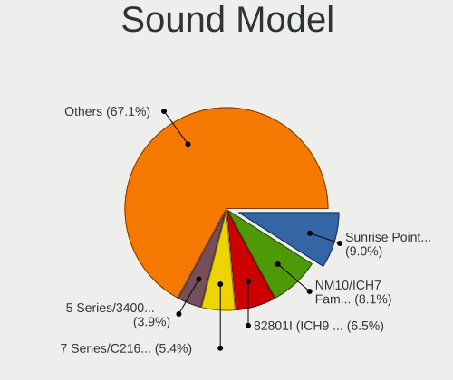

| Model                                                                                             | Notebooks | Percent |
|---------------------------------------------------------------------------------------------------|-----------|---------|
| Intel Sunrise Point-LP HD Audio                                                                   | 85        | 9.03%   |
| Intel NM10/ICH7 Family High Definition Audio Controller                                           | 76        | 8.08%   |
| Intel 82801I (ICH9 Family) HD Audio Controller                                                    | 61        | 6.48%   |
| Intel 7 Series/C216 Chipset Family High Definition Audio Controller                               | 51        | 5.42%   |
| Intel 5 Series/3400 Series Chipset High Definition Audio                                          | 37        | 3.93%   |
| Intel 6 Series/C200 Series Chipset Family High Definition Audio Controller                        | 36        | 3.83%   |
| Intel 82801H (ICH8 Family) HD Audio Controller                                                    | 31        | 3.29%   |
| AMD Ryzen HD Audio Controller                                                                     | 24        | 2.55%   |
| AMD FCH Azalia Controller                                                                         | 24        | 2.55%   |
| Intel Wildcat Point-LP High Definition Audio Controller                                           | 23        | 2.44%   |
| Intel Broadwell-U Audio Controller                                                                | 23        | 2.44%   |
| Intel Haswell-ULT HD Audio Controller                                                             | 21        | 2.23%   |
| Intel 8 Series HD Audio Controller                                                                | 21        | 2.23%   |
| Intel Cannon Lake PCH cAVS                                                                        | 20        | 2.13%   |
| Intel Comet Lake PCH-LP cAVS                                                                      | 17        | 1.81%   |
| AMD Kabini HDMI/DP Audio                                                                          | 17        | 1.81%   |
| Intel Cannon Point-LP High Definition Audio Controller                                            | 16        | 1.7%    |
| AMD SBx00 Azalia (Intel HDA)                                                                      | 16        | 1.7%    |
| Intel Atom/Celeron/Pentium Processor x5-E8000/J3xxx/N3xxx Series High Definition Audio Controller | 15        | 1.59%   |
| Intel 100 Series/C230 Series Chipset Family HD Audio Controller                                   | 13        | 1.38%   |
| Intel Tiger Lake-LP Smart Sound Technology Audio Controller                                       | 11        | 1.17%   |
| Intel CM238 HD Audio Controller                                                                   | 11        | 1.17%   |
| Intel Atom Processor Z36xxx/Z37xxx Series High Definition Audio Controller                        | 11        | 1.17%   |
| Intel Xeon E3-1200 v3/4th Gen Core Processor HD Audio Controller                                  | 10        | 1.06%   |
| Intel Comet Lake PCH cAVS                                                                         | 10        | 1.06%   |
| Intel 82801FB/FBM/FR/FW/FRW (ICH6 Family) AC'97 Audio Controller                                  | 10        | 1.06%   |
| Intel 8 Series/C220 Series Chipset High Definition Audio Controller                               | 10        | 1.06%   |
| AMD Raven/Raven2/Fenghuang HDMI/DP Audio Controller                                               | 10        | 1.06%   |
| Intel Tiger Lake-H HD Audio Controller                                                            | 9         | 0.96%   |
| AMD Renoir/Cezanne HDMI/DP Audio Controller                                                       | 9         | 0.96%   |
| AMD Family 15h (Models 60h-6fh) Audio Controller                                                  | 9         | 0.96%   |
| Silicon Integrated Systems [SiS] Azalia Audio Controller                                          | 8         | 0.85%   |
| Nvidia TU107 GeForce GTX 1650 High Definition Audio Controller                                    | 7         | 0.74%   |
| Intel Alder Lake PCH-P High Definition Audio Controller                                           | 7         | 0.74%   |
| AMD Wrestler HDMI Audio                                                                           | 7         | 0.74%   |
| Nvidia GF108 High Definition Audio Controller                                                     | 6         | 0.64%   |
| Nvidia GA106 High Definition Audio Controller                                                     | 6         | 0.64%   |
| Intel Raptor Lake-P/U/H cAVS                                                                      | 6         | 0.64%   |
| Nvidia MCP79 High Definition Audio                                                                | 5         | 0.53%   |
| Nvidia GT216 HDMI Audio Controller                                                                | 5         | 0.53%   |

Memory
------

Memory Vendor
-------------

Memory module vendors

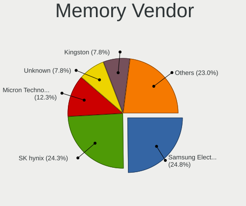

| Vendor              | Notebooks | Percent |
|---------------------|-----------|---------|
| Samsung Electronics | 95        | 24.8%   |
| SK hynix            | 93        | 24.28%  |
| Micron Technology   | 47        | 12.27%  |
| Unknown             | 30        | 7.83%   |
| Kingston            | 30        | 7.83%   |
| Ramaxel Technology  | 14        | 3.66%   |
| Crucial             | 13        | 3.39%   |
| Smart               | 10        | 2.61%   |
| Corsair             | 8         | 2.09%   |
| Elpida              | 7         | 1.83%   |
| A-DATA Technology   | 7         | 1.83%   |
| Nanya Technology    | 5         | 1.31%   |
| Transcend           | 4         | 1.04%   |
| Unknown (ABCD)      | 3         | 0.78%   |
| G.Skill             | 3         | 0.78%   |
| Unknown             | 2         | 0.52%   |
| Walton Chaintech    | 1         | 0.26%   |
| Unknown (89F7)      | 1         | 0.26%   |
| Team                | 1         | 0.26%   |
| Silicon Power       | 1         | 0.26%   |
| SHARETRONIC         | 1         | 0.26%   |
| PUSKILL             | 1         | 0.26%   |
| Patriot             | 1         | 0.26%   |
| Netlist             | 1         | 0.26%   |
| High Bridge         | 1         | 0.26%   |
| Goldkey             | 1         | 0.26%   |
| ASint Technology    | 1         | 0.26%   |
| Apacer              | 1         | 0.26%   |

Memory Model
------------

Memory module models

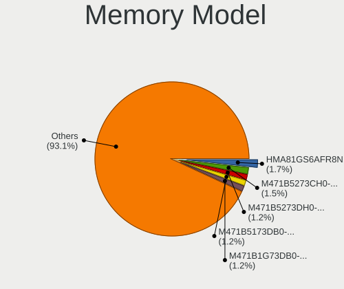

| Model                                                            | Notebooks | Percent |
|------------------------------------------------------------------|-----------|---------|
| SK hynix RAM HMA81GS6AFR8N-UH 8GB SODIMM DDR4 2667MT/s           | 7         | 1.72%   |
| Samsung RAM M471B5273CH0-CH9 4GB SODIMM DDR3 1334MT/s            | 6         | 1.48%   |
| SK hynix RAM HMA851S6AFR6N-UH 4GB SODIMM DDR4 2667MT/s           | 5         | 1.23%   |
| SK hynix RAM HMA82GS6AFR8N-UH 16GB SODIMM DDR4 2667MT/s          | 5         | 1.23%   |
| SK hynix RAM HMA81GS6DJR8N-XN 8GB SODIMM DDR4 3200MT/s           | 5         | 1.23%   |
| SK hynix RAM H9CCNNNCLGALAR-NVD 8GB Row Of Chips LPDDR3 2133MT/s | 5         | 1.23%   |
| Samsung RAM M471B5273DH0-CH9 4GB SODIMM DDR3 1600MT/s            | 5         | 1.23%   |
| Samsung RAM M471B5173DB0-YK0 4GB SODIMM DDR3 1600MT/s            | 5         | 1.23%   |
| Samsung RAM M471B1G73DB0-YK0 8GB SODIMM DDR3 1600MT/s            | 5         | 1.23%   |
| SK hynix RAM HMT41GS6BFR8A-PB 8GB SODIMM DDR3 2667MT/s           | 4         | 0.99%   |
| SK hynix RAM HMT41GS6BFR8A-PB 8GB SODIMM DDR3 1600MT/s           | 4         | 0.99%   |
| Samsung RAM M471B5173QH0-YK0 4GB SODIMM DDR3 1600MT/s            | 4         | 0.99%   |
| Samsung RAM M471A5244CB0-CRC 4GB SODIMM DDR4 2667MT/s            | 4         | 0.99%   |
| Samsung RAM M471A1K43EB1-CWE 8GB SODIMM DDR4 3200MT/s            | 4         | 0.99%   |
| Unknown RAM Module 1GB SODIMM DDR2                               | 3         | 0.74%   |
| SK hynix RAM Module 8192MB SODIMM DDR4 2133MT/s                  | 3         | 0.74%   |
| Samsung RAM M471B5673FH0-CH9 2048MB SODIMM DDR3 1600MT/s         | 3         | 0.74%   |
| Samsung RAM M471B1G73EB0-YK0 8192MB SODIMM DDR3 1600MT/s         | 3         | 0.74%   |
| Samsung RAM M471A5244CB0-CTD 4GB SODIMM DDR4 3266MT/s            | 3         | 0.74%   |
| Samsung RAM M471A2K43CB1-CRC 16GB SODIMM DDR4 2667MT/s           | 3         | 0.74%   |
| Samsung RAM M471A1K43BB0-CPB 8GiB SODIMM DDR4 2133MT/s           | 3         | 0.74%   |
| Ramaxel RAM RMT3160ED58E9W1600 4GB SODIMM DDR3 1600MT/s          | 3         | 0.74%   |
| Micron RAM MT52L1G32D4PG-093 8GB Row Of Chips LPDDR3 2133MT/s    | 3         | 0.74%   |
| Micron RAM 8ATF1G64HZ-2G6E1 8GB SODIMM DDR4 2667MT/s             | 3         | 0.74%   |
| Micron RAM 4ATF51264HZ-3G2J1 4GB Row Of Chips DDR4 3200MT/s      | 3         | 0.74%   |
| Unknown RAM Module 512MB SODIMM SDRAM                            | 2         | 0.49%   |
| Unknown (ABCD) RAM 123456789012345678 2GB SODIMM LPDDR4 2400MT/s | 2         | 0.49%   |
| Smart RAM SG564568FG8NWKF-Z1 2GB SODIMM DDR 800MT/s              | 2         | 0.49%   |
| SK hynix RAM HMT451S6BFR8A-PB 4GB SODIMM DDR3 1600MT/s           | 2         | 0.49%   |
| SK hynix RAM HMT351S6EFR8C-PB 4GB SODIMM DDR3 1600MT/s           | 2         | 0.49%   |
| SK hynix RAM HMT351S6EFR8A-PB 4GB SODIMM DDR3 1600MT/s           | 2         | 0.49%   |
| SK hynix RAM HMT351S6BFR8C-H9 4GB SODIMM DDR3 1333MT/s           | 2         | 0.49%   |
| SK hynix RAM HMT325S6BFR8C-H9 2GB SODIMM DDR3 1334MT/s           | 2         | 0.49%   |
| SK hynix RAM HMAA2GS6AJR8N-XN 16GB SODIMM DDR4 3200MT/s          | 2         | 0.49%   |
| SK hynix RAM HMAA1GS6CJR6N-XN 8GB SODIMM DDR4 3200MT/s           | 2         | 0.49%   |
| SK hynix RAM HMAA1GS6CJR6N-XN 8GB Row Of Chips DDR4 3200MT/s     | 2         | 0.49%   |
| SK hynix RAM HMA82GS6JJR8N-VK 16GB SODIMM DDR4 2667MT/s          | 2         | 0.49%   |
| SK hynix RAM HMA82GS6DJR8N-XN 16GB SODIMM DDR4 3200MT/s          | 2         | 0.49%   |
| SK hynix RAM HMA82GS6DJR8N-VK 16GB SODIMM DDR4 2667MT/s          | 2         | 0.49%   |
| SK hynix RAM HMA81GS6JJR8N-VK 8GB SODIMM DDR4 2667MT/s           | 2         | 0.49%   |

Memory Kind
-----------

Memory module kinds

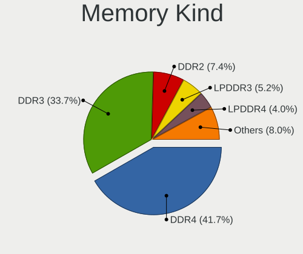

| Kind    | Notebooks | Percent |
|---------|-----------|---------|
| DDR4    | 136       | 41.72%  |
| DDR3    | 110       | 33.74%  |
| DDR2    | 24        | 7.36%   |
| LPDDR3  | 17        | 5.21%   |
| LPDDR4  | 13        | 3.99%   |
| SDRAM   | 8         | 2.45%   |
| LPDDR5  | 7         | 2.15%   |
| DDR5    | 5         | 1.53%   |
| DDR     | 3         | 0.92%   |
| DRAM    | 2         | 0.61%   |
| Unknown | 1         | 0.31%   |

Memory Form Factor
------------------

Physical design of the memory module

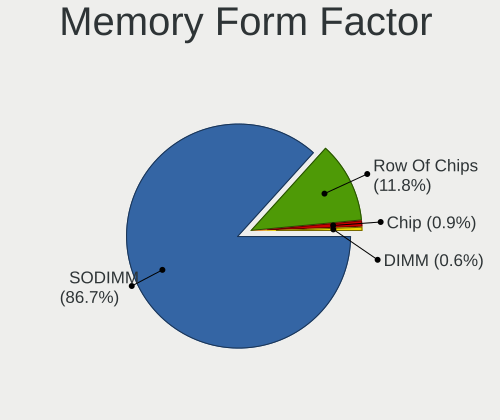

| Name         | Notebooks | Percent |
|--------------|-----------|---------|
| SODIMM       | 287       | 86.71%  |
| Row Of Chips | 39        | 11.78%  |
| Chip         | 3         | 0.91%   |
| DIMM         | 2         | 0.6%    |

Memory Size
-----------

Memory module size

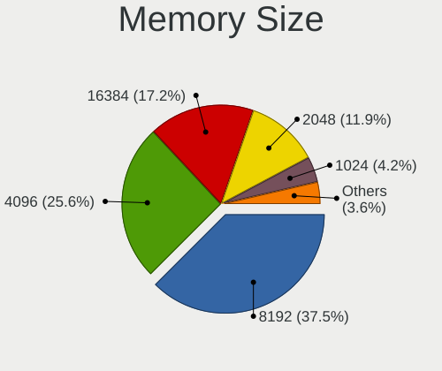

| Size  | Notebooks | Percent |
|-------|-----------|---------|
| 8192  | 135       | 37.5%   |
| 4096  | 92        | 25.56%  |
| 16384 | 62        | 17.22%  |
| 2048  | 43        | 11.94%  |
| 1024  | 15        | 4.17%   |
| 32768 | 9         | 2.5%    |
| 512   | 4         | 1.11%   |

Memory Speed
------------

Memory module speed

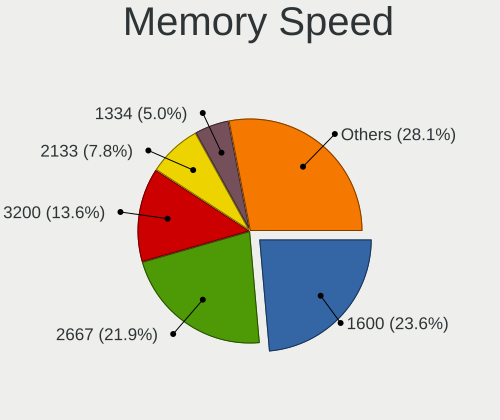

| Speed   | Notebooks | Percent |
|---------|-----------|---------|
| 1600    | 85        | 23.61%  |
| 2667    | 79        | 21.94%  |
| 3200    | 49        | 13.61%  |
| 2133    | 28        | 7.78%   |
| 1334    | 18        | 5%      |
| 2400    | 17        | 4.72%   |
| 667     | 14        | 3.89%   |
| Unknown | 13        | 3.61%   |
| 1333    | 11        | 3.06%   |
| 6400    | 6         | 1.67%   |
| 800     | 5         | 1.39%   |
| 1867    | 4         | 1.11%   |
| 1067    | 4         | 1.11%   |
| 4800    | 3         | 0.83%   |
| 4267    | 3         | 0.83%   |
| 4199    | 3         | 0.83%   |
| 3266    | 3         | 0.83%   |
| 8400    | 2         | 0.56%   |
| 5600    | 2         | 0.56%   |
| 1066    | 2         | 0.56%   |
| 533     | 2         | 0.56%   |
| 8533    | 1         | 0.28%   |
| 4266    | 1         | 0.28%   |
| 3000    | 1         | 0.28%   |
| 2048    | 1         | 0.28%   |
| 1866    | 1         | 0.28%   |
| 1639    | 1         | 0.28%   |
| 975     | 1         | 0.28%   |

Printers & scanners
-------------------

Printer Vendor
--------------

Printer device vendors

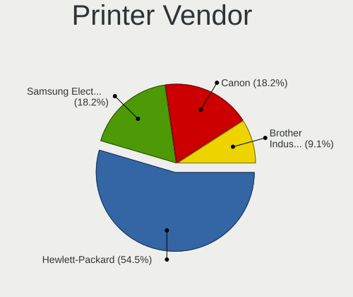

| Vendor              | Notebooks | Percent |
|---------------------|-----------|---------|
| Hewlett-Packard     | 6         | 54.55%  |
| Samsung Electronics | 2         | 18.18%  |
| Canon               | 2         | 18.18%  |
| Brother Industries  | 1         | 9.09%   |

Printer Model
-------------

Printer device models

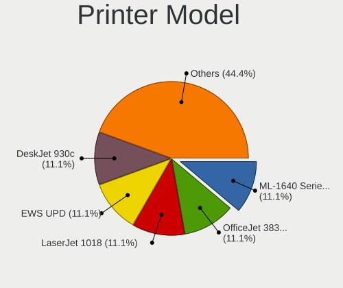

| Model                                | Notebooks | Percent |
|--------------------------------------|-----------|---------|
| Samsung ML-1640 Series Laser Printer | 1         | 9.09%   |
| Samsung CLX-3180 Series              | 1         | 9.09%   |
| HP OfficeJet 3830 series             | 1         | 9.09%   |
| HP LaserJet 1018                     | 1         | 9.09%   |
| HP EWS UPD                           | 1         | 9.09%   |
| HP ENVY Photo 6200 series            | 1         | 9.09%   |
| HP DeskJet 930c                      | 1         | 9.09%   |
| HP DeskJet 2700 series               | 1         | 9.09%   |
| Canon PIXMA MX370 Series             | 1         | 9.09%   |
| Canon PIXMA MP250                    | 1         | 9.09%   |
| Brother MFC-L2710DW series           | 1         | 9.09%   |

Scanner Vendor
--------------

Scanner device vendors

| Vendor | Notebooks | Percent |
|--------|-----------|---------|
| Canon  | 1         | 100%    |

Scanner Model
-------------

Scanner device models

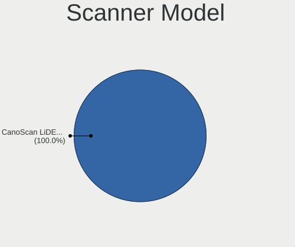

| Model                   | Notebooks | Percent |
|-------------------------|-----------|---------|
| Canon CanoScan LiDE 110 | 1         | 100%    |

Camera
------

Camera Vendor
-------------

Camera device vendors

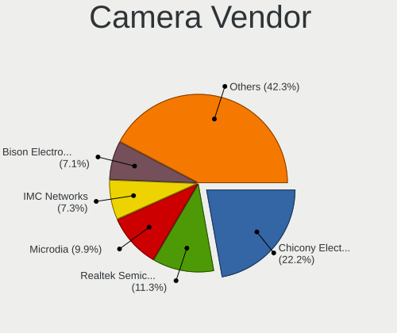

| Vendor                                 | Notebooks | Percent |
|----------------------------------------|-----------|---------|
| Chicony Electronics                    | 128       | 22.18%  |
| Realtek Semiconductor                  | 65        | 11.27%  |
| Microdia                               | 57        | 9.88%   |
| IMC Networks                           | 42        | 7.28%   |
| Bison Electronics                      | 41        | 7.11%   |
| Suyin                                  | 40        | 6.93%   |
| Sunplus Innovation Technology          | 33        | 5.72%   |
| Cheng Uei Precision Industry (Foxlink) | 21        | 3.64%   |
| Quanta                                 | 20        | 3.47%   |
| Apple                                  | 16        | 2.77%   |
| Lite-On Technology                     | 15        | 2.6%    |
| Syntek                                 | 13        | 2.25%   |
| Lenovo                                 | 11        | 1.91%   |
| Silicon Motion                         | 9         | 1.56%   |
| Alcor Micro                            | 7         | 1.21%   |
| Logitech                               | 6         | 1.04%   |
| Importek                               | 6         | 1.04%   |
| Acer                                   | 6         | 1.04%   |
| Sonix Technology                       | 5         | 0.87%   |
| Luxvisions Innotech Limited            | 5         | 0.87%   |
| Z-Star Microelectronics                | 3         | 0.52%   |
| Samsung Electronics                    | 3         | 0.52%   |
| Ricoh                                  | 3         | 0.52%   |
| Intel                                  | 3         | 0.52%   |
| SunplusIT                              | 2         | 0.35%   |
| Primax Electronics                     | 2         | 0.35%   |
| eMPIA Technology                       | 2         | 0.35%   |
| DigiTech                               | 2         | 0.35%   |
| ALi                                    | 2         | 0.35%   |
| USB Camera CS                          | 1         | 0.17%   |
| ShineOptics                            | 1         | 0.17%   |
| Pixart Imaging                         | 1         | 0.17%   |
| OmniVision Technologies                | 1         | 0.17%   |
| Microsoft                              | 1         | 0.17%   |
| icSpring                               | 1         | 0.17%   |
| Genesys Logic                          | 1         | 0.17%   |
| Creative Technology                    | 1         | 0.17%   |
| ANYKA                                  | 1         | 0.17%   |

Camera Model
------------

Camera device models

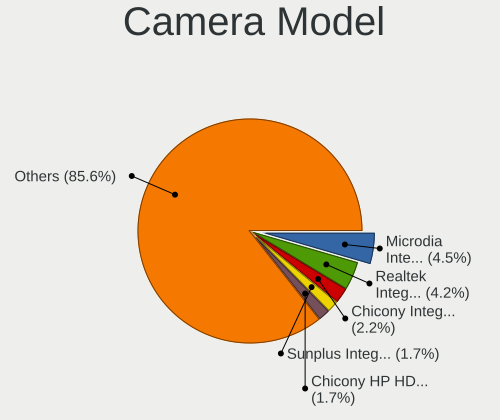

| Model                                         | Notebooks | Percent |
|-----------------------------------------------|-----------|---------|
| Microdia Integrated_Webcam_HD                 | 26        | 4.5%    |
| Realtek Integrated_Webcam_HD                  | 24        | 4.15%   |
| Chicony Integrated Camera                     | 13        | 2.25%   |
| Sunplus Integrated_Webcam_HD                  | 10        | 1.73%   |
| Chicony HP HD Camera                          | 10        | 1.73%   |
| IMC Networks Integrated Camera                | 9         | 1.56%   |
| Bison Lenovo Integrated Webcam                | 8         | 1.38%   |
| Suyin Acer/HP Integrated Webcam [CN0314]      | 7         | 1.21%   |
| Syntek Integrated Camera                      | 6         | 1.04%   |
| Lite-On Integrated Camera                     | 6         | 1.04%   |
| Lenovo Integrated Webcam [R5U877]             | 6         | 1.04%   |
| Chicony Lenovo EasyCamera                     | 6         | 1.04%   |
| Chicony Camera                                | 6         | 1.04%   |
| Apple iPhone 5/5C/5S/6/SE/7/8/X               | 6         | 1.04%   |
| Suyin HP Truevision HD                        | 5         | 0.87%   |
| Sunplus Asus Webcam                           | 5         | 0.87%   |
| Realtek USB2.0 HD UVC WebCam                  | 5         | 0.87%   |
| Realtek Integrated Webcam HD                  | 5         | 0.87%   |
| Realtek Integrated Webcam                     | 5         | 0.87%   |
| IMC Networks USB2.0 HD UVC WebCam             | 5         | 0.87%   |
| Chicony USB 2.0 Camera                        | 5         | 0.87%   |
| Sunplus HD WebCam                             | 4         | 0.69%   |
| Lite-On HP HD Camera                          | 4         | 0.69%   |
| IMC Networks USB 2.0 Camera                   | 4         | 0.69%   |
| IMC Networks Lenovo EasyCamera                | 4         | 0.69%   |
| IMC Networks EasyCamera                       | 4         | 0.69%   |
| Chicony USB2.0 VGA UVC WebCam                 | 4         | 0.69%   |
| Chicony TOSHIBA Web Camera - HD               | 4         | 0.69%   |
| Chicony FJ Camera                             | 4         | 0.69%   |
| Cheng Uei Precision Industry (Foxlink) Webcam | 4         | 0.69%   |
| Bison SunplusIT Integrated Camera             | 4         | 0.69%   |
| Bison Integrated Camera                       | 4         | 0.69%   |
| Apple Built-in iSight                         | 4         | 0.69%   |
| Syntek Lenovo EasyCamera                      | 3         | 0.52%   |
| Suyin Integrated_Webcam_HD                    | 3         | 0.52%   |
| Suyin HP Webcam                               | 3         | 0.52%   |
| Suyin Acer/Lenovo Webcam [CN0316]             | 3         | 0.52%   |
| Suyin Acer CrystalEye Webcam                  | 3         | 0.52%   |
| Sunplus Laptop Integrated WebCam HD           | 3         | 0.52%   |
| Samsung Galaxy series, misc. (MTP mode)       | 3         | 0.52%   |

Security
--------

Fingerprint Vendor
------------------

Fingerprint sensor vendors

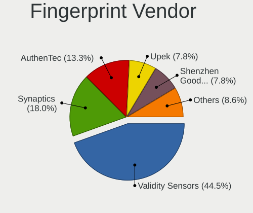

| Vendor                             | Notebooks | Percent |
|------------------------------------|-----------|---------|
| Validity Sensors                   | 57        | 44.53%  |
| Synaptics                          | 23        | 17.97%  |
| AuthenTec                          | 17        | 13.28%  |
| Upek                               | 10        | 7.81%   |
| Shenzhen Goodix Technology         | 10        | 7.81%   |
| STMicroelectronics                 | 5         | 3.91%   |
| LighTuning Technology              | 3         | 2.34%   |
| Elan Microelectronics              | 2         | 1.56%   |
| Realtek USB2.0 Finger Print Bridge | 1         | 0.78%   |

Fingerprint Model
-----------------

Fingerprint sensor models

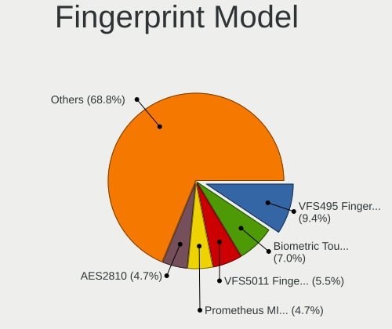

| Model                                                                      | Notebooks | Percent |
|----------------------------------------------------------------------------|-----------|---------|
| Validity Sensors VFS495 Fingerprint Reader                                 | 12        | 9.38%   |
| Upek Biometric Touchchip/Touchstrip Fingerprint Sensor                     | 9         | 7.03%   |
| Validity Sensors VFS5011 Fingerprint Reader                                | 7         | 5.47%   |
| Synaptics Prometheus MIS Touch Fingerprint Reader                          | 6         | 4.69%   |
| AuthenTec AES2810                                                          | 6         | 4.69%   |
| Validity Sensors Synaptics VFS7552 Touch Fingerprint Sensor with PurePrint | 5         | 3.91%   |
| STMicroelectronics Fingerprint Reader                                      | 5         | 3.91%   |
| Validity Sensors VFS451 Fingerprint Reader                                 | 4         | 3.13%   |
| Validity Sensors VFS101 Fingerprint Reader                                 | 4         | 3.13%   |
| Validity Sensors Swipe Fingerprint Sensor                                  | 4         | 3.13%   |
| Synaptics Metallica MIS Touch Fingerprint Reader                           | 4         | 3.13%   |
| Shenzhen Goodix  FingerPrint Device                                        | 4         | 3.13%   |
| Shenzhen Goodix FingerPrint                                                | 4         | 3.13%   |
| AuthenTec AES2501 Fingerprint Sensor                                       | 4         | 3.13%   |
| Validity Sensors VFS7500 Touch Fingerprint Sensor                          | 3         | 2.34%   |
| Validity Sensors VFS491                                                    | 3         | 2.34%   |
| Validity Sensors VFS471 Fingerprint Reader                                 | 3         | 2.34%   |
| Validity Sensors VFS Fingerprint sensor                                    | 3         | 2.34%   |
| Validity Sensors Fingerprint scanner                                       | 3         | 2.34%   |
| Synaptics FS7604 Touch Fingerprint Sensor with PurePrint                   | 3         | 2.34%   |
| AuthenTec AES1600                                                          | 3         | 2.34%   |
| Validity Sensors VFS 5011 fingerprint sensor                               | 2         | 1.56%   |
| Validity Sensors Synaptics WBDI                                            | 2         | 1.56%   |
| Synaptics WBDI Fingerprint Reader USB 086                                  | 2         | 1.56%   |
| Synaptics  FS7604 Touch Fingerprint Sensor with PurePrint                  | 2         | 1.56%   |
| Synaptics Metallica MOH Touch Fingerprint Reader                           | 2         | 1.56%   |
| Shenzhen Goodix Fingerprint Reader                                         | 2         | 1.56%   |
| LighTuning EgisTec Touch Fingerprint Sensor                                | 2         | 1.56%   |
| Elan ELAN:Fingerprint                                                      | 2         | 1.56%   |
| AuthenTec Fingerprint Sensor                                               | 2         | 1.56%   |
| AuthenTec AES2550 Fingerprint Sensor                                       | 2         | 1.56%   |
| Validity Sensors VFS301 Fingerprint Reader                                 | 1         | 0.78%   |
| Validity Sensors Synaptics VFS7552 Touch Fingerprint Sensor                | 1         | 0.78%   |
| Upek TCS5B Fingerprint sensor                                              | 1         | 0.78%   |
| Synaptics WBDI                                                             | 1         | 0.78%   |
| Synaptics TouchPad                                                         | 1         | 0.78%   |
| Synaptics  WBDI                                                            | 1         | 0.78%   |
| Realtek USB2.0 Finger Print Bridge FocalTech Fingerprint Device            | 1         | 0.78%   |
| LighTuning ES603 Swipe Fingerprint Sensor                                  | 1         | 0.78%   |
| Unknown                                                                    | 1         | 0.78%   |

Chipcard Vendor
---------------

Chipcard module vendors

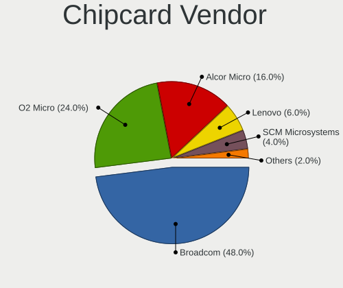

| Vendor           | Notebooks | Percent |
|------------------|-----------|---------|
| Broadcom         | 24        | 48%     |
| O2 Micro         | 12        | 24%     |
| Alcor Micro      | 8         | 16%     |
| Lenovo           | 3         | 6%      |
| SCM Microsystems | 2         | 4%      |
| Yubico.com       | 1         | 2%      |

Chipcard Model
--------------

Chipcard module models

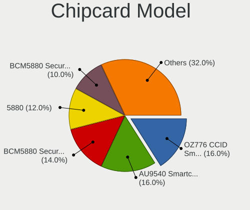

| Model                                                                        | Notebooks | Percent |
|------------------------------------------------------------------------------|-----------|---------|
| O2 Micro OZ776 CCID Smartcard Reader                                         | 8         | 16%     |
| Alcor Micro AU9540 Smartcard Reader                                          | 8         | 16%     |
| Broadcom BCM5880 Secure Applications Processor                               | 7         | 14%     |
| Broadcom 5880                                                                | 6         | 12%     |
| Broadcom BCM5880 Secure Applications Processor with fingerprint swipe sensor | 5         | 10%     |
| Broadcom BCM58200 ControlVault 3 (FingerPrint sensor + Contacted SmartCard)  | 5         | 10%     |
| O2 Micro Oz776 SmartCard Reader                                              | 4         | 8%      |
| Lenovo Integrated Smart Card Reader                                          | 3         | 6%      |
| Yubico.com Yubikey 4/5 U2F+CCID                                              | 1         | 2%      |
| SCM Microsystems SCR35xx Smart Card Reader                                   | 1         | 2%      |
| SCM Microsystems SCR3340 - ExpressCard54 Smart Card Reader                   | 1         | 2%      |
| Broadcom 58200                                                               | 1         | 2%      |

Unsupported
-----------

Unsupported Devices
-------------------

Total unsupported devices on board

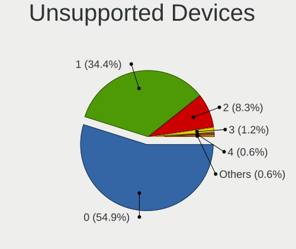

| Total | Notebooks | Percent |
|-------|-----------|---------|
| 0     | 395       | 54.86%  |
| 1     | 248       | 34.44%  |
| 2     | 60        | 8.33%   |
| 3     | 9         | 1.25%   |
| 4     | 4         | 0.56%   |
| 5     | 2         | 0.28%   |
| 7     | 1         | 0.14%   |
| 6     | 1         | 0.14%   |

Unsupported Device Types
------------------------

Types of unsupported devices

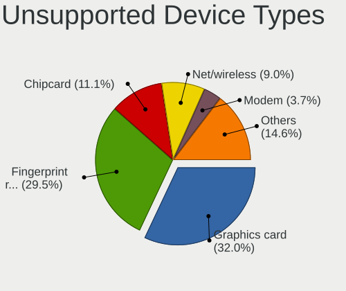

| Type                     | Notebooks | Percent |
|--------------------------|-----------|---------|
| Graphics card            | 138       | 32.02%  |
| Fingerprint reader       | 127       | 29.47%  |
| Chipcard                 | 48        | 11.14%  |
| Net/wireless             | 39        | 9.05%   |
| Modem                    | 16        | 3.71%   |
| Communication controller | 15        | 3.48%   |
| Storage                  | 11        | 2.55%   |
| Bluetooth                | 11        | 2.55%   |
| Sound                    | 8         | 1.86%   |
| Multimedia controller    | 8         | 1.86%   |
| Camera                   | 7         | 1.62%   |
| Flash memory             | 2         | 0.46%   |
| Card reader              | 1         | 0.23%   |

