Ubuntu Unity - Tested Hardware & Statistics
-------------------------------------------

A project to collect tested hardware configurations for Ubuntu Unity.

Anyone can contribute to this report by the [hw-probe](https://github.com/linuxhw/hw-probe) tool:

    sudo -E hw-probe -all -upload

Please contribute! Especially if your hardware is rare.

This is a report for all computer types. See also reports for [desktops](/Dist/Ubuntu_Unity/Desktop/README.md) and [notebooks](/Dist/Ubuntu_Unity/Notebook/README.md).

Contents
--------

* [ Test Cases ](#test-cases)

* [ System ](#system)
  - [ OS                       ](#os)
  - [ OS Family                ](#os-family)
  - [ Kernel                   ](#kernel)
  - [ Kernel Family            ](#kernel-family)
  - [ Kernel Major Ver.        ](#kernel-major-ver)
  - [ Arch                     ](#arch)
  - [ DE                       ](#de)
  - [ Display Server           ](#display-server)
  - [ Display Manager          ](#display-manager)
  - [ OS Lang                  ](#os-lang)
  - [ Boot Mode                ](#boot-mode)
  - [ Filesystem               ](#filesystem)
  - [ Part. scheme             ](#part-scheme)
  - [ Dual Boot with Linux/BSD ](#dual-boot-with-linuxbsd)
  - [ Dual Boot (Win)          ](#dual-boot-win)

* [ Board ](#board)
  - [ Vendor                   ](#vendor)
  - [ Model                    ](#model)
  - [ Model Family             ](#model-family)
  - [ MFG Year                 ](#mfg-year)
  - [ Form Factor              ](#form-factor)
  - [ Secure Boot              ](#secure-boot)
  - [ Coreboot                 ](#coreboot)
  - [ RAM Size                 ](#ram-size)
  - [ RAM Used                 ](#ram-used)
  - [ Total Drives             ](#total-drives)
  - [ Has CD-ROM               ](#has-cd-rom)
  - [ Has Ethernet             ](#has-ethernet)
  - [ Has WiFi                 ](#has-wifi)
  - [ Has Bluetooth            ](#has-bluetooth)

* [ Location ](#location)
  - [ Country                  ](#country)
  - [ City                     ](#city)

* [ Drives ](#drives)
  - [ Drive Vendor             ](#drive-vendor)
  - [ Drive Model              ](#drive-model)
  - [ HDD Vendor               ](#hdd-vendor)
  - [ SSD Vendor               ](#ssd-vendor)
  - [ Drive Kind               ](#drive-kind)
  - [ Drive Connector          ](#drive-connector)
  - [ Drive Size               ](#drive-size)
  - [ Space Total              ](#space-total)
  - [ Space Used               ](#space-used)
  - [ Malfunc. Drives          ](#malfunc-drives)
  - [ Malfunc. Drive Vendor    ](#malfunc-drive-vendor)
  - [ Malfunc. HDD Vendor      ](#malfunc-hdd-vendor)
  - [ Malfunc. Drive Kind      ](#malfunc-drive-kind)
  - [ Failed Drives            ](#failed-drives)
  - [ Failed Drive Vendor      ](#failed-drive-vendor)
  - [ Drive Status             ](#drive-status)

* [ Storage controller ](#storage-controller)
  - [ Storage Vendor           ](#storage-vendor)
  - [ Storage Model            ](#storage-model)
  - [ Storage Kind             ](#storage-kind)

* [ Processor ](#processor)
  - [ CPU Vendor               ](#cpu-vendor)
  - [ CPU Model                ](#cpu-model)
  - [ CPU Model Family         ](#cpu-model-family)
  - [ CPU Cores                ](#cpu-cores)
  - [ CPU Sockets              ](#cpu-sockets)
  - [ CPU Threads              ](#cpu-threads)
  - [ CPU Op-Modes             ](#cpu-op-modes)
  - [ CPU Microcode            ](#cpu-microcode)
  - [ CPU Microarch            ](#cpu-microarch)

* [ Graphics ](#graphics)
  - [ GPU Vendor               ](#gpu-vendor)
  - [ GPU Model                ](#gpu-model)
  - [ GPU Combo                ](#gpu-combo)
  - [ GPU Driver               ](#gpu-driver)
  - [ GPU Memory               ](#gpu-memory)

* [ Monitor ](#monitor)
  - [ Monitor Vendor           ](#monitor-vendor)
  - [ Monitor Model            ](#monitor-model)
  - [ Monitor Resolution       ](#monitor-resolution)
  - [ Monitor Diagonal         ](#monitor-diagonal)
  - [ Monitor Width            ](#monitor-width)
  - [ Aspect Ratio             ](#aspect-ratio)
  - [ Monitor Area             ](#monitor-area)
  - [ Pixel Density            ](#pixel-density)
  - [ Multiple Monitors        ](#multiple-monitors)

* [ Network ](#network)
  - [ Net Controller Vendor    ](#net-controller-vendor)
  - [ Net Controller Model     ](#net-controller-model)
  - [ Wireless Vendor          ](#wireless-vendor)
  - [ Wireless Model           ](#wireless-model)
  - [ Ethernet Vendor          ](#ethernet-vendor)
  - [ Ethernet Model           ](#ethernet-model)
  - [ Net Controller Kind      ](#net-controller-kind)
  - [ Used Controller          ](#used-controller)
  - [ NICs                     ](#nics)
  - [ IPv6                     ](#ipv6)

* [ Bluetooth ](#bluetooth)
  - [ Bluetooth Vendor         ](#bluetooth-vendor)
  - [ Bluetooth Model          ](#bluetooth-model)

* [ Sound ](#sound)
  - [ Sound Vendor             ](#sound-vendor)
  - [ Sound Model              ](#sound-model)

* [ Memory ](#memory)
  - [ Memory Vendor            ](#memory-vendor)
  - [ Memory Model             ](#memory-model)
  - [ Memory Kind              ](#memory-kind)
  - [ Memory Form Factor       ](#memory-form-factor)
  - [ Memory Size              ](#memory-size)
  - [ Memory Speed             ](#memory-speed)

* [ Printers & scanners ](#printers--scanners)
  - [ Printer Vendor           ](#printer-vendor)
  - [ Printer Model            ](#printer-model)
  - [ Scanner Vendor           ](#scanner-vendor)
  - [ Scanner Model            ](#scanner-model)

* [ Camera ](#camera)
  - [ Camera Vendor            ](#camera-vendor)
  - [ Camera Model             ](#camera-model)

* [ Security ](#security)
  - [ Fingerprint Vendor       ](#fingerprint-vendor)
  - [ Fingerprint Model        ](#fingerprint-model)
  - [ Chipcard Vendor          ](#chipcard-vendor)
  - [ Chipcard Model           ](#chipcard-model)

* [ Unsupported ](#unsupported)
  - [ Unsupported Devices      ](#unsupported-devices)
  - [ Unsupported Device Types ](#unsupported-device-types)

Test Cases
----------

Total: 1609

| Vendor        | Model                       | Form-Factor | Probe                                                      | Date         |
|---------------|-----------------------------|-------------|------------------------------------------------------------|--------------|
| ASUSTek       | ROG STRIX B550-F GAMING ... | Desktop     | [fd7e472e9b](https://linux-hardware.org/?probe=fd7e472e9b) | Sep 07, 2023 |
| ASUSTek       | X502CA                      | Notebook    | [d630819b59](https://linux-hardware.org/?probe=d630819b59) | Sep 05, 2023 |
| Dell          | Latitude 7480               | Notebook    | [6c5351c835](https://linux-hardware.org/?probe=6c5351c835) | Sep 01, 2023 |
| ASUSTek       | X502CA                      | Notebook    | [04492867e2](https://linux-hardware.org/?probe=04492867e2) | Aug 31, 2023 |
| HP            | 8592                        | Desktop     | [667f4402e7](https://linux-hardware.org/?probe=667f4402e7) | Aug 31, 2023 |
| ASUSTek       | X553SA                      | Notebook    | [ca9ccf934d](https://linux-hardware.org/?probe=ca9ccf934d) | Aug 27, 2023 |
| HP            | Pavilion dv6                | Notebook    | [38fbd02f14](https://linux-hardware.org/?probe=38fbd02f14) | Aug 23, 2023 |
| Dell          | Inspiron 1200               | Notebook    | [2340dcab47](https://linux-hardware.org/?probe=2340dcab47) | Aug 17, 2023 |
| Lenovo        | ThinkPad X220 4290EC5       | Notebook    | [a3982248d3](https://linux-hardware.org/?probe=a3982248d3) | Aug 13, 2023 |
| Acer          | Aspire 5733Z                | Notebook    | [977c66cbc0](https://linux-hardware.org/?probe=977c66cbc0) | Aug 12, 2023 |
| Dell          | Latitude D630               | Notebook    | [a57bb7cde1](https://linux-hardware.org/?probe=a57bb7cde1) | Aug 08, 2023 |
| Acer          | Aspire 1825PTZ              | Notebook    | [553d2539fa](https://linux-hardware.org/?probe=553d2539fa) | Aug 07, 2023 |
| System76      | Thelio Major                | Desktop     | [eeea316849](https://linux-hardware.org/?probe=eeea316849) | Aug 04, 2023 |
| Dell          | G5 5587                     | Notebook    | [320fffbb49](https://linux-hardware.org/?probe=320fffbb49) | Aug 04, 2023 |
| Lenovo        | ThinkPad X220 4290EC5       | Notebook    | [6ffb3ac7e7](https://linux-hardware.org/?probe=6ffb3ac7e7) | Aug 02, 2023 |
| Lenovo        | ThinkPad X220 4290EC5       | Notebook    | [e6d6527380](https://linux-hardware.org/?probe=e6d6527380) | Aug 01, 2023 |
| Panasonic     | CF-20-1                     | Notebook    | [0b59968d03](https://linux-hardware.org/?probe=0b59968d03) | Jul 29, 2023 |
| OEM           | Unknown                     | Notebook    | [d0d59fb363](https://linux-hardware.org/?probe=d0d59fb363) | Jul 24, 2023 |
| ASUSTek       | A_F_K20BF                   | Desktop     | [f2ae40130e](https://linux-hardware.org/?probe=f2ae40130e) | Jul 20, 2023 |
| Lenovo        | IdeaPad 3 15IIL05 81WE      | Notebook    | [f81b2bedb9](https://linux-hardware.org/?probe=f81b2bedb9) | Jul 18, 2023 |
| Dell          | 0C2425 A00                  | Desktop     | [130edcd2b5](https://linux-hardware.org/?probe=130edcd2b5) | Jul 06, 2023 |
| Gigabyte      | GA-970A-UD3                 | Desktop     | [157d424ec0](https://linux-hardware.org/?probe=157d424ec0) | Jun 26, 2023 |
| HP            | Pavilion 17                 | Notebook    | [46ae665800](https://linux-hardware.org/?probe=46ae665800) | Jun 18, 2023 |
| HP            | Pavilion 17                 | Notebook    | [f0e1e5aae8](https://linux-hardware.org/?probe=f0e1e5aae8) | Jun 18, 2023 |
| Lenovo        | G580 20157                  | Notebook    | [8c47ad5e92](https://linux-hardware.org/?probe=8c47ad5e92) | Jun 16, 2023 |
| Dell          | 06NWYK A01                  | Desktop     | [c731dec189](https://linux-hardware.org/?probe=c731dec189) | Jun 14, 2023 |
| DJI           | MANIFOLD 2-C                | Desktop     | [44edfc848e](https://linux-hardware.org/?probe=44edfc848e) | Jun 13, 2023 |
| HP            | Pavilion Laptop 15-cc5xx    | Notebook    | [68af03eefe](https://linux-hardware.org/?probe=68af03eefe) | Jun 10, 2023 |
| ASUSTek       | M2N68-AM Plus               | Desktop     | [7411937d5b](https://linux-hardware.org/?probe=7411937d5b) | Jun 09, 2023 |
| Dell          | G15 5511                    | Notebook    | [ddee46cbfa](https://linux-hardware.org/?probe=ddee46cbfa) | Jun 07, 2023 |
| ASRock        | J5040-ITX                   | Desktop     | [5e1bb16065](https://linux-hardware.org/?probe=5e1bb16065) | Jun 04, 2023 |
| HP            | Pavilion Laptop 15-cc5xx    | Notebook    | [3067e6332a](https://linux-hardware.org/?probe=3067e6332a) | Jun 02, 2023 |
| HP            | 802E                        | Desktop     | [1837c96bfd](https://linux-hardware.org/?probe=1837c96bfd) | Jun 02, 2023 |
| GPU Compan... | GWTN156-11                  | Notebook    | [544fc521be](https://linux-hardware.org/?probe=544fc521be) | May 30, 2023 |
| Nvidia        | Tegra                       | Soc         | [06b49744e2](https://linux-hardware.org/?probe=06b49744e2) | May 28, 2023 |
| Gigabyte      | J4005ND2P-CF                | Desktop     | [ccc5d73179](https://linux-hardware.org/?probe=ccc5d73179) | May 28, 2023 |
| Intel         | X58M                        | Desktop     | [912addab98](https://linux-hardware.org/?probe=912addab98) | May 27, 2023 |
| Biostar       | N61PB-M2S                   | Desktop     | [e4669affdb](https://linux-hardware.org/?probe=e4669affdb) | May 24, 2023 |
| ASUSTek       | P9D-M Series                | Server      | [00b64b43b5](https://linux-hardware.org/?probe=00b64b43b5) | May 22, 2023 |
| ASUSTek       | P9D-M Series                | Server      | [ebe8b24fd2](https://linux-hardware.org/?probe=ebe8b24fd2) | May 20, 2023 |
| Gigabyte      | H55M-USB3                   | Desktop     | [bb5b5bd73c](https://linux-hardware.org/?probe=bb5b5bd73c) | May 19, 2023 |
| Lenovo        | 1030 SDK0J40697 WIN 3305... | Desktop     | [af1e17cc95](https://linux-hardware.org/?probe=af1e17cc95) | May 17, 2023 |
| ASUSTek       | PRIME B450M-K II            | Desktop     | [e77f91338e](https://linux-hardware.org/?probe=e77f91338e) | May 16, 2023 |
| Samsung       | 950XED                      | Notebook    | [8d4e3bcb94](https://linux-hardware.org/?probe=8d4e3bcb94) | May 08, 2023 |
| Dell          | XPS 15 9570                 | Notebook    | [100534a570](https://linux-hardware.org/?probe=100534a570) | May 08, 2023 |
| Unknown       | AG958                       | Notebook    | [70aa4b6cf2](https://linux-hardware.org/?probe=70aa4b6cf2) | May 08, 2023 |
| Toshiba       | TECRA A11                   | Notebook    | [456421ff37](https://linux-hardware.org/?probe=456421ff37) | May 07, 2023 |
| Acer          | Aspire 7530G                | Notebook    | [5c19c9f6e4](https://linux-hardware.org/?probe=5c19c9f6e4) | May 04, 2023 |
| ASUSTek       | ROG Zephyrus M16 GU603HE... | Notebook    | [2016e42226](https://linux-hardware.org/?probe=2016e42226) | May 03, 2023 |
| TELECOMITA... | M7x0S                       | Notebook    | [d8256a8177](https://linux-hardware.org/?probe=d8256a8177) | May 03, 2023 |
| TELECOMITA... | M7x0S                       | Notebook    | [d4019e13f1](https://linux-hardware.org/?probe=d4019e13f1) | May 03, 2023 |
| ASUSTek       | ZenBook UX434FAC_UX434FA    | Notebook    | [4a6eed684e](https://linux-hardware.org/?probe=4a6eed684e) | Apr 26, 2023 |
| AZW           | GTR V01                     | Mini pc     | [9425800303](https://linux-hardware.org/?probe=9425800303) | Apr 25, 2023 |
| ASUSTek       | X45C                        | Notebook    | [759ed58d76](https://linux-hardware.org/?probe=759ed58d76) | Apr 23, 2023 |
| ELSKY         | M219F-6C                    | Desktop     | [5f41223856](https://linux-hardware.org/?probe=5f41223856) | Apr 21, 2023 |
| ASUSTek       | P4C800-E                    | Desktop     | [4521f2b9b4](https://linux-hardware.org/?probe=4521f2b9b4) | Apr 17, 2023 |
| Fujitsu Si... | AMILO PRO V3515             | Notebook    | [be2d8594c3](https://linux-hardware.org/?probe=be2d8594c3) | Apr 13, 2023 |
| Gigabyte      | A520M DS3H                  | Desktop     | [9a85729d53](https://linux-hardware.org/?probe=9a85729d53) | Apr 12, 2023 |
| HP            | 3396                        | Desktop     | [25eac72561](https://linux-hardware.org/?probe=25eac72561) | Apr 12, 2023 |
| HP            | 1497                        | Desktop     | [94c6f8a63a](https://linux-hardware.org/?probe=94c6f8a63a) | Mar 27, 2023 |
| Lenovo        | ThinkPad E14 Gen 3 20Y70... | Notebook    | [85a8b8b452](https://linux-hardware.org/?probe=85a8b8b452) | Mar 26, 2023 |
| Gigabyte      | GA-880GM-UD2H               | Desktop     | [8e9a11831c](https://linux-hardware.org/?probe=8e9a11831c) | Mar 24, 2023 |
| Alienware     | m17 R3                      | Notebook    | [6c62c223ed](https://linux-hardware.org/?probe=6c62c223ed) | Mar 21, 2023 |
| Gigabyte      | B75M-D3H                    | Desktop     | [d45d6dce3b](https://linux-hardware.org/?probe=d45d6dce3b) | Mar 15, 2023 |
| Lenovo        | 313A SDK0L77767 WIN 3423... | Desktop     | [869582f7a7](https://linux-hardware.org/?probe=869582f7a7) | Mar 10, 2023 |
| Gigabyte      | A320M-S2H-CF                | Desktop     | [daf758d941](https://linux-hardware.org/?probe=daf758d941) | Mar 08, 2023 |
| Dell          | Latitude 7480               | Notebook    | [c4e5e8923c](https://linux-hardware.org/?probe=c4e5e8923c) | Mar 05, 2023 |
| DIEBOLD       | H55H-CM                     | Desktop     | [fadb939dd7](https://linux-hardware.org/?probe=fadb939dd7) | Mar 02, 2023 |
| Foxconn       | 2ABF                        | Desktop     | [f9213f29ca](https://linux-hardware.org/?probe=f9213f29ca) | Mar 01, 2023 |
| ASUSTek       | VivoBook_ASUSLaptop K340... | Notebook    | [e1733fa8c9](https://linux-hardware.org/?probe=e1733fa8c9) | Mar 01, 2023 |
| ASUSTek       | B85M-E                      | Desktop     | [8fb68b4ad6](https://linux-hardware.org/?probe=8fb68b4ad6) | Feb 26, 2023 |
| Gigabyte      | M68MT-S2P                   | Desktop     | [d205de771a](https://linux-hardware.org/?probe=d205de771a) | Feb 26, 2023 |
| Gigabyte      | Z77X-D3H                    | Desktop     | [b57e519074](https://linux-hardware.org/?probe=b57e519074) | Feb 25, 2023 |
| Gigabyte      | Z77X-D3H                    | Desktop     | [bf3c4ff51d](https://linux-hardware.org/?probe=bf3c4ff51d) | Feb 25, 2023 |
| Nvidia        | Tegra                       | Soc         | [5a0d032110](https://linux-hardware.org/?probe=5a0d032110) | Feb 23, 2023 |
| Intel         | NUC7JYB J67969-405          | Mini pc     | [a28282663a](https://linux-hardware.org/?probe=a28282663a) | Feb 22, 2023 |
| Intel         | NUC7JYB J67969-405          | Mini pc     | [524153d219](https://linux-hardware.org/?probe=524153d219) | Feb 22, 2023 |
| Dell          | Latitude 7330               | Notebook    | [caf4a2b3ac](https://linux-hardware.org/?probe=caf4a2b3ac) | Feb 16, 2023 |
| HP            | 1497                        | Desktop     | [b27560d384](https://linux-hardware.org/?probe=b27560d384) | Feb 14, 2023 |
| HP            | Mini 210-1000               | Notebook    | [a97b152ab2](https://linux-hardware.org/?probe=a97b152ab2) | Feb 09, 2023 |
| HP            | Mini 210-1000               | Notebook    | [1546202e50](https://linux-hardware.org/?probe=1546202e50) | Feb 08, 2023 |
| Packard Be... | IMEDIA S3840                | Desktop     | [cc92542e21](https://linux-hardware.org/?probe=cc92542e21) | Feb 08, 2023 |
| Packard Be... | IMEDIA S3840                | Desktop     | [190d8c3b40](https://linux-hardware.org/?probe=190d8c3b40) | Feb 08, 2023 |
| Shenzhen M... | F7BFC                       | Desktop     | [04f7bc268b](https://linux-hardware.org/?probe=04f7bc268b) | Feb 07, 2023 |
| ASUSTek       | 1101HA                      | Notebook    | [28cb433eb0](https://linux-hardware.org/?probe=28cb433eb0) | Feb 03, 2023 |
| AZW           | S5 V1.0                     | Mini pc     | [213d0d1a6a](https://linux-hardware.org/?probe=213d0d1a6a) | Feb 01, 2023 |
| Lenovo        | 312D SDK0J40697 WIN 3305... | Mini pc     | [d84840d5c9](https://linux-hardware.org/?probe=d84840d5c9) | Jan 29, 2023 |
| HP            | ProBook 455 G1              | Notebook    | [eabdd1585c](https://linux-hardware.org/?probe=eabdd1585c) | Jan 26, 2023 |
| ASRock        | Z97 Extreme6                | Desktop     | [4ffae2148d](https://linux-hardware.org/?probe=4ffae2148d) | Jan 26, 2023 |
| Dell          | 0JP3NX A01                  | Desktop     | [f75ac14e70](https://linux-hardware.org/?probe=f75ac14e70) | Jan 23, 2023 |
| Dell          | 0JP3NX A01                  | Desktop     | [7189416b97](https://linux-hardware.org/?probe=7189416b97) | Jan 22, 2023 |
| Lenovo        | ThinkPad P51 20HJS1EJ1B     | Notebook    | [2ac4b56c2f](https://linux-hardware.org/?probe=2ac4b56c2f) | Jan 20, 2023 |
| Fujitsu Si... | ESPRIMO Mobile V5535        | Notebook    | [be320f363d](https://linux-hardware.org/?probe=be320f363d) | Jan 19, 2023 |
| HP            | Pavilion Notebook           | Notebook    | [c2dd87db86](https://linux-hardware.org/?probe=c2dd87db86) | Jan 17, 2023 |
| Lenovo        | IdeaPad S340-15API 81NC     | Notebook    | [674f3e9cae](https://linux-hardware.org/?probe=674f3e9cae) | Jan 17, 2023 |
| Acer          | Aspire V5-122P              | Notebook    | [c5d70f195f](https://linux-hardware.org/?probe=c5d70f195f) | Jan 16, 2023 |
| Apple         | MacBookPro9,2               | Notebook    | [4d89e9dec4](https://linux-hardware.org/?probe=4d89e9dec4) | Jan 14, 2023 |
| Pegatron      | 2ACB                        | Desktop     | [6a129c6fde](https://linux-hardware.org/?probe=6a129c6fde) | Jan 13, 2023 |
| ASUSTek       | H110M-R                     | Desktop     | [1318c97f67](https://linux-hardware.org/?probe=1318c97f67) | Jan 13, 2023 |
| Acer          | Aspire A515-46              | Notebook    | [79cb54f05f](https://linux-hardware.org/?probe=79cb54f05f) | Jan 12, 2023 |
| HP            | Pavilion x360 Convertibl... | Convertible | [b9eb9f78d2](https://linux-hardware.org/?probe=b9eb9f78d2) | Jan 08, 2023 |
| ASRock        | B450M Pro4-F                | Desktop     | [182a43f2b4](https://linux-hardware.org/?probe=182a43f2b4) | Jan 08, 2023 |
| HP            | 3397                        | Desktop     | [ef794d730d](https://linux-hardware.org/?probe=ef794d730d) | Jan 05, 2023 |
| ASUSTek       | TUF B450-PLUS GAMING        | Desktop     | [fd8b340292](https://linux-hardware.org/?probe=fd8b340292) | Jan 05, 2023 |
| Dell          | 0MTFWP A00                  | Desktop     | [1bec4602bb](https://linux-hardware.org/?probe=1bec4602bb) | Jan 05, 2023 |
| Lenovo        | ThinkPad Edge 030244U       | Notebook    | [f9833c6d79](https://linux-hardware.org/?probe=f9833c6d79) | Jan 03, 2023 |
| Dell          | 0P99M4 A01                  | Desktop     | [0b6a911c16](https://linux-hardware.org/?probe=0b6a911c16) | Jan 03, 2023 |
| ASUSTek       | G71GX                       | Notebook    | [7650c66520](https://linux-hardware.org/?probe=7650c66520) | Jan 01, 2023 |
| Dell          | 0D24M8 A00                  | Desktop     | [def123de2d](https://linux-hardware.org/?probe=def123de2d) | Dec 31, 2022 |
| HP            | ZBook Studio G5             | Notebook    | [6d0b6881ac](https://linux-hardware.org/?probe=6d0b6881ac) | Dec 30, 2022 |
| Samsung       | 550XBE/350XBE               | Notebook    | [33c4b80d0a](https://linux-hardware.org/?probe=33c4b80d0a) | Dec 29, 2022 |
| Apple         | MacBookPro9,2               | Notebook    | [ef194165fc](https://linux-hardware.org/?probe=ef194165fc) | Dec 24, 2022 |
| Lenovo        | IdeaPad S110 20126          | Notebook    | [dd7fd03edd](https://linux-hardware.org/?probe=dd7fd03edd) | Dec 24, 2022 |
| Acer          | ERC410M                     | Desktop     | [e25233896a](https://linux-hardware.org/?probe=e25233896a) | Dec 21, 2022 |
| Lenovo        | IdeaPad 310-15IAP 80TT      | Notebook    | [7fe5232b14](https://linux-hardware.org/?probe=7fe5232b14) | Dec 20, 2022 |
| Dell          | XPS 13 9370                 | Notebook    | [0f360efa8f](https://linux-hardware.org/?probe=0f360efa8f) | Dec 20, 2022 |
| Dell          | Latitude E5420              | Notebook    | [c9a7b379e6](https://linux-hardware.org/?probe=c9a7b379e6) | Dec 19, 2022 |
| Irbis         | NB264                       | Notebook    | [4bb5935a41](https://linux-hardware.org/?probe=4bb5935a41) | Dec 19, 2022 |
| Irbis         | NB264                       | Notebook    | [1209e6c899](https://linux-hardware.org/?probe=1209e6c899) | Dec 19, 2022 |
| Gigabyte      | Z790 AORUS MASTER           | Desktop     | [a5f6a25d72](https://linux-hardware.org/?probe=a5f6a25d72) | Dec 19, 2022 |
| Gigabyte      | Z790 AORUS MASTER           | Desktop     | [2b955ca3b3](https://linux-hardware.org/?probe=2b955ca3b3) | Dec 19, 2022 |
| SINTRONES     | AMB-5000G1                  | Notebook    | [3f9a3badb0](https://linux-hardware.org/?probe=3f9a3badb0) | Dec 17, 2022 |
| Dell          | 0MTFWP A00                  | Desktop     | [b701f65ffc](https://linux-hardware.org/?probe=b701f65ffc) | Dec 17, 2022 |
| SINTRONES     | AMB-5000G1                  | Notebook    | [b1738a6528](https://linux-hardware.org/?probe=b1738a6528) | Dec 17, 2022 |
| Apple         | Mac-FFE5EF870D7BA81A iMa... | All in one  | [00c328990f](https://linux-hardware.org/?probe=00c328990f) | Dec 16, 2022 |
| Apple         | Mac-FFE5EF870D7BA81A iMa... | All in one  | [3d5598a5eb](https://linux-hardware.org/?probe=3d5598a5eb) | Dec 16, 2022 |
| Gigabyte      | MMLP3AP-00                  | Notebook    | [6b53aab624](https://linux-hardware.org/?probe=6b53aab624) | Dec 14, 2022 |
| Apple         | Mac-FFE5EF870D7BA81A iMa... | All in one  | [02067db7ad](https://linux-hardware.org/?probe=02067db7ad) | Dec 14, 2022 |
| HP            | Pavilion dv7                | Notebook    | [1e10e0306f](https://linux-hardware.org/?probe=1e10e0306f) | Dec 12, 2022 |
| Sony          | VGN-NS220TH                 | Notebook    | [29e1373be4](https://linux-hardware.org/?probe=29e1373be4) | Dec 11, 2022 |
| HP            | ProBook 650 G2              | Notebook    | [ad7c0195e5](https://linux-hardware.org/?probe=ad7c0195e5) | Dec 10, 2022 |
| Gigabyte      | GA-970A-UD3                 | Desktop     | [50ccab1267](https://linux-hardware.org/?probe=50ccab1267) | Dec 10, 2022 |
| Dell          | 0593VH A00                  | Desktop     | [1cbf8ccc4a](https://linux-hardware.org/?probe=1cbf8ccc4a) | Dec 07, 2022 |
| Lenovo        | Yoga 7 15ITL5 82BJ          | Convertible | [6c6d0525fc](https://linux-hardware.org/?probe=6c6d0525fc) | Dec 01, 2022 |
| Lenovo        | Yoga 7 15ITL5 82BJ          | Convertible | [9f1ad78301](https://linux-hardware.org/?probe=9f1ad78301) | Nov 29, 2022 |
| ASUSTek       | H81I-PLUS                   | Desktop     | [4aba048a46](https://linux-hardware.org/?probe=4aba048a46) | Nov 28, 2022 |
| ASUSTek       | H81I-PLUS                   | Desktop     | [2042d30c8b](https://linux-hardware.org/?probe=2042d30c8b) | Nov 28, 2022 |
| ASUSTek       | 1225B                       | Notebook    | [87f1b143de](https://linux-hardware.org/?probe=87f1b143de) | Nov 27, 2022 |
| Chuwi         | CoreBook X                  | Notebook    | [f0e76c8866](https://linux-hardware.org/?probe=f0e76c8866) | Nov 26, 2022 |
| Lenovo        | ThinkPad P1 Gen 2 20QTS0... | Notebook    | [37d3dc95f1](https://linux-hardware.org/?probe=37d3dc95f1) | Nov 25, 2022 |
| ASUSTek       | ROG STRIX Z790-E GAMING ... | Desktop     | [97ede0876f](https://linux-hardware.org/?probe=97ede0876f) | Nov 25, 2022 |
| Nvidia        | Tegra                       | Soc         | [770c4e4092](https://linux-hardware.org/?probe=770c4e4092) | Nov 21, 2022 |
| Acer          | E946GZ                      | Desktop     | [f084e099d5](https://linux-hardware.org/?probe=f084e099d5) | Nov 17, 2022 |
| HP            | EliteBook 8470p             | Notebook    | [b7ff70b9b2](https://linux-hardware.org/?probe=b7ff70b9b2) | Nov 14, 2022 |
| HP            | EliteBook 8470p             | Notebook    | [f6bfbc00ba](https://linux-hardware.org/?probe=f6bfbc00ba) | Nov 14, 2022 |
| HP            | ZBook 14                    | Notebook    | [27b57aad86](https://linux-hardware.org/?probe=27b57aad86) | Nov 12, 2022 |
| Dell          | Inspiron 3543               | Notebook    | [227f62cdb9](https://linux-hardware.org/?probe=227f62cdb9) | Nov 11, 2022 |
| Chuwi         | CoreBox                     | Mini pc     | [19000343fd](https://linux-hardware.org/?probe=19000343fd) | Nov 08, 2022 |
| HP            | EliteBook 8470p             | Notebook    | [bdca860f08](https://linux-hardware.org/?probe=bdca860f08) | Nov 06, 2022 |
| Gigabyte      | AERO 15-X9                  | Notebook    | [f4ef4d30b0](https://linux-hardware.org/?probe=f4ef4d30b0) | Nov 06, 2022 |
| Lenovo        | Legion Y9000X IAH7 82TF     | Notebook    | [73ba8f75b7](https://linux-hardware.org/?probe=73ba8f75b7) | Nov 04, 2022 |
| Dell          | 07N90W A00                  | Desktop     | [e941d01470](https://linux-hardware.org/?probe=e941d01470) | Nov 02, 2022 |
| HP            | Pavilion 10 TS              | Notebook    | [49e1be474a](https://linux-hardware.org/?probe=49e1be474a) | Nov 01, 2022 |
| Dell          | 07N90W A00                  | Desktop     | [60ca16eaff](https://linux-hardware.org/?probe=60ca16eaff) | Oct 30, 2022 |
| Dell          | 07N90W A00                  | Desktop     | [ded0ce1d3e](https://linux-hardware.org/?probe=ded0ce1d3e) | Oct 29, 2022 |
| Dell          | 07N90W A00                  | Desktop     | [73f4952d74](https://linux-hardware.org/?probe=73f4952d74) | Oct 29, 2022 |
| Gigabyte      | Z370M DS3H-CF               | Desktop     | [1b93a2f7df](https://linux-hardware.org/?probe=1b93a2f7df) | Oct 28, 2022 |
| Gigabyte      | Z370M DS3H-CF               | Desktop     | [9a01d62b1e](https://linux-hardware.org/?probe=9a01d62b1e) | Oct 28, 2022 |
| ASUSTek       | U50Vg                       | Notebook    | [5f2997ec95](https://linux-hardware.org/?probe=5f2997ec95) | Oct 28, 2022 |
| HP            | G60                         | Notebook    | [e9af8a9e61](https://linux-hardware.org/?probe=e9af8a9e61) | Oct 28, 2022 |
| Toshiba       | STI 005492G                 | Desktop     | [e7fccc3a84](https://linux-hardware.org/?probe=e7fccc3a84) | Oct 25, 2022 |
| ASUSTek       | VivoBook_ASUSLaptop X421... | Notebook    | [c9393d50b5](https://linux-hardware.org/?probe=c9393d50b5) | Oct 24, 2022 |
| ASUSTek       | VivoBook_ASUSLaptop X421... | Notebook    | [5199be5418](https://linux-hardware.org/?probe=5199be5418) | Oct 24, 2022 |
| Acer          | Aspire A515-51              | Notebook    | [64030c9ba3](https://linux-hardware.org/?probe=64030c9ba3) | Oct 24, 2022 |
| Samsung       | 550P5C/550P7C               | Notebook    | [7dca4296ee](https://linux-hardware.org/?probe=7dca4296ee) | Oct 23, 2022 |
| ASUSTek       | PRIME B550M-A               | Desktop     | [d135b32e8b](https://linux-hardware.org/?probe=d135b32e8b) | Oct 21, 2022 |
| Acer          | Aspire E5-551               | Notebook    | [0e72f3b2e8](https://linux-hardware.org/?probe=0e72f3b2e8) | Oct 21, 2022 |
| Apple         | Mac-942B5BF58194151B        | All in one  | [108583577e](https://linux-hardware.org/?probe=108583577e) | Oct 21, 2022 |
| Dell          | XPS 13 9300                 | Notebook    | [ec9a97a15d](https://linux-hardware.org/?probe=ec9a97a15d) | Oct 20, 2022 |
| Lenovo        | ThinkPad T470 20HD002TCD    | Notebook    | [0b0ca5a5f6](https://linux-hardware.org/?probe=0b0ca5a5f6) | Oct 20, 2022 |
| Lenovo        | G580 2689H2G                | Notebook    | [1d81a2fb3b](https://linux-hardware.org/?probe=1d81a2fb3b) | Oct 18, 2022 |
| Notebook      | N15_17RD,RD2                | Notebook    | [50713b916b](https://linux-hardware.org/?probe=50713b916b) | Oct 18, 2022 |
| Toshiba       | Satellite L755              | Notebook    | [8a3de9dbf2](https://linux-hardware.org/?probe=8a3de9dbf2) | Oct 18, 2022 |
| Toshiba       | Satellite L755              | Notebook    | [3dd30d87be](https://linux-hardware.org/?probe=3dd30d87be) | Oct 18, 2022 |
| Dell          | 07N90W A00                  | Desktop     | [17c133e933](https://linux-hardware.org/?probe=17c133e933) | Oct 15, 2022 |
| HP            | Presario C300 (RM500EA#A... | Notebook    | [c35d7b0ee3](https://linux-hardware.org/?probe=c35d7b0ee3) | Oct 14, 2022 |
| HP            | ENVY Laptop 15-ep1xxx       | Notebook    | [b02e3ede3f](https://linux-hardware.org/?probe=b02e3ede3f) | Oct 14, 2022 |
| HP            | ENVY Laptop 15-ep1xxx       | Notebook    | [33efe8c37a](https://linux-hardware.org/?probe=33efe8c37a) | Oct 14, 2022 |
| Dell          | Precision M3800             | Notebook    | [96ea6a1a31](https://linux-hardware.org/?probe=96ea6a1a31) | Oct 13, 2022 |
| IBM           | ThinkPad R51 1836Q4U        | Notebook    | [f77e633009](https://linux-hardware.org/?probe=f77e633009) | Oct 11, 2022 |
| Dell          | 07N90W A00                  | Desktop     | [1f2485fab4](https://linux-hardware.org/?probe=1f2485fab4) | Oct 08, 2022 |
| Dell          | 0UW457 A03                  | Desktop     | [e9b6d4e613](https://linux-hardware.org/?probe=e9b6d4e613) | Oct 05, 2022 |
| Unknown       | Unknown                     | Notebook    | [fc558ece05](https://linux-hardware.org/?probe=fc558ece05) | Oct 02, 2022 |
| HP            | 1497                        | Desktop     | [86ab60b437](https://linux-hardware.org/?probe=86ab60b437) | Sep 30, 2022 |
| Dell          | Inspiron 3442               | Notebook    | [8272a6655b](https://linux-hardware.org/?probe=8272a6655b) | Sep 28, 2022 |
| Dell          | Inspiron 3442               | Notebook    | [be9d7b3e42](https://linux-hardware.org/?probe=be9d7b3e42) | Sep 28, 2022 |
| Acer          | AO532h                      | Notebook    | [383ce70d97](https://linux-hardware.org/?probe=383ce70d97) | Sep 25, 2022 |
| Lenovo        | ThinkPad Edge 0578JJG       | Notebook    | [fef4bc54eb](https://linux-hardware.org/?probe=fef4bc54eb) | Sep 20, 2022 |
| Lenovo        | ThinkPad Edge 0578JJG       | Notebook    | [db6bdb0dbd](https://linux-hardware.org/?probe=db6bdb0dbd) | Sep 20, 2022 |
| Dell          | 0F5C5X A00                  | Desktop     | [0408dbc0cc](https://linux-hardware.org/?probe=0408dbc0cc) | Sep 19, 2022 |
| Dell          | 0F5C5X A00                  | Desktop     | [55497ec8a3](https://linux-hardware.org/?probe=55497ec8a3) | Sep 19, 2022 |
| Dell          | System XPS L702X            | Notebook    | [6f7b318b6d](https://linux-hardware.org/?probe=6f7b318b6d) | Sep 17, 2022 |
| Dell          | System XPS L702X            | Notebook    | [4b812d3653](https://linux-hardware.org/?probe=4b812d3653) | Sep 17, 2022 |
| Lenovo        | Legion Y9000X IAH7 82TF     | Notebook    | [3b63a75571](https://linux-hardware.org/?probe=3b63a75571) | Sep 16, 2022 |
| ASRock        | A520M-HDV                   | Desktop     | [9e4267bcc6](https://linux-hardware.org/?probe=9e4267bcc6) | Sep 15, 2022 |
| ASRock        | A520M-HDV                   | Desktop     | [bd9b94b7f8](https://linux-hardware.org/?probe=bd9b94b7f8) | Sep 15, 2022 |
| Dell          | 0F5C5X A00                  | Desktop     | [575e8f5f81](https://linux-hardware.org/?probe=575e8f5f81) | Sep 14, 2022 |
| HUAWEI        | MACH-WX9                    | Notebook    | [f90bed17e2](https://linux-hardware.org/?probe=f90bed17e2) | Sep 13, 2022 |
| Lenovo        | Yoga 7 15ITL5 82BJ          | Convertible | [55ee4f593c](https://linux-hardware.org/?probe=55ee4f593c) | Sep 12, 2022 |
| MSI           | B350M PRO-VDH               | Desktop     | [e5067297e8](https://linux-hardware.org/?probe=e5067297e8) | Sep 07, 2022 |
| HP            | ZBook Fury 15.6 inch G8 ... | Notebook    | [1d387a1216](https://linux-hardware.org/?probe=1d387a1216) | Sep 07, 2022 |
| HP            | Compaq 6830s (FR883LA#AB... | Notebook    | [bceac5a658](https://linux-hardware.org/?probe=bceac5a658) | Aug 30, 2022 |
| Dell          | Latitude E6500              | Notebook    | [defd0003bc](https://linux-hardware.org/?probe=defd0003bc) | Aug 22, 2022 |
| Samsung       | R59P/R60P/R61P              | Notebook    | [552d907afc](https://linux-hardware.org/?probe=552d907afc) | Aug 20, 2022 |
| Lenovo        | ThinkPad T580 20L9S14S00    | Notebook    | [aa4b21b3a7](https://linux-hardware.org/?probe=aa4b21b3a7) | Aug 12, 2022 |
| Dell          | 0MWYPT A00                  | Desktop     | [9b33533a8d](https://linux-hardware.org/?probe=9b33533a8d) | Aug 09, 2022 |
| HP            | 0B4Ch D                     | Desktop     | [06422a72b8](https://linux-hardware.org/?probe=06422a72b8) | Aug 08, 2022 |
| Lenovo        | ThinkPad Edge 030244U       | Notebook    | [b8b2ea30e1](https://linux-hardware.org/?probe=b8b2ea30e1) | Aug 08, 2022 |
| ASUSTek       | 1015PX                      | Notebook    | [af43595e7b](https://linux-hardware.org/?probe=af43595e7b) | Aug 08, 2022 |
| Lenovo        | B570e HuronRiver Platfor... | Notebook    | [2d4b30ec72](https://linux-hardware.org/?probe=2d4b30ec72) | Aug 07, 2022 |
| Samsung       | R59P/R60P/R61P              | Notebook    | [0ebff09d2b](https://linux-hardware.org/?probe=0ebff09d2b) | Aug 07, 2022 |
| HP            | ZBook 17 G3                 | Notebook    | [bc4cf926f2](https://linux-hardware.org/?probe=bc4cf926f2) | Aug 06, 2022 |
| Samsung       | R59P/R60P/R61P              | Notebook    | [93794bf0b1](https://linux-hardware.org/?probe=93794bf0b1) | Aug 01, 2022 |
| Samsung       | R59P/R60P/R61P              | Notebook    | [b0b9ddad28](https://linux-hardware.org/?probe=b0b9ddad28) | Jul 30, 2022 |
| Acer          | EM61SM/EM61PM               | Desktop     | [2de6d95c80](https://linux-hardware.org/?probe=2de6d95c80) | Jul 28, 2022 |
| Gigabyte      | Z590 D                      | Desktop     | [fe718899cb](https://linux-hardware.org/?probe=fe718899cb) | Jul 26, 2022 |
| Apple         | MacBookPro9,2               | Notebook    | [2ba1ac3ec9](https://linux-hardware.org/?probe=2ba1ac3ec9) | Jul 23, 2022 |
| Toshiba       | EQUIUM A110                 | Notebook    | [4b6ace9122](https://linux-hardware.org/?probe=4b6ace9122) | Jul 22, 2022 |
| Huanan        | X79 VAA1                    | Desktop     | [9069c6e2ad](https://linux-hardware.org/?probe=9069c6e2ad) | Jul 19, 2022 |
| Dell          | Inspiron 5566               | Notebook    | [f653a494f3](https://linux-hardware.org/?probe=f653a494f3) | Jul 18, 2022 |
| HP            | Presario V2000 (EC158UA#... | Notebook    | [d46bb41a18](https://linux-hardware.org/?probe=d46bb41a18) | Jul 08, 2022 |
| HP            | Presario V2000 (EC158UA#... | Notebook    | [c55a6d7cca](https://linux-hardware.org/?probe=c55a6d7cca) | Jul 08, 2022 |
| Samsung       | R59P/R60P/R61P              | Notebook    | [c09a3e0c24](https://linux-hardware.org/?probe=c09a3e0c24) | Jul 08, 2022 |
| MSI           | MS-AA71                     | All in one  | [4e7d1d05d6](https://linux-hardware.org/?probe=4e7d1d05d6) | Jul 06, 2022 |
| Gigabyte      | H110M-S2H-CF                | Desktop     | [e400d050db](https://linux-hardware.org/?probe=e400d050db) | Jul 05, 2022 |
| Gigabyte      | H81M-S2PH                   | Desktop     | [cc62a478ac](https://linux-hardware.org/?probe=cc62a478ac) | Jul 01, 2022 |
| ASUSTek       | P5G41T-M LX2/GB             | Desktop     | [3bbee83307](https://linux-hardware.org/?probe=3bbee83307) | Jun 30, 2022 |
| ASUSTek       | P5G41T-M LX2/GB             | Desktop     | [0b299bea1b](https://linux-hardware.org/?probe=0b299bea1b) | Jun 30, 2022 |
| Biostar       | H510MH/E                    | Desktop     | [7b28198a82](https://linux-hardware.org/?probe=7b28198a82) | Jun 30, 2022 |
| Nvidia        | Tegra                       | Soc         | [cfeb6fb78f](https://linux-hardware.org/?probe=cfeb6fb78f) | Jun 23, 2022 |
| Nvidia        | Tegra                       | Soc         | [d08060fb50](https://linux-hardware.org/?probe=d08060fb50) | Jun 23, 2022 |
| Lenovo        | ThinkPad W510 431963G       | Notebook    | [672749ef0e](https://linux-hardware.org/?probe=672749ef0e) | Jun 22, 2022 |
| Microsoft     | Surface Pro 3               | Tablet      | [bbfd4f7b68](https://linux-hardware.org/?probe=bbfd4f7b68) | Jun 22, 2022 |
| Lenovo        | ThinkPad W510 431963G       | Notebook    | [f395d01890](https://linux-hardware.org/?probe=f395d01890) | Jun 21, 2022 |
| HP            | Compaq nc6120 (PN936AV)     | Notebook    | [c1ecdd7b5a](https://linux-hardware.org/?probe=c1ecdd7b5a) | Jun 17, 2022 |
| Nvidia        | Tegra                       | Soc         | [4d32910c65](https://linux-hardware.org/?probe=4d32910c65) | Jun 16, 2022 |
| Lenovo        | IdeaPad 700-17ISK 80RV      | Notebook    | [ba10f6ee4f](https://linux-hardware.org/?probe=ba10f6ee4f) | Jun 14, 2022 |
| ASUSTek       | P5Q-E                       | Desktop     | [5ad081e335](https://linux-hardware.org/?probe=5ad081e335) | Jun 13, 2022 |
| ASUSTek       | P5Q-E                       | Desktop     | [73f3d67b14](https://linux-hardware.org/?probe=73f3d67b14) | Jun 13, 2022 |
| HP            | 3398                        | Desktop     | [fe4629c354](https://linux-hardware.org/?probe=fe4629c354) | Jun 05, 2022 |
| Lenovo        | IdeaPad S145-15IKB 81XM     | Notebook    | [4f9d7a297e](https://linux-hardware.org/?probe=4f9d7a297e) | Jun 05, 2022 |
| HP            | 09E8h                       | Desktop     | [9c75a338fc](https://linux-hardware.org/?probe=9c75a338fc) | May 31, 2022 |
| Dell          | Inspiron 15 3511            | Notebook    | [3fbca187e7](https://linux-hardware.org/?probe=3fbca187e7) | May 31, 2022 |
| HP            | ZBook Firefly 14 inch G8... | Notebook    | [55e99cb697](https://linux-hardware.org/?probe=55e99cb697) | May 30, 2022 |
| AXIOO         | NEON HNM MODEL              | Notebook    | [0fbd1cf4af](https://linux-hardware.org/?probe=0fbd1cf4af) | May 30, 2022 |
| Apple         | Mac-FFE5EF870D7BA81A iMa... | All in one  | [e054e02eba](https://linux-hardware.org/?probe=e054e02eba) | May 29, 2022 |
| HP            | Compaq 6730s                | Notebook    | [4dabec8399](https://linux-hardware.org/?probe=4dabec8399) | May 26, 2022 |
| ASRock        | AB350M Pro4                 | Desktop     | [dd39f18241](https://linux-hardware.org/?probe=dd39f18241) | May 25, 2022 |
| Shuttle       | FH170                       | Desktop     | [2645369ebc](https://linux-hardware.org/?probe=2645369ebc) | May 24, 2022 |
| HP            | Compaq 6720s                | Notebook    | [b7ea743814](https://linux-hardware.org/?probe=b7ea743814) | May 22, 2022 |
| HP            | Compaq 6720s                | Notebook    | [c0b723e185](https://linux-hardware.org/?probe=c0b723e185) | May 22, 2022 |
| HP            | 3398                        | Desktop     | [d7e6c0c903](https://linux-hardware.org/?probe=d7e6c0c903) | May 22, 2022 |
| HP            | Mini 210-1000               | Notebook    | [f4d6735690](https://linux-hardware.org/?probe=f4d6735690) | May 20, 2022 |
| HP            | OMEN by Laptop              | Notebook    | [0a25740096](https://linux-hardware.org/?probe=0a25740096) | May 18, 2022 |
| Lenovo        | ThinkPad L390 Yoga 20NT0... | Convertible | [952fd1b0ac](https://linux-hardware.org/?probe=952fd1b0ac) | May 13, 2022 |
| Shuttle       | FH170                       | Desktop     | [9a5b55b35c](https://linux-hardware.org/?probe=9a5b55b35c) | May 13, 2022 |
| ASRock        | AM1B-ITX                    | Desktop     | [622db6a0da](https://linux-hardware.org/?probe=622db6a0da) | May 12, 2022 |
| ASRock        | B550 Steel Legend           | Desktop     | [a940d31b37](https://linux-hardware.org/?probe=a940d31b37) | May 10, 2022 |
| HP            | Mini 110-1000               | Notebook    | [e1a5afc203](https://linux-hardware.org/?probe=e1a5afc203) | May 06, 2022 |
| HP            | Compaq 6830s (FR883LA#AB... | Notebook    | [a3eb29c75d](https://linux-hardware.org/?probe=a3eb29c75d) | May 04, 2022 |
| HUAWEI        | BOHK-WAX9X                  | Notebook    | [329673fcbf](https://linux-hardware.org/?probe=329673fcbf) | May 03, 2022 |
| HP            | 255 G6 Notebook PC          | Notebook    | [f639c7c8f5](https://linux-hardware.org/?probe=f639c7c8f5) | Apr 29, 2022 |
| Gigabyte      | H170-HD3 DDR3-CF            | Desktop     | [b23594dfa0](https://linux-hardware.org/?probe=b23594dfa0) | Apr 29, 2022 |
| Acer          | TM4750                      | Notebook    | [8254e2b47d](https://linux-hardware.org/?probe=8254e2b47d) | Apr 27, 2022 |
| HP            | 3646h                       | Desktop     | [131d2ef893](https://linux-hardware.org/?probe=131d2ef893) | Apr 23, 2022 |
| MSI           | Z77A-GD65                   | Desktop     | [75dc6c44e5](https://linux-hardware.org/?probe=75dc6c44e5) | Apr 23, 2022 |
| HP            | 3646h                       | Desktop     | [e232464dd6](https://linux-hardware.org/?probe=e232464dd6) | Apr 22, 2022 |
| MSI           | Z77A-G43                    | Desktop     | [e0729e8375](https://linux-hardware.org/?probe=e0729e8375) | Apr 22, 2022 |
| Gigabyte      | G31M-ES2L                   | Desktop     | [0150424029](https://linux-hardware.org/?probe=0150424029) | Apr 22, 2022 |
| MSI           | MAG B460 TOMAHAWK           | Desktop     | [8ef18c7ea4](https://linux-hardware.org/?probe=8ef18c7ea4) | Apr 21, 2022 |
| Gigabyte      | Z97X-UD5H                   | Desktop     | [15bba912da](https://linux-hardware.org/?probe=15bba912da) | Apr 21, 2022 |
| Toshiba       | Satellite L300              | Notebook    | [242592fee5](https://linux-hardware.org/?probe=242592fee5) | Apr 15, 2022 |
| Dell          | Latitude 5420               | Notebook    | [7ef3e515d9](https://linux-hardware.org/?probe=7ef3e515d9) | Apr 15, 2022 |
| Dell          | 0N867P A01                  | Desktop     | [749dc04756](https://linux-hardware.org/?probe=749dc04756) | Apr 12, 2022 |
| Dell          | Latitude D630               | Notebook    | [6c715d7619](https://linux-hardware.org/?probe=6c715d7619) | Apr 09, 2022 |
| Unknown       | Unknown                     | Soc         | [99029e9661](https://linux-hardware.org/?probe=99029e9661) | Apr 08, 2022 |
| Timi          | TM1701                      | Notebook    | [e2930f3884](https://linux-hardware.org/?probe=e2930f3884) | Apr 06, 2022 |
| Lenovo        | ThinkPad P70 20ESS04S00     | Notebook    | [18bcdf72db](https://linux-hardware.org/?probe=18bcdf72db) | Apr 05, 2022 |
| Apple         | Mac-F4228EC8 DVT            | All in one  | [e7d599e001](https://linux-hardware.org/?probe=e7d599e001) | Apr 01, 2022 |
| Apple         | Mac-F4228EC8 DVT            | All in one  | [52d7f90956](https://linux-hardware.org/?probe=52d7f90956) | Apr 01, 2022 |
| HP            | ProBook 6550b               | Notebook    | [d337221af6](https://linux-hardware.org/?probe=d337221af6) | Apr 01, 2022 |
| HP            | 0A54h                       | Desktop     | [0efed10555](https://linux-hardware.org/?probe=0efed10555) | Mar 29, 2022 |
| Dell          | 0D24M8 A01                  | Desktop     | [60b0ea7dd1](https://linux-hardware.org/?probe=60b0ea7dd1) | Mar 26, 2022 |
| eMachines     | eM350                       | Notebook    | [19b0ed12cc](https://linux-hardware.org/?probe=19b0ed12cc) | Mar 26, 2022 |
| Gigabyte      | Z77-DS3H                    | Desktop     | [f758ccfcbe](https://linux-hardware.org/?probe=f758ccfcbe) | Mar 25, 2022 |
| Panasonic     | CF-19AHUDX1M                | Notebook    | [638470e61d](https://linux-hardware.org/?probe=638470e61d) | Mar 25, 2022 |
| ASUSTek       | N501VW                      | Notebook    | [e3df8d9fc2](https://linux-hardware.org/?probe=e3df8d9fc2) | Mar 18, 2022 |
| Apple         | MacBookPro1,1               | Notebook    | [4add06ac06](https://linux-hardware.org/?probe=4add06ac06) | Mar 17, 2022 |
| Apple         | MacBookPro1,1               | Notebook    | [1f948586ca](https://linux-hardware.org/?probe=1f948586ca) | Mar 14, 2022 |
| HP            | Laptop 14s-dk0xxx           | Notebook    | [737a2d4c61](https://linux-hardware.org/?probe=737a2d4c61) | Mar 14, 2022 |
| Medion        | Akoya THE TOUCH 10          | Notebook    | [be2c2c791c](https://linux-hardware.org/?probe=be2c2c791c) | Mar 09, 2022 |
| Apple         | MacBookPro1,1               | Notebook    | [6563e94c95](https://linux-hardware.org/?probe=6563e94c95) | Mar 09, 2022 |
| Lenovo        | ThinkBook 16p Gen 2 20YM    | Notebook    | [33ce116b8a](https://linux-hardware.org/?probe=33ce116b8a) | Mar 08, 2022 |
| Dell          | System XPS L322X            | Notebook    | [2aa0c05f64](https://linux-hardware.org/?probe=2aa0c05f64) | Mar 06, 2022 |
| Dell          | Precision WorkStation 53... | Desktop     | [0969471740](https://linux-hardware.org/?probe=0969471740) | Mar 05, 2022 |
| Nvidia        | Tegra                       | Soc         | [904f2d4f21](https://linux-hardware.org/?probe=904f2d4f21) | Feb 28, 2022 |
| Acer          | Aspire X3950                | Desktop     | [29e02ae274](https://linux-hardware.org/?probe=29e02ae274) | Feb 27, 2022 |
| Toshiba       | Satellite Pro A40-C         | Notebook    | [49766126e1](https://linux-hardware.org/?probe=49766126e1) | Feb 27, 2022 |
| Dell          | 0JP3NX A01                  | Desktop     | [95b1251334](https://linux-hardware.org/?probe=95b1251334) | Feb 23, 2022 |
| Gigabyte      | G31M-S2L                    | Desktop     | [38511163be](https://linux-hardware.org/?probe=38511163be) | Feb 22, 2022 |
| HP            | 1494                        | Desktop     | [f2b67d46d0](https://linux-hardware.org/?probe=f2b67d46d0) | Feb 19, 2022 |
| MSI           | MS-AAA71 100                | Desktop     | [cf1a921cae](https://linux-hardware.org/?probe=cf1a921cae) | Feb 19, 2022 |
| Nvidia        | Tegra                       | Soc         | [7cde4a4d40](https://linux-hardware.org/?probe=7cde4a4d40) | Feb 19, 2022 |
| Dell          | Inspiron 1011               | Notebook    | [092837b70d](https://linux-hardware.org/?probe=092837b70d) | Feb 19, 2022 |
| MSI           | B450-A PRO MAX              | Desktop     | [16b6deff57](https://linux-hardware.org/?probe=16b6deff57) | Feb 19, 2022 |
| MSI           | B450-A PRO MAX              | Desktop     | [7814d1e2f8](https://linux-hardware.org/?probe=7814d1e2f8) | Feb 18, 2022 |
| MSI           | EX620                       | Notebook    | [8eda01e2a8](https://linux-hardware.org/?probe=8eda01e2a8) | Feb 14, 2022 |
| ASUSTek       | ROG STRIX Z390-F GAMING     | Desktop     | [ee8d1e4b48](https://linux-hardware.org/?probe=ee8d1e4b48) | Feb 13, 2022 |
| ASUSTek       | ROG STRIX Z390-F GAMING     | Desktop     | [7a511b44b6](https://linux-hardware.org/?probe=7a511b44b6) | Feb 12, 2022 |
| Dell          | 0D24M8 A01                  | Desktop     | [a45da375c0](https://linux-hardware.org/?probe=a45da375c0) | Feb 11, 2022 |
| ASRock        | X99M Extreme4               | Desktop     | [c07bb42ff3](https://linux-hardware.org/?probe=c07bb42ff3) | Feb 08, 2022 |
| ASRock        | X99M Extreme4               | Desktop     | [eeb38fc01d](https://linux-hardware.org/?probe=eeb38fc01d) | Feb 07, 2022 |
| HP            | Compaq Mini CQ10-100        | Notebook    | [5a471683f7](https://linux-hardware.org/?probe=5a471683f7) | Feb 05, 2022 |
| Dell          | Latitude E6400              | Notebook    | [c55769f459](https://linux-hardware.org/?probe=c55769f459) | Feb 02, 2022 |
| Lenovo        | Yoga Slim 7 13ACN5 82CY     | Notebook    | [b685151ac1](https://linux-hardware.org/?probe=b685151ac1) | Jan 31, 2022 |
| Dell          | Inspiron 3521               | Notebook    | [712c420215](https://linux-hardware.org/?probe=712c420215) | Jan 31, 2022 |
| Dell          | Inspiron 3521               | Notebook    | [0c05019294](https://linux-hardware.org/?probe=0c05019294) | Jan 31, 2022 |
| Gigabyte      | Z77-D3H                     | Desktop     | [190a99dd63](https://linux-hardware.org/?probe=190a99dd63) | Jan 31, 2022 |
| Acer          | Aspire X3950                | Desktop     | [c3e1066388](https://linux-hardware.org/?probe=c3e1066388) | Jan 30, 2022 |
| ASUSTek       | X551CA                      | Notebook    | [0cb832f85f](https://linux-hardware.org/?probe=0cb832f85f) | Jan 27, 2022 |
| ASUSTek       | P8H77-M PRO                 | Desktop     | [16d9024680](https://linux-hardware.org/?probe=16d9024680) | Jan 26, 2022 |
| HP            | ENVY x360 Convertible 13... | Convertible | [e9752ad35d](https://linux-hardware.org/?probe=e9752ad35d) | Jan 24, 2022 |
| Acer          | Veriton M4630G V:1.0        | Desktop     | [5aa25aeeeb](https://linux-hardware.org/?probe=5aa25aeeeb) | Jan 21, 2022 |
| Lenovo        | Yoga 14cACN 2021 82N7       | Convertible | [90b4523b21](https://linux-hardware.org/?probe=90b4523b21) | Jan 19, 2022 |
| MSI           | H310M-S03                   | Desktop     | [8c009a1259](https://linux-hardware.org/?probe=8c009a1259) | Jan 17, 2022 |
| Unknown       | Unknown                     | Desktop     | [d43bc9ead0](https://linux-hardware.org/?probe=d43bc9ead0) | Jan 08, 2022 |
| Unknown       | Unknown                     | Desktop     | [5cabde7162](https://linux-hardware.org/?probe=5cabde7162) | Jan 08, 2022 |
| Medion        | Akoya THE TOUCH 10          | Notebook    | [753fcd1661](https://linux-hardware.org/?probe=753fcd1661) | Jan 08, 2022 |
| MSI           | B150 GAMING M3              | Desktop     | [3514e82b43](https://linux-hardware.org/?probe=3514e82b43) | Jan 07, 2022 |
| ASUSTek       | ROG STRIX Z490-I GAMING     | Desktop     | [c3a0a425f9](https://linux-hardware.org/?probe=c3a0a425f9) | Jan 07, 2022 |
| ASUSTek       | ROG STRIX Z490-I GAMING     | Desktop     | [ea4bdf8279](https://linux-hardware.org/?probe=ea4bdf8279) | Jan 06, 2022 |
| Gigabyte      | D525TUD                     | Desktop     | [bc75234559](https://linux-hardware.org/?probe=bc75234559) | Jan 06, 2022 |
| Lenovo        | G50-70 20351                | Notebook    | [5467cc6a24](https://linux-hardware.org/?probe=5467cc6a24) | Jan 06, 2022 |
| Gigabyte      | D525TUD                     | Desktop     | [3d44173eda](https://linux-hardware.org/?probe=3d44173eda) | Jan 05, 2022 |
| Gigabyte      | D525TUD                     | Desktop     | [759f405820](https://linux-hardware.org/?probe=759f405820) | Jan 05, 2022 |
| Dell          | 0MM599                      | Desktop     | [82532cb19f](https://linux-hardware.org/?probe=82532cb19f) | Jan 03, 2022 |
| Dell          | Inspiron 5570               | Notebook    | [8834da8d25](https://linux-hardware.org/?probe=8834da8d25) | Jan 02, 2022 |
| Lenovo        | ThinkPad T430 23426FU       | Notebook    | [53e2109383](https://linux-hardware.org/?probe=53e2109383) | Dec 30, 2021 |
| Gigabyte      | M61PME-S2                   | Desktop     | [f7fd55088e](https://linux-hardware.org/?probe=f7fd55088e) | Dec 27, 2021 |
| Gigabyte      | B550M DS3H                  | Desktop     | [9fb08ebeb4](https://linux-hardware.org/?probe=9fb08ebeb4) | Dec 26, 2021 |
| Dell          | 0NDYHG A01                  | Desktop     | [093e7e5784](https://linux-hardware.org/?probe=093e7e5784) | Dec 20, 2021 |
| MSI           | GS66 Stealth 11UE           | Notebook    | [ab09d4463d](https://linux-hardware.org/?probe=ab09d4463d) | Dec 20, 2021 |
| Nvidia        | Tegra                       | Soc         | [30c09e0585](https://linux-hardware.org/?probe=30c09e0585) | Dec 17, 2021 |
| Toshiba       | Satellite C600              | Notebook    | [dd417ecb87](https://linux-hardware.org/?probe=dd417ecb87) | Dec 15, 2021 |
| Sony          | VGN-NR430E                  | Notebook    | [305865a785](https://linux-hardware.org/?probe=305865a785) | Dec 12, 2021 |
| Sony          | VGN-NR430E                  | Notebook    | [3ca106703d](https://linux-hardware.org/?probe=3ca106703d) | Dec 11, 2021 |
| Intel         | DG41CN AAE82429-102         | Desktop     | [cd0e6354c3](https://linux-hardware.org/?probe=cd0e6354c3) | Dec 11, 2021 |
| Dell          | Latitude 3410               | Notebook    | [4b84ebe353](https://linux-hardware.org/?probe=4b84ebe353) | Dec 08, 2021 |
| Dell          | Latitude 3410               | Notebook    | [c2a6a9ad6b](https://linux-hardware.org/?probe=c2a6a9ad6b) | Dec 08, 2021 |
| Dell          | Inspiron 5406 2n1           | Convertible | [5b7f08a29b](https://linux-hardware.org/?probe=5b7f08a29b) | Dec 08, 2021 |
| ASRockRack    | E3C232D4U-V1L               | Desktop     | [139a75e689](https://linux-hardware.org/?probe=139a75e689) | Dec 07, 2021 |
| Nvidia        | Tegra                       | Soc         | [87cf7f053c](https://linux-hardware.org/?probe=87cf7f053c) | Dec 06, 2021 |
| Nvidia        | Tegra                       | Soc         | [b62c884aec](https://linux-hardware.org/?probe=b62c884aec) | Dec 05, 2021 |
| HP            | 255 G8 Notebook PC          | Notebook    | [a700683a6f](https://linux-hardware.org/?probe=a700683a6f) | Dec 05, 2021 |
| Gigabyte      | H110M-S2V-CF                | Desktop     | [ad91050095](https://linux-hardware.org/?probe=ad91050095) | Dec 03, 2021 |
| Lenovo        | ThinkPad R61 89337HG        | Notebook    | [670c02b990](https://linux-hardware.org/?probe=670c02b990) | Dec 02, 2021 |
| Fujitsu       | D2912-A1 S26361-D2912-A1    | Desktop     | [a9ef047f21](https://linux-hardware.org/?probe=a9ef047f21) | Dec 02, 2021 |
| ASUSTek       | P8Z77-V LX                  | Desktop     | [c9ed75dd92](https://linux-hardware.org/?probe=c9ed75dd92) | Dec 02, 2021 |
| Fujitsu Si... | LIFEBOOK E8310              | Notebook    | [09fd8a63b7](https://linux-hardware.org/?probe=09fd8a63b7) | Nov 30, 2021 |
| Sony          | VGN-FE31B                   | Notebook    | [9c79f90f8d](https://linux-hardware.org/?probe=9c79f90f8d) | Nov 27, 2021 |
| HP            | Pavilion 17                 | Notebook    | [b5f54d657a](https://linux-hardware.org/?probe=b5f54d657a) | Nov 27, 2021 |
| Acer          | Aspire 6920                 | Notebook    | [ecd71d1bde](https://linux-hardware.org/?probe=ecd71d1bde) | Nov 26, 2021 |
| Chuwi         | GemiBook Pro                | Notebook    | [1dc5d193a3](https://linux-hardware.org/?probe=1dc5d193a3) | Nov 24, 2021 |
| HP            | Pavilion Notebook           | Notebook    | [7045bece2c](https://linux-hardware.org/?probe=7045bece2c) | Nov 23, 2021 |
| Packard Be... | EasyNote TJ75               | Notebook    | [76b8b98ec9](https://linux-hardware.org/?probe=76b8b98ec9) | Nov 21, 2021 |
| ASUSTek       | PRIME H510M-K               | Desktop     | [dc3ffc2288](https://linux-hardware.org/?probe=dc3ffc2288) | Nov 20, 2021 |
| MSI           | Boston                      | Desktop     | [6e0d850a8e](https://linux-hardware.org/?probe=6e0d850a8e) | Nov 17, 2021 |
| Dell          | XPS 13 9310 2-in-1          | Convertible | [1f5deb0f31](https://linux-hardware.org/?probe=1f5deb0f31) | Nov 16, 2021 |
| Lenovo        | IdeaPad Z460 0913           | Notebook    | [0bb3eea006](https://linux-hardware.org/?probe=0bb3eea006) | Nov 16, 2021 |
| Acer          | One S1003                   | Tablet      | [e88252db3f](https://linux-hardware.org/?probe=e88252db3f) | Nov 13, 2021 |
| Lenovo        | G580 26897JJ                | Notebook    | [dc2120663a](https://linux-hardware.org/?probe=dc2120663a) | Nov 10, 2021 |
| ECS           | GeForce6100PM-M2            | Desktop     | [a9cf3f2b5b](https://linux-hardware.org/?probe=a9cf3f2b5b) | Nov 08, 2021 |
| Gigabyte      | Z77X-UD5H                   | Desktop     | [85d8ecd997](https://linux-hardware.org/?probe=85d8ecd997) | Nov 08, 2021 |
| Dell          | XPS 13 9310                 | Notebook    | [0c99cea4ba](https://linux-hardware.org/?probe=0c99cea4ba) | Nov 07, 2021 |
| Notebook      | NP50DE_DB                   | Notebook    | [6ecc612580](https://linux-hardware.org/?probe=6ecc612580) | Nov 07, 2021 |
| Dell          | Latitude 7490               | Notebook    | [43eeb8d632](https://linux-hardware.org/?probe=43eeb8d632) | Nov 06, 2021 |
| Dell          | Latitude 7490               | Notebook    | [209cc4c51e](https://linux-hardware.org/?probe=209cc4c51e) | Nov 06, 2021 |
| Dell          | 0MTFWP A00                  | Desktop     | [46f1aaf23a](https://linux-hardware.org/?probe=46f1aaf23a) | Nov 03, 2021 |
| Gigabyte      | H61M-DS2                    | Desktop     | [042607d7f1](https://linux-hardware.org/?probe=042607d7f1) | Oct 31, 2021 |
| Gigabyte      | H61M-DS2                    | Desktop     | [11527ae3f9](https://linux-hardware.org/?probe=11527ae3f9) | Oct 31, 2021 |
| Fujitsu Si... | LIFEBOOK E8310              | Notebook    | [5f0bcd4c39](https://linux-hardware.org/?probe=5f0bcd4c39) | Oct 30, 2021 |
| Lenovo        | IdeaPad 320-15ABR 80XS      | Notebook    | [e4aa5740c5](https://linux-hardware.org/?probe=e4aa5740c5) | Oct 25, 2021 |
| Lenovo        | IdeaPad 3 15IIL05 81WE      | Notebook    | [338ddd258e](https://linux-hardware.org/?probe=338ddd258e) | Oct 24, 2021 |
| Dell          | Precision 3520              | Notebook    | [cf720e50db](https://linux-hardware.org/?probe=cf720e50db) | Oct 24, 2021 |
| Dell          | Latitude D620               | Notebook    | [19049fd2bd](https://linux-hardware.org/?probe=19049fd2bd) | Oct 23, 2021 |
| Dell          | Latitude D620               | Notebook    | [08fd9efc01](https://linux-hardware.org/?probe=08fd9efc01) | Oct 23, 2021 |
| Dell          | 0KWVT8 A03                  | Desktop     | [ec418886cd](https://linux-hardware.org/?probe=ec418886cd) | Oct 22, 2021 |
| Dell          | 0KWVT8 A02                  | Desktop     | [17baa8dc0e](https://linux-hardware.org/?probe=17baa8dc0e) | Oct 19, 2021 |
| Gigabyte      | Z77X-UD5H                   | Desktop     | [dd8ce106ae](https://linux-hardware.org/?probe=dd8ce106ae) | Oct 17, 2021 |
| Dell          | 0WMJ54 A01                  | Desktop     | [bf52ab65ff](https://linux-hardware.org/?probe=bf52ab65ff) | Oct 17, 2021 |
| Dell          | 040DDP A00                  | Desktop     | [95249e56f5](https://linux-hardware.org/?probe=95249e56f5) | Oct 15, 2021 |
| ASUSTek       | M2NPV-VM                    | Desktop     | [19bdd9712d](https://linux-hardware.org/?probe=19bdd9712d) | Oct 09, 2021 |
| Acer          | Aspire E5-432               | Notebook    | [ff1a22fdc4](https://linux-hardware.org/?probe=ff1a22fdc4) | Oct 08, 2021 |
| Toshiba       | dynabook R634/K             | Notebook    | [f0e385cbfb](https://linux-hardware.org/?probe=f0e385cbfb) | Oct 08, 2021 |
| Intel         | NUC6i3SYB H81132-503        | Mini pc     | [38571fcfb9](https://linux-hardware.org/?probe=38571fcfb9) | Oct 04, 2021 |
| Lenovo        | ThinkPad E15 20RD001CGE     | Notebook    | [f7d150a85c](https://linux-hardware.org/?probe=f7d150a85c) | Oct 04, 2021 |
| Apple         | MacBookPro5,3               | Notebook    | [b0ea83da4d](https://linux-hardware.org/?probe=b0ea83da4d) | Oct 02, 2021 |
| Lenovo        | ThinkPad X260 20F5S31G00    | Notebook    | [575dd64064](https://linux-hardware.org/?probe=575dd64064) | Oct 01, 2021 |
| HP            | EliteBook 745 G2            | Notebook    | [d80eb2d42c](https://linux-hardware.org/?probe=d80eb2d42c) | Sep 30, 2021 |
| Lenovo        | MAHOBAY                     | Desktop     | [f1420c5af0](https://linux-hardware.org/?probe=f1420c5af0) | Sep 29, 2021 |
| Dell          | 0GXM1W A00                  | Desktop     | [57b3b27a47](https://linux-hardware.org/?probe=57b3b27a47) | Sep 28, 2021 |
| eMachines     | EL1352                      | Desktop     | [2d5f9a7733](https://linux-hardware.org/?probe=2d5f9a7733) | Sep 27, 2021 |
| Pegatron      | 2AB6                        | Desktop     | [31e1740325](https://linux-hardware.org/?probe=31e1740325) | Sep 24, 2021 |
| Pegatron      | 2AB6                        | Desktop     | [5b046ba6ee](https://linux-hardware.org/?probe=5b046ba6ee) | Sep 24, 2021 |
| Acer          | Aspire one 1-431            | Notebook    | [3ff4be2b55](https://linux-hardware.org/?probe=3ff4be2b55) | Sep 21, 2021 |
| Dell          | 0XCR8D A00                  | Desktop     | [a2d02a9a2d](https://linux-hardware.org/?probe=a2d02a9a2d) | Sep 20, 2021 |
| Acer          | AO751h                      | Notebook    | [d217a1c6b7](https://linux-hardware.org/?probe=d217a1c6b7) | Sep 18, 2021 |
| Lenovo        | ThinkBook 14 G2 ITL 20VD    | Notebook    | [96463d6903](https://linux-hardware.org/?probe=96463d6903) | Sep 16, 2021 |
| Acer          | Acadia V1.45                | Notebook    | [aa3f685f0a](https://linux-hardware.org/?probe=aa3f685f0a) | Sep 15, 2021 |
| Acer          | Acadia V1.45                | Notebook    | [cd630332c7](https://linux-hardware.org/?probe=cd630332c7) | Sep 15, 2021 |
| Dell          | Inspiron 7577               | Notebook    | [1a39f562b3](https://linux-hardware.org/?probe=1a39f562b3) | Sep 13, 2021 |
| Dell          | Inspiron 1545               | Notebook    | [271309ac53](https://linux-hardware.org/?probe=271309ac53) | Sep 12, 2021 |
| Dell          | 0NNNCT A01                  | Desktop     | [db2503f46f](https://linux-hardware.org/?probe=db2503f46f) | Sep 07, 2021 |
| MSI           | Z590-A PRO                  | Desktop     | [b5b00e8498](https://linux-hardware.org/?probe=b5b00e8498) | Sep 06, 2021 |
| Toshiba       | Satellite A100              | Notebook    | [0d3b75782b](https://linux-hardware.org/?probe=0d3b75782b) | Sep 03, 2021 |
| Fujitsu       | D2990-A1 S26361-D2990-A1    | Desktop     | [ee76fbd8e5](https://linux-hardware.org/?probe=ee76fbd8e5) | Sep 03, 2021 |
| ASUSTek       | M4A88TD-V EVO/USB3          | Desktop     | [5bdbb1445f](https://linux-hardware.org/?probe=5bdbb1445f) | Sep 03, 2021 |
| Panasonic     | CF-20-1                     | Notebook    | [6f921aa428](https://linux-hardware.org/?probe=6f921aa428) | Sep 02, 2021 |
| HP            | 3032h                       | Desktop     | [7d94cc3baa](https://linux-hardware.org/?probe=7d94cc3baa) | Sep 01, 2021 |
| Gigabyte      | H61M-S2PV                   | Desktop     | [6c149c6405](https://linux-hardware.org/?probe=6c149c6405) | Aug 31, 2021 |
| HUAWEI        | KPL-W0X                     | Notebook    | [27b23ba02b](https://linux-hardware.org/?probe=27b23ba02b) | Aug 29, 2021 |
| ARCELIK       | GNB 15xx B1 Serisi          | Notebook    | [8537b57efa](https://linux-hardware.org/?probe=8537b57efa) | Aug 24, 2021 |
| Gigabyte      | GA-880GM-UD2H               | Desktop     | [781fc26452](https://linux-hardware.org/?probe=781fc26452) | Aug 23, 2021 |
| Dell          | Vostro 1015                 | Notebook    | [f0a640519a](https://linux-hardware.org/?probe=f0a640519a) | Aug 17, 2021 |
| Samsung       | R59P/R60P/R61P              | Notebook    | [87d045fa9c](https://linux-hardware.org/?probe=87d045fa9c) | Aug 16, 2021 |
| ASUSTek       | Z9PG-D16 Series             | Server      | [874eaab0bb](https://linux-hardware.org/?probe=874eaab0bb) | Aug 15, 2021 |
| ASUSTek       | Z9PG-D16 Series             | Server      | [c31fdfca91](https://linux-hardware.org/?probe=c31fdfca91) | Aug 15, 2021 |
| Samsung       | R59P/R60P/R61P              | Notebook    | [feaabd09c8](https://linux-hardware.org/?probe=feaabd09c8) | Aug 10, 2021 |
| Dell          | Latitude E7450              | Notebook    | [5e94ad6881](https://linux-hardware.org/?probe=5e94ad6881) | Aug 10, 2021 |
| Dell          | Latitude E7450              | Notebook    | [110fc3ebef](https://linux-hardware.org/?probe=110fc3ebef) | Aug 10, 2021 |
| HUAWEI        | HLYL-WXX9                   | Notebook    | [8227b4305d](https://linux-hardware.org/?probe=8227b4305d) | Aug 09, 2021 |
| Acer          | AO531h                      | Notebook    | [f677e6e910](https://linux-hardware.org/?probe=f677e6e910) | Aug 09, 2021 |
| Acer          | AO531h                      | Notebook    | [42bc030846](https://linux-hardware.org/?probe=42bc030846) | Aug 09, 2021 |
| Acer          | AO531h                      | Notebook    | [3475d2f343](https://linux-hardware.org/?probe=3475d2f343) | Aug 09, 2021 |
| HP            | ENVY 17                     | Notebook    | [1d6dd8440c](https://linux-hardware.org/?probe=1d6dd8440c) | Aug 05, 2021 |
| Dell          | Studio 1737                 | Notebook    | [b4f16960c4](https://linux-hardware.org/?probe=b4f16960c4) | Aug 05, 2021 |
| ASUSTek       | P5K PRO                     | Desktop     | [8de53a9490](https://linux-hardware.org/?probe=8de53a9490) | Aug 04, 2021 |
| ASUSTek       | P5K PRO                     | Desktop     | [ec6ce0a80c](https://linux-hardware.org/?probe=ec6ce0a80c) | Aug 04, 2021 |
| ASUSTek       | H81M-C                      | Desktop     | [955d3e4330](https://linux-hardware.org/?probe=955d3e4330) | Aug 02, 2021 |
| ASRock        | Z170 OC Formula             | Desktop     | [0d1ca849b8](https://linux-hardware.org/?probe=0d1ca849b8) | Jul 29, 2021 |
| MSI           | H110M PRO-VD                | Desktop     | [b7fec1807a](https://linux-hardware.org/?probe=b7fec1807a) | Jul 29, 2021 |
| Gigabyte      | P31-DS3L                    | Desktop     | [48b32724e2](https://linux-hardware.org/?probe=48b32724e2) | Jul 27, 2021 |
| Teclast       | F6 Pro                      | Notebook    | [e28004c24b](https://linux-hardware.org/?probe=e28004c24b) | Jul 27, 2021 |
| ASUSTek       | Z97-K                       | Desktop     | [d7369d7eb4](https://linux-hardware.org/?probe=d7369d7eb4) | Jul 26, 2021 |
| HP            | 1494                        | Desktop     | [fe57b848c7](https://linux-hardware.org/?probe=fe57b848c7) | Jul 22, 2021 |
| Gigabyte      | Z390 D                      | Desktop     | [8bf86066a5](https://linux-hardware.org/?probe=8bf86066a5) | Jul 22, 2021 |
| Dell          | 0MTFWP A00                  | Desktop     | [bde85c8a04](https://linux-hardware.org/?probe=bde85c8a04) | Jul 21, 2021 |
| Nvidia        | Tegra                       | Soc         | [ecddedcfb7](https://linux-hardware.org/?probe=ecddedcfb7) | Jul 20, 2021 |
| HP            | 1494                        | Desktop     | [2c30dc2cf3](https://linux-hardware.org/?probe=2c30dc2cf3) | Jul 19, 2021 |
| Gateway       | NE570                       | Notebook    | [f9ccf3665f](https://linux-hardware.org/?probe=f9ccf3665f) | Jul 19, 2021 |
| Dell          | Inspiron 7577               | Notebook    | [b221cbc463](https://linux-hardware.org/?probe=b221cbc463) | Jul 17, 2021 |
| Pegatron      | EVE                         | Desktop     | [a8fb12adae](https://linux-hardware.org/?probe=a8fb12adae) | Jul 16, 2021 |
| Timi          | A35S                        | Notebook    | [27f9e877a1](https://linux-hardware.org/?probe=27f9e877a1) | Jul 14, 2021 |
| Medion        | Akoya THE TOUCH 10          | Notebook    | [7908947c9f](https://linux-hardware.org/?probe=7908947c9f) | Jul 14, 2021 |
| HP            | Pavilion dv6                | Notebook    | [aee9cfed82](https://linux-hardware.org/?probe=aee9cfed82) | Jul 11, 2021 |
| Acer          | Aspire 7740                 | Notebook    | [d8694dd629](https://linux-hardware.org/?probe=d8694dd629) | Jul 09, 2021 |
| Dell          | Vostro 14-3468              | Notebook    | [2e203beafd](https://linux-hardware.org/?probe=2e203beafd) | Jul 08, 2021 |
| MSI           | J1900I                      | Desktop     | [31b65c37c9](https://linux-hardware.org/?probe=31b65c37c9) | Jul 07, 2021 |
| Dell          | Latitude 5511               | Notebook    | [cac1bff4a1](https://linux-hardware.org/?probe=cac1bff4a1) | Jul 06, 2021 |
| HP            | EliteBook 8540w             | Notebook    | [6130e48df9](https://linux-hardware.org/?probe=6130e48df9) | Jul 05, 2021 |
| HP            | EliteBook 8540w             | Notebook    | [8fcf62f37c](https://linux-hardware.org/?probe=8fcf62f37c) | Jul 05, 2021 |
| Dell          | 0HY9JP A00                  | Desktop     | [300272bb79](https://linux-hardware.org/?probe=300272bb79) | Jul 03, 2021 |
| Gigabyte      | Z77-D3H                     | Desktop     | [222b34dd03](https://linux-hardware.org/?probe=222b34dd03) | Jul 01, 2021 |
| HP            | Pavilion g4                 | Notebook    | [fa58b1dd24](https://linux-hardware.org/?probe=fa58b1dd24) | Jun 30, 2021 |
| Dell          | Precision 7550              | Notebook    | [79a56a6b22](https://linux-hardware.org/?probe=79a56a6b22) | Jun 30, 2021 |
| Apple         | MacBook3,1                  | Notebook    | [4fd63df257](https://linux-hardware.org/?probe=4fd63df257) | Jun 30, 2021 |
| Gigabyte      | G31M-S2L                    | Desktop     | [ab620ec059](https://linux-hardware.org/?probe=ab620ec059) | Jun 29, 2021 |
| Gigabyte      | P110-D3-CF                  | Desktop     | [37aab1ae76](https://linux-hardware.org/?probe=37aab1ae76) | Jun 29, 2021 |
| HP            | 18E7                        | Desktop     | [5f0e216922](https://linux-hardware.org/?probe=5f0e216922) | Jun 28, 2021 |
| Gigabyte      | X570 I AORUS PRO WIFI       | Desktop     | [ada772c932](https://linux-hardware.org/?probe=ada772c932) | Jun 27, 2021 |
| Lenovo        | ThinkPad T490s 20NYS7MM0... | Notebook    | [4e01561e2d](https://linux-hardware.org/?probe=4e01561e2d) | Jun 25, 2021 |
| Dell          | Latitude 5591               | Notebook    | [0a888c201f](https://linux-hardware.org/?probe=0a888c201f) | Jun 25, 2021 |
| Lenovo        | ThinkPad T490s 20NYS7MM0... | Notebook    | [424e9fe919](https://linux-hardware.org/?probe=424e9fe919) | Jun 24, 2021 |
| ASUSTek       | PRIME B360-PLUS             | Desktop     | [1f4ef21a29](https://linux-hardware.org/?probe=1f4ef21a29) | Jun 24, 2021 |
| Dell          | Precision 5550              | Notebook    | [7b9e5a1b30](https://linux-hardware.org/?probe=7b9e5a1b30) | Jun 23, 2021 |
| Dell          | Latitude 5511               | Notebook    | [6625368d80](https://linux-hardware.org/?probe=6625368d80) | Jun 21, 2021 |
| Nvidia        | Tegra                       | Soc         | [7616b8f6b7](https://linux-hardware.org/?probe=7616b8f6b7) | Jun 21, 2021 |
| Raspberry ... | Raspberry Pi 4 Model B R... | Soc         | [7ddb9a5ab7](https://linux-hardware.org/?probe=7ddb9a5ab7) | Jun 20, 2021 |
| Supermicro    | X11DPL-i                    | Server      | [7026c20c97](https://linux-hardware.org/?probe=7026c20c97) | Jun 20, 2021 |
| Dell          | Latitude 5511               | Notebook    | [3b8bd7756c](https://linux-hardware.org/?probe=3b8bd7756c) | Jun 20, 2021 |
| Supermicro    | X11DPL-i                    | Server      | [f34a1bbe5a](https://linux-hardware.org/?probe=f34a1bbe5a) | Jun 20, 2021 |
| HP            | ProBook 6550b               | Notebook    | [262ede4645](https://linux-hardware.org/?probe=262ede4645) | Jun 16, 2021 |
| MSI           | 870A-G54                    | Desktop     | [b1b8e74ea3](https://linux-hardware.org/?probe=b1b8e74ea3) | Jun 16, 2021 |
| Intel         | S3000AHLX D40858-208        | Desktop     | [ab61e363eb](https://linux-hardware.org/?probe=ab61e363eb) | Jun 12, 2021 |
| Acer          | Aspire ES1-512              | Notebook    | [9814f75415](https://linux-hardware.org/?probe=9814f75415) | Jun 11, 2021 |
| ASUSTek       | VivoBook_ASUS Laptop E40... | Notebook    | [3d0b697005](https://linux-hardware.org/?probe=3d0b697005) | Jun 09, 2021 |
| ASUSTek       | VivoBook_ASUS Laptop E40... | Notebook    | [977558100f](https://linux-hardware.org/?probe=977558100f) | Jun 09, 2021 |
| Lenovo        | 30C1                        | Desktop     | [e6fcdd8be6](https://linux-hardware.org/?probe=e6fcdd8be6) | Jun 08, 2021 |
| HP            | Notebook                    | Notebook    | [aa603459f8](https://linux-hardware.org/?probe=aa603459f8) | Jun 06, 2021 |
| Toshiba       | Satellite Pro A40-C         | Notebook    | [a467cae210](https://linux-hardware.org/?probe=a467cae210) | Jun 03, 2021 |
| Gigabyte      | GA-MA785GT-UD3H             | Desktop     | [6018f18645](https://linux-hardware.org/?probe=6018f18645) | Jun 02, 2021 |
| Gigabyte      | GA-MA785GT-UD3H             | Desktop     | [03b8f35b44](https://linux-hardware.org/?probe=03b8f35b44) | Jun 02, 2021 |
| Acer          | Aspire 4830TG               | Notebook    | [0233ed2211](https://linux-hardware.org/?probe=0233ed2211) | May 31, 2021 |
| Raspberry ... | Raspberry Pi 4 Model B R... | Soc         | [5f8bfd5fbf](https://linux-hardware.org/?probe=5f8bfd5fbf) | May 30, 2021 |
| HP            | Pavilion dv6000 (RP297UA... | Notebook    | [5f6d9f025a](https://linux-hardware.org/?probe=5f6d9f025a) | May 29, 2021 |
| Lenovo        | ThinkPad T530 24291H4       | Notebook    | [9ecbb7a946](https://linux-hardware.org/?probe=9ecbb7a946) | May 28, 2021 |
| ASUSTek       | Z87-K                       | Desktop     | [d7e0be00c1](https://linux-hardware.org/?probe=d7e0be00c1) | May 27, 2021 |
| Hometech      | N1401A                      | Notebook    | [421dcf0a2f](https://linux-hardware.org/?probe=421dcf0a2f) | May 27, 2021 |
| ASUSTek       | P4S800-MX SE                | Desktop     | [7a323363ef](https://linux-hardware.org/?probe=7a323363ef) | May 27, 2021 |
| MSI           | MPG Z490 GAMING PLUS        | Desktop     | [4ea4310ddc](https://linux-hardware.org/?probe=4ea4310ddc) | May 22, 2021 |
| ECS           | A780GM-A                    | Desktop     | [03853132a4](https://linux-hardware.org/?probe=03853132a4) | May 20, 2021 |
| ASUSTek       | VivoBook 15_ASUS Laptop ... | Notebook    | [1779bd65f6](https://linux-hardware.org/?probe=1779bd65f6) | May 18, 2021 |
| ASUSTek       | VivoBook 15_ASUS Laptop ... | Notebook    | [8771b02dfe](https://linux-hardware.org/?probe=8771b02dfe) | May 17, 2021 |
| Lenovo        | V145-15AST 81MT             | Notebook    | [80f0e0228b](https://linux-hardware.org/?probe=80f0e0228b) | May 16, 2021 |
| Dell          | XPS 13 9370                 | Notebook    | [9b05fb9e1f](https://linux-hardware.org/?probe=9b05fb9e1f) | May 16, 2021 |
| Dell          | XPS 13 9370                 | Notebook    | [0d397cf104](https://linux-hardware.org/?probe=0d397cf104) | May 16, 2021 |
| Gigabyte      | H61M-S2-B3                  | Desktop     | [b5c18575bf](https://linux-hardware.org/?probe=b5c18575bf) | May 15, 2021 |
| Gigabyte      | AERO 15-X9                  | Notebook    | [df4d80f1f9](https://linux-hardware.org/?probe=df4d80f1f9) | May 14, 2021 |
| Acer          | LuganoII                    | Notebook    | [c26e330dae](https://linux-hardware.org/?probe=c26e330dae) | May 13, 2021 |
| Nvidia        | Tegra                       | Soc         | [742be0320c](https://linux-hardware.org/?probe=742be0320c) | May 12, 2021 |
| Acer          | AOA150                      | Notebook    | [21647e22ba](https://linux-hardware.org/?probe=21647e22ba) | May 12, 2021 |
| Acer          | LuganoII                    | Notebook    | [3a87a5cef9](https://linux-hardware.org/?probe=3a87a5cef9) | May 12, 2021 |
| ASUSTek       | M5A78L-M PLUS/USB3          | Desktop     | [98ad000dc7](https://linux-hardware.org/?probe=98ad000dc7) | May 11, 2021 |
| Dell          | 0DXYK6 A01                  | Desktop     | [a3183357c9](https://linux-hardware.org/?probe=a3183357c9) | May 10, 2021 |
| Lenovo        | M5400 20281                 | Notebook    | [b0b95cd759](https://linux-hardware.org/?probe=b0b95cd759) | May 09, 2021 |
| HP            | Pavilion dv6                | Notebook    | [dce60f14e1](https://linux-hardware.org/?probe=dce60f14e1) | May 08, 2021 |
| Nvidia        | Tegra                       | Soc         | [ab1c7d5eab](https://linux-hardware.org/?probe=ab1c7d5eab) | May 08, 2021 |
| HP            | 3029h                       | Desktop     | [dfcd82490e](https://linux-hardware.org/?probe=dfcd82490e) | May 08, 2021 |
| HP            | 3029h                       | Desktop     | [f54bf8eeb9](https://linux-hardware.org/?probe=f54bf8eeb9) | May 08, 2021 |
| Lenovo        | 3000 N500 423374G           | Notebook    | [a2ec86f284](https://linux-hardware.org/?probe=a2ec86f284) | May 08, 2021 |
| Lenovo        | IdeaPad L3 15IML05 81Y3     | Notebook    | [3890d7877d](https://linux-hardware.org/?probe=3890d7877d) | May 06, 2021 |
| Lenovo        | IdeaPad L3 15IML05 81Y3     | Notebook    | [44810c2cc1](https://linux-hardware.org/?probe=44810c2cc1) | May 06, 2021 |
| Biostar       | IH61MF-Q5                   | Desktop     | [21134da958](https://linux-hardware.org/?probe=21134da958) | May 06, 2021 |
| Lenovo        | ThinkPad P14s Gen 1 20Y1... | Notebook    | [bc90a54ebf](https://linux-hardware.org/?probe=bc90a54ebf) | May 06, 2021 |
| ASRock        | FM2A58M-HD+                 | Desktop     | [22cfe5b72a](https://linux-hardware.org/?probe=22cfe5b72a) | May 04, 2021 |
| Lenovo        | ThinkPad L14 Gen 1 20U1S... | Notebook    | [522b86dc40](https://linux-hardware.org/?probe=522b86dc40) | May 03, 2021 |
| OEM           | G41 775 ICH7 8712           | Desktop     | [0ff4565a31](https://linux-hardware.org/?probe=0ff4565a31) | May 02, 2021 |
| Dell          | Latitude E5440              | Notebook    | [ea59351ece](https://linux-hardware.org/?probe=ea59351ece) | May 01, 2021 |
| Dell          | Latitude 7480               | Notebook    | [6b9e1797c6](https://linux-hardware.org/?probe=6b9e1797c6) | Apr 29, 2021 |
| Intel         | NUC7i5BNB J31144-305        | Mini pc     | [ae9a58ea22](https://linux-hardware.org/?probe=ae9a58ea22) | Apr 27, 2021 |
| Nvidia        | Tegra                       | Soc         | [6adca880a0](https://linux-hardware.org/?probe=6adca880a0) | Apr 27, 2021 |
| Nvidia        | Tegra                       | Soc         | [b7b0ca04bc](https://linux-hardware.org/?probe=b7b0ca04bc) | Apr 27, 2021 |
| ASUSTek       | Amberine M                  | Desktop     | [9eeaeb53fc](https://linux-hardware.org/?probe=9eeaeb53fc) | Apr 26, 2021 |
| ASUSTek       | M2N-SLI DELUXE              | Desktop     | [34ab0fd5ed](https://linux-hardware.org/?probe=34ab0fd5ed) | Apr 24, 2021 |
| Dell          | Vostro 5402                 | Notebook    | [bd53dff836](https://linux-hardware.org/?probe=bd53dff836) | Apr 23, 2021 |
| Lenovo        | Yoga 710-15IKB 80V5         | Convertible | [daf737a5ba](https://linux-hardware.org/?probe=daf737a5ba) | Apr 21, 2021 |
| Dell          | 0J37VM A01                  | Desktop     | [1e2ec488ee](https://linux-hardware.org/?probe=1e2ec488ee) | Apr 21, 2021 |
| Dell          | 0J37VM A01                  | Desktop     | [171825e444](https://linux-hardware.org/?probe=171825e444) | Apr 21, 2021 |
| Gigabyte      | B85M-D3H                    | Desktop     | [1bcff94731](https://linux-hardware.org/?probe=1bcff94731) | Apr 20, 2021 |
| ASRock        | B550 Steel Legend           | Desktop     | [d8db6d8577](https://linux-hardware.org/?probe=d8db6d8577) | Apr 18, 2021 |
| HP            | EliteBook 2560p             | Notebook    | [c75019619f](https://linux-hardware.org/?probe=c75019619f) | Apr 17, 2021 |
| Gigabyte      | Z390 DESIGNARE-CF           | Desktop     | [2070ae5e60](https://linux-hardware.org/?probe=2070ae5e60) | Apr 11, 2021 |
| ASRock        | X370 Gaming X               | Desktop     | [ec2915656d](https://linux-hardware.org/?probe=ec2915656d) | Apr 09, 2021 |
| ASUSTek       | M4N68T-M-LE-V2              | Desktop     | [b5253eecf6](https://linux-hardware.org/?probe=b5253eecf6) | Apr 05, 2021 |
| Nvidia        | Tegra                       | Soc         | [3eef74187f](https://linux-hardware.org/?probe=3eef74187f) | Apr 04, 2021 |
| Dell          | XPS 13 9360                 | Notebook    | [a7a9af4a65](https://linux-hardware.org/?probe=a7a9af4a65) | Apr 04, 2021 |
| Acer          | TravelMate 5530             | Notebook    | [6b6df6431c](https://linux-hardware.org/?probe=6b6df6431c) | Apr 02, 2021 |
| ASUSTek       | P5G41T-M LX                 | Desktop     | [bc3cceab26](https://linux-hardware.org/?probe=bc3cceab26) | Mar 28, 2021 |
| ASUSTek       | P5G41T-M LX                 | Desktop     | [981ef499d5](https://linux-hardware.org/?probe=981ef499d5) | Mar 28, 2021 |
| ASUSTek       | P5G41T-M LX                 | Desktop     | [f5335bcba5](https://linux-hardware.org/?probe=f5335bcba5) | Mar 28, 2021 |
| ASUSTek       | M4N68T-M-LE-V2              | Desktop     | [92223923ad](https://linux-hardware.org/?probe=92223923ad) | Mar 28, 2021 |
| ASUSTek       | X550LD                      | Notebook    | [ed77da0a7f](https://linux-hardware.org/?probe=ed77da0a7f) | Mar 27, 2021 |
| HP            | ProBook 440 G7              | Notebook    | [12fd74ecdc](https://linux-hardware.org/?probe=12fd74ecdc) | Mar 26, 2021 |
| ASRock        | Z87 Extreme3                | Desktop     | [702e348746](https://linux-hardware.org/?probe=702e348746) | Mar 25, 2021 |
| Acer          | ERC410M                     | Desktop     | [de264500c8](https://linux-hardware.org/?probe=de264500c8) | Mar 24, 2021 |
| Dell          | Vostro 15-3568              | Notebook    | [2c8acbf86c](https://linux-hardware.org/?probe=2c8acbf86c) | Mar 21, 2021 |
| Dell          | 096JG8 A01                  | Desktop     | [27f1098177](https://linux-hardware.org/?probe=27f1098177) | Mar 20, 2021 |
| Gigabyte      | H87-HD3                     | Desktop     | [290838c751](https://linux-hardware.org/?probe=290838c751) | Mar 19, 2021 |
| Dell          | Latitude 5591               | Notebook    | [440c09d385](https://linux-hardware.org/?probe=440c09d385) | Mar 19, 2021 |
| MSI           | EX620                       | Notebook    | [92223bedbf](https://linux-hardware.org/?probe=92223bedbf) | Mar 18, 2021 |
| Gigabyte      | H67A-UD3H-B3                | Desktop     | [daf57d1fe4](https://linux-hardware.org/?probe=daf57d1fe4) | Mar 17, 2021 |
| Lenovo        | MAHOBAY Win8 STD MM DPK ... | Desktop     | [ef2bfba994](https://linux-hardware.org/?probe=ef2bfba994) | Mar 17, 2021 |
| Acer          | Aspire A515-56              | Notebook    | [1bdc8a756f](https://linux-hardware.org/?probe=1bdc8a756f) | Mar 17, 2021 |
| ECS           | MCP61M-M3                   | Desktop     | [39fb7fbfdd](https://linux-hardware.org/?probe=39fb7fbfdd) | Mar 17, 2021 |
| IDEALMAX      | H34                         | Notebook    | [3a80074655](https://linux-hardware.org/?probe=3a80074655) | Mar 17, 2021 |
| MSI           | Z270 GAMING M7              | Desktop     | [b72439b299](https://linux-hardware.org/?probe=b72439b299) | Mar 17, 2021 |
| Acer          | B350AM4-M                   | Desktop     | [277bbc0e9e](https://linux-hardware.org/?probe=277bbc0e9e) | Mar 16, 2021 |
| Sony          | VPCEB2M1E                   | Notebook    | [b66618f38f](https://linux-hardware.org/?probe=b66618f38f) | Mar 16, 2021 |
| Positivo      | Mobile                      | Notebook    | [b6bf80e4a0](https://linux-hardware.org/?probe=b6bf80e4a0) | Mar 15, 2021 |
| Gigabyte      | GA-78LMT-USB3               | Desktop     | [35db155267](https://linux-hardware.org/?probe=35db155267) | Mar 15, 2021 |
| Medion        | H61H2-LM3 V1.0              | Desktop     | [baec6f54e0](https://linux-hardware.org/?probe=baec6f54e0) | Mar 14, 2021 |
| Uniwill       | 255KI / 259KI Series        | Desktop     | [e9bc9b3c8a](https://linux-hardware.org/?probe=e9bc9b3c8a) | Mar 13, 2021 |
| Dell          | 0GM819                      | Desktop     | [8c4895a06b](https://linux-hardware.org/?probe=8c4895a06b) | Mar 13, 2021 |
| Dell          | Latitude E5250              | Notebook    | [df9d913f0f](https://linux-hardware.org/?probe=df9d913f0f) | Mar 13, 2021 |
| Dell          | 084J0R A00                  | Desktop     | [f4de81ccba](https://linux-hardware.org/?probe=f4de81ccba) | Mar 11, 2021 |
| Lenovo        | ThinkPad X250 20CLS0LJ04    | Notebook    | [3ea7e7e0eb](https://linux-hardware.org/?probe=3ea7e7e0eb) | Mar 10, 2021 |
| Lenovo        | ThinkPad X250 20CLS0LJ04    | Notebook    | [fbc708f40b](https://linux-hardware.org/?probe=fbc708f40b) | Mar 10, 2021 |
| HP            | ZBook Power G7 Mobile Wo... | Notebook    | [d55c9ab43d](https://linux-hardware.org/?probe=d55c9ab43d) | Mar 09, 2021 |
| Dell          | Latitude E5250              | Notebook    | [78f0a24d9a](https://linux-hardware.org/?probe=78f0a24d9a) | Mar 07, 2021 |
| Toshiba       | Satellite U405D             | Notebook    | [c39fbac2a3](https://linux-hardware.org/?probe=c39fbac2a3) | Mar 07, 2021 |
| MSI           | MS-7369                     | Desktop     | [6b76ab1b0c](https://linux-hardware.org/?probe=6b76ab1b0c) | Mar 06, 2021 |
| MSI           | MS-7369                     | Desktop     | [c26816dad0](https://linux-hardware.org/?probe=c26816dad0) | Mar 06, 2021 |
| Pegatron      | NARRA5                      | Desktop     | [e7550259a4](https://linux-hardware.org/?probe=e7550259a4) | Mar 06, 2021 |
| Nvidia        | Tegra                       | Soc         | [3c7d66229b](https://linux-hardware.org/?probe=3c7d66229b) | Mar 06, 2021 |
| Nvidia        | Tegra                       | Soc         | [8efa588967](https://linux-hardware.org/?probe=8efa588967) | Mar 05, 2021 |
| ASRock        | QC5000-ITX/PH               | Desktop     | [025e863d24](https://linux-hardware.org/?probe=025e863d24) | Mar 05, 2021 |
| MSI           | B450M PRO-M2 MAX            | Desktop     | [4451a45c7f](https://linux-hardware.org/?probe=4451a45c7f) | Mar 03, 2021 |
| Dell          | Precision M3800             | Notebook    | [946b253122](https://linux-hardware.org/?probe=946b253122) | Mar 03, 2021 |
| Itautec       | ST 4254 ST-4254 Padrao 0... | Desktop     | [f9edf81d02](https://linux-hardware.org/?probe=f9edf81d02) | Mar 02, 2021 |
| Acer          | Aspire E1-571G              | Notebook    | [11e6858209](https://linux-hardware.org/?probe=11e6858209) | Feb 28, 2021 |
| MSI           | H61M-P22                    | Desktop     | [2b1f47c25e](https://linux-hardware.org/?probe=2b1f47c25e) | Feb 28, 2021 |
| Dell          | 0XFWHV A00                  | Desktop     | [439e40ec4f](https://linux-hardware.org/?probe=439e40ec4f) | Feb 25, 2021 |
| Toshiba       | Satellite Pro A100          | Notebook    | [403755cbe6](https://linux-hardware.org/?probe=403755cbe6) | Feb 25, 2021 |
| ASUSTek       | PRIME B350-PLUS             | Desktop     | [adbd82e6f8](https://linux-hardware.org/?probe=adbd82e6f8) | Feb 23, 2021 |
| Intel         | DH55PJ AAE93812-302         | Desktop     | [b255f21865](https://linux-hardware.org/?probe=b255f21865) | Feb 22, 2021 |
| Dell          | 03CPWF A00                  | Desktop     | [126a2e8974](https://linux-hardware.org/?probe=126a2e8974) | Feb 22, 2021 |
| Dell          | Latitude 7280               | Notebook    | [07efc65c6a](https://linux-hardware.org/?probe=07efc65c6a) | Feb 21, 2021 |
| Gigabyte      | AB350M-Gaming 3-CF          | Desktop     | [a4096f684a](https://linux-hardware.org/?probe=a4096f684a) | Feb 21, 2021 |
| Toshiba       | IS-1522                     | Notebook    | [6e0892a006](https://linux-hardware.org/?probe=6e0892a006) | Feb 19, 2021 |
| Acer          | Aspire 5610                 | Notebook    | [c5681a4097](https://linux-hardware.org/?probe=c5681a4097) | Feb 17, 2021 |
| Toshiba       | Satellite C50D-B            | Notebook    | [4114652578](https://linux-hardware.org/?probe=4114652578) | Feb 16, 2021 |
| Toshiba       | Satellite C50D-B            | Notebook    | [63a04a0d52](https://linux-hardware.org/?probe=63a04a0d52) | Feb 16, 2021 |
| ASUSTek       | Maximus VI HERO             | Desktop     | [5e5e5b2190](https://linux-hardware.org/?probe=5e5e5b2190) | Feb 15, 2021 |
| Nvidia        | Tegra                       | Soc         | [be96bbe4f4](https://linux-hardware.org/?probe=be96bbe4f4) | Feb 15, 2021 |
| Dell          | Latitude E4310              | Notebook    | [37a49f8182](https://linux-hardware.org/?probe=37a49f8182) | Feb 15, 2021 |
| Dell          | Latitude 7480               | Notebook    | [92f5ef8b15](https://linux-hardware.org/?probe=92f5ef8b15) | Feb 14, 2021 |
| Dell          | Latitude 7480               | Notebook    | [7fc96867c5](https://linux-hardware.org/?probe=7fc96867c5) | Feb 14, 2021 |
| Fujitsu Si... | LIFEBOOK E8420              | Notebook    | [ea78db0716](https://linux-hardware.org/?probe=ea78db0716) | Feb 14, 2021 |
| Nvidia        | Tegra                       | Soc         | [b49723230a](https://linux-hardware.org/?probe=b49723230a) | Feb 13, 2021 |
| ASUSTek       | M5A99X EVO                  | Desktop     | [26169a65ed](https://linux-hardware.org/?probe=26169a65ed) | Feb 13, 2021 |
| Dell          | 096JG8 A01                  | Desktop     | [f4b9bbaa28](https://linux-hardware.org/?probe=f4b9bbaa28) | Feb 13, 2021 |
| Dell          | 096JG8 A01                  | Desktop     | [dfe8b342e5](https://linux-hardware.org/?probe=dfe8b342e5) | Feb 13, 2021 |
| ASUSTek       | X55U                        | Notebook    | [aea7a001db](https://linux-hardware.org/?probe=aea7a001db) | Feb 13, 2021 |
| Foxconn       | 2ABF                        | Desktop     | [8ec8f1ce75](https://linux-hardware.org/?probe=8ec8f1ce75) | Feb 11, 2021 |
| Lenovo        | IdeaPad S340-14IIL 81VV     | Notebook    | [4b2cd43abc](https://linux-hardware.org/?probe=4b2cd43abc) | Feb 10, 2021 |
| ASUSTek       | M5A99X EVO                  | Desktop     | [e5b3c2f659](https://linux-hardware.org/?probe=e5b3c2f659) | Feb 10, 2021 |
| Dell          | Inspiron 3542               | Notebook    | [8e6c1aadd3](https://linux-hardware.org/?probe=8e6c1aadd3) | Feb 10, 2021 |
| Dell          | Inspiron 3542               | Notebook    | [2589d166ca](https://linux-hardware.org/?probe=2589d166ca) | Feb 10, 2021 |
| Apple         | Mac-F4238CC8 PVT            | All in one  | [e04f044ed6](https://linux-hardware.org/?probe=e04f044ed6) | Feb 08, 2021 |
| Gigabyte      | GA-MA78G-DS3H               | Desktop     | [62247a6f15](https://linux-hardware.org/?probe=62247a6f15) | Feb 08, 2021 |
| Nvidia        | Tegra                       | Soc         | [93004b8e8f](https://linux-hardware.org/?probe=93004b8e8f) | Feb 07, 2021 |
| Nvidia        | Tegra                       | Soc         | [ed22dcb6c2](https://linux-hardware.org/?probe=ed22dcb6c2) | Feb 07, 2021 |
| ASRock        | C226 WS                     | Desktop     | [ea5438d5ff](https://linux-hardware.org/?probe=ea5438d5ff) | Feb 06, 2021 |
| Dell          | G3 3779                     | Notebook    | [363e754d51](https://linux-hardware.org/?probe=363e754d51) | Feb 06, 2021 |
| Compal        | PBL10                       | Notebook    | [5cf67578d7](https://linux-hardware.org/?probe=5cf67578d7) | Feb 04, 2021 |
| Compal        | PBL10                       | Notebook    | [a20e9d9588](https://linux-hardware.org/?probe=a20e9d9588) | Feb 04, 2021 |
| ASUSTek       | 1005HA                      | Notebook    | [3271c9fcf1](https://linux-hardware.org/?probe=3271c9fcf1) | Feb 04, 2021 |
| MSI           | B350M MORTAR                | Desktop     | [6b0f675fd7](https://linux-hardware.org/?probe=6b0f675fd7) | Feb 04, 2021 |
| ASRock        | FM2A58M-HD+                 | Desktop     | [d629981b18](https://linux-hardware.org/?probe=d629981b18) | Feb 03, 2021 |
| MSI           | MPG Z490 GAMING PLUS        | Desktop     | [59683af6d8](https://linux-hardware.org/?probe=59683af6d8) | Feb 03, 2021 |
| Gigabyte      | H310M H                     | Desktop     | [0ab01adfd8](https://linux-hardware.org/?probe=0ab01adfd8) | Feb 02, 2021 |
| HP            | ProBook 6550b               | Notebook    | [b41bf411ae](https://linux-hardware.org/?probe=b41bf411ae) | Jan 31, 2021 |
| Dell          | XPS 13 7390                 | Notebook    | [002dbe9174](https://linux-hardware.org/?probe=002dbe9174) | Jan 30, 2021 |
| Lenovo        | 3000 N500 423374G           | Notebook    | [e58a22a75a](https://linux-hardware.org/?probe=e58a22a75a) | Jan 30, 2021 |
| Dell          | XPS 13 9343                 | Notebook    | [b3c1b54fb7](https://linux-hardware.org/?probe=b3c1b54fb7) | Jan 30, 2021 |
| HP            | ProBook 4510s               | Notebook    | [90108b85c2](https://linux-hardware.org/?probe=90108b85c2) | Jan 28, 2021 |
| Lenovo        | ThinkPad T420s 41732AU      | Notebook    | [0f7cf25542](https://linux-hardware.org/?probe=0f7cf25542) | Jan 27, 2021 |
| Fujitsu Si... | LIFEBOOK S7220              | Notebook    | [407c5fa547](https://linux-hardware.org/?probe=407c5fa547) | Jan 27, 2021 |
| Fujitsu Si... | LIFEBOOK S7220              | Notebook    | [76ed8917b5](https://linux-hardware.org/?probe=76ed8917b5) | Jan 27, 2021 |
| HP            | ProBook 6550b               | Notebook    | [90cc726402](https://linux-hardware.org/?probe=90cc726402) | Jan 27, 2021 |
| Dell          | 0GM819                      | Desktop     | [a58974e595](https://linux-hardware.org/?probe=a58974e595) | Jan 24, 2021 |
| HP            | EliteBook 820 G2            | Notebook    | [b45017b059](https://linux-hardware.org/?probe=b45017b059) | Jan 24, 2021 |
| ASUSTek       | K30BF_M32BF_A_F_K31BF       | Desktop     | [f8fdb6f4b3](https://linux-hardware.org/?probe=f8fdb6f4b3) | Jan 24, 2021 |
| Intel         | DX48BT2 AAE26191-206        | Desktop     | [fd2f76fd1e](https://linux-hardware.org/?probe=fd2f76fd1e) | Jan 22, 2021 |
| Lenovo        | Legion 5 15IMH05H 81Y6      | Notebook    | [bdfeee2839](https://linux-hardware.org/?probe=bdfeee2839) | Jan 21, 2021 |
| HP            | ProBook 4510s               | Notebook    | [249c4254b8](https://linux-hardware.org/?probe=249c4254b8) | Jan 20, 2021 |
| Gigabyte      | F2A88XM-D3HP                | Desktop     | [5b01cff11a](https://linux-hardware.org/?probe=5b01cff11a) | Jan 20, 2021 |
| Pegatron      | 2AB5                        | Desktop     | [4b06224bf0](https://linux-hardware.org/?probe=4b06224bf0) | Jan 19, 2021 |
| ASUSTek       | M4A89GTD-PRO/USB3           | Desktop     | [a69186697c](https://linux-hardware.org/?probe=a69186697c) | Jan 18, 2021 |
| Lenovo        | ThinkPad X1 Carbon 3rd 2... | Notebook    | [f34a9b325b](https://linux-hardware.org/?probe=f34a9b325b) | Jan 18, 2021 |
| Dell          | Latitude D420               | Notebook    | [8cea54aabf](https://linux-hardware.org/?probe=8cea54aabf) | Jan 17, 2021 |
| HP            | 0984h                       | Desktop     | [5bb1bf036f](https://linux-hardware.org/?probe=5bb1bf036f) | Jan 16, 2021 |
| Intel         | S3000AHLX D40858-208        | Desktop     | [8508696f16](https://linux-hardware.org/?probe=8508696f16) | Jan 16, 2021 |
| Itautec       | Infoway w7430               | Notebook    | [de4a2289ae](https://linux-hardware.org/?probe=de4a2289ae) | Jan 14, 2021 |
| Lenovo        | ThinkPad E14 20RAS0BY00     | Notebook    | [0178b6f04d](https://linux-hardware.org/?probe=0178b6f04d) | Jan 13, 2021 |
| Lenovo        | ThinkPad R400 7440CL2       | Notebook    | [d9662809ae](https://linux-hardware.org/?probe=d9662809ae) | Jan 13, 2021 |
| Lenovo        | ThinkPad R400 7440CL2       | Notebook    | [2b357b7a62](https://linux-hardware.org/?probe=2b357b7a62) | Jan 13, 2021 |
| Gigabyte      | GA-MA770-UD3                | Desktop     | [6b9e20079b](https://linux-hardware.org/?probe=6b9e20079b) | Jan 13, 2021 |
| Gigabyte      | GA-MA770-UD3                | Desktop     | [cbbb4ea83c](https://linux-hardware.org/?probe=cbbb4ea83c) | Jan 13, 2021 |
| HP            | ProBook 4520s               | Notebook    | [46240490b5](https://linux-hardware.org/?probe=46240490b5) | Jan 12, 2021 |
| ECS           | Nettle2                     | Desktop     | [53d1c62d82](https://linux-hardware.org/?probe=53d1c62d82) | Jan 10, 2021 |
| HP            | Pavilion g6                 | Notebook    | [a8eaaf47b0](https://linux-hardware.org/?probe=a8eaaf47b0) | Jan 10, 2021 |
| Toshiba       | Satellite L755              | Notebook    | [601e76c662](https://linux-hardware.org/?probe=601e76c662) | Jan 09, 2021 |
| Dell          | Inspiron N5030              | Notebook    | [e7b2580e2b](https://linux-hardware.org/?probe=e7b2580e2b) | Jan 09, 2021 |
| HP            | ProBook 6550b               | Notebook    | [af743262a6](https://linux-hardware.org/?probe=af743262a6) | Jan 09, 2021 |
| Dell          | Inspiron N5030              | Notebook    | [299420cc02](https://linux-hardware.org/?probe=299420cc02) | Jan 09, 2021 |
| HP            | 510 Notebook PC (RU964AA... | Notebook    | [fe8a07348f](https://linux-hardware.org/?probe=fe8a07348f) | Jan 08, 2021 |
| Lenovo        | ThinkCentre M58p 6137B28    | Desktop     | [62fa506663](https://linux-hardware.org/?probe=62fa506663) | Jan 08, 2021 |
| HP            | 510 Notebook PC (RU964AA... | Notebook    | [86ef2cddd1](https://linux-hardware.org/?probe=86ef2cddd1) | Jan 08, 2021 |
| HP            | ProBook 455 G1              | Notebook    | [7e08feac35](https://linux-hardware.org/?probe=7e08feac35) | Jan 07, 2021 |
| ASRock        | C226 WS                     | Desktop     | [476dfd5e9b](https://linux-hardware.org/?probe=476dfd5e9b) | Jan 05, 2021 |
| ASUSTek       | PRIME B350-PLUS             | Desktop     | [c7b7c0f082](https://linux-hardware.org/?probe=c7b7c0f082) | Jan 04, 2021 |
| Gigabyte      | 970A-UD3P                   | Desktop     | [31844373c2](https://linux-hardware.org/?probe=31844373c2) | Jan 03, 2021 |
| Gigabyte      | 970A-UD3P                   | Desktop     | [ad1bd88f4e](https://linux-hardware.org/?probe=ad1bd88f4e) | Jan 03, 2021 |
| Packard Be... | EasyNote TK36               | Notebook    | [d5aeb5be31](https://linux-hardware.org/?probe=d5aeb5be31) | Jan 02, 2021 |
| IBM           | 8114W15                     | Desktop     | [a0b58efd51](https://linux-hardware.org/?probe=a0b58efd51) | Jan 02, 2021 |
| ASUSTek       | P5Q DELUXE                  | Desktop     | [cec4fcbdea](https://linux-hardware.org/?probe=cec4fcbdea) | Jan 02, 2021 |
| Toshiba       | Satellite C650              | Notebook    | [da33e577bf](https://linux-hardware.org/?probe=da33e577bf) | Jan 02, 2021 |
| Packard Be... | EasyNote TK36               | Notebook    | [43b59e2a0c](https://linux-hardware.org/?probe=43b59e2a0c) | Jan 02, 2021 |
| NEC Comput... | Packard Bell EasyNote       | Notebook    | [c0b37bc3c3](https://linux-hardware.org/?probe=c0b37bc3c3) | Jan 02, 2021 |
| NEC Comput... | Packard Bell EasyNote       | Notebook    | [953e9fbfda](https://linux-hardware.org/?probe=953e9fbfda) | Jan 02, 2021 |
| Nvidia        | Tegra                       | Soc         | [df9a0f37eb](https://linux-hardware.org/?probe=df9a0f37eb) | Jan 01, 2021 |
| Nvidia        | Tegra                       | Soc         | [fb4f881e78](https://linux-hardware.org/?probe=fb4f881e78) | Jan 01, 2021 |
| Dell          | 0XJ8C4 A00                  | Desktop     | [a7fc4110ab](https://linux-hardware.org/?probe=a7fc4110ab) | Jan 01, 2021 |
| Toshiba       | Satellite C650              | Notebook    | [3ccf619144](https://linux-hardware.org/?probe=3ccf619144) | Dec 31, 2020 |
| HP            | Compaq nc6400 (RH478EA#A... | Notebook    | [d7fd1a7a8d](https://linux-hardware.org/?probe=d7fd1a7a8d) | Dec 31, 2020 |
| Gigabyte      | GA-MA790FXT-UD5P            | Desktop     | [dee2ede561](https://linux-hardware.org/?probe=dee2ede561) | Dec 31, 2020 |
| ASRock        | Z390 Taichi                 | Desktop     | [9b2f7341f2](https://linux-hardware.org/?probe=9b2f7341f2) | Dec 30, 2020 |
| Sony          | VGN-Z21MN_B                 | Notebook    | [db832121d8](https://linux-hardware.org/?probe=db832121d8) | Dec 30, 2020 |
| Acer          | Swift SF314-55G             | Notebook    | [6f94a2e40c](https://linux-hardware.org/?probe=6f94a2e40c) | Dec 30, 2020 |
| ASUSTek       | K53U                        | Notebook    | [92d200393a](https://linux-hardware.org/?probe=92d200393a) | Dec 29, 2020 |
| ASUSTek       | K53U                        | Notebook    | [99610b1976](https://linux-hardware.org/?probe=99610b1976) | Dec 29, 2020 |
| ASUSTek       | P5N73-AM                    | Desktop     | [47d2381c33](https://linux-hardware.org/?probe=47d2381c33) | Dec 29, 2020 |
| Advent        | Verona                      | Notebook    | [3cb47bf21d](https://linux-hardware.org/?probe=3cb47bf21d) | Dec 29, 2020 |
| Lenovo        | IdeaPad 310-15IKB 80TV      | Notebook    | [c3f9fc25d4](https://linux-hardware.org/?probe=c3f9fc25d4) | Dec 29, 2020 |
| Lenovo        | IdeaPad 310-15IKB 80TV      | Notebook    | [dbc2669fc0](https://linux-hardware.org/?probe=dbc2669fc0) | Dec 28, 2020 |
| ASUSTek       | P8Z68-V                     | Desktop     | [3a553168b5](https://linux-hardware.org/?probe=3a553168b5) | Dec 27, 2020 |
| ASRock        | FM2A58M-HD+                 | Desktop     | [cd038bd21f](https://linux-hardware.org/?probe=cd038bd21f) | Dec 26, 2020 |
| Lenovo        | ThinkPad L450 20DT001DUS    | Notebook    | [dd815dfd6a](https://linux-hardware.org/?probe=dd815dfd6a) | Dec 25, 2020 |
| HP            | ProLiant DL360p Gen8        | Server      | [3f6ebb3247](https://linux-hardware.org/?probe=3f6ebb3247) | Dec 23, 2020 |
| Apple         | MacBook5,1                  | Notebook    | [4a85297f60](https://linux-hardware.org/?probe=4a85297f60) | Dec 23, 2020 |
| Samsung       | R530/R730                   | Notebook    | [397b075add](https://linux-hardware.org/?probe=397b075add) | Dec 23, 2020 |
| ASUSTek       | H81M-K                      | Desktop     | [03b737b966](https://linux-hardware.org/?probe=03b737b966) | Dec 23, 2020 |
| Apple         | MacBookPro8,2               | Notebook    | [e99e06a590](https://linux-hardware.org/?probe=e99e06a590) | Dec 23, 2020 |
| Acer          | Aspire 7741                 | Notebook    | [bb04468cdd](https://linux-hardware.org/?probe=bb04468cdd) | Dec 22, 2020 |
| Dell          | Inspiron 15-3552            | Notebook    | [2d64eaea6f](https://linux-hardware.org/?probe=2d64eaea6f) | Dec 22, 2020 |
| Apple         | MacBook5,1                  | Notebook    | [f9cf955187](https://linux-hardware.org/?probe=f9cf955187) | Dec 22, 2020 |
| Fujitsu       | LIFEBOOK A557               | Notebook    | [b82c30b180](https://linux-hardware.org/?probe=b82c30b180) | Dec 21, 2020 |
| Lenovo        | IdeaPad 520S-14IKB 80X2     | Notebook    | [289dc71948](https://linux-hardware.org/?probe=289dc71948) | Dec 21, 2020 |
| MSI           | 870A-G54                    | Desktop     | [479ee62f9f](https://linux-hardware.org/?probe=479ee62f9f) | Dec 21, 2020 |
| Dell          | 0TP412                      | Desktop     | [30196a7c77](https://linux-hardware.org/?probe=30196a7c77) | Dec 21, 2020 |
| HP            | 0B4Ch D                     | Desktop     | [57a12f2fb0](https://linux-hardware.org/?probe=57a12f2fb0) | Dec 21, 2020 |
| ASUSTek       | UX305FA                     | Notebook    | [01059cbee4](https://linux-hardware.org/?probe=01059cbee4) | Dec 20, 2020 |
| Dell          | 0N867P A01                  | Desktop     | [1975eb324e](https://linux-hardware.org/?probe=1975eb324e) | Dec 19, 2020 |
| Dell          | Precision 5540              | Notebook    | [eea500d1e4](https://linux-hardware.org/?probe=eea500d1e4) | Dec 18, 2020 |
| Dell          | Precision 5540              | Notebook    | [0e06bc0dae](https://linux-hardware.org/?probe=0e06bc0dae) | Dec 18, 2020 |
| Dell          | Inspiron 910                | Notebook    | [87ff58828e](https://linux-hardware.org/?probe=87ff58828e) | Dec 16, 2020 |
| HP            | Laptop 15-da0xxx            | Notebook    | [73fa61c233](https://linux-hardware.org/?probe=73fa61c233) | Dec 15, 2020 |
| Dell          | Inspiron 1545               | Notebook    | [5a179cb315](https://linux-hardware.org/?probe=5a179cb315) | Dec 14, 2020 |
| Dell          | 0N867P A01                  | Desktop     | [b8d37533eb](https://linux-hardware.org/?probe=b8d37533eb) | Dec 14, 2020 |
| Lenovo        | ThinkPad X301 4057W3A       | Notebook    | [ca140372c9](https://linux-hardware.org/?probe=ca140372c9) | Dec 13, 2020 |
| Intel         | NUC10i3FNB K61362-303       | Mini pc     | [d942ed05b5](https://linux-hardware.org/?probe=d942ed05b5) | Dec 13, 2020 |
| Dell          | 0TP412                      | Desktop     | [9b3c5cdcaa](https://linux-hardware.org/?probe=9b3c5cdcaa) | Dec 13, 2020 |
| HP            | EliteBook 8470p             | Notebook    | [941a457fa1](https://linux-hardware.org/?probe=941a457fa1) | Dec 12, 2020 |
| Dell          | 0TP412                      | Desktop     | [d3683dc02c](https://linux-hardware.org/?probe=d3683dc02c) | Dec 12, 2020 |
| Gigabyte      | EX58-UD5                    | Desktop     | [846fea1d93](https://linux-hardware.org/?probe=846fea1d93) | Dec 11, 2020 |
| Toshiba       | Portable PC                 | Notebook    | [9aec36b4b9](https://linux-hardware.org/?probe=9aec36b4b9) | Dec 11, 2020 |
| HP            | Laptop 15-da0xxx            | Notebook    | [fb4783aeba](https://linux-hardware.org/?probe=fb4783aeba) | Dec 10, 2020 |
| Dell          | Inspiron 1545               | Notebook    | [1bd7a01295](https://linux-hardware.org/?probe=1bd7a01295) | Dec 09, 2020 |
| Gigabyte      | 970A-D3P                    | Desktop     | [59bb1dc077](https://linux-hardware.org/?probe=59bb1dc077) | Dec 09, 2020 |
| Lenovo        | ThinkPad T410 2522A92       | Notebook    | [dd93682c3c](https://linux-hardware.org/?probe=dd93682c3c) | Dec 09, 2020 |
| ASUSTek       | ZenBook UX433FN_UX433FN     | Notebook    | [d9258de65c](https://linux-hardware.org/?probe=d9258de65c) | Dec 09, 2020 |
| Acer          | Extensa 2519                | Notebook    | [b2ccfa56ae](https://linux-hardware.org/?probe=b2ccfa56ae) | Dec 08, 2020 |
| Gigabyte      | Z390 AORUS ELITE-CF         | Desktop     | [910a8c0514](https://linux-hardware.org/?probe=910a8c0514) | Dec 08, 2020 |
| Acer          | Extensa 2519                | Notebook    | [2e71470fef](https://linux-hardware.org/?probe=2e71470fef) | Dec 08, 2020 |
| ASRock        | N68C-S UCC                  | Desktop     | [d08e11665d](https://linux-hardware.org/?probe=d08e11665d) | Dec 07, 2020 |
| Dell          | OptiPlex 3010               | Desktop     | [41dabae1fc](https://linux-hardware.org/?probe=41dabae1fc) | Dec 07, 2020 |
| Dell          | 0TP412                      | Desktop     | [9fcc10bab8](https://linux-hardware.org/?probe=9fcc10bab8) | Dec 06, 2020 |
| Acer          | TravelMate 5530             | Notebook    | [0e494e91b0](https://linux-hardware.org/?probe=0e494e91b0) | Dec 06, 2020 |
| Dell          | Inspiron 7577               | Notebook    | [2a527149d7](https://linux-hardware.org/?probe=2a527149d7) | Dec 03, 2020 |
| ASUSTek       | EMERY                       | Desktop     | [1b9cd9a176](https://linux-hardware.org/?probe=1b9cd9a176) | Dec 03, 2020 |
| Dell          | Latitude 7480               | Notebook    | [a04feb1736](https://linux-hardware.org/?probe=a04feb1736) | Dec 01, 2020 |
| Acer          | Aspire VN7-591G             | Notebook    | [a30c2da246](https://linux-hardware.org/?probe=a30c2da246) | Nov 26, 2020 |
| ASUSTek       | H81M-C/BR                   | Desktop     | [7f7531aadb](https://linux-hardware.org/?probe=7f7531aadb) | Nov 25, 2020 |
| Positivo      | P5VD2-MX                    | Desktop     | [b2a60399bd](https://linux-hardware.org/?probe=b2a60399bd) | Nov 25, 2020 |
| Lenovo        | ThinkPad T460s 20FAS2BV0... | Notebook    | [c58bafb526](https://linux-hardware.org/?probe=c58bafb526) | Nov 23, 2020 |
| Dell          | Inspiron 11-3168            | Notebook    | [9464486b83](https://linux-hardware.org/?probe=9464486b83) | Nov 22, 2020 |
| Gigabyte      | GA-MA785GM-US2H             | Desktop     | [dd831ee6ef](https://linux-hardware.org/?probe=dd831ee6ef) | Nov 22, 2020 |
| ASUSTek       | M4A785-M                    | Desktop     | [a245d69e45](https://linux-hardware.org/?probe=a245d69e45) | Nov 22, 2020 |
| Dell          | Inspiron 3542               | Notebook    | [1817281db6](https://linux-hardware.org/?probe=1817281db6) | Nov 21, 2020 |
| Gigabyte      | 970A-DS3P FX                | Desktop     | [2b39f0d95c](https://linux-hardware.org/?probe=2b39f0d95c) | Nov 20, 2020 |
| Lenovo        | MAHOBAY                     | Desktop     | [23269890ea](https://linux-hardware.org/?probe=23269890ea) | Nov 20, 2020 |
| ASRock        | N68C-S UCC                  | Desktop     | [3ca88d3de2](https://linux-hardware.org/?probe=3ca88d3de2) | Nov 19, 2020 |
| Apple         | Mac-F65AE981FFA204ED Mac... | Mini pc     | [cc2deb2f07](https://linux-hardware.org/?probe=cc2deb2f07) | Nov 19, 2020 |
| Gigabyte      | P35-DS3L                    | Desktop     | [2385da6b14](https://linux-hardware.org/?probe=2385da6b14) | Nov 18, 2020 |
| Dell          | 0PU052                      | Desktop     | [17818ae6d5](https://linux-hardware.org/?probe=17818ae6d5) | Nov 18, 2020 |
| HP            | Pavilion dv6                | Notebook    | [ee09691432](https://linux-hardware.org/?probe=ee09691432) | Nov 18, 2020 |
| Nvidia        | Tegra                       | Soc         | [d03c207bf2](https://linux-hardware.org/?probe=d03c207bf2) | Nov 18, 2020 |
| Nvidia        | Tegra                       | Soc         | [df2ccd3ed4](https://linux-hardware.org/?probe=df2ccd3ed4) | Nov 18, 2020 |
| HP            | Pavilion Laptop 15-cs3xx... | Notebook    | [4019b6c1ff](https://linux-hardware.org/?probe=4019b6c1ff) | Nov 16, 2020 |
| Timi          | TM1701                      | Notebook    | [ee53272b88](https://linux-hardware.org/?probe=ee53272b88) | Nov 14, 2020 |
| Gigabyte      | H61M-S1                     | Desktop     | [7867789c72](https://linux-hardware.org/?probe=7867789c72) | Nov 13, 2020 |
| HP            | ENVY 15                     | Notebook    | [fb33289aed](https://linux-hardware.org/?probe=fb33289aed) | Nov 13, 2020 |
| ASUSTek       | UL30VT                      | Notebook    | [d5921db40a](https://linux-hardware.org/?probe=d5921db40a) | Nov 12, 2020 |
| ASUSTek       | N76VB                       | Notebook    | [be1a7a1846](https://linux-hardware.org/?probe=be1a7a1846) | Nov 11, 2020 |
| Dell          | 00TD00 A00                  | All in one  | [e311c8e66c](https://linux-hardware.org/?probe=e311c8e66c) | Nov 11, 2020 |
| ASUSTek       | PRIME B450M-A               | Desktop     | [b86dbcfe65](https://linux-hardware.org/?probe=b86dbcfe65) | Nov 11, 2020 |
| ASUSTek       | PRIME B450M-A               | Desktop     | [5ccb6559a1](https://linux-hardware.org/?probe=5ccb6559a1) | Nov 11, 2020 |
| HP            | ZBook 17 G3                 | Notebook    | [6edcc11c0e](https://linux-hardware.org/?probe=6edcc11c0e) | Nov 11, 2020 |
| ASRock        | 880GM-LE FX                 | Desktop     | [c16ef7ddf0](https://linux-hardware.org/?probe=c16ef7ddf0) | Nov 09, 2020 |
| HP            | ProBook 640 G2              | Notebook    | [239d1a4663](https://linux-hardware.org/?probe=239d1a4663) | Nov 09, 2020 |
| Dell          | XPS 13 7390                 | Notebook    | [78c640d460](https://linux-hardware.org/?probe=78c640d460) | Nov 09, 2020 |
| ASUSTek       | H110M-K D3                  | Desktop     | [114c634725](https://linux-hardware.org/?probe=114c634725) | Nov 09, 2020 |
| ASRock        | N68C-S UCC                  | Desktop     | [35d9993cdc](https://linux-hardware.org/?probe=35d9993cdc) | Nov 08, 2020 |
| Dell          | Latitude XT2                | Notebook    | [8fba8f46db](https://linux-hardware.org/?probe=8fba8f46db) | Nov 08, 2020 |
| MSI           | 870A-G54                    | Desktop     | [d14df17124](https://linux-hardware.org/?probe=d14df17124) | Nov 08, 2020 |
| MSI           | H81M-E33                    | Desktop     | [bb70f807c6](https://linux-hardware.org/?probe=bb70f807c6) | Nov 08, 2020 |
| Acer          | Aspire 5738                 | Notebook    | [e349021135](https://linux-hardware.org/?probe=e349021135) | Nov 08, 2020 |
| ASUSTek       | P5G41-M                     | Desktop     | [7bdeab772b](https://linux-hardware.org/?probe=7bdeab772b) | Nov 08, 2020 |
| Toshiba       | Satellite A505              | Notebook    | [d76aa15e2c](https://linux-hardware.org/?probe=d76aa15e2c) | Nov 07, 2020 |
| Dell          | 0PU052                      | Desktop     | [3179b2018f](https://linux-hardware.org/?probe=3179b2018f) | Nov 04, 2020 |
| Lenovo        | ThinkPad X301 4057AL1       | Notebook    | [b52207277d](https://linux-hardware.org/?probe=b52207277d) | Nov 04, 2020 |
| ASUSTek       | X453SA                      | Notebook    | [1bb7c5cfe5](https://linux-hardware.org/?probe=1bb7c5cfe5) | Nov 03, 2020 |
| Lenovo        | ThinkPad T60 1951AH4        | Notebook    | [f23ac90595](https://linux-hardware.org/?probe=f23ac90595) | Nov 03, 2020 |
| Lenovo        | ThinkPad T60 1951AH4        | Notebook    | [52d6742358](https://linux-hardware.org/?probe=52d6742358) | Nov 03, 2020 |
| HP            | ProLiant MicroServer        | Desktop     | [cdc24d2269](https://linux-hardware.org/?probe=cdc24d2269) | Nov 02, 2020 |
| ASUSTek       | T101MT                      | Notebook    | [5842dd654b](https://linux-hardware.org/?probe=5842dd654b) | Nov 01, 2020 |
| Dell          | Inspiron 5567               | Notebook    | [16e2be9f0f](https://linux-hardware.org/?probe=16e2be9f0f) | Nov 01, 2020 |
| Acer          | Aspire XC-704               | Desktop     | [b4b6521607](https://linux-hardware.org/?probe=b4b6521607) | Nov 01, 2020 |
| ASUSTek       | H110M-A                     | Desktop     | [f8fa4c9c31](https://linux-hardware.org/?probe=f8fa4c9c31) | Nov 01, 2020 |
| Fujitsu Si... | D2811-A1 S26361-D2811-A1    | Desktop     | [941da7c937](https://linux-hardware.org/?probe=941da7c937) | Oct 30, 2020 |
| Foxconn       | 2ABF                        | Desktop     | [a4caa7de36](https://linux-hardware.org/?probe=a4caa7de36) | Oct 30, 2020 |
| Biostar       | J1800MH2                    | Desktop     | [96c321390a](https://linux-hardware.org/?probe=96c321390a) | Oct 30, 2020 |
| ASRock        | B150M-DVS R2.0              | Desktop     | [fe0d972e21](https://linux-hardware.org/?probe=fe0d972e21) | Oct 29, 2020 |
| LG Electro... | 14ZB990-GP70ML              | Notebook    | [7184b7e890](https://linux-hardware.org/?probe=7184b7e890) | Oct 29, 2020 |
| Positivo      | POS-PIH81DI                 | Desktop     | [92e06f833e](https://linux-hardware.org/?probe=92e06f833e) | Oct 28, 2020 |
| Dell          | Vostro 1000                 | Notebook    | [05849c4d22](https://linux-hardware.org/?probe=05849c4d22) | Oct 28, 2020 |
| Gigabyte      | H61M-S1                     | Desktop     | [8ed7fab224](https://linux-hardware.org/?probe=8ed7fab224) | Oct 27, 2020 |
| Unknown       | Unknown                     | Desktop     | [01e13eca3a](https://linux-hardware.org/?probe=01e13eca3a) | Oct 27, 2020 |
| Dell          | Vostro 1000                 | Notebook    | [f55377552a](https://linux-hardware.org/?probe=f55377552a) | Oct 27, 2020 |
| Dell          | Vostro 1400                 | Notebook    | [e27c854a39](https://linux-hardware.org/?probe=e27c854a39) | Oct 27, 2020 |
| Dell          | Vostro 1400                 | Notebook    | [102eafaf81](https://linux-hardware.org/?probe=102eafaf81) | Oct 27, 2020 |
| Apple         | Mac-F4208DC8 PVT            | Desktop     | [28db491892](https://linux-hardware.org/?probe=28db491892) | Oct 26, 2020 |
| HUAWEI        | KPL-W0X                     | Notebook    | [cf48a4f7b0](https://linux-hardware.org/?probe=cf48a4f7b0) | Oct 26, 2020 |
| Lenovo        | ThinkPad T570 20H9CTO1WW    | Notebook    | [c8f0e5e6fa](https://linux-hardware.org/?probe=c8f0e5e6fa) | Oct 26, 2020 |
| Gigabyte      | P35-DS3R                    | Desktop     | [1c154e0968](https://linux-hardware.org/?probe=1c154e0968) | Oct 24, 2020 |
| Gigabyte      | P35-DS3R                    | Desktop     | [a8d7e7913f](https://linux-hardware.org/?probe=a8d7e7913f) | Oct 24, 2020 |
| Intel         | D915GAV AAC64134-400        | Desktop     | [73b829201a](https://linux-hardware.org/?probe=73b829201a) | Oct 24, 2020 |
| Intel         | D915GAV AAC64134-400        | Desktop     | [5df08a35e8](https://linux-hardware.org/?probe=5df08a35e8) | Oct 24, 2020 |
| ASUSTek       | K55VJ                       | Notebook    | [53e73c71d1](https://linux-hardware.org/?probe=53e73c71d1) | Oct 23, 2020 |
| ASUSTek       | K55VJ                       | Notebook    | [5351f3ac0f](https://linux-hardware.org/?probe=5351f3ac0f) | Oct 23, 2020 |
| Apple         | MacBookPro1,1               | Notebook    | [2a6c327452](https://linux-hardware.org/?probe=2a6c327452) | Oct 23, 2020 |
| Nvidia        | Tegra                       | Soc         | [ef24e8c128](https://linux-hardware.org/?probe=ef24e8c128) | Oct 23, 2020 |
| Intel         | B75                         | Desktop     | [c593a50d39](https://linux-hardware.org/?probe=c593a50d39) | Oct 22, 2020 |
| Nvidia        | Tegra                       | Soc         | [d3a4ce2fd2](https://linux-hardware.org/?probe=d3a4ce2fd2) | Oct 22, 2020 |
| Nvidia        | Tegra                       | Soc         | [d3bdc7437e](https://linux-hardware.org/?probe=d3bdc7437e) | Oct 22, 2020 |
| Dell          | XPS 15 9560                 | Notebook    | [0ea98ac7d2](https://linux-hardware.org/?probe=0ea98ac7d2) | Oct 22, 2020 |
| Dell          | XPS 13 9310                 | Notebook    | [ca9da289db](https://linux-hardware.org/?probe=ca9da289db) | Oct 19, 2020 |
| Lenovo        | ThinkPad T60 1952EB4        | Notebook    | [62681b5680](https://linux-hardware.org/?probe=62681b5680) | Oct 19, 2020 |
| Intel         | JV10_CS                     | Notebook    | [8c95378d1f](https://linux-hardware.org/?probe=8c95378d1f) | Oct 18, 2020 |
| ASUSTek       | K53SJ                       | Notebook    | [5635f2d532](https://linux-hardware.org/?probe=5635f2d532) | Oct 16, 2020 |
| Nvidia        | Tegra                       | Soc         | [9b157b83a5](https://linux-hardware.org/?probe=9b157b83a5) | Oct 15, 2020 |
| LG Electro... | P430-K.BE48P1               | Notebook    | [366bd09248](https://linux-hardware.org/?probe=366bd09248) | Oct 15, 2020 |
| Acer          | Aspire A515-51              | Notebook    | [a92208292e](https://linux-hardware.org/?probe=a92208292e) | Oct 13, 2020 |
| Lenovo        | Z710 20250                  | Notebook    | [c864fda22e](https://linux-hardware.org/?probe=c864fda22e) | Oct 13, 2020 |
| Acer          | Swift SF514-53T             | Notebook    | [cfac356307](https://linux-hardware.org/?probe=cfac356307) | Oct 13, 2020 |
| Fujitsu       | LIFEBOOK NH532              | Notebook    | [08ebefc47e](https://linux-hardware.org/?probe=08ebefc47e) | Oct 12, 2020 |
| Nvidia        | Tegra                       | Soc         | [0a8ada10b5](https://linux-hardware.org/?probe=0a8ada10b5) | Oct 12, 2020 |
| HP            | 3029h                       | Desktop     | [5156424aad](https://linux-hardware.org/?probe=5156424aad) | Oct 11, 2020 |
| ASUSTek       | G11CB                       | Desktop     | [9fafa60d0b](https://linux-hardware.org/?probe=9fafa60d0b) | Oct 11, 2020 |
| ASRock        | FM2A58M-HD+                 | Desktop     | [2971e5263a](https://linux-hardware.org/?probe=2971e5263a) | Oct 10, 2020 |
| Medion        | Akoya THE TOUCH 10          | Notebook    | [1500397c93](https://linux-hardware.org/?probe=1500397c93) | Oct 10, 2020 |
| Lenovo        | ThinkPad X1 Yoga 2nd 20J... | Convertible | [a5dff2c638](https://linux-hardware.org/?probe=a5dff2c638) | Oct 10, 2020 |
| Dell          | 0DT031 A00                  | Desktop     | [2b5dd78a1d](https://linux-hardware.org/?probe=2b5dd78a1d) | Oct 09, 2020 |
| HP            | Compaq Presario A900        | Notebook    | [352f29d57c](https://linux-hardware.org/?probe=352f29d57c) | Oct 08, 2020 |
| ASUSTek       | PRIME B450M-GAMING/BR       | Desktop     | [b8d157004d](https://linux-hardware.org/?probe=b8d157004d) | Oct 08, 2020 |
| ASUSTek       | TUF Gaming X570-PLUS        | Desktop     | [615c1db3f0](https://linux-hardware.org/?probe=615c1db3f0) | Oct 08, 2020 |
| Lenovo        | G50-80 80E5                 | Notebook    | [80f6028032](https://linux-hardware.org/?probe=80f6028032) | Oct 07, 2020 |
| HP            | ENVY x360 Convertible 13... | Convertible | [a9c5c82482](https://linux-hardware.org/?probe=a9c5c82482) | Oct 07, 2020 |
| Apple         | MacBookPro1,1               | Notebook    | [03e2d99987](https://linux-hardware.org/?probe=03e2d99987) | Oct 07, 2020 |
| Gigabyte      | 970A-DS3P FX                | Desktop     | [2914e9b28e](https://linux-hardware.org/?probe=2914e9b28e) | Oct 06, 2020 |
| Gigabyte      | 970A-DS3P FX                | Desktop     | [e6221b2a9c](https://linux-hardware.org/?probe=e6221b2a9c) | Oct 06, 2020 |
| Toshiba       | Satellite A135              | Notebook    | [872e375f7d](https://linux-hardware.org/?probe=872e375f7d) | Oct 06, 2020 |
| Toshiba       | Satellite A135              | Notebook    | [51279c1662](https://linux-hardware.org/?probe=51279c1662) | Oct 06, 2020 |
| Dell          | G5 5590                     | Notebook    | [30d1a3f785](https://linux-hardware.org/?probe=30d1a3f785) | Oct 05, 2020 |
| HP            | Mini 210-1000               | Notebook    | [ad7e5e722f](https://linux-hardware.org/?probe=ad7e5e722f) | Oct 05, 2020 |
| Dell          | Studio 1537                 | Notebook    | [fb2730ecf5](https://linux-hardware.org/?probe=fb2730ecf5) | Oct 05, 2020 |
| ASUSTek       | P5VD2-VM SE                 | Desktop     | [0316df3f18](https://linux-hardware.org/?probe=0316df3f18) | Oct 04, 2020 |
| HP            | Compaq nc6220 (PL814AV)     | Notebook    | [7f042faa64](https://linux-hardware.org/?probe=7f042faa64) | Oct 04, 2020 |
| Dell          | 00FKMJ A00                  | Desktop     | [516d723c41](https://linux-hardware.org/?probe=516d723c41) | Oct 04, 2020 |
| HUAWEI        | WRT-WX9                     | Notebook    | [1fe32b8f6d](https://linux-hardware.org/?probe=1fe32b8f6d) | Oct 04, 2020 |
| MSI           | 990FXA-GD65                 | Desktop     | [fe2c088ea6](https://linux-hardware.org/?probe=fe2c088ea6) | Oct 03, 2020 |
| ASUSTek       | P5VD2-VM SE                 | Desktop     | [c4db0a9703](https://linux-hardware.org/?probe=c4db0a9703) | Oct 03, 2020 |
| MSI           | 990FXA-GD65                 | Desktop     | [e4175eb759](https://linux-hardware.org/?probe=e4175eb759) | Oct 03, 2020 |
| LG Electro... | X120-H.CSVPG                | Notebook    | [548d6618e3](https://linux-hardware.org/?probe=548d6618e3) | Oct 02, 2020 |
| LG Electro... | X120-H.CSVPG                | Notebook    | [4853246cce](https://linux-hardware.org/?probe=4853246cce) | Oct 02, 2020 |
| HP            | 0B4Ch D                     | Desktop     | [2b417363dd](https://linux-hardware.org/?probe=2b417363dd) | Oct 02, 2020 |
| Lenovo        | ThinkPad T580 20L9CTO1WW    | Notebook    | [0f4425d89a](https://linux-hardware.org/?probe=0f4425d89a) | Oct 02, 2020 |
| ASRock        | N68-S                       | Desktop     | [e867c049a3](https://linux-hardware.org/?probe=e867c049a3) | Sep 30, 2020 |
| ASRock        | N68-S                       | Desktop     | [5e39fce3e2](https://linux-hardware.org/?probe=5e39fce3e2) | Sep 30, 2020 |
| HP            | 3048h                       | Desktop     | [038b6a6740](https://linux-hardware.org/?probe=038b6a6740) | Sep 30, 2020 |
| HP            | ENVY TS m7                  | Notebook    | [1e21fdd484](https://linux-hardware.org/?probe=1e21fdd484) | Sep 30, 2020 |
| Dell          | Latitude E7450              | Notebook    | [7df34be11f](https://linux-hardware.org/?probe=7df34be11f) | Sep 29, 2020 |
| Dell          | Latitude E7450              | Notebook    | [8149a50311](https://linux-hardware.org/?probe=8149a50311) | Sep 29, 2020 |
| Samsung       | R610                        | Notebook    | [6d82e49339](https://linux-hardware.org/?probe=6d82e49339) | Sep 29, 2020 |
| Notebook      | W54_55SU1,SUW               | Notebook    | [8616e28654](https://linux-hardware.org/?probe=8616e28654) | Sep 29, 2020 |
| Gigabyte      | GA-78LMT-USB3 SEx           | Desktop     | [cb88d55f32](https://linux-hardware.org/?probe=cb88d55f32) | Sep 29, 2020 |
| Penguin Co... | Altus 1800i                 | Desktop     | [2d9133376a](https://linux-hardware.org/?probe=2d9133376a) | Sep 28, 2020 |
| Samsung       | R610                        | Notebook    | [e8416ebd86](https://linux-hardware.org/?probe=e8416ebd86) | Sep 28, 2020 |
| Dell          | XPS 13 9343                 | Notebook    | [98a248903d](https://linux-hardware.org/?probe=98a248903d) | Sep 28, 2020 |
| Lenovo        | Legion Y540-15IRH 81SX      | Notebook    | [2a0e9530f3](https://linux-hardware.org/?probe=2a0e9530f3) | Sep 28, 2020 |
| Fujitsu Si... | D2811-A1 S26361-D2811-A1    | Desktop     | [a039ec6724](https://linux-hardware.org/?probe=a039ec6724) | Sep 28, 2020 |
| Apple         | MacBook2,1                  | Notebook    | [a11af3313e](https://linux-hardware.org/?probe=a11af3313e) | Sep 28, 2020 |
| Itautec       | Infoway                     | Notebook    | [7208bdf264](https://linux-hardware.org/?probe=7208bdf264) | Sep 28, 2020 |
| Dell          | Inspiron 7560               | Notebook    | [e5c43c8206](https://linux-hardware.org/?probe=e5c43c8206) | Sep 28, 2020 |
| MSI           | A88XM-E35                   | Desktop     | [32556e96bf](https://linux-hardware.org/?probe=32556e96bf) | Sep 27, 2020 |
| MSI           | A88XM-E35                   | Desktop     | [7176092b12](https://linux-hardware.org/?probe=7176092b12) | Sep 27, 2020 |
| Toshiba       | Satellite L755              | Notebook    | [32e663a3d9](https://linux-hardware.org/?probe=32e663a3d9) | Sep 27, 2020 |
| Dell          | 0JC474                      | Desktop     | [e26ccdd878](https://linux-hardware.org/?probe=e26ccdd878) | Sep 26, 2020 |
| HP            | EliteBook 755 G5            | Notebook    | [48467304f0](https://linux-hardware.org/?probe=48467304f0) | Sep 26, 2020 |
| HP            | EliteBook 755 G5            | Notebook    | [cee814d244](https://linux-hardware.org/?probe=cee814d244) | Sep 26, 2020 |
| HP            | EliteBook 8460p             | Notebook    | [a9c8f7c921](https://linux-hardware.org/?probe=a9c8f7c921) | Sep 26, 2020 |
| Lenovo        | ThinkPad T490s 20NX000EM... | Notebook    | [cc52f7719c](https://linux-hardware.org/?probe=cc52f7719c) | Sep 26, 2020 |
| Lenovo        | ThinkPad T490s 20NX000EM... | Notebook    | [48212a4f99](https://linux-hardware.org/?probe=48212a4f99) | Sep 26, 2020 |
| Dell          | XPS 13 9370                 | Notebook    | [6790f8d26f](https://linux-hardware.org/?probe=6790f8d26f) | Sep 24, 2020 |
| Dell          | G3 3500                     | Notebook    | [387113ea62](https://linux-hardware.org/?probe=387113ea62) | Sep 24, 2020 |
| MSI           | Creator 15M A10SD           | Notebook    | [9d39878ae6](https://linux-hardware.org/?probe=9d39878ae6) | Sep 23, 2020 |
| MSI           | MS-7204                     | Desktop     | [56ffd4a54c](https://linux-hardware.org/?probe=56ffd4a54c) | Sep 23, 2020 |
| Dell          | Precision 3520              | Notebook    | [62f622c78a](https://linux-hardware.org/?probe=62f622c78a) | Sep 23, 2020 |
| Dell          | G3 3500                     | Notebook    | [9c5bcc318d](https://linux-hardware.org/?probe=9c5bcc318d) | Sep 22, 2020 |
| Dell          | G3 3500                     | Notebook    | [a2e67cdcc9](https://linux-hardware.org/?probe=a2e67cdcc9) | Sep 22, 2020 |
| Gigabyte      | H81M-H                      | Desktop     | [bab729c6d0](https://linux-hardware.org/?probe=bab729c6d0) | Sep 22, 2020 |
| Lenovo        | ThinkPad R61e 7650E8G       | Notebook    | [900df41d5f](https://linux-hardware.org/?probe=900df41d5f) | Sep 21, 2020 |
| MSI           | X570-A PRO                  | Desktop     | [009f06d707](https://linux-hardware.org/?probe=009f06d707) | Sep 20, 2020 |
| HP            | ProBook 6470b               | Notebook    | [3ab44ecc2c](https://linux-hardware.org/?probe=3ab44ecc2c) | Sep 20, 2020 |
| ASUSTek       | F7F                         | Notebook    | [0ffb1837f3](https://linux-hardware.org/?probe=0ffb1837f3) | Sep 20, 2020 |
| Positivo      | Mobile                      | Notebook    | [c6539534cd](https://linux-hardware.org/?probe=c6539534cd) | Sep 19, 2020 |
| HP            | Pavilion ZV6000 (PZ987EA... | Notebook    | [1b21bd3742](https://linux-hardware.org/?probe=1b21bd3742) | Sep 17, 2020 |
| Toshiba       | Satellite L755              | Notebook    | [e702908245](https://linux-hardware.org/?probe=e702908245) | Sep 17, 2020 |
| Fujitsu       | D3061-A1 S26361-D3061-A1    | Desktop     | [27dd15deec](https://linux-hardware.org/?probe=27dd15deec) | Sep 17, 2020 |
| HP            | EliteBook 840 G3            | Notebook    | [6261260ac9](https://linux-hardware.org/?probe=6261260ac9) | Sep 17, 2020 |
| HP            | EliteBook 840 G3            | Notebook    | [cfbf78b903](https://linux-hardware.org/?probe=cfbf78b903) | Sep 17, 2020 |
| Acer          | Aspire M3-481               | Notebook    | [55949e4f33](https://linux-hardware.org/?probe=55949e4f33) | Sep 17, 2020 |
| Unknown       | Unknown                     | Desktop     | [67ad062e28](https://linux-hardware.org/?probe=67ad062e28) | Sep 17, 2020 |
| Unknown       | Unknown                     | Desktop     | [0bc4949d0e](https://linux-hardware.org/?probe=0bc4949d0e) | Sep 17, 2020 |
| ASRock        | A55M-HVS                    | Desktop     | [dd77b0b202](https://linux-hardware.org/?probe=dd77b0b202) | Sep 16, 2020 |
| Dell          | Inspiron 3583               | Notebook    | [906a07309d](https://linux-hardware.org/?probe=906a07309d) | Sep 16, 2020 |
| Dell          | 0GXM1W A02                  | Desktop     | [228bbe0e9b](https://linux-hardware.org/?probe=228bbe0e9b) | Sep 16, 2020 |
| Acer          | Aspire 8735                 | Notebook    | [a2a7136928](https://linux-hardware.org/?probe=a2a7136928) | Sep 16, 2020 |
| Acer          | Aspire 8735                 | Notebook    | [7b66b4dc9f](https://linux-hardware.org/?probe=7b66b4dc9f) | Sep 16, 2020 |
| HP            | 304Ah                       | Desktop     | [5acd57b9db](https://linux-hardware.org/?probe=5acd57b9db) | Sep 15, 2020 |
| Fujitsu Si... | P5LD2-FM-DH-VP              | Desktop     | [dae3374f32](https://linux-hardware.org/?probe=dae3374f32) | Sep 14, 2020 |
| HP            | ProBook 455 G7              | Notebook    | [d84e4c8838](https://linux-hardware.org/?probe=d84e4c8838) | Sep 13, 2020 |
| HP            | ProBook 455 G7              | Notebook    | [290aad9d0d](https://linux-hardware.org/?probe=290aad9d0d) | Sep 12, 2020 |
| ASUSTek       | PRIME B450M-GAMING/BR       | Desktop     | [798495635e](https://linux-hardware.org/?probe=798495635e) | Sep 11, 2020 |
| Fujitsu Si... | STYLISTIC ST6012            | Notebook    | [72148c32bd](https://linux-hardware.org/?probe=72148c32bd) | Sep 11, 2020 |
| Fujitsu Si... | STYLISTIC ST6012            | Notebook    | [c505144130](https://linux-hardware.org/?probe=c505144130) | Sep 10, 2020 |
| Lenovo        | IdeaPad Z400 VIWZ1          | Notebook    | [030c29af1f](https://linux-hardware.org/?probe=030c29af1f) | Sep 10, 2020 |
| Lenovo        | ThinkPad E460 20ETCTO1WW    | Notebook    | [120e943a1b](https://linux-hardware.org/?probe=120e943a1b) | Sep 09, 2020 |
| ASRock        | G31M-S                      | Desktop     | [a409d7a8ca](https://linux-hardware.org/?probe=a409d7a8ca) | Sep 09, 2020 |
| Fujitsu Si... | D2811-A1 S26361-D2811-A1    | Desktop     | [bff3dd3f59](https://linux-hardware.org/?probe=bff3dd3f59) | Sep 09, 2020 |
| HP            | 82F2                        | Desktop     | [b0a2f3a18c](https://linux-hardware.org/?probe=b0a2f3a18c) | Sep 09, 2020 |
| Dell          | 0200DY A00                  | Desktop     | [b5e8077f81](https://linux-hardware.org/?probe=b5e8077f81) | Sep 09, 2020 |
| Dell          | 0200DY A00                  | Desktop     | [e2fb633f39](https://linux-hardware.org/?probe=e2fb633f39) | Sep 08, 2020 |
| Lenovo        | S10-3c 20074                | Notebook    | [0d39849816](https://linux-hardware.org/?probe=0d39849816) | Sep 08, 2020 |
| Lenovo        | ThinkPad R400 2787W11       | Notebook    | [2f2eb25da3](https://linux-hardware.org/?probe=2f2eb25da3) | Sep 07, 2020 |
| Pegatron      | Maureen                     | Desktop     | [b4ea26c722](https://linux-hardware.org/?probe=b4ea26c722) | Sep 06, 2020 |
| Acer          | Aspire 3680                 | Notebook    | [af35aa2ade](https://linux-hardware.org/?probe=af35aa2ade) | Sep 05, 2020 |
| Pegatron      | Maureen                     | Desktop     | [34dbf74d05](https://linux-hardware.org/?probe=34dbf74d05) | Sep 05, 2020 |
| Unknown       | Intel X79                   | Desktop     | [4f01949bdf](https://linux-hardware.org/?probe=4f01949bdf) | Sep 03, 2020 |
| Foxconn       | A76ML-K 30                  | Desktop     | [ff9f6f0b7a](https://linux-hardware.org/?probe=ff9f6f0b7a) | Sep 03, 2020 |
| Medion        | Akoya E1318T                | Notebook    | [edcd65aa12](https://linux-hardware.org/?probe=edcd65aa12) | Sep 03, 2020 |
| Lenovo        | ThinkPad T480s 20L7004PG... | Notebook    | [a5a20d77c9](https://linux-hardware.org/?probe=a5a20d77c9) | Sep 03, 2020 |
| Toshiba       | dynabook SS MX/25AE         | Notebook    | [8d195475bf](https://linux-hardware.org/?probe=8d195475bf) | Sep 02, 2020 |
| Dell          | 0MTFWP A00                  | Desktop     | [15ec55c640](https://linux-hardware.org/?probe=15ec55c640) | Sep 02, 2020 |
| Dell          | 0MTFWP A00                  | Desktop     | [1cacb34274](https://linux-hardware.org/?probe=1cacb34274) | Sep 02, 2020 |
| ASUSTek       | H81M-PLUS                   | Desktop     | [04222e60b0](https://linux-hardware.org/?probe=04222e60b0) | Sep 02, 2020 |
| Nvidia        | Tegra                       | Soc         | [a1e1fc9259](https://linux-hardware.org/?probe=a1e1fc9259) | Sep 01, 2020 |
| ASUSTek       | M4A87TD/USB3                | Desktop     | [7c3048c8af](https://linux-hardware.org/?probe=7c3048c8af) | Sep 01, 2020 |
| Intel         | DX48BT2 AAE26191-206        | Desktop     | [f2984a450a](https://linux-hardware.org/?probe=f2984a450a) | Sep 01, 2020 |
| Unknown       | Unknown                     | Desktop     | [2af0e5e962](https://linux-hardware.org/?probe=2af0e5e962) | Sep 01, 2020 |
| Gigabyte      | H170-HD3 DDR3-CF            | Desktop     | [b48f1779ec](https://linux-hardware.org/?probe=b48f1779ec) | Aug 30, 2020 |
| Toshiba       | Satellite C650D             | Notebook    | [10ae6c43c5](https://linux-hardware.org/?probe=10ae6c43c5) | Aug 30, 2020 |
| Toshiba       | Satellite C650D             | Notebook    | [57077112d3](https://linux-hardware.org/?probe=57077112d3) | Aug 30, 2020 |
| Dell          | Latitude D620               | Notebook    | [2cee9ad674](https://linux-hardware.org/?probe=2cee9ad674) | Aug 29, 2020 |
| ASUSTek       | M4A78T-E                    | Desktop     | [10a426556b](https://linux-hardware.org/?probe=10a426556b) | Aug 29, 2020 |
| ASUSTek       | H110M-K D3                  | Desktop     | [5e4fc68354](https://linux-hardware.org/?probe=5e4fc68354) | Aug 28, 2020 |
| ASUSTek       | X99-WS/IPMI                 | Desktop     | [77b76c4d0e](https://linux-hardware.org/?probe=77b76c4d0e) | Aug 27, 2020 |
| Intel         | E98683-352                  | Desktop     | [2cced3a630](https://linux-hardware.org/?probe=2cced3a630) | Aug 26, 2020 |
| Lenovo        | IdeaPadFlex 5 14ARE05 81... | Convertible | [526bd9f229](https://linux-hardware.org/?probe=526bd9f229) | Aug 26, 2020 |
| HP            | 15 Notebook PC              | Notebook    | [f1588185ac](https://linux-hardware.org/?probe=f1588185ac) | Aug 26, 2020 |
| Toshiba       | Satellite X205              | Notebook    | [b0d5e7d0dd](https://linux-hardware.org/?probe=b0d5e7d0dd) | Aug 26, 2020 |
| Toshiba       | Satellite X205              | Notebook    | [45e52f3631](https://linux-hardware.org/?probe=45e52f3631) | Aug 26, 2020 |
| Toshiba       | Satellite C50D-A-11Q        | Notebook    | [4b48f63343](https://linux-hardware.org/?probe=4b48f63343) | Aug 25, 2020 |
| HP            | Unknown                     | Notebook    | [d0efd61c2d](https://linux-hardware.org/?probe=d0efd61c2d) | Aug 25, 2020 |
| Dell          | Latitude E6410              | Notebook    | [e322cf98fb](https://linux-hardware.org/?probe=e322cf98fb) | Aug 25, 2020 |
| Positivo      | POS-MI945AA                 | Desktop     | [816ee83c22](https://linux-hardware.org/?probe=816ee83c22) | Aug 25, 2020 |
| Unknown       | NF-MCP61                    | Desktop     | [9335ffe76f](https://linux-hardware.org/?probe=9335ffe76f) | Aug 25, 2020 |
| ASRock        | B360M-HDV                   | Desktop     | [4f441e2005](https://linux-hardware.org/?probe=4f441e2005) | Aug 24, 2020 |
| ASRock        | Z390 Taichi                 | Desktop     | [9be9ba0eda](https://linux-hardware.org/?probe=9be9ba0eda) | Aug 24, 2020 |
| MSI           | 870A-G54                    | Desktop     | [727980a18d](https://linux-hardware.org/?probe=727980a18d) | Aug 23, 2020 |
| Lenovo        | Edge 15 80K9                | Notebook    | [15e564f54c](https://linux-hardware.org/?probe=15e564f54c) | Aug 23, 2020 |
| ASUSTek       | X55U                        | Notebook    | [494a947812](https://linux-hardware.org/?probe=494a947812) | Aug 23, 2020 |
| MSI           | Z270 GAMING M5              | Desktop     | [222b2dec91](https://linux-hardware.org/?probe=222b2dec91) | Aug 23, 2020 |
| Toshiba       | Satellite U405              | Notebook    | [f1c6390b3e](https://linux-hardware.org/?probe=f1c6390b3e) | Aug 22, 2020 |
| HP            | ProBook 6460b               | Notebook    | [36272d35ee](https://linux-hardware.org/?probe=36272d35ee) | Aug 22, 2020 |
| Lenovo        | ThinkPad T500 2055WSP       | Notebook    | [fd5c4e454f](https://linux-hardware.org/?probe=fd5c4e454f) | Aug 21, 2020 |
| Dell          | Inspiron 5559               | Notebook    | [f025aea472](https://linux-hardware.org/?probe=f025aea472) | Aug 20, 2020 |
| Acer          | Aspire E5-553G              | Notebook    | [361152fbed](https://linux-hardware.org/?probe=361152fbed) | Aug 20, 2020 |
| Lenovo        | ThinkPad L430 24654A1       | Notebook    | [1f3055baa5](https://linux-hardware.org/?probe=1f3055baa5) | Aug 19, 2020 |
| Gigabyte      | H67A-UD3H-B3                | Desktop     | [3d5e79dd16](https://linux-hardware.org/?probe=3d5e79dd16) | Aug 19, 2020 |
| Acer          | Aspire 4935 V1.02           | Notebook    | [25bd21367a](https://linux-hardware.org/?probe=25bd21367a) | Aug 19, 2020 |
| Acer          | Aspire 4935 V1.02           | Notebook    | [b441525d9e](https://linux-hardware.org/?probe=b441525d9e) | Aug 19, 2020 |
| Apple         | MacBookPro13,2              | Notebook    | [dc00e06c33](https://linux-hardware.org/?probe=dc00e06c33) | Aug 19, 2020 |
| Lenovo        | ThinkPad E470 20H20003BR    | Notebook    | [61dc6ea167](https://linux-hardware.org/?probe=61dc6ea167) | Aug 18, 2020 |
| Dell          | 0C27VV A03                  | Desktop     | [7b6e2d97b2](https://linux-hardware.org/?probe=7b6e2d97b2) | Aug 18, 2020 |
| Dell          | 0C27VV A03                  | Desktop     | [c7bb7ce026](https://linux-hardware.org/?probe=c7bb7ce026) | Aug 18, 2020 |
| HP            | Compaq 6730b (NN204ET#AB... | Notebook    | [e7408dcfa5](https://linux-hardware.org/?probe=e7408dcfa5) | Aug 17, 2020 |
| Apple         | MacBookPro1,1               | Notebook    | [c07ccea74c](https://linux-hardware.org/?probe=c07ccea74c) | Aug 17, 2020 |
| MSI           | 870A-G54                    | Desktop     | [292a02f724](https://linux-hardware.org/?probe=292a02f724) | Aug 17, 2020 |
| Medion        | H110H4-EM                   | Desktop     | [a8d20bd97b](https://linux-hardware.org/?probe=a8d20bd97b) | Aug 17, 2020 |
| HP            | 09F0h                       | Desktop     | [7005371be0](https://linux-hardware.org/?probe=7005371be0) | Aug 17, 2020 |
| Medion        | H110H4-EM                   | Desktop     | [90e4b496b4](https://linux-hardware.org/?probe=90e4b496b4) | Aug 17, 2020 |
| Itautec       | W7655                       | Notebook    | [36ee5a4438](https://linux-hardware.org/?probe=36ee5a4438) | Aug 17, 2020 |
| Itautec       | W7655                       | Notebook    | [c13826f24a](https://linux-hardware.org/?probe=c13826f24a) | Aug 16, 2020 |
| Samsung       | NC10                        | Notebook    | [dc87dc6f43](https://linux-hardware.org/?probe=dc87dc6f43) | Aug 16, 2020 |
| HP            | ZBook 14u G5                | Notebook    | [ecb7904486](https://linux-hardware.org/?probe=ecb7904486) | Aug 16, 2020 |
| Intel         | D975XBX AAD27094-302        | Desktop     | [30b7113c76](https://linux-hardware.org/?probe=30b7113c76) | Aug 16, 2020 |
| ASRock        | N68-VS3 UCC                 | Desktop     | [8432cad64a](https://linux-hardware.org/?probe=8432cad64a) | Aug 14, 2020 |
| ASRock        | N68-VS3 UCC                 | Desktop     | [ad3f1c3c1a](https://linux-hardware.org/?probe=ad3f1c3c1a) | Aug 14, 2020 |
| Lenovo        | ThinkPad E15 20RD0011GE     | Notebook    | [b88b8f8632](https://linux-hardware.org/?probe=b88b8f8632) | Aug 13, 2020 |
| Lenovo        | ThinkPad E15 20RD0011GE     | Notebook    | [d4b87a0017](https://linux-hardware.org/?probe=d4b87a0017) | Aug 13, 2020 |
| Lenovo        | Yoga 3 Pro-1370 80HE        | Notebook    | [4b2756518b](https://linux-hardware.org/?probe=4b2756518b) | Aug 12, 2020 |
| ASUSTek       | H87-PLUS                    | Desktop     | [86e2176cdc](https://linux-hardware.org/?probe=86e2176cdc) | Aug 11, 2020 |
| Acer          | AOD255                      | Notebook    | [627daa28b5](https://linux-hardware.org/?probe=627daa28b5) | Aug 11, 2020 |
| HP            | EliteBook 8570w             | Notebook    | [c172701a56](https://linux-hardware.org/?probe=c172701a56) | Aug 11, 2020 |
| Lenovo        | Yoga 3 Pro-1370 80HE        | Notebook    | [e6328da842](https://linux-hardware.org/?probe=e6328da842) | Aug 10, 2020 |
| ASRock        | N68-VS3 UCC                 | Desktop     | [7e8c46f1c3](https://linux-hardware.org/?probe=7e8c46f1c3) | Aug 09, 2020 |
| Unknown       | NF-MCP61                    | Desktop     | [ede8420de5](https://linux-hardware.org/?probe=ede8420de5) | Aug 09, 2020 |
| PCWare        | IPX1800E2                   | Desktop     | [6cfa308031](https://linux-hardware.org/?probe=6cfa308031) | Aug 09, 2020 |
| Lenovo        | G505 20240                  | Notebook    | [3badf66815](https://linux-hardware.org/?probe=3badf66815) | Aug 08, 2020 |

...

See full list of test cases in the file [Test_Cases.md](</Dist/Ubuntu_Unity/All/Test_Cases.md>).

System
------

OS
--

Installed operating systems

| Name               | Computers | Percent |
|--------------------|-----------|---------|
| Ubuntu Unity 16.04 | 572       | 49.06%  |
| Ubuntu Unity 20.04 | 237       | 20.33%  |
| Ubuntu Unity 18.04 | 225       | 19.3%   |
| Ubuntu Unity 22.04 | 58        | 4.97%   |
| Ubuntu Unity 22.10 | 16        | 1.37%   |
| Ubuntu Unity 19.10 | 13        | 1.11%   |
| Ubuntu Unity 21.10 | 10        | 0.86%   |
| Ubuntu Unity 21.04 | 9         | 0.77%   |
| Ubuntu Unity 23.04 | 8         | 0.69%   |
| Ubuntu Unity 20.10 | 8         | 0.69%   |
| Ubuntu Unity 14.04 | 6         | 0.51%   |
| Ubuntu Unity 17.04 | 2         | 0.17%   |
| Ubuntu Unity 19.04 | 1         | 0.09%   |
| Ubuntu Unity 18.10 | 1         | 0.09%   |

OS Family
---------

OS without a version

| Name         | Computers | Percent |
|--------------|-----------|---------|
| Ubuntu Unity | 1153      | 100%    |

Kernel
------

Version of the Linux kernel

| Version            | Computers | Percent |
|--------------------|-----------|---------|
| 4.15.0-142-generic | 85        | 6.78%   |
| 4.15.0-112-generic | 44        | 3.51%   |
| 4.4.0-210-generic  | 39        | 3.11%   |
| 4.15.0-99-generic  | 34        | 2.71%   |
| 4.15.0-45-generic  | 33        | 2.63%   |
| 4.15.0-91-generic  | 31        | 2.47%   |
| 4.15.0-96-generic  | 28        | 2.23%   |
| 4.15.0-88-generic  | 26        | 2.08%   |
| 4.15.0-72-generic  | 25        | 2%      |
| 5.4.0-42-generic   | 20        | 1.6%    |
| 4.9.140-tegra      | 20        | 1.6%    |
| 5.4.0-48-generic   | 19        | 1.52%   |
| 4.15.0-118-generic | 18        | 1.44%   |
| 4.15.0-101-generic | 18        | 1.44%   |
| 5.4.0-52-generic   | 15        | 1.2%    |
| 4.4.0-177-generic  | 15        | 1.2%    |
| 4.15.0-128-generic | 15        | 1.2%    |
| 5.4.0-58-generic   | 14        | 1.12%   |
| 4.15.0-122-generic | 14        | 1.12%   |
| 4.15.0-74-generic  | 13        | 1.04%   |
| 4.15.0-117-generic | 13        | 1.04%   |
| 4.15.0-76-generic  | 12        | 0.96%   |
| 4.15.0-106-generic | 12        | 0.96%   |
| 4.4.0-184-generic  | 11        | 0.88%   |
| 4.15.0-107-generic | 11        | 0.88%   |
| 5.4.0-65-generic   | 10        | 0.8%    |
| 5.15.0-56-generic  | 10        | 0.8%    |
| 4.15.0-70-generic  | 9         | 0.72%   |
| 5.4.0-66-generic   | 8         | 0.64%   |
| 5.4.0-47-generic   | 8         | 0.64%   |
| 4.9.201-tegra      | 8         | 0.64%   |
| 4.4.0-176-generic  | 8         | 0.64%   |
| 4.15.0-133-generic | 8         | 0.64%   |
| 4.4.0-186-generic  | 7         | 0.56%   |
| 4.4.0-178-generic  | 7         | 0.56%   |
| 4.4.0-174-generic  | 7         | 0.56%   |
| 4.4.0-173-generic  | 7         | 0.56%   |
| 4.4.0-148-generic  | 7         | 0.56%   |
| 5.4.0-37-generic   | 6         | 0.48%   |
| 4.9.253-tegra      | 6         | 0.48%   |

Kernel Family
-------------

Linux kernel without a distro release

| Version | Computers | Percent |
|---------|-----------|---------|
| 4.15.0  | 537       | 45.82%  |
| 5.4.0   | 194       | 16.55%  |
| 4.4.0   | 179       | 15.27%  |
| 5.15.0  | 49        | 4.18%   |
| 5.19.0  | 31        | 2.65%   |
| 5.8.0   | 28        | 2.39%   |
| 5.3.0   | 25        | 2.13%   |
| 5.13.0  | 20        | 1.71%   |
| 4.9.140 | 20        | 1.71%   |
| 5.11.0  | 18        | 1.54%   |
| 6.2.0   | 8         | 0.68%   |
| 5.0.0   | 8         | 0.68%   |
| 4.9.201 | 8         | 0.68%   |
| 4.9.253 | 6         | 0.51%   |
| 4.13.0  | 6         | 0.51%   |
| 3.13.0  | 4         | 0.34%   |
| 4.8.0   | 3         | 0.26%   |
| 5.14.0  | 2         | 0.17%   |
| 4.18.0  | 2         | 0.17%   |
| 4.10.0  | 2         | 0.17%   |
| 6.0.0   | 1         | 0.09%   |
| 5.9.6   | 1         | 0.09%   |
| 5.7.2   | 1         | 0.09%   |
| 5.7.19  | 1         | 0.09%   |
| 5.7.10  | 1         | 0.09%   |
| 5.7.1   | 1         | 0.09%   |
| 5.5.11  | 1         | 0.09%   |
| 5.4.14  | 1         | 0.09%   |
| 5.3.14  | 1         | 0.09%   |
| 5.17.6  | 1         | 0.09%   |
| 5.17.0  | 1         | 0.09%   |
| 5.16.8  | 1         | 0.09%   |
| 5.16.4  | 1         | 0.09%   |
| 5.16.0  | 1         | 0.09%   |
| 5.13.6  | 1         | 0.09%   |
| 5.12.1  | 1         | 0.09%   |
| 5.12.0  | 1         | 0.09%   |
| 5.0.7   | 1         | 0.09%   |
| 4.9.299 | 1         | 0.09%   |
| 4.19.88 | 1         | 0.09%   |

Kernel Major Ver.
-----------------

Linux kernel major version

| Version | Computers | Percent |
|---------|-----------|---------|
| 4.15    | 538       | 45.94%  |
| 5.4     | 195       | 16.65%  |
| 4.4     | 179       | 15.29%  |
| 5.15    | 49        | 4.18%   |
| 4.9     | 34        | 2.9%    |
| 5.19    | 31        | 2.65%   |
| 5.8     | 28        | 2.39%   |
| 5.3     | 26        | 2.22%   |
| 5.13    | 21        | 1.79%   |
| 5.11    | 18        | 1.54%   |
| 5.0     | 9         | 0.77%   |
| 6.2     | 8         | 0.68%   |
| 4.13    | 6         | 0.51%   |
| 5.7     | 4         | 0.34%   |
| 3.13    | 4         | 0.34%   |
| 5.16    | 3         | 0.26%   |
| 4.8     | 3         | 0.26%   |
| 5.17    | 2         | 0.17%   |
| 5.14    | 2         | 0.17%   |
| 5.12    | 2         | 0.17%   |
| 4.19    | 2         | 0.17%   |
| 4.18    | 2         | 0.17%   |
| 4.10    | 2         | 0.17%   |
| 6.0     | 1         | 0.09%   |
| 5.9     | 1         | 0.09%   |
| 5.5     | 1         | 0.09%   |

Arch
----

OS architecture (x86_64, i586, etc.)

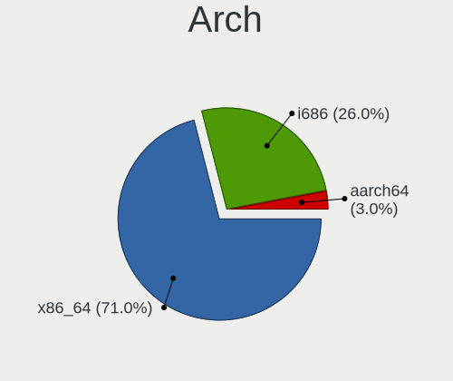

| Name    | Computers | Percent |
|---------|-----------|---------|
| x86_64  | 811       | 70.22%  |
| i686    | 308       | 26.67%  |
| aarch64 | 36        | 3.12%   |

DE
--

Desktop Environment

| Name     | Computers | Percent |
|----------|-----------|---------|
| Unity    | 1140      | 98.79%  |
| GNOME    | 12        | 1.04%   |
| KDE5     | 1         | 0.09%   |
| Cinnamon | 1         | 0.09%   |

Display Server
--------------

X11 or Wayland

| Name    | Computers | Percent |
|---------|-----------|---------|
| X11     | 1065      | 92.13%  |
| Wayland | 80        | 6.92%   |
| Tty     | 11        | 0.95%   |

Display Manager
---------------

SDDM, LightDM, etc.

| Name    | Computers | Percent |
|---------|-----------|---------|
| Unknown | 681       | 58.06%  |
| LightDM | 264       | 22.51%  |
| GDM     | 177       | 15.09%  |
| GDM3    | 50        | 4.26%   |
| SDDM    | 1         | 0.09%   |

OS Lang
-------

Language

| Lang    | Computers | Percent |
|---------|-----------|---------|
| en_US   | 417       | 36.07%  |
| de_DE   | 105       | 9.08%   |
| pt_BR   | 71        | 6.14%   |
| fr_FR   | 70        | 6.06%   |
| en_IN   | 58        | 5.02%   |
| en_GB   | 57        | 4.93%   |
| ru_RU   | 38        | 3.29%   |
| it_IT   | 36        | 3.11%   |
| es_ES   | 33        | 2.85%   |
| en_CA   | 26        | 2.25%   |
| Unknown | 26        | 2.25%   |
| pl_PL   | 18        | 1.56%   |
| en_AU   | 15        | 1.3%    |
| nl_NL   | 14        | 1.21%   |
| hu_HU   | 14        | 1.21%   |
| pt_PT   | 10        | 0.87%   |
| es_AR   | 9         | 0.78%   |
| en_ZA   | 9         | 0.78%   |
| zh_CN   | 7         | 0.61%   |
| es_MX   | 7         | 0.61%   |
| cs_CZ   | 7         | 0.61%   |
| C       | 7         | 0.61%   |
| tr_TR   | 6         | 0.52%   |
| ja_JP   | 5         | 0.43%   |
| en_PH   | 5         | 0.43%   |
| el_GR   | 5         | 0.43%   |
| zh_TW   | 4         | 0.35%   |
| ru_UA   | 4         | 0.35%   |
| nl_BE   | 4         | 0.35%   |
| en_NZ   | 4         | 0.35%   |
| en_IE   | 4         | 0.35%   |
| sv_SE   | 3         | 0.26%   |
| sl_SI   | 3         | 0.26%   |
| sk_SK   | 3         | 0.26%   |
| ro_RO   | 3         | 0.26%   |
| fi_FI   | 3         | 0.26%   |
| es_GT   | 3         | 0.26%   |
| es_CO   | 3         | 0.26%   |
| en_SG   | 3         | 0.26%   |
| de_CH   | 3         | 0.26%   |

Boot Mode
---------

EFI or BIOS

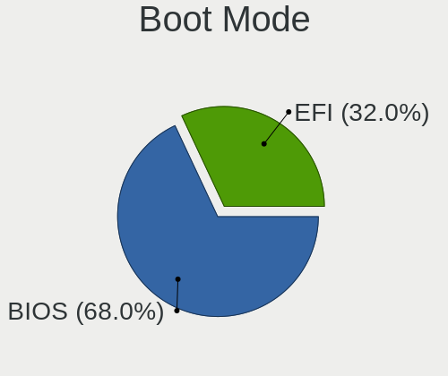

| Mode | Computers | Percent |
|------|-----------|---------|
| BIOS | 807       | 69.63%  |
| EFI  | 352       | 30.37%  |

Filesystem
----------

Type of filesystem

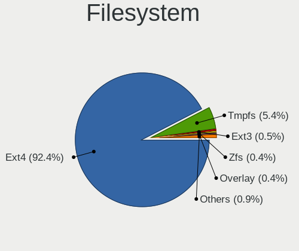

| Type     | Computers | Percent |
|----------|-----------|---------|
| Ext4     | 1114      | 96.45%  |
| Tmpfs    | 19        | 1.65%   |
| Zfs      | 5         | 0.43%   |
| Ext3     | 5         | 0.43%   |
| Overlay  | 3         | 0.26%   |
| Btrfs    | 3         | 0.26%   |
| Ext2     | 2         | 0.17%   |
| Aufs     | 2         | 0.17%   |
| SquasXfs | 1         | 0.09%   |
| Jfs      | 1         | 0.09%   |

Part. scheme
------------

Scheme of partitioning

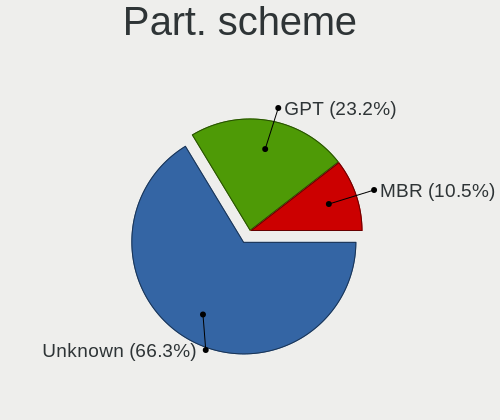

| Type    | Computers | Percent |
|---------|-----------|---------|
| Unknown | 819       | 70.24%  |
| GPT     | 227       | 19.47%  |
| MBR     | 120       | 10.29%  |

Dual Boot with Linux/BSD
------------------------

Hosting more than one Linux/BSD

| Dual boot | Computers | Percent |
|-----------|-----------|---------|
| No        | 1023      | 87.89%  |
| Yes       | 141       | 12.11%  |

Dual Boot (Win)
---------------

Hosting Linux and Windows

| Dual boot | Computers | Percent |
|-----------|-----------|---------|
| No        | 768       | 65.98%  |
| Yes       | 396       | 34.02%  |

Board
-----

Vendor
------

Motherboard manufacturer

| Name                | Computers | Percent |
|---------------------|-----------|---------|
| Dell                | 181       | 15.7%   |
| Hewlett-Packard     | 161       | 13.96%  |
| ASUSTek Computer    | 146       | 12.66%  |
| Lenovo              | 128       | 11.1%   |
| Gigabyte Technology | 84        | 7.29%   |
| Acer                | 65        | 5.64%   |
| MSI                 | 45        | 3.9%    |
| Toshiba             | 34        | 2.95%   |
| Nvidia              | 34        | 2.95%   |
| ASRock              | 31        | 2.69%   |
| Intel               | 26        | 2.25%   |
| Apple               | 21        | 1.82%   |
| Fujitsu Siemens     | 15        | 1.3%    |
| Unknown             | 14        | 1.21%   |
| Fujitsu             | 12        | 1.04%   |
| Sony                | 11        | 0.95%   |
| Positivo            | 10        | 0.87%   |
| Samsung Electronics | 9         | 0.78%   |
| Pegatron            | 7         | 0.61%   |
| Medion              | 6         | 0.52%   |
| HUAWEI              | 6         | 0.52%   |
| ECS                 | 6         | 0.52%   |
| Itautec             | 5         | 0.43%   |
| Biostar             | 5         | 0.43%   |
| Timi                | 4         | 0.35%   |
| Packard Bell        | 4         | 0.35%   |
| Notebook            | 4         | 0.35%   |
| IBM                 | 4         | 0.35%   |
| Foxconn             | 4         | 0.35%   |
| LG Electronics      | 3         | 0.26%   |
| eMachines           | 3         | 0.26%   |
| Chuwi               | 3         | 0.26%   |
| Alienware           | 3         | 0.26%   |
| Semp Toshiba        | 2         | 0.17%   |
| PCWare              | 2         | 0.17%   |
| Panasonic           | 2         | 0.17%   |
| OEM                 | 2         | 0.17%   |
| NEC Computers       | 2         | 0.17%   |
| Lex BayTrail        | 2         | 0.17%   |
| Huanan              | 2         | 0.17%   |

Model
-----

Motherboard model

| Name                          | Computers | Percent |
|-------------------------------|-----------|---------|
| Nvidia Tegra                  | 34        | 2.95%   |
| Unknown                       | 18        | 1.56%   |
| ASUS All Series               | 13        | 1.13%   |
| HP Pavilion dv6               | 7         | 0.61%   |
| Dell OptiPlex 755             | 6         | 0.52%   |
| HP ProBook 6550b              | 4         | 0.35%   |
| HP Mini 210-1000              | 4         | 0.35%   |
| Dell OptiPlex 9020            | 4         | 0.35%   |
| Dell OptiPlex 7010            | 4         | 0.35%   |
| Dell Latitude 7480            | 4         | 0.35%   |
| Toshiba Satellite L300        | 3         | 0.26%   |
| Positivo Mobile               | 3         | 0.26%   |
| Itautec Infoway               | 3         | 0.26%   |
| HP Z400 Workstation           | 3         | 0.26%   |
| HP Notebook                   | 3         | 0.26%   |
| Gigabyte GA-78LMT-USB3 6.0    | 3         | 0.26%   |
| Gigabyte G31M-ES2L            | 3         | 0.26%   |
| Dell XPS 13 9370              | 3         | 0.26%   |
| Dell Latitude D630            | 3         | 0.26%   |
| Dell Inspiron 5570            | 3         | 0.26%   |
| Dell Inspiron 3521            | 3         | 0.26%   |
| Dell Inspiron 1545            | 3         | 0.26%   |
| ASUS P4C800-E                 | 3         | 0.26%   |
| ASUS 1005HA                   | 3         | 0.26%   |
| Toshiba Portable PC           | 2         | 0.17%   |
| Timi TM1701                   | 2         | 0.17%   |
| Positivo N1103                | 2         | 0.17%   |
| MSI MS-7B86                   | 2         | 0.17%   |
| MSI MS-7996                   | 2         | 0.17%   |
| Medion Akoya THE TOUCH 10     | 2         | 0.17%   |
| Lenovo V145-15AST 81MT        | 2         | 0.17%   |
| Lenovo IdeaPad 3 15IIL05 81WE | 2         | 0.17%   |
| Lenovo G50-70 20351           | 2         | 0.17%   |
| Intel X79 V2.72A              | 2         | 0.17%   |
| HP ZBook 17 G3                | 2         | 0.17%   |
| HP ProBook 455 G1             | 2         | 0.17%   |
| HP ProBook 440 G3             | 2         | 0.17%   |
| HP Pavilion Notebook          | 2         | 0.17%   |
| HP Pavilion g4                | 2         | 0.17%   |
| HP Pavilion dv7               | 2         | 0.17%   |

Model Family
------------

Motherboard model prefix

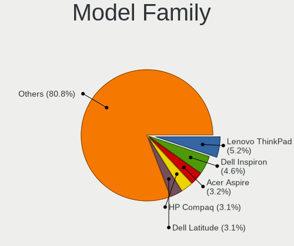

| Name                     | Computers | Percent |
|--------------------------|-----------|---------|
| Lenovo ThinkPad          | 57        | 4.94%   |
| Dell Inspiron            | 52        | 4.51%   |
| Acer Aspire              | 41        | 3.56%   |
| HP Compaq                | 37        | 3.21%   |
| Dell Latitude            | 35        | 3.04%   |
| Nvidia Tegra             | 34        | 2.95%   |
| HP Pavilion              | 34        | 2.95%   |
| Dell OptiPlex            | 33        | 2.86%   |
| Toshiba Satellite        | 25        | 2.17%   |
| Dell XPS                 | 20        | 1.73%   |
| HP ProBook               | 18        | 1.56%   |
| Unknown                  | 18        | 1.56%   |
| Lenovo IdeaPad           | 17        | 1.47%   |
| Dell Precision           | 15        | 1.3%    |
| HP EliteBook             | 14        | 1.21%   |
| ASUS PRIME               | 13        | 1.13%   |
| ASUS All                 | 13        | 1.13%   |
| Dell Vostro              | 12        | 1.04%   |
| HP ZBook                 | 8         | 0.69%   |
| ASUS ROG                 | 8         | 0.69%   |
| HP Mini                  | 6         | 0.52%   |
| HP ENVY                  | 6         | 0.52%   |
| Lenovo Yoga              | 5         | 0.43%   |
| Lenovo ThinkCentre       | 5         | 0.43%   |
| Itautec Infoway          | 5         | 0.43%   |
| Fujitsu LIFEBOOK         | 5         | 0.43%   |
| Medion Akoya             | 4         | 0.35%   |
| Lenovo Legion            | 4         | 0.35%   |
| HP Presario              | 4         | 0.35%   |
| HP Laptop                | 4         | 0.35%   |
| Fujitsu Siemens LIFEBOOK | 4         | 0.35%   |
| Fujitsu Siemens ESPRIMO  | 4         | 0.35%   |
| Fujitsu ESPRIMO          | 4         | 0.35%   |
| ASUS VivoBook            | 4         | 0.35%   |
| ASUS M5A78L-M            | 4         | 0.35%   |
| Acer TravelMate          | 4         | 0.35%   |
| Acer Extensa             | 4         | 0.35%   |
| Positivo Mobile          | 3         | 0.26%   |
| Lenovo G580              | 3         | 0.26%   |
| Lenovo 3000              | 3         | 0.26%   |

MFG Year
--------

Motherboard manufacture year

| Year    | Computers | Percent |
|---------|-----------|---------|
| 2008    | 94        | 8.15%   |
| 2009    | 84        | 7.29%   |
| 2012    | 82        | 7.11%   |
| 2007    | 82        | 7.11%   |
| 2011    | 75        | 6.5%    |
| 2010    | 75        | 6.5%    |
| 2018    | 71        | 6.16%   |
| 2017    | 68        | 5.9%    |
| 2013    | 66        | 5.72%   |
| 2015    | 64        | 5.55%   |
| 2016    | 61        | 5.29%   |
| 2014    | 58        | 5.03%   |
| 2019    | 57        | 4.94%   |
| 2006    | 50        | 4.34%   |
| 2020    | 46        | 3.99%   |
| Unknown | 38        | 3.3%    |
| 2005    | 27        | 2.34%   |
| 2021    | 24        | 2.08%   |
| 2022    | 15        | 1.3%    |
| 2004    | 7         | 0.61%   |
| 2003    | 6         | 0.52%   |
| 2002    | 2         | 0.17%   |
| 2023    | 1         | 0.09%   |

Form Factor
-----------

Physical design of the computer

| Name           | Computers | Percent |
|----------------|-----------|---------|
| Notebook       | 620       | 53.77%  |
| Desktop        | 457       | 39.64%  |
| System on chip | 36        | 3.12%   |
| Mini pc        | 12        | 1.04%   |
| Convertible    | 11        | 0.95%   |
| All in one     | 9         | 0.78%   |
| Server         | 5         | 0.43%   |
| Tablet         | 3         | 0.26%   |

Secure Boot
-----------

Enabled or disabled

| State    | Computers | Percent |
|----------|-----------|---------|
| Disabled | 1097      | 95.14%  |
| Enabled  | 56        | 4.86%   |

Coreboot
--------

Have coreboot on board

| Used | Computers | Percent |
|------|-----------|---------|
| No   | 1153      | 100%    |

RAM Size
--------

Total RAM memory

| Size in GB  | Computers | Percent |
|-------------|-----------|---------|
| 3.01-4.0    | 252       | 21.63%  |
| 4.01-8.0    | 225       | 19.31%  |
| 16.01-24.0  | 175       | 15.02%  |
| 8.01-16.0   | 164       | 14.08%  |
| 1.01-2.0    | 143       | 12.27%  |
| 32.01-64.0  | 65        | 5.58%   |
| 2.01-3.0    | 61        | 5.24%   |
| 0.51-1.0    | 50        | 4.29%   |
| 64.01-256.0 | 16        | 1.37%   |
| 24.01-32.0  | 12        | 1.03%   |
| 0.01-0.5    | 2         | 0.17%   |

RAM Used
--------

Used RAM memory

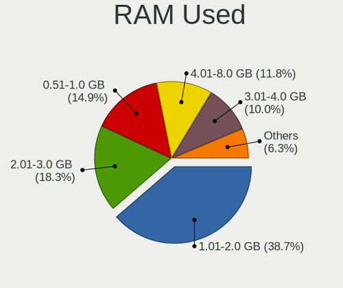

| Used GB     | Computers | Percent |
|-------------|-----------|---------|
| 1.01-2.0    | 481       | 39.75%  |
| 2.01-3.0    | 221       | 18.26%  |
| 0.51-1.0    | 185       | 15.29%  |
| 4.01-8.0    | 139       | 11.49%  |
| 3.01-4.0    | 117       | 9.67%   |
| 8.01-16.0   | 43        | 3.55%   |
| 0.01-0.5    | 11        | 0.91%   |
| 16.01-24.0  | 4         | 0.33%   |
| Unknown     | 4         | 0.33%   |
| 32.01-64.0  | 2         | 0.17%   |
| 24.01-32.0  | 2         | 0.17%   |
| 64.01-256.0 | 1         | 0.08%   |

Total Drives
------------

Number of drives on board

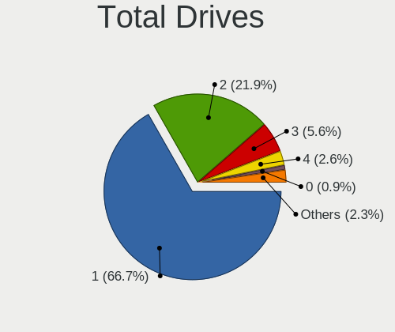

| Drives | Computers | Percent |
|--------|-----------|---------|
| 1      | 781       | 66.75%  |
| 2      | 256       | 21.88%  |
| 3      | 67        | 5.73%   |
| 4      | 31        | 2.65%   |
| 6      | 10        | 0.85%   |
| 0      | 10        | 0.85%   |
| 5      | 9         | 0.77%   |
| 7      | 3         | 0.26%   |
| 9      | 2         | 0.17%   |
| 10     | 1         | 0.09%   |

Has CD-ROM
----------

Has CD-ROM on board

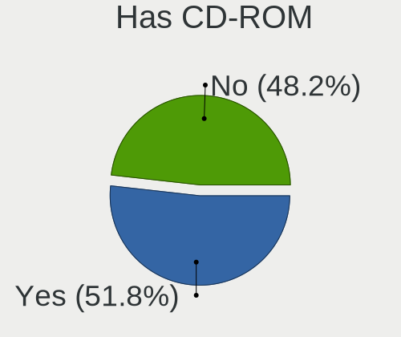

| Presented | Computers | Percent |
|-----------|-----------|---------|
| Yes       | 610       | 52.77%  |
| No        | 546       | 47.23%  |

Has Ethernet
------------

Has Ethernet on board

| Presented | Computers | Percent |
|-----------|-----------|---------|
| Yes       | 1061      | 91.78%  |
| No        | 95        | 8.22%   |

Has WiFi
--------

Has WiFi module

| Presented | Computers | Percent |
|-----------|-----------|---------|
| Yes       | 855       | 73.9%   |
| No        | 302       | 26.1%   |

Has Bluetooth
-------------

Has Bluetooth module

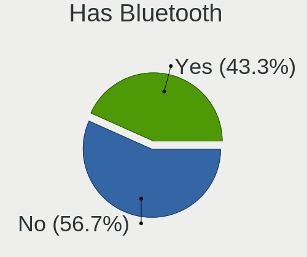

| Presented | Computers | Percent |
|-----------|-----------|---------|
| No        | 674       | 58.05%  |
| Yes       | 487       | 41.95%  |

Location
--------

Country
-------

Geographic location (country)

| Country      | Computers | Percent |
|--------------|-----------|---------|
| USA          | 187       | 16.18%  |
| Germany      | 114       | 9.86%   |
| Brazil       | 89        | 7.7%    |
| France       | 75        | 6.49%   |
| India        | 61        | 5.28%   |
| Russia       | 52        | 4.5%    |
| UK           | 51        | 4.41%   |
| Italy        | 43        | 3.72%   |
| Spain        | 40        | 3.46%   |
| Canada       | 28        | 2.42%   |
| Netherlands  | 23        | 1.99%   |
| Poland       | 21        | 1.82%   |
| Belgium      | 18        | 1.56%   |
| Hungary      | 15        | 1.3%    |
| Australia    | 15        | 1.3%    |
| Ukraine      | 14        | 1.21%   |
| Turkey       | 13        | 1.12%   |
| Romania      | 13        | 1.12%   |
| China        | 12        | 1.04%   |
| Bulgaria     | 12        | 1.04%   |
| Greece       | 11        | 0.95%   |
| Argentina    | 11        | 0.95%   |
| South Africa | 10        | 0.87%   |
| Portugal     | 10        | 0.87%   |
| Mexico       | 10        | 0.87%   |
| Czechia      | 10        | 0.87%   |
| Japan        | 9         | 0.78%   |
| Indonesia    | 9         | 0.78%   |
| Colombia     | 9         | 0.78%   |
| Vietnam      | 8         | 0.69%   |
| Sweden       | 8         | 0.69%   |
| Austria      | 8         | 0.69%   |
| Switzerland  | 7         | 0.61%   |
| Morocco      | 6         | 0.52%   |
| South Korea  | 5         | 0.43%   |
| Slovakia     | 5         | 0.43%   |
| Philippines  | 5         | 0.43%   |
| New Zealand  | 5         | 0.43%   |
| Ireland      | 5         | 0.43%   |
| Iran         | 5         | 0.43%   |

City
----

Geographic location (city)

| City              | Computers | Percent |
|-------------------|-----------|---------|
| Berlin            | 18        | 1.51%   |
| Sao Paulo         | 13        | 1.09%   |
| Moscow            | 13        | 1.09%   |
| Paris             | 11        | 0.92%   |
| Rome              | 8         | 0.67%   |
| Warsaw            | 7         | 0.59%   |
| Rio de Janeiro    | 7         | 0.59%   |
| Milan             | 7         | 0.59%   |
| Budapest          | 7         | 0.59%   |
| Bengaluru         | 7         | 0.59%   |
| Barcelona         | 7         | 0.59%   |
| Athens            | 7         | 0.59%   |
| Sydney            | 6         | 0.5%    |
| Pune              | 6         | 0.5%    |
| Munich            | 6         | 0.5%    |
| Montreal          | 6         | 0.5%    |
| Hyderabad         | 6         | 0.5%    |
| Hamburg           | 6         | 0.5%    |
| Braslia         | 6         | 0.5%    |
| Bogot           | 6         | 0.5%    |
| St Petersburg     | 5         | 0.42%   |
| Frankfurt am Main | 5         | 0.42%   |
| Denver            | 5         | 0.42%   |
| Vienna            | 4         | 0.34%   |
| Toronto           | 4         | 0.34%   |
| Stuttgart         | 4         | 0.34%   |
| Nizhniy Novgorod  | 4         | 0.34%   |
| New Delhi         | 4         | 0.34%   |
| Mumbai            | 4         | 0.34%   |
| Madrid            | 4         | 0.34%   |
| Lviv              | 4         | 0.34%   |
| Lisbon            | 4         | 0.34%   |
| Istanbul          | 4         | 0.34%   |
| Hanoi             | 4         | 0.34%   |
| Dublin            | 4         | 0.34%   |
| Buenos Aires      | 4         | 0.34%   |
| Amsterdam         | 4         | 0.34%   |
| Zurich            | 3         | 0.25%   |
| Zagreb            | 3         | 0.25%   |
| Yekaterinburg     | 3         | 0.25%   |

Drives
------

Drive Vendor
------------

Hard drive vendors

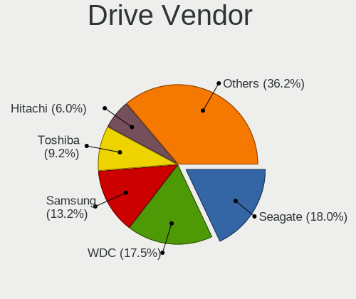

| Vendor                    | Computers | Drives | Percent |
|---------------------------|-----------|--------|---------|
| Seagate                   | 282       | 370    | 18.42%  |
| WDC                       | 278       | 363    | 18.16%  |
| Samsung Electronics       | 201       | 262    | 13.13%  |
| Toshiba                   | 140       | 158    | 9.14%   |
| Hitachi                   | 89        | 97     | 5.81%   |
| Kingston                  | 69        | 82     | 4.51%   |
| Unknown                   | 68        | 73     | 4.44%   |
| SanDisk                   | 53        | 63     | 3.46%   |
| HGST                      | 41        | 54     | 2.68%   |
| Crucial                   | 41        | 48     | 2.68%   |
| Intel                     | 25        | 28     | 1.63%   |
| Micron Technology         | 21        | 27     | 1.37%   |
| Fujitsu                   | 16        | 16     | 1.05%   |
| SK hynix                  | 14        | 14     | 0.91%   |
| A-DATA Technology         | 14        | 14     | 0.91%   |
| Maxtor                    | 13        | 13     | 0.85%   |
| PNY                       | 11        | 16     | 0.72%   |
| Intenso                   | 11        | 14     | 0.72%   |
| OCZ                       | 10        | 11     | 0.65%   |
| LITEON                    | 10        | 13     | 0.65%   |
| Transcend                 | 9         | 9      | 0.59%   |
| Patriot                   | 9         | 9      | 0.59%   |
| LITEONIT                  | 6         | 10     | 0.39%   |
| KIOXIA                    | 6         | 6      | 0.39%   |
| China                     | 6         | 6      | 0.39%   |
| Apple                     | 6         | 9      | 0.39%   |
| SPCC                      | 5         | 7      | 0.33%   |
| Phison                    | 4         | 5      | 0.26%   |
| Lenovo                    | 4         | 4      | 0.26%   |
| XPG                       | 3         | 3      | 0.2%    |
| Micron/Crucial Technology | 3         | 3      | 0.2%    |
| Corsair                   | 3         | 3      | 0.2%    |
| Apacer                    | 3         | 3      | 0.2%    |
| XrayDisk                  | 2         | 2      | 0.13%   |
| Verbatim                  | 2         | 2      | 0.13%   |
| Team                      | 2         | 4      | 0.13%   |
| StoreJet                  | 2         | 2      | 0.13%   |
| Silicon Motion            | 2         | 2      | 0.13%   |
| SABRENT                   | 2         | 2      | 0.13%   |
| Realtek Semiconductor     | 2         | 2      | 0.13%   |

Drive Model
-----------

Hard drive models

| Model                               | Computers | Percent |
|-------------------------------------|-----------|---------|
| Unknown MMC Card  32GB              | 17        | 1.03%   |
| Seagate ST1000LM035-1RK172 1TB      | 17        | 1.03%   |
| Seagate ST500DM002-1BD142 500GB     | 15        | 0.91%   |
| Kingston SA400S37240G 240GB SSD     | 15        | 0.91%   |
| Unknown MMC Card  128GB             | 12        | 0.72%   |
| Seagate ST1000DM010-2EP102 1TB      | 12        | 0.72%   |
| Toshiba MQ01ABF050 500GB            | 11        | 0.66%   |
| Seagate ST1000LM024 HN-M101MBB 1TB  | 11        | 0.66%   |
| Kingston SV300S37A120G 120GB SSD    | 10        | 0.6%    |
| HGST HTS545050A7E680 500GB          | 10        | 0.6%    |
| Toshiba DT01ACA100 1TB              | 9         | 0.54%   |
| Samsung SSD 860 EVO 250GB           | 9         | 0.54%   |
| Samsung SSD 850 EVO 250GB           | 9         | 0.54%   |
| Samsung NVMe SSD Drive 512GB        | 8         | 0.48%   |
| HGST HTS721010A9E630 1TB            | 8         | 0.48%   |
| Unknown MMC Card  64GB              | 7         | 0.42%   |
| Samsung SSD 860 EVO 500GB           | 7         | 0.42%   |
| Kingston SA400S37120G 120GB SSD     | 7         | 0.42%   |
| WDC WD10EZEX-00BN5A0 1TB            | 6         | 0.36%   |
| Seagate ST500LT012-1DG142 500GB     | 6         | 0.36%   |
| Seagate ST380815AS 80GB             | 6         | 0.36%   |
| Seagate ST1000DM003-1SB102 1TB      | 6         | 0.36%   |
| Samsung SSD 840 EVO 250GB           | 6         | 0.36%   |
| HGST HTS725050A7E630 500GB          | 6         | 0.36%   |
| WDC WD5000AAKX-001CA0 500GB         | 5         | 0.3%    |
| WDC WD10EZEX-60WN4A0 1TB            | 5         | 0.3%    |
| WDC WD10EZEX-08WN4A0 1TB            | 5         | 0.3%    |
| Toshiba MQ01ACF050 500GB            | 5         | 0.3%    |
| Toshiba MQ01ABD100 1TB              | 5         | 0.3%    |
| Toshiba MQ01ABD075 752GB            | 5         | 0.3%    |
| Seagate ST500LT012-9WS142 500GB     | 5         | 0.3%    |
| Seagate ST500LM012 HN-M500MBB 500GB | 5         | 0.3%    |
| Seagate ST3500418AS 500GB           | 5         | 0.3%    |
| Seagate ST3320620AS 320GB           | 5         | 0.3%    |
| Seagate ST2000DM001-1ER164 2TB      | 5         | 0.3%    |
| Seagate ST1000DM003-9YN162 1TB      | 5         | 0.3%    |
| Seagate ST1000DM003-1ER162 1TB      | 5         | 0.3%    |
| Seagate ST1000DM003-1CH162 1TB      | 5         | 0.3%    |
| Samsung SSD 850 PRO 256GB           | 5         | 0.3%    |
| Samsung SSD 850 EVO 500GB           | 5         | 0.3%    |

HDD Vendor
----------

Hard disk drive vendors

| Vendor              | Computers | Drives | Percent |
|---------------------|-----------|--------|---------|
| Seagate             | 280       | 365    | 31.75%  |
| WDC                 | 251       | 330    | 28.46%  |
| Toshiba             | 114       | 127    | 12.93%  |
| Hitachi             | 89        | 97     | 10.09%  |
| Samsung Electronics | 57        | 68     | 6.46%   |
| HGST                | 41        | 54     | 4.65%   |
| Fujitsu             | 16        | 16     | 1.81%   |
| Maxtor              | 13        | 13     | 1.47%   |
| Apple               | 5         | 6      | 0.57%   |
| Unknown             | 4         | 3      | 0.45%   |
| SABRENT             | 2         | 2      | 0.23%   |
| Intenso             | 2         | 2      | 0.23%   |
| IBM/Hitachi         | 2         | 2      | 0.23%   |
| USB3.0              | 1         | 1      | 0.11%   |
| USB                 | 1         | 2      | 0.11%   |
| StoreJet            | 1         | 1      | 0.11%   |
| SSK                 | 1         | 1      | 0.11%   |
| Lenovo              | 1         | 1      | 0.11%   |
| Hewlett-Packard     | 1         | 2      | 0.11%   |

SSD Vendor
----------

Solid state drive vendors

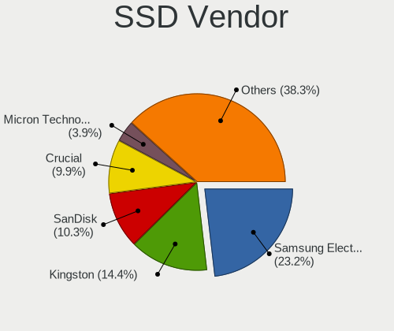

| Vendor              | Computers | Drives | Percent |
|---------------------|-----------|--------|---------|
| Samsung Electronics | 92        | 126    | 23.23%  |
| Kingston            | 58        | 69     | 14.65%  |
| SanDisk             | 39        | 46     | 9.85%   |
| Crucial             | 39        | 46     | 9.85%   |
| WDC                 | 15        | 16     | 3.79%   |
| Micron Technology   | 15        | 20     | 3.79%   |
| Intel               | 15        | 16     | 3.79%   |
| PNY                 | 11        | 16     | 2.78%   |
| A-DATA Technology   | 11        | 11     | 2.78%   |
| Toshiba             | 10        | 12     | 2.53%   |
| OCZ                 | 10        | 11     | 2.53%   |
| Patriot             | 8         | 8      | 2.02%   |
| LITEON              | 8         | 11     | 2.02%   |
| Transcend           | 6         | 6      | 1.52%   |
| LITEONIT            | 6         | 10     | 1.52%   |
| Intenso             | 6         | 7      | 1.52%   |
| China               | 6         | 6      | 1.52%   |
| SPCC                | 4         | 5      | 1.01%   |
| SK hynix            | 4         | 4      | 1.01%   |
| Verbatim            | 2         | 2      | 0.51%   |
| Team                | 2         | 4      | 0.51%   |
| KingDian            | 2         | 2      | 0.51%   |
| JMicron Technology  | 2         | 2      | 0.51%   |
| Apacer              | 2         | 2      | 0.51%   |
| XrayDisk            | 1         | 1      | 0.25%   |
| Vaseky              | 1         | 1      | 0.25%   |
| SUNEAST             | 1         | 1      | 0.25%   |
| StoreJet            | 1         | 1      | 0.25%   |
| Smartbuy            | 1         | 1      | 0.25%   |
| Seagate             | 1         | 1      | 0.25%   |
| Plextor             | 1         | 1      | 0.25%   |
| NGFF                | 1         | 1      | 0.25%   |
| Mushkin             | 1         | 1      | 0.25%   |
| MidasForce          | 1         | 1      | 0.25%   |
| Lexar               | 1         | 1      | 0.25%   |
| Innodisk            | 1         | 1      | 0.25%   |
| Hikvision           | 1         | 2      | 0.25%   |
| GOODRAM             | 1         | 1      | 0.25%   |
| GBDriver            | 1         | 1      | 0.25%   |
| FORESEE             | 1         | 1      | 0.25%   |

Drive Kind
----------

HDD or SSD

| Kind    | Computers | Drives | Percent |
|---------|-----------|--------|---------|
| HDD     | 773       | 1093   | 56.1%   |
| SSD     | 348       | 482    | 25.25%  |
| NVMe    | 178       | 214    | 12.92%  |
| MMC     | 59        | 65     | 4.28%   |
| Unknown | 20        | 22     | 1.45%   |

Drive Connector
---------------

SATA, SAS, NVMe, etc.

| Type | Computers | Drives | Percent |
|------|-----------|--------|---------|
| SATA | 980       | 1543   | 77.72%  |
| NVMe | 178       | 213    | 14.12%  |
| MMC  | 59        | 65     | 4.68%   |
| SAS  | 44        | 55     | 3.49%   |

Drive Size
----------

Size of hard drive

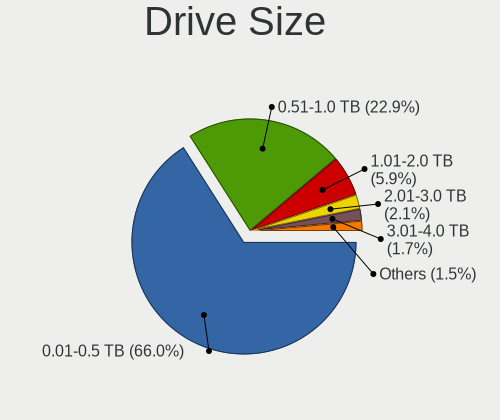

| Size in TB | Computers | Drives | Percent |
|------------|-----------|--------|---------|
| 0.01-0.5   | 789       | 1042   | 66.64%  |
| 0.51-1.0   | 276       | 348    | 23.31%  |
| 1.01-2.0   | 62        | 83     | 5.24%   |
| 2.01-3.0   | 24        | 35     | 2.03%   |
| 3.01-4.0   | 19        | 40     | 1.6%    |
| 4.01-10.0  | 12        | 25     | 1.01%   |
| 10.01-20.0 | 2         | 2      | 0.17%   |

Space Total
-----------

Amount of disk space available on the file system

| Size in GB     | Computers | Percent |
|----------------|-----------|---------|
| 101-250        | 390       | 33.11%  |
| 251-500        | 280       | 23.77%  |
| 501-1000       | 140       | 11.88%  |
| 51-100         | 128       | 10.87%  |
| 1001-2000      | 74        | 6.28%   |
| 21-50          | 65        | 5.52%   |
| More than 3000 | 43        | 3.65%   |
| 2001-3000      | 29        | 2.46%   |
| 1-20           | 27        | 2.29%   |
| Unknown        | 2         | 0.17%   |

Space Used
----------

Amount of used disk space

| Used GB        | Computers | Percent |
|----------------|-----------|---------|
| 1-20           | 496       | 41.47%  |
| 21-50          | 165       | 13.8%   |
| 101-250        | 155       | 12.96%  |
| 51-100         | 155       | 12.96%  |
| 251-500        | 88        | 7.36%   |
| 501-1000       | 74        | 6.19%   |
| 1001-2000      | 30        | 2.51%   |
| More than 3000 | 19        | 1.59%   |
| 2001-3000      | 12        | 1%      |
| Unknown        | 2         | 0.17%   |

Malfunc. Drives
---------------

Drive models with a malfunction

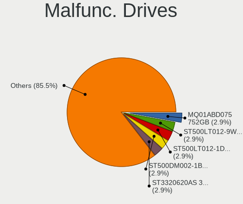

| Model                                               | Computers | Drives | Percent |
|-----------------------------------------------------|-----------|--------|---------|
| Toshiba MQ01ABD075 752GB                            | 2         | 2      | 3.64%   |
| Seagate ST500LT012-9WS142 500GB                     | 2         | 2      | 3.64%   |
| Seagate ST500LT012-1DG142 500GB                     | 2         | 2      | 3.64%   |
| Seagate ST500DM002-1BD142 500GB                     | 2         | 3      | 3.64%   |
| Seagate ST3320620AS 320GB                           | 2         | 2      | 3.64%   |
| HGST HTS545050A7E680 500GB                          | 2         | 2      | 3.64%   |
| WDC WD5001AALS-00LWTA0 500GB                        | 1         | 1      | 1.82%   |
| WDC WD5000AAKX-001CA0 500GB                         | 1         | 1      | 1.82%   |
| WDC WD30EFRX-68EUZN0 3TB                            | 1         | 1      | 1.82%   |
| WDC WD20EARS-22MVWB0 2TB                            | 1         | 1      | 1.82%   |
| WDC WD10JPVX-60JC3T0 1TB                            | 1         | 1      | 1.82%   |
| WDC WD10JPCX-24UE4T0 1TB                            | 1         | 1      | 1.82%   |
| WDC WD10EADX-22TDHB0 1TB                            | 1         | 1      | 1.82%   |
| Toshiba MQ01ABF050 500GB                            | 1         | 1      | 1.82%   |
| Toshiba MQ01ABD100M 1TB                             | 1         | 1      | 1.82%   |
| Toshiba MK6465GSX 640GB                             | 1         | 1      | 1.82%   |
| Toshiba MK3261GSYN 320GB                            | 1         | 1      | 1.82%   |
| Toshiba MK3252GSX 320GB                             | 1         | 2      | 1.82%   |
| Seagate ST500DM002-1SB10A 500GB                     | 1         | 1      | 1.82%   |
| Seagate ST3750330NS 752GB                           | 1         | 1      | 1.82%   |
| Seagate ST3500630AS 500GB                           | 1         | 1      | 1.82%   |
| Seagate ST320LM001 HN-M320MBB 320GB                 | 1         | 1      | 1.82%   |
| Seagate ST32000542AS 2TB                            | 1         | 1      | 1.82%   |
| Seagate ST3160815AS 160GB                           | 1         | 1      | 1.82%   |
| Seagate ST31000524NS 1TB                            | 1         | 1      | 1.82%   |
| Seagate ST3000DM001-1CH166 3TB                      | 1         | 2      | 1.82%   |
| Seagate ST1000LM 035-1RK172 1TB                     | 1         | 1      | 1.82%   |
| Samsung Electronics SSD 850 EVO 250GB               | 1         | 1      | 1.82%   |
| Samsung Electronics SSD 840 PRO Series 256GB        | 1         | 1      | 1.82%   |
| Samsung Electronics HM320II 320GB                   | 1         | 1      | 1.82%   |
| Samsung Electronics HD501LJ 500GB                   | 1         | 1      | 1.82%   |
| Samsung Electronics HD161HJ 160GB                   | 1         | 1      | 1.82%   |
| Samsung Electronics HD080HJ 80GB                    | 1         | 1      | 1.82%   |
| Micron Technology MTFDDAK256MAY-1AH12ABHA 256GB SSD | 1         | 1      | 1.82%   |
| Kingston SH100S3240G 240GB SSD                      | 1         | 1      | 1.82%   |
| Kingston SA400S37240G 240GB SSD                     | 1         | 1      | 1.82%   |
| Kingston SA400S37 120GB SSD                         | 1         | 1      | 1.82%   |
| Hitachi HTS547575A9E384 752GB                       | 1         | 1      | 1.82%   |
| Hitachi HTS541040G9AT00 40GB                        | 1         | 1      | 1.82%   |
| Hitachi HDS722020ALA330 2TB                         | 1         | 1      | 1.82%   |

Malfunc. Drive Vendor
---------------------

Vendors of faulty drives

| Vendor              | Computers | Drives | Percent |
|---------------------|-----------|--------|---------|
| Seagate             | 17        | 19     | 31.48%  |
| WDC                 | 7         | 7      | 12.96%  |
| Toshiba             | 7         | 8      | 12.96%  |
| Samsung Electronics | 6         | 6      | 11.11%  |
| Hitachi             | 4         | 4      | 7.41%   |
| HGST                | 4         | 5      | 7.41%   |
| Kingston            | 2         | 3      | 3.7%    |
| Crucial             | 2         | 2      | 3.7%    |
| Apple               | 2         | 2      | 3.7%    |
| Micron Technology   | 1         | 1      | 1.85%   |
| China               | 1         | 1      | 1.85%   |
| A-DATA Technology   | 1         | 1      | 1.85%   |

Malfunc. HDD Vendor
-------------------

Vendors of faulty HDD drives

| Vendor              | Computers | Drives | Percent |
|---------------------|-----------|--------|---------|
| Seagate             | 17        | 19     | 38.64%  |
| WDC                 | 7         | 7      | 15.91%  |
| Toshiba             | 7         | 8      | 15.91%  |
| Samsung Electronics | 4         | 4      | 9.09%   |
| Hitachi             | 4         | 4      | 9.09%   |
| HGST                | 4         | 5      | 9.09%   |
| Apple               | 1         | 1      | 2.27%   |

Malfunc. Drive Kind
-------------------

Kinds of faulty drives

| Kind | Computers | Drives | Percent |
|------|-----------|--------|---------|
| HDD  | 41        | 48     | 80.39%  |
| SSD  | 10        | 11     | 19.61%  |

Failed Drives
-------------

Failed drive models

| Model                   | Computers | Drives | Percent |
|-------------------------|-----------|--------|---------|
| Toshiba MK5065GSX 500GB | 1         | 1      | 100%    |

Failed Drive Vendor
-------------------

Failed drive vendors

| Vendor  | Computers | Drives | Percent |
|---------|-----------|--------|---------|
| Toshiba | 1         | 1      | 100%    |

Drive Status
------------

Number of failed and malfunc. drives

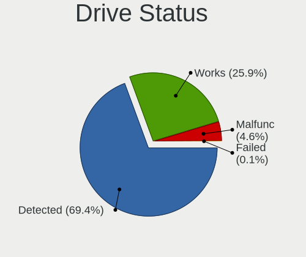

| Status   | Computers | Drives | Percent |
|----------|-----------|--------|---------|
| Detected | 858       | 1354   | 71.62%  |
| Works    | 289       | 462    | 24.12%  |
| Malfunc  | 50        | 59     | 4.17%   |
| Failed   | 1         | 1      | 0.08%   |

Storage controller
------------------

Storage Vendor
--------------

Storage controller vendors

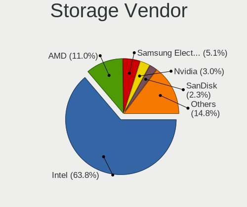

| Vendor                           | Computers | Percent |
|----------------------------------|-----------|---------|
| Intel                            | 846       | 65.08%  |
| AMD                              | 145       | 11.15%  |
| Samsung Electronics              | 61        | 4.69%   |
| Nvidia                           | 39        | 3%      |
| SanDisk                          | 29        | 2.23%   |
| JMicron Technology               | 21        | 1.62%   |
| VIA Technologies                 | 15        | 1.15%   |
| Toshiba America Info Systems     | 15        | 1.15%   |
| Marvell Technology Group         | 15        | 1.15%   |
| ASMedia Technology               | 14        | 1.08%   |
| Kingston Technology Company      | 13        | 1%      |
| Silicon Integrated Systems [SiS] | 12        | 0.92%   |
| SK hynix                         | 10        | 0.77%   |
| Silicon Motion                   | 10        | 0.77%   |
| KIOXIA                           | 8         | 0.62%   |
| Phison Electronics               | 7         | 0.54%   |
| Micron Technology                | 6         | 0.46%   |
| ADATA Technology                 | 6         | 0.46%   |
| Silicon Image                    | 4         | 0.31%   |
| Micron/Crucial Technology        | 4         | 0.31%   |
| Realtek Semiconductor            | 3         | 0.23%   |
| Promise Technology               | 3         | 0.23%   |
| LSI Logic / Symbios Logic        | 2         | 0.15%   |
| Lite-On Technology               | 2         | 0.15%   |
| Lenovo                           | 2         | 0.15%   |
| Union Memory (Shenzhen)          | 1         | 0.08%   |
| ULi Electronics                  | 1         | 0.08%   |
| Solid State Storage Technology   | 1         | 0.08%   |
| Shenzhen Longsys Electronics     | 1         | 0.08%   |
| Seagate Technology               | 1         | 0.08%   |
| Hewlett-Packard                  | 1         | 0.08%   |
| Apple                            | 1         | 0.08%   |
| Adaptec                          | 1         | 0.08%   |

Storage Model
-------------

Storage controller models

| Model                                                                                   | Computers | Percent |
|-----------------------------------------------------------------------------------------|-----------|---------|
| AMD FCH SATA Controller [AHCI mode]                                                     | 82        | 5.11%   |
| Intel 82801G (ICH7 Family) IDE Controller                                               | 69        | 4.3%    |
| Intel Sunrise Point-LP SATA Controller [AHCI mode]                                      | 54        | 3.36%   |
| Intel NM10/ICH7 Family SATA Controller [IDE mode]                                       | 52        | 3.24%   |
| Intel 82801IBM/IEM (ICH9M/ICH9M-E) 4 port SATA Controller [AHCI mode]                   | 48        | 2.99%   |
| Intel 8 Series/C220 Series Chipset Family 6-port SATA Controller 1 [AHCI mode]          | 41        | 2.55%   |
| Intel 7 Series Chipset Family 6-port SATA Controller [AHCI mode]                        | 39        | 2.43%   |
| Intel 82801GBM/GHM (ICH7-M Family) SATA Controller [IDE mode]                           | 32        | 1.99%   |
| AMD SB7x0/SB8x0/SB9x0 IDE Controller                                                    | 31        | 1.93%   |
| Intel 82801HM/HEM (ICH8M/ICH8M-E) IDE Controller                                        | 30        | 1.87%   |
| Intel 6 Series/C200 Series Chipset Family 6 port Mobile SATA AHCI Controller            | 29        | 1.81%   |
| Samsung NVMe SSD Controller SM981/PM981/PM983                                           | 28        | 1.74%   |
| Intel Q170/Q150/B150/H170/H110/Z170/CM236 Chipset SATA Controller [AHCI Mode]           | 28        | 1.74%   |
| Intel 82801 Mobile SATA Controller [RAID mode]                                          | 25        | 1.56%   |
| AMD SB7x0/SB8x0/SB9x0 SATA Controller [IDE mode]                                        | 25        | 1.56%   |
| Intel 82801GBM/GHM (ICH7-M Family) SATA Controller [AHCI mode]                          | 24        | 1.49%   |
| Intel 7 Series/C210 Series Chipset Family 6-port SATA Controller [AHCI mode]            | 24        | 1.49%   |
| Intel 6 Series/C200 Series Chipset Family 6 port Desktop SATA AHCI Controller           | 24        | 1.49%   |
| Intel 82801HM/HEM (ICH8M/ICH8M-E) SATA Controller [AHCI mode]                           | 23        | 1.43%   |
| AMD SB7x0/SB8x0/SB9x0 SATA Controller [AHCI mode]                                       | 23        | 1.43%   |
| Nvidia MCP61 SATA Controller                                                            | 21        | 1.31%   |
| Intel Cannon Lake PCH SATA AHCI Controller                                              | 21        | 1.31%   |
| Intel 82801FB/FBM/FR/FW/FRW (ICH6 Family) IDE Controller                                | 20        | 1.25%   |
| Intel 5 Series/3400 Series Chipset 6 port SATA AHCI Controller                          | 20        | 1.25%   |
| Nvidia MCP61 IDE                                                                        | 19        | 1.18%   |
| Intel Wildcat Point-LP SATA Controller [AHCI Mode]                                      | 18        | 1.12%   |
| Intel SATA Controller [RAID mode]                                                       | 18        | 1.12%   |
| Intel NM10/ICH7 Family SATA Controller [AHCI mode]                                      | 18        | 1.12%   |
| Intel 8 Series SATA Controller 1 [AHCI mode]                                            | 18        | 1.12%   |
| Intel 5 Series/3400 Series Chipset 4 port SATA AHCI Controller                          | 16        | 1%      |
| VIA VT82C586A/B/VT82C686/A/B/VT823x/A/C PIPC Bus Master IDE                             | 14        | 0.87%   |
| Intel 82801I (ICH9 Family) 2 port SATA Controller [IDE mode]                            | 14        | 0.87%   |
| Samsung NVMe SSD Controller SM961/PM961/SM963                                           | 13        | 0.81%   |
| Samsung NVMe SSD Controller 980                                                         | 13        | 0.81%   |
| JMicron JMB363 SATA/IDE Controller                                                      | 13        | 0.81%   |
| Intel Comet Lake SATA AHCI Controller                                                   | 13        | 0.81%   |
| Intel Atom/Celeron/Pentium Processor x5-E8000/J3xxx/N3xxx Series SATA Controller        | 13        | 0.81%   |
| Intel Atom Processor E3800 Series SATA AHCI Controller                                  | 13        | 0.81%   |
| Intel 6 Series/C200 Series Chipset Family Desktop SATA Controller (IDE mode, ports 4-5) | 13        | 0.81%   |
| Intel 6 Series/C200 Series Chipset Family Desktop SATA Controller (IDE mode, ports 0-3) | 13        | 0.81%   |

Storage Kind
------------

Kind of storage controller (IDE, SATA, NVMe, SAS, ...)

| Kind | Computers | Percent |
|------|-----------|---------|
| SATA | 743       | 54.47%  |
| IDE  | 370       | 27.13%  |
| NVMe | 178       | 13.05%  |
| RAID | 69        | 5.06%   |
| SAS  | 2         | 0.15%   |
| SCSI | 2         | 0.15%   |

Processor
---------

CPU Vendor
----------

Processor vendors

| Vendor       | Computers | Percent |
|--------------|-----------|---------|
| Intel        | 923       | 80.05%  |
| AMD          | 191       | 16.57%  |
| ARM          | 24        | 2.08%   |
| Unknown      | 11        | 0.95%   |
| CentaurHauls | 3         | 0.26%   |
| Qualcomm     | 1         | 0.09%   |

CPU Model
---------

Processor models

| Model                                       | Computers | Percent |
|---------------------------------------------|-----------|---------|
| ARM Processor                               | 24        | 2.08%   |
| Intel Core i5-7200U CPU @ 2.50GHz           | 16        | 1.39%   |
| Intel Core i7-8550U CPU @ 1.80GHz           | 14        | 1.21%   |
| Intel Pentium 4 CPU 3.00GHz                 | 13        | 1.13%   |
| Intel Atom CPU N270 @ 1.60GHz               | 13        | 1.13%   |
|                                             | 11        | 0.95%   |
| Intel Core i5 CPU M 520 @ 2.40GHz           | 9         | 0.78%   |
| Intel Pentium M processor 1.73GHz           | 8         | 0.69%   |
| Intel Core i7-7500U CPU @ 2.70GHz           | 8         | 0.69%   |
| Intel Core i7-3770 CPU @ 3.40GHz            | 7         | 0.61%   |
| Intel Core i7-10510U CPU @ 1.80GHz          | 7         | 0.61%   |
| Intel Core 2 Duo CPU E7200 @ 2.53GHz        | 7         | 0.61%   |
| Intel Pentium Dual-Core CPU T4400 @ 2.20GHz | 6         | 0.52%   |
| Intel Core i7-8700 CPU @ 3.20GHz            | 6         | 0.52%   |
| Intel Core i7-6700HQ CPU @ 2.60GHz          | 6         | 0.52%   |
| Intel Core i5-5200U CPU @ 2.20GHz           | 6         | 0.52%   |
| Intel Core i5-3230M CPU @ 2.60GHz           | 6         | 0.52%   |
| Intel Core i3-2100 CPU @ 3.10GHz            | 6         | 0.52%   |
| Intel Core 2 Duo CPU T7250 @ 2.00GHz        | 6         | 0.52%   |
| Intel Core 2 Duo CPU P8700 @ 2.53GHz        | 6         | 0.52%   |
| Intel Core 2 Duo CPU P8600 @ 2.40GHz        | 6         | 0.52%   |
| Intel Core 2 Duo CPU E6550 @ 2.33GHz        | 6         | 0.52%   |
| Intel Celeron CPU N3060 @ 1.60GHz           | 6         | 0.52%   |
| Intel Atom CPU N450 @ 1.66GHz               | 6         | 0.52%   |
| AMD Ryzen 5 3600 6-Core Processor           | 6         | 0.52%   |
| Intel Pentium Dual CPU E2180 @ 2.00GHz      | 5         | 0.43%   |
| Intel Pentium D CPU 2.80GHz                 | 5         | 0.43%   |
| Intel Pentium CPU N3700 @ 1.60GHz           | 5         | 0.43%   |
| Intel Pentium 4 CPU 3.20GHz                 | 5         | 0.43%   |
| Intel Core i7-8750H CPU @ 2.20GHz           | 5         | 0.43%   |
| Intel Core i7-8565U CPU @ 1.80GHz           | 5         | 0.43%   |
| Intel Core i7-7700HQ CPU @ 2.80GHz          | 5         | 0.43%   |
| Intel Core i7-6500U CPU @ 2.50GHz           | 5         | 0.43%   |
| Intel Core i7-4790 CPU @ 3.60GHz            | 5         | 0.43%   |
| Intel Core i7-4770K CPU @ 3.50GHz           | 5         | 0.43%   |
| Intel Core i7-10750H CPU @ 2.60GHz          | 5         | 0.43%   |
| Intel Core i5-8265U CPU @ 1.60GHz           | 5         | 0.43%   |
| Intel Core i5-8250U CPU @ 1.60GHz           | 5         | 0.43%   |
| Intel Core i5-4210U CPU @ 1.70GHz           | 5         | 0.43%   |
| Intel Core i5-2520M CPU @ 2.50GHz           | 5         | 0.43%   |

CPU Model Family
----------------

Processor model prefix

| Model                          | Computers | Percent |
|--------------------------------|-----------|---------|
| Intel Core i5                  | 187       | 16.22%  |
| Intel Core i7                  | 175       | 15.18%  |
| Intel Core 2 Duo               | 96        | 8.33%   |
| Intel Core i3                  | 87        | 7.55%   |
| Other                          | 64        | 5.55%   |
| Intel Celeron                  | 50        | 4.34%   |
| Intel Atom                     | 45        | 3.9%    |
| Intel Pentium                  | 40        | 3.47%   |
| Intel Pentium Dual-Core        | 33        | 2.86%   |
| Intel Xeon                     | 29        | 2.52%   |
| AMD Ryzen 5                    | 28        | 2.43%   |
| Intel Genuine                  | 26        | 2.25%   |
| Intel Pentium 4                | 25        | 2.17%   |
| Intel Core 2                   | 19        | 1.65%   |
| Intel Pentium Dual             | 16        | 1.39%   |
| Intel Pentium M                | 14        | 1.21%   |
| AMD FX                         | 14        | 1.21%   |
| Intel Celeron M                | 13        | 1.13%   |
| AMD Ryzen 7                    | 12        | 1.04%   |
| AMD Athlon 64 X2               | 12        | 1.04%   |
| AMD A4                         | 10        | 0.87%   |
| Intel Pentium D                | 9         | 0.78%   |
| Intel Core 2 Quad              | 9         | 0.78%   |
| AMD Phenom II X4               | 9         | 0.78%   |
| AMD Athlon II X2               | 8         | 0.69%   |
| AMD A10                        | 8         | 0.69%   |
| Intel Core i9                  | 7         | 0.61%   |
| AMD Ryzen 9                    | 7         | 0.61%   |
| AMD Ryzen 3                    | 7         | 0.61%   |
| AMD A8                         | 7         | 0.61%   |
| Intel Core Duo                 | 5         | 0.43%   |
| AMD Athlon Dual Core           | 5         | 0.43%   |
| AMD A6                         | 5         | 0.43%   |
| Intel Pentium Silver           | 4         | 0.35%   |
| AMD Sempron                    | 4         | 0.35%   |
| AMD Phenom                     | 4         | 0.35%   |
| CentaurHauls VIA C7            | 3         | 0.26%   |
| AMD Turion X2 Dual-Core Mobile | 3         | 0.26%   |
| AMD Ryzen 7 PRO                | 3         | 0.26%   |
| AMD Phenom II X6               | 3         | 0.26%   |

CPU Cores
---------

Number of processor cores

| Number | Computers | Percent |
|--------|-----------|---------|
| 2      | 573       | 49.65%  |
| 4      | 324       | 28.08%  |
| 1      | 118       | 10.23%  |
| 6      | 79        | 6.85%   |
| 8      | 34        | 2.95%   |
| 12     | 7         | 0.61%   |
| 3      | 7         | 0.61%   |
| 16     | 4         | 0.35%   |
| 24     | 3         | 0.26%   |
| 10     | 3         | 0.26%   |
| 44     | 1         | 0.09%   |
| 14     | 1         | 0.09%   |

CPU Sockets
-----------

Number of sockets

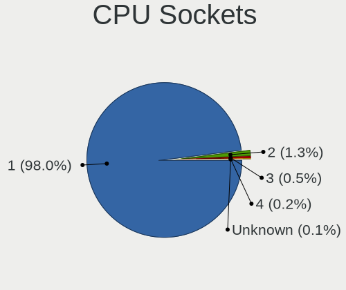

| Number | Computers | Percent |
|--------|-----------|---------|
| 1      | 1131      | 98.09%  |
| 2      | 14        | 1.21%   |
| 3      | 6         | 0.52%   |
| 4      | 2         | 0.17%   |

CPU Threads
-----------

Threads per core (Hyper-Threading)

| Number | Computers | Percent |
|--------|-----------|---------|
| 1      | 585       | 50.65%  |
| 2      | 570       | 49.35%  |

CPU Op-Modes
------------

CPU Operation Modes (32-bit, 64-bit)

| Op mode        | Computers | Percent |
|----------------|-----------|---------|
| 32-bit, 64-bit | 1028      | 89.16%  |
| 32-bit         | 91        | 7.89%   |
| Unknown        | 34        | 2.95%   |

CPU Microcode
-------------

Microcode number

| Number     | Computers | Percent |
|------------|-----------|---------|
| Unknown    | 180       | 15.42%  |
| 0x1067a    | 78        | 6.68%   |
| 0x206a7    | 64        | 5.48%   |
| 0x306a9    | 61        | 5.23%   |
| 0x306c3    | 47        | 4.03%   |
| 0x6fd      | 37        | 3.17%   |
| 0x906ea    | 34        | 2.91%   |
| 0x806e9    | 31        | 2.66%   |
| 0x506e3    | 31        | 2.66%   |
| 0x20655    | 25        | 2.14%   |
| 0x10676    | 24        | 2.06%   |
| 0x806ea    | 23        | 1.97%   |
| 0x6e8      | 18        | 1.54%   |
| 0x40651    | 18        | 1.54%   |
| 0x106ca    | 18        | 1.54%   |
| 0x106c2    | 18        | 1.54%   |
| 0x906e9    | 17        | 1.46%   |
| 0x806ec    | 16        | 1.37%   |
| 0x6fb      | 16        | 1.37%   |
| 0x6d8      | 16        | 1.37%   |
| 0x406e3    | 16        | 1.37%   |
| 0x306d4    | 16        | 1.37%   |
| 0x010000c8 | 16        | 1.37%   |
| 0x6f6      | 14        | 1.2%    |
| 0x6ec      | 14        | 1.2%    |
| 0x30678    | 14        | 1.2%    |
| 0x20652    | 12        | 1.03%   |
| 0x406c4    | 10        | 0.86%   |
| 0x06000852 | 10        | 0.86%   |
| 0x6f2      | 9         | 0.77%   |
| 0x406c3    | 9         | 0.77%   |
| 0x06001119 | 9         | 0.77%   |
| 0xa0652    | 8         | 0.69%   |
| 0x806c1    | 8         | 0.69%   |
| 0x0700010f | 8         | 0.69%   |
| 0x106e5    | 7         | 0.6%    |
| 0x10661    | 7         | 0.6%    |
| 0x05000119 | 7         | 0.6%    |
| 0xf41      | 6         | 0.51%   |
| 0x906ed    | 6         | 0.51%   |

CPU Microarch
-------------

Microarchitecture

| Name             | Computers | Percent |
|------------------|-----------|---------|
| KabyLake         | 148       | 12.84%  |
| Penryn           | 109       | 9.45%   |
| Core             | 88        | 7.63%   |
| SandyBridge      | 80        | 6.94%   |
| Haswell          | 71        | 6.16%   |
| IvyBridge        | 70        | 6.07%   |
| Skylake          | 57        | 4.94%   |
| P6               | 51        | 4.42%   |
| Unknown          | 48        | 4.16%   |
| Westmere         | 43        | 3.73%   |
| Bonnell          | 39        | 3.38%   |
| Silvermont       | 38        | 3.3%    |
| NetBurst         | 37        | 3.21%   |
| K10              | 36        | 3.12%   |
| K8 Hammer        | 25        | 2.17%   |
| Piledriver       | 22        | 1.91%   |
| Broadwell        | 22        | 1.91%   |
| Zen 2            | 20        | 1.73%   |
| CometLake        | 18        | 1.56%   |
| Zen+             | 14        | 1.21%   |
| Zen              | 13        | 1.13%   |
| TigerLake        | 10        | 0.87%   |
| Nehalem          | 10        | 0.87%   |
| Excavator        | 10        | 0.87%   |
| Zen 3            | 8         | 0.69%   |
| Jaguar           | 8         | 0.69%   |
| Bobcat           | 8         | 0.69%   |
| Icelake          | 7         | 0.61%   |
| Goldmont plus    | 7         | 0.61%   |
| K8 & K10 hybrid  | 6         | 0.52%   |
| Alderlake Hybrid | 6         | 0.52%   |
| Steamroller      | 5         | 0.43%   |
| Puma             | 5         | 0.43%   |
| Goldmont         | 5         | 0.43%   |
| K10 Llano        | 4         | 0.35%   |
| K6               | 3         | 0.26%   |
| Tremont          | 1         | 0.09%   |
| Bulldozer        | 1         | 0.09%   |

Graphics
--------

GPU Vendor
----------

Vendors of graphics cards

| Vendor                           | Computers | Percent |
|----------------------------------|-----------|---------|
| Intel                            | 693       | 54.35%  |
| Nvidia                           | 310       | 24.31%  |
| AMD                              | 245       | 19.22%  |
| Silicon Integrated Systems [SiS] | 11        | 0.86%   |
| VIA Technologies                 | 8         | 0.63%   |
| ASPEED Technology                | 4         | 0.31%   |
| Silicon Motion                   | 2         | 0.16%   |
| Matrox Electronics Systems       | 2         | 0.16%   |

GPU Model
---------

Graphics card models

| Model                                                                                    | Computers | Percent |
|------------------------------------------------------------------------------------------|-----------|---------|
| Intel 2nd Generation Core Processor Family Integrated Graphics Controller                | 57        | 4.17%   |
| Intel Mobile 4 Series Chipset Integrated Graphics Controller                             | 43        | 3.15%   |
| Intel Mobile 945GM/GMS/GME, 943/940GML Express Integrated Graphics Controller            | 42        | 3.07%   |
| Intel 3rd Gen Core processor Graphics Controller                                         | 37        | 2.71%   |
| Intel HD Graphics 620                                                                    | 31        | 2.27%   |
| Intel Core Processor Integrated Graphics Controller                                      | 30        | 2.2%    |
| Intel HD Graphics 530                                                                    | 27        | 1.98%   |
| Intel Mobile 945GM/GMS, 943/940GML Express Integrated Graphics Controller                | 26        | 1.9%    |
| Intel UHD Graphics 620                                                                   | 25        | 1.83%   |
| Intel Mobile GM965/GL960 Integrated Graphics Controller (secondary)                      | 22        | 1.61%   |
| Intel Mobile GM965/GL960 Integrated Graphics Controller (primary)                        | 22        | 1.61%   |
| Intel Atom/Celeron/Pentium Processor x5-E8000/J3xxx/N3xxx Integrated Graphics Controller | 21        | 1.54%   |
| Intel Haswell-ULT Integrated Graphics Controller                                         | 20        | 1.46%   |
| Intel Xeon E3-1200 v3/4th Gen Core Processor Integrated Graphics Controller              | 19        | 1.39%   |
| Intel Atom Processor D4xx/D5xx/N4xx/N5xx Integrated Graphics Controller                  | 18        | 1.32%   |
| Intel 4 Series Chipset Integrated Graphics Controller                                    | 18        | 1.32%   |
| Intel Skylake GT2 [HD Graphics 520]                                                      | 17        | 1.24%   |
| Intel Atom Processor Z36xxx/Z37xxx Series Graphics & Display                             | 17        | 1.24%   |
| Intel Mobile 945GSE Express Integrated Graphics Controller                               | 16        | 1.17%   |
| Intel Mobile 915GM/GMS/910GML Express Graphics Controller                                | 15        | 1.1%    |
| Intel HD Graphics 5500                                                                   | 15        | 1.1%    |
| Intel CoffeeLake-S GT2 [UHD Graphics 630]                                                | 15        | 1.1%    |
| Intel CoffeeLake-H GT2 [UHD Graphics 630]                                                | 15        | 1.1%    |
| Intel CometLake-U GT2 [UHD Graphics]                                                     | 14        | 1.02%   |
| Nvidia GT218 [GeForce 210]                                                               | 12        | 0.88%   |
| Intel WhiskeyLake-U GT2 [UHD Graphics 620]                                               | 11        | 0.81%   |
| Intel HD Graphics 630                                                                    | 11        | 0.81%   |
| AMD Ellesmere [Radeon RX 470/480/570/570X/580/580X/590]                                  | 11        | 0.81%   |
| Intel Xeon E3-1200 v2/3rd Gen Core processor Graphics Controller                         | 10        | 0.73%   |
| Intel 82945G/GZ Integrated Graphics Controller                                           | 10        | 0.73%   |
| AMD Topaz XT [Radeon R7 M260/M265 / M340/M360 / M440/M445 / 530/535 / 620/625 Mobile]    | 10        | 0.73%   |
| Nvidia GF119 [GeForce GT 610]                                                            | 9         | 0.66%   |
| Intel 82G33/G31 Express Integrated Graphics Controller                                   | 9         | 0.66%   |
| Intel 4th Generation Core Processor Family Integrated Graphics Controller                | 9         | 0.66%   |
| Intel 4th Gen Core Processor Integrated Graphics Controller                              | 9         | 0.66%   |
| AMD Picasso/Raven 2 [Radeon Vega Series / Radeon Vega Mobile Series]                     | 9         | 0.66%   |
| Silicon Integrated Systems [SiS] 771/671 PCIE VGA Display Adapter                        | 8         | 0.59%   |
| Intel TigerLake-LP GT2 [Iris Xe Graphics]                                                | 8         | 0.59%   |
| Intel CometLake-H GT2 [UHD Graphics]                                                     | 8         | 0.59%   |
| AMD Renoir                                                                               | 8         | 0.59%   |

GPU Combo
---------

Combinations of graphics cards

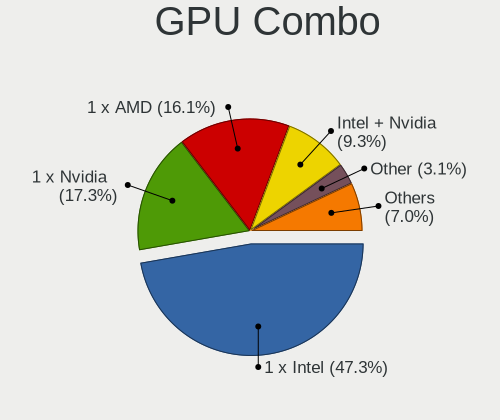

| Name               | Computers | Percent |
|--------------------|-----------|---------|
| 1 x Intel          | 544       | 47.06%  |
| 1 x Nvidia         | 198       | 17.13%  |
| 1 x AMD            | 191       | 16.52%  |
| Intel + Nvidia     | 102       | 8.82%   |
| Other              | 37        | 3.2%    |
| Intel + AMD        | 29        | 2.51%   |
| 2 x AMD            | 19        | 1.64%   |
| 1 x SiS            | 11        | 0.95%   |
| 1 x VIA            | 8         | 0.69%   |
| 2 x Nvidia         | 5         | 0.43%   |
| AMD + Nvidia       | 4         | 0.35%   |
| 1 x Silicon Motion | 2         | 0.17%   |
| 1 x Matrox         | 2         | 0.17%   |
| 1 x ASPEED         | 2         | 0.17%   |
| Nvidia + ASPEED    | 1         | 0.09%   |
| AMD + ASPEED       | 1         | 0.09%   |

GPU Driver
----------

Free vs proprietary

| Driver      | Computers | Percent |
|-------------|-----------|---------|
| Free        | 910       | 78.86%  |
| Proprietary | 140       | 12.13%  |
| Unknown     | 104       | 9.01%   |

GPU Memory
----------

Total video memory

| Size in GB | Computers | Percent |
|------------|-----------|---------|
| Unknown    | 342       | 29.26%  |
| 0.01-0.5   | 296       | 25.32%  |
| 1.01-2.0   | 269       | 23.01%  |
| 3.01-4.0   | 128       | 10.95%  |
| 0.51-1.0   | 87        | 7.44%   |
| 7.01-8.0   | 21        | 1.8%    |
| 5.01-6.0   | 14        | 1.2%    |
| 2.01-3.0   | 6         | 0.51%   |
| 8.01-16.0  | 5         | 0.43%   |
| 4.01-5.0   | 1         | 0.09%   |

Monitor
-------

Monitor Vendor
--------------

Monitor vendors

| Vendor                  | Computers | Percent |
|-------------------------|-----------|---------|
| Samsung Electronics     | 158       | 13.78%  |
| AU Optronics            | 126       | 10.99%  |
| LG Display              | 93        | 8.11%   |
| BOE                     | 65        | 5.67%   |
| Chimei Innolux          | 63        | 5.49%   |
| Dell                    | 62        | 5.41%   |
| Goldstar                | 54        | 4.71%   |
| Acer                    | 42        | 3.66%   |
| Hewlett-Packard         | 40        | 3.49%   |
| Ancor Communications    | 34        | 2.96%   |
| Lenovo                  | 29        | 2.53%   |
| Chi Mei Optoelectronics | 29        | 2.53%   |
| AOC                     | 27        | 2.35%   |
| Philips                 | 26        | 2.27%   |
| Sharp                   | 24        | 2.09%   |
| BenQ                    | 24        | 2.09%   |
| Apple                   | 21        | 1.83%   |
| LG Philips              | 18        | 1.57%   |
| LG Electronics          | 14        | 1.22%   |
| HannStar                | 14        | 1.22%   |
| Iiyama                  | 13        | 1.13%   |
| Unknown                 | 11        | 0.96%   |
| Sony                    | 7         | 0.61%   |
| InnoLux Display         | 7         | 0.61%   |
| ViewSonic               | 6         | 0.52%   |
| Vestel Elektronik       | 6         | 0.52%   |
| InfoVision              | 6         | 0.52%   |
| Fujitsu Siemens         | 6         | 0.52%   |
| Seiko/Epson             | 5         | 0.44%   |
| Quanta Display          | 5         | 0.44%   |
| Medion                  | 5         | 0.44%   |
| CPT                     | 5         | 0.44%   |
| Panasonic               | 4         | 0.35%   |
| NEC Computers           | 4         | 0.35%   |
| IBM                     | 4         | 0.35%   |
| ASUSTek Computer        | 4         | 0.35%   |
| Toshiba                 | 3         | 0.26%   |
| KTC                     | 3         | 0.26%   |
| Eizo                    | 3         | 0.26%   |
| Unknown                 | 3         | 0.26%   |

Monitor Model
-------------

Monitor models

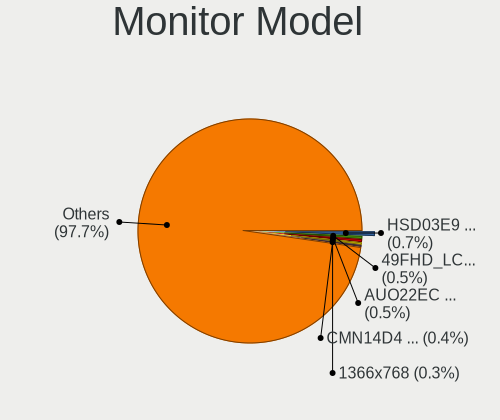

| Model                                                                    | Computers | Percent |
|--------------------------------------------------------------------------|-----------|---------|
| HannStar LCD Monitor HSD03E9 1024x600 220x129mm 10.0-inch                | 9         | 0.76%   |
| Vestel Elektronik 40W_LCD_TV VES3700 1920x540                            | 6         | 0.51%   |
| AU Optronics LCD Monitor AUO22EC 1366x768 344x193mm 15.5-inch            | 6         | 0.51%   |
| Chimei Innolux LCD Monitor CMN14D4 1920x1080 309x173mm 13.9-inch         | 5         | 0.42%   |
| Seiko/Epson LCD Monitor 1366x768                                         | 4         | 0.34%   |
| Samsung Electronics LCD Monitor SEC5441 1280x800 331x207mm 15.4-inch     | 4         | 0.34%   |
| Goldstar ULTRAWIDE GSM59F1 2560x1080 673x284mm 28.8-inch                 | 4         | 0.34%   |
| Chi Mei Optoelectronics LCD Monitor CMO15A7 1366x768 344x193mm 15.5-inch | 4         | 0.34%   |
| Unknown LCD Monitor SAMSUNG 1920x1080                                    | 3         | 0.25%   |
| Samsung Electronics SyncMaster SAM011E 1280x1024 338x270mm 17.0-inch     | 3         | 0.25%   |
| Samsung Electronics LCD Monitor U28E570                                  | 3         | 0.25%   |
| Samsung Electronics LCD Monitor SyncMaster                               | 3         | 0.25%   |
| Samsung Electronics LCD Monitor SEC3741 1366x768 309x174mm 14.0-inch     | 3         | 0.25%   |
| LG Display LCD Monitor LGD033A 1366x768 344x194mm 15.5-inch              | 3         | 0.25%   |
| Lenovo LCD Monitor LEN4036 1440x900 303x190mm 14.1-inch                  | 3         | 0.25%   |
| Iiyama PLE2483H IVM6113 1920x1080 531x299mm 24.0-inch                    | 3         | 0.25%   |
| Chimei Innolux LCD Monitor CMN1738 1920x1080 381x214mm 17.2-inch         | 3         | 0.25%   |
| Chimei Innolux LCD Monitor CMN15C4 1920x1080 344x193mm 15.5-inch         | 3         | 0.25%   |
| Chimei Innolux LCD Monitor CMN15AB 1366x768 344x194mm 15.5-inch          | 3         | 0.25%   |
| Chi Mei Optoelectronics LCD Monitor CMO0209 1024x600 195x113mm 8.9-inch  | 3         | 0.25%   |
| BOE LCD Monitor BOE0747 1920x1080 344x194mm 15.5-inch                    | 3         | 0.25%   |
| AU Optronics LCD Monitor AUO38ED 1920x1080 344x193mm 15.5-inch           | 3         | 0.25%   |
| AU Optronics LCD Monitor AUO31D2 1024x600 223x125mm 10.1-inch            | 3         | 0.25%   |
| AU Optronics LCD Monitor AUO313C 1366x768 309x173mm 13.9-inch            | 3         | 0.25%   |
| AU Optronics LCD Monitor AUO21ED 1920x1080 344x193mm 15.5-inch           | 3         | 0.25%   |
| AU Optronics LCD Monitor AUO213E 1600x900 309x174mm 14.0-inch            | 3         | 0.25%   |
| AU Optronics LCD Monitor AUO20EC 1366x768 344x193mm 15.5-inch            | 3         | 0.25%   |
| AOC 24G2W1G4 AOC2402 1920x1080 527x296mm 23.8-inch                       | 3         | 0.25%   |
| Ancor Communications VE247 ACI2493 1920x1080 531x299mm 24.0-inch         | 3         | 0.25%   |
| Unknown                                                                  | 3         | 0.25%   |
| ___ LCDTV16 ___9000 1360x768                                             | 2         | 0.17%   |
| Unknown LCD Monitor SAMSUNG                                              | 2         | 0.17%   |
| Sharp LCD Monitor SHP14F9 1920x1200 288x180mm 13.4-inch                  | 2         | 0.17%   |
| Sharp LCD Monitor SHP14B9 3840x2160 344x194mm 15.5-inch                  | 2         | 0.17%   |
| Sharp LCD Monitor SHP13CA 1280x800 331x207mm 15.4-inch                   | 2         | 0.17%   |
| Samsung Electronics SyncMaster SAM027E 1680x1050 474x296mm 22.0-inch     | 2         | 0.17%   |
| Samsung Electronics S22F350 SAM0D1A 1920x1080 477x268mm 21.5-inch        | 2         | 0.17%   |
| Samsung Electronics S20B300 SAM08A8 1600x900 443x249mm 20.0-inch         | 2         | 0.17%   |
| Samsung Electronics S19D300 SAM0B34 1366x768 410x230mm 18.5-inch         | 2         | 0.17%   |
| Samsung Electronics LS34A650U SAM7145 3440x1440 798x334mm 34.1-inch      | 2         | 0.17%   |

Monitor Resolution
------------------

Monitor screen resolution

| Resolution         | Computers | Percent |
|--------------------|-----------|---------|
| 1920x1080 (FHD)    | 345       | 30.78%  |
| 1366x768 (WXGA)    | 233       | 20.79%  |
| 1280x800 (WXGA)    | 61        | 5.44%   |
| 1280x1024 (SXGA)   | 56        | 5%      |
| 1600x900 (HD+)     | 52        | 4.64%   |
| 3840x2160 (4K)     | 51        | 4.55%   |
| 1680x1050 (WSXGA+) | 47        | 4.19%   |
| Unknown            | 46        | 4.1%    |
| 1440x900 (WXGA+)   | 42        | 3.75%   |
| 2560x1440 (QHD)    | 32        | 2.85%   |
| 1024x600           | 28        | 2.5%    |
| 1920x1200 (WUXGA)  | 21        | 1.87%   |
| 1024x768 (XGA)     | 19        | 1.69%   |
| 1360x768           | 17        | 1.52%   |
| 2560x1080          | 9         | 0.8%    |
| 3440x1440          | 8         | 0.71%   |
| 3200x1800 (QHD+)   | 6         | 0.54%   |
| 1280x720 (HD)      | 6         | 0.54%   |
| 2160x1440          | 5         | 0.45%   |
| 1920x540           | 5         | 0.45%   |
| 2560x1600          | 4         | 0.36%   |
| 1600x1200          | 4         | 0.36%   |
| 3840x2400          | 2         | 0.18%   |
| 3840x1200          | 2         | 0.18%   |
| 2880x1800          | 2         | 0.18%   |
| 1680x945           | 2         | 0.18%   |
| 1280x960           | 2         | 0.18%   |
| 7120x1080          | 1         | 0.09%   |
| 3840x1303          | 1         | 0.09%   |
| 3840x1080          | 1         | 0.09%   |
| 3456x2160          | 1         | 0.09%   |
| 3360x1080          | 1         | 0.09%   |
| 3286x1080          | 1         | 0.09%   |
| 3200x1200          | 1         | 0.09%   |
| 3200x1080          | 1         | 0.09%   |
| 3000x2000          | 1         | 0.09%   |
| 2736x1824          | 1         | 0.09%   |
| 2732x768           | 1         | 0.09%   |
| 2048x1152          | 1         | 0.09%   |
| 1400x1050          | 1         | 0.09%   |

Monitor Diagonal
----------------

Diagonal size in inches

| Inches  | Computers | Percent |
|---------|-----------|---------|
| 15      | 278       | 24.41%  |
| 14      | 97        | 8.52%   |
| Unknown | 97        | 8.52%   |
| 13      | 83        | 7.29%   |
| 17      | 67        | 5.88%   |
| 24      | 63        | 5.53%   |
| 21      | 60        | 5.27%   |
| 23      | 58        | 5.09%   |
| 27      | 49        | 4.3%    |
| 19      | 41        | 3.6%    |
| 20      | 32        | 2.81%   |
| 10      | 32        | 2.81%   |
| 18      | 28        | 2.46%   |
| 22      | 26        | 2.28%   |
| 31      | 16        | 1.4%    |
| 34      | 13        | 1.14%   |
| 12      | 12        | 1.05%   |
| 11      | 12        | 1.05%   |
| 84      | 9         | 0.79%   |
| 32      | 9         | 0.79%   |
| 25      | 7         | 0.61%   |
| 16      | 7         | 0.61%   |
| 72      | 6         | 0.53%   |
| 54      | 5         | 0.44%   |
| 40      | 4         | 0.35%   |
| 26      | 4         | 0.35%   |
| 52      | 3         | 0.26%   |
| 28      | 3         | 0.26%   |
| 8       | 3         | 0.26%   |
| 42      | 2         | 0.18%   |
| 30      | 2         | 0.18%   |
| 70      | 1         | 0.09%   |
| 64      | 1         | 0.09%   |
| 60      | 1         | 0.09%   |
| 50      | 1         | 0.09%   |
| 49      | 1         | 0.09%   |
| 46      | 1         | 0.09%   |
| 44      | 1         | 0.09%   |
| 39      | 1         | 0.09%   |
| 35      | 1         | 0.09%   |

Monitor Width
-------------

Physical width

| Width in mm | Computers | Percent |
|-------------|-----------|---------|
| 301-350     | 429       | 38.03%  |
| 501-600     | 169       | 14.98%  |
| 401-500     | 162       | 14.36%  |
| 201-300     | 104       | 9.22%   |
| Unknown     | 97        | 8.6%    |
| 351-400     | 78        | 6.91%   |
| 601-700     | 25        | 2.22%   |
| 701-800     | 22        | 1.95%   |
| 1501-2000   | 16        | 1.42%   |
| 1001-1500   | 13        | 1.15%   |
| 801-900     | 6         | 0.53%   |
| 101-200     | 4         | 0.35%   |
| 901-1000    | 3         | 0.27%   |

Aspect Ratio
------------

Proportional relationship between the width and the height

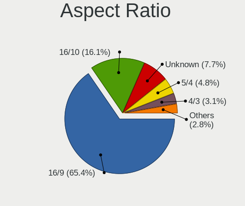

| Ratio   | Computers | Percent |
|---------|-----------|---------|
| 16/9    | 698       | 65.54%  |
| 16/10   | 165       | 15.49%  |
| Unknown | 87        | 8.17%   |
| 5/4     | 53        | 4.98%   |
| 4/3     | 34        | 3.19%   |
| 21/9    | 15        | 1.41%   |
| 3/2     | 10        | 0.94%   |
| 32/9    | 2         | 0.19%   |
| 6/5     | 1         | 0.09%   |

Monitor Area
------------

Area in inch

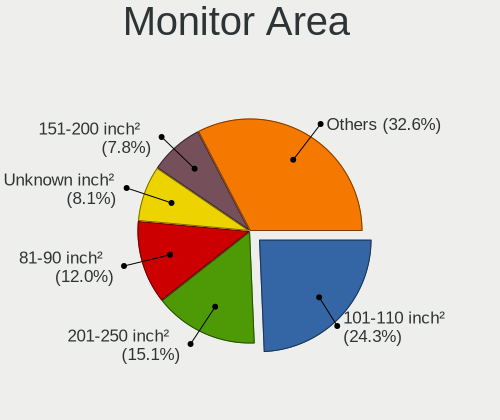

| Area in inch | Computers | Percent |
|----------------|-----------|---------|
| 101-110        | 277       | 24.45%  |
| 201-250        | 177       | 15.62%  |
| 81-90          | 139       | 12.27%  |
| Unknown        | 97        | 8.56%   |
| 151-200        | 86        | 7.59%   |
| 141-150        | 54        | 4.77%   |
| 301-350        | 53        | 4.68%   |
| 351-500        | 41        | 3.62%   |
| 71-80          | 35        | 3.09%   |
| 41-50          | 32        | 2.82%   |
| More than 1000 | 28        | 2.47%   |
| 121-130        | 28        | 2.47%   |
| 251-300        | 23        | 2.03%   |
| 131-140        | 13        | 1.15%   |
| 51-60          | 12        | 1.06%   |
| 61-70          | 11        | 0.97%   |
| 501-1000       | 10        | 0.88%   |
| 91-100         | 7         | 0.62%   |
| 111-120        | 6         | 0.53%   |
| 1-40           | 4         | 0.35%   |

Pixel Density
-------------

Pixels per inch

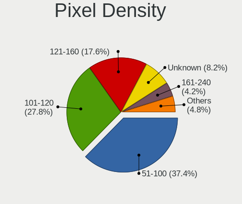

| Density       | Computers | Percent |
|---------------|-----------|---------|
| 51-100        | 419       | 37.54%  |
| 101-120       | 322       | 28.85%  |
| 121-160       | 185       | 16.58%  |
| Unknown       | 97        | 8.69%   |
| 161-240       | 39        | 3.49%   |
| 1-50          | 31        | 2.78%   |
| More than 240 | 23        | 2.06%   |

Multiple Monitors
-----------------

Total monitors connected

| Total | Computers | Percent |
|-------|-----------|---------|
| 1     | 963       | 82.59%  |
| 2     | 119       | 10.21%  |
| 0     | 68        | 5.83%   |
| 3     | 13        | 1.11%   |
| 4     | 2         | 0.17%   |
| 6     | 1         | 0.09%   |

Network
-------

Net Controller Vendor
---------------------

Controller vendors

| Vendor                            | Computers | Percent |
|-----------------------------------|-----------|---------|
| Realtek Semiconductor             | 601       | 33.59%  |
| Intel                             | 456       | 25.49%  |
| Qualcomm Atheros                  | 241       | 13.47%  |
| Broadcom                          | 122       | 6.82%   |
| Marvell Technology Group          | 51        | 2.85%   |
| Broadcom Limited                  | 45        | 2.52%   |
| Ralink                            | 32        | 1.79%   |
| Nvidia                            | 31        | 1.73%   |
| Ralink Technology                 | 26        | 1.45%   |
| TP-Link                           | 20        | 1.12%   |
| VIA Technologies                  | 12        | 0.67%   |
| Silicon Integrated Systems [SiS]  | 12        | 0.67%   |
| NetGear                           | 12        | 0.67%   |
| MediaTek                          | 10        | 0.56%   |
| Samsung Electronics               | 9         | 0.5%    |
| Qualcomm Atheros Communications   | 7         | 0.39%   |
| ASIX Electronics                  | 7         | 0.39%   |
| Xiaomi                            | 6         | 0.34%   |
| Ericsson Business Mobile Networks | 6         | 0.34%   |
| D-Link System                     | 6         | 0.34%   |
| D-Link                            | 6         | 0.34%   |
| Huawei Technologies               | 4         | 0.22%   |
| 3Com                              | 4         | 0.22%   |
| Sierra Wireless                   | 3         | 0.17%   |
| Qualcomm                          | 3         | 0.17%   |
| JMicron Technology                | 3         | 0.17%   |
| Dell                              | 3         | 0.17%   |
| ASUSTek Computer                  | 3         | 0.17%   |
| ZTE WCDMA Technologies MSM        | 2         | 0.11%   |
| Sitecom Europe                    | 2         | 0.11%   |
| Motorola PCS                      | 2         | 0.11%   |
| Motorola                          | 2         | 0.11%   |
| Linksys                           | 2         | 0.11%   |
| Lenovo                            | 2         | 0.11%   |
| ICS Advent                        | 2         | 0.11%   |
| Fibocom                           | 2         | 0.11%   |
| DisplayLink                       | 2         | 0.11%   |
| AVM                               | 2         | 0.11%   |
| Aquantia                          | 2         | 0.11%   |
| ZyDAS                             | 1         | 0.06%   |

Net Controller Model
--------------------

Controller models

| Model                                                                   | Computers | Percent |
|-------------------------------------------------------------------------|-----------|---------|
| Realtek RTL8111/8168/8411 PCI Express Gigabit Ethernet Controller       | 380       | 18.31%  |
| Realtek RTL810xE PCI Express Fast Ethernet controller                   | 103       | 4.96%   |
| Intel Wireless 8265 / 8275                                              | 38        | 1.83%   |
| Qualcomm Atheros AR9285 Wireless Network Adapter (PCI-Express)          | 36        | 1.73%   |
| Intel 82579LM Gigabit Network Connection (Lewisville)                   | 33        | 1.59%   |
| Intel PRO/Wireless 3945ABG [Golan] Network Connection                   | 30        | 1.45%   |
| Qualcomm Atheros QCA9565 / AR9565 Wireless Network Adapter              | 28        | 1.35%   |
| Qualcomm Atheros AR9485 Wireless Network Adapter                        | 26        | 1.25%   |
| Qualcomm Atheros AR242x / AR542x Wireless Network Adapter (PCI-Express) | 26        | 1.25%   |
| Realtek RTL-8100/8101L/8139 PCI Fast Ethernet Adapter                   | 24        | 1.16%   |
| Realtek RTL8153 Gigabit Ethernet Adapter                                | 21        | 1.01%   |
| Nvidia MCP61 Ethernet                                                   | 18        | 0.87%   |
| Broadcom BCM4313 802.11bgn Wireless Network Adapter                     | 17        | 0.82%   |
| Qualcomm Atheros QCA9377 802.11ac Wireless Network Adapter              | 16        | 0.77%   |
| Intel Wireless 7265                                                     | 16        | 0.77%   |
| Qualcomm Atheros QCA6174 802.11ac Wireless Network Adapter              | 15        | 0.72%   |
| Realtek RTL8188EUS 802.11n Wireless Network Adapter                     | 14        | 0.67%   |
| Qualcomm Atheros AR928X Wireless Network Adapter (PCI-Express)          | 14        | 0.67%   |
| Qualcomm Atheros AR8132 Fast Ethernet                                   | 14        | 0.67%   |
| Intel Wireless 8260                                                     | 14        | 0.67%   |
| Intel Wi-Fi 6 AX200                                                     | 14        | 0.67%   |
| Realtek RTL8822CE 802.11ac PCIe Wireless Network Adapter                | 13        | 0.63%   |
| Realtek RTL8723BE PCIe Wireless Network Adapter                         | 13        | 0.63%   |
| Intel Centrino Advanced-N 6205 [Taylor Peak]                            | 13        | 0.63%   |
| Intel Centrino Advanced-N 6200                                          | 13        | 0.63%   |
| Intel 82567LM Gigabit Network Connection                                | 13        | 0.63%   |
| Intel Wireless 3165                                                     | 12        | 0.58%   |
| Intel Cannon Lake PCH CNVi WiFi                                         | 12        | 0.58%   |
| VIA VT6102/VT6103 [Rhine-II]                                            | 11        | 0.53%   |
| Intel I211 Gigabit Network Connection                                   | 11        | 0.53%   |
| Intel Ethernet Connection (4) I219-LM                                   | 11        | 0.53%   |
| Intel Ethernet Connection (2) I219-LM                                   | 11        | 0.53%   |
| Intel Comet Lake PCH-LP CNVi WiFi                                       | 11        | 0.53%   |
| Intel 82577LM Gigabit Network Connection                                | 11        | 0.53%   |
| Broadcom BCM43142 802.11b/g/n                                           | 11        | 0.53%   |
| Broadcom BCM4311 802.11b/g WLAN                                         | 11        | 0.53%   |
| Marvell Group 88E8056 PCI-E Gigabit Ethernet Controller                 | 10        | 0.48%   |
| Intel PRO/Wireless 5100 AGN [Shiloh] Network Connection                 | 10        | 0.48%   |
| Intel Ethernet Connection (7) I219-V                                    | 10        | 0.48%   |
| Intel Cannon Point-LP CNVi [Wireless-AC]                                | 10        | 0.48%   |

Wireless Vendor
---------------

Wireless vendors

| Vendor                                | Computers | Percent |
|---------------------------------------|-----------|---------|
| Intel                                 | 313       | 35.09%  |
| Qualcomm Atheros                      | 188       | 21.08%  |
| Realtek Semiconductor                 | 155       | 17.38%  |
| Broadcom                              | 71        | 7.96%   |
| Ralink                                | 32        | 3.59%   |
| Ralink Technology                     | 26        | 2.91%   |
| Broadcom Limited                      | 26        | 2.91%   |
| TP-Link                               | 19        | 2.13%   |
| NetGear                               | 12        | 1.35%   |
| MediaTek                              | 9         | 1.01%   |
| Qualcomm Atheros Communications       | 7         | 0.78%   |
| D-Link                                | 6         | 0.67%   |
| Sierra Wireless                       | 3         | 0.34%   |
| ASUSTek Computer                      | 3         | 0.34%   |
| Sitecom Europe                        | 2         | 0.22%   |
| Marvell Technology Group              | 2         | 0.22%   |
| Linksys                               | 2         | 0.22%   |
| Fibocom                               | 2         | 0.22%   |
| Dell                                  | 2         | 0.22%   |
| D-Link System                         | 2         | 0.22%   |
| AVM                                   | 2         | 0.22%   |
| ZyDAS                                 | 1         | 0.11%   |
| PLANEX                                | 1         | 0.11%   |
| Microsoft                             | 1         | 0.11%   |
| Mercucys                              | 1         | 0.11%   |
| Intersil                              | 1         | 0.11%   |
| Ericsson Business Mobile Networks     | 1         | 0.11%   |
| Edimax Technology                     | 1         | 0.11%   |
| 802.11g Adapter [Linksys WUSB54GC v3] | 1         | 0.11%   |

Wireless Model
--------------

Wireless models

| Model                                                                   | Computers | Percent |
|-------------------------------------------------------------------------|-----------|---------|
| Intel Wireless 8265 / 8275                                              | 38        | 4.24%   |
| Qualcomm Atheros AR9285 Wireless Network Adapter (PCI-Express)          | 36        | 4.02%   |
| Intel PRO/Wireless 3945ABG [Golan] Network Connection                   | 30        | 3.35%   |
| Qualcomm Atheros QCA9565 / AR9565 Wireless Network Adapter              | 28        | 3.13%   |
| Qualcomm Atheros AR9485 Wireless Network Adapter                        | 26        | 2.9%    |
| Qualcomm Atheros AR242x / AR542x Wireless Network Adapter (PCI-Express) | 26        | 2.9%    |
| Broadcom BCM4313 802.11bgn Wireless Network Adapter                     | 17        | 1.9%    |
| Qualcomm Atheros QCA9377 802.11ac Wireless Network Adapter              | 16        | 1.79%   |
| Intel Wireless 7265                                                     | 16        | 1.79%   |
| Qualcomm Atheros QCA6174 802.11ac Wireless Network Adapter              | 15        | 1.67%   |
| Realtek RTL8188EUS 802.11n Wireless Network Adapter                     | 14        | 1.56%   |
| Qualcomm Atheros AR928X Wireless Network Adapter (PCI-Express)          | 14        | 1.56%   |
| Intel Wireless 8260                                                     | 14        | 1.56%   |
| Intel Wi-Fi 6 AX200                                                     | 14        | 1.56%   |
| Realtek RTL8822CE 802.11ac PCIe Wireless Network Adapter                | 13        | 1.45%   |
| Realtek RTL8723BE PCIe Wireless Network Adapter                         | 13        | 1.45%   |
| Intel Centrino Advanced-N 6205 [Taylor Peak]                            | 13        | 1.45%   |
| Intel Centrino Advanced-N 6200                                          | 13        | 1.45%   |
| Intel Wireless 3165                                                     | 12        | 1.34%   |
| Intel Cannon Lake PCH CNVi WiFi                                         | 12        | 1.34%   |
| Intel Comet Lake PCH-LP CNVi WiFi                                       | 11        | 1.23%   |
| Broadcom BCM43142 802.11b/g/n                                           | 11        | 1.23%   |
| Broadcom BCM4311 802.11b/g WLAN                                         | 11        | 1.23%   |
| Intel PRO/Wireless 5100 AGN [Shiloh] Network Connection                 | 10        | 1.12%   |
| Intel Cannon Point-LP CNVi [Wireless-AC]                                | 10        | 1.12%   |
| Realtek RTL8188EE Wireless Network Adapter                              | 9         | 1%      |
| Realtek RTL8188CE 802.11b/g/n WiFi Adapter                              | 9         | 1%      |
| Ralink RT3290 Wireless 802.11n 1T/1R PCIe                               | 9         | 1%      |
| Intel Wireless 7260                                                     | 9         | 1%      |
| Intel Centrino Wireless-N 1000 [Condor Peak]                            | 9         | 1%      |
| Realtek RTL88x2bu [AC1200 Techkey]                                      | 8         | 0.89%   |
| Realtek RTL8821CE 802.11ac PCIe Wireless Network Adapter                | 8         | 0.89%   |
| Realtek 802.11ac NIC                                                    | 8         | 0.89%   |
| Ralink MT7601U Wireless Adapter                                         | 8         | 0.89%   |
| Intel PRO/Wireless 2200BG [Calexico2] Network Connection                | 8         | 0.89%   |
| Intel Comet Lake PCH CNVi WiFi                                          | 8         | 0.89%   |
| Broadcom Limited BCM4312 802.11b/g LP-PHY                               | 8         | 0.89%   |
| Broadcom BCM4312 802.11b/g LP-PHY                                       | 8         | 0.89%   |
| Realtek RTL8822BE 802.11a/b/g/n/ac WiFi adapter                         | 7         | 0.78%   |
| Realtek RTL8188FTV 802.11b/g/n 1T1R 2.4G WLAN Adapter                   | 7         | 0.78%   |

Ethernet Vendor
---------------

Ethernet vendors

| Vendor                           | Computers | Percent |
|----------------------------------|-----------|---------|
| Realtek Semiconductor            | 541       | 48.22%  |
| Intel                            | 262       | 23.35%  |
| Qualcomm Atheros                 | 75        | 6.68%   |
| Broadcom                         | 63        | 5.61%   |
| Marvell Technology Group         | 49        | 4.37%   |
| Nvidia                           | 31        | 2.76%   |
| Broadcom Limited                 | 19        | 1.69%   |
| VIA Technologies                 | 12        | 1.07%   |
| Silicon Integrated Systems [SiS] | 12        | 1.07%   |
| Samsung Electronics              | 9         | 0.8%    |
| ASIX Electronics                 | 7         | 0.62%   |
| Xiaomi                           | 6         | 0.53%   |
| D-Link System                    | 4         | 0.36%   |
| 3Com                             | 4         | 0.36%   |
| Qualcomm                         | 3         | 0.27%   |
| JMicron Technology               | 3         | 0.27%   |
| Huawei Technologies              | 3         | 0.27%   |
| ZTE WCDMA Technologies MSM       | 2         | 0.18%   |
| Lenovo                           | 2         | 0.18%   |
| ICS Advent                       | 2         | 0.18%   |
| DisplayLink                      | 2         | 0.18%   |
| Aquantia                         | 2         | 0.18%   |
| TP-Link                          | 1         | 0.09%   |
| Standard Microsystems [SMC]      | 1         | 0.09%   |
| Standard Microsystems            | 1         | 0.09%   |
| Spreadtrum Communications        | 1         | 0.09%   |
| Motorola PCS                     | 1         | 0.09%   |
| MediaTek                         | 1         | 0.09%   |
| HMD Global                       | 1         | 0.09%   |
| Attansic Technology              | 1         | 0.09%   |
| Archos                           | 1         | 0.09%   |

Ethernet Model
--------------

Ethernet models

| Model                                                             | Computers | Percent |
|-------------------------------------------------------------------|-----------|---------|
| Realtek RTL8111/8168/8411 PCI Express Gigabit Ethernet Controller | 380       | 33.39%  |
| Realtek RTL810xE PCI Express Fast Ethernet controller             | 103       | 9.05%   |
| Intel 82579LM Gigabit Network Connection (Lewisville)             | 33        | 2.9%    |
| Realtek RTL-8100/8101L/8139 PCI Fast Ethernet Adapter             | 24        | 2.11%   |
| Realtek RTL8153 Gigabit Ethernet Adapter                          | 21        | 1.85%   |
| Nvidia MCP61 Ethernet                                             | 18        | 1.58%   |
| Qualcomm Atheros AR8132 Fast Ethernet                             | 14        | 1.23%   |
| Intel 82567LM Gigabit Network Connection                          | 13        | 1.14%   |
| VIA VT6102/VT6103 [Rhine-II]                                      | 11        | 0.97%   |
| Intel I211 Gigabit Network Connection                             | 11        | 0.97%   |
| Intel Ethernet Connection (4) I219-LM                             | 11        | 0.97%   |
| Intel Ethernet Connection (2) I219-LM                             | 11        | 0.97%   |
| Intel 82577LM Gigabit Network Connection                          | 11        | 0.97%   |
| Marvell Group 88E8056 PCI-E Gigabit Ethernet Controller           | 10        | 0.88%   |
| Intel Ethernet Connection (7) I219-V                              | 10        | 0.88%   |
| Qualcomm Atheros AR8161 Gigabit Ethernet                          | 9         | 0.79%   |
| Qualcomm Atheros AR8131 Gigabit Ethernet                          | 9         | 0.79%   |
| Marvell Group 88E8053 PCI-E Gigabit Ethernet Controller           | 9         | 0.79%   |
| Intel Ethernet Connection (2) I219-V                              | 9         | 0.79%   |
| Silicon Integrated Systems [SiS] 191 Gigabit Ethernet Adapter     | 8         | 0.7%    |
| Qualcomm Atheros AR8151 v2.0 Gigabit Ethernet                     | 8         | 0.7%    |
| Intel Ethernet Connection I217-LM                                 | 8         | 0.7%    |
| Intel 82579V Gigabit Network Connection                           | 8         | 0.7%    |
| Intel PRO/100 VE Network Connection                               | 7         | 0.62%   |
| Intel I210 Gigabit Network Connection                             | 7         | 0.62%   |
| Intel Ethernet Connection (4) I219-V                              | 7         | 0.62%   |
| Intel 82566DM-2 Gigabit Network Connection                        | 7         | 0.62%   |
| Xiaomi Mi/Redmi series (RNDIS)                                    | 6         | 0.53%   |
| Qualcomm Atheros AR8162 Fast Ethernet                             | 6         | 0.53%   |
| Marvell Group 88E8055 PCI-E Gigabit Ethernet Controller           | 6         | 0.53%   |
| Marvell Group 88E8040 PCI-E Fast Ethernet Controller              | 6         | 0.53%   |
| Intel Ethernet Connection I219-LM                                 | 6         | 0.53%   |
| Intel Ethernet Connection I217-V                                  | 6         | 0.53%   |
| Intel Ethernet Connection (6) I219-V                              | 6         | 0.53%   |
| Broadcom NetXtreme BCM5764M Gigabit Ethernet PCIe                 | 6         | 0.53%   |
| Broadcom NetLink BCM5787M Gigabit Ethernet PCI Express            | 6         | 0.53%   |
| Broadcom NetLink BCM57780 Gigabit Ethernet PCIe                   | 6         | 0.53%   |
| Broadcom BCM4401-B0 100Base-TX                                    | 6         | 0.53%   |
| ASIX AX88179 Gigabit Ethernet                                     | 6         | 0.53%   |
| Samsung Galaxy series, misc. (tethering mode)                     | 5         | 0.44%   |

Net Controller Kind
-------------------

Ethernet, WiFi or modem

| Kind     | Computers | Percent |
|----------|-----------|---------|
| Ethernet | 1058      | 54.23%  |
| WiFi     | 852       | 43.67%  |
| Modem    | 38        | 1.95%   |
| Unknown  | 3         | 0.15%   |

Used Controller
---------------

Currently used network controller

| Kind     | Computers | Percent |
|----------|-----------|---------|
| WiFi     | 656       | 54.94%  |
| Ethernet | 537       | 44.97%  |
| Unknown  | 1         | 0.08%   |

NICs
----

Total network controllers on board

| Total | Computers | Percent |
|-------|-----------|---------|
| 2     | 650       | 56.18%  |
| 1     | 463       | 40.02%  |
| 0     | 22        | 1.9%    |
| 3     | 16        | 1.38%   |
| 4     | 3         | 0.26%   |
| 5     | 2         | 0.17%   |
| 7     | 1         | 0.09%   |

IPv6
----

IPv6 vs IPv4

| Used | Computers | Percent |
|------|-----------|---------|
| No   | 1050      | 89.9%   |
| Yes  | 118       | 10.1%   |

Bluetooth
---------

Bluetooth Vendor
----------------

Controller vendors

| Vendor                          | Computers | Percent |
|---------------------------------|-----------|---------|
| Intel                           | 189       | 38.41%  |
| Qualcomm Atheros Communications | 47        | 9.55%   |
| Realtek Semiconductor           | 42        | 8.54%   |
| Cambridge Silicon Radio         | 40        | 8.13%   |
| Broadcom                        | 40        | 8.13%   |
| IMC Networks                    | 23        | 4.67%   |
| Apple                           | 20        | 4.07%   |
| Foxconn / Hon Hai               | 18        | 3.66%   |
| Hewlett-Packard                 | 11        | 2.24%   |
| Lite-On Technology              | 10        | 2.03%   |
| Ralink                          | 9         | 1.83%   |
| ASUSTek Computer                | 7         | 1.42%   |
| Toshiba                         | 6         | 1.22%   |
| Dell                            | 6         | 1.22%   |
| MediaTek                        | 5         | 1.02%   |
| Alps Electric                   | 3         | 0.61%   |
| TP-Link                         | 2         | 0.41%   |
| Taiyo Yuden                     | 2         | 0.41%   |
| Realtek                         | 2         | 0.41%   |
| Foxconn International           | 2         | 0.41%   |
| Smart Modular Technologies      | 1         | 0.2%    |
| Qcom                            | 1         | 0.2%    |
| Micro Star International        | 1         | 0.2%    |
| Dynex                           | 1         | 0.2%    |
| D-Link System                   | 1         | 0.2%    |
| Conwise Technology              | 1         | 0.2%    |
| Chicony Electronics             | 1         | 0.2%    |
| Askey Computer                  | 1         | 0.2%    |

Bluetooth Model
---------------

Controller models

| Model                                               | Computers | Percent |
|-----------------------------------------------------|-----------|---------|
| Intel Bluetooth wireless interface                  | 92        | 18.7%   |
| Cambridge Silicon Radio Bluetooth Dongle (HCI mode) | 40        | 8.13%   |
| Intel Bluetooth 9460/9560 Jefferson Peak (JfP)      | 30        | 6.1%    |
| Realtek Bluetooth Radio                             | 28        | 5.69%   |
| Intel AX201 Bluetooth                               | 24        | 4.88%   |
| Qualcomm Atheros  Bluetooth Device                  | 23        | 4.67%   |
| Intel AX200 Bluetooth                               | 14        | 2.85%   |
| Intel Bluetooth Device                              | 12        | 2.44%   |
| IMC Networks Bluetooth Radio                        | 12        | 2.44%   |
| Apple Bluetooth HCI                                 | 11        | 2.24%   |
| Realtek  Bluetooth 4.2 Adapter                      | 10        | 2.03%   |
| Ralink RT3290 Bluetooth                             | 9         | 1.83%   |
| Qualcomm Atheros AR3011 Bluetooth                   | 7         | 1.42%   |
| Intel Centrino Bluetooth Wireless Transceiver       | 7         | 1.42%   |
| HP Bluetooth 2.0 Interface [Broadcom BCM2045]       | 7         | 1.42%   |
| Foxconn / Hon Hai Bluetooth Device                  | 7         | 1.42%   |
| Broadcom BCM20702A0 Bluetooth 4.0                   | 7         | 1.42%   |
| Qualcomm Atheros AR9462 Bluetooth                   | 6         | 1.22%   |
| Apple Bluetooth Host Controller                     | 6         | 1.22%   |
| Qualcomm Atheros QCA61x4 Bluetooth 4.0              | 5         | 1.02%   |
| MediaTek Wireless_Device                            | 5         | 1.02%   |
| IMC Networks Bluetooth Device                       | 5         | 1.02%   |
| Foxconn / Hon Hai BCM20702A0                        | 5         | 1.02%   |
| Broadcom BCM2045B (BDC-2.1) [Bluetooth Controller]  | 5         | 1.02%   |
| Intel Wireless-AC 9260 Bluetooth Adapter            | 4         | 0.81%   |
| Intel AX210 Bluetooth                               | 4         | 0.81%   |
| Broadcom BCM43142 Bluetooth 4.0                     | 4         | 0.81%   |
| Broadcom BCM2045B (BDC-2.1)                         | 4         | 0.81%   |
| Toshiba Bluetooth Device                            | 3         | 0.61%   |
| Qualcomm Atheros AR3012 Bluetooth 4.0               | 3         | 0.61%   |
| Lite-On Qualcomm Atheros QCA9377 Bluetooth          | 3         | 0.61%   |
| Lite-On Atheros AR3012 Bluetooth                    | 3         | 0.61%   |
| HP Broadcom 2070 Bluetooth Combo                    | 3         | 0.61%   |
| Broadcom BCM43142A0 Bluetooth 4.0                   | 3         | 0.61%   |
| Broadcom BCM2045B (BDC-2) [Bluetooth Controller]    | 3         | 0.61%   |
| Broadcom BCM2045 Bluetooth                          | 3         | 0.61%   |
| Apple Bluetooth USB Host Controller                 | 3         | 0.61%   |
| TP-Link UB5A Adapter                                | 2         | 0.41%   |
| Toshiba Integrated Bluetooth HCI                    | 2         | 0.41%   |
| Realtek RTL8822BE Bluetooth 4.2 Adapter             | 2         | 0.41%   |

Sound
-----

Sound Vendor
------------

Sound card vendors

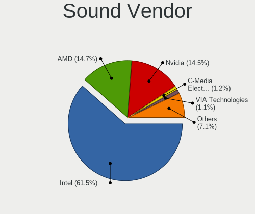

| Vendor                           | Computers | Percent |
|----------------------------------|-----------|---------|
| Intel                            | 869       | 62.03%  |
| AMD                              | 209       | 14.92%  |
| Nvidia                           | 196       | 13.99%  |
| VIA Technologies                 | 17        | 1.21%   |
| C-Media Electronics              | 15        | 1.07%   |
| Silicon Integrated Systems [SiS] | 12        | 0.86%   |
| Logitech                         | 9         | 0.64%   |
| Creative Labs                    | 7         | 0.5%    |
| GN Netcom                        | 6         | 0.43%   |
| Realtek Semiconductor            | 5         | 0.36%   |
| Sennheiser Communications        | 4         | 0.29%   |
| Plantronics                      | 4         | 0.29%   |
| JMTek                            | 4         | 0.29%   |
| Generalplus Technology           | 3         | 0.21%   |
| Ensoniq                          | 3         | 0.21%   |
| Texas Instruments                | 2         | 0.14%   |
| Syntek                           | 2         | 0.14%   |
| Lenovo                           | 2         | 0.14%   |
| KORG                             | 2         | 0.14%   |
| Kingston Technology              | 2         | 0.14%   |
| Creative Technology              | 2         | 0.14%   |
| Corsair                          | 2         | 0.14%   |
| Blue Microphones                 | 2         | 0.14%   |
| BEHRINGER International          | 2         | 0.14%   |
| ASUSTek Computer                 | 2         | 0.14%   |
| ZOOM                             | 1         | 0.07%   |
| Yamaha                           | 1         | 0.07%   |
| ULi Electronics                  | 1         | 0.07%   |
| Tenx Technology                  | 1         | 0.07%   |
| SteelSeries ApS                  | 1         | 0.07%   |
| SAVITECH                         | 1         | 0.07%   |
| Samson Technologies              | 1         | 0.07%   |
| Pioneer DJ                       | 1         | 0.07%   |
| Novra/IDC/Wegener                | 1         | 0.07%   |
| Nordic Semiconductor ASA         | 1         | 0.07%   |
| JOUNIVO                          | 1         | 0.07%   |
| Jieli Technology                 | 1         | 0.07%   |
| Fortemedia                       | 1         | 0.07%   |
| Dell                             | 1         | 0.07%   |
| Cirrus Logic                     | 1         | 0.07%   |

Sound Model
-----------

Sound card models

| Model                                                                                             | Computers | Percent |
|---------------------------------------------------------------------------------------------------|-----------|---------|
| Intel NM10/ICH7 Family High Definition Audio Controller                                           | 124       | 7.73%   |
| Intel 82801I (ICH9 Family) HD Audio Controller                                                    | 81        | 5.05%   |
| Intel Sunrise Point-LP HD Audio                                                                   | 78        | 4.86%   |
| Intel 7 Series/C216 Chipset Family High Definition Audio Controller                               | 72        | 4.49%   |
| Intel 6 Series/C200 Series Chipset Family High Definition Audio Controller                        | 68        | 4.24%   |
| Intel 5 Series/3400 Series Chipset High Definition Audio                                          | 45        | 2.81%   |
| AMD SBx00 Azalia (Intel HDA)                                                                      | 45        | 2.81%   |
| Intel 8 Series/C220 Series Chipset High Definition Audio Controller                               | 43        | 2.68%   |
| Intel Cannon Lake PCH cAVS                                                                        | 37        | 2.31%   |
| AMD FCH Azalia Controller                                                                         | 36        | 2.24%   |
| Intel Xeon E3-1200 v3/4th Gen Core Processor HD Audio Controller                                  | 35        | 2.18%   |
| Intel 82801H (ICH8 Family) HD Audio Controller                                                    | 35        | 2.18%   |
| Intel 100 Series/C230 Series Chipset Family HD Audio Controller                                   | 35        | 2.18%   |
| AMD Family 17h/19h HD Audio Controller                                                            | 34        | 2.12%   |
| Intel Haswell-ULT HD Audio Controller                                                             | 20        | 1.25%   |
| Intel Broadwell-U Audio Controller                                                                | 20        | 1.25%   |
| Intel 8 Series HD Audio Controller                                                                | 20        | 1.25%   |
| Nvidia High Definition Audio Controller                                                           | 19        | 1.18%   |
| Intel Wildcat Point-LP High Definition Audio Controller                                           | 19        | 1.18%   |
| Nvidia MCP61 High Definition Audio                                                                | 18        | 1.12%   |
| AMD Kabini HDMI/DP Audio                                                                          | 17        | 1.06%   |
| Intel Atom/Celeron/Pentium Processor x5-E8000/J3xxx/N3xxx Series High Definition Audio Controller | 16        | 1%      |
| Intel Atom Processor Z36xxx/Z37xxx Series High Definition Audio Controller                        | 16        | 1%      |
| Nvidia GF108 High Definition Audio Controller                                                     | 15        | 0.94%   |
| Intel Comet Lake PCH-LP cAVS                                                                      | 15        | 0.94%   |
| Intel 82801FB/FBM/FR/FW/FRW (ICH6 Family) AC'97 Audio Controller                                  | 15        | 0.94%   |
| AMD Renoir Radeon High Definition Audio Controller                                                | 15        | 0.94%   |
| Nvidia GP106 High Definition Audio Controller                                                     | 14        | 0.87%   |
| Intel 200 Series PCH HD Audio                                                                     | 14        | 0.87%   |
| AMD Oland/Hainan/Cape Verde/Pitcairn HDMI Audio [Radeon HD 7000 Series]                           | 14        | 0.87%   |
| Nvidia GP107GL High Definition Audio Controller                                                   | 13        | 0.81%   |
| Nvidia GF119 HDMI Audio Controller                                                                | 13        | 0.81%   |
| Intel Cannon Point-LP High Definition Audio Controller                                            | 13        | 0.81%   |
| AMD Starship/Matisse HD Audio Controller                                                          | 13        | 0.81%   |
| Intel Comet Lake PCH cAVS                                                                         | 12        | 0.75%   |
| Intel 82801JI (ICH10 Family) HD Audio Controller                                                  | 12        | 0.75%   |
| AMD Raven/Raven2/Fenghuang HDMI/DP Audio Controller                                               | 12        | 0.75%   |
| AMD Ellesmere HDMI Audio [Radeon RX 470/480 / 570/580/590]                                        | 12        | 0.75%   |
| AMD Family 17h (Models 00h-0fh) HD Audio Controller                                               | 11        | 0.69%   |
| AMD Cedar HDMI Audio [Radeon HD 5400/6300/7300 Series]                                            | 11        | 0.69%   |

Memory
------

Memory Vendor
-------------

Memory module vendors

| Vendor              | Computers | Percent |
|---------------------|-----------|---------|
| Samsung Electronics | 98        | 18.81%  |
| SK hynix            | 89        | 17.08%  |
| Unknown             | 70        | 13.44%  |
| Kingston            | 70        | 13.44%  |
| Micron Technology   | 48        | 9.21%   |
| Crucial             | 24        | 4.61%   |
| Corsair             | 23        | 4.41%   |
| G.Skill             | 17        | 3.26%   |
| Ramaxel Technology  | 15        | 2.88%   |
| Smart               | 11        | 2.11%   |
| Nanya Technology    | 7         | 1.34%   |
| Elpida              | 7         | 1.34%   |
| A-DATA Technology   | 7         | 1.34%   |
| Transcend           | 6         | 1.15%   |
| Patriot             | 4         | 0.77%   |
| Unknown (ABCD)      | 2         | 0.38%   |
| Silicon Power       | 2         | 0.38%   |
| Goldkey             | 2         | 0.38%   |
| Walton Chaintech    | 1         | 0.19%   |
| Unknown (89F7)      | 1         | 0.19%   |
| Unknown (0x0080)    | 1         | 0.19%   |
| Unifosa             | 1         | 0.19%   |
| Timetec             | 1         | 0.19%   |
| Team                | 1         | 0.19%   |
| SHARETRONIC         | 1         | 0.19%   |
| Qumo                | 1         | 0.19%   |
| PUSKILL             | 1         | 0.19%   |
| PNY                 | 1         | 0.19%   |
| Netlist             | 1         | 0.19%   |
| High Bridge         | 1         | 0.19%   |
| Hewlett-Packard     | 1         | 0.19%   |
| Exceleram           | 1         | 0.19%   |
| ASint Technology    | 1         | 0.19%   |
| Apacer              | 1         | 0.19%   |
| Ankowall            | 1         | 0.19%   |
| A Force             | 1         | 0.19%   |
| Unknown             | 1         | 0.19%   |

Memory Model
------------

Memory module models

| Model                                                            | Computers | Percent |
|------------------------------------------------------------------|-----------|---------|
| SK hynix RAM HMA81GS6AFR8N-UH 8GB SODIMM DDR4 2667MT/s           | 8         | 1.42%   |
| Samsung RAM M471B5273CH0-CH9 4GB SODIMM DDR3 1334MT/s            | 5         | 0.89%   |
| Samsung RAM M471B5173DB0-YK0 4GB SODIMM DDR3 1600MT/s            | 5         | 0.89%   |
| Samsung RAM M471B1G73DB0-YK0 8GB SODIMM DDR3 1600MT/s            | 5         | 0.89%   |
| Kingston RAM KHX1866C10D3/4G 4GB DIMM DDR3 1923MT/s              | 5         | 0.89%   |
| SK hynix RAM HMA851S6AFR6N-UH 4GB SODIMM DDR4 2667MT/s           | 4         | 0.71%   |
| SK hynix RAM HMA82GS6AFR8N-UH 16GB SODIMM DDR4 2667MT/s          | 4         | 0.71%   |
| SK hynix RAM HMA81GS6DJR8N-XN 8GB SODIMM DDR4 3200MT/s           | 4         | 0.71%   |
| SK hynix RAM H9CCNNNCLGALAR-NVD 8GB Row Of Chips LPDDR3 2133MT/s | 4         | 0.71%   |
| Micron RAM 4ATF51264HZ-3G2J1 4GB Row Of Chips DDR4 3200MT/s      | 4         | 0.71%   |
| Unknown RAM Module 8GB DIMM 1333MT/s                             | 3         | 0.53%   |
| Unknown RAM Module 4096MB DIMM 1333MT/s                          | 3         | 0.53%   |
| Unknown RAM Module 2048MB DIMM 1333MT/s                          | 3         | 0.53%   |
| Unknown RAM Module 1GB SODIMM DDR2                               | 3         | 0.53%   |
| SK hynix RAM Module 8192MB SODIMM DDR4 2133MT/s                  | 3         | 0.53%   |
| SK hynix RAM HMAA1GS6CJR6N-XN 8GB SODIMM DDR4 3200MT/s           | 3         | 0.53%   |
| Samsung RAM M471B5673FH0-CH9 2GB SODIMM DDR3 1334MT/s            | 3         | 0.53%   |
| Samsung RAM M471B5273DH0-CH9 4GB SODIMM DDR3 1334MT/s            | 3         | 0.53%   |
| Samsung RAM M471B5173QH0-YK0 4GB SODIMM DDR3 1600MT/s            | 3         | 0.53%   |
| Samsung RAM M471A5244CB0-CWE 4GB SODIMM DDR4 3200MT/s            | 3         | 0.53%   |
| Samsung RAM M471A1K43BB0-CPB 8GB SODIMM DDR4 2133MT/s            | 3         | 0.53%   |
| Ramaxel RAM RMT3160ED58E9W1600 4GB SODIMM DDR3 1600MT/s          | 3         | 0.53%   |
| Micron RAM MT52L1G32D4PG-093 8GB Row Of Chips LPDDR3 2133MT/s    | 3         | 0.53%   |
| Unknown RAM Module 8192MB DIMM DDR3 1333MT/s                     | 2         | 0.35%   |
| Unknown RAM Module 512MB SODIMM SDRAM                            | 2         | 0.35%   |
| Unknown RAM Module 4GB DIMM DDR3 1333MT/s                        | 2         | 0.35%   |
| Unknown RAM Module 2GB DIMM 1333MT/s                             | 2         | 0.35%   |
| Unknown RAM Module 2048MB DIMM 667MT/s                           | 2         | 0.35%   |
| Smart RAM SG564568FG8NWKF-Z1 2GB SODIMM DDR2 800MT/s             | 2         | 0.35%   |
| SK hynix RAM HMT41GS6BFR8A-PB 8GB SODIMM DDR3 1600MT/s           | 2         | 0.35%   |
| SK hynix RAM HMT41GS6BFR8A-PB 8192MB SODIMM DDR3 1600MT/s        | 2         | 0.35%   |
| SK hynix RAM HMT351S6EFR8C-PB 4GB SODIMM DDR3 1600MT/s           | 2         | 0.35%   |
| SK hynix RAM HMT325S6BFR8C-H9 2GB SODIMM DDR3 1334MT/s           | 2         | 0.35%   |
| SK hynix RAM HMAA2GS6AJR8N-XN 16GB SODIMM DDR4 3200MT/s          | 2         | 0.35%   |
| SK hynix RAM HMA82GS6JJR8N-VK 16GB SODIMM DDR4 2667MT/s          | 2         | 0.35%   |
| SK hynix RAM HMA82GS6DJR8N-XN 16GB SODIMM DDR4 3200MT/s          | 2         | 0.35%   |
| SK hynix RAM HMA81GS6JJR8N-VK 8GB SODIMM DDR4 2667MT/s           | 2         | 0.35%   |
| SK hynix RAM HMA41GS6AFR8N-TF 8GB SODIMM DDR4 2667MT/s           | 2         | 0.35%   |
| SK hynix RAM H9HCNNNCPMMLXR-NEE 8GB Row Of Chips LPDDR4 4266MT/s | 2         | 0.35%   |
| Samsung RAM Module 8192MB SODIMM DDR4 3200MT/s                   | 2         | 0.35%   |

Memory Kind
-----------

Memory module kinds

| Kind    | Computers | Percent |
|---------|-----------|---------|
| DDR4    | 173       | 38.27%  |
| DDR3    | 170       | 37.61%  |
| DDR2    | 37        | 8.19%   |
| Unknown | 19        | 4.2%    |
| LPDDR3  | 14        | 3.1%    |
| SDRAM   | 13        | 2.88%   |
| LPDDR4  | 12        | 2.65%   |
| DDR5    | 6         | 1.33%   |
| DDR     | 5         | 1.11%   |
| DRAM    | 2         | 0.44%   |
| LPDDR5  | 1         | 0.22%   |

Memory Form Factor
------------------

Physical design of the memory module

| Name         | Computers | Percent |
|--------------|-----------|---------|
| SODIMM       | 252       | 55.26%  |
| DIMM         | 167       | 36.62%  |
| Row Of Chips | 33        | 7.24%   |
| Chip         | 3         | 0.66%   |
| FB-DIMM      | 1         | 0.22%   |

Memory Size
-----------

Memory module size

| Size  | Computers | Percent |
|-------|-----------|---------|
| 8192  | 182       | 36.33%  |
| 4096  | 134       | 26.75%  |
| 2048  | 73        | 14.57%  |
| 16384 | 69        | 13.77%  |
| 1024  | 28        | 5.59%   |
| 32768 | 10        | 2%      |
| 512   | 5         | 1%      |

Memory Speed
------------

Memory module speed

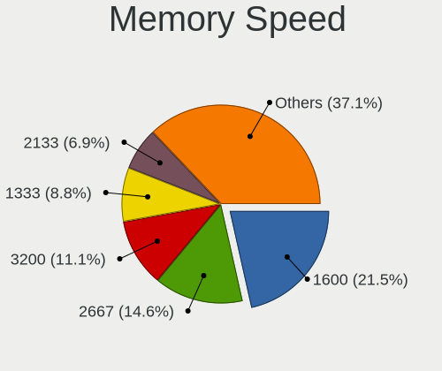

| Speed   | Computers | Percent |
|---------|-----------|---------|
| 1600    | 106       | 21.59%  |
| 2667    | 71        | 14.46%  |
| 3200    | 55        | 11.2%   |
| 1333    | 45        | 9.16%   |
| 2133    | 39        | 7.94%   |
| 2400    | 23        | 4.68%   |
| Unknown | 20        | 4.07%   |
| 1334    | 19        | 3.87%   |
| 667     | 19        | 3.87%   |
| 800     | 14        | 2.85%   |
| 1867    | 8         | 1.63%   |
| 1066    | 6         | 1.22%   |
| 4800    | 5         | 1.02%   |
| 3600    | 5         | 1.02%   |
| 1067    | 5         | 1.02%   |
| 533     | 5         | 1.02%   |
| 8400    | 3         | 0.61%   |
| 4267    | 3         | 0.61%   |
| 3266    | 3         | 0.61%   |
| 3000    | 3         | 0.61%   |
| 1866    | 3         | 0.61%   |
| 400     | 3         | 0.61%   |
| 6400    | 2         | 0.41%   |
| 4266    | 2         | 0.41%   |
| 4199    | 2         | 0.41%   |
| 3866    | 2         | 0.41%   |
| 3400    | 2         | 0.41%   |
| 2666    | 2         | 0.41%   |
| 2200    | 2         | 0.41%   |
| 2048    | 2         | 0.41%   |
| 1800    | 2         | 0.41%   |
| 3733    | 1         | 0.2%    |
| 3100    | 1         | 0.2%    |
| 2934    | 1         | 0.2%    |
| 2733    | 1         | 0.2%    |
| 2473    | 1         | 0.2%    |
| 2187    | 1         | 0.2%    |
| 2134    | 1         | 0.2%    |
| 2000    | 1         | 0.2%    |
| 1639    | 1         | 0.2%    |

Printers & scanners
-------------------

Printer Vendor
--------------

Printer device vendors

| Vendor                   | Computers | Percent |
|--------------------------|-----------|---------|
| Hewlett-Packard          | 23        | 48.94%  |
| Canon                    | 9         | 19.15%  |
| Samsung Electronics      | 4         | 8.51%   |
| Brother Industries       | 3         | 6.38%   |
| Seiko Epson              | 2         | 4.26%   |
| Zhuhai Poskey Technology | 1         | 2.13%   |
| Xerox                    | 1         | 2.13%   |
| Ricoh                    | 1         | 2.13%   |
| QinHeng Electronics      | 1         | 2.13%   |
| Lexmark International    | 1         | 2.13%   |
| Kyocera                  | 1         | 2.13%   |

Printer Model
-------------

Printer device models

| Model                                | Computers | Percent |
|--------------------------------------|-----------|---------|
| HP OfficeJet 3830 series             | 2         | 4.17%   |
| HP LaserJet 1018                     | 2         | 4.17%   |
| Zhuhai Poskey Printer                | 1         | 2.08%   |
| Xerox Phaser 6130N                   | 1         | 2.08%   |
| Seiko Epson L375 Series              | 1         | 2.08%   |
| Seiko Epson L365 Series              | 1         | 2.08%   |
| Samsung SCX-472x Series              | 1         | 2.08%   |
| Samsung SCX-3200 Series              | 1         | 2.08%   |
| Samsung ML-1640 Series Laser Printer | 1         | 2.08%   |
| Samsung M267x 287x Series            | 1         | 2.08%   |
| Ricoh SP 150SUw                      | 1         | 2.08%   |
| QinHeng CH340S                       | 1         | 2.08%   |
| Lexmark International CS727de        | 1         | 2.08%   |
| Kyocera FS-1020D Printer             | 1         | 2.08%   |
| HP Officejet 4500 G510g-m            | 1         | 2.08%   |
| HP LaserJet P2055 series             | 1         | 2.08%   |
| HP LaserJet M14-M17                  | 1         | 2.08%   |
| HP LaserJet M101-M106                | 1         | 2.08%   |
| HP LaserJet 1020                     | 1         | 2.08%   |
| HP EWS UPD                           | 1         | 2.08%   |
| HP ENVY Photo 7800 series            | 1         | 2.08%   |
| HP ENVY 4500 series                  | 1         | 2.08%   |
| HP Deskjet F4500 series              | 1         | 2.08%   |
| HP DeskJet F2100 Printer series      | 1         | 2.08%   |
| HP DeskJet 930c                      | 1         | 2.08%   |
| HP DeskJet 5650c                     | 1         | 2.08%   |
| HP DeskJet 2700 series               | 1         | 2.08%   |
| HP DeskJet 2600 series               | 1         | 2.08%   |
| HP Deskjet 2540 series               | 1         | 2.08%   |
| HP DeskJet 2130 series               | 1         | 2.08%   |
| HP Deskjet 1050 J410                 | 1         | 2.08%   |
| HP ColorLaserJet M253-M254           | 1         | 2.08%   |
| HP Color LaserJet 2605               | 1         | 2.08%   |
| Canon TR8500 series                  | 1         | 2.08%   |
| Canon PIXMA MX920 Series             | 1         | 2.08%   |
| Canon PIXMA MX720 Series             | 1         | 2.08%   |
| Canon PIXMA MX370 Series             | 1         | 2.08%   |
| Canon PIXMA MP250                    | 1         | 2.08%   |
| Canon PIXMA MG2900 Series            | 1         | 2.08%   |
| Canon MF632C/634C                    | 1         | 2.08%   |

Scanner Vendor
--------------

Scanner device vendors

| Vendor          | Computers | Percent |
|-----------------|-----------|---------|
| Hewlett-Packard | 2         | 28.57%  |
| Canon           | 2         | 28.57%  |
| Seiko Epson     | 1         | 14.29%  |
| Mustek Systems  | 1         | 14.29%  |
| AGFA-Gevaert NV | 1         | 14.29%  |

Scanner Model
-------------

Scanner device models

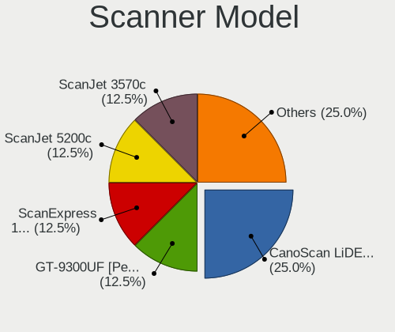

| Model                                         | Computers | Percent |
|-----------------------------------------------|-----------|---------|
| Seiko Epson GT-9300UF [Perfection 2400 PHOTO] | 1         | 14.29%  |
| Mustek Systems ScanExpress 1200 CU Plus       | 1         | 14.29%  |
| HP ScanJet 5200c                              | 1         | 14.29%  |
| HP ScanJet 3570c                              | 1         | 14.29%  |
| Canon CanoScan LiDE 220                       | 1         | 14.29%  |
| Canon CanoScan LiDE 110                       | 1         | 14.29%  |
| AGFA-Gevaert NV Snapscan e40                  | 1         | 14.29%  |

Camera
------

Camera Vendor
-------------

Camera device vendors

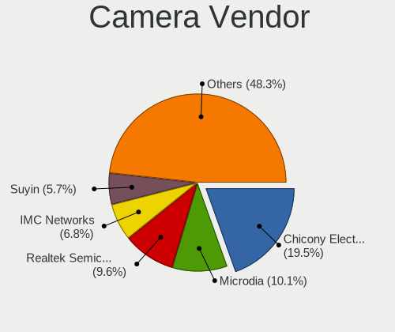

| Vendor                                 | Computers | Percent |
|----------------------------------------|-----------|---------|
| Chicony Electronics                    | 119       | 20.14%  |
| Microdia                               | 61        | 10.32%  |
| Realtek Semiconductor                  | 56        | 9.48%   |
| IMC Networks                           | 42        | 7.11%   |
| Suyin                                  | 35        | 5.92%   |
| Sunplus Innovation Technology          | 30        | 5.08%   |
| Logitech                               | 30        | 5.08%   |
| Bison Electronics                      | 27        | 4.57%   |
| Apple                                  | 23        | 3.89%   |
| Cheng Uei Precision Industry (Foxlink) | 19        | 3.21%   |
| Quanta                                 | 18        | 3.05%   |
| Syntek                                 | 13        | 2.2%    |
| Lite-On Technology                     | 12        | 2.03%   |
| Acer                                   | 11        | 1.86%   |
| Lenovo                                 | 10        | 1.69%   |
| Silicon Motion                         | 9         | 1.52%   |
| Samsung Electronics                    | 8         | 1.35%   |
| Microsoft                              | 8         | 1.35%   |
| Importek                               | 6         | 1.02%   |
| Alcor Micro                            | 6         | 1.02%   |
| Luxvisions Innotech Limited            | 4         | 0.68%   |
| GEMBIRD                                | 4         | 0.68%   |
| Z-Star Microelectronics                | 3         | 0.51%   |
| Generalplus Technology                 | 3         | 0.51%   |
| Ricoh                                  | 2         | 0.34%   |
| Primax Electronics                     | 2         | 0.34%   |
| Philips (or NXP)                       | 2         | 0.34%   |
| Intel                                  | 2         | 0.34%   |
| Hewlett-Packard                        | 2         | 0.34%   |
| eMPIA Technology                       | 2         | 0.34%   |
| Cubeternet                             | 2         | 0.34%   |
| ALi                                    | 2         | 0.34%   |
| USB3.0 HD Audio Capture                | 1         | 0.17%   |
| USB Camera CS                          | 1         | 0.17%   |
| SunplusIT                              | 1         | 0.17%   |
| STEREOLABS                             | 1         | 0.17%   |
| Pixart Imaging                         | 1         | 0.17%   |
| OmniVision Technologies                | 1         | 0.17%   |
| Jieli Technology                       | 1         | 0.17%   |
| iPassion Technology                    | 1         | 0.17%   |

Camera Model
------------

Camera device models

| Model                                    | Computers | Percent |
|------------------------------------------|-----------|---------|
| Realtek Integrated_Webcam_HD             | 22        | 3.71%   |
| Microdia Integrated_Webcam_HD            | 21        | 3.54%   |
| Chicony Integrated Camera                | 10        | 1.69%   |
| Sunplus Integrated_Webcam_HD             | 9         | 1.52%   |
| Logitech Webcam C270                     | 9         | 1.52%   |
| IMC Networks Integrated Camera           | 9         | 1.52%   |
| Chicony HP HD Camera                     | 9         | 1.52%   |
| Apple iPhone 5/5C/5S/6/SE/7/8/X          | 9         | 1.52%   |
| Samsung Galaxy series, misc. (MTP mode)  | 7         | 1.18%   |
| Syntek Integrated Camera                 | 6         | 1.01%   |
| Suyin Acer/HP Integrated Webcam [CN0314] | 6         | 1.01%   |
| Sunplus HD WebCam                        | 6         | 1.01%   |
| Lite-On Integrated Camera                | 6         | 1.01%   |
| Lenovo Integrated Webcam [R5U877]        | 6         | 1.01%   |
| Sunplus Asus Webcam                      | 5         | 0.84%   |
| Realtek Integrated Webcam HD             | 5         | 0.84%   |
| Realtek Integrated Webcam                | 5         | 0.84%   |
| Microdia Webcam Vitade AF                | 5         | 0.84%   |
| Chicony USB 2.0 Camera                   | 5         | 0.84%   |
| Chicony Lenovo EasyCamera                | 5         | 0.84%   |
| Chicony Camera                           | 5         | 0.84%   |
| Bison BisonCam, NB Pro                   | 5         | 0.84%   |
| Suyin HP Truevision HD                   | 4         | 0.67%   |
| Microsoft LifeCam HD-3000                | 4         | 0.67%   |
| Microdia Sonix USB 2.0 Camera            | 4         | 0.67%   |
| Microdia Laptop_Integrated_Webcam_HD     | 4         | 0.67%   |
| Logitech HD Webcam C615                  | 4         | 0.67%   |
| IMC Networks USB2.0 HD UVC WebCam        | 4         | 0.67%   |
| IMC Networks USB 2.0 Camera              | 4         | 0.67%   |
| IMC Networks Lenovo EasyCamera           | 4         | 0.67%   |
| Chicony USB2.0 VGA UVC WebCam            | 4         | 0.67%   |
| Chicony HP Wide Vision HD Camera         | 4         | 0.67%   |
| Chicony FJ Camera                        | 4         | 0.67%   |
| Bison Lenovo Integrated Webcam           | 4         | 0.67%   |
| Apple Built-in iSight [Micron]           | 4         | 0.67%   |
| Apple Built-in iSight                    | 4         | 0.67%   |
| Syntek Lenovo EasyCamera                 | 3         | 0.51%   |
| Suyin Integrated_Webcam_HD               | 3         | 0.51%   |
| Suyin Acer/Lenovo Webcam [CN0316]        | 3         | 0.51%   |
| Suyin Acer CrystalEye Webcam             | 3         | 0.51%   |

Security
--------

Fingerprint Vendor
------------------

Fingerprint sensor vendors

| Vendor                             | Computers | Percent |
|------------------------------------|-----------|---------|
| Validity Sensors                   | 52        | 42.62%  |
| Synaptics                          | 20        | 16.39%  |
| AuthenTec                          | 16        | 13.11%  |
| Shenzhen Goodix Technology         | 11        | 9.02%   |
| Upek                               | 9         | 7.38%   |
| STMicroelectronics                 | 5         | 4.1%    |
| LighTuning Technology              | 4         | 3.28%   |
| Elan Microelectronics              | 3         | 2.46%   |
| Realtek USB2.0 Finger Print Bridge | 1         | 0.82%   |
| DigitalPersona                     | 1         | 0.82%   |

Fingerprint Model
-----------------

Fingerprint sensor models

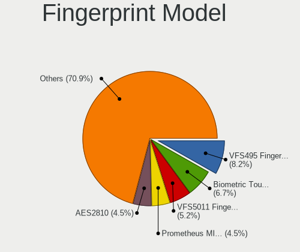

| Model                                                                      | Computers | Percent |
|----------------------------------------------------------------------------|-----------|---------|
| Validity Sensors VFS495 Fingerprint Reader                                 | 11        | 9.02%   |
| Upek Biometric Touchchip/Touchstrip Fingerprint Sensor                     | 8         | 6.56%   |
| Validity Sensors VFS5011 Fingerprint Reader                                | 7         | 5.74%   |
| AuthenTec AES2810                                                          | 6         | 4.92%   |
| Synaptics Prometheus MIS Touch Fingerprint Reader                          | 5         | 4.1%    |
| STMicroelectronics Fingerprint Reader                                      | 5         | 4.1%    |
| Validity Sensors VFS451 Fingerprint Reader                                 | 4         | 3.28%   |
| Validity Sensors VFS101 Fingerprint Reader                                 | 4         | 3.28%   |
| Validity Sensors Synaptics WBDI                                            | 4         | 3.28%   |
| Validity Sensors Synaptics VFS7552 Touch Fingerprint Sensor with PurePrint | 4         | 3.28%   |
| Synaptics Metallica MIS Touch Fingerprint Reader                           | 4         | 3.28%   |
| Shenzhen Goodix  FingerPrint Device                                        | 4         | 3.28%   |
| Shenzhen Goodix FingerPrint                                                | 4         | 3.28%   |
| AuthenTec AES2501 Fingerprint Sensor                                       | 4         | 3.28%   |
| Validity Sensors VFS7500 Touch Fingerprint Sensor                          | 3         | 2.46%   |
| Validity Sensors VFS491                                                    | 3         | 2.46%   |
| Validity Sensors VFS471 Fingerprint Reader                                 | 3         | 2.46%   |
| Validity Sensors Swipe Fingerprint Sensor                                  | 3         | 2.46%   |
| Validity Sensors Fingerprint scanner                                       | 3         | 2.46%   |
| Synaptics FS7604 Touch Fingerprint Sensor with PurePrint                   | 3         | 2.46%   |
| Shenzhen Goodix Fingerprint Reader                                         | 3         | 2.46%   |
| Validity Sensors VFS Fingerprint sensor                                    | 2         | 1.64%   |
| Synaptics UWP WBDI                                                         | 2         | 1.64%   |
| Synaptics Metallica MOH Touch Fingerprint Reader                           | 2         | 1.64%   |
| LighTuning EgisTec Touch Fingerprint Sensor                                | 2         | 1.64%   |
| Elan ELAN:Fingerprint                                                      | 2         | 1.64%   |
| AuthenTec Fingerprint Sensor                                               | 2         | 1.64%   |
| AuthenTec AES2550 Fingerprint Sensor                                       | 2         | 1.64%   |
| AuthenTec AES1600                                                          | 2         | 1.64%   |
| Validity Sensors VFS 5011 fingerprint sensor                               | 1         | 0.82%   |
| Upek TCS5B Fingerprint sensor                                              | 1         | 0.82%   |
| Synaptics WBDI Fingerprint Reader USB 086                                  | 1         | 0.82%   |
| Synaptics WBDI                                                             | 1         | 0.82%   |
| Synaptics  WBDI                                                            | 1         | 0.82%   |
| Synaptics  FS7604 Touch Fingerprint Sensor with PurePrint                  | 1         | 0.82%   |
| Realtek USB2.0 Finger Print Bridge FocalTech Fingerprint Device            | 1         | 0.82%   |
| LighTuning Fingerprint Sensor                                              | 1         | 0.82%   |
| LighTuning ES603 Swipe Fingerprint Sensor                                  | 1         | 0.82%   |
| Elan ELAN:ARM-M4                                                           | 1         | 0.82%   |
| DigitalPersona Fingerprint Reader                                          | 1         | 0.82%   |

Chipcard Vendor
---------------

Chipcard module vendors

| Vendor           | Computers | Percent |
|------------------|-----------|---------|
| Broadcom         | 18        | 41.86%  |
| O2 Micro         | 10        | 23.26%  |
| Alcor Micro      | 8         | 18.6%   |
| SCM Microsystems | 3         | 6.98%   |
| Lenovo           | 3         | 6.98%   |
| Yubico.com       | 1         | 2.33%   |

Chipcard Model
--------------

Chipcard module models

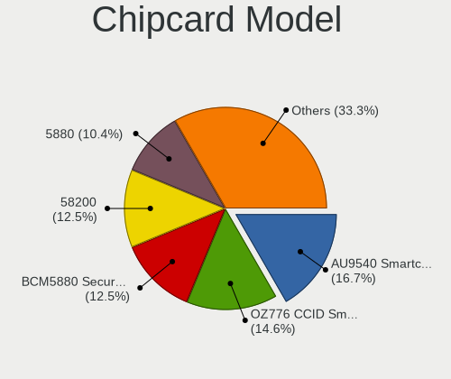

| Model                                                                        | Computers | Percent |
|------------------------------------------------------------------------------|-----------|---------|
| Alcor Micro AU9540 Smartcard Reader                                          | 8         | 18.18%  |
| O2 Micro OZ776 CCID Smartcard Reader                                         | 7         | 15.91%  |
| Broadcom BCM5880 Secure Applications Processor                               | 6         | 13.64%  |
| Broadcom 5880                                                                | 5         | 11.36%  |
| Broadcom BCM5880 Secure Applications Processor with fingerprint swipe sensor | 4         | 9.09%   |
| O2 Micro Oz776 SmartCard Reader                                              | 3         | 6.82%   |
| Lenovo Integrated Smart Card Reader                                          | 3         | 6.82%   |
| Broadcom 58200                                                               | 3         | 6.82%   |
| Yubico.com Yubikey 4/5 U2F+CCID                                              | 1         | 2.27%   |
| SCM Microsystems SCR35xx Smart Card Reader                                   | 1         | 2.27%   |
| SCM Microsystems SCR3340 - ExpressCard54 Smart Card Reader                   | 1         | 2.27%   |
| SCM Microsystems Elektra331-USB SmartCard Reader                             | 1         | 2.27%   |
| SCM Microsystems CLOUD 2700 F Smart Card Reader                              | 1         | 2.27%   |

Unsupported
-----------

Unsupported Devices
-------------------

Total unsupported devices on board

| Total | Computers | Percent |
|-------|-----------|---------|
| 0     | 793       | 68.24%  |
| 1     | 279       | 24.01%  |
| 2     | 68        | 5.85%   |
| 3     | 10        | 0.86%   |
| 4     | 7         | 0.6%    |
| 5     | 3         | 0.26%   |
| 7     | 1         | 0.09%   |
| 6     | 1         | 0.09%   |

Unsupported Device Types
------------------------

Types of unsupported devices

| Type                     | Computers | Percent |
|--------------------------|-----------|---------|
| Graphics card            | 143       | 29.24%  |
| Fingerprint reader       | 120       | 24.54%  |
| Net/wireless             | 60        | 12.27%  |
| Chipcard                 | 42        | 8.59%   |
| Communication controller | 35        | 7.16%   |
| Modem                    | 19        | 3.89%   |
| Multimedia controller    | 14        | 2.86%   |
| Storage                  | 12        | 2.45%   |
| Bluetooth                | 12        | 2.45%   |
| Sound                    | 10        | 2.04%   |
| Camera                   | 7         | 1.43%   |
| Unassigned class         | 4         | 0.82%   |
| Card reader              | 3         | 0.61%   |
| Flash memory             | 2         | 0.41%   |
| Dvb card                 | 2         | 0.41%   |
| Tv card                  | 1         | 0.2%    |
| Storage/raid             | 1         | 0.2%    |
| Storage/nvme             | 1         | 0.2%    |
| Net/ethernet             | 1         | 0.2%    |

