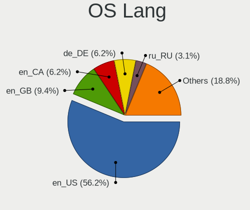
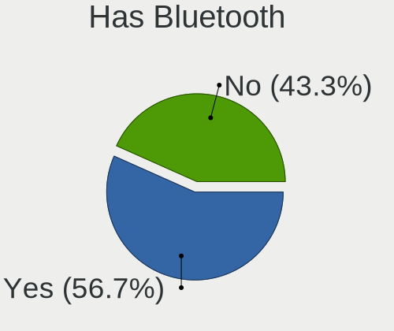
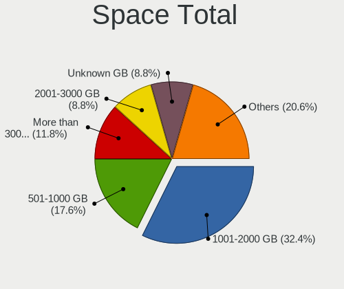

Ultramarine - Tested Hardware & Statistics (Desktops)
-----------------------------------------------------

A project to collect tested hardware configurations for Ultramarine.

Anyone can contribute to this report by the [hw-probe](https://github.com/linuxhw/hw-probe) tool:

    sudo -E hw-probe -all -upload

Please contribute! Especially if your hardware is rare.

Contents
--------

* [ Test Cases ](#test-cases)

* [ System ](#system)
  - [ OS                       ](#os)
  - [ OS Family                ](#os-family)
  - [ Kernel                   ](#kernel)
  - [ Kernel Family            ](#kernel-family)
  - [ Kernel Major Ver.        ](#kernel-major-ver)
  - [ Arch                     ](#arch)
  - [ DE                       ](#de)
  - [ Display Server           ](#display-server)
  - [ Display Manager          ](#display-manager)
  - [ OS Lang                  ](#os-lang)
  - [ Boot Mode                ](#boot-mode)
  - [ Filesystem               ](#filesystem)
  - [ Part. scheme             ](#part-scheme)
  - [ Dual Boot with Linux/BSD ](#dual-boot-with-linuxbsd)
  - [ Dual Boot (Win)          ](#dual-boot-win)

* [ Board ](#board)
  - [ Vendor                   ](#vendor)
  - [ Model                    ](#model)
  - [ Model Family             ](#model-family)
  - [ MFG Year                 ](#mfg-year)
  - [ Form Factor              ](#form-factor)
  - [ Secure Boot              ](#secure-boot)
  - [ Coreboot                 ](#coreboot)
  - [ RAM Size                 ](#ram-size)
  - [ RAM Used                 ](#ram-used)
  - [ Total Drives             ](#total-drives)
  - [ Has CD-ROM               ](#has-cd-rom)
  - [ Has Ethernet             ](#has-ethernet)
  - [ Has WiFi                 ](#has-wifi)
  - [ Has Bluetooth            ](#has-bluetooth)

* [ Location ](#location)
  - [ Country                  ](#country)
  - [ City                     ](#city)

* [ Drives ](#drives)
  - [ Drive Vendor             ](#drive-vendor)
  - [ Drive Model              ](#drive-model)
  - [ HDD Vendor               ](#hdd-vendor)
  - [ SSD Vendor               ](#ssd-vendor)
  - [ Drive Kind               ](#drive-kind)
  - [ Drive Connector          ](#drive-connector)
  - [ Drive Size               ](#drive-size)
  - [ Space Total              ](#space-total)
  - [ Space Used               ](#space-used)
  - [ Malfunc. Drives          ](#malfunc-drives)
  - [ Malfunc. Drive Vendor    ](#malfunc-drive-vendor)
  - [ Malfunc. HDD Vendor      ](#malfunc-hdd-vendor)
  - [ Malfunc. Drive Kind      ](#malfunc-drive-kind)
  - [ Failed Drives            ](#failed-drives)
  - [ Failed Drive Vendor      ](#failed-drive-vendor)
  - [ Drive Status             ](#drive-status)

* [ Storage controller ](#storage-controller)
  - [ Storage Vendor           ](#storage-vendor)
  - [ Storage Model            ](#storage-model)
  - [ Storage Kind             ](#storage-kind)

* [ Processor ](#processor)
  - [ CPU Vendor               ](#cpu-vendor)
  - [ CPU Model                ](#cpu-model)
  - [ CPU Model Family         ](#cpu-model-family)
  - [ CPU Cores                ](#cpu-cores)
  - [ CPU Sockets              ](#cpu-sockets)
  - [ CPU Threads              ](#cpu-threads)
  - [ CPU Op-Modes             ](#cpu-op-modes)
  - [ CPU Microcode            ](#cpu-microcode)
  - [ CPU Microarch            ](#cpu-microarch)

* [ Graphics ](#graphics)
  - [ GPU Vendor               ](#gpu-vendor)
  - [ GPU Model                ](#gpu-model)
  - [ GPU Combo                ](#gpu-combo)
  - [ GPU Driver               ](#gpu-driver)
  - [ GPU Memory               ](#gpu-memory)

* [ Monitor ](#monitor)
  - [ Monitor Vendor           ](#monitor-vendor)
  - [ Monitor Model            ](#monitor-model)
  - [ Monitor Resolution       ](#monitor-resolution)
  - [ Monitor Diagonal         ](#monitor-diagonal)
  - [ Monitor Width            ](#monitor-width)
  - [ Aspect Ratio             ](#aspect-ratio)
  - [ Monitor Area             ](#monitor-area)
  - [ Pixel Density            ](#pixel-density)
  - [ Multiple Monitors        ](#multiple-monitors)

* [ Network ](#network)
  - [ Net Controller Vendor    ](#net-controller-vendor)
  - [ Net Controller Model     ](#net-controller-model)
  - [ Wireless Vendor          ](#wireless-vendor)
  - [ Wireless Model           ](#wireless-model)
  - [ Ethernet Vendor          ](#ethernet-vendor)
  - [ Ethernet Model           ](#ethernet-model)
  - [ Net Controller Kind      ](#net-controller-kind)
  - [ Used Controller          ](#used-controller)
  - [ NICs                     ](#nics)
  - [ IPv6                     ](#ipv6)

* [ Bluetooth ](#bluetooth)
  - [ Bluetooth Vendor         ](#bluetooth-vendor)
  - [ Bluetooth Model          ](#bluetooth-model)

* [ Sound ](#sound)
  - [ Sound Vendor             ](#sound-vendor)
  - [ Sound Model              ](#sound-model)

* [ Memory ](#memory)
  - [ Memory Vendor            ](#memory-vendor)
  - [ Memory Model             ](#memory-model)
  - [ Memory Kind              ](#memory-kind)
  - [ Memory Form Factor       ](#memory-form-factor)
  - [ Memory Size              ](#memory-size)
  - [ Memory Speed             ](#memory-speed)

* [ Printers & scanners ](#printers--scanners)
  - [ Printer Vendor           ](#printer-vendor)
  - [ Printer Model            ](#printer-model)
  - [ Scanner Vendor           ](#scanner-vendor)
  - [ Scanner Model            ](#scanner-model)

* [ Camera ](#camera)
  - [ Camera Vendor            ](#camera-vendor)
  - [ Camera Model             ](#camera-model)

* [ Security ](#security)
  - [ Fingerprint Vendor       ](#fingerprint-vendor)
  - [ Fingerprint Model        ](#fingerprint-model)
  - [ Chipcard Vendor          ](#chipcard-vendor)
  - [ Chipcard Model           ](#chipcard-model)

* [ Unsupported ](#unsupported)
  - [ Unsupported Devices      ](#unsupported-devices)
  - [ Unsupported Device Types ](#unsupported-device-types)

Test Cases
----------

Total: 42

| Vendor   | Model                    | Probe                                                      | Date         |
|----------|--------------------------|------------------------------------------------------------|--------------|
| ASUSTek  | PRIME A320M-K            | [d6dd06cfca](https://linux-hardware.org/?probe=d6dd06cfca) | Oct 28, 2024 |
| Gigabyte | B650 GAMING X AX V2      | [d1456149de](https://linux-hardware.org/?probe=d1456149de) | Oct 19, 2024 |
| Dell     | 0J8G6F A02               | [968e081763](https://linux-hardware.org/?probe=968e081763) | Sep 23, 2024 |
| MSI      | Z790 GAMING PLUS WIFI    | [47a7b5f3f3](https://linux-hardware.org/?probe=47a7b5f3f3) | Aug 26, 2024 |
| Gigabyte | B550 VISION D-P          | [4ab76c3030](https://linux-hardware.org/?probe=4ab76c3030) | Aug 20, 2024 |
| Dell     | 09M8Y8 A01               | [8154c94d2d](https://linux-hardware.org/?probe=8154c94d2d) | Aug 18, 2024 |
| Fujitsu  | D3162-A1 S26361-D3162-A1 | [d8f579c579](https://linux-hardware.org/?probe=d8f579c579) | Jul 11, 2024 |
| Fujitsu  | D3162-A1 S26361-D3162-A1 | [9217eb5455](https://linux-hardware.org/?probe=9217eb5455) | Jul 10, 2024 |
| Gigabyte | B550 VISION D-P          | [e3f4a68e11](https://linux-hardware.org/?probe=e3f4a68e11) | Jul 03, 2024 |
| Dell     | 0NW73C A01               | [2cc413a09c](https://linux-hardware.org/?probe=2cc413a09c) | Jun 10, 2024 |
| Gigabyte | Z77N-WIFI                | [d7a2a81328](https://linux-hardware.org/?probe=d7a2a81328) | Jun 09, 2024 |
| Gigabyte | B650 AORUS ELITE AX      | [40e2e9b9f4](https://linux-hardware.org/?probe=40e2e9b9f4) | Jun 07, 2024 |
| Gigabyte | P55A-UD3                 | [c7ceab8c20](https://linux-hardware.org/?probe=c7ceab8c20) | Apr 07, 2024 |
| Intel    | X99                      | [ce7d0c7c5d](https://linux-hardware.org/?probe=ce7d0c7c5d) | Apr 06, 2024 |
| Dell     | 09M8Y8 A01               | [c90acd6853](https://linux-hardware.org/?probe=c90acd6853) | Mar 29, 2024 |
| Gigabyte | X79-UP4                  | [b3ef558527](https://linux-hardware.org/?probe=b3ef558527) | Feb 17, 2024 |
| Gigabyte | X79-UP4                  | [3605afbba0](https://linux-hardware.org/?probe=3605afbba0) | Feb 16, 2024 |
| AZW      | Gemini T45               | [a07e2329bb](https://linux-hardware.org/?probe=a07e2329bb) | Feb 05, 2024 |
| AZW      | Gemini T45               | [5caae813f4](https://linux-hardware.org/?probe=5caae813f4) | Feb 05, 2024 |
| Gigabyte | X79-UP4                  | [32cafc74cf](https://linux-hardware.org/?probe=32cafc74cf) | Jan 28, 2024 |
| ASUSTek  | PRIME B550-PLUS AC-HES   | [3acdabd584](https://linux-hardware.org/?probe=3acdabd584) | Dec 27, 2023 |
| Dell     | 09M8Y8 A01               | [f4932d00ca](https://linux-hardware.org/?probe=f4932d00ca) | Dec 16, 2023 |
| ASUSTek  | CROSSHAIR VI HERO        | [03b847bfea](https://linux-hardware.org/?probe=03b847bfea) | Dec 13, 2023 |
| Gigabyte | B550M DS3H AC            | [c04e33a35b](https://linux-hardware.org/?probe=c04e33a35b) | Dec 13, 2023 |
| Gigabyte | B550M DS3H AC            | [8d856712c9](https://linux-hardware.org/?probe=8d856712c9) | Dec 13, 2023 |
| MSI      | MAG B550 TOMAHAWK        | [6be46afd51](https://linux-hardware.org/?probe=6be46afd51) | Dec 10, 2023 |
| Gigabyte | X79-UP4                  | [9c4b6341e0](https://linux-hardware.org/?probe=9c4b6341e0) | Oct 18, 2023 |
| Pegatron | 2A9A                     | [f4c8507e2b](https://linux-hardware.org/?probe=f4c8507e2b) | Oct 02, 2023 |
| Gigabyte | Z390 AORUS PRO WIFI-CF   | [aacbd7403c](https://linux-hardware.org/?probe=aacbd7403c) | Aug 10, 2023 |
| Gigabyte | Z390 AORUS PRO WIFI-CF   | [a7a57a8a56](https://linux-hardware.org/?probe=a7a57a8a56) | Aug 10, 2023 |
| ASUSTek  | P8H77-M                  | [1764158bf6](https://linux-hardware.org/?probe=1764158bf6) | Aug 03, 2023 |
| Acer     | Nitro N50-600 V:1.1      | [663261b61f](https://linux-hardware.org/?probe=663261b61f) | Jul 04, 2023 |
| Gigabyte | GA-78LMT-USB3            | [dedc98e84e](https://linux-hardware.org/?probe=dedc98e84e) | Jun 10, 2023 |
| Foxconn  | 2AB1                     | [23c3c64afa](https://linux-hardware.org/?probe=23c3c64afa) | Mar 17, 2023 |
| Foxconn  | 2AB1                     | [bc6f32a856](https://linux-hardware.org/?probe=bc6f32a856) | Mar 17, 2023 |
| Gigabyte | GA-78LMT-S2 sex          | [e61ebad4f6](https://linux-hardware.org/?probe=e61ebad4f6) | Mar 12, 2023 |
| ASUSTek  | B85M-G                   | [26fd2a9f6a](https://linux-hardware.org/?probe=26fd2a9f6a) | Jan 29, 2023 |
| Lenovo   | ThinkCentre M58 6258D3G  | [8bc1c22b23](https://linux-hardware.org/?probe=8bc1c22b23) | Jan 25, 2023 |
| Biostar  | H310MHP                  | [6495c0927b](https://linux-hardware.org/?probe=6495c0927b) | Jan 16, 2023 |
| MSI      | B450M BAZOOKA MAX WIFI   | [1eb939b09f](https://linux-hardware.org/?probe=1eb939b09f) | Sep 12, 2022 |
| MSI      | A320M-A PRO MAX          | [cdee8ca864](https://linux-hardware.org/?probe=cdee8ca864) | Aug 12, 2022 |
| ASUSTek  | D940MX                   | [bdc8831182](https://linux-hardware.org/?probe=bdc8831182) | Mar 28, 2022 |

System
------

OS
--

Installed operating systems

| Name                 | Desktops | Percent |
|----------------------|----------|---------|
| Ultramarine 40       | 9        | 28.13%  |
| Ultramarine 39       | 9        | 28.13%  |
| Ultramarine 38       | 6        | 18.75%  |
| Ultramarine 37       | 5        | 15.63%  |
| Ultramarine Linux 36 | 2        | 6.25%   |
| Ultramarine Linux 35 | 1        | 3.13%   |

OS Family
---------

OS without a version

| Name        | Desktops | Percent |
|-------------|----------|---------|
| Ultramarine | 30       | 100%    |

Kernel
------

Version of the Linux kernel

| Version                 | Desktops | Percent |
|-------------------------|----------|---------|
| 6.6.4-200.fc39.x86_64   | 3        | 8.57%   |
| 6.8.11-300.fc40.x86_64  | 2        | 5.71%   |
| 6.6.2-201.fc39.x86_64   | 2        | 5.71%   |
| 6.1.7-200.fc37.x86_64   | 2        | 5.71%   |
| 6.9.7-200.fc40.x86_64   | 1        | 2.86%   |
| 6.9.5-200.fc40.x86_64   | 1        | 2.86%   |
| 6.9.12-200.fc40.x86_64  | 1        | 2.86%   |
| 6.8.4-200.fc39.x86_64   | 1        | 2.86%   |
| 6.8.2-300.fc40.x86_64   | 1        | 2.86%   |
| 6.8.12-300.fc40.x86_64  | 1        | 2.86%   |
| 6.8.11-200.fc39.x86_64  | 1        | 2.86%   |
| 6.7.4-200.fc39.x86_64   | 1        | 2.86%   |
| 6.7.11-200.fc39.x86_64  | 1        | 2.86%   |
| 6.6.13-200.fc39.x86_64  | 1        | 2.86%   |
| 6.5.6-200.fc38.x86_64   | 1        | 2.86%   |
| 6.4.8-200.fc38.x86_64   | 1        | 2.86%   |
| 6.4.6-200.fc38.x86_64   | 1        | 2.86%   |
| 6.4.11-200.fc38.x86_64  | 1        | 2.86%   |
| 6.3.8-200.fc38.x86_64   | 1        | 2.86%   |
| 6.3.6-200.fc38.x86_64   | 1        | 2.86%   |
| 6.11.4-201.fc40.x86_64  | 1        | 2.86%   |
| 6.11.3-200.fc40.x86_64  | 1        | 2.86%   |
| 6.10.6-200.fc40.x86_64  | 1        | 2.86%   |
| 6.10.4-200.fc40.x86_64  | 1        | 2.86%   |
| 6.1.5-200.fc37.x86_64   | 1        | 2.86%   |
| 6.1.18-200.fc37.x86_64  | 1        | 2.86%   |
| 6.1.15-200.fc37.x86_64  | 1        | 2.86%   |
| 5.19.4-200.fc36.x86_64  | 1        | 2.86%   |
| 5.17.7-300.fc36.x86_64  | 1        | 2.86%   |
| 5.16.16-200.fc35.x86_64 | 1        | 2.86%   |

Kernel Family
-------------

Linux kernel without a distro release

| Version | Desktops | Percent |
|---------|----------|---------|
| 6.8.11  | 3        | 8.57%   |
| 6.6.4   | 3        | 8.57%   |
| 6.6.2   | 2        | 5.71%   |
| 6.1.7   | 2        | 5.71%   |
| 6.9.7   | 1        | 2.86%   |
| 6.9.5   | 1        | 2.86%   |
| 6.9.12  | 1        | 2.86%   |
| 6.8.4   | 1        | 2.86%   |
| 6.8.2   | 1        | 2.86%   |
| 6.8.12  | 1        | 2.86%   |
| 6.7.4   | 1        | 2.86%   |
| 6.7.11  | 1        | 2.86%   |
| 6.6.13  | 1        | 2.86%   |
| 6.5.6   | 1        | 2.86%   |
| 6.4.8   | 1        | 2.86%   |
| 6.4.6   | 1        | 2.86%   |
| 6.4.11  | 1        | 2.86%   |
| 6.3.8   | 1        | 2.86%   |
| 6.3.6   | 1        | 2.86%   |
| 6.11.4  | 1        | 2.86%   |
| 6.11.3  | 1        | 2.86%   |
| 6.10.6  | 1        | 2.86%   |
| 6.10.4  | 1        | 2.86%   |
| 6.1.5   | 1        | 2.86%   |
| 6.1.18  | 1        | 2.86%   |
| 6.1.15  | 1        | 2.86%   |
| 5.19.4  | 1        | 2.86%   |
| 5.17.7  | 1        | 2.86%   |
| 5.16.16 | 1        | 2.86%   |

Kernel Major Ver.
-----------------

Linux kernel major version

| Version | Desktops | Percent |
|---------|----------|---------|
| 6.8     | 6        | 17.65%  |
| 6.6     | 6        | 17.65%  |
| 6.1     | 5        | 14.71%  |
| 6.4     | 3        | 8.82%   |
| 6.9     | 2        | 5.88%   |
| 6.7     | 2        | 5.88%   |
| 6.3     | 2        | 5.88%   |
| 6.11    | 2        | 5.88%   |
| 6.10    | 2        | 5.88%   |
| 6.5     | 1        | 2.94%   |
| 5.19    | 1        | 2.94%   |
| 5.17    | 1        | 2.94%   |
| 5.16    | 1        | 2.94%   |

Arch
----

OS architecture (x86_64, i586, etc.)

| Name   | Desktops | Percent |
|--------|----------|---------|
| x86_64 | 30       | 100%    |

DE
--

Desktop Environment

| Name     | Desktops | Percent |
|----------|----------|---------|
| Budgie   | 8        | 24.24%  |
| KDE5     | 7        | 21.21%  |
| GNOME    | 7        | 21.21%  |
| Pantheon | 6        | 18.18%  |
| KDE6     | 5        | 15.15%  |

Display Server
--------------

X11 or Wayland

| Name    | Desktops | Percent |
|---------|----------|---------|
| X11     | 17       | 54.84%  |
| Wayland | 14       | 45.16%  |

Display Manager
---------------

SDDM, LightDM, etc.

| Name    | Desktops | Percent |
|---------|----------|---------|
| Unknown | 26       | 86.67%  |
| SDDM    | 2        | 6.67%   |
| LightDM | 1        | 3.33%   |
| GDM     | 1        | 3.33%   |

OS Lang
-------

Language

| Lang  | Desktops | Percent |
|-------|----------|---------|
| en_US | 18       | 56.25%  |
| en_GB | 3        | 9.38%   |
| en_CA | 2        | 6.25%   |
| de_DE | 2        | 6.25%   |
| ru_RU | 1        | 3.13%   |
| nb_NO | 1        | 3.13%   |
| it_IT | 1        | 3.13%   |
| fr_FR | 1        | 3.13%   |
| es_MX | 1        | 3.13%   |
| es_ES | 1        | 3.13%   |
| en_AU | 1        | 3.13%   |

Boot Mode
---------

EFI or BIOS

| Mode | Desktops | Percent |
|------|----------|---------|
| BIOS | 20       | 64.52%  |
| EFI  | 11       | 35.48%  |

Filesystem
----------

Type of filesystem

| Type  | Desktops | Percent |
|-------|----------|---------|
| Btrfs | 25       | 80.65%  |
| Ext4  | 4        | 12.9%   |
| Tmpfs | 2        | 6.45%   |

Part. scheme
------------

Scheme of partitioning

| Type    | Desktops | Percent |
|---------|----------|---------|
| Unknown | 26       | 86.67%  |
| GPT     | 4        | 13.33%  |

Dual Boot with Linux/BSD
------------------------

Hosting more than one Linux/BSD

| Dual boot | Desktops | Percent |
|-----------|----------|---------|
| No        | 29       | 96.67%  |
| Yes       | 1        | 3.33%   |

Dual Boot (Win)
---------------

Hosting Linux and Windows

| Dual boot | Desktops | Percent |
|-----------|----------|---------|
| No        | 27       | 90%     |
| Yes       | 3        | 10%     |

Board
-----

Vendor
------

Motherboard manufacturer

| Name                | Desktops | Percent |
|---------------------|----------|---------|
| Gigabyte Technology | 10       | 33.33%  |
| ASUSTek Computer    | 6        | 20%     |
| MSI                 | 4        | 13.33%  |
| Dell                | 3        | 10%     |
| Pegatron            | 1        | 3.33%   |
| Lenovo              | 1        | 3.33%   |
| Intel               | 1        | 3.33%   |
| Fujitsu             | 1        | 3.33%   |
| Foxconn             | 1        | 3.33%   |
| Biostar             | 1        | 3.33%   |
| Acer                | 1        | 3.33%   |

Model
-----

Motherboard model

| Name                           | Desktops | Percent |
|--------------------------------|----------|---------|
| Pegatron 600-1352              | 1        | 3.33%   |
| MSI MS-7E06                    | 1        | 3.33%   |
| MSI MS-7C91                    | 1        | 3.33%   |
| MSI MS-7C87                    | 1        | 3.33%   |
| MSI MS-7C52                    | 1        | 3.33%   |
| Lenovo ThinkCentre M58 6258D3G | 1        | 3.33%   |
| Intel X99                      | 1        | 3.33%   |
| Gigabyte Z77N-WIFI             | 1        | 3.33%   |
| Gigabyte Z390 AORUS PRO WIFI   | 1        | 3.33%   |
| Gigabyte X79-UP4               | 1        | 3.33%   |
| Gigabyte P55A-UD3              | 1        | 3.33%   |
| Gigabyte GA-78LMT-USB3         | 1        | 3.33%   |
| Gigabyte GA-78LMT-S2           | 1        | 3.33%   |
| Gigabyte B650 GAMING X AX V2   | 1        | 3.33%   |
| Gigabyte B650 AORUS ELITE AX   | 1        | 3.33%   |
| Gigabyte B550M DS3H AC         | 1        | 3.33%   |
| Gigabyte B550 VISION D-P       | 1        | 3.33%   |
| Fujitsu ESPRIMO E910           | 1        | 3.33%   |
| Foxconn p6754y                 | 1        | 3.33%   |
| Dell XPS 8500                  | 1        | 3.33%   |
| Dell Precision T3610           | 1        | 3.33%   |
| Dell OptiPlex 5060             | 1        | 3.33%   |
| Biostar H310MHP                | 1        | 3.33%   |
| ASUS PRIME B550-PLUS AC-HES    | 1        | 3.33%   |
| ASUS PRIME A320M-K             | 1        | 3.33%   |
| ASUS P8H77-M                   | 1        | 3.33%   |
| ASUS CROSSHAIR VI HERO         | 1        | 3.33%   |
| ASUS ASUSPROART D940MX_D940MX  | 1        | 3.33%   |
| ASUS All Series                | 1        | 3.33%   |
| Acer Nitro N50-600             | 1        | 3.33%   |

Model Family
------------

Motherboard model prefix

| Name                   | Desktops | Percent |
|------------------------|----------|---------|
| Gigabyte B650          | 2        | 6.67%   |
| ASUS PRIME             | 2        | 6.67%   |
| Pegatron 600-1352      | 1        | 3.33%   |
| MSI MS-7E06            | 1        | 3.33%   |
| MSI MS-7C91            | 1        | 3.33%   |
| MSI MS-7C87            | 1        | 3.33%   |
| MSI MS-7C52            | 1        | 3.33%   |
| Lenovo ThinkCentre     | 1        | 3.33%   |
| Intel X99              | 1        | 3.33%   |
| Gigabyte Z77N-WIFI     | 1        | 3.33%   |
| Gigabyte Z390          | 1        | 3.33%   |
| Gigabyte X79-UP4       | 1        | 3.33%   |
| Gigabyte P55A-UD3      | 1        | 3.33%   |
| Gigabyte GA-78LMT-USB3 | 1        | 3.33%   |
| Gigabyte GA-78LMT-S2   | 1        | 3.33%   |
| Gigabyte B550M         | 1        | 3.33%   |
| Gigabyte B550          | 1        | 3.33%   |
| Fujitsu ESPRIMO        | 1        | 3.33%   |
| Foxconn p6754y         | 1        | 3.33%   |
| Dell XPS               | 1        | 3.33%   |
| Dell Precision         | 1        | 3.33%   |
| Dell OptiPlex          | 1        | 3.33%   |
| Biostar H310MHP        | 1        | 3.33%   |
| ASUS P8H77-M           | 1        | 3.33%   |
| ASUS CROSSHAIR         | 1        | 3.33%   |
| ASUS ASUSPROART        | 1        | 3.33%   |
| ASUS All               | 1        | 3.33%   |
| Acer Nitro             | 1        | 3.33%   |

MFG Year
--------

Motherboard manufacture year

| Year | Desktops | Percent |
|------|----------|---------|
| 2012 | 8        | 26.67%  |
| 2020 | 4        | 13.33%  |
| 2023 | 3        | 10%     |
| 2019 | 3        | 10%     |
| 2018 | 3        | 10%     |
| 2021 | 2        | 6.67%   |
| 2010 | 2        | 6.67%   |
| 2022 | 1        | 3.33%   |
| 2017 | 1        | 3.33%   |
| 2014 | 1        | 3.33%   |
| 2009 | 1        | 3.33%   |
| 2008 | 1        | 3.33%   |

Form Factor
-----------

Physical design of the computer

| Name    | Desktops | Percent |
|---------|----------|---------|
| Desktop | 30       | 100%    |

Secure Boot
-----------

Enabled or disabled

| State    | Desktops | Percent |
|----------|----------|---------|
| Disabled | 28       | 93.33%  |
| Enabled  | 2        | 6.67%   |

Coreboot
--------

Have coreboot on board

| Used | Desktops | Percent |
|------|----------|---------|
| No   | 30       | 100%    |

RAM Size
--------

Total RAM memory

| Size in GB  | Desktops | Percent |
|-------------|----------|---------|
| 16.01-24.0  | 7        | 23.33%  |
| 64.01-256.0 | 6        | 20%     |
| 8.01-16.0   | 6        | 20%     |
| 32.01-64.0  | 5        | 16.67%  |
| 3.01-4.0    | 3        | 10%     |
| 24.01-32.0  | 3        | 10%     |

RAM Used
--------

Used RAM memory

| Used GB     | Desktops | Percent |
|-------------|----------|---------|
| 4.01-8.0    | 10       | 30.3%   |
| 2.01-3.0    | 9        | 27.27%  |
| 3.01-4.0    | 5        | 15.15%  |
| 1.01-2.0    | 4        | 12.12%  |
| 8.01-16.0   | 2        | 6.06%   |
| 32.01-64.0  | 1        | 3.03%   |
| 24.01-32.0  | 1        | 3.03%   |
| 64.01-256.0 | 1        | 3.03%   |

Total Drives
------------

Number of drives on board

| Drives | Desktops | Percent |
|--------|----------|---------|
| 2      | 11       | 34.38%  |
| 3      | 8        | 25%     |
| 1      | 7        | 21.88%  |
| 4      | 5        | 15.63%  |
| 10     | 1        | 3.13%   |

Has CD-ROM
----------

Has CD-ROM on board

| Presented | Desktops | Percent |
|-----------|----------|---------|
| Yes       | 16       | 53.33%  |
| No        | 14       | 46.67%  |

Has Ethernet
------------

Has Ethernet on board

| Presented | Desktops | Percent |
|-----------|----------|---------|
| Yes       | 28       | 93.33%  |
| No        | 2        | 6.67%   |

Has WiFi
--------

Has WiFi module

| Presented | Desktops | Percent |
|-----------|----------|---------|
| Yes       | 25       | 83.33%  |
| No        | 5        | 16.67%  |

Has Bluetooth
-------------

Has Bluetooth module

| Presented | Desktops | Percent |
|-----------|----------|---------|
| Yes       | 17       | 56.67%  |
| No        | 13       | 43.33%  |

Location
--------

Country
-------

Geographic location (country)

| Country   | Desktops | Percent |
|-----------|----------|---------|
| USA       | 13       | 40.63%  |
| UK        | 3        | 9.38%   |
| Italy     | 2        | 6.25%   |
| Germany   | 2        | 6.25%   |
| Canada    | 2        | 6.25%   |
| Spain     | 1        | 3.13%   |
| Russia    | 1        | 3.13%   |
| Romania   | 1        | 3.13%   |
| Norway    | 1        | 3.13%   |
| Mexico    | 1        | 3.13%   |
| Japan     | 1        | 3.13%   |
| France    | 1        | 3.13%   |
| Egypt     | 1        | 3.13%   |
| Austria   | 1        | 3.13%   |
| Australia | 1        | 3.13%   |

City
----

Geographic location (city)

| City                  | Desktops | Percent |
|-----------------------|----------|---------|
| Ocean Springs         | 2        | 6.25%   |
| Zagazig               | 1        | 3.13%   |
| Toronto               | 1        | 3.13%   |
| Tokyo                 | 1        | 3.13%   |
| Sydney                | 1        | 3.13%   |
| Stoke-on-Trent        | 1        | 3.13%   |
| Southampton           | 1        | 3.13%   |
| South Jordan          | 1        | 3.13%   |
| Schwadorf             | 1        | 3.13%   |
| San Julian de Muskiz  | 1        | 3.13%   |
| Round Rock            | 1        | 3.13%   |
| Rome                  | 1        | 3.13%   |
| Port Washington       | 1        | 3.13%   |
| Paris                 | 1        | 3.13%   |
| Nipigon               | 1        | 3.13%   |
| Moscow                | 1        | 3.13%   |
| Marlton               | 1        | 3.13%   |
| Machesney Park        | 1        | 3.13%   |
| Louisburg             | 1        | 3.13%   |
| London                | 1        | 3.13%   |
| Las Vegas             | 1        | 3.13%   |
| Jamestown             | 1        | 3.13%   |
| Hammelburg            | 1        | 3.13%   |
| Gustavo Adolfo Madero | 1        | 3.13%   |
| Giarole               | 1        | 3.13%   |
| Fredrikstad           | 1        | 3.13%   |
| Deutzen               | 1        | 3.13%   |
| Chicago               | 1        | 3.13%   |
| Baton Rouge           | 1        | 3.13%   |
| Bacau                 | 1        | 3.13%   |
| Albuquerque           | 1        | 3.13%   |

Drives
------

Drive Vendor
------------

Hard drive vendors

| Vendor                    | Desktops | Drives | Percent |
|---------------------------|----------|--------|---------|
| Seagate                   | 11       | 12     | 15.49%  |
| Samsung Electronics       | 10       | 16     | 14.08%  |
| WDC                       | 8        | 10     | 11.27%  |
| Toshiba                   | 7        | 7      | 9.86%   |
| Kingston                  | 5        | 11     | 7.04%   |
| SanDisk                   | 4        | 4      | 5.63%   |
| Micron/Crucial Technology | 3        | 6      | 4.23%   |
| Crucial                   | 3        | 3      | 4.23%   |
| OCZ                       | 2        | 2      | 2.82%   |
| JMicron Technology        | 2        | 2      | 2.82%   |
| Intel                     | 2        | 2      | 2.82%   |
| Acer                      | 2        | 2      | 2.82%   |
| Zheino                    | 1        | 1      | 1.41%   |
| Team                      | 1        | 1      | 1.41%   |
| SPCC                      | 1        | 1      | 1.41%   |
| SK hynix                  | 1        | 2      | 1.41%   |
| Phison Electronics        | 1        | 1      | 1.41%   |
| Patriot                   | 1        | 1      | 1.41%   |
| Leven                     | 1        | 1      | 1.41%   |
| INTEL SS                  | 1        | 1      | 1.41%   |
| Hitachi                   | 1        | 1      | 1.41%   |
| Gigabyte Technology       | 1        | 1      | 1.41%   |
| Fanxiang                  | 1        | 1      | 1.41%   |
| Biostar                   | 1        | 1      | 1.41%   |

Drive Model
-----------

Hard drive models

| Model                                           | Desktops | Percent |
|-------------------------------------------------|----------|---------|
| Kingston SA400S37480G 480GB SSD                 | 3        | 3.85%   |
| Seagate ST1000LM024 HN-M101MBB 1TB              | 2        | 2.56%   |
| Samsung SSD 860 EVO 500GB                       | 2        | 2.56%   |
| Samsung SSD 840 EVO 250GB                       | 2        | 2.56%   |
| Kingston SA400S37240G 240GB SSD                 | 2        | 2.56%   |
| Acer SSD SA100 1920GB                           | 2        | 2.56%   |
| Zheino CHN mSATAM3 512 512GB                    | 1        | 1.28%   |
| WDC WD5000AAKX-08U6AA0 500GB                    | 1        | 1.28%   |
| WDC WD4005FZBX-00K5WB0 4TB                      | 1        | 1.28%   |
| WDC WD20EARX-00PASB0 2TB                        | 1        | 1.28%   |
| WDC WD2000JD-22HBC0 200GB                       | 1        | 1.28%   |
| WDC WD10EZEX-08M2NA0 1TB                        | 1        | 1.28%   |
| WDC WD10EURX-61UY4Y0 1TB                        | 1        | 1.28%   |
| WDC WD1003FBYX-18Y7B0 1TB                       | 1        | 1.28%   |
| WDC WD1001FAES-60Z2A0 1TB                       | 1        | 1.28%   |
| Toshiba TL100 240GB SSD                         | 1        | 1.28%   |
| Toshiba MQ01ABF050 500GB                        | 1        | 1.28%   |
| Toshiba MK3275GSX 320GB                         | 1        | 1.28%   |
| Toshiba MG07ACA12TE 12TB                        | 1        | 1.28%   |
| Toshiba MG03ACA300 3TB                          | 1        | 1.28%   |
| Toshiba HDWD110 1TB                             | 1        | 1.28%   |
| Toshiba DT01ACA100 1TB                          | 1        | 1.28%   |
| Team T253X6512G 512GB SSD                       | 1        | 1.28%   |
| SPCC Solid State Disk 256GB                     | 1        | 1.28%   |
| SK hynix SHPP41-2000GM 2TB                      | 1        | 1.28%   |
| SK hynix SHGP31-1000GM-2 1TB                    | 1        | 1.28%   |
| Seagate ST8000AS0002-1NA17Z 8TB                 | 1        | 1.28%   |
| Seagate ST500DM002-1BD142 500GB                 | 1        | 1.28%   |
| Seagate ST3750525AS 752GB                       | 1        | 1.28%   |
| Seagate ST3500418AS 500GB                       | 1        | 1.28%   |
| Seagate ST3320311CS 320GB                       | 1        | 1.28%   |
| Seagate ST1000LM049-2GH172 1TB                  | 1        | 1.28%   |
| Seagate ST1000LM035-1RK172 1TB                  | 1        | 1.28%   |
| Seagate ST1000DM010-2EP102 1TB                  | 1        | 1.28%   |
| Seagate ST1000DM003-1ER162 1TB                  | 1        | 1.28%   |
| Sandisk WD_BLACK SN770 1TB                      | 1        | 1.28%   |
| Sandisk WD Blue SN580 1TB                       | 1        | 1.28%   |
| Sandisk WD Blue SN500 / PC SN520 NVMe SSD 256GB | 1        | 1.28%   |
| SanDisk NVMe SSD Drive 500GB                    | 1        | 1.28%   |
| Samsung SSD 870 EVO 1TB                         | 1        | 1.28%   |

HDD Vendor
----------

Hard disk drive vendors

| Vendor             | Desktops | Drives | Percent |
|--------------------|----------|--------|---------|
| Seagate            | 11       | 12     | 40.74%  |
| WDC                | 8        | 10     | 29.63%  |
| Toshiba            | 6        | 6      | 22.22%  |
| JMicron Technology | 1        | 1      | 3.7%    |
| Hitachi            | 1        | 1      | 3.7%    |

SSD Vendor
----------

Solid state drive vendors

| Vendor              | Desktops | Drives | Percent |
|---------------------|----------|--------|---------|
| Samsung Electronics | 7        | 10     | 25.93%  |
| Kingston            | 4        | 9      | 14.81%  |
| Crucial             | 3        | 3      | 11.11%  |
| OCZ                 | 2        | 2      | 7.41%   |
| Acer                | 2        | 2      | 7.41%   |
| Toshiba             | 1        | 1      | 3.7%    |
| Team                | 1        | 1      | 3.7%    |
| SPCC                | 1        | 1      | 3.7%    |
| Patriot             | 1        | 1      | 3.7%    |
| Leven               | 1        | 1      | 3.7%    |
| INTEL SS            | 1        | 1      | 3.7%    |
| Intel               | 1        | 1      | 3.7%    |
| Gigabyte Technology | 1        | 1      | 3.7%    |
| Biostar             | 1        | 1      | 3.7%    |

Drive Kind
----------

HDD or SSD

| Kind    | Desktops | Drives | Percent |
|---------|----------|--------|---------|
| HDD     | 21       | 30     | 37.5%   |
| SSD     | 19       | 35     | 33.93%  |
| NVMe    | 13       | 22     | 23.21%  |
| Unknown | 3        | 3      | 5.36%   |

Drive Connector
---------------

SATA, SAS, NVMe, etc.

| Type | Desktops | Drives | Percent |
|------|----------|--------|---------|
| SATA | 28       | 64     | 60.87%  |
| NVMe | 13       | 21     | 28.26%  |
| SAS  | 5        | 5      | 10.87%  |

Drive Size
----------

Size of hard drive

| Size in TB | Desktops | Drives | Percent |
|------------|----------|--------|---------|
| 0.01-0.5   | 21       | 37     | 46.67%  |
| 0.51-1.0   | 15       | 18     | 33.33%  |
| 1.01-2.0   | 4        | 4      | 8.89%   |
| 2.01-3.0   | 2        | 2      | 4.44%   |
| 3.01-4.0   | 1        | 2      | 2.22%   |
| 10.01-20.0 | 1        | 1      | 2.22%   |
| 4.01-10.0  | 1        | 1      | 2.22%   |

Space Total
-----------

Amount of disk space available on the file system

| Size in GB     | Desktops | Percent |
|----------------|----------|---------|
| 1001-2000      | 11       | 32.35%  |
| 501-1000       | 6        | 17.65%  |
| More than 3000 | 4        | 11.76%  |
| 2001-3000      | 3        | 8.82%   |
| Unknown        | 3        | 8.82%   |
| 251-500        | 2        | 5.88%   |
| 101-250        | 2        | 5.88%   |
| 1-20           | 2        | 5.88%   |
| 21-50          | 1        | 2.94%   |

Space Used
----------

Amount of used disk space

| Used GB   | Desktops | Percent |
|-----------|----------|---------|
| 1-20      | 8        | 25%     |
| 21-50     | 6        | 18.75%  |
| 501-1000  | 4        | 12.5%   |
| 101-250   | 3        | 9.38%   |
| 51-100    | 3        | 9.38%   |
| Unknown   | 3        | 9.38%   |
| 251-500   | 2        | 6.25%   |
| 1001-2000 | 2        | 6.25%   |
| 2001-3000 | 1        | 3.13%   |

Malfunc. Drives
---------------

Drive models with a malfunction

Zero info for selected period =(

Malfunc. Drive Vendor
---------------------

Vendors of faulty drives

Zero info for selected period =(

Malfunc. HDD Vendor
-------------------

Vendors of faulty HDD drives

Zero info for selected period =(

Malfunc. Drive Kind
-------------------

Kinds of faulty drives

Zero info for selected period =(

Failed Drives
-------------

Failed drive models

Zero info for selected period =(

Failed Drive Vendor
-------------------

Failed drive vendors

Zero info for selected period =(

Drive Status
------------

Number of failed and malfunc. drives

| Status   | Desktops | Drives | Percent |
|----------|----------|--------|---------|
| Detected | 27       | 80     | 87.1%   |
| Works    | 4        | 10     | 12.9%   |

Storage controller
------------------

Storage Vendor
--------------

Storage controller vendors

| Vendor                        | Desktops | Percent |
|-------------------------------|----------|---------|
| Intel                         | 17       | 35.42%  |
| AMD                           | 13       | 27.08%  |
| SanDisk                       | 4        | 8.33%   |
| Samsung Electronics           | 4        | 8.33%   |
| Micron/Crucial Technology     | 3        | 6.25%   |
| Marvell Technology Group      | 2        | 4.17%   |
| Kingston Technology Company   | 2        | 4.17%   |
| SK hynix                      | 1        | 2.08%   |
| Phison Electronics            | 1        | 2.08%   |
| Integrated Technology Express | 1        | 2.08%   |

Storage Model
-------------

Storage controller models

| Model                                                                          | Desktops | Percent |
|--------------------------------------------------------------------------------|----------|---------|
| Intel Cannon Lake PCH SATA AHCI Controller                                     | 4        | 6.67%   |
| AMD 500 Series Chipset SATA Controller                                         | 4        | 6.67%   |
| Intel 7 Series/C210 Series Chipset Family 6-port SATA Controller [AHCI mode]   | 3        | 5%      |
| Samsung NVMe SSD Controller SM981/PM981/PM983                                  | 2        | 3.33%   |
| Intel C600/X79 series chipset 6-Port SATA AHCI Controller                      | 2        | 3.33%   |
| AMD SB7x0/SB8x0/SB9x0 SATA Controller [IDE mode]                               | 2        | 3.33%   |
| AMD SB7x0/SB8x0/SB9x0 IDE Controller                                           | 2        | 3.33%   |
| AMD FCH SATA Controller [AHCI mode]                                            | 2        | 3.33%   |
| AMD A320 Chipset SATA Controller [AHCI mode]                                   | 2        | 3.33%   |
| AMD 600 Series Chipset SATA Controller                                         | 2        | 3.33%   |
| SK hynix Platinum P41/PC801 NVMe Solid State Drive                             | 1        | 1.67%   |
| SK hynix Gold P31/BC711/PC711 NVMe Solid State Drive                           | 1        | 1.67%   |
| Sandisk WD Blue SN580 NVMe SSD (DRAM-less)                                     | 1        | 1.67%   |
| SanDisk WD Blue SN500 / PC SN520 x2 M.2 2280 NVMe SSD                          | 1        | 1.67%   |
| SanDisk WD Black SN770 / PC SN740 256GB / PC SN560 (DRAM-less) NVMe SSD        | 1        | 1.67%   |
| SanDisk Extreme Pro / WD Black SN750 / PC SN730 / Red SN700 NVMe SSD           | 1        | 1.67%   |
| Samsung NVMe SSD Controller SM961/PM961/SM963                                  | 1        | 1.67%   |
| Samsung NVMe SSD Controller PM9A1/PM9A3/980PRO                                 | 1        | 1.67%   |
| Phison E12 NVMe Controller                                                     | 1        | 1.67%   |
| Micron/Crucial P5 NVMe PCIe SSD[SlashP5]                                       | 1        | 1.67%   |
| Micron/Crucial P3 Plus NVMe PCIe SSD (DRAM-less)                               | 1        | 1.67%   |
| Micron/Crucial P2 [Nick P2] / P3 / P3 Plus NVMe PCIe SSD (DRAM-less)           | 1        | 1.67%   |
| Marvell Group 88SE91A3 SATA-600 Controller                                     | 1        | 1.67%   |
| Marvell Group 88SE9172 SATA 6Gb/s Controller                                   | 1        | 1.67%   |
| Kingston Company NV1 NVMe SSD [SM2263XT] (DRAM-less)                           | 1        | 1.67%   |
| Kingston Company KC3000/FURY Renegade NVMe SSD [E18]                           | 1        | 1.67%   |
| Intel SSD DC P4101/Pro 7600p/760p/E 6100p Series                               | 1        | 1.67%   |
| Intel Raptor Lake SATA AHCI Controller                                         | 1        | 1.67%   |
| Intel C610/X99 series chipset sSATA Controller [AHCI mode]                     | 1        | 1.67%   |
| Intel C610/X99 series chipset 6-Port SATA Controller [AHCI mode]               | 1        | 1.67%   |
| Intel C602 chipset 4-Port SATA Storage Control Unit                            | 1        | 1.67%   |
| Intel C600/X79 series chipset IDE-r Controller                                 | 1        | 1.67%   |
| Intel 82801JD/DO (ICH10 Family) SATA AHCI Controller                           | 1        | 1.67%   |
| Intel 8 Series/C220 Series Chipset Family 6-port SATA Controller 1 [AHCI mode] | 1        | 1.67%   |
| Intel 7 Series/C210 Series Chipset Family 4-port SATA Controller [IDE mode]    | 1        | 1.67%   |
| Intel 7 Series/C210 Series Chipset Family 2-port SATA Controller [IDE mode]    | 1        | 1.67%   |
| Intel 5 Series/3400 Series Chipset 6 port SATA AHCI Controller                 | 1        | 1.67%   |
| Intel 5 Series/3400 Series Chipset 4 port SATA IDE Controller                  | 1        | 1.67%   |
| Intel 5 Series/3400 Series Chipset 2 port SATA IDE Controller                  | 1        | 1.67%   |
| Intel 4 Series Chipset PT IDER Controller                                      | 1        | 1.67%   |

Storage Kind
------------

Kind of storage controller (IDE, SATA, NVMe, SAS, ...)

| Kind | Desktops | Percent |
|------|----------|---------|
| SATA | 28       | 58.33%  |
| NVMe | 13       | 27.08%  |
| IDE  | 6        | 12.5%   |
| SAS  | 1        | 2.08%   |

Processor
---------

CPU Vendor
----------

Processor vendors

| Vendor | Desktops | Percent |
|--------|----------|---------|
| Intel  | 17       | 56.67%  |
| AMD    | 13       | 43.33%  |

CPU Model
---------

Processor models

| Model                                          | Desktops | Percent |
|------------------------------------------------|----------|---------|
| Intel Core i5-9400F CPU @ 2.90GHz              | 2        | 6.45%   |
| AMD Ryzen 9 5900X 12-Core Processor            | 2        | 6.45%   |
| AMD Ryzen 5 5600G with Radeon Graphics         | 2        | 6.45%   |
| AMD Ryzen 5 3600 6-Core Processor              | 2        | 6.45%   |
| Intel Xeon CPU E5-2683 v4 @ 2.10GHz            | 1        | 3.23%   |
| Intel Xeon CPU E5-2673 v2 @ 3.30GHz            | 1        | 3.23%   |
| Intel Xeon CPU E5-1660 0 @ 3.30GHz             | 1        | 3.23%   |
| Intel Pentium CPU P6100 @ 2.00GHz              | 1        | 3.23%   |
| Intel Core i7-9700K CPU @ 3.60GHz              | 1        | 3.23%   |
| Intel Core i7-9700 CPU @ 3.00GHz               | 1        | 3.23%   |
| Intel Core i7-4790S CPU @ 3.20GHz              | 1        | 3.23%   |
| Intel Core i7-3820 CPU @ 3.60GHz               | 1        | 3.23%   |
| Intel Core i7-3770 CPU @ 3.40GHz               | 1        | 3.23%   |
| Intel Core i5-8500 CPU @ 3.00GHz               | 1        | 3.23%   |
| Intel Core i5-3570K CPU @ 3.40GHz              | 1        | 3.23%   |
| Intel Core i5-3470 CPU @ 3.20GHz               | 1        | 3.23%   |
| Intel Core i5-3450 CPU @ 3.10GHz               | 1        | 3.23%   |
| Intel Core i3 CPU 540 @ 3.07GHz                | 1        | 3.23%   |
| Intel Core 2 Duo CPU E7500 @ 2.93GHz           | 1        | 3.23%   |
| Intel 12th Gen Core i7-12700K                  | 1        | 3.23%   |
| AMD Ryzen 7 7700X 8-Core Processor             | 1        | 3.23%   |
| AMD Ryzen 5 7600 6-Core Processor              | 1        | 3.23%   |
| AMD Ryzen 5 5600X 6-Core Processor             | 1        | 3.23%   |
| AMD Ryzen 3 PRO 2100GE w/ Radeon Vega Graphics | 1        | 3.23%   |
| AMD FX-4300 Quad-Core Processor                | 1        | 3.23%   |
| AMD Athlon II X4 640 Processor                 | 1        | 3.23%   |
| AMD Athlon II X2 270 Processor                 | 1        | 3.23%   |

CPU Model Family
----------------

Processor model prefix

| Model            | Desktops | Percent |
|------------------|----------|---------|
| Intel Core i5    | 6        | 20%     |
| AMD Ryzen 5      | 6        | 20%     |
| Intel Core i7    | 5        | 16.67%  |
| Intel Xeon       | 2        | 6.67%   |
| AMD Ryzen 9      | 2        | 6.67%   |
| Other            | 1        | 3.33%   |
| Intel Pentium    | 1        | 3.33%   |
| Intel Core i3    | 1        | 3.33%   |
| Intel Core 2 Duo | 1        | 3.33%   |
| AMD Ryzen 7      | 1        | 3.33%   |
| AMD Ryzen 3 PRO  | 1        | 3.33%   |
| AMD FX           | 1        | 3.33%   |
| AMD Athlon II X4 | 1        | 3.33%   |
| AMD Athlon II X2 | 1        | 3.33%   |

CPU Cores
---------

Number of processor cores

| Number | Desktops | Percent |
|--------|----------|---------|
| 6      | 10       | 32.26%  |
| 4      | 7        | 22.58%  |
| 2      | 6        | 19.35%  |
| 8      | 4        | 12.9%   |
| 12     | 3        | 9.68%   |
| 32     | 1        | 3.23%   |

CPU Sockets
-----------

Number of sockets

| Number | Desktops | Percent |
|--------|----------|---------|
| 1      | 29       | 96.67%  |
| 2      | 1        | 3.33%   |

CPU Threads
-----------

Threads per core (Hyper-Threading)

| Number | Desktops | Percent |
|--------|----------|---------|
| 2      | 17       | 56.67%  |
| 1      | 13       | 43.33%  |

CPU Op-Modes
------------

CPU Operation Modes (32-bit, 64-bit)

| Op mode        | Desktops | Percent |
|----------------|----------|---------|
| 32-bit, 64-bit | 30       | 100%    |

CPU Microcode
-------------

Microcode number

| Number     | Desktops | Percent |
|------------|----------|---------|
| Unknown    | 17       | 56.67%  |
| 0x0a20120a | 2        | 6.67%   |
| 0x010000c8 | 2        | 6.67%   |
| 0x906ed    | 1        | 3.33%   |
| 0x906ea    | 1        | 3.33%   |
| 0x306c3    | 1        | 3.33%   |
| 0x1067a    | 1        | 3.33%   |
| 0x0a50000d | 1        | 3.33%   |
| 0x08701030 | 1        | 3.33%   |
| 0x08701021 | 1        | 3.33%   |
| 0x08101016 | 1        | 3.33%   |
| 0x0600081c | 1        | 3.33%   |

CPU Microarch
-------------

Microarchitecture

| Name        | Desktops | Percent |
|-------------|----------|---------|
| Zen 3       | 5        | 16.13%  |
| KabyLake    | 5        | 16.13%  |
| IvyBridge   | 5        | 16.13%  |
| Unknown     | 3        | 9.68%   |
| Zen 2       | 2        | 6.45%   |
| Westmere    | 2        | 6.45%   |
| SandyBridge | 2        | 6.45%   |
| K10         | 2        | 6.45%   |
| Zen         | 1        | 3.23%   |
| Piledriver  | 1        | 3.23%   |
| Penryn      | 1        | 3.23%   |
| Haswell     | 1        | 3.23%   |
| Broadwell   | 1        | 3.23%   |

Graphics
--------

GPU Vendor
----------

Vendors of graphics cards

| Vendor | Desktops | Percent |
|--------|----------|---------|
| Nvidia | 15       | 44.12%  |
| AMD    | 11       | 32.35%  |
| Intel  | 8        | 23.53%  |

GPU Model
---------

Graphics card models

| Model                                                                 | Desktops | Percent |
|-----------------------------------------------------------------------|----------|---------|
| AMD Ellesmere [Radeon RX 470/480/570/570X/580/580X/590]               | 3        | 7.89%   |
| Nvidia TU117 [GeForce GTX 1650]                                       | 2        | 5.26%   |
| Nvidia GT218 [GeForce 210]                                            | 2        | 5.26%   |
| Intel Xeon E3-1200 v2/3rd Gen Core processor Graphics Controller      | 2        | 5.26%   |
| Intel CoffeeLake-S GT2 [UHD Graphics 630]                             | 2        | 5.26%   |
| AMD Raphael                                                           | 2        | 5.26%   |
| AMD Cezanne [Radeon Vega Series / Radeon Vega Mobile Series]          | 2        | 5.26%   |
| Nvidia TU106 [GeForce GTX 1650]                                       | 1        | 2.63%   |
| Nvidia TU104GL [Quadro RTX 4000]                                      | 1        | 2.63%   |
| Nvidia TU104 [GeForce RTX 2060]                                       | 1        | 2.63%   |
| Nvidia GP102 [GeForce GTX 1080 Ti]                                    | 1        | 2.63%   |
| Nvidia GM206 [GeForce GTX 960]                                        | 1        | 2.63%   |
| Nvidia GM204 [GeForce GTX 970]                                        | 1        | 2.63%   |
| Nvidia GM107 [GeForce GTX 750 Ti]                                     | 1        | 2.63%   |
| Nvidia GM107 [GeForce GTX 745]                                        | 1        | 2.63%   |
| Nvidia GF104 [GeForce GTX 460 SE]                                     | 1        | 2.63%   |
| Nvidia GA104 [GeForce RTX 3060]                                       | 1        | 2.63%   |
| Nvidia GA102 [GeForce RTX 3080 Lite Hash Rate]                        | 1        | 2.63%   |
| Intel IvyBridge GT2 [HD Graphics 4000]                                | 1        | 2.63%   |
| Intel Core Processor Integrated Graphics Controller                   | 1        | 2.63%   |
| Intel AlderLake-S GT1                                                 | 1        | 2.63%   |
| Intel 4 Series Chipset Integrated Graphics Controller                 | 1        | 2.63%   |
| AMD RS880 [Radeon HD 4200]                                            | 1        | 2.63%   |
| AMD Raven Ridge [Radeon Vega Series / Radeon Vega Mobile Series]      | 1        | 2.63%   |
| AMD Navi 33 [Radeon RX 7600/7600 XT/7600M XT/7600S/7700S / PRO W7600] | 1        | 2.63%   |
| AMD Navi 24 [Radeon RX 6400/6500 XT/6500M]                            | 1        | 2.63%   |
| AMD Navi 23 [Radeon RX 6650 XT / 6700S / 6800S]                       | 1        | 2.63%   |
| AMD Navi 23 [Radeon RX 6600/6600 XT/6600M]                            | 1        | 2.63%   |
| AMD Navi 22 [Radeon RX 6700/6700 XT/6750 XT / 6800M/6850M XT]         | 1        | 2.63%   |
| AMD Caicos [Radeon HD 6450/7450/8450 / R5 230 OEM]                    | 1        | 2.63%   |

GPU Combo
---------

Combinations of graphics cards

| Name       | Desktops | Percent |
|------------|----------|---------|
| 1 x Nvidia | 15       | 50%     |
| 1 x AMD    | 9        | 30%     |
| 1 x Intel  | 4        | 13.33%  |
| 2 x AMD    | 2        | 6.67%   |

GPU Driver
----------

Free vs proprietary

| Driver      | Desktops | Percent |
|-------------|----------|---------|
| Free        | 22       | 73.33%  |
| Proprietary | 6        | 20%     |
| Unknown     | 2        | 6.67%   |

GPU Memory
----------

Total video memory

| Size in GB | Desktops | Percent |
|------------|----------|---------|
| Unknown    | 15       | 46.88%  |
| 3.01-4.0   | 5        | 15.63%  |
| 7.01-8.0   | 4        | 12.5%   |
| 1.01-2.0   | 2        | 6.25%   |
| 8.01-16.0  | 2        | 6.25%   |
| 0.51-1.0   | 2        | 6.25%   |
| 5.01-6.0   | 1        | 3.13%   |
| 0.01-0.5   | 1        | 3.13%   |

Monitor
-------

Monitor Vendor
--------------

Monitor vendors

| Vendor              | Desktops | Percent |
|---------------------|----------|---------|
| Philips             | 3        | 11.11%  |
| Dell                | 3        | 11.11%  |
| AOC                 | 3        | 11.11%  |
| Goldstar            | 2        | 7.41%   |
| ASUSTek Computer    | 2        | 7.41%   |
| Vizio               | 1        | 3.7%    |
| VIE                 | 1        | 3.7%    |
| Unknown (XXX)       | 1        | 3.7%    |
| Toshiba             | 1        | 3.7%    |
| Sceptre Tech        | 1        | 3.7%    |
| Samsung Electronics | 1        | 3.7%    |
| RTK                 | 1        | 3.7%    |
| Panasonic           | 1        | 3.7%    |
| KON                 | 1        | 3.7%    |
| Hewlett-Packard     | 1        | 3.7%    |
| Fujitsu Siemens     | 1        | 3.7%    |
| Eizo                | 1        | 3.7%    |
| BenQ                | 1        | 3.7%    |
| AOpen               | 1        | 3.7%    |

Monitor Model
-------------

Monitor models

| Model                                                                 | Desktops | Percent |
|-----------------------------------------------------------------------|----------|---------|
| AOC AG493UG7R4 AOC4930 3840x1080 1193x336mm 48.8-inch                 | 2        | 7.41%   |
| Vizio D50u-D1 VIZ1011 3840x2160 941x529mm 42.5-inch                   | 1        | 3.7%    |
| VIE 2380 VIEE003 1920x1080 473x296mm 22.0-inch                        | 1        | 3.7%    |
| Unknown (XXX) Beyond TV XXX9615 3840x2160 1210x680mm 54.6-inch        | 1        | 3.7%    |
| Toshiba TV TSB2017 3840x2160                                          | 1        | 3.7%    |
| Sceptre Tech E22 SPT08D5 1920x1080 470x300mm 22.0-inch                | 1        | 3.7%    |
| Samsung Electronics LCD Monitor SAM7103 3840x2160 700x390mm 31.5-inch | 1        | 3.7%    |
| RTK '' RTK1920 1920x1080 698x393mm 31.5-inch                          | 1        | 3.7%    |
| Philips PHL 273V5 PHLC0D2 1920x1080 598x336mm 27.0-inch               | 1        | 3.7%    |
| Philips PHL 223V5 PHLC0CF 1920x1080 480x270mm 21.7-inch               | 1        | 3.7%    |
| Philips 190CW PHLC023 1440x900 408x255mm 18.9-inch                    | 1        | 3.7%    |
| Panasonic TV MEIA296 1920x1080 698x392mm 31.5-inch                    | 1        | 3.7%    |
| KON TV_MONITOR KON0030 3840x2160 708x398mm 32.0-inch                  | 1        | 3.7%    |
| Hewlett-Packard 2009 HWP2828 1600x900 443x250mm 20.0-inch             | 1        | 3.7%    |
| Goldstar ULTRAWIDE GSM59F2 2560x1080 798x334mm 34.1-inch              | 1        | 3.7%    |
| Goldstar HDR 4K GSM7707 3840x2160 600x340mm 27.2-inch                 | 1        | 3.7%    |
| Fujitsu Siemens B17-5 FUS06AA 1280x1024 338x270mm 17.0-inch           | 1        | 3.7%    |
| Eizo EV2416W ENC2387 1920x1200 519x324mm 24.1-inch                    | 1        | 3.7%    |
| Dell U2417H DEL40E8 1920x1080 527x296mm 23.8-inch                     | 1        | 3.7%    |
| Dell P2419HC DELA11E 1920x1080 530x300mm 24.0-inch                    | 1        | 3.7%    |
| Dell P2419HC DELA11D 1920x1080 527x296mm 23.8-inch                    | 1        | 3.7%    |
| BenQ GW2283 BNQ78E9 1920x1080 476x268mm 21.5-inch                     | 1        | 3.7%    |
| ASUSTek Computer VG279QR AUS270F 1920x1080 598x336mm 27.0-inch        | 1        | 3.7%    |
| ASUSTek Computer PA278QV AUS2701 2560x1440 597x336mm 27.0-inch        | 1        | 3.7%    |
| AOpen 32HC1QUR P AOP069E 2560x1440 697x392mm 31.5-inch                | 1        | 3.7%    |
| AOC 1950W AOC1950 1366x768 410x230mm 18.5-inch                        | 1        | 3.7%    |

Monitor Resolution
------------------

Monitor screen resolution

| Resolution        | Desktops | Percent |
|-------------------|----------|---------|
| 1920x1080 (FHD)   | 10       | 37.04%  |
| 3840x2160 (4K)    | 7        | 25.93%  |
| 3840x1080         | 2        | 7.41%   |
| 2560x1440 (QHD)   | 2        | 7.41%   |
| 2560x1080         | 1        | 3.7%    |
| 1920x1200 (WUXGA) | 1        | 3.7%    |
| 1600x900 (HD+)    | 1        | 3.7%    |
| 1440x900 (WXGA+)  | 1        | 3.7%    |
| 1366x768 (WXGA)   | 1        | 3.7%    |
| 1280x1024 (SXGA)  | 1        | 3.7%    |

Monitor Diagonal
----------------

Diagonal size in inches

| Inches | Desktops | Percent |
|--------|----------|---------|
| 27     | 5        | 18.52%  |
| 24     | 4        | 14.81%  |
| 54     | 2        | 7.41%   |
| 48     | 2        | 7.41%   |
| 31     | 2        | 7.41%   |
| 21     | 2        | 7.41%   |
| 18     | 2        | 7.41%   |
| 84     | 1        | 3.7%    |
| 72     | 1        | 3.7%    |
| 43     | 1        | 3.7%    |
| 34     | 1        | 3.7%    |
| 32     | 1        | 3.7%    |
| 23     | 1        | 3.7%    |
| 20     | 1        | 3.7%    |
| 17     | 1        | 3.7%    |

Monitor Width
-------------

Physical width

| Width in mm | Desktops | Percent |
|-------------|----------|---------|
| 501-600     | 10       | 37.04%  |
| 401-500     | 5        | 18.52%  |
| 1001-1500   | 4        | 14.81%  |
| 701-800     | 2        | 7.41%   |
| 601-700     | 2        | 7.41%   |
| 1501-2000   | 2        | 7.41%   |
| 301-350     | 1        | 3.7%    |
| 901-1000    | 1        | 3.7%    |

Aspect Ratio
------------

Proportional relationship between the width and the height

| Ratio | Desktops | Percent |
|-------|----------|---------|
| 16/9  | 21       | 77.78%  |
| 32/9  | 2        | 7.41%   |
| 16/10 | 2        | 7.41%   |
| 5/4   | 1        | 3.7%    |
| 21/9  | 1        | 3.7%    |

Monitor Area
------------

Area in inch

| Area in inch | Desktops | Percent |
|----------------|----------|---------|
| 201-250        | 6        | 22.22%  |
| 301-350        | 5        | 18.52%  |
| More than 1000 | 4        | 14.81%  |
| 351-500        | 4        | 14.81%  |
| 501-1000       | 3        | 11.11%  |
| 151-200        | 2        | 7.41%   |
| 141-150        | 2        | 7.41%   |
| 251-300        | 1        | 3.7%    |

Pixel Density
-------------

Pixels per inch

| Density | Desktops | Percent |
|---------|----------|---------|
| 51-100  | 20       | 80%     |
| 101-120 | 4        | 16%     |
| 161-240 | 1        | 4%      |

Multiple Monitors
-----------------

Total monitors connected

| Total | Desktops | Percent |
|-------|----------|---------|
| 1     | 28       | 93.33%  |
| 2     | 2        | 6.67%   |

Network
-------

Net Controller Vendor
---------------------

Controller vendors

| Vendor                | Desktops | Percent |
|-----------------------|----------|---------|
| Realtek Semiconductor | 23       | 46%     |
| Intel                 | 14       | 28%     |
| Ralink Technology     | 2        | 4%      |
| Ralink                | 2        | 4%      |
| Microsoft             | 2        | 4%      |
| TP-Link               | 1        | 2%      |
| Samsung Electronics   | 1        | 2%      |
| Qualcomm Atheros      | 1        | 2%      |
| NetGear               | 1        | 2%      |
| MediaTek              | 1        | 2%      |
| Broadcom Limited      | 1        | 2%      |
| Broadcom              | 1        | 2%      |

Net Controller Model
--------------------

Controller models

| Model                                                                  | Desktops | Percent |
|------------------------------------------------------------------------|----------|---------|
| Realtek RTL8111/8168/8211/8411 PCI Express Gigabit Ethernet Controller | 16       | 26.67%  |
| Realtek RTL8125 2.5GbE Controller                                      | 5        | 8.33%   |
| Intel Wi-Fi 6 AX200                                                    | 3        | 5%      |
| Intel Ethernet Connection (7) I219-V                                   | 3        | 5%      |
| Realtek RTL8188EUS 802.11n Wireless Network Adapter                    | 2        | 3.33%   |
| Ralink RT5370 Wireless Adapter                                         | 2        | 3.33%   |
| Microsoft Xbox Wireless Adapter for Windows                            | 2        | 3.33%   |
| Intel Ethernet Controller I225-V                                       | 2        | 3.33%   |
| Intel Dual Band Wireless-AC 3168NGW [Stone Peak]                       | 2        | 3.33%   |
| Intel Cannon Lake PCH CNVi WiFi                                        | 2        | 3.33%   |
| Intel 82579LM Gigabit Network Connection (Lewisville)                  | 2        | 3.33%   |
| TP-Link 802.11ac WLAN Adapter                                          | 1        | 1.67%   |
| Samsung Galaxy series, misc. (tethering mode)                          | 1        | 1.67%   |
| Realtek RTL8852CE PCIe 802.11ax Wireless Network Controller            | 1        | 1.67%   |
| Realtek RTL8821CE 802.11ac PCIe Wireless Network Adapter               | 1        | 1.67%   |
| Realtek RTL8192EE PCIe Wireless Network Adapter                        | 1        | 1.67%   |
| Realtek RTL8153 Gigabit Ethernet Adapter                               | 1        | 1.67%   |
| Realtek RTL810xE PCI Express Fast Ethernet controller                  | 1        | 1.67%   |
| Realtek 802.11ac NIC                                                   | 1        | 1.67%   |
| Ralink RT3092 Wireless 802.11n 2T/2R PCIe                              | 1        | 1.67%   |
| Ralink RT3090 Wireless 802.11n 1T/1R PCIe                              | 1        | 1.67%   |
| Qualcomm Atheros AR9485 Wireless Network Adapter                       | 1        | 1.67%   |
| NetGear A6210                                                          | 1        | 1.67%   |
| MediaTek MT7922 802.11ax PCI Express Wireless Network Adapter          | 1        | 1.67%   |
| Intel Wi-Fi 6E(802.11ax) AX210/AX1675* 2x2 [Typhoon Peak]              | 1        | 1.67%   |
| Intel Raptor Lake-S PCH CNVi WiFi                                      | 1        | 1.67%   |
| Intel Centrino Wireless-N 2230                                         | 1        | 1.67%   |
| Intel 82567LM-3 Gigabit Network Connection                             | 1        | 1.67%   |
| Broadcom Limited BCM4360 802.11ac Dual Band Wireless Network Adapter   | 1        | 1.67%   |
| Broadcom BCM4360 802.11ac Dual Band Wireless Network Adapter           | 1        | 1.67%   |

Wireless Vendor
---------------

Wireless vendors

| Vendor                | Desktops | Percent |
|-----------------------|----------|---------|
| Intel                 | 10       | 35.71%  |
| Realtek Semiconductor | 6        | 21.43%  |
| Ralink Technology     | 2        | 7.14%   |
| Ralink                | 2        | 7.14%   |
| Microsoft             | 2        | 7.14%   |
| TP-Link               | 1        | 3.57%   |
| Qualcomm Atheros      | 1        | 3.57%   |
| NetGear               | 1        | 3.57%   |
| MediaTek              | 1        | 3.57%   |
| Broadcom Limited      | 1        | 3.57%   |
| Broadcom              | 1        | 3.57%   |

Wireless Model
--------------

Wireless models

| Model                                                                | Desktops | Percent |
|----------------------------------------------------------------------|----------|---------|
| Intel Wi-Fi 6 AX200                                                  | 3        | 10.71%  |
| Realtek RTL8188EUS 802.11n Wireless Network Adapter                  | 2        | 7.14%   |
| Ralink RT5370 Wireless Adapter                                       | 2        | 7.14%   |
| Microsoft Xbox Wireless Adapter for Windows                          | 2        | 7.14%   |
| Intel Dual Band Wireless-AC 3168NGW [Stone Peak]                     | 2        | 7.14%   |
| Intel Cannon Lake PCH CNVi WiFi                                      | 2        | 7.14%   |
| TP-Link 802.11ac WLAN Adapter                                        | 1        | 3.57%   |
| Realtek RTL8852CE PCIe 802.11ax Wireless Network Controller          | 1        | 3.57%   |
| Realtek RTL8821CE 802.11ac PCIe Wireless Network Adapter             | 1        | 3.57%   |
| Realtek RTL8192EE PCIe Wireless Network Adapter                      | 1        | 3.57%   |
| Realtek 802.11ac NIC                                                 | 1        | 3.57%   |
| Ralink RT3092 Wireless 802.11n 2T/2R PCIe                            | 1        | 3.57%   |
| Ralink RT3090 Wireless 802.11n 1T/1R PCIe                            | 1        | 3.57%   |
| Qualcomm Atheros AR9485 Wireless Network Adapter                     | 1        | 3.57%   |
| NetGear A6210                                                        | 1        | 3.57%   |
| MediaTek MT7922 802.11ax PCI Express Wireless Network Adapter        | 1        | 3.57%   |
| Intel Wi-Fi 6E(802.11ax) AX210/AX1675* 2x2 [Typhoon Peak]            | 1        | 3.57%   |
| Intel Raptor Lake-S PCH CNVi WiFi                                    | 1        | 3.57%   |
| Intel Centrino Wireless-N 2230                                       | 1        | 3.57%   |
| Broadcom Limited BCM4360 802.11ac Dual Band Wireless Network Adapter | 1        | 3.57%   |
| Broadcom BCM4360 802.11ac Dual Band Wireless Network Adapter         | 1        | 3.57%   |

Ethernet Vendor
---------------

Ethernet vendors

| Vendor                | Desktops | Percent |
|-----------------------|----------|---------|
| Realtek Semiconductor | 21       | 70%     |
| Intel                 | 8        | 26.67%  |
| Samsung Electronics   | 1        | 3.33%   |

Ethernet Model
--------------

Ethernet models

| Model                                                                  | Desktops | Percent |
|------------------------------------------------------------------------|----------|---------|
| Realtek RTL8111/8168/8211/8411 PCI Express Gigabit Ethernet Controller | 16       | 50%     |
| Realtek RTL8125 2.5GbE Controller                                      | 5        | 15.63%  |
| Intel Ethernet Connection (7) I219-V                                   | 3        | 9.38%   |
| Intel Ethernet Controller I225-V                                       | 2        | 6.25%   |
| Intel 82579LM Gigabit Network Connection (Lewisville)                  | 2        | 6.25%   |
| Samsung Galaxy series, misc. (tethering mode)                          | 1        | 3.13%   |
| Realtek RTL8153 Gigabit Ethernet Adapter                               | 1        | 3.13%   |
| Realtek RTL810xE PCI Express Fast Ethernet controller                  | 1        | 3.13%   |
| Intel 82567LM-3 Gigabit Network Connection                             | 1        | 3.13%   |

Net Controller Kind
-------------------

Ethernet, WiFi or modem

| Kind     | Desktops | Percent |
|----------|----------|---------|
| Ethernet | 28       | 52.83%  |
| WiFi     | 25       | 47.17%  |

Used Controller
---------------

Currently used network controller

| Kind     | Desktops | Percent |
|----------|----------|---------|
| Ethernet | 20       | 58.82%  |
| WiFi     | 14       | 41.18%  |

NICs
----

Total network controllers on board

| Total | Desktops | Percent |
|-------|----------|---------|
| 2     | 17       | 56.67%  |
| 1     | 10       | 33.33%  |
| 3     | 2        | 6.67%   |
| 0     | 1        | 3.33%   |

IPv6
----

IPv6 vs IPv4

| Used | Desktops | Percent |
|------|----------|---------|
| No   | 24       | 80%     |
| Yes  | 6        | 20%     |

Bluetooth
---------

Bluetooth Vendor
----------------

Controller vendors

| Vendor                          | Desktops | Percent |
|---------------------------------|----------|---------|
| Intel                           | 9        | 47.37%  |
| Realtek Semiconductor           | 3        | 15.79%  |
| TP-Link                         | 1        | 5.26%   |
| Qualcomm Atheros Communications | 1        | 5.26%   |
| MediaTek                        | 1        | 5.26%   |
| Cambridge Silicon Radio         | 1        | 5.26%   |
| Belkin Components               | 1        | 5.26%   |
| ASUSTek Computer                | 1        | 5.26%   |
| Apple                           | 1        | 5.26%   |

Bluetooth Model
---------------

Controller models

| Model                                               | Desktops | Percent |
|-----------------------------------------------------|----------|---------|
| Intel AX200 Bluetooth                               | 3        | 15.79%  |
| Realtek Bluetooth 5.3 Radio                         | 2        | 10.53%  |
| Intel Wireless-AC 3168 Bluetooth                    | 2        | 10.53%  |
| Intel Bluetooth 9460/9560 Jefferson Peak (JfP)      | 2        | 10.53%  |
| TP-Link TP-Link Bluetooth USB Adapter               | 1        | 5.26%   |
| Realtek Bluetooth Radio                             | 1        | 5.26%   |
| Qualcomm Atheros Bluetooth USB Host Controller      | 1        | 5.26%   |
| MediaTek Wireless_Device                            | 1        | 5.26%   |
| Intel Centrino Bluetooth Wireless Transceiver       | 1        | 5.26%   |
| Intel AX211 Bluetooth                               | 1        | 5.26%   |
| Cambridge Silicon Radio Bluetooth Dongle (HCI mode) | 1        | 5.26%   |
| Belkin Components Bluetooth Mini Dongle             | 1        | 5.26%   |
| ASUS Bluetooth Radio                                | 1        | 5.26%   |
| Apple Bluetooth Host Controller                     | 1        | 5.26%   |

Sound
-----

Sound Vendor
------------

Sound card vendors

| Vendor                | Desktops | Percent |
|-----------------------|----------|---------|
| Intel                 | 17       | 29.82%  |
| Nvidia                | 15       | 26.32%  |
| AMD                   | 14       | 24.56%  |
| Razer USA             | 2        | 3.51%   |
| Creative Technology   | 2        | 3.51%   |
| C-Media Electronics   | 2        | 3.51%   |
| Texas Instruments     | 1        | 1.75%   |
| SM950 Microphon       | 1        | 1.75%   |
| Realtek Semiconductor | 1        | 1.75%   |
| Logitech              | 1        | 1.75%   |
| JMTek                 | 1        | 1.75%   |

Sound Model
-----------

Sound card models

| Model                                                               | Desktops | Percent |
|---------------------------------------------------------------------|----------|---------|
| AMD Family 17h/19h/1ah HD Audio Controller                          | 5        | 7.25%   |
| Intel Cannon Lake PCH cAVS                                          | 4        | 5.8%    |
| Intel 7 Series/C216 Chipset Family High Definition Audio Controller | 4        | 5.8%    |
| AMD Starship/Matisse HD Audio Controller                            | 4        | 5.8%    |
| AMD Navi 21/23 HDMI/DP Audio Controller                             | 4        | 5.8%    |
| AMD Ellesmere HDMI Audio [Radeon RX 470/480 / 570/580/590]          | 3        | 4.35%   |
| Nvidia TU107 GeForce GTX 1650 High Definition Audio Controller      | 2        | 2.9%    |
| Nvidia TU104 HD Audio Controller                                    | 2        | 2.9%    |
| Nvidia High Definition Audio Controller                             | 2        | 2.9%    |
| Nvidia GM107 High Definition Audio Controller [GeForce 940MX]       | 2        | 2.9%    |
| Intel C600/X79 series chipset High Definition Audio Controller      | 2        | 2.9%    |
| Intel 5 Series/3400 Series Chipset High Definition Audio            | 2        | 2.9%    |
| AMD SBx00 Azalia (Intel HDA)                                        | 2        | 2.9%    |
| AMD Renoir Radeon High Definition Audio Controller                  | 2        | 2.9%    |
| AMD Rembrandt Radeon High Definition Audio Controller               | 2        | 2.9%    |
| Texas Instruments PCM2900C Audio CODEC                              | 1        | 1.45%   |
| SM950 Microphon SM950 Microphone                                    | 1        | 1.45%   |
| Realtek Semiconductor USB SPDIF Adapter                             | 1        | 1.45%   |
| Razer USA Razer Seiren Mini                                         | 1        | 1.45%   |
| Razer USA Razer Barracuda X 2.4                                     | 1        | 1.45%   |
| Nvidia TU106 High Definition Audio Controller                       | 1        | 1.45%   |
| Nvidia GP102 HDMI Audio Controller                                  | 1        | 1.45%   |
| Nvidia GM206 High Definition Audio Controller                       | 1        | 1.45%   |
| Nvidia GM204 High Definition Audio Controller                       | 1        | 1.45%   |
| Nvidia GF104 High Definition Audio Controller                       | 1        | 1.45%   |
| Nvidia GA104 High Definition Audio Controller                       | 1        | 1.45%   |
| Nvidia GA102 High Definition Audio Controller                       | 1        | 1.45%   |
| Logitech G435 SE Wireless Gaming Headset                            | 1        | 1.45%   |
| JMTek USB PnP Audio Device                                          | 1        | 1.45%   |
| Intel Raptor Lake High Definition Audio Controller                  | 1        | 1.45%   |
| Intel C610/X99 series chipset HD Audio Controller                   | 1        | 1.45%   |
| Intel 82801JD/DO (ICH10 Family) HD Audio Controller                 | 1        | 1.45%   |
| Intel 8 Series/C220 Series Chipset High Definition Audio Controller | 1        | 1.45%   |
| Intel 200 Series PCH HD Audio                                       | 1        | 1.45%   |
| Creative Technology Stage V2                                        | 1        | 1.45%   |
| Creative Technology Sound Blaster Play! 3                           | 1        | 1.45%   |
| C-Media Electronics CMI8738/CMI8768 PCI Audio                       | 1        | 1.45%   |
| C-Media Electronics Auna Mic CM900                                  | 1        | 1.45%   |
| AMD RS880 HDMI Audio [Radeon HD 4200 Series]                        | 1        | 1.45%   |
| AMD Raven/Raven2/Fenghuang HDMI/DP Audio Controller                 | 1        | 1.45%   |

Memory
------

Memory Vendor
-------------

Memory module vendors

| Vendor            | Desktops | Percent |
|-------------------|----------|---------|
| Silicon Power     | 1        | 25%     |
| Patriot           | 1        | 25%     |
| Crucial           | 1        | 25%     |
| A-DATA Technology | 1        | 25%     |

Memory Model
------------

Memory module models

| Model                                                 | Desktops | Percent |
|-------------------------------------------------------|----------|---------|
| Silicon Power RAM Module 16GB DIMM DDR4 2133MT/s      | 1        | 25%     |
| Patriot RAM 2666 C16 Series 8GB DIMM DDR4 3400MT/s    | 1        | 25%     |
| Crucial RAM BLS8G3D1609DS1S00. 8GB DIMM DDR3 1800MT/s | 1        | 25%     |
| A-DATA RAM Module 16GB DIMM DDR4 3200MT/s             | 1        | 25%     |

Memory Kind
-----------

Memory module kinds

| Kind | Desktops | Percent |
|------|----------|---------|
| DDR4 | 2        | 66.67%  |
| DDR3 | 1        | 33.33%  |

Memory Form Factor
------------------

Physical design of the memory module

| Name | Desktops | Percent |
|------|----------|---------|
| DIMM | 3        | 100%    |

Memory Size
-----------

Memory module size

| Size  | Desktops | Percent |
|-------|----------|---------|
| 16384 | 2        | 66.67%  |
| 8192  | 1        | 33.33%  |

Memory Speed
------------

Memory module speed

| Speed | Desktops | Percent |
|-------|----------|---------|
| 3400  | 1        | 25%     |
| 3200  | 1        | 25%     |
| 2133  | 1        | 25%     |
| 1800  | 1        | 25%     |

Printers & scanners
-------------------

Printer Vendor
--------------

Printer device vendors

| Vendor             | Desktops | Percent |
|--------------------|----------|---------|
| Seiko Epson        | 1        | 25%     |
| Hewlett-Packard    | 1        | 25%     |
| Canon              | 1        | 25%     |
| Brother Industries | 1        | 25%     |

Printer Model
-------------

Printer device models

| Model                      | Desktops | Percent |
|----------------------------|----------|---------|
| Seiko Epson ET-2810 Series | 1        | 25%     |
| HP LaserJet 1012           | 1        | 25%     |
| Canon TS3300 series        | 1        | 25%     |
| Brother MFC-L2740DW        | 1        | 25%     |

Scanner Vendor
--------------

Scanner device vendors

Zero info for selected period =(

Scanner Model
-------------

Scanner device models

Zero info for selected period =(

Camera
------

Camera Vendor
-------------

Camera device vendors

| Vendor                        | Desktops | Percent |
|-------------------------------|----------|---------|
| Sunplus Innovation Technology | 3        | 23.08%  |
| Microdia                      | 3        | 23.08%  |
| Logitech                      | 2        | 15.38%  |
| Unknown                       | 1        | 7.69%   |
| Linux Foundation              | 1        | 7.69%   |
| Lenovo                        | 1        | 7.69%   |
| Chicony Electronics           | 1        | 7.69%   |
| ARC International             | 1        | 7.69%   |

Camera Model
------------

Camera device models

| Model                           | Desktops | Percent |
|---------------------------------|----------|---------|
| Unknown HD camera               | 1        | 7.69%   |
| Sunplus USB 2.0 Camera          | 1        | 7.69%   |
| Sunplus HD 720P webcam          | 1        | 7.69%   |
| Sunplus DICOTA 4K               | 1        | 7.69%   |
| Microdia Webcam Vitade AF       | 1        | 7.69%   |
| Microdia USB Camera             | 1        | 7.69%   |
| Microdia Integrated Camera      | 1        | 7.69%   |
| Logitech Webcam B500            | 1        | 7.69%   |
| Logitech BRIO Ultra HD Webcam   | 1        | 7.69%   |
| Linux Foundation EEM Gadget     | 1        | 7.69%   |
| Lenovo Lenovo 50 Monitor Camera | 1        | 7.69%   |
| Chicony CNF8050 Webcam          | 1        | 7.69%   |
| ARC International Camera        | 1        | 7.69%   |

Security
--------

Fingerprint Vendor
------------------

Fingerprint sensor vendors

Zero info for selected period =(

Fingerprint Model
-----------------

Fingerprint sensor models

Zero info for selected period =(

Chipcard Vendor
---------------

Chipcard module vendors

Zero info for selected period =(

Chipcard Model
--------------

Chipcard module models

Zero info for selected period =(

Unsupported
-----------

Unsupported Devices
-------------------

Total unsupported devices on board

| Total | Desktops | Percent |
|-------|----------|---------|
| 0     | 24       | 80%     |
| 1     | 5        | 16.67%  |
| 2     | 1        | 3.33%   |

Unsupported Device Types
------------------------

Types of unsupported devices

| Type                     | Desktops | Percent |
|--------------------------|----------|---------|
| Graphics card            | 3        | 42.86%  |
| Net/wireless             | 2        | 28.57%  |
| Unassigned class         | 1        | 14.29%  |
| Communication controller | 1        | 14.29%  |

