Ultramarine - Tested Hardware & Statistics (Notebooks)
------------------------------------------------------

A project to collect tested hardware configurations for Ultramarine.

Anyone can contribute to this report by the [hw-probe](https://github.com/linuxhw/hw-probe) tool:

    sudo -E hw-probe -all -upload

Please contribute! Especially if your hardware is rare.

Contents
--------

* [ Test Cases ](#test-cases)

* [ System ](#system)
  - [ OS                       ](#os)
  - [ OS Family                ](#os-family)
  - [ Kernel                   ](#kernel)
  - [ Kernel Family            ](#kernel-family)
  - [ Kernel Major Ver.        ](#kernel-major-ver)
  - [ Arch                     ](#arch)
  - [ DE                       ](#de)
  - [ Display Server           ](#display-server)
  - [ Display Manager          ](#display-manager)
  - [ OS Lang                  ](#os-lang)
  - [ Boot Mode                ](#boot-mode)
  - [ Filesystem               ](#filesystem)
  - [ Part. scheme             ](#part-scheme)
  - [ Dual Boot with Linux/BSD ](#dual-boot-with-linuxbsd)
  - [ Dual Boot (Win)          ](#dual-boot-win)

* [ Board ](#board)
  - [ Vendor                   ](#vendor)
  - [ Model                    ](#model)
  - [ Model Family             ](#model-family)
  - [ MFG Year                 ](#mfg-year)
  - [ Form Factor              ](#form-factor)
  - [ Secure Boot              ](#secure-boot)
  - [ Coreboot                 ](#coreboot)
  - [ RAM Size                 ](#ram-size)
  - [ RAM Used                 ](#ram-used)
  - [ Total Drives             ](#total-drives)
  - [ Has CD-ROM               ](#has-cd-rom)
  - [ Has Ethernet             ](#has-ethernet)
  - [ Has WiFi                 ](#has-wifi)
  - [ Has Bluetooth            ](#has-bluetooth)

* [ Location ](#location)
  - [ Country                  ](#country)
  - [ City                     ](#city)

* [ Drives ](#drives)
  - [ Drive Vendor             ](#drive-vendor)
  - [ Drive Model              ](#drive-model)
  - [ HDD Vendor               ](#hdd-vendor)
  - [ SSD Vendor               ](#ssd-vendor)
  - [ Drive Kind               ](#drive-kind)
  - [ Drive Connector          ](#drive-connector)
  - [ Drive Size               ](#drive-size)
  - [ Space Total              ](#space-total)
  - [ Space Used               ](#space-used)
  - [ Malfunc. Drives          ](#malfunc-drives)
  - [ Malfunc. Drive Vendor    ](#malfunc-drive-vendor)
  - [ Malfunc. HDD Vendor      ](#malfunc-hdd-vendor)
  - [ Malfunc. Drive Kind      ](#malfunc-drive-kind)
  - [ Failed Drives            ](#failed-drives)
  - [ Failed Drive Vendor      ](#failed-drive-vendor)
  - [ Drive Status             ](#drive-status)

* [ Storage controller ](#storage-controller)
  - [ Storage Vendor           ](#storage-vendor)
  - [ Storage Model            ](#storage-model)
  - [ Storage Kind             ](#storage-kind)

* [ Processor ](#processor)
  - [ CPU Vendor               ](#cpu-vendor)
  - [ CPU Model                ](#cpu-model)
  - [ CPU Model Family         ](#cpu-model-family)
  - [ CPU Cores                ](#cpu-cores)
  - [ CPU Sockets              ](#cpu-sockets)
  - [ CPU Threads              ](#cpu-threads)
  - [ CPU Op-Modes             ](#cpu-op-modes)
  - [ CPU Microcode            ](#cpu-microcode)
  - [ CPU Microarch            ](#cpu-microarch)

* [ Graphics ](#graphics)
  - [ GPU Vendor               ](#gpu-vendor)
  - [ GPU Model                ](#gpu-model)
  - [ GPU Combo                ](#gpu-combo)
  - [ GPU Driver               ](#gpu-driver)
  - [ GPU Memory               ](#gpu-memory)

* [ Monitor ](#monitor)
  - [ Monitor Vendor           ](#monitor-vendor)
  - [ Monitor Model            ](#monitor-model)
  - [ Monitor Resolution       ](#monitor-resolution)
  - [ Monitor Diagonal         ](#monitor-diagonal)
  - [ Monitor Width            ](#monitor-width)
  - [ Aspect Ratio             ](#aspect-ratio)
  - [ Monitor Area             ](#monitor-area)
  - [ Pixel Density            ](#pixel-density)
  - [ Multiple Monitors        ](#multiple-monitors)

* [ Network ](#network)
  - [ Net Controller Vendor    ](#net-controller-vendor)
  - [ Net Controller Model     ](#net-controller-model)
  - [ Wireless Vendor          ](#wireless-vendor)
  - [ Wireless Model           ](#wireless-model)
  - [ Ethernet Vendor          ](#ethernet-vendor)
  - [ Ethernet Model           ](#ethernet-model)
  - [ Net Controller Kind      ](#net-controller-kind)
  - [ Used Controller          ](#used-controller)
  - [ NICs                     ](#nics)
  - [ IPv6                     ](#ipv6)

* [ Bluetooth ](#bluetooth)
  - [ Bluetooth Vendor         ](#bluetooth-vendor)
  - [ Bluetooth Model          ](#bluetooth-model)

* [ Sound ](#sound)
  - [ Sound Vendor             ](#sound-vendor)
  - [ Sound Model              ](#sound-model)

* [ Memory ](#memory)
  - [ Memory Vendor            ](#memory-vendor)
  - [ Memory Model             ](#memory-model)
  - [ Memory Kind              ](#memory-kind)
  - [ Memory Form Factor       ](#memory-form-factor)
  - [ Memory Size              ](#memory-size)
  - [ Memory Speed             ](#memory-speed)

* [ Printers & scanners ](#printers--scanners)
  - [ Printer Vendor           ](#printer-vendor)
  - [ Printer Model            ](#printer-model)
  - [ Scanner Vendor           ](#scanner-vendor)
  - [ Scanner Model            ](#scanner-model)

* [ Camera ](#camera)
  - [ Camera Vendor            ](#camera-vendor)
  - [ Camera Model             ](#camera-model)

* [ Security ](#security)
  - [ Fingerprint Vendor       ](#fingerprint-vendor)
  - [ Fingerprint Model        ](#fingerprint-model)
  - [ Chipcard Vendor          ](#chipcard-vendor)
  - [ Chipcard Model           ](#chipcard-model)

* [ Unsupported ](#unsupported)
  - [ Unsupported Devices      ](#unsupported-devices)
  - [ Unsupported Device Types ](#unsupported-device-types)

Test Cases
----------

Total: 91

| Vendor        | Model                       | Probe                                                      | Date         |
|---------------|-----------------------------|------------------------------------------------------------|--------------|
| Apple         | MacBookPro9,2               | [67bb9cbc19](https://linux-hardware.org/?probe=67bb9cbc19) | Dec 29, 2025 |
| ASUSTek       | ASUS TUF Gaming A15 FA50... | [31d2df6ebd](https://linux-hardware.org/?probe=31d2df6ebd) | Dec 26, 2025 |
| Razer         | Blade 15 Base Model (Mid... | [a0660684e4](https://linux-hardware.org/?probe=a0660684e4) | Dec 08, 2025 |
| Lenovo        | Flex 2-14 20404             | [79e7d64686](https://linux-hardware.org/?probe=79e7d64686) | Dec 06, 2025 |
| Lenovo        | ThinkPad P50 20E0S1EWAT     | [44d5ebb962](https://linux-hardware.org/?probe=44d5ebb962) | Dec 04, 2025 |
| Apple         | MacBookPro9,2               | [6072000510](https://linux-hardware.org/?probe=6072000510) | Dec 03, 2025 |
| Lenovo        | ThinkPad T495s 20QKS0SD2... | [31f0f088d1](https://linux-hardware.org/?probe=31f0f088d1) | Nov 04, 2025 |
| ASUSTek       | ROG Zephyrus G14 GA403UV... | [3bb441a690](https://linux-hardware.org/?probe=3bb441a690) | Nov 02, 2025 |
| Razer         | Blade 15 Base Model (Mid... | [25bfed9f4c](https://linux-hardware.org/?probe=25bfed9f4c) | Oct 27, 2025 |
| ASUSTek       | ROG Zephyrus G14 GA403UV... | [c5aa7cd8dc](https://linux-hardware.org/?probe=c5aa7cd8dc) | Oct 27, 2025 |
| Dell          | G3 3500                     | [ae0b29409e](https://linux-hardware.org/?probe=ae0b29409e) | Oct 17, 2025 |
| ASUSTek       | UX390UAK                    | [a94841922d](https://linux-hardware.org/?probe=a94841922d) | Oct 11, 2025 |
| Timi          | RedmiBook 15                | [38d56ec332](https://linux-hardware.org/?probe=38d56ec332) | Sep 23, 2025 |
| Lenovo        | ThinkPad P53 20QQS2J700     | [6a0202fe28](https://linux-hardware.org/?probe=6a0202fe28) | Sep 18, 2025 |
| Google        | Eve                         | [39ccae56e7](https://linux-hardware.org/?probe=39ccae56e7) | Jun 26, 2025 |
| Lenovo        | ThinkPad P1 Gen 7 21KWS0... | [b77577df42](https://linux-hardware.org/?probe=b77577df42) | May 06, 2025 |
| Lenovo        | ThinkPad E15 Gen 2 20TD0... | [8139555f49](https://linux-hardware.org/?probe=8139555f49) | Mar 30, 2025 |
| Lenovo        | IdeaPad 1 15ALC7 82R4       | [45733b1ef7](https://linux-hardware.org/?probe=45733b1ef7) | Mar 03, 2025 |
| Lenovo        | ThinkBook 14 G7 ARP 21MV    | [c5f8c776da](https://linux-hardware.org/?probe=c5f8c776da) | Jan 29, 2025 |
| Lenovo        | ThinkPad T60 2007WHH        | [12562aee82](https://linux-hardware.org/?probe=12562aee82) | Jan 04, 2025 |
| Toshiba       | QOSMIO X775                 | [339f01aea5](https://linux-hardware.org/?probe=339f01aea5) | Jan 03, 2025 |
| Toshiba       | QOSMIO X775                 | [23dbe1fbd6](https://linux-hardware.org/?probe=23dbe1fbd6) | Nov 26, 2024 |
| Lenovo        | ThinkPad T480s 20L8S8640... | [746af80e1a](https://linux-hardware.org/?probe=746af80e1a) | Nov 01, 2024 |
| Lenovo        | ThinkPad T480s 20L8S8640... | [3652f4d59d](https://linux-hardware.org/?probe=3652f4d59d) | Oct 31, 2024 |
| Dell          | Inspiron 15 3535            | [a4ce2a5ac9](https://linux-hardware.org/?probe=a4ce2a5ac9) | Oct 31, 2024 |
| HP            | Laptop 15-ef2xxx            | [1bcbbcf0d7](https://linux-hardware.org/?probe=1bcbbcf0d7) | Oct 26, 2024 |
| Dell          | Precision 5570              | [4f095c8d49](https://linux-hardware.org/?probe=4f095c8d49) | Oct 23, 2024 |
| Dell          | Latitude E5510              | [be1db31198](https://linux-hardware.org/?probe=be1db31198) | Oct 16, 2024 |
| Lenovo        | ThinkPad P52s 20LCS0MH00    | [07bbca04a0](https://linux-hardware.org/?probe=07bbca04a0) | Oct 06, 2024 |
| Dell          | Inspiron 3505               | [cd854620f0](https://linux-hardware.org/?probe=cd854620f0) | Oct 06, 2024 |
| Dell          | Inspiron 3505               | [72990baeb9](https://linux-hardware.org/?probe=72990baeb9) | Oct 06, 2024 |
| Dell          | Latitude 5410               | [91cbd5e4a0](https://linux-hardware.org/?probe=91cbd5e4a0) | Oct 05, 2024 |
| HP            | Pavilion 17                 | [19403f16a0](https://linux-hardware.org/?probe=19403f16a0) | Oct 05, 2024 |
| Dell          | Precision 5530              | [cdaacbe775](https://linux-hardware.org/?probe=cdaacbe775) | Oct 05, 2024 |
| Google        | Fleex                       | [05a6990467](https://linux-hardware.org/?probe=05a6990467) | Sep 27, 2024 |
| Unknown       | Unknown                     | [c84318443d](https://linux-hardware.org/?probe=c84318443d) | Sep 25, 2024 |
| Chuwi         | GemiBook Pro                | [dde72fe9cf](https://linux-hardware.org/?probe=dde72fe9cf) | Sep 17, 2024 |
| Google        | Drobit                      | [2c312c592f](https://linux-hardware.org/?probe=2c312c592f) | Aug 31, 2024 |
| Lenovo        | Z710 20250                  | [a44ab1d0fd](https://linux-hardware.org/?probe=a44ab1d0fd) | Aug 24, 2024 |
| Lenovo        | LOQ 15APH8 82XT             | [50747463cb](https://linux-hardware.org/?probe=50747463cb) | Aug 21, 2024 |
| ASUSTek       | VivoBook_ASUSLaptop X160... | [c7919b571d](https://linux-hardware.org/?probe=c7919b571d) | Jul 31, 2024 |
| Google        | Nami                        | [c8a8ef90f9](https://linux-hardware.org/?probe=c8a8ef90f9) | Jul 17, 2024 |
| MSI           | Creator M16 HX C14VFG       | [137c25b31b](https://linux-hardware.org/?probe=137c25b31b) | Jul 07, 2024 |
| Lenovo        | ThinkPad L570 20J9S34000    | [a600d8246f](https://linux-hardware.org/?probe=a600d8246f) | Jun 18, 2024 |
| Dell          | XPS 15 9530                 | [1e145ec645](https://linux-hardware.org/?probe=1e145ec645) | Jun 11, 2024 |
| Google        | Drobit                      | [0b0b8a096b](https://linux-hardware.org/?probe=0b0b8a096b) | Jun 10, 2024 |
| Lenovo        | B40-80 80LS                 | [0630c37769](https://linux-hardware.org/?probe=0630c37769) | May 31, 2024 |
| Lenovo        | B40-80 80LS                 | [c0bbbf1450](https://linux-hardware.org/?probe=c0bbbf1450) | May 31, 2024 |
| Lenovo        | 330S-15ARR 81FB             | [7d5b244b02](https://linux-hardware.org/?probe=7d5b244b02) | May 22, 2024 |
| Timi          | RedmiBook 15                | [f86f533af7](https://linux-hardware.org/?probe=f86f533af7) | May 19, 2024 |
| Acer          | Aspire A315-31              | [e6b1ec681a](https://linux-hardware.org/?probe=e6b1ec681a) | May 17, 2024 |
| HP            | EliteBook 845 14 inch G1... | [cf3db9398d](https://linux-hardware.org/?probe=cf3db9398d) | Apr 22, 2024 |
| HP            | EliteBook 845 14 inch G1... | [6eeb53e317](https://linux-hardware.org/?probe=6eeb53e317) | Apr 22, 2024 |
| HP            | Laptop 15-fd0xxx            | [5babc725b2](https://linux-hardware.org/?probe=5babc725b2) | Mar 30, 2024 |
| Infinix       | INBOOK X2 PLUS              | [823ba3ef42](https://linux-hardware.org/?probe=823ba3ef42) | Feb 21, 2024 |
| Lenovo        | ThinkPad T450s 20BWS1RT0... | [562ce94bd6](https://linux-hardware.org/?probe=562ce94bd6) | Feb 12, 2024 |
| Sony          | VPCF215FX                   | [e7ac2326bd](https://linux-hardware.org/?probe=e7ac2326bd) | Jan 26, 2024 |
| Dell          | XPS 15 9500                 | [16e13e79b4](https://linux-hardware.org/?probe=16e13e79b4) | Jan 09, 2024 |
| HP            | OMEN by Laptop 15-ce0xx     | [b811bdcbfd](https://linux-hardware.org/?probe=b811bdcbfd) | Jan 07, 2024 |
| Apple         | MacBookPro5,5               | [609aece6c1](https://linux-hardware.org/?probe=609aece6c1) | Dec 28, 2023 |
| Chuwi         | CoreBook X                  | [6364cca19b](https://linux-hardware.org/?probe=6364cca19b) | Dec 07, 2023 |
| Fujitsu       | LIFEBOOK UH554              | [cfdc07bd6d](https://linux-hardware.org/?probe=cfdc07bd6d) | Dec 05, 2023 |
| GPU Compan... | GWTN156-2BK                 | [4dee905c74](https://linux-hardware.org/?probe=4dee905c74) | Nov 26, 2023 |
| ASUSTek       | Zenbook UM3402YA_UM3402Y... | [189d6b3a6f](https://linux-hardware.org/?probe=189d6b3a6f) | Nov 25, 2023 |
| Dell          | XPS 15 9570                 | [341114c78a](https://linux-hardware.org/?probe=341114c78a) | Oct 31, 2023 |
| Apple         | MacBookPro8,3               | [f0be6c3478](https://linux-hardware.org/?probe=f0be6c3478) | Oct 04, 2023 |
| Lenovo        | ThinkPad L570 20JRS06XGE    | [cae3db2f8d](https://linux-hardware.org/?probe=cae3db2f8d) | Jul 28, 2023 |
| ASUSTek       | ZenBook UX425EA_UX425EA     | [8a88263cea](https://linux-hardware.org/?probe=8a88263cea) | Apr 26, 2023 |
| ASUSTek       | ZenBook UX425EA_UX425EA     | [2f7f2efd4f](https://linux-hardware.org/?probe=2f7f2efd4f) | Apr 26, 2023 |
| Framework     | Laptop (12th Gen Intel C... | [83f4df6005](https://linux-hardware.org/?probe=83f4df6005) | Apr 12, 2023 |
| Framework     | Laptop (12th Gen Intel C... | [fbe7aabd96](https://linux-hardware.org/?probe=fbe7aabd96) | Mar 12, 2023 |
| Lenovo        | IdeaPad S145-14IWL 81MU     | [58bcb8bf04](https://linux-hardware.org/?probe=58bcb8bf04) | Feb 18, 2023 |
| Fujitsu       | LIFEBOOK AH532              | [cf200b9cf1](https://linux-hardware.org/?probe=cf200b9cf1) | Jan 30, 2023 |
| Google        | Blooglet                    | [b3a163b99b](https://linux-hardware.org/?probe=b3a163b99b) | Dec 19, 2022 |
| Lenovo        | ThinkPad T430 2349L26       | [9d0bcbdc75](https://linux-hardware.org/?probe=9d0bcbdc75) | Dec 11, 2022 |
| HP            | 245 G5 Notebook PC          | [deed1dcf4d](https://linux-hardware.org/?probe=deed1dcf4d) | Nov 21, 2022 |
| Fujitsu       | LIFEBOOK AH532              | [dc29e6568f](https://linux-hardware.org/?probe=dc29e6568f) | Oct 10, 2022 |
| Framework     | Laptop (12th Gen Intel C... | [be6b59f511](https://linux-hardware.org/?probe=be6b59f511) | Oct 07, 2022 |
| HP            | ProBook 470 G5              | [eb67db5bff](https://linux-hardware.org/?probe=eb67db5bff) | Sep 19, 2022 |
| HP            | ProBook 470 G5              | [793fa18b58](https://linux-hardware.org/?probe=793fa18b58) | Sep 19, 2022 |
| Framework     | Laptop (12th Gen Intel C... | [5e8d80eacc](https://linux-hardware.org/?probe=5e8d80eacc) | Sep 18, 2022 |
| Lenovo        | 14w 81MQ00AVCL              | [c1a16c7963](https://linux-hardware.org/?probe=c1a16c7963) | Sep 06, 2022 |
| Lenovo        | 14w 81MQ00AVCL              | [2ae4968612](https://linux-hardware.org/?probe=2ae4968612) | Sep 06, 2022 |
| HP            | Notebook                    | [2d11bc2975](https://linux-hardware.org/?probe=2d11bc2975) | Aug 26, 2022 |
| ASUSTek       | VivoBook_ASUS Laptop X50... | [eb79423b1d](https://linux-hardware.org/?probe=eb79423b1d) | Aug 12, 2022 |
| Acer          | Aspire A517-52              | [dfd7afda26](https://linux-hardware.org/?probe=dfd7afda26) | Jul 27, 2022 |
| HP            | Laptop 14s-dq2xxx           | [616a2b7524](https://linux-hardware.org/?probe=616a2b7524) | Jul 12, 2022 |
| Dell          | Latitude E7440              | [b57ab513eb](https://linux-hardware.org/?probe=b57ab513eb) | Jul 06, 2022 |
| HP            | 240 G7                      | [2af5911cf8](https://linux-hardware.org/?probe=2af5911cf8) | Jun 12, 2022 |
| Lenovo        | ThinkPad P50 20EQS0VV02     | [7a7b9fa959](https://linux-hardware.org/?probe=7a7b9fa959) | Feb 13, 2022 |
| Lenovo        | ThinkPad P50 20EQS0VV02     | [96577868b7](https://linux-hardware.org/?probe=96577868b7) | Jan 28, 2022 |

System
------

OS
--

Installed operating systems

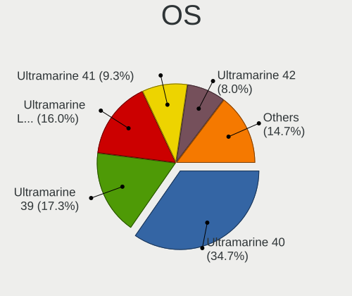

| Name                 | Notebooks | Percent |
|----------------------|-----------|---------|
| Ultramarine 40       | 26        | 34.67%  |
| Ultramarine 39       | 13        | 17.33%  |
| Ultramarine Linux 36 | 12        | 16%     |
| Ultramarine 41       | 7         | 9.33%   |
| Ultramarine 42       | 6         | 8%      |
| Ultramarine 43       | 5         | 6.67%   |
| Ultramarine 38       | 3         | 4%      |
| Ultramarine 37       | 2         | 2.67%   |
| Ultramarine Linux 35 | 1         | 1.33%   |

OS Family
---------

OS without a version

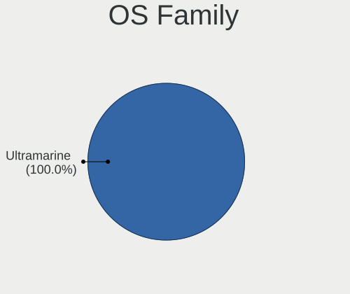

| Name        | Notebooks | Percent |
|-------------|-----------|---------|
| Ultramarine | 74        | 100%    |

Kernel
------

Version of the Linux kernel

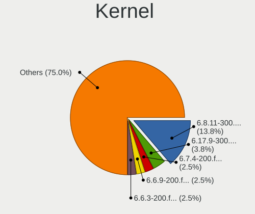

| Version                     | Notebooks | Percent |
|-----------------------------|-----------|---------|
| 6.8.11-300.fc40.x86_64      | 11        | 13.75%  |
| 6.17.9-300.fc43.x86_64      | 3         | 3.75%   |
| 6.7.4-200.fc39.x86_64       | 2         | 2.5%    |
| 6.6.9-200.fc39.x86_64       | 2         | 2.5%    |
| 6.6.3-200.fc39.x86_64       | 2         | 2.5%    |
| 6.17.4-200.fc42.x86_64      | 2         | 2.5%    |
| 6.16.10-200.fc42.x86_64     | 2         | 2.5%    |
| 6.13.10-200.fc41.x86_64     | 2         | 2.5%    |
| 6.10.12-200.fc40.x86_64     | 2         | 2.5%    |
| 6.0.8-200.fc36.x86_64       | 2         | 2.5%    |
| 5.19.4-200.fc36.x86_64      | 2         | 2.5%    |
| 6.9.8-200.fc40.x86_64       | 1         | 1.25%   |
| 6.9.7-200.fc40.x86_64       | 1         | 1.25%   |
| 6.9.5-200.fc40.x86_64       | 1         | 1.25%   |
| 6.9.4-200.fc40.x86_64       | 1         | 1.25%   |
| 6.9.11-200.fc40.x86_64      | 1         | 1.25%   |
| 6.8.9-300.fc40.x86_64       | 1         | 1.25%   |
| 6.8.9-200.fc39.x86_64       | 1         | 1.25%   |
| 6.8.8-300.fc40.x86_64       | 1         | 1.25%   |
| 6.8.6-200.fc39.x86_64       | 1         | 1.25%   |
| 6.8.10-300.fc40.x86_64      | 1         | 1.25%   |
| 6.6.8-200.fc39.x86_64       | 1         | 1.25%   |
| 6.6.2-201.fc39.x86_64       | 1         | 1.25%   |
| 6.6.13-200.fc39.x86_64      | 1         | 1.25%   |
| 6.6.0-61.rog.fc39.x86_64    | 1         | 1.25%   |
| 6.5.8-200.fc38.x86_64       | 1         | 1.25%   |
| 6.5.5-200.fc38.x86_64       | 1         | 1.25%   |
| 6.5.12-300.fc39.x86_64      | 1         | 1.25%   |
| 6.4.4-200.fc38.x86_64       | 1         | 1.25%   |
| 6.2.11-200.fc37.x86_64      | 1         | 1.25%   |
| 6.17.8-300.fc43.x86_64      | 1         | 1.25%   |
| 6.17.7-cachyos1.fc42.x86_64 | 1         | 1.25%   |
| 6.17.5-200.fc42.x86_64      | 1         | 1.25%   |
| 6.17.12-300.fc43.x86_64     | 1         | 1.25%   |
| 6.16.7-200.fc42.x86_64      | 1         | 1.25%   |
| 6.13.8-200.fc41.x86_64      | 1         | 1.25%   |
| 6.13.12-200.fc41.x86_64     | 1         | 1.25%   |
| 6.12.6-200.fc41.x86_64      | 1         | 1.25%   |
| 6.12.10-200.fc41.x86_64     | 1         | 1.25%   |
| 6.11.8-200.fc40.x86_64      | 1         | 1.25%   |

Kernel Family
-------------

Linux kernel without a distro release

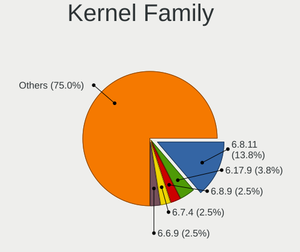

| Version | Notebooks | Percent |
|---------|-----------|---------|
| 6.8.11  | 11        | 13.75%  |
| 6.17.9  | 3         | 3.75%   |
| 6.8.9   | 2         | 2.5%    |
| 6.7.4   | 2         | 2.5%    |
| 6.6.9   | 2         | 2.5%    |
| 6.6.3   | 2         | 2.5%    |
| 6.17.4  | 2         | 2.5%    |
| 6.16.10 | 2         | 2.5%    |
| 6.13.10 | 2         | 2.5%    |
| 6.10.12 | 2         | 2.5%    |
| 6.0.8   | 2         | 2.5%    |
| 5.19.4  | 2         | 2.5%    |
| 6.9.8   | 1         | 1.25%   |
| 6.9.7   | 1         | 1.25%   |
| 6.9.5   | 1         | 1.25%   |
| 6.9.4   | 1         | 1.25%   |
| 6.9.11  | 1         | 1.25%   |
| 6.8.8   | 1         | 1.25%   |
| 6.8.6   | 1         | 1.25%   |
| 6.8.10  | 1         | 1.25%   |
| 6.6.8   | 1         | 1.25%   |
| 6.6.2   | 1         | 1.25%   |
| 6.6.13  | 1         | 1.25%   |
| 6.6.0   | 1         | 1.25%   |
| 6.5.8   | 1         | 1.25%   |
| 6.5.5   | 1         | 1.25%   |
| 6.5.12  | 1         | 1.25%   |
| 6.4.4   | 1         | 1.25%   |
| 6.2.11  | 1         | 1.25%   |
| 6.17.8  | 1         | 1.25%   |
| 6.17.7  | 1         | 1.25%   |
| 6.17.5  | 1         | 1.25%   |
| 6.17.12 | 1         | 1.25%   |
| 6.16.7  | 1         | 1.25%   |
| 6.13.8  | 1         | 1.25%   |
| 6.13.12 | 1         | 1.25%   |
| 6.12.6  | 1         | 1.25%   |
| 6.12.10 | 1         | 1.25%   |
| 6.11.8  | 1         | 1.25%   |
| 6.11.4  | 1         | 1.25%   |

Kernel Major Ver.
-----------------

Linux kernel major version

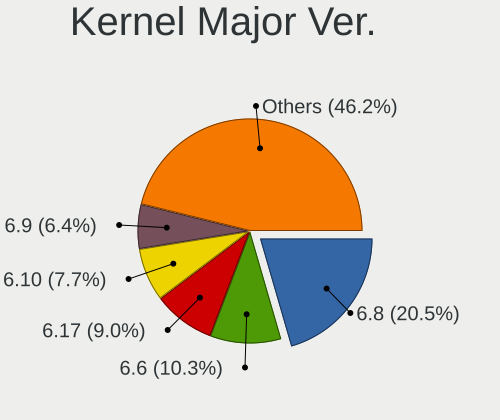

| Version | Notebooks | Percent |
|---------|-----------|---------|
| 6.8     | 16        | 20.51%  |
| 6.6     | 8         | 10.26%  |
| 6.17    | 7         | 8.97%   |
| 6.10    | 6         | 7.69%   |
| 6.9     | 5         | 6.41%   |
| 5.19    | 5         | 6.41%   |
| 6.13    | 4         | 5.13%   |
| 6.5     | 3         | 3.85%   |
| 6.16    | 3         | 3.85%   |
| 6.11    | 3         | 3.85%   |
| 6.1     | 3         | 3.85%   |
| 5.18    | 3         | 3.85%   |
| 6.7     | 2         | 2.56%   |
| 6.12    | 2         | 2.56%   |
| 6.0     | 2         | 2.56%   |
| 5.17    | 2         | 2.56%   |
| 6.4     | 1         | 1.28%   |
| 6.2     | 1         | 1.28%   |
| 5.16    | 1         | 1.28%   |
| 5.15    | 1         | 1.28%   |

Arch
----

OS architecture (x86_64, i586, etc.)

| Name   | Notebooks | Percent |
|--------|-----------|---------|
| x86_64 | 74        | 100%    |

DE
--

Desktop Environment

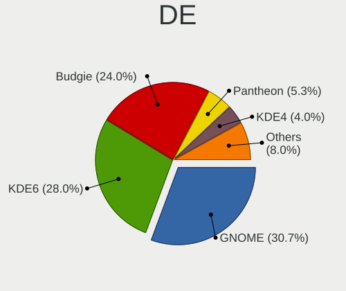

| Name       | Notebooks | Percent |
|------------|-----------|---------|
| GNOME      | 23        | 30.67%  |
| KDE6       | 21        | 28%     |
| Budgie     | 18        | 24%     |
| Pantheon   | 4         | 5.33%   |
| KDE4       | 3         | 4%      |
| KDE5       | 2         | 2.67%   |
| XFCE       | 1         | 1.33%   |
| X-Cinnamon | 1         | 1.33%   |
| sway       | 1         | 1.33%   |
| Cutefish   | 1         | 1.33%   |

Display Server
--------------

X11 or Wayland

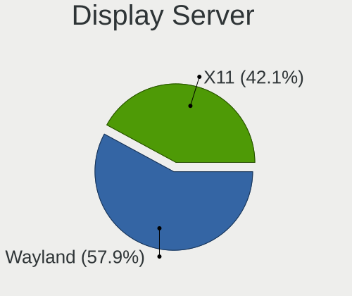

| Name    | Notebooks | Percent |
|---------|-----------|---------|
| Wayland | 44        | 57.89%  |
| X11     | 32        | 42.11%  |

Display Manager
---------------

SDDM, LightDM, etc.

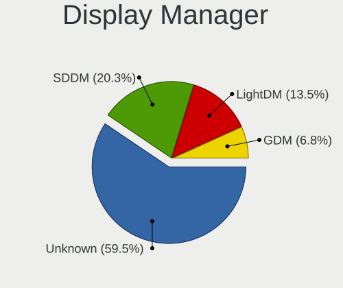

| Name    | Notebooks | Percent |
|---------|-----------|---------|
| Unknown | 44        | 59.46%  |
| SDDM    | 15        | 20.27%  |
| LightDM | 10        | 13.51%  |
| GDM     | 5         | 6.76%   |

OS Lang
-------

Language

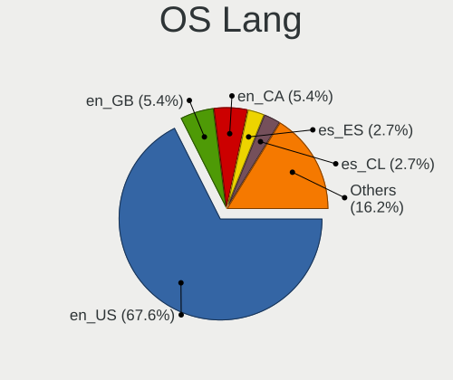

| Lang  | Notebooks | Percent |
|-------|-----------|---------|
| en_US | 50        | 67.57%  |
| en_GB | 4         | 5.41%   |
| en_CA | 4         | 5.41%   |
| es_ES | 2         | 2.7%    |
| es_CL | 2         | 2.7%    |
| en_IN | 2         | 2.7%    |
| de_DE | 2         | 2.7%    |
| ru_RU | 1         | 1.35%   |
| pt_PT | 1         | 1.35%   |
| pt_BR | 1         | 1.35%   |
| nl_BE | 1         | 1.35%   |
| it_IT | 1         | 1.35%   |
| hu_HU | 1         | 1.35%   |
| es_MX | 1         | 1.35%   |
| de_CH | 1         | 1.35%   |

Boot Mode
---------

EFI or BIOS

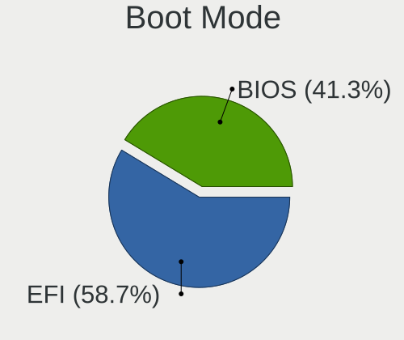

| Mode | Notebooks | Percent |
|------|-----------|---------|
| EFI  | 44        | 58.67%  |
| BIOS | 31        | 41.33%  |

Filesystem
----------

Type of filesystem

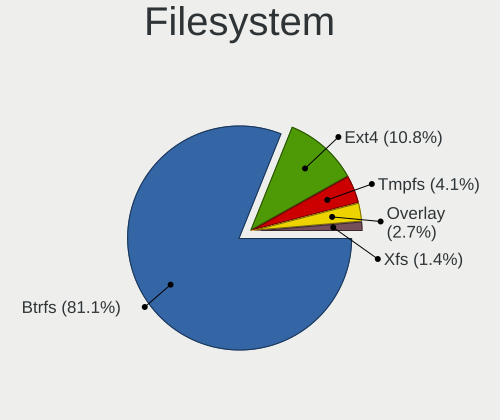

| Type    | Notebooks | Percent |
|---------|-----------|---------|
| Btrfs   | 60        | 81.08%  |
| Ext4    | 8         | 10.81%  |
| Tmpfs   | 3         | 4.05%   |
| Overlay | 2         | 2.7%    |
| Xfs     | 1         | 1.35%   |

Part. scheme
------------

Scheme of partitioning

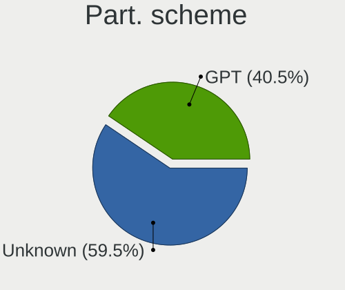

| Type    | Notebooks | Percent |
|---------|-----------|---------|
| Unknown | 44        | 59.46%  |
| GPT     | 30        | 40.54%  |

Dual Boot with Linux/BSD
------------------------

Hosting more than one Linux/BSD

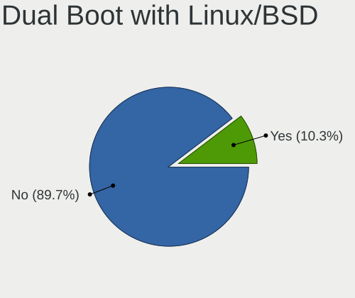

| Dual boot | Notebooks | Percent |
|-----------|-----------|---------|
| No        | 68        | 91.89%  |
| Yes       | 6         | 8.11%   |

Dual Boot (Win)
---------------

Hosting Linux and Windows

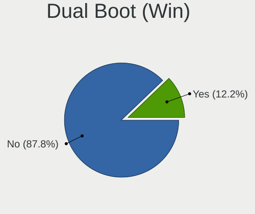

| Dual boot | Notebooks | Percent |
|-----------|-----------|---------|
| No        | 65        | 87.84%  |
| Yes       | 9         | 12.16%  |

Board
-----

Vendor
------

Motherboard manufacturer

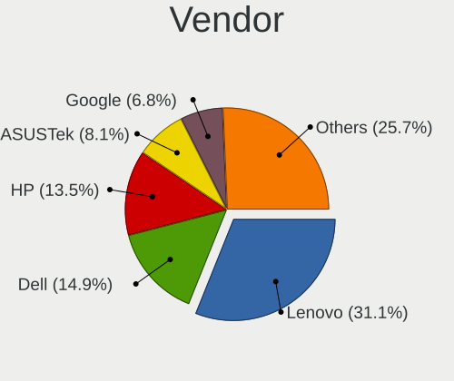

| Name             | Notebooks | Percent |
|------------------|-----------|---------|
| Lenovo           | 23        | 31.08%  |
| Dell             | 11        | 14.86%  |
| Hewlett-Packard  | 10        | 13.51%  |
| ASUSTek Computer | 6         | 8.11%   |
| Google           | 5         | 6.76%   |
| Apple            | 3         | 4.05%   |
| Timi             | 2         | 2.7%    |
| Fujitsu          | 2         | 2.7%    |
| Chuwi            | 2         | 2.7%    |
| Acer             | 2         | 2.7%    |
| Toshiba          | 1         | 1.35%   |
| Sony             | 1         | 1.35%   |
| Razer            | 1         | 1.35%   |
| MSI              | 1         | 1.35%   |
| Infinix          | 1         | 1.35%   |
| GPU Company      | 1         | 1.35%   |
| Framework        | 1         | 1.35%   |
| Unknown          | 1         | 1.35%   |

Model
-----

Motherboard model

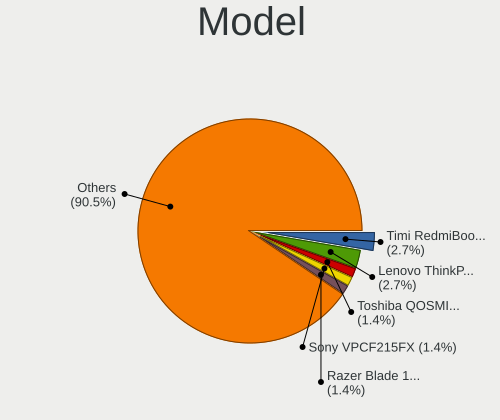

| Name                                             | Notebooks | Percent |
|--------------------------------------------------|-----------|---------|
| Timi RedmiBook 15                                | 2         | 2.7%    |
| Lenovo ThinkPad T480s 20L8S86400                 | 2         | 2.7%    |
| Toshiba QOSMIO X775                              | 1         | 1.35%   |
| Sony VPCF215FX                                   | 1         | 1.35%   |
| Razer Blade 15 Base Model (Mid 2021) - RZ09-0410 | 1         | 1.35%   |
| MSI Creator M16 HX C14VFG                        | 1         | 1.35%   |
| Lenovo Z710 20250                                | 1         | 1.35%   |
| Lenovo ThinkPad T60 2007WHH                      | 1         | 1.35%   |
| Lenovo ThinkPad T495s 20QKS0SD23                 | 1         | 1.35%   |
| Lenovo ThinkPad T450s 20BWS1RT00                 | 1         | 1.35%   |
| Lenovo ThinkPad T430 2349L26                     | 1         | 1.35%   |
| Lenovo ThinkPad P53 20QQS2J700                   | 1         | 1.35%   |
| Lenovo ThinkPad P52s 20LCS0MH00                  | 1         | 1.35%   |
| Lenovo ThinkPad P50 20EQS0VV02                   | 1         | 1.35%   |
| Lenovo ThinkPad P50 20E0S1EWAT                   | 1         | 1.35%   |
| Lenovo ThinkPad P1 Gen 7 21KWS0X000              | 1         | 1.35%   |
| Lenovo ThinkPad L570 20JRS06XGE                  | 1         | 1.35%   |
| Lenovo ThinkPad L570 20J9S34000                  | 1         | 1.35%   |
| Lenovo ThinkPad E15 Gen 2 20TD0018US             | 1         | 1.35%   |
| Lenovo ThinkBook 14 G7 ARP 21MV                  | 1         | 1.35%   |
| Lenovo LOQ 15APH8 82XT                           | 1         | 1.35%   |
| Lenovo IdeaPad S145-14IWL 81MU                   | 1         | 1.35%   |
| Lenovo IdeaPad 1 15ALC7 82R4                     | 1         | 1.35%   |
| Lenovo Flex 2-14 20404                           | 1         | 1.35%   |
| Lenovo B40-80 80LS                               | 1         | 1.35%   |
| Lenovo 330S-15ARR 81FB                           | 1         | 1.35%   |
| Lenovo 14w 81MQ00AVCL                            | 1         | 1.35%   |
| Infinix INBOOK X2 PLUS                           | 1         | 1.35%   |
| HP ProBook 470 G5                                | 1         | 1.35%   |
| HP Pavilion 17                                   | 1         | 1.35%   |
| HP OMEN by Laptop 15-ce0xx                       | 1         | 1.35%   |
| HP Notebook                                      | 1         | 1.35%   |
| HP Laptop 15-fd0xxx                              | 1         | 1.35%   |
| HP Laptop 15-ef2xxx                              | 1         | 1.35%   |
| HP Laptop 14s-dq2xxx                             | 1         | 1.35%   |
| HP EliteBook 845 14 inch G10 Notebook PC         | 1         | 1.35%   |
| HP 245 G5 Notebook PC                            | 1         | 1.35%   |
| HP 240 G7                                        | 1         | 1.35%   |
| GPU Company GWTN156-2BK                          | 1         | 1.35%   |
| Google Nami                                      | 1         | 1.35%   |

Model Family
------------

Motherboard model prefix

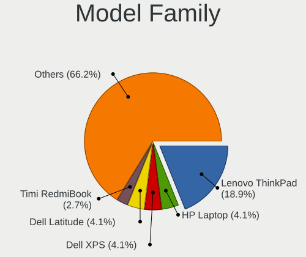

| Name                    | Notebooks | Percent |
|-------------------------|-----------|---------|
| Lenovo ThinkPad         | 14        | 18.92%  |
| HP Laptop               | 3         | 4.05%   |
| Dell XPS                | 3         | 4.05%   |
| Dell Latitude           | 3         | 4.05%   |
| Timi RedmiBook          | 2         | 2.7%    |
| Lenovo IdeaPad          | 2         | 2.7%    |
| Fujitsu LIFEBOOK        | 2         | 2.7%    |
| Dell Precision          | 2         | 2.7%    |
| Dell Inspiron           | 2         | 2.7%    |
| ASUS Zenbook            | 2         | 2.7%    |
| Acer Aspire             | 2         | 2.7%    |
| Toshiba QOSMIO          | 1         | 1.35%   |
| Sony VPCF215FX          | 1         | 1.35%   |
| Razer Blade             | 1         | 1.35%   |
| MSI Creator             | 1         | 1.35%   |
| Lenovo Z710             | 1         | 1.35%   |
| Lenovo ThinkBook        | 1         | 1.35%   |
| Lenovo LOQ              | 1         | 1.35%   |
| Lenovo Flex             | 1         | 1.35%   |
| Lenovo B40-80           | 1         | 1.35%   |
| Lenovo 330S-15ARR       | 1         | 1.35%   |
| Lenovo 14w              | 1         | 1.35%   |
| Infinix INBOOK          | 1         | 1.35%   |
| HP ProBook              | 1         | 1.35%   |
| HP Pavilion             | 1         | 1.35%   |
| HP OMEN                 | 1         | 1.35%   |
| HP Notebook             | 1         | 1.35%   |
| HP EliteBook            | 1         | 1.35%   |
| HP 245                  | 1         | 1.35%   |
| HP 240                  | 1         | 1.35%   |
| GPU Company GWTN156-2BK | 1         | 1.35%   |
| Google Nami             | 1         | 1.35%   |
| Google Fleex            | 1         | 1.35%   |
| Google Eve              | 1         | 1.35%   |
| Google Drobit           | 1         | 1.35%   |
| Google Blooglet         | 1         | 1.35%   |
| Framework Laptop        | 1         | 1.35%   |
| Dell G3                 | 1         | 1.35%   |
| Chuwi GemiBook          | 1         | 1.35%   |
| Chuwi CoreBook          | 1         | 1.35%   |

MFG Year
--------

Motherboard manufacture year

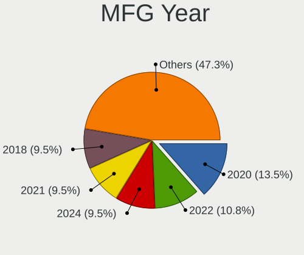

| Year | Notebooks | Percent |
|------|-----------|---------|
| 2020 | 10        | 13.51%  |
| 2022 | 8         | 10.81%  |
| 2024 | 7         | 9.46%   |
| 2021 | 7         | 9.46%   |
| 2018 | 7         | 9.46%   |
| 2019 | 6         | 8.11%   |
| 2012 | 5         | 6.76%   |
| 2023 | 4         | 5.41%   |
| 2017 | 4         | 5.41%   |
| 2016 | 3         | 4.05%   |
| 2015 | 3         | 4.05%   |
| 2014 | 3         | 4.05%   |
| 2013 | 3         | 4.05%   |
| 2011 | 1         | 1.35%   |
| 2010 | 1         | 1.35%   |
| 2009 | 1         | 1.35%   |
| 2006 | 1         | 1.35%   |

Form Factor
-----------

Physical design of the computer

| Name     | Notebooks | Percent |
|----------|-----------|---------|
| Notebook | 74        | 100%    |

Secure Boot
-----------

Enabled or disabled

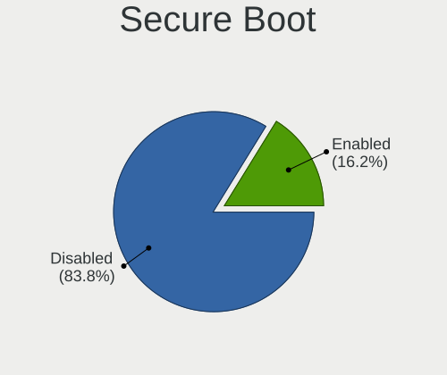

| State    | Notebooks | Percent |
|----------|-----------|---------|
| Disabled | 62        | 83.78%  |
| Enabled  | 12        | 16.22%  |

Coreboot
--------

Have coreboot on board

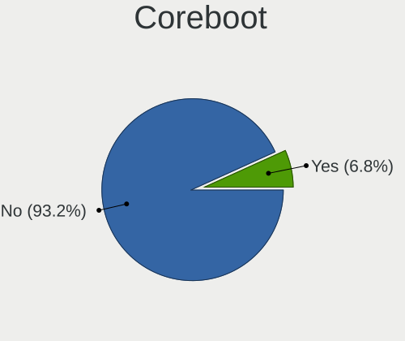

| Used | Notebooks | Percent |
|------|-----------|---------|
| No   | 69        | 93.24%  |
| Yes  | 5         | 6.76%   |

RAM Size
--------

Total RAM memory

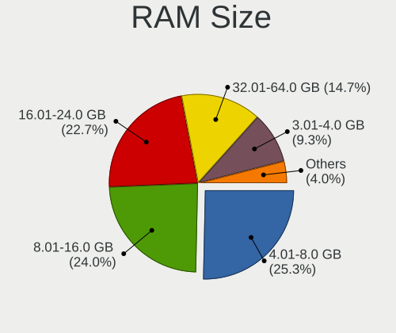

| Size in GB  | Notebooks | Percent |
|-------------|-----------|---------|
| 4.01-8.0    | 19        | 25.33%  |
| 8.01-16.0   | 18        | 24%     |
| 16.01-24.0  | 17        | 22.67%  |
| 32.01-64.0  | 11        | 14.67%  |
| 3.01-4.0    | 7         | 9.33%   |
| 64.01-256.0 | 2         | 2.67%   |
| 2.01-3.0    | 1         | 1.33%   |

RAM Used
--------

Used RAM memory

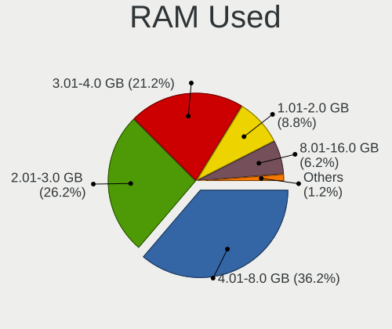

| Used GB    | Notebooks | Percent |
|------------|-----------|---------|
| 4.01-8.0   | 29        | 36.25%  |
| 2.01-3.0   | 21        | 26.25%  |
| 3.01-4.0   | 17        | 21.25%  |
| 1.01-2.0   | 7         | 8.75%   |
| 8.01-16.0  | 5         | 6.25%   |
| 16.01-24.0 | 1         | 1.25%   |

Total Drives
------------

Number of drives on board

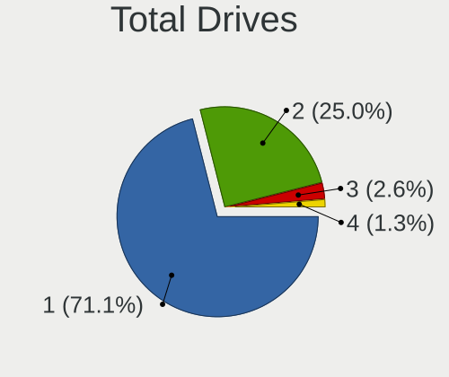

| Drives | Notebooks | Percent |
|--------|-----------|---------|
| 1      | 54        | 71.05%  |
| 2      | 19        | 25%     |
| 3      | 2         | 2.63%   |
| 4      | 1         | 1.32%   |

Has CD-ROM
----------

Has CD-ROM on board

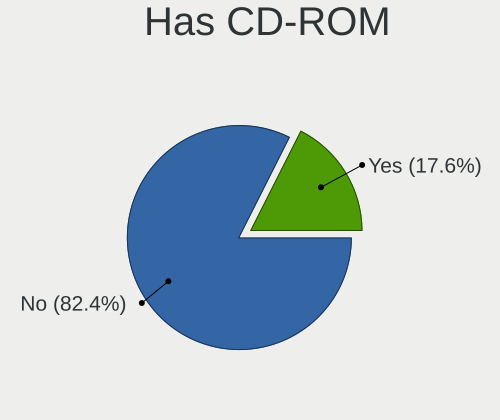

| Presented | Notebooks | Percent |
|-----------|-----------|---------|
| No        | 61        | 82.43%  |
| Yes       | 13        | 17.57%  |

Has Ethernet
------------

Has Ethernet on board

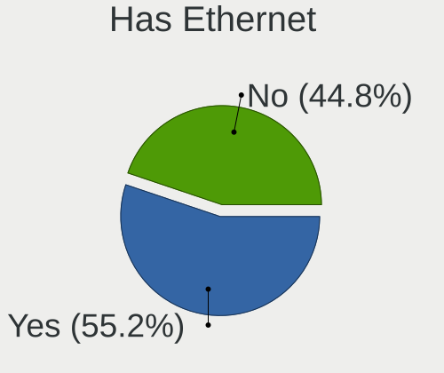

| Presented | Notebooks | Percent |
|-----------|-----------|---------|
| Yes       | 48        | 64.86%  |
| No        | 26        | 35.14%  |

Has WiFi
--------

Has WiFi module

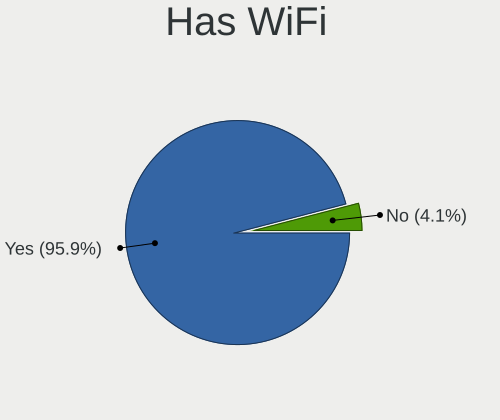

| Presented | Notebooks | Percent |
|-----------|-----------|---------|
| Yes       | 71        | 95.95%  |
| No        | 3         | 4.05%   |

Has Bluetooth
-------------

Has Bluetooth module

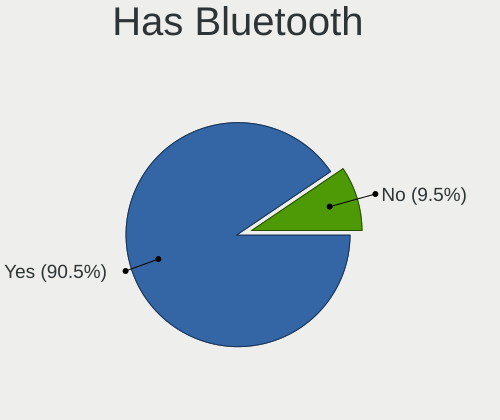

| Presented | Notebooks | Percent |
|-----------|-----------|---------|
| Yes       | 67        | 90.54%  |
| No        | 7         | 9.46%   |

Location
--------

Country
-------

Geographic location (country)

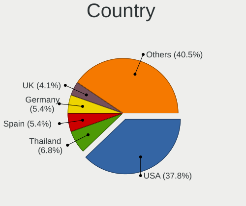

| Country             | Notebooks | Percent |
|---------------------|-----------|---------|
| USA                 | 28        | 37.84%  |
| Thailand            | 5         | 6.76%   |
| Spain               | 4         | 5.41%   |
| Germany             | 4         | 5.41%   |
| UK                  | 3         | 4.05%   |
| India               | 3         | 4.05%   |
| Canada              | 3         | 4.05%   |
| Malaysia            | 2         | 2.7%    |
| Indonesia           | 2         | 2.7%    |
| Chile               | 2         | 2.7%    |
| Belgium             | 2         | 2.7%    |
| Vietnam             | 1         | 1.35%   |
| Trinidad and Tobago | 1         | 1.35%   |
| Syria               | 1         | 1.35%   |
| Switzerland         | 1         | 1.35%   |
| Russia              | 1         | 1.35%   |
| Romania             | 1         | 1.35%   |
| Portugal            | 1         | 1.35%   |
| Poland              | 1         | 1.35%   |
| Mexico              | 1         | 1.35%   |
| Japan               | 1         | 1.35%   |
| Italy               | 1         | 1.35%   |
| Hungary             | 1         | 1.35%   |
| Hong Kong           | 1         | 1.35%   |
| Czechia             | 1         | 1.35%   |
| Brazil              | 1         | 1.35%   |
| Argentina           | 1         | 1.35%   |

City
----

Geographic location (city)

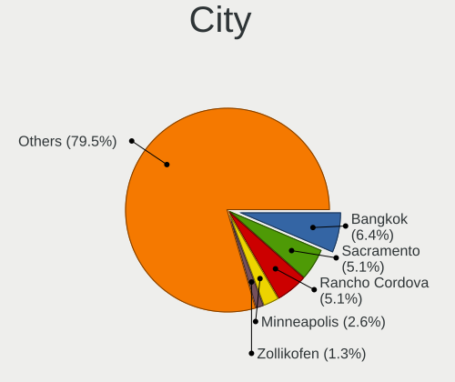

| City                   | Notebooks | Percent |
|------------------------|-----------|---------|
| Bangkok                | 5         | 6.41%   |
| Sacramento             | 4         | 5.13%   |
| Rancho Cordova         | 4         | 5.13%   |
| Minneapolis            | 2         | 2.56%   |
| Zollikofen             | 1         | 1.28%   |
| Wroclaw                | 1         | 1.28%   |
| Wallowa                | 1         | 1.28%   |
| Vohl                   | 1         | 1.28%   |
| Victoria               | 1         | 1.28%   |
| Vegreville             | 1         | 1.28%   |
| Toronto                | 1         | 1.28%   |
| Terrassa               | 1         | 1.28%   |
| Streamwood             | 1         | 1.28%   |
| Skudai                 | 1         | 1.28%   |
| Schwäbisch Hall       | 1         | 1.28%   |
| Santiago               | 1         | 1.28%   |
| San Pedro              | 1         | 1.28%   |
| San Miguel de Tucumán | 1         | 1.28%   |
| Puerto de la Cruz      | 1         | 1.28%   |
| Port Jefferson         | 1         | 1.28%   |
| Phoenix                | 1         | 1.28%   |
| Perm                   | 1         | 1.28%   |
| Paine                  | 1         | 1.28%   |
| Osasco                 | 1         | 1.28%   |
| Ohringen               | 1         | 1.28%   |
| New York               | 1         | 1.28%   |
| Nazareth               | 1         | 1.28%   |
| Mumbai                 | 1         | 1.28%   |
| Mouscron               | 1         | 1.28%   |
| Moncton                | 1         | 1.28%   |
| Millsboro              | 1         | 1.28%   |
| Mesa                   | 1         | 1.28%   |
| Mem Martins            | 1         | 1.28%   |
| Makassar               | 1         | 1.28%   |
| Madrid                 | 1         | 1.28%   |
| Los Angeles            | 1         | 1.28%   |
| Lincoln                | 1         | 1.28%   |
| Lahr                   | 1         | 1.28%   |
| Kuala Lumpur           | 1         | 1.28%   |
| Kanpur                 | 1         | 1.28%   |

Drives
------

Drive Vendor
------------

Hard drive vendors

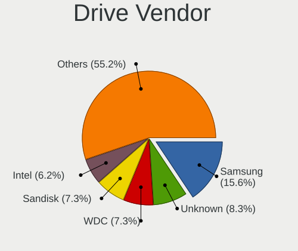

| Vendor                       | Notebooks | Drives | Percent |
|------------------------------|-----------|--------|---------|
| Samsung Electronics          | 15        | 20     | 15.63%  |
| Unknown                      | 8         | 8      | 8.33%   |
| WDC                          | 7         | 8      | 7.29%   |
| Sandisk                      | 7         | 8      | 7.29%   |
| Intel                        | 6         | 7      | 6.25%   |
| Toshiba                      | 5         | 6      | 5.21%   |
| Seagate                      | 5         | 5      | 5.21%   |
| Crucial                      | 5         | 5      | 5.21%   |
| SK hynix                     | 4         | 5      | 4.17%   |
| KIOXIA                       | 4         | 4      | 4.17%   |
| Shenzhen Longsys Electronics | 3         | 3      | 3.13%   |
| Micron/Crucial Technology    | 3         | 6      | 3.13%   |
| Micron Technology            | 3         | 4      | 3.13%   |
| Kingston                     | 3         | 3      | 3.13%   |
| China                        | 3         | 3      | 3.13%   |
| A-DATA Technology            | 2         | 2      | 2.08%   |
| Wibtek                       | 1         | 1      | 1.04%   |
| SABRENT                      | 1         | 1      | 1.04%   |
| PNY                          | 1         | 1      | 1.04%   |
| Phison Electronics           | 1         | 1      | 1.04%   |
| Netac                        | 1         | 1      | 1.04%   |
| MicroDream                   | 1         | 1      | 1.04%   |
| Kingston Technology Company  | 1         | 1      | 1.04%   |
| Fujitsu                      | 1         | 2      | 1.04%   |
| EYOTA                        | 1         | 1      | 1.04%   |
| CT500P3S                     | 1         | 1      | 1.04%   |
| ASMedia                      | 1         | 1      | 1.04%   |
| AMD                          | 1         | 1      | 1.04%   |
| Unknown                      | 1         | 1      | 1.04%   |

Drive Model
-----------

Hard drive models

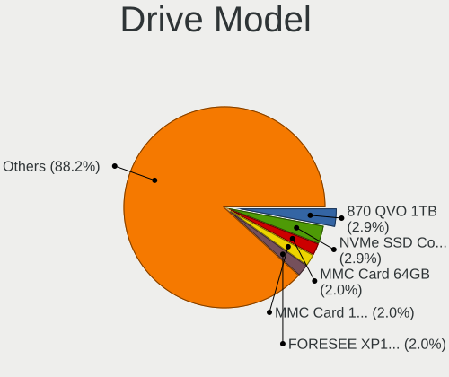

| Model                                                | Notebooks | Percent |
|------------------------------------------------------|-----------|---------|
| Samsung SSD 870 QVO 1TB                              | 3         | 2.94%   |
| Samsung NVMe SSD Controller PM9A1/PM9A3/980PRO 1TB   | 3         | 2.94%   |
| Unknown MMC Card  64GB                               | 2         | 1.96%   |
| Unknown MMC Card  128GB                              | 2         | 1.96%   |
| Shenzhen Longsys FORESEE XP1000F512G 512GB           | 2         | 1.96%   |
| Seagate ST1000LM035-1RK172 1TB                       | 2         | 1.96%   |
| Samsung NVMe SSD Controller SM981/PM981/PM983 1TB    | 2         | 1.96%   |
| Samsung NVMe SSD Controller SM961/PM961/SM963 1024GB | 2         | 1.96%   |
| Micron/Crucial CT1000T500SSD8 1TB                    | 2         | 1.96%   |
| Intel SSD Pro 7600p/760p/E 6100p Series 256GB        | 2         | 1.96%   |
| Wibtek W800S 512GB SSD                               | 1         | 0.98%   |
| WDC WDS250G2B0A-00SM50 250GB SSD                     | 1         | 0.98%   |
| WDC WDS240G2G0B-00EPW0 240GB SSD                     | 1         | 0.98%   |
| WDC WDS240G2G0A-00JH30 240GB SSD                     | 1         | 0.98%   |
| WDC WDBNCE5000PNC 500GB SSD                          | 1         | 0.98%   |
| WDC WD5000LPCX-60VHAT0 500GB                         | 1         | 0.98%   |
| WDC WD10SPZX-60Z10T0 1TB                             | 1         | 0.98%   |
| WDC WD10SPZX-24Z10 1TB                               | 1         | 0.98%   |
| WDC WD10JFCX-68N6GN0 1TB                             | 1         | 0.98%   |
| Unknown NVMe SSD Drive 512GB                         | 1         | 0.98%   |
| Unknown MMC Card  7GB                                | 1         | 0.98%   |
| Unknown MMC Card  4GB                                | 1         | 0.98%   |
| Unknown MMC Card  32GB                               | 1         | 0.98%   |
| Toshiba XG6 NVMe SSD Controller 1024GB               | 1         | 0.98%   |
| Toshiba MQ04ABF100 1TB                               | 1         | 0.98%   |
| Toshiba MK6461GSY 640GB                              | 1         | 0.98%   |
| Toshiba MK5061GSYN 500GB                             | 1         | 0.98%   |
| Toshiba KXG50ZNV256G 256GB                           | 1         | 0.98%   |
| SK hynix SKHynix_HFS001TEJ9X162N 1024GB              | 1         | 0.98%   |
| SK hynix SH920 mSATA 128GB SSD                       | 1         | 0.98%   |
| SK hynix NVMe SSD Drive 512GB                        | 1         | 0.98%   |
| SK hynix HFS128G32TNF-N3A0A 128GB SSD                | 1         | 0.98%   |
| SK hynix BC511 512GB                                 | 1         | 0.98%   |
| Shenzhen Longsys FORESEE VP1000F256G 256GB           | 1         | 0.98%   |
| Seagate ST2000LM003 HN-M201RAD 2TB                   | 1         | 0.98%   |
| Seagate ST1000LM024 HN-M101MBB 1TB                   | 1         | 0.98%   |
| Seagate Expansion 2TB                                | 1         | 0.98%   |
| Sandisk WD PC SN560 SDDPNQE-1T00-1032 1TB            | 1         | 0.98%   |
| Sandisk WD Blue SN570 250GB                          | 1         | 0.98%   |
| Sandisk WD Blue SN570 1TB                            | 1         | 0.98%   |

HDD Vendor
----------

Hard disk drive vendors

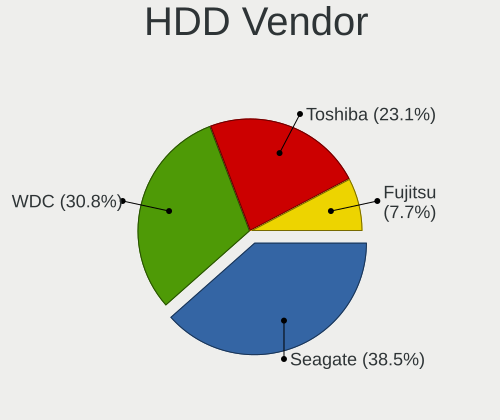

| Vendor  | Notebooks | Drives | Percent |
|---------|-----------|--------|---------|
| Seagate | 5         | 5      | 38.46%  |
| WDC     | 4         | 4      | 30.77%  |
| Toshiba | 3         | 4      | 23.08%  |
| Fujitsu | 1         | 2      | 7.69%   |

SSD Vendor
----------

Solid state drive vendors

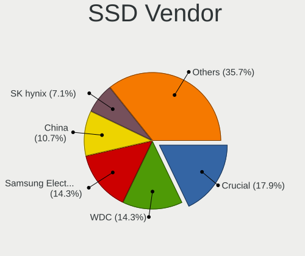

| Vendor              | Notebooks | Drives | Percent |
|---------------------|-----------|--------|---------|
| Crucial             | 5         | 5      | 17.86%  |
| WDC                 | 4         | 4      | 14.29%  |
| Samsung Electronics | 4         | 4      | 14.29%  |
| China               | 3         | 3      | 10.71%  |
| SK hynix            | 2         | 2      | 7.14%   |
| Kingston            | 2         | 2      | 7.14%   |
| A-DATA Technology   | 2         | 2      | 7.14%   |
| Wibtek              | 1         | 1      | 3.57%   |
| SABRENT             | 1         | 1      | 3.57%   |
| PNY                 | 1         | 1      | 3.57%   |
| Netac               | 1         | 1      | 3.57%   |
| MicroDream          | 1         | 1      | 3.57%   |
| EYOTA               | 1         | 1      | 3.57%   |

Drive Kind
----------

HDD or SSD

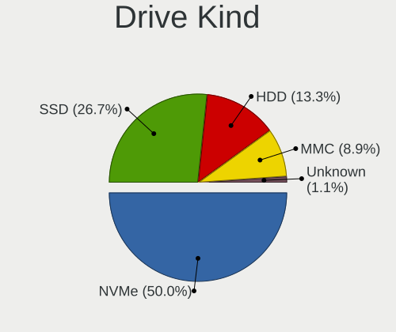

| Kind    | Notebooks | Drives | Percent |
|---------|-----------|--------|---------|
| NVMe    | 45        | 59     | 50%     |
| SSD     | 24        | 28     | 26.67%  |
| HDD     | 12        | 15     | 13.33%  |
| MMC     | 8         | 8      | 8.89%   |
| Unknown | 1         | 1      | 1.11%   |

Drive Connector
---------------

SATA, SAS, NVMe, etc.

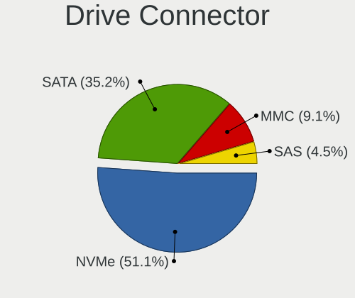

| Type | Notebooks | Drives | Percent |
|------|-----------|--------|---------|
| NVMe | 45        | 58     | 51.14%  |
| SATA | 31        | 40     | 35.23%  |
| MMC  | 8         | 8      | 9.09%   |
| SAS  | 4         | 5      | 4.55%   |

Drive Size
----------

Size of hard drive

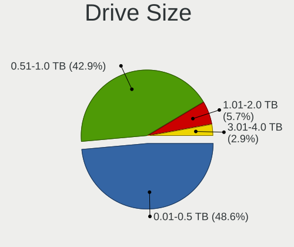

| Size in TB | Notebooks | Drives | Percent |
|------------|-----------|--------|---------|
| 0.01-0.5   | 17        | 23     | 48.57%  |
| 0.51-1.0   | 15        | 17     | 42.86%  |
| 1.01-2.0   | 2         | 2      | 5.71%   |
| 3.01-4.0   | 1         | 1      | 2.86%   |

Space Total
-----------

Amount of disk space available on the file system

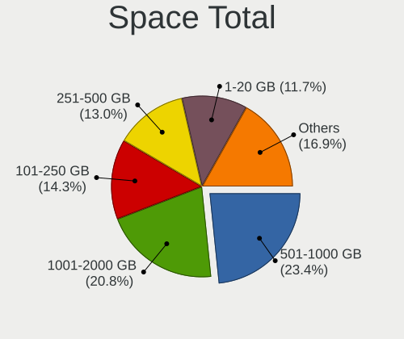

| Size in GB     | Notebooks | Percent |
|----------------|-----------|---------|
| 501-1000       | 18        | 23.38%  |
| 1001-2000      | 16        | 20.78%  |
| 101-250        | 11        | 14.29%  |
| 251-500        | 10        | 12.99%  |
| 1-20           | 9         | 11.69%  |
| Unknown        | 7         | 9.09%   |
| 51-100         | 3         | 3.9%    |
| 2001-3000      | 2         | 2.6%    |
| More than 3000 | 1         | 1.3%    |

Space Used
----------

Amount of used disk space

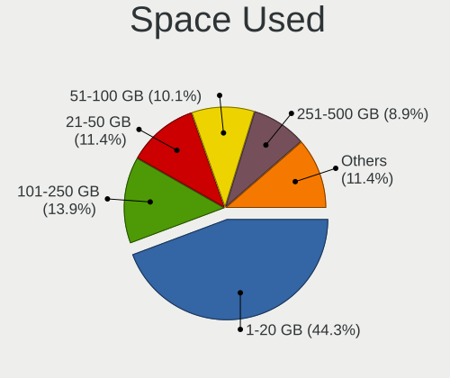

| Used GB   | Notebooks | Percent |
|-----------|-----------|---------|
| 1-20      | 35        | 44.3%   |
| 101-250   | 11        | 13.92%  |
| 21-50     | 9         | 11.39%  |
| 51-100    | 8         | 10.13%  |
| 251-500   | 7         | 8.86%   |
| Unknown   | 7         | 8.86%   |
| 1001-2000 | 1         | 1.27%   |
| 501-1000  | 1         | 1.27%   |

Malfunc. Drives
---------------

Drive models with a malfunction

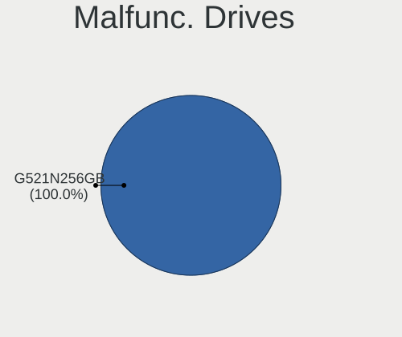

| Model            | Notebooks | Drives | Percent |
|------------------|-----------|--------|---------|
| China G521N256GB | 1         | 1      | 100%    |

Malfunc. Drive Vendor
---------------------

Vendors of faulty drives

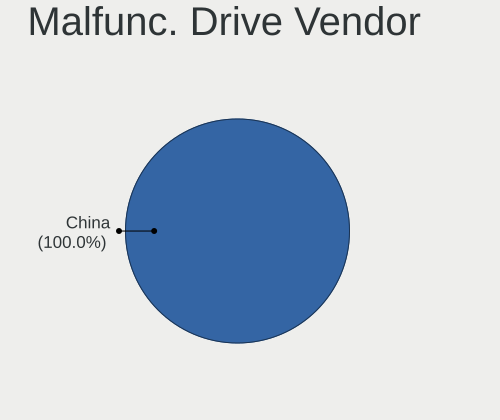

| Vendor | Notebooks | Drives | Percent |
|--------|-----------|--------|---------|
| China  | 1         | 1      | 100%    |

Malfunc. HDD Vendor
-------------------

Vendors of faulty HDD drives

Zero info for selected period =(

Malfunc. Drive Kind
-------------------

Kinds of faulty drives

| Kind | Notebooks | Drives | Percent |
|------|-----------|--------|---------|
| SSD  | 1         | 1      | 100%    |

Failed Drives
-------------

Failed drive models

Zero info for selected period =(

Failed Drive Vendor
-------------------

Failed drive vendors

Zero info for selected period =(

Drive Status
------------

Number of failed and malfunc. drives

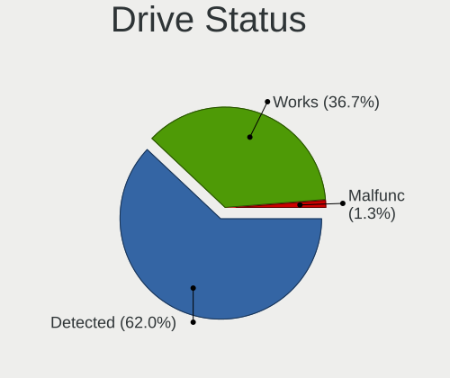

| Status   | Notebooks | Drives | Percent |
|----------|-----------|--------|---------|
| Detected | 49        | 71     | 62.03%  |
| Works    | 29        | 39     | 36.71%  |
| Malfunc  | 1         | 1      | 1.27%   |

Storage controller
------------------

Storage Vendor
--------------

Storage controller vendors

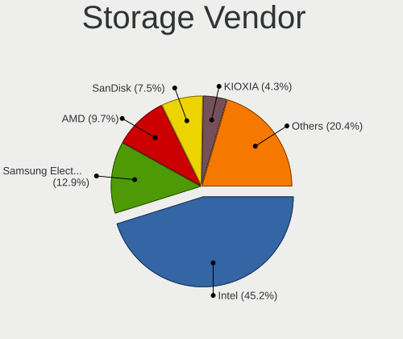

| Vendor                       | Notebooks | Percent |
|------------------------------|-----------|---------|
| Intel                        | 42        | 45.16%  |
| Samsung Electronics          | 12        | 12.9%   |
| AMD                          | 9         | 9.68%   |
| SanDisk                      | 7         | 7.53%   |
| KIOXIA                       | 4         | 4.3%    |
| SK hynix                     | 3         | 3.23%   |
| Shenzhen Longsys Electronics | 3         | 3.23%   |
| Micron/Crucial Technology    | 3         | 3.23%   |
| Micron Technology            | 3         | 3.23%   |
| Toshiba America Info Systems | 2         | 2.15%   |
| Kingston Technology Company  | 2         | 2.15%   |
| Solidigm                     | 1         | 1.08%   |
| Phison Electronics           | 1         | 1.08%   |
| Nvidia                       | 1         | 1.08%   |

Storage Model
-------------

Storage controller models

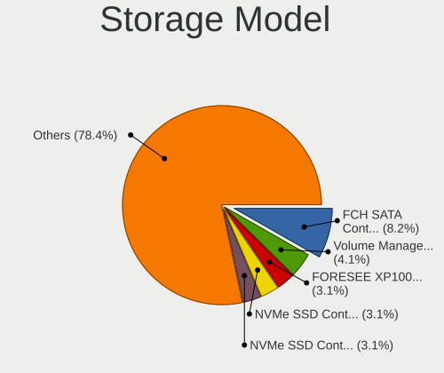

| Model                                                                                                              | Notebooks | Percent |
|--------------------------------------------------------------------------------------------------------------------|-----------|---------|
| AMD FCH SATA Controller [AHCI mode]                                                                                | 8         | 8.25%   |
| Intel Volume Management Device NVMe RAID Controller                                                                | 4         | 4.12%   |
| Shenzhen Longsys FORESEE XP1000 / Lexar Professional CFexpress Type B Gold series, NM620 PCIe NVME SSD (DRAM-less) | 3         | 3.09%   |
| Samsung NVMe SSD Controller SM961/PM961/SM963                                                                      | 3         | 3.09%   |
| Samsung NVMe SSD Controller PM9C1a (DRAM-less)                                                                     | 3         | 3.09%   |
| Samsung NVMe SSD Controller PM9A1/PM9A3/980PRO                                                                     | 3         | 3.09%   |
| Intel Sunrise Point-LP SATA Controller [AHCI mode]                                                                 | 3         | 3.09%   |
| Intel SSD 670p Series [Keystone Harbor]                                                                            | 3         | 3.09%   |
| Intel 8 Series SATA Controller 1 [AHCI mode]                                                                       | 3         | 3.09%   |
| Intel 7 Series Chipset Family 6-port SATA Controller [AHCI mode]                                                   | 3         | 3.09%   |
| Intel 6 Series/C200 Series Chipset Family 6 port Mobile SATA AHCI Controller                                       | 3         | 3.09%   |
| SanDisk WD SN560/SN740/SN770/SN5000 NVMe SSD                                                                       | 2         | 2.06%   |
| SanDisk Ultra 3D / WD Blue SN570 NVMe SSD (DRAM-less)                                                              | 2         | 2.06%   |
| Samsung NVMe SSD Controller SM981/PM981/PM983                                                                      | 2         | 2.06%   |
| Micron/Crucial T500 NVMe PCIe SSD                                                                                  | 2         | 2.06%   |
| KIOXIA NVMe SSD Controller XG8                                                                                     | 2         | 2.06%   |
| Intel Tiger Lake-LP SATA Controller                                                                                | 2         | 2.06%   |
| Intel SSD DC P4101/Pro 7600p/760p/E 6100p Series                                                                   | 2         | 2.06%   |
| Intel Q170/Q150/B150/H170/H110/Z170/CM236 Chipset SATA Controller [AHCI Mode]                                      | 2         | 2.06%   |
| Intel Jasper Lake SATA AHCI Controller                                                                             | 2         | 2.06%   |
| Intel Cannon Point-LP SATA Controller [AHCI Mode]                                                                  | 2         | 2.06%   |
| Intel Cannon Lake Mobile PCH SATA AHCI Controller                                                                  | 2         | 2.06%   |
| Intel 82801 Mobile SATA Controller [RAID mode]                                                                     | 2         | 2.06%   |
| Intel 400 Series Chipset Family SATA AHCI Controller                                                               | 2         | 2.06%   |
| Toshiba America Info Systems XG6 NVMe SSD Controller                                                               | 1         | 1.03%   |
| Toshiba America Info Systems XG5 NVMe SSD Controller                                                               | 1         | 1.03%   |
| Solidigm P41 Plus NVMe SSD (DRAM-less) [Echo Harbor]                                                               | 1         | 1.03%   |
| SK hynix Platinum P41/PC801 NVMe Solid State Drive                                                                 | 1         | 1.03%   |
| SK hynix Gold P31/BC711/PC711 NVMe Solid State Drive                                                               | 1         | 1.03%   |
| SK hynix BC511 NVMe SSD                                                                                            | 1         | 1.03%   |
| SanDisk WD PC SN810 / Black SN850 NVMe SSD                                                                         | 1         | 1.03%   |
| SanDisk Ultra 3D / WD PC SN530, IX SN530, Blue SN550 NVMe SSD (DRAM-less)                                          | 1         | 1.03%   |
| SanDisk Extreme Pro / WD Black SN750 / PC SN730 / Red SN700 NVMe SSD                                               | 1         | 1.03%   |
| Samsung PM971 BGA PCIe x2 NVMe SSD                                                                                 | 1         | 1.03%   |
| Samsung NVMe SSD Controller PM9B1 (DRAM-less)                                                                      | 1         | 1.03%   |
| Phison PS5019-E19 PCIe4 NVMe Controller (DRAM-less)                                                                | 1         | 1.03%   |
| Nvidia MCP79 AHCI Controller                                                                                       | 1         | 1.03%   |
| Micron/Crucial P2 [Nick P2] / P3 / P3 Plus NVMe PCIe SSD (DRAM-less)                                               | 1         | 1.03%   |
| Micron 3400 NVMe SSD [Hendrix]                                                                                     | 1         | 1.03%   |
| Micron 2400 NVMe SSD (DRAM-less)                                                                                   | 1         | 1.03%   |

Storage Kind
------------

Kind of storage controller (IDE, SATA, NVMe, SAS, ...)

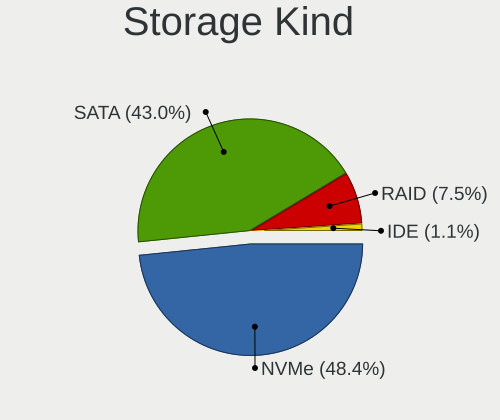

| Kind | Notebooks | Percent |
|------|-----------|---------|
| NVMe | 45        | 48.39%  |
| SATA | 40        | 43.01%  |
| RAID | 7         | 7.53%   |
| IDE  | 1         | 1.08%   |

Processor
---------

CPU Vendor
----------

Processor vendors

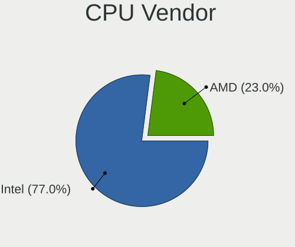

| Vendor | Notebooks | Percent |
|--------|-----------|---------|
| Intel  | 57        | 77.03%  |
| AMD    | 17        | 22.97%  |

CPU Model
---------

Processor models

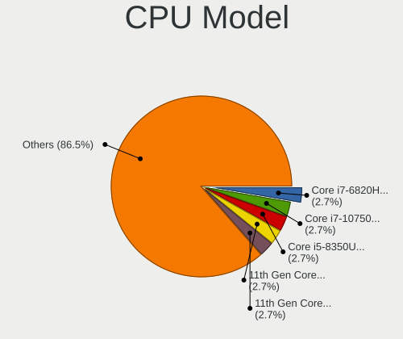

| Model                                   | Notebooks | Percent |
|-----------------------------------------|-----------|---------|
| Intel Core i7-6820HQ CPU @ 2.70GHz      | 2         | 2.7%    |
| Intel Core i7-10750H CPU @ 2.60GHz      | 2         | 2.7%    |
| Intel Core i5-8350U CPU @ 1.70GHz       | 2         | 2.7%    |
| Intel 11th Gen Core i7-1165G7 @ 2.80GHz | 2         | 2.7%    |
| Intel 11th Gen Core i5-1135G7 @ 2.40GHz | 2         | 2.7%    |
| Intel 11th Gen Core i5-11300H @ 3.10GHz | 2         | 2.7%    |
| Intel 11th Gen Core i3-1115G4 @ 3.00GHz | 2         | 2.7%    |
| Intel Xeon E-2176M CPU @ 2.70GHz        | 1         | 1.35%   |
| Intel Pentium CPU N4200 @ 1.10GHz       | 1         | 1.35%   |
| Intel Core Ultra 9 185H                 | 1         | 1.35%   |
| Intel Core i9-14900HX                   | 1         | 1.35%   |
| Intel Core i7-9850H CPU @ 2.60GHz       | 1         | 1.35%   |
| Intel Core i7-8750H CPU @ 2.20GHz       | 1         | 1.35%   |
| Intel Core i7-8650U CPU @ 1.90GHz       | 1         | 1.35%   |
| Intel Core i7-8550U CPU @ 1.80GHz       | 1         | 1.35%   |
| Intel Core i7-7Y75 CPU @ 1.30GHz        | 1         | 1.35%   |
| Intel Core i7-7700HQ CPU @ 2.80GHz      | 1         | 1.35%   |
| Intel Core i7-7500U CPU @ 2.70GHz       | 1         | 1.35%   |
| Intel Core i7-4700MQ CPU @ 2.40GHz      | 1         | 1.35%   |
| Intel Core i7-4500U CPU @ 1.80GHz       | 1         | 1.35%   |
| Intel Core i7-3612QM CPU @ 2.10GHz      | 1         | 1.35%   |
| Intel Core i7-2720QM CPU @ 2.20GHz      | 1         | 1.35%   |
| Intel Core i7-2670QM CPU @ 2.20GHz      | 1         | 1.35%   |
| Intel Core i7-2630QM CPU @ 2.00GHz      | 1         | 1.35%   |
| Intel Core i5-8265U CPU @ 1.60GHz       | 1         | 1.35%   |
| Intel Core i5-8259U CPU @ 2.30GHz       | 1         | 1.35%   |
| Intel Core i5-7200U CPU @ 2.50GHz       | 1         | 1.35%   |
| Intel Core i5-6200U CPU @ 2.30GHz       | 1         | 1.35%   |
| Intel Core i5-5300U CPU @ 2.30GHz       | 1         | 1.35%   |
| Intel Core i5-4310U CPU @ 2.00GHz       | 1         | 1.35%   |
| Intel Core i5-4210U CPU @ 1.70GHz       | 1         | 1.35%   |
| Intel Core i5-3210M CPU @ 2.50GHz       | 1         | 1.35%   |
| Intel Core i5-2430M CPU @ 2.40GHz       | 1         | 1.35%   |
| Intel Core i5-10310U CPU @ 1.70GHz      | 1         | 1.35%   |
| Intel Core i5 CPU M 560 @ 2.67GHz       | 1         | 1.35%   |
| Intel Core i3-8130U CPU @ 2.20GHz       | 1         | 1.35%   |
| Intel Core i3-4005U CPU @ 1.70GHz       | 1         | 1.35%   |
| Intel Core i3-1005G1 CPU @ 1.20GHz      | 1         | 1.35%   |
| Intel Core 2 Duo CPU P7550 @ 2.26GHz    | 1         | 1.35%   |
| Intel Core 2 CPU T7200 @ 2.00GHz        | 1         | 1.35%   |

CPU Model Family
----------------

Processor model prefix

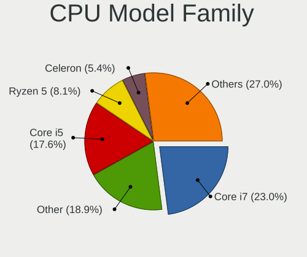

| Model            | Notebooks | Percent |
|------------------|-----------|---------|
| Intel Core i7    | 17        | 22.97%  |
| Other            | 14        | 18.92%  |
| Intel Core i5    | 13        | 17.57%  |
| AMD Ryzen 5      | 6         | 8.11%   |
| Intel Celeron    | 4         | 5.41%   |
| Intel Core i3    | 3         | 4.05%   |
| AMD Ryzen 7      | 3         | 4.05%   |
| AMD Ryzen 7 PRO  | 2         | 2.7%    |
| AMD A6           | 2         | 2.7%    |
| Intel Xeon       | 1         | 1.35%   |
| Intel Pentium    | 1         | 1.35%   |
| Intel Core i9    | 1         | 1.35%   |
| Intel Core 2 Duo | 1         | 1.35%   |
| Intel Core 2     | 1         | 1.35%   |
| Intel Core       | 1         | 1.35%   |
| AMD Ryzen 9      | 1         | 1.35%   |
| AMD Ryzen 3      | 1         | 1.35%   |
| AMD A8           | 1         | 1.35%   |
| AMD A12          | 1         | 1.35%   |

CPU Cores
---------

Number of processor cores

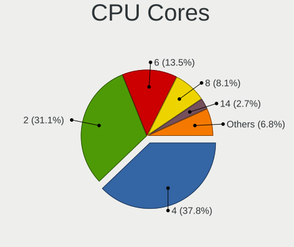

| Number | Notebooks | Percent |
|--------|-----------|---------|
| 4      | 28        | 37.84%  |
| 2      | 23        | 31.08%  |
| 6      | 10        | 13.51%  |
| 8      | 6         | 8.11%   |
| 14     | 2         | 2.7%    |
| 10     | 2         | 2.7%    |
| 24     | 1         | 1.35%   |
| 16     | 1         | 1.35%   |
| 12     | 1         | 1.35%   |

CPU Sockets
-----------

Number of sockets

| Number | Notebooks | Percent |
|--------|-----------|---------|
| 1      | 74        | 100%    |

CPU Threads
-----------

Threads per core (Hyper-Threading)

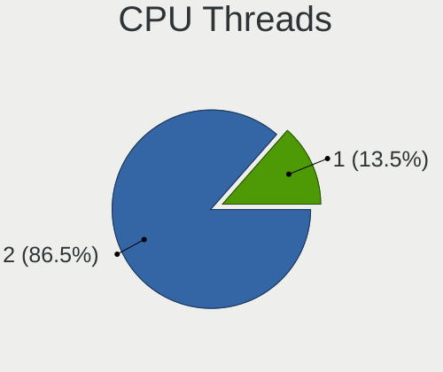

| Number | Notebooks | Percent |
|--------|-----------|---------|
| 2      | 64        | 86.49%  |
| 1      | 10        | 13.51%  |

CPU Op-Modes
------------

CPU Operation Modes (32-bit, 64-bit)

| Op mode        | Notebooks | Percent |
|----------------|-----------|---------|
| 32-bit, 64-bit | 74        | 100%    |

CPU Microcode
-------------

Microcode number

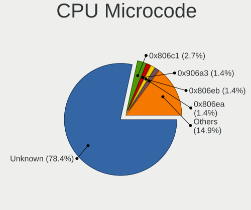

| Number     | Notebooks | Percent |
|------------|-----------|---------|
| Unknown    | 58        | 78.38%  |
| 0x806c1    | 2         | 2.7%    |
| 0x906a3    | 1         | 1.35%   |
| 0x806eb    | 1         | 1.35%   |
| 0x806ea    | 1         | 1.35%   |
| 0x706e5    | 1         | 1.35%   |
| 0x706a1    | 1         | 1.35%   |
| 0x506e3    | 1         | 1.35%   |
| 0x40651    | 1         | 1.35%   |
| 0x306a9    | 1         | 1.35%   |
| 0x206a7    | 1         | 1.35%   |
| 0x0a50000c | 1         | 1.35%   |
| 0x08600103 | 1         | 1.35%   |
| 0x07030105 | 1         | 1.35%   |
| 0x06006705 | 1         | 1.35%   |
| 0x06006118 | 1         | 1.35%   |

CPU Microarch
-------------

Microarchitecture

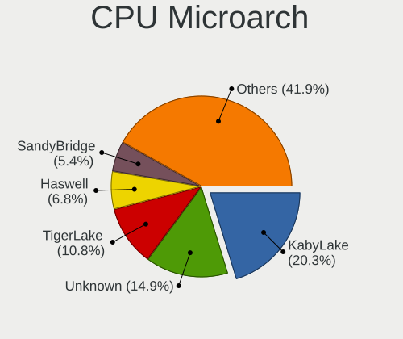

| Name             | Notebooks | Percent |
|------------------|-----------|---------|
| KabyLake         | 15        | 20.27%  |
| Unknown          | 11        | 14.86%  |
| TigerLake        | 8         | 10.81%  |
| Haswell          | 5         | 6.76%   |
| SandyBridge      | 4         | 5.41%   |
| Alderlake Hybrid | 4         | 5.41%   |
| Skylake          | 3         | 4.05%   |
| Zen+             | 2         | 2.7%    |
| Zen 3            | 2         | 2.7%    |
| Tremont          | 2         | 2.7%    |
| Puma             | 2         | 2.7%    |
| IvyBridge        | 2         | 2.7%    |
| Goldmont plus    | 2         | 2.7%    |
| Excavator        | 2         | 2.7%    |
| CometLake        | 2         | 2.7%    |
| Zen 2            | 1         | 1.35%   |
| Zen              | 1         | 1.35%   |
| Westmere         | 1         | 1.35%   |
| Penryn           | 1         | 1.35%   |
| IceLake          | 1         | 1.35%   |
| Goldmont         | 1         | 1.35%   |
| Core             | 1         | 1.35%   |
| Broadwell        | 1         | 1.35%   |

Graphics
--------

GPU Vendor
----------

Vendors of graphics cards

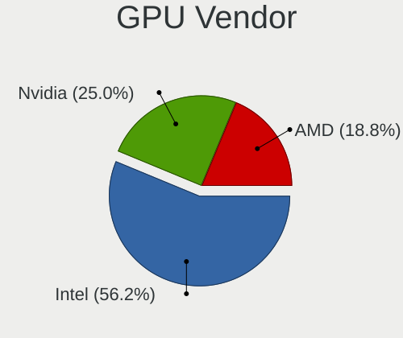

| Vendor | Notebooks | Percent |
|--------|-----------|---------|
| Intel  | 54        | 56.25%  |
| Nvidia | 24        | 25%     |
| AMD    | 18        | 18.75%  |

GPU Model
---------

Graphics card models

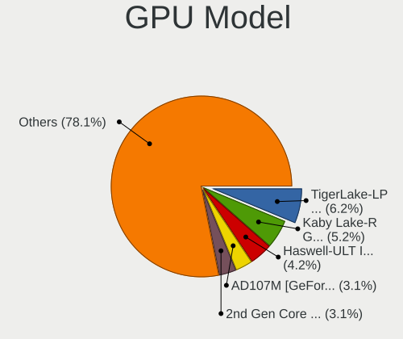

| Model                                                                     | Notebooks | Percent |
|---------------------------------------------------------------------------|-----------|---------|
| Intel TigerLake-LP GT2 [Iris Xe Graphics]                                 | 6         | 6.25%   |
| Intel Kaby Lake-R GT2 [UHD Graphics 620]                                  | 5         | 5.21%   |
| Intel Haswell-ULT Integrated Graphics Controller                          | 4         | 4.17%   |
| Nvidia AD107M [GeForce RTX 4060 Max-Q / Mobile]                           | 3         | 3.13%   |
| Intel 2nd Generation Core Processor Family Integrated Graphics Controller | 3         | 3.13%   |
| Nvidia TU117M [GeForce GTX 1650 Ti Mobile]                                | 2         | 2.08%   |
| Nvidia GM107GLM [Quadro M1000M]                                           | 2         | 2.08%   |
| Intel Tiger Lake-LP GT2 [UHD Graphics G4]                                 | 2         | 2.08%   |
| Intel Skylake-H GT2 [HD Graphics 530]                                     | 2         | 2.08%   |
| Intel Raptor Lake-P [Iris Xe Graphics]                                    | 2         | 2.08%   |
| Intel Kaby Lake-U GT2 [HD Graphics 620]                                   | 2         | 2.08%   |
| Intel JasperLake [UHD Graphics]                                           | 2         | 2.08%   |
| Intel GeminiLake [UHD Graphics 600]                                       | 2         | 2.08%   |
| Intel CometLake-H GT2 [UHD Graphics]                                      | 2         | 2.08%   |
| Intel CoffeeLake-H GT2 [UHD Graphics 630]                                 | 2         | 2.08%   |
| Intel Alder Lake-P GT2 [Iris Xe Graphics]                                 | 2         | 2.08%   |
| Intel 3rd Gen Core processor Graphics Controller                          | 2         | 2.08%   |
| AMD Picasso/Raven 2 [Radeon Vega Series / Radeon Vega Mobile Series]      | 2         | 2.08%   |
| AMD Phoenix1                                                              | 2         | 2.08%   |
| AMD Mullins [Radeon R4/R5 Graphics]                                       | 2         | 2.08%   |
| AMD Lucienne                                                              | 2         | 2.08%   |
| AMD Barcelo                                                               | 2         | 2.08%   |
| Nvidia TU117M [GeForce GTX 1650 Mobile / Max-Q]                           | 1         | 1.04%   |
| Nvidia TU106GLM [Quadro RTX 3000 Mobile / Max-Q]                          | 1         | 1.04%   |
| Nvidia GP108GLM [Quadro P500 Mobile]                                      | 1         | 1.04%   |
| Nvidia GP107M [GeForce GTX 1050 Ti Mobile]                                | 1         | 1.04%   |
| Nvidia GP107M [GeForce GTX 1050 Mobile]                                   | 1         | 1.04%   |
| Nvidia GP107GLM [Quadro P2000 Mobile]                                     | 1         | 1.04%   |
| Nvidia GM108M [GeForce 930MX]                                             | 1         | 1.04%   |
| Nvidia GK107M [GeForce GT 745M]                                           | 1         | 1.04%   |
| Nvidia GF117M [GeForce 610M/710M/810M/820M / GT 620M/625M/630M/720M]      | 1         | 1.04%   |
| Nvidia GF116M [GeForce GT 560M]                                           | 1         | 1.04%   |
| Nvidia GF108M [GeForce GT 540M]                                           | 1         | 1.04%   |
| Nvidia GA107M [GeForce RTX 3050 Mobile]                                   | 1         | 1.04%   |
| Nvidia GA107GLM [RTX A2000 8GB Laptop GPU]                                | 1         | 1.04%   |
| Nvidia GA104M [GeForce RTX 3070 Mobile / Max-Q]                           | 1         | 1.04%   |
| Nvidia C79 [GeForce 9400M]                                                | 1         | 1.04%   |
| Nvidia AD107M [GeForce RTX 4050 Max-Q / Mobile]                           | 1         | 1.04%   |
| Nvidia AD107GLM [RTX 2000 Ada Generation Laptop GPU]                      | 1         | 1.04%   |
| Intel WhiskeyLake-U GT2 [UHD Graphics 620]                                | 1         | 1.04%   |

GPU Combo
---------

Combinations of graphics cards

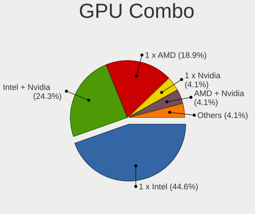

| Name           | Notebooks | Percent |
|----------------|-----------|---------|
| 1 x Intel      | 33        | 44.59%  |
| Intel + Nvidia | 18        | 24.32%  |
| 1 x AMD        | 14        | 18.92%  |
| 1 x Nvidia     | 3         | 4.05%   |
| AMD + Nvidia   | 3         | 4.05%   |
| Other          | 2         | 2.7%    |
| Intel + AMD    | 1         | 1.35%   |

GPU Driver
----------

Free vs proprietary

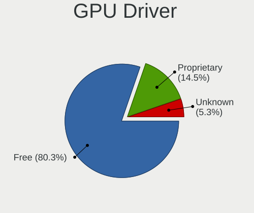

| Driver      | Notebooks | Percent |
|-------------|-----------|---------|
| Free        | 61        | 80.26%  |
| Proprietary | 11        | 14.47%  |
| Unknown     | 4         | 5.26%   |

GPU Memory
----------

Total video memory

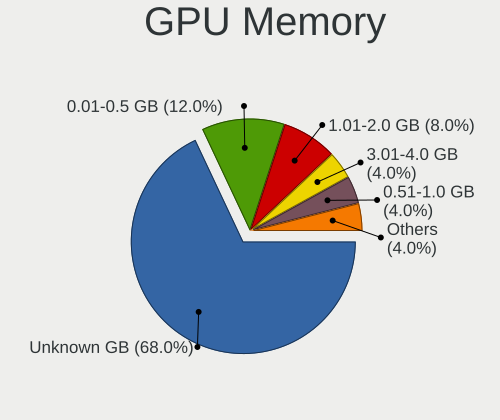

| Size in GB | Notebooks | Percent |
|------------|-----------|---------|
| Unknown    | 51        | 68%     |
| 0.01-0.5   | 9         | 12%     |
| 1.01-2.0   | 6         | 8%      |
| 3.01-4.0   | 3         | 4%      |
| 0.51-1.0   | 3         | 4%      |
| 7.01-8.0   | 2         | 2.67%   |
| 5.01-6.0   | 1         | 1.33%   |

Monitor
-------

Monitor Vendor
--------------

Monitor vendors

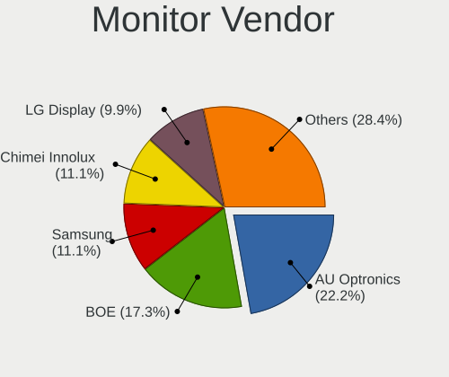

| Vendor                  | Notebooks | Percent |
|-------------------------|-----------|---------|
| AU Optronics            | 18        | 22.22%  |
| BOE                     | 14        | 17.28%  |
| Samsung Electronics     | 9         | 11.11%  |
| Chimei Innolux          | 9         | 11.11%  |
| LG Display              | 8         | 9.88%   |
| Sharp                   | 5         | 6.17%   |
| PANDA                   | 3         | 3.7%    |
| Lenovo                  | 3         | 3.7%    |
| Apple                   | 3         | 3.7%    |
| Goldstar                | 2         | 2.47%   |
| Philips                 | 1         | 1.23%   |
| InfoVision              | 1         | 1.23%   |
| HannStar                | 1         | 1.23%   |
| EXP                     | 1         | 1.23%   |
| Dell                    | 1         | 1.23%   |
| CSOT                    | 1         | 1.23%   |
| Chi Mei Optoelectronics | 1         | 1.23%   |

Monitor Model
-------------

Monitor models

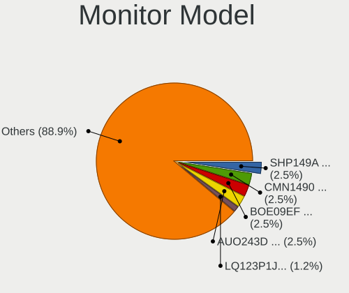

| Model                                                                  | Notebooks | Percent |
|------------------------------------------------------------------------|-----------|---------|
| Sharp LCD Monitor SHP149A 1920x1080 344x194mm 15.5-inch                | 2         | 2.47%   |
| Chimei Innolux LCD Monitor CMN1490 1366x768 309x174mm 14.0-inch        | 2         | 2.47%   |
| BOE LCD Monitor BOE09EF 1920x1080 344x194mm 15.5-inch                  | 2         | 2.47%   |
| AU Optronics LCD Monitor AUO243D 1920x1080 309x173mm 13.9-inch         | 2         | 2.47%   |
| Sharp LQ123P1JX32 SHP148A 2400x1600 259x173mm 12.3-inch                | 1         | 1.23%   |
| Sharp LCD Monitor SHP1516 3840x2400 336x210mm 15.6-inch                | 1         | 1.23%   |
| Sharp LCD Monitor SHP14D0 3840x2400 336x210mm 15.6-inch                | 1         | 1.23%   |
| Samsung Electronics S24B300 SAM08CC 1920x1080 521x293mm 23.5-inch      | 1         | 1.23%   |
| Samsung Electronics S22R35x SAM103A 1920x1080 476x268mm 21.5-inch      | 1         | 1.23%   |
| Samsung Electronics LCD Monitor SEC5441 1280x800 331x207mm 15.4-inch   | 1         | 1.23%   |
| Samsung Electronics LCD Monitor SEC3442 1366x768 344x194mm 15.5-inch   | 1         | 1.23%   |
| Samsung Electronics LCD Monitor SDC5441 1366x768 344x193mm 15.5-inch   | 1         | 1.23%   |
| Samsung Electronics LCD Monitor SDC4171 2880x1800 302x189mm 14.0-inch  | 1         | 1.23%   |
| Samsung Electronics LCD Monitor SDC414D 3456x2160 336x210mm 15.6-inch  | 1         | 1.23%   |
| Samsung Electronics LCD Monitor SDC4141 1366x768 344x194mm 15.5-inch   | 1         | 1.23%   |
| Samsung Electronics ATNA40CU05-0 SDC419C 2880x1800 302x189mm 14.0-inch | 1         | 1.23%   |
| Philips PHL BDM3270 PHL08E7 2560x1440 708x398mm 32.0-inch              | 1         | 1.23%   |
| PANDA LCD Monitor NCP004D 1920x1080 344x194mm 15.5-inch                | 1         | 1.23%   |
| PANDA LCD Monitor NCP004B 1920x1080 344x194mm 15.5-inch                | 1         | 1.23%   |
| PANDA LCD Monitor NCP0036 1920x1080 344x194mm 15.5-inch                | 1         | 1.23%   |
| LG Display LCD Monitor LGD058C 1920x1080 344x194mm 15.5-inch           | 1         | 1.23%   |
| LG Display LCD Monitor LGD0538 1920x1080 344x194mm 15.5-inch           | 1         | 1.23%   |
| LG Display LCD Monitor LGD04A7 1920x1080 344x194mm 15.5-inch           | 1         | 1.23%   |
| LG Display LCD Monitor LGD046D 1920x1080 309x174mm 14.0-inch           | 1         | 1.23%   |
| LG Display LCD Monitor LGD0446 1920x1080 309x174mm 14.0-inch           | 1         | 1.23%   |
| LG Display LCD Monitor LGD0372 1600x900 382x215mm 17.3-inch            | 1         | 1.23%   |
| LG Display LCD Monitor LGD0362 1600x900 309x174mm 14.0-inch            | 1         | 1.23%   |
| LG Display LCD Monitor LGD0354 1366x768 293x165mm 13.2-inch            | 1         | 1.23%   |
| Lenovo LCD Monitor LEN40BA 1920x1080 344x194mm 15.5-inch               | 1         | 1.23%   |
| Lenovo LCD Monitor LEN40A9 1920x1080 309x173mm 13.9-inch               | 1         | 1.23%   |
| Lenovo LCD Monitor LEN4020 1024x768 286x214mm 14.1-inch                | 1         | 1.23%   |
| InfoVision LCD Monitor IVO048E 1366x768 256x144mm 11.6-inch            | 1         | 1.23%   |
| HannStar HE225ANB HSD0566 1920x1080 477x268mm 21.5-inch                | 1         | 1.23%   |
| Goldstar ULTRAFINE GSM5BC1 3840x2160 600x340mm 27.2-inch               | 1         | 1.23%   |
| Goldstar FULL HD GSM5AB9 1920x1080 480x270mm 21.7-inch                 | 1         | 1.23%   |
| EXP HDMI to VGA EXP0074 1280x720 304x228mm 15.0-inch                   | 1         | 1.23%   |
| Dell AW3423DWF DELA211 3440x1440 800x337mm 34.2-inch                   | 1         | 1.23%   |
| CSOT LCD Monitor CSO160B 2560x1600 345x215mm 16.0-inch                 | 1         | 1.23%   |
| Chimei Innolux P140ZKA-BZ1 CMN8C03 2160x1440 296x197mm 14.0-inch       | 1         | 1.23%   |
| Chimei Innolux LCD Monitor CMN162F 2560x1600 344x215mm 16.0-inch       | 1         | 1.23%   |

Monitor Resolution
------------------

Monitor screen resolution

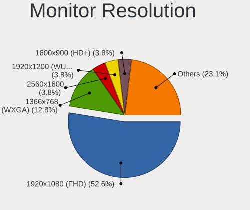

| Resolution        | Notebooks | Percent |
|-------------------|-----------|---------|
| 1920x1080 (FHD)   | 41        | 52.56%  |
| 1366x768 (WXGA)   | 10        | 12.82%  |
| 2560x1600         | 3         | 3.85%   |
| 1920x1200 (WUXGA) | 3         | 3.85%   |
| 1600x900 (HD+)    | 3         | 3.85%   |
| 3840x2400         | 2         | 2.56%   |
| 3840x2160 (4K)    | 2         | 2.56%   |
| 2880x1800         | 2         | 2.56%   |
| 2160x1440         | 2         | 2.56%   |
| 1280x800 (WXGA)   | 2         | 2.56%   |
| 3456x2160         | 1         | 1.28%   |
| 3440x1440         | 1         | 1.28%   |
| 3072x1920         | 1         | 1.28%   |
| 2560x1440 (QHD)   | 1         | 1.28%   |
| 2400x1600         | 1         | 1.28%   |
| 2256x1504         | 1         | 1.28%   |
| 1280x720 (HD)     | 1         | 1.28%   |
| 1024x768 (XGA)    | 1         | 1.28%   |

Monitor Diagonal
----------------

Diagonal size in inches

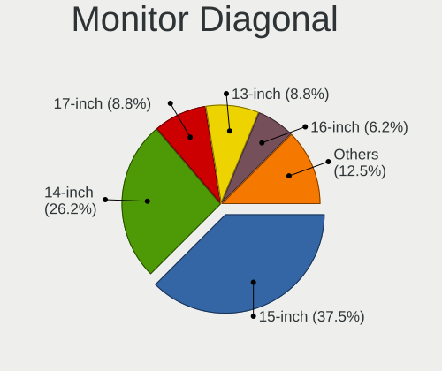

| Inches | Notebooks | Percent |
|--------|-----------|---------|
| 15     | 30        | 37.5%   |
| 14     | 21        | 26.25%  |
| 17     | 7         | 8.75%   |
| 13     | 7         | 8.75%   |
| 16     | 5         | 6.25%   |
| 21     | 3         | 3.75%   |
| 12     | 2         | 2.5%    |
| 34     | 1         | 1.25%   |
| 32     | 1         | 1.25%   |
| 31     | 1         | 1.25%   |
| 23     | 1         | 1.25%   |
| 11     | 1         | 1.25%   |

Monitor Width
-------------

Physical width

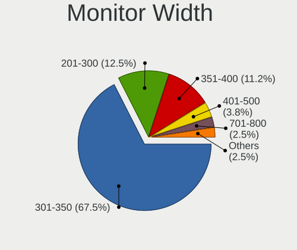

| Width in mm | Notebooks | Percent |
|-------------|-----------|---------|
| 301-350     | 54        | 67.5%   |
| 201-300     | 10        | 12.5%   |
| 351-400     | 9         | 11.25%  |
| 401-500     | 3         | 3.75%   |
| 701-800     | 2         | 2.5%    |
| 601-700     | 1         | 1.25%   |
| 501-600     | 1         | 1.25%   |

Aspect Ratio
------------

Proportional relationship between the width and the height

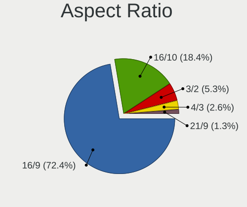

| Ratio | Notebooks | Percent |
|-------|-----------|---------|
| 16/9  | 55        | 72.37%  |
| 16/10 | 14        | 18.42%  |
| 3/2   | 4         | 5.26%   |
| 4/3   | 2         | 2.63%   |
| 21/9  | 1         | 1.32%   |

Monitor Area
------------

Area in inch²

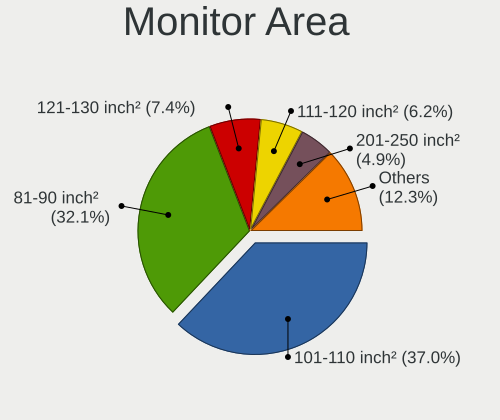

| Area in inch² | Notebooks | Percent |
|----------------|-----------|---------|
| 101-110        | 30        | 37.04%  |
| 81-90          | 26        | 32.1%   |
| 121-130        | 6         | 7.41%   |
| 111-120        | 5         | 6.17%   |
| 201-250        | 4         | 4.94%   |
| 351-500        | 3         | 3.7%    |
| 61-70          | 2         | 2.47%   |
| 71-80          | 1         | 1.23%   |
| 51-60          | 1         | 1.23%   |
| 151-200        | 1         | 1.23%   |
| 131-140        | 1         | 1.23%   |
| 91-100         | 1         | 1.23%   |

Pixel Density
-------------

Pixels per inch

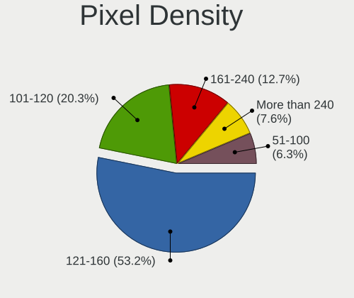

| Density       | Notebooks | Percent |
|---------------|-----------|---------|
| 121-160       | 42        | 53.16%  |
| 101-120       | 16        | 20.25%  |
| 161-240       | 10        | 12.66%  |
| More than 240 | 6         | 7.59%   |
| 51-100        | 5         | 6.33%   |

Multiple Monitors
-----------------

Total monitors connected

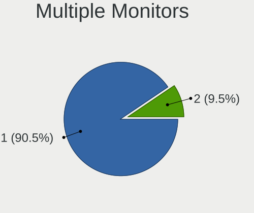

| Total | Notebooks | Percent |
|-------|-----------|---------|
| 1     | 67        | 90.54%  |
| 2     | 7         | 9.46%   |

Network
-------

Net Controller Vendor
---------------------

Controller vendors

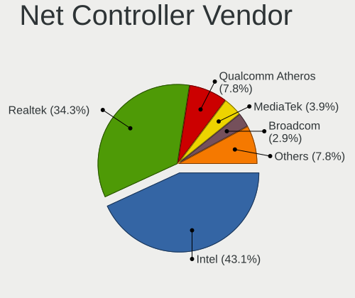

| Vendor                     | Notebooks | Percent |
|----------------------------|-----------|---------|
| Intel                      | 44        | 43.14%  |
| Realtek Semiconductor      | 35        | 34.31%  |
| Qualcomm Atheros           | 8         | 7.84%   |
| MediaTek                   | 4         | 3.92%   |
| Broadcom                   | 3         | 2.94%   |
| Samsung Electronics        | 2         | 1.96%   |
| Xiaomi                     | 1         | 0.98%   |
| Sierra Wireless            | 1         | 0.98%   |
| Shenzhen Goodix Technology | 1         | 0.98%   |
| Nvidia                     | 1         | 0.98%   |
| NetGear                    | 1         | 0.98%   |
| Broadcom Limited           | 1         | 0.98%   |

Net Controller Model
--------------------

Controller models

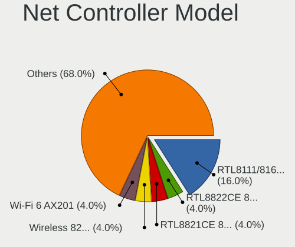

| Model                                                                  | Notebooks | Percent |
|------------------------------------------------------------------------|-----------|---------|
| Realtek RTL8111/8168/8211/8411 PCI Express Gigabit Ethernet Controller | 20        | 16%     |
| Realtek RTL8822CE 802.11ac PCIe Wireless Network Adapter               | 5         | 4%      |
| Realtek RTL8821CE 802.11ac PCIe Wireless Network Adapter               | 5         | 4%      |
| Intel Wireless 8265 / 8275                                             | 5         | 4%      |
| Intel Wi-Fi 6 AX201                                                    | 5         | 4%      |
| Intel Wireless 8260                                                    | 4         | 3.2%    |
| Intel Wireless 7265                                                    | 4         | 3.2%    |
| Realtek RTL8852BE PCIe 802.11ax Wireless Network Controller            | 3         | 2.4%    |
| Realtek RTL810xE PCI Express Fast Ethernet controller                  | 3         | 2.4%    |
| Qualcomm Atheros QCA6174 802.11ac Wireless Network Adapter             | 3         | 2.4%    |
| MediaTek MT7922 802.11ax PCI Express Wireless Network Adapter          | 3         | 2.4%    |
| Intel Wireless 7260                                                    | 3         | 2.4%    |
| Intel Ethernet Connection (4) I219-LM                                  | 3         | 2.4%    |
| Realtek RTL8188EE Wireless Network Adapter                             | 2         | 1.6%    |
| Realtek RTL8153 Gigabit Ethernet Adapter                               | 2         | 1.6%    |
| Realtek RTL8152 Fast Ethernet Adapter                                  | 2         | 1.6%    |
| Intel Wi-Fi 6E(802.11ax) AX210/AX1675* 2x2 [Typhoon Peak]              | 2         | 1.6%    |
| Intel Wi-Fi 6 AX200                                                    | 2         | 1.6%    |
| Intel Wi-Fi 5(802.11ac) Wireless-AC 9x6x [Thunder Peak]                | 2         | 1.6%    |
| Intel Ethernet Connection (2) I219-LM                                  | 2         | 1.6%    |
| Intel Comet Lake PCH CNVi WiFi                                         | 2         | 1.6%    |
| Intel Alder Lake-P PCH CNVi WiFi                                       | 2         | 1.6%    |
| Broadcom NetXtreme BCM57765 Gigabit Ethernet PCIe                      | 2         | 1.6%    |
| Broadcom BCM4331 802.11a/b/g/n                                         | 2         | 1.6%    |
| Xiaomi Mi/Redmi series (RNDIS)                                         | 1         | 0.8%    |
| Sierra Wireless EM7455                                                 | 1         | 0.8%    |
| Shenzhen Goodix Fingerprint Reader                                     | 1         | 0.8%    |
| Samsung GT-I9070 (network tethering, USB debugging enabled)            | 1         | 0.8%    |
| Samsung Galaxy series, misc. (tethering mode)                          | 1         | 0.8%    |
| Realtek RTL8822BE 802.11a/b/g/n/ac WiFi adapter                        | 1         | 0.8%    |
| Realtek RTL8723BE PCIe Wireless Network Adapter                        | 1         | 0.8%    |
| Qualcomm Atheros QCA9565 / AR9565 Wireless Network Adapter             | 1         | 0.8%    |
| Qualcomm Atheros QCA9377 802.11ac Wireless Network Adapter             | 1         | 0.8%    |
| Qualcomm Atheros QCA8171 Gigabit Ethernet                              | 1         | 0.8%    |
| Qualcomm Atheros AR9287 Wireless Network Adapter (PCI-Express)         | 1         | 0.8%    |
| Qualcomm Atheros AR9285 Wireless Network Adapter (PCI-Express)         | 1         | 0.8%    |
| Nvidia MCP79 Ethernet                                                  | 1         | 0.8%    |
| NetGear A6150                                                          | 1         | 0.8%    |
| MediaTek MT7921 802.11ax PCIe Wireless Network Adapter [Filogic 330]   | 1         | 0.8%    |
| Intel Wireless 3165                                                    | 1         | 0.8%    |

Wireless Vendor
---------------

Wireless vendors

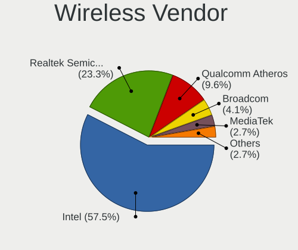

| Vendor                | Notebooks | Percent |
|-----------------------|-----------|---------|
| Intel                 | 42        | 57.53%  |
| Realtek Semiconductor | 17        | 23.29%  |
| Qualcomm Atheros      | 7         | 9.59%   |
| Broadcom              | 3         | 4.11%   |
| MediaTek              | 2         | 2.74%   |
| Sierra Wireless       | 1         | 1.37%   |
| NetGear               | 1         | 1.37%   |

Wireless Model
--------------

Wireless models

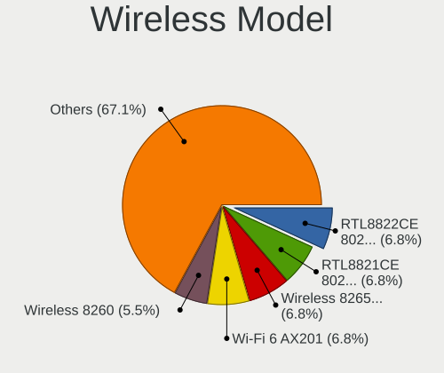

| Model                                                                | Notebooks | Percent |
|----------------------------------------------------------------------|-----------|---------|
| Realtek RTL8822CE 802.11ac PCIe Wireless Network Adapter             | 5         | 6.85%   |
| Realtek RTL8821CE 802.11ac PCIe Wireless Network Adapter             | 5         | 6.85%   |
| Intel Wireless 8265 / 8275                                           | 5         | 6.85%   |
| Intel Wi-Fi 6 AX201                                                  | 5         | 6.85%   |
| Intel Wireless 8260                                                  | 4         | 5.48%   |
| Intel Wireless 7265                                                  | 4         | 5.48%   |
| Realtek RTL8852BE PCIe 802.11ax Wireless Network Controller          | 3         | 4.11%   |
| Qualcomm Atheros QCA6174 802.11ac Wireless Network Adapter           | 3         | 4.11%   |
| Intel Wireless 7260                                                  | 3         | 4.11%   |
| Realtek RTL8188EE Wireless Network Adapter                           | 2         | 2.74%   |
| Intel Wi-Fi 6E(802.11ax) AX210/AX1675* 2x2 [Typhoon Peak]            | 2         | 2.74%   |
| Intel Wi-Fi 6 AX200                                                  | 2         | 2.74%   |
| Intel Wi-Fi 5(802.11ac) Wireless-AC 9x6x [Thunder Peak]              | 2         | 2.74%   |
| Intel Comet Lake PCH CNVi WiFi                                       | 2         | 2.74%   |
| Broadcom BCM4331 802.11a/b/g/n                                       | 2         | 2.74%   |
| Sierra Wireless EM7455                                               | 1         | 1.37%   |
| Realtek RTL8822BE 802.11a/b/g/n/ac WiFi adapter                      | 1         | 1.37%   |
| Realtek RTL8723BE PCIe Wireless Network Adapter                      | 1         | 1.37%   |
| Qualcomm Atheros QCA9565 / AR9565 Wireless Network Adapter           | 1         | 1.37%   |
| Qualcomm Atheros QCA9377 802.11ac Wireless Network Adapter           | 1         | 1.37%   |
| Qualcomm Atheros AR9287 Wireless Network Adapter (PCI-Express)       | 1         | 1.37%   |
| Qualcomm Atheros AR9285 Wireless Network Adapter (PCI-Express)       | 1         | 1.37%   |
| NetGear A6150                                                        | 1         | 1.37%   |
| MediaTek MT7922 802.11ax PCI Express Wireless Network Adapter        | 1         | 1.37%   |
| MediaTek MT7921 802.11ax PCIe Wireless Network Adapter [Filogic 330] | 1         | 1.37%   |
| Intel Wireless 3165                                                  | 1         | 1.37%   |
| Intel Wi-Fi 7(802.11be) AX1775*/AX1790*/BE20*/BE401/BE1750* 2x2      | 1         | 1.37%   |
| Intel Tiger Lake PCH CNVi WiFi                                       | 1         | 1.37%   |
| Intel Raptor Lake PCH CNVi WiFi                                      | 1         | 1.37%   |
| Intel PRO/Wireless 3945ABG [Golan] Network Connection                | 1         | 1.37%   |
| Intel Jasper Lake PCH CNVi WiFi                                      | 1         | 1.37%   |
| Intel Gemini Lake PCH CNVi WiFi                                      | 1         | 1.37%   |
| Intel Centrino Wireless-N 2230                                       | 1         | 1.37%   |
| Intel Centrino Wireless-N 2200                                       | 1         | 1.37%   |
| Intel Centrino Ultimate-N 6300                                       | 1         | 1.37%   |
| Intel Cannon Point-LP CNVi [Wireless-AC]                             | 1         | 1.37%   |
| Intel Alder Lake-P PCH CNVi WiFi                                     | 1         | 1.37%   |
| Intel 700 Series Chipset CNVi WiFi                                   | 1         | 1.37%   |
| Broadcom BCM4322 802.11a/b/g/n Wireless LAN Controller               | 1         | 1.37%   |

Ethernet Vendor
---------------

Ethernet vendors

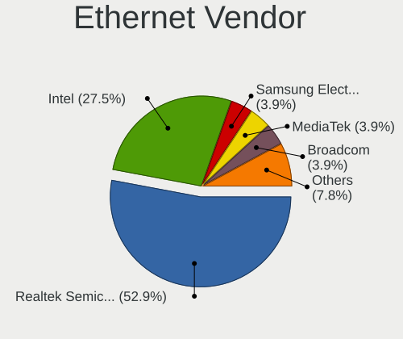

| Vendor                | Notebooks | Percent |
|-----------------------|-----------|---------|
| Realtek Semiconductor | 27        | 52.94%  |
| Intel                 | 14        | 27.45%  |
| Samsung Electronics   | 2         | 3.92%   |
| MediaTek              | 2         | 3.92%   |
| Broadcom              | 2         | 3.92%   |
| Xiaomi                | 1         | 1.96%   |
| Qualcomm Atheros      | 1         | 1.96%   |
| Nvidia                | 1         | 1.96%   |
| Broadcom Limited      | 1         | 1.96%   |

Ethernet Model
--------------

Ethernet models

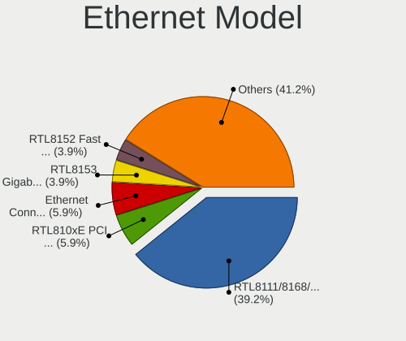

| Model                                                                  | Notebooks | Percent |
|------------------------------------------------------------------------|-----------|---------|
| Realtek RTL8111/8168/8211/8411 PCI Express Gigabit Ethernet Controller | 20        | 39.22%  |
| Realtek RTL810xE PCI Express Fast Ethernet controller                  | 3         | 5.88%   |
| Intel Ethernet Connection (4) I219-LM                                  | 3         | 5.88%   |
| Realtek RTL8153 Gigabit Ethernet Adapter                               | 2         | 3.92%   |
| Realtek RTL8152 Fast Ethernet Adapter                                  | 2         | 3.92%   |
| MediaTek MT7922 802.11ax PCI Express Wireless Network Adapter          | 2         | 3.92%   |
| Intel Ethernet Connection (2) I219-LM                                  | 2         | 3.92%   |
| Broadcom NetXtreme BCM57765 Gigabit Ethernet PCIe                      | 2         | 3.92%   |
| Xiaomi Mi/Redmi series (RNDIS)                                         | 1         | 1.96%   |
| Samsung GT-I9070 (network tethering, USB debugging enabled)            | 1         | 1.96%   |
| Samsung Galaxy series, misc. (tethering mode)                          | 1         | 1.96%   |
| Qualcomm Atheros QCA8171 Gigabit Ethernet                              | 1         | 1.96%   |
| Nvidia MCP79 Ethernet                                                  | 1         | 1.96%   |
| Intel I210 Gigabit Network Connection                                  | 1         | 1.96%   |
| Intel Ethernet Connection I219-V                                       | 1         | 1.96%   |
| Intel Ethernet Connection I218-LM                                      | 1         | 1.96%   |
| Intel Ethernet Connection (7) I219-LM                                  | 1         | 1.96%   |
| Intel Ethernet Connection (3) I218-LM                                  | 1         | 1.96%   |
| Intel Ethernet Connection (10) I219-LM                                 | 1         | 1.96%   |
| Intel Alder Lake-P PCH CNVi WiFi                                       | 1         | 1.96%   |
| Intel 82579LM Gigabit Network Connection (Lewisville)                  | 1         | 1.96%   |
| Intel 82573L Gigabit Ethernet Controller                               | 1         | 1.96%   |
| Broadcom Limited NetXtreme BCM5761e Gigabit Ethernet PCIe              | 1         | 1.96%   |

Net Controller Kind
-------------------

Ethernet, WiFi or modem

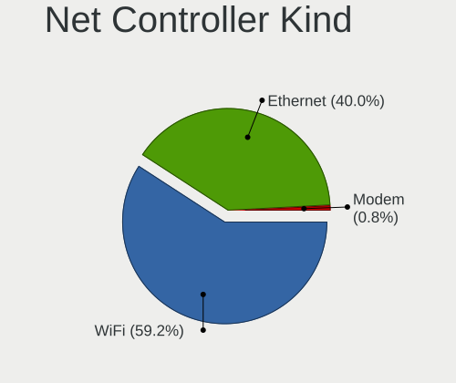

| Kind     | Notebooks | Percent |
|----------|-----------|---------|
| WiFi     | 71        | 59.17%  |
| Ethernet | 48        | 40%     |
| Modem    | 1         | 0.83%   |

Used Controller
---------------

Currently used network controller

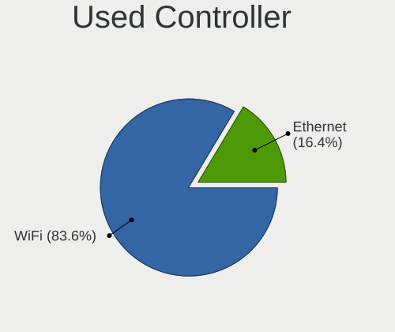

| Kind     | Notebooks | Percent |
|----------|-----------|---------|
| WiFi     | 62        | 79.49%  |
| Ethernet | 16        | 20.51%  |

NICs
----

Total network controllers on board

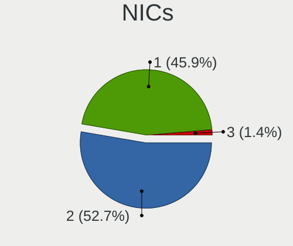

| Total | Notebooks | Percent |
|-------|-----------|---------|
| 2     | 39        | 52.7%   |
| 1     | 34        | 45.95%  |
| 3     | 1         | 1.35%   |

IPv6
----

IPv6 vs IPv4

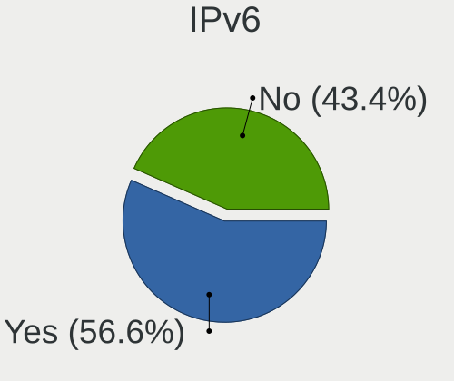

| Used | Notebooks | Percent |
|------|-----------|---------|
| Yes  | 43        | 56.58%  |
| No   | 33        | 43.42%  |

Bluetooth
---------

Bluetooth Vendor
----------------

Controller vendors

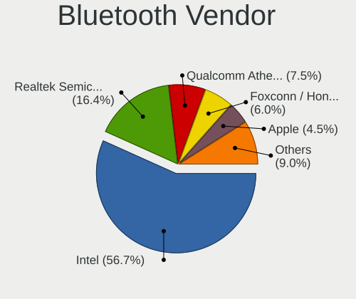

| Vendor                          | Notebooks | Percent |
|---------------------------------|-----------|---------|
| Intel                           | 38        | 56.72%  |
| Realtek Semiconductor           | 11        | 16.42%  |
| Qualcomm Atheros Communications | 5         | 7.46%   |
| Foxconn / Hon Hai               | 4         | 5.97%   |
| Apple                           | 3         | 4.48%   |
| Realtek                         | 2         | 2.99%   |
| IMC Networks                    | 2         | 2.99%   |
| Lite-On Technology              | 1         | 1.49%   |
| Broadcom                        | 1         | 1.49%   |

Bluetooth Model
---------------

Controller models

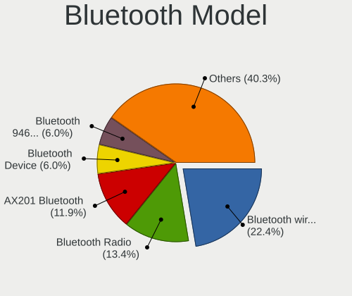

| Model                                                                               | Notebooks | Percent |
|-------------------------------------------------------------------------------------|-----------|---------|
| Intel Bluetooth wireless interface                                                  | 15        | 22.39%  |
| Realtek Bluetooth Radio                                                             | 9         | 13.43%  |
| Intel AX201 Bluetooth                                                               | 8         | 11.94%  |
| Intel Bluetooth Device                                                              | 4         | 5.97%   |
| Intel Bluetooth 9460/9560 Jefferson Peak (JfP)                                      | 4         | 5.97%   |
| Realtek  Bluetooth 4.2 Adapter                                                      | 2         | 2.99%   |
| Realtek Bluetooth Radio                                                             | 2         | 2.99%   |
| Qualcomm Atheros QCA61x4 Bluetooth 4.0                                              | 2         | 2.99%   |
| Intel Wireless-AC 9260 Bluetooth Adapter                                            | 2         | 2.99%   |
| Intel AX210 Bluetooth                                                               | 2         | 2.99%   |
| Intel AX200 Bluetooth                                                               | 2         | 2.99%   |
| Foxconn / Hon Hai Wireless_Device                                                   | 2         | 2.99%   |
| Apple Bluetooth Host Controller                                                     | 2         | 2.99%   |
| Qualcomm Atheros  Bluetooth Device                                                  | 1         | 1.49%   |
| Qualcomm Atheros AR3012 Bluetooth 4.0                                               | 1         | 1.49%   |
| Qualcomm Atheros AR3011 Bluetooth                                                   | 1         | 1.49%   |
| Lite-On Qualcomm Atheros QCA9377 Bluetooth                                          | 1         | 1.49%   |
| Intel Centrino Bluetooth Wireless Transceiver                                       | 1         | 1.49%   |
| IMC Networks Wireless_Device                                                        | 1         | 1.49%   |
| IMC Networks Bluetooth Radio                                                        | 1         | 1.49%   |
| Foxconn / Hon Hai MediaTek Bluetooth Adapter                                        | 1         | 1.49%   |
| Foxconn / Hon Hai Foxconn T77H114 BCM2070 [Single-Chip Bluetooth 2.1 + EDR Adapter] | 1         | 1.49%   |
| Broadcom BCM2045B (BDC-2) [Bluetooth Controller]                                    | 1         | 1.49%   |
| Apple Bluetooth USB Host Controller                                                 | 1         | 1.49%   |

Sound
-----

Sound Vendor
------------

Sound card vendors

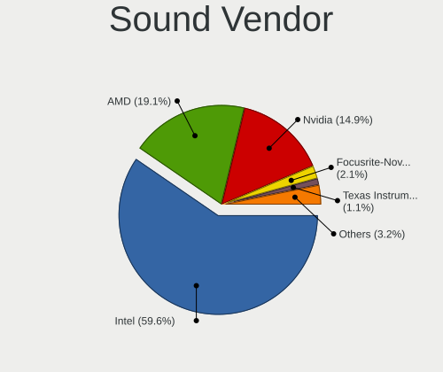

| Vendor             | Notebooks | Percent |
|--------------------|-----------|---------|
| Intel              | 56        | 59.57%  |
| AMD                | 18        | 19.15%  |
| Nvidia             | 14        | 14.89%  |
| Focusrite-Novation | 2         | 2.13%   |
| Texas Instruments  | 1         | 1.06%   |
| Solid State System | 1         | 1.06%   |
| RODE Microphones   | 1         | 1.06%   |
| PC Mic             | 1         | 1.06%   |

Sound Model
-----------

Sound card models

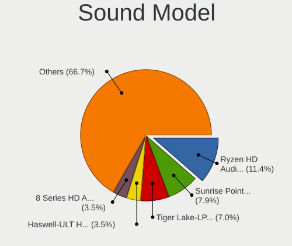

| Model                                                                      | Notebooks | Percent |
|----------------------------------------------------------------------------|-----------|---------|
| AMD Ryzen HD Audio Controller                                              | 13        | 11.4%   |
| Intel Sunrise Point-LP HD Audio                                            | 9         | 7.89%   |
| Intel Tiger Lake-LP Smart Sound Technology Audio Controller                | 8         | 7.02%   |
| Intel Haswell-ULT HD Audio Controller                                      | 4         | 3.51%   |
| Intel 8 Series HD Audio Controller                                         | 4         | 3.51%   |
| AMD Renoir/Cezanne HDMI/DP Audio Controller                                | 4         | 3.51%   |
| Nvidia AD107 High Definition Audio Controller                              | 3         | 2.63%   |
| Intel Cannon Lake PCH cAVS                                                 | 3         | 2.63%   |
| Intel Alder Lake PCH-P High Definition Audio Controller                    | 3         | 2.63%   |
| Intel 7 Series/C216 Chipset Family High Definition Audio Controller        | 3         | 2.63%   |
| Intel 6 Series/C200 Series Chipset Family High Definition Audio Controller | 3         | 2.63%   |
| AMD Raven/Raven2/Fenghuang HDMI/DP Audio Controller                        | 3         | 2.63%   |
| AMD Radeon High Definition Audio Controller                                | 3         | 2.63%   |
| AMD Kabini HDMI/DP Audio                                                   | 3         | 2.63%   |
| Nvidia TU107 GeForce GTX 1650 High Definition Audio Controller             | 2         | 1.75%   |
| Nvidia GM107 High Definition Audio Controller [GeForce 940MX]              | 2         | 1.75%   |
| Intel Raptor Lake-P/U/H cAVS                                               | 2         | 1.75%   |
| Intel Jasper Lake HD Audio                                                 | 2         | 1.75%   |
| Intel Comet Lake PCH cAVS                                                  | 2         | 1.75%   |
| Intel Celeron/Pentium Silver Processor High Definition Audio               | 2         | 1.75%   |
| Intel Cannon Point-LP High Definition Audio Controller                     | 2         | 1.75%   |
| Intel 100 Series/C230 Series Chipset Family HD Audio Controller            | 2         | 1.75%   |
| Focusrite-Novation Scarlett Solo USB                                       | 2         | 1.75%   |
| AMD FCH Azalia Controller                                                  | 2         | 1.75%   |
| AMD Family 15h (Models 60h-6fh) Audio Controller                           | 2         | 1.75%   |
| Texas Instruments PCM2912A Audio Codec                                     | 1         | 0.88%   |
| Solid State System MMX 150                                                 | 1         | 0.88%   |
| RODE Microphones RODE NT-USB                                               | 1         | 0.88%   |
| PC Mic Signo MP-706                                                        | 1         | 0.88%   |
| Nvidia TU106 High Definition Audio Controller                              | 1         | 0.88%   |
| Nvidia MCP79 High Definition Audio                                         | 1         | 0.88%   |
| Nvidia GP107GL High Definition Audio Controller                            | 1         | 0.88%   |
| Nvidia GF116 High Definition Audio Controller                              | 1         | 0.88%   |
| Nvidia GF108 High Definition Audio Controller                              | 1         | 0.88%   |
| Nvidia GA107 High Definition Audio Controller                              | 1         | 0.88%   |
| Nvidia GA104 High Definition Audio Controller                              | 1         | 0.88%   |
| Intel Xeon E3-1200 v3/4th Gen Core Processor HD Audio Controller           | 1         | 0.88%   |
| Intel Wildcat Point-LP High Definition Audio Controller                    | 1         | 0.88%   |
| Intel Tiger Lake-H HD Audio Controller                                     | 1         | 0.88%   |
| Intel Raptor Lake High Definition Audio Controller                         | 1         | 0.88%   |

Memory
------

Memory Vendor
-------------

Memory module vendors

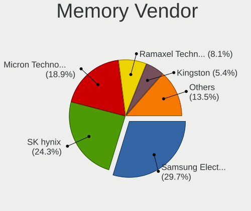

| Vendor              | Notebooks | Percent |
|---------------------|-----------|---------|
| Samsung Electronics | 11        | 29.73%  |
| SK hynix            | 9         | 24.32%  |
| Micron Technology   | 7         | 18.92%  |
| Ramaxel Technology  | 3         | 8.11%   |
| Kingston            | 2         | 5.41%   |
| Corsair             | 2         | 5.41%   |
| Timetec             | 1         | 2.7%    |
| PNY                 | 1         | 2.7%    |
| Lexar               | 1         | 2.7%    |

Memory Model
------------

Memory module models

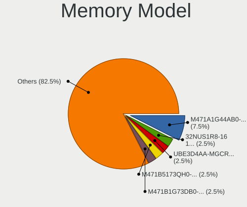

| Model                                                            | Notebooks | Percent |
|------------------------------------------------------------------|-----------|---------|
| Samsung RAM M471A1G44AB0-CWE 8GiB SODIMM DDR4 3200MT/s           | 3         | 7.5%    |
| Timetec RAM 32NUS1R8-16 16GB SODIMM DDR4 3200MT/s                | 1         | 2.5%    |
| SK hynix RAM Module 8GB SODIMM DDR3 1600MT/s                     | 1         | 2.5%    |
| SK hynix RAM HMT451S6BFR8A-PB 4GB SODIMM DDR3 1600MT/s           | 1         | 2.5%    |
| SK hynix RAM HMT351S6EFR8C-PB 4GB SODIMM DDR3 1600MT/s           | 1         | 2.5%    |
| SK hynix RAM HMCG88AEBSA095N 32GB SODIMM DDR5 4800MT/s           | 1         | 2.5%    |
| SK hynix RAM HMCG78AGBSA095N 16GB SODIMM DDR5 5600MT/s           | 1         | 2.5%    |
| SK hynix RAM HMAA51S6AMR6N-UH 8GB SODIMM DDR4 2400MT/s           | 1         | 2.5%    |
| SK hynix RAM HMAA1GS6CMR6N-VK 8GB SODIMM DDR4 2667MT/s           | 1         | 2.5%    |
| SK hynix RAM HMA851S6JJR6N-VK 4GB SODIMM DDR4 2667MT/s           | 1         | 2.5%    |
| SK hynix RAM HMA851S6AFR6N-UH 4GB SODIMM DDR4 2667MT/s           | 1         | 2.5%    |
| SK hynix RAM HMA425S6BJR6N-UH 2GB DDR4 2400MT/s                  | 1         | 2.5%    |
| Samsung RAM UBE3D4AA-MGCR 2GB Row Of Chips LPDDR4 4267MT/s       | 1         | 2.5%    |
| Samsung RAM M471B5173QH0-YK0 4GB SODIMM DDR3 1600MT/s            | 1         | 2.5%    |
| Samsung RAM M471B1G73DB0-YK0 8GB SODIMM DDR3 1600MT/s            | 1         | 2.5%    |
| Samsung RAM M471A5244CB0-CTD 4GB SODIMM DDR4 3266MT/s            | 1         | 2.5%    |
| Samsung RAM M471A2K43CB1-CRC 16GB SODIMM DDR4 2667MT/s           | 1         | 2.5%    |
| Samsung RAM M471A1K43DB1-CWE 8GB SODIMM DDR4 3200MT/s            | 1         | 2.5%    |
| Samsung RAM M471A1K43CB1-CRC 8GB SODIMM DDR4 8400MT/s            | 1         | 2.5%    |
| Samsung RAM K4EBE304EB-EGCG 8GB Row Of Chips LPDDR3 2133MT/s     | 1         | 2.5%    |
| Samsung RAM K3KL8L80CM-MGCT 4GB SODIMM LPDDR5 7500MT/s           | 1         | 2.5%    |
| Ramaxel RAM RMSA3340MB88HBF-3200 16GB SODIMM DDR4 3200MT/s       | 1         | 2.5%    |
| Ramaxel RAM RMSA3300ME78HBF-2666 16GB SODIMM DDR4 2667MT/s       | 1         | 2.5%    |
| Ramaxel RAM RMSA3270ME86H9F-2666 4GB SODIMM DDR4 2667MT/s        | 1         | 2.5%    |
| PNY RAM M4S16S681LJJJ43-12 16GB SODIMM DDR4 2667MT/s             | 1         | 2.5%    |
| Micron RAM 8ATF1G64HZ-3G2J1 8GB SODIMM DDR4 3200MT/s             | 1         | 2.5%    |
| Micron RAM 53E1G32D4NQ-046WTE 4GB Row Of Chips LPDDR4 3200MT/s   | 1         | 2.5%    |
| Micron RAM 53D512M64D4RQ-046 8192MB Row Of Chips LPDDR4 4267MT/s | 1         | 2.5%    |
| Micron RAM 4ATS1G64HZ-2G6E1 8GB SODIMM DDR4 2667MT/s             | 1         | 2.5%    |
| Micron RAM 4ATF1G64HZ-3G2E2 8GB SODIMM DDR4 3200MT/s             | 1         | 2.5%    |
| Micron RAM 4ATF1G64HZ-3G2E1 8GB SODIMM DDR4 3200MT/s             | 1         | 2.5%    |
| Micron RAM 16ATF2G64HZ-2G6E1 16GB SODIMM DDR4 2667MT/s           | 1         | 2.5%    |
| Lexar RAM LD4AS008G-3200ST 8GB SODIMM DDR4 3200MT/s              | 1         | 2.5%    |
| Kingston RAM KHX2400C14S4/8G 8GB SODIMM DDR4 2400MT/s            | 1         | 2.5%    |
| Kingston RAM 9905428-427.A00LF 8GB SODIMM DDR3 1600MT/s          | 1         | 2.5%    |
| Kingston RAM 9905428-123.A00LF 8GB SODIMM DDR3 1600MT/s          | 1         | 2.5%    |
| Corsair RAM CMSX32GX4M2A2666C18 16GB SODIMM DDR4 2667MT/s        | 1         | 2.5%    |
| Corsair RAM CMSX16GX4M1A3200C22 16GB SODIMM DDR4 3200MT/s        | 1         | 2.5%    |

Memory Kind
-----------

Memory module kinds

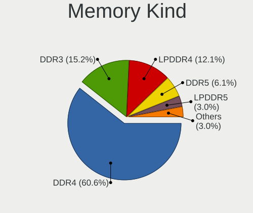

| Kind   | Notebooks | Percent |
|--------|-----------|---------|
| DDR4   | 20        | 60.61%  |
| DDR3   | 5         | 15.15%  |
| LPDDR4 | 4         | 12.12%  |
| DDR5   | 2         | 6.06%   |
| LPDDR5 | 1         | 3.03%   |
| LPDDR3 | 1         | 3.03%   |

Memory Form Factor
------------------

Physical design of the memory module

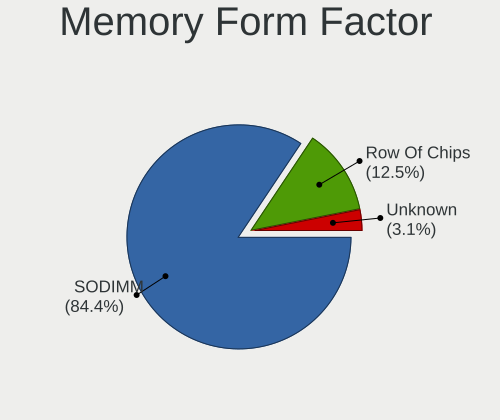

| Name         | Notebooks | Percent |
|--------------|-----------|---------|
| SODIMM       | 27        | 84.38%  |
| Row Of Chips | 4         | 12.5%   |
| Unknown      | 1         | 3.13%   |

Memory Size
-----------

Memory module size

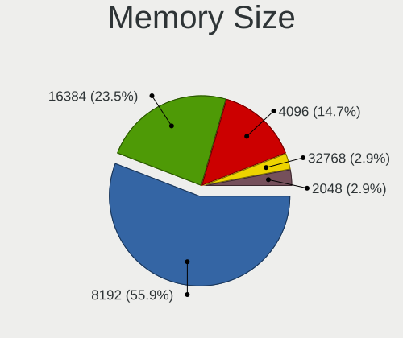

| Size  | Notebooks | Percent |
|-------|-----------|---------|
| 8192  | 19        | 55.88%  |
| 16384 | 8         | 23.53%  |
| 4096  | 5         | 14.71%  |
| 32768 | 1         | 2.94%   |
| 2048  | 1         | 2.94%   |

Memory Speed
------------

Memory module speed

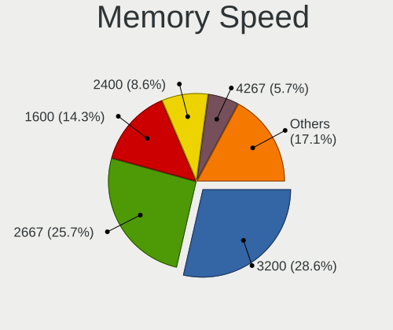

| Speed | Notebooks | Percent |
|-------|-----------|---------|
| 3200  | 10        | 28.57%  |
| 2667  | 9         | 25.71%  |
| 1600  | 5         | 14.29%  |
| 2400  | 3         | 8.57%   |
| 4267  | 2         | 5.71%   |
| 8400  | 1         | 2.86%   |
| 7500  | 1         | 2.86%   |
| 5600  | 1         | 2.86%   |
| 4800  | 1         | 2.86%   |
| 3266  | 1         | 2.86%   |
| 2133  | 1         | 2.86%   |

Printers & scanners
-------------------

Printer Vendor
--------------

Printer device vendors

| Vendor              | Notebooks | Percent |
|---------------------|-----------|---------|
| Samsung Electronics | 1         | 100%    |

Printer Model
-------------

Printer device models

| Model                | Notebooks | Percent |
|----------------------|-----------|---------|
| Samsung M2070 Series | 1         | 100%    |

Scanner Vendor
--------------

Scanner device vendors

Zero info for selected period =(

Scanner Model
-------------

Scanner device models

Zero info for selected period =(

Camera
------

Camera Vendor
-------------

Camera device vendors

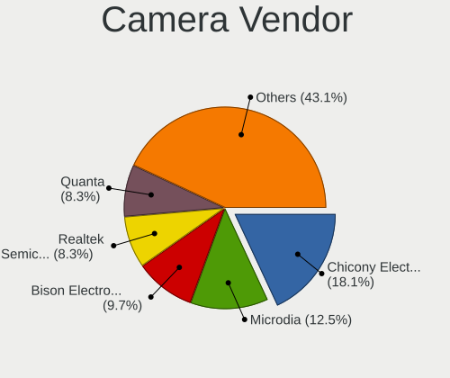

| Vendor                                 | Notebooks | Percent |
|----------------------------------------|-----------|---------|
| Chicony Electronics                    | 13        | 18.06%  |
| Microdia                               | 9         | 12.5%   |
| Bison Electronics                      | 7         | 9.72%   |
| Realtek Semiconductor                  | 6         | 8.33%   |
| Quanta                                 | 6         | 8.33%   |
| IMC Networks                           | 6         | 8.33%   |
| Sunplus Innovation Technology          | 4         | 5.56%   |
| Luxvisions Innotech Limited            | 4         | 5.56%   |
| Logitech                               | 3         | 4.17%   |
| Cheng Uei Precision Industry (Foxlink) | 3         | 4.17%   |
| Apple                                  | 3         | 4.17%   |
| Lite-On Technology                     | 2         | 2.78%   |
| Syntek                                 | 1         | 1.39%   |
| Shinetech                              | 1         | 1.39%   |
| Shine-optics                           | 1         | 1.39%   |
| Ricoh                                  | 1         | 1.39%   |
| Alcor Micro                            | 1         | 1.39%   |
| Acer                                   | 1         | 1.39%   |

Camera Model
------------

Camera device models

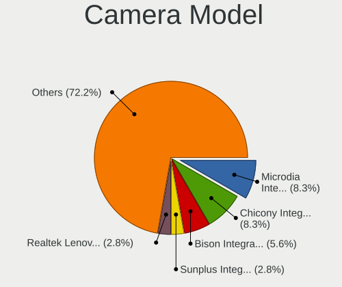

| Model                                               | Notebooks | Percent |
|-----------------------------------------------------|-----------|---------|
| Microdia Integrated_Webcam_HD                       | 6         | 8.33%   |
| Chicony Integrated Camera                           | 6         | 8.33%   |
| Bison Integrated Camera                             | 4         | 5.56%   |
| Sunplus Integrated_Webcam_HD                        | 2         | 2.78%   |
| Realtek Lenovo EasyCamera                           | 2         | 2.78%   |
| Quanta USB2.0 HD UVC WebCam                         | 2         | 2.78%   |
| Luxvisions Innotech Limited HP TrueVision HD Camera | 2         | 2.78%   |
| IMC Networks XiaoMi Webcam                          | 2         | 2.78%   |
| IMC Networks USB2.0 HD UVC WebCam                   | 2         | 2.78%   |
| Chicony Integrated Camera (1280x720@30)             | 2         | 2.78%   |
| Chicony FJ Camera                                   | 2         | 2.78%   |
| Apple FaceTime HD Camera                            | 2         | 2.78%   |
| Syntek Integrated Camera                            | 1         | 1.39%   |
| Sunplus USB 2.0 Camera                              | 1         | 1.39%   |
| Sunplus Integrated_Webcam_FHD                       | 1         | 1.39%   |
| Shinetech USB2.0 FHD UVC WebCam                     | 1         | 1.39%   |
| Shine-optics USB2.0 HD UVC WebCam                   | 1         | 1.39%   |
| Ricoh USB2.0 Camera                                 | 1         | 1.39%   |
| Realtek WebCamera                                   | 1         | 1.39%   |
| Realtek Laptop Camera                               | 1         | 1.39%   |
| Realtek Integrated_Webcam_HD                        | 1         | 1.39%   |
| Realtek HP Wide Vision HD Camera                    | 1         | 1.39%   |
| Quanta VGA WebCam                                   | 1         | 1.39%   |
| Quanta HP Wide Vision HD Camera                     | 1         | 1.39%   |
| Quanta HP True Vision FHD Camera                    | 1         | 1.39%   |
| Quanta HD User Facing                               | 1         | 1.39%   |
| Microdia Webcam Vitade AF                           | 1         | 1.39%   |
| Microdia USB 2.0 Camera                             | 1         | 1.39%   |
| Microdia Integrated Webcam                          | 1         | 1.39%   |
| Luxvisions Innotech Limited Integrated Camera       | 1         | 1.39%   |
| Luxvisions Innotech Limited HP 5MP Camera           | 1         | 1.39%   |
| Logitech Webcam C270                                | 1         | 1.39%   |
| Logitech HD Pro Webcam C920                         | 1         | 1.39%   |
| Logitech C922 Pro Stream Webcam                     | 1         | 1.39%   |
| Lite-On Integrated Camera                           | 1         | 1.39%   |
| Lite-On HP HD Camera                                | 1         | 1.39%   |
| IMC Networks USB2.0 VGA UVC WebCam                  | 1         | 1.39%   |
| IMC Networks USB Camera                             | 1         | 1.39%   |
| Chicony ThinkPad T490 Webcam                        | 1         | 1.39%   |
| Chicony thinkpad t430s camera                       | 1         | 1.39%   |

Security
--------

Fingerprint Vendor
------------------

Fingerprint sensor vendors

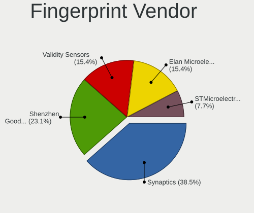

| Vendor                     | Notebooks | Percent |
|----------------------------|-----------|---------|
| Synaptics                  | 5         | 38.46%  |
| Shenzhen Goodix Technology | 3         | 23.08%  |
| Validity Sensors           | 2         | 15.38%  |
| Elan Microelectronics      | 2         | 15.38%  |
| STMicroelectronics         | 1         | 7.69%   |

Fingerprint Model
-----------------

Fingerprint sensor models

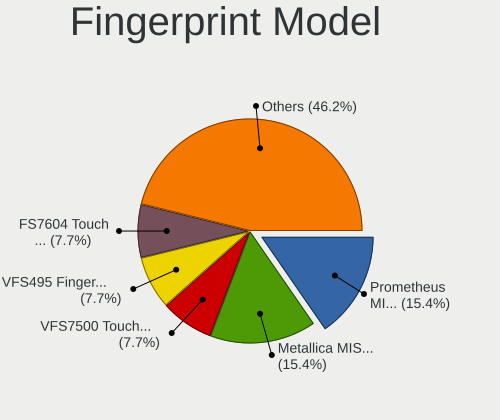

| Model                                                    | Notebooks | Percent |
|----------------------------------------------------------|-----------|---------|
| Synaptics Prometheus MIS Touch Fingerprint Reader        | 2         | 15.38%  |
| Synaptics Metallica MIS Touch Fingerprint Reader         | 2         | 15.38%  |
| Validity Sensors VFS7500 Touch Fingerprint Sensor        | 1         | 7.69%   |
| Validity Sensors VFS495 Fingerprint Reader               | 1         | 7.69%   |
| Synaptics FS7604 Touch Fingerprint Sensor with PurePrint | 1         | 7.69%   |
| STMicroelectronics Fingerprint Reader                    | 1         | 7.69%   |
| Shenzhen Goodix  FingerPrint Device                      | 1         | 7.69%   |
| Shenzhen Goodix Fingerprint Reader                       | 1         | 7.69%   |
| Shenzhen Goodix FingerPrint                              | 1         | 7.69%   |
| Elan ELAN:Fingerprint                                    | 1         | 7.69%   |
| Elan ELAN:ARM-M4                                         | 1         | 7.69%   |

Chipcard Vendor
---------------

Chipcard module vendors

| Vendor | Notebooks | Percent |
|--------|-----------|---------|
| Lenovo | 1         | 100%    |

Chipcard Model
--------------

Chipcard module models

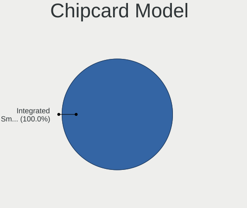

| Model                               | Notebooks | Percent |
|-------------------------------------|-----------|---------|
| Lenovo Integrated Smart Card Reader | 1         | 100%    |

Unsupported
-----------

Unsupported Devices
-------------------

Total unsupported devices on board

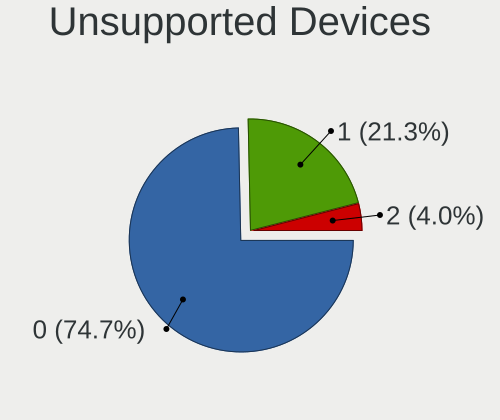

| Total | Notebooks | Percent |
|-------|-----------|---------|
| 0     | 56        | 74.67%  |
| 1     | 16        | 21.33%  |
| 2     | 3         | 4%      |

Unsupported Device Types
------------------------

Types of unsupported devices

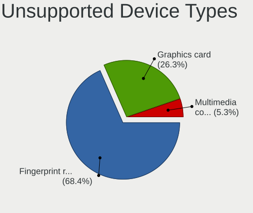

| Type                  | Notebooks | Percent |
|-----------------------|-----------|---------|
| Fingerprint reader    | 13        | 68.42%  |
| Graphics card         | 5         | 26.32%  |
| Multimedia controller | 1         | 5.26%   |

