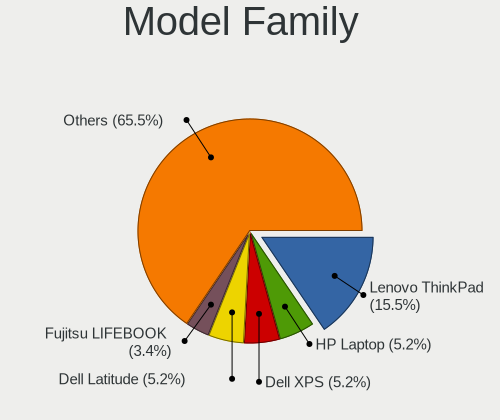
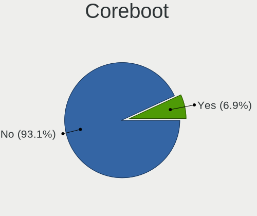
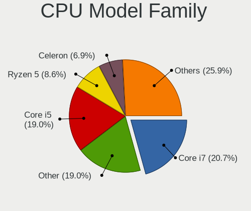
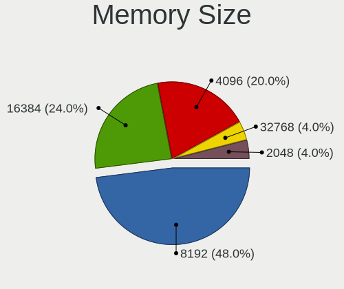

Ultramarine - Tested Hardware & Statistics (Notebooks)
------------------------------------------------------

A project to collect tested hardware configurations for Ultramarine.

Anyone can contribute to this report by the [hw-probe](https://github.com/linuxhw/hw-probe) tool:

    sudo -E hw-probe -all -upload

Please contribute! Especially if your hardware is rare.

Contents
--------

* [ Test Cases ](#test-cases)

* [ System ](#system)
  - [ OS                       ](#os)
  - [ OS Family                ](#os-family)
  - [ Kernel                   ](#kernel)
  - [ Kernel Family            ](#kernel-family)
  - [ Kernel Major Ver.        ](#kernel-major-ver)
  - [ Arch                     ](#arch)
  - [ DE                       ](#de)
  - [ Display Server           ](#display-server)
  - [ Display Manager          ](#display-manager)
  - [ OS Lang                  ](#os-lang)
  - [ Boot Mode                ](#boot-mode)
  - [ Filesystem               ](#filesystem)
  - [ Part. scheme             ](#part-scheme)
  - [ Dual Boot with Linux/BSD ](#dual-boot-with-linuxbsd)
  - [ Dual Boot (Win)          ](#dual-boot-win)

* [ Board ](#board)
  - [ Vendor                   ](#vendor)
  - [ Model                    ](#model)
  - [ Model Family             ](#model-family)
  - [ MFG Year                 ](#mfg-year)
  - [ Form Factor              ](#form-factor)
  - [ Secure Boot              ](#secure-boot)
  - [ Coreboot                 ](#coreboot)
  - [ RAM Size                 ](#ram-size)
  - [ RAM Used                 ](#ram-used)
  - [ Total Drives             ](#total-drives)
  - [ Has CD-ROM               ](#has-cd-rom)
  - [ Has Ethernet             ](#has-ethernet)
  - [ Has WiFi                 ](#has-wifi)
  - [ Has Bluetooth            ](#has-bluetooth)

* [ Location ](#location)
  - [ Country                  ](#country)
  - [ City                     ](#city)

* [ Drives ](#drives)
  - [ Drive Vendor             ](#drive-vendor)
  - [ Drive Model              ](#drive-model)
  - [ HDD Vendor               ](#hdd-vendor)
  - [ SSD Vendor               ](#ssd-vendor)
  - [ Drive Kind               ](#drive-kind)
  - [ Drive Connector          ](#drive-connector)
  - [ Drive Size               ](#drive-size)
  - [ Space Total              ](#space-total)
  - [ Space Used               ](#space-used)
  - [ Malfunc. Drives          ](#malfunc-drives)
  - [ Malfunc. Drive Vendor    ](#malfunc-drive-vendor)
  - [ Malfunc. HDD Vendor      ](#malfunc-hdd-vendor)
  - [ Malfunc. Drive Kind      ](#malfunc-drive-kind)
  - [ Failed Drives            ](#failed-drives)
  - [ Failed Drive Vendor      ](#failed-drive-vendor)
  - [ Drive Status             ](#drive-status)

* [ Storage controller ](#storage-controller)
  - [ Storage Vendor           ](#storage-vendor)
  - [ Storage Model            ](#storage-model)
  - [ Storage Kind             ](#storage-kind)

* [ Processor ](#processor)
  - [ CPU Vendor               ](#cpu-vendor)
  - [ CPU Model                ](#cpu-model)
  - [ CPU Model Family         ](#cpu-model-family)
  - [ CPU Cores                ](#cpu-cores)
  - [ CPU Sockets              ](#cpu-sockets)
  - [ CPU Threads              ](#cpu-threads)
  - [ CPU Op-Modes             ](#cpu-op-modes)
  - [ CPU Microcode            ](#cpu-microcode)
  - [ CPU Microarch            ](#cpu-microarch)

* [ Graphics ](#graphics)
  - [ GPU Vendor               ](#gpu-vendor)
  - [ GPU Model                ](#gpu-model)
  - [ GPU Combo                ](#gpu-combo)
  - [ GPU Driver               ](#gpu-driver)
  - [ GPU Memory               ](#gpu-memory)

* [ Monitor ](#monitor)
  - [ Monitor Vendor           ](#monitor-vendor)
  - [ Monitor Model            ](#monitor-model)
  - [ Monitor Resolution       ](#monitor-resolution)
  - [ Monitor Diagonal         ](#monitor-diagonal)
  - [ Monitor Width            ](#monitor-width)
  - [ Aspect Ratio             ](#aspect-ratio)
  - [ Monitor Area             ](#monitor-area)
  - [ Pixel Density            ](#pixel-density)
  - [ Multiple Monitors        ](#multiple-monitors)

* [ Network ](#network)
  - [ Net Controller Vendor    ](#net-controller-vendor)
  - [ Net Controller Model     ](#net-controller-model)
  - [ Wireless Vendor          ](#wireless-vendor)
  - [ Wireless Model           ](#wireless-model)
  - [ Ethernet Vendor          ](#ethernet-vendor)
  - [ Ethernet Model           ](#ethernet-model)
  - [ Net Controller Kind      ](#net-controller-kind)
  - [ Used Controller          ](#used-controller)
  - [ NICs                     ](#nics)
  - [ IPv6                     ](#ipv6)

* [ Bluetooth ](#bluetooth)
  - [ Bluetooth Vendor         ](#bluetooth-vendor)
  - [ Bluetooth Model          ](#bluetooth-model)

* [ Sound ](#sound)
  - [ Sound Vendor             ](#sound-vendor)
  - [ Sound Model              ](#sound-model)

* [ Memory ](#memory)
  - [ Memory Vendor            ](#memory-vendor)
  - [ Memory Model             ](#memory-model)
  - [ Memory Kind              ](#memory-kind)
  - [ Memory Form Factor       ](#memory-form-factor)
  - [ Memory Size              ](#memory-size)
  - [ Memory Speed             ](#memory-speed)

* [ Printers & scanners ](#printers--scanners)
  - [ Printer Vendor           ](#printer-vendor)
  - [ Printer Model            ](#printer-model)
  - [ Scanner Vendor           ](#scanner-vendor)
  - [ Scanner Model            ](#scanner-model)

* [ Camera ](#camera)
  - [ Camera Vendor            ](#camera-vendor)
  - [ Camera Model             ](#camera-model)

* [ Security ](#security)
  - [ Fingerprint Vendor       ](#fingerprint-vendor)
  - [ Fingerprint Model        ](#fingerprint-model)
  - [ Chipcard Vendor          ](#chipcard-vendor)
  - [ Chipcard Model           ](#chipcard-model)

* [ Unsupported ](#unsupported)
  - [ Unsupported Devices      ](#unsupported-devices)
  - [ Unsupported Device Types ](#unsupported-device-types)

Test Cases
----------

Total: 72

| Vendor        | Model                       | Probe                                                      | Date         |
|---------------|-----------------------------|------------------------------------------------------------|--------------|
| Lenovo        | ThinkPad T60 2007WHH        | [12562aee82](https://linux-hardware.org/?probe=12562aee82) | Jan 04, 2025 |
| Toshiba       | QOSMIO X775                 | [339f01aea5](https://linux-hardware.org/?probe=339f01aea5) | Jan 03, 2025 |
| Toshiba       | QOSMIO X775                 | [23dbe1fbd6](https://linux-hardware.org/?probe=23dbe1fbd6) | Nov 26, 2024 |
| Lenovo        | ThinkPad T480s 20L8S8640... | [746af80e1a](https://linux-hardware.org/?probe=746af80e1a) | Nov 01, 2024 |
| Lenovo        | ThinkPad T480s 20L8S8640... | [3652f4d59d](https://linux-hardware.org/?probe=3652f4d59d) | Oct 31, 2024 |
| Dell          | Inspiron 15 3535            | [a4ce2a5ac9](https://linux-hardware.org/?probe=a4ce2a5ac9) | Oct 31, 2024 |
| HP            | Laptop 15-ef2xxx            | [1bcbbcf0d7](https://linux-hardware.org/?probe=1bcbbcf0d7) | Oct 26, 2024 |
| Dell          | Precision 5570              | [4f095c8d49](https://linux-hardware.org/?probe=4f095c8d49) | Oct 23, 2024 |
| Dell          | Latitude E5510              | [be1db31198](https://linux-hardware.org/?probe=be1db31198) | Oct 16, 2024 |
| Lenovo        | ThinkPad P52s 20LCS0MH00    | [07bbca04a0](https://linux-hardware.org/?probe=07bbca04a0) | Oct 06, 2024 |
| Dell          | Inspiron 3505               | [cd854620f0](https://linux-hardware.org/?probe=cd854620f0) | Oct 06, 2024 |
| Dell          | Inspiron 3505               | [72990baeb9](https://linux-hardware.org/?probe=72990baeb9) | Oct 06, 2024 |
| Dell          | Latitude 5410               | [91cbd5e4a0](https://linux-hardware.org/?probe=91cbd5e4a0) | Oct 05, 2024 |
| HP            | Pavilion 17                 | [19403f16a0](https://linux-hardware.org/?probe=19403f16a0) | Oct 05, 2024 |
| Dell          | Precision 5530              | [cdaacbe775](https://linux-hardware.org/?probe=cdaacbe775) | Oct 05, 2024 |
| Google        | Fleex                       | [05a6990467](https://linux-hardware.org/?probe=05a6990467) | Sep 27, 2024 |
| Unknown       | Unknown                     | [c84318443d](https://linux-hardware.org/?probe=c84318443d) | Sep 25, 2024 |
| Chuwi         | GemiBook Pro                | [dde72fe9cf](https://linux-hardware.org/?probe=dde72fe9cf) | Sep 17, 2024 |
| Google        | Drobit                      | [2c312c592f](https://linux-hardware.org/?probe=2c312c592f) | Aug 31, 2024 |
| Lenovo        | Z710 20250                  | [a44ab1d0fd](https://linux-hardware.org/?probe=a44ab1d0fd) | Aug 24, 2024 |
| Lenovo        | LOQ 15APH8 82XT             | [50747463cb](https://linux-hardware.org/?probe=50747463cb) | Aug 21, 2024 |
| ASUSTek       | VivoBook_ASUSLaptop X160... | [c7919b571d](https://linux-hardware.org/?probe=c7919b571d) | Jul 31, 2024 |
| Google        | Nami                        | [c8a8ef90f9](https://linux-hardware.org/?probe=c8a8ef90f9) | Jul 17, 2024 |
| MSI           | Creator M16 HX C14VFG       | [137c25b31b](https://linux-hardware.org/?probe=137c25b31b) | Jul 07, 2024 |
| Lenovo        | ThinkPad L570 20J9S34000    | [a600d8246f](https://linux-hardware.org/?probe=a600d8246f) | Jun 18, 2024 |
| Dell          | XPS 15 9530                 | [1e145ec645](https://linux-hardware.org/?probe=1e145ec645) | Jun 11, 2024 |
| Google        | Drobit                      | [0b0b8a096b](https://linux-hardware.org/?probe=0b0b8a096b) | Jun 10, 2024 |
| Lenovo        | B40-80 80LS                 | [0630c37769](https://linux-hardware.org/?probe=0630c37769) | May 31, 2024 |
| Lenovo        | B40-80 80LS                 | [c0bbbf1450](https://linux-hardware.org/?probe=c0bbbf1450) | May 31, 2024 |
| Lenovo        | 330S-15ARR 81FB             | [7d5b244b02](https://linux-hardware.org/?probe=7d5b244b02) | May 22, 2024 |
| Timi          | RedmiBook 15                | [f86f533af7](https://linux-hardware.org/?probe=f86f533af7) | May 19, 2024 |
| Acer          | Aspire A315-31              | [e6b1ec681a](https://linux-hardware.org/?probe=e6b1ec681a) | May 17, 2024 |
| HP            | EliteBook 845 14 inch G1... | [cf3db9398d](https://linux-hardware.org/?probe=cf3db9398d) | Apr 22, 2024 |
| HP            | EliteBook 845 14 inch G1... | [6eeb53e317](https://linux-hardware.org/?probe=6eeb53e317) | Apr 22, 2024 |
| HP            | Laptop 15-fd0xxx            | [5babc725b2](https://linux-hardware.org/?probe=5babc725b2) | Mar 30, 2024 |
| Infinix       | INBOOK X2 PLUS              | [823ba3ef42](https://linux-hardware.org/?probe=823ba3ef42) | Feb 21, 2024 |
| Lenovo        | ThinkPad T450s 20BWS1RT0... | [562ce94bd6](https://linux-hardware.org/?probe=562ce94bd6) | Feb 12, 2024 |
| Sony          | VPCF215FX                   | [e7ac2326bd](https://linux-hardware.org/?probe=e7ac2326bd) | Jan 26, 2024 |
| Dell          | XPS 15 9500                 | [16e13e79b4](https://linux-hardware.org/?probe=16e13e79b4) | Jan 09, 2024 |
| HP            | OMEN by Laptop 15-ce0xx     | [b811bdcbfd](https://linux-hardware.org/?probe=b811bdcbfd) | Jan 07, 2024 |
| Apple         | MacBookPro5,5               | [609aece6c1](https://linux-hardware.org/?probe=609aece6c1) | Dec 28, 2023 |
| Chuwi         | CoreBook X                  | [6364cca19b](https://linux-hardware.org/?probe=6364cca19b) | Dec 07, 2023 |
| Fujitsu       | LIFEBOOK UH554              | [cfdc07bd6d](https://linux-hardware.org/?probe=cfdc07bd6d) | Dec 05, 2023 |
| GPU Compan... | GWTN156-2BK                 | [4dee905c74](https://linux-hardware.org/?probe=4dee905c74) | Nov 26, 2023 |
| ASUSTek       | Zenbook UM3402YA_UM3402Y... | [189d6b3a6f](https://linux-hardware.org/?probe=189d6b3a6f) | Nov 25, 2023 |
| Dell          | XPS 15 9570                 | [341114c78a](https://linux-hardware.org/?probe=341114c78a) | Oct 31, 2023 |
| Apple         | MacBookPro8,3               | [f0be6c3478](https://linux-hardware.org/?probe=f0be6c3478) | Oct 04, 2023 |
| Lenovo        | ThinkPad L570 20JRS06XGE    | [cae3db2f8d](https://linux-hardware.org/?probe=cae3db2f8d) | Jul 28, 2023 |
| ASUSTek       | ZenBook UX425EA_UX425EA     | [8a88263cea](https://linux-hardware.org/?probe=8a88263cea) | Apr 26, 2023 |
| ASUSTek       | ZenBook UX425EA_UX425EA     | [2f7f2efd4f](https://linux-hardware.org/?probe=2f7f2efd4f) | Apr 26, 2023 |
| Framework     | Laptop (12th Gen Intel C... | [83f4df6005](https://linux-hardware.org/?probe=83f4df6005) | Apr 12, 2023 |
| Framework     | Laptop (12th Gen Intel C... | [fbe7aabd96](https://linux-hardware.org/?probe=fbe7aabd96) | Mar 12, 2023 |
| Lenovo        | IdeaPad S145-14IWL 81MU     | [58bcb8bf04](https://linux-hardware.org/?probe=58bcb8bf04) | Feb 18, 2023 |
| Fujitsu       | LIFEBOOK AH532              | [cf200b9cf1](https://linux-hardware.org/?probe=cf200b9cf1) | Jan 30, 2023 |
| Google        | Blooglet                    | [b3a163b99b](https://linux-hardware.org/?probe=b3a163b99b) | Dec 19, 2022 |
| Lenovo        | ThinkPad T430 2349L26       | [9d0bcbdc75](https://linux-hardware.org/?probe=9d0bcbdc75) | Dec 11, 2022 |
| HP            | 245 G5 Notebook PC          | [deed1dcf4d](https://linux-hardware.org/?probe=deed1dcf4d) | Nov 21, 2022 |
| Fujitsu       | LIFEBOOK AH532              | [dc29e6568f](https://linux-hardware.org/?probe=dc29e6568f) | Oct 10, 2022 |
| Framework     | Laptop (12th Gen Intel C... | [be6b59f511](https://linux-hardware.org/?probe=be6b59f511) | Oct 07, 2022 |
| HP            | ProBook 470 G5              | [eb67db5bff](https://linux-hardware.org/?probe=eb67db5bff) | Sep 19, 2022 |
| HP            | ProBook 470 G5              | [793fa18b58](https://linux-hardware.org/?probe=793fa18b58) | Sep 19, 2022 |
| Framework     | Laptop (12th Gen Intel C... | [5e8d80eacc](https://linux-hardware.org/?probe=5e8d80eacc) | Sep 18, 2022 |
| Lenovo        | 14w 81MQ00AVCL              | [c1a16c7963](https://linux-hardware.org/?probe=c1a16c7963) | Sep 06, 2022 |
| Lenovo        | 14w 81MQ00AVCL              | [2ae4968612](https://linux-hardware.org/?probe=2ae4968612) | Sep 06, 2022 |
| HP            | Notebook                    | [2d11bc2975](https://linux-hardware.org/?probe=2d11bc2975) | Aug 26, 2022 |
| ASUSTek       | VivoBook_ASUS Laptop X50... | [eb79423b1d](https://linux-hardware.org/?probe=eb79423b1d) | Aug 12, 2022 |
| Acer          | Aspire A517-52              | [dfd7afda26](https://linux-hardware.org/?probe=dfd7afda26) | Jul 27, 2022 |
| HP            | Laptop 14s-dq2xxx           | [616a2b7524](https://linux-hardware.org/?probe=616a2b7524) | Jul 12, 2022 |
| Dell          | Latitude E7440              | [b57ab513eb](https://linux-hardware.org/?probe=b57ab513eb) | Jul 06, 2022 |
| HP            | 240 G7                      | [2af5911cf8](https://linux-hardware.org/?probe=2af5911cf8) | Jun 12, 2022 |
| Lenovo        | ThinkPad P50 20EQS0VV02     | [7a7b9fa959](https://linux-hardware.org/?probe=7a7b9fa959) | Feb 13, 2022 |
| Lenovo        | ThinkPad P50 20EQS0VV02     | [96577868b7](https://linux-hardware.org/?probe=96577868b7) | Jan 28, 2022 |

System
------

OS
--

Installed operating systems

| Name                 | Notebooks | Percent |
|----------------------|-----------|---------|
| Ultramarine 40       | 25        | 43.1%   |
| Ultramarine 39       | 13        | 22.41%  |
| Ultramarine Linux 36 | 12        | 20.69%  |
| Ultramarine 38       | 3         | 5.17%   |
| Ultramarine 41       | 2         | 3.45%   |
| Ultramarine 37       | 2         | 3.45%   |
| Ultramarine Linux 35 | 1         | 1.72%   |

OS Family
---------

OS without a version

| Name        | Notebooks | Percent |
|-------------|-----------|---------|
| Ultramarine | 58        | 100%    |

Kernel
------

Version of the Linux kernel

| Version                  | Notebooks | Percent |
|--------------------------|-----------|---------|
| 6.8.11-300.fc40.x86_64   | 10        | 16.13%  |
| 6.7.4-200.fc39.x86_64    | 2         | 3.23%   |
| 6.6.9-200.fc39.x86_64    | 2         | 3.23%   |
| 6.6.3-200.fc39.x86_64    | 2         | 3.23%   |
| 6.10.12-200.fc40.x86_64  | 2         | 3.23%   |
| 6.0.8-200.fc36.x86_64    | 2         | 3.23%   |
| 5.19.4-200.fc36.x86_64   | 2         | 3.23%   |
| 6.9.8-200.fc40.x86_64    | 1         | 1.61%   |
| 6.9.7-200.fc40.x86_64    | 1         | 1.61%   |
| 6.9.5-200.fc40.x86_64    | 1         | 1.61%   |
| 6.9.4-200.fc40.x86_64    | 1         | 1.61%   |
| 6.9.11-200.fc40.x86_64   | 1         | 1.61%   |
| 6.8.9-300.fc40.x86_64    | 1         | 1.61%   |
| 6.8.9-200.fc39.x86_64    | 1         | 1.61%   |
| 6.8.8-300.fc40.x86_64    | 1         | 1.61%   |
| 6.8.6-200.fc39.x86_64    | 1         | 1.61%   |
| 6.8.10-300.fc40.x86_64   | 1         | 1.61%   |
| 6.6.8-200.fc39.x86_64    | 1         | 1.61%   |
| 6.6.2-201.fc39.x86_64    | 1         | 1.61%   |
| 6.6.13-200.fc39.x86_64   | 1         | 1.61%   |
| 6.6.0-61.rog.fc39.x86_64 | 1         | 1.61%   |
| 6.5.8-200.fc38.x86_64    | 1         | 1.61%   |
| 6.5.5-200.fc38.x86_64    | 1         | 1.61%   |
| 6.5.12-300.fc39.x86_64   | 1         | 1.61%   |
| 6.4.4-200.fc38.x86_64    | 1         | 1.61%   |
| 6.2.11-200.fc37.x86_64   | 1         | 1.61%   |
| 6.12.6-200.fc41.x86_64   | 1         | 1.61%   |
| 6.11.8-200.fc40.x86_64   | 1         | 1.61%   |
| 6.11.4-301.fc41.x86_64   | 1         | 1.61%   |
| 6.11.3-200.fc40.x86_64   | 1         | 1.61%   |
| 6.10.9-200.fc40.x86_64   | 1         | 1.61%   |
| 6.10.5-200.fc40.x86_64   | 1         | 1.61%   |
| 6.10.11-200.fc40.x86_64  | 1         | 1.61%   |
| 6.10.10-200.fc40.x86_64  | 1         | 1.61%   |
| 6.1.7-100.fc36.x86_64    | 1         | 1.61%   |
| 6.1.5-100.fc36.x86_64    | 1         | 1.61%   |
| 6.1.11-200.fc37.x86_64   | 1         | 1.61%   |
| 5.19.8-200.fc36.x86_64   | 1         | 1.61%   |
| 5.19.6-200.fc36.x86_64   | 1         | 1.61%   |
| 5.19.12-200.fc36.x86_64  | 1         | 1.61%   |

Kernel Family
-------------

Linux kernel without a distro release

| Version | Notebooks | Percent |
|---------|-----------|---------|
| 6.8.11  | 10        | 16.13%  |
| 6.8.9   | 2         | 3.23%   |
| 6.7.4   | 2         | 3.23%   |
| 6.6.9   | 2         | 3.23%   |
| 6.6.3   | 2         | 3.23%   |
| 6.10.12 | 2         | 3.23%   |
| 6.0.8   | 2         | 3.23%   |
| 5.19.4  | 2         | 3.23%   |
| 6.9.8   | 1         | 1.61%   |
| 6.9.7   | 1         | 1.61%   |
| 6.9.5   | 1         | 1.61%   |
| 6.9.4   | 1         | 1.61%   |
| 6.9.11  | 1         | 1.61%   |
| 6.8.8   | 1         | 1.61%   |
| 6.8.6   | 1         | 1.61%   |
| 6.8.10  | 1         | 1.61%   |
| 6.6.8   | 1         | 1.61%   |
| 6.6.2   | 1         | 1.61%   |
| 6.6.13  | 1         | 1.61%   |
| 6.6.0   | 1         | 1.61%   |
| 6.5.8   | 1         | 1.61%   |
| 6.5.5   | 1         | 1.61%   |
| 6.5.12  | 1         | 1.61%   |
| 6.4.4   | 1         | 1.61%   |
| 6.2.11  | 1         | 1.61%   |
| 6.12.6  | 1         | 1.61%   |
| 6.11.8  | 1         | 1.61%   |
| 6.11.4  | 1         | 1.61%   |
| 6.11.3  | 1         | 1.61%   |
| 6.10.9  | 1         | 1.61%   |
| 6.10.5  | 1         | 1.61%   |
| 6.10.11 | 1         | 1.61%   |
| 6.10.10 | 1         | 1.61%   |
| 6.1.7   | 1         | 1.61%   |
| 6.1.5   | 1         | 1.61%   |
| 6.1.11  | 1         | 1.61%   |
| 5.19.8  | 1         | 1.61%   |
| 5.19.6  | 1         | 1.61%   |
| 5.19.12 | 1         | 1.61%   |
| 5.18.9  | 1         | 1.61%   |

Kernel Major Ver.
-----------------

Linux kernel major version

| Version | Notebooks | Percent |
|---------|-----------|---------|
| 6.8     | 15        | 24.19%  |
| 6.6     | 8         | 12.9%   |
| 6.10    | 6         | 9.68%   |
| 6.9     | 5         | 8.06%   |
| 5.19    | 5         | 8.06%   |
| 6.5     | 3         | 4.84%   |
| 6.11    | 3         | 4.84%   |
| 6.1     | 3         | 4.84%   |
| 5.18    | 3         | 4.84%   |
| 6.7     | 2         | 3.23%   |
| 6.0     | 2         | 3.23%   |
| 5.17    | 2         | 3.23%   |
| 6.4     | 1         | 1.61%   |
| 6.2     | 1         | 1.61%   |
| 6.12    | 1         | 1.61%   |
| 5.16    | 1         | 1.61%   |
| 5.15    | 1         | 1.61%   |

Arch
----

OS architecture (x86_64, i586, etc.)

| Name   | Notebooks | Percent |
|--------|-----------|---------|
| x86_64 | 58        | 100%    |

DE
--

Desktop Environment

| Name       | Notebooks | Percent |
|------------|-----------|---------|
| GNOME      | 18        | 31.03%  |
| Budgie     | 16        | 27.59%  |
| KDE6       | 14        | 24.14%  |
| Pantheon   | 4         | 6.9%    |
| KDE5       | 2         | 3.45%   |
| X-Cinnamon | 1         | 1.72%   |
| sway       | 1         | 1.72%   |
| KDE4       | 1         | 1.72%   |
| Cutefish   | 1         | 1.72%   |

Display Server
--------------

X11 or Wayland

| Name    | Notebooks | Percent |
|---------|-----------|---------|
| Wayland | 31        | 51.67%  |
| X11     | 29        | 48.33%  |

Display Manager
---------------

SDDM, LightDM, etc.

| Name    | Notebooks | Percent |
|---------|-----------|---------|
| Unknown | 36        | 62.07%  |
| SDDM    | 11        | 18.97%  |
| LightDM | 8         | 13.79%  |
| GDM     | 3         | 5.17%   |

OS Lang
-------

Language

| Lang  | Notebooks | Percent |
|-------|-----------|---------|
| en_US | 38        | 65.52%  |
| en_GB | 3         | 5.17%   |
| en_CA | 3         | 5.17%   |
| es_ES | 2         | 3.45%   |
| es_CL | 2         | 3.45%   |
| en_IN | 2         | 3.45%   |
| de_DE | 2         | 3.45%   |
| ru_RU | 1         | 1.72%   |
| pt_PT | 1         | 1.72%   |
| nl_BE | 1         | 1.72%   |
| it_IT | 1         | 1.72%   |
| hu_HU | 1         | 1.72%   |
| es_MX | 1         | 1.72%   |

Boot Mode
---------

EFI or BIOS

| Mode | Notebooks | Percent |
|------|-----------|---------|
| EFI  | 36        | 61.02%  |
| BIOS | 23        | 38.98%  |

Filesystem
----------

Type of filesystem

| Type    | Notebooks | Percent |
|---------|-----------|---------|
| Btrfs   | 47        | 81.03%  |
| Ext4    | 7         | 12.07%  |
| Overlay | 2         | 3.45%   |
| Xfs     | 1         | 1.72%   |
| Tmpfs   | 1         | 1.72%   |

Part. scheme
------------

Scheme of partitioning

| Type    | Notebooks | Percent |
|---------|-----------|---------|
| Unknown | 36        | 62.07%  |
| GPT     | 22        | 37.93%  |

Dual Boot with Linux/BSD
------------------------

Hosting more than one Linux/BSD

| Dual boot | Notebooks | Percent |
|-----------|-----------|---------|
| No        | 52        | 89.66%  |
| Yes       | 6         | 10.34%  |

Dual Boot (Win)
---------------

Hosting Linux and Windows

| Dual boot | Notebooks | Percent |
|-----------|-----------|---------|
| No        | 51        | 87.93%  |
| Yes       | 7         | 12.07%  |

Board
-----

Vendor
------

Motherboard manufacturer

| Name             | Notebooks | Percent |
|------------------|-----------|---------|
| Lenovo           | 15        | 25.86%  |
| Hewlett-Packard  | 10        | 17.24%  |
| Dell             | 10        | 17.24%  |
| Google           | 4         | 6.9%    |
| ASUSTek Computer | 3         | 5.17%   |
| Fujitsu          | 2         | 3.45%   |
| Chuwi            | 2         | 3.45%   |
| Apple            | 2         | 3.45%   |
| Acer             | 2         | 3.45%   |
| Toshiba          | 1         | 1.72%   |
| Timi             | 1         | 1.72%   |
| Sony             | 1         | 1.72%   |
| MSI              | 1         | 1.72%   |
| Infinix          | 1         | 1.72%   |
| GPU Company      | 1         | 1.72%   |
| Framework        | 1         | 1.72%   |
| Unknown          | 1         | 1.72%   |

Model
-----

Motherboard model

| Name                                     | Notebooks | Percent |
|------------------------------------------|-----------|---------|
| Lenovo ThinkPad T480s 20L8S86400         | 2         | 3.45%   |
| Toshiba QOSMIO X775                      | 1         | 1.72%   |
| Timi RedmiBook 15                        | 1         | 1.72%   |
| Sony VPCF215FX                           | 1         | 1.72%   |
| MSI Creator M16 HX C14VFG                | 1         | 1.72%   |
| Lenovo Z710 20250                        | 1         | 1.72%   |
| Lenovo ThinkPad T60 2007WHH              | 1         | 1.72%   |
| Lenovo ThinkPad T450s 20BWS1RT00         | 1         | 1.72%   |
| Lenovo ThinkPad T430 2349L26             | 1         | 1.72%   |
| Lenovo ThinkPad P52s 20LCS0MH00          | 1         | 1.72%   |
| Lenovo ThinkPad P50 20EQS0VV02           | 1         | 1.72%   |
| Lenovo ThinkPad L570 20JRS06XGE          | 1         | 1.72%   |
| Lenovo ThinkPad L570 20J9S34000          | 1         | 1.72%   |
| Lenovo LOQ 15APH8 82XT                   | 1         | 1.72%   |
| Lenovo IdeaPad S145-14IWL 81MU           | 1         | 1.72%   |
| Lenovo B40-80 80LS                       | 1         | 1.72%   |
| Lenovo 330S-15ARR 81FB                   | 1         | 1.72%   |
| Lenovo 14w 81MQ00AVCL                    | 1         | 1.72%   |
| Infinix INBOOK X2 PLUS                   | 1         | 1.72%   |
| HP ProBook 470 G5                        | 1         | 1.72%   |
| HP Pavilion 17                           | 1         | 1.72%   |
| HP OMEN by Laptop 15-ce0xx               | 1         | 1.72%   |
| HP Notebook                              | 1         | 1.72%   |
| HP Laptop 15-fd0xxx                      | 1         | 1.72%   |
| HP Laptop 15-ef2xxx                      | 1         | 1.72%   |
| HP Laptop 14s-dq2xxx                     | 1         | 1.72%   |
| HP EliteBook 845 14 inch G10 Notebook PC | 1         | 1.72%   |
| HP 245 G5 Notebook PC                    | 1         | 1.72%   |
| HP 240 G7                                | 1         | 1.72%   |
| GPU Company GWTN156-2BK                  | 1         | 1.72%   |
| Google Nami                              | 1         | 1.72%   |
| Google Fleex                             | 1         | 1.72%   |
| Google Drobit                            | 1         | 1.72%   |
| Google Blooglet                          | 1         | 1.72%   |
| Fujitsu LIFEBOOK UH554                   | 1         | 1.72%   |
| Fujitsu LIFEBOOK AH532                   | 1         | 1.72%   |
| Framework Laptop (12th Gen Intel Core)   | 1         | 1.72%   |
| Dell XPS 15 9570                         | 1         | 1.72%   |
| Dell XPS 15 9530                         | 1         | 1.72%   |
| Dell XPS 15 9500                         | 1         | 1.72%   |

Model Family
------------

Motherboard model prefix

| Name                    | Notebooks | Percent |
|-------------------------|-----------|---------|
| Lenovo ThinkPad         | 9         | 15.52%  |
| HP Laptop               | 3         | 5.17%   |
| Dell XPS                | 3         | 5.17%   |
| Dell Latitude           | 3         | 5.17%   |
| Fujitsu LIFEBOOK        | 2         | 3.45%   |
| Dell Precision          | 2         | 3.45%   |
| Dell Inspiron           | 2         | 3.45%   |
| ASUS Zenbook            | 2         | 3.45%   |
| Acer Aspire             | 2         | 3.45%   |
| Toshiba QOSMIO          | 1         | 1.72%   |
| Timi RedmiBook          | 1         | 1.72%   |
| Sony VPCF215FX          | 1         | 1.72%   |
| MSI Creator             | 1         | 1.72%   |
| Lenovo Z710             | 1         | 1.72%   |
| Lenovo LOQ              | 1         | 1.72%   |
| Lenovo IdeaPad          | 1         | 1.72%   |
| Lenovo B40-80           | 1         | 1.72%   |
| Lenovo 330S-15ARR       | 1         | 1.72%   |
| Lenovo 14w              | 1         | 1.72%   |
| Infinix INBOOK          | 1         | 1.72%   |
| HP ProBook              | 1         | 1.72%   |
| HP Pavilion             | 1         | 1.72%   |
| HP OMEN                 | 1         | 1.72%   |
| HP Notebook             | 1         | 1.72%   |
| HP EliteBook            | 1         | 1.72%   |
| HP 245                  | 1         | 1.72%   |
| HP 240                  | 1         | 1.72%   |
| GPU Company GWTN156-2BK | 1         | 1.72%   |
| Google Nami             | 1         | 1.72%   |
| Google Fleex            | 1         | 1.72%   |
| Google Drobit           | 1         | 1.72%   |
| Google Blooglet         | 1         | 1.72%   |
| Framework Laptop        | 1         | 1.72%   |
| Chuwi GemiBook          | 1         | 1.72%   |
| Chuwi CoreBook          | 1         | 1.72%   |
| ASUS VivoBook           | 1         | 1.72%   |
| Apple MacBookPro8       | 1         | 1.72%   |
| Apple MacBookPro5       | 1         | 1.72%   |
| Unknown                 | 1         | 1.72%   |

MFG Year
--------

Motherboard manufacture year

| Year | Notebooks | Percent |
|------|-----------|---------|
| 2020 | 8         | 13.79%  |
| 2022 | 7         | 12.07%  |
| 2018 | 7         | 12.07%  |
| 2023 | 5         | 8.62%   |
| 2021 | 4         | 6.9%    |
| 2017 | 4         | 6.9%    |
| 2012 | 4         | 6.9%    |
| 2024 | 3         | 5.17%   |
| 2019 | 3         | 5.17%   |
| 2013 | 3         | 5.17%   |
| 2016 | 2         | 3.45%   |
| 2015 | 2         | 3.45%   |
| 2014 | 2         | 3.45%   |
| 2011 | 1         | 1.72%   |
| 2010 | 1         | 1.72%   |
| 2009 | 1         | 1.72%   |
| 2006 | 1         | 1.72%   |

Form Factor
-----------

Physical design of the computer

| Name     | Notebooks | Percent |
|----------|-----------|---------|
| Notebook | 58        | 100%    |

Secure Boot
-----------

Enabled or disabled

| State    | Notebooks | Percent |
|----------|-----------|---------|
| Disabled | 48        | 82.76%  |
| Enabled  | 10        | 17.24%  |

Coreboot
--------

Have coreboot on board

| Used | Notebooks | Percent |
|------|-----------|---------|
| No   | 54        | 93.1%   |
| Yes  | 4         | 6.9%    |

RAM Size
--------

Total RAM memory

| Size in GB  | Notebooks | Percent |
|-------------|-----------|---------|
| 4.01-8.0    | 17        | 28.81%  |
| 8.01-16.0   | 14        | 23.73%  |
| 16.01-24.0  | 11        | 18.64%  |
| 32.01-64.0  | 8         | 13.56%  |
| 3.01-4.0    | 7         | 11.86%  |
| 2.01-3.0    | 1         | 1.69%   |
| 64.01-256.0 | 1         | 1.69%   |

RAM Used
--------

Used RAM memory

| Used GB   | Notebooks | Percent |
|-----------|-----------|---------|
| 4.01-8.0  | 22        | 34.92%  |
| 2.01-3.0  | 20        | 31.75%  |
| 3.01-4.0  | 13        | 20.63%  |
| 1.01-2.0  | 6         | 9.52%   |
| 8.01-16.0 | 2         | 3.17%   |

Total Drives
------------

Number of drives on board

| Drives | Notebooks | Percent |
|--------|-----------|---------|
| 1      | 43        | 71.67%  |
| 2      | 16        | 26.67%  |
| 4      | 1         | 1.67%   |

Has CD-ROM
----------

Has CD-ROM on board

| Presented | Notebooks | Percent |
|-----------|-----------|---------|
| No        | 47        | 81.03%  |
| Yes       | 11        | 18.97%  |

Has Ethernet
------------

Has Ethernet on board

| Presented | Notebooks | Percent |
|-----------|-----------|---------|
| Yes       | 32        | 55.17%  |
| No        | 26        | 44.83%  |

Has WiFi
--------

Has WiFi module

| Presented | Notebooks | Percent |
|-----------|-----------|---------|
| Yes       | 58        | 100%    |

Has Bluetooth
-------------

Has Bluetooth module

| Presented | Notebooks | Percent |
|-----------|-----------|---------|
| Yes       | 53        | 91.38%  |
| No        | 5         | 8.62%   |

Location
--------

Country
-------

Geographic location (country)

| Country   | Notebooks | Percent |
|-----------|-----------|---------|
| USA       | 24        | 41.38%  |
| Thailand  | 3         | 5.17%   |
| Spain     | 3         | 5.17%   |
| Canada    | 3         | 5.17%   |
| UK        | 2         | 3.45%   |
| Malaysia  | 2         | 3.45%   |
| Indonesia | 2         | 3.45%   |
| India     | 2         | 3.45%   |
| Germany   | 2         | 3.45%   |
| Chile     | 2         | 3.45%   |
| Belgium   | 2         | 3.45%   |
| Vietnam   | 1         | 1.72%   |
| Russia    | 1         | 1.72%   |
| Romania   | 1         | 1.72%   |
| Portugal  | 1         | 1.72%   |
| Poland    | 1         | 1.72%   |
| Mexico    | 1         | 1.72%   |
| Italy     | 1         | 1.72%   |
| Hungary   | 1         | 1.72%   |
| Hong Kong | 1         | 1.72%   |
| Czechia   | 1         | 1.72%   |
| Argentina | 1         | 1.72%   |

City
----

Geographic location (city)

| City                   | Notebooks | Percent |
|------------------------|-----------|---------|
| Sacramento             | 4         | 6.56%   |
| Rancho Cordova         | 3         | 4.92%   |
| Bangkok                | 3         | 4.92%   |
| Wroclaw                | 1         | 1.64%   |
| Wallowa                | 1         | 1.64%   |
| Vohl                   | 1         | 1.64%   |
| Victoria               | 1         | 1.64%   |
| Vegreville             | 1         | 1.64%   |
| Toronto                | 1         | 1.64%   |
| Terrassa               | 1         | 1.64%   |
| Streamwood             | 1         | 1.64%   |
| Skudai                 | 1         | 1.64%   |
| Schwäbisch Hall       | 1         | 1.64%   |
| Santiago               | 1         | 1.64%   |
| San Pedro              | 1         | 1.64%   |
| San Miguel de Tucumán | 1         | 1.64%   |
| Puerto de la Cruz      | 1         | 1.64%   |
| Port Jefferson         | 1         | 1.64%   |
| Phoenix                | 1         | 1.64%   |
| Perm                   | 1         | 1.64%   |
| Paine                  | 1         | 1.64%   |
| New York               | 1         | 1.64%   |
| Nazareth               | 1         | 1.64%   |
| Mouscron               | 1         | 1.64%   |
| Moncton                | 1         | 1.64%   |
| Millsboro              | 1         | 1.64%   |
| Mesa                   | 1         | 1.64%   |
| Mem Martins            | 1         | 1.64%   |
| Makassar               | 1         | 1.64%   |
| Los Angeles            | 1         | 1.64%   |
| Lincoln                | 1         | 1.64%   |
| Kuala Lumpur           | 1         | 1.64%   |
| Kanpur                 | 1         | 1.64%   |
| Jakarta                | 1         | 1.64%   |
| Hradec Králové       | 1         | 1.64%   |
| Holtsville             | 1         | 1.64%   |
| Hanoi                  | 1         | 1.64%   |
| Farnborough            | 1         | 1.64%   |
| Endon                  | 1         | 1.64%   |
| Edinburg               | 1         | 1.64%   |

Drives
------

Drive Vendor
------------

Hard drive vendors

| Vendor                       | Notebooks | Drives | Percent |
|------------------------------|-----------|--------|---------|
| Samsung Electronics          | 11        | 13     | 15.07%  |
| WDC                          | 7         | 8      | 9.59%   |
| Unknown                      | 7         | 7      | 9.59%   |
| Sandisk                      | 5         | 6      | 6.85%   |
| Crucial                      | 5         | 5      | 6.85%   |
| Seagate                      | 4         | 4      | 5.48%   |
| Intel                        | 4         | 5      | 5.48%   |
| Toshiba                      | 3         | 4      | 4.11%   |
| SK hynix                     | 3         | 4      | 4.11%   |
| Micron/Crucial Technology    | 3         | 6      | 4.11%   |
| Shenzhen Longsys Electronics | 2         | 2      | 2.74%   |
| KIOXIA                       | 2         | 2      | 2.74%   |
| Kingston                     | 2         | 2      | 2.74%   |
| China                        | 2         | 2      | 2.74%   |
| A-DATA Technology            | 2         | 2      | 2.74%   |
| Wibtek                       | 1         | 1      | 1.37%   |
| SABRENT                      | 1         | 1      | 1.37%   |
| Phison Electronics           | 1         | 1      | 1.37%   |
| Netac                        | 1         | 1      | 1.37%   |
| Micron Technology            | 1         | 1      | 1.37%   |
| Kingston Technology Company  | 1         | 1      | 1.37%   |
| Fujitsu                      | 1         | 2      | 1.37%   |
| EYOTA                        | 1         | 1      | 1.37%   |
| ASMedia                      | 1         | 1      | 1.37%   |
| AMD                          | 1         | 1      | 1.37%   |
| Unknown                      | 1         | 1      | 1.37%   |

Drive Model
-----------

Hard drive models

| Model                                                | Notebooks | Percent |
|------------------------------------------------------|-----------|---------|
| Samsung SSD 870 QVO 1TB                              | 3         | 3.85%   |
| Unknown MMC Card  64GB                               | 2         | 2.56%   |
| Unknown MMC Card  128GB                              | 2         | 2.56%   |
| Samsung NVMe SSD Controller SM981/PM981/PM983 512GB  | 2         | 2.56%   |
| Samsung NVMe SSD Controller SM961/PM961/SM963 256GB  | 2         | 2.56%   |
| Micron/Crucial CT1000T500SSD8 1TB                    | 2         | 2.56%   |
| Wibtek W800S 512GB SSD                               | 1         | 1.28%   |
| WDC WDS250G2B0A-00SM50 250GB SSD                     | 1         | 1.28%   |
| WDC WDS240G2G0B-00EPW0 240GB SSD                     | 1         | 1.28%   |
| WDC WDS240G2G0A-00JH30 240GB SSD                     | 1         | 1.28%   |
| WDC WDBNCE5000PNC 500GB SSD                          | 1         | 1.28%   |
| WDC WD5000LPCX-60VHAT0 500GB                         | 1         | 1.28%   |
| WDC WD10SPZX-60Z10T0 1TB                             | 1         | 1.28%   |
| WDC WD10SPZX-24Z10 1TB                               | 1         | 1.28%   |
| WDC WD10JFCX-68N6GN0 1TB                             | 1         | 1.28%   |
| Unknown NVMe SSD Drive 512GB                         | 1         | 1.28%   |
| Unknown MMC Card  7GB                                | 1         | 1.28%   |
| Unknown MMC Card  32GB                               | 1         | 1.28%   |
| Toshiba MQ04ABF100 1TB                               | 1         | 1.28%   |
| Toshiba MK6461GSY 640GB                              | 1         | 1.28%   |
| Toshiba MK5061GSYN 500GB                             | 1         | 1.28%   |
| SK hynix SH920 mSATA 128GB SSD                       | 1         | 1.28%   |
| SK hynix NVMe SSD Drive 512GB                        | 1         | 1.28%   |
| SK hynix HFS128G32TNF-N3A0A 128GB SSD                | 1         | 1.28%   |
| SK hynix BC511 512GB                                 | 1         | 1.28%   |
| Shenzhen Longsys FORESEE XP1000F512G 512GB           | 1         | 1.28%   |
| Shenzhen Longsys FORESEE VP1000F256G 256GB           | 1         | 1.28%   |
| Seagate ST2000LM003 HN-M201RAD 2TB                   | 1         | 1.28%   |
| Seagate ST1000LM035-1RK172 1TB                       | 1         | 1.28%   |
| Seagate ST1000LM024 HN-M101MBB 1TB                   | 1         | 1.28%   |
| Seagate Expansion 1TB                                | 1         | 1.28%   |
| Sandisk WD PC SN560 SDDPNQE-1T00-1032 1024GB         | 1         | 1.28%   |
| Sandisk WD Blue SN570 250GB                          | 1         | 1.28%   |
| Sandisk WD Blue SN550 NVMe SSD 256GB                 | 1         | 1.28%   |
| Sandisk WD Black SN850 2TB                           | 1         | 1.28%   |
| Sandisk WD Black SN750 / PC SN730 NVMe SSD 512GB     | 1         | 1.28%   |
| Samsung SSD 990 EVO 1TB                              | 1         | 1.28%   |
| Samsung SSD 860 EVO 500GB                            | 1         | 1.28%   |
| Samsung NVMe SSD Drive 256GB                         | 1         | 1.28%   |
| Samsung NVMe SSD Controller PM9A1/PM9A3/980PRO 512GB | 1         | 1.28%   |

HDD Vendor
----------

Hard disk drive vendors

| Vendor  | Notebooks | Drives | Percent |
|---------|-----------|--------|---------|
| WDC     | 4         | 4      | 30.77%  |
| Seagate | 4         | 4      | 30.77%  |
| Toshiba | 3         | 4      | 23.08%  |
| SABRENT | 1         | 1      | 7.69%   |
| Fujitsu | 1         | 2      | 7.69%   |

SSD Vendor
----------

Solid state drive vendors

| Vendor              | Notebooks | Drives | Percent |
|---------------------|-----------|--------|---------|
| Crucial             | 5         | 5      | 21.74%  |
| WDC                 | 4         | 4      | 17.39%  |
| Samsung Electronics | 4         | 4      | 17.39%  |
| SK hynix            | 2         | 2      | 8.7%    |
| China               | 2         | 2      | 8.7%    |
| A-DATA Technology   | 2         | 2      | 8.7%    |
| Wibtek              | 1         | 1      | 4.35%   |
| Netac               | 1         | 1      | 4.35%   |
| Kingston            | 1         | 1      | 4.35%   |
| EYOTA               | 1         | 1      | 4.35%   |

Drive Kind
----------

HDD or SSD

| Kind    | Notebooks | Drives | Percent |
|---------|-----------|--------|---------|
| NVMe    | 31        | 38     | 44.29%  |
| SSD     | 20        | 23     | 28.57%  |
| HDD     | 11        | 15     | 15.71%  |
| MMC     | 7         | 7      | 10%     |
| Unknown | 1         | 1      | 1.43%   |

Drive Connector
---------------

SATA, SAS, NVMe, etc.

| Type | Notebooks | Drives | Percent |
|------|-----------|--------|---------|
| NVMe | 31        | 38     | 44.93%  |
| SATA | 28        | 35     | 40.58%  |
| MMC  | 7         | 7      | 10.14%  |
| SAS  | 3         | 4      | 4.35%   |

Drive Size
----------

Size of hard drive

| Size in TB | Notebooks | Drives | Percent |
|------------|-----------|--------|---------|
| 0.01-0.5   | 16        | 21     | 50%     |
| 0.51-1.0   | 14        | 15     | 43.75%  |
| 1.01-2.0   | 2         | 2      | 6.25%   |

Space Total
-----------

Amount of disk space available on the file system

| Size in GB     | Notebooks | Percent |
|----------------|-----------|---------|
| 501-1000       | 14        | 22.95%  |
| 1001-2000      | 13        | 21.31%  |
| 251-500        | 9         | 14.75%  |
| 101-250        | 9         | 14.75%  |
| 1-20           | 7         | 11.48%  |
| 51-100         | 3         | 4.92%   |
| Unknown        | 3         | 4.92%   |
| 2001-3000      | 2         | 3.28%   |
| More than 3000 | 1         | 1.64%   |

Space Used
----------

Amount of used disk space

| Used GB   | Notebooks | Percent |
|-----------|-----------|---------|
| 1-20      | 30        | 47.62%  |
| 101-250   | 8         | 12.7%   |
| 251-500   | 7         | 11.11%  |
| 21-50     | 7         | 11.11%  |
| 51-100    | 7         | 11.11%  |
| Unknown   | 3         | 4.76%   |
| 1001-2000 | 1         | 1.59%   |

Malfunc. Drives
---------------

Drive models with a malfunction

| Model            | Notebooks | Drives | Percent |
|------------------|-----------|--------|---------|
| China G521N256GB | 1         | 1      | 100%    |

Malfunc. Drive Vendor
---------------------

Vendors of faulty drives

| Vendor | Notebooks | Drives | Percent |
|--------|-----------|--------|---------|
| China  | 1         | 1      | 100%    |

Malfunc. HDD Vendor
-------------------

Vendors of faulty HDD drives

Zero info for selected period =(

Malfunc. Drive Kind
-------------------

Kinds of faulty drives

| Kind | Notebooks | Drives | Percent |
|------|-----------|--------|---------|
| SSD  | 1         | 1      | 100%    |

Failed Drives
-------------

Failed drive models

Zero info for selected period =(

Failed Drive Vendor
-------------------

Failed drive vendors

Zero info for selected period =(

Drive Status
------------

Number of failed and malfunc. drives

| Status   | Notebooks | Drives | Percent |
|----------|-----------|--------|---------|
| Detected | 40        | 56     | 65.57%  |
| Works    | 20        | 27     | 32.79%  |
| Malfunc  | 1         | 1      | 1.64%   |

Storage controller
------------------

Storage Vendor
--------------

Storage controller vendors

| Vendor                       | Notebooks | Percent |
|------------------------------|-----------|---------|
| Intel                        | 36        | 50%     |
| Samsung Electronics          | 8         | 11.11%  |
| AMD                          | 8         | 11.11%  |
| SanDisk                      | 5         | 6.94%   |
| Micron/Crucial Technology    | 3         | 4.17%   |
| SK hynix                     | 2         | 2.78%   |
| Shenzhen Longsys Electronics | 2         | 2.78%   |
| KIOXIA                       | 2         | 2.78%   |
| Kingston Technology Company  | 2         | 2.78%   |
| Solidigm                     | 1         | 1.39%   |
| Phison Electronics           | 1         | 1.39%   |
| Nvidia                       | 1         | 1.39%   |
| Micron Technology            | 1         | 1.39%   |

Storage Model
-------------

Storage controller models

| Model                                                                                                              | Notebooks | Percent |
|--------------------------------------------------------------------------------------------------------------------|-----------|---------|
| AMD FCH SATA Controller [AHCI mode]                                                                                | 7         | 9.33%   |
| Intel Volume Management Device NVMe RAID Controller                                                                | 4         | 5.33%   |
| Samsung NVMe SSD Controller SM961/PM961/SM963                                                                      | 3         | 4%      |
| Intel Sunrise Point-LP SATA Controller [AHCI mode]                                                                 | 3         | 4%      |
| Intel 6 Series/C200 Series Chipset Family 6 port Mobile SATA AHCI Controller                                       | 3         | 4%      |
| Shenzhen Longsys FORESEE XP1000 / Lexar Professional CFexpress Type B Gold series, NM620 PCIe NVME SSD (DRAM-less) | 2         | 2.67%   |
| Samsung NVMe SSD Controller SM981/PM981/PM983                                                                      | 2         | 2.67%   |
| Micron/Crucial T500 NVMe PCIe SSD                                                                                  | 2         | 2.67%   |
| Intel Tiger Lake-LP SATA Controller                                                                                | 2         | 2.67%   |
| Intel SSD 670p Series [Keystone Harbor]                                                                            | 2         | 2.67%   |
| Intel Jasper Lake SATA AHCI Controller                                                                             | 2         | 2.67%   |
| Intel Cannon Point-LP SATA Controller [AHCI Mode]                                                                  | 2         | 2.67%   |
| Intel Cannon Lake Mobile PCH SATA AHCI Controller                                                                  | 2         | 2.67%   |
| Intel 82801 Mobile SATA Controller [RAID mode]                                                                     | 2         | 2.67%   |
| Intel 8 Series SATA Controller 1 [AHCI mode]                                                                       | 2         | 2.67%   |
| Intel 7 Series Chipset Family 6-port SATA Controller [AHCI mode]                                                   | 2         | 2.67%   |
| Solidigm P41 Plus NVMe SSD (DRAM-less) [Echo Harbor]                                                               | 1         | 1.33%   |
| SK hynix Gold P31/BC711/PC711 NVMe Solid State Drive                                                               | 1         | 1.33%   |
| SK hynix BC511 NVMe SSD                                                                                            | 1         | 1.33%   |
| SanDisk WD PC SN810 / Black SN850 NVMe SSD                                                                         | 1         | 1.33%   |
| SanDisk WD Black SN770 / PC SN740 256GB / PC SN560 (DRAM-less) NVMe SSD                                            | 1         | 1.33%   |
| SanDisk Ultra 3D / WD PC SN530, IX SN530, Blue SN550 NVMe SSD (DRAM-less)                                          | 1         | 1.33%   |
| SanDisk Ultra 3D / WD Blue SN570 NVMe SSD (DRAM-less)                                                              | 1         | 1.33%   |
| SanDisk Extreme Pro / WD Black SN750 / PC SN730 / Red SN700 NVMe SSD                                               | 1         | 1.33%   |
| Samsung NVMe SSD Controller PM9C1a (DRAM-less)                                                                     | 1         | 1.33%   |
| Samsung NVMe SSD Controller PM9B1 (DRAM-less)                                                                      | 1         | 1.33%   |
| Samsung NVMe SSD Controller PM9A1/PM9A3/980PRO                                                                     | 1         | 1.33%   |
| Phison PS5019-E19 PCIe4 NVMe Controller (DRAM-less)                                                                | 1         | 1.33%   |
| Nvidia MCP79 AHCI Controller                                                                                       | 1         | 1.33%   |
| Micron/Crucial P2 [Nick P2] / P3 / P3 Plus NVMe PCIe SSD (DRAM-less)                                               | 1         | 1.33%   |
| Micron 3400 NVMe SSD [Hendrix]                                                                                     | 1         | 1.33%   |
| KIOXIA NVMe SSD Controller XG8                                                                                     | 1         | 1.33%   |
| KIOXIA NVMe SSD Controller BG5 (DRAM-less)                                                                         | 1         | 1.33%   |
| Kingston Company OM8PCP Design-In PCIe 3 NVMe SSD (DRAM-less)                                                      | 1         | 1.33%   |
| Kingston Company A1000/U-SNS8154P3 x2 NVMe SSD                                                                     | 1         | 1.33%   |
| Intel Wildcat Point-LP SATA Controller [AHCI Mode]                                                                 | 1         | 1.33%   |
| Intel Volume Management Device NVMe RAID Controller Intel Corporation                                              | 1         | 1.33%   |
| Intel SSD DC P4101/Pro 7600p/760p/E 6100p Series                                                                   | 1         | 1.33%   |
| Intel SSD 660P Series                                                                                              | 1         | 1.33%   |
| Intel Q170/Q150/B150/H170/H110/Z170/CM236 Chipset SATA Controller [AHCI Mode]                                      | 1         | 1.33%   |

Storage Kind
------------

Kind of storage controller (IDE, SATA, NVMe, SAS, ...)

| Kind | Notebooks | Percent |
|------|-----------|---------|
| SATA | 35        | 47.3%   |
| NVMe | 31        | 41.89%  |
| RAID | 7         | 9.46%   |
| IDE  | 1         | 1.35%   |

Processor
---------

CPU Vendor
----------

Processor vendors

| Vendor | Notebooks | Percent |
|--------|-----------|---------|
| Intel  | 46        | 79.31%  |
| AMD    | 12        | 20.69%  |

CPU Model
---------

Processor models

| Model                                   | Notebooks | Percent |
|-----------------------------------------|-----------|---------|
| Intel Core i5-8350U CPU @ 1.70GHz       | 2         | 3.45%   |
| Intel 11th Gen Core i7-1165G7 @ 2.80GHz | 2         | 3.45%   |
| Intel 11th Gen Core i3-1115G4 @ 3.00GHz | 2         | 3.45%   |
| Intel Xeon E-2176M CPU @ 2.70GHz        | 1         | 1.72%   |
| Intel Pentium CPU N4200 @ 1.10GHz       | 1         | 1.72%   |
| Intel Core i9-14900HX                   | 1         | 1.72%   |
| Intel Core i7-8750H CPU @ 2.20GHz       | 1         | 1.72%   |
| Intel Core i7-8650U CPU @ 1.90GHz       | 1         | 1.72%   |
| Intel Core i7-8550U CPU @ 1.80GHz       | 1         | 1.72%   |
| Intel Core i7-7700HQ CPU @ 2.80GHz      | 1         | 1.72%   |
| Intel Core i7-6820HQ CPU @ 2.70GHz      | 1         | 1.72%   |
| Intel Core i7-4700MQ CPU @ 2.40GHz      | 1         | 1.72%   |
| Intel Core i7-4500U CPU @ 1.80GHz       | 1         | 1.72%   |
| Intel Core i7-3612QM CPU @ 2.10GHz      | 1         | 1.72%   |
| Intel Core i7-2720QM CPU @ 2.20GHz      | 1         | 1.72%   |
| Intel Core i7-2670QM CPU @ 2.20GHz      | 1         | 1.72%   |
| Intel Core i7-2630QM CPU @ 2.00GHz      | 1         | 1.72%   |
| Intel Core i7-10750H CPU @ 2.60GHz      | 1         | 1.72%   |
| Intel Core i5-8265U CPU @ 1.60GHz       | 1         | 1.72%   |
| Intel Core i5-8259U CPU @ 2.30GHz       | 1         | 1.72%   |
| Intel Core i5-7200U CPU @ 2.50GHz       | 1         | 1.72%   |
| Intel Core i5-6200U CPU @ 2.30GHz       | 1         | 1.72%   |
| Intel Core i5-5300U CPU @ 2.30GHz       | 1         | 1.72%   |
| Intel Core i5-4310U CPU @ 2.00GHz       | 1         | 1.72%   |
| Intel Core i5-2430M CPU @ 2.40GHz       | 1         | 1.72%   |
| Intel Core i5-10310U CPU @ 1.70GHz      | 1         | 1.72%   |
| Intel Core i5 CPU M 560 @ 2.67GHz       | 1         | 1.72%   |
| Intel Core i3-8130U CPU @ 2.20GHz       | 1         | 1.72%   |
| Intel Core i3-4005U CPU @ 1.70GHz       | 1         | 1.72%   |
| Intel Core i3-1005G1 CPU @ 1.20GHz      | 1         | 1.72%   |
| Intel Core 2 Duo CPU P7550 @ 2.26GHz    | 1         | 1.72%   |
| Intel Core 2 CPU T7200 @ 2.00GHz        | 1         | 1.72%   |
| Intel Celeron N5105 @ 2.00GHz           | 1         | 1.72%   |
| Intel Celeron N5100 @ 1.10GHz           | 1         | 1.72%   |
| Intel Celeron N4020 CPU @ 1.10GHz       | 1         | 1.72%   |
| Intel Celeron N4000 CPU @ 1.10GHz       | 1         | 1.72%   |
| Intel 13th Gen Core i7-13700H           | 1         | 1.72%   |
| Intel 13th Gen Core i5-1335U            | 1         | 1.72%   |
| Intel 12th Gen Core i7-12800H           | 1         | 1.72%   |
| Intel 12th Gen Core i7-1260P            | 1         | 1.72%   |

CPU Model Family
----------------

Processor model prefix

| Model            | Notebooks | Percent |
|------------------|-----------|---------|
| Intel Core i7    | 12        | 20.69%  |
| Other            | 11        | 18.97%  |
| Intel Core i5    | 11        | 18.97%  |
| AMD Ryzen 5      | 5         | 8.62%   |
| Intel Celeron    | 4         | 6.9%    |
| Intel Core i3    | 3         | 5.17%   |
| AMD A6           | 2         | 3.45%   |
| Intel Xeon       | 1         | 1.72%   |
| Intel Pentium    | 1         | 1.72%   |
| Intel Core i9    | 1         | 1.72%   |
| Intel Core 2 Duo | 1         | 1.72%   |
| Intel Core 2     | 1         | 1.72%   |
| AMD Ryzen 7 PRO  | 1         | 1.72%   |
| AMD Ryzen 7      | 1         | 1.72%   |
| AMD Ryzen 3      | 1         | 1.72%   |
| AMD A8           | 1         | 1.72%   |
| AMD A12          | 1         | 1.72%   |

CPU Cores
---------

Number of processor cores

| Number | Notebooks | Percent |
|--------|-----------|---------|
| 4      | 24        | 41.38%  |
| 2      | 19        | 32.76%  |
| 6      | 7         | 12.07%  |
| 14     | 2         | 3.45%   |
| 10     | 2         | 3.45%   |
| 8      | 2         | 3.45%   |
| 24     | 1         | 1.72%   |
| 12     | 1         | 1.72%   |

CPU Sockets
-----------

Number of sockets

| Number | Notebooks | Percent |
|--------|-----------|---------|
| 1      | 58        | 100%    |

CPU Threads
-----------

Threads per core (Hyper-Threading)

| Number | Notebooks | Percent |
|--------|-----------|---------|
| 2      | 48        | 82.76%  |
| 1      | 10        | 17.24%  |

CPU Op-Modes
------------

CPU Operation Modes (32-bit, 64-bit)

| Op mode        | Notebooks | Percent |
|----------------|-----------|---------|
| 32-bit, 64-bit | 58        | 100%    |

CPU Microcode
-------------

Microcode number

| Number     | Notebooks | Percent |
|------------|-----------|---------|
| Unknown    | 42        | 72.41%  |
| 0x806c1    | 2         | 3.45%   |
| 0x906a3    | 1         | 1.72%   |
| 0x806eb    | 1         | 1.72%   |
| 0x806ea    | 1         | 1.72%   |
| 0x706e5    | 1         | 1.72%   |
| 0x706a1    | 1         | 1.72%   |
| 0x506e3    | 1         | 1.72%   |
| 0x40651    | 1         | 1.72%   |
| 0x306a9    | 1         | 1.72%   |
| 0x206a7    | 1         | 1.72%   |
| 0x0a50000c | 1         | 1.72%   |
| 0x08600103 | 1         | 1.72%   |
| 0x07030105 | 1         | 1.72%   |
| 0x06006705 | 1         | 1.72%   |
| 0x06006118 | 1         | 1.72%   |

CPU Microarch
-------------

Microarchitecture

| Name             | Notebooks | Percent |
|------------------|-----------|---------|
| KabyLake         | 12        | 20.69%  |
| TigerLake        | 6         | 10.34%  |
| Unknown          | 5         | 8.62%   |
| SandyBridge      | 4         | 6.9%    |
| Haswell          | 4         | 6.9%    |
| Alderlake Hybrid | 4         | 6.9%    |
| Zen 3            | 2         | 3.45%   |
| Tremont          | 2         | 3.45%   |
| Skylake          | 2         | 3.45%   |
| Puma             | 2         | 3.45%   |
| Goldmont plus    | 2         | 3.45%   |
| Excavator        | 2         | 3.45%   |
| Zen+             | 1         | 1.72%   |
| Zen 2            | 1         | 1.72%   |
| Zen              | 1         | 1.72%   |
| Westmere         | 1         | 1.72%   |
| Penryn           | 1         | 1.72%   |
| IvyBridge        | 1         | 1.72%   |
| IceLake          | 1         | 1.72%   |
| Goldmont         | 1         | 1.72%   |
| Core             | 1         | 1.72%   |
| CometLake        | 1         | 1.72%   |
| Broadwell        | 1         | 1.72%   |

Graphics
--------

GPU Vendor
----------

Vendors of graphics cards

| Vendor | Notebooks | Percent |
|--------|-----------|---------|
| Intel  | 43        | 58.9%   |
| Nvidia | 16        | 21.92%  |
| AMD    | 14        | 19.18%  |

GPU Model
---------

Graphics card models

| Model                                                                     | Notebooks | Percent |
|---------------------------------------------------------------------------|-----------|---------|
| Intel UHD Graphics 620                                                    | 5         | 6.85%   |
| Intel TigerLake-LP GT2 [Iris Xe Graphics]                                 | 4         | 5.48%   |
| Intel Haswell-ULT Integrated Graphics Controller                          | 3         | 4.11%   |
| Intel 2nd Generation Core Processor Family Integrated Graphics Controller | 3         | 4.11%   |
| Nvidia AD107M [GeForce RTX 4060 Max-Q / Mobile]                           | 2         | 2.74%   |
| Intel Tiger Lake-LP GT2 [UHD Graphics G4]                                 | 2         | 2.74%   |
| Intel Raptor Lake-P [Iris Xe Graphics]                                    | 2         | 2.74%   |
| Intel JasperLake [UHD Graphics]                                           | 2         | 2.74%   |
| Intel GeminiLake [UHD Graphics 600]                                       | 2         | 2.74%   |
| Intel Alder Lake-P GT2 [Iris Xe Graphics]                                 | 2         | 2.74%   |
| AMD Phoenix1                                                              | 2         | 2.74%   |
| AMD Mullins [Radeon R4/R5 Graphics]                                       | 2         | 2.74%   |
| AMD Barcelo                                                               | 2         | 2.74%   |
| Nvidia TU117M [GeForce GTX 1650 Ti Mobile]                                | 1         | 1.37%   |
| Nvidia TU117M [GeForce GTX 1650 Mobile / Max-Q]                           | 1         | 1.37%   |
| Nvidia GP108GLM [Quadro P500 Mobile]                                      | 1         | 1.37%   |
| Nvidia GP107M [GeForce GTX 1050 Ti Mobile]                                | 1         | 1.37%   |
| Nvidia GP107M [GeForce GTX 1050 Mobile]                                   | 1         | 1.37%   |
| Nvidia GP107GLM [Quadro P2000 Mobile]                                     | 1         | 1.37%   |
| Nvidia GM108M [GeForce 930MX]                                             | 1         | 1.37%   |
| Nvidia GM107GLM [Quadro M1000M]                                           | 1         | 1.37%   |
| Nvidia GK107M [GeForce GT 745M]                                           | 1         | 1.37%   |
| Nvidia GF116M [GeForce GT 560M]                                           | 1         | 1.37%   |
| Nvidia GF108M [GeForce GT 540M]                                           | 1         | 1.37%   |
| Nvidia GA107GLM [RTX A2000 8GB Laptop GPU]                                | 1         | 1.37%   |
| Nvidia C79 [GeForce 9400M]                                                | 1         | 1.37%   |
| Nvidia AD107M [GeForce RTX 4050 Max-Q / Mobile]                           | 1         | 1.37%   |
| Intel WhiskeyLake-U GT2 [UHD Graphics 620]                                | 1         | 1.37%   |
| Intel Skylake GT2 [HD Graphics 520]                                       | 1         | 1.37%   |
| Intel Raptor Lake-S UHD Graphics                                          | 1         | 1.37%   |
| Intel Iris Plus Graphics G1 (Ice Lake)                                    | 1         | 1.37%   |
| Intel HD Graphics 630                                                     | 1         | 1.37%   |
| Intel HD Graphics 620                                                     | 1         | 1.37%   |
| Intel HD Graphics 5500                                                    | 1         | 1.37%   |
| Intel HD Graphics 530                                                     | 1         | 1.37%   |
| Intel Core Processor Integrated Graphics Controller                       | 1         | 1.37%   |
| Intel CometLake-U GT2 [UHD Graphics]                                      | 1         | 1.37%   |
| Intel CometLake-H GT2 [UHD Graphics]                                      | 1         | 1.37%   |
| Intel CoffeeLake-U GT3e [Iris Plus Graphics 655]                          | 1         | 1.37%   |
| Intel CoffeeLake-H GT2 [UHD Graphics 630]                                 | 1         | 1.37%   |

GPU Combo
---------

Combinations of graphics cards

| Name           | Notebooks | Percent |
|----------------|-----------|---------|
| 1 x Intel      | 28        | 48.28%  |
| Intel + Nvidia | 12        | 20.69%  |
| 1 x AMD        | 11        | 18.97%  |
| Other          | 2         | 3.45%   |
| 1 x Nvidia     | 2         | 3.45%   |
| AMD + Nvidia   | 2         | 3.45%   |
| Intel + AMD    | 1         | 1.72%   |

GPU Driver
----------

Free vs proprietary

| Driver      | Notebooks | Percent |
|-------------|-----------|---------|
| Free        | 50        | 84.75%  |
| Proprietary | 7         | 11.86%  |
| Unknown     | 2         | 3.39%   |

GPU Memory
----------

Total video memory

| Size in GB | Notebooks | Percent |
|------------|-----------|---------|
| Unknown    | 37        | 62.71%  |
| 0.01-0.5   | 8         | 13.56%  |
| 1.01-2.0   | 5         | 8.47%   |
| 3.01-4.0   | 3         | 5.08%   |
| 0.51-1.0   | 3         | 5.08%   |
| 7.01-8.0   | 2         | 3.39%   |
| 5.01-6.0   | 1         | 1.69%   |

Monitor
-------

Monitor Vendor
--------------

Monitor vendors

| Vendor                  | Notebooks | Percent |
|-------------------------|-----------|---------|
| AU Optronics            | 16        | 25.4%   |
| BOE                     | 11        | 17.46%  |
| Chimei Innolux          | 8         | 12.7%   |
| Samsung Electronics     | 6         | 9.52%   |
| LG Display              | 6         | 9.52%   |
| Sharp                   | 4         | 6.35%   |
| Lenovo                  | 2         | 3.17%   |
| Goldstar                | 2         | 3.17%   |
| Apple                   | 2         | 3.17%   |
| Philips                 | 1         | 1.59%   |
| PANDA                   | 1         | 1.59%   |
| InfoVision              | 1         | 1.59%   |
| HannStar                | 1         | 1.59%   |
| EXP                     | 1         | 1.59%   |
| Chi Mei Optoelectronics | 1         | 1.59%   |

Monitor Model
-------------

Monitor models

| Model                                                                     | Notebooks | Percent |
|---------------------------------------------------------------------------|-----------|---------|
| Sharp LCD Monitor SHP149A 1920x1080 344x194mm 15.5-inch                   | 2         | 3.17%   |
| Chimei Innolux LCD Monitor CMN1490 1366x768 309x173mm 13.9-inch           | 2         | 3.17%   |
| AU Optronics LCD Monitor AUO243D 1920x1080 309x173mm 13.9-inch            | 2         | 3.17%   |
| Sharp LCD Monitor SHP1516 3840x2400 336x210mm 15.6-inch                   | 1         | 1.59%   |
| Sharp LCD Monitor SHP14D0 3840x2400 336x210mm 15.6-inch                   | 1         | 1.59%   |
| Samsung Electronics S22R35x SAM103A 1920x1080 476x268mm 21.5-inch         | 1         | 1.59%   |
| Samsung Electronics LCD Monitor SEC5441 1280x800 286x179mm 13.3-inch      | 1         | 1.59%   |
| Samsung Electronics LCD Monitor SEC3442 1366x768 344x194mm 15.5-inch      | 1         | 1.59%   |
| Samsung Electronics LCD Monitor SDC5441 1366x768 309x174mm 14.0-inch      | 1         | 1.59%   |
| Samsung Electronics LCD Monitor SDC4171 2880x1800 302x189mm 14.0-inch     | 1         | 1.59%   |
| Samsung Electronics LCD Monitor SDC414D 3456x2160 336x210mm 15.6-inch     | 1         | 1.59%   |
| Philips PHL BDM3270 PHL08E7 2560x1440 708x398mm 32.0-inch                 | 1         | 1.59%   |
| PANDA LCD Monitor NCP0036 1920x1080 344x194mm 15.5-inch                   | 1         | 1.59%   |
| LG Display LCD Monitor LGD058C 1920x1080 344x194mm 15.5-inch              | 1         | 1.59%   |
| LG Display LCD Monitor LGD0538 1920x1080 344x194mm 15.5-inch              | 1         | 1.59%   |
| LG Display LCD Monitor LGD046D 1920x1080 309x174mm 14.0-inch              | 1         | 1.59%   |
| LG Display LCD Monitor LGD0372 1600x900 382x215mm 17.3-inch               | 1         | 1.59%   |
| LG Display LCD Monitor LGD0362 1600x900 309x174mm 14.0-inch               | 1         | 1.59%   |
| LG Display LCD Monitor LGD0354 1366x768 293x165mm 13.2-inch               | 1         | 1.59%   |
| Lenovo LCD Monitor LEN40BA 1920x1080 344x194mm 15.5-inch                  | 1         | 1.59%   |
| Lenovo LCD Monitor LEN4020 1024x768 286x214mm 14.1-inch                   | 1         | 1.59%   |
| InfoVision LCD Monitor IVO048E 1366x768 256x144mm 11.6-inch               | 1         | 1.59%   |
| HannStar HE225ANB HSD0566 1920x1080 477x268mm 21.5-inch                   | 1         | 1.59%   |
| Goldstar ULTRAFINE GSM5BC1 3840x2160 600x340mm 27.2-inch                  | 1         | 1.59%   |
| Goldstar FULL HD GSM5AB9 1920x1080 480x270mm 21.7-inch                    | 1         | 1.59%   |
| EXP HDMI to VGA EXP0074 1280x720 304x228mm 15.0-inch                      | 1         | 1.59%   |
| Chimei Innolux P140ZKA-BZ1 CMN8C03 2160x1440 296x197mm 14.0-inch          | 1         | 1.59%   |
| Chimei Innolux LCD Monitor CMN162F 2560x1600 344x215mm 16.0-inch          | 1         | 1.59%   |
| Chimei Innolux LCD Monitor CMN15E7 1920x1080 344x193mm 15.5-inch          | 1         | 1.59%   |
| Chimei Innolux LCD Monitor CMN1526 1920x1080 344x193mm 15.5-inch          | 1         | 1.59%   |
| Chimei Innolux LCD Monitor CMN14E5 1920x1080 309x173mm 13.9-inch          | 1         | 1.59%   |
| Chimei Innolux LCD Monitor CMN14D5 1920x1080 309x173mm 13.9-inch          | 1         | 1.59%   |
| Chi Mei Optoelectronics LCD Monitor CMO1726 1920x1080 382x215mm 17.3-inch | 1         | 1.59%   |
| BOE NV156FHM-N61 BOE07D0 1920x1080 344x193mm 15.5-inch                    | 1         | 1.59%   |
| BOE LCD Monitor BOE09EF 1920x1080 344x194mm 15.5-inch                     | 1         | 1.59%   |
| BOE LCD Monitor BOE09D0 1920x1080 309x174mm 14.0-inch                     | 1         | 1.59%   |
| BOE LCD Monitor BOE09B5 3072x1920 345x215mm 16.0-inch                     | 1         | 1.59%   |
| BOE LCD Monitor BOE095F 2256x1504 285x190mm 13.5-inch                     | 1         | 1.59%   |
| BOE LCD Monitor BOE0893 2160x1440 296x197mm 14.0-inch                     | 1         | 1.59%   |
| BOE LCD Monitor BOE0868 1920x1080 309x174mm 14.0-inch                     | 1         | 1.59%   |

Monitor Resolution
------------------

Monitor screen resolution

| Resolution        | Notebooks | Percent |
|-------------------|-----------|---------|
| 1920x1080 (FHD)   | 31        | 50.82%  |
| 1366x768 (WXGA)   | 10        | 16.39%  |
| 1600x900 (HD+)    | 3         | 4.92%   |
| 3840x2400         | 2         | 3.28%   |
| 2560x1600         | 2         | 3.28%   |
| 2160x1440         | 2         | 3.28%   |
| 1920x1200 (WUXGA) | 2         | 3.28%   |
| 3840x2160 (4K)    | 1         | 1.64%   |
| 3456x2160         | 1         | 1.64%   |
| 3072x1920         | 1         | 1.64%   |
| 2880x1800         | 1         | 1.64%   |
| 2560x1440 (QHD)   | 1         | 1.64%   |
| 2256x1504         | 1         | 1.64%   |
| 1280x800 (WXGA)   | 1         | 1.64%   |
| 1280x720 (HD)     | 1         | 1.64%   |
| 1024x768 (XGA)    | 1         | 1.64%   |

Monitor Diagonal
----------------

Diagonal size in inches

| Inches | Notebooks | Percent |
|--------|-----------|---------|
| 15     | 23        | 37.1%   |
| 14     | 17        | 27.42%  |
| 17     | 7         | 11.29%  |
| 13     | 6         | 9.68%   |
| 16     | 4         | 6.45%   |
| 21     | 2         | 3.23%   |
| 32     | 1         | 1.61%   |
| 31     | 1         | 1.61%   |
| 11     | 1         | 1.61%   |

Monitor Width
-------------

Physical width

| Width in mm | Notebooks | Percent |
|-------------|-----------|---------|
| 301-350     | 42        | 67.74%  |
| 351-400     | 9         | 14.52%  |
| 201-300     | 7         | 11.29%  |
| 401-500     | 2         | 3.23%   |
| 701-800     | 1         | 1.61%   |
| 601-700     | 1         | 1.61%   |

Aspect Ratio
------------

Proportional relationship between the width and the height

| Ratio | Notebooks | Percent |
|-------|-----------|---------|
| 16/9  | 44        | 74.58%  |
| 16/10 | 10        | 16.95%  |
| 3/2   | 3         | 5.08%   |
| 4/3   | 2         | 3.39%   |

Monitor Area
------------

Area in inch²

| Area in inch² | Notebooks | Percent |
|----------------|-----------|---------|
| 101-110        | 23        | 36.51%  |
| 81-90          | 21        | 33.33%  |
| 121-130        | 6         | 9.52%   |
| 111-120        | 4         | 6.35%   |
| 351-500        | 2         | 3.17%   |
| 201-250        | 2         | 3.17%   |
| 71-80          | 1         | 1.59%   |
| 51-60          | 1         | 1.59%   |
| 151-200        | 1         | 1.59%   |
| 131-140        | 1         | 1.59%   |
| 91-100         | 1         | 1.59%   |

Pixel Density
-------------

Pixels per inch

| Density       | Notebooks | Percent |
|---------------|-----------|---------|
| 121-160       | 34        | 55.74%  |
| 101-120       | 13        | 21.31%  |
| 161-240       | 6         | 9.84%   |
| More than 240 | 4         | 6.56%   |
| 51-100        | 4         | 6.56%   |

Multiple Monitors
-----------------

Total monitors connected

| Total | Notebooks | Percent |
|-------|-----------|---------|
| 1     | 53        | 91.38%  |
| 2     | 5         | 8.62%   |

Network
-------

Net Controller Vendor
---------------------

Controller vendors

| Vendor                | Notebooks | Percent |
|-----------------------|-----------|---------|
| Intel                 | 35        | 44.3%   |
| Realtek Semiconductor | 25        | 31.65%  |
| Qualcomm Atheros      | 8         | 10.13%  |
| Samsung Electronics   | 2         | 2.53%   |
| MediaTek              | 2         | 2.53%   |
| Broadcom              | 2         | 2.53%   |
| Xiaomi                | 1         | 1.27%   |
| Sierra Wireless       | 1         | 1.27%   |
| Nvidia                | 1         | 1.27%   |
| NetGear               | 1         | 1.27%   |
| Broadcom Limited      | 1         | 1.27%   |

Net Controller Model
--------------------

Controller models

| Model                                                                  | Notebooks | Percent |
|------------------------------------------------------------------------|-----------|---------|
| Realtek RTL8111/8168/8211/8411 PCI Express Gigabit Ethernet Controller | 13        | 13.68%  |
| Realtek RTL8821CE 802.11ac PCIe Wireless Network Adapter               | 5         | 5.26%   |
| Intel Wireless 8265 / 8275                                             | 5         | 5.26%   |
| Intel Wi-Fi 6 AX201                                                    | 4         | 4.21%   |
| Realtek RTL8822CE 802.11ac PCIe Wireless Network Adapter               | 3         | 3.16%   |
| Realtek RTL810xE PCI Express Fast Ethernet controller                  | 3         | 3.16%   |
| Qualcomm Atheros QCA6174 802.11ac Wireless Network Adapter             | 3         | 3.16%   |
| Intel Wireless 7265                                                    | 3         | 3.16%   |
| Intel Wireless 7260                                                    | 3         | 3.16%   |
| Intel Ethernet Connection (4) I219-LM                                  | 3         | 3.16%   |
| Realtek RTL8852BE PCIe 802.11ax Wireless Network Controller            | 2         | 2.11%   |
| Realtek RTL8188EE Wireless Network Adapter                             | 2         | 2.11%   |
| Realtek RTL8152 Fast Ethernet Adapter                                  | 2         | 2.11%   |
| MediaTek MT7922 802.11ax PCI Express Wireless Network Adapter          | 2         | 2.11%   |
| Intel Wireless 8260                                                    | 2         | 2.11%   |
| Intel Wi-Fi 6E(802.11ax) AX210/AX1675* 2x2 [Typhoon Peak]              | 2         | 2.11%   |
| Intel Alder Lake-P PCH CNVi WiFi                                       | 2         | 2.11%   |
| Xiaomi Mi/Redmi series (RNDIS)                                         | 1         | 1.05%   |
| Sierra Wireless EM7455                                                 | 1         | 1.05%   |
| Samsung GT-I9070 (network tethering, USB debugging enabled)            | 1         | 1.05%   |
| Samsung Galaxy series, misc. (tethering mode)                          | 1         | 1.05%   |
| Realtek RTL8822BE 802.11a/b/g/n/ac WiFi adapter                        | 1         | 1.05%   |
| Qualcomm Atheros QCA9565 / AR9565 Wireless Network Adapter             | 1         | 1.05%   |
| Qualcomm Atheros QCA9377 802.11ac Wireless Network Adapter             | 1         | 1.05%   |
| Qualcomm Atheros QCA8171 Gigabit Ethernet                              | 1         | 1.05%   |
| Qualcomm Atheros AR9287 Wireless Network Adapter (PCI-Express)         | 1         | 1.05%   |
| Qualcomm Atheros AR9285 Wireless Network Adapter (PCI-Express)         | 1         | 1.05%   |
| Nvidia MCP79 Ethernet                                                  | 1         | 1.05%   |
| NetGear A6150                                                          | 1         | 1.05%   |
| Intel Wireless 3165                                                    | 1         | 1.05%   |
| Intel Wi-Fi 6 AX201 160MHz                                             | 1         | 1.05%   |
| Intel Wi-Fi 6 AX200                                                    | 1         | 1.05%   |
| Intel Wi-Fi 5(802.11ac) Wireless-AC 9x6x [Thunder Peak]                | 1         | 1.05%   |
| Intel Raptor Lake-S PCH CNVi WiFi                                      | 1         | 1.05%   |
| Intel Raptor Lake PCH CNVi WiFi                                        | 1         | 1.05%   |
| Intel PRO/Wireless 3945ABG [Golan] Network Connection                  | 1         | 1.05%   |
| Intel Gemini Lake PCH CNVi WiFi                                        | 1         | 1.05%   |
| Intel Ethernet Connection I219-V                                       | 1         | 1.05%   |
| Intel Ethernet Connection I218-LM                                      | 1         | 1.05%   |
| Intel Ethernet Connection (3) I218-LM                                  | 1         | 1.05%   |

Wireless Vendor
---------------

Wireless vendors

| Vendor                | Notebooks | Percent |
|-----------------------|-----------|---------|
| Intel                 | 34        | 56.67%  |
| Realtek Semiconductor | 13        | 21.67%  |
| Qualcomm Atheros      | 7         | 11.67%  |
| MediaTek              | 2         | 3.33%   |
| Broadcom              | 2         | 3.33%   |
| Sierra Wireless       | 1         | 1.67%   |
| NetGear               | 1         | 1.67%   |

Wireless Model
--------------

Wireless models

| Model                                                          | Notebooks | Percent |
|----------------------------------------------------------------|-----------|---------|
| Realtek RTL8821CE 802.11ac PCIe Wireless Network Adapter       | 5         | 8.33%   |
| Intel Wireless 8265 / 8275                                     | 5         | 8.33%   |
| Intel Wi-Fi 6 AX201                                            | 4         | 6.67%   |
| Realtek RTL8822CE 802.11ac PCIe Wireless Network Adapter       | 3         | 5%      |
| Qualcomm Atheros QCA6174 802.11ac Wireless Network Adapter     | 3         | 5%      |
| Intel Wireless 7265                                            | 3         | 5%      |
| Intel Wireless 7260                                            | 3         | 5%      |
| Realtek RTL8852BE PCIe 802.11ax Wireless Network Controller    | 2         | 3.33%   |
| Realtek RTL8188EE Wireless Network Adapter                     | 2         | 3.33%   |
| MediaTek MT7922 802.11ax PCI Express Wireless Network Adapter  | 2         | 3.33%   |
| Intel Wireless 8260                                            | 2         | 3.33%   |
| Intel Wi-Fi 6E(802.11ax) AX210/AX1675* 2x2 [Typhoon Peak]      | 2         | 3.33%   |
| Intel Alder Lake-P PCH CNVi WiFi                               | 2         | 3.33%   |
| Sierra Wireless EM7455                                         | 1         | 1.67%   |
| Realtek RTL8822BE 802.11a/b/g/n/ac WiFi adapter                | 1         | 1.67%   |
| Qualcomm Atheros QCA9565 / AR9565 Wireless Network Adapter     | 1         | 1.67%   |
| Qualcomm Atheros QCA9377 802.11ac Wireless Network Adapter     | 1         | 1.67%   |
| Qualcomm Atheros AR9287 Wireless Network Adapter (PCI-Express) | 1         | 1.67%   |
| Qualcomm Atheros AR9285 Wireless Network Adapter (PCI-Express) | 1         | 1.67%   |
| NetGear A6150                                                  | 1         | 1.67%   |
| Intel Wireless 3165                                            | 1         | 1.67%   |
| Intel Wi-Fi 6 AX201 160MHz                                     | 1         | 1.67%   |
| Intel Wi-Fi 6 AX200                                            | 1         | 1.67%   |
| Intel Wi-Fi 5(802.11ac) Wireless-AC 9x6x [Thunder Peak]        | 1         | 1.67%   |
| Intel Raptor Lake-S PCH CNVi WiFi                              | 1         | 1.67%   |
| Intel Raptor Lake PCH CNVi WiFi                                | 1         | 1.67%   |
| Intel PRO/Wireless 3945ABG [Golan] Network Connection          | 1         | 1.67%   |
| Intel Gemini Lake PCH CNVi WiFi                                | 1         | 1.67%   |
| Intel Comet Lake PCH CNVi WiFi                                 | 1         | 1.67%   |
| Intel Centrino Wireless-N 2230                                 | 1         | 1.67%   |
| Intel Centrino Wireless-N 2200                                 | 1         | 1.67%   |
| Intel Centrino Ultimate-N 6300                                 | 1         | 1.67%   |
| Intel Cannon Point-LP CNVi [Wireless-AC]                       | 1         | 1.67%   |
| Broadcom BCM4331 802.11a/b/g/n                                 | 1         | 1.67%   |
| Broadcom BCM4322 802.11a/b/g/n Wireless LAN Controller         | 1         | 1.67%   |

Ethernet Vendor
---------------

Ethernet vendors

| Vendor                | Notebooks | Percent |
|-----------------------|-----------|---------|
| Realtek Semiconductor | 18        | 52.94%  |
| Intel                 | 10        | 29.41%  |
| Xiaomi                | 1         | 2.94%   |
| Samsung Electronics   | 1         | 2.94%   |
| Qualcomm Atheros      | 1         | 2.94%   |
| Nvidia                | 1         | 2.94%   |
| Broadcom Limited      | 1         | 2.94%   |
| Broadcom              | 1         | 2.94%   |

Ethernet Model
--------------

Ethernet models

| Model                                                                  | Notebooks | Percent |
|------------------------------------------------------------------------|-----------|---------|
| Realtek RTL8111/8168/8211/8411 PCI Express Gigabit Ethernet Controller | 13        | 38.24%  |
| Realtek RTL810xE PCI Express Fast Ethernet controller                  | 3         | 8.82%   |
| Intel Ethernet Connection (4) I219-LM                                  | 3         | 8.82%   |
| Realtek RTL8152 Fast Ethernet Adapter                                  | 2         | 5.88%   |
| Xiaomi Mi/Redmi series (RNDIS)                                         | 1         | 2.94%   |
| Samsung Galaxy series, misc. (tethering mode)                          | 1         | 2.94%   |
| Qualcomm Atheros QCA8171 Gigabit Ethernet                              | 1         | 2.94%   |
| Nvidia MCP79 Ethernet                                                  | 1         | 2.94%   |
| Intel Ethernet Connection I219-V                                       | 1         | 2.94%   |
| Intel Ethernet Connection I218-LM                                      | 1         | 2.94%   |
| Intel Ethernet Connection (3) I218-LM                                  | 1         | 2.94%   |
| Intel Ethernet Connection (2) I219-LM                                  | 1         | 2.94%   |
| Intel Ethernet Connection (10) I219-LM                                 | 1         | 2.94%   |
| Intel 82579LM Gigabit Network Connection (Lewisville)                  | 1         | 2.94%   |
| Intel 82573L Gigabit Ethernet Controller                               | 1         | 2.94%   |
| Broadcom NetXtreme BCM57765 Gigabit Ethernet PCIe                      | 1         | 2.94%   |
| Broadcom Limited NetXtreme BCM5761e Gigabit Ethernet PCIe              | 1         | 2.94%   |

Net Controller Kind
-------------------

Ethernet, WiFi or modem

| Kind     | Notebooks | Percent |
|----------|-----------|---------|
| WiFi     | 58        | 63.74%  |
| Ethernet | 32        | 35.16%  |
| Modem    | 1         | 1.1%    |

Used Controller
---------------

Currently used network controller

| Kind     | Notebooks | Percent |
|----------|-----------|---------|
| WiFi     | 51        | 83.61%  |
| Ethernet | 10        | 16.39%  |

NICs
----

Total network controllers on board

| Total | Notebooks | Percent |
|-------|-----------|---------|
| 2     | 30        | 51.72%  |
| 1     | 28        | 48.28%  |

IPv6
----

IPv6 vs IPv4

| Used | Notebooks | Percent |
|------|-----------|---------|
| Yes  | 33        | 56.9%   |
| No   | 25        | 43.1%   |

Bluetooth
---------

Bluetooth Vendor
----------------

Controller vendors

| Vendor                          | Notebooks | Percent |
|---------------------------------|-----------|---------|
| Intel                           | 30        | 56.6%   |
| Realtek Semiconductor           | 10        | 18.87%  |
| Qualcomm Atheros Communications | 5         | 9.43%   |
| Foxconn / Hon Hai               | 2         | 3.77%   |
| Apple                           | 2         | 3.77%   |
| Realtek                         | 1         | 1.89%   |
| Lite-On Technology              | 1         | 1.89%   |
| IMC Networks                    | 1         | 1.89%   |
| Broadcom                        | 1         | 1.89%   |

Bluetooth Model
---------------

Controller models

| Model                                                                               | Notebooks | Percent |
|-------------------------------------------------------------------------------------|-----------|---------|
| Intel Bluetooth wireless interface                                                  | 13        | 24.53%  |
| Realtek Bluetooth Radio                                                             | 8         | 15.09%  |
| Intel AX201 Bluetooth                                                               | 6         | 11.32%  |
| Intel Bluetooth 9460/9560 Jefferson Peak (JfP)                                      | 3         | 5.66%   |
| Intel AX211 Bluetooth                                                               | 3         | 5.66%   |
| Realtek  Bluetooth 4.2 Adapter                                                      | 2         | 3.77%   |
| Qualcomm Atheros QCA61x4 Bluetooth 4.0                                              | 2         | 3.77%   |
| Intel AX210 Bluetooth                                                               | 2         | 3.77%   |
| Apple Bluetooth Host Controller                                                     | 2         | 3.77%   |
| Realtek Bluetooth Radio                                                             | 1         | 1.89%   |
| Qualcomm Atheros  Bluetooth Device                                                  | 1         | 1.89%   |
| Qualcomm Atheros AR3012 Bluetooth 4.0                                               | 1         | 1.89%   |
| Qualcomm Atheros AR3011 Bluetooth                                                   | 1         | 1.89%   |
| Lite-On Qualcomm Atheros QCA9377 Bluetooth                                          | 1         | 1.89%   |
| Intel Wireless-AC 9260 Bluetooth Adapter                                            | 1         | 1.89%   |
| Intel Centrino Bluetooth Wireless Transceiver                                       | 1         | 1.89%   |
| Intel AX200 Bluetooth                                                               | 1         | 1.89%   |
| IMC Networks Wireless_Device                                                        | 1         | 1.89%   |
| Foxconn / Hon Hai Wireless_Device                                                   | 1         | 1.89%   |
| Foxconn / Hon Hai Foxconn T77H114 BCM2070 [Single-Chip Bluetooth 2.1 + EDR Adapter] | 1         | 1.89%   |
| Broadcom BCM2045B (BDC-2) [Bluetooth Controller]                                    | 1         | 1.89%   |

Sound
-----

Sound Vendor
------------

Sound card vendors

| Vendor             | Notebooks | Percent |
|--------------------|-----------|---------|
| Intel              | 45        | 65.22%  |
| AMD                | 13        | 18.84%  |
| Nvidia             | 8         | 11.59%  |
| Focusrite-Novation | 2         | 2.9%    |
| Solid State System | 1         | 1.45%   |

Sound Model
-----------

Sound card models

| Model                                                                      | Notebooks | Percent |
|----------------------------------------------------------------------------|-----------|---------|
| AMD Family 17h/19h/1ah HD Audio Controller                                 | 8         | 9.52%   |
| Intel Sunrise Point-LP HD Audio                                            | 7         | 8.33%   |
| Intel Tiger Lake-LP Smart Sound Technology Audio Controller                | 6         | 7.14%   |
| Intel Haswell-ULT HD Audio Controller                                      | 3         | 3.57%   |
| Intel Alder Lake PCH-P High Definition Audio Controller                    | 3         | 3.57%   |
| Intel 8 Series HD Audio Controller                                         | 3         | 3.57%   |
| Intel 6 Series/C200 Series Chipset Family High Definition Audio Controller | 3         | 3.57%   |
| AMD Renoir Radeon High Definition Audio Controller                         | 3         | 3.57%   |
| AMD Kabini HDMI/DP Audio                                                   | 3         | 3.57%   |
| Nvidia AD107 High Definition Audio Controller                              | 2         | 2.38%   |
| Intel Raptor Lake-P/U/H cAVS                                               | 2         | 2.38%   |
| Intel Jasper Lake HD Audio                                                 | 2         | 2.38%   |
| Intel Celeron/Pentium Silver Processor High Definition Audio               | 2         | 2.38%   |
| Intel Cannon Point-LP High Definition Audio Controller                     | 2         | 2.38%   |
| Intel Cannon Lake PCH cAVS                                                 | 2         | 2.38%   |
| Intel 7 Series/C216 Chipset Family High Definition Audio Controller        | 2         | 2.38%   |
| Focusrite-Novation Scarlett Solo USB                                       | 2         | 2.38%   |
| AMD Raven/Raven2/Fenghuang HDMI/DP Audio Controller                        | 2         | 2.38%   |
| AMD FCH Azalia Controller                                                  | 2         | 2.38%   |
| AMD Family 15h (Models 60h-6fh) Audio Controller                           | 2         | 2.38%   |
| Solid State System MMX 150                                                 | 1         | 1.19%   |
| Nvidia TU107 GeForce GTX 1650 High Definition Audio Controller             | 1         | 1.19%   |
| Nvidia MCP79 High Definition Audio                                         | 1         | 1.19%   |
| Nvidia GP107GL High Definition Audio Controller                            | 1         | 1.19%   |
| Nvidia GM107 High Definition Audio Controller [GeForce 940MX]              | 1         | 1.19%   |
| Nvidia GF116 High Definition Audio Controller                              | 1         | 1.19%   |
| Nvidia GF108 High Definition Audio Controller                              | 1         | 1.19%   |
| Intel Xeon E3-1200 v3/4th Gen Core Processor HD Audio Controller           | 1         | 1.19%   |
| Intel Wildcat Point-LP High Definition Audio Controller                    | 1         | 1.19%   |
| Intel Raptor Lake High Definition Audio Controller                         | 1         | 1.19%   |
| Intel NM10/ICH7 Family High Definition Audio Controller                    | 1         | 1.19%   |
| Intel Ice Lake-LP Smart Sound Technology Audio Controller                  | 1         | 1.19%   |
| Intel Comet Lake PCH-LP cAVS                                               | 1         | 1.19%   |
| Intel Comet Lake PCH cAVS                                                  | 1         | 1.19%   |
| Intel CM238 HD Audio Controller                                            | 1         | 1.19%   |
| Intel Celeron N3350/Pentium N4200/Atom E3900 Series Audio Cluster          | 1         | 1.19%   |
| Intel Broadwell-U Audio Controller                                         | 1         | 1.19%   |
| Intel 8 Series/C220 Series Chipset High Definition Audio Controller        | 1         | 1.19%   |
| Intel 5 Series/3400 Series Chipset High Definition Audio                   | 1         | 1.19%   |
| Intel 100 Series/C230 Series Chipset Family HD Audio Controller            | 1         | 1.19%   |

Memory
------

Memory Vendor
-------------

Memory module vendors

| Vendor              | Notebooks | Percent |
|---------------------|-----------|---------|
| Samsung Electronics | 8         | 29.63%  |
| SK hynix            | 7         | 25.93%  |
| Micron Technology   | 6         | 22.22%  |
| Timetec             | 1         | 3.7%    |
| Ramaxel Technology  | 1         | 3.7%    |
| PNY                 | 1         | 3.7%    |
| Lexar               | 1         | 3.7%    |
| Kingston            | 1         | 3.7%    |
| Corsair             | 1         | 3.7%    |

Memory Model
------------

Memory module models

| Model                                                          | Notebooks | Percent |
|----------------------------------------------------------------|-----------|---------|
| Samsung RAM M471A1G44AB0-CWE 8GB SODIMM DDR4 3200MT/s          | 2         | 6.9%    |
| Timetec RAM 32NUS1R8-16 16GB SODIMM DDR4 3200MT/s              | 1         | 3.45%   |
| SK hynix RAM HMT451S6BFR8A-PB 4096MB SODIMM DDR3 1600MT/s      | 1         | 3.45%   |
| SK hynix RAM HMT351S6EFR8C-PB 4GB SODIMM DDR3 1600MT/s         | 1         | 3.45%   |
| SK hynix RAM HMCG88AEBSA095N 32GB SODIMM DDR5 4800MT/s         | 1         | 3.45%   |
| SK hynix RAM HMCG78AGBSA095N 16GB SODIMM DDR5 5600MT/s         | 1         | 3.45%   |
| SK hynix RAM HMAA51S6AMR6N-UH 8GB SODIMM DDR4 2400MT/s         | 1         | 3.45%   |
| SK hynix RAM HMA851S6JJR6N-VK 4GB SODIMM DDR4 2667MT/s         | 1         | 3.45%   |
| SK hynix RAM HMA851S6AFR6N-UH 4GB SODIMM DDR4 2667MT/s         | 1         | 3.45%   |
| SK hynix RAM HMA425S6BJR6N-UH 2GB DDR4 2400MT/s                | 1         | 3.45%   |
| Samsung RAM UBE3D4AA-MGCR 2GB Row Of Chips LPDDR4 4267MT/s     | 1         | 3.45%   |
| Samsung RAM M471B5173QH0-YK0 4GB SODIMM DDR3 1600MT/s          | 1         | 3.45%   |
| Samsung RAM M471B1G73DB0-YK0 8GB SODIMM DDR3 1600MT/s          | 1         | 3.45%   |
| Samsung RAM M471A5244CB0-CTD 4GB SODIMM DDR4 3266MT/s          | 1         | 3.45%   |
| Samsung RAM M471A2K43CB1-CRC 16GB SODIMM DDR4 2667MT/s         | 1         | 3.45%   |
| Samsung RAM M471A1K43DB1-CWE 8GB SODIMM DDR4 3200MT/s          | 1         | 3.45%   |
| Samsung RAM M471A1K43CB1-CRC 8GB SODIMM DDR4 2667MT/s          | 1         | 3.45%   |
| Ramaxel RAM RMSA3270ME86H9F-2666 4GB SODIMM DDR4 2667MT/s      | 1         | 3.45%   |
| PNY RAM M4S16S681LJJJ43-12 16GB SODIMM DDR4 2667MT/s           | 1         | 3.45%   |
| Micron RAM 53E1G32D4NQ-046WTE 4GB Row Of Chips LPDDR4 3200MT/s | 1         | 3.45%   |
| Micron RAM 53D512M64D4RQ-046 8GB Row Of Chips LPDDR4 4267MT/s  | 1         | 3.45%   |
| Micron RAM 4ATS1G64HZ-2G6E1 8GB SODIMM DDR4 2667MT/s           | 1         | 3.45%   |
| Micron RAM 4ATF1G64HZ-3G2E2 8GB SODIMM DDR4 3200MT/s           | 1         | 3.45%   |
| Micron RAM 4ATF1G64HZ-3G2E1 8GB SODIMM DDR4 3200MT/s           | 1         | 3.45%   |
| Micron RAM 16ATF2G64HZ-2G6E1 16GB SODIMM DDR4 2667MT/s         | 1         | 3.45%   |
| Lexar RAM LD4AS008G-3200ST 8GB SODIMM DDR4 3200MT/s            | 1         | 3.45%   |
| Kingston RAM KHX2400C14S4/8G 8GB SODIMM DDR4 2400MT/s          | 1         | 3.45%   |
| Corsair RAM CMSX32GX4M2A2666C18 16GB SODIMM DDR4 2667MT/s      | 1         | 3.45%   |

Memory Kind
-----------

Memory module kinds

| Kind   | Notebooks | Percent |
|--------|-----------|---------|
| DDR4   | 15        | 62.5%   |
| LPDDR4 | 4         | 16.67%  |
| DDR3   | 3         | 12.5%   |
| DDR5   | 2         | 8.33%   |

Memory Form Factor
------------------

Physical design of the memory module

| Name         | Notebooks | Percent |
|--------------|-----------|---------|
| SODIMM       | 19        | 82.61%  |
| Row Of Chips | 3         | 13.04%  |
| Unknown      | 1         | 4.35%   |

Memory Size
-----------

Memory module size

| Size  | Notebooks | Percent |
|-------|-----------|---------|
| 8192  | 12        | 48%     |
| 16384 | 6         | 24%     |
| 4096  | 5         | 20%     |
| 32768 | 1         | 4%      |
| 2048  | 1         | 4%      |

Memory Speed
------------

Memory module speed

| Speed | Notebooks | Percent |
|-------|-----------|---------|
| 2667  | 8         | 32%     |
| 3200  | 6         | 24%     |
| 2400  | 3         | 12%     |
| 1600  | 3         | 12%     |
| 4267  | 2         | 8%      |
| 5600  | 1         | 4%      |
| 4800  | 1         | 4%      |
| 3266  | 1         | 4%      |

Printers & scanners
-------------------

Printer Vendor
--------------

Printer device vendors

| Vendor              | Notebooks | Percent |
|---------------------|-----------|---------|
| Samsung Electronics | 1         | 100%    |

Printer Model
-------------

Printer device models

| Model                | Notebooks | Percent |
|----------------------|-----------|---------|
| Samsung M2070 Series | 1         | 100%    |

Scanner Vendor
--------------

Scanner device vendors

Zero info for selected period =(

Scanner Model
-------------

Scanner device models

Zero info for selected period =(

Camera
------

Camera Vendor
-------------

Camera device vendors

| Vendor                                 | Notebooks | Percent |
|----------------------------------------|-----------|---------|
| Chicony Electronics                    | 10        | 18.18%  |
| Microdia                               | 8         | 14.55%  |
| Quanta                                 | 6         | 10.91%  |
| Bison Electronics                      | 5         | 9.09%   |
| Sunplus Innovation Technology          | 4         | 7.27%   |
| Realtek Semiconductor                  | 4         | 7.27%   |
| Luxvisions Innotech Limited            | 3         | 5.45%   |
| IMC Networks                           | 3         | 5.45%   |
| Cheng Uei Precision Industry (Foxlink) | 3         | 5.45%   |
| Logitech                               | 2         | 3.64%   |
| Apple                                  | 2         | 3.64%   |
| Acer                                   | 2         | 3.64%   |
| Ricoh                                  | 1         | 1.82%   |
| Lite-On Technology                     | 1         | 1.82%   |
| Alcor Micro                            | 1         | 1.82%   |

Camera Model
------------

Camera device models

| Model                                                          | Notebooks | Percent |
|----------------------------------------------------------------|-----------|---------|
| Microdia Integrated_Webcam_HD                                  | 5         | 9.09%   |
| Chicony Integrated Camera                                      | 4         | 7.27%   |
| Sunplus Integrated_Webcam_HD                                   | 2         | 3.64%   |
| Quanta USB2.0 HD UVC WebCam                                    | 2         | 3.64%   |
| Luxvisions Innotech Limited HP TrueVision HD Camera            | 2         | 3.64%   |
| IMC Networks USB2.0 HD UVC WebCam                              | 2         | 3.64%   |
| Chicony Integrated Camera (1280x720@30)                        | 2         | 3.64%   |
| Chicony FJ Camera                                              | 2         | 3.64%   |
| Bison Integrated Camera                                        | 2         | 3.64%   |
| Acer Integrated Camera                                         | 2         | 3.64%   |
| Sunplus Integrated_Webcam_FHD                                  | 1         | 1.82%   |
| Sunplus HD WebCam                                              | 1         | 1.82%   |
| Ricoh USB2.0 Camera                                            | 1         | 1.82%   |
| Realtek Lenovo EasyCamera                                      | 1         | 1.82%   |
| Realtek Laptop Camera                                          | 1         | 1.82%   |
| Realtek Integrated_Webcam_HD                                   | 1         | 1.82%   |
| Realtek HP Wide Vision HD Camera                               | 1         | 1.82%   |
| Quanta VGA WebCam                                              | 1         | 1.82%   |
| Quanta HP Wide Vision HD Camera                                | 1         | 1.82%   |
| Quanta HP True Vision FHD Camera                               | 1         | 1.82%   |
| Quanta HD User Facing                                          | 1         | 1.82%   |
| Microdia Webcam Vitade AF                                      | 1         | 1.82%   |
| Microdia USB 2.0 Camera                                        | 1         | 1.82%   |
| Microdia Integrated Webcam                                     | 1         | 1.82%   |
| Luxvisions Innotech Limited HP 5MP Camera                      | 1         | 1.82%   |
| Logitech HD Pro Webcam C920                                    | 1         | 1.82%   |
| Logitech C922 Pro Stream Webcam                                | 1         | 1.82%   |
| Lite-On HP HD Camera                                           | 1         | 1.82%   |
| IMC Networks XiaoMi Webcam                                     | 1         | 1.82%   |
| Chicony thinkpad t430s camera                                  | 1         | 1.82%   |
| Chicony HP TrueVision HD                                       | 1         | 1.82%   |
| Cheng Uei Precision Industry (Foxlink) Webcam                  | 1         | 1.82%   |
| Cheng Uei Precision Industry (Foxlink) HP TrueVision HD Camera | 1         | 1.82%   |
| Cheng Uei Precision Industry (Foxlink) HP TrueVision HD        | 1         | 1.82%   |
| Bison SunplusIT Integrated Camera                              | 1         | 1.82%   |
| Bison Lenovo Integrated Webcam                                 | 1         | 1.82%   |
| Bison HD Webcam                                                | 1         | 1.82%   |
| Apple FaceTime HD Camera                                       | 1         | 1.82%   |
| Apple Built-in iSight                                          | 1         | 1.82%   |
| Alcor Micro USB 2.0 Camera                                     | 1         | 1.82%   |

Security
--------

Fingerprint Vendor
------------------

Fingerprint sensor vendors

| Vendor                     | Notebooks | Percent |
|----------------------------|-----------|---------|
| Synaptics                  | 3         | 37.5%   |
| Validity Sensors           | 2         | 25%     |
| STMicroelectronics         | 1         | 12.5%   |
| Shenzhen Goodix Technology | 1         | 12.5%   |
| Elan Microelectronics      | 1         | 12.5%   |

Fingerprint Model
-----------------

Fingerprint sensor models

| Model                                                    | Notebooks | Percent |
|----------------------------------------------------------|-----------|---------|
| Synaptics Metallica MIS Touch Fingerprint Reader         | 2         | 25%     |
| Validity Sensors VFS7500 Touch Fingerprint Sensor        | 1         | 12.5%   |
| Validity Sensors VFS495 Fingerprint Reader               | 1         | 12.5%   |
| Synaptics FS7604 Touch Fingerprint Sensor with PurePrint | 1         | 12.5%   |
| STMicroelectronics Fingerprint Reader                    | 1         | 12.5%   |
| Shenzhen Goodix FingerPrint                              | 1         | 12.5%   |
| Elan ELAN:ARM-M4                                         | 1         | 12.5%   |

Chipcard Vendor
---------------

Chipcard module vendors

| Vendor | Notebooks | Percent |
|--------|-----------|---------|
| Lenovo | 1         | 100%    |

Chipcard Model
--------------

Chipcard module models

| Model                               | Notebooks | Percent |
|-------------------------------------|-----------|---------|
| Lenovo Integrated Smart Card Reader | 1         | 100%    |

Unsupported
-----------

Unsupported Devices
-------------------

Total unsupported devices on board

| Total | Notebooks | Percent |
|-------|-----------|---------|
| 0     | 46        | 77.97%  |
| 1     | 10        | 16.95%  |
| 2     | 3         | 5.08%   |

Unsupported Device Types
------------------------

Types of unsupported devices

| Type               | Notebooks | Percent |
|--------------------|-----------|---------|
| Fingerprint reader | 8         | 61.54%  |
| Graphics card      | 5         | 38.46%  |

