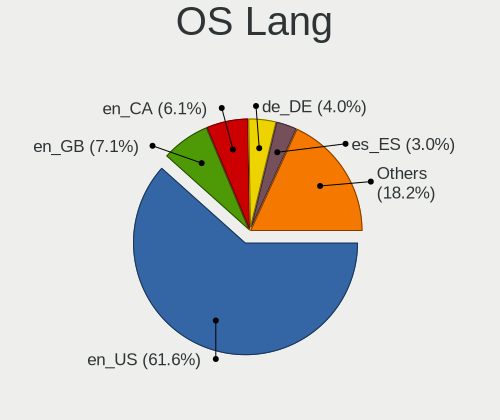
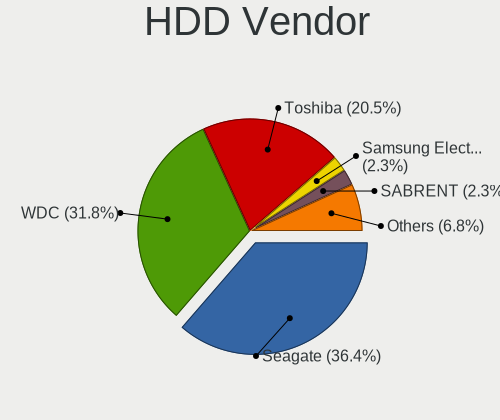
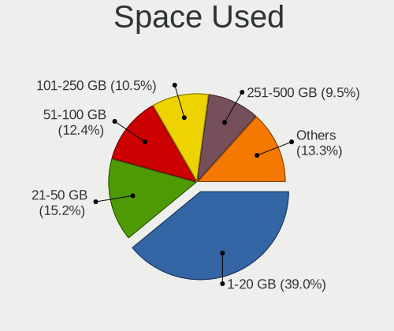
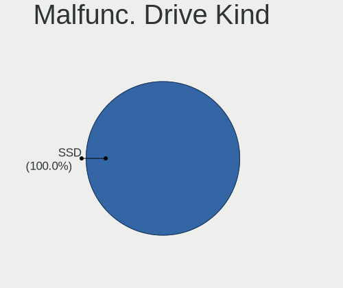
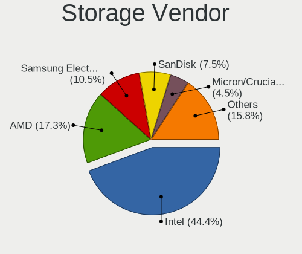
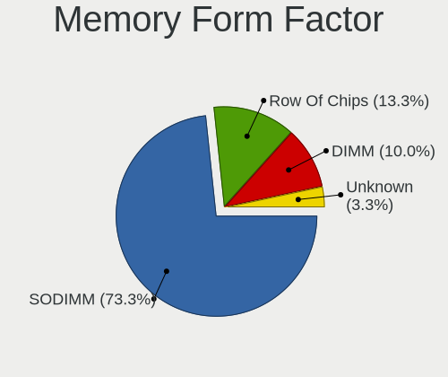

Ultramarine - Tested Hardware & Statistics
------------------------------------------

A project to collect tested hardware configurations for Ultramarine.

Anyone can contribute to this report by the [hw-probe](https://github.com/linuxhw/hw-probe) tool:

    sudo -E hw-probe -all -upload

Please contribute! Especially if your hardware is rare.

This is a report for all computer types. See also reports for [desktops](/Dist/Ultramarine/Desktop/README.md) and [notebooks](/Dist/Ultramarine/Notebook/README.md).

Contents
--------

* [ Test Cases ](#test-cases)

* [ System ](#system)
  - [ OS                       ](#os)
  - [ OS Family                ](#os-family)
  - [ Kernel                   ](#kernel)
  - [ Kernel Family            ](#kernel-family)
  - [ Kernel Major Ver.        ](#kernel-major-ver)
  - [ Arch                     ](#arch)
  - [ DE                       ](#de)
  - [ Display Server           ](#display-server)
  - [ Display Manager          ](#display-manager)
  - [ OS Lang                  ](#os-lang)
  - [ Boot Mode                ](#boot-mode)
  - [ Filesystem               ](#filesystem)
  - [ Part. scheme             ](#part-scheme)
  - [ Dual Boot with Linux/BSD ](#dual-boot-with-linuxbsd)
  - [ Dual Boot (Win)          ](#dual-boot-win)

* [ Board ](#board)
  - [ Vendor                   ](#vendor)
  - [ Model                    ](#model)
  - [ Model Family             ](#model-family)
  - [ MFG Year                 ](#mfg-year)
  - [ Form Factor              ](#form-factor)
  - [ Secure Boot              ](#secure-boot)
  - [ Coreboot                 ](#coreboot)
  - [ RAM Size                 ](#ram-size)
  - [ RAM Used                 ](#ram-used)
  - [ Total Drives             ](#total-drives)
  - [ Has CD-ROM               ](#has-cd-rom)
  - [ Has Ethernet             ](#has-ethernet)
  - [ Has WiFi                 ](#has-wifi)
  - [ Has Bluetooth            ](#has-bluetooth)

* [ Location ](#location)
  - [ Country                  ](#country)
  - [ City                     ](#city)

* [ Drives ](#drives)
  - [ Drive Vendor             ](#drive-vendor)
  - [ Drive Model              ](#drive-model)
  - [ HDD Vendor               ](#hdd-vendor)
  - [ SSD Vendor               ](#ssd-vendor)
  - [ Drive Kind               ](#drive-kind)
  - [ Drive Connector          ](#drive-connector)
  - [ Drive Size               ](#drive-size)
  - [ Space Total              ](#space-total)
  - [ Space Used               ](#space-used)
  - [ Malfunc. Drives          ](#malfunc-drives)
  - [ Malfunc. Drive Vendor    ](#malfunc-drive-vendor)
  - [ Malfunc. HDD Vendor      ](#malfunc-hdd-vendor)
  - [ Malfunc. Drive Kind      ](#malfunc-drive-kind)
  - [ Failed Drives            ](#failed-drives)
  - [ Failed Drive Vendor      ](#failed-drive-vendor)
  - [ Drive Status             ](#drive-status)

* [ Storage controller ](#storage-controller)
  - [ Storage Vendor           ](#storage-vendor)
  - [ Storage Model            ](#storage-model)
  - [ Storage Kind             ](#storage-kind)

* [ Processor ](#processor)
  - [ CPU Vendor               ](#cpu-vendor)
  - [ CPU Model                ](#cpu-model)
  - [ CPU Model Family         ](#cpu-model-family)
  - [ CPU Cores                ](#cpu-cores)
  - [ CPU Sockets              ](#cpu-sockets)
  - [ CPU Threads              ](#cpu-threads)
  - [ CPU Op-Modes             ](#cpu-op-modes)
  - [ CPU Microcode            ](#cpu-microcode)
  - [ CPU Microarch            ](#cpu-microarch)

* [ Graphics ](#graphics)
  - [ GPU Vendor               ](#gpu-vendor)
  - [ GPU Model                ](#gpu-model)
  - [ GPU Combo                ](#gpu-combo)
  - [ GPU Driver               ](#gpu-driver)
  - [ GPU Memory               ](#gpu-memory)

* [ Monitor ](#monitor)
  - [ Monitor Vendor           ](#monitor-vendor)
  - [ Monitor Model            ](#monitor-model)
  - [ Monitor Resolution       ](#monitor-resolution)
  - [ Monitor Diagonal         ](#monitor-diagonal)
  - [ Monitor Width            ](#monitor-width)
  - [ Aspect Ratio             ](#aspect-ratio)
  - [ Monitor Area             ](#monitor-area)
  - [ Pixel Density            ](#pixel-density)
  - [ Multiple Monitors        ](#multiple-monitors)

* [ Network ](#network)
  - [ Net Controller Vendor    ](#net-controller-vendor)
  - [ Net Controller Model     ](#net-controller-model)
  - [ Wireless Vendor          ](#wireless-vendor)
  - [ Wireless Model           ](#wireless-model)
  - [ Ethernet Vendor          ](#ethernet-vendor)
  - [ Ethernet Model           ](#ethernet-model)
  - [ Net Controller Kind      ](#net-controller-kind)
  - [ Used Controller          ](#used-controller)
  - [ NICs                     ](#nics)
  - [ IPv6                     ](#ipv6)

* [ Bluetooth ](#bluetooth)
  - [ Bluetooth Vendor         ](#bluetooth-vendor)
  - [ Bluetooth Model          ](#bluetooth-model)

* [ Sound ](#sound)
  - [ Sound Vendor             ](#sound-vendor)
  - [ Sound Model              ](#sound-model)

* [ Memory ](#memory)
  - [ Memory Vendor            ](#memory-vendor)
  - [ Memory Model             ](#memory-model)
  - [ Memory Kind              ](#memory-kind)
  - [ Memory Form Factor       ](#memory-form-factor)
  - [ Memory Size              ](#memory-size)
  - [ Memory Speed             ](#memory-speed)

* [ Printers & scanners ](#printers--scanners)
  - [ Printer Vendor           ](#printer-vendor)
  - [ Printer Model            ](#printer-model)
  - [ Scanner Vendor           ](#scanner-vendor)
  - [ Scanner Model            ](#scanner-model)

* [ Camera ](#camera)
  - [ Camera Vendor            ](#camera-vendor)
  - [ Camera Model             ](#camera-model)

* [ Security ](#security)
  - [ Fingerprint Vendor       ](#fingerprint-vendor)
  - [ Fingerprint Model        ](#fingerprint-model)
  - [ Chipcard Vendor          ](#chipcard-vendor)
  - [ Chipcard Model           ](#chipcard-model)

* [ Unsupported ](#unsupported)
  - [ Unsupported Devices      ](#unsupported-devices)
  - [ Unsupported Device Types ](#unsupported-device-types)

Test Cases
----------

Total: 128

| Vendor        | Model                       | Form-Factor | Probe                                                      | Date         |
|---------------|-----------------------------|-------------|------------------------------------------------------------|--------------|
| Lenovo        | ThinkPad T60 2007WHH        | Notebook    | [12562aee82](https://linux-hardware.org/?probe=12562aee82) | Jan 04, 2025 |
| Toshiba       | QOSMIO X775                 | Notebook    | [339f01aea5](https://linux-hardware.org/?probe=339f01aea5) | Jan 03, 2025 |
| Intel         | NUC7i5DNB J57626-514        | Mini pc     | [ef0b742827](https://linux-hardware.org/?probe=ef0b742827) | Dec 26, 2024 |
| Toshiba       | QOSMIO X775                 | Notebook    | [23dbe1fbd6](https://linux-hardware.org/?probe=23dbe1fbd6) | Nov 26, 2024 |
| Lenovo        | ThinkPad T480s 20L8S8640... | Notebook    | [746af80e1a](https://linux-hardware.org/?probe=746af80e1a) | Nov 01, 2024 |
| Lenovo        | ThinkPad T480s 20L8S8640... | Notebook    | [3652f4d59d](https://linux-hardware.org/?probe=3652f4d59d) | Oct 31, 2024 |
| Dell          | Inspiron 15 3535            | Notebook    | [a4ce2a5ac9](https://linux-hardware.org/?probe=a4ce2a5ac9) | Oct 31, 2024 |
| ASUSTek       | PRIME A320M-K               | Desktop     | [d6dd06cfca](https://linux-hardware.org/?probe=d6dd06cfca) | Oct 28, 2024 |
| HP            | Laptop 15-ef2xxx            | Notebook    | [1bcbbcf0d7](https://linux-hardware.org/?probe=1bcbbcf0d7) | Oct 26, 2024 |
| Dell          | Precision 5570              | Notebook    | [4f095c8d49](https://linux-hardware.org/?probe=4f095c8d49) | Oct 23, 2024 |
| Gigabyte      | B650 GAMING X AX V2         | Desktop     | [d1456149de](https://linux-hardware.org/?probe=d1456149de) | Oct 19, 2024 |
| Dell          | Latitude E5510              | Notebook    | [be1db31198](https://linux-hardware.org/?probe=be1db31198) | Oct 16, 2024 |
| Dell          | Inspiron 14 7435 2-in-1     | Convertible | [c5a73f63da](https://linux-hardware.org/?probe=c5a73f63da) | Oct 13, 2024 |
| Lenovo        | ThinkPad P52s 20LCS0MH00    | Notebook    | [07bbca04a0](https://linux-hardware.org/?probe=07bbca04a0) | Oct 06, 2024 |
| Dell          | Inspiron 3505               | Notebook    | [cd854620f0](https://linux-hardware.org/?probe=cd854620f0) | Oct 06, 2024 |
| Dell          | Inspiron 3505               | Notebook    | [72990baeb9](https://linux-hardware.org/?probe=72990baeb9) | Oct 06, 2024 |
| Dell          | Latitude 5410               | Notebook    | [91cbd5e4a0](https://linux-hardware.org/?probe=91cbd5e4a0) | Oct 05, 2024 |
| HP            | Pavilion 17                 | Notebook    | [19403f16a0](https://linux-hardware.org/?probe=19403f16a0) | Oct 05, 2024 |
| Dell          | Precision 5530              | Notebook    | [cdaacbe775](https://linux-hardware.org/?probe=cdaacbe775) | Oct 05, 2024 |
| Google        | Fleex                       | Notebook    | [05a6990467](https://linux-hardware.org/?probe=05a6990467) | Sep 27, 2024 |
| Unknown       | Unknown                     | Notebook    | [c84318443d](https://linux-hardware.org/?probe=c84318443d) | Sep 25, 2024 |
| Dell          | 0J8G6F A02                  | Desktop     | [968e081763](https://linux-hardware.org/?probe=968e081763) | Sep 23, 2024 |
| Chuwi         | GemiBook Pro                | Notebook    | [dde72fe9cf](https://linux-hardware.org/?probe=dde72fe9cf) | Sep 17, 2024 |
| Google        | Drobit                      | Notebook    | [2c312c592f](https://linux-hardware.org/?probe=2c312c592f) | Aug 31, 2024 |
| MSI           | Z790 GAMING PLUS WIFI       | Desktop     | [47a7b5f3f3](https://linux-hardware.org/?probe=47a7b5f3f3) | Aug 26, 2024 |
| Lenovo        | Z710 20250                  | Notebook    | [a44ab1d0fd](https://linux-hardware.org/?probe=a44ab1d0fd) | Aug 24, 2024 |
| Lenovo        | LOQ 15APH8 82XT             | Notebook    | [50747463cb](https://linux-hardware.org/?probe=50747463cb) | Aug 21, 2024 |
| Gigabyte      | B550 VISION D-P             | Desktop     | [4ab76c3030](https://linux-hardware.org/?probe=4ab76c3030) | Aug 20, 2024 |
| Dell          | 09M8Y8 A01                  | Desktop     | [8154c94d2d](https://linux-hardware.org/?probe=8154c94d2d) | Aug 18, 2024 |
| ASUSTek       | VivoBook_ASUSLaptop X160... | Notebook    | [c7919b571d](https://linux-hardware.org/?probe=c7919b571d) | Jul 31, 2024 |
| Google        | Nami                        | Notebook    | [c8a8ef90f9](https://linux-hardware.org/?probe=c8a8ef90f9) | Jul 17, 2024 |
| Acer          | Switch SA5-271              | Tablet      | [3275349eb1](https://linux-hardware.org/?probe=3275349eb1) | Jul 16, 2024 |
| Fujitsu       | D3162-A1 S26361-D3162-A1    | Desktop     | [d8f579c579](https://linux-hardware.org/?probe=d8f579c579) | Jul 11, 2024 |
| Fujitsu       | D3162-A1 S26361-D3162-A1    | Desktop     | [9217eb5455](https://linux-hardware.org/?probe=9217eb5455) | Jul 10, 2024 |
| MSI           | Creator M16 HX C14VFG       | Notebook    | [137c25b31b](https://linux-hardware.org/?probe=137c25b31b) | Jul 07, 2024 |
| Gigabyte      | B550 VISION D-P             | Desktop     | [e3f4a68e11](https://linux-hardware.org/?probe=e3f4a68e11) | Jul 03, 2024 |
| Lenovo        | ThinkPad L570 20J9S34000    | Notebook    | [a600d8246f](https://linux-hardware.org/?probe=a600d8246f) | Jun 18, 2024 |
| Dell          | XPS 15 9530                 | Notebook    | [1e145ec645](https://linux-hardware.org/?probe=1e145ec645) | Jun 11, 2024 |
| Google        | Drobit                      | Notebook    | [0b0b8a096b](https://linux-hardware.org/?probe=0b0b8a096b) | Jun 10, 2024 |
| Dell          | 0NW73C A01                  | Desktop     | [2cc413a09c](https://linux-hardware.org/?probe=2cc413a09c) | Jun 10, 2024 |
| Gigabyte      | Z77N-WIFI                   | Desktop     | [d7a2a81328](https://linux-hardware.org/?probe=d7a2a81328) | Jun 09, 2024 |
| Gigabyte      | B650 AORUS ELITE AX         | Desktop     | [40e2e9b9f4](https://linux-hardware.org/?probe=40e2e9b9f4) | Jun 07, 2024 |
| Samsung       | 950QDB                      | Convertible | [e3699f1d4c](https://linux-hardware.org/?probe=e3699f1d4c) | Jun 01, 2024 |
| Lenovo        | B40-80 80LS                 | Notebook    | [0630c37769](https://linux-hardware.org/?probe=0630c37769) | May 31, 2024 |
| Lenovo        | B40-80 80LS                 | Notebook    | [c0bbbf1450](https://linux-hardware.org/?probe=c0bbbf1450) | May 31, 2024 |
| LTD Delovo... | EVE 1494E ES1280EW          | Tablet      | [f9c62eb2b3](https://linux-hardware.org/?probe=f9c62eb2b3) | May 28, 2024 |
| Intel         | NUC7i5DNB J57626-514        | Mini pc     | [9c408725cf](https://linux-hardware.org/?probe=9c408725cf) | May 28, 2024 |
| Lenovo        | 330S-15ARR 81FB             | Notebook    | [7d5b244b02](https://linux-hardware.org/?probe=7d5b244b02) | May 22, 2024 |
| Timi          | RedmiBook 15                | Notebook    | [f86f533af7](https://linux-hardware.org/?probe=f86f533af7) | May 19, 2024 |
| Acer          | Aspire A315-31              | Notebook    | [e6b1ec681a](https://linux-hardware.org/?probe=e6b1ec681a) | May 17, 2024 |
| HP            | EliteBook 845 14 inch G1... | Notebook    | [cf3db9398d](https://linux-hardware.org/?probe=cf3db9398d) | Apr 22, 2024 |
| HP            | EliteBook 845 14 inch G1... | Notebook    | [6eeb53e317](https://linux-hardware.org/?probe=6eeb53e317) | Apr 22, 2024 |
| Gigabyte      | P55A-UD3                    | Desktop     | [c7ceab8c20](https://linux-hardware.org/?probe=c7ceab8c20) | Apr 07, 2024 |
| Intel         | X99                         | Desktop     | [ce7d0c7c5d](https://linux-hardware.org/?probe=ce7d0c7c5d) | Apr 06, 2024 |
| HP            | 81B9 1000                   | All in one  | [cb43f1497c](https://linux-hardware.org/?probe=cb43f1497c) | Apr 05, 2024 |
| HP            | Laptop 15-fd0xxx            | Notebook    | [5babc725b2](https://linux-hardware.org/?probe=5babc725b2) | Mar 30, 2024 |
| Dell          | 09M8Y8 A01                  | Desktop     | [c90acd6853](https://linux-hardware.org/?probe=c90acd6853) | Mar 29, 2024 |
| Infinix       | INBOOK X2 PLUS              | Notebook    | [823ba3ef42](https://linux-hardware.org/?probe=823ba3ef42) | Feb 21, 2024 |
| Gigabyte      | X79-UP4                     | Desktop     | [b3ef558527](https://linux-hardware.org/?probe=b3ef558527) | Feb 17, 2024 |
| Gigabyte      | X79-UP4                     | Desktop     | [3605afbba0](https://linux-hardware.org/?probe=3605afbba0) | Feb 16, 2024 |
| Lenovo        | ThinkPad T450s 20BWS1RT0... | Notebook    | [562ce94bd6](https://linux-hardware.org/?probe=562ce94bd6) | Feb 12, 2024 |
| AZW           | Gemini T45                  | Desktop     | [a07e2329bb](https://linux-hardware.org/?probe=a07e2329bb) | Feb 05, 2024 |
| AZW           | Gemini T45                  | Desktop     | [5caae813f4](https://linux-hardware.org/?probe=5caae813f4) | Feb 05, 2024 |
| Gigabyte      | X79-UP4                     | Desktop     | [32cafc74cf](https://linux-hardware.org/?probe=32cafc74cf) | Jan 28, 2024 |
| Sony          | VPCF215FX                   | Notebook    | [e7ac2326bd](https://linux-hardware.org/?probe=e7ac2326bd) | Jan 26, 2024 |
| Dell          | XPS 15 9500                 | Notebook    | [16e13e79b4](https://linux-hardware.org/?probe=16e13e79b4) | Jan 09, 2024 |
| HP            | OMEN by Laptop 15-ce0xx     | Notebook    | [b811bdcbfd](https://linux-hardware.org/?probe=b811bdcbfd) | Jan 07, 2024 |
| Apple         | MacBookPro5,5               | Notebook    | [609aece6c1](https://linux-hardware.org/?probe=609aece6c1) | Dec 28, 2023 |
| ASUSTek       | PRIME B550-PLUS AC-HES      | Desktop     | [3acdabd584](https://linux-hardware.org/?probe=3acdabd584) | Dec 27, 2023 |
| HP            | Pavilion x360 Convertibl... | Convertible | [7c88ff72d7](https://linux-hardware.org/?probe=7c88ff72d7) | Dec 18, 2023 |
| HP            | Pavilion x360 Convertibl... | Convertible | [6533a19479](https://linux-hardware.org/?probe=6533a19479) | Dec 18, 2023 |
| Dell          | 09M8Y8 A01                  | Desktop     | [f4932d00ca](https://linux-hardware.org/?probe=f4932d00ca) | Dec 16, 2023 |
| ASUSTek       | CROSSHAIR VI HERO           | Desktop     | [03b847bfea](https://linux-hardware.org/?probe=03b847bfea) | Dec 13, 2023 |
| Gigabyte      | B550M DS3H AC               | Desktop     | [c04e33a35b](https://linux-hardware.org/?probe=c04e33a35b) | Dec 13, 2023 |
| Gigabyte      | B550M DS3H AC               | Desktop     | [8d856712c9](https://linux-hardware.org/?probe=8d856712c9) | Dec 13, 2023 |
| MSI           | MAG B550 TOMAHAWK           | Desktop     | [6be46afd51](https://linux-hardware.org/?probe=6be46afd51) | Dec 10, 2023 |
| Chuwi         | CoreBook X                  | Notebook    | [6364cca19b](https://linux-hardware.org/?probe=6364cca19b) | Dec 07, 2023 |
| Fujitsu       | LIFEBOOK UH554              | Notebook    | [cfdc07bd6d](https://linux-hardware.org/?probe=cfdc07bd6d) | Dec 05, 2023 |
| GPU Compan... | GWTN156-2BK                 | Notebook    | [4dee905c74](https://linux-hardware.org/?probe=4dee905c74) | Nov 26, 2023 |
| ASUSTek       | Zenbook UM3402YA_UM3402Y... | Notebook    | [189d6b3a6f](https://linux-hardware.org/?probe=189d6b3a6f) | Nov 25, 2023 |
| Dell          | XPS 15 9570                 | Notebook    | [341114c78a](https://linux-hardware.org/?probe=341114c78a) | Oct 31, 2023 |
| HP            | 805E                        | All in one  | [94013a53b7](https://linux-hardware.org/?probe=94013a53b7) | Oct 22, 2023 |
| Gigabyte      | X79-UP4                     | Desktop     | [9c4b6341e0](https://linux-hardware.org/?probe=9c4b6341e0) | Oct 18, 2023 |
| HP            | 805E                        | All in one  | [04d2314394](https://linux-hardware.org/?probe=04d2314394) | Oct 16, 2023 |
| Apple         | MacBookPro8,3               | Notebook    | [f0be6c3478](https://linux-hardware.org/?probe=f0be6c3478) | Oct 04, 2023 |
| Pegatron      | 2A9A                        | Desktop     | [f4c8507e2b](https://linux-hardware.org/?probe=f4c8507e2b) | Oct 02, 2023 |
| Gigabyte      | Z390 AORUS PRO WIFI-CF      | Desktop     | [aacbd7403c](https://linux-hardware.org/?probe=aacbd7403c) | Aug 10, 2023 |
| Gigabyte      | Z390 AORUS PRO WIFI-CF      | Desktop     | [a7a57a8a56](https://linux-hardware.org/?probe=a7a57a8a56) | Aug 10, 2023 |
| ASUSTek       | P8H77-M                     | Desktop     | [1764158bf6](https://linux-hardware.org/?probe=1764158bf6) | Aug 03, 2023 |
| Lenovo        | ThinkPad L570 20JRS06XGE    | Notebook    | [cae3db2f8d](https://linux-hardware.org/?probe=cae3db2f8d) | Jul 28, 2023 |
| Acer          | Nitro N50-600 V:1.1         | Desktop     | [663261b61f](https://linux-hardware.org/?probe=663261b61f) | Jul 04, 2023 |
| Gigabyte      | GA-78LMT-USB3               | Desktop     | [dedc98e84e](https://linux-hardware.org/?probe=dedc98e84e) | Jun 10, 2023 |
| ASUSTek       | ZenBook UX425EA_UX425EA     | Notebook    | [8a88263cea](https://linux-hardware.org/?probe=8a88263cea) | Apr 26, 2023 |
| ASUSTek       | ZenBook UX425EA_UX425EA     | Notebook    | [2f7f2efd4f](https://linux-hardware.org/?probe=2f7f2efd4f) | Apr 26, 2023 |
| Apple         | Mac-F2238BAE iMac11,3       | All in one  | [dbb3f8fa6f](https://linux-hardware.org/?probe=dbb3f8fa6f) | Apr 14, 2023 |
| Framework     | Laptop (12th Gen Intel C... | Notebook    | [83f4df6005](https://linux-hardware.org/?probe=83f4df6005) | Apr 12, 2023 |
| Apple         | Mac-F2238BAE iMac11,3       | All in one  | [35bfc8316b](https://linux-hardware.org/?probe=35bfc8316b) | Mar 23, 2023 |
| Apple         | Mac-F2238BAE iMac11,3       | All in one  | [170ebcea1c](https://linux-hardware.org/?probe=170ebcea1c) | Mar 22, 2023 |
| Foxconn       | 2AB1                        | Desktop     | [23c3c64afa](https://linux-hardware.org/?probe=23c3c64afa) | Mar 17, 2023 |
| Foxconn       | 2AB1                        | Desktop     | [bc6f32a856](https://linux-hardware.org/?probe=bc6f32a856) | Mar 17, 2023 |
| Framework     | Laptop (12th Gen Intel C... | Notebook    | [fbe7aabd96](https://linux-hardware.org/?probe=fbe7aabd96) | Mar 12, 2023 |
| Gigabyte      | GA-78LMT-S2 sex             | Desktop     | [e61ebad4f6](https://linux-hardware.org/?probe=e61ebad4f6) | Mar 12, 2023 |
| Lenovo        | IdeaPad S145-14IWL 81MU     | Notebook    | [58bcb8bf04](https://linux-hardware.org/?probe=58bcb8bf04) | Feb 18, 2023 |
| Fujitsu       | LIFEBOOK AH532              | Notebook    | [cf200b9cf1](https://linux-hardware.org/?probe=cf200b9cf1) | Jan 30, 2023 |
| ASUSTek       | B85M-G                      | Desktop     | [26fd2a9f6a](https://linux-hardware.org/?probe=26fd2a9f6a) | Jan 29, 2023 |
| Lenovo        | ThinkCentre M58 6258D3G     | Desktop     | [8bc1c22b23](https://linux-hardware.org/?probe=8bc1c22b23) | Jan 25, 2023 |
| Biostar       | H310MHP                     | Desktop     | [6495c0927b](https://linux-hardware.org/?probe=6495c0927b) | Jan 16, 2023 |
| Google        | Blooglet                    | Notebook    | [b3a163b99b](https://linux-hardware.org/?probe=b3a163b99b) | Dec 19, 2022 |
| Lenovo        | ThinkPad T430 2349L26       | Notebook    | [9d0bcbdc75](https://linux-hardware.org/?probe=9d0bcbdc75) | Dec 11, 2022 |
| HP            | 245 G5 Notebook PC          | Notebook    | [deed1dcf4d](https://linux-hardware.org/?probe=deed1dcf4d) | Nov 21, 2022 |
| Fujitsu       | LIFEBOOK AH532              | Notebook    | [dc29e6568f](https://linux-hardware.org/?probe=dc29e6568f) | Oct 10, 2022 |
| Framework     | Laptop (12th Gen Intel C... | Notebook    | [be6b59f511](https://linux-hardware.org/?probe=be6b59f511) | Oct 07, 2022 |
| HP            | ProBook 470 G5              | Notebook    | [eb67db5bff](https://linux-hardware.org/?probe=eb67db5bff) | Sep 19, 2022 |
| HP            | ProBook 470 G5              | Notebook    | [793fa18b58](https://linux-hardware.org/?probe=793fa18b58) | Sep 19, 2022 |
| Framework     | Laptop (12th Gen Intel C... | Notebook    | [5e8d80eacc](https://linux-hardware.org/?probe=5e8d80eacc) | Sep 18, 2022 |
| MSI           | B450M BAZOOKA MAX WIFI      | Desktop     | [1eb939b09f](https://linux-hardware.org/?probe=1eb939b09f) | Sep 12, 2022 |
| Lenovo        | 14w 81MQ00AVCL              | Notebook    | [c1a16c7963](https://linux-hardware.org/?probe=c1a16c7963) | Sep 06, 2022 |
| Lenovo        | 14w 81MQ00AVCL              | Notebook    | [2ae4968612](https://linux-hardware.org/?probe=2ae4968612) | Sep 06, 2022 |
| HP            | Notebook                    | Notebook    | [2d11bc2975](https://linux-hardware.org/?probe=2d11bc2975) | Aug 26, 2022 |
| MSI           | A320M-A PRO MAX             | Desktop     | [cdee8ca864](https://linux-hardware.org/?probe=cdee8ca864) | Aug 12, 2022 |
| ASUSTek       | VivoBook_ASUS Laptop X50... | Notebook    | [eb79423b1d](https://linux-hardware.org/?probe=eb79423b1d) | Aug 12, 2022 |
| Acer          | Aspire A517-52              | Notebook    | [dfd7afda26](https://linux-hardware.org/?probe=dfd7afda26) | Jul 27, 2022 |
| HP            | Laptop 14s-dq2xxx           | Notebook    | [616a2b7524](https://linux-hardware.org/?probe=616a2b7524) | Jul 12, 2022 |
| Dell          | Latitude E7440              | Notebook    | [b57ab513eb](https://linux-hardware.org/?probe=b57ab513eb) | Jul 06, 2022 |
| HP            | 240 G7                      | Notebook    | [2af5911cf8](https://linux-hardware.org/?probe=2af5911cf8) | Jun 12, 2022 |
| ASUSTek       | D940MX                      | Desktop     | [bdc8831182](https://linux-hardware.org/?probe=bdc8831182) | Mar 28, 2022 |
| Lenovo        | ThinkPad P50 20EQS0VV02     | Notebook    | [7a7b9fa959](https://linux-hardware.org/?probe=7a7b9fa959) | Feb 13, 2022 |
| Lenovo        | ThinkPad P50 20EQS0VV02     | Notebook    | [96577868b7](https://linux-hardware.org/?probe=96577868b7) | Jan 28, 2022 |

System
------

OS
--

Installed operating systems

| Name                 | Computers | Percent |
|----------------------|-----------|---------|
| Ultramarine 40       | 39        | 39%     |
| Ultramarine 39       | 24        | 24%     |
| Ultramarine Linux 36 | 14        | 14%     |
| Ultramarine 38       | 10        | 10%     |
| Ultramarine 37       | 8         | 8%      |
| Ultramarine 41       | 3         | 3%      |
| Ultramarine Linux 35 | 2         | 2%      |

OS Family
---------

OS without a version

| Name        | Computers | Percent |
|-------------|-----------|---------|
| Ultramarine | 97        | 100%    |

Kernel
------

Version of the Linux kernel

| Version                  | Computers | Percent |
|--------------------------|-----------|---------|
| 6.8.11-300.fc40.x86_64   | 12        | 11.11%  |
| 6.8.10-300.fc40.x86_64   | 4         | 3.7%    |
| 6.6.2-201.fc39.x86_64    | 4         | 3.7%    |
| 6.7.4-200.fc39.x86_64    | 3         | 2.78%   |
| 6.6.4-200.fc39.x86_64    | 3         | 2.78%   |
| 5.19.4-200.fc36.x86_64   | 3         | 2.78%   |
| 6.9.8-200.fc40.x86_64    | 2         | 1.85%   |
| 6.9.7-200.fc40.x86_64    | 2         | 1.85%   |
| 6.9.5-200.fc40.x86_64    | 2         | 1.85%   |
| 6.8.4-200.fc39.x86_64    | 2         | 1.85%   |
| 6.6.9-200.fc39.x86_64    | 2         | 1.85%   |
| 6.6.3-200.fc39.x86_64    | 2         | 1.85%   |
| 6.6.13-200.fc39.x86_64   | 2         | 1.85%   |
| 6.5.6-200.fc38.x86_64    | 2         | 1.85%   |
| 6.12.6-200.fc41.x86_64   | 2         | 1.85%   |
| 6.11.3-200.fc40.x86_64   | 2         | 1.85%   |
| 6.10.9-200.fc40.x86_64   | 2         | 1.85%   |
| 6.10.12-200.fc40.x86_64  | 2         | 1.85%   |
| 6.1.7-200.fc37.x86_64    | 2         | 1.85%   |
| 6.1.18-200.fc37.x86_64   | 2         | 1.85%   |
| 6.0.8-200.fc36.x86_64    | 2         | 1.85%   |
| 5.17.7-300.fc36.x86_64   | 2         | 1.85%   |
| 6.9.4-200.fc40.x86_64    | 1         | 0.93%   |
| 6.9.12-200.fc40.x86_64   | 1         | 0.93%   |
| 6.9.11-200.fc40.x86_64   | 1         | 0.93%   |
| 6.8.9-300.fc40.x86_64    | 1         | 0.93%   |
| 6.8.9-200.fc39.x86_64    | 1         | 0.93%   |
| 6.8.8-300.fc40.x86_64    | 1         | 0.93%   |
| 6.8.6-200.fc39.x86_64    | 1         | 0.93%   |
| 6.8.2-300.fc40.x86_64    | 1         | 0.93%   |
| 6.8.12-300.fc40.x86_64   | 1         | 0.93%   |
| 6.8.11-200.fc39.x86_64   | 1         | 0.93%   |
| 6.7.11-200.fc39.x86_64   | 1         | 0.93%   |
| 6.6.8-200.fc39.x86_64    | 1         | 0.93%   |
| 6.6.0-61.rog.fc39.x86_64 | 1         | 0.93%   |
| 6.5.8-200.fc38.x86_64    | 1         | 0.93%   |
| 6.5.5-200.fc38.x86_64    | 1         | 0.93%   |
| 6.5.12-300.fc39.x86_64   | 1         | 0.93%   |
| 6.4.8-200.fc38.x86_64    | 1         | 0.93%   |
| 6.4.6-200.fc38.x86_64    | 1         | 0.93%   |

Kernel Family
-------------

Linux kernel without a distro release

| Version | Computers | Percent |
|---------|-----------|---------|
| 6.8.11  | 13        | 12.04%  |
| 6.8.10  | 4         | 3.7%    |
| 6.6.2   | 4         | 3.7%    |
| 6.7.4   | 3         | 2.78%   |
| 6.6.4   | 3         | 2.78%   |
| 6.1.7   | 3         | 2.78%   |
| 5.19.4  | 3         | 2.78%   |
| 6.9.8   | 2         | 1.85%   |
| 6.9.7   | 2         | 1.85%   |
| 6.9.5   | 2         | 1.85%   |
| 6.8.9   | 2         | 1.85%   |
| 6.8.4   | 2         | 1.85%   |
| 6.6.9   | 2         | 1.85%   |
| 6.6.3   | 2         | 1.85%   |
| 6.6.13  | 2         | 1.85%   |
| 6.5.6   | 2         | 1.85%   |
| 6.12.6  | 2         | 1.85%   |
| 6.11.4  | 2         | 1.85%   |
| 6.11.3  | 2         | 1.85%   |
| 6.10.9  | 2         | 1.85%   |
| 6.10.12 | 2         | 1.85%   |
| 6.1.5   | 2         | 1.85%   |
| 6.1.18  | 2         | 1.85%   |
| 6.0.8   | 2         | 1.85%   |
| 5.17.7  | 2         | 1.85%   |
| 6.9.4   | 1         | 0.93%   |
| 6.9.12  | 1         | 0.93%   |
| 6.9.11  | 1         | 0.93%   |
| 6.8.8   | 1         | 0.93%   |
| 6.8.6   | 1         | 0.93%   |
| 6.8.2   | 1         | 0.93%   |
| 6.8.12  | 1         | 0.93%   |
| 6.7.11  | 1         | 0.93%   |
| 6.6.8   | 1         | 0.93%   |
| 6.6.0   | 1         | 0.93%   |
| 6.5.8   | 1         | 0.93%   |
| 6.5.5   | 1         | 0.93%   |
| 6.5.12  | 1         | 0.93%   |
| 6.4.8   | 1         | 0.93%   |
| 6.4.6   | 1         | 0.93%   |

Kernel Major Ver.
-----------------

Linux kernel major version

| Version | Computers | Percent |
|---------|-----------|---------|
| 6.8     | 25        | 23.36%  |
| 6.6     | 15        | 14.02%  |
| 6.10    | 9         | 8.41%   |
| 6.1     | 9         | 8.41%   |
| 6.9     | 8         | 7.48%   |
| 5.19    | 6         | 5.61%   |
| 6.5     | 5         | 4.67%   |
| 6.11    | 5         | 4.67%   |
| 6.7     | 4         | 3.74%   |
| 6.4     | 4         | 3.74%   |
| 5.18    | 3         | 2.8%    |
| 5.17    | 3         | 2.8%    |
| 6.3     | 2         | 1.87%   |
| 6.2     | 2         | 1.87%   |
| 6.12    | 2         | 1.87%   |
| 6.0     | 2         | 1.87%   |
| 5.16    | 2         | 1.87%   |
| 5.15    | 1         | 0.93%   |

Arch
----

OS architecture (x86_64, i586, etc.)

| Name   | Computers | Percent |
|--------|-----------|---------|
| x86_64 | 97        | 100%    |

DE
--

Desktop Environment

| Name       | Computers | Percent |
|------------|-----------|---------|
| GNOME      | 31        | 31%     |
| Budgie     | 24        | 24%     |
| KDE6       | 21        | 21%     |
| Pantheon   | 10        | 10%     |
| KDE5       | 10        | 10%     |
| X-Cinnamon | 1         | 1%      |
| sway       | 1         | 1%      |
| KDE4       | 1         | 1%      |
| Cutefish   | 1         | 1%      |

Display Server
--------------

X11 or Wayland

| Name    | Computers | Percent |
|---------|-----------|---------|
| Wayland | 53        | 53%     |
| X11     | 47        | 47%     |

Display Manager
---------------

SDDM, LightDM, etc.

| Name    | Computers | Percent |
|---------|-----------|---------|
| Unknown | 67        | 69.07%  |
| SDDM    | 14        | 14.43%  |
| LightDM | 9         | 9.28%   |
| GDM     | 7         | 7.22%   |

OS Lang
-------

Language

| Lang  | Computers | Percent |
|-------|-----------|---------|
| en_US | 61        | 61.62%  |
| en_GB | 7         | 7.07%   |
| en_CA | 6         | 6.06%   |
| de_DE | 4         | 4.04%   |
| es_ES | 3         | 3.03%   |
| ru_RU | 2         | 2.02%   |
| it_IT | 2         | 2.02%   |
| es_MX | 2         | 2.02%   |
| es_CL | 2         | 2.02%   |
| en_IN | 2         | 2.02%   |
| en_AU | 2         | 2.02%   |
| pt_PT | 1         | 1.01%   |
| nl_BE | 1         | 1.01%   |
| nb_NO | 1         | 1.01%   |
| hu_HU | 1         | 1.01%   |
| fr_FR | 1         | 1.01%   |
| de_CH | 1         | 1.01%   |

Boot Mode
---------

EFI or BIOS

| Mode | Computers | Percent |
|------|-----------|---------|
| EFI  | 53        | 53.54%  |
| BIOS | 46        | 46.46%  |

Filesystem
----------

Type of filesystem

| Type    | Computers | Percent |
|---------|-----------|---------|
| Btrfs   | 80        | 81.63%  |
| Ext4    | 11        | 11.22%  |
| Tmpfs   | 3         | 3.06%   |
| Overlay | 3         | 3.06%   |
| Xfs     | 1         | 1.02%   |

Part. scheme
------------

Scheme of partitioning

| Type    | Computers | Percent |
|---------|-----------|---------|
| Unknown | 67        | 69.07%  |
| GPT     | 30        | 30.93%  |

Dual Boot with Linux/BSD
------------------------

Hosting more than one Linux/BSD

| Dual boot | Computers | Percent |
|-----------|-----------|---------|
| No        | 89        | 91.75%  |
| Yes       | 8         | 8.25%   |

Dual Boot (Win)
---------------

Hosting Linux and Windows

| Dual boot | Computers | Percent |
|-----------|-----------|---------|
| No        | 87        | 89.69%  |
| Yes       | 10        | 10.31%  |

Board
-----

Vendor
------

Motherboard manufacturer

| Name                | Computers | Percent |
|---------------------|-----------|---------|
| Lenovo              | 16        | 16.49%  |
| Dell                | 14        | 14.43%  |
| Hewlett-Packard     | 13        | 13.4%   |
| Gigabyte Technology | 10        | 10.31%  |
| ASUSTek Computer    | 9         | 9.28%   |
| MSI                 | 5         | 5.15%   |
| Google              | 4         | 4.12%   |
| Acer                | 4         | 4.12%   |
| Fujitsu             | 3         | 3.09%   |
| Apple               | 3         | 3.09%   |
| Intel               | 2         | 2.06%   |
| Chuwi               | 2         | 2.06%   |
| Toshiba             | 1         | 1.03%   |
| Timi                | 1         | 1.03%   |
| Sony                | 1         | 1.03%   |
| Samsung Electronics | 1         | 1.03%   |
| Pegatron            | 1         | 1.03%   |
| LTD Delovoy Office  | 1         | 1.03%   |
| Infinix             | 1         | 1.03%   |
| GPU Company         | 1         | 1.03%   |
| Framework           | 1         | 1.03%   |
| Foxconn             | 1         | 1.03%   |
| Biostar             | 1         | 1.03%   |
| Unknown             | 1         | 1.03%   |

Model
-----

Motherboard model

| Name                                     | Computers | Percent |
|------------------------------------------|-----------|---------|
| Lenovo ThinkPad T480s 20L8S86400         | 2         | 2.06%   |
| Toshiba QOSMIO X775                      | 1         | 1.03%   |
| Timi RedmiBook 15                        | 1         | 1.03%   |
| Sony VPCF215FX                           | 1         | 1.03%   |
| Samsung 950QDB                           | 1         | 1.03%   |
| Pegatron 600-1352                        | 1         | 1.03%   |
| MSI MS-7E06                              | 1         | 1.03%   |
| MSI MS-7C91                              | 1         | 1.03%   |
| MSI MS-7C87                              | 1         | 1.03%   |
| MSI MS-7C52                              | 1         | 1.03%   |
| MSI Creator M16 HX C14VFG                | 1         | 1.03%   |
| LTD Delovoy Office EVE 1494E ES1280EW    | 1         | 1.03%   |
| Lenovo Z710 20250                        | 1         | 1.03%   |
| Lenovo ThinkPad T60 2007WHH              | 1         | 1.03%   |
| Lenovo ThinkPad T450s 20BWS1RT00         | 1         | 1.03%   |
| Lenovo ThinkPad T430 2349L26             | 1         | 1.03%   |
| Lenovo ThinkPad P52s 20LCS0MH00          | 1         | 1.03%   |
| Lenovo ThinkPad P50 20EQS0VV02           | 1         | 1.03%   |
| Lenovo ThinkPad L570 20JRS06XGE          | 1         | 1.03%   |
| Lenovo ThinkPad L570 20J9S34000          | 1         | 1.03%   |
| Lenovo ThinkCentre M58 6258D3G           | 1         | 1.03%   |
| Lenovo LOQ 15APH8 82XT                   | 1         | 1.03%   |
| Lenovo IdeaPad S145-14IWL 81MU           | 1         | 1.03%   |
| Lenovo B40-80 80LS                       | 1         | 1.03%   |
| Lenovo 330S-15ARR 81FB                   | 1         | 1.03%   |
| Lenovo 14w 81MQ00AVCL                    | 1         | 1.03%   |
| Intel X99                                | 1         | 1.03%   |
| Intel NUC7i5DNKPC                        | 1         | 1.03%   |
| Infinix INBOOK X2 PLUS                   | 1         | 1.03%   |
| HP ProOne 600 G2 21.5-in Non-Touch AiO   | 1         | 1.03%   |
| HP ProBook 470 G5                        | 1         | 1.03%   |
| HP Pavilion x360 Convertible 14-dh0xxx   | 1         | 1.03%   |
| HP Pavilion 17                           | 1         | 1.03%   |
| HP OMEN by Laptop 15-ce0xx               | 1         | 1.03%   |
| HP Notebook                              | 1         | 1.03%   |
| HP Laptop 15-fd0xxx                      | 1         | 1.03%   |
| HP Laptop 15-ef2xxx                      | 1         | 1.03%   |
| HP Laptop 14s-dq2xxx                     | 1         | 1.03%   |
| HP EliteBook 845 14 inch G10 Notebook PC | 1         | 1.03%   |
| HP 245 G5 Notebook PC                    | 1         | 1.03%   |

Model Family
------------

Motherboard model prefix

| Name                   | Computers | Percent |
|------------------------|-----------|---------|
| Lenovo ThinkPad        | 9         | 9.28%   |
| Dell XPS               | 4         | 4.12%   |
| HP Laptop              | 3         | 3.09%   |
| Dell Precision         | 3         | 3.09%   |
| Dell Latitude          | 3         | 3.09%   |
| Dell Inspiron          | 3         | 3.09%   |
| HP Pavilion            | 2         | 2.06%   |
| Gigabyte B650          | 2         | 2.06%   |
| Fujitsu LIFEBOOK       | 2         | 2.06%   |
| ASUS Zenbook           | 2         | 2.06%   |
| ASUS PRIME             | 2         | 2.06%   |
| Acer Aspire            | 2         | 2.06%   |
| Toshiba QOSMIO         | 1         | 1.03%   |
| Timi RedmiBook         | 1         | 1.03%   |
| Sony VPCF215FX         | 1         | 1.03%   |
| Samsung 950QDB         | 1         | 1.03%   |
| Pegatron 600-1352      | 1         | 1.03%   |
| MSI MS-7E06            | 1         | 1.03%   |
| MSI MS-7C91            | 1         | 1.03%   |
| MSI MS-7C87            | 1         | 1.03%   |
| MSI MS-7C52            | 1         | 1.03%   |
| MSI Creator            | 1         | 1.03%   |
| LTD Delovoy Office EVE | 1         | 1.03%   |
| Lenovo Z710            | 1         | 1.03%   |
| Lenovo ThinkCentre     | 1         | 1.03%   |
| Lenovo LOQ             | 1         | 1.03%   |
| Lenovo IdeaPad         | 1         | 1.03%   |
| Lenovo B40-80          | 1         | 1.03%   |
| Lenovo 330S-15ARR      | 1         | 1.03%   |
| Lenovo 14w             | 1         | 1.03%   |
| Intel X99              | 1         | 1.03%   |
| Intel NUC7i5DNKPC      | 1         | 1.03%   |
| Infinix INBOOK         | 1         | 1.03%   |
| HP ProOne              | 1         | 1.03%   |
| HP ProBook             | 1         | 1.03%   |
| HP OMEN                | 1         | 1.03%   |
| HP Notebook            | 1         | 1.03%   |
| HP EliteBook           | 1         | 1.03%   |
| HP 245                 | 1         | 1.03%   |
| HP 240                 | 1         | 1.03%   |

MFG Year
--------

Motherboard manufacture year

| Year | Computers | Percent |
|------|-----------|---------|
| 2020 | 12        | 12.37%  |
| 2012 | 12        | 12.37%  |
| 2022 | 10        | 10.31%  |
| 2018 | 10        | 10.31%  |
| 2023 | 8         | 8.25%   |
| 2021 | 8         | 8.25%   |
| 2019 | 8         | 8.25%   |
| 2017 | 6         | 6.19%   |
| 2010 | 4         | 4.12%   |
| 2024 | 3         | 3.09%   |
| 2016 | 3         | 3.09%   |
| 2014 | 3         | 3.09%   |
| 2013 | 3         | 3.09%   |
| 2015 | 2         | 2.06%   |
| 2009 | 2         | 2.06%   |
| 2011 | 1         | 1.03%   |
| 2008 | 1         | 1.03%   |
| 2006 | 1         | 1.03%   |

Form Factor
-----------

Physical design of the computer

| Name        | Computers | Percent |
|-------------|-----------|---------|
| Notebook    | 58        | 59.79%  |
| Desktop     | 30        | 30.93%  |
| Convertible | 3         | 3.09%   |
| All in one  | 3         | 3.09%   |
| Tablet      | 2         | 2.06%   |
| Mini pc     | 1         | 1.03%   |

Secure Boot
-----------

Enabled or disabled

| State    | Computers | Percent |
|----------|-----------|---------|
| Disabled | 83        | 85.57%  |
| Enabled  | 14        | 14.43%  |

Coreboot
--------

Have coreboot on board

| Used | Computers | Percent |
|------|-----------|---------|
| No   | 93        | 95.88%  |
| Yes  | 4         | 4.12%   |

RAM Size
--------

Total RAM memory

| Size in GB  | Computers | Percent |
|-------------|-----------|---------|
| 8.01-16.0   | 23        | 23.47%  |
| 4.01-8.0    | 21        | 21.43%  |
| 16.01-24.0  | 18        | 18.37%  |
| 32.01-64.0  | 14        | 14.29%  |
| 3.01-4.0    | 11        | 11.22%  |
| 64.01-256.0 | 7         | 7.14%   |
| 24.01-32.0  | 3         | 3.06%   |
| 2.01-3.0    | 1         | 1.02%   |

RAM Used
--------

Used RAM memory

| Used GB     | Computers | Percent |
|-------------|-----------|---------|
| 4.01-8.0    | 36        | 33.64%  |
| 2.01-3.0    | 33        | 30.84%  |
| 3.01-4.0    | 20        | 18.69%  |
| 1.01-2.0    | 11        | 10.28%  |
| 8.01-16.0   | 4         | 3.74%   |
| 32.01-64.0  | 1         | 0.93%   |
| 24.01-32.0  | 1         | 0.93%   |
| 64.01-256.0 | 1         | 0.93%   |

Total Drives
------------

Number of drives on board

| Drives | Computers | Percent |
|--------|-----------|---------|
| 1      | 56        | 55.45%  |
| 2      | 30        | 29.7%   |
| 3      | 8         | 7.92%   |
| 4      | 6         | 5.94%   |
| 10     | 1         | 0.99%   |

Has CD-ROM
----------

Has CD-ROM on board

| Presented | Computers | Percent |
|-----------|-----------|---------|
| No        | 67        | 69.07%  |
| Yes       | 30        | 30.93%  |

Has Ethernet
------------

Has Ethernet on board

| Presented | Computers | Percent |
|-----------|-----------|---------|
| Yes       | 64        | 65.98%  |
| No        | 33        | 34.02%  |

Has WiFi
--------

Has WiFi module

| Presented | Computers | Percent |
|-----------|-----------|---------|
| Yes       | 92        | 94.85%  |
| No        | 5         | 5.15%   |

Has Bluetooth
-------------

Has Bluetooth module

| Presented | Computers | Percent |
|-----------|-----------|---------|
| Yes       | 78        | 80.41%  |
| No        | 19        | 19.59%  |

Location
--------

Country
-------

Geographic location (country)

| Country     | Computers | Percent |
|-------------|-----------|---------|
| USA         | 39        | 39.39%  |
| UK          | 6         | 6.06%   |
| Canada      | 6         | 6.06%   |
| Spain       | 4         | 4.04%   |
| Germany     | 4         | 4.04%   |
| Thailand    | 3         | 3.03%   |
| Russia      | 3         | 3.03%   |
| Italy       | 3         | 3.03%   |
| Switzerland | 2         | 2.02%   |
| Romania     | 2         | 2.02%   |
| Mexico      | 2         | 2.02%   |
| Malaysia    | 2         | 2.02%   |
| Indonesia   | 2         | 2.02%   |
| India       | 2         | 2.02%   |
| Chile       | 2         | 2.02%   |
| Belgium     | 2         | 2.02%   |
| Australia   | 2         | 2.02%   |
| Vietnam     | 1         | 1.01%   |
| Portugal    | 1         | 1.01%   |
| Poland      | 1         | 1.01%   |
| Philippines | 1         | 1.01%   |
| Norway      | 1         | 1.01%   |
| Japan       | 1         | 1.01%   |
| Hungary     | 1         | 1.01%   |
| Hong Kong   | 1         | 1.01%   |
| France      | 1         | 1.01%   |
| Egypt       | 1         | 1.01%   |
| Czechia     | 1         | 1.01%   |
| Austria     | 1         | 1.01%   |
| Argentina   | 1         | 1.01%   |

City
----

Geographic location (city)

| City                   | Computers | Percent |
|------------------------|-----------|---------|
| Sacramento             | 4         | 3.92%   |
| Rancho Cordova         | 3         | 2.94%   |
| Bangkok                | 3         | 2.94%   |
| Toronto                | 2         | 1.96%   |
| Ocean Springs          | 2         | 1.96%   |
| Jamestown              | 2         | 1.96%   |
| Chicago                | 2         | 1.96%   |
| Albuquerque            | 2         | 1.96%   |
| Zagazig                | 1         | 0.98%   |
| Wroclaw                | 1         | 0.98%   |
| Windsor                | 1         | 0.98%   |
| Wallowa                | 1         | 0.98%   |
| Vohl                   | 1         | 0.98%   |
| Victoria               | 1         | 0.98%   |
| Vegreville             | 1         | 0.98%   |
| Tokyo                  | 1         | 0.98%   |
| Terrassa               | 1         | 0.98%   |
| Sydney                 | 1         | 0.98%   |
| Streamwood             | 1         | 0.98%   |
| Stoke-on-Trent         | 1         | 0.98%   |
| Southampton            | 1         | 0.98%   |
| South Jordan           | 1         | 0.98%   |
| Skudai                 | 1         | 0.98%   |
| Schwadorf              | 1         | 0.98%   |
| Schwäbisch Hall       | 1         | 0.98%   |
| Santiago               | 1         | 0.98%   |
| San Pedro              | 1         | 0.98%   |
| San Miguel de Tucumán | 1         | 0.98%   |
| San Julian de Muskiz   | 1         | 0.98%   |
| Round Rock             | 1         | 0.98%   |
| Rome                   | 1         | 0.98%   |
| Puerto de la Cruz      | 1         | 0.98%   |
| Port Washington        | 1         | 0.98%   |
| Port Jefferson         | 1         | 0.98%   |
| Phoenix                | 1         | 0.98%   |
| Perm                   | 1         | 0.98%   |
| Paris                  | 1         | 0.98%   |
| Paine                  | 1         | 0.98%   |
| Oberburg               | 1         | 0.98%   |
| Nipigon                | 1         | 0.98%   |

Drives
------

Drive Vendor
------------

Hard drive vendors

| Vendor                       | Computers | Drives | Percent |
|------------------------------|-----------|--------|---------|
| Samsung Electronics          | 24        | 33     | 15.38%  |
| WDC                          | 17        | 20     | 10.9%   |
| Seagate                      | 16        | 17     | 10.26%  |
| Toshiba                      | 10        | 11     | 6.41%   |
| Sandisk                      | 10        | 11     | 6.41%   |
| Kingston                     | 8         | 14     | 5.13%   |
| Crucial                      | 8         | 8      | 5.13%   |
| Unknown                      | 7         | 7      | 4.49%   |
| Micron/Crucial Technology    | 6         | 12     | 3.85%   |
| Intel                        | 6         | 7      | 3.85%   |
| SK hynix                     | 4         | 6      | 2.56%   |
| Shenzhen Longsys Electronics | 2         | 2      | 1.28%   |
| Phison Electronics           | 2         | 2      | 1.28%   |
| OCZ                          | 2         | 2      | 1.28%   |
| Micron Technology            | 2         | 3      | 1.28%   |
| KIOXIA                       | 2         | 2      | 1.28%   |
| JMicron Technology           | 2         | 2      | 1.28%   |
| China                        | 2         | 2      | 1.28%   |
| Acer                         | 2         | 2      | 1.28%   |
| A-DATA Technology            | 2         | 2      | 1.28%   |
| Zheino                       | 1         | 1      | 0.64%   |
| Wibtek                       | 1         | 1      | 0.64%   |
| Team                         | 1         | 1      | 0.64%   |
| SPCC                         | 1         | 1      | 0.64%   |
| SABRENT                      | 1         | 1      | 0.64%   |
| Patriot                      | 1         | 1      | 0.64%   |
| Netac                        | 1         | 1      | 0.64%   |
| MAXIO Technology (Hangzhou)  | 1         | 1      | 0.64%   |
| Leven                        | 1         | 1      | 0.64%   |
| Kingston Technology Company  | 1         | 1      | 0.64%   |
| INTEL SS                     | 1         | 1      | 0.64%   |
| Hitachi                      | 1         | 1      | 0.64%   |
| Gigabyte Technology          | 1         | 1      | 0.64%   |
| Fujitsu                      | 1         | 2      | 0.64%   |
| Fanxiang                     | 1         | 1      | 0.64%   |
| EYOTA                        | 1         | 1      | 0.64%   |
| ETOPSO                       | 1         | 1      | 0.64%   |
| Biostar                      | 1         | 1      | 0.64%   |
| ASMedia                      | 1         | 1      | 0.64%   |
| AMD                          | 1         | 1      | 0.64%   |

Drive Model
-----------

Hard drive models

| Model                                                | Computers | Percent |
|------------------------------------------------------|-----------|---------|
| Samsung NVMe SSD Controller SM981/PM981/PM983 512GB  | 4         | 2.38%   |
| Seagate ST1000LM024 HN-M101MBB 1TB                   | 3         | 1.79%   |
| Samsung SSD 870 QVO 1TB                              | 3         | 1.79%   |
| Samsung SSD 860 EVO 500GB                            | 3         | 1.79%   |
| Samsung NVMe SSD Controller SM961/PM961/SM963 256GB  | 3         | 1.79%   |
| Kingston SA400S37480G 480GB SSD                      | 3         | 1.79%   |
| WDC WD10SPZX-60Z10T0 1TB                             | 2         | 1.19%   |
| Unknown MMC Card  64GB                               | 2         | 1.19%   |
| Unknown MMC Card  128GB                              | 2         | 1.19%   |
| Seagate ST1000LM035-1RK172 1TB                       | 2         | 1.19%   |
| Samsung SSD 840 EVO 250GB                            | 2         | 1.19%   |
| Samsung NVMe SSD Controller PM9A1/PM9A3/980PRO 512GB | 2         | 1.19%   |
| Micron/Crucial P2 NVMe PCIe SSD 500GB                | 2         | 1.19%   |
| Micron/Crucial CT1000T500SSD8 1TB                    | 2         | 1.19%   |
| Kingston SA400S37240G 240GB SSD                      | 2         | 1.19%   |
| Intel SSD Pro 7600p/760p/E 6100p Series 512GB        | 2         | 1.19%   |
| Acer SSD SA100 1920GB                                | 2         | 1.19%   |
| Zheino CHN mSATAM3 512 512GB                         | 1         | 0.6%    |
| Wibtek W800S 512GB SSD                               | 1         | 0.6%    |
| WDC WDS250G2B0A-00SM50 250GB SSD                     | 1         | 0.6%    |
| WDC WDS240G2G0B-00EPW0 240GB SSD                     | 1         | 0.6%    |
| WDC WDS240G2G0A-00JH30 240GB SSD                     | 1         | 0.6%    |
| WDC WDBNCE5000PNC 500GB SSD                          | 1         | 0.6%    |
| WDC WD5000LPCX-60VHAT0 500GB                         | 1         | 0.6%    |
| WDC WD5000AAKX-08U6AA0 500GB                         | 1         | 0.6%    |
| WDC WD4005FZBX-00K5WB0 4TB                           | 1         | 0.6%    |
| WDC WD20EARX-00PASB0 2TB                             | 1         | 0.6%    |
| WDC WD2000JD-22HBC0 200GB                            | 1         | 0.6%    |
| WDC WD10SPZX-24Z10 1TB                               | 1         | 0.6%    |
| WDC WD10JFCX-68N6GN0 1TB                             | 1         | 0.6%    |
| WDC WD10EZEX-60WN4A0 1TB                             | 1         | 0.6%    |
| WDC WD10EZEX-08M2NA0 1TB                             | 1         | 0.6%    |
| WDC WD10EURX-61UY4Y0 1TB                             | 1         | 0.6%    |
| WDC WD1003FBYX-18Y7B0 1TB                            | 1         | 0.6%    |
| WDC WD1001FAES-60Z2A0 1TB                            | 1         | 0.6%    |
| Unknown NVMe SSD Drive 512GB                         | 1         | 0.6%    |
| Unknown MMC Card  7GB                                | 1         | 0.6%    |
| Unknown MMC Card  32GB                               | 1         | 0.6%    |
| Toshiba TL100 240GB SSD                              | 1         | 0.6%    |
| Toshiba MQ04ABF100 1TB                               | 1         | 0.6%    |

HDD Vendor
----------

Hard disk drive vendors

| Vendor              | Computers | Drives | Percent |
|---------------------|-----------|--------|---------|
| Seagate             | 16        | 17     | 36.36%  |
| WDC                 | 14        | 16     | 31.82%  |
| Toshiba             | 9         | 10     | 20.45%  |
| Samsung Electronics | 1         | 2      | 2.27%   |
| SABRENT             | 1         | 1      | 2.27%   |
| JMicron Technology  | 1         | 1      | 2.27%   |
| Hitachi             | 1         | 1      | 2.27%   |
| Fujitsu             | 1         | 2      | 2.27%   |

SSD Vendor
----------

Solid state drive vendors

| Vendor              | Computers | Drives | Percent |
|---------------------|-----------|--------|---------|
| Samsung Electronics | 11        | 14     | 20.75%  |
| Crucial             | 8         | 8      | 15.09%  |
| Kingston            | 6         | 11     | 11.32%  |
| WDC                 | 4         | 4      | 7.55%   |
| SK hynix            | 2         | 2      | 3.77%   |
| OCZ                 | 2         | 2      | 3.77%   |
| China               | 2         | 2      | 3.77%   |
| Acer                | 2         | 2      | 3.77%   |
| A-DATA Technology   | 2         | 2      | 3.77%   |
| Wibtek              | 1         | 1      | 1.89%   |
| Toshiba             | 1         | 1      | 1.89%   |
| Team                | 1         | 1      | 1.89%   |
| SPCC                | 1         | 1      | 1.89%   |
| Patriot             | 1         | 1      | 1.89%   |
| Netac               | 1         | 1      | 1.89%   |
| Leven               | 1         | 1      | 1.89%   |
| INTEL SS            | 1         | 1      | 1.89%   |
| Intel               | 1         | 1      | 1.89%   |
| Gigabyte Technology | 1         | 1      | 1.89%   |
| EYOTA               | 1         | 1      | 1.89%   |
| ETOPSO              | 1         | 1      | 1.89%   |
| Biostar             | 1         | 1      | 1.89%   |
| Actseno             | 1         | 1      | 1.89%   |

Drive Kind
----------

HDD or SSD

| Kind    | Computers | Drives | Percent |
|---------|-----------|--------|---------|
| NVMe    | 49        | 66     | 35.77%  |
| SSD     | 42        | 61     | 30.66%  |
| HDD     | 35        | 50     | 25.55%  |
| MMC     | 7         | 7      | 5.11%   |
| Unknown | 4         | 4      | 2.92%   |

Drive Connector
---------------

SATA, SAS, NVMe, etc.

| Type | Computers | Drives | Percent |
|------|-----------|--------|---------|
| SATA | 62        | 106    | 48.82%  |
| NVMe | 49        | 65     | 38.58%  |
| SAS  | 9         | 10     | 7.09%   |
| MMC  | 7         | 7      | 5.51%   |

Drive Size
----------

Size of hard drive

| Size in TB | Computers | Drives | Percent |
|------------|-----------|--------|---------|
| 0.01-0.5   | 40        | 61     | 47.62%  |
| 0.51-1.0   | 32        | 37     | 38.1%   |
| 1.01-2.0   | 6         | 6      | 7.14%   |
| 2.01-3.0   | 2         | 2      | 2.38%   |
| 10.01-20.0 | 2         | 2      | 2.38%   |
| 3.01-4.0   | 1         | 2      | 1.19%   |
| 4.01-10.0  | 1         | 1      | 1.19%   |

Space Total
-----------

Amount of disk space available on the file system

| Size in GB     | Computers | Percent |
|----------------|-----------|---------|
| 1001-2000      | 27        | 25.96%  |
| 501-1000       | 20        | 19.23%  |
| 101-250        | 13        | 12.5%   |
| 251-500        | 12        | 11.54%  |
| 1-20           | 10        | 9.62%   |
| 2001-3000      | 6         | 5.77%   |
| Unknown        | 6         | 5.77%   |
| More than 3000 | 5         | 4.81%   |
| 51-100         | 3         | 2.88%   |
| 21-50          | 2         | 1.92%   |

Space Used
----------

Amount of used disk space

| Used GB   | Computers | Percent |
|-----------|-----------|---------|
| 1-20      | 41        | 39.05%  |
| 21-50     | 16        | 15.24%  |
| 51-100    | 13        | 12.38%  |
| 101-250   | 11        | 10.48%  |
| 251-500   | 10        | 9.52%   |
| Unknown   | 6         | 5.71%   |
| 501-1000  | 4         | 3.81%   |
| 1001-2000 | 3         | 2.86%   |
| 2001-3000 | 1         | 0.95%   |

Malfunc. Drives
---------------

Drive models with a malfunction

| Model                  | Computers | Drives | Percent |
|------------------------|-----------|--------|---------|
| China G521N256GB       | 1         | 1      | 50%     |
| Actseno MS02 128GB SSD | 1         | 1      | 50%     |

Malfunc. Drive Vendor
---------------------

Vendors of faulty drives

| Vendor  | Computers | Drives | Percent |
|---------|-----------|--------|---------|
| China   | 1         | 1      | 50%     |
| Actseno | 1         | 1      | 50%     |

Malfunc. HDD Vendor
-------------------

Vendors of faulty HDD drives

Zero info for selected period =(

Malfunc. Drive Kind
-------------------

Kinds of faulty drives

| Kind | Computers | Drives | Percent |
|------|-----------|--------|---------|
| SSD  | 2         | 2      | 100%    |

Failed Drives
-------------

Failed drive models

Zero info for selected period =(

Failed Drive Vendor
-------------------

Failed drive vendors

Zero info for selected period =(

Drive Status
------------

Number of failed and malfunc. drives

| Status   | Computers | Drives | Percent |
|----------|-----------|--------|---------|
| Detected | 72        | 144    | 71.29%  |
| Works    | 27        | 42     | 26.73%  |
| Malfunc  | 2         | 2      | 1.98%   |

Storage controller
------------------

Storage Vendor
--------------

Storage controller vendors

| Vendor                        | Computers | Percent |
|-------------------------------|-----------|---------|
| Intel                         | 59        | 44.36%  |
| AMD                           | 23        | 17.29%  |
| Samsung Electronics           | 14        | 10.53%  |
| SanDisk                       | 10        | 7.52%   |
| Micron/Crucial Technology     | 6         | 4.51%   |
| Kingston Technology Company   | 4         | 3.01%   |
| SK hynix                      | 3         | 2.26%   |
| Shenzhen Longsys Electronics  | 2         | 1.5%    |
| Phison Electronics            | 2         | 1.5%    |
| Micron Technology             | 2         | 1.5%    |
| Marvell Technology Group      | 2         | 1.5%    |
| KIOXIA                        | 2         | 1.5%    |
| Solidigm                      | 1         | 0.75%   |
| Nvidia                        | 1         | 0.75%   |
| MAXIO Technology (Hangzhou)   | 1         | 0.75%   |
| Integrated Technology Express | 1         | 0.75%   |

Storage Model
-------------

Storage controller models

| Model                                                                                                              | Computers | Percent |
|--------------------------------------------------------------------------------------------------------------------|-----------|---------|
| AMD FCH SATA Controller [AHCI mode]                                                                                | 11        | 7.43%   |
| Samsung NVMe SSD Controller SM981/PM981/PM983                                                                      | 5         | 3.38%   |
| Intel Sunrise Point-LP SATA Controller [AHCI mode]                                                                 | 5         | 3.38%   |
| Samsung NVMe SSD Controller SM961/PM961/SM963                                                                      | 4         | 2.7%    |
| Intel Volume Management Device NVMe RAID Controller                                                                | 4         | 2.7%    |
| Intel Cannon Lake PCH SATA AHCI Controller                                                                         | 4         | 2.7%    |
| AMD 500 Series Chipset SATA Controller                                                                             | 4         | 2.7%    |
| Intel 82801 Mobile SATA Controller [RAID mode]                                                                     | 3         | 2.03%   |
| Intel 7 Series/C210 Series Chipset Family 6-port SATA Controller [AHCI mode]                                       | 3         | 2.03%   |
| Intel 6 Series/C200 Series Chipset Family 6 port Mobile SATA AHCI Controller                                       | 3         | 2.03%   |
| SK hynix Gold P31/BC711/PC711 NVMe Solid State Drive                                                               | 2         | 1.35%   |
| Shenzhen Longsys FORESEE XP1000 / Lexar Professional CFexpress Type B Gold series, NM620 PCIe NVME SSD (DRAM-less) | 2         | 1.35%   |
| SanDisk WD Black SN770 / PC SN740 256GB / PC SN560 (DRAM-less) NVMe SSD                                            | 2         | 1.35%   |
| SanDisk Extreme Pro / WD Black SN750 / PC SN730 / Red SN700 NVMe SSD                                               | 2         | 1.35%   |
| Samsung NVMe SSD Controller PM9A1/PM9A3/980PRO                                                                     | 2         | 1.35%   |
| Micron/Crucial T500 NVMe PCIe SSD                                                                                  | 2         | 1.35%   |
| Micron/Crucial P2 [Nick P2] / P3 / P3 Plus NVMe PCIe SSD (DRAM-less)                                               | 2         | 1.35%   |
| Intel Tiger Lake-LP SATA Controller                                                                                | 2         | 1.35%   |
| Intel SSD DC P4101/Pro 7600p/760p/E 6100p Series                                                                   | 2         | 1.35%   |
| Intel SSD 670p Series [Keystone Harbor]                                                                            | 2         | 1.35%   |
| Intel Q170/Q150/B150/H170/H110/Z170/CM236 Chipset SATA Controller [AHCI Mode]                                      | 2         | 1.35%   |
| Intel Jasper Lake SATA AHCI Controller                                                                             | 2         | 1.35%   |
| Intel Cannon Point-LP SATA Controller [AHCI Mode]                                                                  | 2         | 1.35%   |
| Intel Cannon Lake Mobile PCH SATA AHCI Controller                                                                  | 2         | 1.35%   |
| Intel C600/X79 series chipset 6-Port SATA AHCI Controller                                                          | 2         | 1.35%   |
| Intel 8 Series/C220 Series Chipset Family 6-port SATA Controller 1 [AHCI mode]                                     | 2         | 1.35%   |
| Intel 8 Series SATA Controller 1 [AHCI mode]                                                                       | 2         | 1.35%   |
| Intel 7 Series Chipset Family 6-port SATA Controller [AHCI mode]                                                   | 2         | 1.35%   |
| Intel 5 Series/3400 Series Chipset 6 port SATA AHCI Controller                                                     | 2         | 1.35%   |
| AMD SB7x0/SB8x0/SB9x0 SATA Controller [IDE mode]                                                                   | 2         | 1.35%   |
| AMD SB7x0/SB8x0/SB9x0 IDE Controller                                                                               | 2         | 1.35%   |
| AMD A320 Chipset SATA Controller [AHCI mode]                                                                       | 2         | 1.35%   |
| AMD 600 Series Chipset SATA Controller                                                                             | 2         | 1.35%   |
| Solidigm P41 Plus NVMe SSD (DRAM-less) [Echo Harbor]                                                               | 1         | 0.68%   |
| SK hynix Platinum P41/PC801 NVMe Solid State Drive                                                                 | 1         | 0.68%   |
| SK hynix BC511 NVMe SSD                                                                                            | 1         | 0.68%   |
| SanDisk WD PC SN810 / Black SN850 NVMe SSD                                                                         | 1         | 0.68%   |
| Sandisk WD Blue SN580 NVMe SSD (DRAM-less)                                                                         | 1         | 0.68%   |
| SanDisk WD Blue SN500 / PC SN520 x2 M.2 2280 NVMe SSD                                                              | 1         | 0.68%   |
| SanDisk Ultra 3D / WD PC SN530, IX SN530, Blue SN550 NVMe SSD (DRAM-less)                                          | 1         | 0.68%   |

Storage Kind
------------

Kind of storage controller (IDE, SATA, NVMe, SAS, ...)

| Kind | Computers | Percent |
|------|-----------|---------|
| SATA | 70        | 51.85%  |
| NVMe | 49        | 36.3%   |
| RAID | 8         | 5.93%   |
| IDE  | 7         | 5.19%   |
| SAS  | 1         | 0.74%   |

Processor
---------

CPU Vendor
----------

Processor vendors

| Vendor | Computers | Percent |
|--------|-----------|---------|
| Intel  | 70        | 72.16%  |
| AMD    | 27        | 27.84%  |

CPU Model
---------

Processor models

| Model                                   | Computers | Percent |
|-----------------------------------------|-----------|---------|
| Intel 11th Gen Core i7-1165G7 @ 2.80GHz | 3         | 3.06%   |
| Intel Core i5-9400F CPU @ 2.90GHz       | 2         | 2.04%   |
| Intel Core i5-8350U CPU @ 1.70GHz       | 2         | 2.04%   |
| Intel Core i5-8265U CPU @ 1.60GHz       | 2         | 2.04%   |
| Intel Core i5-6200U CPU @ 2.30GHz       | 2         | 2.04%   |
| Intel 11th Gen Core i3-1115G4 @ 3.00GHz | 2         | 2.04%   |
| AMD Ryzen 9 5900X 12-Core Processor     | 2         | 2.04%   |
| AMD Ryzen 5 5600G with Radeon Graphics  | 2         | 2.04%   |
| AMD Ryzen 5 3600 6-Core Processor       | 2         | 2.04%   |
| Intel Xeon E-2176M CPU @ 2.70GHz        | 1         | 1.02%   |
| Intel Xeon CPU E5-2683 v4 @ 2.10GHz     | 1         | 1.02%   |
| Intel Xeon CPU E5-2673 v2 @ 3.30GHz     | 1         | 1.02%   |
| Intel Xeon CPU E5-1660 0 @ 3.30GHz      | 1         | 1.02%   |
| Intel Pentium CPU P6100 @ 2.00GHz       | 1         | 1.02%   |
| Intel Pentium CPU N4200 @ 1.10GHz       | 1         | 1.02%   |
| Intel Core i9-14900HX                   | 1         | 1.02%   |
| Intel Core i7-9700K CPU @ 3.60GHz       | 1         | 1.02%   |
| Intel Core i7-9700 CPU @ 3.00GHz        | 1         | 1.02%   |
| Intel Core i7-8750H CPU @ 2.20GHz       | 1         | 1.02%   |
| Intel Core i7-8650U CPU @ 1.90GHz       | 1         | 1.02%   |
| Intel Core i7-8550U CPU @ 1.80GHz       | 1         | 1.02%   |
| Intel Core i7-7700HQ CPU @ 2.80GHz      | 1         | 1.02%   |
| Intel Core i7-6820HQ CPU @ 2.70GHz      | 1         | 1.02%   |
| Intel Core i7-4790S CPU @ 3.20GHz       | 1         | 1.02%   |
| Intel Core i7-4700MQ CPU @ 2.40GHz      | 1         | 1.02%   |
| Intel Core i7-4500U CPU @ 1.80GHz       | 1         | 1.02%   |
| Intel Core i7-3820 CPU @ 3.60GHz        | 1         | 1.02%   |
| Intel Core i7-3770 CPU @ 3.40GHz        | 1         | 1.02%   |
| Intel Core i7-3612QM CPU @ 2.10GHz      | 1         | 1.02%   |
| Intel Core i7-2720QM CPU @ 2.20GHz      | 1         | 1.02%   |
| Intel Core i7-2670QM CPU @ 2.20GHz      | 1         | 1.02%   |
| Intel Core i7-2630QM CPU @ 2.00GHz      | 1         | 1.02%   |
| Intel Core i7-10750H CPU @ 2.60GHz      | 1         | 1.02%   |
| Intel Core i5-8500 CPU @ 3.00GHz        | 1         | 1.02%   |
| Intel Core i5-8259U CPU @ 2.30GHz       | 1         | 1.02%   |
| Intel Core i5-7300U CPU @ 2.60GHz       | 1         | 1.02%   |
| Intel Core i5-7200U CPU @ 2.50GHz       | 1         | 1.02%   |
| Intel Core i5-6600 CPU @ 3.30GHz        | 1         | 1.02%   |
| Intel Core i5-5300U CPU @ 2.30GHz       | 1         | 1.02%   |
| Intel Core i5-4310U CPU @ 2.00GHz       | 1         | 1.02%   |

CPU Model Family
----------------

Processor model prefix

| Model            | Computers | Percent |
|------------------|-----------|---------|
| Intel Core i5    | 21        | 21.65%  |
| Intel Core i7    | 17        | 17.53%  |
| Other            | 13        | 13.4%   |
| AMD Ryzen 5      | 11        | 11.34%  |
| Intel Core i3    | 5         | 5.15%   |
| Intel Celeron    | 5         | 5.15%   |
| Intel Xeon       | 3         | 3.09%   |
| AMD Ryzen 7      | 3         | 3.09%   |
| AMD A6           | 3         | 3.09%   |
| Intel Pentium    | 2         | 2.06%   |
| Intel Core 2 Duo | 2         | 2.06%   |
| AMD Ryzen 9      | 2         | 2.06%   |
| Intel Core i9    | 1         | 1.03%   |
| Intel Core 2     | 1         | 1.03%   |
| AMD Ryzen 7 PRO  | 1         | 1.03%   |
| AMD Ryzen 3 PRO  | 1         | 1.03%   |
| AMD Ryzen 3      | 1         | 1.03%   |
| AMD FX           | 1         | 1.03%   |
| AMD Athlon II X4 | 1         | 1.03%   |
| AMD Athlon II X2 | 1         | 1.03%   |
| AMD A8           | 1         | 1.03%   |
| AMD A12          | 1         | 1.03%   |

CPU Cores
---------

Number of processor cores

| Number | Computers | Percent |
|--------|-----------|---------|
| 4      | 35        | 35.71%  |
| 2      | 29        | 29.59%  |
| 6      | 17        | 17.35%  |
| 8      | 7         | 7.14%   |
| 12     | 4         | 4.08%   |
| 14     | 2         | 2.04%   |
| 10     | 2         | 2.04%   |
| 32     | 1         | 1.02%   |
| 24     | 1         | 1.02%   |

CPU Sockets
-----------

Number of sockets

| Number | Computers | Percent |
|--------|-----------|---------|
| 1      | 96        | 98.97%  |
| 2      | 1         | 1.03%   |

CPU Threads
-----------

Threads per core (Hyper-Threading)

| Number | Computers | Percent |
|--------|-----------|---------|
| 2      | 71        | 73.2%   |
| 1      | 26        | 26.8%   |

CPU Op-Modes
------------

CPU Operation Modes (32-bit, 64-bit)

| Op mode        | Computers | Percent |
|----------------|-----------|---------|
| 32-bit, 64-bit | 97        | 100%    |

CPU Microcode
-------------

Microcode number

| Number     | Computers | Percent |
|------------|-----------|---------|
| Unknown    | 68        | 69.39%  |
| 0x806c1    | 2         | 2.04%   |
| 0x0a20120a | 2         | 2.04%   |
| 0x010000c8 | 2         | 2.04%   |
| 0x906ed    | 1         | 1.02%   |
| 0x906ea    | 1         | 1.02%   |
| 0x906a3    | 1         | 1.02%   |
| 0x806eb    | 1         | 1.02%   |
| 0x806ea    | 1         | 1.02%   |
| 0x706e5    | 1         | 1.02%   |
| 0x706a1    | 1         | 1.02%   |
| 0x506e3    | 1         | 1.02%   |
| 0x40651    | 1         | 1.02%   |
| 0x306c3    | 1         | 1.02%   |
| 0x306a9    | 1         | 1.02%   |
| 0x206a7    | 1         | 1.02%   |
| 0x20655    | 1         | 1.02%   |
| 0x1067a    | 1         | 1.02%   |
| 0x0a50000d | 1         | 1.02%   |
| 0x0a50000c | 1         | 1.02%   |
| 0x08701030 | 1         | 1.02%   |
| 0x08701021 | 1         | 1.02%   |
| 0x08600103 | 1         | 1.02%   |
| 0x08101016 | 1         | 1.02%   |
| 0x07030105 | 1         | 1.02%   |
| 0x06006705 | 1         | 1.02%   |
| 0x06006118 | 1         | 1.02%   |
| 0x0600081c | 1         | 1.02%   |

CPU Microarch
-------------

Microarchitecture

| Name             | Computers | Percent |
|------------------|-----------|---------|
| KabyLake         | 19        | 19.39%  |
| Zen 3            | 8         | 8.16%   |
| Unknown          | 8         | 8.16%   |
| TigerLake        | 7         | 7.14%   |
| SandyBridge      | 6         | 6.12%   |
| IvyBridge        | 6         | 6.12%   |
| Haswell          | 5         | 5.1%    |
| Westmere         | 4         | 4.08%   |
| Skylake          | 4         | 4.08%   |
| Alderlake Hybrid | 4         | 4.08%   |
| Zen 2            | 3         | 3.06%   |
| Goldmont plus    | 3         | 3.06%   |
| Excavator        | 3         | 3.06%   |
| Zen              | 2         | 2.04%   |
| Tremont          | 2         | 2.04%   |
| Puma             | 2         | 2.04%   |
| Penryn           | 2         | 2.04%   |
| K10              | 2         | 2.04%   |
| Broadwell        | 2         | 2.04%   |
| Zen+             | 1         | 1.02%   |
| Piledriver       | 1         | 1.02%   |
| IceLake          | 1         | 1.02%   |
| Goldmont         | 1         | 1.02%   |
| Core             | 1         | 1.02%   |
| CometLake        | 1         | 1.02%   |

Graphics
--------

GPU Vendor
----------

Vendors of graphics cards

| Vendor | Computers | Percent |
|--------|-----------|---------|
| Intel  | 57        | 49.14%  |
| Nvidia | 31        | 26.72%  |
| AMD    | 28        | 24.14%  |

GPU Model
---------

Graphics card models

| Model                                                                     | Computers | Percent |
|---------------------------------------------------------------------------|-----------|---------|
| Intel UHD Graphics 620                                                    | 5         | 4.17%   |
| Intel TigerLake-LP GT2 [Iris Xe Graphics]                                 | 5         | 4.17%   |
| Intel Haswell-ULT Integrated Graphics Controller                          | 3         | 2.5%    |
| Intel GeminiLake [UHD Graphics 600]                                       | 3         | 2.5%    |
| Intel 2nd Generation Core Processor Family Integrated Graphics Controller | 3         | 2.5%    |
| AMD Ellesmere [Radeon RX 470/480/570/570X/580/580X/590]                   | 3         | 2.5%    |
| AMD Barcelo                                                               | 3         | 2.5%    |
| Nvidia TU117 [GeForce GTX 1650]                                           | 2         | 1.67%   |
| Nvidia GT218 [GeForce 210]                                                | 2         | 1.67%   |
| Nvidia AD107M [GeForce RTX 4060 Max-Q / Mobile]                           | 2         | 1.67%   |
| Intel Xeon E3-1200 v2/3rd Gen Core processor Graphics Controller          | 2         | 1.67%   |
| Intel WhiskeyLake-U GT2 [UHD Graphics 620]                                | 2         | 1.67%   |
| Intel Tiger Lake-LP GT2 [UHD Graphics G4]                                 | 2         | 1.67%   |
| Intel Skylake GT2 [HD Graphics 520]                                       | 2         | 1.67%   |
| Intel Raptor Lake-P [Iris Xe Graphics]                                    | 2         | 1.67%   |
| Intel JasperLake [UHD Graphics]                                           | 2         | 1.67%   |
| Intel HD Graphics 620                                                     | 2         | 1.67%   |
| Intel HD Graphics 530                                                     | 2         | 1.67%   |
| Intel Core Processor Integrated Graphics Controller                       | 2         | 1.67%   |
| Intel CoffeeLake-S GT2 [UHD Graphics 630]                                 | 2         | 1.67%   |
| Intel Alder Lake-P GT2 [Iris Xe Graphics]                                 | 2         | 1.67%   |
| AMD Stoney [Radeon R2/R3/R4/R5 Graphics]                                  | 2         | 1.67%   |
| AMD Raven Ridge [Radeon Vega Series / Radeon Vega Mobile Series]          | 2         | 1.67%   |
| AMD Raphael                                                               | 2         | 1.67%   |
| AMD Phoenix1                                                              | 2         | 1.67%   |
| AMD Mullins [Radeon R4/R5 Graphics]                                       | 2         | 1.67%   |
| AMD Cezanne [Radeon Vega Series / Radeon Vega Mobile Series]              | 2         | 1.67%   |
| Nvidia TU117M [GeForce GTX 1650 Ti Mobile]                                | 1         | 0.83%   |
| Nvidia TU117M [GeForce GTX 1650 Mobile / Max-Q]                           | 1         | 0.83%   |
| Nvidia TU106 [GeForce GTX 1650]                                           | 1         | 0.83%   |
| Nvidia TU104GL [Quadro RTX 4000]                                          | 1         | 0.83%   |
| Nvidia TU104 [GeForce RTX 2060]                                           | 1         | 0.83%   |
| Nvidia GP108GLM [Quadro P500 Mobile]                                      | 1         | 0.83%   |
| Nvidia GP107M [GeForce GTX 1050 Ti Mobile]                                | 1         | 0.83%   |
| Nvidia GP107M [GeForce GTX 1050 Mobile]                                   | 1         | 0.83%   |
| Nvidia GP107GLM [Quadro P2000 Mobile]                                     | 1         | 0.83%   |
| Nvidia GP102 [GeForce GTX 1080 Ti]                                        | 1         | 0.83%   |
| Nvidia GM206 [GeForce GTX 960]                                            | 1         | 0.83%   |
| Nvidia GM204 [GeForce GTX 970]                                            | 1         | 0.83%   |
| Nvidia GM108M [GeForce 930MX]                                             | 1         | 0.83%   |

GPU Combo
---------

Combinations of graphics cards

| Name           | Computers | Percent |
|----------------|-----------|---------|
| 1 x Intel      | 38        | 39.18%  |
| 1 x AMD        | 23        | 23.71%  |
| 1 x Nvidia     | 17        | 17.53%  |
| Intel + Nvidia | 12        | 12.37%  |
| Other          | 2         | 2.06%   |
| 2 x AMD        | 2         | 2.06%   |
| AMD + Nvidia   | 2         | 2.06%   |
| Intel + AMD    | 1         | 1.03%   |

GPU Driver
----------

Free vs proprietary

| Driver      | Computers | Percent |
|-------------|-----------|---------|
| Free        | 80        | 81.63%  |
| Proprietary | 13        | 13.27%  |
| Unknown     | 5         | 5.1%    |

GPU Memory
----------

Total video memory

| Size in GB | Computers | Percent |
|------------|-----------|---------|
| Unknown    | 60        | 60%     |
| 0.01-0.5   | 10        | 10%     |
| 3.01-4.0   | 8         | 8%      |
| 1.01-2.0   | 7         | 7%      |
| 7.01-8.0   | 6         | 6%      |
| 0.51-1.0   | 5         | 5%      |
| 5.01-6.0   | 2         | 2%      |
| 8.01-16.0  | 2         | 2%      |

Monitor
-------

Monitor Vendor
--------------

Monitor vendors

| Vendor                  | Computers | Percent |
|-------------------------|-----------|---------|
| AU Optronics            | 16        | 16.33%  |
| BOE                     | 13        | 13.27%  |
| Samsung Electronics     | 8         | 8.16%   |
| Chimei Innolux          | 8         | 8.16%   |
| LG Display              | 7         | 7.14%   |
| Philips                 | 5         | 5.1%    |
| Sharp                   | 4         | 4.08%   |
| Goldstar                | 4         | 4.08%   |
| Dell                    | 3         | 3.06%   |
| Apple                   | 3         | 3.06%   |
| AOC                     | 3         | 3.06%   |
| Lenovo                  | 2         | 2.04%   |
| Hewlett-Packard         | 2         | 2.04%   |
| ASUSTek Computer        | 2         | 2.04%   |
| WST                     | 1         | 1.02%   |
| Vizio                   | 1         | 1.02%   |
| VIE                     | 1         | 1.02%   |
| Unknown (XXX)           | 1         | 1.02%   |
| Toshiba                 | 1         | 1.02%   |
| Sceptre Tech            | 1         | 1.02%   |
| RTK                     | 1         | 1.02%   |
| PANDA                   | 1         | 1.02%   |
| Panasonic               | 1         | 1.02%   |
| KON                     | 1         | 1.02%   |
| InfoVision              | 1         | 1.02%   |
| HannStar                | 1         | 1.02%   |
| Fujitsu Siemens         | 1         | 1.02%   |
| EXP                     | 1         | 1.02%   |
| Eizo                    | 1         | 1.02%   |
| Chi Mei Optoelectronics | 1         | 1.02%   |
| BenQ                    | 1         | 1.02%   |
| AOpen                   | 1         | 1.02%   |

Monitor Model
-------------

Monitor models

| Model                                                                 | Computers | Percent |
|-----------------------------------------------------------------------|-----------|---------|
| Sharp LCD Monitor SHP149A 1920x1080 344x194mm 15.5-inch               | 2         | 2.04%   |
| Chimei Innolux LCD Monitor CMN1490 1366x768 309x173mm 13.9-inch       | 2         | 2.04%   |
| AU Optronics LCD Monitor AUO243D 1920x1080 309x173mm 13.9-inch        | 2         | 2.04%   |
| AOC AG493UG7R4 AOC4930 3840x1080 1193x336mm 48.8-inch                 | 2         | 2.04%   |
| WST LCD Monitor WST2216 2160x1440 254x169mm 12.0-inch                 | 1         | 1.02%   |
| Vizio D50u-D1 VIZ1011 3840x2160 941x529mm 42.5-inch                   | 1         | 1.02%   |
| VIE 2380 VIEE003 1920x1080 473x296mm 22.0-inch                        | 1         | 1.02%   |
| Unknown (XXX) Beyond TV XXX9615 3840x2160 1210x680mm 54.6-inch        | 1         | 1.02%   |
| Toshiba TV TSB2017 3840x2160                                          | 1         | 1.02%   |
| Sharp LCD Monitor SHP1516 3840x2400 336x210mm 15.6-inch               | 1         | 1.02%   |
| Sharp LCD Monitor SHP14D0 3840x2400 336x210mm 15.6-inch               | 1         | 1.02%   |
| Sceptre Tech E22 SPT08D5 1920x1080 470x300mm 22.0-inch                | 1         | 1.02%   |
| Samsung Electronics S22R35x SAM103A 1920x1080 476x268mm 21.5-inch     | 1         | 1.02%   |
| Samsung Electronics LCD Monitor SEC5441 1280x800 286x179mm 13.3-inch  | 1         | 1.02%   |
| Samsung Electronics LCD Monitor SEC3442 1366x768 344x194mm 15.5-inch  | 1         | 1.02%   |
| Samsung Electronics LCD Monitor SDC5441 1366x768 309x174mm 14.0-inch  | 1         | 1.02%   |
| Samsung Electronics LCD Monitor SDC4171 2880x1800 302x189mm 14.0-inch | 1         | 1.02%   |
| Samsung Electronics LCD Monitor SDC4159 1920x1080 344x194mm 15.5-inch | 1         | 1.02%   |
| Samsung Electronics LCD Monitor SDC414D 3456x2160 336x210mm 15.6-inch | 1         | 1.02%   |
| Samsung Electronics LCD Monitor SAM7103 3840x2160 700x390mm 31.5-inch | 1         | 1.02%   |
| RTK '' RTK1920 1920x1080 698x393mm 31.5-inch                          | 1         | 1.02%   |
| Philips PHL BDM3270 PHL08E7 2560x1440 708x398mm 32.0-inch             | 1         | 1.02%   |
| Philips PHL 273V5 PHLC0D2 1920x1080 598x336mm 27.0-inch               | 1         | 1.02%   |
| Philips PHL 245B1 PHL094C 2560x1440 527x296mm 23.8-inch               | 1         | 1.02%   |
| Philips PHL 223V5 PHLC0CF 1920x1080 480x270mm 21.7-inch               | 1         | 1.02%   |
| Philips 190CW PHLC023 1440x900 408x255mm 18.9-inch                    | 1         | 1.02%   |
| PANDA LCD Monitor NCP0036 1920x1080 344x194mm 15.5-inch               | 1         | 1.02%   |
| Panasonic TV MEIA296 1920x1080 698x392mm 31.5-inch                    | 1         | 1.02%   |
| LG Display LCD Monitor LGD06F9 1920x1200 302x189mm 14.0-inch          | 1         | 1.02%   |
| LG Display LCD Monitor LGD058C 1920x1080 344x194mm 15.5-inch          | 1         | 1.02%   |
| LG Display LCD Monitor LGD0538 1920x1080 344x194mm 15.5-inch          | 1         | 1.02%   |
| LG Display LCD Monitor LGD046D 1920x1080 309x174mm 14.0-inch          | 1         | 1.02%   |
| LG Display LCD Monitor LGD0372 1600x900 382x215mm 17.3-inch           | 1         | 1.02%   |
| LG Display LCD Monitor LGD0362 1600x900 309x174mm 14.0-inch           | 1         | 1.02%   |
| LG Display LCD Monitor LGD0354 1366x768 293x165mm 13.2-inch           | 1         | 1.02%   |
| Lenovo LCD Monitor LEN40BA 1920x1080 344x194mm 15.5-inch              | 1         | 1.02%   |
| Lenovo LCD Monitor LEN4020 1024x768 286x214mm 14.1-inch               | 1         | 1.02%   |
| KON TV_MONITOR KON0030 3840x2160 708x398mm 32.0-inch                  | 1         | 1.02%   |
| InfoVision LCD Monitor IVO048E 1366x768 256x144mm 11.6-inch           | 1         | 1.02%   |
| Hewlett-Packard ALL-in-One HWP4264 1920x1080 527x297mm 23.8-inch      | 1         | 1.02%   |

Monitor Resolution
------------------

Monitor screen resolution

| Resolution        | Computers | Percent |
|-------------------|-----------|---------|
| 1920x1080 (FHD)   | 44        | 45.83%  |
| 1366x768 (WXGA)   | 12        | 12.5%   |
| 3840x2160 (4K)    | 8         | 8.33%   |
| 2560x1440 (QHD)   | 5         | 5.21%   |
| 1920x1200 (WUXGA) | 4         | 4.17%   |
| 1600x900 (HD+)    | 4         | 4.17%   |
| 2160x1440         | 3         | 3.13%   |
| 3840x2400         | 2         | 2.08%   |
| 3840x1080         | 2         | 2.08%   |
| 2560x1600         | 2         | 2.08%   |
| 3456x2160         | 1         | 1.04%   |
| 3072x1920         | 1         | 1.04%   |
| 2880x1800         | 1         | 1.04%   |
| 2560x1080         | 1         | 1.04%   |
| 2256x1504         | 1         | 1.04%   |
| 1440x900 (WXGA+)  | 1         | 1.04%   |
| 1280x800 (WXGA)   | 1         | 1.04%   |
| 1280x720 (HD)     | 1         | 1.04%   |
| 1280x1024 (SXGA)  | 1         | 1.04%   |
| 1024x768 (XGA)    | 1         | 1.04%   |

Monitor Diagonal
----------------

Diagonal size in inches

| Inches | Computers | Percent |
|--------|-----------|---------|
| 15     | 24        | 24.74%  |
| 14     | 19        | 19.59%  |
| 17     | 8         | 8.25%   |
| 27     | 6         | 6.19%   |
| 24     | 6         | 6.19%   |
| 13     | 6         | 6.19%   |
| 21     | 4         | 4.12%   |
| 16     | 4         | 4.12%   |
| 31     | 3         | 3.09%   |
| 54     | 2         | 2.06%   |
| 48     | 2         | 2.06%   |
| 32     | 2         | 2.06%   |
| 18     | 2         | 2.06%   |
| 11     | 2         | 2.06%   |
| 84     | 1         | 1.03%   |
| 72     | 1         | 1.03%   |
| 43     | 1         | 1.03%   |
| 34     | 1         | 1.03%   |
| 23     | 1         | 1.03%   |
| 20     | 1         | 1.03%   |
| 12     | 1         | 1.03%   |

Monitor Width
-------------

Physical width

| Width in mm | Computers | Percent |
|-------------|-----------|---------|
| 301-350     | 46        | 47.42%  |
| 501-600     | 13        | 13.4%   |
| 351-400     | 9         | 9.28%   |
| 201-300     | 9         | 9.28%   |
| 401-500     | 7         | 7.22%   |
| 1001-1500   | 4         | 4.12%   |
| 701-800     | 3         | 3.09%   |
| 601-700     | 3         | 3.09%   |
| 1501-2000   | 2         | 2.06%   |
| 901-1000    | 1         | 1.03%   |

Aspect Ratio
------------

Proportional relationship between the width and the height

| Ratio | Computers | Percent |
|-------|-----------|---------|
| 16/9  | 71        | 75.53%  |
| 16/10 | 13        | 13.83%  |
| 3/2   | 4         | 4.26%   |
| 4/3   | 2         | 2.13%   |
| 32/9  | 2         | 2.13%   |
| 5/4   | 1         | 1.06%   |
| 21/9  | 1         | 1.06%   |

Monitor Area
------------

Area in inch²

| Area in inch² | Computers | Percent |
|----------------|-----------|---------|
| 101-110        | 24        | 24.49%  |
| 81-90          | 23        | 23.47%  |
| 201-250        | 10        | 10.2%   |
| 351-500        | 6         | 6.12%   |
| 301-350        | 6         | 6.12%   |
| 121-130        | 6         | 6.12%   |
| More than 1000 | 4         | 4.08%   |
| 111-120        | 4         | 4.08%   |
| 151-200        | 3         | 3.06%   |
| 501-1000       | 3         | 3.06%   |
| 51-60          | 2         | 2.04%   |
| 141-150        | 2         | 2.04%   |
| 71-80          | 1         | 1.02%   |
| 61-70          | 1         | 1.02%   |
| 251-300        | 1         | 1.02%   |
| 131-140        | 1         | 1.02%   |
| 91-100         | 1         | 1.02%   |

Pixel Density
-------------

Pixels per inch

| Density       | Computers | Percent |
|---------------|-----------|---------|
| 121-160       | 38        | 40.43%  |
| 51-100        | 25        | 26.6%   |
| 101-120       | 18        | 19.15%  |
| 161-240       | 9         | 9.57%   |
| More than 240 | 4         | 4.26%   |

Multiple Monitors
-----------------

Total monitors connected

| Total | Computers | Percent |
|-------|-----------|---------|
| 1     | 89        | 91.75%  |
| 2     | 7         | 7.22%   |
| 0     | 1         | 1.03%   |

Network
-------

Net Controller Vendor
---------------------

Controller vendors

| Vendor                | Computers | Percent |
|-----------------------|-----------|---------|
| Intel                 | 53        | 37.86%  |
| Realtek Semiconductor | 51        | 36.43%  |
| Qualcomm Atheros      | 11        | 7.86%   |
| MediaTek              | 4         | 2.86%   |
| Broadcom              | 4         | 2.86%   |
| Samsung Electronics   | 3         | 2.14%   |
| Ralink Technology     | 2         | 1.43%   |
| Ralink                | 2         | 1.43%   |
| NetGear               | 2         | 1.43%   |
| Microsoft             | 2         | 1.43%   |
| Broadcom Limited      | 2         | 1.43%   |
| Xiaomi                | 1         | 0.71%   |
| TP-Link               | 1         | 0.71%   |
| Sierra Wireless       | 1         | 0.71%   |
| Nvidia                | 1         | 0.71%   |

Net Controller Model
--------------------

Controller models

| Model                                                                  | Computers | Percent |
|------------------------------------------------------------------------|-----------|---------|
| Realtek RTL8111/8168/8211/8411 PCI Express Gigabit Ethernet Controller | 30        | 17.86%  |
| Realtek RTL8821CE 802.11ac PCIe Wireless Network Adapter               | 7         | 4.17%   |
| Intel Wireless 8265 / 8275                                             | 7         | 4.17%   |
| Realtek RTL8125 2.5GbE Controller                                      | 5         | 2.98%   |
| Realtek RTL810xE PCI Express Fast Ethernet controller                  | 4         | 2.38%   |
| Qualcomm Atheros QCA6174 802.11ac Wireless Network Adapter             | 4         | 2.38%   |
| MediaTek MT7922 802.11ax PCI Express Wireless Network Adapter          | 4         | 2.38%   |
| Intel Wi-Fi 6E(802.11ax) AX210/AX1675* 2x2 [Typhoon Peak]              | 4         | 2.38%   |
| Intel Wi-Fi 6 AX201                                                    | 4         | 2.38%   |
| Intel Wi-Fi 6 AX200                                                    | 4         | 2.38%   |
| Realtek RTL8822CE 802.11ac PCIe Wireless Network Adapter               | 3         | 1.79%   |
| Intel Wireless 7265                                                    | 3         | 1.79%   |
| Intel Wireless 7260                                                    | 3         | 1.79%   |
| Intel Ethernet Connection (7) I219-V                                   | 3         | 1.79%   |
| Intel Ethernet Connection (4) I219-LM                                  | 3         | 1.79%   |
| Intel 82579LM Gigabit Network Connection (Lewisville)                  | 3         | 1.79%   |
| Samsung Galaxy series, misc. (tethering mode)                          | 2         | 1.19%   |
| Realtek RTL8852BE PCIe 802.11ax Wireless Network Controller            | 2         | 1.19%   |
| Realtek RTL8188EUS 802.11n Wireless Network Adapter                    | 2         | 1.19%   |
| Realtek RTL8188EE Wireless Network Adapter                             | 2         | 1.19%   |
| Realtek RTL8152 Fast Ethernet Adapter                                  | 2         | 1.19%   |
| Realtek 802.11ac NIC                                                   | 2         | 1.19%   |
| Ralink RT5370 Wireless Adapter                                         | 2         | 1.19%   |
| Microsoft Xbox Wireless Adapter for Windows                            | 2         | 1.19%   |
| Intel Wireless 8260                                                    | 2         | 1.19%   |
| Intel Wireless 3165                                                    | 2         | 1.19%   |
| Intel Raptor Lake-S PCH CNVi WiFi                                      | 2         | 1.19%   |
| Intel Ethernet Controller I225-V                                       | 2         | 1.19%   |
| Intel Ethernet Connection (2) I219-LM                                  | 2         | 1.19%   |
| Intel Dual Band Wireless-AC 3168NGW [Stone Peak]                       | 2         | 1.19%   |
| Intel Centrino Wireless-N 2230                                         | 2         | 1.19%   |
| Intel Cannon Lake PCH CNVi WiFi                                        | 2         | 1.19%   |
| Intel Alder Lake-P PCH CNVi WiFi                                       | 2         | 1.19%   |
| Xiaomi Mi/Redmi series (RNDIS)                                         | 1         | 0.6%    |
| TP-Link 802.11ac WLAN Adapter                                          | 1         | 0.6%    |
| Sierra Wireless EM7455                                                 | 1         | 0.6%    |
| Samsung GT-I9070 (network tethering, USB debugging enabled)            | 1         | 0.6%    |
| Realtek RTL8852CE PCIe 802.11ax Wireless Network Controller            | 1         | 0.6%    |
| Realtek RTL8822BE 802.11a/b/g/n/ac WiFi adapter                        | 1         | 0.6%    |
| Realtek RTL8192EE PCIe Wireless Network Adapter                        | 1         | 0.6%    |

Wireless Vendor
---------------

Wireless vendors

| Vendor                | Computers | Percent |
|-----------------------|-----------|---------|
| Intel                 | 48        | 49.48%  |
| Realtek Semiconductor | 21        | 21.65%  |
| Qualcomm Atheros      | 10        | 10.31%  |
| MediaTek              | 4         | 4.12%   |
| Broadcom              | 3         | 3.09%   |
| Ralink Technology     | 2         | 2.06%   |
| Ralink                | 2         | 2.06%   |
| NetGear               | 2         | 2.06%   |
| Microsoft             | 2         | 2.06%   |
| TP-Link               | 1         | 1.03%   |
| Sierra Wireless       | 1         | 1.03%   |
| Broadcom Limited      | 1         | 1.03%   |

Wireless Model
--------------

Wireless models

| Model                                                          | Computers | Percent |
|----------------------------------------------------------------|-----------|---------|
| Realtek RTL8821CE 802.11ac PCIe Wireless Network Adapter       | 7         | 7.22%   |
| Intel Wireless 8265 / 8275                                     | 7         | 7.22%   |
| Qualcomm Atheros QCA6174 802.11ac Wireless Network Adapter     | 4         | 4.12%   |
| MediaTek MT7922 802.11ax PCI Express Wireless Network Adapter  | 4         | 4.12%   |
| Intel Wi-Fi 6E(802.11ax) AX210/AX1675* 2x2 [Typhoon Peak]      | 4         | 4.12%   |
| Intel Wi-Fi 6 AX201                                            | 4         | 4.12%   |
| Intel Wi-Fi 6 AX200                                            | 4         | 4.12%   |
| Realtek RTL8822CE 802.11ac PCIe Wireless Network Adapter       | 3         | 3.09%   |
| Intel Wireless 7265                                            | 3         | 3.09%   |
| Intel Wireless 7260                                            | 3         | 3.09%   |
| Realtek RTL8852BE PCIe 802.11ax Wireless Network Controller    | 2         | 2.06%   |
| Realtek RTL8188EUS 802.11n Wireless Network Adapter            | 2         | 2.06%   |
| Realtek RTL8188EE Wireless Network Adapter                     | 2         | 2.06%   |
| Realtek 802.11ac NIC                                           | 2         | 2.06%   |
| Ralink RT5370 Wireless Adapter                                 | 2         | 2.06%   |
| Microsoft Xbox Wireless Adapter for Windows                    | 2         | 2.06%   |
| Intel Wireless 8260                                            | 2         | 2.06%   |
| Intel Wireless 3165                                            | 2         | 2.06%   |
| Intel Raptor Lake-S PCH CNVi WiFi                              | 2         | 2.06%   |
| Intel Dual Band Wireless-AC 3168NGW [Stone Peak]               | 2         | 2.06%   |
| Intel Centrino Wireless-N 2230                                 | 2         | 2.06%   |
| Intel Cannon Lake PCH CNVi WiFi                                | 2         | 2.06%   |
| Intel Alder Lake-P PCH CNVi WiFi                               | 2         | 2.06%   |
| TP-Link 802.11ac WLAN Adapter                                  | 1         | 1.03%   |
| Sierra Wireless EM7455                                         | 1         | 1.03%   |
| Realtek RTL8852CE PCIe 802.11ax Wireless Network Controller    | 1         | 1.03%   |
| Realtek RTL8822BE 802.11a/b/g/n/ac WiFi adapter                | 1         | 1.03%   |
| Realtek RTL8192EE PCIe Wireless Network Adapter                | 1         | 1.03%   |
| Ralink RT3092 Wireless 802.11n 2T/2R PCIe                      | 1         | 1.03%   |
| Ralink RT3090 Wireless 802.11n 1T/1R PCIe                      | 1         | 1.03%   |
| Qualcomm Atheros QCA9565 / AR9565 Wireless Network Adapter     | 1         | 1.03%   |
| Qualcomm Atheros QCA9377 802.11ac Wireless Network Adapter     | 1         | 1.03%   |
| Qualcomm Atheros AR9485 Wireless Network Adapter               | 1         | 1.03%   |
| Qualcomm Atheros AR928X Wireless Network Adapter (PCI-Express) | 1         | 1.03%   |
| Qualcomm Atheros AR9287 Wireless Network Adapter (PCI-Express) | 1         | 1.03%   |
| Qualcomm Atheros AR9285 Wireless Network Adapter (PCI-Express) | 1         | 1.03%   |
| NetGear A6210                                                  | 1         | 1.03%   |
| NetGear A6150                                                  | 1         | 1.03%   |
| Intel Wi-Fi 6 AX201 160MHz                                     | 1         | 1.03%   |
| Intel Wi-Fi 5(802.11ac) Wireless-AC 9x6x [Thunder Peak]        | 1         | 1.03%   |

Ethernet Vendor
---------------

Ethernet vendors

| Vendor                | Computers | Percent |
|-----------------------|-----------|---------|
| Realtek Semiconductor | 40        | 58.82%  |
| Intel                 | 20        | 29.41%  |
| Samsung Electronics   | 2         | 2.94%   |
| Broadcom              | 2         | 2.94%   |
| Xiaomi                | 1         | 1.47%   |
| Qualcomm Atheros      | 1         | 1.47%   |
| Nvidia                | 1         | 1.47%   |
| Broadcom Limited      | 1         | 1.47%   |

Ethernet Model
--------------

Ethernet models

| Model                                                                  | Computers | Percent |
|------------------------------------------------------------------------|-----------|---------|
| Realtek RTL8111/8168/8211/8411 PCI Express Gigabit Ethernet Controller | 30        | 42.86%  |
| Realtek RTL8125 2.5GbE Controller                                      | 5         | 7.14%   |
| Realtek RTL810xE PCI Express Fast Ethernet controller                  | 4         | 5.71%   |
| Intel Ethernet Connection (7) I219-V                                   | 3         | 4.29%   |
| Intel Ethernet Connection (4) I219-LM                                  | 3         | 4.29%   |
| Intel 82579LM Gigabit Network Connection (Lewisville)                  | 3         | 4.29%   |
| Samsung Galaxy series, misc. (tethering mode)                          | 2         | 2.86%   |
| Realtek RTL8152 Fast Ethernet Adapter                                  | 2         | 2.86%   |
| Intel Ethernet Controller I225-V                                       | 2         | 2.86%   |
| Intel Ethernet Connection (2) I219-LM                                  | 2         | 2.86%   |
| Xiaomi Mi/Redmi series (RNDIS)                                         | 1         | 1.43%   |
| Realtek RTL8153 Gigabit Ethernet Adapter                               | 1         | 1.43%   |
| Qualcomm Atheros QCA8171 Gigabit Ethernet                              | 1         | 1.43%   |
| Nvidia MCP79 Ethernet                                                  | 1         | 1.43%   |
| Intel Ethernet Connection I219-V                                       | 1         | 1.43%   |
| Intel Ethernet Connection I219-LM                                      | 1         | 1.43%   |
| Intel Ethernet Connection I218-LM                                      | 1         | 1.43%   |
| Intel Ethernet Connection (3) I218-LM                                  | 1         | 1.43%   |
| Intel Ethernet Connection (10) I219-LM                                 | 1         | 1.43%   |
| Intel 82573L Gigabit Ethernet Controller                               | 1         | 1.43%   |
| Intel 82567LM-3 Gigabit Network Connection                             | 1         | 1.43%   |
| Broadcom NetXtreme BCM57765 Gigabit Ethernet PCIe                      | 1         | 1.43%   |
| Broadcom NetXtreme BCM5764M Gigabit Ethernet PCIe                      | 1         | 1.43%   |
| Broadcom Limited NetXtreme BCM5761e Gigabit Ethernet PCIe              | 1         | 1.43%   |

Net Controller Kind
-------------------

Ethernet, WiFi or modem

| Kind     | Computers | Percent |
|----------|-----------|---------|
| WiFi     | 92        | 58.6%   |
| Ethernet | 64        | 40.76%  |
| Modem    | 1         | 0.64%   |

Used Controller
---------------

Currently used network controller

| Kind     | Computers | Percent |
|----------|-----------|---------|
| WiFi     | 73        | 69.52%  |
| Ethernet | 32        | 30.48%  |

NICs
----

Total network controllers on board

| Total | Computers | Percent |
|-------|-----------|---------|
| 2     | 51        | 52.58%  |
| 1     | 42        | 43.3%   |
| 3     | 2         | 2.06%   |
| 0     | 2         | 2.06%   |

IPv6
----

IPv6 vs IPv4

| Used | Computers | Percent |
|------|-----------|---------|
| No   | 55        | 56.7%   |
| Yes  | 42        | 43.3%   |

Bluetooth
---------

Bluetooth Vendor
----------------

Controller vendors

| Vendor                          | Computers | Percent |
|---------------------------------|-----------|---------|
| Intel                           | 43        | 53.75%  |
| Realtek Semiconductor           | 14        | 17.5%   |
| Qualcomm Atheros Communications | 6         | 7.5%    |
| Foxconn / Hon Hai               | 4         | 5%      |
| Apple                           | 4         | 5%      |
| TP-Link                         | 1         | 1.25%   |
| Realtek                         | 1         | 1.25%   |
| MediaTek                        | 1         | 1.25%   |
| Lite-On Technology              | 1         | 1.25%   |
| IMC Networks                    | 1         | 1.25%   |
| Cambridge Silicon Radio         | 1         | 1.25%   |
| Broadcom                        | 1         | 1.25%   |
| Belkin Components               | 1         | 1.25%   |
| ASUSTek Computer                | 1         | 1.25%   |

Bluetooth Model
---------------

Controller models

| Model                                                                               | Computers | Percent |
|-------------------------------------------------------------------------------------|-----------|---------|
| Intel Bluetooth wireless interface                                                  | 16        | 20%     |
| Realtek Bluetooth Radio                                                             | 9         | 11.25%  |
| Intel AX201 Bluetooth                                                               | 6         | 7.5%    |
| Intel Bluetooth 9460/9560 Jefferson Peak (JfP)                                      | 5         | 6.25%   |
| Intel AX211 Bluetooth                                                               | 4         | 5%      |
| Intel AX200 Bluetooth                                                               | 4         | 5%      |
| Realtek  Bluetooth 4.2 Adapter                                                      | 3         | 3.75%   |
| Intel AX210 Bluetooth                                                               | 3         | 3.75%   |
| Apple Bluetooth Host Controller                                                     | 3         | 3.75%   |
| Realtek Bluetooth 5.3 Radio                                                         | 2         | 2.5%    |
| Qualcomm Atheros QCA61x4 Bluetooth 4.0                                              | 2         | 2.5%    |
| Intel Wireless-AC 3168 Bluetooth                                                    | 2         | 2.5%    |
| Intel Centrino Bluetooth Wireless Transceiver                                       | 2         | 2.5%    |
| Foxconn / Hon Hai Wireless_Device                                                   | 2         | 2.5%    |
| TP-Link TP-Link Bluetooth USB Adapter                                               | 1         | 1.25%   |
| Realtek Bluetooth Radio                                                             | 1         | 1.25%   |
| Qualcomm Atheros  Bluetooth Device                                                  | 1         | 1.25%   |
| Qualcomm Atheros Bluetooth USB Host Controller                                      | 1         | 1.25%   |
| Qualcomm Atheros AR3012 Bluetooth 4.0                                               | 1         | 1.25%   |
| Qualcomm Atheros AR3011 Bluetooth                                                   | 1         | 1.25%   |
| MediaTek Wireless_Device                                                            | 1         | 1.25%   |
| Lite-On Qualcomm Atheros QCA9377 Bluetooth                                          | 1         | 1.25%   |
| Intel Wireless-AC 9260 Bluetooth Adapter                                            | 1         | 1.25%   |
| IMC Networks Wireless_Device                                                        | 1         | 1.25%   |
| Foxconn / Hon Hai Foxconn T77H114 BCM2070 [Single-Chip Bluetooth 2.1 + EDR Adapter] | 1         | 1.25%   |
| Foxconn / Hon Hai Bluetooth Device                                                  | 1         | 1.25%   |
| Cambridge Silicon Radio Bluetooth Dongle (HCI mode)                                 | 1         | 1.25%   |
| Broadcom BCM2045B (BDC-2) [Bluetooth Controller]                                    | 1         | 1.25%   |
| Belkin Components Bluetooth Mini Dongle                                             | 1         | 1.25%   |
| ASUS Bluetooth Radio                                                                | 1         | 1.25%   |
| Apple Built-in Bluetooth 2.0+EDR HCI                                                | 1         | 1.25%   |

Sound
-----

Sound Vendor
------------

Sound card vendors

| Vendor                | Computers | Percent |
|-----------------------|-----------|---------|
| Intel                 | 69        | 50.74%  |
| AMD                   | 30        | 22.06%  |
| Nvidia                | 23        | 16.91%  |
| Razer USA             | 2         | 1.47%   |
| Focusrite-Novation    | 2         | 1.47%   |
| Creative Technology   | 2         | 1.47%   |
| C-Media Electronics   | 2         | 1.47%   |
| Texas Instruments     | 1         | 0.74%   |
| Solid State System    | 1         | 0.74%   |
| SM950 Microphon       | 1         | 0.74%   |
| Realtek Semiconductor | 1         | 0.74%   |
| Logitech              | 1         | 0.74%   |
| JMTek                 | 1         | 0.74%   |

Sound Model
-----------

Sound card models

| Model                                                                      | Computers | Percent |
|----------------------------------------------------------------------------|-----------|---------|
| AMD Family 17h/19h/1ah HD Audio Controller                                 | 14        | 8.48%   |
| Intel Sunrise Point-LP HD Audio                                            | 9         | 5.45%   |
| Intel Tiger Lake-LP Smart Sound Technology Audio Controller                | 7         | 4.24%   |
| Intel Cannon Lake PCH cAVS                                                 | 6         | 3.64%   |
| Intel 7 Series/C216 Chipset Family High Definition Audio Controller        | 6         | 3.64%   |
| AMD Renoir Radeon High Definition Audio Controller                         | 6         | 3.64%   |
| Intel 5 Series/3400 Series Chipset High Definition Audio                   | 4         | 2.42%   |
| AMD Starship/Matisse HD Audio Controller                                   | 4         | 2.42%   |
| AMD Navi 21/23 HDMI/DP Audio Controller                                    | 4         | 2.42%   |
| Nvidia TU107 GeForce GTX 1650 High Definition Audio Controller             | 3         | 1.82%   |
| Nvidia GM107 High Definition Audio Controller [GeForce 940MX]              | 3         | 1.82%   |
| Intel Haswell-ULT HD Audio Controller                                      | 3         | 1.82%   |
| Intel Celeron/Pentium Silver Processor High Definition Audio               | 3         | 1.82%   |
| Intel Cannon Point-LP High Definition Audio Controller                     | 3         | 1.82%   |
| Intel Alder Lake PCH-P High Definition Audio Controller                    | 3         | 1.82%   |
| Intel 8 Series HD Audio Controller                                         | 3         | 1.82%   |
| Intel 6 Series/C200 Series Chipset Family High Definition Audio Controller | 3         | 1.82%   |
| AMD Rembrandt Radeon High Definition Audio Controller                      | 3         | 1.82%   |
| AMD Raven/Raven2/Fenghuang HDMI/DP Audio Controller                        | 3         | 1.82%   |
| AMD Kabini HDMI/DP Audio                                                   | 3         | 1.82%   |
| AMD Family 15h (Models 60h-6fh) Audio Controller                           | 3         | 1.82%   |
| AMD Ellesmere HDMI Audio [Radeon RX 470/480 / 570/580/590]                 | 3         | 1.82%   |
| Nvidia TU104 HD Audio Controller                                           | 2         | 1.21%   |
| Nvidia High Definition Audio Controller                                    | 2         | 1.21%   |
| Nvidia AD107 High Definition Audio Controller                              | 2         | 1.21%   |
| Intel Raptor Lake-P/U/H cAVS                                               | 2         | 1.21%   |
| Intel Raptor Lake High Definition Audio Controller                         | 2         | 1.21%   |
| Intel Jasper Lake HD Audio                                                 | 2         | 1.21%   |
| Intel C600/X79 series chipset High Definition Audio Controller             | 2         | 1.21%   |
| Intel 8 Series/C220 Series Chipset High Definition Audio Controller        | 2         | 1.21%   |
| Intel 100 Series/C230 Series Chipset Family HD Audio Controller            | 2         | 1.21%   |
| Focusrite-Novation Scarlett Solo USB                                       | 2         | 1.21%   |
| AMD SBx00 Azalia (Intel HDA)                                               | 2         | 1.21%   |
| AMD High Definition Audio Controller                                       | 2         | 1.21%   |
| AMD FCH Azalia Controller                                                  | 2         | 1.21%   |
| Texas Instruments PCM2900C Audio CODEC                                     | 1         | 0.61%   |
| Solid State System MMX 150                                                 | 1         | 0.61%   |
| SM950 Microphon SM950 Microphone                                           | 1         | 0.61%   |
| Realtek Semiconductor USB SPDIF Adapter                                    | 1         | 0.61%   |
| Razer USA Razer Seiren Mini                                                | 1         | 0.61%   |

Memory
------

Memory Vendor
-------------

Memory module vendors

| Vendor              | Computers | Percent |
|---------------------|-----------|---------|
| Samsung Electronics | 9         | 25.71%  |
| SK hynix            | 7         | 20%     |
| Micron Technology   | 7         | 20%     |
| Kingston            | 2         | 5.71%   |
| Unknown (ABCD)      | 1         | 2.86%   |
| Timetec             | 1         | 2.86%   |
| Silicon Power       | 1         | 2.86%   |
| Ramaxel Technology  | 1         | 2.86%   |
| PNY                 | 1         | 2.86%   |
| Patriot             | 1         | 2.86%   |
| Lexar               | 1         | 2.86%   |
| Crucial             | 1         | 2.86%   |
| Corsair             | 1         | 2.86%   |
| A-DATA Technology   | 1         | 2.86%   |

Memory Model
------------

Memory module models

| Model                                                            | Computers | Percent |
|------------------------------------------------------------------|-----------|---------|
| Samsung RAM UBE3D4AA-MGCR 2GB Row Of Chips LPDDR4 4267MT/s       | 2         | 5.41%   |
| Samsung RAM M471A1G44AB0-CWE 8GB SODIMM DDR4 3200MT/s            | 2         | 5.41%   |
| Unknown (ABCD) RAM 123456789012345678 2GB SODIMM LPDDR3 2400MT/s | 1         | 2.7%    |
| Timetec RAM 32NUS1R8-16 16GB SODIMM DDR4 3200MT/s                | 1         | 2.7%    |
| SK hynix RAM HMT451S6BFR8A-PB 4096MB SODIMM DDR3 1600MT/s        | 1         | 2.7%    |
| SK hynix RAM HMT351S6EFR8C-PB 4GB SODIMM DDR3 1600MT/s           | 1         | 2.7%    |
| SK hynix RAM HMCG88AEBSA095N 32GB SODIMM DDR5 4800MT/s           | 1         | 2.7%    |
| SK hynix RAM HMCG78AGBSA095N 16GB SODIMM DDR5 5600MT/s           | 1         | 2.7%    |
| SK hynix RAM HMAA51S6AMR6N-UH 8GB SODIMM DDR4 2400MT/s           | 1         | 2.7%    |
| SK hynix RAM HMA851S6JJR6N-VK 4GB SODIMM DDR4 2667MT/s           | 1         | 2.7%    |
| SK hynix RAM HMA851S6AFR6N-UH 4GB SODIMM DDR4 2667MT/s           | 1         | 2.7%    |
| SK hynix RAM HMA425S6BJR6N-UH 2GB DDR4 2400MT/s                  | 1         | 2.7%    |
| Silicon Power RAM Module 16GB DIMM DDR4 2133MT/s                 | 1         | 2.7%    |
| Samsung RAM M471B5173QH0-YK0 4GB SODIMM DDR3 1600MT/s            | 1         | 2.7%    |
| Samsung RAM M471B1G73DB0-YK0 8GB SODIMM DDR3 1600MT/s            | 1         | 2.7%    |
| Samsung RAM M471A5244CB0-CTD 4GB SODIMM DDR4 3266MT/s            | 1         | 2.7%    |
| Samsung RAM M471A2K43CB1-CRC 16GB SODIMM DDR4 2667MT/s           | 1         | 2.7%    |
| Samsung RAM M471A1K43DB1-CWE 8GB SODIMM DDR4 3200MT/s            | 1         | 2.7%    |
| Samsung RAM M471A1K43CB1-CRC 8GB SODIMM DDR4 2667MT/s            | 1         | 2.7%    |
| Ramaxel RAM RMSA3270ME86H9F-2666 4GB SODIMM DDR4 2667MT/s        | 1         | 2.7%    |
| PNY RAM M4S16S681LJJJ43-12 16GB SODIMM DDR4 2667MT/s             | 1         | 2.7%    |
| Patriot RAM 2666 C16 Series 8GB DIMM DDR4 3400MT/s               | 1         | 2.7%    |
| Micron RAM 8ATF1G64HZ-2G6E1 8GB SODIMM DDR4 2667MT/s             | 1         | 2.7%    |
| Micron RAM 53E1G32D4NQ-046WTE 4GB Row Of Chips LPDDR4 3200MT/s   | 1         | 2.7%    |
| Micron RAM 53D512M64D4RQ-046 8GB Row Of Chips LPDDR4 4267MT/s    | 1         | 2.7%    |
| Micron RAM 4ATS1G64HZ-2G6E1 8GB SODIMM DDR4 2667MT/s             | 1         | 2.7%    |
| Micron RAM 4ATF1G64HZ-3G2E2 8GB SODIMM DDR4 3200MT/s             | 1         | 2.7%    |
| Micron RAM 4ATF1G64HZ-3G2E1 8GB SODIMM DDR4 3200MT/s             | 1         | 2.7%    |
| Micron RAM 16ATF2G64HZ-2G6E1 16GB SODIMM DDR4 2667MT/s           | 1         | 2.7%    |
| Lexar RAM LD4AS008G-3200ST 8GB SODIMM DDR4 3200MT/s              | 1         | 2.7%    |
| Kingston RAM KHX2400C14S4/8G 8GB SODIMM DDR4 2400MT/s            | 1         | 2.7%    |
| Kingston RAM 9905711-007.A00G 4GB SODIMM DDR4 2400MT/s           | 1         | 2.7%    |
| Crucial RAM BLS8G3D1609DS1S00. 8GB DIMM DDR3 1800MT/s            | 1         | 2.7%    |
| Corsair RAM CMSX32GX4M2A2666C18 16GB SODIMM DDR4 2667MT/s        | 1         | 2.7%    |
| A-DATA RAM Module 16GB DIMM DDR4 3200MT/s                        | 1         | 2.7%    |

Memory Kind
-----------

Memory module kinds

| Kind   | Computers | Percent |
|--------|-----------|---------|
| DDR4   | 19        | 61.29%  |
| LPDDR4 | 6         | 19.35%  |
| DDR3   | 4         | 12.9%   |
| DDR5   | 2         | 6.45%   |

Memory Form Factor
------------------

Physical design of the memory module

| Name         | Computers | Percent |
|--------------|-----------|---------|
| SODIMM       | 22        | 73.33%  |
| Row Of Chips | 4         | 13.33%  |
| DIMM         | 3         | 10%     |
| Unknown      | 1         | 3.33%   |

Memory Size
-----------

Memory module size

| Size  | Computers | Percent |
|-------|-----------|---------|
| 8192  | 16        | 50%     |
| 16384 | 8         | 25%     |
| 4096  | 6         | 18.75%  |
| 32768 | 1         | 3.13%   |
| 2048  | 1         | 3.13%   |

Memory Speed
------------

Memory module speed

| Speed | Computers | Percent |
|-------|-----------|---------|
| 2667  | 9         | 27.27%  |
| 3200  | 7         | 21.21%  |
| 2400  | 5         | 15.15%  |
| 4267  | 3         | 9.09%   |
| 1600  | 3         | 9.09%   |
| 5600  | 1         | 3.03%   |
| 4800  | 1         | 3.03%   |
| 3400  | 1         | 3.03%   |
| 3266  | 1         | 3.03%   |
| 2133  | 1         | 3.03%   |
| 1800  | 1         | 3.03%   |

Printers & scanners
-------------------

Printer Vendor
--------------

Printer device vendors

| Vendor              | Computers | Percent |
|---------------------|-----------|---------|
| Hewlett-Packard     | 2         | 33.33%  |
| Seiko Epson         | 1         | 16.67%  |
| Samsung Electronics | 1         | 16.67%  |
| Canon               | 1         | 16.67%  |
| Brother Industries  | 1         | 16.67%  |

Printer Model
-------------

Printer device models

| Model                      | Computers | Percent |
|----------------------------|-----------|---------|
| HP LaserJet 1012           | 2         | 33.33%  |
| Seiko Epson ET-2810 Series | 1         | 16.67%  |
| Samsung M2070 Series       | 1         | 16.67%  |
| Canon TS3300 series        | 1         | 16.67%  |
| Brother MFC-L2740DW        | 1         | 16.67%  |

Scanner Vendor
--------------

Scanner device vendors

Zero info for selected period =(

Scanner Model
-------------

Scanner device models

Zero info for selected period =(

Camera
------

Camera Vendor
-------------

Camera device vendors

| Vendor                                 | Computers | Percent |
|----------------------------------------|-----------|---------|
| Microdia                               | 12        | 15.58%  |
| Chicony Electronics                    | 11        | 14.29%  |
| Quanta                                 | 8         | 10.39%  |
| Sunplus Innovation Technology          | 7         | 9.09%   |
| Realtek Semiconductor                  | 5         | 6.49%   |
| Bison Electronics                      | 5         | 6.49%   |
| Logitech                               | 4         | 5.19%   |
| Cheng Uei Precision Industry (Foxlink) | 4         | 5.19%   |
| Luxvisions Innotech Limited            | 3         | 3.9%    |
| IMC Networks                           | 3         | 3.9%    |
| Apple                                  | 3         | 3.9%    |
| Acer                                   | 2         | 2.6%    |
| USB Camera CS                          | 1         | 1.3%    |
| Unknown                                | 1         | 1.3%    |
| Shenzhen Kingcome Optoelectronic       | 1         | 1.3%    |
| Samsung Electronics                    | 1         | 1.3%    |
| Ricoh                                  | 1         | 1.3%    |
| Lite-On Technology                     | 1         | 1.3%    |
| Linux Foundation                       | 1         | 1.3%    |
| Lenovo                                 | 1         | 1.3%    |
| ARC International                      | 1         | 1.3%    |
| Alcor Micro                            | 1         | 1.3%    |

Camera Model
------------

Camera device models

| Model                                               | Computers | Percent |
|-----------------------------------------------------|-----------|---------|
| Microdia Integrated_Webcam_HD                       | 5         | 6.49%   |
| Chicony Integrated Camera                           | 4         | 5.19%   |
| Sunplus Integrated_Webcam_HD                        | 2         | 2.6%    |
| Quanta USB2.0 HD UVC WebCam                         | 2         | 2.6%    |
| Quanta HP Wide Vision HD Camera                     | 2         | 2.6%    |
| Microdia Webcam Vitade AF                           | 2         | 2.6%    |
| Luxvisions Innotech Limited HP TrueVision HD Camera | 2         | 2.6%    |
| IMC Networks USB2.0 HD UVC WebCam                   | 2         | 2.6%    |
| Chicony Integrated Camera (1280x720@30)             | 2         | 2.6%    |
| Chicony FJ Camera                                   | 2         | 2.6%    |
| Bison Integrated Camera                             | 2         | 2.6%    |
| Apple Built-in iSight                               | 2         | 2.6%    |
| Acer Integrated Camera                              | 2         | 2.6%    |
| USB Camera CS USB Camera CS                         | 1         | 1.3%    |
| Unknown HD camera                                   | 1         | 1.3%    |
| Sunplus USB 2.0 Camera                              | 1         | 1.3%    |
| Sunplus Integrated_Webcam_FHD                       | 1         | 1.3%    |
| Sunplus HD WebCam                                   | 1         | 1.3%    |
| Sunplus HD 720P webcam                              | 1         | 1.3%    |
| Sunplus DICOTA 4K                                   | 1         | 1.3%    |
| Shenzhen Kingcome Optoelectronic 720p HD Camera     | 1         | 1.3%    |
| Samsung Galaxy series, misc. (MTP mode)             | 1         | 1.3%    |
| Ricoh USB2.0 Camera                                 | 1         | 1.3%    |
| Realtek USB Camera                                  | 1         | 1.3%    |
| Realtek Lenovo EasyCamera                           | 1         | 1.3%    |
| Realtek Laptop Camera                               | 1         | 1.3%    |
| Realtek Integrated_Webcam_HD                        | 1         | 1.3%    |
| Realtek HP Wide Vision HD Camera                    | 1         | 1.3%    |
| Quanta VGA WebCam                                   | 1         | 1.3%    |
| Quanta HP True Vision FHD Camera                    | 1         | 1.3%    |
| Quanta HP 2.0MP High Definition Webcam              | 1         | 1.3%    |
| Quanta HD User Facing                               | 1         | 1.3%    |
| Microdia USB Camera                                 | 1         | 1.3%    |
| Microdia USB 2.0 Camera                             | 1         | 1.3%    |
| Microdia Integrated_Webcam_FHD                      | 1         | 1.3%    |
| Microdia Integrated Webcam                          | 1         | 1.3%    |
| Microdia Integrated Camera                          | 1         | 1.3%    |
| Luxvisions Innotech Limited HP 5MP Camera           | 1         | 1.3%    |
| Logitech Webcam B500                                | 1         | 1.3%    |
| Logitech HD Pro Webcam C920                         | 1         | 1.3%    |

Security
--------

Fingerprint Vendor
------------------

Fingerprint sensor vendors

| Vendor                     | Computers | Percent |
|----------------------------|-----------|---------|
| Synaptics                  | 4         | 44.44%  |
| Validity Sensors           | 2         | 22.22%  |
| STMicroelectronics         | 1         | 11.11%  |
| Shenzhen Goodix Technology | 1         | 11.11%  |
| Elan Microelectronics      | 1         | 11.11%  |

Fingerprint Model
-----------------

Fingerprint sensor models

| Model                                                    | Computers | Percent |
|----------------------------------------------------------|-----------|---------|
| Synaptics Metallica MIS Touch Fingerprint Reader         | 2         | 22.22%  |
| Validity Sensors VFS7500 Touch Fingerprint Sensor        | 1         | 11.11%  |
| Validity Sensors VFS495 Fingerprint Reader               | 1         | 11.11%  |
| Synaptics FS7604 Touch Fingerprint Sensor with PurePrint | 1         | 11.11%  |
| Synaptics Fingerprint scanner                            | 1         | 11.11%  |
| STMicroelectronics Fingerprint Reader                    | 1         | 11.11%  |
| Shenzhen Goodix FingerPrint                              | 1         | 11.11%  |
| Elan ELAN:ARM-M4                                         | 1         | 11.11%  |

Chipcard Vendor
---------------

Chipcard module vendors

| Vendor | Computers | Percent |
|--------|-----------|---------|
| Lenovo | 1         | 100%    |

Chipcard Model
--------------

Chipcard module models

| Model                               | Computers | Percent |
|-------------------------------------|-----------|---------|
| Lenovo Integrated Smart Card Reader | 1         | 100%    |

Unsupported
-----------

Unsupported Devices
-------------------

Total unsupported devices on board

| Total | Computers | Percent |
|-------|-----------|---------|
| 0     | 77        | 78.57%  |
| 1     | 17        | 17.35%  |
| 2     | 4         | 4.08%   |

Unsupported Device Types
------------------------

Types of unsupported devices

| Type                     | Computers | Percent |
|--------------------------|-----------|---------|
| Fingerprint reader       | 9         | 40.91%  |
| Graphics card            | 8         | 36.36%  |
| Net/wireless             | 2         | 9.09%   |
| Unassigned class         | 1         | 4.55%   |
| Multimedia controller    | 1         | 4.55%   |
| Communication controller | 1         | 4.55%   |

