Void Linux - Tested Hardware & Statistics (Desktops)
----------------------------------------------------

A project to collect tested hardware configurations for Void Linux.

Anyone can contribute to this report by the [hw-probe](https://github.com/linuxhw/hw-probe) tool:

    sudo -E hw-probe -all -upload

Please contribute! Especially if your hardware is rare.

Contents
--------

* [ Test Cases ](#test-cases)

* [ System ](#system)
  - [ OS                       ](#os)
  - [ OS Family                ](#os-family)
  - [ Kernel                   ](#kernel)
  - [ Kernel Family            ](#kernel-family)
  - [ Kernel Major Ver.        ](#kernel-major-ver)
  - [ Arch                     ](#arch)
  - [ DE                       ](#de)
  - [ Display Server           ](#display-server)
  - [ Display Manager          ](#display-manager)
  - [ OS Lang                  ](#os-lang)
  - [ Boot Mode                ](#boot-mode)
  - [ Filesystem               ](#filesystem)
  - [ Part. scheme             ](#part-scheme)
  - [ Dual Boot with Linux/BSD ](#dual-boot-with-linuxbsd)
  - [ Dual Boot (Win)          ](#dual-boot-win)

* [ Board ](#board)
  - [ Vendor                   ](#vendor)
  - [ Model                    ](#model)
  - [ Model Family             ](#model-family)
  - [ MFG Year                 ](#mfg-year)
  - [ Form Factor              ](#form-factor)
  - [ Secure Boot              ](#secure-boot)
  - [ Coreboot                 ](#coreboot)
  - [ RAM Size                 ](#ram-size)
  - [ RAM Used                 ](#ram-used)
  - [ Total Drives             ](#total-drives)
  - [ Has CD-ROM               ](#has-cd-rom)
  - [ Has Ethernet             ](#has-ethernet)
  - [ Has WiFi                 ](#has-wifi)
  - [ Has Bluetooth            ](#has-bluetooth)

* [ Location ](#location)
  - [ Country                  ](#country)
  - [ City                     ](#city)

* [ Drives ](#drives)
  - [ Drive Vendor             ](#drive-vendor)
  - [ Drive Model              ](#drive-model)
  - [ HDD Vendor               ](#hdd-vendor)
  - [ SSD Vendor               ](#ssd-vendor)
  - [ Drive Kind               ](#drive-kind)
  - [ Drive Connector          ](#drive-connector)
  - [ Drive Size               ](#drive-size)
  - [ Space Total              ](#space-total)
  - [ Space Used               ](#space-used)
  - [ Malfunc. Drives          ](#malfunc-drives)
  - [ Malfunc. Drive Vendor    ](#malfunc-drive-vendor)
  - [ Malfunc. HDD Vendor      ](#malfunc-hdd-vendor)
  - [ Malfunc. Drive Kind      ](#malfunc-drive-kind)
  - [ Failed Drives            ](#failed-drives)
  - [ Failed Drive Vendor      ](#failed-drive-vendor)
  - [ Drive Status             ](#drive-status)

* [ Storage controller ](#storage-controller)
  - [ Storage Vendor           ](#storage-vendor)
  - [ Storage Model            ](#storage-model)
  - [ Storage Kind             ](#storage-kind)

* [ Processor ](#processor)
  - [ CPU Vendor               ](#cpu-vendor)
  - [ CPU Model                ](#cpu-model)
  - [ CPU Model Family         ](#cpu-model-family)
  - [ CPU Cores                ](#cpu-cores)
  - [ CPU Sockets              ](#cpu-sockets)
  - [ CPU Threads              ](#cpu-threads)
  - [ CPU Op-Modes             ](#cpu-op-modes)
  - [ CPU Microcode            ](#cpu-microcode)
  - [ CPU Microarch            ](#cpu-microarch)

* [ Graphics ](#graphics)
  - [ GPU Vendor               ](#gpu-vendor)
  - [ GPU Model                ](#gpu-model)
  - [ GPU Combo                ](#gpu-combo)
  - [ GPU Driver               ](#gpu-driver)
  - [ GPU Memory               ](#gpu-memory)

* [ Monitor ](#monitor)
  - [ Monitor Vendor           ](#monitor-vendor)
  - [ Monitor Model            ](#monitor-model)
  - [ Monitor Resolution       ](#monitor-resolution)
  - [ Monitor Diagonal         ](#monitor-diagonal)
  - [ Monitor Width            ](#monitor-width)
  - [ Aspect Ratio             ](#aspect-ratio)
  - [ Monitor Area             ](#monitor-area)
  - [ Pixel Density            ](#pixel-density)
  - [ Multiple Monitors        ](#multiple-monitors)

* [ Network ](#network)
  - [ Net Controller Vendor    ](#net-controller-vendor)
  - [ Net Controller Model     ](#net-controller-model)
  - [ Wireless Vendor          ](#wireless-vendor)
  - [ Wireless Model           ](#wireless-model)
  - [ Ethernet Vendor          ](#ethernet-vendor)
  - [ Ethernet Model           ](#ethernet-model)
  - [ Net Controller Kind      ](#net-controller-kind)
  - [ Used Controller          ](#used-controller)
  - [ NICs                     ](#nics)
  - [ IPv6                     ](#ipv6)

* [ Bluetooth ](#bluetooth)
  - [ Bluetooth Vendor         ](#bluetooth-vendor)
  - [ Bluetooth Model          ](#bluetooth-model)

* [ Sound ](#sound)
  - [ Sound Vendor             ](#sound-vendor)
  - [ Sound Model              ](#sound-model)

* [ Memory ](#memory)
  - [ Memory Vendor            ](#memory-vendor)
  - [ Memory Model             ](#memory-model)
  - [ Memory Kind              ](#memory-kind)
  - [ Memory Form Factor       ](#memory-form-factor)
  - [ Memory Size              ](#memory-size)
  - [ Memory Speed             ](#memory-speed)

* [ Printers & scanners ](#printers--scanners)
  - [ Printer Vendor           ](#printer-vendor)
  - [ Printer Model            ](#printer-model)
  - [ Scanner Vendor           ](#scanner-vendor)
  - [ Scanner Model            ](#scanner-model)

* [ Camera ](#camera)
  - [ Camera Vendor            ](#camera-vendor)
  - [ Camera Model             ](#camera-model)

* [ Security ](#security)
  - [ Fingerprint Vendor       ](#fingerprint-vendor)
  - [ Fingerprint Model        ](#fingerprint-model)
  - [ Chipcard Vendor          ](#chipcard-vendor)
  - [ Chipcard Model           ](#chipcard-model)

* [ Unsupported ](#unsupported)
  - [ Unsupported Devices      ](#unsupported-devices)
  - [ Unsupported Device Types ](#unsupported-device-types)

Test Cases
----------

Total: 151

| Vendor   | Model                       | Probe                                                      | Date         |
|----------|-----------------------------|------------------------------------------------------------|--------------|
| VX       | B75                         | [48ca782567](https://linux-hardware.org/?probe=48ca782567) | Dec 24, 2025 |
| Gigabyte | X870E AORUS PRO ICE         | [44aaa1503a](https://linux-hardware.org/?probe=44aaa1503a) | Dec 18, 2025 |
| Gigabyte | X870E AORUS PRO ICE         | [619993e266](https://linux-hardware.org/?probe=619993e266) | Dec 08, 2025 |
| ASUSTek  | ROG STRIX X570-E GAMING     | [db3c9a81a4](https://linux-hardware.org/?probe=db3c9a81a4) | Dec 04, 2025 |
| Gigabyte | B550 AORUS ELITE AX V2      | [5d2bc435b0](https://linux-hardware.org/?probe=5d2bc435b0) | Nov 24, 2025 |
| Gigabyte | B550M DS3H                  | [093709474e](https://linux-hardware.org/?probe=093709474e) | Oct 07, 2025 |
| Lenovo   | 3102 SDK0J40705 WIN 3425... | [6440972eb4](https://linux-hardware.org/?probe=6440972eb4) | Oct 01, 2025 |
| ASUSTek  | PRIME X370-A                | [cb5d936b99](https://linux-hardware.org/?probe=cb5d936b99) | Sep 29, 2025 |
| ASUSTek  | PRIME X470-PRO              | [26cc0238cf](https://linux-hardware.org/?probe=26cc0238cf) | Aug 08, 2025 |
| ASRock   | B550M-ITX/ac                | [04b9df9f7c](https://linux-hardware.org/?probe=04b9df9f7c) | Jul 21, 2025 |
| Intel    | H55                         | [45f3e53ac8](https://linux-hardware.org/?probe=45f3e53ac8) | Jul 21, 2025 |
| ASRock   | X870E Taichi Lite           | [8ef3d20c4d](https://linux-hardware.org/?probe=8ef3d20c4d) | Jul 14, 2025 |
| ASRock   | X870E Taichi Lite           | [6ee32c026c](https://linux-hardware.org/?probe=6ee32c026c) | Jul 14, 2025 |
| AOpen    | i915GMt-FSA 918ET10I9C0     | [980bb040dd](https://linux-hardware.org/?probe=980bb040dd) | Jul 09, 2025 |
| ASUSTek  | PRIME H510M-E R2.0          | [16a46f3236](https://linux-hardware.org/?probe=16a46f3236) | Jun 30, 2025 |
| ASUSTek  | TUF Gaming B560M-PLUS WI... | [94dda7255d](https://linux-hardware.org/?probe=94dda7255d) | Jun 16, 2025 |
| ASUSTek  | X99-DELUXE                  | [61098dfeae](https://linux-hardware.org/?probe=61098dfeae) | Jun 13, 2025 |
| ASRock   | X570 Phantom Gaming 4       | [2d806f5a4a](https://linux-hardware.org/?probe=2d806f5a4a) | May 29, 2025 |
| Gigabyte | X570 UD                     | [516d4e0985](https://linux-hardware.org/?probe=516d4e0985) | May 19, 2025 |
| ASUSTek  | PRIME B450-PLUS             | [f466402c6a](https://linux-hardware.org/?probe=f466402c6a) | May 19, 2025 |
| ASUSTek  | PRIME B350M-E               | [0d1e1a57cb](https://linux-hardware.org/?probe=0d1e1a57cb) | May 17, 2025 |
| ASUSTek  | TUF Gaming B560M-PLUS WI... | [b6f235142e](https://linux-hardware.org/?probe=b6f235142e) | May 02, 2025 |
| Gigabyte | Z97X-UD7 TH-CF              | [a8b707ff9c](https://linux-hardware.org/?probe=a8b707ff9c) | Apr 27, 2025 |
| ASUSTek  | SABERTOOTH 990FX R2.0       | [8078f62d5c](https://linux-hardware.org/?probe=8078f62d5c) | Apr 20, 2025 |
| ASUSTek  | M11AD                       | [19ecbf4c82](https://linux-hardware.org/?probe=19ecbf4c82) | Apr 04, 2025 |
| Dell     | 0T2HR0 A02                  | [5e36bd6457](https://linux-hardware.org/?probe=5e36bd6457) | Mar 11, 2025 |
| Dell     | 0T2HR0 A02                  | [3c5d7514b2](https://linux-hardware.org/?probe=3c5d7514b2) | Mar 10, 2025 |
| Apple    | Mac-F221BEC8                | [6d46b86163](https://linux-hardware.org/?probe=6d46b86163) | Mar 06, 2025 |
| MSI      | A68HM-E33 V2                | [c42d3ef6d1](https://linux-hardware.org/?probe=c42d3ef6d1) | Mar 02, 2025 |
| ASUSTek  | PRIME B350M-E               | [51c28dacd1](https://linux-hardware.org/?probe=51c28dacd1) | Feb 27, 2025 |
| ASRock   | H61M-DGS                    | [6ecd09fd4b](https://linux-hardware.org/?probe=6ecd09fd4b) | Feb 12, 2025 |
| ASUSTek  | TUF Gaming B650-E WIFI      | [75d237ff8b](https://linux-hardware.org/?probe=75d237ff8b) | Feb 12, 2025 |
| PELADN   | WI-6                        | [a813b4eb74](https://linux-hardware.org/?probe=a813b4eb74) | Feb 04, 2025 |
| MSI      | B450-A PRO MAX              | [b94f3bdf70](https://linux-hardware.org/?probe=b94f3bdf70) | Jan 14, 2025 |
| Dell     | 0HN7XN A01                  | [920737f97c](https://linux-hardware.org/?probe=920737f97c) | Jan 13, 2025 |
| MSI      | B450I GAMING PLUS AC        | [9e4d6b7864](https://linux-hardware.org/?probe=9e4d6b7864) | Jan 10, 2025 |
| MSI      | P41T-C31                    | [c6bfdbb4ac](https://linux-hardware.org/?probe=c6bfdbb4ac) | Jan 03, 2025 |
| Gigabyte | Z690I A ULTRA LITE D4       | [f153085b7c](https://linux-hardware.org/?probe=f153085b7c) | Nov 21, 2024 |
| Dell     | 0HN7XN A01                  | [cb494ef824](https://linux-hardware.org/?probe=cb494ef824) | Nov 13, 2024 |
| ASRock   | B450M/ac                    | [7d8108e45d](https://linux-hardware.org/?probe=7d8108e45d) | Oct 16, 2024 |
| Dell     | 0RY007 A01                  | [5d0dff2bab](https://linux-hardware.org/?probe=5d0dff2bab) | Oct 13, 2024 |
| ASRock   | B450 Pro4                   | [e388b60674](https://linux-hardware.org/?probe=e388b60674) | Oct 05, 2024 |
| Gigabyte | H310M S2H                   | [a61d3c9e57](https://linux-hardware.org/?probe=a61d3c9e57) | Jul 05, 2024 |
| Gigabyte | MFLP5IP-00                  | [d1bb865d34](https://linux-hardware.org/?probe=d1bb865d34) | Jul 02, 2024 |
| HP       | 0AE4h                       | [3eedb438d5](https://linux-hardware.org/?probe=3eedb438d5) | Jun 19, 2024 |
| AMI      | Unknown                     | [287abc46ae](https://linux-hardware.org/?probe=287abc46ae) | Jun 11, 2024 |
| HP       | 8594                        | [f06ecd2e7b](https://linux-hardware.org/?probe=f06ecd2e7b) | Jun 08, 2024 |
| MSI      | B550-A PRO                  | [c06c68d9b3](https://linux-hardware.org/?probe=c06c68d9b3) | May 29, 2024 |
| Shuttle  | FH170                       | [7d64c3247b](https://linux-hardware.org/?probe=7d64c3247b) | May 29, 2024 |
| HP       | 8594                        | [441198408b](https://linux-hardware.org/?probe=441198408b) | May 22, 2024 |
| ASUSTek  | PRIME Z370-P II             | [09665b9825](https://linux-hardware.org/?probe=09665b9825) | Mar 21, 2024 |
| Gigabyte | Z97X-UD7 TH-CF              | [3f20fe5386](https://linux-hardware.org/?probe=3f20fe5386) | Mar 13, 2024 |
| ASUSTek  | ROG Maximus Z790 APEX EN... | [b0c33ebfd2](https://linux-hardware.org/?probe=b0c33ebfd2) | Mar 07, 2024 |
| ASUSTek  | ROG Maximus Z790 APEX EN... | [15c45d681f](https://linux-hardware.org/?probe=15c45d681f) | Mar 06, 2024 |
| Gigabyte | B550 AORUS ELITE V2         | [7fe3789b7f](https://linux-hardware.org/?probe=7fe3789b7f) | Feb 23, 2024 |
| Gigabyte | X570 AORUS MASTER           | [bda104dc07](https://linux-hardware.org/?probe=bda104dc07) | Feb 04, 2024 |
| Gigabyte | Z790 AORUS MASTER X         | [c35fdb0865](https://linux-hardware.org/?probe=c35fdb0865) | Feb 04, 2024 |
| HP       | 2ADE                        | [c98c83ddde](https://linux-hardware.org/?probe=c98c83ddde) | Jan 29, 2024 |
| Gigabyte | Z790 AORUS MASTER X         | [89387d46ef](https://linux-hardware.org/?probe=89387d46ef) | Jan 18, 2024 |
| Gigabyte | Z790 AORUS MASTER X         | [c1e2f276ba](https://linux-hardware.org/?probe=c1e2f276ba) | Jan 18, 2024 |
| Dell     | 0G919G A00                  | [265aa7e914](https://linux-hardware.org/?probe=265aa7e914) | Jan 04, 2024 |
| ASRock   | B550M Pro4                  | [9eb47b934a](https://linux-hardware.org/?probe=9eb47b934a) | Jan 02, 2024 |
| ASUSTek  | PRIME B660M-A WIFI D4       | [7caa5da564](https://linux-hardware.org/?probe=7caa5da564) | Dec 31, 2023 |
| MSI      | PRO B550M-P GEN3            | [9662ee22d6](https://linux-hardware.org/?probe=9662ee22d6) | Dec 26, 2023 |
| ASUSTek  | TUF Gaming B550M-PLUS WI... | [980caec27f](https://linux-hardware.org/?probe=980caec27f) | Dec 03, 2023 |
| ASUSTek  | TUF Gaming X570-PLUS        | [f6d20427d3](https://linux-hardware.org/?probe=f6d20427d3) | Nov 26, 2023 |
| ASUSTek  | TUF Gaming X570-PLUS        | [7ed36f1817](https://linux-hardware.org/?probe=7ed36f1817) | Nov 18, 2023 |
| ASUSTek  | TUF Gaming X570-PLUS        | [f2070cd827](https://linux-hardware.org/?probe=f2070cd827) | Nov 18, 2023 |
| Unknown  | T100                        | [298b8f8764](https://linux-hardware.org/?probe=298b8f8764) | Nov 16, 2023 |
| ASUSTek  | PRIME B550-PLUS AC-HES      | [6a8536f5df](https://linux-hardware.org/?probe=6a8536f5df) | Nov 04, 2023 |
| Dell     | 0C27VV A03                  | [3e65f94217](https://linux-hardware.org/?probe=3e65f94217) | Oct 28, 2023 |
| EVGA     | Z790 DARK KINGPIN.0         | [9faa5f07eb](https://linux-hardware.org/?probe=9faa5f07eb) | Oct 20, 2023 |
| EVGA     | Z790 DARK KINGPIN.0         | [4bec650d3e](https://linux-hardware.org/?probe=4bec650d3e) | Oct 20, 2023 |
| Gigabyte | Z68XP-UD3                   | [d96bdeca74](https://linux-hardware.org/?probe=d96bdeca74) | Oct 10, 2023 |
| MSI      | B450 TOMAHAWK MAX           | [c074bb832e](https://linux-hardware.org/?probe=c074bb832e) | Oct 06, 2023 |
| MSI      | B450-A PRO MAX              | [1e60d905c5](https://linux-hardware.org/?probe=1e60d905c5) | Sep 10, 2023 |
| MSI      | MEG X570 UNIFY              | [179381f376](https://linux-hardware.org/?probe=179381f376) | Aug 12, 2023 |
| Gigabyte | X570S UD                    | [dd0cfabd4b](https://linux-hardware.org/?probe=dd0cfabd4b) | Jul 29, 2023 |
| Gigabyte | Z370 AORUS Gaming 3         | [08d9fe81da](https://linux-hardware.org/?probe=08d9fe81da) | Jul 10, 2023 |
| HP       | 1998                        | [15e8251d36](https://linux-hardware.org/?probe=15e8251d36) | Jul 10, 2023 |
| ASUSTek  | Maximus VIII FORMULA        | [00a862ae7c](https://linux-hardware.org/?probe=00a862ae7c) | Jun 14, 2023 |
| ASUSTek  | PRIME H610M-E D4            | [827f6ecac2](https://linux-hardware.org/?probe=827f6ecac2) | Jun 07, 2023 |
| ASUSTek  | M5A97 EVO R2.0              | [d94b8cf0e0](https://linux-hardware.org/?probe=d94b8cf0e0) | Feb 18, 2023 |
| ASUSTek  | M5A97 EVO R2.0              | [a551d228f4](https://linux-hardware.org/?probe=a551d228f4) | Jan 14, 2023 |
| MSI      | B550M PRO                   | [61b36bfa2e](https://linux-hardware.org/?probe=61b36bfa2e) | Dec 29, 2022 |
| MSI      | B550M PRO                   | [57f4a4985a](https://linux-hardware.org/?probe=57f4a4985a) | Dec 23, 2022 |
| ASUSTek  | ROG STRIX B450-F GAMING     | [64f6471e58](https://linux-hardware.org/?probe=64f6471e58) | Dec 21, 2022 |
| ASUSTek  | ROG STRIX B450-F GAMING     | [b01c41faa0](https://linux-hardware.org/?probe=b01c41faa0) | Dec 21, 2022 |
| Unknown  | Unknown                     | [49c235aa0d](https://linux-hardware.org/?probe=49c235aa0d) | Aug 30, 2022 |
| Dell     | 0WR7PY A03                  | [2f9e03051e](https://linux-hardware.org/?probe=2f9e03051e) | Aug 13, 2022 |
| ASUSTek  | TUF B450M-PRO GAMING        | [53fd2c87d2](https://linux-hardware.org/?probe=53fd2c87d2) | Jul 16, 2022 |
| HP       | 3397                        | [7d3b738672](https://linux-hardware.org/?probe=7d3b738672) | Jul 14, 2022 |
| ASUSTek  | TUF Gaming B560-PLUS WIF... | [fa17eccd81](https://linux-hardware.org/?probe=fa17eccd81) | Jul 04, 2022 |
| ASUSTek  | PRIME Z690-P                | [6302e38583](https://linux-hardware.org/?probe=6302e38583) | Jun 22, 2022 |
| ASUSTek  | PRIME Z690-P                | [ce610351c3](https://linux-hardware.org/?probe=ce610351c3) | Jun 03, 2022 |
| ASUSTek  | PRIME Z690-P                | [1e0c1bed2a](https://linux-hardware.org/?probe=1e0c1bed2a) | Jun 02, 2022 |
| MSI      | B450M-A PRO MAX             | [758bdaefe9](https://linux-hardware.org/?probe=758bdaefe9) | May 21, 2022 |
| Dell     | 0WR7PY A01                  | [9a18a890d4](https://linux-hardware.org/?probe=9a18a890d4) | May 03, 2022 |
| MSI      | Z87-G43                     | [d5612db7ca](https://linux-hardware.org/?probe=d5612db7ca) | May 02, 2022 |
| ASUSTek  | ROG STRIX B450-F GAMING     | [ffdfb3a578](https://linux-hardware.org/?probe=ffdfb3a578) | Apr 29, 2022 |
| ASUSTek  | ROG STRIX B450-F GAMING     | [55c0ec3653](https://linux-hardware.org/?probe=55c0ec3653) | Apr 29, 2022 |
| ASRock   | X570 Pro4                   | [678366aef2](https://linux-hardware.org/?probe=678366aef2) | Apr 25, 2022 |
| ASRock   | TRX40 Taichi                | [4a90b659fc](https://linux-hardware.org/?probe=4a90b659fc) | Apr 14, 2022 |
| MSI      | B550M PRO                   | [70e55581b6](https://linux-hardware.org/?probe=70e55581b6) | Mar 24, 2022 |
| Gigabyte | B450M DS3H-CF               | [613a6d2320](https://linux-hardware.org/?probe=613a6d2320) | Feb 16, 2022 |
| Gigabyte | B550M AORUS PRO-P           | [61374a4048](https://linux-hardware.org/?probe=61374a4048) | Jan 25, 2022 |
| ASUSTek  | PRIME X470-PRO              | [24fedcca0a](https://linux-hardware.org/?probe=24fedcca0a) | Jan 18, 2022 |
| MSI      | B450M-A PRO MAX             | [efd1c194ac](https://linux-hardware.org/?probe=efd1c194ac) | Nov 11, 2021 |
| MSI      | B450M-A PRO MAX             | [0802656d19](https://linux-hardware.org/?probe=0802656d19) | Nov 11, 2021 |
| Gigabyte | B450M DS3H-CF               | [093a7d451a](https://linux-hardware.org/?probe=093a7d451a) | Oct 16, 2021 |
| Gigabyte | B450M DS3H-CF               | [7917f7d57f](https://linux-hardware.org/?probe=7917f7d57f) | Oct 12, 2021 |
| Gigabyte | H310M M.2 x.x               | [6ad302377d](https://linux-hardware.org/?probe=6ad302377d) | Sep 30, 2021 |
| MSI      | B450 TOMAHAWK MAX II        | [a0d3015e21](https://linux-hardware.org/?probe=a0d3015e21) | Sep 15, 2021 |
| ASUSTek  | M4A89GTD-PRO/USB3           | [d3c1b5c10c](https://linux-hardware.org/?probe=d3c1b5c10c) | Sep 11, 2021 |
| ASUSTek  | ROG CROSSHAIR VII HERO      | [bc2b986f06](https://linux-hardware.org/?probe=bc2b986f06) | Aug 19, 2021 |
| ASUSTek  | ROG CROSSHAIR VII HERO      | [85d1c86c68](https://linux-hardware.org/?probe=85d1c86c68) | Aug 19, 2021 |
| Dell     | 03NVJ6 A02                  | [5dec53ee3f](https://linux-hardware.org/?probe=5dec53ee3f) | Jul 26, 2021 |
| ASRock   | J4005B-ITX                  | [053a28a1b7](https://linux-hardware.org/?probe=053a28a1b7) | Jun 13, 2021 |
| ASRock   | H61M-VG4                    | [f99a68e64b](https://linux-hardware.org/?probe=f99a68e64b) | May 14, 2021 |
| ASRock   | H61M-VG4                    | [d2a90378bc](https://linux-hardware.org/?probe=d2a90378bc) | May 12, 2021 |
| ASUSTek  | M5A78L-M LX                 | [63df5a92c1](https://linux-hardware.org/?probe=63df5a92c1) | Apr 01, 2021 |
| ASUSTek  | M5A78L-M LX                 | [9312919fed](https://linux-hardware.org/?probe=9312919fed) | Apr 01, 2021 |
| ASRock   | B450 Pro4                   | [42d648695d](https://linux-hardware.org/?probe=42d648695d) | Mar 26, 2021 |
| Unknown  | Unknown                     | [35af7cfd3d](https://linux-hardware.org/?probe=35af7cfd3d) | Feb 22, 2021 |
| ASRock   | B450 Pro4                   | [09b0e87eec](https://linux-hardware.org/?probe=09b0e87eec) | Feb 12, 2021 |
| ASUSTek  | PRIME Z390-P                | [5d02f20d1d](https://linux-hardware.org/?probe=5d02f20d1d) | Feb 10, 2021 |
| MSI      | MPG B550I GAMING EDGE WI... | [624f71f228](https://linux-hardware.org/?probe=624f71f228) | Jan 21, 2021 |
| ASUSTek  | PRIME Z390-P                | [73c3fdc605](https://linux-hardware.org/?probe=73c3fdc605) | Jan 16, 2021 |
| ASUSTek  | PRIME Z270-AR               | [35d08fe710](https://linux-hardware.org/?probe=35d08fe710) | Dec 30, 2020 |
| MSI      | MPG B550I GAMING EDGE WI... | [1f66d0eb72](https://linux-hardware.org/?probe=1f66d0eb72) | Dec 22, 2020 |
| MSI      | MPG B550I GAMING EDGE WI... | [61887011a6](https://linux-hardware.org/?probe=61887011a6) | Dec 22, 2020 |
| ASUSTek  | B150M PRO GAMING            | [4d4ec823bb](https://linux-hardware.org/?probe=4d4ec823bb) | Dec 06, 2020 |
| ASUSTek  | B150M PRO GAMING            | [7d1a0b6924](https://linux-hardware.org/?probe=7d1a0b6924) | Dec 02, 2020 |
| ASUSTek  | H110M-PLUS                  | [09df23b136](https://linux-hardware.org/?probe=09df23b136) | Nov 20, 2020 |
| ASUSTek  | PRIME B360M-A               | [438477ec85](https://linux-hardware.org/?probe=438477ec85) | Nov 14, 2020 |
| ASUSTek  | PRIME B360M-A               | [ac5adde915](https://linux-hardware.org/?probe=ac5adde915) | Nov 13, 2020 |
| ASRock   | 970 Pro3 R2.0               | [d889341667](https://linux-hardware.org/?probe=d889341667) | Oct 28, 2020 |
| MSI      | Z270 TOMAHAWK               | [66f15fef73](https://linux-hardware.org/?probe=66f15fef73) | Sep 28, 2020 |
| ASUSTek  | P8Z77-V LX2                 | [ee56035e75](https://linux-hardware.org/?probe=ee56035e75) | Sep 24, 2020 |
| ASUSTek  | P8H67-V                     | [9bc61b31d4](https://linux-hardware.org/?probe=9bc61b31d4) | Sep 02, 2020 |
| Gigabyte | GA-78LMT-S2                 | [efac4b3e2b](https://linux-hardware.org/?probe=efac4b3e2b) | May 25, 2020 |
| Dell     | 0H8052                      | [18169ce984](https://linux-hardware.org/?probe=18169ce984) | Jan 29, 2020 |
| Unknown  | Unknown                     | [b9eb4a5652](https://linux-hardware.org/?probe=b9eb4a5652) | Jan 24, 2020 |
| Unknown  | Unknown                     | [ac87dc43f3](https://linux-hardware.org/?probe=ac87dc43f3) | Jan 24, 2020 |
| ASUSTek  | H110M-PLUS                  | [b8c562a7e5](https://linux-hardware.org/?probe=b8c562a7e5) | Dec 23, 2019 |
| ASRock   | AB350M                      | [1ec4015426](https://linux-hardware.org/?probe=1ec4015426) | Sep 01, 2019 |
| ASRock   | N68-S3 FX                   | [69e86c050b](https://linux-hardware.org/?probe=69e86c050b) | Aug 18, 2019 |
| ASRock   | N68-S3 FX                   | [ef4f02af88](https://linux-hardware.org/?probe=ef4f02af88) | Aug 16, 2019 |
| ASUSTek  | Z97-A                       | [c2458d18f6](https://linux-hardware.org/?probe=c2458d18f6) | Aug 03, 2019 |
| MSI      | B350M GAMING PRO            | [20e1f5d7a1](https://linux-hardware.org/?probe=20e1f5d7a1) | Apr 17, 2019 |
| ASUSTek  | PRIME A320M-K/BR            | [1b0a4407c7](https://linux-hardware.org/?probe=1b0a4407c7) | Mar 27, 2019 |

System
------

OS
--

Installed operating systems

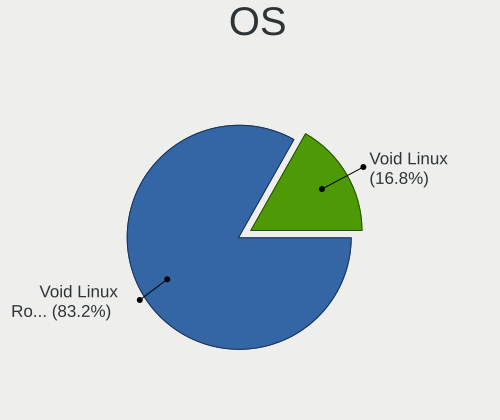

| Name               | Desktops | Percent |
|--------------------|----------|---------|
| Void Linux Rolling | 94       | 83.19%  |
| Void Linux         | 19       | 16.81%  |

OS Family
---------

OS without a version

| Name       | Desktops | Percent |
|------------|----------|---------|
| Void Linux | 111      | 100%    |

Kernel
------

Version of the Linux kernel

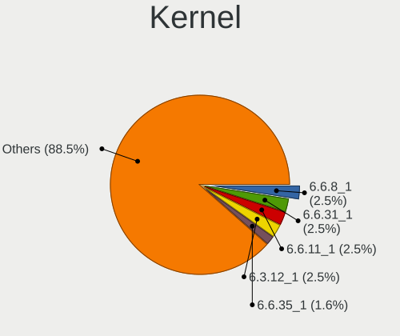

| Version         | Desktops | Percent |
|-----------------|----------|---------|
| 6.6.8_1         | 3        | 2.46%   |
| 6.6.31_1        | 3        | 2.46%   |
| 6.6.11_1        | 3        | 2.46%   |
| 6.3.12_1        | 3        | 2.46%   |
| 6.6.35_1        | 2        | 1.64%   |
| 6.6.21_1        | 2        | 1.64%   |
| 6.5.9_1         | 2        | 1.64%   |
| 6.3.13_1        | 2        | 1.64%   |
| 6.13.9_1        | 2        | 1.64%   |
| 6.12.49_1       | 2        | 1.64%   |
| 6.12.37_1       | 2        | 1.64%   |
| 6.12.28_1       | 2        | 1.64%   |
| 6.12.16_1       | 2        | 1.64%   |
| 6.12.13_1       | 2        | 1.64%   |
| 6.1.31_1        | 2        | 1.64%   |
| 6.0.13_1        | 2        | 1.64%   |
| 5.8.18_1        | 2        | 1.64%   |
| 5.18.9_1        | 2        | 1.64%   |
| 5.16.20_1       | 2        | 1.64%   |
| 5.13.19_1       | 2        | 1.64%   |
| 5.11.9_1        | 2        | 1.64%   |
| 5.10.14_1       | 2        | 1.64%   |
| 6.8.1_1         | 1        | 0.82%   |
| 6.7.9_1         | 1        | 0.82%   |
| 6.7.0-xanmod1_1 | 1        | 0.82%   |
| 6.6.59_1        | 1        | 0.82%   |
| 6.6.52_1        | 1        | 0.82%   |
| 6.6.50_1        | 1        | 0.82%   |
| 6.6.48_1        | 1        | 0.82%   |
| 6.6.32_1        | 1        | 0.82%   |
| 6.6.20_1        | 1        | 0.82%   |
| 6.6.1_1         | 1        | 0.82%   |
| 6.6.17_1        | 1        | 0.82%   |
| 6.5.7_1         | 1        | 0.82%   |
| 6.5.6_1         | 1        | 0.82%   |
| 6.5.5_2         | 1        | 0.82%   |
| 6.5.13_1        | 1        | 0.82%   |
| 6.5.11_1        | 1        | 0.82%   |
| 6.17.9_1        | 1        | 0.82%   |
| 6.17.8_1        | 1        | 0.82%   |

Kernel Family
-------------

Linux kernel without a distro release

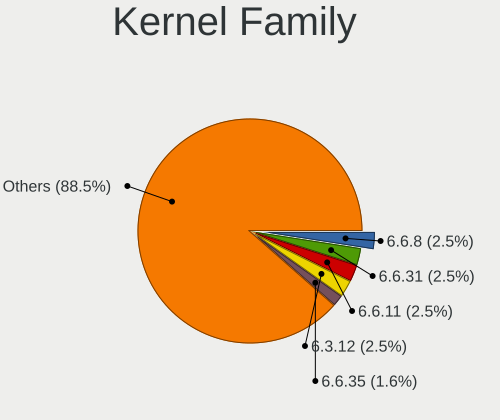

| Version | Desktops | Percent |
|---------|----------|---------|
| 6.6.8   | 3        | 2.46%   |
| 6.6.31  | 3        | 2.46%   |
| 6.6.11  | 3        | 2.46%   |
| 6.3.12  | 3        | 2.46%   |
| 6.6.35  | 2        | 1.64%   |
| 6.6.21  | 2        | 1.64%   |
| 6.5.9   | 2        | 1.64%   |
| 6.3.13  | 2        | 1.64%   |
| 6.13.9  | 2        | 1.64%   |
| 6.12.49 | 2        | 1.64%   |
| 6.12.37 | 2        | 1.64%   |
| 6.12.28 | 2        | 1.64%   |
| 6.12.16 | 2        | 1.64%   |
| 6.12.13 | 2        | 1.64%   |
| 6.1.31  | 2        | 1.64%   |
| 6.0.13  | 2        | 1.64%   |
| 5.8.18  | 2        | 1.64%   |
| 5.18.9  | 2        | 1.64%   |
| 5.16.20 | 2        | 1.64%   |
| 5.13.19 | 2        | 1.64%   |
| 5.11.9  | 2        | 1.64%   |
| 5.10.14 | 2        | 1.64%   |
| 6.8.1   | 1        | 0.82%   |
| 6.7.9   | 1        | 0.82%   |
| 6.7.0   | 1        | 0.82%   |
| 6.6.59  | 1        | 0.82%   |
| 6.6.52  | 1        | 0.82%   |
| 6.6.50  | 1        | 0.82%   |
| 6.6.48  | 1        | 0.82%   |
| 6.6.32  | 1        | 0.82%   |
| 6.6.20  | 1        | 0.82%   |
| 6.6.17  | 1        | 0.82%   |
| 6.6.1   | 1        | 0.82%   |
| 6.5.7   | 1        | 0.82%   |
| 6.5.6   | 1        | 0.82%   |
| 6.5.5   | 1        | 0.82%   |
| 6.5.13  | 1        | 0.82%   |
| 6.5.11  | 1        | 0.82%   |
| 6.17.9  | 1        | 0.82%   |
| 6.17.8  | 1        | 0.82%   |

Kernel Major Ver.
-----------------

Linux kernel major version

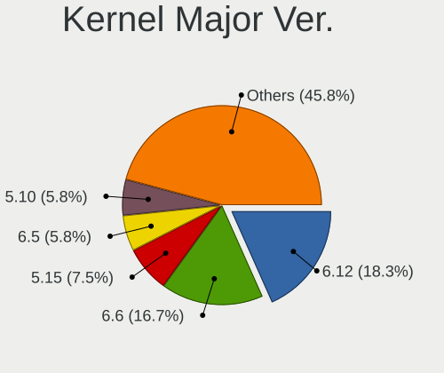

| Version | Desktops | Percent |
|---------|----------|---------|
| 6.12    | 22       | 18.33%  |
| 6.6     | 20       | 16.67%  |
| 5.15    | 9        | 7.5%    |
| 6.5     | 7        | 5.83%   |
| 5.10    | 7        | 5.83%   |
| 5.8     | 6        | 5%      |
| 6.3     | 5        | 4.17%   |
| 6.1     | 5        | 4.17%   |
| 5.18    | 5        | 4.17%   |
| 5.13    | 5        | 4.17%   |
| 4.19    | 4        | 3.33%   |
| 6.17    | 3        | 2.5%    |
| 5.11    | 3        | 2.5%    |
| 6.7     | 2        | 1.67%   |
| 6.13    | 2        | 1.67%   |
| 6.0     | 2        | 1.67%   |
| 5.4     | 2        | 1.67%   |
| 5.16    | 2        | 1.67%   |
| 5.12    | 2        | 1.67%   |
| 6.8     | 1        | 0.83%   |
| 6.16    | 1        | 0.83%   |
| 6.14    | 1        | 0.83%   |
| 6.11    | 1        | 0.83%   |
| 5.9     | 1        | 0.83%   |
| 5.6     | 1        | 0.83%   |
| 5.3     | 1        | 0.83%   |

Arch
----

OS architecture (x86_64, i586, etc.)

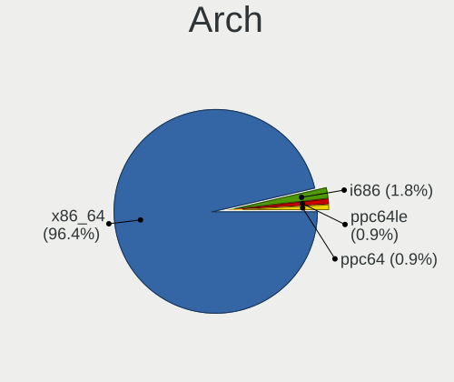

| Name    | Desktops | Percent |
|---------|----------|---------|
| x86_64  | 107      | 96.4%   |
| i686    | 2        | 1.8%    |
| ppc64le | 1        | 0.9%    |
| ppc64   | 1        | 0.9%    |

DE
--

Desktop Environment

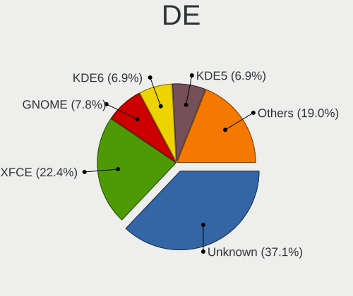

| Name          | Desktops | Percent |
|---------------|----------|---------|
| Unknown       | 43       | 37.07%  |
| XFCE          | 26       | 22.41%  |
| GNOME         | 9        | 7.76%   |
| KDE6          | 8        | 6.9%    |
| KDE5          | 8        | 6.9%    |
| sway          | 6        | 5.17%   |
| KDE           | 3        | 2.59%   |
| X-Cinnamon    | 2        | 1.72%   |
| X-Generic     | 1        | 0.86%   |
| sway:wlroots  | 1        | 0.86%   |
| river         | 1        | 0.86%   |
| openbox       | 1        | 0.86%   |
| Lumina        | 1        | 0.86%   |
| labwc:wlroots | 1        | 0.86%   |
| i3-with-dbus  | 1        | 0.86%   |
| Hyprland      | 1        | 0.86%   |
| dwm           | 1        | 0.86%   |
| bspwm         | 1        | 0.86%   |
| awesome       | 1        | 0.86%   |

Display Server
--------------

X11 or Wayland

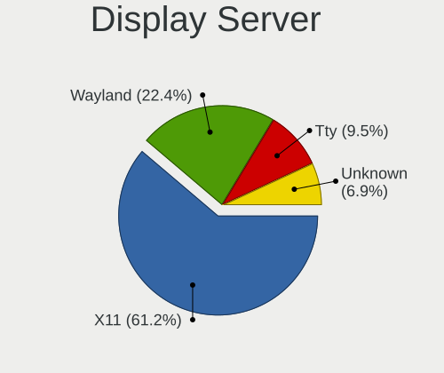

| Name    | Desktops | Percent |
|---------|----------|---------|
| X11     | 71       | 61.21%  |
| Wayland | 26       | 22.41%  |
| Tty     | 11       | 9.48%   |
| Unknown | 8        | 6.9%    |

Display Manager
---------------

SDDM, LightDM, etc.

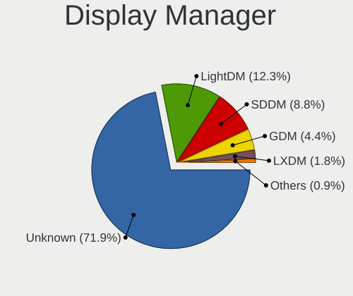

| Name    | Desktops | Percent |
|---------|----------|---------|
| Unknown | 82       | 71.93%  |
| LightDM | 14       | 12.28%  |
| SDDM    | 10       | 8.77%   |
| GDM     | 5        | 4.39%   |
| LXDM    | 2        | 1.75%   |
| XDM     | 1        | 0.88%   |

OS Lang
-------

Language

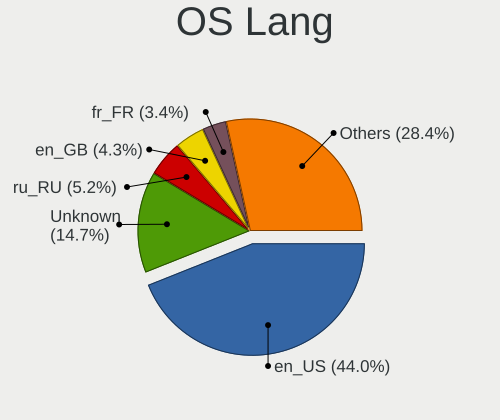

| Lang        | Desktops | Percent |
|-------------|----------|---------|
| en_US       | 51       | 43.97%  |
| Unknown     | 17       | 14.66%  |
| ru_RU       | 6        | 5.17%   |
| en_GB       | 5        | 4.31%   |
| fr_FR       | 4        | 3.45%   |
| de_DE       | 4        | 3.45%   |
| pt_BR       | 3        | 2.59%   |
| pl_PL       | 3        | 2.59%   |
| en_CA       | 3        | 2.59%   |
| en_AU       | 3        | 2.59%   |
| C           | 3        | 2.59%   |
| es_ES       | 2        | 1.72%   |
| en_DK       | 2        | 1.72%   |
| cs_CZ       | 2        | 1.72%   |
| it_IT       | 1        | 0.86%   |
| hu_HU       | 1        | 0.86%   |
| es_VE       | 1        | 0.86%   |
| es_CL       | 1        | 0.86%   |
| en_US.utf-8 | 1        | 0.86%   |
| en_IE       | 1        | 0.86%   |
| el_GR       | 1        | 0.86%   |
| bg_BG       | 1        | 0.86%   |

Boot Mode
---------

EFI or BIOS

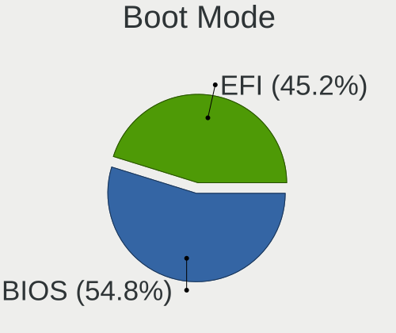

| Mode | Desktops | Percent |
|------|----------|---------|
| BIOS | 63       | 54.78%  |
| EFI  | 52       | 45.22%  |

Filesystem
----------

Type of filesystem

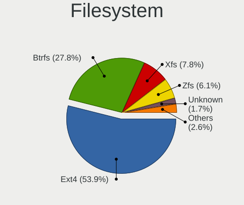

| Type    | Desktops | Percent |
|---------|----------|---------|
| Ext4    | 62       | 53.91%  |
| Btrfs   | 32       | 27.83%  |
| Xfs     | 9        | 7.83%   |
| Zfs     | 7        | 6.09%   |
| Unknown | 2        | 1.74%   |
| XXX4    | 1        | 0.87%   |
| Overlay | 1        | 0.87%   |
| F2fs    | 1        | 0.87%   |

Part. scheme
------------

Scheme of partitioning

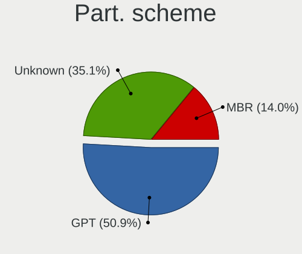

| Type    | Desktops | Percent |
|---------|----------|---------|
| GPT     | 58       | 50.88%  |
| Unknown | 40       | 35.09%  |
| MBR     | 16       | 14.04%  |

Dual Boot with Linux/BSD
------------------------

Hosting more than one Linux/BSD

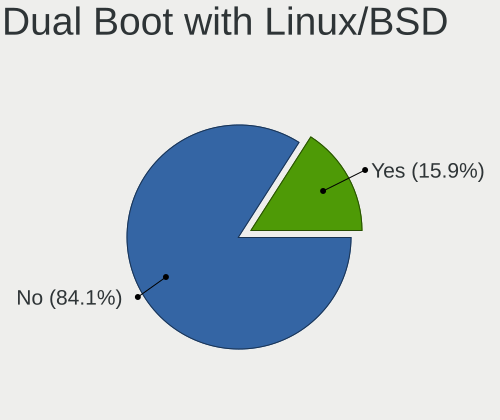

| Dual boot | Desktops | Percent |
|-----------|----------|---------|
| No        | 90       | 80.36%  |
| Yes       | 22       | 19.64%  |

Dual Boot (Win)
---------------

Hosting Linux and Windows

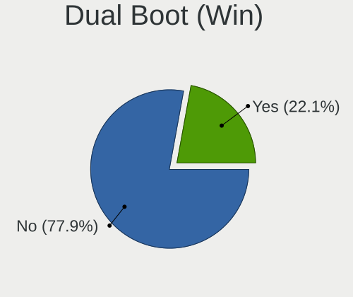

| Dual boot | Desktops | Percent |
|-----------|----------|---------|
| No        | 88       | 77.88%  |
| Yes       | 25       | 22.12%  |

Board
-----

Vendor
------

Motherboard manufacturer

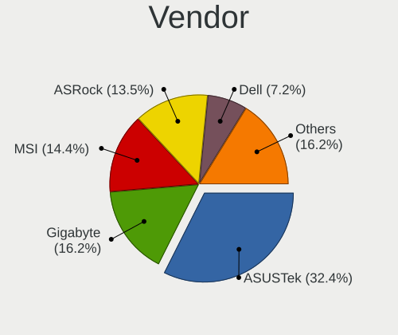

| Name                | Desktops | Percent |
|---------------------|----------|---------|
| ASUSTek Computer    | 36       | 32.43%  |
| Gigabyte Technology | 18       | 16.22%  |
| MSI                 | 16       | 14.41%  |
| ASRock              | 15       | 13.51%  |
| Dell                | 8        | 7.21%   |
| Hewlett-Packard     | 5        | 4.5%    |
| Unknown             | 4        | 3.6%    |
| VX                  | 1        | 0.9%    |
| Shuttle             | 1        | 0.9%    |
| PELADN              | 1        | 0.9%    |
| Lenovo              | 1        | 0.9%    |
| Intel               | 1        | 0.9%    |
| EVGA                | 1        | 0.9%    |
| Apple               | 1        | 0.9%    |
| AOpen               | 1        | 0.9%    |
| AMI                 | 1        | 0.9%    |

Model
-----

Motherboard model

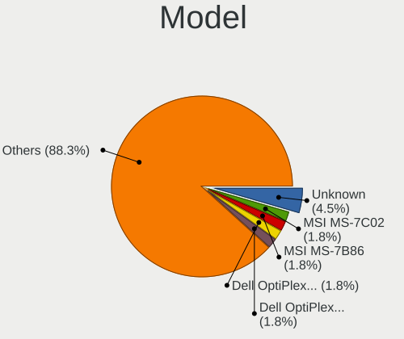

| Name                                | Desktops | Percent |
|-------------------------------------|----------|---------|
| Unknown                             | 5        | 4.5%    |
| MSI MS-7C02                         | 2        | 1.8%    |
| MSI MS-7B86                         | 2        | 1.8%    |
| Dell OptiPlex 780                   | 2        | 1.8%    |
| Dell OptiPlex 7010                  | 2        | 1.8%    |
| ASUS PRIME Z390-P                   | 2        | 1.8%    |
| ASUS PRIME X470-PRO                 | 2        | 1.8%    |
| ASRock B450 Pro4                    | 2        | 1.8%    |
| VX B75                              | 1        | 0.9%    |
| Shuttle DH170                       | 1        | 0.9%    |
| PELADN WI-6                         | 1        | 0.9%    |
| MSI MS-7D95                         | 1        | 0.9%    |
| MSI MS-7D14                         | 1        | 0.9%    |
| MSI MS-7C92                         | 1        | 0.9%    |
| MSI MS-7C56                         | 1        | 0.9%    |
| MSI MS-7C52                         | 1        | 0.9%    |
| MSI MS-7C35                         | 1        | 0.9%    |
| MSI MS-7A68                         | 1        | 0.9%    |
| MSI MS-7A40                         | 1        | 0.9%    |
| MSI MS-7A39                         | 1        | 0.9%    |
| MSI MS-7816                         | 1        | 0.9%    |
| MSI MS-7721                         | 1        | 0.9%    |
| MSI MS-7610                         | 1        | 0.9%    |
| Lenovo ThinkCentre M710s 10M8S0J91W | 1        | 0.9%    |
| Intel H55                           | 1        | 0.9%    |
| HP Z400 Workstation                 | 1        | 0.9%    |
| HP EliteDesk 800 G5 Desktop Mini    | 1        | 0.9%    |
| HP EliteDesk 800 G1 SFF             | 1        | 0.9%    |
| HP Compaq Pro 4300 SFF PC           | 1        | 0.9%    |
| HP Compaq Elite 8300 SFF            | 1        | 0.9%    |
| Gigabyte Z97X-UD7 TH                | 1        | 0.9%    |
| Gigabyte Z790 AORUS MASTER X        | 1        | 0.9%    |
| Gigabyte Z690I A ULTRA LITE D4      | 1        | 0.9%    |
| Gigabyte Z68XP-UD3                  | 1        | 0.9%    |
| Gigabyte Z370 AORUS Gaming 3        | 1        | 0.9%    |
| Gigabyte X870E AORUS PRO ICE        | 1        | 0.9%    |
| Gigabyte X570S UD                   | 1        | 0.9%    |
| Gigabyte X570 UD                    | 1        | 0.9%    |
| Gigabyte X570 AORUS MASTER          | 1        | 0.9%    |
| Gigabyte H310M S2H 2.0              | 1        | 0.9%    |

Model Family
------------

Motherboard model prefix

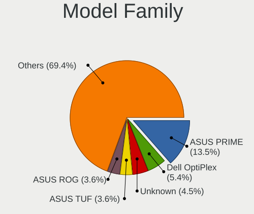

| Name               | Desktops | Percent |
|--------------------|----------|---------|
| ASUS PRIME         | 15       | 13.51%  |
| Dell OptiPlex      | 6        | 5.41%   |
| Unknown            | 5        | 4.5%    |
| ASUS TUF           | 4        | 3.6%    |
| ASUS ROG           | 4        | 3.6%    |
| MSI MS-7C02        | 2        | 1.8%    |
| MSI MS-7B86        | 2        | 1.8%    |
| HP EliteDesk       | 2        | 1.8%    |
| HP Compaq          | 2        | 1.8%    |
| Gigabyte X570      | 2        | 1.8%    |
| Gigabyte H310M     | 2        | 1.8%    |
| Gigabyte B550M     | 2        | 1.8%    |
| Gigabyte B550      | 2        | 1.8%    |
| ASRock X570        | 2        | 1.8%    |
| ASRock B450        | 2        | 1.8%    |
| VX B75             | 1        | 0.9%    |
| Shuttle DH170      | 1        | 0.9%    |
| PELADN WI-6        | 1        | 0.9%    |
| MSI MS-7D95        | 1        | 0.9%    |
| MSI MS-7D14        | 1        | 0.9%    |
| MSI MS-7C92        | 1        | 0.9%    |
| MSI MS-7C56        | 1        | 0.9%    |
| MSI MS-7C52        | 1        | 0.9%    |
| MSI MS-7C35        | 1        | 0.9%    |
| MSI MS-7A68        | 1        | 0.9%    |
| MSI MS-7A40        | 1        | 0.9%    |
| MSI MS-7A39        | 1        | 0.9%    |
| MSI MS-7816        | 1        | 0.9%    |
| MSI MS-7721        | 1        | 0.9%    |
| MSI MS-7610        | 1        | 0.9%    |
| Lenovo ThinkCentre | 1        | 0.9%    |
| Intel H55          | 1        | 0.9%    |
| HP Z400            | 1        | 0.9%    |
| Gigabyte Z97X-UD7  | 1        | 0.9%    |
| Gigabyte Z790      | 1        | 0.9%    |
| Gigabyte Z690I     | 1        | 0.9%    |
| Gigabyte Z68XP-UD3 | 1        | 0.9%    |
| Gigabyte Z370      | 1        | 0.9%    |
| Gigabyte X870E     | 1        | 0.9%    |
| Gigabyte X570S     | 1        | 0.9%    |

MFG Year
--------

Motherboard manufacture year

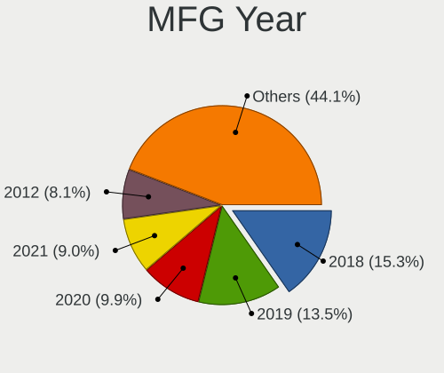

| Year    | Desktops | Percent |
|---------|----------|---------|
| 2018    | 17       | 15.32%  |
| 2019    | 15       | 13.51%  |
| 2020    | 11       | 9.91%   |
| 2021    | 10       | 9.01%   |
| 2012    | 9        | 8.11%   |
| 2017    | 8        | 7.21%   |
| 2023    | 7        | 6.31%   |
| 2013    | 6        | 5.41%   |
| 2010    | 5        | 4.5%    |
| 2024    | 4        | 3.6%    |
| 2011    | 4        | 3.6%    |
| 2022    | 2        | 1.8%    |
| 2016    | 2        | 1.8%    |
| 2015    | 2        | 1.8%    |
| 2014    | 2        | 1.8%    |
| 2009    | 2        | 1.8%    |
| Unknown | 2        | 1.8%    |
| 2008    | 1        | 0.9%    |
| 2006    | 1        | 0.9%    |
| 2005    | 1        | 0.9%    |

Form Factor
-----------

Physical design of the computer

| Name    | Desktops | Percent |
|---------|----------|---------|
| Desktop | 111      | 100%    |

Secure Boot
-----------

Enabled or disabled

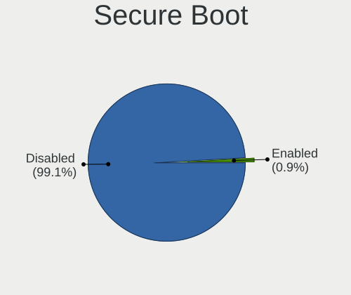

| State    | Desktops | Percent |
|----------|----------|---------|
| Disabled | 110      | 99.1%   |
| Enabled  | 1        | 0.9%    |

Coreboot
--------

Have coreboot on board

| Used | Desktops | Percent |
|------|----------|---------|
| No   | 111      | 100%    |

RAM Size
--------

Total RAM memory

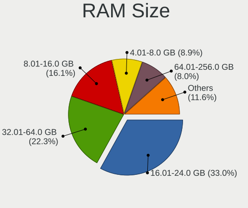

| Size in GB      | Desktops | Percent |
|-----------------|----------|---------|
| 16.01-24.0      | 37       | 33.04%  |
| 32.01-64.0      | 25       | 22.32%  |
| 8.01-16.0       | 18       | 16.07%  |
| 4.01-8.0        | 10       | 8.93%   |
| 64.01-256.0     | 9        | 8.04%   |
| 3.01-4.0        | 6        | 5.36%   |
| 24.01-32.0      | 2        | 1.79%   |
| 2.01-3.0        | 2        | 1.79%   |
| 1.01-2.0        | 2        | 1.79%   |
| More than 256.0 | 1        | 0.89%   |

RAM Used
--------

Used RAM memory

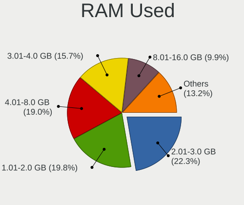

| Used GB     | Desktops | Percent |
|-------------|----------|---------|
| 2.01-3.0    | 27       | 22.31%  |
| 1.01-2.0    | 24       | 19.83%  |
| 4.01-8.0    | 23       | 19.01%  |
| 3.01-4.0    | 19       | 15.7%   |
| 8.01-16.0   | 12       | 9.92%   |
| 0.51-1.0    | 8        | 6.61%   |
| 0.01-0.5    | 4        | 3.31%   |
| 64.01-256.0 | 2        | 1.65%   |
| 16.01-24.0  | 2        | 1.65%   |

Total Drives
------------

Number of drives on board

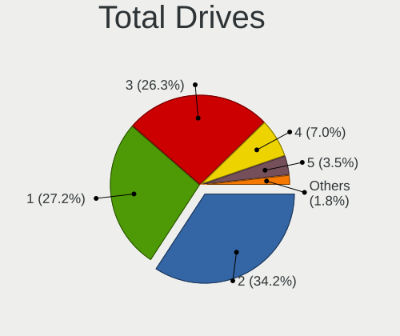

| Drives | Desktops | Percent |
|--------|----------|---------|
| 2      | 39       | 34.21%  |
| 1      | 31       | 27.19%  |
| 3      | 30       | 26.32%  |
| 4      | 8        | 7.02%   |
| 5      | 4        | 3.51%   |
| 9      | 1        | 0.88%   |
| 7      | 1        | 0.88%   |

Has CD-ROM
----------

Has CD-ROM on board

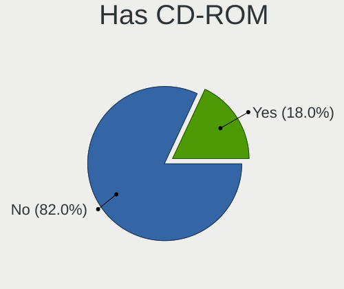

| Presented | Desktops | Percent |
|-----------|----------|---------|
| No        | 91       | 81.98%  |
| Yes       | 20       | 18.02%  |

Has Ethernet
------------

Has Ethernet on board

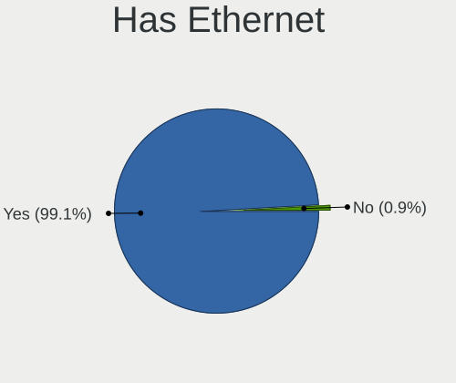

| Presented | Desktops | Percent |
|-----------|----------|---------|
| Yes       | 110      | 99.1%   |
| No        | 1        | 0.9%    |

Has WiFi
--------

Has WiFi module

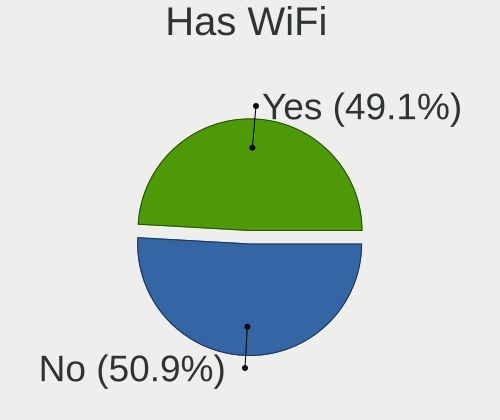

| Presented | Desktops | Percent |
|-----------|----------|---------|
| No        | 57       | 50.89%  |
| Yes       | 55       | 49.11%  |

Has Bluetooth
-------------

Has Bluetooth module

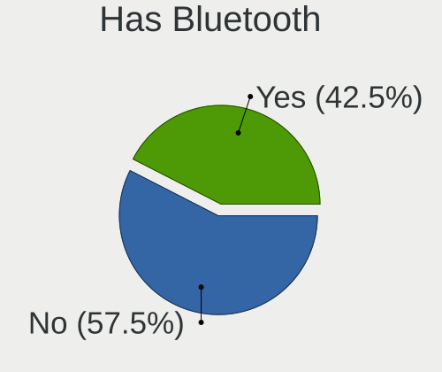

| Presented | Desktops | Percent |
|-----------|----------|---------|
| No        | 65       | 57.52%  |
| Yes       | 48       | 42.48%  |

Location
--------

Country
-------

Geographic location (country)

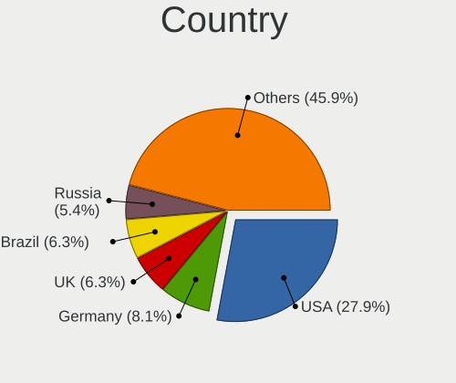

| Country     | Desktops | Percent |
|-------------|----------|---------|
| USA         | 31       | 27.93%  |
| Germany     | 9        | 8.11%   |
| UK          | 7        | 6.31%   |
| Brazil      | 7        | 6.31%   |
| Russia      | 6        | 5.41%   |
| Poland      | 6        | 5.41%   |
| Greece      | 4        | 3.6%    |
| France      | 4        | 3.6%    |
| Czechia     | 4        | 3.6%    |
| Canada      | 4        | 3.6%    |
| Spain       | 3        | 2.7%    |
| Netherlands | 3        | 2.7%    |
| Italy       | 3        | 2.7%    |
| India       | 2        | 1.8%    |
| Finland     | 2        | 1.8%    |
| Australia   | 2        | 1.8%    |
| Vietnam     | 1        | 0.9%    |
| Venezuela   | 1        | 0.9%    |
| Turkey      | 1        | 0.9%    |
| Sweden      | 1        | 0.9%    |
| Pakistan    | 1        | 0.9%    |
| New Zealand | 1        | 0.9%    |
| Latvia      | 1        | 0.9%    |
| Hungary     | 1        | 0.9%    |
| Denmark     | 1        | 0.9%    |
| Chile       | 1        | 0.9%    |
| Bulgaria    | 1        | 0.9%    |
| Belgium     | 1        | 0.9%    |
| Bangladesh  | 1        | 0.9%    |
| Argentina   | 1        | 0.9%    |

City
----

Geographic location (city)

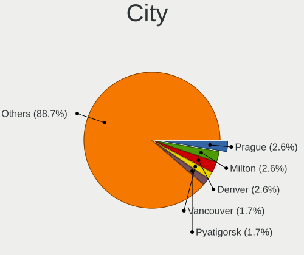

| City                 | Desktops | Percent |
|----------------------|----------|---------|
| Prague               | 3        | 2.61%   |
| Milton               | 3        | 2.61%   |
| Denver               | 3        | 2.61%   |
| Vancouver            | 2        | 1.74%   |
| Pyatigorsk           | 2        | 1.74%   |
| Munich               | 2        | 1.74%   |
| Mieres               | 2        | 1.74%   |
| Lublin               | 2        | 1.74%   |
| Kenmore              | 2        | 1.74%   |
| Amsterdam            | 2        | 1.74%   |
| Zagnansk             | 1        | 0.87%   |
| Yekaterinburg        | 1        | 0.87%   |
| Worthing             | 1        | 0.87%   |
| Winnipeg             | 1        | 0.87%   |
| Wellington           | 1        | 0.87%   |
| Warsaw               | 1        | 0.87%   |
| Volta Redonda        | 1        | 0.87%   |
| Venice               | 1        | 0.87%   |
| Vengavasal           | 1        | 0.87%   |
| Varna                | 1        | 0.87%   |
| Toulouse             | 1        | 0.87%   |
| Thessaloniki         | 1        | 0.87%   |
| Taranto              | 1        | 0.87%   |
| Tampa                | 1        | 0.87%   |
| Steinbach-Hallenberg | 1        | 0.87%   |
| South Shields        | 1        | 0.87%   |
| Sofia                | 1        | 0.87%   |
| Savannah             | 1        | 0.87%   |
| San Antonio          | 1        | 0.87%   |
| Saint-Paul-les-Dax   | 1        | 0.87%   |
| Saint Paul           | 1        | 0.87%   |
| Saarbrücken         | 1        | 0.87%   |
| Rotherham            | 1        | 0.87%   |
| Rosario              | 1        | 0.87%   |
| Rio de Janeiro       | 1        | 0.87%   |
| Riga                 | 1        | 0.87%   |
| Richmond             | 1        | 0.87%   |
| Pelabravo            | 1        | 0.87%   |
| Pardubice            | 1        | 0.87%   |
| Oulu                 | 1        | 0.87%   |

Drives
------

Drive Vendor
------------

Hard drive vendors

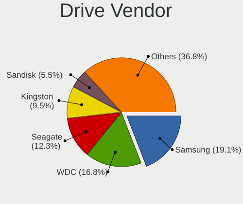

| Vendor                      | Desktops | Drives | Percent |
|-----------------------------|----------|--------|---------|
| Samsung Electronics         | 42       | 71     | 19.09%  |
| WDC                         | 37       | 50     | 16.82%  |
| Seagate                     | 27       | 43     | 12.27%  |
| Kingston                    | 21       | 22     | 9.55%   |
| Sandisk                     | 12       | 16     | 5.45%   |
| Toshiba                     | 10       | 11     | 4.55%   |
| Crucial                     | 7        | 8      | 3.18%   |
| Hitachi                     | 6        | 6      | 2.73%   |
| SK hynix                    | 4        | 7      | 1.82%   |
| PNY                         | 4        | 5      | 1.82%   |
| Phison Electronics          | 4        | 4      | 1.82%   |
| HGST                        | 4        | 6      | 1.82%   |
| Realtek Semiconductor       | 3        | 3      | 1.36%   |
| Micron/Crucial Technology   | 3        | 3      | 1.36%   |
| Intel                       | 3        | 5      | 1.36%   |
| Corsair                     | 3        | 3      | 1.36%   |
| A-DATA Technology           | 3        | 5      | 1.36%   |
| SPCC                        | 2        | 2      | 0.91%   |
| Lexar                       | 2        | 3      | 0.91%   |
| Kingston Technology Company | 2        | 3      | 0.91%   |
| XPG                         | 1        | 4      | 0.45%   |
| Unknown                     | 1        | 1      | 0.45%   |
| SuperSSpeed                 | 1        | 1      | 0.45%   |
| Phison                      | 1        | 1      | 0.45%   |
| PELADN                      | 1        | 1      | 0.45%   |
| Patriot                     | 1        | 1      | 0.45%   |
| OCZ                         | 1        | 1      | 0.45%   |
| NGFF                        | 1        | 1      | 0.45%   |
| Netac                       | 1        | 1      | 0.45%   |
| Maxtor                      | 1        | 1      | 0.45%   |
| MAXIO Technology (Hangzhou) | 1        | 1      | 0.45%   |
| LITEONIT                    | 1        | 1      | 0.45%   |
| JMicron Technology          | 1        | 1      | 0.45%   |
| Intenso                     | 1        | 1      | 0.45%   |
| HS-SSD-E100                 | 1        | 1      | 0.45%   |
| Gigabyte Technology         | 1        | 2      | 0.45%   |
| China                       | 1        | 1      | 0.45%   |
| BIWIN                       | 1        | 1      | 0.45%   |
| AMD                         | 1        | 1      | 0.45%   |
| AGI                         | 1        | 1      | 0.45%   |

Drive Model
-----------

Hard drive models

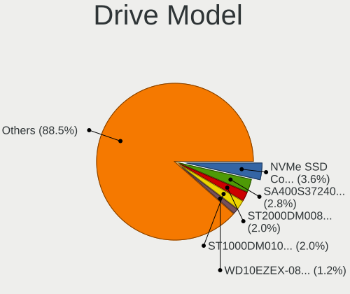

| Model                                              | Desktops | Percent |
|----------------------------------------------------|----------|---------|
| Samsung NVMe SSD Controller SM981/PM981/PM983 1TB  | 9        | 3.57%   |
| Kingston SA400S37240G 240GB SSD                    | 7        | 2.78%   |
| Seagate ST2000DM008-2FR102 2TB                     | 5        | 1.98%   |
| Seagate ST1000DM010-2EP102 1TB                     | 5        | 1.98%   |
| WDC WD10EZEX-08WN4A0 1TB                           | 3        | 1.19%   |
| Toshiba DT01ACA050 500GB                           | 3        | 1.19%   |
| Sandisk WD Blue SN550 NVMe SSD 1024GB              | 3        | 1.19%   |
| Samsung SSD 870 QVO 1TB                            | 3        | 1.19%   |
| PNY SSD2SC120G1SA754D117-820 120GB                 | 3        | 1.19%   |
| Micron/Crucial P2 NVMe PCIe SSD 2TB                | 3        | 1.19%   |
| Kingston SNVS500G 500GB                            | 3        | 1.19%   |
| Kingston SA400S37120G 120GB SSD                    | 3        | 1.19%   |
| WDC WDS500G2B0A-00SM50 500GB                       | 2        | 0.79%   |
| WDC WDS240G2G0A-00JH30 240GB SSD                   | 2        | 0.79%   |
| SK hynix SHPP41-2000GM 2TB                         | 2        | 0.79%   |
| Seagate ST1000DM003-1CH162 1TB                     | 2        | 0.79%   |
| Sandisk WD_BLACK SN750 SE 1TB                      | 2        | 0.79%   |
| Samsung SSD 980 PRO 500GB                          | 2        | 0.79%   |
| Samsung SSD 970 EVO Plus 1TB                       | 2        | 0.79%   |
| Samsung SSD 870 EVO 500GB                          | 2        | 0.79%   |
| Samsung SSD 870 EVO 1TB                            | 2        | 0.79%   |
| Samsung SSD 860 QVO 1TB                            | 2        | 0.79%   |
| Samsung SSD 860 EVO 500GB                          | 2        | 0.79%   |
| Samsung NVMe SSD Drive 500GB                       | 2        | 0.79%   |
| Samsung NVMe SSD Controller PM9A1/PM9A3/980PRO 1TB | 2        | 0.79%   |
| Phison E12 NVMe Controller 1TB                     | 2        | 0.79%   |
| Kingston SV300S37A120G 120GB SSD                   | 2        | 0.79%   |
| Kingston SHFS37A120G 120GB SSD                     | 2        | 0.79%   |
| Kingston SA400S37480G 480GB SSD                    | 2        | 0.79%   |
| Intel SSDSC2BW240H6 240GB                          | 2        | 0.79%   |
| Crucial CT240BX500SSD1 240GB                       | 2        | 0.79%   |
| XPG NVMe SSD Drive 2TB                             | 1        | 0.4%    |
| WDC WDS480G2G0A-00JH30 480GB SSD                   | 1        | 0.4%    |
| WDC WDS240G2G0B-00EPW0 240GB SSD                   | 1        | 0.4%    |
| WDC WDS120G2G0A-00JH30 120GB SSD                   | 1        | 0.4%    |
| WDC WDS100T2B0A-00SM50 1TB SSD                     | 1        | 0.4%    |
| WDC WDBNCE2500PNC 250GB SSD                        | 1        | 0.4%    |
| WDC WD7500AYYS-01RCA0 752GB                        | 1        | 0.4%    |
| WDC WD60EZAZ-00SF3B0 6TB                           | 1        | 0.4%    |
| WDC WD5003ABYZ-011FA0 500GB                        | 1        | 0.4%    |

HDD Vendor
----------

Hard disk drive vendors

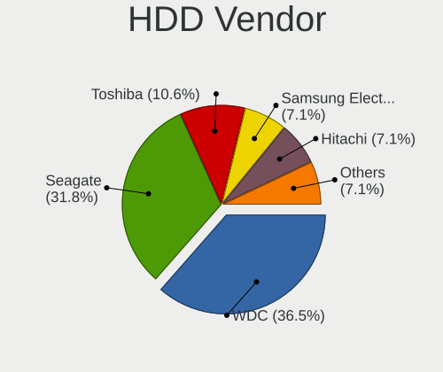

| Vendor              | Desktops | Drives | Percent |
|---------------------|----------|--------|---------|
| WDC                 | 31       | 41     | 36.47%  |
| Seagate             | 27       | 43     | 31.76%  |
| Toshiba             | 9        | 10     | 10.59%  |
| Samsung Electronics | 6        | 8      | 7.06%   |
| Hitachi             | 6        | 6      | 7.06%   |
| HGST                | 4        | 6      | 4.71%   |
| Maxtor              | 1        | 1      | 1.18%   |
| JMicron Technology  | 1        | 1      | 1.18%   |

SSD Vendor
----------

Solid state drive vendors

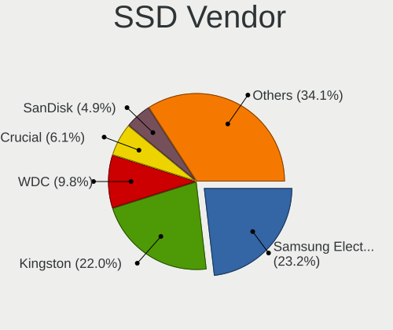

| Vendor              | Desktops | Drives | Percent |
|---------------------|----------|--------|---------|
| Samsung Electronics | 19       | 23     | 23.17%  |
| Kingston            | 18       | 19     | 21.95%  |
| WDC                 | 8        | 9      | 9.76%   |
| Crucial             | 5        | 6      | 6.1%    |
| SanDisk             | 4        | 6      | 4.88%   |
| PNY                 | 4        | 5      | 4.88%   |
| SPCC                | 2        | 2      | 2.44%   |
| Lexar               | 2        | 3      | 2.44%   |
| Intel               | 2        | 3      | 2.44%   |
| A-DATA Technology   | 2        | 4      | 2.44%   |
| Toshiba             | 1        | 1      | 1.22%   |
| SuperSSpeed         | 1        | 1      | 1.22%   |
| PELADN              | 1        | 1      | 1.22%   |
| Patriot             | 1        | 1      | 1.22%   |
| OCZ                 | 1        | 1      | 1.22%   |
| NGFF                | 1        | 1      | 1.22%   |
| Netac               | 1        | 1      | 1.22%   |
| LITEONIT            | 1        | 1      | 1.22%   |
| Intenso             | 1        | 1      | 1.22%   |
| HS-SSD-E100         | 1        | 1      | 1.22%   |
| Gigabyte Technology | 1        | 2      | 1.22%   |
| Corsair             | 1        | 1      | 1.22%   |
| China               | 1        | 1      | 1.22%   |
| BIWIN               | 1        | 1      | 1.22%   |
| AMD                 | 1        | 1      | 1.22%   |
| AGI                 | 1        | 1      | 1.22%   |

Drive Kind
----------

HDD or SSD

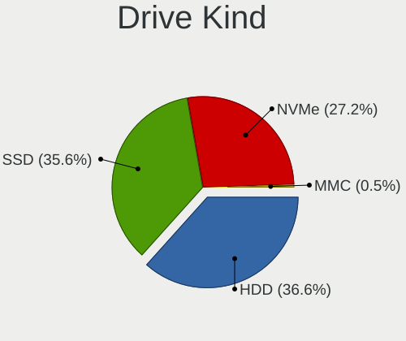

| Kind | Desktops | Drives | Percent |
|------|----------|--------|---------|
| HDD  | 70       | 116    | 36.65%  |
| SSD  | 68       | 97     | 35.6%   |
| NVMe | 52       | 87     | 27.23%  |
| MMC  | 1        | 1      | 0.52%   |

Drive Connector
---------------

SATA, SAS, NVMe, etc.

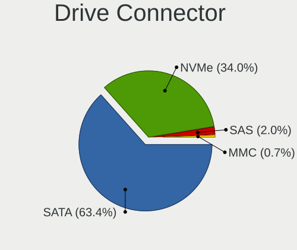

| Type | Desktops | Drives | Percent |
|------|----------|--------|---------|
| SATA | 97       | 209    | 63.4%   |
| NVMe | 52       | 87     | 33.99%  |
| SAS  | 3        | 4      | 1.96%   |
| MMC  | 1        | 1      | 0.65%   |

Drive Size
----------

Size of hard drive

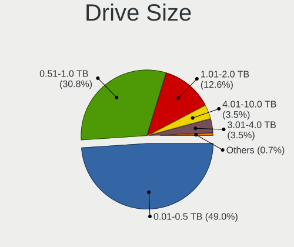

| Size in TB | Desktops | Drives | Percent |
|------------|----------|--------|---------|
| 0.01-0.5   | 70       | 105    | 48.95%  |
| 0.51-1.0   | 44       | 61     | 30.77%  |
| 1.01-2.0   | 18       | 25     | 12.59%  |
| 3.01-4.0   | 5        | 14     | 3.5%    |
| 4.01-10.0  | 5        | 7      | 3.5%    |
| 10.01-20.0 | 1        | 1      | 0.7%    |

Space Total
-----------

Amount of disk space available on the file system

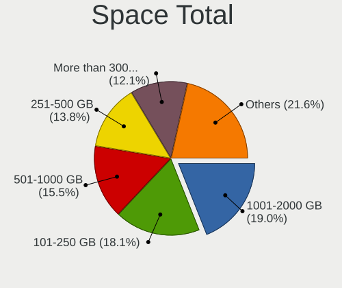

| Size in GB     | Desktops | Percent |
|----------------|----------|---------|
| 1001-2000      | 22       | 18.97%  |
| 101-250        | 21       | 18.1%   |
| 501-1000       | 18       | 15.52%  |
| 251-500        | 16       | 13.79%  |
| More than 3000 | 14       | 12.07%  |
| 2001-3000      | 9        | 7.76%   |
| Unknown        | 8        | 6.9%    |
| 1-20           | 4        | 3.45%   |
| 51-100         | 4        | 3.45%   |

Space Used
----------

Amount of used disk space

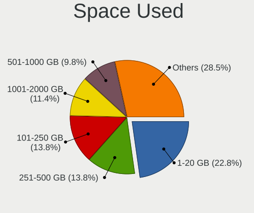

| Used GB        | Desktops | Percent |
|----------------|----------|---------|
| 1-20           | 28       | 22.76%  |
| 251-500        | 17       | 13.82%  |
| 101-250        | 17       | 13.82%  |
| 1001-2000      | 14       | 11.38%  |
| 501-1000       | 12       | 9.76%   |
| 21-50          | 11       | 8.94%   |
| 51-100         | 10       | 8.13%   |
| Unknown        | 8        | 6.5%    |
| More than 3000 | 5        | 4.07%   |
| 2001-3000      | 1        | 0.81%   |

Malfunc. Drives
---------------

Drive models with a malfunction

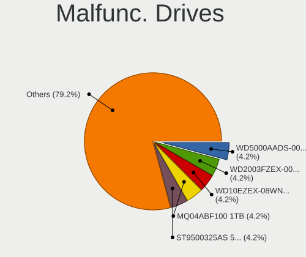

| Model                                                     | Desktops | Drives | Percent |
|-----------------------------------------------------------|----------|--------|---------|
| WDC WD5000AADS-00S9B0 500GB                               | 1        | 2      | 4.17%   |
| WDC WD2003FZEX-00Z4SA0 2TB                                | 1        | 1      | 4.17%   |
| WDC WD10EZEX-08WN4A0 1TB                                  | 1        | 1      | 4.17%   |
| Toshiba MQ04ABF100 1TB                                    | 1        | 2      | 4.17%   |
| Seagate ST9500325AS 500GB                                 | 1        | 1      | 4.17%   |
| Seagate ST500LM012 HN-M500MBB 500GB                       | 1        | 1      | 4.17%   |
| Seagate ST500DM002-1BD142 500GB                           | 1        | 1      | 4.17%   |
| Seagate ST4000VN008-2DR166 4TB                            | 1        | 2      | 4.17%   |
| Seagate ST4000VN000-1H4168 4TB                            | 1        | 4      | 4.17%   |
| Seagate ST3750330AS 752GB                                 | 1        | 1      | 4.17%   |
| Seagate ST3250410AS 250GB                                 | 1        | 1      | 4.17%   |
| Seagate ST2000VX000-1CU164 2TB                            | 1        | 2      | 4.17%   |
| Seagate ST2000DM001-1CH164 2TB                            | 1        | 1      | 4.17%   |
| SanDisk SSD U100 256GB                                    | 1        | 2      | 4.17%   |
| SanDisk SSD PLUS 240GB                                    | 1        | 1      | 4.17%   |
| Samsung Electronics HM160HI 160GB                         | 1        | 1      | 4.17%   |
| Samsung Electronics HD502HJ 500GB                         | 1        | 1      | 4.17%   |
| Samsung Electronics HD322HJ 320GB                         | 1        | 1      | 4.17%   |
| Realtek Semiconductor RTS5763DL NVMe SSD Controller 512GB | 1        | 1      | 4.17%   |
| Hitachi HUA722010CLA330 1TB                               | 1        | 1      | 4.17%   |
| Hitachi HTS545050B9A300 500GB                             | 1        | 1      | 4.17%   |
| HGST HTS545050A7E680 500GB                                | 1        | 1      | 4.17%   |
| Crucial CT525MX300SSD1 528GB                              | 1        | 1      | 4.17%   |
| A-DATA Technology SU700 120GB SSD                         | 1        | 1      | 4.17%   |

Malfunc. Drive Vendor
---------------------

Vendors of faulty drives

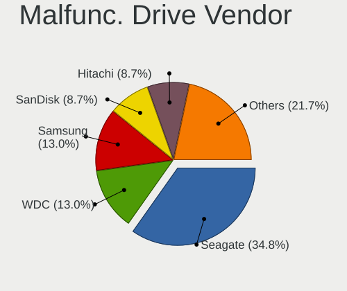

| Vendor                | Desktops | Drives | Percent |
|-----------------------|----------|--------|---------|
| Seagate               | 8        | 14     | 34.78%  |
| WDC                   | 3        | 4      | 13.04%  |
| Samsung Electronics   | 3        | 3      | 13.04%  |
| SanDisk               | 2        | 3      | 8.7%    |
| Hitachi               | 2        | 2      | 8.7%    |
| Toshiba               | 1        | 2      | 4.35%   |
| Realtek Semiconductor | 1        | 1      | 4.35%   |
| HGST                  | 1        | 1      | 4.35%   |
| Crucial               | 1        | 1      | 4.35%   |
| A-DATA Technology     | 1        | 1      | 4.35%   |

Malfunc. HDD Vendor
-------------------

Vendors of faulty HDD drives

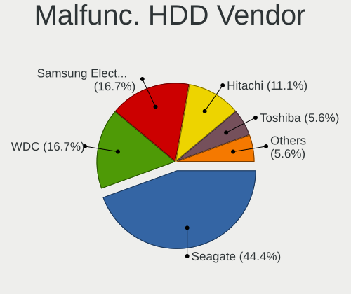

| Vendor              | Desktops | Drives | Percent |
|---------------------|----------|--------|---------|
| Seagate             | 8        | 14     | 44.44%  |
| WDC                 | 3        | 4      | 16.67%  |
| Samsung Electronics | 3        | 3      | 16.67%  |
| Hitachi             | 2        | 2      | 11.11%  |
| Toshiba             | 1        | 2      | 5.56%   |
| HGST                | 1        | 1      | 5.56%   |

Malfunc. Drive Kind
-------------------

Kinds of faulty drives

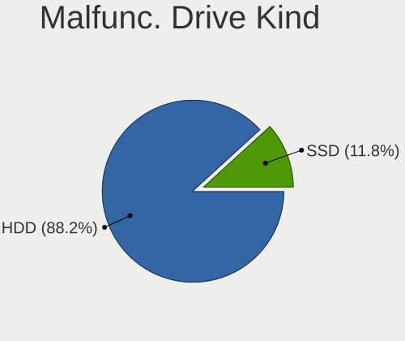

| Kind | Desktops | Drives | Percent |
|------|----------|--------|---------|
| HDD  | 17       | 26     | 77.27%  |
| SSD  | 4        | 5      | 18.18%  |
| NVMe | 1        | 1      | 4.55%   |

Failed Drives
-------------

Failed drive models

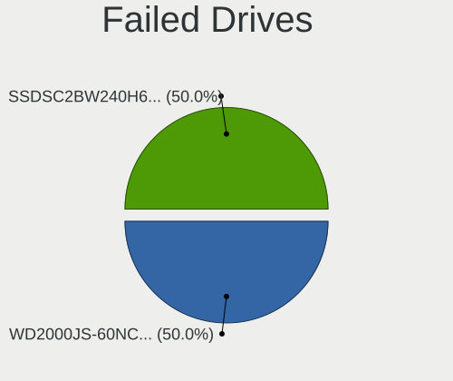

| Model                     | Desktops | Drives | Percent |
|---------------------------|----------|--------|---------|
| WDC WD2000JS-60NCB1 200GB | 1        | 1      | 50%     |
| Intel SSDSC2BW240H6 240GB | 1        | 1      | 50%     |

Failed Drive Vendor
-------------------

Failed drive vendors

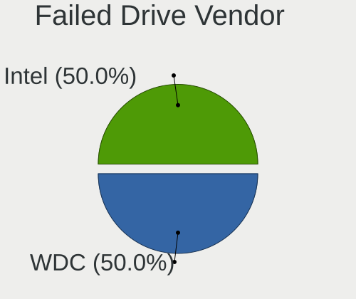

| Vendor | Desktops | Drives | Percent |
|--------|----------|--------|---------|
| WDC    | 1        | 1      | 50%     |
| Intel  | 1        | 1      | 50%     |

Drive Status
------------

Number of failed and malfunc. drives

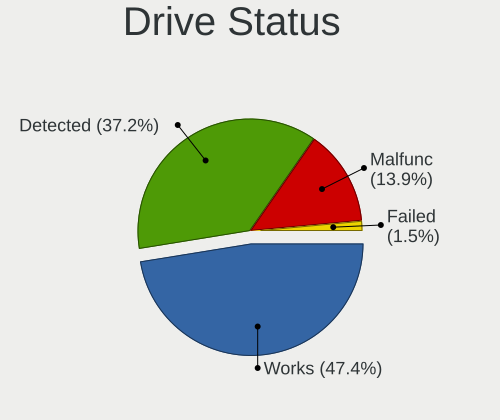

| Status   | Desktops | Drives | Percent |
|----------|----------|--------|---------|
| Works    | 65       | 143    | 47.45%  |
| Detected | 51       | 124    | 37.23%  |
| Malfunc  | 19       | 32     | 13.87%  |
| Failed   | 2        | 2      | 1.46%   |

Storage controller
------------------

Storage Vendor
--------------

Storage controller vendors

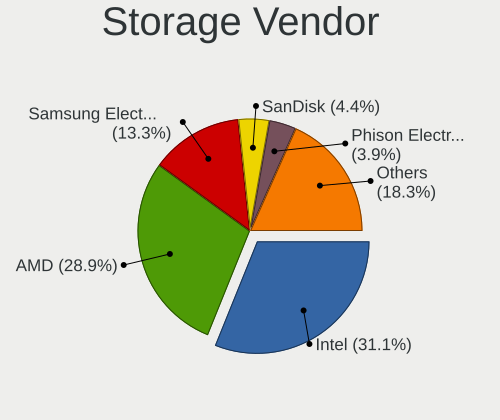

| Vendor                      | Desktops | Percent |
|-----------------------------|----------|---------|
| Intel                       | 56       | 31.11%  |
| AMD                         | 52       | 28.89%  |
| Samsung Electronics         | 24       | 13.33%  |
| SanDisk                     | 8        | 4.44%   |
| Phison Electronics          | 7        | 3.89%   |
| ASMedia Technology          | 6        | 3.33%   |
| Kingston Technology Company | 5        | 2.78%   |
| SK hynix                    | 4        | 2.22%   |
| Micron/Crucial Technology   | 4        | 2.22%   |
| Realtek Semiconductor       | 3        | 1.67%   |
| Marvell Technology Group    | 3        | 1.67%   |
| ADATA Technology            | 3        | 1.67%   |
| Nvidia                      | 1        | 0.56%   |
| MAXIO Technology (Hangzhou) | 1        | 0.56%   |
| JMicron Technology          | 1        | 0.56%   |
| Chelsio Communications      | 1        | 0.56%   |
| Broadcom                    | 1        | 0.56%   |

Storage Model
-------------

Storage controller models

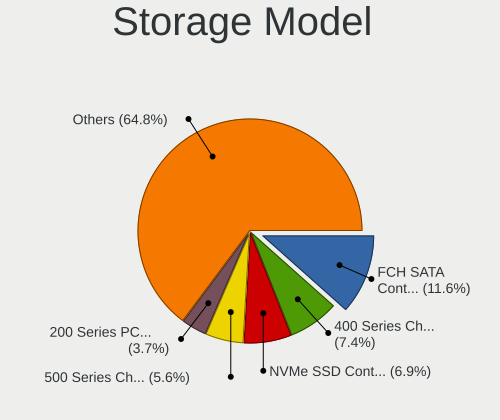

| Model                                                                                   | Desktops | Percent |
|-----------------------------------------------------------------------------------------|----------|---------|
| AMD FCH SATA Controller [AHCI mode]                                                     | 25       | 11.57%  |
| AMD 400 Series Chipset SATA Controller                                                  | 16       | 7.41%   |
| Samsung NVMe SSD Controller SM981/PM981/PM983                                           | 15       | 6.94%   |
| AMD 500 Series Chipset SATA Controller                                                  | 12       | 5.56%   |
| Intel 200 Series PCH SATA controller [AHCI mode]                                        | 8        | 3.7%    |
| ASMedia ASM1061/ASM1062 Serial ATA Controller                                           | 6        | 2.78%   |
| AMD SB7x0/SB8x0/SB9x0 SATA Controller [AHCI mode]                                       | 5        | 2.31%   |
| SanDisk Ultra 3D / WD PC SN530, IX SN530, Blue SN550 NVMe SSD (DRAM-less)               | 4        | 1.85%   |
| Samsung NVMe SSD Controller PM9A1/PM9A3/980PRO                                          | 4        | 1.85%   |
| Phison E12 NVMe Controller                                                              | 4        | 1.85%   |
| Intel Alder Lake-S PCH SATA Controller [AHCI Mode]                                      | 4        | 1.85%   |
| Intel 7 Series/C210 Series Chipset Family 6-port SATA Controller [AHCI mode]            | 4        | 1.85%   |
| SK hynix Platinum P41/PC801 NVMe Solid State Drive                                      | 3        | 1.39%   |
| Samsung NVMe SSD Controller S4LV008[Pascal]                                             | 3        | 1.39%   |
| Micron/Crucial P2 [Nick P2] / P3 / P3 Plus NVMe PCIe SSD (DRAM-less)                    | 3        | 1.39%   |
| Kingston Company NV1 NVMe SSD [SM2263XT] (DRAM-less)                                    | 3        | 1.39%   |
| Intel Volume Management Device NVMe RAID Controller                                     | 3        | 1.39%   |
| Intel Raptor Lake SATA AHCI Controller                                                  | 3        | 1.39%   |
| Intel Q170/Q150/B150/H170/H110/Z170/CM236 Chipset SATA Controller [AHCI Mode]           | 3        | 1.39%   |
| Intel NM10/ICH7 Family SATA Controller [IDE mode]                                       | 3        | 1.39%   |
| Intel Cannon Lake PCH SATA AHCI Controller                                              | 3        | 1.39%   |
| Intel 82801G (ICH7 Family) IDE Controller                                               | 3        | 1.39%   |
| Intel 8 Series/C220 Series Chipset Family 6-port SATA Controller 1 [AHCI mode]          | 3        | 1.39%   |
| Intel 6 Series/C200 Series Chipset Family 6 port Desktop SATA AHCI Controller           | 3        | 1.39%   |
| AMD SB7x0/SB8x0/SB9x0 IDE Controller                                                    | 3        | 1.39%   |
| AMD 600 Series Chipset SATA Controller                                                  | 3        | 1.39%   |
| AMD 300 Series Chipset SATA Controller                                                  | 3        | 1.39%   |
| SanDisk Ultra 3D / WD Blue SN570 NVMe SSD (DRAM-less)                                   | 2        | 0.93%   |
| SanDisk PC SN735 / WD_BLACK SN750 SE NVMe SSD (DRAM-less)                               | 2        | 0.93%   |
| Samsung NVMe SSD Controller 980 (DRAM-less)                                             | 2        | 0.93%   |
| Phison E16 PCIe4 NVMe Controller                                                        | 2        | 0.93%   |
| Intel SATA Controller [RAID mode]                                                       | 2        | 0.93%   |
| Intel RST Volume Management Device Controller                                           | 2        | 0.93%   |
| Intel Alder Lake-N SATA AHCI Controller                                                 | 2        | 0.93%   |
| Intel 6 Series/C200 Series Chipset Family Desktop SATA Controller (IDE mode, ports 4-5) | 2        | 0.93%   |
| Intel 6 Series/C200 Series Chipset Family Desktop SATA Controller (IDE mode, ports 0-3) | 2        | 0.93%   |
| Intel 500 Series Chipset Family SATA AHCI Controller                                    | 2        | 0.93%   |
| ADATA XPG SX8200 Pro PCIe Gen3x4 M.2 2280 Solid State Drive                             | 2        | 0.93%   |
| SK hynix PC601 NVMe Solid State Drive                                                   | 1        | 0.46%   |
| SanDisk WD SN560/SN740/SN770/SN5000 NVMe SSD                                            | 1        | 0.46%   |

Storage Kind
------------

Kind of storage controller (IDE, SATA, NVMe, SAS, ...)

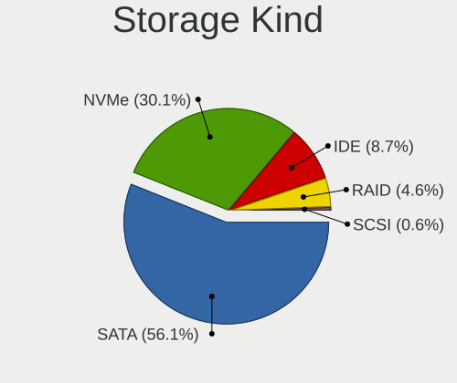

| Kind | Desktops | Percent |
|------|----------|---------|
| SATA | 97       | 56.07%  |
| NVMe | 52       | 30.06%  |
| IDE  | 15       | 8.67%   |
| RAID | 8        | 4.62%   |
| SCSI | 1        | 0.58%   |

Processor
---------

CPU Vendor
----------

Processor vendors

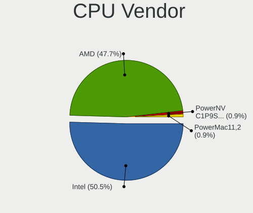

| Vendor                   | Desktops | Percent |
|--------------------------|----------|---------|
| Intel                    | 56       | 50.45%  |
| AMD                      | 53       | 47.75%  |
| PowerNV C1P9S01 REV 1.01 | 1        | 0.9%    |
| PowerMac11,2             | 1        | 0.9%    |

CPU Model
---------

Processor models

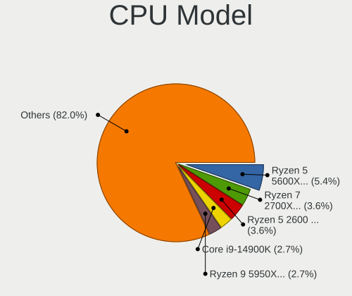

| Model                                              | Desktops | Percent |
|----------------------------------------------------|----------|---------|
| AMD Ryzen 5 5600X 6-Core Processor                 | 6        | 5.41%   |
| AMD Ryzen 7 2700X Eight-Core Processor             | 4        | 3.6%    |
| AMD Ryzen 5 2600 Six-Core Processor                | 4        | 3.6%    |
| Intel Core i9-14900K                               | 3        | 2.7%    |
| AMD Ryzen 9 5950X 16-Core Processor                | 3        | 2.7%    |
| AMD Ryzen 7 5800X 8-Core Processor                 | 3        | 2.7%    |
| AMD Ryzen 7 5700X 8-Core Processor                 | 3        | 2.7%    |
| Intel Core i7-3770 CPU @ 3.40GHz                   | 2        | 1.8%    |
| Intel Core i5-7600K CPU @ 3.80GHz                  | 2        | 1.8%    |
| Intel Core 2 Duo CPU E7500 @ 2.93GHz               | 2        | 1.8%    |
| AMD Ryzen 7 5700G with Radeon Graphics             | 2        | 1.8%    |
| AMD Ryzen 5 3600X 6-Core Processor                 | 2        | 1.8%    |
| AMD Ryzen 5 3600 6-Core Processor                  | 2        | 1.8%    |
| AMD FX-4300 Quad-Core Processor                    | 2        | 1.8%    |
| PowerNV C1P9S01 REV 1.01 POWER9, altivec supported | 1        | 0.9%    |
| PowerMac11,2 PPC970MP, altivec supported           | 1        | 0.9%    |
| Intel Xeon CPU W3680 @ 3.33GHz                     | 1        | 0.9%    |
| Intel Xeon CPU W3520 @ 2.67GHz                     | 1        | 0.9%    |
| Intel Xeon CPU E5-2699 v3 @ 2.30GHz                | 1        | 0.9%    |
| Intel Xeon CPU E31220 @ 3.10GHz                    | 1        | 0.9%    |
| Intel Xeon CPU E3-1230 v3 @ 3.30GHz                | 1        | 0.9%    |
| Intel Pentium M processor 2.13GHz                  | 1        | 0.9%    |
| Intel Pentium Gold G5400 CPU @ 3.70GHz             | 1        | 0.9%    |
| Intel Pentium CPU G2030 @ 3.00GHz                  | 1        | 0.9%    |
| Intel Pentium 4 CPU 2.80GHz                        | 1        | 0.9%    |
| Intel N95                                          | 1        | 0.9%    |
| Intel N100                                         | 1        | 0.9%    |
| Intel Core i9-9900K CPU @ 3.60GHz                  | 1        | 0.9%    |
| Intel Core i7-9700 CPU @ 3.00GHz                   | 1        | 0.9%    |
| Intel Core i7-8700 CPU @ 3.20GHz                   | 1        | 0.9%    |
| Intel Core i7-8086K CPU @ 4.00GHz                  | 1        | 0.9%    |
| Intel Core i7-7700 CPU @ 3.60GHz                   | 1        | 0.9%    |
| Intel Core i7-6700K CPU @ 4.00GHz                  | 1        | 0.9%    |
| Intel Core i7-4790 CPU @ 3.60GHz                   | 1        | 0.9%    |
| Intel Core i7-10700F CPU @ 2.90GHz                 | 1        | 0.9%    |
| Intel Core i5-8600K CPU @ 3.60GHz                  | 1        | 0.9%    |
| Intel Core i5-8250U CPU @ 1.60GHz                  | 1        | 0.9%    |
| Intel Core i5-6500 CPU @ 3.20GHz                   | 1        | 0.9%    |
| Intel Core i5-6400 CPU @ 2.70GHz                   | 1        | 0.9%    |
| Intel Core i5-4670 CPU @ 3.40GHz                   | 1        | 0.9%    |

CPU Model Family
----------------

Processor model prefix

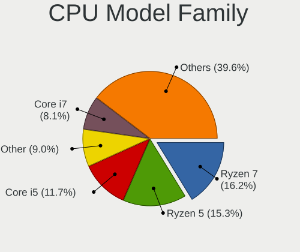

| Model                  | Desktops | Percent |
|------------------------|----------|---------|
| AMD Ryzen 7            | 18       | 16.22%  |
| AMD Ryzen 5            | 17       | 15.32%  |
| Intel Core i5          | 13       | 11.71%  |
| Other                  | 10       | 9.01%   |
| Intel Core i7          | 9        | 8.11%   |
| Intel Core i3          | 6        | 5.41%   |
| AMD Ryzen 9            | 6        | 5.41%   |
| Intel Xeon             | 5        | 4.5%    |
| Intel Core i9          | 4        | 3.6%    |
| AMD FX                 | 4        | 3.6%    |
| AMD Ryzen 3            | 3        | 2.7%    |
| Intel Core 2 Quad      | 2        | 1.8%    |
| Intel Core 2 Duo       | 2        | 1.8%    |
| Intel Celeron          | 2        | 1.8%    |
| Intel Pentium M        | 1        | 0.9%    |
| Intel Pentium Gold     | 1        | 0.9%    |
| Intel Pentium 4        | 1        | 0.9%    |
| Intel Pentium          | 1        | 0.9%    |
| Intel Atom             | 1        | 0.9%    |
| AMD Ryzen Threadripper | 1        | 0.9%    |
| AMD Phenom II X4       | 1        | 0.9%    |
| AMD Athlon X4          | 1        | 0.9%    |
| AMD Athlon II X3       | 1        | 0.9%    |
| AMD Athlon II X2       | 1        | 0.9%    |

CPU Cores
---------

Number of processor cores

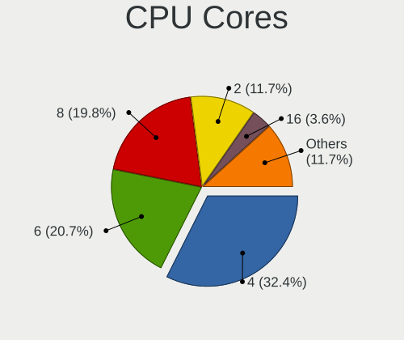

| Number | Desktops | Percent |
|--------|----------|---------|
| 4      | 36       | 32.43%  |
| 6      | 23       | 20.72%  |
| 8      | 22       | 19.82%  |
| 2      | 13       | 11.71%  |
| 16     | 4        | 3.6%    |
| 12     | 4        | 3.6%    |
| 24     | 3        | 2.7%    |
| 1      | 3        | 2.7%    |
| 64     | 1        | 0.9%    |
| 18     | 1        | 0.9%    |
| 3      | 1        | 0.9%    |

CPU Sockets
-----------

Number of sockets

| Number | Desktops | Percent |
|--------|----------|---------|
| 1      | 111      | 100%    |

CPU Threads
-----------

Threads per core (Hyper-Threading)

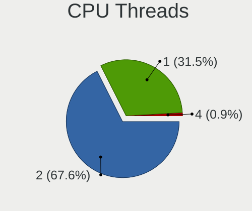

| Number | Desktops | Percent |
|--------|----------|---------|
| 2      | 75       | 67.57%  |
| 1      | 35       | 31.53%  |
| 4      | 1        | 0.9%    |

CPU Op-Modes
------------

CPU Operation Modes (32-bit, 64-bit)

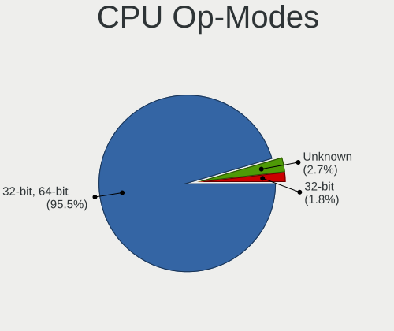

| Op mode        | Desktops | Percent |
|----------------|----------|---------|
| 32-bit, 64-bit | 106      | 95.5%   |
| Unknown        | 3        | 2.7%    |
| 32-bit         | 2        | 1.8%    |

CPU Microcode
-------------

Microcode number

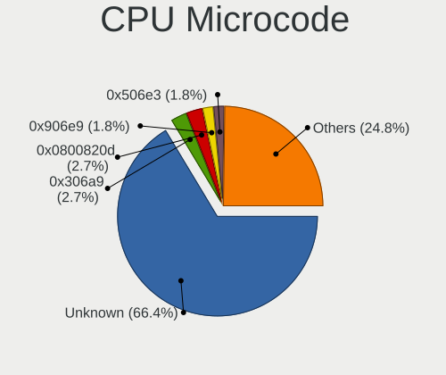

| Number     | Desktops | Percent |
|------------|----------|---------|
| Unknown    | 75       | 66.37%  |
| 0x306a9    | 3        | 2.65%   |
| 0x0800820d | 3        | 2.65%   |
| 0x906e9    | 2        | 1.77%   |
| 0x506e3    | 2        | 1.77%   |
| 0x0a201009 | 2        | 1.77%   |
| 0x08701030 | 2        | 1.77%   |
| 0x08701021 | 2        | 1.77%   |
| 0x06000852 | 2        | 1.77%   |
| 0x010000c8 | 2        | 1.77%   |
| 0xa0671    | 1        | 0.88%   |
| 0x906ed    | 1        | 0.88%   |
| 0x906ea    | 1        | 0.88%   |
| 0x90675    | 1        | 0.88%   |
| 0x90672    | 1        | 0.88%   |
| 0x706a1    | 1        | 0.88%   |
| 0x306c3    | 1        | 0.88%   |
| 0x1067a    | 1        | 0.88%   |
| 0x10677    | 1        | 0.88%   |
| 0x0a50000f | 1        | 0.88%   |
| 0x0a50000d | 1        | 0.88%   |
| 0x0a50000c | 1        | 0.88%   |
| 0x0a201205 | 1        | 0.88%   |
| 0x0a201204 | 1        | 0.88%   |
| 0x08701013 | 1        | 0.88%   |
| 0x08001138 | 1        | 0.88%   |
| 0x08001136 | 1        | 0.88%   |
| 0x08001129 | 1        | 0.88%   |

CPU Microarch
-------------

Microarchitecture

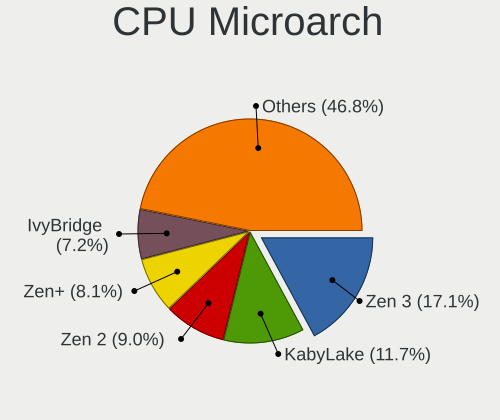

| Name             | Desktops | Percent |
|------------------|----------|---------|
| Zen 3            | 19       | 17.12%  |
| KabyLake         | 13       | 11.71%  |
| Zen 2            | 10       | 9.01%   |
| Zen+             | 9        | 8.11%   |
| IvyBridge        | 8        | 7.21%   |
| Haswell          | 6        | 5.41%   |
| Alderlake Hybrid | 6        | 5.41%   |
| Unknown          | 6        | 5.41%   |
| Zen              | 4        | 3.6%    |
| Piledriver       | 4        | 3.6%    |
| Penryn           | 4        | 3.6%    |
| Skylake          | 3        | 2.7%    |
| K10              | 3        | 2.7%    |
| Westmere         | 2        | 1.8%    |
| SandyBridge      | 2        | 1.8%    |
| Icelake          | 2        | 1.8%    |
| Gracemont        | 2        | 1.8%    |
| Silvermont       | 1        | 0.9%    |
| P6               | 1        | 0.9%    |
| NetBurst         | 1        | 0.9%    |
| Nehalem          | 1        | 0.9%    |
| Goldmont plus    | 1        | 0.9%    |
| Excavator        | 1        | 0.9%    |
| Core             | 1        | 0.9%    |
| CometLake        | 1        | 0.9%    |

Graphics
--------

GPU Vendor
----------

Vendors of graphics cards

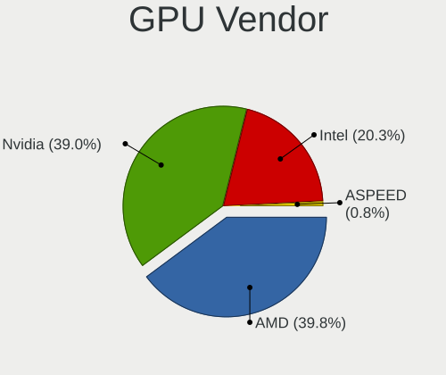

| Vendor            | Desktops | Percent |
|-------------------|----------|---------|
| AMD               | 49       | 39.84%  |
| Nvidia            | 48       | 39.02%  |
| Intel             | 25       | 20.33%  |
| ASPEED Technology | 1        | 0.81%   |

GPU Model
---------

Graphics card models

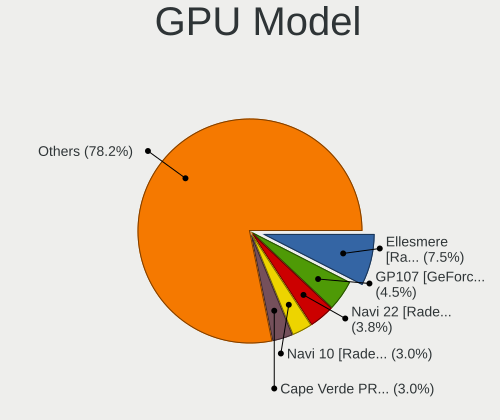

| Model                                                                       | Desktops | Percent |
|-----------------------------------------------------------------------------|----------|---------|
| AMD Ellesmere [Radeon RX 470/480/570/570X/580/580X/590]                     | 10       | 7.52%   |
| Nvidia GP107 [GeForce GTX 1050 Ti]                                          | 6        | 4.51%   |
| AMD Navi 22 [Radeon RX 6700/6700 XT/6750 XT / 6800M/6850M XT]               | 5        | 3.76%   |
| AMD Navi 10 [Radeon RX 5600 OEM/5600 XT / 5700/5700 XT]                     | 4        | 3.01%   |
| AMD Cape Verde PRO [Radeon HD 7750/8740 / R7 250E]                          | 4        | 3.01%   |
| Nvidia TU117 [GeForce GTX 1650]                                             | 3        | 2.26%   |
| Nvidia GP108 [GeForce GT 1030]                                              | 3        | 2.26%   |
| Nvidia GP106 [GeForce GTX 1060 6GB]                                         | 3        | 2.26%   |
| Nvidia GM107 [GeForce GTX 750 Ti]                                           | 3        | 2.26%   |
| Nvidia GK208B [GeForce GT 710]                                              | 3        | 2.26%   |
| Intel Xeon E3-1200 v2/3rd Gen Core processor Graphics Controller            | 3        | 2.26%   |
| Intel CoffeeLake-S GT2 [UHD Graphics 630]                                   | 3        | 2.26%   |
| AMD Navi 21 [Radeon RX 6800/6800 XT / 6900 XT]                              | 3        | 2.26%   |
| Nvidia TU106 [GeForce RTX 2070]                                             | 2        | 1.5%    |
| Nvidia TU106 [GeForce RTX 2060 Rev. A]                                      | 2        | 1.5%    |
| Nvidia GM204 [GeForce GTX 970]                                              | 2        | 1.5%    |
| Nvidia AD102 [GeForce RTX 4090]                                             | 2        | 1.5%    |
| Intel Xeon E3-1200 v3/4th Gen Core Processor Integrated Graphics Controller | 2        | 1.5%    |
| Intel Alder Lake-N [UHD Graphics]                                           | 2        | 1.5%    |
| Intel 4 Series Chipset Integrated Graphics Controller                       | 2        | 1.5%    |
| AMD Vega 10 XL/XT [Radeon RX Vega 56/64]                                    | 2        | 1.5%    |
| AMD Navi 31 [Radeon RX 7900 XT/7900 XTX/7900 GRE/7900M]                     | 2        | 1.5%    |
| AMD Lexa PRO [Radeon 540/540X/550/550X / RX 540X/550/550X]                  | 2        | 1.5%    |
| AMD Granite Ridge [Radeon Graphics]                                         | 2        | 1.5%    |
| AMD Cezanne [Radeon Vega Series / Radeon Vega Mobile Series]                | 2        | 1.5%    |
| Nvidia TU106 [GeForce RTX 2060 12GB]                                        | 1        | 0.75%   |
| Nvidia TU104 [GeForce RTX 2080 SUPER]                                       | 1        | 0.75%   |
| Nvidia TU104 [GeForce RTX 2070 SUPER]                                       | 1        | 0.75%   |
| Nvidia TU102 [GeForce RTX 2080 Ti Rev. A]                                   | 1        | 0.75%   |
| Nvidia NV43 [GeForce 6600]                                                  | 1        | 0.75%   |
| Nvidia GP107 [GeForce GTX 1050]                                             | 1        | 0.75%   |
| Nvidia GP104 [GeForce GTX 1080]                                             | 1        | 0.75%   |
| Nvidia GP104 [GeForce GTX 1070]                                             | 1        | 0.75%   |
| Nvidia GM206 [GeForce GTX 960]                                              | 1        | 0.75%   |
| Nvidia GK110 [GeForce GTX 780]                                              | 1        | 0.75%   |
| Nvidia GF108 [GeForce GT 730]                                               | 1        | 0.75%   |
| Nvidia GF108 [GeForce GT 420]                                               | 1        | 0.75%   |
| Nvidia GA104 [GeForce RTX 3070]                                             | 1        | 0.75%   |
| Nvidia GA104 [GeForce RTX 3070 Lite Hash Rate]                              | 1        | 0.75%   |
| Nvidia GA104 [GeForce RTX 3060 Ti Lite Hash Rate]                           | 1        | 0.75%   |

GPU Combo
---------

Combinations of graphics cards

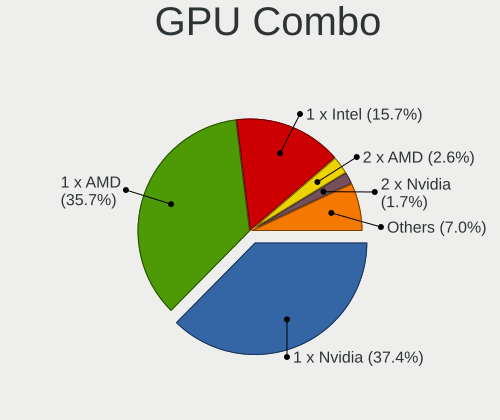

| Name                 | Desktops | Percent |
|----------------------|----------|---------|
| 1 x Nvidia           | 43       | 37.39%  |
| 1 x AMD              | 41       | 35.65%  |
| 1 x Intel            | 18       | 15.65%  |
| 2 x AMD              | 3        | 2.61%   |
| 2 x Nvidia           | 2        | 1.74%   |
| Intel + Nvidia       | 2        | 1.74%   |
| Other                | 1        | 0.87%   |
| 3 x AMD + 1 x Nvidia | 1        | 0.87%   |
| 3 x AMD              | 1        | 0.87%   |
| Intel + AMD          | 1        | 0.87%   |
| AMD + Nvidia         | 1        | 0.87%   |
| AMD + ASPEED         | 1        | 0.87%   |

GPU Driver
----------

Free vs proprietary

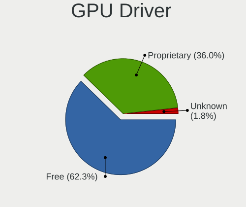

| Driver      | Desktops | Percent |
|-------------|----------|---------|
| Free        | 71       | 62.28%  |
| Proprietary | 41       | 35.96%  |
| Unknown     | 2        | 1.75%   |

GPU Memory
----------

Total video memory

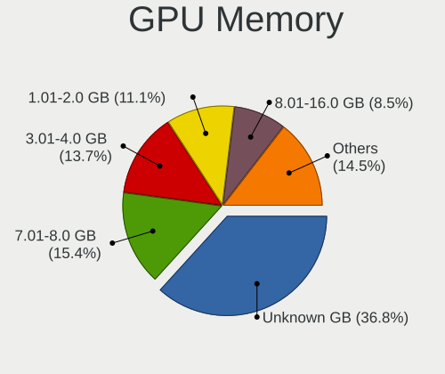

| Size in GB | Desktops | Percent |
|------------|----------|---------|
| Unknown    | 43       | 36.75%  |
| 7.01-8.0   | 18       | 15.38%  |
| 3.01-4.0   | 16       | 13.68%  |
| 1.01-2.0   | 13       | 11.11%  |
| 8.01-16.0  | 10       | 8.55%   |
| 5.01-6.0   | 5        | 4.27%   |
| 16.01-24.0 | 4        | 3.42%   |
| 0.51-1.0   | 3        | 2.56%   |
| 0.01-0.5   | 3        | 2.56%   |
| 2.01-3.0   | 2        | 1.71%   |

Monitor
-------

Monitor Vendor
--------------

Monitor vendors

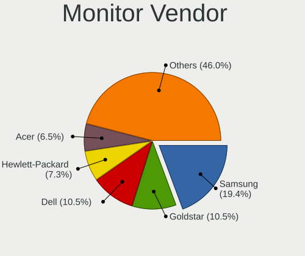

| Vendor               | Desktops | Percent |
|----------------------|----------|---------|
| Samsung Electronics  | 24       | 19.35%  |
| Goldstar             | 13       | 10.48%  |
| Dell                 | 13       | 10.48%  |
| Hewlett-Packard      | 9        | 7.26%   |
| Acer                 | 8        | 6.45%   |
| Philips              | 5        | 4.03%   |
| MSI                  | 4        | 3.23%   |
| BenQ                 | 4        | 3.23%   |
| AOC                  | 4        | 3.23%   |
| Ancor Communications | 4        | 3.23%   |
| Iiyama               | 3        | 2.42%   |
| ASUSTek Computer     | 3        | 2.42%   |
| Unknown              | 3        | 2.42%   |
| ViewSonic            | 2        | 1.61%   |
| Unknown (XXX)        | 2        | 1.61%   |
| Sceptre Tech         | 2        | 1.61%   |
| Lenovo               | 2        | 1.61%   |
| Fujitsu Siemens      | 2        | 1.61%   |
| Vizio                | 1        | 0.81%   |
| Unknown              | 1        | 0.81%   |
| Sceptre              | 1        | 0.81%   |
| ONN                  | 1        | 0.81%   |
| NEC Computers        | 1        | 0.81%   |
| LG Electronics       | 1        | 0.81%   |
| KK@                  | 1        | 0.81%   |
| Idek Iiyama          | 1        | 0.81%   |
| Huion                | 1        | 0.81%   |
| HKC                  | 1        | 0.81%   |
| Hitachi              | 1        | 0.81%   |
| Gigabyte Technology  | 1        | 0.81%   |
| FUN                  | 1        | 0.81%   |
| eMachines            | 1        | 0.81%   |
| Eizo                 | 1        | 0.81%   |
| Corsair              | 1        | 0.81%   |
| AXM                  | 1        | 0.81%   |

Monitor Model
-------------

Monitor models

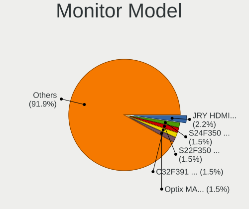

| Model                                                                    | Desktops | Percent |
|--------------------------------------------------------------------------|----------|---------|
| Unknown                                                                  | 3        | 2.21%   |
| Samsung Electronics S24F350 SAM0D20 1920x1080 521x293mm 23.5-inch        | 2        | 1.47%   |
| Samsung Electronics S22F350 SAM0D1A 1920x1080 477x268mm 21.5-inch        | 2        | 1.47%   |
| Samsung Electronics C32F391 SAM0D34 1920x1080 698x393mm 31.5-inch        | 2        | 1.47%   |
| MSI Optix MAG27CQ MSI1462 2560x1440 597x336mm 27.0-inch                  | 2        | 1.47%   |
| Goldstar FULL HD GSM5B55 1920x1080 480x270mm 21.7-inch                   | 2        | 1.47%   |
| Goldstar 27GL850 GSM5B7F 2560x1440 597x336mm 27.0-inch                   | 2        | 1.47%   |
| BenQ V2400Eco BNQ7D02 1920x1080 531x299mm 24.0-inch                      | 2        | 1.47%   |
| Vizio D24h-C1 VIZ0095 1360x768 521x293mm 23.5-inch                       | 1        | 0.74%   |
| ViewSonic XG2409A VSC1941 1920x1080 527x296mm 23.8-inch                  | 1        | 0.74%   |
| ViewSonic LCD Monitor VX2457 1920x1080                                   | 1        | 0.74%   |
| Unknown LCD Monitor ENV LCD2460 1920x1080                                | 1        | 0.74%   |
| Unknown (XXX) LED MONITOR XXX1910 1440x900 410x230mm 18.5-inch           | 1        | 0.74%   |
| Unknown (XXX) Beyo TV XXX9615 3840x2160 1210x680mm 54.6-inch             | 1        | 0.74%   |
| Sceptre Tech Sceptre J20 SPT080D 1600x900 435x237mm 19.5-inch            | 1        | 0.74%   |
| Sceptre Tech Sceptre E24 SPT099D 1920x1080 521x293mm 23.5-inch           | 1        | 0.74%   |
| Sceptre LCD Monitor E24 1920x1080                                        | 1        | 0.74%   |
| Samsung Electronics U32R59x SAM0F96 3840x2160 697x392mm 31.5-inch        | 1        | 0.74%   |
| Samsung Electronics SyncMaster SAM04D4 1920x1080 531x298mm 24.0-inch     | 1        | 0.74%   |
| Samsung Electronics SMS27A850 SAM083D 2560x1440 518x324mm 24.1-inch      | 1        | 0.74%   |
| Samsung Electronics SA300/SA350 SAM07D2 1920x1080 477x268mm 21.5-inch    | 1        | 0.74%   |
| Samsung Electronics S27F358 SAM0D73 1920x1080 598x336mm 27.0-inch        | 1        | 0.74%   |
| Samsung Electronics Odyssey G95SC SAME028 3840x1080 1193x336mm 48.8-inch | 1        | 0.74%   |
| Samsung Electronics LU28R55 SAM1017 3840x2160 632x360mm 28.6-inch        | 1        | 0.74%   |
| Samsung Electronics LU28R55 SAM1015 3840x2160 632x360mm 28.6-inch        | 1        | 0.74%   |
| Samsung Electronics LS27A70 SAM71A0 3840x2160 597x336mm 27.0-inch        | 1        | 0.74%   |
| Samsung Electronics LCD Monitor SyncMaster 1680x1050                     | 1        | 0.74%   |
| Samsung Electronics LCD Monitor SyncMaster                               | 1        | 0.74%   |
| Samsung Electronics LCD Monitor SAM0D3A 3840x2160 1872x1053mm 84.6-inch  | 1        | 0.74%   |
| Samsung Electronics LCD Monitor SAM050C 1920x1080 886x498mm 40.0-inch    | 1        | 0.74%   |
| Samsung Electronics LCD Monitor LU28R55 3840x2160                        | 1        | 0.74%   |
| Samsung Electronics LCD Monitor LC49G95T 7040x1440                       | 1        | 0.74%   |
| Samsung Electronics LCD Monitor C49HG9x 7680x1080                        | 1        | 0.74%   |
| Samsung Electronics LCD Monitor C49HG9x                                  | 1        | 0.74%   |
| Samsung Electronics LC49G95T SAM7053 3840x1080 1193x336mm 48.8-inch      | 1        | 0.74%   |
| Samsung Electronics LC27T55 SAM701F 1920x1080 609x349mm 27.6-inch        | 1        | 0.74%   |
| Samsung Electronics LC24RG50 SAM0F91 1920x1080 532x304mm 24.1-inch       | 1        | 0.74%   |
| Samsung Electronics LC24RG50 SAM0F90 1920x1080 532x304mm 24.1-inch       | 1        | 0.74%   |
| Samsung Electronics C32F391 SAM0D35 1920x1080 698x393mm 31.5-inch        | 1        | 0.74%   |
| Samsung Electronics C24F390 SAM0D2C 1920x1080 521x293mm 23.5-inch        | 1        | 0.74%   |

Monitor Resolution
------------------

Monitor screen resolution

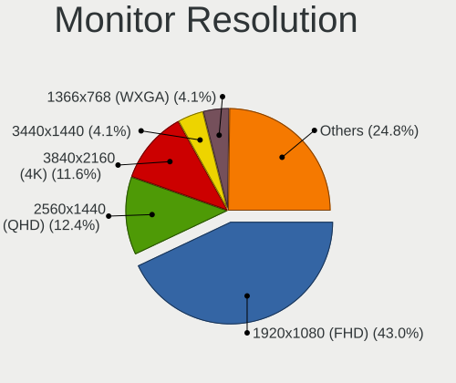

| Resolution         | Desktops | Percent |
|--------------------|----------|---------|
| 1920x1080 (FHD)    | 52       | 42.98%  |
| 2560x1440 (QHD)    | 15       | 12.4%   |
| 3840x2160 (4K)     | 14       | 11.57%  |
| 3440x1440          | 5        | 4.13%   |
| 1366x768 (WXGA)    | 5        | 4.13%   |
| 2560x1080          | 4        | 3.31%   |
| 1680x1050 (WSXGA+) | 4        | 3.31%   |
| 1600x900 (HD+)     | 4        | 3.31%   |
| Unknown            | 4        | 3.31%   |
| 1920x1200 (WUXGA)  | 3        | 2.48%   |
| 1280x1024 (SXGA)   | 3        | 2.48%   |
| 3840x1080          | 2        | 1.65%   |
| 7680x1080          | 1        | 0.83%   |
| 7040x1440          | 1        | 0.83%   |
| 3840x1600          | 1        | 0.83%   |
| 1600x1200          | 1        | 0.83%   |
| 1440x900 (WXGA+)   | 1        | 0.83%   |
| 1024x768 (XGA)     | 1        | 0.83%   |

Monitor Diagonal
----------------

Diagonal size in inches

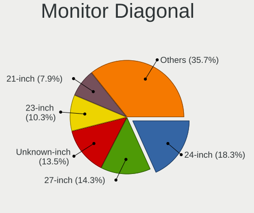

| Inches  | Desktops | Percent |
|---------|----------|---------|
| 24      | 23       | 18.25%  |
| 27      | 18       | 14.29%  |
| Unknown | 17       | 13.49%  |
| 23      | 13       | 10.32%  |
| 21      | 10       | 7.94%   |
| 31      | 7        | 5.56%   |
| 34      | 6        | 4.76%   |
| 22      | 5        | 3.97%   |
| 28      | 3        | 2.38%   |
| 20      | 3        | 2.38%   |
| 19      | 3        | 2.38%   |
| 84      | 2        | 1.59%   |
| 48      | 2        | 1.59%   |
| 25      | 2        | 1.59%   |
| 18      | 2        | 1.59%   |
| 17      | 2        | 1.59%   |
| 63      | 1        | 0.79%   |
| 54      | 1        | 0.79%   |
| 40      | 1        | 0.79%   |
| 37      | 1        | 0.79%   |
| 32      | 1        | 0.79%   |
| 26      | 1        | 0.79%   |
| 15      | 1        | 0.79%   |
| 13      | 1        | 0.79%   |

Monitor Width
-------------

Physical width

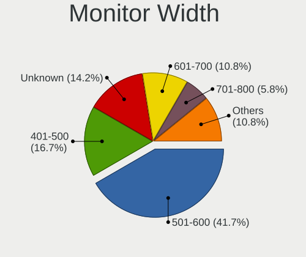

| Width in mm | Desktops | Percent |
|-------------|----------|---------|
| 501-600     | 50       | 41.67%  |
| 401-500     | 20       | 16.67%  |
| Unknown     | 17       | 14.17%  |
| 601-700     | 13       | 10.83%  |
| 701-800     | 7        | 5.83%   |
| 1001-1500   | 4        | 3.33%   |
| 301-350     | 3        | 2.5%    |
| 801-900     | 2        | 1.67%   |
| 1501-2000   | 2        | 1.67%   |
| 351-400     | 1        | 0.83%   |
| 201-300     | 1        | 0.83%   |

Aspect Ratio
------------

Proportional relationship between the width and the height

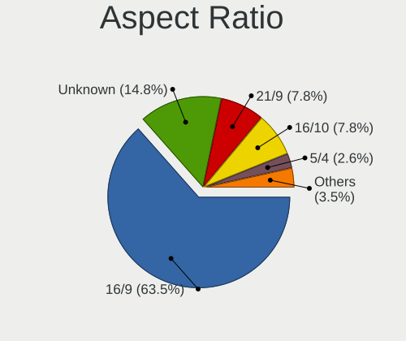

| Ratio   | Desktops | Percent |
|---------|----------|---------|
| 16/9    | 73       | 63.48%  |
| Unknown | 17       | 14.78%  |
| 21/9    | 9        | 7.83%   |
| 16/10   | 9        | 7.83%   |
| 5/4     | 3        | 2.61%   |
| 32/9    | 2        | 1.74%   |
| 4/3     | 1        | 0.87%   |
| 3/2     | 1        | 0.87%   |

Monitor Area
------------

Area in inch²

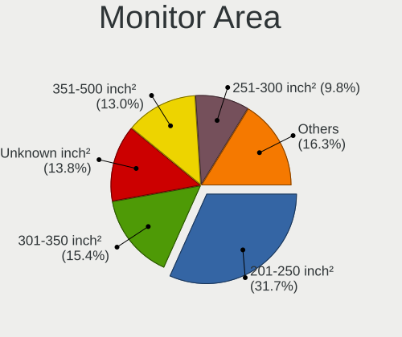

| Area in inch² | Desktops | Percent |
|----------------|----------|---------|
| 201-250        | 39       | 31.71%  |
| 301-350        | 19       | 15.45%  |
| Unknown        | 17       | 13.82%  |
| 351-500        | 16       | 13.01%  |
| 251-300        | 12       | 9.76%   |
| 151-200        | 6        | 4.88%   |
| More than 1000 | 4        | 3.25%   |
| 141-150        | 4        | 3.25%   |
| 501-1000       | 4        | 3.25%   |
| 81-90          | 1        | 0.81%   |
| 101-110        | 1        | 0.81%   |

Pixel Density
-------------

Pixels per inch

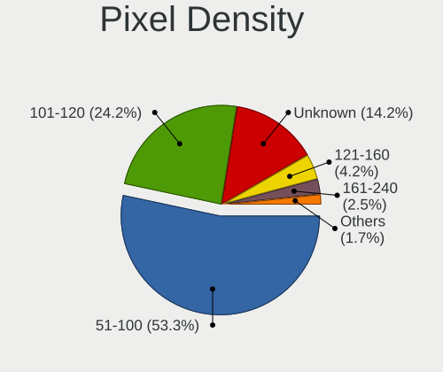

| Density | Desktops | Percent |
|---------|----------|---------|
| 51-100  | 64       | 53.33%  |
| 101-120 | 29       | 24.17%  |
| Unknown | 17       | 14.17%  |
| 121-160 | 5        | 4.17%   |
| 161-240 | 3        | 2.5%    |
| 1-50    | 2        | 1.67%   |

Multiple Monitors
-----------------

Total monitors connected

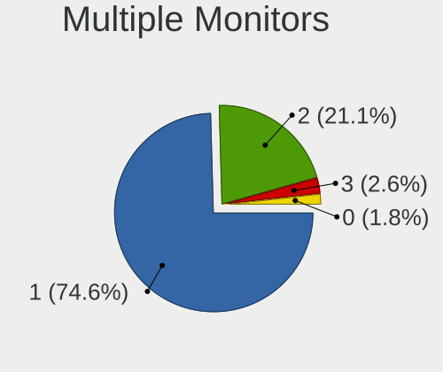

| Total | Desktops | Percent |
|-------|----------|---------|
| 1     | 85       | 74.56%  |
| 2     | 24       | 21.05%  |
| 3     | 3        | 2.63%   |
| 0     | 2        | 1.75%   |

Network
-------

Net Controller Vendor
---------------------

Controller vendors

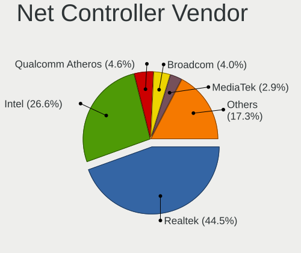

| Vendor                          | Desktops | Percent |
|---------------------------------|----------|---------|
| Realtek Semiconductor           | 77       | 44.51%  |
| Intel                           | 46       | 26.59%  |
| Qualcomm Atheros                | 8        | 4.62%   |
| Broadcom                        | 7        | 4.05%   |
| MediaTek                        | 5        | 2.89%   |
| TP-Link                         | 4        | 2.31%   |
| Qualcomm Atheros Communications | 3        | 1.73%   |
| Aquantia                        | 3        | 1.73%   |
| Xiaomi                          | 2        | 1.16%   |
| Ralink Technology               | 2        | 1.16%   |
| Qualcomm Technologies           | 2        | 1.16%   |
| Tenda                           | 1        | 0.58%   |
| STMicroelectronics              | 1        | 0.58%   |
| Qualcomm                        | 1        | 0.58%   |
| Pulse-Eight                     | 1        | 0.58%   |
| OnePlus Technology (Shenzhen)   | 1        | 0.58%   |
| Nvidia                          | 1        | 0.58%   |
| Microsoft                       | 1        | 0.58%   |
| Mellanox Technologies           | 1        | 0.58%   |
| Chelsio Communications          | 1        | 0.58%   |
| Broadcom Limited                | 1        | 0.58%   |
| ASUSTek Computer                | 1        | 0.58%   |
| ASIX Electronics                | 1        | 0.58%   |
| Arduino SA                      | 1        | 0.58%   |
| Apple                           | 1        | 0.58%   |

Net Controller Model
--------------------

Controller models

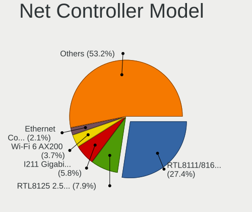

| Model                                                                         | Desktops | Percent |
|-------------------------------------------------------------------------------|----------|---------|
| Realtek RTL8111/8168/8211/8411 PCI Express Gigabit Ethernet Controller        | 52       | 27.37%  |
| Realtek RTL8125 2.5GbE Controller                                             | 15       | 7.89%   |
| Intel I211 Gigabit Network Connection                                         | 11       | 5.79%   |
| Intel Wi-Fi 6 AX200                                                           | 7        | 3.68%   |
| Intel Ethernet Connection (2) I219-V                                          | 4        | 2.11%   |
| Realtek RTL8821CE 802.11ac PCIe Wireless Network Adapter                      | 3        | 1.58%   |
| Realtek RTL8153 Gigabit Ethernet Adapter                                      | 3        | 1.58%   |
| Qualcomm Atheros QCA6174 802.11ac Wireless Network Adapter                    | 3        | 1.58%   |
| Intel Wireless 7265                                                           | 3        | 1.58%   |
| Intel Wi-Fi 6E(802.11ax) AX210/AX1675* 2x2 [Typhoon Peak]                     | 3        | 1.58%   |
| Intel Dual Band Wireless-AC 3168NGW [Stone Peak]                              | 3        | 1.58%   |
| Intel 82579LM Gigabit Network Connection (Lewisville)                         | 3        | 1.58%   |
| TP-Link Archer T3U [Realtek RTL8812BU]                                        | 2        | 1.05%   |
| Qualcomm WCN785x Wi-Fi 7(802.11be) 320MHz 2x2 [FastConnect 7800]              | 2        | 1.05%   |
| Qualcomm Atheros AR9271 802.11n                                               | 2        | 1.05%   |
| MediaTek MT7922 802.11ax PCI Express Wireless Network Adapter                 | 2        | 1.05%   |
| Intel Tiger Lake PCH CNVi WiFi                                                | 2        | 1.05%   |
| Intel Ethernet Controller I226-V                                              | 2        | 1.05%   |
| Intel Alder Lake-S PCH CNVi WiFi                                              | 2        | 1.05%   |
| Intel 82567LM-3 Gigabit Network Connection                                    | 2        | 1.05%   |
| Xiaomi Mi/Redmi series (RNDIS)                                                | 1        | 0.53%   |
| Xiaomi Mi/Redmi series (RNDIS + ADB)                                          | 1        | 0.53%   |
| TP-Link TL-WN722N v2/v3 [Realtek RTL8188EUS]                                  | 1        | 0.53%   |
| TP-Link 802.11ac NIC                                                          | 1        | 0.53%   |
| Tenda U12                                                                     | 1        | 0.53%   |
| STMicroelectronics Virtual COM Port                                           | 1        | 0.53%   |
| Realtek RTL88x2bu [AC1200 Techkey]                                            | 1        | 0.53%   |
| Realtek RTL8822BE 802.11a/b/g/n/ac WiFi adapter                               | 1        | 0.53%   |
| Realtek RTL8723DE Wireless Network Adapter                                    | 1        | 0.53%   |
| Realtek RTL8169 PCI Gigabit Ethernet Controller                               | 1        | 0.53%   |
| Realtek RTL8126 5GbE Controller                                               | 1        | 0.53%   |
| Realtek RTL8111/8168/8411 PCI Express Gigabit Ethernet Controller             | 1        | 0.53%   |
| Realtek RTL810xE PCI Express Fast Ethernet controller                         | 1        | 0.53%   |
| Ralink RT5572 Wireless Adapter                                                | 1        | 0.53%   |
| Ralink MT7601U Wireless Adapter                                               | 1        | 0.53%   |
| Qualcomm YUPIK-QRD _SN:AC1D5909                                               | 1        | 0.53%   |
| Qualcomm Atheros QCA9377 802.11ac Wireless Network Adapter                    | 1        | 0.53%   |
| Qualcomm Atheros Killer E2500 Gigabit Ethernet Controller                     | 1        | 0.53%   |
| Qualcomm Atheros Killer E2400 Gigabit Ethernet Controller                     | 1        | 0.53%   |
| Qualcomm Atheros TP-Link TL-WN821N v2 / TL-WN822N v1 802.11n [Atheros AR9170] | 1        | 0.53%   |

Wireless Vendor
---------------

Wireless vendors

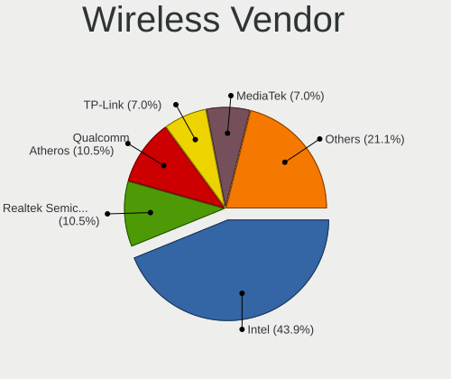

| Vendor                          | Desktops | Percent |
|---------------------------------|----------|---------|
| Intel                           | 25       | 43.86%  |
| Realtek Semiconductor           | 6        | 10.53%  |
| Qualcomm Atheros                | 6        | 10.53%  |
| TP-Link                         | 4        | 7.02%   |
| MediaTek                        | 4        | 7.02%   |
| Qualcomm Atheros Communications | 3        | 5.26%   |
| Ralink Technology               | 2        | 3.51%   |
| Qualcomm Technologies           | 2        | 3.51%   |
| Broadcom                        | 2        | 3.51%   |
| Tenda                           | 1        | 1.75%   |
| Microsoft                       | 1        | 1.75%   |
| ASUSTek Computer                | 1        | 1.75%   |

Wireless Model
--------------

Wireless models

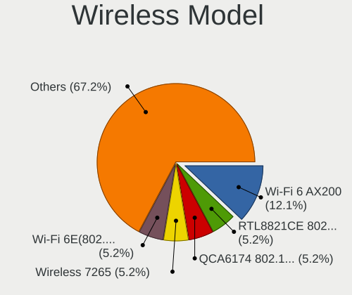

| Model                                                                         | Desktops | Percent |
|-------------------------------------------------------------------------------|----------|---------|
| Intel Wi-Fi 6 AX200                                                           | 7        | 12.07%  |
| Realtek RTL8821CE 802.11ac PCIe Wireless Network Adapter                      | 3        | 5.17%   |
| Qualcomm Atheros QCA6174 802.11ac Wireless Network Adapter                    | 3        | 5.17%   |
| Intel Wireless 7265                                                           | 3        | 5.17%   |
| Intel Wi-Fi 6E(802.11ax) AX210/AX1675* 2x2 [Typhoon Peak]                     | 3        | 5.17%   |
| Intel Dual Band Wireless-AC 3168NGW [Stone Peak]                              | 3        | 5.17%   |
| TP-Link Archer T3U [Realtek RTL8812BU]                                        | 2        | 3.45%   |
| Qualcomm WCN785x Wi-Fi 7(802.11be) 320MHz 2x2 [FastConnect 7800]              | 2        | 3.45%   |
| Qualcomm Atheros AR9271 802.11n                                               | 2        | 3.45%   |
| MediaTek MT7922 802.11ax PCI Express Wireless Network Adapter                 | 2        | 3.45%   |
| Intel Tiger Lake PCH CNVi WiFi                                                | 2        | 3.45%   |
| Intel Alder Lake-S PCH CNVi WiFi                                              | 2        | 3.45%   |
| TP-Link TL-WN722N v2/v3 [Realtek RTL8188EUS]                                  | 1        | 1.72%   |
| TP-Link 802.11ac NIC                                                          | 1        | 1.72%   |
| Tenda U12                                                                     | 1        | 1.72%   |
| Realtek RTL88x2bu [AC1200 Techkey]                                            | 1        | 1.72%   |
| Realtek RTL8822BE 802.11a/b/g/n/ac WiFi adapter                               | 1        | 1.72%   |
| Realtek RTL8723DE Wireless Network Adapter                                    | 1        | 1.72%   |
| Ralink RT5572 Wireless Adapter                                                | 1        | 1.72%   |
| Ralink MT7601U Wireless Adapter                                               | 1        | 1.72%   |
| Qualcomm Atheros QCA9377 802.11ac Wireless Network Adapter                    | 1        | 1.72%   |
| Qualcomm Atheros TP-Link TL-WN821N v2 / TL-WN822N v1 802.11n [Atheros AR9170] | 1        | 1.72%   |
| Qualcomm Atheros AR9285 Wireless Network Adapter (PCI-Express)                | 1        | 1.72%   |
| Qualcomm Atheros AR242x / AR542x Wireless Network Adapter (PCI-Express)       | 1        | 1.72%   |
| Microsoft Xbox 360 Wireless Adapter                                           | 1        | 1.72%   |
| MediaTek MT7925 (RZ717) Wi-Fi 7 160MHz                                        | 1        | 1.72%   |
| MediaTek MT7921 802.11ax PCIe Wireless Network Adapter [Filogic 330]          | 1        | 1.72%   |
| Intel Wireless 8260                                                           | 1        | 1.72%   |
| Intel Wireless 7260                                                           | 1        | 1.72%   |
| Intel Wi-Fi 7(802.11be) AX1775*/AX1790*/BE20*/BE401/BE1750* 2x2               | 1        | 1.72%   |
| Intel Wi-Fi 5(802.11ac) Wireless-AC 9x6x [Thunder Peak]                       | 1        | 1.72%   |
| Intel Cannon Lake PCH CNVi WiFi                                               | 1        | 1.72%   |
| Intel 700 Series Chipset CNVi WiFi                                            | 1        | 1.72%   |
| Broadcom BCM4360 802.11ac Dual Band Wireless Network Adapter                  | 1        | 1.72%   |
| Broadcom BCM4356 802.11ac Wireless Network Adapter                            | 1        | 1.72%   |
| ASUS USB-N13 802.11n Network Adapter (rev. B1) [Realtek RTL8192CU]            | 1        | 1.72%   |

Ethernet Vendor
---------------

Ethernet vendors

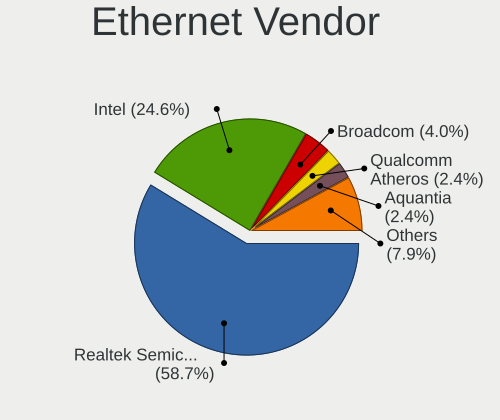

| Vendor                 | Desktops | Percent |
|------------------------|----------|---------|
| Realtek Semiconductor  | 74       | 58.73%  |
| Intel                  | 31       | 24.6%   |
| Broadcom               | 5        | 3.97%   |
| Qualcomm Atheros       | 3        | 2.38%   |
| Aquantia               | 3        | 2.38%   |
| Xiaomi                 | 2        | 1.59%   |
| Qualcomm               | 1        | 0.79%   |
| Nvidia                 | 1        | 0.79%   |
| Mellanox Technologies  | 1        | 0.79%   |
| MediaTek               | 1        | 0.79%   |
| Chelsio Communications | 1        | 0.79%   |
| Broadcom Limited       | 1        | 0.79%   |
| ASIX Electronics       | 1        | 0.79%   |
| Apple                  | 1        | 0.79%   |

Ethernet Model
--------------

Ethernet models

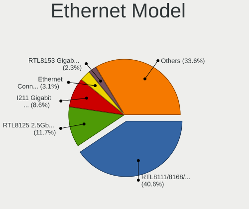

| Model                                                                  | Desktops | Percent |
|------------------------------------------------------------------------|----------|---------|
| Realtek RTL8111/8168/8211/8411 PCI Express Gigabit Ethernet Controller | 52       | 40.63%  |
| Realtek RTL8125 2.5GbE Controller                                      | 15       | 11.72%  |
| Intel I211 Gigabit Network Connection                                  | 11       | 8.59%   |
| Intel Ethernet Connection (2) I219-V                                   | 4        | 3.13%   |
| Realtek RTL8153 Gigabit Ethernet Adapter                               | 3        | 2.34%   |
| Intel 82579LM Gigabit Network Connection (Lewisville)                  | 3        | 2.34%   |
| Intel Ethernet Controller I226-V                                       | 2        | 1.56%   |
| Intel 82567LM-3 Gigabit Network Connection                             | 2        | 1.56%   |
| Xiaomi Mi/Redmi series (RNDIS)                                         | 1        | 0.78%   |
| Xiaomi Mi/Redmi series (RNDIS + ADB)                                   | 1        | 0.78%   |
| Realtek RTL8169 PCI Gigabit Ethernet Controller                        | 1        | 0.78%   |
| Realtek RTL8126 5GbE Controller                                        | 1        | 0.78%   |
| Realtek RTL8111/8168/8411 PCI Express Gigabit Ethernet Controller      | 1        | 0.78%   |
| Realtek RTL810xE PCI Express Fast Ethernet controller                  | 1        | 0.78%   |
| Qualcomm YUPIK-QRD _SN:AC1D5909                                        | 1        | 0.78%   |
| Qualcomm Atheros Killer E2500 Gigabit Ethernet Controller              | 1        | 0.78%   |
| Qualcomm Atheros Killer E2400 Gigabit Ethernet Controller              | 1        | 0.78%   |
| Qualcomm Atheros AR8151 v2.0 Gigabit Ethernet                          | 1        | 0.78%   |
| Nvidia MCP61 Ethernet                                                  | 1        | 0.78%   |
| Mellanox MT27710 Family [ConnectX-4 Lx]                                | 1        | 0.78%   |
| MediaTek Infinix HOT 50i                                               | 1        | 0.78%   |
| Intel Ethernet Controller I225-V                                       | 1        | 0.78%   |
| Intel Ethernet Connection I219-V                                       | 1        | 0.78%   |
| Intel Ethernet Connection I218-V                                       | 1        | 0.78%   |
| Intel Ethernet Connection I217-V                                       | 1        | 0.78%   |
| Intel Ethernet Connection I217-LM                                      | 1        | 0.78%   |
| Intel Ethernet Connection (7) I219-LM                                  | 1        | 0.78%   |
| Intel Ethernet Connection (2) I219-LM                                  | 1        | 0.78%   |
| Intel Ethernet Connection (2) I218-V                                   | 1        | 0.78%   |
| Intel Ethernet Connection (17) I219-V                                  | 1        | 0.78%   |
| Intel 82574L Gigabit Network Connection                                | 1        | 0.78%   |
| Intel 82562V-2 10/100 Network Connection                               | 1        | 0.78%   |
| Chelsio T580-LP-CR Unified Wire Ethernet Controller                    | 1        | 0.78%   |
| Broadcom NetXtreme BCM5780 Gigabit Ethernet                            | 1        | 0.78%   |
| Broadcom NetXtreme BCM5764M Gigabit Ethernet PCIe                      | 1        | 0.78%   |
| Broadcom NetXtreme BCM5751 Gigabit Ethernet PCI Express                | 1        | 0.78%   |
| Broadcom NetXtreme BCM5719 Gigabit Ethernet PCIe                       | 1        | 0.78%   |
| Broadcom NetLink BCM57780 Gigabit Ethernet PCIe                        | 1        | 0.78%   |
| Broadcom Limited NetLink BCM57788 Gigabit Ethernet PCIe                | 1        | 0.78%   |
| ASIX AX88179 Gigabit Ethernet                                          | 1        | 0.78%   |

Net Controller Kind
-------------------

Ethernet, WiFi or modem

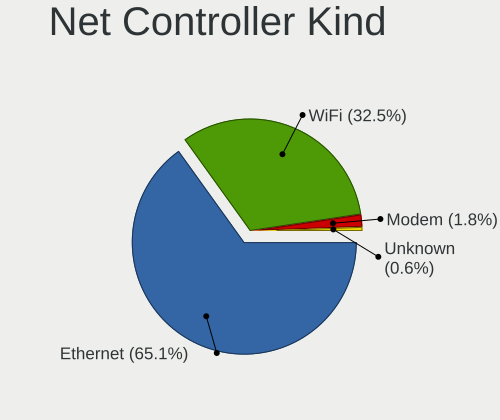

| Kind     | Desktops | Percent |
|----------|----------|---------|
| Ethernet | 110      | 65.09%  |
| WiFi     | 55       | 32.54%  |
| Modem    | 3        | 1.78%   |
| Unknown  | 1        | 0.59%   |

Used Controller
---------------

Currently used network controller

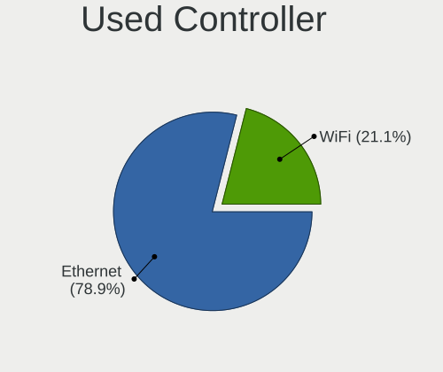

| Kind     | Desktops | Percent |
|----------|----------|---------|
| Ethernet | 88       | 78.57%  |
| WiFi     | 24       | 21.43%  |

NICs
----

Total network controllers on board

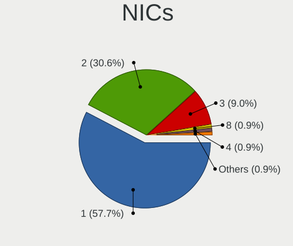

| Total | Desktops | Percent |
|-------|----------|---------|
| 1     | 64       | 57.66%  |
| 2     | 34       | 30.63%  |
| 3     | 10       | 9.01%   |
| 8     | 1        | 0.9%    |
| 4     | 1        | 0.9%    |
| 0     | 1        | 0.9%    |

IPv6
----

IPv6 vs IPv4

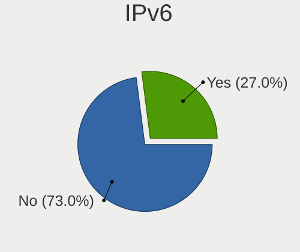

| Used | Desktops | Percent |
|------|----------|---------|
| No   | 81       | 72.97%  |
| Yes  | 30       | 27.03%  |

Bluetooth
---------

Bluetooth Vendor
----------------

Controller vendors

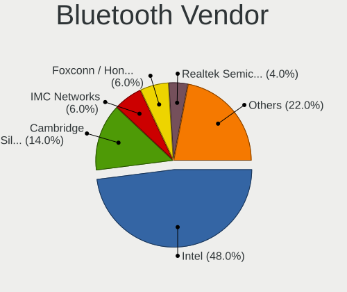

| Vendor                          | Desktops | Percent |
|---------------------------------|----------|---------|
| Intel                           | 24       | 48%     |
| Cambridge Silicon Radio         | 7        | 14%     |
| IMC Networks                    | 3        | 6%      |
| Foxconn / Hon Hai               | 3        | 6%      |
| Realtek Semiconductor           | 2        | 4%      |
| Qualcomm Atheros Communications | 2        | 4%      |
| Broadcom                        | 2        | 4%      |
| ASUSTek Computer                | 2        | 4%      |
| TP-Link                         | 1        | 2%      |
| Lite-On Technology              | 1        | 2%      |
| Edimax Technology               | 1        | 2%      |
| Apple                           | 1        | 2%      |
| Actions                         | 1        | 2%      |

Bluetooth Model
---------------

Controller models

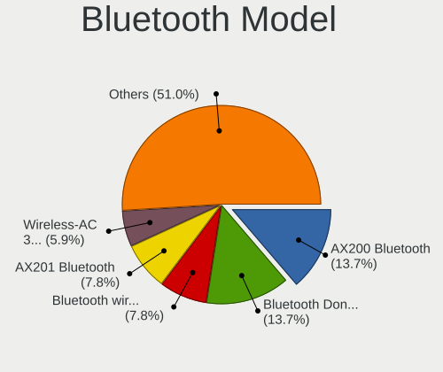

| Model                                                 | Desktops | Percent |
|-------------------------------------------------------|----------|---------|
| Intel AX200 Bluetooth                                 | 7        | 13.73%  |
| Cambridge Silicon Radio Bluetooth Dongle (HCI mode)   | 7        | 13.73%  |
| Intel Bluetooth wireless interface                    | 4        | 7.84%   |
| Intel AX201 Bluetooth                                 | 4        | 7.84%   |
| Intel Wireless-AC 3168 Bluetooth                      | 3        | 5.88%   |
| Intel AX210 Bluetooth                                 | 3        | 5.88%   |
| Realtek Bluetooth Radio                               | 2        | 3.92%   |
| Intel Bluetooth Device                                | 2        | 3.92%   |
| IMC Networks Bluetooth Radio                          | 2        | 3.92%   |
| Foxconn / Hon Hai Bluetooth Device                    | 2        | 3.92%   |
| TP-Link TP-T@- UB500 Adapter                          | 1        | 1.96%   |
| Qualcomm Atheros  Bluetooth Device                    | 1        | 1.96%   |
| Qualcomm Atheros QCA61x4 Bluetooth 4.0                | 1        | 1.96%   |
| Lite-On Bluetooth Device                              | 1        | 1.96%   |
| Intel Wireless-AC 9260 Bluetooth Adapter              | 1        | 1.96%   |
| Intel Bluetooth 9460/9560 Jefferson Peak (JfP)        | 1        | 1.96%   |
| IMC Networks Wireless_Device                          | 1        | 1.96%   |
| Foxconn / Hon Hai Wireless_Device                     | 1        | 1.96%   |
| Edimax Bluetooth Device                               | 1        | 1.96%   |
| Broadcom BCM20702A0 Bluetooth 4.0                     | 1        | 1.96%   |
| Broadcom BCM2045 Bluetooth                            | 1        | 1.96%   |
| ASUS Qualcomm Bluetooth 4.1                           | 1        | 1.96%   |
| ASUS Broadcom BCM20702 Single-Chip Bluetooth 4.0 + LE | 1        | 1.96%   |
| Apple Built-in Bluetooth 2.0+EDR HCI                  | 1        | 1.96%   |
| Actions general adapter                               | 1        | 1.96%   |

Sound
-----

Sound Vendor
------------

Sound card vendors

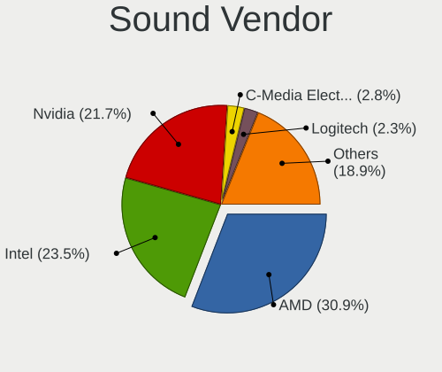

| Vendor                                       | Desktops | Percent |
|----------------------------------------------|----------|---------|
| AMD                                          | 67       | 30.88%  |
| Intel                                        | 51       | 23.5%   |
| Nvidia                                       | 47       | 21.66%  |
| C-Media Electronics                          | 6        | 2.76%   |
| Logitech                                     | 5        | 2.3%    |
| JMTek                                        | 4        | 1.84%   |
| Focusrite-Novation                           | 3        | 1.38%   |
| SteelSeries ApS                              | 2        | 0.92%   |
| Creative Technology                          | 2        | 0.92%   |
| Corsair                                      | 2        | 0.92%   |
| Astro Gaming                                 | 2        | 0.92%   |
| ASRock                                       | 2        | 0.92%   |
| Zoran Co. Personal Media Division (Nogatech) | 1        | 0.46%   |
| VIA Technologies                             | 1        | 0.46%   |
| Thesycon Systemsoftware & Consulting         | 1        | 0.46%   |
| Sony                                         | 1        | 0.46%   |
| SAVITECH                                     | 1        | 0.46%   |
| Razer USA                                    | 1        | 0.46%   |
| Mark of the Unicorn                          | 1        | 0.46%   |
| M-Audio                                      | 1        | 0.46%   |
| Logic3                                       | 1        | 0.46%   |
| KTMicro                                      | 1        | 0.46%   |
| Kingston Technology                          | 1        | 0.46%   |
| GN Netcom                                    | 1        | 0.46%   |
| Giga-Byte Technology                         | 1        | 0.46%   |
| Fry's Electronics                            | 1        | 0.46%   |
| FiiO Electronics Technology                  | 1        | 0.46%   |
| ESS Technology                               | 1        | 0.46%   |
| Elgato Systems                               | 1        | 0.46%   |
| EDFIER                                       | 1        | 0.46%   |
| Creative Labs                                | 1        | 0.46%   |
| Cambridge Silicon Radio                      | 1        | 0.46%   |
| Cambridge Audio                              | 1        | 0.46%   |
| Blue Microphones                             | 1        | 0.46%   |
| BEHRINGER International                      | 1        | 0.46%   |
| ASUSTek Computer                             | 1        | 0.46%   |

Sound Model
-----------

Sound card models

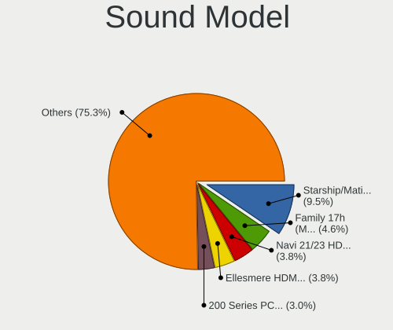

| Model                                                                      | Desktops | Percent |
|----------------------------------------------------------------------------|----------|---------|
| AMD Starship/Matisse HD Audio Controller                                   | 25       | 9.51%   |
| AMD Family 17h (Models 00h-0fh) HD Audio Controller                        | 12       | 4.56%   |
| AMD Navi 21/23 HDMI/DP Audio Controller                                    | 10       | 3.8%    |
| AMD Ellesmere HDMI Audio [Radeon RX 470/480 / 570/580/590]                 | 10       | 3.8%    |
| Intel 200 Series PCH HD Audio                                              | 8        | 3.04%   |
| AMD Ryzen HD Audio Controller                                              | 8        | 3.04%   |
| Nvidia GP107GL High Definition Audio Controller                            | 7        | 2.66%   |
| AMD Oland/Hainan/Cape Verde/Pitcairn HDMI Audio [Radeon HD 7000 Series]    | 6        | 2.28%   |
| Nvidia TU106 High Definition Audio Controller                              | 5        | 1.9%    |
| Intel 6 Series/C200 Series Chipset Family High Definition Audio Controller | 5        | 1.9%    |
| AMD SBx00 Azalia (Intel HDA)                                               | 5        | 1.9%    |
| JMTek USB PnP Audio Device                                                 | 4        | 1.52%   |
| Intel Alder Lake-S HD Audio Controller                                     | 4        | 1.52%   |
| Intel 7 Series/C216 Chipset Family High Definition Audio Controller        | 4        | 1.52%   |
| Intel 100 Series/C230 Series Chipset Family HD Audio Controller            | 4        | 1.52%   |
| AMD Renoir/Cezanne HDMI/DP Audio Controller                                | 4        | 1.52%   |
| AMD Navi 31 HDMI/DP Audio                                                  | 4        | 1.52%   |
| AMD Navi 10 HDMI Audio                                                     | 4        | 1.52%   |
| Nvidia TU107 GeForce GTX 1650 High Definition Audio Controller             | 3        | 1.14%   |
| Nvidia GP108 High Definition Audio Controller                              | 3        | 1.14%   |
| Nvidia GP106 High Definition Audio Controller                              | 3        | 1.14%   |
| Nvidia GM107 High Definition Audio Controller [GeForce 940MX]              | 3        | 1.14%   |
| Nvidia GK208 HDMI/DP Audio Controller                                      | 3        | 1.14%   |
| Nvidia GA104 High Definition Audio Controller                              | 3        | 1.14%   |
| Nvidia GA102 High Definition Audio Controller                              | 3        | 1.14%   |
| Intel Cannon Lake PCH cAVS                                                 | 3        | 1.14%   |
| Intel 8 Series/C220 Series Chipset High Definition Audio Controller        | 3        | 1.14%   |
| AMD Radeon High Definition Audio Controller                                | 3        | 1.14%   |
| AMD Baffin HDMI/DP Audio [Radeon RX 550 640SP / RX 560/560X]               | 3        | 1.14%   |
| Nvidia TU104 HD Audio Controller                                           | 2        | 0.76%   |
| Nvidia GP104 High Definition Audio Controller                              | 2        | 0.76%   |
| Nvidia GM204 High Definition Audio Controller                              | 2        | 0.76%   |
| Nvidia GF108 High Definition Audio Controller                              | 2        | 0.76%   |
| Nvidia AD102 High Definition Audio Controller                              | 2        | 0.76%   |
| Logitech Logitech G PRO X Gaming Headset                                   | 2        | 0.76%   |
| Intel Xeon E3-1200 v3/4th Gen Core Processor HD Audio Controller           | 2        | 0.76%   |
| Intel Raptor Lake High Definition Audio Controller                         | 2        | 0.76%   |
| Intel NM10/ICH7 Family High Definition Audio Controller                    | 2        | 0.76%   |
| Intel Alder Lake-N PCH High Definition Audio Controller                    | 2        | 0.76%   |
| Intel 82801JD/DO (ICH10 Family) HD Audio Controller                        | 2        | 0.76%   |

Memory
------

Memory Vendor
-------------

Memory module vendors

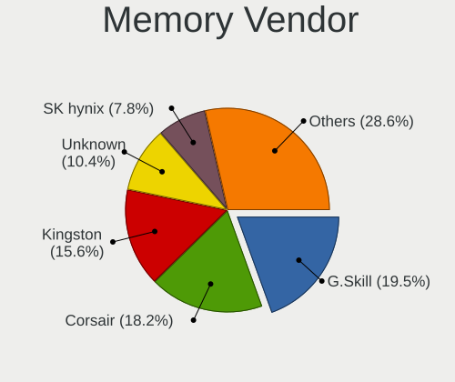

| Vendor              | Desktops | Percent |
|---------------------|----------|---------|
| G.Skill             | 15       | 19.48%  |
| Corsair             | 14       | 18.18%  |
| Kingston            | 12       | 15.58%  |
| Unknown             | 8        | 10.39%  |
| SK hynix            | 6        | 7.79%   |
| Samsung Electronics | 5        | 6.49%   |
| Crucial             | 5        | 6.49%   |
| A-DATA Technology   | 3        | 3.9%    |
| Team                | 2        | 2.6%    |
| Unknown (0x0CC7)    | 1        | 1.3%    |
| Transcend           | 1        | 1.3%    |
| Patriot Memory      | 1        | 1.3%    |
| Patriot             | 1        | 1.3%    |
| Micron Technology   | 1        | 1.3%    |
| Avant               | 1        | 1.3%    |
| 3034CB0010CA        | 1        | 1.3%    |

Memory Model
------------

Memory module models

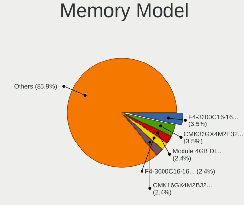

| Model                                                     | Desktops | Percent |
|-----------------------------------------------------------|----------|---------|
| G.Skill RAM F4-3200C16-16GVK 16GB DIMM DDR4 3600MT/s      | 3        | 3.53%   |
| Corsair RAM CMK32GX4M2E3200C16 16GB DIMM DDR4 3600MT/s    | 3        | 3.53%   |
| Unknown RAM Module 4GB DIMM 1333MT/s                      | 2        | 2.35%   |
| G.Skill RAM F4-3600C16-16GVKC 16GB DIMM DDR4 3866MT/s     | 2        | 2.35%   |
| Corsair RAM CMK16GX4M2B3200C16 8GB DIMM DDR4 3600MT/s     | 2        | 2.35%   |
| Unknown RAM Module 8GB DIMM DDR4 3200MT/s                 | 1        | 1.18%   |
| Unknown RAM Module 8GB DIMM DDR3 1600MT/s                 | 1        | 1.18%   |
| Unknown RAM Module 4GB DIMM SDRAM                         | 1        | 1.18%   |
| Unknown RAM Module 4096MB DIMM 1333MT/s                   | 1        | 1.18%   |
| Unknown RAM Module 2GB DIMM SDRAM                         | 1        | 1.18%   |
| Unknown RAM Module 1GB DIMM SDRAM                         | 1        | 1.18%   |
| Unknown (0x0CC7) RAM Module 16GB SODIMM DDR4 3200MT/s     | 1        | 1.18%   |
| Transcend RAM JM367Q643A-6 512MB DIMM DDR2 667MT/s        | 1        | 1.18%   |
| Team RAM TEAMGROUP-UD4-3200 8GB DIMM DDR4 3733MT/s        | 1        | 1.18%   |
| Team RAM TEAMGROUP-UD3-1600 8GB DIMM DDR3 1866MT/s        | 1        | 1.18%   |
| SK hynix RAM Module 8GB DIMM DDR3 1333MT/s                | 1        | 1.18%   |
| SK hynix RAM Module 4GB DIMM DDR3 1066MT/s                | 1        | 1.18%   |
| SK hynix RAM HYMP112U64CP8-S6 1GB DIMM DDR2 800MT/s       | 1        | 1.18%   |
| SK hynix RAM HMT451U6BFR8A-PB 4GB DIMM DDR3 1600MT/s      | 1        | 1.18%   |
| SK hynix RAM HMT451U6AFR8C-PB 4GB DIMM DDR3 1600MT/s      | 1        | 1.18%   |
| SK hynix RAM HMT351U6BFR8C-H9 4GB DIMM DDR3 1333MT/s      | 1        | 1.18%   |
| Samsung RAM Module 8GB DIMM DDR3 1333MT/s                 | 1        | 1.18%   |
| Samsung RAM M378B5773CH0-CH9 2GB DIMM DDR3 1867MT/s       | 1        | 1.18%   |
| Samsung RAM M378B5173EB0-YK0 4GB DIMM DDR3 1600MT/s       | 1        | 1.18%   |
| Samsung RAM M378B5173DB0-CK0 4096MB DIMM DDR3 1600MT/s    | 1        | 1.18%   |
| Samsung RAM M378B5173BH0-CK0 4GB DIMM DDR3 1600MT/s       | 1        | 1.18%   |
| Samsung RAM M378B2873EH1-CF8 1GB DIMM DDR3 1067MT/s       | 1        | 1.18%   |
| Patriot RAM PSD48G24002 8GB DIMM DDR4 2400MT/s            | 1        | 1.18%   |
| Patriot Memory RAM 3600 C17 Series 8GB DIMM DDR4 3600MT/s | 1        | 1.18%   |
| Micron RAM Module 2GB Row Of Chips LPDDR5 6400MT/s        | 1        | 1.18%   |
| Kingston RAM KHX3200C18D4/8G 8GB DIMM DDR4 3333MT/s       | 1        | 1.18%   |
| Kingston RAM KHX2133C14D4/4G 4GB DIMM DDR4 3200MT/s       | 1        | 1.18%   |
| Kingston RAM KHX2133C14/8G 8GB DIMM DDR4 2666MT/s         | 1        | 1.18%   |
| Kingston RAM KHX1866C9D3/8GX 8GB DIMM DDR3 1866MT/s       | 1        | 1.18%   |
| Kingston RAM KHX1600C10D3/8GX 8GB DIMM DDR3 1600MT/s      | 1        | 1.18%   |
| Kingston RAM KF556C36-64 64GB DIMM DDR5 4800MT/s          | 1        | 1.18%   |
| Kingston RAM KF3600C17D4/8GX 8GB DIMM DDR4 3600MT/s       | 1        | 1.18%   |
| Kingston RAM KF3200C16D4/8GX 8GiB DIMM DDR4 3600MT/s      | 1        | 1.18%   |
| Kingston RAM 99U5734-066.A00G 16GB DIMM DDR4 3200MT/s     | 1        | 1.18%   |
| Kingston RAM 99U5474-016.A00LF 4GB DIMM DDR3 1333MT/s     | 1        | 1.18%   |

Memory Kind
-----------

Memory module kinds

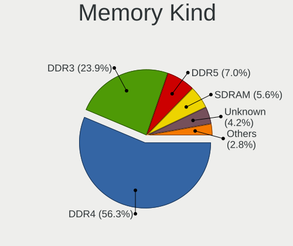

| Kind    | Desktops | Percent |
|---------|----------|---------|
| DDR4    | 40       | 56.34%  |
| DDR3    | 17       | 23.94%  |
| DDR5    | 5        | 7.04%   |
| SDRAM   | 4        | 5.63%   |
| Unknown | 3        | 4.23%   |
| LPDDR5  | 1        | 1.41%   |
| DDR2    | 1        | 1.41%   |

Memory Form Factor
------------------

Physical design of the memory module

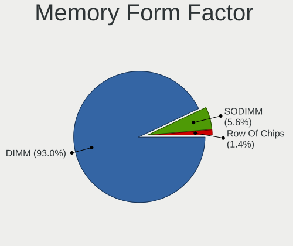

| Name         | Desktops | Percent |
|--------------|----------|---------|
| DIMM         | 66       | 92.96%  |
| SODIMM       | 4        | 5.63%   |
| Row Of Chips | 1        | 1.41%   |

Memory Size
-----------

Memory module size

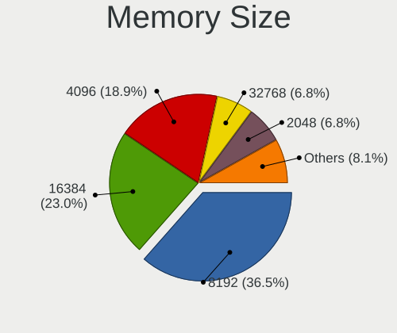

| Size  | Desktops | Percent |
|-------|----------|---------|
| 8192  | 27       | 36.49%  |
| 16384 | 17       | 22.97%  |
| 4096  | 14       | 18.92%  |
| 32768 | 5        | 6.76%   |
| 2048  | 5        | 6.76%   |
| 1024  | 3        | 4.05%   |
| 65536 | 1        | 1.35%   |
| 24576 | 1        | 1.35%   |
| 512   | 1        | 1.35%   |

Memory Speed
------------

Memory module speed

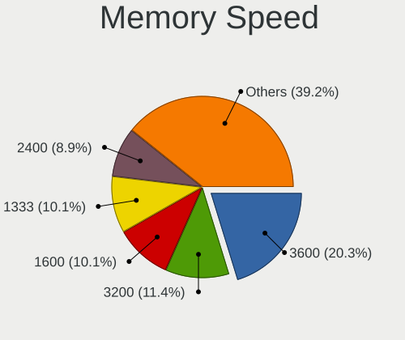

| Speed   | Desktops | Percent |
|---------|----------|---------|
| 3600    | 16       | 20.25%  |
| 3200    | 9        | 11.39%  |
| 1600    | 8        | 10.13%  |
| 1333    | 8        | 10.13%  |
| 2400    | 7        | 8.86%   |
| Unknown | 3        | 3.8%    |
| 4800    | 2        | 2.53%   |
| 3866    | 2        | 2.53%   |
| 1867    | 2        | 2.53%   |
| 1866    | 2        | 2.53%   |
| 8200    | 1        | 1.27%   |
| 6400    | 1        | 1.27%   |
| 6000    | 1        | 1.27%   |
| 5000    | 1        | 1.27%   |
| 4000    | 1        | 1.27%   |
| 3800    | 1        | 1.27%   |
| 3733    | 1        | 1.27%   |
| 3466    | 1        | 1.27%   |
| 3333    | 1        | 1.27%   |
| 3100    | 1        | 1.27%   |
| 3000    | 1        | 1.27%   |
| 2800    | 1        | 1.27%   |
| 2667    | 1        | 1.27%   |
| 2666    | 1        | 1.27%   |
| 1800    | 1        | 1.27%   |
| 1648    | 1        | 1.27%   |
| 1067    | 1        | 1.27%   |
| 1066    | 1        | 1.27%   |
| 800     | 1        | 1.27%   |
| 667     | 1        | 1.27%   |

Printers & scanners
-------------------

Printer Vendor
--------------

Printer device vendors

Zero info for selected period =(

Printer Model
-------------

Printer device models

Zero info for selected period =(

Scanner Vendor
--------------

Scanner device vendors

Zero info for selected period =(

Scanner Model
-------------

Scanner device models

Zero info for selected period =(

Camera
------

Camera Vendor
-------------

Camera device vendors

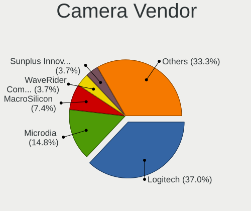

| Vendor                        | Desktops | Percent |
|-------------------------------|----------|---------|
| Logitech                      | 10       | 37.04%  |
| Microdia                      | 4        | 14.81%  |
| MacroSilicon                  | 2        | 7.41%   |
| WaveRider Communications      | 1        | 3.7%    |
| Sunplus Innovation Technology | 1        | 3.7%    |
| Sonix Technology              | 1        | 3.7%    |
| Samsung Electronics           | 1        | 3.7%    |
| Realtek Semiconductor         | 1        | 3.7%    |
| Microsoft                     | 1        | 3.7%    |
| GEMBIRD                       | 1        | 3.7%    |
| Chicony Electronics           | 1        | 3.7%    |
| Asuscom Network               | 1        | 3.7%    |
| Alcorlink                     | 1        | 3.7%    |
| Unknown                       | 1        | 3.7%    |

Camera Model
------------

Camera device models

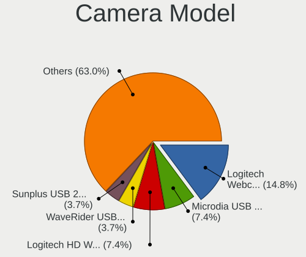

| Model                                             | Desktops | Percent |
|---------------------------------------------------|----------|---------|
| Logitech Webcam C270                              | 4        | 14.81%  |
| Microdia USB 2.0 Camera                           | 2        | 7.41%   |
| Logitech HD Webcam C615                           | 2        | 7.41%   |
| WaveRider USB Live camera                         | 1        | 3.7%    |
| Sunplus USB 2.0 Camera                            | 1        | 3.7%    |
| Sonix NexiGo HD Webcam                            | 1        | 3.7%    |
| Samsung Galaxy series, misc. (MTP mode)           | 1        | 3.7%    |
| Realtek USB Camera                                | 1        | 3.7%    |
| Microsoft LifeCam HD-3000                         | 1        | 3.7%    |
| Microdia Webcam Vitade AF                         | 1        | 3.7%    |
| Microdia Camera                                   | 1        | 3.7%    |
| MacroSilicon USB Video                            | 1        | 3.7%    |
| MacroSilicon MS210x Video Grabber [EasierCAP]     | 1        | 3.7%    |
| Logitech Webcam C930e                             | 1        | 3.7%    |
| Logitech C922 Pro Stream Webcam                   | 1        | 3.7%    |
| Logitech C920 PRO HD Webcam                       | 1        | 3.7%    |
| Logitech BRIO 4K Stream Edition                   | 1        | 3.7%    |
| GEMBIRD Generic UVC 1.00 camera [AppoTech AX2311] | 1        | 3.7%    |
| Chicony HP 720p HD Monitor Webcam                 | 1        | 3.7%    |
| Asuscom Network HD 1080P PC-Camera                | 1        | 3.7%    |
| Alcorlink USB 2.0 Camera                          | 1        | 3.7%    |
| Unknown                                           | 1        | 3.7%    |

Security
--------

Fingerprint Vendor
------------------

Fingerprint sensor vendors

Zero info for selected period =(

Fingerprint Model
-----------------

Fingerprint sensor models

Zero info for selected period =(

Chipcard Vendor
---------------

Chipcard module vendors

Zero info for selected period =(

Chipcard Model
--------------

Chipcard module models

Zero info for selected period =(

Unsupported
-----------

Unsupported Devices
-------------------

Total unsupported devices on board

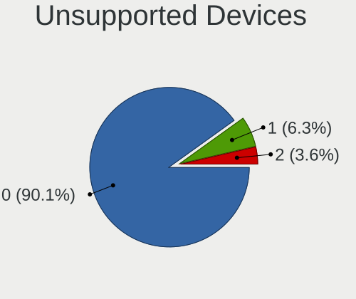

| Total | Desktops | Percent |
|-------|----------|---------|
| 0     | 100      | 90.09%  |
| 1     | 7        | 6.31%   |
| 2     | 4        | 3.6%    |

Unsupported Device Types
------------------------

Types of unsupported devices

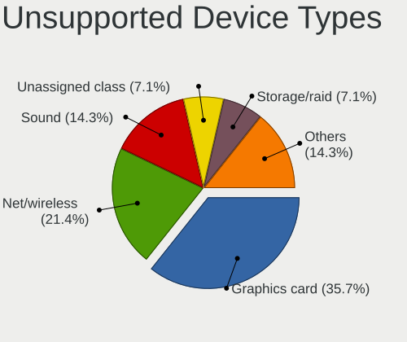

| Type                     | Desktops | Percent |
|--------------------------|----------|---------|
| Graphics card            | 5        | 35.71%  |
| Net/wireless             | 3        | 21.43%  |
| Sound                    | 2        | 14.29%  |
| Unassigned class         | 1        | 7.14%   |
| Storage/raid             | 1        | 7.14%   |
| Communication controller | 1        | 7.14%   |
| Camera                   | 1        | 7.14%   |

