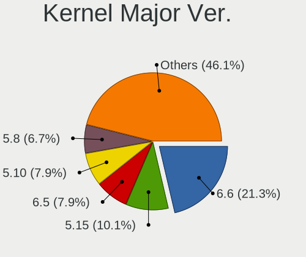
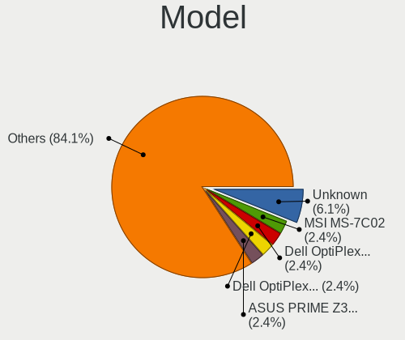
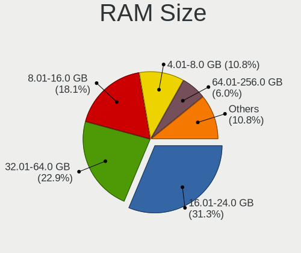
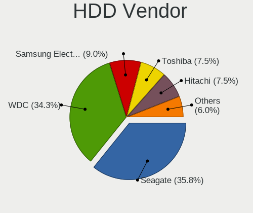
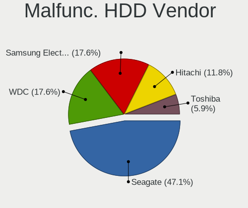
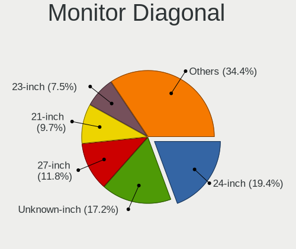
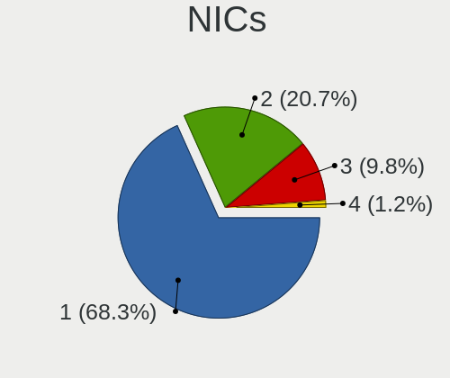
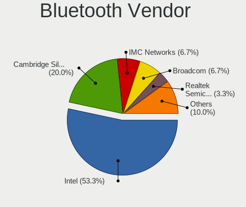
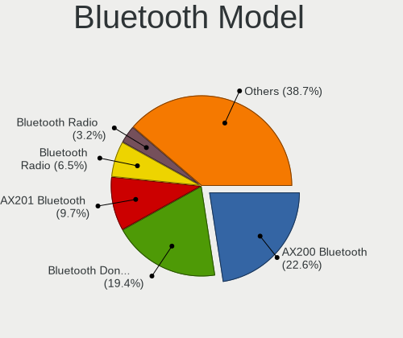

Void Linux - Tested Hardware & Statistics (Desktops)
----------------------------------------------------

A project to collect tested hardware configurations for Void Linux.

Anyone can contribute to this report by the [hw-probe](https://github.com/linuxhw/hw-probe) tool:

    sudo -E hw-probe -all -upload

Please contribute! Especially if your hardware is rare.

Contents
--------

* [ Test Cases ](#test-cases)

* [ System ](#system)
  - [ OS                       ](#os)
  - [ OS Family                ](#os-family)
  - [ Kernel                   ](#kernel)
  - [ Kernel Family            ](#kernel-family)
  - [ Kernel Major Ver.        ](#kernel-major-ver)
  - [ Arch                     ](#arch)
  - [ DE                       ](#de)
  - [ Display Server           ](#display-server)
  - [ Display Manager          ](#display-manager)
  - [ OS Lang                  ](#os-lang)
  - [ Boot Mode                ](#boot-mode)
  - [ Filesystem               ](#filesystem)
  - [ Part. scheme             ](#part-scheme)
  - [ Dual Boot with Linux/BSD ](#dual-boot-with-linuxbsd)
  - [ Dual Boot (Win)          ](#dual-boot-win)

* [ Board ](#board)
  - [ Vendor                   ](#vendor)
  - [ Model                    ](#model)
  - [ Model Family             ](#model-family)
  - [ MFG Year                 ](#mfg-year)
  - [ Form Factor              ](#form-factor)
  - [ Secure Boot              ](#secure-boot)
  - [ Coreboot                 ](#coreboot)
  - [ RAM Size                 ](#ram-size)
  - [ RAM Used                 ](#ram-used)
  - [ Total Drives             ](#total-drives)
  - [ Has CD-ROM               ](#has-cd-rom)
  - [ Has Ethernet             ](#has-ethernet)
  - [ Has WiFi                 ](#has-wifi)
  - [ Has Bluetooth            ](#has-bluetooth)

* [ Location ](#location)
  - [ Country                  ](#country)
  - [ City                     ](#city)

* [ Drives ](#drives)
  - [ Drive Vendor             ](#drive-vendor)
  - [ Drive Model              ](#drive-model)
  - [ HDD Vendor               ](#hdd-vendor)
  - [ SSD Vendor               ](#ssd-vendor)
  - [ Drive Kind               ](#drive-kind)
  - [ Drive Connector          ](#drive-connector)
  - [ Drive Size               ](#drive-size)
  - [ Space Total              ](#space-total)
  - [ Space Used               ](#space-used)
  - [ Malfunc. Drives          ](#malfunc-drives)
  - [ Malfunc. Drive Vendor    ](#malfunc-drive-vendor)
  - [ Malfunc. HDD Vendor      ](#malfunc-hdd-vendor)
  - [ Malfunc. Drive Kind      ](#malfunc-drive-kind)
  - [ Failed Drives            ](#failed-drives)
  - [ Failed Drive Vendor      ](#failed-drive-vendor)
  - [ Drive Status             ](#drive-status)

* [ Storage controller ](#storage-controller)
  - [ Storage Vendor           ](#storage-vendor)
  - [ Storage Model            ](#storage-model)
  - [ Storage Kind             ](#storage-kind)

* [ Processor ](#processor)
  - [ CPU Vendor               ](#cpu-vendor)
  - [ CPU Model                ](#cpu-model)
  - [ CPU Model Family         ](#cpu-model-family)
  - [ CPU Cores                ](#cpu-cores)
  - [ CPU Sockets              ](#cpu-sockets)
  - [ CPU Threads              ](#cpu-threads)
  - [ CPU Op-Modes             ](#cpu-op-modes)
  - [ CPU Microcode            ](#cpu-microcode)
  - [ CPU Microarch            ](#cpu-microarch)

* [ Graphics ](#graphics)
  - [ GPU Vendor               ](#gpu-vendor)
  - [ GPU Model                ](#gpu-model)
  - [ GPU Combo                ](#gpu-combo)
  - [ GPU Driver               ](#gpu-driver)
  - [ GPU Memory               ](#gpu-memory)

* [ Monitor ](#monitor)
  - [ Monitor Vendor           ](#monitor-vendor)
  - [ Monitor Model            ](#monitor-model)
  - [ Monitor Resolution       ](#monitor-resolution)
  - [ Monitor Diagonal         ](#monitor-diagonal)
  - [ Monitor Width            ](#monitor-width)
  - [ Aspect Ratio             ](#aspect-ratio)
  - [ Monitor Area             ](#monitor-area)
  - [ Pixel Density            ](#pixel-density)
  - [ Multiple Monitors        ](#multiple-monitors)

* [ Network ](#network)
  - [ Net Controller Vendor    ](#net-controller-vendor)
  - [ Net Controller Model     ](#net-controller-model)
  - [ Wireless Vendor          ](#wireless-vendor)
  - [ Wireless Model           ](#wireless-model)
  - [ Ethernet Vendor          ](#ethernet-vendor)
  - [ Ethernet Model           ](#ethernet-model)
  - [ Net Controller Kind      ](#net-controller-kind)
  - [ Used Controller          ](#used-controller)
  - [ NICs                     ](#nics)
  - [ IPv6                     ](#ipv6)

* [ Bluetooth ](#bluetooth)
  - [ Bluetooth Vendor         ](#bluetooth-vendor)
  - [ Bluetooth Model          ](#bluetooth-model)

* [ Sound ](#sound)
  - [ Sound Vendor             ](#sound-vendor)
  - [ Sound Model              ](#sound-model)

* [ Memory ](#memory)
  - [ Memory Vendor            ](#memory-vendor)
  - [ Memory Model             ](#memory-model)
  - [ Memory Kind              ](#memory-kind)
  - [ Memory Form Factor       ](#memory-form-factor)
  - [ Memory Size              ](#memory-size)
  - [ Memory Speed             ](#memory-speed)

* [ Printers & scanners ](#printers--scanners)
  - [ Printer Vendor           ](#printer-vendor)
  - [ Printer Model            ](#printer-model)
  - [ Scanner Vendor           ](#scanner-vendor)
  - [ Scanner Model            ](#scanner-model)

* [ Camera ](#camera)
  - [ Camera Vendor            ](#camera-vendor)
  - [ Camera Model             ](#camera-model)

* [ Security ](#security)
  - [ Fingerprint Vendor       ](#fingerprint-vendor)
  - [ Fingerprint Model        ](#fingerprint-model)
  - [ Chipcard Vendor          ](#chipcard-vendor)
  - [ Chipcard Model           ](#chipcard-model)

* [ Unsupported ](#unsupported)
  - [ Unsupported Devices      ](#unsupported-devices)
  - [ Unsupported Device Types ](#unsupported-device-types)

Test Cases
----------

Total: 101

| Vendor   | Model                       | Probe                                                      | Date         |
|----------|-----------------------------|------------------------------------------------------------|--------------|
| ASUSTek  | PRIME Z370-P II             | [09665b9825](https://linux-hardware.org/?probe=09665b9825) | Mar 21, 2024 |
| Gigabyte | Z97X-UD7 TH-CF              | [3f20fe5386](https://linux-hardware.org/?probe=3f20fe5386) | Mar 13, 2024 |
| ASUSTek  | ROG Maximus Z790 APEX EN... | [b0c33ebfd2](https://linux-hardware.org/?probe=b0c33ebfd2) | Mar 07, 2024 |
| ASUSTek  | ROG Maximus Z790 APEX EN... | [15c45d681f](https://linux-hardware.org/?probe=15c45d681f) | Mar 06, 2024 |
| Gigabyte | B550 AORUS ELITE V2         | [7fe3789b7f](https://linux-hardware.org/?probe=7fe3789b7f) | Feb 23, 2024 |
| Gigabyte | X570 AORUS MASTER           | [bda104dc07](https://linux-hardware.org/?probe=bda104dc07) | Feb 04, 2024 |
| Gigabyte | Z790 AORUS MASTER X         | [c35fdb0865](https://linux-hardware.org/?probe=c35fdb0865) | Feb 04, 2024 |
| HP       | 2ADE                        | [c98c83ddde](https://linux-hardware.org/?probe=c98c83ddde) | Jan 29, 2024 |
| Gigabyte | Z790 AORUS MASTER X         | [89387d46ef](https://linux-hardware.org/?probe=89387d46ef) | Jan 18, 2024 |
| Gigabyte | Z790 AORUS MASTER X         | [c1e2f276ba](https://linux-hardware.org/?probe=c1e2f276ba) | Jan 18, 2024 |
| Dell     | 0G919G A00                  | [265aa7e914](https://linux-hardware.org/?probe=265aa7e914) | Jan 04, 2024 |
| ASRock   | B550M Pro4                  | [9eb47b934a](https://linux-hardware.org/?probe=9eb47b934a) | Jan 02, 2024 |
| ASUSTek  | PRIME B660M-A WIFI D4       | [7caa5da564](https://linux-hardware.org/?probe=7caa5da564) | Dec 31, 2023 |
| MSI      | PRO B550M-P GEN3            | [9662ee22d6](https://linux-hardware.org/?probe=9662ee22d6) | Dec 26, 2023 |
| ASUSTek  | TUF Gaming B550M-PLUS WI... | [980caec27f](https://linux-hardware.org/?probe=980caec27f) | Dec 03, 2023 |
| ASUSTek  | TUF Gaming X570-PLUS        | [f6d20427d3](https://linux-hardware.org/?probe=f6d20427d3) | Nov 26, 2023 |
| ASUSTek  | TUF Gaming X570-PLUS        | [7ed36f1817](https://linux-hardware.org/?probe=7ed36f1817) | Nov 18, 2023 |
| ASUSTek  | TUF Gaming X570-PLUS        | [f2070cd827](https://linux-hardware.org/?probe=f2070cd827) | Nov 18, 2023 |
| Unknown  | T100                        | [298b8f8764](https://linux-hardware.org/?probe=298b8f8764) | Nov 16, 2023 |
| ASUSTek  | PRIME B550-PLUS AC-HES      | [6a8536f5df](https://linux-hardware.org/?probe=6a8536f5df) | Nov 04, 2023 |
| Dell     | 0C27VV A03                  | [3e65f94217](https://linux-hardware.org/?probe=3e65f94217) | Oct 28, 2023 |
| EVGA     | Z790 DARK KINGPIN.0         | [9faa5f07eb](https://linux-hardware.org/?probe=9faa5f07eb) | Oct 20, 2023 |
| EVGA     | Z790 DARK KINGPIN.0         | [4bec650d3e](https://linux-hardware.org/?probe=4bec650d3e) | Oct 20, 2023 |
| Gigabyte | Z68XP-UD3                   | [d96bdeca74](https://linux-hardware.org/?probe=d96bdeca74) | Oct 10, 2023 |
| MSI      | B450 TOMAHAWK MAX           | [c074bb832e](https://linux-hardware.org/?probe=c074bb832e) | Oct 06, 2023 |
| MSI      | B450-A PRO MAX              | [1e60d905c5](https://linux-hardware.org/?probe=1e60d905c5) | Sep 10, 2023 |
| MSI      | MEG X570 UNIFY              | [179381f376](https://linux-hardware.org/?probe=179381f376) | Aug 12, 2023 |
| Gigabyte | X570S UD                    | [dd0cfabd4b](https://linux-hardware.org/?probe=dd0cfabd4b) | Jul 29, 2023 |
| Gigabyte | Z370 AORUS Gaming 3         | [08d9fe81da](https://linux-hardware.org/?probe=08d9fe81da) | Jul 10, 2023 |
| HP       | 1998                        | [15e8251d36](https://linux-hardware.org/?probe=15e8251d36) | Jul 10, 2023 |
| ASUSTek  | Maximus VIII FORMULA        | [00a862ae7c](https://linux-hardware.org/?probe=00a862ae7c) | Jun 14, 2023 |
| ASUSTek  | PRIME H610M-E D4            | [827f6ecac2](https://linux-hardware.org/?probe=827f6ecac2) | Jun 07, 2023 |
| ASUSTek  | M5A97 EVO R2.0              | [d94b8cf0e0](https://linux-hardware.org/?probe=d94b8cf0e0) | Feb 18, 2023 |
| ASUSTek  | M5A97 EVO R2.0              | [a551d228f4](https://linux-hardware.org/?probe=a551d228f4) | Jan 14, 2023 |
| MSI      | B550M PRO                   | [61b36bfa2e](https://linux-hardware.org/?probe=61b36bfa2e) | Dec 29, 2022 |
| MSI      | B550M PRO                   | [57f4a4985a](https://linux-hardware.org/?probe=57f4a4985a) | Dec 23, 2022 |
| ASUSTek  | ROG STRIX B450-F GAMING     | [64f6471e58](https://linux-hardware.org/?probe=64f6471e58) | Dec 21, 2022 |
| ASUSTek  | ROG STRIX B450-F GAMING     | [b01c41faa0](https://linux-hardware.org/?probe=b01c41faa0) | Dec 21, 2022 |
| Unknown  | Unknown                     | [49c235aa0d](https://linux-hardware.org/?probe=49c235aa0d) | Aug 30, 2022 |
| Dell     | 0WR7PY A03                  | [2f9e03051e](https://linux-hardware.org/?probe=2f9e03051e) | Aug 13, 2022 |
| ASUSTek  | TUF B450M-PRO GAMING        | [53fd2c87d2](https://linux-hardware.org/?probe=53fd2c87d2) | Jul 16, 2022 |
| HP       | 3397                        | [7d3b738672](https://linux-hardware.org/?probe=7d3b738672) | Jul 14, 2022 |
| ASUSTek  | TUF Gaming B560-PLUS WIF... | [fa17eccd81](https://linux-hardware.org/?probe=fa17eccd81) | Jul 04, 2022 |
| ASUSTek  | PRIME Z690-P                | [6302e38583](https://linux-hardware.org/?probe=6302e38583) | Jun 22, 2022 |
| ASUSTek  | PRIME Z690-P                | [ce610351c3](https://linux-hardware.org/?probe=ce610351c3) | Jun 03, 2022 |
| ASUSTek  | PRIME Z690-P                | [1e0c1bed2a](https://linux-hardware.org/?probe=1e0c1bed2a) | Jun 02, 2022 |
| MSI      | B450M-A PRO MAX             | [758bdaefe9](https://linux-hardware.org/?probe=758bdaefe9) | May 21, 2022 |
| Dell     | 0WR7PY A01                  | [9a18a890d4](https://linux-hardware.org/?probe=9a18a890d4) | May 03, 2022 |
| MSI      | Z87-G43                     | [d5612db7ca](https://linux-hardware.org/?probe=d5612db7ca) | May 02, 2022 |
| ASUSTek  | ROG STRIX B450-F GAMING     | [ffdfb3a578](https://linux-hardware.org/?probe=ffdfb3a578) | Apr 29, 2022 |
| ASUSTek  | ROG STRIX B450-F GAMING     | [55c0ec3653](https://linux-hardware.org/?probe=55c0ec3653) | Apr 29, 2022 |
| ASRock   | X570 Pro4                   | [678366aef2](https://linux-hardware.org/?probe=678366aef2) | Apr 25, 2022 |
| ASRock   | TRX40 Taichi                | [4a90b659fc](https://linux-hardware.org/?probe=4a90b659fc) | Apr 14, 2022 |
| MSI      | B550M PRO                   | [70e55581b6](https://linux-hardware.org/?probe=70e55581b6) | Mar 24, 2022 |
| Gigabyte | B450M DS3H-CF               | [613a6d2320](https://linux-hardware.org/?probe=613a6d2320) | Feb 16, 2022 |
| Gigabyte | B550M AORUS PRO-P           | [61374a4048](https://linux-hardware.org/?probe=61374a4048) | Jan 25, 2022 |
| ASUSTek  | PRIME X470-PRO              | [24fedcca0a](https://linux-hardware.org/?probe=24fedcca0a) | Jan 18, 2022 |
| MSI      | B450M-A PRO MAX             | [efd1c194ac](https://linux-hardware.org/?probe=efd1c194ac) | Nov 11, 2021 |
| MSI      | B450M-A PRO MAX             | [0802656d19](https://linux-hardware.org/?probe=0802656d19) | Nov 11, 2021 |
| Gigabyte | B450M DS3H-CF               | [093a7d451a](https://linux-hardware.org/?probe=093a7d451a) | Oct 16, 2021 |
| Gigabyte | B450M DS3H-CF               | [7917f7d57f](https://linux-hardware.org/?probe=7917f7d57f) | Oct 12, 2021 |
| Gigabyte | H310M M.2 x.x               | [6ad302377d](https://linux-hardware.org/?probe=6ad302377d) | Sep 30, 2021 |
| MSI      | B450 TOMAHAWK MAX II        | [a0d3015e21](https://linux-hardware.org/?probe=a0d3015e21) | Sep 15, 2021 |
| ASUSTek  | M4A89GTD-PRO/USB3           | [d3c1b5c10c](https://linux-hardware.org/?probe=d3c1b5c10c) | Sep 11, 2021 |
| ASUSTek  | ROG CROSSHAIR VII HERO      | [bc2b986f06](https://linux-hardware.org/?probe=bc2b986f06) | Aug 19, 2021 |
| ASUSTek  | ROG CROSSHAIR VII HERO      | [85d1c86c68](https://linux-hardware.org/?probe=85d1c86c68) | Aug 19, 2021 |
| Dell     | 03NVJ6 A02                  | [5dec53ee3f](https://linux-hardware.org/?probe=5dec53ee3f) | Jul 26, 2021 |
| ASRock   | J4005B-ITX                  | [053a28a1b7](https://linux-hardware.org/?probe=053a28a1b7) | Jun 13, 2021 |
| ASRock   | H61M-VG4                    | [f99a68e64b](https://linux-hardware.org/?probe=f99a68e64b) | May 14, 2021 |
| ASRock   | H61M-VG4                    | [d2a90378bc](https://linux-hardware.org/?probe=d2a90378bc) | May 12, 2021 |
| ASUSTek  | M5A78L-M LX                 | [63df5a92c1](https://linux-hardware.org/?probe=63df5a92c1) | Apr 01, 2021 |
| ASUSTek  | M5A78L-M LX                 | [9312919fed](https://linux-hardware.org/?probe=9312919fed) | Apr 01, 2021 |
| ASRock   | B450 Pro4                   | [42d648695d](https://linux-hardware.org/?probe=42d648695d) | Mar 26, 2021 |
| Unknown  | Unknown                     | [35af7cfd3d](https://linux-hardware.org/?probe=35af7cfd3d) | Feb 22, 2021 |
| ASRock   | B450 Pro4                   | [09b0e87eec](https://linux-hardware.org/?probe=09b0e87eec) | Feb 12, 2021 |
| ASUSTek  | PRIME Z390-P                | [5d02f20d1d](https://linux-hardware.org/?probe=5d02f20d1d) | Feb 10, 2021 |
| MSI      | MPG B550I GAMING EDGE WI... | [624f71f228](https://linux-hardware.org/?probe=624f71f228) | Jan 21, 2021 |
| ASUSTek  | PRIME Z390-P                | [73c3fdc605](https://linux-hardware.org/?probe=73c3fdc605) | Jan 16, 2021 |
| ASUSTek  | PRIME Z270-AR               | [35d08fe710](https://linux-hardware.org/?probe=35d08fe710) | Dec 30, 2020 |
| MSI      | MPG B550I GAMING EDGE WI... | [1f66d0eb72](https://linux-hardware.org/?probe=1f66d0eb72) | Dec 22, 2020 |
| MSI      | MPG B550I GAMING EDGE WI... | [61887011a6](https://linux-hardware.org/?probe=61887011a6) | Dec 22, 2020 |
| ASUSTek  | B150M PRO GAMING            | [4d4ec823bb](https://linux-hardware.org/?probe=4d4ec823bb) | Dec 06, 2020 |
| ASUSTek  | B150M PRO GAMING            | [7d1a0b6924](https://linux-hardware.org/?probe=7d1a0b6924) | Dec 02, 2020 |
| ASUSTek  | H110M-PLUS                  | [09df23b136](https://linux-hardware.org/?probe=09df23b136) | Nov 20, 2020 |
| ASUSTek  | PRIME B360M-A               | [438477ec85](https://linux-hardware.org/?probe=438477ec85) | Nov 14, 2020 |
| ASUSTek  | PRIME B360M-A               | [ac5adde915](https://linux-hardware.org/?probe=ac5adde915) | Nov 13, 2020 |
| ASRock   | 970 Pro3 R2.0               | [d889341667](https://linux-hardware.org/?probe=d889341667) | Oct 28, 2020 |
| MSI      | Z270 TOMAHAWK               | [66f15fef73](https://linux-hardware.org/?probe=66f15fef73) | Sep 28, 2020 |
| ASUSTek  | P8Z77-V LX2                 | [ee56035e75](https://linux-hardware.org/?probe=ee56035e75) | Sep 24, 2020 |
| ASUSTek  | P8H67-V                     | [9bc61b31d4](https://linux-hardware.org/?probe=9bc61b31d4) | Sep 02, 2020 |
| Gigabyte | GA-78LMT-S2                 | [efac4b3e2b](https://linux-hardware.org/?probe=efac4b3e2b) | May 25, 2020 |
| Dell     | 0H8052                      | [18169ce984](https://linux-hardware.org/?probe=18169ce984) | Jan 29, 2020 |
| Unknown  | Unknown                     | [b9eb4a5652](https://linux-hardware.org/?probe=b9eb4a5652) | Jan 24, 2020 |
| Unknown  | Unknown                     | [ac87dc43f3](https://linux-hardware.org/?probe=ac87dc43f3) | Jan 24, 2020 |
| ASUSTek  | H110M-PLUS                  | [b8c562a7e5](https://linux-hardware.org/?probe=b8c562a7e5) | Dec 23, 2019 |
| ASRock   | AB350M                      | [1ec4015426](https://linux-hardware.org/?probe=1ec4015426) | Sep 01, 2019 |
| ASRock   | N68-S3 FX                   | [69e86c050b](https://linux-hardware.org/?probe=69e86c050b) | Aug 18, 2019 |
| ASRock   | N68-S3 FX                   | [ef4f02af88](https://linux-hardware.org/?probe=ef4f02af88) | Aug 16, 2019 |
| ASUSTek  | Z97-A                       | [c2458d18f6](https://linux-hardware.org/?probe=c2458d18f6) | Aug 03, 2019 |
| MSI      | B350M GAMING PRO            | [20e1f5d7a1](https://linux-hardware.org/?probe=20e1f5d7a1) | Apr 17, 2019 |
| ASUSTek  | PRIME A320M-K/BR            | [1b0a4407c7](https://linux-hardware.org/?probe=1b0a4407c7) | Mar 27, 2019 |

System
------

OS
--

Installed operating systems

| Name               | Desktops | Percent |
|--------------------|----------|---------|
| Void Linux Rolling | 52       | 73.24%  |
| Void Linux         | 19       | 26.76%  |

OS Family
---------

OS without a version

| Name       | Desktops | Percent |
|------------|----------|---------|
| Void Linux | 69       | 100%    |

Kernel
------

Version of the Linux kernel

| Version   | Desktops | Percent |
|-----------|----------|---------|
| 6.6.8_1   | 3        | 3.9%    |
| 6.6.11_1  | 3        | 3.9%    |
| 6.3.12_1  | 3        | 3.9%    |
| 6.5.9_1   | 2        | 2.6%    |
| 6.3.13_1  | 2        | 2.6%    |
| 6.1.31_1  | 2        | 2.6%    |
| 6.0.13_1  | 2        | 2.6%    |
| 5.8.18_1  | 2        | 2.6%    |
| 5.18.9_1  | 2        | 2.6%    |
| 5.16.20_1 | 2        | 2.6%    |
| 5.13.19_1 | 2        | 2.6%    |
| 5.11.9_1  | 2        | 2.6%    |
| 5.10.14_1 | 2        | 2.6%    |
| 6.8.1_1   | 1        | 1.3%    |
| 6.7.9_1   | 1        | 1.3%    |
| 6.6.20_1  | 1        | 1.3%    |
| 6.6.1_1   | 1        | 1.3%    |
| 6.6.17_1  | 1        | 1.3%    |
| 6.5.7_1   | 1        | 1.3%    |
| 6.5.6_1   | 1        | 1.3%    |
| 6.5.5_2   | 1        | 1.3%    |
| 6.5.13_1  | 1        | 1.3%    |
| 6.5.11_1  | 1        | 1.3%    |
| 6.1.4_1   | 1        | 1.3%    |
| 6.1.12_1  | 1        | 1.3%    |
| 5.9.14_1  | 1        | 1.3%    |
| 5.8.5_1   | 1        | 1.3%    |
| 5.8.16_1  | 1        | 1.3%    |
| 5.8.11_1  | 1        | 1.3%    |
| 5.8.10_1  | 1        | 1.3%    |
| 5.6.14_1  | 1        | 1.3%    |
| 5.4.15_1  | 1        | 1.3%    |
| 5.4.13_2  | 1        | 1.3%    |
| 5.3.16_1  | 1        | 1.3%    |
| 5.18.1_1  | 1        | 1.3%    |
| 5.18.16_1 | 1        | 1.3%    |
| 5.18.14_1 | 1        | 1.3%    |
| 5.15.50_1 | 1        | 1.3%    |
| 5.15.41_1 | 1        | 1.3%    |
| 5.15.34_1 | 1        | 1.3%    |

Kernel Family
-------------

Linux kernel without a distro release

| Version | Desktops | Percent |
|---------|----------|---------|
| 6.6.8   | 3        | 3.9%    |
| 6.6.11  | 3        | 3.9%    |
| 6.3.12  | 3        | 3.9%    |
| 6.5.9   | 2        | 2.6%    |
| 6.3.13  | 2        | 2.6%    |
| 6.1.31  | 2        | 2.6%    |
| 6.0.13  | 2        | 2.6%    |
| 5.8.18  | 2        | 2.6%    |
| 5.18.9  | 2        | 2.6%    |
| 5.16.20 | 2        | 2.6%    |
| 5.13.19 | 2        | 2.6%    |
| 5.11.9  | 2        | 2.6%    |
| 5.10.14 | 2        | 2.6%    |
| 6.8.1   | 1        | 1.3%    |
| 6.7.9   | 1        | 1.3%    |
| 6.6.20  | 1        | 1.3%    |
| 6.6.17  | 1        | 1.3%    |
| 6.6.1   | 1        | 1.3%    |
| 6.5.7   | 1        | 1.3%    |
| 6.5.6   | 1        | 1.3%    |
| 6.5.5   | 1        | 1.3%    |
| 6.5.13  | 1        | 1.3%    |
| 6.5.11  | 1        | 1.3%    |
| 6.1.4   | 1        | 1.3%    |
| 6.1.12  | 1        | 1.3%    |
| 5.9.14  | 1        | 1.3%    |
| 5.8.5   | 1        | 1.3%    |
| 5.8.16  | 1        | 1.3%    |
| 5.8.11  | 1        | 1.3%    |
| 5.8.10  | 1        | 1.3%    |
| 5.6.14  | 1        | 1.3%    |
| 5.4.15  | 1        | 1.3%    |
| 5.4.13  | 1        | 1.3%    |
| 5.3.16  | 1        | 1.3%    |
| 5.18.16 | 1        | 1.3%    |
| 5.18.14 | 1        | 1.3%    |
| 5.18.1  | 1        | 1.3%    |
| 5.15.50 | 1        | 1.3%    |
| 5.15.41 | 1        | 1.3%    |
| 5.15.34 | 1        | 1.3%    |

Kernel Major Ver.
-----------------

Linux kernel major version

| Version | Desktops | Percent |
|---------|----------|---------|
| 6.6     | 9        | 11.84%  |
| 5.15    | 9        | 11.84%  |
| 6.5     | 7        | 9.21%   |
| 5.10    | 7        | 9.21%   |
| 5.8     | 6        | 7.89%   |
| 6.3     | 5        | 6.58%   |
| 5.18    | 5        | 6.58%   |
| 5.13    | 5        | 6.58%   |
| 4.19    | 4        | 5.26%   |
| 6.1     | 3        | 3.95%   |
| 5.11    | 3        | 3.95%   |
| 6.0     | 2        | 2.63%   |
| 5.4     | 2        | 2.63%   |
| 5.16    | 2        | 2.63%   |
| 5.12    | 2        | 2.63%   |
| 6.8     | 1        | 1.32%   |
| 6.7     | 1        | 1.32%   |
| 5.9     | 1        | 1.32%   |
| 5.6     | 1        | 1.32%   |
| 5.3     | 1        | 1.32%   |

Arch
----

OS architecture (x86_64, i586, etc.)

| Name    | Desktops | Percent |
|---------|----------|---------|
| x86_64  | 66       | 95.65%  |
| ppc64le | 1        | 1.45%   |
| ppc64   | 1        | 1.45%   |
| i686    | 1        | 1.45%   |

DE
--

Desktop Environment

| Name       | Desktops | Percent |
|------------|----------|---------|
| Unknown    | 30       | 41.1%   |
| XFCE       | 13       | 17.81%  |
| KDE5       | 8        | 10.96%  |
| GNOME      | 6        | 8.22%   |
| sway       | 5        | 6.85%   |
| KDE        | 3        | 4.11%   |
| X-Cinnamon | 2        | 2.74%   |
| X-Generic  | 1        | 1.37%   |
| openbox    | 1        | 1.37%   |
| Lumina     | 1        | 1.37%   |
| Hyprland   | 1        | 1.37%   |
| bspwm      | 1        | 1.37%   |
| awesome    | 1        | 1.37%   |

Display Server
--------------

X11 or Wayland

| Name    | Desktops | Percent |
|---------|----------|---------|
| X11     | 49       | 68.06%  |
| Wayland | 12       | 16.67%  |
| Tty     | 7        | 9.72%   |
| Unknown | 4        | 5.56%   |

Display Manager
---------------

SDDM, LightDM, etc.

| Name    | Desktops | Percent |
|---------|----------|---------|
| Unknown | 57       | 79.17%  |
| SDDM    | 5        | 6.94%   |
| GDM     | 5        | 6.94%   |
| LightDM | 3        | 4.17%   |
| LXDM    | 2        | 2.78%   |

OS Lang
-------

Language

| Lang    | Desktops | Percent |
|---------|----------|---------|
| en_US   | 35       | 47.3%   |
| Unknown | 12       | 16.22%  |
| ru_RU   | 4        | 5.41%   |
| fr_FR   | 4        | 5.41%   |
| en_CA   | 3        | 4.05%   |
| pl_PL   | 2        | 2.7%    |
| en_GB   | 2        | 2.7%    |
| de_DE   | 2        | 2.7%    |
| cs_CZ   | 2        | 2.7%    |
| pt_BR   | 1        | 1.35%   |
| hu_HU   | 1        | 1.35%   |
| es_CL   | 1        | 1.35%   |
| en_IE   | 1        | 1.35%   |
| en_DK   | 1        | 1.35%   |
| en_AU   | 1        | 1.35%   |
| el_GR   | 1        | 1.35%   |
| bg_BG   | 1        | 1.35%   |

Boot Mode
---------

EFI or BIOS

| Mode | Desktops | Percent |
|------|----------|---------|
| BIOS | 43       | 59.72%  |
| EFI  | 29       | 40.28%  |

Filesystem
----------

Type of filesystem

| Type    | Desktops | Percent |
|---------|----------|---------|
| Ext4    | 41       | 56.16%  |
| Btrfs   | 17       | 23.29%  |
| Xfs     | 7        | 9.59%   |
| Zfs     | 5        | 6.85%   |
| Unknown | 2        | 2.74%   |
| F2fs    | 1        | 1.37%   |

Part. scheme
------------

Scheme of partitioning

| Type    | Desktops | Percent |
|---------|----------|---------|
| GPT     | 35       | 49.3%   |
| Unknown | 26       | 36.62%  |
| MBR     | 10       | 14.08%  |

Dual Boot with Linux/BSD
------------------------

Hosting more than one Linux/BSD

| Dual boot | Desktops | Percent |
|-----------|----------|---------|
| No        | 58       | 84.06%  |
| Yes       | 11       | 15.94%  |

Dual Boot (Win)
---------------

Hosting Linux and Windows

| Dual boot | Desktops | Percent |
|-----------|----------|---------|
| No        | 53       | 74.65%  |
| Yes       | 18       | 25.35%  |

Board
-----

Vendor
------

Motherboard manufacturer

| Name                | Desktops | Percent |
|---------------------|----------|---------|
| ASUSTek Computer    | 25       | 36.23%  |
| MSI                 | 11       | 15.94%  |
| Gigabyte Technology | 11       | 15.94%  |
| ASRock              | 9        | 13.04%  |
| Dell                | 5        | 7.25%   |
| Unknown             | 4        | 5.8%    |
| Hewlett-Packard     | 3        | 4.35%   |
| EVGA                | 1        | 1.45%   |

Model
-----

Motherboard model

| Name                               | Desktops | Percent |
|------------------------------------|----------|---------|
| Unknown                            | 4        | 5.8%    |
| MSI MS-7C02                        | 2        | 2.9%    |
| Dell OptiPlex 780                  | 2        | 2.9%    |
| Dell OptiPlex 7010                 | 2        | 2.9%    |
| ASUS PRIME Z390-P                  | 2        | 2.9%    |
| MSI MS-7D95                        | 1        | 1.45%   |
| MSI MS-7D14                        | 1        | 1.45%   |
| MSI MS-7C92                        | 1        | 1.45%   |
| MSI MS-7C52                        | 1        | 1.45%   |
| MSI MS-7C35                        | 1        | 1.45%   |
| MSI MS-7B86                        | 1        | 1.45%   |
| MSI MS-7A68                        | 1        | 1.45%   |
| MSI MS-7A39                        | 1        | 1.45%   |
| MSI MS-7816                        | 1        | 1.45%   |
| HP EliteDesk 800 G1 SFF            | 1        | 1.45%   |
| HP Compaq Pro 4300 SFF PC          | 1        | 1.45%   |
| HP Compaq Elite 8300 SFF           | 1        | 1.45%   |
| Gigabyte Z97X-UD7 TH               | 1        | 1.45%   |
| Gigabyte Z790 AORUS MASTER X       | 1        | 1.45%   |
| Gigabyte Z68XP-UD3                 | 1        | 1.45%   |
| Gigabyte Z370 AORUS Gaming 3       | 1        | 1.45%   |
| Gigabyte X570S UD                  | 1        | 1.45%   |
| Gigabyte X570 AORUS MASTER         | 1        | 1.45%   |
| Gigabyte H310M M.2 2.0             | 1        | 1.45%   |
| Gigabyte GA-78LMT-S2               | 1        | 1.45%   |
| Gigabyte B550M AORUS PRO-P         | 1        | 1.45%   |
| Gigabyte B550 AORUS ELITE V2       | 1        | 1.45%   |
| Gigabyte B450M DS3H                | 1        | 1.45%   |
| EVGA Z790 DARK KINGPIN             | 1        | 1.45%   |
| Dell OptiPlex GX520                | 1        | 1.45%   |
| ASUS TUF Gaming B550M-PLUS WIFI II | 1        | 1.45%   |
| ASUS TUF B450M-PRO GAMING          | 1        | 1.45%   |
| ASUS ROG STRIX B450-F GAMING       | 1        | 1.45%   |
| ASUS ROG Maximus Z790 APEX ENCORE  | 1        | 1.45%   |
| ASUS ROG CROSSHAIR VII HERO        | 1        | 1.45%   |
| ASUS PRIME Z690-P                  | 1        | 1.45%   |
| ASUS PRIME Z370-P II               | 1        | 1.45%   |
| ASUS PRIME Z270-AR                 | 1        | 1.45%   |
| ASUS PRIME X470-PRO                | 1        | 1.45%   |
| ASUS PRIME H610M-E D4              | 1        | 1.45%   |

Model Family
------------

Motherboard model prefix

| Name                 | Desktops | Percent |
|----------------------|----------|---------|
| ASUS PRIME           | 10       | 14.49%  |
| Dell OptiPlex        | 5        | 7.25%   |
| Unknown              | 4        | 5.8%    |
| ASUS ROG             | 3        | 4.35%   |
| MSI MS-7C02          | 2        | 2.9%    |
| HP Compaq            | 2        | 2.9%    |
| ASUS TUF             | 2        | 2.9%    |
| MSI MS-7D95          | 1        | 1.45%   |
| MSI MS-7D14          | 1        | 1.45%   |
| MSI MS-7C92          | 1        | 1.45%   |
| MSI MS-7C52          | 1        | 1.45%   |
| MSI MS-7C35          | 1        | 1.45%   |
| MSI MS-7B86          | 1        | 1.45%   |
| MSI MS-7A68          | 1        | 1.45%   |
| MSI MS-7A39          | 1        | 1.45%   |
| MSI MS-7816          | 1        | 1.45%   |
| HP EliteDesk         | 1        | 1.45%   |
| Gigabyte Z97X-UD7    | 1        | 1.45%   |
| Gigabyte Z790        | 1        | 1.45%   |
| Gigabyte Z68XP-UD3   | 1        | 1.45%   |
| Gigabyte Z370        | 1        | 1.45%   |
| Gigabyte X570S       | 1        | 1.45%   |
| Gigabyte X570        | 1        | 1.45%   |
| Gigabyte H310M       | 1        | 1.45%   |
| Gigabyte GA-78LMT-S2 | 1        | 1.45%   |
| Gigabyte B550M       | 1        | 1.45%   |
| Gigabyte B550        | 1        | 1.45%   |
| Gigabyte B450M       | 1        | 1.45%   |
| EVGA Z790            | 1        | 1.45%   |
| ASUS P8Z77-V         | 1        | 1.45%   |
| ASUS P8H67-V         | 1        | 1.45%   |
| ASUS Maximus         | 1        | 1.45%   |
| ASUS M5A97           | 1        | 1.45%   |
| ASUS M5A78L-M        | 1        | 1.45%   |
| ASUS M4A89GTD-PRO    | 1        | 1.45%   |
| ASUS H110M-PLUS      | 1        | 1.45%   |
| ASUS CUSTOM          | 1        | 1.45%   |
| ASUS B150M           | 1        | 1.45%   |
| ASUS Amd             | 1        | 1.45%   |
| ASRock X570          | 1        | 1.45%   |

MFG Year
--------

Motherboard manufacture year

| Year    | Desktops | Percent |
|---------|----------|---------|
| 2018    | 11       | 15.94%  |
| 2021    | 8        | 11.59%  |
| 2019    | 8        | 11.59%  |
| 2020    | 7        | 10.14%  |
| 2017    | 6        | 8.7%    |
| 2012    | 6        | 8.7%    |
| 2013    | 5        | 7.25%   |
| 2011    | 4        | 5.8%    |
| 2023    | 3        | 4.35%   |
| 2010    | 3        | 4.35%   |
| 2016    | 2        | 2.9%    |
| Unknown | 2        | 2.9%    |
| 2024    | 1        | 1.45%   |
| 2022    | 1        | 1.45%   |
| 2014    | 1        | 1.45%   |
| 2005    | 1        | 1.45%   |

Form Factor
-----------

Physical design of the computer

| Name    | Desktops | Percent |
|---------|----------|---------|
| Desktop | 69       | 100%    |

Secure Boot
-----------

Enabled or disabled

| State    | Desktops | Percent |
|----------|----------|---------|
| Disabled | 69       | 100%    |

Coreboot
--------

Have coreboot on board

| Used | Desktops | Percent |
|------|----------|---------|
| No   | 69       | 100%    |

RAM Size
--------

Total RAM memory

| Size in GB      | Desktops | Percent |
|-----------------|----------|---------|
| 16.01-24.0      | 21       | 30%     |
| 32.01-64.0      | 18       | 25.71%  |
| 8.01-16.0       | 14       | 20%     |
| 4.01-8.0        | 8        | 11.43%  |
| 3.01-4.0        | 3        | 4.29%   |
| 64.01-256.0     | 3        | 4.29%   |
| More than 256.0 | 1        | 1.43%   |
| 24.01-32.0      | 1        | 1.43%   |
| 2.01-3.0        | 1        | 1.43%   |

RAM Used
--------

Used RAM memory

| Used GB     | Desktops | Percent |
|-------------|----------|---------|
| 3.01-4.0    | 15       | 20%     |
| 2.01-3.0    | 15       | 20%     |
| 4.01-8.0    | 13       | 17.33%  |
| 1.01-2.0    | 11       | 14.67%  |
| 8.01-16.0   | 11       | 14.67%  |
| 0.51-1.0    | 7        | 9.33%   |
| 64.01-256.0 | 1        | 1.33%   |
| 16.01-24.0  | 1        | 1.33%   |
| 0.01-0.5    | 1        | 1.33%   |

Total Drives
------------

Number of drives on board

| Drives | Desktops | Percent |
|--------|----------|---------|
| 2      | 24       | 33.8%   |
| 3      | 20       | 28.17%  |
| 1      | 17       | 23.94%  |
| 4      | 6        | 8.45%   |
| 5      | 2        | 2.82%   |
| 9      | 1        | 1.41%   |
| 7      | 1        | 1.41%   |

Has CD-ROM
----------

Has CD-ROM on board

| Presented | Desktops | Percent |
|-----------|----------|---------|
| No        | 56       | 81.16%  |
| Yes       | 13       | 18.84%  |

Has Ethernet
------------

Has Ethernet on board

| Presented | Desktops | Percent |
|-----------|----------|---------|
| Yes       | 69       | 100%    |

Has WiFi
--------

Has WiFi module

| Presented | Desktops | Percent |
|-----------|----------|---------|
| No        | 41       | 58.57%  |
| Yes       | 29       | 41.43%  |

Has Bluetooth
-------------

Has Bluetooth module

| Presented | Desktops | Percent |
|-----------|----------|---------|
| No        | 47       | 67.14%  |
| Yes       | 23       | 32.86%  |

Location
--------

Country
-------

Geographic location (country)

| Country     | Desktops | Percent |
|-------------|----------|---------|
| USA         | 18       | 26.09%  |
| Poland      | 5        | 7.25%   |
| Germany     | 5        | 7.25%   |
| Russia      | 4        | 5.8%    |
| France      | 4        | 5.8%    |
| Czechia     | 4        | 5.8%    |
| UK          | 3        | 4.35%   |
| Netherlands | 3        | 4.35%   |
| Greece      | 3        | 4.35%   |
| Canada      | 3        | 4.35%   |
| Brazil      | 3        | 4.35%   |
| Finland     | 2        | 2.9%    |
| Turkey      | 1        | 1.45%   |
| Sweden      | 1        | 1.45%   |
| Spain       | 1        | 1.45%   |
| Italy       | 1        | 1.45%   |
| India       | 1        | 1.45%   |
| Hungary     | 1        | 1.45%   |
| Chile       | 1        | 1.45%   |
| Bulgaria    | 1        | 1.45%   |
| Belgium     | 1        | 1.45%   |
| Bangladesh  | 1        | 1.45%   |
| Australia   | 1        | 1.45%   |
| Argentina   | 1        | 1.45%   |

City
----

Geographic location (city)

| City               | Desktops | Percent |
|--------------------|----------|---------|
| Prague             | 3        | 4.17%   |
| Denver             | 3        | 4.17%   |
| Vancouver          | 2        | 2.78%   |
| Munich             | 2        | 2.78%   |
| Lublin             | 2        | 2.78%   |
| Kenmore            | 2        | 2.78%   |
| Amsterdam          | 2        | 2.78%   |
| Zagnansk           | 1        | 1.39%   |
| Yekaterinburg      | 1        | 1.39%   |
| Worthing           | 1        | 1.39%   |
| Winnipeg           | 1        | 1.39%   |
| Warsaw             | 1        | 1.39%   |
| Varna              | 1        | 1.39%   |
| Toulouse           | 1        | 1.39%   |
| Taranto            | 1        | 1.39%   |
| South Shields      | 1        | 1.39%   |
| Sofia              | 1        | 1.39%   |
| Savannah           | 1        | 1.39%   |
| Saint-Paul-les-Dax | 1        | 1.39%   |
| Saint Paul         | 1        | 1.39%   |
| Saarbrücken       | 1        | 1.39%   |
| Rosario            | 1        | 1.39%   |
| Rio de Janeiro     | 1        | 1.39%   |
| Richmond           | 1        | 1.39%   |
| Pyatigorsk         | 1        | 1.39%   |
| Pelabravo          | 1        | 1.39%   |
| Pardubice          | 1        | 1.39%   |
| Oulu               | 1        | 1.39%   |
| Orlando            | 1        | 1.39%   |
| Odessa             | 1        | 1.39%   |
| Nizhniy Novgorod   | 1        | 1.39%   |
| Newmarket          | 1        | 1.39%   |
| New York           | 1        | 1.39%   |
| Muhos              | 1        | 1.39%   |
| Monaca             | 1        | 1.39%   |
| Miedziana Gora     | 1        | 1.39%   |
| Mer                | 1        | 1.39%   |
| Madisonville       | 1        | 1.39%   |
| Landorthe          | 1        | 1.39%   |
| Kolkata            | 1        | 1.39%   |

Drives
------

Drive Vendor
------------

Hard drive vendors

| Vendor                      | Desktops | Drives | Percent |
|-----------------------------|----------|--------|---------|
| Samsung Electronics         | 31       | 53     | 22.3%   |
| WDC                         | 25       | 37     | 17.99%  |
| Seagate                     | 21       | 31     | 15.11%  |
| Kingston                    | 12       | 13     | 8.63%   |
| Sandisk                     | 7        | 8      | 5.04%   |
| Toshiba                     | 5        | 6      | 3.6%    |
| Hitachi                     | 5        | 5      | 3.6%    |
| Crucial                     | 4        | 5      | 2.88%   |
| Intel                       | 3        | 4      | 2.16%   |
| SK hynix                    | 2        | 4      | 1.44%   |
| Micron/Crucial Technology   | 2        | 2      | 1.44%   |
| HGST                        | 2        | 2      | 1.44%   |
| Corsair                     | 2        | 2      | 1.44%   |
| A-DATA Technology           | 2        | 3      | 1.44%   |
| XPG                         | 1        | 4      | 0.72%   |
| SPCC                        | 1        | 1      | 0.72%   |
| Realtek Semiconductor       | 1        | 1      | 0.72%   |
| Phison Electronics          | 1        | 1      | 0.72%   |
| Phison                      | 1        | 1      | 0.72%   |
| Patriot                     | 1        | 1      | 0.72%   |
| OCZ                         | 1        | 1      | 0.72%   |
| Maxtor                      | 1        | 1      | 0.72%   |
| MAXIO Technology (Hangzhou) | 1        | 1      | 0.72%   |
| LITEONIT                    | 1        | 1      | 0.72%   |
| Kingston Technology Company | 1        | 2      | 0.72%   |
| JMicron Technology          | 1        | 1      | 0.72%   |
| Intenso                     | 1        | 1      | 0.72%   |
| Gigabyte Technology         | 1        | 2      | 0.72%   |
| BIWIN                       | 1        | 1      | 0.72%   |
| AGI                         | 1        | 1      | 0.72%   |

Drive Model
-----------

Hard drive models

| Model                                              | Desktops | Percent |
|----------------------------------------------------|----------|---------|
| Samsung NVMe SSD Controller SM981/PM981/PM983 1TB  | 7        | 4.29%   |
| Kingston SA400S37240G 240GB SSD                    | 6        | 3.68%   |
| Seagate ST2000DM008-2FR102 2TB                     | 5        | 3.07%   |
| Seagate ST1000DM010-2EP102 1TB                     | 4        | 2.45%   |
| WDC WD10EZEX-08WN4A0 1TB                           | 3        | 1.84%   |
| Samsung SSD 870 QVO 1TB                            | 3        | 1.84%   |
| WDC WDS500G2B0A-00SM50 500GB SSD                   | 2        | 1.23%   |
| WDC WDS240G2G0A-00JH30 240GB SSD                   | 2        | 1.23%   |
| Toshiba DT01ACA050 500GB                           | 2        | 1.23%   |
| SK hynix SHPP41-2000GM 2TB                         | 2        | 1.23%   |
| Seagate ST1000DM003-1CH162 1TB                     | 2        | 1.23%   |
| Sandisk WD Blue SN550 NVMe SSD 2TB                 | 2        | 1.23%   |
| Samsung SSD 980 PRO 500GB                          | 2        | 1.23%   |
| Samsung SSD 970 EVO Plus 1TB                       | 2        | 1.23%   |
| Samsung SSD 870 EVO 500GB                          | 2        | 1.23%   |
| Samsung SSD 870 EVO 1TB                            | 2        | 1.23%   |
| Samsung SSD 860 EVO 500GB                          | 2        | 1.23%   |
| Samsung NVMe SSD Drive 500GB                       | 2        | 1.23%   |
| Samsung NVMe SSD Controller PM9A1/PM9A3/980PRO 1TB | 2        | 1.23%   |
| Micron/Crucial P2 NVMe PCIe SSD 4TB                | 2        | 1.23%   |
| Kingston SHFS37A120G 120GB SSD                     | 2        | 1.23%   |
| Intel SSDSC2BW240H6 240GB                          | 2        | 1.23%   |
| XPG NVMe SSD Drive 2TB                             | 1        | 0.61%   |
| WDC WDS480G2G0A-00JH30 480GB SSD                   | 1        | 0.61%   |
| WDC WDS240G2G0B-00EPW0 240GB SSD                   | 1        | 0.61%   |
| WDC WDS120G2G0A-00JH30 120GB SSD                   | 1        | 0.61%   |
| WDC WD7500AYYS-01RCA0 752GB                        | 1        | 0.61%   |
| WDC WD5000AAKX-60U6AA0 500GB                       | 1        | 0.61%   |
| WDC WD5000AADS-00S9B0 500GB                        | 1        | 0.61%   |
| WDC WD2500AAKX-603CA0 250GB                        | 1        | 0.61%   |
| WDC WD20EZRZ-00Z5HB0 2TB                           | 1        | 0.61%   |
| WDC WD20EZBX-00AYRA0 2TB                           | 1        | 0.61%   |
| WDC WD20EFRX-68EUZN0 2TB                           | 1        | 0.61%   |
| WDC WD2003FZEX-00Z4SA0 2TB                         | 1        | 0.61%   |
| WDC WD1600AAJS-60PSA0 160GB                        | 1        | 0.61%   |
| WDC WD15EARS-00MVWB0 1TB                           | 1        | 0.61%   |
| WDC WD10JPVX-08JC3T6 1TB                           | 1        | 0.61%   |
| WDC WD10JPCX-24UE4T0 1TB                           | 1        | 0.61%   |
| WDC WD10EZRX-00L4HB0 1TB                           | 1        | 0.61%   |
| WDC WD10EZEX-00BBHA0 1TB                           | 1        | 0.61%   |

HDD Vendor
----------

Hard disk drive vendors

| Vendor              | Desktops | Drives | Percent |
|---------------------|----------|--------|---------|
| WDC                 | 21       | 30     | 34.43%  |
| Seagate             | 21       | 31     | 34.43%  |
| Toshiba             | 5        | 6      | 8.2%    |
| Samsung Electronics | 5        | 6      | 8.2%    |
| Hitachi             | 5        | 5      | 8.2%    |
| HGST                | 2        | 2      | 3.28%   |
| Maxtor              | 1        | 1      | 1.64%   |
| JMicron Technology  | 1        | 1      | 1.64%   |

SSD Vendor
----------

Solid state drive vendors

| Vendor              | Desktops | Drives | Percent |
|---------------------|----------|--------|---------|
| Samsung Electronics | 15       | 18     | 30.61%  |
| Kingston            | 12       | 13     | 24.49%  |
| WDC                 | 6        | 7      | 12.24%  |
| SanDisk             | 2        | 2      | 4.08%   |
| Intel               | 2        | 2      | 4.08%   |
| Crucial             | 2        | 3      | 4.08%   |
| SPCC                | 1        | 1      | 2.04%   |
| Patriot             | 1        | 1      | 2.04%   |
| OCZ                 | 1        | 1      | 2.04%   |
| LITEONIT            | 1        | 1      | 2.04%   |
| Intenso             | 1        | 1      | 2.04%   |
| Gigabyte Technology | 1        | 2      | 2.04%   |
| Corsair             | 1        | 1      | 2.04%   |
| BIWIN               | 1        | 1      | 2.04%   |
| AGI                 | 1        | 1      | 2.04%   |
| A-DATA Technology   | 1        | 2      | 2.04%   |

Drive Kind
----------

HDD or SSD

| Kind | Desktops | Drives | Percent |
|------|----------|--------|---------|
| HDD  | 47       | 82     | 39.83%  |
| SSD  | 40       | 57     | 33.9%   |
| NVMe | 31       | 57     | 26.27%  |

Drive Connector
---------------

SATA, SAS, NVMe, etc.

| Type | Desktops | Drives | Percent |
|------|----------|--------|---------|
| SATA | 61       | 138    | 65.59%  |
| NVMe | 31       | 57     | 33.33%  |
| SAS  | 1        | 1      | 1.08%   |

Drive Size
----------

Size of hard drive

| Size in TB | Desktops | Drives | Percent |
|------------|----------|--------|---------|
| 0.01-0.5   | 46       | 67     | 48.94%  |
| 0.51-1.0   | 30       | 43     | 31.91%  |
| 1.01-2.0   | 15       | 22     | 15.96%  |
| 3.01-4.0   | 2        | 6      | 2.13%   |
| 4.01-10.0  | 1        | 1      | 1.06%   |

Space Total
-----------

Amount of disk space available on the file system

| Size in GB     | Desktops | Percent |
|----------------|----------|---------|
| 1001-2000      | 15       | 20.83%  |
| 251-500        | 12       | 16.67%  |
| 101-250        | 12       | 16.67%  |
| 501-1000       | 11       | 15.28%  |
| More than 3000 | 9        | 12.5%   |
| Unknown        | 5        | 6.94%   |
| 2001-3000      | 4        | 5.56%   |
| 1-20           | 3        | 4.17%   |
| 51-100         | 1        | 1.39%   |

Space Used
----------

Amount of used disk space

| Used GB        | Desktops | Percent |
|----------------|----------|---------|
| 1-20           | 17       | 22.08%  |
| 251-500        | 11       | 14.29%  |
| 101-250        | 11       | 14.29%  |
| 501-1000       | 9        | 11.69%  |
| 1001-2000      | 8        | 10.39%  |
| 21-50          | 6        | 7.79%   |
| 51-100         | 6        | 7.79%   |
| Unknown        | 5        | 6.49%   |
| More than 3000 | 3        | 3.9%    |
| 2001-3000      | 1        | 1.3%    |

Malfunc. Drives
---------------

Drive models with a malfunction

| Model                               | Desktops | Drives | Percent |
|-------------------------------------|----------|--------|---------|
| WDC WD5000AADS-00S9B0 500GB         | 1        | 2      | 5.26%   |
| WDC WD2003FZEX-00Z4SA0 2TB          | 1        | 1      | 5.26%   |
| WDC WD10EZEX-08WN4A0 1TB            | 1        | 1      | 5.26%   |
| Toshiba MQ04ABF100 1TB              | 1        | 2      | 5.26%   |
| Seagate ST9500325AS 500GB           | 1        | 1      | 5.26%   |
| Seagate ST500LM012 HN-M500MBB 500GB | 1        | 1      | 5.26%   |
| Seagate ST500DM002-1BD142 500GB     | 1        | 1      | 5.26%   |
| Seagate ST4000VN008-2DR166 4TB      | 1        | 1      | 5.26%   |
| Seagate ST4000VN000-1H4168 4TB      | 1        | 2      | 5.26%   |
| Seagate ST3750330AS 752GB           | 1        | 1      | 5.26%   |
| Seagate ST2000VX000-1CU164 2TB      | 1        | 2      | 5.26%   |
| Seagate ST2000DM001-1CH164 2TB      | 1        | 1      | 5.26%   |
| SanDisk SSD U100 256GB              | 1        | 1      | 5.26%   |
| Samsung Electronics HM160HI 160GB   | 1        | 1      | 5.26%   |
| Samsung Electronics HD502HJ 500GB   | 1        | 1      | 5.26%   |
| Samsung Electronics HD322HJ 320GB   | 1        | 1      | 5.26%   |
| Hitachi HUA722010CLA330 1TB         | 1        | 1      | 5.26%   |
| Hitachi HTS545050B9A300 500GB       | 1        | 1      | 5.26%   |
| A-DATA Technology SU700 120GB SSD   | 1        | 1      | 5.26%   |

Malfunc. Drive Vendor
---------------------

Vendors of faulty drives

| Vendor              | Desktops | Drives | Percent |
|---------------------|----------|--------|---------|
| Seagate             | 7        | 10     | 38.89%  |
| WDC                 | 3        | 4      | 16.67%  |
| Samsung Electronics | 3        | 3      | 16.67%  |
| Hitachi             | 2        | 2      | 11.11%  |
| Toshiba             | 1        | 2      | 5.56%   |
| SanDisk             | 1        | 1      | 5.56%   |
| A-DATA Technology   | 1        | 1      | 5.56%   |

Malfunc. HDD Vendor
-------------------

Vendors of faulty HDD drives

| Vendor              | Desktops | Drives | Percent |
|---------------------|----------|--------|---------|
| Seagate             | 7        | 10     | 43.75%  |
| WDC                 | 3        | 4      | 18.75%  |
| Samsung Electronics | 3        | 3      | 18.75%  |
| Hitachi             | 2        | 2      | 12.5%   |
| Toshiba             | 1        | 2      | 6.25%   |

Malfunc. Drive Kind
-------------------

Kinds of faulty drives

| Kind | Desktops | Drives | Percent |
|------|----------|--------|---------|
| HDD  | 15       | 21     | 88.24%  |
| SSD  | 2        | 2      | 11.76%  |

Failed Drives
-------------

Failed drive models

| Model                     | Desktops | Drives | Percent |
|---------------------------|----------|--------|---------|
| Intel SSDSC2BW240H6 240GB | 1        | 1      | 100%    |

Failed Drive Vendor
-------------------

Failed drive vendors

| Vendor | Desktops | Drives | Percent |
|--------|----------|--------|---------|
| Intel  | 1        | 1      | 100%    |

Drive Status
------------

Number of failed and malfunc. drives

| Status   | Desktops | Drives | Percent |
|----------|----------|--------|---------|
| Works    | 41       | 88     | 46.07%  |
| Detected | 32       | 84     | 35.96%  |
| Malfunc  | 15       | 23     | 16.85%  |
| Failed   | 1        | 1      | 1.12%   |

Storage controller
------------------

Storage Vendor
--------------

Storage controller vendors

| Vendor                      | Desktops | Percent |
|-----------------------------|----------|---------|
| Intel                       | 35       | 31.25%  |
| AMD                         | 32       | 28.57%  |
| Samsung Electronics         | 17       | 15.18%  |
| Sandisk                     | 5        | 4.46%   |
| ASMedia Technology          | 4        | 3.57%   |
| Phison Electronics          | 3        | 2.68%   |
| Micron/Crucial Technology   | 3        | 2.68%   |
| Marvell Technology Group    | 3        | 2.68%   |
| SK hynix                    | 2        | 1.79%   |
| ADATA Technology            | 2        | 1.79%   |
| Realtek Semiconductor       | 1        | 0.89%   |
| Nvidia                      | 1        | 0.89%   |
| MAXIO Technology (Hangzhou) | 1        | 0.89%   |
| Kingston Technology Company | 1        | 0.89%   |
| JMicron Technology          | 1        | 0.89%   |
| Broadcom                    | 1        | 0.89%   |

Storage Model
-------------

Storage controller models

| Model                                                                          | Desktops | Percent |
|--------------------------------------------------------------------------------|----------|---------|
| AMD FCH SATA Controller [AHCI mode]                                            | 16       | 11.76%  |
| Samsung NVMe SSD Controller SM981/PM981/PM983                                  | 13       | 9.56%   |
| AMD 400 Series Chipset SATA Controller                                         | 10       | 7.35%   |
| AMD 500 Series Chipset SATA Controller                                         | 8        | 5.88%   |
| Intel 200 Series PCH SATA controller [AHCI mode]                               | 5        | 3.68%   |
| Samsung NVMe SSD Controller PM9A1/PM9A3/980PRO                                 | 4        | 2.94%   |
| ASMedia ASM1061/ASM1062 Serial ATA Controller                                  | 4        | 2.94%   |
| AMD SB7x0/SB8x0/SB9x0 SATA Controller [AHCI mode]                              | 4        | 2.94%   |
| SanDisk Ultra 3D / WD Blue SN550 NVMe SSD                                      | 3        | 2.21%   |
| Intel Volume Management Device NVMe RAID Controller                            | 3        | 2.21%   |
| Intel Raptor Lake SATA AHCI Controller                                         | 3        | 2.21%   |
| Intel Alder Lake-S PCH SATA Controller [AHCI Mode]                             | 3        | 2.21%   |
| Intel 7 Series/C210 Series Chipset Family 6-port SATA Controller [AHCI mode]   | 3        | 2.21%   |
| Intel 6 Series/C200 Series Chipset Family 6 port Desktop SATA AHCI Controller  | 3        | 2.21%   |
| AMD SB7x0/SB8x0/SB9x0 IDE Controller                                           | 3        | 2.21%   |
| SK hynix Platinum P41/PC801 NVMe Solid State Drive                             | 2        | 1.47%   |
| SanDisk Ultra 3D / WD Blue SN570 NVMe SSD (DRAM-less)                          | 2        | 1.47%   |
| Phison E16 PCIe4 NVMe Controller                                               | 2        | 1.47%   |
| Micron/Crucial P2 [Nick P2] / P3 / P3 Plus NVMe PCIe SSD (DRAM-less)           | 2        | 1.47%   |
| Intel Volume Management Device NVMe RAID Controller Intel Corporation          | 2        | 1.47%   |
| Intel SATA Controller [RAID mode]                                              | 2        | 1.47%   |
| Intel Q170/Q150/B150/H170/H110/Z170/CM236 Chipset SATA Controller [AHCI Mode]  | 2        | 1.47%   |
| Intel Cannon Lake PCH SATA AHCI Controller                                     | 2        | 1.47%   |
| Intel 8 Series/C220 Series Chipset Family 6-port SATA Controller 1 [AHCI mode] | 2        | 1.47%   |
| AMD 300 Series Chipset SATA Controller                                         | 2        | 1.47%   |
| ADATA XPG SX8200 Pro PCIe Gen3x4 M.2 2280 Solid State Drive                    | 2        | 1.47%   |
| Sandisk WD Black SN850X NVMe SSD                                               | 1        | 0.74%   |
| Samsung NVMe SSD Controller 980 (DRAM-less)                                    | 1        | 0.74%   |
| Realtek RTS5763DL NVMe SSD Controller (DRAM-less)                              | 1        | 0.74%   |
| Phison E12 NVMe Controller                                                     | 1        | 0.74%   |
| Nvidia MCP61 SATA Controller                                                   | 1        | 0.74%   |
| Nvidia MCP61 IDE                                                               | 1        | 0.74%   |
| Micron/Crucial P5 Plus NVMe PCIe SSD                                           | 1        | 0.74%   |
| MAXIO (Hangzhou) NVMe SSD Controller MAP1202 (DRAM-less)                       | 1        | 0.74%   |
| Marvell Group 88SE9235 PCIe 2.0 x2 4-port SATA 6 Gb/s Controller               | 1        | 0.74%   |
| Marvell Group 88SE9172 SATA III 6Gb/s RAID Controller                          | 1        | 0.74%   |
| Marvell Group 88SE9172 SATA 6Gb/s Controller                                   | 1        | 0.74%   |
| Kingston Company A2000 NVMe SSD SM2263EN                                       | 1        | 0.74%   |
| JMicron JMB361 AHCI/IDE                                                        | 1        | 0.74%   |
| Intel SSD DC P4101/Pro 7600p/760p/E 6100p Series                               | 1        | 0.74%   |

Storage Kind
------------

Kind of storage controller (IDE, SATA, NVMe, SAS, ...)

| Kind | Desktops | Percent |
|------|----------|---------|
| SATA | 63       | 57.27%  |
| NVMe | 31       | 28.18%  |
| IDE  | 9        | 8.18%   |
| RAID | 7        | 6.36%   |

Processor
---------

CPU Vendor
----------

Processor vendors

| Vendor                   | Desktops | Percent |
|--------------------------|----------|---------|
| Intel                    | 34       | 49.28%  |
| AMD                      | 33       | 47.83%  |
| PowerNV C1P9S01 REV 1.01 | 1        | 1.45%   |
| PowerMac11,2             | 1        | 1.45%   |

CPU Model
---------

Processor models

| Model                                              | Desktops | Percent |
|----------------------------------------------------|----------|---------|
| AMD Ryzen 5 5600X 6-Core Processor                 | 6        | 8.7%    |
| Intel Core i9-14900K                               | 3        | 4.35%   |
| Intel Core i7-3770 CPU @ 3.40GHz                   | 2        | 2.9%    |
| Intel Core i5-7600K CPU @ 3.80GHz                  | 2        | 2.9%    |
| AMD Ryzen 7 5800X 8-Core Processor                 | 2        | 2.9%    |
| AMD Ryzen 7 2700X Eight-Core Processor             | 2        | 2.9%    |
| AMD Ryzen 5 3600X 6-Core Processor                 | 2        | 2.9%    |
| AMD Ryzen 5 2600 Six-Core Processor                | 2        | 2.9%    |
| AMD FX-4300 Quad-Core Processor                    | 2        | 2.9%    |
| PowerNV C1P9S01 REV 1.01 POWER9, altivec supported | 1        | 1.45%   |
| PowerMac11,2 PPC970MP, altivec supported           | 1        | 1.45%   |
| Intel Xeon CPU E3-1230 v3 @ 3.30GHz                | 1        | 1.45%   |
| Intel Pentium Gold G5400 CPU @ 3.70GHz             | 1        | 1.45%   |
| Intel Pentium CPU G2030 @ 3.00GHz                  | 1        | 1.45%   |
| Intel Pentium 4 CPU 2.80GHz                        | 1        | 1.45%   |
| Intel N100                                         | 1        | 1.45%   |
| Intel Core i9-9900K CPU @ 3.60GHz                  | 1        | 1.45%   |
| Intel Core i7-8700 CPU @ 3.20GHz                   | 1        | 1.45%   |
| Intel Core i7-6700K CPU @ 4.00GHz                  | 1        | 1.45%   |
| Intel Core i7-4790 CPU @ 3.60GHz                   | 1        | 1.45%   |
| Intel Core i5-8600K CPU @ 3.60GHz                  | 1        | 1.45%   |
| Intel Core i5-6400 CPU @ 2.70GHz                   | 1        | 1.45%   |
| Intel Core i5-4670 CPU @ 3.40GHz                   | 1        | 1.45%   |
| Intel Core i5-4250U CPU @ 1.30GHz                  | 1        | 1.45%   |
| Intel Core i5-3470 CPU @ 3.20GHz                   | 1        | 1.45%   |
| Intel Core i5-3350P CPU @ 3.10GHz                  | 1        | 1.45%   |
| Intel Core i5-2500 CPU @ 3.30GHz                   | 1        | 1.45%   |
| Intel Core i3-9100F CPU @ 3.60GHz                  | 1        | 1.45%   |
| Intel Core i3-7100 CPU @ 3.90GHz                   | 1        | 1.45%   |
| Intel Core i3-3240 CPU @ 3.40GHz                   | 1        | 1.45%   |
| Intel Core i3-3220 CPU @ 3.30GHz                   | 1        | 1.45%   |
| Intel Core 2 Quad CPU Q8400 @ 2.66GHz              | 1        | 1.45%   |
| Intel Core 2 Duo CPU E7500 @ 2.93GHz               | 1        | 1.45%   |
| Intel Celeron J4005 CPU @ 2.00GHz                  | 1        | 1.45%   |
| Intel 12th Gen Core i7-12700K                      | 1        | 1.45%   |
| Intel 12th Gen Core i7-12700                       | 1        | 1.45%   |
| Intel 12th Gen Core i3-12100F                      | 1        | 1.45%   |
| Intel 11th Gen Core i5-11600 @ 2.80GHz             | 1        | 1.45%   |
| AMD Ryzen Threadripper 3990X 64-Core Processor     | 1        | 1.45%   |
| AMD Ryzen 9 5950X 16-Core Processor                | 1        | 1.45%   |

CPU Model Family
----------------

Processor model prefix

| Model                  | Desktops | Percent |
|------------------------|----------|---------|
| AMD Ryzen 5            | 13       | 18.84%  |
| AMD Ryzen 7            | 10       | 14.49%  |
| Intel Core i5          | 9        | 13.04%  |
| Other                  | 7        | 10.14%  |
| Intel Core i7          | 5        | 7.25%   |
| Intel Core i9          | 4        | 5.8%    |
| Intel Core i3          | 4        | 5.8%    |
| AMD FX                 | 3        | 4.35%   |
| AMD Ryzen 9            | 2        | 2.9%    |
| Intel Xeon             | 1        | 1.45%   |
| Intel Pentium Gold     | 1        | 1.45%   |
| Intel Pentium 4        | 1        | 1.45%   |
| Intel Pentium          | 1        | 1.45%   |
| Intel Core 2 Quad      | 1        | 1.45%   |
| Intel Core 2 Duo       | 1        | 1.45%   |
| Intel Celeron          | 1        | 1.45%   |
| AMD Ryzen Threadripper | 1        | 1.45%   |
| AMD Ryzen 3            | 1        | 1.45%   |
| AMD Phenom II X4       | 1        | 1.45%   |
| AMD Athlon II X3       | 1        | 1.45%   |
| AMD Athlon II X2       | 1        | 1.45%   |

CPU Cores
---------

Number of processor cores

| Number | Desktops | Percent |
|--------|----------|---------|
| 4      | 20       | 28.99%  |
| 6      | 16       | 23.19%  |
| 8      | 12       | 17.39%  |
| 2      | 11       | 15.94%  |
| 24     | 3        | 4.35%   |
| 12     | 3        | 4.35%   |
| 64     | 1        | 1.45%   |
| 16     | 1        | 1.45%   |
| 3      | 1        | 1.45%   |
| 1      | 1        | 1.45%   |

CPU Sockets
-----------

Number of sockets

| Number | Desktops | Percent |
|--------|----------|---------|
| 1      | 69       | 100%    |

CPU Threads
-----------

Threads per core (Hyper-Threading)

| Number | Desktops | Percent |
|--------|----------|---------|
| 2      | 48       | 69.57%  |
| 1      | 20       | 28.99%  |
| 4      | 1        | 1.45%   |

CPU Op-Modes
------------

CPU Operation Modes (32-bit, 64-bit)

| Op mode        | Desktops | Percent |
|----------------|----------|---------|
| 32-bit, 64-bit | 65       | 94.2%   |
| Unknown        | 3        | 4.35%   |
| 32-bit         | 1        | 1.45%   |

CPU Microcode
-------------

Microcode number

| Number     | Desktops | Percent |
|------------|----------|---------|
| Unknown    | 36       | 50.7%   |
| 0x306a9    | 3        | 4.23%   |
| 0x906e9    | 2        | 2.82%   |
| 0x506e3    | 2        | 2.82%   |
| 0x0a201009 | 2        | 2.82%   |
| 0x08701030 | 2        | 2.82%   |
| 0x08701021 | 2        | 2.82%   |
| 0x0800820d | 2        | 2.82%   |
| 0x06000852 | 2        | 2.82%   |
| 0x010000c8 | 2        | 2.82%   |
| 0xa0671    | 1        | 1.41%   |
| 0x906ed    | 1        | 1.41%   |
| 0x906ea    | 1        | 1.41%   |
| 0x90675    | 1        | 1.41%   |
| 0x90672    | 1        | 1.41%   |
| 0x706a1    | 1        | 1.41%   |
| 0x306c3    | 1        | 1.41%   |
| 0x1067a    | 1        | 1.41%   |
| 0x0a50000d | 1        | 1.41%   |
| 0x0a50000c | 1        | 1.41%   |
| 0x0a201205 | 1        | 1.41%   |
| 0x0a201204 | 1        | 1.41%   |
| 0x08701013 | 1        | 1.41%   |
| 0x08001138 | 1        | 1.41%   |
| 0x08001136 | 1        | 1.41%   |
| 0x08001129 | 1        | 1.41%   |

CPU Microarch
-------------

Microarchitecture

| Name             | Desktops | Percent |
|------------------|----------|---------|
| Zen 3            | 13       | 18.84%  |
| KabyLake         | 8        | 11.59%  |
| Zen 2            | 7        | 10.14%  |
| IvyBridge        | 7        | 10.14%  |
| Alderlake Hybrid | 5        | 7.25%   |
| Zen+             | 4        | 5.8%    |
| Haswell          | 4        | 5.8%    |
| Zen              | 3        | 4.35%   |
| Piledriver       | 3        | 4.35%   |
| K10              | 3        | 4.35%   |
| Unknown          | 3        | 4.35%   |
| Skylake          | 2        | 2.9%    |
| Penryn           | 2        | 2.9%    |
| SandyBridge      | 1        | 1.45%   |
| NetBurst         | 1        | 1.45%   |
| Icelake          | 1        | 1.45%   |
| Gracemont        | 1        | 1.45%   |
| Goldmont plus    | 1        | 1.45%   |

Graphics
--------

GPU Vendor
----------

Vendors of graphics cards

| Vendor            | Desktops | Percent |
|-------------------|----------|---------|
| Nvidia            | 36       | 46.75%  |
| AMD               | 28       | 36.36%  |
| Intel             | 12       | 15.58%  |
| ASPEED Technology | 1        | 1.3%    |

GPU Model
---------

Graphics card models

| Model                                                                       | Desktops | Percent |
|-----------------------------------------------------------------------------|----------|---------|
| Nvidia GP107 [GeForce GTX 1050 Ti]                                          | 6        | 7.5%    |
| AMD Navi 10 [Radeon RX 5600 OEM/5600 XT / 5700/5700 XT]                     | 4        | 5%      |
| Nvidia TU117 [GeForce GTX 1650]                                             | 3        | 3.75%   |
| Nvidia GP106 [GeForce GTX 1060 6GB]                                         | 3        | 3.75%   |
| AMD Ellesmere [Radeon RX 470/480/570/570X/580/580X/590]                     | 3        | 3.75%   |
| AMD Cape Verde PRO [Radeon HD 7750/8740 / R7 250E]                          | 3        | 3.75%   |
| Nvidia TU106 [GeForce RTX 2070]                                             | 2        | 2.5%    |
| Nvidia GM204 [GeForce GTX 970]                                              | 2        | 2.5%    |
| Nvidia GK208B [GeForce GT 710]                                              | 2        | 2.5%    |
| Nvidia AD102 [GeForce RTX 4090]                                             | 2        | 2.5%    |
| Intel Xeon E3-1200 v2/3rd Gen Core processor Graphics Controller            | 2        | 2.5%    |
| AMD Navi 22 [Radeon RX 6700/6700 XT/6750 XT / 6800M/6850M XT]               | 2        | 2.5%    |
| AMD Navi 21 [Radeon RX 6800/6800 XT / 6900 XT]                              | 2        | 2.5%    |
| Nvidia TU106 [GeForce RTX 2060 Rev. A]                                      | 1        | 1.25%   |
| Nvidia TU104 [GeForce RTX 2080 SUPER]                                       | 1        | 1.25%   |
| Nvidia TU104 [GeForce RTX 2070 SUPER]                                       | 1        | 1.25%   |
| Nvidia TU102 [GeForce RTX 2080 Ti Rev. A]                                   | 1        | 1.25%   |
| Nvidia NV43 [GeForce 6600]                                                  | 1        | 1.25%   |
| Nvidia GP108 [GeForce GT 1030]                                              | 1        | 1.25%   |
| Nvidia GP107 [GeForce GTX 1050]                                             | 1        | 1.25%   |
| Nvidia GP104 [GeForce GTX 1070]                                             | 1        | 1.25%   |
| Nvidia GM107 [GeForce GTX 750 Ti]                                           | 1        | 1.25%   |
| Nvidia GK110 [GeForce GTX 780]                                              | 1        | 1.25%   |
| Nvidia GF108 [GeForce GT 730]                                               | 1        | 1.25%   |
| Nvidia GF108 [GeForce GT 420]                                               | 1        | 1.25%   |
| Nvidia GA104 [GeForce RTX 3070]                                             | 1        | 1.25%   |
| Nvidia GA102 [GeForce RTX 3090]                                             | 1        | 1.25%   |
| Nvidia GA102 [GeForce RTX 3080 Lite Hash Rate]                              | 1        | 1.25%   |
| Nvidia C61 [GeForce 7025 / nForce 630a]                                     | 1        | 1.25%   |
| Nvidia AD106 [GeForce RTX 4060 Ti 16GB]                                     | 1        | 1.25%   |
| Nvidia AD104 [GeForce RTX 4070 Ti]                                          | 1        | 1.25%   |
| Intel Xeon E3-1200 v3/4th Gen Core Processor Integrated Graphics Controller | 1        | 1.25%   |
| Intel RocketLake-S GT1 [UHD Graphics 750]                                   | 1        | 1.25%   |
| Intel Raptor Lake-S GT1 [UHD Graphics 770]                                  | 1        | 1.25%   |
| Intel Haswell-ULT Integrated Graphics Controller                            | 1        | 1.25%   |
| Intel GeminiLake [UHD Graphics 600]                                         | 1        | 1.25%   |
| Intel CoffeeLake-S GT2 [UHD Graphics 630]                                   | 1        | 1.25%   |
| Intel Alder Lake-N [UHD Graphics]                                           | 1        | 1.25%   |
| Intel 82945G/GZ Integrated Graphics Controller                              | 1        | 1.25%   |
| Intel 4 Series Chipset Integrated Graphics Controller                       | 1        | 1.25%   |

GPU Combo
---------

Combinations of graphics cards

| Name           | Desktops | Percent |
|----------------|----------|---------|
| 1 x Nvidia     | 33       | 45.21%  |
| 1 x AMD        | 25       | 34.25%  |
| 1 x Intel      | 8        | 10.96%  |
| 2 x Nvidia     | 2        | 2.74%   |
| Other          | 1        | 1.37%   |
| Intel + Nvidia | 1        | 1.37%   |
| Intel + AMD    | 1        | 1.37%   |
| AMD + Nvidia   | 1        | 1.37%   |
| AMD + ASPEED   | 1        | 1.37%   |

GPU Driver
----------

Free vs proprietary

| Driver      | Desktops | Percent |
|-------------|----------|---------|
| Free        | 39       | 54.17%  |
| Proprietary | 32       | 44.44%  |
| Unknown     | 1        | 1.39%   |

GPU Memory
----------

Total video memory

| Size in GB | Desktops | Percent |
|------------|----------|---------|
| Unknown    | 23       | 31.08%  |
| 3.01-4.0   | 13       | 17.57%  |
| 7.01-8.0   | 11       | 14.86%  |
| 1.01-2.0   | 9        | 12.16%  |
| 8.01-16.0  | 5        | 6.76%   |
| 5.01-6.0   | 4        | 5.41%   |
| 16.01-24.0 | 3        | 4.05%   |
| 2.01-3.0   | 2        | 2.7%    |
| 0.51-1.0   | 2        | 2.7%    |
| 0.01-0.5   | 2        | 2.7%    |

Monitor
-------

Monitor Vendor
--------------

Monitor vendors

| Vendor               | Desktops | Percent |
|----------------------|----------|---------|
| Samsung Electronics  | 13       | 16.05%  |
| Dell                 | 11       | 13.58%  |
| Hewlett-Packard      | 7        | 8.64%   |
| Goldstar             | 6        | 7.41%   |
| Acer                 | 6        | 7.41%   |
| Philips              | 3        | 3.7%    |
| Iiyama               | 3        | 3.7%    |
| BenQ                 | 3        | 3.7%    |
| ASUSTek Computer     | 3        | 3.7%    |
| Ancor Communications | 3        | 3.7%    |
| Lenovo               | 2        | 2.47%   |
| Fujitsu Siemens      | 2        | 2.47%   |
| AOC                  | 2        | 2.47%   |
| Unknown              | 2        | 2.47%   |
| Vizio                | 1        | 1.23%   |
| ViewSonic            | 1        | 1.23%   |
| Unknown              | 1        | 1.23%   |
| Sceptre Tech         | 1        | 1.23%   |
| Sceptre              | 1        | 1.23%   |
| ONN                  | 1        | 1.23%   |
| MSI                  | 1        | 1.23%   |
| LG Electronics       | 1        | 1.23%   |
| KK@                  | 1        | 1.23%   |
| Idek Iiyama          | 1        | 1.23%   |
| Huion                | 1        | 1.23%   |
| Gigabyte Technology  | 1        | 1.23%   |
| FUN                  | 1        | 1.23%   |
| eMachines            | 1        | 1.23%   |
| Corsair              | 1        | 1.23%   |

Monitor Model
-------------

Monitor models

| Model                                                                 | Desktops | Percent |
|-----------------------------------------------------------------------|----------|---------|
| Samsung Electronics S22F350 SAM0D1A 1920x1080 477x268mm 21.5-inch     | 2        | 2.27%   |
| Goldstar FULL HD GSM5B55 1920x1080 480x270mm 21.7-inch                | 2        | 2.27%   |
| Unknown                                                               | 2        | 2.27%   |
| Vizio E320-A1 VIZ0095 1360x768 697x392mm 31.5-inch                    | 1        | 1.14%   |
| ViewSonic LCD Monitor VX2457 1920x1080                                | 1        | 1.14%   |
| Unknown LCD Monitor ENV LCD2460 1920x1080                             | 1        | 1.14%   |
| Sceptre Tech E24 SPT099D 1920x1080 530x300mm 24.0-inch                | 1        | 1.14%   |
| Sceptre LCD Monitor E24 1920x1080                                     | 1        | 1.14%   |
| Samsung Electronics SyncMaster SAM04D4 1920x1080 531x298mm 24.0-inch  | 1        | 1.14%   |
| Samsung Electronics SA300/SA350 SAM07D2 1920x1080 477x268mm 21.5-inch | 1        | 1.14%   |
| Samsung Electronics S24F350 SAM0D20 1920x1080 521x293mm 23.5-inch     | 1        | 1.14%   |
| Samsung Electronics LU28R55 SAM1017 3840x2160 632x360mm 28.6-inch     | 1        | 1.14%   |
| Samsung Electronics LU28R55 SAM1015 3840x2160 630x360mm 28.6-inch     | 1        | 1.14%   |
| Samsung Electronics LCD Monitor SyncMaster 1680x1050                  | 1        | 1.14%   |
| Samsung Electronics LCD Monitor SyncMaster                            | 1        | 1.14%   |
| Samsung Electronics LCD Monitor SAM050C 1920x1080 886x498mm 40.0-inch | 1        | 1.14%   |
| Samsung Electronics LCD Monitor LU28R55 3840x2160                     | 1        | 1.14%   |
| Samsung Electronics LCD Monitor LC49G95T 7040x1440                    | 1        | 1.14%   |
| Samsung Electronics LCD Monitor C49HG9x 7680x1080                     | 1        | 1.14%   |
| Samsung Electronics LCD Monitor C49HG9x                               | 1        | 1.14%   |
| Samsung Electronics LC49G95T SAM7053 3840x1080 1193x336mm 48.8-inch   | 1        | 1.14%   |
| Samsung Electronics LC24RG50 SAM0F91 1920x1080 532x304mm 24.1-inch    | 1        | 1.14%   |
| Philips PHL 271V8 PHLC213 1920x1080 598x336mm 27.0-inch               | 1        | 1.14%   |
| Philips LCD Monitor 227E4LH 1920x1080                                 | 1        | 1.14%   |
| Philips 220CW PHLC024 1680x1050 474x296mm 22.0-inch                   | 1        | 1.14%   |
| ONN ONA18HO015 ONN0101 1920x1080 698x393mm 31.5-inch                  | 1        | 1.14%   |
| MSI Optix MAG24C MSI1462 1920x1080 521x293mm 23.5-inch                | 1        | 1.14%   |
| LG Electronics LCD Monitor 27GL850                                    | 1        | 1.14%   |
| Lenovo LEN-24ARR-B LEN1201 1920x1080 527x296mm 23.8-inch              | 1        | 1.14%   |
| Lenovo LEN L220xwC LEN1151 1920x1200 474x296mm 22.0-inch              | 1        | 1.14%   |
| KK@ LCM17BT35H KK@4B4B 1600x1200 611x398mm 28.7-inch                  | 1        | 1.14%   |
| Iiyama PL3461WQ IVM7615 3440x1440 800x330mm 34.1-inch                 | 1        | 1.14%   |
| Iiyama PL2530H IVM6132 1920x1080 544x303mm 24.5-inch                  | 1        | 1.14%   |
| Iiyama PL2473HD IVM6107 1920x1080 521x293mm 23.5-inch                 | 1        | 1.14%   |
| Iiyama PL2409HD IVM560C 1920x1080 521x293mm 23.5-inch                 | 1        | 1.14%   |
| Idek Iiyama LCD Monitor PL3266Q 2560x1440                             | 1        | 1.14%   |
| Huion GT-191 HAT1953 1920x1080 400x270mm 19.0-inch                    | 1        | 1.14%   |
| Hewlett-Packard Z24i G2 HPN3481 1920x1200 518x324mm 24.1-inch         | 1        | 1.14%   |
| Hewlett-Packard w2408 HWP26CF 1920x1200 518x324mm 24.1-inch           | 1        | 1.14%   |
| Hewlett-Packard LCD Monitor Compaq W185q 1366x768                     | 1        | 1.14%   |

Monitor Resolution
------------------

Monitor screen resolution

| Resolution         | Desktops | Percent |
|--------------------|----------|---------|
| 1920x1080 (FHD)    | 35       | 45.45%  |
| 2560x1440 (QHD)    | 7        | 9.09%   |
| 3840x2160 (4K)     | 6        | 7.79%   |
| 1680x1050 (WSXGA+) | 4        | 5.19%   |
| Unknown            | 4        | 5.19%   |
| 3440x1440          | 3        | 3.9%    |
| 2560x1080          | 3        | 3.9%    |
| 1920x1200 (WUXGA)  | 3        | 3.9%    |
| 1366x768 (WXGA)    | 3        | 3.9%    |
| 1600x900 (HD+)     | 2        | 2.6%    |
| 1280x1024 (SXGA)   | 2        | 2.6%    |
| 7680x1080          | 1        | 1.3%    |
| 7040x1440          | 1        | 1.3%    |
| 3840x1600          | 1        | 1.3%    |
| 3840x1080          | 1        | 1.3%    |
| 1600x1200          | 1        | 1.3%    |

Monitor Diagonal
----------------

Diagonal size in inches

| Inches  | Desktops | Percent |
|---------|----------|---------|
| 24      | 16       | 20%     |
| Unknown | 16       | 20%     |
| 21      | 10       | 12.5%   |
| 27      | 8        | 10%     |
| 23      | 5        | 6.25%   |
| 22      | 5        | 6.25%   |
| 34      | 4        | 5%      |
| 28      | 3        | 3.75%   |
| 31      | 2        | 2.5%    |
| 25      | 2        | 2.5%    |
| 20      | 2        | 2.5%    |
| 19      | 2        | 2.5%    |
| 48      | 1        | 1.25%   |
| 40      | 1        | 1.25%   |
| 37      | 1        | 1.25%   |
| 26      | 1        | 1.25%   |
| 17      | 1        | 1.25%   |

Monitor Width
-------------

Physical width

| Width in mm | Desktops | Percent |
|-------------|----------|---------|
| 501-600     | 29       | 37.18%  |
| 401-500     | 17       | 21.79%  |
| Unknown     | 16       | 20.51%  |
| 601-700     | 7        | 8.97%   |
| 701-800     | 4        | 5.13%   |
| 801-900     | 2        | 2.56%   |
| 351-400     | 1        | 1.28%   |
| 301-350     | 1        | 1.28%   |
| 1001-1500   | 1        | 1.28%   |

Aspect Ratio
------------

Proportional relationship between the width and the height

| Ratio   | Desktops | Percent |
|---------|----------|---------|
| 16/9    | 41       | 54.67%  |
| Unknown | 16       | 21.33%  |
| 21/9    | 7        | 9.33%   |
| 16/10   | 7        | 9.33%   |
| 5/4     | 2        | 2.67%   |
| 32/9    | 1        | 1.33%   |
| 3/2     | 1        | 1.33%   |

Monitor Area
------------

Area in inch²

| Area in inch² | Desktops | Percent |
|----------------|----------|---------|
| 201-250        | 28       | 35.9%   |
| Unknown        | 16       | 20.51%  |
| 301-350        | 9        | 11.54%  |
| 251-300        | 9        | 11.54%  |
| 351-500        | 8        | 10.26%  |
| 151-200        | 4        | 5.13%   |
| 501-1000       | 3        | 3.85%   |
| 141-150        | 1        | 1.28%   |

Pixel Density
-------------

Pixels per inch

| Density | Desktops | Percent |
|---------|----------|---------|
| 51-100  | 37       | 46.84%  |
| 101-120 | 22       | 27.85%  |
| Unknown | 16       | 20.25%  |
| 121-160 | 2        | 2.53%   |
| 1-50    | 1        | 1.27%   |
| 161-240 | 1        | 1.27%   |

Multiple Monitors
-----------------

Total monitors connected

| Total | Desktops | Percent |
|-------|----------|---------|
| 1     | 52       | 72.22%  |
| 2     | 19       | 26.39%  |
| 0     | 1        | 1.39%   |

Network
-------

Net Controller Vendor
---------------------

Controller vendors

| Vendor                          | Desktops | Percent |
|---------------------------------|----------|---------|
| Realtek Semiconductor           | 45       | 41.67%  |
| Intel                           | 29       | 26.85%  |
| Qualcomm Atheros                | 4        | 3.7%    |
| TP-Link                         | 3        | 2.78%   |
| Broadcom                        | 3        | 2.78%   |
| Aquantia                        | 3        | 2.78%   |
| Xiaomi                          | 2        | 1.85%   |
| Ralink Technology               | 2        | 1.85%   |
| Qualcomm Atheros Communications | 2        | 1.85%   |
| MediaTek                        | 2        | 1.85%   |
| Tenda                           | 1        | 0.93%   |
| STMicroelectronics              | 1        | 0.93%   |
| Qualcomm Technologies           | 1        | 0.93%   |
| Qualcomm                        | 1        | 0.93%   |
| OnePlus Technology (Shenzhen)   | 1        | 0.93%   |
| Nvidia                          | 1        | 0.93%   |
| Microsoft                       | 1        | 0.93%   |
| Mellanox Technologies           | 1        | 0.93%   |
| Broadcom Limited                | 1        | 0.93%   |
| ASUSTek Computer                | 1        | 0.93%   |
| ASIX Electronics                | 1        | 0.93%   |
| Arduino SA                      | 1        | 0.93%   |
| Apple                           | 1        | 0.93%   |

Net Controller Model
--------------------

Controller models

| Model                                                                   | Desktops | Percent |
|-------------------------------------------------------------------------|----------|---------|
| Realtek RTL8111/8168/8211/8411 PCI Express Gigabit Ethernet Controller  | 32       | 27.35%  |
| Realtek RTL8125 2.5GbE Controller                                       | 10       | 8.55%   |
| Intel Wi-Fi 6 AX200                                                     | 6        | 5.13%   |
| Intel I211 Gigabit Network Connection                                   | 6        | 5.13%   |
| Intel Ethernet Connection (2) I219-V                                    | 4        | 3.42%   |
| Intel 82579LM Gigabit Network Connection (Lewisville)                   | 3        | 2.56%   |
| TP-Link Archer T3U [Realtek RTL8812BU]                                  | 2        | 1.71%   |
| Realtek RTL8153 Gigabit Ethernet Adapter                                | 2        | 1.71%   |
| Qualcomm Atheros AR9271 802.11n                                         | 2        | 1.71%   |
| Intel Wireless 7265                                                     | 2        | 1.71%   |
| Intel Ethernet Controller I226-V                                        | 2        | 1.71%   |
| Intel 82567LM-3 Gigabit Network Connection                              | 2        | 1.71%   |
| Xiaomi Mi/Redmi series (RNDIS)                                          | 1        | 0.85%   |
| Xiaomi Mi/Redmi series (RNDIS + ADB)                                    | 1        | 0.85%   |
| TP-Link TL-WN722N v2/v3 [Realtek RTL8188EUS]                            | 1        | 0.85%   |
| Tenda U12                                                               | 1        | 0.85%   |
| STMicroelectronics Virtual COM Port                                     | 1        | 0.85%   |
| Realtek RTL8822BE 802.11a/b/g/n/ac WiFi adapter                         | 1        | 0.85%   |
| Realtek RTL8821CE 802.11ac PCIe Wireless Network Adapter                | 1        | 0.85%   |
| Realtek RTL8723DE Wireless Network Adapter                              | 1        | 0.85%   |
| Ralink RT5572 Wireless Adapter                                          | 1        | 0.85%   |
| Ralink MT7601U Wireless Adapter                                         | 1        | 0.85%   |
| Qualcomm WCN785x Wi-Fi 7(802.11be) 320MHz 2x2 [FastConnect 7800]        | 1        | 0.85%   |
| Qualcomm SAMSUNG_Android                                                | 1        | 0.85%   |
| Qualcomm Atheros QCA6174 802.11ac Wireless Network Adapter              | 1        | 0.85%   |
| Qualcomm Atheros Killer E2500 Gigabit Ethernet Controller               | 1        | 0.85%   |
| Qualcomm Atheros AR8151 v2.0 Gigabit Ethernet                           | 1        | 0.85%   |
| Qualcomm Atheros AR242x / AR542x Wireless Network Adapter (PCI-Express) | 1        | 0.85%   |
| OnePlus (Shenzhen) KB2000                                               | 1        | 0.85%   |
| Nvidia MCP61 Ethernet                                                   | 1        | 0.85%   |
| Microsoft Xbox 360 Wireless Adapter                                     | 1        | 0.85%   |
| Mellanox MT27710 Family [ConnectX-4 Lx]                                 | 1        | 0.85%   |
| MediaTek RMX3085                                                        | 1        | 0.85%   |
| MediaTek MT7921 802.11ax PCI Express Wireless Network Adapter           | 1        | 0.85%   |
| Intel Wi-Fi 7(802.11be) AX1775*/AX1790*/BE20*/BE401/BE1750* 2x2         | 1        | 0.85%   |
| Intel Wi-Fi 6E(802.11ax) AX210/AX1675* 2x2 [Typhoon Peak]               | 1        | 0.85%   |
| Intel Wi-Fi 5(802.11ac) Wireless-AC 9x6x [Thunder Peak]                 | 1        | 0.85%   |
| Intel Tiger Lake PCH CNVi WiFi                                          | 1        | 0.85%   |
| Intel Raptor Lake-S PCH CNVi WiFi                                       | 1        | 0.85%   |
| Intel Ethernet Connection I218-V                                        | 1        | 0.85%   |

Wireless Vendor
---------------

Wireless vendors

| Vendor                          | Desktops | Percent |
|---------------------------------|----------|---------|
| Intel                           | 14       | 45.16%  |
| TP-Link                         | 3        | 9.68%   |
| Realtek Semiconductor           | 3        | 9.68%   |
| Ralink Technology               | 2        | 6.45%   |
| Qualcomm Atheros Communications | 2        | 6.45%   |
| Qualcomm Atheros                | 2        | 6.45%   |
| Tenda                           | 1        | 3.23%   |
| Qualcomm Technologies           | 1        | 3.23%   |
| Microsoft                       | 1        | 3.23%   |
| MediaTek                        | 1        | 3.23%   |
| ASUSTek Computer                | 1        | 3.23%   |

Wireless Model
--------------

Wireless models

| Model                                                                   | Desktops | Percent |
|-------------------------------------------------------------------------|----------|---------|
| Intel Wi-Fi 6 AX200                                                     | 6        | 18.75%  |
| TP-Link Archer T3U [Realtek RTL8812BU]                                  | 2        | 6.25%   |
| Qualcomm Atheros AR9271 802.11n                                         | 2        | 6.25%   |
| Intel Wireless 7265                                                     | 2        | 6.25%   |
| TP-Link TL-WN722N v2/v3 [Realtek RTL8188EUS]                            | 1        | 3.13%   |
| Tenda U12                                                               | 1        | 3.13%   |
| Realtek RTL8822BE 802.11a/b/g/n/ac WiFi adapter                         | 1        | 3.13%   |
| Realtek RTL8821CE 802.11ac PCIe Wireless Network Adapter                | 1        | 3.13%   |
| Realtek RTL8723DE Wireless Network Adapter                              | 1        | 3.13%   |
| Ralink RT5572 Wireless Adapter                                          | 1        | 3.13%   |
| Ralink MT7601U Wireless Adapter                                         | 1        | 3.13%   |
| Qualcomm WCN785x Wi-Fi 7(802.11be) 320MHz 2x2 [FastConnect 7800]        | 1        | 3.13%   |
| Qualcomm Atheros QCA6174 802.11ac Wireless Network Adapter              | 1        | 3.13%   |
| Qualcomm Atheros AR242x / AR542x Wireless Network Adapter (PCI-Express) | 1        | 3.13%   |
| Microsoft Xbox 360 Wireless Adapter                                     | 1        | 3.13%   |
| MediaTek MT7921 802.11ax PCI Express Wireless Network Adapter           | 1        | 3.13%   |
| Intel Wi-Fi 7(802.11be) AX1775*/AX1790*/BE20*/BE401/BE1750* 2x2         | 1        | 3.13%   |
| Intel Wi-Fi 6E(802.11ax) AX210/AX1675* 2x2 [Typhoon Peak]               | 1        | 3.13%   |
| Intel Wi-Fi 5(802.11ac) Wireless-AC 9x6x [Thunder Peak]                 | 1        | 3.13%   |
| Intel Tiger Lake PCH CNVi WiFi                                          | 1        | 3.13%   |
| Intel Raptor Lake-S PCH CNVi WiFi                                       | 1        | 3.13%   |
| Intel Cannon Lake PCH CNVi WiFi                                         | 1        | 3.13%   |
| Intel Alder Lake-S PCH CNVi WiFi                                        | 1        | 3.13%   |
| ASUS USB-N13 802.11n Network Adapter (rev. B1) [Realtek RTL8192CU]      | 1        | 3.13%   |

Ethernet Vendor
---------------

Ethernet vendors

| Vendor                | Desktops | Percent |
|-----------------------|----------|---------|
| Realtek Semiconductor | 44       | 53.66%  |
| Intel                 | 21       | 25.61%  |
| Broadcom              | 3        | 3.66%   |
| Aquantia              | 3        | 3.66%   |
| Xiaomi                | 2        | 2.44%   |
| Qualcomm Atheros      | 2        | 2.44%   |
| Qualcomm              | 1        | 1.22%   |
| Nvidia                | 1        | 1.22%   |
| Mellanox Technologies | 1        | 1.22%   |
| MediaTek              | 1        | 1.22%   |
| Broadcom Limited      | 1        | 1.22%   |
| ASIX Electronics      | 1        | 1.22%   |
| Apple                 | 1        | 1.22%   |

Ethernet Model
--------------

Ethernet models

| Model                                                                             | Desktops | Percent |
|-----------------------------------------------------------------------------------|----------|---------|
| Realtek RTL8111/8168/8211/8411 PCI Express Gigabit Ethernet Controller            | 32       | 39.02%  |
| Realtek RTL8125 2.5GbE Controller                                                 | 10       | 12.2%   |
| Intel I211 Gigabit Network Connection                                             | 6        | 7.32%   |
| Intel Ethernet Connection (2) I219-V                                              | 4        | 4.88%   |
| Intel 82579LM Gigabit Network Connection (Lewisville)                             | 3        | 3.66%   |
| Realtek RTL8153 Gigabit Ethernet Adapter                                          | 2        | 2.44%   |
| Intel Ethernet Controller I226-V                                                  | 2        | 2.44%   |
| Intel 82567LM-3 Gigabit Network Connection                                        | 2        | 2.44%   |
| Xiaomi Mi/Redmi series (RNDIS)                                                    | 1        | 1.22%   |
| Xiaomi Mi/Redmi series (RNDIS + ADB)                                              | 1        | 1.22%   |
| Qualcomm SAMSUNG_Android                                                          | 1        | 1.22%   |
| Qualcomm Atheros Killer E2500 Gigabit Ethernet Controller                         | 1        | 1.22%   |
| Qualcomm Atheros AR8151 v2.0 Gigabit Ethernet                                     | 1        | 1.22%   |
| Nvidia MCP61 Ethernet                                                             | 1        | 1.22%   |
| Mellanox MT27710 Family [ConnectX-4 Lx]                                           | 1        | 1.22%   |
| MediaTek RMX3085                                                                  | 1        | 1.22%   |
| Intel Ethernet Connection I218-V                                                  | 1        | 1.22%   |
| Intel Ethernet Connection I217-V                                                  | 1        | 1.22%   |
| Intel Ethernet Connection I217-LM                                                 | 1        | 1.22%   |
| Intel Ethernet Connection (17) I219-V                                             | 1        | 1.22%   |
| Broadcom NetXtreme BCM5780 Gigabit Ethernet                                       | 1        | 1.22%   |
| Broadcom NetXtreme BCM5751 Gigabit Ethernet PCI Express                           | 1        | 1.22%   |
| Broadcom NetXtreme BCM5719 Gigabit Ethernet PCIe                                  | 1        | 1.22%   |
| Broadcom Limited NetLink BCM57788 Gigabit Ethernet PCIe                           | 1        | 1.22%   |
| ASIX AX88179 Gigabit Ethernet                                                     | 1        | 1.22%   |
| Aquantia AQtion AQC113CS NBase-T/IEEE 802.3an Ethernet Controller [Antigua 10G]   | 1        | 1.22%   |
| Aquantia AQtion AQC100 NBase-T/IEEE 802.3an Ethernet Controller [Atlantic 10G]    | 1        | 1.22%   |
| Aquantia AQC113C NBase-T/IEEE 802.3an Ethernet Controller [Marvell Scalable mGig] | 1        | 1.22%   |
| Apple iPad 4/Mini1                                                                | 1        | 1.22%   |

Net Controller Kind
-------------------

Ethernet, WiFi or modem

| Kind     | Desktops | Percent |
|----------|----------|---------|
| Ethernet | 69       | 68.32%  |
| WiFi     | 29       | 28.71%  |
| Modem    | 2        | 1.98%   |
| Unknown  | 1        | 0.99%   |

Used Controller
---------------

Currently used network controller

| Kind     | Desktops | Percent |
|----------|----------|---------|
| Ethernet | 57       | 81.43%  |
| WiFi     | 13       | 18.57%  |

NICs
----

Total network controllers on board

| Total | Desktops | Percent |
|-------|----------|---------|
| 1     | 48       | 69.57%  |
| 2     | 12       | 17.39%  |
| 3     | 8        | 11.59%  |
| 4     | 1        | 1.45%   |

IPv6
----

IPv6 vs IPv4

| Used | Desktops | Percent |
|------|----------|---------|
| No   | 54       | 78.26%  |
| Yes  | 15       | 21.74%  |

Bluetooth
---------

Bluetooth Vendor
----------------

Controller vendors

| Vendor                  | Desktops | Percent |
|-------------------------|----------|---------|
| Intel                   | 13       | 52%     |
| Cambridge Silicon Radio | 5        | 20%     |
| Broadcom                | 2        | 8%      |
| Realtek Semiconductor   | 1        | 4%      |
| IMC Networks            | 1        | 4%      |
| Foxconn / Hon Hai       | 1        | 4%      |
| ASUSTek Computer        | 1        | 4%      |
| Actions                 | 1        | 4%      |

Bluetooth Model
---------------

Controller models

| Model                                               | Desktops | Percent |
|-----------------------------------------------------|----------|---------|
| Intel AX200 Bluetooth                               | 6        | 23.08%  |
| Cambridge Silicon Radio Bluetooth Dongle (HCI mode) | 5        | 19.23%  |
| Intel AX201 Bluetooth                               | 2        | 7.69%   |
| Realtek Bluetooth Radio                             | 1        | 3.85%   |
| Intel Wireless-AC 9260 Bluetooth Adapter            | 1        | 3.85%   |
| Intel Bluetooth wireless interface                  | 1        | 3.85%   |
| Intel Bluetooth Device                              | 1        | 3.85%   |
| Intel Bluetooth 9460/9560 Jefferson Peak (JfP)      | 1        | 3.85%   |
| Intel AX211 Bluetooth                               | 1        | 3.85%   |
| Intel AX210 Bluetooth                               | 1        | 3.85%   |
| IMC Networks Bluetooth Radio                        | 1        | 3.85%   |
| Foxconn / Hon Hai Bluetooth Device                  | 1        | 3.85%   |
| Broadcom BCM20702A0 Bluetooth 4.0                   | 1        | 3.85%   |
| Broadcom BCM2045 Bluetooth                          | 1        | 3.85%   |
| ASUS Qualcomm Bluetooth 4.1                         | 1        | 3.85%   |
| Actions general adapter                             | 1        | 3.85%   |

Sound
-----

Sound Vendor
------------

Sound card vendors

| Vendor                               | Desktops | Percent |
|--------------------------------------|----------|---------|
| AMD                                  | 41       | 28.47%  |
| Nvidia                               | 35       | 24.31%  |
| Intel                                | 32       | 22.22%  |
| C-Media Electronics                  | 6        | 4.17%   |
| Logitech                             | 4        | 2.78%   |
| JMTek                                | 4        | 2.78%   |
| Astro Gaming                         | 2        | 1.39%   |
| VIA Technologies                     | 1        | 0.69%   |
| Thesycon Systemsoftware & Consulting | 1        | 0.69%   |
| SteelSeries ApS                      | 1        | 0.69%   |
| SAVITECH                             | 1        | 0.69%   |
| Razer USA                            | 1        | 0.69%   |
| Mark of the Unicorn                  | 1        | 0.69%   |
| Fry's Electronics                    | 1        | 0.69%   |
| Focusrite                            | 1        | 0.69%   |
| FiiO Electronics Technology          | 1        | 0.69%   |
| Elgato Systems                       | 1        | 0.69%   |
| EDFIER                               | 1        | 0.69%   |
| DCMT Technology                      | 1        | 0.69%   |
| Creative Technology                  | 1        | 0.69%   |
| Corsair                              | 1        | 0.69%   |
| Cambridge Silicon Radio              | 1        | 0.69%   |
| Cambridge Audio                      | 1        | 0.69%   |
| Blue Microphones                     | 1        | 0.69%   |
| BEHRINGER International              | 1        | 0.69%   |
| ASUSTek Computer                     | 1        | 0.69%   |
| ASRock                               | 1        | 0.69%   |

Sound Model
-----------

Sound card models

| Model                                                                      | Desktops | Percent |
|----------------------------------------------------------------------------|----------|---------|
| AMD Starship/Matisse HD Audio Controller                                   | 18       | 10.71%  |
| Nvidia GP107GL High Definition Audio Controller                            | 7        | 4.17%   |
| AMD Family 17h (Models 00h-0fh) HD Audio Controller                        | 7        | 4.17%   |
| Intel 200 Series PCH HD Audio                                              | 5        | 2.98%   |
| AMD SBx00 Azalia (Intel HDA)                                               | 5        | 2.98%   |
| AMD Oland/Hainan/Cape Verde/Pitcairn HDMI Audio [Radeon HD 7000 Series]    | 5        | 2.98%   |
| AMD Navi 21/23 HDMI/DP Audio Controller                                    | 5        | 2.98%   |
| JMTek USB PnP Audio Device                                                 | 4        | 2.38%   |
| Intel 6 Series/C200 Series Chipset Family High Definition Audio Controller | 4        | 2.38%   |
| AMD Navi 10 HDMI Audio                                                     | 4        | 2.38%   |
| Nvidia TU107 GeForce GTX 1650 High Definition Audio Controller             | 3        | 1.79%   |
| Nvidia TU106 High Definition Audio Controller                              | 3        | 1.79%   |
| Nvidia GP106 High Definition Audio Controller                              | 3        | 1.79%   |
| Intel Alder Lake-S HD Audio Controller                                     | 3        | 1.79%   |
| Intel 7 Series/C216 Chipset Family High Definition Audio Controller        | 3        | 1.79%   |
| Intel 100 Series/C230 Series Chipset Family HD Audio Controller            | 3        | 1.79%   |
| AMD Ellesmere HDMI Audio [Radeon RX 470/480 / 570/580/590]                 | 3        | 1.79%   |
| Nvidia TU104 HD Audio Controller                                           | 2        | 1.19%   |
| Nvidia GM204 High Definition Audio Controller                              | 2        | 1.19%   |
| Nvidia GK208 HDMI/DP Audio Controller                                      | 2        | 1.19%   |
| Nvidia GF108 High Definition Audio Controller                              | 2        | 1.19%   |
| Nvidia GA102 High Definition Audio Controller                              | 2        | 1.19%   |
| Nvidia Audio device                                                        | 2        | 1.19%   |
| Nvidia AD102 High Definition Audio Controller                              | 2        | 1.19%   |
| Logitech Logitech G PRO X Gaming Headset                                   | 2        | 1.19%   |
| Intel Raptor Lake High Definition Audio Controller                         | 2        | 1.19%   |
| Intel Cannon Lake PCH cAVS                                                 | 2        | 1.19%   |
| Intel 82801JD/DO (ICH10 Family) HD Audio Controller                        | 2        | 1.19%   |
| Intel 8 Series/C220 Series Chipset High Definition Audio Controller        | 2        | 1.19%   |
| Astro Gaming Astro A50                                                     | 2        | 1.19%   |
| AMD Renoir Radeon High Definition Audio Controller                         | 2        | 1.19%   |
| AMD Navi 31 HDMI/DP Audio                                                  | 2        | 1.19%   |
| AMD Family 17h/19h HD Audio Controller                                     | 2        | 1.19%   |
| AMD Baffin HDMI/DP Audio [Radeon RX 550 640SP / RX 560/560X]               | 2        | 1.19%   |
| VIA Technologies ICE1712 [Envy24] PCI Multi-Channel I/O Controller         | 1        | 0.6%    |
| Thesycon Systemsoftware & Consulting DX3 Pro+                              | 1        | 0.6%    |
| SteelSeries ApS SteelSeries Arctis 7                                       | 1        | 0.6%    |
| SAVITECH SA9023 audio controller                                           | 1        | 0.6%    |
| Razer USA Razer USB Sound Card                                             | 1        | 0.6%    |
| Nvidia TU102 High Definition Audio Controller                              | 1        | 0.6%    |

Memory
------

Memory Vendor
-------------

Memory module vendors

| Vendor              | Desktops | Percent |
|---------------------|----------|---------|
| G.Skill             | 11       | 25%     |
| Kingston            | 7        | 15.91%  |
| Corsair             | 7        | 15.91%  |
| Crucial             | 5        | 11.36%  |
| Unknown             | 4        | 9.09%   |
| Samsung Electronics | 3        | 6.82%   |
| SK hynix            | 2        | 4.55%   |
| A-DATA Technology   | 2        | 4.55%   |
| Patriot             | 1        | 2.27%   |
| Micron Technology   | 1        | 2.27%   |
| Avant               | 1        | 2.27%   |

Memory Model
------------

Memory module models

| Model                                                    | Desktops | Percent |
|----------------------------------------------------------|----------|---------|
| Unknown RAM Module 4GB DIMM 1333MT/s                     | 2        | 4%      |
| G.Skill RAM F4-3600C16-16GVKC 16GB DIMM DDR4 3866MT/s    | 2        | 4%      |
| Corsair RAM CMK32GX4M2E3200C16 16GB DIMM DDR4 3534MT/s   | 2        | 4%      |
| Corsair RAM CMK16GX4M2B3200C16 8GB DIMM DDR4 3600MT/s    | 2        | 4%      |
| Unknown RAM Module 8GB DIMM DDR4 3200MT/s                | 1        | 2%      |
| Unknown RAM Module 4096MB DIMM 1333MT/s                  | 1        | 2%      |
| SK hynix RAM HMT451U6AFR8C-PB 4GB DIMM DDR3 1600MT/s     | 1        | 2%      |
| SK hynix RAM HMT351U6BFR8C-H9 4GB DIMM DDR3 1333MT/s     | 1        | 2%      |
| Samsung RAM M378B5173EB0-YK0 4GB DIMM DDR3 1600MT/s      | 1        | 2%      |
| Samsung RAM M378B5173DB0-CK0 4GB DIMM DDR3 1600MT/s      | 1        | 2%      |
| Samsung RAM M378B5173BH0-CK0 4GB DIMM DDR3 1600MT/s      | 1        | 2%      |
| Samsung RAM M378B2873EH1-CF8 1GB DIMM DDR3 1067MT/s      | 1        | 2%      |
| Patriot RAM PSD48G24002 8GB DIMM DDR4 2400MT/s           | 1        | 2%      |
| Micron RAM Module 2GB Row Of Chips LPDDR5 6400MT/s       | 1        | 2%      |
| Kingston RAM KHX3200C18D4/8G 8GB DIMM DDR4 3333MT/s      | 1        | 2%      |
| Kingston RAM KHX2133C14/8G 8GB DIMM DDR4 2666MT/s        | 1        | 2%      |
| Kingston RAM KHX1866C9D3/8GX 8GB DIMM DDR3 1866MT/s      | 1        | 2%      |
| Kingston RAM KHX1600C10D3/8GX 8GB DIMM DDR3 1600MT/s     | 1        | 2%      |
| Kingston RAM KF3200C16D4/8GX 8192MB DIMM DDR4 3600MT/s   | 1        | 2%      |
| Kingston RAM 99U5474-016.A00LF 4GB DIMM 1600MT/s         | 1        | 2%      |
| Kingston RAM 99U5471-025.A00LF 4GB DIMM DDR3 1333MT/s    | 1        | 2%      |
| Kingston RAM 9905701-017.A00G 16GB DIMM DDR4 2667MT/s    | 1        | 2%      |
| G.Skill RAM F5-8200J4052F24G 24GB DIMM DDR5 8200MT/s     | 1        | 2%      |
| G.Skill RAM F5-6800J3445G32G 32GB DIMM DDR5 4800MT/s     | 1        | 2%      |
| G.Skill RAM F4-3600C16-8GVK 8GB DIMM DDR4 3600MT/s       | 1        | 2%      |
| G.Skill RAM F4-3200C16-8GVKB 8GB DIMM DDR4 3866MT/s      | 1        | 2%      |
| G.Skill RAM F4-3200C16-16GVK 16GB DIMM DDR4 3600MT/s     | 1        | 2%      |
| G.Skill RAM F4-3000C16-8GISB 8192MB DIMM DDR4 3200MT/s   | 1        | 2%      |
| G.Skill RAM F4-2800C17-8GIS 8192MB DIMM DDR4 2800MT/s    | 1        | 2%      |
| G.Skill RAM F4-2666C18-4GRS 4GB SODIMM DDR4 2400MT/s     | 1        | 2%      |
| G.Skill RAM F3-10666CL7-2GBRH 2048MB DIMM DDR3 1333MT/s  | 1        | 2%      |
| Crucial RAM CT8G4DFS824A.M8FE 8GB DIMM DDR4 2933MT/s     | 1        | 2%      |
| Crucial RAM CT8G4DFS824A.C8FE 8192MB DIMM DDR4 3000MT/s  | 1        | 2%      |
| Crucial RAM CT16G4DFD824A.M16FJ 16GB DIMM DDR4 2400MT/s  | 1        | 2%      |
| Crucial RAM CT16G4DFD824A.M16FD 16GB DIMM DDR4 3200MT/s  | 1        | 2%      |
| Crucial RAM CT16G48C40U5.M8A1 16GB DIMM DDR5 4800MT/s    | 1        | 2%      |
| Crucial RAM BLS8G3D1609DS1S00. 8GB DIMM DDR3 1800MT/s    | 1        | 2%      |
| Crucial RAM BLS4G3D1609DS1S00. 4GB DIMM DDR3 1600MT/s    | 1        | 2%      |
| Crucial RAM BL25664TN1608.16FF 2048MB DIMM DDR3 1333MT/s | 1        | 2%      |
| Corsair RAM CML8GX3M2A1600C9 4GB DIMM DDR3 1867MT/s      | 1        | 2%      |

Memory Kind
-----------

Memory module kinds

| Kind    | Desktops | Percent |
|---------|----------|---------|
| DDR4    | 24       | 57.14%  |
| DDR3    | 11       | 26.19%  |
| DDR5    | 3        | 7.14%   |
| Unknown | 3        | 7.14%   |
| LPDDR5  | 1        | 2.38%   |

Memory Form Factor
------------------

Physical design of the memory module

| Name         | Desktops | Percent |
|--------------|----------|---------|
| DIMM         | 40       | 95.24%  |
| SODIMM       | 1        | 2.38%   |
| Row Of Chips | 1        | 2.38%   |

Memory Size
-----------

Memory module size

| Size  | Desktops | Percent |
|-------|----------|---------|
| 8192  | 18       | 41.86%  |
| 4096  | 10       | 23.26%  |
| 16384 | 9        | 20.93%  |
| 2048  | 3        | 6.98%   |
| 32768 | 1        | 2.33%   |
| 24576 | 1        | 2.33%   |
| 1024  | 1        | 2.33%   |

Memory Speed
------------

Memory module speed

| Speed | Desktops | Percent |
|-------|----------|---------|
| 1333  | 7        | 14.29%  |
| 3600  | 6        | 12.24%  |
| 1600  | 6        | 12.24%  |
| 3200  | 5        | 10.2%   |
| 2400  | 5        | 10.2%   |
| 3866  | 3        | 6.12%   |
| 4800  | 2        | 4.08%   |
| 3534  | 2        | 4.08%   |
| 8200  | 1        | 2.04%   |
| 6400  | 1        | 2.04%   |
| 3333  | 1        | 2.04%   |
| 3066  | 1        | 2.04%   |
| 3000  | 1        | 2.04%   |
| 2933  | 1        | 2.04%   |
| 2800  | 1        | 2.04%   |
| 2667  | 1        | 2.04%   |
| 2666  | 1        | 2.04%   |
| 1867  | 1        | 2.04%   |
| 1866  | 1        | 2.04%   |
| 1800  | 1        | 2.04%   |
| 1067  | 1        | 2.04%   |

Printers & scanners
-------------------

Printer Vendor
--------------

Printer device vendors

Zero info for selected period =(

Printer Model
-------------

Printer device models

Zero info for selected period =(

Scanner Vendor
--------------

Scanner device vendors

Zero info for selected period =(

Scanner Model
-------------

Scanner device models

Zero info for selected period =(

Camera
------

Camera Vendor
-------------

Camera device vendors

| Vendor                        | Desktops | Percent |
|-------------------------------|----------|---------|
| Logitech                      | 6        | 28.57%  |
| Microdia                      | 4        | 19.05%  |
| MacroSilicon                  | 2        | 9.52%   |
| WaveRider Communications      | 1        | 4.76%   |
| Sunplus Innovation Technology | 1        | 4.76%   |
| Sonix Technology              | 1        | 4.76%   |
| Samsung Electronics           | 1        | 4.76%   |
| Realtek Semiconductor         | 1        | 4.76%   |
| Microsoft                     | 1        | 4.76%   |
| GEMBIRD                       | 1        | 4.76%   |
| Chicony Electronics           | 1        | 4.76%   |
| Asuscom Network               | 1        | 4.76%   |

Camera Model
------------

Camera device models

| Model                                             | Desktops | Percent |
|---------------------------------------------------|----------|---------|
| Logitech Webcam C270                              | 3        | 14.29%  |
| Microdia USB 2.0 Camera                           | 2        | 9.52%   |
| WaveRider USB Live camera                         | 1        | 4.76%   |
| Sunplus USB 2.0 Camera                            | 1        | 4.76%   |
| Sonix NexiGo HD Webcam                            | 1        | 4.76%   |
| Samsung Galaxy series, misc. (MTP mode)           | 1        | 4.76%   |
| Realtek FULL HD 1080P Webcam                      | 1        | 4.76%   |
| Microsoft LifeCam HD-3000                         | 1        | 4.76%   |
| Microdia Webcam Vitade AF                         | 1        | 4.76%   |
| Microdia Camera                                   | 1        | 4.76%   |
| MacroSilicon MS210x Video Grabber [EasierCAP]     | 1        | 4.76%   |
| MacroSilicon MiraBox Capture                      | 1        | 4.76%   |
| Logitech Webcam C930e                             | 1        | 4.76%   |
| Logitech HD Webcam C615                           | 1        | 4.76%   |
| Logitech C922 Pro Stream Webcam                   | 1        | 4.76%   |
| GEMBIRD Generic UVC 1.00 camera [AppoTech AX2311] | 1        | 4.76%   |
| Chicony HP 720p HD Monitor Webcam                 | 1        | 4.76%   |
| Asuscom Network REDRAGON Live Camera              | 1        | 4.76%   |

Security
--------

Fingerprint Vendor
------------------

Fingerprint sensor vendors

Zero info for selected period =(

Fingerprint Model
-----------------

Fingerprint sensor models

Zero info for selected period =(

Chipcard Vendor
---------------

Chipcard module vendors

Zero info for selected period =(

Chipcard Model
--------------

Chipcard module models

Zero info for selected period =(

Unsupported
-----------

Unsupported Devices
-------------------

Total unsupported devices on board

| Total | Desktops | Percent |
|-------|----------|---------|
| 0     | 60       | 86.96%  |
| 1     | 6        | 8.7%    |
| 2     | 3        | 4.35%   |

Unsupported Device Types
------------------------

Types of unsupported devices

| Type          | Desktops | Percent |
|---------------|----------|---------|
| Graphics card | 6        | 50%     |
| Net/wireless  | 3        | 25%     |
| Sound         | 2        | 16.67%  |
| Camera        | 1        | 8.33%   |

