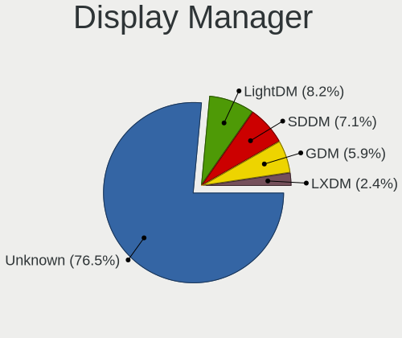
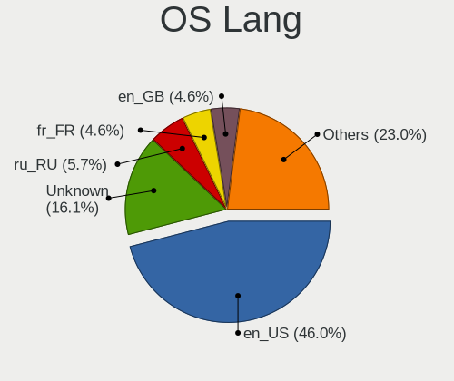
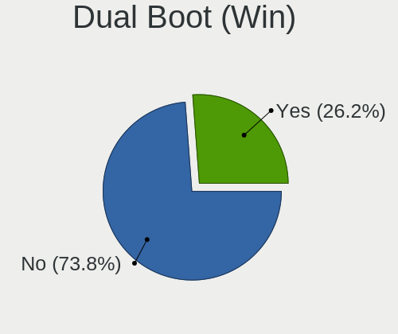
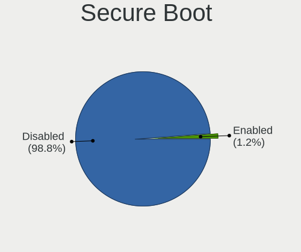
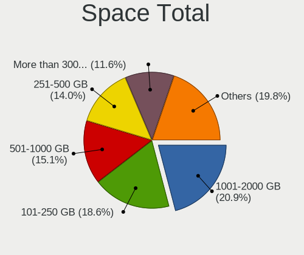
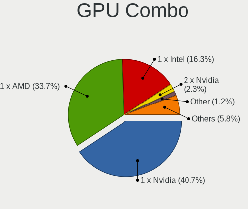
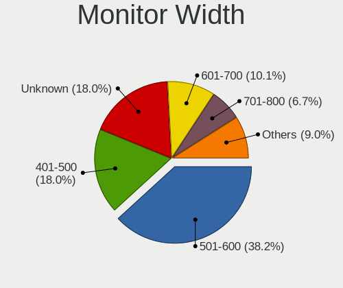
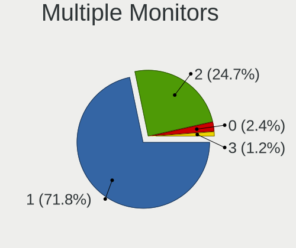
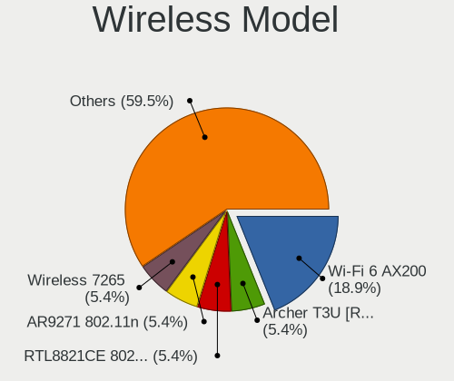
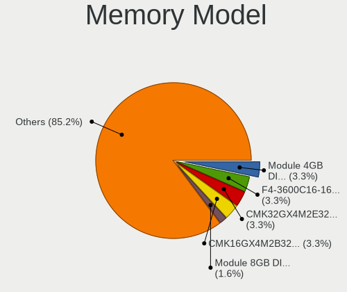

Void Linux - Tested Hardware & Statistics (Desktops)
----------------------------------------------------

A project to collect tested hardware configurations for Void Linux.

Anyone can contribute to this report by the [hw-probe](https://github.com/linuxhw/hw-probe) tool:

    sudo -E hw-probe -all -upload

Please contribute! Especially if your hardware is rare.

Contents
--------

* [ Test Cases ](#test-cases)

* [ System ](#system)
  - [ OS                       ](#os)
  - [ OS Family                ](#os-family)
  - [ Kernel                   ](#kernel)
  - [ Kernel Family            ](#kernel-family)
  - [ Kernel Major Ver.        ](#kernel-major-ver)
  - [ Arch                     ](#arch)
  - [ DE                       ](#de)
  - [ Display Server           ](#display-server)
  - [ Display Manager          ](#display-manager)
  - [ OS Lang                  ](#os-lang)
  - [ Boot Mode                ](#boot-mode)
  - [ Filesystem               ](#filesystem)
  - [ Part. scheme             ](#part-scheme)
  - [ Dual Boot with Linux/BSD ](#dual-boot-with-linuxbsd)
  - [ Dual Boot (Win)          ](#dual-boot-win)

* [ Board ](#board)
  - [ Vendor                   ](#vendor)
  - [ Model                    ](#model)
  - [ Model Family             ](#model-family)
  - [ MFG Year                 ](#mfg-year)
  - [ Form Factor              ](#form-factor)
  - [ Secure Boot              ](#secure-boot)
  - [ Coreboot                 ](#coreboot)
  - [ RAM Size                 ](#ram-size)
  - [ RAM Used                 ](#ram-used)
  - [ Total Drives             ](#total-drives)
  - [ Has CD-ROM               ](#has-cd-rom)
  - [ Has Ethernet             ](#has-ethernet)
  - [ Has WiFi                 ](#has-wifi)
  - [ Has Bluetooth            ](#has-bluetooth)

* [ Location ](#location)
  - [ Country                  ](#country)
  - [ City                     ](#city)

* [ Drives ](#drives)
  - [ Drive Vendor             ](#drive-vendor)
  - [ Drive Model              ](#drive-model)
  - [ HDD Vendor               ](#hdd-vendor)
  - [ SSD Vendor               ](#ssd-vendor)
  - [ Drive Kind               ](#drive-kind)
  - [ Drive Connector          ](#drive-connector)
  - [ Drive Size               ](#drive-size)
  - [ Space Total              ](#space-total)
  - [ Space Used               ](#space-used)
  - [ Malfunc. Drives          ](#malfunc-drives)
  - [ Malfunc. Drive Vendor    ](#malfunc-drive-vendor)
  - [ Malfunc. HDD Vendor      ](#malfunc-hdd-vendor)
  - [ Malfunc. Drive Kind      ](#malfunc-drive-kind)
  - [ Failed Drives            ](#failed-drives)
  - [ Failed Drive Vendor      ](#failed-drive-vendor)
  - [ Drive Status             ](#drive-status)

* [ Storage controller ](#storage-controller)
  - [ Storage Vendor           ](#storage-vendor)
  - [ Storage Model            ](#storage-model)
  - [ Storage Kind             ](#storage-kind)

* [ Processor ](#processor)
  - [ CPU Vendor               ](#cpu-vendor)
  - [ CPU Model                ](#cpu-model)
  - [ CPU Model Family         ](#cpu-model-family)
  - [ CPU Cores                ](#cpu-cores)
  - [ CPU Sockets              ](#cpu-sockets)
  - [ CPU Threads              ](#cpu-threads)
  - [ CPU Op-Modes             ](#cpu-op-modes)
  - [ CPU Microcode            ](#cpu-microcode)
  - [ CPU Microarch            ](#cpu-microarch)

* [ Graphics ](#graphics)
  - [ GPU Vendor               ](#gpu-vendor)
  - [ GPU Model                ](#gpu-model)
  - [ GPU Combo                ](#gpu-combo)
  - [ GPU Driver               ](#gpu-driver)
  - [ GPU Memory               ](#gpu-memory)

* [ Monitor ](#monitor)
  - [ Monitor Vendor           ](#monitor-vendor)
  - [ Monitor Model            ](#monitor-model)
  - [ Monitor Resolution       ](#monitor-resolution)
  - [ Monitor Diagonal         ](#monitor-diagonal)
  - [ Monitor Width            ](#monitor-width)
  - [ Aspect Ratio             ](#aspect-ratio)
  - [ Monitor Area             ](#monitor-area)
  - [ Pixel Density            ](#pixel-density)
  - [ Multiple Monitors        ](#multiple-monitors)

* [ Network ](#network)
  - [ Net Controller Vendor    ](#net-controller-vendor)
  - [ Net Controller Model     ](#net-controller-model)
  - [ Wireless Vendor          ](#wireless-vendor)
  - [ Wireless Model           ](#wireless-model)
  - [ Ethernet Vendor          ](#ethernet-vendor)
  - [ Ethernet Model           ](#ethernet-model)
  - [ Net Controller Kind      ](#net-controller-kind)
  - [ Used Controller          ](#used-controller)
  - [ NICs                     ](#nics)
  - [ IPv6                     ](#ipv6)

* [ Bluetooth ](#bluetooth)
  - [ Bluetooth Vendor         ](#bluetooth-vendor)
  - [ Bluetooth Model          ](#bluetooth-model)

* [ Sound ](#sound)
  - [ Sound Vendor             ](#sound-vendor)
  - [ Sound Model              ](#sound-model)

* [ Memory ](#memory)
  - [ Memory Vendor            ](#memory-vendor)
  - [ Memory Model             ](#memory-model)
  - [ Memory Kind              ](#memory-kind)
  - [ Memory Form Factor       ](#memory-form-factor)
  - [ Memory Size              ](#memory-size)
  - [ Memory Speed             ](#memory-speed)

* [ Printers & scanners ](#printers--scanners)
  - [ Printer Vendor           ](#printer-vendor)
  - [ Printer Model            ](#printer-model)
  - [ Scanner Vendor           ](#scanner-vendor)
  - [ Scanner Model            ](#scanner-model)

* [ Camera ](#camera)
  - [ Camera Vendor            ](#camera-vendor)
  - [ Camera Model             ](#camera-model)

* [ Security ](#security)
  - [ Fingerprint Vendor       ](#fingerprint-vendor)
  - [ Fingerprint Model        ](#fingerprint-model)
  - [ Chipcard Vendor          ](#chipcard-vendor)
  - [ Chipcard Model           ](#chipcard-model)

* [ Unsupported ](#unsupported)
  - [ Unsupported Devices      ](#unsupported-devices)
  - [ Unsupported Device Types ](#unsupported-device-types)

Test Cases
----------

Total: 71

| Vendor   | Model                       | Probe                                                      | Date         |
|----------|-----------------------------|------------------------------------------------------------|--------------|
| ASUSTek  | Maximus VIII FORMULA        | [00a862ae7c](https://linux-hardware.org/?probe=00a862ae7c) | Jun 14, 2023 |
| ASUSTek  | PRIME H610M-E D4            | [827f6ecac2](https://linux-hardware.org/?probe=827f6ecac2) | Jun 07, 2023 |
| ASUSTek  | M5A97 EVO R2.0              | [d94b8cf0e0](https://linux-hardware.org/?probe=d94b8cf0e0) | Feb 18, 2023 |
| ASUSTek  | M5A97 EVO R2.0              | [a551d228f4](https://linux-hardware.org/?probe=a551d228f4) | Jan 14, 2023 |
| MSI      | B550M PRO                   | [61b36bfa2e](https://linux-hardware.org/?probe=61b36bfa2e) | Dec 29, 2022 |
| MSI      | B550M PRO                   | [57f4a4985a](https://linux-hardware.org/?probe=57f4a4985a) | Dec 23, 2022 |
| ASUSTek  | ROG STRIX B450-F GAMING     | [64f6471e58](https://linux-hardware.org/?probe=64f6471e58) | Dec 21, 2022 |
| ASUSTek  | ROG STRIX B450-F GAMING     | [b01c41faa0](https://linux-hardware.org/?probe=b01c41faa0) | Dec 21, 2022 |
| Unknown  | Unknown                     | [49c235aa0d](https://linux-hardware.org/?probe=49c235aa0d) | Aug 30, 2022 |
| Dell     | 0WR7PY A03                  | [2f9e03051e](https://linux-hardware.org/?probe=2f9e03051e) | Aug 13, 2022 |
| ASUSTek  | TUF B450M-PRO GAMING        | [53fd2c87d2](https://linux-hardware.org/?probe=53fd2c87d2) | Jul 16, 2022 |
| HP       | 3397                        | [7d3b738672](https://linux-hardware.org/?probe=7d3b738672) | Jul 14, 2022 |
| ASUSTek  | TUF Gaming B560-PLUS WIF... | [fa17eccd81](https://linux-hardware.org/?probe=fa17eccd81) | Jul 04, 2022 |
| ASUSTek  | PRIME Z690-P                | [6302e38583](https://linux-hardware.org/?probe=6302e38583) | Jun 22, 2022 |
| ASUSTek  | PRIME Z690-P                | [ce610351c3](https://linux-hardware.org/?probe=ce610351c3) | Jun 03, 2022 |
| ASUSTek  | PRIME Z690-P                | [1e0c1bed2a](https://linux-hardware.org/?probe=1e0c1bed2a) | Jun 02, 2022 |
| MSI      | B450M-A PRO MAX             | [758bdaefe9](https://linux-hardware.org/?probe=758bdaefe9) | May 21, 2022 |
| Dell     | 0WR7PY A01                  | [9a18a890d4](https://linux-hardware.org/?probe=9a18a890d4) | May 03, 2022 |
| MSI      | Z87-G43                     | [d5612db7ca](https://linux-hardware.org/?probe=d5612db7ca) | May 02, 2022 |
| ASUSTek  | ROG STRIX B450-F GAMING     | [ffdfb3a578](https://linux-hardware.org/?probe=ffdfb3a578) | Apr 29, 2022 |
| ASUSTek  | ROG STRIX B450-F GAMING     | [55c0ec3653](https://linux-hardware.org/?probe=55c0ec3653) | Apr 29, 2022 |
| ASRock   | X570 Pro4                   | [678366aef2](https://linux-hardware.org/?probe=678366aef2) | Apr 25, 2022 |
| ASRock   | TRX40 Taichi                | [4a90b659fc](https://linux-hardware.org/?probe=4a90b659fc) | Apr 14, 2022 |
| MSI      | B550M PRO                   | [70e55581b6](https://linux-hardware.org/?probe=70e55581b6) | Mar 24, 2022 |
| Gigabyte | B450M DS3H-CF               | [613a6d2320](https://linux-hardware.org/?probe=613a6d2320) | Feb 16, 2022 |
| Gigabyte | B550M AORUS PRO-P           | [61374a4048](https://linux-hardware.org/?probe=61374a4048) | Jan 25, 2022 |
| ASUSTek  | PRIME X470-PRO              | [24fedcca0a](https://linux-hardware.org/?probe=24fedcca0a) | Jan 18, 2022 |
| MSI      | B450M-A PRO MAX             | [efd1c194ac](https://linux-hardware.org/?probe=efd1c194ac) | Nov 11, 2021 |
| MSI      | B450M-A PRO MAX             | [0802656d19](https://linux-hardware.org/?probe=0802656d19) | Nov 11, 2021 |
| Gigabyte | B450M DS3H-CF               | [093a7d451a](https://linux-hardware.org/?probe=093a7d451a) | Oct 16, 2021 |
| Gigabyte | B450M DS3H-CF               | [7917f7d57f](https://linux-hardware.org/?probe=7917f7d57f) | Oct 12, 2021 |
| Gigabyte | H310M M.2 x.x               | [6ad302377d](https://linux-hardware.org/?probe=6ad302377d) | Sep 30, 2021 |
| MSI      | B450 TOMAHAWK MAX II        | [a0d3015e21](https://linux-hardware.org/?probe=a0d3015e21) | Sep 15, 2021 |
| ASUSTek  | M4A89GTD-PRO/USB3           | [d3c1b5c10c](https://linux-hardware.org/?probe=d3c1b5c10c) | Sep 11, 2021 |
| ASUSTek  | ROG CROSSHAIR VII HERO      | [bc2b986f06](https://linux-hardware.org/?probe=bc2b986f06) | Aug 19, 2021 |
| ASUSTek  | ROG CROSSHAIR VII HERO      | [85d1c86c68](https://linux-hardware.org/?probe=85d1c86c68) | Aug 19, 2021 |
| Dell     | 03NVJ6 A02                  | [5dec53ee3f](https://linux-hardware.org/?probe=5dec53ee3f) | Jul 26, 2021 |
| ASRock   | J4005B-ITX                  | [053a28a1b7](https://linux-hardware.org/?probe=053a28a1b7) | Jun 13, 2021 |
| ASRock   | H61M-VG4                    | [f99a68e64b](https://linux-hardware.org/?probe=f99a68e64b) | May 14, 2021 |
| ASRock   | H61M-VG4                    | [d2a90378bc](https://linux-hardware.org/?probe=d2a90378bc) | May 12, 2021 |
| ASUSTek  | M5A78L-M LX                 | [63df5a92c1](https://linux-hardware.org/?probe=63df5a92c1) | Apr 01, 2021 |
| ASUSTek  | M5A78L-M LX                 | [9312919fed](https://linux-hardware.org/?probe=9312919fed) | Apr 01, 2021 |
| ASRock   | B450 Pro4                   | [42d648695d](https://linux-hardware.org/?probe=42d648695d) | Mar 26, 2021 |
| Unknown  | Unknown                     | [35af7cfd3d](https://linux-hardware.org/?probe=35af7cfd3d) | Feb 22, 2021 |
| ASRock   | B450 Pro4                   | [09b0e87eec](https://linux-hardware.org/?probe=09b0e87eec) | Feb 12, 2021 |
| ASUSTek  | PRIME Z390-P                | [5d02f20d1d](https://linux-hardware.org/?probe=5d02f20d1d) | Feb 10, 2021 |
| MSI      | MPG B550I GAMING EDGE WI... | [624f71f228](https://linux-hardware.org/?probe=624f71f228) | Jan 21, 2021 |
| ASUSTek  | PRIME Z390-P                | [73c3fdc605](https://linux-hardware.org/?probe=73c3fdc605) | Jan 16, 2021 |
| ASUSTek  | PRIME Z270-AR               | [35d08fe710](https://linux-hardware.org/?probe=35d08fe710) | Dec 30, 2020 |
| MSI      | MPG B550I GAMING EDGE WI... | [1f66d0eb72](https://linux-hardware.org/?probe=1f66d0eb72) | Dec 22, 2020 |
| MSI      | MPG B550I GAMING EDGE WI... | [61887011a6](https://linux-hardware.org/?probe=61887011a6) | Dec 22, 2020 |
| ASUSTek  | B150M PRO GAMING            | [4d4ec823bb](https://linux-hardware.org/?probe=4d4ec823bb) | Dec 06, 2020 |
| ASUSTek  | B150M PRO GAMING            | [7d1a0b6924](https://linux-hardware.org/?probe=7d1a0b6924) | Dec 02, 2020 |
| ASUSTek  | H110M-PLUS                  | [09df23b136](https://linux-hardware.org/?probe=09df23b136) | Nov 20, 2020 |
| ASUSTek  | PRIME B360M-A               | [438477ec85](https://linux-hardware.org/?probe=438477ec85) | Nov 14, 2020 |
| ASUSTek  | PRIME B360M-A               | [ac5adde915](https://linux-hardware.org/?probe=ac5adde915) | Nov 13, 2020 |
| ASRock   | 970 Pro3 R2.0               | [d889341667](https://linux-hardware.org/?probe=d889341667) | Oct 28, 2020 |
| MSI      | Z270 TOMAHAWK               | [66f15fef73](https://linux-hardware.org/?probe=66f15fef73) | Sep 28, 2020 |
| ASUSTek  | P8Z77-V LX2                 | [ee56035e75](https://linux-hardware.org/?probe=ee56035e75) | Sep 24, 2020 |
| ASUSTek  | P8H67-V                     | [9bc61b31d4](https://linux-hardware.org/?probe=9bc61b31d4) | Sep 02, 2020 |
| Gigabyte | GA-78LMT-S2                 | [efac4b3e2b](https://linux-hardware.org/?probe=efac4b3e2b) | May 25, 2020 |
| Dell     | 0H8052                      | [18169ce984](https://linux-hardware.org/?probe=18169ce984) | Jan 29, 2020 |
| Unknown  | Unknown                     | [b9eb4a5652](https://linux-hardware.org/?probe=b9eb4a5652) | Jan 24, 2020 |
| Unknown  | Unknown                     | [ac87dc43f3](https://linux-hardware.org/?probe=ac87dc43f3) | Jan 24, 2020 |
| ASUSTek  | H110M-PLUS                  | [b8c562a7e5](https://linux-hardware.org/?probe=b8c562a7e5) | Dec 23, 2019 |
| ASRock   | AB350M                      | [1ec4015426](https://linux-hardware.org/?probe=1ec4015426) | Sep 01, 2019 |
| ASRock   | N68-S3 FX                   | [69e86c050b](https://linux-hardware.org/?probe=69e86c050b) | Aug 18, 2019 |
| ASRock   | N68-S3 FX                   | [ef4f02af88](https://linux-hardware.org/?probe=ef4f02af88) | Aug 16, 2019 |
| ASUSTek  | Z97-A                       | [c2458d18f6](https://linux-hardware.org/?probe=c2458d18f6) | Aug 03, 2019 |
| MSI      | B350M GAMING PRO            | [20e1f5d7a1](https://linux-hardware.org/?probe=20e1f5d7a1) | Apr 17, 2019 |
| ASUSTek  | PRIME A320M-K/BR            | [1b0a4407c7](https://linux-hardware.org/?probe=1b0a4407c7) | Mar 27, 2019 |

System
------

OS
--

Installed operating systems

| Name               | Desktops | Percent |
|--------------------|----------|---------|
| Void Linux Rolling | 29       | 60.42%  |
| Void Linux         | 19       | 39.58%  |

OS Family
---------

OS without a version

| Name       | Desktops | Percent |
|------------|----------|---------|
| Void Linux | 46       | 100%    |

Kernel
------

Version of the Linux kernel

| Version   | Desktops | Percent |
|-----------|----------|---------|
| 6.1.31_1  | 2        | 3.7%    |
| 6.0.13_1  | 2        | 3.7%    |
| 5.8.18_1  | 2        | 3.7%    |
| 5.18.9_1  | 2        | 3.7%    |
| 5.16.20_1 | 2        | 3.7%    |
| 5.13.19_1 | 2        | 3.7%    |
| 5.11.9_1  | 2        | 3.7%    |
| 5.10.14_1 | 2        | 3.7%    |
| 6.1.4_1   | 1        | 1.85%   |
| 6.1.12_1  | 1        | 1.85%   |
| 5.9.14_1  | 1        | 1.85%   |
| 5.8.5_1   | 1        | 1.85%   |
| 5.8.16_1  | 1        | 1.85%   |
| 5.8.11_1  | 1        | 1.85%   |
| 5.8.10_1  | 1        | 1.85%   |
| 5.6.14_1  | 1        | 1.85%   |
| 5.4.15_1  | 1        | 1.85%   |
| 5.4.13_2  | 1        | 1.85%   |
| 5.3.16_1  | 1        | 1.85%   |
| 5.18.1_1  | 1        | 1.85%   |
| 5.18.16_1 | 1        | 1.85%   |
| 5.18.14_1 | 1        | 1.85%   |
| 5.15.50_1 | 1        | 1.85%   |
| 5.15.41_1 | 1        | 1.85%   |
| 5.15.34_1 | 1        | 1.85%   |
| 5.15.32_1 | 1        | 1.85%   |
| 5.15.30_1 | 1        | 1.85%   |
| 5.15.22_1 | 1        | 1.85%   |
| 5.15.19_1 | 1        | 1.85%   |
| 5.15.16_1 | 1        | 1.85%   |
| 5.15.11_1 | 1        | 1.85%   |
| 5.13.15_1 | 1        | 1.85%   |
| 5.13.13_1 | 1        | 1.85%   |
| 5.13.10_1 | 1        | 1.85%   |
| 5.12.14_1 | 1        | 1.85%   |
| 5.12.10_1 | 1        | 1.85%   |
| 5.11.18_1 | 1        | 1.85%   |
| 5.10.8_1  | 1        | 1.85%   |
| 5.10.7_1  | 1        | 1.85%   |
| 5.10.67_1 | 1        | 1.85%   |

Kernel Family
-------------

Linux kernel without a distro release

| Version | Desktops | Percent |
|---------|----------|---------|
| 6.1.31  | 2        | 3.7%    |
| 6.0.13  | 2        | 3.7%    |
| 5.8.18  | 2        | 3.7%    |
| 5.18.9  | 2        | 3.7%    |
| 5.16.20 | 2        | 3.7%    |
| 5.13.19 | 2        | 3.7%    |
| 5.11.9  | 2        | 3.7%    |
| 5.10.14 | 2        | 3.7%    |
| 6.1.4   | 1        | 1.85%   |
| 6.1.12  | 1        | 1.85%   |
| 5.9.14  | 1        | 1.85%   |
| 5.8.5   | 1        | 1.85%   |
| 5.8.16  | 1        | 1.85%   |
| 5.8.11  | 1        | 1.85%   |
| 5.8.10  | 1        | 1.85%   |
| 5.6.14  | 1        | 1.85%   |
| 5.4.15  | 1        | 1.85%   |
| 5.4.13  | 1        | 1.85%   |
| 5.3.16  | 1        | 1.85%   |
| 5.18.16 | 1        | 1.85%   |
| 5.18.14 | 1        | 1.85%   |
| 5.18.1  | 1        | 1.85%   |
| 5.15.50 | 1        | 1.85%   |
| 5.15.41 | 1        | 1.85%   |
| 5.15.34 | 1        | 1.85%   |
| 5.15.32 | 1        | 1.85%   |
| 5.15.30 | 1        | 1.85%   |
| 5.15.22 | 1        | 1.85%   |
| 5.15.19 | 1        | 1.85%   |
| 5.15.16 | 1        | 1.85%   |
| 5.15.11 | 1        | 1.85%   |
| 5.13.15 | 1        | 1.85%   |
| 5.13.13 | 1        | 1.85%   |
| 5.13.10 | 1        | 1.85%   |
| 5.12.14 | 1        | 1.85%   |
| 5.12.10 | 1        | 1.85%   |
| 5.11.18 | 1        | 1.85%   |
| 5.10.8  | 1        | 1.85%   |
| 5.10.7  | 1        | 1.85%   |
| 5.10.67 | 1        | 1.85%   |

Kernel Major Ver.
-----------------

Linux kernel major version

| Version | Desktops | Percent |
|---------|----------|---------|
| 5.15    | 9        | 16.98%  |
| 5.10    | 7        | 13.21%  |
| 5.8     | 6        | 11.32%  |
| 5.18    | 5        | 9.43%   |
| 5.13    | 5        | 9.43%   |
| 4.19    | 4        | 7.55%   |
| 6.1     | 3        | 5.66%   |
| 5.11    | 3        | 5.66%   |
| 6.0     | 2        | 3.77%   |
| 5.4     | 2        | 3.77%   |
| 5.16    | 2        | 3.77%   |
| 5.12    | 2        | 3.77%   |
| 5.9     | 1        | 1.89%   |
| 5.6     | 1        | 1.89%   |
| 5.3     | 1        | 1.89%   |

Arch
----

OS architecture (x86_64, i586, etc.)

| Name    | Desktops | Percent |
|---------|----------|---------|
| x86_64  | 43       | 93.48%  |
| ppc64le | 1        | 2.17%   |
| ppc64   | 1        | 2.17%   |
| i686    | 1        | 2.17%   |

DE
--

Desktop Environment

| Name       | Desktops | Percent |
|------------|----------|---------|
| Unknown    | 25       | 51.02%  |
| XFCE       | 7        | 14.29%  |
| KDE5       | 4        | 8.16%   |
| KDE        | 3        | 6.12%   |
| GNOME      | 3        | 6.12%   |
| X-Cinnamon | 2        | 4.08%   |
| sway       | 1        | 2.04%   |
| openbox    | 1        | 2.04%   |
| Lumina     | 1        | 2.04%   |
| bspwm      | 1        | 2.04%   |
| awesome    | 1        | 2.04%   |

Display Server
--------------

X11 or Wayland

| Name    | Desktops | Percent |
|---------|----------|---------|
| X11     | 36       | 75%     |
| Wayland | 5        | 10.42%  |
| Unknown | 4        | 8.33%   |
| Tty     | 3        | 6.25%   |

Display Manager
---------------

SDDM, LightDM, etc.

| Name    | Desktops | Percent |
|---------|----------|---------|
| Unknown | 40       | 83.33%  |
| SDDM    | 3        | 6.25%   |
| LXDM    | 2        | 4.17%   |
| LightDM | 2        | 4.17%   |
| GDM     | 1        | 2.08%   |

OS Lang
-------

Language

| Lang    | Desktops | Percent |
|---------|----------|---------|
| en_US   | 21       | 42%     |
| Unknown | 11       | 22%     |
| ru_RU   | 4        | 8%      |
| pl_PL   | 2        | 4%      |
| fr_FR   | 2        | 4%      |
| cs_CZ   | 2        | 4%      |
| pt_BR   | 1        | 2%      |
| en_IE   | 1        | 2%      |
| en_GB   | 1        | 2%      |
| en_DK   | 1        | 2%      |
| en_AU   | 1        | 2%      |
| el_GR   | 1        | 2%      |
| de_DE   | 1        | 2%      |
| bg_BG   | 1        | 2%      |

Boot Mode
---------

EFI or BIOS

| Mode | Desktops | Percent |
|------|----------|---------|
| BIOS | 29       | 59.18%  |
| EFI  | 20       | 40.82%  |

Filesystem
----------

Type of filesystem

| Type    | Desktops | Percent |
|---------|----------|---------|
| Ext4    | 29       | 59.18%  |
| Btrfs   | 10       | 20.41%  |
| Zfs     | 5        | 10.2%   |
| Xfs     | 4        | 8.16%   |
| Unknown | 1        | 2.04%   |

Part. scheme
------------

Scheme of partitioning

| Type    | Desktops | Percent |
|---------|----------|---------|
| GPT     | 24       | 50%     |
| Unknown | 16       | 33.33%  |
| MBR     | 8        | 16.67%  |

Dual Boot with Linux/BSD
------------------------

Hosting more than one Linux/BSD

| Dual boot | Desktops | Percent |
|-----------|----------|---------|
| No        | 38       | 82.61%  |
| Yes       | 8        | 17.39%  |

Dual Boot (Win)
---------------

Hosting Linux and Windows

| Dual boot | Desktops | Percent |
|-----------|----------|---------|
| No        | 37       | 77.08%  |
| Yes       | 11       | 22.92%  |

Board
-----

Vendor
------

Motherboard manufacturer

| Name                | Desktops | Percent |
|---------------------|----------|---------|
| ASUSTek Computer    | 19       | 41.3%   |
| ASRock              | 8        | 17.39%  |
| MSI                 | 7        | 15.22%  |
| Gigabyte Technology | 4        | 8.7%    |
| Dell                | 4        | 8.7%    |
| Unknown             | 3        | 6.52%   |
| Hewlett-Packard     | 1        | 2.17%   |

Model
-----

Motherboard model

| Name                         | Desktops | Percent |
|------------------------------|----------|---------|
| Unknown                      | 3        | 6.52%   |
| Dell OptiPlex 7010           | 2        | 4.35%   |
| ASUS PRIME Z390-P            | 2        | 4.35%   |
| MSI MS-7D14                  | 1        | 2.17%   |
| MSI MS-7C92                  | 1        | 2.17%   |
| MSI MS-7C52                  | 1        | 2.17%   |
| MSI MS-7C02                  | 1        | 2.17%   |
| MSI MS-7A68                  | 1        | 2.17%   |
| MSI MS-7A39                  | 1        | 2.17%   |
| MSI MS-7816                  | 1        | 2.17%   |
| HP Compaq Elite 8300 SFF     | 1        | 2.17%   |
| Gigabyte H310M M.2 2.0       | 1        | 2.17%   |
| Gigabyte GA-78LMT-S2         | 1        | 2.17%   |
| Gigabyte B550M AORUS PRO-P   | 1        | 2.17%   |
| Gigabyte B450M DS3H          | 1        | 2.17%   |
| Dell OptiPlex GX520          | 1        | 2.17%   |
| Dell OptiPlex 780            | 1        | 2.17%   |
| ASUS TUF B450M-PRO GAMING    | 1        | 2.17%   |
| ASUS ROG STRIX B450-F GAMING | 1        | 2.17%   |
| ASUS ROG CROSSHAIR VII HERO  | 1        | 2.17%   |
| ASUS PRIME Z690-P            | 1        | 2.17%   |
| ASUS PRIME Z270-AR           | 1        | 2.17%   |
| ASUS PRIME X470-PRO          | 1        | 2.17%   |
| ASUS PRIME H610M-E D4        | 1        | 2.17%   |
| ASUS PRIME A320M-K/BR        | 1        | 2.17%   |
| ASUS P8Z77-V LX2             | 1        | 2.17%   |
| ASUS P8H67-V                 | 1        | 2.17%   |
| ASUS Maximus VIII FORMULA    | 1        | 2.17%   |
| ASUS M5A97 EVO R2.0          | 1        | 2.17%   |
| ASUS M5A78L-M LX             | 1        | 2.17%   |
| ASUS M4A89GTD-PRO/USB3       | 1        | 2.17%   |
| ASUS H110M-PLUS              | 1        | 2.17%   |
| ASUS CUSTOM                  | 1        | 2.17%   |
| ASUS B150M PRO GAMING        | 1        | 2.17%   |
| ASRock X570 Pro4             | 1        | 2.17%   |
| ASRock TRX40 Taichi          | 1        | 2.17%   |
| ASRock N68-S3 FX             | 1        | 2.17%   |
| ASRock J4005B-ITX            | 1        | 2.17%   |
| ASRock H61M-VG4              | 1        | 2.17%   |
| ASRock B450 Pro4             | 1        | 2.17%   |

Model Family
------------

Motherboard model prefix

| Name                 | Desktops | Percent |
|----------------------|----------|---------|
| ASUS PRIME           | 7        | 15.22%  |
| Dell OptiPlex        | 4        | 8.7%    |
| Unknown              | 3        | 6.52%   |
| ASUS ROG             | 2        | 4.35%   |
| MSI MS-7D14          | 1        | 2.17%   |
| MSI MS-7C92          | 1        | 2.17%   |
| MSI MS-7C52          | 1        | 2.17%   |
| MSI MS-7C02          | 1        | 2.17%   |
| MSI MS-7A68          | 1        | 2.17%   |
| MSI MS-7A39          | 1        | 2.17%   |
| MSI MS-7816          | 1        | 2.17%   |
| HP Compaq            | 1        | 2.17%   |
| Gigabyte H310M       | 1        | 2.17%   |
| Gigabyte GA-78LMT-S2 | 1        | 2.17%   |
| Gigabyte B550M       | 1        | 2.17%   |
| Gigabyte B450M       | 1        | 2.17%   |
| ASUS TUF             | 1        | 2.17%   |
| ASUS P8Z77-V         | 1        | 2.17%   |
| ASUS P8H67-V         | 1        | 2.17%   |
| ASUS Maximus         | 1        | 2.17%   |
| ASUS M5A97           | 1        | 2.17%   |
| ASUS M5A78L-M        | 1        | 2.17%   |
| ASUS M4A89GTD-PRO    | 1        | 2.17%   |
| ASUS H110M-PLUS      | 1        | 2.17%   |
| ASUS CUSTOM          | 1        | 2.17%   |
| ASUS B150M           | 1        | 2.17%   |
| ASRock X570          | 1        | 2.17%   |
| ASRock TRX40         | 1        | 2.17%   |
| ASRock N68-S3        | 1        | 2.17%   |
| ASRock J4005B-ITX    | 1        | 2.17%   |
| ASRock H61M-VG4      | 1        | 2.17%   |
| ASRock B450          | 1        | 2.17%   |
| ASRock AB350M        | 1        | 2.17%   |
| ASRock 970           | 1        | 2.17%   |

MFG Year
--------

Motherboard manufacture year

| Year    | Desktops | Percent |
|---------|----------|---------|
| 2018    | 11       | 23.91%  |
| 2020    | 5        | 10.87%  |
| 2012    | 5        | 10.87%  |
| 2019    | 4        | 8.7%    |
| 2017    | 4        | 8.7%    |
| 2013    | 4        | 8.7%    |
| 2010    | 3        | 6.52%   |
| 2021    | 2        | 4.35%   |
| 2016    | 2        | 4.35%   |
| 2011    | 2        | 4.35%   |
| Unknown | 2        | 4.35%   |
| 2022    | 1        | 2.17%   |
| 2005    | 1        | 2.17%   |

Form Factor
-----------

Physical design of the computer

| Name    | Desktops | Percent |
|---------|----------|---------|
| Desktop | 46       | 100%    |

Secure Boot
-----------

Enabled or disabled

| State    | Desktops | Percent |
|----------|----------|---------|
| Disabled | 46       | 100%    |

Coreboot
--------

Have coreboot on board

| Used | Desktops | Percent |
|------|----------|---------|
| No   | 46       | 100%    |

RAM Size
--------

Total RAM memory

| Size in GB      | Desktops | Percent |
|-----------------|----------|---------|
| 16.01-24.0      | 17       | 36.17%  |
| 8.01-16.0       | 11       | 23.4%   |
| 32.01-64.0      | 7        | 14.89%  |
| 4.01-8.0        | 5        | 10.64%  |
| 3.01-4.0        | 3        | 6.38%   |
| More than 256.0 | 1        | 2.13%   |
| 24.01-32.0      | 1        | 2.13%   |
| 2.01-3.0        | 1        | 2.13%   |
| 64.01-256.0     | 1        | 2.13%   |

RAM Used
--------

Used RAM memory

| Used GB     | Desktops | Percent |
|-------------|----------|---------|
| 2.01-3.0    | 13       | 25.49%  |
| 3.01-4.0    | 9        | 17.65%  |
| 1.01-2.0    | 7        | 13.73%  |
| 8.01-16.0   | 7        | 13.73%  |
| 0.51-1.0    | 7        | 13.73%  |
| 4.01-8.0    | 5        | 9.8%    |
| 64.01-256.0 | 1        | 1.96%   |
| 16.01-24.0  | 1        | 1.96%   |
| 0.01-0.5    | 1        | 1.96%   |

Total Drives
------------

Number of drives on board

| Drives | Desktops | Percent |
|--------|----------|---------|
| 2      | 16       | 33.33%  |
| 3      | 14       | 29.17%  |
| 1      | 13       | 27.08%  |
| 4      | 3        | 6.25%   |
| 9      | 1        | 2.08%   |
| 5      | 1        | 2.08%   |

Has CD-ROM
----------

Has CD-ROM on board

| Presented | Desktops | Percent |
|-----------|----------|---------|
| No        | 37       | 80.43%  |
| Yes       | 9        | 19.57%  |

Has Ethernet
------------

Has Ethernet on board

| Presented | Desktops | Percent |
|-----------|----------|---------|
| Yes       | 46       | 100%    |

Has WiFi
--------

Has WiFi module

| Presented | Desktops | Percent |
|-----------|----------|---------|
| No        | 31       | 65.96%  |
| Yes       | 16       | 34.04%  |

Has Bluetooth
-------------

Has Bluetooth module

| Presented | Desktops | Percent |
|-----------|----------|---------|
| No        | 35       | 74.47%  |
| Yes       | 12       | 25.53%  |

Location
--------

Country
-------

Geographic location (country)

| Country     | Desktops | Percent |
|-------------|----------|---------|
| USA         | 13       | 28.26%  |
| Russia      | 4        | 8.7%    |
| Poland      | 4        | 8.7%    |
| Germany     | 3        | 6.52%   |
| Czechia     | 3        | 6.52%   |
| Brazil      | 3        | 6.52%   |
| Greece      | 2        | 4.35%   |
| France      | 2        | 4.35%   |
| UK          | 1        | 2.17%   |
| Turkey      | 1        | 2.17%   |
| Sweden      | 1        | 2.17%   |
| Spain       | 1        | 2.17%   |
| Netherlands | 1        | 2.17%   |
| India       | 1        | 2.17%   |
| Finland     | 1        | 2.17%   |
| Bulgaria    | 1        | 2.17%   |
| Belgium     | 1        | 2.17%   |
| Bangladesh  | 1        | 2.17%   |
| Australia   | 1        | 2.17%   |
| Argentina   | 1        | 2.17%   |

City
----

Geographic location (city)

| City               | Desktops | Percent |
|--------------------|----------|---------|
| Denver             | 3        | 6.12%   |
| Prague             | 2        | 4.08%   |
| Munich             | 2        | 4.08%   |
| Lublin             | 2        | 4.08%   |
| Amsterdam          | 2        | 4.08%   |
| Zagnansk           | 1        | 2.04%   |
| Yekaterinburg      | 1        | 2.04%   |
| Varna              | 1        | 2.04%   |
| South Shields      | 1        | 2.04%   |
| Sofia              | 1        | 2.04%   |
| Savannah           | 1        | 2.04%   |
| Saint-Paul-les-Dax | 1        | 2.04%   |
| Saint Paul         | 1        | 2.04%   |
| Rosario            | 1        | 2.04%   |
| Rio de Janeiro     | 1        | 2.04%   |
| Richmond           | 1        | 2.04%   |
| Pyatigorsk         | 1        | 2.04%   |
| Pelabravo          | 1        | 2.04%   |
| Pardubice          | 1        | 2.04%   |
| Oulu               | 1        | 2.04%   |
| Orlando            | 1        | 2.04%   |
| Nizhniy Novgorod   | 1        | 2.04%   |
| New York           | 1        | 2.04%   |
| Monaca             | 1        | 2.04%   |
| Miedziana Gora     | 1        | 2.04%   |
| Mer                | 1        | 2.04%   |
| Kolkata            | 1        | 2.04%   |
| Katerini           | 1        | 2.04%   |
| Iwkowa             | 1        | 2.04%   |
| Ioannina           | 1        | 2.04%   |
| Helsinki           | 1        | 2.04%   |
| Gothenburg         | 1        | 2.04%   |
| Glasgow            | 1        | 2.04%   |
| Epping             | 1        | 2.04%   |
| Elgin              | 1        | 2.04%   |
| Eden               | 1        | 2.04%   |
| Dhaka              | 1        | 2.04%   |
| Contagem           | 1        | 2.04%   |
| Burgau             | 1        | 2.04%   |
| Brussels           | 1        | 2.04%   |

Drives
------

Drive Vendor
------------

Hard drive vendors

| Vendor                    | Desktops | Drives | Percent |
|---------------------------|----------|--------|---------|
| Samsung Electronics       | 21       | 35     | 22.11%  |
| WDC                       | 20       | 27     | 21.05%  |
| Seagate                   | 15       | 22     | 15.79%  |
| Kingston                  | 10       | 11     | 10.53%  |
| Toshiba                   | 4        | 5      | 4.21%   |
| SanDisk                   | 3        | 3      | 3.16%   |
| Crucial                   | 3        | 4      | 3.16%   |
| Intel                     | 2        | 3      | 2.11%   |
| Hitachi                   | 2        | 2      | 2.11%   |
| HGST                      | 2        | 2      | 2.11%   |
| Corsair                   | 2        | 2      | 2.11%   |
| A-DATA Technology         | 2        | 3      | 2.11%   |
| XPG                       | 1        | 4      | 1.05%   |
| SPCC                      | 1        | 1      | 1.05%   |
| Phison                    | 1        | 1      | 1.05%   |
| Patriot                   | 1        | 1      | 1.05%   |
| OCZ                       | 1        | 1      | 1.05%   |
| Micron/Crucial Technology | 1        | 1      | 1.05%   |
| Maxtor                    | 1        | 1      | 1.05%   |
| LITEONIT                  | 1        | 1      | 1.05%   |
| Gigabyte Technology       | 1        | 2      | 1.05%   |

Drive Model
-----------

Hard drive models

| Model                               | Desktops | Percent |
|-------------------------------------|----------|---------|
| Kingston SA400S37240G 240GB SSD     | 5        | 4.59%   |
| WDC WD10EZEX-08WN4A0 1TB            | 3        | 2.75%   |
| Seagate ST2000DM008-2FR102 2TB      | 3        | 2.75%   |
| WDC WDS500G2B0A-00SM50 500GB SSD    | 2        | 1.83%   |
| Seagate ST1000DM010-2EP102 1TB      | 2        | 1.83%   |
| Samsung SSD 980 PRO 500GB           | 2        | 1.83%   |
| Samsung SSD 970 EVO Plus 1TB        | 2        | 1.83%   |
| Samsung SSD 860 EVO 500GB           | 2        | 1.83%   |
| Samsung NVMe SSD Drive 500GB        | 2        | 1.83%   |
| Kingston SHFS37A120G 120GB SSD      | 2        | 1.83%   |
| XPG NVMe SSD Drive 2TB              | 1        | 0.92%   |
| WDC WDS240G2G0A-00JH30 240GB SSD    | 1        | 0.92%   |
| WDC WD7500AYYS-01RCA0 752GB         | 1        | 0.92%   |
| WDC WD5000AADS-00S9B0 500GB         | 1        | 0.92%   |
| WDC WD20EZRZ-00Z5HB0 2TB            | 1        | 0.92%   |
| WDC WD20EZBX-00AYRA0 2TB            | 1        | 0.92%   |
| WDC WD20EFRX-68EUZN0 2TB            | 1        | 0.92%   |
| WDC WD2003FZEX-00Z4SA0 2TB          | 1        | 0.92%   |
| WDC WD1600AAJS-60PSA0 160GB         | 1        | 0.92%   |
| WDC WD15EARS-00MVWB0 1TB            | 1        | 0.92%   |
| WDC WD10JPVX-08JC3T6 1TB            | 1        | 0.92%   |
| WDC WD10JPCX-24UE4T0 1TB            | 1        | 0.92%   |
| WDC WD10EZRX-00L4HB0 1TB            | 1        | 0.92%   |
| WDC WD10EZEX-00BBHA0 1TB            | 1        | 0.92%   |
| WDC WD10EFRX-68PJCN0 1TB            | 1        | 0.92%   |
| WDC WD10EFRX-68FYTN0 1TB            | 1        | 0.92%   |
| WDC WD10EARX-00PASB0 1TB            | 1        | 0.92%   |
| WDC WD1002FAEX-00Z3A0 1TB           | 1        | 0.92%   |
| WDC WD1001FALS-00K1B0 1TB           | 1        | 0.92%   |
| Toshiba MQ04ABF100 1TB              | 1        | 0.92%   |
| Toshiba HDWD110 1TB                 | 1        | 0.92%   |
| Toshiba DT01ACA200 2TB              | 1        | 0.92%   |
| Toshiba DT01ACA050 500GB            | 1        | 0.92%   |
| SPCC Solid State Disk 128GB         | 1        | 0.92%   |
| Seagate ST9500325AS 500GB           | 1        | 0.92%   |
| Seagate ST500LM012 HN-M500MBB 500GB | 1        | 0.92%   |
| Seagate ST500DM002-1BD142 500GB     | 1        | 0.92%   |
| Seagate ST3750330AS 752GB           | 1        | 0.92%   |
| Seagate ST3500413AS 500GB           | 1        | 0.92%   |
| Seagate ST3360320AS 360GB           | 1        | 0.92%   |

HDD Vendor
----------

Hard disk drive vendors

| Vendor              | Desktops | Drives | Percent |
|---------------------|----------|--------|---------|
| WDC                 | 17       | 24     | 37.78%  |
| Seagate             | 15       | 22     | 33.33%  |
| Toshiba             | 4        | 5      | 8.89%   |
| Samsung Electronics | 4        | 5      | 8.89%   |
| Hitachi             | 2        | 2      | 4.44%   |
| HGST                | 2        | 2      | 4.44%   |
| Maxtor              | 1        | 1      | 2.22%   |

SSD Vendor
----------

Solid state drive vendors

| Vendor              | Desktops | Drives | Percent |
|---------------------|----------|--------|---------|
| Samsung Electronics | 10       | 13     | 30.3%   |
| Kingston            | 10       | 11     | 30.3%   |
| WDC                 | 3        | 3      | 9.09%   |
| SPCC                | 1        | 1      | 3.03%   |
| SanDisk             | 1        | 1      | 3.03%   |
| Patriot             | 1        | 1      | 3.03%   |
| OCZ                 | 1        | 1      | 3.03%   |
| LITEONIT            | 1        | 1      | 3.03%   |
| Intel               | 1        | 1      | 3.03%   |
| Gigabyte Technology | 1        | 2      | 3.03%   |
| Crucial             | 1        | 2      | 3.03%   |
| Corsair             | 1        | 1      | 3.03%   |
| A-DATA Technology   | 1        | 2      | 3.03%   |

Drive Kind
----------

HDD or SSD

| Kind | Desktops | Drives | Percent |
|------|----------|--------|---------|
| HDD  | 34       | 61     | 42.5%   |
| SSD  | 29       | 40     | 36.25%  |
| NVMe | 17       | 31     | 21.25%  |

Drive Connector
---------------

SATA, SAS, NVMe, etc.

| Type | Desktops | Drives | Percent |
|------|----------|--------|---------|
| SATA | 44       | 101    | 72.13%  |
| NVMe | 17       | 31     | 27.87%  |

Drive Size
----------

Size of hard drive

| Size in TB | Desktops | Drives | Percent |
|------------|----------|--------|---------|
| 0.01-0.5   | 35       | 50     | 50.72%  |
| 0.51-1.0   | 20       | 29     | 28.99%  |
| 1.01-2.0   | 12       | 19     | 17.39%  |
| 3.01-4.0   | 1        | 2      | 1.45%   |
| 4.01-10.0  | 1        | 1      | 1.45%   |

Space Total
-----------

Amount of disk space available on the file system

| Size in GB     | Desktops | Percent |
|----------------|----------|---------|
| 251-500        | 11       | 22.92%  |
| 101-250        | 9        | 18.75%  |
| 1001-2000      | 7        | 14.58%  |
| 501-1000       | 7        | 14.58%  |
| Unknown        | 5        | 10.42%  |
| More than 3000 | 4        | 8.33%   |
| 2001-3000      | 4        | 8.33%   |
| 1-20           | 1        | 2.08%   |

Space Used
----------

Amount of used disk space

| Used GB        | Desktops | Percent |
|----------------|----------|---------|
| 1-20           | 11       | 20.75%  |
| 101-250        | 10       | 18.87%  |
| 251-500        | 8        | 15.09%  |
| 51-100         | 5        | 9.43%   |
| Unknown        | 5        | 9.43%   |
| 1001-2000      | 4        | 7.55%   |
| 501-1000       | 4        | 7.55%   |
| 21-50          | 3        | 5.66%   |
| More than 3000 | 2        | 3.77%   |
| 2001-3000      | 1        | 1.89%   |

Malfunc. Drives
---------------

Drive models with a malfunction

| Model                               | Desktops | Drives | Percent |
|-------------------------------------|----------|--------|---------|
| WDC WD5000AADS-00S9B0 500GB         | 1        | 2      | 6.67%   |
| WDC WD2003FZEX-00Z4SA0 2TB          | 1        | 1      | 6.67%   |
| WDC WD10EZEX-08WN4A0 1TB            | 1        | 1      | 6.67%   |
| Toshiba MQ04ABF100 1TB              | 1        | 2      | 6.67%   |
| Seagate ST9500325AS 500GB           | 1        | 1      | 6.67%   |
| Seagate ST500LM012 HN-M500MBB 500GB | 1        | 1      | 6.67%   |
| Seagate ST500DM002-1BD142 500GB     | 1        | 1      | 6.67%   |
| Seagate ST3750330AS 752GB           | 1        | 1      | 6.67%   |
| Seagate ST2000VX000-1CU164 2TB      | 1        | 2      | 6.67%   |
| Seagate ST2000DM001-1CH164 2TB      | 1        | 1      | 6.67%   |
| Samsung Electronics HM160HI 160GB   | 1        | 1      | 6.67%   |
| Samsung Electronics HD502HJ 500GB   | 1        | 1      | 6.67%   |
| Samsung Electronics HD322HJ 320GB   | 1        | 1      | 6.67%   |
| Hitachi HTS545050B9A300 500GB       | 1        | 1      | 6.67%   |
| A-DATA Technology SU700 120GB SSD   | 1        | 1      | 6.67%   |

Malfunc. Drive Vendor
---------------------

Vendors of faulty drives

| Vendor              | Desktops | Drives | Percent |
|---------------------|----------|--------|---------|
| Seagate             | 6        | 7      | 40%     |
| WDC                 | 3        | 4      | 20%     |
| Samsung Electronics | 3        | 3      | 20%     |
| Toshiba             | 1        | 2      | 6.67%   |
| Hitachi             | 1        | 1      | 6.67%   |
| A-DATA Technology   | 1        | 1      | 6.67%   |

Malfunc. HDD Vendor
-------------------

Vendors of faulty HDD drives

| Vendor              | Desktops | Drives | Percent |
|---------------------|----------|--------|---------|
| Seagate             | 6        | 7      | 42.86%  |
| WDC                 | 3        | 4      | 21.43%  |
| Samsung Electronics | 3        | 3      | 21.43%  |
| Toshiba             | 1        | 2      | 7.14%   |
| Hitachi             | 1        | 1      | 7.14%   |

Malfunc. Drive Kind
-------------------

Kinds of faulty drives

| Kind | Desktops | Drives | Percent |
|------|----------|--------|---------|
| HDD  | 13       | 17     | 92.86%  |
| SSD  | 1        | 1      | 7.14%   |

Failed Drives
-------------

Failed drive models

Zero info for selected period =(

Failed Drive Vendor
-------------------

Failed drive vendors

Zero info for selected period =(

Drive Status
------------

Number of failed and malfunc. drives

| Status   | Desktops | Drives | Percent |
|----------|----------|--------|---------|
| Works    | 31       | 64     | 49.21%  |
| Detected | 19       | 50     | 30.16%  |
| Malfunc  | 13       | 18     | 20.63%  |

Storage controller
------------------

Storage Vendor
--------------

Storage controller vendors

| Vendor                    | Desktops | Percent |
|---------------------------|----------|---------|
| Intel                     | 23       | 33.33%  |
| AMD                       | 21       | 30.43%  |
| Samsung Electronics       | 10       | 14.49%  |
| ASMedia Technology        | 3        | 4.35%   |
| SanDisk                   | 2        | 2.9%    |
| Phison Electronics        | 2        | 2.9%    |
| Micron/Crucial Technology | 2        | 2.9%    |
| ADATA Technology          | 2        | 2.9%    |
| Nvidia                    | 1        | 1.45%   |
| Marvell Technology Group  | 1        | 1.45%   |
| JMicron Technology        | 1        | 1.45%   |
| Broadcom                  | 1        | 1.45%   |

Storage Model
-------------

Storage controller models

| Model                                                                          | Desktops | Percent |
|--------------------------------------------------------------------------------|----------|---------|
| AMD FCH SATA Controller [AHCI mode]                                            | 11       | 12.79%  |
| AMD 400 Series Chipset SATA Controller                                         | 8        | 9.3%    |
| Samsung NVMe SSD Controller SM981/PM981/PM983                                  | 7        | 8.14%   |
| AMD SB7x0/SB8x0/SB9x0 SATA Controller [AHCI mode]                              | 4        | 4.65%   |
| Intel 7 Series/C210 Series Chipset Family 6-port SATA Controller [AHCI mode]   | 3        | 3.49%   |
| Intel 200 Series PCH SATA controller [AHCI mode]                               | 3        | 3.49%   |
| ASMedia ASM1062 Serial ATA Controller                                          | 3        | 3.49%   |
| AMD SB7x0/SB8x0/SB9x0 IDE Controller                                           | 3        | 3.49%   |
| AMD 500 Series Chipset SATA Controller                                         | 3        | 3.49%   |
| SanDisk WD Blue SN550 NVMe SSD                                                 | 2        | 2.33%   |
| Samsung NVMe SSD Controller PM9A1/PM9A3/980PRO                                 | 2        | 2.33%   |
| Intel Volume Management Device NVMe RAID Controller                            | 2        | 2.33%   |
| Intel Q170/Q150/B150/H170/H110/Z170/CM236 Chipset SATA Controller [AHCI Mode]  | 2        | 2.33%   |
| Intel Cannon Lake PCH SATA AHCI Controller                                     | 2        | 2.33%   |
| Intel Alder Lake-S PCH SATA Controller [AHCI Mode]                             | 2        | 2.33%   |
| Intel 6 Series/C200 Series Chipset Family 6 port Desktop SATA AHCI Controller  | 2        | 2.33%   |
| AMD 300 Series Chipset SATA Controller                                         | 2        | 2.33%   |
| ADATA XPG SX8200 Pro PCIe Gen3x4 M.2 2280 Solid State Drive                    | 2        | 2.33%   |
| Samsung NVMe SSD Controller 980                                                | 1        | 1.16%   |
| Phison E16 PCIe4 NVMe Controller                                               | 1        | 1.16%   |
| Phison E12 NVMe Controller                                                     | 1        | 1.16%   |
| Nvidia MCP61 SATA Controller                                                   | 1        | 1.16%   |
| Nvidia MCP61 IDE                                                               | 1        | 1.16%   |
| Micron/Crucial P5 Plus NVMe PCIe SSD                                           | 1        | 1.16%   |
| Micron/Crucial P2 NVMe PCIe SSD                                                | 1        | 1.16%   |
| Marvell Group 88SE9235 PCIe 2.0 x2 4-port SATA 6 Gb/s Controller               | 1        | 1.16%   |
| JMicron JMB361 AHCI/IDE                                                        | 1        | 1.16%   |
| Intel SSD Pro 7600p/760p/E 6100p Series                                        | 1        | 1.16%   |
| Intel SATA Controller [RAID mode]                                              | 1        | 1.16%   |
| Intel NM10/ICH7 Family SATA Controller [IDE mode]                              | 1        | 1.16%   |
| Intel Celeron/Pentium Silver Processor SATA Controller                         | 1        | 1.16%   |
| Intel 82801JD/DO (ICH10 Family) SATA AHCI Controller                           | 1        | 1.16%   |
| Intel 82801G (ICH7 Family) IDE Controller                                      | 1        | 1.16%   |
| Intel 8 Series/C220 Series Chipset Family 6-port SATA Controller 1 [AHCI mode] | 1        | 1.16%   |
| Intel 8 Series SATA Controller 1 [AHCI mode]                                   | 1        | 1.16%   |
| Intel 7 Series/C210 Series Chipset Family 4-port SATA Controller [IDE mode]    | 1        | 1.16%   |
| Intel 7 Series/C210 Series Chipset Family 2-port SATA Controller [IDE mode]    | 1        | 1.16%   |
| Intel 500 Series Chipset Family SATA AHCI Controller                           | 1        | 1.16%   |
| Broadcom K2 SATA                                                               | 1        | 1.16%   |
| AMD SB7x0/SB8x0/SB9x0 SATA Controller [IDE mode]                               | 1        | 1.16%   |

Storage Kind
------------

Kind of storage controller (IDE, SATA, NVMe, SAS, ...)

| Kind | Desktops | Percent |
|------|----------|---------|
| SATA | 42       | 60%     |
| NVMe | 17       | 24.29%  |
| IDE  | 8        | 11.43%  |
| RAID | 3        | 4.29%   |

Processor
---------

CPU Vendor
----------

Processor vendors

| Vendor                   | Desktops | Percent |
|--------------------------|----------|---------|
| Intel                    | 22       | 47.83%  |
| AMD                      | 22       | 47.83%  |
| PowerNV C1P9S01 REV 1.01 | 1        | 2.17%   |
| PowerMac11,2             | 1        | 2.17%   |

CPU Model
---------

Processor models

| Model                                              | Desktops | Percent |
|----------------------------------------------------|----------|---------|
| AMD Ryzen 5 5600X 6-Core Processor                 | 4        | 8.7%    |
| Intel Core i7-3770 CPU @ 3.40GHz                   | 2        | 4.35%   |
| Intel Core i5-7600K CPU @ 3.80GHz                  | 2        | 4.35%   |
| AMD Ryzen 5 2600 Six-Core Processor                | 2        | 4.35%   |
| AMD FX-4300 Quad-Core Processor                    | 2        | 4.35%   |
| PowerNV C1P9S01 REV 1.01 POWER9, altivec supported | 1        | 2.17%   |
| PowerMac11,2 PPC970MP, altivec supported           | 1        | 2.17%   |
| Intel Pentium Gold G5400 CPU @ 3.70GHz             | 1        | 2.17%   |
| Intel Pentium CPU G2030 @ 3.00GHz                  | 1        | 2.17%   |
| Intel Pentium 4 CPU 2.80GHz                        | 1        | 2.17%   |
| Intel Core i9-9900K CPU @ 3.60GHz                  | 1        | 2.17%   |
| Intel Core i7-6700K CPU @ 4.00GHz                  | 1        | 2.17%   |
| Intel Core i5-6400 CPU @ 2.70GHz                   | 1        | 2.17%   |
| Intel Core i5-4670 CPU @ 3.40GHz                   | 1        | 2.17%   |
| Intel Core i5-4250U CPU @ 1.30GHz                  | 1        | 2.17%   |
| Intel Core i5-3470 CPU @ 3.20GHz                   | 1        | 2.17%   |
| Intel Core i5-3350P CPU @ 3.10GHz                  | 1        | 2.17%   |
| Intel Core i3-9100F CPU @ 3.60GHz                  | 1        | 2.17%   |
| Intel Core i3-7100 CPU @ 3.90GHz                   | 1        | 2.17%   |
| Intel Core i3-3240 CPU @ 3.40GHz                   | 1        | 2.17%   |
| Intel Core 2 Duo CPU E7500 @ 2.93GHz               | 1        | 2.17%   |
| Intel Celeron J4005 CPU @ 2.00GHz                  | 1        | 2.17%   |
| Intel 12th Gen Core i7-12700K                      | 1        | 2.17%   |
| Intel 12th Gen Core i3-12100F                      | 1        | 2.17%   |
| Intel 11th Gen Core i5-11600 @ 2.80GHz             | 1        | 2.17%   |
| AMD Ryzen Threadripper 3990X 64-Core Processor     | 1        | 2.17%   |
| AMD Ryzen 7 5800X 8-Core Processor                 | 1        | 2.17%   |
| AMD Ryzen 7 2700X Eight-Core Processor             | 1        | 2.17%   |
| AMD Ryzen 7 1700X Eight-Core Processor             | 1        | 2.17%   |
| AMD Ryzen 7 1700 Eight-Core Processor              | 1        | 2.17%   |
| AMD Ryzen 5 5600G with Radeon Graphics             | 1        | 2.17%   |
| AMD Ryzen 5 3600X 6-Core Processor                 | 1        | 2.17%   |
| AMD Ryzen 5 3600 6-Core Processor                  | 1        | 2.17%   |
| AMD Ryzen 5 1600 Six-Core Processor                | 1        | 2.17%   |
| AMD Ryzen 3 3100 4-Core Processor                  | 1        | 2.17%   |
| AMD Phenom II X4 980 Processor                     | 1        | 2.17%   |
| AMD FX-8320E Eight-Core Processor                  | 1        | 2.17%   |
| AMD Athlon II X3 455 Processor                     | 1        | 2.17%   |
| AMD Athlon II X2 280 Processor                     | 1        | 2.17%   |

CPU Model Family
----------------

Processor model prefix

| Model                  | Desktops | Percent |
|------------------------|----------|---------|
| AMD Ryzen 5            | 10       | 21.74%  |
| Intel Core i5          | 7        | 15.22%  |
| Other                  | 5        | 10.87%  |
| AMD Ryzen 7            | 4        | 8.7%    |
| Intel Core i7          | 3        | 6.52%   |
| Intel Core i3          | 3        | 6.52%   |
| AMD FX                 | 3        | 6.52%   |
| Intel Pentium Gold     | 1        | 2.17%   |
| Intel Pentium 4        | 1        | 2.17%   |
| Intel Pentium          | 1        | 2.17%   |
| Intel Core i9          | 1        | 2.17%   |
| Intel Core 2 Duo       | 1        | 2.17%   |
| Intel Celeron          | 1        | 2.17%   |
| AMD Ryzen Threadripper | 1        | 2.17%   |
| AMD Ryzen 3            | 1        | 2.17%   |
| AMD Phenom II X4       | 1        | 2.17%   |
| AMD Athlon II X3       | 1        | 2.17%   |
| AMD Athlon II X2       | 1        | 2.17%   |

CPU Cores
---------

Number of processor cores

| Number | Desktops | Percent |
|--------|----------|---------|
| 4      | 15       | 32.61%  |
| 6      | 11       | 23.91%  |
| 2      | 10       | 21.74%  |
| 8      | 6        | 13.04%  |
| 64     | 1        | 2.17%   |
| 12     | 1        | 2.17%   |
| 3      | 1        | 2.17%   |
| 1      | 1        | 2.17%   |

CPU Sockets
-----------

Number of sockets

| Number | Desktops | Percent |
|--------|----------|---------|
| 1      | 46       | 100%    |

CPU Threads
-----------

Threads per core (Hyper-Threading)

| Number | Desktops | Percent |
|--------|----------|---------|
| 2      | 29       | 63.04%  |
| 1      | 16       | 34.78%  |
| 4      | 1        | 2.17%   |

CPU Op-Modes
------------

CPU Operation Modes (32-bit, 64-bit)

| Op mode        | Desktops | Percent |
|----------------|----------|---------|
| 32-bit, 64-bit | 42       | 91.3%   |
| Unknown        | 3        | 6.52%   |
| 32-bit         | 1        | 2.17%   |

CPU Microcode
-------------

Microcode number

| Number     | Desktops | Percent |
|------------|----------|---------|
| Unknown    | 17       | 35.42%  |
| 0x306a9    | 3        | 6.25%   |
| 0x906e9    | 2        | 4.17%   |
| 0x506e3    | 2        | 4.17%   |
| 0x0a201009 | 2        | 4.17%   |
| 0x08701021 | 2        | 4.17%   |
| 0x0800820d | 2        | 4.17%   |
| 0x06000852 | 2        | 4.17%   |
| 0x010000c8 | 2        | 4.17%   |
| 0xa0671    | 1        | 2.08%   |
| 0x906ed    | 1        | 2.08%   |
| 0x906ea    | 1        | 2.08%   |
| 0x90675    | 1        | 2.08%   |
| 0x90672    | 1        | 2.08%   |
| 0x706a1    | 1        | 2.08%   |
| 0x306c3    | 1        | 2.08%   |
| 0x1067a    | 1        | 2.08%   |
| 0x0a50000c | 1        | 2.08%   |
| 0x0a201205 | 1        | 2.08%   |
| 0x08701013 | 1        | 2.08%   |
| 0x08001138 | 1        | 2.08%   |
| 0x08001136 | 1        | 2.08%   |
| 0x08001129 | 1        | 2.08%   |

CPU Microarch
-------------

Microarchitecture

| Name             | Desktops | Percent |
|------------------|----------|---------|
| Zen 3            | 6        | 13.04%  |
| KabyLake         | 6        | 13.04%  |
| IvyBridge        | 6        | 13.04%  |
| Zen 2            | 4        | 8.7%    |
| Zen+             | 3        | 6.52%   |
| Zen              | 3        | 6.52%   |
| Piledriver       | 3        | 6.52%   |
| K10              | 3        | 6.52%   |
| Skylake          | 2        | 4.35%   |
| Haswell          | 2        | 4.35%   |
| Alderlake Hybrid | 2        | 4.35%   |
| Unknown          | 2        | 4.35%   |
| Penryn           | 1        | 2.17%   |
| NetBurst         | 1        | 2.17%   |
| Icelake          | 1        | 2.17%   |
| Goldmont plus    | 1        | 2.17%   |

Graphics
--------

GPU Vendor
----------

Vendors of graphics cards

| Vendor            | Desktops | Percent |
|-------------------|----------|---------|
| Nvidia            | 24       | 47.06%  |
| AMD               | 19       | 37.25%  |
| Intel             | 7        | 13.73%  |
| ASPEED Technology | 1        | 1.96%   |

GPU Model
---------

Graphics card models

| Model                                                            | Desktops | Percent |
|------------------------------------------------------------------|----------|---------|
| Nvidia GP107 [GeForce GTX 1050 Ti]                               | 5        | 9.43%   |
| AMD Cape Verde PRO [Radeon HD 7750/8740 / R7 250E]               | 3        | 5.66%   |
| Nvidia TU117 [GeForce GTX 1650]                                  | 2        | 3.77%   |
| Nvidia GM204 [GeForce GTX 970]                                   | 2        | 3.77%   |
| Nvidia GK208B [GeForce GT 710]                                   | 2        | 3.77%   |
| Intel Xeon E3-1200 v2/3rd Gen Core processor Graphics Controller | 2        | 3.77%   |
| AMD Navi 21 [Radeon RX 6800/6800 XT / 6900 XT]                   | 2        | 3.77%   |
| AMD Ellesmere [Radeon RX 470/480/570/570X/580/580X/590]          | 2        | 3.77%   |
| Nvidia TU106 [GeForce RTX 2070]                                  | 1        | 1.89%   |
| Nvidia TU106 [GeForce RTX 2060 Rev. A]                           | 1        | 1.89%   |
| Nvidia TU104 [GeForce RTX 2080 SUPER]                            | 1        | 1.89%   |
| Nvidia TU104 [GeForce RTX 2070 SUPER]                            | 1        | 1.89%   |
| Nvidia TU102 [GeForce RTX 2080 Ti Rev. A]                        | 1        | 1.89%   |
| Nvidia NV43 [GeForce 6600]                                       | 1        | 1.89%   |
| Nvidia GP108 [GeForce GT 1030]                                   | 1        | 1.89%   |
| Nvidia GP107 [GeForce GTX 1050]                                  | 1        | 1.89%   |
| Nvidia GP106 [GeForce GTX 1060 6GB]                              | 1        | 1.89%   |
| Nvidia GM107 [GeForce GTX 750 Ti]                                | 1        | 1.89%   |
| Nvidia GK110 [GeForce GTX 780]                                   | 1        | 1.89%   |
| Nvidia GF108 [GeForce GT 420]                                    | 1        | 1.89%   |
| Nvidia GA102 [GeForce RTX 3090]                                  | 1        | 1.89%   |
| Nvidia C61 [GeForce 7025 / nForce 630a]                          | 1        | 1.89%   |
| Intel RocketLake-S GT1 [UHD Graphics 750]                        | 1        | 1.89%   |
| Intel Haswell-ULT Integrated Graphics Controller                 | 1        | 1.89%   |
| Intel GeminiLake [UHD Graphics 600]                              | 1        | 1.89%   |
| Intel 82945G/GZ Integrated Graphics Controller                   | 1        | 1.89%   |
| Intel 4 Series Chipset Integrated Graphics Controller            | 1        | 1.89%   |
| ASPEED Technology ASPEED Graphics Family                         | 1        | 1.89%   |
| AMD Vega 10 XL/XT [Radeon RX Vega 56/64]                         | 1        | 1.89%   |
| AMD Tonga PRO [Radeon R9 285/380]                                | 1        | 1.89%   |
| AMD Tahiti XT [Radeon HD 7970/8970 OEM / R9 280X]                | 1        | 1.89%   |
| AMD RS880 [Radeon HD 4290]                                       | 1        | 1.89%   |
| AMD RS780L [Radeon 3000]                                         | 1        | 1.89%   |
| AMD Oland PRO [Radeon R7 240/340 / Radeon 520]                   | 1        | 1.89%   |
| AMD Navi 22 [Radeon RX 6700/6700 XT/6750 XT / 6800M/6850M XT]    | 1        | 1.89%   |
| AMD Navi 10 [Radeon RX 5600 OEM/5600 XT / 5700/5700 XT]          | 1        | 1.89%   |
| AMD Lexa XT [Radeon PRO WX 2100]                                 | 1        | 1.89%   |
| AMD Lexa PRO [Radeon 540/540X/550/550X / RX 540X/550/550X]       | 1        | 1.89%   |
| AMD Juniper XT [Radeon HD 6770]                                  | 1        | 1.89%   |
| AMD Cezanne [Radeon Vega Series / Radeon Vega Mobile Series]     | 1        | 1.89%   |

GPU Combo
---------

Combinations of graphics cards

| Name         | Desktops | Percent |
|--------------|----------|---------|
| 1 x Nvidia   | 23       | 46.94%  |
| 1 x AMD      | 18       | 36.73%  |
| 1 x Intel    | 6        | 12.24%  |
| 2 x Nvidia   | 1        | 2.04%   |
| AMD + ASPEED | 1        | 2.04%   |

GPU Driver
----------

Free vs proprietary

| Driver      | Desktops | Percent |
|-------------|----------|---------|
| Free        | 27       | 55.1%   |
| Proprietary | 22       | 44.9%   |

GPU Memory
----------

Total video memory

| Size in GB | Desktops | Percent |
|------------|----------|---------|
| Unknown    | 16       | 32%     |
| 3.01-4.0   | 10       | 20%     |
| 1.01-2.0   | 9        | 18%     |
| 7.01-8.0   | 3        | 6%      |
| 5.01-6.0   | 3        | 6%      |
| 8.01-16.0  | 3        | 6%      |
| 2.01-3.0   | 2        | 4%      |
| 0.01-0.5   | 2        | 4%      |
| 16.01-24.0 | 1        | 2%      |
| 0.51-1.0   | 1        | 2%      |

Monitor
-------

Monitor Vendor
--------------

Monitor vendors

| Vendor               | Desktops | Percent |
|----------------------|----------|---------|
| Dell                 | 8        | 15.38%  |
| Samsung Electronics  | 7        | 13.46%  |
| Hewlett-Packard      | 6        | 11.54%  |
| Acer                 | 5        | 9.62%   |
| Philips              | 3        | 5.77%   |
| Goldstar             | 3        | 5.77%   |
| BenQ                 | 3        | 5.77%   |
| Iiyama               | 2        | 3.85%   |
| Fujitsu Siemens      | 2        | 3.85%   |
| ASUSTek Computer     | 2        | 3.85%   |
| Ancor Communications | 2        | 3.85%   |
| Unknown              | 1        | 1.92%   |
| Sceptre Tech         | 1        | 1.92%   |
| Sceptre              | 1        | 1.92%   |
| ONN                  | 1        | 1.92%   |
| MSI                  | 1        | 1.92%   |
| Lenovo               | 1        | 1.92%   |
| Gigabyte Technology  | 1        | 1.92%   |
| FUN                  | 1        | 1.92%   |
| AOC                  | 1        | 1.92%   |

Monitor Model
-------------

Monitor models

| Model                                                                 | Desktops | Percent |
|-----------------------------------------------------------------------|----------|---------|
| Unknown LCD Monitor ENV LCD2460 1920x1080                             | 1        | 1.75%   |
| Sceptre Tech E24 SPT099D 1920x1080 521x293mm 23.5-inch                | 1        | 1.75%   |
| Sceptre LCD Monitor E24 1920x1080                                     | 1        | 1.75%   |
| Samsung Electronics SyncMaster SAM04D4 1920x1080 531x298mm 24.0-inch  | 1        | 1.75%   |
| Samsung Electronics SA300/SA350 SAM07D2 1920x1080 477x268mm 21.5-inch | 1        | 1.75%   |
| Samsung Electronics S24F350 SAM0D20 1920x1080 521x293mm 23.5-inch     | 1        | 1.75%   |
| Samsung Electronics S22F350 SAM0D1A 1920x1080 477x268mm 21.5-inch     | 1        | 1.75%   |
| Samsung Electronics LCD Monitor SyncMaster 1680x1050                  | 1        | 1.75%   |
| Samsung Electronics LCD Monitor SAM050C 1920x1080 886x498mm 40.0-inch | 1        | 1.75%   |
| Samsung Electronics LCD Monitor LU28R55 3840x2160                     | 1        | 1.75%   |
| Samsung Electronics LCD Monitor C49HG9x 7680x1080                     | 1        | 1.75%   |
| Samsung Electronics LCD Monitor C49HG9x                               | 1        | 1.75%   |
| Philips PHL 271V8 PHLC213 1920x1080 598x336mm 27.0-inch               | 1        | 1.75%   |
| Philips LCD Monitor 227E4LH 1920x1080                                 | 1        | 1.75%   |
| Philips 220CW PHLC024 1680x1050 474x296mm 22.0-inch                   | 1        | 1.75%   |
| ONN ONA24HB19T01 ONN0101 1920x1080 517x323mm 24.0-inch                | 1        | 1.75%   |
| MSI Optix MAG24C MSI1462 1920x1080 521x293mm 23.5-inch                | 1        | 1.75%   |
| Lenovo LCD Monitor LEN1201 1920x1080 476x268mm 21.5-inch              | 1        | 1.75%   |
| Iiyama PL3461WQ IVM7615 3440x1440 800x335mm 34.1-inch                 | 1        | 1.75%   |
| Iiyama PL2530H IVM6132 1920x1080 544x303mm 24.5-inch                  | 1        | 1.75%   |
| Iiyama PL2473HD IVM6107 1920x1080 521x293mm 23.5-inch                 | 1        | 1.75%   |
| Hewlett-Packard Z24i G2 HPN3481 1920x1200 518x324mm 24.1-inch         | 1        | 1.75%   |
| Hewlett-Packard w2408 HWP26CF 1920x1200 518x324mm 24.1-inch           | 1        | 1.75%   |
| Hewlett-Packard LCD Monitor Compaq W185q 1366x768                     | 1        | 1.75%   |
| Hewlett-Packard E221c HWP3094 1920x1080 497x292mm 22.7-inch           | 1        | 1.75%   |
| Hewlett-Packard 22cwa HWP3183 1920x1080 476x268mm 21.5-inch           | 1        | 1.75%   |
| Hewlett-Packard 21kd HWP3329 1920x1080 458x258mm 20.7-inch            | 1        | 1.75%   |
| Goldstar FULL HD GSM5B55 1920x1080 480x270mm 21.7-inch                | 1        | 1.75%   |
| Goldstar 32 FHD GSM7701 1920x1080 600x340mm 27.2-inch                 | 1        | 1.75%   |
| Goldstar 23MB35 GSM5A3E 1920x1080 510x290mm 23.1-inch                 | 1        | 1.75%   |
| Gigabyte Technology AORUS CV27Q GBT2705 2560x1440 600x340mm 27.2-inch | 1        | 1.75%   |
| FUN HDMI Monitor FUN9D31 3840x2160 480x270mm 21.7-inch                | 1        | 1.75%   |
| Fujitsu Siemens SL27T-1 LED FUS07E4 1920x1080 598x336mm 27.0-inch     | 1        | 1.75%   |
| Fujitsu Siemens E19-06SA FUS0742 1280x1024 376x301mm 19.0-inch        | 1        | 1.75%   |
| Dell U3818DW DELA0F4 3840x1600 880x367mm 37.5-inch                    | 1        | 1.75%   |
| Dell U2913WM DEL4089 2560x1080 673x284mm 28.8-inch                    | 1        | 1.75%   |
| Dell U2715H DELD065 2560x1440 597x336mm 27.0-inch                     | 1        | 1.75%   |
| Dell U2713H DELA092 2560x1440 597x336mm 27.0-inch                     | 1        | 1.75%   |
| Dell U2515H DELD06F 2560x1440 553x311mm 25.0-inch                     | 1        | 1.75%   |
| Dell U2415 DELA0B8 1920x1200 518x324mm 24.1-inch                      | 1        | 1.75%   |

Monitor Resolution
------------------

Monitor screen resolution

| Resolution         | Desktops | Percent |
|--------------------|----------|---------|
| 1920x1080 (FHD)    | 25       | 50%     |
| 3840x2160 (4K)     | 4        | 8%      |
| 2560x1440 (QHD)    | 4        | 8%      |
| 1680x1050 (WSXGA+) | 4        | 8%      |
| 3440x1440          | 2        | 4%      |
| 1920x1200 (WUXGA)  | 2        | 4%      |
| 1366x768 (WXGA)    | 2        | 4%      |
| 1280x1024 (SXGA)   | 2        | 4%      |
| Unknown            | 2        | 4%      |
| 7680x1080          | 1        | 2%      |
| 3840x1600          | 1        | 2%      |
| 2560x1080          | 1        | 2%      |

Monitor Diagonal
----------------

Diagonal size in inches

| Inches  | Desktops | Percent |
|---------|----------|---------|
| 24      | 13       | 24.53%  |
| Unknown | 10       | 18.87%  |
| 27      | 7        | 13.21%  |
| 21      | 6        | 11.32%  |
| 22      | 4        | 7.55%   |
| 23      | 3        | 5.66%   |
| 34      | 2        | 3.77%   |
| 40      | 1        | 1.89%   |
| 37      | 1        | 1.89%   |
| 31      | 1        | 1.89%   |
| 28      | 1        | 1.89%   |
| 25      | 1        | 1.89%   |
| 20      | 1        | 1.89%   |
| 19      | 1        | 1.89%   |
| 17      | 1        | 1.89%   |

Monitor Width
-------------

Physical width

| Width in mm | Desktops | Percent |
|-------------|----------|---------|
| 501-600     | 22       | 42.31%  |
| 401-500     | 11       | 21.15%  |
| Unknown     | 10       | 19.23%  |
| 601-700     | 3        | 5.77%   |
| 801-900     | 2        | 3.85%   |
| 701-800     | 2        | 3.85%   |
| 351-400     | 1        | 1.92%   |
| 301-350     | 1        | 1.92%   |

Aspect Ratio
------------

Proportional relationship between the width and the height

| Ratio   | Desktops | Percent |
|---------|----------|---------|
| 16/9    | 28       | 56%     |
| Unknown | 10       | 20%     |
| 16/10   | 6        | 12%     |
| 21/9    | 4        | 8%      |
| 5/4     | 2        | 4%      |

Monitor Area
------------

Area in inch

| Area in inch | Desktops | Percent |
|----------------|----------|---------|
| 201-250        | 19       | 36.54%  |
| Unknown        | 10       | 19.23%  |
| 251-300        | 8        | 15.38%  |
| 301-350        | 7        | 13.46%  |
| 351-500        | 3        | 5.77%   |
| 151-200        | 2        | 3.85%   |
| 501-1000       | 2        | 3.85%   |
| 141-150        | 1        | 1.92%   |

Pixel Density
-------------

Pixels per inch

| Density | Desktops | Percent |
|---------|----------|---------|
| 51-100  | 29       | 53.7%   |
| 101-120 | 13       | 24.07%  |
| Unknown | 10       | 18.52%  |
| 161-240 | 1        | 1.85%   |
| 121-160 | 1        | 1.85%   |

Multiple Monitors
-----------------

Total monitors connected

| Total | Desktops | Percent |
|-------|----------|---------|
| 1     | 38       | 79.17%  |
| 2     | 10       | 20.83%  |

Network
-------

Net Controller Vendor
---------------------

Controller vendors

| Vendor                          | Desktops | Percent |
|---------------------------------|----------|---------|
| Realtek Semiconductor           | 31       | 42.47%  |
| Intel                           | 19       | 26.03%  |
| Qualcomm Atheros                | 3        | 4.11%   |
| Broadcom                        | 3        | 4.11%   |
| Xiaomi                          | 2        | 2.74%   |
| TP-Link                         | 2        | 2.74%   |
| Ralink Technology               | 2        | 2.74%   |
| Qualcomm Atheros Communications | 2        | 2.74%   |
| STMicroelectronics              | 1        | 1.37%   |
| Realtek                         | 1        | 1.37%   |
| OnePlus Technology (Shenzhen)   | 1        | 1.37%   |
| Nvidia                          | 1        | 1.37%   |
| MediaTek                        | 1        | 1.37%   |
| ASUSTek Computer                | 1        | 1.37%   |
| ASIX Electronics                | 1        | 1.37%   |
| Arduino SA                      | 1        | 1.37%   |
| Apple                           | 1        | 1.37%   |

Net Controller Model
--------------------

Controller models

| Model                                                                   | Desktops | Percent |
|-------------------------------------------------------------------------|----------|---------|
| Realtek RTL8111/8168/8411 PCI Express Gigabit Ethernet Controller       | 23       | 30.67%  |
| Realtek RTL8125 2.5GbE Controller                                       | 5        | 6.67%   |
| Intel I211 Gigabit Network Connection                                   | 5        | 6.67%   |
| Intel Ethernet Connection (2) I219-V                                    | 4        | 5.33%   |
| Intel Wi-Fi 6 AX200                                                     | 3        | 4%      |
| Intel 82579LM Gigabit Network Connection (Lewisville)                   | 3        | 4%      |
| Realtek RTL8153 Gigabit Ethernet Adapter                                | 2        | 2.67%   |
| Qualcomm Atheros AR9271 802.11n                                         | 2        | 2.67%   |
| Xiaomi Mi/Redmi series (RNDIS)                                          | 1        | 1.33%   |
| Xiaomi Mi/Redmi series (RNDIS + ADB)                                    | 1        | 1.33%   |
| TP-Link TL-WN722N v2/v3 [Realtek RTL8188EUS]                            | 1        | 1.33%   |
| TP-Link Archer T3U [Realtek RTL8812BU]                                  | 1        | 1.33%   |
| STMicroelectronics Virtual COM Port                                     | 1        | 1.33%   |
| Realtek RTL8822BE 802.11a/b/g/n/ac WiFi adapter                         | 1        | 1.33%   |
| Realtek 802.11n NIC                                                     | 1        | 1.33%   |
| Ralink RT5572 Wireless Adapter                                          | 1        | 1.33%   |
| Ralink MT7601U Wireless Adapter                                         | 1        | 1.33%   |
| Qualcomm Atheros QCA6174 802.11ac Wireless Network Adapter              | 1        | 1.33%   |
| Qualcomm Atheros AR8151 v2.0 Gigabit Ethernet                           | 1        | 1.33%   |
| Qualcomm Atheros AR242x / AR542x Wireless Network Adapter (PCI-Express) | 1        | 1.33%   |
| OnePlus (Shenzhen) SM8150-MTP _SN:5A38C392                              | 1        | 1.33%   |
| Nvidia MCP61 Ethernet                                                   | 1        | 1.33%   |
| MediaTek Armor X10 Pro                                                  | 1        | 1.33%   |
| Intel Wireless 7265                                                     | 1        | 1.33%   |
| Intel Wi-Fi 6 AX210/AX211/AX411 160MHz                                  | 1        | 1.33%   |
| Intel Tiger Lake PCH CNVi WiFi                                          | 1        | 1.33%   |
| Intel Ethernet Connection I218-V                                        | 1        | 1.33%   |
| Intel Cannon Lake PCH CNVi WiFi                                         | 1        | 1.33%   |
| Intel 82567LM-3 Gigabit Network Connection                              | 1        | 1.33%   |
| Broadcom NetXtreme BCM5780 Gigabit Ethernet                             | 1        | 1.33%   |
| Broadcom NetXtreme BCM5751 Gigabit Ethernet PCI Express                 | 1        | 1.33%   |
| Broadcom NetXtreme BCM5719 Gigabit Ethernet PCIe                        | 1        | 1.33%   |
| ASUS USB-N13 802.11n Network Adapter (rev. B1) [Realtek RTL8192CU]      | 1        | 1.33%   |
| ASIX AX88179 Gigabit Ethernet                                           | 1        | 1.33%   |
| Arduino SA Uno R3 (CDC ACM)                                             | 1        | 1.33%   |
| Apple iPad 4/Mini1                                                      | 1        | 1.33%   |

Wireless Vendor
---------------

Wireless vendors

| Vendor                          | Desktops | Percent |
|---------------------------------|----------|---------|
| Intel                           | 7        | 38.89%  |
| TP-Link                         | 2        | 11.11%  |
| Ralink Technology               | 2        | 11.11%  |
| Qualcomm Atheros Communications | 2        | 11.11%  |
| Qualcomm Atheros                | 2        | 11.11%  |
| Realtek Semiconductor           | 1        | 5.56%   |
| Realtek                         | 1        | 5.56%   |
| ASUSTek Computer                | 1        | 5.56%   |

Wireless Model
--------------

Wireless models

| Model                                                                   | Desktops | Percent |
|-------------------------------------------------------------------------|----------|---------|
| Intel Wi-Fi 6 AX200                                                     | 3        | 16.67%  |
| Qualcomm Atheros AR9271 802.11n                                         | 2        | 11.11%  |
| TP-Link TL-WN722N v2/v3 [Realtek RTL8188EUS]                            | 1        | 5.56%   |
| TP-Link Archer T3U [Realtek RTL8812BU]                                  | 1        | 5.56%   |
| Realtek RTL8822BE 802.11a/b/g/n/ac WiFi adapter                         | 1        | 5.56%   |
| Realtek 802.11n NIC                                                     | 1        | 5.56%   |
| Ralink RT5572 Wireless Adapter                                          | 1        | 5.56%   |
| Ralink MT7601U Wireless Adapter                                         | 1        | 5.56%   |
| Qualcomm Atheros QCA6174 802.11ac Wireless Network Adapter              | 1        | 5.56%   |
| Qualcomm Atheros AR242x / AR542x Wireless Network Adapter (PCI-Express) | 1        | 5.56%   |
| Intel Wireless 7265                                                     | 1        | 5.56%   |
| Intel Wi-Fi 6 AX210/AX211/AX411 160MHz                                  | 1        | 5.56%   |
| Intel Tiger Lake PCH CNVi WiFi                                          | 1        | 5.56%   |
| Intel Cannon Lake PCH CNVi WiFi                                         | 1        | 5.56%   |
| ASUS USB-N13 802.11n Network Adapter (rev. B1) [Realtek RTL8192CU]      | 1        | 5.56%   |

Ethernet Vendor
---------------

Ethernet vendors

| Vendor                | Desktops | Percent |
|-----------------------|----------|---------|
| Realtek Semiconductor | 30       | 55.56%  |
| Intel                 | 14       | 25.93%  |
| Broadcom              | 3        | 5.56%   |
| Xiaomi                | 2        | 3.7%    |
| Qualcomm Atheros      | 1        | 1.85%   |
| Nvidia                | 1        | 1.85%   |
| MediaTek              | 1        | 1.85%   |
| ASIX Electronics      | 1        | 1.85%   |
| Apple                 | 1        | 1.85%   |

Ethernet Model
--------------

Ethernet models

| Model                                                             | Desktops | Percent |
|-------------------------------------------------------------------|----------|---------|
| Realtek RTL8111/8168/8411 PCI Express Gigabit Ethernet Controller | 23       | 42.59%  |
| Realtek RTL8125 2.5GbE Controller                                 | 5        | 9.26%   |
| Intel I211 Gigabit Network Connection                             | 5        | 9.26%   |
| Intel Ethernet Connection (2) I219-V                              | 4        | 7.41%   |
| Intel 82579LM Gigabit Network Connection (Lewisville)             | 3        | 5.56%   |
| Realtek RTL8153 Gigabit Ethernet Adapter                          | 2        | 3.7%    |
| Xiaomi Mi/Redmi series (RNDIS)                                    | 1        | 1.85%   |
| Xiaomi Mi/Redmi series (RNDIS + ADB)                              | 1        | 1.85%   |
| Qualcomm Atheros AR8151 v2.0 Gigabit Ethernet                     | 1        | 1.85%   |
| Nvidia MCP61 Ethernet                                             | 1        | 1.85%   |
| MediaTek Armor X10 Pro                                            | 1        | 1.85%   |
| Intel Ethernet Connection I218-V                                  | 1        | 1.85%   |
| Intel 82567LM-3 Gigabit Network Connection                        | 1        | 1.85%   |
| Broadcom NetXtreme BCM5780 Gigabit Ethernet                       | 1        | 1.85%   |
| Broadcom NetXtreme BCM5751 Gigabit Ethernet PCI Express           | 1        | 1.85%   |
| Broadcom NetXtreme BCM5719 Gigabit Ethernet PCIe                  | 1        | 1.85%   |
| ASIX AX88179 Gigabit Ethernet                                     | 1        | 1.85%   |
| Apple iPad 4/Mini1                                                | 1        | 1.85%   |

Net Controller Kind
-------------------

Ethernet, WiFi or modem

| Kind     | Desktops | Percent |
|----------|----------|---------|
| Ethernet | 46       | 70.77%  |
| WiFi     | 16       | 24.62%  |
| Modem    | 2        | 3.08%   |
| Unknown  | 1        | 1.54%   |

Used Controller
---------------

Currently used network controller

| Kind     | Desktops | Percent |
|----------|----------|---------|
| Ethernet | 39       | 82.98%  |
| WiFi     | 8        | 17.02%  |

NICs
----

Total network controllers on board

| Total | Desktops | Percent |
|-------|----------|---------|
| 1     | 37       | 80.43%  |
| 2     | 5        | 10.87%  |
| 3     | 4        | 8.7%    |

IPv6
----

IPv6 vs IPv4

| Used | Desktops | Percent |
|------|----------|---------|
| No   | 39       | 84.78%  |
| Yes  | 7        | 15.22%  |

Bluetooth
---------

Bluetooth Vendor
----------------

Controller vendors

| Vendor                  | Desktops | Percent |
|-------------------------|----------|---------|
| Intel                   | 6        | 42.86%  |
| Cambridge Silicon Radio | 4        | 28.57%  |
| Broadcom                | 2        | 14.29%  |
| ASUSTek Computer        | 1        | 7.14%   |
| Actions                 | 1        | 7.14%   |

Bluetooth Model
---------------

Controller models

| Model                                               | Desktops | Percent |
|-----------------------------------------------------|----------|---------|
| Cambridge Silicon Radio Bluetooth Dongle (HCI mode) | 4        | 28.57%  |
| Intel AX200 Bluetooth                               | 3        | 21.43%  |
| Intel Bluetooth 9460/9560 Jefferson Peak (JfP)      | 1        | 7.14%   |
| Intel AX210 Bluetooth                               | 1        | 7.14%   |
| Intel AX201 Bluetooth                               | 1        | 7.14%   |
| Broadcom BCM20702A0 Bluetooth 4.0                   | 1        | 7.14%   |
| Broadcom BCM2045 Bluetooth                          | 1        | 7.14%   |
| ASUS Qualcomm Bluetooth 4.1                         | 1        | 7.14%   |
| Actions general adapter                             | 1        | 7.14%   |

Sound
-----

Sound Vendor
------------

Sound card vendors

| Vendor              | Desktops | Percent |
|---------------------|----------|---------|
| AMD                 | 25       | 27.17%  |
| Nvidia              | 23       | 25%     |
| Intel               | 21       | 22.83%  |
| C-Media Electronics | 5        | 5.43%   |
| JMTek               | 4        | 4.35%   |
| Logitech            | 3        | 3.26%   |
| VIA Technologies    | 1        | 1.09%   |
| SteelSeries ApS     | 1        | 1.09%   |
| SAVITECH            | 1        | 1.09%   |
| Fry's Electronics   | 1        | 1.09%   |
| Focusrite-Novation  | 1        | 1.09%   |
| Elgato Systems      | 1        | 1.09%   |
| EDFIER              | 1        | 1.09%   |
| Creative Technology | 1        | 1.09%   |
| Corsair             | 1        | 1.09%   |
| Cambridge Audio     | 1        | 1.09%   |
| ASRock              | 1        | 1.09%   |

Sound Model
-----------

Sound card models

| Model                                                                      | Desktops | Percent |
|----------------------------------------------------------------------------|----------|---------|
| AMD Starship/Matisse HD Audio Controller                                   | 9        | 8.26%   |
| Nvidia GP107GL High Definition Audio Controller                            | 6        | 5.5%    |
| AMD Family 17h (Models 00h-0fh) HD Audio Controller                        | 6        | 5.5%    |
| AMD SBx00 Azalia (Intel HDA)                                               | 5        | 4.59%   |
| JMTek USB PnP Audio Device                                                 | 4        | 3.67%   |
| AMD Oland/Hainan/Cape Verde/Pitcairn HDMI Audio [Radeon HD 7000 Series]    | 4        | 3.67%   |
| Intel 7 Series/C216 Chipset Family High Definition Audio Controller        | 3        | 2.75%   |
| Intel 200 Series PCH HD Audio                                              | 3        | 2.75%   |
| Intel 100 Series/C230 Series Chipset Family HD Audio Controller            | 3        | 2.75%   |
| AMD Navi 21/23 HDMI/DP Audio Controller                                    | 3        | 2.75%   |
| Nvidia TU107 GeForce GTX 1650 High Definition Audio Controller             | 2        | 1.83%   |
| Nvidia TU106 High Definition Audio Controller                              | 2        | 1.83%   |
| Nvidia TU104 HD Audio Controller                                           | 2        | 1.83%   |
| Nvidia GM204 High Definition Audio Controller                              | 2        | 1.83%   |
| Nvidia GK208 HDMI/DP Audio Controller                                      | 2        | 1.83%   |
| Intel Cannon Lake PCH cAVS                                                 | 2        | 1.83%   |
| Intel Alder Lake-S HD Audio Controller                                     | 2        | 1.83%   |
| Intel 6 Series/C200 Series Chipset Family High Definition Audio Controller | 2        | 1.83%   |
| AMD Ellesmere HDMI Audio [Radeon RX 470/480 / 570/580/590]                 | 2        | 1.83%   |
| AMD Baffin HDMI/DP Audio [Radeon RX 550 640SP / RX 560/560X]               | 2        | 1.83%   |
| VIA Technologies ICE1712 [Envy24] PCI Multi-Channel I/O Controller         | 1        | 0.92%   |
| SteelSeries ApS SteelSeries Arctis 7                                       | 1        | 0.92%   |
| SAVITECH SA9023 audio controller                                           | 1        | 0.92%   |
| Nvidia TU102 High Definition Audio Controller                              | 1        | 0.92%   |
| Nvidia MCP61 High Definition Audio                                         | 1        | 0.92%   |
| Nvidia GP108 High Definition Audio Controller                              | 1        | 0.92%   |
| Nvidia GP106 High Definition Audio Controller                              | 1        | 0.92%   |
| Nvidia GM107 High Definition Audio Controller [GeForce 940MX]              | 1        | 0.92%   |
| Nvidia GK110 High Definition Audio Controller                              | 1        | 0.92%   |
| Nvidia GF108 High Definition Audio Controller                              | 1        | 0.92%   |
| Nvidia GA102 High Definition Audio Controller                              | 1        | 0.92%   |
| Logitech Logitech G PRO X Gaming Headset                                   | 1        | 0.92%   |
| Logitech G430 Surround Sound Gaming Headset                                | 1        | 0.92%   |
| Logitech CONEXANT USB AUDIO                                                | 1        | 0.92%   |
| Intel Tiger Lake-H HD Audio Controller                                     | 1        | 0.92%   |
| Intel Haswell-ULT HD Audio Controller                                      | 1        | 0.92%   |
| Intel Celeron/Pentium Silver Processor High Definition Audio               | 1        | 0.92%   |
| Intel 82801JD/DO (ICH10 Family) HD Audio Controller                        | 1        | 0.92%   |
| Intel 82801G (ICH7 Family) AC'97 Audio Controller                          | 1        | 0.92%   |
| Intel 8 Series/C220 Series Chipset High Definition Audio Controller        | 1        | 0.92%   |

Memory
------

Memory Vendor
-------------

Memory module vendors

| Vendor              | Desktops | Percent |
|---------------------|----------|---------|
| G.Skill             | 7        | 22.58%  |
| Kingston            | 6        | 19.35%  |
| Corsair             | 5        | 16.13%  |
| Unknown             | 3        | 9.68%   |
| Crucial             | 3        | 9.68%   |
| Samsung Electronics | 2        | 6.45%   |
| A-DATA Technology   | 2        | 6.45%   |
| SK hynix            | 1        | 3.23%   |
| Patriot             | 1        | 3.23%   |
| Avant               | 1        | 3.23%   |

Memory Model
------------

Memory module models

| Model                                                    | Desktops | Percent |
|----------------------------------------------------------|----------|---------|
| Corsair RAM CMK16GX4M2B3200C16 8192MB DIMM DDR4 3600MT/s | 2        | 5.56%   |
| Unknown RAM Module 8GB DIMM DDR4 3200MT/s                | 1        | 2.78%   |
| Unknown RAM Module 4GB DIMM 1333MT/s                     | 1        | 2.78%   |
| Unknown RAM Module 4096MB DIMM 1333MT/s                  | 1        | 2.78%   |
| SK hynix RAM HMT451U6AFR8C-PB 4096MB DIMM DDR3 1600MT/s  | 1        | 2.78%   |
| Samsung RAM M378B5173BH0-CK0 4GB DIMM DDR3 1600MT/s      | 1        | 2.78%   |
| Samsung RAM M378B2873EH1-CF8 1GB DIMM DDR3 1067MT/s      | 1        | 2.78%   |
| Patriot RAM PSD48G24002 8GB DIMM DDR4 2400MT/s           | 1        | 2.78%   |
| Kingston RAM KHX3200C18D4/8G 8GB DIMM DDR4 3333MT/s      | 1        | 2.78%   |
| Kingston RAM KHX2133C14/8G 8192MB DIMM DDR4 2400MT/s     | 1        | 2.78%   |
| Kingston RAM KHX1600C10D3/8GX 8GB DIMM DDR3 1600MT/s     | 1        | 2.78%   |
| Kingston RAM KF3200C16D4/8GX 8GB DIMM DDR4 3600MT/s      | 1        | 2.78%   |
| Kingston RAM 99U5474-016.A00LF 4GB DIMM DDR3 1600MT/s    | 1        | 2.78%   |
| Kingston RAM 99U5471-025.A00LF 4096MB DIMM DDR3 1333MT/s | 1        | 2.78%   |
| Kingston RAM 9905701-017.A00G 16GB DIMM DDR4 2667MT/s    | 1        | 2.78%   |
| G.Skill RAM F4-3600C16-16GVKC 16GB DIMM DDR4 3866MT/s    | 1        | 2.78%   |
| G.Skill RAM F4-3200C16-8GVKB 8GB DIMM DDR4 3866MT/s      | 1        | 2.78%   |
| G.Skill RAM F4-3200C16-16GVK 16GB DIMM DDR4 3600MT/s     | 1        | 2.78%   |
| G.Skill RAM F4-3000C16-8GISB 8GB DIMM DDR4 3200MT/s      | 1        | 2.78%   |
| G.Skill RAM F4-2800C17-8GIS 8192MB DIMM DDR4 2800MT/s    | 1        | 2.78%   |
| G.Skill RAM F4-2666C18-4GRS 4GB SODIMM DDR4 2400MT/s     | 1        | 2.78%   |
| G.Skill RAM F3-10666CL7-2GBRH 2048MB DIMM DDR3 1333MT/s  | 1        | 2.78%   |
| Crucial RAM CT8G4DFS824A.M8FE 8GB DIMM DDR4 2933MT/s     | 1        | 2.78%   |
| Crucial RAM CT8G4DFS824A.C8FE 8GB DIMM DDR4 3000MT/s     | 1        | 2.78%   |
| Crucial RAM CT16G4DFD824A.M16FJ 16GB DIMM DDR4 2400MT/s  | 1        | 2.78%   |
| Crucial RAM CT16G4DFD824A.M16FD 16GB DIMM DDR4 3200MT/s  | 1        | 2.78%   |
| Crucial RAM CT16G48C40U5.M8A1 16GB DIMM 4800MT/s         | 1        | 2.78%   |
| Crucial RAM BL25664TN1608.16FF 2048MB DIMM DDR3 1333MT/s | 1        | 2.78%   |
| Corsair RAM CML8GX3M2A1600C9 4GB DIMM DDR3 1867MT/s      | 1        | 2.78%   |
| Corsair RAM CMK8GX4M1D3000C16 8GB DIMM DDR4 3200MT/s     | 1        | 2.78%   |
| Corsair RAM CMK8GX4M1A2666C16 8GB DIMM DDR4 3000MT/s     | 1        | 2.78%   |
| Corsair RAM CMK32GX4M2E3200C16 16GB DIMM DDR4 3534MT/s   | 1        | 2.78%   |
| Avant RAM W641GU42J7240NC 8GB DIMM DDR4 2400MT/s         | 1        | 2.78%   |
| A-DATA RAM Module 8192MB DIMM DDR4 2400MT/s              | 1        | 2.78%   |
| A-DATA RAM DDR4 2666 2OZ 16GB DIMM DDR4 3200MT/s         | 1        | 2.78%   |

Memory Kind
-----------

Memory module kinds

| Kind    | Desktops | Percent |
|---------|----------|---------|
| DDR4    | 20       | 64.52%  |
| DDR3    | 8        | 25.81%  |
| Unknown | 2        | 6.45%   |
| DDR5    | 1        | 3.23%   |

Memory Form Factor
------------------

Physical design of the memory module

| Name   | Desktops | Percent |
|--------|----------|---------|
| DIMM   | 30       | 96.77%  |
| SODIMM | 1        | 3.23%   |

Memory Size
-----------

Memory module size

| Size  | Desktops | Percent |
|-------|----------|---------|
| 8192  | 15       | 46.88%  |
| 16384 | 7        | 21.88%  |
| 4096  | 7        | 21.88%  |
| 2048  | 2        | 6.25%   |
| 1024  | 1        | 3.13%   |

Memory Speed
------------

Memory module speed

| Speed | Desktops | Percent |
|-------|----------|---------|
| 2400  | 6        | 16.67%  |
| 3200  | 5        | 13.89%  |
| 1333  | 5        | 13.89%  |
| 3600  | 4        | 11.11%  |
| 1600  | 4        | 11.11%  |
| 3866  | 2        | 5.56%   |
| 3000  | 2        | 5.56%   |
| 4800  | 1        | 2.78%   |
| 3534  | 1        | 2.78%   |
| 3333  | 1        | 2.78%   |
| 2933  | 1        | 2.78%   |
| 2800  | 1        | 2.78%   |
| 2667  | 1        | 2.78%   |
| 1867  | 1        | 2.78%   |
| 1067  | 1        | 2.78%   |

Printers & scanners
-------------------

Printer Vendor
--------------

Printer device vendors

Zero info for selected period =(

Printer Model
-------------

Printer device models

Zero info for selected period =(

Scanner Vendor
--------------

Scanner device vendors

Zero info for selected period =(

Scanner Model
-------------

Scanner device models

Zero info for selected period =(

Camera
------

Camera Vendor
-------------

Camera device vendors

| Vendor                        | Desktops | Percent |
|-------------------------------|----------|---------|
| Logitech                      | 6        | 40%     |
| Microdia                      | 2        | 13.33%  |
| MacroSilicon                  | 2        | 13.33%  |
| Sunplus Innovation Technology | 1        | 6.67%   |
| Realtek Semiconductor         | 1        | 6.67%   |
| Microsoft                     | 1        | 6.67%   |
| GEMBIRD                       | 1        | 6.67%   |
| Chicony Electronics           | 1        | 6.67%   |

Camera Model
------------

Camera device models

| Model                                             | Desktops | Percent |
|---------------------------------------------------|----------|---------|
| Logitech Webcam C270                              | 3        | 20%     |
| Sunplus USB 2.0 Camera                            | 1        | 6.67%   |
| Realtek FULL HD 1080P Webcam                      | 1        | 6.67%   |
| Microsoft LifeCam HD-3000                         | 1        | 6.67%   |
| Microdia REDRAGON Live Camera Audio               | 1        | 6.67%   |
| Microdia Camera                                   | 1        | 6.67%   |
| MacroSilicon USB Video                            | 1        | 6.67%   |
| MacroSilicon MS210x Video Grabber [EasierCAP]     | 1        | 6.67%   |
| Logitech Webcam C930e                             | 1        | 6.67%   |
| Logitech HD Webcam C615                           | 1        | 6.67%   |
| Logitech C922 Pro Stream Webcam                   | 1        | 6.67%   |
| GEMBIRD Generic UVC 1.00 camera [AppoTech AX2311] | 1        | 6.67%   |
| Chicony HP 720p HD Monitor Webcam                 | 1        | 6.67%   |

Security
--------

Fingerprint Vendor
------------------

Fingerprint sensor vendors

Zero info for selected period =(

Fingerprint Model
-----------------

Fingerprint sensor models

Zero info for selected period =(

Chipcard Vendor
---------------

Chipcard module vendors

Zero info for selected period =(

Chipcard Model
--------------

Chipcard module models

Zero info for selected period =(

Unsupported
-----------

Unsupported Devices
-------------------

Total unsupported devices on board

| Total | Desktops | Percent |
|-------|----------|---------|
| 0     | 41       | 89.13%  |
| 1     | 3        | 6.52%   |
| 2     | 2        | 4.35%   |

Unsupported Device Types
------------------------

Types of unsupported devices

| Type          | Desktops | Percent |
|---------------|----------|---------|
| Sound         | 2        | 28.57%  |
| Net/wireless  | 2        | 28.57%  |
| Graphics card | 2        | 28.57%  |
| Camera        | 1        | 14.29%  |

