Void Linux - Tested Hardware & Statistics (Notebooks)
-----------------------------------------------------

A project to collect tested hardware configurations for Void Linux.

Anyone can contribute to this report by the [hw-probe](https://github.com/linuxhw/hw-probe) tool:

    sudo -E hw-probe -all -upload

Please submit a probe of your configuration if it's not presented on the page or is rare.

Full-feature report is available here: https://linux-hardware.org/?view=trends

Contents
--------

* [ Test Cases ](#test-cases)

* [ System ](#system)
  - [ Kernel                   ](#kernel)
  - [ Kernel Family            ](#kernel-family)
  - [ Kernel Major Ver.        ](#kernel-major-ver)
  - [ Arch                     ](#arch)
  - [ DE                       ](#de)
  - [ Display Server           ](#display-server)
  - [ Display Manager          ](#display-manager)
  - [ OS Lang                  ](#os-lang)
  - [ Boot Mode                ](#boot-mode)
  - [ Filesystem               ](#filesystem)
  - [ Part. scheme             ](#part-scheme)
  - [ Dual Boot with Linux/BSD ](#dual-boot-with-linuxbsd)
  - [ Dual Boot (Win)          ](#dual-boot-win)

* [ Board ](#board)
  - [ Vendor                   ](#vendor)
  - [ Model                    ](#model)
  - [ Model Family             ](#model-family)
  - [ MFG Year                 ](#mfg-year)
  - [ Form Factor              ](#form-factor)
  - [ Secure Boot              ](#secure-boot)
  - [ Coreboot                 ](#coreboot)
  - [ RAM Size                 ](#ram-size)
  - [ RAM Used                 ](#ram-used)
  - [ Total Drives             ](#total-drives)
  - [ Has CD-ROM               ](#has-cd-rom)
  - [ Has Ethernet             ](#has-ethernet)
  - [ Has WiFi                 ](#has-wifi)
  - [ Has Bluetooth            ](#has-bluetooth)

* [ Location ](#location)
  - [ Country                  ](#country)
  - [ City                     ](#city)

* [ Drives ](#drives)
  - [ Drive Vendor             ](#drive-vendor)
  - [ Drive Model              ](#drive-model)
  - [ HDD Vendor               ](#hdd-vendor)
  - [ SSD Vendor               ](#ssd-vendor)
  - [ Drive Kind               ](#drive-kind)
  - [ Drive Connector          ](#drive-connector)
  - [ Drive Size               ](#drive-size)
  - [ Space Total              ](#space-total)
  - [ Space Used               ](#space-used)
  - [ Malfunc. Drives          ](#malfunc-drives)
  - [ Malfunc. Drive Vendor    ](#malfunc-drive-vendor)
  - [ Malfunc. HDD Vendor      ](#malfunc-hdd-vendor)
  - [ Malfunc. Drive Kind      ](#malfunc-drive-kind)
  - [ Failed Drives            ](#failed-drives)
  - [ Failed Drive Vendor      ](#failed-drive-vendor)
  - [ Drive Status             ](#drive-status)

* [ Storage controller ](#storage-controller)
  - [ Storage Vendor           ](#storage-vendor)
  - [ Storage Model            ](#storage-model)
  - [ Storage Kind             ](#storage-kind)

* [ Processor ](#processor)
  - [ CPU Vendor               ](#cpu-vendor)
  - [ CPU Model                ](#cpu-model)
  - [ CPU Model Family         ](#cpu-model-family)
  - [ CPU Cores                ](#cpu-cores)
  - [ CPU Sockets              ](#cpu-sockets)
  - [ CPU Threads              ](#cpu-threads)
  - [ CPU Op-Modes             ](#cpu-op-modes)
  - [ CPU Microcode            ](#cpu-microcode)
  - [ CPU Microarch            ](#cpu-microarch)

* [ Graphics ](#graphics)
  - [ GPU Vendor               ](#gpu-vendor)
  - [ GPU Model                ](#gpu-model)
  - [ GPU Combo                ](#gpu-combo)
  - [ GPU Driver               ](#gpu-driver)
  - [ GPU Memory               ](#gpu-memory)

* [ Monitor ](#monitor)
  - [ Monitor Vendor           ](#monitor-vendor)
  - [ Monitor Model            ](#monitor-model)
  - [ Monitor Resolution       ](#monitor-resolution)
  - [ Monitor Diagonal         ](#monitor-diagonal)
  - [ Monitor Width            ](#monitor-width)
  - [ Aspect Ratio             ](#aspect-ratio)
  - [ Monitor Area             ](#monitor-area)
  - [ Pixel Density            ](#pixel-density)
  - [ Multiple Monitors        ](#multiple-monitors)

* [ Network ](#network)
  - [ Net Controller Vendor    ](#net-controller-vendor)
  - [ Net Controller Model     ](#net-controller-model)
  - [ Wireless Vendor          ](#wireless-vendor)
  - [ Wireless Model           ](#wireless-model)
  - [ Ethernet Vendor          ](#ethernet-vendor)
  - [ Ethernet Model           ](#ethernet-model)
  - [ Net Controller Kind      ](#net-controller-kind)
  - [ Used Controller          ](#used-controller)
  - [ NICs                     ](#nics)
  - [ IPv6                     ](#ipv6)

* [ Bluetooth ](#bluetooth)
  - [ Bluetooth Vendor         ](#bluetooth-vendor)
  - [ Bluetooth Model          ](#bluetooth-model)

* [ Sound ](#sound)
  - [ Sound Vendor             ](#sound-vendor)
  - [ Sound Model              ](#sound-model)

* [ Memory ](#memory)
  - [ Memory Vendor            ](#memory-vendor)
  - [ Memory Model             ](#memory-model)
  - [ Memory Kind              ](#memory-kind)
  - [ Memory Form Factor       ](#memory-form-factor)
  - [ Memory Size              ](#memory-size)
  - [ Memory Speed             ](#memory-speed)

* [ Printers & scanners ](#printers--scanners)
  - [ Printer Vendor           ](#printer-vendor)
  - [ Printer Model            ](#printer-model)
  - [ Scanner Vendor           ](#scanner-vendor)
  - [ Scanner Model            ](#scanner-model)

* [ Camera ](#camera)
  - [ Camera Vendor            ](#camera-vendor)
  - [ Camera Model             ](#camera-model)

* [ Security ](#security)
  - [ Fingerprint Vendor       ](#fingerprint-vendor)
  - [ Fingerprint Model        ](#fingerprint-model)
  - [ Chipcard Vendor          ](#chipcard-vendor)
  - [ Chipcard Model           ](#chipcard-model)

* [ Unsupported ](#unsupported)
  - [ Unsupported Devices      ](#unsupported-devices)
  - [ Unsupported Device Types ](#unsupported-device-types)

Test Cases
----------

| Vendor        | Model                       | Probe                                                      | Date         |
|---------------|-----------------------------|------------------------------------------------------------|--------------|
| Notebook      | NV4XMB,ME,MZ                | [298ddd1139](https://linux-hardware.org/?probe=298ddd1139) | Jan 24, 2022 |
| Lenovo        | ThinkPad E595 20NFCTO1WW    | [80906dc02b](https://linux-hardware.org/?probe=80906dc02b) | Jan 19, 2022 |
| Apple         | MacBookPro11,1              | [3afcc4b1c0](https://linux-hardware.org/?probe=3afcc4b1c0) | Jan 18, 2022 |
| Lenovo        | ThinkPad X240 20AMA34HMN    | [a4dfbb6e38](https://linux-hardware.org/?probe=a4dfbb6e38) | Jan 10, 2022 |
| HP            | Notebook                    | [3b26596e87](https://linux-hardware.org/?probe=3b26596e87) | Jan 10, 2022 |
| ASUSTek       | X751LD                      | [ce95acc16d](https://linux-hardware.org/?probe=ce95acc16d) | Nov 24, 2021 |
| Pine Micro... | Pine64 Pinebook Pro         | [ae9fd68c7d](https://linux-hardware.org/?probe=ae9fd68c7d) | Nov 04, 2021 |
| Lenovo        | ThinkPad T14s Gen 1 20T1... | [b1dec2f3df](https://linux-hardware.org/?probe=b1dec2f3df) | Oct 28, 2021 |
| Lenovo        | ThinkPad X260 20F5S08Q00    | [2929e779ad](https://linux-hardware.org/?probe=2929e779ad) | Oct 15, 2021 |
| Acer          | Aspire E1-531               | [30d85d7ea1](https://linux-hardware.org/?probe=30d85d7ea1) | Oct 03, 2021 |
| Acer          | Aspire E1-531               | [9c0d90d6ab](https://linux-hardware.org/?probe=9c0d90d6ab) | Sep 24, 2021 |
| Acer          | Aspire E1-531               | [4cff8ab563](https://linux-hardware.org/?probe=4cff8ab563) | Sep 24, 2021 |
| ASUSTek       | X751LD                      | [efc517d282](https://linux-hardware.org/?probe=efc517d282) | Sep 22, 2021 |
| ASUSTek       | VivoBook_ASUS Laptop X50... | [b4749d300a](https://linux-hardware.org/?probe=b4749d300a) | Sep 17, 2021 |
| ASUSTek       | VivoBook_ASUS Laptop X50... | [b9d873983c](https://linux-hardware.org/?probe=b9d873983c) | Sep 17, 2021 |
| Dell          | G3 3579                     | [95182b0267](https://linux-hardware.org/?probe=95182b0267) | Sep 16, 2021 |
| HP            | Laptop 15-bw0xx             | [11722e3cd0](https://linux-hardware.org/?probe=11722e3cd0) | Sep 04, 2021 |
| MSI           | Bravo 15 A4DDR              | [feddf87464](https://linux-hardware.org/?probe=feddf87464) | Sep 01, 2021 |
| Acer          | Swift SF314-42              | [98c2c3d5ac](https://linux-hardware.org/?probe=98c2c3d5ac) | Aug 24, 2021 |
| Samsung       | 275E4E/275E5E               | [26f7b81074](https://linux-hardware.org/?probe=26f7b81074) | Aug 17, 2021 |
| Lenovo        | ThinkPad T480 20L6SA5Q00    | [5459bf7337](https://linux-hardware.org/?probe=5459bf7337) | Aug 08, 2021 |
| ASUSTek       | VivoBook 15_ASUS Laptop ... | [e30dac258e](https://linux-hardware.org/?probe=e30dac258e) | Jul 26, 2021 |
| Unknown       | 1.0                         | [d049c76d58](https://linux-hardware.org/?probe=d049c76d58) | Jul 08, 2021 |
| Acer          | Aspire A515-54G             | [4a19b59c46](https://linux-hardware.org/?probe=4a19b59c46) | Jul 06, 2021 |
| Unknown       | Unknown                     | [17aab9510b](https://linux-hardware.org/?probe=17aab9510b) | Jul 05, 2021 |
| Unknown       | 1.0                         | [967654bdb6](https://linux-hardware.org/?probe=967654bdb6) | Jul 04, 2021 |
| Unknown       | 1.0                         | [36977bacbe](https://linux-hardware.org/?probe=36977bacbe) | Jul 03, 2021 |
| HP            | Pavilion Notebook           | [7684808016](https://linux-hardware.org/?probe=7684808016) | Jun 24, 2021 |
| Acer          | Aspire E5-521               | [e1f4843546](https://linux-hardware.org/?probe=e1f4843546) | Jun 16, 2021 |
| Lenovo        | G50-45 80E3                 | [8e075758bf](https://linux-hardware.org/?probe=8e075758bf) | May 29, 2021 |
| ASUSTek       | TUF Gaming FX505DT_FX505... | [59e32967c4](https://linux-hardware.org/?probe=59e32967c4) | May 26, 2021 |
| ASUSTek       | ASUS TUF Gaming A15 FA50... | [bf2d71e7f2](https://linux-hardware.org/?probe=bf2d71e7f2) | May 14, 2021 |
| Lenovo        | ThinkPad T14 Gen 1 20UES... | [0ebae8c8ec](https://linux-hardware.org/?probe=0ebae8c8ec) | Apr 28, 2021 |
| HP            | Laptop 14-dk0xxx            | [b0e56964ae](https://linux-hardware.org/?probe=b0e56964ae) | Mar 15, 2021 |
| HP            | Laptop 14-dk0xxx            | [adf7976842](https://linux-hardware.org/?probe=adf7976842) | Mar 15, 2021 |
| ASUSTek       | VivoBook_ASUSLaptop X512... | [bdedf5a7c7](https://linux-hardware.org/?probe=bdedf5a7c7) | Feb 22, 2021 |
| ASUSTek       | X510UAR                     | [1888d46194](https://linux-hardware.org/?probe=1888d46194) | Feb 21, 2021 |
| Lenovo        | ThinkPad T430 2349PS3       | [b7eecfebd0](https://linux-hardware.org/?probe=b7eecfebd0) | Jan 29, 2021 |
| Chuwi         | GemiBook Pro                | [66e8ed8402](https://linux-hardware.org/?probe=66e8ed8402) | Jan 22, 2021 |
| Chuwi         | GemiBook Pro                | [d4fcffbd93](https://linux-hardware.org/?probe=d4fcffbd93) | Jan 22, 2021 |
| Acer          | Aspire SW5-015              | [e84677b145](https://linux-hardware.org/?probe=e84677b145) | Dec 20, 2020 |
| Dell          | Inspiron 11 - 3148          | [f9ec6964bb](https://linux-hardware.org/?probe=f9ec6964bb) | Nov 29, 2020 |
| Acer          | Aspire E1-570G              | [d8adc8e3f8](https://linux-hardware.org/?probe=d8adc8e3f8) | Nov 20, 2020 |
| Acer          | AO722                       | [cee0cf9a99](https://linux-hardware.org/?probe=cee0cf9a99) | Nov 17, 2020 |
| ASUSTek       | ASUS TUF Gaming A15 FA50... | [e769e1f93a](https://linux-hardware.org/?probe=e769e1f93a) | Oct 24, 2020 |
| ASUSTek       | ASUS TUF Gaming A15 FA50... | [b50f7a3624](https://linux-hardware.org/?probe=b50f7a3624) | Oct 07, 2020 |
| Acer          | Aspire E5-575G              | [204ef3a0f3](https://linux-hardware.org/?probe=204ef3a0f3) | Oct 02, 2020 |
| Acer          | Aspire A315-55G             | [d24561be9e](https://linux-hardware.org/?probe=d24561be9e) | Oct 01, 2020 |
| Lenovo        | ThinkPad T14s Gen 1 20UH... | [90d57d39e2](https://linux-hardware.org/?probe=90d57d39e2) | Sep 29, 2020 |
| Dell          | Inspiron 5555               | [a7be8edb39](https://linux-hardware.org/?probe=a7be8edb39) | Sep 28, 2020 |
| Dell          | Inspiron 5555               | [079a8b39a7](https://linux-hardware.org/?probe=079a8b39a7) | Sep 27, 2020 |
| Acer          | Nitro AN715-51              | [d375c469b7](https://linux-hardware.org/?probe=d375c469b7) | Sep 16, 2020 |
| Getac         | V110                        | [f0d3292b48](https://linux-hardware.org/?probe=f0d3292b48) | Sep 15, 2020 |
| ASUSTek       | VivoBook_ASUSLaptop X512... | [1f9434f4c9](https://linux-hardware.org/?probe=1f9434f4c9) | Sep 06, 2020 |
| Acer          | AOA150                      | [f88d38a138](https://linux-hardware.org/?probe=f88d38a138) | Sep 04, 2020 |
| Acer          | AO722                       | [816e97376d](https://linux-hardware.org/?probe=816e97376d) | Aug 21, 2020 |
| Lenovo        | IdeaPad Z570 10246ZG        | [0a0f078e76](https://linux-hardware.org/?probe=0a0f078e76) | Apr 25, 2020 |
| HP            | 15                          | [66422a127b](https://linux-hardware.org/?probe=66422a127b) | Mar 14, 2020 |
| Dell          | Precision 3530              | [dd006a4ce0](https://linux-hardware.org/?probe=dd006a4ce0) | Mar 07, 2020 |
| Dell          | Latitude E4300              | [c94ae7cddb](https://linux-hardware.org/?probe=c94ae7cddb) | Feb 24, 2020 |
| ASUSTek       | X555UJ                      | [261f8ada0a](https://linux-hardware.org/?probe=261f8ada0a) | Jan 24, 2020 |
| Lenovo        | IdeaPad 710S-13IKB 80VQ     | [faeec47313](https://linux-hardware.org/?probe=faeec47313) | Jan 21, 2020 |
| Lenovo        | IdeaPad 710S-13IKB 80VQ     | [ec79f8e0c6](https://linux-hardware.org/?probe=ec79f8e0c6) | Jan 21, 2020 |
| Dell          | Inspiron 1501               | [17f0e8e41b](https://linux-hardware.org/?probe=17f0e8e41b) | Dec 03, 2019 |
| HP            | Laptop 14-bs0xx             | [bd6b795d81](https://linux-hardware.org/?probe=bd6b795d81) | Nov 09, 2019 |
| Lenovo        | IdeaPad 330-15ARR 81D2      | [3bae5ecb46](https://linux-hardware.org/?probe=3bae5ecb46) | Oct 10, 2019 |
| Lenovo        | IdeaPad 330-15ARR 81D2      | [230c0c9bc6](https://linux-hardware.org/?probe=230c0c9bc6) | Oct 01, 2019 |
| Google        | Chell                       | [e80a21e349](https://linux-hardware.org/?probe=e80a21e349) | Sep 13, 2019 |
| Digibras      | NH4CU03                     | [51273f53df](https://linux-hardware.org/?probe=51273f53df) | Jul 15, 2019 |
| Digibras      | NH4CU03                     | [5ac8c5ff7b](https://linux-hardware.org/?probe=5ac8c5ff7b) | Jun 25, 2019 |
| Positivo      | Mobile                      | [0267cf3435](https://linux-hardware.org/?probe=0267cf3435) | Mar 27, 2019 |

System
------

Kernel
------

Version of the Linux kernel

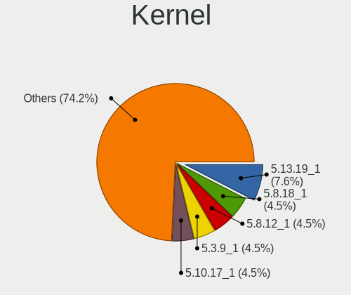

| Version             | Notebooks | Percent |
|---------------------|-----------|---------|
| 5.13.19_1           | 4         | 6.9%    |
| 5.8.18_1            | 3         | 5.17%   |
| 5.8.12_1            | 3         | 5.17%   |
| 5.3.9_1             | 3         | 5.17%   |
| 5.10.17_1           | 3         | 5.17%   |
| 5.4.24_1            | 2         | 3.45%   |
| 5.13.13_1           | 2         | 3.45%   |
| 5.12.10_1           | 2         | 3.45%   |
| 5.9.16_1            | 1         | 1.72%   |
| 5.9.14_1            | 1         | 1.72%   |
| 5.9.0-rc8_2         | 1         | 1.72%   |
| 5.8.9_1             | 1         | 1.72%   |
| 5.8.8_1             | 1         | 1.72%   |
| 5.8.7_1             | 1         | 1.72%   |
| 5.8.6_1             | 1         | 1.72%   |
| 5.8.12_2            | 1         | 1.72%   |
| 5.7.16_1            | 1         | 1.72%   |
| 5.4.35_1            | 1         | 1.72%   |
| 5.4.21_1            | 1         | 1.72%   |
| 5.4.13_2            | 1         | 1.72%   |
| 5.2.13_1            | 1         | 1.72%   |
| 5.15.6_1            | 1         | 1.72%   |
| 5.15.16_1           | 1         | 1.72%   |
| 5.15.14_1           | 1         | 1.72%   |
| 5.15.12_1           | 1         | 1.72%   |
| 5.14.0_1            | 1         | 1.72%   |
| 5.13.18_1           | 1         | 1.72%   |
| 5.13.15_1           | 1         | 1.72%   |
| 5.13.12_1           | 1         | 1.72%   |
| 5.13.10_1           | 1         | 1.72%   |
| 5.12.7_1            | 1         | 1.72%   |
| 5.12.6              | 1         | 1.72%   |
| 5.12.3-tkg-MuQSS_22 | 1         | 1.72%   |
| 5.12.19_1           | 1         | 1.72%   |
| 5.12.14_1           | 1         | 1.72%   |
| 5.11.16_1           | 1         | 1.72%   |
| 5.10.9_1            | 1         | 1.72%   |
| 5.10.80_1           | 1         | 1.72%   |
| 5.10.46_1           | 1         | 1.72%   |
| 5.10.23_1           | 1         | 1.72%   |
| 5.1.17_1            | 1         | 1.72%   |
| 5.1.10_1            | 1         | 1.72%   |
| 4.4.177_1           | 1         | 1.72%   |
| 4.14.163_1          | 1         | 1.72%   |

Kernel Family
-------------

Linux kernel without a distro release

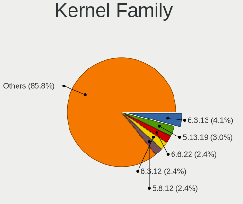

| Version  | Notebooks | Percent |
|----------|-----------|---------|
| 5.8.12   | 4         | 6.9%    |
| 5.13.19  | 4         | 6.9%    |
| 5.8.18   | 3         | 5.17%   |
| 5.3.9    | 3         | 5.17%   |
| 5.10.17  | 3         | 5.17%   |
| 5.4.24   | 2         | 3.45%   |
| 5.13.13  | 2         | 3.45%   |
| 5.12.10  | 2         | 3.45%   |
| 5.9.16   | 1         | 1.72%   |
| 5.9.14   | 1         | 1.72%   |
| 5.9.0    | 1         | 1.72%   |
| 5.8.9    | 1         | 1.72%   |
| 5.8.8    | 1         | 1.72%   |
| 5.8.7    | 1         | 1.72%   |
| 5.8.6    | 1         | 1.72%   |
| 5.7.16   | 1         | 1.72%   |
| 5.4.35   | 1         | 1.72%   |
| 5.4.21   | 1         | 1.72%   |
| 5.4.13   | 1         | 1.72%   |
| 5.2.13   | 1         | 1.72%   |
| 5.15.6   | 1         | 1.72%   |
| 5.15.16  | 1         | 1.72%   |
| 5.15.14  | 1         | 1.72%   |
| 5.15.12  | 1         | 1.72%   |
| 5.14.0   | 1         | 1.72%   |
| 5.13.18  | 1         | 1.72%   |
| 5.13.15  | 1         | 1.72%   |
| 5.13.12  | 1         | 1.72%   |
| 5.13.10  | 1         | 1.72%   |
| 5.12.7   | 1         | 1.72%   |
| 5.12.6   | 1         | 1.72%   |
| 5.12.3   | 1         | 1.72%   |
| 5.12.19  | 1         | 1.72%   |
| 5.12.14  | 1         | 1.72%   |
| 5.11.16  | 1         | 1.72%   |
| 5.10.9   | 1         | 1.72%   |
| 5.10.80  | 1         | 1.72%   |
| 5.10.46  | 1         | 1.72%   |
| 5.10.23  | 1         | 1.72%   |
| 5.1.17   | 1         | 1.72%   |
| 5.1.10   | 1         | 1.72%   |
| 4.4.177  | 1         | 1.72%   |
| 4.14.163 | 1         | 1.72%   |

Kernel Major Ver.
-----------------

Linux kernel major version

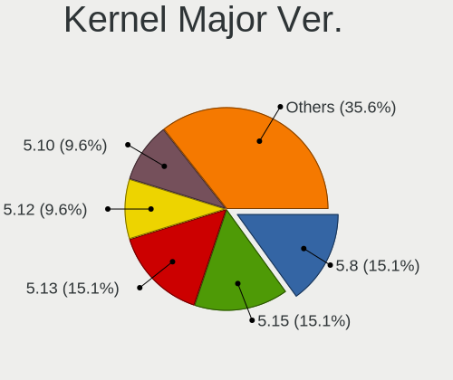

| Version | Notebooks | Percent |
|---------|-----------|---------|
| 5.8     | 11        | 19.3%   |
| 5.13    | 10        | 17.54%  |
| 5.12    | 7         | 12.28%  |
| 5.10    | 7         | 12.28%  |
| 5.4     | 5         | 8.77%   |
| 5.15    | 4         | 7.02%   |
| 5.9     | 3         | 5.26%   |
| 5.3     | 3         | 5.26%   |
| 5.7     | 1         | 1.75%   |
| 5.2     | 1         | 1.75%   |
| 5.14    | 1         | 1.75%   |
| 5.11    | 1         | 1.75%   |
| 5.1     | 1         | 1.75%   |
| 4.4     | 1         | 1.75%   |
| 4.14    | 1         | 1.75%   |

Arch
----

OS architecture (x86_64, i586, etc.)

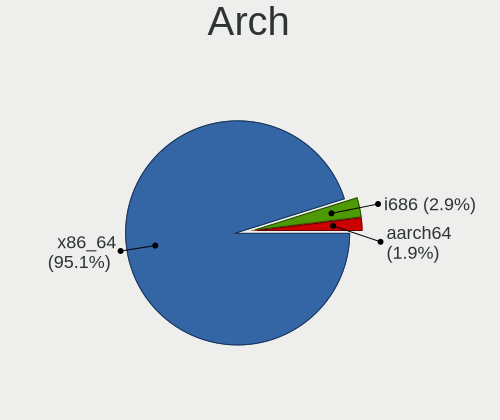

| Name    | Notebooks | Percent |
|---------|-----------|---------|
| x86_64  | 50        | 92.59%  |
| i686    | 2         | 3.7%    |
| aarch64 | 2         | 3.7%    |

DE
--

Desktop Environment

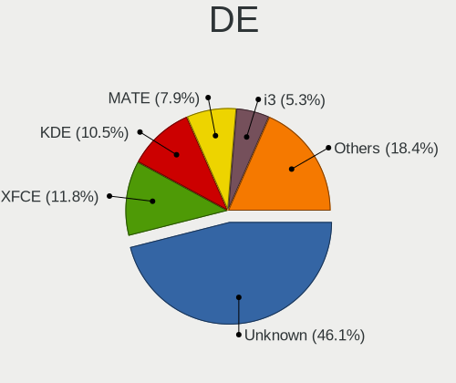

| Name       | Notebooks | Percent |
|------------|-----------|---------|
| Unknown    | 27        | 47.37%  |
| KDE        | 7         | 12.28%  |
| MATE       | 6         | 10.53%  |
| XFCE       | 5         | 8.77%   |
| i3         | 4         | 7.02%   |
| GNOME      | 3         | 5.26%   |
| bspwm      | 2         | 3.51%   |
| X-Cinnamon | 1         | 1.75%   |
| Lumina     | 1         | 1.75%   |
| KDE5       | 1         | 1.75%   |

Display Server
--------------

X11 or Wayland

| Name    | Notebooks | Percent |
|---------|-----------|---------|
| X11     | 37        | 67.27%  |
| Tty     | 7         | 12.73%  |
| Wayland | 6         | 10.91%  |
| Unknown | 5         | 9.09%   |

Display Manager
---------------

SDDM, LightDM, etc.

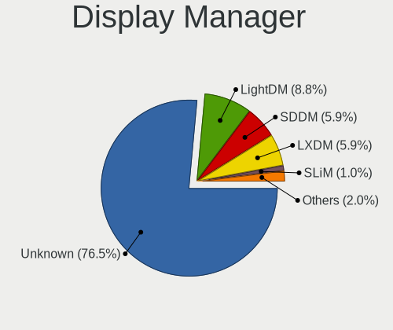

| Name    | Notebooks | Percent |
|---------|-----------|---------|
| Unknown | 54        | 98.18%  |
| SDDM    | 1         | 1.82%   |

OS Lang
-------

Language

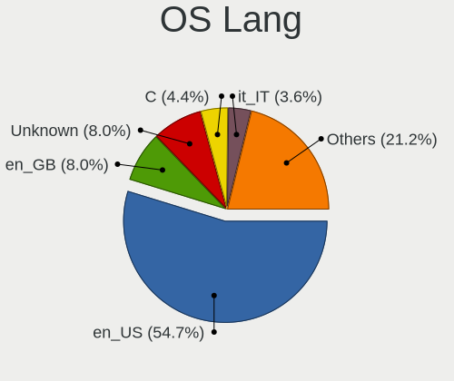

| Lang    | Notebooks | Percent |
|---------|-----------|---------|
| en_US   | 32        | 57.14%  |
| Unknown | 7         | 12.5%   |
| en_GB   | 4         | 7.14%   |
| en_DK   | 3         | 5.36%   |
| de_DE   | 2         | 3.57%   |
| ru_UA   | 1         | 1.79%   |
| ru_RU   | 1         | 1.79%   |
| pt_BR   | 1         | 1.79%   |
| nb_NO   | 1         | 1.79%   |
| es_DO   | 1         | 1.79%   |
| en_NZ   | 1         | 1.79%   |
| en_CA   | 1         | 1.79%   |
| en_AU   | 1         | 1.79%   |

Boot Mode
---------

EFI or BIOS

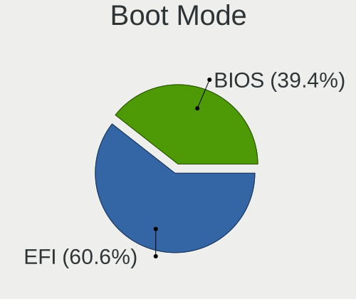

| Mode | Notebooks | Percent |
|------|-----------|---------|
| EFI  | 31        | 56.36%  |
| BIOS | 24        | 43.64%  |

Filesystem
----------

Type of filesystem

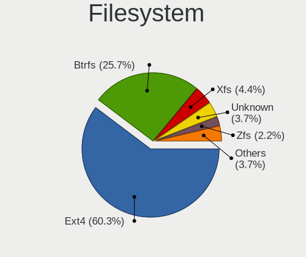

| Type    | Notebooks | Percent |
|---------|-----------|---------|
| Ext4    | 35        | 63.64%  |
| Btrfs   | 11        | 20%     |
| Unknown | 4         | 7.27%   |
| Xfs     | 2         | 3.64%   |
| Zfs     | 1         | 1.82%   |
| F2fs    | 1         | 1.82%   |
| Ext3    | 1         | 1.82%   |

Part. scheme
------------

Scheme of partitioning

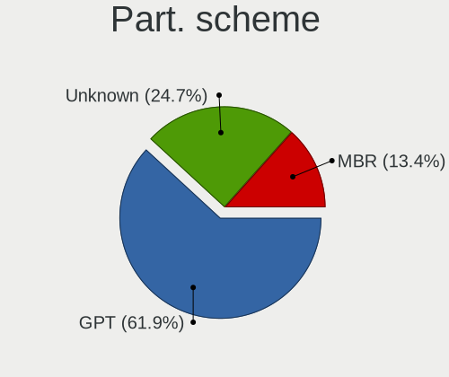

| Type    | Notebooks | Percent |
|---------|-----------|---------|
| GPT     | 31        | 55.36%  |
| Unknown | 17        | 30.36%  |
| MBR     | 8         | 14.29%  |

Dual Boot with Linux/BSD
------------------------

Hosting more than one Linux/BSD

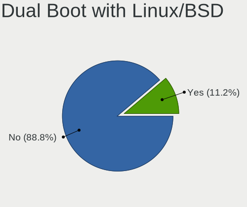

| Dual boot | Notebooks | Percent |
|-----------|-----------|---------|
| No        | 49        | 90.74%  |
| Yes       | 5         | 9.26%   |

Dual Boot (Win)
---------------

Hosting Linux and Windows

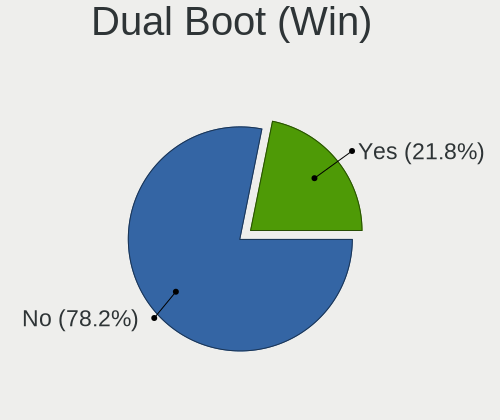

| Dual boot | Notebooks | Percent |
|-----------|-----------|---------|
| No        | 42        | 77.78%  |
| Yes       | 12        | 22.22%  |

Board
-----

Vendor
------

Motherboard manufacturer

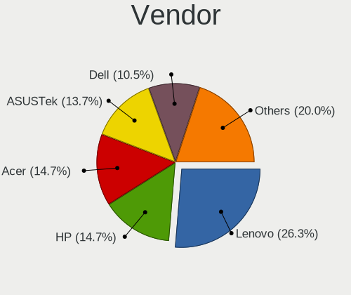

| Name                | Notebooks | Percent |
|---------------------|-----------|---------|
| Lenovo              | 11        | 20.37%  |
| Acer                | 11        | 20.37%  |
| ASUSTek Computer    | 9         | 16.67%  |
| Hewlett-Packard     | 6         | 11.11%  |
| Dell                | 6         | 11.11%  |
| Samsung Electronics | 1         | 1.85%   |
| Positivo            | 1         | 1.85%   |
| Pine Microsystems   | 1         | 1.85%   |
| Notebook            | 1         | 1.85%   |
| MSI                 | 1         | 1.85%   |
| Google              | 1         | 1.85%   |
| Getac               | 1         | 1.85%   |
| Digibras            | 1         | 1.85%   |
| Chuwi               | 1         | 1.85%   |
| Apple               | 1         | 1.85%   |
| Unknown             | 1         | 1.85%   |

Model
-----

Motherboard model

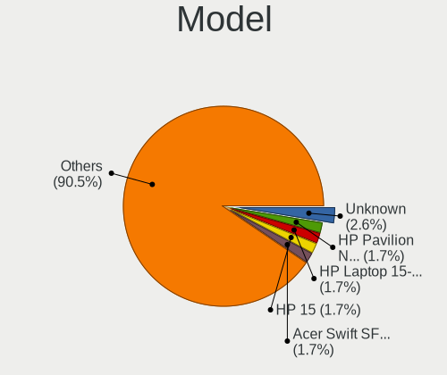

| Name                                      | Notebooks | Percent |
|-------------------------------------------|-----------|---------|
| Samsung 275E4E/275E5E                     | 1         | 1.85%   |
| Positivo Mobile                           | 1         | 1.85%   |
| Pine Microsystems Pine64 Pinebook Pro     | 1         | 1.85%   |
| Notebook NV4XMB,ME,MZ                     | 1         | 1.85%   |
| MSI Bravo 15 A4DDR                        | 1         | 1.85%   |
| Lenovo ThinkPad X260 20F5S08Q00           | 1         | 1.85%   |
| Lenovo ThinkPad X240 20AMA34HMN           | 1         | 1.85%   |
| Lenovo ThinkPad T480 20L6SA5Q00           | 1         | 1.85%   |
| Lenovo ThinkPad T430 2349PS3              | 1         | 1.85%   |
| Lenovo ThinkPad T14s Gen 1 20UHCTO1WW     | 1         | 1.85%   |
| Lenovo ThinkPad T14s Gen 1 20T1S04V00     | 1         | 1.85%   |
| Lenovo ThinkPad T14 Gen 1 20UES1Y200      | 1         | 1.85%   |
| Lenovo ThinkPad E595 20NFCTO1WW           | 1         | 1.85%   |
| Lenovo IdeaPad Z570 10246ZG               | 1         | 1.85%   |
| Lenovo IdeaPad 710S-13IKB 80VQ            | 1         | 1.85%   |
| Lenovo G50-45 80E3                        | 1         | 1.85%   |
| HP Pavilion Notebook                      | 1         | 1.85%   |
| HP Notebook                               | 1         | 1.85%   |
| HP Laptop 15-bw0xx                        | 1         | 1.85%   |
| HP Laptop 14-dk0xxx                       | 1         | 1.85%   |
| HP Laptop 14-bs0xx                        | 1         | 1.85%   |
| HP 15                                     | 1         | 1.85%   |
| Google Chell                              | 1         | 1.85%   |
| Getac V110                                | 1         | 1.85%   |
| Digibras NH4CU03                          | 1         | 1.85%   |
| Dell Precision 3530                       | 1         | 1.85%   |
| Dell Latitude E4300                       | 1         | 1.85%   |
| Dell Inspiron 5555                        | 1         | 1.85%   |
| Dell Inspiron 1501                        | 1         | 1.85%   |
| Dell Inspiron 11 - 3148                   | 1         | 1.85%   |
| Dell G3 3579                              | 1         | 1.85%   |
| Chuwi GemiBook Pro                        | 1         | 1.85%   |
| ASUS X751LD                               | 1         | 1.85%   |
| ASUS X555UJ                               | 1         | 1.85%   |
| ASUS X510UAR                              | 1         | 1.85%   |
| ASUS VivoBook_ASUSLaptop X512FL_X512FL    | 1         | 1.85%   |
| ASUS VivoBook_ASUSLaptop X512DA_X512DA    | 1         | 1.85%   |
| ASUS VivoBook_ASUS Laptop X505ZA_X505ZA   | 1         | 1.85%   |
| ASUS VivoBook 15_ASUS Laptop X540UB       | 1         | 1.85%   |
| ASUS TUF Gaming FX505DT_FX505DT           | 1         | 1.85%   |
| ASUS ASUS TUF Gaming A15 FA506IV_TUF506IV | 1         | 1.85%   |
| Apple MacBookPro11,1                      | 1         | 1.85%   |
| Acer Swift SF314-42                       | 1         | 1.85%   |
| Acer Nitro AN715-51                       | 1         | 1.85%   |
| Acer Aspire SW5-015                       | 1         | 1.85%   |
| Acer Aspire E5-575G                       | 1         | 1.85%   |
| Acer Aspire E5-521                        | 1         | 1.85%   |
| Acer Aspire E1-570G                       | 1         | 1.85%   |
| Acer Aspire E1-531                        | 1         | 1.85%   |
| Acer Aspire A515-54G                      | 1         | 1.85%   |
| Acer Aspire A315-55G                      | 1         | 1.85%   |
| Acer AOA150                               | 1         | 1.85%   |
| Acer AO722                                | 1         | 1.85%   |
| Unknown                                   | 1         | 1.85%   |

Model Family
------------

Motherboard model prefix

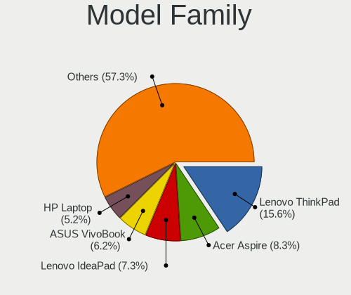

| Name                     | Notebooks | Percent |
|--------------------------|-----------|---------|
| Lenovo ThinkPad          | 8         | 14.81%  |
| Acer Aspire              | 7         | 12.96%  |
| ASUS VivoBook            | 4         | 7.41%   |
| HP Laptop                | 3         | 5.56%   |
| Dell Inspiron            | 3         | 5.56%   |
| Lenovo IdeaPad           | 2         | 3.7%    |
| Samsung 275E4E           | 1         | 1.85%   |
| Positivo Mobile          | 1         | 1.85%   |
| Pine Microsystems Pine64 | 1         | 1.85%   |
| Notebook NV4XMB          | 1         | 1.85%   |
| MSI Bravo                | 1         | 1.85%   |
| Lenovo G50-45            | 1         | 1.85%   |
| HP Pavilion              | 1         | 1.85%   |
| HP Notebook              | 1         | 1.85%   |
| HP 15                    | 1         | 1.85%   |
| Google Chell             | 1         | 1.85%   |
| Getac V110               | 1         | 1.85%   |
| Digibras NH4CU03         | 1         | 1.85%   |
| Dell Precision           | 1         | 1.85%   |
| Dell Latitude            | 1         | 1.85%   |
| Dell G3                  | 1         | 1.85%   |
| Chuwi GemiBook           | 1         | 1.85%   |
| ASUS X751LD              | 1         | 1.85%   |
| ASUS X555UJ              | 1         | 1.85%   |
| ASUS X510UAR             | 1         | 1.85%   |
| ASUS TUF                 | 1         | 1.85%   |
| ASUS ASUS                | 1         | 1.85%   |
| Apple MacBookPro11       | 1         | 1.85%   |
| Acer Swift               | 1         | 1.85%   |
| Acer Nitro               | 1         | 1.85%   |
| Acer AOA150              | 1         | 1.85%   |
| Acer AO722               | 1         | 1.85%   |
| Unknown                  | 1         | 1.85%   |

MFG Year
--------

Motherboard manufacture year

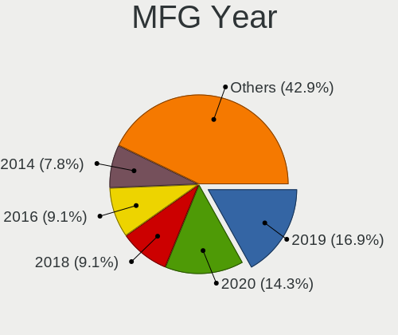

| Year    | Notebooks | Percent |
|---------|-----------|---------|
| 2019    | 9         | 16.67%  |
| 2020    | 8         | 14.81%  |
| 2016    | 6         | 11.11%  |
| 2018    | 5         | 9.26%   |
| 2014    | 5         | 9.26%   |
| 2013    | 5         | 9.26%   |
| 2017    | 3         | 5.56%   |
| 2015    | 3         | 5.56%   |
| 2012    | 2         | 3.7%    |
| 2011    | 2         | 3.7%    |
| 2008    | 2         | 3.7%    |
| Unknown | 2         | 3.7%    |
| 2009    | 1         | 1.85%   |
| 2006    | 1         | 1.85%   |

Form Factor
-----------

Physical design of the computer

| Name     | Notebooks | Percent |
|----------|-----------|---------|
| Notebook | 54        | 100%    |

Secure Boot
-----------

Enabled or disabled

| State    | Notebooks | Percent |
|----------|-----------|---------|
| Disabled | 54        | 100%    |

Coreboot
--------

Have coreboot on board

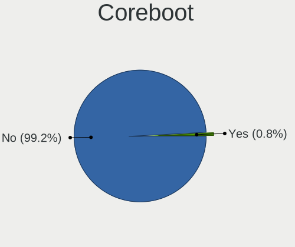

| Used | Notebooks | Percent |
|------|-----------|---------|
| No   | 54        | 100%    |

RAM Size
--------

Total RAM memory

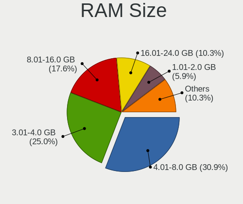

| Size in GB  | Notebooks | Percent |
|-------------|-----------|---------|
| 4.01-8.0    | 17        | 30.91%  |
| 3.01-4.0    | 15        | 27.27%  |
| 8.01-16.0   | 9         | 16.36%  |
| 16.01-24.0  | 6         | 10.91%  |
| 1.01-2.0    | 4         | 7.27%   |
| 32.01-64.0  | 2         | 3.64%   |
| 24.01-32.0  | 1         | 1.82%   |
| 64.01-256.0 | 1         | 1.82%   |

RAM Used
--------

Used RAM memory

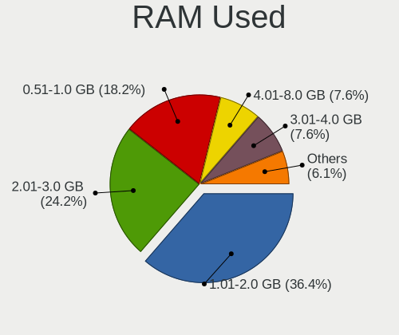

| Used GB    | Notebooks | Percent |
|------------|-----------|---------|
| 1.01-2.0   | 22        | 37.93%  |
| 2.01-3.0   | 13        | 22.41%  |
| 0.51-1.0   | 11        | 18.97%  |
| 4.01-8.0   | 4         | 6.9%    |
| 3.01-4.0   | 4         | 6.9%    |
| 0.01-0.5   | 2         | 3.45%   |
| 16.01-24.0 | 1         | 1.72%   |
| 8.01-16.0  | 1         | 1.72%   |

Total Drives
------------

Number of drives on board

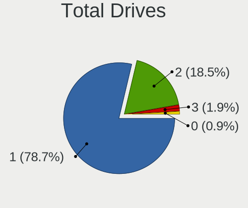

| Drives | Notebooks | Percent |
|--------|-----------|---------|
| 1      | 42        | 77.78%  |
| 2      | 12        | 22.22%  |

Has CD-ROM
----------

Has CD-ROM on board

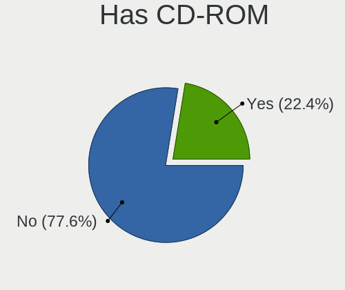

| Presented | Notebooks | Percent |
|-----------|-----------|---------|
| No        | 35        | 64.81%  |
| Yes       | 19        | 35.19%  |

Has Ethernet
------------

Has Ethernet on board

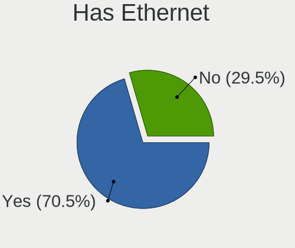

| Presented | Notebooks | Percent |
|-----------|-----------|---------|
| Yes       | 44        | 81.48%  |
| No        | 10        | 18.52%  |

Has WiFi
--------

Has WiFi module

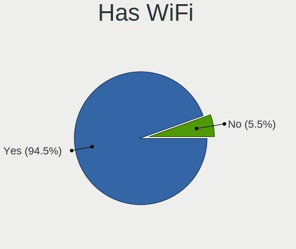

| Presented | Notebooks | Percent |
|-----------|-----------|---------|
| Yes       | 51        | 94.44%  |
| No        | 3         | 5.56%   |

Has Bluetooth
-------------

Has Bluetooth module

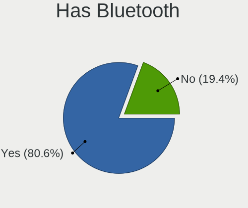

| Presented | Notebooks | Percent |
|-----------|-----------|---------|
| Yes       | 44        | 81.48%  |
| No        | 10        | 18.52%  |

Location
--------

Country
-------

Geographic location (country)

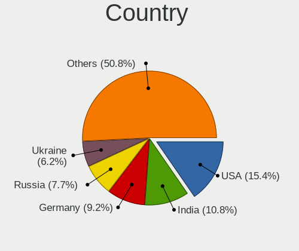

| Country            | Notebooks | Percent |
|--------------------|-----------|---------|
| USA                | 9         | 16.67%  |
| India              | 7         | 12.96%  |
| Germany            | 5         | 9.26%   |
| Ukraine            | 4         | 7.41%   |
| Brazil             | 4         | 7.41%   |
| Switzerland        | 3         | 5.56%   |
| Russia             | 3         | 5.56%   |
| Denmark            | 3         | 5.56%   |
| UK                 | 2         | 3.7%    |
| Bulgaria           | 2         | 3.7%    |
| Vietnam            | 1         | 1.85%   |
| Turkey             | 1         | 1.85%   |
| Peru               | 1         | 1.85%   |
| Norway             | 1         | 1.85%   |
| New Zealand        | 1         | 1.85%   |
| Netherlands        | 1         | 1.85%   |
| Greece             | 1         | 1.85%   |
| France             | 1         | 1.85%   |
| Ecuador            | 1         | 1.85%   |
| Dominican Republic | 1         | 1.85%   |
| Canada             | 1         | 1.85%   |
| Australia          | 1         | 1.85%   |

City
----

Geographic location (city)

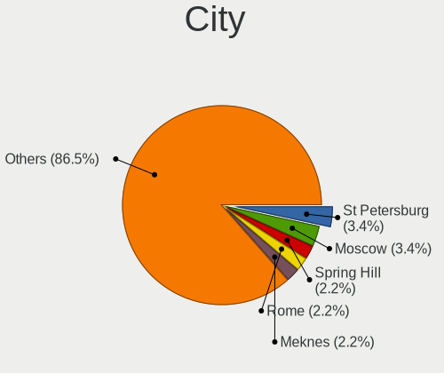

| City                    | Notebooks | Percent |
|-------------------------|-----------|---------|
| Viby                    | 2         | 3.57%   |
| Hyderabad               | 2         | 3.57%   |
| Geneva                  | 2         | 3.57%   |
| Zurich                  | 1         | 1.79%   |
| Yambol                  | 1         | 1.79%   |
| Vlaardingen             | 1         | 1.79%   |
| Varna                   | 1         | 1.79%   |
| Uzhhorod                | 1         | 1.79%   |
| Trujillo                | 1         | 1.79%   |
| Toulouse                | 1         | 1.79%   |
| Toms River              | 1         | 1.79%   |
| Syktyvkar               | 1         | 1.79%   |
| St Petersburg           | 1         | 1.79%   |
| Schwabhausen            | 1         | 1.79%   |
| Saxtons River           | 1         | 1.79%   |
| Rostock                 | 1         | 1.79%   |
| Regensburg              | 1         | 1.79%   |
| Pune                    | 1         | 1.79%   |
| Porto Alegre            | 1         | 1.79%   |
| Phoenix                 | 1         | 1.79%   |
| Peckham                 | 1         | 1.79%   |
| Nagua                   | 1         | 1.79%   |
| Munich                  | 1         | 1.79%   |
| Mossoro                 | 1         | 1.79%   |
| Moscow                  | 1         | 1.79%   |
| Mesa                    | 1         | 1.79%   |
| Matos Costa             | 1         | 1.79%   |
| Malvern                 | 1         | 1.79%   |
| Los Angeles             | 1         | 1.79%   |
| London                  | 1         | 1.79%   |
| Lakewood                | 1         | 1.79%   |
| Krynychky               | 1         | 1.79%   |
| Kremenchug              | 1         | 1.79%   |
| Izmir                   | 1         | 1.79%   |
| Itanhaem                | 1         | 1.79%   |
| Ho Chi Minh City        | 1         | 1.79%   |
| Guayaquil               | 1         | 1.79%   |
| Ernakulam               | 1         | 1.79%   |
| Erlangen                | 1         | 1.79%   |
| Dublin                  | 1         | 1.79%   |
| Drammen                 | 1         | 1.79%   |
| Dnipropetrovsk          | 1         | 1.79%   |
| Delhi                   | 1         | 1.79%   |
| Chennai                 | 1         | 1.79%   |
| Champlain               | 1         | 1.79%   |
| Bengaluru               | 1         | 1.79%   |
| Azle                    | 1         | 1.79%   |
| Auckland                | 1         | 1.79%   |
| Athens                  | 1         | 1.79%   |
| Amsterdam               | 1         | 1.79%   |
| Alzenau in Unterfranken | 1         | 1.79%   |
| Albuquerque             | 1         | 1.79%   |
| Aalborg                 | 1         | 1.79%   |

Drives
------

Drive Vendor
------------

Hard drive vendors

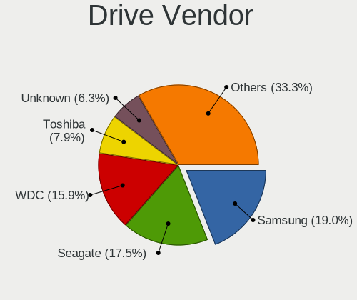

| Vendor              | Notebooks | Drives | Percent |
|---------------------|-----------|--------|---------|
| Samsung Electronics | 12        | 13     | 19.05%  |
| Seagate             | 11        | 12     | 17.46%  |
| WDC                 | 10        | 11     | 15.87%  |
| Toshiba             | 5         | 5      | 7.94%   |
| Unknown             | 4         | 7      | 6.35%   |
| Intel               | 4         | 5      | 6.35%   |
| HGST                | 4         | 5      | 6.35%   |
| SanDisk             | 3         | 4      | 4.76%   |
| SK Hynix            | 2         | 2      | 3.17%   |
| Transcend           | 1         | 1      | 1.59%   |
| Patriot             | 1         | 1      | 1.59%   |
| Kingston            | 1         | 1      | 1.59%   |
| Hitachi             | 1         | 1      | 1.59%   |
| Crucial             | 1         | 1      | 1.59%   |
| China               | 1         | 1      | 1.59%   |
| BHT                 | 1         | 1      | 1.59%   |
| Apple               | 1         | 1      | 1.59%   |

Drive Model
-----------

Hard drive models

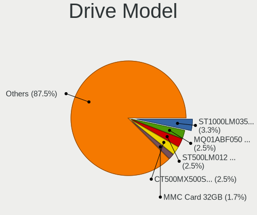

| Model                                   | Notebooks | Percent |
|-----------------------------------------|-----------|---------|
| Toshiba MQ01ABF050 500GB                | 3         | 4.55%   |
| Seagate ST1000LM035-1RK172 1TB          | 3         | 4.55%   |
| SK Hynix SKHynix_HFS001TD9TNI-L2B0B 1TB | 2         | 3.03%   |
| Seagate ST500LM012 HN-M500MBB 500GB     | 2         | 3.03%   |
| Intel SSDPEKNW512G8 512GB               | 2         | 3.03%   |
| HGST HTS545050A7E680 500GB              | 2         | 3.03%   |
| WDC WD5000LPCX-22VHAT0 500GB            | 1         | 1.52%   |
| WDC WD5000LPCX-21VHAT0 500GB            | 1         | 1.52%   |
| WDC WD3200BPVT-22JJ5T0 320GB            | 1         | 1.52%   |
| WDC WD1600BEVS-60VAT0 160GB             | 1         | 1.52%   |
| WDC WD10SPZX-21Z10T0 1TB                | 1         | 1.52%   |
| WDC WD10JPVX-60JC3T0 1TB                | 1         | 1.52%   |
| WDC WD10JPVX-22JC3T0 1TB                | 1         | 1.52%   |
| WDC WD Elements 500GB                   | 1         | 1.52%   |
| WDC PC SN530 SDBPNPZ-1T00-1014 1TB      | 1         | 1.52%   |
| WDC PC SN520 SDAPNUW-512G-1014 512GB    | 1         | 1.52%   |
| Unknown SD512  512MB                    | 1         | 1.52%   |
| Unknown SD16G  16GB                     | 1         | 1.52%   |
| Unknown MMC Card  8GB                   | 1         | 1.52%   |
| Unknown MMC Card  128GB                 | 1         | 1.52%   |
| Unknown MMC Card                        | 1         | 1.52%   |
| Unknown CWBC3R  64GB                    | 1         | 1.52%   |
| Transcend TS128GMTS800 128GB SSD        | 1         | 1.52%   |
| Toshiba MQ04ABF100 1TB                  | 1         | 1.52%   |
| Toshiba KXG50ZNV512G NVMe 512GB         | 1         | 1.52%   |
| Seagate ST98823AS 80GB                  | 1         | 1.52%   |
| Seagate ST9750420AS 752GB               | 1         | 1.52%   |
| Seagate ST500LT012-9WS142 500GB         | 1         | 1.52%   |
| Seagate ST1000LM049-2GH172 1TB          | 1         | 1.52%   |
| Seagate ST1000LM024 HN-M101MBB 1TB      | 1         | 1.52%   |
| Seagate Expansion Desk 8TB              | 1         | 1.52%   |
| SanDisk SD9SN8W128G1102 128GB SSD       | 1         | 1.52%   |
| SanDisk SD8SN8U1T001122 1024GB SSD      | 1         | 1.52%   |
| Sandisk NVMe SSD Drive 512GB            | 1         | 1.52%   |
| Sandisk NVMe SSD Drive 500GB            | 1         | 1.52%   |
| Samsung SSD PM871 M.2 2280 512GB SED    | 1         | 1.52%   |
| Samsung SSD 970 PRO 1TB                 | 1         | 1.52%   |
| Samsung SSD 970 EVO Plus 250GB          | 1         | 1.52%   |
| Samsung SSD 860 EVO 1TB                 | 1         | 1.52%   |
| Samsung SSD 850 EVO 500GB               | 1         | 1.52%   |
| Samsung NVMe SSD Drive 256GB            | 1         | 1.52%   |
| Samsung NVMe SSD Drive 1TB              | 1         | 1.52%   |
| Samsung MZVLB1T0HBLR-000L7 1TB          | 1         | 1.52%   |
| Samsung MZALQ512HALU-000L1 512GB        | 1         | 1.52%   |
| Samsung MZ7TE256HMHP-000L7 256GB SSD    | 1         | 1.52%   |
| Samsung MZ7TD256HAFV-000L7 256GB SSD    | 1         | 1.52%   |
| Samsung HM641JI 640GB                   | 1         | 1.52%   |
| Patriot Burst 120GB SSD                 | 1         | 1.52%   |
| Kingston NVMe SSD Drive 512GB           | 1         | 1.52%   |
| Intel SSDSC2KF256H6L 256GB              | 1         | 1.52%   |
| Intel SSDPEKNW010T8 1TB                 | 1         | 1.52%   |
| Hitachi HTS543216L9A300 160GB           | 1         | 1.52%   |
| HGST HTS541010B7E610 1TB                | 1         | 1.52%   |
| HGST HTS541010A9E680 1TB                | 1         | 1.52%   |
| Crucial CT500MX500SSD1 500GB            | 1         | 1.52%   |
| China SSD 256GB                         | 1         | 1.52%   |
| BHT WR202I0064G E70290F5 64GB           | 1         | 1.52%   |
| Apple SSD SM0256F 256GB                 | 1         | 1.52%   |

HDD Vendor
----------

Hard disk drive vendors

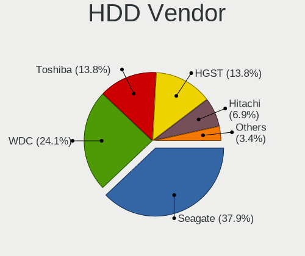

| Vendor              | Notebooks | Drives | Percent |
|---------------------|-----------|--------|---------|
| Seagate             | 11        | 12     | 39.29%  |
| WDC                 | 7         | 7      | 25%     |
| Toshiba             | 4         | 4      | 14.29%  |
| HGST                | 4         | 5      | 14.29%  |
| Samsung Electronics | 1         | 1      | 3.57%   |
| Hitachi             | 1         | 1      | 3.57%   |

SSD Vendor
----------

Solid state drive vendors

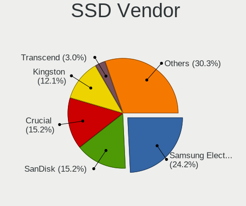

| Vendor              | Notebooks | Drives | Percent |
|---------------------|-----------|--------|---------|
| Samsung Electronics | 5         | 5      | 35.71%  |
| SanDisk             | 2         | 2      | 14.29%  |
| Transcend           | 1         | 1      | 7.14%   |
| Patriot             | 1         | 1      | 7.14%   |
| Intel               | 1         | 1      | 7.14%   |
| Crucial             | 1         | 1      | 7.14%   |
| China               | 1         | 1      | 7.14%   |
| BHT                 | 1         | 1      | 7.14%   |
| Apple               | 1         | 1      | 7.14%   |

Drive Kind
----------

HDD or SSD

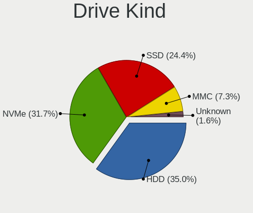

| Kind    | Notebooks | Drives | Percent |
|---------|-----------|--------|---------|
| HDD     | 27        | 30     | 44.26%  |
| NVMe    | 15        | 20     | 24.59%  |
| SSD     | 14        | 14     | 22.95%  |
| MMC     | 4         | 7      | 6.56%   |
| Unknown | 1         | 1      | 1.64%   |

Drive Connector
---------------

SATA, SAS, NVMe, etc.

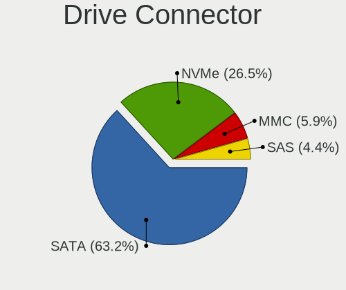

| Type | Notebooks | Drives | Percent |
|------|-----------|--------|---------|
| SATA | 38        | 43     | 64.41%  |
| NVMe | 15        | 20     | 25.42%  |
| MMC  | 4         | 7      | 6.78%   |
| SAS  | 2         | 2      | 3.39%   |

Drive Size
----------

Size of hard drive

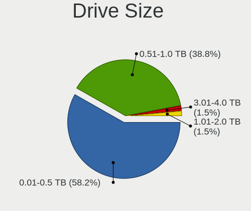

| Size in TB | Notebooks | Drives | Percent |
|------------|-----------|--------|---------|
| 0.01-0.5   | 24        | 27     | 58.54%  |
| 0.51-1.0   | 15        | 15     | 36.59%  |
| 1.01-2.0   | 1         | 1      | 2.44%   |
| 4.01-10.0  | 1         | 1      | 2.44%   |

Space Total
-----------

Amount of disk space available on the file system

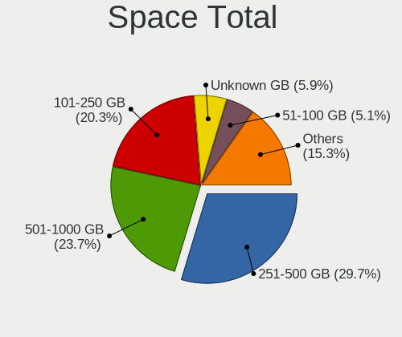

| Size in GB     | Notebooks | Percent |
|----------------|-----------|---------|
| 251-500        | 16        | 28.57%  |
| 501-1000       | 13        | 23.21%  |
| 101-250        | 10        | 17.86%  |
| Unknown        | 6         | 10.71%  |
| 1001-2000      | 3         | 5.36%   |
| 51-100         | 3         | 5.36%   |
| 21-50          | 2         | 3.57%   |
| 1-20           | 2         | 3.57%   |
| More than 3000 | 1         | 1.79%   |

Space Used
----------

Amount of used disk space

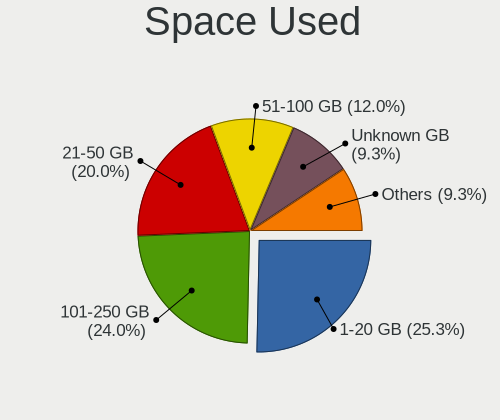

| Used GB        | Notebooks | Percent |
|----------------|-----------|---------|
| 101-250        | 14        | 25%     |
| 1-20           | 13        | 23.21%  |
| 21-50          | 12        | 21.43%  |
| Unknown        | 6         | 10.71%  |
| 51-100         | 5         | 8.93%   |
| 251-500        | 4         | 7.14%   |
| More than 3000 | 1         | 1.79%   |
| 1001-2000      | 1         | 1.79%   |

Malfunc. Drives
---------------

Drive models with a malfunction

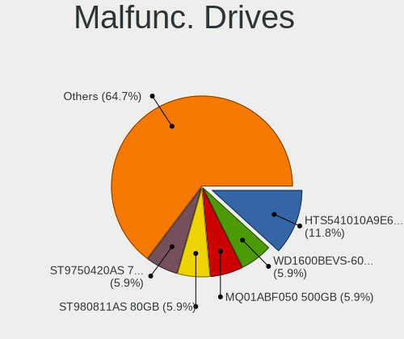

| Model                               | Notebooks | Drives | Percent |
|-------------------------------------|-----------|--------|---------|
| WDC WD1600BEVS-60VAT0 160GB         | 1         | 1      | 11.11%  |
| Toshiba MQ01ABF050 500GB            | 1         | 1      | 11.11%  |
| Seagate ST9750420AS 752GB           | 1         | 1      | 11.11%  |
| Seagate ST500LT012-9WS142 500GB     | 1         | 1      | 11.11%  |
| Seagate ST500LM012 HN-M500MBB 500GB | 1         | 1      | 11.11%  |
| Seagate ST1000LM035-1RK172 1TB      | 1         | 1      | 11.11%  |
| Hitachi HTS543216L9A300 160GB       | 1         | 1      | 11.11%  |
| HGST HTS545050A7E680 500GB          | 1         | 1      | 11.11%  |
| HGST HTS541010A9E680 1TB            | 1         | 1      | 11.11%  |

Malfunc. Drive Vendor
---------------------

Vendors of faulty drives

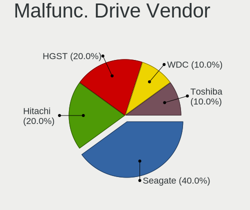

| Vendor  | Notebooks | Drives | Percent |
|---------|-----------|--------|---------|
| Seagate | 4         | 4      | 44.44%  |
| HGST    | 2         | 2      | 22.22%  |
| WDC     | 1         | 1      | 11.11%  |
| Toshiba | 1         | 1      | 11.11%  |
| Hitachi | 1         | 1      | 11.11%  |

Malfunc. HDD Vendor
-------------------

Vendors of faulty HDD drives

| Vendor  | Notebooks | Drives | Percent |
|---------|-----------|--------|---------|
| Seagate | 4         | 4      | 44.44%  |
| HGST    | 2         | 2      | 22.22%  |
| WDC     | 1         | 1      | 11.11%  |
| Toshiba | 1         | 1      | 11.11%  |
| Hitachi | 1         | 1      | 11.11%  |

Malfunc. Drive Kind
-------------------

Kinds of faulty drives

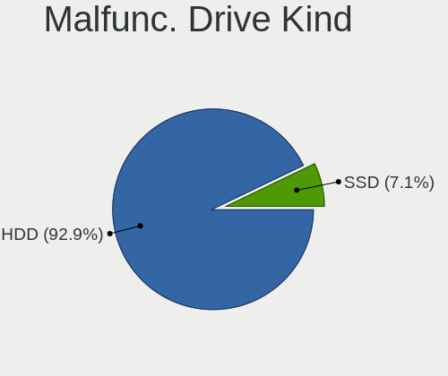

| Kind | Notebooks | Drives | Percent |
|------|-----------|--------|---------|
| HDD  | 9         | 9      | 100%    |

Failed Drives
-------------

Failed drive models

Zero info for selected period =(

Failed Drive Vendor
-------------------

Failed drive vendors

Zero info for selected period =(

Drive Status
------------

Number of failed and malfunc. drives

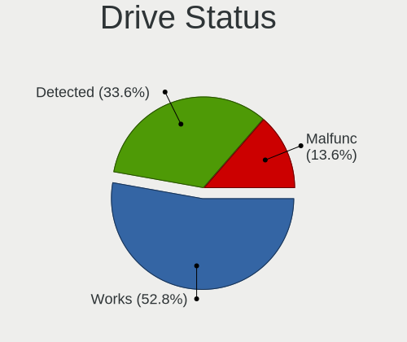

| Status   | Notebooks | Drives | Percent |
|----------|-----------|--------|---------|
| Works    | 30        | 36     | 49.18%  |
| Detected | 22        | 27     | 36.07%  |
| Malfunc  | 9         | 9      | 14.75%  |

Storage controller
------------------

Storage Vendor
--------------

Storage controller vendors

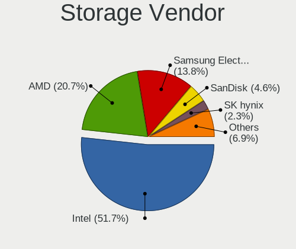

| Vendor                           | Notebooks | Percent |
|----------------------------------|-----------|---------|
| Intel                            | 30        | 49.18%  |
| AMD                              | 16        | 26.23%  |
| Samsung Electronics              | 7         | 11.48%  |
| Sandisk                          | 3         | 4.92%   |
| SK Hynix                         | 2         | 3.28%   |
| Toshiba America Info Systems     | 1         | 1.64%   |
| Silicon Integrated Systems [SiS] | 1         | 1.64%   |
| Kingston Technology Company      | 1         | 1.64%   |

Storage Model
-------------

Storage controller models

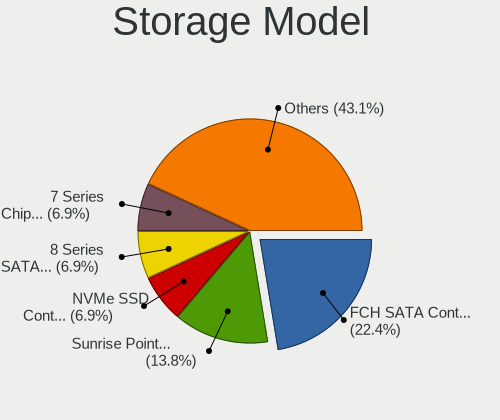

| Model                                                                            | Notebooks | Percent |
|----------------------------------------------------------------------------------|-----------|---------|
| AMD FCH SATA Controller [AHCI mode]                                              | 14        | 21.88%  |
| Intel Sunrise Point-LP SATA Controller [AHCI mode]                               | 8         | 12.5%   |
| Samsung NVMe SSD Controller SM981/PM981/PM983                                    | 5         | 7.81%   |
| Intel 8 Series SATA Controller 1 [AHCI mode]                                     | 5         | 7.81%   |
| Intel 7 Series Chipset Family 6-port SATA Controller [AHCI mode]                 | 4         | 6.25%   |
| Intel SSD 660P Series                                                            | 3         | 4.69%   |
| Intel 82801 Mobile SATA Controller [RAID mode]                                   | 3         | 4.69%   |
| SK Hynix Non-Volatile memory controller                                          | 2         | 3.13%   |
| Sandisk WD Blue SN550 NVMe SSD                                                   | 2         | 3.13%   |
| Intel Cannon Lake Mobile PCH SATA AHCI Controller                                | 2         | 3.13%   |
| Toshiba America Info Systems Toshiba America Info Non-Volatile memory controller | 1         | 1.56%   |
| Silicon Integrated Systems [SiS] SATA Controller / IDE mode                      | 1         | 1.56%   |
| Silicon Integrated Systems [SiS] 5513 IDE Controller                             | 1         | 1.56%   |
| Sandisk WD Blue SN500 / PC SN520 NVMe SSD                                        | 1         | 1.56%   |
| Samsung NVMe SSD Controller 980                                                  | 1         | 1.56%   |
| Samsung Apple PCIe SSD                                                           | 1         | 1.56%   |
| Kingston Company U-SNS8154P3 NVMe SSD                                            | 1         | 1.56%   |
| Intel Comet Lake SATA AHCI Controller                                            | 1         | 1.56%   |
| Intel Celeron/Pentium Silver Processor SATA Controller                           | 1         | 1.56%   |
| Intel Cannon Point-LP SATA Controller [AHCI Mode]                                | 1         | 1.56%   |
| Intel Atom/Celeron/Pentium Processor x5-E8000/J3xxx/N3xxx Series SATA Controller | 1         | 1.56%   |
| Intel 82801GBM/GHM (ICH7-M Family) SATA Controller [IDE mode]                    | 1         | 1.56%   |
| Intel 6 Series/C200 Series Chipset Family 6 port Mobile SATA AHCI Controller     | 1         | 1.56%   |
| AMD SB7x0/SB8x0/SB9x0 SATA Controller [AHCI mode]                                | 1         | 1.56%   |
| AMD SB600 Non-Raid-5 SATA                                                        | 1         | 1.56%   |
| AMD SB600 IDE                                                                    | 1         | 1.56%   |

Storage Kind
------------

Kind of storage controller (IDE, SATA, NVMe, SAS, ...)

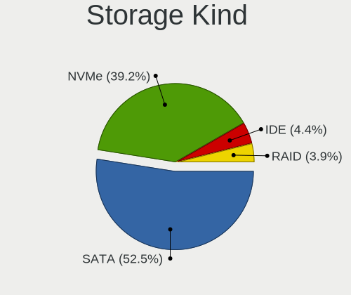

| Kind | Notebooks | Percent |
|------|-----------|---------|
| SATA | 42        | 67.74%  |
| NVMe | 15        | 24.19%  |
| IDE  | 3         | 4.84%   |
| RAID | 2         | 3.23%   |

Processor
---------

CPU Vendor
----------

Processor vendors

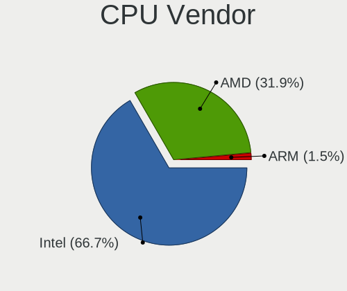

| Vendor | Notebooks | Percent |
|--------|-----------|---------|
| Intel  | 34        | 62.96%  |
| AMD    | 18        | 33.33%  |
| ARM    | 2         | 3.7%    |

CPU Model
---------

Processor models

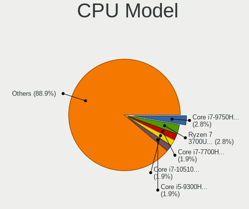

| Model                                         | Notebooks | Percent |
|-----------------------------------------------|-----------|---------|
| Intel Core i7-10510U CPU @ 1.80GHz            | 2         | 3.7%    |
| Intel Core i5-6300U CPU @ 2.40GHz             | 2         | 3.7%    |
| ARM Processor                                 | 2         | 3.7%    |
| AMD Ryzen 7 PRO 4750U with Radeon Graphics    | 2         | 3.7%    |
| AMD Ryzen 7 4800H with Radeon Graphics        | 2         | 3.7%    |
| AMD Ryzen 7 3700U with Radeon Vega Mobile Gfx | 2         | 3.7%    |
| Intel Pentium CPU N3710 @ 1.60GHz             | 1         | 1.85%   |
| Intel Genuine CPU 585 @ 2.16GHz               | 1         | 1.85%   |
| Intel Core i7-8750H CPU @ 2.20GHz             | 1         | 1.85%   |
| Intel Core i7-8565U CPU @ 1.80GHz             | 1         | 1.85%   |
| Intel Core i7-7500U CPU @ 2.70GHz             | 1         | 1.85%   |
| Intel Core i7-4600U CPU @ 2.10GHz             | 1         | 1.85%   |
| Intel Core i7-2670QM CPU @ 2.20GHz            | 1         | 1.85%   |
| Intel Core i5-9300H CPU @ 2.40GHz             | 1         | 1.85%   |
| Intel Core i5-8350U CPU @ 1.70GHz             | 1         | 1.85%   |
| Intel Core i5-8300H CPU @ 2.30GHz             | 1         | 1.85%   |
| Intel Core i5-8265U CPU @ 1.60GHz             | 1         | 1.85%   |
| Intel Core i5-8250U CPU @ 1.60GHz             | 1         | 1.85%   |
| Intel Core i5-7200U CPU @ 2.50GHz             | 1         | 1.85%   |
| Intel Core i5-6200U CPU @ 2.30GHz             | 1         | 1.85%   |
| Intel Core i5-4300U CPU @ 1.90GHz             | 1         | 1.85%   |
| Intel Core i5-4278U CPU @ 2.60GHz             | 1         | 1.85%   |
| Intel Core i5-4210U CPU @ 1.70GHz             | 1         | 1.85%   |
| Intel Core i5-3320M CPU @ 2.60GHz             | 1         | 1.85%   |
| Intel Core i3-7100U CPU @ 2.40GHz             | 1         | 1.85%   |
| Intel Core i3-6006U CPU @ 2.00GHz             | 1         | 1.85%   |
| Intel Core i3-4010U CPU @ 1.70GHz             | 1         | 1.85%   |
| Intel Core i3-4005U CPU @ 1.70GHz             | 1         | 1.85%   |
| Intel Core i3-3217U CPU @ 1.80GHz             | 1         | 1.85%   |
| Intel Core 2 Duo CPU P9400 @ 2.40GHz          | 1         | 1.85%   |
| Intel Celeron J4125 CPU @ 2.00GHz             | 1         | 1.85%   |
| Intel Celeron CPU 847 @ 1.10GHz               | 1         | 1.85%   |
| Intel Celeron CPU 1005M @ 1.90GHz             | 1         | 1.85%   |
| Intel Atom CPU Z3735F @ 1.33GHz               | 1         | 1.85%   |
| Intel Atom CPU N270 @ 1.60GHz                 | 1         | 1.85%   |
| Intel 11th Gen Core i7-1165G7 @ 2.80GHz       | 1         | 1.85%   |
| AMD Turion 64 X2 Mobile Technology TL-50      | 1         | 1.85%   |
| AMD Ryzen 5 4500U with Radeon Graphics        | 1         | 1.85%   |
| AMD Ryzen 5 3550H with Radeon Vega Mobile Gfx | 1         | 1.85%   |
| AMD Ryzen 5 2500U with Radeon Vega Mobile Gfx | 1         | 1.85%   |
| AMD E2-6110 APU with AMD Radeon R2 Graphics   | 1         | 1.85%   |
| AMD E1-1500 APU with Radeon HD Graphics       | 1         | 1.85%   |
| AMD C-60 APU with Radeon HD Graphics          | 1         | 1.85%   |
| AMD A9-9420 RADEON R5, 5 COMPUTE CORES 2C+3G  | 1         | 1.85%   |
| AMD A9-9410 RADEON R5, 5 COMPUTE CORES 2C+3G  | 1         | 1.85%   |
| AMD A8-7410 APU with AMD Radeon R5 Graphics   | 1         | 1.85%   |
| AMD A8-6410 APU with AMD Radeon R5 Graphics   | 1         | 1.85%   |
| AMD A4-9125 RADEON R3, 4 COMPUTE CORES 2C+2G  | 1         | 1.85%   |

CPU Model Family
----------------

Processor model prefix

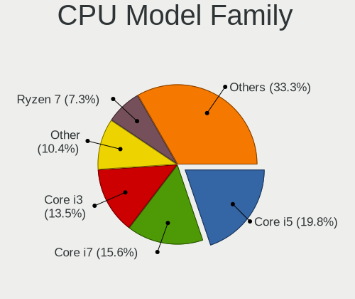

| Model                   | Notebooks | Percent |
|-------------------------|-----------|---------|
| Intel Core i5           | 13        | 24.07%  |
| Intel Core i7           | 7         | 12.96%  |
| Other                   | 5         | 9.26%   |
| Intel Core i3           | 5         | 9.26%   |
| AMD Ryzen 7             | 4         | 7.41%   |
| Intel Celeron           | 3         | 5.56%   |
| AMD Ryzen 5             | 3         | 5.56%   |
| Intel Atom              | 2         | 3.7%    |
| AMD Ryzen 7 PRO         | 2         | 3.7%    |
| AMD A8                  | 2         | 3.7%    |
| Intel Pentium           | 1         | 1.85%   |
| Intel Genuine           | 1         | 1.85%   |
| Intel Core 2 Duo        | 1         | 1.85%   |
| AMD Turion 64 X2 Mobile | 1         | 1.85%   |
| AMD E2                  | 1         | 1.85%   |
| AMD E1                  | 1         | 1.85%   |
| AMD C-60                | 1         | 1.85%   |
| AMD A4                  | 1         | 1.85%   |

CPU Cores
---------

Number of processor cores

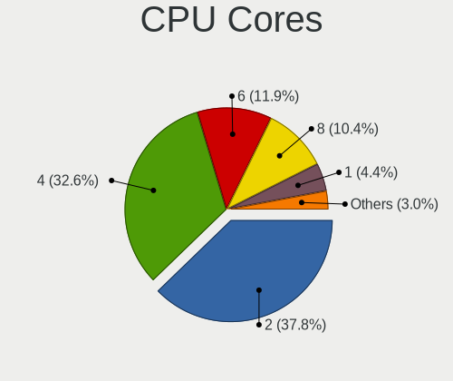

| Number | Notebooks | Percent |
|--------|-----------|---------|
| 2      | 25        | 46.3%   |
| 4      | 20        | 37.04%  |
| 8      | 4         | 7.41%   |
| 6      | 3         | 5.56%   |
| 1      | 2         | 3.7%    |

CPU Sockets
-----------

Number of sockets

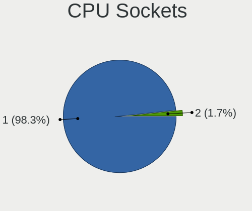

| Number | Notebooks | Percent |
|--------|-----------|---------|
| 1      | 53        | 98.15%  |
| 2      | 1         | 1.85%   |

CPU Threads
-----------

Threads per core (Hyper-Threading)

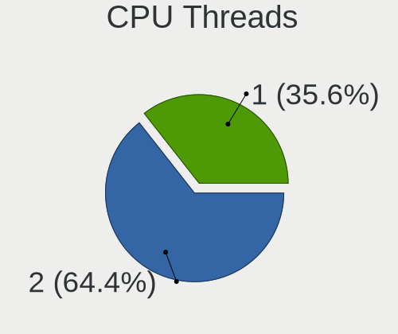

| Number | Notebooks | Percent |
|--------|-----------|---------|
| 2      | 34        | 62.96%  |
| 1      | 20        | 37.04%  |

CPU Op-Modes
------------

CPU Operation Modes (32-bit, 64-bit)

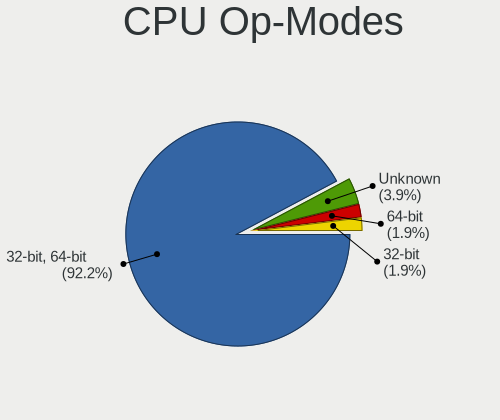

| Op mode        | Notebooks | Percent |
|----------------|-----------|---------|
| 32-bit, 64-bit | 47        | 87.04%  |
| Unknown        | 4         | 7.41%   |
| 64-bit         | 2         | 3.7%    |
| 32-bit         | 1         | 1.85%   |

CPU Microcode
-------------

Microcode number

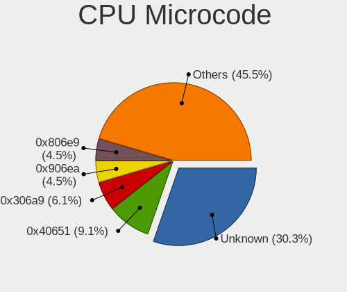

| Number     | Notebooks | Percent |
|------------|-----------|---------|
| Unknown    | 18        | 32.14%  |
| 0x40651    | 6         | 10.71%  |
| 0x806e9    | 3         | 5.36%   |
| 0x306a9    | 3         | 5.36%   |
| 0x08108102 | 3         | 5.36%   |
| 0x906ea    | 2         | 3.57%   |
| 0x806ec    | 2         | 3.57%   |
| 0x406e3    | 2         | 3.57%   |
| 0x08600104 | 2         | 3.57%   |
| 0x07030105 | 2         | 3.57%   |
| 0x05000119 | 2         | 3.57%   |
| 0x806eb    | 1         | 1.79%   |
| 0x806ea    | 1         | 1.79%   |
| 0x406c4    | 1         | 1.79%   |
| 0x30678    | 1         | 1.79%   |
| 0x206a7    | 1         | 1.79%   |
| 0x106c2    | 1         | 1.79%   |
| 0x08600106 | 1         | 1.79%   |
| 0x08600102 | 1         | 1.79%   |
| 0x08101007 | 1         | 1.79%   |
| 0x07030104 | 1         | 1.79%   |
| 0x06006705 | 1         | 1.79%   |

CPU Microarch
-------------

Microarchitecture

| Name          | Notebooks | Percent |
|---------------|-----------|---------|
| KabyLake      | 12        | 22.22%  |
| Haswell       | 6         | 11.11%  |
| Zen 2         | 5         | 9.26%   |
| Skylake       | 4         | 7.41%   |
| Zen+          | 3         | 5.56%   |
| Puma          | 3         | 5.56%   |
| IvyBridge     | 3         | 5.56%   |
| Excavator     | 3         | 5.56%   |
| Silvermont    | 2         | 3.7%    |
| SandyBridge   | 2         | 3.7%    |
| Bobcat        | 2         | 3.7%    |
| Unknown       | 2         | 3.7%    |
| Zen           | 1         | 1.85%   |
| TigerLake     | 1         | 1.85%   |
| Penryn        | 1         | 1.85%   |
| K8 Hammer     | 1         | 1.85%   |
| Goldmont plus | 1         | 1.85%   |
| Core          | 1         | 1.85%   |
| Bonnell       | 1         | 1.85%   |

Graphics
--------

GPU Vendor
----------

Vendors of graphics cards

| Vendor                           | Notebooks | Percent |
|----------------------------------|-----------|---------|
| Intel                            | 33        | 49.25%  |
| AMD                              | 18        | 26.87%  |
| Nvidia                           | 15        | 22.39%  |
| Silicon Integrated Systems [SiS] | 1         | 1.49%   |

GPU Model
---------

Graphics card models

| Model                                                                                    | Notebooks | Percent |
|------------------------------------------------------------------------------------------|-----------|---------|
| Intel Haswell-ULT Integrated Graphics Controller                                         | 6         | 8.57%   |
| AMD Renoir                                                                               | 5         | 7.14%   |
| Intel Skylake GT2 [HD Graphics 520]                                                      | 4         | 5.71%   |
| Nvidia GF117M [GeForce 610M/710M/810M/820M / GT 620M/625M/630M/720M]                     | 3         | 4.29%   |
| Intel HD Graphics 620                                                                    | 3         | 4.29%   |
| Intel CoffeeLake-H GT2 [UHD Graphics 630]                                                | 3         | 4.29%   |
| Intel 3rd Gen Core processor Graphics Controller                                         | 3         | 4.29%   |
| AMD Stoney [Radeon R2/R3/R4/R5 Graphics]                                                 | 3         | 4.29%   |
| AMD Picasso/Raven 2 [Radeon Vega Series / Radeon Vega Mobile Series]                     | 3         | 4.29%   |
| Nvidia GP108M [GeForce MX250]                                                            | 2         | 2.86%   |
| Intel WhiskeyLake-U GT2 [UHD Graphics 620]                                               | 2         | 2.86%   |
| Intel UHD Graphics 620                                                                   | 2         | 2.86%   |
| Intel CometLake-U GT2 [UHD Graphics]                                                     | 2         | 2.86%   |
| Intel 2nd Generation Core Processor Family Integrated Graphics Controller                | 2         | 2.86%   |
| AMD Mullins [Radeon R4/R5 Graphics]                                                      | 2         | 2.86%   |
| Silicon Integrated Systems [SiS] 771/671 PCIE VGA Display Adapter                        | 1         | 1.43%   |
| Nvidia TU117M [GeForce GTX 1650 Mobile / Max-Q]                                          | 1         | 1.43%   |
| Nvidia TU116M [GeForce GTX 1660 Ti Mobile]                                               | 1         | 1.43%   |
| Nvidia TU106M [GeForce RTX 2060 Mobile]                                                  | 1         | 1.43%   |
| Nvidia GP108M [GeForce MX230]                                                            | 1         | 1.43%   |
| Nvidia GP107M [GeForce GTX 1050 Mobile]                                                  | 1         | 1.43%   |
| Nvidia GP107GLM [Quadro P600 Mobile]                                                     | 1         | 1.43%   |
| Nvidia GM108M [GeForce MX110]                                                            | 1         | 1.43%   |
| Nvidia GM108M [GeForce 940MX]                                                            | 1         | 1.43%   |
| Nvidia GK208BM [GeForce 920M]                                                            | 1         | 1.43%   |
| Nvidia GF108M [GeForce GT 540M]                                                          | 1         | 1.43%   |
| Intel TigerLake-LP GT2 [Iris Xe Graphics]                                                | 1         | 1.43%   |
| Intel Mobile 945GSE Express Integrated Graphics Controller                               | 1         | 1.43%   |
| Intel Mobile 945GM/GMS/GME, 943/940GML Express Integrated Graphics Controller            | 1         | 1.43%   |
| Intel Mobile 4 Series Chipset Integrated Graphics Controller                             | 1         | 1.43%   |
| Intel GeminiLake [UHD Graphics 600]                                                      | 1         | 1.43%   |
| Intel Atom/Celeron/Pentium Processor x5-E8000/J3xxx/N3xxx Integrated Graphics Controller | 1         | 1.43%   |
| Intel Atom Processor Z36xxx/Z37xxx Series Graphics & Display                             | 1         | 1.43%   |
| AMD Wrestler [Radeon HD 7310]                                                            | 1         | 1.43%   |
| AMD Wrestler [Radeon HD 6290]                                                            | 1         | 1.43%   |
| AMD Sun LE [Radeon HD 8550M / R5 M230]                                                   | 1         | 1.43%   |
| AMD RS482M [Mobility Radeon Xpress 200]                                                  | 1         | 1.43%   |
| AMD Raven Ridge [Radeon Vega Series / Radeon Vega Mobile Series]                         | 1         | 1.43%   |
| AMD Navi 14 [Radeon RX 5500/5500M / Pro 5500M]                                           | 1         | 1.43%   |
| AMD Mullins [Radeon R2 Graphics]                                                         | 1         | 1.43%   |

GPU Combo
---------

Combinations of graphics cards

| Name           | Notebooks | Percent |
|----------------|-----------|---------|
| 1 x Intel      | 20        | 37.04%  |
| 1 x AMD        | 14        | 25.93%  |
| Intel + Nvidia | 13        | 24.07%  |
| Other          | 2         | 3.7%    |
| 2 x AMD        | 2         | 3.7%    |
| AMD + Nvidia   | 2         | 3.7%    |
| 1 x SiS        | 1         | 1.85%   |

GPU Driver
----------

Free vs proprietary

| Driver      | Notebooks | Percent |
|-------------|-----------|---------|
| Free        | 40        | 74.07%  |
| Proprietary | 11        | 20.37%  |
| Unknown     | 3         | 5.56%   |

GPU Memory
----------

Total video memory

| Size in GB | Notebooks | Percent |
|------------|-----------|---------|
| Unknown    | 37        | 64.91%  |
| 0.01-0.5   | 8         | 14.04%  |
| 1.01-2.0   | 5         | 8.77%   |
| 0.51-1.0   | 5         | 8.77%   |
| 5.01-6.0   | 1         | 1.75%   |
| 3.01-4.0   | 1         | 1.75%   |

Monitor
-------

Monitor Vendor
--------------

Monitor vendors

| Vendor              | Notebooks | Percent |
|---------------------|-----------|---------|
| AU Optronics        | 12        | 21.05%  |
| LG Display          | 10        | 17.54%  |
| Chimei Innolux      | 10        | 17.54%  |
| BOE                 | 9         | 15.79%  |
| Samsung Electronics | 2         | 3.51%   |
| PANDA               | 2         | 3.51%   |
| Hewlett-Packard     | 2         | 3.51%   |
| Apple               | 2         | 3.51%   |
| AOC                 | 2         | 3.51%   |
| STD                 | 1         | 1.75%   |
| Philips             | 1         | 1.75%   |
| Panasonic           | 1         | 1.75%   |
| LG Philips          | 1         | 1.75%   |
| Lenovo              | 1         | 1.75%   |
| CHR                 | 1         | 1.75%   |

Monitor Model
-------------

Monitor models

| Model                                                                | Notebooks | Percent |
|----------------------------------------------------------------------|-----------|---------|
| Chimei Innolux LCD Monitor CMN15F5 1920x1080 344x193mm 15.5-inch     | 3         | 5.17%   |
| Hewlett-Packard LA2405 HWP284C 1920x1200 518x324mm 24.1-inch         | 2         | 3.45%   |
| BOE LCD Monitor BOE06A4 1366x768 344x194mm 15.5-inch                 | 2         | 3.45%   |
| STD LED STD0001 1920x1080 480x260mm 21.5-inch                        | 1         | 1.72%   |
| Samsung Electronics LCD Monitor SEC4542 1366x768 309x174mm 14.0-inch | 1         | 1.72%   |
| Samsung Electronics LCD Monitor SAM029D 1360x768                     | 1         | 1.72%   |
| Philips PHL 243V5 PHLC0D1 1920x1080 521x293mm 23.5-inch              | 1         | 1.72%   |
| PANDA LCD Monitor NCP004D 1920x1080 344x194mm 15.5-inch              | 1         | 1.72%   |
| PANDA LCD Monitor NCP0036 1920x1080 340x190mm 15.3-inch              | 1         | 1.72%   |
| Panasonic TV MEIA296 3840x2160 698x392mm 31.5-inch                   | 1         | 1.72%   |
| LG Philips LCD Monitor LPLA900 1280x800 331x207mm 15.4-inch          | 1         | 1.72%   |
| LG Display LCD Monitor LGD4601 1280x800 286x179mm 13.3-inch          | 1         | 1.72%   |
| LG Display LCD Monitor LGD11F9 1280x800 290x180mm 13.4-inch          | 1         | 1.72%   |
| LG Display LCD Monitor LGD0662 1920x1080 309x174mm 14.0-inch         | 1         | 1.72%   |
| LG Display LCD Monitor LGD061E 1920x1080 344x194mm 15.5-inch         | 1         | 1.72%   |
| LG Display LCD Monitor LGD0573 1920x1080 344x194mm 15.5-inch         | 1         | 1.72%   |
| LG Display LCD Monitor LGD053F 1920x1080 344x194mm 15.5-inch         | 1         | 1.72%   |
| LG Display LCD Monitor LGD0503 1366x768 344x194mm 15.5-inch          | 1         | 1.72%   |
| LG Display LCD Monitor LGD04EF 1920x1080 294x165mm 13.3-inch         | 1         | 1.72%   |
| LG Display LCD Monitor LGD0437 1920x1080 276x156mm 12.5-inch         | 1         | 1.72%   |
| LG Display LCD Monitor LGD038E 1366x768 344x194mm 15.5-inch          | 1         | 1.72%   |
| LG Display LCD Monitor LGD0362 1600x900 309x174mm 14.0-inch          | 1         | 1.72%   |
| Lenovo LCD Monitor LEN40B0 1366x768 344x193mm 15.5-inch              | 1         | 1.72%   |
| CHR VGA DISPLAY CHRC378 1920x1080 880x500mm 39.8-inch                | 1         | 1.72%   |
| Chimei Innolux P140ZKA-BZ1 CMN8C02 2160x1440 296x197mm 14.0-inch     | 1         | 1.72%   |
| Chimei Innolux LCD Monitor CMN1728 1600x900 382x215mm 17.3-inch      | 1         | 1.72%   |
| Chimei Innolux LCD Monitor CMN15E6 1366x768 344x193mm 15.5-inch      | 1         | 1.72%   |
| Chimei Innolux LCD Monitor CMN15BF 1366x768 344x194mm 15.5-inch      | 1         | 1.72%   |
| Chimei Innolux LCD Monitor CMN15B7 1366x768 344x193mm 15.5-inch      | 1         | 1.72%   |
| Chimei Innolux LCD Monitor CMN14D4 1920x1080 309x173mm 13.9-inch     | 1         | 1.72%   |
| Chimei Innolux LCD Monitor CMN1239 1920x1080 276x155mm 12.5-inch     | 1         | 1.72%   |
| BOE LCD Monitor BOE07B5 1366x768 309x173mm 13.9-inch                 | 1         | 1.72%   |
| BOE LCD Monitor BOE0791 1920x1080 309x173mm 13.9-inch                | 1         | 1.72%   |
| BOE LCD Monitor BOE0718 1920x1080 309x173mm 13.9-inch                | 1         | 1.72%   |
| BOE LCD Monitor BOE06FF 1920x1080 344x194mm 15.5-inch                | 1         | 1.72%   |
| BOE LCD Monitor BOE06F1 1920x1080 344x194mm 15.5-inch                | 1         | 1.72%   |
| BOE LCD Monitor BOE06A7 1920x1080 294x165mm 13.3-inch                | 1         | 1.72%   |
| BOE LCD Monitor BOE0618 1366x768 277x156mm 12.5-inch                 | 1         | 1.72%   |
| AU Optronics LCD Monitor AUOAF90 1920x1080 344x193mm 15.5-inch       | 1         | 1.72%   |
| AU Optronics LCD Monitor AUO71EC 1366x768 344x193mm 15.5-inch        | 1         | 1.72%   |
| AU Optronics LCD Monitor AUO573D 1920x1080 309x174mm 14.0-inch       | 1         | 1.72%   |
| AU Optronics LCD Monitor AUO47EC 1366x768 344x193mm 15.5-inch        | 1         | 1.72%   |
| AU Optronics LCD Monitor AUO46EC 1366x768 344x193mm 15.5-inch        | 1         | 1.72%   |
| AU Optronics LCD Monitor AUO403D 1920x1080 309x173mm 13.9-inch       | 1         | 1.72%   |
| AU Optronics LCD Monitor AUO38ED 1920x1080 344x193mm 15.5-inch       | 1         | 1.72%   |
| AU Optronics LCD Monitor AUO325C 1366x768 256x144mm 11.6-inch        | 1         | 1.72%   |
| AU Optronics LCD Monitor AUO2D3C 1366x768 310x170mm 13.9-inch        | 1         | 1.72%   |
| AU Optronics LCD Monitor AUO21ED 1920x1080 344x193mm 15.5-inch       | 1         | 1.72%   |
| AU Optronics LCD Monitor AUO13EC 1366x768 344x193mm 15.5-inch        | 1         | 1.72%   |
| AU Optronics LCD Monitor AUO11C2 1024x600 195x113mm 8.9-inch         | 1         | 1.72%   |
| Apple Color LCD APPA020 2560x1600 286x179mm 13.3-inch                | 1         | 1.72%   |
| Apple Color LCD APPA010 1366x768 256x144mm 11.6-inch                 | 1         | 1.72%   |
| AOC Q3279WG5B AOC3279 2560x1440 725x428mm 33.1-inch                  | 1         | 1.72%   |
| AOC F19 AOC1900 1366x768 410x230mm 18.5-inch                         | 1         | 1.72%   |

Monitor Resolution
------------------

Monitor screen resolution

| Resolution        | Notebooks | Percent |
|-------------------|-----------|---------|
| 1920x1080 (FHD)   | 25        | 45.45%  |
| 1366x768 (WXGA)   | 18        | 32.73%  |
| 1920x1200 (WUXGA) | 2         | 3.64%   |
| 1600x900 (HD+)    | 2         | 3.64%   |
| 1280x800 (WXGA)   | 2         | 3.64%   |
| 3840x2160 (4K)    | 1         | 1.82%   |
| 2560x1600         | 1         | 1.82%   |
| 2560x1440 (QHD)   | 1         | 1.82%   |
| 2160x1440         | 1         | 1.82%   |
| 1360x768          | 1         | 1.82%   |
| 1024x600          | 1         | 1.82%   |

Monitor Diagonal
----------------

Diagonal size in inches

| Inches  | Notebooks | Percent |
|---------|-----------|---------|
| 15      | 26        | 45.61%  |
| 13      | 9         | 15.79%  |
| 14      | 6         | 10.53%  |
| 12      | 3         | 5.26%   |
| 24      | 2         | 3.51%   |
| 23      | 2         | 3.51%   |
| 11      | 2         | 3.51%   |
| 84      | 1         | 1.75%   |
| 39      | 1         | 1.75%   |
| 33      | 1         | 1.75%   |
| 18      | 1         | 1.75%   |
| 17      | 1         | 1.75%   |
| 8       | 1         | 1.75%   |
| Unknown | 1         | 1.75%   |

Monitor Width
-------------

Physical width

| Width in mm | Notebooks | Percent |
|-------------|-----------|---------|
| 301-350     | 36        | 63.16%  |
| 201-300     | 10        | 17.54%  |
| 501-600     | 4         | 7.02%   |
| 801-900     | 1         | 1.75%   |
| 701-800     | 1         | 1.75%   |
| 401-500     | 1         | 1.75%   |
| 351-400     | 1         | 1.75%   |
| 1501-2000   | 1         | 1.75%   |
| 101-200     | 1         | 1.75%   |
| Unknown     | 1         | 1.75%   |

Aspect Ratio
------------

Proportional relationship between the width and the height

| Ratio | Notebooks | Percent |
|-------|-----------|---------|
| 16/9  | 45        | 86.54%  |
| 16/10 | 6         | 11.54%  |
| 3/2   | 1         | 1.92%   |

Monitor Area
------------

Area in inch²

| Area in inch² | Notebooks | Percent |
|----------------|-----------|---------|
| 101-110        | 26        | 44.83%  |
| 81-90          | 12        | 20.69%  |
| 71-80          | 4         | 6.9%    |
| 61-70          | 3         | 5.17%   |
| 51-60          | 2         | 3.45%   |
| 251-300        | 2         | 3.45%   |
| 201-250        | 2         | 3.45%   |
| More than 1000 | 1         | 1.72%   |
| 351-500        | 1         | 1.72%   |
| 1-40           | 1         | 1.72%   |
| 141-150        | 1         | 1.72%   |
| 131-140        | 1         | 1.72%   |
| 501-1000       | 1         | 1.72%   |
| Unknown        | 1         | 1.72%   |

Pixel Density
-------------

Pixels per inch

| Density | Notebooks | Percent |
|---------|-----------|---------|
| 121-160 | 24        | 42.11%  |
| 101-120 | 16        | 28.07%  |
| 51-100  | 10        | 17.54%  |
| 161-240 | 6         | 10.53%  |
| Unknown | 1         | 1.75%   |

Multiple Monitors
-----------------

Total monitors connected

| Total | Notebooks | Percent |
|-------|-----------|---------|
| 1     | 42        | 77.78%  |
| 2     | 10        | 18.52%  |
| 0     | 2         | 3.7%    |

Network
-------

Net Controller Vendor
---------------------

Controller vendors

| Vendor                           | Notebooks | Percent |
|----------------------------------|-----------|---------|
| Realtek Semiconductor            | 28        | 36.84%  |
| Intel                            | 20        | 26.32%  |
| Qualcomm Atheros                 | 13        | 17.11%  |
| Broadcom                         | 5         | 6.58%   |
| Sierra Wireless                  | 2         | 2.63%   |
| Cypress Semiconductor            | 2         | 2.63%   |
| Broadcom Limited                 | 2         | 2.63%   |
| TP-Link                          | 1         | 1.32%   |
| Silicon Integrated Systems [SiS] | 1         | 1.32%   |
| Ralink Technology                | 1         | 1.32%   |
| Ralink                           | 1         | 1.32%   |

Net Controller Model
--------------------

Controller models

| Model                                                             | Notebooks | Percent |
|-------------------------------------------------------------------|-----------|---------|
| Realtek RTL8111/8168/8411 PCI Express Gigabit Ethernet Controller | 19        | 19.39%  |
| Realtek RTL810xE PCI Express Fast Ethernet controller             | 7         | 7.14%   |
| Intel Wi-Fi 6 AX200                                               | 6         | 6.12%   |
| Realtek RTL8723BE PCIe Wireless Network Adapter                   | 4         | 4.08%   |
| Qualcomm Atheros QCA9565 / AR9565 Wireless Network Adapter        | 4         | 4.08%   |
| Qualcomm Atheros QCA9377 802.11ac Wireless Network Adapter        | 4         | 4.08%   |
| Intel Wireless 8265 / 8275                                        | 4         | 4.08%   |
| Qualcomm Atheros AR9485 Wireless Network Adapter                  | 3         | 3.06%   |
| Realtek RTL8822BE 802.11a/b/g/n/ac WiFi adapter                   | 2         | 2.04%   |
| Realtek RTL8723DE Wireless Network Adapter                        | 2         | 2.04%   |
| Intel Wireless 7260                                               | 2         | 2.04%   |
| Intel Ethernet Connection I218-LM                                 | 2         | 2.04%   |
| Intel Cannon Lake PCH CNVi WiFi                                   | 2         | 2.04%   |
| Cypress K38231_03                                                 | 2         | 2.04%   |
| TP-Link UE300 10/100/1000 LAN (ethernet mode) [Realtek RTL8153]   | 1         | 1.02%   |
| Silicon Integrated Systems [SiS] 191 Gigabit Ethernet Adapter     | 1         | 1.02%   |
| Sierra Wireless EM7345 4G LTE                                     | 1         | 1.02%   |
| Sierra Wireless EM7305 Modem                                      | 1         | 1.02%   |
| Realtek RTL8822CE 802.11ac PCIe Wireless Network Adapter          | 1         | 1.02%   |
| Realtek RTL8821CE 802.11ac PCIe Wireless Network Adapter          | 1         | 1.02%   |
| Realtek RTL8188EUS 802.11n Wireless Network Adapter               | 1         | 1.02%   |
| Realtek RTL8188CE 802.11b/g/n WiFi Adapter                        | 1         | 1.02%   |
| Realtek RTL8187B Wireless 802.11g 54Mbps Network Adapter          | 1         | 1.02%   |
| Realtek RTL8152 Fast Ethernet Adapter                             | 1         | 1.02%   |
| Ralink MT7601U Wireless Adapter                                   | 1         | 1.02%   |
| Ralink RT5390 Wireless 802.11n 1T/1R PCIe                         | 1         | 1.02%   |
| Qualcomm Atheros QCA6174 802.11ac Wireless Network Adapter        | 1         | 1.02%   |
| Qualcomm Atheros Killer E2500 Gigabit Ethernet Controller         | 1         | 1.02%   |
| Qualcomm Atheros AR8152 v2.0 Fast Ethernet                        | 1         | 1.02%   |
| Intel Wireless-AC 9260                                            | 1         | 1.02%   |
| Intel Wireless 8260                                               | 1         | 1.02%   |
| Intel WiFi Link 5100                                              | 1         | 1.02%   |
| Intel Wi-Fi 6 AX201                                               | 1         | 1.02%   |
| Intel Ethernet Connection I219-LM                                 | 1         | 1.02%   |
| Intel Ethernet Connection (7) I219-LM                             | 1         | 1.02%   |
| Intel Ethernet Connection (4) I219-LM                             | 1         | 1.02%   |
| Intel Ethernet Connection (10) I219-V                             | 1         | 1.02%   |
| Intel Comet Lake PCH-LP CNVi WiFi                                 | 1         | 1.02%   |
| Intel Centrino Advanced-N 6205 [Taylor Peak]                      | 1         | 1.02%   |
| Intel 82579LM Gigabit Network Connection (Lewisville)             | 1         | 1.02%   |
| Intel 82567LM Gigabit Network Connection                          | 1         | 1.02%   |
| Broadcom NetXtreme BCM57786 Gigabit Ethernet PCIe                 | 1         | 1.02%   |
| Broadcom NetLink BCM57785 Gigabit Ethernet PCIe                   | 1         | 1.02%   |
| Broadcom Limited BCM4360 802.11ac Wireless Network Adapter        | 1         | 1.02%   |
| Broadcom Limited BCM4352 802.11ac Wireless Network Adapter        | 1         | 1.02%   |
| Broadcom BCM4401-B0 100Base-TX                                    | 1         | 1.02%   |
| Broadcom BCM43142 802.11b/g/n                                     | 1         | 1.02%   |
| Broadcom BCM4313 802.11bgn Wireless Network Adapter               | 1         | 1.02%   |
| Broadcom BCM4311 802.11b/g WLAN                                   | 1         | 1.02%   |

Wireless Vendor
---------------

Wireless vendors

| Vendor                | Notebooks | Percent |
|-----------------------|-----------|---------|
| Intel                 | 20        | 37.04%  |
| Realtek Semiconductor | 13        | 24.07%  |
| Qualcomm Atheros      | 12        | 22.22%  |
| Broadcom              | 3         | 5.56%   |
| Sierra Wireless       | 2         | 3.7%    |
| Broadcom Limited      | 2         | 3.7%    |
| Ralink Technology     | 1         | 1.85%   |
| Ralink                | 1         | 1.85%   |

Wireless Model
--------------

Wireless models

| Model                                                      | Notebooks | Percent |
|------------------------------------------------------------|-----------|---------|
| Intel Wi-Fi 6 AX200                                        | 6         | 11.11%  |
| Realtek RTL8723BE PCIe Wireless Network Adapter            | 4         | 7.41%   |
| Qualcomm Atheros QCA9565 / AR9565 Wireless Network Adapter | 4         | 7.41%   |
| Qualcomm Atheros QCA9377 802.11ac Wireless Network Adapter | 4         | 7.41%   |
| Intel Wireless 8265 / 8275                                 | 4         | 7.41%   |
| Qualcomm Atheros AR9485 Wireless Network Adapter           | 3         | 5.56%   |
| Realtek RTL8822BE 802.11a/b/g/n/ac WiFi adapter            | 2         | 3.7%    |
| Realtek RTL8723DE Wireless Network Adapter                 | 2         | 3.7%    |
| Intel Wireless 7260                                        | 2         | 3.7%    |
| Intel Cannon Lake PCH CNVi WiFi                            | 2         | 3.7%    |
| Sierra Wireless EM7345 4G LTE                              | 1         | 1.85%   |
| Sierra Wireless EM7305 Modem                               | 1         | 1.85%   |
| Realtek RTL8822CE 802.11ac PCIe Wireless Network Adapter   | 1         | 1.85%   |
| Realtek RTL8821CE 802.11ac PCIe Wireless Network Adapter   | 1         | 1.85%   |
| Realtek RTL8188EUS 802.11n Wireless Network Adapter        | 1         | 1.85%   |
| Realtek RTL8188CE 802.11b/g/n WiFi Adapter                 | 1         | 1.85%   |
| Realtek RTL8187B Wireless 802.11g 54Mbps Network Adapter   | 1         | 1.85%   |
| Ralink MT7601U Wireless Adapter                            | 1         | 1.85%   |
| Ralink RT5390 Wireless 802.11n 1T/1R PCIe                  | 1         | 1.85%   |
| Qualcomm Atheros QCA6174 802.11ac Wireless Network Adapter | 1         | 1.85%   |
| Intel Wireless-AC 9260                                     | 1         | 1.85%   |
| Intel Wireless 8260                                        | 1         | 1.85%   |
| Intel WiFi Link 5100                                       | 1         | 1.85%   |
| Intel Wi-Fi 6 AX201                                        | 1         | 1.85%   |
| Intel Comet Lake PCH-LP CNVi WiFi                          | 1         | 1.85%   |
| Intel Centrino Advanced-N 6205 [Taylor Peak]               | 1         | 1.85%   |
| Broadcom Limited BCM4360 802.11ac Wireless Network Adapter | 1         | 1.85%   |
| Broadcom Limited BCM4352 802.11ac Wireless Network Adapter | 1         | 1.85%   |
| Broadcom BCM43142 802.11b/g/n                              | 1         | 1.85%   |
| Broadcom BCM4313 802.11bgn Wireless Network Adapter        | 1         | 1.85%   |
| Broadcom BCM4311 802.11b/g WLAN                            | 1         | 1.85%   |

Ethernet Vendor
---------------

Ethernet vendors

| Vendor                           | Notebooks | Percent |
|----------------------------------|-----------|---------|
| Realtek Semiconductor            | 27        | 61.36%  |
| Intel                            | 8         | 18.18%  |
| Broadcom                         | 3         | 6.82%   |
| Qualcomm Atheros                 | 2         | 4.55%   |
| Cypress Semiconductor            | 2         | 4.55%   |
| TP-Link                          | 1         | 2.27%   |
| Silicon Integrated Systems [SiS] | 1         | 2.27%   |

Ethernet Model
--------------

Ethernet models

| Model                                                             | Notebooks | Percent |
|-------------------------------------------------------------------|-----------|---------|
| Realtek RTL8111/8168/8411 PCI Express Gigabit Ethernet Controller | 19        | 43.18%  |
| Realtek RTL810xE PCI Express Fast Ethernet controller             | 7         | 15.91%  |
| Intel Ethernet Connection I218-LM                                 | 2         | 4.55%   |
| Cypress K38231_03                                                 | 2         | 4.55%   |
| TP-Link UE300 10/100/1000 LAN (ethernet mode) [Realtek RTL8153]   | 1         | 2.27%   |
| Silicon Integrated Systems [SiS] 191 Gigabit Ethernet Adapter     | 1         | 2.27%   |
| Realtek RTL8152 Fast Ethernet Adapter                             | 1         | 2.27%   |
| Qualcomm Atheros Killer E2500 Gigabit Ethernet Controller         | 1         | 2.27%   |
| Qualcomm Atheros AR8152 v2.0 Fast Ethernet                        | 1         | 2.27%   |
| Intel Ethernet Connection I219-LM                                 | 1         | 2.27%   |
| Intel Ethernet Connection (7) I219-LM                             | 1         | 2.27%   |
| Intel Ethernet Connection (4) I219-LM                             | 1         | 2.27%   |
| Intel Ethernet Connection (10) I219-V                             | 1         | 2.27%   |
| Intel 82579LM Gigabit Network Connection (Lewisville)             | 1         | 2.27%   |
| Intel 82567LM Gigabit Network Connection                          | 1         | 2.27%   |
| Broadcom NetXtreme BCM57786 Gigabit Ethernet PCIe                 | 1         | 2.27%   |
| Broadcom NetLink BCM57785 Gigabit Ethernet PCIe                   | 1         | 2.27%   |
| Broadcom BCM4401-B0 100Base-TX                                    | 1         | 2.27%   |

Net Controller Kind
-------------------

Ethernet, WiFi or modem

| Kind     | Notebooks | Percent |
|----------|-----------|---------|
| WiFi     | 51        | 53.68%  |
| Ethernet | 44        | 46.32%  |

Used Controller
---------------

Currently used network controller

| Kind     | Notebooks | Percent |
|----------|-----------|---------|
| WiFi     | 49        | 61.25%  |
| Ethernet | 31        | 38.75%  |

NICs
----

Total network controllers on board

| Total | Notebooks | Percent |
|-------|-----------|---------|
| 2     | 37        | 68.52%  |
| 1     | 13        | 24.07%  |
| 0     | 3         | 5.56%   |
| 3     | 1         | 1.85%   |

IPv6
----

IPv6 vs IPv4

| Used | Notebooks | Percent |
|------|-----------|---------|
| No   | 50        | 89.29%  |
| Yes  | 6         | 10.71%  |

Bluetooth
---------

Bluetooth Vendor
----------------

Controller vendors

| Vendor                          | Notebooks | Percent |
|---------------------------------|-----------|---------|
| Intel                           | 18        | 40%     |
| Realtek Semiconductor           | 9         | 20%     |
| Lite-On Technology              | 5         | 11.11%  |
| Qualcomm Atheros Communications | 3         | 6.67%   |
| IMC Networks                    | 3         | 6.67%   |
| Foxconn / Hon Hai               | 2         | 4.44%   |
| Broadcom                        | 2         | 4.44%   |
| Dell                            | 1         | 2.22%   |
| Cambridge Silicon Radio         | 1         | 2.22%   |
| Apple                           | 1         | 2.22%   |

Bluetooth Model
---------------

Controller models

| Model                                               | Notebooks | Percent |
|-----------------------------------------------------|-----------|---------|
| Intel Bluetooth Device                              | 10        | 22.22%  |
| Realtek Bluetooth Radio                             | 5         | 11.11%  |
| Intel Bluetooth wireless interface                  | 5         | 11.11%  |
| Realtek  Bluetooth 4.2 Adapter                      | 3         | 6.67%   |
| Lite-On Qualcomm Atheros QCA9377 Bluetooth          | 3         | 6.67%   |
| Lite-On Atheros AR3012 Bluetooth                    | 2         | 4.44%   |
| Intel Bluetooth 9460/9560 Jefferson Peak (JfP)      | 2         | 4.44%   |
| IMC Networks Bluetooth Radio                        | 2         | 4.44%   |
| Realtek RTL8822BE Bluetooth 4.2 Adapter             | 1         | 2.22%   |
| Qualcomm Atheros  Bluetooth Device                  | 1         | 2.22%   |
| Qualcomm Atheros QCA61x4 Bluetooth 4.0              | 1         | 2.22%   |
| Qualcomm Atheros AR3012 Bluetooth 4.0               | 1         | 2.22%   |
| Intel Wireless-AC 9260 Bluetooth Adapter            | 1         | 2.22%   |
| IMC Networks Bluetooth Device                       | 1         | 2.22%   |
| Foxconn / Hon Hai Bluetooth USB Host Controller     | 1         | 2.22%   |
| Foxconn / Hon Hai BCM20702A0                        | 1         | 2.22%   |
| Dell Wireless 365 Bluetooth                         | 1         | 2.22%   |
| Cambridge Silicon Radio Bluetooth Dongle (HCI mode) | 1         | 2.22%   |
| Broadcom BCM43142A0 Bluetooth                       | 1         | 2.22%   |
| Broadcom BCM20702 Bluetooth 4.0 [ThinkPad]          | 1         | 2.22%   |
| Apple Bluetooth Host Controller                     | 1         | 2.22%   |

Sound
-----

Sound Vendor
------------

Sound card vendors

| Vendor                           | Notebooks | Percent |
|----------------------------------|-----------|---------|
| Intel                            | 32        | 54.24%  |
| AMD                              | 18        | 30.51%  |
| Nvidia                           | 5         | 8.47%   |
| Texas Instruments                | 2         | 3.39%   |
| Silicon Integrated Systems [SiS] | 1         | 1.69%   |
| Creative Technology              | 1         | 1.69%   |

Sound Model
-----------

Sound card models

| Model                                                                                             | Notebooks | Percent |
|---------------------------------------------------------------------------------------------------|-----------|---------|
| Intel Sunrise Point-LP HD Audio                                                                   | 9         | 11.11%  |
| AMD Family 17h (Models 10h-1fh) HD Audio Controller                                               | 9         | 11.11%  |
| Intel Haswell-ULT HD Audio Controller                                                             | 6         | 7.41%   |
| Intel 8 Series HD Audio Controller                                                                | 6         | 7.41%   |
| Intel 7 Series/C216 Chipset Family High Definition Audio Controller                               | 4         | 4.94%   |
| AMD Renoir Radeon High Definition Audio Controller                                                | 4         | 4.94%   |
| AMD FCH Azalia Controller                                                                         | 4         | 4.94%   |
| Intel Cannon Lake PCH cAVS                                                                        | 3         | 3.7%    |
| AMD Raven/Raven2/Fenghuang HDMI/DP Audio Controller                                               | 3         | 3.7%    |
| AMD Kabini HDMI/DP Audio                                                                          | 3         | 3.7%    |
| AMD High Definition Audio Controller                                                              | 3         | 3.7%    |
| AMD Family 15h (Models 60h-6fh) Audio Controller                                                  | 3         | 3.7%    |
| Texas Instruments PCM2912A Audio Codec                                                            | 2         | 2.47%   |
| Intel Comet Lake PCH-LP cAVS                                                                      | 2         | 2.47%   |
| Intel Cannon Point-LP High Definition Audio Controller                                            | 2         | 2.47%   |
| AMD Wrestler HDMI Audio                                                                           | 2         | 2.47%   |
| AMD SBx00 Azalia (Intel HDA)                                                                      | 2         | 2.47%   |
| Silicon Integrated Systems [SiS] Azalia Audio Controller                                          | 1         | 1.23%   |
| Nvidia TU116 High Definition Audio Controller                                                     | 1         | 1.23%   |
| Nvidia TU107 GeForce GTX 1650 High Definition Audio Controller                                    | 1         | 1.23%   |
| Nvidia TU106 High Definition Audio Controller                                                     | 1         | 1.23%   |
| Nvidia GP107GL High Definition Audio Controller                                                   | 1         | 1.23%   |
| Nvidia GF108 High Definition Audio Controller                                                     | 1         | 1.23%   |
| Intel Tiger Lake-LP Smart Sound Technology Audio Controller                                       | 1         | 1.23%   |
| Intel NM10/ICH7 Family High Definition Audio Controller                                           | 1         | 1.23%   |
| Intel Celeron/Pentium Silver Processor High Definition Audio                                      | 1         | 1.23%   |
| Intel Atom/Celeron/Pentium Processor x5-E8000/J3xxx/N3xxx Series High Definition Audio Controller | 1         | 1.23%   |
| Intel 82801I (ICH9 Family) HD Audio Controller                                                    | 1         | 1.23%   |
| Intel 6 Series/C200 Series Chipset Family High Definition Audio Controller                        | 1         | 1.23%   |
| Creative Technology Sound Blaster Play! 3                                                         | 1         | 1.23%   |
| AMD Navi 10 HDMI Audio                                                                            | 1         | 1.23%   |

Memory
------

Memory Vendor
-------------

Memory module vendors

| Vendor              | Notebooks | Percent |
|---------------------|-----------|---------|
| SK Hynix            | 14        | 29.79%  |
| Samsung Electronics | 14        | 29.79%  |
| Micron Technology   | 8         | 17.02%  |
| Kingston            | 4         | 8.51%   |
| A-DATA Technology   | 3         | 6.38%   |
| Unknown             | 1         | 2.13%   |
| Transcend           | 1         | 2.13%   |
| Elpida              | 1         | 2.13%   |
| Corsair             | 1         | 2.13%   |

Memory Model
------------

Memory module models

| Model                                                        | Notebooks | Percent |
|--------------------------------------------------------------|-----------|---------|
| SK Hynix RAM HMA81GS6AFR8N-UH 8192MB SODIMM DDR4 2667MT/s    | 2         | 4%      |
| Samsung RAM M471B5173QH0-YK0 4GB SODIMM DDR3 1600MT/s        | 2         | 4%      |
| Samsung RAM M471A5244CB0-CRC 4096MB SODIMM DDR4 2667MT/s     | 2         | 4%      |
| Micron RAM 8KTF51264HZ-1G6E1 4096MB SODIMM DDR3 1600MT/s     | 2         | 4%      |
| Unknown RAM Module 2048MB SODIMM DDR3 1333MT/s               | 1         | 2%      |
| Transcend RAM TS512MSK64W6H 4096MB SODIMM DDR3 1600MT/s      | 1         | 2%      |
| SK Hynix RAM Module 512MB SODIMM DDR2 533MT/s                | 1         | 2%      |
| SK Hynix RAM Module 4GB SODIMM DDR3 1600MT/s                 | 1         | 2%      |
| SK Hynix RAM HMT451S6CFR6A-PB 4GB SODIMM DDR3 1600MT/s       | 1         | 2%      |
| SK Hynix RAM HMT451S6BFR8A-PB 4GB SODIMM DDR3 1600MT/s       | 1         | 2%      |
| SK Hynix RAM HMT451S6AFR8A-PB 4096MB SODIMM DDR3 1600MT/s    | 1         | 2%      |
| SK Hynix RAM HMT425S6CFR6A-PB 2GB SODIMM DDR3 1600MT/s       | 1         | 2%      |
| SK Hynix RAM HMT41GS6AFR8C-PB 8GB SODIMM DDR3 1600MT/s       | 1         | 2%      |
| SK Hynix RAM HMAB2GS6AMR6N-XN 16GB SODIMM DDR4 3200MT/s      | 1         | 2%      |
| SK Hynix RAM HMAA1GS6CMR6N-XN 8192MB SODIMM DDR4 3200MT/s    | 1         | 2%      |
| SK Hynix RAM HMA851S6CJR6N-VK 4GB SODIMM DDR4 2667MT/s       | 1         | 2%      |
| SK Hynix RAM HMA851S6AFR6N-UH 4096MB SODIMM DDR4 2667MT/s    | 1         | 2%      |
| SK Hynix RAM HMA81GS6JJR8N-VK 8GB SODIMM DDR4 2667MT/s       | 1         | 2%      |
| Samsung RAM Module 4096MB SODIMM DDR3 1600MT/s               | 1         | 2%      |
| Samsung RAM M471B5273CH0-CH9 4GB SODIMM DDR3 1334MT/s        | 1         | 2%      |
| Samsung RAM M471B5173EB0-YK0 4GB SODIMM DDR3 1600MT/s        | 1         | 2%      |
| Samsung RAM M471B5173DB0-YK0 4GB SODIMM DDR3 1600MT/s        | 1         | 2%      |
| Samsung RAM M471B1G73QH0-YK0 8192MB SODIMM DDR3 2667MT/s     | 1         | 2%      |
| Samsung RAM M471B1G73DB0-YK0 8GB SODIMM DDR3 1600MT/s        | 1         | 2%      |
| Samsung RAM M471A5244BB0-CRC 4096MB SODIMM DDR4 2667MT/s     | 1         | 2%      |
| Samsung RAM M471A2G44AM0-CWE 16GB SODIMM DDR4 3200MT/s       | 1         | 2%      |
| Samsung RAM M471A1K43DB1-CTD 8GB SODIMM DDR4 2667MT/s        | 1         | 2%      |
| Samsung RAM M471A1K43CB1-CRC 8GB SODIMM DDR4 2667MT/s        | 1         | 2%      |
| Samsung RAM K4F6E3S4HM-MGCJ 4GB SODIMM LPDDR4 3733MT/s       | 1         | 2%      |
| Samsung RAM K4EBE304EB-EGCF 8GB Row Of Chips LPDDR3 1867MT/s | 1         | 2%      |
| Micron RAM 8ATF2G64HZ-3G2E1 16GB SODIMM DDR4 3200MT/s        | 1         | 2%      |
| Micron RAM 8ATF1G64HZ-3G2J1 8GB SODIMM DDR4 3200MT/s         | 1         | 2%      |
| Micron RAM 8ATF1G64HZ-2G3E1 8192MB SODIMM DDR4 2400MT/s      | 1         | 2%      |
| Micron RAM 16JSF51264HZ-1G4D1 4GB SODIMM DDR3 1334MT/s       | 1         | 2%      |
| Micron RAM 16ATF2G64HZ-3G2J1 16GB SODIMM DDR4 3200MT/s       | 1         | 2%      |
| Micron RAM 16ATF2G64HZ-2G6E1 16GB SODIMM DDR4 2667MT/s       | 1         | 2%      |
| Kingston RAM Module 1024MB SODIMM DDR2 533MT/s               | 1         | 2%      |
| Kingston RAM HP16D3LS1KBGH/4G 4096MB SODIMM DDR3 1600MT/s    | 1         | 2%      |
| Kingston RAM ACR26D4S9S1KA-4 4GB SODIMM DDR4 2667MT/s        | 1         | 2%      |
| Kingston RAM 9905711-015.A00G 4GB SODIMM DDR4 2400MT/s       | 1         | 2%      |
| Elpida RAM EBJ20UF8BCS0-DJ-F 2GB SODIMM DDR3 1334MT/s        | 1         | 2%      |
| Elpida RAM BA92-09550A 2GB SODIMM DDR3 1600MT/s              | 1         | 2%      |
| Corsair RAM CMSO8GX4M1A2133C15 8GB SODIMM DDR4 2133MT/s      | 1         | 2%      |
| A-DATA RAM AO1P21FC4R1-B2MS 4GB SODIMM DDR4 2133MT/s         | 1         | 2%      |
| A-DATA RAM AM1U16BC4P2-B19B 4GB SODIMM DDR3 1600MT/s         | 1         | 2%      |
| A-DATA RAM AM1L16BC4R1-B1GS 4096MB SODIMM DDR3 1600MT/s      | 1         | 2%      |

Memory Kind
-----------

Memory module kinds

| Kind   | Notebooks | Percent |
|--------|-----------|---------|
| DDR3   | 18        | 46.15%  |
| DDR4   | 17        | 43.59%  |
| LPDDR4 | 2         | 5.13%   |
| LPDDR3 | 1         | 2.56%   |
| DDR2   | 1         | 2.56%   |

Memory Form Factor
------------------

Physical design of the memory module

| Name         | Notebooks | Percent |
|--------------|-----------|---------|
| SODIMM       | 37        | 97.37%  |
| Row Of Chips | 1         | 2.63%   |

Memory Size
-----------

Memory module size

| Size  | Notebooks | Percent |
|-------|-----------|---------|
| 4096  | 18        | 42.86%  |
| 8192  | 15        | 35.71%  |
| 16384 | 4         | 9.52%   |
| 2048  | 3         | 7.14%   |
| 1024  | 1         | 2.38%   |
| 512   | 1         | 2.38%   |

Memory Speed
------------

Memory module speed

| Speed | Notebooks | Percent |
|-------|-----------|---------|
| 1600  | 15        | 36.59%  |
| 2667  | 10        | 24.39%  |
| 3200  | 5         | 12.2%   |
| 1334  | 3         | 7.32%   |
| 2400  | 2         | 4.88%   |
| 2133  | 2         | 4.88%   |
| 3733  | 1         | 2.44%   |
| 1867  | 1         | 2.44%   |
| 1333  | 1         | 2.44%   |
| 533   | 1         | 2.44%   |

Printers & scanners
-------------------

Printer Vendor
--------------

Printer device vendors

Zero info for selected period =(

Printer Model
-------------

Printer device models

Zero info for selected period =(

Scanner Vendor
--------------

Scanner device vendors

Zero info for selected period =(

Scanner Model
-------------

Scanner device models

Zero info for selected period =(

Camera
------

Camera Vendor
-------------

Camera device vendors

| Vendor                                 | Notebooks | Percent |
|----------------------------------------|-----------|---------|
| Chicony Electronics                    | 14        | 28.57%  |
| IMC Networks                           | 9         | 18.37%  |
| Microdia                               | 6         | 12.24%  |
| Acer                                   | 5         | 10.2%   |
| Realtek Semiconductor                  | 4         | 8.16%   |
| Quanta                                 | 4         | 8.16%   |
| Sunplus Innovation Technology          | 3         | 6.12%   |
| Suyin                                  | 1         | 2.04%   |
| Silicon Motion                         | 1         | 2.04%   |
| Logitech                               | 1         | 2.04%   |
| Cheng Uei Precision Industry (Foxlink) | 1         | 2.04%   |

Camera Model
------------

Camera device models

| Model                                         | Notebooks | Percent |
|-----------------------------------------------|-----------|---------|
| IMC Networks USB2.0 HD UVC WebCam             | 4         | 8%      |
| Chicony Integrated Camera                     | 4         | 8%      |
| Sunplus Integrated_Webcam_HD                  | 2         | 4%      |
| Quanta HD User Facing                         | 2         | 4%      |
| Microdia HP Integrated Webcam                 | 2         | 4%      |
| IMC Networks USB2.0 VGA UVC WebCam            | 2         | 4%      |
| Chicony HD WebCam                             | 2         | 4%      |
| Suyin HP TrueVision HD                        | 1         | 2%      |
| Sunplus HP Wide Vision HD                     | 1         | 2%      |
| Silicon Motion WebCam SC-10HDD12636N          | 1         | 2%      |
| Realtek USB2.0 VGA UVC WebCam                 | 1         | 2%      |
| Realtek USB Camera                            | 1         | 2%      |
| Realtek Integrated Webcam HD                  | 1         | 2%      |
| Realtek HD WebCam                             | 1         | 2%      |
| Quanta VGA WebCam                             | 1         | 2%      |
| Quanta HP TrueVision HD Camera                | 1         | 2%      |
| Microdia Webcam Vitade AF                     | 1         | 2%      |
| Microdia Sonix USB 2.0 Camera                 | 1         | 2%      |
| Microdia Integrated_Webcam_HD                 | 1         | 2%      |
| Microdia Integrated_Webcam_2M                 | 1         | 2%      |
| Logitech C505 HD Webcam                       | 1         | 2%      |
| IMC Networks VGA UVC WebCam                   | 1         | 2%      |
| IMC Networks HP TrueVision HD Camera          | 1         | 2%      |
| IMC Networks EasyCamera                       | 1         | 2%      |
| Chicony WebCam                                | 1         | 2%      |
| Chicony USB2.0 Camera                         | 1         | 2%      |
| Chicony USB 5M WebCam                         | 1         | 2%      |
| Chicony USB 2.0 Camera                        | 1         | 2%      |
| Chicony thinkpad t430s camera                 | 1         | 2%      |
| Chicony Lenovo EasyCamera                     | 1         | 2%      |
| Chicony HP TrueVision HD Camera               | 1         | 2%      |
| Chicony HD WebCam (Acer)                      | 1         | 2%      |
| Chicony HD User Facing                        | 1         | 2%      |
| Cheng Uei Precision Industry (Foxlink) Webcam | 1         | 2%      |
| Acer SunplusIT Integrated Camera              | 1         | 2%      |
| Acer SunplusIT INC. Integrated Camera         | 1         | 2%      |
| Acer OrbiCam                                  | 1         | 2%      |
| Acer Lenovo EasyCamera                        | 1         | 2%      |
| Acer Integrated Camera                        | 1         | 2%      |

Security
--------

Fingerprint Vendor
------------------

Fingerprint sensor vendors

| Vendor           | Notebooks | Percent |
|------------------|-----------|---------|
| Synaptics        | 4         | 66.67%  |
| Validity Sensors | 2         | 33.33%  |

Fingerprint Model
-----------------

Fingerprint sensor models

| Model                                             | Notebooks | Percent |
|---------------------------------------------------|-----------|---------|
| Synaptics Prometheus MIS Touch Fingerprint Reader | 3         | 50%     |
| Validity Sensors VFS 5011 fingerprint sensor      | 2         | 33.33%  |
| Synaptics Metallica MIS Touch Fingerprint Reader  | 1         | 16.67%  |

Chipcard Vendor
---------------

Chipcard module vendors

| Vendor      | Notebooks | Percent |
|-------------|-----------|---------|
| Alcor Micro | 2         | 66.67%  |
| Broadcom    | 1         | 33.33%  |

Chipcard Model
--------------

Chipcard module models

| Model                                          | Notebooks | Percent |
|------------------------------------------------|-----------|---------|
| Alcor Micro AU9540 Smartcard Reader            | 2         | 66.67%  |
| Broadcom BCM5880 Secure Applications Processor | 1         | 33.33%  |

Unsupported
-----------

Unsupported Devices
-------------------

Total unsupported devices on board

| Total | Notebooks | Percent |
|-------|-----------|---------|
| 0     | 41        | 74.55%  |
| 1     | 11        | 20%     |
| 2     | 2         | 3.64%   |
| 3     | 1         | 1.82%   |

Unsupported Device Types
------------------------

Types of unsupported devices

| Type                  | Notebooks | Percent |
|-----------------------|-----------|---------|
| Fingerprint reader    | 6         | 35.29%  |
| Net/wireless          | 3         | 17.65%  |
| Chipcard              | 3         | 17.65%  |
| Multimedia controller | 2         | 11.76%  |
| Graphics card         | 2         | 11.76%  |
| Net/ethernet          | 1         | 5.88%   |

