Void Linux - Tested Hardware & Statistics (Notebooks)
-----------------------------------------------------

A project to collect tested hardware configurations for Void Linux.

Anyone can contribute to this report by the [hw-probe](https://github.com/linuxhw/hw-probe) tool:

    sudo -E hw-probe -all -upload

Please contribute! Especially if your hardware is rare.

Contents
--------

* [ Test Cases ](#test-cases)

* [ System ](#system)
  - [ OS                       ](#os)
  - [ OS Family                ](#os-family)
  - [ Kernel                   ](#kernel)
  - [ Kernel Family            ](#kernel-family)
  - [ Kernel Major Ver.        ](#kernel-major-ver)
  - [ Arch                     ](#arch)
  - [ DE                       ](#de)
  - [ Display Server           ](#display-server)
  - [ Display Manager          ](#display-manager)
  - [ OS Lang                  ](#os-lang)
  - [ Boot Mode                ](#boot-mode)
  - [ Filesystem               ](#filesystem)
  - [ Part. scheme             ](#part-scheme)
  - [ Dual Boot with Linux/BSD ](#dual-boot-with-linuxbsd)
  - [ Dual Boot (Win)          ](#dual-boot-win)

* [ Board ](#board)
  - [ Vendor                   ](#vendor)
  - [ Model                    ](#model)
  - [ Model Family             ](#model-family)
  - [ MFG Year                 ](#mfg-year)
  - [ Form Factor              ](#form-factor)
  - [ Secure Boot              ](#secure-boot)
  - [ Coreboot                 ](#coreboot)
  - [ RAM Size                 ](#ram-size)
  - [ RAM Used                 ](#ram-used)
  - [ Total Drives             ](#total-drives)
  - [ Has CD-ROM               ](#has-cd-rom)
  - [ Has Ethernet             ](#has-ethernet)
  - [ Has WiFi                 ](#has-wifi)
  - [ Has Bluetooth            ](#has-bluetooth)

* [ Location ](#location)
  - [ Country                  ](#country)
  - [ City                     ](#city)

* [ Drives ](#drives)
  - [ Drive Vendor             ](#drive-vendor)
  - [ Drive Model              ](#drive-model)
  - [ HDD Vendor               ](#hdd-vendor)
  - [ SSD Vendor               ](#ssd-vendor)
  - [ Drive Kind               ](#drive-kind)
  - [ Drive Connector          ](#drive-connector)
  - [ Drive Size               ](#drive-size)
  - [ Space Total              ](#space-total)
  - [ Space Used               ](#space-used)
  - [ Malfunc. Drives          ](#malfunc-drives)
  - [ Malfunc. Drive Vendor    ](#malfunc-drive-vendor)
  - [ Malfunc. HDD Vendor      ](#malfunc-hdd-vendor)
  - [ Malfunc. Drive Kind      ](#malfunc-drive-kind)
  - [ Failed Drives            ](#failed-drives)
  - [ Failed Drive Vendor      ](#failed-drive-vendor)
  - [ Drive Status             ](#drive-status)

* [ Storage controller ](#storage-controller)
  - [ Storage Vendor           ](#storage-vendor)
  - [ Storage Model            ](#storage-model)
  - [ Storage Kind             ](#storage-kind)

* [ Processor ](#processor)
  - [ CPU Vendor               ](#cpu-vendor)
  - [ CPU Model                ](#cpu-model)
  - [ CPU Model Family         ](#cpu-model-family)
  - [ CPU Cores                ](#cpu-cores)
  - [ CPU Sockets              ](#cpu-sockets)
  - [ CPU Threads              ](#cpu-threads)
  - [ CPU Op-Modes             ](#cpu-op-modes)
  - [ CPU Microcode            ](#cpu-microcode)
  - [ CPU Microarch            ](#cpu-microarch)

* [ Graphics ](#graphics)
  - [ GPU Vendor               ](#gpu-vendor)
  - [ GPU Model                ](#gpu-model)
  - [ GPU Combo                ](#gpu-combo)
  - [ GPU Driver               ](#gpu-driver)
  - [ GPU Memory               ](#gpu-memory)

* [ Monitor ](#monitor)
  - [ Monitor Vendor           ](#monitor-vendor)
  - [ Monitor Model            ](#monitor-model)
  - [ Monitor Resolution       ](#monitor-resolution)
  - [ Monitor Diagonal         ](#monitor-diagonal)
  - [ Monitor Width            ](#monitor-width)
  - [ Aspect Ratio             ](#aspect-ratio)
  - [ Monitor Area             ](#monitor-area)
  - [ Pixel Density            ](#pixel-density)
  - [ Multiple Monitors        ](#multiple-monitors)

* [ Network ](#network)
  - [ Net Controller Vendor    ](#net-controller-vendor)
  - [ Net Controller Model     ](#net-controller-model)
  - [ Wireless Vendor          ](#wireless-vendor)
  - [ Wireless Model           ](#wireless-model)
  - [ Ethernet Vendor          ](#ethernet-vendor)
  - [ Ethernet Model           ](#ethernet-model)
  - [ Net Controller Kind      ](#net-controller-kind)
  - [ Used Controller          ](#used-controller)
  - [ NICs                     ](#nics)
  - [ IPv6                     ](#ipv6)

* [ Bluetooth ](#bluetooth)
  - [ Bluetooth Vendor         ](#bluetooth-vendor)
  - [ Bluetooth Model          ](#bluetooth-model)

* [ Sound ](#sound)
  - [ Sound Vendor             ](#sound-vendor)
  - [ Sound Model              ](#sound-model)

* [ Memory ](#memory)
  - [ Memory Vendor            ](#memory-vendor)
  - [ Memory Model             ](#memory-model)
  - [ Memory Kind              ](#memory-kind)
  - [ Memory Form Factor       ](#memory-form-factor)
  - [ Memory Size              ](#memory-size)
  - [ Memory Speed             ](#memory-speed)

* [ Printers & scanners ](#printers--scanners)
  - [ Printer Vendor           ](#printer-vendor)
  - [ Printer Model            ](#printer-model)
  - [ Scanner Vendor           ](#scanner-vendor)
  - [ Scanner Model            ](#scanner-model)

* [ Camera ](#camera)
  - [ Camera Vendor            ](#camera-vendor)
  - [ Camera Model             ](#camera-model)

* [ Security ](#security)
  - [ Fingerprint Vendor       ](#fingerprint-vendor)
  - [ Fingerprint Model        ](#fingerprint-model)
  - [ Chipcard Vendor          ](#chipcard-vendor)
  - [ Chipcard Model           ](#chipcard-model)

* [ Unsupported ](#unsupported)
  - [ Unsupported Devices      ](#unsupported-devices)
  - [ Unsupported Device Types ](#unsupported-device-types)

Test Cases
----------

Total: 271

| Vendor        | Model                       | Probe                                                      | Date         |
|---------------|-----------------------------|------------------------------------------------------------|--------------|
| Lenovo        | T480                        | [c03d9a28e8](https://linux-hardware.org/?probe=c03d9a28e8) | Dec 22, 2025 |
| HUAWEI        | WRTB-WXX9                   | [34148ae1ec](https://linux-hardware.org/?probe=34148ae1ec) | Dec 21, 2025 |
| ASUSTek       | ASUS Zenbook 14 UX3405MA... | [8a1ff23d12](https://linux-hardware.org/?probe=8a1ff23d12) | Dec 18, 2025 |
| Lenovo        | ThinkPad T480 20L6S0AQ00    | [d22725c8f4](https://linux-hardware.org/?probe=d22725c8f4) | Dec 15, 2025 |
| HP            | ProBook 455 G2              | [b6742cb85a](https://linux-hardware.org/?probe=b6742cb85a) | Dec 12, 2025 |
| HP            | ProBook 455 G2              | [9563214ac8](https://linux-hardware.org/?probe=9563214ac8) | Dec 11, 2025 |
| ASUSTek       | K61IC                       | [65e78812d6](https://linux-hardware.org/?probe=65e78812d6) | Dec 09, 2025 |
| ASUSTek       | ASUS Vivobook S 16 S3607... | [56541110d2](https://linux-hardware.org/?probe=56541110d2) | Dec 08, 2025 |
| Dell          | XPS 15 9500                 | [e5f120ef83](https://linux-hardware.org/?probe=e5f120ef83) | Dec 06, 2025 |
| ASUSTek       | ROG Strix G513QY_G513QY     | [413375cd44](https://linux-hardware.org/?probe=413375cd44) | Nov 26, 2025 |
| Lenovo        | ThinkPad E425 1198CTO       | [c0ec7bd6ac](https://linux-hardware.org/?probe=c0ec7bd6ac) | Nov 21, 2025 |
| ASUSTek       | ASUS Zenbook 14 UX3405MA... | [b32334a28b](https://linux-hardware.org/?probe=b32334a28b) | Oct 31, 2025 |
| Lenovo        | IdeaPad Slim 3 15AHP10 8... | [0b81457d0d](https://linux-hardware.org/?probe=0b81457d0d) | Oct 23, 2025 |
| Lenovo        | ThinkPad X1 Carbon Gen 1... | [4aa6152849](https://linux-hardware.org/?probe=4aa6152849) | Oct 22, 2025 |
| Positivo      | R732512BI-15                | [a3d131c053](https://linux-hardware.org/?probe=a3d131c053) | Oct 14, 2025 |
| Positivo      | R732512BI-15                | [70571558f3](https://linux-hardware.org/?probe=70571558f3) | Oct 14, 2025 |
| HP            | Spectre Laptop 13-af0xx     | [84cf546e2e](https://linux-hardware.org/?probe=84cf546e2e) | Sep 29, 2025 |
| ASUSTek       | X555QG                      | [97e3449156](https://linux-hardware.org/?probe=97e3449156) | Sep 27, 2025 |
| ASUSTek       | X555QG                      | [1c2f1da003](https://linux-hardware.org/?probe=1c2f1da003) | Sep 27, 2025 |
| Lenovo        | IdeaPad 1 15IAU7 82VY       | [a4df077d5f](https://linux-hardware.org/?probe=a4df077d5f) | Sep 26, 2025 |
| Lenovo        | V15 G4 AMN 82YU             | [6d7ef4bf2d](https://linux-hardware.org/?probe=6d7ef4bf2d) | Sep 24, 2025 |
| Lenovo        | ThinkPad E590 20NB000JAD    | [9556c5e3c2](https://linux-hardware.org/?probe=9556c5e3c2) | Sep 21, 2025 |
| Lenovo        | IdeaPad Slim 3 14AHP10 8... | [7adb7226b1](https://linux-hardware.org/?probe=7adb7226b1) | Sep 18, 2025 |
| Fujitsu       | LIFEBOOK U759               | [9f64589fd7](https://linux-hardware.org/?probe=9f64589fd7) | Sep 11, 2025 |
| Lenovo        | ThinkPad T520 4242X04       | [7695a117dd](https://linux-hardware.org/?probe=7695a117dd) | Sep 09, 2025 |
| Lenovo        | Legion 5 15ITH6H 82JH       | [c9c9e27029](https://linux-hardware.org/?probe=c9c9e27029) | Sep 06, 2025 |
| Lenovo        | LOQ 15ARP9 83JC             | [b5f8fdb526](https://linux-hardware.org/?probe=b5f8fdb526) | Sep 02, 2025 |
| HP            | 250 G1                      | [1565b9f846](https://linux-hardware.org/?probe=1565b9f846) | Aug 23, 2025 |
| Lenovo        | LOQ 15ARP9 83JC             | [276975cfc2](https://linux-hardware.org/?probe=276975cfc2) | Aug 09, 2025 |
| Lenovo        | LOQ 15ARP9 83JC             | [05fc4aac11](https://linux-hardware.org/?probe=05fc4aac11) | Aug 09, 2025 |
| Vestel        | Calistoga & ICH7M Chipse... | [68cd55edcc](https://linux-hardware.org/?probe=68cd55edcc) | Aug 09, 2025 |
| Lenovo        | LOQ 15ARP9 83JC             | [ac9ae75a82](https://linux-hardware.org/?probe=ac9ae75a82) | Aug 07, 2025 |
| Lenovo        | ThinkPad E16 Gen 1 21JTS... | [354d9569e1](https://linux-hardware.org/?probe=354d9569e1) | Aug 06, 2025 |
| HP            | Laptop 15-fd0xxx            | [10179fed97](https://linux-hardware.org/?probe=10179fed97) | Aug 05, 2025 |
| HP            | Laptop 15-fd0xxx            | [40127c6c1e](https://linux-hardware.org/?probe=40127c6c1e) | Aug 04, 2025 |
| HP            | EliteBook 840 G6            | [7f0dd34eed](https://linux-hardware.org/?probe=7f0dd34eed) | Jul 14, 2025 |
| Lenovo        | LOQ 15IRX9 83DV             | [4506dbcf26](https://linux-hardware.org/?probe=4506dbcf26) | Jul 11, 2025 |
| Lenovo        | IdeaPad 5 15ALC05 82LN      | [2d6034b14e](https://linux-hardware.org/?probe=2d6034b14e) | Jun 22, 2025 |
| Lenovo        | IdeaPad 5 15ALC05 82LN      | [a5def4ec2c](https://linux-hardware.org/?probe=a5def4ec2c) | Jun 22, 2025 |
| Lenovo        | IdeaPad 5 15ALC05 82LN      | [0c1b5ac601](https://linux-hardware.org/?probe=0c1b5ac601) | Jun 22, 2025 |
| Acer          | Nitro AN16-41               | [7ee815feb4](https://linux-hardware.org/?probe=7ee815feb4) | Jun 16, 2025 |
| HP            | Pavilion dv2700             | [ff815a1556](https://linux-hardware.org/?probe=ff815a1556) | Jun 15, 2025 |
| Lenovo        | IdeaPad S145-15IWL 81MV     | [bab46c9af6](https://linux-hardware.org/?probe=bab46c9af6) | Jun 15, 2025 |
| HP            | 255 15.6 inch G9 Noteboo... | [a43ff37272](https://linux-hardware.org/?probe=a43ff37272) | May 04, 2025 |
| Dell          | Latitude 5420               | [f2cc25c331](https://linux-hardware.org/?probe=f2cc25c331) | May 01, 2025 |
| Lenovo        | ThinkPad X1 Carbon 6th 2... | [04bc01fc05](https://linux-hardware.org/?probe=04bc01fc05) | Apr 27, 2025 |
| ASUSTek       | X555LAB                     | [400dd86f3a](https://linux-hardware.org/?probe=400dd86f3a) | Apr 26, 2025 |
| HP            | Pavilion dm1                | [9cabc1f3cd](https://linux-hardware.org/?probe=9cabc1f3cd) | Apr 23, 2025 |
| Acer          | V5-131                      | [c0b1b12d37](https://linux-hardware.org/?probe=c0b1b12d37) | Apr 20, 2025 |
| ASUSTek       | VivoBook_ASUSLaptop M160... | [c7395705d9](https://linux-hardware.org/?probe=c7395705d9) | Apr 20, 2025 |
| TUXEDO        | Sirius 16 Gen2              | [3b4ba24108](https://linux-hardware.org/?probe=3b4ba24108) | Apr 14, 2025 |
| Dell          | G5 5505                     | [915d9e665b](https://linux-hardware.org/?probe=915d9e665b) | Apr 14, 2025 |
| Lenovo        | IdeaPad Slim 5 15ARP10 8... | [145ce92f10](https://linux-hardware.org/?probe=145ce92f10) | Mar 30, 2025 |
| Lenovo        | ThinkPad P14s Gen 1 20Y1... | [6f54ed80bc](https://linux-hardware.org/?probe=6f54ed80bc) | Mar 22, 2025 |
| Lenovo        | Yoga Slim 7 14IMH9 83GM     | [2eaed49e4c](https://linux-hardware.org/?probe=2eaed49e4c) | Mar 16, 2025 |
| Lenovo        | Yoga Slim 7 14IMH9 83GM     | [818b8f2041](https://linux-hardware.org/?probe=818b8f2041) | Mar 16, 2025 |
| Lenovo        | ThinkPad X13 Gen 1 20UGS... | [ce294e49a4](https://linux-hardware.org/?probe=ce294e49a4) | Mar 05, 2025 |
| EVOO          | EV-C-116-5                  | [e1ac760dbb](https://linux-hardware.org/?probe=e1ac760dbb) | Mar 04, 2025 |
| Fujitsu       | FMVNP8AE                    | [81f4d935ff](https://linux-hardware.org/?probe=81f4d935ff) | Mar 01, 2025 |
| Lenovo        | ThinkPad X1 Carbon 6th 2... | [d539afeb54](https://linux-hardware.org/?probe=d539afeb54) | Feb 27, 2025 |
| Lenovo        | ThinkPad L14 Gen 2a 20X5... | [1abd024ed0](https://linux-hardware.org/?probe=1abd024ed0) | Feb 12, 2025 |
| HP            | 246 G7 Notebook PC          | [8b60115d4d](https://linux-hardware.org/?probe=8b60115d4d) | Feb 09, 2025 |
| Apple         | MacBookPro12,1              | [902eebca03](https://linux-hardware.org/?probe=902eebca03) | Feb 05, 2025 |
| HP            | 245 G8                      | [d8a3698e6e](https://linux-hardware.org/?probe=d8a3698e6e) | Feb 03, 2025 |
| ASUSTek       | ASUS TUF Gaming A15 FA50... | [d3bcfe59e7](https://linux-hardware.org/?probe=d3bcfe59e7) | Feb 02, 2025 |
| Acer          | AOD255                      | [d7275909a0](https://linux-hardware.org/?probe=d7275909a0) | Jan 29, 2025 |
| Lenovo        | ThinkPad T420 4180AF8       | [63df1b7f49](https://linux-hardware.org/?probe=63df1b7f49) | Jan 20, 2025 |
| Apple         | MacBookAir7,2               | [cca046633b](https://linux-hardware.org/?probe=cca046633b) | Jan 19, 2025 |
| Apple         | MacBookAir7,2               | [c7127ed8a1](https://linux-hardware.org/?probe=c7127ed8a1) | Jan 19, 2025 |
| Lenovo        | ThinkPad T14s Gen 4 21F7... | [a16459ab58](https://linux-hardware.org/?probe=a16459ab58) | Jan 13, 2025 |
| Lenovo        | ThinkPad E570 20H5009LUS    | [fac2ee5166](https://linux-hardware.org/?probe=fac2ee5166) | Jan 13, 2025 |
| MSI           | Unknown                     | [680e38dd59](https://linux-hardware.org/?probe=680e38dd59) | Jan 09, 2025 |
| MSI           | Modern 14 C5M               | [e986a9bd5b](https://linux-hardware.org/?probe=e986a9bd5b) | Dec 20, 2024 |
| TUXEDO        | Aura 15 Gen1                | [34f734e369](https://linux-hardware.org/?probe=34f734e369) | Dec 08, 2024 |
| Acer          | Aspire 7530                 | [d3ba125ebf](https://linux-hardware.org/?probe=d3ba125ebf) | Dec 07, 2024 |
| TUXEDO        | Sirius 16 Gen2              | [354db7d135](https://linux-hardware.org/?probe=354db7d135) | Dec 03, 2024 |
| Lenovo        | ThinkPad X13 Gen 4 MFG_... | [9776c3f272](https://linux-hardware.org/?probe=9776c3f272) | Nov 11, 2024 |
| TECNO Mobi... | MEGABOOK K16SDA             | [70986a82fc](https://linux-hardware.org/?probe=70986a82fc) | Oct 29, 2024 |
| SHENZHEN Y... | LAITNIN G5                  | [48ddc95621](https://linux-hardware.org/?probe=48ddc95621) | Oct 27, 2024 |
| Lenovo        | ThinkPad E16 Gen 1 21JTS... | [a65fd5c1bd](https://linux-hardware.org/?probe=a65fd5c1bd) | Oct 25, 2024 |
| Lenovo        | ThinkPad E16 Gen 1 21JTS... | [18e9247d81](https://linux-hardware.org/?probe=18e9247d81) | Oct 25, 2024 |
| Lenovo        | ThinkPad E16 Gen 1 21JTS... | [64bcd6a568](https://linux-hardware.org/?probe=64bcd6a568) | Oct 25, 2024 |
| Lenovo        | ThinkBook 14 G5+ ARP 21H... | [de44b9af7c](https://linux-hardware.org/?probe=de44b9af7c) | Oct 15, 2024 |
| Lenovo        | ThinkPad E16 Gen 1 21JTS... | [1681159aa6](https://linux-hardware.org/?probe=1681159aa6) | Oct 03, 2024 |
| Acer          | Aspire A515-45              | [8b4bc215f3](https://linux-hardware.org/?probe=8b4bc215f3) | Oct 02, 2024 |
| Positivo      | Mobile                      | [aeb1cab172](https://linux-hardware.org/?probe=aeb1cab172) | Sep 27, 2024 |
| Casper        | NIRVANA                     | [7fec4c1d6a](https://linux-hardware.org/?probe=7fec4c1d6a) | Sep 26, 2024 |
| Lenovo        | ThinkPad T450 20BUS0QB01    | [d690a02173](https://linux-hardware.org/?probe=d690a02173) | Sep 08, 2024 |
| Acer          | Aspire E5-571G              | [fb2050ff91](https://linux-hardware.org/?probe=fb2050ff91) | Aug 29, 2024 |
| HP            | EliteBook 840 G3            | [caf63dfcd4](https://linux-hardware.org/?probe=caf63dfcd4) | Aug 27, 2024 |
| Acer          | Aspire A515-45              | [d011f81b2c](https://linux-hardware.org/?probe=d011f81b2c) | Aug 21, 2024 |
| Dell          | G15 Special Edition 5521    | [f63c3accfa](https://linux-hardware.org/?probe=f63c3accfa) | Aug 10, 2024 |
| HP            | Pavilion 15                 | [57e8c42dac](https://linux-hardware.org/?probe=57e8c42dac) | Aug 04, 2024 |
| HP            | Pavilion 15                 | [9a6044e07e](https://linux-hardware.org/?probe=9a6044e07e) | Aug 04, 2024 |
| Lenovo        | IdeaPad 5 15ITL05 82FG      | [7aafcbd9f1](https://linux-hardware.org/?probe=7aafcbd9f1) | Jul 20, 2024 |
| HP            | 255 15.6 inch G9 Noteboo... | [524616cba4](https://linux-hardware.org/?probe=524616cba4) | Jul 16, 2024 |
| HP            | 15                          | [23f73adbdd](https://linux-hardware.org/?probe=23f73adbdd) | Jul 15, 2024 |
| ASUSTek       | VivoBook_ASUSLaptop X515... | [d7c2d0c8e1](https://linux-hardware.org/?probe=d7c2d0c8e1) | Jul 08, 2024 |
| Lenovo        | ThinkPad T14 Gen 4 21HES... | [640bc2625d](https://linux-hardware.org/?probe=640bc2625d) | Jun 20, 2024 |
| TUXEDO        | Aura 15 Gen1                | [0bd7cbd871](https://linux-hardware.org/?probe=0bd7cbd871) | Jun 19, 2024 |
| Lenovo        | ThinkBook 16 G6+ AHP 21L... | [dda20727cf](https://linux-hardware.org/?probe=dda20727cf) | Jun 17, 2024 |
| TUXEDO        | Aura 15 Gen1                | [7bc9c456ff](https://linux-hardware.org/?probe=7bc9c456ff) | Jun 05, 2024 |
| TUXEDO        | Pulse 14 Gen3               | [0543a1b5a2](https://linux-hardware.org/?probe=0543a1b5a2) | Jun 04, 2024 |
| Matsushita... | CF-74GCDADBM                | [95822893cd](https://linux-hardware.org/?probe=95822893cd) | May 23, 2024 |
| Matsushita... | CF-74GCDADBM                | [062929e9d9](https://linux-hardware.org/?probe=062929e9d9) | May 14, 2024 |
| Lenovo        | ThinkPad T420 4180D81       | [586b69e749](https://linux-hardware.org/?probe=586b69e749) | Apr 23, 2024 |
| HUAWEI        | BOM-WXX9                    | [4113f409f3](https://linux-hardware.org/?probe=4113f409f3) | Apr 22, 2024 |
| Lenovo        | ThinkPad T520 42433ZG       | [d2899d8de6](https://linux-hardware.org/?probe=d2899d8de6) | Apr 19, 2024 |
| HP            | Stream Laptop 14-cb1xxx     | [02724e5adf](https://linux-hardware.org/?probe=02724e5adf) | Apr 15, 2024 |
| ASUSTek       | E402MA                      | [58a1e32393](https://linux-hardware.org/?probe=58a1e32393) | Apr 14, 2024 |
| Framework     | Laptop 13 (AMD Ryzen 704... | [d6d03b4ad2](https://linux-hardware.org/?probe=d6d03b4ad2) | Apr 14, 2024 |
| Apple         | MacBookPro11,1              | [4e18f485f3](https://linux-hardware.org/?probe=4e18f485f3) | Apr 11, 2024 |
| Acer          | E1-510                      | [c53095abd3](https://linux-hardware.org/?probe=c53095abd3) | Apr 10, 2024 |
| Dell          | Latitude 5400               | [20fa0e002d](https://linux-hardware.org/?probe=20fa0e002d) | Mar 23, 2024 |
| Lenovo        | ThinkBook 15 G4 IAP 21DJ    | [d5c50b0264](https://linux-hardware.org/?probe=d5c50b0264) | Mar 20, 2024 |
| Lenovo        | IdeaPad 3 15IIL05 81WE      | [14b3cedbef](https://linux-hardware.org/?probe=14b3cedbef) | Mar 18, 2024 |
| ASUSTek       | VivoBook_ASUSLaptop X421... | [d2152999e9](https://linux-hardware.org/?probe=d2152999e9) | Mar 13, 2024 |
| Lenovo        | ThinkPad T480 20L6S37W04    | [1278612ad9](https://linux-hardware.org/?probe=1278612ad9) | Mar 05, 2024 |
| Lenovo        | ThinkPad E590 20NB001AUK    | [45eadbd174](https://linux-hardware.org/?probe=45eadbd174) | Mar 03, 2024 |
| Lenovo        | ThinkBook 14 G5+ ARP 21H... | [b68f17fbdf](https://linux-hardware.org/?probe=b68f17fbdf) | Mar 02, 2024 |
| Lenovo        | IdeaPad 330-14AST 81D5      | [4dd27fbd4e](https://linux-hardware.org/?probe=4dd27fbd4e) | Feb 23, 2024 |
| Lenovo        | ThinkPad P14s Gen 4 21K5... | [99f1228781](https://linux-hardware.org/?probe=99f1228781) | Feb 20, 2024 |
| Dell          | Latitude 7420               | [29ce5896a7](https://linux-hardware.org/?probe=29ce5896a7) | Feb 05, 2024 |
| Dell          | Latitude 7420               | [cdd5031988](https://linux-hardware.org/?probe=cdd5031988) | Feb 04, 2024 |
| Lenovo        | ThinkPad T16 Gen 1 21CHC... | [3cec123511](https://linux-hardware.org/?probe=3cec123511) | Feb 04, 2024 |
| Lenovo        | ThinkPad P16s Gen 1 21CK... | [971c919cef](https://linux-hardware.org/?probe=971c919cef) | Jan 20, 2024 |
| Lenovo        | ThinkBook 14 G5+ ARP 21H... | [78a77e24d1](https://linux-hardware.org/?probe=78a77e24d1) | Jan 14, 2024 |
| Toshiba       | Satellite A200              | [4b6c5e1edb](https://linux-hardware.org/?probe=4b6c5e1edb) | Jan 08, 2024 |
| Dell          | Inspiron N5010              | [cc169dad66](https://linux-hardware.org/?probe=cc169dad66) | Jan 08, 2024 |
| Acer          | Aspire A515-44              | [b063fdc8bf](https://linux-hardware.org/?probe=b063fdc8bf) | Dec 29, 2023 |
| Lenovo        | ThinkPad T16 Gen 1 21CHC... | [4f6ecdc95a](https://linux-hardware.org/?probe=4f6ecdc95a) | Dec 19, 2023 |
| MSI           | GE60 2OC\2OD\2OE            | [cd261e1bc3](https://linux-hardware.org/?probe=cd261e1bc3) | Dec 14, 2023 |
| MSI           | GE60 2OC\2OD\2OE            | [5f97c0d536](https://linux-hardware.org/?probe=5f97c0d536) | Dec 13, 2023 |
| ASUSTek       | G750JX                      | [acb5d61dd5](https://linux-hardware.org/?probe=acb5d61dd5) | Dec 08, 2023 |
| HP            | Pavilion 11 x360 PC         | [c6f9c552b6](https://linux-hardware.org/?probe=c6f9c552b6) | Nov 29, 2023 |
| Lenovo        | Ducati 5 82ES               | [04fce2b1b1](https://linux-hardware.org/?probe=04fce2b1b1) | Nov 19, 2023 |
| Lenovo        | Ducati 5 82ES               | [70a8dad823](https://linux-hardware.org/?probe=70a8dad823) | Nov 19, 2023 |
| Razer         | Blade 14 (2022) - RZ09-0... | [426fd54105](https://linux-hardware.org/?probe=426fd54105) | Nov 15, 2023 |
| MSI           | Prestige 15 A10SC           | [a9ff569501](https://linux-hardware.org/?probe=a9ff569501) | Nov 14, 2023 |
| Lenovo        | ThinkBook 14 G3 ACL 21A2    | [5e3d94c299](https://linux-hardware.org/?probe=5e3d94c299) | Nov 07, 2023 |
| Google        | Phaser360                   | [9915a1a3be](https://linux-hardware.org/?probe=9915a1a3be) | Nov 03, 2023 |
| Dell          | Latitude D610               | [270c26c018](https://linux-hardware.org/?probe=270c26c018) | Oct 27, 2023 |
| Unknown       | Unknown                     | [93113727fa](https://linux-hardware.org/?probe=93113727fa) | Oct 18, 2023 |
| HP            | Pavilion Notebook           | [b000ad74e9](https://linux-hardware.org/?probe=b000ad74e9) | Oct 14, 2023 |
| MSI           | GF63 Thin 10SCXR            | [c63ad78eb4](https://linux-hardware.org/?probe=c63ad78eb4) | Oct 06, 2023 |
| Lenovo        | ThinkPad T14 Gen 2a 20XL... | [3fcfddc8e9](https://linux-hardware.org/?probe=3fcfddc8e9) | Sep 27, 2023 |
| HP            | 15                          | [d0ddd6fbc9](https://linux-hardware.org/?probe=d0ddd6fbc9) | Sep 21, 2023 |
| Acer          | Aspire A515-57              | [1e01a32799](https://linux-hardware.org/?probe=1e01a32799) | Sep 01, 2023 |
| HP            | 255 15.6 inch G9 Noteboo... | [2322edb05f](https://linux-hardware.org/?probe=2322edb05f) | Aug 20, 2023 |
| ASUSTek       | VivoBook_ASUSLaptop M140... | [417f4d6d5b](https://linux-hardware.org/?probe=417f4d6d5b) | Aug 17, 2023 |
| Notebook      | NH50_70RA                   | [4f4304a557](https://linux-hardware.org/?probe=4f4304a557) | Aug 06, 2023 |
| Notebook      | NH50_70RA                   | [f86b014869](https://linux-hardware.org/?probe=f86b014869) | Aug 06, 2023 |
| ASUSTek       | X751LD                      | [de2e3a3ebb](https://linux-hardware.org/?probe=de2e3a3ebb) | Jul 23, 2023 |
| Lenovo        | IdeaPad S145-15IWL 81MV     | [798efb2213](https://linux-hardware.org/?probe=798efb2213) | Jun 24, 2023 |
| Lenovo        | IdeaPad 100-14IBD 80RK      | [42eab3e3af](https://linux-hardware.org/?probe=42eab3e3af) | Jun 08, 2023 |
| HP            | 255 G7 Notebook PC          | [45c21cb512](https://linux-hardware.org/?probe=45c21cb512) | May 24, 2023 |
| Acer          | Aspire 4315                 | [8a25a16dfa](https://linux-hardware.org/?probe=8a25a16dfa) | May 22, 2023 |
| Lenovo        | IdeaPad 5 Pro 16ACH6 82L... | [889301578c](https://linux-hardware.org/?probe=889301578c) | Apr 18, 2023 |
| Lenovo        | G50-70 20351                | [f06fd87a32](https://linux-hardware.org/?probe=f06fd87a32) | Apr 18, 2023 |
| ASUSTek       | VivoBook_ASUSLaptop X712... | [4964eb99e9](https://linux-hardware.org/?probe=4964eb99e9) | Apr 18, 2023 |
| Dell          | Latitude 7490               | [b9a5dadc44](https://linux-hardware.org/?probe=b9a5dadc44) | Apr 05, 2023 |
| Timi          | Redmi Book Pro 15 2022      | [cba22e109f](https://linux-hardware.org/?probe=cba22e109f) | Mar 23, 2023 |
| Acer          | E1-510                      | [86abc88022](https://linux-hardware.org/?probe=86abc88022) | Mar 06, 2023 |
| HP            | ENVY m7 Notebook            | [88d1b48b0c](https://linux-hardware.org/?probe=88d1b48b0c) | Feb 26, 2023 |
| Lenovo        | ThinkPad X1 Extreme 2nd ... | [d77029e5a0](https://linux-hardware.org/?probe=d77029e5a0) | Feb 13, 2023 |
| Lenovo        | ThinkPad P16s Gen 1 21CK... | [095fa7a182](https://linux-hardware.org/?probe=095fa7a182) | Feb 12, 2023 |
| Lenovo        | B50-80 80EW                 | [61932dd31a](https://linux-hardware.org/?probe=61932dd31a) | Jan 24, 2023 |
| HP            | Stream Notebook PC 11       | [be652213f6](https://linux-hardware.org/?probe=be652213f6) | Jan 19, 2023 |
| HP            | Stream Notebook PC 11       | [f92fcd0382](https://linux-hardware.org/?probe=f92fcd0382) | Jan 19, 2023 |
| MSI           | Summit E13FlipEvo A12MT     | [35024faf2b](https://linux-hardware.org/?probe=35024faf2b) | Jan 17, 2023 |
| ASUSTek       | VivoBook_ASUSLaptop S540... | [3c9f8b612c](https://linux-hardware.org/?probe=3c9f8b612c) | Jan 16, 2023 |
| Lenovo        | Legion Y540-15IRH-PG0 81... | [b9ca7fb340](https://linux-hardware.org/?probe=b9ca7fb340) | Jan 12, 2023 |
| Lenovo        | IdeaPad 5 15ITL05 82FG      | [511306775e](https://linux-hardware.org/?probe=511306775e) | Jan 11, 2023 |
| Lenovo        | B50-80 80EW                 | [7bf9c1c7f4](https://linux-hardware.org/?probe=7bf9c1c7f4) | Jan 10, 2023 |
| HP            | Pavilion 15                 | [264e3738ec](https://linux-hardware.org/?probe=264e3738ec) | Dec 29, 2022 |
| MSI           | GV72 7RE                    | [74b317d501](https://linux-hardware.org/?probe=74b317d501) | Dec 01, 2022 |
| Lenovo        | ThinkPad T490 20N20046US    | [34882fc8cb](https://linux-hardware.org/?probe=34882fc8cb) | Nov 16, 2022 |
| Toshiba       | Satellite A300D             | [21952b8d66](https://linux-hardware.org/?probe=21952b8d66) | Nov 15, 2022 |
| Lenovo        | Y520-15IKB 80YY             | [626a442179](https://linux-hardware.org/?probe=626a442179) | Nov 06, 2022 |
| Dell          | Inspiron 3501               | [b487c53dfd](https://linux-hardware.org/?probe=b487c53dfd) | Nov 04, 2022 |
| Lenovo        | ThinkPad X201 3680BR4       | [eeeeb33766](https://linux-hardware.org/?probe=eeeeb33766) | Nov 01, 2022 |
| Lenovo        | ThinkPad T420 4236PG6       | [49d423bc50](https://linux-hardware.org/?probe=49d423bc50) | Nov 01, 2022 |
| Dell          | XPS 15 9500                 | [001bcba320](https://linux-hardware.org/?probe=001bcba320) | Oct 02, 2022 |
| Unknown       | 1.0                         | [f5b0e6a742](https://linux-hardware.org/?probe=f5b0e6a742) | Sep 24, 2022 |
| ASUSTek       | X555LD                      | [08793f9065](https://linux-hardware.org/?probe=08793f9065) | Sep 24, 2022 |
| HP            | Laptop 15-bw0xx             | [68406339d5](https://linux-hardware.org/?probe=68406339d5) | Sep 04, 2022 |
| HP            | Laptop 15s-eq2xxx           | [dcb33e35ae](https://linux-hardware.org/?probe=dcb33e35ae) | Aug 18, 2022 |
| Exo           | Exomate X352                | [3be8045452](https://linux-hardware.org/?probe=3be8045452) | Aug 02, 2022 |
| ASUSTek       | X455LF                      | [8e83c4492a](https://linux-hardware.org/?probe=8e83c4492a) | Jul 27, 2022 |
| Nokia         | Booklet 3G                  | [2f0e1a5bcd](https://linux-hardware.org/?probe=2f0e1a5bcd) | Jun 14, 2022 |
| HUAWEI        | KLVL-WXXW                   | [607d5b3c79](https://linux-hardware.org/?probe=607d5b3c79) | May 14, 2022 |
| Lenovo        | ThinkPad T420 4180A21       | [6b5a6e89a2](https://linux-hardware.org/?probe=6b5a6e89a2) | Apr 29, 2022 |
| HP            | Pavilion Gaming Laptop 1... | [6be9414efd](https://linux-hardware.org/?probe=6be9414efd) | Apr 22, 2022 |
| Lenovo        | IdeaPad S145-14IIL 81W6     | [59b9a2cbcb](https://linux-hardware.org/?probe=59b9a2cbcb) | Apr 11, 2022 |
| HUAWEI        | HN-WX9X                     | [ee3842bc8f](https://linux-hardware.org/?probe=ee3842bc8f) | Mar 20, 2022 |
| Acer          | Swift SF314-42              | [e7d10ddac0](https://linux-hardware.org/?probe=e7d10ddac0) | Mar 04, 2022 |
| HP            | ENVY 6                      | [988417aaa7](https://linux-hardware.org/?probe=988417aaa7) | Feb 25, 2022 |
| Lenovo        | ThinkPad T460 20FMS0WN00    | [28be6b9f17](https://linux-hardware.org/?probe=28be6b9f17) | Feb 14, 2022 |
| Lenovo        | ThinkPad T460 20FMS0WN00    | [5819fc1b20](https://linux-hardware.org/?probe=5819fc1b20) | Feb 14, 2022 |
| Framework     | Laptop                      | [24c119ef46](https://linux-hardware.org/?probe=24c119ef46) | Feb 01, 2022 |
| Notebook      | NV4XMB,ME,MZ                | [298ddd1139](https://linux-hardware.org/?probe=298ddd1139) | Jan 24, 2022 |
| Lenovo        | ThinkPad E595 20NFCTO1WW    | [80906dc02b](https://linux-hardware.org/?probe=80906dc02b) | Jan 19, 2022 |
| Apple         | MacBookPro11,1              | [3afcc4b1c0](https://linux-hardware.org/?probe=3afcc4b1c0) | Jan 18, 2022 |
| Lenovo        | ThinkPad X240 20AMA34HMN    | [a4dfbb6e38](https://linux-hardware.org/?probe=a4dfbb6e38) | Jan 10, 2022 |
| HP            | Notebook                    | [3b26596e87](https://linux-hardware.org/?probe=3b26596e87) | Jan 10, 2022 |
| ASUSTek       | X751LD                      | [ce95acc16d](https://linux-hardware.org/?probe=ce95acc16d) | Nov 24, 2021 |
| Pine Micro... | Pine64 Pinebook Pro         | [ae9fd68c7d](https://linux-hardware.org/?probe=ae9fd68c7d) | Nov 04, 2021 |
| Lenovo        | ThinkPad T14s Gen 1 20T1... | [b1dec2f3df](https://linux-hardware.org/?probe=b1dec2f3df) | Oct 28, 2021 |
| Lenovo        | ThinkPad X260 20F5S08Q00    | [2929e779ad](https://linux-hardware.org/?probe=2929e779ad) | Oct 15, 2021 |
| Acer          | Aspire E1-531               | [30d85d7ea1](https://linux-hardware.org/?probe=30d85d7ea1) | Oct 03, 2021 |
| Acer          | Aspire E1-531               | [9c0d90d6ab](https://linux-hardware.org/?probe=9c0d90d6ab) | Sep 24, 2021 |
| Acer          | Aspire E1-531               | [4cff8ab563](https://linux-hardware.org/?probe=4cff8ab563) | Sep 24, 2021 |
| ASUSTek       | X751LD                      | [efc517d282](https://linux-hardware.org/?probe=efc517d282) | Sep 22, 2021 |
| ASUSTek       | VivoBook_ASUS Laptop X50... | [b4749d300a](https://linux-hardware.org/?probe=b4749d300a) | Sep 17, 2021 |
| ASUSTek       | VivoBook_ASUS Laptop X50... | [b9d873983c](https://linux-hardware.org/?probe=b9d873983c) | Sep 17, 2021 |
| Dell          | G3 3579                     | [95182b0267](https://linux-hardware.org/?probe=95182b0267) | Sep 16, 2021 |
| HP            | Laptop 15-bw0xx             | [11722e3cd0](https://linux-hardware.org/?probe=11722e3cd0) | Sep 04, 2021 |
| MSI           | Bravo 15 A4DDR              | [feddf87464](https://linux-hardware.org/?probe=feddf87464) | Sep 01, 2021 |
| Acer          | Swift SF314-42              | [98c2c3d5ac](https://linux-hardware.org/?probe=98c2c3d5ac) | Aug 24, 2021 |
| Samsung       | 275E4E/275E5E               | [26f7b81074](https://linux-hardware.org/?probe=26f7b81074) | Aug 17, 2021 |
| Lenovo        | ThinkPad T480 20L6SA5Q00    | [5459bf7337](https://linux-hardware.org/?probe=5459bf7337) | Aug 08, 2021 |
| ASUSTek       | VivoBook 15_ASUS Laptop ... | [e30dac258e](https://linux-hardware.org/?probe=e30dac258e) | Jul 26, 2021 |
| Unknown       | 1.0                         | [d049c76d58](https://linux-hardware.org/?probe=d049c76d58) | Jul 08, 2021 |
| Acer          | Aspire A515-54G             | [4a19b59c46](https://linux-hardware.org/?probe=4a19b59c46) | Jul 06, 2021 |
| Unknown       | Unknown                     | [17aab9510b](https://linux-hardware.org/?probe=17aab9510b) | Jul 05, 2021 |
| Unknown       | 1.0                         | [967654bdb6](https://linux-hardware.org/?probe=967654bdb6) | Jul 04, 2021 |
| Unknown       | 1.0                         | [36977bacbe](https://linux-hardware.org/?probe=36977bacbe) | Jul 03, 2021 |
| HP            | Pavilion Notebook           | [7684808016](https://linux-hardware.org/?probe=7684808016) | Jun 24, 2021 |
| Acer          | Aspire E5-521               | [e1f4843546](https://linux-hardware.org/?probe=e1f4843546) | Jun 16, 2021 |
| Lenovo        | G50-45 80E3                 | [8e075758bf](https://linux-hardware.org/?probe=8e075758bf) | May 29, 2021 |
| ASUSTek       | TUF Gaming FX505DT_FX505... | [59e32967c4](https://linux-hardware.org/?probe=59e32967c4) | May 26, 2021 |
| ASUSTek       | ASUS TUF Gaming A15 FA50... | [bf2d71e7f2](https://linux-hardware.org/?probe=bf2d71e7f2) | May 14, 2021 |
| Lenovo        | ThinkPad T14 Gen 1 20UES... | [0ebae8c8ec](https://linux-hardware.org/?probe=0ebae8c8ec) | Apr 28, 2021 |
| HP            | Laptop 14-dk0xxx            | [b0e56964ae](https://linux-hardware.org/?probe=b0e56964ae) | Mar 15, 2021 |
| HP            | Laptop 14-dk0xxx            | [adf7976842](https://linux-hardware.org/?probe=adf7976842) | Mar 15, 2021 |
| ASUSTek       | VivoBook_ASUSLaptop X512... | [bdedf5a7c7](https://linux-hardware.org/?probe=bdedf5a7c7) | Feb 22, 2021 |
| ASUSTek       | X510UAR                     | [1888d46194](https://linux-hardware.org/?probe=1888d46194) | Feb 21, 2021 |
| Lenovo        | ThinkPad T430 2349PS3       | [b7eecfebd0](https://linux-hardware.org/?probe=b7eecfebd0) | Jan 29, 2021 |
| Chuwi         | GemiBook Pro                | [66e8ed8402](https://linux-hardware.org/?probe=66e8ed8402) | Jan 22, 2021 |
| Chuwi         | GemiBook Pro                | [d4fcffbd93](https://linux-hardware.org/?probe=d4fcffbd93) | Jan 22, 2021 |
| Acer          | Aspire SW5-015              | [e84677b145](https://linux-hardware.org/?probe=e84677b145) | Dec 20, 2020 |
| Dell          | Inspiron 11 - 3148          | [f9ec6964bb](https://linux-hardware.org/?probe=f9ec6964bb) | Nov 29, 2020 |
| Acer          | Aspire E1-570G              | [d8adc8e3f8](https://linux-hardware.org/?probe=d8adc8e3f8) | Nov 20, 2020 |
| Acer          | AO722                       | [cee0cf9a99](https://linux-hardware.org/?probe=cee0cf9a99) | Nov 17, 2020 |
| ASUSTek       | ASUS TUF Gaming A15 FA50... | [e769e1f93a](https://linux-hardware.org/?probe=e769e1f93a) | Oct 24, 2020 |
| ASUSTek       | ASUS TUF Gaming A15 FA50... | [b50f7a3624](https://linux-hardware.org/?probe=b50f7a3624) | Oct 07, 2020 |
| Acer          | Aspire E5-575G              | [204ef3a0f3](https://linux-hardware.org/?probe=204ef3a0f3) | Oct 02, 2020 |
| Acer          | Aspire A315-55G             | [d24561be9e](https://linux-hardware.org/?probe=d24561be9e) | Oct 01, 2020 |
| Lenovo        | ThinkPad T14s Gen 1 20UH... | [90d57d39e2](https://linux-hardware.org/?probe=90d57d39e2) | Sep 29, 2020 |
| Dell          | Inspiron 5555               | [a7be8edb39](https://linux-hardware.org/?probe=a7be8edb39) | Sep 28, 2020 |
| Dell          | Inspiron 5555               | [079a8b39a7](https://linux-hardware.org/?probe=079a8b39a7) | Sep 27, 2020 |
| Acer          | Nitro AN715-51              | [d375c469b7](https://linux-hardware.org/?probe=d375c469b7) | Sep 16, 2020 |
| Getac         | V110                        | [f0d3292b48](https://linux-hardware.org/?probe=f0d3292b48) | Sep 15, 2020 |
| ASUSTek       | VivoBook_ASUSLaptop X512... | [1f9434f4c9](https://linux-hardware.org/?probe=1f9434f4c9) | Sep 06, 2020 |
| Acer          | AOA150                      | [f88d38a138](https://linux-hardware.org/?probe=f88d38a138) | Sep 04, 2020 |
| Acer          | AO722                       | [816e97376d](https://linux-hardware.org/?probe=816e97376d) | Aug 21, 2020 |
| Lenovo        | IdeaPad Z570 10246ZG        | [0a0f078e76](https://linux-hardware.org/?probe=0a0f078e76) | Apr 25, 2020 |
| HP            | 15                          | [66422a127b](https://linux-hardware.org/?probe=66422a127b) | Mar 14, 2020 |
| Dell          | Precision 3530              | [dd006a4ce0](https://linux-hardware.org/?probe=dd006a4ce0) | Mar 07, 2020 |
| Dell          | Latitude E4300              | [c94ae7cddb](https://linux-hardware.org/?probe=c94ae7cddb) | Feb 24, 2020 |
| ASUSTek       | X555UJ                      | [261f8ada0a](https://linux-hardware.org/?probe=261f8ada0a) | Jan 24, 2020 |
| Lenovo        | IdeaPad 710S-13IKB 80VQ     | [faeec47313](https://linux-hardware.org/?probe=faeec47313) | Jan 21, 2020 |
| Lenovo        | IdeaPad 710S-13IKB 80VQ     | [ec79f8e0c6](https://linux-hardware.org/?probe=ec79f8e0c6) | Jan 21, 2020 |
| Dell          | Inspiron 1501               | [17f0e8e41b](https://linux-hardware.org/?probe=17f0e8e41b) | Dec 03, 2019 |
| HP            | Laptop 14-bs0xx             | [bd6b795d81](https://linux-hardware.org/?probe=bd6b795d81) | Nov 09, 2019 |
| Lenovo        | IdeaPad 330-15ARR 81D2      | [3bae5ecb46](https://linux-hardware.org/?probe=3bae5ecb46) | Oct 10, 2019 |
| Lenovo        | IdeaPad 330-15ARR 81D2      | [230c0c9bc6](https://linux-hardware.org/?probe=230c0c9bc6) | Oct 01, 2019 |
| Dell          | Latitude 3379               | [e80a21e349](https://linux-hardware.org/?probe=e80a21e349) | Sep 13, 2019 |
| Digibras      | NH4CU03                     | [51273f53df](https://linux-hardware.org/?probe=51273f53df) | Jul 15, 2019 |
| Digibras      | NH4CU03                     | [5ac8c5ff7b](https://linux-hardware.org/?probe=5ac8c5ff7b) | Jun 25, 2019 |
| Positivo      | Mobile                      | [0267cf3435](https://linux-hardware.org/?probe=0267cf3435) | Mar 27, 2019 |

System
------

OS
--

Installed operating systems

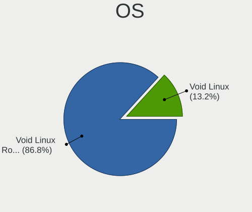

| Name               | Notebooks | Percent |
|--------------------|-----------|---------|
| Void Linux Rolling | 184       | 86.79%  |
| Void Linux         | 28        | 13.21%  |

OS Family
---------

OS without a version

| Name       | Notebooks | Percent |
|------------|-----------|---------|
| Void Linux | 211       | 100%    |

Kernel
------

Version of the Linux kernel

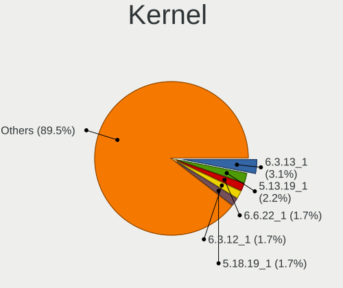

| Version   | Notebooks | Percent |
|-----------|-----------|---------|
| 6.3.13_1  | 7         | 3.06%   |
| 5.13.19_1 | 5         | 2.18%   |
| 6.6.22_1  | 4         | 1.75%   |
| 6.3.12_1  | 4         | 1.75%   |
| 5.18.19_1 | 4         | 1.75%   |
| 6.9.12_1  | 3         | 1.31%   |
| 6.6.63_1  | 3         | 1.31%   |
| 6.6.52_1  | 3         | 1.31%   |
| 6.12.9_1  | 3         | 1.31%   |
| 6.12.23_1 | 3         | 1.31%   |
| 6.12.11_1 | 3         | 1.31%   |
| 6.1.4_1   | 3         | 1.31%   |
| 5.8.18_1  | 3         | 1.31%   |
| 5.8.12_1  | 3         | 1.31%   |
| 5.3.9_1   | 3         | 1.31%   |
| 5.19.17_1 | 3         | 1.31%   |
| 5.10.17_1 | 3         | 1.31%   |
| 6.7.6_1   | 2         | 0.87%   |
| 6.6.9_1   | 2         | 0.87%   |
| 6.6.25_1  | 2         | 0.87%   |
| 6.6.16_1  | 2         | 0.87%   |
| 6.6.11_1  | 2         | 0.87%   |
| 6.5.13_1  | 2         | 0.87%   |
| 6.5.11_1  | 2         | 0.87%   |
| 6.5.10_1  | 2         | 0.87%   |
| 6.16.8_1  | 2         | 0.87%   |
| 6.16.0_1  | 2         | 0.87%   |
| 6.14.2_1  | 2         | 0.87%   |
| 6.12.60_1 | 2         | 0.87%   |
| 6.12.54_1 | 2         | 0.87%   |
| 6.12.33_1 | 2         | 0.87%   |
| 6.12.25_1 | 2         | 0.87%   |
| 6.12.17_1 | 2         | 0.87%   |
| 6.12.16_1 | 2         | 0.87%   |
| 6.12.12_1 | 2         | 0.87%   |
| 6.11.5_1  | 2         | 0.87%   |
| 6.1.31_1  | 2         | 0.87%   |
| 6.1.21_1  | 2         | 0.87%   |
| 6.1.10_1  | 2         | 0.87%   |
| 5.4.24_1  | 2         | 0.87%   |

Kernel Family
-------------

Linux kernel without a distro release

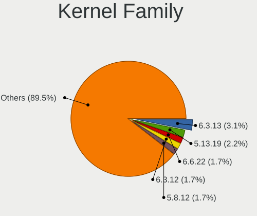

| Version | Notebooks | Percent |
|---------|-----------|---------|
| 6.3.13  | 7         | 3.06%   |
| 5.13.19 | 5         | 2.18%   |
| 6.6.22  | 4         | 1.75%   |
| 6.3.12  | 4         | 1.75%   |
| 5.8.12  | 4         | 1.75%   |
| 5.18.19 | 4         | 1.75%   |
| 6.9.12  | 3         | 1.31%   |
| 6.6.63  | 3         | 1.31%   |
| 6.6.52  | 3         | 1.31%   |
| 6.12.9  | 3         | 1.31%   |
| 6.12.60 | 3         | 1.31%   |
| 6.12.23 | 3         | 1.31%   |
| 6.12.11 | 3         | 1.31%   |
| 6.1.4   | 3         | 1.31%   |
| 5.8.18  | 3         | 1.31%   |
| 5.3.9   | 3         | 1.31%   |
| 5.19.17 | 3         | 1.31%   |
| 5.10.17 | 3         | 1.31%   |
| 6.7.6   | 2         | 0.87%   |
| 6.6.9   | 2         | 0.87%   |
| 6.6.25  | 2         | 0.87%   |
| 6.6.16  | 2         | 0.87%   |
| 6.6.11  | 2         | 0.87%   |
| 6.5.13  | 2         | 0.87%   |
| 6.5.11  | 2         | 0.87%   |
| 6.5.10  | 2         | 0.87%   |
| 6.16.8  | 2         | 0.87%   |
| 6.16.0  | 2         | 0.87%   |
| 6.14.2  | 2         | 0.87%   |
| 6.12.54 | 2         | 0.87%   |
| 6.12.33 | 2         | 0.87%   |
| 6.12.25 | 2         | 0.87%   |
| 6.12.17 | 2         | 0.87%   |
| 6.12.16 | 2         | 0.87%   |
| 6.12.12 | 2         | 0.87%   |
| 6.11.5  | 2         | 0.87%   |
| 6.1.31  | 2         | 0.87%   |
| 6.1.21  | 2         | 0.87%   |
| 6.1.10  | 2         | 0.87%   |
| 5.4.24  | 2         | 0.87%   |

Kernel Major Ver.
-----------------

Linux kernel major version

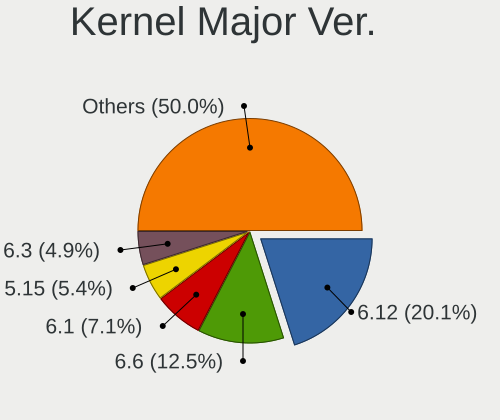

| Version | Notebooks | Percent |
|---------|-----------|---------|
| 6.12    | 45        | 20.09%  |
| 6.6     | 28        | 12.5%   |
| 6.1     | 16        | 7.14%   |
| 5.15    | 12        | 5.36%   |
| 6.3     | 11        | 4.91%   |
| 5.8     | 11        | 4.91%   |
| 5.13    | 11        | 4.91%   |
| 6.5     | 8         | 3.57%   |
| 5.18    | 7         | 3.13%   |
| 5.12    | 7         | 3.13%   |
| 5.10    | 7         | 3.13%   |
| 6.9     | 6         | 2.68%   |
| 6.16    | 6         | 2.68%   |
| 5.4     | 5         | 2.23%   |
| 5.19    | 5         | 2.23%   |
| 6.8     | 4         | 1.79%   |
| 6.11    | 4         | 1.79%   |
| 6.14    | 3         | 1.34%   |
| 6.0     | 3         | 1.34%   |
| 5.9     | 3         | 1.34%   |
| 5.3     | 3         | 1.34%   |
| 6.7     | 2         | 0.89%   |
| 6.2     | 2         | 0.89%   |
| 6.18    | 2         | 0.89%   |
| 5.16    | 2         | 0.89%   |
| 6.4     | 1         | 0.45%   |
| 6.17    | 1         | 0.45%   |
| 6.15    | 1         | 0.45%   |
| 6.10    | 1         | 0.45%   |
| 5.7     | 1         | 0.45%   |
| 5.2     | 1         | 0.45%   |
| 5.14    | 1         | 0.45%   |
| 5.11    | 1         | 0.45%   |
| 5.1     | 1         | 0.45%   |
| 4.4     | 1         | 0.45%   |
| 4.14    | 1         | 0.45%   |

Arch
----

OS architecture (x86_64, i586, etc.)

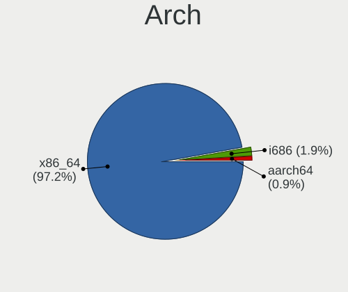

| Name    | Notebooks | Percent |
|---------|-----------|---------|
| x86_64  | 205       | 97.16%  |
| i686    | 4         | 1.9%    |
| aarch64 | 2         | 0.95%   |

DE
--

Desktop Environment

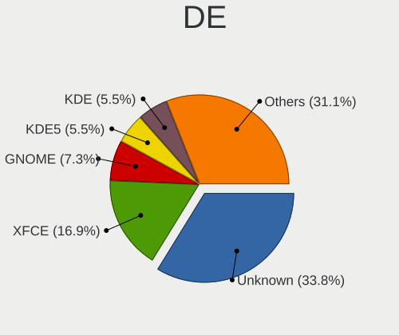

| Name                | Notebooks | Percent |
|---------------------|-----------|---------|
| Unknown             | 74        | 33.79%  |
| XFCE                | 37        | 16.89%  |
| GNOME               | 16        | 7.31%   |
| KDE5                | 12        | 5.48%   |
| KDE                 | 12        | 5.48%   |
| KDE6                | 11        | 5.02%   |
| MATE                | 10        | 4.57%   |
| sway                | 9         | 4.11%   |
| i3                  | 8         | 3.65%   |
| X-Cinnamon          | 5         | 2.28%   |
| dwm                 | 3         | 1.37%   |
| bspwm               | 3         | 1.37%   |
| river               | 2         | 0.91%   |
| niri                | 2         | 0.91%   |
| LXQt                | 2         | 0.91%   |
| Hyprland            | 2         | 0.91%   |
| awesome             | 2         | 0.91%   |
| X-Generic           | 1         | 0.46%   |
| sway:wlroots:swayfx | 1         | 0.46%   |
| sway:wlroots        | 1         | 0.46%   |
| openbox             | 1         | 0.46%   |
| LXDE                | 1         | 0.46%   |
| Lumina              | 1         | 0.46%   |
| Enlightenment       | 1         | 0.46%   |
| dot-xsession        | 1         | 0.46%   |
| awesome-with-dbus   | 1         | 0.46%   |

Display Server
--------------

X11 or Wayland

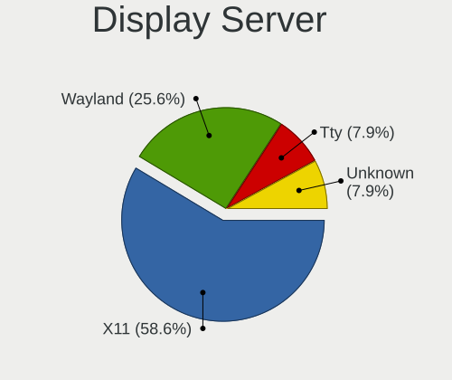

| Name    | Notebooks | Percent |
|---------|-----------|---------|
| X11     | 126       | 58.6%   |
| Wayland | 55        | 25.58%  |
| Tty     | 17        | 7.91%   |
| Unknown | 17        | 7.91%   |

Display Manager
---------------

SDDM, LightDM, etc.

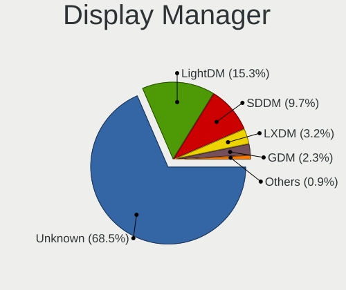

| Name    | Notebooks | Percent |
|---------|-----------|---------|
| Unknown | 148       | 68.52%  |
| LightDM | 33        | 15.28%  |
| SDDM    | 21        | 9.72%   |
| LXDM    | 7         | 3.24%   |
| GDM     | 5         | 2.31%   |
| SLiM    | 1         | 0.46%   |
| LDM     | 1         | 0.46%   |

OS Lang
-------

Language

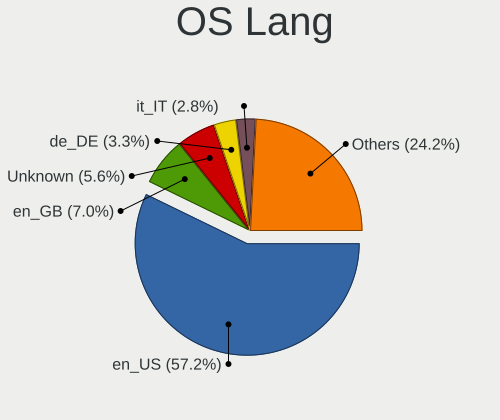

| Lang    | Notebooks | Percent |
|---------|-----------|---------|
| en_US   | 123       | 57.21%  |
| en_GB   | 15        | 6.98%   |
| Unknown | 12        | 5.58%   |
| de_DE   | 7         | 3.26%   |
| it_IT   | 6         | 2.79%   |
| en_DK   | 6         | 2.79%   |
| C       | 6         | 2.79%   |
| pt_BR   | 5         | 2.33%   |
| en_CA   | 5         | 2.33%   |
| es_ES   | 4         | 1.86%   |
| en_AU   | 4         | 1.86%   |
| ru_RU   | 3         | 1.4%    |
| tr_TR   | 2         | 0.93%   |
| fr_FR   | 2         | 0.93%   |
| en_NZ   | 2         | 0.93%   |
| ru_UA   | 1         | 0.47%   |
| pt_PT   | 1         | 0.47%   |
| pl_PL   | 1         | 0.47%   |
| nb_NO   | 1         | 0.47%   |
| es_UY   | 1         | 0.47%   |
| es_HN   | 1         | 0.47%   |
| es_EC   | 1         | 0.47%   |
| es_DO   | 1         | 0.47%   |
| es_CL   | 1         | 0.47%   |
| es_AR   | 1         | 0.47%   |
| en_PH   | 1         | 0.47%   |
| el_GR   | 1         | 0.47%   |
| ca_ES   | 1         | 0.47%   |

Boot Mode
---------

EFI or BIOS

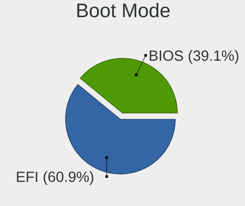

| Mode | Notebooks | Percent |
|------|-----------|---------|
| EFI  | 131       | 60.93%  |
| BIOS | 84        | 39.07%  |

Filesystem
----------

Type of filesystem

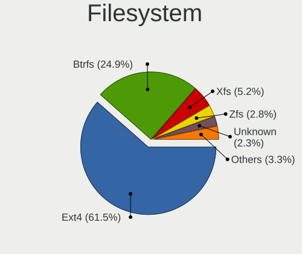

| Type    | Notebooks | Percent |
|---------|-----------|---------|
| Ext4    | 131       | 61.5%   |
| Btrfs   | 53        | 24.88%  |
| Xfs     | 11        | 5.16%   |
| Zfs     | 6         | 2.82%   |
| Unknown | 5         | 2.35%   |
| Overlay | 4         | 1.88%   |
| F2fs    | 2         | 0.94%   |
| Ext3    | 1         | 0.47%   |

Part. scheme
------------

Scheme of partitioning

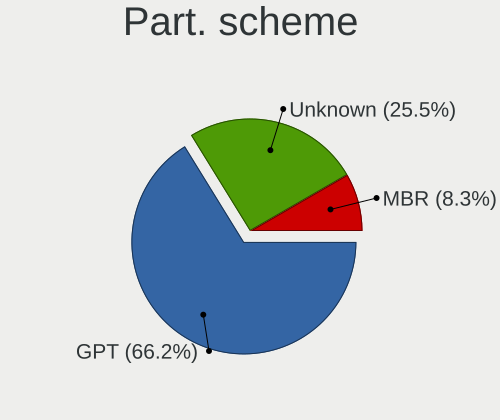

| Type    | Notebooks | Percent |
|---------|-----------|---------|
| GPT     | 143       | 66.2%   |
| Unknown | 55        | 25.46%  |
| MBR     | 18        | 8.33%   |

Dual Boot with Linux/BSD
------------------------

Hosting more than one Linux/BSD

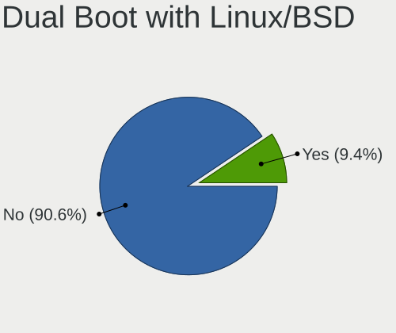

| Dual boot | Notebooks | Percent |
|-----------|-----------|---------|
| No        | 193       | 90.61%  |
| Yes       | 20        | 9.39%   |

Dual Boot (Win)
---------------

Hosting Linux and Windows

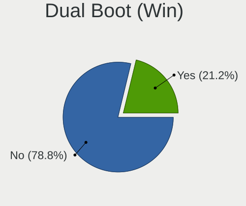

| Dual boot | Notebooks | Percent |
|-----------|-----------|---------|
| No        | 167       | 78.77%  |
| Yes       | 45        | 21.23%  |

Board
-----

Vendor
------

Motherboard manufacturer

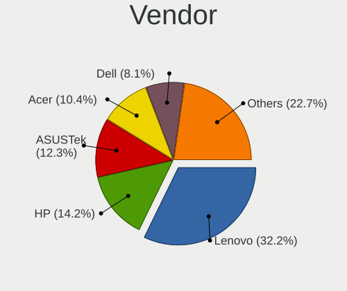

| Name                           | Notebooks | Percent |
|--------------------------------|-----------|---------|
| Lenovo                         | 68        | 32.23%  |
| Hewlett-Packard                | 30        | 14.22%  |
| ASUSTek Computer               | 26        | 12.32%  |
| Acer                           | 22        | 10.43%  |
| Dell                           | 17        | 8.06%   |
| MSI                            | 8         | 3.79%   |
| TUXEDO                         | 4         | 1.9%    |
| HUAWEI                         | 4         | 1.9%    |
| Apple                          | 4         | 1.9%    |
| Positivo                       | 3         | 1.42%   |
| Unknown                        | 3         | 1.42%   |
| Notebook                       | 2         | 0.95%   |
| Fujitsu                        | 2         | 0.95%   |
| Framework                      | 2         | 0.95%   |
| Toshiba                        | 1         | 0.47%   |
| Timi                           | 1         | 0.47%   |
| TECNO Mobile Limited           | 1         | 0.47%   |
| SHENZHEN YOUDISI E-COMMERCE    | 1         | 0.47%   |
| Samsung Electronics            | 1         | 0.47%   |
| Razer                          | 1         | 0.47%   |
| Pine Microsystems              | 1         | 0.47%   |
| Nokia                          | 1         | 0.47%   |
| Matsushita Electric Industrial | 1         | 0.47%   |
| Google                         | 1         | 0.47%   |
| Getac                          | 1         | 0.47%   |
| Exo                            | 1         | 0.47%   |
| EVOO                           | 1         | 0.47%   |
| Digibras                       | 1         | 0.47%   |
| Chuwi                          | 1         | 0.47%   |
| Casper                         | 1         | 0.47%   |

Model
-----

Motherboard model

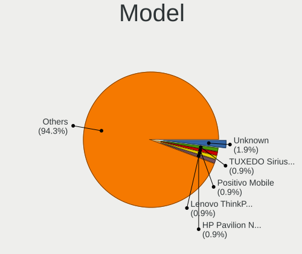

| Name                                        | Notebooks | Percent |
|---------------------------------------------|-----------|---------|
| Unknown                                     | 4         | 1.9%    |
| TUXEDO Sirius 16 Gen2                       | 2         | 0.95%   |
| Positivo Mobile                             | 2         | 0.95%   |
| Lenovo ThinkPad P16s Gen 1 21CKCTO1WW       | 2         | 0.95%   |
| HP Pavilion Notebook                        | 2         | 0.95%   |
| HP Pavilion 15                              | 2         | 0.95%   |
| HP Laptop 15-bw0xx                          | 2         | 0.95%   |
| HP 15                                       | 2         | 0.95%   |
| Dell XPS 15 9500                            | 2         | 0.95%   |
| ASUS X751LD                                 | 2         | 0.95%   |
| Apple MacBookPro11,1                        | 2         | 0.95%   |
| Acer Swift SF314-42                         | 2         | 0.95%   |
| TUXEDO Pulse 14 Gen3                        | 1         | 0.47%   |
| TUXEDO Aura 15 Gen1                         | 1         | 0.47%   |
| Toshiba Satellite A200                      | 1         | 0.47%   |
| Timi Redmi Book Pro 15 2022                 | 1         | 0.47%   |
| TECNO Mobile Limited MEGABOOK K16SDA        | 1         | 0.47%   |
| SHENZHEN YOUDISI E-COMMERCE LAITNIN G5      | 1         | 0.47%   |
| Samsung 275E4E/275E5E                       | 1         | 0.47%   |
| Razer Blade 14 (2022) - RZ09-0427           | 1         | 0.47%   |
| Positivo R732512BI-15                       | 1         | 0.47%   |
| Pine Microsystems Pine64 Pinebook Pro       | 1         | 0.47%   |
| Notebook NV4XMB,ME,MZ                       | 1         | 0.47%   |
| Notebook NH50_70RA                          | 1         | 0.47%   |
| Nokia Booklet 3G                            | 1         | 0.47%   |
| MSI Summit E13FlipEvo A12MT                 | 1         | 0.47%   |
| MSI Prestige 15 A10SC                       | 1         | 0.47%   |
| MSI Modern 14 C5M                           | 1         | 0.47%   |
| MSI GV72 7RE                                | 1         | 0.47%   |
| MSI GF63 Thin 10SCXR                        | 1         | 0.47%   |
| MSI GE60 2OC\2OD\2OE                        | 1         | 0.47%   |
| MSI Bravo 15 A4DDR                          | 1         | 0.47%   |
| Matsushita Electric Industrial CF-74GCDADBM | 1         | 0.47%   |
| Lenovo Yoga Slim 7 14IMH9 83GM              | 1         | 0.47%   |
| Lenovo Y520-15IKB 80YY                      | 1         | 0.47%   |
| Lenovo V15 G4 AMN 82YU                      | 1         | 0.47%   |
| Lenovo ThinkPad X260 20F5S08Q00             | 1         | 0.47%   |
| Lenovo ThinkPad X240 20AMA34HMN             | 1         | 0.47%   |
| Lenovo ThinkPad X201 3680BR4                | 1         | 0.47%   |
| Lenovo ThinkPad X13 Gen 4 MFG_IN_GO        | 1         | 0.47%   |

Model Family
------------

Motherboard model prefix

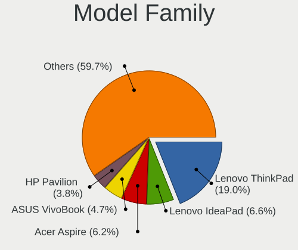

| Name                                | Notebooks | Percent |
|-------------------------------------|-----------|---------|
| Lenovo ThinkPad                     | 40        | 18.96%  |
| Lenovo IdeaPad                      | 14        | 6.64%   |
| Acer Aspire                         | 13        | 6.16%   |
| ASUS VivoBook                       | 10        | 4.74%   |
| HP Pavilion                         | 8         | 3.79%   |
| Dell Latitude                       | 7         | 3.32%   |
| HP Laptop                           | 6         | 2.84%   |
| Lenovo ThinkBook                    | 4         | 1.9%    |
| Dell Inspiron                       | 4         | 1.9%    |
| ASUS ASUS                           | 4         | 1.9%    |
| Unknown                             | 4         | 1.9%    |
| TUXEDO Sirius                       | 2         | 0.95%   |
| Positivo Mobile                     | 2         | 0.95%   |
| Lenovo LOQ                          | 2         | 0.95%   |
| Lenovo Legion                       | 2         | 0.95%   |
| HP Stream                           | 2         | 0.95%   |
| HP ENVY                             | 2         | 0.95%   |
| HP EliteBook                        | 2         | 0.95%   |
| HP 255                              | 2         | 0.95%   |
| HP 15                               | 2         | 0.95%   |
| Framework Laptop                    | 2         | 0.95%   |
| Dell XPS                            | 2         | 0.95%   |
| ASUS X751LD                         | 2         | 0.95%   |
| Apple MacBookPro11                  | 2         | 0.95%   |
| Acer Swift                          | 2         | 0.95%   |
| Acer Nitro                          | 2         | 0.95%   |
| TUXEDO Pulse                        | 1         | 0.47%   |
| TUXEDO Aura                         | 1         | 0.47%   |
| Toshiba Satellite                   | 1         | 0.47%   |
| Timi Redmi                          | 1         | 0.47%   |
| TECNO Mobile Limited MEGABOOK       | 1         | 0.47%   |
| SHENZHEN YOUDISI E-COMMERCE LAITNIN | 1         | 0.47%   |
| Samsung 275E4E                      | 1         | 0.47%   |
| Razer Blade                         | 1         | 0.47%   |
| Positivo R732512BI-15               | 1         | 0.47%   |
| Pine Microsystems Pine64            | 1         | 0.47%   |
| Notebook NV4XMB                     | 1         | 0.47%   |
| Notebook NH50                       | 1         | 0.47%   |
| Nokia Booklet                       | 1         | 0.47%   |
| MSI Summit                          | 1         | 0.47%   |

MFG Year
--------

Motherboard manufacture year

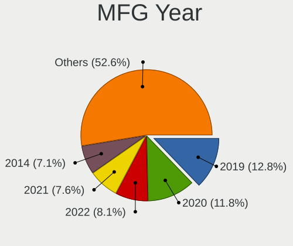

| Year    | Notebooks | Percent |
|---------|-----------|---------|
| 2019    | 27        | 12.8%   |
| 2020    | 25        | 11.85%  |
| 2022    | 17        | 8.06%   |
| 2021    | 16        | 7.58%   |
| 2014    | 15        | 7.11%   |
| 2013    | 14        | 6.64%   |
| 2018    | 13        | 6.16%   |
| 2023    | 12        | 5.69%   |
| 2024    | 10        | 4.74%   |
| 2016    | 10        | 4.74%   |
| 2015    | 10        | 4.74%   |
| 2011    | 8         | 3.79%   |
| 2017    | 7         | 3.32%   |
| 2012    | 5         | 2.37%   |
| 2010    | 4         | 1.9%    |
| 2009    | 4         | 1.9%    |
| 2007    | 4         | 1.9%    |
| 2008    | 3         | 1.42%   |
| 2025    | 2         | 0.95%   |
| 2006    | 2         | 0.95%   |
| Unknown | 2         | 0.95%   |
| 2005    | 1         | 0.47%   |

Form Factor
-----------

Physical design of the computer

| Name     | Notebooks | Percent |
|----------|-----------|---------|
| Notebook | 211       | 100%    |

Secure Boot
-----------

Enabled or disabled

| State    | Notebooks | Percent |
|----------|-----------|---------|
| Disabled | 211       | 100%    |

Coreboot
--------

Have coreboot on board

| Used | Notebooks | Percent |
|------|-----------|---------|
| No   | 210       | 99.53%  |
| Yes  | 1         | 0.47%   |

RAM Size
--------

Total RAM memory

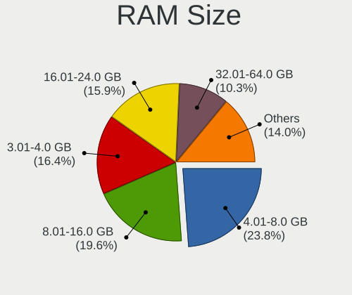

| Size in GB  | Notebooks | Percent |
|-------------|-----------|---------|
| 4.01-8.0    | 51        | 23.83%  |
| 8.01-16.0   | 42        | 19.63%  |
| 3.01-4.0    | 35        | 16.36%  |
| 16.01-24.0  | 34        | 15.89%  |
| 32.01-64.0  | 22        | 10.28%  |
| 24.01-32.0  | 12        | 5.61%   |
| 1.01-2.0    | 12        | 5.61%   |
| 64.01-256.0 | 3         | 1.4%    |
| 0.51-1.0    | 2         | 0.93%   |
| 0.01-0.5    | 1         | 0.47%   |

RAM Used
--------

Used RAM memory

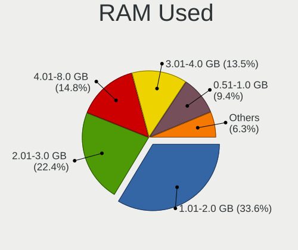

| Used GB    | Notebooks | Percent |
|------------|-----------|---------|
| 1.01-2.0   | 75        | 33.63%  |
| 2.01-3.0   | 50        | 22.42%  |
| 4.01-8.0   | 33        | 14.8%   |
| 3.01-4.0   | 30        | 13.45%  |
| 0.51-1.0   | 21        | 9.42%   |
| 8.01-16.0  | 8         | 3.59%   |
| 0.01-0.5   | 5         | 2.24%   |
| 16.01-24.0 | 1         | 0.45%   |

Total Drives
------------

Number of drives on board

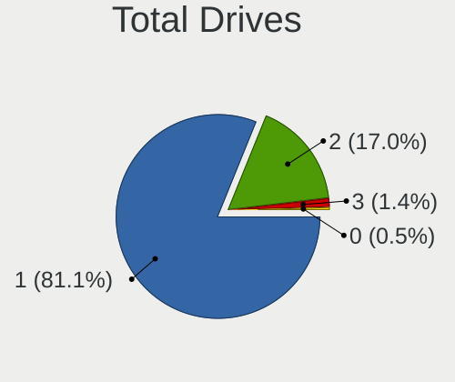

| Drives | Notebooks | Percent |
|--------|-----------|---------|
| 1      | 172       | 81.13%  |
| 2      | 36        | 16.98%  |
| 3      | 3         | 1.42%   |
| 0      | 1         | 0.47%   |

Has CD-ROM
----------

Has CD-ROM on board

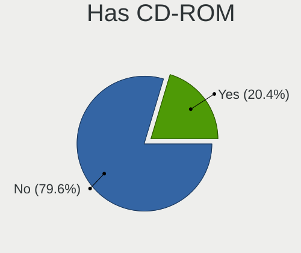

| Presented | Notebooks | Percent |
|-----------|-----------|---------|
| No        | 168       | 79.62%  |
| Yes       | 43        | 20.38%  |

Has Ethernet
------------

Has Ethernet on board

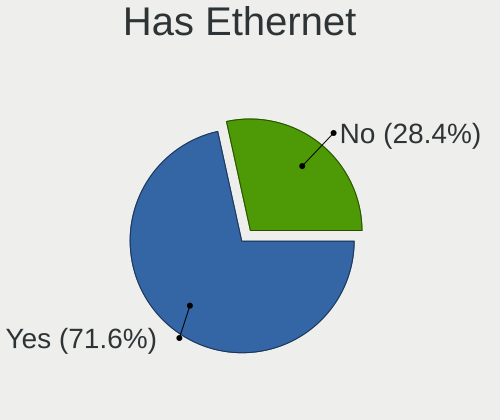

| Presented | Notebooks | Percent |
|-----------|-----------|---------|
| Yes       | 151       | 71.56%  |
| No        | 60        | 28.44%  |

Has WiFi
--------

Has WiFi module

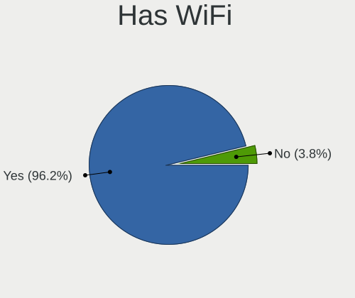

| Presented | Notebooks | Percent |
|-----------|-----------|---------|
| Yes       | 203       | 96.21%  |
| No        | 8         | 3.79%   |

Has Bluetooth
-------------

Has Bluetooth module

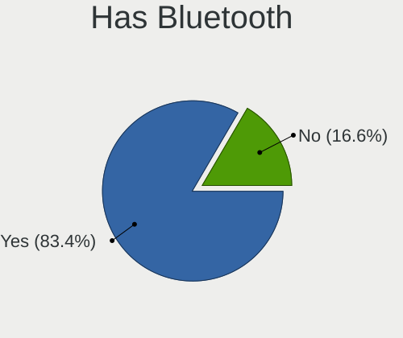

| Presented | Notebooks | Percent |
|-----------|-----------|---------|
| Yes       | 176       | 83.41%  |
| No        | 35        | 16.59%  |

Location
--------

Country
-------

Geographic location (country)

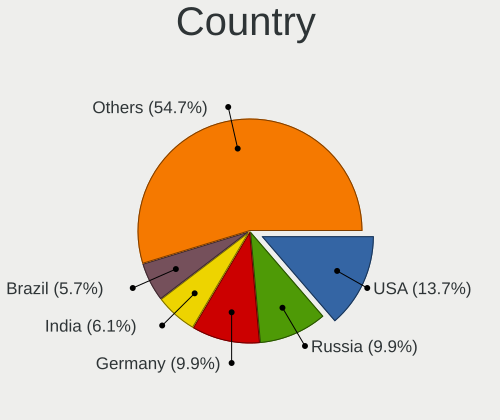

| Country      | Notebooks | Percent |
|--------------|-----------|---------|
| USA          | 29        | 13.68%  |
| Russia       | 21        | 9.91%   |
| Germany      | 21        | 9.91%   |
| India        | 13        | 6.13%   |
| Brazil       | 12        | 5.66%   |
| UK           | 10        | 4.72%   |
| Italy        | 8         | 3.77%   |
| Canada       | 8         | 3.77%   |
| Turkey       | 7         | 3.3%    |
| Switzerland  | 5         | 2.36%   |
| Denmark      | 5         | 2.36%   |
| Ukraine      | 4         | 1.89%   |
| Romania      | 4         | 1.89%   |
| France       | 4         | 1.89%   |
| Czechia      | 4         | 1.89%   |
| Vietnam      | 3         | 1.42%   |
| Poland       | 3         | 1.42%   |
| Norway       | 3         | 1.42%   |
| Netherlands  | 3         | 1.42%   |
| Belarus      | 3         | 1.42%   |
| Australia    | 3         | 1.42%   |
| Argentina    | 3         | 1.42%   |
| Uruguay      | 2         | 0.94%   |
| Thailand     | 2         | 0.94%   |
| Spain        | 2         | 0.94%   |
| Portugal     | 2         | 0.94%   |
| Philippines  | 2         | 0.94%   |
| Morocco      | 2         | 0.94%   |
| Mexico       | 2         | 0.94%   |
| Indonesia    | 2         | 0.94%   |
| Greece       | 2         | 0.94%   |
| Ecuador      | 2         | 0.94%   |
| Bulgaria     | 2         | 0.94%   |
| Serbia       | 1         | 0.47%   |
| Saudi Arabia | 1         | 0.47%   |
| Peru         | 1         | 0.47%   |
| New Zealand  | 1         | 0.47%   |
| Latvia       | 1         | 0.47%   |
| Jordan       | 1         | 0.47%   |
| Honduras     | 1         | 0.47%   |

City
----

Geographic location (city)

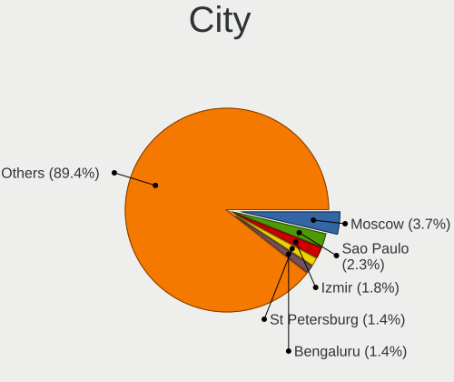

| City               | Notebooks | Percent |
|--------------------|-----------|---------|
| Moscow             | 8         | 3.67%   |
| Sao Paulo          | 5         | 2.29%   |
| Izmir              | 4         | 1.83%   |
| St Petersburg      | 3         | 1.38%   |
| Bengaluru          | 3         | 1.38%   |
| Sydney             | 2         | 0.92%   |
| Spring Hill        | 2         | 0.92%   |
| Rome               | 2         | 0.92%   |
| Prague             | 2         | 0.92%   |
| Piteşti           | 2         | 0.92%   |
| Munich             | 2         | 0.92%   |
| Meknes             | 2         | 0.92%   |
| London             | 2         | 0.92%   |
| Istanbul           | 2         | 0.92%   |
| Hyderabad          | 2         | 0.92%   |
| Harrisonburg       | 2         | 0.92%   |
| Hanover            | 2         | 0.92%   |
| Geneva             | 2         | 0.92%   |
| Bangkok            | 2         | 0.92%   |
| Aalborg            | 2         | 0.92%   |
| Zarqa              | 1         | 0.46%   |
| Yambol             | 1         | 0.46%   |
| Wooster            | 1         | 0.46%   |
| Woodstock          | 1         | 0.46%   |
| Winsford           | 1         | 0.46%   |
| Wilen bei Wollerau | 1         | 0.46%   |
| Weatherford        | 1         | 0.46%   |
| Warsaw             | 1         | 0.46%   |
| Volgograd          | 1         | 0.46%   |
| Vlaardingen        | 1         | 0.46%   |
| Vienna             | 1         | 0.46%   |
| Viby J             | 1         | 0.46%   |
| Verkhnyaya Pyshma  | 1         | 0.46%   |
| Vancouver          | 1         | 0.46%   |
| Ufa                | 1         | 0.46%   |
| Turin              | 1         | 0.46%   |
| Trujillo           | 1         | 0.46%   |
| Toulouse           | 1         | 0.46%   |
| Touget             | 1         | 0.46%   |
| Toronto            | 1         | 0.46%   |

Drives
------

Drive Vendor
------------

Hard drive vendors

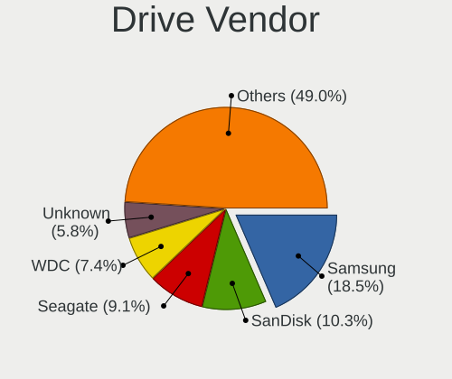

| Vendor                       | Notebooks | Drives | Percent |
|------------------------------|-----------|--------|---------|
| Samsung Electronics          | 45        | 53     | 18.52%  |
| SanDisk                      | 25        | 26     | 10.29%  |
| Seagate                      | 22        | 23     | 9.05%   |
| WDC                          | 18        | 20     | 7.41%   |
| Unknown                      | 14        | 21     | 5.76%   |
| SK hynix                     | 14        | 16     | 5.76%   |
| Kingston                     | 11        | 11     | 4.53%   |
| Intel                        | 10        | 11     | 4.12%   |
| Toshiba                      | 9         | 9      | 3.7%    |
| Micron Technology            | 8         | 11     | 3.29%   |
| HGST                         | 8         | 9      | 3.29%   |
| KIOXIA                       | 7         | 8      | 2.88%   |
| Hitachi                      | 6         | 6      | 2.47%   |
| Crucial                      | 6         | 7      | 2.47%   |
| Lenovo                       | 5         | 5      | 2.06%   |
| Kingston Technology Company  | 4         | 4      | 1.65%   |
| Apple                        | 3         | 3      | 1.23%   |
| Phison Electronics           | 2         | 2      | 0.82%   |
| Phison                       | 2         | 2      | 0.82%   |
| Patriot                      | 2         | 2      | 0.82%   |
| MAXIO Technology (Hangzhou)  | 2         | 3      | 0.82%   |
| China                        | 2         | 2      | 0.82%   |
| A-DATA Technology            | 2         | 2      | 0.82%   |
| XrayDisk                     | 1         | 1      | 0.41%   |
| Union Memory (Shenzhen)      | 1         | 1      | 0.41%   |
| Transcend                    | 1         | 1      | 0.41%   |
| T-FORCE                      | 1         | 1      | 0.41%   |
| Shenzhen Longsys Electronics | 1         | 1      | 0.41%   |
| Realtek Semiconductor        | 1         | 1      | 0.41%   |
| Realtek                      | 1         | 1      | 0.41%   |
| PNY                          | 1         | 1      | 0.41%   |
| ORIGIN                       | 1         | 1      | 0.41%   |
| Micron/Crucial Technology    | 1         | 1      | 0.41%   |
| INNOVATION IT                | 1         | 1      | 0.41%   |
| IBM/Hitachi                  | 1         | 1      | 0.41%   |
| Fujitsu                      | 1         | 1      | 0.41%   |
| BHT                          | 1         | 1      | 0.41%   |
| ADATA Technology             | 1         | 2      | 0.41%   |
| Unknown                      | 1         | 1      | 0.41%   |

Drive Model
-----------

Hard drive models

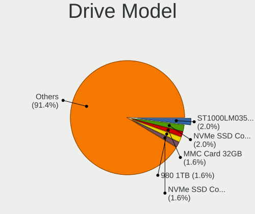

| Model                                                | Notebooks | Percent |
|------------------------------------------------------|-----------|---------|
| Seagate ST1000LM035-1RK172 1TB                       | 5         | 1.96%   |
| Samsung NVMe SSD Controller PM9A1/PM9A3/980PRO 1TB   | 5         | 1.96%   |
| Unknown MMC Card  32GB                               | 4         | 1.57%   |
| Samsung SSD 980 1TB                                  | 4         | 1.57%   |
| Samsung NVMe SSD Controller SM961/PM961/SM963 1024GB | 4         | 1.57%   |
| Unknown MMC Card  64GB                               | 3         | 1.18%   |
| Toshiba MQ01ABF050 500GB                             | 3         | 1.18%   |
| Seagate ST500LM012 HN-M500MBB 500GB                  | 3         | 1.18%   |
| Sandisk WD Black SN750 / PC SN730 NVMe SSD 500GB     | 3         | 1.18%   |
| Samsung NVMe SSD Controller SM981/PM981/PM983 1TB    | 3         | 1.18%   |
| Lenovo LENSE30256GMSP34MEAT3TA 256GB                 | 3         | 1.18%   |
| Intel SSDPEKNU512GZ 512GB                            | 3         | 1.18%   |
| HGST HTS545050A7E680 500GB                           | 3         | 1.18%   |
| Crucial CT500MX500SSD1 500GB                         | 3         | 1.18%   |
| Unknown MMC Card  8GB                                | 2         | 0.78%   |
| Unknown MMC Card  128GB                              | 2         | 0.78%   |
| Toshiba MQ01ABD100 1TB                               | 2         | 0.78%   |
| SK hynix SKHynix_HFS001TD9TNI-L2B0B 1TB              | 2         | 0.78%   |
| Seagate ST1000LM049-2GH172 1TB                       | 2         | 0.78%   |
| Seagate ST1000LM024 HN-M101MBB 1TB                   | 2         | 0.78%   |
| Sandisk WD PC SN5000S SDEPMSJ-512G-1101 512GB        | 2         | 0.78%   |
| Sandisk WD Blue SN550 NVMe SSD 1024GB                | 2         | 0.78%   |
| Samsung SSD 870 EVO 500GB                            | 2         | 0.78%   |
| Samsung SSD 850 EVO 500GB                            | 2         | 0.78%   |
| Samsung MZVL4512HBLU-00BTW 512GB                     | 2         | 0.78%   |
| Micron 2400 NVMe SSD (DRAM-less) 512GB               | 2         | 0.78%   |
| MAXIO (Hangzhou) NVMe SSD Controller MAP1202 2TB     | 2         | 0.78%   |
| KIOXIA KXG8AZNV1T02 LA 1024GB                        | 2         | 0.78%   |
| Kingston Company SNV2S1000G 1TB                      | 2         | 0.78%   |
| Kingston SA400S37240G 240GB SSD                      | 2         | 0.78%   |
| Intel SSDPEKNW512G8 512GB                            | 2         | 0.78%   |
| HGST HTS541010B7E610 1TB                             | 2         | 0.78%   |
| HGST HTS541010A9E680 1TB                             | 2         | 0.78%   |
| XrayDisk 128GB                                       | 1         | 0.39%   |
| WDC WD5000LPVX-22V0TT0 500GB                         | 1         | 0.39%   |
| WDC WD5000LPCX-22VHAT0 500GB                         | 1         | 0.39%   |
| WDC WD5000LPCX-21VHAT0 500GB                         | 1         | 0.39%   |
| WDC WD3200BPVT-75JJ5T0 320GB                         | 1         | 0.39%   |
| WDC WD3200BPVT-22JJ5T0 320GB                         | 1         | 0.39%   |
| WDC WD2500BEVT-22A23T0 250GB                         | 1         | 0.39%   |

HDD Vendor
----------

Hard disk drive vendors

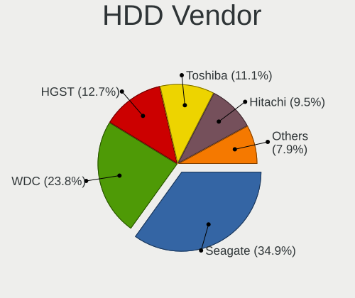

| Vendor              | Notebooks | Drives | Percent |
|---------------------|-----------|--------|---------|
| Seagate             | 22        | 23     | 34.92%  |
| WDC                 | 15        | 16     | 23.81%  |
| HGST                | 8         | 9      | 12.7%   |
| Toshiba             | 7         | 7      | 11.11%  |
| Hitachi             | 6         | 6      | 9.52%   |
| XrayDisk            | 1         | 1      | 1.59%   |
| Unknown             | 1         | 1      | 1.59%   |
| Samsung Electronics | 1         | 1      | 1.59%   |
| IBM/Hitachi         | 1         | 1      | 1.59%   |
| Fujitsu             | 1         | 1      | 1.59%   |

SSD Vendor
----------

Solid state drive vendors

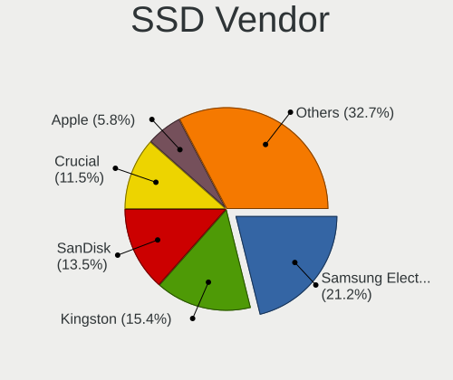

| Vendor              | Notebooks | Drives | Percent |
|---------------------|-----------|--------|---------|
| Samsung Electronics | 11        | 12     | 21.15%  |
| Kingston            | 8         | 8      | 15.38%  |
| SanDisk             | 7         | 7      | 13.46%  |
| Crucial             | 6         | 7      | 11.54%  |
| Apple               | 3         | 3      | 5.77%   |
| Patriot             | 2         | 2      | 3.85%   |
| Intel               | 2         | 2      | 3.85%   |
| China               | 2         | 2      | 3.85%   |
| A-DATA Technology   | 2         | 2      | 3.85%   |
| Transcend           | 1         | 1      | 1.92%   |
| T-FORCE             | 1         | 1      | 1.92%   |
| SK hynix            | 1         | 1      | 1.92%   |
| PNY                 | 1         | 1      | 1.92%   |
| ORIGIN              | 1         | 1      | 1.92%   |
| Lenovo              | 1         | 1      | 1.92%   |
| INNOVATION IT       | 1         | 1      | 1.92%   |
| BHT                 | 1         | 1      | 1.92%   |
| Unknown             | 1         | 1      | 1.92%   |

Drive Kind
----------

HDD or SSD

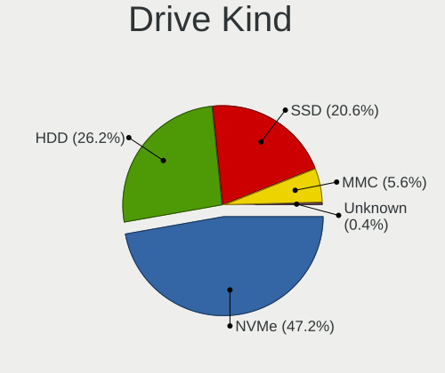

| Kind    | Notebooks | Drives | Percent |
|---------|-----------|--------|---------|
| NVMe    | 110       | 134    | 47.21%  |
| HDD     | 61        | 66     | 26.18%  |
| SSD     | 48        | 54     | 20.6%   |
| MMC     | 13        | 18     | 5.58%   |
| Unknown | 1         | 1      | 0.43%   |

Drive Connector
---------------

SATA, SAS, NVMe, etc.

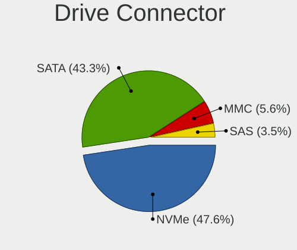

| Type | Notebooks | Drives | Percent |
|------|-----------|--------|---------|
| NVMe | 110       | 131    | 47.62%  |
| SATA | 100       | 115    | 43.29%  |
| MMC  | 13        | 18     | 5.63%   |
| SAS  | 8         | 9      | 3.46%   |

Drive Size
----------

Size of hard drive

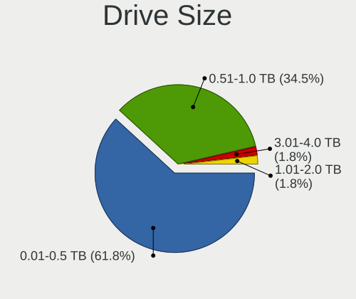

| Size in TB | Notebooks | Drives | Percent |
|------------|-----------|--------|---------|
| 0.01-0.5   | 68        | 77     | 61.82%  |
| 0.51-1.0   | 38        | 39     | 34.55%  |
| 3.01-4.0   | 2         | 2      | 1.82%   |
| 1.01-2.0   | 2         | 2      | 1.82%   |

Space Total
-----------

Amount of disk space available on the file system

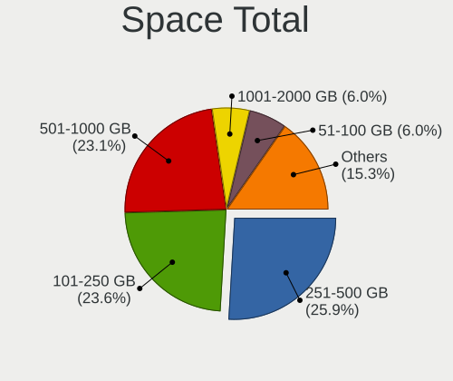

| Size in GB     | Notebooks | Percent |
|----------------|-----------|---------|
| 251-500        | 56        | 25.93%  |
| 101-250        | 51        | 23.61%  |
| 501-1000       | 50        | 23.15%  |
| 1001-2000      | 13        | 6.02%   |
| 51-100         | 13        | 6.02%   |
| 1-20           | 12        | 5.56%   |
| Unknown        | 11        | 5.09%   |
| 21-50          | 6         | 2.78%   |
| More than 3000 | 3         | 1.39%   |
| 2001-3000      | 1         | 0.46%   |

Space Used
----------

Amount of used disk space

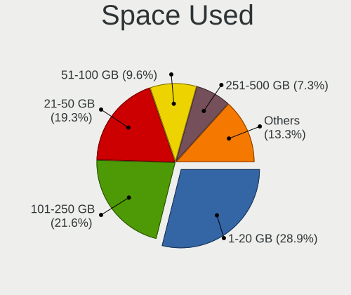

| Used GB        | Notebooks | Percent |
|----------------|-----------|---------|
| 1-20           | 63        | 28.9%   |
| 101-250        | 47        | 21.56%  |
| 21-50          | 42        | 19.27%  |
| 51-100         | 21        | 9.63%   |
| 251-500        | 16        | 7.34%   |
| 501-1000       | 13        | 5.96%   |
| Unknown        | 11        | 5.05%   |
| 1001-2000      | 3         | 1.38%   |
| More than 3000 | 2         | 0.92%   |

Malfunc. Drives
---------------

Drive models with a malfunction

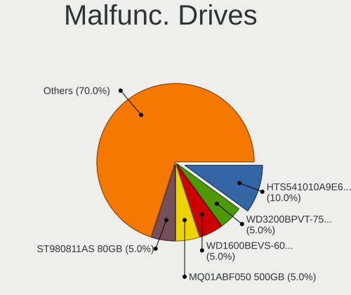

| Model                                 | Notebooks | Drives | Percent |
|---------------------------------------|-----------|--------|---------|
| HGST HTS541010A9E680 1TB              | 2         | 2      | 10%     |
| WDC WD3200BPVT-75JJ5T0 320GB          | 1         | 1      | 5%      |
| WDC WD1600BEVS-60VAT0 160GB           | 1         | 1      | 5%      |
| Toshiba MQ01ABF050 500GB              | 1         | 1      | 5%      |
| Seagate ST980811AS 80GB               | 1         | 1      | 5%      |
| Seagate ST9750420AS 752GB             | 1         | 1      | 5%      |
| Seagate ST500LT012-9WS142 500GB       | 1         | 1      | 5%      |
| Seagate ST500LM012 HN-M500MBB 500GB   | 1         | 1      | 5%      |
| Seagate ST1000LM035-1RK172 1TB        | 1         | 1      | 5%      |
| Seagate ST1000LM024 HN-M101MBB 1TB    | 1         | 1      | 5%      |
| Samsung Electronics SSD 870 EVO 500GB | 1         | 1      | 5%      |
| IBM/Hitachi IC25N040ATMR04-0 40GB     | 1         | 1      | 5%      |
| Hitachi HTS727575A9E364 752GB         | 1         | 1      | 5%      |
| Hitachi HTS545050A7E380 500GB         | 1         | 1      | 5%      |
| Hitachi HTS543216L9A300 160GB         | 1         | 1      | 5%      |
| Hitachi HTS541680J9SA00 80GB          | 1         | 1      | 5%      |
| HGST HTS545050A7E680 500GB            | 1         | 1      | 5%      |
| HGST HTS545050A7E380 500GB            | 1         | 1      | 5%      |
| Crucial CT256MX100SSD1 256GB          | 1         | 1      | 5%      |

Malfunc. Drive Vendor
---------------------

Vendors of faulty drives

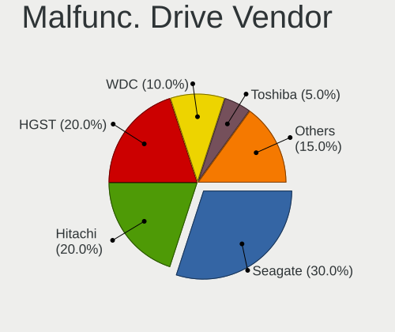

| Vendor              | Notebooks | Drives | Percent |
|---------------------|-----------|--------|---------|
| Seagate             | 6         | 6      | 30%     |
| Hitachi             | 4         | 4      | 20%     |
| HGST                | 4         | 4      | 20%     |
| WDC                 | 2         | 2      | 10%     |
| Toshiba             | 1         | 1      | 5%      |
| Samsung Electronics | 1         | 1      | 5%      |
| IBM/Hitachi         | 1         | 1      | 5%      |
| Crucial             | 1         | 1      | 5%      |

Malfunc. HDD Vendor
-------------------

Vendors of faulty HDD drives

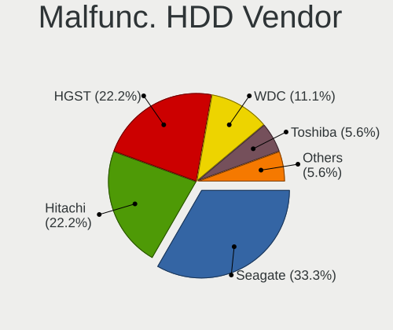

| Vendor      | Notebooks | Drives | Percent |
|-------------|-----------|--------|---------|
| Seagate     | 6         | 6      | 33.33%  |
| Hitachi     | 4         | 4      | 22.22%  |
| HGST        | 4         | 4      | 22.22%  |
| WDC         | 2         | 2      | 11.11%  |
| Toshiba     | 1         | 1      | 5.56%   |
| IBM/Hitachi | 1         | 1      | 5.56%   |

Malfunc. Drive Kind
-------------------

Kinds of faulty drives

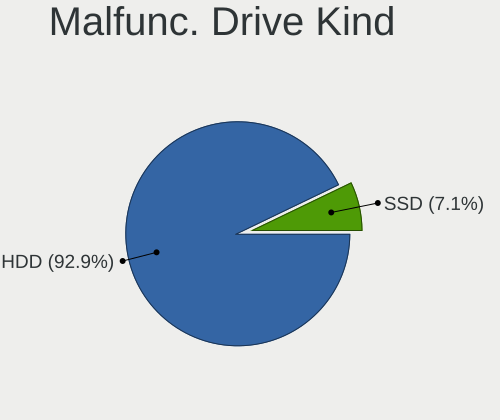

| Kind | Notebooks | Drives | Percent |
|------|-----------|--------|---------|
| HDD  | 18        | 18     | 90%     |
| SSD  | 2         | 2      | 10%     |

Failed Drives
-------------

Failed drive models

Zero info for selected period =(

Failed Drive Vendor
-------------------

Failed drive vendors

Zero info for selected period =(

Drive Status
------------

Number of failed and malfunc. drives

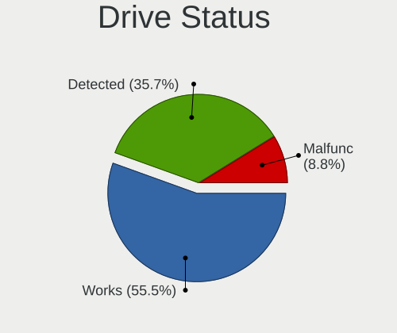

| Status   | Notebooks | Drives | Percent |
|----------|-----------|--------|---------|
| Works    | 126       | 147    | 55.51%  |
| Detected | 81        | 106    | 35.68%  |
| Malfunc  | 20        | 20     | 8.81%   |

Storage controller
------------------

Storage Vendor
--------------

Storage controller vendors

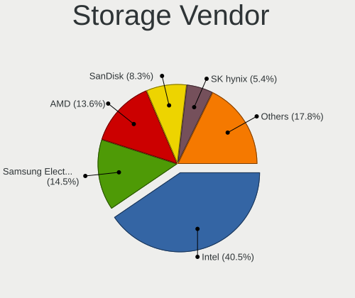

| Vendor                                  | Notebooks | Percent |
|-----------------------------------------|-----------|---------|
| Intel                                   | 98        | 40.5%   |
| Samsung Electronics                     | 35        | 14.46%  |
| AMD                                     | 33        | 13.64%  |
| SanDisk                                 | 20        | 8.26%   |
| SK hynix                                | 13        | 5.37%   |
| Micron Technology                       | 8         | 3.31%   |
| KIOXIA                                  | 7         | 2.89%   |
| Kingston Technology Company             | 7         | 2.89%   |
| Phison Electronics                      | 4         | 1.65%   |
| Lenovo                                  | 4         | 1.65%   |
| Toshiba America Info Systems            | 2         | 0.83%   |
| Nvidia                                  | 2         | 0.83%   |
| MAXIO Technology (Hangzhou)             | 2         | 0.83%   |
| Silicon Integrated Systems [SiS]        | 1         | 0.41%   |
| Shenzhen Unionmemory Information System | 1         | 0.41%   |
| Shenzhen Longsys Electronics            | 1         | 0.41%   |
| Realtek Semiconductor                   | 1         | 0.41%   |
| Micron/Crucial Technology               | 1         | 0.41%   |
| Marvell Technology Group                | 1         | 0.41%   |
| ADATA Technology                        | 1         | 0.41%   |

Storage Model
-------------

Storage controller models

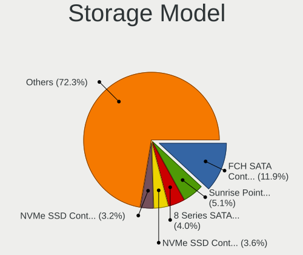

| Model                                                                        | Notebooks | Percent |
|------------------------------------------------------------------------------|-----------|---------|
| AMD FCH SATA Controller [AHCI mode]                                          | 30        | 11.86%  |
| Intel Sunrise Point-LP SATA Controller [AHCI mode]                           | 13        | 5.14%   |
| Intel 8 Series SATA Controller 1 [AHCI mode]                                 | 10        | 3.95%   |
| Samsung NVMe SSD Controller SM981/PM981/PM983                                | 9         | 3.56%   |
| Samsung NVMe SSD Controller 980 (DRAM-less)                                  | 8         | 3.16%   |
| Intel 7 Series Chipset Family 6-port SATA Controller [AHCI mode]             | 8         | 3.16%   |
| Intel 6 Series/C200 Series Chipset Family 6 port Mobile SATA AHCI Controller | 7         | 2.77%   |
| Samsung NVMe SSD Controller PM9A1/PM9A3/980PRO                               | 6         | 2.37%   |
| Intel Wildcat Point-LP SATA Controller [AHCI Mode]                           | 6         | 2.37%   |
| Intel 82801 Mobile SATA Controller [RAID mode]                               | 6         | 2.37%   |
| Samsung NVMe SSD Controller PM9B1 (DRAM-less)                                | 5         | 1.98%   |
| SK hynix Gold P31/BC711/PC711 NVMe Solid State Drive                         | 4         | 1.58%   |
| SanDisk Ultra 3D / WD PC SN530, IX SN530, Blue SN550 NVMe SSD (DRAM-less)    | 4         | 1.58%   |
| Samsung NVMe SSD Controller SM961/PM961/SM963                                | 4         | 1.58%   |
| Intel SSD 670p Series [Keystone Harbor]                                      | 4         | 1.58%   |
| Intel Cannon Lake Mobile PCH SATA AHCI Controller                            | 4         | 1.58%   |
| Intel 82801HM/HEM (ICH8M/ICH8M-E) IDE Controller                             | 4         | 1.58%   |
| SK hynix Platinum P41/PC801 NVMe Solid State Drive                           | 3         | 1.19%   |
| Sandisk WD PC SN5000S M.2 2242 NVMe SSD (DRAM-less)                          | 3         | 1.19%   |
| SanDisk Extreme Pro / WD Black SN750 / PC SN730 / Red SN700 NVMe SSD         | 3         | 1.19%   |
| Lenovo LENSE30256GMSP34MEAT3TA                                               | 3         | 1.19%   |
| KIOXIA NVMe SSD Controller BG4 (DRAM-less)                                   | 3         | 1.19%   |
| Intel Volume Management Device NVMe RAID Controller                          | 3         | 1.19%   |
| Intel SSD 660P Series                                                        | 3         | 1.19%   |
| Intel NM10/ICH7 Family SATA Controller [AHCI mode]                           | 3         | 1.19%   |
| Intel Ice Lake-LP SATA Controller [AHCI mode]                                | 3         | 1.19%   |
| Intel Cannon Point-LP SATA Controller [AHCI Mode]                            | 3         | 1.19%   |
| Intel Atom Processor E3800 Series SATA AHCI Controller                       | 3         | 1.19%   |
| Intel 82801HM/HEM (ICH8M/ICH8M-E) SATA Controller [AHCI mode]                | 3         | 1.19%   |
| Toshiba America Info Systems XG5 NVMe SSD Controller                         | 2         | 0.79%   |
| SK hynix PC611 NVMe Solid State Drive                                        | 2         | 0.79%   |
| SK hynix BC901 NVMe Solid State Drive (DRAM-less)                            | 2         | 0.79%   |
| Sandisk WD PC SN740 NVMe SSD 512GB (DRAM-less)                               | 2         | 0.79%   |
| SanDisk WD Blue SN500 / PC SN520 x2 M.2 2280 NVMe SSD                        | 2         | 0.79%   |
| Phison PS5013-E13 PCIe3 NVMe Controller (DRAM-less)                          | 2         | 0.79%   |
| Micron 2450 NVMe SSD [HendrixV] (DRAM-less)                                  | 2         | 0.79%   |
| Micron 2400 NVMe SSD (DRAM-less)                                             | 2         | 0.79%   |
| MAXIO (Hangzhou) NVMe SSD Controller MAP1202 (DRAM-less)                     | 2         | 0.79%   |
| KIOXIA NVMe SSD Controller XG8                                               | 2         | 0.79%   |
| KIOXIA NVMe SSD Controller BG5 (DRAM-less)                                   | 2         | 0.79%   |

Storage Kind
------------

Kind of storage controller (IDE, SATA, NVMe, SAS, ...)

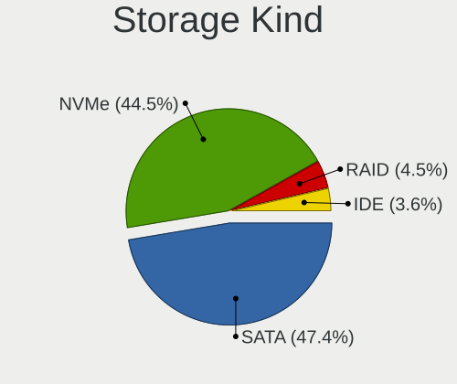

| Kind | Notebooks | Percent |
|------|-----------|---------|
| SATA | 117       | 47.37%  |
| NVMe | 110       | 44.53%  |
| RAID | 11        | 4.45%   |
| IDE  | 9         | 3.64%   |

Processor
---------

CPU Vendor
----------

Processor vendors

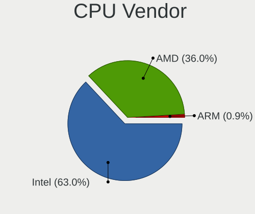

| Vendor | Notebooks | Percent |
|--------|-----------|---------|
| Intel  | 133       | 63.03%  |
| AMD    | 76        | 36.02%  |
| ARM    | 2         | 0.95%   |

CPU Model
---------

Processor models

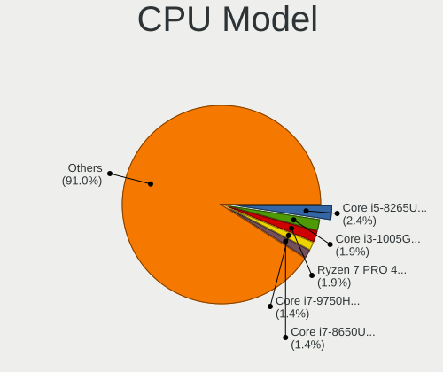

| Model                                         | Notebooks | Percent |
|-----------------------------------------------|-----------|---------|
| Intel Core i5-8265U CPU @ 1.60GHz             | 5         | 2.37%   |
| Intel Core i3-1005G1 CPU @ 1.20GHz            | 4         | 1.9%    |
| AMD Ryzen 7 PRO 4750U with Radeon Graphics    | 4         | 1.9%    |
| Intel Core i7-9750H CPU @ 2.60GHz             | 3         | 1.42%   |
| Intel Core i7-8650U CPU @ 1.90GHz             | 3         | 1.42%   |
| Intel Core i7-10510U CPU @ 1.80GHz            | 3         | 1.42%   |
| Intel Core i5-6200U CPU @ 2.30GHz             | 3         | 1.42%   |
| Intel Core i5-4210U CPU @ 1.70GHz             | 3         | 1.42%   |
| Intel Core i5-2520M CPU @ 2.50GHz             | 3         | 1.42%   |
| AMD Ryzen 7 5700U with Radeon Graphics        | 3         | 1.42%   |
| AMD Ryzen 7 4800H with Radeon Graphics        | 3         | 1.42%   |
| AMD Ryzen 7 3700U with Radeon Vega Mobile Gfx | 3         | 1.42%   |
| AMD Ryzen 5 5625U with Radeon Graphics        | 3         | 1.42%   |
| AMD Ryzen 5 5500U with Radeon Graphics        | 3         | 1.42%   |
| Intel Core Ultra 7 155H                       | 2         | 0.95%   |
| Intel Core i7-8665U CPU @ 1.90GHz             | 2         | 0.95%   |
| Intel Core i7-7700HQ CPU @ 2.80GHz            | 2         | 0.95%   |
| Intel Core i7-2670QM CPU @ 2.20GHz            | 2         | 0.95%   |
| Intel Core i5-9300H CPU @ 2.40GHz             | 2         | 0.95%   |
| Intel Core i5-8350U CPU @ 1.70GHz             | 2         | 0.95%   |
| Intel Core i5-8250U CPU @ 1.60GHz             | 2         | 0.95%   |
| Intel Core i5-6300U CPU @ 2.40GHz             | 2         | 0.95%   |
| Intel Core i5-4278U CPU @ 2.60GHz             | 2         | 0.95%   |
| Intel Core i3-5010U CPU @ 2.10GHz             | 2         | 0.95%   |
| Intel Core i3-5005U CPU @ 2.00GHz             | 2         | 0.95%   |
| Intel Core i3-4030U CPU @ 1.90GHz             | 2         | 0.95%   |
| Intel Core i3-4010U CPU @ 1.70GHz             | 2         | 0.95%   |
| Intel Celeron N4020 CPU @ 1.10GHz             | 2         | 0.95%   |
| Intel Atom CPU Z3735F @ 1.33GHz               | 2         | 0.95%   |
| Intel Atom CPU N450 @ 1.66GHz                 | 2         | 0.95%   |
| Intel 12th Gen Core i7-1255U                  | 2         | 0.95%   |
| Intel 11th Gen Core i7-1165G7 @ 2.80GHz       | 2         | 0.95%   |
| Intel 11th Gen Core i5-1135G7 @ 2.40GHz       | 2         | 0.95%   |
| ARM Processor                                 | 2         | 0.95%   |
| AMD Ryzen 7 PRO 6850U with Radeon Graphics    | 2         | 0.95%   |
| AMD Ryzen 7 8845HS w/ Radeon 780M Graphics    | 2         | 0.95%   |
| AMD Ryzen 7 8840HS w/ Radeon 780M Graphics    | 2         | 0.95%   |
| AMD Ryzen 7 7735HS with Radeon Graphics       | 2         | 0.95%   |
| AMD Ryzen 7 4700U with Radeon Graphics        | 2         | 0.95%   |
| AMD Ryzen 5 5600H with Radeon Graphics        | 2         | 0.95%   |

CPU Model Family
----------------

Processor model prefix

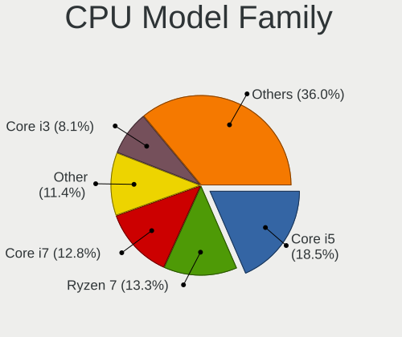

| Model                   | Notebooks | Percent |
|-------------------------|-----------|---------|
| Intel Core i5           | 39        | 18.48%  |
| AMD Ryzen 7             | 28        | 13.27%  |
| Intel Core i7           | 27        | 12.8%   |
| Other                   | 24        | 11.37%  |
| Intel Core i3           | 17        | 8.06%   |
| AMD Ryzen 5             | 17        | 8.06%   |
| Intel Celeron           | 11        | 5.21%   |
| AMD Ryzen 7 PRO         | 8         | 3.79%   |
| Intel Atom              | 7         | 3.32%   |
| Intel Core 2 Duo        | 4         | 1.9%    |
| Intel Pentium           | 3         | 1.42%   |
| Intel Core              | 3         | 1.42%   |
| AMD A8                  | 3         | 1.42%   |
| AMD A4                  | 3         | 1.42%   |
| Intel Genuine           | 2         | 0.95%   |
| AMD Ryzen 9             | 2         | 0.95%   |
| AMD Ryzen 3             | 2         | 0.95%   |
| Intel Pentium M         | 1         | 0.47%   |
| Intel Pentium Dual-Core | 1         | 0.47%   |
| AMD Turion 64 X2 Mobile | 1         | 0.47%   |
| AMD Ryzen 5 PRO         | 1         | 0.47%   |
| AMD E2                  | 1         | 0.47%   |
| AMD E1                  | 1         | 0.47%   |
| AMD E                   | 1         | 0.47%   |
| AMD C-60                | 1         | 0.47%   |
| AMD Athlon X2           | 1         | 0.47%   |
| AMD A6                  | 1         | 0.47%   |
| AMD A10                 | 1         | 0.47%   |

CPU Cores
---------

Number of processor cores

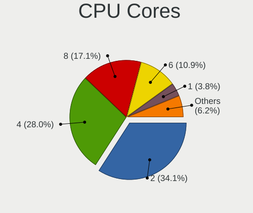

| Number | Notebooks | Percent |
|--------|-----------|---------|
| 2      | 72        | 34.12%  |
| 4      | 59        | 27.96%  |
| 8      | 36        | 17.06%  |
| 6      | 23        | 10.9%   |
| 1      | 8         | 3.79%   |
| 10     | 4         | 1.9%    |
| 16     | 3         | 1.42%   |
| 14     | 3         | 1.42%   |
| 12     | 3         | 1.42%   |

CPU Sockets
-----------

Number of sockets

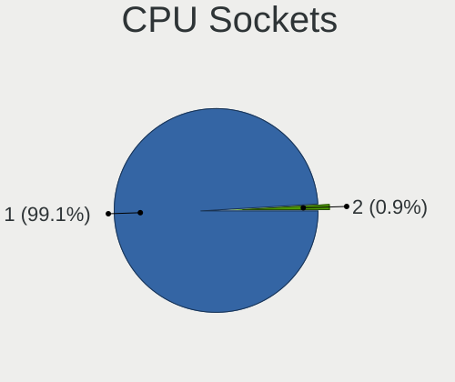

| Number | Notebooks | Percent |
|--------|-----------|---------|
| 1      | 209       | 99.05%  |
| 2      | 2         | 0.95%   |

CPU Threads
-----------

Threads per core (Hyper-Threading)

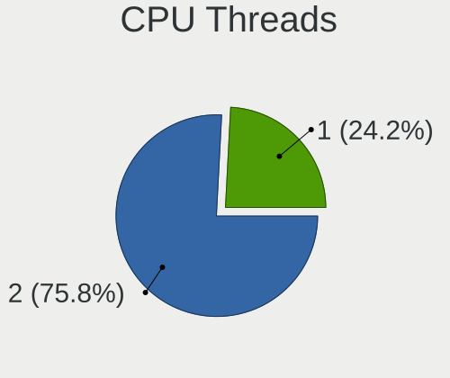

| Number | Notebooks | Percent |
|--------|-----------|---------|
| 2      | 160       | 75.83%  |
| 1      | 51        | 24.17%  |

CPU Op-Modes
------------

CPU Operation Modes (32-bit, 64-bit)

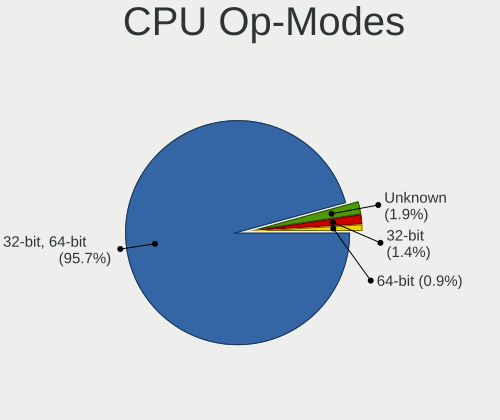

| Op mode        | Notebooks | Percent |
|----------------|-----------|---------|
| 32-bit, 64-bit | 202       | 95.73%  |
| Unknown        | 4         | 1.9%    |
| 32-bit         | 3         | 1.42%   |
| 64-bit         | 2         | 0.95%   |

CPU Microcode
-------------

Microcode number

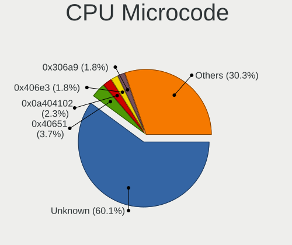

| Number     | Notebooks | Percent |
|------------|-----------|---------|
| Unknown    | 131       | 60.09%  |
| 0x40651    | 8         | 3.67%   |
| 0x0a404102 | 5         | 2.29%   |
| 0x406e3    | 4         | 1.83%   |
| 0x306a9    | 4         | 1.83%   |
| 0x08108102 | 4         | 1.83%   |
| 0x906ea    | 3         | 1.38%   |
| 0x806ec    | 3         | 1.38%   |
| 0x806e9    | 3         | 1.38%   |
| 0x30678    | 3         | 1.38%   |
| 0x206a7    | 3         | 1.38%   |
| 0x08600104 | 3         | 1.38%   |
| 0x06006705 | 3         | 1.38%   |
| 0x906e9    | 2         | 0.92%   |
| 0x906a3    | 2         | 0.92%   |
| 0x106c2    | 2         | 0.92%   |
| 0x0a50000c | 2         | 0.92%   |
| 0x08608103 | 2         | 0.92%   |
| 0x08608102 | 2         | 0.92%   |
| 0x08600106 | 2         | 0.92%   |
| 0x07030105 | 2         | 0.92%   |
| 0x05000119 | 2         | 0.92%   |
| 0xa0652    | 1         | 0.46%   |
| 0x806eb    | 1         | 0.46%   |
| 0x806ea    | 1         | 0.46%   |
| 0x806c1    | 1         | 0.46%   |
| 0x706e5    | 1         | 0.46%   |
| 0x406c4    | 1         | 0.46%   |
| 0x306d4    | 1         | 0.46%   |
| 0x30673    | 1         | 0.46%   |
| 0x20652    | 1         | 0.46%   |
| 0x106ca    | 1         | 0.46%   |
| 0x10661    | 1         | 0.46%   |
| 0x0a704103 | 1         | 0.46%   |
| 0x0a50000f | 1         | 0.46%   |
| 0x0a50000d | 1         | 0.46%   |
| 0x0a404101 | 1         | 0.46%   |
| 0x08608108 | 1         | 0.46%   |
| 0x08600103 | 1         | 0.46%   |
| 0x08600102 | 1         | 0.46%   |

CPU Microarch
-------------

Microarchitecture

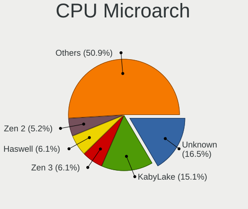

| Name              | Notebooks | Percent |
|-------------------|-----------|---------|
| Unknown           | 35        | 16.51%  |
| KabyLake          | 32        | 15.09%  |
| Zen 3             | 13        | 6.13%   |
| Haswell           | 13        | 6.13%   |
| Zen 2             | 11        | 5.19%   |
| Skylake           | 8         | 3.77%   |
| SandyBridge       | 8         | 3.77%   |
| IvyBridge         | 8         | 3.77%   |
| Broadwell         | 8         | 3.77%   |
| Alderlake Hybrid  | 8         | 3.77%   |
| Silvermont        | 7         | 3.3%    |
| Excavator         | 7         | 3.3%    |
| TigerLake         | 6         | 2.83%   |
| IceLake           | 6         | 2.83%   |
| Zen+              | 5         | 2.36%   |
| Core              | 5         | 2.36%   |
| Bonnell           | 5         | 2.36%   |
| CometLake         | 4         | 1.89%   |
| Puma              | 3         | 1.42%   |
| Goldmont plus     | 3         | 1.42%   |
| Bobcat            | 3         | 1.42%   |
| Zen               | 2         | 0.94%   |
| Penryn            | 2         | 0.94%   |
| Meteorlake Hybrid | 2         | 0.94%   |
| Westmere          | 1         | 0.47%   |
| Steamroller       | 1         | 0.47%   |
| P6                | 1         | 0.47%   |
| K8 Hammer         | 1         | 0.47%   |
| K8 & K10 hybrid   | 1         | 0.47%   |
| K10 Llano         | 1         | 0.47%   |
| Jaguar            | 1         | 0.47%   |
| Goldmont          | 1         | 0.47%   |

Graphics
--------

GPU Vendor
----------

Vendors of graphics cards

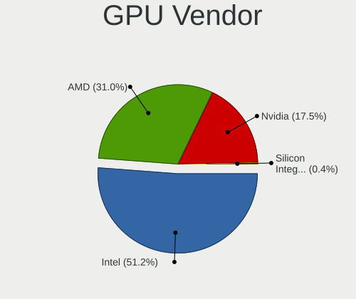

| Vendor                           | Notebooks | Percent |
|----------------------------------|-----------|---------|
| Intel                            | 129       | 51.19%  |
| AMD                              | 78        | 30.95%  |
| Nvidia                           | 44        | 17.46%  |
| Silicon Integrated Systems [SiS] | 1         | 0.4%    |

GPU Model
---------

Graphics card models

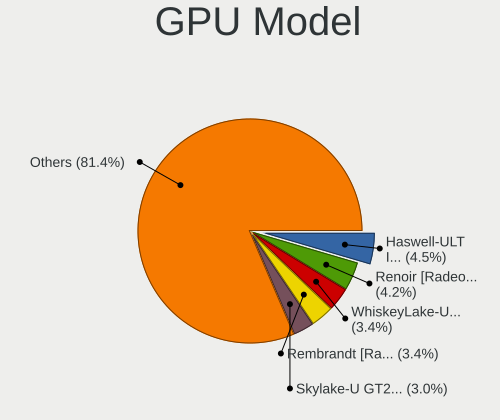

| Model                                                                     | Notebooks | Percent |
|---------------------------------------------------------------------------|-----------|---------|
| Intel Haswell-ULT Integrated Graphics Controller                          | 12        | 4.55%   |
| AMD Renoir [Radeon Vega Series / Radeon Vega Mobile Series]               | 11        | 4.17%   |
| Intel WhiskeyLake-U GT2 [UHD Graphics 620]                                | 9         | 3.41%   |
| AMD Rembrandt [Radeon 680M]                                               | 9         | 3.41%   |
| Intel Skylake-U GT2 [HD Graphics 520]                                     | 8         | 3.03%   |
| Intel Kaby Lake-R GT2 [UHD Graphics 620]                                  | 8         | 3.03%   |
| Intel 3rd Gen Core processor Graphics Controller                          | 8         | 3.03%   |
| Intel 2nd Generation Core Processor Family Integrated Graphics Controller | 8         | 3.03%   |
| AMD Lucienne                                                              | 8         | 3.03%   |
| AMD Cezanne [Radeon Vega Series / Radeon Vega Mobile Series]              | 8         | 3.03%   |
| Nvidia TU117M [GeForce GTX 1650 Mobile / Max-Q]                           | 6         | 2.27%   |
| Intel TigerLake-LP GT2 [Iris Xe Graphics]                                 | 6         | 2.27%   |
| Intel CoffeeLake-H GT2 [UHD Graphics 630]                                 | 6         | 2.27%   |
| Intel Broadwell-U GT2 [HD Graphics 5500]                                  | 6         | 2.27%   |
| Intel Atom Processor Z36xxx/Z37xxx Series Graphics & Display              | 6         | 2.27%   |
| AMD Stoney [Radeon R2/R3/R4/R5 Graphics]                                  | 6         | 2.27%   |
| Nvidia GF117M [GeForce 610M/710M/810M/820M / GT 620M/625M/630M/720M]      | 5         | 1.89%   |
| Intel Iris Plus Graphics G1 (Ice Lake)                                    | 5         | 1.89%   |
| AMD Picasso/Raven 2 [Radeon Vega Series / Radeon Vega Mobile Series]      | 5         | 1.89%   |
| AMD HawkPoint1                                                            | 5         | 1.89%   |
| AMD Barcelo                                                               | 5         | 1.89%   |
| Intel Alder Lake-P GT2 [Iris Xe Graphics]                                 | 4         | 1.52%   |
| Nvidia GP108M [GeForce MX250]                                             | 3         | 1.14%   |
| Nvidia AD107M [GeForce RTX 4050 Max-Q / Mobile]                           | 3         | 1.14%   |
| Intel Raptor Lake-P [Iris Xe Graphics]                                    | 3         | 1.14%   |
| Intel Mobile GM965/GL960 Integrated Graphics Controller (secondary)       | 3         | 1.14%   |
| Intel Mobile GM965/GL960 Integrated Graphics Controller (primary)         | 3         | 1.14%   |
| Intel Kaby Lake-U GT2 [HD Graphics 620]                                   | 3         | 1.14%   |
| Intel GeminiLake [UHD Graphics 600]                                       | 3         | 1.14%   |
| Intel CometLake-U GT2 [UHD Graphics]                                      | 3         | 1.14%   |
| Intel CometLake-H GT2 [UHD Graphics]                                      | 3         | 1.14%   |
| Intel Atom Processor D4xx/D5xx/N4xx/N5xx Integrated Graphics Controller   | 3         | 1.14%   |
| AMD Phoenix1                                                              | 3         | 1.14%   |
| Nvidia GP107M [GeForce GTX 1050 Mobile]                                   | 2         | 0.76%   |
| Nvidia GM108M [GeForce 830M]                                              | 2         | 0.76%   |
| Intel Meteor Lake-P [Intel Arc Graphics]                                  | 2         | 0.76%   |
| Intel Kaby Lake-H GT2 [HD Graphics 630]                                   | 2         | 0.76%   |
| Intel Alder Lake-UP3 GT2 [Iris Xe Graphics]                               | 2         | 0.76%   |
| AMD Raven Ridge [Radeon Vega Series / Radeon Vega Mobile Series]          | 2         | 0.76%   |
| AMD Navi 33 [Radeon RX 7600/7600 XT/7600M XT/7600S/7700S / PRO W7600]     | 2         | 0.76%   |

GPU Combo
---------

Combinations of graphics cards

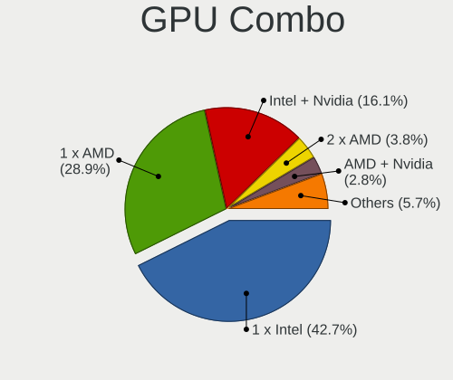

| Name           | Notebooks | Percent |
|----------------|-----------|---------|
| 1 x Intel      | 90        | 42.65%  |
| 1 x AMD        | 61        | 28.91%  |
| Intel + Nvidia | 34        | 16.11%  |
| 2 x AMD        | 8         | 3.79%   |
| AMD + Nvidia   | 6         | 2.84%   |
| 1 x Nvidia     | 4         | 1.9%    |
| Other          | 3         | 1.42%   |
| Intel + AMD    | 3         | 1.42%   |
| 2 x Intel      | 1         | 0.47%   |
| 1 x SiS        | 1         | 0.47%   |

GPU Driver
----------

Free vs proprietary

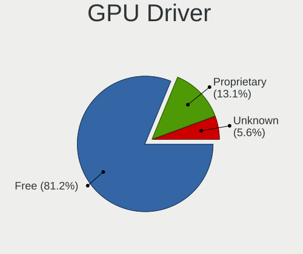

| Driver      | Notebooks | Percent |
|-------------|-----------|---------|
| Free        | 173       | 81.22%  |
| Proprietary | 28        | 13.15%  |
| Unknown     | 12        | 5.63%   |

GPU Memory
----------

Total video memory

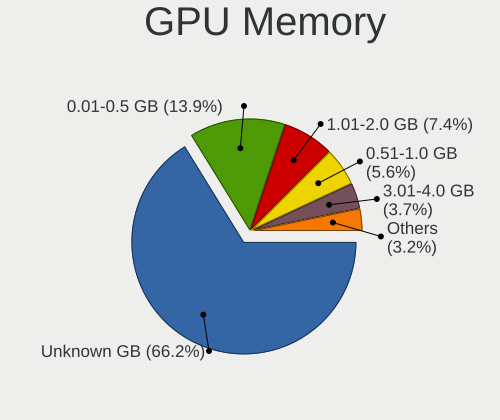

| Size in GB | Notebooks | Percent |
|------------|-----------|---------|
| Unknown    | 143       | 66.2%   |
| 0.01-0.5   | 30        | 13.89%  |
| 1.01-2.0   | 16        | 7.41%   |
| 0.51-1.0   | 12        | 5.56%   |
| 3.01-4.0   | 8         | 3.7%    |
| 7.01-8.0   | 4         | 1.85%   |
| 5.01-6.0   | 2         | 0.93%   |
| 8.01-16.0  | 1         | 0.46%   |

Monitor
-------

Monitor Vendor
--------------

Monitor vendors

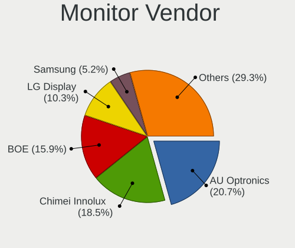

| Vendor                  | Notebooks | Percent |
|-------------------------|-----------|---------|
| AU Optronics            | 48        | 20.69%  |
| Chimei Innolux          | 43        | 18.53%  |
| BOE                     | 37        | 15.95%  |
| LG Display              | 24        | 10.34%  |
| Samsung Electronics     | 12        | 5.17%   |
| Lenovo                  | 6         | 2.59%   |
| Apple                   | 5         | 2.16%   |
| Sharp                   | 4         | 1.72%   |
| Philips                 | 4         | 1.72%   |
| PANDA                   | 4         | 1.72%   |
| LG Philips              | 4         | 1.72%   |
| Hewlett-Packard         | 4         | 1.72%   |
| CSO                     | 3         | 1.29%   |
| AOC                     | 3         | 1.29%   |
| TMX                     | 2         | 0.86%   |
| MSI                     | 2         | 0.86%   |
| Goldstar                | 2         | 0.86%   |
| CTO                     | 2         | 0.86%   |
| BOE Technology Group    | 2         | 0.86%   |
| ___                     | 1         | 0.43%   |
| ViewSonic               | 1         | 0.43%   |
| Unknown                 | 1         | 0.43%   |
| Toshiba                 | 1         | 0.43%   |
| TMA                     | 1         | 0.43%   |
| STD                     | 1         | 0.43%   |
| Quanta Display          | 1         | 0.43%   |
| Panasonic               | 1         | 0.43%   |
| InnoLux Display         | 1         | 0.43%   |
| InfoVision              | 1         | 0.43%   |
| Iiyama                  | 1         | 0.43%   |
| Eizo                    | 1         | 0.43%   |
| DML                     | 1         | 0.43%   |
| Denver                  | 1         | 0.43%   |
| Dell                    | 1         | 0.43%   |
| CSW                     | 1         | 0.43%   |
| CHR                     | 1         | 0.43%   |
| Chi Mei Optoelectronics | 1         | 0.43%   |
| ASRock                  | 1         | 0.43%   |
| Acer                    | 1         | 0.43%   |
| Unknown                 | 1         | 0.43%   |

Monitor Model
-------------

Monitor models

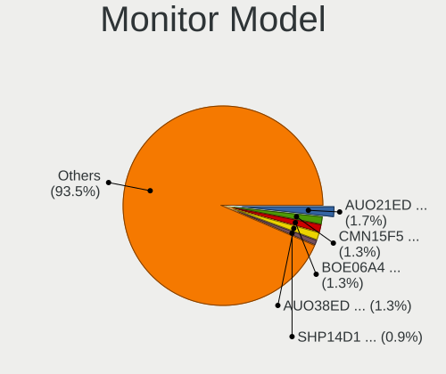

| Model                                                                | Notebooks | Percent |
|----------------------------------------------------------------------|-----------|---------|
| AU Optronics LCD Monitor AUO21ED 1920x1080 344x193mm 15.5-inch       | 4         | 1.72%   |
| Chimei Innolux LCD Monitor CMN15F5 1920x1080 344x193mm 15.5-inch     | 3         | 1.29%   |
| BOE LCD Monitor BOE06A4 1366x768 344x194mm 15.5-inch                 | 3         | 1.29%   |
| AU Optronics LCD Monitor AUO38ED 1920x1080 344x193mm 15.5-inch       | 3         | 1.29%   |
| Sharp LCD Monitor SHP14D1 1920x1200 336x210mm 15.6-inch              | 2         | 0.86%   |
| PANDA LCD Monitor NCP0036 1920x1080 344x194mm 15.5-inch              | 2         | 0.86%   |
| LG Display LCD Monitor LGD038E 1366x768 344x194mm 15.5-inch          | 2         | 0.86%   |
| Hewlett-Packard LA2405 HWP284C 1920x1200 518x324mm 24.1-inch         | 2         | 0.86%   |
| Chimei Innolux P130ZFA-BA1 CMN8201 2160x1440 275x183mm 13.0-inch     | 2         | 0.86%   |
| Chimei Innolux LCD Monitor CMN1728 1600x900 382x215mm 17.3-inch      | 2         | 0.86%   |
| Chimei Innolux LCD Monitor CMN1614 1920x1200 344x215mm 16.0-inch     | 2         | 0.86%   |
| Chimei Innolux LCD Monitor CMN15B7 1366x768 344x193mm 15.5-inch      | 2         | 0.86%   |
| Chimei Innolux LCD Monitor CMN14D4 1920x1080 309x173mm 13.9-inch     | 2         | 0.86%   |
| BOE Technology Group LCD Monitor 1920x1080                           | 2         | 0.86%   |
| BOE LCD Monitor BOE09E5 2560x1440 355x200mm 16.0-inch                | 2         | 0.86%   |
| AU Optronics LCD Monitor AUOAF90 1920x1080 344x193mm 15.5-inch       | 2         | 0.86%   |
| AU Optronics LCD Monitor AUO499F 1920x1080 344x194mm 15.5-inch       | 2         | 0.86%   |
| AU Optronics LCD Monitor AUO4999 1920x1080 344x193mm 15.5-inch       | 2         | 0.86%   |
| AU Optronics LCD Monitor AUO403D 1920x1080 309x174mm 14.0-inch       | 2         | 0.86%   |
| AU Optronics LCD Monitor AUO325C 1366x768 256x144mm 11.6-inch        | 2         | 0.86%   |
| AU Optronics LCD Monitor AUO2E3C 1366x768 309x173mm 13.9-inch        | 2         | 0.86%   |
| AU Optronics LCD Monitor AUO213E 1600x900 309x174mm 14.0-inch        | 2         | 0.86%   |
| Apple Color LCD APPA020 2560x1600 286x179mm 13.3-inch                | 2         | 0.86%   |
| AOC F19 AOC1900 1366x768 410x230mm 18.5-inch                         | 2         | 0.86%   |
| ___ LCDTV ___0309 1920x1080 700x390mm 31.5-inch                      | 1         | 0.43%   |
| ViewSonic VG2448 VSC3B35 1920x1080 527x296mm 23.8-inch               | 1         | 0.43%   |
| Unknown LCDTV 0309 1366x768 410x260mm 19.1-inch                      | 1         | 0.43%   |
| Toshiba LCD Monitor LCD0903 1366x768 295x166mm 13.3-inch             | 1         | 0.43%   |
| TMX TL156MDMP11-0 TMX1560 3200x2000 336x210mm 15.6-inch              | 1         | 0.43%   |
| TMX TL140BDXP01-0 TMX1400 2560x1440 310x174mm 14.0-inch              | 1         | 0.43%   |
| TMA TL140ADXP24-0 TMA2004 2880x1800 300x190mm 14.0-inch              | 1         | 0.43%   |
| STD LED STD0001 1920x1080 480x260mm 21.5-inch                        | 1         | 0.43%   |
| Sharp LQ156M1JW03 SHP155D 1920x1080 344x194mm 15.5-inch              | 1         | 0.43%   |
| Sharp LQ134N1JW53 SHP1521 1920x1200 288x180mm 13.4-inch              | 1         | 0.43%   |
| Samsung Electronics S24R35x SAM100E 1920x1080 527x296mm 23.8-inch    | 1         | 0.43%   |
| Samsung Electronics S23C350 SAM0A36 1920x1080 510x287mm 23.0-inch    | 1         | 0.43%   |
| Samsung Electronics LCD Monitor SEC524D 1366x768 353x198mm 15.9-inch | 1         | 0.43%   |
| Samsung Electronics LCD Monitor SEC4D42 1280x800 303x190mm 14.1-inch | 1         | 0.43%   |
| Samsung Electronics LCD Monitor SEC4542 1366x768 309x174mm 14.0-inch | 1         | 0.43%   |
| Samsung Electronics LCD Monitor SEC3053 1366x768 256x144mm 11.6-inch | 1         | 0.43%   |

Monitor Resolution
------------------

Monitor screen resolution

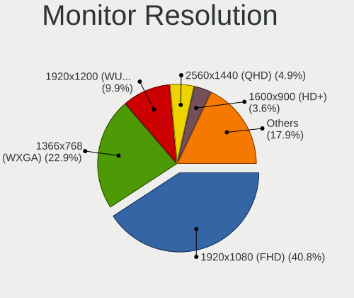

| Resolution        | Notebooks | Percent |
|-------------------|-----------|---------|
| 1920x1080 (FHD)   | 91        | 40.81%  |
| 1366x768 (WXGA)   | 51        | 22.87%  |
| 1920x1200 (WUXGA) | 22        | 9.87%   |
| 2560x1440 (QHD)   | 11        | 4.93%   |
| 1600x900 (HD+)    | 8         | 3.59%   |
| 2880x1800         | 6         | 2.69%   |
| 2560x1600         | 6         | 2.69%   |
| 1280x800 (WXGA)   | 5         | 2.24%   |
| 3840x2160 (4K)    | 4         | 1.79%   |
| 2160x1440         | 4         | 1.79%   |
| 1440x900 (WXGA+)  | 4         | 1.79%   |
| 1024x600          | 3         | 1.35%   |
| 2256x1504         | 2         | 0.9%    |
| 3440x1440         | 1         | 0.45%   |
| 3200x2000         | 1         | 0.45%   |
| 2288x1287         | 1         | 0.45%   |
| 1360x768          | 1         | 0.45%   |
| 1280x720 (HD)     | 1         | 0.45%   |
| 1024x768 (XGA)    | 1         | 0.45%   |

Monitor Diagonal
----------------

Diagonal size in inches

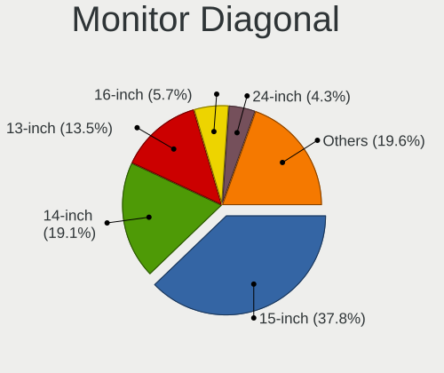

| Inches  | Notebooks | Percent |
|---------|-----------|---------|
| 15      | 87        | 37.83%  |
| 14      | 44        | 19.13%  |
| 13      | 31        | 13.48%  |
| 16      | 13        | 5.65%   |
| 24      | 10        | 4.35%   |
| 11      | 8         | 3.48%   |
| 17      | 6         | 2.61%   |
| 27      | 4         | 1.74%   |
| 12      | 4         | 1.74%   |
| 31      | 3         | 1.3%    |
| 10      | 3         | 1.3%    |
| Unknown | 3         | 1.3%    |
| 23      | 2         | 0.87%   |
| 21      | 2         | 0.87%   |
| 19      | 2         | 0.87%   |
| 84      | 1         | 0.43%   |
| 49      | 1         | 0.43%   |
| 39      | 1         | 0.43%   |
| 34      | 1         | 0.43%   |
| 33      | 1         | 0.43%   |
| 32      | 1         | 0.43%   |
| 22      | 1         | 0.43%   |
| 8       | 1         | 0.43%   |

Monitor Width
-------------

Physical width

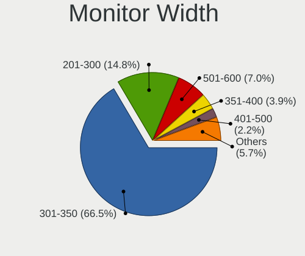

| Width in mm | Notebooks | Percent |
|-------------|-----------|---------|
| 301-350     | 153       | 66.52%  |
| 201-300     | 34        | 14.78%  |
| 501-600     | 16        | 6.96%   |
| 351-400     | 9         | 3.91%   |
| 401-500     | 5         | 2.17%   |
| 701-800     | 3         | 1.3%    |
| 601-700     | 3         | 1.3%    |
| Unknown     | 3         | 1.3%    |
| 801-900     | 1         | 0.43%   |
| 1501-2000   | 1         | 0.43%   |
| 101-200     | 1         | 0.43%   |
| 1001-1500   | 1         | 0.43%   |

Aspect Ratio
------------

Proportional relationship between the width and the height

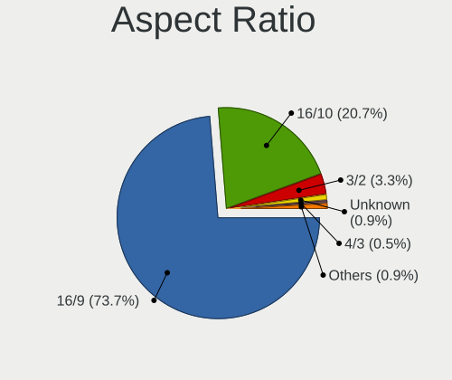

| Ratio   | Notebooks | Percent |
|---------|-----------|---------|
| 16/9    | 157       | 73.71%  |
| 16/10   | 44        | 20.66%  |
| 3/2     | 7         | 3.29%   |
| Unknown | 2         | 0.94%   |
| 4/3     | 1         | 0.47%   |
| 32/9    | 1         | 0.47%   |
| 21/9    | 1         | 0.47%   |

Monitor Area
------------

Area in inch²

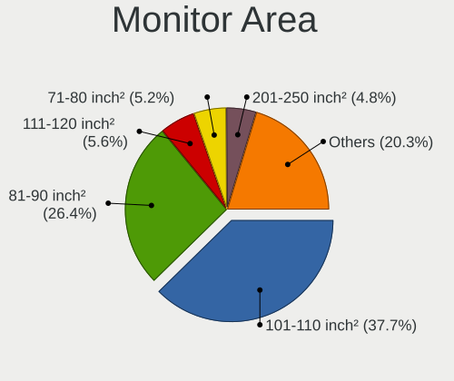

| Area in inch² | Notebooks | Percent |
|----------------|-----------|---------|
| 101-110        | 87        | 37.66%  |
| 81-90          | 61        | 26.41%  |
| 111-120        | 13        | 5.63%   |
| 71-80          | 12        | 5.19%   |
| 201-250        | 11        | 4.76%   |
| 51-60          | 8         | 3.46%   |
| 351-500        | 6         | 2.6%    |
| 251-300        | 5         | 2.16%   |
| 61-70          | 4         | 1.73%   |
| 301-350        | 4         | 1.73%   |
| 41-50          | 3         | 1.3%    |
| 131-140        | 3         | 1.3%    |
| 121-130        | 3         | 1.3%    |
| Unknown        | 3         | 1.3%    |
| 151-200        | 2         | 0.87%   |
| 501-1000       | 2         | 0.87%   |
| 91-100         | 2         | 0.87%   |
| More than 1000 | 1         | 0.43%   |
| 1-40           | 1         | 0.43%   |

Pixel Density
-------------

Pixels per inch

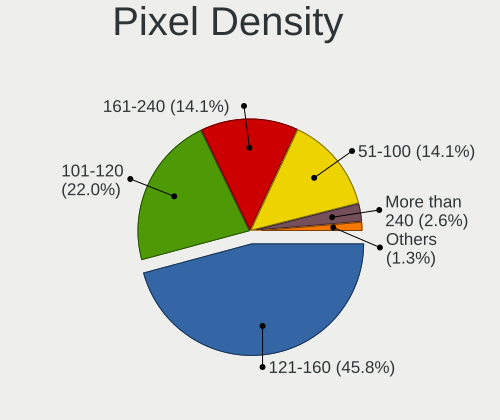

| Density       | Notebooks | Percent |
|---------------|-----------|---------|
| 121-160       | 104       | 45.81%  |
| 101-120       | 50        | 22.03%  |
| 161-240       | 32        | 14.1%   |
| 51-100        | 32        | 14.1%   |
| More than 240 | 6         | 2.64%   |
| Unknown       | 3         | 1.32%   |

Multiple Monitors
-----------------

Total monitors connected

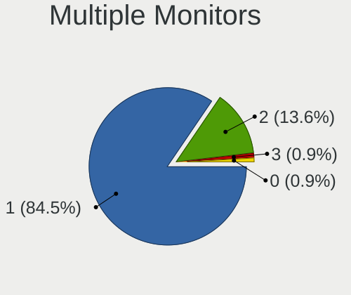

| Total | Notebooks | Percent |
|-------|-----------|---------|
| 1     | 180       | 84.51%  |
| 2     | 29        | 13.62%  |
| 3     | 2         | 0.94%   |
| 0     | 2         | 0.94%   |

Network
-------

Net Controller Vendor
---------------------

Controller vendors

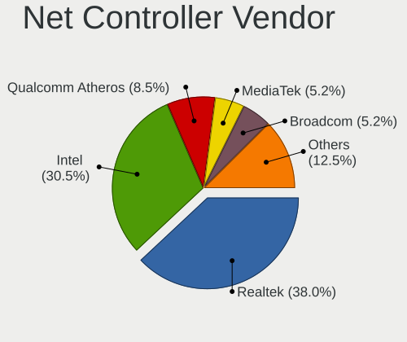

| Vendor                           | Notebooks | Percent |
|----------------------------------|-----------|---------|
| Realtek Semiconductor            | 116       | 38.03%  |
| Intel                            | 93        | 30.49%  |
| Qualcomm Atheros                 | 26        | 8.52%   |
| MediaTek                         | 16        | 5.25%   |
| Broadcom                         | 16        | 5.25%   |
| Broadcom Limited                 | 6         | 1.97%   |
| Ralink                           | 4         | 1.31%   |
| Qualcomm                         | 4         | 1.31%   |
| Sierra Wireless                  | 3         | 0.98%   |
| Ralink Technology                | 3         | 0.98%   |
| Marvell Technology Group         | 3         | 0.98%   |
| ASIX Electronics                 | 3         | 0.98%   |
| TP-Link                          | 2         | 0.66%   |
| Huawei Technologies              | 2         | 0.66%   |
| Cypress Semiconductor            | 2         | 0.66%   |
| Xiaomi                           | 1         | 0.33%   |
| Silicon Integrated Systems [SiS] | 1         | 0.33%   |
| OPPO Electronics                 | 1         | 0.33%   |
| OCZ Technology                   | 1         | 0.33%   |
| Lenovo                           | 1         | 0.33%   |
| JMicron Technology               | 1         | 0.33%   |

Net Controller Model
--------------------

Controller models

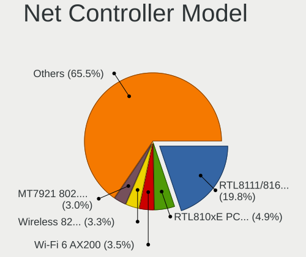

| Model                                                                  | Notebooks | Percent |
|------------------------------------------------------------------------|-----------|---------|
| Realtek RTL8111/8168/8211/8411 PCI Express Gigabit Ethernet Controller | 73        | 19.84%  |
| Realtek RTL810xE PCI Express Fast Ethernet controller                  | 18        | 4.89%   |
| Intel Wi-Fi 6 AX200                                                    | 13        | 3.53%   |
| Intel Wireless 8265 / 8275                                             | 12        | 3.26%   |
| MediaTek MT7921 802.11ax PCIe Wireless Network Adapter [Filogic 330]   | 11        | 2.99%   |
| Realtek RTL8822CE 802.11ac PCIe Wireless Network Adapter               | 10        | 2.72%   |
| Realtek RTL8852BE PCIe 802.11ax Wireless Network Controller            | 8         | 2.17%   |
| Realtek RTL8821CE 802.11ac PCIe Wireless Network Adapter               | 8         | 2.17%   |
| Qualcomm Atheros QCA9565 / AR9565 Wireless Network Adapter             | 8         | 2.17%   |
| Intel 82579LM Gigabit Network Connection (Lewisville)                  | 7         | 1.9%    |
| Broadcom BCM43142 802.11b/g/n                                          | 7         | 1.9%    |
| Realtek RTL8723BE PCIe Wireless Network Adapter                        | 6         | 1.63%   |
| Intel Wi-Fi 6E(802.11ax) AX210/AX1675* 2x2 [Typhoon Peak]              | 6         | 1.63%   |
| Intel Alder Lake-P PCH CNVi WiFi                                       | 6         | 1.63%   |
| Qualcomm Atheros QCA9377 802.11ac Wireless Network Adapter             | 5         | 1.36%   |
| Intel Ethernet Connection (4) I219-LM                                  | 5         | 1.36%   |
| Qualcomm QCNFA765 Wireless Network Adapter                             | 4         | 1.09%   |
| Qualcomm Atheros AR9485 Wireless Network Adapter                       | 4         | 1.09%   |
| Intel Wi-Fi 6 AX201                                                    | 4         | 1.09%   |
| Intel Centrino Advanced-N 6205 [Taylor Peak]                           | 4         | 1.09%   |
| Realtek RTL8723DE Wireless Network Adapter                             | 3         | 0.82%   |
| Realtek RTL8188CE 802.11b/g/n WiFi Adapter                             | 3         | 0.82%   |
| Intel Wireless 8260                                                    | 3         | 0.82%   |
| Intel Wireless 7265                                                    | 3         | 0.82%   |
| Intel Wi-Fi 5(802.11ac) Wireless-AC 9x6x [Thunder Peak]                | 3         | 0.82%   |
| Intel Raptor Lake PCH CNVi WiFi                                        | 3         | 0.82%   |
| Intel Comet Lake PCH-LP CNVi WiFi                                      | 3         | 0.82%   |
| Intel Comet Lake PCH CNVi WiFi                                         | 3         | 0.82%   |
| Intel Centrino Ultimate-N 6300                                         | 3         | 0.82%   |
| Intel Cannon Point-LP CNVi [Wireless-AC]                               | 3         | 0.82%   |
| Intel Cannon Lake PCH CNVi WiFi                                        | 3         | 0.82%   |
| Broadcom Limited BCM4360 802.11ac Dual Band Wireless Network Adapter   | 3         | 0.82%   |
| ASIX AX88179 Gigabit Ethernet                                          | 3         | 0.82%   |
| Realtek RTL8822BE 802.11a/b/g/n/ac WiFi adapter                        | 2         | 0.54%   |
| Realtek RTL8821AE 802.11ac PCIe Wireless Network Adapter               | 2         | 0.54%   |
| Ralink MT7601U Wireless Adapter                                        | 2         | 0.54%   |
| Ralink RT3290 Wireless 802.11n 1T/1R PCIe                              | 2         | 0.54%   |
| Qualcomm Atheros QCA6174 802.11ac Wireless Network Adapter             | 2         | 0.54%   |
| MediaTek MT7922 802.11ax PCI Express Wireless Network Adapter          | 2         | 0.54%   |
| Marvell Group 88E8039 PCI-E Fast Ethernet Controller                   | 2         | 0.54%   |

Wireless Vendor
---------------

Wireless vendors

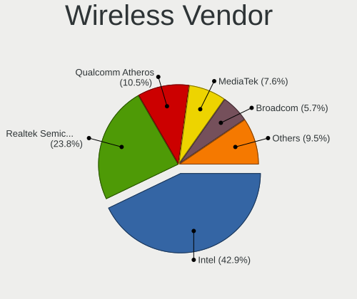

| Vendor                | Notebooks | Percent |
|-----------------------|-----------|---------|
| Intel                 | 90        | 42.86%  |
| Realtek Semiconductor | 50        | 23.81%  |
| Qualcomm Atheros      | 22        | 10.48%  |
| MediaTek              | 16        | 7.62%   |
| Broadcom              | 12        | 5.71%   |
| Broadcom Limited      | 5         | 2.38%   |
| Ralink                | 4         | 1.9%    |
| Qualcomm              | 4         | 1.9%    |
| Sierra Wireless       | 3         | 1.43%   |
| Ralink Technology     | 3         | 1.43%   |
| TP-Link               | 1         | 0.48%   |

Wireless Model
--------------

Wireless models

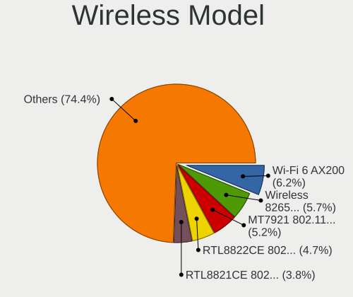

| Model                                                                | Notebooks | Percent |
|----------------------------------------------------------------------|-----------|---------|
| Intel Wi-Fi 6 AX200                                                  | 13        | 6.16%   |
| Intel Wireless 8265 / 8275                                           | 12        | 5.69%   |
| MediaTek MT7921 802.11ax PCIe Wireless Network Adapter [Filogic 330] | 11        | 5.21%   |
| Realtek RTL8822CE 802.11ac PCIe Wireless Network Adapter             | 10        | 4.74%   |
| Realtek RTL8821CE 802.11ac PCIe Wireless Network Adapter             | 8         | 3.79%   |
| Qualcomm Atheros QCA9565 / AR9565 Wireless Network Adapter           | 8         | 3.79%   |
| Realtek RTL8852BE PCIe 802.11ax Wireless Network Controller          | 7         | 3.32%   |
| Broadcom BCM43142 802.11b/g/n                                        | 7         | 3.32%   |
| Realtek RTL8723BE PCIe Wireless Network Adapter                      | 6         | 2.84%   |
| Intel Wi-Fi 6E(802.11ax) AX210/AX1675* 2x2 [Typhoon Peak]            | 6         | 2.84%   |
| Qualcomm Atheros QCA9377 802.11ac Wireless Network Adapter           | 5         | 2.37%   |
| Qualcomm QCNFA765 Wireless Network Adapter                           | 4         | 1.9%    |
| Qualcomm Atheros AR9485 Wireless Network Adapter                     | 4         | 1.9%    |
| Intel Wi-Fi 6 AX201                                                  | 4         | 1.9%    |
| Intel Centrino Advanced-N 6205 [Taylor Peak]                         | 4         | 1.9%    |
| Intel Alder Lake-P PCH CNVi WiFi                                     | 4         | 1.9%    |
| Realtek RTL8723DE Wireless Network Adapter                           | 3         | 1.42%   |
| Realtek RTL8188CE 802.11b/g/n WiFi Adapter                           | 3         | 1.42%   |
| Intel Wireless 8260                                                  | 3         | 1.42%   |
| Intel Wireless 7265                                                  | 3         | 1.42%   |
| Intel Wi-Fi 5(802.11ac) Wireless-AC 9x6x [Thunder Peak]              | 3         | 1.42%   |
| Intel Raptor Lake PCH CNVi WiFi                                      | 3         | 1.42%   |
| Intel Comet Lake PCH-LP CNVi WiFi                                    | 3         | 1.42%   |
| Intel Comet Lake PCH CNVi WiFi                                       | 3         | 1.42%   |
| Intel Centrino Ultimate-N 6300                                       | 3         | 1.42%   |
| Intel Cannon Point-LP CNVi [Wireless-AC]                             | 3         | 1.42%   |
| Intel Cannon Lake PCH CNVi WiFi                                      | 3         | 1.42%   |
| Broadcom Limited BCM4360 802.11ac Dual Band Wireless Network Adapter | 3         | 1.42%   |
| Realtek RTL8822BE 802.11a/b/g/n/ac WiFi adapter                      | 2         | 0.95%   |
| Realtek RTL8821AE 802.11ac PCIe Wireless Network Adapter             | 2         | 0.95%   |
| Ralink MT7601U Wireless Adapter                                      | 2         | 0.95%   |
| Ralink RT3290 Wireless 802.11n 1T/1R PCIe                            | 2         | 0.95%   |
| Qualcomm Atheros QCA6174 802.11ac Wireless Network Adapter           | 2         | 0.95%   |
| MediaTek MT7922 802.11ax PCI Express Wireless Network Adapter        | 2         | 0.95%   |
| Intel Wireless 7260                                                  | 2         | 0.95%   |
| Intel PRO/Wireless 4965 AG or AGN [Kedron] Network Connection        | 2         | 0.95%   |
| Intel Meteor Lake PCH CNVi WiFi                                      | 2         | 0.95%   |
| Intel Ice Lake-LP PCH CNVi WiFi                                      | 2         | 0.95%   |
| Intel Dual Band Wireless-AC 3168NGW [Stone Peak]                     | 2         | 0.95%   |
| Broadcom BCM4313 802.11bgn Wireless Network Adapter                  | 2         | 0.95%   |

Ethernet Vendor
---------------

Ethernet vendors

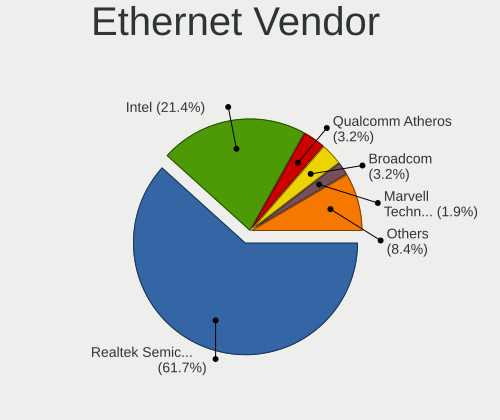

| Vendor                           | Notebooks | Percent |
|----------------------------------|-----------|---------|
| Realtek Semiconductor            | 95        | 61.69%  |
| Intel                            | 33        | 21.43%  |
| Qualcomm Atheros                 | 5         | 3.25%   |
| Broadcom                         | 5         | 3.25%   |
| Marvell Technology Group         | 3         | 1.95%   |
| ASIX Electronics                 | 3         | 1.95%   |
| Cypress Semiconductor            | 2         | 1.3%    |
| Xiaomi                           | 1         | 0.65%   |
| TP-Link                          | 1         | 0.65%   |
| Silicon Integrated Systems [SiS] | 1         | 0.65%   |
| OPPO Electronics                 | 1         | 0.65%   |
| Lenovo                           | 1         | 0.65%   |
| JMicron Technology               | 1         | 0.65%   |
| Huawei Technologies              | 1         | 0.65%   |
| Broadcom Limited                 | 1         | 0.65%   |

Ethernet Model
--------------

Ethernet models

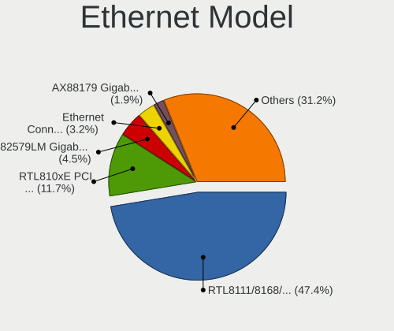

| Model                                                                  | Notebooks | Percent |
|------------------------------------------------------------------------|-----------|---------|
| Realtek RTL8111/8168/8211/8411 PCI Express Gigabit Ethernet Controller | 73        | 47.4%   |
| Realtek RTL810xE PCI Express Fast Ethernet controller                  | 18        | 11.69%  |
| Intel 82579LM Gigabit Network Connection (Lewisville)                  | 7         | 4.55%   |
| Intel Ethernet Connection (4) I219-LM                                  | 5         | 3.25%   |
| ASIX AX88179 Gigabit Ethernet                                          | 3         | 1.95%   |
| Marvell Group 88E8039 PCI-E Fast Ethernet Controller                   | 2         | 1.3%    |
| Intel Ethernet Connection I219-LM                                      | 2         | 1.3%    |
| Intel Ethernet Connection I218-LM                                      | 2         | 1.3%    |
| Intel Ethernet Connection (6) I219-V                                   | 2         | 1.3%    |
| Intel Ethernet Connection (6) I219-LM                                  | 2         | 1.3%    |
| Intel Alder Lake-P PCH CNVi WiFi                                       | 2         | 1.3%    |
| Cypress USB Type-C Dock                                                | 2         | 1.3%    |
| Broadcom NetLink BCM57785 Gigabit Ethernet PCIe                        | 2         | 1.3%    |
| Xiaomi Mi/Redmi series (RNDIS + ADB)                                   | 1         | 0.65%   |
| TP-Link UE300 10/100/1000 LAN (ethernet mode) [Realtek RTL8153]        | 1         | 0.65%   |
| Silicon Integrated Systems [SiS] 191 Gigabit Ethernet Adapter          | 1         | 0.65%   |
| Realtek RTL8852BE PCIe 802.11ax Wireless Network Controller            | 1         | 0.65%   |
| Realtek RTL8153 Gigabit Ethernet Adapter                               | 1         | 0.65%   |
| Realtek RTL8152 Fast Ethernet Adapter                                  | 1         | 0.65%   |
| Realtek Killer E2600 GbE Controller                                    | 1         | 0.65%   |
| Qualcomm Atheros QCA8171 Gigabit Ethernet                              | 1         | 0.65%   |
| Qualcomm Atheros Killer E2500 Gigabit Ethernet Controller              | 1         | 0.65%   |
| Qualcomm Atheros Killer E220x Gigabit Ethernet Controller              | 1         | 0.65%   |
| Qualcomm Atheros AR8152 v2.0 Fast Ethernet                             | 1         | 0.65%   |
| Qualcomm Atheros AR8152 v1.1 Fast Ethernet                             | 1         | 0.65%   |
| OPPO Ace 3V                                                            | 1         | 0.65%   |
| Marvell Group 88E8055 PCI-E Gigabit Ethernet Controller                | 1         | 0.65%   |
| Lenovo USB-C Dock Ethernet                                             | 1         | 0.65%   |
| JMicron JMC260 PCI Express Fast Ethernet Controller                    | 1         | 0.65%   |
| Intel Ethernet Connection I219-V                                       | 1         | 0.65%   |
| Intel Ethernet Connection (7) I219-LM                                  | 1         | 0.65%   |
| Intel Ethernet Connection (4) I219-V                                   | 1         | 0.65%   |
| Intel Ethernet Connection (3) I218-LM                                  | 1         | 0.65%   |
| Intel Ethernet Connection (23) I219-V                                  | 1         | 0.65%   |
| Intel Ethernet Connection (16) I219-V                                  | 1         | 0.65%   |
| Intel Ethernet Connection (13) I219-LM                                 | 1         | 0.65%   |
| Intel Ethernet Connection (10) I219-V                                  | 1         | 0.65%   |
| Intel 82579V Gigabit Network Connection                                | 1         | 0.65%   |
| Intel 82577LM Gigabit Network Connection                               | 1         | 0.65%   |
| Intel 82567LM Gigabit Network Connection                               | 1         | 0.65%   |

Net Controller Kind
-------------------

Ethernet, WiFi or modem

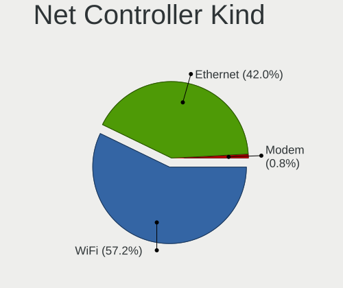

| Kind     | Notebooks | Percent |
|----------|-----------|---------|
| WiFi     | 203       | 57.18%  |
| Ethernet | 149       | 41.97%  |
| Modem    | 3         | 0.85%   |

Used Controller
---------------

Currently used network controller

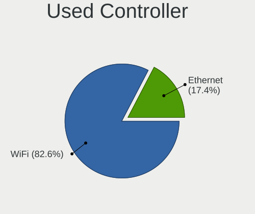

| Kind     | Notebooks | Percent |
|----------|-----------|---------|
| WiFi     | 181       | 82.65%  |
| Ethernet | 38        | 17.35%  |

NICs
----

Total network controllers on board

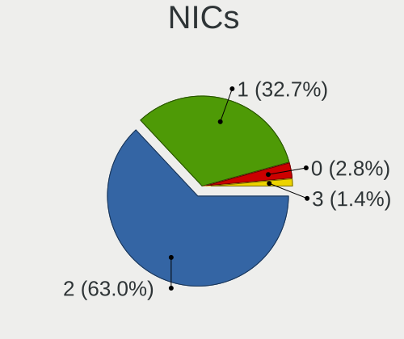

| Total | Notebooks | Percent |
|-------|-----------|---------|
| 2     | 133       | 63.03%  |
| 1     | 69        | 32.7%   |
| 0     | 6         | 2.84%   |
| 3     | 3         | 1.42%   |

IPv6
----

IPv6 vs IPv4

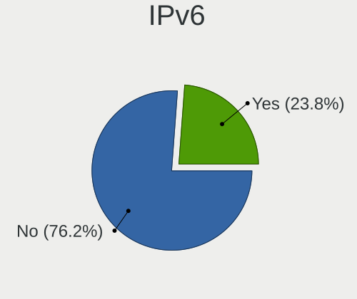

| Used | Notebooks | Percent |
|------|-----------|---------|
| No   | 163       | 76.17%  |
| Yes  | 51        | 23.83%  |

Bluetooth
---------

Bluetooth Vendor
----------------

Controller vendors

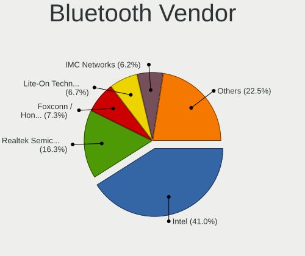

| Vendor                          | Notebooks | Percent |
|---------------------------------|-----------|---------|
| Intel                           | 73        | 41.01%  |
| Realtek Semiconductor           | 29        | 16.29%  |
| Foxconn / Hon Hai               | 13        | 7.3%    |
| Lite-On Technology              | 12        | 6.74%   |
| IMC Networks                    | 11        | 6.18%   |
| Broadcom                        | 10        | 5.62%   |
| USI                             | 4         | 2.25%   |
| Realtek                         | 4         | 2.25%   |
| Qualcomm Atheros Communications | 4         | 2.25%   |
| Apple                           | 4         | 2.25%   |
| MediaTek                        | 3         | 1.69%   |
| Ralink                          | 2         | 1.12%   |
| Cambridge Silicon Radio         | 2         | 1.12%   |
| Toshiba                         | 1         | 0.56%   |
| Taiyo Yuden                     | 1         | 0.56%   |
| SINO WEALTH                     | 1         | 0.56%   |
| Ralink Technology               | 1         | 0.56%   |
| Opticis                         | 1         | 0.56%   |
| Foxconn International           | 1         | 0.56%   |
| Dell                            | 1         | 0.56%   |

Bluetooth Model
---------------

Controller models

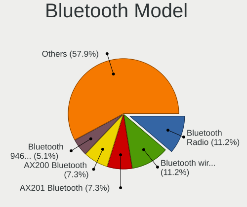

| Model                                               | Notebooks | Percent |
|-----------------------------------------------------|-----------|---------|
| Realtek Bluetooth Radio                             | 20        | 11.24%  |
| Intel Bluetooth wireless interface                  | 20        | 11.24%  |
| Intel AX201 Bluetooth                               | 13        | 7.3%    |
| Intel AX200 Bluetooth                               | 13        | 7.3%    |
| Intel Bluetooth 9460/9560 Jefferson Peak (JfP)      | 9         | 5.06%   |
| Intel Bluetooth Device                              | 8         | 4.49%   |
| Foxconn / Hon Hai MediaTek Bluetooth Adapter        | 8         | 4.49%   |
| Realtek  Bluetooth 4.2 Adapter                      | 6         | 3.37%   |
| Intel AX210 Bluetooth                               | 6         | 3.37%   |
| IMC Networks Bluetooth Radio                        | 6         | 3.37%   |
| USI Bluetooth Device                                | 4         | 2.25%   |
| Realtek Bluetooth Radio                             | 4         | 2.25%   |
| Lite-On Atheros AR3012 Bluetooth                    | 4         | 2.25%   |
| Broadcom BCM2045B (BDC-2.1)                         | 4         | 2.25%   |
| MediaTek Wireless_Device                            | 3         | 1.69%   |
| Lite-On Qualcomm Atheros QCA9377 Bluetooth          | 3         | 1.69%   |
| Broadcom BCM43142A0 Bluetooth Device                | 3         | 1.69%   |
| Apple Bluetooth Host Controller                     | 3         | 1.69%   |
| Ralink RT3290 Bluetooth                             | 2         | 1.12%   |
| Qualcomm Atheros  Bluetooth Device                  | 2         | 1.12%   |
| Lite-On Bluetooth Device                            | 2         | 1.12%   |
| Intel Wireless-AC 9260 Bluetooth Adapter            | 2         | 1.12%   |
| Intel Wireless-AC 3168 Bluetooth                    | 2         | 1.12%   |
| IMC Networks Wireless_Device                        | 2         | 1.12%   |
| IMC Networks Bluetooth Device                       | 2         | 1.12%   |
| Foxconn / Hon Hai Wireless_Device                   | 2         | 1.12%   |
| Cambridge Silicon Radio Bluetooth Dongle (HCI mode) | 2         | 1.12%   |
| Toshiba Integrated Bluetooth HCI                    | 1         | 0.56%   |
| Taiyo Yuden Bluetooth Device(BC04-External)         | 1         | 0.56%   |
| SINO WEALTH Bluetooth Keyboard                      | 1         | 0.56%   |
| Realtek RTL8822BE Bluetooth 4.2 Adapter             | 1         | 0.56%   |
| Realtek RTL8723B Bluetooth                          | 1         | 0.56%   |
| Realtek 802.11ac WLAN Adapter                       | 1         | 0.56%   |
| Ralink CSR BS8510                                   | 1         | 0.56%   |
| Qualcomm Atheros QCA61x4 Bluetooth 4.0              | 1         | 0.56%   |
| Qualcomm Atheros AR3012 Bluetooth 4.0               | 1         | 0.56%   |
| Opticis Bluetooth Radio                             | 1         | 0.56%   |
| Lite-On Wireless_Device                             | 1         | 0.56%   |
| Lite-On Broadcom BCM43142A0 Bluetooth Device        | 1         | 0.56%   |
| Lite-On BCM43142A0                                  | 1         | 0.56%   |

Sound
-----

Sound Vendor
------------

Sound card vendors

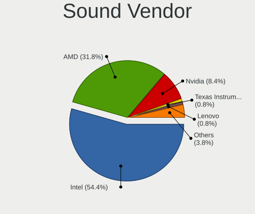

| Vendor                           | Notebooks | Percent |
|----------------------------------|-----------|---------|
| Intel                            | 130       | 54.39%  |
| AMD                              | 76        | 31.8%   |
| Nvidia                           | 20        | 8.37%   |
| Texas Instruments                | 2         | 0.84%   |
| Lenovo                           | 2         | 0.84%   |
| Sony                             | 1         | 0.42%   |
| Silicon Integrated Systems [SiS] | 1         | 0.42%   |
| Samson Technologies              | 1         | 0.42%   |
| Logitech                         | 1         | 0.42%   |
| liyuany                          | 1         | 0.42%   |
| JMTek                            | 1         | 0.42%   |
| Fujitsu                          | 1         | 0.42%   |
| Creative Technology              | 1         | 0.42%   |
| Corsair                          | 1         | 0.42%   |

Sound Model
-----------

Sound card models

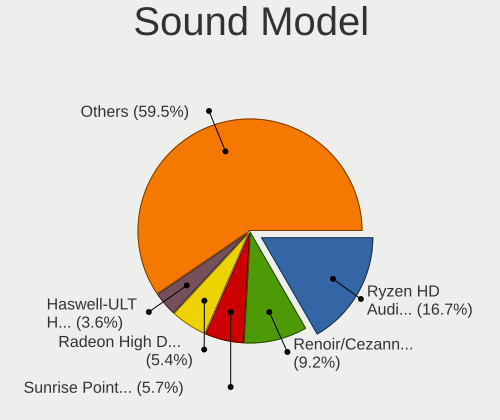

| Model                                                                      | Notebooks | Percent |
|----------------------------------------------------------------------------|-----------|---------|
| AMD Ryzen HD Audio Controller                                              | 56        | 16.67%  |
| AMD Renoir/Cezanne HDMI/DP Audio Controller                                | 31        | 9.23%   |
| Intel Sunrise Point-LP HD Audio                                            | 19        | 5.65%   |
| AMD Radeon High Definition Audio Controller                                | 18        | 5.36%   |
| Intel Haswell-ULT HD Audio Controller                                      | 12        | 3.57%   |
| Intel 8 Series HD Audio Controller                                         | 12        | 3.57%   |
| Intel Cannon Point-LP High Definition Audio Controller                     | 9         | 2.68%   |
| Intel 7 Series/C216 Chipset Family High Definition Audio Controller        | 9         | 2.68%   |
| Intel Wildcat Point-LP High Definition Audio Controller                    | 8         | 2.38%   |
| Intel Broadwell-U Audio Controller                                         | 8         | 2.38%   |
| Intel Cannon Lake PCH cAVS                                                 | 7         | 2.08%   |
| Intel Alder Lake PCH-P High Definition Audio Controller                    | 7         | 2.08%   |
| Intel 6 Series/C200 Series Chipset Family High Definition Audio Controller | 7         | 2.08%   |
| AMD FCH Azalia Controller                                                  | 7         | 2.08%   |
| AMD Family 15h (Models 60h-6fh) Audio Controller                           | 7         | 2.08%   |
| Intel Tiger Lake-LP Smart Sound Technology Audio Controller                | 6         | 1.79%   |
| AMD Raven/Raven2/Fenghuang HDMI/DP Audio Controller                        | 6         | 1.79%   |
| AMD High Definition Audio Controller                                       | 6         | 1.79%   |
| Intel Ice Lake-LP Smart Sound Technology Audio Controller                  | 5         | 1.49%   |
| AMD Kabini HDMI/DP Audio                                                   | 5         | 1.49%   |
| Nvidia TU107 GeForce GTX 1650 High Definition Audio Controller             | 4         | 1.19%   |
| Nvidia AD107 High Definition Audio Controller                              | 4         | 1.19%   |
| Intel Raptor Lake-P/U/H cAVS                                               | 4         | 1.19%   |
| Intel NM10/ICH7 Family High Definition Audio Controller                    | 4         | 1.19%   |
| Intel Comet Lake PCH-LP cAVS                                               | 4         | 1.19%   |
| Intel Atom Processor Z36xxx/Z37xxx Series High Definition Audio Controller | 4         | 1.19%   |
| Intel 82801H (ICH8 Family) HD Audio Controller                             | 4         | 1.19%   |
| Intel Comet Lake PCH cAVS                                                  | 3         | 0.89%   |
| Intel Celeron/Pentium Silver Processor High Definition Audio               | 3         | 0.89%   |
| AMD Wrestler HDMI Audio                                                    | 3         | 0.89%   |
| AMD SBx00 Azalia (Intel HDA)                                               | 3         | 0.89%   |
| Texas Instruments PCM2912A Audio Codec                                     | 2         | 0.6%    |
| Nvidia GP107GL High Definition Audio Controller                            | 2         | 0.6%    |
| Nvidia GF108 High Definition Audio Controller                              | 2         | 0.6%    |
| Nvidia GA104 High Definition Audio Controller                              | 2         | 0.6%    |
| Intel Meteor Lake-P HD Audio Controller                                    | 2         | 0.6%    |
| Intel CM238 HD Audio Controller                                            | 2         | 0.6%    |
| AMD Navi 31 HDMI/DP Audio                                                  | 2         | 0.6%    |
| AMD Navi 21/23 HDMI/DP Audio Controller                                    | 2         | 0.6%    |
| AMD Navi 10 HDMI Audio                                                     | 2         | 0.6%    |

Memory
------

Memory Vendor
-------------

Memory module vendors

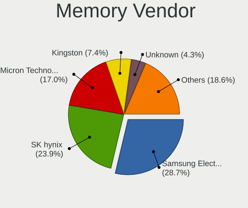

| Vendor              | Notebooks | Percent |
|---------------------|-----------|---------|
| Samsung Electronics | 54        | 28.72%  |
| SK hynix            | 45        | 23.94%  |
| Micron Technology   | 32        | 17.02%  |
| Kingston            | 14        | 7.45%   |
| Unknown             | 8         | 4.26%   |
| Crucial             | 7         | 3.72%   |
| A-DATA Technology   | 5         | 2.66%   |
| Corsair             | 4         | 2.13%   |
| Ramaxel Technology  | 3         | 1.6%    |
| Nanya Technology    | 3         | 1.6%    |
| Unknown             | 2         | 1.06%   |
| Wodposit            | 1         | 0.53%   |
| Unknown (ABCD)      | 1         | 0.53%   |
| Transcend           | 1         | 0.53%   |
| Timetec             | 1         | 0.53%   |
| Team                | 1         | 0.53%   |
| Smart               | 1         | 0.53%   |
| Neo Forza           | 1         | 0.53%   |
| HT Micron           | 1         | 0.53%   |
| Elpida              | 1         | 0.53%   |
| 4ea5                | 1         | 0.53%   |
| 48spaces            | 1         | 0.53%   |

Memory Model
------------

Memory module models

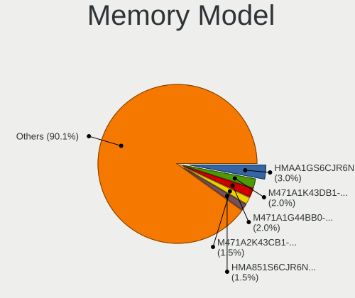

| Model                                                            | Notebooks | Percent |
|------------------------------------------------------------------|-----------|---------|
| SK hynix RAM HMAA1GS6CJR6N-XN 8GB SODIMM DDR4 3200MT/s           | 6         | 2.97%   |
| Samsung RAM M471A1K43DB1-CTD 8GB SODIMM DDR4 2667MT/s            | 4         | 1.98%   |
| Samsung RAM M471A1G44BB0-CWE 8GB SODIMM DDR4 3200MT/s            | 4         | 1.98%   |
| SK hynix RAM HMA851S6CJR6N-VK 4GB SODIMM DDR4 2667MT/s           | 3         | 1.49%   |
| Samsung RAM M471A2K43CB1-CTD 16GB SODIMM DDR4 8400MT/s           | 3         | 1.49%   |
| SK hynix RAM HMA81GS6DJR8N-XN 8GB SODIMM DDR4 3200MT/s           | 2         | 0.99%   |
| SK hynix RAM HMA81GS6AFR8N-UH 8GB SODIMM DDR4 2667MT/s           | 2         | 0.99%   |
| Samsung RAM M471B5273CH0-CH9 4GB SODIMM DDR3 1334MT/s            | 2         | 0.99%   |
| Samsung RAM M471B5173QH0-YK0 4GB SODIMM DDR3 1600MT/s            | 2         | 0.99%   |
| Samsung RAM M471B5173EB0-YK0 4GB SODIMM DDR3 1600MT/s            | 2         | 0.99%   |
| Samsung RAM M471B5173DB0-YK0 4GB SODIMM DDR3 1600MT/s            | 2         | 0.99%   |
| Samsung RAM M471B1G73QH0-YK0 8GB SODIMM DDR3 1600MT/s            | 2         | 0.99%   |
| Samsung RAM M471B1G73EB0-YK0 8192MB SODIMM DDR3 1600MT/s         | 2         | 0.99%   |
| Samsung RAM M471B1G73DB0-YK0 8GB SODIMM DDR3 1600MT/s            | 2         | 0.99%   |
| Samsung RAM M471A5244CB0-CRC 4GB SODIMM DDR4 2667MT/s            | 2         | 0.99%   |
| Samsung RAM M471A1K43CB1-CRC 8GB SODIMM DDR4 8400MT/s            | 2         | 0.99%   |
| Samsung RAM M471A1G44AB0-CWE 8GB Row Of Chips DDR4 3200MT/s      | 2         | 0.99%   |
| Micron RAM MTC4C10163S1SC56BD1 8GB SODIMM DDR5 5600MT/s          | 2         | 0.99%   |
| Micron RAM MT62F2G32D8DR-031 WT 8GB SODIMM LPDDR5 6400MT/s       | 2         | 0.99%   |
| Micron RAM 8KTF51264HZ-1G6E1 4GB SODIMM DDR3 1600MT/s            | 2         | 0.99%   |
| Micron RAM 4ATF51264HZ-3G2J1 4GB SODIMM DDR4 3200MT/s            | 2         | 0.99%   |
| Crucial RAM CT16G56C46S5.M8G1 16GB SODIMM DDR5 5600MT/s          | 2         | 0.99%   |
| Unknown                                                          | 2         | 0.99%   |
| Wodposit RAM WPBH32D408SWD-8G 8GB SODIMM DDR4 3200MT/s           | 1         | 0.5%    |
| Unknown RAM Module 8GB SODIMM DDR4 2667MT/s                      | 1         | 0.5%    |
| Unknown RAM Module 8192MB SODIMM LPDDR4 4266MT/s                 | 1         | 0.5%    |
| Unknown RAM Module 512MB SODIMM DDR2 533MT/s                     | 1         | 0.5%    |
| Unknown RAM Module 2GB SODIMM DDR2 667MT/s                       | 1         | 0.5%    |
| Unknown RAM Module 2GB SODIMM DDR2                               | 1         | 0.5%    |
| Unknown RAM Module 2GB DIMM DDR3 1333MT/s                        | 1         | 0.5%    |
| Unknown RAM Module 2048MB SODIMM DDR3 1333MT/s                   | 1         | 0.5%    |
| Unknown RAM Module 1GB SODIMM DDR2                               | 1         | 0.5%    |
| Unknown (ABCD) RAM 123456789012345678 2GB SODIMM LPDDR4 2400MT/s | 1         | 0.5%    |
| Transcend RAM TS512MSK64W6H 4GB SODIMM DDR3 1600MT/s             | 1         | 0.5%    |
| Timetec RAM SD3-1600 8GB SODIMM DDR3 1600MT/s                    | 1         | 0.5%    |
| Timetec RAM S8G-1600 8GB SODIMM DDR3 1600MT/s                    | 1         | 0.5%    |
| Team RAM TEAMGROUP-SD4-3200 16GB SODIMM DDR4 3200MT/s            | 1         | 0.5%    |
| Smart RAM SMS4WEC3C0K0446SCG 4GB SODIMM DDR4 3200MT/s            | 1         | 0.5%    |
| SK hynix RAM Module 8GB SODIMM DDR4 2133MT/s                     | 1         | 0.5%    |
| SK hynix RAM Module 512MB SODIMM DDR2 533MT/s                    | 1         | 0.5%    |

Memory Kind
-----------

Memory module kinds

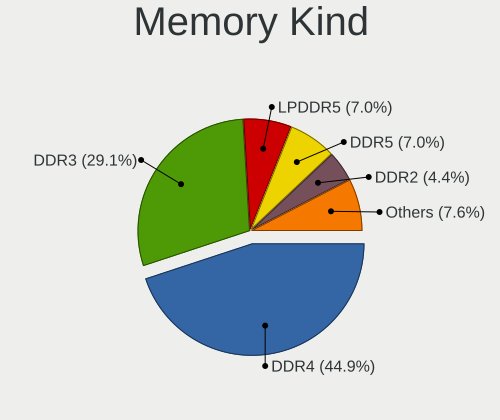

| Kind   | Notebooks | Percent |
|--------|-----------|---------|
| DDR4   | 71        | 44.94%  |
| DDR3   | 46        | 29.11%  |
| LPDDR5 | 11        | 6.96%   |
| DDR5   | 11        | 6.96%   |
| DDR2   | 7         | 4.43%   |
| LPDDR4 | 6         | 3.8%    |
| LPDDR3 | 4         | 2.53%   |
| SDRAM  | 1         | 0.63%   |
| DDR    | 1         | 0.63%   |

Memory Form Factor
------------------

Physical design of the memory module

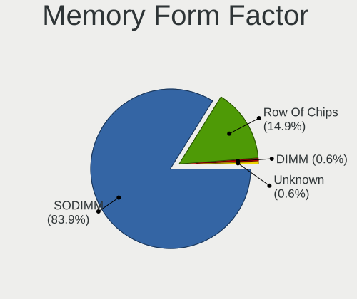

| Name         | Notebooks | Percent |
|--------------|-----------|---------|
| SODIMM       | 135       | 83.85%  |
| Row Of Chips | 24        | 14.91%  |
| DIMM         | 1         | 0.62%   |
| Unknown      | 1         | 0.62%   |

Memory Size
-----------

Memory module size

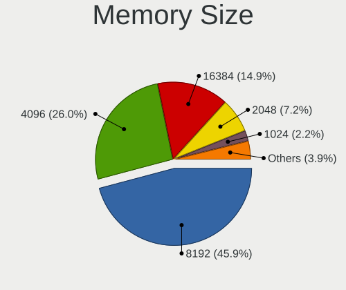

| Size  | Notebooks | Percent |
|-------|-----------|---------|
| 8192  | 83        | 45.86%  |
| 4096  | 47        | 25.97%  |
| 16384 | 27        | 14.92%  |
| 2048  | 13        | 7.18%   |
| 1024  | 4         | 2.21%   |
| 32768 | 3         | 1.66%   |
| 512   | 3         | 1.66%   |
| 12288 | 1         | 0.55%   |

Memory Speed
------------

Memory module speed

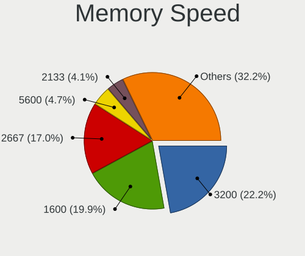

| Speed   | Notebooks | Percent |
|---------|-----------|---------|
| 3200    | 38        | 22.22%  |
| 1600    | 34        | 19.88%  |
| 2667    | 29        | 16.96%  |
| 5600    | 8         | 4.68%   |
| 2133    | 7         | 4.09%   |
| 1334    | 7         | 4.09%   |
| 6400    | 6         | 3.51%   |
| 2400    | 6         | 3.51%   |
| 1333    | 6         | 3.51%   |
| 8400    | 5         | 2.92%   |
| 667     | 5         | 2.92%   |
| 7500    | 4         | 2.34%   |
| 4800    | 4         | 2.34%   |
| 533     | 3         | 1.75%   |
| 3733    | 2         | 1.17%   |
| Unknown | 2         | 1.17%   |
| 8600    | 1         | 0.58%   |
| 4267    | 1         | 0.58%   |
| 4266    | 1         | 0.58%   |
| 4199    | 1         | 0.58%   |
| 1867    | 1         | 0.58%   |

Printers & scanners
-------------------

Printer Vendor
--------------

Printer device vendors

Zero info for selected period =(

Printer Model
-------------

Printer device models

Zero info for selected period =(

Scanner Vendor
--------------

Scanner device vendors

Zero info for selected period =(

Scanner Model
-------------

Scanner device models

Zero info for selected period =(

Camera
------

Camera Vendor
-------------

Camera device vendors

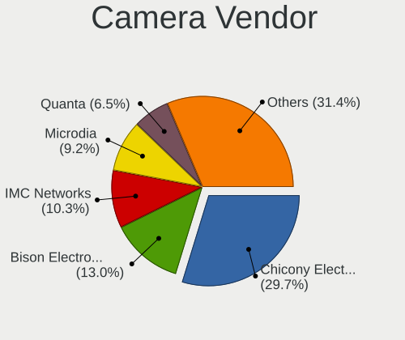

| Vendor                                 | Notebooks | Percent |
|----------------------------------------|-----------|---------|
| Chicony Electronics                    | 55        | 29.73%  |
| Bison Electronics                      | 24        | 12.97%  |
| IMC Networks                           | 19        | 10.27%  |
| Microdia                               | 17        | 9.19%   |
| Quanta                                 | 12        | 6.49%   |
| Realtek Semiconductor                  | 10        | 5.41%   |
| Luxvisions Innotech Limited            | 8         | 4.32%   |
| Syntek                                 | 7         | 3.78%   |
| Cheng Uei Precision Industry (Foxlink) | 7         | 3.78%   |
| Sunplus Innovation Technology          | 6         | 3.24%   |
| Suyin                                  | 3         | 1.62%   |
| Sonix Technology                       | 3         | 1.62%   |
| Alcor Micro                            | 3         | 1.62%   |
| SunplusIT                              | 1         | 0.54%   |
| Silicon Motion                         | 1         | 0.54%   |
| Shinetech                              | 1         | 0.54%   |
| Shine-optics                           | 1         | 0.54%   |
| Logitech                               | 1         | 0.54%   |
| Lite-On Technology                     | 1         | 0.54%   |
| Intel                                  | 1         | 0.54%   |
| Hewlett-Packard                        | 1         | 0.54%   |
| Apple                                  | 1         | 0.54%   |
| ALi                                    | 1         | 0.54%   |
| Unknown                                | 1         | 0.54%   |

Camera Model
------------

Camera device models

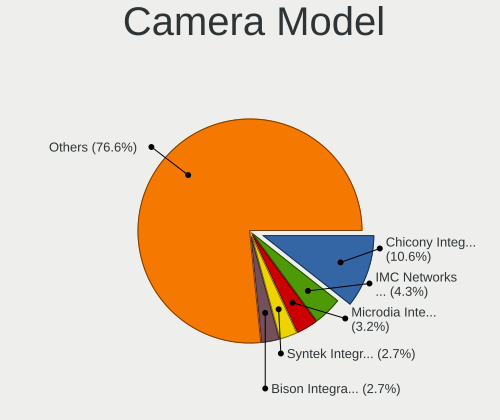

| Model                                             | Notebooks | Percent |
|---------------------------------------------------|-----------|---------|
| Chicony Integrated Camera                         | 20        | 10.64%  |
| IMC Networks USB2.0 HD UVC WebCam                 | 8         | 4.26%   |
| Microdia Integrated_Webcam_HD                     | 6         | 3.19%   |
| Syntek Integrated Camera                          | 5         | 2.66%   |
| Bison Integrated RGB Camera                       | 5         | 2.66%   |
| Bison Integrated Camera                           | 5         | 2.66%   |
| Realtek USB Camera                                | 4         | 2.13%   |
| Quanta HD User Facing                             | 4         | 2.13%   |
| Chicony HP TrueVision HD Camera                   | 4         | 2.13%   |
| Chicony HD WebCam                                 | 4         | 2.13%   |
| Suyin HP Truevision HD                            | 3         | 1.6%    |
| Luxvisions Innotech Limited Integrated RGB Camera | 3         | 1.6%    |
| Luxvisions Innotech Limited Integrated Camera     | 3         | 1.6%    |
| IMC Networks Integrated Camera                    | 3         | 1.6%    |
| Chicony USB2.0 VGA UVC WebCam                     | 3         | 1.6%    |
| Chicony USB 2.0 Camera                            | 3         | 1.6%    |
| Chicony HD WebCam (Acer)                          | 3         | 1.6%    |
| Cheng Uei Precision Industry (Foxlink) Webcam     | 3         | 1.6%    |
| Bison SunplusIT Integrated Camera                 | 3         | 1.6%    |
| Sunplus Integrated_Webcam_HD                      | 2         | 1.06%   |
| Sonix USB2.0 HD UVC WebCam                        | 2         | 1.06%   |
| Quanta HP Webcam                                  | 2         | 1.06%   |
| Microdia HP Integrated Webcam                     | 2         | 1.06%   |
| Microdia HDE Webcam USB                           | 2         | 1.06%   |
| IMC Networks USB2.0 VGA UVC WebCam                | 2         | 1.06%   |
| IMC Networks HD Camera                            | 2         | 1.06%   |
| Chicony USB2.0 Camera                             | 2         | 1.06%   |
| Chicony Lenovo EasyCamera                         | 2         | 1.06%   |
| Chicony Integrated Camera (1280x720@30)           | 2         | 1.06%   |
| Chicony HP Wide Vision HD Camera                  | 2         | 1.06%   |
| Chicony HD User Facing                            | 2         | 1.06%   |
| Bison Lenovo EasyCamera                           | 2         | 1.06%   |
| Bison HD Webcam                                   | 2         | 1.06%   |
| Syntek HP Webcam-101                              | 1         | 0.53%   |
| Syntek EasyCamera                                 | 1         | 0.53%   |
| SunplusIT XiaoMi USB 2.0 Webcam                   | 1         | 0.53%   |
| Sunplus SPCA2087 PC Camera                        | 1         | 0.53%   |
| Sunplus Integrated_Webcam_FHD                     | 1         | 0.53%   |
| Sunplus Integrated Camera                         | 1         | 0.53%   |
| Sunplus HP Wide Vision HD                         | 1         | 0.53%   |

Security
--------

Fingerprint Vendor
------------------

Fingerprint sensor vendors

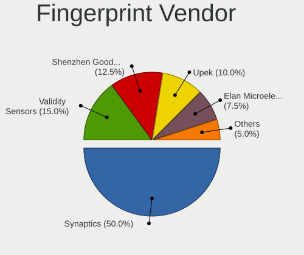

| Vendor                     | Notebooks | Percent |
|----------------------------|-----------|---------|
| Synaptics                  | 20        | 50%     |
| Validity Sensors           | 6         | 15%     |
| Shenzhen Goodix Technology | 5         | 12.5%   |
| Upek                       | 4         | 10%     |
| Elan Microelectronics      | 3         | 7.5%    |
| HOLTEK                     | 1         | 2.5%    |
| Focal-systems.Corp         | 1         | 2.5%    |

Fingerprint Model
-----------------

Fingerprint sensor models

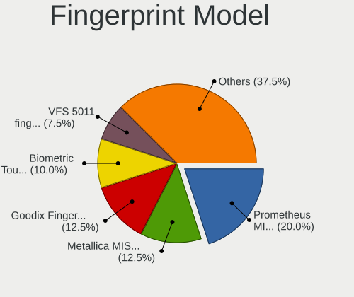

| Model                                                  | Notebooks | Percent |
|--------------------------------------------------------|-----------|---------|
| Synaptics Prometheus MIS Touch Fingerprint Reader      | 8         | 20%     |
| Synaptics Metallica MIS Touch Fingerprint Reader       | 5         | 12.5%   |
| Shenzhen Goodix  FingerPrint Device                    | 5         | 12.5%   |
| Upek Biometric Touchchip/Touchstrip Fingerprint Sensor | 4         | 10%     |
| Validity Sensors VFS 5011 fingerprint sensor           | 3         | 7.5%    |
| Validity Sensors VFS495 Fingerprint Reader             | 2         | 5%      |
| Synaptics UWP WBDI Device                              | 2         | 5%      |
| Synaptics Metallica MOH Touch Fingerprint Reader       | 2         | 5%      |
| Elan ELAN:Fingerprint                                  | 2         | 5%      |
| Validity Sensors VFS5011 Fingerprint Reader            | 1         | 2.5%    |
| Synaptics WBDI Fingerprint Reader USB 086              | 1         | 2.5%    |
| Synaptics Prometheus Fingerprint Reader                | 1         | 2.5%    |
| Synaptics Fingerprint reader [HP G6]                   | 1         | 2.5%    |
| HOLTEK FocalTech Fingerprint Device                    | 1         | 2.5%    |
| Focal-systems.Corp FT9201Fingerprint.                  | 1         | 2.5%    |
| Elan ELAN:ARM-M4                                       | 1         | 2.5%    |

Chipcard Vendor
---------------

Chipcard module vendors

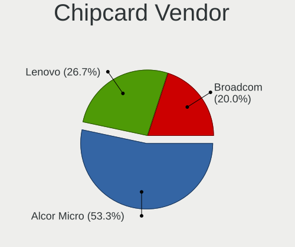

| Vendor      | Notebooks | Percent |
|-------------|-----------|---------|
| Alcor Micro | 8         | 53.33%  |
| Lenovo      | 4         | 26.67%  |
| Broadcom    | 3         | 20%     |

Chipcard Model
--------------

Chipcard module models

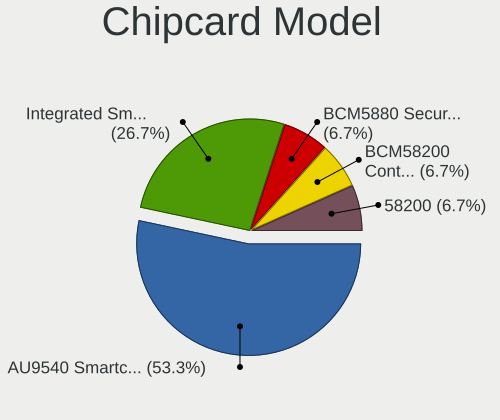

| Model                                                                       | Notebooks | Percent |
|-----------------------------------------------------------------------------|-----------|---------|
| Alcor Micro AU9540 Smartcard Reader                                         | 8         | 53.33%  |
| Lenovo Integrated Smart Card Reader                                         | 4         | 26.67%  |
| Broadcom BCM5880 Secure Applications Processor                              | 1         | 6.67%   |
| Broadcom BCM58200 ControlVault 3 (FingerPrint sensor + Contacted SmartCard) | 1         | 6.67%   |
| Broadcom 58200                                                              | 1         | 6.67%   |

Unsupported
-----------

Unsupported Devices
-------------------

Total unsupported devices on board

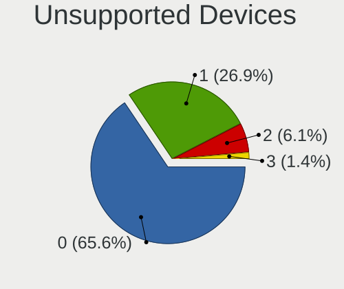

| Total | Notebooks | Percent |
|-------|-----------|---------|
| 0     | 139       | 65.57%  |
| 1     | 57        | 26.89%  |
| 2     | 13        | 6.13%   |
| 3     | 3         | 1.42%   |

Unsupported Device Types
------------------------

Types of unsupported devices

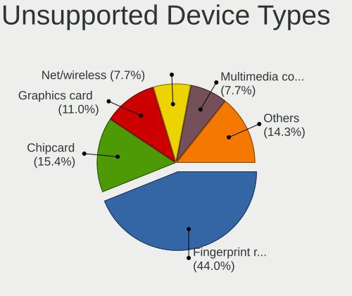

| Type                     | Notebooks | Percent |
|--------------------------|-----------|---------|
| Fingerprint reader       | 40        | 43.96%  |
| Chipcard                 | 14        | 15.38%  |
| Graphics card            | 10        | 10.99%  |
| Net/wireless             | 7         | 7.69%   |
| Multimedia controller    | 7         | 7.69%   |
| Communication controller | 3         | 3.3%    |
| Card reader              | 3         | 3.3%    |
| Camera                   | 3         | 3.3%    |
| Bluetooth                | 2         | 2.2%    |
| Sound                    | 1         | 1.1%    |
| Net/ethernet             | 1         | 1.1%    |

