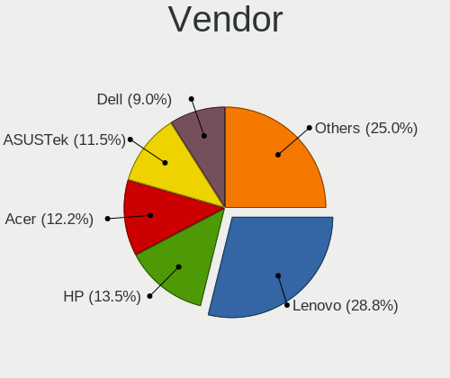
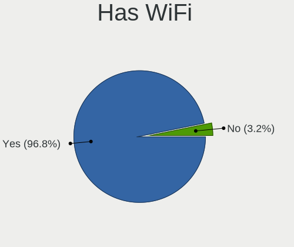
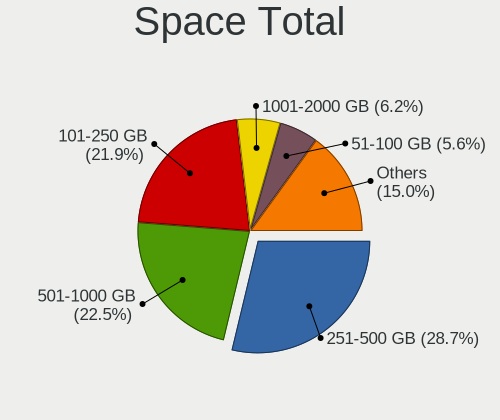
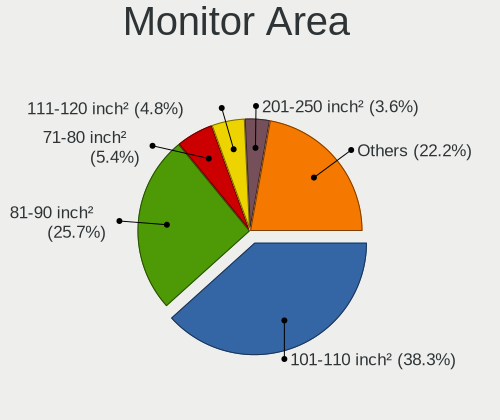
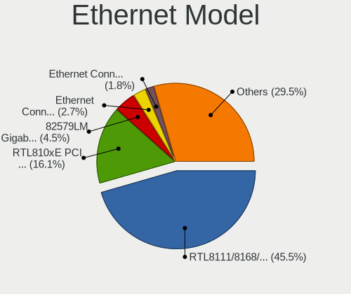
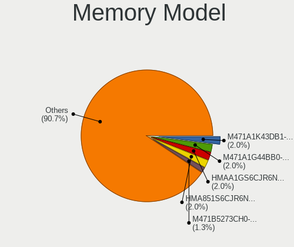
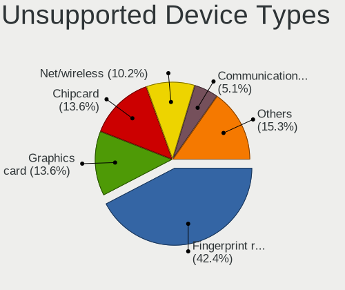

Void Linux - Tested Hardware & Statistics (Notebooks)
-----------------------------------------------------

A project to collect tested hardware configurations for Void Linux.

Anyone can contribute to this report by the [hw-probe](https://github.com/linuxhw/hw-probe) tool:

    sudo -E hw-probe -all -upload

Please contribute! Especially if your hardware is rare.

Contents
--------

* [ Test Cases ](#test-cases)

* [ System ](#system)
  - [ OS                       ](#os)
  - [ OS Family                ](#os-family)
  - [ Kernel                   ](#kernel)
  - [ Kernel Family            ](#kernel-family)
  - [ Kernel Major Ver.        ](#kernel-major-ver)
  - [ Arch                     ](#arch)
  - [ DE                       ](#de)
  - [ Display Server           ](#display-server)
  - [ Display Manager          ](#display-manager)
  - [ OS Lang                  ](#os-lang)
  - [ Boot Mode                ](#boot-mode)
  - [ Filesystem               ](#filesystem)
  - [ Part. scheme             ](#part-scheme)
  - [ Dual Boot with Linux/BSD ](#dual-boot-with-linuxbsd)
  - [ Dual Boot (Win)          ](#dual-boot-win)

* [ Board ](#board)
  - [ Vendor                   ](#vendor)
  - [ Model                    ](#model)
  - [ Model Family             ](#model-family)
  - [ MFG Year                 ](#mfg-year)
  - [ Form Factor              ](#form-factor)
  - [ Secure Boot              ](#secure-boot)
  - [ Coreboot                 ](#coreboot)
  - [ RAM Size                 ](#ram-size)
  - [ RAM Used                 ](#ram-used)
  - [ Total Drives             ](#total-drives)
  - [ Has CD-ROM               ](#has-cd-rom)
  - [ Has Ethernet             ](#has-ethernet)
  - [ Has WiFi                 ](#has-wifi)
  - [ Has Bluetooth            ](#has-bluetooth)

* [ Location ](#location)
  - [ Country                  ](#country)
  - [ City                     ](#city)

* [ Drives ](#drives)
  - [ Drive Vendor             ](#drive-vendor)
  - [ Drive Model              ](#drive-model)
  - [ HDD Vendor               ](#hdd-vendor)
  - [ SSD Vendor               ](#ssd-vendor)
  - [ Drive Kind               ](#drive-kind)
  - [ Drive Connector          ](#drive-connector)
  - [ Drive Size               ](#drive-size)
  - [ Space Total              ](#space-total)
  - [ Space Used               ](#space-used)
  - [ Malfunc. Drives          ](#malfunc-drives)
  - [ Malfunc. Drive Vendor    ](#malfunc-drive-vendor)
  - [ Malfunc. HDD Vendor      ](#malfunc-hdd-vendor)
  - [ Malfunc. Drive Kind      ](#malfunc-drive-kind)
  - [ Failed Drives            ](#failed-drives)
  - [ Failed Drive Vendor      ](#failed-drive-vendor)
  - [ Drive Status             ](#drive-status)

* [ Storage controller ](#storage-controller)
  - [ Storage Vendor           ](#storage-vendor)
  - [ Storage Model            ](#storage-model)
  - [ Storage Kind             ](#storage-kind)

* [ Processor ](#processor)
  - [ CPU Vendor               ](#cpu-vendor)
  - [ CPU Model                ](#cpu-model)
  - [ CPU Model Family         ](#cpu-model-family)
  - [ CPU Cores                ](#cpu-cores)
  - [ CPU Sockets              ](#cpu-sockets)
  - [ CPU Threads              ](#cpu-threads)
  - [ CPU Op-Modes             ](#cpu-op-modes)
  - [ CPU Microcode            ](#cpu-microcode)
  - [ CPU Microarch            ](#cpu-microarch)

* [ Graphics ](#graphics)
  - [ GPU Vendor               ](#gpu-vendor)
  - [ GPU Model                ](#gpu-model)
  - [ GPU Combo                ](#gpu-combo)
  - [ GPU Driver               ](#gpu-driver)
  - [ GPU Memory               ](#gpu-memory)

* [ Monitor ](#monitor)
  - [ Monitor Vendor           ](#monitor-vendor)
  - [ Monitor Model            ](#monitor-model)
  - [ Monitor Resolution       ](#monitor-resolution)
  - [ Monitor Diagonal         ](#monitor-diagonal)
  - [ Monitor Width            ](#monitor-width)
  - [ Aspect Ratio             ](#aspect-ratio)
  - [ Monitor Area             ](#monitor-area)
  - [ Pixel Density            ](#pixel-density)
  - [ Multiple Monitors        ](#multiple-monitors)

* [ Network ](#network)
  - [ Net Controller Vendor    ](#net-controller-vendor)
  - [ Net Controller Model     ](#net-controller-model)
  - [ Wireless Vendor          ](#wireless-vendor)
  - [ Wireless Model           ](#wireless-model)
  - [ Ethernet Vendor          ](#ethernet-vendor)
  - [ Ethernet Model           ](#ethernet-model)
  - [ Net Controller Kind      ](#net-controller-kind)
  - [ Used Controller          ](#used-controller)
  - [ NICs                     ](#nics)
  - [ IPv6                     ](#ipv6)

* [ Bluetooth ](#bluetooth)
  - [ Bluetooth Vendor         ](#bluetooth-vendor)
  - [ Bluetooth Model          ](#bluetooth-model)

* [ Sound ](#sound)
  - [ Sound Vendor             ](#sound-vendor)
  - [ Sound Model              ](#sound-model)

* [ Memory ](#memory)
  - [ Memory Vendor            ](#memory-vendor)
  - [ Memory Model             ](#memory-model)
  - [ Memory Kind              ](#memory-kind)
  - [ Memory Form Factor       ](#memory-form-factor)
  - [ Memory Size              ](#memory-size)
  - [ Memory Speed             ](#memory-speed)

* [ Printers & scanners ](#printers--scanners)
  - [ Printer Vendor           ](#printer-vendor)
  - [ Printer Model            ](#printer-model)
  - [ Scanner Vendor           ](#scanner-vendor)
  - [ Scanner Model            ](#scanner-model)

* [ Camera ](#camera)
  - [ Camera Vendor            ](#camera-vendor)
  - [ Camera Model             ](#camera-model)

* [ Security ](#security)
  - [ Fingerprint Vendor       ](#fingerprint-vendor)
  - [ Fingerprint Model        ](#fingerprint-model)
  - [ Chipcard Vendor          ](#chipcard-vendor)
  - [ Chipcard Model           ](#chipcard-model)

* [ Unsupported ](#unsupported)
  - [ Unsupported Devices      ](#unsupported-devices)
  - [ Unsupported Device Types ](#unsupported-device-types)

Test Cases
----------

Total: 199

| Vendor        | Model                       | Probe                                                      | Date         |
|---------------|-----------------------------|------------------------------------------------------------|--------------|
| MSI           | Modern 14 C5M               | [e986a9bd5b](https://linux-hardware.org/?probe=e986a9bd5b) | Dec 20, 2024 |
| TUXEDO        | Aura 15 Gen1                | [34f734e369](https://linux-hardware.org/?probe=34f734e369) | Dec 08, 2024 |
| Acer          | Aspire 7530                 | [d3ba125ebf](https://linux-hardware.org/?probe=d3ba125ebf) | Dec 07, 2024 |
| TUXEDO        | Sirius 16 Gen2              | [354db7d135](https://linux-hardware.org/?probe=354db7d135) | Dec 03, 2024 |
| Lenovo        | ThinkPad X13 Gen 4 MFG_... | [9776c3f272](https://linux-hardware.org/?probe=9776c3f272) | Nov 11, 2024 |
| TECNO Mobi... | MEGABOOK K16SDA             | [70986a82fc](https://linux-hardware.org/?probe=70986a82fc) | Oct 29, 2024 |
| SHENZHEN Y... | LAITNIN G5                  | [48ddc95621](https://linux-hardware.org/?probe=48ddc95621) | Oct 27, 2024 |
| Lenovo        | ThinkPad E16 Gen 1 21JTS... | [a65fd5c1bd](https://linux-hardware.org/?probe=a65fd5c1bd) | Oct 25, 2024 |
| Lenovo        | ThinkPad E16 Gen 1 21JTS... | [18e9247d81](https://linux-hardware.org/?probe=18e9247d81) | Oct 25, 2024 |
| Lenovo        | ThinkPad E16 Gen 1 21JTS... | [64bcd6a568](https://linux-hardware.org/?probe=64bcd6a568) | Oct 25, 2024 |
| Lenovo        | ThinkBook 14 G5+ ARP 21H... | [de44b9af7c](https://linux-hardware.org/?probe=de44b9af7c) | Oct 15, 2024 |
| Lenovo        | ThinkPad E16 Gen 1 21JTS... | [1681159aa6](https://linux-hardware.org/?probe=1681159aa6) | Oct 03, 2024 |
| Acer          | Aspire A515-45              | [8b4bc215f3](https://linux-hardware.org/?probe=8b4bc215f3) | Oct 02, 2024 |
| Positivo      | Mobile                      | [aeb1cab172](https://linux-hardware.org/?probe=aeb1cab172) | Sep 27, 2024 |
| Casper        | NIRVANA                     | [7fec4c1d6a](https://linux-hardware.org/?probe=7fec4c1d6a) | Sep 26, 2024 |
| Lenovo        | ThinkPad T450 20BUS0QB01    | [d690a02173](https://linux-hardware.org/?probe=d690a02173) | Sep 08, 2024 |
| Acer          | Aspire E5-571G              | [fb2050ff91](https://linux-hardware.org/?probe=fb2050ff91) | Aug 29, 2024 |
| HP            | EliteBook 840 G3            | [caf63dfcd4](https://linux-hardware.org/?probe=caf63dfcd4) | Aug 27, 2024 |
| Acer          | Aspire A515-45              | [d011f81b2c](https://linux-hardware.org/?probe=d011f81b2c) | Aug 21, 2024 |
| Dell          | G15 Special Edition 5521    | [f63c3accfa](https://linux-hardware.org/?probe=f63c3accfa) | Aug 10, 2024 |
| HP            | Pavilion 15                 | [57e8c42dac](https://linux-hardware.org/?probe=57e8c42dac) | Aug 04, 2024 |
| HP            | Pavilion 15                 | [9a6044e07e](https://linux-hardware.org/?probe=9a6044e07e) | Aug 04, 2024 |
| Lenovo        | IdeaPad 5 15ITL05 82FG      | [7aafcbd9f1](https://linux-hardware.org/?probe=7aafcbd9f1) | Jul 20, 2024 |
| HP            | 255 15.6 inch G9 Noteboo... | [524616cba4](https://linux-hardware.org/?probe=524616cba4) | Jul 16, 2024 |
| HP            | 15                          | [23f73adbdd](https://linux-hardware.org/?probe=23f73adbdd) | Jul 15, 2024 |
| ASUSTek       | VivoBook_ASUSLaptop X515... | [d7c2d0c8e1](https://linux-hardware.org/?probe=d7c2d0c8e1) | Jul 08, 2024 |
| Lenovo        | ThinkPad T14 Gen 4 21HES... | [640bc2625d](https://linux-hardware.org/?probe=640bc2625d) | Jun 20, 2024 |
| TUXEDO        | Aura 15 Gen1                | [0bd7cbd871](https://linux-hardware.org/?probe=0bd7cbd871) | Jun 19, 2024 |
| Lenovo        | ThinkBook 16 G6+ AHP 21L... | [dda20727cf](https://linux-hardware.org/?probe=dda20727cf) | Jun 17, 2024 |
| TUXEDO        | Aura 15 Gen1                | [7bc9c456ff](https://linux-hardware.org/?probe=7bc9c456ff) | Jun 05, 2024 |
| TUXEDO        | Pulse 14 Gen3               | [0543a1b5a2](https://linux-hardware.org/?probe=0543a1b5a2) | Jun 04, 2024 |
| Matsushita... | CF-74GCDADBM                | [95822893cd](https://linux-hardware.org/?probe=95822893cd) | May 23, 2024 |
| Matsushita... | CF-74GCDADBM                | [062929e9d9](https://linux-hardware.org/?probe=062929e9d9) | May 14, 2024 |
| Lenovo        | ThinkPad T420 4180D81       | [586b69e749](https://linux-hardware.org/?probe=586b69e749) | Apr 23, 2024 |
| HUAWEI        | BOM-WXX9                    | [4113f409f3](https://linux-hardware.org/?probe=4113f409f3) | Apr 22, 2024 |
| Lenovo        | ThinkPad T520 42433ZG       | [d2899d8de6](https://linux-hardware.org/?probe=d2899d8de6) | Apr 19, 2024 |
| HP            | Stream Laptop 14-cb1xxx     | [02724e5adf](https://linux-hardware.org/?probe=02724e5adf) | Apr 15, 2024 |
| ASUSTek       | E402MA                      | [58a1e32393](https://linux-hardware.org/?probe=58a1e32393) | Apr 14, 2024 |
| Framework     | Laptop 13 (AMD Ryzen 704... | [d6d03b4ad2](https://linux-hardware.org/?probe=d6d03b4ad2) | Apr 14, 2024 |
| Apple         | MacBookPro11,1              | [4e18f485f3](https://linux-hardware.org/?probe=4e18f485f3) | Apr 11, 2024 |
| Acer          | E1-510                      | [c53095abd3](https://linux-hardware.org/?probe=c53095abd3) | Apr 10, 2024 |
| Dell          | Latitude 5400               | [20fa0e002d](https://linux-hardware.org/?probe=20fa0e002d) | Mar 23, 2024 |
| Lenovo        | ThinkBook 15 G4 IAP 21DJ    | [d5c50b0264](https://linux-hardware.org/?probe=d5c50b0264) | Mar 20, 2024 |
| Lenovo        | IdeaPad 3 15IIL05 81WE      | [14b3cedbef](https://linux-hardware.org/?probe=14b3cedbef) | Mar 18, 2024 |
| ASUSTek       | VivoBook_ASUSLaptop X421... | [d2152999e9](https://linux-hardware.org/?probe=d2152999e9) | Mar 13, 2024 |
| Lenovo        | ThinkPad T480 20L6S37W04    | [1278612ad9](https://linux-hardware.org/?probe=1278612ad9) | Mar 05, 2024 |
| Lenovo        | ThinkPad E590 20NB001AUK    | [45eadbd174](https://linux-hardware.org/?probe=45eadbd174) | Mar 03, 2024 |
| Lenovo        | ThinkBook 14 G5+ ARP 21H... | [b68f17fbdf](https://linux-hardware.org/?probe=b68f17fbdf) | Mar 02, 2024 |
| Lenovo        | IdeaPad 330-14AST 81D5      | [4dd27fbd4e](https://linux-hardware.org/?probe=4dd27fbd4e) | Feb 23, 2024 |
| Lenovo        | ThinkPad P14s Gen 4 21K5... | [99f1228781](https://linux-hardware.org/?probe=99f1228781) | Feb 20, 2024 |
| Dell          | Latitude 7420               | [29ce5896a7](https://linux-hardware.org/?probe=29ce5896a7) | Feb 05, 2024 |
| Dell          | Latitude 7420               | [cdd5031988](https://linux-hardware.org/?probe=cdd5031988) | Feb 04, 2024 |
| Lenovo        | ThinkPad T16 Gen 1 21CHC... | [3cec123511](https://linux-hardware.org/?probe=3cec123511) | Feb 04, 2024 |
| Lenovo        | ThinkPad P16s Gen 1 21CK... | [971c919cef](https://linux-hardware.org/?probe=971c919cef) | Jan 20, 2024 |
| Lenovo        | ThinkBook 14 G5+ ARP 21H... | [78a77e24d1](https://linux-hardware.org/?probe=78a77e24d1) | Jan 14, 2024 |
| Toshiba       | Satellite A200              | [4b6c5e1edb](https://linux-hardware.org/?probe=4b6c5e1edb) | Jan 08, 2024 |
| Dell          | Inspiron N5010              | [cc169dad66](https://linux-hardware.org/?probe=cc169dad66) | Jan 08, 2024 |
| Acer          | Aspire A515-44              | [b063fdc8bf](https://linux-hardware.org/?probe=b063fdc8bf) | Dec 29, 2023 |
| Lenovo        | ThinkPad T16 Gen 1 21CHC... | [4f6ecdc95a](https://linux-hardware.org/?probe=4f6ecdc95a) | Dec 19, 2023 |
| MSI           | GE60 2OC\2OD\2OE            | [cd261e1bc3](https://linux-hardware.org/?probe=cd261e1bc3) | Dec 14, 2023 |
| MSI           | GE60 2OC\2OD\2OE            | [5f97c0d536](https://linux-hardware.org/?probe=5f97c0d536) | Dec 13, 2023 |
| ASUSTek       | G750JX                      | [acb5d61dd5](https://linux-hardware.org/?probe=acb5d61dd5) | Dec 08, 2023 |
| HP            | Pavilion 11 x360 PC         | [c6f9c552b6](https://linux-hardware.org/?probe=c6f9c552b6) | Nov 29, 2023 |
| Lenovo        | Ducati 5 82ES               | [04fce2b1b1](https://linux-hardware.org/?probe=04fce2b1b1) | Nov 19, 2023 |
| Lenovo        | Ducati 5 82ES               | [70a8dad823](https://linux-hardware.org/?probe=70a8dad823) | Nov 19, 2023 |
| Razer         | Blade 14 (2022) - RZ09-0... | [426fd54105](https://linux-hardware.org/?probe=426fd54105) | Nov 15, 2023 |
| MSI           | Prestige 15 A10SC           | [a9ff569501](https://linux-hardware.org/?probe=a9ff569501) | Nov 14, 2023 |
| Lenovo        | ThinkBook 14 G3 ACL 21A2    | [5e3d94c299](https://linux-hardware.org/?probe=5e3d94c299) | Nov 07, 2023 |
| Google        | Phaser360                   | [9915a1a3be](https://linux-hardware.org/?probe=9915a1a3be) | Nov 03, 2023 |
| Dell          | Latitude D610               | [270c26c018](https://linux-hardware.org/?probe=270c26c018) | Oct 27, 2023 |
| Unknown       | Unknown                     | [93113727fa](https://linux-hardware.org/?probe=93113727fa) | Oct 18, 2023 |
| HP            | Pavilion Notebook           | [b000ad74e9](https://linux-hardware.org/?probe=b000ad74e9) | Oct 14, 2023 |
| MSI           | GF63 Thin 10SCXR            | [c63ad78eb4](https://linux-hardware.org/?probe=c63ad78eb4) | Oct 06, 2023 |
| Lenovo        | ThinkPad T14 Gen 2a 20XL... | [3fcfddc8e9](https://linux-hardware.org/?probe=3fcfddc8e9) | Sep 27, 2023 |
| HP            | 15                          | [d0ddd6fbc9](https://linux-hardware.org/?probe=d0ddd6fbc9) | Sep 21, 2023 |
| Acer          | Aspire A515-57              | [1e01a32799](https://linux-hardware.org/?probe=1e01a32799) | Sep 01, 2023 |
| HP            | 255 15.6 inch G9 Noteboo... | [2322edb05f](https://linux-hardware.org/?probe=2322edb05f) | Aug 20, 2023 |
| ASUSTek       | VivoBook_ASUSLaptop M140... | [417f4d6d5b](https://linux-hardware.org/?probe=417f4d6d5b) | Aug 17, 2023 |
| Notebook      | NH50_70RA                   | [4f4304a557](https://linux-hardware.org/?probe=4f4304a557) | Aug 06, 2023 |
| Notebook      | NH50_70RA                   | [f86b014869](https://linux-hardware.org/?probe=f86b014869) | Aug 06, 2023 |
| ASUSTek       | X751LD                      | [de2e3a3ebb](https://linux-hardware.org/?probe=de2e3a3ebb) | Jul 23, 2023 |
| Lenovo        | IdeaPad S145-15IWL 81MV     | [798efb2213](https://linux-hardware.org/?probe=798efb2213) | Jun 24, 2023 |
| Lenovo        | IdeaPad 100-14IBD 80RK      | [42eab3e3af](https://linux-hardware.org/?probe=42eab3e3af) | Jun 08, 2023 |
| HP            | 255 G7 Notebook PC          | [45c21cb512](https://linux-hardware.org/?probe=45c21cb512) | May 24, 2023 |
| Acer          | Aspire 4315                 | [8a25a16dfa](https://linux-hardware.org/?probe=8a25a16dfa) | May 22, 2023 |
| Lenovo        | IdeaPad 5 Pro 16ACH6 82L... | [889301578c](https://linux-hardware.org/?probe=889301578c) | Apr 18, 2023 |
| Lenovo        | G50-70 20351                | [f06fd87a32](https://linux-hardware.org/?probe=f06fd87a32) | Apr 18, 2023 |
| ASUSTek       | VivoBook_ASUSLaptop X712... | [4964eb99e9](https://linux-hardware.org/?probe=4964eb99e9) | Apr 18, 2023 |
| Dell          | Latitude 7490               | [b9a5dadc44](https://linux-hardware.org/?probe=b9a5dadc44) | Apr 05, 2023 |
| Timi          | Redmi Book Pro 15 2022      | [cba22e109f](https://linux-hardware.org/?probe=cba22e109f) | Mar 23, 2023 |
| Acer          | E1-510                      | [86abc88022](https://linux-hardware.org/?probe=86abc88022) | Mar 06, 2023 |
| HP            | ENVY m7 Notebook            | [88d1b48b0c](https://linux-hardware.org/?probe=88d1b48b0c) | Feb 26, 2023 |
| Lenovo        | ThinkPad X1 Extreme 2nd ... | [d77029e5a0](https://linux-hardware.org/?probe=d77029e5a0) | Feb 13, 2023 |
| Lenovo        | ThinkPad P16s Gen 1 21CK... | [095fa7a182](https://linux-hardware.org/?probe=095fa7a182) | Feb 12, 2023 |
| Lenovo        | B50-80 80EW                 | [61932dd31a](https://linux-hardware.org/?probe=61932dd31a) | Jan 24, 2023 |
| HP            | Stream Notebook PC 11       | [be652213f6](https://linux-hardware.org/?probe=be652213f6) | Jan 19, 2023 |
| HP            | Stream Notebook PC 11       | [f92fcd0382](https://linux-hardware.org/?probe=f92fcd0382) | Jan 19, 2023 |
| MSI           | Summit E13FlipEvo A12MT     | [35024faf2b](https://linux-hardware.org/?probe=35024faf2b) | Jan 17, 2023 |
| ASUSTek       | VivoBook_ASUSLaptop S540... | [3c9f8b612c](https://linux-hardware.org/?probe=3c9f8b612c) | Jan 16, 2023 |
| Lenovo        | Legion Y540-15IRH-PG0 81... | [b9ca7fb340](https://linux-hardware.org/?probe=b9ca7fb340) | Jan 12, 2023 |
| Lenovo        | IdeaPad 5 15ITL05 82FG      | [511306775e](https://linux-hardware.org/?probe=511306775e) | Jan 11, 2023 |
| Lenovo        | B50-80 80EW                 | [7bf9c1c7f4](https://linux-hardware.org/?probe=7bf9c1c7f4) | Jan 10, 2023 |
| HP            | Pavilion 15                 | [264e3738ec](https://linux-hardware.org/?probe=264e3738ec) | Dec 29, 2022 |
| MSI           | GV72 7RE                    | [74b317d501](https://linux-hardware.org/?probe=74b317d501) | Dec 01, 2022 |
| Lenovo        | ThinkPad T490 20N20046US    | [34882fc8cb](https://linux-hardware.org/?probe=34882fc8cb) | Nov 16, 2022 |
| Toshiba       | Satellite A300D             | [21952b8d66](https://linux-hardware.org/?probe=21952b8d66) | Nov 15, 2022 |
| Lenovo        | Y520-15IKB 80YY             | [626a442179](https://linux-hardware.org/?probe=626a442179) | Nov 06, 2022 |
| Dell          | Inspiron 3501               | [b487c53dfd](https://linux-hardware.org/?probe=b487c53dfd) | Nov 04, 2022 |
| Lenovo        | ThinkPad X201 3680BR4       | [eeeeb33766](https://linux-hardware.org/?probe=eeeeb33766) | Nov 01, 2022 |
| Lenovo        | ThinkPad T420 4236PG6       | [49d423bc50](https://linux-hardware.org/?probe=49d423bc50) | Nov 01, 2022 |
| Dell          | XPS 15 9500                 | [001bcba320](https://linux-hardware.org/?probe=001bcba320) | Oct 02, 2022 |
| Unknown       | 1.0                         | [f5b0e6a742](https://linux-hardware.org/?probe=f5b0e6a742) | Sep 24, 2022 |
| ASUSTek       | X555LD                      | [08793f9065](https://linux-hardware.org/?probe=08793f9065) | Sep 24, 2022 |
| HP            | Laptop 15-bw0xx             | [68406339d5](https://linux-hardware.org/?probe=68406339d5) | Sep 04, 2022 |
| HP            | Laptop 15s-eq2xxx           | [dcb33e35ae](https://linux-hardware.org/?probe=dcb33e35ae) | Aug 18, 2022 |
| Exo           | Exomate X352                | [3be8045452](https://linux-hardware.org/?probe=3be8045452) | Aug 02, 2022 |
| ASUSTek       | X455LF                      | [8e83c4492a](https://linux-hardware.org/?probe=8e83c4492a) | Jul 27, 2022 |
| Nokia         | Booklet 3G                  | [2f0e1a5bcd](https://linux-hardware.org/?probe=2f0e1a5bcd) | Jun 14, 2022 |
| HUAWEI        | KLVL-WXXW                   | [607d5b3c79](https://linux-hardware.org/?probe=607d5b3c79) | May 14, 2022 |
| Lenovo        | ThinkPad T420 4180A21       | [6b5a6e89a2](https://linux-hardware.org/?probe=6b5a6e89a2) | Apr 29, 2022 |
| HP            | Pavilion Gaming Laptop 1... | [6be9414efd](https://linux-hardware.org/?probe=6be9414efd) | Apr 22, 2022 |
| Lenovo        | IdeaPad S145-14IIL 81W6     | [59b9a2cbcb](https://linux-hardware.org/?probe=59b9a2cbcb) | Apr 11, 2022 |
| HUAWEI        | HN-WX9X                     | [ee3842bc8f](https://linux-hardware.org/?probe=ee3842bc8f) | Mar 20, 2022 |
| Acer          | Swift SF314-42              | [e7d10ddac0](https://linux-hardware.org/?probe=e7d10ddac0) | Mar 04, 2022 |
| HP            | ENVY 6                      | [988417aaa7](https://linux-hardware.org/?probe=988417aaa7) | Feb 25, 2022 |
| Lenovo        | ThinkPad T460 20FMS0WN00    | [28be6b9f17](https://linux-hardware.org/?probe=28be6b9f17) | Feb 14, 2022 |
| Lenovo        | ThinkPad T460 20FMS0WN00    | [5819fc1b20](https://linux-hardware.org/?probe=5819fc1b20) | Feb 14, 2022 |
| Framework     | Laptop                      | [24c119ef46](https://linux-hardware.org/?probe=24c119ef46) | Feb 01, 2022 |
| Notebook      | NV4XMB,ME,MZ                | [298ddd1139](https://linux-hardware.org/?probe=298ddd1139) | Jan 24, 2022 |
| Lenovo        | ThinkPad E595 20NFCTO1WW    | [80906dc02b](https://linux-hardware.org/?probe=80906dc02b) | Jan 19, 2022 |
| Apple         | MacBookPro11,1              | [3afcc4b1c0](https://linux-hardware.org/?probe=3afcc4b1c0) | Jan 18, 2022 |
| Lenovo        | ThinkPad X240 20AMA34HMN    | [a4dfbb6e38](https://linux-hardware.org/?probe=a4dfbb6e38) | Jan 10, 2022 |
| HP            | Notebook                    | [3b26596e87](https://linux-hardware.org/?probe=3b26596e87) | Jan 10, 2022 |
| ASUSTek       | X751LD                      | [ce95acc16d](https://linux-hardware.org/?probe=ce95acc16d) | Nov 24, 2021 |
| Pine Micro... | Pine64 Pinebook Pro         | [ae9fd68c7d](https://linux-hardware.org/?probe=ae9fd68c7d) | Nov 04, 2021 |
| Lenovo        | ThinkPad T14s Gen 1 20T1... | [b1dec2f3df](https://linux-hardware.org/?probe=b1dec2f3df) | Oct 28, 2021 |
| Lenovo        | ThinkPad X260 20F5S08Q00    | [2929e779ad](https://linux-hardware.org/?probe=2929e779ad) | Oct 15, 2021 |
| Acer          | Aspire E1-531               | [30d85d7ea1](https://linux-hardware.org/?probe=30d85d7ea1) | Oct 03, 2021 |
| Acer          | Aspire E1-531               | [9c0d90d6ab](https://linux-hardware.org/?probe=9c0d90d6ab) | Sep 24, 2021 |
| Acer          | Aspire E1-531               | [4cff8ab563](https://linux-hardware.org/?probe=4cff8ab563) | Sep 24, 2021 |
| ASUSTek       | X751LD                      | [efc517d282](https://linux-hardware.org/?probe=efc517d282) | Sep 22, 2021 |
| ASUSTek       | VivoBook_ASUS Laptop X50... | [b4749d300a](https://linux-hardware.org/?probe=b4749d300a) | Sep 17, 2021 |
| ASUSTek       | VivoBook_ASUS Laptop X50... | [b9d873983c](https://linux-hardware.org/?probe=b9d873983c) | Sep 17, 2021 |
| Dell          | G3 3579                     | [95182b0267](https://linux-hardware.org/?probe=95182b0267) | Sep 16, 2021 |
| HP            | Laptop 15-bw0xx             | [11722e3cd0](https://linux-hardware.org/?probe=11722e3cd0) | Sep 04, 2021 |
| MSI           | Bravo 15 A4DDR              | [feddf87464](https://linux-hardware.org/?probe=feddf87464) | Sep 01, 2021 |
| Acer          | Swift SF314-42              | [98c2c3d5ac](https://linux-hardware.org/?probe=98c2c3d5ac) | Aug 24, 2021 |
| Samsung       | 275E4E/275E5E               | [26f7b81074](https://linux-hardware.org/?probe=26f7b81074) | Aug 17, 2021 |
| Lenovo        | ThinkPad T480 20L6SA5Q00    | [5459bf7337](https://linux-hardware.org/?probe=5459bf7337) | Aug 08, 2021 |
| ASUSTek       | VivoBook 15_ASUS Laptop ... | [e30dac258e](https://linux-hardware.org/?probe=e30dac258e) | Jul 26, 2021 |
| Unknown       | 1.0                         | [d049c76d58](https://linux-hardware.org/?probe=d049c76d58) | Jul 08, 2021 |
| Acer          | Aspire A515-54G             | [4a19b59c46](https://linux-hardware.org/?probe=4a19b59c46) | Jul 06, 2021 |
| Unknown       | Unknown                     | [17aab9510b](https://linux-hardware.org/?probe=17aab9510b) | Jul 05, 2021 |
| Unknown       | 1.0                         | [967654bdb6](https://linux-hardware.org/?probe=967654bdb6) | Jul 04, 2021 |
| Unknown       | 1.0                         | [36977bacbe](https://linux-hardware.org/?probe=36977bacbe) | Jul 03, 2021 |
| HP            | Pavilion Notebook           | [7684808016](https://linux-hardware.org/?probe=7684808016) | Jun 24, 2021 |
| Acer          | Aspire E5-521               | [e1f4843546](https://linux-hardware.org/?probe=e1f4843546) | Jun 16, 2021 |
| Lenovo        | G50-45 80E3                 | [8e075758bf](https://linux-hardware.org/?probe=8e075758bf) | May 29, 2021 |
| ASUSTek       | TUF Gaming FX505DT_FX505... | [59e32967c4](https://linux-hardware.org/?probe=59e32967c4) | May 26, 2021 |
| ASUSTek       | ASUS TUF Gaming A15 FA50... | [bf2d71e7f2](https://linux-hardware.org/?probe=bf2d71e7f2) | May 14, 2021 |
| Lenovo        | ThinkPad T14 Gen 1 20UES... | [0ebae8c8ec](https://linux-hardware.org/?probe=0ebae8c8ec) | Apr 28, 2021 |
| HP            | Laptop 14-dk0xxx            | [b0e56964ae](https://linux-hardware.org/?probe=b0e56964ae) | Mar 15, 2021 |
| HP            | Laptop 14-dk0xxx            | [adf7976842](https://linux-hardware.org/?probe=adf7976842) | Mar 15, 2021 |
| ASUSTek       | VivoBook_ASUSLaptop X512... | [bdedf5a7c7](https://linux-hardware.org/?probe=bdedf5a7c7) | Feb 22, 2021 |
| ASUSTek       | X510UAR                     | [1888d46194](https://linux-hardware.org/?probe=1888d46194) | Feb 21, 2021 |
| Lenovo        | ThinkPad T430 2349PS3       | [b7eecfebd0](https://linux-hardware.org/?probe=b7eecfebd0) | Jan 29, 2021 |
| Chuwi         | GemiBook Pro                | [66e8ed8402](https://linux-hardware.org/?probe=66e8ed8402) | Jan 22, 2021 |
| Chuwi         | GemiBook Pro                | [d4fcffbd93](https://linux-hardware.org/?probe=d4fcffbd93) | Jan 22, 2021 |
| Acer          | Aspire SW5-015              | [e84677b145](https://linux-hardware.org/?probe=e84677b145) | Dec 20, 2020 |
| Dell          | Inspiron 11 - 3148          | [f9ec6964bb](https://linux-hardware.org/?probe=f9ec6964bb) | Nov 29, 2020 |
| Acer          | Aspire E1-570G              | [d8adc8e3f8](https://linux-hardware.org/?probe=d8adc8e3f8) | Nov 20, 2020 |
| Acer          | AO722                       | [cee0cf9a99](https://linux-hardware.org/?probe=cee0cf9a99) | Nov 17, 2020 |
| ASUSTek       | ASUS TUF Gaming A15 FA50... | [e769e1f93a](https://linux-hardware.org/?probe=e769e1f93a) | Oct 24, 2020 |
| ASUSTek       | ASUS TUF Gaming A15 FA50... | [b50f7a3624](https://linux-hardware.org/?probe=b50f7a3624) | Oct 07, 2020 |
| Acer          | Aspire E5-575G              | [204ef3a0f3](https://linux-hardware.org/?probe=204ef3a0f3) | Oct 02, 2020 |
| Acer          | Aspire A315-55G             | [d24561be9e](https://linux-hardware.org/?probe=d24561be9e) | Oct 01, 2020 |
| Lenovo        | ThinkPad T14s Gen 1 20UH... | [90d57d39e2](https://linux-hardware.org/?probe=90d57d39e2) | Sep 29, 2020 |
| Dell          | Inspiron 5555               | [a7be8edb39](https://linux-hardware.org/?probe=a7be8edb39) | Sep 28, 2020 |
| Dell          | Inspiron 5555               | [079a8b39a7](https://linux-hardware.org/?probe=079a8b39a7) | Sep 27, 2020 |
| Acer          | Nitro AN715-51              | [d375c469b7](https://linux-hardware.org/?probe=d375c469b7) | Sep 16, 2020 |
| Getac         | V110                        | [f0d3292b48](https://linux-hardware.org/?probe=f0d3292b48) | Sep 15, 2020 |
| ASUSTek       | VivoBook_ASUSLaptop X512... | [1f9434f4c9](https://linux-hardware.org/?probe=1f9434f4c9) | Sep 06, 2020 |
| Acer          | AOA150                      | [f88d38a138](https://linux-hardware.org/?probe=f88d38a138) | Sep 04, 2020 |
| Acer          | AO722                       | [816e97376d](https://linux-hardware.org/?probe=816e97376d) | Aug 21, 2020 |
| Lenovo        | IdeaPad Z570 10246ZG        | [0a0f078e76](https://linux-hardware.org/?probe=0a0f078e76) | Apr 25, 2020 |
| HP            | 15                          | [66422a127b](https://linux-hardware.org/?probe=66422a127b) | Mar 14, 2020 |
| Dell          | Precision 3530              | [dd006a4ce0](https://linux-hardware.org/?probe=dd006a4ce0) | Mar 07, 2020 |
| Dell          | Latitude E4300              | [c94ae7cddb](https://linux-hardware.org/?probe=c94ae7cddb) | Feb 24, 2020 |
| ASUSTek       | X555UJ                      | [261f8ada0a](https://linux-hardware.org/?probe=261f8ada0a) | Jan 24, 2020 |
| Lenovo        | IdeaPad 710S-13IKB 80VQ     | [faeec47313](https://linux-hardware.org/?probe=faeec47313) | Jan 21, 2020 |
| Lenovo        | IdeaPad 710S-13IKB 80VQ     | [ec79f8e0c6](https://linux-hardware.org/?probe=ec79f8e0c6) | Jan 21, 2020 |
| Dell          | Inspiron 1501               | [17f0e8e41b](https://linux-hardware.org/?probe=17f0e8e41b) | Dec 03, 2019 |
| HP            | Laptop 14-bs0xx             | [bd6b795d81](https://linux-hardware.org/?probe=bd6b795d81) | Nov 09, 2019 |
| Lenovo        | IdeaPad 330-15ARR 81D2      | [3bae5ecb46](https://linux-hardware.org/?probe=3bae5ecb46) | Oct 10, 2019 |
| Lenovo        | IdeaPad 330-15ARR 81D2      | [230c0c9bc6](https://linux-hardware.org/?probe=230c0c9bc6) | Oct 01, 2019 |
| Dell          | Latitude 3379               | [e80a21e349](https://linux-hardware.org/?probe=e80a21e349) | Sep 13, 2019 |
| Digibras      | NH4CU03                     | [51273f53df](https://linux-hardware.org/?probe=51273f53df) | Jul 15, 2019 |
| Digibras      | NH4CU03                     | [5ac8c5ff7b](https://linux-hardware.org/?probe=5ac8c5ff7b) | Jun 25, 2019 |
| Positivo      | Mobile                      | [0267cf3435](https://linux-hardware.org/?probe=0267cf3435) | Mar 27, 2019 |

System
------

OS
--

Installed operating systems

| Name               | Notebooks | Percent |
|--------------------|-----------|---------|
| Void Linux Rolling | 129       | 82.17%  |
| Void Linux         | 28        | 17.83%  |

OS Family
---------

OS without a version

| Name       | Notebooks | Percent |
|------------|-----------|---------|
| Void Linux | 156       | 100%    |

Kernel
------

Version of the Linux kernel

| Version           | Notebooks | Percent |
|-------------------|-----------|---------|
| 6.3.13_1          | 7         | 4.14%   |
| 5.13.19_1         | 5         | 2.96%   |
| 6.6.22_1          | 4         | 2.37%   |
| 6.3.12_1          | 4         | 2.37%   |
| 5.18.19_1         | 4         | 2.37%   |
| 6.9.12_1          | 3         | 1.78%   |
| 6.6.63_1          | 3         | 1.78%   |
| 6.6.52_1          | 3         | 1.78%   |
| 6.1.4_1           | 3         | 1.78%   |
| 5.8.18_1          | 3         | 1.78%   |
| 5.8.12_1          | 3         | 1.78%   |
| 5.3.9_1           | 3         | 1.78%   |
| 5.19.17_1         | 3         | 1.78%   |
| 5.10.17_1         | 3         | 1.78%   |
| 6.7.6_1           | 2         | 1.18%   |
| 6.6.9_1           | 2         | 1.18%   |
| 6.6.25_1          | 2         | 1.18%   |
| 6.6.16_1          | 2         | 1.18%   |
| 6.6.11_1          | 2         | 1.18%   |
| 6.5.13_1          | 2         | 1.18%   |
| 6.5.11_1          | 2         | 1.18%   |
| 6.5.10_1          | 2         | 1.18%   |
| 6.11.5_1          | 2         | 1.18%   |
| 6.1.31_1          | 2         | 1.18%   |
| 6.1.21_1          | 2         | 1.18%   |
| 6.1.10_1          | 2         | 1.18%   |
| 5.4.24_1          | 2         | 1.18%   |
| 5.19.16_1         | 2         | 1.18%   |
| 5.18.14_1         | 2         | 1.18%   |
| 5.16.20_1         | 2         | 1.18%   |
| 5.15.32_1         | 2         | 1.18%   |
| 5.13.13_1         | 2         | 1.18%   |
| 5.12.10_1         | 2         | 1.18%   |
| 6.9.9_1           | 1         | 0.59%   |
| 6.9.4_1           | 1         | 0.59%   |
| 6.9.0-rc4_current | 1         | 0.59%   |
| 6.8.7_1           | 1         | 0.59%   |
| 6.8.6_1           | 1         | 0.59%   |
| 6.8.12_1          | 1         | 0.59%   |
| 6.8.0-zen1_1      | 1         | 0.59%   |

Kernel Family
-------------

Linux kernel without a distro release

| Version | Notebooks | Percent |
|---------|-----------|---------|
| 6.3.13  | 7         | 4.14%   |
| 5.13.19 | 5         | 2.96%   |
| 6.6.22  | 4         | 2.37%   |
| 6.3.12  | 4         | 2.37%   |
| 5.8.12  | 4         | 2.37%   |
| 5.18.19 | 4         | 2.37%   |
| 6.9.12  | 3         | 1.78%   |
| 6.6.63  | 3         | 1.78%   |
| 6.6.52  | 3         | 1.78%   |
| 6.1.4   | 3         | 1.78%   |
| 5.8.18  | 3         | 1.78%   |
| 5.3.9   | 3         | 1.78%   |
| 5.19.17 | 3         | 1.78%   |
| 5.10.17 | 3         | 1.78%   |
| 6.7.6   | 2         | 1.18%   |
| 6.6.9   | 2         | 1.18%   |
| 6.6.25  | 2         | 1.18%   |
| 6.6.16  | 2         | 1.18%   |
| 6.6.11  | 2         | 1.18%   |
| 6.5.13  | 2         | 1.18%   |
| 6.5.11  | 2         | 1.18%   |
| 6.5.10  | 2         | 1.18%   |
| 6.11.5  | 2         | 1.18%   |
| 6.1.31  | 2         | 1.18%   |
| 6.1.21  | 2         | 1.18%   |
| 6.1.10  | 2         | 1.18%   |
| 5.4.24  | 2         | 1.18%   |
| 5.19.16 | 2         | 1.18%   |
| 5.18.14 | 2         | 1.18%   |
| 5.16.20 | 2         | 1.18%   |
| 5.15.32 | 2         | 1.18%   |
| 5.13.13 | 2         | 1.18%   |
| 5.12.10 | 2         | 1.18%   |
| 6.9.9   | 1         | 0.59%   |
| 6.9.4   | 1         | 0.59%   |
| 6.9.0   | 1         | 0.59%   |
| 6.8.7   | 1         | 0.59%   |
| 6.8.6   | 1         | 0.59%   |
| 6.8.12  | 1         | 0.59%   |
| 6.8.0   | 1         | 0.59%   |

Kernel Major Ver.
-----------------

Linux kernel major version

| Version | Notebooks | Percent |
|---------|-----------|---------|
| 6.6     | 27        | 16.36%  |
| 6.1     | 15        | 9.09%   |
| 5.15    | 12        | 7.27%   |
| 6.3     | 11        | 6.67%   |
| 5.8     | 11        | 6.67%   |
| 5.13    | 11        | 6.67%   |
| 6.5     | 8         | 4.85%   |
| 5.18    | 7         | 4.24%   |
| 5.12    | 7         | 4.24%   |
| 5.10    | 7         | 4.24%   |
| 6.9     | 6         | 3.64%   |
| 5.4     | 5         | 3.03%   |
| 5.19    | 5         | 3.03%   |
| 6.8     | 4         | 2.42%   |
| 6.11    | 4         | 2.42%   |
| 6.0     | 3         | 1.82%   |
| 5.9     | 3         | 1.82%   |
| 5.3     | 3         | 1.82%   |
| 6.7     | 2         | 1.21%   |
| 6.2     | 2         | 1.21%   |
| 5.16    | 2         | 1.21%   |
| 6.4     | 1         | 0.61%   |
| 6.12    | 1         | 0.61%   |
| 6.10    | 1         | 0.61%   |
| 5.7     | 1         | 0.61%   |
| 5.2     | 1         | 0.61%   |
| 5.14    | 1         | 0.61%   |
| 5.11    | 1         | 0.61%   |
| 5.1     | 1         | 0.61%   |
| 4.4     | 1         | 0.61%   |
| 4.14    | 1         | 0.61%   |

Arch
----

OS architecture (x86_64, i586, etc.)

| Name    | Notebooks | Percent |
|---------|-----------|---------|
| x86_64  | 150       | 96.15%  |
| i686    | 4         | 2.56%   |
| aarch64 | 2         | 1.28%   |

DE
--

Desktop Environment

| Name              | Notebooks | Percent |
|-------------------|-----------|---------|
| Unknown           | 61        | 37.65%  |
| XFCE              | 24        | 14.81%  |
| KDE5              | 12        | 7.41%   |
| KDE               | 11        | 6.79%   |
| GNOME             | 11        | 6.79%   |
| MATE              | 9         | 5.56%   |
| KDE6              | 6         | 3.7%    |
| i3                | 6         | 3.7%    |
| sway              | 5         | 3.09%   |
| X-Cinnamon        | 3         | 1.85%   |
| river             | 2         | 1.23%   |
| bspwm             | 2         | 1.23%   |
| awesome           | 2         | 1.23%   |
| X-Generic         | 1         | 0.62%   |
| openbox           | 1         | 0.62%   |
| LXQt              | 1         | 0.62%   |
| LXDE              | 1         | 0.62%   |
| Lumina            | 1         | 0.62%   |
| dwm               | 1         | 0.62%   |
| dot-xsession      | 1         | 0.62%   |
| awesome-with-dbus | 1         | 0.62%   |

Display Server
--------------

X11 or Wayland

| Name    | Notebooks | Percent |
|---------|-----------|---------|
| X11     | 98        | 62.03%  |
| Wayland | 33        | 20.89%  |
| Tty     | 17        | 10.76%  |
| Unknown | 10        | 6.33%   |

Display Manager
---------------

SDDM, LightDM, etc.

| Name    | Notebooks | Percent |
|---------|-----------|---------|
| Unknown | 110       | 69.18%  |
| LightDM | 20        | 12.58%  |
| SDDM    | 17        | 10.69%  |
| LXDM    | 6         | 3.77%   |
| GDM     | 4         | 2.52%   |
| SLiM    | 1         | 0.63%   |
| LDM     | 1         | 0.63%   |

OS Lang
-------

Language

| Lang    | Notebooks | Percent |
|---------|-----------|---------|
| en_US   | 86        | 54.09%  |
| Unknown | 12        | 7.55%   |
| en_GB   | 11        | 6.92%   |
| en_DK   | 6         | 3.77%   |
| C       | 6         | 3.77%   |
| it_IT   | 5         | 3.14%   |
| de_DE   | 5         | 3.14%   |
| es_ES   | 4         | 2.52%   |
| pt_BR   | 3         | 1.89%   |
| en_CA   | 3         | 1.89%   |
| tr_TR   | 2         | 1.26%   |
| ru_RU   | 2         | 1.26%   |
| fr_FR   | 2         | 1.26%   |
| en_AU   | 2         | 1.26%   |
| ru_UA   | 1         | 0.63%   |
| pt_PT   | 1         | 0.63%   |
| pl_PL   | 1         | 0.63%   |
| nb_NO   | 1         | 0.63%   |
| es_HN   | 1         | 0.63%   |
| es_DO   | 1         | 0.63%   |
| es_AR   | 1         | 0.63%   |
| en_NZ   | 1         | 0.63%   |
| el_GR   | 1         | 0.63%   |
| ca_ES   | 1         | 0.63%   |

Boot Mode
---------

EFI or BIOS

| Mode | Notebooks | Percent |
|------|-----------|---------|
| EFI  | 97        | 61.39%  |
| BIOS | 61        | 38.61%  |

Filesystem
----------

Type of filesystem

| Type    | Notebooks | Percent |
|---------|-----------|---------|
| Ext4    | 92        | 58.6%   |
| Btrfs   | 43        | 27.39%  |
| Xfs     | 8         | 5.1%    |
| Unknown | 5         | 3.18%   |
| Zfs     | 4         | 2.55%   |
| Overlay | 2         | 1.27%   |
| F2fs    | 2         | 1.27%   |
| Ext3    | 1         | 0.64%   |

Part. scheme
------------

Scheme of partitioning

| Type    | Notebooks | Percent |
|---------|-----------|---------|
| GPT     | 103       | 64.78%  |
| Unknown | 39        | 24.53%  |
| MBR     | 17        | 10.69%  |

Dual Boot with Linux/BSD
------------------------

Hosting more than one Linux/BSD

| Dual boot | Notebooks | Percent |
|-----------|-----------|---------|
| No        | 142       | 89.87%  |
| Yes       | 16        | 10.13%  |

Dual Boot (Win)
---------------

Hosting Linux and Windows

| Dual boot | Notebooks | Percent |
|-----------|-----------|---------|
| No        | 122       | 77.71%  |
| Yes       | 35        | 22.29%  |

Board
-----

Vendor
------

Motherboard manufacturer

| Name                           | Notebooks | Percent |
|--------------------------------|-----------|---------|
| Lenovo                         | 45        | 28.85%  |
| Hewlett-Packard                | 21        | 13.46%  |
| Acer                           | 19        | 12.18%  |
| ASUSTek Computer               | 18        | 11.54%  |
| Dell                           | 14        | 8.97%   |
| MSI                            | 7         | 4.49%   |
| TUXEDO                         | 3         | 1.92%   |
| HUAWEI                         | 3         | 1.92%   |
| Unknown                        | 3         | 1.92%   |
| Positivo                       | 2         | 1.28%   |
| Notebook                       | 2         | 1.28%   |
| Framework                      | 2         | 1.28%   |
| Apple                          | 2         | 1.28%   |
| Toshiba                        | 1         | 0.64%   |
| Timi                           | 1         | 0.64%   |
| TECNO Mobile Limited           | 1         | 0.64%   |
| SHENZHEN YOUDISI E-COMMERCE    | 1         | 0.64%   |
| Samsung Electronics            | 1         | 0.64%   |
| Razer                          | 1         | 0.64%   |
| Pine Microsystems              | 1         | 0.64%   |
| Nokia                          | 1         | 0.64%   |
| Matsushita Electric Industrial | 1         | 0.64%   |
| Google                         | 1         | 0.64%   |
| Getac                          | 1         | 0.64%   |
| Exo                            | 1         | 0.64%   |
| Digibras                       | 1         | 0.64%   |
| Chuwi                          | 1         | 0.64%   |
| Casper                         | 1         | 0.64%   |

Model
-----

Motherboard model

| Name                                        | Notebooks | Percent |
|---------------------------------------------|-----------|---------|
| Unknown                                     | 3         | 1.92%   |
| Positivo Mobile                             | 2         | 1.28%   |
| Lenovo ThinkPad P16s Gen 1 21CKCTO1WW       | 2         | 1.28%   |
| HP Pavilion Notebook                        | 2         | 1.28%   |
| HP Pavilion 15                              | 2         | 1.28%   |
| HP Laptop 15-bw0xx                          | 2         | 1.28%   |
| HP 15                                       | 2         | 1.28%   |
| ASUS X751LD                                 | 2         | 1.28%   |
| Apple MacBookPro11,1                        | 2         | 1.28%   |
| Acer Swift SF314-42                         | 2         | 1.28%   |
| TUXEDO Sirius 16 Gen2                       | 1         | 0.64%   |
| TUXEDO Pulse 14 Gen3                        | 1         | 0.64%   |
| TUXEDO Aura 15 Gen1                         | 1         | 0.64%   |
| Toshiba Satellite A200                      | 1         | 0.64%   |
| Timi Redmi Book Pro 15 2022                 | 1         | 0.64%   |
| TECNO Mobile Limited MEGABOOK K16SDA        | 1         | 0.64%   |
| SHENZHEN YOUDISI E-COMMERCE LAITNIN G5      | 1         | 0.64%   |
| Samsung 275E4E/275E5E                       | 1         | 0.64%   |
| Razer Blade 14 (2022) - RZ09-0427           | 1         | 0.64%   |
| Pine Microsystems Pine64 Pinebook Pro       | 1         | 0.64%   |
| Notebook NV4XMB,ME,MZ                       | 1         | 0.64%   |
| Notebook NH50_70RA                          | 1         | 0.64%   |
| Nokia Booklet 3G                            | 1         | 0.64%   |
| MSI Summit E13FlipEvo A12MT                 | 1         | 0.64%   |
| MSI Prestige 15 A10SC                       | 1         | 0.64%   |
| MSI Modern 14 C5M                           | 1         | 0.64%   |
| MSI GV72 7RE                                | 1         | 0.64%   |
| MSI GF63 Thin 10SCXR                        | 1         | 0.64%   |
| MSI GE60 2OC\2OD\2OE                        | 1         | 0.64%   |
| MSI Bravo 15 A4DDR                          | 1         | 0.64%   |
| Matsushita Electric Industrial CF-74GCDADBM | 1         | 0.64%   |
| Lenovo Y520-15IKB 80YY                      | 1         | 0.64%   |
| Lenovo ThinkPad X260 20F5S08Q00             | 1         | 0.64%   |
| Lenovo ThinkPad X240 20AMA34HMN             | 1         | 0.64%   |
| Lenovo ThinkPad X201 3680BR4                | 1         | 0.64%   |
| Lenovo ThinkPad X13 Gen 4 MFG_IN_GO        | 1         | 0.64%   |
| Lenovo ThinkPad X1 Extreme 2nd 20QVCTO1WW   | 1         | 0.64%   |
| Lenovo ThinkPad T520 42433ZG                | 1         | 0.64%   |
| Lenovo ThinkPad T490 20N20046US             | 1         | 0.64%   |
| Lenovo ThinkPad T480 20L6SA5Q00             | 1         | 0.64%   |

Model Family
------------

Motherboard model prefix

| Name                                        | Notebooks | Percent |
|---------------------------------------------|-----------|---------|
| Lenovo ThinkPad                             | 27        | 17.31%  |
| Acer Aspire                                 | 13        | 8.33%   |
| Lenovo IdeaPad                              | 9         | 5.77%   |
| ASUS VivoBook                               | 9         | 5.77%   |
| HP Pavilion                                 | 6         | 3.85%   |
| Dell Latitude                               | 6         | 3.85%   |
| HP Laptop                                   | 5         | 3.21%   |
| Lenovo ThinkBook                            | 4         | 2.56%   |
| Dell Inspiron                               | 4         | 2.56%   |
| Unknown                                     | 3         | 1.92%   |
| Positivo Mobile                             | 2         | 1.28%   |
| HP Stream                                   | 2         | 1.28%   |
| HP ENVY                                     | 2         | 1.28%   |
| HP 255                                      | 2         | 1.28%   |
| HP 15                                       | 2         | 1.28%   |
| Framework Laptop                            | 2         | 1.28%   |
| ASUS X751LD                                 | 2         | 1.28%   |
| Apple MacBookPro11                          | 2         | 1.28%   |
| Acer Swift                                  | 2         | 1.28%   |
| TUXEDO Sirius                               | 1         | 0.64%   |
| TUXEDO Pulse                                | 1         | 0.64%   |
| TUXEDO Aura                                 | 1         | 0.64%   |
| Toshiba Satellite                           | 1         | 0.64%   |
| Timi Redmi                                  | 1         | 0.64%   |
| TECNO Mobile Limited MEGABOOK               | 1         | 0.64%   |
| SHENZHEN YOUDISI E-COMMERCE LAITNIN         | 1         | 0.64%   |
| Samsung 275E4E                              | 1         | 0.64%   |
| Razer Blade                                 | 1         | 0.64%   |
| Pine Microsystems Pine64                    | 1         | 0.64%   |
| Notebook NV4XMB                             | 1         | 0.64%   |
| Notebook NH50                               | 1         | 0.64%   |
| Nokia Booklet                               | 1         | 0.64%   |
| MSI Summit                                  | 1         | 0.64%   |
| MSI Prestige                                | 1         | 0.64%   |
| MSI Modern                                  | 1         | 0.64%   |
| MSI GV72                                    | 1         | 0.64%   |
| MSI GF63                                    | 1         | 0.64%   |
| MSI GE60                                    | 1         | 0.64%   |
| MSI Bravo                                   | 1         | 0.64%   |
| Matsushita Electric Industrial CF-74GCDADBM | 1         | 0.64%   |

MFG Year
--------

Motherboard manufacture year

| Year    | Notebooks | Percent |
|---------|-----------|---------|
| 2019    | 22        | 14.1%   |
| 2020    | 19        | 12.18%  |
| 2022    | 16        | 10.26%  |
| 2014    | 12        | 7.69%   |
| 2013    | 11        | 7.05%   |
| 2021    | 10        | 6.41%   |
| 2018    | 10        | 6.41%   |
| 2015    | 9         | 5.77%   |
| 2016    | 8         | 5.13%   |
| 2023    | 6         | 3.85%   |
| 2011    | 6         | 3.85%   |
| 2017    | 5         | 3.21%   |
| 2012    | 4         | 2.56%   |
| 2024    | 3         | 1.92%   |
| 2010    | 3         | 1.92%   |
| 2008    | 3         | 1.92%   |
| 2007    | 3         | 1.92%   |
| 2009    | 2         | 1.28%   |
| Unknown | 2         | 1.28%   |
| 2006    | 1         | 0.64%   |
| 2005    | 1         | 0.64%   |

Form Factor
-----------

Physical design of the computer

| Name     | Notebooks | Percent |
|----------|-----------|---------|
| Notebook | 156       | 100%    |

Secure Boot
-----------

Enabled or disabled

| State    | Notebooks | Percent |
|----------|-----------|---------|
| Disabled | 156       | 100%    |

Coreboot
--------

Have coreboot on board

| Used | Notebooks | Percent |
|------|-----------|---------|
| No   | 155       | 99.36%  |
| Yes  | 1         | 0.64%   |

RAM Size
--------

Total RAM memory

| Size in GB  | Notebooks | Percent |
|-------------|-----------|---------|
| 4.01-8.0    | 41        | 25.79%  |
| 3.01-4.0    | 31        | 19.5%   |
| 8.01-16.0   | 27        | 16.98%  |
| 16.01-24.0  | 26        | 16.35%  |
| 32.01-64.0  | 11        | 6.92%   |
| 24.01-32.0  | 9         | 5.66%   |
| 1.01-2.0    | 8         | 5.03%   |
| 64.01-256.0 | 3         | 1.89%   |
| 0.51-1.0    | 2         | 1.26%   |
| 0.01-0.5    | 1         | 0.63%   |

RAM Used
--------

Used RAM memory

| Used GB    | Notebooks | Percent |
|------------|-----------|---------|
| 1.01-2.0   | 58        | 35.37%  |
| 2.01-3.0   | 36        | 21.95%  |
| 3.01-4.0   | 22        | 13.41%  |
| 4.01-8.0   | 19        | 11.59%  |
| 0.51-1.0   | 18        | 10.98%  |
| 8.01-16.0  | 5         | 3.05%   |
| 0.01-0.5   | 5         | 3.05%   |
| 16.01-24.0 | 1         | 0.61%   |

Total Drives
------------

Number of drives on board

| Drives | Notebooks | Percent |
|--------|-----------|---------|
| 1      | 125       | 80.13%  |
| 2      | 27        | 17.31%  |
| 3      | 3         | 1.92%   |
| 0      | 1         | 0.64%   |

Has CD-ROM
----------

Has CD-ROM on board

| Presented | Notebooks | Percent |
|-----------|-----------|---------|
| No        | 121       | 77.56%  |
| Yes       | 35        | 22.44%  |

Has Ethernet
------------

Has Ethernet on board

| Presented | Notebooks | Percent |
|-----------|-----------|---------|
| Yes       | 110       | 70.51%  |
| No        | 46        | 29.49%  |

Has WiFi
--------

Has WiFi module

| Presented | Notebooks | Percent |
|-----------|-----------|---------|
| Yes       | 151       | 96.79%  |
| No        | 5         | 3.21%   |

Has Bluetooth
-------------

Has Bluetooth module

| Presented | Notebooks | Percent |
|-----------|-----------|---------|
| Yes       | 130       | 83.33%  |
| No        | 26        | 16.67%  |

Location
--------

Country
-------

Geographic location (country)

| Country            | Notebooks | Percent |
|--------------------|-----------|---------|
| USA                | 24        | 15.29%  |
| Russia             | 19        | 12.1%   |
| Germany            | 15        | 9.55%   |
| India              | 11        | 7.01%   |
| Brazil             | 7         | 4.46%   |
| UK                 | 5         | 3.18%   |
| Italy              | 5         | 3.18%   |
| Denmark            | 5         | 3.18%   |
| Canada             | 5         | 3.18%   |
| Ukraine            | 4         | 2.55%   |
| Turkey             | 4         | 2.55%   |
| Switzerland        | 4         | 2.55%   |
| France             | 4         | 2.55%   |
| Poland             | 3         | 1.91%   |
| Czechia            | 3         | 1.91%   |
| Vietnam            | 2         | 1.27%   |
| Spain              | 2         | 1.27%   |
| Portugal           | 2         | 1.27%   |
| Norway             | 2         | 1.27%   |
| Netherlands        | 2         | 1.27%   |
| Morocco            | 2         | 1.27%   |
| Indonesia          | 2         | 1.27%   |
| Greece             | 2         | 1.27%   |
| Bulgaria           | 2         | 1.27%   |
| Australia          | 2         | 1.27%   |
| Argentina          | 2         | 1.27%   |
| Uruguay            | 1         | 0.64%   |
| Thailand           | 1         | 0.64%   |
| Serbia             | 1         | 0.64%   |
| Romania            | 1         | 0.64%   |
| Peru               | 1         | 0.64%   |
| New Zealand        | 1         | 0.64%   |
| Mexico             | 1         | 0.64%   |
| Latvia             | 1         | 0.64%   |
| Jordan             | 1         | 0.64%   |
| Honduras           | 1         | 0.64%   |
| Guatemala          | 1         | 0.64%   |
| Grenada            | 1         | 0.64%   |
| Ecuador            | 1         | 0.64%   |
| Dominican Republic | 1         | 0.64%   |

City
----

Geographic location (city)

| City               | Notebooks | Percent |
|--------------------|-----------|---------|
| Moscow             | 7         | 4.32%   |
| St Petersburg      | 3         | 1.85%   |
| Sao Paulo          | 3         | 1.85%   |
| Bengaluru          | 3         | 1.85%   |
| Spring Hill        | 2         | 1.23%   |
| Rome               | 2         | 1.23%   |
| Meknes             | 2         | 1.23%   |
| Izmir              | 2         | 1.23%   |
| Hyderabad          | 2         | 1.23%   |
| Harrisonburg       | 2         | 1.23%   |
| Geneva             | 2         | 1.23%   |
| Aalborg            | 2         | 1.23%   |
| Zarqa              | 1         | 0.62%   |
| Yambol             | 1         | 0.62%   |
| Wilen bei Wollerau | 1         | 0.62%   |
| Weatherford        | 1         | 0.62%   |
| Warsaw             | 1         | 0.62%   |
| Volgograd          | 1         | 0.62%   |
| Vlaardingen        | 1         | 0.62%   |
| Vienna             | 1         | 0.62%   |
| Viby J             | 1         | 0.62%   |
| Verkhnyaya Pyshma  | 1         | 0.62%   |
| Vancouver          | 1         | 0.62%   |
| Ufa                | 1         | 0.62%   |
| Trujillo           | 1         | 0.62%   |
| Toulouse           | 1         | 0.62%   |
| Touget             | 1         | 0.62%   |
| Toms River         | 1         | 0.62%   |
| Tekirda          | 1         | 0.62%   |
| Tegucigalpa        | 1         | 0.62%   |
| Syktyvkar          | 1         | 0.62%   |
| Sydney             | 1         | 0.62%   |
| Surabaya           | 1         | 0.62%   |
| Sun Prairie        | 1         | 0.62%   |
| Stratford          | 1         | 0.62%   |
| Stezzano           | 1         | 0.62%   |
| Stavropol          | 1         | 0.62%   |
| Solone             | 1         | 0.62%   |
| Sohren             | 1         | 0.62%   |
| Sofia              | 1         | 0.62%   |

Drives
------

Drive Vendor
------------

Hard drive vendors

| Vendor                       | Notebooks | Drives | Percent |
|------------------------------|-----------|--------|---------|
| Samsung Electronics          | 34        | 40     | 18.78%  |
| Seagate                      | 19        | 20     | 10.5%   |
| WDC                          | 14        | 15     | 7.73%   |
| Sandisk                      | 14        | 15     | 7.73%   |
| Unknown                      | 12        | 18     | 6.63%   |
| SK hynix                     | 12        | 14     | 6.63%   |
| Kingston                     | 9         | 9      | 4.97%   |
| Intel                        | 9         | 10     | 4.97%   |
| HGST                         | 7         | 8      | 3.87%   |
| Toshiba                      | 6         | 6      | 3.31%   |
| KIOXIA                       | 5         | 5      | 2.76%   |
| Crucial                      | 5         | 6      | 2.76%   |
| Micron Technology            | 3         | 3      | 1.66%   |
| Hitachi                      | 3         | 3      | 1.66%   |
| Phison Electronics           | 2         | 2      | 1.1%    |
| Phison                       | 2         | 2      | 1.1%    |
| Patriot                      | 2         | 2      | 1.1%    |
| Lenovo                       | 2         | 2      | 1.1%    |
| Kingston Technology Company  | 2         | 2      | 1.1%    |
| China                        | 2         | 2      | 1.1%    |
| Apple                        | 2         | 2      | 1.1%    |
| XrayDisk                     | 1         | 1      | 0.55%   |
| Union Memory (Shenzhen)      | 1         | 1      | 0.55%   |
| Transcend                    | 1         | 1      | 0.55%   |
| Shenzhen Longsys Electronics | 1         | 1      | 0.55%   |
| Realtek                      | 1         | 1      | 0.55%   |
| PNY                          | 1         | 1      | 0.55%   |
| ORIGIN                       | 1         | 1      | 0.55%   |
| Micron/Crucial Technology    | 1         | 1      | 0.55%   |
| MAXIO Technology (Hangzhou)  | 1         | 1      | 0.55%   |
| INNOVATION IT                | 1         | 1      | 0.55%   |
| IBM/Hitachi                  | 1         | 1      | 0.55%   |
| Fujitsu                      | 1         | 1      | 0.55%   |
| BHT                          | 1         | 1      | 0.55%   |
| ADATA Technology             | 1         | 2      | 0.55%   |
| A-DATA Technology            | 1         | 1      | 0.55%   |

Drive Model
-----------

Hard drive models

| Model                                                | Notebooks | Percent |
|------------------------------------------------------|-----------|---------|
| Seagate ST1000LM035-1RK172 1TB                       | 5         | 2.66%   |
| Unknown MMC Card  64GB                               | 3         | 1.6%    |
| Unknown MMC Card  32GB                               | 3         | 1.6%    |
| Toshiba MQ01ABF050 500GB                             | 3         | 1.6%    |
| Seagate ST500LM012 HN-M500MBB 500GB                  | 3         | 1.6%    |
| Samsung NVMe SSD Controller SM981/PM981/PM983 512GB  | 3         | 1.6%    |
| HGST HTS545050A7E680 500GB                           | 3         | 1.6%    |
| Crucial CT500MX500SSD1 500GB                         | 3         | 1.6%    |
| Unknown MMC Card  128GB                              | 2         | 1.06%   |
| SK hynix SKHynix_HFS001TD9TNI-L2B0B 1TB              | 2         | 1.06%   |
| Seagate ST1000LM049-2GH172 1TB                       | 2         | 1.06%   |
| Seagate ST1000LM024 HN-M101MBB 1TB                   | 2         | 1.06%   |
| Sandisk WD Blue SN550 NVMe SSD 256GB                 | 2         | 1.06%   |
| Sandisk WD Black SN750 / PC SN730 NVMe SSD 512GB     | 2         | 1.06%   |
| Samsung SSD 870 EVO 500GB                            | 2         | 1.06%   |
| Samsung SSD 850 EVO 500GB                            | 2         | 1.06%   |
| Samsung NVMe SSD Controller PM9A1/PM9A3/980PRO 512GB | 2         | 1.06%   |
| Intel SSDPEKNW512G8 512GB                            | 2         | 1.06%   |
| Intel SSDPEKNU512GZ 512GB                            | 2         | 1.06%   |
| HGST HTS541010B7E610 1TB                             | 2         | 1.06%   |
| HGST HTS541010A9E680 1TB                             | 2         | 1.06%   |
| XrayDisk 128GB                                       | 1         | 0.53%   |
| WDC WD5000LPVX-22V0TT0 500GB                         | 1         | 0.53%   |
| WDC WD5000LPCX-22VHAT0 500GB                         | 1         | 0.53%   |
| WDC WD5000LPCX-21VHAT0 500GB                         | 1         | 0.53%   |
| WDC WD3200BPVT-22JJ5T0 320GB                         | 1         | 0.53%   |
| WDC WD2500BEVT-22A23T0 250GB                         | 1         | 0.53%   |
| WDC WD1600BEVS-60VAT0 160GB                          | 1         | 0.53%   |
| WDC WD10SPZX-24Z10 1TB                               | 1         | 0.53%   |
| WDC WD10SPZX-21Z10T0 1TB                             | 1         | 0.53%   |
| WDC WD10JPVX-60JC3T0 1TB                             | 1         | 0.53%   |
| WDC WD10JPVX-22JC3T0 1TB                             | 1         | 0.53%   |
| WDC WD10JPCX-24UE4T0 1TB                             | 1         | 0.53%   |
| WDC WD Elements 320GB                                | 1         | 0.53%   |
| WDC PC SN530 SDBPNPZ-1T00-1014 1TB                   | 1         | 0.53%   |
| WDC PC SN520 SDAPNUW-512G-1014 512GB                 | 1         | 0.53%   |
| Unknown USB DISK 3.2 1TB                             | 1         | 0.53%   |
| Unknown SD512  512MB                                 | 1         | 0.53%   |
| Unknown SD16G  16GB                                  | 1         | 0.53%   |
| Unknown SD/MMC/MS PRO 128GB                          | 1         | 0.53%   |

HDD Vendor
----------

Hard disk drive vendors

| Vendor              | Notebooks | Drives | Percent |
|---------------------|-----------|--------|---------|
| Seagate             | 19        | 20     | 38%     |
| WDC                 | 11        | 11     | 22%     |
| HGST                | 7         | 8      | 14%     |
| Toshiba             | 5         | 5      | 10%     |
| Hitachi             | 3         | 3      | 6%      |
| XrayDisk            | 1         | 1      | 2%      |
| Unknown             | 1         | 1      | 2%      |
| Samsung Electronics | 1         | 1      | 2%      |
| IBM/Hitachi         | 1         | 1      | 2%      |
| Fujitsu             | 1         | 1      | 2%      |

SSD Vendor
----------

Solid state drive vendors

| Vendor              | Notebooks | Drives | Percent |
|---------------------|-----------|--------|---------|
| Samsung Electronics | 11        | 12     | 24.44%  |
| Kingston            | 7         | 7      | 15.56%  |
| SanDisk             | 6         | 6      | 13.33%  |
| Crucial             | 5         | 6      | 11.11%  |
| Patriot             | 2         | 2      | 4.44%   |
| Intel               | 2         | 2      | 4.44%   |
| China               | 2         | 2      | 4.44%   |
| Apple               | 2         | 2      | 4.44%   |
| Transcend           | 1         | 1      | 2.22%   |
| SK hynix            | 1         | 1      | 2.22%   |
| PNY                 | 1         | 1      | 2.22%   |
| ORIGIN              | 1         | 1      | 2.22%   |
| Lenovo              | 1         | 1      | 2.22%   |
| INNOVATION IT       | 1         | 1      | 2.22%   |
| BHT                 | 1         | 1      | 2.22%   |
| A-DATA Technology   | 1         | 1      | 2.22%   |

Drive Kind
----------

HDD or SSD

| Kind    | Notebooks | Drives | Percent |
|---------|-----------|--------|---------|
| NVMe    | 71        | 85     | 40.8%   |
| HDD     | 49        | 52     | 28.16%  |
| SSD     | 41        | 47     | 23.56%  |
| MMC     | 11        | 15     | 6.32%   |
| Unknown | 2         | 3      | 1.15%   |

Drive Connector
---------------

SATA, SAS, NVMe, etc.

| Type | Notebooks | Drives | Percent |
|------|-----------|--------|---------|
| SATA | 82        | 95     | 47.95%  |
| NVMe | 71        | 84     | 41.52%  |
| MMC  | 11        | 15     | 6.43%   |
| SAS  | 7         | 8      | 4.09%   |

Drive Size
----------

Size of hard drive

| Size in TB | Notebooks | Drives | Percent |
|------------|-----------|--------|---------|
| 0.01-0.5   | 53        | 62     | 58.89%  |
| 0.51-1.0   | 33        | 33     | 36.67%  |
| 1.01-2.0   | 3         | 3      | 3.33%   |
| 4.01-10.0  | 1         | 1      | 1.11%   |

Space Total
-----------

Amount of disk space available on the file system

| Size in GB     | Notebooks | Percent |
|----------------|-----------|---------|
| 251-500        | 46        | 28.75%  |
| 501-1000       | 36        | 22.5%   |
| 101-250        | 35        | 21.88%  |
| 1001-2000      | 10        | 6.25%   |
| 51-100         | 9         | 5.63%   |
| Unknown        | 9         | 5.63%   |
| 1-20           | 7         | 4.38%   |
| 21-50          | 5         | 3.13%   |
| More than 3000 | 2         | 1.25%   |
| 2001-3000      | 1         | 0.63%   |

Space Used
----------

Amount of used disk space

| Used GB        | Notebooks | Percent |
|----------------|-----------|---------|
| 1-20           | 47        | 29.19%  |
| 101-250        | 34        | 21.12%  |
| 21-50          | 30        | 18.63%  |
| 51-100         | 15        | 9.32%   |
| 251-500        | 11        | 6.83%   |
| 501-1000       | 10        | 6.21%   |
| Unknown        | 9         | 5.59%   |
| 1001-2000      | 3         | 1.86%   |
| More than 3000 | 2         | 1.24%   |

Malfunc. Drives
---------------

Drive models with a malfunction

| Model                                 | Notebooks | Drives | Percent |
|---------------------------------------|-----------|--------|---------|
| HGST HTS541010A9E680 1TB              | 2         | 2      | 11.76%  |
| WDC WD1600BEVS-60VAT0 160GB           | 1         | 1      | 5.88%   |
| Toshiba MQ01ABF050 500GB              | 1         | 1      | 5.88%   |
| Seagate ST980811AS 80GB               | 1         | 1      | 5.88%   |
| Seagate ST9750420AS 752GB             | 1         | 1      | 5.88%   |
| Seagate ST500LT012-9WS142 500GB       | 1         | 1      | 5.88%   |
| Seagate ST500LM012 HN-M500MBB 500GB   | 1         | 1      | 5.88%   |
| Seagate ST1000LM035-1RK172 1TB        | 1         | 1      | 5.88%   |
| Seagate ST1000LM024 HN-M101MBB 1TB    | 1         | 1      | 5.88%   |
| Samsung Electronics SSD 870 EVO 500GB | 1         | 1      | 5.88%   |
| IBM/Hitachi IC25N040ATMR04-0 40GB     | 1         | 1      | 5.88%   |
| Hitachi HTS727575A9E364 752GB         | 1         | 1      | 5.88%   |
| Hitachi HTS545050A7E380 500GB         | 1         | 1      | 5.88%   |
| Hitachi HTS543216L9A300 160GB         | 1         | 1      | 5.88%   |
| HGST HTS545050A7E680 500GB            | 1         | 1      | 5.88%   |
| Crucial CT256MX100SSD1 256GB          | 1         | 1      | 5.88%   |

Malfunc. Drive Vendor
---------------------

Vendors of faulty drives

| Vendor              | Notebooks | Drives | Percent |
|---------------------|-----------|--------|---------|
| Seagate             | 6         | 6      | 35.29%  |
| Hitachi             | 3         | 3      | 17.65%  |
| HGST                | 3         | 3      | 17.65%  |
| WDC                 | 1         | 1      | 5.88%   |
| Toshiba             | 1         | 1      | 5.88%   |
| Samsung Electronics | 1         | 1      | 5.88%   |
| IBM/Hitachi         | 1         | 1      | 5.88%   |
| Crucial             | 1         | 1      | 5.88%   |

Malfunc. HDD Vendor
-------------------

Vendors of faulty HDD drives

| Vendor      | Notebooks | Drives | Percent |
|-------------|-----------|--------|---------|
| Seagate     | 6         | 6      | 40%     |
| Hitachi     | 3         | 3      | 20%     |
| HGST        | 3         | 3      | 20%     |
| WDC         | 1         | 1      | 6.67%   |
| Toshiba     | 1         | 1      | 6.67%   |
| IBM/Hitachi | 1         | 1      | 6.67%   |

Malfunc. Drive Kind
-------------------

Kinds of faulty drives

| Kind | Notebooks | Drives | Percent |
|------|-----------|--------|---------|
| HDD  | 15        | 15     | 88.24%  |
| SSD  | 2         | 2      | 11.76%  |

Failed Drives
-------------

Failed drive models

Zero info for selected period =(

Failed Drive Vendor
-------------------

Failed drive vendors

Zero info for selected period =(

Drive Status
------------

Number of failed and malfunc. drives

| Status   | Notebooks | Drives | Percent |
|----------|-----------|--------|---------|
| Works    | 93        | 111    | 56.02%  |
| Detected | 56        | 74     | 33.73%  |
| Malfunc  | 17        | 17     | 10.24%  |

Storage controller
------------------

Storage Vendor
--------------

Storage controller vendors

| Vendor                                  | Notebooks | Percent |
|-----------------------------------------|-----------|---------|
| Intel                                   | 79        | 44.89%  |
| AMD                                     | 27        | 15.34%  |
| Samsung Electronics                     | 23        | 13.07%  |
| SK hynix                                | 11        | 6.25%   |
| SanDisk                                 | 10        | 5.68%   |
| KIOXIA                                  | 5         | 2.84%   |
| Phison Electronics                      | 4         | 2.27%   |
| Kingston Technology Company             | 4         | 2.27%   |
| Micron Technology                       | 3         | 1.7%    |
| Toshiba America Info Systems            | 1         | 0.57%   |
| Silicon Integrated Systems [SiS]        | 1         | 0.57%   |
| Shenzhen Unionmemory Information System | 1         | 0.57%   |
| Shenzhen Longsys Electronics            | 1         | 0.57%   |
| Nvidia                                  | 1         | 0.57%   |
| Micron/Crucial Technology               | 1         | 0.57%   |
| MAXIO Technology (Hangzhou)             | 1         | 0.57%   |
| Marvell Technology Group                | 1         | 0.57%   |
| Lenovo                                  | 1         | 0.57%   |
| ADATA Technology                        | 1         | 0.57%   |

Storage Model
-------------

Storage controller models

| Model                                                                        | Notebooks | Percent |
|------------------------------------------------------------------------------|-----------|---------|
| AMD FCH SATA Controller [AHCI mode]                                          | 25        | 13.51%  |
| Intel Sunrise Point-LP SATA Controller [AHCI mode]                           | 12        | 6.49%   |
| Intel 8 Series SATA Controller 1 [AHCI mode]                                 | 10        | 5.41%   |
| Samsung NVMe SSD Controller SM981/PM981/PM983                                | 9         | 4.86%   |
| Intel Wildcat Point-LP SATA Controller [AHCI Mode]                           | 5         | 2.7%    |
| Intel 82801 Mobile SATA Controller [RAID mode]                               | 5         | 2.7%    |
| Intel 7 Series Chipset Family 6-port SATA Controller [AHCI mode]             | 5         | 2.7%    |
| Intel 6 Series/C200 Series Chipset Family 6 port Mobile SATA AHCI Controller | 5         | 2.7%    |
| SK hynix Gold P31/BC711/PC711 NVMe Solid State Drive                         | 4         | 2.16%   |
| SanDisk Ultra 3D / WD PC SN530, IX SN530, Blue SN550 NVMe SSD (DRAM-less)    | 4         | 2.16%   |
| Samsung NVMe SSD Controller PM9B1 (DRAM-less)                                | 4         | 2.16%   |
| Samsung NVMe SSD Controller 980 (DRAM-less)                                  | 4         | 2.16%   |
| Intel Cannon Lake Mobile PCH SATA AHCI Controller                            | 4         | 2.16%   |
| Samsung NVMe SSD Controller PM9A1/PM9A3/980PRO                               | 3         | 1.62%   |
| Intel SSD 670p Series [Keystone Harbor]                                      | 3         | 1.62%   |
| Intel SSD 660P Series                                                        | 3         | 1.62%   |
| Intel Ice Lake-LP SATA Controller [AHCI mode]                                | 3         | 1.62%   |
| Intel Atom Processor E3800 Series SATA AHCI Controller                       | 3         | 1.62%   |
| Intel 82801HM/HEM (ICH8M/ICH8M-E) IDE Controller                             | 3         | 1.62%   |
| SK hynix Platinum P41/PC801 NVMe Solid State Drive                           | 2         | 1.08%   |
| SK hynix PC611 NVMe Solid State Drive                                        | 2         | 1.08%   |
| SanDisk WD Blue SN500 / PC SN520 x2 M.2 2280 NVMe SSD                        | 2         | 1.08%   |
| SanDisk Extreme Pro / WD Black SN750 / PC SN730 / Red SN700 NVMe SSD         | 2         | 1.08%   |
| Phison PS5013-E13 PCIe3 NVMe Controller (DRAM-less)                          | 2         | 1.08%   |
| Micron 2450 NVMe SSD [HendrixV] (DRAM-less)                                  | 2         | 1.08%   |
| KIOXIA NVMe SSD Controller BG5 (DRAM-less)                                   | 2         | 1.08%   |
| KIOXIA NVMe SSD Controller BG4 (DRAM-less)                                   | 2         | 1.08%   |
| Kingston Company A1000/U-SNS8154P3 x2 NVMe SSD                               | 2         | 1.08%   |
| Intel Volume Management Device NVMe RAID Controller                          | 2         | 1.08%   |
| Intel Tiger Lake-LP SATA Controller                                          | 2         | 1.08%   |
| Intel NM10/ICH7 Family SATA Controller [AHCI mode]                           | 2         | 1.08%   |
| Intel HM170/QM170 Chipset SATA Controller [AHCI Mode]                        | 2         | 1.08%   |
| Intel Cannon Point-LP SATA Controller [AHCI Mode]                            | 2         | 1.08%   |
| Intel 82801HM/HEM (ICH8M/ICH8M-E) SATA Controller [AHCI mode]                | 2         | 1.08%   |
| Toshiba America Info Systems XG5 NVMe SSD Controller                         | 1         | 0.54%   |
| SK hynix PC601 NVMe Solid State Drive                                        | 1         | 0.54%   |
| SK hynix BC901 NVMe Solid State Drive (DRAM-less)                            | 1         | 0.54%   |
| SK hynix BC501 NVMe Solid State Drive                                        | 1         | 0.54%   |
| Silicon Integrated Systems [SiS] SATA Controller / IDE mode                  | 1         | 0.54%   |
| Silicon Integrated Systems [SiS] 5513 IDE Controller                         | 1         | 0.54%   |

Storage Kind
------------

Kind of storage controller (IDE, SATA, NVMe, SAS, ...)

| Kind | Notebooks | Percent |
|------|-----------|---------|
| SATA | 95        | 52.49%  |
| NVMe | 71        | 39.23%  |
| IDE  | 8         | 4.42%   |
| RAID | 7         | 3.87%   |

Processor
---------

CPU Vendor
----------

Processor vendors

| Vendor | Notebooks | Percent |
|--------|-----------|---------|
| Intel  | 101       | 64.74%  |
| AMD    | 53        | 33.97%  |
| ARM    | 2         | 1.28%   |

CPU Model
---------

Processor models

| Model                                         | Notebooks | Percent |
|-----------------------------------------------|-----------|---------|
| Intel Core i7-9750H CPU @ 2.60GHz             | 3         | 1.92%   |
| Intel Core i5-8265U CPU @ 1.60GHz             | 3         | 1.92%   |
| Intel Core i5-4210U CPU @ 1.70GHz             | 3         | 1.92%   |
| Intel Core i3-1005G1 CPU @ 1.20GHz            | 3         | 1.92%   |
| AMD Ryzen 7 3700U with Radeon Vega Mobile Gfx | 3         | 1.92%   |
| AMD Ryzen 5 5625U with Radeon Graphics        | 3         | 1.92%   |
| Intel Core i7-7700HQ CPU @ 2.80GHz            | 2         | 1.28%   |
| Intel Core i7-10510U CPU @ 1.80GHz            | 2         | 1.28%   |
| Intel Core i5-9300H CPU @ 2.40GHz             | 2         | 1.28%   |
| Intel Core i5-8350U CPU @ 1.70GHz             | 2         | 1.28%   |
| Intel Core i5-6300U CPU @ 2.40GHz             | 2         | 1.28%   |
| Intel Core i5-6200U CPU @ 2.30GHz             | 2         | 1.28%   |
| Intel Core i5-4278U CPU @ 2.60GHz             | 2         | 1.28%   |
| Intel Core i5-2520M CPU @ 2.50GHz             | 2         | 1.28%   |
| Intel Core i3-5005U CPU @ 2.00GHz             | 2         | 1.28%   |
| Intel Core i3-4030U CPU @ 1.90GHz             | 2         | 1.28%   |
| Intel Core i3-4010U CPU @ 1.70GHz             | 2         | 1.28%   |
| Intel Celeron N4020 CPU @ 1.10GHz             | 2         | 1.28%   |
| Intel Atom CPU Z3735F @ 1.33GHz               | 2         | 1.28%   |
| Intel 11th Gen Core i7-1165G7 @ 2.80GHz       | 2         | 1.28%   |
| Intel 11th Gen Core i5-1135G7 @ 2.40GHz       | 2         | 1.28%   |
| ARM Processor                                 | 2         | 1.28%   |
| AMD Ryzen 7 PRO 6850U with Radeon Graphics    | 2         | 1.28%   |
| AMD Ryzen 7 PRO 4750U with Radeon Graphics    | 2         | 1.28%   |
| AMD Ryzen 7 5700U with Radeon Graphics        | 2         | 1.28%   |
| AMD Ryzen 7 4800H with Radeon Graphics        | 2         | 1.28%   |
| AMD Ryzen 7 4700U with Radeon Graphics        | 2         | 1.28%   |
| AMD Ryzen 5 5600H with Radeon Graphics        | 2         | 1.28%   |
| AMD Ryzen 5 5500U with Radeon Graphics        | 2         | 1.28%   |
| AMD Ryzen 5 4500U with Radeon Graphics        | 2         | 1.28%   |
| AMD Ryzen 5 2500U with Radeon Vega Mobile Gfx | 2         | 1.28%   |
| AMD Ryzen 3 5300U with Radeon Graphics        | 2         | 1.28%   |
| AMD A9-9420 RADEON R5, 5 COMPUTE CORES 2C+3G  | 2         | 1.28%   |
| Intel Pentium M processor 2.13GHz             | 1         | 0.64%   |
| Intel Pentium CPU N3710 @ 1.60GHz             | 1         | 0.64%   |
| Intel Pentium CPU N3540 @ 2.16GHz             | 1         | 0.64%   |
| Intel Pentium CPU N3520 @ 2.16GHz             | 1         | 0.64%   |
| Intel Genuine CPU 585 @ 2.16GHz               | 1         | 0.64%   |
| Intel Genuine 0000                            | 1         | 0.64%   |
| Intel Core i7-8750H CPU @ 2.20GHz             | 1         | 0.64%   |

CPU Model Family
----------------

Processor model prefix

| Model                   | Notebooks | Percent |
|-------------------------|-----------|---------|
| Intel Core i5           | 30        | 19.23%  |
| Intel Core i7           | 21        | 13.46%  |
| Other                   | 17        | 10.9%   |
| AMD Ryzen 7             | 17        | 10.9%   |
| Intel Core i3           | 15        | 9.62%   |
| AMD Ryzen 5             | 13        | 8.33%   |
| Intel Celeron           | 9         | 5.77%   |
| Intel Atom              | 6         | 3.85%   |
| AMD Ryzen 7 PRO         | 6         | 3.85%   |
| Intel Pentium           | 3         | 1.92%   |
| Intel Core 2 Duo        | 3         | 1.92%   |
| Intel Genuine           | 2         | 1.28%   |
| AMD Ryzen 3             | 2         | 1.28%   |
| AMD A8                  | 2         | 1.28%   |
| Intel Pentium M         | 1         | 0.64%   |
| AMD Turion 64 X2 Mobile | 1         | 0.64%   |
| AMD Ryzen 9             | 1         | 0.64%   |
| AMD Ryzen 5 PRO         | 1         | 0.64%   |
| AMD E2                  | 1         | 0.64%   |
| AMD E1                  | 1         | 0.64%   |
| AMD C-60                | 1         | 0.64%   |
| AMD Athlon X2           | 1         | 0.64%   |
| AMD A6                  | 1         | 0.64%   |
| AMD A4                  | 1         | 0.64%   |

CPU Cores
---------

Number of processor cores

| Number | Notebooks | Percent |
|--------|-----------|---------|
| 2      | 58        | 37.18%  |
| 4      | 45        | 28.85%  |
| 8      | 21        | 13.46%  |
| 6      | 18        | 11.54%  |
| 1      | 7         | 4.49%   |
| 14     | 3         | 1.92%   |
| 12     | 3         | 1.92%   |
| 10     | 1         | 0.64%   |

CPU Sockets
-----------

Number of sockets

| Number | Notebooks | Percent |
|--------|-----------|---------|
| 1      | 155       | 99.36%  |
| 2      | 1         | 0.64%   |

CPU Threads
-----------

Threads per core (Hyper-Threading)

| Number | Notebooks | Percent |
|--------|-----------|---------|
| 2      | 116       | 74.36%  |
| 1      | 40        | 25.64%  |

CPU Op-Modes
------------

CPU Operation Modes (32-bit, 64-bit)

| Op mode        | Notebooks | Percent |
|----------------|-----------|---------|
| 32-bit, 64-bit | 147       | 94.23%  |
| Unknown        | 4         | 2.56%   |
| 32-bit         | 3         | 1.92%   |
| 64-bit         | 2         | 1.28%   |

CPU Microcode
-------------

Microcode number

| Number     | Notebooks | Percent |
|------------|-----------|---------|
| Unknown    | 76        | 46.91%  |
| 0x40651    | 8         | 4.94%   |
| 0x0a404102 | 5         | 3.09%   |
| 0x406e3    | 4         | 2.47%   |
| 0x306a9    | 4         | 2.47%   |
| 0x08108102 | 4         | 2.47%   |
| 0x906ea    | 3         | 1.85%   |
| 0x806ec    | 3         | 1.85%   |
| 0x806e9    | 3         | 1.85%   |
| 0x30678    | 3         | 1.85%   |
| 0x206a7    | 3         | 1.85%   |
| 0x08600104 | 3         | 1.85%   |
| 0x06006705 | 3         | 1.85%   |
| 0x906e9    | 2         | 1.23%   |
| 0x906a3    | 2         | 1.23%   |
| 0x106c2    | 2         | 1.23%   |
| 0x0a50000c | 2         | 1.23%   |
| 0x08608103 | 2         | 1.23%   |
| 0x08608102 | 2         | 1.23%   |
| 0x08600106 | 2         | 1.23%   |
| 0x07030105 | 2         | 1.23%   |
| 0x05000119 | 2         | 1.23%   |
| 0xa0652    | 1         | 0.62%   |
| 0x806eb    | 1         | 0.62%   |
| 0x806ea    | 1         | 0.62%   |
| 0x806c1    | 1         | 0.62%   |
| 0x706e5    | 1         | 0.62%   |
| 0x406c4    | 1         | 0.62%   |
| 0x306d4    | 1         | 0.62%   |
| 0x30673    | 1         | 0.62%   |
| 0x20652    | 1         | 0.62%   |
| 0x106ca    | 1         | 0.62%   |
| 0x10661    | 1         | 0.62%   |
| 0x0a704103 | 1         | 0.62%   |
| 0x0a50000f | 1         | 0.62%   |
| 0x0a50000d | 1         | 0.62%   |
| 0x0a404101 | 1         | 0.62%   |
| 0x08600103 | 1         | 0.62%   |
| 0x08600102 | 1         | 0.62%   |
| 0x08108109 | 1         | 0.62%   |

CPU Microarch
-------------

Microarchitecture

| Name             | Notebooks | Percent |
|------------------|-----------|---------|
| KabyLake         | 24        | 15.38%  |
| Unknown          | 22        | 14.1%   |
| Haswell          | 13        | 8.33%   |
| Zen 3            | 8         | 5.13%   |
| Zen 2            | 8         | 5.13%   |
| Skylake          | 7         | 4.49%   |
| Silvermont       | 7         | 4.49%   |
| SandyBridge      | 6         | 3.85%   |
| Zen+             | 5         | 3.21%   |
| TigerLake        | 5         | 3.21%   |
| IvyBridge        | 5         | 3.21%   |
| Excavator        | 5         | 3.21%   |
| Broadwell        | 5         | 3.21%   |
| IceLake          | 4         | 2.56%   |
| Core             | 4         | 2.56%   |
| Bonnell          | 4         | 2.56%   |
| Alderlake Hybrid | 4         | 2.56%   |
| Puma             | 3         | 1.92%   |
| Goldmont plus    | 3         | 1.92%   |
| CometLake        | 3         | 1.92%   |
| Zen              | 2         | 1.28%   |
| Bobcat           | 2         | 1.28%   |
| Westmere         | 1         | 0.64%   |
| Penryn           | 1         | 0.64%   |
| P6               | 1         | 0.64%   |
| K8 Hammer        | 1         | 0.64%   |
| K8 & K10 hybrid  | 1         | 0.64%   |
| Jaguar           | 1         | 0.64%   |
| Goldmont         | 1         | 0.64%   |

Graphics
--------

GPU Vendor
----------

Vendors of graphics cards

| Vendor                           | Notebooks | Percent |
|----------------------------------|-----------|---------|
| Intel                            | 98        | 51.31%  |
| AMD                              | 55        | 28.8%   |
| Nvidia                           | 37        | 19.37%  |
| Silicon Integrated Systems [SiS] | 1         | 0.52%   |

GPU Model
---------

Graphics card models

| Model                                                                     | Notebooks | Percent |
|---------------------------------------------------------------------------|-----------|---------|
| Intel Haswell-ULT Integrated Graphics Controller                          | 12        | 6.09%   |
| AMD Renoir [Radeon Vega Series / Radeon Vega Mobile Series]               | 8         | 4.06%   |
| Intel Skylake GT2 [HD Graphics 520]                                       | 7         | 3.55%   |
| Nvidia TU117M [GeForce GTX 1650 Mobile / Max-Q]                           | 6         | 3.05%   |
| Intel WhiskeyLake-U GT2 [UHD Graphics 620]                                | 6         | 3.05%   |
| Intel CoffeeLake-H GT2 [UHD Graphics 630]                                 | 6         | 3.05%   |
| Intel Atom Processor Z36xxx/Z37xxx Series Graphics & Display              | 6         | 3.05%   |
| Intel 2nd Generation Core Processor Family Integrated Graphics Controller | 6         | 3.05%   |
| AMD Rembrandt [Radeon 680M]                                               | 6         | 3.05%   |
| AMD Lucienne                                                              | 6         | 3.05%   |
| Nvidia GF117M [GeForce 610M/710M/810M/820M / GT 620M/625M/630M/720M]      | 5         | 2.54%   |
| Intel TigerLake-LP GT2 [Iris Xe Graphics]                                 | 5         | 2.54%   |
| Intel HD Graphics 5500                                                    | 5         | 2.54%   |
| Intel 3rd Gen Core processor Graphics Controller                          | 5         | 2.54%   |
| AMD Stoney [Radeon R2/R3/R4/R5 Graphics]                                  | 5         | 2.54%   |
| AMD Picasso/Raven 2 [Radeon Vega Series / Radeon Vega Mobile Series]      | 5         | 2.54%   |
| Intel UHD Graphics 620                                                    | 4         | 2.03%   |
| Intel Iris Plus Graphics G1 (Ice Lake)                                    | 4         | 2.03%   |
| Intel Alder Lake-P GT2 [Iris Xe Graphics]                                 | 4         | 2.03%   |
| AMD Cezanne [Radeon Vega Series / Radeon Vega Mobile Series]              | 4         | 2.03%   |
| AMD Barcelo                                                               | 4         | 2.03%   |
| Intel HD Graphics 620                                                     | 3         | 1.52%   |
| Intel GeminiLake [UHD Graphics 600]                                       | 3         | 1.52%   |
| AMD Phoenix1                                                              | 3         | 1.52%   |
| Nvidia GP108M [GeForce MX250]                                             | 2         | 1.02%   |
| Nvidia GP107M [GeForce GTX 1050 Mobile]                                   | 2         | 1.02%   |
| Nvidia GM108M [GeForce 830M]                                              | 2         | 1.02%   |
| Intel Raptor Lake-P [Iris Xe Graphics]                                    | 2         | 1.02%   |
| Intel Mobile GM965/GL960 Integrated Graphics Controller (secondary)       | 2         | 1.02%   |
| Intel Mobile GM965/GL960 Integrated Graphics Controller (primary)         | 2         | 1.02%   |
| Intel HD Graphics 630                                                     | 2         | 1.02%   |
| Intel CometLake-U GT2 [UHD Graphics]                                      | 2         | 1.02%   |
| Intel CometLake-H GT2 [UHD Graphics]                                      | 2         | 1.02%   |
| Intel Atom Processor D4xx/D5xx/N4xx/N5xx Integrated Graphics Controller   | 2         | 1.02%   |
| AMD Raven Ridge [Radeon Vega Series / Radeon Vega Mobile Series]          | 2         | 1.02%   |
| AMD Phoenix3                                                              | 2         | 1.02%   |
| AMD Mullins [Radeon R4/R5 Graphics]                                       | 2         | 1.02%   |
| Silicon Integrated Systems [SiS] 771/671 PCIE VGA Display Adapter         | 1         | 0.51%   |
| Nvidia TU117M [GeForce GTX 1650 Ti Mobile]                                | 1         | 0.51%   |
| Nvidia TU116M [GeForce GTX 1660 Ti Mobile]                                | 1         | 0.51%   |

GPU Combo
---------

Combinations of graphics cards

| Name           | Notebooks | Percent |
|----------------|-----------|---------|
| 1 x Intel      | 63        | 40.38%  |
| 1 x AMD        | 46        | 29.49%  |
| Intel + Nvidia | 31        | 19.87%  |
| AMD + Nvidia   | 4         | 2.56%   |
| Other          | 3         | 1.92%   |
| 2 x AMD        | 3         | 1.92%   |
| 1 x Nvidia     | 2         | 1.28%   |
| Intel + AMD    | 2         | 1.28%   |
| 2 x Intel      | 1         | 0.64%   |
| 1 x SiS        | 1         | 0.64%   |

GPU Driver
----------

Free vs proprietary

| Driver      | Notebooks | Percent |
|-------------|-----------|---------|
| Free        | 125       | 79.62%  |
| Proprietary | 26        | 16.56%  |
| Unknown     | 6         | 3.82%   |

GPU Memory
----------

Total video memory

| Size in GB | Notebooks | Percent |
|------------|-----------|---------|
| Unknown    | 105       | 65.22%  |
| 0.01-0.5   | 22        | 13.66%  |
| 1.01-2.0   | 12        | 7.45%   |
| 0.51-1.0   | 10        | 6.21%   |
| 3.01-4.0   | 8         | 4.97%   |
| 7.01-8.0   | 3         | 1.86%   |
| 5.01-6.0   | 1         | 0.62%   |

Monitor
-------

Monitor Vendor
--------------

Monitor vendors

| Vendor               | Notebooks | Percent |
|----------------------|-----------|---------|
| Chimei Innolux       | 38        | 22.62%  |
| AU Optronics         | 30        | 17.86%  |
| BOE                  | 26        | 15.48%  |
| LG Display           | 20        | 11.9%   |
| Samsung Electronics  | 6         | 3.57%   |
| PANDA                | 4         | 2.38%   |
| LG Philips           | 4         | 2.38%   |
| Philips              | 3         | 1.79%   |
| Lenovo               | 3         | 1.79%   |
| Hewlett-Packard      | 3         | 1.79%   |
| CSO                  | 3         | 1.79%   |
| Apple                | 3         | 1.79%   |
| AOC                  | 3         | 1.79%   |
| TMX                  | 2         | 1.19%   |
| Sharp                | 2         | 1.19%   |
| ___                  | 1         | 0.6%    |
| Unknown              | 1         | 0.6%    |
| Toshiba              | 1         | 0.6%    |
| TMA                  | 1         | 0.6%    |
| STD                  | 1         | 0.6%    |
| Quanta Display       | 1         | 0.6%    |
| Panasonic            | 1         | 0.6%    |
| MSI                  | 1         | 0.6%    |
| InnoLux Display      | 1         | 0.6%    |
| InfoVision           | 1         | 0.6%    |
| Iiyama               | 1         | 0.6%    |
| Goldstar             | 1         | 0.6%    |
| Denver               | 1         | 0.6%    |
| Dell                 | 1         | 0.6%    |
| CTO                  | 1         | 0.6%    |
| CHR                  | 1         | 0.6%    |
| BOE Technology Group | 1         | 0.6%    |
| Unknown              | 1         | 0.6%    |

Monitor Model
-------------

Monitor models

| Model                                                                 | Notebooks | Percent |
|-----------------------------------------------------------------------|-----------|---------|
| AU Optronics LCD Monitor AUO21ED 1920x1080 344x193mm 15.5-inch        | 4         | 2.38%   |
| Chimei Innolux LCD Monitor CMN15F5 1920x1080 344x193mm 15.5-inch      | 3         | 1.79%   |
| BOE LCD Monitor BOE06A4 1366x768 344x194mm 15.5-inch                  | 3         | 1.79%   |
| PANDA LCD Monitor NCP0036 1920x1080 344x194mm 15.5-inch               | 2         | 1.19%   |
| LG Display LCD Monitor LGD038E 1366x768 344x194mm 15.5-inch           | 2         | 1.19%   |
| Hewlett-Packard LA2405 HWP284C 1920x1200 518x324mm 24.1-inch          | 2         | 1.19%   |
| Chimei Innolux LCD Monitor CMN1728 1600x900 382x215mm 17.3-inch       | 2         | 1.19%   |
| Chimei Innolux LCD Monitor CMN1614 1920x1200 344x215mm 16.0-inch      | 2         | 1.19%   |
| Chimei Innolux LCD Monitor CMN15B7 1366x768 344x193mm 15.5-inch       | 2         | 1.19%   |
| Chimei Innolux LCD Monitor CMN14D4 1920x1080 309x173mm 13.9-inch      | 2         | 1.19%   |
| AU Optronics LCD Monitor AUOAF90 1920x1080 344x193mm 15.5-inch        | 2         | 1.19%   |
| AU Optronics LCD Monitor AUO4999 1920x1080 344x193mm 15.5-inch        | 2         | 1.19%   |
| AU Optronics LCD Monitor AUO213E 1600x900 309x174mm 14.0-inch         | 2         | 1.19%   |
| Apple Color LCD APPA020 2560x1600 286x179mm 13.3-inch                 | 2         | 1.19%   |
| AOC F19 AOC1900 1366x768 410x230mm 18.5-inch                          | 2         | 1.19%   |
| ___ LCDTV ___0309 1920x1080 700x390mm 31.5-inch                       | 1         | 0.6%    |
| Unknown LCDTV 0309 1366x768 410x260mm 19.1-inch                       | 1         | 0.6%    |
| Toshiba LCD Monitor LCD0903 1366x768 295x166mm 13.3-inch              | 1         | 0.6%    |
| TMX TL156VDXP01 TMX1560 1920x1080 344x194mm 15.5-inch                 | 1         | 0.6%    |
| TMX TL140BDXP01-0 TMX1400 2560x1440 310x174mm 14.0-inch               | 1         | 0.6%    |
| TMA TL140ADXP24-0 TMA2004 2880x1800 300x190mm 14.0-inch               | 1         | 0.6%    |
| STD LED STD0001 1920x1080 480x260mm 21.5-inch                         | 1         | 0.6%    |
| Sharp LQ134N1JW53 SHP1521 1920x1200 288x180mm 13.4-inch               | 1         | 0.6%    |
| Sharp LCD Monitor SHP14D1 1920x1200 336x210mm 15.6-inch               | 1         | 0.6%    |
| Samsung Electronics S23C350 SAM0A36 1920x1080 510x287mm 23.0-inch     | 1         | 0.6%    |
| Samsung Electronics LCD Monitor SEC4542 1366x768 309x174mm 14.0-inch  | 1         | 0.6%    |
| Samsung Electronics LCD Monitor SDC4951 1366x768 344x194mm 15.5-inch  | 1         | 0.6%    |
| Samsung Electronics LCD Monitor SDC4193 2880x1800 302x189mm 14.0-inch | 1         | 0.6%    |
| Samsung Electronics LCD Monitor SDC416D 2880x1800 312x195mm 14.5-inch | 1         | 0.6%    |
| Samsung Electronics LCD Monitor SAM029D 1280x720                      | 1         | 0.6%    |
| Quanta Display LCD Monitor QDS0015 1024x768 285x214mm 14.0-inch       | 1         | 0.6%    |
| Philips PHL 328P6A PHL0913 1920x1080 698x393mm 31.5-inch              | 1         | 0.6%    |
| Philips PHL 243V7 PHLC155 1920x1080 527x296mm 23.8-inch               | 1         | 0.6%    |
| Philips PHL 243V5 PHLC0D1 1920x1080 521x293mm 23.5-inch               | 1         | 0.6%    |
| PANDA LCD Monitor NCP004D 1920x1080 344x194mm 15.5-inch               | 1         | 0.6%    |
| PANDA LCD Monitor NCP003D 1920x1080 344x194mm 15.5-inch               | 1         | 0.6%    |
| Panasonic TV MEIA296 1920x1080 698x392mm 31.5-inch                    | 1         | 0.6%    |
| MSI MAG271C MSI3FA6 1920x1080 598x336mm 27.0-inch                     | 1         | 0.6%    |
| LG Philips LCD Monitor LPLE800 1280x800 304x190mm 14.1-inch           | 1         | 0.6%    |
| LG Philips LCD Monitor LPLDC00 1280x800 331x207mm 15.4-inch           | 1         | 0.6%    |

Monitor Resolution
------------------

Monitor screen resolution

| Resolution        | Notebooks | Percent |
|-------------------|-----------|---------|
| 1920x1080 (FHD)   | 66        | 40.24%  |
| 1366x768 (WXGA)   | 41        | 25%     |
| 1920x1200 (WUXGA) | 12        | 7.32%   |
| 1600x900 (HD+)    | 7         | 4.27%   |
| 2560x1440 (QHD)   | 6         | 3.66%   |
| 2560x1600         | 5         | 3.05%   |
| 2880x1800         | 4         | 2.44%   |
| 1280x800 (WXGA)   | 4         | 2.44%   |
| 3840x2160 (4K)    | 3         | 1.83%   |
| 2160x1440         | 3         | 1.83%   |
| 1440x900 (WXGA+)  | 3         | 1.83%   |
| 2256x1504         | 2         | 1.22%   |
| 1024x600          | 2         | 1.22%   |
| 3440x1440         | 1         | 0.61%   |
| 3200x2000         | 1         | 0.61%   |
| 2288x1287         | 1         | 0.61%   |
| 1360x768          | 1         | 0.61%   |
| 1280x720 (HD)     | 1         | 0.61%   |
| 1024x768 (XGA)    | 1         | 0.61%   |

Monitor Diagonal
----------------

Diagonal size in inches

| Inches  | Notebooks | Percent |
|---------|-----------|---------|
| 15      | 64        | 38.32%  |
| 14      | 30        | 17.96%  |
| 13      | 24        | 14.37%  |
| 16      | 8         | 4.79%   |
| 17      | 6         | 3.59%   |
| 11      | 6         | 3.59%   |
| 24      | 4         | 2.4%    |
| 12      | 4         | 2.4%    |
| 23      | 3         | 1.8%    |
| 31      | 2         | 1.2%    |
| 19      | 2         | 1.2%    |
| 10      | 2         | 1.2%    |
| Unknown | 2         | 1.2%    |
| 84      | 1         | 0.6%    |
| 49      | 1         | 0.6%    |
| 39      | 1         | 0.6%    |
| 34      | 1         | 0.6%    |
| 33      | 1         | 0.6%    |
| 32      | 1         | 0.6%    |
| 27      | 1         | 0.6%    |
| 22      | 1         | 0.6%    |
| 21      | 1         | 0.6%    |
| 8       | 1         | 0.6%    |

Monitor Width
-------------

Physical width

| Width in mm | Notebooks | Percent |
|-------------|-----------|---------|
| 301-350     | 110       | 65.87%  |
| 201-300     | 27        | 16.17%  |
| 501-600     | 8         | 4.79%   |
| 351-400     | 7         | 4.19%   |
| 401-500     | 4         | 2.4%    |
| 701-800     | 3         | 1.8%    |
| 601-700     | 2         | 1.2%    |
| Unknown     | 2         | 1.2%    |
| 801-900     | 1         | 0.6%    |
| 1501-2000   | 1         | 0.6%    |
| 101-200     | 1         | 0.6%    |
| 1001-1500   | 1         | 0.6%    |

Aspect Ratio
------------

Proportional relationship between the width and the height

| Ratio   | Notebooks | Percent |
|---------|-----------|---------|
| 16/9    | 116       | 74.84%  |
| 16/10   | 29        | 18.71%  |
| 3/2     | 6         | 3.87%   |
| 4/3     | 1         | 0.65%   |
| 32/9    | 1         | 0.65%   |
| 21/9    | 1         | 0.65%   |
| Unknown | 1         | 0.65%   |

Monitor Area
------------

Area in inch

| Area in inch | Notebooks | Percent |
|----------------|-----------|---------|
| 101-110        | 64        | 38.32%  |
| 81-90          | 43        | 25.75%  |
| 71-80          | 9         | 5.39%   |
| 111-120        | 8         | 4.79%   |
| 51-60          | 6         | 3.59%   |
| 201-250        | 6         | 3.59%   |
| 351-500        | 5         | 2.99%   |
| 61-70          | 4         | 2.4%    |
| 251-300        | 3         | 1.8%    |
| 131-140        | 3         | 1.8%    |
| 121-130        | 3         | 1.8%    |
| 41-50          | 2         | 1.2%    |
| 151-200        | 2         | 1.2%    |
| 501-1000       | 2         | 1.2%    |
| 91-100         | 2         | 1.2%    |
| Unknown        | 2         | 1.2%    |
| More than 1000 | 1         | 0.6%    |
| 1-40           | 1         | 0.6%    |
| 301-350        | 1         | 0.6%    |

Pixel Density
-------------

Pixels per inch

| Density       | Notebooks | Percent |
|---------------|-----------|---------|
| 121-160       | 75        | 45.18%  |
| 101-120       | 36        | 21.69%  |
| 51-100        | 26        | 15.66%  |
| 161-240       | 22        | 13.25%  |
| More than 240 | 5         | 3.01%   |
| Unknown       | 2         | 1.2%    |

Multiple Monitors
-----------------

Total monitors connected

| Total | Notebooks | Percent |
|-------|-----------|---------|
| 1     | 134       | 85.35%  |
| 2     | 20        | 12.74%  |
| 0     | 2         | 1.27%   |
| 3     | 1         | 0.64%   |

Network
-------

Net Controller Vendor
---------------------

Controller vendors

| Vendor                           | Notebooks | Percent |
|----------------------------------|-----------|---------|
| Realtek Semiconductor            | 86        | 38.05%  |
| Intel                            | 66        | 29.2%   |
| Qualcomm Atheros                 | 23        | 10.18%  |
| Broadcom                         | 14        | 6.19%   |
| MediaTek                         | 9         | 3.98%   |
| Broadcom Limited                 | 5         | 2.21%   |
| Qualcomm                         | 4         | 1.77%   |
| Sierra Wireless                  | 3         | 1.33%   |
| Ralink Technology                | 3         | 1.33%   |
| Ralink                           | 2         | 0.88%   |
| Marvell Technology Group         | 2         | 0.88%   |
| Huawei Technologies              | 2         | 0.88%   |
| Cypress Semiconductor            | 2         | 0.88%   |
| Xiaomi                           | 1         | 0.44%   |
| TP-Link                          | 1         | 0.44%   |
| Silicon Integrated Systems [SiS] | 1         | 0.44%   |
| JMicron Technology               | 1         | 0.44%   |
| ASIX Electronics                 | 1         | 0.44%   |

Net Controller Model
--------------------

Controller models

| Model                                                                  | Notebooks | Percent |
|------------------------------------------------------------------------|-----------|---------|
| Realtek RTL8111/8168/8211/8411 PCI Express Gigabit Ethernet Controller | 51        | 18.75%  |
| Realtek RTL810xE PCI Express Fast Ethernet controller                  | 18        | 6.62%   |
| Intel Wi-Fi 6 AX200                                                    | 10        | 3.68%   |
| Realtek RTL8822CE 802.11ac PCIe Wireless Network Adapter               | 8         | 2.94%   |
| Realtek RTL8821CE 802.11ac PCIe Wireless Network Adapter               | 7         | 2.57%   |
| Qualcomm Atheros QCA9565 / AR9565 Wireless Network Adapter             | 7         | 2.57%   |
| MediaTek MT7921 802.11ax PCI Express Wireless Network Adapter          | 7         | 2.57%   |
| Intel Wireless 8265 / 8275                                             | 7         | 2.57%   |
| Broadcom BCM43142 802.11b/g/n                                          | 7         | 2.57%   |
| Realtek RTL8723BE PCIe Wireless Network Adapter                        | 5         | 1.84%   |
| Qualcomm Atheros QCA9377 802.11ac Wireless Network Adapter             | 5         | 1.84%   |
| Intel 82579LM Gigabit Network Connection (Lewisville)                  | 5         | 1.84%   |
| Qualcomm QCNFA765 Wireless Network Adapter                             | 4         | 1.47%   |
| Qualcomm Atheros AR9485 Wireless Network Adapter                       | 4         | 1.47%   |
| Intel Wi-Fi 6E(802.11ax) AX210/AX1675* 2x2 [Typhoon Peak]              | 4         | 1.47%   |
| Intel Alder Lake-P PCH CNVi WiFi                                       | 4         | 1.47%   |
| Realtek RTL8852BE PCIe 802.11ax Wireless Network Controller            | 3         | 1.1%    |
| Realtek RTL8723DE Wireless Network Adapter                             | 3         | 1.1%    |
| Intel Wireless 8260                                                    | 3         | 1.1%    |
| Intel Wireless 7265                                                    | 3         | 1.1%    |
| Intel Wi-Fi 6 AX201                                                    | 3         | 1.1%    |
| Intel Ethernet Connection (4) I219-LM                                  | 3         | 1.1%    |
| Intel Centrino Advanced-N 6205 [Taylor Peak]                           | 3         | 1.1%    |
| Intel Cannon Lake PCH CNVi WiFi                                        | 3         | 1.1%    |
| Realtek RTL8822BE 802.11a/b/g/n/ac WiFi adapter                        | 2         | 0.74%   |
| Realtek RTL8188CE 802.11b/g/n WiFi Adapter                             | 2         | 0.74%   |
| Ralink MT7601U Wireless Adapter                                        | 2         | 0.74%   |
| Qualcomm Atheros QCA6174 802.11ac Wireless Network Adapter             | 2         | 0.74%   |
| Intel Wireless 7260                                                    | 2         | 0.74%   |
| Intel Wi-Fi 5(802.11ac) Wireless-AC 9x6x [Thunder Peak]                | 2         | 0.74%   |
| Intel Raptor Lake PCH CNVi WiFi                                        | 2         | 0.74%   |
| Intel Ice Lake-LP PCH CNVi WiFi                                        | 2         | 0.74%   |
| Intel Ethernet Connection I219-LM                                      | 2         | 0.74%   |
| Intel Ethernet Connection I218-LM                                      | 2         | 0.74%   |
| Intel Dual Band Wireless-AC 3168NGW [Stone Peak]                       | 2         | 0.74%   |
| Intel Comet Lake PCH-LP CNVi WiFi                                      | 2         | 0.74%   |
| Intel Comet Lake PCH CNVi WiFi                                         | 2         | 0.74%   |
| Intel Centrino Ultimate-N 6300                                         | 2         | 0.74%   |
| Intel Cannon Point-LP CNVi [Wireless-AC]                               | 2         | 0.74%   |
| Cypress K38231_03                                                      | 2         | 0.74%   |

Wireless Vendor
---------------

Wireless vendors

| Vendor                | Notebooks | Percent |
|-----------------------|-----------|---------|
| Intel                 | 65        | 41.4%   |
| Realtek Semiconductor | 36        | 22.93%  |
| Qualcomm Atheros      | 20        | 12.74%  |
| Broadcom              | 11        | 7.01%   |
| MediaTek              | 9         | 5.73%   |
| Qualcomm              | 4         | 2.55%   |
| Broadcom Limited      | 4         | 2.55%   |
| Sierra Wireless       | 3         | 1.91%   |
| Ralink Technology     | 3         | 1.91%   |
| Ralink                | 2         | 1.27%   |

Wireless Model
--------------

Wireless models

| Model                                                                | Notebooks | Percent |
|----------------------------------------------------------------------|-----------|---------|
| Intel Wi-Fi 6 AX200                                                  | 10        | 6.33%   |
| Realtek RTL8822CE 802.11ac PCIe Wireless Network Adapter             | 8         | 5.06%   |
| Realtek RTL8821CE 802.11ac PCIe Wireless Network Adapter             | 7         | 4.43%   |
| Qualcomm Atheros QCA9565 / AR9565 Wireless Network Adapter           | 7         | 4.43%   |
| MediaTek MT7921 802.11ax PCI Express Wireless Network Adapter        | 7         | 4.43%   |
| Intel Wireless 8265 / 8275                                           | 7         | 4.43%   |
| Broadcom BCM43142 802.11b/g/n                                        | 7         | 4.43%   |
| Realtek RTL8723BE PCIe Wireless Network Adapter                      | 5         | 3.16%   |
| Qualcomm Atheros QCA9377 802.11ac Wireless Network Adapter           | 5         | 3.16%   |
| Qualcomm QCNFA765 Wireless Network Adapter                           | 4         | 2.53%   |
| Qualcomm Atheros AR9485 Wireless Network Adapter                     | 4         | 2.53%   |
| Intel Wi-Fi 6E(802.11ax) AX210/AX1675* 2x2 [Typhoon Peak]            | 4         | 2.53%   |
| Intel Alder Lake-P PCH CNVi WiFi                                     | 4         | 2.53%   |
| Realtek RTL8852BE PCIe 802.11ax Wireless Network Controller          | 3         | 1.9%    |
| Realtek RTL8723DE Wireless Network Adapter                           | 3         | 1.9%    |
| Intel Wireless 8260                                                  | 3         | 1.9%    |
| Intel Wireless 7265                                                  | 3         | 1.9%    |
| Intel Wi-Fi 6 AX201                                                  | 3         | 1.9%    |
| Intel Centrino Advanced-N 6205 [Taylor Peak]                         | 3         | 1.9%    |
| Intel Cannon Lake PCH CNVi WiFi                                      | 3         | 1.9%    |
| Realtek RTL8822BE 802.11a/b/g/n/ac WiFi adapter                      | 2         | 1.27%   |
| Realtek RTL8188CE 802.11b/g/n WiFi Adapter                           | 2         | 1.27%   |
| Ralink MT7601U Wireless Adapter                                      | 2         | 1.27%   |
| Qualcomm Atheros QCA6174 802.11ac Wireless Network Adapter           | 2         | 1.27%   |
| Intel Wireless 7260                                                  | 2         | 1.27%   |
| Intel Wi-Fi 5(802.11ac) Wireless-AC 9x6x [Thunder Peak]              | 2         | 1.27%   |
| Intel Raptor Lake PCH CNVi WiFi                                      | 2         | 1.27%   |
| Intel Ice Lake-LP PCH CNVi WiFi                                      | 2         | 1.27%   |
| Intel Dual Band Wireless-AC 3168NGW [Stone Peak]                     | 2         | 1.27%   |
| Intel Comet Lake PCH-LP CNVi WiFi                                    | 2         | 1.27%   |
| Intel Comet Lake PCH CNVi WiFi                                       | 2         | 1.27%   |
| Intel Centrino Ultimate-N 6300                                       | 2         | 1.27%   |
| Intel Cannon Point-LP CNVi [Wireless-AC]                             | 2         | 1.27%   |
| Broadcom Limited BCM4360 802.11ac Dual Band Wireless Network Adapter | 2         | 1.27%   |
| Broadcom BCM4313 802.11bgn Wireless Network Adapter                  | 2         | 1.27%   |
| Broadcom BCM4311 802.11b/g WLAN                                      | 2         | 1.27%   |
| Sierra Wireless Sierra Wireless EM7345 4G LTE                        | 1         | 0.63%   |
| Sierra Wireless EM7455                                               | 1         | 0.63%   |
| Sierra Wireless EM7305 Modem                                         | 1         | 0.63%   |
| Realtek RTL88x2bu [AC1200 Techkey]                                   | 1         | 0.63%   |

Ethernet Vendor
---------------

Ethernet vendors

| Vendor                           | Notebooks | Percent |
|----------------------------------|-----------|---------|
| Realtek Semiconductor            | 71        | 63.39%  |
| Intel                            | 22        | 19.64%  |
| Qualcomm Atheros                 | 4         | 3.57%   |
| Broadcom                         | 4         | 3.57%   |
| Marvell Technology Group         | 2         | 1.79%   |
| Cypress Semiconductor            | 2         | 1.79%   |
| Xiaomi                           | 1         | 0.89%   |
| TP-Link                          | 1         | 0.89%   |
| Silicon Integrated Systems [SiS] | 1         | 0.89%   |
| JMicron Technology               | 1         | 0.89%   |
| Huawei Technologies              | 1         | 0.89%   |
| Broadcom Limited                 | 1         | 0.89%   |
| ASIX Electronics                 | 1         | 0.89%   |

Ethernet Model
--------------

Ethernet models

| Model                                                                  | Notebooks | Percent |
|------------------------------------------------------------------------|-----------|---------|
| Realtek RTL8111/8168/8211/8411 PCI Express Gigabit Ethernet Controller | 51        | 45.54%  |
| Realtek RTL810xE PCI Express Fast Ethernet controller                  | 18        | 16.07%  |
| Intel 82579LM Gigabit Network Connection (Lewisville)                  | 5         | 4.46%   |
| Intel Ethernet Connection (4) I219-LM                                  | 3         | 2.68%   |
| Intel Ethernet Connection I219-LM                                      | 2         | 1.79%   |
| Intel Ethernet Connection I218-LM                                      | 2         | 1.79%   |
| Cypress K38231_03                                                      | 2         | 1.79%   |
| Xiaomi Mi/Redmi series (RNDIS + ADB)                                   | 1         | 0.89%   |
| TP-Link UE300 10/100/1000 LAN (ethernet mode) [Realtek RTL8153]        | 1         | 0.89%   |
| Silicon Integrated Systems [SiS] 191 Gigabit Ethernet Adapter          | 1         | 0.89%   |
| Realtek RTL8153 Gigabit Ethernet Adapter                               | 1         | 0.89%   |
| Realtek RTL8152 Fast Ethernet Adapter                                  | 1         | 0.89%   |
| Qualcomm Atheros QCA8171 Gigabit Ethernet                              | 1         | 0.89%   |
| Qualcomm Atheros Killer E2500 Gigabit Ethernet Controller              | 1         | 0.89%   |
| Qualcomm Atheros Killer E220x Gigabit Ethernet Controller              | 1         | 0.89%   |
| Qualcomm Atheros AR8152 v2.0 Fast Ethernet                             | 1         | 0.89%   |
| Marvell Group 88E8055 PCI-E Gigabit Ethernet Controller                | 1         | 0.89%   |
| Marvell Group 88E8039 PCI-E Fast Ethernet Controller                   | 1         | 0.89%   |
| JMicron JMC260 PCI Express Fast Ethernet Controller                    | 1         | 0.89%   |
| Intel Ethernet Connection I219-V                                       | 1         | 0.89%   |
| Intel Ethernet Connection (7) I219-LM                                  | 1         | 0.89%   |
| Intel Ethernet Connection (6) I219-V                                   | 1         | 0.89%   |
| Intel Ethernet Connection (6) I219-LM                                  | 1         | 0.89%   |
| Intel Ethernet Connection (3) I218-LM                                  | 1         | 0.89%   |
| Intel Ethernet Connection (23) I219-V                                  | 1         | 0.89%   |
| Intel Ethernet Connection (16) I219-V                                  | 1         | 0.89%   |
| Intel Ethernet Connection (10) I219-V                                  | 1         | 0.89%   |
| Intel 82577LM Gigabit Network Connection                               | 1         | 0.89%   |
| Intel 82567LM Gigabit Network Connection                               | 1         | 0.89%   |
| Huawei FOA-LX9                                                         | 1         | 0.89%   |
| Broadcom NetXtreme BCM57786 Gigabit Ethernet PCIe                      | 1         | 0.89%   |
| Broadcom NetXtreme BCM5764M Gigabit Ethernet PCIe                      | 1         | 0.89%   |
| Broadcom NetLink BCM57785 Gigabit Ethernet PCIe                        | 1         | 0.89%   |
| Broadcom Limited NetXtreme BCM5751 Gigabit Ethernet PCI Express        | 1         | 0.89%   |
| Broadcom BCM4401-B0 100Base-TX                                         | 1         | 0.89%   |
| ASIX AX88179 Gigabit Ethernet                                          | 1         | 0.89%   |

Net Controller Kind
-------------------

Ethernet, WiFi or modem

| Kind     | Notebooks | Percent |
|----------|-----------|---------|
| WiFi     | 151       | 57.41%  |
| Ethernet | 110       | 41.83%  |
| Modem    | 2         | 0.76%   |

Used Controller
---------------

Currently used network controller

| Kind     | Notebooks | Percent |
|----------|-----------|---------|
| WiFi     | 136       | 84.47%  |
| Ethernet | 25        | 15.53%  |

NICs
----

Total network controllers on board

| Total | Notebooks | Percent |
|-------|-----------|---------|
| 2     | 99        | 63.46%  |
| 1     | 50        | 32.05%  |
| 0     | 5         | 3.21%   |
| 3     | 2         | 1.28%   |

IPv6
----

IPv6 vs IPv4

| Used | Notebooks | Percent |
|------|-----------|---------|
| No   | 125       | 78.62%  |
| Yes  | 34        | 21.38%  |

Bluetooth
---------

Bluetooth Vendor
----------------

Controller vendors

| Vendor                          | Notebooks | Percent |
|---------------------------------|-----------|---------|
| Intel                           | 53        | 40.15%  |
| Realtek Semiconductor           | 21        | 15.91%  |
| Lite-On Technology              | 11        | 8.33%   |
| Broadcom                        | 9         | 6.82%   |
| IMC Networks                    | 7         | 5.3%    |
| Foxconn / Hon Hai               | 7         | 5.3%    |
| USI                             | 4         | 3.03%   |
| Qualcomm Atheros Communications | 4         | 3.03%   |
| Realtek                         | 3         | 2.27%   |
| MediaTek                        | 2         | 1.52%   |
| Cambridge Silicon Radio         | 2         | 1.52%   |
| Apple                           | 2         | 1.52%   |
| Toshiba                         | 1         | 0.76%   |
| Taiyo Yuden                     | 1         | 0.76%   |
| SINO WEALTH                     | 1         | 0.76%   |
| Ralink                          | 1         | 0.76%   |
| Opticis                         | 1         | 0.76%   |
| Foxconn International           | 1         | 0.76%   |
| Dell                            | 1         | 0.76%   |

Bluetooth Model
---------------

Controller models

| Model                                               | Notebooks | Percent |
|-----------------------------------------------------|-----------|---------|
| Intel Bluetooth wireless interface                  | 15        | 11.36%  |
| Realtek Bluetooth Radio                             | 14        | 10.61%  |
| Intel AX200 Bluetooth                               | 10        | 7.58%   |
| Intel AX201 Bluetooth                               | 9         | 6.82%   |
| Intel Bluetooth 9460/9560 Jefferson Peak (JfP)      | 7         | 5.3%    |
| Realtek  Bluetooth 4.2 Adapter                      | 5         | 3.79%   |
| Foxconn / Hon Hai MediaTek Bluetooth Adapter        | 5         | 3.79%   |
| USI Bluetooth Device                                | 4         | 3.03%   |
| Intel AX211 Bluetooth                               | 4         | 3.03%   |
| Intel AX210 Bluetooth                               | 4         | 3.03%   |
| Realtek Bluetooth Radio                             | 3         | 2.27%   |
| Lite-On Qualcomm Atheros QCA9377 Bluetooth          | 3         | 2.27%   |
| Lite-On Atheros AR3012 Bluetooth                    | 3         | 2.27%   |
| IMC Networks Bluetooth Radio                        | 3         | 2.27%   |
| Broadcom BCM43142A0 Bluetooth Device                | 3         | 2.27%   |
| Broadcom BCM2045B (BDC-2.1)                         | 3         | 2.27%   |
| Qualcomm Atheros  Bluetooth Device                  | 2         | 1.52%   |
| MediaTek Wireless_Device                            | 2         | 1.52%   |
| Lite-On Bluetooth Device                            | 2         | 1.52%   |
| Intel Wireless-AC 9260 Bluetooth Adapter            | 2         | 1.52%   |
| Intel Wireless-AC 3168 Bluetooth                    | 2         | 1.52%   |
| IMC Networks Bluetooth Device                       | 2         | 1.52%   |
| Cambridge Silicon Radio Bluetooth Dongle (HCI mode) | 2         | 1.52%   |
| Apple Bluetooth Host Controller                     | 2         | 1.52%   |
| Toshiba Integrated Bluetooth HCI                    | 1         | 0.76%   |
| Taiyo Yuden Bluetooth Device(BC04-External)         | 1         | 0.76%   |
| SINO WEALTH Bluetooth Keyboard                      | 1         | 0.76%   |
| Realtek RTL8822BE Bluetooth 4.2 Adapter             | 1         | 0.76%   |
| Realtek RTL8723B Bluetooth                          | 1         | 0.76%   |
| Ralink RT3290 Bluetooth                             | 1         | 0.76%   |
| Qualcomm Atheros QCA61x4 Bluetooth 4.0              | 1         | 0.76%   |
| Qualcomm Atheros AR3012 Bluetooth 4.0               | 1         | 0.76%   |
| Opticis Bluetooth Radio                             | 1         | 0.76%   |
| Lite-On Wireless_Device                             | 1         | 0.76%   |
| Lite-On Broadcom BCM43142A0 Bluetooth Device        | 1         | 0.76%   |
| Lite-On BCM43142A0                                  | 1         | 0.76%   |
| IMC Networks Wireless_Device                        | 1         | 0.76%   |
| IMC Networks Bluetooth                              | 1         | 0.76%   |
| Foxconn International BCM43142A0 Bluetooth module   | 1         | 0.76%   |
| Foxconn / Hon Hai Broadcom BCM20702A1 Bluetooth     | 1         | 0.76%   |

Sound
-----

Sound Vendor
------------

Sound card vendors

| Vendor                           | Notebooks | Percent |
|----------------------------------|-----------|---------|
| Intel                            | 99        | 56.9%   |
| AMD                              | 53        | 30.46%  |
| Nvidia                           | 14        | 8.05%   |
| Texas Instruments                | 2         | 1.15%   |
| Silicon Integrated Systems [SiS] | 1         | 0.57%   |
| Samson Technologies              | 1         | 0.57%   |
| Logitech                         | 1         | 0.57%   |
| JMTek                            | 1         | 0.57%   |
| Creative Technology              | 1         | 0.57%   |
| Corsair                          | 1         | 0.57%   |

Sound Model
-----------

Sound card models

| Model                                                                      | Notebooks | Percent |
|----------------------------------------------------------------------------|-----------|---------|
| AMD Family 17h/19h/1ah HD Audio Controller                                 | 38        | 15.77%  |
| AMD Renoir Radeon High Definition Audio Controller                         | 21        | 8.71%   |
| Intel Sunrise Point-LP HD Audio                                            | 14        | 5.81%   |
| Intel Haswell-ULT HD Audio Controller                                      | 12        | 4.98%   |
| Intel 8 Series HD Audio Controller                                         | 12        | 4.98%   |
| AMD Rembrandt Radeon High Definition Audio Controller                      | 11        | 4.56%   |
| Intel Cannon Lake PCH cAVS                                                 | 7         | 2.9%    |
| Intel Cannon Point-LP High Definition Audio Controller                     | 6         | 2.49%   |
| Intel 7 Series/C216 Chipset Family High Definition Audio Controller        | 6         | 2.49%   |
| AMD Raven/Raven2/Fenghuang HDMI/DP Audio Controller                        | 6         | 2.49%   |
| Intel Wildcat Point-LP High Definition Audio Controller                    | 5         | 2.07%   |
| Intel Tiger Lake-LP Smart Sound Technology Audio Controller                | 5         | 2.07%   |
| Intel Broadwell-U Audio Controller                                         | 5         | 2.07%   |
| Intel Alder Lake PCH-P High Definition Audio Controller                    | 5         | 2.07%   |
| Intel 6 Series/C200 Series Chipset Family High Definition Audio Controller | 5         | 2.07%   |
| AMD High Definition Audio Controller                                       | 5         | 2.07%   |
| AMD FCH Azalia Controller                                                  | 5         | 2.07%   |
| AMD Family 15h (Models 60h-6fh) Audio Controller                           | 5         | 2.07%   |
| Nvidia TU107 GeForce GTX 1650 High Definition Audio Controller             | 4         | 1.66%   |
| Intel Ice Lake-LP Smart Sound Technology Audio Controller                  | 4         | 1.66%   |
| Intel Atom Processor Z36xxx/Z37xxx Series High Definition Audio Controller | 4         | 1.66%   |
| AMD Kabini HDMI/DP Audio                                                   | 4         | 1.66%   |
| Intel NM10/ICH7 Family High Definition Audio Controller                    | 3         | 1.24%   |
| Intel Comet Lake PCH-LP cAVS                                               | 3         | 1.24%   |
| Intel Celeron/Pentium Silver Processor High Definition Audio               | 3         | 1.24%   |
| Intel 82801H (ICH8 Family) HD Audio Controller                             | 3         | 1.24%   |
| Texas Instruments PCM2912A Audio Codec                                     | 2         | 0.83%   |
| Nvidia GP107GL High Definition Audio Controller                            | 2         | 0.83%   |
| Nvidia GF108 High Definition Audio Controller                              | 2         | 0.83%   |
| Nvidia GA104 High Definition Audio Controller                              | 2         | 0.83%   |
| Intel Raptor Lake-P/U/H cAVS                                               | 2         | 0.83%   |
| Intel Comet Lake PCH cAVS                                                  | 2         | 0.83%   |
| Intel CM238 HD Audio Controller                                            | 2         | 0.83%   |
| AMD Wrestler HDMI Audio                                                    | 2         | 0.83%   |
| AMD SBx00 Azalia (Intel HDA)                                               | 2         | 0.83%   |
| Silicon Integrated Systems [SiS] Azalia Audio Controller                   | 1         | 0.41%   |
| Samson Technologies Meteor condenser microphone                            | 1         | 0.41%   |
| Nvidia TU116 High Definition Audio Controller                              | 1         | 0.41%   |
| Nvidia TU106 High Definition Audio Controller                              | 1         | 0.41%   |
| Nvidia MCP72XE/MCP72P/MCP78U/MCP78S High Definition Audio                  | 1         | 0.41%   |

Memory
------

Memory Vendor
-------------

Memory module vendors

| Vendor              | Notebooks | Percent |
|---------------------|-----------|---------|
| Samsung Electronics | 42        | 30.22%  |
| SK hynix            | 38        | 27.34%  |
| Micron Technology   | 21        | 15.11%  |
| Kingston            | 8         | 5.76%   |
| Unknown             | 7         | 5.04%   |
| A-DATA Technology   | 5         | 3.6%    |
| Crucial             | 3         | 2.16%   |
| Corsair             | 3         | 2.16%   |
| Ramaxel Technology  | 2         | 1.44%   |
| Nanya Technology    | 2         | 1.44%   |
| Wodposit            | 1         | 0.72%   |
| Unknown (ABCD)      | 1         | 0.72%   |
| Transcend           | 1         | 0.72%   |
| Team                | 1         | 0.72%   |
| Smart               | 1         | 0.72%   |
| Elpida              | 1         | 0.72%   |
| 4ea5                | 1         | 0.72%   |
| 48spaces            | 1         | 0.72%   |

Memory Model
------------

Memory module models

| Model                                                            | Notebooks | Percent |
|------------------------------------------------------------------|-----------|---------|
| SK hynix RAM HMAA1GS6CJR6N-XN 8GB SODIMM DDR4 3200MT/s           | 3         | 2%      |
| SK hynix RAM HMA851S6CJR6N-VK 4GB SODIMM DDR4 2667MT/s           | 3         | 2%      |
| Samsung RAM M471A1K43DB1-CTD 8GB SODIMM DDR4 2667MT/s            | 3         | 2%      |
| Samsung RAM M471A1G44BB0-CWE 8GB SODIMM DDR4 3200MT/s            | 3         | 2%      |
| SK hynix RAM HMA81GS6DJR8N-XN 8GB SODIMM DDR4 3200MT/s           | 2         | 1.33%   |
| SK hynix RAM HMA81GS6AFR8N-UH 8GB SODIMM DDR4 2667MT/s           | 2         | 1.33%   |
| Samsung RAM M471B5273CH0-CH9 4GB SODIMM DDR3 1334MT/s            | 2         | 1.33%   |
| Samsung RAM M471B5173QH0-YK0 4GB SODIMM DDR3 1600MT/s            | 2         | 1.33%   |
| Samsung RAM M471B5173EB0-YK0 4GB SODIMM DDR3 1600MT/s            | 2         | 1.33%   |
| Samsung RAM M471B5173DB0-YK0 4GB SODIMM DDR3 1600MT/s            | 2         | 1.33%   |
| Samsung RAM M471B1G73QH0-YK0 8GB SODIMM DDR3 1600MT/s            | 2         | 1.33%   |
| Samsung RAM M471B1G73EB0-YK0 8GB SODIMM DDR3 1600MT/s            | 2         | 1.33%   |
| Samsung RAM M471A5244CB0-CRC 4GB SODIMM DDR4 2667MT/s            | 2         | 1.33%   |
| Samsung RAM M471A1K43CB1-CRC 8GB SODIMM DDR4 2667MT/s            | 2         | 1.33%   |
| Samsung RAM M471A1G44AB0-CWE 8GB Row Of Chips DDR4 3200MT/s      | 2         | 1.33%   |
| Micron RAM MT62F2G32D8DR-031 WT 8GB SODIMM LPDDR5 6400MT/s       | 2         | 1.33%   |
| Micron RAM 8KTF51264HZ-1G6E1 4GB SODIMM DDR3 1600MT/s            | 2         | 1.33%   |
| Micron RAM 4ATF51264HZ-3G2J1 4GB SODIMM DDR4 3200MT/s            | 2         | 1.33%   |
| Wodposit RAM WPBH32D408SWD-8G 8GB SODIMM DDR4 3200MT/s           | 1         | 0.67%   |
| Unknown RAM Module 8GB SODIMM DDR4 2667MT/s                      | 1         | 0.67%   |
| Unknown RAM Module 8192MB SODIMM LPDDR4 4266MT/s                 | 1         | 0.67%   |
| Unknown RAM Module 512MB SODIMM DDR2 533MT/s                     | 1         | 0.67%   |
| Unknown RAM Module 2GB SODIMM DDR2                               | 1         | 0.67%   |
| Unknown RAM Module 2GB DIMM DDR3 1333MT/s                        | 1         | 0.67%   |
| Unknown RAM Module 2048MB SODIMM DDR3 1333MT/s                   | 1         | 0.67%   |
| Unknown RAM Module 1GB SODIMM DDR2                               | 1         | 0.67%   |
| Unknown (ABCD) RAM 123456789012345678 2GB SODIMM LPDDR3 2400MT/s | 1         | 0.67%   |
| Transcend RAM TS512MSK64W6H 4GB SODIMM DDR3 1600MT/s             | 1         | 0.67%   |
| Team RAM TEAMGROUP-SD4-3200 16GB SODIMM DDR4 3200MT/s            | 1         | 0.67%   |
| Smart RAM SMS4WEC3C0K0446SCG 4GB SODIMM DDR4 3200MT/s            | 1         | 0.67%   |
| SK hynix RAM Module 8GB SODIMM DDR4 2133MT/s                     | 1         | 0.67%   |
| SK hynix RAM Module 512MB SODIMM DDR2 533MT/s                    | 1         | 0.67%   |
| SK hynix RAM Module 4GB SODIMM DDR3 1600MT/s                     | 1         | 0.67%   |
| SK hynix RAM Module 1GB SODIMM DDR 667MT/s                       | 1         | 0.67%   |
| SK hynix RAM HMT451U6MFR8C-C9 8GB SODIMM DDR4 2133MT/s           | 1         | 0.67%   |
| SK hynix RAM HMT451S6CFR6A-PB 4GB SODIMM DDR3 1600MT/s           | 1         | 0.67%   |
| SK hynix RAM HMT451S6BFR8A-PB 4GB SODIMM DDR3 1600MT/s           | 1         | 0.67%   |
| SK hynix RAM HMT451S6AFR8A-PB 4GB SODIMM DDR3 1600MT/s           | 1         | 0.67%   |
| SK hynix RAM HMT425S6CFR6A-PB 2GB SODIMM DDR3 1600MT/s           | 1         | 0.67%   |
| SK hynix RAM HMT425S6AFR6A-PB 2GB SODIMM DDR3 3200MT/s           | 1         | 0.67%   |

Memory Kind
-----------

Memory module kinds

| Kind   | Notebooks | Percent |
|--------|-----------|---------|
| DDR4   | 54        | 46.15%  |
| DDR3   | 39        | 33.33%  |
| LPDDR5 | 6         | 5.13%   |
| LPDDR4 | 6         | 5.13%   |
| DDR2   | 5         | 4.27%   |
| DDR5   | 4         | 3.42%   |
| SDRAM  | 1         | 0.85%   |
| LPDDR3 | 1         | 0.85%   |
| DDR    | 1         | 0.85%   |

Memory Form Factor
------------------

Physical design of the memory module

| Name         | Notebooks | Percent |
|--------------|-----------|---------|
| SODIMM       | 104       | 88.14%  |
| Row Of Chips | 12        | 10.17%  |
| DIMM         | 1         | 0.85%   |
| Unknown      | 1         | 0.85%   |

Memory Size
-----------

Memory module size

| Size  | Notebooks | Percent |
|-------|-----------|---------|
| 8192  | 60        | 44.78%  |
| 4096  | 41        | 30.6%   |
| 16384 | 14        | 10.45%  |
| 2048  | 9         | 6.72%   |
| 1024  | 4         | 2.99%   |
| 32768 | 3         | 2.24%   |
| 512   | 3         | 2.24%   |

Memory Speed
------------

Memory module speed

| Speed   | Notebooks | Percent |
|---------|-----------|---------|
| 1600    | 28        | 22.4%   |
| 2667    | 26        | 20.8%   |
| 3200    | 25        | 20%     |
| 6400    | 6         | 4.8%    |
| 2400    | 6         | 4.8%    |
| 1334    | 6         | 4.8%    |
| 1333    | 5         | 4%      |
| 2133    | 4         | 3.2%    |
| 5600    | 3         | 2.4%    |
| 667     | 3         | 2.4%    |
| 533     | 3         | 2.4%    |
| 3733    | 2         | 1.6%    |
| Unknown | 2         | 1.6%    |
| 8400    | 1         | 0.8%    |
| 4800    | 1         | 0.8%    |
| 4267    | 1         | 0.8%    |
| 4266    | 1         | 0.8%    |
| 4199    | 1         | 0.8%    |
| 1867    | 1         | 0.8%    |

Printers & scanners
-------------------

Printer Vendor
--------------

Printer device vendors

Zero info for selected period =(

Printer Model
-------------

Printer device models

Zero info for selected period =(

Scanner Vendor
--------------

Scanner device vendors

Zero info for selected period =(

Scanner Model
-------------

Scanner device models

Zero info for selected period =(

Camera
------

Camera Vendor
-------------

Camera device vendors

| Vendor                                 | Notebooks | Percent |
|----------------------------------------|-----------|---------|
| Chicony Electronics                    | 41        | 29.93%  |
| IMC Networks                           | 17        | 12.41%  |
| Bison Electronics                      | 14        | 10.22%  |
| Microdia                               | 12        | 8.76%   |
| Quanta                                 | 11        | 8.03%   |
| Realtek Semiconductor                  | 8         | 5.84%   |
| Cheng Uei Precision Industry (Foxlink) | 6         | 4.38%   |
| Sunplus Innovation Technology          | 5         | 3.65%   |
| Syntek                                 | 4         | 2.92%   |
| Luxvisions Innotech Limited            | 4         | 2.92%   |
| Suyin                                  | 3         | 2.19%   |
| Acer                                   | 3         | 2.19%   |
| Alcor Micro                            | 2         | 1.46%   |
| SunplusIT                              | 1         | 0.73%   |
| Sonix Technology                       | 1         | 0.73%   |
| Silicon Motion                         | 1         | 0.73%   |
| Shine-optics                           | 1         | 0.73%   |
| Logitech                               | 1         | 0.73%   |
| Intel                                  | 1         | 0.73%   |
| Hewlett-Packard                        | 1         | 0.73%   |

Camera Model
------------

Camera device models

| Model                                         | Notebooks | Percent |
|-----------------------------------------------|-----------|---------|
| Chicony Integrated Camera                     | 13        | 9.42%   |
| IMC Networks USB2.0 HD UVC WebCam             | 7         | 5.07%   |
| Quanta HD User Facing                         | 4         | 2.9%    |
| Microdia Integrated_Webcam_HD                 | 4         | 2.9%    |
| Chicony HP TrueVision HD Camera               | 4         | 2.9%    |
| Chicony HD WebCam                             | 4         | 2.9%    |
| Bison Integrated RGB Camera                   | 4         | 2.9%    |
| Syntek Integrated Camera                      | 3         | 2.17%   |
| Suyin HP Truevision HD                        | 3         | 2.17%   |
| Realtek USB Camera                            | 3         | 2.17%   |
| Chicony USB 2.0 Camera                        | 3         | 2.17%   |
| Cheng Uei Precision Industry (Foxlink) Webcam | 3         | 2.17%   |
| Sunplus Integrated_Webcam_HD                  | 2         | 1.45%   |
| Quanta HP Webcam                              | 2         | 1.45%   |
| Microdia HP Integrated Webcam                 | 2         | 1.45%   |
| Luxvisions Innotech Limited Integrated Camera | 2         | 1.45%   |
| IMC Networks USB2.0 VGA UVC WebCam            | 2         | 1.45%   |
| IMC Networks Integrated Camera                | 2         | 1.45%   |
| IMC Networks HD Camera                        | 2         | 1.45%   |
| Chicony USB2.0 VGA UVC WebCam                 | 2         | 1.45%   |
| Chicony USB2.0 Camera                         | 2         | 1.45%   |
| Chicony Lenovo EasyCamera                     | 2         | 1.45%   |
| Chicony HD WebCam (Acer)                      | 2         | 1.45%   |
| Chicony HD User Facing                        | 2         | 1.45%   |
| Bison SunplusIT Integrated Camera             | 2         | 1.45%   |
| Bison Lenovo EasyCamera                       | 2         | 1.45%   |
| Syntek EasyCamera                             | 1         | 0.72%   |
| SunplusIT XiaoMi USB 2.0 Webcam               | 1         | 0.72%   |
| Sunplus Integrated_Webcam_FHD                 | 1         | 0.72%   |
| Sunplus HP Wide Vision HD                     | 1         | 0.72%   |
| Sunplus DICOTA 4K                             | 1         | 0.72%   |
| Sonix USB2.0 HD UVC WebCam                    | 1         | 0.72%   |
| Silicon Motion WebCam SC-10HDD12636N          | 1         | 0.72%   |
| Shine-optics Usb Camera                       | 1         | 0.72%   |
| Realtek USB2.0 VGA UVC WebCam                 | 1         | 0.72%   |
| Realtek Laptop Camera                         | 1         | 0.72%   |
| Realtek Integrated Webcam HD                  | 1         | 0.72%   |
| Realtek HP "Truevision HD" laptop camera      | 1         | 0.72%   |
| Realtek HD WebCam                             | 1         | 0.72%   |
| Quanta VGA WebCam                             | 1         | 0.72%   |

Security
--------

Fingerprint Vendor
------------------

Fingerprint sensor vendors

| Vendor                     | Notebooks | Percent |
|----------------------------|-----------|---------|
| Synaptics                  | 10        | 40%     |
| Validity Sensors           | 4         | 16%     |
| Shenzhen Goodix Technology | 4         | 16%     |
| Upek                       | 3         | 12%     |
| Elan Microelectronics      | 2         | 8%      |
| FocalTech                  | 1         | 4%      |
| Focal-systems.Corp         | 1         | 4%      |

Fingerprint Model
-----------------

Fingerprint sensor models

| Model                                                  | Notebooks | Percent |
|--------------------------------------------------------|-----------|---------|
| Synaptics Prometheus MIS Touch Fingerprint Reader      | 5         | 20%     |
| Shenzhen Goodix  FingerPrint Device                    | 4         | 16%     |
| Validity Sensors VFS 5011 fingerprint sensor           | 3         | 12%     |
| Upek Biometric Touchchip/Touchstrip Fingerprint Sensor | 3         | 12%     |
| Synaptics Metallica MIS Touch Fingerprint Reader       | 2         | 8%      |
| Validity Sensors VFS495 Fingerprint Reader             | 1         | 4%      |
| Synaptics WBDI Fingerprint Reader USB 086              | 1         | 4%      |
| Synaptics UWP WBDI Device                              | 1         | 4%      |
| Synaptics Metallica MOH Touch Fingerprint Reader       | 1         | 4%      |
| FocalTech FocalTech Fingerprint Device                 | 1         | 4%      |
| Focal-systems.Corp FT9201Fingerprint.              | 1         | 4%      |
| Elan ELAN:Fingerprint                                  | 1         | 4%      |
| Elan ELAN:ARM-M4                                       | 1         | 4%      |

Chipcard Vendor
---------------

Chipcard module vendors

| Vendor      | Notebooks | Percent |
|-------------|-----------|---------|
| Alcor Micro | 4         | 50%     |
| Lenovo      | 2         | 25%     |
| Broadcom    | 2         | 25%     |

Chipcard Model
--------------

Chipcard module models

| Model                                          | Notebooks | Percent |
|------------------------------------------------|-----------|---------|
| Alcor Micro AU9540 Smartcard Reader            | 4         | 50%     |
| Lenovo Integrated Smart Card Reader            | 2         | 25%     |
| Broadcom BCM5880 Secure Applications Processor | 1         | 12.5%   |
| Broadcom 58200                                 | 1         | 12.5%   |

Unsupported
-----------

Unsupported Devices
-------------------

Total unsupported devices on board

| Total | Notebooks | Percent |
|-------|-----------|---------|
| 0     | 107       | 68.15%  |
| 1     | 41        | 26.11%  |
| 2     | 8         | 5.1%    |
| 3     | 1         | 0.64%   |

Unsupported Device Types
------------------------

Types of unsupported devices

| Type                     | Notebooks | Percent |
|--------------------------|-----------|---------|
| Fingerprint reader       | 25        | 42.37%  |
| Graphics card            | 8         | 13.56%  |
| Chipcard                 | 8         | 13.56%  |
| Net/wireless             | 6         | 10.17%  |
| Communication controller | 3         | 5.08%   |
| Multimedia controller    | 2         | 3.39%   |
| Card reader              | 2         | 3.39%   |
| Camera                   | 2         | 3.39%   |
| Sound                    | 1         | 1.69%   |
| Net/ethernet             | 1         | 1.69%   |
| Bluetooth                | 1         | 1.69%   |

