Void Linux - Tested Hardware & Statistics
-----------------------------------------

A project to collect tested hardware configurations for Void Linux.

Anyone can contribute to this report by the [hw-probe](https://github.com/linuxhw/hw-probe) tool:

    sudo -E hw-probe -all -upload

Please contribute! Especially if your hardware is rare.

This is a report for all computer types. See also reports for [desktops](/Dist/Void_Linux/Desktop/README.md) and [notebooks](/Dist/Void_Linux/Notebook/README.md).

Contents
--------

* [ Test Cases ](#test-cases)

* [ System ](#system)
  - [ OS                       ](#os)
  - [ OS Family                ](#os-family)
  - [ Kernel                   ](#kernel)
  - [ Kernel Family            ](#kernel-family)
  - [ Kernel Major Ver.        ](#kernel-major-ver)
  - [ Arch                     ](#arch)
  - [ DE                       ](#de)
  - [ Display Server           ](#display-server)
  - [ Display Manager          ](#display-manager)
  - [ OS Lang                  ](#os-lang)
  - [ Boot Mode                ](#boot-mode)
  - [ Filesystem               ](#filesystem)
  - [ Part. scheme             ](#part-scheme)
  - [ Dual Boot with Linux/BSD ](#dual-boot-with-linuxbsd)
  - [ Dual Boot (Win)          ](#dual-boot-win)

* [ Board ](#board)
  - [ Vendor                   ](#vendor)
  - [ Model                    ](#model)
  - [ Model Family             ](#model-family)
  - [ MFG Year                 ](#mfg-year)
  - [ Form Factor              ](#form-factor)
  - [ Secure Boot              ](#secure-boot)
  - [ Coreboot                 ](#coreboot)
  - [ RAM Size                 ](#ram-size)
  - [ RAM Used                 ](#ram-used)
  - [ Total Drives             ](#total-drives)
  - [ Has CD-ROM               ](#has-cd-rom)
  - [ Has Ethernet             ](#has-ethernet)
  - [ Has WiFi                 ](#has-wifi)
  - [ Has Bluetooth            ](#has-bluetooth)

* [ Location ](#location)
  - [ Country                  ](#country)
  - [ City                     ](#city)

* [ Drives ](#drives)
  - [ Drive Vendor             ](#drive-vendor)
  - [ Drive Model              ](#drive-model)
  - [ HDD Vendor               ](#hdd-vendor)
  - [ SSD Vendor               ](#ssd-vendor)
  - [ Drive Kind               ](#drive-kind)
  - [ Drive Connector          ](#drive-connector)
  - [ Drive Size               ](#drive-size)
  - [ Space Total              ](#space-total)
  - [ Space Used               ](#space-used)
  - [ Malfunc. Drives          ](#malfunc-drives)
  - [ Malfunc. Drive Vendor    ](#malfunc-drive-vendor)
  - [ Malfunc. HDD Vendor      ](#malfunc-hdd-vendor)
  - [ Malfunc. Drive Kind      ](#malfunc-drive-kind)
  - [ Failed Drives            ](#failed-drives)
  - [ Failed Drive Vendor      ](#failed-drive-vendor)
  - [ Drive Status             ](#drive-status)

* [ Storage controller ](#storage-controller)
  - [ Storage Vendor           ](#storage-vendor)
  - [ Storage Model            ](#storage-model)
  - [ Storage Kind             ](#storage-kind)

* [ Processor ](#processor)
  - [ CPU Vendor               ](#cpu-vendor)
  - [ CPU Model                ](#cpu-model)
  - [ CPU Model Family         ](#cpu-model-family)
  - [ CPU Cores                ](#cpu-cores)
  - [ CPU Sockets              ](#cpu-sockets)
  - [ CPU Threads              ](#cpu-threads)
  - [ CPU Op-Modes             ](#cpu-op-modes)
  - [ CPU Microcode            ](#cpu-microcode)
  - [ CPU Microarch            ](#cpu-microarch)

* [ Graphics ](#graphics)
  - [ GPU Vendor               ](#gpu-vendor)
  - [ GPU Model                ](#gpu-model)
  - [ GPU Combo                ](#gpu-combo)
  - [ GPU Driver               ](#gpu-driver)
  - [ GPU Memory               ](#gpu-memory)

* [ Monitor ](#monitor)
  - [ Monitor Vendor           ](#monitor-vendor)
  - [ Monitor Model            ](#monitor-model)
  - [ Monitor Resolution       ](#monitor-resolution)
  - [ Monitor Diagonal         ](#monitor-diagonal)
  - [ Monitor Width            ](#monitor-width)
  - [ Aspect Ratio             ](#aspect-ratio)
  - [ Monitor Area             ](#monitor-area)
  - [ Pixel Density            ](#pixel-density)
  - [ Multiple Monitors        ](#multiple-monitors)

* [ Network ](#network)
  - [ Net Controller Vendor    ](#net-controller-vendor)
  - [ Net Controller Model     ](#net-controller-model)
  - [ Wireless Vendor          ](#wireless-vendor)
  - [ Wireless Model           ](#wireless-model)
  - [ Ethernet Vendor          ](#ethernet-vendor)
  - [ Ethernet Model           ](#ethernet-model)
  - [ Net Controller Kind      ](#net-controller-kind)
  - [ Used Controller          ](#used-controller)
  - [ NICs                     ](#nics)
  - [ IPv6                     ](#ipv6)

* [ Bluetooth ](#bluetooth)
  - [ Bluetooth Vendor         ](#bluetooth-vendor)
  - [ Bluetooth Model          ](#bluetooth-model)

* [ Sound ](#sound)
  - [ Sound Vendor             ](#sound-vendor)
  - [ Sound Model              ](#sound-model)

* [ Memory ](#memory)
  - [ Memory Vendor            ](#memory-vendor)
  - [ Memory Model             ](#memory-model)
  - [ Memory Kind              ](#memory-kind)
  - [ Memory Form Factor       ](#memory-form-factor)
  - [ Memory Size              ](#memory-size)
  - [ Memory Speed             ](#memory-speed)

* [ Printers & scanners ](#printers--scanners)
  - [ Printer Vendor           ](#printer-vendor)
  - [ Printer Model            ](#printer-model)
  - [ Scanner Vendor           ](#scanner-vendor)
  - [ Scanner Model            ](#scanner-model)

* [ Camera ](#camera)
  - [ Camera Vendor            ](#camera-vendor)
  - [ Camera Model             ](#camera-model)

* [ Security ](#security)
  - [ Fingerprint Vendor       ](#fingerprint-vendor)
  - [ Fingerprint Model        ](#fingerprint-model)
  - [ Chipcard Vendor          ](#chipcard-vendor)
  - [ Chipcard Model           ](#chipcard-model)

* [ Unsupported ](#unsupported)
  - [ Unsupported Devices      ](#unsupported-devices)
  - [ Unsupported Device Types ](#unsupported-device-types)

Test Cases
----------

Total: 250

| Vendor        | Model                       | Form-Factor | Probe                                                      | Date         |
|---------------|-----------------------------|-------------|------------------------------------------------------------|--------------|
| ASRock        | B550M Pro4                  | Desktop     | [9eb47b934a](https://linux-hardware.org/?probe=9eb47b934a) | Jan 02, 2024 |
| ASUSTek       | PRIME B660M-A WIFI D4       | Desktop     | [7caa5da564](https://linux-hardware.org/?probe=7caa5da564) | Dec 31, 2023 |
| Acer          | Aspire A515-44              | Notebook    | [b063fdc8bf](https://linux-hardware.org/?probe=b063fdc8bf) | Dec 29, 2023 |
| MSI           | PRO B550M-P GEN3            | Desktop     | [9662ee22d6](https://linux-hardware.org/?probe=9662ee22d6) | Dec 26, 2023 |
| Lenovo        | ThinkPad T16 Gen 1 21CHC... | Notebook    | [4f6ecdc95a](https://linux-hardware.org/?probe=4f6ecdc95a) | Dec 19, 2023 |
| MSI           | GE60 2OC\2OD\2OE            | Notebook    | [cd261e1bc3](https://linux-hardware.org/?probe=cd261e1bc3) | Dec 14, 2023 |
| MSI           | GE60 2OC\2OD\2OE            | Notebook    | [5f97c0d536](https://linux-hardware.org/?probe=5f97c0d536) | Dec 13, 2023 |
| Apple         | Mac-F42787C8 PVT            | All in one  | [e553ac24bf](https://linux-hardware.org/?probe=e553ac24bf) | Dec 10, 2023 |
| ASUSTek       | G750JX                      | Notebook    | [acb5d61dd5](https://linux-hardware.org/?probe=acb5d61dd5) | Dec 08, 2023 |
| ASUSTek       | TUF Gaming B550M-PLUS WI... | Desktop     | [980caec27f](https://linux-hardware.org/?probe=980caec27f) | Dec 03, 2023 |
| HP            | Pavilion 11 x360 PC         | Notebook    | [c6f9c552b6](https://linux-hardware.org/?probe=c6f9c552b6) | Nov 29, 2023 |
| ASUSTek       | TUF Gaming X570-PLUS        | Desktop     | [f6d20427d3](https://linux-hardware.org/?probe=f6d20427d3) | Nov 26, 2023 |
| Lenovo        | Ducati 5 82ES               | Notebook    | [04fce2b1b1](https://linux-hardware.org/?probe=04fce2b1b1) | Nov 19, 2023 |
| Lenovo        | Ducati 5 82ES               | Notebook    | [70a8dad823](https://linux-hardware.org/?probe=70a8dad823) | Nov 19, 2023 |
| ASUSTek       | TUF Gaming X570-PLUS        | Desktop     | [7ed36f1817](https://linux-hardware.org/?probe=7ed36f1817) | Nov 18, 2023 |
| ASUSTek       | TUF Gaming X570-PLUS        | Desktop     | [f2070cd827](https://linux-hardware.org/?probe=f2070cd827) | Nov 18, 2023 |
| Unknown       | T100                        | Desktop     | [298b8f8764](https://linux-hardware.org/?probe=298b8f8764) | Nov 16, 2023 |
| Razer         | Blade 14 (2022) - RZ09-0... | Notebook    | [426fd54105](https://linux-hardware.org/?probe=426fd54105) | Nov 15, 2023 |
| MSI           | Prestige 15 A10SC           | Notebook    | [a9ff569501](https://linux-hardware.org/?probe=a9ff569501) | Nov 14, 2023 |
| Lenovo        | ThinkBook 14 G3 ACL 21A2    | Notebook    | [5e3d94c299](https://linux-hardware.org/?probe=5e3d94c299) | Nov 07, 2023 |
| ASUSTek       | PRIME B550-PLUS AC-HES      | Desktop     | [6a8536f5df](https://linux-hardware.org/?probe=6a8536f5df) | Nov 04, 2023 |
| Supermicro    | X11SCA-F                    | Server      | [e63931ed4f](https://linux-hardware.org/?probe=e63931ed4f) | Nov 04, 2023 |
| Google        | Phaser360                   | Notebook    | [9915a1a3be](https://linux-hardware.org/?probe=9915a1a3be) | Nov 03, 2023 |
| Dell          | 0C27VV A03                  | Desktop     | [3e65f94217](https://linux-hardware.org/?probe=3e65f94217) | Oct 28, 2023 |
| Dell          | Latitude D610               | Notebook    | [270c26c018](https://linux-hardware.org/?probe=270c26c018) | Oct 27, 2023 |
| EVGA          | Z790 DARK KINGPIN.0         | Desktop     | [9faa5f07eb](https://linux-hardware.org/?probe=9faa5f07eb) | Oct 20, 2023 |
| EVGA          | Z790 DARK KINGPIN.0         | Desktop     | [4bec650d3e](https://linux-hardware.org/?probe=4bec650d3e) | Oct 20, 2023 |
| Unknown       | Unknown                     | Notebook    | [93113727fa](https://linux-hardware.org/?probe=93113727fa) | Oct 18, 2023 |
| HP            | Pavilion Notebook           | Notebook    | [b000ad74e9](https://linux-hardware.org/?probe=b000ad74e9) | Oct 14, 2023 |
| Gigabyte      | Z68XP-UD3                   | Desktop     | [d96bdeca74](https://linux-hardware.org/?probe=d96bdeca74) | Oct 10, 2023 |
| MSI           | GF63 Thin 10SCXR            | Notebook    | [c63ad78eb4](https://linux-hardware.org/?probe=c63ad78eb4) | Oct 06, 2023 |
| MSI           | B450 TOMAHAWK MAX           | Desktop     | [c074bb832e](https://linux-hardware.org/?probe=c074bb832e) | Oct 06, 2023 |
| Lenovo        | ThinkPad T14 Gen 2a 20XL... | Notebook    | [3fcfddc8e9](https://linux-hardware.org/?probe=3fcfddc8e9) | Sep 27, 2023 |
| Acer          | One S1003                   | Tablet      | [dd8e16ad67](https://linux-hardware.org/?probe=dd8e16ad67) | Sep 25, 2023 |
| Acer          | One S1003                   | Tablet      | [02c8574cb0](https://linux-hardware.org/?probe=02c8574cb0) | Sep 25, 2023 |
| HP            | 15                          | Notebook    | [d0ddd6fbc9](https://linux-hardware.org/?probe=d0ddd6fbc9) | Sep 21, 2023 |
| MSI           | B450-A PRO MAX              | Desktop     | [1e60d905c5](https://linux-hardware.org/?probe=1e60d905c5) | Sep 10, 2023 |
| Acer          | Aspire A515-57              | Notebook    | [1e01a32799](https://linux-hardware.org/?probe=1e01a32799) | Sep 01, 2023 |
| HP            | 255 15.6 inch G9 Noteboo... | Notebook    | [2322edb05f](https://linux-hardware.org/?probe=2322edb05f) | Aug 20, 2023 |
| ASUSTek       | VivoBook_ASUSLaptop M140... | Notebook    | [417f4d6d5b](https://linux-hardware.org/?probe=417f4d6d5b) | Aug 17, 2023 |
| MSI           | MEG X570 UNIFY              | Desktop     | [179381f376](https://linux-hardware.org/?probe=179381f376) | Aug 12, 2023 |
| Notebook      | NH50_70RA                   | Notebook    | [4f4304a557](https://linux-hardware.org/?probe=4f4304a557) | Aug 06, 2023 |
| Notebook      | NH50_70RA                   | Notebook    | [f86b014869](https://linux-hardware.org/?probe=f86b014869) | Aug 06, 2023 |
| Gigabyte      | X570S UD                    | Desktop     | [dd0cfabd4b](https://linux-hardware.org/?probe=dd0cfabd4b) | Jul 29, 2023 |
| Lenovo        | IdeaPad C340-14IWL 81N4     | Convertible | [14dbf1a55b](https://linux-hardware.org/?probe=14dbf1a55b) | Jul 26, 2023 |
| ASUSTek       | X751LD                      | Notebook    | [de2e3a3ebb](https://linux-hardware.org/?probe=de2e3a3ebb) | Jul 23, 2023 |
| Gigabyte      | Z370 AORUS Gaming 3         | Desktop     | [08d9fe81da](https://linux-hardware.org/?probe=08d9fe81da) | Jul 10, 2023 |
| HP            | 1998                        | Desktop     | [15e8251d36](https://linux-hardware.org/?probe=15e8251d36) | Jul 10, 2023 |
| Lenovo        | IdeaPad S145-15IWL 81MV     | Notebook    | [798efb2213](https://linux-hardware.org/?probe=798efb2213) | Jun 24, 2023 |
| ASUSTek       | Maximus VIII FORMULA        | Desktop     | [00a862ae7c](https://linux-hardware.org/?probe=00a862ae7c) | Jun 14, 2023 |
| Lenovo        | IdeaPad 100-14IBD 80RK      | Notebook    | [42eab3e3af](https://linux-hardware.org/?probe=42eab3e3af) | Jun 08, 2023 |
| ASUSTek       | PRIME H610M-E D4            | Desktop     | [827f6ecac2](https://linux-hardware.org/?probe=827f6ecac2) | Jun 07, 2023 |
| HP            | 255 G7 Notebook PC          | Notebook    | [45c21cb512](https://linux-hardware.org/?probe=45c21cb512) | May 24, 2023 |
| Acer          | Aspire 4315                 | Notebook    | [8a25a16dfa](https://linux-hardware.org/?probe=8a25a16dfa) | May 22, 2023 |
| Lenovo        | IdeaPad 5 Pro 16ACH6 82L... | Notebook    | [889301578c](https://linux-hardware.org/?probe=889301578c) | Apr 18, 2023 |
| Lenovo        | G50-70 20351                | Notebook    | [f06fd87a32](https://linux-hardware.org/?probe=f06fd87a32) | Apr 18, 2023 |
| ASUSTek       | VivoBook_ASUSLaptop X712... | Notebook    | [4964eb99e9](https://linux-hardware.org/?probe=4964eb99e9) | Apr 18, 2023 |
| Dell          | Latitude 7490               | Notebook    | [b9a5dadc44](https://linux-hardware.org/?probe=b9a5dadc44) | Apr 05, 2023 |
| Timi          | Redmi Book Pro 15 2022      | Notebook    | [cba22e109f](https://linux-hardware.org/?probe=cba22e109f) | Mar 23, 2023 |
| Acer          | E1-510                      | Notebook    | [86abc88022](https://linux-hardware.org/?probe=86abc88022) | Mar 06, 2023 |
| HP            | ENVY m7 Notebook            | Notebook    | [88d1b48b0c](https://linux-hardware.org/?probe=88d1b48b0c) | Feb 26, 2023 |
| ASUSTek       | M5A97 EVO R2.0              | Desktop     | [d94b8cf0e0](https://linux-hardware.org/?probe=d94b8cf0e0) | Feb 18, 2023 |
| Lenovo        | ThinkPad X1 Extreme 2nd ... | Notebook    | [d77029e5a0](https://linux-hardware.org/?probe=d77029e5a0) | Feb 13, 2023 |
| Lenovo        | ThinkPad P16s Gen 1 21CK... | Notebook    | [095fa7a182](https://linux-hardware.org/?probe=095fa7a182) | Feb 12, 2023 |
| ASUSTek       | Q325UAR                     | Convertible | [b95d2d4e30](https://linux-hardware.org/?probe=b95d2d4e30) | Feb 02, 2023 |
| Microsoft     | Surface Go 2                | Tablet      | [43ba50f36c](https://linux-hardware.org/?probe=43ba50f36c) | Jan 25, 2023 |
| Lenovo        | B50-80 80EW                 | Notebook    | [61932dd31a](https://linux-hardware.org/?probe=61932dd31a) | Jan 24, 2023 |
| HP            | Stream Notebook PC 11       | Notebook    | [be652213f6](https://linux-hardware.org/?probe=be652213f6) | Jan 19, 2023 |
| HP            | Stream Notebook PC 11       | Notebook    | [f92fcd0382](https://linux-hardware.org/?probe=f92fcd0382) | Jan 19, 2023 |
| MSI           | Summit E13FlipEvo A12MT     | Notebook    | [35024faf2b](https://linux-hardware.org/?probe=35024faf2b) | Jan 17, 2023 |
| ASUSTek       | VivoBook_ASUSLaptop S540... | Notebook    | [3c9f8b612c](https://linux-hardware.org/?probe=3c9f8b612c) | Jan 16, 2023 |
| ASUSTek       | M5A97 EVO R2.0              | Desktop     | [a551d228f4](https://linux-hardware.org/?probe=a551d228f4) | Jan 14, 2023 |
| Lenovo        | Legion Y540-15IRH-PG0 81... | Notebook    | [b9ca7fb340](https://linux-hardware.org/?probe=b9ca7fb340) | Jan 12, 2023 |
| Lenovo        | IdeaPad 5 15ITL05 82FG      | Notebook    | [511306775e](https://linux-hardware.org/?probe=511306775e) | Jan 11, 2023 |
| Lenovo        | B50-80 80EW                 | Notebook    | [7bf9c1c7f4](https://linux-hardware.org/?probe=7bf9c1c7f4) | Jan 10, 2023 |
| MSI           | B550M PRO                   | Desktop     | [61b36bfa2e](https://linux-hardware.org/?probe=61b36bfa2e) | Dec 29, 2022 |
| HP            | Pavilion 15                 | Notebook    | [264e3738ec](https://linux-hardware.org/?probe=264e3738ec) | Dec 29, 2022 |
| Lenovo        | IdeaPad C340-14IWL 81N4     | Convertible | [b30f8a638b](https://linux-hardware.org/?probe=b30f8a638b) | Dec 26, 2022 |
| MSI           | B550M PRO                   | Desktop     | [57f4a4985a](https://linux-hardware.org/?probe=57f4a4985a) | Dec 23, 2022 |
| ASUSTek       | ROG STRIX B450-F GAMING     | Desktop     | [64f6471e58](https://linux-hardware.org/?probe=64f6471e58) | Dec 21, 2022 |
| ASUSTek       | ROG STRIX B450-F GAMING     | Desktop     | [b01c41faa0](https://linux-hardware.org/?probe=b01c41faa0) | Dec 21, 2022 |
| MSI           | GV72 7RE                    | Notebook    | [74b317d501](https://linux-hardware.org/?probe=74b317d501) | Dec 01, 2022 |
| Lenovo        | ThinkPad T490 20N20046US    | Notebook    | [34882fc8cb](https://linux-hardware.org/?probe=34882fc8cb) | Nov 16, 2022 |
| Toshiba       | Satellite A300D             | Notebook    | [21952b8d66](https://linux-hardware.org/?probe=21952b8d66) | Nov 15, 2022 |
| Lenovo        | Y520-15IKB 80YY             | Notebook    | [626a442179](https://linux-hardware.org/?probe=626a442179) | Nov 06, 2022 |
| Dell          | Inspiron 3501               | Notebook    | [b487c53dfd](https://linux-hardware.org/?probe=b487c53dfd) | Nov 04, 2022 |
| Lenovo        | ThinkPad X201 3680BR4       | Notebook    | [eeeeb33766](https://linux-hardware.org/?probe=eeeeb33766) | Nov 01, 2022 |
| Lenovo        | ThinkPad T420 4236PG6       | Notebook    | [49d423bc50](https://linux-hardware.org/?probe=49d423bc50) | Nov 01, 2022 |
| Dell          | XPS 15 9500                 | Notebook    | [001bcba320](https://linux-hardware.org/?probe=001bcba320) | Oct 02, 2022 |
| Raspberry ... | Raspberry Pi                | Soc         | [a3485b332a](https://linux-hardware.org/?probe=a3485b332a) | Sep 27, 2022 |
| Unknown       | 1.0                         | Notebook    | [f5b0e6a742](https://linux-hardware.org/?probe=f5b0e6a742) | Sep 24, 2022 |
| ASUSTek       | X555LD                      | Notebook    | [08793f9065](https://linux-hardware.org/?probe=08793f9065) | Sep 24, 2022 |
| HP            | Laptop 15-bw0xx             | Notebook    | [68406339d5](https://linux-hardware.org/?probe=68406339d5) | Sep 04, 2022 |
| Unknown       | Unknown                     | Desktop     | [49c235aa0d](https://linux-hardware.org/?probe=49c235aa0d) | Aug 30, 2022 |
| HP            | Laptop 15s-eq2xxx           | Notebook    | [dcb33e35ae](https://linux-hardware.org/?probe=dcb33e35ae) | Aug 18, 2022 |
| Dell          | 0WR7PY A03                  | Desktop     | [2f9e03051e](https://linux-hardware.org/?probe=2f9e03051e) | Aug 13, 2022 |
| Exo           | Exomate X352                | Notebook    | [3be8045452](https://linux-hardware.org/?probe=3be8045452) | Aug 02, 2022 |
| ASUSTek       | X455LF                      | Notebook    | [8e83c4492a](https://linux-hardware.org/?probe=8e83c4492a) | Jul 27, 2022 |
| Microsoft     | Surface with Windows RT     | Tablet      | [7e7f71a3c0](https://linux-hardware.org/?probe=7e7f71a3c0) | Jul 23, 2022 |
| Microsoft     | Surface with Windows RT     | Tablet      | [761dd08497](https://linux-hardware.org/?probe=761dd08497) | Jul 23, 2022 |
| ASUSTek       | TUF B450M-PRO GAMING        | Desktop     | [53fd2c87d2](https://linux-hardware.org/?probe=53fd2c87d2) | Jul 16, 2022 |
| HP            | 3397                        | Desktop     | [7d3b738672](https://linux-hardware.org/?probe=7d3b738672) | Jul 14, 2022 |
| ASUSTek       | TUF Gaming B560-PLUS WIF... | Desktop     | [fa17eccd81](https://linux-hardware.org/?probe=fa17eccd81) | Jul 04, 2022 |
| ASUSTek       | PRIME Z690-P                | Desktop     | [6302e38583](https://linux-hardware.org/?probe=6302e38583) | Jun 22, 2022 |
| Nokia         | Booklet 3G                  | Notebook    | [2f0e1a5bcd](https://linux-hardware.org/?probe=2f0e1a5bcd) | Jun 14, 2022 |
| ASUSTek       | PRIME Z690-P                | Desktop     | [ce610351c3](https://linux-hardware.org/?probe=ce610351c3) | Jun 03, 2022 |
| ASUSTek       | PRIME Z690-P                | Desktop     | [1e0c1bed2a](https://linux-hardware.org/?probe=1e0c1bed2a) | Jun 02, 2022 |
| MSI           | B450M-A PRO MAX             | Desktop     | [758bdaefe9](https://linux-hardware.org/?probe=758bdaefe9) | May 21, 2022 |
| HUAWEI        | KLVL-WXXW                   | Notebook    | [607d5b3c79](https://linux-hardware.org/?probe=607d5b3c79) | May 14, 2022 |
| Dell          | 0WR7PY A01                  | Desktop     | [9a18a890d4](https://linux-hardware.org/?probe=9a18a890d4) | May 03, 2022 |
| MSI           | Z87-G43                     | Desktop     | [d5612db7ca](https://linux-hardware.org/?probe=d5612db7ca) | May 02, 2022 |
| Lenovo        | ThinkPad T420 4180A21       | Notebook    | [6b5a6e89a2](https://linux-hardware.org/?probe=6b5a6e89a2) | Apr 29, 2022 |
| ASUSTek       | ROG STRIX B450-F GAMING     | Desktop     | [ffdfb3a578](https://linux-hardware.org/?probe=ffdfb3a578) | Apr 29, 2022 |
| Cisco Syst... | 0T38HV A02                  | Server      | [abc0c5402d](https://linux-hardware.org/?probe=abc0c5402d) | Apr 29, 2022 |
| ASUSTek       | ROG STRIX B450-F GAMING     | Desktop     | [55c0ec3653](https://linux-hardware.org/?probe=55c0ec3653) | Apr 29, 2022 |
| Cisco Syst... | 0T38HV A02                  | Server      | [9389a4bd1e](https://linux-hardware.org/?probe=9389a4bd1e) | Apr 29, 2022 |
| ASRock        | X570 Pro4                   | Desktop     | [678366aef2](https://linux-hardware.org/?probe=678366aef2) | Apr 25, 2022 |
| HP            | Pavilion Gaming Laptop 1... | Notebook    | [6be9414efd](https://linux-hardware.org/?probe=6be9414efd) | Apr 22, 2022 |
| ASRock        | TRX40 Taichi                | Desktop     | [4a90b659fc](https://linux-hardware.org/?probe=4a90b659fc) | Apr 14, 2022 |
| Lenovo        | IdeaPad S145-14IIL 81W6     | Notebook    | [59b9a2cbcb](https://linux-hardware.org/?probe=59b9a2cbcb) | Apr 11, 2022 |
| MSI           | B550M PRO                   | Desktop     | [70e55581b6](https://linux-hardware.org/?probe=70e55581b6) | Mar 24, 2022 |
| HUAWEI        | HN-WX9X                     | Notebook    | [ee3842bc8f](https://linux-hardware.org/?probe=ee3842bc8f) | Mar 20, 2022 |
| Acer          | Swift SF314-42              | Notebook    | [e7d10ddac0](https://linux-hardware.org/?probe=e7d10ddac0) | Mar 04, 2022 |
| HP            | ENVY 6                      | Notebook    | [988417aaa7](https://linux-hardware.org/?probe=988417aaa7) | Feb 25, 2022 |
| ASUSTek       | Q325UAR                     | Convertible | [fc83e5d0b3](https://linux-hardware.org/?probe=fc83e5d0b3) | Feb 21, 2022 |
| Gigabyte      | B450M DS3H-CF               | Desktop     | [613a6d2320](https://linux-hardware.org/?probe=613a6d2320) | Feb 16, 2022 |
| Lenovo        | ThinkPad T460 20FMS0WN00    | Notebook    | [28be6b9f17](https://linux-hardware.org/?probe=28be6b9f17) | Feb 14, 2022 |
| Lenovo        | ThinkPad T460 20FMS0WN00    | Notebook    | [5819fc1b20](https://linux-hardware.org/?probe=5819fc1b20) | Feb 14, 2022 |
| Framework     | Laptop                      | Notebook    | [24c119ef46](https://linux-hardware.org/?probe=24c119ef46) | Feb 01, 2022 |
| Gigabyte      | B550M AORUS PRO-P           | Desktop     | [61374a4048](https://linux-hardware.org/?probe=61374a4048) | Jan 25, 2022 |
| Notebook      | NV4XMB,ME,MZ                | Notebook    | [298ddd1139](https://linux-hardware.org/?probe=298ddd1139) | Jan 24, 2022 |
| Lenovo        | ThinkPad E595 20NFCTO1WW    | Notebook    | [80906dc02b](https://linux-hardware.org/?probe=80906dc02b) | Jan 19, 2022 |
| Apple         | MacBookPro11,1              | Notebook    | [3afcc4b1c0](https://linux-hardware.org/?probe=3afcc4b1c0) | Jan 18, 2022 |
| ASUSTek       | PRIME X470-PRO              | Desktop     | [24fedcca0a](https://linux-hardware.org/?probe=24fedcca0a) | Jan 18, 2022 |
| Lenovo        | ThinkPad X240 20AMA34HMN    | Notebook    | [a4dfbb6e38](https://linux-hardware.org/?probe=a4dfbb6e38) | Jan 10, 2022 |
| HP            | Notebook                    | Notebook    | [3b26596e87](https://linux-hardware.org/?probe=3b26596e87) | Jan 10, 2022 |
| Lenovo        | Yoga 720-15IKB 80X7         | Convertible | [8ff352de01](https://linux-hardware.org/?probe=8ff352de01) | Dec 31, 2021 |
| ASUSTek       | X751LD                      | Notebook    | [ce95acc16d](https://linux-hardware.org/?probe=ce95acc16d) | Nov 24, 2021 |
| MSI           | B450M-A PRO MAX             | Desktop     | [efd1c194ac](https://linux-hardware.org/?probe=efd1c194ac) | Nov 11, 2021 |
| MSI           | B450M-A PRO MAX             | Desktop     | [0802656d19](https://linux-hardware.org/?probe=0802656d19) | Nov 11, 2021 |
| Pine Micro... | Pine64 Pinebook Pro         | Notebook    | [ae9fd68c7d](https://linux-hardware.org/?probe=ae9fd68c7d) | Nov 04, 2021 |
| Lenovo        | ThinkPad T14s Gen 1 20T1... | Notebook    | [b1dec2f3df](https://linux-hardware.org/?probe=b1dec2f3df) | Oct 28, 2021 |
| Gigabyte      | B450M DS3H-CF               | Desktop     | [093a7d451a](https://linux-hardware.org/?probe=093a7d451a) | Oct 16, 2021 |
| Lenovo        | ThinkPad X260 20F5S08Q00    | Notebook    | [2929e779ad](https://linux-hardware.org/?probe=2929e779ad) | Oct 15, 2021 |
| Gigabyte      | B450M DS3H-CF               | Desktop     | [7917f7d57f](https://linux-hardware.org/?probe=7917f7d57f) | Oct 12, 2021 |
| Acer          | Aspire E1-531               | Notebook    | [30d85d7ea1](https://linux-hardware.org/?probe=30d85d7ea1) | Oct 03, 2021 |
| Gigabyte      | H310M M.2 x.x               | Desktop     | [6ad302377d](https://linux-hardware.org/?probe=6ad302377d) | Sep 30, 2021 |
| Acer          | Aspire E1-531               | Notebook    | [9c0d90d6ab](https://linux-hardware.org/?probe=9c0d90d6ab) | Sep 24, 2021 |
| Acer          | Aspire E1-531               | Notebook    | [4cff8ab563](https://linux-hardware.org/?probe=4cff8ab563) | Sep 24, 2021 |
| ASUSTek       | X751LD                      | Notebook    | [efc517d282](https://linux-hardware.org/?probe=efc517d282) | Sep 22, 2021 |
| ASUSTek       | VivoBook_ASUS Laptop X50... | Notebook    | [b4749d300a](https://linux-hardware.org/?probe=b4749d300a) | Sep 17, 2021 |
| ASUSTek       | VivoBook_ASUS Laptop X50... | Notebook    | [b9d873983c](https://linux-hardware.org/?probe=b9d873983c) | Sep 17, 2021 |
| Dell          | G3 3579                     | Notebook    | [95182b0267](https://linux-hardware.org/?probe=95182b0267) | Sep 16, 2021 |
| MSI           | B450 TOMAHAWK MAX II        | Desktop     | [a0d3015e21](https://linux-hardware.org/?probe=a0d3015e21) | Sep 15, 2021 |
| ASUSTek       | M4A89GTD-PRO/USB3           | Desktop     | [d3c1b5c10c](https://linux-hardware.org/?probe=d3c1b5c10c) | Sep 11, 2021 |
| HP            | Laptop 15-bw0xx             | Notebook    | [11722e3cd0](https://linux-hardware.org/?probe=11722e3cd0) | Sep 04, 2021 |
| MSI           | Bravo 15 A4DDR              | Notebook    | [feddf87464](https://linux-hardware.org/?probe=feddf87464) | Sep 01, 2021 |
| Acer          | Swift SF314-42              | Notebook    | [98c2c3d5ac](https://linux-hardware.org/?probe=98c2c3d5ac) | Aug 24, 2021 |
| ASUSTek       | ROG CROSSHAIR VII HERO      | Desktop     | [bc2b986f06](https://linux-hardware.org/?probe=bc2b986f06) | Aug 19, 2021 |
| ASUSTek       | ROG CROSSHAIR VII HERO      | Desktop     | [85d1c86c68](https://linux-hardware.org/?probe=85d1c86c68) | Aug 19, 2021 |
| Samsung       | 275E4E/275E5E               | Notebook    | [26f7b81074](https://linux-hardware.org/?probe=26f7b81074) | Aug 17, 2021 |
| Lenovo        | ThinkPad T480 20L6SA5Q00    | Notebook    | [5459bf7337](https://linux-hardware.org/?probe=5459bf7337) | Aug 08, 2021 |
| ASUSTek       | VivoBook 15_ASUS Laptop ... | Notebook    | [e30dac258e](https://linux-hardware.org/?probe=e30dac258e) | Jul 26, 2021 |
| Dell          | 03NVJ6 A02                  | Desktop     | [5dec53ee3f](https://linux-hardware.org/?probe=5dec53ee3f) | Jul 26, 2021 |
| Unknown       | 1.0                         | Notebook    | [d049c76d58](https://linux-hardware.org/?probe=d049c76d58) | Jul 08, 2021 |
| Acer          | Aspire A515-54G             | Notebook    | [4a19b59c46](https://linux-hardware.org/?probe=4a19b59c46) | Jul 06, 2021 |
| Unknown       | Unknown                     | Notebook    | [17aab9510b](https://linux-hardware.org/?probe=17aab9510b) | Jul 05, 2021 |
| Unknown       | 1.0                         | Notebook    | [967654bdb6](https://linux-hardware.org/?probe=967654bdb6) | Jul 04, 2021 |
| Unknown       | 1.0                         | Notebook    | [36977bacbe](https://linux-hardware.org/?probe=36977bacbe) | Jul 03, 2021 |
| HP            | Pavilion Notebook           | Notebook    | [7684808016](https://linux-hardware.org/?probe=7684808016) | Jun 24, 2021 |
| Acer          | Aspire E5-521               | Notebook    | [e1f4843546](https://linux-hardware.org/?probe=e1f4843546) | Jun 16, 2021 |
| ASRock        | J4005B-ITX                  | Desktop     | [053a28a1b7](https://linux-hardware.org/?probe=053a28a1b7) | Jun 13, 2021 |
| Lenovo        | G50-45 80E3                 | Notebook    | [8e075758bf](https://linux-hardware.org/?probe=8e075758bf) | May 29, 2021 |
| ASUSTek       | TUF Gaming FX505DT_FX505... | Notebook    | [59e32967c4](https://linux-hardware.org/?probe=59e32967c4) | May 26, 2021 |
| HP            | Stream 7 Tablet             | Tablet      | [32c0e61ea7](https://linux-hardware.org/?probe=32c0e61ea7) | May 24, 2021 |
| ASUSTek       | ASUS TUF Gaming A15 FA50... | Notebook    | [bf2d71e7f2](https://linux-hardware.org/?probe=bf2d71e7f2) | May 14, 2021 |
| ASRock        | H61M-VG4                    | Desktop     | [f99a68e64b](https://linux-hardware.org/?probe=f99a68e64b) | May 14, 2021 |
| ASRock        | H61M-VG4                    | Desktop     | [d2a90378bc](https://linux-hardware.org/?probe=d2a90378bc) | May 12, 2021 |
| Lenovo        | ThinkPad T14 Gen 1 20UES... | Notebook    | [0ebae8c8ec](https://linux-hardware.org/?probe=0ebae8c8ec) | Apr 28, 2021 |
| Lenovo        | ThinkPad X1 Yoga 3rd 20L... | Convertible | [c96223f666](https://linux-hardware.org/?probe=c96223f666) | Apr 06, 2021 |
| ASUSTek       | M5A78L-M LX                 | Desktop     | [63df5a92c1](https://linux-hardware.org/?probe=63df5a92c1) | Apr 01, 2021 |
| ASUSTek       | M5A78L-M LX                 | Desktop     | [9312919fed](https://linux-hardware.org/?probe=9312919fed) | Apr 01, 2021 |
| ASRock        | B450 Pro4                   | Desktop     | [42d648695d](https://linux-hardware.org/?probe=42d648695d) | Mar 26, 2021 |
| HP            | Laptop 14-dk0xxx            | Notebook    | [b0e56964ae](https://linux-hardware.org/?probe=b0e56964ae) | Mar 15, 2021 |
| HP            | Laptop 14-dk0xxx            | Notebook    | [adf7976842](https://linux-hardware.org/?probe=adf7976842) | Mar 15, 2021 |
| ASUSTek       | VivoBook_ASUSLaptop X512... | Notebook    | [bdedf5a7c7](https://linux-hardware.org/?probe=bdedf5a7c7) | Feb 22, 2021 |
| Unknown       | Unknown                     | Desktop     | [35af7cfd3d](https://linux-hardware.org/?probe=35af7cfd3d) | Feb 22, 2021 |
| ASUSTek       | X510UAR                     | Notebook    | [1888d46194](https://linux-hardware.org/?probe=1888d46194) | Feb 21, 2021 |
| ASRock        | B450 Pro4                   | Desktop     | [09b0e87eec](https://linux-hardware.org/?probe=09b0e87eec) | Feb 12, 2021 |
| ASUSTek       | PRIME Z390-P                | Desktop     | [5d02f20d1d](https://linux-hardware.org/?probe=5d02f20d1d) | Feb 10, 2021 |
| Lenovo        | ThinkPad T430 2349PS3       | Notebook    | [b7eecfebd0](https://linux-hardware.org/?probe=b7eecfebd0) | Jan 29, 2021 |
| Chuwi         | GemiBook Pro                | Notebook    | [66e8ed8402](https://linux-hardware.org/?probe=66e8ed8402) | Jan 22, 2021 |
| Chuwi         | GemiBook Pro                | Notebook    | [d4fcffbd93](https://linux-hardware.org/?probe=d4fcffbd93) | Jan 22, 2021 |
| MSI           | MPG B550I GAMING EDGE WI... | Desktop     | [624f71f228](https://linux-hardware.org/?probe=624f71f228) | Jan 21, 2021 |
| ASUSTek       | PRIME Z390-P                | Desktop     | [73c3fdc605](https://linux-hardware.org/?probe=73c3fdc605) | Jan 16, 2021 |
| ASUSTek       | PRIME Z270-AR               | Desktop     | [35d08fe710](https://linux-hardware.org/?probe=35d08fe710) | Dec 30, 2020 |
| MSI           | MPG B550I GAMING EDGE WI... | Desktop     | [1f66d0eb72](https://linux-hardware.org/?probe=1f66d0eb72) | Dec 22, 2020 |
| MSI           | MPG B550I GAMING EDGE WI... | Desktop     | [61887011a6](https://linux-hardware.org/?probe=61887011a6) | Dec 22, 2020 |
| Acer          | Aspire SW5-015              | Notebook    | [e84677b145](https://linux-hardware.org/?probe=e84677b145) | Dec 20, 2020 |
| ASUSTek       | B150M PRO GAMING            | Desktop     | [4d4ec823bb](https://linux-hardware.org/?probe=4d4ec823bb) | Dec 06, 2020 |
| ASUSTek       | B150M PRO GAMING            | Desktop     | [7d1a0b6924](https://linux-hardware.org/?probe=7d1a0b6924) | Dec 02, 2020 |
| Dell          | Inspiron 11 - 3148          | Notebook    | [f9ec6964bb](https://linux-hardware.org/?probe=f9ec6964bb) | Nov 29, 2020 |
| Acer          | Aspire E1-570G              | Notebook    | [d8adc8e3f8](https://linux-hardware.org/?probe=d8adc8e3f8) | Nov 20, 2020 |
| ASUSTek       | H110M-PLUS                  | Desktop     | [09df23b136](https://linux-hardware.org/?probe=09df23b136) | Nov 20, 2020 |
| Acer          | AO722                       | Notebook    | [cee0cf9a99](https://linux-hardware.org/?probe=cee0cf9a99) | Nov 17, 2020 |
| ASUSTek       | PRIME B360M-A               | Desktop     | [438477ec85](https://linux-hardware.org/?probe=438477ec85) | Nov 14, 2020 |
| ASUSTek       | PRIME B360M-A               | Desktop     | [ac5adde915](https://linux-hardware.org/?probe=ac5adde915) | Nov 13, 2020 |
| ASRock        | 970 Pro3 R2.0               | Desktop     | [d889341667](https://linux-hardware.org/?probe=d889341667) | Oct 28, 2020 |
| ASUSTek       | ASUS TUF Gaming A15 FA50... | Notebook    | [e769e1f93a](https://linux-hardware.org/?probe=e769e1f93a) | Oct 24, 2020 |
| HP            | 82C0                        | Mini pc     | [44430304d3](https://linux-hardware.org/?probe=44430304d3) | Oct 19, 2020 |
| ASUSTek       | ASUS TUF Gaming A15 FA50... | Notebook    | [b50f7a3624](https://linux-hardware.org/?probe=b50f7a3624) | Oct 07, 2020 |
| Acer          | Aspire E5-575G              | Notebook    | [204ef3a0f3](https://linux-hardware.org/?probe=204ef3a0f3) | Oct 02, 2020 |
| Acer          | Aspire A315-55G             | Notebook    | [d24561be9e](https://linux-hardware.org/?probe=d24561be9e) | Oct 01, 2020 |
| Lenovo        | ThinkPad T14s Gen 1 20UH... | Notebook    | [90d57d39e2](https://linux-hardware.org/?probe=90d57d39e2) | Sep 29, 2020 |
| Dell          | Inspiron 5555               | Notebook    | [a7be8edb39](https://linux-hardware.org/?probe=a7be8edb39) | Sep 28, 2020 |
| MSI           | Z270 TOMAHAWK               | Desktop     | [66f15fef73](https://linux-hardware.org/?probe=66f15fef73) | Sep 28, 2020 |
| Dell          | Inspiron 5555               | Notebook    | [079a8b39a7](https://linux-hardware.org/?probe=079a8b39a7) | Sep 27, 2020 |
| ASUSTek       | P8Z77-V LX2                 | Desktop     | [ee56035e75](https://linux-hardware.org/?probe=ee56035e75) | Sep 24, 2020 |
| Acer          | Nitro AN715-51              | Notebook    | [d375c469b7](https://linux-hardware.org/?probe=d375c469b7) | Sep 16, 2020 |
| Getac         | V110                        | Notebook    | [f0d3292b48](https://linux-hardware.org/?probe=f0d3292b48) | Sep 15, 2020 |
| ASUSTek       | VivoBook_ASUSLaptop X512... | Notebook    | [1f9434f4c9](https://linux-hardware.org/?probe=1f9434f4c9) | Sep 06, 2020 |
| Acer          | AOA150                      | Notebook    | [f88d38a138](https://linux-hardware.org/?probe=f88d38a138) | Sep 04, 2020 |
| ASUSTek       | P8H67-V                     | Desktop     | [9bc61b31d4](https://linux-hardware.org/?probe=9bc61b31d4) | Sep 02, 2020 |
| Acer          | AO722                       | Notebook    | [816e97376d](https://linux-hardware.org/?probe=816e97376d) | Aug 21, 2020 |
| Gigabyte      | GA-78LMT-S2                 | Desktop     | [efac4b3e2b](https://linux-hardware.org/?probe=efac4b3e2b) | May 25, 2020 |
| Lenovo        | IdeaPad Z570 10246ZG        | Notebook    | [0a0f078e76](https://linux-hardware.org/?probe=0a0f078e76) | Apr 25, 2020 |
| HP            | 15                          | Notebook    | [66422a127b](https://linux-hardware.org/?probe=66422a127b) | Mar 14, 2020 |
| Dell          | Precision 3530              | Notebook    | [dd006a4ce0](https://linux-hardware.org/?probe=dd006a4ce0) | Mar 07, 2020 |
| Dell          | Latitude E4300              | Notebook    | [c94ae7cddb](https://linux-hardware.org/?probe=c94ae7cddb) | Feb 24, 2020 |
| Dell          | 0H8052                      | Desktop     | [18169ce984](https://linux-hardware.org/?probe=18169ce984) | Jan 29, 2020 |
| Unknown       | Unknown                     | Desktop     | [b9eb4a5652](https://linux-hardware.org/?probe=b9eb4a5652) | Jan 24, 2020 |
| Unknown       | Unknown                     | Desktop     | [ac87dc43f3](https://linux-hardware.org/?probe=ac87dc43f3) | Jan 24, 2020 |
| ASUSTek       | X555UJ                      | Notebook    | [261f8ada0a](https://linux-hardware.org/?probe=261f8ada0a) | Jan 24, 2020 |
| Lenovo        | IdeaPad 710S-13IKB 80VQ     | Notebook    | [faeec47313](https://linux-hardware.org/?probe=faeec47313) | Jan 21, 2020 |
| Lenovo        | IdeaPad 710S-13IKB 80VQ     | Notebook    | [ec79f8e0c6](https://linux-hardware.org/?probe=ec79f8e0c6) | Jan 21, 2020 |
| ASUSTek       | H110M-PLUS                  | Desktop     | [b8c562a7e5](https://linux-hardware.org/?probe=b8c562a7e5) | Dec 23, 2019 |
| Dell          | Inspiron 1501               | Notebook    | [17f0e8e41b](https://linux-hardware.org/?probe=17f0e8e41b) | Dec 03, 2019 |
| HP            | Laptop 14-bs0xx             | Notebook    | [bd6b795d81](https://linux-hardware.org/?probe=bd6b795d81) | Nov 09, 2019 |
| Lenovo        | IdeaPad 330-15ARR 81D2      | Notebook    | [3bae5ecb46](https://linux-hardware.org/?probe=3bae5ecb46) | Oct 10, 2019 |
| Lenovo        | IdeaPad 330-15ARR 81D2      | Notebook    | [230c0c9bc6](https://linux-hardware.org/?probe=230c0c9bc6) | Oct 01, 2019 |
| Dell          | Latitude 3379               | Notebook    | [e80a21e349](https://linux-hardware.org/?probe=e80a21e349) | Sep 13, 2019 |
| ASRock        | AB350M                      | Desktop     | [1ec4015426](https://linux-hardware.org/?probe=1ec4015426) | Sep 01, 2019 |
| ASRock        | N68-S3 FX                   | Desktop     | [69e86c050b](https://linux-hardware.org/?probe=69e86c050b) | Aug 18, 2019 |
| ASRock        | N68-S3 FX                   | Desktop     | [ef4f02af88](https://linux-hardware.org/?probe=ef4f02af88) | Aug 16, 2019 |
| ASUSTek       | Z97-A                       | Desktop     | [c2458d18f6](https://linux-hardware.org/?probe=c2458d18f6) | Aug 03, 2019 |
| Digibras      | NH4CU03                     | Notebook    | [51273f53df](https://linux-hardware.org/?probe=51273f53df) | Jul 15, 2019 |
| Digibras      | NH4CU03                     | Notebook    | [5ac8c5ff7b](https://linux-hardware.org/?probe=5ac8c5ff7b) | Jun 25, 2019 |
| MSI           | B350M GAMING PRO            | Desktop     | [20e1f5d7a1](https://linux-hardware.org/?probe=20e1f5d7a1) | Apr 17, 2019 |
| Positivo      | Mobile                      | Notebook    | [0267cf3435](https://linux-hardware.org/?probe=0267cf3435) | Mar 27, 2019 |
| ASUSTek       | PRIME A320M-K/BR            | Desktop     | [1b0a4407c7](https://linux-hardware.org/?probe=1b0a4407c7) | Mar 27, 2019 |

System
------

OS
--

Installed operating systems

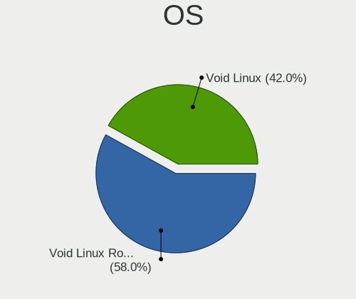

| Name               | Computers | Percent |
|--------------------|-----------|---------|
| Void Linux Rolling | 142       | 73.2%   |
| Void Linux         | 52        | 26.8%   |

OS Family
---------

OS without a version

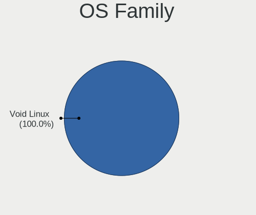

| Name       | Computers | Percent |
|------------|-----------|---------|
| Void Linux | 191       | 100%    |

Kernel
------

Version of the Linux kernel

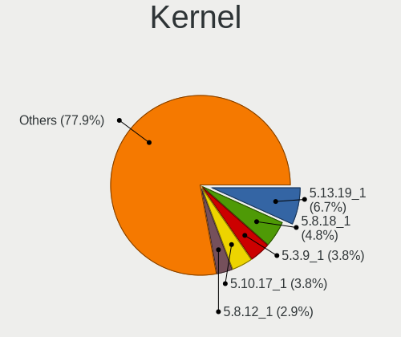

| Version   | Computers | Percent |
|-----------|-----------|---------|
| 6.3.13_1  | 11        | 5.37%   |
| 6.3.12_1  | 8         | 3.9%    |
| 5.13.19_1 | 7         | 3.41%   |
| 5.8.18_1  | 5         | 2.44%   |
| 6.1.4_1   | 4         | 1.95%   |
| 6.1.31_1  | 4         | 1.95%   |
| 5.3.9_1   | 4         | 1.95%   |
| 5.18.19_1 | 4         | 1.95%   |
| 5.16.20_1 | 4         | 1.95%   |
| 5.10.17_1 | 4         | 1.95%   |
| 6.6.8_1   | 3         | 1.46%   |
| 6.5.13_1  | 3         | 1.46%   |
| 6.5.11_1  | 3         | 1.46%   |
| 5.8.12_1  | 3         | 1.46%   |
| 5.19.17_1 | 3         | 1.46%   |
| 5.18.14_1 | 3         | 1.46%   |
| 5.15.32_1 | 3         | 1.46%   |
| 5.13.13_1 | 3         | 1.46%   |
| 5.12.10_1 | 3         | 1.46%   |
| 6.6.1_1   | 2         | 0.98%   |
| 6.5.9_1   | 2         | 0.98%   |
| 6.5.5_2   | 2         | 0.98%   |
| 6.5.10_1  | 2         | 0.98%   |
| 6.1.21_1  | 2         | 0.98%   |
| 6.1.10_1  | 2         | 0.98%   |
| 6.0.15_1  | 2         | 0.98%   |
| 6.0.13_1  | 2         | 0.98%   |
| 5.9.14_1  | 2         | 0.98%   |
| 5.4.24_1  | 2         | 0.98%   |
| 5.4.13_2  | 2         | 0.98%   |
| 5.19.16_1 | 2         | 0.98%   |
| 5.18.9_1  | 2         | 0.98%   |
| 5.15.41_1 | 2         | 0.98%   |
| 5.15.34_1 | 2         | 0.98%   |
| 5.15.22_1 | 2         | 0.98%   |
| 5.15.16_1 | 2         | 0.98%   |
| 5.13.15_1 | 2         | 0.98%   |
| 5.13.10_1 | 2         | 0.98%   |
| 5.12.14_1 | 2         | 0.98%   |
| 5.11.9_1  | 2         | 0.98%   |

Kernel Family
-------------

Linux kernel without a distro release

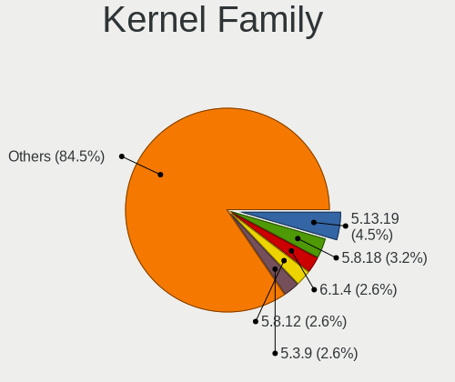

| Version | Computers | Percent |
|---------|-----------|---------|
| 6.3.13  | 11        | 5.37%   |
| 6.3.12  | 8         | 3.9%    |
| 5.13.19 | 7         | 3.41%   |
| 5.8.18  | 5         | 2.44%   |
| 6.1.4   | 4         | 1.95%   |
| 6.1.31  | 4         | 1.95%   |
| 5.8.12  | 4         | 1.95%   |
| 5.3.9   | 4         | 1.95%   |
| 5.18.19 | 4         | 1.95%   |
| 5.16.20 | 4         | 1.95%   |
| 5.10.17 | 4         | 1.95%   |
| 6.6.8   | 3         | 1.46%   |
| 6.5.13  | 3         | 1.46%   |
| 6.5.11  | 3         | 1.46%   |
| 5.19.17 | 3         | 1.46%   |
| 5.18.14 | 3         | 1.46%   |
| 5.15.32 | 3         | 1.46%   |
| 5.13.13 | 3         | 1.46%   |
| 5.12.10 | 3         | 1.46%   |
| 6.6.1   | 2         | 0.98%   |
| 6.5.9   | 2         | 0.98%   |
| 6.5.5   | 2         | 0.98%   |
| 6.5.10  | 2         | 0.98%   |
| 6.1.21  | 2         | 0.98%   |
| 6.1.10  | 2         | 0.98%   |
| 6.0.15  | 2         | 0.98%   |
| 6.0.13  | 2         | 0.98%   |
| 5.9.14  | 2         | 0.98%   |
| 5.4.24  | 2         | 0.98%   |
| 5.4.13  | 2         | 0.98%   |
| 5.19.16 | 2         | 0.98%   |
| 5.18.9  | 2         | 0.98%   |
| 5.15.41 | 2         | 0.98%   |
| 5.15.34 | 2         | 0.98%   |
| 5.15.22 | 2         | 0.98%   |
| 5.15.16 | 2         | 0.98%   |
| 5.13.15 | 2         | 0.98%   |
| 5.13.10 | 2         | 0.98%   |
| 5.12.14 | 2         | 0.98%   |
| 5.11.9  | 2         | 0.98%   |

Kernel Major Ver.
-----------------

Linux kernel major version

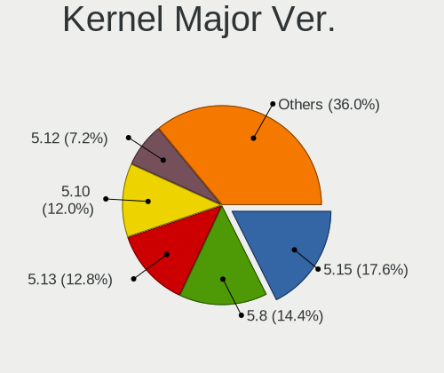

| Version | Computers | Percent |
|---------|-----------|---------|
| 5.15    | 24        | 11.82%  |
| 6.3     | 19        | 9.36%   |
| 6.1     | 19        | 9.36%   |
| 5.8     | 18        | 8.87%   |
| 5.13    | 16        | 7.88%   |
| 6.5     | 15        | 7.39%   |
| 5.10    | 15        | 7.39%   |
| 5.18    | 12        | 5.91%   |
| 5.12    | 9         | 4.43%   |
| 5.4     | 7         | 3.45%   |
| 6.0     | 6         | 2.96%   |
| 6.6     | 5         | 2.46%   |
| 5.3     | 5         | 2.46%   |
| 5.19    | 5         | 2.46%   |
| 5.11    | 5         | 2.46%   |
| 5.9     | 4         | 1.97%   |
| 5.16    | 4         | 1.97%   |
| 4.19    | 4         | 1.97%   |
| 6.2     | 2         | 0.99%   |
| 6.4     | 1         | 0.49%   |
| 5.7     | 1         | 0.49%   |
| 5.6     | 1         | 0.49%   |
| 5.2     | 1         | 0.49%   |
| 5.17    | 1         | 0.49%   |
| 5.14    | 1         | 0.49%   |
| 5.1     | 1         | 0.49%   |
| 4.4     | 1         | 0.49%   |
| 4.14    | 1         | 0.49%   |

Arch
----

OS architecture (x86_64, i586, etc.)

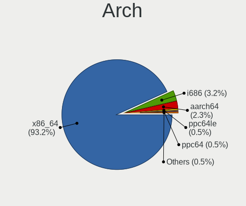

| Name    | Computers | Percent |
|---------|-----------|---------|
| x86_64  | 178       | 93.19%  |
| i686    | 7         | 3.66%   |
| aarch64 | 3         | 1.57%   |
| ppc64le | 1         | 0.52%   |
| ppc64   | 1         | 0.52%   |
| armv7l  | 1         | 0.52%   |

DE
--

Desktop Environment

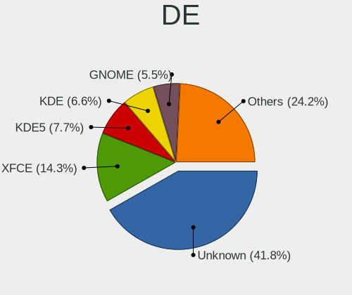

| Name         | Computers | Percent |
|--------------|-----------|---------|
| Unknown      | 81        | 41.12%  |
| XFCE         | 31        | 15.74%  |
| KDE5         | 16        | 8.12%   |
| KDE          | 13        | 6.6%    |
| GNOME        | 10        | 5.08%   |
| MATE         | 9         | 4.57%   |
| i3           | 7         | 3.55%   |
| X-Cinnamon   | 6         | 3.05%   |
| sway         | 6         | 3.05%   |
| bspwm        | 4         | 2.03%   |
| awesome      | 4         | 2.03%   |
| openbox      | 3         | 1.52%   |
| Lumina       | 2         | 1.02%   |
| river        | 1         | 0.51%   |
| LXQt         | 1         | 0.51%   |
| LXDE         | 1         | 0.51%   |
| dwm          | 1         | 0.51%   |
| dot-xsession | 1         | 0.51%   |

Display Server
--------------

X11 or Wayland

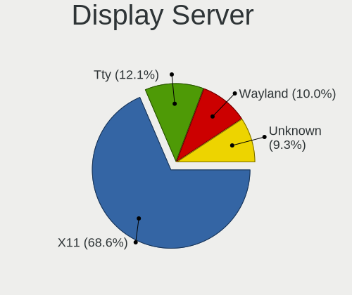

| Name    | Computers | Percent |
|---------|-----------|---------|
| X11     | 136       | 69.74%  |
| Wayland | 25        | 12.82%  |
| Tty     | 21        | 10.77%  |
| Unknown | 13        | 6.67%   |

Display Manager
---------------

SDDM, LightDM, etc.

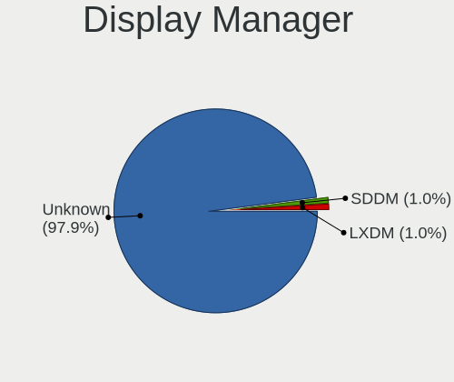

| Name    | Computers | Percent |
|---------|-----------|---------|
| Unknown | 145       | 74.36%  |
| LightDM | 23        | 11.79%  |
| SDDM    | 13        | 6.67%   |
| LXDM    | 8         | 4.1%    |
| GDM     | 4         | 2.05%   |
| SLiM    | 1         | 0.51%   |
| LDM     | 1         | 0.51%   |

OS Lang
-------

Language

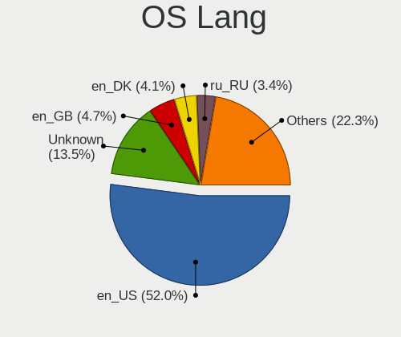

| Lang    | Computers | Percent |
|---------|-----------|---------|
| en_US   | 103       | 52.28%  |
| Unknown | 22        | 11.17%  |
| en_GB   | 12        | 6.09%   |
| fr_FR   | 6         | 3.05%   |
| en_DK   | 6         | 3.05%   |
| ru_RU   | 5         | 2.54%   |
| it_IT   | 5         | 2.54%   |
| de_DE   | 5         | 2.54%   |
| es_ES   | 4         | 2.03%   |
| C       | 4         | 2.03%   |
| cs_CZ   | 3         | 1.52%   |
| pt_BR   | 2         | 1.02%   |
| pl_PL   | 2         | 1.02%   |
| en_CA   | 2         | 1.02%   |
| en_AU   | 2         | 1.02%   |
| el_GR   | 2         | 1.02%   |
| tr_TR   | 1         | 0.51%   |
| ru_UA   | 1         | 0.51%   |
| nb_NO   | 1         | 0.51%   |
| hu_HU   | 1         | 0.51%   |
| es_HN   | 1         | 0.51%   |
| es_DO   | 1         | 0.51%   |
| es_CL   | 1         | 0.51%   |
| es_AR   | 1         | 0.51%   |
| en_NZ   | 1         | 0.51%   |
| en_IE   | 1         | 0.51%   |
| ca_ES   | 1         | 0.51%   |
| bg_BG   | 1         | 0.51%   |

Boot Mode
---------

EFI or BIOS

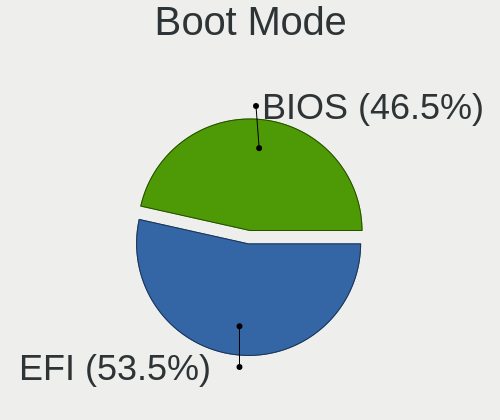

| Mode | Computers | Percent |
|------|-----------|---------|
| EFI  | 104       | 53.33%  |
| BIOS | 91        | 46.67%  |

Filesystem
----------

Type of filesystem

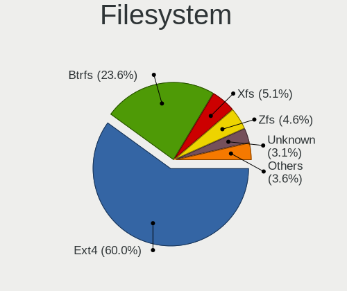

| Type    | Computers | Percent |
|---------|-----------|---------|
| Ext4    | 117       | 60%     |
| Btrfs   | 46        | 23.59%  |
| Xfs     | 10        | 5.13%   |
| Zfs     | 9         | 4.62%   |
| Unknown | 6         | 3.08%   |
| F2fs    | 4         | 2.05%   |
| Overlay | 2         | 1.03%   |
| Ext3    | 1         | 0.51%   |

Part. scheme
------------

Scheme of partitioning

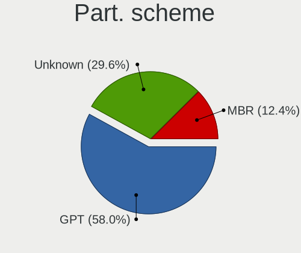

| Type    | Computers | Percent |
|---------|-----------|---------|
| GPT     | 114       | 58.46%  |
| Unknown | 57        | 29.23%  |
| MBR     | 24        | 12.31%  |

Dual Boot with Linux/BSD
------------------------

Hosting more than one Linux/BSD

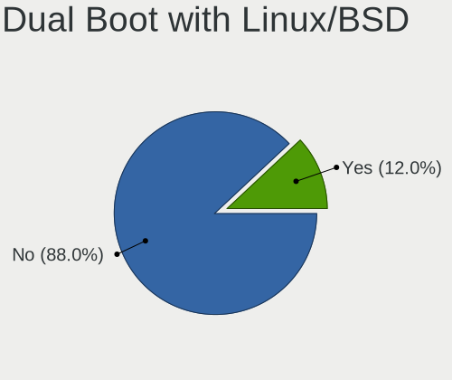

| Dual boot | Computers | Percent |
|-----------|-----------|---------|
| No        | 167       | 87.43%  |
| Yes       | 24        | 12.57%  |

Dual Boot (Win)
---------------

Hosting Linux and Windows

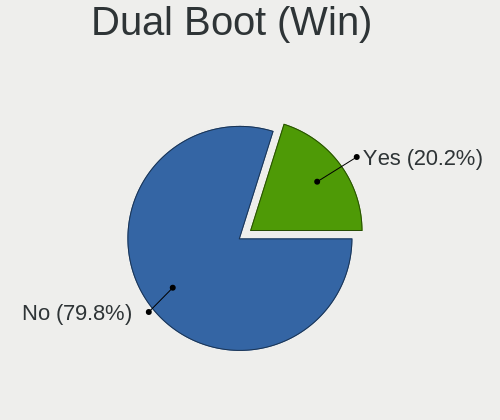

| Dual boot | Computers | Percent |
|-----------|-----------|---------|
| No        | 151       | 77.84%  |
| Yes       | 43        | 22.16%  |

Board
-----

Vendor
------

Motherboard manufacturer

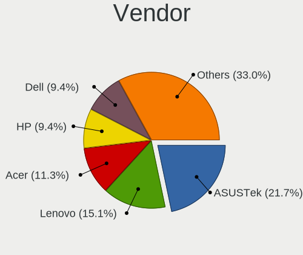

| Name                    | Computers | Percent |
|-------------------------|-----------|---------|
| ASUSTek Computer        | 39        | 20.42%  |
| Lenovo                  | 33        | 17.28%  |
| Hewlett-Packard         | 22        | 11.52%  |
| MSI                     | 17        | 8.9%    |
| Acer                    | 17        | 8.9%    |
| Dell                    | 16        | 8.38%   |
| ASRock                  | 9         | 4.71%   |
| Gigabyte Technology     | 7         | 3.66%   |
| Unknown                 | 7         | 3.66%   |
| Notebook                | 2         | 1.05%   |
| Microsoft               | 2         | 1.05%   |
| HUAWEI                  | 2         | 1.05%   |
| Apple                   | 2         | 1.05%   |
| Timi                    | 1         | 0.52%   |
| Supermicro              | 1         | 0.52%   |
| Samsung Electronics     | 1         | 0.52%   |
| Razer                   | 1         | 0.52%   |
| Raspberry Pi Foundation | 1         | 0.52%   |
| Positivo                | 1         | 0.52%   |
| Pine Microsystems       | 1         | 0.52%   |
| Nokia                   | 1         | 0.52%   |
| Google                  | 1         | 0.52%   |
| Getac                   | 1         | 0.52%   |
| Framework               | 1         | 0.52%   |
| Exo                     | 1         | 0.52%   |
| EVGA                    | 1         | 0.52%   |
| Digibras                | 1         | 0.52%   |
| Cisco Systems           | 1         | 0.52%   |
| Chuwi                   | 1         | 0.52%   |

Model
-----

Motherboard model

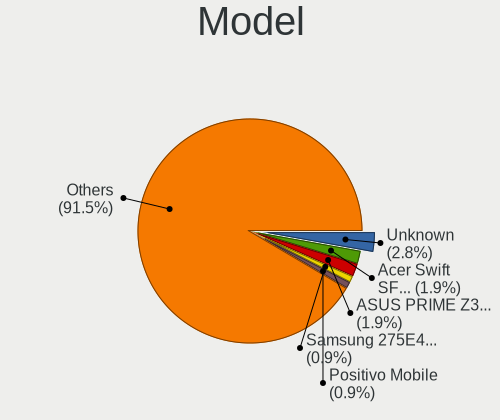

| Name                                  | Computers | Percent |
|---------------------------------------|-----------|---------|
| Unknown                               | 7         | 3.66%   |
| MSI MS-7C02                           | 2         | 1.05%   |
| HP Pavilion Notebook                  | 2         | 1.05%   |
| HP Laptop 15-bw0xx                    | 2         | 1.05%   |
| HP 15                                 | 2         | 1.05%   |
| Dell OptiPlex 780                     | 2         | 1.05%   |
| Dell OptiPlex 7010                    | 2         | 1.05%   |
| ASUS X751LD                           | 2         | 1.05%   |
| ASUS PRIME Z390-P                     | 2         | 1.05%   |
| Acer Swift SF314-42                   | 2         | 1.05%   |
| Timi Redmi Book Pro 15 2022           | 1         | 0.52%   |
| Supermicro Super Server               | 1         | 0.52%   |
| Samsung 275E4E/275E5E                 | 1         | 0.52%   |
| Razer Blade 14 (2022) - RZ09-0427     | 1         | 0.52%   |
| RPi Raspberry Pi                      | 1         | 0.52%   |
| Positivo Mobile                       | 1         | 0.52%   |
| Pine Microsystems Pine64 Pinebook Pro | 1         | 0.52%   |
| Notebook NV4XMB,ME,MZ                 | 1         | 0.52%   |
| Notebook NH50_70RA                    | 1         | 0.52%   |
| Nokia Booklet 3G                      | 1         | 0.52%   |
| MSI Summit E13FlipEvo A12MT           | 1         | 0.52%   |
| MSI Prestige 15 A10SC                 | 1         | 0.52%   |
| MSI MS-7D95                           | 1         | 0.52%   |
| MSI MS-7D14                           | 1         | 0.52%   |
| MSI MS-7C92                           | 1         | 0.52%   |
| MSI MS-7C52                           | 1         | 0.52%   |
| MSI MS-7C35                           | 1         | 0.52%   |
| MSI MS-7B86                           | 1         | 0.52%   |
| MSI MS-7A68                           | 1         | 0.52%   |
| MSI MS-7A39                           | 1         | 0.52%   |
| MSI MS-7816                           | 1         | 0.52%   |
| MSI GV72 7RE                          | 1         | 0.52%   |
| MSI GF63 Thin 10SCXR                  | 1         | 0.52%   |
| MSI GE60 2OC\2OD\2OE                  | 1         | 0.52%   |
| MSI Bravo 15 A4DDR                    | 1         | 0.52%   |
| Microsoft Surface with Windows RT     | 1         | 0.52%   |
| Microsoft Surface Go 2                | 1         | 0.52%   |
| Lenovo Yoga 720-15IKB 80X7            | 1         | 0.52%   |
| Lenovo Y520-15IKB 80YY                | 1         | 0.52%   |
| Lenovo ThinkPad X260 20F5S08Q00       | 1         | 0.52%   |

Model Family
------------

Motherboard model prefix

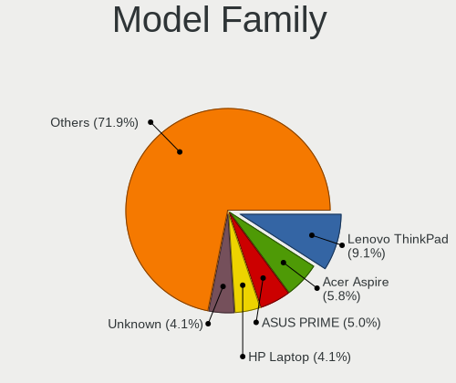

| Name                     | Computers | Percent |
|--------------------------|-----------|---------|
| Lenovo ThinkPad          | 18        | 9.42%   |
| Acer Aspire              | 10        | 5.24%   |
| ASUS PRIME               | 9         | 4.71%   |
| Lenovo IdeaPad           | 8         | 4.19%   |
| ASUS VivoBook            | 7         | 3.66%   |
| Unknown                  | 7         | 3.66%   |
| HP Pavilion              | 5         | 2.62%   |
| HP Laptop                | 5         | 2.62%   |
| Dell OptiPlex            | 5         | 2.62%   |
| Dell Latitude            | 4         | 2.09%   |
| Dell Inspiron            | 4         | 2.09%   |
| ASUS TUF                 | 3         | 1.57%   |
| MSI MS-7C02              | 2         | 1.05%   |
| Microsoft Surface        | 2         | 1.05%   |
| HP Stream                | 2         | 1.05%   |
| HP ENVY                  | 2         | 1.05%   |
| HP 255                   | 2         | 1.05%   |
| HP 15                    | 2         | 1.05%   |
| ASUS X751LD              | 2         | 1.05%   |
| ASUS ROG                 | 2         | 1.05%   |
| Acer Swift               | 2         | 1.05%   |
| Timi Redmi               | 1         | 0.52%   |
| Supermicro Super         | 1         | 0.52%   |
| Samsung 275E4E           | 1         | 0.52%   |
| Razer Blade              | 1         | 0.52%   |
| RPi Raspberry            | 1         | 0.52%   |
| Positivo Mobile          | 1         | 0.52%   |
| Pine Microsystems Pine64 | 1         | 0.52%   |
| Notebook NV4XMB          | 1         | 0.52%   |
| Notebook NH50            | 1         | 0.52%   |
| Nokia Booklet            | 1         | 0.52%   |
| MSI Summit               | 1         | 0.52%   |
| MSI Prestige             | 1         | 0.52%   |
| MSI MS-7D95              | 1         | 0.52%   |
| MSI MS-7D14              | 1         | 0.52%   |
| MSI MS-7C92              | 1         | 0.52%   |
| MSI MS-7C52              | 1         | 0.52%   |
| MSI MS-7C35              | 1         | 0.52%   |
| MSI MS-7B86              | 1         | 0.52%   |
| MSI MS-7A68              | 1         | 0.52%   |

MFG Year
--------

Motherboard manufacture year

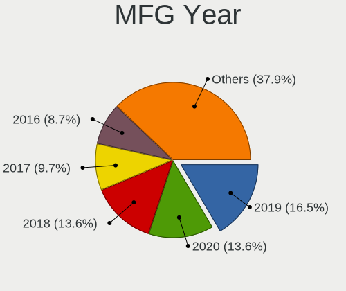

| Year    | Computers | Percent |
|---------|-----------|---------|
| 2019    | 28        | 14.66%  |
| 2020    | 23        | 12.04%  |
| 2018    | 20        | 10.47%  |
| 2013    | 15        | 7.85%   |
| 2021    | 13        | 6.81%   |
| 2017    | 13        | 6.81%   |
| 2022    | 12        | 6.28%   |
| 2014    | 11        | 5.76%   |
| 2016    | 10        | 5.24%   |
| 2012    | 9         | 4.71%   |
| 2015    | 8         | 4.19%   |
| 2011    | 8         | 4.19%   |
| 2010    | 5         | 2.62%   |
| Unknown | 5         | 2.62%   |
| 2023    | 2         | 1.05%   |
| 2009    | 2         | 1.05%   |
| 2008    | 2         | 1.05%   |
| 2006    | 2         | 1.05%   |
| 2005    | 2         | 1.05%   |
| 2007    | 1         | 0.52%   |

Form Factor
-----------

Physical design of the computer

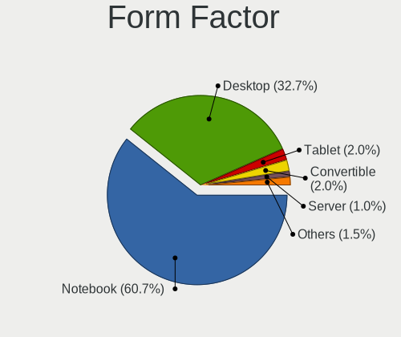

| Name           | Computers | Percent |
|----------------|-----------|---------|
| Notebook       | 116       | 60.73%  |
| Desktop        | 62        | 32.46%  |
| Tablet         | 4         | 2.09%   |
| Convertible    | 4         | 2.09%   |
| Server         | 2         | 1.05%   |
| System on chip | 1         | 0.52%   |
| Mini pc        | 1         | 0.52%   |
| All in one     | 1         | 0.52%   |

Secure Boot
-----------

Enabled or disabled

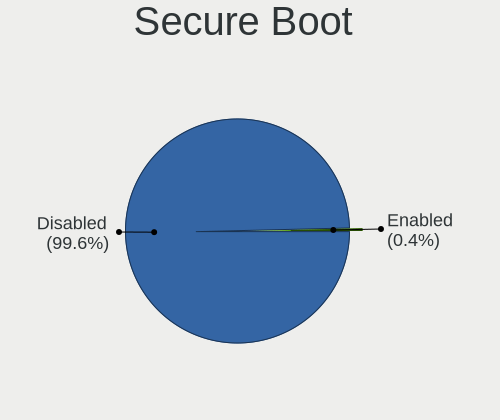

| State    | Computers | Percent |
|----------|-----------|---------|
| Disabled | 191       | 100%    |

Coreboot
--------

Have coreboot on board

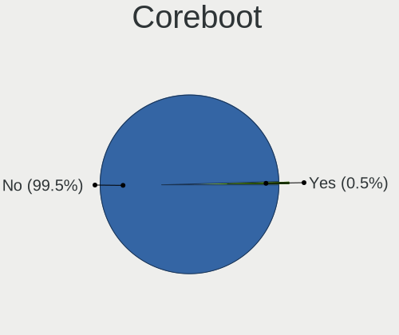

| Used | Computers | Percent |
|------|-----------|---------|
| No   | 190       | 99.48%  |
| Yes  | 1         | 0.52%   |

RAM Size
--------

Total RAM memory

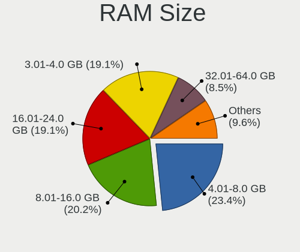

| Size in GB      | Computers | Percent |
|-----------------|-----------|---------|
| 16.01-24.0      | 42        | 21.76%  |
| 4.01-8.0        | 40        | 20.73%  |
| 8.01-16.0       | 34        | 17.62%  |
| 3.01-4.0        | 30        | 15.54%  |
| 32.01-64.0      | 24        | 12.44%  |
| 1.01-2.0        | 10        | 5.18%   |
| 24.01-32.0      | 4         | 2.07%   |
| 0.51-1.0        | 4         | 2.07%   |
| 64.01-256.0     | 2         | 1.04%   |
| More than 256.0 | 1         | 0.52%   |
| 2.01-3.0        | 1         | 0.52%   |
| 0.01-0.5        | 1         | 0.52%   |

RAM Used
--------

Used RAM memory

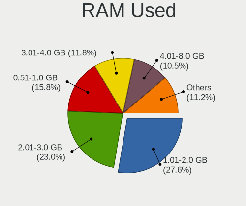

| Used GB     | Computers | Percent |
|-------------|-----------|---------|
| 1.01-2.0    | 58        | 28.71%  |
| 2.01-3.0    | 45        | 22.28%  |
| 4.01-8.0    | 25        | 12.38%  |
| 3.01-4.0    | 25        | 12.38%  |
| 0.51-1.0    | 25        | 12.38%  |
| 8.01-16.0   | 12        | 5.94%   |
| 0.01-0.5    | 8         | 3.96%   |
| 16.01-24.0  | 3         | 1.49%   |
| 64.01-256.0 | 1         | 0.5%    |

Total Drives
------------

Number of drives on board

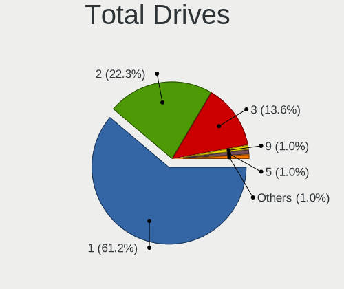

| Drives | Computers | Percent |
|--------|-----------|---------|
| 1      | 116       | 60.1%   |
| 2      | 45        | 23.32%  |
| 3      | 22        | 11.4%   |
| 4      | 5         | 2.59%   |
| 5      | 3         | 1.55%   |
| 9      | 1         | 0.52%   |
| 0      | 1         | 0.52%   |

Has CD-ROM
----------

Has CD-ROM on board

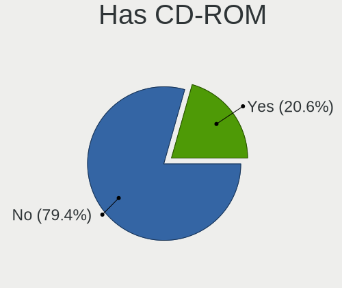

| Presented | Computers | Percent |
|-----------|-----------|---------|
| No        | 150       | 78.53%  |
| Yes       | 41        | 21.47%  |

Has Ethernet
------------

Has Ethernet on board

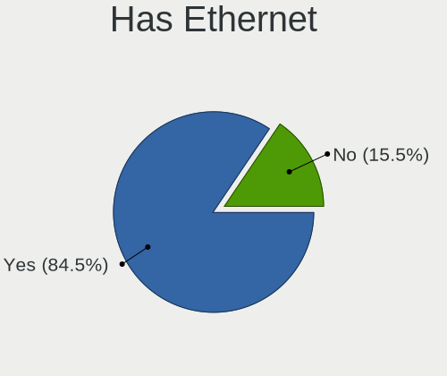

| Presented | Computers | Percent |
|-----------|-----------|---------|
| Yes       | 153       | 79.69%  |
| No        | 39        | 20.31%  |

Has WiFi
--------

Has WiFi module

| Presented | Computers | Percent |
|-----------|-----------|---------|
| Yes       | 142       | 73.96%  |
| No        | 50        | 26.04%  |

Has Bluetooth
-------------

Has Bluetooth module

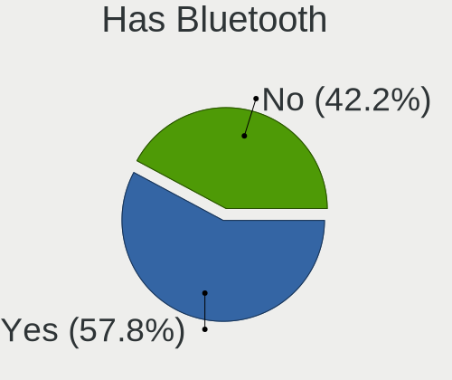

| Presented | Computers | Percent |
|-----------|-----------|---------|
| Yes       | 124       | 64.58%  |
| No        | 68        | 35.42%  |

Location
--------

Country
-------

Geographic location (country)

| Country     | Computers | Percent |
|-------------|-----------|---------|
| USA         | 39        | 20.42%  |
| Russia      | 17        | 8.9%    |
| Germany     | 16        | 8.38%   |
| India       | 10        | 5.24%   |
| Brazil      | 8         | 4.19%   |
| UK          | 7         | 3.66%   |
| France      | 7         | 3.66%   |
| Italy       | 6         | 3.14%   |
| Czechia     | 6         | 3.14%   |
| Poland      | 5         | 2.62%   |
| Netherlands | 5         | 2.62%   |
| Greece      | 5         | 2.62%   |
| Denmark     | 5         | 2.62%   |
| Ukraine     | 4         | 2.09%   |
| Switzerland | 4         | 2.09%   |
| Turkey      | 3         | 1.57%   |
| Spain       | 3         | 1.57%   |
| Bulgaria    | 3         | 1.57%   |
| Australia   | 3         | 1.57%   |
| Argentina   | 3         | 1.57%   |
| Serbia      | 2         | 1.05%   |
| Morocco     | 2         | 1.05%   |
| Finland     | 2         | 1.05%   |
| Canada      | 2         | 1.05%   |
| Vietnam     | 1         | 0.52%   |
| Uruguay     | 1         | 0.52%   |
| Thailand    | 1         | 0.52%   |
| Sweden      | 1         | 0.52%   |
| Portugal    | 1         | 0.52%   |
| Peru        | 1         | 0.52%   |
| Norway      | 1         | 0.52%   |
| Nigeria     | 1         | 0.52%   |
| New Zealand | 1         | 0.52%   |
| Mexico      | 1         | 0.52%   |
| Latvia      | 1         | 0.52%   |
| Jordan      | 1         | 0.52%   |
| Indonesia   | 1         | 0.52%   |
| Hungary     | 1         | 0.52%   |
| Honduras    | 1         | 0.52%   |
| Guatemala   | 1         | 0.52%   |

City
----

Geographic location (city)

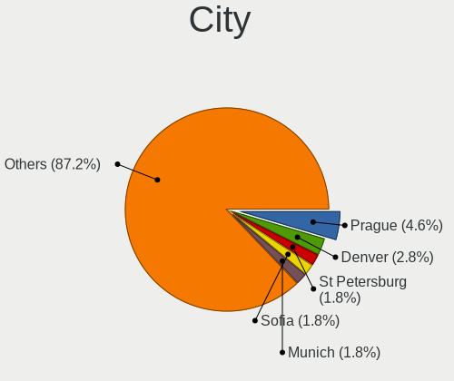

| City               | Computers | Percent |
|--------------------|-----------|---------|
| Moscow             | 6         | 3.06%   |
| Prague             | 5         | 2.55%   |
| St Petersburg      | 3         | 1.53%   |
| Denver             | 3         | 1.53%   |
| Amsterdam          | 3         | 1.53%   |
| Toulouse           | 2         | 1.02%   |
| Spring Hill        | 2         | 1.02%   |
| Sofia              | 2         | 1.02%   |
| Sao Paulo          | 2         | 1.02%   |
| Rome               | 2         | 1.02%   |
| Orlando            | 2         | 1.02%   |
| Munich             | 2         | 1.02%   |
| Meknes             | 2         | 1.02%   |
| Lublin             | 2         | 1.02%   |
| Ioannina           | 2         | 1.02%   |
| Hyderabad          | 2         | 1.02%   |
| Harrisonburg       | 2         | 1.02%   |
| Geneva             | 2         | 1.02%   |
| Zarqa              | 1         | 0.51%   |
| Zagnansk           | 1         | 0.51%   |
| Yekaterinburg      | 1         | 0.51%   |
| Yambol             | 1         | 0.51%   |
| Worthing           | 1         | 0.51%   |
| Wilen bei Wollerau | 1         | 0.51%   |
| Weatherford        | 1         | 0.51%   |
| Warsaw             | 1         | 0.51%   |
| Volgograd          | 1         | 0.51%   |
| Vlaardingen        | 1         | 0.51%   |
| Vienna             | 1         | 0.51%   |
| Viby J             | 1         | 0.51%   |
| Verkhnyaya Pyshma  | 1         | 0.51%   |
| Varna              | 1         | 0.51%   |
| Trujillo           | 1         | 0.51%   |
| Touget             | 1         | 0.51%   |
| Toms River         | 1         | 0.51%   |
| Tegucigalpa        | 1         | 0.51%   |
| Taranto            | 1         | 0.51%   |
| Syktyvkar          | 1         | 0.51%   |
| Sydney             | 1         | 0.51%   |
| Surabaya           | 1         | 0.51%   |

Drives
------

Drive Vendor
------------

Hard drive vendors

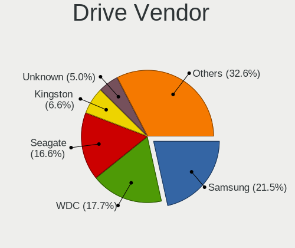

| Vendor                      | Computers | Drives | Percent |
|-----------------------------|-----------|--------|---------|
| Samsung Electronics         | 57        | 75     | 20.36%  |
| Seagate                     | 40        | 49     | 14.29%  |
| WDC                         | 39        | 50     | 13.93%  |
| SanDisk                     | 17        | 20     | 6.07%   |
| Kingston                    | 17        | 18     | 6.07%   |
| Unknown                     | 16        | 23     | 5.71%   |
| Toshiba                     | 10        | 11     | 3.57%   |
| SK hynix                    | 9         | 10     | 3.21%   |
| Intel                       | 9         | 11     | 3.21%   |
| HGST                        | 9         | 10     | 3.21%   |
| Crucial                     | 9         | 10     | 3.21%   |
| Hitachi                     | 8         | 8      | 2.86%   |
| Phison                      | 3         | 3      | 1.07%   |
| Micron/Crucial Technology   | 3         | 3      | 1.07%   |
| Micron Technology           | 3         | 4      | 1.07%   |
| Kingston Technology Company | 3         | 4      | 1.07%   |
| Patriot                     | 2         | 2      | 0.71%   |
| Corsair                     | 2         | 2      | 0.71%   |
| A-DATA Technology           | 2         | 3      | 0.71%   |
| XrayDisk                    | 1         | 1      | 0.36%   |
| XPG                         | 1         | 4      | 0.36%   |
| Transcend                   | 1         | 1      | 0.36%   |
| SPCC                        | 1         | 1      | 0.36%   |
| PNY                         | 1         | 1      | 0.36%   |
| Phison Electronics          | 1         | 1      | 0.36%   |
| ORIGIN                      | 1         | 1      | 0.36%   |
| OCZ                         | 1         | 1      | 0.36%   |
| Maxtor                      | 1         | 1      | 0.36%   |
| MAXIO Technology (Hangzhou) | 1         | 1      | 0.36%   |
| LITEONIT                    | 1         | 1      | 0.36%   |
| Lenovo                      | 1         | 1      | 0.36%   |
| KIOXIA                      | 1         | 1      | 0.36%   |
| Intenso                     | 1         | 1      | 0.36%   |
| INNOVATION IT               | 1         | 1      | 0.36%   |
| IBM/Hitachi                 | 1         | 1      | 0.36%   |
| Gigabyte Technology         | 1         | 2      | 0.36%   |
| China                       | 1         | 1      | 0.36%   |
| BIWIN                       | 1         | 1      | 0.36%   |
| BHT                         | 1         | 1      | 0.36%   |
| Apple                       | 1         | 1      | 0.36%   |

Drive Model
-----------

Hard drive models

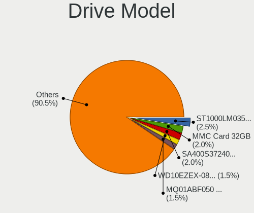

| Model                                               | Computers | Percent |
|-----------------------------------------------------|-----------|---------|
| Samsung NVMe SSD Controller SM981/PM981/PM983 512GB | 8         | 2.61%   |
| Unknown MMC Card  32GB                              | 6         | 1.95%   |
| Kingston SA400S37240G 240GB SSD                     | 6         | 1.95%   |
| Seagate ST2000DM008-2FR102 2TB                      | 5         | 1.63%   |
| Seagate ST1000LM035-1RK172 1TB                      | 5         | 1.63%   |
| Unknown MMC Card  64GB                              | 4         | 1.3%    |
| Seagate ST500LM012 HN-M500MBB 500GB                 | 4         | 1.3%    |
| Seagate ST1000DM010-2EP102 1TB                      | 4         | 1.3%    |
| Samsung SSD 870 EVO 500GB                           | 4         | 1.3%    |
| WDC WD10EZEX-08WN4A0 1TB                            | 3         | 0.98%   |
| Toshiba MQ01ABF050 500GB                            | 3         | 0.98%   |
| Sandisk WD Blue SN550 NVMe SSD 1TB                  | 3         | 0.98%   |
| Samsung NVMe SSD Drive 1TB                          | 3         | 0.98%   |
| Kingston SHFS37A120G 120GB SSD                      | 3         | 0.98%   |
| HGST HTS545050A7E680 500GB                          | 3         | 0.98%   |
| Crucial CT500MX500SSD1 500GB                        | 3         | 0.98%   |
| WDC WDS500G2B0A-00SM50 500GB SSD                    | 2         | 0.65%   |
| WDC WDS240G2G0A-00JH30 240GB SSD                    | 2         | 0.65%   |
| WDC WD10JPCX-24UE4T0 1TB                            | 2         | 0.65%   |
| Unknown MMC Card  128GB                             | 2         | 0.65%   |
| Toshiba MQ04ABF100 1TB                              | 2         | 0.65%   |
| Toshiba DT01ACA050 500GB                            | 2         | 0.65%   |
| SK hynix SKHynix_HFS001TD9TNI-L2B0B 1TB             | 2         | 0.65%   |
| Seagate ST500DM002-1BD142 500GB                     | 2         | 0.65%   |
| Seagate ST1000LM049-2GH172 1TB                      | 2         | 0.65%   |
| Seagate ST1000LM024 HN-M101MBB 1TB                  | 2         | 0.65%   |
| Seagate ST1000DM003-1CH162 1TB                      | 2         | 0.65%   |
| Sandisk WD Black SN750 / PC SN730 NVMe SSD 2TB      | 2         | 0.65%   |
| Samsung SSD 980 PRO 500GB                           | 2         | 0.65%   |
| Samsung SSD 970 EVO Plus 1TB                        | 2         | 0.65%   |
| Samsung SSD 870 QVO 1TB                             | 2         | 0.65%   |
| Samsung SSD 870 EVO 1TB                             | 2         | 0.65%   |
| Samsung SSD 860 EVO 500GB                           | 2         | 0.65%   |
| Samsung SSD 860 EVO 4TB                             | 2         | 0.65%   |
| Samsung SSD 850 EVO 500GB                           | 2         | 0.65%   |
| Samsung NVMe SSD Drive 500GB                        | 2         | 0.65%   |
| Samsung NVMe SSD Controller PM9A1/PM9A3/980PRO 2TB  | 2         | 0.65%   |
| Patriot Burst 120GB SSD                             | 2         | 0.65%   |
| Micron/Crucial P2 NVMe PCIe SSD 4TB                 | 2         | 0.65%   |
| Kingston SA400S37120G 120GB SSD                     | 2         | 0.65%   |

HDD Vendor
----------

Hard disk drive vendors

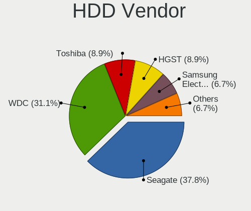

| Vendor              | Computers | Drives | Percent |
|---------------------|-----------|--------|---------|
| Seagate             | 40        | 49     | 37.04%  |
| WDC                 | 32        | 39     | 29.63%  |
| Toshiba             | 9         | 10     | 8.33%   |
| HGST                | 9         | 10     | 8.33%   |
| Hitachi             | 8         | 8      | 7.41%   |
| Samsung Electronics | 6         | 7      | 5.56%   |
| XrayDisk            | 1         | 1      | 0.93%   |
| Unknown             | 1         | 1      | 0.93%   |
| Maxtor              | 1         | 1      | 0.93%   |
| IBM/Hitachi         | 1         | 1      | 0.93%   |

SSD Vendor
----------

Solid state drive vendors

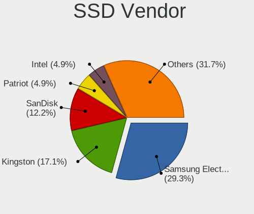

| Vendor              | Computers | Drives | Percent |
|---------------------|-----------|--------|---------|
| Samsung Electronics | 22        | 25     | 27.5%   |
| Kingston            | 16        | 17     | 20%     |
| SanDisk             | 7         | 8      | 8.75%   |
| Crucial             | 7         | 8      | 8.75%   |
| WDC                 | 6         | 7      | 7.5%    |
| Patriot             | 2         | 2      | 2.5%    |
| Intel               | 2         | 2      | 2.5%    |
| Transcend           | 1         | 1      | 1.25%   |
| SPCC                | 1         | 1      | 1.25%   |
| SK hynix            | 1         | 1      | 1.25%   |
| PNY                 | 1         | 1      | 1.25%   |
| ORIGIN              | 1         | 1      | 1.25%   |
| OCZ                 | 1         | 1      | 1.25%   |
| LITEONIT            | 1         | 1      | 1.25%   |
| Lenovo              | 1         | 1      | 1.25%   |
| Intenso             | 1         | 1      | 1.25%   |
| INNOVATION IT       | 1         | 1      | 1.25%   |
| Gigabyte Technology | 1         | 2      | 1.25%   |
| Corsair             | 1         | 1      | 1.25%   |
| China               | 1         | 1      | 1.25%   |
| BIWIN               | 1         | 1      | 1.25%   |
| BHT                 | 1         | 1      | 1.25%   |
| Apple               | 1         | 1      | 1.25%   |
| AGI                 | 1         | 1      | 1.25%   |
| A-DATA Technology   | 1         | 2      | 1.25%   |

Drive Kind
----------

HDD or SSD

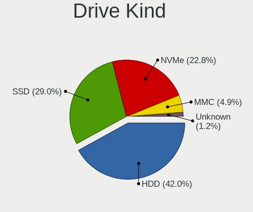

| Kind    | Computers | Drives | Percent |
|---------|-----------|--------|---------|
| HDD     | 91        | 127    | 35.83%  |
| NVMe    | 75        | 103    | 29.53%  |
| SSD     | 71        | 89     | 27.95%  |
| MMC     | 15        | 20     | 5.91%   |
| Unknown | 2         | 3      | 0.79%   |

Drive Connector
---------------

SATA, SAS, NVMe, etc.

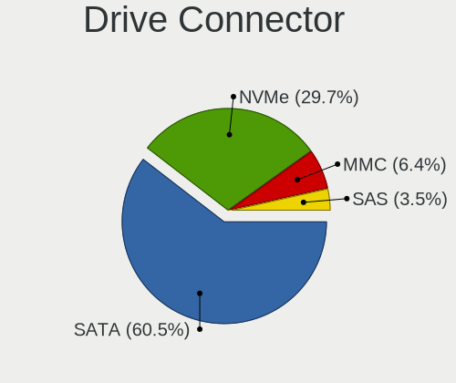

| Type | Computers | Drives | Percent |
|------|-----------|--------|---------|
| SATA | 131       | 211    | 57.46%  |
| NVMe | 75        | 103    | 32.89%  |
| MMC  | 15        | 20     | 6.58%   |
| SAS  | 7         | 8      | 3.07%   |

Drive Size
----------

Size of hard drive

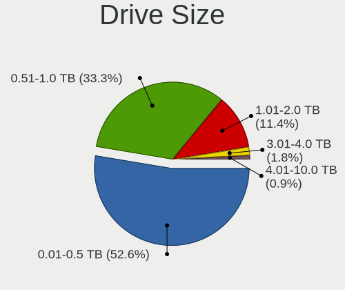

| Size in TB | Computers | Drives | Percent |
|------------|-----------|--------|---------|
| 0.01-0.5   | 89        | 114    | 52.35%  |
| 0.51-1.0   | 61        | 74     | 35.88%  |
| 1.01-2.0   | 15        | 22     | 8.82%   |
| 4.01-10.0  | 3         | 3      | 1.76%   |
| 3.01-4.0   | 2         | 3      | 1.18%   |

Space Total
-----------

Amount of disk space available on the file system

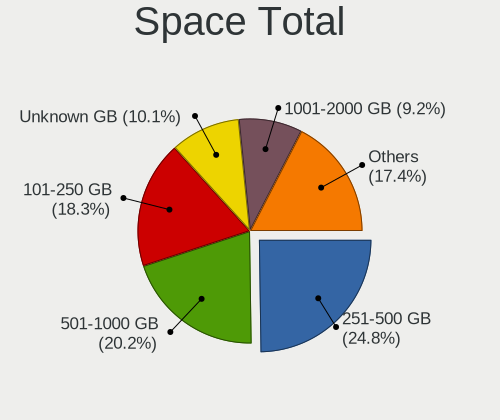

| Size in GB     | Computers | Percent |
|----------------|-----------|---------|
| 251-500        | 49        | 25.13%  |
| 501-1000       | 39        | 20%     |
| 101-250        | 37        | 18.97%  |
| 1001-2000      | 16        | 8.21%   |
| Unknown        | 12        | 6.15%   |
| More than 3000 | 11        | 5.64%   |
| 1-20           | 11        | 5.64%   |
| 51-100         | 9         | 4.62%   |
| 21-50          | 6         | 3.08%   |
| 2001-3000      | 5         | 2.56%   |

Space Used
----------

Amount of used disk space

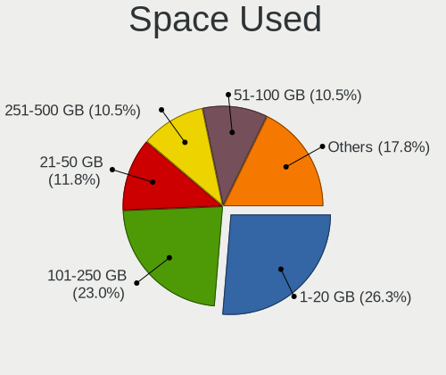

| Used GB        | Computers | Percent |
|----------------|-----------|---------|
| 1-20           | 56        | 27.72%  |
| 101-250        | 41        | 20.3%   |
| 21-50          | 29        | 14.36%  |
| 251-500        | 20        | 9.9%    |
| 51-100         | 19        | 9.41%   |
| Unknown        | 12        | 5.94%   |
| 1001-2000      | 11        | 5.45%   |
| 501-1000       | 8         | 3.96%   |
| More than 3000 | 4         | 1.98%   |
| 2001-3000      | 2         | 0.99%   |

Malfunc. Drives
---------------

Drive models with a malfunction

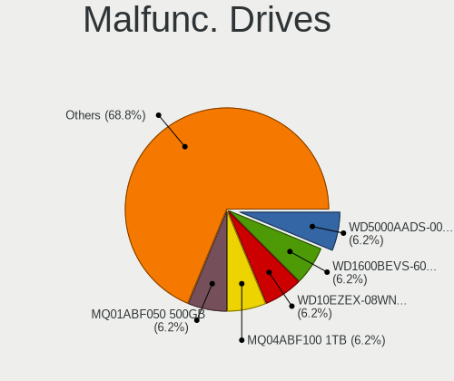

| Model                                 | Computers | Drives | Percent |
|---------------------------------------|-----------|--------|---------|
| Seagate ST500LM012 HN-M500MBB 500GB   | 2         | 2      | 5.71%   |
| Seagate ST500DM002-1BD142 500GB       | 2         | 2      | 5.71%   |
| HGST HTS541010A9E680 1TB              | 2         | 2      | 5.71%   |
| WDC WD5000AADS-00S9B0 500GB           | 1         | 2      | 2.86%   |
| WDC WD2003FZEX-00Z4SA0 2TB            | 1         | 1      | 2.86%   |
| WDC WD1600BEVS-60VAT0 160GB           | 1         | 1      | 2.86%   |
| WDC WD10EZEX-08WN4A0 1TB              | 1         | 1      | 2.86%   |
| Toshiba MQ04ABF100 1TB                | 1         | 2      | 2.86%   |
| Toshiba MQ01ABF050 500GB              | 1         | 1      | 2.86%   |
| Seagate ST980811AS 80GB               | 1         | 1      | 2.86%   |
| Seagate ST9750420AS 752GB             | 1         | 1      | 2.86%   |
| Seagate ST9500325AS 500GB             | 1         | 1      | 2.86%   |
| Seagate ST500LT012-9WS142 500GB       | 1         | 1      | 2.86%   |
| Seagate ST3750330AS 752GB             | 1         | 1      | 2.86%   |
| Seagate ST3160318AS 160GB             | 1         | 1      | 2.86%   |
| Seagate ST2000VX000-1CU164 2TB        | 1         | 2      | 2.86%   |
| Seagate ST2000DM001-1CH164 2TB        | 1         | 1      | 2.86%   |
| Seagate ST1000LM035-1RK172 1TB        | 1         | 1      | 2.86%   |
| Seagate ST1000LM024 HN-M101MBB 1TB    | 1         | 1      | 2.86%   |
| Samsung Electronics SSD 870 EVO 500GB | 1         | 1      | 2.86%   |
| Samsung Electronics HM160HI 160GB     | 1         | 1      | 2.86%   |
| Samsung Electronics HD502HJ 500GB     | 1         | 1      | 2.86%   |
| Samsung Electronics HD322HJ 320GB     | 1         | 1      | 2.86%   |
| IBM/Hitachi IC25N040ATMR04-0 40GB     | 1         | 1      | 2.86%   |
| Hitachi HUA722010CLA330 1TB           | 1         | 1      | 2.86%   |
| Hitachi HTS727575A9E364 752GB         | 1         | 1      | 2.86%   |
| Hitachi HTS545050B9A300 500GB         | 1         | 1      | 2.86%   |
| Hitachi HTS545050A7E380 500GB         | 1         | 1      | 2.86%   |
| Hitachi HTS543216L9A300 160GB         | 1         | 1      | 2.86%   |
| HGST HTS545050A7E680 500GB            | 1         | 1      | 2.86%   |
| Crucial CT256MX100SSD1 256GB          | 1         | 1      | 2.86%   |
| A-DATA Technology SU700 120GB SSD     | 1         | 1      | 2.86%   |

Malfunc. Drive Vendor
---------------------

Vendors of faulty drives

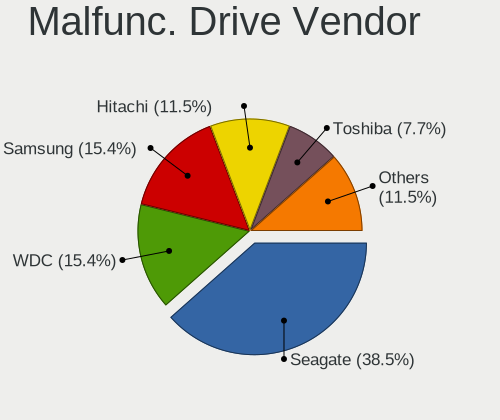

| Vendor              | Computers | Drives | Percent |
|---------------------|-----------|--------|---------|
| Seagate             | 13        | 15     | 38.24%  |
| Hitachi             | 5         | 5      | 14.71%  |
| WDC                 | 4         | 5      | 11.76%  |
| Samsung Electronics | 4         | 4      | 11.76%  |
| HGST                | 3         | 3      | 8.82%   |
| Toshiba             | 2         | 3      | 5.88%   |
| IBM/Hitachi         | 1         | 1      | 2.94%   |
| Crucial             | 1         | 1      | 2.94%   |
| A-DATA Technology   | 1         | 1      | 2.94%   |

Malfunc. HDD Vendor
-------------------

Vendors of faulty HDD drives

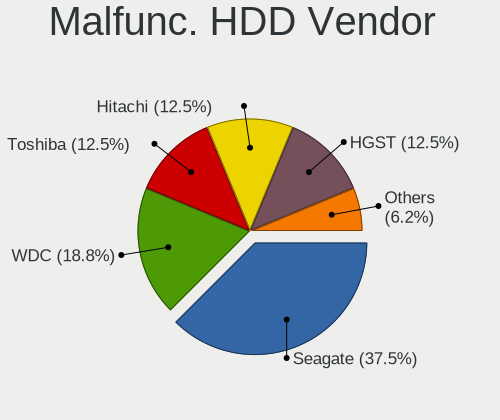

| Vendor              | Computers | Drives | Percent |
|---------------------|-----------|--------|---------|
| Seagate             | 13        | 15     | 41.94%  |
| Hitachi             | 5         | 5      | 16.13%  |
| WDC                 | 4         | 5      | 12.9%   |
| Samsung Electronics | 3         | 3      | 9.68%   |
| HGST                | 3         | 3      | 9.68%   |
| Toshiba             | 2         | 3      | 6.45%   |
| IBM/Hitachi         | 1         | 1      | 3.23%   |

Malfunc. Drive Kind
-------------------

Kinds of faulty drives

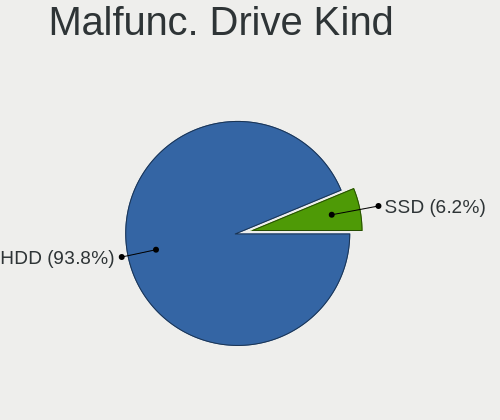

| Kind | Computers | Drives | Percent |
|------|-----------|--------|---------|
| HDD  | 30        | 35     | 90.91%  |
| SSD  | 3         | 3      | 9.09%   |

Failed Drives
-------------

Failed drive models

Zero info for selected period =(

Failed Drive Vendor
-------------------

Failed drive vendors

Zero info for selected period =(

Drive Status
------------

Number of failed and malfunc. drives

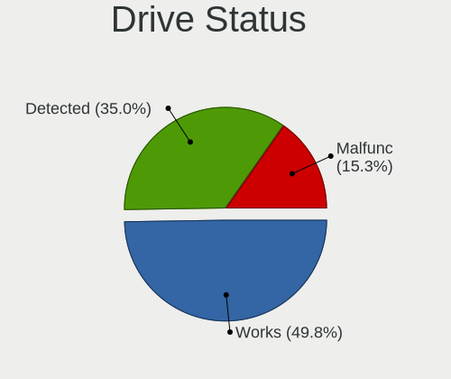

| Status   | Computers | Drives | Percent |
|----------|-----------|--------|---------|
| Works    | 109       | 164    | 49.77%  |
| Detected | 78        | 140    | 35.62%  |
| Malfunc  | 32        | 38     | 14.61%  |

Storage controller
------------------

Storage Vendor
--------------

Storage controller vendors

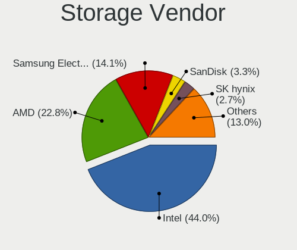

| Vendor                           | Computers | Percent |
|----------------------------------|-----------|---------|
| Intel                            | 102       | 41.8%   |
| AMD                              | 54        | 22.13%  |
| Samsung Electronics              | 36        | 14.75%  |
| SanDisk                          | 12        | 4.92%   |
| SK hynix                         | 8         | 3.28%   |
| Phison Electronics               | 5         | 2.05%   |
| Micron/Crucial Technology        | 4         | 1.64%   |
| Kingston Technology Company      | 4         | 1.64%   |
| ASMedia Technology               | 4         | 1.64%   |
| Micron Technology                | 3         | 1.23%   |
| Marvell Technology Group         | 2         | 0.82%   |
| ADATA Technology                 | 2         | 0.82%   |
| Toshiba America Info Systems     | 1         | 0.41%   |
| Silicon Integrated Systems [SiS] | 1         | 0.41%   |
| Nvidia                           | 1         | 0.41%   |
| MAXIO Technology (Hangzhou)      | 1         | 0.41%   |
| LSI Logic / Symbios Logic        | 1         | 0.41%   |
| KIOXIA                           | 1         | 0.41%   |
| JMicron Technology               | 1         | 0.41%   |
| Broadcom                         | 1         | 0.41%   |

Storage Model
-------------

Storage controller models

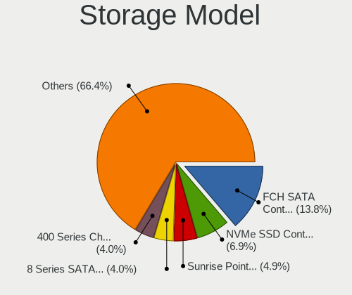

| Model                                                                          | Computers | Percent |
|--------------------------------------------------------------------------------|-----------|---------|
| AMD FCH SATA Controller [AHCI mode]                                            | 37        | 13.6%   |
| Samsung NVMe SSD Controller SM981/PM981/PM983                                  | 21        | 7.72%   |
| Intel Sunrise Point-LP SATA Controller [AHCI mode]                             | 12        | 4.41%   |
| Intel 8 Series SATA Controller 1 [AHCI mode]                                   | 10        | 3.68%   |
| AMD 400 Series Chipset SATA Controller                                         | 10        | 3.68%   |
| AMD 500 Series Chipset SATA Controller                                         | 7         | 2.57%   |
| SanDisk Ultra 3D / WD Blue SN550 NVMe SSD                                      | 6         | 2.21%   |
| Samsung NVMe SSD Controller PM9A1/PM9A3/980PRO                                 | 5         | 1.84%   |
| Intel 82801 Mobile SATA Controller [RAID mode]                                 | 5         | 1.84%   |
| AMD SB7x0/SB8x0/SB9x0 SATA Controller [AHCI mode]                              | 5         | 1.84%   |
| SK hynix Gold P31/BC711/PC711 NVMe Solid State Drive                           | 4         | 1.47%   |
| Samsung NVMe SSD Controller 980 (DRAM-less)                                    | 4         | 1.47%   |
| Intel Volume Management Device NVMe RAID Controller                            | 4         | 1.47%   |
| Intel Cannon Lake Mobile PCH SATA AHCI Controller                              | 4         | 1.47%   |
| Intel 7 Series Chipset Family 6-port SATA Controller [AHCI mode]               | 4         | 1.47%   |
| Intel 200 Series PCH SATA controller [AHCI mode]                               | 4         | 1.47%   |
| ASMedia ASM1062 Serial ATA Controller                                          | 4         | 1.47%   |
| Samsung NVMe SSD Controller SM961/PM961/SM963                                  | 3         | 1.1%    |
| Intel Wildcat Point-LP SATA Controller [AHCI Mode]                             | 3         | 1.1%    |
| Intel SSD 660P Series                                                          | 3         | 1.1%    |
| Intel SATA Controller [RAID mode]                                              | 3         | 1.1%    |
| Intel Cannon Point-LP SATA Controller [AHCI Mode]                              | 3         | 1.1%    |
| Intel Alder Lake-S PCH SATA Controller [AHCI Mode]                             | 3         | 1.1%    |
| Intel 8 Series/C220 Series Chipset Family 6-port SATA Controller 1 [AHCI mode] | 3         | 1.1%    |
| Intel 7 Series/C210 Series Chipset Family 6-port SATA Controller [AHCI mode]   | 3         | 1.1%    |
| Intel 6 Series/C200 Series Chipset Family 6 port Mobile SATA AHCI Controller   | 3         | 1.1%    |
| AMD SB7x0/SB8x0/SB9x0 IDE Controller                                           | 3         | 1.1%    |
| SK hynix PC611 NVMe Solid State Drive                                          | 2         | 0.74%   |
| SanDisk WD Blue SN500 / PC SN520 x2 M.2 2280 NVMe SSD                          | 2         | 0.74%   |
| SanDisk Ultra 3D / WD Blue SN570 NVMe SSD (DRAM-less)                          | 2         | 0.74%   |
| SanDisk Extreme Pro / WD Black SN750 / PC SN730 / Red SN700 NVMe SSD           | 2         | 0.74%   |
| Samsung NVMe SSD Controller PM9B1 (DRAM-less)                                  | 2         | 0.74%   |
| Phison E12 NVMe Controller                                                     | 2         | 0.74%   |
| Micron/Crucial P2 [Nick P2] / P3 / P3 Plus NVMe PCIe SSD (DRAM-less)           | 2         | 0.74%   |
| Micron 2450 NVMe SSD [HendrixV] (DRAM-less)                                    | 2         | 0.74%   |
| Kingston Company A1000/U-SNS8154P3 x2 NVMe SSD                                 | 2         | 0.74%   |
| Intel SSD 670p Series [Keystone Harbor]                                        | 2         | 0.74%   |
| Intel Q170/Q150/B150/H170/H110/Z170/CM236 Chipset SATA Controller [AHCI Mode]  | 2         | 0.74%   |
| Intel Ice Lake-LP SATA Controller [AHCI mode]                                  | 2         | 0.74%   |
| Intel HM170/QM170 Chipset SATA Controller [AHCI Mode]                          | 2         | 0.74%   |

Storage Kind
------------

Kind of storage controller (IDE, SATA, NVMe, SAS, ...)

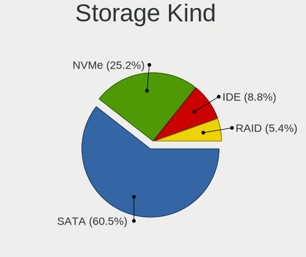

| Kind | Computers | Percent |
|------|-----------|---------|
| SATA | 136       | 55.74%  |
| NVMe | 76        | 31.15%  |
| IDE  | 17        | 6.97%   |
| RAID | 15        | 6.15%   |

Processor
---------

CPU Vendor
----------

Processor vendors

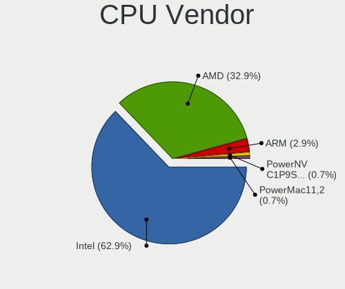

| Vendor                   | Computers | Percent |
|--------------------------|-----------|---------|
| Intel                    | 118       | 61.78%  |
| AMD                      | 67        | 35.08%  |
| ARM                      | 4         | 2.09%   |
| PowerNV C1P9S01 REV 1.01 | 1         | 0.52%   |
| PowerMac11,2             | 1         | 0.52%   |

CPU Model
---------

Processor models

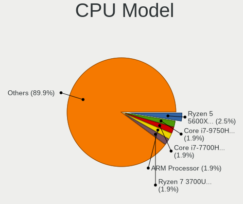

| Model                                              | Computers | Percent |
|----------------------------------------------------|-----------|---------|
| AMD Ryzen 5 5600X 6-Core Processor                 | 6         | 3.14%   |
| Intel Core i7-9750H CPU @ 2.60GHz                  | 3         | 1.57%   |
| Intel Core i7-7700HQ CPU @ 2.80GHz                 | 3         | 1.57%   |
| ARM Processor                                      | 3         | 1.57%   |
| AMD Ryzen 7 3700U with Radeon Vega Mobile Gfx      | 3         | 1.57%   |
| Intel Core i7-8650U CPU @ 1.90GHz                  | 2         | 1.05%   |
| Intel Core i7-3770 CPU @ 3.40GHz                   | 2         | 1.05%   |
| Intel Core i7-10510U CPU @ 1.80GHz                 | 2         | 1.05%   |
| Intel Core i5-9300H CPU @ 2.40GHz                  | 2         | 1.05%   |
| Intel Core i5-8265U CPU @ 1.60GHz                  | 2         | 1.05%   |
| Intel Core i5-7600K CPU @ 3.80GHz                  | 2         | 1.05%   |
| Intel Core i5-6300U CPU @ 2.40GHz                  | 2         | 1.05%   |
| Intel Core i5-6200U CPU @ 2.30GHz                  | 2         | 1.05%   |
| Intel Core i5-4210U CPU @ 1.70GHz                  | 2         | 1.05%   |
| Intel Core i5-2520M CPU @ 2.50GHz                  | 2         | 1.05%   |
| Intel Core i3-5005U CPU @ 2.00GHz                  | 2         | 1.05%   |
| Intel Core i3-4030U CPU @ 1.90GHz                  | 2         | 1.05%   |
| Intel Core i3-4010U CPU @ 1.70GHz                  | 2         | 1.05%   |
| Intel Core i3-1005G1 CPU @ 1.20GHz                 | 2         | 1.05%   |
| Intel Atom CPU Z3735F @ 1.33GHz                    | 2         | 1.05%   |
| Intel 11th Gen Core i7-1165G7 @ 2.80GHz            | 2         | 1.05%   |
| AMD Ryzen 7 PRO 4750U with Radeon Graphics         | 2         | 1.05%   |
| AMD Ryzen 7 5800X 8-Core Processor                 | 2         | 1.05%   |
| AMD Ryzen 7 4800H with Radeon Graphics             | 2         | 1.05%   |
| AMD Ryzen 7 2700X Eight-Core Processor             | 2         | 1.05%   |
| AMD Ryzen 5 5600H with Radeon Graphics             | 2         | 1.05%   |
| AMD Ryzen 5 4500U with Radeon Graphics             | 2         | 1.05%   |
| AMD Ryzen 5 3600X 6-Core Processor                 | 2         | 1.05%   |
| AMD Ryzen 5 2600 Six-Core Processor                | 2         | 1.05%   |
| AMD Ryzen 5 2500U with Radeon Vega Mobile Gfx      | 2         | 1.05%   |
| AMD Ryzen 3 5300U with Radeon Graphics             | 2         | 1.05%   |
| AMD FX-4300 Quad-Core Processor                    | 2         | 1.05%   |
| AMD A9-9420 RADEON R5, 5 COMPUTE CORES 2C+3G       | 2         | 1.05%   |
| PowerNV C1P9S01 REV 1.01 POWER9, altivec supported | 1         | 0.52%   |
| PowerMac11,2 PPC970MP, altivec supported           | 1         | 0.52%   |
| Intel Xeon E-2146G CPU @ 3.50GHz                   | 1         | 0.52%   |
| Intel Xeon CPU E5506 @ 2.13GHz                     | 1         | 0.52%   |
| Intel Pentium M processor 2.13GHz                  | 1         | 0.52%   |
| Intel Pentium Gold G5400 CPU @ 3.70GHz             | 1         | 0.52%   |
| Intel Pentium CPU N3710 @ 1.60GHz                  | 1         | 0.52%   |

CPU Model Family
----------------

Processor model prefix

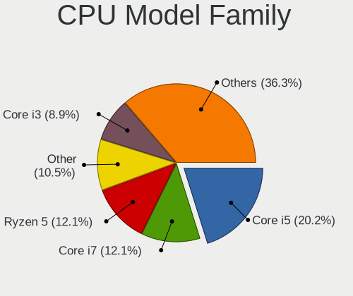

| Model                   | Computers | Percent |
|-------------------------|-----------|---------|
| Intel Core i5           | 32        | 16.75%  |
| Intel Core i7           | 27        | 14.14%  |
| AMD Ryzen 5             | 23        | 12.04%  |
| Other                   | 20        | 10.47%  |
| Intel Core i3           | 16        | 8.38%   |
| AMD Ryzen 7             | 16        | 8.38%   |
| Intel Celeron           | 9         | 4.71%   |
| Intel Atom              | 7         | 3.66%   |
| Intel Pentium           | 4         | 2.09%   |
| AMD Ryzen 7 PRO         | 4         | 2.09%   |
| AMD Ryzen 3             | 3         | 1.57%   |
| AMD FX                  | 3         | 1.57%   |
| Intel Xeon              | 2         | 1.05%   |
| Intel Genuine           | 2         | 1.05%   |
| Intel Core i9           | 2         | 1.05%   |
| Intel Core 2 Duo        | 2         | 1.05%   |
| AMD Ryzen 9             | 2         | 1.05%   |
| AMD A8                  | 2         | 1.05%   |
| Intel Pentium M         | 1         | 0.52%   |
| Intel Pentium Gold      | 1         | 0.52%   |
| Intel Pentium 4         | 1         | 0.52%   |
| Intel Core 2 Quad       | 1         | 0.52%   |
| AMD Turion 64 X2 Mobile | 1         | 0.52%   |
| AMD Ryzen Threadripper  | 1         | 0.52%   |
| AMD Ryzen 5 PRO         | 1         | 0.52%   |
| AMD Phenom II X4        | 1         | 0.52%   |
| AMD E2                  | 1         | 0.52%   |
| AMD E1                  | 1         | 0.52%   |
| AMD C-60                | 1         | 0.52%   |
| AMD Athlon II X3        | 1         | 0.52%   |
| AMD Athlon II X2        | 1         | 0.52%   |
| AMD A6                  | 1         | 0.52%   |
| AMD A4                  | 1         | 0.52%   |

CPU Cores
---------

Number of processor cores

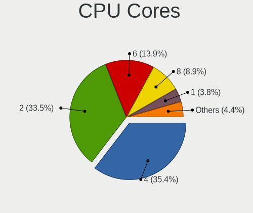

| Number  | Computers | Percent |
|---------|-----------|---------|
| 4       | 65        | 34.03%  |
| 2       | 57        | 29.84%  |
| 6       | 31        | 16.23%  |
| 8       | 21        | 10.99%  |
| 1       | 7         | 3.66%   |
| 12      | 3         | 1.57%   |
| 14      | 2         | 1.05%   |
| 64      | 1         | 0.52%   |
| 24      | 1         | 0.52%   |
| 10      | 1         | 0.52%   |
| 3       | 1         | 0.52%   |
| Unknown | 1         | 0.52%   |

CPU Sockets
-----------

Number of sockets

| Number  | Computers | Percent |
|---------|-----------|---------|
| 1       | 188       | 98.43%  |
| 2       | 2         | 1.05%   |
| Unknown | 1         | 0.52%   |

CPU Threads
-----------

Threads per core (Hyper-Threading)

| Number  | Computers | Percent |
|---------|-----------|---------|
| 2       | 132       | 69.11%  |
| 1       | 57        | 29.84%  |
| 4       | 1         | 0.52%   |
| Unknown | 1         | 0.52%   |

CPU Op-Modes
------------

CPU Operation Modes (32-bit, 64-bit)

| Op mode        | Computers | Percent |
|----------------|-----------|---------|
| 32-bit, 64-bit | 175       | 91.62%  |
| Unknown        | 8         | 4.19%   |
| 32-bit         | 5         | 2.62%   |
| 64-bit         | 3         | 1.57%   |

CPU Microcode
-------------

Microcode number

| Number     | Computers | Percent |
|------------|-----------|---------|
| Unknown    | 79        | 40.31%  |
| 0x40651    | 8         | 4.08%   |
| 0x306a9    | 7         | 3.57%   |
| 0x906e9    | 5         | 2.55%   |
| 0x906ea    | 4         | 2.04%   |
| 0x806ec    | 4         | 2.04%   |
| 0x806e9    | 4         | 2.04%   |
| 0x406e3    | 4         | 2.04%   |
| 0x08108102 | 4         | 2.04%   |
| 0x806ea    | 3         | 1.53%   |
| 0x30678    | 3         | 1.53%   |
| 0x206a7    | 3         | 1.53%   |
| 0x0a50000c | 3         | 1.53%   |
| 0x0a404102 | 3         | 1.53%   |
| 0x08600104 | 3         | 1.53%   |
| 0x906a3    | 2         | 1.02%   |
| 0x506e3    | 2         | 1.02%   |
| 0x106c2    | 2         | 1.02%   |
| 0x0a201009 | 2         | 1.02%   |
| 0x08701021 | 2         | 1.02%   |
| 0x08608103 | 2         | 1.02%   |
| 0x0800820d | 2         | 1.02%   |
| 0x07030105 | 2         | 1.02%   |
| 0x06006705 | 2         | 1.02%   |
| 0x06000852 | 2         | 1.02%   |
| 0x05000119 | 2         | 1.02%   |
| 0x010000c8 | 2         | 1.02%   |
| 0xa0671    | 1         | 0.51%   |
| 0xa0652    | 1         | 0.51%   |
| 0x906ed    | 1         | 0.51%   |
| 0x90675    | 1         | 0.51%   |
| 0x90672    | 1         | 0.51%   |
| 0x806eb    | 1         | 0.51%   |
| 0x806c1    | 1         | 0.51%   |
| 0x706e5    | 1         | 0.51%   |
| 0x706a1    | 1         | 0.51%   |
| 0x406c4    | 1         | 0.51%   |
| 0x306d4    | 1         | 0.51%   |
| 0x306c3    | 1         | 0.51%   |
| 0x30673    | 1         | 0.51%   |

CPU Microarch
-------------

Microarchitecture

| Name             | Computers | Percent |
|------------------|-----------|---------|
| KabyLake         | 35        | 18.32%  |
| Zen 3            | 16        | 8.38%   |
| Haswell          | 14        | 7.33%   |
| Unknown          | 14        | 7.33%   |
| Zen 2            | 13        | 6.81%   |
| IvyBridge        | 10        | 5.24%   |
| Zen+             | 9         | 4.71%   |
| Skylake          | 8         | 4.19%   |
| Silvermont       | 8         | 4.19%   |
| Alderlake Hybrid | 6         | 3.14%   |
| Zen              | 5         | 2.62%   |
| SandyBridge      | 5         | 2.62%   |
| IceLake          | 4         | 2.09%   |
| Excavator        | 4         | 2.09%   |
| TigerLake        | 3         | 1.57%   |
| Puma             | 3         | 1.57%   |
| Piledriver       | 3         | 1.57%   |
| Penryn           | 3         | 1.57%   |
| K10              | 3         | 1.57%   |
| Goldmont plus    | 3         | 1.57%   |
| CometLake        | 3         | 1.57%   |
| Broadwell        | 3         | 1.57%   |
| Bonnell          | 3         | 1.57%   |
| P6               | 2         | 1.05%   |
| Core             | 2         | 1.05%   |
| Bobcat           | 2         | 1.05%   |
| Westmere         | 1         | 0.52%   |
| NetBurst         | 1         | 0.52%   |
| Nehalem          | 1         | 0.52%   |
| K8 Hammer        | 1         | 0.52%   |
| Jaguar           | 1         | 0.52%   |
| Gracemont        | 1         | 0.52%   |
| Goldmont         | 1         | 0.52%   |

Graphics
--------

GPU Vendor
----------

Vendors of graphics cards

| Vendor                           | Computers | Percent |
|----------------------------------|-----------|---------|
| Intel                            | 93        | 40.97%  |
| Nvidia                           | 66        | 29.07%  |
| AMD                              | 64        | 28.19%  |
| ASPEED Technology                | 2         | 0.88%   |
| Silicon Integrated Systems [SiS] | 1         | 0.44%   |
| Matrox Electronics Systems       | 1         | 0.44%   |

GPU Model
---------

Graphics card models

| Model                                                                                    | Computers | Percent |
|------------------------------------------------------------------------------------------|-----------|---------|
| Intel Haswell-ULT Integrated Graphics Controller                                         | 11        | 4.7%    |
| AMD Renoir [Radeon RX Vega 6 (Ryzen 4000/5000 Mobile Series)]                            | 7         | 2.99%   |
| Nvidia TU117M [GeForce GTX 1650 Mobile / Max-Q]                                          | 6         | 2.56%   |
| Nvidia GP107 [GeForce GTX 1050 Ti]                                                       | 6         | 2.56%   |
| Intel Skylake GT2 [HD Graphics 520]                                                      | 6         | 2.56%   |
| Intel CoffeeLake-H GT2 [UHD Graphics 630]                                                | 6         | 2.56%   |
| Intel Atom Processor Z36xxx/Z37xxx Series Graphics & Display                             | 6         | 2.56%   |
| Nvidia GF117M [GeForce 610M/710M/810M/820M / GT 620M/625M/630M/720M]                     | 5         | 2.14%   |
| Intel WhiskeyLake-U GT2 [UHD Graphics 620]                                               | 5         | 2.14%   |
| Intel UHD Graphics 620                                                                   | 5         | 2.14%   |
| Intel 2nd Generation Core Processor Family Integrated Graphics Controller                | 5         | 2.14%   |
| AMD Picasso/Raven 2 [Radeon Vega Series / Radeon Vega Mobile Series]                     | 5         | 2.14%   |
| Intel 3rd Gen Core processor Graphics Controller                                         | 4         | 1.71%   |
| AMD Stoney [Radeon R2/R3/R4/R5 Graphics]                                                 | 4         | 1.71%   |
| AMD Rembrandt [Radeon 680M]                                                              | 4         | 1.71%   |
| AMD Cezanne [Radeon Vega Series / Radeon Vega Mobile Series]                             | 4         | 1.71%   |
| Nvidia TU117 [GeForce GTX 1650]                                                          | 3         | 1.28%   |
| Nvidia GP107M [GeForce GTX 1050 Mobile]                                                  | 3         | 1.28%   |
| Nvidia GP106 [GeForce GTX 1060 6GB]                                                      | 3         | 1.28%   |
| Intel TigerLake-LP GT2 [Iris Xe Graphics]                                                | 3         | 1.28%   |
| Intel Iris Plus Graphics G1 (Ice Lake)                                                   | 3         | 1.28%   |
| Intel HD Graphics 630                                                                    | 3         | 1.28%   |
| Intel HD Graphics 620                                                                    | 3         | 1.28%   |
| Intel HD Graphics 5500                                                                   | 3         | 1.28%   |
| Intel GeminiLake [UHD Graphics 600]                                                      | 3         | 1.28%   |
| AMD Navi 10 [Radeon RX 5600 OEM/5600 XT / 5700/5700 XT]                                  | 3         | 1.28%   |
| AMD Lucienne                                                                             | 3         | 1.28%   |
| AMD Ellesmere [Radeon RX 470/480/570/570X/580/580X/590]                                  | 3         | 1.28%   |
| AMD Cape Verde PRO [Radeon HD 7750/8740 / R7 250E]                                       | 3         | 1.28%   |
| Nvidia TU106 [GeForce RTX 2070]                                                          | 2         | 0.85%   |
| Nvidia GP108M [GeForce MX250]                                                            | 2         | 0.85%   |
| Nvidia GM204 [GeForce GTX 970]                                                           | 2         | 0.85%   |
| Nvidia GK208B [GeForce GT 710]                                                           | 2         | 0.85%   |
| Intel Xeon E3-1200 v2/3rd Gen Core processor Graphics Controller                         | 2         | 0.85%   |
| Intel CometLake-U GT2 [UHD Graphics]                                                     | 2         | 0.85%   |
| Intel CometLake-H GT2 [UHD Graphics]                                                     | 2         | 0.85%   |
| Intel Atom/Celeron/Pentium Processor x5-E8000/J3xxx/N3xxx Integrated Graphics Controller | 2         | 0.85%   |
| Intel Alder Lake-P GT2 [Iris Xe Graphics]                                                | 2         | 0.85%   |
| ASPEED Technology ASPEED Graphics Family                                                 | 2         | 0.85%   |
| AMD Raven Ridge [Radeon Vega Series / Radeon Vega Mobile Series]                         | 2         | 0.85%   |

GPU Combo
---------

Combinations of graphics cards

| Name           | Computers | Percent |
|----------------|-----------|---------|
| 1 x Intel      | 60        | 30.93%  |
| 1 x AMD        | 55        | 28.35%  |
| 1 x Nvidia     | 32        | 16.49%  |
| Intel + Nvidia | 28        | 14.43%  |
| Other          | 5         | 2.58%   |
| AMD + Nvidia   | 4         | 2.06%   |
| 2 x Nvidia     | 2         | 1.03%   |
| 2 x AMD        | 2         | 1.03%   |
| AMD + ASPEED   | 2         | 1.03%   |
| 2 x Intel      | 1         | 0.52%   |
| 1 x SiS        | 1         | 0.52%   |
| 1 x Matrox     | 1         | 0.52%   |
| Intel + AMD    | 1         | 0.52%   |

GPU Driver
----------

Free vs proprietary

| Driver      | Computers | Percent |
|-------------|-----------|---------|
| Free        | 136       | 70.1%   |
| Proprietary | 53        | 27.32%  |
| Unknown     | 5         | 2.58%   |

GPU Memory
----------

Total video memory

| Size in GB | Computers | Percent |
|------------|-----------|---------|
| Unknown    | 110       | 55.56%  |
| 1.01-2.0   | 20        | 10.1%   |
| 3.01-4.0   | 19        | 9.6%    |
| 0.01-0.5   | 16        | 8.08%   |
| 7.01-8.0   | 11        | 5.56%   |
| 0.51-1.0   | 9         | 4.55%   |
| 5.01-6.0   | 5         | 2.53%   |
| 8.01-16.0  | 4         | 2.02%   |
| 2.01-3.0   | 2         | 1.01%   |
| 16.01-24.0 | 2         | 1.01%   |

Monitor
-------

Monitor Vendor
--------------

Monitor vendors

| Vendor               | Computers | Percent |
|----------------------|-----------|---------|
| Chimei Innolux       | 30        | 14.71%  |
| AU Optronics         | 25        | 12.25%  |
| BOE                  | 21        | 10.29%  |
| Samsung Electronics  | 17        | 8.33%   |
| LG Display           | 17        | 8.33%   |
| Hewlett-Packard      | 10        | 4.9%    |
| Dell                 | 9         | 4.41%   |
| Goldstar             | 7         | 3.43%   |
| Acer                 | 6         | 2.94%   |
| Philips              | 5         | 2.45%   |
| Iiyama               | 5         | 2.45%   |
| PANDA                | 4         | 1.96%   |
| BenQ                 | 4         | 1.96%   |
| AOC                  | 4         | 1.96%   |
| Lenovo               | 3         | 1.47%   |
| ASUSTek Computer     | 3         | 1.47%   |
| Apple                | 3         | 1.47%   |
| Ancor Communications | 3         | 1.47%   |
| Unknown              | 3         | 1.47%   |
| TMX                  | 2         | 0.98%   |
| Sharp                | 2         | 0.98%   |
| LG Philips           | 2         | 0.98%   |
| Fujitsu Siemens      | 2         | 0.98%   |
| Vizio                | 1         | 0.49%   |
| ViewSonic            | 1         | 0.49%   |
| Unknown              | 1         | 0.49%   |
| STD                  | 1         | 0.49%   |
| Sceptre Tech         | 1         | 0.49%   |
| Sceptre              | 1         | 0.49%   |
| Quanta Display       | 1         | 0.49%   |
| Panasonic            | 1         | 0.49%   |
| ONN                  | 1         | 0.49%   |
| MSI                  | 1         | 0.49%   |
| InnoLux Display      | 1         | 0.49%   |
| Idek Iiyama          | 1         | 0.49%   |
| Huion                | 1         | 0.49%   |
| Gigabyte Technology  | 1         | 0.49%   |
| FUN                  | 1         | 0.49%   |
| CHR                  | 1         | 0.49%   |
| BOE Technology Group | 1         | 0.49%   |

Monitor Model
-------------

Monitor models

| Model                                                                 | Computers | Percent |
|-----------------------------------------------------------------------|-----------|---------|
| Chimei Innolux LCD Monitor CMN15F5 1920x1080 344x193mm 15.5-inch      | 3         | 1.42%   |
| Chimei Innolux LCD Monitor CMN14D4 1920x1080 309x173mm 13.9-inch      | 3         | 1.42%   |
| BOE LCD Monitor BOE06A4 1366x768 344x194mm 15.5-inch                  | 3         | 1.42%   |
| AU Optronics LCD Monitor AUO21ED 1920x1080 344x193mm 15.5-inch        | 3         | 1.42%   |
| Unknown                                                               | 3         | 1.42%   |
| PANDA LCD Monitor NCP0036 1920x1080 344x194mm 15.5-inch               | 2         | 0.95%   |
| Iiyama PL3461WQ IVM7615 3440x1440 800x330mm 34.1-inch                 | 2         | 0.95%   |
| Iiyama PL2473HD IVM6107 1920x1080 521x293mm 23.5-inch                 | 2         | 0.95%   |
| Hewlett-Packard LA2405 HWP284C 1920x1200 518x324mm 24.1-inch          | 2         | 0.95%   |
| Hewlett-Packard 22w HPN342E 1920x1080 476x268mm 21.5-inch             | 2         | 0.95%   |
| Goldstar FULL HD GSM5B55 1920x1080 480x270mm 21.7-inch                | 2         | 0.95%   |
| Chimei Innolux LCD Monitor CMN1728 1600x900 382x215mm 17.3-inch       | 2         | 0.95%   |
| Chimei Innolux LCD Monitor CMN15B7 1366x768 344x193mm 15.5-inch       | 2         | 0.95%   |
| AU Optronics LCD Monitor AUOAF90 1920x1080 344x193mm 15.5-inch        | 2         | 0.95%   |
| Vizio E280-A1 VIZ0095 1360x768 607x345mm 27.5-inch                    | 1         | 0.47%   |
| ViewSonic LCD Monitor VX2457 1920x1080                                | 1         | 0.47%   |
| Unknown LCD Monitor ENV LCD2460 1920x1080                             | 1         | 0.47%   |
| TMX TL140BDXP01-0 TMX1400 2560x1440 310x174mm 14.0-inch               | 1         | 0.47%   |
| TMX LCD Monitor TMX1560 1920x1080 344x194mm 15.5-inch                 | 1         | 0.47%   |
| STD Monitor STD0001 1920x1080                                         | 1         | 0.47%   |
| Sharp LQ134N1JW53 SHP1521 1920x1200 288x180mm 13.4-inch               | 1         | 0.47%   |
| Sharp LCD Monitor SHP14D1 1920x1200 336x210mm 15.6-inch               | 1         | 0.47%   |
| Sceptre Tech E24 SPT099D 1920x1080 521x293mm 23.5-inch                | 1         | 0.47%   |
| Sceptre LCD Monitor E24 1920x1080                                     | 1         | 0.47%   |
| Samsung Electronics SyncMaster SAM04D4 1920x1080 531x298mm 24.0-inch  | 1         | 0.47%   |
| Samsung Electronics SA300/SA350 SAM07D2 1920x1080 477x268mm 21.5-inch | 1         | 0.47%   |
| Samsung Electronics S24F350 SAM0D20 1920x1080 521x293mm 23.5-inch     | 1         | 0.47%   |
| Samsung Electronics S23C350 SAM0A36 1920x1080 510x287mm 23.0-inch     | 1         | 0.47%   |
| Samsung Electronics S22F350 SAM0D1A 1920x1080 477x268mm 21.5-inch     | 1         | 0.47%   |
| Samsung Electronics LU28R55 SAM1017 3840x2160 632x360mm 28.6-inch     | 1         | 0.47%   |
| Samsung Electronics LU28R55 SAM1015 3840x2160 632x360mm 28.6-inch     | 1         | 0.47%   |
| Samsung Electronics LCD Monitor SyncMaster 1680x1050                  | 1         | 0.47%   |
| Samsung Electronics LCD Monitor SEC4542 1366x768 309x174mm 14.0-inch  | 1         | 0.47%   |
| Samsung Electronics LCD Monitor SDC4951 1366x768 344x194mm 15.5-inch  | 1         | 0.47%   |
| Samsung Electronics LCD Monitor SDC416D 2880x1800 312x195mm 14.5-inch | 1         | 0.47%   |
| Samsung Electronics LCD Monitor SAM050C 1920x1080 886x498mm 40.0-inch | 1         | 0.47%   |
| Samsung Electronics LCD Monitor SAM029D 1280x720                      | 1         | 0.47%   |
| Samsung Electronics LCD Monitor LU28R55 3840x2160                     | 1         | 0.47%   |
| Samsung Electronics LCD Monitor LC49G95T 7040x1440                    | 1         | 0.47%   |
| Samsung Electronics LCD Monitor C49HG9x 7680x1080                     | 1         | 0.47%   |

Monitor Resolution
------------------

Monitor screen resolution

| Resolution         | Computers | Percent |
|--------------------|-----------|---------|
| 1920x1080 (FHD)    | 86        | 43.65%  |
| 1366x768 (WXGA)    | 38        | 19.29%  |
| 1920x1200 (WUXGA)  | 10        | 5.08%   |
| 3840x2160 (4K)     | 9         | 4.57%   |
| 2560x1440 (QHD)    | 9         | 4.57%   |
| 1600x900 (HD+)     | 6         | 3.05%   |
| 3440x1440          | 4         | 2.03%   |
| 1680x1050 (WSXGA+) | 4         | 2.03%   |
| Unknown            | 4         | 2.03%   |
| 2560x1080          | 3         | 1.52%   |
| 2160x1440          | 3         | 1.52%   |
| 1280x800 (WXGA)    | 3         | 1.52%   |
| 2560x1600          | 2         | 1.02%   |
| 1280x1024 (SXGA)   | 2         | 1.02%   |
| 1024x600           | 2         | 1.02%   |
| 7680x1080          | 1         | 0.51%   |
| 7040x1440          | 1         | 0.51%   |
| 3840x1600          | 1         | 0.51%   |
| 3840x1080          | 1         | 0.51%   |
| 3200x2000          | 1         | 0.51%   |
| 2880x1800          | 1         | 0.51%   |
| 2288x1287          | 1         | 0.51%   |
| 2256x1504          | 1         | 0.51%   |
| 1920x1280          | 1         | 0.51%   |
| 1360x768           | 1         | 0.51%   |
| 1280x720 (HD)      | 1         | 0.51%   |
| 1024x768 (XGA)     | 1         | 0.51%   |

Monitor Diagonal
----------------

Diagonal size in inches

| Inches  | Computers | Percent |
|---------|-----------|---------|
| 15      | 51        | 25.12%  |
| 14      | 23        | 11.33%  |
| 24      | 19        | 9.36%   |
| Unknown | 18        | 8.87%   |
| 13      | 16        | 7.88%   |
| 21      | 11        | 5.42%   |
| 23      | 9         | 4.43%   |
| 27      | 8         | 3.94%   |
| 17      | 6         | 2.96%   |
| 11      | 6         | 2.96%   |
| 34      | 5         | 2.46%   |
| 22      | 4         | 1.97%   |
| 12      | 4         | 1.97%   |
| 16      | 3         | 1.48%   |
| 10      | 3         | 1.48%   |
| 31      | 2         | 0.99%   |
| 28      | 2         | 0.99%   |
| 25      | 2         | 0.99%   |
| 19      | 2         | 0.99%   |
| 84      | 1         | 0.49%   |
| 40      | 1         | 0.49%   |
| 39      | 1         | 0.49%   |
| 37      | 1         | 0.49%   |
| 33      | 1         | 0.49%   |
| 32      | 1         | 0.49%   |
| 20      | 1         | 0.49%   |
| 18      | 1         | 0.49%   |
| 8       | 1         | 0.49%   |

Monitor Width
-------------

Physical width

| Width in mm | Computers | Percent |
|-------------|-----------|---------|
| 301-350     | 83        | 41.09%  |
| 501-600     | 35        | 17.33%  |
| 201-300     | 24        | 11.88%  |
| 401-500     | 18        | 8.91%   |
| Unknown     | 18        | 8.91%   |
| 701-800     | 7         | 3.47%   |
| 601-700     | 6         | 2.97%   |
| 351-400     | 6         | 2.97%   |
| 801-900     | 3         | 1.49%   |
| 1501-2000   | 1         | 0.5%    |
| 101-200     | 1         | 0.5%    |

Aspect Ratio
------------

Proportional relationship between the width and the height

| Ratio   | Computers | Percent |
|---------|-----------|---------|
| 16/9    | 132       | 70.21%  |
| 16/10   | 22        | 11.7%   |
| Unknown | 17        | 9.04%   |
| 21/9    | 8         | 4.26%   |
| 3/2     | 6         | 3.19%   |
| 5/4     | 2         | 1.06%   |
| 4/3     | 1         | 0.53%   |

Monitor Area
------------

Area in inch²

| Area in inch² | Computers | Percent |
|----------------|-----------|---------|
| 101-110        | 50        | 24.88%  |
| 201-250        | 32        | 15.92%  |
| 81-90          | 30        | 14.93%  |
| Unknown        | 18        | 8.96%   |
| 251-300        | 12        | 5.97%   |
| 351-500        | 10        | 4.98%   |
| 301-350        | 8         | 3.98%   |
| 71-80          | 7         | 3.48%   |
| 51-60          | 7         | 3.48%   |
| 61-70          | 4         | 1.99%   |
| 111-120        | 4         | 1.99%   |
| 151-200        | 3         | 1.49%   |
| 121-130        | 3         | 1.49%   |
| 501-1000       | 3         | 1.49%   |
| 41-50          | 2         | 1%      |
| 141-150        | 2         | 1%      |
| 131-140        | 2         | 1%      |
| 91-100         | 2         | 1%      |
| More than 1000 | 1         | 0.5%    |
| 1-40           | 1         | 0.5%    |

Pixel Density
-------------

Pixels per inch

| Density       | Computers | Percent |
|---------------|-----------|---------|
| 121-160       | 59        | 29.21%  |
| 51-100        | 54        | 26.73%  |
| 101-120       | 49        | 24.26%  |
| 161-240       | 18        | 8.91%   |
| Unknown       | 18        | 8.91%   |
| More than 240 | 3         | 1.49%   |
| 1-50          | 1         | 0.5%    |

Multiple Monitors
-----------------

Total monitors connected

| Total | Computers | Percent |
|-------|-----------|---------|
| 1     | 156       | 80.83%  |
| 2     | 33        | 17.1%   |
| 0     | 4         | 2.07%   |

Network
-------

Net Controller Vendor
---------------------

Controller vendors

| Vendor                           | Computers | Percent |
|----------------------------------|-----------|---------|
| Realtek Semiconductor            | 107       | 38.63%  |
| Intel                            | 80        | 28.88%  |
| Qualcomm Atheros                 | 25        | 9.03%   |
| Broadcom                         | 16        | 5.78%   |
| MediaTek                         | 6         | 2.17%   |
| Ralink Technology                | 5         | 1.81%   |
| TP-Link                          | 4         | 1.44%   |
| Broadcom Limited                 | 4         | 1.44%   |
| Xiaomi                           | 3         | 1.08%   |
| Sierra Wireless                  | 3         | 1.08%   |
| Qualcomm                         | 3         | 1.08%   |
| Ralink                           | 2         | 0.72%   |
| Qualcomm Atheros Communications  | 2         | 0.72%   |
| Marvell Technology Group         | 2         | 0.72%   |
| Cypress Semiconductor            | 2         | 0.72%   |
| Tenda                            | 1         | 0.36%   |
| STMicroelectronics               | 1         | 0.36%   |
| Standard Microsystems            | 1         | 0.36%   |
| Silicon Integrated Systems [SiS] | 1         | 0.36%   |
| OnePlus Technology (Shenzhen)    | 1         | 0.36%   |
| Nvidia                           | 1         | 0.36%   |
| Huawei Technologies              | 1         | 0.36%   |
| DisplayLink                      | 1         | 0.36%   |
| ASUSTek Computer                 | 1         | 0.36%   |
| ASIX Electronics                 | 1         | 0.36%   |
| Arduino SA                       | 1         | 0.36%   |
| Aquantia                         | 1         | 0.36%   |
| Apple                            | 1         | 0.36%   |

Net Controller Model
--------------------

Controller models

| Model                                                             | Computers | Percent |
|-------------------------------------------------------------------|-----------|---------|
| Realtek RTL8111/8168/8411 PCI Express Gigabit Ethernet Controller | 70        | 21.88%  |
| Intel Wi-Fi 6 AX200                                               | 15        | 4.69%   |
| Realtek RTL810xE PCI Express Fast Ethernet controller             | 14        | 4.38%   |
| Realtek RTL8125 2.5GbE Controller                                 | 8         | 2.5%    |
| Intel Wireless 8265 / 8275                                        | 8         | 2.5%    |
| Qualcomm Atheros QCA9565 / AR9565 Wireless Network Adapter        | 7         | 2.19%   |
| Intel 82579LM Gigabit Network Connection (Lewisville)             | 6         | 1.88%   |
| Realtek RTL8822CE 802.11ac PCIe Wireless Network Adapter          | 5         | 1.56%   |
| Realtek RTL8821CE 802.11ac PCIe Wireless Network Adapter          | 5         | 1.56%   |
| Realtek RTL8723BE PCIe Wireless Network Adapter                   | 5         | 1.56%   |
| Qualcomm Atheros QCA9377 802.11ac Wireless Network Adapter        | 5         | 1.56%   |
| MediaTek MT7921 802.11ax PCI Express Wireless Network Adapter     | 5         | 1.56%   |
| Intel I211 Gigabit Network Connection                             | 5         | 1.56%   |
| Broadcom BCM43142 802.11b/g/n                                     | 5         | 1.56%   |
| Realtek RTL8723DE Wireless Network Adapter                        | 4         | 1.25%   |
| Realtek RTL8153 Gigabit Ethernet Adapter                          | 4         | 1.25%   |
| Intel Ethernet Connection (2) I219-V                              | 4         | 1.25%   |
| Intel Cannon Lake PCH CNVi WiFi                                   | 4         | 1.25%   |
| Realtek RTL8822BE 802.11a/b/g/n/ac WiFi adapter                   | 3         | 0.94%   |
| Ralink MT7601U Wireless Adapter                                   | 3         | 0.94%   |
| Qualcomm QCNFA765 Wireless Network Adapter                        | 3         | 0.94%   |
| Qualcomm Atheros QCA6174 802.11ac Wireless Network Adapter        | 3         | 0.94%   |
| Qualcomm Atheros AR9485 Wireless Network Adapter                  | 3         | 0.94%   |
| Intel Wireless 8260                                               | 3         | 0.94%   |
| Intel Wireless 7265                                               | 3         | 0.94%   |
| Intel Wi-Fi 6 AX210/AX211/AX411 160MHz                            | 3         | 0.94%   |
| Intel Ethernet Connection (4) I219-LM                             | 3         | 0.94%   |
| Intel Alder Lake-P PCH CNVi WiFi                                  | 3         | 0.94%   |
| Xiaomi Mi/Redmi series (RNDIS + ADB)                              | 2         | 0.63%   |
| Qualcomm Atheros Killer E2500 Gigabit Ethernet Controller         | 2         | 0.63%   |
| Qualcomm Atheros AR9271 802.11n                                   | 2         | 0.63%   |
| Intel Wireless-AC 9260                                            | 2         | 0.63%   |
| Intel Wireless 7260                                               | 2         | 0.63%   |
| Intel Wi-Fi 6 AX201                                               | 2         | 0.63%   |
| Intel Ethernet Connection I218-LM                                 | 2         | 0.63%   |
| Intel Ethernet Connection (7) I219-LM                             | 2         | 0.63%   |
| Intel Dual Band Wireless-AC 3168NGW [Stone Peak]                  | 2         | 0.63%   |
| Intel Comet Lake PCH-LP CNVi WiFi                                 | 2         | 0.63%   |
| Intel Comet Lake PCH CNVi WiFi                                    | 2         | 0.63%   |
| Intel Centrino Advanced-N 6205 [Taylor Peak]                      | 2         | 0.63%   |

Wireless Vendor
---------------

Wireless vendors

| Vendor                          | Computers | Percent |
|---------------------------------|-----------|---------|
| Intel                           | 64        | 42.38%  |
| Realtek Semiconductor           | 29        | 19.21%  |
| Qualcomm Atheros                | 20        | 13.25%  |
| Broadcom                        | 10        | 6.62%   |
| Ralink Technology               | 5         | 3.31%   |
| MediaTek                        | 5         | 3.31%   |
| TP-Link                         | 3         | 1.99%   |
| Sierra Wireless                 | 3         | 1.99%   |
| Qualcomm                        | 3         | 1.99%   |
| Broadcom Limited                | 3         | 1.99%   |
| Ralink                          | 2         | 1.32%   |
| Qualcomm Atheros Communications | 2         | 1.32%   |
| Tenda                           | 1         | 0.66%   |
| ASUSTek Computer                | 1         | 0.66%   |

Wireless Model
--------------

Wireless models

| Model                                                         | Computers | Percent |
|---------------------------------------------------------------|-----------|---------|
| Intel Wi-Fi 6 AX200                                           | 15        | 9.87%   |
| Intel Wireless 8265 / 8275                                    | 8         | 5.26%   |
| Qualcomm Atheros QCA9565 / AR9565 Wireless Network Adapter    | 7         | 4.61%   |
| Realtek RTL8822CE 802.11ac PCIe Wireless Network Adapter      | 5         | 3.29%   |
| Realtek RTL8821CE 802.11ac PCIe Wireless Network Adapter      | 5         | 3.29%   |
| Realtek RTL8723BE PCIe Wireless Network Adapter               | 5         | 3.29%   |
| Qualcomm Atheros QCA9377 802.11ac Wireless Network Adapter    | 5         | 3.29%   |
| MediaTek MT7921 802.11ax PCI Express Wireless Network Adapter | 5         | 3.29%   |
| Broadcom BCM43142 802.11b/g/n                                 | 5         | 3.29%   |
| Realtek RTL8723DE Wireless Network Adapter                    | 4         | 2.63%   |
| Intel Cannon Lake PCH CNVi WiFi                               | 4         | 2.63%   |
| Realtek RTL8822BE 802.11a/b/g/n/ac WiFi adapter               | 3         | 1.97%   |
| Ralink MT7601U Wireless Adapter                               | 3         | 1.97%   |
| Qualcomm QCNFA765 Wireless Network Adapter                    | 3         | 1.97%   |
| Qualcomm Atheros QCA6174 802.11ac Wireless Network Adapter    | 3         | 1.97%   |
| Qualcomm Atheros AR9485 Wireless Network Adapter              | 3         | 1.97%   |
| Intel Wireless 8260                                           | 3         | 1.97%   |
| Intel Wireless 7265                                           | 3         | 1.97%   |
| Intel Wi-Fi 6 AX210/AX211/AX411 160MHz                        | 3         | 1.97%   |
| Intel Alder Lake-P PCH CNVi WiFi                              | 3         | 1.97%   |
| Qualcomm Atheros AR9271 802.11n                               | 2         | 1.32%   |
| Intel Wireless-AC 9260                                        | 2         | 1.32%   |
| Intel Wireless 7260                                           | 2         | 1.32%   |
| Intel Wi-Fi 6 AX201                                           | 2         | 1.32%   |
| Intel Dual Band Wireless-AC 3168NGW [Stone Peak]              | 2         | 1.32%   |
| Intel Comet Lake PCH-LP CNVi WiFi                             | 2         | 1.32%   |
| Intel Comet Lake PCH CNVi WiFi                                | 2         | 1.32%   |
| Intel Centrino Advanced-N 6205 [Taylor Peak]                  | 2         | 1.32%   |
| Intel Cannon Point-LP CNVi [Wireless-AC]                      | 2         | 1.32%   |
| Broadcom BCM4313 802.11bgn Wireless Network Adapter           | 2         | 1.32%   |
| Broadcom BCM4311 802.11b/g WLAN                               | 2         | 1.32%   |
| TP-Link TL-WN722N v2/v3 [Realtek RTL8188EUS]                  | 1         | 0.66%   |
| TP-Link Archer T3U [Realtek RTL8812BU]                        | 1         | 0.66%   |
| TP-Link 802.11n NIC                                           | 1         | 0.66%   |
| Tenda U12                                                     | 1         | 0.66%   |
| Sierra Wireless EM7455 Qualcomm Snapdragon X7 LTE-A           | 1         | 0.66%   |
| Sierra Wireless EM7345 4G LTE                                 | 1         | 0.66%   |
| Sierra Wireless EM7305 Modem                                  | 1         | 0.66%   |
| Realtek RTL8852BE PCIe 802.11ax Wireless Network Controller   | 1         | 0.66%   |
| Realtek RTL8723AE PCIe Wireless Network Adapter               | 1         | 0.66%   |

Ethernet Vendor
---------------

Ethernet vendors

| Vendor                           | Computers | Percent |
|----------------------------------|-----------|---------|
| Realtek Semiconductor            | 97        | 59.51%  |
| Intel                            | 35        | 21.47%  |
| Broadcom                         | 7         | 4.29%   |
| Qualcomm Atheros                 | 6         | 3.68%   |
| Xiaomi                           | 3         | 1.84%   |
| Marvell Technology Group         | 2         | 1.23%   |
| Cypress Semiconductor            | 2         | 1.23%   |
| TP-Link                          | 1         | 0.61%   |
| Standard Microsystems            | 1         | 0.61%   |
| Silicon Integrated Systems [SiS] | 1         | 0.61%   |
| Nvidia                           | 1         | 0.61%   |
| MediaTek                         | 1         | 0.61%   |
| Huawei Technologies              | 1         | 0.61%   |
| DisplayLink                      | 1         | 0.61%   |
| Broadcom Limited                 | 1         | 0.61%   |
| ASIX Electronics                 | 1         | 0.61%   |
| Aquantia                         | 1         | 0.61%   |
| Apple                            | 1         | 0.61%   |

Ethernet Model
--------------

Ethernet models

| Model                                                             | Computers | Percent |
|-------------------------------------------------------------------|-----------|---------|
| Realtek RTL8111/8168/8411 PCI Express Gigabit Ethernet Controller | 70        | 42.68%  |
| Realtek RTL810xE PCI Express Fast Ethernet controller             | 14        | 8.54%   |
| Realtek RTL8125 2.5GbE Controller                                 | 8         | 4.88%   |
| Intel 82579LM Gigabit Network Connection (Lewisville)             | 6         | 3.66%   |
| Intel I211 Gigabit Network Connection                             | 5         | 3.05%   |
| Realtek RTL8153 Gigabit Ethernet Adapter                          | 4         | 2.44%   |
| Intel Ethernet Connection (2) I219-V                              | 4         | 2.44%   |
| Intel Ethernet Connection (4) I219-LM                             | 3         | 1.83%   |
| Xiaomi Mi/Redmi series (RNDIS + ADB)                              | 2         | 1.22%   |
| Qualcomm Atheros Killer E2500 Gigabit Ethernet Controller         | 2         | 1.22%   |
| Intel Ethernet Connection I218-LM                                 | 2         | 1.22%   |
| Intel Ethernet Connection (7) I219-LM                             | 2         | 1.22%   |
| Intel 82567LM-3 Gigabit Network Connection                        | 2         | 1.22%   |
| Cypress USB Type-C Dock                                           | 2         | 1.22%   |
| Xiaomi Mi/Redmi series (RNDIS)                                    | 1         | 0.61%   |
| TP-Link UE300 10/100/1000 LAN (ethernet mode) [Realtek RTL8153]   | 1         | 0.61%   |
| Standard Microsystems Ethernet controller                         | 1         | 0.61%   |
| Silicon Integrated Systems [SiS] 191 Gigabit Ethernet Adapter     | 1         | 0.61%   |
| Realtek RTL8152 Fast Ethernet Adapter                             | 1         | 0.61%   |
| Qualcomm Atheros QCA8171 Gigabit Ethernet                         | 1         | 0.61%   |
| Qualcomm Atheros Killer E220x Gigabit Ethernet Controller         | 1         | 0.61%   |
| Qualcomm Atheros AR8152 v2.0 Fast Ethernet                        | 1         | 0.61%   |
| Qualcomm Atheros AR8151 v2.0 Gigabit Ethernet                     | 1         | 0.61%   |
| Nvidia MCP61 Ethernet                                             | 1         | 0.61%   |
| MediaTek M40Air_EEA                                               | 1         | 0.61%   |
| Marvell Group 88E8053 PCI-E Gigabit Ethernet Controller           | 1         | 0.61%   |
| Marvell Group 88E8039 PCI-E Fast Ethernet Controller              | 1         | 0.61%   |
| Intel I210 Gigabit Network Connection                             | 1         | 0.61%   |
| Intel Ethernet Controller I226-V                                  | 1         | 0.61%   |
| Intel Ethernet Connection I219-V                                  | 1         | 0.61%   |
| Intel Ethernet Connection I219-LM                                 | 1         | 0.61%   |
| Intel Ethernet Connection I218-V                                  | 1         | 0.61%   |
| Intel Ethernet Connection I217-LM                                 | 1         | 0.61%   |
| Intel Ethernet Connection (6) I219-LM                             | 1         | 0.61%   |
| Intel Ethernet Connection (2) I219-LM                             | 1         | 0.61%   |
| Intel Ethernet Connection (17) I219-V                             | 1         | 0.61%   |
| Intel Ethernet Connection (10) I219-V                             | 1         | 0.61%   |
| Intel 82577LM Gigabit Network Connection                          | 1         | 0.61%   |
| Intel 82567LM Gigabit Network Connection                          | 1         | 0.61%   |
| Huawei MAR-LX1M                                                   | 1         | 0.61%   |

Net Controller Kind
-------------------

Ethernet, WiFi or modem

| Kind     | Computers | Percent |
|----------|-----------|---------|
| Ethernet | 153       | 51.17%  |
| WiFi     | 142       | 47.49%  |
| Modem    | 3         | 1%      |
| Unknown  | 1         | 0.33%   |

Used Controller
---------------

Currently used network controller

| Kind     | Computers | Percent |
|----------|-----------|---------|
| WiFi     | 116       | 60.73%  |
| Ethernet | 75        | 39.27%  |

NICs
----

Total network controllers on board

| Total | Computers | Percent |
|-------|-----------|---------|
| 2     | 86        | 45.03%  |
| 1     | 86        | 45.03%  |
| 3     | 9         | 4.71%   |
| 0     | 9         | 4.71%   |
| 4     | 1         | 0.52%   |

IPv6
----

IPv6 vs IPv4

| Used | Computers | Percent |
|------|-----------|---------|
| No   | 159       | 82.38%  |
| Yes  | 34        | 17.62%  |

Bluetooth
---------

Bluetooth Vendor
----------------

Controller vendors

| Vendor                          | Computers | Percent |
|---------------------------------|-----------|---------|
| Intel                           | 56        | 43.75%  |
| Realtek Semiconductor           | 17        | 13.28%  |
| Lite-On Technology              | 9         | 7.03%   |
| Broadcom                        | 9         | 7.03%   |
| Cambridge Silicon Radio         | 8         | 6.25%   |
| IMC Networks                    | 7         | 5.47%   |
| Foxconn / Hon Hai               | 5         | 3.91%   |
| Qualcomm Atheros Communications | 4         | 3.13%   |
| USI                             | 2         | 1.56%   |
| Realtek                         | 2         | 1.56%   |
| Apple                           | 2         | 1.56%   |
| SIN                             | 1         | 0.78%   |
| Ralink                          | 1         | 0.78%   |
| Opticis                         | 1         | 0.78%   |
| Foxconn International           | 1         | 0.78%   |
| Dell                            | 1         | 0.78%   |
| ASUSTek Computer                | 1         | 0.78%   |
| Actions                         | 1         | 0.78%   |

Bluetooth Model
---------------

Controller models

| Model                                               | Computers | Percent |
|-----------------------------------------------------|-----------|---------|
| Intel Bluetooth wireless interface                  | 16        | 12.4%   |
| Intel AX200 Bluetooth                               | 15        | 11.63%  |
| Intel Bluetooth Device                              | 12        | 9.3%    |
| Realtek Bluetooth Radio                             | 10        | 7.75%   |
| Cambridge Silicon Radio Bluetooth Dongle (HCI mode) | 8         | 6.2%    |
| Intel Bluetooth 9460/9560 Jefferson Peak (JfP)      | 7         | 5.43%   |
| Realtek  Bluetooth 4.2 Adapter                      | 5         | 3.88%   |
| Lite-On Qualcomm Atheros QCA9377 Bluetooth          | 3         | 2.33%   |
| Lite-On Atheros AR3012 Bluetooth                    | 3         | 2.33%   |
| Intel AX210 Bluetooth                               | 3         | 2.33%   |
| IMC Networks Bluetooth Radio                        | 3         | 2.33%   |
| Foxconn / Hon Hai MediaTek Bluetooth Adapter        | 3         | 2.33%   |
| Broadcom BCM43142A0 Bluetooth Device                | 3         | 2.33%   |
| USI Bluetooth Device                                | 2         | 1.55%   |
| Realtek Bluetooth Radio                             | 2         | 1.55%   |
| Qualcomm Atheros  Bluetooth Device                  | 2         | 1.55%   |
| Lite-On Bluetooth Device                            | 2         | 1.55%   |
| Intel Wireless-AC 9260 Bluetooth Adapter            | 2         | 1.55%   |
| Intel Wireless-AC 3168 Bluetooth                    | 2         | 1.55%   |
| IMC Networks Bluetooth Device                       | 2         | 1.55%   |
| SIN Bluetooth Keyboard                              | 1         | 0.78%   |
| Realtek RTL8822BE Bluetooth 4.2 Adapter             | 1         | 0.78%   |
| Realtek RTL8723B Bluetooth                          | 1         | 0.78%   |
| Ralink RT3290 Bluetooth                             | 1         | 0.78%   |
| Qualcomm Atheros QCA61x4 Bluetooth 4.0              | 1         | 0.78%   |
| Qualcomm Atheros AR3012 Bluetooth 4.0               | 1         | 0.78%   |
| Opticis Bluetooth Radio                             | 1         | 0.78%   |
| Lite-On Broadcom BCM43142A0 Bluetooth Device        | 1         | 0.78%   |
| IMC Networks Wireless_Device                        | 1         | 0.78%   |
| IMC Networks Bluetooth                              | 1         | 0.78%   |
| Foxconn International BCM43142A0 Bluetooth module   | 1         | 0.78%   |
| Foxconn / Hon Hai Broadcom BCM20702A1 Bluetooth     | 1         | 0.78%   |
| Foxconn / Hon Hai Bluetooth USB Host Controller     | 1         | 0.78%   |
| Dell Wireless 365 Bluetooth                         | 1         | 0.78%   |
| Broadcom HP Portable Valentine                      | 1         | 0.78%   |
| Broadcom BCM43142A0 Bluetooth                       | 1         | 0.78%   |
| Broadcom BCM20702A0 Bluetooth 4.0                   | 1         | 0.78%   |
| Broadcom BCM20702 Bluetooth 4.0 [ThinkPad]          | 1         | 0.78%   |
| Broadcom BCM2045B (BDC-2.1)                         | 1         | 0.78%   |
| Broadcom BCM2045 Bluetooth                          | 1         | 0.78%   |

Sound
-----

Sound Vendor
------------

Sound card vendors

| Vendor                               | Computers | Percent |
|--------------------------------------|-----------|---------|
| Intel                                | 112       | 41.64%  |
| AMD                                  | 73        | 27.14%  |
| Nvidia                               | 43        | 15.99%  |
| Logitech                             | 6         | 2.23%   |
| C-Media Electronics                  | 6         | 2.23%   |
| JMTek                                | 5         | 1.86%   |
| Texas Instruments                    | 2         | 0.74%   |
| Creative Technology                  | 2         | 0.74%   |
| Corsair                              | 2         | 0.74%   |
| VIA Technologies                     | 1         | 0.37%   |
| Thesycon Systemsoftware & Consulting | 1         | 0.37%   |
| SteelSeries ApS                      | 1         | 0.37%   |
| Silicon Integrated Systems [SiS]     | 1         | 0.37%   |
| SAVITECH                             | 1         | 0.37%   |
| Razer USA                            | 1         | 0.37%   |
| Fry's Electronics                    | 1         | 0.37%   |
| Focusrite-Novation                   | 1         | 0.37%   |
| Elgato Systems                       | 1         | 0.37%   |
| EDFIER                               | 1         | 0.37%   |
| DCMT Technology                      | 1         | 0.37%   |
| Cambridge Silicon Radio              | 1         | 0.37%   |
| Cambridge Audio                      | 1         | 0.37%   |
| Blue Microphones                     | 1         | 0.37%   |
| BEHRINGER International              | 1         | 0.37%   |
| Astro Gaming                         | 1         | 0.37%   |
| ASRock                               | 1         | 0.37%   |
| Apple                                | 1         | 0.37%   |

Sound Model
-----------

Sound card models

| Model                                                                      | Computers | Percent |
|----------------------------------------------------------------------------|-----------|---------|
| AMD Family 17h/19h HD Audio Controller                                     | 26        | 7.65%   |
| AMD Starship/Matisse HD Audio Controller                                   | 16        | 4.71%   |
| Intel Sunrise Point-LP HD Audio                                            | 15        | 4.41%   |
| AMD Renoir Radeon High Definition Audio Controller                         | 15        | 4.41%   |
| Intel Haswell-ULT HD Audio Controller                                      | 11        | 3.24%   |
| Intel 8 Series HD Audio Controller                                         | 11        | 3.24%   |
| Intel Cannon Lake PCH cAVS                                                 | 10        | 2.94%   |
| Nvidia GP107GL High Definition Audio Controller                            | 9         | 2.65%   |
| Intel 7 Series/C216 Chipset Family High Definition Audio Controller        | 8         | 2.35%   |
| Nvidia TU107 GeForce GTX 1650 High Definition Audio Controller             | 7         | 2.06%   |
| AMD SBx00 Azalia (Intel HDA)                                               | 7         | 2.06%   |
| AMD Family 17h (Models 00h-0fh) HD Audio Controller                        | 7         | 2.06%   |
| Intel 6 Series/C200 Series Chipset Family High Definition Audio Controller | 6         | 1.76%   |
| AMD Raven/Raven2/Fenghuang HDMI/DP Audio Controller                        | 6         | 1.76%   |
| JMTek USB PnP Audio Device                                                 | 5         | 1.47%   |
| Intel Cannon Point-LP High Definition Audio Controller                     | 5         | 1.47%   |
| AMD Oland/Hainan/Cape Verde/Pitcairn HDMI Audio [Radeon HD 7000 Series]    | 5         | 1.47%   |
| AMD Navi 21/23 HDMI/DP Audio Controller                                    | 5         | 1.47%   |
| AMD FCH Azalia Controller                                                  | 5         | 1.47%   |
| Nvidia TU106 High Definition Audio Controller                              | 4         | 1.18%   |
| Nvidia GP106 High Definition Audio Controller                              | 4         | 1.18%   |
| Intel 200 Series PCH HD Audio                                              | 4         | 1.18%   |
| Intel 100 Series/C230 Series Chipset Family HD Audio Controller            | 4         | 1.18%   |
| AMD Rembrandt Radeon High Definition Audio Controller                      | 4         | 1.18%   |
| AMD Navi 10 HDMI Audio                                                     | 4         | 1.18%   |
| AMD Kabini HDMI/DP Audio                                                   | 4         | 1.18%   |
| AMD High Definition Audio Controller                                       | 4         | 1.18%   |
| AMD Family 15h (Models 60h-6fh) Audio Controller                           | 4         | 1.18%   |
| Intel Wildcat Point-LP High Definition Audio Controller                    | 3         | 0.88%   |
| Intel Tiger Lake-LP Smart Sound Technology Audio Controller                | 3         | 0.88%   |
| Intel NM10/ICH7 Family High Definition Audio Controller                    | 3         | 0.88%   |
| Intel Ice Lake-LP Smart Sound Technology Audio Controller                  | 3         | 0.88%   |
| Intel Comet Lake PCH-LP cAVS                                               | 3         | 0.88%   |
| Intel CM238 HD Audio Controller                                            | 3         | 0.88%   |
| Intel Celeron/Pentium Silver Processor High Definition Audio               | 3         | 0.88%   |
| Intel Broadwell-U Audio Controller                                         | 3         | 0.88%   |
| Intel Atom Processor Z36xxx/Z37xxx Series High Definition Audio Controller | 3         | 0.88%   |
| Intel Alder Lake-S HD Audio Controller                                     | 3         | 0.88%   |
| Intel Alder Lake PCH-P High Definition Audio Controller                    | 3         | 0.88%   |
| Intel 8 Series/C220 Series Chipset High Definition Audio Controller        | 3         | 0.88%   |

Memory
------

Memory Vendor
-------------

Memory module vendors

| Vendor              | Computers | Percent |
|---------------------|-----------|---------|
| SK hynix            | 37        | 24.03%  |
| Samsung Electronics | 35        | 22.73%  |
| Micron Technology   | 18        | 11.69%  |
| Kingston            | 13        | 8.44%   |
| Unknown             | 11        | 7.14%   |
| Corsair             | 9         | 5.84%   |
| G.Skill             | 8         | 5.19%   |
| A-DATA Technology   | 6         | 3.9%    |
| Crucial             | 5         | 3.25%   |
| Ramaxel Technology  | 3         | 1.95%   |
| Unknown (ABCD)      | 1         | 0.65%   |
| Transcend           | 1         | 0.65%   |
| Team                | 1         | 0.65%   |
| Patriot             | 1         | 0.65%   |
| Nanya Technology    | 1         | 0.65%   |
| Elpida              | 1         | 0.65%   |
| Avant               | 1         | 0.65%   |
| 4ea5                | 1         | 0.65%   |
| 48spaces            | 1         | 0.65%   |

Memory Model
------------

Memory module models

| Model                                                            | Computers | Percent |
|------------------------------------------------------------------|-----------|---------|
| SK hynix RAM HMA851S6CJR6N-VK 4GB SODIMM DDR4 2667MT/s           | 3         | 1.8%    |
| Unknown RAM Module 4GB DIMM 1333MT/s                             | 2         | 1.2%    |
| SK hynix RAM HMA81GS6AFR8N-UH 8GB SODIMM DDR4 2667MT/s           | 2         | 1.2%    |
| Samsung RAM M471B5273CH0-CH9 4096MB SODIMM DDR3 1334MT/s         | 2         | 1.2%    |
| Samsung RAM M471B5173QH0-YK0 4GB SODIMM DDR3 1600MT/s            | 2         | 1.2%    |
| Samsung RAM M471B5173EB0-YK0 4GB SODIMM DDR3 1600MT/s            | 2         | 1.2%    |
| Samsung RAM M471B1G73EB0-YK0 8192MB SODIMM DDR3 1600MT/s         | 2         | 1.2%    |
| Samsung RAM M471A5244CB0-CRC 4096MB SODIMM DDR4 2667MT/s         | 2         | 1.2%    |
| Samsung RAM M471A1K43DB1-CTD 8GB SODIMM DDR4 2667MT/s            | 2         | 1.2%    |
| Samsung RAM M471A1K43CB1-CRC 8GB SODIMM DDR4 2667MT/s            | 2         | 1.2%    |
| Samsung RAM M471A1G44AB0-CWE 8GB Row Of Chips DDR4 3200MT/s      | 2         | 1.2%    |
| Ramaxel RAM RMSA3260MH78HAF-2666 8GB SODIMM DDR4 2667MT/s        | 2         | 1.2%    |
| Micron RAM 8KTF51264HZ-1G6E1 4096MB SODIMM DDR3 1600MT/s         | 2         | 1.2%    |
| Corsair RAM CMK32GX4M2E3200C16 16GB DIMM DDR4 3534MT/s           | 2         | 1.2%    |
| Corsair RAM CMK16GX4M2B3200C16 8GB DIMM DDR4 3600MT/s            | 2         | 1.2%    |
| Unknown RAM Module 8GB DIMM DDR4 3200MT/s                        | 1         | 0.6%    |
| Unknown RAM Module 8192MB SODIMM LPDDR4 4266MT/s                 | 1         | 0.6%    |
| Unknown RAM Module 512MB SODIMM DDR2 533MT/s                     | 1         | 0.6%    |
| Unknown RAM Module 4096MB DIMM 1333MT/s                          | 1         | 0.6%    |
| Unknown RAM Module 2GB SODIMM DDR3 1600MT/s                      | 1         | 0.6%    |
| Unknown RAM Module 2GB DIMM DDR3 1333MT/s                        | 1         | 0.6%    |
| Unknown RAM Module 2048MB SODIMM DDR3 1333MT/s                   | 1         | 0.6%    |
| Unknown RAM Module 1GB SODIMM DDR2                               | 1         | 0.6%    |
| Unknown RAM Module 1GB DIMM DDR2 667MT/s                         | 1         | 0.6%    |
| Unknown (ABCD) RAM 123456789012345678 2GB SODIMM LPDDR4 2400MT/s | 1         | 0.6%    |
| Transcend RAM TS512MSK64W6H 4GB SODIMM DDR3 1600MT/s             | 1         | 0.6%    |
| Team RAM TEAMGROUP-SD4-3200 16GB SODIMM DDR4 3200MT/s            | 1         | 0.6%    |
| SK hynix RAM Module 512MB SODIMM DDR2 533MT/s                    | 1         | 0.6%    |
| SK hynix RAM Module 4GB SODIMM DDR3 1600MT/s                     | 1         | 0.6%    |
| SK hynix RAM Module 1GB SODIMM DDR 667MT/s                       | 1         | 0.6%    |
| SK hynix RAM HMT451U6AFR8C-PB 4GB DIMM DDR3 1600MT/s             | 1         | 0.6%    |
| SK hynix RAM HMT451S6CFR6A-PB 4GB SODIMM DDR3 1600MT/s           | 1         | 0.6%    |
| SK hynix RAM HMT451S6BFR8A-PB 4GB SODIMM DDR3 1600MT/s           | 1         | 0.6%    |
| SK hynix RAM HMT451S6AFR8A-PB 4GB SODIMM DDR3 1600MT/s           | 1         | 0.6%    |
| SK hynix RAM HMT425S6CFR6A-PB 2GB SODIMM DDR3 1600MT/s           | 1         | 0.6%    |
| SK hynix RAM HMT425S6AFR6A-PB 2GB SODIMM DDR3 3200MT/s           | 1         | 0.6%    |
| SK hynix RAM HMT425S6AFR6A-PB 2GB SODIMM DDR3 1600MT/s           | 1         | 0.6%    |
| SK hynix RAM HMT41GS6BFR8A-PB 8GB SODIMM DDR3 1600MT/s           | 1         | 0.6%    |
| SK hynix RAM HMT41GS6AFR8C-PB 8GB SODIMM DDR3 1600MT/s           | 1         | 0.6%    |
| SK hynix RAM HMT351U6BFR8C-H9 4GB DIMM DDR3 1333MT/s             | 1         | 0.6%    |

Memory Kind
-----------

Memory module kinds

| Kind    | Computers | Percent |
|---------|-----------|---------|
| DDR4    | 64        | 48.12%  |
| DDR3    | 45        | 33.83%  |
| LPDDR5  | 5         | 3.76%   |
| LPDDR4  | 5         | 3.76%   |
| LPDDR3  | 4         | 3.01%   |
| DDR2    | 4         | 3.01%   |
| Unknown | 3         | 2.26%   |
| DDR5    | 2         | 1.5%    |
| DDR     | 1         | 0.75%   |

Memory Form Factor
------------------

Physical design of the memory module

| Name         | Computers | Percent |
|--------------|-----------|---------|
| SODIMM       | 80        | 60.15%  |
| DIMM         | 40        | 30.08%  |
| Row Of Chips | 12        | 9.02%   |
| Unknown      | 1         | 0.75%   |

Memory Size
-----------

Memory module size

| Size  | Computers | Percent |
|-------|-----------|---------|
| 8192  | 62        | 42.18%  |
| 4096  | 46        | 31.29%  |
| 16384 | 17        | 11.56%  |
| 2048  | 13        | 8.84%   |
| 1024  | 5         | 3.4%    |
| 512   | 3         | 2.04%   |
| 32768 | 1         | 0.68%   |

Memory Speed
------------

Memory module speed

| Speed   | Computers | Percent |
|---------|-----------|---------|
| 1600    | 33        | 22.6%   |
| 2667    | 22        | 15.07%  |
| 3200    | 21        | 14.38%  |
| 2400    | 11        | 7.53%   |
| 1333    | 11        | 7.53%   |
| 3600    | 6         | 4.11%   |
| 6400    | 5         | 3.42%   |
| 1334    | 5         | 3.42%   |
| 2133    | 4         | 2.74%   |
| 1867    | 3         | 2.05%   |
| 667     | 3         | 2.05%   |
| 533     | 3         | 2.05%   |
| 4800    | 2         | 1.37%   |
| 3866    | 2         | 1.37%   |
| 3733    | 2         | 1.37%   |
| 3534    | 2         | 1.37%   |
| 3000    | 2         | 1.37%   |
| 8400    | 1         | 0.68%   |
| 4266    | 1         | 0.68%   |
| 3333    | 1         | 0.68%   |
| 3266    | 1         | 0.68%   |
| 2933    | 1         | 0.68%   |
| 2800    | 1         | 0.68%   |
| 2666    | 1         | 0.68%   |
| 1067    | 1         | 0.68%   |
| Unknown | 1         | 0.68%   |

Printers & scanners
-------------------

Printer Vendor
--------------

Printer device vendors

Zero info for selected period =(

Printer Model
-------------

Printer device models

Zero info for selected period =(

Scanner Vendor
--------------

Scanner device vendors

Zero info for selected period =(

Scanner Model
-------------

Scanner device models

Zero info for selected period =(

Camera
------

Camera Vendor
-------------

Camera device vendors

| Vendor                                 | Computers | Percent |
|----------------------------------------|-----------|---------|
| Chicony Electronics                    | 37        | 28.68%  |
| IMC Networks                           | 18        | 13.95%  |
| Microdia                               | 13        | 10.08%  |
| Bison Electronics                      | 9         | 6.98%   |
| Realtek Semiconductor                  | 8         | 6.2%    |
| Quanta                                 | 7         | 5.43%   |
| Logitech                               | 7         | 5.43%   |
| Cheng Uei Precision Industry (Foxlink) | 5         | 3.88%   |
| Sunplus Innovation Technology          | 4         | 3.1%    |
| Syntek                                 | 3         | 2.33%   |
| Suyin                                  | 3         | 2.33%   |
| MacroSilicon                           | 2         | 1.55%   |
| Acer                                   | 2         | 1.55%   |
| WaveRider Communications               | 1         | 0.78%   |
| SunplusIT                              | 1         | 0.78%   |
| Sonix Technology                       | 1         | 0.78%   |
| Silicon Motion                         | 1         | 0.78%   |
| Microsoft                              | 1         | 0.78%   |
| Luxvisions Innotech Limited            | 1         | 0.78%   |
| Intel                                  | 1         | 0.78%   |
| GEMBIRD                                | 1         | 0.78%   |
| Asuscom Network                        | 1         | 0.78%   |
| Apple                                  | 1         | 0.78%   |
| Alcor Micro                            | 1         | 0.78%   |

Camera Model
------------

Camera device models

| Model                                         | Computers | Percent |
|-----------------------------------------------|-----------|---------|
| Chicony Integrated Camera                     | 11        | 8.4%    |
| IMC Networks USB2.0 HD UVC WebCam             | 7         | 5.34%   |
| Chicony HP Truevision HD camera               | 4         | 3.05%   |
| Syntek Integrated Camera                      | 3         | 2.29%   |
| Suyin HP Truevision HD                        | 3         | 2.29%   |
| Realtek USB Camera                            | 3         | 2.29%   |
| Quanta HD User Facing                         | 3         | 2.29%   |
| Microdia Integrated_Webcam_HD                 | 3         | 2.29%   |
| Logitech Webcam C270                          | 3         | 2.29%   |
| IMC Networks USB2.0 VGA UVC WebCam            | 3         | 2.29%   |
| Chicony HD Webcam                             | 3         | 2.29%   |
| Cheng Uei Precision Industry (Foxlink) Webcam | 3         | 2.29%   |
| Sunplus Integrated_Webcam_HD                  | 2         | 1.53%   |
| Microdia Webcam Vitade AF                     | 2         | 1.53%   |
| Microdia HP Integrated Webcam                 | 2         | 1.53%   |
| IMC Networks Integrated Camera                | 2         | 1.53%   |
| IMC Networks HD Camera                        | 2         | 1.53%   |
| Chicony USB2.0 Camera                         | 2         | 1.53%   |
| Chicony USB 2.0 Camera                        | 2         | 1.53%   |
| Chicony Lenovo EasyCamera                     | 2         | 1.53%   |
| Chicony HD WebCam (Acer)                      | 2         | 1.53%   |
| Chicony HD User Facing                        | 2         | 1.53%   |
| Chicony EasyCamera                            | 2         | 1.53%   |
| Bison SunplusIT Integrated Camera             | 2         | 1.53%   |
| Bison Lenovo EasyCamera                       | 2         | 1.53%   |
| WaveRider USB Live camera                     | 1         | 0.76%   |
| SunplusIT XiaoMi USB 2.0 Webcam               | 1         | 0.76%   |
| Sunplus USB 2.0 Camera                        | 1         | 0.76%   |
| Sunplus HP Wide Vision HD                     | 1         | 0.76%   |
| Sonix NexiGo HD Webcam                        | 1         | 0.76%   |
| Silicon Motion WebCam SC-10HDD12636N          | 1         | 0.76%   |
| Realtek USB2.0 VGA UVC WebCam                 | 1         | 0.76%   |
| Realtek Laptop Camera                         | 1         | 0.76%   |
| Realtek Integrated Webcam HD                  | 1         | 0.76%   |
| Realtek HD WebCam                             | 1         | 0.76%   |
| Realtek FULL HD 1080P Webcam                  | 1         | 0.76%   |
| Quanta VGA WebCam                             | 1         | 0.76%   |
| Quanta HP Webcam                              | 1         | 0.76%   |
| Quanta HP TrueVision HD Camera                | 1         | 0.76%   |
| Quanta ACER HD User Facing                    | 1         | 0.76%   |

Security
--------

Fingerprint Vendor
------------------

Fingerprint sensor vendors

| Vendor                     | Computers | Percent |
|----------------------------|-----------|---------|
| Synaptics                  | 9         | 47.37%  |
| Shenzhen Goodix Technology | 4         | 21.05%  |
| Validity Sensors           | 3         | 15.79%  |
| Elan Microelectronics      | 2         | 10.53%  |
| Upek                       | 1         | 5.26%   |

Fingerprint Model
-----------------

Fingerprint sensor models

| Model                                                  | Computers | Percent |
|--------------------------------------------------------|-----------|---------|
| Synaptics Prometheus MIS Touch Fingerprint Reader      | 5         | 26.32%  |
| Validity Sensors VFS 5011 fingerprint sensor           | 3         | 15.79%  |
| Shenzhen Goodix  FingerPrint Device                    | 3         | 15.79%  |
| Upek Biometric Touchchip/Touchstrip Fingerprint Sensor | 1         | 5.26%   |
| Synaptics WBDI Fingerprint Reader USB 086              | 1         | 5.26%   |
| Synaptics UWP WBDI Device                              | 1         | 5.26%   |
| Synaptics  WBDI                                        | 1         | 5.26%   |
| Synaptics Metallica MIS Touch Fingerprint Reader       | 1         | 5.26%   |
| Shenzhen Goodix Fingerprint Reader                     | 1         | 5.26%   |
| Elan ELAN:Fingerprint                                  | 1         | 5.26%   |
| Elan ELAN:ARM-M4                                       | 1         | 5.26%   |

Chipcard Vendor
---------------

Chipcard module vendors

| Vendor      | Computers | Percent |
|-------------|-----------|---------|
| Alcor Micro | 4         | 66.67%  |
| Lenovo      | 1         | 16.67%  |
| Broadcom    | 1         | 16.67%  |

Chipcard Model
--------------

Chipcard module models

| Model                                          | Computers | Percent |
|------------------------------------------------|-----------|---------|
| Alcor Micro AU9540 Smartcard Reader            | 4         | 66.67%  |
| Lenovo Integrated Smart Card Reader            | 1         | 16.67%  |
| Broadcom BCM5880 Secure Applications Processor | 1         | 16.67%  |

Unsupported
-----------

Unsupported Devices
-------------------

Total unsupported devices on board

| Total | Computers | Percent |
|-------|-----------|---------|
| 0     | 143       | 74.48%  |
| 1     | 37        | 19.27%  |
| 2     | 10        | 5.21%   |
| 3     | 2         | 1.04%   |

Unsupported Device Types
------------------------

Types of unsupported devices

| Type                     | Computers | Percent |
|--------------------------|-----------|---------|
| Fingerprint reader       | 19        | 31.15%  |
| Graphics card            | 13        | 21.31%  |
| Net/wireless             | 7         | 11.48%  |
| Chipcard                 | 6         | 9.84%   |
| Sound                    | 4         | 6.56%   |
| Multimedia controller    | 4         | 6.56%   |
| Camera                   | 4         | 6.56%   |
| Communication controller | 2         | 3.28%   |
| Net/ethernet             | 1         | 1.64%   |
| Bluetooth                | 1         | 1.64%   |

