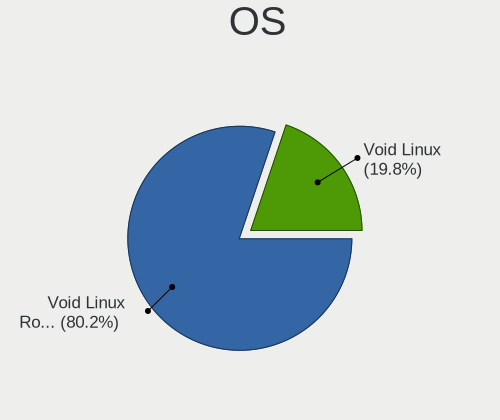
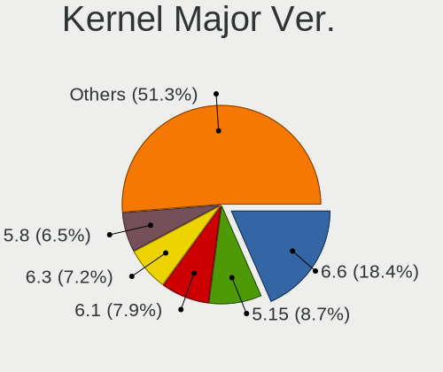
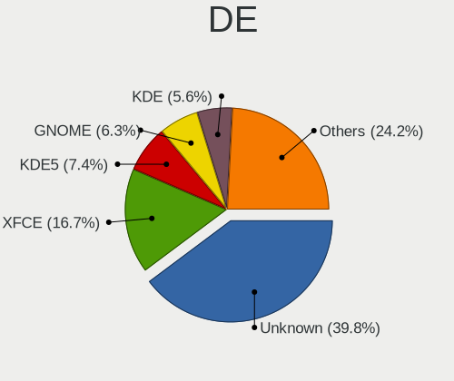
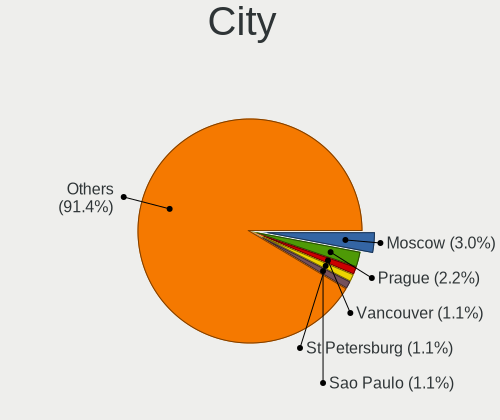
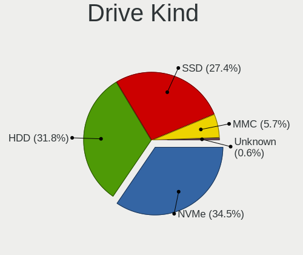
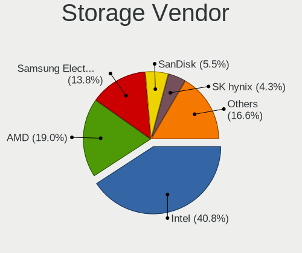
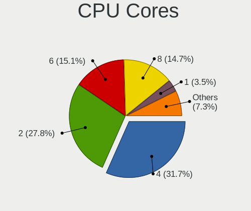
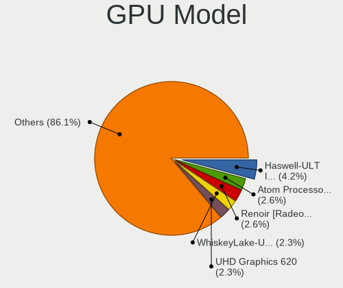
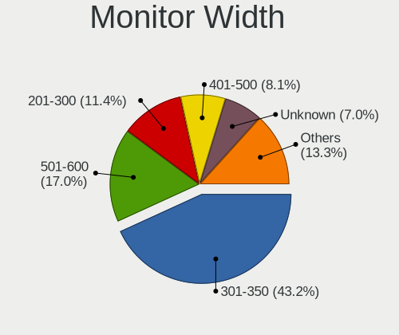
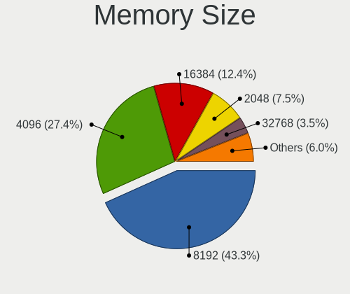

Void Linux - Tested Hardware & Statistics
-----------------------------------------

A project to collect tested hardware configurations for Void Linux.

Anyone can contribute to this report by the [hw-probe](https://github.com/linuxhw/hw-probe) tool:

    sudo -E hw-probe -all -upload

Please contribute! Especially if your hardware is rare.

This is a report for all computer types. See also reports for [desktops](/Dist/Void_Linux/Desktop/README.md) and [notebooks](/Dist/Void_Linux/Notebook/README.md).

Contents
--------

* [ Test Cases ](#test-cases)

* [ System ](#system)
  - [ OS                       ](#os)
  - [ OS Family                ](#os-family)
  - [ Kernel                   ](#kernel)
  - [ Kernel Family            ](#kernel-family)
  - [ Kernel Major Ver.        ](#kernel-major-ver)
  - [ Arch                     ](#arch)
  - [ DE                       ](#de)
  - [ Display Server           ](#display-server)
  - [ Display Manager          ](#display-manager)
  - [ OS Lang                  ](#os-lang)
  - [ Boot Mode                ](#boot-mode)
  - [ Filesystem               ](#filesystem)
  - [ Part. scheme             ](#part-scheme)
  - [ Dual Boot with Linux/BSD ](#dual-boot-with-linuxbsd)
  - [ Dual Boot (Win)          ](#dual-boot-win)

* [ Board ](#board)
  - [ Vendor                   ](#vendor)
  - [ Model                    ](#model)
  - [ Model Family             ](#model-family)
  - [ MFG Year                 ](#mfg-year)
  - [ Form Factor              ](#form-factor)
  - [ Secure Boot              ](#secure-boot)
  - [ Coreboot                 ](#coreboot)
  - [ RAM Size                 ](#ram-size)
  - [ RAM Used                 ](#ram-used)
  - [ Total Drives             ](#total-drives)
  - [ Has CD-ROM               ](#has-cd-rom)
  - [ Has Ethernet             ](#has-ethernet)
  - [ Has WiFi                 ](#has-wifi)
  - [ Has Bluetooth            ](#has-bluetooth)

* [ Location ](#location)
  - [ Country                  ](#country)
  - [ City                     ](#city)

* [ Drives ](#drives)
  - [ Drive Vendor             ](#drive-vendor)
  - [ Drive Model              ](#drive-model)
  - [ HDD Vendor               ](#hdd-vendor)
  - [ SSD Vendor               ](#ssd-vendor)
  - [ Drive Kind               ](#drive-kind)
  - [ Drive Connector          ](#drive-connector)
  - [ Drive Size               ](#drive-size)
  - [ Space Total              ](#space-total)
  - [ Space Used               ](#space-used)
  - [ Malfunc. Drives          ](#malfunc-drives)
  - [ Malfunc. Drive Vendor    ](#malfunc-drive-vendor)
  - [ Malfunc. HDD Vendor      ](#malfunc-hdd-vendor)
  - [ Malfunc. Drive Kind      ](#malfunc-drive-kind)
  - [ Failed Drives            ](#failed-drives)
  - [ Failed Drive Vendor      ](#failed-drive-vendor)
  - [ Drive Status             ](#drive-status)

* [ Storage controller ](#storage-controller)
  - [ Storage Vendor           ](#storage-vendor)
  - [ Storage Model            ](#storage-model)
  - [ Storage Kind             ](#storage-kind)

* [ Processor ](#processor)
  - [ CPU Vendor               ](#cpu-vendor)
  - [ CPU Model                ](#cpu-model)
  - [ CPU Model Family         ](#cpu-model-family)
  - [ CPU Cores                ](#cpu-cores)
  - [ CPU Sockets              ](#cpu-sockets)
  - [ CPU Threads              ](#cpu-threads)
  - [ CPU Op-Modes             ](#cpu-op-modes)
  - [ CPU Microcode            ](#cpu-microcode)
  - [ CPU Microarch            ](#cpu-microarch)

* [ Graphics ](#graphics)
  - [ GPU Vendor               ](#gpu-vendor)
  - [ GPU Model                ](#gpu-model)
  - [ GPU Combo                ](#gpu-combo)
  - [ GPU Driver               ](#gpu-driver)
  - [ GPU Memory               ](#gpu-memory)

* [ Monitor ](#monitor)
  - [ Monitor Vendor           ](#monitor-vendor)
  - [ Monitor Model            ](#monitor-model)
  - [ Monitor Resolution       ](#monitor-resolution)
  - [ Monitor Diagonal         ](#monitor-diagonal)
  - [ Monitor Width            ](#monitor-width)
  - [ Aspect Ratio             ](#aspect-ratio)
  - [ Monitor Area             ](#monitor-area)
  - [ Pixel Density            ](#pixel-density)
  - [ Multiple Monitors        ](#multiple-monitors)

* [ Network ](#network)
  - [ Net Controller Vendor    ](#net-controller-vendor)
  - [ Net Controller Model     ](#net-controller-model)
  - [ Wireless Vendor          ](#wireless-vendor)
  - [ Wireless Model           ](#wireless-model)
  - [ Ethernet Vendor          ](#ethernet-vendor)
  - [ Ethernet Model           ](#ethernet-model)
  - [ Net Controller Kind      ](#net-controller-kind)
  - [ Used Controller          ](#used-controller)
  - [ NICs                     ](#nics)
  - [ IPv6                     ](#ipv6)

* [ Bluetooth ](#bluetooth)
  - [ Bluetooth Vendor         ](#bluetooth-vendor)
  - [ Bluetooth Model          ](#bluetooth-model)

* [ Sound ](#sound)
  - [ Sound Vendor             ](#sound-vendor)
  - [ Sound Model              ](#sound-model)

* [ Memory ](#memory)
  - [ Memory Vendor            ](#memory-vendor)
  - [ Memory Model             ](#memory-model)
  - [ Memory Kind              ](#memory-kind)
  - [ Memory Form Factor       ](#memory-form-factor)
  - [ Memory Size              ](#memory-size)
  - [ Memory Speed             ](#memory-speed)

* [ Printers & scanners ](#printers--scanners)
  - [ Printer Vendor           ](#printer-vendor)
  - [ Printer Model            ](#printer-model)
  - [ Scanner Vendor           ](#scanner-vendor)
  - [ Scanner Model            ](#scanner-model)

* [ Camera ](#camera)
  - [ Camera Vendor            ](#camera-vendor)
  - [ Camera Model             ](#camera-model)

* [ Security ](#security)
  - [ Fingerprint Vendor       ](#fingerprint-vendor)
  - [ Fingerprint Model        ](#fingerprint-model)
  - [ Chipcard Vendor          ](#chipcard-vendor)
  - [ Chipcard Model           ](#chipcard-model)

* [ Unsupported ](#unsupported)
  - [ Unsupported Devices      ](#unsupported-devices)
  - [ Unsupported Device Types ](#unsupported-device-types)

Test Cases
----------

Total: 139

| Vendor        | Model                       | Form-Factor | Probe                                                      | Date         |
|---------------|-----------------------------|-------------|------------------------------------------------------------|--------------|
| Lenovo        | ThinkPad T420 4180A21       | Notebook    | [6b5a6e89a2](https://linux-hardware.org/?probe=6b5a6e89a2) | Apr 29, 2022 |
| ASUSTek       | ROG STRIX B450-F GAMING     | Desktop     | [ffdfb3a578](https://linux-hardware.org/?probe=ffdfb3a578) | Apr 29, 2022 |
| Cisco Syst... | 0T38HV A02                  | Server      | [abc0c5402d](https://linux-hardware.org/?probe=abc0c5402d) | Apr 29, 2022 |
| ASUSTek       | ROG STRIX B450-F GAMING     | Desktop     | [55c0ec3653](https://linux-hardware.org/?probe=55c0ec3653) | Apr 29, 2022 |
| Cisco Syst... | 0T38HV A02                  | Server      | [9389a4bd1e](https://linux-hardware.org/?probe=9389a4bd1e) | Apr 29, 2022 |
| ASRock        | X570 Pro4                   | Desktop     | [678366aef2](https://linux-hardware.org/?probe=678366aef2) | Apr 25, 2022 |
| HP            | Pavilion Gaming Laptop 1... | Notebook    | [6be9414efd](https://linux-hardware.org/?probe=6be9414efd) | Apr 22, 2022 |
| ASRock        | TRX40 Taichi                | Desktop     | [4a90b659fc](https://linux-hardware.org/?probe=4a90b659fc) | Apr 14, 2022 |
| Lenovo        | IdeaPad S145-14IIL 81W6     | Notebook    | [59b9a2cbcb](https://linux-hardware.org/?probe=59b9a2cbcb) | Apr 11, 2022 |
| MSI           | B550M PRO                   | Desktop     | [70e55581b6](https://linux-hardware.org/?probe=70e55581b6) | Mar 24, 2022 |
| HUAWEI        | HN-WX9X                     | Notebook    | [ee3842bc8f](https://linux-hardware.org/?probe=ee3842bc8f) | Mar 20, 2022 |
| Acer          | Swift SF314-42              | Notebook    | [e7d10ddac0](https://linux-hardware.org/?probe=e7d10ddac0) | Mar 04, 2022 |
| HP            | ENVY 6                      | Notebook    | [988417aaa7](https://linux-hardware.org/?probe=988417aaa7) | Feb 25, 2022 |
| ASUSTek       | Q325UAR                     | Convertible | [fc83e5d0b3](https://linux-hardware.org/?probe=fc83e5d0b3) | Feb 21, 2022 |
| Gigabyte      | B450M DS3H-CF               | Desktop     | [613a6d2320](https://linux-hardware.org/?probe=613a6d2320) | Feb 16, 2022 |
| Lenovo        | ThinkPad T460 20FMS0WN00    | Notebook    | [28be6b9f17](https://linux-hardware.org/?probe=28be6b9f17) | Feb 14, 2022 |
| Lenovo        | ThinkPad T460 20FMS0WN00    | Notebook    | [5819fc1b20](https://linux-hardware.org/?probe=5819fc1b20) | Feb 14, 2022 |
| Framework     | Laptop                      | Notebook    | [24c119ef46](https://linux-hardware.org/?probe=24c119ef46) | Feb 01, 2022 |
| Gigabyte      | B550M AORUS PRO-P           | Desktop     | [61374a4048](https://linux-hardware.org/?probe=61374a4048) | Jan 25, 2022 |
| Notebook      | NV4XMB,ME,MZ                | Notebook    | [298ddd1139](https://linux-hardware.org/?probe=298ddd1139) | Jan 24, 2022 |
| Lenovo        | ThinkPad E595 20NFCTO1WW    | Notebook    | [80906dc02b](https://linux-hardware.org/?probe=80906dc02b) | Jan 19, 2022 |
| Apple         | MacBookPro11,1              | Notebook    | [3afcc4b1c0](https://linux-hardware.org/?probe=3afcc4b1c0) | Jan 18, 2022 |
| ASUSTek       | PRIME X470-PRO              | Desktop     | [24fedcca0a](https://linux-hardware.org/?probe=24fedcca0a) | Jan 18, 2022 |
| Lenovo        | ThinkPad X240 20AMA34HMN    | Notebook    | [a4dfbb6e38](https://linux-hardware.org/?probe=a4dfbb6e38) | Jan 10, 2022 |
| HP            | Notebook                    | Notebook    | [3b26596e87](https://linux-hardware.org/?probe=3b26596e87) | Jan 10, 2022 |
| Lenovo        | Yoga 720-15IKB 80X7         | Convertible | [8ff352de01](https://linux-hardware.org/?probe=8ff352de01) | Dec 31, 2021 |
| ASUSTek       | X751LD                      | Notebook    | [ce95acc16d](https://linux-hardware.org/?probe=ce95acc16d) | Nov 24, 2021 |
| MSI           | B450M-A PRO MAX             | Desktop     | [efd1c194ac](https://linux-hardware.org/?probe=efd1c194ac) | Nov 11, 2021 |
| MSI           | B450M-A PRO MAX             | Desktop     | [0802656d19](https://linux-hardware.org/?probe=0802656d19) | Nov 11, 2021 |
| Pine Micro... | Pine64 Pinebook Pro         | Notebook    | [ae9fd68c7d](https://linux-hardware.org/?probe=ae9fd68c7d) | Nov 04, 2021 |
| Lenovo        | ThinkPad T14s Gen 1 20T1... | Notebook    | [b1dec2f3df](https://linux-hardware.org/?probe=b1dec2f3df) | Oct 28, 2021 |
| Gigabyte      | B450M DS3H-CF               | Desktop     | [093a7d451a](https://linux-hardware.org/?probe=093a7d451a) | Oct 16, 2021 |
| Lenovo        | ThinkPad X260 20F5S08Q00    | Notebook    | [2929e779ad](https://linux-hardware.org/?probe=2929e779ad) | Oct 15, 2021 |
| Gigabyte      | B450M DS3H-CF               | Desktop     | [7917f7d57f](https://linux-hardware.org/?probe=7917f7d57f) | Oct 12, 2021 |
| Acer          | Aspire E1-531               | Notebook    | [30d85d7ea1](https://linux-hardware.org/?probe=30d85d7ea1) | Oct 03, 2021 |
| Gigabyte      | H310M M.2 x.x               | Desktop     | [6ad302377d](https://linux-hardware.org/?probe=6ad302377d) | Sep 30, 2021 |
| Acer          | Aspire E1-531               | Notebook    | [9c0d90d6ab](https://linux-hardware.org/?probe=9c0d90d6ab) | Sep 24, 2021 |
| Acer          | Aspire E1-531               | Notebook    | [4cff8ab563](https://linux-hardware.org/?probe=4cff8ab563) | Sep 24, 2021 |
| ASUSTek       | X751LD                      | Notebook    | [efc517d282](https://linux-hardware.org/?probe=efc517d282) | Sep 22, 2021 |
| ASUSTek       | VivoBook_ASUS Laptop X50... | Notebook    | [b4749d300a](https://linux-hardware.org/?probe=b4749d300a) | Sep 17, 2021 |
| ASUSTek       | VivoBook_ASUS Laptop X50... | Notebook    | [b9d873983c](https://linux-hardware.org/?probe=b9d873983c) | Sep 17, 2021 |
| Dell          | G3 3579                     | Notebook    | [95182b0267](https://linux-hardware.org/?probe=95182b0267) | Sep 16, 2021 |
| MSI           | B450 TOMAHAWK MAX II        | Desktop     | [a0d3015e21](https://linux-hardware.org/?probe=a0d3015e21) | Sep 15, 2021 |
| ASUSTek       | M4A89GTD-PRO/USB3           | Desktop     | [d3c1b5c10c](https://linux-hardware.org/?probe=d3c1b5c10c) | Sep 11, 2021 |
| HP            | Laptop 15-bw0xx             | Notebook    | [11722e3cd0](https://linux-hardware.org/?probe=11722e3cd0) | Sep 04, 2021 |
| MSI           | Bravo 15 A4DDR              | Notebook    | [feddf87464](https://linux-hardware.org/?probe=feddf87464) | Sep 01, 2021 |
| Acer          | Swift SF314-42              | Notebook    | [98c2c3d5ac](https://linux-hardware.org/?probe=98c2c3d5ac) | Aug 24, 2021 |
| ASUSTek       | ROG CROSSHAIR VII HERO      | Desktop     | [bc2b986f06](https://linux-hardware.org/?probe=bc2b986f06) | Aug 19, 2021 |
| ASUSTek       | ROG CROSSHAIR VII HERO      | Desktop     | [85d1c86c68](https://linux-hardware.org/?probe=85d1c86c68) | Aug 19, 2021 |
| Samsung       | 275E4E/275E5E               | Notebook    | [26f7b81074](https://linux-hardware.org/?probe=26f7b81074) | Aug 17, 2021 |
| Lenovo        | ThinkPad T480 20L6SA5Q00    | Notebook    | [5459bf7337](https://linux-hardware.org/?probe=5459bf7337) | Aug 08, 2021 |
| ASUSTek       | VivoBook 15_ASUS Laptop ... | Notebook    | [e30dac258e](https://linux-hardware.org/?probe=e30dac258e) | Jul 26, 2021 |
| Dell          | 03NVJ6 A02                  | Desktop     | [5dec53ee3f](https://linux-hardware.org/?probe=5dec53ee3f) | Jul 26, 2021 |
| Unknown       | 1.0                         | Notebook    | [d049c76d58](https://linux-hardware.org/?probe=d049c76d58) | Jul 08, 2021 |
| Acer          | Aspire A515-54G             | Notebook    | [4a19b59c46](https://linux-hardware.org/?probe=4a19b59c46) | Jul 06, 2021 |
| Unknown       | Unknown                     | Notebook    | [17aab9510b](https://linux-hardware.org/?probe=17aab9510b) | Jul 05, 2021 |
| Unknown       | 1.0                         | Notebook    | [967654bdb6](https://linux-hardware.org/?probe=967654bdb6) | Jul 04, 2021 |
| Unknown       | 1.0                         | Notebook    | [36977bacbe](https://linux-hardware.org/?probe=36977bacbe) | Jul 03, 2021 |
| HP            | Pavilion Notebook           | Notebook    | [7684808016](https://linux-hardware.org/?probe=7684808016) | Jun 24, 2021 |
| Acer          | Aspire E5-521               | Notebook    | [e1f4843546](https://linux-hardware.org/?probe=e1f4843546) | Jun 16, 2021 |
| ASRock        | J4005B-ITX                  | Desktop     | [053a28a1b7](https://linux-hardware.org/?probe=053a28a1b7) | Jun 13, 2021 |
| Lenovo        | G50-45 80E3                 | Notebook    | [8e075758bf](https://linux-hardware.org/?probe=8e075758bf) | May 29, 2021 |
| ASUSTek       | TUF Gaming FX505DT_FX505... | Notebook    | [59e32967c4](https://linux-hardware.org/?probe=59e32967c4) | May 26, 2021 |
| HP            | Stream 7 Tablet             | Tablet      | [32c0e61ea7](https://linux-hardware.org/?probe=32c0e61ea7) | May 24, 2021 |
| ASUSTek       | ASUS TUF Gaming A15 FA50... | Notebook    | [bf2d71e7f2](https://linux-hardware.org/?probe=bf2d71e7f2) | May 14, 2021 |
| ASRock        | H61M-VG4                    | Desktop     | [f99a68e64b](https://linux-hardware.org/?probe=f99a68e64b) | May 14, 2021 |
| ASRock        | H61M-VG4                    | Desktop     | [d2a90378bc](https://linux-hardware.org/?probe=d2a90378bc) | May 12, 2021 |
| Lenovo        | ThinkPad T14 Gen 1 20UES... | Notebook    | [0ebae8c8ec](https://linux-hardware.org/?probe=0ebae8c8ec) | Apr 28, 2021 |
| Lenovo        | ThinkPad X1 Yoga 3rd 20L... | Convertible | [c96223f666](https://linux-hardware.org/?probe=c96223f666) | Apr 06, 2021 |
| ASUSTek       | M5A78L-M LX                 | Desktop     | [63df5a92c1](https://linux-hardware.org/?probe=63df5a92c1) | Apr 01, 2021 |
| ASUSTek       | M5A78L-M LX                 | Desktop     | [9312919fed](https://linux-hardware.org/?probe=9312919fed) | Apr 01, 2021 |
| ASRock        | B450 Pro4                   | Desktop     | [42d648695d](https://linux-hardware.org/?probe=42d648695d) | Mar 26, 2021 |
| HP            | Laptop 14-dk0xxx            | Notebook    | [b0e56964ae](https://linux-hardware.org/?probe=b0e56964ae) | Mar 15, 2021 |
| HP            | Laptop 14-dk0xxx            | Notebook    | [adf7976842](https://linux-hardware.org/?probe=adf7976842) | Mar 15, 2021 |
| ASUSTek       | VivoBook_ASUSLaptop X512... | Notebook    | [bdedf5a7c7](https://linux-hardware.org/?probe=bdedf5a7c7) | Feb 22, 2021 |
| Unknown       | Unknown                     | Desktop     | [35af7cfd3d](https://linux-hardware.org/?probe=35af7cfd3d) | Feb 22, 2021 |
| ASUSTek       | X510UAR                     | Notebook    | [1888d46194](https://linux-hardware.org/?probe=1888d46194) | Feb 21, 2021 |
| ASRock        | B450 Pro4                   | Desktop     | [09b0e87eec](https://linux-hardware.org/?probe=09b0e87eec) | Feb 12, 2021 |
| ASUSTek       | PRIME Z390-P                | Desktop     | [5d02f20d1d](https://linux-hardware.org/?probe=5d02f20d1d) | Feb 10, 2021 |
| Lenovo        | ThinkPad T430 2349PS3       | Notebook    | [b7eecfebd0](https://linux-hardware.org/?probe=b7eecfebd0) | Jan 29, 2021 |
| Chuwi         | GemiBook Pro                | Notebook    | [66e8ed8402](https://linux-hardware.org/?probe=66e8ed8402) | Jan 22, 2021 |
| Chuwi         | GemiBook Pro                | Notebook    | [d4fcffbd93](https://linux-hardware.org/?probe=d4fcffbd93) | Jan 22, 2021 |
| MSI           | MPG B550I GAMING EDGE WI... | Desktop     | [624f71f228](https://linux-hardware.org/?probe=624f71f228) | Jan 21, 2021 |
| ASUSTek       | PRIME Z390-P                | Desktop     | [73c3fdc605](https://linux-hardware.org/?probe=73c3fdc605) | Jan 16, 2021 |
| ASUSTek       | PRIME Z270-AR               | Desktop     | [35d08fe710](https://linux-hardware.org/?probe=35d08fe710) | Dec 30, 2020 |
| MSI           | MPG B550I GAMING EDGE WI... | Desktop     | [1f66d0eb72](https://linux-hardware.org/?probe=1f66d0eb72) | Dec 22, 2020 |
| MSI           | MPG B550I GAMING EDGE WI... | Desktop     | [61887011a6](https://linux-hardware.org/?probe=61887011a6) | Dec 22, 2020 |
| Acer          | Aspire SW5-015              | Notebook    | [e84677b145](https://linux-hardware.org/?probe=e84677b145) | Dec 20, 2020 |
| ASUSTek       | B150M PRO GAMING            | Desktop     | [4d4ec823bb](https://linux-hardware.org/?probe=4d4ec823bb) | Dec 06, 2020 |
| ASUSTek       | B150M PRO GAMING            | Desktop     | [7d1a0b6924](https://linux-hardware.org/?probe=7d1a0b6924) | Dec 02, 2020 |
| Dell          | Inspiron 11 - 3148          | Notebook    | [f9ec6964bb](https://linux-hardware.org/?probe=f9ec6964bb) | Nov 29, 2020 |
| Acer          | Aspire E1-570G              | Notebook    | [d8adc8e3f8](https://linux-hardware.org/?probe=d8adc8e3f8) | Nov 20, 2020 |
| ASUSTek       | H110M-PLUS                  | Desktop     | [09df23b136](https://linux-hardware.org/?probe=09df23b136) | Nov 20, 2020 |
| Acer          | AO722                       | Notebook    | [cee0cf9a99](https://linux-hardware.org/?probe=cee0cf9a99) | Nov 17, 2020 |
| ASUSTek       | PRIME B360M-A               | Desktop     | [438477ec85](https://linux-hardware.org/?probe=438477ec85) | Nov 14, 2020 |
| ASUSTek       | PRIME B360M-A               | Desktop     | [ac5adde915](https://linux-hardware.org/?probe=ac5adde915) | Nov 13, 2020 |
| ASRock        | 970 Pro3 R2.0               | Desktop     | [d889341667](https://linux-hardware.org/?probe=d889341667) | Oct 28, 2020 |
| ASUSTek       | ASUS TUF Gaming A15 FA50... | Notebook    | [e769e1f93a](https://linux-hardware.org/?probe=e769e1f93a) | Oct 24, 2020 |
| HP            | 82C0                        | Mini pc     | [44430304d3](https://linux-hardware.org/?probe=44430304d3) | Oct 19, 2020 |
| ASUSTek       | ASUS TUF Gaming A15 FA50... | Notebook    | [b50f7a3624](https://linux-hardware.org/?probe=b50f7a3624) | Oct 07, 2020 |
| Acer          | Aspire E5-575G              | Notebook    | [204ef3a0f3](https://linux-hardware.org/?probe=204ef3a0f3) | Oct 02, 2020 |
| Acer          | Aspire A315-55G             | Notebook    | [d24561be9e](https://linux-hardware.org/?probe=d24561be9e) | Oct 01, 2020 |
| Lenovo        | ThinkPad T14s Gen 1 20UH... | Notebook    | [90d57d39e2](https://linux-hardware.org/?probe=90d57d39e2) | Sep 29, 2020 |
| Dell          | Inspiron 5555               | Notebook    | [a7be8edb39](https://linux-hardware.org/?probe=a7be8edb39) | Sep 28, 2020 |
| MSI           | Z270 TOMAHAWK               | Desktop     | [66f15fef73](https://linux-hardware.org/?probe=66f15fef73) | Sep 28, 2020 |
| Dell          | Inspiron 5555               | Notebook    | [079a8b39a7](https://linux-hardware.org/?probe=079a8b39a7) | Sep 27, 2020 |
| ASUSTek       | P8Z77-V LX2                 | Desktop     | [ee56035e75](https://linux-hardware.org/?probe=ee56035e75) | Sep 24, 2020 |
| Acer          | Nitro AN715-51              | Notebook    | [d375c469b7](https://linux-hardware.org/?probe=d375c469b7) | Sep 16, 2020 |
| Getac         | V110                        | Notebook    | [f0d3292b48](https://linux-hardware.org/?probe=f0d3292b48) | Sep 15, 2020 |
| ASUSTek       | VivoBook_ASUSLaptop X512... | Notebook    | [1f9434f4c9](https://linux-hardware.org/?probe=1f9434f4c9) | Sep 06, 2020 |
| Acer          | AOA150                      | Notebook    | [f88d38a138](https://linux-hardware.org/?probe=f88d38a138) | Sep 04, 2020 |
| ASUSTek       | P8H67-V                     | Desktop     | [9bc61b31d4](https://linux-hardware.org/?probe=9bc61b31d4) | Sep 02, 2020 |
| Acer          | AO722                       | Notebook    | [816e97376d](https://linux-hardware.org/?probe=816e97376d) | Aug 21, 2020 |
| Gigabyte      | GA-78LMT-S2                 | Desktop     | [efac4b3e2b](https://linux-hardware.org/?probe=efac4b3e2b) | May 25, 2020 |
| Lenovo        | IdeaPad Z570 10246ZG        | Notebook    | [0a0f078e76](https://linux-hardware.org/?probe=0a0f078e76) | Apr 25, 2020 |
| HP            | 15                          | Notebook    | [66422a127b](https://linux-hardware.org/?probe=66422a127b) | Mar 14, 2020 |
| Dell          | Precision 3530              | Notebook    | [dd006a4ce0](https://linux-hardware.org/?probe=dd006a4ce0) | Mar 07, 2020 |
| Dell          | Latitude E4300              | Notebook    | [c94ae7cddb](https://linux-hardware.org/?probe=c94ae7cddb) | Feb 24, 2020 |
| Dell          | 0H8052                      | Desktop     | [18169ce984](https://linux-hardware.org/?probe=18169ce984) | Jan 29, 2020 |
| Unknown       | Unknown                     | Desktop     | [b9eb4a5652](https://linux-hardware.org/?probe=b9eb4a5652) | Jan 24, 2020 |
| Unknown       | Unknown                     | Desktop     | [ac87dc43f3](https://linux-hardware.org/?probe=ac87dc43f3) | Jan 24, 2020 |
| ASUSTek       | X555UJ                      | Notebook    | [261f8ada0a](https://linux-hardware.org/?probe=261f8ada0a) | Jan 24, 2020 |
| Lenovo        | IdeaPad 710S-13IKB 80VQ     | Notebook    | [faeec47313](https://linux-hardware.org/?probe=faeec47313) | Jan 21, 2020 |
| Lenovo        | IdeaPad 710S-13IKB 80VQ     | Notebook    | [ec79f8e0c6](https://linux-hardware.org/?probe=ec79f8e0c6) | Jan 21, 2020 |
| ASUSTek       | H110M-PLUS                  | Desktop     | [b8c562a7e5](https://linux-hardware.org/?probe=b8c562a7e5) | Dec 23, 2019 |
| Dell          | Inspiron 1501               | Notebook    | [17f0e8e41b](https://linux-hardware.org/?probe=17f0e8e41b) | Dec 03, 2019 |
| HP            | Laptop 14-bs0xx             | Notebook    | [bd6b795d81](https://linux-hardware.org/?probe=bd6b795d81) | Nov 09, 2019 |
| Lenovo        | IdeaPad 330-15ARR 81D2      | Notebook    | [3bae5ecb46](https://linux-hardware.org/?probe=3bae5ecb46) | Oct 10, 2019 |
| Lenovo        | IdeaPad 330-15ARR 81D2      | Notebook    | [230c0c9bc6](https://linux-hardware.org/?probe=230c0c9bc6) | Oct 01, 2019 |
| Dell          | Latitude 3379               | Notebook    | [e80a21e349](https://linux-hardware.org/?probe=e80a21e349) | Sep 13, 2019 |
| ASRock        | AB350M                      | Desktop     | [1ec4015426](https://linux-hardware.org/?probe=1ec4015426) | Sep 01, 2019 |
| ASRock        | N68-S3 FX                   | Desktop     | [69e86c050b](https://linux-hardware.org/?probe=69e86c050b) | Aug 18, 2019 |
| ASRock        | N68-S3 FX                   | Desktop     | [ef4f02af88](https://linux-hardware.org/?probe=ef4f02af88) | Aug 16, 2019 |
| ASUSTek       | Z97-A                       | Desktop     | [c2458d18f6](https://linux-hardware.org/?probe=c2458d18f6) | Aug 03, 2019 |
| Digibras      | NH4CU03                     | Notebook    | [51273f53df](https://linux-hardware.org/?probe=51273f53df) | Jul 15, 2019 |
| Digibras      | NH4CU03                     | Notebook    | [5ac8c5ff7b](https://linux-hardware.org/?probe=5ac8c5ff7b) | Jun 25, 2019 |
| MSI           | B350M GAMING PRO            | Desktop     | [20e1f5d7a1](https://linux-hardware.org/?probe=20e1f5d7a1) | Apr 17, 2019 |
| Positivo      | Mobile                      | Notebook    | [0267cf3435](https://linux-hardware.org/?probe=0267cf3435) | Mar 27, 2019 |
| ASUSTek       | PRIME A320M-K/BR            | Desktop     | [1b0a4407c7](https://linux-hardware.org/?probe=1b0a4407c7) | Mar 27, 2019 |

System
------

OS
--

Installed operating systems

| Name               | Computers | Percent |
|--------------------|-----------|---------|
| Void Linux Rolling | 60        | 56.6%   |
| Void Linux         | 46        | 43.4%   |

OS Family
---------

OS without a version

| Name       | Computers | Percent |
|------------|-----------|---------|
| Void Linux | 103       | 100%    |

Kernel
------

Version of the Linux kernel

| Version             | Computers | Percent |
|---------------------|-----------|---------|
| 5.13.19_1           | 7         | 6.31%   |
| 5.8.18_1            | 5         | 4.5%    |
| 5.3.9_1             | 4         | 3.6%    |
| 5.10.17_1           | 4         | 3.6%    |
| 5.8.12_1            | 3         | 2.7%    |
| 5.15.32_1           | 3         | 2.7%    |
| 5.13.13_1           | 3         | 2.7%    |
| 5.12.10_1           | 3         | 2.7%    |
| 5.9.14_1            | 2         | 1.8%    |
| 5.4.24_1            | 2         | 1.8%    |
| 5.4.13_2            | 2         | 1.8%    |
| 5.16.20_1           | 2         | 1.8%    |
| 5.15.34_1           | 2         | 1.8%    |
| 5.15.22_1           | 2         | 1.8%    |
| 5.15.16_1           | 2         | 1.8%    |
| 5.13.15_1           | 2         | 1.8%    |
| 5.13.10_1           | 2         | 1.8%    |
| 5.12.14_1           | 2         | 1.8%    |
| 5.11.9_1            | 2         | 1.8%    |
| 5.10.14_1           | 2         | 1.8%    |
| 5.9.16_1            | 1         | 0.9%    |
| 5.9.0-rc8_2         | 1         | 0.9%    |
| 5.8.9_1             | 1         | 0.9%    |
| 5.8.8_1             | 1         | 0.9%    |
| 5.8.7_1             | 1         | 0.9%    |
| 5.8.6_1             | 1         | 0.9%    |
| 5.8.5_1             | 1         | 0.9%    |
| 5.8.16_1            | 1         | 0.9%    |
| 5.8.14_1            | 1         | 0.9%    |
| 5.8.12_2            | 1         | 0.9%    |
| 5.8.11_1            | 1         | 0.9%    |
| 5.8.10_1            | 1         | 0.9%    |
| 5.7.16_1            | 1         | 0.9%    |
| 5.6.14_1            | 1         | 0.9%    |
| 5.4.35_1            | 1         | 0.9%    |
| 5.4.21_1            | 1         | 0.9%    |
| 5.4.15_1            | 1         | 0.9%    |
| 5.3.16_1            | 1         | 0.9%    |
| 5.2.13_1            | 1         | 0.9%    |
| 5.15.6_1            | 1         | 0.9%    |
| 5.15.30_1           | 1         | 0.9%    |
| 5.15.28_1           | 1         | 0.9%    |
| 5.15.26_1           | 1         | 0.9%    |
| 5.15.24_1           | 1         | 0.9%    |
| 5.15.17_1           | 1         | 0.9%    |
| 5.15.14_1           | 1         | 0.9%    |
| 5.15.12_1           | 1         | 0.9%    |
| 5.15.11_1           | 1         | 0.9%    |
| 5.14.0_1            | 1         | 0.9%    |
| 5.13.18_1           | 1         | 0.9%    |
| 5.13.12_1           | 1         | 0.9%    |
| 5.12.7_1            | 1         | 0.9%    |
| 5.12.6              | 1         | 0.9%    |
| 5.12.3-tkg-MuQSS_22 | 1         | 0.9%    |
| 5.12.19_1           | 1         | 0.9%    |
| 5.11.18_1           | 1         | 0.9%    |
| 5.11.16_1           | 1         | 0.9%    |
| 5.11.11_1           | 1         | 0.9%    |
| 5.10.9_1            | 1         | 0.9%    |
| 5.10.8_1            | 1         | 0.9%    |

Kernel Family
-------------

Linux kernel without a distro release

| Version | Computers | Percent |
|---------|-----------|---------|
| 5.13.19 | 7         | 6.31%   |
| 5.8.18  | 5         | 4.5%    |
| 5.8.12  | 4         | 3.6%    |
| 5.3.9   | 4         | 3.6%    |
| 5.10.17 | 4         | 3.6%    |
| 5.15.32 | 3         | 2.7%    |
| 5.13.13 | 3         | 2.7%    |
| 5.12.10 | 3         | 2.7%    |
| 5.9.14  | 2         | 1.8%    |
| 5.4.24  | 2         | 1.8%    |
| 5.4.13  | 2         | 1.8%    |
| 5.16.20 | 2         | 1.8%    |
| 5.15.34 | 2         | 1.8%    |
| 5.15.22 | 2         | 1.8%    |
| 5.15.16 | 2         | 1.8%    |
| 5.13.15 | 2         | 1.8%    |
| 5.13.10 | 2         | 1.8%    |
| 5.12.14 | 2         | 1.8%    |
| 5.11.9  | 2         | 1.8%    |
| 5.10.14 | 2         | 1.8%    |
| 5.9.16  | 1         | 0.9%    |
| 5.9.0   | 1         | 0.9%    |
| 5.8.9   | 1         | 0.9%    |
| 5.8.8   | 1         | 0.9%    |
| 5.8.7   | 1         | 0.9%    |
| 5.8.6   | 1         | 0.9%    |
| 5.8.5   | 1         | 0.9%    |
| 5.8.16  | 1         | 0.9%    |
| 5.8.14  | 1         | 0.9%    |
| 5.8.11  | 1         | 0.9%    |
| 5.8.10  | 1         | 0.9%    |
| 5.7.16  | 1         | 0.9%    |
| 5.6.14  | 1         | 0.9%    |
| 5.4.35  | 1         | 0.9%    |
| 5.4.21  | 1         | 0.9%    |
| 5.4.15  | 1         | 0.9%    |
| 5.3.16  | 1         | 0.9%    |
| 5.2.13  | 1         | 0.9%    |
| 5.15.6  | 1         | 0.9%    |
| 5.15.30 | 1         | 0.9%    |
| 5.15.28 | 1         | 0.9%    |
| 5.15.26 | 1         | 0.9%    |
| 5.15.24 | 1         | 0.9%    |
| 5.15.17 | 1         | 0.9%    |
| 5.15.14 | 1         | 0.9%    |
| 5.15.12 | 1         | 0.9%    |
| 5.15.11 | 1         | 0.9%    |
| 5.14.0  | 1         | 0.9%    |
| 5.13.18 | 1         | 0.9%    |
| 5.13.12 | 1         | 0.9%    |
| 5.12.7  | 1         | 0.9%    |
| 5.12.6  | 1         | 0.9%    |
| 5.12.3  | 1         | 0.9%    |
| 5.12.19 | 1         | 0.9%    |
| 5.11.18 | 1         | 0.9%    |
| 5.11.16 | 1         | 0.9%    |
| 5.11.11 | 1         | 0.9%    |
| 5.10.9  | 1         | 0.9%    |
| 5.10.88 | 1         | 0.9%    |
| 5.10.80 | 1         | 0.9%    |

Kernel Major Ver.
-----------------

Linux kernel major version

| Version | Computers | Percent |
|---------|-----------|---------|
| 5.8     | 18        | 16.36%  |
| 5.15    | 18        | 16.36%  |
| 5.13    | 16        | 14.55%  |
| 5.10    | 15        | 13.64%  |
| 5.12    | 9         | 8.18%   |
| 5.4     | 7         | 6.36%   |
| 5.3     | 5         | 4.55%   |
| 5.11    | 5         | 4.55%   |
| 5.9     | 4         | 3.64%   |
| 4.19    | 4         | 3.64%   |
| 5.16    | 2         | 1.82%   |
| 5.7     | 1         | 0.91%   |
| 5.6     | 1         | 0.91%   |
| 5.2     | 1         | 0.91%   |
| 5.14    | 1         | 0.91%   |
| 5.1     | 1         | 0.91%   |
| 4.4     | 1         | 0.91%   |
| 4.14    | 1         | 0.91%   |

Arch
----

OS architecture (x86_64, i586, etc.)

| Name    | Computers | Percent |
|---------|-----------|---------|
| x86_64  | 96        | 93.2%   |
| i686    | 4         | 3.88%   |
| aarch64 | 2         | 1.94%   |
| ppc64le | 1         | 0.97%   |

DE
--

Desktop Environment

| Name       | Computers | Percent |
|------------|-----------|---------|
| Unknown    | 50        | 46.73%  |
| XFCE       | 12        | 11.21%  |
| KDE        | 10        | 9.35%   |
| MATE       | 6         | 5.61%   |
| GNOME      | 6         | 5.61%   |
| i3         | 5         | 4.67%   |
| X-Cinnamon | 3         | 2.8%    |
| openbox    | 3         | 2.8%    |
| KDE5       | 3         | 2.8%    |
| bspwm      | 3         | 2.8%    |
| Lumina     | 2         | 1.87%   |
| awesome    | 2         | 1.87%   |
| sway       | 1         | 0.93%   |
| river      | 1         | 0.93%   |

Display Server
--------------

X11 or Wayland

| Name    | Computers | Percent |
|---------|-----------|---------|
| X11     | 73        | 70.19%  |
| Wayland | 12        | 11.54%  |
| Tty     | 12        | 11.54%  |
| Unknown | 7         | 6.73%   |

Display Manager
---------------

SDDM, LightDM, etc.

| Name    | Computers | Percent |
|---------|-----------|---------|
| Unknown | 98        | 94.23%  |
| LightDM | 4         | 3.85%   |
| SDDM    | 1         | 0.96%   |
| LXDM    | 1         | 0.96%   |

OS Lang
-------

Language

| Lang    | Computers | Percent |
|---------|-----------|---------|
| en_US   | 53        | 49.53%  |
| Unknown | 16        | 14.95%  |
| en_GB   | 7         | 6.54%   |
| en_DK   | 6         | 5.61%   |
| ru_RU   | 3         | 2.8%    |
| de_DE   | 3         | 2.8%    |
| pt_BR   | 2         | 1.87%   |
| fr_FR   | 2         | 1.87%   |
| en_AU   | 2         | 1.87%   |
| cs_CZ   | 2         | 1.87%   |
| ru_UA   | 1         | 0.93%   |
| pl_PL   | 1         | 0.93%   |
| nb_NO   | 1         | 0.93%   |
| es_HN   | 1         | 0.93%   |
| es_ES   | 1         | 0.93%   |
| es_DO   | 1         | 0.93%   |
| en_NZ   | 1         | 0.93%   |
| en_IE   | 1         | 0.93%   |
| en_CA   | 1         | 0.93%   |
| el_GR   | 1         | 0.93%   |
| bg_BG   | 1         | 0.93%   |

Boot Mode
---------

EFI or BIOS

| Mode | Computers | Percent |
|------|-----------|---------|
| EFI  | 53        | 50.48%  |
| BIOS | 52        | 49.52%  |

Filesystem
----------

Type of filesystem

| Type    | Computers | Percent |
|---------|-----------|---------|
| Ext4    | 65        | 62.5%   |
| Btrfs   | 22        | 21.15%  |
| Zfs     | 6         | 5.77%   |
| Xfs     | 5         | 4.81%   |
| Unknown | 4         | 3.85%   |
| F2fs    | 1         | 0.96%   |
| Ext3    | 1         | 0.96%   |

Part. scheme
------------

Scheme of partitioning

| Type    | Computers | Percent |
|---------|-----------|---------|
| GPT     | 57        | 54.29%  |
| Unknown | 34        | 32.38%  |
| MBR     | 14        | 13.33%  |

Dual Boot with Linux/BSD
------------------------

Hosting more than one Linux/BSD

| Dual boot | Computers | Percent |
|-----------|-----------|---------|
| No        | 93        | 90.29%  |
| Yes       | 10        | 9.71%   |

Dual Boot (Win)
---------------

Hosting Linux and Windows

| Dual boot | Computers | Percent |
|-----------|-----------|---------|
| No        | 84        | 81.55%  |
| Yes       | 19        | 18.45%  |

Board
-----

Vendor
------

Motherboard manufacturer

| Name                | Computers | Percent |
|---------------------|-----------|---------|
| ASUSTek Computer    | 23        | 22.33%  |
| Lenovo              | 16        | 15.53%  |
| Acer                | 12        | 11.65%  |
| Hewlett-Packard     | 10        | 9.71%   |
| Dell                | 9         | 8.74%   |
| ASRock              | 8         | 7.77%   |
| MSI                 | 7         | 6.8%    |
| Gigabyte Technology | 4         | 3.88%   |
| Unknown             | 3         | 2.91%   |
| Samsung Electronics | 1         | 0.97%   |
| Positivo            | 1         | 0.97%   |
| Pine Microsystems   | 1         | 0.97%   |
| Notebook            | 1         | 0.97%   |
| HUAWEI              | 1         | 0.97%   |
| Getac               | 1         | 0.97%   |
| Framework           | 1         | 0.97%   |
| Digibras            | 1         | 0.97%   |
| Cisco Systems       | 1         | 0.97%   |
| Chuwi               | 1         | 0.97%   |
| Apple               | 1         | 0.97%   |

Model
-----

Motherboard model

| Name                                   | Computers | Percent |
|----------------------------------------|-----------|---------|
| Unknown                                | 3         | 2.91%   |
| ASUS PRIME Z390-P                      | 2         | 1.94%   |
| Acer Swift SF314-42                    | 2         | 1.94%   |
| Samsung 275E4E/275E5E                  | 1         | 0.97%   |
| Positivo Mobile                        | 1         | 0.97%   |
| Pine Microsystems Pine64 Pinebook Pro  | 1         | 0.97%   |
| Notebook NV4XMB,ME,MZ                  | 1         | 0.97%   |
| MSI MS-7D14                            | 1         | 0.97%   |
| MSI MS-7C92                            | 1         | 0.97%   |
| MSI MS-7C52                            | 1         | 0.97%   |
| MSI MS-7C02                            | 1         | 0.97%   |
| MSI MS-7A68                            | 1         | 0.97%   |
| MSI MS-7A39                            | 1         | 0.97%   |
| MSI Bravo 15 A4DDR                     | 1         | 0.97%   |
| Lenovo Yoga 720-15IKB 80X7             | 1         | 0.97%   |
| Lenovo ThinkPad X260 20F5S08Q00        | 1         | 0.97%   |
| Lenovo ThinkPad X240 20AMA34HMN        | 1         | 0.97%   |
| Lenovo ThinkPad X1 Yoga 3rd 20LD001HUS | 1         | 0.97%   |
| Lenovo ThinkPad T480 20L6SA5Q00        | 1         | 0.97%   |
| Lenovo ThinkPad T460 20FMS0WN00        | 1         | 0.97%   |
| Lenovo ThinkPad T430 2349PS3           | 1         | 0.97%   |
| Lenovo ThinkPad T420 4180A21           | 1         | 0.97%   |
| Lenovo ThinkPad T14s Gen 1 20UHCTO1WW  | 1         | 0.97%   |
| Lenovo ThinkPad T14s Gen 1 20T1S04V00  | 1         | 0.97%   |
| Lenovo ThinkPad T14 Gen 1 20UES1Y200   | 1         | 0.97%   |
| Lenovo ThinkPad E595 20NFCTO1WW        | 1         | 0.97%   |
| Lenovo IdeaPad Z570 10246ZG            | 1         | 0.97%   |
| Lenovo IdeaPad S145-14IIL 81W6         | 1         | 0.97%   |
| Lenovo IdeaPad 710S-13IKB 80VQ         | 1         | 0.97%   |
| Lenovo G50-45 80E3                     | 1         | 0.97%   |
| HUAWEI HN-WX9X                         | 1         | 0.97%   |
| HP Z2 Mini G3 Workstation              | 1         | 0.97%   |
| HP Stream 7 Tablet                     | 1         | 0.97%   |
| HP Pavilion Notebook                   | 1         | 0.97%   |
| HP Pavilion Gaming Laptop 15-dk0xxx    | 1         | 0.97%   |
| HP Notebook                            | 1         | 0.97%   |
| HP Laptop 15-bw0xx                     | 1         | 0.97%   |
| HP Laptop 14-dk0xxx                    | 1         | 0.97%   |
| HP Laptop 14-bs0xx                     | 1         | 0.97%   |
| HP ENVY 6                              | 1         | 0.97%   |
| HP 15                                  | 1         | 0.97%   |
| Gigabyte H310M M.2 2.0                 | 1         | 0.97%   |
| Gigabyte GA-78LMT-S2                   | 1         | 0.97%   |
| Gigabyte B550M AORUS PRO-P             | 1         | 0.97%   |
| Gigabyte B450M DS3H                    | 1         | 0.97%   |
| Getac V110                             | 1         | 0.97%   |
| Framework Laptop                       | 1         | 0.97%   |
| Digibras NH4CU03                       | 1         | 0.97%   |
| Dell Precision 3530                    | 1         | 0.97%   |
| Dell OptiPlex GX520                    | 1         | 0.97%   |
| Dell OptiPlex 780                      | 1         | 0.97%   |
| Dell Latitude E4300                    | 1         | 0.97%   |
| Dell Latitude 3379                     | 1         | 0.97%   |
| Dell Inspiron 5555                     | 1         | 0.97%   |
| Dell Inspiron 1501                     | 1         | 0.97%   |
| Dell Inspiron 11 - 3148                | 1         | 0.97%   |
| Dell G3 3579                           | 1         | 0.97%   |
| Cisco Systems PowerEdge R710           | 1         | 0.97%   |
| Chuwi GemiBook Pro                     | 1         | 0.97%   |
| ASUS X751LD                            | 1         | 0.97%   |

Model Family
------------

Motherboard model prefix

| Name                     | Computers | Percent |
|--------------------------|-----------|---------|
| Lenovo ThinkPad          | 11        | 10.68%  |
| Acer Aspire              | 7         | 6.8%    |
| ASUS PRIME               | 5         | 4.85%   |
| ASUS VivoBook            | 4         | 3.88%   |
| Lenovo IdeaPad           | 3         | 2.91%   |
| HP Laptop                | 3         | 2.91%   |
| Dell Inspiron            | 3         | 2.91%   |
| Unknown                  | 3         | 2.91%   |
| HP Pavilion              | 2         | 1.94%   |
| Dell OptiPlex            | 2         | 1.94%   |
| Dell Latitude            | 2         | 1.94%   |
| ASUS ROG                 | 2         | 1.94%   |
| Acer Swift               | 2         | 1.94%   |
| Samsung 275E4E           | 1         | 0.97%   |
| Positivo Mobile          | 1         | 0.97%   |
| Pine Microsystems Pine64 | 1         | 0.97%   |
| Notebook NV4XMB          | 1         | 0.97%   |
| MSI MS-7D14              | 1         | 0.97%   |
| MSI MS-7C92              | 1         | 0.97%   |
| MSI MS-7C52              | 1         | 0.97%   |
| MSI MS-7C02              | 1         | 0.97%   |
| MSI MS-7A68              | 1         | 0.97%   |
| MSI MS-7A39              | 1         | 0.97%   |
| MSI Bravo                | 1         | 0.97%   |
| Lenovo Yoga              | 1         | 0.97%   |
| Lenovo G50-45            | 1         | 0.97%   |
| HUAWEI HN-WX9X           | 1         | 0.97%   |
| HP Z2                    | 1         | 0.97%   |
| HP Stream                | 1         | 0.97%   |
| HP Notebook              | 1         | 0.97%   |
| HP ENVY                  | 1         | 0.97%   |
| HP 15                    | 1         | 0.97%   |
| Gigabyte H310M           | 1         | 0.97%   |
| Gigabyte GA-78LMT-S2     | 1         | 0.97%   |
| Gigabyte B550M           | 1         | 0.97%   |
| Gigabyte B450M           | 1         | 0.97%   |
| Getac V110               | 1         | 0.97%   |
| Framework Laptop         | 1         | 0.97%   |
| Digibras NH4CU03         | 1         | 0.97%   |
| Dell Precision           | 1         | 0.97%   |
| Dell G3                  | 1         | 0.97%   |
| Cisco Systems PowerEdge  | 1         | 0.97%   |
| Chuwi GemiBook           | 1         | 0.97%   |
| ASUS X751LD              | 1         | 0.97%   |
| ASUS X555UJ              | 1         | 0.97%   |
| ASUS X510UAR             | 1         | 0.97%   |
| ASUS TUF                 | 1         | 0.97%   |
| ASUS Q325UAR             | 1         | 0.97%   |
| ASUS P8Z77-V             | 1         | 0.97%   |
| ASUS P8H67-V             | 1         | 0.97%   |
| ASUS M5A78L-M            | 1         | 0.97%   |
| ASUS M4A89GTD-PRO        | 1         | 0.97%   |
| ASUS H110M-PLUS          | 1         | 0.97%   |
| ASUS B150M               | 1         | 0.97%   |
| ASUS ASUS                | 1         | 0.97%   |
| ASRock X570              | 1         | 0.97%   |
| ASRock TRX40             | 1         | 0.97%   |
| ASRock N68-S3            | 1         | 0.97%   |
| ASRock J4005B-ITX        | 1         | 0.97%   |
| ASRock H61M-VG4          | 1         | 0.97%   |

MFG Year
--------

Motherboard manufacture year

| Year    | Computers | Percent |
|---------|-----------|---------|
| 2019    | 17        | 16.5%   |
| 2020    | 14        | 13.59%  |
| 2018    | 14        | 13.59%  |
| 2017    | 10        | 9.71%   |
| 2016    | 9         | 8.74%   |
| 2012    | 7         | 6.8%    |
| 2014    | 6         | 5.83%   |
| 2013    | 6         | 5.83%   |
| 2011    | 5         | 4.85%   |
| 2015    | 3         | 2.91%   |
| 2010    | 3         | 2.91%   |
| Unknown | 3         | 2.91%   |
| 2008    | 2         | 1.94%   |
| 2006    | 2         | 1.94%   |
| 2021    | 1         | 0.97%   |
| 2009    | 1         | 0.97%   |

Form Factor
-----------

Physical design of the computer

| Name        | Computers | Percent |
|-------------|-----------|---------|
| Notebook    | 62        | 60.19%  |
| Desktop     | 35        | 33.98%  |
| Convertible | 3         | 2.91%   |
| Tablet      | 1         | 0.97%   |
| Mini pc     | 1         | 0.97%   |
| Server      | 1         | 0.97%   |

Secure Boot
-----------

Enabled or disabled

| State    | Computers | Percent |
|----------|-----------|---------|
| Disabled | 103       | 100%    |

Coreboot
--------

Have coreboot on board

| Used | Computers | Percent |
|------|-----------|---------|
| No   | 103       | 100%    |

RAM Size
--------

Total RAM memory

| Size in GB      | Computers | Percent |
|-----------------|-----------|---------|
| 4.01-8.0        | 24        | 23.08%  |
| 16.01-24.0      | 21        | 20.19%  |
| 8.01-16.0       | 20        | 19.23%  |
| 3.01-4.0        | 19        | 18.27%  |
| 32.01-64.0      | 10        | 9.62%   |
| 1.01-2.0        | 4         | 3.85%   |
| 64.01-256.0     | 2         | 1.92%   |
| More than 256.0 | 1         | 0.96%   |
| 24.01-32.0      | 1         | 0.96%   |
| 2.01-3.0        | 1         | 0.96%   |
| 0.51-1.0        | 1         | 0.96%   |

RAM Used
--------

Used RAM memory

| Used GB     | Computers | Percent |
|-------------|-----------|---------|
| 1.01-2.0    | 31        | 27.93%  |
| 2.01-3.0    | 27        | 24.32%  |
| 0.51-1.0    | 18        | 16.22%  |
| 4.01-8.0    | 12        | 10.81%  |
| 3.01-4.0    | 10        | 9.01%   |
| 8.01-16.0   | 7         | 6.31%   |
| 16.01-24.0  | 3         | 2.7%    |
| 0.01-0.5    | 2         | 1.8%    |
| 64.01-256.0 | 1         | 0.9%    |

Total Drives
------------

Number of drives on board

| Drives | Computers | Percent |
|--------|-----------|---------|
| 1      | 63        | 61.17%  |
| 2      | 23        | 22.33%  |
| 3      | 14        | 13.59%  |
| 9      | 1         | 0.97%   |
| 5      | 1         | 0.97%   |
| 4      | 1         | 0.97%   |

Has CD-ROM
----------

Has CD-ROM on board

| Presented | Computers | Percent |
|-----------|-----------|---------|
| No        | 78        | 75.73%  |
| Yes       | 25        | 24.27%  |

Has Ethernet
------------

Has Ethernet on board

| Presented | Computers | Percent |
|-----------|-----------|---------|
| Yes       | 87        | 84.47%  |
| No        | 16        | 15.53%  |

Has WiFi
--------

Has WiFi module

| Presented | Computers | Percent |
|-----------|-----------|---------|
| Yes       | 74        | 71.84%  |
| No        | 29        | 28.16%  |

Has Bluetooth
-------------

Has Bluetooth module

| Presented | Computers | Percent |
|-----------|-----------|---------|
| Yes       | 63        | 60.58%  |
| No        | 41        | 39.42%  |

Location
--------

Country
-------

Geographic location (country)

| Country            | Computers | Percent |
|--------------------|-----------|---------|
| USA                | 21        | 20.39%  |
| Germany            | 9         | 8.74%   |
| India              | 8         | 7.77%   |
| Brazil             | 7         | 6.8%    |
| Russia             | 6         | 5.83%   |
| Czechia            | 6         | 5.83%   |
| Denmark            | 5         | 4.85%   |
| Ukraine            | 4         | 3.88%   |
| UK                 | 4         | 3.88%   |
| Switzerland        | 3         | 2.91%   |
| France             | 3         | 2.91%   |
| Bulgaria           | 3         | 2.91%   |
| Turkey             | 2         | 1.94%   |
| Spain              | 2         | 1.94%   |
| Poland             | 2         | 1.94%   |
| Netherlands        | 2         | 1.94%   |
| Greece             | 2         | 1.94%   |
| Australia          | 2         | 1.94%   |
| Vietnam            | 1         | 0.97%   |
| Sweden             | 1         | 0.97%   |
| Peru               | 1         | 0.97%   |
| Norway             | 1         | 0.97%   |
| New Zealand        | 1         | 0.97%   |
| Honduras           | 1         | 0.97%   |
| Ecuador            | 1         | 0.97%   |
| Dominican Republic | 1         | 0.97%   |
| Canada             | 1         | 0.97%   |
| Belgium            | 1         | 0.97%   |
| Bangladesh         | 1         | 0.97%   |
| Argentina          | 1         | 0.97%   |

City
----

Geographic location (city)

| City                | Computers | Percent |
|---------------------|-----------|---------|
| Prague              | 5         | 4.72%   |
| Munich              | 3         | 2.83%   |
| Denver              | 3         | 2.83%   |
| Viby                | 2         | 1.89%   |
| Varna               | 2         | 1.89%   |
| St Petersburg       | 2         | 1.89%   |
| Hyderabad           | 2         | 1.89%   |
| Geneva              | 2         | 1.89%   |
| Amsterdam           | 2         | 1.89%   |
| Zurich              | 1         | 0.94%   |
| Zagnansk            | 1         | 0.94%   |
| Yekaterinburg       | 1         | 0.94%   |
| Yambol              | 1         | 0.94%   |
| Vlaardingen         | 1         | 0.94%   |
| Uzhhorod            | 1         | 0.94%   |
| Trujillo            | 1         | 0.94%   |
| Toulouse            | 1         | 0.94%   |
| Toms River          | 1         | 0.94%   |
| Tegucigalpa         | 1         | 0.94%   |
| Syktyvkar           | 1         | 0.94%   |
| Sydney              | 1         | 0.94%   |
| South Shields       | 1         | 0.94%   |
| Schwabhausen        | 1         | 0.94%   |
| Saxtons River       | 1         | 0.94%   |
| Saint Paul          | 1         | 0.94%   |
| Rostock             | 1         | 0.94%   |
| Rosario             | 1         | 0.94%   |
| Rio de Janeiro      | 1         | 0.94%   |
| Richmond            | 1         | 0.94%   |
| Regensburg          | 1         | 0.94%   |
| Pune                | 1         | 0.94%   |
| Porto Alegre        | 1         | 0.94%   |
| Phoenix             | 1         | 0.94%   |
| Peckham             | 1         | 0.94%   |
| Paris               | 1         | 0.94%   |
| Orlando             | 1         | 0.94%   |
| Odense              | 1         | 0.94%   |
| New York            | 1         | 0.94%   |
| Nagua               | 1         | 0.94%   |
| Mossoro             | 1         | 0.94%   |
| Moscow              | 1         | 0.94%   |
| Milford             | 1         | 0.94%   |
| Miedziana Gora      | 1         | 0.94%   |
| Matos Costa         | 1         | 0.94%   |
| Malvern             | 1         | 0.94%   |
| Lublin              | 1         | 0.94%   |
| Los Angeles         | 1         | 0.94%   |
| London              | 1         | 0.94%   |
| Lakewood            | 1         | 0.94%   |
| Krynychky           | 1         | 0.94%   |
| Kremenchug          | 1         | 0.94%   |
| Kotlas              | 1         | 0.94%   |
| Kolkata             | 1         | 0.94%   |
| Izmir               | 1         | 0.94%   |
| Itanhaem            | 1         | 0.94%   |
| Ioannina            | 1         | 0.94%   |
| Huisseau-sur-Cosson | 1         | 0.94%   |
| Horsens             | 1         | 0.94%   |
| Horice              | 1         | 0.94%   |
| Ho Chi Minh City    | 1         | 0.94%   |

Drives
------

Drive Vendor
------------

Hard drive vendors

| Vendor              | Computers | Drives | Percent |
|---------------------|-----------|--------|---------|
| Samsung Electronics | 31        | 42     | 20.81%  |
| WDC                 | 28        | 35     | 18.79%  |
| Seagate             | 25        | 29     | 16.78%  |
| Toshiba             | 8         | 9      | 5.37%   |
| Kingston            | 8         | 8      | 5.37%   |
| SanDisk             | 7         | 8      | 4.7%    |
| Unknown             | 6         | 11     | 4.03%   |
| Intel               | 6         | 8      | 4.03%   |
| HGST                | 5         | 6      | 3.36%   |
| Hitachi             | 3         | 3      | 2.01%   |
| Crucial             | 3         | 4      | 2.01%   |
| SK Hynix            | 2         | 2      | 1.34%   |
| Patriot             | 2         | 2      | 1.34%   |
| Corsair             | 2         | 2      | 1.34%   |
| A-DATA Technology   | 2         | 3      | 1.34%   |
| XPG                 | 1         | 4      | 0.67%   |
| Transcend           | 1         | 1      | 0.67%   |
| SPCC                | 1         | 1      | 0.67%   |
| Phison              | 1         | 1      | 0.67%   |
| OCZ                 | 1         | 1      | 0.67%   |
| MAXTOR              | 1         | 1      | 0.67%   |
| LITEONIT            | 1         | 1      | 0.67%   |
| Gigabyte Technology | 1         | 1      | 0.67%   |
| China               | 1         | 1      | 0.67%   |
| BHT                 | 1         | 1      | 0.67%   |
| Apple               | 1         | 1      | 0.67%   |

Drive Model
-----------

Hard drive models

| Model                                   | Computers | Percent |
|-----------------------------------------|-----------|---------|
| Seagate ST1000LM035-1RK172 1TB          | 5         | 3.05%   |
| WDC WD10EZEX-08WN4A0 1TB                | 3         | 1.83%   |
| Toshiba MQ01ABF050 500GB                | 3         | 1.83%   |
| Samsung NVMe SSD Drive 1TB              | 3         | 1.83%   |
| Kingston SHFS37A120G 120GB SSD          | 3         | 1.83%   |
| Toshiba MQ04ABF100 1TB                  | 2         | 1.22%   |
| SK Hynix SKHynix_HFS001TD9TNI-L2B0B 1TB | 2         | 1.22%   |
| Seagate ST500LM012 HN-M500MBB 500GB     | 2         | 1.22%   |
| Seagate ST500DM002-1BD142 500GB         | 2         | 1.22%   |
| Seagate ST2000DM008-2FR102 2TB          | 2         | 1.22%   |
| Seagate ST1000LM049-2GH172 1TB          | 2         | 1.22%   |
| Seagate ST1000DM010-2EP102 1TB          | 2         | 1.22%   |
| Samsung SSD 970 EVO Plus 1TB            | 2         | 1.22%   |
| Samsung SSD 850 EVO 500GB               | 2         | 1.22%   |
| Samsung NVMe SSD Drive 500GB            | 2         | 1.22%   |
| Patriot Burst 120GB SSD                 | 2         | 1.22%   |
| Kingston SA400S37240G 240GB SSD         | 2         | 1.22%   |
| Intel SSDPEKNW512G8 512GB               | 2         | 1.22%   |
| HGST HTS545050A7E680 500GB              | 2         | 1.22%   |
| XPG NVMe SSD Drive 2TB                  | 1         | 0.61%   |
| WDC WDS500G2B0A-00SM50 500GB SSD        | 1         | 0.61%   |
| WDC WD7500AYYS-01RCA0 752GB             | 1         | 0.61%   |
| WDC WD60 EFRX-68L0BN1 6TB               | 1         | 0.61%   |
| WDC WD5000LPCX-22VHAT0 500GB            | 1         | 0.61%   |
| WDC WD5000LPCX-21VHAT0 500GB            | 1         | 0.61%   |
| WDC WD5000AADS-00S9B0 500GB             | 1         | 0.61%   |
| WDC WD3200BPVT-22JJ5T0 320GB            | 1         | 0.61%   |
| WDC WD3200AAKS-22SBA0 320GB             | 1         | 0.61%   |
| WDC WD20EZRZ-00Z5HB0 2TB                | 1         | 0.61%   |
| WDC WD20EZBX-00AYRA0 2TB                | 1         | 0.61%   |
| WDC WD20EFRX-68EUZN0 2TB                | 1         | 0.61%   |
| WDC WD2003FZEX-00Z4SA0 2TB              | 1         | 0.61%   |
| WDC WD1600BEVS-60VAT0 160GB             | 1         | 0.61%   |
| WDC WD15EARS-00MVWB0 1TB                | 1         | 0.61%   |
| WDC WD10SPZX-21Z10T0 1TB                | 1         | 0.61%   |
| WDC WD10JPVX-60JC3T0 1TB                | 1         | 0.61%   |
| WDC WD10JPVX-22JC3T0 1TB                | 1         | 0.61%   |
| WDC WD10JPVX-08JC3T6 1TB                | 1         | 0.61%   |
| WDC WD10JPCX-24UE4T0 1TB                | 1         | 0.61%   |
| WDC WD10EZRX-00L4HB0 1TB                | 1         | 0.61%   |
| WDC WD10EFRX-68PJCN0 1TB                | 1         | 0.61%   |
| WDC WD10EFRX-68FYTN0 1TB                | 1         | 0.61%   |
| WDC WD10EARX-00PASB0 1TB                | 1         | 0.61%   |
| WDC WD1002FAEX-00Z3A0 1TB               | 1         | 0.61%   |
| WDC WD1001FALS-00K1B0 1TB               | 1         | 0.61%   |
| WDC WD Elements 500GB                   | 1         | 0.61%   |
| WDC PC SN530 SDBPNPZ-1T00-1014 1TB      | 1         | 0.61%   |
| WDC PC SN520 SDAPNUW-512G-1014 512GB    | 1         | 0.61%   |
| Unknown USB DISK 3.2 500GB              | 1         | 0.61%   |
| Unknown SD512  512MB                    | 1         | 0.61%   |
| Unknown SD16G  16GB                     | 1         | 0.61%   |
| Unknown MMC Card  8GB                   | 1         | 0.61%   |
| Unknown MMC Card  7GB                   | 1         | 0.61%   |
| Unknown MMC Card  32GB                  | 1         | 0.61%   |
| Unknown MMC Card  128GB                 | 1         | 0.61%   |
| Unknown MMC Card                        | 1         | 0.61%   |
| Unknown CWBC3R  64GB                    | 1         | 0.61%   |
| Transcend TS128GMTS800 128GB SSD        | 1         | 0.61%   |
| Toshiba KXG50ZNV512G NVMe 512GB         | 1         | 0.61%   |
| Toshiba HDWD110 1TB                     | 1         | 0.61%   |

HDD Vendor
----------

Hard disk drive vendors

| Vendor              | Computers | Drives | Percent |
|---------------------|-----------|--------|---------|
| Seagate             | 25        | 29     | 36.76%  |
| WDC                 | 24        | 30     | 35.29%  |
| Toshiba             | 7         | 8      | 10.29%  |
| HGST                | 5         | 6      | 7.35%   |
| Samsung Electronics | 3         | 3      | 4.41%   |
| Hitachi             | 3         | 3      | 4.41%   |
| MAXTOR              | 1         | 1      | 1.47%   |

SSD Vendor
----------

Solid state drive vendors

| Vendor              | Computers | Drives | Percent |
|---------------------|-----------|--------|---------|
| Samsung Electronics | 12        | 14     | 29.27%  |
| Kingston            | 7         | 7      | 17.07%  |
| SanDisk             | 5         | 5      | 12.2%   |
| Patriot             | 2         | 2      | 4.88%   |
| Intel               | 2         | 2      | 4.88%   |
| Crucial             | 2         | 3      | 4.88%   |
| WDC                 | 1         | 1      | 2.44%   |
| Transcend           | 1         | 1      | 2.44%   |
| SPCC                | 1         | 1      | 2.44%   |
| OCZ                 | 1         | 1      | 2.44%   |
| LITEONIT            | 1         | 1      | 2.44%   |
| Gigabyte Technology | 1         | 1      | 2.44%   |
| Corsair             | 1         | 1      | 2.44%   |
| China               | 1         | 1      | 2.44%   |
| BHT                 | 1         | 1      | 2.44%   |
| Apple               | 1         | 1      | 2.44%   |
| A-DATA Technology   | 1         | 2      | 2.44%   |

Drive Kind
----------

HDD or SSD

| Kind    | Computers | Drives | Percent |
|---------|-----------|--------|---------|
| HDD     | 56        | 80     | 42.11%  |
| SSD     | 38        | 45     | 28.57%  |
| NVMe    | 32        | 49     | 24.06%  |
| MMC     | 5         | 9      | 3.76%   |
| Unknown | 2         | 3      | 1.5%    |

Drive Connector
---------------

SATA, SAS, NVMe, etc.

| Type | Computers | Drives | Percent |
|------|-----------|--------|---------|
| SATA | 79        | 123    | 65.83%  |
| NVMe | 32        | 49     | 26.67%  |
| MMC  | 5         | 9      | 4.17%   |
| SAS  | 4         | 5      | 3.33%   |

Drive Size
----------

Size of hard drive

| Size in TB | Computers | Drives | Percent |
|------------|-----------|--------|---------|
| 0.01-0.5   | 53        | 66     | 52.48%  |
| 0.51-1.0   | 34        | 41     | 33.66%  |
| 1.01-2.0   | 11        | 14     | 10.89%  |
| 3.01-4.0   | 2         | 3      | 1.98%   |
| 4.01-10.0  | 1         | 1      | 0.99%   |

Space Total
-----------

Amount of disk space available on the file system

| Size in GB     | Computers | Percent |
|----------------|-----------|---------|
| 251-500        | 26        | 24.53%  |
| 501-1000       | 22        | 20.75%  |
| 101-250        | 20        | 18.87%  |
| Unknown        | 10        | 9.43%   |
| 1001-2000      | 9         | 8.49%   |
| More than 3000 | 6         | 5.66%   |
| 1-20           | 4         | 3.77%   |
| 21-50          | 3         | 2.83%   |
| 2001-3000      | 3         | 2.83%   |
| 51-100         | 3         | 2.83%   |

Space Used
----------

Amount of used disk space

| Used GB        | Computers | Percent |
|----------------|-----------|---------|
| 1-20           | 27        | 24.77%  |
| 101-250        | 25        | 22.94%  |
| 21-50          | 15        | 13.76%  |
| 251-500        | 10        | 9.17%   |
| 51-100         | 10        | 9.17%   |
| Unknown        | 10        | 9.17%   |
| 1001-2000      | 5         | 4.59%   |
| 501-1000       | 4         | 3.67%   |
| More than 3000 | 2         | 1.83%   |
| 2001-3000      | 1         | 0.92%   |

Malfunc. Drives
---------------

Drive models with a malfunction

| Model                               | Computers | Drives | Percent |
|-------------------------------------|-----------|--------|---------|
| Seagate ST500DM002-1BD142 500GB     | 2         | 2      | 9.09%   |
| WDC WD5000AADS-00S9B0 500GB         | 1         | 2      | 4.55%   |
| WDC WD2003FZEX-00Z4SA0 2TB          | 1         | 1      | 4.55%   |
| WDC WD1600BEVS-60VAT0 160GB         | 1         | 1      | 4.55%   |
| WDC WD10EZEX-08WN4A0 1TB            | 1         | 1      | 4.55%   |
| Toshiba MQ04ABF100 1TB              | 1         | 2      | 4.55%   |
| Toshiba MQ01ABF050 500GB            | 1         | 1      | 4.55%   |
| Seagate ST9750420AS 752GB           | 1         | 1      | 4.55%   |
| Seagate ST9500325AS 500GB           | 1         | 1      | 4.55%   |
| Seagate ST500LT012-9WS142 500GB     | 1         | 1      | 4.55%   |
| Seagate ST500LM012 HN-M500MBB 500GB | 1         | 1      | 4.55%   |
| Seagate ST3160318AS 160GB           | 1         | 1      | 4.55%   |
| Seagate ST2000VX000-1CU164 2TB      | 1         | 1      | 4.55%   |
| Seagate ST1000LM035-1RK172 1TB      | 1         | 1      | 4.55%   |
| Samsung Electronics HD322HJ 320GB   | 1         | 1      | 4.55%   |
| Hitachi HTS545050B9A300 500GB       | 1         | 1      | 4.55%   |
| Hitachi HTS545050A7E380 500GB       | 1         | 1      | 4.55%   |
| Hitachi HTS543216L9A300 160GB       | 1         | 1      | 4.55%   |
| HGST HTS545050A7E680 500GB          | 1         | 1      | 4.55%   |
| HGST HTS541010A9E680 1TB            | 1         | 1      | 4.55%   |
| A-DATA Technology SU700 120GB SSD   | 1         | 1      | 4.55%   |

Malfunc. Drive Vendor
---------------------

Vendors of faulty drives

| Vendor              | Computers | Drives | Percent |
|---------------------|-----------|--------|---------|
| Seagate             | 8         | 9      | 38.1%   |
| WDC                 | 4         | 5      | 19.05%  |
| Hitachi             | 3         | 3      | 14.29%  |
| Toshiba             | 2         | 3      | 9.52%   |
| HGST                | 2         | 2      | 9.52%   |
| Samsung Electronics | 1         | 1      | 4.76%   |
| A-DATA Technology   | 1         | 1      | 4.76%   |

Malfunc. HDD Vendor
-------------------

Vendors of faulty HDD drives

| Vendor              | Computers | Drives | Percent |
|---------------------|-----------|--------|---------|
| Seagate             | 8         | 9      | 40%     |
| WDC                 | 4         | 5      | 20%     |
| Hitachi             | 3         | 3      | 15%     |
| Toshiba             | 2         | 3      | 10%     |
| HGST                | 2         | 2      | 10%     |
| Samsung Electronics | 1         | 1      | 5%      |

Malfunc. Drive Kind
-------------------

Kinds of faulty drives

| Kind | Computers | Drives | Percent |
|------|-----------|--------|---------|
| HDD  | 19        | 23     | 95%     |
| SSD  | 1         | 1      | 5%      |

Failed Drives
-------------

Failed drive models

Zero info for selected period =(

Failed Drive Vendor
-------------------

Failed drive vendors

Zero info for selected period =(

Drive Status
------------

Number of failed and malfunc. drives

| Status   | Computers | Drives | Percent |
|----------|-----------|--------|---------|
| Works    | 62        | 91     | 50.82%  |
| Detected | 41        | 71     | 33.61%  |
| Malfunc  | 19        | 24     | 15.57%  |

Storage controller
------------------

Storage Vendor
--------------

Storage controller vendors

| Vendor                           | Computers | Percent |
|----------------------------------|-----------|---------|
| Intel                            | 53        | 41.41%  |
| AMD                              | 36        | 28.13%  |
| Samsung Electronics              | 20        | 15.63%  |
| Sandisk                          | 4         | 3.13%   |
| SK Hynix                         | 2         | 1.56%   |
| Phison Electronics               | 2         | 1.56%   |
| ADATA Technology                 | 2         | 1.56%   |
| Toshiba America Info Systems     | 1         | 0.78%   |
| Silicon Integrated Systems [SiS] | 1         | 0.78%   |
| Nvidia                           | 1         | 0.78%   |
| Micron/Crucial Technology        | 1         | 0.78%   |
| Marvell Technology Group         | 1         | 0.78%   |
| LSI Logic / Symbios Logic        | 1         | 0.78%   |
| Kingston Technology Company      | 1         | 0.78%   |
| JMicron Technology               | 1         | 0.78%   |
| ASMedia Technology               | 1         | 0.78%   |

Storage Model
-------------

Storage controller models

| Model                                                                            | Computers | Percent |
|----------------------------------------------------------------------------------|-----------|---------|
| AMD FCH SATA Controller [AHCI mode]                                              | 25        | 17.36%  |
| Samsung NVMe SSD Controller SM981/PM981/PM983                                    | 13        | 9.03%   |
| Intel Sunrise Point-LP SATA Controller [AHCI mode]                               | 10        | 6.94%   |
| AMD 400 Series Chipset SATA Controller                                           | 7         | 4.86%   |
| Intel 8 Series SATA Controller 1 [AHCI mode]                                     | 6         | 4.17%   |
| Intel 82801 Mobile SATA Controller [RAID mode]                                   | 5         | 3.47%   |
| Intel 7 Series Chipset Family 6-port SATA Controller [AHCI mode]                 | 4         | 2.78%   |
| AMD SB7x0/SB8x0/SB9x0 SATA Controller [AHCI mode]                                | 4         | 2.78%   |
| Sandisk WD Blue SN550 NVMe SSD                                                   | 3         | 2.08%   |
| Intel SSD 660P Series                                                            | 3         | 2.08%   |
| Intel 200 Series PCH SATA controller [AHCI mode]                                 | 3         | 2.08%   |
| AMD SB7x0/SB8x0/SB9x0 IDE Controller                                             | 3         | 2.08%   |
| AMD 500 Series Chipset SATA Controller                                           | 3         | 2.08%   |
| SK Hynix Non-Volatile memory controller                                          | 2         | 1.39%   |
| Samsung NVMe SSD Controller SM961/PM961/SM963                                    | 2         | 1.39%   |
| Samsung NVMe SSD Controller PM9A1/PM9A3/980PRO                                   | 2         | 1.39%   |
| Samsung NVMe SSD Controller 980                                                  | 2         | 1.39%   |
| Intel Q170/Q150/B150/H170/H110/Z170/CM236 Chipset SATA Controller [AHCI Mode]    | 2         | 1.39%   |
| Intel Celeron/Pentium Silver Processor SATA Controller                           | 2         | 1.39%   |
| Intel Cannon Lake PCH SATA AHCI Controller                                       | 2         | 1.39%   |
| Intel Cannon Lake Mobile PCH SATA AHCI Controller                                | 2         | 1.39%   |
| Intel 6 Series/C200 Series Chipset Family 6 port Mobile SATA AHCI Controller     | 2         | 1.39%   |
| Intel 6 Series/C200 Series Chipset Family 6 port Desktop SATA AHCI Controller    | 2         | 1.39%   |
| AMD 300 Series Chipset SATA Controller                                           | 2         | 1.39%   |
| ADATA XPG SX8200 Pro PCIe Gen3x4 M.2 2280 Solid State Drive                      | 2         | 1.39%   |
| Toshiba America Info Systems Toshiba America Info Non-Volatile memory controller | 1         | 0.69%   |
| Silicon Integrated Systems [SiS] SATA Controller / IDE mode                      | 1         | 0.69%   |
| Silicon Integrated Systems [SiS] 5513 IDE Controller                             | 1         | 0.69%   |
| Sandisk WD Blue SN500 / PC SN520 NVMe SSD                                        | 1         | 0.69%   |
| Samsung Apple PCIe SSD                                                           | 1         | 0.69%   |
| Phison E16 PCIe4 NVMe Controller                                                 | 1         | 0.69%   |
| Phison E12 NVMe Controller                                                       | 1         | 0.69%   |
| Nvidia MCP61 SATA Controller                                                     | 1         | 0.69%   |
| Nvidia MCP61 IDE                                                                 | 1         | 0.69%   |
| Micron/Crucial P2 NVMe PCIe SSD                                                  | 1         | 0.69%   |
| Marvell Group 88SE9235 PCIe 2.0 x2 4-port SATA 6 Gb/s Controller                 | 1         | 0.69%   |
| LSI Logic / Symbios Logic MegaRAID SAS 1078                                      | 1         | 0.69%   |
| Kingston Company U-SNS8154P3 NVMe SSD                                            | 1         | 0.69%   |
| JMicron JMB361 AHCI/IDE                                                          | 1         | 0.69%   |
| Intel SSD Pro 7600p/760p/E 6100p Series                                          | 1         | 0.69%   |
| Intel SATA Controller [RAID mode]                                                | 1         | 0.69%   |
| Intel NM10/ICH7 Family SATA Controller [IDE mode]                                | 1         | 0.69%   |
| Intel Ice Lake-LP SATA Controller [AHCI mode]                                    | 1         | 0.69%   |
| Intel Comet Lake SATA AHCI Controller                                            | 1         | 0.69%   |
| Intel Cannon Point-LP SATA Controller [AHCI Mode]                                | 1         | 0.69%   |
| Intel Atom/Celeron/Pentium Processor x5-E8000/J3xxx/N3xxx Series SATA Controller | 1         | 0.69%   |
| Intel 82801JD/DO (ICH10 Family) SATA AHCI Controller                             | 1         | 0.69%   |
| Intel 82801IB (ICH9) 2 port SATA Controller [IDE mode]                           | 1         | 0.69%   |
| Intel 82801GBM/GHM (ICH7-M Family) SATA Controller [IDE mode]                    | 1         | 0.69%   |
| Intel 82801G (ICH7 Family) IDE Controller                                        | 1         | 0.69%   |
| Intel 7 Series/C210 Series Chipset Family 6-port SATA Controller [AHCI mode]     | 1         | 0.69%   |
| ASMedia ASM1062 Serial ATA Controller                                            | 1         | 0.69%   |
| AMD SB7x0/SB8x0/SB9x0 SATA Controller [IDE mode]                                 | 1         | 0.69%   |
| AMD SB600 Non-Raid-5 SATA                                                        | 1         | 0.69%   |
| AMD SB600 IDE                                                                    | 1         | 0.69%   |
| AMD FCH SATA Controller D                                                        | 1         | 0.69%   |

Storage Kind
------------

Kind of storage controller (IDE, SATA, NVMe, SAS, ...)

| Kind | Computers | Percent |
|------|-----------|---------|
| SATA | 79        | 61.24%  |
| NVMe | 33        | 25.58%  |
| IDE  | 10        | 7.75%   |
| RAID | 7         | 5.43%   |

Processor
---------

CPU Vendor
----------

Processor vendors

| Vendor                   | Computers | Percent |
|--------------------------|-----------|---------|
| Intel                    | 60        | 58.25%  |
| AMD                      | 40        | 38.83%  |
| ARM                      | 2         | 1.94%   |
| PowerNV C1P9S01 REV 1.01 | 1         | 0.97%   |

CPU Model
---------

Processor models

| Model                                              | Computers | Percent |
|----------------------------------------------------|-----------|---------|
| AMD Ryzen 5 5600X 6-Core Processor                 | 4         | 3.88%   |
| Intel Core i7-10510U CPU @ 1.80GHz                 | 2         | 1.94%   |
| Intel Core i5-7600K CPU @ 3.80GHz                  | 2         | 1.94%   |
| Intel Core i5-6300U CPU @ 2.40GHz                  | 2         | 1.94%   |
| Intel Core i5-6200U CPU @ 2.30GHz                  | 2         | 1.94%   |
| ARM Processor                                      | 2         | 1.94%   |
| AMD Ryzen 7 PRO 4750U with Radeon Graphics         | 2         | 1.94%   |
| AMD Ryzen 7 4800H with Radeon Graphics             | 2         | 1.94%   |
| AMD Ryzen 7 3700U with Radeon Vega Mobile Gfx      | 2         | 1.94%   |
| AMD Ryzen 5 2600 Six-Core Processor                | 2         | 1.94%   |
| AMD FX-4300 Quad-Core Processor                    | 2         | 1.94%   |
| PowerNV C1P9S01 REV 1.01 POWER9, altivec supported | 1         | 0.97%   |
| Intel Xeon CPU E5506 @ 2.13GHz                     | 1         | 0.97%   |
| Intel Pentium Gold G5400 CPU @ 3.70GHz             | 1         | 0.97%   |
| Intel Pentium CPU N3710 @ 1.60GHz                  | 1         | 0.97%   |
| Intel Pentium 4 CPU 2.80GHz                        | 1         | 0.97%   |
| Intel Genuine CPU 585 @ 2.16GHz                    | 1         | 0.97%   |
| Intel Core i9-9900K CPU @ 3.60GHz                  | 1         | 0.97%   |
| Intel Core i7-9750H CPU @ 2.60GHz                  | 1         | 0.97%   |
| Intel Core i7-8750H CPU @ 2.20GHz                  | 1         | 0.97%   |
| Intel Core i7-8650U CPU @ 1.90GHz                  | 1         | 0.97%   |
| Intel Core i7-8565U CPU @ 1.80GHz                  | 1         | 0.97%   |
| Intel Core i7-8550U CPU @ 1.80GHz                  | 1         | 0.97%   |
| Intel Core i7-7700HQ CPU @ 2.80GHz                 | 1         | 0.97%   |
| Intel Core i7-7700 CPU @ 3.60GHz                   | 1         | 0.97%   |
| Intel Core i7-7500U CPU @ 2.70GHz                  | 1         | 0.97%   |
| Intel Core i7-4600U CPU @ 2.10GHz                  | 1         | 0.97%   |
| Intel Core i7-3770 CPU @ 3.40GHz                   | 1         | 0.97%   |
| Intel Core i7-2670QM CPU @ 2.20GHz                 | 1         | 0.97%   |
| Intel Core i5-9300H CPU @ 2.40GHz                  | 1         | 0.97%   |
| Intel Core i5-8350U CPU @ 1.70GHz                  | 1         | 0.97%   |
| Intel Core i5-8300H CPU @ 2.30GHz                  | 1         | 0.97%   |
| Intel Core i5-8265U CPU @ 1.60GHz                  | 1         | 0.97%   |
| Intel Core i5-8250U CPU @ 1.60GHz                  | 1         | 0.97%   |
| Intel Core i5-7200U CPU @ 2.50GHz                  | 1         | 0.97%   |
| Intel Core i5-6400 CPU @ 2.70GHz                   | 1         | 0.97%   |
| Intel Core i5-4300U CPU @ 1.90GHz                  | 1         | 0.97%   |
| Intel Core i5-4278U CPU @ 2.60GHz                  | 1         | 0.97%   |
| Intel Core i5-4250U CPU @ 1.30GHz                  | 1         | 0.97%   |
| Intel Core i5-4210U CPU @ 1.70GHz                  | 1         | 0.97%   |
| Intel Core i5-3350P CPU @ 3.10GHz                  | 1         | 0.97%   |
| Intel Core i5-3320M CPU @ 2.60GHz                  | 1         | 0.97%   |
| Intel Core i5-3317U CPU @ 1.70GHz                  | 1         | 0.97%   |
| Intel Core i5-2520M CPU @ 2.50GHz                  | 1         | 0.97%   |
| Intel Core i3-9100F CPU @ 3.60GHz                  | 1         | 0.97%   |
| Intel Core i3-7100U CPU @ 2.40GHz                  | 1         | 0.97%   |
| Intel Core i3-7100 CPU @ 3.90GHz                   | 1         | 0.97%   |
| Intel Core i3-6006U CPU @ 2.00GHz                  | 1         | 0.97%   |
| Intel Core i3-4010U CPU @ 1.70GHz                  | 1         | 0.97%   |
| Intel Core i3-4005U CPU @ 1.70GHz                  | 1         | 0.97%   |
| Intel Core i3-3240 CPU @ 3.40GHz                   | 1         | 0.97%   |
| Intel Core i3-3217U CPU @ 1.80GHz                  | 1         | 0.97%   |
| Intel Core i3-1005G1 CPU @ 1.20GHz                 | 1         | 0.97%   |
| Intel Core 2 Duo CPU P9400 @ 2.40GHz               | 1         | 0.97%   |
| Intel Core 2 Duo CPU E7500 @ 2.93GHz               | 1         | 0.97%   |
| Intel Celeron J4125 CPU @ 2.00GHz                  | 1         | 0.97%   |
| Intel Celeron J4005 CPU @ 2.00GHz                  | 1         | 0.97%   |
| Intel Celeron CPU 847 @ 1.10GHz                    | 1         | 0.97%   |
| Intel Celeron CPU 1005M @ 1.90GHz                  | 1         | 0.97%   |
| Intel Atom CPU Z3735G @ 1.33GHz                    | 1         | 0.97%   |

CPU Model Family
----------------

Processor model prefix

| Model                   | Computers | Percent |
|-------------------------|-----------|---------|
| Intel Core i5           | 21        | 20.39%  |
| Intel Core i7           | 13        | 12.62%  |
| AMD Ryzen 5             | 13        | 12.62%  |
| Intel Core i3           | 9         | 8.74%   |
| AMD Ryzen 7             | 9         | 8.74%   |
| Other                   | 7         | 6.8%    |
| Intel Celeron           | 4         | 3.88%   |
| Intel Atom              | 3         | 2.91%   |
| Intel Core 2 Duo        | 2         | 1.94%   |
| AMD Ryzen 7 PRO         | 2         | 1.94%   |
| AMD FX                  | 2         | 1.94%   |
| AMD A8                  | 2         | 1.94%   |
| Intel Xeon              | 1         | 0.97%   |
| Intel Pentium Gold      | 1         | 0.97%   |
| Intel Pentium 4         | 1         | 0.97%   |
| Intel Pentium           | 1         | 0.97%   |
| Intel Genuine           | 1         | 0.97%   |
| Intel Core i9           | 1         | 0.97%   |
| AMD Turion 64 X2 Mobile | 1         | 0.97%   |
| AMD Ryzen Threadripper  | 1         | 0.97%   |
| AMD Ryzen 3             | 1         | 0.97%   |
| AMD Phenom II X4        | 1         | 0.97%   |
| AMD E2                  | 1         | 0.97%   |
| AMD E1                  | 1         | 0.97%   |
| AMD C-60                | 1         | 0.97%   |
| AMD Athlon II X3        | 1         | 0.97%   |
| AMD Athlon II X2        | 1         | 0.97%   |
| AMD A4                  | 1         | 0.97%   |

CPU Cores
---------

Number of processor cores

| Number | Computers | Percent |
|--------|-----------|---------|
| 2      | 37        | 35.92%  |
| 4      | 36        | 34.95%  |
| 6      | 13        | 12.62%  |
| 8      | 12        | 11.65%  |
| 1      | 3         | 2.91%   |
| 64     | 1         | 0.97%   |
| 3      | 1         | 0.97%   |

CPU Sockets
-----------

Number of sockets

| Number | Computers | Percent |
|--------|-----------|---------|
| 1      | 101       | 98.06%  |
| 2      | 2         | 1.94%   |

CPU Threads
-----------

Threads per core (Hyper-Threading)

| Number | Computers | Percent |
|--------|-----------|---------|
| 2      | 67        | 65.05%  |
| 1      | 35        | 33.98%  |
| 4      | 1         | 0.97%   |

CPU Op-Modes
------------

CPU Operation Modes (32-bit, 64-bit)

| Op mode        | Computers | Percent |
|----------------|-----------|---------|
| 32-bit, 64-bit | 92        | 89.32%  |
| Unknown        | 7         | 6.8%    |
| 64-bit         | 2         | 1.94%   |
| 32-bit         | 2         | 1.94%   |

CPU Microcode
-------------

Microcode number

| Number     | Computers | Percent |
|------------|-----------|---------|
| Unknown    | 34        | 32.08%  |
| 0x40651    | 6         | 5.66%   |
| 0x306a9    | 5         | 4.72%   |
| 0x906ea    | 4         | 3.77%   |
| 0x906e9    | 3         | 2.83%   |
| 0x806ea    | 3         | 2.83%   |
| 0x806e9    | 3         | 2.83%   |
| 0x406e3    | 3         | 2.83%   |
| 0x08600104 | 3         | 2.83%   |
| 0x08108102 | 3         | 2.83%   |
| 0x806ec    | 2         | 1.89%   |
| 0x206a7    | 2         | 1.89%   |
| 0x0a201009 | 2         | 1.89%   |
| 0x08701021 | 2         | 1.89%   |
| 0x0800820d | 2         | 1.89%   |
| 0x07030105 | 2         | 1.89%   |
| 0x06000852 | 2         | 1.89%   |
| 0x05000119 | 2         | 1.89%   |
| 0x010000c8 | 2         | 1.89%   |
| 0x906ed    | 1         | 0.94%   |
| 0x806eb    | 1         | 0.94%   |
| 0x706a1    | 1         | 0.94%   |
| 0x506e3    | 1         | 0.94%   |
| 0x406c4    | 1         | 0.94%   |
| 0x30678    | 1         | 0.94%   |
| 0x106c2    | 1         | 0.94%   |
| 0x106a5    | 1         | 0.94%   |
| 0x1067a    | 1         | 0.94%   |
| 0x0a50000c | 1         | 0.94%   |
| 0x0a201205 | 1         | 0.94%   |
| 0x08701013 | 1         | 0.94%   |
| 0x08600106 | 1         | 0.94%   |
| 0x08600102 | 1         | 0.94%   |
| 0x08108109 | 1         | 0.94%   |
| 0x08101007 | 1         | 0.94%   |
| 0x08001138 | 1         | 0.94%   |
| 0x08001136 | 1         | 0.94%   |
| 0x08001129 | 1         | 0.94%   |
| 0x07030104 | 1         | 0.94%   |
| 0x06006705 | 1         | 0.94%   |

CPU Microarch
-------------

Microarchitecture

| Name          | Computers | Percent |
|---------------|-----------|---------|
| KabyLake      | 23        | 22.33%  |
| Zen 2         | 9         | 8.74%   |
| Zen+          | 7         | 6.8%    |
| IvyBridge     | 7         | 6.8%    |
| Haswell       | 7         | 6.8%    |
| Zen 3         | 6         | 5.83%   |
| Skylake       | 6         | 5.83%   |
| Zen           | 4         | 3.88%   |
| Silvermont    | 3         | 2.91%   |
| SandyBridge   | 3         | 2.91%   |
| Puma          | 3         | 2.91%   |
| K10           | 3         | 2.91%   |
| Excavator     | 3         | 2.91%   |
| Unknown       | 3         | 2.91%   |
| TigerLake     | 2         | 1.94%   |
| Piledriver    | 2         | 1.94%   |
| Penryn        | 2         | 1.94%   |
| Goldmont plus | 2         | 1.94%   |
| Bobcat        | 2         | 1.94%   |
| NetBurst      | 1         | 0.97%   |
| Nehalem       | 1         | 0.97%   |
| K8 Hammer     | 1         | 0.97%   |
| IceLake       | 1         | 0.97%   |
| Core          | 1         | 0.97%   |
| Bonnell       | 1         | 0.97%   |

Graphics
--------

GPU Vendor
----------

Vendors of graphics cards

| Vendor                           | Computers | Percent |
|----------------------------------|-----------|---------|
| Intel                            | 48        | 39.34%  |
| AMD                              | 36        | 29.51%  |
| Nvidia                           | 35        | 28.69%  |
| Silicon Integrated Systems [SiS] | 1         | 0.82%   |
| Matrox Electronics Systems       | 1         | 0.82%   |
| ASPEED Technology                | 1         | 0.82%   |

GPU Model
---------

Graphics card models

| Model                                                                                    | Computers | Percent |
|------------------------------------------------------------------------------------------|-----------|---------|
| Intel Haswell-ULT Integrated Graphics Controller                                         | 7         | 5.56%   |
| AMD Renoir                                                                               | 6         | 4.76%   |
| Intel Skylake GT2 [HD Graphics 520]                                                      | 5         | 3.97%   |
| Nvidia GP107 [GeForce GTX 1050 Ti]                                                       | 4         | 3.17%   |
| Intel UHD Graphics 620                                                                   | 4         | 3.17%   |
| Intel CoffeeLake-H GT2 [UHD Graphics 630]                                                | 4         | 3.17%   |
| Intel 3rd Gen Core processor Graphics Controller                                         | 4         | 3.17%   |
| AMD Picasso/Raven 2 [Radeon Vega Series / Radeon Vega Mobile Series]                     | 4         | 3.17%   |
| Nvidia GP107M [GeForce GTX 1050 Mobile]                                                  | 3         | 2.38%   |
| Nvidia GF117M [GeForce 610M/710M/810M/820M / GT 620M/625M/630M/720M]                     | 3         | 2.38%   |
| Intel HD Graphics 620                                                                    | 3         | 2.38%   |
| Intel 2nd Generation Core Processor Family Integrated Graphics Controller                | 3         | 2.38%   |
| AMD Stoney [Radeon R2/R3/R4/R5 Graphics]                                                 | 3         | 2.38%   |
| Nvidia GP108M [GeForce MX250]                                                            | 2         | 1.59%   |
| Nvidia GM204 [GeForce GTX 970]                                                           | 2         | 1.59%   |
| Nvidia GK208B [GeForce GT 710]                                                           | 2         | 1.59%   |
| Intel WhiskeyLake-U GT2 [UHD Graphics 620]                                               | 2         | 1.59%   |
| Intel TigerLake-LP GT2 [Iris Xe Graphics]                                                | 2         | 1.59%   |
| Intel GeminiLake [UHD Graphics 600]                                                      | 2         | 1.59%   |
| Intel CometLake-U GT2 [UHD Graphics]                                                     | 2         | 1.59%   |
| Intel Atom Processor Z36xxx/Z37xxx Series Graphics & Display                             | 2         | 1.59%   |
| AMD Mullins [Radeon R4/R5 Graphics]                                                      | 2         | 1.59%   |
| AMD Ellesmere [Radeon RX 470/480/570/570X/580/580X/590]                                  | 2         | 1.59%   |
| Silicon Integrated Systems [SiS] 771/671 PCIE VGA Display Adapter                        | 1         | 0.79%   |
| Nvidia TU117M [GeForce GTX 1650 Mobile / Max-Q]                                          | 1         | 0.79%   |
| Nvidia TU116M [GeForce GTX 1660 Ti Mobile]                                               | 1         | 0.79%   |
| Nvidia TU106M [GeForce RTX 2060 Mobile]                                                  | 1         | 0.79%   |
| Nvidia TU106 [GeForce RTX 2070]                                                          | 1         | 0.79%   |
| Nvidia TU104 [GeForce RTX 2080 SUPER]                                                    | 1         | 0.79%   |
| Nvidia TU102 [GeForce RTX 2080 Ti Rev. A]                                                | 1         | 0.79%   |
| Nvidia GP108M [GeForce MX230]                                                            | 1         | 0.79%   |
| Nvidia GP108 [GeForce GT 1030]                                                           | 1         | 0.79%   |
| Nvidia GP107GLM [Quadro P600 Mobile]                                                     | 1         | 0.79%   |
| Nvidia GP107 [GeForce GTX 1050]                                                          | 1         | 0.79%   |
| Nvidia GP106 [GeForce GTX 1060 6GB]                                                      | 1         | 0.79%   |
| Nvidia GM108M [GeForce MX110]                                                            | 1         | 0.79%   |
| Nvidia GM108M [GeForce 940MX]                                                            | 1         | 0.79%   |
| Nvidia GM107GLM [Quadro M620 Mobile]                                                     | 1         | 0.79%   |
| Nvidia GK208BM [GeForce 920M]                                                            | 1         | 0.79%   |
| Nvidia GK110 [GeForce GTX 780]                                                           | 1         | 0.79%   |
| Nvidia GF108M [GeForce GT 540M]                                                          | 1         | 0.79%   |
| Nvidia GF108 [GeForce GT 420]                                                            | 1         | 0.79%   |
| Nvidia GA102 [GeForce RTX 3090]                                                          | 1         | 0.79%   |
| Nvidia C61 [GeForce 7025 / nForce 630a]                                                  | 1         | 0.79%   |
| Matrox Electronics Systems MGA G200eW WPCM450                                            | 1         | 0.79%   |
| Intel Xeon E3-1200 v2/3rd Gen Core processor Graphics Controller                         | 1         | 0.79%   |
| Intel Mobile 945GSE Express Integrated Graphics Controller                               | 1         | 0.79%   |
| Intel Mobile 945GM/GMS/GME, 943/940GML Express Integrated Graphics Controller            | 1         | 0.79%   |
| Intel Mobile 4 Series Chipset Integrated Graphics Controller                             | 1         | 0.79%   |
| Intel Iris Plus Graphics G1 (Ice Lake)                                                   | 1         | 0.79%   |
| Intel HD Graphics 630                                                                    | 1         | 0.79%   |
| Intel Atom/Celeron/Pentium Processor x5-E8000/J3xxx/N3xxx Integrated Graphics Controller | 1         | 0.79%   |
| Intel 82945G/GZ Integrated Graphics Controller                                           | 1         | 0.79%   |
| Intel 4 Series Chipset Integrated Graphics Controller                                    | 1         | 0.79%   |
| ASPEED Technology ASPEED Graphics Family                                                 | 1         | 0.79%   |
| AMD Wrestler [Radeon HD 7310]                                                            | 1         | 0.79%   |
| AMD Wrestler [Radeon HD 6290]                                                            | 1         | 0.79%   |
| AMD Vega 10 XL/XT [Radeon RX Vega 56/64]                                                 | 1         | 0.79%   |
| AMD Tonga PRO [Radeon R9 285/380]                                                        | 1         | 0.79%   |
| AMD Thames [Radeon HD 7500M/7600M Series]                                                | 1         | 0.79%   |

GPU Combo
---------

Combinations of graphics cards

| Name           | Computers | Percent |
|----------------|-----------|---------|
| 1 x Intel      | 31        | 29.81%  |
| 1 x AMD        | 30        | 28.85%  |
| 1 x Nvidia     | 17        | 16.35%  |
| Intel + Nvidia | 15        | 14.42%  |
| Other          | 2         | 1.92%   |
| 2 x AMD        | 2         | 1.92%   |
| AMD + Nvidia   | 2         | 1.92%   |
| 2 x Nvidia     | 1         | 0.96%   |
| 1 x SiS        | 1         | 0.96%   |
| 1 x Matrox     | 1         | 0.96%   |
| Intel + AMD    | 1         | 0.96%   |
| AMD + ASPEED   | 1         | 0.96%   |

GPU Driver
----------

Free vs proprietary

| Driver      | Computers | Percent |
|-------------|-----------|---------|
| Free        | 72        | 69.23%  |
| Proprietary | 29        | 27.88%  |
| Unknown     | 3         | 2.88%   |

GPU Memory
----------

Total video memory

| Size in GB | Computers | Percent |
|------------|-----------|---------|
| Unknown    | 57        | 53.27%  |
| 1.01-2.0   | 14        | 13.08%  |
| 0.01-0.5   | 10        | 9.35%   |
| 3.01-4.0   | 9         | 8.41%   |
| 0.51-1.0   | 7         | 6.54%   |
| 5.01-6.0   | 3         | 2.8%    |
| 7.01-8.0   | 2         | 1.87%   |
| 2.01-3.0   | 2         | 1.87%   |
| 8.01-16.0  | 2         | 1.87%   |
| 16.01-24.0 | 1         | 0.93%   |

Monitor
-------

Monitor Vendor
--------------

Monitor vendors

| Vendor               | Computers | Percent |
|----------------------|-----------|---------|
| AU Optronics         | 16        | 14.29%  |
| Chimei Innolux       | 14        | 12.5%   |
| LG Display           | 11        | 9.82%   |
| BOE                  | 11        | 9.82%   |
| Samsung Electronics  | 9         | 8.04%   |
| Hewlett-Packard      | 8         | 7.14%   |
| Dell                 | 6         | 5.36%   |
| Philips              | 4         | 3.57%   |
| Iiyama               | 4         | 3.57%   |
| Acer                 | 4         | 3.57%   |
| PANDA                | 2         | 1.79%   |
| Lenovo               | 2         | 1.79%   |
| Goldstar             | 2         | 1.79%   |
| BenQ                 | 2         | 1.79%   |
| Apple                | 2         | 1.79%   |
| AOC                  | 2         | 1.79%   |
| Ancor Communications | 2         | 1.79%   |
| Unknown              | 1         | 0.89%   |
| STD                  | 1         | 0.89%   |
| Sceptre Tech         | 1         | 0.89%   |
| Sceptre              | 1         | 0.89%   |
| Panasonic            | 1         | 0.89%   |
| ONN                  | 1         | 0.89%   |
| MSI                  | 1         | 0.89%   |
| LG Philips           | 1         | 0.89%   |
| FUN                  | 1         | 0.89%   |
| Fujitsu Siemens      | 1         | 0.89%   |
| CHR                  | 1         | 0.89%   |

Monitor Model
-------------

Monitor models

| Model                                                                 | Computers | Percent |
|-----------------------------------------------------------------------|-----------|---------|
| Chimei Innolux LCD Monitor CMN15F5 1920x1080 344x193mm 15.5-inch      | 3         | 2.54%   |
| Iiyama PL3461WQ IVM7615 3440x1440 800x335mm 34.1-inch                 | 2         | 1.69%   |
| Iiyama PL2473HD IVM6107 1920x1080 520x290mm 23.4-inch                 | 2         | 1.69%   |
| Hewlett-Packard LA2405 HWP284C 1920x1200 518x324mm 24.1-inch          | 2         | 1.69%   |
| Chimei Innolux LCD Monitor CMN14D4 1920x1080 309x173mm 13.9-inch      | 2         | 1.69%   |
| BOE LCD Monitor BOE06A4 1366x768 344x194mm 15.5-inch                  | 2         | 1.69%   |
| AU Optronics LCD Monitor AUO21ED 1920x1080 344x194mm 15.5-inch        | 2         | 1.69%   |
| Unknown LCD Monitor ENV LCD2460 1920x1080                             | 1         | 0.85%   |
| STD Monitor STD0001 1920x1080                                         | 1         | 0.85%   |
| Sceptre Tech E24 SPT099D 1920x1080 521x293mm 23.5-inch                | 1         | 0.85%   |
| Sceptre LCD Monitor E24 1920x1080                                     | 1         | 0.85%   |
| Samsung Electronics SyncMaster SAM04D4 1920x1080 531x298mm 24.0-inch  | 1         | 0.85%   |
| Samsung Electronics SA300/SA350 SAM07D2 1920x1080 477x268mm 21.5-inch | 1         | 0.85%   |
| Samsung Electronics S22F350 SAM0D1A 1920x1080 477x268mm 21.5-inch     | 1         | 0.85%   |
| Samsung Electronics LCD Monitor SyncMaster 1680x1050                  | 1         | 0.85%   |
| Samsung Electronics LCD Monitor SEC4542 1366x768 309x174mm 14.0-inch  | 1         | 0.85%   |
| Samsung Electronics LCD Monitor SAM050C 1920x1080 886x498mm 40.0-inch | 1         | 0.85%   |
| Samsung Electronics LCD Monitor SAM029D 1360x768                      | 1         | 0.85%   |
| Samsung Electronics LCD Monitor C49HG9x 7680x1080                     | 1         | 0.85%   |
| Samsung Electronics LCD Monitor C49HG9x                               | 1         | 0.85%   |
| Samsung Electronics LCD Monitor C24F390 3840x1080                     | 1         | 0.85%   |
| Samsung Electronics LCD Monitor C24F390                               | 1         | 0.85%   |
| Samsung Electronics F27G3xTF SAM710D 1920x1080 600x330mm 27.0-inch    | 1         | 0.85%   |
| Philips PHL 271V8 PHLC213 1920x1080 598x336mm 27.0-inch               | 1         | 0.85%   |
| Philips PHL 243V5 PHLC0D1 1920x1080 521x293mm 23.5-inch               | 1         | 0.85%   |
| Philips LCD Monitor 227E4LH 1920x1080                                 | 1         | 0.85%   |
| Philips 220CW PHLC024 1680x1050 474x296mm 22.0-inch                   | 1         | 0.85%   |
| PANDA LCD Monitor NCP004D 1920x1080 344x194mm 15.5-inch               | 1         | 0.85%   |
| PANDA LCD Monitor NCP0036 1920x1080 344x194mm 15.5-inch               | 1         | 0.85%   |
| Panasonic TV MEIA296 3840x2160 1280x720mm 57.8-inch                   | 1         | 0.85%   |
| ONN 100002487 ONN0101 1920x1080 517x323mm 24.0-inch                   | 1         | 0.85%   |
| MSI MAG341CQ MSI1462 3440x1440 797x333mm 34.0-inch                    | 1         | 0.85%   |
| LG Philips LCD Monitor LPLA900 1280x800 331x207mm 15.4-inch           | 1         | 0.85%   |
| LG Display LCD Monitor LGD4601 1280x800 286x179mm 13.3-inch           | 1         | 0.85%   |
| LG Display LCD Monitor LGD11F9 1280x800 290x180mm 13.4-inch           | 1         | 0.85%   |
| LG Display LCD Monitor LGD0662 1920x1080 309x174mm 14.0-inch          | 1         | 0.85%   |
| LG Display LCD Monitor LGD061E 1920x1080 344x194mm 15.5-inch          | 1         | 0.85%   |
| LG Display LCD Monitor LGD05A7 2560x1440 309x174mm 14.0-inch          | 1         | 0.85%   |
| LG Display LCD Monitor LGD0573 1920x1080 344x194mm 15.5-inch          | 1         | 0.85%   |
| LG Display LCD Monitor LGD053F 1920x1080 344x194mm 15.5-inch          | 1         | 0.85%   |
| LG Display LCD Monitor LGD0503 1366x768 344x194mm 15.5-inch           | 1         | 0.85%   |
| LG Display LCD Monitor LGD04EF 1920x1080 294x165mm 13.3-inch          | 1         | 0.85%   |
| LG Display LCD Monitor LGD0437 1920x1080 276x156mm 12.5-inch          | 1         | 0.85%   |
| LG Display LCD Monitor LGD038E 1366x768 344x194mm 15.5-inch           | 1         | 0.85%   |
| LG Display LCD Monitor LGD0362 1600x900 309x174mm 14.0-inch           | 1         | 0.85%   |
| Lenovo LEN-22ICB-C LEN1201 1920x1080 476x268mm 21.5-inch              | 1         | 0.85%   |
| Lenovo LCD Monitor LEN40B0 1366x768 344x194mm 15.5-inch               | 1         | 0.85%   |
| Iiyama PL2530H IVM6132 1920x1080 544x303mm 24.5-inch                  | 1         | 0.85%   |
| Hewlett-Packard Z24i G2 HPN3481 1920x1200 518x324mm 24.1-inch         | 1         | 0.85%   |
| Hewlett-Packard w2408 HWP26CF 1920x1200 518x324mm 24.1-inch           | 1         | 0.85%   |
| Hewlett-Packard LCD Monitor Compaq W185q 1366x768                     | 1         | 0.85%   |
| Hewlett-Packard E221c HWP3094 1920x1080 497x292mm 22.7-inch           | 1         | 0.85%   |
| Hewlett-Packard 22cwa HWP3183 1920x1080 476x268mm 21.5-inch           | 1         | 0.85%   |
| Hewlett-Packard 21kd HWP3329 1920x1080 458x258mm 20.7-inch            | 1         | 0.85%   |
| Goldstar FULL HD GSM5B55 1920x1080 480x270mm 21.7-inch                | 1         | 0.85%   |
| Goldstar 23MB35 GSM5A3E 1920x1080 510x290mm 23.1-inch                 | 1         | 0.85%   |
| FUN HDMI Monitor FUN9D31 3840x2160 480x270mm 21.7-inch                | 1         | 0.85%   |
| Fujitsu Siemens SL27T-1 LED FUS07E4 1920x1080 598x336mm 27.0-inch     | 1         | 0.85%   |
| Dell U3818DW DELA0F4 3840x1600 880x367mm 37.5-inch                    | 1         | 0.85%   |
| Dell U2715H DELD065 2560x1440 597x336mm 27.0-inch                     | 1         | 0.85%   |

Monitor Resolution
------------------

Monitor screen resolution

| Resolution         | Computers | Percent |
|--------------------|-----------|---------|
| 1920x1080 (FHD)    | 50        | 45.05%  |
| 1366x768 (WXGA)    | 23        | 20.72%  |
| 1920x1200 (WUXGA)  | 5         | 4.5%    |
| 3840x2160 (4K)     | 4         | 3.6%    |
| 2560x1440 (QHD)    | 4         | 3.6%    |
| 1680x1050 (WSXGA+) | 4         | 3.6%    |
| 3440x1440          | 3         | 2.7%    |
| 1600x900 (HD+)     | 3         | 2.7%    |
| Unknown            | 3         | 2.7%    |
| 2160x1440          | 2         | 1.8%    |
| 1280x800 (WXGA)    | 2         | 1.8%    |
| 7680x1080          | 1         | 0.9%    |
| 3840x1600          | 1         | 0.9%    |
| 3840x1080          | 1         | 0.9%    |
| 2560x1600          | 1         | 0.9%    |
| 2256x1504          | 1         | 0.9%    |
| 1360x768           | 1         | 0.9%    |
| 1280x1024 (SXGA)   | 1         | 0.9%    |
| 1024x600           | 1         | 0.9%    |

Monitor Diagonal
----------------

Diagonal size in inches

| Inches  | Computers | Percent |
|---------|-----------|---------|
| 15      | 29        | 25.44%  |
| 13      | 13        | 11.4%   |
| 24      | 12        | 10.53%  |
| Unknown | 11        | 9.65%   |
| 14      | 10        | 8.77%   |
| 23      | 6         | 5.26%   |
| 21      | 5         | 4.39%   |
| 27      | 4         | 3.51%   |
| 22      | 4         | 3.51%   |
| 34      | 3         | 2.63%   |
| 12      | 3         | 2.63%   |
| 17      | 2         | 1.75%   |
| 11      | 2         | 1.75%   |
| 84      | 1         | 0.88%   |
| 40      | 1         | 0.88%   |
| 39      | 1         | 0.88%   |
| 37      | 1         | 0.88%   |
| 33      | 1         | 0.88%   |
| 31      | 1         | 0.88%   |
| 25      | 1         | 0.88%   |
| 20      | 1         | 0.88%   |
| 18      | 1         | 0.88%   |
| 8       | 1         | 0.88%   |

Monitor Width
-------------

Physical width

| Width in mm | Computers | Percent |
|-------------|-----------|---------|
| 301-350     | 45        | 39.82%  |
| 501-600     | 22        | 19.47%  |
| 201-300     | 13        | 11.5%   |
| 401-500     | 11        | 9.73%   |
| Unknown     | 11        | 9.73%   |
| 701-800     | 4         | 3.54%   |
| 801-900     | 3         | 2.65%   |
| 601-700     | 1         | 0.88%   |
| 351-400     | 1         | 0.88%   |
| 1501-2000   | 1         | 0.88%   |
| 101-200     | 1         | 0.88%   |

Aspect Ratio
------------

Proportional relationship between the width and the height

| Ratio   | Computers | Percent |
|---------|-----------|---------|
| 16/9    | 75        | 70.75%  |
| 16/10   | 13        | 12.26%  |
| Unknown | 10        | 9.43%   |
| 21/9    | 4         | 3.77%   |
| 3/2     | 3         | 2.83%   |
| 5/4     | 1         | 0.94%   |

Monitor Area
------------

Area in inch

| Area in inch | Computers | Percent |
|----------------|-----------|---------|
| 101-110        | 29        | 25.44%  |
| 81-90          | 18        | 15.79%  |
| 201-250        | 18        | 15.79%  |
| Unknown        | 11        | 9.65%   |
| 251-300        | 9         | 7.89%   |
| 71-80          | 6         | 5.26%   |
| 351-500        | 5         | 4.39%   |
| 301-350        | 4         | 3.51%   |
| 61-70          | 3         | 2.63%   |
| 501-1000       | 3         | 2.63%   |
| 51-60          | 2         | 1.75%   |
| 141-150        | 2         | 1.75%   |
| More than 1000 | 1         | 0.88%   |
| 1-40           | 1         | 0.88%   |
| 151-200        | 1         | 0.88%   |
| 131-140        | 1         | 0.88%   |

Pixel Density
-------------

Pixels per inch

| Density       | Computers | Percent |
|---------------|-----------|---------|
| 51-100        | 34        | 29.82%  |
| 101-120       | 30        | 26.32%  |
| 121-160       | 27        | 23.68%  |
| 161-240       | 11        | 9.65%   |
| Unknown       | 11        | 9.65%   |
| More than 240 | 1         | 0.88%   |

Multiple Monitors
-----------------

Total monitors connected

| Total | Computers | Percent |
|-------|-----------|---------|
| 1     | 82        | 78.85%  |
| 2     | 20        | 19.23%  |
| 0     | 2         | 1.92%   |

Network
-------

Net Controller Vendor
---------------------

Controller vendors

| Vendor                           | Computers | Percent |
|----------------------------------|-----------|---------|
| Realtek Semiconductor            | 55        | 38.19%  |
| Intel                            | 42        | 29.17%  |
| Qualcomm Atheros                 | 14        | 9.72%   |
| Broadcom                         | 9         | 6.25%   |
| TP-Link                          | 3         | 2.08%   |
| Sierra Wireless                  | 3         | 2.08%   |
| Ralink Technology                | 3         | 2.08%   |
| Qualcomm Atheros Communications  | 2         | 1.39%   |
| Cypress Semiconductor            | 2         | 1.39%   |
| Broadcom Limited                 | 2         | 1.39%   |
| Xiaomi                           | 1         | 0.69%   |
| Tenda                            | 1         | 0.69%   |
| Silicon Integrated Systems [SiS] | 1         | 0.69%   |
| Ralink                           | 1         | 0.69%   |
| Nvidia                           | 1         | 0.69%   |
| MediaTek                         | 1         | 0.69%   |
| DisplayLink                      | 1         | 0.69%   |
| ASIX Electronics                 | 1         | 0.69%   |
| Apple                            | 1         | 0.69%   |

Net Controller Model
--------------------

Controller models

| Model                                                             | Computers | Percent |
|-------------------------------------------------------------------|-----------|---------|
| Realtek RTL8111/8168/8411 PCI Express Gigabit Ethernet Controller | 40        | 23.53%  |
| Intel Wi-Fi 6 AX200                                               | 10        | 5.88%   |
| Realtek RTL810xE PCI Express Fast Ethernet controller             | 7         | 4.12%   |
| Intel Wireless 8265 / 8275                                        | 6         | 3.53%   |
| Intel I211 Gigabit Network Connection                             | 5         | 2.94%   |
| Realtek RTL8723BE PCIe Wireless Network Adapter                   | 4         | 2.35%   |
| Qualcomm Atheros QCA9565 / AR9565 Wireless Network Adapter        | 4         | 2.35%   |
| Qualcomm Atheros QCA9377 802.11ac Wireless Network Adapter        | 4         | 2.35%   |
| Realtek RTL8822CE 802.11ac PCIe Wireless Network Adapter          | 3         | 1.76%   |
| Realtek RTL8822BE 802.11a/b/g/n/ac WiFi adapter                   | 3         | 1.76%   |
| Realtek RTL8125 2.5GbE Controller                                 | 3         | 1.76%   |
| Qualcomm Atheros AR9485 Wireless Network Adapter                  | 3         | 1.76%   |
| Intel Wireless 8260                                               | 3         | 1.76%   |
| Intel Ethernet Connection (2) I219-V                              | 3         | 1.76%   |
| Intel Cannon Lake PCH CNVi WiFi                                   | 3         | 1.76%   |
| Realtek RTL8723DE Wireless Network Adapter                        | 2         | 1.18%   |
| Ralink MT7601U Wireless Adapter                                   | 2         | 1.18%   |
| Qualcomm Atheros AR9271 802.11n                                   | 2         | 1.18%   |
| Intel Wireless 7260                                               | 2         | 1.18%   |
| Intel Ethernet Connection I218-LM                                 | 2         | 1.18%   |
| Intel Ethernet Connection (4) I219-LM                             | 2         | 1.18%   |
| Intel Centrino Advanced-N 6205 [Taylor Peak]                      | 2         | 1.18%   |
| Intel 82579LM Gigabit Network Connection (Lewisville)             | 2         | 1.18%   |
| Cypress K38231_03                                                 | 2         | 1.18%   |
| Broadcom BCM4313 802.11bgn Wireless Network Adapter               | 2         | 1.18%   |
| Xiaomi Mi/Redmi series (RNDIS + ADB)                              | 1         | 0.59%   |
| TP-Link USB 10/100/1000 LAN                                       | 1         | 0.59%   |
| TP-Link TL-WN722N v2/v3 [Realtek RTL8188EUS]                      | 1         | 0.59%   |
| TP-Link Archer T3U [Realtek RTL8812BU]                            | 1         | 0.59%   |
| Tenda U12                                                         | 1         | 0.59%   |
| Silicon Integrated Systems [SiS] 191 Gigabit Ethernet Adapter     | 1         | 0.59%   |
| Sierra Wireless EM7455 Qualcomm Snapdragon X7 LTE-A               | 1         | 0.59%   |
| Sierra Wireless EM7345 4G LTE                                     | 1         | 0.59%   |
| Sierra Wireless EM7305 Modem                                      | 1         | 0.59%   |
| Realtek RTL8821CE 802.11ac PCIe Wireless Network Adapter          | 1         | 0.59%   |
| Realtek RTL8188EUS 802.11n Wireless Network Adapter               | 1         | 0.59%   |
| Realtek RTL8188CE 802.11b/g/n WiFi Adapter                        | 1         | 0.59%   |
| Realtek RTL8187B Wireless 802.11g 54Mbps Network Adapter          | 1         | 0.59%   |
| Realtek RTL8152 Fast Ethernet Adapter                             | 1         | 0.59%   |
| Ralink RT5572 Wireless Adapter                                    | 1         | 0.59%   |
| Ralink RT5390 Wireless 802.11n 1T/1R PCIe                         | 1         | 0.59%   |
| Qualcomm Atheros QCA6174 802.11ac Wireless Network Adapter        | 1         | 0.59%   |
| Qualcomm Atheros Killer E2500 Gigabit Ethernet Controller         | 1         | 0.59%   |
| Qualcomm Atheros AR8152 v2.0 Fast Ethernet                        | 1         | 0.59%   |
| Qualcomm Atheros AR8151 v2.0 Gigabit Ethernet                     | 1         | 0.59%   |
| Nvidia MCP61 Ethernet                                             | 1         | 0.59%   |
| MediaTek NOA N2                                                   | 1         | 0.59%   |
| Intel Wireless-AC 9260                                            | 1         | 0.59%   |
| Intel WiFi Link 5100                                              | 1         | 0.59%   |
| Intel Wi-Fi 6 AX210/AX211/AX411 160MHz                            | 1         | 0.59%   |
| Intel Wi-Fi 6 AX201                                               | 1         | 0.59%   |
| Intel Ethernet Connection I219-V                                  | 1         | 0.59%   |
| Intel Ethernet Connection I219-LM                                 | 1         | 0.59%   |
| Intel Ethernet Connection I218-V                                  | 1         | 0.59%   |
| Intel Ethernet Connection (7) I219-LM                             | 1         | 0.59%   |
| Intel Ethernet Connection (2) I219-LM                             | 1         | 0.59%   |
| Intel Ethernet Connection (10) I219-V                             | 1         | 0.59%   |
| Intel Dual Band Wireless-AC 3168NGW [Stone Peak]                  | 1         | 0.59%   |
| Intel Comet Lake PCH-LP CNVi WiFi                                 | 1         | 0.59%   |
| Intel 82567LM-3 Gigabit Network Connection                        | 1         | 0.59%   |

Wireless Vendor
---------------

Wireless vendors

| Vendor                          | Computers | Percent |
|---------------------------------|-----------|---------|
| Intel                           | 32        | 41.03%  |
| Realtek Semiconductor           | 16        | 20.51%  |
| Qualcomm Atheros                | 12        | 15.38%  |
| Broadcom                        | 4         | 5.13%   |
| Sierra Wireless                 | 3         | 3.85%   |
| Ralink Technology               | 3         | 3.85%   |
| TP-Link                         | 2         | 2.56%   |
| Qualcomm Atheros Communications | 2         | 2.56%   |
| Broadcom Limited                | 2         | 2.56%   |
| Tenda                           | 1         | 1.28%   |
| Ralink                          | 1         | 1.28%   |

Wireless Model
--------------

Wireless models

| Model                                                      | Computers | Percent |
|------------------------------------------------------------|-----------|---------|
| Intel Wi-Fi 6 AX200                                        | 10        | 12.82%  |
| Intel Wireless 8265 / 8275                                 | 6         | 7.69%   |
| Realtek RTL8723BE PCIe Wireless Network Adapter            | 4         | 5.13%   |
| Qualcomm Atheros QCA9565 / AR9565 Wireless Network Adapter | 4         | 5.13%   |
| Qualcomm Atheros QCA9377 802.11ac Wireless Network Adapter | 4         | 5.13%   |
| Realtek RTL8822CE 802.11ac PCIe Wireless Network Adapter   | 3         | 3.85%   |
| Realtek RTL8822BE 802.11a/b/g/n/ac WiFi adapter            | 3         | 3.85%   |
| Qualcomm Atheros AR9485 Wireless Network Adapter           | 3         | 3.85%   |
| Intel Wireless 8260                                        | 3         | 3.85%   |
| Intel Cannon Lake PCH CNVi WiFi                            | 3         | 3.85%   |
| Realtek RTL8723DE Wireless Network Adapter                 | 2         | 2.56%   |
| Ralink MT7601U Wireless Adapter                            | 2         | 2.56%   |
| Qualcomm Atheros AR9271 802.11n                            | 2         | 2.56%   |
| Intel Wireless 7260                                        | 2         | 2.56%   |
| Intel Centrino Advanced-N 6205 [Taylor Peak]               | 2         | 2.56%   |
| Broadcom BCM4313 802.11bgn Wireless Network Adapter        | 2         | 2.56%   |
| TP-Link TL-WN722N v2/v3 [Realtek RTL8188EUS]               | 1         | 1.28%   |
| TP-Link Archer T3U [Realtek RTL8812BU]                     | 1         | 1.28%   |
| Tenda U12                                                  | 1         | 1.28%   |
| Sierra Wireless EM7455 Qualcomm Snapdragon X7 LTE-A        | 1         | 1.28%   |
| Sierra Wireless EM7345 4G LTE                              | 1         | 1.28%   |
| Sierra Wireless EM7305 Modem                               | 1         | 1.28%   |
| Realtek RTL8821CE 802.11ac PCIe Wireless Network Adapter   | 1         | 1.28%   |
| Realtek RTL8188EUS 802.11n Wireless Network Adapter        | 1         | 1.28%   |
| Realtek RTL8188CE 802.11b/g/n WiFi Adapter                 | 1         | 1.28%   |
| Realtek RTL8187B Wireless 802.11g 54Mbps Network Adapter   | 1         | 1.28%   |
| Ralink RT5572 Wireless Adapter                             | 1         | 1.28%   |
| Ralink RT5390 Wireless 802.11n 1T/1R PCIe                  | 1         | 1.28%   |
| Qualcomm Atheros QCA6174 802.11ac Wireless Network Adapter | 1         | 1.28%   |
| Intel Wireless-AC 9260                                     | 1         | 1.28%   |
| Intel WiFi Link 5100                                       | 1         | 1.28%   |
| Intel Wi-Fi 6 AX210/AX211/AX411 160MHz                     | 1         | 1.28%   |
| Intel Wi-Fi 6 AX201                                        | 1         | 1.28%   |
| Intel Dual Band Wireless-AC 3168NGW [Stone Peak]           | 1         | 1.28%   |
| Intel Comet Lake PCH-LP CNVi WiFi                          | 1         | 1.28%   |
| Broadcom Limited BCM4360 802.11ac Wireless Network Adapter | 1         | 1.28%   |
| Broadcom Limited BCM4352 802.11ac Wireless Network Adapter | 1         | 1.28%   |
| Broadcom BCM43142 802.11b/g/n                              | 1         | 1.28%   |
| Broadcom BCM4311 802.11b/g WLAN                            | 1         | 1.28%   |

Ethernet Vendor
---------------

Ethernet vendors

| Vendor                           | Computers | Percent |
|----------------------------------|-----------|---------|
| Realtek Semiconductor            | 51        | 55.43%  |
| Intel                            | 22        | 23.91%  |
| Broadcom                         | 6         | 6.52%   |
| Qualcomm Atheros                 | 3         | 3.26%   |
| Cypress Semiconductor            | 2         | 2.17%   |
| Xiaomi                           | 1         | 1.09%   |
| TP-Link                          | 1         | 1.09%   |
| Silicon Integrated Systems [SiS] | 1         | 1.09%   |
| Nvidia                           | 1         | 1.09%   |
| MediaTek                         | 1         | 1.09%   |
| DisplayLink                      | 1         | 1.09%   |
| ASIX Electronics                 | 1         | 1.09%   |
| Apple                            | 1         | 1.09%   |

Ethernet Model
--------------

Ethernet models

| Model                                                             | Computers | Percent |
|-------------------------------------------------------------------|-----------|---------|
| Realtek RTL8111/8168/8411 PCI Express Gigabit Ethernet Controller | 40        | 43.48%  |
| Realtek RTL810xE PCI Express Fast Ethernet controller             | 7         | 7.61%   |
| Intel I211 Gigabit Network Connection                             | 5         | 5.43%   |
| Realtek RTL8125 2.5GbE Controller                                 | 3         | 3.26%   |
| Intel Ethernet Connection (2) I219-V                              | 3         | 3.26%   |
| Intel Ethernet Connection I218-LM                                 | 2         | 2.17%   |
| Intel Ethernet Connection (4) I219-LM                             | 2         | 2.17%   |
| Intel 82579LM Gigabit Network Connection (Lewisville)             | 2         | 2.17%   |
| Cypress K38231_03                                                 | 2         | 2.17%   |
| Xiaomi Mi/Redmi series (RNDIS + ADB)                              | 1         | 1.09%   |
| TP-Link USB 10/100/1000 LAN                                       | 1         | 1.09%   |
| Silicon Integrated Systems [SiS] 191 Gigabit Ethernet Adapter     | 1         | 1.09%   |
| Realtek RTL8152 Fast Ethernet Adapter                             | 1         | 1.09%   |
| Qualcomm Atheros Killer E2500 Gigabit Ethernet Controller         | 1         | 1.09%   |
| Qualcomm Atheros AR8152 v2.0 Fast Ethernet                        | 1         | 1.09%   |
| Qualcomm Atheros AR8151 v2.0 Gigabit Ethernet                     | 1         | 1.09%   |
| Nvidia MCP61 Ethernet                                             | 1         | 1.09%   |
| MediaTek NOA N2                                                   | 1         | 1.09%   |
| Intel Ethernet Connection I219-V                                  | 1         | 1.09%   |
| Intel Ethernet Connection I219-LM                                 | 1         | 1.09%   |
| Intel Ethernet Connection I218-V                                  | 1         | 1.09%   |
| Intel Ethernet Connection (7) I219-LM                             | 1         | 1.09%   |
| Intel Ethernet Connection (2) I219-LM                             | 1         | 1.09%   |
| Intel Ethernet Connection (10) I219-V                             | 1         | 1.09%   |
| Intel 82567LM-3 Gigabit Network Connection                        | 1         | 1.09%   |
| Intel 82567LM Gigabit Network Connection                          | 1         | 1.09%   |
| DisplayLink ThinkPad USB 3.0 Pro Dock                             | 1         | 1.09%   |
| Broadcom NetXtreme II BCM5709 Gigabit Ethernet                    | 1         | 1.09%   |
| Broadcom NetXtreme BCM57786 Gigabit Ethernet PCIe                 | 1         | 1.09%   |
| Broadcom NetXtreme BCM5751 Gigabit Ethernet PCI Express           | 1         | 1.09%   |
| Broadcom NetXtreme BCM5719 Gigabit Ethernet PCIe                  | 1         | 1.09%   |
| Broadcom NetLink BCM57785 Gigabit Ethernet PCIe                   | 1         | 1.09%   |
| Broadcom BCM4401-B0 100Base-TX                                    | 1         | 1.09%   |
| ASIX AX88179 Gigabit Ethernet                                     | 1         | 1.09%   |
| Apple iPad 4/Mini1                                                | 1         | 1.09%   |

Net Controller Kind
-------------------

Ethernet, WiFi or modem

| Kind     | Computers | Percent |
|----------|-----------|---------|
| Ethernet | 87        | 54.04%  |
| WiFi     | 74        | 45.96%  |

Used Controller
---------------

Currently used network controller

| Kind     | Computers | Percent |
|----------|-----------|---------|
| Ethernet | 70        | 50.36%  |
| WiFi     | 69        | 49.64%  |

NICs
----

Total network controllers on board

| Total | Computers | Percent |
|-------|-----------|---------|
| 1     | 49        | 47.57%  |
| 2     | 46        | 44.66%  |
| 0     | 4         | 3.88%   |
| 3     | 3         | 2.91%   |
| 4     | 1         | 0.97%   |

IPv6
----

IPv6 vs IPv4

| Used | Computers | Percent |
|------|-----------|---------|
| No   | 93        | 88.57%  |
| Yes  | 12        | 11.43%  |

Bluetooth
---------

Bluetooth Vendor
----------------

Controller vendors

| Vendor                          | Computers | Percent |
|---------------------------------|-----------|---------|
| Intel                           | 29        | 44.62%  |
| Realtek Semiconductor           | 10        | 15.38%  |
| Lite-On Technology              | 5         | 7.69%   |
| Cambridge Silicon Radio         | 5         | 7.69%   |
| Broadcom                        | 5         | 7.69%   |
| Qualcomm Atheros Communications | 3         | 4.62%   |
| IMC Networks                    | 3         | 4.62%   |
| Foxconn / Hon Hai               | 2         | 3.08%   |
| Realtek                         | 1         | 1.54%   |
| Dell                            | 1         | 1.54%   |
| Apple                           | 1         | 1.54%   |

Bluetooth Model
---------------

Controller models

| Model                                               | Computers | Percent |
|-----------------------------------------------------|-----------|---------|
| Intel Bluetooth wireless interface                  | 11        | 16.92%  |
| Intel AX200 Bluetooth                               | 10        | 15.38%  |
| Realtek Bluetooth Radio                             | 6         | 9.23%   |
| Cambridge Silicon Radio Bluetooth Dongle (HCI mode) | 5         | 7.69%   |
| Realtek  Bluetooth 4.2 Adapter                      | 3         | 4.62%   |
| Lite-On Bluetooth Device                            | 3         | 4.62%   |
| Intel Bluetooth 9460/9560 Jefferson Peak (JfP)      | 3         | 4.62%   |
| Lite-On Atheros AR3012 Bluetooth                    | 2         | 3.08%   |
| Intel Bluetooth Device                              | 2         | 3.08%   |
| IMC Networks Bluetooth Radio                        | 2         | 3.08%   |
| Realtek RTL8822BE Bluetooth 4.2 Adapter             | 1         | 1.54%   |
| Realtek Bluetooth Radio                             | 1         | 1.54%   |
| Qualcomm Atheros  Bluetooth Device                  | 1         | 1.54%   |
| Qualcomm Atheros QCA61x4 Bluetooth 4.0              | 1         | 1.54%   |
| Qualcomm Atheros AR3012 Bluetooth 4.0               | 1         | 1.54%   |
| Intel Wireless-AC 9260 Bluetooth Adapter            | 1         | 1.54%   |
| Intel Wireless-AC 3168 Bluetooth                    | 1         | 1.54%   |
| Intel AX210 Bluetooth                               | 1         | 1.54%   |
| IMC Networks Bluetooth Device                       | 1         | 1.54%   |
| Foxconn / Hon Hai Bluetooth USB Host Controller     | 1         | 1.54%   |
| Foxconn / Hon Hai BCM20702A0                        | 1         | 1.54%   |
| Dell Wireless 365 Bluetooth                         | 1         | 1.54%   |
| Broadcom HP Portable Valentine                      | 1         | 1.54%   |
| Broadcom BCM43142A0 Bluetooth                       | 1         | 1.54%   |
| Broadcom BCM20702A0 Bluetooth 4.0                   | 1         | 1.54%   |
| Broadcom BCM20702 Bluetooth 4.0 [ThinkPad]          | 1         | 1.54%   |
| Broadcom BCM2045 Bluetooth                          | 1         | 1.54%   |
| Apple Bluetooth USB Host Controller                 | 1         | 1.54%   |

Sound
-----

Sound Vendor
------------

Sound card vendors

| Vendor                           | Computers | Percent |
|----------------------------------|-----------|---------|
| Intel                            | 55        | 39.01%  |
| AMD                              | 42        | 29.79%  |
| Nvidia                           | 24        | 17.02%  |
| Logitech                         | 3         | 2.13%   |
| JMTek                            | 3         | 2.13%   |
| C-Media Electronics              | 3         | 2.13%   |
| Texas Instruments                | 2         | 1.42%   |
| VIA Technologies                 | 1         | 0.71%   |
| Unknown                          | 1         | 0.71%   |
| SteelSeries ApS                  | 1         | 0.71%   |
| Silicon Integrated Systems [SiS] | 1         | 0.71%   |
| SAVITECH                         | 1         | 0.71%   |
| Focusrite-Novation               | 1         | 0.71%   |
| Elgato Systems                   | 1         | 0.71%   |
| Creative Technology              | 1         | 0.71%   |
| Cambridge Audio                  | 1         | 0.71%   |

Sound Model
-----------

Sound card models

| Model                                                                                             | Computers | Percent |
|---------------------------------------------------------------------------------------------------|-----------|---------|
| Intel Sunrise Point-LP HD Audio                                                                   | 12        | 6.74%   |
| AMD Family 17h/19h HD Audio Controller                                                            | 12        | 6.74%   |
| AMD Starship/Matisse HD Audio Controller                                                          | 8         | 4.49%   |
| Nvidia GP107GL High Definition Audio Controller                                                   | 7         | 3.93%   |
| Intel Haswell-ULT HD Audio Controller                                                             | 7         | 3.93%   |
| Intel 8 Series HD Audio Controller                                                                | 7         | 3.93%   |
| Intel Cannon Lake PCH cAVS                                                                        | 6         | 3.37%   |
| AMD SBx00 Azalia (Intel HDA)                                                                      | 6         | 3.37%   |
| AMD Renoir Radeon High Definition Audio Controller                                                | 6         | 3.37%   |
| AMD Family 17h (Models 00h-0fh) HD Audio Controller                                               | 6         | 3.37%   |
| Intel 7 Series/C216 Chipset Family High Definition Audio Controller                               | 5         | 2.81%   |
| Intel 6 Series/C200 Series Chipset Family High Definition Audio Controller                        | 4         | 2.25%   |
| AMD Raven/Raven2/Fenghuang HDMI/DP Audio Controller                                               | 4         | 2.25%   |
| AMD FCH Azalia Controller                                                                         | 4         | 2.25%   |
| JMTek USB PnP Audio Device                                                                        | 3         | 1.69%   |
| Intel 200 Series PCH HD Audio                                                                     | 3         | 1.69%   |
| Intel 100 Series/C230 Series Chipset Family HD Audio Controller                                   | 3         | 1.69%   |
| AMD Kabini HDMI/DP Audio                                                                          | 3         | 1.69%   |
| AMD High Definition Audio Controller                                                              | 3         | 1.69%   |
| AMD Family 15h (Models 60h-6fh) Audio Controller                                                  | 3         | 1.69%   |
| Texas Instruments PCM2912A Audio Codec                                                            | 2         | 1.12%   |
| Nvidia TU106 High Definition Audio Controller                                                     | 2         | 1.12%   |
| Nvidia GM204 High Definition Audio Controller                                                     | 2         | 1.12%   |
| Nvidia GK208 HDMI/DP Audio Controller                                                             | 2         | 1.12%   |
| Nvidia GF108 High Definition Audio Controller                                                     | 2         | 1.12%   |
| Intel Tiger Lake-LP Smart Sound Technology Audio Controller                                       | 2         | 1.12%   |
| Intel Comet Lake PCH-LP cAVS                                                                      | 2         | 1.12%   |
| Intel Celeron/Pentium Silver Processor High Definition Audio                                      | 2         | 1.12%   |
| Intel Cannon Point-LP High Definition Audio Controller                                            | 2         | 1.12%   |
| AMD Wrestler HDMI Audio                                                                           | 2         | 1.12%   |
| AMD Oland/Hainan/Cape Verde/Pitcairn HDMI Audio [Radeon HD 7000 Series]                           | 2         | 1.12%   |
| AMD Navi 21/23 HDMI/DP Audio Controller                                                           | 2         | 1.12%   |
| AMD Navi 10 HDMI Audio                                                                            | 2         | 1.12%   |
| AMD Ellesmere HDMI Audio [Radeon RX 470/480 / 570/580/590]                                        | 2         | 1.12%   |
| VIA Technologies ICE1712 [Envy24] PCI Multi-Channel I/O Controller                                | 1         | 0.56%   |
| Unknown USB Audio                                                                                 | 1         | 0.56%   |
| SteelSeries ApS SteelSeries Arctis 7                                                              | 1         | 0.56%   |
| Silicon Integrated Systems [SiS] Azalia Audio Controller                                          | 1         | 0.56%   |
| SAVITECH SA9023 audio controller                                                                  | 1         | 0.56%   |
| Nvidia TU116 High Definition Audio Controller                                                     | 1         | 0.56%   |
| Nvidia TU107 GeForce GTX 1650 High Definition Audio Controller                                    | 1         | 0.56%   |
| Nvidia TU104 HD Audio Controller                                                                  | 1         | 0.56%   |
| Nvidia TU102 High Definition Audio Controller                                                     | 1         | 0.56%   |
| Nvidia MCP61 High Definition Audio                                                                | 1         | 0.56%   |
| Nvidia GP108 High Definition Audio Controller                                                     | 1         | 0.56%   |
| Nvidia GP106 High Definition Audio Controller                                                     | 1         | 0.56%   |
| Nvidia GM107 High Definition Audio Controller [GeForce 940MX]                                     | 1         | 0.56%   |
| Nvidia GK110 High Definition Audio Controller                                                     | 1         | 0.56%   |
| Nvidia GA102 High Definition Audio Controller                                                     | 1         | 0.56%   |
| Logitech G633 Gaming Headset                                                                      | 1         | 0.56%   |
| Logitech G430 Surround Sound Gaming Headset                                                       | 1         | 0.56%   |
| Logitech Blue Snowball                                                                            | 1         | 0.56%   |
| Intel NM10/ICH7 Family High Definition Audio Controller                                           | 1         | 0.56%   |
| Intel Ice Lake-LP Smart Sound Technology Audio Controller                                         | 1         | 0.56%   |
| Intel CM238 HD Audio Controller                                                                   | 1         | 0.56%   |
| Intel Atom/Celeron/Pentium Processor x5-E8000/J3xxx/N3xxx Series High Definition Audio Controller | 1         | 0.56%   |
| Intel 82801JD/DO (ICH10 Family) HD Audio Controller                                               | 1         | 0.56%   |
| Intel 82801I (ICH9 Family) HD Audio Controller                                                    | 1         | 0.56%   |
| Intel 82801G (ICH7 Family) AC'97 Audio Controller                                                 | 1         | 0.56%   |
| Focusrite-Novation Scarlett 2i4                                                                   | 1         | 0.56%   |

Memory
------

Memory Vendor
-------------

Memory module vendors

| Vendor              | Computers | Percent |
|---------------------|-----------|---------|
| SK Hynix            | 20        | 24.39%  |
| Samsung Electronics | 18        | 21.95%  |
| Micron Technology   | 8         | 9.76%   |
| Kingston            | 8         | 9.76%   |
| G.Skill             | 6         | 7.32%   |
| Unknown             | 5         | 6.1%    |
| Corsair             | 5         | 6.1%    |
| A-DATA Technology   | 5         | 6.1%    |
| Crucial             | 2         | 2.44%   |
| Transcend           | 1         | 1.22%   |
| Ramaxel Technology  | 1         | 1.22%   |
| Patriot             | 1         | 1.22%   |
| Elpida              | 1         | 1.22%   |
| Avant               | 1         | 1.22%   |

Memory Model
------------

Memory module models

| Model                                                            | Computers | Percent |
|------------------------------------------------------------------|-----------|---------|
| SK Hynix RAM HMA851S6CJR6N-VK 4GB SODIMM DDR4 2667MT/s           | 2         | 2.2%    |
| SK Hynix RAM HMA81GS6AFR8N-UH 8GB SODIMM DDR4 2667MT/s           | 2         | 2.2%    |
| Samsung RAM M471B5173QH0-YK0 4GB SODIMM DDR3 1600MT/s            | 2         | 2.2%    |
| Samsung RAM M471A5244CB0-CRC 4GB SODIMM DDR4 2667MT/s            | 2         | 2.2%    |
| Samsung RAM M471A1K43DB1-CTD 8GB SODIMM DDR4 2667MT/s            | 2         | 2.2%    |
| Micron RAM 8KTF51264HZ-1G6E1 4GB SODIMM DDR3 1600MT/s            | 2         | 2.2%    |
| Corsair RAM CMK16GX4M2B3200C16 8GB DIMM DDR4 3600MT/s            | 2         | 2.2%    |
| Unknown RAM Module 8GB DIMM DDR4 3200MT/s                        | 1         | 1.1%    |
| Unknown RAM Module 8192MB SODIMM LPDDR4 4266MT/s                 | 1         | 1.1%    |
| Unknown RAM Module 4GB DIMM 1333MT/s                             | 1         | 1.1%    |
| Unknown RAM Module 4096MB DIMM 1333MT/s                          | 1         | 1.1%    |
| Unknown RAM Module 2048MB SODIMM DDR3 1333MT/s                   | 1         | 1.1%    |
| Transcend RAM TS512MSK64W6H 4GB SODIMM DDR3 1600MT/s             | 1         | 1.1%    |
| SK Hynix RAM Module 512MB SODIMM DDR2 533MT/s                    | 1         | 1.1%    |
| SK Hynix RAM Module 4GB SODIMM DDR3 1600MT/s                     | 1         | 1.1%    |
| SK Hynix RAM HMT451S6CFR6A-PB 4096MB SODIMM DDR3 1600MT/s        | 1         | 1.1%    |
| SK Hynix RAM HMT451S6BFR8A-PB 4096MB SODIMM DDR3 1600MT/s        | 1         | 1.1%    |
| SK Hynix RAM HMT451S6AFR8A-PB 4GB SODIMM DDR3 1600MT/s           | 1         | 1.1%    |
| SK Hynix RAM HMT425S6CFR6A-PB 2048MB SODIMM DDR3 1600MT/s        | 1         | 1.1%    |
| SK Hynix RAM HMT41GS6AFR8C-PB 8GB SODIMM DDR3 1600MT/s           | 1         | 1.1%    |
| SK Hynix RAM HMT351S6CFR8C-PB 4GB SODIMM DDR3 1600MT/s           | 1         | 1.1%    |
| SK Hynix RAM HMT351S6CFR8C-H9 4GB SODIMM DDR3 1333MT/s           | 1         | 1.1%    |
| SK Hynix RAM HMT31GR7CFR4C-PB 8GB DIMM DDR3 1600MT/s             | 1         | 1.1%    |
| SK Hynix RAM HMT31GR7BFR4C-PB 8GB DIMM DDR3 1600MT/s             | 1         | 1.1%    |
| SK Hynix RAM HMAB2GS6AMR6N-XN 16384MB SODIMM DDR4 3200MT/s       | 1         | 1.1%    |
| SK Hynix RAM HMAA51S6AMR6N-UH 8GB SODIMM DDR4 2400MT/s           | 1         | 1.1%    |
| SK Hynix RAM HMAA1GS6CMR6N-XN 4096MB SODIMM DDR4 3200MT/s        | 1         | 1.1%    |
| SK Hynix RAM HMA851S6AFR6N-UH 4096MB SODIMM DDR4 2667MT/s        | 1         | 1.1%    |
| SK Hynix RAM HMA81GS6JJR8N-VK 8GB SODIMM DDR4 2667MT/s           | 1         | 1.1%    |
| SK Hynix RAM H9CCNNNCLGALAR-NVD 8GB Row Of Chips LPDDR3 2133MT/s | 1         | 1.1%    |
| Samsung RAM Module 4096MB SODIMM DDR3 1600MT/s                   | 1         | 1.1%    |
| Samsung RAM M471B5273CH0-CH9 4GB SODIMM DDR3 1334MT/s            | 1         | 1.1%    |
| Samsung RAM M471B5173EB0-YK0 4GB SODIMM DDR3 1600MT/s            | 1         | 1.1%    |
| Samsung RAM M471B5173DB0-YK0 4096MB SODIMM DDR3 1600MT/s         | 1         | 1.1%    |
| Samsung RAM M471B1G73QH0-YK0 8GB SODIMM DDR3 1600MT/s            | 1         | 1.1%    |
| Samsung RAM M471B1G73EB0-YK0 8192MB SODIMM DDR3 1600MT/s         | 1         | 1.1%    |
| Samsung RAM M471B1G73DB0-YK0 8GB SODIMM DDR3 1600MT/s            | 1         | 1.1%    |
| Samsung RAM M471A5244BB0-CRC 4GB SODIMM DDR4 2667MT/s            | 1         | 1.1%    |
| Samsung RAM M471A2G44AM0-CWE 16GB SODIMM DDR4 3200MT/s           | 1         | 1.1%    |
| Samsung RAM M471A1K43CB1-CRC 8GB SODIMM DDR4 2667MT/s            | 1         | 1.1%    |
| Samsung RAM M378B2873EH1-CF8 1GB DIMM DDR3 1067MT/s              | 1         | 1.1%    |
| Samsung RAM K4F6E3S4HM-MGCJ 4GB SODIMM LPDDR4 3733MT/s           | 1         | 1.1%    |
| Samsung RAM K4EBE304EB-EGCG 8GB Row Of Chips LPDDR3 2133MT/s     | 1         | 1.1%    |
| Samsung RAM K4EBE304EB-EGCF 8GB Row Of Chips LPDDR3 1867MT/s     | 1         | 1.1%    |
| Ramaxel RAM RMSA3260MH78HAF-2666 8GB SODIMM DDR4 2667MT/s        | 1         | 1.1%    |
| Patriot RAM PSD48G24002 8192MB DIMM DDR4 2400MT/s                | 1         | 1.1%    |
| Micron RAM 8ATF2G64HZ-3G2E1 16384MB SODIMM DDR4 3200MT/s         | 1         | 1.1%    |
| Micron RAM 8ATF1G64HZ-3G2J1 8192MB SODIMM DDR4 3200MT/s          | 1         | 1.1%    |
| Micron RAM 8ATF1G64HZ-2G3E1 8GB SODIMM DDR4 2400MT/s             | 1         | 1.1%    |
| Micron RAM 16JSF51264HZ-1G4D1 4GB SODIMM DDR3 1334MT/s           | 1         | 1.1%    |
| Micron RAM 16ATF2G64HZ-3G2J1 16384MB SODIMM DDR4 3200MT/s        | 1         | 1.1%    |
| Micron RAM 16ATF2G64HZ-2G6E1 16GB SODIMM DDR4 2667MT/s           | 1         | 1.1%    |
| Kingston RAM Module 1024MB SODIMM DDR2 533MT/s                   | 1         | 1.1%    |
| Kingston RAM KHX3200C18D4/8G 8GB DIMM DDR4 3333MT/s              | 1         | 1.1%    |
| Kingston RAM KHX2133C14/8G 8192MB DIMM DDR4 2400MT/s             | 1         | 1.1%    |
| Kingston RAM HP16D3LS1KBGH/4G 4GB SODIMM DDR3 1600MT/s           | 1         | 1.1%    |
| Kingston RAM ACR26D4S9S1KA-4 4GB SODIMM DDR4 2667MT/s            | 1         | 1.1%    |
| Kingston RAM 99U5474-016.A00LF 4GB DIMM DDR3 1333MT/s            | 1         | 1.1%    |
| Kingston RAM 99U5471-025.A00LF 4GB DIMM DDR3 1333MT/s            | 1         | 1.1%    |
| Kingston RAM 9905711-015.A00G 4GB SODIMM DDR4 2400MT/s           | 1         | 1.1%    |

Memory Kind
-----------

Memory module kinds

| Kind    | Computers | Percent |
|---------|-----------|---------|
| DDR4    | 37        | 50.68%  |
| DDR3    | 27        | 36.99%  |
| LPDDR4  | 3         | 4.11%   |
| LPDDR3  | 3         | 4.11%   |
| Unknown | 2         | 2.74%   |
| DDR2    | 1         | 1.37%   |

Memory Form Factor
------------------

Physical design of the memory module

| Name         | Computers | Percent |
|--------------|-----------|---------|
| SODIMM       | 45        | 62.5%   |
| DIMM         | 24        | 33.33%  |
| Row Of Chips | 3         | 4.17%   |

Memory Size
-----------

Memory module size

| Size  | Computers | Percent |
|-------|-----------|---------|
| 8192  | 34        | 44.16%  |
| 4096  | 26        | 33.77%  |
| 16384 | 9         | 11.69%  |
| 2048  | 5         | 6.49%   |
| 1024  | 2         | 2.6%    |
| 512   | 1         | 1.3%    |

Memory Speed
------------

Memory module speed

| Speed | Computers | Percent |
|-------|-----------|---------|
| 1600  | 18        | 22.78%  |
| 2667  | 13        | 16.46%  |
| 3200  | 9         | 11.39%  |
| 2400  | 9         | 11.39%  |
| 1333  | 7         | 8.86%   |
| 2133  | 4         | 5.06%   |
| 3600  | 3         | 3.8%    |
| 1334  | 3         | 3.8%    |
| 3000  | 2         | 2.53%   |
| 1867  | 2         | 2.53%   |
| 4266  | 1         | 1.27%   |
| 3866  | 1         | 1.27%   |
| 3733  | 1         | 1.27%   |
| 3333  | 1         | 1.27%   |
| 2933  | 1         | 1.27%   |
| 2800  | 1         | 1.27%   |
| 2666  | 1         | 1.27%   |
| 1067  | 1         | 1.27%   |
| 533   | 1         | 1.27%   |

Printers & scanners
-------------------

Printer Vendor
--------------

Printer device vendors

Zero info for selected period =(

Printer Model
-------------

Printer device models

Zero info for selected period =(

Scanner Vendor
--------------

Scanner device vendors

Zero info for selected period =(

Scanner Model
-------------

Scanner device models

Zero info for selected period =(

Camera
------

Camera Vendor
-------------

Camera device vendors

| Vendor                                 | Computers | Percent |
|----------------------------------------|-----------|---------|
| Chicony Electronics                    | 20        | 27.4%   |
| IMC Networks                           | 12        | 16.44%  |
| Microdia                               | 8         | 10.96%  |
| Realtek Semiconductor                  | 6         | 8.22%   |
| Logitech                               | 6         | 8.22%   |
| Quanta                                 | 5         | 6.85%   |
| Acer                                   | 5         | 6.85%   |
| Sunplus Innovation Technology          | 3         | 4.11%   |
| Suyin                                  | 2         | 2.74%   |
| MacroSilicon                           | 2         | 2.74%   |
| Silicon Motion                         | 1         | 1.37%   |
| Microsoft                              | 1         | 1.37%   |
| GEMBIRD                                | 1         | 1.37%   |
| Cheng Uei Precision Industry (Foxlink) | 1         | 1.37%   |

Camera Model
------------

Camera device models

| Model                                             | Computers | Percent |
|---------------------------------------------------|-----------|---------|
| Chicony integrated camera                         | 6         | 8%      |
| IMC Networks USB2.0 HD UVC WebCam                 | 4         | 5.33%   |
| Quanta HD User Facing                             | 3         | 4%      |
| IMC Networks USB2.0 VGA UVC WebCam                | 3         | 4%      |
| Suyin HP TrueVision HD                            | 2         | 2.67%   |
| Sunplus Integrated_Webcam_HD                      | 2         | 2.67%   |
| Microdia HP Integrated Webcam                     | 2         | 2.67%   |
| Logitech Webcam C270                              | 2         | 2.67%   |
| Chicony HD WebCam                                 | 2         | 2.67%   |
| Sunplus HP Wide Vision HD                         | 1         | 1.33%   |
| Silicon Motion WebCam SC-10HDD12636N              | 1         | 1.33%   |
| Realtek USB2.0 VGA UVC WebCam                     | 1         | 1.33%   |
| Realtek USB Camera                                | 1         | 1.33%   |
| Realtek Laptop Camera                             | 1         | 1.33%   |
| Realtek Integrated Webcam HD                      | 1         | 1.33%   |
| Realtek HD WebCam                                 | 1         | 1.33%   |
| Realtek FULL HD 1080P Webcam                      | 1         | 1.33%   |
| Quanta VGA WebCam                                 | 1         | 1.33%   |
| Quanta HP TrueVision HD Camera                    | 1         | 1.33%   |
| Microsoft LifeCam HD-3000                         | 1         | 1.33%   |
| Microdia Webcam Vitade AF                         | 1         | 1.33%   |
| Microdia Sonix USB 2.0 Camera                     | 1         | 1.33%   |
| Microdia JP001                                    | 1         | 1.33%   |
| Microdia Integrated_Webcam_HD                     | 1         | 1.33%   |
| Microdia Integrated_Webcam_2M                     | 1         | 1.33%   |
| Microdia Camera                                   | 1         | 1.33%   |
| MacroSilicon USB Video                            | 1         | 1.33%   |
| MacroSilicon MS210x Video Grabber [EasierCAP]     | 1         | 1.33%   |
| Logitech Webcam C930e                             | 1         | 1.33%   |
| Logitech HD Webcam C615                           | 1         | 1.33%   |
| Logitech C922 Pro Stream Webcam                   | 1         | 1.33%   |
| Logitech C505 HD Webcam                           | 1         | 1.33%   |
| IMC Networks VGA UVC WebCam                       | 1         | 1.33%   |
| IMC Networks Integrated Camera                    | 1         | 1.33%   |
| IMC Networks HP TrueVision HD Camera              | 1         | 1.33%   |
| IMC Networks HD Camera                            | 1         | 1.33%   |
| IMC Networks EasyCamera                           | 1         | 1.33%   |
| GEMBIRD Generic UVC 1.00 camera [AppoTech AX2311] | 1         | 1.33%   |
| Chicony WebCam                                    | 1         | 1.33%   |
| Chicony USB2.0 Camera                             | 1         | 1.33%   |
| Chicony USB 5M WebCam                             | 1         | 1.33%   |
| Chicony USB 2.0 Camera                            | 1         | 1.33%   |
| Chicony thinkpad t430s camera                     | 1         | 1.33%   |
| Chicony Lenovo EasyCamera                         | 1         | 1.33%   |
| Chicony Integrated IR Camera                      | 1         | 1.33%   |
| Chicony Integrated Camera (1280x720@30)           | 1         | 1.33%   |
| Chicony HP Wide Vision HD Camera                  | 1         | 1.33%   |
| Chicony HP TrueVision HD Camera                   | 1         | 1.33%   |
| Chicony HP 720p HD Monitor Webcam                 | 1         | 1.33%   |
| Chicony HD WebCam (Acer)                          | 1         | 1.33%   |
| Chicony HD User Facing                            | 1         | 1.33%   |
| Chicony EasyCamera                                | 1         | 1.33%   |
| Cheng Uei Precision Industry (Foxlink) Webcam     | 1         | 1.33%   |
| Acer SunplusIT Integrated Camera                  | 1         | 1.33%   |
| Acer SunplusIT INC. Integrated Camera             | 1         | 1.33%   |
| Acer OrbiCam                                      | 1         | 1.33%   |
| Acer Lenovo EasyCamera                            | 1         | 1.33%   |
| Acer Integrated Camera                            | 1         | 1.33%   |

Security
--------

Fingerprint Vendor
------------------

Fingerprint sensor vendors

| Vendor           | Computers | Percent |
|------------------|-----------|---------|
| Synaptics        | 5         | 62.5%   |
| Validity Sensors | 3         | 37.5%   |

Fingerprint Model
-----------------

Fingerprint sensor models

| Model                                             | Computers | Percent |
|---------------------------------------------------|-----------|---------|
| Validity Sensors VFS 5011 fingerprint sensor      | 3         | 37.5%   |
| Synaptics Prometheus MIS Touch Fingerprint Reader | 3         | 37.5%   |
| Synaptics  WBDI                                   | 1         | 12.5%   |
| Synaptics Metallica MIS Touch Fingerprint Reader  | 1         | 12.5%   |

Chipcard Vendor
---------------

Chipcard module vendors

| Vendor      | Computers | Percent |
|-------------|-----------|---------|
| Alcor Micro | 3         | 75%     |
| Broadcom    | 1         | 25%     |

Chipcard Model
--------------

Chipcard module models

| Model                                          | Computers | Percent |
|------------------------------------------------|-----------|---------|
| Alcor Micro AU9540 Smartcard Reader            | 3         | 75%     |
| Broadcom BCM5880 Secure Applications Processor | 1         | 25%     |

Unsupported
-----------

Unsupported Devices
-------------------

Total unsupported devices on board

| Total | Computers | Percent |
|-------|-----------|---------|
| 0     | 83        | 79.81%  |
| 1     | 14        | 13.46%  |
| 2     | 5         | 4.81%   |
| 3     | 2         | 1.92%   |

Unsupported Device Types
------------------------

Types of unsupported devices

| Type                  | Computers | Percent |
|-----------------------|-----------|---------|
| Fingerprint reader    | 8         | 27.59%  |
| Net/wireless          | 5         | 17.24%  |
| Graphics card         | 5         | 17.24%  |
| Chipcard              | 4         | 13.79%  |
| Sound                 | 2         | 6.9%    |
| Multimedia controller | 2         | 6.9%    |
| Camera                | 2         | 6.9%    |
| Net/ethernet          | 1         | 3.45%   |

