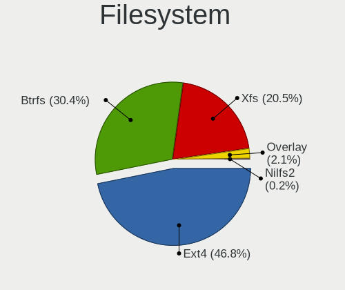
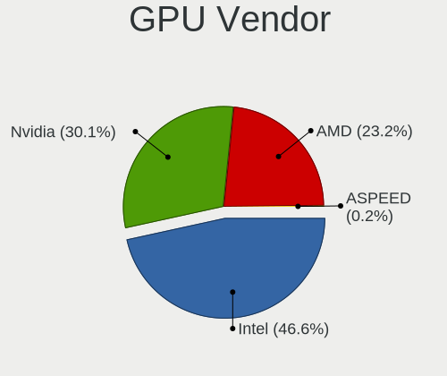
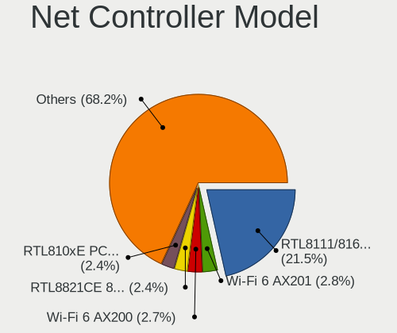
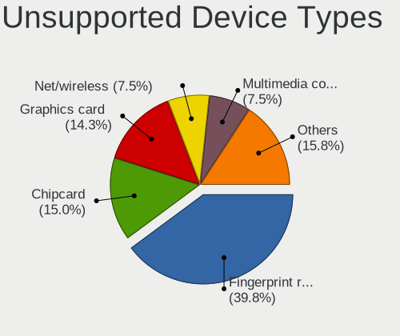

Xero - Tested Hardware & Statistics
-----------------------------------

A project to collect tested hardware configurations for Xero.

Anyone can contribute to this report by the [hw-probe](https://github.com/linuxhw/hw-probe) tool:

    sudo -E hw-probe -all -upload

Please contribute! Especially if your hardware is rare.

This is a report for all computer types. See also reports for [desktops](/Dist/Xero/Desktop/README.md) and [notebooks](/Dist/Xero/Notebook/README.md).

Contents
--------

* [ Test Cases ](#test-cases)

* [ System ](#system)
  - [ OS                       ](#os)
  - [ OS Family                ](#os-family)
  - [ Kernel                   ](#kernel)
  - [ Kernel Family            ](#kernel-family)
  - [ Kernel Major Ver.        ](#kernel-major-ver)
  - [ Arch                     ](#arch)
  - [ DE                       ](#de)
  - [ Display Server           ](#display-server)
  - [ Display Manager          ](#display-manager)
  - [ OS Lang                  ](#os-lang)
  - [ Boot Mode                ](#boot-mode)
  - [ Filesystem               ](#filesystem)
  - [ Part. scheme             ](#part-scheme)
  - [ Dual Boot with Linux/BSD ](#dual-boot-with-linuxbsd)
  - [ Dual Boot (Win)          ](#dual-boot-win)

* [ Board ](#board)
  - [ Vendor                   ](#vendor)
  - [ Model                    ](#model)
  - [ Model Family             ](#model-family)
  - [ MFG Year                 ](#mfg-year)
  - [ Form Factor              ](#form-factor)
  - [ Secure Boot              ](#secure-boot)
  - [ Coreboot                 ](#coreboot)
  - [ RAM Size                 ](#ram-size)
  - [ RAM Used                 ](#ram-used)
  - [ Total Drives             ](#total-drives)
  - [ Has CD-ROM               ](#has-cd-rom)
  - [ Has Ethernet             ](#has-ethernet)
  - [ Has WiFi                 ](#has-wifi)
  - [ Has Bluetooth            ](#has-bluetooth)

* [ Location ](#location)
  - [ Country                  ](#country)
  - [ City                     ](#city)

* [ Drives ](#drives)
  - [ Drive Vendor             ](#drive-vendor)
  - [ Drive Model              ](#drive-model)
  - [ HDD Vendor               ](#hdd-vendor)
  - [ SSD Vendor               ](#ssd-vendor)
  - [ Drive Kind               ](#drive-kind)
  - [ Drive Connector          ](#drive-connector)
  - [ Drive Size               ](#drive-size)
  - [ Space Total              ](#space-total)
  - [ Space Used               ](#space-used)
  - [ Malfunc. Drives          ](#malfunc-drives)
  - [ Malfunc. Drive Vendor    ](#malfunc-drive-vendor)
  - [ Malfunc. HDD Vendor      ](#malfunc-hdd-vendor)
  - [ Malfunc. Drive Kind      ](#malfunc-drive-kind)
  - [ Failed Drives            ](#failed-drives)
  - [ Failed Drive Vendor      ](#failed-drive-vendor)
  - [ Drive Status             ](#drive-status)

* [ Storage controller ](#storage-controller)
  - [ Storage Vendor           ](#storage-vendor)
  - [ Storage Model            ](#storage-model)
  - [ Storage Kind             ](#storage-kind)

* [ Processor ](#processor)
  - [ CPU Vendor               ](#cpu-vendor)
  - [ CPU Model                ](#cpu-model)
  - [ CPU Model Family         ](#cpu-model-family)
  - [ CPU Cores                ](#cpu-cores)
  - [ CPU Sockets              ](#cpu-sockets)
  - [ CPU Threads              ](#cpu-threads)
  - [ CPU Op-Modes             ](#cpu-op-modes)
  - [ CPU Microcode            ](#cpu-microcode)
  - [ CPU Microarch            ](#cpu-microarch)

* [ Graphics ](#graphics)
  - [ GPU Vendor               ](#gpu-vendor)
  - [ GPU Model                ](#gpu-model)
  - [ GPU Combo                ](#gpu-combo)
  - [ GPU Driver               ](#gpu-driver)
  - [ GPU Memory               ](#gpu-memory)

* [ Monitor ](#monitor)
  - [ Monitor Vendor           ](#monitor-vendor)
  - [ Monitor Model            ](#monitor-model)
  - [ Monitor Resolution       ](#monitor-resolution)
  - [ Monitor Diagonal         ](#monitor-diagonal)
  - [ Monitor Width            ](#monitor-width)
  - [ Aspect Ratio             ](#aspect-ratio)
  - [ Monitor Area             ](#monitor-area)
  - [ Pixel Density            ](#pixel-density)
  - [ Multiple Monitors        ](#multiple-monitors)

* [ Network ](#network)
  - [ Net Controller Vendor    ](#net-controller-vendor)
  - [ Net Controller Model     ](#net-controller-model)
  - [ Wireless Vendor          ](#wireless-vendor)
  - [ Wireless Model           ](#wireless-model)
  - [ Ethernet Vendor          ](#ethernet-vendor)
  - [ Ethernet Model           ](#ethernet-model)
  - [ Net Controller Kind      ](#net-controller-kind)
  - [ Used Controller          ](#used-controller)
  - [ NICs                     ](#nics)
  - [ IPv6                     ](#ipv6)

* [ Bluetooth ](#bluetooth)
  - [ Bluetooth Vendor         ](#bluetooth-vendor)
  - [ Bluetooth Model          ](#bluetooth-model)

* [ Sound ](#sound)
  - [ Sound Vendor             ](#sound-vendor)
  - [ Sound Model              ](#sound-model)

* [ Memory ](#memory)
  - [ Memory Vendor            ](#memory-vendor)
  - [ Memory Model             ](#memory-model)
  - [ Memory Kind              ](#memory-kind)
  - [ Memory Form Factor       ](#memory-form-factor)
  - [ Memory Size              ](#memory-size)
  - [ Memory Speed             ](#memory-speed)

* [ Printers & scanners ](#printers--scanners)
  - [ Printer Vendor           ](#printer-vendor)
  - [ Printer Model            ](#printer-model)
  - [ Scanner Vendor           ](#scanner-vendor)
  - [ Scanner Model            ](#scanner-model)

* [ Camera ](#camera)
  - [ Camera Vendor            ](#camera-vendor)
  - [ Camera Model             ](#camera-model)

* [ Security ](#security)
  - [ Fingerprint Vendor       ](#fingerprint-vendor)
  - [ Fingerprint Model        ](#fingerprint-model)
  - [ Chipcard Vendor          ](#chipcard-vendor)
  - [ Chipcard Model           ](#chipcard-model)

* [ Unsupported ](#unsupported)
  - [ Unsupported Devices      ](#unsupported-devices)
  - [ Unsupported Device Types ](#unsupported-device-types)

Test Cases
----------

Total: 166

| Vendor        | Model                       | Form-Factor | Probe                                                      | Date         |
|---------------|-----------------------------|-------------|------------------------------------------------------------|--------------|
| Biostar       | H110MHV3                    | Desktop     | [95b25ba480](https://linux-hardware.org/?probe=95b25ba480) | Apr 29, 2023 |
| Samsung       | 950QED                      | Convertible | [f2568c7949](https://linux-hardware.org/?probe=f2568c7949) | Apr 07, 2023 |
| Lenovo        | Legion 5 15ACH6H 82JU       | Notebook    | [ba6e80b2b7](https://linux-hardware.org/?probe=ba6e80b2b7) | Apr 02, 2023 |
| Lenovo        | Legion 5 15ACH6H 82JU       | Notebook    | [195ab3d907](https://linux-hardware.org/?probe=195ab3d907) | Apr 02, 2023 |
| ASUSTek       | A68HM-PLUS                  | Desktop     | [520ad2ca86](https://linux-hardware.org/?probe=520ad2ca86) | Mar 31, 2023 |
| Lenovo        | ThinkPad T440 20B7A0CYMH    | Notebook    | [428491a9d5](https://linux-hardware.org/?probe=428491a9d5) | Mar 29, 2023 |
| HP            | 8437                        | Desktop     | [cdc32d8d8b](https://linux-hardware.org/?probe=cdc32d8d8b) | Mar 25, 2023 |
| HP            | 8437                        | Desktop     | [6fbb459a03](https://linux-hardware.org/?probe=6fbb459a03) | Mar 25, 2023 |
| HP            | Victus by Laptop 16-e0xx... | Notebook    | [f8cd7d94b2](https://linux-hardware.org/?probe=f8cd7d94b2) | Mar 23, 2023 |
| Dell          | G5 5500                     | Notebook    | [f9b3b5d852](https://linux-hardware.org/?probe=f9b3b5d852) | Mar 19, 2023 |
| Lenovo        | IdeaPad S340-15IIL 81VW     | Notebook    | [90ef6ca2b7](https://linux-hardware.org/?probe=90ef6ca2b7) | Mar 18, 2023 |
| Lenovo        | IdeaPad S340-15IIL 81VW     | Notebook    | [b769745990](https://linux-hardware.org/?probe=b769745990) | Mar 18, 2023 |
| ASUSTek       | A68HM-PLUS                  | Desktop     | [5d307f2d26](https://linux-hardware.org/?probe=5d307f2d26) | Mar 18, 2023 |
| Dell          | Latitude 5420               | Notebook    | [318da7f6c0](https://linux-hardware.org/?probe=318da7f6c0) | Mar 18, 2023 |
| ASUSTek       | TUF Gaming FX505DY_FX505... | Notebook    | [d1bf2f0a8b](https://linux-hardware.org/?probe=d1bf2f0a8b) | Mar 12, 2023 |
| Apple         | MacBookPro11,3              | Notebook    | [bccc889328](https://linux-hardware.org/?probe=bccc889328) | Mar 10, 2023 |
| Lenovo        | ThinkPad P51 20HJS11Y00     | Notebook    | [0843074b87](https://linux-hardware.org/?probe=0843074b87) | Mar 09, 2023 |
| Lenovo        | IdeaPad S540-15IML D 81N... | Notebook    | [31e144de96](https://linux-hardware.org/?probe=31e144de96) | Mar 08, 2023 |
| Acer          | Aspire GX-281               | Desktop     | [d318df6931](https://linux-hardware.org/?probe=d318df6931) | Mar 04, 2023 |
| JINGSHA       | Unknown                     | Desktop     | [c8bd846b63](https://linux-hardware.org/?probe=c8bd846b63) | Feb 26, 2023 |
| Dell          | 0G3HR7 A00                  | Desktop     | [33723c8b80](https://linux-hardware.org/?probe=33723c8b80) | Feb 25, 2023 |
| Dell          | Inspiron 3505               | Notebook    | [324020ca8b](https://linux-hardware.org/?probe=324020ca8b) | Feb 24, 2023 |
| MSI           | MAG B550 TOMAHAWK           | Desktop     | [503fe663b4](https://linux-hardware.org/?probe=503fe663b4) | Feb 20, 2023 |
| ASUSTek       | ROG STRIX Z370-F GAMING     | Desktop     | [d76b048134](https://linux-hardware.org/?probe=d76b048134) | Feb 17, 2023 |
| Lenovo        | ThinkPad X1 Carbon Gen 9... | Notebook    | [efd9f878d2](https://linux-hardware.org/?probe=efd9f878d2) | Feb 12, 2023 |
| Lenovo        | ThinkPad X1 Carbon Gen 9... | Notebook    | [3c2d4cf289](https://linux-hardware.org/?probe=3c2d4cf289) | Feb 02, 2023 |
| Lenovo        | ThinkPad X1 Carbon Gen 9... | Notebook    | [0de8121880](https://linux-hardware.org/?probe=0de8121880) | Feb 01, 2023 |
| Lenovo        | ThinkPad X1 Carbon Gen 9... | Notebook    | [f39ab69b74](https://linux-hardware.org/?probe=f39ab69b74) | Feb 01, 2023 |
| HP            | ProBook 6565b               | Notebook    | [0ef00f6bcc](https://linux-hardware.org/?probe=0ef00f6bcc) | Jan 25, 2023 |
| HP            | 828A                        | Desktop     | [5f430ba8d1](https://linux-hardware.org/?probe=5f430ba8d1) | Jan 19, 2023 |
| ASUSTek       | ASUS TUF Gaming F15 FX50... | Notebook    | [5661d09dd0](https://linux-hardware.org/?probe=5661d09dd0) | Jan 15, 2023 |
| HP            | 245 G7 Notebook PC          | Notebook    | [3997d98a9a](https://linux-hardware.org/?probe=3997d98a9a) | Jan 11, 2023 |
| HUAWEI        | BOM-WXX9                    | Notebook    | [21fcd391f1](https://linux-hardware.org/?probe=21fcd391f1) | Jan 08, 2023 |
| HP            | 86EE                        | All in one  | [1fc671302e](https://linux-hardware.org/?probe=1fc671302e) | Jan 06, 2023 |
| Lenovo        | IdeaPad 3 14IGL05 81WH      | Notebook    | [86cf09380a](https://linux-hardware.org/?probe=86cf09380a) | Jan 02, 2023 |
| Pegatron      | 2AF0                        | Desktop     | [77768feff6](https://linux-hardware.org/?probe=77768feff6) | Jan 01, 2023 |
| ASUSTek       | X540LA                      | Notebook    | [65f5548781](https://linux-hardware.org/?probe=65f5548781) | Dec 30, 2022 |
| HUAWEI        | BOM-WXX9                    | Notebook    | [fb1d454bc2](https://linux-hardware.org/?probe=fb1d454bc2) | Dec 29, 2022 |
| HUAWEI        | BOM-WXX9                    | Notebook    | [62010fe267](https://linux-hardware.org/?probe=62010fe267) | Dec 29, 2022 |
| HP            | Pavilion Gaming Laptop 1... | Notebook    | [6b34107dcf](https://linux-hardware.org/?probe=6b34107dcf) | Dec 21, 2022 |
| HP            | ZBook 15 G4                 | Notebook    | [669d7e74a2](https://linux-hardware.org/?probe=669d7e74a2) | Dec 19, 2022 |
| HP            | ZBook 15 G4                 | Notebook    | [91391127d1](https://linux-hardware.org/?probe=91391127d1) | Dec 18, 2022 |
| HP            | Pavilion Gaming Laptop 1... | Notebook    | [3111a63a09](https://linux-hardware.org/?probe=3111a63a09) | Dec 16, 2022 |
| Lenovo        | ThinkPad T490s 20NX001KM... | Notebook    | [49f30d3eee](https://linux-hardware.org/?probe=49f30d3eee) | Dec 06, 2022 |
| ASUSTek       | ROG Zephyrus G14 GA401II... | Notebook    | [16f086de33](https://linux-hardware.org/?probe=16f086de33) | Nov 25, 2022 |
| Medion        | P6816                       | Notebook    | [3aadacefe7](https://linux-hardware.org/?probe=3aadacefe7) | Nov 17, 2022 |
| ASUSTek       | ROG STRIX X570-F GAMING     | Desktop     | [f074ef2e7c](https://linux-hardware.org/?probe=f074ef2e7c) | Nov 15, 2022 |
| Dell          | Latitude E6530              | Notebook    | [c87c9abe22](https://linux-hardware.org/?probe=c87c9abe22) | Nov 14, 2022 |
| Toshiba       | TECRA A11                   | Notebook    | [ba91b9d331](https://linux-hardware.org/?probe=ba91b9d331) | Nov 09, 2022 |
| Lenovo        | ThinkPad L450 20DT0000GE    | Notebook    | [1a925e0302](https://linux-hardware.org/?probe=1a925e0302) | Nov 06, 2022 |
| ASUSTek       | ROG STRIX X570-F GAMING     | Desktop     | [711e95b72e](https://linux-hardware.org/?probe=711e95b72e) | Nov 02, 2022 |
| ASUSTek       | ROG STRIX X570-F GAMING     | Desktop     | [ff0c19c661](https://linux-hardware.org/?probe=ff0c19c661) | Nov 02, 2022 |
| ASUSTek       | VivoBook_ASUSLaptop X421... | Notebook    | [4cd7aa6350](https://linux-hardware.org/?probe=4cd7aa6350) | Nov 01, 2022 |
| ASUSTek       | K53SJ                       | Notebook    | [8c85e545f2](https://linux-hardware.org/?probe=8c85e545f2) | Oct 23, 2022 |
| Gigabyte      | A320M-S2H-CF                | Desktop     | [bcf4fa1baf](https://linux-hardware.org/?probe=bcf4fa1baf) | Oct 18, 2022 |
| Dell          | 0GY6Y8 A02                  | Desktop     | [07b256f333](https://linux-hardware.org/?probe=07b256f333) | Oct 17, 2022 |
| Dell          | 0GY6Y8 A02                  | Desktop     | [fc1ec464bf](https://linux-hardware.org/?probe=fc1ec464bf) | Oct 17, 2022 |
| ASUSTek       | ROG STRIX X570-F GAMING     | Desktop     | [bf0e112f9a](https://linux-hardware.org/?probe=bf0e112f9a) | Oct 16, 2022 |
| ASUSTek       | PRIME B250-PLUS             | Desktop     | [00ab764924](https://linux-hardware.org/?probe=00ab764924) | Oct 15, 2022 |
| ASUSTek       | ROG STRIX X570-F GAMING     | Desktop     | [e037086b30](https://linux-hardware.org/?probe=e037086b30) | Oct 14, 2022 |
| ASUSTek       | ROG Strix G513IC_G513IC     | Notebook    | [ef1974cfc8](https://linux-hardware.org/?probe=ef1974cfc8) | Oct 10, 2022 |
| HP            | Laptop 15s-fq2xxx           | Notebook    | [69e60dfe44](https://linux-hardware.org/?probe=69e60dfe44) | Oct 07, 2022 |
| Lenovo        | ThinkPad Yoga 370 20JJS0... | Convertible | [a11de13c4f](https://linux-hardware.org/?probe=a11de13c4f) | Oct 04, 2022 |
| Lenovo        | ThinkPad Yoga 370 20JJS0... | Convertible | [6de76ddb0e](https://linux-hardware.org/?probe=6de76ddb0e) | Oct 04, 2022 |
| ASUSTek       | ZenBook UX433FN_UX433FN     | Notebook    | [a7764ad0f6](https://linux-hardware.org/?probe=a7764ad0f6) | Oct 03, 2022 |
| ASUSTek       | ROG CROSSHAIR VIII DARK ... | Desktop     | [9931b35717](https://linux-hardware.org/?probe=9931b35717) | Sep 24, 2022 |
| MSI           | Katana GF66 11UE            | Notebook    | [36b2cba297](https://linux-hardware.org/?probe=36b2cba297) | Sep 05, 2022 |
| Lenovo        | ThinkPad X1 Carbon Gen 9... | Notebook    | [b28edd3886](https://linux-hardware.org/?probe=b28edd3886) | Aug 26, 2022 |
| Lenovo        | ThinkPad X1 Carbon Gen 9... | Notebook    | [97770c5716](https://linux-hardware.org/?probe=97770c5716) | Aug 26, 2022 |
| ASUSTek       | ROG STRIX B450-F GAMING     | Desktop     | [4c95b1bccf](https://linux-hardware.org/?probe=4c95b1bccf) | Aug 22, 2022 |
| Lenovo        | ThinkPad T430s 2356FG9      | Notebook    | [9a10c152af](https://linux-hardware.org/?probe=9a10c152af) | Aug 17, 2022 |
| Aquarius      | NS585                       | Notebook    | [db9cbd5688](https://linux-hardware.org/?probe=db9cbd5688) | Aug 17, 2022 |
| Gigabyte      | B460M DS3H V2               | Desktop     | [2522ff1530](https://linux-hardware.org/?probe=2522ff1530) | Aug 13, 2022 |
| ASUSTek       | P7P55 LX                    | Desktop     | [8211ccc6cc](https://linux-hardware.org/?probe=8211ccc6cc) | Aug 11, 2022 |
| Unknown       | Unknown                     | Desktop     | [b73e5f9cbf](https://linux-hardware.org/?probe=b73e5f9cbf) | Aug 08, 2022 |
| Unknown       | Unknown                     | Desktop     | [f483092edf](https://linux-hardware.org/?probe=f483092edf) | Aug 07, 2022 |
| ASUSTek       | TUF Gaming X570-PLUS        | Desktop     | [a0507fae02](https://linux-hardware.org/?probe=a0507fae02) | Jul 31, 2022 |
| Lenovo        | IdeaPad S145-15AST 81N3     | Notebook    | [7c46c8f737](https://linux-hardware.org/?probe=7c46c8f737) | Jul 15, 2022 |
| ASUSTek       | G551JM                      | Notebook    | [599c7b9eae](https://linux-hardware.org/?probe=599c7b9eae) | Jul 14, 2022 |
| ASUSTek       | G551JM                      | Notebook    | [9f4536df1c](https://linux-hardware.org/?probe=9f4536df1c) | Jul 14, 2022 |
| ASRock        | AB350 Pro4                  | Desktop     | [7049f819f0](https://linux-hardware.org/?probe=7049f819f0) | Jun 30, 2022 |
| HP            | 3396                        | Desktop     | [00782afa06](https://linux-hardware.org/?probe=00782afa06) | Jun 22, 2022 |
| ASUSTek       | UX303LN                     | Notebook    | [9ce42e1b01](https://linux-hardware.org/?probe=9ce42e1b01) | Jun 12, 2022 |
| ASUSTek       | ROG STRIX B450-F GAMING     | Desktop     | [8109a04ffa](https://linux-hardware.org/?probe=8109a04ffa) | Jun 12, 2022 |
| BESSTAR Te... | ATB15                       | Server      | [d6e47a7c18](https://linux-hardware.org/?probe=d6e47a7c18) | Jun 12, 2022 |
| ASUSTek       | ROG STRIX B450-F GAMING     | Desktop     | [8a7401e54a](https://linux-hardware.org/?probe=8a7401e54a) | Jun 11, 2022 |
| Acer          | Aspire XC-886 V:2.0         | Desktop     | [2fe8cdaf93](https://linux-hardware.org/?probe=2fe8cdaf93) | May 31, 2022 |
| Dell          | Inspiron 1545               | Notebook    | [ce0e24a314](https://linux-hardware.org/?probe=ce0e24a314) | May 28, 2022 |
| Lenovo        | IdeaPad 330-17IKB 81DM      | Notebook    | [53475a6004](https://linux-hardware.org/?probe=53475a6004) | May 24, 2022 |
| ASUSTek       | VivoBook_ASUSLaptop X350... | Notebook    | [80d32848bf](https://linux-hardware.org/?probe=80d32848bf) | May 21, 2022 |
| ASUSTek       | ROG Maximus X HERO          | Desktop     | [3ddad532a9](https://linux-hardware.org/?probe=3ddad532a9) | May 08, 2022 |
| Dell          | Inspiron 7786               | Convertible | [0ef12447d9](https://linux-hardware.org/?probe=0ef12447d9) | May 02, 2022 |
| Dell          | Precision M3800             | Notebook    | [7b63874768](https://linux-hardware.org/?probe=7b63874768) | Apr 25, 2022 |
| Dell          | Precision M3800             | Notebook    | [fbabacd835](https://linux-hardware.org/?probe=fbabacd835) | Apr 24, 2022 |
| Lenovo        | ThinkPad X230 2325HR9       | Notebook    | [a9d9d3fbb2](https://linux-hardware.org/?probe=a9d9d3fbb2) | Apr 21, 2022 |
| MSI           | Z170-A PRO                  | Desktop     | [db5ab86328](https://linux-hardware.org/?probe=db5ab86328) | Apr 11, 2022 |
| Acer          | Aspire A515-54G             | Notebook    | [52b660d8fb](https://linux-hardware.org/?probe=52b660d8fb) | Apr 11, 2022 |
| MSI           | Z170-A PRO                  | Desktop     | [3bd5bb8d08](https://linux-hardware.org/?probe=3bd5bb8d08) | Apr 10, 2022 |
| Dell          | Precision M3800             | Notebook    | [1ef57b39a7](https://linux-hardware.org/?probe=1ef57b39a7) | Apr 10, 2022 |
| ASUSTek       | TUF Gaming X570-PLUS        | Desktop     | [8d251b1b2a](https://linux-hardware.org/?probe=8d251b1b2a) | Apr 03, 2022 |
| Dell          | Precision M3800             | Notebook    | [9fc15d1ae6](https://linux-hardware.org/?probe=9fc15d1ae6) | Mar 31, 2022 |
| HP            | 843B                        | Desktop     | [a88ff7cf5c](https://linux-hardware.org/?probe=a88ff7cf5c) | Mar 27, 2022 |
| Pegatron      | 2AC2                        | Desktop     | [d3c82e973b](https://linux-hardware.org/?probe=d3c82e973b) | Mar 25, 2022 |
| ASUSTek       | Maximus IX HERO             | Desktop     | [745cc1d638](https://linux-hardware.org/?probe=745cc1d638) | Mar 25, 2022 |
| MSI           | GF63 Thin 9SCX              | Notebook    | [4501fa1556](https://linux-hardware.org/?probe=4501fa1556) | Mar 25, 2022 |
| Dell          | Latitude 7480               | Notebook    | [bf00ec6a76](https://linux-hardware.org/?probe=bf00ec6a76) | Mar 23, 2022 |
| ASUSTek       | Maximus IX HERO             | Desktop     | [8eb98db533](https://linux-hardware.org/?probe=8eb98db533) | Mar 22, 2022 |
| HUAWEI        | WRT-WX9                     | Notebook    | [70ec26bed6](https://linux-hardware.org/?probe=70ec26bed6) | Mar 22, 2022 |
| ASUSTek       | ROG CROSSHAIR VIII HERO     | Desktop     | [13cdf54c81](https://linux-hardware.org/?probe=13cdf54c81) | Mar 21, 2022 |
| Dell          | Latitude 7480               | Notebook    | [faddba28a8](https://linux-hardware.org/?probe=faddba28a8) | Mar 19, 2022 |
| Apple         | MacBookAir6,2               | Notebook    | [b71110144d](https://linux-hardware.org/?probe=b71110144d) | Mar 19, 2022 |
| HP            | Laptop 15-da0xxx            | Notebook    | [bb9074ccdf](https://linux-hardware.org/?probe=bb9074ccdf) | Mar 18, 2022 |
| Lenovo        | IdeaPad 3 15IML05 81WR      | Notebook    | [918c951cd1](https://linux-hardware.org/?probe=918c951cd1) | Mar 12, 2022 |
| ASUSTek       | TUF Gaming B550M-PLUS       | Desktop     | [639e7361ef](https://linux-hardware.org/?probe=639e7361ef) | Mar 12, 2022 |
| Lenovo        | IdeaPad S145-15IIL 81W8     | Notebook    | [e251c9f079](https://linux-hardware.org/?probe=e251c9f079) | Mar 11, 2022 |
| MSI           | Z170A PC MATE               | Desktop     | [181e014823](https://linux-hardware.org/?probe=181e014823) | Mar 08, 2022 |
| Gigabyte      | Z170X-UD3-CF                | Desktop     | [3ec7a7f643](https://linux-hardware.org/?probe=3ec7a7f643) | Mar 06, 2022 |
| Dell          | Venue 11 Pro 7130 vPro      | Notebook    | [57b302b119](https://linux-hardware.org/?probe=57b302b119) | Mar 05, 2022 |
| Lenovo        | ThinkPad T460 20FMS1XX00    | Notebook    | [78e82c6674](https://linux-hardware.org/?probe=78e82c6674) | Feb 24, 2022 |
| Dell          | Latitude E6430              | Notebook    | [e1de4e80fe](https://linux-hardware.org/?probe=e1de4e80fe) | Feb 15, 2022 |
| Lenovo        | Legion 5 15ARH05H 82B1      | Notebook    | [a3c5f00a2a](https://linux-hardware.org/?probe=a3c5f00a2a) | Feb 10, 2022 |
| Lenovo        | Legion 5 15ARH05H 82B1      | Notebook    | [e53fb31614](https://linux-hardware.org/?probe=e53fb31614) | Feb 10, 2022 |
| Lenovo        | Legion Y740-15IRHg 81UH     | Notebook    | [b0cc5e0cbc](https://linux-hardware.org/?probe=b0cc5e0cbc) | Jan 29, 2022 |
| ASUSTek       | P5Q PRO TURBO               | Desktop     | [83ca29c9c8](https://linux-hardware.org/?probe=83ca29c9c8) | Jan 28, 2022 |
| Acer          | Aspire A315-58G             | Notebook    | [cb4f253c1c](https://linux-hardware.org/?probe=cb4f253c1c) | Jan 28, 2022 |
| Dell          | Latitude E6520              | Notebook    | [ee96960cec](https://linux-hardware.org/?probe=ee96960cec) | Jan 25, 2022 |
| Lenovo        | Yoga 710-15IKB 80V5         | Convertible | [3d5fe9fc42](https://linux-hardware.org/?probe=3d5fe9fc42) | Jan 22, 2022 |
| HP            | Laptop 15s-eq0xxx           | Notebook    | [0df160c245](https://linux-hardware.org/?probe=0df160c245) | Jan 21, 2022 |
| ASUSTek       | TUF Gaming B550M-PLUS       | Desktop     | [230373b3ff](https://linux-hardware.org/?probe=230373b3ff) | Jan 09, 2022 |
| Lenovo        | Legion Y540-15IRH-PG0 81... | Notebook    | [3df8a1c560](https://linux-hardware.org/?probe=3df8a1c560) | Jan 08, 2022 |
| HP            | 1906                        | Desktop     | [5f8fe7cb20](https://linux-hardware.org/?probe=5f8fe7cb20) | Jan 06, 2022 |
| ASUSTek       | TUF Gaming X570-PLUS        | Desktop     | [793bfa4f40](https://linux-hardware.org/?probe=793bfa4f40) | Jan 04, 2022 |
| HP            | 2179                        | Desktop     | [79bac7ce1b](https://linux-hardware.org/?probe=79bac7ce1b) | Jan 01, 2022 |
| ASUSTek       | TUF B360M-PLUS GAMING/BR    | Desktop     | [512091cd1c](https://linux-hardware.org/?probe=512091cd1c) | Dec 30, 2021 |
| Dell          | Vostro 3590                 | Notebook    | [9e77a2584c](https://linux-hardware.org/?probe=9e77a2584c) | Dec 30, 2021 |
| HP            | 2179                        | Desktop     | [9b6358ce37](https://linux-hardware.org/?probe=9b6358ce37) | Dec 30, 2021 |
| ASUSTek       | ASUS EXPERTBOOK B9400CEA... | Notebook    | [78e3fbdf6a](https://linux-hardware.org/?probe=78e3fbdf6a) | Dec 28, 2021 |
| HP            | Notebook                    | Notebook    | [c14ea64659](https://linux-hardware.org/?probe=c14ea64659) | Dec 23, 2021 |
| ASRock        | X570 Taichi                 | Desktop     | [5c2c86f287](https://linux-hardware.org/?probe=5c2c86f287) | Dec 23, 2021 |
| ASUSTek       | X510UNR                     | Notebook    | [0733a05806](https://linux-hardware.org/?probe=0733a05806) | Dec 21, 2021 |
| ASUSTek       | ASUS EXPERTBOOK B9400CEA... | Notebook    | [b4425de4a6](https://linux-hardware.org/?probe=b4425de4a6) | Dec 17, 2021 |
| ASUSTek       | ASUS TUF Gaming F15 FX50... | Notebook    | [6f3bd18b3f](https://linux-hardware.org/?probe=6f3bd18b3f) | Dec 06, 2021 |
| Pegatron      | D15K                        | Notebook    | [eaeaad8d39](https://linux-hardware.org/?probe=eaeaad8d39) | Nov 29, 2021 |
| ASUSTek       | TUF Gaming X570-PLUS        | Desktop     | [728b23aa46](https://linux-hardware.org/?probe=728b23aa46) | Nov 26, 2021 |
| ASUSTek       | PRIME A320M-K               | Desktop     | [9e9b6fd944](https://linux-hardware.org/?probe=9e9b6fd944) | Nov 21, 2021 |
| MSI           | GP73 Leopard 8RD            | Notebook    | [5bafb43f78](https://linux-hardware.org/?probe=5bafb43f78) | Nov 21, 2021 |
| Acer          | Aspire A315-58G             | Notebook    | [911895fcf2](https://linux-hardware.org/?probe=911895fcf2) | Nov 19, 2021 |
| Acer          | Aspire A315-58G             | Notebook    | [5748b3cd05](https://linux-hardware.org/?probe=5748b3cd05) | Nov 12, 2021 |
| Lenovo        | ThinkPad W530 24384CU       | Notebook    | [d18d3495e0](https://linux-hardware.org/?probe=d18d3495e0) | Nov 05, 2021 |
| ASUSTek       | TUF Z390-PLUS GAMING        | Desktop     | [4877535f8b](https://linux-hardware.org/?probe=4877535f8b) | Nov 03, 2021 |
| MSI           | Z370 GAMING PLUS            | Desktop     | [8dd5924480](https://linux-hardware.org/?probe=8dd5924480) | Oct 31, 2021 |
| Acer          | Aspire A315-58G             | Notebook    | [905fce5118](https://linux-hardware.org/?probe=905fce5118) | Oct 29, 2021 |
| HP            | ENVY Sleekbook 4            | Notebook    | [ebea056239](https://linux-hardware.org/?probe=ebea056239) | Oct 29, 2021 |
| ASUSTek       | VivoBook_ASUSLaptop X509... | Notebook    | [2a54689fb3](https://linux-hardware.org/?probe=2a54689fb3) | Oct 24, 2021 |
| ASUSTek       | VivoBook_ASUS Laptop E41... | Notebook    | [fb95cbb063](https://linux-hardware.org/?probe=fb95cbb063) | Oct 19, 2021 |
| Lenovo        | IdeaPad 5 15ITL05 82FG      | Notebook    | [6cd76dfa2a](https://linux-hardware.org/?probe=6cd76dfa2a) | Oct 13, 2021 |
| ASUSTek       | ASUS TUF Gaming F15 FX50... | Notebook    | [e3a8d1ca32](https://linux-hardware.org/?probe=e3a8d1ca32) | Oct 11, 2021 |
| ASUSTek       | ASUS TUF Gaming F15 FX50... | Notebook    | [c7c4a74bb8](https://linux-hardware.org/?probe=c7c4a74bb8) | Oct 11, 2021 |
| ASUSTek       | ASUS TUF Gaming F15 FX50... | Notebook    | [68865693c7](https://linux-hardware.org/?probe=68865693c7) | Oct 09, 2021 |
| Dell          | 0XC7MM A01                  | Desktop     | [390c5408b2](https://linux-hardware.org/?probe=390c5408b2) | Oct 05, 2021 |
| Lenovo        | Y520-15IKBN 80WK            | Notebook    | [e804a59920](https://linux-hardware.org/?probe=e804a59920) | Oct 02, 2021 |
| ASRock        | B450M Pro4                  | Desktop     | [a198e8517a](https://linux-hardware.org/?probe=a198e8517a) | Oct 01, 2021 |
| ASRock        | X570 Taichi                 | Desktop     | [50fd919991](https://linux-hardware.org/?probe=50fd919991) | Aug 29, 2021 |
| Gigabyte      | X570 AORUS MASTER           | Desktop     | [a3c6fe4037](https://linux-hardware.org/?probe=a3c6fe4037) | Jul 24, 2021 |
| ASRock        | X570 Taichi                 | Desktop     | [57d19e2c3a](https://linux-hardware.org/?probe=57d19e2c3a) | May 19, 2021 |
| Acer          | FIH57                       | Desktop     | [9c3e383ea5](https://linux-hardware.org/?probe=9c3e383ea5) | Apr 30, 2021 |

System
------

OS
--

Installed operating systems

| Name         | Computers | Percent |
|--------------|-----------|---------|
| Xero Rolling | 112       | 89.6%   |
| Xero         | 13        | 10.4%   |

OS Family
---------

OS without a version

| Name | Computers | Percent |
|------|-----------|---------|
| Xero | 124       | 100%    |

Kernel
------

Version of the Linux kernel

| Version               | Computers | Percent |
|-----------------------|-----------|---------|
| 5.16.15-arch1-1       | 6         | 4.44%   |
| 6.1.12-arch1-1        | 5         | 3.7%    |
| 6.2.6-arch1-1         | 4         | 2.96%   |
| 6.0.12-arch1-1        | 4         | 2.96%   |
| 5.18.16-arch1-1       | 4         | 2.96%   |
| 6.1.1-arch1-1         | 3         | 2.22%   |
| 5.17.9-arch1-1        | 3         | 2.22%   |
| 5.16.2-arch1-1        | 3         | 2.22%   |
| 5.16.1-arch1-1        | 3         | 2.22%   |
| 5.15.33-1-lts         | 3         | 2.22%   |
| 5.14.14-arch1-1       | 3         | 2.22%   |
| 6.2.8-arch1-1         | 2         | 1.48%   |
| 6.2.7-arch1-1         | 2         | 1.48%   |
| 6.0.7-arch1-1         | 2         | 1.48%   |
| 5.19.9-arch1-1        | 2         | 1.48%   |
| 5.19.13-arch1-1       | 2         | 1.48%   |
| 5.19.12-arch1-1       | 2         | 1.48%   |
| 5.18.3-arch1-1        | 2         | 1.48%   |
| 5.18.11-arch1-1       | 2         | 1.48%   |
| 5.17.5-arch1-1        | 2         | 1.48%   |
| 5.17.1-arch1-1        | 2         | 1.48%   |
| 5.16.8-arch1-1        | 2         | 1.48%   |
| 5.16.16-arch1-1       | 2         | 1.48%   |
| 5.16.13-arch1-1       | 2         | 1.48%   |
| 5.16.12-arch1-1       | 2         | 1.48%   |
| 5.15.10-arch1-1       | 2         | 1.48%   |
| 5.14.8-zen1-1-zen     | 2         | 1.48%   |
| 6.2.9-arch1-1         | 1         | 0.74%   |
| 6.2.2-arch2-1         | 1         | 0.74%   |
| 6.2.12-arch1-1        | 1         | 0.74%   |
| 6.2.1-x64v1-xanmod1-1 | 1         | 0.74%   |
| 6.1.8-arch1-1         | 1         | 0.74%   |
| 6.1.7-arch1-1         | 1         | 0.74%   |
| 6.1.6-arch1-3         | 1         | 0.74%   |
| 6.1.6-arch1-1         | 1         | 0.74%   |
| 6.1.4-arch1-1         | 1         | 0.74%   |
| 6.1.3-zen1-1-zen      | 1         | 0.74%   |
| 6.1.15-1-lts          | 1         | 0.74%   |
| 6.0.9-arch1-1         | 1         | 0.74%   |
| 6.0.8-zen1-1-zen      | 1         | 0.74%   |

Kernel Family
-------------

Linux kernel without a distro release

| Version | Computers | Percent |
|---------|-----------|---------|
| 5.16.15 | 6         | 4.44%   |
| 6.1.12  | 5         | 3.7%    |
| 6.2.6   | 4         | 2.96%   |
| 6.0.12  | 4         | 2.96%   |
| 5.18.16 | 4         | 2.96%   |
| 5.14.14 | 4         | 2.96%   |
| 6.1.1   | 3         | 2.22%   |
| 5.19.13 | 3         | 2.22%   |
| 5.17.9  | 3         | 2.22%   |
| 5.16.2  | 3         | 2.22%   |
| 5.16.16 | 3         | 2.22%   |
| 5.16.1  | 3         | 2.22%   |
| 5.15.33 | 3         | 2.22%   |
| 5.15.12 | 3         | 2.22%   |
| 5.14.8  | 3         | 2.22%   |
| 5.14.16 | 3         | 2.22%   |
| 6.2.8   | 2         | 1.48%   |
| 6.2.7   | 2         | 1.48%   |
| 6.1.6   | 2         | 1.48%   |
| 6.0.8   | 2         | 1.48%   |
| 6.0.7   | 2         | 1.48%   |
| 6.0.6   | 2         | 1.48%   |
| 6.0.2   | 2         | 1.48%   |
| 5.19.9  | 2         | 1.48%   |
| 5.19.12 | 2         | 1.48%   |
| 5.18.3  | 2         | 1.48%   |
| 5.18.11 | 2         | 1.48%   |
| 5.17.5  | 2         | 1.48%   |
| 5.17.1  | 2         | 1.48%   |
| 5.16.8  | 2         | 1.48%   |
| 5.16.13 | 2         | 1.48%   |
| 5.16.12 | 2         | 1.48%   |
| 5.15.13 | 2         | 1.48%   |
| 5.15.11 | 2         | 1.48%   |
| 5.15.10 | 2         | 1.48%   |
| 6.2.9   | 1         | 0.74%   |
| 6.2.2   | 1         | 0.74%   |
| 6.2.12  | 1         | 0.74%   |
| 6.2.1   | 1         | 0.74%   |
| 6.1.8   | 1         | 0.74%   |

Kernel Major Ver.
-----------------

Linux kernel major version

| Version | Computers | Percent |
|---------|-----------|---------|
| 5.16    | 23        | 17.42%  |
| 5.15    | 18        | 13.64%  |
| 6.0     | 15        | 11.36%  |
| 6.1     | 14        | 10.61%  |
| 5.14    | 13        | 9.85%   |
| 6.2     | 12        | 9.09%   |
| 5.19    | 11        | 8.33%   |
| 5.18    | 11        | 8.33%   |
| 5.17    | 8         | 6.06%   |
| 5.10    | 3         | 2.27%   |
| 5.13    | 2         | 1.52%   |
| 5.12    | 1         | 0.76%   |
| 5.11    | 1         | 0.76%   |

Arch
----

OS architecture (x86_64, i586, etc.)

| Name   | Computers | Percent |
|--------|-----------|---------|
| x86_64 | 124       | 100%    |

DE
--

Desktop Environment

| Name   | Computers | Percent |
|--------|-----------|---------|
| KDE5   | 116       | 92.06%  |
| XFCE   | 4         | 3.17%   |
| GNOME  | 4         | 3.17%   |
| LeftWM | 1         | 0.79%   |
| KDE    | 1         | 0.79%   |

Display Server
--------------

X11 or Wayland

| Name    | Computers | Percent |
|---------|-----------|---------|
| X11     | 110       | 88%     |
| Wayland | 13        | 10.4%   |
| Tty     | 2         | 1.6%    |

Display Manager
---------------

SDDM, LightDM, etc.

| Name    | Computers | Percent |
|---------|-----------|---------|
| SDDM    | 86        | 67.19%  |
| Unknown | 24        | 18.75%  |
| LightDM | 15        | 11.72%  |
| GDM     | 2         | 1.56%   |
| TDM     | 1         | 0.78%   |

OS Lang
-------

Language

| Lang  | Computers | Percent |
|-------|-----------|---------|
| en_US | 64        | 51.2%   |
| en_IN | 11        | 8.8%    |
| de_DE | 8         | 6.4%    |
| en_GB | 6         | 4.8%    |
| C     | 6         | 4.8%    |
| pl_PL | 5         | 4%      |
| ru_RU | 4         | 3.2%    |
| it_IT | 3         | 2.4%    |
| es_MX | 3         | 2.4%    |
| en_AU | 3         | 2.4%    |
| fr_FR | 2         | 1.6%    |
| vi_VN | 1         | 0.8%    |
| sv_SE | 1         | 0.8%    |
| hu_HU | 1         | 0.8%    |
| en_ZA | 1         | 0.8%    |
| en_IL | 1         | 0.8%    |
| en_DK | 1         | 0.8%    |
| en_CA | 1         | 0.8%    |
| en_AG | 1         | 0.8%    |
| de_AT | 1         | 0.8%    |
| ba_RU | 1         | 0.8%    |

Boot Mode
---------

EFI or BIOS

| Mode | Computers | Percent |
|------|-----------|---------|
| EFI  | 80        | 64%     |
| BIOS | 45        | 36%     |

Filesystem
----------

Type of filesystem

| Type    | Computers | Percent |
|---------|-----------|---------|
| Btrfs   | 62        | 49.21%  |
| Xfs     | 37        | 29.37%  |
| Ext4    | 20        | 15.87%  |
| Overlay | 7         | 5.56%   |

Part. scheme
------------

Scheme of partitioning

| Type    | Computers | Percent |
|---------|-----------|---------|
| GPT     | 87        | 69.6%   |
| Unknown | 24        | 19.2%   |
| MBR     | 14        | 11.2%   |

Dual Boot with Linux/BSD
------------------------

Hosting more than one Linux/BSD

| Dual boot | Computers | Percent |
|-----------|-----------|---------|
| No        | 97        | 75.19%  |
| Yes       | 32        | 24.81%  |

Dual Boot (Win)
---------------

Hosting Linux and Windows

| Dual boot | Computers | Percent |
|-----------|-----------|---------|
| No        | 78        | 62.4%   |
| Yes       | 47        | 37.6%   |

Board
-----

Vendor
------

Motherboard manufacturer

| Name                | Computers | Percent |
|---------------------|-----------|---------|
| ASUSTek Computer    | 33        | 26.61%  |
| Lenovo              | 24        | 19.35%  |
| Dell                | 17        | 13.71%  |
| Hewlett-Packard     | 16        | 12.9%   |
| MSI                 | 7         | 5.65%   |
| Acer                | 5         | 4.03%   |
| Gigabyte Technology | 4         | 3.23%   |
| Pegatron            | 3         | 2.42%   |
| ASRock              | 3         | 2.42%   |
| HUAWEI              | 2         | 1.61%   |
| Apple               | 2         | 1.61%   |
| Toshiba             | 1         | 0.81%   |
| Samsung Electronics | 1         | 0.81%   |
| Medion              | 1         | 0.81%   |
| JINGSHA             | 1         | 0.81%   |
| Biostar             | 1         | 0.81%   |
| BESSTAR Tech        | 1         | 0.81%   |
| Aquarius            | 1         | 0.81%   |
| Unknown             | 1         | 0.81%   |

Model
-----

Motherboard model

| Name                                       | Computers | Percent |
|--------------------------------------------|-----------|---------|
| Dell Precision M3800                       | 3         | 2.42%   |
| MSI MS-7971                                | 2         | 1.61%   |
| ASUS TUF Gaming X570-PLUS                  | 2         | 1.61%   |
| Unknown                                    | 2         | 1.61%   |
| Toshiba TECRA A11                          | 1         | 0.81%   |
| Samsung 950QED                             | 1         | 0.81%   |
| Pegatron p6-2026                           | 1         | 0.81%   |
| Pegatron D15K                              | 1         | 0.81%   |
| Pegatron 20-b010                           | 1         | 0.81%   |
| MSI MS-7C91                                | 1         | 0.81%   |
| MSI MS-7B61                                | 1         | 0.81%   |
| MSI Katana GF66 11UE                       | 1         | 0.81%   |
| MSI GP73 Leopard 8RD                       | 1         | 0.81%   |
| MSI GF63 Thin 9SCX                         | 1         | 0.81%   |
| Medion P6816                               | 1         | 0.81%   |
| Lenovo Yoga 710-15IKB 80V5                 | 1         | 0.81%   |
| Lenovo Y520-15IKBN 80WK                    | 1         | 0.81%   |
| Lenovo ThinkPad Yoga 370 20JJS0SB00        | 1         | 0.81%   |
| Lenovo ThinkPad X230 2325HR9               | 1         | 0.81%   |
| Lenovo ThinkPad X1 Carbon Gen 9 20XW0055MH | 1         | 0.81%   |
| Lenovo ThinkPad W530 24384CU               | 1         | 0.81%   |
| Lenovo ThinkPad T490s 20NX001KMX           | 1         | 0.81%   |
| Lenovo ThinkPad T460 20FMS1XX00            | 1         | 0.81%   |
| Lenovo ThinkPad T440 20B7A0CYMH            | 1         | 0.81%   |
| Lenovo ThinkPad T430s 2356FG9              | 1         | 0.81%   |
| Lenovo ThinkPad P51 20HJS11Y00             | 1         | 0.81%   |
| Lenovo ThinkPad L450 20DT0000GE            | 1         | 0.81%   |
| Lenovo Legion Y740-15IRHg 81UH             | 1         | 0.81%   |
| Lenovo Legion Y540-15IRH-PG0 81SY          | 1         | 0.81%   |
| Lenovo Legion 5 15ARH05H 82B1              | 1         | 0.81%   |
| Lenovo Legion 5 15ACH6H 82JU               | 1         | 0.81%   |
| Lenovo IdeaPad S540-15IML D 81NG           | 1         | 0.81%   |
| Lenovo IdeaPad S340-15IIL 81VW             | 1         | 0.81%   |
| Lenovo IdeaPad S145-15IIL 81W8             | 1         | 0.81%   |
| Lenovo IdeaPad S145-15AST 81N3             | 1         | 0.81%   |
| Lenovo IdeaPad 5 15ITL05 82FG              | 1         | 0.81%   |
| Lenovo IdeaPad 330-17IKB 81DM              | 1         | 0.81%   |
| Lenovo IdeaPad 3 15IML05 81WR              | 1         | 0.81%   |
| Lenovo IdeaPad 3 14IGL05 81WH              | 1         | 0.81%   |
| HUAWEI WRT-WX9                             | 1         | 0.81%   |

Model Family
------------

Motherboard model prefix

| Name               | Computers | Percent |
|--------------------|-----------|---------|
| Lenovo ThinkPad    | 10        | 8.06%   |
| Lenovo IdeaPad     | 8         | 6.45%   |
| ASUS ROG           | 8         | 6.45%   |
| ASUS TUF           | 6         | 4.84%   |
| Dell Latitude      | 5         | 4.03%   |
| Acer Aspire        | 5         | 4.03%   |
| Lenovo Legion      | 4         | 3.23%   |
| Dell Precision     | 4         | 3.23%   |
| ASUS VivoBook      | 4         | 3.23%   |
| HP Pavilion        | 3         | 2.42%   |
| HP Laptop          | 3         | 2.42%   |
| Dell Inspiron      | 3         | 2.42%   |
| ASUS ASUS          | 3         | 2.42%   |
| MSI MS-7971        | 2         | 1.61%   |
| ASUS PRIME         | 2         | 1.61%   |
| Unknown            | 2         | 1.61%   |
| Toshiba TECRA      | 1         | 0.81%   |
| Samsung 950QED     | 1         | 0.81%   |
| Pegatron p6-2026   | 1         | 0.81%   |
| Pegatron D15K      | 1         | 0.81%   |
| Pegatron 20-b010   | 1         | 0.81%   |
| MSI MS-7C91        | 1         | 0.81%   |
| MSI MS-7B61        | 1         | 0.81%   |
| MSI Katana         | 1         | 0.81%   |
| MSI GP73           | 1         | 0.81%   |
| MSI GF63           | 1         | 0.81%   |
| Medion P6816       | 1         | 0.81%   |
| Lenovo Yoga        | 1         | 0.81%   |
| Lenovo Y520-15IKBN | 1         | 0.81%   |
| HUAWEI WRT-WX9     | 1         | 0.81%   |
| HUAWEI BOM-WXX9    | 1         | 0.81%   |
| HP ZBook           | 1         | 0.81%   |
| HP Z230            | 1         | 0.81%   |
| HP Victus          | 1         | 0.81%   |
| HP ProOne          | 1         | 0.81%   |
| HP ProBook         | 1         | 0.81%   |
| HP Notebook        | 1         | 0.81%   |
| HP ENVY            | 1         | 0.81%   |
| HP Compaq          | 1         | 0.81%   |
| HP 750-424         | 1         | 0.81%   |

MFG Year
--------

Motherboard manufacture year

| Year | Computers | Percent |
|------|-----------|---------|
| 2019 | 24        | 19.35%  |
| 2020 | 17        | 13.71%  |
| 2018 | 13        | 10.48%  |
| 2017 | 13        | 10.48%  |
| 2021 | 12        | 9.68%   |
| 2012 | 9         | 7.26%   |
| 2013 | 8         | 6.45%   |
| 2015 | 7         | 5.65%   |
| 2014 | 4         | 3.23%   |
| 2011 | 4         | 3.23%   |
| 2010 | 4         | 3.23%   |
| 2022 | 3         | 2.42%   |
| 2016 | 3         | 2.42%   |
| 2009 | 2         | 1.61%   |
| 2008 | 1         | 0.81%   |

Form Factor
-----------

Physical design of the computer

| Name        | Computers | Percent |
|-------------|-----------|---------|
| Notebook    | 74        | 59.68%  |
| Desktop     | 45        | 36.29%  |
| Convertible | 4         | 3.23%   |
| Server      | 1         | 0.81%   |

Secure Boot
-----------

Enabled or disabled

| State    | Computers | Percent |
|----------|-----------|---------|
| Disabled | 124       | 100%    |

Coreboot
--------

Have coreboot on board

| Used | Computers | Percent |
|------|-----------|---------|
| No   | 124       | 100%    |

RAM Size
--------

Total RAM memory

| Size in GB  | Computers | Percent |
|-------------|-----------|---------|
| 4.01-8.0    | 35        | 28.23%  |
| 16.01-24.0  | 31        | 25%     |
| 8.01-16.0   | 25        | 20.16%  |
| 32.01-64.0  | 15        | 12.1%   |
| 3.01-4.0    | 13        | 10.48%  |
| 24.01-32.0  | 3         | 2.42%   |
| 64.01-256.0 | 2         | 1.61%   |

RAM Used
--------

Used RAM memory

| Used GB    | Computers | Percent |
|------------|-----------|---------|
| 2.01-3.0   | 42        | 31.58%  |
| 4.01-8.0   | 31        | 23.31%  |
| 1.01-2.0   | 28        | 21.05%  |
| 3.01-4.0   | 17        | 12.78%  |
| 8.01-16.0  | 7         | 5.26%   |
| 16.01-24.0 | 4         | 3.01%   |
| 0.51-1.0   | 2         | 1.5%    |
| 0.01-0.5   | 2         | 1.5%    |

Total Drives
------------

Number of drives on board

| Drives | Computers | Percent |
|--------|-----------|---------|
| 1      | 67        | 53.6%   |
| 2      | 32        | 25.6%   |
| 3      | 12        | 9.6%    |
| 4      | 7         | 5.6%    |
| 5      | 4         | 3.2%    |
| 6      | 2         | 1.6%    |
| 7      | 1         | 0.8%    |

Has CD-ROM
----------

Has CD-ROM on board

| Presented | Computers | Percent |
|-----------|-----------|---------|
| No        | 97        | 77.6%   |
| Yes       | 28        | 22.4%   |

Has Ethernet
------------

Has Ethernet on board

| Presented | Computers | Percent |
|-----------|-----------|---------|
| Yes       | 101       | 81.45%  |
| No        | 23        | 18.55%  |

Has WiFi
--------

Has WiFi module

| Presented | Computers | Percent |
|-----------|-----------|---------|
| Yes       | 102       | 82.26%  |
| No        | 22        | 17.74%  |

Has Bluetooth
-------------

Has Bluetooth module

| Presented | Computers | Percent |
|-----------|-----------|---------|
| Yes       | 92        | 73.6%   |
| No        | 33        | 26.4%   |

Location
--------

Country
-------

Geographic location (country)

| Country                | Computers | Percent |
|------------------------|-----------|---------|
| USA                    | 25        | 20%     |
| India                  | 13        | 10.4%   |
| Germany                | 11        | 8.8%    |
| Poland                 | 6         | 4.8%    |
| Russia                 | 5         | 4%      |
| Italy                  | 5         | 4%      |
| France                 | 5         | 4%      |
| UK                     | 3         | 2.4%    |
| Mexico                 | 3         | 2.4%    |
| Greece                 | 3         | 2.4%    |
| Canada                 | 3         | 2.4%    |
| Australia              | 3         | 2.4%    |
| Turkey                 | 2         | 1.6%    |
| Sweden                 | 2         | 1.6%    |
| Pakistan               | 2         | 1.6%    |
| Norway                 | 2         | 1.6%    |
| Netherlands            | 2         | 1.6%    |
| Lebanon                | 2         | 1.6%    |
| Hungary                | 2         | 1.6%    |
| Colombia               | 2         | 1.6%    |
| Zambia                 | 1         | 0.8%    |
| Vietnam                | 1         | 0.8%    |
| Togo                   | 1         | 0.8%    |
| Spain                  | 1         | 0.8%    |
| South Africa           | 1         | 0.8%    |
| Romania                | 1         | 0.8%    |
| Portugal               | 1         | 0.8%    |
| Palestinian Territory  | 1         | 0.8%    |
| Morocco                | 1         | 0.8%    |
| Mongolia               | 1         | 0.8%    |
| Malaysia               | 1         | 0.8%    |
| Israel                 | 1         | 0.8%    |
| Indonesia              | 1         | 0.8%    |
| Egypt                  | 1         | 0.8%    |
| Denmark                | 1         | 0.8%    |
| Czechia                | 1         | 0.8%    |
| Cyprus                 | 1         | 0.8%    |
| Chile                  | 1         | 0.8%    |
| Brazil                 | 1         | 0.8%    |
| Bosnia and Herzegovina | 1         | 0.8%    |

City
----

Geographic location (city)

| City           | Computers | Percent |
|----------------|-----------|---------|
| Longmont       | 3         | 2.4%    |
| Warsaw         | 2         | 1.6%    |
| Pune           | 2         | 1.6%    |
| Phoenix        | 2         | 1.6%    |
| Madurai        | 2         | 1.6%    |
| Istanbul       | 2         | 1.6%    |
| Bremen         | 2         | 1.6%    |
| Berlin         | 2         | 1.6%    |
| Beirut         | 2         | 1.6%    |
| Zenica         | 1         | 0.8%    |
| Zell am See    | 1         | 0.8%    |
| Wroclaw        | 1         | 0.8%    |
| Wrexham        | 1         | 0.8%    |
| Wells          | 1         | 0.8%    |
| Vredenburg     | 1         | 0.8%    |
| Ulan Bator     | 1         | 0.8%    |
| Ufa            | 1         | 0.8%    |
| Toronto        | 1         | 0.8%    |
| Tel Aviv       | 1         | 0.8%    |
| Taranto        | 1         | 0.8%    |
| Tangerang      | 1         | 0.8%    |
| Stuttgart      | 1         | 0.8%    |
| Stow           | 1         | 0.8%    |
| Stockholm      | 1         | 0.8%    |
| Stavropol      | 1         | 0.8%    |
| Springfield    | 1         | 0.8%    |
| Sonora         | 1         | 0.8%    |
| Silkeborg      | 1         | 0.8%    |
| Shadrinsk      | 1         | 0.8%    |
| Seattle        | 1         | 0.8%    |
| Santa Cruz     | 1         | 0.8%    |
| Salt Lake City | 1         | 0.8%    |
| Ramallah       | 1         | 0.8%    |
| Queens         | 1         | 0.8%    |
| Poznan         | 1         | 0.8%    |
| Portland       | 1         | 0.8%    |
| Porcia         | 1         | 0.8%    |
| Pirmasens      | 1         | 0.8%    |
| Perth          | 1         | 0.8%    |
| Pavia          | 1         | 0.8%    |

Drives
------

Drive Vendor
------------

Hard drive vendors

| Vendor                      | Computers | Drives | Percent |
|-----------------------------|-----------|--------|---------|
| Samsung Electronics         | 36        | 48     | 16.98%  |
| Seagate                     | 34        | 48     | 16.04%  |
| WDC                         | 28        | 38     | 13.21%  |
| Toshiba                     | 13        | 15     | 6.13%   |
| Kingston                    | 13        | 17     | 6.13%   |
| SanDisk                     | 10        | 12     | 4.72%   |
| Intel                       | 8         | 10     | 3.77%   |
| Unknown                     | 7         | 8      | 3.3%    |
| HGST                        | 6         | 6      | 2.83%   |
| Crucial                     | 6         | 8      | 2.83%   |
| SK hynix                    | 4         | 4      | 1.89%   |
| Micron Technology           | 4         | 6      | 1.89%   |
| China                       | 4         | 4      | 1.89%   |
| Transcend                   | 3         | 3      | 1.42%   |
| Phison                      | 3         | 3      | 1.42%   |
| KIOXIA                      | 3         | 4      | 1.42%   |
| Hitachi                     | 3         | 3      | 1.42%   |
| Micron/Crucial Technology   | 2         | 2      | 0.94%   |
| LITEON                      | 2         | 2      | 0.94%   |
| Intenso                     | 2         | 2      | 0.94%   |
| Apple                       | 2         | 2      | 0.94%   |
| A-DATA Technology           | 2         | 2      | 0.94%   |
| XPG                         | 1         | 1      | 0.47%   |
| Vaseky                      | 1         | 1      | 0.47%   |
| SPCC                        | 1         | 1      | 0.47%   |
| Silicon Motion              | 1         | 1      | 0.47%   |
| Realtek Semiconductor       | 1         | 1      | 0.47%   |
| PNY                         | 1         | 1      | 0.47%   |
| Plextor                     | 1         | 1      | 0.47%   |
| Phison Electronics          | 1         | 1      | 0.47%   |
| OSCOO                       | 1         | 1      | 0.47%   |
| LITEONIT                    | 1         | 1      | 0.47%   |
| Leven                       | 1         | 1      | 0.47%   |
| Kingston Technology Company | 1         | 1      | 0.47%   |
| Inateck                     | 1         | 1      | 0.47%   |
| GOODRAM                     | 1         | 1      | 0.47%   |
| Biostar                     | 1         | 1      | 0.47%   |
| Apacer                      | 1         | 1      | 0.47%   |
| 2-Power                     | 1         | 1      | 0.47%   |

Drive Model
-----------

Hard drive models

| Model                                               | Computers | Percent |
|-----------------------------------------------------|-----------|---------|
| Crucial CT500MX500SSD1 500GB                        | 4         | 1.69%   |
| Unknown SD/MMC/MS PRO 249GB                         | 3         | 1.27%   |
| Toshiba MQ04ABF100 1TB                              | 3         | 1.27%   |
| Seagate ST1000LM049-2GH172 1TB                      | 3         | 1.27%   |
| Seagate ST1000LM035-1RK172 970GB                    | 3         | 1.27%   |
| Seagate One Touch HDD 4TB                           | 3         | 1.27%   |
| Kingston SA400S37240G 240GB SSD                     | 3         | 1.27%   |
| WDC WD10EZEX-60WN4A0 1TB                            | 2         | 0.84%   |
| Unknown MMC Card  64GB                              | 2         | 0.84%   |
| Toshiba DT01ACA300 3TB                              | 2         | 0.84%   |
| Seagate ST750LM022 HN-M750MBB 752GB                 | 2         | 0.84%   |
| Seagate ST2000DM006-2DM164 2TB                      | 2         | 0.84%   |
| Seagate ST1000LM048-2E7172 1TB                      | 2         | 0.84%   |
| Seagate ST1000DM010-2EP102 1TB                      | 2         | 0.84%   |
| Seagate ST1000DM003-1SB102 1TB                      | 2         | 0.84%   |
| SanDisk NVMe SSD Drive 500GB                        | 2         | 0.84%   |
| Samsung SSD 980 1TB                                 | 2         | 0.84%   |
| Samsung SSD 970 EVO 1TB                             | 2         | 0.84%   |
| Samsung SSD 860 EVO 250GB                           | 2         | 0.84%   |
| Samsung SSD 860 EVO 1TB                             | 2         | 0.84%   |
| Samsung SSD 850 EVO 250GB                           | 2         | 0.84%   |
| Samsung NVMe SSD Controller SM981/PM981/PM983 1TB   | 2         | 0.84%   |
| Samsung NVMe SSD Controller SM961/PM961/SM963 500GB | 2         | 0.84%   |
| Samsung NVMe SSD Controller PM9A1/PM9A3/980PRO 2TB  | 2         | 0.84%   |
| HGST HTS545050A7E680 500GB                          | 2         | 0.84%   |
| China SSD 1TB                                       | 2         | 0.84%   |
| XPG GAMMIX S50 1TB                                  | 1         | 0.42%   |
| WDC WDS512G1X0C-00ENX0 512GB                        | 1         | 0.42%   |
| WDC WDS500G3XHC-00SJG0 500GB                        | 1         | 0.42%   |
| WDC WDS500G3X0C-00SJG0 500GB                        | 1         | 0.42%   |
| WDC WDS500G2B0B-00YS70 500GB SSD                    | 1         | 0.42%   |
| WDC WDS500G2B0A-00SM50 500GB SSD                    | 1         | 0.42%   |
| WDC WDS120G2G0A-00JH30 120GB SSD                    | 1         | 0.42%   |
| WDC WDS100T1X0E-00AFY0 1TB                          | 1         | 0.42%   |
| WDC WDBNCE0010PNC 1TB SSD                           | 1         | 0.42%   |
| WDC WD800JD-00MSA1 80GB                             | 1         | 0.42%   |
| WDC WD7500BPKT-75PK4T0 752GB                        | 1         | 0.42%   |
| WDC WD6400AAKS-22A7B2 640GB                         | 1         | 0.42%   |
| WDC WD5000AAVS-00ZTB0 500GB                         | 1         | 0.42%   |
| WDC WD5000AAKX-60U6AA0 500GB                        | 1         | 0.42%   |

HDD Vendor
----------

Hard disk drive vendors

| Vendor              | Computers | Drives | Percent |
|---------------------|-----------|--------|---------|
| Seagate             | 34        | 47     | 43.59%  |
| WDC                 | 19        | 25     | 24.36%  |
| Toshiba             | 10        | 12     | 12.82%  |
| HGST                | 6         | 6      | 7.69%   |
| Unknown             | 3         | 3      | 3.85%   |
| Hitachi             | 3         | 3      | 3.85%   |
| Samsung Electronics | 2         | 2      | 2.56%   |
| Intenso             | 1         | 1      | 1.28%   |

SSD Vendor
----------

Solid state drive vendors

| Vendor              | Computers | Drives | Percent |
|---------------------|-----------|--------|---------|
| Samsung Electronics | 15        | 18     | 23.81%  |
| Kingston            | 9         | 12     | 14.29%  |
| Crucial             | 6         | 8      | 9.52%   |
| WDC                 | 4         | 4      | 6.35%   |
| China               | 4         | 4      | 6.35%   |
| Transcend           | 3         | 3      | 4.76%   |
| SanDisk             | 3         | 3      | 4.76%   |
| LITEON              | 2         | 2      | 3.17%   |
| Apple               | 2         | 2      | 3.17%   |
| Vaseky              | 1         | 1      | 1.59%   |
| SPCC                | 1         | 1      | 1.59%   |
| PNY                 | 1         | 1      | 1.59%   |
| Plextor             | 1         | 1      | 1.59%   |
| OSCOO               | 1         | 1      | 1.59%   |
| Micron Technology   | 1         | 1      | 1.59%   |
| LITEONIT            | 1         | 1      | 1.59%   |
| Leven               | 1         | 1      | 1.59%   |
| Intenso             | 1         | 1      | 1.59%   |
| Intel               | 1         | 1      | 1.59%   |
| GOODRAM             | 1         | 1      | 1.59%   |
| Biostar             | 1         | 1      | 1.59%   |
| Apacer              | 1         | 1      | 1.59%   |
| A-DATA Technology   | 1         | 1      | 1.59%   |
| 2-Power             | 1         | 1      | 1.59%   |

Drive Kind
----------

HDD or SSD

| Kind | Computers | Drives | Percent |
|------|-----------|--------|---------|
| NVMe | 65        | 89     | 35.52%  |
| HDD  | 62        | 99     | 33.88%  |
| SSD  | 52        | 71     | 28.42%  |
| MMC  | 4         | 5      | 2.19%   |

Drive Connector
---------------

SATA, SAS, NVMe, etc.

| Type | Computers | Drives | Percent |
|------|-----------|--------|---------|
| SATA | 84        | 158    | 50.91%  |
| NVMe | 65        | 88     | 39.39%  |
| SAS  | 12        | 13     | 7.27%   |
| MMC  | 4         | 5      | 2.42%   |

Drive Size
----------

Size of hard drive

| Size in TB | Computers | Drives | Percent |
|------------|-----------|--------|---------|
| 0.01-0.5   | 54        | 80     | 43.55%  |
| 0.51-1.0   | 48        | 62     | 38.71%  |
| 1.01-2.0   | 11        | 15     | 8.87%   |
| 3.01-4.0   | 5         | 5      | 4.03%   |
| 4.01-10.0  | 3         | 5      | 2.42%   |
| 2.01-3.0   | 2         | 2      | 1.61%   |
| 10.01-20.0 | 1         | 1      | 0.81%   |

Space Total
-----------

Amount of disk space available on the file system

| Size in GB     | Computers | Percent |
|----------------|-----------|---------|
| More than 3000 | 30        | 23.26%  |
| 1001-2000      | 23        | 17.83%  |
| 251-500        | 19        | 14.73%  |
| 101-250        | 15        | 11.63%  |
| 501-1000       | 14        | 10.85%  |
| Unknown        | 9         | 6.98%   |
| 51-100         | 8         | 6.2%    |
| 1-20           | 5         | 3.88%   |
| 21-50          | 4         | 3.1%    |
| 2001-3000      | 2         | 1.55%   |

Space Used
----------

Amount of used disk space

| Used GB        | Computers | Percent |
|----------------|-----------|---------|
| 101-250        | 29        | 22.48%  |
| 1-20           | 26        | 20.16%  |
| 51-100         | 20        | 15.5%   |
| 21-50          | 14        | 10.85%  |
| 251-500        | 10        | 7.75%   |
| Unknown        | 9         | 6.98%   |
| 501-1000       | 8         | 6.2%    |
| 2001-3000      | 5         | 3.88%   |
| More than 3000 | 4         | 3.1%    |
| 1001-2000      | 4         | 3.1%    |

Malfunc. Drives
---------------

Drive models with a malfunction

| Model                                                           | Computers | Drives | Percent |
|-----------------------------------------------------------------|-----------|--------|---------|
| WDC WD5000AAKX-60U6AA0 500GB                                    | 1         | 1      | 4.17%   |
| WDC WD10SPZX-24Z10 1TB                                          | 1         | 1      | 4.17%   |
| WDC WD10EZEX-08WN4A0 1TB                                        | 1         | 1      | 4.17%   |
| WDC WD10EADS-00M2B0 1TB                                         | 1         | 1      | 4.17%   |
| WDC WD1002FAEX-00Z3A0 1TB                                       | 1         | 2      | 4.17%   |
| Toshiba MQ01ABF050M 500GB                                       | 1         | 1      | 4.17%   |
| Toshiba MQ01ABD100 1TB                                          | 1         | 1      | 4.17%   |
| Toshiba MK4058GSX 400GB                                         | 1         | 1      | 4.17%   |
| Seagate ST9500420AS 500GB                                       | 1         | 1      | 4.17%   |
| Seagate ST9500325AS 500GB                                       | 1         | 1      | 4.17%   |
| Seagate ST500LM000-SSHD-8GB                                     | 1         | 1      | 4.17%   |
| Seagate ST31000524AS 1TB                                        | 1         | 1      | 4.17%   |
| Seagate ST2000VX000-1CU164 2TB                                  | 1         | 1      | 4.17%   |
| Seagate ST2000DM006-2DM164 2TB                                  | 1         | 1      | 4.17%   |
| Seagate ST1000LM049-2GH172 1TB                                  | 1         | 1      | 4.17%   |
| Seagate ST1000LM048-2E7172 1TB                                  | 1         | 1      | 4.17%   |
| Samsung Electronics NVMe SSD Controller SM961/PM961/SM963 500GB | 1         | 1      | 4.17%   |
| Kingston SV300S37A120G 120GB SSD                                | 1         | 1      | 4.17%   |
| Kingston SUV400S37240G 240GB SSD                                | 1         | 1      | 4.17%   |
| Hitachi HTS725050A9A364 500GB                                   | 1         | 1      | 4.17%   |
| Hitachi HCP725050GLA380 500GB                                   | 1         | 1      | 4.17%   |
| HGST HTS725032A7E630 320GB                                      | 1         | 1      | 4.17%   |
| HGST HTS721010A9E630 1TB                                        | 1         | 1      | 4.17%   |
| China SATA3 240GB SSD                                           | 1         | 1      | 4.17%   |

Malfunc. Drive Vendor
---------------------

Vendors of faulty drives

| Vendor              | Computers | Drives | Percent |
|---------------------|-----------|--------|---------|
| Seagate             | 8         | 8      | 34.78%  |
| WDC                 | 5         | 6      | 21.74%  |
| Toshiba             | 2         | 3      | 8.7%    |
| Kingston            | 2         | 2      | 8.7%    |
| Hitachi             | 2         | 2      | 8.7%    |
| HGST                | 2         | 2      | 8.7%    |
| Samsung Electronics | 1         | 1      | 4.35%   |
| China               | 1         | 1      | 4.35%   |

Malfunc. HDD Vendor
-------------------

Vendors of faulty HDD drives

| Vendor  | Computers | Drives | Percent |
|---------|-----------|--------|---------|
| Seagate | 8         | 8      | 42.11%  |
| WDC     | 5         | 6      | 26.32%  |
| Toshiba | 2         | 3      | 10.53%  |
| Hitachi | 2         | 2      | 10.53%  |
| HGST    | 2         | 2      | 10.53%  |

Malfunc. Drive Kind
-------------------

Kinds of faulty drives

| Kind | Computers | Drives | Percent |
|------|-----------|--------|---------|
| HDD  | 18        | 21     | 81.82%  |
| SSD  | 3         | 3      | 13.64%  |
| NVMe | 1         | 1      | 4.55%   |

Failed Drives
-------------

Failed drive models

Zero info for selected period =(

Failed Drive Vendor
-------------------

Failed drive vendors

Zero info for selected period =(

Drive Status
------------

Number of failed and malfunc. drives

| Status   | Computers | Drives | Percent |
|----------|-----------|--------|---------|
| Works    | 93        | 168    | 63.7%   |
| Detected | 32        | 71     | 21.92%  |
| Malfunc  | 21        | 25     | 14.38%  |

Storage controller
------------------

Storage Vendor
--------------

Storage controller vendors

| Vendor                       | Computers | Percent |
|------------------------------|-----------|---------|
| Intel                        | 87        | 48.6%   |
| AMD                          | 25        | 13.97%  |
| Samsung Electronics          | 22        | 12.29%  |
| SanDisk                      | 14        | 7.82%   |
| Kingston Technology Company  | 5         | 2.79%   |
| SK hynix                     | 4         | 2.23%   |
| Phison Electronics           | 4         | 2.23%   |
| Micron Technology            | 4         | 2.23%   |
| Toshiba America Info Systems | 3         | 1.68%   |
| KIOXIA                       | 3         | 1.68%   |
| Realtek Semiconductor        | 2         | 1.12%   |
| Micron/Crucial Technology    | 2         | 1.12%   |
| Silicon Motion               | 1         | 0.56%   |
| Seagate Technology           | 1         | 0.56%   |
| ASMedia Technology           | 1         | 0.56%   |
| ADATA Technology             | 1         | 0.56%   |

Storage Model
-------------

Storage controller models

| Model                                                                          | Computers | Percent |
|--------------------------------------------------------------------------------|-----------|---------|
| AMD FCH SATA Controller [AHCI mode]                                            | 23        | 11.92%  |
| Samsung NVMe SSD Controller SM981/PM981/PM983                                  | 7         | 3.63%   |
| Intel Volume Management Device NVMe RAID Controller                            | 7         | 3.63%   |
| Intel 200 Series PCH SATA controller [AHCI mode]                               | 7         | 3.63%   |
| Samsung NVMe SSD Controller 980                                                | 6         | 3.11%   |
| Intel Sunrise Point-LP SATA Controller [AHCI mode]                             | 6         | 3.11%   |
| Intel 7 Series Chipset Family 6-port SATA Controller [AHCI mode]               | 6         | 3.11%   |
| Samsung NVMe SSD Controller SM961/PM961/SM963                                  | 5         | 2.59%   |
| Intel SATA Controller [RAID mode]                                              | 5         | 2.59%   |
| Intel Q170/Q150/B150/H170/H110/Z170/CM236 Chipset SATA Controller [AHCI Mode]  | 5         | 2.59%   |
| Intel 82801 Mobile SATA Controller [RAID mode]                                 | 5         | 2.59%   |
| Intel 8 Series/C220 Series Chipset Family 6-port SATA Controller 1 [AHCI mode] | 5         | 2.59%   |
| Samsung NVMe SSD Controller PM9A1/PM9A3/980PRO                                 | 4         | 2.07%   |
| Micron NVMe Storage Controller                                                 | 4         | 2.07%   |
| Intel Cannon Lake Mobile PCH SATA AHCI Controller                              | 4         | 2.07%   |
| Intel 5 Series/3400 Series Chipset 6 port SATA AHCI Controller                 | 4         | 2.07%   |
| SK hynix Gold P31/PC711 NVMe Solid State Drive                                 | 3         | 1.55%   |
| SanDisk WD Black 2018/SN750 / PC SN720 NVMe SSD                                | 3         | 1.55%   |
| Phison E12 NVMe Controller                                                     | 3         | 1.55%   |
| KIOXIA NVMe SSD Controller BG4                                                 | 3         | 1.55%   |
| Kingston Company U-SNS8154P3 NVMe SSD                                          | 3         | 1.55%   |
| Intel SSD 660P Series                                                          | 3         | 1.55%   |
| Intel Celeron/Pentium Silver Processor SATA Controller                         | 3         | 1.55%   |
| Intel Cannon Lake PCH SATA AHCI Controller                                     | 3         | 1.55%   |
| Intel 8 Series SATA Controller 1 [AHCI mode]                                   | 3         | 1.55%   |
| Toshiba America Info Systems BG3 NVMe SSD Controller                           | 2         | 1.04%   |
| SanDisk WD Blue SN550 NVMe SSD                                                 | 2         | 1.04%   |
| SanDisk PC SN520 NVMe SSD                                                      | 2         | 1.04%   |
| SanDisk NVMe Controller                                                        | 2         | 1.04%   |
| Samsung Apple PCIe SSD                                                         | 2         | 1.04%   |
| Intel Wildcat Point-LP SATA Controller [AHCI Mode]                             | 2         | 1.04%   |
| Intel Tiger Lake-LP SATA Controller                                            | 2         | 1.04%   |
| Intel Ice Lake-LP SATA Controller [AHCI mode]                                  | 2         | 1.04%   |
| Intel Cannon Point-LP SATA Controller [AHCI Mode]                              | 2         | 1.04%   |
| Intel 7 Series/C210 Series Chipset Family 6-port SATA Controller [AHCI mode]   | 2         | 1.04%   |
| Intel 400 Series Chipset Family SATA AHCI Controller                           | 2         | 1.04%   |
| AMD FCH SATA Controller D                                                      | 2         | 1.04%   |
| AMD 500 Series Chipset SATA Controller                                         | 2         | 1.04%   |
| AMD 400 Series Chipset SATA Controller                                         | 2         | 1.04%   |
| AMD 300 Series Chipset SATA Controller                                         | 2         | 1.04%   |

Storage Kind
------------

Kind of storage controller (IDE, SATA, NVMe, SAS, ...)

| Kind | Computers | Percent |
|------|-----------|---------|
| SATA | 93        | 52.54%  |
| NVMe | 65        | 36.72%  |
| RAID | 18        | 10.17%  |
| IDE  | 1         | 0.56%   |

Processor
---------

CPU Vendor
----------

Processor vendors

| Vendor | Computers | Percent |
|--------|-----------|---------|
| Intel  | 93        | 75%     |
| AMD    | 31        | 25%     |

CPU Model
---------

Processor models

| Model                                         | Computers | Percent |
|-----------------------------------------------|-----------|---------|
| Intel Core i7-8565U CPU @ 1.80GHz             | 4         | 3.2%    |
| Intel Core i7-7500U CPU @ 2.70GHz             | 3         | 2.4%    |
| Intel Core i5-10210U CPU @ 1.60GHz            | 3         | 2.4%    |
| Intel 11th Gen Core i7-1165G7 @ 2.80GHz       | 3         | 2.4%    |
| Intel 11th Gen Core i3-1115G4 @ 3.00GHz       | 3         | 2.4%    |
| AMD Ryzen 5 3600X 6-Core Processor            | 3         | 2.4%    |
| Intel Core i7-8700K CPU @ 3.70GHz             | 2         | 1.6%    |
| Intel Core i7-7820HQ CPU @ 2.90GHz            | 2         | 1.6%    |
| Intel Core i7-4712HQ CPU @ 2.30GHz            | 2         | 1.6%    |
| Intel Core i7 CPU 870 @ 2.93GHz               | 2         | 1.6%    |
| Intel Core i5-9300H CPU @ 2.40GHz             | 2         | 1.6%    |
| Intel Core i5-8265U CPU @ 1.60GHz             | 2         | 1.6%    |
| Intel Core i5-8250U CPU @ 1.60GHz             | 2         | 1.6%    |
| Intel Core i5-3470 CPU @ 3.20GHz              | 2         | 1.6%    |
| Intel Core i5-3210M CPU @ 2.50GHz             | 2         | 1.6%    |
| Intel Core i5-1035G1 CPU @ 1.00GHz            | 2         | 1.6%    |
| Intel Core i3-8100 CPU @ 3.60GHz              | 2         | 1.6%    |
| Intel Celeron N4020 CPU @ 1.10GHz             | 2         | 1.6%    |
| AMD Ryzen 7 5800X 8-Core Processor            | 2         | 1.6%    |
| AMD Ryzen 7 4800H with Radeon Graphics        | 2         | 1.6%    |
| AMD Ryzen 5 5600H with Radeon Graphics        | 2         | 1.6%    |
| AMD Ryzen 5 3600 6-Core Processor             | 2         | 1.6%    |
| AMD Ryzen 5 3550H with Radeon Vega Mobile Gfx | 2         | 1.6%    |
| AMD Ryzen 5 1600 Six-Core Processor           | 2         | 1.6%    |
| Intel Xeon CPU E5-2630 v3 @ 2.40GHz           | 1         | 0.8%    |
| Intel Genuine CPU 0000 @ 2.10GHz              | 1         | 0.8%    |
| Intel Core i7-9750H CPU @ 2.60GHz             | 1         | 0.8%    |
| Intel Core i7-8750H CPU @ 2.20GHz             | 1         | 0.8%    |
| Intel Core i7-8700 CPU @ 3.20GHz              | 1         | 0.8%    |
| Intel Core i7-8550U CPU @ 1.80GHz             | 1         | 0.8%    |
| Intel Core i7-7700K CPU @ 4.20GHz             | 1         | 0.8%    |
| Intel Core i7-7700HQ CPU @ 2.80GHz            | 1         | 0.8%    |
| Intel Core i7-7600U CPU @ 2.80GHz             | 1         | 0.8%    |
| Intel Core i7-6700K CPU @ 4.00GHz             | 1         | 0.8%    |
| Intel Core i7-6700 CPU @ 3.40GHz              | 1         | 0.8%    |
| Intel Core i7-4960HQ CPU @ 2.60GHz            | 1         | 0.8%    |
| Intel Core i7-4710HQ CPU @ 2.50GHz            | 1         | 0.8%    |
| Intel Core i7-4702HQ CPU @ 2.20GHz            | 1         | 0.8%    |
| Intel Core i7-4650U CPU @ 1.70GHz             | 1         | 0.8%    |
| Intel Core i7-3720QM CPU @ 2.60GHz            | 1         | 0.8%    |

CPU Model Family
----------------

Processor model prefix

| Model             | Computers | Percent |
|-------------------|-----------|---------|
| Intel Core i7     | 34        | 27.2%   |
| Intel Core i5     | 33        | 26.4%   |
| AMD Ryzen 5       | 14        | 11.2%   |
| Other             | 11        | 8.8%    |
| AMD Ryzen 7       | 9         | 7.2%    |
| Intel Core i3     | 8         | 6.4%    |
| Intel Celeron     | 3         | 2.4%    |
| AMD Ryzen 3       | 2         | 1.6%    |
| AMD A8            | 2         | 1.6%    |
| Intel Xeon        | 1         | 0.8%    |
| Intel Genuine     | 1         | 0.8%    |
| Intel Core 2 Quad | 1         | 0.8%    |
| Intel Core 2 Duo  | 1         | 0.8%    |
| AMD Ryzen 9       | 1         | 0.8%    |
| AMD E1            | 1         | 0.8%    |
| AMD Athlon        | 1         | 0.8%    |
| AMD A6            | 1         | 0.8%    |
| AMD A4            | 1         | 0.8%    |

CPU Cores
---------

Number of processor cores

| Number | Computers | Percent |
|--------|-----------|---------|
| 4      | 52        | 41.6%   |
| 2      | 36        | 28.8%   |
| 6      | 22        | 17.6%   |
| 8      | 11        | 8.8%    |
| 12     | 2         | 1.6%    |
| 16     | 1         | 0.8%    |
| 14     | 1         | 0.8%    |

CPU Sockets
-----------

Number of sockets

| Number | Computers | Percent |
|--------|-----------|---------|
| 1      | 123       | 99.19%  |
| 2      | 1         | 0.81%   |

CPU Threads
-----------

Threads per core (Hyper-Threading)

| Number | Computers | Percent |
|--------|-----------|---------|
| 2      | 103       | 82.4%   |
| 1      | 22        | 17.6%   |

CPU Op-Modes
------------

CPU Operation Modes (32-bit, 64-bit)

| Op mode        | Computers | Percent |
|----------------|-----------|---------|
| 32-bit, 64-bit | 124       | 100%    |

CPU Microcode
-------------

Microcode number

| Number     | Computers | Percent |
|------------|-----------|---------|
| Unknown    | 33        | 25.98%  |
| 0x906ea    | 7         | 5.51%   |
| 0x806c1    | 7         | 5.51%   |
| 0x806ec    | 6         | 4.72%   |
| 0x306a9    | 6         | 4.72%   |
| 0x806e9    | 5         | 3.94%   |
| 0x506e3    | 5         | 3.94%   |
| 0x08701021 | 5         | 3.94%   |
| 0x906e9    | 4         | 3.15%   |
| 0x806eb    | 3         | 2.36%   |
| 0x306c3    | 3         | 2.36%   |
| 0x206a7    | 3         | 2.36%   |
| 0x0a201016 | 3         | 2.36%   |
| 0x08108109 | 3         | 2.36%   |
| 0x906ed    | 2         | 1.57%   |
| 0x906eb    | 2         | 1.57%   |
| 0x706a8    | 2         | 1.57%   |
| 0x40651    | 2         | 1.57%   |
| 0x106e5    | 2         | 1.57%   |
| 0x1067a    | 2         | 1.57%   |
| 0xa0653    | 1         | 0.79%   |
| 0xa0652    | 1         | 0.79%   |
| 0x906a3    | 1         | 0.79%   |
| 0x806d1    | 1         | 0.79%   |
| 0x706e5    | 1         | 0.79%   |
| 0x406e3    | 1         | 0.79%   |
| 0x40661    | 1         | 0.79%   |
| 0x306f2    | 1         | 0.79%   |
| 0x306d4    | 1         | 0.79%   |
| 0x20655    | 1         | 0.79%   |
| 0x20652    | 1         | 0.79%   |
| 0x0a50000b | 1         | 0.79%   |
| 0x0a20120a | 1         | 0.79%   |
| 0x08701013 | 1         | 0.79%   |
| 0x08608103 | 1         | 0.79%   |
| 0x08600106 | 1         | 0.79%   |
| 0x08108102 | 1         | 0.79%   |
| 0x0810100b | 1         | 0.79%   |
| 0x06006705 | 1         | 0.79%   |
| 0x0600611a | 1         | 0.79%   |

CPU Microarch
-------------

Microarchitecture

| Name             | Computers | Percent |
|------------------|-----------|---------|
| KabyLake         | 34        | 27.2%   |
| Haswell          | 12        | 9.6%    |
| Zen 2            | 10        | 8%      |
| TigerLake        | 8         | 6.4%    |
| IvyBridge        | 8         | 6.4%    |
| Zen+             | 7         | 5.6%    |
| Zen 3            | 7         | 5.6%    |
| Skylake          | 7         | 5.6%    |
| SandyBridge      | 4         | 3.2%    |
| Nehalem          | 3         | 2.4%    |
| Icelake          | 3         | 2.4%    |
| Goldmont plus    | 3         | 2.4%    |
| CometLake        | 3         | 2.4%    |
| Zen              | 2         | 1.6%    |
| Westmere         | 2         | 1.6%    |
| Penryn           | 2         | 1.6%    |
| Excavator        | 2         | 1.6%    |
| Broadwell        | 2         | 1.6%    |
| Unknown          | 2         | 1.6%    |
| Piledriver       | 1         | 0.8%    |
| K10 Llano        | 1         | 0.8%    |
| Bobcat           | 1         | 0.8%    |
| Alderlake Hybrid | 1         | 0.8%    |

Graphics
--------

GPU Vendor
----------

Vendors of graphics cards

| Vendor            | Computers | Percent |
|-------------------|-----------|---------|
| Intel             | 72        | 43.11%  |
| Nvidia            | 63        | 37.72%  |
| AMD               | 31        | 18.56%  |
| ASPEED Technology | 1         | 0.6%    |

GPU Model
---------

Graphics card models

| Model                                                                     | Computers | Percent |
|---------------------------------------------------------------------------|-----------|---------|
| Intel WhiskeyLake-U GT2 [UHD Graphics 620]                                | 6         | 3.55%   |
| Intel TigerLake-LP GT2 [Iris Xe Graphics]                                 | 5         | 2.96%   |
| Intel HD Graphics 620                                                     | 5         | 2.96%   |
| Intel 3rd Gen Core processor Graphics Controller                          | 5         | 2.96%   |
| AMD Picasso/Raven 2 [Radeon Vega Series / Radeon Vega Mobile Series]      | 5         | 2.96%   |
| Intel CoffeeLake-H GT2 [UHD Graphics 630]                                 | 4         | 2.37%   |
| Intel 4th Gen Core Processor Integrated Graphics Controller               | 4         | 2.37%   |
| Intel 2nd Generation Core Processor Family Integrated Graphics Controller | 4         | 2.37%   |
| Nvidia TU117M [GeForce GTX 1650 Mobile / Max-Q]                           | 3         | 1.78%   |
| Nvidia GP108M [GeForce MX250]                                             | 3         | 1.78%   |
| Nvidia GP108M [GeForce MX150]                                             | 3         | 1.78%   |
| Nvidia GP104 [GeForce GTX 1080]                                           | 3         | 1.78%   |
| Nvidia GK107GLM [Quadro K1100M]                                           | 3         | 1.78%   |
| Nvidia GA106M [GeForce RTX 3060 Mobile / Max-Q]                           | 3         | 1.78%   |
| Intel UHD Graphics 620                                                    | 3         | 1.78%   |
| Intel Tiger Lake-LP GT2 [UHD Graphics G4]                                 | 3         | 1.78%   |
| Intel HD Graphics 630                                                     | 3         | 1.78%   |
| Intel Haswell-ULT Integrated Graphics Controller                          | 3         | 1.78%   |
| Intel GeminiLake [UHD Graphics 600]                                       | 3         | 1.78%   |
| Intel CometLake-U GT2 [UHD Graphics]                                      | 3         | 1.78%   |
| Intel CoffeeLake-S GT2 [UHD Graphics 630]                                 | 3         | 1.78%   |
| AMD Navi 10 [Radeon RX 5600 OEM/5600 XT / 5700/5700 XT]                   | 3         | 1.78%   |
| AMD Cezanne [Radeon Vega Series / Radeon Vega Mobile Series]              | 3         | 1.78%   |
| Nvidia TU106 [GeForce RTX 2060 Rev. A]                                    | 2         | 1.18%   |
| Nvidia GP107 [GeForce GTX 1050]                                           | 2         | 1.18%   |
| Nvidia GP106 [GeForce GTX 1060 6GB]                                       | 2         | 1.18%   |
| Nvidia GM108M [GeForce 940MX]                                             | 2         | 1.18%   |
| Nvidia GF108GLM [NVS 5200M]                                               | 2         | 1.18%   |
| Nvidia GA107M [GeForce RTX 3050 Mobile]                                   | 2         | 1.18%   |
| Intel Iris Plus Graphics G1 (Ice Lake)                                    | 2         | 1.18%   |
| Intel HD Graphics 5500                                                    | 2         | 1.18%   |
| Intel Core Processor Integrated Graphics Controller                       | 2         | 1.18%   |
| Intel CometLake-H GT2 [UHD Graphics]                                      | 2         | 1.18%   |
| Intel Alder Lake-P Integrated Graphics Controller                         | 2         | 1.18%   |
| AMD Renoir                                                                | 2         | 1.18%   |
| AMD Navi 21 [Radeon RX 6800/6800 XT / 6900 XT]                            | 2         | 1.18%   |
| Nvidia TU117M [GeForce GTX 1650 Ti Mobile]                                | 1         | 0.59%   |
| Nvidia TU117M                                                             | 1         | 0.59%   |
| Nvidia TU117 [GeForce GTX 1650]                                           | 1         | 0.59%   |
| Nvidia TU116M [GeForce GTX 1660 Ti Mobile]                                | 1         | 0.59%   |

GPU Combo
---------

Combinations of graphics cards

| Name            | Computers | Percent |
|-----------------|-----------|---------|
| 1 x Intel       | 34        | 27.42%  |
| Intel + Nvidia  | 33        | 26.61%  |
| 1 x Nvidia      | 23        | 18.55%  |
| 1 x AMD         | 22        | 17.74%  |
| AMD + Nvidia    | 5         | 4.03%   |
| Intel + AMD     | 3         | 2.42%   |
| 2 x Nvidia      | 1         | 0.81%   |
| 2 x Intel       | 1         | 0.81%   |
| 2 x AMD         | 1         | 0.81%   |
| Nvidia + ASPEED | 1         | 0.81%   |

GPU Driver
----------

Free vs proprietary

| Driver      | Computers | Percent |
|-------------|-----------|---------|
| Free        | 80        | 64%     |
| Proprietary | 43        | 34.4%   |
| Unknown     | 2         | 1.6%    |

GPU Memory
----------

Total video memory

| Size in GB | Computers | Percent |
|------------|-----------|---------|
| Unknown    | 74        | 59.2%   |
| 1.01-2.0   | 18        | 14.4%   |
| 7.01-8.0   | 8         | 6.4%    |
| 5.01-6.0   | 7         | 5.6%    |
| 0.01-0.5   | 7         | 5.6%    |
| 3.01-4.0   | 6         | 4.8%    |
| 8.01-16.0  | 3         | 2.4%    |
| 0.51-1.0   | 2         | 1.6%    |

Monitor
-------

Monitor Vendor
--------------

Monitor vendors

| Vendor               | Computers | Percent |
|----------------------|-----------|---------|
| Samsung Electronics  | 22        | 16.06%  |
| AU Optronics         | 20        | 14.6%   |
| BOE                  | 14        | 10.22%  |
| LG Display           | 13        | 9.49%   |
| Chimei Innolux       | 13        | 9.49%   |
| Acer                 | 6         | 4.38%   |
| Hewlett-Packard      | 4         | 2.92%   |
| Goldstar             | 4         | 2.92%   |
| Dell                 | 4         | 2.92%   |
| AOC                  | 4         | 2.92%   |
| Ancor Communications | 4         | 2.92%   |
| Sharp                | 3         | 2.19%   |
| PANDA                | 3         | 2.19%   |
| Apple                | 3         | 2.19%   |
| Lenovo               | 2         | 1.46%   |
| Iiyama               | 2         | 1.46%   |
| TMX                  | 1         | 0.73%   |
| Sceptre Tech         | 1         | 0.73%   |
| MSI                  | 1         | 0.73%   |
| LGD                  | 1         | 0.73%   |
| Konka                | 1         | 0.73%   |
| Kogan                | 1         | 0.73%   |
| KOC                  | 1         | 0.73%   |
| JRY                  | 1         | 0.73%   |
| Idek Iiyama          | 1         | 0.73%   |
| Hitachi              | 1         | 0.73%   |
| Gigabyte Technology  | 1         | 0.73%   |
| FOX                  | 1         | 0.73%   |
| CSO                  | 1         | 0.73%   |
| BenQ                 | 1         | 0.73%   |
| ASUSTek Computer     | 1         | 0.73%   |
| Unknown              | 1         | 0.73%   |

Monitor Model
-------------

Monitor models

| Model                                                                   | Computers | Percent |
|-------------------------------------------------------------------------|-----------|---------|
| Chimei Innolux LCD Monitor CMN15F5 1920x1080 344x193mm 15.5-inch        | 3         | 2.14%   |
| Samsung Electronics S34J55x SAM0F70 3440x1440 797x333mm 34.0-inch       | 2         | 1.43%   |
| Samsung Electronics LCD Monitor SAM0F14 3840x2160 1872x1053mm 84.6-inch | 2         | 1.43%   |
| LG Display LCD Monitor LGD05E5 1920x1080 344x194mm 15.5-inch            | 2         | 1.43%   |
| Chimei Innolux LCD Monitor CMN1521 1920x1080 344x193mm 15.5-inch        | 2         | 1.43%   |
| AU Optronics LCD Monitor AUOD1ED 1920x1080 344x193mm 15.5-inch          | 2         | 1.43%   |
| AU Optronics LCD Monitor AUO26EC 1366x768 344x193mm 15.5-inch           | 2         | 1.43%   |
| AU Optronics LCD Monitor AUO23ED 1920x1080 344x194mm 15.5-inch          | 2         | 1.43%   |
| AU Optronics LCD Monitor AUO21ED 1920x1080 344x193mm 15.5-inch          | 2         | 1.43%   |
| TMX TL156VDXP0101 TMX1561 1920x1080 344x194mm 15.5-inch                 | 1         | 0.71%   |
| Sharp LCD Monitor SHP1463 3840x2160 346x194mm 15.6-inch                 | 1         | 0.71%   |
| Sharp LCD Monitor SHP1431 3840x2160 350x190mm 15.7-inch                 | 1         | 0.71%   |
| Sharp LCD Monitor SHP13F8 3200x1800 346x194mm 15.6-inch                 | 1         | 0.71%   |
| Sceptre Tech C27 SPT0ADD 1920x1080 598x336mm 27.0-inch                  | 1         | 0.71%   |
| Samsung Electronics T27B300 SAM0933 1920x1080 598x336mm 27.0-inch       | 1         | 0.71%   |
| Samsung Electronics SyncMaster SAM0524 1920x1080 477x268mm 21.5-inch    | 1         | 0.71%   |
| Samsung Electronics SyncMaster SAM02FE 1680x1050 433x271mm 20.1-inch    | 1         | 0.71%   |
| Samsung Electronics SMS24A350H SAM07D6 1920x1080 531x299mm 24.0-inch    | 1         | 0.71%   |
| Samsung Electronics SMBX2450L SAM071F 1920x1080 521x293mm 23.5-inch     | 1         | 0.71%   |
| Samsung Electronics S27F350 SAM0D22 1920x1080 598x336mm 27.0-inch       | 1         | 0.71%   |
| Samsung Electronics S24F350 SAM0D20 1920x1080 521x293mm 23.5-inch       | 1         | 0.71%   |
| Samsung Electronics S24E650 SAM0CB8 1920x1080 521x293mm 23.5-inch       | 1         | 0.71%   |
| Samsung Electronics S22C450 SAM09C7 1680x1050 473x291mm 21.9-inch       | 1         | 0.71%   |
| Samsung Electronics LCD Monitor SDC4C48 1920x1080 344x194mm 15.5-inch   | 1         | 0.71%   |
| Samsung Electronics LCD Monitor SDC4161 1920x1080 344x194mm 15.5-inch   | 1         | 0.71%   |
| Samsung Electronics LCD Monitor SDC4159 1920x1080 344x194mm 15.5-inch   | 1         | 0.71%   |
| Samsung Electronics LCD Monitor SDC200F 1366x768 344x193mm 15.5-inch    | 1         | 0.71%   |
| Samsung Electronics LCD Monitor SAM0F13 3840x2160 950x540mm 43.0-inch   | 1         | 0.71%   |
| Samsung Electronics LCD Monitor SAM02EB 1920x540                        | 1         | 0.71%   |
| Samsung Electronics LC49G95T SAM7053 3840x1080 1193x336mm 48.8-inch     | 1         | 0.71%   |
| Samsung Electronics LC24RG50 SAM0F91 1920x1080 532x304mm 24.1-inch      | 1         | 0.71%   |
| Samsung Electronics C27R50x SAM0F9E 1920x1080 598x336mm 27.0-inch       | 1         | 0.71%   |
| PANDA LCD Monitor NCP0063 1920x1080 344x194mm 15.5-inch                 | 1         | 0.71%   |
| PANDA LCD Monitor NCP0050 1920x1080 309x174mm 14.0-inch                 | 1         | 0.71%   |
| PANDA LCD Monitor NCP002D 1920x1080 344x194mm 15.5-inch                 | 1         | 0.71%   |
| MSI G24C4 MSI3BA0 1920x1080 521x293mm 23.5-inch                         | 1         | 0.71%   |
| LGD LCD Monitor 1920x1080                                               | 1         | 0.71%   |
| LG Display LCD Monitor LGD6E01 1366x768 344x194mm 15.5-inch             | 1         | 0.71%   |
| LG Display LCD Monitor LGD057E 1920x1080 344x194mm 15.5-inch            | 1         | 0.71%   |
| LG Display LCD Monitor LGD0573 1920x1080 344x194mm 15.5-inch            | 1         | 0.71%   |

Monitor Resolution
------------------

Monitor screen resolution

| Resolution         | Computers | Percent |
|--------------------|-----------|---------|
| 1920x1080 (FHD)    | 75        | 57.69%  |
| 1366x768 (WXGA)    | 17        | 13.08%  |
| 3840x2160 (4K)     | 8         | 6.15%   |
| 2560x1440 (QHD)    | 6         | 4.62%   |
| 3440x1440          | 5         | 3.85%   |
| 1600x900 (HD+)     | 4         | 3.08%   |
| 2560x1080          | 3         | 2.31%   |
| 1680x1050 (WSXGA+) | 2         | 1.54%   |
| 3840x2400          | 1         | 0.77%   |
| 3840x1080          | 1         | 0.77%   |
| 3200x1800 (QHD+)   | 1         | 0.77%   |
| 2880x1800          | 1         | 0.77%   |
| 2160x1440          | 1         | 0.77%   |
| 1920x540           | 1         | 0.77%   |
| 1920x1200 (WUXGA)  | 1         | 0.77%   |
| 1440x900 (WXGA+)   | 1         | 0.77%   |
| 1360x768           | 1         | 0.77%   |
| 1280x1024 (SXGA)   | 1         | 0.77%   |

Monitor Diagonal
----------------

Diagonal size in inches

| Inches  | Computers | Percent |
|---------|-----------|---------|
| 15      | 48        | 35.29%  |
| 27      | 12        | 8.82%   |
| 14      | 11        | 8.09%   |
| 13      | 10        | 7.35%   |
| 23      | 9         | 6.62%   |
| 21      | 8         | 5.88%   |
| 34      | 6         | 4.41%   |
| 24      | 6         | 4.41%   |
| 84      | 4         | 2.94%   |
| 31      | 4         | 2.94%   |
| Unknown | 4         | 2.94%   |
| 17      | 3         | 2.21%   |
| 28      | 2         | 1.47%   |
| 20      | 2         | 1.47%   |
| 18      | 2         | 1.47%   |
| 52      | 1         | 0.74%   |
| 48      | 1         | 0.74%   |
| 33      | 1         | 0.74%   |
| 16      | 1         | 0.74%   |
| 12      | 1         | 0.74%   |

Monitor Width
-------------

Physical width

| Width in mm | Computers | Percent |
|-------------|-----------|---------|
| 301-350     | 65        | 47.79%  |
| 501-600     | 26        | 19.12%  |
| 401-500     | 12        | 8.82%   |
| 701-800     | 7         | 5.15%   |
| 601-700     | 6         | 4.41%   |
| 351-400     | 5         | 3.68%   |
| 201-300     | 5         | 3.68%   |
| 1501-2000   | 4         | 2.94%   |
| Unknown     | 4         | 2.94%   |
| 1001-1500   | 2         | 1.47%   |

Aspect Ratio
------------

Proportional relationship between the width and the height

| Ratio   | Computers | Percent |
|---------|-----------|---------|
| 16/9    | 103       | 84.43%  |
| 21/9    | 8         | 6.56%   |
| 16/10   | 5         | 4.1%    |
| Unknown | 3         | 2.46%   |
| 5/4     | 1         | 0.82%   |
| 32/9    | 1         | 0.82%   |
| 3/2     | 1         | 0.82%   |

Monitor Area
------------

Area in inch

| Area in inch | Computers | Percent |
|----------------|-----------|---------|
| 101-110        | 49        | 36.3%   |
| 201-250        | 21        | 15.56%  |
| 81-90          | 18        | 13.33%  |
| 301-350        | 12        | 8.89%   |
| 351-500        | 11        | 8.15%   |
| More than 1000 | 5         | 3.7%    |
| Unknown        | 4         | 2.96%   |
| 71-80          | 3         | 2.22%   |
| 251-300        | 3         | 2.22%   |
| 151-200        | 3         | 2.22%   |
| 121-130        | 3         | 2.22%   |
| 61-70          | 1         | 0.74%   |
| 141-150        | 1         | 0.74%   |
| 501-1000       | 1         | 0.74%   |

Pixel Density
-------------

Pixels per inch

| Density       | Computers | Percent |
|---------------|-----------|---------|
| 121-160       | 51        | 39.23%  |
| 51-100        | 35        | 26.92%  |
| 101-120       | 29        | 22.31%  |
| 161-240       | 6         | 4.62%   |
| Unknown       | 4         | 3.08%   |
| More than 240 | 3         | 2.31%   |
| 1-50          | 2         | 1.54%   |

Multiple Monitors
-----------------

Total monitors connected

| Total | Computers | Percent |
|-------|-----------|---------|
| 1     | 100       | 80%     |
| 2     | 21        | 16.8%   |
| 0     | 3         | 2.4%    |
| 3     | 1         | 0.8%    |

Network
-------

Net Controller Vendor
---------------------

Controller vendors

| Vendor                            | Computers | Percent |
|-----------------------------------|-----------|---------|
| Intel                             | 73        | 41.24%  |
| Realtek Semiconductor             | 67        | 37.85%  |
| Qualcomm Atheros                  | 8         | 4.52%   |
| MediaTek                          | 4         | 2.26%   |
| Broadcom Limited                  | 4         | 2.26%   |
| Broadcom                          | 4         | 2.26%   |
| ASIX Electronics                  | 3         | 1.69%   |
| Samsung Electronics               | 2         | 1.13%   |
| Ralink Technology                 | 2         | 1.13%   |
| Ralink                            | 2         | 1.13%   |
| Ericsson Business Mobile Networks | 2         | 1.13%   |
| TP-Link                           | 1         | 0.56%   |
| Qualcomm Atheros Communications   | 1         | 0.56%   |
| Qualcomm                          | 1         | 0.56%   |
| NetGear                           | 1         | 0.56%   |
| Microsoft                         | 1         | 0.56%   |
| Marvell Technology Group          | 1         | 0.56%   |

Net Controller Model
--------------------

Controller models

| Model                                                              | Computers | Percent |
|--------------------------------------------------------------------|-----------|---------|
| Realtek RTL8111/8168/8411 PCI Express Gigabit Ethernet Controller  | 50        | 23.26%  |
| Intel 82579LM Gigabit Network Connection (Lewisville)              | 8         | 3.72%   |
| Realtek RTL8821CE 802.11ac PCIe Wireless Network Adapter           | 7         | 3.26%   |
| Intel Wi-Fi 6 AX200                                                | 7         | 3.26%   |
| Intel Wi-Fi 6 AX201                                                | 6         | 2.79%   |
| Intel I211 Gigabit Network Connection                              | 6         | 2.79%   |
| Realtek RTL8153 Gigabit Ethernet Adapter                           | 5         | 2.33%   |
| Realtek RTL8125 2.5GbE Controller                                  | 5         | 2.33%   |
| Intel Wireless 8265 / 8275                                         | 5         | 2.33%   |
| Intel Wireless 7260                                                | 5         | 2.33%   |
| Intel Ethernet Connection (2) I219-V                               | 5         | 2.33%   |
| Intel Cannon Point-LP CNVi [Wireless-AC]                           | 5         | 2.33%   |
| Intel Cannon Lake PCH CNVi WiFi                                    | 5         | 2.33%   |
| Realtek RTL810xE PCI Express Fast Ethernet controller              | 4         | 1.86%   |
| Intel Centrino Advanced-N 6205 [Taylor Peak]                       | 4         | 1.86%   |
| Qualcomm Atheros QCA6174 802.11ac Wireless Network Adapter         | 3         | 1.4%    |
| MediaTek MT7921 802.11ax PCI Express Wireless Network Adapter      | 3         | 1.4%    |
| Intel Wireless 7265                                                | 3         | 1.4%    |
| Intel Comet Lake PCH-LP CNVi WiFi                                  | 3         | 1.4%    |
| ASIX AX88179 Gigabit Ethernet                                      | 3         | 1.4%    |
| Samsung GT-I9070 (network tethering, USB debugging enabled)        | 2         | 0.93%   |
| Realtek RTL8822CE 802.11ac PCIe Wireless Network Adapter           | 2         | 0.93%   |
| Realtek RTL8822BE 802.11a/b/g/n/ac WiFi adapter                    | 2         | 0.93%   |
| Realtek RTL8723BE PCIe Wireless Network Adapter                    | 2         | 0.93%   |
| Qualcomm Atheros QCA9377 802.11ac Wireless Network Adapter         | 2         | 0.93%   |
| Intel Wireless-AC 9260                                             | 2         | 0.93%   |
| Intel Ethernet Connection (7) I219-V                               | 2         | 0.93%   |
| Intel Ethernet Connection (4) I219-LM                              | 2         | 0.93%   |
| Intel Dual Band Wireless-AC 3168NGW [Stone Peak]                   | 2         | 0.93%   |
| Intel Centrino Wireless-N 2230                                     | 2         | 0.93%   |
| Intel Alder Lake-P PCH CNVi WiFi                                   | 2         | 0.93%   |
| Ericsson Business Mobile Networks H5321 gw Mobile Broadband Module | 2         | 0.93%   |
| Broadcom NetLink BCM57780 Gigabit Ethernet PCIe                    | 2         | 0.93%   |
| Broadcom Limited BCM4352 802.11ac Wireless Network Adapter         | 2         | 0.93%   |
| TP-Link Archer T2U PLUS [RTL8821AU]                                | 1         | 0.47%   |
| Realtek RTL88x2bu [AC1200 Techkey]                                 | 1         | 0.47%   |
| Realtek RTL8852AE 802.11ax PCIe Wireless Network Adapter           | 1         | 0.47%   |
| Realtek RTL8723DE Wireless Network Adapter                         | 1         | 0.47%   |
| Realtek RTL8192EE PCIe Wireless Network Adapter                    | 1         | 0.47%   |
| Ralink RT2501/RT2573 Wireless Adapter                              | 1         | 0.47%   |

Wireless Vendor
---------------

Wireless vendors

| Vendor                          | Computers | Percent |
|---------------------------------|-----------|---------|
| Intel                           | 60        | 58.25%  |
| Realtek Semiconductor           | 17        | 16.5%   |
| Qualcomm Atheros                | 7         | 6.8%    |
| MediaTek                        | 4         | 3.88%   |
| Broadcom Limited                | 4         | 3.88%   |
| Broadcom                        | 3         | 2.91%   |
| Ralink Technology               | 2         | 1.94%   |
| Ralink                          | 2         | 1.94%   |
| TP-Link                         | 1         | 0.97%   |
| Qualcomm Atheros Communications | 1         | 0.97%   |
| NetGear                         | 1         | 0.97%   |
| Microsoft                       | 1         | 0.97%   |

Wireless Model
--------------

Wireless models

| Model                                                                     | Computers | Percent |
|---------------------------------------------------------------------------|-----------|---------|
| Realtek RTL8821CE 802.11ac PCIe Wireless Network Adapter                  | 7         | 6.8%    |
| Intel Wi-Fi 6 AX200                                                       | 7         | 6.8%    |
| Intel Wi-Fi 6 AX201                                                       | 6         | 5.83%   |
| Intel Wireless 8265 / 8275                                                | 5         | 4.85%   |
| Intel Wireless 7260                                                       | 5         | 4.85%   |
| Intel Cannon Point-LP CNVi [Wireless-AC]                                  | 5         | 4.85%   |
| Intel Cannon Lake PCH CNVi WiFi                                           | 5         | 4.85%   |
| Intel Centrino Advanced-N 6205 [Taylor Peak]                              | 4         | 3.88%   |
| Qualcomm Atheros QCA6174 802.11ac Wireless Network Adapter                | 3         | 2.91%   |
| MediaTek MT7921 802.11ax PCI Express Wireless Network Adapter             | 3         | 2.91%   |
| Intel Wireless 7265                                                       | 3         | 2.91%   |
| Intel Comet Lake PCH-LP CNVi WiFi                                         | 3         | 2.91%   |
| Realtek RTL8822CE 802.11ac PCIe Wireless Network Adapter                  | 2         | 1.94%   |
| Realtek RTL8822BE 802.11a/b/g/n/ac WiFi adapter                           | 2         | 1.94%   |
| Realtek RTL8723BE PCIe Wireless Network Adapter                           | 2         | 1.94%   |
| Qualcomm Atheros QCA9377 802.11ac Wireless Network Adapter                | 2         | 1.94%   |
| Intel Wireless-AC 9260                                                    | 2         | 1.94%   |
| Intel Dual Band Wireless-AC 3168NGW [Stone Peak]                          | 2         | 1.94%   |
| Intel Centrino Wireless-N 2230                                            | 2         | 1.94%   |
| Intel Alder Lake-P PCH CNVi WiFi                                          | 2         | 1.94%   |
| Broadcom Limited BCM4352 802.11ac Wireless Network Adapter                | 2         | 1.94%   |
| TP-Link Archer T2U PLUS [RTL8821AU]                                       | 1         | 0.97%   |
| Realtek RTL88x2bu [AC1200 Techkey]                                        | 1         | 0.97%   |
| Realtek RTL8852AE 802.11ax PCIe Wireless Network Adapter                  | 1         | 0.97%   |
| Realtek RTL8723DE Wireless Network Adapter                                | 1         | 0.97%   |
| Realtek RTL8192EE PCIe Wireless Network Adapter                           | 1         | 0.97%   |
| Ralink RT2501/RT2573 Wireless Adapter                                     | 1         | 0.97%   |
| Ralink MT7601U Wireless Adapter                                           | 1         | 0.97%   |
| Ralink RT5390R 802.11bgn PCIe Wireless Network Adapter                    | 1         | 0.97%   |
| Ralink RT3090 Wireless 802.11n 1T/1R PCIe                                 | 1         | 0.97%   |
| Qualcomm Atheros AR9271 802.11n                                           | 1         | 0.97%   |
| Qualcomm Atheros AR93xx Wireless Network Adapter                          | 1         | 0.97%   |
| Qualcomm Atheros AR9287 Wireless Network Adapter (PCI-Express)            | 1         | 0.97%   |
| NetGear Nighthawk A7000 802.11ac Wireless Adapter AC1900 [Realtek 8814AU] | 1         | 0.97%   |
| Microsoft Xbox 360 Wireless Adapter                                       | 1         | 0.97%   |
| MediaTek MT7921K (RZ608) Wi-Fi 6E 80MHz                                   | 1         | 0.97%   |
| Intel Wireless 8260                                                       | 1         | 0.97%   |
| Intel Tiger Lake PCH CNVi WiFi                                            | 1         | 0.97%   |
| Intel Ice Lake-LP PCH CNVi WiFi                                           | 1         | 0.97%   |
| Intel Gemini Lake PCH CNVi WiFi                                           | 1         | 0.97%   |

Ethernet Vendor
---------------

Ethernet vendors

| Vendor                   | Computers | Percent |
|--------------------------|-----------|---------|
| Realtek Semiconductor    | 62        | 58.49%  |
| Intel                    | 35        | 33.02%  |
| ASIX Electronics         | 3         | 2.83%   |
| Qualcomm Atheros         | 2         | 1.89%   |
| Broadcom                 | 2         | 1.89%   |
| Qualcomm                 | 1         | 0.94%   |
| Marvell Technology Group | 1         | 0.94%   |

Ethernet Model
--------------

Ethernet models

| Model                                                             | Computers | Percent |
|-------------------------------------------------------------------|-----------|---------|
| Realtek RTL8111/8168/8411 PCI Express Gigabit Ethernet Controller | 50        | 46.3%   |
| Intel 82579LM Gigabit Network Connection (Lewisville)             | 8         | 7.41%   |
| Intel I211 Gigabit Network Connection                             | 6         | 5.56%   |
| Realtek RTL8153 Gigabit Ethernet Adapter                          | 5         | 4.63%   |
| Realtek RTL8125 2.5GbE Controller                                 | 5         | 4.63%   |
| Intel Ethernet Connection (2) I219-V                              | 5         | 4.63%   |
| Realtek RTL810xE PCI Express Fast Ethernet controller             | 4         | 3.7%    |
| ASIX AX88179 Gigabit Ethernet                                     | 3         | 2.78%   |
| Intel Ethernet Connection (7) I219-V                              | 2         | 1.85%   |
| Intel Ethernet Connection (4) I219-LM                             | 2         | 1.85%   |
| Broadcom NetLink BCM57780 Gigabit Ethernet PCIe                   | 2         | 1.85%   |
| Qualcomm Nokia XR20                                               | 1         | 0.93%   |
| Qualcomm Atheros Killer E2400 Gigabit Ethernet Controller         | 1         | 0.93%   |
| Qualcomm Atheros AR8121/AR8113/AR8114 Gigabit or Fast Ethernet    | 1         | 0.93%   |
| Marvell Group 88E8040 PCI-E Fast Ethernet Controller              | 1         | 0.93%   |
| Intel Ethernet Connection I219-V                                  | 1         | 0.93%   |
| Intel Ethernet Connection I218-LM                                 | 1         | 0.93%   |
| Intel Ethernet Connection I217-LM                                 | 1         | 0.93%   |
| Intel Ethernet Connection (6) I219-V                              | 1         | 0.93%   |
| Intel Ethernet Connection (5) I219-LM                             | 1         | 0.93%   |
| Intel Ethernet Connection (3) I218-V                              | 1         | 0.93%   |
| Intel Ethernet Connection (2) I219-LM                             | 1         | 0.93%   |
| Intel Ethernet Connection (16) I219-LM                            | 1         | 0.93%   |
| Intel Ethernet Connection (13) I219-V                             | 1         | 0.93%   |
| Intel Ethernet Connection (13) I219-LM                            | 1         | 0.93%   |
| Intel Ethernet Connection (11) I219-V                             | 1         | 0.93%   |
| Intel 82577LM Gigabit Network Connection                          | 1         | 0.93%   |

Net Controller Kind
-------------------

Ethernet, WiFi or modem

| Kind     | Computers | Percent |
|----------|-----------|---------|
| WiFi     | 102       | 49.28%  |
| Ethernet | 101       | 48.79%  |
| Modem    | 4         | 1.93%   |

Used Controller
---------------

Currently used network controller

| Kind     | Computers | Percent |
|----------|-----------|---------|
| WiFi     | 80        | 62.5%   |
| Ethernet | 48        | 37.5%   |

NICs
----

Total network controllers on board

| Total | Computers | Percent |
|-------|-----------|---------|
| 2     | 65        | 52.42%  |
| 1     | 54        | 43.55%  |
| 3     | 4         | 3.23%   |
| 0     | 1         | 0.81%   |

IPv6
----

IPv6 vs IPv4

| Used | Computers | Percent |
|------|-----------|---------|
| No   | 89        | 71.2%   |
| Yes  | 36        | 28.8%   |

Bluetooth
---------

Bluetooth Vendor
----------------

Controller vendors

| Vendor                          | Computers | Percent |
|---------------------------------|-----------|---------|
| Intel                           | 50        | 54.35%  |
| Realtek Semiconductor           | 10        | 10.87%  |
| Broadcom                        | 7         | 7.61%   |
| Cambridge Silicon Radio         | 6         | 6.52%   |
| IMC Networks                    | 5         | 5.43%   |
| Qualcomm Atheros Communications | 4         | 4.35%   |
| ASUSTek Computer                | 2         | 2.17%   |
| Apple                           | 2         | 2.17%   |
| Toshiba                         | 1         | 1.09%   |
| Realtek                         | 1         | 1.09%   |
| MediaTek                        | 1         | 1.09%   |
| Lite-On Technology              | 1         | 1.09%   |
| Foxconn / Hon Hai               | 1         | 1.09%   |
| Dell                            | 1         | 1.09%   |

Bluetooth Model
---------------

Controller models

| Model                                               | Computers | Percent |
|-----------------------------------------------------|-----------|---------|
| Intel Bluetooth 9460/9560 Jefferson Peak (JfP)      | 16        | 17.39%  |
| Intel Bluetooth wireless interface                  | 12        | 13.04%  |
| Intel AX201 Bluetooth                               | 8         | 8.7%    |
| Intel AX200 Bluetooth                               | 7         | 7.61%   |
| Cambridge Silicon Radio Bluetooth Dongle (HCI mode) | 6         | 6.52%   |
| Realtek  Bluetooth 4.2 Adapter                      | 5         | 5.43%   |
| Realtek Bluetooth Radio                             | 5         | 5.43%   |
| Qualcomm Atheros  Bluetooth Device                  | 4         | 4.35%   |
| IMC Networks Bluetooth Radio                        | 3         | 3.26%   |
| Intel Wireless-AC 9260 Bluetooth Adapter            | 2         | 2.17%   |
| Intel Wireless-AC 3168 Bluetooth                    | 2         | 2.17%   |
| Intel Centrino Bluetooth Wireless Transceiver       | 2         | 2.17%   |
| IMC Networks Wireless_Device                        | 2         | 2.17%   |
| Broadcom BCM20702A0 Bluetooth                       | 2         | 2.17%   |
| Broadcom BCM20702 Bluetooth 4.0 [ThinkPad]          | 2         | 2.17%   |
| Toshiba Integrated Bluetooth HCI                    | 1         | 1.09%   |
| Realtek 802.11ac WLAN Adapter                       | 1         | 1.09%   |
| MediaTek Wireless_Device                            | 1         | 1.09%   |
| Lite-On Bluetooth Device                            | 1         | 1.09%   |
| Intel Bluetooth Device                              | 1         | 1.09%   |
| Foxconn / Hon Hai Wireless_Device                   | 1         | 1.09%   |
| Dell BCM20702A0 Bluetooth Module                    | 1         | 1.09%   |
| Broadcom HP Portable Bumble Bee                     | 1         | 1.09%   |
| Broadcom BCM20702A0 Bluetooth 4.0                   | 1         | 1.09%   |
| Broadcom BCM2045A0                                  | 1         | 1.09%   |
| ASUS Broadcom BCM20702A0 Bluetooth                  | 1         | 1.09%   |
| ASUS Bluetooth Radio                                | 1         | 1.09%   |
| Apple Bluetooth USB Host Controller                 | 1         | 1.09%   |
| Apple Bluetooth Host Controller                     | 1         | 1.09%   |

Sound
-----

Sound Vendor
------------

Sound card vendors

| Vendor                     | Computers | Percent |
|----------------------------|-----------|---------|
| Intel                      | 93        | 48.19%  |
| Nvidia                     | 41        | 21.24%  |
| AMD                        | 34        | 17.62%  |
| Corsair                    | 3         | 1.55%   |
| C-Media Electronics        | 3         | 1.55%   |
| Razer USA                  | 2         | 1.04%   |
| Kingston Technology        | 2         | 1.04%   |
| GN Netcom                  | 2         | 1.04%   |
| Tenx Technology            | 1         | 0.52%   |
| Samsung Electronics        | 1         | 0.52%   |
| Realtek Semiconductor      | 1         | 0.52%   |
| PreSonus Audio Electronics | 1         | 0.52%   |
| Plantronics                | 1         | 0.52%   |
| Logitech                   | 1         | 0.52%   |
| Lenovo                     | 1         | 0.52%   |
| Hewlett-Packard            | 1         | 0.52%   |
| Generalplus Technology     | 1         | 0.52%   |
| ELMCU                      | 1         | 0.52%   |
| Barco Display Systems      | 1         | 0.52%   |
| ASUSTek Computer           | 1         | 0.52%   |
| Astro Gaming               | 1         | 0.52%   |

Sound Model
-----------

Sound card models

| Model                                                                      | Computers | Percent |
|----------------------------------------------------------------------------|-----------|---------|
| AMD Family 17h/19h HD Audio Controller                                     | 12        | 5.29%   |
| Intel Sunrise Point-LP HD Audio                                            | 9         | 3.96%   |
| Intel 7 Series/C216 Chipset Family High Definition Audio Controller        | 9         | 3.96%   |
| AMD Starship/Matisse HD Audio Controller                                   | 9         | 3.96%   |
| Intel Tiger Lake-LP Smart Sound Technology Audio Controller                | 8         | 3.52%   |
| Intel Cannon Lake PCH cAVS                                                 | 8         | 3.52%   |
| Intel 8 Series/C220 Series Chipset High Definition Audio Controller        | 7         | 3.08%   |
| Intel 200 Series PCH HD Audio                                              | 7         | 3.08%   |
| Intel Cannon Point-LP High Definition Audio Controller                     | 6         | 2.64%   |
| Nvidia TU107 GeForce GTX 1650 High Definition Audio Controller             | 5         | 2.2%    |
| Nvidia TU106 High Definition Audio Controller                              | 5         | 2.2%    |
| Intel Xeon E3-1200 v3/4th Gen Core Processor HD Audio Controller           | 5         | 2.2%    |
| Intel 5 Series/3400 Series Chipset High Definition Audio                   | 5         | 2.2%    |
| Intel 100 Series/C230 Series Chipset Family HD Audio Controller            | 5         | 2.2%    |
| AMD Renoir Radeon High Definition Audio Controller                         | 5         | 2.2%    |
| AMD Raven/Raven2/Fenghuang HDMI/DP Audio Controller                        | 5         | 2.2%    |
| Nvidia TU116 High Definition Audio Controller                              | 4         | 1.76%   |
| Nvidia GP104 High Definition Audio Controller                              | 4         | 1.76%   |
| Intel Haswell-ULT HD Audio Controller                                      | 4         | 1.76%   |
| Intel 8 Series HD Audio Controller                                         | 4         | 1.76%   |
| Nvidia GP107GL High Definition Audio Controller                            | 3         | 1.32%   |
| Nvidia GK107 HDMI Audio Controller                                         | 3         | 1.32%   |
| Nvidia GA106 High Definition Audio Controller                              | 3         | 1.32%   |
| Intel Comet Lake PCH-LP cAVS                                               | 3         | 1.32%   |
| Intel Comet Lake PCH cAVS                                                  | 3         | 1.32%   |
| Intel CM238 HD Audio Controller                                            | 3         | 1.32%   |
| Intel Celeron/Pentium Silver Processor High Definition Audio               | 3         | 1.32%   |
| Intel 6 Series/C200 Series Chipset Family High Definition Audio Controller | 3         | 1.32%   |
| AMD Navi 10 HDMI Audio                                                     | 3         | 1.32%   |
| AMD FCH Azalia Controller                                                  | 3         | 1.32%   |
| AMD Family 17h (Models 00h-0fh) HD Audio Controller                        | 3         | 1.32%   |
| Nvidia GP106 High Definition Audio Controller                              | 2         | 0.88%   |
| Nvidia GM206 High Definition Audio Controller                              | 2         | 0.88%   |
| Nvidia GM107 High Definition Audio Controller [GeForce 940MX]              | 2         | 0.88%   |
| Nvidia GF108 High Definition Audio Controller                              | 2         | 0.88%   |
| Intel Wildcat Point-LP High Definition Audio Controller                    | 2         | 0.88%   |
| Intel Ice Lake-LP Smart Sound Technology Audio Controller                  | 2         | 0.88%   |
| Intel Broadwell-U Audio Controller                                         | 2         | 0.88%   |
| Intel Alder Lake PCH-P High Definition Audio Controller                    | 2         | 0.88%   |
| AMD Navi 21/23 HDMI/DP Audio Controller                                    | 2         | 0.88%   |

Memory
------

Memory Vendor
-------------

Memory module vendors

| Vendor              | Computers | Percent |
|---------------------|-----------|---------|
| Samsung Electronics | 32        | 26.02%  |
| SK hynix            | 29        | 23.58%  |
| Micron Technology   | 13        | 10.57%  |
| Corsair             | 10        | 8.13%   |
| Crucial             | 9         | 7.32%   |
| Kingston            | 7         | 5.69%   |
| G.Skill             | 6         | 4.88%   |
| Ramaxel Technology  | 5         | 4.07%   |
| Unknown             | 4         | 3.25%   |
| Team                | 2         | 1.63%   |
| Unifosa             | 1         | 0.81%   |
| Transcend           | 1         | 0.81%   |
| PNY                 | 1         | 0.81%   |
| Nanya Technology    | 1         | 0.81%   |
| Elpida              | 1         | 0.81%   |
| A-DATA Technology   | 1         | 0.81%   |

Memory Model
------------

Memory module models

| Model                                                        | Computers | Percent |
|--------------------------------------------------------------|-----------|---------|
| Samsung RAM M471A5244CB0-CTD 4GB SODIMM DDR4 3266MT/s        | 4         | 3.03%   |
| SK hynix RAM HMA81GS6AFR8N-UH 8GB SODIMM DDR4 2667MT/s       | 3         | 2.27%   |
| SK hynix RAM HMT451S6AFR8A-PB 4GB SODIMM DDR3 1600MT/s       | 2         | 1.52%   |
| SK hynix RAM HMT41GS6BFR8A-PB 8GB SODIMM DDR3 1600MT/s       | 2         | 1.52%   |
| SK hynix RAM HMT351S6CFR8C-PB 4GB SODIMM DDR3 1600MT/s       | 2         | 1.52%   |
| SK hynix RAM HMA851S6JJR6N-VK 4GB SODIMM DDR4 2667MT/s       | 2         | 1.52%   |
| Samsung RAM M471A1K43EB1-CWE 8GB SODIMM DDR4 3200MT/s        | 2         | 1.52%   |
| Samsung RAM M471A1K43DB1-CWE 8GB SODIMM DDR4 3200MT/s        | 2         | 1.52%   |
| Samsung RAM M471A1K43DB1-CTD 8GB SODIMM DDR4 2667MT/s        | 2         | 1.52%   |
| Samsung RAM M471A1K43BB1-CRC 8GB SODIMM DDR4 2667MT/s        | 2         | 1.52%   |
| Ramaxel RAM RMSA3270ME86H9F-2666 4GB SODIMM DDR4 2667MT/s    | 2         | 1.52%   |
| Micron RAM 4ATF51264HZ-3G2J1 4GB Row Of Chips DDR4 3200MT/s  | 2         | 1.52%   |
| Kingston RAM KHX2133C14/16G 16GB DIMM DDR4 2176MT/s          | 2         | 1.52%   |
| Corsair RAM CMK16GX4M2B3200C16 8GB DIMM DDR4 3600MT/s        | 2         | 1.52%   |
| Unknown RAM Module 8GB DIMM DDR3 1600MT/s                    | 1         | 0.76%   |
| Unknown RAM Module 4GB DIMM DDR4 2133MT/s                    | 1         | 0.76%   |
| Unknown RAM Module 4GB DIMM DDR 1333MT/s                     | 1         | 0.76%   |
| Unknown RAM Module 2GB DIMM DDR2 800MT/s                     | 1         | 0.76%   |
| Unifosa RAM GU512303EP0202 2GB DIMM DDR3 1333MT/s            | 1         | 0.76%   |
| Transcend RAM TS1GLK64V6H 8GB DIMM DDR3 1600MT/s             | 1         | 0.76%   |
| Team RAM TEAMGROUP-UD4-3000 8GB DIMM DDR4 3200MT/s           | 1         | 0.76%   |
| Team RAM TEAMGROUP-UD3-1600 4GB DIMM DDR3 1600MT/s           | 1         | 0.76%   |
| SK hynix RAM Module 8GB SODIMM DDR3 1600MT/s                 | 1         | 0.76%   |
| SK hynix RAM Module 16GB SODIMM DDR4 2133MT/s                | 1         | 0.76%   |
| SK hynix RAM HMT451U6AFR8C-PB 4096MB DIMM DDR3 1600MT/s      | 1         | 0.76%   |
| SK hynix RAM HMT451S6MFR8C-H9 4GB SODIMM DDR3 1333MT/s       | 1         | 0.76%   |
| SK hynix RAM HMT451S6BFR8A-PB 4GB SODIMM DDR3 1600MT/s       | 1         | 0.76%   |
| SK hynix RAM HMT41GS6MFR8C-PB 8GB SODIMM DDR3 1600MT/s       | 1         | 0.76%   |
| SK hynix RAM HMT351U6CFR8C-PB 4GB DIMM DDR3 1800MT/s         | 1         | 0.76%   |
| SK hynix RAM HMT351U6BFR8C-H9 4096MB DIMM 1450MT/s           | 1         | 0.76%   |
| SK hynix RAM HMT351S6EFR8A-PB 4GB SODIMM DDR3 1600MT/s       | 1         | 0.76%   |
| SK hynix RAM HMT325S6BFR8C-H9 2GB SODIMM DDR3 1333MT/s       | 1         | 0.76%   |
| SK hynix RAM HMAA1GS6CMR6N-XN 8GB Row Of Chips DDR4 3200MT/s | 1         | 0.76%   |
| SK hynix RAM HMA851S6DJR6N-XN 4GB SODIMM DDR4 3200MT/s       | 1         | 0.76%   |
| SK hynix RAM HMA851S6CJR6N-VK 4GB SODIMM DDR4 2667MT/s       | 1         | 0.76%   |
| SK hynix RAM HMA82GS6JJR8N-VK 16GB SODIMM DDR4 2667MT/s      | 1         | 0.76%   |
| SK hynix RAM HMA82GS6AFR8N-UH 16GB SODIMM DDR4 2667MT/s      | 1         | 0.76%   |
| SK hynix RAM HMA81GU6MFR8N-UH 8GB DIMM DDR4 2400MT/s         | 1         | 0.76%   |
| SK hynix RAM HMA81GS6DJR8N-VK 8GB SODIMM DDR4 2667MT/s       | 1         | 0.76%   |
| SK hynix RAM HMA81GS6CJR8N-VK 8GB SODIMM DDR4 2667MT/s       | 1         | 0.76%   |

Memory Kind
-----------

Memory module kinds

| Kind   | Computers | Percent |
|--------|-----------|---------|
| DDR4   | 68        | 64.76%  |
| DDR3   | 26        | 24.76%  |
| SDRAM  | 2         | 1.9%    |
| LPDDR4 | 2         | 1.9%    |
| LPDDR3 | 2         | 1.9%    |
| DDR    | 2         | 1.9%    |
| LPDDR5 | 1         | 0.95%   |
| DDR5   | 1         | 0.95%   |
| DDR2   | 1         | 0.95%   |

Memory Form Factor
------------------

Physical design of the memory module

| Name         | Computers | Percent |
|--------------|-----------|---------|
| SODIMM       | 60        | 56.6%   |
| DIMM         | 35        | 33.02%  |
| Row Of Chips | 11        | 10.38%  |

Memory Size
-----------

Memory module size

| Size  | Computers | Percent |
|-------|-----------|---------|
| 8192  | 51        | 45.13%  |
| 4096  | 35        | 30.97%  |
| 16384 | 20        | 17.7%   |
| 2048  | 6         | 5.31%   |
| 1024  | 1         | 0.88%   |

Memory Speed
------------

Memory module speed

| Speed | Computers | Percent |
|-------|-----------|---------|
| 2667  | 26        | 21.85%  |
| 3200  | 22        | 18.49%  |
| 1600  | 19        | 15.97%  |
| 2400  | 8         | 6.72%   |
| 2133  | 5         | 4.2%    |
| 1333  | 5         | 4.2%    |
| 3600  | 4         | 3.36%   |
| 3266  | 4         | 3.36%   |
| 2933  | 3         | 2.52%   |
| 4267  | 2         | 1.68%   |
| 3400  | 2         | 1.68%   |
| 2176  | 2         | 1.68%   |
| 1800  | 2         | 1.68%   |
| 800   | 2         | 1.68%   |
| 6400  | 1         | 0.84%   |
| 4800  | 1         | 0.84%   |
| 4400  | 1         | 0.84%   |
| 4199  | 1         | 0.84%   |
| 4133  | 1         | 0.84%   |
| 3800  | 1         | 0.84%   |
| 3467  | 1         | 0.84%   |
| 2747  | 1         | 0.84%   |
| 2666  | 1         | 0.84%   |
| 1867  | 1         | 0.84%   |
| 1450  | 1         | 0.84%   |
| 1334  | 1         | 0.84%   |
| 1067  | 1         | 0.84%   |

Printers & scanners
-------------------

Printer Vendor
--------------

Printer device vendors

Zero info for selected period =(

Printer Model
-------------

Printer device models

Zero info for selected period =(

Scanner Vendor
--------------

Scanner device vendors

| Vendor | Computers | Percent |
|--------|-----------|---------|
| Canon  | 1         | 100%    |

Scanner Model
-------------

Scanner device models

| Model                   | Computers | Percent |
|-------------------------|-----------|---------|
| Canon CanoScan LiDE 200 | 1         | 100%    |

Camera
------

Camera Vendor
-------------

Camera device vendors

| Vendor                                 | Computers | Percent |
|----------------------------------------|-----------|---------|
| IMC Networks                           | 19        | 23.75%  |
| Chicony Electronics                    | 14        | 17.5%   |
| Realtek Semiconductor                  | 7         | 8.75%   |
| Syntek                                 | 5         | 6.25%   |
| Microdia                               | 5         | 6.25%   |
| Acer                                   | 5         | 6.25%   |
| Sunplus Innovation Technology          | 4         | 5%      |
| Quanta                                 | 4         | 5%      |
| Cheng Uei Precision Industry (Foxlink) | 4         | 5%      |
| Bison Electronics                      | 4         | 5%      |
| Generalplus Technology                 | 2         | 2.5%    |
| Suyin                                  | 1         | 1.25%   |
| Sonix Technology                       | 1         | 1.25%   |
| Ricoh                                  | 1         | 1.25%   |
| Luxvisions Innotech Limited            | 1         | 1.25%   |
| Logitech                               | 1         | 1.25%   |
| Lite-On Technology                     | 1         | 1.25%   |
| Alpha Imaging Technology               | 1         | 1.25%   |

Camera Model
------------

Camera device models

| Model                                               | Computers | Percent |
|-----------------------------------------------------|-----------|---------|
| Syntek Integrated Camera                            | 5         | 6.25%   |
| IMC Networks USB2.0 HD UVC WebCam                   | 5         | 6.25%   |
| IMC Networks Integrated Camera                      | 5         | 6.25%   |
| Realtek Integrated_Webcam_HD                        | 4         | 5%      |
| Quanta HP TrueVision HD Camera                      | 3         | 3.75%   |
| Chicony Integrated Camera                           | 3         | 3.75%   |
| Microdia Integrated_Webcam_HD                       | 2         | 2.5%    |
| IMC Networks USB2.0 VGA UVC WebCam                  | 2         | 2.5%    |
| Chicony HP High Definition 1MP Webcam               | 2         | 2.5%    |
| Chicony EasyCamera                                  | 2         | 2.5%    |
| Bison Integrated Camera                             | 2         | 2.5%    |
| Acer ThinkPad Integrated Camera                     | 2         | 2.5%    |
| Suyin Asus Integrated Webcam                        | 1         | 1.25%   |
| Sunplus Laptop_Integrated_Webcam_FHD                | 1         | 1.25%   |
| Sunplus Integrated_Webcam_FHD                       | 1         | 1.25%   |
| Sunplus HP Truevision HD                            | 1         | 1.25%   |
| Sunplus 1080p FHD Camera                            | 1         | 1.25%   |
| Sonix USB2.0 HD UVC WebCam                          | 1         | 1.25%   |
| Ricoh Integrated Webcam                             | 1         | 1.25%   |
| Realtek Integrated Webcam_HD                        | 1         | 1.25%   |
| Realtek Integrated Webcam                           | 1         | 1.25%   |
| Realtek Built-In Video Camera                       | 1         | 1.25%   |
| Quanta HD User Facing                               | 1         | 1.25%   |
| Microdia Webcam Vitade AF                           | 1         | 1.25%   |
| Microdia Laptop_Integrated_Webcam_E4HD              | 1         | 1.25%   |
| Microdia Dell Integrated HD Webcam                  | 1         | 1.25%   |
| Luxvisions Innotech Limited HP TrueVision HD Camera | 1         | 1.25%   |
| Logitech Webcam C600                                | 1         | 1.25%   |
| Lite-On Integrated Camera                           | 1         | 1.25%   |
| IMC Networks VGA UVC WebCam                         | 1         | 1.25%   |
| IMC Networks UVC VGA Webcam                         | 1         | 1.25%   |
| IMC Networks USB2.0 UVC HD Webcam                   | 1         | 1.25%   |
| IMC Networks USB2.0 HD IR UVC WebCam                | 1         | 1.25%   |
| IMC Networks SunplusIT Integrated Camera            | 1         | 1.25%   |
| IMC Networks HD Camera                              | 1         | 1.25%   |
| IMC Networks EasyCamera                             | 1         | 1.25%   |
| Generalplus GENERAL WEBCAM                          | 1         | 1.25%   |
| Generalplus campark PC04                            | 1         | 1.25%   |
| Chicony USB2.0 VGA UVC WebCam                       | 1         | 1.25%   |
| Chicony USB2.0 UVC WebCam                           | 1         | 1.25%   |

Security
--------

Fingerprint Vendor
------------------

Fingerprint sensor vendors

| Vendor                     | Computers | Percent |
|----------------------------|-----------|---------|
| Validity Sensors           | 5         | 38.46%  |
| Shenzhen Goodix Technology | 3         | 23.08%  |
| Synaptics                  | 2         | 15.38%  |
| Elan Microelectronics      | 2         | 15.38%  |
| AuthenTec                  | 1         | 7.69%   |

Fingerprint Model
-----------------

Fingerprint sensor models

| Model                                             | Computers | Percent |
|---------------------------------------------------|-----------|---------|
| Validity Sensors Synaptics WBDI                   | 2         | 15.38%  |
| Shenzhen Goodix  Fingerprint Device               | 2         | 15.38%  |
| Validity Sensors VFS7500 Touch Fingerprint Sensor | 1         | 7.69%   |
| Validity Sensors VFS5011 Fingerprint Reader       | 1         | 7.69%   |
| Validity Sensors VFS495 Fingerprint Reader        | 1         | 7.69%   |
| Synaptics WBDI                                    | 1         | 7.69%   |
| Synaptics Prometheus MIS Touch Fingerprint Reader | 1         | 7.69%   |
| Shenzhen Goodix Fingerprint Reader                | 1         | 7.69%   |
| Elan fingerprint sensor [FeinTech FPS00200]       | 1         | 7.69%   |
| Elan ELAN:Fingerprint                             | 1         | 7.69%   |
| AuthenTec Fingerprint Sensor                      | 1         | 7.69%   |

Chipcard Vendor
---------------

Chipcard module vendors

| Vendor      | Computers | Percent |
|-------------|-----------|---------|
| Broadcom    | 3         | 33.33%  |
| Upek        | 2         | 22.22%  |
| Alcor Micro | 2         | 22.22%  |
| Yubico.com  | 1         | 11.11%  |
| Clay Logic  | 1         | 11.11%  |

Chipcard Model
--------------

Chipcard module models

| Model                                                      | Computers | Percent |
|------------------------------------------------------------|-----------|---------|
| Upek TouchChip Fingerprint Coprocessor (WBF advanced mode) | 2         | 22.22%  |
| Broadcom BCM5880 Secure Applications Processor             | 2         | 22.22%  |
| Alcor Micro AU9540 Smartcard Reader                        | 2         | 22.22%  |
| Yubico.com Yubikey NEO(-N) OTP+CCID                        | 1         | 11.11%  |
| Clay Logic Nitrokey Pro                                    | 1         | 11.11%  |
| Broadcom 58200                                             | 1         | 11.11%  |

Unsupported
-----------

Unsupported Devices
-------------------

Total unsupported devices on board

| Total | Computers | Percent |
|-------|-----------|---------|
| 0     | 88        | 70.4%   |
| 1     | 31        | 24.8%   |
| 2     | 6         | 4.8%    |

Unsupported Device Types
------------------------

Types of unsupported devices

| Type                  | Computers | Percent |
|-----------------------|-----------|---------|
| Fingerprint reader    | 13        | 30.23%  |
| Graphics card         | 10        | 23.26%  |
| Chipcard              | 7         | 16.28%  |
| Multimedia controller | 4         | 9.3%    |
| Net/wireless          | 2         | 4.65%   |
| Camera                | 2         | 4.65%   |
| Bluetooth             | 2         | 4.65%   |
| Unassigned class      | 1         | 2.33%   |
| Storage               | 1         | 2.33%   |
| Network               | 1         | 2.33%   |

