Xero - Tested Hardware & Statistics (Desktops)
----------------------------------------------

A project to collect tested hardware configurations for Xero.

Anyone can contribute to this report by the [hw-probe](https://github.com/linuxhw/hw-probe) tool:

    sudo -E hw-probe -all -upload

Please contribute! Especially if your hardware is rare.

Contents
--------

* [ Test Cases ](#test-cases)

* [ System ](#system)
  - [ OS                       ](#os)
  - [ OS Family                ](#os-family)
  - [ Kernel                   ](#kernel)
  - [ Kernel Family            ](#kernel-family)
  - [ Kernel Major Ver.        ](#kernel-major-ver)
  - [ Arch                     ](#arch)
  - [ DE                       ](#de)
  - [ Display Server           ](#display-server)
  - [ Display Manager          ](#display-manager)
  - [ OS Lang                  ](#os-lang)
  - [ Boot Mode                ](#boot-mode)
  - [ Filesystem               ](#filesystem)
  - [ Part. scheme             ](#part-scheme)
  - [ Dual Boot with Linux/BSD ](#dual-boot-with-linuxbsd)
  - [ Dual Boot (Win)          ](#dual-boot-win)

* [ Board ](#board)
  - [ Vendor                   ](#vendor)
  - [ Model                    ](#model)
  - [ Model Family             ](#model-family)
  - [ MFG Year                 ](#mfg-year)
  - [ Form Factor              ](#form-factor)
  - [ Secure Boot              ](#secure-boot)
  - [ Coreboot                 ](#coreboot)
  - [ RAM Size                 ](#ram-size)
  - [ RAM Used                 ](#ram-used)
  - [ Total Drives             ](#total-drives)
  - [ Has CD-ROM               ](#has-cd-rom)
  - [ Has Ethernet             ](#has-ethernet)
  - [ Has WiFi                 ](#has-wifi)
  - [ Has Bluetooth            ](#has-bluetooth)

* [ Location ](#location)
  - [ Country                  ](#country)
  - [ City                     ](#city)

* [ Drives ](#drives)
  - [ Drive Vendor             ](#drive-vendor)
  - [ Drive Model              ](#drive-model)
  - [ HDD Vendor               ](#hdd-vendor)
  - [ SSD Vendor               ](#ssd-vendor)
  - [ Drive Kind               ](#drive-kind)
  - [ Drive Connector          ](#drive-connector)
  - [ Drive Size               ](#drive-size)
  - [ Space Total              ](#space-total)
  - [ Space Used               ](#space-used)
  - [ Malfunc. Drives          ](#malfunc-drives)
  - [ Malfunc. Drive Vendor    ](#malfunc-drive-vendor)
  - [ Malfunc. HDD Vendor      ](#malfunc-hdd-vendor)
  - [ Malfunc. Drive Kind      ](#malfunc-drive-kind)
  - [ Failed Drives            ](#failed-drives)
  - [ Failed Drive Vendor      ](#failed-drive-vendor)
  - [ Drive Status             ](#drive-status)

* [ Storage controller ](#storage-controller)
  - [ Storage Vendor           ](#storage-vendor)
  - [ Storage Model            ](#storage-model)
  - [ Storage Kind             ](#storage-kind)

* [ Processor ](#processor)
  - [ CPU Vendor               ](#cpu-vendor)
  - [ CPU Model                ](#cpu-model)
  - [ CPU Model Family         ](#cpu-model-family)
  - [ CPU Cores                ](#cpu-cores)
  - [ CPU Sockets              ](#cpu-sockets)
  - [ CPU Threads              ](#cpu-threads)
  - [ CPU Op-Modes             ](#cpu-op-modes)
  - [ CPU Microcode            ](#cpu-microcode)
  - [ CPU Microarch            ](#cpu-microarch)

* [ Graphics ](#graphics)
  - [ GPU Vendor               ](#gpu-vendor)
  - [ GPU Model                ](#gpu-model)
  - [ GPU Combo                ](#gpu-combo)
  - [ GPU Driver               ](#gpu-driver)
  - [ GPU Memory               ](#gpu-memory)

* [ Monitor ](#monitor)
  - [ Monitor Vendor           ](#monitor-vendor)
  - [ Monitor Model            ](#monitor-model)
  - [ Monitor Resolution       ](#monitor-resolution)
  - [ Monitor Diagonal         ](#monitor-diagonal)
  - [ Monitor Width            ](#monitor-width)
  - [ Aspect Ratio             ](#aspect-ratio)
  - [ Monitor Area             ](#monitor-area)
  - [ Pixel Density            ](#pixel-density)
  - [ Multiple Monitors        ](#multiple-monitors)

* [ Network ](#network)
  - [ Net Controller Vendor    ](#net-controller-vendor)
  - [ Net Controller Model     ](#net-controller-model)
  - [ Wireless Vendor          ](#wireless-vendor)
  - [ Wireless Model           ](#wireless-model)
  - [ Ethernet Vendor          ](#ethernet-vendor)
  - [ Ethernet Model           ](#ethernet-model)
  - [ Net Controller Kind      ](#net-controller-kind)
  - [ Used Controller          ](#used-controller)
  - [ NICs                     ](#nics)
  - [ IPv6                     ](#ipv6)

* [ Bluetooth ](#bluetooth)
  - [ Bluetooth Vendor         ](#bluetooth-vendor)
  - [ Bluetooth Model          ](#bluetooth-model)

* [ Sound ](#sound)
  - [ Sound Vendor             ](#sound-vendor)
  - [ Sound Model              ](#sound-model)

* [ Memory ](#memory)
  - [ Memory Vendor            ](#memory-vendor)
  - [ Memory Model             ](#memory-model)
  - [ Memory Kind              ](#memory-kind)
  - [ Memory Form Factor       ](#memory-form-factor)
  - [ Memory Size              ](#memory-size)
  - [ Memory Speed             ](#memory-speed)

* [ Printers & scanners ](#printers--scanners)
  - [ Printer Vendor           ](#printer-vendor)
  - [ Printer Model            ](#printer-model)
  - [ Scanner Vendor           ](#scanner-vendor)
  - [ Scanner Model            ](#scanner-model)

* [ Camera ](#camera)
  - [ Camera Vendor            ](#camera-vendor)
  - [ Camera Model             ](#camera-model)

* [ Security ](#security)
  - [ Fingerprint Vendor       ](#fingerprint-vendor)
  - [ Fingerprint Model        ](#fingerprint-model)
  - [ Chipcard Vendor          ](#chipcard-vendor)
  - [ Chipcard Model           ](#chipcard-model)

* [ Unsupported ](#unsupported)
  - [ Unsupported Devices      ](#unsupported-devices)
  - [ Unsupported Device Types ](#unsupported-device-types)

Test Cases
----------

Total: 217

| Vendor        | Model                       | Probe                                                      | Date         |
|---------------|-----------------------------|------------------------------------------------------------|--------------|
| GEEKOM        | AE8                         | [e4aa169b73](https://linux-hardware.org/?probe=e4aa169b73) | Nov 23, 2025 |
| Unknown       | Unknown                     | [377dd32e2f](https://linux-hardware.org/?probe=377dd32e2f) | Aug 31, 2025 |
| ASUSTek       | TUF Gaming X570-PLUS        | [3179dba572](https://linux-hardware.org/?probe=3179dba572) | Jun 29, 2025 |
| MSI           | 0A90                        | [b8a28ebfde](https://linux-hardware.org/?probe=b8a28ebfde) | May 31, 2025 |
| Dell          | 0T0MHW A03                  | [eb50cfecc0](https://linux-hardware.org/?probe=eb50cfecc0) | Dec 13, 2024 |
| MSI           | Z97M GAMING                 | [ededbd4d75](https://linux-hardware.org/?probe=ededbd4d75) | Oct 14, 2024 |
| ASRock        | H170M Pro4                  | [5253f50483](https://linux-hardware.org/?probe=5253f50483) | Sep 20, 2024 |
| Medion        | B360H4-EM V1.0              | [1dce3c5ac9](https://linux-hardware.org/?probe=1dce3c5ac9) | Apr 30, 2024 |
| HP            | 2B47                        | [3a165a34a7](https://linux-hardware.org/?probe=3a165a34a7) | Apr 27, 2024 |
| Dell          | 0773VG A02                  | [2db2c160ae](https://linux-hardware.org/?probe=2db2c160ae) | Apr 03, 2024 |
| HP            | 2AF7                        | [a9fd9938cd](https://linux-hardware.org/?probe=a9fd9938cd) | Apr 01, 2024 |
| Acer          | Aspire XC-603               | [68c8512ceb](https://linux-hardware.org/?probe=68c8512ceb) | Mar 09, 2024 |
| MSI           | 970 GAMING                  | [940cdd271c](https://linux-hardware.org/?probe=940cdd271c) | Mar 01, 2024 |
| ASUSTek       | P5K                         | [a93b9e89e3](https://linux-hardware.org/?probe=a93b9e89e3) | Feb 08, 2024 |
| Dell          | 06X1TJ A00                  | [f3cb8642e0](https://linux-hardware.org/?probe=f3cb8642e0) | Feb 01, 2024 |
| ASUSTek       | ROG CROSSHAIR VIII DARK ... | [2ca75c65d6](https://linux-hardware.org/?probe=2ca75c65d6) | Jan 26, 2024 |
| MSI           | B85M-E45                    | [641e17fe01](https://linux-hardware.org/?probe=641e17fe01) | Jan 19, 2024 |
| MSI           | B85M-E45                    | [32fd96fdd0](https://linux-hardware.org/?probe=32fd96fdd0) | Jan 19, 2024 |
| MSI           | G41M-S01                    | [373595b73a](https://linux-hardware.org/?probe=373595b73a) | Jan 16, 2024 |
| ASRock        | B450 Steel Legend           | [0afe07637c](https://linux-hardware.org/?probe=0afe07637c) | Jan 11, 2024 |
| MSI           | B85M-G43                    | [8982801bbb](https://linux-hardware.org/?probe=8982801bbb) | Jan 10, 2024 |
| ASUSTek       | PRIME B450M-A II            | [7e0a72f2d3](https://linux-hardware.org/?probe=7e0a72f2d3) | Jan 10, 2024 |
| ASUSTek       | ROG STRIX B450-F GAMING ... | [54f70ad2a1](https://linux-hardware.org/?probe=54f70ad2a1) | Jan 05, 2024 |
| Win Elemen... | M9                          | [33b3133a1c](https://linux-hardware.org/?probe=33b3133a1c) | Jan 01, 2024 |
| Win Elemen... | M9                          | [93f17e23c2](https://linux-hardware.org/?probe=93f17e23c2) | Jan 01, 2024 |
| Acer          | Aspire TC-885 V:1.1         | [19be3bdc5b](https://linux-hardware.org/?probe=19be3bdc5b) | Dec 31, 2023 |
| MSI           | B85M-G43                    | [16b0ff5ec7](https://linux-hardware.org/?probe=16b0ff5ec7) | Dec 30, 2023 |
| ASRock        | Q1900M                      | [5a28e8874e](https://linux-hardware.org/?probe=5a28e8874e) | Dec 26, 2023 |
| ASUSTek       | P8Z77-V PRO                 | [4f8558438f](https://linux-hardware.org/?probe=4f8558438f) | Dec 23, 2023 |
| Dell          | 06X1TJ A00                  | [eac468f369](https://linux-hardware.org/?probe=eac468f369) | Dec 20, 2023 |
| MSI           | MPG X570 GAMING PLUS        | [cd04b1b3df](https://linux-hardware.org/?probe=cd04b1b3df) | Dec 17, 2023 |
| ASRock        | A620M Pro RS WiFi           | [069de62879](https://linux-hardware.org/?probe=069de62879) | Dec 13, 2023 |
| Huanan        | X99-F8                      | [8c534cb0a4](https://linux-hardware.org/?probe=8c534cb0a4) | Dec 09, 2023 |
| Huanan        | X99-F8                      | [6d1bdd1b81](https://linux-hardware.org/?probe=6d1bdd1b81) | Dec 09, 2023 |
| Dell          | 00V62H A01                  | [3a19753377](https://linux-hardware.org/?probe=3a19753377) | Dec 05, 2023 |
| Gigabyte      | B550 AORUS ELITE AX V2      | [4d788fb96c](https://linux-hardware.org/?probe=4d788fb96c) | Dec 04, 2023 |
| Gigabyte      | B450M S2H                   | [5dcf20cb88](https://linux-hardware.org/?probe=5dcf20cb88) | Dec 04, 2023 |
| ASUSTek       | ROG STRIX X470-F GAMING     | [c6454cb058](https://linux-hardware.org/?probe=c6454cb058) | Dec 04, 2023 |
| Gigabyte      | B450M S2H                   | [2f07094763](https://linux-hardware.org/?probe=2f07094763) | Dec 04, 2023 |
| MSI           | Z97-GD65 GAMING             | [86230be0a7](https://linux-hardware.org/?probe=86230be0a7) | Nov 27, 2023 |
| ECS           | H81H3-M3                    | [e3473e64c5](https://linux-hardware.org/?probe=e3473e64c5) | Nov 27, 2023 |
| ECS           | H81H3-M3                    | [c9b79740d2](https://linux-hardware.org/?probe=c9b79740d2) | Nov 27, 2023 |
| Gigabyte      | H81M-H                      | [bfb937c0c0](https://linux-hardware.org/?probe=bfb937c0c0) | Nov 26, 2023 |
| ASUSTek       | ROG Maximus XI HERO         | [a18b2f2c3e](https://linux-hardware.org/?probe=a18b2f2c3e) | Nov 25, 2023 |
| Gigabyte      | GA-78LMT-USB3 x.x           | [b9b8e57c7c](https://linux-hardware.org/?probe=b9b8e57c7c) | Nov 25, 2023 |
| ASUSTek       | PRIME A520M-K               | [83c2b87d3c](https://linux-hardware.org/?probe=83c2b87d3c) | Nov 24, 2023 |
| Gigabyte      | B450M DS3H-CF               | [56c19073cb](https://linux-hardware.org/?probe=56c19073cb) | Nov 20, 2023 |
| MSI           | MPG X570 GAMING PLUS        | [49139037ec](https://linux-hardware.org/?probe=49139037ec) | Nov 20, 2023 |
| Dell          | 0HY9JP A02                  | [c97b664653](https://linux-hardware.org/?probe=c97b664653) | Nov 18, 2023 |
| Gigabyte      | X570 AORUS ULTRA            | [6525548dab](https://linux-hardware.org/?probe=6525548dab) | Nov 12, 2023 |
| Intel         | X99                         | [5c6225ea2d](https://linux-hardware.org/?probe=5c6225ea2d) | Nov 11, 2023 |
| ASRock        | B250M-HDV                   | [c8521456ad](https://linux-hardware.org/?probe=c8521456ad) | Nov 04, 2023 |
| ASUSTek       | TUF Gaming B550-PLUS WIF... | [1da3521ff2](https://linux-hardware.org/?probe=1da3521ff2) | Nov 04, 2023 |
| ASUSTek       | PRIME H510M-D               | [d6749e3f8b](https://linux-hardware.org/?probe=d6749e3f8b) | Nov 01, 2023 |
| ASUSTek       | H170M-PLUS                  | [90b5515582](https://linux-hardware.org/?probe=90b5515582) | Oct 31, 2023 |
| Dell          | 0R849J A01                  | [3891d2fd80](https://linux-hardware.org/?probe=3891d2fd80) | Oct 31, 2023 |
| Huanan        | X99-F8                      | [0bcf4adaf6](https://linux-hardware.org/?probe=0bcf4adaf6) | Oct 31, 2023 |
| Gigabyte      | B760 AORUS ELITE AX DDR4    | [53ff42384c](https://linux-hardware.org/?probe=53ff42384c) | Oct 29, 2023 |
| Huanan        | X99-F8                      | [69329218c9](https://linux-hardware.org/?probe=69329218c9) | Oct 25, 2023 |
| ASUSTek       | H61M-K                      | [150a11b476](https://linux-hardware.org/?probe=150a11b476) | Oct 21, 2023 |
| MSI           | B85M-E45                    | [8c3f253c5e](https://linux-hardware.org/?probe=8c3f253c5e) | Oct 19, 2023 |
| Dell          | 0T568R A00                  | [ef9aa5b89c](https://linux-hardware.org/?probe=ef9aa5b89c) | Oct 14, 2023 |
| ASUSTek       | P5QD TURBO                  | [63c82d8692](https://linux-hardware.org/?probe=63c82d8692) | Oct 13, 2023 |
| Lenovo        | MAHOBAY                     | [9ced54f630](https://linux-hardware.org/?probe=9ced54f630) | Oct 01, 2023 |
| Dell          | 0MN1TX A02                  | [3f0eee5de0](https://linux-hardware.org/?probe=3f0eee5de0) | Oct 01, 2023 |
| ASUSTek       | ROG STRIX Z690-E GAMING ... | [e26d1b1ae4](https://linux-hardware.org/?probe=e26d1b1ae4) | Sep 30, 2023 |
| ASUSTek       | M5A99X EVO R2.0             | [074ab86d60](https://linux-hardware.org/?probe=074ab86d60) | Sep 29, 2023 |
| ASUSTek       | PRIME A320M-K/BR            | [fee2fdb49a](https://linux-hardware.org/?probe=fee2fdb49a) | Sep 25, 2023 |
| Huanan        | X99-TF V1.1                 | [694b4ab1f2](https://linux-hardware.org/?probe=694b4ab1f2) | Sep 24, 2023 |
| HP            | 2B2C                        | [79ccf62c55](https://linux-hardware.org/?probe=79ccf62c55) | Sep 23, 2023 |
| ASRock        | A300M-STX                   | [2fc60c03c3](https://linux-hardware.org/?probe=2fc60c03c3) | Sep 22, 2023 |
| MSI           | PRO H610M-B DDR4            | [ee0a21be07](https://linux-hardware.org/?probe=ee0a21be07) | Sep 21, 2023 |
| Dell          | 0WR7PY A02                  | [5e059c90e1](https://linux-hardware.org/?probe=5e059c90e1) | Sep 21, 2023 |
| ECS           | H61H2-M2                    | [fe16b7a5a1](https://linux-hardware.org/?probe=fe16b7a5a1) | Sep 19, 2023 |
| Dell          | 0T568R A00                  | [675cec7d95](https://linux-hardware.org/?probe=675cec7d95) | Sep 17, 2023 |
| ASUSTek       | TUF Gaming B450M-PLUS II    | [eb2fcff0f3](https://linux-hardware.org/?probe=eb2fcff0f3) | Sep 16, 2023 |
| ASUSTek       | TUF Gaming B450M-PLUS II    | [c95eedf70e](https://linux-hardware.org/?probe=c95eedf70e) | Sep 16, 2023 |
| ASUSTek       | ROG STRIX X470-I GAMING     | [966d90cbc8](https://linux-hardware.org/?probe=966d90cbc8) | Sep 14, 2023 |
| Huanan        | X99-TF V1.1                 | [a5acc6026f](https://linux-hardware.org/?probe=a5acc6026f) | Sep 14, 2023 |
| ASUSTek       | TUF Gaming B550-PLUS        | [a68551130a](https://linux-hardware.org/?probe=a68551130a) | Sep 13, 2023 |
| ASUSTek       | TUF Gaming B550-PLUS        | [3edc89267d](https://linux-hardware.org/?probe=3edc89267d) | Sep 13, 2023 |
| ASUSTek       | M5A99X EVO                  | [82125c27c9](https://linux-hardware.org/?probe=82125c27c9) | Sep 12, 2023 |
| Gigabyte      | Z790 UD                     | [bcfc38f6da](https://linux-hardware.org/?probe=bcfc38f6da) | Sep 11, 2023 |
| ASUSTek       | M5A99X EVO                  | [3bc292a4ce](https://linux-hardware.org/?probe=3bc292a4ce) | Sep 10, 2023 |
| Pegatron      | 2AB6                        | [5b2fda7ad6](https://linux-hardware.org/?probe=5b2fda7ad6) | Sep 09, 2023 |
| HP            | 2B18                        | [9c8753a19e](https://linux-hardware.org/?probe=9c8753a19e) | Sep 09, 2023 |
| Gigabyte      | B550 AORUS ELITE AX V2      | [bb02ef5cc7](https://linux-hardware.org/?probe=bb02ef5cc7) | Sep 08, 2023 |
| HP            | 2B3C                        | [471f0f283b](https://linux-hardware.org/?probe=471f0f283b) | Sep 06, 2023 |
| ASUSTek       | ROG STRIX Z790-E GAMING ... | [b1329d0cc1](https://linux-hardware.org/?probe=b1329d0cc1) | Sep 05, 2023 |
| ASUSTek       | PRIME A320M-K               | [7263435dde](https://linux-hardware.org/?probe=7263435dde) | Sep 05, 2023 |
| ASUSTek       | PRIME X299-A II             | [80a93a9457](https://linux-hardware.org/?probe=80a93a9457) | Sep 02, 2023 |
| HP            | 18E9                        | [fd1f6decb2](https://linux-hardware.org/?probe=fd1f6decb2) | Sep 01, 2023 |
| MSI           | Z97 GAMING 7                | [ea78ba2d46](https://linux-hardware.org/?probe=ea78ba2d46) | Aug 29, 2023 |
| ASUSTek       | ROG STRIX Z690-G GAMING ... | [5b896ea45c](https://linux-hardware.org/?probe=5b896ea45c) | Aug 29, 2023 |
| Gigabyte      | B450 AORUS ELITE            | [6b6ec006aa](https://linux-hardware.org/?probe=6b6ec006aa) | Aug 28, 2023 |
| Gigabyte      | H110M-H-CF                  | [cc89933ff1](https://linux-hardware.org/?probe=cc89933ff1) | Aug 28, 2023 |
| ASUSTek       | PRIME H510M-R               | [c6614846b5](https://linux-hardware.org/?probe=c6614846b5) | Aug 28, 2023 |
| HP            | 2B18                        | [891ce74167](https://linux-hardware.org/?probe=891ce74167) | Aug 27, 2023 |
| Dell          | 06X1TJ A00                  | [450512bee1](https://linux-hardware.org/?probe=450512bee1) | Aug 27, 2023 |
| MSI           | A520M-A PRO                 | [7423f83594](https://linux-hardware.org/?probe=7423f83594) | Aug 27, 2023 |
| MSI           | MPG X570 GAMING EDGE WIF... | [dd4626de1b](https://linux-hardware.org/?probe=dd4626de1b) | Aug 27, 2023 |
| Gigabyte      | Z370M DS3H-CF               | [6ae200367f](https://linux-hardware.org/?probe=6ae200367f) | Aug 27, 2023 |
| Gigabyte      | Z490 GAMING X               | [ee07c69165](https://linux-hardware.org/?probe=ee07c69165) | Aug 27, 2023 |
| ASUSTek       | ROG STRIX B550-F GAMING     | [17a7fc84be](https://linux-hardware.org/?probe=17a7fc84be) | Aug 26, 2023 |
| ASUSTek       | ROG STRIX X470-I GAMING     | [d4cf1916d2](https://linux-hardware.org/?probe=d4cf1916d2) | Aug 26, 2023 |
| ASUSTek       | ROG STRIX X670E-E GAMING... | [16790cbb5f](https://linux-hardware.org/?probe=16790cbb5f) | Aug 26, 2023 |
| BESSTAR Te... | UM700                       | [bca12d1c12](https://linux-hardware.org/?probe=bca12d1c12) | Aug 24, 2023 |
| Gigabyte      | Z790 AORUS MASTER           | [202017a190](https://linux-hardware.org/?probe=202017a190) | Aug 23, 2023 |
| Win Elemen... | M9                          | [f161447dfc](https://linux-hardware.org/?probe=f161447dfc) | Aug 22, 2023 |
| Acer          | Predator PO3-630            | [b7c9c3e0c4](https://linux-hardware.org/?probe=b7c9c3e0c4) | Aug 22, 2023 |
| ASRock        | A320M-DVS R4.0              | [5a9badb376](https://linux-hardware.org/?probe=5a9badb376) | Aug 22, 2023 |
| MSI           | MEG Z390 ACE                | [5ab219fbd1](https://linux-hardware.org/?probe=5ab219fbd1) | Aug 20, 2023 |
| MSI           | H270M BAZOOKA               | [f51f1ce129](https://linux-hardware.org/?probe=f51f1ce129) | Aug 19, 2023 |
| MSI           | Z87 MPOWER MAX              | [6bda9908df](https://linux-hardware.org/?probe=6bda9908df) | Aug 16, 2023 |
| Gigabyte      | B550M AORUS ELITE           | [11dafc79e8](https://linux-hardware.org/?probe=11dafc79e8) | Aug 15, 2023 |
| MSI           | 760GM-P33                   | [878209b83a](https://linux-hardware.org/?probe=878209b83a) | Aug 13, 2023 |
| ASUSTek       | PRIME H510M-R               | [38ab435feb](https://linux-hardware.org/?probe=38ab435feb) | Aug 08, 2023 |
| MSI           | B350 GAMING PLUS            | [951597859a](https://linux-hardware.org/?probe=951597859a) | Aug 08, 2023 |
| ASRock        | X300M-STX                   | [e642e8e489](https://linux-hardware.org/?probe=e642e8e489) | Aug 08, 2023 |
| ECS           | H61H2-CM                    | [e2b9ff65d7](https://linux-hardware.org/?probe=e2b9ff65d7) | Aug 06, 2023 |
| ASRock        | Z77 Professional            | [2f0bc369b4](https://linux-hardware.org/?probe=2f0bc369b4) | Aug 03, 2023 |
| Gigabyte      | Z490 GAMING X               | [f710ad8b96](https://linux-hardware.org/?probe=f710ad8b96) | Jul 31, 2023 |
| ASUSTek       | TUF B450-PLUS GAMING        | [2c6149347b](https://linux-hardware.org/?probe=2c6149347b) | Jul 30, 2023 |
| MSI           | H510M-A PRO                 | [20d5d0a3ad](https://linux-hardware.org/?probe=20d5d0a3ad) | Jul 30, 2023 |
| Intel         | B75                         | [492fa4fc25](https://linux-hardware.org/?probe=492fa4fc25) | Jul 26, 2023 |
| Lenovo        | ThinkCentre M58 3231W2Y     | [72f09cd320](https://linux-hardware.org/?probe=72f09cd320) | Jul 26, 2023 |
| ASUSTek       | PRIME X570-P                | [96f5f9ffdc](https://linux-hardware.org/?probe=96f5f9ffdc) | Jul 19, 2023 |
| ASRock        | B450 Pro4                   | [c10ecff0f6](https://linux-hardware.org/?probe=c10ecff0f6) | Jul 19, 2023 |
| ASUSTek       | PRIME X299-A II             | [54f9bd2050](https://linux-hardware.org/?probe=54f9bd2050) | Jul 18, 2023 |
| Gigabyte      | X79-UD3                     | [d688be2c92](https://linux-hardware.org/?probe=d688be2c92) | Jul 18, 2023 |
| Gigabyte      | Z490 GAMING X               | [866bc45d05](https://linux-hardware.org/?probe=866bc45d05) | Jul 18, 2023 |
| MSI           | B450M-A PRO MAX             | [4c8b8b5a8a](https://linux-hardware.org/?probe=4c8b8b5a8a) | Jul 18, 2023 |
| ASUSTek       | TUF Z270 MARK 2             | [d23b7166b1](https://linux-hardware.org/?probe=d23b7166b1) | Jul 18, 2023 |
| Gigabyte      | Z490 GAMING X               | [3c5ef629e4](https://linux-hardware.org/?probe=3c5ef629e4) | Jul 18, 2023 |
| MSI           | MAG B550M MORTAR WIFI       | [4d00148664](https://linux-hardware.org/?probe=4d00148664) | Jul 16, 2023 |
| Gigabyte      | X399 AORUS XTREME-CF        | [59bf614ae2](https://linux-hardware.org/?probe=59bf614ae2) | Jul 14, 2023 |
| MSI           | B450M-A PRO MAX             | [9ec51bc7eb](https://linux-hardware.org/?probe=9ec51bc7eb) | Jul 14, 2023 |
| MSI           | MAG B550M MORTAR WIFI       | [75d40e5a2b](https://linux-hardware.org/?probe=75d40e5a2b) | Jul 14, 2023 |
| MSI           | H510M-A PRO                 | [995e13dee9](https://linux-hardware.org/?probe=995e13dee9) | Jul 11, 2023 |
| Gigabyte      | Z490 GAMING X               | [27e600a93b](https://linux-hardware.org/?probe=27e600a93b) | Jul 07, 2023 |
| ASUSTek       | Rampage V EDITION 10        | [c945bae843](https://linux-hardware.org/?probe=c945bae843) | Jul 05, 2023 |
| ASUSTek       | ROG STRIX B550-F GAMING ... | [ca637a5884](https://linux-hardware.org/?probe=ca637a5884) | Jul 05, 2023 |
| ASUSTek       | CROSSHAIR VI HERO           | [407e00921f](https://linux-hardware.org/?probe=407e00921f) | Jul 04, 2023 |
| MSI           | MAG B550M MORTAR WIFI       | [fc70411ea4](https://linux-hardware.org/?probe=fc70411ea4) | Jul 03, 2023 |
| Gigabyte      | Z490 GAMING X               | [107fe61a53](https://linux-hardware.org/?probe=107fe61a53) | Jul 02, 2023 |
| ASUSTek       | H110M-A                     | [c3118a3d89](https://linux-hardware.org/?probe=c3118a3d89) | Jun 29, 2023 |
| ASRock        | X570 Taichi                 | [895760e7db](https://linux-hardware.org/?probe=895760e7db) | Jun 27, 2023 |
| ASUSTek       | A68HM-PLUS                  | [fa162784e0](https://linux-hardware.org/?probe=fa162784e0) | Jun 24, 2023 |
| MSI           | Z77A-G41                    | [e7e4924bda](https://linux-hardware.org/?probe=e7e4924bda) | Jun 20, 2023 |
| ASUSTek       | ROG STRIX B450-F GAMING     | [284344e775](https://linux-hardware.org/?probe=284344e775) | Jun 14, 2023 |
| ASUSTek       | ROG STRIX X570-E GAMING ... | [859f1b3a88](https://linux-hardware.org/?probe=859f1b3a88) | Jun 13, 2023 |
| ASUSTek       | PRIME B450M-A II            | [95bc101c80](https://linux-hardware.org/?probe=95bc101c80) | Jun 09, 2023 |
| Dell          | 00V62H A01                  | [89d6a4edd2](https://linux-hardware.org/?probe=89d6a4edd2) | May 13, 2023 |
| Unknown       | Intel X79                   | [6b1ddbd923](https://linux-hardware.org/?probe=6b1ddbd923) | May 03, 2023 |
| Biostar       | H110MHV3                    | [95b25ba480](https://linux-hardware.org/?probe=95b25ba480) | Apr 29, 2023 |
| ASUSTek       | A68HM-PLUS                  | [520ad2ca86](https://linux-hardware.org/?probe=520ad2ca86) | Mar 31, 2023 |
| HP            | 8437                        | [cdc32d8d8b](https://linux-hardware.org/?probe=cdc32d8d8b) | Mar 25, 2023 |
| HP            | 8437                        | [6fbb459a03](https://linux-hardware.org/?probe=6fbb459a03) | Mar 25, 2023 |
| ASUSTek       | A68HM-PLUS                  | [5d307f2d26](https://linux-hardware.org/?probe=5d307f2d26) | Mar 18, 2023 |
| Acer          | Aspire GX-281               | [d318df6931](https://linux-hardware.org/?probe=d318df6931) | Mar 04, 2023 |
| JINGSHA       | Unknown                     | [c8bd846b63](https://linux-hardware.org/?probe=c8bd846b63) | Feb 26, 2023 |
| Dell          | 0G3HR7 A00                  | [33723c8b80](https://linux-hardware.org/?probe=33723c8b80) | Feb 25, 2023 |
| MSI           | MAG B550 TOMAHAWK           | [503fe663b4](https://linux-hardware.org/?probe=503fe663b4) | Feb 20, 2023 |
| ASUSTek       | ROG STRIX Z370-F GAMING     | [d76b048134](https://linux-hardware.org/?probe=d76b048134) | Feb 17, 2023 |
| HP            | 828A                        | [5f430ba8d1](https://linux-hardware.org/?probe=5f430ba8d1) | Jan 19, 2023 |
| Pegatron      | 2AF0                        | [77768feff6](https://linux-hardware.org/?probe=77768feff6) | Jan 01, 2023 |
| ASUSTek       | ROG STRIX X570-F GAMING     | [f074ef2e7c](https://linux-hardware.org/?probe=f074ef2e7c) | Nov 15, 2022 |
| ASUSTek       | ROG STRIX X570-F GAMING     | [711e95b72e](https://linux-hardware.org/?probe=711e95b72e) | Nov 02, 2022 |
| ASUSTek       | ROG STRIX X570-F GAMING     | [ff0c19c661](https://linux-hardware.org/?probe=ff0c19c661) | Nov 02, 2022 |
| Gigabyte      | A320M-S2H-CF                | [bcf4fa1baf](https://linux-hardware.org/?probe=bcf4fa1baf) | Oct 18, 2022 |
| Dell          | 0GY6Y8 A02                  | [07b256f333](https://linux-hardware.org/?probe=07b256f333) | Oct 17, 2022 |
| Dell          | 0GY6Y8 A02                  | [fc1ec464bf](https://linux-hardware.org/?probe=fc1ec464bf) | Oct 17, 2022 |
| ASUSTek       | ROG STRIX X570-F GAMING     | [bf0e112f9a](https://linux-hardware.org/?probe=bf0e112f9a) | Oct 16, 2022 |
| ASUSTek       | PRIME B250-PLUS             | [00ab764924](https://linux-hardware.org/?probe=00ab764924) | Oct 15, 2022 |
| ASUSTek       | ROG STRIX X570-F GAMING     | [e037086b30](https://linux-hardware.org/?probe=e037086b30) | Oct 14, 2022 |
| ASUSTek       | ROG CROSSHAIR VIII DARK ... | [9931b35717](https://linux-hardware.org/?probe=9931b35717) | Sep 24, 2022 |
| ASUSTek       | ROG STRIX B450-F GAMING     | [4c95b1bccf](https://linux-hardware.org/?probe=4c95b1bccf) | Aug 22, 2022 |
| Gigabyte      | B460M DS3H V2               | [2522ff1530](https://linux-hardware.org/?probe=2522ff1530) | Aug 13, 2022 |
| ASUSTek       | P7P55 LX                    | [8211ccc6cc](https://linux-hardware.org/?probe=8211ccc6cc) | Aug 11, 2022 |
| Unknown       | Unknown                     | [b73e5f9cbf](https://linux-hardware.org/?probe=b73e5f9cbf) | Aug 08, 2022 |
| Unknown       | Unknown                     | [f483092edf](https://linux-hardware.org/?probe=f483092edf) | Aug 07, 2022 |
| ASUSTek       | TUF Gaming X570-PLUS        | [a0507fae02](https://linux-hardware.org/?probe=a0507fae02) | Jul 31, 2022 |
| ASRock        | AB350 Pro4                  | [7049f819f0](https://linux-hardware.org/?probe=7049f819f0) | Jun 30, 2022 |
| HP            | 3396                        | [00782afa06](https://linux-hardware.org/?probe=00782afa06) | Jun 22, 2022 |
| ASUSTek       | ROG STRIX B450-F GAMING     | [8109a04ffa](https://linux-hardware.org/?probe=8109a04ffa) | Jun 12, 2022 |
| ASUSTek       | ROG STRIX B450-F GAMING     | [8a7401e54a](https://linux-hardware.org/?probe=8a7401e54a) | Jun 11, 2022 |
| Acer          | Aspire XC-886 V:2.0         | [2fe8cdaf93](https://linux-hardware.org/?probe=2fe8cdaf93) | May 31, 2022 |
| ASUSTek       | ROG Maximus X HERO          | [3ddad532a9](https://linux-hardware.org/?probe=3ddad532a9) | May 08, 2022 |
| MSI           | Z170-A PRO                  | [db5ab86328](https://linux-hardware.org/?probe=db5ab86328) | Apr 11, 2022 |
| MSI           | Z170-A PRO                  | [3bd5bb8d08](https://linux-hardware.org/?probe=3bd5bb8d08) | Apr 10, 2022 |
| ASUSTek       | TUF Gaming X570-PLUS        | [8d251b1b2a](https://linux-hardware.org/?probe=8d251b1b2a) | Apr 03, 2022 |
| HP            | 843B                        | [a88ff7cf5c](https://linux-hardware.org/?probe=a88ff7cf5c) | Mar 27, 2022 |
| Pegatron      | 2AC2                        | [d3c82e973b](https://linux-hardware.org/?probe=d3c82e973b) | Mar 25, 2022 |
| ASUSTek       | Maximus IX HERO             | [745cc1d638](https://linux-hardware.org/?probe=745cc1d638) | Mar 25, 2022 |
| ASUSTek       | Maximus IX HERO             | [8eb98db533](https://linux-hardware.org/?probe=8eb98db533) | Mar 22, 2022 |
| ASUSTek       | ROG CROSSHAIR VIII HERO     | [13cdf54c81](https://linux-hardware.org/?probe=13cdf54c81) | Mar 21, 2022 |
| ASUSTek       | TUF Gaming B550M-PLUS       | [639e7361ef](https://linux-hardware.org/?probe=639e7361ef) | Mar 12, 2022 |
| MSI           | Z170A PC MATE               | [181e014823](https://linux-hardware.org/?probe=181e014823) | Mar 08, 2022 |
| Gigabyte      | Z170X-UD3-CF                | [3ec7a7f643](https://linux-hardware.org/?probe=3ec7a7f643) | Mar 06, 2022 |
| ASUSTek       | P5Q PRO TURBO               | [83ca29c9c8](https://linux-hardware.org/?probe=83ca29c9c8) | Jan 28, 2022 |
| ASUSTek       | TUF Gaming B550M-PLUS       | [230373b3ff](https://linux-hardware.org/?probe=230373b3ff) | Jan 09, 2022 |
| HP            | 1906                        | [5f8fe7cb20](https://linux-hardware.org/?probe=5f8fe7cb20) | Jan 06, 2022 |
| ASUSTek       | TUF Gaming X570-PLUS        | [793bfa4f40](https://linux-hardware.org/?probe=793bfa4f40) | Jan 04, 2022 |
| HP            | 2179                        | [79bac7ce1b](https://linux-hardware.org/?probe=79bac7ce1b) | Jan 01, 2022 |
| ASUSTek       | TUF B360M-PLUS GAMING/BR    | [512091cd1c](https://linux-hardware.org/?probe=512091cd1c) | Dec 30, 2021 |
| HP            | 2179                        | [9b6358ce37](https://linux-hardware.org/?probe=9b6358ce37) | Dec 30, 2021 |
| ASRock        | X570 Taichi                 | [5c2c86f287](https://linux-hardware.org/?probe=5c2c86f287) | Dec 23, 2021 |
| ASUSTek       | TUF Gaming X570-PLUS        | [728b23aa46](https://linux-hardware.org/?probe=728b23aa46) | Nov 26, 2021 |
| ASUSTek       | PRIME A320M-K               | [9e9b6fd944](https://linux-hardware.org/?probe=9e9b6fd944) | Nov 21, 2021 |
| ASUSTek       | TUF Z390-PLUS GAMING        | [4877535f8b](https://linux-hardware.org/?probe=4877535f8b) | Nov 03, 2021 |
| MSI           | Z370 GAMING PLUS            | [8dd5924480](https://linux-hardware.org/?probe=8dd5924480) | Oct 31, 2021 |
| Dell          | 0XC7MM A01                  | [390c5408b2](https://linux-hardware.org/?probe=390c5408b2) | Oct 05, 2021 |
| ASRock        | B450M Pro4                  | [a198e8517a](https://linux-hardware.org/?probe=a198e8517a) | Oct 01, 2021 |
| ASRock        | X570 Taichi                 | [50fd919991](https://linux-hardware.org/?probe=50fd919991) | Aug 29, 2021 |
| Gigabyte      | X570 AORUS MASTER           | [a3c6fe4037](https://linux-hardware.org/?probe=a3c6fe4037) | Jul 24, 2021 |
| ASRock        | X570 Taichi                 | [57d19e2c3a](https://linux-hardware.org/?probe=57d19e2c3a) | May 19, 2021 |
| Acer          | FIH57                       | [9c3e383ea5](https://linux-hardware.org/?probe=9c3e383ea5) | Apr 30, 2021 |

System
------

OS
--

Installed operating systems

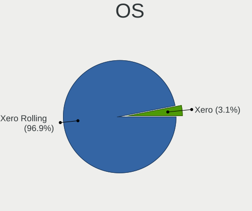

| Name         | Desktops | Percent |
|--------------|----------|---------|
| Xero Rolling | 156      | 96.89%  |
| Xero         | 5        | 3.11%   |

OS Family
---------

OS without a version

| Name | Desktops | Percent |
|------|----------|---------|
| Xero | 161      | 100%    |

Kernel
------

Version of the Linux kernel

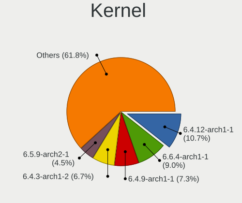

| Version                    | Desktops | Percent |
|----------------------------|----------|---------|
| 6.4.12-arch1-1             | 19       | 10.67%  |
| 6.6.4-arch1-1              | 16       | 8.99%   |
| 6.4.9-arch1-1              | 13       | 7.3%    |
| 6.4.3-arch1-2              | 12       | 6.74%   |
| 6.5.9-arch2-1              | 8        | 4.49%   |
| 6.6.2-arch1-1              | 5        | 2.81%   |
| 6.4.10-arch1-1             | 4        | 2.25%   |
| 6.1.12-arch1-1             | 4        | 2.25%   |
| 6.6.9-arch1-1              | 3        | 1.69%   |
| 6.6.1-arch1-1              | 3        | 1.69%   |
| 6.5.5-arch1-1              | 3        | 1.69%   |
| 6.6.8-arch1-1              | 2        | 1.12%   |
| 6.6.3-arch1-1              | 2        | 1.12%   |
| 6.5.3-arch1-1              | 2        | 1.12%   |
| 6.4.3-arch1-1              | 2        | 1.12%   |
| 6.4.12-zen1-1-zen          | 2        | 1.12%   |
| 6.3.9-arch1-1              | 2        | 1.12%   |
| 6.2.12-arch1-1             | 2        | 1.12%   |
| 5.18.16-arch1-1            | 2        | 1.12%   |
| 5.16.15-arch1-1            | 2        | 1.12%   |
| 5.16.12-arch1-1            | 2        | 1.12%   |
| 6.7.9-zen1-1-zen           | 1        | 0.56%   |
| 6.7.6-arch1-1              | 1        | 0.56%   |
| 6.7.1-arch1-1              | 1        | 0.56%   |
| 6.7.0-arch3-1              | 1        | 0.56%   |
| 6.6.7-arch1-1              | 1        | 0.56%   |
| 6.6.4-273-tkg-bore         | 1        | 0.56%   |
| 6.6.10-arch1-1             | 1        | 0.56%   |
| 6.5.9-zen2-1-zen           | 1        | 0.56%   |
| 6.5.7-arch1-1              | 1        | 0.56%   |
| 6.5.4-arch2-1              | 1        | 0.56%   |
| 6.5.2-arch1-1              | 1        | 0.56%   |
| 6.5.2-273-tkg-bore-eevdf   | 1        | 0.56%   |
| 6.4.8-arch1-1              | 1        | 0.56%   |
| 6.4.7-zen1-1-zen           | 1        | 0.56%   |
| 6.4.7-arch1-2              | 1        | 0.56%   |
| 6.4.7-arch1-1              | 1        | 0.56%   |
| 6.4.4-hardened1-1-hardened | 1        | 0.56%   |
| 6.4.3-zen1-2-zen           | 1        | 0.56%   |
| 6.4.11-arch2-1             | 1        | 0.56%   |

Kernel Family
-------------

Linux kernel without a distro release

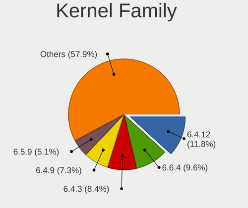

| Version | Desktops | Percent |
|---------|----------|---------|
| 6.4.12  | 21       | 11.8%   |
| 6.6.4   | 17       | 9.55%   |
| 6.4.3   | 15       | 8.43%   |
| 6.4.9   | 13       | 7.3%    |
| 6.5.9   | 9        | 5.06%   |
| 6.6.2   | 5        | 2.81%   |
| 6.4.10  | 4        | 2.25%   |
| 6.1.12  | 4        | 2.25%   |
| 6.6.9   | 3        | 1.69%   |
| 6.6.1   | 3        | 1.69%   |
| 6.5.5   | 3        | 1.69%   |
| 6.4.7   | 3        | 1.69%   |
| 6.3.9   | 3        | 1.69%   |
| 5.15.12 | 3        | 1.69%   |
| 6.6.8   | 2        | 1.12%   |
| 6.6.3   | 2        | 1.12%   |
| 6.5.3   | 2        | 1.12%   |
| 6.5.2   | 2        | 1.12%   |
| 6.4.1   | 2        | 1.12%   |
| 6.2.12  | 2        | 1.12%   |
| 5.19.13 | 2        | 1.12%   |
| 5.18.16 | 2        | 1.12%   |
| 5.16.16 | 2        | 1.12%   |
| 5.16.15 | 2        | 1.12%   |
| 5.16.12 | 2        | 1.12%   |
| 6.7.9   | 1        | 0.56%   |
| 6.7.6   | 1        | 0.56%   |
| 6.7.1   | 1        | 0.56%   |
| 6.7.0   | 1        | 0.56%   |
| 6.6.7   | 1        | 0.56%   |
| 6.6.10  | 1        | 0.56%   |
| 6.5.7   | 1        | 0.56%   |
| 6.5.4   | 1        | 0.56%   |
| 6.4.8   | 1        | 0.56%   |
| 6.4.4   | 1        | 0.56%   |
| 6.4.11  | 1        | 0.56%   |
| 6.3.8   | 1        | 0.56%   |
| 6.3.7   | 1        | 0.56%   |
| 6.3.6   | 1        | 0.56%   |
| 6.2.8   | 1        | 0.56%   |

Kernel Major Ver.
-----------------

Linux kernel major version

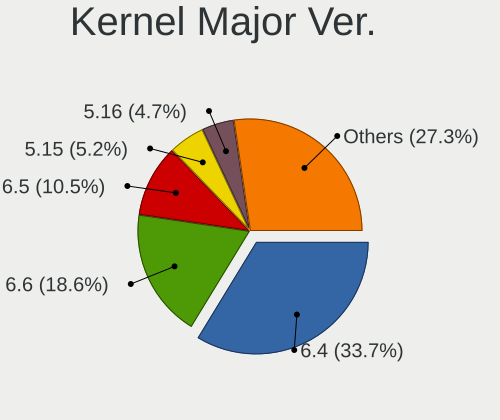

| Version | Desktops | Percent |
|---------|----------|---------|
| 6.4     | 58       | 33.72%  |
| 6.6     | 32       | 18.6%   |
| 6.5     | 18       | 10.47%  |
| 5.15    | 9        | 5.23%   |
| 5.16    | 8        | 4.65%   |
| 6.3     | 6        | 3.49%   |
| 6.2     | 6        | 3.49%   |
| 6.1     | 6        | 3.49%   |
| 5.18    | 6        | 3.49%   |
| 5.19    | 5        | 2.91%   |
| 6.7     | 4        | 2.33%   |
| 5.14    | 4        | 2.33%   |
| 6.0     | 3        | 1.74%   |
| 5.17    | 2        | 1.16%   |
| 5.13    | 2        | 1.16%   |
| 6.17    | 1        | 0.58%   |
| 5.12    | 1        | 0.58%   |
| 5.11    | 1        | 0.58%   |

Arch
----

OS architecture (x86_64, i586, etc.)

| Name   | Desktops | Percent |
|--------|----------|---------|
| x86_64 | 161      | 100%    |

DE
--

Desktop Environment

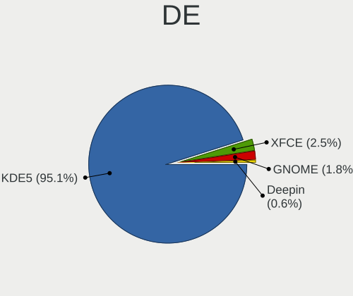

| Name   | Desktops | Percent |
|--------|----------|---------|
| KDE5   | 155      | 95.09%  |
| XFCE   | 4        | 2.45%   |
| GNOME  | 3        | 1.84%   |
| Deepin | 1        | 0.61%   |

Display Server
--------------

X11 or Wayland

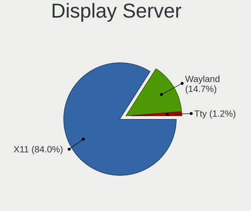

| Name    | Desktops | Percent |
|---------|----------|---------|
| X11     | 137      | 84.05%  |
| Wayland | 24       | 14.72%  |
| Tty     | 2        | 1.23%   |

Display Manager
---------------

SDDM, LightDM, etc.

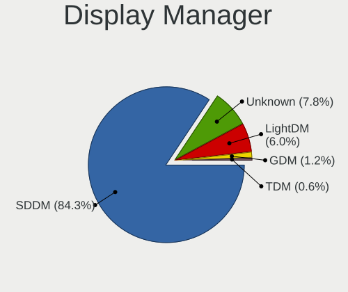

| Name    | Desktops | Percent |
|---------|----------|---------|
| SDDM    | 140      | 84.34%  |
| Unknown | 13       | 7.83%   |
| LightDM | 10       | 6.02%   |
| GDM     | 2        | 1.2%    |
| TDM     | 1        | 0.6%    |

OS Lang
-------

Language

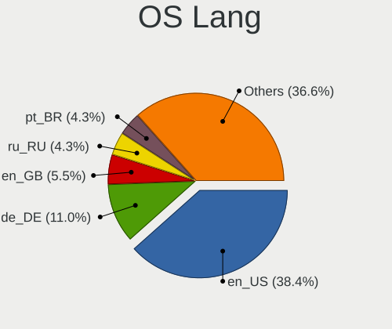

| Lang       | Desktops | Percent |
|------------|----------|---------|
| en_US      | 63       | 38.41%  |
| de_DE      | 18       | 10.98%  |
| en_GB      | 9        | 5.49%   |
| ru_RU      | 7        | 4.27%   |
| pt_BR      | 7        | 4.27%   |
| fr_FR      | 7        | 4.27%   |
| it_IT      | 5        | 3.05%   |
| es_MX      | 5        | 3.05%   |
| en_CA      | 5        | 3.05%   |
| C          | 5        | 3.05%   |
| tr_TR      | 4        | 2.44%   |
| pl_PL      | 4        | 2.44%   |
| en_IN      | 4        | 2.44%   |
| es_ES      | 3        | 1.83%   |
| en_AU      | 3        | 1.83%   |
| de_AT      | 3        | 1.83%   |
| hu_HU      | 2        | 1.22%   |
| zh_HK      | 1        | 0.61%   |
| sv_SE      | 1        | 0.61%   |
| es_PE      | 1        | 0.61%   |
| es_AR      | 1        | 0.61%   |
| en_ZA      | 1        | 0.61%   |
| el_GR@euro | 1        | 0.61%   |
| el_GR      | 1        | 0.61%   |
| cs_CZ      | 1        | 0.61%   |
| bg_BG      | 1        | 0.61%   |
| ba_RU      | 1        | 0.61%   |

Boot Mode
---------

EFI or BIOS

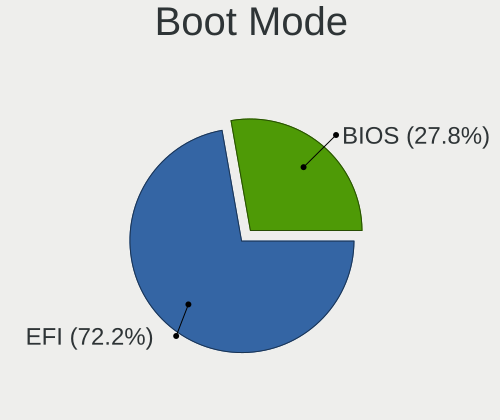

| Mode | Desktops | Percent |
|------|----------|---------|
| EFI  | 117      | 72.22%  |
| BIOS | 45       | 27.78%  |

Filesystem
----------

Type of filesystem

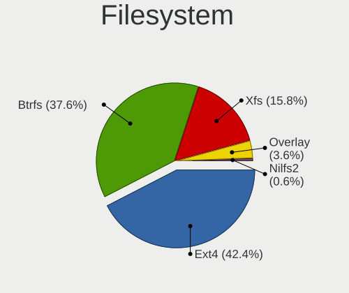

| Type    | Desktops | Percent |
|---------|----------|---------|
| Ext4    | 70       | 42.42%  |
| Btrfs   | 62       | 37.58%  |
| Xfs     | 26       | 15.76%  |
| Overlay | 6        | 3.64%   |
| Nilfs2  | 1        | 0.61%   |

Part. scheme
------------

Scheme of partitioning

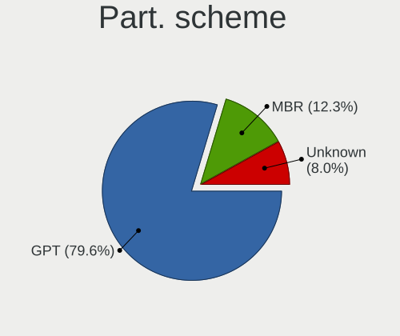

| Type    | Desktops | Percent |
|---------|----------|---------|
| GPT     | 129      | 79.63%  |
| MBR     | 20       | 12.35%  |
| Unknown | 13       | 8.02%   |

Dual Boot with Linux/BSD
------------------------

Hosting more than one Linux/BSD

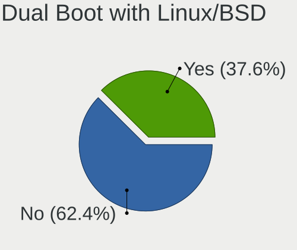

| Dual boot | Desktops | Percent |
|-----------|----------|---------|
| No        | 103      | 62.42%  |
| Yes       | 62       | 37.58%  |

Dual Boot (Win)
---------------

Hosting Linux and Windows

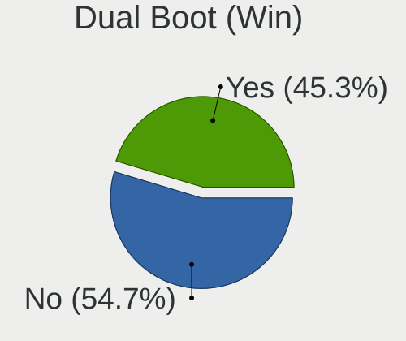

| Dual boot | Desktops | Percent |
|-----------|----------|---------|
| No        | 88       | 54.66%  |
| Yes       | 73       | 45.34%  |

Board
-----

Vendor
------

Motherboard manufacturer

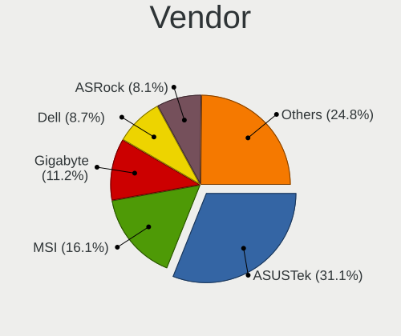

| Name                | Desktops | Percent |
|---------------------|----------|---------|
| ASUSTek Computer    | 50       | 31.06%  |
| MSI                 | 26       | 16.15%  |
| Gigabyte Technology | 18       | 11.18%  |
| Dell                | 14       | 8.7%    |
| ASRock              | 13       | 8.07%   |
| Hewlett-Packard     | 12       | 7.45%   |
| Acer                | 6        | 3.73%   |
| Pegatron            | 3        | 1.86%   |
| ECS                 | 3        | 1.86%   |
| Unknown             | 3        | 1.86%   |
| Win Element         | 2        | 1.24%   |
| Lenovo              | 2        | 1.24%   |
| Intel               | 2        | 1.24%   |
| Huanan              | 2        | 1.24%   |
| Medion              | 1        | 0.62%   |
| JINGSHA             | 1        | 0.62%   |
| GEEKOM              | 1        | 0.62%   |
| Biostar             | 1        | 0.62%   |
| BESSTAR Tech        | 1        | 0.62%   |

Model
-----

Motherboard model

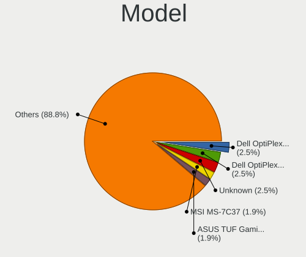

| Name                           | Desktops | Percent |
|--------------------------------|----------|---------|
| Dell OptiPlex 9020             | 4        | 2.48%   |
| Dell OptiPlex 7010             | 4        | 2.48%   |
| Unknown                        | 4        | 2.48%   |
| MSI MS-7C37                    | 3        | 1.86%   |
| ASUS TUF Gaming X570-PLUS      | 3        | 1.86%   |
| Win Element M9                 | 2        | 1.24%   |
| MSI MS-7971                    | 2        | 1.24%   |
| Dell Studio XPS 8100           | 2        | 1.24%   |
| ASUS PRIME B450M-A II          | 2        | 1.24%   |
| ASUS PRIME A320M-K             | 2        | 1.24%   |
| Pegatron p7-1010a              | 1        | 0.62%   |
| Pegatron p6-2026               | 1        | 0.62%   |
| Pegatron 20-b010               | 1        | 0.62%   |
| MSI MS-7D22                    | 1        | 0.62%   |
| MSI MS-7C96                    | 1        | 0.62%   |
| MSI MS-7C94                    | 1        | 0.62%   |
| MSI MS-7C91                    | 1        | 0.62%   |
| MSI MS-7C52                    | 1        | 0.62%   |
| MSI MS-7B61                    | 1        | 0.62%   |
| MSI MS-7B12                    | 1        | 0.62%   |
| MSI MS-7A70                    | 1        | 0.62%   |
| MSI MS-7A34                    | 1        | 0.62%   |
| MSI MS-7919                    | 1        | 0.62%   |
| MSI MS-7916                    | 1        | 0.62%   |
| MSI MS-7845                    | 1        | 0.62%   |
| MSI MS-7823                    | 1        | 0.62%   |
| MSI MS-7817                    | 1        | 0.62%   |
| MSI MS-7815                    | 1        | 0.62%   |
| MSI MS-7758                    | 1        | 0.62%   |
| MSI MS-7693                    | 1        | 0.62%   |
| MSI MS-7623                    | 1        | 0.62%   |
| MSI MS-7592                    | 1        | 0.62%   |
| MSI Gaming                     | 1        | 0.62%   |
| MSI Compaq dx2300 Microtower   | 1        | 0.62%   |
| Medion E63007                  | 1        | 0.62%   |
| Lenovo ThinkCentre M58 3231W2Y | 1        | 0.62%   |
| Lenovo 3302F3U                 | 1        | 0.62%   |
| Intel X99                      | 1        | 0.62%   |
| Intel B75                      | 1        | 0.62%   |
| Huanan X99-TF                  | 1        | 0.62%   |

Model Family
------------

Motherboard model prefix

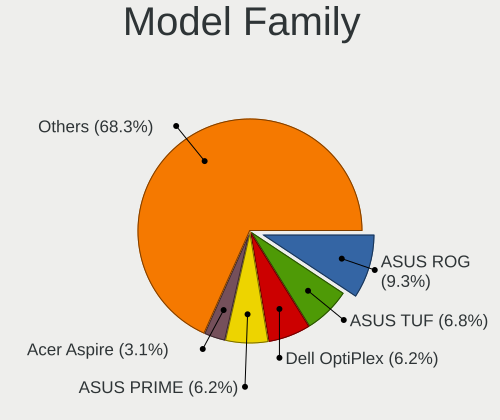

| Name              | Desktops | Percent |
|-------------------|----------|---------|
| ASUS ROG          | 15       | 9.32%   |
| ASUS TUF          | 11       | 6.83%   |
| Dell OptiPlex     | 10       | 6.21%   |
| ASUS PRIME        | 10       | 6.21%   |
| Acer Aspire       | 5        | 3.11%   |
| Unknown           | 4        | 2.48%   |
| MSI MS-7C37       | 3        | 1.86%   |
| Dell Studio       | 3        | 1.86%   |
| Win Element M9    | 2        | 1.24%   |
| MSI MS-7971       | 2        | 1.24%   |
| HP Pavilion       | 2        | 1.24%   |
| Gigabyte Z790     | 2        | 1.24%   |
| Gigabyte X570     | 2        | 1.24%   |
| Gigabyte B450M    | 2        | 1.24%   |
| ASUS M5A99X       | 2        | 1.24%   |
| ASRock B450       | 2        | 1.24%   |
| Pegatron p7-1010a | 1        | 0.62%   |
| Pegatron p6-2026  | 1        | 0.62%   |
| Pegatron 20-b010  | 1        | 0.62%   |
| MSI MS-7D22       | 1        | 0.62%   |
| MSI MS-7C96       | 1        | 0.62%   |
| MSI MS-7C94       | 1        | 0.62%   |
| MSI MS-7C91       | 1        | 0.62%   |
| MSI MS-7C52       | 1        | 0.62%   |
| MSI MS-7B61       | 1        | 0.62%   |
| MSI MS-7B12       | 1        | 0.62%   |
| MSI MS-7A70       | 1        | 0.62%   |
| MSI MS-7A34       | 1        | 0.62%   |
| MSI MS-7919       | 1        | 0.62%   |
| MSI MS-7916       | 1        | 0.62%   |
| MSI MS-7845       | 1        | 0.62%   |
| MSI MS-7823       | 1        | 0.62%   |
| MSI MS-7817       | 1        | 0.62%   |
| MSI MS-7815       | 1        | 0.62%   |
| MSI MS-7758       | 1        | 0.62%   |
| MSI MS-7693       | 1        | 0.62%   |
| MSI MS-7623       | 1        | 0.62%   |
| MSI MS-7592       | 1        | 0.62%   |
| MSI Gaming        | 1        | 0.62%   |
| MSI Compaq        | 1        | 0.62%   |

MFG Year
--------

Motherboard manufacture year

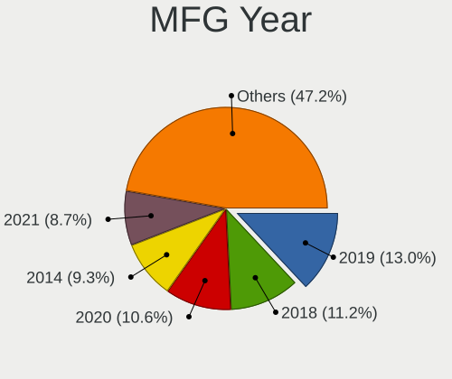

| Year | Desktops | Percent |
|------|----------|---------|
| 2019 | 21       | 13.04%  |
| 2018 | 18       | 11.18%  |
| 2020 | 17       | 10.56%  |
| 2014 | 15       | 9.32%   |
| 2021 | 14       | 8.7%    |
| 2017 | 12       | 7.45%   |
| 2013 | 11       | 6.83%   |
| 2015 | 10       | 6.21%   |
| 2011 | 8        | 4.97%   |
| 2016 | 7        | 4.35%   |
| 2023 | 6        | 3.73%   |
| 2012 | 6        | 3.73%   |
| 2009 | 5        | 3.11%   |
| 2010 | 4        | 2.48%   |
| 2022 | 3        | 1.86%   |
| 2007 | 2        | 1.24%   |
| 2024 | 1        | 0.62%   |
| 2008 | 1        | 0.62%   |

Form Factor
-----------

Physical design of the computer

| Name    | Desktops | Percent |
|---------|----------|---------|
| Desktop | 161      | 100%    |

Secure Boot
-----------

Enabled or disabled

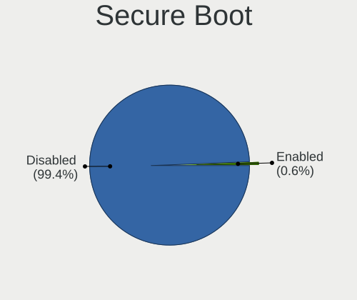

| State    | Desktops | Percent |
|----------|----------|---------|
| Disabled | 161      | 99.38%  |
| Enabled  | 1        | 0.62%   |

Coreboot
--------

Have coreboot on board

| Used | Desktops | Percent |
|------|----------|---------|
| No   | 161      | 100%    |

RAM Size
--------

Total RAM memory

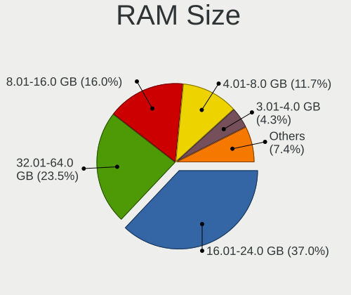

| Size in GB  | Desktops | Percent |
|-------------|----------|---------|
| 16.01-24.0  | 60       | 37.04%  |
| 32.01-64.0  | 38       | 23.46%  |
| 8.01-16.0   | 26       | 16.05%  |
| 4.01-8.0    | 19       | 11.73%  |
| 3.01-4.0    | 7        | 4.32%   |
| 64.01-256.0 | 6        | 3.7%    |
| 24.01-32.0  | 5        | 3.09%   |
| 2.01-3.0    | 1        | 0.62%   |

RAM Used
--------

Used RAM memory

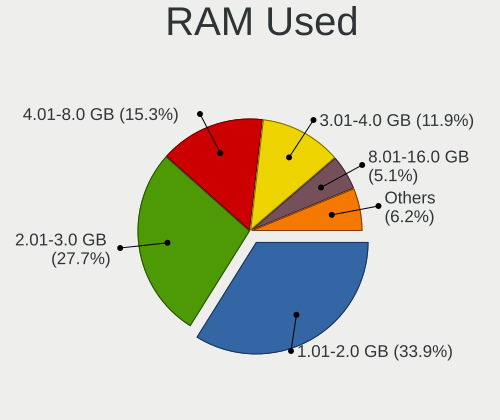

| Used GB    | Desktops | Percent |
|------------|----------|---------|
| 1.01-2.0   | 60       | 33.9%   |
| 2.01-3.0   | 49       | 27.68%  |
| 4.01-8.0   | 27       | 15.25%  |
| 3.01-4.0   | 21       | 11.86%  |
| 8.01-16.0  | 9        | 5.08%   |
| 16.01-24.0 | 7        | 3.95%   |
| 0.51-1.0   | 2        | 1.13%   |
| 0.01-0.5   | 2        | 1.13%   |

Total Drives
------------

Number of drives on board

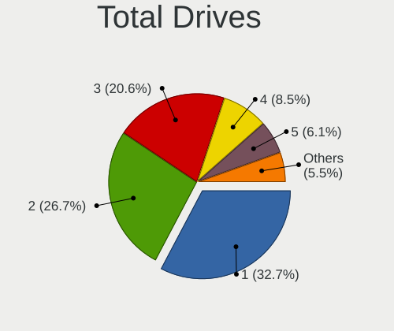

| Drives | Desktops | Percent |
|--------|----------|---------|
| 1      | 54       | 32.73%  |
| 2      | 44       | 26.67%  |
| 3      | 34       | 20.61%  |
| 4      | 14       | 8.48%   |
| 5      | 10       | 6.06%   |
| 6      | 4        | 2.42%   |
| 8      | 2        | 1.21%   |
| 7      | 2        | 1.21%   |
| 9      | 1        | 0.61%   |

Has CD-ROM
----------

Has CD-ROM on board

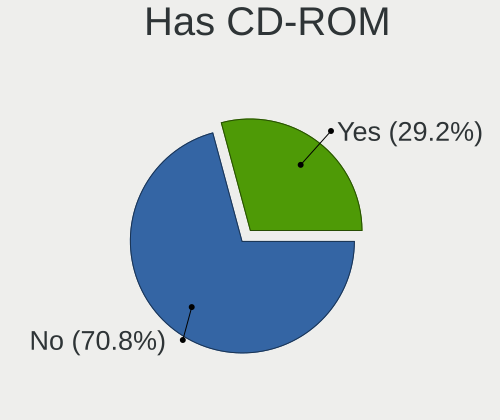

| Presented | Desktops | Percent |
|-----------|----------|---------|
| No        | 114      | 70.81%  |
| Yes       | 47       | 29.19%  |

Has Ethernet
------------

Has Ethernet on board

| Presented | Desktops | Percent |
|-----------|----------|---------|
| Yes       | 160      | 99.38%  |
| No        | 1        | 0.62%   |

Has WiFi
--------

Has WiFi module

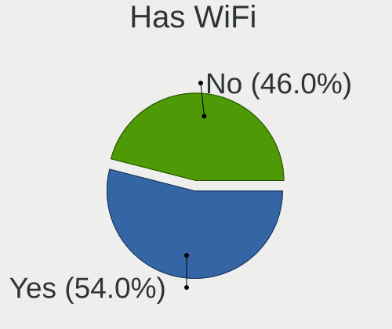

| Presented | Desktops | Percent |
|-----------|----------|---------|
| Yes       | 88       | 53.99%  |
| No        | 75       | 46.01%  |

Has Bluetooth
-------------

Has Bluetooth module

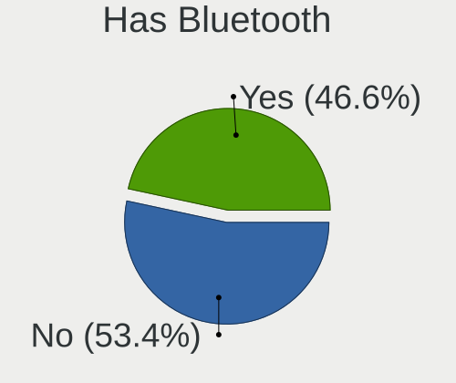

| Presented | Desktops | Percent |
|-----------|----------|---------|
| No        | 87       | 53.37%  |
| Yes       | 76       | 46.63%  |

Location
--------

Country
-------

Geographic location (country)

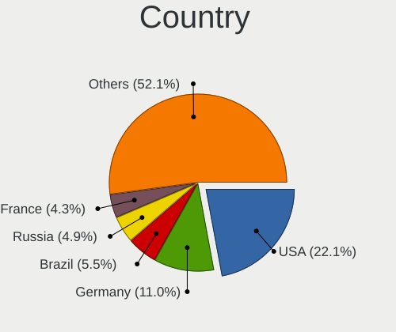

| Country      | Desktops | Percent |
|--------------|----------|---------|
| USA          | 36       | 22.09%  |
| Germany      | 18       | 11.04%  |
| Brazil       | 9        | 5.52%   |
| Russia       | 8        | 4.91%   |
| France       | 7        | 4.29%   |
| Canada       | 7        | 4.29%   |
| Poland       | 6        | 3.68%   |
| UK           | 5        | 3.07%   |
| Mexico       | 5        | 3.07%   |
| Italy        | 5        | 3.07%   |
| Turkey       | 4        | 2.45%   |
| Spain        | 4        | 2.45%   |
| India        | 4        | 2.45%   |
| Netherlands  | 3        | 1.84%   |
| Austria      | 3        | 1.84%   |
| Australia    | 3        | 1.84%   |
| Argentina    | 3        | 1.84%   |
| Romania      | 2        | 1.23%   |
| Pakistan     | 2        | 1.23%   |
| Hungary      | 2        | 1.23%   |
| Greece       | 2        | 1.23%   |
| Czechia      | 2        | 1.23%   |
| Colombia     | 2        | 1.23%   |
| Bulgaria     | 2        | 1.23%   |
| Bahrain      | 2        | 1.23%   |
| Venezuela    | 1        | 0.61%   |
| Thailand     | 1        | 0.61%   |
| Switzerland  | 1        | 0.61%   |
| Sweden       | 1        | 0.61%   |
| South Africa | 1        | 0.61%   |
| Puerto Rico  | 1        | 0.61%   |
| Portugal     | 1        | 0.61%   |
| Philippines  | 1        | 0.61%   |
| Peru         | 1        | 0.61%   |
| Lebanon      | 1        | 0.61%   |
| Iran         | 1        | 0.61%   |
| Cyprus       | 1        | 0.61%   |
| China        | 1        | 0.61%   |
| Belgium      | 1        | 0.61%   |
| Belarus      | 1        | 0.61%   |

City
----

Geographic location (city)

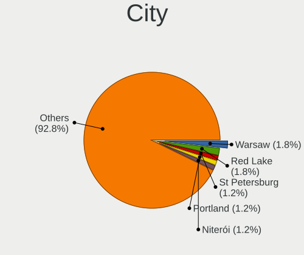

| City                   | Desktops | Percent |
|------------------------|----------|---------|
| Warsaw                 | 3        | 1.81%   |
| Red Lake               | 3        | 1.81%   |
| St Petersburg          | 2        | 1.2%    |
| Portland               | 2        | 1.2%    |
| Niterói               | 2        | 1.2%    |
| Mexico City            | 2        | 1.2%    |
| Maringouin             | 2        | 1.2%    |
| Krasnodar              | 2        | 1.2%    |
| Hamburg                | 2        | 1.2%    |
| Cumming                | 2        | 1.2%    |
| Braunschweig           | 2        | 1.2%    |
| Bogotá                | 2        | 1.2%    |
| Berlin                 | 2        | 1.2%    |
| Amsterdam              | 2        | 1.2%    |
| Zell am See            | 1        | 0.6%    |
| York                   | 1        | 0.6%    |
| Wroclaw                | 1        | 0.6%    |
| Wrexham                | 1        | 0.6%    |
| Wolfville              | 1        | 0.6%    |
| Wesel                  | 1        | 0.6%    |
| Wells                  | 1        | 0.6%    |
| Vredenburg             | 1        | 0.6%    |
| Voronezh               | 1        | 0.6%    |
| Valparaiso de Goias    | 1        | 0.6%    |
| Tuxtla Gutiérrez      | 1        | 0.6%    |
| Termas de Rio Hondo    | 1        | 0.6%    |
| Teresina               | 1        | 0.6%    |
| Tehran                 | 1        | 0.6%    |
| Stow                   | 1        | 0.6%    |
| St Louis               | 1        | 0.6%    |
| Springfield            | 1        | 0.6%    |
| Sonora                 | 1        | 0.6%    |
| Sofia                  | 1        | 0.6%    |
| Shanghai               | 1        | 0.6%    |
| Shadrinsk              | 1        | 0.6%    |
| Sarcelles              | 1        | 0.6%    |
| Sao Paulo              | 1        | 0.6%    |
| Santiago de Compostela | 1        | 0.6%    |
| Santa Rosa             | 1        | 0.6%    |
| Sant Boi de Llobregat  | 1        | 0.6%    |

Drives
------

Drive Vendor
------------

Hard drive vendors

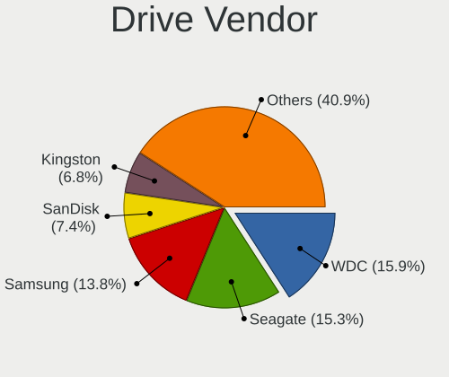

| Vendor                       | Desktops | Drives | Percent |
|------------------------------|----------|--------|---------|
| WDC                          | 54       | 75     | 15.88%  |
| Seagate                      | 52       | 73     | 15.29%  |
| Samsung Electronics          | 47       | 81     | 13.82%  |
| SanDisk                      | 25       | 34     | 7.35%   |
| Kingston                     | 23       | 29     | 6.76%   |
| Crucial                      | 16       | 24     | 4.71%   |
| Toshiba                      | 14       | 18     | 4.12%   |
| Micron/Crucial Technology    | 9        | 11     | 2.65%   |
| Unknown                      | 8        | 9      | 2.35%   |
| Phison Electronics           | 6        | 8      | 1.76%   |
| SK hynix                     | 5        | 6      | 1.47%   |
| Hitachi                      | 5        | 5      | 1.47%   |
| HGST                         | 5        | 5      | 1.47%   |
| ADATA Technology             | 5        | 5      | 1.47%   |
| Intel                        | 4        | 6      | 1.18%   |
| China                        | 4        | 4      | 1.18%   |
| Realtek Semiconductor        | 3        | 4      | 0.88%   |
| MAXIO Technology (Hangzhou)  | 3        | 3      | 0.88%   |
| Kingston Technology Company  | 3        | 4      | 0.88%   |
| Intenso                      | 3        | 5      | 0.88%   |
| A-DATA Technology            | 3        | 3      | 0.88%   |
| SPCC                         | 2        | 3      | 0.59%   |
| Silicon Motion               | 2        | 4      | 0.59%   |
| PNY                          | 2        | 2      | 0.59%   |
| Phison                       | 2        | 2      | 0.59%   |
| Mushkin                      | 2        | 2      | 0.59%   |
| Micron Technology            | 2        | 3      | 0.59%   |
| Lexar                        | 2        | 2      | 0.59%   |
| KingSpec                     | 2        | 2      | 0.59%   |
| Hewlett-Packard              | 2        | 2      | 0.59%   |
| ASMedia                      | 2        | 2      | 0.59%   |
| XrayDisk                     | 1        | 2      | 0.29%   |
| XPG                          | 1        | 1      | 0.29%   |
| Transcend                    | 1        | 1      | 0.29%   |
| Team                         | 1        | 1      | 0.29%   |
| SSK                          | 1        | 1      | 0.29%   |
| Shenzhen Longsys Electronics | 1        | 1      | 0.29%   |
| SABRENT                      | 1        | 1      | 0.29%   |
| Plextor                      | 1        | 1      | 0.29%   |
| Patriot                      | 1        | 1      | 0.29%   |

Drive Model
-----------

Hard drive models

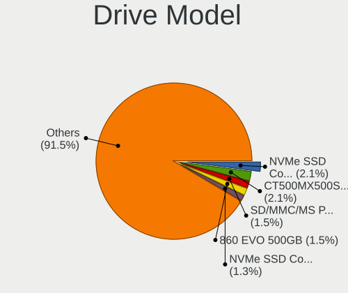

| Model                                                              | Desktops | Percent |
|--------------------------------------------------------------------|----------|---------|
| Samsung NVMe SSD Controller SM981/PM981/PM983 1TB                  | 8        | 2.06%   |
| Crucial CT500MX500SSD1 500GB                                       | 8        | 2.06%   |
| Unknown SD/MMC/MS PRO 2GB                                          | 6        | 1.54%   |
| Samsung SSD 860 EVO 500GB                                          | 6        | 1.54%   |
| Samsung NVMe SSD Controller PM9A1/PM9A3/980PRO 1TB                 | 5        | 1.29%   |
| Kingston SA400S37960G 960GB SSD                                    | 5        | 1.29%   |
| Kingston SA400S37240G 240GB SSD                                    | 5        | 1.29%   |
| Seagate ST2000DM006-2DM164 2TB                                     | 4        | 1.03%   |
| Seagate ST1000DM010-2EP102 1TB                                     | 4        | 1.03%   |
| Seagate ST1000DM003-1SB102 1TB                                     | 4        | 1.03%   |
| WDC WD20EZBX-00AYRA0 2TB                                           | 3        | 0.77%   |
| WDC WD10EZEX-60M2NA0 1TB                                           | 3        | 0.77%   |
| Toshiba DT01ACA300 3TB                                             | 3        | 0.77%   |
| Sandisk WD Blue SN570 500GB                                        | 3        | 0.77%   |
| Sandisk WD Black SN750 / PC SN730 NVMe SSD 500GB                   | 3        | 0.77%   |
| Samsung SSD 850 EVO 250GB                                          | 3        | 0.77%   |
| Realtek RTS5763DL NVMe SSD Controller 512GB                        | 3        | 0.77%   |
| Phison PS5013 E13 NVMe Controller 500GB                            | 3        | 0.77%   |
| Micron/Crucial P2 NVMe PCIe SSD 2TB                                | 3        | 0.77%   |
| Micron/Crucial CT2000P5PSSD8 2TB                                   | 3        | 0.77%   |
| Kingston SUV400S37120G 120GB SSD                                   | 3        | 0.77%   |
| Crucial CT1000MX500SSD1 1TB                                        | 3        | 0.77%   |
| ADATA XPG SX8200 Pro PCIe Gen3x4 M.2 2280 Solid State Drive 1024GB | 3        | 0.77%   |
| WDC WD10JPVX-22JC3T0 1TB                                           | 2        | 0.51%   |
| WDC WD10EZEX-60WN4A0 1TB                                           | 2        | 0.51%   |
| WDC WD10EZEX-22MFCA0 1TB                                           | 2        | 0.51%   |
| WDC WD10EZEX-21WN4A0 1TB                                           | 2        | 0.51%   |
| WDC WD10EZEX-08WN4A0 1TB                                           | 2        | 0.51%   |
| Toshiba MQ01ABD100 1TB                                             | 2        | 0.51%   |
| SPCC Solid State Disk 256GB                                        | 2        | 0.51%   |
| SK hynix SHPP41-2000GM 2TB                                         | 2        | 0.51%   |
| Seagate ST500DM002-1BD142 500GB                                    | 2        | 0.51%   |
| Seagate ST3500312CS 500GB                                          | 2        | 0.51%   |
| Seagate ST250DM000-1BD141 250GB                                    | 2        | 0.51%   |
| Seagate ST2000DM008-2FR102 2TB                                     | 2        | 0.51%   |
| Seagate ST1000LM024 HN-M101MBB 1TB                                 | 2        | 0.51%   |
| Seagate ST1000DM003-1ER162 1TB                                     | 2        | 0.51%   |
| Seagate ST1000DM003-1CH162 1TB                                     | 2        | 0.51%   |
| Seagate Expansion HDD 4TB                                          | 2        | 0.51%   |
| Sandisk WD_BLACK SN770 1TB                                         | 2        | 0.51%   |

HDD Vendor
----------

Hard disk drive vendors

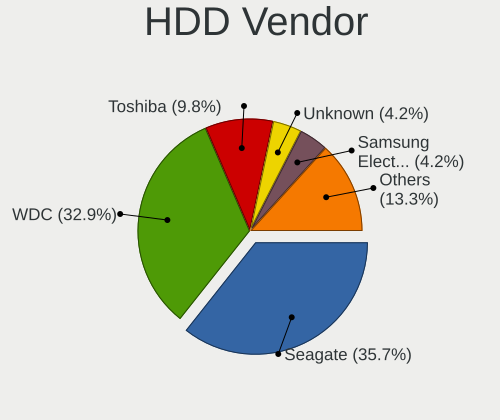

| Vendor              | Desktops | Drives | Percent |
|---------------------|----------|--------|---------|
| Seagate             | 51       | 72     | 35.66%  |
| WDC                 | 47       | 64     | 32.87%  |
| Toshiba             | 14       | 18     | 9.79%   |
| Unknown             | 6        | 6      | 4.2%    |
| Samsung Electronics | 6        | 6      | 4.2%    |
| Hitachi             | 5        | 5      | 3.5%    |
| HGST                | 5        | 5      | 3.5%    |
| Intenso             | 3        | 5      | 2.1%    |
| ASMedia             | 2        | 2      | 1.4%    |
| SSK                 | 1        | 1      | 0.7%    |
| Maxtor              | 1        | 1      | 0.7%    |
| Maxone              | 1        | 1      | 0.7%    |
| JMicron Technology  | 1        | 1      | 0.7%    |

SSD Vendor
----------

Solid state drive vendors

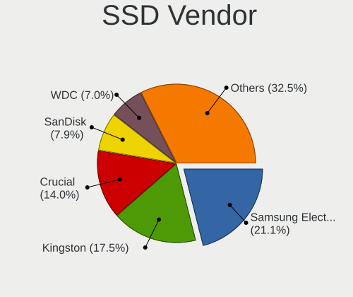

| Vendor              | Desktops | Drives | Percent |
|---------------------|----------|--------|---------|
| Samsung Electronics | 24       | 33     | 21.05%  |
| Kingston            | 20       | 26     | 17.54%  |
| Crucial             | 16       | 24     | 14.04%  |
| SanDisk             | 9        | 9      | 7.89%   |
| WDC                 | 8        | 8      | 7.02%   |
| China               | 4        | 4      | 3.51%   |
| SPCC                | 2        | 3      | 1.75%   |
| PNY                 | 2        | 2      | 1.75%   |
| Mushkin             | 2        | 2      | 1.75%   |
| Lexar               | 2        | 2      | 1.75%   |
| KingSpec            | 2        | 2      | 1.75%   |
| Hewlett-Packard     | 2        | 2      | 1.75%   |
| A-DATA Technology   | 2        | 2      | 1.75%   |
| XrayDisk            | 1        | 2      | 0.88%   |
| Transcend           | 1        | 1      | 0.88%   |
| Team                | 1        | 1      | 0.88%   |
| SK hynix            | 1        | 1      | 0.88%   |
| SABRENT             | 1        | 1      | 0.88%   |
| Plextor             | 1        | 1      | 0.88%   |
| Patriot             | 1        | 1      | 0.88%   |
| OCZ                 | 1        | 1      | 0.88%   |
| Netac               | 1        | 1      | 0.88%   |
| Micron Technology   | 1        | 1      | 0.88%   |
| LITEONIT            | 1        | 1      | 0.88%   |
| LITEON              | 1        | 2      | 0.88%   |
| Leven               | 1        | 1      | 0.88%   |
| Intel               | 1        | 1      | 0.88%   |
| Gigabyte Technology | 1        | 1      | 0.88%   |
| Emtec               | 1        | 1      | 0.88%   |
| Corsair             | 1        | 1      | 0.88%   |
| ASMT                | 1        | 1      | 0.88%   |
| 2-Power             | 1        | 1      | 0.88%   |

Drive Kind
----------

HDD or SSD

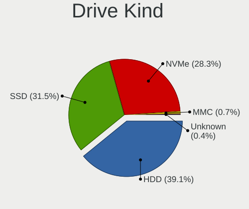

| Kind    | Desktops | Drives | Percent |
|---------|----------|--------|---------|
| HDD     | 108      | 187    | 39.13%  |
| SSD     | 87       | 140    | 31.52%  |
| NVMe    | 78       | 130    | 28.26%  |
| MMC     | 2        | 3      | 0.72%   |
| Unknown | 1        | 1      | 0.36%   |

Drive Connector
---------------

SATA, SAS, NVMe, etc.

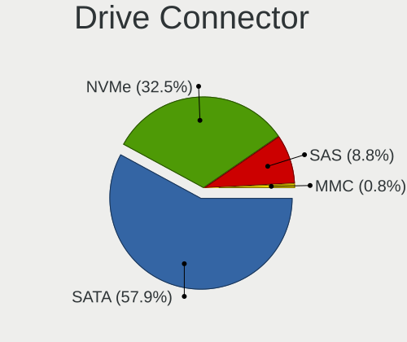

| Type | Desktops | Drives | Percent |
|------|----------|--------|---------|
| SATA | 139      | 299    | 57.92%  |
| NVMe | 78       | 130    | 32.5%   |
| SAS  | 21       | 29     | 8.75%   |
| MMC  | 2        | 3      | 0.83%   |

Drive Size
----------

Size of hard drive

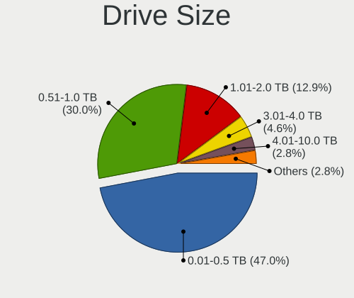

| Size in TB | Desktops | Drives | Percent |
|------------|----------|--------|---------|
| 0.01-0.5   | 102      | 158    | 47%     |
| 0.51-1.0   | 65       | 97     | 29.95%  |
| 1.01-2.0   | 28       | 37     | 12.9%   |
| 3.01-4.0   | 10       | 17     | 4.61%   |
| 2.01-3.0   | 6        | 7      | 2.76%   |
| 4.01-10.0  | 6        | 11     | 2.76%   |

Space Total
-----------

Amount of disk space available on the file system

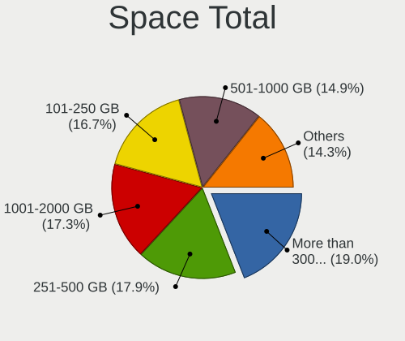

| Size in GB     | Desktops | Percent |
|----------------|----------|---------|
| More than 3000 | 32       | 19.05%  |
| 251-500        | 30       | 17.86%  |
| 1001-2000      | 29       | 17.26%  |
| 101-250        | 28       | 16.67%  |
| 501-1000       | 25       | 14.88%  |
| 51-100         | 6        | 3.57%   |
| 21-50          | 5        | 2.98%   |
| 2001-3000      | 5        | 2.98%   |
| 1-20           | 4        | 2.38%   |
| Unknown        | 4        | 2.38%   |

Space Used
----------

Amount of used disk space

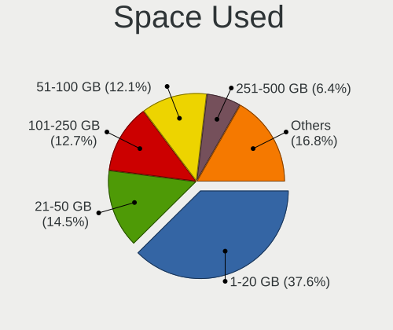

| Used GB        | Desktops | Percent |
|----------------|----------|---------|
| 1-20           | 65       | 37.57%  |
| 21-50          | 25       | 14.45%  |
| 101-250        | 22       | 12.72%  |
| 51-100         | 21       | 12.14%  |
| 251-500        | 11       | 6.36%   |
| 501-1000       | 10       | 5.78%   |
| More than 3000 | 7        | 4.05%   |
| 1001-2000      | 5        | 2.89%   |
| Unknown        | 4        | 2.31%   |
| 2001-3000      | 3        | 1.73%   |

Malfunc. Drives
---------------

Drive models with a malfunction

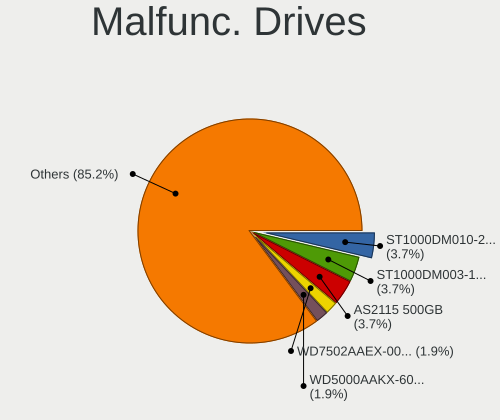

| Model                              | Desktops | Drives | Percent |
|------------------------------------|----------|--------|---------|
| Seagate ST1000DM010-2EP102 1TB     | 2        | 2      | 3.7%    |
| Seagate ST1000DM003-1ER162 1TB     | 2        | 4      | 3.7%    |
| ASMedia AS2115 500GB               | 2        | 2      | 3.7%    |
| WDC WD7502AAEX-00Y9A0 752GB        | 1        | 1      | 1.85%   |
| WDC WD5000AAKX-60U6AA0 500GB       | 1        | 1      | 1.85%   |
| WDC WD3200AAJS-08L7A0 320GB        | 1        | 1      | 1.85%   |
| WDC WD20EARX-00PASB0 2TB           | 1        | 1      | 1.85%   |
| WDC WD1600AAJS-00L7A0 160GB        | 1        | 1      | 1.85%   |
| WDC WD10SPZX-60Z10T0 1TB           | 1        | 2      | 1.85%   |
| WDC WD10EZEX-60M2NA0 1TB           | 1        | 1      | 1.85%   |
| WDC WD10EZEX-08WN4A0 1TB           | 1        | 1      | 1.85%   |
| WDC WD10EADS-00M2B0 1TB            | 1        | 1      | 1.85%   |
| WDC WD1002FAEX-00Z3A0 1TB          | 1        | 2      | 1.85%   |
| Toshiba MQ01ABD100 1TB             | 1        | 1      | 1.85%   |
| Toshiba MQ01ABD050 500GB           | 1        | 1      | 1.85%   |
| Toshiba MK4058GSX 400GB            | 1        | 1      | 1.85%   |
| Toshiba MK2565GSX 250GB            | 1        | 1      | 1.85%   |
| SK hynix SC401 SATA 512GB SSD      | 1        | 1      | 1.85%   |
| Seagate ST9500420AS 500GB          | 1        | 1      | 1.85%   |
| Seagate ST9500325AS 500GB          | 1        | 1      | 1.85%   |
| Seagate ST500DM009-2F110A 500GB    | 1        | 1      | 1.85%   |
| Seagate ST500DM002-1BD142 500GB    | 1        | 1      | 1.85%   |
| Seagate ST3500414CS 500GB          | 1        | 1      | 1.85%   |
| Seagate ST3500312CS 500GB          | 1        | 1      | 1.85%   |
| Seagate ST3320418AS 320GB          | 1        | 1      | 1.85%   |
| Seagate ST320LT012-9WS14C 320GB    | 1        | 2      | 1.85%   |
| Seagate ST31000524AS 1TB           | 1        | 1      | 1.85%   |
| Seagate ST2000VX000-1CU164 2TB     | 1        | 1      | 1.85%   |
| Seagate ST2000DM006-2DM164 2TB     | 1        | 1      | 1.85%   |
| Seagate ST2000DM001-1CH164 2TB     | 1        | 1      | 1.85%   |
| Seagate ST2000DL003-9VT166 2TB     | 1        | 1      | 1.85%   |
| Seagate ST1000LM024 HN-M101MBB 1TB | 1        | 1      | 1.85%   |
| Seagate ST1000DM003-1SB10C 1TB     | 1        | 1      | 1.85%   |
| SanDisk SSD PLUS 240GB             | 1        | 1      | 1.85%   |
| Samsung Electronics HD103SJ 1TB    | 1        | 1      | 1.85%   |
| SABRENT Disk 4TB                   | 1        | 1      | 1.85%   |
| Maxtor STM3160215AS 160GB          | 1        | 1      | 1.85%   |
| Kingston SV300S37A120G 120GB SSD   | 1        | 1      | 1.85%   |
| Kingston SUV400S37240G 240GB SSD   | 1        | 1      | 1.85%   |
| Kingston SUV400S37120G 120GB SSD   | 1        | 1      | 1.85%   |

Malfunc. Drive Vendor
---------------------

Vendors of faulty drives

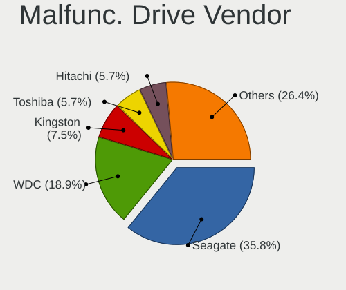

| Vendor              | Desktops | Drives | Percent |
|---------------------|----------|--------|---------|
| Seagate             | 19       | 22     | 35.85%  |
| WDC                 | 10       | 12     | 18.87%  |
| Kingston            | 4        | 4      | 7.55%   |
| Toshiba             | 3        | 4      | 5.66%   |
| Hitachi             | 3        | 3      | 5.66%   |
| ASMedia             | 2        | 2      | 3.77%   |
| SK hynix            | 1        | 1      | 1.89%   |
| SanDisk             | 1        | 1      | 1.89%   |
| Samsung Electronics | 1        | 1      | 1.89%   |
| SABRENT             | 1        | 1      | 1.89%   |
| Maxtor              | 1        | 1      | 1.89%   |
| Intel               | 1        | 1      | 1.89%   |
| HGST                | 1        | 1      | 1.89%   |
| Hewlett-Packard     | 1        | 1      | 1.89%   |
| Crucial             | 1        | 1      | 1.89%   |
| Corsair             | 1        | 1      | 1.89%   |
| China               | 1        | 1      | 1.89%   |
| ADATA Technology    | 1        | 1      | 1.89%   |

Malfunc. HDD Vendor
-------------------

Vendors of faulty HDD drives

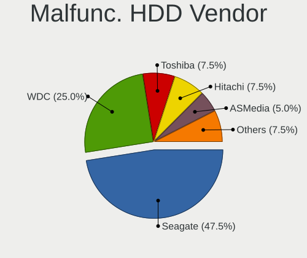

| Vendor              | Desktops | Drives | Percent |
|---------------------|----------|--------|---------|
| Seagate             | 19       | 22     | 47.5%   |
| WDC                 | 10       | 12     | 25%     |
| Toshiba             | 3        | 4      | 7.5%    |
| Hitachi             | 3        | 3      | 7.5%    |
| ASMedia             | 2        | 2      | 5%      |
| Samsung Electronics | 1        | 1      | 2.5%    |
| Maxtor              | 1        | 1      | 2.5%    |
| HGST                | 1        | 1      | 2.5%    |

Malfunc. Drive Kind
-------------------

Kinds of faulty drives

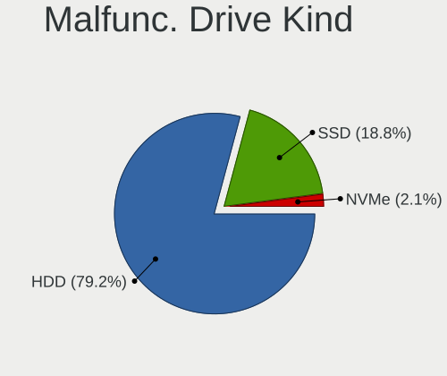

| Kind | Desktops | Drives | Percent |
|------|----------|--------|---------|
| HDD  | 38       | 46     | 79.17%  |
| SSD  | 9        | 12     | 18.75%  |
| NVMe | 1        | 1      | 2.08%   |

Failed Drives
-------------

Failed drive models

Zero info for selected period =(

Failed Drive Vendor
-------------------

Failed drive vendors

Zero info for selected period =(

Drive Status
------------

Number of failed and malfunc. drives

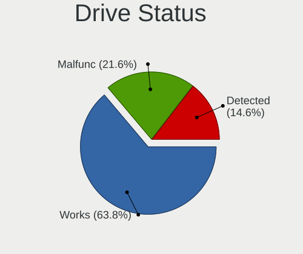

| Status   | Desktops | Drives | Percent |
|----------|----------|--------|---------|
| Works    | 136      | 335    | 63.85%  |
| Malfunc  | 46       | 59     | 21.6%   |
| Detected | 31       | 67     | 14.55%  |

Storage controller
------------------

Storage Vendor
--------------

Storage controller vendors

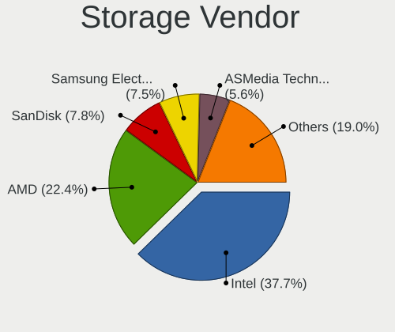

| Vendor                       | Desktops | Percent |
|------------------------------|----------|---------|
| Intel                        | 101      | 37.69%  |
| AMD                          | 60       | 22.39%  |
| SanDisk                      | 21       | 7.84%   |
| Samsung Electronics          | 20       | 7.46%   |
| ASMedia Technology           | 15       | 5.6%    |
| Micron/Crucial Technology    | 9        | 3.36%   |
| Phison Electronics           | 8        | 2.99%   |
| Kingston Technology Company  | 6        | 2.24%   |
| ADATA Technology             | 6        | 2.24%   |
| SK hynix                     | 4        | 1.49%   |
| Realtek Semiconductor        | 4        | 1.49%   |
| MAXIO Technology (Hangzhou)  | 3        | 1.12%   |
| JMicron Technology           | 3        | 1.12%   |
| Silicon Motion               | 2        | 0.75%   |
| Micron Technology            | 2        | 0.75%   |
| VIA Technologies             | 1        | 0.37%   |
| Shenzhen Longsys Electronics | 1        | 0.37%   |
| Marvell Technology Group     | 1        | 0.37%   |
| KIOXIA                       | 1        | 0.37%   |

Storage Model
-------------

Storage controller models

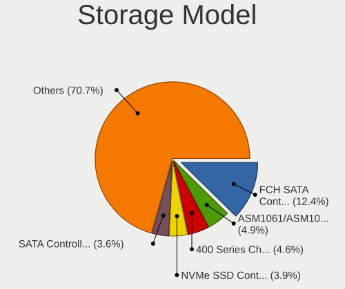

| Model                                                                          | Desktops | Percent |
|--------------------------------------------------------------------------------|----------|---------|
| AMD FCH SATA Controller [AHCI mode]                                            | 38       | 12.38%  |
| ASMedia ASM1061/ASM1062 Serial ATA Controller                                  | 15       | 4.89%   |
| AMD 400 Series Chipset SATA Controller                                         | 14       | 4.56%   |
| Samsung NVMe SSD Controller SM981/PM981/PM983                                  | 12       | 3.91%   |
| Intel SATA Controller [RAID mode]                                              | 11       | 3.58%   |
| Intel Q170/Q150/B150/H170/H110/Z170/CM236 Chipset SATA Controller [AHCI Mode]  | 11       | 3.58%   |
| Intel 200 Series PCH SATA controller [AHCI mode]                               | 11       | 3.58%   |
| AMD 500 Series Chipset SATA Controller                                         | 11       | 3.58%   |
| Intel 8 Series/C220 Series Chipset Family 6-port SATA Controller 1 [AHCI mode] | 10       | 3.26%   |
| Intel 7 Series/C210 Series Chipset Family 6-port SATA Controller [AHCI mode]   | 10       | 3.26%   |
| Samsung NVMe SSD Controller PM9A1/PM9A3/980PRO                                 | 7        | 2.28%   |
| Intel Cannon Lake PCH SATA AHCI Controller                                     | 5        | 1.63%   |
| Intel 6 Series/C200 Series Chipset Family 6 port Desktop SATA AHCI Controller  | 5        | 1.63%   |
| AMD A320 Chipset SATA Controller [AHCI mode]                                   | 5        | 1.63%   |
| SanDisk Ultra 3D / WD Blue SN570 NVMe SSD (DRAM-less)                          | 4        | 1.3%    |
| Intel 500 Series Chipset Family SATA AHCI Controller                           | 4        | 1.3%    |
| SanDisk WD SN560/SN740/SN770/SN5000 NVMe SSD                                   | 3        | 0.98%   |
| SanDisk Ultra 3D / WD PC SN530, IX SN530, Blue SN550 NVMe SSD (DRAM-less)      | 3        | 0.98%   |
| SanDisk Extreme Pro / WD Black SN750 / PC SN730 / Red SN700 NVMe SSD           | 3        | 0.98%   |
| Samsung NVMe SSD Controller SM961/PM961/SM963                                  | 3        | 0.98%   |
| Realtek RTS5762 NVMe SSD Controller                                            | 3        | 0.98%   |
| Phison PS5013-E13 PCIe3 NVMe Controller (DRAM-less)                            | 3        | 0.98%   |
| Phison E12 NVMe Controller                                                     | 3        | 0.98%   |
| Micron/Crucial P5 Plus NVMe PCIe SSD                                           | 3        | 0.98%   |
| Micron/Crucial P2 [Nick P2] / P3 / P3 Plus NVMe PCIe SSD (DRAM-less)           | 3        | 0.98%   |
| Intel Raptor Lake SATA AHCI Controller                                         | 3        | 0.98%   |
| Intel Alder Lake-S PCH SATA Controller [AHCI Mode]                             | 3        | 0.98%   |
| Intel 9 Series Chipset Family SATA Controller [AHCI Mode]                      | 3        | 0.98%   |
| Intel 5 Series/3400 Series Chipset 6 port SATA AHCI Controller                 | 3        | 0.98%   |
| AMD SB7x0/SB8x0/SB9x0 SATA Controller [AHCI mode]                              | 3        | 0.98%   |
| AMD 300 Series Chipset SATA Controller                                         | 3        | 0.98%   |
| ADATA XPG SX8200 Pro PCIe Gen3x4 M.2 2280 Solid State Drive                    | 3        | 0.98%   |
| SK hynix Platinum P41/PC801 NVMe Solid State Drive                             | 2        | 0.65%   |
| SanDisk WD Green SN350 240GB (DRAM-less) / SN560E NVMe SSD                     | 2        | 0.65%   |
| SanDisk WD Black NVMe SSD                                                      | 2        | 0.65%   |
| SanDisk Extreme Pro / WD Black 2018/SN750/PC SN720 NVMe SSD                    | 2        | 0.65%   |
| Samsung NVMe SSD Controller 980 (DRAM-less)                                    | 2        | 0.65%   |
| Micron/Crucial P1 NVMe PCIe SSD[Frampton]                                      | 2        | 0.65%   |
| MAXIO (Hangzhou) NVMe SSD Controller MAP1202 (DRAM-less)                       | 2        | 0.65%   |
| Intel Volume Management Device NVMe RAID Controller                            | 2        | 0.65%   |

Storage Kind
------------

Kind of storage controller (IDE, SATA, NVMe, SAS, ...)

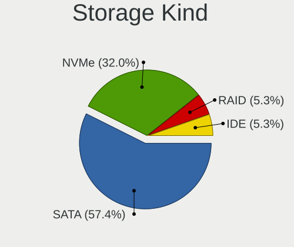

| Kind | Desktops | Percent |
|------|----------|---------|
| SATA | 140      | 57.38%  |
| NVMe | 78       | 31.97%  |
| RAID | 13       | 5.33%   |
| IDE  | 13       | 5.33%   |

Processor
---------

CPU Vendor
----------

Processor vendors

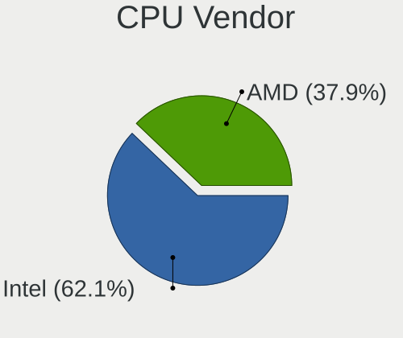

| Vendor | Desktops | Percent |
|--------|----------|---------|
| Intel  | 100      | 62.11%  |
| AMD    | 61       | 37.89%  |

CPU Model
---------

Processor models

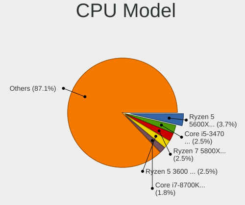

| Model                                       | Desktops | Percent |
|---------------------------------------------|----------|---------|
| AMD Ryzen 5 5600X 6-Core Processor          | 6        | 3.68%   |
| Intel Core i5-3470 CPU @ 3.20GHz            | 4        | 2.45%   |
| AMD Ryzen 7 5800X 8-Core Processor          | 4        | 2.45%   |
| AMD Ryzen 5 3600 6-Core Processor           | 4        | 2.45%   |
| Intel Core i7-8700K CPU @ 3.70GHz           | 3        | 1.84%   |
| Intel Core i7-7700K CPU @ 4.20GHz           | 3        | 1.84%   |
| Intel Core i7-4790K CPU @ 4.00GHz           | 3        | 1.84%   |
| Intel Core i7-4790 CPU @ 3.60GHz            | 3        | 1.84%   |
| Intel Core i7-2600 CPU @ 3.40GHz            | 3        | 1.84%   |
| Intel Core i5-9400 CPU @ 2.90GHz            | 3        | 1.84%   |
| Intel Core i3-6100 CPU @ 3.70GHz            | 3        | 1.84%   |
| AMD Ryzen 7 5800X3D 8-Core Processor        | 3        | 1.84%   |
| AMD Ryzen 7 3700X 8-Core Processor          | 3        | 1.84%   |
| AMD Ryzen 5 5600G with Radeon Graphics      | 3        | 1.84%   |
| AMD Ryzen 5 5500                            | 3        | 1.84%   |
| AMD Ryzen 5 3600X 6-Core Processor          | 3        | 1.84%   |
| AMD Ryzen 5 1600 Six-Core Processor         | 3        | 1.84%   |
| Intel Xeon CPU E5-2678 v3 @ 2.50GHz         | 2        | 1.23%   |
| Intel N100                                  | 2        | 1.23%   |
| Intel Core i7-8700 CPU @ 3.20GHz            | 2        | 1.23%   |
| Intel Core i7 CPU 870 @ 2.93GHz             | 2        | 1.23%   |
| Intel Core i7 CPU 860 @ 2.80GHz             | 2        | 1.23%   |
| Intel Core i5-6600 CPU @ 3.30GHz            | 2        | 1.23%   |
| Intel Core i5-6500 CPU @ 3.20GHz            | 2        | 1.23%   |
| Intel Core i5-6400 CPU @ 2.70GHz            | 2        | 1.23%   |
| Intel Core i5-4590 CPU @ 3.30GHz            | 2        | 1.23%   |
| Intel Core i5-4460 CPU @ 3.20GHz            | 2        | 1.23%   |
| Intel 12th Gen Core i9-12900K               | 2        | 1.23%   |
| AMD Ryzen 7 3800X 8-Core Processor          | 2        | 1.23%   |
| AMD Ryzen 7 2700 Eight-Core Processor       | 2        | 1.23%   |
| AMD Ryzen 3 3200G with Radeon Vega Graphics | 2        | 1.23%   |
| Intel Xeon CPU E5450 @ 3.00GHz              | 1        | 0.61%   |
| Intel Xeon CPU E5-2695 v3 @ 2.30GHz         | 1        | 0.61%   |
| Intel Xeon CPU E5-2689 0 @ 2.60GHz          | 1        | 0.61%   |
| Intel Xeon CPU E5-2670 0 @ 2.60GHz          | 1        | 0.61%   |
| Intel Xeon CPU E5-2630 v3 @ 2.40GHz         | 1        | 0.61%   |
| Intel Pentium CPU J2900 @ 2.41GHz           | 1        | 0.61%   |
| Intel Pentium CPU G620 @ 2.60GHz            | 1        | 0.61%   |
| Intel Pentium CPU G3260T @ 2.90GHz          | 1        | 0.61%   |
| Intel Genuine CPU 0000 @ 2.10GHz            | 1        | 0.61%   |

CPU Model Family
----------------

Processor model prefix

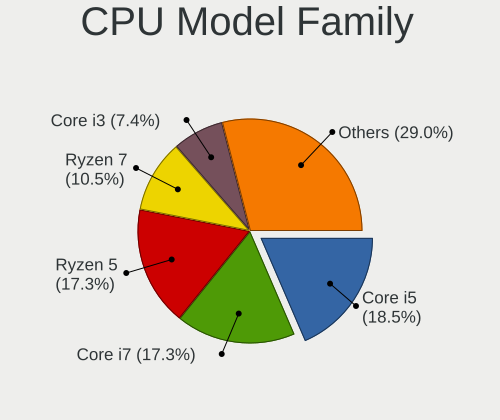

| Model                  | Desktops | Percent |
|------------------------|----------|---------|
| Intel Core i5          | 30       | 18.52%  |
| Intel Core i7          | 28       | 17.28%  |
| AMD Ryzen 5            | 28       | 17.28%  |
| AMD Ryzen 7            | 17       | 10.49%  |
| Intel Core i3          | 12       | 7.41%   |
| Other                  | 10       | 6.17%   |
| Intel Xeon             | 7        | 4.32%   |
| AMD FX                 | 4        | 2.47%   |
| Intel Pentium          | 3        | 1.85%   |
| AMD Ryzen 9            | 3        | 1.85%   |
| AMD Ryzen 3            | 3        | 1.85%   |
| Intel Core i9          | 2        | 1.23%   |
| Intel Core 2 Quad      | 2        | 1.23%   |
| Intel Core 2 Duo       | 2        | 1.23%   |
| Intel Celeron          | 2        | 1.23%   |
| AMD A8                 | 2        | 1.23%   |
| Intel Genuine          | 1        | 0.62%   |
| Intel Core 2           | 1        | 0.62%   |
| AMD Ryzen Threadripper | 1        | 0.62%   |
| AMD E1                 | 1        | 0.62%   |
| AMD Athlon II X3       | 1        | 0.62%   |
| AMD Athlon             | 1        | 0.62%   |
| AMD A4                 | 1        | 0.62%   |

CPU Cores
---------

Number of processor cores

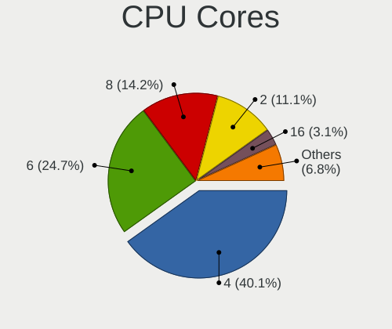

| Number | Desktops | Percent |
|--------|----------|---------|
| 4      | 65       | 40.12%  |
| 6      | 40       | 24.69%  |
| 8      | 23       | 14.2%   |
| 2      | 18       | 11.11%  |
| 16     | 5        | 3.09%   |
| 12     | 4        | 2.47%   |
| 3      | 3        | 1.85%   |
| 10     | 2        | 1.23%   |
| 28     | 1        | 0.62%   |
| 24     | 1        | 0.62%   |

CPU Sockets
-----------

Number of sockets

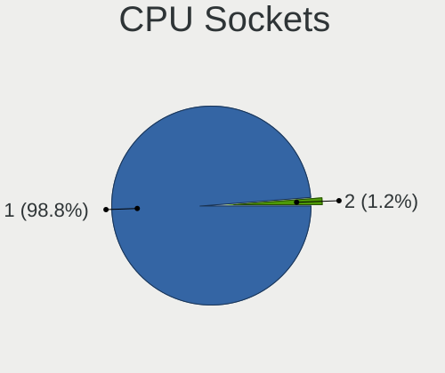

| Number | Desktops | Percent |
|--------|----------|---------|
| 1      | 159      | 98.76%  |
| 2      | 2        | 1.24%   |

CPU Threads
-----------

Threads per core (Hyper-Threading)

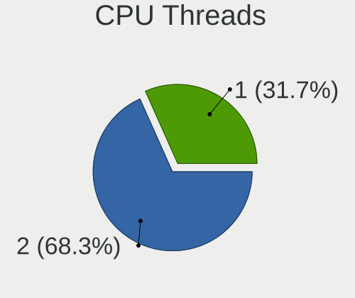

| Number | Desktops | Percent |
|--------|----------|---------|
| 2      | 110      | 68.32%  |
| 1      | 51       | 31.68%  |

CPU Op-Modes
------------

CPU Operation Modes (32-bit, 64-bit)

| Op mode        | Desktops | Percent |
|----------------|----------|---------|
| 32-bit, 64-bit | 161      | 100%    |

CPU Microcode
-------------

Microcode number

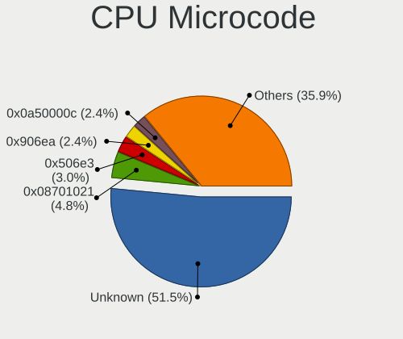

| Number     | Desktops | Percent |
|------------|----------|---------|
| Unknown    | 86       | 51.5%   |
| 0x08701021 | 8        | 4.79%   |
| 0x506e3    | 5        | 2.99%   |
| 0x906ea    | 4        | 2.4%    |
| 0x0a50000c | 4        | 2.4%    |
| 0x0a201025 | 4        | 2.4%    |
| 0x0a201016 | 4        | 2.4%    |
| 0x08701030 | 4        | 2.4%    |
| 0x0800820d | 4        | 2.4%    |
| 0x306c3    | 3        | 1.8%    |
| 0x0a50000d | 3        | 1.8%    |
| 0x0a20120a | 3        | 1.8%    |
| 0x08108109 | 3        | 1.8%    |
| 0x306a9    | 2        | 1.2%    |
| 0x106e5    | 2        | 1.2%    |
| 0x0a201204 | 2        | 1.2%    |
| 0x0810100b | 2        | 1.2%    |
| 0x08001138 | 2        | 1.2%    |
| 0xa0653    | 1        | 0.6%    |
| 0x906ed    | 1        | 0.6%    |
| 0x906eb    | 1        | 0.6%    |
| 0x906e9    | 1        | 0.6%    |
| 0x306f2    | 1        | 0.6%    |
| 0x20655    | 1        | 0.6%    |
| 0x1067a    | 1        | 0.6%    |
| 0x0a601206 | 1        | 0.6%    |
| 0x0a601203 | 1        | 0.6%    |
| 0x0a50000f | 1        | 0.6%    |
| 0x0a20120e | 1        | 0.6%    |
| 0x08701013 | 1        | 0.6%    |
| 0x08600106 | 1        | 0.6%    |
| 0x08101013 | 1        | 0.6%    |
| 0x0700010f | 1        | 0.6%    |
| 0x0700010b | 1        | 0.6%    |
| 0x0600611a | 1        | 0.6%    |
| 0x06000852 | 1        | 0.6%    |
| 0x06000822 | 1        | 0.6%    |
| 0x0600081c | 1        | 0.6%    |
| 0x0500010d | 1        | 0.6%    |
| 0x010000c8 | 1        | 0.6%    |

CPU Microarch
-------------

Microarchitecture

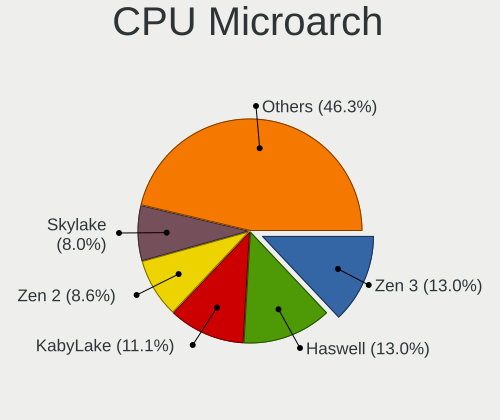

| Name             | Desktops | Percent |
|------------------|----------|---------|
| Zen 3            | 21       | 12.96%  |
| Haswell          | 21       | 12.96%  |
| KabyLake         | 18       | 11.11%  |
| Zen 2            | 14       | 8.64%   |
| Skylake          | 13       | 8.02%   |
| IvyBridge        | 11       | 6.79%   |
| Zen+             | 9        | 5.56%   |
| SandyBridge      | 7        | 4.32%   |
| Zen              | 6        | 3.7%    |
| Alderlake Hybrid | 6        | 3.7%    |
| Piledriver       | 5        | 3.09%   |
| Nehalem          | 5        | 3.09%   |
| CometLake        | 4        | 2.47%   |
| Penryn           | 3        | 1.85%   |
| Core             | 3        | 1.85%   |
| Unknown          | 3        | 1.85%   |
| Silvermont       | 2        | 1.23%   |
| Icelake          | 2        | 1.23%   |
| Gracemont        | 2        | 1.23%   |
| Westmere         | 1        | 0.62%   |
| K10              | 1        | 0.62%   |
| Jaguar           | 1        | 0.62%   |
| Goldmont plus    | 1        | 0.62%   |
| Excavator        | 1        | 0.62%   |
| Broadwell        | 1        | 0.62%   |
| Bobcat           | 1        | 0.62%   |

Graphics
--------

GPU Vendor
----------

Vendors of graphics cards

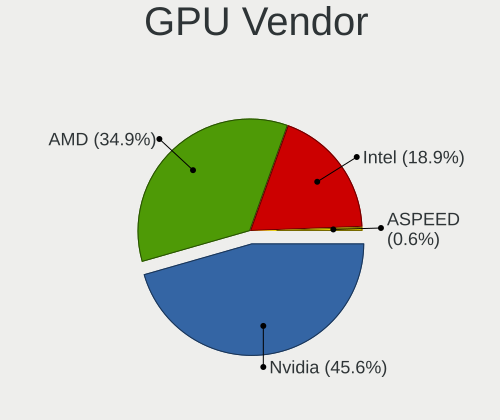

| Vendor            | Desktops | Percent |
|-------------------|----------|---------|
| Nvidia            | 77       | 45.56%  |
| AMD               | 59       | 34.91%  |
| Intel             | 32       | 18.93%  |
| ASPEED Technology | 1        | 0.59%   |

GPU Model
---------

Graphics card models

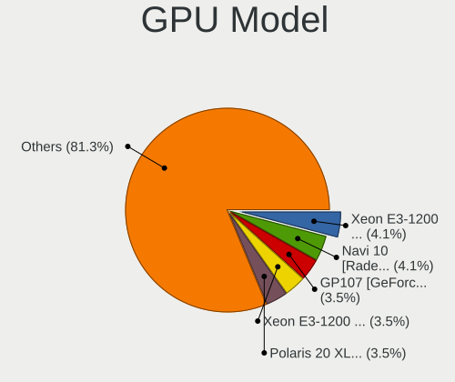

| Model                                                                       | Desktops | Percent |
|-----------------------------------------------------------------------------|----------|---------|
| Intel Xeon E3-1200 v3/4th Gen Core Processor Integrated Graphics Controller | 7        | 4.09%   |
| AMD Navi 10 [Radeon RX 5600 OEM/5600 XT / 5700/5700 XT]                     | 7        | 4.09%   |
| Nvidia GP107 [GeForce GTX 1050 Ti]                                          | 6        | 3.51%   |
| Intel Xeon E3-1200 v2/3rd Gen Core processor Graphics Controller            | 6        | 3.51%   |
| AMD Polaris 20 XL [Radeon RX 580 2048SP]                                    | 6        | 3.51%   |
| Nvidia GP104 [GeForce GTX 1070]                                             | 5        | 2.92%   |
| AMD Ellesmere [Radeon RX 470/480/570/570X/580/580X/590]                     | 5        | 2.92%   |
| Nvidia GP108 [GeForce GT 1030]                                              | 4        | 2.34%   |
| Nvidia GP106 [GeForce GTX 1060 6GB]                                         | 4        | 2.34%   |
| Nvidia GP104 [GeForce GTX 1080]                                             | 4        | 2.34%   |
| Intel CoffeeLake-S GT2 [UHD Graphics 630]                                   | 4        | 2.34%   |
| AMD Cezanne [Radeon Vega Series / Radeon Vega Mobile Series]                | 4        | 2.34%   |
| Nvidia TU106 [GeForce RTX 2060 Rev. A]                                      | 3        | 1.75%   |
| Nvidia TU104 [GeForce RTX 2070 SUPER]                                       | 3        | 1.75%   |
| Nvidia GP107 [GeForce GTX 1050]                                             | 3        | 1.75%   |
| Nvidia GM206 [GeForce GTX 960]                                              | 3        | 1.75%   |
| Nvidia GA104 [GeForce RTX 3060 Ti Lite Hash Rate]                           | 3        | 1.75%   |
| AMD Picasso/Raven 2 [Radeon Vega Series / Radeon Vega Mobile Series]        | 3        | 1.75%   |
| AMD Navi 23 [Radeon RX 6600/6600 XT/6600M]                                  | 3        | 1.75%   |
| AMD Lexa PRO [Radeon 540/540X/550/550X / RX 540X/550/550X]                  | 3        | 1.75%   |
| AMD Curacao PRO [Radeon R7 370 / R9 270/370 OEM]                            | 3        | 1.75%   |
| Nvidia TU117 [GeForce GTX 1650]                                             | 2        | 1.17%   |
| Nvidia TU116 [GeForce GTX 1660 SUPER]                                       | 2        | 1.17%   |
| Nvidia TU106 [GeForce RTX 2060 SUPER]                                       | 2        | 1.17%   |
| Nvidia GM204 [GeForce GTX 970]                                              | 2        | 1.17%   |
| Nvidia GM107 [GeForce GTX 750 Ti]                                           | 2        | 1.17%   |
| Nvidia GF108 [GeForce GT 730]                                               | 2        | 1.17%   |
| Nvidia GA106 [GeForce RTX 3060 Lite Hash Rate]                              | 2        | 1.17%   |
| Nvidia GA102 [GeForce RTX 3080 Lite Hash Rate]                              | 2        | 1.17%   |
| Nvidia AD102 [GeForce RTX 4090]                                             | 2        | 1.17%   |
| Intel Alder Lake-N [UHD Graphics]                                           | 2        | 1.17%   |
| Intel 4 Series Chipset Integrated Graphics Controller                       | 2        | 1.17%   |
| Intel 2nd Generation Core Processor Family Integrated Graphics Controller   | 2        | 1.17%   |
| AMD Raven Ridge [Radeon Vega Series / Radeon Vega Mobile Series]            | 2        | 1.17%   |
| AMD Raphael                                                                 | 2        | 1.17%   |
| AMD Navi 21 [Radeon RX 6800/6800 XT / 6900 XT]                              | 2        | 1.17%   |
| AMD Cedar [Radeon HD 5000/6000/7350/8350 Series]                            | 2        | 1.17%   |
| Nvidia TU116 [GeForce GTX 1660]                                             | 1        | 0.58%   |
| Nvidia TU116 [GeForce GTX 1660 Ti]                                          | 1        | 0.58%   |
| Nvidia TU116 [GeForce GTX 1650 SUPER]                                       | 1        | 0.58%   |

GPU Combo
---------

Combinations of graphics cards

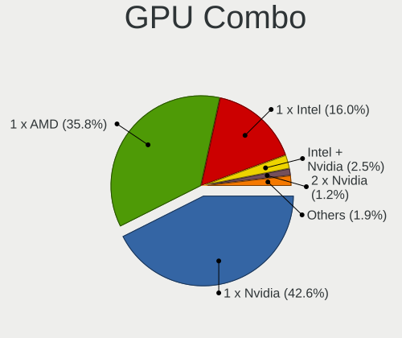

| Name            | Desktops | Percent |
|-----------------|----------|---------|
| 1 x Nvidia      | 69       | 42.59%  |
| 1 x AMD         | 58       | 35.8%   |
| 1 x Intel       | 26       | 16.05%  |
| Intel + Nvidia  | 4        | 2.47%   |
| 2 x Nvidia      | 2        | 1.23%   |
| 2 x Intel       | 1        | 0.62%   |
| Nvidia + ASPEED | 1        | 0.62%   |
| AMD + Nvidia    | 1        | 0.62%   |

GPU Driver
----------

Free vs proprietary

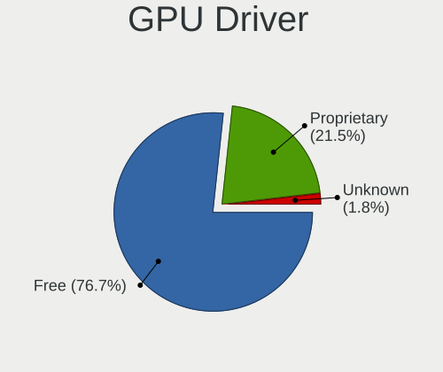

| Driver      | Desktops | Percent |
|-------------|----------|---------|
| Free        | 125      | 76.69%  |
| Proprietary | 35       | 21.47%  |
| Unknown     | 3        | 1.84%   |

GPU Memory
----------

Total video memory

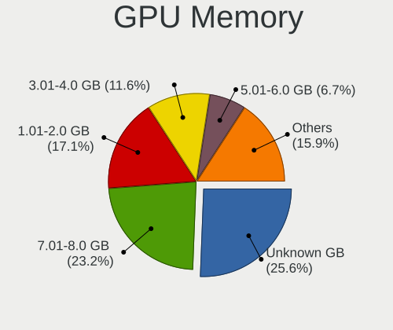

| Size in GB | Desktops | Percent |
|------------|----------|---------|
| Unknown    | 42       | 25.61%  |
| 7.01-8.0   | 38       | 23.17%  |
| 1.01-2.0   | 28       | 17.07%  |
| 3.01-4.0   | 19       | 11.59%  |
| 5.01-6.0   | 11       | 6.71%   |
| 8.01-16.0  | 9        | 5.49%   |
| 0.01-0.5   | 8        | 4.88%   |
| 0.51-1.0   | 6        | 3.66%   |
| 16.01-24.0 | 2        | 1.22%   |
| 2.01-3.0   | 1        | 0.61%   |

Monitor
-------

Monitor Vendor
--------------

Monitor vendors

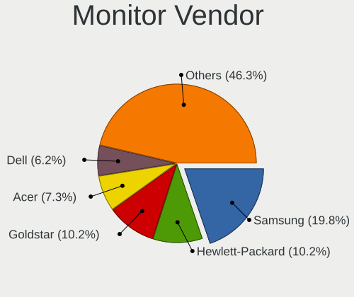

| Vendor               | Desktops | Percent |
|----------------------|----------|---------|
| Samsung Electronics  | 35       | 19.77%  |
| Hewlett-Packard      | 18       | 10.17%  |
| Goldstar             | 18       | 10.17%  |
| Acer                 | 13       | 7.34%   |
| Dell                 | 11       | 6.21%   |
| Ancor Communications | 11       | 6.21%   |
| Unknown              | 9        | 5.08%   |
| AOC                  | 8        | 4.52%   |
| BenQ                 | 6        | 3.39%   |
| ASUSTek Computer     | 6        | 3.39%   |
| MSI                  | 5        | 2.82%   |
| Iiyama               | 5        | 2.82%   |
| Philips              | 3        | 1.69%   |
| Lenovo               | 3        | 1.69%   |
| Hitachi              | 2        | 1.13%   |
| Gigabyte Technology  | 2        | 1.13%   |
| Fujitsu Siemens      | 2        | 1.13%   |
| Unknown              | 2        | 1.13%   |
| Yeyian               | 1        | 0.56%   |
| Westinghouse         | 1        | 0.56%   |
| Vizio                | 1        | 0.56%   |
| ViewSonic            | 1        | 0.56%   |
| UTV                  | 1        | 0.56%   |
| Sony                 | 1        | 0.56%   |
| Sceptre Tech         | 1        | 0.56%   |
| QIA                  | 1        | 0.56%   |
| MHS                  | 1        | 0.56%   |
| Konka                | 1        | 0.56%   |
| Kogan                | 1        | 0.56%   |
| KOC                  | 1        | 0.56%   |
| JRY                  | 1        | 0.56%   |
| Idek Iiyama          | 1        | 0.56%   |
| HKC                  | 1        | 0.56%   |
| FOX                  | 1        | 0.56%   |
| Eizo                 | 1        | 0.56%   |
| BOE                  | 1        | 0.56%   |

Monitor Model
-------------

Monitor models

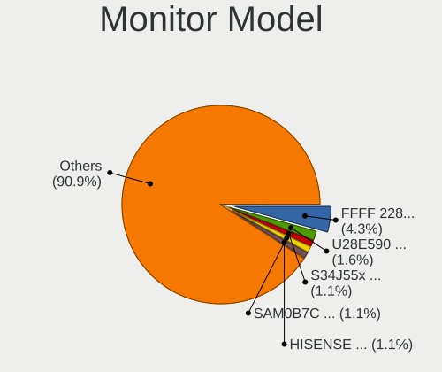

| Model                                                                   | Desktops | Percent |
|-------------------------------------------------------------------------|----------|---------|
| Unknown LCD Monitor FFFF 2288x1287 2550x2550mm 142.0-inch               | 8        | 4.28%   |
| Samsung Electronics U28E590 SAM0C4D 3840x2160 607x345mm 27.5-inch       | 3        | 1.6%    |
| Samsung Electronics S34J55x SAM0F70 3440x1440 797x333mm 34.0-inch       | 2        | 1.07%   |
| Samsung Electronics LCD Monitor SAM0B7C 1920x1080 886x498mm 40.0-inch   | 2        | 1.07%   |
| Hitachi HISENSE HEC002F 3840x2160 1872x1053mm 84.6-inch                 | 2        | 1.07%   |
| Hewlett-Packard 2310e HWP288E 1920x1080 510x287mm 23.0-inch             | 2        | 1.07%   |
| Goldstar ULTRAWIDE GSM76FA 2560x1080 798x334mm 34.1-inch                | 2        | 1.07%   |
| Goldstar ULTRAGEAR GSM7766 2560x1440 697x392mm 31.5-inch                | 2        | 1.07%   |
| Goldstar HDR 4K GSM7706 3840x2160 600x340mm 27.2-inch                   | 2        | 1.07%   |
| Goldstar FULL HD GSM5BDE 1920x1080 527x296mm 23.8-inch                  | 2        | 1.07%   |
| Dell S3221QS DELD107 3840x2160 697x392mm 31.5-inch                      | 2        | 1.07%   |
| Dell P2419H DELD0DA 1920x1080 527x296mm 23.8-inch                       | 2        | 1.07%   |
| AOC Q2963 AOC2963 2560x1080 673x284mm 28.8-inch                         | 2        | 1.07%   |
| Ancor Communications ROG PG348Q ACI3433 3440x1440 798x335mm 34.1-inch   | 2        | 1.07%   |
| Ancor Communications ASUS VP228 ACI22C3 1920x1080 476x268mm 21.5-inch   | 2        | 1.07%   |
| Ancor Communications ASUS VE278 ACI27F6 1920x1080 598x336mm 27.0-inch   | 2        | 1.07%   |
| Unknown                                                                 | 2        | 1.07%   |
| Yeyian YMG-4K27-01 YEY2700 3840x2160 600x330mm 27.0-inch                | 1        | 0.53%   |
| Westinghouse SK-32H640G WDE6040 1366x768 709x399mm 32.0-inch            | 1        | 0.53%   |
| Vizio D24h-C1 VIZ0095 1360x768 521x293mm 23.5-inch                      | 1        | 0.53%   |
| ViewSonic VX3211 SERIES VSCF534 1920x1080 700x390mm 31.5-inch           | 1        | 0.53%   |
| UTV MONITOR UTV002F 3840x2160 1872x1053mm 84.6-inch                     | 1        | 0.53%   |
| Unknown LCD Monitor SAMSUNG 1360x768                                    | 1        | 0.53%   |
| Sony LCD Monitor AVSYSTEM 1280x720                                      | 1        | 0.53%   |
| Sceptre Tech Sceptre M24 SPT09A1 1920x1080 527x296mm 23.8-inch          | 1        | 0.53%   |
| Samsung Electronics T27B300 SAM0933 1920x1080 598x336mm 27.0-inch       | 1        | 0.53%   |
| Samsung Electronics SyncMaster SAM0564 1360x768 410x230mm 18.5-inch     | 1        | 0.53%   |
| Samsung Electronics SyncMaster SAM0524 1920x1080 477x268mm 21.5-inch    | 1        | 0.53%   |
| Samsung Electronics SyncMaster SAM0484 1920x1080 520x320mm 24.0-inch    | 1        | 0.53%   |
| Samsung Electronics SyncMaster SAM036E 1280x1024 376x301mm 19.0-inch    | 1        | 0.53%   |
| Samsung Electronics SyncMaster SAM02FE 1680x1050 433x271mm 20.1-inch    | 1        | 0.53%   |
| Samsung Electronics SMB2430H SAM064E 1920x1080                          | 1        | 0.53%   |
| Samsung Electronics SMB2230N SAM0635 1920x1080 477x268mm 21.5-inch      | 1        | 0.53%   |
| Samsung Electronics SMB1930N SAM0632 1366x768 410x230mm 18.5-inch       | 1        | 0.53%   |
| Samsung Electronics SA300/350/360 SAM07D6 1920x1080 531x299mm 24.0-inch | 1        | 0.53%   |
| Samsung Electronics S34J55x SAM0F72 3440x1440 797x333mm 34.0-inch       | 1        | 0.53%   |
| Samsung Electronics S27F350 SAM0D22 1920x1080 598x336mm 27.0-inch       | 1        | 0.53%   |
| Samsung Electronics S27E510 SAM0C5F 1920x1080 598x336mm 27.0-inch       | 1        | 0.53%   |
| Samsung Electronics S24F350 SAM0D20 1920x1080 521x293mm 23.5-inch       | 1        | 0.53%   |
| Samsung Electronics S24D330 SAM0D92 1920x1080 531x299mm 24.0-inch       | 1        | 0.53%   |

Monitor Resolution
------------------

Monitor screen resolution

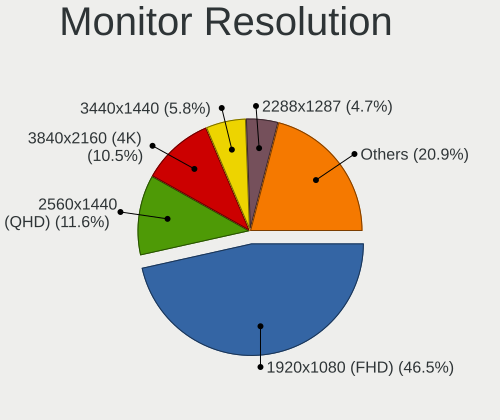

| Resolution         | Desktops | Percent |
|--------------------|----------|---------|
| 1920x1080 (FHD)    | 80       | 46.51%  |
| 2560x1440 (QHD)    | 20       | 11.63%  |
| 3840x2160 (4K)     | 18       | 10.47%  |
| 3440x1440          | 10       | 5.81%   |
| 2288x1287          | 8        | 4.65%   |
| 2560x1080          | 6        | 3.49%   |
| 1680x1050 (WSXGA+) | 5        | 2.91%   |
| 1366x768 (WXGA)    | 4        | 2.33%   |
| 1280x1024 (SXGA)   | 4        | 2.33%   |
| 1600x900 (HD+)     | 3        | 1.74%   |
| 1360x768           | 3        | 1.74%   |
| 3840x1080          | 2        | 1.16%   |
| 2560x1600          | 2        | 1.16%   |
| 1440x900 (WXGA+)   | 2        | 1.16%   |
| 1920x540           | 1        | 0.58%   |
| 1920x1200 (WUXGA)  | 1        | 0.58%   |
| 1280x720 (HD)      | 1        | 0.58%   |
| 1024x768 (XGA)     | 1        | 0.58%   |
| Unknown            | 1        | 0.58%   |

Monitor Diagonal
----------------

Diagonal size in inches

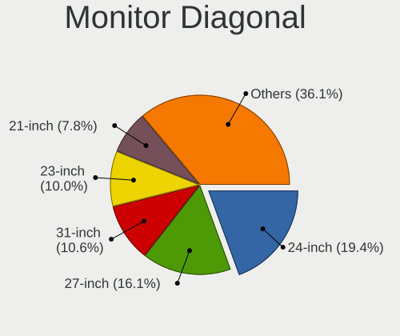

| Inches  | Desktops | Percent |
|---------|----------|---------|
| 24      | 35       | 19.44%  |
| 27      | 29       | 16.11%  |
| 31      | 19       | 10.56%  |
| 23      | 18       | 10%     |
| 21      | 14       | 7.78%   |
| 34      | 11       | 6.11%   |
| 142     | 8        | 4.44%   |
| Unknown | 7        | 3.89%   |
| 84      | 4        | 2.22%   |
| 19      | 4        | 2.22%   |
| 18      | 4        | 2.22%   |
| 29      | 3        | 1.67%   |
| 28      | 3        | 1.67%   |
| 22      | 3        | 1.67%   |
| 20      | 3        | 1.67%   |
| 58      | 2        | 1.11%   |
| 54      | 2        | 1.11%   |
| 40      | 2        | 1.11%   |
| 52      | 1        | 0.56%   |
| 48      | 1        | 0.56%   |
| 39      | 1        | 0.56%   |
| 35      | 1        | 0.56%   |
| 33      | 1        | 0.56%   |
| 32      | 1        | 0.56%   |
| 26      | 1        | 0.56%   |
| 17      | 1        | 0.56%   |
| 16      | 1        | 0.56%   |

Monitor Width
-------------

Physical width

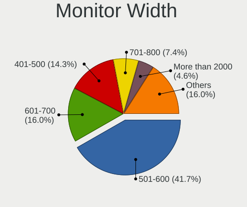

| Width in mm    | Desktops | Percent |
|----------------|----------|---------|
| 501-600        | 73       | 41.71%  |
| 601-700        | 28       | 16%     |
| 401-500        | 25       | 14.29%  |
| 701-800        | 13       | 7.43%   |
| More than 2000 | 8        | 4.57%   |
| Unknown        | 7        | 4%      |
| 351-400        | 6        | 3.43%   |
| 1001-1500      | 6        | 3.43%   |
| 801-900        | 5        | 2.86%   |
| 1501-2000      | 4        | 2.29%   |

Aspect Ratio
------------

Proportional relationship between the width and the height

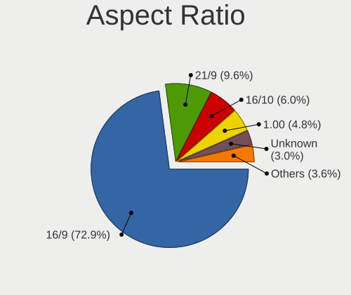

| Ratio   | Desktops | Percent |
|---------|----------|---------|
| 16/9    | 121      | 72.89%  |
| 21/9    | 16       | 9.64%   |
| 16/10   | 10       | 6.02%   |
| 1.00    | 8        | 4.82%   |
| Unknown | 5        | 3.01%   |
| 5/4     | 4        | 2.41%   |
| 32/9    | 1        | 0.6%    |
| 3/2     | 1        | 0.6%    |

Monitor Area
------------

Area in inch²

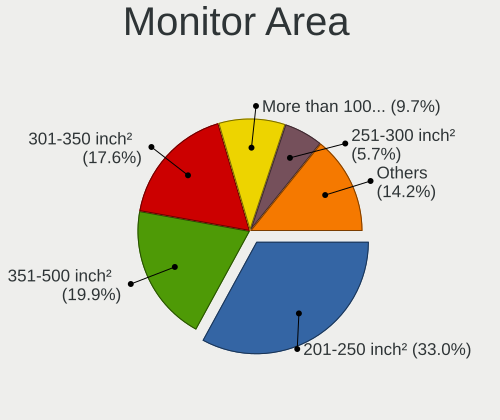

| Area in inch² | Desktops | Percent |
|----------------|----------|---------|
| 201-250        | 58       | 32.95%  |
| 351-500        | 35       | 19.89%  |
| 301-350        | 31       | 17.61%  |
| More than 1000 | 17       | 9.66%   |
| 251-300        | 10       | 5.68%   |
| 151-200        | 10       | 5.68%   |
| Unknown        | 7        | 3.98%   |
| 501-1000       | 4        | 2.27%   |
| 141-150        | 2        | 1.14%   |
| 131-140        | 1        | 0.57%   |
| 111-120        | 1        | 0.57%   |

Pixel Density
-------------

Pixels per inch

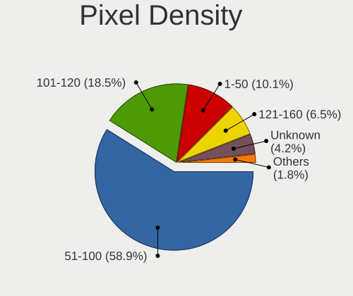

| Density | Desktops | Percent |
|---------|----------|---------|
| 51-100  | 99       | 58.93%  |
| 101-120 | 31       | 18.45%  |
| 1-50    | 17       | 10.12%  |
| 121-160 | 11       | 6.55%   |
| Unknown | 7        | 4.17%   |
| 161-240 | 3        | 1.79%   |

Multiple Monitors
-----------------

Total monitors connected

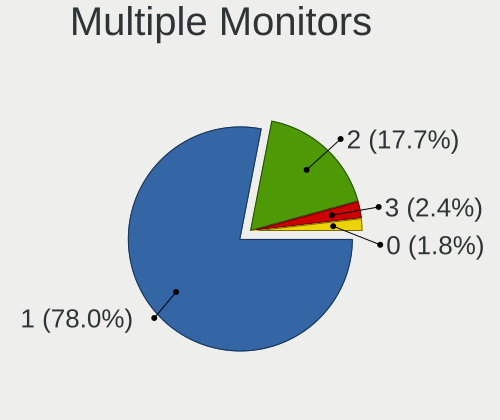

| Total | Desktops | Percent |
|-------|----------|---------|
| 1     | 128      | 78.05%  |
| 2     | 29       | 17.68%  |
| 3     | 4        | 2.44%   |
| 0     | 3        | 1.83%   |

Network
-------

Net Controller Vendor
---------------------

Controller vendors

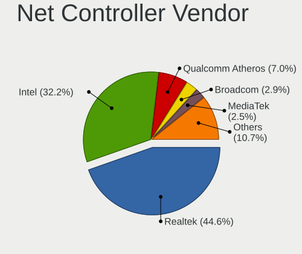

| Vendor                          | Desktops | Percent |
|---------------------------------|----------|---------|
| Realtek Semiconductor           | 108      | 44.63%  |
| Intel                           | 78       | 32.23%  |
| Qualcomm Atheros                | 17       | 7.02%   |
| Broadcom                        | 7        | 2.89%   |
| MediaTek                        | 6        | 2.48%   |
| TP-Link                         | 3        | 1.24%   |
| Ralink Technology               | 3        | 1.24%   |
| Ralink                          | 3        | 1.24%   |
| Aquantia                        | 3        | 1.24%   |
| Qualcomm Atheros Communications | 2        | 0.83%   |
| Qualcomm                        | 2        | 0.83%   |
| OPPO Electronics                | 2        | 0.83%   |
| Microsoft                       | 2        | 0.83%   |
| ZyDAS                           | 1        | 0.41%   |
| T & A Mobile Phones             | 1        | 0.41%   |
| QinHeng Electronics             | 1        | 0.41%   |
| NetGear                         | 1        | 0.41%   |
| Broadcom Limited                | 1        | 0.41%   |
| ASUSTek Computer                | 1        | 0.41%   |

Net Controller Model
--------------------

Controller models

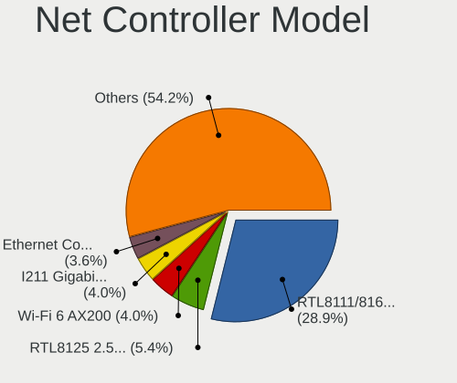

| Model                                                                  | Desktops | Percent |
|------------------------------------------------------------------------|----------|---------|
| Realtek RTL8111/8168/8211/8411 PCI Express Gigabit Ethernet Controller | 80       | 28.88%  |
| Realtek RTL8125 2.5GbE Controller                                      | 15       | 5.42%   |
| Intel Wi-Fi 6 AX200                                                    | 11       | 3.97%   |
| Intel I211 Gigabit Network Connection                                  | 11       | 3.97%   |
| Intel Ethernet Connection (2) I219-V                                   | 10       | 3.61%   |
| Intel Ethernet Controller I225-V                                       | 8        | 2.89%   |
| Intel 82579LM Gigabit Network Connection (Lewisville)                  | 7        | 2.53%   |
| Realtek RTL88x2bu [AC1200 Techkey]                                     | 6        | 2.17%   |
| Intel Wi-Fi 6E(802.11ax) AX210/AX1675* 2x2 [Typhoon Peak]              | 6        | 2.17%   |
| Intel Ethernet Connection I217-LM                                      | 5        | 1.81%   |
| Qualcomm Atheros Killer E220x Gigabit Ethernet Controller              | 4        | 1.44%   |
| Intel Wi-Fi 5(802.11ac) Wireless-AC 9x6x [Thunder Peak]                | 4        | 1.44%   |
| Qualcomm Atheros AR9485 Wireless Network Adapter                       | 3        | 1.08%   |
| Intel Wireless 7265                                                    | 3        | 1.08%   |
| Intel Ethernet Connection (7) I219-V                                   | 3        | 1.08%   |
| Intel Dual Band Wireless-AC 3168NGW [Stone Peak]                       | 3        | 1.08%   |
| Intel Cannon Lake PCH CNVi WiFi                                        | 3        | 1.08%   |
| Broadcom NetLink BCM57780 Gigabit Ethernet PCIe                        | 3        | 1.08%   |
| Broadcom BCM4360 802.11ac Dual Band Wireless Network Adapter           | 3        | 1.08%   |
| TP-Link Archer T2U PLUS [RTL8821AU]                                    | 2        | 0.72%   |
| Realtek RTL8822BE 802.11a/b/g/n/ac WiFi adapter                        | 2        | 0.72%   |
| Realtek RTL8821CE 802.11ac PCIe Wireless Network Adapter               | 2        | 0.72%   |
| Realtek RTL8192EE PCIe Wireless Network Adapter                        | 2        | 0.72%   |
| Realtek RTL8153 Gigabit Ethernet Adapter                               | 2        | 0.72%   |
| Realtek RTL810xE PCI Express Fast Ethernet controller                  | 2        | 0.72%   |
| Qualcomm Atheros AR9271 802.11n                                        | 2        | 0.72%   |
| Qualcomm Atheros AR9462 Wireless Network Adapter                       | 2        | 0.72%   |
| Qualcomm Atheros AR93xx Wireless Network Adapter                       | 2        | 0.72%   |
| Qualcomm Atheros AR8121/AR8113/AR8114 Gigabit or Fast Ethernet         | 2        | 0.72%   |
| OPPO Ace 3V                                                            | 2        | 0.72%   |
| MediaTek MT7922 802.11ax PCI Express Wireless Network Adapter          | 2        | 0.72%   |
| MediaTek MT7921K (RZ608) Wi-Fi 6E 80MHz                                | 2        | 0.72%   |
| MediaTek MT7921 802.11ax PCIe Wireless Network Adapter [Filogic 330]   | 2        | 0.72%   |
| Intel Ethernet Connection (11) I219-V                                  | 2        | 0.72%   |
| Intel Alder Lake-N PCH CNVi WiFi                                       | 2        | 0.72%   |
| Intel 82579V Gigabit Network Connection                                | 2        | 0.72%   |
| Intel 700 Series Chipset CNVi WiFi                                     | 2        | 0.72%   |
| ZyDAS ZD1211B 802.11g                                                  | 1        | 0.36%   |
| TP-Link AC600 wireless Realtek RTL8811AU [Archer T2U Nano]             | 1        | 0.36%   |
| T & A Mobile Phones TCL 30 Z                                           | 1        | 0.36%   |

Wireless Vendor
---------------

Wireless vendors

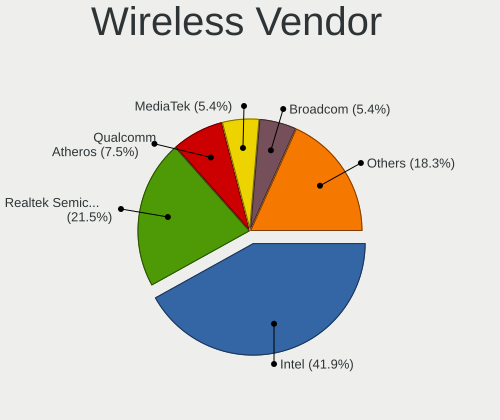

| Vendor                          | Desktops | Percent |
|---------------------------------|----------|---------|
| Intel                           | 39       | 41.94%  |
| Realtek Semiconductor           | 20       | 21.51%  |
| Qualcomm Atheros                | 7        | 7.53%   |
| MediaTek                        | 5        | 5.38%   |
| Broadcom                        | 5        | 5.38%   |
| TP-Link                         | 3        | 3.23%   |
| Ralink Technology               | 3        | 3.23%   |
| Ralink                          | 3        | 3.23%   |
| Qualcomm Atheros Communications | 2        | 2.15%   |
| Microsoft                       | 2        | 2.15%   |
| ZyDAS                           | 1        | 1.08%   |
| NetGear                         | 1        | 1.08%   |
| Broadcom Limited                | 1        | 1.08%   |
| ASUSTek Computer                | 1        | 1.08%   |

Wireless Model
--------------

Wireless models

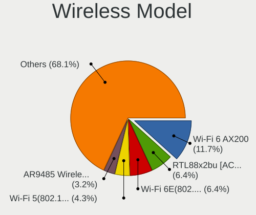

| Model                                                                     | Desktops | Percent |
|---------------------------------------------------------------------------|----------|---------|
| Intel Wi-Fi 6 AX200                                                       | 11       | 11.7%   |
| Realtek RTL88x2bu [AC1200 Techkey]                                        | 6        | 6.38%   |
| Intel Wi-Fi 6E(802.11ax) AX210/AX1675* 2x2 [Typhoon Peak]                 | 6        | 6.38%   |
| Intel Wi-Fi 5(802.11ac) Wireless-AC 9x6x [Thunder Peak]                   | 4        | 4.26%   |
| Qualcomm Atheros AR9485 Wireless Network Adapter                          | 3        | 3.19%   |
| Intel Wireless 7265                                                       | 3        | 3.19%   |
| Intel Dual Band Wireless-AC 3168NGW [Stone Peak]                          | 3        | 3.19%   |
| Intel Cannon Lake PCH CNVi WiFi                                           | 3        | 3.19%   |
| Broadcom BCM4360 802.11ac Dual Band Wireless Network Adapter              | 3        | 3.19%   |
| TP-Link Archer T2U PLUS [RTL8821AU]                                       | 2        | 2.13%   |
| Realtek RTL8822BE 802.11a/b/g/n/ac WiFi adapter                           | 2        | 2.13%   |
| Realtek RTL8821CE 802.11ac PCIe Wireless Network Adapter                  | 2        | 2.13%   |
| Realtek RTL8192EE PCIe Wireless Network Adapter                           | 2        | 2.13%   |
| Qualcomm Atheros AR9271 802.11n                                           | 2        | 2.13%   |
| Qualcomm Atheros AR9462 Wireless Network Adapter                          | 2        | 2.13%   |
| Qualcomm Atheros AR93xx Wireless Network Adapter                          | 2        | 2.13%   |
| MediaTek MT7921K (RZ608) Wi-Fi 6E 80MHz                                   | 2        | 2.13%   |
| MediaTek MT7921 802.11ax PCIe Wireless Network Adapter [Filogic 330]      | 2        | 2.13%   |
| Intel Alder Lake-N PCH CNVi WiFi                                          | 2        | 2.13%   |
| Intel 700 Series Chipset CNVi WiFi                                        | 2        | 2.13%   |
| ZyDAS ZD1211B 802.11g                                                     | 1        | 1.06%   |
| TP-Link AC600 wireless Realtek RTL8811AU [Archer T2U Nano]                | 1        | 1.06%   |
| Realtek RTL8821CE PCIe 802.11ac Wireless Network Controller               | 1        | 1.06%   |
| Realtek RTL8812AU 802.11a/b/g/n/ac 2T2R DB WLAN Adapter                   | 1        | 1.06%   |
| Realtek RTL8723BU 802.11b/g/n WLAN Adapter                                | 1        | 1.06%   |
| Realtek RTL8723BE PCIe Wireless Network Adapter                           | 1        | 1.06%   |
| Realtek RTL8188FTV 802.11b/g/n 1T1R 2.4G WLAN Adapter                     | 1        | 1.06%   |
| Realtek RTL8188EUS 802.11n Wireless Network Adapter                       | 1        | 1.06%   |
| Realtek RTL8188EE Wireless Network Adapter                                | 1        | 1.06%   |
| Realtek 802.11ac NIC                                                      | 1        | 1.06%   |
| Ralink RT5370 Wireless Adapter                                            | 1        | 1.06%   |
| Ralink RT2501/RT2573 Wireless Adapter                                     | 1        | 1.06%   |
| Ralink MT7601U Wireless Adapter                                           | 1        | 1.06%   |
| Ralink RT5392 PCIe Wireless Network Adapter                               | 1        | 1.06%   |
| Ralink RT5390R 802.11bgn PCIe Wireless Network Adapter                    | 1        | 1.06%   |
| Ralink RT3090 Wireless 802.11n 1T/1R PCIe                                 | 1        | 1.06%   |
| Qualcomm Atheros AR9287 Wireless Network Adapter (PCI-Express)            | 1        | 1.06%   |
| NetGear Nighthawk A7000 802.11ac Wireless Adapter AC1900 [Realtek 8814AU] | 1        | 1.06%   |
| Microsoft Xbox Wireless Adapter for Windows                               | 1        | 1.06%   |
| Microsoft Xbox 360 Wireless Adapter                                       | 1        | 1.06%   |

Ethernet Vendor
---------------

Ethernet vendors

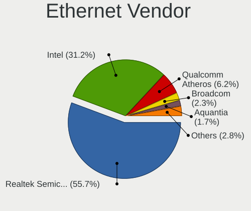

| Vendor                | Desktops | Percent |
|-----------------------|----------|---------|
| Realtek Semiconductor | 98       | 55.68%  |
| Intel                 | 55       | 31.25%  |
| Qualcomm Atheros      | 11       | 6.25%   |
| Broadcom              | 4        | 2.27%   |
| Aquantia              | 3        | 1.7%    |
| Qualcomm              | 2        | 1.14%   |
| OPPO Electronics      | 2        | 1.14%   |
| MediaTek              | 1        | 0.57%   |

Ethernet Model
--------------

Ethernet models

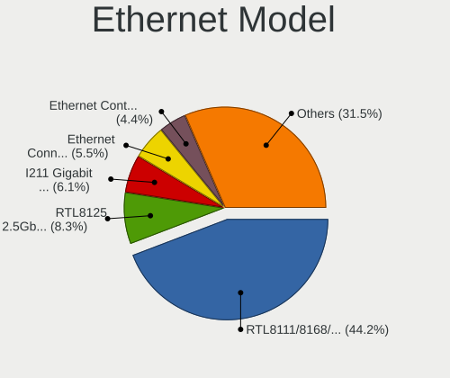

| Model                                                                             | Desktops | Percent |
|-----------------------------------------------------------------------------------|----------|---------|
| Realtek RTL8111/8168/8211/8411 PCI Express Gigabit Ethernet Controller            | 80       | 44.2%   |
| Realtek RTL8125 2.5GbE Controller                                                 | 15       | 8.29%   |
| Intel I211 Gigabit Network Connection                                             | 11       | 6.08%   |
| Intel Ethernet Connection (2) I219-V                                              | 10       | 5.52%   |
| Intel Ethernet Controller I225-V                                                  | 8        | 4.42%   |
| Intel 82579LM Gigabit Network Connection (Lewisville)                             | 7        | 3.87%   |
| Intel Ethernet Connection I217-LM                                                 | 5        | 2.76%   |
| Qualcomm Atheros Killer E220x Gigabit Ethernet Controller                         | 4        | 2.21%   |
| Intel Ethernet Connection (7) I219-V                                              | 3        | 1.66%   |
| Broadcom NetLink BCM57780 Gigabit Ethernet PCIe                                   | 3        | 1.66%   |
| Realtek RTL8153 Gigabit Ethernet Adapter                                          | 2        | 1.1%    |
| Realtek RTL810xE PCI Express Fast Ethernet controller                             | 2        | 1.1%    |
| Qualcomm Atheros AR8121/AR8113/AR8114 Gigabit or Fast Ethernet                    | 2        | 1.1%    |
| OPPO Ace 3V                                                                       | 2        | 1.1%    |
| Intel Ethernet Connection (11) I219-V                                             | 2        | 1.1%    |
| Intel 82579V Gigabit Network Connection                                           | 2        | 1.1%    |
| Realtek Killer E2600 GbE Controller                                               | 1        | 0.55%   |
| Qualcomm YUPIK-QRD _SN:AC1D5909                                                   | 1        | 0.55%   |
| Qualcomm Nokia X30 5G                                                             | 1        | 0.55%   |
| Qualcomm Atheros Killer E2500 Gigabit Ethernet Controller                         | 1        | 0.55%   |
| Qualcomm Atheros Attansic L1 Gigabit Ethernet                                     | 1        | 0.55%   |
| Qualcomm Atheros AR8151 v2.0 Gigabit Ethernet                                     | 1        | 0.55%   |
| Qualcomm Atheros AR8132 Fast Ethernet                                             | 1        | 0.55%   |
| Qualcomm Atheros AR8131 Gigabit Ethernet                                          | 1        | 0.55%   |
| MediaTek MT7922 802.11ax PCI Express Wireless Network Adapter                     | 1        | 0.55%   |
| Intel NM10/ICH7 Family LAN Controller                                             | 1        | 0.55%   |
| Intel I210 Gigabit Network Connection                                             | 1        | 0.55%   |
| Intel Ethernet Connection (2) I218-V                                              | 1        | 0.55%   |
| Intel Ethernet Connection (17) I219-V                                             | 1        | 0.55%   |
| Intel Ethernet Connection (14) I219-V                                             | 1        | 0.55%   |
| Intel Ethernet Connection (10) I219-V                                             | 1        | 0.55%   |
| Intel Alder Lake-S PCH CNVi WiFi                                                  | 1        | 0.55%   |
| Intel 82574L Gigabit Network Connection                                           | 1        | 0.55%   |
| Intel 82567LM-3 Gigabit Network Connection                                        | 1        | 0.55%   |
| Intel 82567LF-2 Gigabit Network Connection                                        | 1        | 0.55%   |
| Broadcom NetLink BCM57781 Gigabit Ethernet PCIe                                   | 1        | 0.55%   |
| Aquantia AQtion AQC113CS NBase-T/IEEE 802.3an Ethernet Controller [Antigua 10G]   | 1        | 0.55%   |
| Aquantia AQtion AQC107 NBase-T/IEEE 802.3an Ethernet Controller [Atlantic 10G]    | 1        | 0.55%   |
| Aquantia AQC113C NBase-T/IEEE 802.3an Ethernet Controller [Marvell Scalable mGig] | 1        | 0.55%   |

Net Controller Kind
-------------------

Ethernet, WiFi or modem

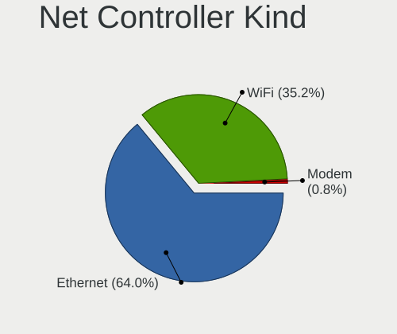

| Kind     | Desktops | Percent |
|----------|----------|---------|
| Ethernet | 160      | 64%     |
| WiFi     | 88       | 35.2%   |
| Modem    | 2        | 0.8%    |

Used Controller
---------------

Currently used network controller

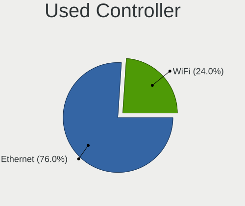

| Kind     | Desktops | Percent |
|----------|----------|---------|
| Ethernet | 127      | 76.05%  |
| WiFi     | 40       | 23.95%  |

NICs
----

Total network controllers on board

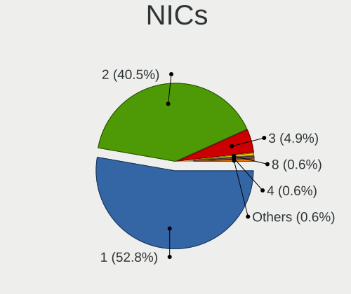

| Total | Desktops | Percent |
|-------|----------|---------|
| 1     | 86       | 52.76%  |
| 2     | 66       | 40.49%  |
| 3     | 8        | 4.91%   |
| 8     | 1        | 0.61%   |
| 4     | 1        | 0.61%   |
| 0     | 1        | 0.61%   |

IPv6
----

IPv6 vs IPv4

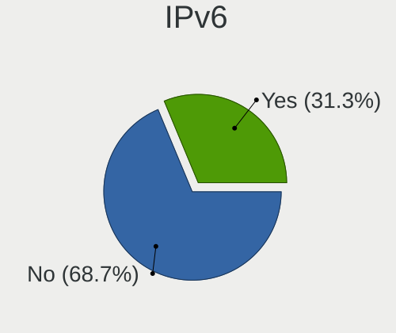

| Used | Desktops | Percent |
|------|----------|---------|
| No   | 112      | 68.71%  |
| Yes  | 51       | 31.29%  |

Bluetooth
---------

Bluetooth Vendor
----------------

Controller vendors

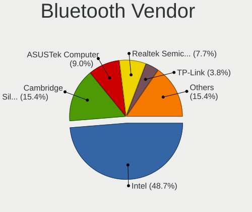

| Vendor                  | Desktops | Percent |
|-------------------------|----------|---------|
| Intel                   | 38       | 48.72%  |
| Cambridge Silicon Radio | 12       | 15.38%  |
| ASUSTek Computer        | 7        | 8.97%   |
| Realtek Semiconductor   | 6        | 7.69%   |
| TP-Link                 | 3        | 3.85%   |
| MediaTek                | 2        | 2.56%   |
| IMC Networks            | 2        | 2.56%   |
| Foxconn / Hon Hai       | 2        | 2.56%   |
| Broadcom                | 2        | 2.56%   |
| Apple                   | 2        | 2.56%   |
| Primax Electronics      | 1        | 1.28%   |
| Lite-On Technology      | 1        | 1.28%   |

Bluetooth Model
---------------

Controller models

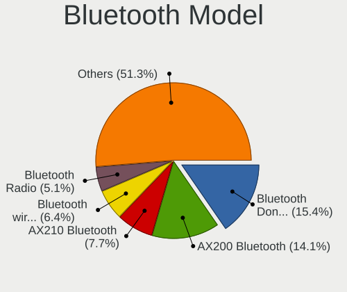

| Model                                                 | Desktops | Percent |
|-------------------------------------------------------|----------|---------|
| Cambridge Silicon Radio Bluetooth Dongle (HCI mode)   | 12       | 15.38%  |
| Intel AX200 Bluetooth                                 | 11       | 14.1%   |
| Intel AX210 Bluetooth                                 | 6        | 7.69%   |
| Intel Bluetooth wireless interface                    | 5        | 6.41%   |
| Realtek Bluetooth Radio                               | 4        | 5.13%   |
| TP-Link TP-T@- UB500 Adapter                          | 3        | 3.85%   |
| Intel Wireless-AC 9260 Bluetooth Adapter              | 3        | 3.85%   |
| Intel Wireless-AC 3168 Bluetooth                      | 3        | 3.85%   |
| Intel Bluetooth Device                                | 3        | 3.85%   |
| Intel Bluetooth 9460/9560 Jefferson Peak (JfP)        | 3        | 3.85%   |
| Intel AX201 Bluetooth                                 | 3        | 3.85%   |
| ASUS Broadcom BCM20702A0 Bluetooth                    | 3        | 3.85%   |
| Realtek  Bluetooth 4.2 Adapter                        | 2        | 2.56%   |
| MediaTek Wireless_Device                              | 2        | 2.56%   |
| IMC Networks Wireless_Device                          | 2        | 2.56%   |
| ASUS Bluetooth Radio                                  | 2        | 2.56%   |
| Primax Rocketfish RF-FLBTAD Bluetooth Adapter         | 1        | 1.28%   |
| Lite-On Bluetooth Device                              | 1        | 1.28%   |
| Intel Centrino Bluetooth Wireless Transceiver         | 1        | 1.28%   |
| Foxconn / Hon Hai MediaTek Bluetooth Adapter          | 1        | 1.28%   |
| Foxconn / Hon Hai Bluetooth Device                    | 1        | 1.28%   |
| Broadcom HP Portable Bumble Bee                       | 1        | 1.28%   |
| Broadcom BCM20702A0 Bluetooth 4.0                     | 1        | 1.28%   |
| ASUS Broadcom BCM20702 Single-Chip Bluetooth 4.0 + LE | 1        | 1.28%   |
| ASUS ASUS USB-BT500                                   | 1        | 1.28%   |
| Apple Bluetooth USB Host Controller                   | 1        | 1.28%   |
| Apple Bluetooth Host Controller                       | 1        | 1.28%   |

Sound
-----

Sound Vendor
------------

Sound card vendors

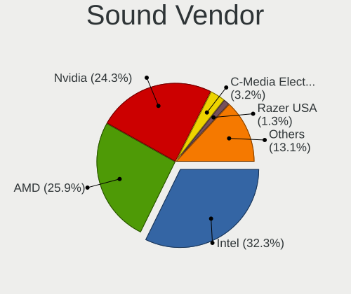

| Vendor                                       | Desktops | Percent |
|----------------------------------------------|----------|---------|
| Intel                                        | 101      | 32.27%  |
| AMD                                          | 81       | 25.88%  |
| Nvidia                                       | 76       | 24.28%  |
| C-Media Electronics                          | 10       | 3.19%   |
| Razer USA                                    | 4        | 1.28%   |
| Corsair                                      | 4        | 1.28%   |
| Logitech                                     | 3        | 0.96%   |
| Kingston Technology                          | 3        | 0.96%   |
| Generalplus Technology                       | 3        | 0.96%   |
| ASUSTek Computer                             | 3        | 0.96%   |
| Zoran Co. Personal Media Division (Nogatech) | 2        | 0.64%   |
| Jieli Technology                             | 2        | 0.64%   |
| Hewlett-Packard                              | 2        | 0.64%   |
| Elgato Systems                               | 2        | 0.64%   |
| Trust                                        | 1        | 0.32%   |
| Tenx Technology                              | 1        | 0.32%   |
| TC Electronic                                | 1        | 0.32%   |
| SteelSeries ApS                              | 1        | 0.32%   |
| Soundprese                                   | 1        | 0.32%   |
| Shenzhen Riitek Technology                   | 1        | 0.32%   |
| PreSonus Audio Electronics                   | 1        | 0.32%   |
| Plantronics                                  | 1        | 0.32%   |
| Mark of the Unicorn                          | 1        | 0.32%   |
| JMTek                                        | 1        | 0.32%   |
| JBL                                          | 1        | 0.32%   |
| GN Netcom                                    | 1        | 0.32%   |
| Fifine Microphones                           | 1        | 0.32%   |
| ELMCU                                        | 1        | 0.32%   |
| Barco Display Systems                        | 1        | 0.32%   |
| Astro Gaming                                 | 1        | 0.32%   |
| Arturia                                      | 1        | 0.32%   |

Sound Model
-----------

Sound card models

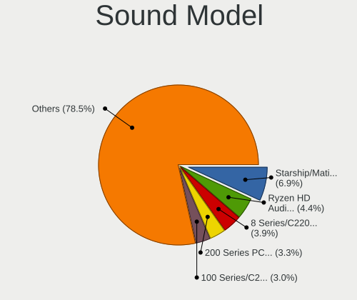

| Model                                                                      | Desktops | Percent |
|----------------------------------------------------------------------------|----------|---------|
| AMD Starship/Matisse HD Audio Controller                                   | 25       | 6.91%   |
| AMD Ryzen HD Audio Controller                                              | 16       | 4.42%   |
| Intel 8 Series/C220 Series Chipset High Definition Audio Controller        | 14       | 3.87%   |
| Intel 200 Series PCH HD Audio                                              | 12       | 3.31%   |
| Intel 100 Series/C230 Series Chipset Family HD Audio Controller            | 11       | 3.04%   |
| AMD Ellesmere HDMI Audio [Radeon RX 470/480 / 570/580/590]                 | 11       | 3.04%   |
| Nvidia GP104 High Definition Audio Controller                              | 10       | 2.76%   |
| Intel 7 Series/C216 Chipset Family High Definition Audio Controller        | 10       | 2.76%   |
| Nvidia GP107GL High Definition Audio Controller                            | 9        | 2.49%   |
| AMD Family 17h (Models 00h-0fh) HD Audio Controller                        | 9        | 2.49%   |
| Intel Cannon Lake PCH cAVS                                                 | 8        | 2.21%   |
| AMD Renoir/Cezanne HDMI/DP Audio Controller                                | 8        | 2.21%   |
| Intel Xeon E3-1200 v3/4th Gen Core Processor HD Audio Controller           | 7        | 1.93%   |
| AMD Navi 10 HDMI Audio                                                     | 7        | 1.93%   |
| Nvidia GA104 High Definition Audio Controller                              | 6        | 1.66%   |
| Intel 6 Series/C200 Series Chipset Family High Definition Audio Controller | 6        | 1.66%   |
| AMD Navi 21/23 HDMI/DP Audio Controller                                    | 6        | 1.66%   |
| Nvidia TU116 High Definition Audio Controller                              | 5        | 1.38%   |
| Nvidia TU106 High Definition Audio Controller                              | 5        | 1.38%   |
| Intel C610/X99 series chipset HD Audio Controller                          | 5        | 1.38%   |
| Intel 5 Series/3400 Series Chipset High Definition Audio                   | 5        | 1.38%   |
| AMD SBx00 Azalia (Intel HDA)                                               | 5        | 1.38%   |
| AMD Raven/Raven2/Fenghuang HDMI/DP Audio Controller                        | 5        | 1.38%   |
| Nvidia TU104 HD Audio Controller                                           | 4        | 1.1%    |
| Nvidia GP108 High Definition Audio Controller                              | 4        | 1.1%    |
| Nvidia GP106 High Definition Audio Controller                              | 4        | 1.1%    |
| AMD Oland/Hainan/Cape Verde/Pitcairn HDMI Audio [Radeon HD 7000 Series]    | 4        | 1.1%    |
| AMD Baffin HDMI/DP Audio [Radeon RX 550 640SP / RX 560/560X]               | 4        | 1.1%    |
| Nvidia GM206 High Definition Audio Controller                              | 3        | 0.83%   |
| Nvidia GM204 High Definition Audio Controller                              | 3        | 0.83%   |
| Nvidia GM107 High Definition Audio Controller [GeForce 940MX]              | 3        | 0.83%   |
| Nvidia GA102 High Definition Audio Controller                              | 3        | 0.83%   |
| Intel Raptor Lake High Definition Audio Controller                         | 3        | 0.83%   |
| Intel Alder Lake-S HD Audio Controller                                     | 3        | 0.83%   |
| Intel 9 Series Chipset Family HD Audio Controller                          | 3        | 0.83%   |
| Intel 82801JI (ICH10 Family) HD Audio Controller                           | 3        | 0.83%   |
| Generalplus Technology USB Audio Device                                    | 3        | 0.83%   |
| C-Media Electronics Audio Adapter (Unitek Y-247A)                          | 3        | 0.83%   |
| ASUSTek Computer USB Audio                                                 | 3        | 0.83%   |
| AMD Radeon High Definition Audio Controller                                | 3        | 0.83%   |

Memory
------

Memory Vendor
-------------

Memory module vendors

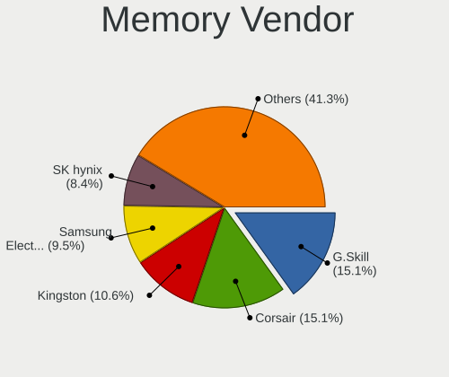

| Vendor                       | Desktops | Percent |
|------------------------------|----------|---------|
| G.Skill                      | 27       | 15.08%  |
| Corsair                      | 27       | 15.08%  |
| Kingston                     | 19       | 10.61%  |
| Samsung Electronics          | 17       | 9.5%    |
| SK hynix                     | 15       | 8.38%   |
| Crucial                      | 14       | 7.82%   |
| Unknown                      | 13       | 7.26%   |
| Team                         | 8        | 4.47%   |
| Micron Technology            | 8        | 4.47%   |
| A-DATA Technology            | 4        | 2.23%   |
| Unknown                      | 3        | 1.68%   |
| Ramaxel Technology           | 2        | 1.12%   |
| Patriot Memory (PDP Systems) | 2        | 1.12%   |
| Patriot                      | 2        | 1.12%   |
| GeIL                         | 2        | 1.12%   |
| Unifosa                      | 1        | 0.56%   |
| Transcend                    | 1        | 0.56%   |
| Timetec                      | 1        | 0.56%   |
| Silicon Power                | 1        | 0.56%   |
| Reboto                       | 1        | 0.56%   |
| Ramos Technology             | 1        | 0.56%   |
| PNY                          | 1        | 0.56%   |
| Nanya Technology             | 1        | 0.56%   |
| Kllisre                      | 1        | 0.56%   |
| KingFast                     | 1        | 0.56%   |
| Juhor                        | 1        | 0.56%   |
| Heoriady                     | 1        | 0.56%   |
| Guangzhou MiaoYuanJi         | 1        | 0.56%   |
| GOODRAM                      | 1        | 0.56%   |
| Goldkey                      | 1        | 0.56%   |
| Golden Empire                | 1        | 0.56%   |

Memory Model
------------

Memory module models

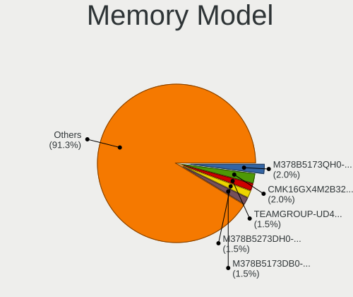

| Model                                                  | Desktops | Percent |
|--------------------------------------------------------|----------|---------|
| Samsung RAM M378B5173QH0-CK0 4GB DIMM DDR3             | 4        | 2.04%   |
| Corsair RAM CMK16GX4M2B3200C16 8GB DIMM DDR4 3600MT/s  | 4        | 2.04%   |
| Team RAM TEAMGROUP-UD4-3200 8GB DIMM DDR4 3733MT/s     | 3        | 1.53%   |
| SK hynix RAM HMT351U6CFR8C-H9 4GB DIMM DDR3 1600MT/s   | 3        | 1.53%   |
| Samsung RAM M378B5273DH0-CH9 4GB DIMM DDR3 2133MT/s    | 3        | 1.53%   |
| Samsung RAM M378B5173DB0-CK0 4096MB DIMM DDR3 1600MT/s | 3        | 1.53%   |
| Unknown                                                | 3        | 1.53%   |
| Unknown RAM Module 2GB DIMM DDR2 800MT/s               | 2        | 1.02%   |
| Team RAM TEAMGROUP-UD4-3000 8GB DIMM DDR4 3200MT/s     | 2        | 1.02%   |
| SK hynix RAM HMT351S6CFR8C-PB 4GB SODIMM DDR3 1600MT/s | 2        | 1.02%   |
| Samsung RAM M378B5673FH0-CH9 2GB DIMM DDR3 1600MT/s    | 2        | 1.02%   |
| Micron RAM 8JTF51264AZ-1G6E1 4GB DIMM DDR3 1600MT/s    | 2        | 1.02%   |
| Kingston RAM KHX2133C14/16G 16GB DIMM DDR4 2400MT/s    | 2        | 1.02%   |
| Kingston RAM KHX1600C10D3/4G 4GB DIMM DDR3 1866MT/s    | 2        | 1.02%   |
| G.Skill RAM F4-3200C16-8GIS 8GB DIMM DDR4 3600MT/s     | 2        | 1.02%   |
| G.Skill RAM F4-2666C15-4GVR 4GB DIMM DDR4 3200MT/s     | 2        | 1.02%   |
| Corsair RAM CMZ8GX3M2A1600C9 4GB DIMM SDRAM 1800MT/s   | 2        | 1.02%   |
| Corsair RAM CMK16GX4M2E3200C16 8GB DIMM DDR4 3466MT/s  | 2        | 1.02%   |
| Corsair RAM CMK16GX4M2A2133C13 8GB DIMM DDR4 3000MT/s  | 2        | 1.02%   |
| A-DATA RAM DDR4 3200 16GB DIMM DDR4 3600MT/s           | 2        | 1.02%   |
| Unknown RAM Module 8GB DIMM DDR3 1600MT/s              | 1        | 0.51%   |
| Unknown RAM Module 4GB DIMM SDRAM 1066MT/s             | 1        | 0.51%   |
| Unknown RAM Module 4GB DIMM DDR4 2133MT/s              | 1        | 0.51%   |
| Unknown RAM Module 4GB DIMM DDR3 1333MT/s              | 1        | 0.51%   |
| Unknown RAM Module 4GB DIMM DDR3 1066MT/s              | 1        | 0.51%   |
| Unknown RAM Module 4GB DIMM DDR3                       | 1        | 0.51%   |
| Unknown RAM Module 4GB DIMM DDR 1333MT/s               | 1        | 0.51%   |
| Unknown RAM Module 4GB DIMM 1333MT/s                   | 1        | 0.51%   |
| Unknown RAM Module 2GB DIMM DDR2 667MT/s               | 1        | 0.51%   |
| Unknown RAM Module 2GB DIMM DDR2 533MT/s               | 1        | 0.51%   |
| Unknown RAM Module 2GB DIMM DDR2 1067MT/s              | 1        | 0.51%   |
| Unknown RAM Module 1GB DIMM DDR2 800MT/s               | 1        | 0.51%   |
| Unknown RAM Module 1GB DIMM DDR2 533MT/s               | 1        | 0.51%   |
| Unknown RAM Module 16GB DIMM DDR4 2667MT/s             | 1        | 0.51%   |
| Unifosa RAM GU512303EP0202 2GB DIMM DDR3 1333MT/s      | 1        | 0.51%   |
| Transcend RAM TS1GLK64V6H 8GB DIMM DDR3 1600MT/s       | 1        | 0.51%   |
| Timetec RAM Module 16GB SODIMM DDR4 3200MT/s           | 1        | 0.51%   |
| Team RAM TEAMGROUP-UD4-3600 16GB DIMM DDR4 4000MT/s    | 1        | 0.51%   |
| Team RAM TEAMGROUP-UD3-1600 8GB DIMM DDR3 1866MT/s     | 1        | 0.51%   |
| Team RAM Elite-1600 8GB DIMM DDR3 1600MT/s             | 1        | 0.51%   |

Memory Kind
-----------

Memory module kinds

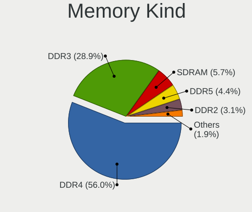

| Kind    | Desktops | Percent |
|---------|----------|---------|
| DDR4    | 89       | 55.97%  |
| DDR3    | 46       | 28.93%  |
| SDRAM   | 9        | 5.66%   |
| DDR5    | 7        | 4.4%    |
| DDR2    | 5        | 3.14%   |
| Unknown | 2        | 1.26%   |
| DDR     | 1        | 0.63%   |

Memory Form Factor
------------------

Physical design of the memory module

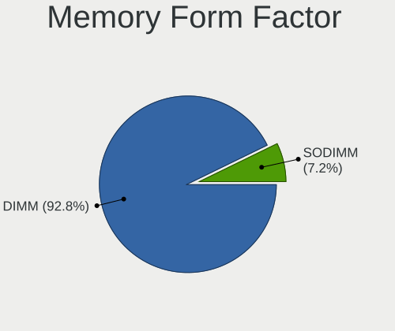

| Name   | Desktops | Percent |
|--------|----------|---------|
| DIMM   | 141      | 92.76%  |
| SODIMM | 11       | 7.24%   |

Memory Size
-----------

Memory module size

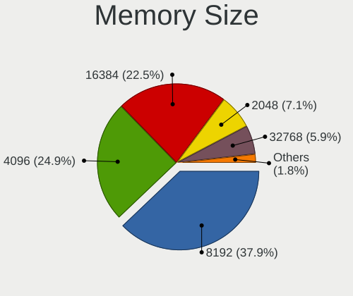

| Size  | Desktops | Percent |
|-------|----------|---------|
| 8192  | 64       | 37.87%  |
| 4096  | 42       | 24.85%  |
| 16384 | 38       | 22.49%  |
| 2048  | 12       | 7.1%    |
| 32768 | 10       | 5.92%   |
| 1024  | 2        | 1.18%   |
| 24576 | 1        | 0.59%   |

Memory Speed
------------

Memory module speed

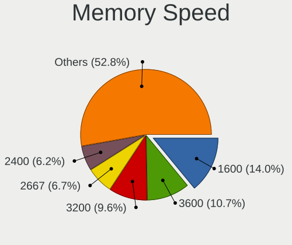

| Speed | Desktops | Percent |
|-------|----------|---------|
| 1600  | 25       | 14.04%  |
| 3600  | 19       | 10.67%  |
| 3200  | 17       | 9.55%   |
| 2667  | 12       | 6.74%   |
| 2400  | 11       | 6.18%   |
| 1333  | 10       | 5.62%   |
| 2133  | 9        | 5.06%   |
| 1866  | 7        | 3.93%   |
| 3733  | 5        | 2.81%   |
| 3800  | 4        | 2.25%   |
| 3400  | 4        | 2.25%   |
| 3000  | 4        | 2.25%   |
| 2666  | 4        | 2.25%   |
| 1867  | 4        | 2.25%   |
| 1800  | 4        | 2.25%   |
| 2933  | 3        | 1.69%   |
| 1066  | 3        | 1.69%   |
| 800   | 3        | 1.69%   |
| 4400  | 2        | 1.12%   |
| 3466  | 2        | 1.12%   |
| 2134  | 2        | 1.12%   |
| 2000  | 2        | 1.12%   |
| 1400  | 2        | 1.12%   |
| 7000  | 1        | 0.56%   |
| 6800  | 1        | 0.56%   |
| 6400  | 1        | 0.56%   |
| 6200  | 1        | 0.56%   |
| 5800  | 1        | 0.56%   |
| 5600  | 1        | 0.56%   |
| 4800  | 1        | 0.56%   |
| 4133  | 1        | 0.56%   |
| 4000  | 1        | 0.56%   |
| 3866  | 1        | 0.56%   |
| 3666  | 1        | 0.56%   |
| 3467  | 1        | 0.56%   |
| 3266  | 1        | 0.56%   |
| 2747  | 1        | 0.56%   |
| 1648  | 1        | 0.56%   |
| 1450  | 1        | 0.56%   |
| 1067  | 1        | 0.56%   |

Printers & scanners
-------------------

Printer Vendor
--------------

Printer device vendors

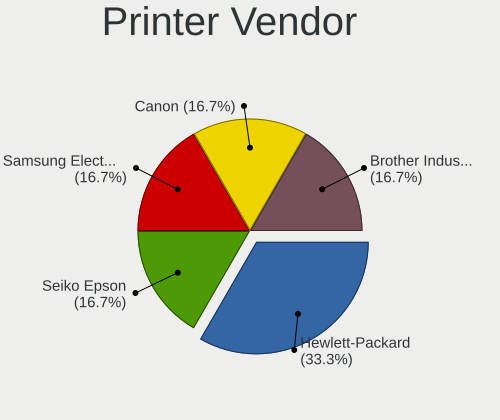

| Vendor              | Desktops | Percent |
|---------------------|----------|---------|
| Hewlett-Packard     | 2        | 33.33%  |
| Seiko Epson         | 1        | 16.67%  |
| Samsung Electronics | 1        | 16.67%  |
| Canon               | 1        | 16.67%  |
| Brother Industries  | 1        | 16.67%  |

Printer Model
-------------

Printer device models

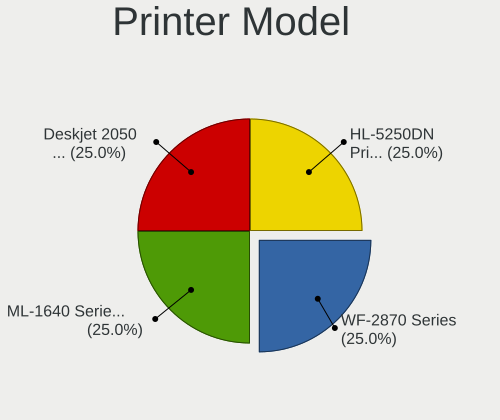

| Model                                | Desktops | Percent |
|--------------------------------------|----------|---------|
| Seiko Epson WF-2870 Series           | 1        | 16.67%  |
| Samsung ML-1640 Series Laser Printer | 1        | 16.67%  |
| HP LaserJet CP1525nw/x               | 1        | 16.67%  |
| HP Deskjet 2050 J510                 | 1        | 16.67%  |
| Canon PIXMA MG2500 Series            | 1        | 16.67%  |
| Brother HL-5250DN Printer            | 1        | 16.67%  |

Scanner Vendor
--------------

Scanner device vendors

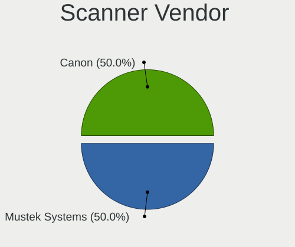

| Vendor         | Desktops | Percent |
|----------------|----------|---------|
| Mustek Systems | 1        | 50%     |
| Canon          | 1        | 50%     |

Scanner Model
-------------

Scanner device models

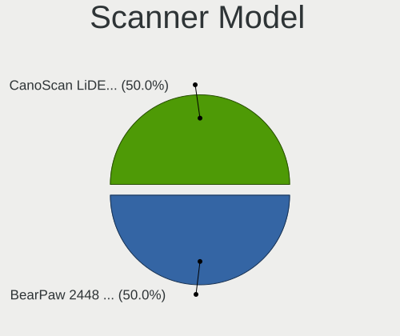

| Model                               | Desktops | Percent |
|-------------------------------------|----------|---------|
| Mustek Systems BearPaw 2448 TA Plus | 1        | 50%     |
| Canon CanoScan LiDE 110             | 1        | 50%     |

Camera
------

Camera Vendor
-------------

Camera device vendors

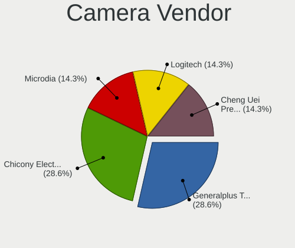

| Vendor                                 | Desktops | Percent |
|----------------------------------------|----------|---------|
| Logitech                               | 8        | 26.67%  |
| Microdia                               | 6        | 20%     |
| Generalplus Technology                 | 3        | 10%     |
| Chicony Electronics                    | 3        | 10%     |
| Creative Technology                    | 2        | 6.67%   |
| Z-Star Microelectronics                | 1        | 3.33%   |
| Sunplus Innovation Technology          | 1        | 3.33%   |
| Samsung Electronics                    | 1        | 3.33%   |
| Panasonic (Matsushita)                 | 1        | 3.33%   |
| Microsoft                              | 1        | 3.33%   |
| Jieli Technology                       | 1        | 3.33%   |
| Cheng Uei Precision Industry (Foxlink) | 1        | 3.33%   |
| Aveo Technology                        | 1        | 3.33%   |

Camera Model
------------

Camera device models

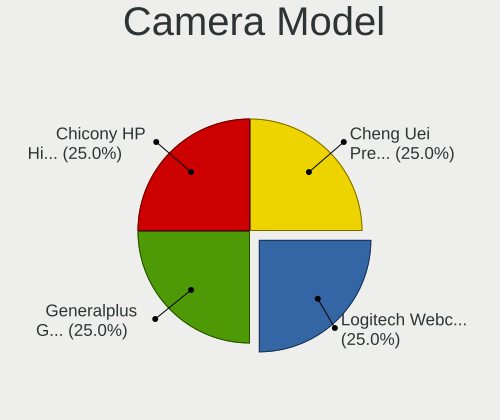

| Model                                                                | Desktops | Percent |
|----------------------------------------------------------------------|----------|---------|
| Microdia Webcam Vitade AF                                            | 3        | 10%     |
| Logitech BRIO Ultra HD Webcam                                        | 2        | 6.67%   |
| Generalplus GENERAL WEBCAM                                           | 2        | 6.67%   |
| Creative Live! Cam Sync 1080p V2                                     | 2        | 6.67%   |
| Chicony HP High Definition 1MP Webcam                                | 2        | 6.67%   |
| Z-Star A4 TECH USB2.0 PC Camera E                                    | 1        | 3.33%   |
| Sunplus FULL HD webcam                                               | 1        | 3.33%   |
| Samsung Galaxy series, misc. (MTP mode)                              | 1        | 3.33%   |
| Panasonic (Matsushita) TY-CC20W                                      | 1        | 3.33%   |
| Microsoft LifeCam Cinema                                             | 1        | 3.33%   |
| Microdia USB 2.0 Camera                                              | 1        | 3.33%   |
| Microdia Camera                                                      | 1        | 3.33%   |
| Microdia ACR010 USB Webcam                                           | 1        | 3.33%   |
| Logitech Webcam Pro 9000                                             | 1        | 3.33%   |
| Logitech Webcam C930e                                                | 1        | 3.33%   |
| Logitech Webcam C600                                                 | 1        | 3.33%   |
| Logitech Portable Webcam C905                                        | 1        | 3.33%   |
| Logitech Logi Webcam C920e                                           | 1        | 3.33%   |
| Logitech HD Webcam C615                                              | 1        | 3.33%   |
| Jieli USB PHY 2.0                                                    | 1        | 3.33%   |
| Generalplus campark PC04                                             | 1        | 3.33%   |
| Chicony HP Integrated Webcam                                         | 1        | 3.33%   |
| Cheng Uei Precision Industry (Foxlink) HP High Definition 1MP Webcam | 1        | 3.33%   |
| Aveo Camera                                                          | 1        | 3.33%   |

Security
--------

Fingerprint Vendor
------------------

Fingerprint sensor vendors

| Vendor                | Desktops | Percent |
|-----------------------|----------|---------|
| Elan Microelectronics | 1        | 100%    |

Fingerprint Model
-----------------

Fingerprint sensor models

| Model                                       | Desktops | Percent |
|---------------------------------------------|----------|---------|
| Elan fingerprint sensor [FeinTech FPS00200] | 1        | 100%    |

Chipcard Vendor
---------------

Chipcard module vendors

Zero info for selected period =(

Chipcard Model
--------------

Chipcard module models

Zero info for selected period =(

Unsupported
-----------

Unsupported Devices
-------------------

Total unsupported devices on board

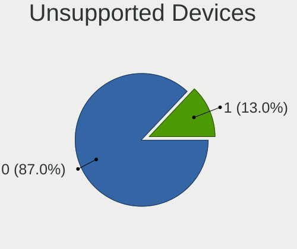

| Total | Desktops | Percent |
|-------|----------|---------|
| 0     | 141      | 87.04%  |
| 1     | 21       | 12.96%  |

Unsupported Device Types
------------------------

Types of unsupported devices

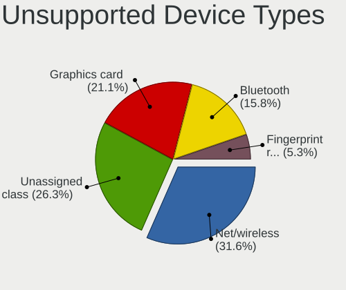

| Type               | Desktops | Percent |
|--------------------|----------|---------|
| Net/wireless       | 6        | 31.58%  |
| Unassigned class   | 5        | 26.32%  |
| Graphics card      | 4        | 21.05%  |
| Bluetooth          | 3        | 15.79%  |
| Fingerprint reader | 1        | 5.26%   |

