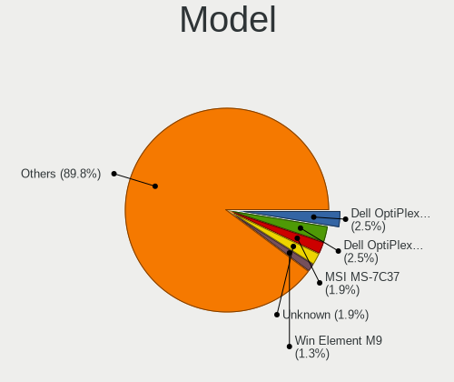
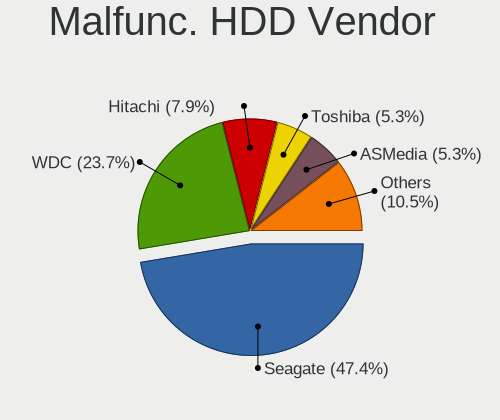
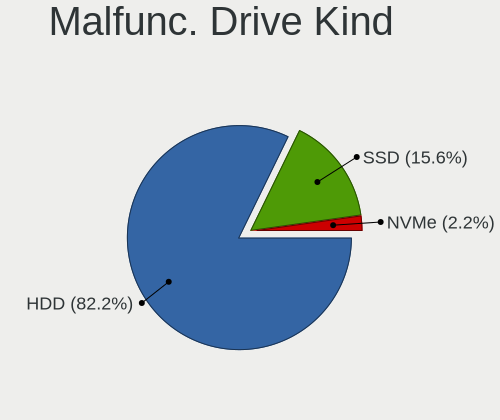
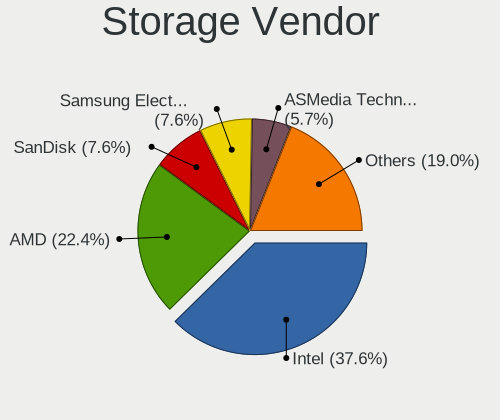
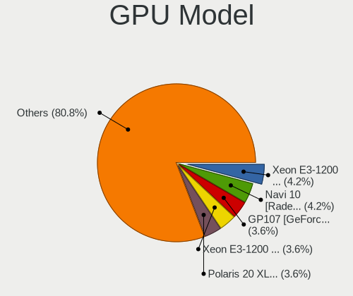
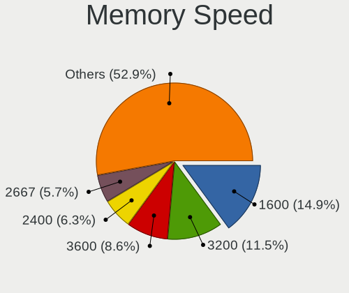

Xero - Tested Hardware & Statistics (Desktops)
----------------------------------------------

A project to collect tested hardware configurations for Xero.

Anyone can contribute to this report by the [hw-probe](https://github.com/linuxhw/hw-probe) tool:

    sudo -E hw-probe -all -upload

Please contribute! Especially if your hardware is rare.

Contents
--------

* [ Test Cases ](#test-cases)

* [ System ](#system)
  - [ OS                       ](#os)
  - [ OS Family                ](#os-family)
  - [ Kernel                   ](#kernel)
  - [ Kernel Family            ](#kernel-family)
  - [ Kernel Major Ver.        ](#kernel-major-ver)
  - [ Arch                     ](#arch)
  - [ DE                       ](#de)
  - [ Display Server           ](#display-server)
  - [ Display Manager          ](#display-manager)
  - [ OS Lang                  ](#os-lang)
  - [ Boot Mode                ](#boot-mode)
  - [ Filesystem               ](#filesystem)
  - [ Part. scheme             ](#part-scheme)
  - [ Dual Boot with Linux/BSD ](#dual-boot-with-linuxbsd)
  - [ Dual Boot (Win)          ](#dual-boot-win)

* [ Board ](#board)
  - [ Vendor                   ](#vendor)
  - [ Model                    ](#model)
  - [ Model Family             ](#model-family)
  - [ MFG Year                 ](#mfg-year)
  - [ Form Factor              ](#form-factor)
  - [ Secure Boot              ](#secure-boot)
  - [ Coreboot                 ](#coreboot)
  - [ RAM Size                 ](#ram-size)
  - [ RAM Used                 ](#ram-used)
  - [ Total Drives             ](#total-drives)
  - [ Has CD-ROM               ](#has-cd-rom)
  - [ Has Ethernet             ](#has-ethernet)
  - [ Has WiFi                 ](#has-wifi)
  - [ Has Bluetooth            ](#has-bluetooth)

* [ Location ](#location)
  - [ Country                  ](#country)
  - [ City                     ](#city)

* [ Drives ](#drives)
  - [ Drive Vendor             ](#drive-vendor)
  - [ Drive Model              ](#drive-model)
  - [ HDD Vendor               ](#hdd-vendor)
  - [ SSD Vendor               ](#ssd-vendor)
  - [ Drive Kind               ](#drive-kind)
  - [ Drive Connector          ](#drive-connector)
  - [ Drive Size               ](#drive-size)
  - [ Space Total              ](#space-total)
  - [ Space Used               ](#space-used)
  - [ Malfunc. Drives          ](#malfunc-drives)
  - [ Malfunc. Drive Vendor    ](#malfunc-drive-vendor)
  - [ Malfunc. HDD Vendor      ](#malfunc-hdd-vendor)
  - [ Malfunc. Drive Kind      ](#malfunc-drive-kind)
  - [ Failed Drives            ](#failed-drives)
  - [ Failed Drive Vendor      ](#failed-drive-vendor)
  - [ Drive Status             ](#drive-status)

* [ Storage controller ](#storage-controller)
  - [ Storage Vendor           ](#storage-vendor)
  - [ Storage Model            ](#storage-model)
  - [ Storage Kind             ](#storage-kind)

* [ Processor ](#processor)
  - [ CPU Vendor               ](#cpu-vendor)
  - [ CPU Model                ](#cpu-model)
  - [ CPU Model Family         ](#cpu-model-family)
  - [ CPU Cores                ](#cpu-cores)
  - [ CPU Sockets              ](#cpu-sockets)
  - [ CPU Threads              ](#cpu-threads)
  - [ CPU Op-Modes             ](#cpu-op-modes)
  - [ CPU Microcode            ](#cpu-microcode)
  - [ CPU Microarch            ](#cpu-microarch)

* [ Graphics ](#graphics)
  - [ GPU Vendor               ](#gpu-vendor)
  - [ GPU Model                ](#gpu-model)
  - [ GPU Combo                ](#gpu-combo)
  - [ GPU Driver               ](#gpu-driver)
  - [ GPU Memory               ](#gpu-memory)

* [ Monitor ](#monitor)
  - [ Monitor Vendor           ](#monitor-vendor)
  - [ Monitor Model            ](#monitor-model)
  - [ Monitor Resolution       ](#monitor-resolution)
  - [ Monitor Diagonal         ](#monitor-diagonal)
  - [ Monitor Width            ](#monitor-width)
  - [ Aspect Ratio             ](#aspect-ratio)
  - [ Monitor Area             ](#monitor-area)
  - [ Pixel Density            ](#pixel-density)
  - [ Multiple Monitors        ](#multiple-monitors)

* [ Network ](#network)
  - [ Net Controller Vendor    ](#net-controller-vendor)
  - [ Net Controller Model     ](#net-controller-model)
  - [ Wireless Vendor          ](#wireless-vendor)
  - [ Wireless Model           ](#wireless-model)
  - [ Ethernet Vendor          ](#ethernet-vendor)
  - [ Ethernet Model           ](#ethernet-model)
  - [ Net Controller Kind      ](#net-controller-kind)
  - [ Used Controller          ](#used-controller)
  - [ NICs                     ](#nics)
  - [ IPv6                     ](#ipv6)

* [ Bluetooth ](#bluetooth)
  - [ Bluetooth Vendor         ](#bluetooth-vendor)
  - [ Bluetooth Model          ](#bluetooth-model)

* [ Sound ](#sound)
  - [ Sound Vendor             ](#sound-vendor)
  - [ Sound Model              ](#sound-model)

* [ Memory ](#memory)
  - [ Memory Vendor            ](#memory-vendor)
  - [ Memory Model             ](#memory-model)
  - [ Memory Kind              ](#memory-kind)
  - [ Memory Form Factor       ](#memory-form-factor)
  - [ Memory Size              ](#memory-size)
  - [ Memory Speed             ](#memory-speed)

* [ Printers & scanners ](#printers--scanners)
  - [ Printer Vendor           ](#printer-vendor)
  - [ Printer Model            ](#printer-model)
  - [ Scanner Vendor           ](#scanner-vendor)
  - [ Scanner Model            ](#scanner-model)

* [ Camera ](#camera)
  - [ Camera Vendor            ](#camera-vendor)
  - [ Camera Model             ](#camera-model)

* [ Security ](#security)
  - [ Fingerprint Vendor       ](#fingerprint-vendor)
  - [ Fingerprint Model        ](#fingerprint-model)
  - [ Chipcard Vendor          ](#chipcard-vendor)
  - [ Chipcard Model           ](#chipcard-model)

* [ Unsupported ](#unsupported)
  - [ Unsupported Devices      ](#unsupported-devices)
  - [ Unsupported Device Types ](#unsupported-device-types)

Test Cases
----------

Total: 101

| Vendor   | Model                       | Probe                                                      | Date         |
|----------|-----------------------------|------------------------------------------------------------|--------------|
| ASUSTek  | PRIME H510M-R               | [38ab435feb](https://linux-hardware.org/?probe=38ab435feb) | Aug 08, 2023 |
| MSI      | B350 GAMING PLUS            | [951597859a](https://linux-hardware.org/?probe=951597859a) | Aug 08, 2023 |
| ASRock   | X300M-STX                   | [e642e8e489](https://linux-hardware.org/?probe=e642e8e489) | Aug 08, 2023 |
| ECS      | H61H2-CM                    | [e2b9ff65d7](https://linux-hardware.org/?probe=e2b9ff65d7) | Aug 06, 2023 |
| ASRock   | Z77 Professional            | [2f0bc369b4](https://linux-hardware.org/?probe=2f0bc369b4) | Aug 03, 2023 |
| Gigabyte | Z490 GAMING X               | [f710ad8b96](https://linux-hardware.org/?probe=f710ad8b96) | Jul 31, 2023 |
| ASUSTek  | TUF B450-PLUS GAMING        | [2c6149347b](https://linux-hardware.org/?probe=2c6149347b) | Jul 30, 2023 |
| MSI      | H510M-A PRO                 | [20d5d0a3ad](https://linux-hardware.org/?probe=20d5d0a3ad) | Jul 30, 2023 |
| Intel    | B75                         | [492fa4fc25](https://linux-hardware.org/?probe=492fa4fc25) | Jul 26, 2023 |
| Lenovo   | ThinkCentre M58 3231W2Y     | [72f09cd320](https://linux-hardware.org/?probe=72f09cd320) | Jul 26, 2023 |
| ASUSTek  | PRIME X570-P                | [96f5f9ffdc](https://linux-hardware.org/?probe=96f5f9ffdc) | Jul 19, 2023 |
| ASRock   | B450 Pro4                   | [c10ecff0f6](https://linux-hardware.org/?probe=c10ecff0f6) | Jul 19, 2023 |
| ASUSTek  | PRIME X299-A II             | [54f9bd2050](https://linux-hardware.org/?probe=54f9bd2050) | Jul 18, 2023 |
| Gigabyte | X79-UD3                     | [d688be2c92](https://linux-hardware.org/?probe=d688be2c92) | Jul 18, 2023 |
| Gigabyte | Z490 GAMING X               | [866bc45d05](https://linux-hardware.org/?probe=866bc45d05) | Jul 18, 2023 |
| MSI      | B450M-A PRO MAX             | [4c8b8b5a8a](https://linux-hardware.org/?probe=4c8b8b5a8a) | Jul 18, 2023 |
| ASUSTek  | TUF Z270 MARK 2             | [d23b7166b1](https://linux-hardware.org/?probe=d23b7166b1) | Jul 18, 2023 |
| Gigabyte | Z490 GAMING X               | [3c5ef629e4](https://linux-hardware.org/?probe=3c5ef629e4) | Jul 18, 2023 |
| MSI      | MAG B550M MORTAR WIFI       | [4d00148664](https://linux-hardware.org/?probe=4d00148664) | Jul 16, 2023 |
| Gigabyte | X399 AORUS XTREME-CF        | [59bf614ae2](https://linux-hardware.org/?probe=59bf614ae2) | Jul 14, 2023 |
| MSI      | B450M-A PRO MAX             | [9ec51bc7eb](https://linux-hardware.org/?probe=9ec51bc7eb) | Jul 14, 2023 |
| MSI      | MAG B550M MORTAR WIFI       | [75d40e5a2b](https://linux-hardware.org/?probe=75d40e5a2b) | Jul 14, 2023 |
| MSI      | H510M-A PRO                 | [995e13dee9](https://linux-hardware.org/?probe=995e13dee9) | Jul 11, 2023 |
| Gigabyte | Z490 GAMING X               | [27e600a93b](https://linux-hardware.org/?probe=27e600a93b) | Jul 07, 2023 |
| ASUSTek  | Rampage V EDITION 10        | [c945bae843](https://linux-hardware.org/?probe=c945bae843) | Jul 05, 2023 |
| ASUSTek  | ROG STRIX B550-F GAMING ... | [ca637a5884](https://linux-hardware.org/?probe=ca637a5884) | Jul 05, 2023 |
| ASUSTek  | CROSSHAIR VI HERO           | [407e00921f](https://linux-hardware.org/?probe=407e00921f) | Jul 04, 2023 |
| MSI      | MAG B550M MORTAR WIFI       | [fc70411ea4](https://linux-hardware.org/?probe=fc70411ea4) | Jul 03, 2023 |
| Gigabyte | Z490 GAMING X               | [107fe61a53](https://linux-hardware.org/?probe=107fe61a53) | Jul 02, 2023 |
| ASUSTek  | H110M-A                     | [c3118a3d89](https://linux-hardware.org/?probe=c3118a3d89) | Jun 29, 2023 |
| ASRock   | X570 Taichi                 | [895760e7db](https://linux-hardware.org/?probe=895760e7db) | Jun 27, 2023 |
| ASUSTek  | A68HM-PLUS                  | [fa162784e0](https://linux-hardware.org/?probe=fa162784e0) | Jun 24, 2023 |
| MSI      | Z77A-G41                    | [e7e4924bda](https://linux-hardware.org/?probe=e7e4924bda) | Jun 20, 2023 |
| ASUSTek  | ROG STRIX B450-F GAMING     | [284344e775](https://linux-hardware.org/?probe=284344e775) | Jun 14, 2023 |
| ASUSTek  | ROG STRIX X570-E GAMING ... | [859f1b3a88](https://linux-hardware.org/?probe=859f1b3a88) | Jun 13, 2023 |
| ASUSTek  | PRIME B450M-A II            | [95bc101c80](https://linux-hardware.org/?probe=95bc101c80) | Jun 09, 2023 |
| Dell     | 00V62H A01                  | [89d6a4edd2](https://linux-hardware.org/?probe=89d6a4edd2) | May 13, 2023 |
| Unknown  | Intel X79                   | [6b1ddbd923](https://linux-hardware.org/?probe=6b1ddbd923) | May 03, 2023 |
| Biostar  | H110MHV3                    | [95b25ba480](https://linux-hardware.org/?probe=95b25ba480) | Apr 29, 2023 |
| ASUSTek  | A68HM-PLUS                  | [520ad2ca86](https://linux-hardware.org/?probe=520ad2ca86) | Mar 31, 2023 |
| HP       | 8437                        | [cdc32d8d8b](https://linux-hardware.org/?probe=cdc32d8d8b) | Mar 25, 2023 |
| HP       | 8437                        | [6fbb459a03](https://linux-hardware.org/?probe=6fbb459a03) | Mar 25, 2023 |
| ASUSTek  | A68HM-PLUS                  | [5d307f2d26](https://linux-hardware.org/?probe=5d307f2d26) | Mar 18, 2023 |
| Acer     | Aspire GX-281               | [d318df6931](https://linux-hardware.org/?probe=d318df6931) | Mar 04, 2023 |
| JINGSHA  | Unknown                     | [c8bd846b63](https://linux-hardware.org/?probe=c8bd846b63) | Feb 26, 2023 |
| Dell     | 0G3HR7 A00                  | [33723c8b80](https://linux-hardware.org/?probe=33723c8b80) | Feb 25, 2023 |
| MSI      | MAG B550 TOMAHAWK           | [503fe663b4](https://linux-hardware.org/?probe=503fe663b4) | Feb 20, 2023 |
| ASUSTek  | ROG STRIX Z370-F GAMING     | [d76b048134](https://linux-hardware.org/?probe=d76b048134) | Feb 17, 2023 |
| HP       | 828A                        | [5f430ba8d1](https://linux-hardware.org/?probe=5f430ba8d1) | Jan 19, 2023 |
| Pegatron | 2AF0                        | [77768feff6](https://linux-hardware.org/?probe=77768feff6) | Jan 01, 2023 |
| ASUSTek  | ROG STRIX X570-F GAMING     | [f074ef2e7c](https://linux-hardware.org/?probe=f074ef2e7c) | Nov 15, 2022 |
| ASUSTek  | ROG STRIX X570-F GAMING     | [711e95b72e](https://linux-hardware.org/?probe=711e95b72e) | Nov 02, 2022 |
| ASUSTek  | ROG STRIX X570-F GAMING     | [ff0c19c661](https://linux-hardware.org/?probe=ff0c19c661) | Nov 02, 2022 |
| Gigabyte | A320M-S2H-CF                | [bcf4fa1baf](https://linux-hardware.org/?probe=bcf4fa1baf) | Oct 18, 2022 |
| Dell     | 0GY6Y8 A02                  | [07b256f333](https://linux-hardware.org/?probe=07b256f333) | Oct 17, 2022 |
| Dell     | 0GY6Y8 A02                  | [fc1ec464bf](https://linux-hardware.org/?probe=fc1ec464bf) | Oct 17, 2022 |
| ASUSTek  | ROG STRIX X570-F GAMING     | [bf0e112f9a](https://linux-hardware.org/?probe=bf0e112f9a) | Oct 16, 2022 |
| ASUSTek  | PRIME B250-PLUS             | [00ab764924](https://linux-hardware.org/?probe=00ab764924) | Oct 15, 2022 |
| ASUSTek  | ROG STRIX X570-F GAMING     | [e037086b30](https://linux-hardware.org/?probe=e037086b30) | Oct 14, 2022 |
| ASUSTek  | ROG CROSSHAIR VIII DARK ... | [9931b35717](https://linux-hardware.org/?probe=9931b35717) | Sep 24, 2022 |
| ASUSTek  | ROG STRIX B450-F GAMING     | [4c95b1bccf](https://linux-hardware.org/?probe=4c95b1bccf) | Aug 22, 2022 |
| Gigabyte | B460M DS3H V2               | [2522ff1530](https://linux-hardware.org/?probe=2522ff1530) | Aug 13, 2022 |
| ASUSTek  | P7P55 LX                    | [8211ccc6cc](https://linux-hardware.org/?probe=8211ccc6cc) | Aug 11, 2022 |
| Unknown  | Unknown                     | [b73e5f9cbf](https://linux-hardware.org/?probe=b73e5f9cbf) | Aug 08, 2022 |
| Unknown  | Unknown                     | [f483092edf](https://linux-hardware.org/?probe=f483092edf) | Aug 07, 2022 |
| ASUSTek  | TUF Gaming X570-PLUS        | [a0507fae02](https://linux-hardware.org/?probe=a0507fae02) | Jul 31, 2022 |
| ASRock   | AB350 Pro4                  | [7049f819f0](https://linux-hardware.org/?probe=7049f819f0) | Jun 30, 2022 |
| HP       | 3396                        | [00782afa06](https://linux-hardware.org/?probe=00782afa06) | Jun 22, 2022 |
| ASUSTek  | ROG STRIX B450-F GAMING     | [8109a04ffa](https://linux-hardware.org/?probe=8109a04ffa) | Jun 12, 2022 |
| ASUSTek  | ROG STRIX B450-F GAMING     | [8a7401e54a](https://linux-hardware.org/?probe=8a7401e54a) | Jun 11, 2022 |
| Acer     | Aspire XC-886 V:2.0         | [2fe8cdaf93](https://linux-hardware.org/?probe=2fe8cdaf93) | May 31, 2022 |
| ASUSTek  | ROG Maximus X HERO          | [3ddad532a9](https://linux-hardware.org/?probe=3ddad532a9) | May 08, 2022 |
| MSI      | Z170-A PRO                  | [db5ab86328](https://linux-hardware.org/?probe=db5ab86328) | Apr 11, 2022 |
| MSI      | Z170-A PRO                  | [3bd5bb8d08](https://linux-hardware.org/?probe=3bd5bb8d08) | Apr 10, 2022 |
| ASUSTek  | TUF Gaming X570-PLUS        | [8d251b1b2a](https://linux-hardware.org/?probe=8d251b1b2a) | Apr 03, 2022 |
| HP       | 843B                        | [a88ff7cf5c](https://linux-hardware.org/?probe=a88ff7cf5c) | Mar 27, 2022 |
| Pegatron | 2AC2                        | [d3c82e973b](https://linux-hardware.org/?probe=d3c82e973b) | Mar 25, 2022 |
| ASUSTek  | Maximus IX HERO             | [745cc1d638](https://linux-hardware.org/?probe=745cc1d638) | Mar 25, 2022 |
| ASUSTek  | Maximus IX HERO             | [8eb98db533](https://linux-hardware.org/?probe=8eb98db533) | Mar 22, 2022 |
| ASUSTek  | ROG CROSSHAIR VIII HERO     | [13cdf54c81](https://linux-hardware.org/?probe=13cdf54c81) | Mar 21, 2022 |
| ASUSTek  | TUF Gaming B550M-PLUS       | [639e7361ef](https://linux-hardware.org/?probe=639e7361ef) | Mar 12, 2022 |
| MSI      | Z170A PC MATE               | [181e014823](https://linux-hardware.org/?probe=181e014823) | Mar 08, 2022 |
| Gigabyte | Z170X-UD3-CF                | [3ec7a7f643](https://linux-hardware.org/?probe=3ec7a7f643) | Mar 06, 2022 |
| ASUSTek  | P5Q PRO TURBO               | [83ca29c9c8](https://linux-hardware.org/?probe=83ca29c9c8) | Jan 28, 2022 |
| ASUSTek  | TUF Gaming B550M-PLUS       | [230373b3ff](https://linux-hardware.org/?probe=230373b3ff) | Jan 09, 2022 |
| HP       | 1906                        | [5f8fe7cb20](https://linux-hardware.org/?probe=5f8fe7cb20) | Jan 06, 2022 |
| ASUSTek  | TUF Gaming X570-PLUS        | [793bfa4f40](https://linux-hardware.org/?probe=793bfa4f40) | Jan 04, 2022 |
| HP       | 2179                        | [79bac7ce1b](https://linux-hardware.org/?probe=79bac7ce1b) | Jan 01, 2022 |
| ASUSTek  | TUF B360M-PLUS GAMING/BR    | [512091cd1c](https://linux-hardware.org/?probe=512091cd1c) | Dec 30, 2021 |
| HP       | 2179                        | [9b6358ce37](https://linux-hardware.org/?probe=9b6358ce37) | Dec 30, 2021 |
| ASRock   | X570 Taichi                 | [5c2c86f287](https://linux-hardware.org/?probe=5c2c86f287) | Dec 23, 2021 |
| ASUSTek  | TUF Gaming X570-PLUS        | [728b23aa46](https://linux-hardware.org/?probe=728b23aa46) | Nov 26, 2021 |
| ASUSTek  | PRIME A320M-K               | [9e9b6fd944](https://linux-hardware.org/?probe=9e9b6fd944) | Nov 21, 2021 |
| ASUSTek  | TUF Z390-PLUS GAMING        | [4877535f8b](https://linux-hardware.org/?probe=4877535f8b) | Nov 03, 2021 |
| MSI      | Z370 GAMING PLUS            | [8dd5924480](https://linux-hardware.org/?probe=8dd5924480) | Oct 31, 2021 |
| Dell     | 0XC7MM A01                  | [390c5408b2](https://linux-hardware.org/?probe=390c5408b2) | Oct 05, 2021 |
| ASRock   | B450M Pro4                  | [a198e8517a](https://linux-hardware.org/?probe=a198e8517a) | Oct 01, 2021 |
| ASRock   | X570 Taichi                 | [50fd919991](https://linux-hardware.org/?probe=50fd919991) | Aug 29, 2021 |
| Gigabyte | X570 AORUS MASTER           | [a3c6fe4037](https://linux-hardware.org/?probe=a3c6fe4037) | Jul 24, 2021 |
| ASRock   | X570 Taichi                 | [57d19e2c3a](https://linux-hardware.org/?probe=57d19e2c3a) | May 19, 2021 |
| Acer     | FIH57                       | [9c3e383ea5](https://linux-hardware.org/?probe=9c3e383ea5) | Apr 30, 2021 |

System
------

OS
--

Installed operating systems

| Name         | Desktops | Percent |
|--------------|----------|---------|
| Xero Rolling | 65       | 92.86%  |
| Xero         | 5        | 7.14%   |

OS Family
---------

OS without a version

| Name | Desktops | Percent |
|------|----------|---------|
| Xero | 70       | 100%    |

Kernel
------

Version of the Linux kernel

| Version                    | Desktops | Percent |
|----------------------------|----------|---------|
| 6.4.3-arch1-2              | 10       | 12.82%  |
| 6.1.12-arch1-1             | 4        | 5.13%   |
| 6.4.3-arch1-1              | 2        | 2.56%   |
| 6.3.9-arch1-1              | 2        | 2.56%   |
| 6.2.12-arch1-1             | 2        | 2.56%   |
| 5.18.16-arch1-1            | 2        | 2.56%   |
| 5.16.15-arch1-1            | 2        | 2.56%   |
| 5.16.12-arch1-1            | 2        | 2.56%   |
| 6.4.7-zen1-1-zen           | 1        | 1.28%   |
| 6.4.7-arch1-2              | 1        | 1.28%   |
| 6.4.7-arch1-1              | 1        | 1.28%   |
| 6.4.4-hardened1-1-hardened | 1        | 1.28%   |
| 6.4.3-zen1-2-zen           | 1        | 1.28%   |
| 6.4.1-arch2-1              | 1        | 1.28%   |
| 6.4.1-arch1-1              | 1        | 1.28%   |
| 6.3.9-lqx1-1-lqx           | 1        | 1.28%   |
| 6.3.8-zen1-1-zen           | 1        | 1.28%   |
| 6.3.7-arch1-1              | 1        | 1.28%   |
| 6.3.6-arch1-1              | 1        | 1.28%   |
| 6.2.8-arch1-1              | 1        | 1.28%   |
| 6.2.6-arch1-1              | 1        | 1.28%   |
| 6.2.13-arch1-1             | 1        | 1.28%   |
| 6.2.1-x64v1-xanmod1-1      | 1        | 1.28%   |
| 6.1.6-arch1-3              | 1        | 1.28%   |
| 6.0.6-zen1-1-zen           | 1        | 1.28%   |
| 6.0.2-zen1-1-zen           | 1        | 1.28%   |
| 6.0.1-arch2-1              | 1        | 1.28%   |
| 5.19.9-arch1-1             | 1        | 1.28%   |
| 5.19.2-zen1-1-zen          | 1        | 1.28%   |
| 5.19.13-zen1-1-zen         | 1        | 1.28%   |
| 5.19.13-arch1-1            | 1        | 1.28%   |
| 5.19.10-arch1-1            | 1        | 1.28%   |
| 5.18.9-arch1-1             | 1        | 1.28%   |
| 5.18.6-arch1-1             | 1        | 1.28%   |
| 5.18.3-arch1-1             | 1        | 1.28%   |
| 5.18.0-arch1-1             | 1        | 1.28%   |
| 5.17.5-arch1-1             | 1        | 1.28%   |
| 5.17.1-arch1-1             | 1        | 1.28%   |
| 5.16.16-zen1-1-zen         | 1        | 1.28%   |
| 5.16.16-arch1-1            | 1        | 1.28%   |

Kernel Family
-------------

Linux kernel without a distro release

| Version | Desktops | Percent |
|---------|----------|---------|
| 6.4.3   | 13       | 16.67%  |
| 6.1.12  | 4        | 5.13%   |
| 6.4.7   | 3        | 3.85%   |
| 6.3.9   | 3        | 3.85%   |
| 5.15.12 | 3        | 3.85%   |
| 6.4.1   | 2        | 2.56%   |
| 6.2.12  | 2        | 2.56%   |
| 5.19.13 | 2        | 2.56%   |
| 5.18.16 | 2        | 2.56%   |
| 5.16.16 | 2        | 2.56%   |
| 5.16.15 | 2        | 2.56%   |
| 5.16.12 | 2        | 2.56%   |
| 6.4.4   | 1        | 1.28%   |
| 6.3.8   | 1        | 1.28%   |
| 6.3.7   | 1        | 1.28%   |
| 6.3.6   | 1        | 1.28%   |
| 6.2.8   | 1        | 1.28%   |
| 6.2.6   | 1        | 1.28%   |
| 6.2.13  | 1        | 1.28%   |
| 6.2.1   | 1        | 1.28%   |
| 6.1.6   | 1        | 1.28%   |
| 6.0.6   | 1        | 1.28%   |
| 6.0.2   | 1        | 1.28%   |
| 6.0.1   | 1        | 1.28%   |
| 5.19.9  | 1        | 1.28%   |
| 5.19.2  | 1        | 1.28%   |
| 5.19.10 | 1        | 1.28%   |
| 5.18.9  | 1        | 1.28%   |
| 5.18.6  | 1        | 1.28%   |
| 5.18.3  | 1        | 1.28%   |
| 5.18.0  | 1        | 1.28%   |
| 5.17.5  | 1        | 1.28%   |
| 5.17.1  | 1        | 1.28%   |
| 5.16.13 | 1        | 1.28%   |
| 5.16.1  | 1        | 1.28%   |
| 5.15.4  | 1        | 1.28%   |
| 5.15.33 | 1        | 1.28%   |
| 5.15.3  | 1        | 1.28%   |
| 5.15.24 | 1        | 1.28%   |
| 5.15.13 | 1        | 1.28%   |

Kernel Major Ver.
-----------------

Linux kernel major version

| Version | Desktops | Percent |
|---------|----------|---------|
| 6.4     | 19       | 24.68%  |
| 5.15    | 9        | 11.69%  |
| 5.16    | 8        | 10.39%  |
| 6.3     | 6        | 7.79%   |
| 6.2     | 6        | 7.79%   |
| 5.18    | 6        | 7.79%   |
| 6.1     | 5        | 6.49%   |
| 5.19    | 5        | 6.49%   |
| 5.14    | 4        | 5.19%   |
| 6.0     | 3        | 3.9%    |
| 5.17    | 2        | 2.6%    |
| 5.13    | 2        | 2.6%    |
| 5.12    | 1        | 1.3%    |
| 5.11    | 1        | 1.3%    |

Arch
----

OS architecture (x86_64, i586, etc.)

| Name   | Desktops | Percent |
|--------|----------|---------|
| x86_64 | 70       | 100%    |

DE
--

Desktop Environment

| Name  | Desktops | Percent |
|-------|----------|---------|
| KDE5  | 68       | 95.77%  |
| XFCE  | 2        | 2.82%   |
| GNOME | 1        | 1.41%   |

Display Server
--------------

X11 or Wayland

| Name    | Desktops | Percent |
|---------|----------|---------|
| X11     | 64       | 91.43%  |
| Wayland | 4        | 5.71%   |
| Tty     | 2        | 2.86%   |

Display Manager
---------------

SDDM, LightDM, etc.

| Name    | Desktops | Percent |
|---------|----------|---------|
| SDDM    | 53       | 74.65%  |
| Unknown | 12       | 16.9%   |
| LightDM | 4        | 5.63%   |
| TDM     | 1        | 1.41%   |
| GDM     | 1        | 1.41%   |

OS Lang
-------

Language

| Lang  | Desktops | Percent |
|-------|----------|---------|
| en_US | 32       | 45.71%  |
| en_GB | 6        | 8.57%   |
| de_DE | 5        | 7.14%   |
| tr_TR | 3        | 4.29%   |
| en_IN | 3        | 4.29%   |
| en_CA | 3        | 4.29%   |
| C     | 3        | 4.29%   |
| ru_RU | 2        | 2.86%   |
| pl_PL | 2        | 2.86%   |
| es_MX | 2        | 2.86%   |
| sv_SE | 1        | 1.43%   |
| pt_BR | 1        | 1.43%   |
| it_IT | 1        | 1.43%   |
| hu_HU | 1        | 1.43%   |
| es_ES | 1        | 1.43%   |
| en_ZA | 1        | 1.43%   |
| en_AU | 1        | 1.43%   |
| de_AT | 1        | 1.43%   |
| ba_RU | 1        | 1.43%   |

Boot Mode
---------

EFI or BIOS

| Mode | Desktops | Percent |
|------|----------|---------|
| EFI  | 43       | 61.43%  |
| BIOS | 27       | 38.57%  |

Filesystem
----------

Type of filesystem

| Type    | Desktops | Percent |
|---------|----------|---------|
| Btrfs   | 32       | 45.07%  |
| Xfs     | 23       | 32.39%  |
| Ext4    | 12       | 16.9%   |
| Overlay | 4        | 5.63%   |

Part. scheme
------------

Scheme of partitioning

| Type    | Desktops | Percent |
|---------|----------|---------|
| GPT     | 49       | 70%     |
| Unknown | 12       | 17.14%  |
| MBR     | 9        | 12.86%  |

Dual Boot with Linux/BSD
------------------------

Hosting more than one Linux/BSD

| Dual boot | Desktops | Percent |
|-----------|----------|---------|
| No        | 46       | 63.89%  |
| Yes       | 26       | 36.11%  |

Dual Boot (Win)
---------------

Hosting Linux and Windows

| Dual boot | Desktops | Percent |
|-----------|----------|---------|
| No        | 44       | 62.86%  |
| Yes       | 26       | 37.14%  |

Board
-----

Vendor
------

Motherboard manufacturer

| Name                | Desktops | Percent |
|---------------------|----------|---------|
| ASUSTek Computer    | 26       | 37.14%  |
| MSI                 | 9        | 12.86%  |
| Gigabyte Technology | 7        | 10%     |
| Hewlett-Packard     | 6        | 8.57%   |
| ASRock              | 6        | 8.57%   |
| Dell                | 4        | 5.71%   |
| Acer                | 3        | 4.29%   |
| Pegatron            | 2        | 2.86%   |
| Unknown             | 2        | 2.86%   |
| Lenovo              | 1        | 1.43%   |
| JINGSHA             | 1        | 1.43%   |
| Intel               | 1        | 1.43%   |
| ECS                 | 1        | 1.43%   |
| Biostar             | 1        | 1.43%   |

Model
-----

Motherboard model

| Name                              | Desktops | Percent |
|-----------------------------------|----------|---------|
| Unknown                           | 3        | 4.29%   |
| MSI MS-7971                       | 2        | 2.86%   |
| ASUS TUF Gaming X570-PLUS         | 2        | 2.86%   |
| Pegatron p6-2026                  | 1        | 1.43%   |
| Pegatron 20-b010                  | 1        | 1.43%   |
| MSI MS-7D22                       | 1        | 1.43%   |
| MSI MS-7C94                       | 1        | 1.43%   |
| MSI MS-7C91                       | 1        | 1.43%   |
| MSI MS-7C52                       | 1        | 1.43%   |
| MSI MS-7B61                       | 1        | 1.43%   |
| MSI MS-7A34                       | 1        | 1.43%   |
| MSI MS-7758                       | 1        | 1.43%   |
| Lenovo ThinkCentre M58 3231W2Y    | 1        | 1.43%   |
| Intel B75                         | 1        | 1.43%   |
| HP Z230 SFF Workstation           | 1        | 1.43%   |
| HP ProOne 400 G1 AiO              | 1        | 1.43%   |
| HP Pavilion Power Desktop 580-1xx | 1        | 1.43%   |
| HP Pavilion Desktop 590-p0xxx     | 1        | 1.43%   |
| HP Compaq Elite 8300 CMT          | 1        | 1.43%   |
| HP 750-424                        | 1        | 1.43%   |
| Gigabyte Z490 GAMING X            | 1        | 1.43%   |
| Gigabyte Z170X-UD3                | 1        | 1.43%   |
| Gigabyte X79-UD3                  | 1        | 1.43%   |
| Gigabyte X570 AORUS MASTER        | 1        | 1.43%   |
| Gigabyte X399 AORUS XTREME        | 1        | 1.43%   |
| Gigabyte B460MDS3HV2              | 1        | 1.43%   |
| Gigabyte A320M-S2H                | 1        | 1.43%   |
| ECS H61H2-CM                      | 1        | 1.43%   |
| Dell Studio XPS 8100              | 1        | 1.43%   |
| Dell Precision T1500              | 1        | 1.43%   |
| Dell OptiPlex 9020                | 1        | 1.43%   |
| Dell OptiPlex 7010                | 1        | 1.43%   |
| Biostar H110MHV3                  | 1        | 1.43%   |
| ASUS TUF Z390-PLUS GAMING         | 1        | 1.43%   |
| ASUS TUF Z270 MARK 2              | 1        | 1.43%   |
| ASUS TUF Gaming B550M-PLUS        | 1        | 1.43%   |
| ASUS TUF B450-PLUS GAMING         | 1        | 1.43%   |
| ASUS TUF B360M-PLUS GAMING/BR     | 1        | 1.43%   |
| ASUS ROG STRIX Z370-F GAMING      | 1        | 1.43%   |
| ASUS ROG STRIX X570-F GAMING      | 1        | 1.43%   |

Model Family
------------

Motherboard model prefix

| Name                 | Desktops | Percent |
|----------------------|----------|---------|
| ASUS TUF             | 7        | 10%     |
| ASUS ROG             | 7        | 10%     |
| ASUS PRIME           | 6        | 8.57%   |
| Acer Aspire          | 3        | 4.29%   |
| Unknown              | 3        | 4.29%   |
| MSI MS-7971          | 2        | 2.86%   |
| HP Pavilion          | 2        | 2.86%   |
| Dell OptiPlex        | 2        | 2.86%   |
| Pegatron p6-2026     | 1        | 1.43%   |
| Pegatron 20-b010     | 1        | 1.43%   |
| MSI MS-7D22          | 1        | 1.43%   |
| MSI MS-7C94          | 1        | 1.43%   |
| MSI MS-7C91          | 1        | 1.43%   |
| MSI MS-7C52          | 1        | 1.43%   |
| MSI MS-7B61          | 1        | 1.43%   |
| MSI MS-7A34          | 1        | 1.43%   |
| MSI MS-7758          | 1        | 1.43%   |
| Lenovo ThinkCentre   | 1        | 1.43%   |
| Intel B75            | 1        | 1.43%   |
| HP Z230              | 1        | 1.43%   |
| HP ProOne            | 1        | 1.43%   |
| HP Compaq            | 1        | 1.43%   |
| HP 750-424           | 1        | 1.43%   |
| Gigabyte Z490        | 1        | 1.43%   |
| Gigabyte Z170X-UD3   | 1        | 1.43%   |
| Gigabyte X79-UD3     | 1        | 1.43%   |
| Gigabyte X570        | 1        | 1.43%   |
| Gigabyte X399        | 1        | 1.43%   |
| Gigabyte B460MDS3HV2 | 1        | 1.43%   |
| Gigabyte A320M-S2H   | 1        | 1.43%   |
| ECS H61H2-CM         | 1        | 1.43%   |
| Dell Studio          | 1        | 1.43%   |
| Dell Precision       | 1        | 1.43%   |
| Biostar H110MHV3     | 1        | 1.43%   |
| ASUS P7P55           | 1        | 1.43%   |
| ASUS P5Q             | 1        | 1.43%   |
| ASUS Maximus         | 1        | 1.43%   |
| ASUS H110M-A         | 1        | 1.43%   |
| ASUS All             | 1        | 1.43%   |
| ASUS A68HM-PLUS      | 1        | 1.43%   |

MFG Year
--------

Motherboard manufacture year

| Year | Desktops | Percent |
|------|----------|---------|
| 2019 | 11       | 15.71%  |
| 2018 | 11       | 15.71%  |
| 2020 | 9        | 12.86%  |
| 2017 | 8        | 11.43%  |
| 2021 | 5        | 7.14%   |
| 2015 | 5        | 7.14%   |
| 2012 | 4        | 5.71%   |
| 2014 | 3        | 4.29%   |
| 2011 | 3        | 4.29%   |
| 2010 | 3        | 4.29%   |
| 2016 | 2        | 2.86%   |
| 2013 | 2        | 2.86%   |
| 2009 | 2        | 2.86%   |
| 2022 | 1        | 1.43%   |
| 2008 | 1        | 1.43%   |

Form Factor
-----------

Physical design of the computer

| Name    | Desktops | Percent |
|---------|----------|---------|
| Desktop | 70       | 100%    |

Secure Boot
-----------

Enabled or disabled

| State    | Desktops | Percent |
|----------|----------|---------|
| Disabled | 70       | 100%    |

Coreboot
--------

Have coreboot on board

| Used | Desktops | Percent |
|------|----------|---------|
| No   | 70       | 100%    |

RAM Size
--------

Total RAM memory

| Size in GB  | Desktops | Percent |
|-------------|----------|---------|
| 16.01-24.0  | 24       | 34.29%  |
| 32.01-64.0  | 20       | 28.57%  |
| 8.01-16.0   | 11       | 15.71%  |
| 4.01-8.0    | 8        | 11.43%  |
| 3.01-4.0    | 3        | 4.29%   |
| 24.01-32.0  | 2        | 2.86%   |
| 64.01-256.0 | 2        | 2.86%   |

RAM Used
--------

Used RAM memory

| Used GB    | Desktops | Percent |
|------------|----------|---------|
| 1.01-2.0   | 19       | 24.68%  |
| 4.01-8.0   | 17       | 22.08%  |
| 2.01-3.0   | 16       | 20.78%  |
| 3.01-4.0   | 11       | 14.29%  |
| 8.01-16.0  | 6        | 7.79%   |
| 16.01-24.0 | 5        | 6.49%   |
| 0.01-0.5   | 2        | 2.6%    |
| 0.51-1.0   | 1        | 1.3%    |

Total Drives
------------

Number of drives on board

| Drives | Desktops | Percent |
|--------|----------|---------|
| 1      | 21       | 29.17%  |
| 2      | 17       | 23.61%  |
| 3      | 16       | 22.22%  |
| 4      | 8        | 11.11%  |
| 5      | 5        | 6.94%   |
| 7      | 2        | 2.78%   |
| 6      | 2        | 2.78%   |
| 8      | 1        | 1.39%   |

Has CD-ROM
----------

Has CD-ROM on board

| Presented | Desktops | Percent |
|-----------|----------|---------|
| No        | 52       | 73.24%  |
| Yes       | 19       | 26.76%  |

Has Ethernet
------------

Has Ethernet on board

| Presented | Desktops | Percent |
|-----------|----------|---------|
| Yes       | 70       | 100%    |

Has WiFi
--------

Has WiFi module

| Presented | Desktops | Percent |
|-----------|----------|---------|
| Yes       | 37       | 52.11%  |
| No        | 34       | 47.89%  |

Has Bluetooth
-------------

Has Bluetooth module

| Presented | Desktops | Percent |
|-----------|----------|---------|
| No        | 37       | 52.11%  |
| Yes       | 34       | 47.89%  |

Location
--------

Country
-------

Geographic location (country)

| Country        | Desktops | Percent |
|----------------|----------|---------|
| USA            | 18       | 25.71%  |
| Germany        | 5        | 7.14%   |
| UK             | 4        | 5.71%   |
| Russia         | 4        | 5.71%   |
| Canada         | 4        | 5.71%   |
| Turkey         | 3        | 4.29%   |
| Poland         | 3        | 4.29%   |
| Mexico         | 3        | 4.29%   |
| India          | 3        | 4.29%   |
| Spain          | 2        | 2.86%   |
| Italy          | 2        | 2.86%   |
| Brazil         | 2        | 2.86%   |
| Venezuela      | 1        | 1.43%   |
| Sweden         | 1        | 1.43%   |
| South Africa   | 1        | 1.43%   |
| Portugal       | 1        | 1.43%   |
| Philippines    | 1        | 1.43%   |
| Netherlands    | 1        | 1.43%   |
| Lebanon        | 1        | 1.43%   |
| Hungary        | 1        | 1.43%   |
| Greece         | 1        | 1.43%   |
| Czechia        | 1        | 1.43%   |
| Cyprus         | 1        | 1.43%   |
| Colombia       | 1        | 1.43%   |
| Bahrain        | 1        | 1.43%   |
| Austria        | 1        | 1.43%   |
| Australia      | 1        | 1.43%   |
| Argentina      | 1        | 1.43%   |
| Åland Islands | 1        | 1.43%   |

City
----

Geographic location (city)

| City                  | Desktops | Percent |
|-----------------------|----------|---------|
| St Petersburg         | 2        | 2.86%   |
| Red Lake              | 2        | 2.86%   |
| Zell am See           | 1        | 1.43%   |
| York                  | 1        | 1.43%   |
| Wroclaw               | 1        | 1.43%   |
| Wrexham               | 1        | 1.43%   |
| Wells                 | 1        | 1.43%   |
| Warsaw                | 1        | 1.43%   |
| Vredenburg            | 1        | 1.43%   |
| Stow                  | 1        | 1.43%   |
| St Louis              | 1        | 1.43%   |
| Springfield           | 1        | 1.43%   |
| Sonora                | 1        | 1.43%   |
| Shadrinsk             | 1        | 1.43%   |
| Sant Boi de Llobregat | 1        | 1.43%   |
| Salt Lake City        | 1        | 1.43%   |
| Porto Alegre          | 1        | 1.43%   |
| Portland              | 1        | 1.43%   |
| Playa del Carmen      | 1        | 1.43%   |
| Phoenix               | 1        | 1.43%   |
| Passos                | 1        | 1.43%   |
| Oberursel             | 1        | 1.43%   |
| North Platte          | 1        | 1.43%   |
| Nicosia               | 1        | 1.43%   |
| New Haven             | 1        | 1.43%   |
| Nagykanizsa           | 1        | 1.43%   |
| Moscow                | 1        | 1.43%   |
| Monterrey             | 1        | 1.43%   |
| Milton Keynes         | 1        | 1.43%   |
| Mexico City           | 1        | 1.43%   |
| Mérida               | 1        | 1.43%   |
| Mariehamn             | 1        | 1.43%   |
| Margate               | 1        | 1.43%   |
| Manama                | 1        | 1.43%   |
| Longview              | 1        | 1.43%   |
| Lisbon                | 1        | 1.43%   |
| Laval                 | 1        | 1.43%   |
| Krizanov              | 1        | 1.43%   |
| Kista                 | 1        | 1.43%   |
| Izmir                 | 1        | 1.43%   |

Drives
------

Drive Vendor
------------

Hard drive vendors

| Vendor                      | Desktops | Drives | Percent |
|-----------------------------|----------|--------|---------|
| WDC                         | 28       | 40     | 17.39%  |
| Seagate                     | 25       | 38     | 15.53%  |
| Samsung Electronics         | 22       | 37     | 13.66%  |
| Sandisk                     | 13       | 18     | 8.07%   |
| Kingston                    | 11       | 14     | 6.83%   |
| Crucial                     | 8        | 12     | 4.97%   |
| Toshiba                     | 7        | 9      | 4.35%   |
| Unknown                     | 5        | 6      | 3.11%   |
| Micron/Crucial Technology   | 3        | 3      | 1.86%   |
| Intel                       | 3        | 5      | 1.86%   |
| HGST                        | 3        | 3      | 1.86%   |
| China                       | 3        | 3      | 1.86%   |
| Realtek Semiconductor       | 2        | 2      | 1.24%   |
| PNY                         | 2        | 2      | 1.24%   |
| Phison                      | 2        | 2      | 1.24%   |
| Intenso                     | 2        | 3      | 1.24%   |
| Hitachi                     | 2        | 2      | 1.24%   |
| ADATA Technology            | 2        | 2      | 1.24%   |
| A-DATA Technology           | 2        | 2      | 1.24%   |
| XPG                         | 1        | 1      | 0.62%   |
| Transcend                   | 1        | 1      | 0.62%   |
| Team                        | 1        | 1      | 0.62%   |
| SPCC                        | 1        | 1      | 0.62%   |
| SK hynix                    | 1        | 1      | 0.62%   |
| Silicon Motion              | 1        | 1      | 0.62%   |
| Patriot                     | 1        | 1      | 0.62%   |
| Mushkin                     | 1        | 1      | 0.62%   |
| Micron Technology           | 1        | 2      | 0.62%   |
| MAXIO Technology (Hangzhou) | 1        | 1      | 0.62%   |
| Leven                       | 1        | 1      | 0.62%   |
| KIOXIA                      | 1        | 1      | 0.62%   |
| Hewlett-Packard             | 1        | 1      | 0.62%   |
| Gigabyte Technology         | 1        | 1      | 0.62%   |
| ASMedia                     | 1        | 1      | 0.62%   |
| 2-Power                     | 1        | 1      | 0.62%   |

Drive Model
-----------

Hard drive models

| Model                                               | Desktops | Percent |
|-----------------------------------------------------|----------|---------|
| Kingston SA400S37240G 240GB SSD                     | 4        | 2.13%   |
| Crucial CT500MX500SSD1 500GB                        | 4        | 2.13%   |
| Unknown SD/MMC/MS PRO 128GB                         | 3        | 1.6%    |
| Samsung NVMe SSD Controller SM981/PM981/PM983 500GB | 3        | 1.6%    |
| WDC WD10EZEX-60WN4A0 1TB                            | 2        | 1.06%   |
| Toshiba DT01ACA300 3TB                              | 2        | 1.06%   |
| Seagate ST250DM000-1BD141 250GB                     | 2        | 1.06%   |
| Seagate ST2000DM006-2DM164 2TB                      | 2        | 1.06%   |
| Seagate ST1000DM010-2EP102 1TB                      | 2        | 1.06%   |
| Seagate ST1000DM003-1SB102 1TB                      | 2        | 1.06%   |
| Sandisk WD Blue SN550 NVMe SSD 250GB                | 2        | 1.06%   |
| Sandisk WD Black SN750 / PC SN730 NVMe SSD 1024GB   | 2        | 1.06%   |
| SanDisk NVMe SSD Drive 500GB                        | 2        | 1.06%   |
| Samsung SSD 970 EVO 1TB                             | 2        | 1.06%   |
| Samsung SSD 860 EVO 1TB                             | 2        | 1.06%   |
| Realtek RTS5763DL NVMe SSD Controller 1TB           | 2        | 1.06%   |
| Kingston SA400S37960G 960GB SSD                     | 2        | 1.06%   |
| Intenso External USB 3.0 1TB                        | 2        | 1.06%   |
| Crucial CT1000BX500SSD1 1TB                         | 2        | 1.06%   |
| XPG GAMMIX S50 1TB                                  | 1        | 0.53%   |
| WDC WDS512G1X0C-00ENX0 512GB                        | 1        | 0.53%   |
| WDC WDS500G3XHC-00SJG0 500GB                        | 1        | 0.53%   |
| WDC WDS500G3X0C-00SJG0 500GB                        | 1        | 0.53%   |
| WDC WDS500G2B0B-00YS70 500GB SSD                    | 1        | 0.53%   |
| WDC WDS500G2B0A-00SM50 500GB SSD                    | 1        | 0.53%   |
| WDC WDS120G2G0A-00JH30 120GB SSD                    | 1        | 0.53%   |
| WDC WDBNCE2500PNC 250GB SSD                         | 1        | 0.53%   |
| WDC WD80EFAX-68LHPN0 8TB                            | 1        | 0.53%   |
| WDC WD800JD-00MSA1 80GB                             | 1        | 0.53%   |
| WDC WD7500BPKT-75PK4T0 752GB                        | 1        | 0.53%   |
| WDC WD6400AAKS-22A7B2 640GB                         | 1        | 0.53%   |
| WDC WD5000AAVS-00ZTB0 500GB                         | 1        | 0.53%   |
| WDC WD5000AAKX-60U6AA0 500GB                        | 1        | 0.53%   |
| WDC WD40EZRZ-22GXCB0 4TB                            | 1        | 0.53%   |
| WDC WD3200AAJS-08L7A0 320GB                         | 1        | 0.53%   |
| WDC WD30EZRX-00SPEB0 3TB                            | 1        | 0.53%   |
| WDC WD2500BEVT-60ZCT1 250GB                         | 1        | 0.53%   |
| WDC WD20EZRZ-60Z5HB0 2TB                            | 1        | 0.53%   |
| WDC WD20EZRZ-00Z5HB0 2TB                            | 1        | 0.53%   |
| WDC WD20EZBX-00AYRA0 2TB                            | 1        | 0.53%   |

HDD Vendor
----------

Hard disk drive vendors

| Vendor              | Desktops | Drives | Percent |
|---------------------|----------|--------|---------|
| Seagate             | 25       | 38     | 35.71%  |
| WDC                 | 24       | 33     | 34.29%  |
| Toshiba             | 7        | 9      | 10%     |
| Unknown             | 3        | 3      | 4.29%   |
| Samsung Electronics | 3        | 3      | 4.29%   |
| HGST                | 3        | 3      | 4.29%   |
| Intenso             | 2        | 3      | 2.86%   |
| Hitachi             | 2        | 2      | 2.86%   |
| ASMedia             | 1        | 1      | 1.43%   |

SSD Vendor
----------

Solid state drive vendors

| Vendor              | Desktops | Drives | Percent |
|---------------------|----------|--------|---------|
| Samsung Electronics | 11       | 15     | 20.75%  |
| Kingston            | 10       | 13     | 18.87%  |
| Crucial             | 8        | 12     | 15.09%  |
| WDC                 | 4        | 4      | 7.55%   |
| SanDisk             | 4        | 4      | 7.55%   |
| China               | 3        | 3      | 5.66%   |
| PNY                 | 2        | 2      | 3.77%   |
| Transcend           | 1        | 1      | 1.89%   |
| Team                | 1        | 1      | 1.89%   |
| SPCC                | 1        | 1      | 1.89%   |
| Patriot             | 1        | 1      | 1.89%   |
| Mushkin             | 1        | 1      | 1.89%   |
| Micron Technology   | 1        | 1      | 1.89%   |
| Leven               | 1        | 1      | 1.89%   |
| Hewlett-Packard     | 1        | 1      | 1.89%   |
| Gigabyte Technology | 1        | 1      | 1.89%   |
| A-DATA Technology   | 1        | 1      | 1.89%   |
| 2-Power             | 1        | 1      | 1.89%   |

Drive Kind
----------

HDD or SSD

| Kind | Desktops | Drives | Percent |
|------|----------|--------|---------|
| HDD  | 52       | 95     | 39.1%   |
| SSD  | 43       | 64     | 32.33%  |
| NVMe | 36       | 58     | 27.07%  |
| MMC  | 2        | 3      | 1.5%    |

Drive Connector
---------------

SATA, SAS, NVMe, etc.

| Type | Desktops | Drives | Percent |
|------|----------|--------|---------|
| SATA | 66       | 144    | 57.89%  |
| NVMe | 36       | 58     | 31.58%  |
| SAS  | 10       | 15     | 8.77%   |
| MMC  | 2        | 3      | 1.75%   |

Drive Size
----------

Size of hard drive

| Size in TB | Desktops | Drives | Percent |
|------------|----------|--------|---------|
| 0.01-0.5   | 45       | 70     | 41.67%  |
| 0.51-1.0   | 36       | 51     | 33.33%  |
| 1.01-2.0   | 14       | 17     | 12.96%  |
| 4.01-10.0  | 6        | 11     | 5.56%   |
| 3.01-4.0   | 4        | 7      | 3.7%    |
| 2.01-3.0   | 3        | 3      | 2.78%   |

Space Total
-----------

Amount of disk space available on the file system

| Size in GB     | Desktops | Percent |
|----------------|----------|---------|
| More than 3000 | 23       | 31.51%  |
| 1001-2000      | 13       | 17.81%  |
| 251-500        | 11       | 15.07%  |
| 501-1000       | 8        | 10.96%  |
| 101-250        | 7        | 9.59%   |
| 2001-3000      | 3        | 4.11%   |
| 1-20           | 3        | 4.11%   |
| 21-50          | 2        | 2.74%   |
| 51-100         | 2        | 2.74%   |
| Unknown        | 1        | 1.37%   |

Space Used
----------

Amount of used disk space

| Used GB        | Desktops | Percent |
|----------------|----------|---------|
| 1-20           | 20       | 27.4%   |
| 101-250        | 14       | 19.18%  |
| 21-50          | 7        | 9.59%   |
| 501-1000       | 7        | 9.59%   |
| 51-100         | 7        | 9.59%   |
| 251-500        | 5        | 6.85%   |
| 1001-2000      | 5        | 6.85%   |
| More than 3000 | 4        | 5.48%   |
| 2001-3000      | 3        | 4.11%   |
| Unknown        | 1        | 1.37%   |

Malfunc. Drives
---------------

Drive models with a malfunction

| Model                                                                         | Desktops | Drives | Percent |
|-------------------------------------------------------------------------------|----------|--------|---------|
| WDC WD5000AAKX-60U6AA0 500GB                                                  | 1        | 1      | 4.76%   |
| WDC WD3200AAJS-08L7A0 320GB                                                   | 1        | 1      | 4.76%   |
| WDC WD10EZEX-08WN4A0 1TB                                                      | 1        | 1      | 4.76%   |
| WDC WD10EADS-00M2B0 1TB                                                       | 1        | 1      | 4.76%   |
| WDC WD1002FAEX-00Z3A0 1TB                                                     | 1        | 2      | 4.76%   |
| Toshiba MQ01ABD100 1TB                                                        | 1        | 1      | 4.76%   |
| Toshiba MK4058GSX 400GB                                                       | 1        | 1      | 4.76%   |
| Seagate ST9500420AS 500GB                                                     | 1        | 1      | 4.76%   |
| Seagate ST500DM009-2F110A 500GB                                               | 1        | 1      | 4.76%   |
| Seagate ST31000524AS 1TB                                                      | 1        | 1      | 4.76%   |
| Seagate ST2000VX000-1CU164 2TB                                                | 1        | 1      | 4.76%   |
| Seagate ST2000DM006-2DM164 2TB                                                | 1        | 1      | 4.76%   |
| Seagate ST2000DL003-9VT166 2TB                                                | 1        | 1      | 4.76%   |
| Seagate ST1000LM024 HN-M101MBB 1TB                                            | 1        | 1      | 4.76%   |
| Kingston SV300S37A120G 120GB SSD                                              | 1        | 1      | 4.76%   |
| Kingston SUV400S37240G 240GB SSD                                              | 1        | 1      | 4.76%   |
| Hitachi HTS725050A9A364 500GB                                                 | 1        | 1      | 4.76%   |
| Hitachi HCP725050GLA380 500GB                                                 | 1        | 1      | 4.76%   |
| China SATA3 240GB SSD                                                         | 1        | 1      | 4.76%   |
| ASMedia AS2115 8TB                                                            | 1        | 1      | 4.76%   |
| ADATA Technology XPG SX8200 Pro PCIe Gen3x4 M.2 2280 Solid State Drive 1024GB | 1        | 1      | 4.76%   |

Malfunc. Drive Vendor
---------------------

Vendors of faulty drives

| Vendor           | Desktops | Drives | Percent |
|------------------|----------|--------|---------|
| Seagate          | 7        | 7      | 35%     |
| WDC              | 5        | 6      | 25%     |
| Kingston         | 2        | 2      | 10%     |
| Hitachi          | 2        | 2      | 10%     |
| Toshiba          | 1        | 2      | 5%      |
| China            | 1        | 1      | 5%      |
| ASMedia          | 1        | 1      | 5%      |
| ADATA Technology | 1        | 1      | 5%      |

Malfunc. HDD Vendor
-------------------

Vendors of faulty HDD drives

| Vendor  | Desktops | Drives | Percent |
|---------|----------|--------|---------|
| Seagate | 7        | 7      | 43.75%  |
| WDC     | 5        | 6      | 31.25%  |
| Hitachi | 2        | 2      | 12.5%   |
| Toshiba | 1        | 2      | 6.25%   |
| ASMedia | 1        | 1      | 6.25%   |

Malfunc. Drive Kind
-------------------

Kinds of faulty drives

| Kind | Desktops | Drives | Percent |
|------|----------|--------|---------|
| HDD  | 15       | 18     | 78.95%  |
| SSD  | 3        | 3      | 15.79%  |
| NVMe | 1        | 1      | 5.26%   |

Failed Drives
-------------

Failed drive models

Zero info for selected period =(

Failed Drive Vendor
-------------------

Failed drive vendors

Zero info for selected period =(

Drive Status
------------

Number of failed and malfunc. drives

| Status   | Desktops | Drives | Percent |
|----------|----------|--------|---------|
| Works    | 56       | 144    | 59.57%  |
| Detected | 20       | 54     | 21.28%  |
| Malfunc  | 18       | 22     | 19.15%  |

Storage controller
------------------

Storage Vendor
--------------

Storage controller vendors

| Vendor                      | Desktops | Percent |
|-----------------------------|----------|---------|
| Intel                       | 46       | 39.32%  |
| AMD                         | 27       | 23.08%  |
| SanDisk                     | 13       | 11.11%  |
| Samsung Electronics         | 9        | 7.69%   |
| Realtek Semiconductor       | 3        | 2.56%   |
| Micron/Crucial Technology   | 3        | 2.56%   |
| ASMedia Technology          | 3        | 2.56%   |
| ADATA Technology            | 3        | 2.56%   |
| Phison Electronics          | 2        | 1.71%   |
| VIA Technologies            | 1        | 0.85%   |
| SK hynix                    | 1        | 0.85%   |
| Silicon Motion              | 1        | 0.85%   |
| Micron Technology           | 1        | 0.85%   |
| MAXIO Technology (Hangzhou) | 1        | 0.85%   |
| Marvell Technology Group    | 1        | 0.85%   |
| KIOXIA                      | 1        | 0.85%   |
| Kingston Technology Company | 1        | 0.85%   |

Storage Model
-------------

Storage controller models

| Model                                                                         | Desktops | Percent |
|-------------------------------------------------------------------------------|----------|---------|
| AMD FCH SATA Controller [AHCI mode]                                           | 21       | 15.79%  |
| Intel 200 Series PCH SATA controller [AHCI mode]                              | 8        | 6.02%   |
| Intel SATA Controller [RAID mode]                                             | 7        | 5.26%   |
| Samsung NVMe SSD Controller SM981/PM981/PM983                                 | 6        | 4.51%   |
| Intel Q170/Q150/B150/H170/H110/Z170/CM236 Chipset SATA Controller [AHCI Mode] | 6        | 4.51%   |
| AMD 400 Series Chipset SATA Controller                                        | 6        | 4.51%   |
| Intel 7 Series/C210 Series Chipset Family 6-port SATA Controller [AHCI mode]  | 5        | 3.76%   |
| AMD 500 Series Chipset SATA Controller                                        | 4        | 3.01%   |
| SanDisk WD Blue SN550 NVMe SSD                                                | 3        | 2.26%   |
| Samsung NVMe SSD Controller PM9A1/PM9A3/980PRO                                | 3        | 2.26%   |
| Intel 5 Series/3400 Series Chipset 6 port SATA AHCI Controller                | 3        | 2.26%   |
| ASMedia ASM1062 Serial ATA Controller                                         | 3        | 2.26%   |
| AMD 300 Series Chipset SATA Controller                                        | 3        | 2.26%   |
| SanDisk WD Black SN770 / PC SN740 256GB / PC SN560 (DRAM-less) NVMe SSD       | 2        | 1.5%    |
| SanDisk WD Black SN750 / PC SN730 NVMe SSD                                    | 2        | 1.5%    |
| SanDisk WD Black 2018/SN750 / PC SN720 NVMe SSD                               | 2        | 1.5%    |
| Samsung NVMe SSD Controller SM961/PM961/SM963                                 | 2        | 1.5%    |
| Realtek RTS5763DL NVMe SSD Controller                                         | 2        | 1.5%    |
| Micron/Crucial P5 Plus NVMe PCIe SSD                                          | 2        | 1.5%    |
| Intel SSD 660P Series                                                         | 2        | 1.5%    |
| Intel Cannon Lake PCH SATA AHCI Controller                                    | 2        | 1.5%    |
| Intel C600/X79 series chipset 6-Port SATA AHCI Controller                     | 2        | 1.5%    |
| Intel 6 Series/C200 Series Chipset Family 6 port Desktop SATA AHCI Controller | 2        | 1.5%    |
| Intel 500 Series Chipset Family SATA AHCI Controller                          | 2        | 1.5%    |
| AMD FCH SATA Controller D                                                     | 2        | 1.5%    |
| VIA VT6415 PATA IDE Host Controller                                           | 1        | 0.75%   |
| SK hynix BC501 NVMe Solid State Drive                                         | 1        | 0.75%   |
| Silicon Motion SM2262/SM2262EN SSD Controller                                 | 1        | 0.75%   |
| SanDisk WD Green SN350 NVMe SSD 240GB (DRAM-less)                             | 1        | 0.75%   |
| SanDisk WD Blue SN570 NVMe SSD 1TB                                            | 1        | 0.75%   |
| SanDisk WD Black NVMe SSD                                                     | 1        | 0.75%   |
| SanDisk PC SN735 NVMe SSD (DRAM-less)                                         | 1        | 0.75%   |
| Samsung NVMe SSD Controller 980                                               | 1        | 0.75%   |
| Realtek RTS5763DL NVMe SSD Controller (DRAM-less)                             | 1        | 0.75%   |
| Phison E16 PCIe4 NVMe Controller                                              | 1        | 0.75%   |
| Phison E12 NVMe Controller                                                    | 1        | 0.75%   |
| Micron/Crucial P1 NVMe PCIe SSD[Frampton]                                     | 1        | 0.75%   |
| Micron 2300 NVMe SSD [Santana]                                                | 1        | 0.75%   |
| MAXIO (Hangzhou) NVMe SSD Controller MAP1202                                  | 1        | 0.75%   |
| Marvell Group 88SE9172 SATA 6Gb/s Controller                                  | 1        | 0.75%   |

Storage Kind
------------

Kind of storage controller (IDE, SATA, NVMe, SAS, ...)

| Kind | Desktops | Percent |
|------|----------|---------|
| SATA | 63       | 57.8%   |
| NVMe | 36       | 33.03%  |
| RAID | 7        | 6.42%   |
| IDE  | 3        | 2.75%   |

Processor
---------

CPU Vendor
----------

Processor vendors

| Vendor | Desktops | Percent |
|--------|----------|---------|
| Intel  | 43       | 61.43%  |
| AMD    | 27       | 38.57%  |

CPU Model
---------

Processor models

| Model                                  | Desktops | Percent |
|----------------------------------------|----------|---------|
| AMD Ryzen 5 5600X 6-Core Processor     | 4        | 5.63%   |
| AMD Ryzen 5 3600X 6-Core Processor     | 3        | 4.23%   |
| Intel Core i7-8700K CPU @ 3.70GHz      | 2        | 2.82%   |
| Intel Core i7-7700K CPU @ 4.20GHz      | 2        | 2.82%   |
| Intel Core i7 CPU 870 @ 2.93GHz        | 2        | 2.82%   |
| Intel Core i5-3470 CPU @ 3.20GHz       | 2        | 2.82%   |
| Intel Core i3-6100 CPU @ 3.70GHz       | 2        | 2.82%   |
| AMD Ryzen 7 5800X 8-Core Processor     | 2        | 2.82%   |
| AMD Ryzen 7 3800X 8-Core Processor     | 2        | 2.82%   |
| AMD Ryzen 5 5600G with Radeon Graphics | 2        | 2.82%   |
| AMD Ryzen 5 3600 6-Core Processor      | 2        | 2.82%   |
| AMD Ryzen 5 1600 Six-Core Processor    | 2        | 2.82%   |
| Intel Xeon CPU E5-2689 0 @ 2.60GHz     | 1        | 1.41%   |
| Intel Xeon CPU E5-2670 0 @ 2.60GHz     | 1        | 1.41%   |
| Intel Xeon CPU E5-2630 v3 @ 2.40GHz    | 1        | 1.41%   |
| Intel Genuine CPU 0000 @ 2.10GHz       | 1        | 1.41%   |
| Intel Core i9-10900X CPU @ 3.70GHz     | 1        | 1.41%   |
| Intel Core i7-8700 CPU @ 3.20GHz       | 1        | 1.41%   |
| Intel Core i7-6950X CPU @ 3.00GHz      | 1        | 1.41%   |
| Intel Core i7-6700K CPU @ 4.00GHz      | 1        | 1.41%   |
| Intel Core i7-6700 CPU @ 3.40GHz       | 1        | 1.41%   |
| Intel Core i7-4790 CPU @ 3.60GHz       | 1        | 1.41%   |
| Intel Core i7-10700 CPU @ 2.90GHz      | 1        | 1.41%   |
| Intel Core i7 CPU 860 @ 2.80GHz        | 1        | 1.41%   |
| Intel Core i5-9600K CPU @ 3.70GHz      | 1        | 1.41%   |
| Intel Core i5-9400F CPU @ 2.90GHz      | 1        | 1.41%   |
| Intel Core i5-9400 CPU @ 2.90GHz       | 1        | 1.41%   |
| Intel Core i5-6600 CPU @ 3.30GHz       | 1        | 1.41%   |
| Intel Core i5-6500 CPU @ 3.20GHz       | 1        | 1.41%   |
| Intel Core i5-6400 CPU @ 2.70GHz       | 1        | 1.41%   |
| Intel Core i5-4670 CPU @ 3.40GHz       | 1        | 1.41%   |
| Intel Core i5-4590T CPU @ 2.00GHz      | 1        | 1.41%   |
| Intel Core i5-3570K CPU @ 3.40GHz      | 1        | 1.41%   |
| Intel Core i5-3550 CPU @ 3.30GHz       | 1        | 1.41%   |
| Intel Core i5-3330 CPU @ 3.00GHz       | 1        | 1.41%   |
| Intel Core i5-10400F CPU @ 2.90GHz     | 1        | 1.41%   |
| Intel Core i3-8100 CPU @ 3.60GHz       | 1        | 1.41%   |
| Intel Core i3-3220 CPU @ 3.30GHz       | 1        | 1.41%   |
| Intel Core i3-2120 CPU @ 3.30GHz       | 1        | 1.41%   |
| Intel Core i3-10100F CPU @ 3.60GHz     | 1        | 1.41%   |

CPU Model Family
----------------

Processor model prefix

| Model                  | Desktops | Percent |
|------------------------|----------|---------|
| Intel Core i5          | 14       | 19.72%  |
| AMD Ryzen 5            | 14       | 19.72%  |
| Intel Core i7          | 13       | 18.31%  |
| Intel Core i3          | 7        | 9.86%   |
| AMD Ryzen 7            | 7        | 9.86%   |
| Intel Xeon             | 3        | 4.23%   |
| AMD A8                 | 2        | 2.82%   |
| Other                  | 1        | 1.41%   |
| Intel Genuine          | 1        | 1.41%   |
| Intel Core i9          | 1        | 1.41%   |
| Intel Core 2 Quad      | 1        | 1.41%   |
| Intel Core 2 Duo       | 1        | 1.41%   |
| Intel Celeron          | 1        | 1.41%   |
| AMD Ryzen Threadripper | 1        | 1.41%   |
| AMD Ryzen 9            | 1        | 1.41%   |
| AMD Ryzen 3            | 1        | 1.41%   |
| AMD E1                 | 1        | 1.41%   |
| AMD Athlon             | 1        | 1.41%   |

CPU Cores
---------

Number of processor cores

| Number | Desktops | Percent |
|--------|----------|---------|
| 4      | 24       | 33.8%   |
| 6      | 21       | 29.58%  |
| 8      | 11       | 15.49%  |
| 2      | 10       | 14.08%  |
| 16     | 2        | 2.82%   |
| 10     | 2        | 2.82%   |
| 12     | 1        | 1.41%   |

CPU Sockets
-----------

Number of sockets

| Number | Desktops | Percent |
|--------|----------|---------|
| 1      | 69       | 98.57%  |
| 2      | 1        | 1.43%   |

CPU Threads
-----------

Threads per core (Hyper-Threading)

| Number | Desktops | Percent |
|--------|----------|---------|
| 2      | 50       | 71.43%  |
| 1      | 20       | 28.57%  |

CPU Op-Modes
------------

CPU Operation Modes (32-bit, 64-bit)

| Op mode        | Desktops | Percent |
|----------------|----------|---------|
| 32-bit, 64-bit | 70       | 100%    |

CPU Microcode
-------------

Microcode number

| Number     | Desktops | Percent |
|------------|----------|---------|
| Unknown    | 26       | 36.11%  |
| 0x506e3    | 5        | 6.94%   |
| 0x08701021 | 5        | 6.94%   |
| 0x906ea    | 4        | 5.56%   |
| 0x0a201016 | 4        | 5.56%   |
| 0x306c3    | 2        | 2.78%   |
| 0x306a9    | 2        | 2.78%   |
| 0x106e5    | 2        | 2.78%   |
| 0x0a50000c | 2        | 2.78%   |
| 0x0a20120a | 2        | 2.78%   |
| 0x08701030 | 2        | 2.78%   |
| 0xa0653    | 1        | 1.39%   |
| 0x906ed    | 1        | 1.39%   |
| 0x906eb    | 1        | 1.39%   |
| 0x906e9    | 1        | 1.39%   |
| 0x306f2    | 1        | 1.39%   |
| 0x20655    | 1        | 1.39%   |
| 0x1067a    | 1        | 1.39%   |
| 0x0a50000d | 1        | 1.39%   |
| 0x0a201025 | 1        | 1.39%   |
| 0x08701013 | 1        | 1.39%   |
| 0x08108109 | 1        | 1.39%   |
| 0x0810100b | 1        | 1.39%   |
| 0x0800820d | 1        | 1.39%   |
| 0x08001138 | 1        | 1.39%   |
| 0x0600611a | 1        | 1.39%   |
| 0x0500010d | 1        | 1.39%   |

CPU Microarch
-------------

Microarchitecture

| Name          | Desktops | Percent |
|---------------|----------|---------|
| Zen 3         | 10       | 14.08%  |
| KabyLake      | 10       | 14.08%  |
| Zen 2         | 8        | 11.27%  |
| Skylake       | 8        | 11.27%  |
| IvyBridge     | 6        | 8.45%   |
| Zen+          | 4        | 5.63%   |
| Haswell       | 4        | 5.63%   |
| Zen           | 3        | 4.23%   |
| SandyBridge   | 3        | 4.23%   |
| Nehalem       | 3        | 4.23%   |
| CometLake     | 3        | 4.23%   |
| Penryn        | 2        | 2.82%   |
| Westmere      | 1        | 1.41%   |
| Piledriver    | 1        | 1.41%   |
| Icelake       | 1        | 1.41%   |
| Goldmont plus | 1        | 1.41%   |
| Excavator     | 1        | 1.41%   |
| Broadwell     | 1        | 1.41%   |
| Bobcat        | 1        | 1.41%   |

Graphics
--------

GPU Vendor
----------

Vendors of graphics cards

| Vendor            | Desktops | Percent |
|-------------------|----------|---------|
| Nvidia            | 34       | 45.95%  |
| AMD               | 26       | 35.14%  |
| Intel             | 13       | 17.57%  |
| ASPEED Technology | 1        | 1.35%   |

GPU Model
---------

Graphics card models

| Model                                                                       | Desktops | Percent |
|-----------------------------------------------------------------------------|----------|---------|
| AMD Navi 10 [Radeon RX 5600 OEM/5600 XT / 5700/5700 XT]                     | 5        | 6.67%   |
| Nvidia GP107 [GeForce GTX 1050 Ti]                                          | 4        | 5.33%   |
| Nvidia TU106 [GeForce RTX 2060 Rev. A]                                      | 3        | 4%      |
| Nvidia GP104 [GeForce GTX 1080]                                             | 3        | 4%      |
| Intel Xeon E3-1200 v2/3rd Gen Core processor Graphics Controller            | 3        | 4%      |
| AMD Cezanne [Radeon Vega Series / Radeon Vega Mobile Series]                | 3        | 4%      |
| Nvidia GP107 [GeForce GTX 1050]                                             | 2        | 2.67%   |
| Nvidia GP106 [GeForce GTX 1060 6GB]                                         | 2        | 2.67%   |
| Nvidia GP104 [GeForce GTX 1070]                                             | 2        | 2.67%   |
| Intel Xeon E3-1200 v3/4th Gen Core Processor Integrated Graphics Controller | 2        | 2.67%   |
| Intel CoffeeLake-S GT2 [UHD Graphics 630]                                   | 2        | 2.67%   |
| AMD Polaris 20 XL [Radeon RX 580 2048SP]                                    | 2        | 2.67%   |
| AMD Navi 21 [Radeon RX 6800/6800 XT / 6900 XT]                              | 2        | 2.67%   |
| AMD Cedar [Radeon HD 5000/6000/7350/8350 Series]                            | 2        | 2.67%   |
| Nvidia TU117 [GeForce GTX 1650]                                             | 1        | 1.33%   |
| Nvidia TU116 [GeForce GTX 1660]                                             | 1        | 1.33%   |
| Nvidia TU116 [GeForce GTX 1660 Ti]                                          | 1        | 1.33%   |
| Nvidia TU116 [GeForce GTX 1660 SUPER]                                       | 1        | 1.33%   |
| Nvidia TU116 [GeForce GTX 1650 SUPER]                                       | 1        | 1.33%   |
| Nvidia TU106 [GeForce RTX 2060 SUPER]                                       | 1        | 1.33%   |
| Nvidia TU104 [GeForce RTX 2070 SUPER]                                       | 1        | 1.33%   |
| Nvidia GT200 [GeForce GTX 260]                                              | 1        | 1.33%   |
| Nvidia GP108 [GeForce GT 1030]                                              | 1        | 1.33%   |
| Nvidia GP102 [GeForce GTX 1080 Ti]                                          | 1        | 1.33%   |
| Nvidia GM206 [GeForce GTX 960]                                              | 1        | 1.33%   |
| Nvidia GM107 [GeForce GTX 750 Ti]                                           | 1        | 1.33%   |
| Nvidia GK208B [GeForce GT 710]                                              | 1        | 1.33%   |
| Nvidia GK107 [GeForce GT 740]                                               | 1        | 1.33%   |
| Nvidia GF108 [GeForce GT 730]                                               | 1        | 1.33%   |
| Nvidia GF106GL [Quadro 2000]                                                | 1        | 1.33%   |
| Nvidia GA106 [GeForce RTX 3060 Lite Hash Rate]                              | 1        | 1.33%   |
| Nvidia GA104 [GeForce RTX 3060 Ti Lite Hash Rate]                           | 1        | 1.33%   |
| Nvidia GA102 [GeForce RTX 3080 Lite Hash Rate]                              | 1        | 1.33%   |
| Intel RocketLake-S GT1 [UHD Graphics 730]                                   | 1        | 1.33%   |
| Intel HD Graphics 530                                                       | 1        | 1.33%   |
| Intel GeminiLake [UHD Graphics 600]                                         | 1        | 1.33%   |
| Intel Core Processor Integrated Graphics Controller                         | 1        | 1.33%   |
| Intel 4 Series Chipset Integrated Graphics Controller                       | 1        | 1.33%   |
| Intel 2nd Generation Core Processor Family Integrated Graphics Controller   | 1        | 1.33%   |
| ASPEED Technology ASPEED Graphics Family                                    | 1        | 1.33%   |

GPU Combo
---------

Combinations of graphics cards

| Name            | Desktops | Percent |
|-----------------|----------|---------|
| 1 x Nvidia      | 31       | 43.66%  |
| 1 x AMD         | 26       | 36.62%  |
| 1 x Intel       | 10       | 14.08%  |
| 2 x Nvidia      | 1        | 1.41%   |
| 2 x Intel       | 1        | 1.41%   |
| Nvidia + ASPEED | 1        | 1.41%   |
| Intel + Nvidia  | 1        | 1.41%   |

GPU Driver
----------

Free vs proprietary

| Driver      | Desktops | Percent |
|-------------|----------|---------|
| Free        | 48       | 67.61%  |
| Proprietary | 21       | 29.58%  |
| Unknown     | 2        | 2.82%   |

GPU Memory
----------

Total video memory

| Size in GB | Desktops | Percent |
|------------|----------|---------|
| Unknown    | 20       | 28.17%  |
| 7.01-8.0   | 15       | 21.13%  |
| 1.01-2.0   | 12       | 16.9%   |
| 5.01-6.0   | 8        | 11.27%  |
| 3.01-4.0   | 7        | 9.86%   |
| 8.01-16.0  | 4        | 5.63%   |
| 0.01-0.5   | 3        | 4.23%   |
| 16.01-24.0 | 1        | 1.41%   |
| 0.51-1.0   | 1        | 1.41%   |

Monitor
-------

Monitor Vendor
--------------

Monitor vendors

| Vendor               | Desktops | Percent |
|----------------------|----------|---------|
| Samsung Electronics  | 18       | 25%     |
| Hewlett-Packard      | 8        | 11.11%  |
| Acer                 | 6        | 8.33%   |
| Goldstar             | 4        | 5.56%   |
| AOC                  | 4        | 5.56%   |
| Ancor Communications | 4        | 5.56%   |
| Dell                 | 3        | 4.17%   |
| BenQ                 | 3        | 4.17%   |
| MSI                  | 2        | 2.78%   |
| Lenovo               | 2        | 2.78%   |
| Iiyama               | 2        | 2.78%   |
| Gigabyte Technology  | 2        | 2.78%   |
| Unknown              | 2        | 2.78%   |
| Yeyian               | 1        | 1.39%   |
| Unknown              | 1        | 1.39%   |
| Sony                 | 1        | 1.39%   |
| Philips              | 1        | 1.39%   |
| Konka                | 1        | 1.39%   |
| Kogan                | 1        | 1.39%   |
| KOC                  | 1        | 1.39%   |
| JRY                  | 1        | 1.39%   |
| Idek Iiyama          | 1        | 1.39%   |
| Hitachi              | 1        | 1.39%   |
| FOX                  | 1        | 1.39%   |
| ASUSTek Computer     | 1        | 1.39%   |

Monitor Model
-------------

Monitor models

| Model                                                                   | Desktops | Percent |
|-------------------------------------------------------------------------|----------|---------|
| Samsung Electronics S34J55x SAM0F70 3440x1440 800x330mm 34.1-inch       | 2        | 2.56%   |
| Unknown                                                                 | 2        | 2.56%   |
| Yeyian YMC-70102 YEY2700 1920x1080 698x393mm 31.5-inch                  | 1        | 1.28%   |
| Unknown LCD Monitor SAMSUNG 1360x768                                    | 1        | 1.28%   |
| Sony LCD Monitor AVSYSTEM 1280x720                                      | 1        | 1.28%   |
| Samsung Electronics U28E590 SAM0C4D 3840x2160 607x345mm 27.5-inch       | 1        | 1.28%   |
| Samsung Electronics T27B300 SAM0933 1920x1080 598x336mm 27.0-inch       | 1        | 1.28%   |
| Samsung Electronics SyncMaster SAM0524 1920x1080 480x270mm 21.7-inch    | 1        | 1.28%   |
| Samsung Electronics SyncMaster SAM02FE 1680x1050 433x271mm 20.1-inch    | 1        | 1.28%   |
| Samsung Electronics SMS24A350H SAM07D6 1920x1080 531x299mm 24.0-inch    | 1        | 1.28%   |
| Samsung Electronics SMB2430H SAM064E 1920x1080                          | 1        | 1.28%   |
| Samsung Electronics S27F350 SAM0D22 1920x1080 598x336mm 27.0-inch       | 1        | 1.28%   |
| Samsung Electronics S27E510 SAM0C5F 1920x1080 598x336mm 27.0-inch       | 1        | 1.28%   |
| Samsung Electronics LCD Monitor SAM0DFA 3840x2160 1872x1053mm 84.6-inch | 1        | 1.28%   |
| Samsung Electronics LCD Monitor SAM0902 1920x1080 700x390mm 31.5-inch   | 1        | 1.28%   |
| Samsung Electronics LCD Monitor SAM02EB 1920x540                        | 1        | 1.28%   |
| Samsung Electronics LC49G95T SAM7053 3840x1080 1193x336mm 48.8-inch     | 1        | 1.28%   |
| Samsung Electronics LC24RG50 SAM0F91 1920x1080 532x304mm 24.1-inch      | 1        | 1.28%   |
| Samsung Electronics C27R50x SAM0F9E 1920x1080 598x336mm 27.0-inch       | 1        | 1.28%   |
| Samsung Electronics C27F390 SAM0D32 1920x1080 598x336mm 27.0-inch       | 1        | 1.28%   |
| Samsung Electronics C24F390 SAM0D2C 1920x1080 521x293mm 23.5-inch       | 1        | 1.28%   |
| Philips 224E PHLC053 1920x1080 480x270mm 21.7-inch                      | 1        | 1.28%   |
| MSI MAG322CQRV MSI3DA4 2560x1440 700x390mm 31.5-inch                    | 1        | 1.28%   |
| MSI G24C4 MSI3BA0 1920x1080 521x293mm 23.5-inch                         | 1        | 1.28%   |
| Lenovo LEN T24i-10 LEN61CE 1920x1080 527x296mm 23.8-inch                | 1        | 1.28%   |
| Lenovo G24-20 LEN66CF 1920x1080 530x300mm 24.0-inch                     | 1        | 1.28%   |
| Konka LCDTV KOA0030 1360x768 1150x650mm 52.0-inch                       | 1        | 1.28%   |
| Kogan HDMI1 KGN3400 3440x1440 796x334mm 34.0-inch                       | 1        | 1.28%   |
| KOC SXGA85_ANALOG KOC0482 1280x1024 365x292mm 18.4-inch                 | 1        | 1.28%   |
| JRY HDMI JRY2700 1920x1080 368x207mm 16.6-inch                          | 1        | 1.28%   |
| Iiyama PL3466WQ IVM761A 3440x1440 797x334mm 34.0-inch                   | 1        | 1.28%   |
| Iiyama PL2409HD IVM560C 1920x1080 521x293mm 23.5-inch                   | 1        | 1.28%   |
| Idek Iiyama LCD Monitor PL2760Q 2560x1440                               | 1        | 1.28%   |
| Hitachi HISENSE HEC002F 3840x2160 1872x1053mm 84.6-inch                 | 1        | 1.28%   |
| Hewlett-Packard VH240a HPN3499 1920x1080 527x296mm 23.8-inch            | 1        | 1.28%   |
| Hewlett-Packard V27e HPN36B1 1920x1080 598x336mm 27.0-inch              | 1        | 1.28%   |
| Hewlett-Packard TouchSmart HWP4218 1600x900 443x249mm 20.0-inch         | 1        | 1.28%   |
| Hewlett-Packard M24fe FHD HPN378B 1920x1080 527x296mm 23.8-inch         | 1        | 1.28%   |
| Hewlett-Packard M24f FHD HPN3707 1920x1080 527x296mm 23.8-inch          | 1        | 1.28%   |
| Hewlett-Packard E240c HWP327C 1920x1080 510x290mm 23.1-inch             | 1        | 1.28%   |

Monitor Resolution
------------------

Monitor screen resolution

| Resolution         | Desktops | Percent |
|--------------------|----------|---------|
| 1920x1080 (FHD)    | 34       | 47.89%  |
| 2560x1440 (QHD)    | 9        | 12.68%  |
| 3840x2160 (4K)     | 8        | 11.27%  |
| 3440x1440          | 5        | 7.04%   |
| 3840x1080          | 2        | 2.82%   |
| 2560x1080          | 2        | 2.82%   |
| 1360x768           | 2        | 2.82%   |
| 2560x1600          | 1        | 1.41%   |
| 1920x540           | 1        | 1.41%   |
| 1920x1200 (WUXGA)  | 1        | 1.41%   |
| 1680x1050 (WSXGA+) | 1        | 1.41%   |
| 1600x900 (HD+)     | 1        | 1.41%   |
| 1366x768 (WXGA)    | 1        | 1.41%   |
| 1280x720 (HD)      | 1        | 1.41%   |
| 1280x1024 (SXGA)   | 1        | 1.41%   |
| Unknown            | 1        | 1.41%   |

Monitor Diagonal
----------------

Diagonal size in inches

| Inches  | Desktops | Percent |
|---------|----------|---------|
| 27      | 16       | 21.62%  |
| 24      | 10       | 13.51%  |
| 23      | 9        | 12.16%  |
| 21      | 7        | 9.46%   |
| Unknown | 7        | 9.46%   |
| 34      | 6        | 8.11%   |
| 31      | 6        | 8.11%   |
| 84      | 2        | 2.7%    |
| 20      | 2        | 2.7%    |
| 54      | 1        | 1.35%   |
| 52      | 1        | 1.35%   |
| 48      | 1        | 1.35%   |
| 40      | 1        | 1.35%   |
| 33      | 1        | 1.35%   |
| 29      | 1        | 1.35%   |
| 28      | 1        | 1.35%   |
| 26      | 1        | 1.35%   |
| 18      | 1        | 1.35%   |

Monitor Width
-------------

Physical width

| Width in mm | Desktops | Percent |
|-------------|----------|---------|
| 501-600     | 32       | 45.07%  |
| 601-700     | 9        | 12.68%  |
| 401-500     | 9        | 12.68%  |
| 701-800     | 7        | 9.86%   |
| Unknown     | 7        | 9.86%   |
| 1001-1500   | 3        | 4.23%   |
| 1501-2000   | 2        | 2.82%   |
| 801-900     | 1        | 1.41%   |
| 351-400     | 1        | 1.41%   |

Aspect Ratio
------------

Proportional relationship between the width and the height

| Ratio   | Desktops | Percent |
|---------|----------|---------|
| 16/9    | 50       | 75.76%  |
| 21/9    | 7        | 10.61%  |
| Unknown | 5        | 7.58%   |
| 16/10   | 2        | 3.03%   |
| 5/4     | 1        | 1.52%   |
| 32/9    | 1        | 1.52%   |

Monitor Area
------------

Area in inch²

| Area in inch² | Desktops | Percent |
|----------------|----------|---------|
| 201-250        | 24       | 33.33%  |
| 301-350        | 16       | 22.22%  |
| 351-500        | 14       | 19.44%  |
| Unknown        | 7        | 9.72%   |
| More than 1000 | 4        | 5.56%   |
| 151-200        | 3        | 4.17%   |
| 251-300        | 2        | 2.78%   |
| 501-1000       | 2        | 2.78%   |

Pixel Density
-------------

Pixels per inch

| Density | Desktops | Percent |
|---------|----------|---------|
| 51-100  | 39       | 58.21%  |
| 101-120 | 14       | 20.9%   |
| Unknown | 7        | 10.45%  |
| 1-50    | 3        | 4.48%   |
| 121-160 | 3        | 4.48%   |
| 161-240 | 1        | 1.49%   |

Multiple Monitors
-----------------

Total monitors connected

| Total | Desktops | Percent |
|-------|----------|---------|
| 1     | 55       | 77.46%  |
| 2     | 13       | 18.31%  |
| 0     | 2        | 2.82%   |
| 3     | 1        | 1.41%   |

Network
-------

Net Controller Vendor
---------------------

Controller vendors

| Vendor                          | Desktops | Percent |
|---------------------------------|----------|---------|
| Realtek Semiconductor           | 47       | 46.08%  |
| Intel                           | 34       | 33.33%  |
| Broadcom                        | 5        | 4.9%    |
| Ralink Technology               | 2        | 1.96%   |
| Ralink                          | 2        | 1.96%   |
| Qualcomm Atheros                | 2        | 1.96%   |
| Qualcomm                        | 2        | 1.96%   |
| MediaTek                        | 2        | 1.96%   |
| TP-Link                         | 1        | 0.98%   |
| Qualcomm Atheros Communications | 1        | 0.98%   |
| NetGear                         | 1        | 0.98%   |
| Microsoft                       | 1        | 0.98%   |
| Broadcom Limited                | 1        | 0.98%   |
| Aquantia                        | 1        | 0.98%   |

Net Controller Model
--------------------

Controller models

| Model                                                                     | Desktops | Percent |
|---------------------------------------------------------------------------|----------|---------|
| Realtek RTL8111/8168/8411 PCI Express Gigabit Ethernet Controller         | 37       | 30.83%  |
| Realtek RTL8125 2.5GbE Controller                                         | 8        | 6.67%   |
| Intel Wi-Fi 6 AX200                                                       | 7        | 5.83%   |
| Intel I211 Gigabit Network Connection                                     | 7        | 5.83%   |
| Intel Ethernet Connection (2) I219-V                                      | 7        | 5.83%   |
| Realtek RTL88x2bu [AC1200 Techkey]                                        | 2        | 1.67%   |
| Realtek RTL8821CE 802.11ac PCIe Wireless Network Adapter                  | 2        | 1.67%   |
| MediaTek MT7921K (RZ608) Wi-Fi 6E 80MHz                                   | 2        | 1.67%   |
| Intel Wireless 7265                                                       | 2        | 1.67%   |
| Intel Ethernet Connection I217-LM                                         | 2        | 1.67%   |
| Intel Ethernet Connection (7) I219-V                                      | 2        | 1.67%   |
| Intel Ethernet Connection (11) I219-V                                     | 2        | 1.67%   |
| Intel Dual Band Wireless-AC 3168NGW [Stone Peak]                          | 2        | 1.67%   |
| Intel 82579LM Gigabit Network Connection (Lewisville)                     | 2        | 1.67%   |
| Broadcom NetLink BCM57780 Gigabit Ethernet PCIe                           | 2        | 1.67%   |
| Broadcom BCM4360 802.11ac Wireless Network Adapter                        | 2        | 1.67%   |
| TP-Link Archer T2U PLUS [RTL8821AU]                                       | 1        | 0.83%   |
| Realtek RTL8822BE 802.11a/b/g/n/ac WiFi adapter                           | 1        | 0.83%   |
| Realtek RTL8192EE PCIe Wireless Network Adapter                           | 1        | 0.83%   |
| Realtek RTL8188FTV 802.11b/g/n 1T1R 2.4G WLAN Adapter                     | 1        | 0.83%   |
| Realtek RTL810xE PCI Express Fast Ethernet controller                     | 1        | 0.83%   |
| Ralink RT2501/RT2573 Wireless Adapter                                     | 1        | 0.83%   |
| Ralink MT7601U Wireless Adapter                                           | 1        | 0.83%   |
| Ralink RT5390R 802.11bgn PCIe Wireless Network Adapter                    | 1        | 0.83%   |
| Ralink RT3090 Wireless 802.11n 1T/1R PCIe                                 | 1        | 0.83%   |
| Qualcomm SM6150-IDP _SN:488AC473                                          | 1        | 0.83%   |
| Qualcomm Redmi Note 8                                                     | 1        | 0.83%   |
| Qualcomm Atheros AR9271 802.11n                                           | 1        | 0.83%   |
| Qualcomm Atheros AR93xx Wireless Network Adapter                          | 1        | 0.83%   |
| Qualcomm Atheros AR9287 Wireless Network Adapter (PCI-Express)            | 1        | 0.83%   |
| Qualcomm Atheros AR8121/AR8113/AR8114 Gigabit or Fast Ethernet            | 1        | 0.83%   |
| NetGear Nighthawk A7000 802.11ac Wireless Adapter AC1900 [Realtek 8814AU] | 1        | 0.83%   |
| Microsoft Xbox 360 Wireless Adapter                                       | 1        | 0.83%   |
| Intel Wireless-AC 9260                                                    | 1        | 0.83%   |
| Intel Wireless 8265 / 8275                                                | 1        | 0.83%   |
| Intel Wi-Fi 6 AX210/AX211/AX411 160MHz                                    | 1        | 0.83%   |
| Intel I210 Gigabit Network Connection                                     | 1        | 0.83%   |
| Intel Ethernet Controller I225-V                                          | 1        | 0.83%   |
| Intel Ethernet Connection (2) I218-V                                      | 1        | 0.83%   |
| Intel Ethernet Connection (10) I219-V                                     | 1        | 0.83%   |

Wireless Vendor
---------------

Wireless vendors

| Vendor                          | Desktops | Percent |
|---------------------------------|----------|---------|
| Intel                           | 15       | 38.46%  |
| Realtek Semiconductor           | 7        | 17.95%  |
| Broadcom                        | 4        | 10.26%  |
| Ralink Technology               | 2        | 5.13%   |
| Ralink                          | 2        | 5.13%   |
| Qualcomm Atheros                | 2        | 5.13%   |
| MediaTek                        | 2        | 5.13%   |
| TP-Link                         | 1        | 2.56%   |
| Qualcomm Atheros Communications | 1        | 2.56%   |
| NetGear                         | 1        | 2.56%   |
| Microsoft                       | 1        | 2.56%   |
| Broadcom Limited                | 1        | 2.56%   |

Wireless Model
--------------

Wireless models

| Model                                                                     | Desktops | Percent |
|---------------------------------------------------------------------------|----------|---------|
| Intel Wi-Fi 6 AX200                                                       | 7        | 17.95%  |
| Realtek RTL88x2bu [AC1200 Techkey]                                        | 2        | 5.13%   |
| Realtek RTL8821CE 802.11ac PCIe Wireless Network Adapter                  | 2        | 5.13%   |
| MediaTek MT7921K (RZ608) Wi-Fi 6E 80MHz                                   | 2        | 5.13%   |
| Intel Wireless 7265                                                       | 2        | 5.13%   |
| Intel Dual Band Wireless-AC 3168NGW [Stone Peak]                          | 2        | 5.13%   |
| Broadcom BCM4360 802.11ac Wireless Network Adapter                        | 2        | 5.13%   |
| TP-Link Archer T2U PLUS [RTL8821AU]                                       | 1        | 2.56%   |
| Realtek RTL8822BE 802.11a/b/g/n/ac WiFi adapter                           | 1        | 2.56%   |
| Realtek RTL8192EE PCIe Wireless Network Adapter                           | 1        | 2.56%   |
| Realtek RTL8188FTV 802.11b/g/n 1T1R 2.4G WLAN Adapter                     | 1        | 2.56%   |
| Ralink RT2501/RT2573 Wireless Adapter                                     | 1        | 2.56%   |
| Ralink MT7601U Wireless Adapter                                           | 1        | 2.56%   |
| Ralink RT5390R 802.11bgn PCIe Wireless Network Adapter                    | 1        | 2.56%   |
| Ralink RT3090 Wireless 802.11n 1T/1R PCIe                                 | 1        | 2.56%   |
| Qualcomm Atheros AR9271 802.11n                                           | 1        | 2.56%   |
| Qualcomm Atheros AR93xx Wireless Network Adapter                          | 1        | 2.56%   |
| Qualcomm Atheros AR9287 Wireless Network Adapter (PCI-Express)            | 1        | 2.56%   |
| NetGear Nighthawk A7000 802.11ac Wireless Adapter AC1900 [Realtek 8814AU] | 1        | 2.56%   |
| Microsoft Xbox 360 Wireless Adapter                                       | 1        | 2.56%   |
| Intel Wireless-AC 9260                                                    | 1        | 2.56%   |
| Intel Wireless 8265 / 8275                                                | 1        | 2.56%   |
| Intel Wi-Fi 6 AX210/AX211/AX411 160MHz                                    | 1        | 2.56%   |
| Intel Cannon Lake PCH CNVi WiFi                                           | 1        | 2.56%   |
| Broadcom Limited BCM4360 802.11ac Wireless Network Adapter                | 1        | 2.56%   |
| Broadcom BCM43228 802.11a/b/g/n                                           | 1        | 2.56%   |
| Broadcom BCM4318 [AirForce One 54g] 802.11g Wireless LAN Controller       | 1        | 2.56%   |

Ethernet Vendor
---------------

Ethernet vendors

| Vendor                | Desktops | Percent |
|-----------------------|----------|---------|
| Realtek Semiconductor | 44       | 56.41%  |
| Intel                 | 27       | 34.62%  |
| Broadcom              | 3        | 3.85%   |
| Qualcomm              | 2        | 2.56%   |
| Qualcomm Atheros      | 1        | 1.28%   |
| Aquantia              | 1        | 1.28%   |

Ethernet Model
--------------

Ethernet models

| Model                                                             | Desktops | Percent |
|-------------------------------------------------------------------|----------|---------|
| Realtek RTL8111/8168/8411 PCI Express Gigabit Ethernet Controller | 37       | 45.68%  |
| Realtek RTL8125 2.5GbE Controller                                 | 8        | 9.88%   |
| Intel I211 Gigabit Network Connection                             | 7        | 8.64%   |
| Intel Ethernet Connection (2) I219-V                              | 7        | 8.64%   |
| Intel Ethernet Connection I217-LM                                 | 2        | 2.47%   |
| Intel Ethernet Connection (7) I219-V                              | 2        | 2.47%   |
| Intel Ethernet Connection (11) I219-V                             | 2        | 2.47%   |
| Intel 82579LM Gigabit Network Connection (Lewisville)             | 2        | 2.47%   |
| Broadcom NetLink BCM57780 Gigabit Ethernet PCIe                   | 2        | 2.47%   |
| Realtek RTL810xE PCI Express Fast Ethernet controller             | 1        | 1.23%   |
| Qualcomm SM6150-IDP _SN:488AC473                                  | 1        | 1.23%   |
| Qualcomm Redmi Note 8                                             | 1        | 1.23%   |
| Qualcomm Atheros AR8121/AR8113/AR8114 Gigabit or Fast Ethernet    | 1        | 1.23%   |
| Intel I210 Gigabit Network Connection                             | 1        | 1.23%   |
| Intel Ethernet Controller I225-V                                  | 1        | 1.23%   |
| Intel Ethernet Connection (2) I218-V                              | 1        | 1.23%   |
| Intel Ethernet Connection (10) I219-V                             | 1        | 1.23%   |
| Intel 82579V Gigabit Network Connection                           | 1        | 1.23%   |
| Intel 82567LM-3 Gigabit Network Connection                        | 1        | 1.23%   |
| Broadcom NetLink BCM57781 Gigabit Ethernet PCIe                   | 1        | 1.23%   |
| Aquantia AQC107 NBase-T/IEEE 802.3bz Ethernet Controller [AQtion] | 1        | 1.23%   |

Net Controller Kind
-------------------

Ethernet, WiFi or modem

| Kind     | Desktops | Percent |
|----------|----------|---------|
| Ethernet | 70       | 65.42%  |
| WiFi     | 37       | 34.58%  |

Used Controller
---------------

Currently used network controller

| Kind     | Desktops | Percent |
|----------|----------|---------|
| Ethernet | 55       | 77.46%  |
| WiFi     | 16       | 22.54%  |

NICs
----

Total network controllers on board

| Total | Desktops | Percent |
|-------|----------|---------|
| 1     | 38       | 53.52%  |
| 2     | 27       | 38.03%  |
| 3     | 4        | 5.63%   |
| 8     | 1        | 1.41%   |
| 4     | 1        | 1.41%   |

IPv6
----

IPv6 vs IPv4

| Used | Desktops | Percent |
|------|----------|---------|
| No   | 54       | 76.06%  |
| Yes  | 17       | 23.94%  |

Bluetooth
---------

Bluetooth Vendor
----------------

Controller vendors

| Vendor                  | Desktops | Percent |
|-------------------------|----------|---------|
| Intel                   | 15       | 41.67%  |
| Cambridge Silicon Radio | 8        | 22.22%  |
| ASUSTek Computer        | 4        | 11.11%  |
| Realtek Semiconductor   | 3        | 8.33%   |
| MediaTek                | 2        | 5.56%   |
| Broadcom                | 2        | 5.56%   |
| TP-Link                 | 1        | 2.78%   |
| Apple                   | 1        | 2.78%   |

Bluetooth Model
---------------

Controller models

| Model                                                 | Desktops | Percent |
|-------------------------------------------------------|----------|---------|
| Cambridge Silicon Radio Bluetooth Dongle (HCI mode)   | 8        | 22.22%  |
| Intel AX200 Bluetooth                                 | 7        | 19.44%  |
| Intel Bluetooth wireless interface                    | 3        | 8.33%   |
| Realtek  Bluetooth 4.2 Adapter                        | 2        | 5.56%   |
| MediaTek Wireless_Device                              | 2        | 5.56%   |
| Intel Wireless-AC 3168 Bluetooth                      | 2        | 5.56%   |
| ASUS Broadcom BCM20702A0 Bluetooth                    | 2        | 5.56%   |
| TP-Link UB500 Adapter                                 | 1        | 2.78%   |
| Realtek Bluetooth Radio                               | 1        | 2.78%   |
| Intel Wireless-AC 9260 Bluetooth Adapter              | 1        | 2.78%   |
| Intel Bluetooth 9460/9560 Jefferson Peak (JfP)        | 1        | 2.78%   |
| Intel AX210 Bluetooth                                 | 1        | 2.78%   |
| Broadcom HP Portable Bumble Bee                       | 1        | 2.78%   |
| Broadcom BCM20702A0 Bluetooth 4.0                     | 1        | 2.78%   |
| ASUS Broadcom BCM20702 Single-Chip Bluetooth 4.0 + LE | 1        | 2.78%   |
| ASUS Bluetooth Radio                                  | 1        | 2.78%   |
| Apple Bluetooth USB Host Controller                   | 1        | 2.78%   |

Sound
-----

Sound Vendor
------------

Sound card vendors

| Vendor                 | Desktops | Percent |
|------------------------|----------|---------|
| Intel                  | 43       | 31.85%  |
| AMD                    | 34       | 25.19%  |
| Nvidia                 | 33       | 24.44%  |
| C-Media Electronics    | 4        | 2.96%   |
| Corsair                | 3        | 2.22%   |
| Razer USA              | 2        | 1.48%   |
| Kingston Technology    | 2        | 1.48%   |
| Generalplus Technology | 2        | 1.48%   |
| Elgato Systems         | 2        | 1.48%   |
| Tenx Technology        | 1        | 0.74%   |
| Plantronics            | 1        | 0.74%   |
| Logitech               | 1        | 0.74%   |
| JMTek                  | 1        | 0.74%   |
| Jieli Technology       | 1        | 0.74%   |
| JBL                    | 1        | 0.74%   |
| Hewlett-Packard        | 1        | 0.74%   |
| GN Netcom              | 1        | 0.74%   |
| ELMCU                  | 1        | 0.74%   |
| Astro Gaming           | 1        | 0.74%   |

Sound Model
-----------

Sound card models

| Model                                                                      | Desktops | Percent |
|----------------------------------------------------------------------------|----------|---------|
| AMD Starship/Matisse HD Audio Controller                                   | 13       | 8.33%   |
| Intel 200 Series PCH HD Audio                                              | 9        | 5.77%   |
| Nvidia GP107GL High Definition Audio Controller                            | 6        | 3.85%   |
| Intel 100 Series/C230 Series Chipset Family HD Audio Controller            | 6        | 3.85%   |
| Nvidia GP104 High Definition Audio Controller                              | 5        | 3.21%   |
| Intel 7 Series/C216 Chipset Family High Definition Audio Controller        | 5        | 3.21%   |
| AMD Navi 10 HDMI Audio                                                     | 5        | 3.21%   |
| AMD Family 17h/19h HD Audio Controller                                     | 5        | 3.21%   |
| AMD Family 17h (Models 00h-0fh) HD Audio Controller                        | 5        | 3.21%   |
| Nvidia TU116 High Definition Audio Controller                              | 4        | 2.56%   |
| Nvidia TU106 High Definition Audio Controller                              | 4        | 2.56%   |
| Intel 5 Series/3400 Series Chipset High Definition Audio                   | 4        | 2.56%   |
| Intel Cannon Lake PCH cAVS                                                 | 3        | 1.92%   |
| Intel 8 Series/C220 Series Chipset High Definition Audio Controller        | 3        | 1.92%   |
| AMD Renoir Radeon High Definition Audio Controller                         | 3        | 1.92%   |
| AMD Navi 21/23 HDMI/DP Audio Controller                                    | 3        | 1.92%   |
| AMD Ellesmere HDMI Audio [Radeon RX 470/480 / 570/580/590]                 | 3        | 1.92%   |
| Nvidia GP106 High Definition Audio Controller                              | 2        | 1.28%   |
| Intel Xeon E3-1200 v3/4th Gen Core Processor HD Audio Controller           | 2        | 1.28%   |
| Intel Comet Lake PCH cAVS                                                  | 2        | 1.28%   |
| Intel C610/X99 series chipset HD Audio Controller                          | 2        | 1.28%   |
| Intel C600/X79 series chipset High Definition Audio Controller             | 2        | 1.28%   |
| Intel 6 Series/C200 Series Chipset Family High Definition Audio Controller | 2        | 1.28%   |
| Generalplus Technology USB Audio Device                                    | 2        | 1.28%   |
| Elgato Systems Elgato Wave:3                                               | 2        | 1.28%   |
| AMD Raven/Raven2/Fenghuang HDMI/DP Audio Controller                        | 2        | 1.28%   |
| AMD FCH Azalia Controller                                                  | 2        | 1.28%   |
| AMD Cedar HDMI Audio [Radeon HD 5400/6300/7300 Series]                     | 2        | 1.28%   |
| Tenx Technology USB AUDIO                                                  | 1        | 0.64%   |
| Razer USA RZ04-0318 Gaming Headset [Kraken Ultimate]                       | 1        | 0.64%   |
| Razer USA Razer Kraken X USB                                               | 1        | 0.64%   |
| Plantronics C320-M                                                         | 1        | 0.64%   |
| Nvidia TU107 GeForce GTX 1650 High Definition Audio Controller             | 1        | 0.64%   |
| Nvidia TU104 HD Audio Controller                                           | 1        | 0.64%   |
| Nvidia GP108 High Definition Audio Controller                              | 1        | 0.64%   |
| Nvidia GP102 HDMI Audio Controller                                         | 1        | 0.64%   |
| Nvidia GM206 High Definition Audio Controller                              | 1        | 0.64%   |
| Nvidia GM107 High Definition Audio Controller [GeForce 940MX]              | 1        | 0.64%   |
| Nvidia GK208 HDMI/DP Audio Controller                                      | 1        | 0.64%   |
| Nvidia GK107 HDMI Audio Controller                                         | 1        | 0.64%   |

Memory
------

Memory Vendor
-------------

Memory module vendors

| Vendor                       | Desktops | Percent |
|------------------------------|----------|---------|
| Corsair                      | 13       | 19.12%  |
| G.Skill                      | 10       | 14.71%  |
| Kingston                     | 7        | 10.29%  |
| SK hynix                     | 6        | 8.82%   |
| Unknown                      | 5        | 7.35%   |
| Crucial                      | 5        | 7.35%   |
| Team                         | 4        | 5.88%   |
| Samsung Electronics          | 4        | 5.88%   |
| A-DATA Technology            | 3        | 4.41%   |
| Ramaxel Technology           | 2        | 2.94%   |
| Micron Technology            | 2        | 2.94%   |
| Unifosa                      | 1        | 1.47%   |
| Transcend                    | 1        | 1.47%   |
| Timetec                      | 1        | 1.47%   |
| PNY                          | 1        | 1.47%   |
| Patriot Memory (PDP Systems) | 1        | 1.47%   |
| Kllisre                      | 1        | 1.47%   |
| GeIL                         | 1        | 1.47%   |

Memory Model
------------

Memory module models

| Model                                                                | Desktops | Percent |
|----------------------------------------------------------------------|----------|---------|
| SK hynix RAM HMT351S6CFR8C-PB 4GB SODIMM DDR3 1600MT/s               | 2        | 2.67%   |
| Kingston RAM KHX2133C14/16G 16GB DIMM DDR4 2176MT/s                  | 2        | 2.67%   |
| Corsair RAM CMK16GX4M2B3200C16 8GB DIMM DDR4 3600MT/s                | 2        | 2.67%   |
| A-DATA RAM DDR4 3200 16GB DIMM DDR4 3600MT/s                         | 2        | 2.67%   |
| Unknown RAM Module 8GB DIMM DDR3 1600MT/s                            | 1        | 1.33%   |
| Unknown RAM Module 4GB DIMM DDR4 2133MT/s                            | 1        | 1.33%   |
| Unknown RAM Module 4GB DIMM DDR 1333MT/s                             | 1        | 1.33%   |
| Unknown RAM Module 2GB DIMM DDR2 800MT/s                             | 1        | 1.33%   |
| Unknown RAM Module 2GB DIMM DDR2 1067MT/s                            | 1        | 1.33%   |
| Unifosa RAM GU512303EP0202 2GB DIMM DDR3 1333MT/s                    | 1        | 1.33%   |
| Transcend RAM TS1GLK64V6H 8GB DIMM DDR3 1600MT/s                     | 1        | 1.33%   |
| Timetec RAM Module 16GB SODIMM DDR4 3200MT/s                         | 1        | 1.33%   |
| Team RAM TEAMGROUP-UD4-3600 8GB DIMM DDR4 3733MT/s                   | 1        | 1.33%   |
| Team RAM TEAMGROUP-UD4-3200 16GB DIMM DDR4 3733MT/s                  | 1        | 1.33%   |
| Team RAM TEAMGROUP-UD4-3000 8GB DIMM DDR4 3200MT/s                   | 1        | 1.33%   |
| Team RAM TEAMGROUP-UD3-1600 8GB DIMM DDR3 1600MT/s                   | 1        | 1.33%   |
| SK hynix RAM HMT451U6AFR8C-PB 4GB DIMM DDR3 1600MT/s                 | 1        | 1.33%   |
| SK hynix RAM HMT451S6BFR8A-PB 4GB SODIMM DDR3 1600MT/s               | 1        | 1.33%   |
| SK hynix RAM HMT351U6CFR8C-PB 4GB DIMM DDR3 1800MT/s                 | 1        | 1.33%   |
| SK hynix RAM HMT351U6BFR8C-H9 4GB DIMM DDR3 1450MT/s                 | 1        | 1.33%   |
| SK hynix RAM HMA81GU6MFR8N-UH 8GB DIMM DDR4 2400MT/s                 | 1        | 1.33%   |
| SK hynix RAM HMA451R7MFR8N-TFTD 4GB DIMM DDR4 2133MT/s               | 1        | 1.33%   |
| SK hynix RAM HMA451R7MFR8N-TF 4GB DIMM DDR4 2133MT/s                 | 1        | 1.33%   |
| Samsung RAM Module 8GB DIMM DDR4 2666MT/s                            | 1        | 1.33%   |
| Samsung RAM Module 8GB DIMM DDR4 2133MT/s                            | 1        | 1.33%   |
| Samsung RAM M393A5143DB0-CPB 4GB DIMM DDR4 2133MT/s                  | 1        | 1.33%   |
| Samsung RAM M378B5673FH0-CH9 2GB DIMM DDR3 1600MT/s                  | 1        | 1.33%   |
| Samsung RAM M378B5273CH0-CH9 4GB DIMM DDR3 1867MT/s                  | 1        | 1.33%   |
| Ramaxel RAM RMUA5110MB78HAF-2400 8GB DIMM DDR4 2400MT/s              | 1        | 1.33%   |
| Ramaxel RAM RMR5030ED58E8W1600 2GB DIMM DDR3 1600MT/s                | 1        | 1.33%   |
| Ramaxel RAM RMR1870EF48E8W1333 2GB DIMM DDR3 1333MT/s                | 1        | 1.33%   |
| PNY RAM 8GBF1X08QFHH36-135-K 8GB DIMM DDR4 3200MT/s                  | 1        | 1.33%   |
| Patriot Memory (PDP Systems) RAM PSD48G266681 8GB DIMM DDR4 2667MT/s | 1        | 1.33%   |
| Micron RAM 8KTF51264AZ-1G6E1 4GB DIMM DDR3 1600MT/s                  | 1        | 1.33%   |
| Micron RAM 16KTF1G64AZ-1G6E1 8GB DIMM DDR3 1600MT/s                  | 1        | 1.33%   |
| Kllisre RAM KRE-D3U1600M/8G 8GB DIMM DDR3                            | 1        | 1.33%   |
| Kingston RAM KHX3600C18D4/16GX 16GB DIMM DDR4 3600MT/s               | 1        | 1.33%   |
| Kingston RAM KHX3466C19D4/16G 16GB DIMM DDR4 3467MT/s                | 1        | 1.33%   |
| Kingston RAM KHX3200C18D4/4G 4GB DIMM DDR4 2933MT/s                  | 1        | 1.33%   |
| Kingston RAM KHX3200C16D4/16GX 16GB DIMM DDR4 3600MT/s               | 1        | 1.33%   |

Memory Kind
-----------

Memory module kinds

| Kind  | Desktops | Percent |
|-------|----------|---------|
| DDR4  | 43       | 70.49%  |
| DDR3  | 14       | 22.95%  |
| DDR2  | 2        | 3.28%   |
| SDRAM | 1        | 1.64%   |
| DDR   | 1        | 1.64%   |

Memory Form Factor
------------------

Physical design of the memory module

| Name   | Desktops | Percent |
|--------|----------|---------|
| DIMM   | 57       | 95%     |
| SODIMM | 3        | 5%      |

Memory Size
-----------

Memory module size

| Size  | Desktops | Percent |
|-------|----------|---------|
| 8192  | 26       | 39.39%  |
| 16384 | 17       | 25.76%  |
| 4096  | 14       | 21.21%  |
| 2048  | 5        | 7.58%   |
| 32768 | 4        | 6.06%   |

Memory Speed
------------

Memory module speed

| Speed | Desktops | Percent |
|-------|----------|---------|
| 3200  | 10       | 14.71%  |
| 1600  | 10       | 14.71%  |
| 3600  | 9        | 13.24%  |
| 2400  | 5        | 7.35%   |
| 2667  | 4        | 5.88%   |
| 1333  | 4        | 5.88%   |
| 2933  | 3        | 4.41%   |
| 2133  | 3        | 4.41%   |
| 1800  | 3        | 4.41%   |
| 3733  | 2        | 2.94%   |
| 3400  | 2        | 2.94%   |
| 2176  | 2        | 2.94%   |
| 4400  | 1        | 1.47%   |
| 4133  | 1        | 1.47%   |
| 3800  | 1        | 1.47%   |
| 3467  | 1        | 1.47%   |
| 3000  | 1        | 1.47%   |
| 2747  | 1        | 1.47%   |
| 2666  | 1        | 1.47%   |
| 1867  | 1        | 1.47%   |
| 1450  | 1        | 1.47%   |
| 1067  | 1        | 1.47%   |
| 800   | 1        | 1.47%   |

Printers & scanners
-------------------

Printer Vendor
--------------

Printer device vendors

Zero info for selected period =(

Printer Model
-------------

Printer device models

Zero info for selected period =(

Scanner Vendor
--------------

Scanner device vendors

Zero info for selected period =(

Scanner Model
-------------

Scanner device models

Zero info for selected period =(

Camera
------

Camera Vendor
-------------

Camera device vendors

| Vendor                                 | Desktops | Percent |
|----------------------------------------|----------|---------|
| Logitech                               | 3        | 27.27%  |
| Generalplus Technology                 | 2        | 18.18%  |
| Chicony Electronics                    | 2        | 18.18%  |
| Panasonic (Matsushita)                 | 1        | 9.09%   |
| Microdia                               | 1        | 9.09%   |
| Creative Technology                    | 1        | 9.09%   |
| Cheng Uei Precision Industry (Foxlink) | 1        | 9.09%   |

Camera Model
------------

Camera device models

| Model                                                                | Desktops | Percent |
|----------------------------------------------------------------------|----------|---------|
| Chicony HP High Definition 1MP Webcam                                | 2        | 18.18%  |
| Panasonic (Matsushita) TY-CC20W                                      | 1        | 9.09%   |
| Microdia Webcam Vitade AF                                            | 1        | 9.09%   |
| Logitech Webcam C600                                                 | 1        | 9.09%   |
| Logitech Logi Webcam C920e                                           | 1        | 9.09%   |
| Logitech BRIO Ultra HD Webcam                                        | 1        | 9.09%   |
| Generalplus GENERAL WEBCAM                                           | 1        | 9.09%   |
| Generalplus campark PC04                                             | 1        | 9.09%   |
| Creative Live! Cam Sync 1080p V2                                     | 1        | 9.09%   |
| Cheng Uei Precision Industry (Foxlink) HP High Definition 1MP Webcam | 1        | 9.09%   |

Security
--------

Fingerprint Vendor
------------------

Fingerprint sensor vendors

| Vendor                | Desktops | Percent |
|-----------------------|----------|---------|
| Elan Microelectronics | 1        | 100%    |

Fingerprint Model
-----------------

Fingerprint sensor models

| Model                                       | Desktops | Percent |
|---------------------------------------------|----------|---------|
| Elan fingerprint sensor [FeinTech FPS00200] | 1        | 100%    |

Chipcard Vendor
---------------

Chipcard module vendors

Zero info for selected period =(

Chipcard Model
--------------

Chipcard module models

Zero info for selected period =(

Unsupported
-----------

Unsupported Devices
-------------------

Total unsupported devices on board

| Total | Desktops | Percent |
|-------|----------|---------|
| 0     | 58       | 82.86%  |
| 1     | 12       | 17.14%  |

Unsupported Device Types
------------------------

Types of unsupported devices

| Type               | Desktops | Percent |
|--------------------|----------|---------|
| Graphics card      | 3        | 27.27%  |
| Bluetooth          | 3        | 27.27%  |
| Unassigned class   | 2        | 18.18%  |
| Net/wireless       | 2        | 18.18%  |
| Fingerprint reader | 1        | 9.09%   |

