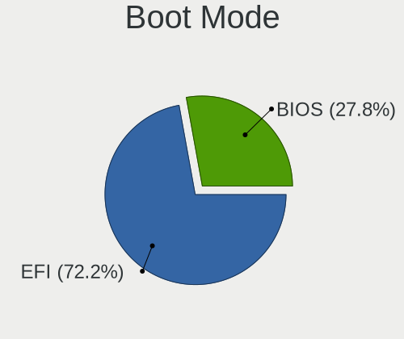
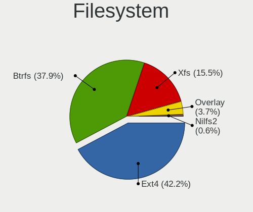
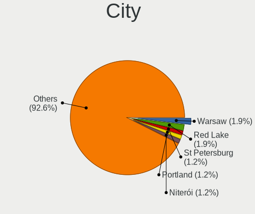
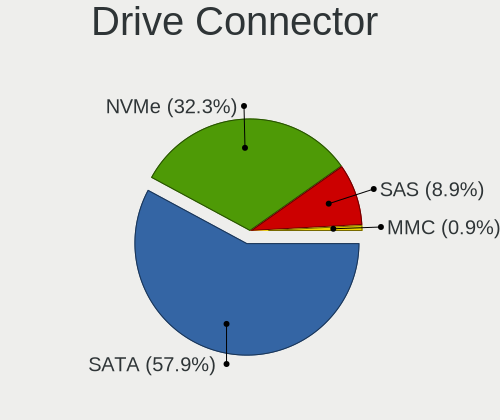
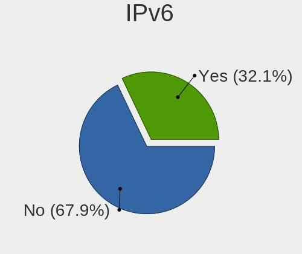

Xero - Tested Hardware & Statistics (Desktops)
----------------------------------------------

A project to collect tested hardware configurations for Xero.

Anyone can contribute to this report by the [hw-probe](https://github.com/linuxhw/hw-probe) tool:

    sudo -E hw-probe -all -upload

Please contribute! Especially if your hardware is rare.

Contents
--------

* [ Test Cases ](#test-cases)

* [ System ](#system)
  - [ OS                       ](#os)
  - [ OS Family                ](#os-family)
  - [ Kernel                   ](#kernel)
  - [ Kernel Family            ](#kernel-family)
  - [ Kernel Major Ver.        ](#kernel-major-ver)
  - [ Arch                     ](#arch)
  - [ DE                       ](#de)
  - [ Display Server           ](#display-server)
  - [ Display Manager          ](#display-manager)
  - [ OS Lang                  ](#os-lang)
  - [ Boot Mode                ](#boot-mode)
  - [ Filesystem               ](#filesystem)
  - [ Part. scheme             ](#part-scheme)
  - [ Dual Boot with Linux/BSD ](#dual-boot-with-linuxbsd)
  - [ Dual Boot (Win)          ](#dual-boot-win)

* [ Board ](#board)
  - [ Vendor                   ](#vendor)
  - [ Model                    ](#model)
  - [ Model Family             ](#model-family)
  - [ MFG Year                 ](#mfg-year)
  - [ Form Factor              ](#form-factor)
  - [ Secure Boot              ](#secure-boot)
  - [ Coreboot                 ](#coreboot)
  - [ RAM Size                 ](#ram-size)
  - [ RAM Used                 ](#ram-used)
  - [ Total Drives             ](#total-drives)
  - [ Has CD-ROM               ](#has-cd-rom)
  - [ Has Ethernet             ](#has-ethernet)
  - [ Has WiFi                 ](#has-wifi)
  - [ Has Bluetooth            ](#has-bluetooth)

* [ Location ](#location)
  - [ Country                  ](#country)
  - [ City                     ](#city)

* [ Drives ](#drives)
  - [ Drive Vendor             ](#drive-vendor)
  - [ Drive Model              ](#drive-model)
  - [ HDD Vendor               ](#hdd-vendor)
  - [ SSD Vendor               ](#ssd-vendor)
  - [ Drive Kind               ](#drive-kind)
  - [ Drive Connector          ](#drive-connector)
  - [ Drive Size               ](#drive-size)
  - [ Space Total              ](#space-total)
  - [ Space Used               ](#space-used)
  - [ Malfunc. Drives          ](#malfunc-drives)
  - [ Malfunc. Drive Vendor    ](#malfunc-drive-vendor)
  - [ Malfunc. HDD Vendor      ](#malfunc-hdd-vendor)
  - [ Malfunc. Drive Kind      ](#malfunc-drive-kind)
  - [ Failed Drives            ](#failed-drives)
  - [ Failed Drive Vendor      ](#failed-drive-vendor)
  - [ Drive Status             ](#drive-status)

* [ Storage controller ](#storage-controller)
  - [ Storage Vendor           ](#storage-vendor)
  - [ Storage Model            ](#storage-model)
  - [ Storage Kind             ](#storage-kind)

* [ Processor ](#processor)
  - [ CPU Vendor               ](#cpu-vendor)
  - [ CPU Model                ](#cpu-model)
  - [ CPU Model Family         ](#cpu-model-family)
  - [ CPU Cores                ](#cpu-cores)
  - [ CPU Sockets              ](#cpu-sockets)
  - [ CPU Threads              ](#cpu-threads)
  - [ CPU Op-Modes             ](#cpu-op-modes)
  - [ CPU Microcode            ](#cpu-microcode)
  - [ CPU Microarch            ](#cpu-microarch)

* [ Graphics ](#graphics)
  - [ GPU Vendor               ](#gpu-vendor)
  - [ GPU Model                ](#gpu-model)
  - [ GPU Combo                ](#gpu-combo)
  - [ GPU Driver               ](#gpu-driver)
  - [ GPU Memory               ](#gpu-memory)

* [ Monitor ](#monitor)
  - [ Monitor Vendor           ](#monitor-vendor)
  - [ Monitor Model            ](#monitor-model)
  - [ Monitor Resolution       ](#monitor-resolution)
  - [ Monitor Diagonal         ](#monitor-diagonal)
  - [ Monitor Width            ](#monitor-width)
  - [ Aspect Ratio             ](#aspect-ratio)
  - [ Monitor Area             ](#monitor-area)
  - [ Pixel Density            ](#pixel-density)
  - [ Multiple Monitors        ](#multiple-monitors)

* [ Network ](#network)
  - [ Net Controller Vendor    ](#net-controller-vendor)
  - [ Net Controller Model     ](#net-controller-model)
  - [ Wireless Vendor          ](#wireless-vendor)
  - [ Wireless Model           ](#wireless-model)
  - [ Ethernet Vendor          ](#ethernet-vendor)
  - [ Ethernet Model           ](#ethernet-model)
  - [ Net Controller Kind      ](#net-controller-kind)
  - [ Used Controller          ](#used-controller)
  - [ NICs                     ](#nics)
  - [ IPv6                     ](#ipv6)

* [ Bluetooth ](#bluetooth)
  - [ Bluetooth Vendor         ](#bluetooth-vendor)
  - [ Bluetooth Model          ](#bluetooth-model)

* [ Sound ](#sound)
  - [ Sound Vendor             ](#sound-vendor)
  - [ Sound Model              ](#sound-model)

* [ Memory ](#memory)
  - [ Memory Vendor            ](#memory-vendor)
  - [ Memory Model             ](#memory-model)
  - [ Memory Kind              ](#memory-kind)
  - [ Memory Form Factor       ](#memory-form-factor)
  - [ Memory Size              ](#memory-size)
  - [ Memory Speed             ](#memory-speed)

* [ Printers & scanners ](#printers--scanners)
  - [ Printer Vendor           ](#printer-vendor)
  - [ Printer Model            ](#printer-model)
  - [ Scanner Vendor           ](#scanner-vendor)
  - [ Scanner Model            ](#scanner-model)

* [ Camera ](#camera)
  - [ Camera Vendor            ](#camera-vendor)
  - [ Camera Model             ](#camera-model)

* [ Security ](#security)
  - [ Fingerprint Vendor       ](#fingerprint-vendor)
  - [ Fingerprint Model        ](#fingerprint-model)
  - [ Chipcard Vendor          ](#chipcard-vendor)
  - [ Chipcard Model           ](#chipcard-model)

* [ Unsupported ](#unsupported)
  - [ Unsupported Devices      ](#unsupported-devices)
  - [ Unsupported Device Types ](#unsupported-device-types)

Test Cases
----------

Total: 29

| Vendor   | Model                    | Probe                                                      | Date         |
|----------|--------------------------|------------------------------------------------------------|--------------|
| MSI      | Z170-A PRO               | [db5ab86328](https://linux-hardware.org/?probe=db5ab86328) | Apr 11, 2022 |
| MSI      | Z170-A PRO               | [3bd5bb8d08](https://linux-hardware.org/?probe=3bd5bb8d08) | Apr 10, 2022 |
| ASUSTek  | TUF Gaming X570-PLUS     | [8d251b1b2a](https://linux-hardware.org/?probe=8d251b1b2a) | Apr 03, 2022 |
| HP       | 843B                     | [a88ff7cf5c](https://linux-hardware.org/?probe=a88ff7cf5c) | Mar 27, 2022 |
| Pegatron | 2AC2                     | [d3c82e973b](https://linux-hardware.org/?probe=d3c82e973b) | Mar 25, 2022 |
| ASUSTek  | Maximus IX HERO          | [745cc1d638](https://linux-hardware.org/?probe=745cc1d638) | Mar 25, 2022 |
| ASUSTek  | Maximus IX HERO          | [8eb98db533](https://linux-hardware.org/?probe=8eb98db533) | Mar 22, 2022 |
| ASUSTek  | ROG CROSSHAIR VIII HERO  | [13cdf54c81](https://linux-hardware.org/?probe=13cdf54c81) | Mar 21, 2022 |
| ASUSTek  | TUF Gaming B550M-PLUS    | [639e7361ef](https://linux-hardware.org/?probe=639e7361ef) | Mar 12, 2022 |
| MSI      | Z170A PC MATE            | [181e014823](https://linux-hardware.org/?probe=181e014823) | Mar 08, 2022 |
| Gigabyte | Z170X-UD3-CF             | [3ec7a7f643](https://linux-hardware.org/?probe=3ec7a7f643) | Mar 06, 2022 |
| ASUSTek  | P5Q PRO TURBO            | [83ca29c9c8](https://linux-hardware.org/?probe=83ca29c9c8) | Jan 28, 2022 |
| ASUSTek  | TUF Gaming B550M-PLUS    | [230373b3ff](https://linux-hardware.org/?probe=230373b3ff) | Jan 09, 2022 |
| HP       | 1906                     | [5f8fe7cb20](https://linux-hardware.org/?probe=5f8fe7cb20) | Jan 06, 2022 |
| ASUSTek  | TUF GAMING X570-PLUS     | [793bfa4f40](https://linux-hardware.org/?probe=793bfa4f40) | Jan 04, 2022 |
| ASUSTek  | TUF B360M-PLUS GAMING/BR | [512091cd1c](https://linux-hardware.org/?probe=512091cd1c) | Dec 30, 2021 |
| ASRock   | X570 Taichi              | [5c2c86f287](https://linux-hardware.org/?probe=5c2c86f287) | Dec 23, 2021 |
| ASRock   | X570 Taichi              | [3e4f21099d](https://linux-hardware.org/?probe=3e4f21099d) | Dec 17, 2021 |
| ASUSTek  | TUF GAMING X570-PLUS     | [728b23aa46](https://linux-hardware.org/?probe=728b23aa46) | Nov 26, 2021 |
| ASUSTek  | PRIME A320M-K            | [9e9b6fd944](https://linux-hardware.org/?probe=9e9b6fd944) | Nov 21, 2021 |
| ASUSTek  | TUF Z390-PLUS GAMING     | [4877535f8b](https://linux-hardware.org/?probe=4877535f8b) | Nov 03, 2021 |
| MSI      | Z370 GAMING PLUS         | [8dd5924480](https://linux-hardware.org/?probe=8dd5924480) | Oct 31, 2021 |
| Dell     | 0XC7MM A01               | [390c5408b2](https://linux-hardware.org/?probe=390c5408b2) | Oct 05, 2021 |
| ASRock   | B450M Pro4               | [a198e8517a](https://linux-hardware.org/?probe=a198e8517a) | Oct 01, 2021 |
| ASRock   | X570 Taichi              | [50fd919991](https://linux-hardware.org/?probe=50fd919991) | Aug 29, 2021 |
| ASRock   | X570 Taichi              | [203afc45fd](https://linux-hardware.org/?probe=203afc45fd) | Aug 29, 2021 |
| Gigabyte | X570 AORUS MASTER        | [a3c6fe4037](https://linux-hardware.org/?probe=a3c6fe4037) | Jul 24, 2021 |
| ASRock   | X570 Taichi              | [57d19e2c3a](https://linux-hardware.org/?probe=57d19e2c3a) | May 19, 2021 |
| Acer     | FIH57                    | [9c3e383ea5](https://linux-hardware.org/?probe=9c3e383ea5) | Apr 30, 2021 |

System
------

OS
--

Installed operating systems

| Name         | Desktops | Percent |
|--------------|----------|---------|
| Xero Rolling | 18       | 85.71%  |
| Xero         | 3        | 14.29%  |

OS Family
---------

OS without a version

| Name | Desktops | Percent |
|------|----------|---------|
| Xero | 21       | 100%    |

Kernel
------

Version of the Linux kernel

| Version                 | Desktops | Percent |
|-------------------------|----------|---------|
| 5.16.15-arch1-1         | 2        | 8%      |
| 5.16.12-arch1-1         | 2        | 8%      |
| 5.17.1-arch1-1          | 1        | 4%      |
| 5.16.16-zen1-1-zen      | 1        | 4%      |
| 5.16.16-arch1-1         | 1        | 4%      |
| 5.16.13-arch1-1         | 1        | 4%      |
| 5.16.1-arch1-1          | 1        | 4%      |
| 5.15.9-AMD              | 1        | 4%      |
| 5.15.4-arch1-1          | 1        | 4%      |
| 5.15.33-1-lts           | 1        | 4%      |
| 5.15.3-zen1-1-zen       | 1        | 4%      |
| 5.15.13-AMD             | 1        | 4%      |
| 5.15.12-zen1-1-zen      | 1        | 4%      |
| 5.15.12-arch1-1-surface | 1        | 4%      |
| 5.15.11-arch2-1-surface | 1        | 4%      |
| 5.14.9-zen2-1-zen       | 1        | 4%      |
| 5.14.8-zen1-1-zen       | 1        | 4%      |
| 5.14.15-zen1-1-zen      | 1        | 4%      |
| 5.14.14-arch1-1         | 1        | 4%      |
| 5.13.4-zen1-1-zen       | 1        | 4%      |
| 5.13.13-AMD             | 1        | 4%      |
| 5.12.5-AMD              | 1        | 4%      |
| 5.11.16-zen1-1-zen      | 1        | 4%      |

Kernel Family
-------------

Linux kernel without a distro release

| Version | Desktops | Percent |
|---------|----------|---------|
| 5.16.16 | 2        | 8%      |
| 5.16.15 | 2        | 8%      |
| 5.16.12 | 2        | 8%      |
| 5.15.12 | 2        | 8%      |
| 5.17.1  | 1        | 4%      |
| 5.16.13 | 1        | 4%      |
| 5.16.1  | 1        | 4%      |
| 5.15.9  | 1        | 4%      |
| 5.15.4  | 1        | 4%      |
| 5.15.33 | 1        | 4%      |
| 5.15.3  | 1        | 4%      |
| 5.15.13 | 1        | 4%      |
| 5.15.11 | 1        | 4%      |
| 5.14.9  | 1        | 4%      |
| 5.14.8  | 1        | 4%      |
| 5.14.15 | 1        | 4%      |
| 5.14.14 | 1        | 4%      |
| 5.13.4  | 1        | 4%      |
| 5.13.13 | 1        | 4%      |
| 5.12.5  | 1        | 4%      |
| 5.11.16 | 1        | 4%      |

Kernel Major Ver.
-----------------

Linux kernel major version

| Version | Desktops | Percent |
|---------|----------|---------|
| 5.16    | 8        | 33.33%  |
| 5.15    | 7        | 29.17%  |
| 5.14    | 4        | 16.67%  |
| 5.13    | 2        | 8.33%   |
| 5.17    | 1        | 4.17%   |
| 5.12    | 1        | 4.17%   |
| 5.11    | 1        | 4.17%   |

Arch
----

OS architecture (x86_64, i586, etc.)

| Name   | Desktops | Percent |
|--------|----------|---------|
| x86_64 | 21       | 100%    |

DE
--

Desktop Environment

| Name | Desktops | Percent |
|------|----------|---------|
| KDE5 | 20       | 95.24%  |
| XFCE | 1        | 4.76%   |

Display Server
--------------

X11 or Wayland

| Name    | Desktops | Percent |
|---------|----------|---------|
| X11     | 17       | 80.95%  |
| Wayland | 2        | 9.52%   |
| Tty     | 2        | 9.52%   |

Display Manager
---------------

SDDM, LightDM, etc.

| Name    | Desktops | Percent |
|---------|----------|---------|
| SDDM    | 14       | 66.67%  |
| LightDM | 3        | 14.29%  |
| Unknown | 3        | 14.29%  |
| TDM     | 1        | 4.76%   |

OS Lang
-------

Language

| Lang  | Desktops | Percent |
|-------|----------|---------|
| en_US | 12       | 57.14%  |
| en_GB | 2        | 9.52%   |
| C     | 2        | 9.52%   |
| en_IN | 1        | 4.76%   |
| en_CA | 1        | 4.76%   |
| en_AU | 1        | 4.76%   |
| de_DE | 1        | 4.76%   |
| de_AT | 1        | 4.76%   |

Boot Mode
---------

EFI or BIOS

| Mode | Desktops | Percent |
|------|----------|---------|
| EFI  | 14       | 66.67%  |
| BIOS | 7        | 33.33%  |

Filesystem
----------

Type of filesystem

| Type    | Desktops | Percent |
|---------|----------|---------|
| Btrfs   | 15       | 71.43%  |
| Ext4    | 4        | 19.05%  |
| Overlay | 2        | 9.52%   |

Part. scheme
------------

Scheme of partitioning

| Type    | Desktops | Percent |
|---------|----------|---------|
| GPT     | 14       | 66.67%  |
| MBR     | 4        | 19.05%  |
| Unknown | 3        | 14.29%  |

Dual Boot with Linux/BSD
------------------------

Hosting more than one Linux/BSD

| Dual boot | Desktops | Percent |
|-----------|----------|---------|
| No        | 16       | 76.19%  |
| Yes       | 5        | 23.81%  |

Dual Boot (Win)
---------------

Hosting Linux and Windows

| Dual boot | Desktops | Percent |
|-----------|----------|---------|
| No        | 11       | 52.38%  |
| Yes       | 10       | 47.62%  |

Board
-----

Vendor
------

Motherboard manufacturer

| Name                | Desktops | Percent |
|---------------------|----------|---------|
| ASUSTek Computer    | 9        | 42.86%  |
| MSI                 | 3        | 14.29%  |
| Hewlett-Packard     | 2        | 9.52%   |
| Gigabyte Technology | 2        | 9.52%   |
| ASRock              | 2        | 9.52%   |
| Pegatron            | 1        | 4.76%   |
| Dell                | 1        | 4.76%   |
| Acer                | 1        | 4.76%   |

Model
-----

Motherboard model

| Name                          | Desktops | Percent |
|-------------------------------|----------|---------|
| MSI MS-7971                   | 2        | 9.52%   |
| ASUS TUF Gaming X570-PLUS     | 2        | 9.52%   |
| Pegatron p6-2026              | 1        | 4.76%   |
| MSI MS-7B61                   | 1        | 4.76%   |
| HP Z230 SFF Workstation       | 1        | 4.76%   |
| HP Pavilion Desktop 590-p0xxx | 1        | 4.76%   |
| Gigabyte Z170X-UD3            | 1        | 4.76%   |
| Gigabyte X570 AORUS MASTER    | 1        | 4.76%   |
| Dell Precision T1500          | 1        | 4.76%   |
| ASUS TUF Z390-PLUS GAMING     | 1        | 4.76%   |
| ASUS TUF Gaming B550M-PLUS    | 1        | 4.76%   |
| ASUS TUF B360M-PLUS GAMING/BR | 1        | 4.76%   |
| ASUS ROG CROSSHAIR VIII HERO  | 1        | 4.76%   |
| ASUS PRIME A320M-K            | 1        | 4.76%   |
| ASUS P5Q PRO TURBO            | 1        | 4.76%   |
| ASUS Maximus IX HERO          | 1        | 4.76%   |
| ASRock X570 Taichi            | 1        | 4.76%   |
| ASRock B450M Pro4             | 1        | 4.76%   |
| Acer Aspire X5950             | 1        | 4.76%   |

Model Family
------------

Motherboard model prefix

| Name               | Desktops | Percent |
|--------------------|----------|---------|
| ASUS TUF           | 5        | 23.81%  |
| MSI MS-7971        | 2        | 9.52%   |
| Pegatron p6-2026   | 1        | 4.76%   |
| MSI MS-7B61        | 1        | 4.76%   |
| HP Z230            | 1        | 4.76%   |
| HP Pavilion        | 1        | 4.76%   |
| Gigabyte Z170X-UD3 | 1        | 4.76%   |
| Gigabyte X570      | 1        | 4.76%   |
| Dell Precision     | 1        | 4.76%   |
| ASUS ROG           | 1        | 4.76%   |
| ASUS PRIME         | 1        | 4.76%   |
| ASUS P5Q           | 1        | 4.76%   |
| ASUS Maximus       | 1        | 4.76%   |
| ASRock X570        | 1        | 4.76%   |
| ASRock B450M       | 1        | 4.76%   |
| Acer Aspire        | 1        | 4.76%   |

MFG Year
--------

Motherboard manufacture year

| Year | Desktops | Percent |
|------|----------|---------|
| 2018 | 5        | 23.81%  |
| 2019 | 4        | 19.05%  |
| 2015 | 3        | 14.29%  |
| 2017 | 2        | 9.52%   |
| 2010 | 2        | 9.52%   |
| 2021 | 1        | 4.76%   |
| 2020 | 1        | 4.76%   |
| 2013 | 1        | 4.76%   |
| 2011 | 1        | 4.76%   |
| 2009 | 1        | 4.76%   |

Form Factor
-----------

Physical design of the computer

| Name    | Desktops | Percent |
|---------|----------|---------|
| Desktop | 21       | 100%    |

Secure Boot
-----------

Enabled or disabled

| State    | Desktops | Percent |
|----------|----------|---------|
| Disabled | 21       | 100%    |

Coreboot
--------

Have coreboot on board

| Used | Desktops | Percent |
|------|----------|---------|
| No   | 21       | 100%    |

RAM Size
--------

Total RAM memory

| Size in GB  | Desktops | Percent |
|-------------|----------|---------|
| 16.01-24.0  | 7        | 33.33%  |
| 32.01-64.0  | 6        | 28.57%  |
| 8.01-16.0   | 4        | 19.05%  |
| 4.01-8.0    | 3        | 14.29%  |
| 64.01-256.0 | 1        | 4.76%   |

RAM Used
--------

Used RAM memory

| Used GB    | Desktops | Percent |
|------------|----------|---------|
| 4.01-8.0   | 7        | 29.17%  |
| 2.01-3.0   | 5        | 20.83%  |
| 1.01-2.0   | 4        | 16.67%  |
| 3.01-4.0   | 3        | 12.5%   |
| 8.01-16.0  | 2        | 8.33%   |
| 0.01-0.5   | 2        | 8.33%   |
| 16.01-24.0 | 1        | 4.17%   |

Total Drives
------------

Number of drives on board

| Drives | Desktops | Percent |
|--------|----------|---------|
| 1      | 7        | 33.33%  |
| 3      | 5        | 23.81%  |
| 2      | 4        | 19.05%  |
| 6      | 2        | 9.52%   |
| 4      | 2        | 9.52%   |
| 7      | 1        | 4.76%   |

Has CD-ROM
----------

Has CD-ROM on board

| Presented | Desktops | Percent |
|-----------|----------|---------|
| No        | 16       | 76.19%  |
| Yes       | 5        | 23.81%  |

Has Ethernet
------------

Has Ethernet on board

| Presented | Desktops | Percent |
|-----------|----------|---------|
| Yes       | 21       | 100%    |

Has WiFi
--------

Has WiFi module

| Presented | Desktops | Percent |
|-----------|----------|---------|
| Yes       | 12       | 57.14%  |
| No        | 9        | 42.86%  |

Has Bluetooth
-------------

Has Bluetooth module

| Presented | Desktops | Percent |
|-----------|----------|---------|
| Yes       | 12       | 57.14%  |
| No        | 9        | 42.86%  |

Location
--------

Country
-------

Geographic location (country)

| Country   | Desktops | Percent |
|-----------|----------|---------|
| USA       | 6        | 28.57%  |
| UK        | 1        | 4.76%   |
| Sweden    | 1        | 4.76%   |
| Spain     | 1        | 4.76%   |
| Portugal  | 1        | 4.76%   |
| Mexico    | 1        | 4.76%   |
| Lebanon   | 1        | 4.76%   |
| Italy     | 1        | 4.76%   |
| India     | 1        | 4.76%   |
| Greece    | 1        | 4.76%   |
| Germany   | 1        | 4.76%   |
| Colombia  | 1        | 4.76%   |
| Canada    | 1        | 4.76%   |
| Brazil    | 1        | 4.76%   |
| Austria   | 1        | 4.76%   |
| Australia | 1        | 4.76%   |

City
----

Geographic location (city)

| City           | Desktops | Percent |
|----------------|----------|---------|
| Zell am See    | 1        | 4.55%   |
| Wrexham        | 1        | 4.55%   |
| Wells          | 1        | 4.55%   |
| Springfield    | 1        | 4.55%   |
| Salt Lake City | 1        | 4.55%   |
| Phoenix        | 1        | 4.55%   |
| Passos         | 1        | 4.55%   |
| Oberursel      | 1        | 4.55%   |
| Montreal       | 1        | 4.55%   |
| Monterrey      | 1        | 4.55%   |
| Melbourne      | 1        | 4.55%   |
| Longview       | 1        | 4.55%   |
| Lisbon         | 1        | 4.55%   |
| Kista          | 1        | 4.55%   |
| Granollers     | 1        | 4.55%   |
| Ernakulam      | 1        | 4.55%   |
| Chicago        | 1        | 4.55%   |
| Brisbane       | 1        | 4.55%   |
| Bogotá        | 1        | 4.55%   |
| Beirut         | 1        | 4.55%   |
| Bari           | 1        | 4.55%   |
| Athens         | 1        | 4.55%   |

Drives
------

Drive Vendor
------------

Hard drive vendors

| Vendor                    | Desktops | Drives | Percent |
|---------------------------|----------|--------|---------|
| WDC                       | 9        | 12     | 20%     |
| Samsung Electronics       | 8        | 19     | 17.78%  |
| Seagate                   | 7        | 16     | 15.56%  |
| Toshiba                   | 3        | 5      | 6.67%   |
| Kingston                  | 3        | 4      | 6.67%   |
| SanDisk                   | 2        | 2      | 4.44%   |
| Phison                    | 2        | 2      | 4.44%   |
| HGST                      | 2        | 2      | 4.44%   |
| China                     | 2        | 2      | 4.44%   |
| XPG                       | 1        | 1      | 2.22%   |
| PNY                       | 1        | 1      | 2.22%   |
| Micron/Crucial Technology | 1        | 1      | 2.22%   |
| Intel                     | 1        | 2      | 2.22%   |
| Hitachi                   | 1        | 1      | 2.22%   |
| A-DATA Technology         | 1        | 1      | 2.22%   |
| 2-Power                   | 1        | 1      | 2.22%   |

Drive Model
-----------

Hard drive models

| Model                                | Desktops | Percent |
|--------------------------------------|----------|---------|
| Samsung SSD 970 EVO 1TB              | 2        | 3.45%   |
| Kingston SA400S37240G 240GB SSD      | 2        | 3.45%   |
| XPG GAMMIX S50 1TB                   | 1        | 1.72%   |
| WDC WDS500G3XHC-00SJG0 500GB         | 1        | 1.72%   |
| WDC WDS500G3X0C-00SJG0 500GB         | 1        | 1.72%   |
| WDC WD800JD-00MSA1 80GB              | 1        | 1.72%   |
| WDC WD7500BPKT-75PK4T0 752GB         | 1        | 1.72%   |
| WDC WD6400AAKS-22A7B2 640GB          | 1        | 1.72%   |
| WDC WD5000AAVS-00ZTB0 500GB          | 1        | 1.72%   |
| WDC WD2500BEVT-60ZCT1 250GB          | 1        | 1.72%   |
| WDC WD2003FZEX-00SRLA0 2TB           | 1        | 1.72%   |
| WDC WD10EZEX-60WN4A0 1TB             | 1        | 1.72%   |
| WDC WD10EZEX-22MFCA0 1TB             | 1        | 1.72%   |
| WDC WD1002FAEX-00Z3A0 1TB            | 1        | 1.72%   |
| Toshiba MQ04ABF100 1TB               | 1        | 1.72%   |
| Toshiba MQ01ABD100 1TB               | 1        | 1.72%   |
| Toshiba MK4058GSX 400GB              | 1        | 1.72%   |
| Toshiba HDWR160 6TB                  | 1        | 1.72%   |
| Toshiba HDWE160 6TB                  | 1        | 1.72%   |
| Seagate ST3500418AS 500GB            | 1        | 1.72%   |
| Seagate ST250DM000-1BD141 250GB      | 1        | 1.72%   |
| Seagate ST2000DX001-1CM164 2TB       | 1        | 1.72%   |
| Seagate ST2000DM008-2FR102 2TB       | 1        | 1.72%   |
| Seagate ST2000DM006-2DM164 2TB       | 1        | 1.72%   |
| Seagate ST2000DM001-1ER164 2TB       | 1        | 1.72%   |
| Seagate ST1000VN002-2EY102 1TB       | 1        | 1.72%   |
| Seagate ST1000LM048-2E7172 1TB       | 1        | 1.72%   |
| Seagate ST1000DM010-2EP102 1TB       | 1        | 1.72%   |
| Seagate ST1000DM003-1SB102 1TB       | 1        | 1.72%   |
| Seagate ST10000NE0008-2JM101 10TB    | 1        | 1.72%   |
| Seagate Backup+ Hub BK 4TB           | 1        | 1.72%   |
| SanDisk SDSSDH31024G 1TB             | 1        | 1.72%   |
| Sandisk NVMe SSD Drive 500GB         | 1        | 1.72%   |
| Samsung SSD 980 PRO 2TB              | 1        | 1.72%   |
| Samsung SSD 980 PRO 1TB              | 1        | 1.72%   |
| Samsung SSD 970 EVO Plus 500GB       | 1        | 1.72%   |
| Samsung SSD 960 EVO 250GB            | 1        | 1.72%   |
| Samsung SSD 860 EVO 1TB              | 1        | 1.72%   |
| Samsung SSD 850 EVO 250GB            | 1        | 1.72%   |
| Samsung SSD 840 EVO 120GB            | 1        | 1.72%   |
| Samsung SSD 830 Series 64GB          | 1        | 1.72%   |
| Samsung MZNLN128HAHQ-000H1 128GB SSD | 1        | 1.72%   |
| Samsung HD161HJ 160GB                | 1        | 1.72%   |
| PNY CS900 500GB SSD                  | 1        | 1.72%   |
| Phison Sabrent Rocket 4.0 1TB        | 1        | 1.72%   |
| Phison NVMe SSD Drive 240GB          | 1        | 1.72%   |
| Micron/Crucial NVMe SSD Drive 1TB    | 1        | 1.72%   |
| Kingston SUV400S37240G 240GB SSD     | 1        | 1.72%   |
| Intel SSDPEKNW010T8 1TB              | 1        | 1.72%   |
| Hitachi HTS725050A9A364 500GB        | 1        | 1.72%   |
| HGST HTS545050A7E680 500GB           | 1        | 1.72%   |
| HGST HTS541010A9E680 1TB             | 1        | 1.72%   |
| China SATA3 240GB SSD                | 1        | 1.72%   |
| China SATA SSD 120GB                 | 1        | 1.72%   |
| A-DATA SX6000LNP 512GB               | 1        | 1.72%   |
| 2-Power SSD2042A 240GB               | 1        | 1.72%   |

HDD Vendor
----------

Hard disk drive vendors

| Vendor              | Desktops | Drives | Percent |
|---------------------|----------|--------|---------|
| WDC                 | 8        | 10     | 36.36%  |
| Seagate             | 7        | 16     | 31.82%  |
| Toshiba             | 3        | 5      | 13.64%  |
| HGST                | 2        | 2      | 9.09%   |
| Samsung Electronics | 1        | 1      | 4.55%   |
| Hitachi             | 1        | 1      | 4.55%   |

SSD Vendor
----------

Solid state drive vendors

| Vendor              | Desktops | Drives | Percent |
|---------------------|----------|--------|---------|
| Samsung Electronics | 4        | 7      | 33.33%  |
| Kingston            | 3        | 4      | 25%     |
| China               | 2        | 2      | 16.67%  |
| SanDisk             | 1        | 1      | 8.33%   |
| PNY                 | 1        | 1      | 8.33%   |
| 2-Power             | 1        | 1      | 8.33%   |

Drive Kind
----------

HDD or SSD

| Kind | Desktops | Drives | Percent |
|------|----------|--------|---------|
| HDD  | 16       | 35     | 43.24%  |
| NVMe | 11       | 21     | 29.73%  |
| SSD  | 10       | 16     | 27.03%  |

Drive Connector
---------------

SATA, SAS, NVMe, etc.

| Type | Desktops | Drives | Percent |
|------|----------|--------|---------|
| SATA | 19       | 50     | 61.29%  |
| NVMe | 11       | 21     | 35.48%  |
| SAS  | 1        | 1      | 3.23%   |

Drive Size
----------

Size of hard drive

| Size in TB | Desktops | Drives | Percent |
|------------|----------|--------|---------|
| 0.01-0.5   | 12       | 23     | 40%     |
| 0.51-1.0   | 11       | 17     | 36.67%  |
| 1.01-2.0   | 4        | 7      | 13.33%  |
| 4.01-10.0  | 2        | 3      | 6.67%   |
| 3.01-4.0   | 1        | 1      | 3.33%   |

Space Total
-----------

Amount of disk space available on the file system

| Size in GB     | Desktops | Percent |
|----------------|----------|---------|
| More than 3000 | 8        | 36.36%  |
| 501-1000       | 5        | 22.73%  |
| 1001-2000      | 4        | 18.18%  |
| 251-500        | 1        | 4.55%   |
| 2001-3000      | 1        | 4.55%   |
| 101-250        | 1        | 4.55%   |
| 1-20           | 1        | 4.55%   |
| 51-100         | 1        | 4.55%   |

Space Used
----------

Amount of used disk space

| Used GB   | Desktops | Percent |
|-----------|----------|---------|
| 101-250   | 8        | 34.78%  |
| 1-20      | 4        | 17.39%  |
| 51-100    | 4        | 17.39%  |
| 1001-2000 | 3        | 13.04%  |
| 251-500   | 2        | 8.7%    |
| 2001-3000 | 1        | 4.35%   |
| 501-1000  | 1        | 4.35%   |

Malfunc. Drives
---------------

Drive models with a malfunction

| Model                            | Desktops | Drives | Percent |
|----------------------------------|----------|--------|---------|
| WDC WD1002FAEX-00Z3A0 1TB        | 1        | 2      | 14.29%  |
| Toshiba MQ01ABD100 1TB           | 1        | 1      | 14.29%  |
| Toshiba MK4058GSX 400GB          | 1        | 1      | 14.29%  |
| Seagate ST2000DM006-2DM164 2TB   | 1        | 1      | 14.29%  |
| Kingston SUV400S37240G 240GB SSD | 1        | 1      | 14.29%  |
| Hitachi HTS725050A9A364 500GB    | 1        | 1      | 14.29%  |
| China SATA3 240GB SSD            | 1        | 1      | 14.29%  |

Malfunc. Drive Vendor
---------------------

Vendors of faulty drives

| Vendor   | Desktops | Drives | Percent |
|----------|----------|--------|---------|
| WDC      | 1        | 2      | 16.67%  |
| Toshiba  | 1        | 2      | 16.67%  |
| Seagate  | 1        | 1      | 16.67%  |
| Kingston | 1        | 1      | 16.67%  |
| Hitachi  | 1        | 1      | 16.67%  |
| China    | 1        | 1      | 16.67%  |

Malfunc. HDD Vendor
-------------------

Vendors of faulty HDD drives

| Vendor  | Desktops | Drives | Percent |
|---------|----------|--------|---------|
| WDC     | 1        | 2      | 25%     |
| Toshiba | 1        | 2      | 25%     |
| Seagate | 1        | 1      | 25%     |
| Hitachi | 1        | 1      | 25%     |

Malfunc. Drive Kind
-------------------

Kinds of faulty drives

| Kind | Desktops | Drives | Percent |
|------|----------|--------|---------|
| HDD  | 4        | 6      | 66.67%  |
| SSD  | 2        | 2      | 33.33%  |

Failed Drives
-------------

Failed drive models

Zero info for selected period =(

Failed Drive Vendor
-------------------

Failed drive vendors

Zero info for selected period =(

Drive Status
------------

Number of failed and malfunc. drives

| Status   | Desktops | Drives | Percent |
|----------|----------|--------|---------|
| Works    | 18       | 53     | 64.29%  |
| Malfunc  | 6        | 8      | 21.43%  |
| Detected | 4        | 11     | 14.29%  |

Storage controller
------------------

Storage Vendor
--------------

Storage controller vendors

| Vendor                    | Desktops | Percent |
|---------------------------|----------|---------|
| Intel                     | 14       | 41.18%  |
| AMD                       | 8        | 23.53%  |
| Samsung Electronics       | 4        | 11.76%  |
| Sandisk                   | 3        | 8.82%   |
| Phison Electronics        | 2        | 5.88%   |
| Realtek Semiconductor     | 1        | 2.94%   |
| Micron/Crucial Technology | 1        | 2.94%   |
| ADATA Technology          | 1        | 2.94%   |

Storage Model
-------------

Storage controller models

| Model                                                                         | Desktops | Percent |
|-------------------------------------------------------------------------------|----------|---------|
| AMD FCH SATA Controller [AHCI mode]                                           | 7        | 17.95%  |
| Samsung NVMe SSD Controller SM981/PM981/PM983                                 | 3        | 7.69%   |
| Intel SATA Controller [RAID mode]                                             | 3        | 7.69%   |
| Intel Q170/Q150/B150/H170/H110/Z170/CM236 Chipset SATA Controller [AHCI Mode] | 3        | 7.69%   |
| Sandisk WD Black 2018/SN750 / PC SN720 NVMe SSD                               | 2        | 5.13%   |
| Samsung NVMe SSD Controller PM9A1/PM9A3/980PRO                                | 2        | 5.13%   |
| Intel Cannon Lake PCH SATA AHCI Controller                                    | 2        | 5.13%   |
| Intel 5 Series/3400 Series Chipset 6 port SATA AHCI Controller                | 2        | 5.13%   |
| Intel 200 Series PCH SATA controller [AHCI mode]                              | 2        | 5.13%   |
| Sandisk WD Blue SN550 NVMe SSD                                                | 1        | 2.56%   |
| Samsung NVMe SSD Controller SM961/PM961/SM963                                 | 1        | 2.56%   |
| Realtek Realtek Non-Volatile memory controller                                | 1        | 2.56%   |
| Phison E16 PCIe4 NVMe Controller                                              | 1        | 2.56%   |
| Phison E12 NVMe Controller                                                    | 1        | 2.56%   |
| Micron/Crucial P1 NVMe PCIe SSD                                               | 1        | 2.56%   |
| Intel SSD 660P Series                                                         | 1        | 2.56%   |
| Intel 82801JI (ICH10 Family) SATA AHCI Controller                             | 1        | 2.56%   |
| Intel 6 Series/C200 Series Chipset Family 6 port Desktop SATA AHCI Controller | 1        | 2.56%   |
| AMD FCH SATA Controller D                                                     | 1        | 2.56%   |
| AMD 500 Series Chipset SATA Controller                                        | 1        | 2.56%   |
| AMD 400 Series Chipset SATA Controller                                        | 1        | 2.56%   |
| ADATA Non-Volatile memory controller                                          | 1        | 2.56%   |

Storage Kind
------------

Kind of storage controller (IDE, SATA, NVMe, SAS, ...)

| Kind | Desktops | Percent |
|------|----------|---------|
| SATA | 19       | 57.58%  |
| NVMe | 11       | 33.33%  |
| RAID | 3        | 9.09%   |

Processor
---------

CPU Vendor
----------

Processor vendors

| Vendor | Desktops | Percent |
|--------|----------|---------|
| Intel  | 13       | 61.9%   |
| AMD    | 8        | 38.1%   |

CPU Model
---------

Processor models

| Model                                      | Desktops | Percent |
|--------------------------------------------|----------|---------|
| AMD Ryzen 5 3600X 6-Core Processor         | 3        | 14.29%  |
| Intel Genuine CPU 0000 @ 2.10GHz           | 1        | 4.76%   |
| Intel Core i7-7700K CPU @ 4.20GHz          | 1        | 4.76%   |
| Intel Core i7-6700K CPU @ 4.00GHz          | 1        | 4.76%   |
| Intel Core i7 CPU 870 @ 2.93GHz            | 1        | 4.76%   |
| Intel Core i5-9600K CPU @ 3.70GHz          | 1        | 4.76%   |
| Intel Core i5-9400F CPU @ 2.90GHz          | 1        | 4.76%   |
| Intel Core i5-6600 CPU @ 3.30GHz           | 1        | 4.76%   |
| Intel Core i5-6500 CPU @ 3.20GHz           | 1        | 4.76%   |
| Intel Core i5-4670 CPU @ 3.40GHz           | 1        | 4.76%   |
| Intel Core i3-8100 CPU @ 3.60GHz           | 1        | 4.76%   |
| Intel Core i3-2120 CPU @ 3.30GHz           | 1        | 4.76%   |
| Intel Core i3 CPU 540 @ 3.07GHz            | 1        | 4.76%   |
| Intel Core 2 Quad CPU Q9650 @ 3.00GHz      | 1        | 4.76%   |
| AMD Ryzen 9 3900X 12-Core Processor        | 1        | 4.76%   |
| AMD Ryzen 7 5800X 8-Core Processor         | 1        | 4.76%   |
| AMD Ryzen 5 5600X 6-Core Processor         | 1        | 4.76%   |
| AMD Ryzen 5 1600 Six-Core Processor        | 1        | 4.76%   |
| AMD Athlon 200GE with Radeon Vega Graphics | 1        | 4.76%   |

CPU Model Family
----------------

Processor model prefix

| Model             | Desktops | Percent |
|-------------------|----------|---------|
| Intel Core i5     | 5        | 23.81%  |
| AMD Ryzen 5       | 5        | 23.81%  |
| Intel Core i7     | 3        | 14.29%  |
| Intel Core i3     | 3        | 14.29%  |
| Intel Genuine     | 1        | 4.76%   |
| Intel Core 2 Quad | 1        | 4.76%   |
| AMD Ryzen 9       | 1        | 4.76%   |
| AMD Ryzen 7       | 1        | 4.76%   |
| AMD Athlon        | 1        | 4.76%   |

CPU Cores
---------

Number of processor cores

| Number | Desktops | Percent |
|--------|----------|---------|
| 4      | 8        | 38.1%   |
| 6      | 7        | 33.33%  |
| 2      | 3        | 14.29%  |
| 8      | 2        | 9.52%   |
| 12     | 1        | 4.76%   |

CPU Sockets
-----------

Number of sockets

| Number | Desktops | Percent |
|--------|----------|---------|
| 1      | 21       | 100%    |

CPU Threads
-----------

Threads per core (Hyper-Threading)

| Number | Desktops | Percent |
|--------|----------|---------|
| 2      | 14       | 66.67%  |
| 1      | 7        | 33.33%  |

CPU Op-Modes
------------

CPU Operation Modes (32-bit, 64-bit)

| Op mode        | Desktops | Percent |
|----------------|----------|---------|
| 32-bit, 64-bit | 21       | 100%    |

CPU Microcode
-------------

Microcode number

| Number     | Desktops | Percent |
|------------|----------|---------|
| Unknown    | 4        | 19.05%  |
| 0x506e3    | 3        | 14.29%  |
| 0x08701021 | 3        | 14.29%  |
| 0x0a201016 | 2        | 9.52%   |
| 0x906ed    | 1        | 4.76%   |
| 0x906eb    | 1        | 4.76%   |
| 0x906ea    | 1        | 4.76%   |
| 0x906e9    | 1        | 4.76%   |
| 0x306c3    | 1        | 4.76%   |
| 0x20655    | 1        | 4.76%   |
| 0x1067a    | 1        | 4.76%   |
| 0x08701013 | 1        | 4.76%   |
| 0x0810100b | 1        | 4.76%   |

CPU Microarch
-------------

Microarchitecture

| Name        | Desktops | Percent |
|-------------|----------|---------|
| KabyLake    | 5        | 23.81%  |
| Zen 2       | 4        | 19.05%  |
| Skylake     | 3        | 14.29%  |
| Zen 3       | 2        | 9.52%   |
| Zen+        | 1        | 4.76%   |
| Zen         | 1        | 4.76%   |
| Westmere    | 1        | 4.76%   |
| SandyBridge | 1        | 4.76%   |
| Penryn      | 1        | 4.76%   |
| Nehalem     | 1        | 4.76%   |
| Haswell     | 1        | 4.76%   |

Graphics
--------

GPU Vendor
----------

Vendors of graphics cards

| Vendor | Desktops | Percent |
|--------|----------|---------|
| Nvidia | 11       | 50%     |
| AMD    | 8        | 36.36%  |
| Intel  | 3        | 13.64%  |

GPU Model
---------

Graphics card models

| Model                                                                     | Desktops | Percent |
|---------------------------------------------------------------------------|----------|---------|
| AMD Navi 10 [Radeon RX 5600 OEM/5600 XT / 5700/5700 XT]                   | 3        | 13.64%  |
| Nvidia GP106 [GeForce GTX 1060 6GB]                                       | 2        | 9.09%   |
| Nvidia GP104 [GeForce GTX 1080]                                           | 2        | 9.09%   |
| Nvidia TU117 [GeForce GTX 1650]                                           | 1        | 4.55%   |
| Nvidia TU106 [GeForce RTX 2060 Rev. A]                                    | 1        | 4.55%   |
| Nvidia GP108 [GeForce GT 1030]                                            | 1        | 4.55%   |
| Nvidia GM206 [GeForce GTX 960]                                            | 1        | 4.55%   |
| Nvidia GM107 [GeForce GTX 750 Ti]                                         | 1        | 4.55%   |
| Nvidia GK107 [GeForce GT 740]                                             | 1        | 4.55%   |
| Nvidia GA102 [GeForce RTX 3080 Lite Hash Rate]                            | 1        | 4.55%   |
| Intel Core Processor Integrated Graphics Controller                       | 1        | 4.55%   |
| Intel CoffeeLake-S GT2 [UHD Graphics 630]                                 | 1        | 4.55%   |
| Intel 2nd Generation Core Processor Family Integrated Graphics Controller | 1        | 4.55%   |
| AMD Turks XT [Radeon HD 6670/7670]                                        | 1        | 4.55%   |
| AMD Raven Ridge [Radeon Vega Series / Radeon Vega Mobile Series]          | 1        | 4.55%   |
| AMD Ellesmere [Radeon RX 470/480/570/570X/580/580X/590]                   | 1        | 4.55%   |
| AMD Curacao PRO [Radeon R7 370 / R9 270/370 OEM]                          | 1        | 4.55%   |
| AMD Cedar [Radeon HD 5000/6000/7350/8350 Series]                          | 1        | 4.55%   |

GPU Combo
---------

Combinations of graphics cards

| Name       | Desktops | Percent |
|------------|----------|---------|
| 1 x Nvidia | 11       | 52.38%  |
| 1 x AMD    | 8        | 38.1%   |
| 1 x Intel  | 2        | 9.52%   |

GPU Driver
----------

Free vs proprietary

| Driver      | Desktops | Percent |
|-------------|----------|---------|
| Free        | 10       | 47.62%  |
| Proprietary | 9        | 42.86%  |
| Unknown     | 2        | 9.52%   |

GPU Memory
----------

Total video memory

| Size in GB | Desktops | Percent |
|------------|----------|---------|
| Unknown    | 7        | 33.33%  |
| 7.01-8.0   | 5        | 23.81%  |
| 1.01-2.0   | 5        | 23.81%  |
| 5.01-6.0   | 2        | 9.52%   |
| 3.01-4.0   | 1        | 4.76%   |
| 8.01-16.0  | 1        | 4.76%   |

Monitor
-------

Monitor Vendor
--------------

Monitor vendors

| Vendor               | Desktops | Percent |
|----------------------|----------|---------|
| Samsung Electronics  | 6        | 25%     |
| Ancor Communications | 3        | 12.5%   |
| Hewlett-Packard      | 2        | 8.33%   |
| Goldstar             | 2        | 8.33%   |
| AOC                  | 2        | 8.33%   |
| Acer                 | 2        | 8.33%   |
| Kogan                | 1        | 4.17%   |
| KOC                  | 1        | 4.17%   |
| Idek Iiyama          | 1        | 4.17%   |
| Hitachi              | 1        | 4.17%   |
| Gigabyte Technology  | 1        | 4.17%   |
| Dell                 | 1        | 4.17%   |
| ASUSTek Computer     | 1        | 4.17%   |

Monitor Model
-------------

Monitor models

| Model                                                                 | Desktops | Percent |
|-----------------------------------------------------------------------|----------|---------|
| Samsung Electronics SyncMaster SAM0524 1920x1080 480x270mm 21.7-inch  | 1        | 4%      |
| Samsung Electronics SMS24A350H SAM07D6 1920x1080 531x299mm 24.0-inch  | 1        | 4%      |
| Samsung Electronics S34J55x SAM0F70 3440x1440 797x333mm 34.0-inch     | 1        | 4%      |
| Samsung Electronics LCD Monitor SAM0B60 1920x1080 887x500mm 40.1-inch | 1        | 4%      |
| Samsung Electronics LCD Monitor SAM02EB 1920x540                      | 1        | 4%      |
| Samsung Electronics LC49G95T SAM7053 3840x1080 1193x336mm 48.8-inch   | 1        | 4%      |
| Kogan KAMN34FXQULA KGN3400 3440x1440 797x334mm 34.0-inch              | 1        | 4%      |
| KOC SXGA85_ANALOG KOC0482 1280x1024 365x292mm 18.4-inch               | 1        | 4%      |
| Idek Iiyama LCD Monitor PL2760Q 2560x1440                             | 1        | 4%      |
| Hitachi HISENSE HEC002F 3840x2160 1872x1053mm 84.6-inch               | 1        | 4%      |
| Hewlett-Packard E240c HWP327C 1920x1080 510x290mm 23.1-inch           | 1        | 4%      |
| Hewlett-Packard 27w HPN3494 1920x1080 598x336mm 27.0-inch             | 1        | 4%      |
| Goldstar HDR 4K GSM7706 3840x2160 600x340mm 27.2-inch                 | 1        | 4%      |
| Goldstar FULL HD GSM5B55 1920x1080 480x270mm 21.7-inch                | 1        | 4%      |
| Gigabyte Technology M27Q GBT270D 2560x1440 596x335mm 26.9-inch        | 1        | 4%      |
| Dell U3219Q DELA124 3840x2160 697x392mm 31.5-inch                     | 1        | 4%      |
| ASUSTek Computer VG279QM AUS278F 1920x1080 598x336mm 27.0-inch        | 1        | 4%      |
| AOC 27G2G4 AOC2702 1920x1080 600x340mm 27.2-inch                      | 1        | 4%      |
| AOC 2460G5 AOC246A 1920x1080 530x300mm 24.0-inch                      | 1        | 4%      |
| Ancor Communications VW246 ACI24F2 1920x1080 531x299mm 24.0-inch      | 1        | 4%      |
| Ancor Communications ROG PG348Q ACI3433 3440x1440 798x335mm 34.1-inch | 1        | 4%      |
| Ancor Communications ROG PG279Q ACI27EC 2560x1440 600x340mm 27.2-inch | 1        | 4%      |
| Acer X233H ACR0093 1920x1080 510x287mm 23.0-inch                      | 1        | 4%      |
| Acer S240HL ACR0289 1920x1080 531x299mm 24.0-inch                     | 1        | 4%      |
| Acer G215H ACR0109 1920x1080 480x270mm 21.7-inch                      | 1        | 4%      |

Monitor Resolution
------------------

Monitor screen resolution

| Resolution       | Desktops | Percent |
|------------------|----------|---------|
| 1920x1080 (FHD)  | 8        | 36.36%  |
| 3840x2160 (4K)   | 4        | 18.18%  |
| 2560x1440 (QHD)  | 4        | 18.18%  |
| 3440x1440        | 3        | 13.64%  |
| 3840x1080        | 1        | 4.55%   |
| 1920x540         | 1        | 4.55%   |
| 1280x1024 (SXGA) | 1        | 4.55%   |

Monitor Diagonal
----------------

Diagonal size in inches

| Inches  | Desktops | Percent |
|---------|----------|---------|
| 27      | 5        | 20.83%  |
| 34      | 3        | 12.5%   |
| 24      | 3        | 12.5%   |
| 21      | 3        | 12.5%   |
| 31      | 2        | 8.33%   |
| 23      | 2        | 8.33%   |
| Unknown | 2        | 8.33%   |
| 84      | 1        | 4.17%   |
| 54      | 1        | 4.17%   |
| 48      | 1        | 4.17%   |
| 18      | 1        | 4.17%   |

Monitor Width
-------------

Physical width

| Width in mm | Desktops | Percent |
|-------------|----------|---------|
| 501-600     | 9        | 39.13%  |
| 701-800     | 3        | 13.04%  |
| 401-500     | 3        | 13.04%  |
| 601-700     | 2        | 8.7%    |
| 1001-1500   | 2        | 8.7%    |
| Unknown     | 2        | 8.7%    |
| 351-400     | 1        | 4.35%   |
| 1501-2000   | 1        | 4.35%   |

Aspect Ratio
------------

Proportional relationship between the width and the height

| Ratio   | Desktops | Percent |
|---------|----------|---------|
| 16/9    | 14       | 70%     |
| 21/9    | 3        | 15%     |
| 5/4     | 1        | 5%      |
| 32/9    | 1        | 5%      |
| Unknown | 1        | 5%      |

Monitor Area
------------

Area in inch²

| Area in inch² | Desktops | Percent |
|----------------|----------|---------|
| 201-250        | 7        | 30.43%  |
| 351-500        | 5        | 21.74%  |
| 301-350        | 5        | 21.74%  |
| More than 1000 | 2        | 8.7%    |
| Unknown        | 2        | 8.7%    |
| 151-200        | 1        | 4.35%   |
| 501-1000       | 1        | 4.35%   |

Pixel Density
-------------

Pixels per inch

| Density | Desktops | Percent |
|---------|----------|---------|
| 51-100  | 9        | 45%     |
| 101-120 | 6        | 30%     |
| Unknown | 2        | 10%     |
| 1-50    | 1        | 5%      |
| 161-240 | 1        | 5%      |
| 121-160 | 1        | 5%      |

Multiple Monitors
-----------------

Total monitors connected

| Total | Desktops | Percent |
|-------|----------|---------|
| 1     | 14       | 63.64%  |
| 2     | 6        | 27.27%  |
| 0     | 2        | 9.09%   |

Network
-------

Net Controller Vendor
---------------------

Controller vendors

| Vendor                | Desktops | Percent |
|-----------------------|----------|---------|
| Realtek Semiconductor | 12       | 41.38%  |
| Intel                 | 11       | 37.93%  |
| TP-Link               | 1        | 3.45%   |
| Qualcomm Atheros      | 1        | 3.45%   |
| Qualcomm              | 1        | 3.45%   |
| NetGear               | 1        | 3.45%   |
| Microsoft             | 1        | 3.45%   |
| Broadcom              | 1        | 3.45%   |

Net Controller Model
--------------------

Controller models

| Model                                                                     | Desktops | Percent |
|---------------------------------------------------------------------------|----------|---------|
| Realtek RTL8111/8168/8411 PCI Express Gigabit Ethernet Controller         | 9        | 24.32%  |
| Intel Wi-Fi 6 AX200                                                       | 4        | 10.81%  |
| Realtek RTL8125 2.5GbE Controller                                         | 3        | 8.11%   |
| Intel I211 Gigabit Network Connection                                     | 3        | 8.11%   |
| Intel Ethernet Connection (2) I219-V                                      | 3        | 8.11%   |
| Intel Ethernet Connection (7) I219-V                                      | 2        | 5.41%   |
| TP-Link Archer T2U PLUS [RTL8821AU]                                       | 1        | 2.7%    |
| Realtek RTL88x2bu [AC1200 Techkey]                                        | 1        | 2.7%    |
| Realtek RTL8821CE 802.11ac PCIe Wireless Network Adapter                  | 1        | 2.7%    |
| Qualcomm Mobile Router                                                    | 1        | 2.7%    |
| Qualcomm Atheros AR93xx Wireless Network Adapter                          | 1        | 2.7%    |
| Qualcomm Atheros AR8121/AR8113/AR8114 Gigabit or Fast Ethernet            | 1        | 2.7%    |
| NetGear Nighthawk A7000 802.11ac Wireless Adapter AC1900 [Realtek 8814AU] | 1        | 2.7%    |
| Microsoft Xbox 360 Wireless Adapter                                       | 1        | 2.7%    |
| Intel Wireless-AC 9260                                                    | 1        | 2.7%    |
| Intel Ethernet Connection I217-LM                                         | 1        | 2.7%    |
| Intel Cannon Lake PCH CNVi WiFi                                           | 1        | 2.7%    |
| Broadcom NetLink BCM57780 Gigabit Ethernet PCIe                           | 1        | 2.7%    |
| Broadcom BCM4318 [AirForce One 54g] 802.11g Wireless LAN Controller       | 1        | 2.7%    |

Wireless Vendor
---------------

Wireless vendors

| Vendor                | Desktops | Percent |
|-----------------------|----------|---------|
| Intel                 | 6        | 46.15%  |
| Realtek Semiconductor | 2        | 15.38%  |
| TP-Link               | 1        | 7.69%   |
| Qualcomm Atheros      | 1        | 7.69%   |
| NetGear               | 1        | 7.69%   |
| Microsoft             | 1        | 7.69%   |
| Broadcom              | 1        | 7.69%   |

Wireless Model
--------------

Wireless models

| Model                                                                     | Desktops | Percent |
|---------------------------------------------------------------------------|----------|---------|
| Intel Wi-Fi 6 AX200                                                       | 4        | 30.77%  |
| TP-Link Archer T2U PLUS [RTL8821AU]                                       | 1        | 7.69%   |
| Realtek RTL88x2bu [AC1200 Techkey]                                        | 1        | 7.69%   |
| Realtek RTL8821CE 802.11ac PCIe Wireless Network Adapter                  | 1        | 7.69%   |
| Qualcomm Atheros AR93xx Wireless Network Adapter                          | 1        | 7.69%   |
| NetGear Nighthawk A7000 802.11ac Wireless Adapter AC1900 [Realtek 8814AU] | 1        | 7.69%   |
| Microsoft Xbox 360 Wireless Adapter                                       | 1        | 7.69%   |
| Intel Wireless-AC 9260                                                    | 1        | 7.69%   |
| Intel Cannon Lake PCH CNVi WiFi                                           | 1        | 7.69%   |
| Broadcom BCM4318 [AirForce One 54g] 802.11g Wireless LAN Controller       | 1        | 7.69%   |

Ethernet Vendor
---------------

Ethernet vendors

| Vendor                | Desktops | Percent |
|-----------------------|----------|---------|
| Realtek Semiconductor | 12       | 50%     |
| Intel                 | 9        | 37.5%   |
| Qualcomm Atheros      | 1        | 4.17%   |
| Qualcomm              | 1        | 4.17%   |
| Broadcom              | 1        | 4.17%   |

Ethernet Model
--------------

Ethernet models

| Model                                                             | Desktops | Percent |
|-------------------------------------------------------------------|----------|---------|
| Realtek RTL8111/8168/8411 PCI Express Gigabit Ethernet Controller | 9        | 37.5%   |
| Realtek RTL8125 2.5GbE Controller                                 | 3        | 12.5%   |
| Intel I211 Gigabit Network Connection                             | 3        | 12.5%   |
| Intel Ethernet Connection (2) I219-V                              | 3        | 12.5%   |
| Intel Ethernet Connection (7) I219-V                              | 2        | 8.33%   |
| Qualcomm Mobile Router                                            | 1        | 4.17%   |
| Qualcomm Atheros AR8121/AR8113/AR8114 Gigabit or Fast Ethernet    | 1        | 4.17%   |
| Intel Ethernet Connection I217-LM                                 | 1        | 4.17%   |
| Broadcom NetLink BCM57780 Gigabit Ethernet PCIe                   | 1        | 4.17%   |

Net Controller Kind
-------------------

Ethernet, WiFi or modem

| Kind     | Desktops | Percent |
|----------|----------|---------|
| Ethernet | 21       | 63.64%  |
| WiFi     | 12       | 36.36%  |

Used Controller
---------------

Currently used network controller

| Kind     | Desktops | Percent |
|----------|----------|---------|
| Ethernet | 16       | 69.57%  |
| WiFi     | 7        | 30.43%  |

NICs
----

Total network controllers on board

| Total | Desktops | Percent |
|-------|----------|---------|
| 1     | 12       | 57.14%  |
| 2     | 7        | 33.33%  |
| 3     | 2        | 9.52%   |

IPv6
----

IPv6 vs IPv4

| Used | Desktops | Percent |
|------|----------|---------|
| No   | 17       | 77.27%  |
| Yes  | 5        | 22.73%  |

Bluetooth
---------

Bluetooth Vendor
----------------

Controller vendors

| Vendor                  | Desktops | Percent |
|-------------------------|----------|---------|
| Intel                   | 6        | 50%     |
| Realtek Semiconductor   | 2        | 16.67%  |
| Cambridge Silicon Radio | 2        | 16.67%  |
| Broadcom                | 1        | 8.33%   |
| ASUSTek Computer        | 1        | 8.33%   |

Bluetooth Model
---------------

Controller models

| Model                                               | Desktops | Percent |
|-----------------------------------------------------|----------|---------|
| Intel AX200 Bluetooth                               | 4        | 33.33%  |
| Cambridge Silicon Radio Bluetooth Dongle (HCI mode) | 2        | 16.67%  |
| Realtek  Bluetooth 4.2 Adapter                      | 1        | 8.33%   |
| Realtek Bluetooth Radio                             | 1        | 8.33%   |
| Intel Wireless-AC 9260 Bluetooth Adapter            | 1        | 8.33%   |
| Intel Bluetooth 9460/9560 Jefferson Peak (JfP)      | 1        | 8.33%   |
| Broadcom BCM20702A0 Bluetooth 4.0                   | 1        | 8.33%   |
| ASUS Broadcom BCM20702A0 Bluetooth                  | 1        | 8.33%   |

Sound
-----

Sound Vendor
------------

Sound card vendors

| Vendor                 | Desktops | Percent |
|------------------------|----------|---------|
| Intel                  | 13       | 28.89%  |
| Nvidia                 | 11       | 24.44%  |
| AMD                    | 10       | 22.22%  |
| Razer USA              | 2        | 4.44%   |
| Corsair                | 2        | 4.44%   |
| C-Media Electronics    | 2        | 4.44%   |
| Tenx Technology        | 1        | 2.22%   |
| Logitech               | 1        | 2.22%   |
| Kingston Technology    | 1        | 2.22%   |
| Hewlett-Packard        | 1        | 2.22%   |
| Generalplus Technology | 1        | 2.22%   |

Sound Model
-----------

Sound card models

| Model                                                                      | Desktops | Percent |
|----------------------------------------------------------------------------|----------|---------|
| AMD Starship/Matisse HD Audio Controller                                   | 5        | 9.8%    |
| Intel Cannon Lake PCH cAVS                                                 | 3        | 5.88%   |
| Intel 100 Series/C230 Series Chipset Family HD Audio Controller            | 3        | 5.88%   |
| AMD Navi 10 HDMI Audio                                                     | 3        | 5.88%   |
| Nvidia GP106 High Definition Audio Controller                              | 2        | 3.92%   |
| Nvidia GP104 High Definition Audio Controller                              | 2        | 3.92%   |
| Intel 5 Series/3400 Series Chipset High Definition Audio                   | 2        | 3.92%   |
| Intel 200 Series PCH HD Audio                                              | 2        | 3.92%   |
| Tenx Technology USB AUDIO                                                  | 1        | 1.96%   |
| Razer USA RZ04-0318 Gaming Headset [Kraken Ultimate]                       | 1        | 1.96%   |
| Razer USA Razer Kraken X USB                                               | 1        | 1.96%   |
| Nvidia TU107 GeForce GTX 1650 High Definition Audio Controller             | 1        | 1.96%   |
| Nvidia TU106 High Definition Audio Controller                              | 1        | 1.96%   |
| Nvidia GP108 High Definition Audio Controller                              | 1        | 1.96%   |
| Nvidia GM206 High Definition Audio Controller                              | 1        | 1.96%   |
| Nvidia GM107 High Definition Audio Controller [GeForce 940MX]              | 1        | 1.96%   |
| Nvidia GK107 HDMI Audio Controller                                         | 1        | 1.96%   |
| Nvidia GA102 High Definition Audio Controller                              | 1        | 1.96%   |
| Logitech G633 Gaming Headset                                               | 1        | 1.96%   |
| Kingston Technology HyperX Cloud Flight Wireless                           | 1        | 1.96%   |
| Intel 82801JI (ICH10 Family) HD Audio Controller                           | 1        | 1.96%   |
| Intel 8 Series/C220 Series Chipset High Definition Audio Controller        | 1        | 1.96%   |
| Intel 6 Series/C200 Series Chipset Family High Definition Audio Controller | 1        | 1.96%   |
| Hewlett-Packard E240C                                                      | 1        | 1.96%   |
| Generalplus Technology USB Audio Device                                    | 1        | 1.96%   |
| Corsair Slipstream Multi-Device Receiver                                   | 1        | 1.96%   |
| Corsair HS60 PRO Surround USB Sound Adapter                                | 1        | 1.96%   |
| C-Media Electronics USB Modi Device                                        | 1        | 1.96%   |
| C-Media Electronics CMI8788 [Oxygen HD Audio]                              | 1        | 1.96%   |
| C-Media Electronics Blue Snowball                                          | 1        | 1.96%   |
| AMD Turks HDMI Audio [Radeon HD 6500/6600 / 6700M Series]                  | 1        | 1.96%   |
| AMD Raven/Raven2/Fenghuang HDMI/DP Audio Controller                        | 1        | 1.96%   |
| AMD Oland/Hainan/Cape Verde/Pitcairn HDMI Audio [Radeon HD 7000 Series]    | 1        | 1.96%   |
| AMD Family 17h/19h HD Audio Controller                                     | 1        | 1.96%   |
| AMD Family 17h (Models 00h-0fh) HD Audio Controller                        | 1        | 1.96%   |
| AMD Ellesmere HDMI Audio [Radeon RX 470/480 / 570/580/590]                 | 1        | 1.96%   |
| AMD Cedar HDMI Audio [Radeon HD 5400/6300/7300 Series]                     | 1        | 1.96%   |

Memory
------

Memory Vendor
-------------

Memory module vendors

| Vendor              | Desktops | Percent |
|---------------------|----------|---------|
| G.Skill             | 5        | 25%     |
| Corsair             | 4        | 20%     |
| Unknown             | 2        | 10%     |
| Crucial             | 2        | 10%     |
| Unifosa             | 1        | 5%      |
| Team                | 1        | 5%      |
| SK Hynix            | 1        | 5%      |
| Samsung Electronics | 1        | 5%      |
| PNY                 | 1        | 5%      |
| Micron Technology   | 1        | 5%      |
| Kingston            | 1        | 5%      |

Memory Model
------------

Memory module models

| Model                                                    | Desktops | Percent |
|----------------------------------------------------------|----------|---------|
| Unknown RAM Module 8GB DIMM DDR3 1600MT/s                | 1        | 4.76%   |
| Unknown RAM Module 2GB DIMM DDR2 800MT/s                 | 1        | 4.76%   |
| Unifosa RAM GU512303EP0202 2GB DIMM DDR3 1333MT/s        | 1        | 4.76%   |
| Team RAM TEAMGROUP-UD4-3000 8GB DIMM DDR4 3067MT/s       | 1        | 4.76%   |
| SK Hynix RAM HMT351U6BFR8C-H9 4GB DIMM DDR3 1450MT/s     | 1        | 4.76%   |
| Samsung RAM Module 8GB DIMM DDR4 2666MT/s                | 1        | 4.76%   |
| PNY RAM 8GBF1X08QFHH36-135-K 8GB DIMM DDR4 2400MT/s      | 1        | 4.76%   |
| Micron RAM 16KTF1G64AZ-1G6E1 8GB DIMM DDR3 1600MT/s      | 1        | 4.76%   |
| Kingston RAM KHX2133C14/16G 16GB DIMM DDR4 2176MT/s      | 1        | 4.76%   |
| G.Skill RAM F4-3600C17-8GTZR 8GB DIMM DDR4 3600MT/s      | 1        | 4.76%   |
| G.Skill RAM F4-3600C16-8GTZNC 8GB DIMM DDR4 3800MT/s     | 1        | 4.76%   |
| G.Skill RAM F4-3600C16-16GTZRC 16GB DIMM DDR4 4400MT/s   | 1        | 4.76%   |
| G.Skill RAM F4-3600C16-16GTZNC 16GB DIMM DDR4 3600MT/s   | 1        | 4.76%   |
| G.Skill RAM F4-3200C16-8GTZKW 8GB DIMM DDR4 3200MT/s     | 1        | 4.76%   |
| G.Skill RAM F4-3200C16-8GTZKO 8GB DIMM DDR4 3200MT/s     | 1        | 4.76%   |
| Crucial RAM CT4G4DFS824A.C8FHP 4096MB DIMM DDR4 2400MT/s | 1        | 4.76%   |
| Crucial RAM CT25664BD160B.C8FN 2GB DIMM DDR3 1333MT/s    | 1        | 4.76%   |
| Corsair RAM CMK8GX4M2A2666C16 4GB DIMM DDR4 2747MT/s     | 1        | 4.76%   |
| Corsair RAM CMK32GX4M2B3200C16 16GB DIMM DDR4 3400MT/s   | 1        | 4.76%   |
| Corsair RAM CMK16GX4M2A2666C16 8GB DIMM DDR4 3200MT/s    | 1        | 4.76%   |
| Corsair RAM CMK16GX4M2A2400C16 8GB DIMM DDR4 2933MT/s    | 1        | 4.76%   |

Memory Kind
-----------

Memory module kinds

| Kind | Desktops | Percent |
|------|----------|---------|
| DDR4 | 13       | 76.47%  |
| DDR3 | 3        | 17.65%  |
| DDR2 | 1        | 5.88%   |

Memory Form Factor
------------------

Physical design of the memory module

| Name | Desktops | Percent |
|------|----------|---------|
| DIMM | 17       | 100%    |

Memory Size
-----------

Memory module size

| Size  | Desktops | Percent |
|-------|----------|---------|
| 8192  | 8        | 44.44%  |
| 16384 | 5        | 27.78%  |
| 4096  | 3        | 16.67%  |
| 2048  | 2        | 11.11%  |

Memory Speed
------------

Memory module speed

| Speed | Desktops | Percent |
|-------|----------|---------|
| 3200  | 2        | 11.11%  |
| 2400  | 2        | 11.11%  |
| 4400  | 1        | 5.56%   |
| 4133  | 1        | 5.56%   |
| 3800  | 1        | 5.56%   |
| 3600  | 1        | 5.56%   |
| 3400  | 1        | 5.56%   |
| 3067  | 1        | 5.56%   |
| 2933  | 1        | 5.56%   |
| 2747  | 1        | 5.56%   |
| 2666  | 1        | 5.56%   |
| 2176  | 1        | 5.56%   |
| 1600  | 1        | 5.56%   |
| 1450  | 1        | 5.56%   |
| 1333  | 1        | 5.56%   |
| 800   | 1        | 5.56%   |

Printers & scanners
-------------------

Printer Vendor
--------------

Printer device vendors

Zero info for selected period =(

Printer Model
-------------

Printer device models

Zero info for selected period =(

Scanner Vendor
--------------

Scanner device vendors

Zero info for selected period =(

Scanner Model
-------------

Scanner device models

Zero info for selected period =(

Camera
------

Camera Vendor
-------------

Camera device vendors

| Vendor                 | Desktops | Percent |
|------------------------|----------|---------|
| Logitech               | 1        | 33.33%  |
| Generalplus Technology | 1        | 33.33%  |
| Chicony Electronics    | 1        | 33.33%  |

Camera Model
------------

Camera device models

| Model                                 | Desktops | Percent |
|---------------------------------------|----------|---------|
| Logitech Webcam C600                  | 1        | 33.33%  |
| Generalplus GENERAL WEBCAM            | 1        | 33.33%  |
| Chicony HP High Definition 1MP Webcam | 1        | 33.33%  |

Security
--------

Fingerprint Vendor
------------------

Fingerprint sensor vendors

Zero info for selected period =(

Fingerprint Model
-----------------

Fingerprint sensor models

Zero info for selected period =(

Chipcard Vendor
---------------

Chipcard module vendors

Zero info for selected period =(

Chipcard Model
--------------

Chipcard module models

Zero info for selected period =(

Unsupported
-----------

Unsupported Devices
-------------------

Total unsupported devices on board

| Total | Desktops | Percent |
|-------|----------|---------|
| 0     | 17       | 80.95%  |
| 1     | 4        | 19.05%  |

Unsupported Device Types
------------------------

Types of unsupported devices

| Type          | Desktops | Percent |
|---------------|----------|---------|
| Graphics card | 2        | 50%     |
| Net/wireless  | 1        | 25%     |
| Bluetooth     | 1        | 25%     |

