Xero - Tested Hardware & Statistics (Desktops)
----------------------------------------------

A project to collect tested hardware configurations for Xero.

Anyone can contribute to this report by the [hw-probe](https://github.com/linuxhw/hw-probe) tool:

    sudo -E hw-probe -all -upload

Please contribute! Especially if your hardware is rare.

Contents
--------

* [ Test Cases ](#test-cases)

* [ System ](#system)
  - [ OS                       ](#os)
  - [ OS Family                ](#os-family)
  - [ Kernel                   ](#kernel)
  - [ Kernel Family            ](#kernel-family)
  - [ Kernel Major Ver.        ](#kernel-major-ver)
  - [ Arch                     ](#arch)
  - [ DE                       ](#de)
  - [ Display Server           ](#display-server)
  - [ Display Manager          ](#display-manager)
  - [ OS Lang                  ](#os-lang)
  - [ Boot Mode                ](#boot-mode)
  - [ Filesystem               ](#filesystem)
  - [ Part. scheme             ](#part-scheme)
  - [ Dual Boot with Linux/BSD ](#dual-boot-with-linuxbsd)
  - [ Dual Boot (Win)          ](#dual-boot-win)

* [ Board ](#board)
  - [ Vendor                   ](#vendor)
  - [ Model                    ](#model)
  - [ Model Family             ](#model-family)
  - [ MFG Year                 ](#mfg-year)
  - [ Form Factor              ](#form-factor)
  - [ Secure Boot              ](#secure-boot)
  - [ Coreboot                 ](#coreboot)
  - [ RAM Size                 ](#ram-size)
  - [ RAM Used                 ](#ram-used)
  - [ Total Drives             ](#total-drives)
  - [ Has CD-ROM               ](#has-cd-rom)
  - [ Has Ethernet             ](#has-ethernet)
  - [ Has WiFi                 ](#has-wifi)
  - [ Has Bluetooth            ](#has-bluetooth)

* [ Location ](#location)
  - [ Country                  ](#country)
  - [ City                     ](#city)

* [ Drives ](#drives)
  - [ Drive Vendor             ](#drive-vendor)
  - [ Drive Model              ](#drive-model)
  - [ HDD Vendor               ](#hdd-vendor)
  - [ SSD Vendor               ](#ssd-vendor)
  - [ Drive Kind               ](#drive-kind)
  - [ Drive Connector          ](#drive-connector)
  - [ Drive Size               ](#drive-size)
  - [ Space Total              ](#space-total)
  - [ Space Used               ](#space-used)
  - [ Malfunc. Drives          ](#malfunc-drives)
  - [ Malfunc. Drive Vendor    ](#malfunc-drive-vendor)
  - [ Malfunc. HDD Vendor      ](#malfunc-hdd-vendor)
  - [ Malfunc. Drive Kind      ](#malfunc-drive-kind)
  - [ Failed Drives            ](#failed-drives)
  - [ Failed Drive Vendor      ](#failed-drive-vendor)
  - [ Drive Status             ](#drive-status)

* [ Storage controller ](#storage-controller)
  - [ Storage Vendor           ](#storage-vendor)
  - [ Storage Model            ](#storage-model)
  - [ Storage Kind             ](#storage-kind)

* [ Processor ](#processor)
  - [ CPU Vendor               ](#cpu-vendor)
  - [ CPU Model                ](#cpu-model)
  - [ CPU Model Family         ](#cpu-model-family)
  - [ CPU Cores                ](#cpu-cores)
  - [ CPU Sockets              ](#cpu-sockets)
  - [ CPU Threads              ](#cpu-threads)
  - [ CPU Op-Modes             ](#cpu-op-modes)
  - [ CPU Microcode            ](#cpu-microcode)
  - [ CPU Microarch            ](#cpu-microarch)

* [ Graphics ](#graphics)
  - [ GPU Vendor               ](#gpu-vendor)
  - [ GPU Model                ](#gpu-model)
  - [ GPU Combo                ](#gpu-combo)
  - [ GPU Driver               ](#gpu-driver)
  - [ GPU Memory               ](#gpu-memory)

* [ Monitor ](#monitor)
  - [ Monitor Vendor           ](#monitor-vendor)
  - [ Monitor Model            ](#monitor-model)
  - [ Monitor Resolution       ](#monitor-resolution)
  - [ Monitor Diagonal         ](#monitor-diagonal)
  - [ Monitor Width            ](#monitor-width)
  - [ Aspect Ratio             ](#aspect-ratio)
  - [ Monitor Area             ](#monitor-area)
  - [ Pixel Density            ](#pixel-density)
  - [ Multiple Monitors        ](#multiple-monitors)

* [ Network ](#network)
  - [ Net Controller Vendor    ](#net-controller-vendor)
  - [ Net Controller Model     ](#net-controller-model)
  - [ Wireless Vendor          ](#wireless-vendor)
  - [ Wireless Model           ](#wireless-model)
  - [ Ethernet Vendor          ](#ethernet-vendor)
  - [ Ethernet Model           ](#ethernet-model)
  - [ Net Controller Kind      ](#net-controller-kind)
  - [ Used Controller          ](#used-controller)
  - [ NICs                     ](#nics)
  - [ IPv6                     ](#ipv6)

* [ Bluetooth ](#bluetooth)
  - [ Bluetooth Vendor         ](#bluetooth-vendor)
  - [ Bluetooth Model          ](#bluetooth-model)

* [ Sound ](#sound)
  - [ Sound Vendor             ](#sound-vendor)
  - [ Sound Model              ](#sound-model)

* [ Memory ](#memory)
  - [ Memory Vendor            ](#memory-vendor)
  - [ Memory Model             ](#memory-model)
  - [ Memory Kind              ](#memory-kind)
  - [ Memory Form Factor       ](#memory-form-factor)
  - [ Memory Size              ](#memory-size)
  - [ Memory Speed             ](#memory-speed)

* [ Printers & scanners ](#printers--scanners)
  - [ Printer Vendor           ](#printer-vendor)
  - [ Printer Model            ](#printer-model)
  - [ Scanner Vendor           ](#scanner-vendor)
  - [ Scanner Model            ](#scanner-model)

* [ Camera ](#camera)
  - [ Camera Vendor            ](#camera-vendor)
  - [ Camera Model             ](#camera-model)

* [ Security ](#security)
  - [ Fingerprint Vendor       ](#fingerprint-vendor)
  - [ Fingerprint Model        ](#fingerprint-model)
  - [ Chipcard Vendor          ](#chipcard-vendor)
  - [ Chipcard Model           ](#chipcard-model)

* [ Unsupported ](#unsupported)
  - [ Unsupported Devices      ](#unsupported-devices)
  - [ Unsupported Device Types ](#unsupported-device-types)

Test Cases
----------

Total: 130

| Vendor        | Model                       | Probe                                                      | Date         |
|---------------|-----------------------------|------------------------------------------------------------|--------------|
| HP            | 2B3C                        | [471f0f283b](https://linux-hardware.org/?probe=471f0f283b) | Sep 06, 2023 |
| ASUSTek       | ROG STRIX Z790-E GAMING ... | [b1329d0cc1](https://linux-hardware.org/?probe=b1329d0cc1) | Sep 05, 2023 |
| ASUSTek       | PRIME A320M-K               | [7263435dde](https://linux-hardware.org/?probe=7263435dde) | Sep 05, 2023 |
| ASUSTek       | PRIME X299-A II             | [80a93a9457](https://linux-hardware.org/?probe=80a93a9457) | Sep 02, 2023 |
| HP            | 18E9                        | [fd1f6decb2](https://linux-hardware.org/?probe=fd1f6decb2) | Sep 01, 2023 |
| MSI           | Z97 GAMING 7                | [ea78ba2d46](https://linux-hardware.org/?probe=ea78ba2d46) | Aug 29, 2023 |
| ASUSTek       | ROG STRIX Z690-G GAMING ... | [5b896ea45c](https://linux-hardware.org/?probe=5b896ea45c) | Aug 29, 2023 |
| Gigabyte      | B450 AORUS ELITE            | [6b6ec006aa](https://linux-hardware.org/?probe=6b6ec006aa) | Aug 28, 2023 |
| Gigabyte      | H110M-H-CF                  | [cc89933ff1](https://linux-hardware.org/?probe=cc89933ff1) | Aug 28, 2023 |
| ASUSTek       | PRIME H510M-R               | [c6614846b5](https://linux-hardware.org/?probe=c6614846b5) | Aug 28, 2023 |
| HP            | 2B18                        | [891ce74167](https://linux-hardware.org/?probe=891ce74167) | Aug 27, 2023 |
| Dell          | 06X1TJ A00                  | [450512bee1](https://linux-hardware.org/?probe=450512bee1) | Aug 27, 2023 |
| MSI           | A520M-A PRO                 | [7423f83594](https://linux-hardware.org/?probe=7423f83594) | Aug 27, 2023 |
| MSI           | MPG X570 GAMING EDGE WIF... | [dd4626de1b](https://linux-hardware.org/?probe=dd4626de1b) | Aug 27, 2023 |
| Gigabyte      | Z370M DS3H-CF               | [6ae200367f](https://linux-hardware.org/?probe=6ae200367f) | Aug 27, 2023 |
| Gigabyte      | Z490 GAMING X               | [ee07c69165](https://linux-hardware.org/?probe=ee07c69165) | Aug 27, 2023 |
| ASUSTek       | ROG STRIX B550-F GAMING     | [17a7fc84be](https://linux-hardware.org/?probe=17a7fc84be) | Aug 26, 2023 |
| ASUSTek       | ROG STRIX X470-I GAMING     | [d4cf1916d2](https://linux-hardware.org/?probe=d4cf1916d2) | Aug 26, 2023 |
| ASUSTek       | ROG STRIX X670E-E GAMING... | [16790cbb5f](https://linux-hardware.org/?probe=16790cbb5f) | Aug 26, 2023 |
| BESSTAR Te... | UM700                       | [bca12d1c12](https://linux-hardware.org/?probe=bca12d1c12) | Aug 24, 2023 |
| Gigabyte      | Z790 AORUS MASTER           | [202017a190](https://linux-hardware.org/?probe=202017a190) | Aug 23, 2023 |
| Win Elemen... | M9                          | [f161447dfc](https://linux-hardware.org/?probe=f161447dfc) | Aug 22, 2023 |
| Acer          | Predator PO3-630            | [b7c9c3e0c4](https://linux-hardware.org/?probe=b7c9c3e0c4) | Aug 22, 2023 |
| ASRock        | A320M-DVS R4.0              | [5a9badb376](https://linux-hardware.org/?probe=5a9badb376) | Aug 22, 2023 |
| MSI           | MEG Z390 ACE                | [5ab219fbd1](https://linux-hardware.org/?probe=5ab219fbd1) | Aug 20, 2023 |
| MSI           | H270M BAZOOKA               | [f51f1ce129](https://linux-hardware.org/?probe=f51f1ce129) | Aug 19, 2023 |
| MSI           | Z87 MPOWER MAX              | [6bda9908df](https://linux-hardware.org/?probe=6bda9908df) | Aug 16, 2023 |
| Gigabyte      | B550M AORUS ELITE           | [11dafc79e8](https://linux-hardware.org/?probe=11dafc79e8) | Aug 15, 2023 |
| MSI           | 760GM-P33                   | [878209b83a](https://linux-hardware.org/?probe=878209b83a) | Aug 13, 2023 |
| ASUSTek       | PRIME H510M-R               | [38ab435feb](https://linux-hardware.org/?probe=38ab435feb) | Aug 08, 2023 |
| MSI           | B350 GAMING PLUS            | [951597859a](https://linux-hardware.org/?probe=951597859a) | Aug 08, 2023 |
| ASRock        | X300M-STX                   | [e642e8e489](https://linux-hardware.org/?probe=e642e8e489) | Aug 08, 2023 |
| ECS           | H61H2-CM                    | [e2b9ff65d7](https://linux-hardware.org/?probe=e2b9ff65d7) | Aug 06, 2023 |
| ASRock        | Z77 Professional            | [2f0bc369b4](https://linux-hardware.org/?probe=2f0bc369b4) | Aug 03, 2023 |
| Gigabyte      | Z490 GAMING X               | [f710ad8b96](https://linux-hardware.org/?probe=f710ad8b96) | Jul 31, 2023 |
| ASUSTek       | TUF B450-PLUS GAMING        | [2c6149347b](https://linux-hardware.org/?probe=2c6149347b) | Jul 30, 2023 |
| MSI           | H510M-A PRO                 | [20d5d0a3ad](https://linux-hardware.org/?probe=20d5d0a3ad) | Jul 30, 2023 |
| Intel         | B75                         | [492fa4fc25](https://linux-hardware.org/?probe=492fa4fc25) | Jul 26, 2023 |
| Lenovo        | ThinkCentre M58 3231W2Y     | [72f09cd320](https://linux-hardware.org/?probe=72f09cd320) | Jul 26, 2023 |
| ASUSTek       | PRIME X570-P                | [96f5f9ffdc](https://linux-hardware.org/?probe=96f5f9ffdc) | Jul 19, 2023 |
| ASRock        | B450 Pro4                   | [c10ecff0f6](https://linux-hardware.org/?probe=c10ecff0f6) | Jul 19, 2023 |
| ASUSTek       | PRIME X299-A II             | [54f9bd2050](https://linux-hardware.org/?probe=54f9bd2050) | Jul 18, 2023 |
| Gigabyte      | X79-UD3                     | [d688be2c92](https://linux-hardware.org/?probe=d688be2c92) | Jul 18, 2023 |
| Gigabyte      | Z490 GAMING X               | [866bc45d05](https://linux-hardware.org/?probe=866bc45d05) | Jul 18, 2023 |
| MSI           | B450M-A PRO MAX             | [4c8b8b5a8a](https://linux-hardware.org/?probe=4c8b8b5a8a) | Jul 18, 2023 |
| ASUSTek       | TUF Z270 MARK 2             | [d23b7166b1](https://linux-hardware.org/?probe=d23b7166b1) | Jul 18, 2023 |
| Gigabyte      | Z490 GAMING X               | [3c5ef629e4](https://linux-hardware.org/?probe=3c5ef629e4) | Jul 18, 2023 |
| MSI           | MAG B550M MORTAR WIFI       | [4d00148664](https://linux-hardware.org/?probe=4d00148664) | Jul 16, 2023 |
| Gigabyte      | X399 AORUS XTREME-CF        | [59bf614ae2](https://linux-hardware.org/?probe=59bf614ae2) | Jul 14, 2023 |
| MSI           | B450M-A PRO MAX             | [9ec51bc7eb](https://linux-hardware.org/?probe=9ec51bc7eb) | Jul 14, 2023 |
| MSI           | MAG B550M MORTAR WIFI       | [75d40e5a2b](https://linux-hardware.org/?probe=75d40e5a2b) | Jul 14, 2023 |
| MSI           | H510M-A PRO                 | [995e13dee9](https://linux-hardware.org/?probe=995e13dee9) | Jul 11, 2023 |
| Gigabyte      | Z490 GAMING X               | [27e600a93b](https://linux-hardware.org/?probe=27e600a93b) | Jul 07, 2023 |
| ASUSTek       | Rampage V EDITION 10        | [c945bae843](https://linux-hardware.org/?probe=c945bae843) | Jul 05, 2023 |
| ASUSTek       | ROG STRIX B550-F GAMING ... | [ca637a5884](https://linux-hardware.org/?probe=ca637a5884) | Jul 05, 2023 |
| ASUSTek       | CROSSHAIR VI HERO           | [407e00921f](https://linux-hardware.org/?probe=407e00921f) | Jul 04, 2023 |
| MSI           | MAG B550M MORTAR WIFI       | [fc70411ea4](https://linux-hardware.org/?probe=fc70411ea4) | Jul 03, 2023 |
| Gigabyte      | Z490 GAMING X               | [107fe61a53](https://linux-hardware.org/?probe=107fe61a53) | Jul 02, 2023 |
| ASUSTek       | H110M-A                     | [c3118a3d89](https://linux-hardware.org/?probe=c3118a3d89) | Jun 29, 2023 |
| ASRock        | X570 Taichi                 | [895760e7db](https://linux-hardware.org/?probe=895760e7db) | Jun 27, 2023 |
| ASUSTek       | A68HM-PLUS                  | [fa162784e0](https://linux-hardware.org/?probe=fa162784e0) | Jun 24, 2023 |
| MSI           | Z77A-G41                    | [e7e4924bda](https://linux-hardware.org/?probe=e7e4924bda) | Jun 20, 2023 |
| ASUSTek       | ROG STRIX B450-F GAMING     | [284344e775](https://linux-hardware.org/?probe=284344e775) | Jun 14, 2023 |
| ASUSTek       | ROG STRIX X570-E GAMING ... | [859f1b3a88](https://linux-hardware.org/?probe=859f1b3a88) | Jun 13, 2023 |
| ASUSTek       | PRIME B450M-A II            | [95bc101c80](https://linux-hardware.org/?probe=95bc101c80) | Jun 09, 2023 |
| Dell          | 00V62H A01                  | [89d6a4edd2](https://linux-hardware.org/?probe=89d6a4edd2) | May 13, 2023 |
| Unknown       | Intel X79                   | [6b1ddbd923](https://linux-hardware.org/?probe=6b1ddbd923) | May 03, 2023 |
| Biostar       | H110MHV3                    | [95b25ba480](https://linux-hardware.org/?probe=95b25ba480) | Apr 29, 2023 |
| ASUSTek       | A68HM-PLUS                  | [520ad2ca86](https://linux-hardware.org/?probe=520ad2ca86) | Mar 31, 2023 |
| HP            | 8437                        | [cdc32d8d8b](https://linux-hardware.org/?probe=cdc32d8d8b) | Mar 25, 2023 |
| HP            | 8437                        | [6fbb459a03](https://linux-hardware.org/?probe=6fbb459a03) | Mar 25, 2023 |
| ASUSTek       | A68HM-PLUS                  | [5d307f2d26](https://linux-hardware.org/?probe=5d307f2d26) | Mar 18, 2023 |
| Acer          | Aspire GX-281               | [d318df6931](https://linux-hardware.org/?probe=d318df6931) | Mar 04, 2023 |
| JINGSHA       | Unknown                     | [c8bd846b63](https://linux-hardware.org/?probe=c8bd846b63) | Feb 26, 2023 |
| Dell          | 0G3HR7 A00                  | [33723c8b80](https://linux-hardware.org/?probe=33723c8b80) | Feb 25, 2023 |
| MSI           | MAG B550 TOMAHAWK           | [503fe663b4](https://linux-hardware.org/?probe=503fe663b4) | Feb 20, 2023 |
| ASUSTek       | ROG STRIX Z370-F GAMING     | [d76b048134](https://linux-hardware.org/?probe=d76b048134) | Feb 17, 2023 |
| HP            | 828A                        | [5f430ba8d1](https://linux-hardware.org/?probe=5f430ba8d1) | Jan 19, 2023 |
| Pegatron      | 2AF0                        | [77768feff6](https://linux-hardware.org/?probe=77768feff6) | Jan 01, 2023 |
| ASUSTek       | ROG STRIX X570-F GAMING     | [f074ef2e7c](https://linux-hardware.org/?probe=f074ef2e7c) | Nov 15, 2022 |
| ASUSTek       | ROG STRIX X570-F GAMING     | [711e95b72e](https://linux-hardware.org/?probe=711e95b72e) | Nov 02, 2022 |
| ASUSTek       | ROG STRIX X570-F GAMING     | [ff0c19c661](https://linux-hardware.org/?probe=ff0c19c661) | Nov 02, 2022 |
| Gigabyte      | A320M-S2H-CF                | [bcf4fa1baf](https://linux-hardware.org/?probe=bcf4fa1baf) | Oct 18, 2022 |
| Dell          | 0GY6Y8 A02                  | [07b256f333](https://linux-hardware.org/?probe=07b256f333) | Oct 17, 2022 |
| Dell          | 0GY6Y8 A02                  | [fc1ec464bf](https://linux-hardware.org/?probe=fc1ec464bf) | Oct 17, 2022 |
| ASUSTek       | ROG STRIX X570-F GAMING     | [bf0e112f9a](https://linux-hardware.org/?probe=bf0e112f9a) | Oct 16, 2022 |
| ASUSTek       | PRIME B250-PLUS             | [00ab764924](https://linux-hardware.org/?probe=00ab764924) | Oct 15, 2022 |
| ASUSTek       | ROG STRIX X570-F GAMING     | [e037086b30](https://linux-hardware.org/?probe=e037086b30) | Oct 14, 2022 |
| ASUSTek       | ROG CROSSHAIR VIII DARK ... | [9931b35717](https://linux-hardware.org/?probe=9931b35717) | Sep 24, 2022 |
| ASUSTek       | ROG STRIX B450-F GAMING     | [4c95b1bccf](https://linux-hardware.org/?probe=4c95b1bccf) | Aug 22, 2022 |
| Gigabyte      | B460M DS3H V2               | [2522ff1530](https://linux-hardware.org/?probe=2522ff1530) | Aug 13, 2022 |
| ASUSTek       | P7P55 LX                    | [8211ccc6cc](https://linux-hardware.org/?probe=8211ccc6cc) | Aug 11, 2022 |
| Unknown       | Unknown                     | [b73e5f9cbf](https://linux-hardware.org/?probe=b73e5f9cbf) | Aug 08, 2022 |
| Unknown       | Unknown                     | [f483092edf](https://linux-hardware.org/?probe=f483092edf) | Aug 07, 2022 |
| ASUSTek       | TUF Gaming X570-PLUS        | [a0507fae02](https://linux-hardware.org/?probe=a0507fae02) | Jul 31, 2022 |
| ASRock        | AB350 Pro4                  | [7049f819f0](https://linux-hardware.org/?probe=7049f819f0) | Jun 30, 2022 |
| HP            | 3396                        | [00782afa06](https://linux-hardware.org/?probe=00782afa06) | Jun 22, 2022 |
| ASUSTek       | ROG STRIX B450-F GAMING     | [8109a04ffa](https://linux-hardware.org/?probe=8109a04ffa) | Jun 12, 2022 |
| ASUSTek       | ROG STRIX B450-F GAMING     | [8a7401e54a](https://linux-hardware.org/?probe=8a7401e54a) | Jun 11, 2022 |
| Acer          | Aspire XC-886 V:2.0         | [2fe8cdaf93](https://linux-hardware.org/?probe=2fe8cdaf93) | May 31, 2022 |
| ASUSTek       | ROG Maximus X HERO          | [3ddad532a9](https://linux-hardware.org/?probe=3ddad532a9) | May 08, 2022 |
| MSI           | Z170-A PRO                  | [db5ab86328](https://linux-hardware.org/?probe=db5ab86328) | Apr 11, 2022 |
| MSI           | Z170-A PRO                  | [3bd5bb8d08](https://linux-hardware.org/?probe=3bd5bb8d08) | Apr 10, 2022 |
| ASUSTek       | TUF Gaming X570-PLUS        | [8d251b1b2a](https://linux-hardware.org/?probe=8d251b1b2a) | Apr 03, 2022 |
| HP            | 843B                        | [a88ff7cf5c](https://linux-hardware.org/?probe=a88ff7cf5c) | Mar 27, 2022 |
| Pegatron      | 2AC2                        | [d3c82e973b](https://linux-hardware.org/?probe=d3c82e973b) | Mar 25, 2022 |
| ASUSTek       | Maximus IX HERO             | [745cc1d638](https://linux-hardware.org/?probe=745cc1d638) | Mar 25, 2022 |
| ASUSTek       | Maximus IX HERO             | [8eb98db533](https://linux-hardware.org/?probe=8eb98db533) | Mar 22, 2022 |
| ASUSTek       | ROG CROSSHAIR VIII HERO     | [13cdf54c81](https://linux-hardware.org/?probe=13cdf54c81) | Mar 21, 2022 |
| ASUSTek       | TUF Gaming B550M-PLUS       | [639e7361ef](https://linux-hardware.org/?probe=639e7361ef) | Mar 12, 2022 |
| MSI           | Z170A PC MATE               | [181e014823](https://linux-hardware.org/?probe=181e014823) | Mar 08, 2022 |
| Gigabyte      | Z170X-UD3-CF                | [3ec7a7f643](https://linux-hardware.org/?probe=3ec7a7f643) | Mar 06, 2022 |
| ASUSTek       | P5Q PRO TURBO               | [83ca29c9c8](https://linux-hardware.org/?probe=83ca29c9c8) | Jan 28, 2022 |
| ASUSTek       | TUF Gaming B550M-PLUS       | [230373b3ff](https://linux-hardware.org/?probe=230373b3ff) | Jan 09, 2022 |
| HP            | 1906                        | [5f8fe7cb20](https://linux-hardware.org/?probe=5f8fe7cb20) | Jan 06, 2022 |
| ASUSTek       | TUF Gaming X570-PLUS        | [793bfa4f40](https://linux-hardware.org/?probe=793bfa4f40) | Jan 04, 2022 |
| HP            | 2179                        | [79bac7ce1b](https://linux-hardware.org/?probe=79bac7ce1b) | Jan 01, 2022 |
| ASUSTek       | TUF B360M-PLUS GAMING/BR    | [512091cd1c](https://linux-hardware.org/?probe=512091cd1c) | Dec 30, 2021 |
| HP            | 2179                        | [9b6358ce37](https://linux-hardware.org/?probe=9b6358ce37) | Dec 30, 2021 |
| ASRock        | X570 Taichi                 | [5c2c86f287](https://linux-hardware.org/?probe=5c2c86f287) | Dec 23, 2021 |
| ASUSTek       | TUF Gaming X570-PLUS        | [728b23aa46](https://linux-hardware.org/?probe=728b23aa46) | Nov 26, 2021 |
| ASUSTek       | PRIME A320M-K               | [9e9b6fd944](https://linux-hardware.org/?probe=9e9b6fd944) | Nov 21, 2021 |
| ASUSTek       | TUF Z390-PLUS GAMING        | [4877535f8b](https://linux-hardware.org/?probe=4877535f8b) | Nov 03, 2021 |
| MSI           | Z370 GAMING PLUS            | [8dd5924480](https://linux-hardware.org/?probe=8dd5924480) | Oct 31, 2021 |
| Dell          | 0XC7MM A01                  | [390c5408b2](https://linux-hardware.org/?probe=390c5408b2) | Oct 05, 2021 |
| ASRock        | B450M Pro4                  | [a198e8517a](https://linux-hardware.org/?probe=a198e8517a) | Oct 01, 2021 |
| ASRock        | X570 Taichi                 | [50fd919991](https://linux-hardware.org/?probe=50fd919991) | Aug 29, 2021 |
| Gigabyte      | X570 AORUS MASTER           | [a3c6fe4037](https://linux-hardware.org/?probe=a3c6fe4037) | Jul 24, 2021 |
| ASRock        | X570 Taichi                 | [57d19e2c3a](https://linux-hardware.org/?probe=57d19e2c3a) | May 19, 2021 |
| Acer          | FIH57                       | [9c3e383ea5](https://linux-hardware.org/?probe=9c3e383ea5) | Apr 30, 2021 |

System
------

OS
--

Installed operating systems

| Name         | Desktops | Percent |
|--------------|----------|---------|
| Xero Rolling | 89       | 94.68%  |
| Xero         | 5        | 5.32%   |

OS Family
---------

OS without a version

| Name | Desktops | Percent |
|------|----------|---------|
| Xero | 94       | 100%    |

Kernel
------

Version of the Linux kernel

| Version                    | Desktops | Percent |
|----------------------------|----------|---------|
| 6.4.9-arch1-1              | 11       | 10.58%  |
| 6.4.3-arch1-2              | 11       | 10.58%  |
| 6.4.12-arch1-1             | 8        | 7.69%   |
| 6.4.10-arch1-1             | 4        | 3.85%   |
| 6.1.12-arch1-1             | 4        | 3.85%   |
| 6.4.3-arch1-1              | 2        | 1.92%   |
| 6.3.9-arch1-1              | 2        | 1.92%   |
| 6.2.12-arch1-1             | 2        | 1.92%   |
| 5.18.16-arch1-1            | 2        | 1.92%   |
| 5.16.15-arch1-1            | 2        | 1.92%   |
| 5.16.12-arch1-1            | 2        | 1.92%   |
| 6.4.7-zen1-1-zen           | 1        | 0.96%   |
| 6.4.7-arch1-2              | 1        | 0.96%   |
| 6.4.7-arch1-1              | 1        | 0.96%   |
| 6.4.4-hardened1-1-hardened | 1        | 0.96%   |
| 6.4.3-zen1-2-zen           | 1        | 0.96%   |
| 6.4.11-arch2-1             | 1        | 0.96%   |
| 6.4.1-arch2-1              | 1        | 0.96%   |
| 6.4.1-arch1-1              | 1        | 0.96%   |
| 6.3.9-lqx1-1-lqx           | 1        | 0.96%   |
| 6.3.8-zen1-1-zen           | 1        | 0.96%   |
| 6.3.7-arch1-1              | 1        | 0.96%   |
| 6.3.6-arch1-1              | 1        | 0.96%   |
| 6.2.8-arch1-1              | 1        | 0.96%   |
| 6.2.6-arch1-1              | 1        | 0.96%   |
| 6.2.13-arch1-1             | 1        | 0.96%   |
| 6.2.1-x64v1-xanmod1-1      | 1        | 0.96%   |
| 6.1.6-arch1-3              | 1        | 0.96%   |
| 6.1.49-1-lts               | 1        | 0.96%   |
| 6.0.6-zen1-1-zen           | 1        | 0.96%   |
| 6.0.2-zen1-1-zen           | 1        | 0.96%   |
| 6.0.1-arch2-1              | 1        | 0.96%   |
| 5.19.9-arch1-1             | 1        | 0.96%   |
| 5.19.2-zen1-1-zen          | 1        | 0.96%   |
| 5.19.13-zen1-1-zen         | 1        | 0.96%   |
| 5.19.13-arch1-1            | 1        | 0.96%   |
| 5.19.10-arch1-1            | 1        | 0.96%   |
| 5.18.9-arch1-1             | 1        | 0.96%   |
| 5.18.6-arch1-1             | 1        | 0.96%   |
| 5.18.3-arch1-1             | 1        | 0.96%   |

Kernel Family
-------------

Linux kernel without a distro release

| Version | Desktops | Percent |
|---------|----------|---------|
| 6.4.3   | 14       | 13.46%  |
| 6.4.9   | 11       | 10.58%  |
| 6.4.12  | 8        | 7.69%   |
| 6.4.10  | 4        | 3.85%   |
| 6.1.12  | 4        | 3.85%   |
| 6.4.7   | 3        | 2.88%   |
| 6.3.9   | 3        | 2.88%   |
| 5.15.12 | 3        | 2.88%   |
| 6.4.1   | 2        | 1.92%   |
| 6.2.12  | 2        | 1.92%   |
| 5.19.13 | 2        | 1.92%   |
| 5.18.16 | 2        | 1.92%   |
| 5.16.16 | 2        | 1.92%   |
| 5.16.15 | 2        | 1.92%   |
| 5.16.12 | 2        | 1.92%   |
| 6.4.4   | 1        | 0.96%   |
| 6.4.11  | 1        | 0.96%   |
| 6.3.8   | 1        | 0.96%   |
| 6.3.7   | 1        | 0.96%   |
| 6.3.6   | 1        | 0.96%   |
| 6.2.8   | 1        | 0.96%   |
| 6.2.6   | 1        | 0.96%   |
| 6.2.13  | 1        | 0.96%   |
| 6.2.1   | 1        | 0.96%   |
| 6.1.6   | 1        | 0.96%   |
| 6.1.49  | 1        | 0.96%   |
| 6.0.6   | 1        | 0.96%   |
| 6.0.2   | 1        | 0.96%   |
| 6.0.1   | 1        | 0.96%   |
| 5.19.9  | 1        | 0.96%   |
| 5.19.2  | 1        | 0.96%   |
| 5.19.10 | 1        | 0.96%   |
| 5.18.9  | 1        | 0.96%   |
| 5.18.6  | 1        | 0.96%   |
| 5.18.3  | 1        | 0.96%   |
| 5.18.0  | 1        | 0.96%   |
| 5.17.5  | 1        | 0.96%   |
| 5.17.1  | 1        | 0.96%   |
| 5.16.13 | 1        | 0.96%   |
| 5.16.1  | 1        | 0.96%   |

Kernel Major Ver.
-----------------

Linux kernel major version

| Version | Desktops | Percent |
|---------|----------|---------|
| 6.4     | 42       | 41.58%  |
| 5.15    | 9        | 8.91%   |
| 5.16    | 8        | 7.92%   |
| 6.3     | 6        | 5.94%   |
| 6.2     | 6        | 5.94%   |
| 6.1     | 6        | 5.94%   |
| 5.18    | 6        | 5.94%   |
| 5.19    | 5        | 4.95%   |
| 5.14    | 4        | 3.96%   |
| 6.0     | 3        | 2.97%   |
| 5.17    | 2        | 1.98%   |
| 5.13    | 2        | 1.98%   |
| 5.12    | 1        | 0.99%   |
| 5.11    | 1        | 0.99%   |

Arch
----

OS architecture (x86_64, i586, etc.)

| Name   | Desktops | Percent |
|--------|----------|---------|
| x86_64 | 94       | 100%    |

DE
--

Desktop Environment

| Name  | Desktops | Percent |
|-------|----------|---------|
| KDE5  | 92       | 96.84%  |
| XFCE  | 2        | 2.11%   |
| GNOME | 1        | 1.05%   |

Display Server
--------------

X11 or Wayland

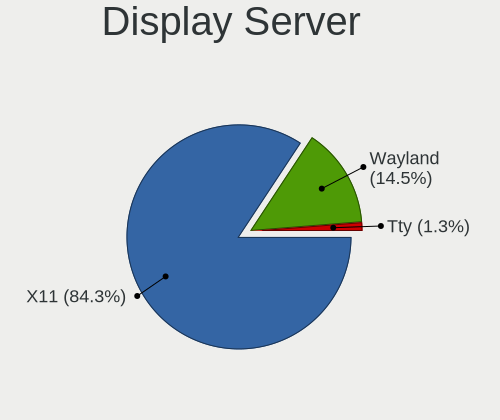

| Name    | Desktops | Percent |
|---------|----------|---------|
| X11     | 88       | 93.62%  |
| Wayland | 4        | 4.26%   |
| Tty     | 2        | 2.13%   |

Display Manager
---------------

SDDM, LightDM, etc.

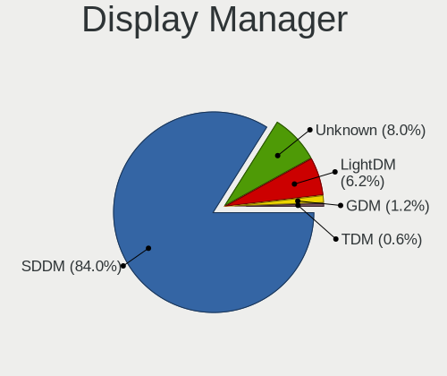

| Name    | Desktops | Percent |
|---------|----------|---------|
| SDDM    | 77       | 81.05%  |
| Unknown | 12       | 12.63%  |
| LightDM | 4        | 4.21%   |
| TDM     | 1        | 1.05%   |
| GDM     | 1        | 1.05%   |

OS Lang
-------

Language

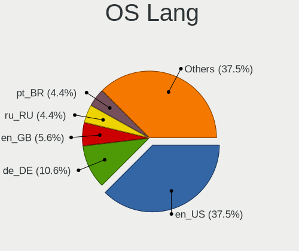

| Lang  | Desktops | Percent |
|-------|----------|---------|
| en_US | 43       | 45.26%  |
| en_GB | 7        | 7.37%   |
| de_DE | 7        | 7.37%   |
| tr_TR | 4        | 4.21%   |
| en_CA | 4        | 4.21%   |
| C     | 4        | 4.21%   |
| ru_RU | 3        | 3.16%   |
| pl_PL | 3        | 3.16%   |
| it_IT | 3        | 3.16%   |
| es_MX | 3        | 3.16%   |
| en_IN | 3        | 3.16%   |
| pt_BR | 2        | 2.11%   |
| es_ES | 2        | 2.11%   |
| sv_SE | 1        | 1.05%   |
| hu_HU | 1        | 1.05%   |
| fr_FR | 1        | 1.05%   |
| en_ZA | 1        | 1.05%   |
| en_AU | 1        | 1.05%   |
| de_AT | 1        | 1.05%   |
| ba_RU | 1        | 1.05%   |

Boot Mode
---------

EFI or BIOS

| Mode | Desktops | Percent |
|------|----------|---------|
| EFI  | 63       | 67.02%  |
| BIOS | 31       | 32.98%  |

Filesystem
----------

Type of filesystem

| Type    | Desktops | Percent |
|---------|----------|---------|
| Btrfs   | 40       | 41.67%  |
| Ext4    | 27       | 28.13%  |
| Xfs     | 23       | 23.96%  |
| Overlay | 5        | 5.21%   |
| Nilfs2  | 1        | 1.04%   |

Part. scheme
------------

Scheme of partitioning

| Type    | Desktops | Percent |
|---------|----------|---------|
| GPT     | 71       | 75.53%  |
| Unknown | 12       | 12.77%  |
| MBR     | 11       | 11.7%   |

Dual Boot with Linux/BSD
------------------------

Hosting more than one Linux/BSD

| Dual boot | Desktops | Percent |
|-----------|----------|---------|
| No        | 58       | 60.42%  |
| Yes       | 38       | 39.58%  |

Dual Boot (Win)
---------------

Hosting Linux and Windows

| Dual boot | Desktops | Percent |
|-----------|----------|---------|
| No        | 54       | 57.45%  |
| Yes       | 40       | 42.55%  |

Board
-----

Vendor
------

Motherboard manufacturer

| Name                | Desktops | Percent |
|---------------------|----------|---------|
| ASUSTek Computer    | 31       | 32.98%  |
| MSI                 | 16       | 17.02%  |
| Gigabyte Technology | 11       | 11.7%   |
| Hewlett-Packard     | 9        | 9.57%   |
| ASRock              | 7        | 7.45%   |
| Dell                | 5        | 5.32%   |
| Acer                | 4        | 4.26%   |
| Pegatron            | 2        | 2.13%   |
| Unknown             | 2        | 2.13%   |
| Win Element         | 1        | 1.06%   |
| Lenovo              | 1        | 1.06%   |
| JINGSHA             | 1        | 1.06%   |
| Intel               | 1        | 1.06%   |
| ECS                 | 1        | 1.06%   |
| Biostar             | 1        | 1.06%   |
| BESSTAR Tech        | 1        | 1.06%   |

Model
-----

Motherboard model

| Name                              | Desktops | Percent |
|-----------------------------------|----------|---------|
| Unknown                           | 3        | 3.19%   |
| MSI MS-7971                       | 2        | 2.13%   |
| Dell OptiPlex 9020                | 2        | 2.13%   |
| ASUS TUF Gaming X570-PLUS         | 2        | 2.13%   |
| ASUS PRIME A320M-K                | 2        | 2.13%   |
| Win Element M9                    | 1        | 1.06%   |
| Pegatron p6-2026                  | 1        | 1.06%   |
| Pegatron 20-b010                  | 1        | 1.06%   |
| MSI MS-7D22                       | 1        | 1.06%   |
| MSI MS-7C96                       | 1        | 1.06%   |
| MSI MS-7C94                       | 1        | 1.06%   |
| MSI MS-7C91                       | 1        | 1.06%   |
| MSI MS-7C52                       | 1        | 1.06%   |
| MSI MS-7C37                       | 1        | 1.06%   |
| MSI MS-7B61                       | 1        | 1.06%   |
| MSI MS-7B12                       | 1        | 1.06%   |
| MSI MS-7A70                       | 1        | 1.06%   |
| MSI MS-7A34                       | 1        | 1.06%   |
| MSI MS-7916                       | 1        | 1.06%   |
| MSI MS-7815                       | 1        | 1.06%   |
| MSI MS-7758                       | 1        | 1.06%   |
| MSI MS-7623                       | 1        | 1.06%   |
| Lenovo ThinkCentre M58 3231W2Y    | 1        | 1.06%   |
| Intel B75                         | 1        | 1.06%   |
| HP Z230 SFF Workstation           | 1        | 1.06%   |
| HP ProOne 400 G1 AiO              | 1        | 1.06%   |
| HP ProDesk 400 G1 SFF             | 1        | 1.06%   |
| HP Pavilion Power Desktop 580-1xx | 1        | 1.06%   |
| HP Pavilion Desktop 590-p0xxx     | 1        | 1.06%   |
| HP Compaq Elite 8300 CMT          | 1        | 1.06%   |
| HP 750-424                        | 1        | 1.06%   |
| HP 22-3100nz                      | 1        | 1.06%   |
| HP 110-210                        | 1        | 1.06%   |
| Gigabyte Z790 AORUS MASTER        | 1        | 1.06%   |
| Gigabyte Z490 GAMING X            | 1        | 1.06%   |
| Gigabyte Z370M DS3H               | 1        | 1.06%   |
| Gigabyte Z170X-UD3                | 1        | 1.06%   |
| Gigabyte X79-UD3                  | 1        | 1.06%   |
| Gigabyte X570 AORUS MASTER        | 1        | 1.06%   |
| Gigabyte X399 AORUS XTREME        | 1        | 1.06%   |

Model Family
------------

Motherboard model prefix

| Name               | Desktops | Percent |
|--------------------|----------|---------|
| ASUS ROG           | 11       | 11.7%   |
| ASUS TUF           | 7        | 7.45%   |
| ASUS PRIME         | 7        | 7.45%   |
| Dell OptiPlex      | 3        | 3.19%   |
| Acer Aspire        | 3        | 3.19%   |
| Unknown            | 3        | 3.19%   |
| MSI MS-7971        | 2        | 2.13%   |
| HP Pavilion        | 2        | 2.13%   |
| Win Element M9     | 1        | 1.06%   |
| Pegatron p6-2026   | 1        | 1.06%   |
| Pegatron 20-b010   | 1        | 1.06%   |
| MSI MS-7D22        | 1        | 1.06%   |
| MSI MS-7C96        | 1        | 1.06%   |
| MSI MS-7C94        | 1        | 1.06%   |
| MSI MS-7C91        | 1        | 1.06%   |
| MSI MS-7C52        | 1        | 1.06%   |
| MSI MS-7C37        | 1        | 1.06%   |
| MSI MS-7B61        | 1        | 1.06%   |
| MSI MS-7B12        | 1        | 1.06%   |
| MSI MS-7A70        | 1        | 1.06%   |
| MSI MS-7A34        | 1        | 1.06%   |
| MSI MS-7916        | 1        | 1.06%   |
| MSI MS-7815        | 1        | 1.06%   |
| MSI MS-7758        | 1        | 1.06%   |
| MSI MS-7623        | 1        | 1.06%   |
| Lenovo ThinkCentre | 1        | 1.06%   |
| Intel B75          | 1        | 1.06%   |
| HP Z230            | 1        | 1.06%   |
| HP ProOne          | 1        | 1.06%   |
| HP ProDesk         | 1        | 1.06%   |
| HP Compaq          | 1        | 1.06%   |
| HP 750-424         | 1        | 1.06%   |
| HP 22-3100nz       | 1        | 1.06%   |
| HP 110-210         | 1        | 1.06%   |
| Gigabyte Z790      | 1        | 1.06%   |
| Gigabyte Z490      | 1        | 1.06%   |
| Gigabyte Z370M     | 1        | 1.06%   |
| Gigabyte Z170X-UD3 | 1        | 1.06%   |
| Gigabyte X79-UD3   | 1        | 1.06%   |
| Gigabyte X570      | 1        | 1.06%   |

MFG Year
--------

Motherboard manufacture year

| Year | Desktops | Percent |
|------|----------|---------|
| 2020 | 13       | 13.83%  |
| 2018 | 13       | 13.83%  |
| 2019 | 12       | 12.77%  |
| 2017 | 10       | 10.64%  |
| 2021 | 9        | 9.57%   |
| 2014 | 7        | 7.45%   |
| 2015 | 5        | 5.32%   |
| 2016 | 4        | 4.26%   |
| 2012 | 4        | 4.26%   |
| 2010 | 4        | 4.26%   |
| 2022 | 3        | 3.19%   |
| 2013 | 3        | 3.19%   |
| 2011 | 3        | 3.19%   |
| 2009 | 2        | 2.13%   |
| 2023 | 1        | 1.06%   |
| 2008 | 1        | 1.06%   |

Form Factor
-----------

Physical design of the computer

| Name    | Desktops | Percent |
|---------|----------|---------|
| Desktop | 94       | 100%    |

Secure Boot
-----------

Enabled or disabled

| State    | Desktops | Percent |
|----------|----------|---------|
| Disabled | 94       | 98.95%  |
| Enabled  | 1        | 1.05%   |

Coreboot
--------

Have coreboot on board

| Used | Desktops | Percent |
|------|----------|---------|
| No   | 94       | 100%    |

RAM Size
--------

Total RAM memory

| Size in GB  | Desktops | Percent |
|-------------|----------|---------|
| 16.01-24.0  | 33       | 35.11%  |
| 32.01-64.0  | 27       | 28.72%  |
| 8.01-16.0   | 14       | 14.89%  |
| 4.01-8.0    | 10       | 10.64%  |
| 3.01-4.0    | 4        | 4.26%   |
| 64.01-256.0 | 4        | 4.26%   |
| 24.01-32.0  | 2        | 2.13%   |

RAM Used
--------

Used RAM memory

| Used GB    | Desktops | Percent |
|------------|----------|---------|
| 1.01-2.0   | 30       | 29.13%  |
| 2.01-3.0   | 24       | 23.3%   |
| 4.01-8.0   | 21       | 20.39%  |
| 3.01-4.0   | 13       | 12.62%  |
| 16.01-24.0 | 6        | 5.83%   |
| 8.01-16.0  | 6        | 5.83%   |
| 0.01-0.5   | 2        | 1.94%   |
| 0.51-1.0   | 1        | 0.97%   |

Total Drives
------------

Number of drives on board

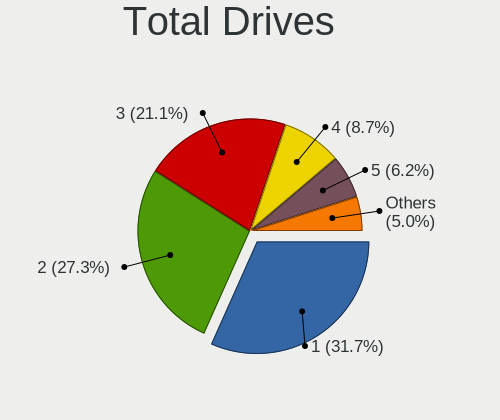

| Drives | Desktops | Percent |
|--------|----------|---------|
| 1      | 27       | 27.84%  |
| 2      | 26       | 26.8%   |
| 3      | 20       | 20.62%  |
| 4      | 9        | 9.28%   |
| 5      | 7        | 7.22%   |
| 6      | 4        | 4.12%   |
| 8      | 2        | 2.06%   |
| 7      | 2        | 2.06%   |

Has CD-ROM
----------

Has CD-ROM on board

| Presented | Desktops | Percent |
|-----------|----------|---------|
| No        | 71       | 74.74%  |
| Yes       | 24       | 25.26%  |

Has Ethernet
------------

Has Ethernet on board

| Presented | Desktops | Percent |
|-----------|----------|---------|
| Yes       | 94       | 100%    |

Has WiFi
--------

Has WiFi module

| Presented | Desktops | Percent |
|-----------|----------|---------|
| Yes       | 55       | 57.29%  |
| No        | 41       | 42.71%  |

Has Bluetooth
-------------

Has Bluetooth module

| Presented | Desktops | Percent |
|-----------|----------|---------|
| Yes       | 51       | 53.13%  |
| No        | 45       | 46.88%  |

Location
--------

Country
-------

Geographic location (country)

| Country        | Desktops | Percent |
|----------------|----------|---------|
| USA            | 24       | 25.53%  |
| Germany        | 7        | 7.45%   |
| Canada         | 5        | 5.32%   |
| UK             | 4        | 4.26%   |
| Turkey         | 4        | 4.26%   |
| Russia         | 4        | 4.26%   |
| Poland         | 4        | 4.26%   |
| Mexico         | 4        | 4.26%   |
| Italy          | 4        | 4.26%   |
| Spain          | 3        | 3.19%   |
| India          | 3        | 3.19%   |
| Brazil         | 3        | 3.19%   |
| Romania        | 2        | 2.13%   |
| Bahrain        | 2        | 2.13%   |
| Venezuela      | 1        | 1.06%   |
| Switzerland    | 1        | 1.06%   |
| Sweden         | 1        | 1.06%   |
| South Africa   | 1        | 1.06%   |
| Portugal       | 1        | 1.06%   |
| Philippines    | 1        | 1.06%   |
| Netherlands    | 1        | 1.06%   |
| Lebanon        | 1        | 1.06%   |
| Hungary        | 1        | 1.06%   |
| Greece         | 1        | 1.06%   |
| France         | 1        | 1.06%   |
| Czechia        | 1        | 1.06%   |
| Cyprus         | 1        | 1.06%   |
| Colombia       | 1        | 1.06%   |
| Bulgaria       | 1        | 1.06%   |
| Belarus        | 1        | 1.06%   |
| Austria        | 1        | 1.06%   |
| Australia      | 1        | 1.06%   |
| Argentina      | 1        | 1.06%   |
| Algeria        | 1        | 1.06%   |
| Åland Islands | 1        | 1.06%   |

City
----

Geographic location (city)

| City                   | Desktops | Percent |
|------------------------|----------|---------|
| St Petersburg          | 2        | 2.11%   |
| Red Lake               | 2        | 2.11%   |
| Mexico City            | 2        | 2.11%   |
| Cumming                | 2        | 2.11%   |
| Zell am See            | 1        | 1.05%   |
| York                   | 1        | 1.05%   |
| Wroclaw                | 1        | 1.05%   |
| Wrexham                | 1        | 1.05%   |
| Wolfville              | 1        | 1.05%   |
| Wells                  | 1        | 1.05%   |
| Warsaw                 | 1        | 1.05%   |
| Vredenburg             | 1        | 1.05%   |
| Stow                   | 1        | 1.05%   |
| St Louis               | 1        | 1.05%   |
| Springfield            | 1        | 1.05%   |
| Sonora                 | 1        | 1.05%   |
| Sofia                  | 1        | 1.05%   |
| Shadrinsk              | 1        | 1.05%   |
| Santiago de Compostela | 1        | 1.05%   |
| Santa Rosa             | 1        | 1.05%   |
| Sant Boi de Llobregat  | 1        | 1.05%   |
| Salt Lake City         | 1        | 1.05%   |
| Sacile                 | 1        | 1.05%   |
| Poznan                 | 1        | 1.05%   |
| Porto Alegre           | 1        | 1.05%   |
| Portland               | 1        | 1.05%   |
| Playa del Carmen       | 1        | 1.05%   |
| Phoenix                | 1        | 1.05%   |
| Passos                 | 1        | 1.05%   |
| Ouargla                | 1        | 1.05%   |
| Orléans               | 1        | 1.05%   |
| Oberursel              | 1        | 1.05%   |
| North Platte           | 1        | 1.05%   |
| Niterói               | 1        | 1.05%   |
| Nicosia                | 1        | 1.05%   |
| New Haven              | 1        | 1.05%   |
| Nemoli                 | 1        | 1.05%   |
| Nagykanizsa            | 1        | 1.05%   |
| Moscow                 | 1        | 1.05%   |
| Monterrey              | 1        | 1.05%   |

Drives
------

Drive Vendor
------------

Hard drive vendors

| Vendor                      | Desktops | Drives | Percent |
|-----------------------------|----------|--------|---------|
| WDC                         | 33       | 49     | 15.64%  |
| Seagate                     | 31       | 46     | 14.69%  |
| Samsung Electronics         | 30       | 56     | 14.22%  |
| Sandisk                     | 16       | 22     | 7.58%   |
| Kingston                    | 15       | 19     | 7.11%   |
| Crucial                     | 11       | 15     | 5.21%   |
| Toshiba                     | 8        | 10     | 3.79%   |
| Unknown                     | 5        | 6      | 2.37%   |
| Micron/Crucial Technology   | 5        | 6      | 2.37%   |
| Hitachi                     | 4        | 4      | 1.9%    |
| China                       | 4        | 4      | 1.9%    |
| Realtek Semiconductor       | 3        | 3      | 1.42%   |
| Phison Electronics          | 3        | 4      | 1.42%   |
| Intel                       | 3        | 5      | 1.42%   |
| HGST                        | 3        | 3      | 1.42%   |
| ADATA Technology            | 3        | 3      | 1.42%   |
| A-DATA Technology           | 3        | 3      | 1.42%   |
| SK hynix                    | 2        | 3      | 0.95%   |
| PNY                         | 2        | 2      | 0.95%   |
| Phison                      | 2        | 2      | 0.95%   |
| Micron Technology           | 2        | 3      | 0.95%   |
| MAXIO Technology (Hangzhou) | 2        | 2      | 0.95%   |
| Intenso                     | 2        | 3      | 0.95%   |
| XPG                         | 1        | 1      | 0.47%   |
| Transcend                   | 1        | 1      | 0.47%   |
| Team                        | 1        | 1      | 0.47%   |
| SSK                         | 1        | 1      | 0.47%   |
| SPCC                        | 1        | 1      | 0.47%   |
| Silicon Motion              | 1        | 1      | 0.47%   |
| SABRENT                     | 1        | 1      | 0.47%   |
| Patriot                     | 1        | 1      | 0.47%   |
| Mushkin                     | 1        | 1      | 0.47%   |
| Maxtor                      | 1        | 1      | 0.47%   |
| Lexar                       | 1        | 1      | 0.47%   |
| Leven                       | 1        | 1      | 0.47%   |
| KIOXIA                      | 1        | 1      | 0.47%   |
| KingSpec                    | 1        | 1      | 0.47%   |
| Hewlett-Packard             | 1        | 1      | 0.47%   |
| Gigabyte Technology         | 1        | 1      | 0.47%   |
| Emtec                       | 1        | 1      | 0.47%   |

Drive Model
-----------

Hard drive models

| Model                                                           | Desktops | Percent |
|-----------------------------------------------------------------|----------|---------|
| Samsung NVMe SSD Controller SM981/PM981/PM983 500GB             | 7        | 2.83%   |
| Kingston SA400S37960G 960GB SSD                                 | 4        | 1.62%   |
| Kingston SA400S37240G 240GB SSD                                 | 4        | 1.62%   |
| Crucial CT500MX500SSD1 500GB                                    | 4        | 1.62%   |
| Unknown SD/MMC/MS PRO 1GB                                       | 3        | 1.21%   |
| Seagate ST1000DM010-2EP102 1TB                                  | 3        | 1.21%   |
| Seagate ST1000DM003-1SB102 1TB                                  | 3        | 1.21%   |
| Realtek RTS5763DL NVMe SSD Controller 512GB                     | 3        | 1.21%   |
| Micron/Crucial CT2000P5PSSD8 2TB                                | 3        | 1.21%   |
| WDC WD20EZBX-00AYRA0 2TB                                        | 2        | 0.81%   |
| WDC WD10EZEX-60WN4A0 1TB                                        | 2        | 0.81%   |
| WDC WD10EZEX-22MFCA0 1TB                                        | 2        | 0.81%   |
| Toshiba DT01ACA300 3TB                                          | 2        | 0.81%   |
| Seagate ST250DM000-1BD141 250GB                                 | 2        | 0.81%   |
| Seagate ST2000DM008-2FR102 2TB                                  | 2        | 0.81%   |
| Seagate ST2000DM006-2DM164 2TB                                  | 2        | 0.81%   |
| Sandisk WD Blue SN550 NVMe SSD 250GB                            | 2        | 0.81%   |
| Sandisk WD Black SN750 / PC SN730 NVMe SSD 1024GB               | 2        | 0.81%   |
| SanDisk NVMe SSD Drive 500GB                                    | 2        | 0.81%   |
| Samsung SSD 970 EVO 1TB                                         | 2        | 0.81%   |
| Samsung SSD 860 EVO 500GB                                       | 2        | 0.81%   |
| Samsung SSD 860 EVO 1TB                                         | 2        | 0.81%   |
| Samsung SSD 850 EVO 250GB                                       | 2        | 0.81%   |
| Samsung NVMe SSD Controller PM9A1/PM9A3/980PRO 1024GB           | 2        | 0.81%   |
| Intenso External USB 3.0 1TB                                    | 2        | 0.81%   |
| Crucial CT1000MX500SSD1 1TB                                     | 2        | 0.81%   |
| Crucial CT1000BX500SSD1 1TB                                     | 2        | 0.81%   |
| ADATA XPG SX8200 Pro PCIe Gen3x4 M.2 2280 Solid State Drive 2TB | 2        | 0.81%   |
| XPG GAMMIX S50 1TB                                              | 1        | 0.4%    |
| WDC WDS512G1X0C-00ENX0 512GB                                    | 1        | 0.4%    |
| WDC WDS500G3XHC-00SJG0 500GB                                    | 1        | 0.4%    |
| WDC WDS500G3X0C-00SJG0 500GB                                    | 1        | 0.4%    |
| WDC WDS500G2B0B-00YS70 500GB SSD                                | 1        | 0.4%    |
| WDC WDS500G2B0A-00SM50 500GB SSD                                | 1        | 0.4%    |
| WDC WDS500G1B0A-00H9H0 500GB SSD                                | 1        | 0.4%    |
| WDC WDS120G2G0A-00JH30 120GB SSD                                | 1        | 0.4%    |
| WDC WDBNCE2500PNC 250GB SSD                                     | 1        | 0.4%    |
| WDC WD80EFAX-68LHPN0 8TB                                        | 1        | 0.4%    |
| WDC WD800JD-00MSA1 80GB                                         | 1        | 0.4%    |
| WDC WD7500BPKT-75PK4T0 752GB                                    | 1        | 0.4%    |

HDD Vendor
----------

Hard disk drive vendors

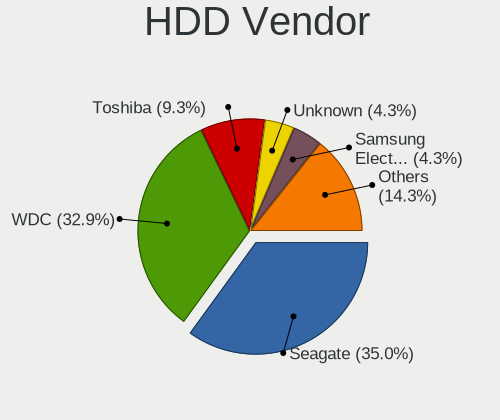

| Vendor              | Desktops | Drives | Percent |
|---------------------|----------|--------|---------|
| Seagate             | 31       | 46     | 36.05%  |
| WDC                 | 28       | 41     | 32.56%  |
| Toshiba             | 8        | 10     | 9.3%    |
| Hitachi             | 4        | 4      | 4.65%   |
| Unknown             | 3        | 3      | 3.49%   |
| Samsung Electronics | 3        | 3      | 3.49%   |
| HGST                | 3        | 3      | 3.49%   |
| Intenso             | 2        | 3      | 2.33%   |
| SSK                 | 1        | 1      | 1.16%   |
| SABRENT             | 1        | 1      | 1.16%   |
| Maxtor              | 1        | 1      | 1.16%   |
| ASMedia             | 1        | 1      | 1.16%   |

SSD Vendor
----------

Solid state drive vendors

| Vendor              | Desktops | Drives | Percent |
|---------------------|----------|--------|---------|
| Samsung Electronics | 14       | 19     | 19.72%  |
| Kingston            | 14       | 18     | 19.72%  |
| Crucial             | 11       | 15     | 15.49%  |
| SanDisk             | 6        | 6      | 8.45%   |
| WDC                 | 5        | 5      | 7.04%   |
| China               | 4        | 4      | 5.63%   |
| PNY                 | 2        | 2      | 2.82%   |
| A-DATA Technology   | 2        | 2      | 2.82%   |
| Transcend           | 1        | 1      | 1.41%   |
| Team                | 1        | 1      | 1.41%   |
| SPCC                | 1        | 1      | 1.41%   |
| Patriot             | 1        | 1      | 1.41%   |
| Mushkin             | 1        | 1      | 1.41%   |
| Micron Technology   | 1        | 1      | 1.41%   |
| Lexar               | 1        | 1      | 1.41%   |
| Leven               | 1        | 1      | 1.41%   |
| KingSpec            | 1        | 1      | 1.41%   |
| Hewlett-Packard     | 1        | 1      | 1.41%   |
| Gigabyte Technology | 1        | 1      | 1.41%   |
| Emtec               | 1        | 1      | 1.41%   |
| 2-Power             | 1        | 1      | 1.41%   |

Drive Kind
----------

HDD or SSD

| Kind | Desktops | Drives | Percent |
|------|----------|--------|---------|
| HDD  | 66       | 117    | 37.93%  |
| SSD  | 56       | 84     | 32.18%  |
| NVMe | 50       | 88     | 28.74%  |
| MMC  | 2        | 3      | 1.15%   |

Drive Connector
---------------

SATA, SAS, NVMe, etc.

| Type | Desktops | Drives | Percent |
|------|----------|--------|---------|
| SATA | 85       | 184    | 57.05%  |
| NVMe | 50       | 88     | 33.56%  |
| SAS  | 12       | 17     | 8.05%   |
| MMC  | 2        | 3      | 1.34%   |

Drive Size
----------

Size of hard drive

| Size in TB | Desktops | Drives | Percent |
|------------|----------|--------|---------|
| 0.01-0.5   | 57       | 85     | 41.91%  |
| 0.51-1.0   | 48       | 69     | 35.29%  |
| 1.01-2.0   | 17       | 22     | 12.5%   |
| 4.01-10.0  | 6        | 15     | 4.41%   |
| 3.01-4.0   | 5        | 7      | 3.68%   |
| 2.01-3.0   | 3        | 3      | 2.21%   |

Space Total
-----------

Amount of disk space available on the file system

| Size in GB     | Desktops | Percent |
|----------------|----------|---------|
| More than 3000 | 25       | 25.51%  |
| 251-500        | 16       | 16.33%  |
| 1001-2000      | 14       | 14.29%  |
| 501-1000       | 13       | 13.27%  |
| 101-250        | 12       | 12.24%  |
| 2001-3000      | 4        | 4.08%   |
| 1-20           | 4        | 4.08%   |
| 51-100         | 4        | 4.08%   |
| 21-50          | 3        | 3.06%   |
| Unknown        | 3        | 3.06%   |

Space Used
----------

Amount of used disk space

| Used GB        | Desktops | Percent |
|----------------|----------|---------|
| 1-20           | 35       | 35.71%  |
| 101-250        | 15       | 15.31%  |
| 21-50          | 13       | 13.27%  |
| 51-100         | 8        | 8.16%   |
| 501-1000       | 7        | 7.14%   |
| 251-500        | 6        | 6.12%   |
| More than 3000 | 4        | 4.08%   |
| 1001-2000      | 4        | 4.08%   |
| 2001-3000      | 3        | 3.06%   |
| Unknown        | 3        | 3.06%   |

Malfunc. Drives
---------------

Drive models with a malfunction

| Model                                                                      | Desktops | Drives | Percent |
|----------------------------------------------------------------------------|----------|--------|---------|
| WDC WD5000AAKX-60U6AA0 500GB                                               | 1        | 1      | 3.57%   |
| WDC WD3200AAJS-08L7A0 320GB                                                | 1        | 1      | 3.57%   |
| WDC WD10EZEX-08WN4A0 1TB                                                   | 1        | 1      | 3.57%   |
| WDC WD10EADS-00M2B0 1TB                                                    | 1        | 1      | 3.57%   |
| WDC WD1002FAEX-00Z3A0 1TB                                                  | 1        | 2      | 3.57%   |
| Toshiba MQ01ABD100 1TB                                                     | 1        | 1      | 3.57%   |
| Toshiba MK4058GSX 400GB                                                    | 1        | 1      | 3.57%   |
| Seagate ST9500420AS 500GB                                                  | 1        | 1      | 3.57%   |
| Seagate ST9500325AS 500GB                                                  | 1        | 1      | 3.57%   |
| Seagate ST500DM009-2F110A 500GB                                            | 1        | 1      | 3.57%   |
| Seagate ST320LT012-9WS14C 320GB                                            | 1        | 1      | 3.57%   |
| Seagate ST31000524AS 1TB                                                   | 1        | 1      | 3.57%   |
| Seagate ST2000VX000-1CU164 2TB                                             | 1        | 1      | 3.57%   |
| Seagate ST2000DM006-2DM164 2TB                                             | 1        | 1      | 3.57%   |
| Seagate ST2000DL003-9VT166 2TB                                             | 1        | 1      | 3.57%   |
| Seagate ST1000LM024 HN-M101MBB 1TB                                         | 1        | 1      | 3.57%   |
| Seagate ST1000DM010-2EP102 1TB                                             | 1        | 1      | 3.57%   |
| SABRENT Disk 1TB                                                           | 1        | 1      | 3.57%   |
| Maxtor STM3160215AS 160GB                                                  | 1        | 1      | 3.57%   |
| Kingston SV300S37A120G 120GB SSD                                           | 1        | 1      | 3.57%   |
| Kingston SUV400S37240G 240GB SSD                                           | 1        | 1      | 3.57%   |
| Hitachi HTS725050A9A364 500GB                                              | 1        | 1      | 3.57%   |
| Hitachi HDS721010CLA330 1TB                                                | 1        | 1      | 3.57%   |
| Hitachi HCP725050GLA380 500GB                                              | 1        | 1      | 3.57%   |
| Crucial CT1050MX300SSD1 1TB                                                | 1        | 1      | 3.57%   |
| China SATA3 240GB SSD                                                      | 1        | 1      | 3.57%   |
| ASMedia AS2115 8TB                                                         | 1        | 1      | 3.57%   |
| ADATA Technology XPG SX8200 Pro PCIe Gen3x4 M.2 2280 Solid State Drive 2TB | 1        | 1      | 3.57%   |

Malfunc. Drive Vendor
---------------------

Vendors of faulty drives

| Vendor           | Desktops | Drives | Percent |
|------------------|----------|--------|---------|
| Seagate          | 10       | 10     | 37.04%  |
| WDC              | 5        | 6      | 18.52%  |
| Hitachi          | 3        | 3      | 11.11%  |
| Kingston         | 2        | 2      | 7.41%   |
| Toshiba          | 1        | 2      | 3.7%    |
| SABRENT          | 1        | 1      | 3.7%    |
| Maxtor           | 1        | 1      | 3.7%    |
| Crucial          | 1        | 1      | 3.7%    |
| China            | 1        | 1      | 3.7%    |
| ASMedia          | 1        | 1      | 3.7%    |
| ADATA Technology | 1        | 1      | 3.7%    |

Malfunc. HDD Vendor
-------------------

Vendors of faulty HDD drives

| Vendor  | Desktops | Drives | Percent |
|---------|----------|--------|---------|
| Seagate | 10       | 10     | 45.45%  |
| WDC     | 5        | 6      | 22.73%  |
| Hitachi | 3        | 3      | 13.64%  |
| Toshiba | 1        | 2      | 4.55%   |
| SABRENT | 1        | 1      | 4.55%   |
| Maxtor  | 1        | 1      | 4.55%   |
| ASMedia | 1        | 1      | 4.55%   |

Malfunc. Drive Kind
-------------------

Kinds of faulty drives

| Kind | Desktops | Drives | Percent |
|------|----------|--------|---------|
| HDD  | 21       | 24     | 80.77%  |
| SSD  | 4        | 4      | 15.38%  |
| NVMe | 1        | 1      | 3.85%   |

Failed Drives
-------------

Failed drive models

Zero info for selected period =(

Failed Drive Vendor
-------------------

Failed drive vendors

Zero info for selected period =(

Drive Status
------------

Number of failed and malfunc. drives

| Status   | Desktops | Drives | Percent |
|----------|----------|--------|---------|
| Works    | 77       | 208    | 62.6%   |
| Malfunc  | 25       | 29     | 20.33%  |
| Detected | 21       | 55     | 17.07%  |

Storage controller
------------------

Storage Vendor
--------------

Storage controller vendors

| Vendor                      | Desktops | Percent |
|-----------------------------|----------|---------|
| Intel                       | 59       | 36.42%  |
| AMD                         | 38       | 23.46%  |
| Samsung Electronics         | 15       | 9.26%   |
| SanDisk                     | 14       | 8.64%   |
| ASMedia Technology          | 7        | 4.32%   |
| Phison Electronics          | 5        | 3.09%   |
| Micron/Crucial Technology   | 5        | 3.09%   |
| Realtek Semiconductor       | 4        | 2.47%   |
| ADATA Technology            | 4        | 2.47%   |
| SK hynix                    | 2        | 1.23%   |
| Micron Technology           | 2        | 1.23%   |
| MAXIO Technology (Hangzhou) | 2        | 1.23%   |
| VIA Technologies            | 1        | 0.62%   |
| Silicon Motion              | 1        | 0.62%   |
| Marvell Technology Group    | 1        | 0.62%   |
| KIOXIA                      | 1        | 0.62%   |
| Kingston Technology Company | 1        | 0.62%   |

Storage Model
-------------

Storage controller models

| Model                                                                          | Desktops | Percent |
|--------------------------------------------------------------------------------|----------|---------|
| AMD FCH SATA Controller [AHCI mode]                                            | 27       | 14.67%  |
| Samsung NVMe SSD Controller SM981/PM981/PM983                                  | 10       | 5.43%   |
| Intel 200 Series PCH SATA controller [AHCI mode]                               | 10       | 5.43%   |
| Intel SATA Controller [RAID mode]                                              | 8        | 4.35%   |
| Intel Q170/Q150/B150/H170/H110/Z170/CM236 Chipset SATA Controller [AHCI Mode]  | 7        | 3.8%    |
| ASMedia ASM1062 Serial ATA Controller                                          | 7        | 3.8%    |
| AMD 500 Series Chipset SATA Controller                                         | 7        | 3.8%    |
| AMD 400 Series Chipset SATA Controller                                         | 7        | 3.8%    |
| Intel 7 Series/C210 Series Chipset Family 6-port SATA Controller [AHCI mode]   | 5        | 2.72%   |
| Samsung NVMe SSD Controller PM9A1/PM9A3/980PRO                                 | 4        | 2.17%   |
| Intel 8 Series/C220 Series Chipset Family 6-port SATA Controller 1 [AHCI mode] | 4        | 2.17%   |
| AMD FCH SATA Controller D                                                      | 4        | 2.17%   |
| SanDisk WD Blue SN550 NVMe SSD                                                 | 3        | 1.63%   |
| Samsung NVMe SSD Controller SM961/PM961/SM963                                  | 3        | 1.63%   |
| Realtek RTS5763DL NVMe SSD Controller                                          | 3        | 1.63%   |
| Micron/Crucial P5 Plus NVMe PCIe SSD                                           | 3        | 1.63%   |
| Intel Cannon Lake PCH SATA AHCI Controller                                     | 3        | 1.63%   |
| Intel 500 Series Chipset Family SATA AHCI Controller                           | 3        | 1.63%   |
| Intel 5 Series/3400 Series Chipset 6 port SATA AHCI Controller                 | 3        | 1.63%   |
| AMD 300 Series Chipset SATA Controller                                         | 3        | 1.63%   |
| SanDisk WD Black SN770 / PC SN740 256GB / PC SN560 (DRAM-less) NVMe SSD        | 2        | 1.09%   |
| SanDisk WD Black SN750 / PC SN730 NVMe SSD                                     | 2        | 1.09%   |
| SanDisk WD Black 2018/SN750 / PC SN720 NVMe SSD                                | 2        | 1.09%   |
| Phison E12 NVMe Controller                                                     | 2        | 1.09%   |
| Intel SSD 660P Series                                                          | 2        | 1.09%   |
| Intel C600/X79 series chipset 6-Port SATA AHCI Controller                      | 2        | 1.09%   |
| Intel 6 Series/C200 Series Chipset Family 6 port Desktop SATA AHCI Controller  | 2        | 1.09%   |
| ADATA XPG SX8200 Pro PCIe Gen3x4 M.2 2280 Solid State Drive                    | 2        | 1.09%   |
| VIA VT6415 PATA IDE Host Controller                                            | 1        | 0.54%   |
| SK hynix Platinum P41/PC801 NVMe Solid State Drive                             | 1        | 0.54%   |
| SK hynix BC501 NVMe Solid State Drive                                          | 1        | 0.54%   |
| Silicon Motion SM2262/SM2262EN SSD Controller                                  | 1        | 0.54%   |
| Sandisk Western Digital WD Black SN850X NVMe SSD                               | 1        | 0.54%   |
| SanDisk WD PC SN810 / Black SN850 NVMe SSD                                     | 1        | 0.54%   |
| SanDisk WD Green SN350 NVMe SSD 240GB (DRAM-less)                              | 1        | 0.54%   |
| SanDisk WD Blue SN570 NVMe SSD 1TB                                             | 1        | 0.54%   |
| SanDisk WD Black NVMe SSD                                                      | 1        | 0.54%   |
| SanDisk PC SN735 NVMe SSD (DRAM-less)                                          | 1        | 0.54%   |
| Samsung NVMe SSD Controller 980                                                | 1        | 0.54%   |
| Realtek RTS5763DL NVMe SSD Controller (DRAM-less)                              | 1        | 0.54%   |

Storage Kind
------------

Kind of storage controller (IDE, SATA, NVMe, SAS, ...)

| Kind | Desktops | Percent |
|------|----------|---------|
| SATA | 86       | 57.72%  |
| NVMe | 50       | 33.56%  |
| RAID | 9        | 6.04%   |
| IDE  | 4        | 2.68%   |

Processor
---------

CPU Vendor
----------

Processor vendors

| Vendor | Desktops | Percent |
|--------|----------|---------|
| Intel  | 56       | 59.57%  |
| AMD    | 38       | 40.43%  |

CPU Model
---------

Processor models

| Model                                  | Desktops | Percent |
|----------------------------------------|----------|---------|
| AMD Ryzen 5 5600X 6-Core Processor     | 5        | 5.26%   |
| Intel Core i7-8700K CPU @ 3.70GHz      | 3        | 3.16%   |
| Intel Core i7-7700K CPU @ 4.20GHz      | 3        | 3.16%   |
| AMD Ryzen 7 5800X 8-Core Processor     | 3        | 3.16%   |
| AMD Ryzen 5 3600X 6-Core Processor     | 3        | 3.16%   |
| Intel Core i7-4790K CPU @ 4.00GHz      | 2        | 2.11%   |
| Intel Core i7 CPU 870 @ 2.93GHz        | 2        | 2.11%   |
| Intel Core i5-6500 CPU @ 3.20GHz       | 2        | 2.11%   |
| Intel Core i5-3470 CPU @ 3.20GHz       | 2        | 2.11%   |
| Intel Core i3-6100 CPU @ 3.70GHz       | 2        | 2.11%   |
| AMD Ryzen 7 3800X 8-Core Processor     | 2        | 2.11%   |
| AMD Ryzen 5 5600G with Radeon Graphics | 2        | 2.11%   |
| AMD Ryzen 5 3600 6-Core Processor      | 2        | 2.11%   |
| AMD Ryzen 5 1600 Six-Core Processor    | 2        | 2.11%   |
| Intel Xeon CPU E5-2689 0 @ 2.60GHz     | 1        | 1.05%   |
| Intel Xeon CPU E5-2670 0 @ 2.60GHz     | 1        | 1.05%   |
| Intel Xeon CPU E5-2630 v3 @ 2.40GHz    | 1        | 1.05%   |
| Intel Pentium CPU G3260T @ 2.90GHz     | 1        | 1.05%   |
| Intel N100                             | 1        | 1.05%   |
| Intel Genuine CPU 0000 @ 2.10GHz       | 1        | 1.05%   |
| Intel Core i9-10900X CPU @ 3.70GHz     | 1        | 1.05%   |
| Intel Core i7-8700 CPU @ 3.20GHz       | 1        | 1.05%   |
| Intel Core i7-6950X CPU @ 3.00GHz      | 1        | 1.05%   |
| Intel Core i7-6700K CPU @ 4.00GHz      | 1        | 1.05%   |
| Intel Core i7-6700 CPU @ 3.40GHz       | 1        | 1.05%   |
| Intel Core i7-4790 CPU @ 3.60GHz       | 1        | 1.05%   |
| Intel Core i7-10700 CPU @ 2.90GHz      | 1        | 1.05%   |
| Intel Core i7 CPU 860 @ 2.80GHz        | 1        | 1.05%   |
| Intel Core i5-9600K CPU @ 3.70GHz      | 1        | 1.05%   |
| Intel Core i5-9400F CPU @ 2.90GHz      | 1        | 1.05%   |
| Intel Core i5-9400 CPU @ 2.90GHz       | 1        | 1.05%   |
| Intel Core i5-8400 CPU @ 2.80GHz       | 1        | 1.05%   |
| Intel Core i5-6600 CPU @ 3.30GHz       | 1        | 1.05%   |
| Intel Core i5-6400 CPU @ 2.70GHz       | 1        | 1.05%   |
| Intel Core i5-4690 CPU @ 3.50GHz       | 1        | 1.05%   |
| Intel Core i5-4670 CPU @ 3.40GHz       | 1        | 1.05%   |
| Intel Core i5-4590T CPU @ 2.00GHz      | 1        | 1.05%   |
| Intel Core i5-4590 CPU @ 3.30GHz       | 1        | 1.05%   |
| Intel Core i5-3570K CPU @ 3.40GHz      | 1        | 1.05%   |
| Intel Core i5-3550 CPU @ 3.30GHz       | 1        | 1.05%   |

CPU Model Family
----------------

Processor model prefix

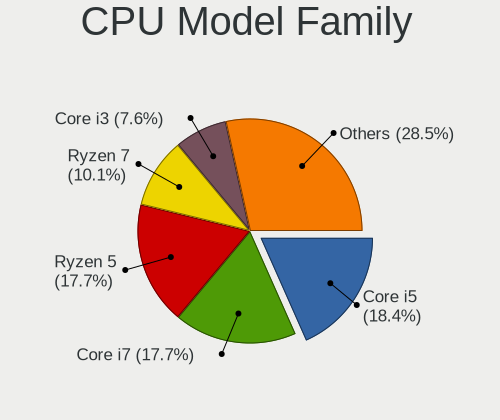

| Model                  | Desktops | Percent |
|------------------------|----------|---------|
| Intel Core i5          | 18       | 18.95%  |
| Intel Core i7          | 17       | 17.89%  |
| AMD Ryzen 5            | 17       | 17.89%  |
| AMD Ryzen 7            | 12       | 12.63%  |
| Intel Core i3          | 7        | 7.37%   |
| Other                  | 5        | 5.26%   |
| Intel Xeon             | 3        | 3.16%   |
| AMD Ryzen 9            | 2        | 2.11%   |
| AMD A8                 | 2        | 2.11%   |
| Intel Pentium          | 1        | 1.05%   |
| Intel Genuine          | 1        | 1.05%   |
| Intel Core i9          | 1        | 1.05%   |
| Intel Core 2 Quad      | 1        | 1.05%   |
| Intel Core 2 Duo       | 1        | 1.05%   |
| Intel Celeron          | 1        | 1.05%   |
| AMD Ryzen Threadripper | 1        | 1.05%   |
| AMD Ryzen 3            | 1        | 1.05%   |
| AMD E1                 | 1        | 1.05%   |
| AMD Athlon II X3       | 1        | 1.05%   |
| AMD Athlon             | 1        | 1.05%   |
| AMD A4                 | 1        | 1.05%   |

CPU Cores
---------

Number of processor cores

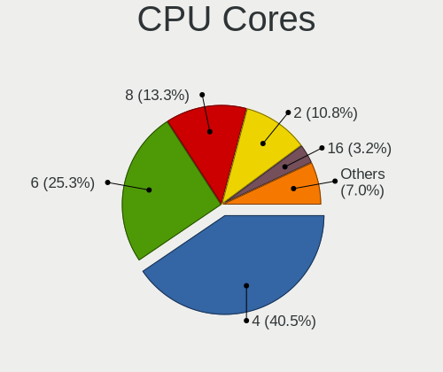

| Number | Desktops | Percent |
|--------|----------|---------|
| 4      | 34       | 35.79%  |
| 6      | 25       | 26.32%  |
| 8      | 16       | 16.84%  |
| 2      | 11       | 11.58%  |
| 16     | 3        | 3.16%   |
| 12     | 2        | 2.11%   |
| 10     | 2        | 2.11%   |
| 24     | 1        | 1.05%   |
| 3      | 1        | 1.05%   |

CPU Sockets
-----------

Number of sockets

| Number | Desktops | Percent |
|--------|----------|---------|
| 1      | 93       | 98.94%  |
| 2      | 1        | 1.06%   |

CPU Threads
-----------

Threads per core (Hyper-Threading)

| Number | Desktops | Percent |
|--------|----------|---------|
| 2      | 66       | 70.21%  |
| 1      | 28       | 29.79%  |

CPU Op-Modes
------------

CPU Operation Modes (32-bit, 64-bit)

| Op mode        | Desktops | Percent |
|----------------|----------|---------|
| 32-bit, 64-bit | 94       | 100%    |

CPU Microcode
-------------

Microcode number

| Number     | Desktops | Percent |
|------------|----------|---------|
| Unknown    | 39       | 40.63%  |
| 0x506e3    | 5        | 5.21%   |
| 0x08701021 | 5        | 5.21%   |
| 0x906ea    | 4        | 4.17%   |
| 0x0a201016 | 4        | 4.17%   |
| 0x306c3    | 3        | 3.13%   |
| 0x0a50000c | 3        | 3.13%   |
| 0x0a20120a | 3        | 3.13%   |
| 0x0a201025 | 3        | 3.13%   |
| 0x306a9    | 2        | 2.08%   |
| 0x106e5    | 2        | 2.08%   |
| 0x08701030 | 2        | 2.08%   |
| 0x08108109 | 2        | 2.08%   |
| 0x0810100b | 2        | 2.08%   |
| 0xa0653    | 1        | 1.04%   |
| 0x906ed    | 1        | 1.04%   |
| 0x906eb    | 1        | 1.04%   |
| 0x906e9    | 1        | 1.04%   |
| 0x306f2    | 1        | 1.04%   |
| 0x20655    | 1        | 1.04%   |
| 0x1067a    | 1        | 1.04%   |
| 0x0a601203 | 1        | 1.04%   |
| 0x0a50000d | 1        | 1.04%   |
| 0x08701013 | 1        | 1.04%   |
| 0x08600106 | 1        | 1.04%   |
| 0x0800820d | 1        | 1.04%   |
| 0x08001138 | 1        | 1.04%   |
| 0x0700010b | 1        | 1.04%   |
| 0x0600611a | 1        | 1.04%   |
| 0x0500010d | 1        | 1.04%   |
| 0x010000c8 | 1        | 1.04%   |

CPU Microarch
-------------

Microarchitecture

| Name             | Desktops | Percent |
|------------------|----------|---------|
| Zen 3            | 14       | 14.74%  |
| KabyLake         | 13       | 13.68%  |
| Zen 2            | 10       | 10.53%  |
| Skylake          | 9        | 9.47%   |
| Haswell          | 9        | 9.47%   |
| IvyBridge        | 6        | 6.32%   |
| Zen+             | 5        | 5.26%   |
| Zen              | 4        | 4.21%   |
| SandyBridge      | 3        | 3.16%   |
| Nehalem          | 3        | 3.16%   |
| CometLake        | 3        | 3.16%   |
| Penryn           | 2        | 2.11%   |
| Icelake          | 2        | 2.11%   |
| Alderlake Hybrid | 2        | 2.11%   |
| Westmere         | 1        | 1.05%   |
| Piledriver       | 1        | 1.05%   |
| K10              | 1        | 1.05%   |
| Jaguar           | 1        | 1.05%   |
| Gracemont        | 1        | 1.05%   |
| Goldmont plus    | 1        | 1.05%   |
| Excavator        | 1        | 1.05%   |
| Broadwell        | 1        | 1.05%   |
| Bobcat           | 1        | 1.05%   |
| Unknown          | 1        | 1.05%   |

Graphics
--------

GPU Vendor
----------

Vendors of graphics cards

| Vendor            | Desktops | Percent |
|-------------------|----------|---------|
| Nvidia            | 47       | 46.53%  |
| AMD               | 34       | 33.66%  |
| Intel             | 19       | 18.81%  |
| ASPEED Technology | 1        | 0.99%   |

GPU Model
---------

Graphics card models

| Model                                                                       | Desktops | Percent |
|-----------------------------------------------------------------------------|----------|---------|
| Intel Xeon E3-1200 v3/4th Gen Core Processor Integrated Graphics Controller | 6        | 5.83%   |
| Nvidia GP107 [GeForce GTX 1050 Ti]                                          | 5        | 4.85%   |
| AMD Navi 10 [Radeon RX 5600 OEM/5600 XT / 5700/5700 XT]                     | 5        | 4.85%   |
| Nvidia GP104 [GeForce GTX 1080]                                             | 4        | 3.88%   |
| Nvidia GP104 [GeForce GTX 1070]                                             | 4        | 3.88%   |
| AMD Polaris 20 XL [Radeon RX 580 2048SP]                                    | 4        | 3.88%   |
| Nvidia TU106 [GeForce RTX 2060 Rev. A]                                      | 3        | 2.91%   |
| Nvidia GA104 [GeForce RTX 3060 Ti Lite Hash Rate]                           | 3        | 2.91%   |
| Intel Xeon E3-1200 v2/3rd Gen Core processor Graphics Controller            | 3        | 2.91%   |
| AMD Cezanne [Radeon Vega Series / Radeon Vega Mobile Series]                | 3        | 2.91%   |
| Nvidia TU106 [GeForce RTX 2060 SUPER]                                       | 2        | 1.94%   |
| Nvidia TU104 [GeForce RTX 2070 SUPER]                                       | 2        | 1.94%   |
| Nvidia GP107 [GeForce GTX 1050]                                             | 2        | 1.94%   |
| Nvidia GP106 [GeForce GTX 1060 6GB]                                         | 2        | 1.94%   |
| Nvidia GA102 [GeForce RTX 3080 Lite Hash Rate]                              | 2        | 1.94%   |
| Intel CoffeeLake-S GT2 [UHD Graphics 630]                                   | 2        | 1.94%   |
| AMD Picasso/Raven 2 [Radeon Vega Series / Radeon Vega Mobile Series]        | 2        | 1.94%   |
| AMD Navi 21 [Radeon RX 6800/6800 XT / 6900 XT]                              | 2        | 1.94%   |
| AMD Ellesmere [Radeon RX 470/480/570/570X/580/580X/590]                     | 2        | 1.94%   |
| AMD Cedar [Radeon HD 5000/6000/7350/8350 Series]                            | 2        | 1.94%   |
| Nvidia TU117 [GeForce GTX 1650]                                             | 1        | 0.97%   |
| Nvidia TU116 [GeForce GTX 1660]                                             | 1        | 0.97%   |
| Nvidia TU116 [GeForce GTX 1660 Ti]                                          | 1        | 0.97%   |
| Nvidia TU116 [GeForce GTX 1660 SUPER]                                       | 1        | 0.97%   |
| Nvidia TU116 [GeForce GTX 1650 SUPER]                                       | 1        | 0.97%   |
| Nvidia GT200 [GeForce GTX 260]                                              | 1        | 0.97%   |
| Nvidia GP108 [GeForce GT 1030]                                              | 1        | 0.97%   |
| Nvidia GP102 [GeForce GTX 1080 Ti]                                          | 1        | 0.97%   |
| Nvidia GM206 [GeForce GTX 960]                                              | 1        | 0.97%   |
| Nvidia GM204 [GeForce GTX 980]                                              | 1        | 0.97%   |
| Nvidia GM204 [GeForce GTX 970]                                              | 1        | 0.97%   |
| Nvidia GM107 [GeForce GTX 750 Ti]                                           | 1        | 0.97%   |
| Nvidia GK208B [GeForce GT 710]                                              | 1        | 0.97%   |
| Nvidia GK107 [GeForce GT 740]                                               | 1        | 0.97%   |
| Nvidia GF108 [GeForce GT 730]                                               | 1        | 0.97%   |
| Nvidia GF106GL [Quadro 2000]                                                | 1        | 0.97%   |
| Nvidia GA106 [GeForce RTX 3060 Lite Hash Rate]                              | 1        | 0.97%   |
| Nvidia GA104 [GeForce RTX 3070 Lite Hash Rate]                              | 1        | 0.97%   |
| Nvidia GA104 [GeForce RTX 3060 Ti]                                          | 1        | 0.97%   |
| Nvidia AD102 [GeForce RTX 4090]                                             | 1        | 0.97%   |

GPU Combo
---------

Combinations of graphics cards

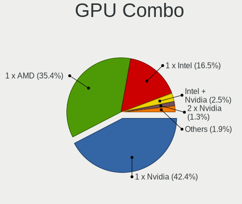

| Name            | Desktops | Percent |
|-----------------|----------|---------|
| 1 x Nvidia      | 41       | 43.16%  |
| 1 x AMD         | 33       | 34.74%  |
| 1 x Intel       | 14       | 14.74%  |
| Intel + Nvidia  | 3        | 3.16%   |
| 2 x Nvidia      | 1        | 1.05%   |
| 2 x Intel       | 1        | 1.05%   |
| Nvidia + ASPEED | 1        | 1.05%   |
| AMD + Nvidia    | 1        | 1.05%   |

GPU Driver
----------

Free vs proprietary

| Driver      | Desktops | Percent |
|-------------|----------|---------|
| Free        | 70       | 73.68%  |
| Proprietary | 22       | 23.16%  |
| Unknown     | 3        | 3.16%   |

GPU Memory
----------

Total video memory

| Size in GB | Desktops | Percent |
|------------|----------|---------|
| Unknown    | 27       | 28.42%  |
| 7.01-8.0   | 24       | 25.26%  |
| 1.01-2.0   | 13       | 13.68%  |
| 3.01-4.0   | 10       | 10.53%  |
| 5.01-6.0   | 8        | 8.42%   |
| 0.01-0.5   | 6        | 6.32%   |
| 8.01-16.0  | 5        | 5.26%   |
| 16.01-24.0 | 1        | 1.05%   |
| 0.51-1.0   | 1        | 1.05%   |

Monitor
-------

Monitor Vendor
--------------

Monitor vendors

| Vendor               | Desktops | Percent |
|----------------------|----------|---------|
| Samsung Electronics  | 24       | 24.49%  |
| Hewlett-Packard      | 11       | 11.22%  |
| Goldstar             | 11       | 11.22%  |
| Acer                 | 7        | 7.14%   |
| AOC                  | 5        | 5.1%    |
| Dell                 | 4        | 4.08%   |
| BenQ                 | 4        | 4.08%   |
| Ancor Communications | 4        | 4.08%   |
| Unknown              | 3        | 3.06%   |
| Iiyama               | 3        | 3.06%   |
| MSI                  | 2        | 2.04%   |
| Lenovo               | 2        | 2.04%   |
| Gigabyte Technology  | 2        | 2.04%   |
| ASUSTek Computer     | 2        | 2.04%   |
| Unknown              | 2        | 2.04%   |
| Yeyian               | 1        | 1.02%   |
| Sony                 | 1        | 1.02%   |
| QIA                  | 1        | 1.02%   |
| Philips              | 1        | 1.02%   |
| Konka                | 1        | 1.02%   |
| Kogan                | 1        | 1.02%   |
| KOC                  | 1        | 1.02%   |
| JRY                  | 1        | 1.02%   |
| Idek Iiyama          | 1        | 1.02%   |
| HKC                  | 1        | 1.02%   |
| Hitachi              | 1        | 1.02%   |
| FOX                  | 1        | 1.02%   |

Monitor Model
-------------

Monitor models

| Model                                                                   | Desktops | Percent |
|-------------------------------------------------------------------------|----------|---------|
| Unknown LCD Monitor FFFF 2288x1287 2550x2550mm 142.0-inch               | 2        | 1.89%   |
| Samsung Electronics S34J55x SAM0F70 3440x1440 797x333mm 34.0-inch       | 2        | 1.89%   |
| Goldstar ULTRAGEAR GSM7766 2560x1440 697x392mm 31.5-inch                | 2        | 1.89%   |
| Goldstar FULL HD GSM5BDE 1920x1080 480x270mm 21.7-inch                  | 2        | 1.89%   |
| Dell S3221QS DELD107 3840x2160 697x392mm 31.5-inch                      | 2        | 1.89%   |
| Dell P2419H DELD0DA 1920x1080 527x296mm 23.8-inch                       | 2        | 1.89%   |
| Unknown                                                                 | 2        | 1.89%   |
| Yeyian YMC-70102 YEY2700 1920x1080 698x393mm 31.5-inch                  | 1        | 0.94%   |
| Unknown LCD Monitor SAMSUNG 1360x768                                    | 1        | 0.94%   |
| Sony LCD Monitor AVSYSTEM 1280x720                                      | 1        | 0.94%   |
| Samsung Electronics U28E590 SAM0C4D 3840x2160 607x345mm 27.5-inch       | 1        | 0.94%   |
| Samsung Electronics T27B300 SAM0933 1920x1080 598x336mm 27.0-inch       | 1        | 0.94%   |
| Samsung Electronics SyncMaster SAM0524 1920x1080 477x268mm 21.5-inch    | 1        | 0.94%   |
| Samsung Electronics SyncMaster SAM02FE 1680x1050 433x271mm 20.1-inch    | 1        | 0.94%   |
| Samsung Electronics SMS24A350H SAM07D6 1920x1080 531x299mm 24.0-inch    | 1        | 0.94%   |
| Samsung Electronics SMB2430H SAM064E 1920x1080                          | 1        | 0.94%   |
| Samsung Electronics SMB2230N SAM0635 1920x1080 477x268mm 21.5-inch      | 1        | 0.94%   |
| Samsung Electronics S34J55x SAM0F72 3440x1440 797x333mm 34.0-inch       | 1        | 0.94%   |
| Samsung Electronics S27F350 SAM0D22 1920x1080 598x336mm 27.0-inch       | 1        | 0.94%   |
| Samsung Electronics S27E510 SAM0C5F 1920x1080 598x336mm 27.0-inch       | 1        | 0.94%   |
| Samsung Electronics S24F350 SAM0D20 1920x1080 521x293mm 23.5-inch       | 1        | 0.94%   |
| Samsung Electronics S22B350 SAM08D4 1920x1080 477x268mm 21.5-inch       | 1        | 0.94%   |
| Samsung Electronics LU28R55 SAM1019 3840x2160 632x360mm 28.6-inch       | 1        | 0.94%   |
| Samsung Electronics LCD Monitor SAM0DFA 3840x2160 1872x1053mm 84.6-inch | 1        | 0.94%   |
| Samsung Electronics LCD Monitor SAM0B7C 1920x1080 886x498mm 40.0-inch   | 1        | 0.94%   |
| Samsung Electronics LCD Monitor SAM0902 1920x1080 480x270mm 21.7-inch   | 1        | 0.94%   |
| Samsung Electronics LCD Monitor SAM02EB 1920x540                        | 1        | 0.94%   |
| Samsung Electronics LC49G95T SAM7053 2560x1440 1193x336mm 48.8-inch     | 1        | 0.94%   |
| Samsung Electronics LC24RG50 SAM0F91 1920x1080 532x304mm 24.1-inch      | 1        | 0.94%   |
| Samsung Electronics C27R50x SAM0F9E 1920x1080 598x336mm 27.0-inch       | 1        | 0.94%   |
| Samsung Electronics C27F390 SAM0D32 1920x1080 598x336mm 27.0-inch       | 1        | 0.94%   |
| Samsung Electronics C24F390 SAM0D2C 1920x1080 521x293mm 23.5-inch       | 1        | 0.94%   |
| QIA QM2150F QIA2150 1920x1080 368x207mm 16.6-inch                       | 1        | 0.94%   |
| Philips 224E PHLC053 1920x1080 476x268mm 21.5-inch                      | 1        | 0.94%   |
| MSI MAG322CQRV MSI3DA4 2560x1440 700x390mm 31.5-inch                    | 1        | 0.94%   |
| MSI G24C4 MSI3BA0 1920x1080 521x293mm 23.5-inch                         | 1        | 0.94%   |
| Lenovo LEN T24i-10 LEN61CE 1920x1080 527x296mm 23.8-inch                | 1        | 0.94%   |
| Lenovo G24-20 LEN66CF 1920x1080 530x300mm 24.0-inch                     | 1        | 0.94%   |
| Konka TV_MONITOR KOA0030 1920x1080 1150x650mm 52.0-inch                 | 1        | 0.94%   |
| Kogan KAMN341FQULA KGN3400 3440x1440 795x334mm 33.9-inch                | 1        | 0.94%   |

Monitor Resolution
------------------

Monitor screen resolution

| Resolution         | Desktops | Percent |
|--------------------|----------|---------|
| 1920x1080 (FHD)    | 47       | 48.45%  |
| 2560x1440 (QHD)    | 13       | 13.4%   |
| 3840x2160 (4K)     | 11       | 11.34%  |
| 3440x1440          | 7        | 7.22%   |
| 3840x1080          | 2        | 2.06%   |
| 2560x1080          | 2        | 2.06%   |
| 2288x1287          | 2        | 2.06%   |
| 1680x1050 (WSXGA+) | 2        | 2.06%   |
| 1360x768           | 2        | 2.06%   |
| 1280x1024 (SXGA)   | 2        | 2.06%   |
| 2560x1600          | 1        | 1.03%   |
| 1920x540           | 1        | 1.03%   |
| 1920x1200 (WUXGA)  | 1        | 1.03%   |
| 1600x900 (HD+)     | 1        | 1.03%   |
| 1366x768 (WXGA)    | 1        | 1.03%   |
| 1280x720 (HD)      | 1        | 1.03%   |
| Unknown            | 1        | 1.03%   |

Monitor Diagonal
----------------

Diagonal size in inches

| Inches  | Desktops | Percent |
|---------|----------|---------|
| 27      | 18       | 17.82%  |
| 24      | 14       | 13.86%  |
| 23      | 14       | 13.86%  |
| 21      | 11       | 10.89%  |
| 31      | 10       | 9.9%    |
| 34      | 7        | 6.93%   |
| Unknown | 7        | 6.93%   |
| 142     | 2        | 1.98%   |
| 84      | 2        | 1.98%   |
| 28      | 2        | 1.98%   |
| 20      | 2        | 1.98%   |
| 58      | 1        | 0.99%   |
| 54      | 1        | 0.99%   |
| 52      | 1        | 0.99%   |
| 48      | 1        | 0.99%   |
| 40      | 1        | 0.99%   |
| 35      | 1        | 0.99%   |
| 33      | 1        | 0.99%   |
| 29      | 1        | 0.99%   |
| 26      | 1        | 0.99%   |
| 19      | 1        | 0.99%   |
| 18      | 1        | 0.99%   |
| 16      | 1        | 0.99%   |

Monitor Width
-------------

Physical width

| Width in mm    | Desktops | Percent |
|----------------|----------|---------|
| 501-600        | 40       | 41.67%  |
| 601-700        | 14       | 14.58%  |
| 401-500        | 14       | 14.58%  |
| 701-800        | 8        | 8.33%   |
| Unknown        | 7        | 7.29%   |
| 1001-1500      | 4        | 4.17%   |
| 351-400        | 3        | 3.13%   |
| More than 2000 | 2        | 2.08%   |
| 801-900        | 2        | 2.08%   |
| 1501-2000      | 2        | 2.08%   |

Aspect Ratio
------------

Proportional relationship between the width and the height

| Ratio   | Desktops | Percent |
|---------|----------|---------|
| 16/9    | 68       | 74.73%  |
| 21/9    | 9        | 9.89%   |
| Unknown | 5        | 5.49%   |
| 16/10   | 3        | 3.3%    |
| 5/4     | 2        | 2.2%    |
| 1.00    | 2        | 2.2%    |
| 32/9    | 1        | 1.1%    |
| 3/2     | 1        | 1.1%    |

Monitor Area
------------

Area in inch²

| Area in inch² | Desktops | Percent |
|----------------|----------|---------|
| 201-250        | 34       | 34.34%  |
| 351-500        | 21       | 21.21%  |
| 301-350        | 18       | 18.18%  |
| More than 1000 | 7        | 7.07%   |
| Unknown        | 7        | 7.07%   |
| 151-200        | 5        | 5.05%   |
| 251-300        | 4        | 4.04%   |
| 501-1000       | 2        | 2.02%   |
| 111-120        | 1        | 1.01%   |

Pixel Density
-------------

Pixels per inch

| Density | Desktops | Percent |
|---------|----------|---------|
| 51-100  | 50       | 53.76%  |
| 101-120 | 22       | 23.66%  |
| 121-160 | 7        | 7.53%   |
| Unknown | 7        | 7.53%   |
| 1-50    | 6        | 6.45%   |
| 161-240 | 1        | 1.08%   |

Multiple Monitors
-----------------

Total monitors connected

| Total | Desktops | Percent |
|-------|----------|---------|
| 1     | 76       | 79.17%  |
| 2     | 16       | 16.67%  |
| 3     | 2        | 2.08%   |
| 0     | 2        | 2.08%   |

Network
-------

Net Controller Vendor
---------------------

Controller vendors

| Vendor                          | Desktops | Percent |
|---------------------------------|----------|---------|
| Realtek Semiconductor           | 62       | 44.29%  |
| Intel                           | 47       | 33.57%  |
| Qualcomm Atheros                | 6        | 4.29%   |
| Broadcom                        | 5        | 3.57%   |
| MediaTek                        | 4        | 2.86%   |
| Ralink Technology               | 2        | 1.43%   |
| Ralink                          | 2        | 1.43%   |
| Qualcomm                        | 2        | 1.43%   |
| Aquantia                        | 2        | 1.43%   |
| TP-Link                         | 1        | 0.71%   |
| T & A Mobile Phones             | 1        | 0.71%   |
| Qualcomm Atheros Communications | 1        | 0.71%   |
| OPPO Electronics                | 1        | 0.71%   |
| NetGear                         | 1        | 0.71%   |
| Microsoft                       | 1        | 0.71%   |
| Broadcom Limited                | 1        | 0.71%   |
| ASUSTek Computer                | 1        | 0.71%   |

Net Controller Model
--------------------

Controller models

| Model                                                             | Desktops | Percent |
|-------------------------------------------------------------------|----------|---------|
| Realtek RTL8111/8168/8411 PCI Express Gigabit Ethernet Controller | 47       | 27.98%  |
| Realtek RTL8125 2.5GbE Controller                                 | 9        | 5.36%   |
| Intel Wi-Fi 6 AX200                                               | 8        | 4.76%   |
| Intel I211 Gigabit Network Connection                             | 8        | 4.76%   |
| Intel Ethernet Connection (2) I219-V                              | 7        | 4.17%   |
| Intel Ethernet Controller I225-V                                  | 6        | 3.57%   |
| Intel Wi-Fi 6 AX210/AX211/AX411 160MHz                            | 4        | 2.38%   |
| Realtek RTL88x2bu [AC1200 Techkey]                                | 3        | 1.79%   |
| Intel Wireless 7265                                               | 3        | 1.79%   |
| Intel Ethernet Connection I217-LM                                 | 3        | 1.79%   |
| Intel Dual Band Wireless-AC 3168NGW [Stone Peak]                  | 3        | 1.79%   |
| Realtek RTL8822BE 802.11a/b/g/n/ac WiFi adapter                   | 2        | 1.19%   |
| Realtek RTL8821CE 802.11ac PCIe Wireless Network Adapter          | 2        | 1.19%   |
| Realtek RTL810xE PCI Express Fast Ethernet controller             | 2        | 1.19%   |
| Qualcomm Atheros Killer E220x Gigabit Ethernet Controller         | 2        | 1.19%   |
| MediaTek MT7921K (RZ608) Wi-Fi 6E 80MHz                           | 2        | 1.19%   |
| MediaTek MT7921 802.11ax PCI Express Wireless Network Adapter     | 2        | 1.19%   |
| Intel Ethernet Connection (7) I219-V                              | 2        | 1.19%   |
| Intel Ethernet Connection (11) I219-V                             | 2        | 1.19%   |
| Intel Cannon Lake PCH CNVi WiFi                                   | 2        | 1.19%   |
| Intel 82579LM Gigabit Network Connection (Lewisville)             | 2        | 1.19%   |
| Broadcom NetLink BCM57780 Gigabit Ethernet PCIe                   | 2        | 1.19%   |
| Broadcom BCM4360 802.11ac Wireless Network Adapter                | 2        | 1.19%   |
| TP-Link Archer T2U PLUS [RTL8821AU]                               | 1        | 0.6%    |
| T & A Mobile Phones TCL 30 Z                                      | 1        | 0.6%    |
| Realtek RTL8192EE PCIe Wireless Network Adapter                   | 1        | 0.6%    |
| Realtek RTL8188FTV 802.11b/g/n 1T1R 2.4G WLAN Adapter             | 1        | 0.6%    |
| Realtek RTL8188EUS 802.11n Wireless Network Adapter               | 1        | 0.6%    |
| Realtek RTL8188EE Wireless Network Adapter                        | 1        | 0.6%    |
| Realtek RTL8153 Gigabit Ethernet Adapter                          | 1        | 0.6%    |
| Realtek Killer E2600 Gigabit Ethernet Controller                  | 1        | 0.6%    |
| Realtek 802.11ac NIC                                              | 1        | 0.6%    |
| Ralink RT2501/RT2573 Wireless Adapter                             | 1        | 0.6%    |
| Ralink MT7601U Wireless Adapter                                   | 1        | 0.6%    |
| Ralink RT5390R 802.11bgn PCIe Wireless Network Adapter            | 1        | 0.6%    |
| Ralink RT3090 Wireless 802.11n 1T/1R PCIe                         | 1        | 0.6%    |
| Qualcomm Redmi Note 8                                             | 1        | 0.6%    |
| Qualcomm Atheros Killer E2500 Gigabit Ethernet Controller         | 1        | 0.6%    |
| Qualcomm Atheros AR9271 802.11n                                   | 1        | 0.6%    |
| Qualcomm Atheros AR93xx Wireless Network Adapter                  | 1        | 0.6%    |

Wireless Vendor
---------------

Wireless vendors

| Vendor                          | Desktops | Percent |
|---------------------------------|----------|---------|
| Intel                           | 27       | 45.76%  |
| Realtek Semiconductor           | 12       | 20.34%  |
| MediaTek                        | 4        | 6.78%   |
| Broadcom                        | 4        | 6.78%   |
| Ralink Technology               | 2        | 3.39%   |
| Ralink                          | 2        | 3.39%   |
| Qualcomm Atheros                | 2        | 3.39%   |
| TP-Link                         | 1        | 1.69%   |
| Qualcomm Atheros Communications | 1        | 1.69%   |
| NetGear                         | 1        | 1.69%   |
| Microsoft                       | 1        | 1.69%   |
| Broadcom Limited                | 1        | 1.69%   |
| ASUSTek Computer                | 1        | 1.69%   |

Wireless Model
--------------

Wireless models

| Model                                                                     | Desktops | Percent |
|---------------------------------------------------------------------------|----------|---------|
| Intel Wi-Fi 6 AX200                                                       | 8        | 13.56%  |
| Intel Wi-Fi 6 AX210/AX211/AX411 160MHz                                    | 4        | 6.78%   |
| Realtek RTL88x2bu [AC1200 Techkey]                                        | 3        | 5.08%   |
| Intel Wireless 7265                                                       | 3        | 5.08%   |
| Intel Dual Band Wireless-AC 3168NGW [Stone Peak]                          | 3        | 5.08%   |
| Realtek RTL8822BE 802.11a/b/g/n/ac WiFi adapter                           | 2        | 3.39%   |
| Realtek RTL8821CE 802.11ac PCIe Wireless Network Adapter                  | 2        | 3.39%   |
| MediaTek MT7921K (RZ608) Wi-Fi 6E 80MHz                                   | 2        | 3.39%   |
| MediaTek MT7921 802.11ax PCI Express Wireless Network Adapter             | 2        | 3.39%   |
| Intel Cannon Lake PCH CNVi WiFi                                           | 2        | 3.39%   |
| Broadcom BCM4360 802.11ac Wireless Network Adapter                        | 2        | 3.39%   |
| TP-Link Archer T2U PLUS [RTL8821AU]                                       | 1        | 1.69%   |
| Realtek RTL8192EE PCIe Wireless Network Adapter                           | 1        | 1.69%   |
| Realtek RTL8188FTV 802.11b/g/n 1T1R 2.4G WLAN Adapter                     | 1        | 1.69%   |
| Realtek RTL8188EUS 802.11n Wireless Network Adapter                       | 1        | 1.69%   |
| Realtek RTL8188EE Wireless Network Adapter                                | 1        | 1.69%   |
| Realtek 802.11ac NIC                                                      | 1        | 1.69%   |
| Ralink RT2501/RT2573 Wireless Adapter                                     | 1        | 1.69%   |
| Ralink MT7601U Wireless Adapter                                           | 1        | 1.69%   |
| Ralink RT5390R 802.11bgn PCIe Wireless Network Adapter                    | 1        | 1.69%   |
| Ralink RT3090 Wireless 802.11n 1T/1R PCIe                                 | 1        | 1.69%   |
| Qualcomm Atheros AR9271 802.11n                                           | 1        | 1.69%   |
| Qualcomm Atheros AR93xx Wireless Network Adapter                          | 1        | 1.69%   |
| Qualcomm Atheros AR9287 Wireless Network Adapter (PCI-Express)            | 1        | 1.69%   |
| NetGear Nighthawk A7000 802.11ac Wireless Adapter AC1900 [Realtek 8814AU] | 1        | 1.69%   |
| Microsoft Xbox 360 Wireless Adapter                                       | 1        | 1.69%   |
| Intel Wireless-AC 9260                                                    | 1        | 1.69%   |
| Intel Wireless 8265 / 8275                                                | 1        | 1.69%   |
| Intel Tiger Lake PCH CNVi WiFi                                            | 1        | 1.69%   |
| Intel CNVi: Wi-Fi                                                         | 1        | 1.69%   |
| Intel Centrino Wireless-N 2230                                            | 1        | 1.69%   |
| Intel Alder Lake-S PCH CNVi WiFi                                          | 1        | 1.69%   |
| Intel 700 Series Chipset Family Wi-Fi                                     | 1        | 1.69%   |
| Broadcom Limited BCM4360 802.11ac Wireless Network Adapter                | 1        | 1.69%   |
| Broadcom BCM43228 802.11a/b/g/n                                           | 1        | 1.69%   |
| Broadcom BCM4318 [AirForce One 54g] 802.11g Wireless LAN Controller       | 1        | 1.69%   |
| ASUS 802.11ac NIC                                                         | 1        | 1.69%   |

Ethernet Vendor
---------------

Ethernet vendors

| Vendor                | Desktops | Percent |
|-----------------------|----------|---------|
| Realtek Semiconductor | 58       | 55.24%  |
| Intel                 | 34       | 32.38%  |
| Qualcomm Atheros      | 5        | 4.76%   |
| Broadcom              | 3        | 2.86%   |
| Qualcomm              | 2        | 1.9%    |
| Aquantia              | 2        | 1.9%    |
| OPPO Electronics      | 1        | 0.95%   |

Ethernet Model
--------------

Ethernet models

| Model                                                              | Desktops | Percent |
|--------------------------------------------------------------------|----------|---------|
| Realtek RTL8111/8168/8411 PCI Express Gigabit Ethernet Controller  | 47       | 43.52%  |
| Realtek RTL8125 2.5GbE Controller                                  | 9        | 8.33%   |
| Intel I211 Gigabit Network Connection                              | 8        | 7.41%   |
| Intel Ethernet Connection (2) I219-V                               | 7        | 6.48%   |
| Intel Ethernet Controller I225-V                                   | 6        | 5.56%   |
| Intel Ethernet Connection I217-LM                                  | 3        | 2.78%   |
| Realtek RTL810xE PCI Express Fast Ethernet controller              | 2        | 1.85%   |
| Qualcomm Atheros Killer E220x Gigabit Ethernet Controller          | 2        | 1.85%   |
| Intel Ethernet Connection (7) I219-V                               | 2        | 1.85%   |
| Intel Ethernet Connection (11) I219-V                              | 2        | 1.85%   |
| Intel 82579LM Gigabit Network Connection (Lewisville)              | 2        | 1.85%   |
| Broadcom NetLink BCM57780 Gigabit Ethernet PCIe                    | 2        | 1.85%   |
| Realtek RTL8153 Gigabit Ethernet Adapter                           | 1        | 0.93%   |
| Realtek Killer E2600 Gigabit Ethernet Controller                   | 1        | 0.93%   |
| Qualcomm Redmi Note 8                                              | 1        | 0.93%   |
| Qualcomm Atheros Killer E2500 Gigabit Ethernet Controller          | 1        | 0.93%   |
| Qualcomm Atheros AR8131 Gigabit Ethernet                           | 1        | 0.93%   |
| Qualcomm Atheros AR8121/AR8113/AR8114 Gigabit or Fast Ethernet     | 1        | 0.93%   |
| Qualcomm Android                                                   | 1        | 0.93%   |
| OPPO OnePlus Nord                                                  | 1        | 0.93%   |
| Intel I210 Gigabit Network Connection                              | 1        | 0.93%   |
| Intel Ethernet Connection (2) I218-V                               | 1        | 0.93%   |
| Intel Ethernet Connection (10) I219-V                              | 1        | 0.93%   |
| Intel 82579V Gigabit Network Connection                            | 1        | 0.93%   |
| Intel 82567LM-3 Gigabit Network Connection                         | 1        | 0.93%   |
| Broadcom NetLink BCM57781 Gigabit Ethernet PCIe                    | 1        | 0.93%   |
| Aquantia AQC113C NBase-T/IEEE 802.3bz Ethernet Controller [AQtion] | 1        | 0.93%   |
| Aquantia AQC107 NBase-T/IEEE 802.3bz Ethernet Controller [AQtion]  | 1        | 0.93%   |

Net Controller Kind
-------------------

Ethernet, WiFi or modem

| Kind     | Desktops | Percent |
|----------|----------|---------|
| Ethernet | 94       | 62.67%  |
| WiFi     | 55       | 36.67%  |
| Modem    | 1        | 0.67%   |

Used Controller
---------------

Currently used network controller

| Kind     | Desktops | Percent |
|----------|----------|---------|
| Ethernet | 74       | 77.08%  |
| WiFi     | 22       | 22.92%  |

NICs
----

Total network controllers on board

| Total | Desktops | Percent |
|-------|----------|---------|
| 1     | 48       | 50%     |
| 2     | 40       | 41.67%  |
| 3     | 6        | 6.25%   |
| 8     | 1        | 1.04%   |
| 4     | 1        | 1.04%   |

IPv6
----

IPv6 vs IPv4

| Used | Desktops | Percent |
|------|----------|---------|
| No   | 71       | 74.74%  |
| Yes  | 24       | 25.26%  |

Bluetooth
---------

Bluetooth Vendor
----------------

Controller vendors

| Vendor                  | Desktops | Percent |
|-------------------------|----------|---------|
| Intel                   | 27       | 50%     |
| Cambridge Silicon Radio | 9        | 16.67%  |
| ASUSTek Computer        | 5        | 9.26%   |
| Realtek Semiconductor   | 4        | 7.41%   |
| TP-Link                 | 2        | 3.7%    |
| MediaTek                | 2        | 3.7%    |
| Broadcom                | 2        | 3.7%    |
| IMC Networks            | 1        | 1.85%   |
| Foxconn / Hon Hai       | 1        | 1.85%   |
| Apple                   | 1        | 1.85%   |

Bluetooth Model
---------------

Controller models

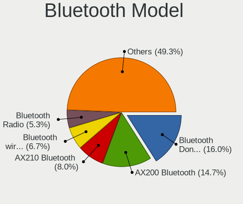

| Model                                                 | Desktops | Percent |
|-------------------------------------------------------|----------|---------|
| Cambridge Silicon Radio Bluetooth Dongle (HCI mode)   | 9        | 16.67%  |
| Intel AX200 Bluetooth                                 | 8        | 14.81%  |
| Intel Bluetooth Device                                | 5        | 9.26%   |
| Intel Bluetooth wireless interface                    | 4        | 7.41%   |
| Intel AX210 Bluetooth                                 | 4        | 7.41%   |
| TP-Link UB5A Adapter                                  | 2        | 3.7%    |
| Realtek  Bluetooth 4.2 Adapter                        | 2        | 3.7%    |
| Realtek Bluetooth Radio                               | 2        | 3.7%    |
| MediaTek Wireless_Device                              | 2        | 3.7%    |
| Intel Bluetooth 9460/9560 Jefferson Peak (JfP)        | 2        | 3.7%    |
| Intel AX201 Bluetooth                                 | 2        | 3.7%    |
| ASUS Broadcom BCM20702A0 Bluetooth                    | 2        | 3.7%    |
| ASUS Bluetooth Radio                                  | 2        | 3.7%    |
| Intel Wireless-AC 9260 Bluetooth Adapter              | 1        | 1.85%   |
| Intel Centrino Bluetooth Wireless Transceiver         | 1        | 1.85%   |
| IMC Networks Wireless_Device                          | 1        | 1.85%   |
| Foxconn / Hon Hai MediaTek Bluetooth Adapter          | 1        | 1.85%   |
| Broadcom HP Portable Bumble Bee                       | 1        | 1.85%   |
| Broadcom BCM20702A0 Bluetooth 4.0                     | 1        | 1.85%   |
| ASUS Broadcom BCM20702 Single-Chip Bluetooth 4.0 + LE | 1        | 1.85%   |
| Apple Bluetooth USB Host Controller                   | 1        | 1.85%   |

Sound
-----

Sound Vendor
------------

Sound card vendors

| Vendor                                       | Desktops | Percent |
|----------------------------------------------|----------|---------|
| Intel                                        | 56       | 30.27%  |
| Nvidia                                       | 46       | 24.86%  |
| AMD                                          | 46       | 24.86%  |
| C-Media Electronics                          | 6        | 3.24%   |
| Corsair                                      | 4        | 2.16%   |
| Generalplus Technology                       | 3        | 1.62%   |
| Razer USA                                    | 2        | 1.08%   |
| Kingston Technology                          | 2        | 1.08%   |
| Elgato Systems                               | 2        | 1.08%   |
| ASUSTek Computer                             | 2        | 1.08%   |
| Zoran Co. Personal Media Division (Nogatech) | 1        | 0.54%   |
| Trust                                        | 1        | 0.54%   |
| Tenx Technology                              | 1        | 0.54%   |
| Soundprese                                   | 1        | 0.54%   |
| PreSonus Audio Electronics                   | 1        | 0.54%   |
| Plantronics                                  | 1        | 0.54%   |
| Logitech                                     | 1        | 0.54%   |
| JMTek                                        | 1        | 0.54%   |
| Jieli Technology                             | 1        | 0.54%   |
| JBL                                          | 1        | 0.54%   |
| Hewlett-Packard                              | 1        | 0.54%   |
| GN Netcom                                    | 1        | 0.54%   |
| fifine Microphone                            | 1        | 0.54%   |
| ELMCU                                        | 1        | 0.54%   |
| Astro Gaming                                 | 1        | 0.54%   |
| Arturia                                      | 1        | 0.54%   |

Sound Model
-----------

Sound card models

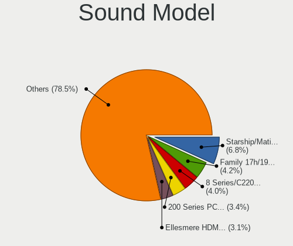

| Model                                                                      | Desktops | Percent |
|----------------------------------------------------------------------------|----------|---------|
| AMD Starship/Matisse HD Audio Controller                                   | 17       | 7.87%   |
| Intel 200 Series PCH HD Audio                                              | 11       | 5.09%   |
| AMD Family 17h/19h HD Audio Controller                                     | 9        | 4.17%   |
| Nvidia GP104 High Definition Audio Controller                              | 8        | 3.7%    |
| Nvidia GP107GL High Definition Audio Controller                            | 7        | 3.24%   |
| Intel 8 Series/C220 Series Chipset High Definition Audio Controller        | 7        | 3.24%   |
| Intel 100 Series/C230 Series Chipset Family HD Audio Controller            | 7        | 3.24%   |
| AMD Ellesmere HDMI Audio [Radeon RX 470/480 / 570/580/590]                 | 6        | 2.78%   |
| Nvidia TU106 High Definition Audio Controller                              | 5        | 2.31%   |
| Nvidia GA104 High Definition Audio Controller                              | 5        | 2.31%   |
| Intel Xeon E3-1200 v3/4th Gen Core Processor HD Audio Controller           | 5        | 2.31%   |
| Intel 7 Series/C216 Chipset Family High Definition Audio Controller        | 5        | 2.31%   |
| AMD Renoir Radeon High Definition Audio Controller                         | 5        | 2.31%   |
| AMD Navi 10 HDMI Audio                                                     | 5        | 2.31%   |
| AMD Family 17h (Models 00h-0fh) HD Audio Controller                        | 5        | 2.31%   |
| Nvidia TU116 High Definition Audio Controller                              | 4        | 1.85%   |
| Intel Cannon Lake PCH cAVS                                                 | 4        | 1.85%   |
| Intel 5 Series/3400 Series Chipset High Definition Audio                   | 4        | 1.85%   |
| Generalplus Technology USB Audio Device                                    | 3        | 1.39%   |
| C-Media Electronics Audio Adapter (Unitek Y-247A)                          | 3        | 1.39%   |
| AMD Raven/Raven2/Fenghuang HDMI/DP Audio Controller                        | 3        | 1.39%   |
| AMD Navi 21/23 HDMI/DP Audio Controller                                    | 3        | 1.39%   |
| AMD FCH Azalia Controller                                                  | 3        | 1.39%   |
| Nvidia TU104 HD Audio Controller                                           | 2        | 0.93%   |
| Nvidia GP106 High Definition Audio Controller                              | 2        | 0.93%   |
| Nvidia GM204 High Definition Audio Controller                              | 2        | 0.93%   |
| Nvidia GA102 High Definition Audio Controller                              | 2        | 0.93%   |
| Intel Tiger Lake-H HD Audio Controller                                     | 2        | 0.93%   |
| Intel Comet Lake PCH cAVS                                                  | 2        | 0.93%   |
| Intel C610/X99 series chipset HD Audio Controller                          | 2        | 0.93%   |
| Intel C600/X79 series chipset High Definition Audio Controller             | 2        | 0.93%   |
| Intel 6 Series/C200 Series Chipset Family High Definition Audio Controller | 2        | 0.93%   |
| Elgato Systems Elgato Wave:3                                               | 2        | 0.93%   |
| Corsair Slipstream Multi-Device Receiver                                   | 2        | 0.93%   |
| ASUSTek Computer USB Audio                                                 | 2        | 0.93%   |
| AMD Kabini HDMI/DP Audio                                                   | 2        | 0.93%   |
| AMD Cedar HDMI Audio [Radeon HD 5400/6300/7300 Series]                     | 2        | 0.93%   |
| Zoran Co. Personal Media Division (Nogatech) USB Audio and HID             | 1        | 0.46%   |
| Trust GXT 232 Microphone                                                   | 1        | 0.46%   |
| Tenx Technology USB AUDIO                                                  | 1        | 0.46%   |

Memory
------

Memory Vendor
-------------

Memory module vendors

| Vendor                       | Desktops | Percent |
|------------------------------|----------|---------|
| G.Skill                      | 16       | 16.67%  |
| Kingston                     | 15       | 15.63%  |
| Corsair                      | 15       | 15.63%  |
| SK hynix                     | 7        | 7.29%   |
| Unknown                      | 6        | 6.25%   |
| Samsung Electronics          | 6        | 6.25%   |
| Crucial                      | 6        | 6.25%   |
| Team                         | 5        | 5.21%   |
| A-DATA Technology            | 4        | 4.17%   |
| Micron Technology            | 3        | 3.13%   |
| Ramaxel Technology           | 2        | 2.08%   |
| Unifosa                      | 1        | 1.04%   |
| Transcend                    | 1        | 1.04%   |
| Timetec                      | 1        | 1.04%   |
| Silicon Power                | 1        | 1.04%   |
| PNY                          | 1        | 1.04%   |
| Patriot Memory (PDP Systems) | 1        | 1.04%   |
| Patriot                      | 1        | 1.04%   |
| Kllisre                      | 1        | 1.04%   |
| Juhor                        | 1        | 1.04%   |
| Heoriady                     | 1        | 1.04%   |
| GeIL                         | 1        | 1.04%   |

Memory Model
------------

Memory module models

| Model                                                                | Desktops | Percent |
|----------------------------------------------------------------------|----------|---------|
| Team RAM TEAMGROUP-UD4-3000 8GB DIMM DDR4 3200MT/s                   | 2        | 1.94%   |
| SK hynix RAM HMT351S6CFR8C-PB 4GB SODIMM DDR3 1600MT/s               | 2        | 1.94%   |
| Kingston RAM KHX2133C14/16G 16GB DIMM DDR4 2176MT/s                  | 2        | 1.94%   |
| Kingston RAM KHX1600C10D3/4G 4GB DIMM DDR3 1600MT/s                  | 2        | 1.94%   |
| Corsair RAM CMK16GX4M2B3200C16 8GB DIMM DDR4 3600MT/s                | 2        | 1.94%   |
| A-DATA RAM DDR4 3200 8GB DIMM DDR4 3600MT/s                          | 2        | 1.94%   |
| Unknown RAM Module 8GB DIMM DDR3 1600MT/s                            | 1        | 0.97%   |
| Unknown RAM Module 4GB DIMM DDR4 2133MT/s                            | 1        | 0.97%   |
| Unknown RAM Module 4GB DIMM DDR 1333MT/s                             | 1        | 0.97%   |
| Unknown RAM Module 2GB DIMM DDR2 800MT/s                             | 1        | 0.97%   |
| Unknown RAM Module 2GB DIMM DDR2 1067MT/s                            | 1        | 0.97%   |
| Unknown RAM Module 16GB DIMM DDR4 2667MT/s                           | 1        | 0.97%   |
| Unifosa RAM GU512303EP0202 2048MB DIMM DDR3 1333MT/s                 | 1        | 0.97%   |
| Transcend RAM TS1GLK64V6H 8GB DIMM DDR3 1600MT/s                     | 1        | 0.97%   |
| Timetec RAM Module 16GB SODIMM DDR4 3200MT/s                         | 1        | 0.97%   |
| Team RAM TEAMGROUP-UD4-3600 16GB DIMM DDR4 3733MT/s                  | 1        | 0.97%   |
| Team RAM TEAMGROUP-UD4-3200 8GB DIMM DDR4 3733MT/s                   | 1        | 0.97%   |
| Team RAM TEAMGROUP-UD3-1600 8192MB DIMM DDR3 1600MT/s                | 1        | 0.97%   |
| SK hynix RAM HMT451U6AFR8C-PB 4GB DIMM DDR3 1600MT/s                 | 1        | 0.97%   |
| SK hynix RAM HMT451S6BFR8A-PB 4GB SODIMM DDR3 1600MT/s               | 1        | 0.97%   |
| SK hynix RAM HMT41GS6BFR8A-PB 8192MB SODIMM DDR3 1600MT/s            | 1        | 0.97%   |
| SK hynix RAM HMT351U6CFR8C-PB 4GB DIMM DDR3 1800MT/s                 | 1        | 0.97%   |
| SK hynix RAM HMT351U6BFR8C-H9 4GB DIMM DDR3 1450MT/s                 | 1        | 0.97%   |
| SK hynix RAM HMA81GU6MFR8N-UH 8GB DIMM DDR4 2400MT/s                 | 1        | 0.97%   |
| SK hynix RAM HMA451R7MFR8N-TFTD 4GB DIMM DDR4 2133MT/s               | 1        | 0.97%   |
| SK hynix RAM HMA451R7MFR8N-TF 4GB DIMM DDR4 2133MT/s                 | 1        | 0.97%   |
| Silicon Power RAM SP016GBLFU266F02 16GB DIMM DDR4 2667MT/s           | 1        | 0.97%   |
| Samsung RAM Module 8GB DIMM DDR4 2666MT/s                            | 1        | 0.97%   |
| Samsung RAM Module 8GB DIMM DDR4 2133MT/s                            | 1        | 0.97%   |
| Samsung RAM M393A5143DB0-CPB 4GB DIMM DDR4 2133MT/s                  | 1        | 0.97%   |
| Samsung RAM M378B5673FH0-CH9 2GB DIMM DDR3 1600MT/s                  | 1        | 0.97%   |
| Samsung RAM M378B5273CH0-CH9 4GB DIMM DDR3 1867MT/s                  | 1        | 0.97%   |
| Samsung RAM M378B5173QH0-CK0 4GB DIMM DDR3 1600MT/s                  | 1        | 0.97%   |
| Samsung RAM M378B5173DB0-CK0 4GB DIMM DDR3 1600MT/s                  | 1        | 0.97%   |
| Ramaxel RAM RMUA5110MB78HAF-2400 8GB DIMM DDR4 2400MT/s              | 1        | 0.97%   |
| Ramaxel RAM RMR5030ED58E8W1600 2GB DIMM DDR3 1600MT/s                | 1        | 0.97%   |
| Ramaxel RAM RMR1870EF48E8W1333 2GB DIMM DDR3 1333MT/s                | 1        | 0.97%   |
| PNY RAM 8GBF1X08QFHH36-135-K 8GB DIMM DDR4 3200MT/s                  | 1        | 0.97%   |
| Patriot RAM PSD32G160081000000 2GB DIMM 1333MT/s                     | 1        | 0.97%   |
| Patriot Memory (PDP Systems) RAM PSD48G266681 8GB DIMM DDR4 2667MT/s | 1        | 0.97%   |

Memory Kind
-----------

Memory module kinds

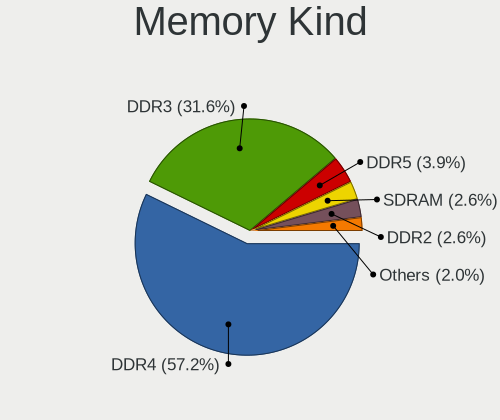

| Kind    | Desktops | Percent |
|---------|----------|---------|
| DDR4    | 57       | 66.28%  |
| DDR3    | 21       | 24.42%  |
| DDR5    | 3        | 3.49%   |
| DDR2    | 2        | 2.33%   |
| SDRAM   | 1        | 1.16%   |
| DDR     | 1        | 1.16%   |
| Unknown | 1        | 1.16%   |

Memory Form Factor
------------------

Physical design of the memory module

| Name   | Desktops | Percent |
|--------|----------|---------|
| DIMM   | 78       | 92.86%  |
| SODIMM | 6        | 7.14%   |

Memory Size
-----------

Memory module size

| Size  | Desktops | Percent |
|-------|----------|---------|
| 8192  | 34       | 36.96%  |
| 16384 | 27       | 29.35%  |
| 4096  | 19       | 20.65%  |
| 32768 | 6        | 6.52%   |
| 2048  | 6        | 6.52%   |

Memory Speed
------------

Memory module speed

| Speed | Desktops | Percent |
|-------|----------|---------|
| 3200  | 16       | 17.02%  |
| 1600  | 13       | 13.83%  |
| 3600  | 11       | 11.7%   |
| 2400  | 7        | 7.45%   |
| 2667  | 6        | 6.38%   |
| 1333  | 5        | 5.32%   |
| 2133  | 4        | 4.26%   |
| 2933  | 3        | 3.19%   |
| 1866  | 3        | 3.19%   |
| 1800  | 3        | 3.19%   |
| 3800  | 2        | 2.13%   |
| 3733  | 2        | 2.13%   |
| 3400  | 2        | 2.13%   |
| 2176  | 2        | 2.13%   |
| 7000  | 1        | 1.06%   |
| 6000  | 1        | 1.06%   |
| 5800  | 1        | 1.06%   |
| 4400  | 1        | 1.06%   |
| 4133  | 1        | 1.06%   |
| 3467  | 1        | 1.06%   |
| 3333  | 1        | 1.06%   |
| 3000  | 1        | 1.06%   |
| 2747  | 1        | 1.06%   |
| 2666  | 1        | 1.06%   |
| 2134  | 1        | 1.06%   |
| 1867  | 1        | 1.06%   |
| 1450  | 1        | 1.06%   |
| 1067  | 1        | 1.06%   |
| 800   | 1        | 1.06%   |

Printers & scanners
-------------------

Printer Vendor
--------------

Printer device vendors

| Vendor             | Desktops | Percent |
|--------------------|----------|---------|
| Brother Industries | 1        | 100%    |

Printer Model
-------------

Printer device models

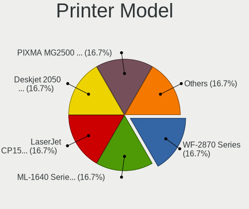

| Model                     | Desktops | Percent |
|---------------------------|----------|---------|
| Brother HL-5250DN Printer | 1        | 100%    |

Scanner Vendor
--------------

Scanner device vendors

Zero info for selected period =(

Scanner Model
-------------

Scanner device models

Zero info for selected period =(

Camera
------

Camera Vendor
-------------

Camera device vendors

| Vendor                                 | Desktops | Percent |
|----------------------------------------|----------|---------|
| Logitech                               | 4        | 25%     |
| Microdia                               | 3        | 18.75%  |
| Chicony Electronics                    | 3        | 18.75%  |
| Generalplus Technology                 | 2        | 12.5%   |
| Panasonic (Matsushita)                 | 1        | 6.25%   |
| Creative Technology                    | 1        | 6.25%   |
| Cheng Uei Precision Industry (Foxlink) | 1        | 6.25%   |
| Aveo Technology                        | 1        | 6.25%   |

Camera Model
------------

Camera device models

| Model                                                                | Desktops | Percent |
|----------------------------------------------------------------------|----------|---------|
| Microdia Webcam Vitade AF                                            | 2        | 12.5%   |
| Logitech BRIO Ultra HD Webcam                                        | 2        | 12.5%   |
| Chicony HP High Definition 1MP Webcam                                | 2        | 12.5%   |
| Panasonic (Matsushita) TY-CC20W                                      | 1        | 6.25%   |
| Microdia Camera                                                      | 1        | 6.25%   |
| Logitech Webcam C600                                                 | 1        | 6.25%   |
| Logitech Logi Webcam C920e                                           | 1        | 6.25%   |
| Generalplus campark PC04                                             | 1        | 6.25%   |
| Generalplus CAMERA - UVC                                             | 1        | 6.25%   |
| Creative Live! Cam Sync 1080p V2                                     | 1        | 6.25%   |
| Chicony HP Integrated Webcam                                         | 1        | 6.25%   |
| Cheng Uei Precision Industry (Foxlink) HP High Definition 1MP Webcam | 1        | 6.25%   |
| Aveo Camera                                                          | 1        | 6.25%   |

Security
--------

Fingerprint Vendor
------------------

Fingerprint sensor vendors

| Vendor                | Desktops | Percent |
|-----------------------|----------|---------|
| Elan Microelectronics | 1        | 100%    |

Fingerprint Model
-----------------

Fingerprint sensor models

| Model                                       | Desktops | Percent |
|---------------------------------------------|----------|---------|
| Elan fingerprint sensor [FeinTech FPS00200] | 1        | 100%    |

Chipcard Vendor
---------------

Chipcard module vendors

Zero info for selected period =(

Chipcard Model
--------------

Chipcard module models

Zero info for selected period =(

Unsupported
-----------

Unsupported Devices
-------------------

Total unsupported devices on board

| Total | Desktops | Percent |
|-------|----------|---------|
| 0     | 81       | 85.26%  |
| 1     | 14       | 14.74%  |

Unsupported Device Types
------------------------

Types of unsupported devices

| Type               | Desktops | Percent |
|--------------------|----------|---------|
| Graphics card      | 4        | 30.77%  |
| Net/wireless       | 3        | 23.08%  |
| Bluetooth          | 3        | 23.08%  |
| Unassigned class   | 2        | 15.38%  |
| Fingerprint reader | 1        | 7.69%   |

