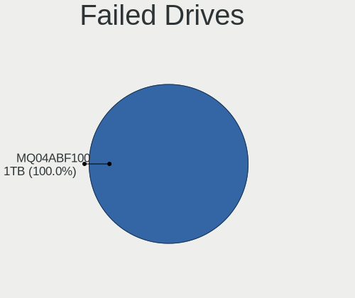

Xero - Tested Hardware & Statistics (Notebooks)
-----------------------------------------------

A project to collect tested hardware configurations for Xero.

Anyone can contribute to this report by the [hw-probe](https://github.com/linuxhw/hw-probe) tool:

    sudo -E hw-probe -all -upload

Please contribute! Especially if your hardware is rare.

Contents
--------

* [ Test Cases ](#test-cases)

* [ System ](#system)
  - [ OS                       ](#os)
  - [ OS Family                ](#os-family)
  - [ Kernel                   ](#kernel)
  - [ Kernel Family            ](#kernel-family)
  - [ Kernel Major Ver.        ](#kernel-major-ver)
  - [ Arch                     ](#arch)
  - [ DE                       ](#de)
  - [ Display Server           ](#display-server)
  - [ Display Manager          ](#display-manager)
  - [ OS Lang                  ](#os-lang)
  - [ Boot Mode                ](#boot-mode)
  - [ Filesystem               ](#filesystem)
  - [ Part. scheme             ](#part-scheme)
  - [ Dual Boot with Linux/BSD ](#dual-boot-with-linuxbsd)
  - [ Dual Boot (Win)          ](#dual-boot-win)

* [ Board ](#board)
  - [ Vendor                   ](#vendor)
  - [ Model                    ](#model)
  - [ Model Family             ](#model-family)
  - [ MFG Year                 ](#mfg-year)
  - [ Form Factor              ](#form-factor)
  - [ Secure Boot              ](#secure-boot)
  - [ Coreboot                 ](#coreboot)
  - [ RAM Size                 ](#ram-size)
  - [ RAM Used                 ](#ram-used)
  - [ Total Drives             ](#total-drives)
  - [ Has CD-ROM               ](#has-cd-rom)
  - [ Has Ethernet             ](#has-ethernet)
  - [ Has WiFi                 ](#has-wifi)
  - [ Has Bluetooth            ](#has-bluetooth)

* [ Location ](#location)
  - [ Country                  ](#country)
  - [ City                     ](#city)

* [ Drives ](#drives)
  - [ Drive Vendor             ](#drive-vendor)
  - [ Drive Model              ](#drive-model)
  - [ HDD Vendor               ](#hdd-vendor)
  - [ SSD Vendor               ](#ssd-vendor)
  - [ Drive Kind               ](#drive-kind)
  - [ Drive Connector          ](#drive-connector)
  - [ Drive Size               ](#drive-size)
  - [ Space Total              ](#space-total)
  - [ Space Used               ](#space-used)
  - [ Malfunc. Drives          ](#malfunc-drives)
  - [ Malfunc. Drive Vendor    ](#malfunc-drive-vendor)
  - [ Malfunc. HDD Vendor      ](#malfunc-hdd-vendor)
  - [ Malfunc. Drive Kind      ](#malfunc-drive-kind)
  - [ Failed Drives            ](#failed-drives)
  - [ Failed Drive Vendor      ](#failed-drive-vendor)
  - [ Drive Status             ](#drive-status)

* [ Storage controller ](#storage-controller)
  - [ Storage Vendor           ](#storage-vendor)
  - [ Storage Model            ](#storage-model)
  - [ Storage Kind             ](#storage-kind)

* [ Processor ](#processor)
  - [ CPU Vendor               ](#cpu-vendor)
  - [ CPU Model                ](#cpu-model)
  - [ CPU Model Family         ](#cpu-model-family)
  - [ CPU Cores                ](#cpu-cores)
  - [ CPU Sockets              ](#cpu-sockets)
  - [ CPU Threads              ](#cpu-threads)
  - [ CPU Op-Modes             ](#cpu-op-modes)
  - [ CPU Microcode            ](#cpu-microcode)
  - [ CPU Microarch            ](#cpu-microarch)

* [ Graphics ](#graphics)
  - [ GPU Vendor               ](#gpu-vendor)
  - [ GPU Model                ](#gpu-model)
  - [ GPU Combo                ](#gpu-combo)
  - [ GPU Driver               ](#gpu-driver)
  - [ GPU Memory               ](#gpu-memory)

* [ Monitor ](#monitor)
  - [ Monitor Vendor           ](#monitor-vendor)
  - [ Monitor Model            ](#monitor-model)
  - [ Monitor Resolution       ](#monitor-resolution)
  - [ Monitor Diagonal         ](#monitor-diagonal)
  - [ Monitor Width            ](#monitor-width)
  - [ Aspect Ratio             ](#aspect-ratio)
  - [ Monitor Area             ](#monitor-area)
  - [ Pixel Density            ](#pixel-density)
  - [ Multiple Monitors        ](#multiple-monitors)

* [ Network ](#network)
  - [ Net Controller Vendor    ](#net-controller-vendor)
  - [ Net Controller Model     ](#net-controller-model)
  - [ Wireless Vendor          ](#wireless-vendor)
  - [ Wireless Model           ](#wireless-model)
  - [ Ethernet Vendor          ](#ethernet-vendor)
  - [ Ethernet Model           ](#ethernet-model)
  - [ Net Controller Kind      ](#net-controller-kind)
  - [ Used Controller          ](#used-controller)
  - [ NICs                     ](#nics)
  - [ IPv6                     ](#ipv6)

* [ Bluetooth ](#bluetooth)
  - [ Bluetooth Vendor         ](#bluetooth-vendor)
  - [ Bluetooth Model          ](#bluetooth-model)

* [ Sound ](#sound)
  - [ Sound Vendor             ](#sound-vendor)
  - [ Sound Model              ](#sound-model)

* [ Memory ](#memory)
  - [ Memory Vendor            ](#memory-vendor)
  - [ Memory Model             ](#memory-model)
  - [ Memory Kind              ](#memory-kind)
  - [ Memory Form Factor       ](#memory-form-factor)
  - [ Memory Size              ](#memory-size)
  - [ Memory Speed             ](#memory-speed)

* [ Printers & scanners ](#printers--scanners)
  - [ Printer Vendor           ](#printer-vendor)
  - [ Printer Model            ](#printer-model)
  - [ Scanner Vendor           ](#scanner-vendor)
  - [ Scanner Model            ](#scanner-model)

* [ Camera ](#camera)
  - [ Camera Vendor            ](#camera-vendor)
  - [ Camera Model             ](#camera-model)

* [ Security ](#security)
  - [ Fingerprint Vendor       ](#fingerprint-vendor)
  - [ Fingerprint Model        ](#fingerprint-model)
  - [ Chipcard Vendor          ](#chipcard-vendor)
  - [ Chipcard Model           ](#chipcard-model)

* [ Unsupported ](#unsupported)
  - [ Unsupported Devices      ](#unsupported-devices)
  - [ Unsupported Device Types ](#unsupported-device-types)

Test Cases
----------

Total: 342

| Vendor        | Model                       | Probe                                                      | Date         |
|---------------|-----------------------------|------------------------------------------------------------|--------------|
| Lenovo        | ThinkPad T14 Gen 1 20UD0... | [614c58469c](https://linux-hardware.org/?probe=614c58469c) | Dec 01, 2024 |
| Dell          | XPS 13 9310                 | [7443fb3ad9](https://linux-hardware.org/?probe=7443fb3ad9) | Nov 13, 2024 |
| Positivo      | C4128A-14                   | [50f4d77aed](https://linux-hardware.org/?probe=50f4d77aed) | Nov 10, 2024 |
| Positivo      | C4128A-14                   | [49eddb2601](https://linux-hardware.org/?probe=49eddb2601) | Nov 10, 2024 |
| Dell          | Latitude 3140               | [c6b81cfb77](https://linux-hardware.org/?probe=c6b81cfb77) | Oct 31, 2024 |
| Toshiba       | Satellite L755D             | [ca7930fdb0](https://linux-hardware.org/?probe=ca7930fdb0) | Sep 26, 2024 |
| ASUSTek       | VivoBook_ASUSLaptop X160... | [d156c6ec4c](https://linux-hardware.org/?probe=d156c6ec4c) | Sep 10, 2024 |
| Dell          | Latitude 7480               | [d190ee0f7c](https://linux-hardware.org/?probe=d190ee0f7c) | Sep 09, 2024 |
| HP            | Laptop 15-dw1xxx            | [3f40abc951](https://linux-hardware.org/?probe=3f40abc951) | Aug 25, 2024 |
| HP            | Laptop 15-dw1xxx            | [cb2f55c33d](https://linux-hardware.org/?probe=cb2f55c33d) | Aug 18, 2024 |
| Acer          | Aspire 5732Z                | [e2286ae69c](https://linux-hardware.org/?probe=e2286ae69c) | Feb 22, 2024 |
| Acer          | Aspire 5732Z                | [caa89e80d0](https://linux-hardware.org/?probe=caa89e80d0) | Feb 21, 2024 |
| Acer          | Aspire 5732Z                | [76604f435d](https://linux-hardware.org/?probe=76604f435d) | Feb 07, 2024 |
| HP            | Laptop 15-da0xxx            | [c4221423f9](https://linux-hardware.org/?probe=c4221423f9) | Jan 31, 2024 |
| Lenovo        | V14-ADA 82C6                | [916a39975c](https://linux-hardware.org/?probe=916a39975c) | Jan 31, 2024 |
| Acer          | Nitro AN515-57              | [e179099ff6](https://linux-hardware.org/?probe=e179099ff6) | Jan 29, 2024 |
| Acer          | Aspire 5732Z                | [0499bd177a](https://linux-hardware.org/?probe=0499bd177a) | Jan 27, 2024 |
| Dell          | Inspiron 3793               | [ab1d389327](https://linux-hardware.org/?probe=ab1d389327) | Jan 27, 2024 |
| Acer          | TravelMate B115-M           | [e91da1c312](https://linux-hardware.org/?probe=e91da1c312) | Jan 22, 2024 |
| HP            | EliteBook 8460p             | [3055120492](https://linux-hardware.org/?probe=3055120492) | Jan 22, 2024 |
| Google        | Garg                        | [b306e0b88b](https://linux-hardware.org/?probe=b306e0b88b) | Jan 22, 2024 |
| Dell          | Latitude E5520              | [9700d44fe1](https://linux-hardware.org/?probe=9700d44fe1) | Jan 16, 2024 |
| Samsung       | 750XDA                      | [95d390939e](https://linux-hardware.org/?probe=95d390939e) | Jan 14, 2024 |
| Fujitsu       | E8420                       | [aeafbc2899](https://linux-hardware.org/?probe=aeafbc2899) | Jan 10, 2024 |
| ASUSTek       | VivoBook_ASUSLaptop X712... | [b8212584f9](https://linux-hardware.org/?probe=b8212584f9) | Jan 10, 2024 |
| Dell          | Inspiron 5737               | [1700f72b17](https://linux-hardware.org/?probe=1700f72b17) | Jan 08, 2024 |
| Apple         | MacBookAir6,1               | [60be673722](https://linux-hardware.org/?probe=60be673722) | Jan 08, 2024 |
| Acer          | Aspire V3-471G              | [d96fe50b0e](https://linux-hardware.org/?probe=d96fe50b0e) | Jan 07, 2024 |
| Dell          | Inspiron 5493               | [eb9b8edc2c](https://linux-hardware.org/?probe=eb9b8edc2c) | Jan 07, 2024 |
| Acer          | Extensa 215-54G             | [3c25dd10dd](https://linux-hardware.org/?probe=3c25dd10dd) | Jan 06, 2024 |
| Acer          | Extensa 215-54G             | [031b668bcb](https://linux-hardware.org/?probe=031b668bcb) | Jan 06, 2024 |
| Fujitsu       | E8420                       | [8e0c9a6fa7](https://linux-hardware.org/?probe=8e0c9a6fa7) | Jan 06, 2024 |
| HP            | Elite x2 1012 G1            | [f7f2644543](https://linux-hardware.org/?probe=f7f2644543) | Jan 06, 2024 |
| Acer          | Aspire 5732Z                | [4ec5e534a6](https://linux-hardware.org/?probe=4ec5e534a6) | Jan 05, 2024 |
| MECHREVO      | S2 Air Series PF4NU1F       | [08703baf6e](https://linux-hardware.org/?probe=08703baf6e) | Jan 03, 2024 |
| HP            | Pavilion Gaming Laptop 1... | [88bc9fe11f](https://linux-hardware.org/?probe=88bc9fe11f) | Jan 02, 2024 |
| Dell          | Latitude E5470              | [fdc804210f](https://linux-hardware.org/?probe=fdc804210f) | Jan 01, 2024 |
| Lenovo        | ThinkPad T495 20NJ0008US    | [2872198e9f](https://linux-hardware.org/?probe=2872198e9f) | Jan 01, 2024 |
| HP            | Notebook                    | [c5f68d3103](https://linux-hardware.org/?probe=c5f68d3103) | Dec 30, 2023 |
| HP            | Pavilion Laptop 15-eg0xx... | [8e46844acc](https://linux-hardware.org/?probe=8e46844acc) | Dec 29, 2023 |
| Lenovo        | V145-15AST 81MT             | [493e09fce5](https://linux-hardware.org/?probe=493e09fce5) | Dec 28, 2023 |
| HUAWEI        | BOD-WXX9                    | [7d74ad36fd](https://linux-hardware.org/?probe=7d74ad36fd) | Dec 28, 2023 |
| Google        | Nami                        | [3d7f7ba09c](https://linux-hardware.org/?probe=3d7f7ba09c) | Dec 28, 2023 |
| HUAWEI        | BOD-WXX9                    | [1d2d72f2a2](https://linux-hardware.org/?probe=1d2d72f2a2) | Dec 27, 2023 |
| Dynabook      | Satellite Pro L50-G-193     | [b602153aeb](https://linux-hardware.org/?probe=b602153aeb) | Dec 26, 2023 |
| Dell          | Latitude 5400               | [35adbae547](https://linux-hardware.org/?probe=35adbae547) | Dec 26, 2023 |
| Dell          | Latitude 5400               | [7ddd773af2](https://linux-hardware.org/?probe=7ddd773af2) | Dec 25, 2023 |
| MECHREVO      | S2 Air Series PF4NU1F       | [edb1d110e2](https://linux-hardware.org/?probe=edb1d110e2) | Dec 25, 2023 |
| HP            | Pavilion Gaming Laptop 1... | [f47caaa0e1](https://linux-hardware.org/?probe=f47caaa0e1) | Dec 25, 2023 |
| HP            | Laptop 15-ef2xxx            | [31291c7bc9](https://linux-hardware.org/?probe=31291c7bc9) | Dec 24, 2023 |
| Dell          | Latitude 5440               | [d7462b97ac](https://linux-hardware.org/?probe=d7462b97ac) | Dec 22, 2023 |
| Lenovo        | ThinkPad E15 Gen 2 20TES... | [4e773891cd](https://linux-hardware.org/?probe=4e773891cd) | Dec 21, 2023 |
| Dell          | Latitude E5540              | [af5e30a046](https://linux-hardware.org/?probe=af5e30a046) | Dec 20, 2023 |
| Dell          | Latitude D630               | [914826699f](https://linux-hardware.org/?probe=914826699f) | Dec 20, 2023 |
| HUAWEI        | KLVL-WXX9                   | [12f149be7f](https://linux-hardware.org/?probe=12f149be7f) | Dec 18, 2023 |
| MSI           | Bravo 15 B5DD               | [7bb3bd0328](https://linux-hardware.org/?probe=7bb3bd0328) | Dec 18, 2023 |
| Lenovo        | IdeaPad Gaming 3 15ACH6 ... | [9986fed725](https://linux-hardware.org/?probe=9986fed725) | Dec 15, 2023 |
| Lenovo        | IdeaPad Gaming 3 15ACH6 ... | [4a964fa296](https://linux-hardware.org/?probe=4a964fa296) | Dec 15, 2023 |
| Lenovo        | IdeaPad Slim 3 15IAH8 83... | [f942d9c43e](https://linux-hardware.org/?probe=f942d9c43e) | Dec 13, 2023 |
| HP            | ProBook 450 G1              | [f6f31f5ed6](https://linux-hardware.org/?probe=f6f31f5ed6) | Dec 13, 2023 |
| HP            | Pavilion dv7                | [1c31a8cd6f](https://linux-hardware.org/?probe=1c31a8cd6f) | Dec 12, 2023 |
| MECHREVO      | Kuangshi16Pro Series GM6... | [e551d0d31e](https://linux-hardware.org/?probe=e551d0d31e) | Dec 11, 2023 |
| HUAWEI        | KLVL-WXX9                   | [2abe635055](https://linux-hardware.org/?probe=2abe635055) | Dec 10, 2023 |
| Dell          | Inspiron 5570               | [87ef304fb0](https://linux-hardware.org/?probe=87ef304fb0) | Dec 07, 2023 |
| Alienware     | M17xR3                      | [0522045eab](https://linux-hardware.org/?probe=0522045eab) | Dec 07, 2023 |
| HP            | Pavilion Gaming Laptop 1... | [d7e2b60dc8](https://linux-hardware.org/?probe=d7e2b60dc8) | Dec 06, 2023 |
| Lenovo        | V14 G2 ALC 82KC             | [31de30cc0e](https://linux-hardware.org/?probe=31de30cc0e) | Dec 06, 2023 |
| Timi          | RedmiBook 14-APCS           | [468a017a07](https://linux-hardware.org/?probe=468a017a07) | Dec 04, 2023 |
| Panasonic     | CF-52SL3DD1M                | [efdec9a15c](https://linux-hardware.org/?probe=efdec9a15c) | Dec 04, 2023 |
| HUAWEI        | NBLK-WAX9X                  | [29d9e5aa67](https://linux-hardware.org/?probe=29d9e5aa67) | Dec 03, 2023 |
| ASUSTek       | ASUS TUF Dash F15 FX516P... | [d45f900b4c](https://linux-hardware.org/?probe=d45f900b4c) | Dec 03, 2023 |
| Lenovo        | ThinkPad X1 Carbon 6th 2... | [3ed69dec15](https://linux-hardware.org/?probe=3ed69dec15) | Nov 30, 2023 |
| Lenovo        | IdeaPad Slim 3 14IAN8 82... | [7eed706de5](https://linux-hardware.org/?probe=7eed706de5) | Nov 26, 2023 |
| ASUSTek       | VivoBook_ASUSLaptop X712... | [791f093fc3](https://linux-hardware.org/?probe=791f093fc3) | Nov 25, 2023 |
| ASUSTek       | TUF Gaming FX505DT_FX95D... | [0a24a8ef6d](https://linux-hardware.org/?probe=0a24a8ef6d) | Nov 24, 2023 |
| Lenovo        | IdeaPad 5 Pro 16IHU6 82L... | [cc934b68d9](https://linux-hardware.org/?probe=cc934b68d9) | Nov 22, 2023 |
| Toshiba       | Satellite P50-B-11V         | [448150c108](https://linux-hardware.org/?probe=448150c108) | Nov 21, 2023 |
| HP            | Pavilion dv7                | [b11ea54568](https://linux-hardware.org/?probe=b11ea54568) | Nov 20, 2023 |
| HP            | Laptop 15s-fr2xxx           | [fff3e03a74](https://linux-hardware.org/?probe=fff3e03a74) | Nov 20, 2023 |
| ASUSTek       | X540LJ                      | [fef63b579f](https://linux-hardware.org/?probe=fef63b579f) | Nov 17, 2023 |
| Lenovo        | Yoga 2 13 20344             | [ebb7ed0d8c](https://linux-hardware.org/?probe=ebb7ed0d8c) | Nov 16, 2023 |
| Acer          | Nitro AN515-57              | [39c7028c1e](https://linux-hardware.org/?probe=39c7028c1e) | Nov 15, 2023 |
| HUAWEI        | RLEF-XX                     | [5a7374e5b0](https://linux-hardware.org/?probe=5a7374e5b0) | Nov 13, 2023 |
| Lenovo        | ThinkPad X395 20NLS0J400    | [f5d1d61be6](https://linux-hardware.org/?probe=f5d1d61be6) | Nov 10, 2023 |
| Toshiba       | Satellite Pro L300          | [8cc0e1c14d](https://linux-hardware.org/?probe=8cc0e1c14d) | Nov 09, 2023 |
| HP            | Pavilion dv6                | [919942c11f](https://linux-hardware.org/?probe=919942c11f) | Nov 08, 2023 |
| ASUSTek       | UX310UQK                    | [98bc0094ec](https://linux-hardware.org/?probe=98bc0094ec) | Nov 06, 2023 |
| ASUSTek       | TUF Gaming FX505DT_FX95D... | [050ecd56d1](https://linux-hardware.org/?probe=050ecd56d1) | Nov 06, 2023 |
| Lenovo        | IdeaPad 320-15ABR 80XS      | [c64e4d8a0b](https://linux-hardware.org/?probe=c64e4d8a0b) | Nov 05, 2023 |
| Lenovo        | XiaoXinPro 14 IRH8 83AL     | [de5461c78b](https://linux-hardware.org/?probe=de5461c78b) | Nov 05, 2023 |
| MSI           | Bravo 15 B5DD               | [72b02cceec](https://linux-hardware.org/?probe=72b02cceec) | Nov 05, 2023 |
| MSI           | Bravo 15 B5DD               | [8a35411be4](https://linux-hardware.org/?probe=8a35411be4) | Nov 05, 2023 |
| HP            | Pavilion dv6                | [60ff7a74af](https://linux-hardware.org/?probe=60ff7a74af) | Nov 05, 2023 |
| Acer          | Aspire A315-58              | [95f3002643](https://linux-hardware.org/?probe=95f3002643) | Nov 05, 2023 |
| Lenovo        | ThinkPad T14s Gen 3 21CQ... | [6ea9e5b141](https://linux-hardware.org/?probe=6ea9e5b141) | Nov 04, 2023 |
| Toshiba       | Satellite C55-C             | [07e66cf3c5](https://linux-hardware.org/?probe=07e66cf3c5) | Nov 04, 2023 |
| Lenovo        | ThinkPad P43s 20RH0021MX    | [082adbf921](https://linux-hardware.org/?probe=082adbf921) | Nov 04, 2023 |
| Acer          | Nitro AN515-54              | [3ddccb994b](https://linux-hardware.org/?probe=3ddccb994b) | Nov 03, 2023 |
| Lenovo        | ThinkPad T480s 20L7CTO1W... | [e5158e3f58](https://linux-hardware.org/?probe=e5158e3f58) | Oct 31, 2023 |
| MSI           | Thin GF63 12VE              | [1776ca1088](https://linux-hardware.org/?probe=1776ca1088) | Oct 30, 2023 |
| Lenovo        | ThinkPad T460 20FN002JUS    | [bf9ff8ba5b](https://linux-hardware.org/?probe=bf9ff8ba5b) | Oct 29, 2023 |
| HP            | Presario CQ57               | [f35a975672](https://linux-hardware.org/?probe=f35a975672) | Oct 29, 2023 |
| HUAWEI        | BOM-WXX9                    | [57c7ce8322](https://linux-hardware.org/?probe=57c7ce8322) | Oct 28, 2023 |
| Dell          | Latitude E6440              | [8d106c22bf](https://linux-hardware.org/?probe=8d106c22bf) | Oct 28, 2023 |
| Dell          | Latitude 3590               | [2d288fa42e](https://linux-hardware.org/?probe=2d288fa42e) | Oct 27, 2023 |
| LG Electro... | R310-K.AP31B                | [ac3922c573](https://linux-hardware.org/?probe=ac3922c573) | Oct 24, 2023 |
| Lenovo        | ThinkPad T480s 20L7CTO1W... | [26691d6dfc](https://linux-hardware.org/?probe=26691d6dfc) | Oct 23, 2023 |
| Lenovo        | ThinkPad T420 4180DT9       | [8f8c03ab3b](https://linux-hardware.org/?probe=8f8c03ab3b) | Oct 22, 2023 |
| Apple         | MacBookPro9,2               | [dac0aa7f70](https://linux-hardware.org/?probe=dac0aa7f70) | Oct 22, 2023 |
| Lenovo        | ThinkPad T430s 23539MU      | [4f6872735a](https://linux-hardware.org/?probe=4f6872735a) | Oct 21, 2023 |
| Google        | Pirika                      | [98eea3bc0f](https://linux-hardware.org/?probe=98eea3bc0f) | Oct 20, 2023 |
| Fujitsu       | LIFEBOOK A3510              | [a3bc73fa83](https://linux-hardware.org/?probe=a3bc73fa83) | Oct 19, 2023 |
| ASUSTek       | ASUS TUF Gaming F15 FX50... | [d561271316](https://linux-hardware.org/?probe=d561271316) | Oct 19, 2023 |
| HP            | Pavilion dv6                | [0846a94456](https://linux-hardware.org/?probe=0846a94456) | Oct 17, 2023 |
| MSI           | GE72 6QF                    | [94f1c85d10](https://linux-hardware.org/?probe=94f1c85d10) | Oct 13, 2023 |
| Dell          | Vostro 2520                 | [aa4d9c935e](https://linux-hardware.org/?probe=aa4d9c935e) | Oct 12, 2023 |
| Compal        | PCW20                       | [94330b69a9](https://linux-hardware.org/?probe=94330b69a9) | Oct 11, 2023 |
| Dell          | Inspiron 3421               | [1da5f9aefa](https://linux-hardware.org/?probe=1da5f9aefa) | Oct 09, 2023 |
| Dell          | Latitude E6430              | [45d51130b0](https://linux-hardware.org/?probe=45d51130b0) | Oct 08, 2023 |
| Medion        | E15408                      | [5104fa354e](https://linux-hardware.org/?probe=5104fa354e) | Oct 07, 2023 |
| HP            | Laptop 15s-fr2xxx           | [2dc2d438ea](https://linux-hardware.org/?probe=2dc2d438ea) | Oct 07, 2023 |
| Apple         | MacBookAir5,2               | [6c5a7d30f3](https://linux-hardware.org/?probe=6c5a7d30f3) | Oct 06, 2023 |
| ASUSTek       | G551JM                      | [9274bccdad](https://linux-hardware.org/?probe=9274bccdad) | Oct 05, 2023 |
| Apple         | MacBookAir5,2               | [7ad16296eb](https://linux-hardware.org/?probe=7ad16296eb) | Oct 05, 2023 |
| HP            | ElitePad 1000 G2            | [fcfe482832](https://linux-hardware.org/?probe=fcfe482832) | Oct 04, 2023 |
| Lenovo        | ThinkPad P50 20EQS0T52R     | [39983ac5b1](https://linux-hardware.org/?probe=39983ac5b1) | Oct 04, 2023 |
| Dell          | Inspiron 13-5378            | [06c1e095a7](https://linux-hardware.org/?probe=06c1e095a7) | Oct 03, 2023 |
| MSI           | Bravo 15 B5DD               | [1df2dc7261](https://linux-hardware.org/?probe=1df2dc7261) | Oct 01, 2023 |
| Lenovo        | ThinkPad X200 745536T       | [62740874ab](https://linux-hardware.org/?probe=62740874ab) | Sep 30, 2023 |
| Juana Mans... | SF20GM7                     | [b4a58da74c](https://linux-hardware.org/?probe=b4a58da74c) | Sep 30, 2023 |
| Lenovo        | ThinkPad X200 745536T       | [618cd9dd90](https://linux-hardware.org/?probe=618cd9dd90) | Sep 29, 2023 |
| ASUSTek       | X505BA                      | [1caa3c5c7e](https://linux-hardware.org/?probe=1caa3c5c7e) | Sep 28, 2023 |
| Lenovo        | G570 20079                  | [cf0c9cc177](https://linux-hardware.org/?probe=cf0c9cc177) | Sep 28, 2023 |
| Apple         | MacBookAir7,2               | [0c9b2c687a](https://linux-hardware.org/?probe=0c9b2c687a) | Sep 28, 2023 |
| ASUSTek       | X555LN                      | [773691291a](https://linux-hardware.org/?probe=773691291a) | Sep 28, 2023 |
| HP            | EliteBook 840 G8 Noteboo... | [243f89703d](https://linux-hardware.org/?probe=243f89703d) | Sep 26, 2023 |
| HP            | Laptop 15s-eq1xxx           | [8142da7d40](https://linux-hardware.org/?probe=8142da7d40) | Sep 25, 2023 |
| ASUSTek       | G750JX                      | [dc6cea804c](https://linux-hardware.org/?probe=dc6cea804c) | Sep 24, 2023 |
| ASUSTek       | X541UAK                     | [b063bf9f1e](https://linux-hardware.org/?probe=b063bf9f1e) | Sep 24, 2023 |
| ASUSTek       | X542UN                      | [76f91b9954](https://linux-hardware.org/?probe=76f91b9954) | Sep 24, 2023 |
| Lenovo        | ThinkPad T440 20B6006DUS    | [4428a91f65](https://linux-hardware.org/?probe=4428a91f65) | Sep 23, 2023 |
| Acer          | Nitro AN515-58              | [fc49b16c1c](https://linux-hardware.org/?probe=fc49b16c1c) | Sep 22, 2023 |
| Apple         | MacBookPro9,1               | [27f3ee04f8](https://linux-hardware.org/?probe=27f3ee04f8) | Sep 21, 2023 |
| ASUSTek       | GL503VMF                    | [0e43a1da82](https://linux-hardware.org/?probe=0e43a1da82) | Sep 21, 2023 |
| Apple         | MacBookPro8,1               | [c1ca0a1d1c](https://linux-hardware.org/?probe=c1ca0a1d1c) | Sep 19, 2023 |
| Lenovo        | IdeaPad N585 20179          | [e80d14f9e4](https://linux-hardware.org/?probe=e80d14f9e4) | Sep 18, 2023 |
| Lenovo        | Z51-70 80K6                 | [8368825071](https://linux-hardware.org/?probe=8368825071) | Sep 17, 2023 |
| Acer          | Aspire 5742                 | [603e2a55fb](https://linux-hardware.org/?probe=603e2a55fb) | Sep 15, 2023 |
| Lenovo        | IdeaPad 320-15ABR 80XS      | [04bf6410bd](https://linux-hardware.org/?probe=04bf6410bd) | Sep 14, 2023 |
| Lenovo        | IdeaPad 320-15ABR 80XS      | [0c62999a52](https://linux-hardware.org/?probe=0c62999a52) | Sep 14, 2023 |
| Dell          | Inspiron 3583               | [cad3ce176d](https://linux-hardware.org/?probe=cad3ce176d) | Sep 14, 2023 |
| ASUSTek       | UX305FA                     | [e4ade39a1c](https://linux-hardware.org/?probe=e4ade39a1c) | Sep 14, 2023 |
| Lenovo        | IdeaPad 5 14IIL05 81YH      | [e793b9e3d9](https://linux-hardware.org/?probe=e793b9e3d9) | Sep 12, 2023 |
| MSI           | GE62 7RD                    | [ff590de77d](https://linux-hardware.org/?probe=ff590de77d) | Sep 11, 2023 |
| ASUSTek       | X510UAR                     | [671415f9ca](https://linux-hardware.org/?probe=671415f9ca) | Sep 11, 2023 |
| ASUSTek       | VivoBook_ASUSLaptop X415... | [1ff3e228da](https://linux-hardware.org/?probe=1ff3e228da) | Sep 10, 2023 |
| Lenovo        | IdeaPad 3 15ITL05 81X8      | [75ca1d0c52](https://linux-hardware.org/?probe=75ca1d0c52) | Sep 10, 2023 |
| Lenovo        | Legion Y540-17IRH 81Q4      | [f01636c129](https://linux-hardware.org/?probe=f01636c129) | Sep 09, 2023 |
| Apple         | MacBookPro11,2              | [83b997b3ab](https://linux-hardware.org/?probe=83b997b3ab) | Sep 09, 2023 |
| Lenovo        | V330-15IKB 81AX             | [edb578f198](https://linux-hardware.org/?probe=edb578f198) | Sep 09, 2023 |
| Google        | Pirika                      | [fc27e22f1c](https://linux-hardware.org/?probe=fc27e22f1c) | Sep 08, 2023 |
| Dell          | Inspiron 7460               | [03726302da](https://linux-hardware.org/?probe=03726302da) | Sep 07, 2023 |
| HP            | ProBook 455 15.6 inch G9... | [5b7ab92e89](https://linux-hardware.org/?probe=5b7ab92e89) | Sep 06, 2023 |
| Acer          | Aspire 5742                 | [ff917b0920](https://linux-hardware.org/?probe=ff917b0920) | Sep 02, 2023 |
| HUAWEI        | HN-WX9X                     | [efd67d7c17](https://linux-hardware.org/?probe=efd67d7c17) | Sep 02, 2023 |
| Dell          | Latitude 5420               | [2acb1da32c](https://linux-hardware.org/?probe=2acb1da32c) | Sep 02, 2023 |
| Lenovo        | IdeaPad 3 14ALC6 82KT       | [9de67aa419](https://linux-hardware.org/?probe=9de67aa419) | Sep 01, 2023 |
| Dell          | G15 5530                    | [ababfa6c5e](https://linux-hardware.org/?probe=ababfa6c5e) | Aug 31, 2023 |
| HP            | 255 G8 Notebook PC          | [92552fa038](https://linux-hardware.org/?probe=92552fa038) | Aug 30, 2023 |
| Acer          | Aspire A315-58              | [75ef08524c](https://linux-hardware.org/?probe=75ef08524c) | Aug 30, 2023 |
| Dell          | Latitude E6520              | [4918e66ad8](https://linux-hardware.org/?probe=4918e66ad8) | Aug 29, 2023 |
| Lenovo        | IdeaPad 3 14ALC6 82KT       | [fc7834595f](https://linux-hardware.org/?probe=fc7834595f) | Aug 29, 2023 |
| Acer          | Aspire V5-471               | [c5d2dabe27](https://linux-hardware.org/?probe=c5d2dabe27) | Aug 28, 2023 |
| Timi          | Redmi Book Pro 14 2022      | [8f85c500ec](https://linux-hardware.org/?probe=8f85c500ec) | Aug 27, 2023 |
| ASUSTek       | ASUS TUF Gaming A17 FA70... | [211472aacc](https://linux-hardware.org/?probe=211472aacc) | Aug 26, 2023 |
| HP            | Laptop 14-dq2xxx            | [0c46e2d419](https://linux-hardware.org/?probe=0c46e2d419) | Aug 26, 2023 |
| HP            | Laptop 15-da2xxx            | [01636af413](https://linux-hardware.org/?probe=01636af413) | Aug 25, 2023 |
| Google        | Pirika                      | [f0937aba65](https://linux-hardware.org/?probe=f0937aba65) | Aug 23, 2023 |
| Lenovo        | ThinkPad P50 20EQS4XN00     | [a517cc57b8](https://linux-hardware.org/?probe=a517cc57b8) | Aug 23, 2023 |
| VIT           | P2402                       | [fa87ae71d4](https://linux-hardware.org/?probe=fa87ae71d4) | Aug 22, 2023 |
| VIT           | P2402                       | [7b83628f3c](https://linux-hardware.org/?probe=7b83628f3c) | Aug 22, 2023 |
| ASUSTek       | X510UAR                     | [cdef569014](https://linux-hardware.org/?probe=cdef569014) | Aug 22, 2023 |
| HP            | Laptop 15-dy1xxx            | [e00521ec88](https://linux-hardware.org/?probe=e00521ec88) | Aug 22, 2023 |
| HUAWEI        | HVY-WXX9                    | [d63bd363bc](https://linux-hardware.org/?probe=d63bd363bc) | Aug 22, 2023 |
| ASUSTek       | ROG Strix G531GT_G531GT     | [882234a7b8](https://linux-hardware.org/?probe=882234a7b8) | Aug 22, 2023 |
| Dell          | Inspiron 5558               | [ee47d4b6a7](https://linux-hardware.org/?probe=ee47d4b6a7) | Aug 20, 2023 |
| HONOR         | BBR-WAX9                    | [1d013fbf4b](https://linux-hardware.org/?probe=1d013fbf4b) | Aug 20, 2023 |
| Lenovo        | Rev B 82KU                  | [114345f952](https://linux-hardware.org/?probe=114345f952) | Aug 18, 2023 |
| ASUSTek       | VivoBook_ASUSLaptop X712... | [faaba537ca](https://linux-hardware.org/?probe=faaba537ca) | Aug 18, 2023 |
| Lenovo        | IdeaPad S145-15IIL 82DJ     | [d7ec063f46](https://linux-hardware.org/?probe=d7ec063f46) | Aug 16, 2023 |
| Lenovo        | ThinkPad X1 Carbon 3rd 2... | [c078e667a4](https://linux-hardware.org/?probe=c078e667a4) | Aug 15, 2023 |
| Lenovo        | IdeaPad Gaming 3 15IHU6 ... | [1c643cc90f](https://linux-hardware.org/?probe=1c643cc90f) | Aug 13, 2023 |
| Fujitsu       | LIFEBOOK A3510              | [3e830ffabc](https://linux-hardware.org/?probe=3e830ffabc) | Aug 12, 2023 |
| Dell          | G3 3590                     | [084d659110](https://linux-hardware.org/?probe=084d659110) | Aug 11, 2023 |
| LNV           | L40-70                      | [66fe107447](https://linux-hardware.org/?probe=66fe107447) | Aug 11, 2023 |
| Lenovo        | Yoga 3 Pro-1370 80HE        | [eee160a070](https://linux-hardware.org/?probe=eee160a070) | Aug 10, 2023 |
| HP            | Laptop 15s-eq3xxx           | [284cfb0f6d](https://linux-hardware.org/?probe=284cfb0f6d) | Aug 08, 2023 |
| ASUSTek       | ASUS TUF Gaming F15 FX50... | [c9c978701a](https://linux-hardware.org/?probe=c9c978701a) | Aug 08, 2023 |
| WEIGO         | CDA-141AU                   | [35c705bd70](https://linux-hardware.org/?probe=35c705bd70) | Aug 05, 2023 |
| Dell          | Inspiron 3558               | [5331913f13](https://linux-hardware.org/?probe=5331913f13) | Aug 04, 2023 |
| Lenovo        | IdeaPad Gaming 3 15IHU6 ... | [8b84e48f4c](https://linux-hardware.org/?probe=8b84e48f4c) | Aug 04, 2023 |
| HP            | Laptop 15-dy1xxx            | [6dbeaa5f27](https://linux-hardware.org/?probe=6dbeaa5f27) | Aug 04, 2023 |
| Acer          | Aspire V3-371               | [5d5a4b489b](https://linux-hardware.org/?probe=5d5a4b489b) | Aug 03, 2023 |
| Fujitsu       | LIFEBOOK A3510              | [7281304bf0](https://linux-hardware.org/?probe=7281304bf0) | Aug 02, 2023 |
| Dell          | G3 3590                     | [78aeeb1aa3](https://linux-hardware.org/?probe=78aeeb1aa3) | Aug 02, 2023 |
| Dell          | G3 3590                     | [47d3c9b9fe](https://linux-hardware.org/?probe=47d3c9b9fe) | Aug 02, 2023 |
| Dell          | XPS 15 7590                 | [39216c08ff](https://linux-hardware.org/?probe=39216c08ff) | Aug 01, 2023 |
| Lenovo        | ThinkPad T480 20L6S2CE00    | [eb14620792](https://linux-hardware.org/?probe=eb14620792) | Jul 30, 2023 |
| Apple         | MacBookPro11,1              | [3fb2cba3db](https://linux-hardware.org/?probe=3fb2cba3db) | Jul 29, 2023 |
| ASUSTek       | VivoBook_ASUSLaptop X712... | [a467ce5440](https://linux-hardware.org/?probe=a467ce5440) | Jul 28, 2023 |
| Acer          | Aspire A315-42              | [3afa5a3034](https://linux-hardware.org/?probe=3afa5a3034) | Jul 27, 2023 |
| ASUSTek       | VivoBook_ASUSLaptop X712... | [dc632de3b5](https://linux-hardware.org/?probe=dc632de3b5) | Jul 27, 2023 |
| HP            | Laptop 14-fq1xxx            | [5de59d7736](https://linux-hardware.org/?probe=5de59d7736) | Jul 27, 2023 |
| Apple         | MacBook7,1                  | [762861205a](https://linux-hardware.org/?probe=762861205a) | Jul 26, 2023 |
| Lenovo        | ThinkPad T470p 20J6003DG... | [5693ac5e4c](https://linux-hardware.org/?probe=5693ac5e4c) | Jul 25, 2023 |
| ASUSTek       | VivoBook_ASUS Laptop E41... | [032db75736](https://linux-hardware.org/?probe=032db75736) | Jul 23, 2023 |
| Dell          | XPS 15 7590                 | [f5174240a7](https://linux-hardware.org/?probe=f5174240a7) | Jul 23, 2023 |
| Dell          | Inspiron 3476               | [eb12521a96](https://linux-hardware.org/?probe=eb12521a96) | Jul 23, 2023 |
| Lenovo        | IdeaPad 330-15ARR 81D2      | [c95c0b0730](https://linux-hardware.org/?probe=c95c0b0730) | Jul 22, 2023 |
| Lenovo        | ThinkPad T420 4236C92       | [a7b56f640a](https://linux-hardware.org/?probe=a7b56f640a) | Jul 18, 2023 |
| Lenovo        | ThinkPad T480 20L6S2CE00    | [e88c64ac3c](https://linux-hardware.org/?probe=e88c64ac3c) | Jul 16, 2023 |
| Lenovo        | ThinkPad T450 20BUS1BW01    | [db28c39c19](https://linux-hardware.org/?probe=db28c39c19) | Jul 14, 2023 |
| Lenovo        | ThinkPad T460s 20F90057M... | [698c4a8958](https://linux-hardware.org/?probe=698c4a8958) | Jul 14, 2023 |
| ASUSTek       | GL553VW                     | [9946c63986](https://linux-hardware.org/?probe=9946c63986) | Jul 12, 2023 |
| HP            | Laptop 15-dy2xxx            | [06f4243bee](https://linux-hardware.org/?probe=06f4243bee) | Jul 12, 2023 |
| Lenovo        | ThinkPad T450 20BUS1BW01    | [91d748c376](https://linux-hardware.org/?probe=91d748c376) | Jul 11, 2023 |
| Lenovo        | ThinkPad P72 20MCS0EU00     | [394bdbc596](https://linux-hardware.org/?probe=394bdbc596) | Jul 11, 2023 |
| HP            | OMEN Laptop 15-en0xxx       | [a5d9143c99](https://linux-hardware.org/?probe=a5d9143c99) | Jul 10, 2023 |
| Lenovo        | ThinkPad T480 20L6S2CE00    | [bbc78272ea](https://linux-hardware.org/?probe=bbc78272ea) | Jul 10, 2023 |
| Apple         | MacBook5,1                  | [b5ddf3381c](https://linux-hardware.org/?probe=b5ddf3381c) | Jul 10, 2023 |
| Lenovo        | ThinkPad T470p 20J6003DG... | [a7632f8c4b](https://linux-hardware.org/?probe=a7632f8c4b) | Jul 09, 2023 |
| HP            | ENVY Laptop 13-aq0xxx       | [8fcda3580f](https://linux-hardware.org/?probe=8fcda3580f) | Jul 08, 2023 |
| Alienware     | 17                          | [b8b8032da9](https://linux-hardware.org/?probe=b8b8032da9) | Jul 08, 2023 |
| Lenovo        | ThinkPad T460s 20F90057M... | [cd45163d47](https://linux-hardware.org/?probe=cd45163d47) | Jul 08, 2023 |
| Dell          | Latitude 7480               | [4c07c7b04a](https://linux-hardware.org/?probe=4c07c7b04a) | Jul 07, 2023 |
| ASUSTek       | VivoBook_ASUSLaptop X712... | [b23ba37244](https://linux-hardware.org/?probe=b23ba37244) | Jul 06, 2023 |
| Apple         | MacBookPro8,1               | [d25474786c](https://linux-hardware.org/?probe=d25474786c) | Jul 05, 2023 |
| Acer          | TravelMate 8572T            | [67f4a2af7e](https://linux-hardware.org/?probe=67f4a2af7e) | Jul 05, 2023 |
| Timi          | Redmi Book Pro 15 2022      | [7fee63007e](https://linux-hardware.org/?probe=7fee63007e) | Jul 02, 2023 |
| Acer          | Aspire 7715Z                | [b288a09d6e](https://linux-hardware.org/?probe=b288a09d6e) | Jul 01, 2023 |
| Lenovo        | ThinkPad T460s 20F90057M... | [a78e2b4096](https://linux-hardware.org/?probe=a78e2b4096) | Jun 29, 2023 |
| Medion        | Akoya P7818                 | [cfe9ae82fa](https://linux-hardware.org/?probe=cfe9ae82fa) | Jun 29, 2023 |
| Lenovo        | IdeaPad 320-15IKB 80XL      | [b67f86bedc](https://linux-hardware.org/?probe=b67f86bedc) | Jun 21, 2023 |
| Lenovo        | Legion 5 Pro 16ARH7H 82R... | [5314aeb7e0](https://linux-hardware.org/?probe=5314aeb7e0) | Jun 21, 2023 |
| Acer          | Aspire E5-573G              | [277ddf45b4](https://linux-hardware.org/?probe=277ddf45b4) | Jun 08, 2023 |
| Acer          | Aspire E1-572               | [6dc6a9d6f5](https://linux-hardware.org/?probe=6dc6a9d6f5) | May 29, 2023 |
| Lenovo        | Legion 5 15ACH6H 82JU       | [ba6e80b2b7](https://linux-hardware.org/?probe=ba6e80b2b7) | Apr 02, 2023 |
| Lenovo        | Legion 5 15ACH6H 82JU       | [195ab3d907](https://linux-hardware.org/?probe=195ab3d907) | Apr 02, 2023 |
| Lenovo        | ThinkPad T440 20B7A0CYMH    | [428491a9d5](https://linux-hardware.org/?probe=428491a9d5) | Mar 29, 2023 |
| HP            | Victus by Laptop 16-e0xx... | [f8cd7d94b2](https://linux-hardware.org/?probe=f8cd7d94b2) | Mar 23, 2023 |
| Dell          | G5 5500                     | [f9b3b5d852](https://linux-hardware.org/?probe=f9b3b5d852) | Mar 19, 2023 |
| Lenovo        | IdeaPad S340-15IIL 81VW     | [90ef6ca2b7](https://linux-hardware.org/?probe=90ef6ca2b7) | Mar 18, 2023 |
| Lenovo        | IdeaPad S340-15IIL 81VW     | [b769745990](https://linux-hardware.org/?probe=b769745990) | Mar 18, 2023 |
| Dell          | Latitude 5420               | [318da7f6c0](https://linux-hardware.org/?probe=318da7f6c0) | Mar 18, 2023 |
| ASUSTek       | TUF Gaming FX505DY_FX505... | [d1bf2f0a8b](https://linux-hardware.org/?probe=d1bf2f0a8b) | Mar 12, 2023 |
| Apple         | MacBookPro11,3              | [bccc889328](https://linux-hardware.org/?probe=bccc889328) | Mar 10, 2023 |
| Lenovo        | ThinkPad P51 20HJS11Y00     | [0843074b87](https://linux-hardware.org/?probe=0843074b87) | Mar 09, 2023 |
| Lenovo        | IdeaPad S540-15IML D 81N... | [31e144de96](https://linux-hardware.org/?probe=31e144de96) | Mar 08, 2023 |
| Dell          | Inspiron 3505               | [324020ca8b](https://linux-hardware.org/?probe=324020ca8b) | Feb 24, 2023 |
| Lenovo        | ThinkPad X1 Carbon Gen 9... | [efd9f878d2](https://linux-hardware.org/?probe=efd9f878d2) | Feb 12, 2023 |
| Lenovo        | ThinkPad X1 Carbon Gen 9... | [3c2d4cf289](https://linux-hardware.org/?probe=3c2d4cf289) | Feb 02, 2023 |
| Lenovo        | ThinkPad X1 Carbon Gen 9... | [0de8121880](https://linux-hardware.org/?probe=0de8121880) | Feb 01, 2023 |
| Lenovo        | ThinkPad X1 Carbon Gen 9... | [f39ab69b74](https://linux-hardware.org/?probe=f39ab69b74) | Feb 01, 2023 |
| HP            | ProBook 6565b               | [0ef00f6bcc](https://linux-hardware.org/?probe=0ef00f6bcc) | Jan 25, 2023 |
| ASUSTek       | ASUS TUF Gaming F15 FX50... | [5661d09dd0](https://linux-hardware.org/?probe=5661d09dd0) | Jan 15, 2023 |
| HP            | 245 G7 Notebook PC          | [3997d98a9a](https://linux-hardware.org/?probe=3997d98a9a) | Jan 11, 2023 |
| HUAWEI        | BOM-WXX9                    | [21fcd391f1](https://linux-hardware.org/?probe=21fcd391f1) | Jan 08, 2023 |
| Lenovo        | IdeaPad 3 14IGL05 81WH      | [86cf09380a](https://linux-hardware.org/?probe=86cf09380a) | Jan 02, 2023 |
| ASUSTek       | X540LA                      | [65f5548781](https://linux-hardware.org/?probe=65f5548781) | Dec 30, 2022 |
| HUAWEI        | BOM-WXX9                    | [fb1d454bc2](https://linux-hardware.org/?probe=fb1d454bc2) | Dec 29, 2022 |
| HUAWEI        | BOM-WXX9                    | [62010fe267](https://linux-hardware.org/?probe=62010fe267) | Dec 29, 2022 |
| HP            | Pavilion Gaming Laptop 1... | [6b34107dcf](https://linux-hardware.org/?probe=6b34107dcf) | Dec 21, 2022 |
| HP            | ZBook 15 G4                 | [669d7e74a2](https://linux-hardware.org/?probe=669d7e74a2) | Dec 19, 2022 |
| HP            | ZBook 15 G4                 | [91391127d1](https://linux-hardware.org/?probe=91391127d1) | Dec 18, 2022 |
| HP            | Pavilion Gaming Laptop 1... | [3111a63a09](https://linux-hardware.org/?probe=3111a63a09) | Dec 16, 2022 |
| Lenovo        | ThinkPad T490s 20NX001KM... | [49f30d3eee](https://linux-hardware.org/?probe=49f30d3eee) | Dec 06, 2022 |
| ASUSTek       | ROG Zephyrus G14 GA401II... | [16f086de33](https://linux-hardware.org/?probe=16f086de33) | Nov 25, 2022 |
| Medion        | P6816                       | [3aadacefe7](https://linux-hardware.org/?probe=3aadacefe7) | Nov 17, 2022 |
| Dell          | Latitude E6530              | [c87c9abe22](https://linux-hardware.org/?probe=c87c9abe22) | Nov 14, 2022 |
| Toshiba       | TECRA A11                   | [ba91b9d331](https://linux-hardware.org/?probe=ba91b9d331) | Nov 09, 2022 |
| Lenovo        | ThinkPad L450 20DT0000GE    | [1a925e0302](https://linux-hardware.org/?probe=1a925e0302) | Nov 06, 2022 |
| ASUSTek       | VivoBook_ASUSLaptop X421... | [4cd7aa6350](https://linux-hardware.org/?probe=4cd7aa6350) | Nov 01, 2022 |
| ASUSTek       | K53SJ                       | [8c85e545f2](https://linux-hardware.org/?probe=8c85e545f2) | Oct 23, 2022 |
| ASUSTek       | ROG Strix G513IC_G513IC     | [ef1974cfc8](https://linux-hardware.org/?probe=ef1974cfc8) | Oct 10, 2022 |
| HP            | Laptop 15s-fq2xxx           | [69e60dfe44](https://linux-hardware.org/?probe=69e60dfe44) | Oct 07, 2022 |
| ASUSTek       | ZenBook UX433FN_UX433FN     | [a7764ad0f6](https://linux-hardware.org/?probe=a7764ad0f6) | Oct 03, 2022 |
| MSI           | Katana GF66 11UE            | [36b2cba297](https://linux-hardware.org/?probe=36b2cba297) | Sep 05, 2022 |
| Lenovo        | ThinkPad X1 Carbon Gen 9... | [b28edd3886](https://linux-hardware.org/?probe=b28edd3886) | Aug 26, 2022 |
| Lenovo        | ThinkPad X1 Carbon Gen 9... | [97770c5716](https://linux-hardware.org/?probe=97770c5716) | Aug 26, 2022 |
| Lenovo        | ThinkPad T430s 2356FG9      | [9a10c152af](https://linux-hardware.org/?probe=9a10c152af) | Aug 17, 2022 |
| Aquarius      | NS585                       | [db9cbd5688](https://linux-hardware.org/?probe=db9cbd5688) | Aug 17, 2022 |
| Lenovo        | IdeaPad S145-15AST 81N3     | [7c46c8f737](https://linux-hardware.org/?probe=7c46c8f737) | Jul 15, 2022 |
| ASUSTek       | G551JM                      | [599c7b9eae](https://linux-hardware.org/?probe=599c7b9eae) | Jul 14, 2022 |
| ASUSTek       | G551JM                      | [9f4536df1c](https://linux-hardware.org/?probe=9f4536df1c) | Jul 14, 2022 |
| ASUSTek       | UX303LN                     | [9ce42e1b01](https://linux-hardware.org/?probe=9ce42e1b01) | Jun 12, 2022 |
| Dell          | Inspiron 1545               | [ce0e24a314](https://linux-hardware.org/?probe=ce0e24a314) | May 28, 2022 |
| Lenovo        | IdeaPad 330-17IKB 81DM      | [53475a6004](https://linux-hardware.org/?probe=53475a6004) | May 24, 2022 |
| ASUSTek       | VivoBook_ASUSLaptop X350... | [80d32848bf](https://linux-hardware.org/?probe=80d32848bf) | May 21, 2022 |
| Dell          | Precision M3800             | [7b63874768](https://linux-hardware.org/?probe=7b63874768) | Apr 25, 2022 |
| Dell          | Precision M3800             | [fbabacd835](https://linux-hardware.org/?probe=fbabacd835) | Apr 24, 2022 |
| Lenovo        | ThinkPad X230 2325HR9       | [a9d9d3fbb2](https://linux-hardware.org/?probe=a9d9d3fbb2) | Apr 21, 2022 |
| Acer          | Aspire A515-54G             | [52b660d8fb](https://linux-hardware.org/?probe=52b660d8fb) | Apr 11, 2022 |
| Dell          | Precision M3800             | [1ef57b39a7](https://linux-hardware.org/?probe=1ef57b39a7) | Apr 10, 2022 |
| Dell          | Precision M3800             | [9fc15d1ae6](https://linux-hardware.org/?probe=9fc15d1ae6) | Mar 31, 2022 |
| MSI           | GF63 Thin 9SCX              | [4501fa1556](https://linux-hardware.org/?probe=4501fa1556) | Mar 25, 2022 |
| Dell          | Latitude 7480               | [bf00ec6a76](https://linux-hardware.org/?probe=bf00ec6a76) | Mar 23, 2022 |
| HUAWEI        | WRT-WX9                     | [70ec26bed6](https://linux-hardware.org/?probe=70ec26bed6) | Mar 22, 2022 |
| Dell          | Latitude 7480               | [faddba28a8](https://linux-hardware.org/?probe=faddba28a8) | Mar 19, 2022 |
| Apple         | MacBookAir6,2               | [b71110144d](https://linux-hardware.org/?probe=b71110144d) | Mar 19, 2022 |
| HP            | Laptop 15-da0xxx            | [bb9074ccdf](https://linux-hardware.org/?probe=bb9074ccdf) | Mar 18, 2022 |
| Lenovo        | IdeaPad 3 15IML05 81WR      | [918c951cd1](https://linux-hardware.org/?probe=918c951cd1) | Mar 12, 2022 |
| Lenovo        | IdeaPad S145-15IIL 81W8     | [e251c9f079](https://linux-hardware.org/?probe=e251c9f079) | Mar 11, 2022 |
| Dell          | Venue 11 Pro 7130 vPro      | [57b302b119](https://linux-hardware.org/?probe=57b302b119) | Mar 05, 2022 |
| Lenovo        | ThinkPad T460 20FMS1XX00    | [78e82c6674](https://linux-hardware.org/?probe=78e82c6674) | Feb 24, 2022 |
| Dell          | Latitude E6430              | [e1de4e80fe](https://linux-hardware.org/?probe=e1de4e80fe) | Feb 15, 2022 |
| Lenovo        | Legion 5 15ARH05H 82B1      | [a3c5f00a2a](https://linux-hardware.org/?probe=a3c5f00a2a) | Feb 10, 2022 |
| Lenovo        | Legion 5 15ARH05H 82B1      | [e53fb31614](https://linux-hardware.org/?probe=e53fb31614) | Feb 10, 2022 |
| Lenovo        | Legion Y740-15IRHg 81UH     | [b0cc5e0cbc](https://linux-hardware.org/?probe=b0cc5e0cbc) | Jan 29, 2022 |
| Acer          | Aspire A315-58G             | [cb4f253c1c](https://linux-hardware.org/?probe=cb4f253c1c) | Jan 28, 2022 |
| Dell          | Latitude E6520              | [ee96960cec](https://linux-hardware.org/?probe=ee96960cec) | Jan 25, 2022 |
| HP            | Laptop 15s-eq0xxx           | [0df160c245](https://linux-hardware.org/?probe=0df160c245) | Jan 21, 2022 |
| Lenovo        | Legion Y540-15IRH-PG0 81... | [3df8a1c560](https://linux-hardware.org/?probe=3df8a1c560) | Jan 08, 2022 |
| Dell          | Vostro 3590                 | [9e77a2584c](https://linux-hardware.org/?probe=9e77a2584c) | Dec 30, 2021 |
| ASUSTek       | ASUS EXPERTBOOK B9400CEA... | [78e3fbdf6a](https://linux-hardware.org/?probe=78e3fbdf6a) | Dec 28, 2021 |
| HP            | Notebook                    | [c14ea64659](https://linux-hardware.org/?probe=c14ea64659) | Dec 23, 2021 |
| ASUSTek       | X510UNR                     | [0733a05806](https://linux-hardware.org/?probe=0733a05806) | Dec 21, 2021 |
| ASUSTek       | ASUS EXPERTBOOK B9400CEA... | [b4425de4a6](https://linux-hardware.org/?probe=b4425de4a6) | Dec 17, 2021 |
| ASUSTek       | ASUS TUF Gaming F15 FX50... | [6f3bd18b3f](https://linux-hardware.org/?probe=6f3bd18b3f) | Dec 06, 2021 |
| Pegatron      | D15K                        | [eaeaad8d39](https://linux-hardware.org/?probe=eaeaad8d39) | Nov 29, 2021 |
| MSI           | GP73 Leopard 8RD            | [5bafb43f78](https://linux-hardware.org/?probe=5bafb43f78) | Nov 21, 2021 |
| Acer          | Aspire A315-58G             | [911895fcf2](https://linux-hardware.org/?probe=911895fcf2) | Nov 19, 2021 |
| Acer          | Aspire A315-58G             | [5748b3cd05](https://linux-hardware.org/?probe=5748b3cd05) | Nov 12, 2021 |
| Lenovo        | ThinkPad W530 24384CU       | [d18d3495e0](https://linux-hardware.org/?probe=d18d3495e0) | Nov 05, 2021 |
| Acer          | Aspire A315-58G             | [905fce5118](https://linux-hardware.org/?probe=905fce5118) | Oct 29, 2021 |
| HP            | ENVY Sleekbook 4            | [ebea056239](https://linux-hardware.org/?probe=ebea056239) | Oct 29, 2021 |
| ASUSTek       | VivoBook_ASUSLaptop X509... | [2a54689fb3](https://linux-hardware.org/?probe=2a54689fb3) | Oct 24, 2021 |
| ASUSTek       | VivoBook_ASUS Laptop E41... | [fb95cbb063](https://linux-hardware.org/?probe=fb95cbb063) | Oct 19, 2021 |
| Lenovo        | IdeaPad 5 15ITL05 82FG      | [6cd76dfa2a](https://linux-hardware.org/?probe=6cd76dfa2a) | Oct 13, 2021 |
| ASUSTek       | ASUS TUF Gaming F15 FX50... | [e3a8d1ca32](https://linux-hardware.org/?probe=e3a8d1ca32) | Oct 11, 2021 |
| ASUSTek       | ASUS TUF Gaming F15 FX50... | [c7c4a74bb8](https://linux-hardware.org/?probe=c7c4a74bb8) | Oct 11, 2021 |
| ASUSTek       | ASUS TUF Gaming F15 FX50... | [68865693c7](https://linux-hardware.org/?probe=68865693c7) | Oct 09, 2021 |
| Lenovo        | Y520-15IKBN 80WK            | [e804a59920](https://linux-hardware.org/?probe=e804a59920) | Oct 02, 2021 |

System
------

OS
--

Installed operating systems

| Name         | Notebooks | Percent |
|--------------|-----------|---------|
| Xero Rolling | 263       | 97.05%  |
| Xero         | 8         | 2.95%   |

OS Family
---------

OS without a version

| Name | Notebooks | Percent |
|------|-----------|---------|
| Xero | 270       | 100%    |

Kernel
------

Version of the Linux kernel

| Version          | Notebooks | Percent |
|------------------|-----------|---------|
| 6.4.12-arch1-1   | 32        | 11%     |
| 6.5.5-arch1-1    | 26        | 8.93%   |
| 6.6.4-arch1-1    | 24        | 8.25%   |
| 6.5.9-arch2-1    | 23        | 7.9%    |
| 6.4.9-arch1-1    | 15        | 5.15%   |
| 6.4.3-arch1-2    | 13        | 4.47%   |
| 6.6.7-arch1-1    | 7         | 2.41%   |
| 6.4.2-arch1-1    | 6         | 2.06%   |
| 6.6.8-arch1-1    | 5         | 1.72%   |
| 6.4.1-arch2-1    | 5         | 1.72%   |
| 6.6.3-arch1-1    | 4         | 1.37%   |
| 6.4.4-arch1-1    | 4         | 1.37%   |
| 5.16.15-arch1-1  | 4         | 1.37%   |
| 6.6.1-arch1-1    | 3         | 1.03%   |
| 6.5.3-arch1-1    | 3         | 1.03%   |
| 6.2.6-arch1-1    | 3         | 1.03%   |
| 6.1.1-arch1-1    | 3         | 1.03%   |
| 6.0.12-arch1-1   | 3         | 1.03%   |
| 6.6.5-arch1-1    | 2         | 0.69%   |
| 6.4.2-zen1-1-zen | 2         | 0.69%   |
| 6.4.11-arch2-1   | 2         | 0.69%   |
| 6.4.10-arch1-1   | 2         | 0.69%   |
| 6.3.9-arch1-1    | 2         | 0.69%   |
| 6.3.8-arch1-1    | 2         | 0.69%   |
| 6.2.7-arch1-1    | 2         | 0.69%   |
| 6.0.7-arch1-1    | 2         | 0.69%   |
| 5.18.16-arch1-1  | 2         | 0.69%   |
| 5.18.11-arch1-1  | 2         | 0.69%   |
| 5.17.9-arch1-1   | 2         | 0.69%   |
| 5.16.8-arch1-1   | 2         | 0.69%   |
| 5.16.2-arch1-1   | 2         | 0.69%   |
| 5.16.1-arch1-1   | 2         | 0.69%   |
| 5.15.33-1-lts    | 2         | 0.69%   |
| 5.14.14-arch1-1  | 2         | 0.69%   |
| 6.7.4-arch1-1    | 1         | 0.34%   |
| 6.7.0-zen3-1-zen | 1         | 0.34%   |
| 6.7.0-arch3-1    | 1         | 0.34%   |
| 6.6.9-arch1-1    | 1         | 0.34%   |
| 6.6.8-zen1-1-zen | 1         | 0.34%   |
| 6.6.6-zen1-1-zen | 1         | 0.34%   |

Kernel Family
-------------

Linux kernel without a distro release

| Version | Notebooks | Percent |
|---------|-----------|---------|
| 6.4.12  | 32        | 11%     |
| 6.5.5   | 26        | 8.93%   |
| 6.6.4   | 24        | 8.25%   |
| 6.5.9   | 23        | 7.9%    |
| 6.4.9   | 15        | 5.15%   |
| 6.4.3   | 13        | 4.47%   |
| 6.4.2   | 8         | 2.75%   |
| 6.6.7   | 7         | 2.41%   |
| 6.6.8   | 6         | 2.06%   |
| 6.4.1   | 6         | 2.06%   |
| 6.6.3   | 4         | 1.37%   |
| 6.4.4   | 4         | 1.37%   |
| 6.4.10  | 4         | 1.37%   |
| 6.0.12  | 4         | 1.37%   |
| 5.16.15 | 4         | 1.37%   |
| 6.6.1   | 3         | 1.03%   |
| 6.5.3   | 3         | 1.03%   |
| 6.4.7   | 3         | 1.03%   |
| 6.4.11  | 3         | 1.03%   |
| 6.3.9   | 3         | 1.03%   |
| 6.2.6   | 3         | 1.03%   |
| 6.1.1   | 3         | 1.03%   |
| 5.14.16 | 3         | 1.03%   |
| 5.14.14 | 3         | 1.03%   |
| 6.7.0   | 2         | 0.69%   |
| 6.6.6   | 2         | 0.69%   |
| 6.6.5   | 2         | 0.69%   |
| 6.5.4   | 2         | 0.69%   |
| 6.5.2   | 2         | 0.69%   |
| 6.3.8   | 2         | 0.69%   |
| 6.2.7   | 2         | 0.69%   |
| 6.1.38  | 2         | 0.69%   |
| 6.0.8   | 2         | 0.69%   |
| 6.0.7   | 2         | 0.69%   |
| 5.18.16 | 2         | 0.69%   |
| 5.18.11 | 2         | 0.69%   |
| 5.17.9  | 2         | 0.69%   |
| 5.16.8  | 2         | 0.69%   |
| 5.16.2  | 2         | 0.69%   |
| 5.16.1  | 2         | 0.69%   |

Kernel Major Ver.
-----------------

Linux kernel major version

| Version | Notebooks | Percent |
|---------|-----------|---------|
| 6.4     | 87        | 30.74%  |
| 6.5     | 56        | 19.79%  |
| 6.6     | 48        | 16.96%  |
| 5.16    | 14        | 4.95%   |
| 6.1     | 12        | 4.24%   |
| 6.0     | 12        | 4.24%   |
| 5.15    | 9         | 3.18%   |
| 5.14    | 9         | 3.18%   |
| 6.3     | 7         | 2.47%   |
| 6.2     | 7         | 2.47%   |
| 5.19    | 5         | 1.77%   |
| 5.18    | 5         | 1.77%   |
| 5.17    | 4         | 1.41%   |
| 6.7     | 3         | 1.06%   |
| 5.10    | 3         | 1.06%   |
| 6.12    | 1         | 0.35%   |
| 6.10    | 1         | 0.35%   |

Arch
----

OS architecture (x86_64, i586, etc.)

| Name   | Notebooks | Percent |
|--------|-----------|---------|
| x86_64 | 270       | 100%    |

DE
--

Desktop Environment

| Name     | Notebooks | Percent |
|----------|-----------|---------|
| KDE5     | 258       | 94.51%  |
| XFCE     | 6         | 2.2%    |
| Hyprland | 3         | 1.1%    |
| KDE      | 2         | 0.73%   |
| LeftWM   | 1         | 0.37%   |
| KDE6     | 1         | 0.37%   |
| GNOME    | 1         | 0.37%   |
| Unknown  | 1         | 0.37%   |

Display Server
--------------

X11 or Wayland

| Name    | Notebooks | Percent |
|---------|-----------|---------|
| X11     | 199       | 72.63%  |
| Wayland | 73        | 26.64%  |
| Tty     | 1         | 0.36%   |
| Unknown | 1         | 0.36%   |

Display Manager
---------------

SDDM, LightDM, etc.

| Name    | Notebooks | Percent |
|---------|-----------|---------|
| SDDM    | 239       | 86.91%  |
| Unknown | 19        | 6.91%   |
| LightDM | 17        | 6.18%   |

OS Lang
-------

Language

| Lang  | Notebooks | Percent |
|-------|-----------|---------|
| en_US | 118       | 43.54%  |
| en_IN | 18        | 6.64%   |
| de_DE | 16        | 5.9%    |
| es_MX | 14        | 5.17%   |
| pl_PL | 12        | 4.43%   |
| ru_RU | 9         | 3.32%   |
| fr_FR | 8         | 2.95%   |
| en_GB | 8         | 2.95%   |
| pt_BR | 7         | 2.58%   |
| it_IT | 7         | 2.58%   |
| zh_CN | 6         | 2.21%   |
| hu_HU | 5         | 1.85%   |
| es_ES | 5         | 1.85%   |
| en_CA | 4         | 1.48%   |
| en_AU | 4         | 1.48%   |
| C     | 4         | 1.48%   |
| tr_TR | 3         | 1.11%   |
| es_AR | 3         | 1.11%   |
| vi_VN | 2         | 0.74%   |
| nb_NO | 2         | 0.74%   |
| en_ZA | 2         | 0.74%   |
| en_PH | 2         | 0.74%   |
| uk_UA | 1         | 0.37%   |
| nl_NL | 1         | 0.37%   |
| ko_KR | 1         | 0.37%   |
| es_VE | 1         | 0.37%   |
| es_SV | 1         | 0.37%   |
| es_CL | 1         | 0.37%   |
| es_BO | 1         | 0.37%   |
| en_DK | 1         | 0.37%   |
| en_AG | 1         | 0.37%   |
| da_DK | 1         | 0.37%   |
| ca_ES | 1         | 0.37%   |
| ar_EG | 1         | 0.37%   |

Boot Mode
---------

EFI or BIOS

| Mode | Notebooks | Percent |
|------|-----------|---------|
| EFI  | 204       | 75%     |
| BIOS | 68        | 25%     |

Filesystem
----------

Type of filesystem

| Type    | Notebooks | Percent |
|---------|-----------|---------|
| Ext4    | 141       | 51.27%  |
| Btrfs   | 71        | 25.82%  |
| Xfs     | 59        | 21.45%  |
| Overlay | 4         | 1.45%   |

Part. scheme
------------

Scheme of partitioning

| Type    | Notebooks | Percent |
|---------|-----------|---------|
| GPT     | 212       | 77.94%  |
| MBR     | 41        | 15.07%  |
| Unknown | 19        | 6.99%   |

Dual Boot with Linux/BSD
------------------------

Hosting more than one Linux/BSD

| Dual boot | Notebooks | Percent |
|-----------|-----------|---------|
| No        | 221       | 80.36%  |
| Yes       | 54        | 19.64%  |

Dual Boot (Win)
---------------

Hosting Linux and Windows

| Dual boot | Notebooks | Percent |
|-----------|-----------|---------|
| No        | 170       | 62.27%  |
| Yes       | 103       | 37.73%  |

Board
-----

Vendor
------

Motherboard manufacturer

| Name                | Notebooks | Percent |
|---------------------|-----------|---------|
| Lenovo              | 70        | 25.93%  |
| Dell                | 42        | 15.56%  |
| Hewlett-Packard     | 38        | 14.07%  |
| ASUSTek Computer    | 38        | 14.07%  |
| Acer                | 19        | 7.04%   |
| Apple               | 13        | 4.81%   |
| HUAWEI              | 9         | 3.33%   |
| MSI                 | 8         | 2.96%   |
| Toshiba             | 5         | 1.85%   |
| Timi                | 3         | 1.11%   |
| Medion              | 3         | 1.11%   |
| Google              | 3         | 1.11%   |
| MECHREVO            | 2         | 0.74%   |
| Fujitsu             | 2         | 0.74%   |
| Alienware           | 2         | 0.74%   |
| WEIGO               | 1         | 0.37%   |
| VIT                 | 1         | 0.37%   |
| Samsung Electronics | 1         | 0.37%   |
| Positivo            | 1         | 0.37%   |
| Pegatron            | 1         | 0.37%   |
| Panasonic           | 1         | 0.37%   |
| LNV                 | 1         | 0.37%   |
| LG Electronics      | 1         | 0.37%   |
| Juana Manso         | 1         | 0.37%   |
| HONOR               | 1         | 0.37%   |
| Dynabook            | 1         | 0.37%   |
| Compal              | 1         | 0.37%   |
| Aquarius            | 1         | 0.37%   |

Model
-----

Motherboard model

| Name                                  | Notebooks | Percent |
|---------------------------------------|-----------|---------|
| Dell Precision M3800                  | 3         | 1.11%   |
| MSI Bravo 15 B5DD                     | 2         | 0.74%   |
| Lenovo IdeaPad Gaming 3 15IHU6 82K1   | 2         | 0.74%   |
| HUAWEI BOM-WXX9                       | 2         | 0.74%   |
| HP Pavilion dv7                       | 2         | 0.74%   |
| HP Notebook                           | 2         | 0.74%   |
| HP Laptop 15-da0xxx                   | 2         | 0.74%   |
| Dell Latitude E6520                   | 2         | 0.74%   |
| Dell Latitude E6430                   | 2         | 0.74%   |
| Dell Latitude 7480                    | 2         | 0.74%   |
| Dell Latitude 5420                    | 2         | 0.74%   |
| Apple MacBookPro8,1                   | 2         | 0.74%   |
| Acer Nitro AN515-57                   | 2         | 0.74%   |
| WEIGO CDA-141AU                       | 1         | 0.37%   |
| VIT P2402                             | 1         | 0.37%   |
| Toshiba TECRA A11                     | 1         | 0.37%   |
| Toshiba Satellite Pro L300            | 1         | 0.37%   |
| Toshiba Satellite P50-B-11V           | 1         | 0.37%   |
| Toshiba Satellite L755D               | 1         | 0.37%   |
| Toshiba Satellite C55-C               | 1         | 0.37%   |
| Timi RedmiBook 14-APCS                | 1         | 0.37%   |
| Timi Redmi Book Pro 15 2022           | 1         | 0.37%   |
| Timi Redmi Book Pro 14 2022           | 1         | 0.37%   |
| Samsung 750XDA                        | 1         | 0.37%   |
| Positivo C4128A-14                    | 1         | 0.37%   |
| Pegatron D15K                         | 1         | 0.37%   |
| Panasonic CF-52SL3DD1M                | 1         | 0.37%   |
| MSI Thin GF63 12VE                    | 1         | 0.37%   |
| MSI Katana GF66 11UE                  | 1         | 0.37%   |
| MSI GP73 Leopard 8RD                  | 1         | 0.37%   |
| MSI GF63 Thin 9SCX                    | 1         | 0.37%   |
| MSI GE72 6QF                          | 1         | 0.37%   |
| MSI GE62 7RD                          | 1         | 0.37%   |
| Medion P6816                          | 1         | 0.37%   |
| Medion E15408                         | 1         | 0.37%   |
| Medion Akoya P7818                    | 1         | 0.37%   |
| MECHREVO S2 Air Series PF4NU1F        | 1         | 0.37%   |
| MECHREVO Kuangshi16Pro Series GM6PX0X | 1         | 0.37%   |
| LNV L40-70                            | 1         | 0.37%   |
| LG R310-K.AP31B                       | 1         | 0.37%   |

Model Family
------------

Motherboard model prefix

| Name                   | Notebooks | Percent |
|------------------------|-----------|---------|
| Lenovo ThinkPad        | 31        | 11.48%  |
| Lenovo IdeaPad         | 22        | 8.15%   |
| Dell Latitude          | 18        | 6.67%   |
| HP Laptop              | 14        | 5.19%   |
| Dell Inspiron          | 13        | 4.81%   |
| Acer Aspire            | 12        | 4.44%   |
| ASUS VivoBook          | 10        | 3.7%    |
| HP Pavilion            | 8         | 2.96%   |
| Lenovo Legion          | 6         | 2.22%   |
| ASUS ASUS              | 6         | 2.22%   |
| Toshiba Satellite      | 4         | 1.48%   |
| Acer Nitro             | 4         | 1.48%   |
| HP ProBook             | 3         | 1.11%   |
| Dell Precision         | 3         | 1.11%   |
| ASUS ROG               | 3         | 1.11%   |
| Apple MacBookPro11     | 3         | 1.11%   |
| Timi Redmi             | 2         | 0.74%   |
| MSI Bravo              | 2         | 0.74%   |
| Lenovo Yoga            | 2         | 0.74%   |
| HUAWEI BOM-WXX9        | 2         | 0.74%   |
| HP Notebook            | 2         | 0.74%   |
| HP ENVY                | 2         | 0.74%   |
| Dell XPS               | 2         | 0.74%   |
| Dell Vostro            | 2         | 0.74%   |
| ASUS TUF               | 2         | 0.74%   |
| Apple MacBookPro9      | 2         | 0.74%   |
| Apple MacBookPro8      | 2         | 0.74%   |
| Apple MacBookAir6      | 2         | 0.74%   |
| Acer TravelMate        | 2         | 0.74%   |
| WEIGO CDA-141AU        | 1         | 0.37%   |
| VIT P2402              | 1         | 0.37%   |
| Toshiba TECRA          | 1         | 0.37%   |
| Timi RedmiBook         | 1         | 0.37%   |
| Samsung 750XDA         | 1         | 0.37%   |
| Positivo C4128A-14     | 1         | 0.37%   |
| Pegatron D15K          | 1         | 0.37%   |
| Panasonic CF-52SL3DD1M | 1         | 0.37%   |
| MSI Thin               | 1         | 0.37%   |
| MSI Katana             | 1         | 0.37%   |
| MSI GP73               | 1         | 0.37%   |

MFG Year
--------

Motherboard manufacture year

| Year | Notebooks | Percent |
|------|-----------|---------|
| 2021 | 41        | 15.19%  |
| 2019 | 39        | 14.44%  |
| 2020 | 32        | 11.85%  |
| 2013 | 18        | 6.67%   |
| 2012 | 17        | 6.3%    |
| 2017 | 16        | 5.93%   |
| 2011 | 15        | 5.56%   |
| 2018 | 14        | 5.19%   |
| 2022 | 13        | 4.81%   |
| 2015 | 13        | 4.81%   |
| 2014 | 12        | 4.44%   |
| 2016 | 11        | 4.07%   |
| 2023 | 9         | 3.33%   |
| 2008 | 8         | 2.96%   |
| 2010 | 4         | 1.48%   |
| 2009 | 4         | 1.48%   |
| 2024 | 2         | 0.74%   |
| 2007 | 2         | 0.74%   |

Form Factor
-----------

Physical design of the computer

| Name     | Notebooks | Percent |
|----------|-----------|---------|
| Notebook | 270       | 100%    |

Secure Boot
-----------

Enabled or disabled

| State    | Notebooks | Percent |
|----------|-----------|---------|
| Disabled | 269       | 99.63%  |
| Enabled  | 1         | 0.37%   |

Coreboot
--------

Have coreboot on board

| Used | Notebooks | Percent |
|------|-----------|---------|
| No   | 267       | 98.89%  |
| Yes  | 3         | 1.11%   |

RAM Size
--------

Total RAM memory

| Size in GB  | Notebooks | Percent |
|-------------|-----------|---------|
| 4.01-8.0    | 94        | 34.69%  |
| 16.01-24.0  | 57        | 21.03%  |
| 8.01-16.0   | 52        | 19.19%  |
| 3.01-4.0    | 48        | 17.71%  |
| 32.01-64.0  | 11        | 4.06%   |
| 24.01-32.0  | 6         | 2.21%   |
| 64.01-256.0 | 2         | 0.74%   |
| 2.01-3.0    | 1         | 0.37%   |

RAM Used
--------

Used RAM memory

| Used GB    | Notebooks | Percent |
|------------|-----------|---------|
| 1.01-2.0   | 99        | 35.23%  |
| 2.01-3.0   | 94        | 33.45%  |
| 3.01-4.0   | 42        | 14.95%  |
| 4.01-8.0   | 36        | 12.81%  |
| 8.01-16.0  | 6         | 2.14%   |
| 0.51-1.0   | 2         | 0.71%   |
| 24.01-32.0 | 1         | 0.36%   |
| 16.01-24.0 | 1         | 0.36%   |

Total Drives
------------

Number of drives on board

| Drives | Notebooks | Percent |
|--------|-----------|---------|
| 1      | 179       | 65.57%  |
| 2      | 81        | 29.67%  |
| 3      | 12        | 4.4%    |
| 4      | 1         | 0.37%   |

Has CD-ROM
----------

Has CD-ROM on board

| Presented | Notebooks | Percent |
|-----------|-----------|---------|
| No        | 204       | 75.56%  |
| Yes       | 66        | 24.44%  |

Has Ethernet
------------

Has Ethernet on board

| Presented | Notebooks | Percent |
|-----------|-----------|---------|
| Yes       | 199       | 73.7%   |
| No        | 71        | 26.3%   |

Has WiFi
--------

Has WiFi module

| Presented | Notebooks | Percent |
|-----------|-----------|---------|
| Yes       | 265       | 98.15%  |
| No        | 5         | 1.85%   |

Has Bluetooth
-------------

Has Bluetooth module

| Presented | Notebooks | Percent |
|-----------|-----------|---------|
| Yes       | 239       | 88.19%  |
| No        | 32        | 11.81%  |

Location
--------

Country
-------

Geographic location (country)

| Country      | Notebooks | Percent |
|--------------|-----------|---------|
| USA          | 39        | 14.39%  |
| Germany      | 24        | 8.86%   |
| India        | 23        | 8.49%   |
| Poland       | 14        | 5.17%   |
| Russia       | 11        | 4.06%   |
| France       | 11        | 4.06%   |
| Turkey       | 8         | 2.95%   |
| Italy        | 8         | 2.95%   |
| China        | 8         | 2.95%   |
| Brazil       | 7         | 2.58%   |
| Vietnam      | 6         | 2.21%   |
| Spain        | 6         | 2.21%   |
| Mexico       | 6         | 2.21%   |
| Hungary      | 6         | 2.21%   |
| Canada       | 6         | 2.21%   |
| Argentina    | 6         | 2.21%   |
| UK           | 4         | 1.48%   |
| Norway       | 4         | 1.48%   |
| Morocco      | 4         | 1.48%   |
| Malaysia     | 4         | 1.48%   |
| Chile        | 4         | 1.48%   |
| Australia    | 4         | 1.48%   |
| Thailand     | 3         | 1.11%   |
| Netherlands  | 3         | 1.11%   |
| Indonesia    | 3         | 1.11%   |
| Greece       | 3         | 1.11%   |
| Syria        | 2         | 0.74%   |
| South Africa | 2         | 0.74%   |
| Romania      | 2         | 0.74%   |
| Portugal     | 2         | 0.74%   |
| Philippines  | 2         | 0.74%   |
| Pakistan     | 2         | 0.74%   |
| Nepal        | 2         | 0.74%   |
| Egypt        | 2         | 0.74%   |
| Denmark      | 2         | 0.74%   |
| Zambia       | 1         | 0.37%   |
| Venezuela    | 1         | 0.37%   |
| Tunisia      | 1         | 0.37%   |
| Togo         | 1         | 0.37%   |
| Switzerland  | 1         | 0.37%   |

City
----

Geographic location (city)

| City                | Notebooks | Percent |
|---------------------|-----------|---------|
| Istanbul            | 5         | 1.82%   |
| Warsaw              | 3         | 1.09%   |
| Stuttgart           | 3         | 1.09%   |
| Longmont            | 3         | 1.09%   |
| Hanoi               | 3         | 1.09%   |
| Gdansk              | 3         | 1.09%   |
| Chennai             | 3         | 1.09%   |
| Ufa                 | 2         | 0.73%   |
| Tangerang           | 2         | 0.73%   |
| Seattle             | 2         | 0.73%   |
| Pune                | 2         | 0.73%   |
| Pretoria            | 2         | 0.73%   |
| Portland            | 2         | 0.73%   |
| Patna               | 2         | 0.73%   |
| Paris               | 2         | 0.73%   |
| Norfolk             | 2         | 0.73%   |
| Mumbai              | 2         | 0.73%   |
| Mariahalom          | 2         | 0.73%   |
| Madurai             | 2         | 0.73%   |
| Madrid              | 2         | 0.73%   |
| Kuala Lumpur        | 2         | 0.73%   |
| Ho Chi Minh City    | 2         | 0.73%   |
| Hamburg             | 2         | 0.73%   |
| Damascus            | 2         | 0.73%   |
| Casablanca          | 2         | 0.73%   |
| Cairo               | 2         | 0.73%   |
| Bengaluru           | 2         | 0.73%   |
| Zurich              | 1         | 0.36%   |
| Zenica              | 1         | 0.36%   |
| Zeeland             | 1         | 0.36%   |
| Zalaegerszeg        | 1         | 0.36%   |
| Zabrze              | 1         | 0.36%   |
| Xi'an               | 1         | 0.36%   |
| Wuhu                | 1         | 0.36%   |
| Wuhan               | 1         | 0.36%   |
| Wolfsburg           | 1         | 0.36%   |
| Wodzisław Śląski | 1         | 0.36%   |
| Wasilla             | 1         | 0.36%   |
| Voronezh            | 1         | 0.36%   |
| Virginia Beach      | 1         | 0.36%   |

Drives
------

Drive Vendor
------------

Hard drive vendors

| Vendor                       | Notebooks | Drives | Percent |
|------------------------------|-----------|--------|---------|
| Samsung Electronics          | 65        | 72     | 17.96%  |
| Seagate                      | 33        | 37     | 9.12%   |
| WDC                          | 27        | 30     | 7.46%   |
| Toshiba                      | 25        | 26     | 6.91%   |
| Sandisk                      | 21        | 24     | 5.8%    |
| Kingston                     | 21        | 26     | 5.8%    |
| SK hynix                     | 16        | 16     | 4.42%   |
| Intel                        | 15        | 21     | 4.14%   |
| Unknown                      | 14        | 18     | 3.87%   |
| Micron Technology            | 10        | 11     | 2.76%   |
| KIOXIA                       | 7         | 8      | 1.93%   |
| Crucial                      | 7         | 7      | 1.93%   |
| HGST                         | 6         | 7      | 1.66%   |
| Apple                        | 6         | 6      | 1.66%   |
| Phison Electronics           | 5         | 5      | 1.38%   |
| Hitachi                      | 5         | 5      | 1.38%   |
| Apacer                       | 5         | 6      | 1.38%   |
| Micron/Crucial Technology    | 4         | 4      | 1.1%    |
| JMicron Technology           | 4         | 4      | 1.1%    |
| Transcend                    | 3         | 3      | 0.83%   |
| OWC                          | 3         | 3      | 0.83%   |
| LITEONIT                     | 3         | 3      | 0.83%   |
| Kingston Technology Company  | 3         | 3      | 0.83%   |
| China                        | 3         | 3      | 0.83%   |
| A-DATA Technology            | 3         | 3      | 0.83%   |
| Yangtze Memory Technologies  | 2         | 2      | 0.55%   |
| Silicon Motion               | 2         | 2      | 0.55%   |
| Shenzhen Longsys Electronics | 2         | 2      | 0.55%   |
| SAGE                         | 2         | 2      | 0.55%   |
| Phison                       | 2         | 2      | 0.55%   |
| Zebronics                    | 1         | 1      | 0.28%   |
| Vaseky                       | 1         | 1      | 0.28%   |
| Union Memory (Shenzhen)      | 1         | 1      | 0.28%   |
| TO Exter                     | 1         | 1      | 0.28%   |
| tecmiyo                      | 1         | 1      | 0.28%   |
| Team                         | 1         | 1      | 0.28%   |
| TARGET                       | 1         | 1      | 0.28%   |
| SSK                          | 1         | 1      | 0.28%   |
| SandWind                     | 1         | 1      | 0.28%   |
| S3+                          | 1         | 1      | 0.28%   |

Drive Model
-----------

Hard drive models

| Model                                                | Notebooks | Percent |
|------------------------------------------------------|-----------|---------|
| Samsung NVMe SSD Controller SM981/PM981/PM983 512GB  | 8         | 2.15%   |
| Toshiba MQ04ABF100 1TB                               | 7         | 1.88%   |
| Unknown MMC Card  64GB                               | 5         | 1.34%   |
| Seagate ST1000LM035-1RK172 1TB                       | 5         | 1.34%   |
| Kingston SA400S37480G 480GB SSD                      | 5         | 1.34%   |
| Unknown MMC Card  128GB                              | 4         | 1.08%   |
| Toshiba XG6 NVMe SSD Controller 1024GB               | 4         | 1.08%   |
| Sandisk WD Black SN750 / PC SN730 NVMe SSD 512GB     | 4         | 1.08%   |
| Samsung NVMe SSD Controller PM9A1/PM9A3/980PRO 512GB | 4         | 1.08%   |
| Phison E12 NVMe Controller 480GB                     | 4         | 1.08%   |
| Kingston SA400S37240G 240GB SSD                      | 4         | 1.08%   |
| WDC WD10SPZX-24Z10 1TB                               | 3         | 0.81%   |
| Seagate ST1000LM049-2GH172 1TB                       | 3         | 0.81%   |
| Seagate One Touch HDD 4TB                            | 3         | 0.81%   |
| Samsung NVMe SSD Controller SM961/PM961/SM963 256GB  | 3         | 0.81%   |
| Micron/Crucial P2 NVMe PCIe SSD 500GB                | 3         | 0.81%   |
| Micron 2210_MTFDHBA512QFD 512GB                      | 3         | 0.81%   |
| JMicron Generic 500GB                                | 3         | 0.81%   |
| HGST HTS721010A9E630 1TB                             | 3         | 0.81%   |
| Unknown MMC Card  32GB                               | 2         | 0.54%   |
| Toshiba MQ01ABF050 500GB                             | 2         | 0.54%   |
| Toshiba MK2555GSX 250GB                              | 2         | 0.54%   |
| SK hynix SC308 SATA 256GB SSD                        | 2         | 0.54%   |
| Seagate ST750LM022 HN-M750MBB 752GB                  | 2         | 0.54%   |
| Seagate ST1000LM024 HN-M101MBB 1TB                   | 2         | 0.54%   |
| Seagate Expansion HDD 14TB                           | 2         | 0.54%   |
| Seagate Expansion 1TB                                | 2         | 0.54%   |
| Seagate BUP Slim BK 2TB                              | 2         | 0.54%   |
| Sandisk WD Blue SN550 NVMe SSD 256GB                 | 2         | 0.54%   |
| Sandisk PC SN520 NVMe SSD 256GB                      | 2         | 0.54%   |
| Samsung SSD 980 1TB                                  | 2         | 0.54%   |
| Samsung SSD 870 EVO 500GB                            | 2         | 0.54%   |
| Samsung SSD 860 EVO 250GB                            | 2         | 0.54%   |
| Samsung SSD 860 EVO 1TB                              | 2         | 0.54%   |
| Samsung MZVLQ512HBLU-00BH1 512GB                     | 2         | 0.54%   |
| Samsung MZVLQ512HBLU-00B00 512GB                     | 2         | 0.54%   |
| Samsung MZALQ512HBLU-00BL2 512GB                     | 2         | 0.54%   |
| Samsung MZALQ256HBJD-00BL2 256GB                     | 2         | 0.54%   |
| Samsung MZALQ256HAJD-000L2 256GB                     | 2         | 0.54%   |
| SAGE 3639S 1TB                                       | 2         | 0.54%   |

HDD Vendor
----------

Hard disk drive vendors

| Vendor              | Notebooks | Drives | Percent |
|---------------------|-----------|--------|---------|
| Seagate             | 32        | 35     | 37.65%  |
| WDC                 | 17        | 18     | 20%     |
| Toshiba             | 16        | 16     | 18.82%  |
| HGST                | 6         | 7      | 7.06%   |
| Hitachi             | 5         | 5      | 5.88%   |
| JMicron Technology  | 3         | 3      | 3.53%   |
| SAGE                | 2         | 2      | 2.35%   |
| Unknown             | 1         | 1      | 1.18%   |
| TO Exter            | 1         | 1      | 1.18%   |
| Samsung Electronics | 1         | 1      | 1.18%   |
| KESU                | 1         | 1      | 1.18%   |

SSD Vendor
----------

Solid state drive vendors

| Vendor              | Notebooks | Drives | Percent |
|---------------------|-----------|--------|---------|
| Samsung Electronics | 26        | 28     | 21.67%  |
| Kingston            | 13        | 15     | 10.83%  |
| SanDisk             | 7         | 7      | 5.83%   |
| Crucial             | 7         | 7      | 5.83%   |
| Apple               | 6         | 6      | 5%      |
| WDC                 | 5         | 6      | 4.17%   |
| SK hynix            | 5         | 5      | 4.17%   |
| Apacer              | 5         | 6      | 4.17%   |
| Transcend           | 3         | 3      | 2.5%    |
| OWC                 | 3         | 3      | 2.5%    |
| LITEONIT            | 3         | 3      | 2.5%    |
| China               | 3         | 3      | 2.5%    |
| Toshiba             | 2         | 2      | 1.67%   |
| Micron Technology   | 2         | 2      | 1.67%   |
| Intel               | 2         | 2      | 1.67%   |
| A-DATA Technology   | 2         | 2      | 1.67%   |
| Zebronics           | 1         | 1      | 0.83%   |
| Vaseky              | 1         | 1      | 0.83%   |
| tecmiyo             | 1         | 1      | 0.83%   |
| Team                | 1         | 1      | 0.83%   |
| TARGET              | 1         | 1      | 0.83%   |
| S3+                 | 1         | 1      | 0.83%   |
| PNY                 | 1         | 1      | 0.83%   |
| Plextor             | 1         | 1      | 0.83%   |
| Phison              | 1         | 1      | 0.83%   |
| OSCOO               | 1         | 1      | 0.83%   |
| NT-1TB              | 1         | 1      | 0.83%   |
| Netac               | 1         | 1      | 0.83%   |
| LITEON              | 1         | 1      | 0.83%   |
| Kingmax             | 1         | 1      | 0.83%   |
| KingFast            | 1         | 1      | 0.83%   |
| Kingchuxing         | 1         | 1      | 0.83%   |
| KimMiDi             | 1         | 1      | 0.83%   |
| Intenso             | 1         | 1      | 0.83%   |
| Imation             | 1         | 1      | 0.83%   |
| HS-SSD-C100         | 1         | 1      | 0.83%   |
| Hewlett-Packard     | 1         | 1      | 0.83%   |
| GOODRAM             | 1         | 1      | 0.83%   |
| GLOWAY              | 1         | 1      | 0.83%   |
| Emtec               | 1         | 1      | 0.83%   |

Drive Kind
----------

HDD or SSD

| Kind    | Notebooks | Drives | Percent |
|---------|-----------|--------|---------|
| NVMe    | 130       | 161    | 38.58%  |
| SSD     | 108       | 126    | 32.05%  |
| HDD     | 81        | 90     | 24.04%  |
| MMC     | 14        | 18     | 4.15%   |
| Unknown | 4         | 4      | 1.19%   |

Drive Connector
---------------

SATA, SAS, NVMe, etc.

| Type | Notebooks | Drives | Percent |
|------|-----------|--------|---------|
| SATA | 157       | 195    | 48.31%  |
| NVMe | 129       | 158    | 39.69%  |
| SAS  | 25        | 28     | 7.69%   |
| MMC  | 14        | 18     | 4.31%   |

Drive Size
----------

Size of hard drive

| Size in TB | Notebooks | Drives | Percent |
|------------|-----------|--------|---------|
| 0.01-0.5   | 112       | 130    | 58.64%  |
| 0.51-1.0   | 70        | 77     | 36.65%  |
| 1.01-2.0   | 4         | 4      | 2.09%   |
| 3.01-4.0   | 3         | 3      | 1.57%   |
| 10.01-20.0 | 2         | 2      | 1.05%   |

Space Total
-----------

Amount of disk space available on the file system

| Size in GB     | Notebooks | Percent |
|----------------|-----------|---------|
| 101-250        | 83        | 29.96%  |
| 251-500        | 58        | 20.94%  |
| 501-1000       | 40        | 14.44%  |
| More than 3000 | 23        | 8.3%    |
| 51-100         | 20        | 7.22%   |
| 1001-2000      | 19        | 6.86%   |
| 21-50          | 11        | 3.97%   |
| Unknown        | 10        | 3.61%   |
| 2001-3000      | 9         | 3.25%   |
| 1-20           | 4         | 1.44%   |

Space Used
----------

Amount of used disk space

| Used GB        | Notebooks | Percent |
|----------------|-----------|---------|
| 1-20           | 117       | 41.94%  |
| 21-50          | 62        | 22.22%  |
| 51-100         | 33        | 11.83%  |
| 101-250        | 25        | 8.96%   |
| 251-500        | 18        | 6.45%   |
| Unknown        | 10        | 3.58%   |
| 501-1000       | 5         | 1.79%   |
| 2001-3000      | 4         | 1.43%   |
| 1001-2000      | 3         | 1.08%   |
| More than 3000 | 2         | 0.72%   |

Malfunc. Drives
---------------

Drive models with a malfunction

| Model                                                           | Notebooks | Drives | Percent |
|-----------------------------------------------------------------|-----------|--------|---------|
| Toshiba MK2555GSX 250GB                                         | 2         | 2      | 4.65%   |
| WDC WD5000LPVX-22V0TT0 500GB                                    | 1         | 1      | 2.33%   |
| WDC WD5000LPCX-22VHAT0 500GB                                    | 1         | 1      | 2.33%   |
| WDC WD2500BEVS-22UST0 250GB                                     | 1         | 1      | 2.33%   |
| WDC WD10SPZX-24Z10 1TB                                          | 1         | 1      | 2.33%   |
| WDC WD10JPVX-60JC3T0 1TB                                        | 1         | 1      | 2.33%   |
| WDC WD10 EZEX-08WN4A0 1TB                                       | 1         | 1      | 2.33%   |
| WDC WD Green 2.5 480GB SSD                                      | 1         | 1      | 2.33%   |
| WDC WD Blue SA510 2.5 500GB                                     | 1         | 2      | 2.33%   |
| Toshiba MQ04ABF100 1TB                                          | 1         | 1      | 2.33%   |
| Toshiba MQ01ABF050M 500GB                                       | 1         | 1      | 2.33%   |
| Toshiba MQ01ABF050 500GB                                        | 1         | 1      | 2.33%   |
| Toshiba MK3261GSYN 320GB                                        | 1         | 1      | 2.33%   |
| Toshiba MK3261GSY 320GB                                         | 1         | 1      | 2.33%   |
| TARGET SSD 128G                                                 | 1         | 1      | 2.33%   |
| SK hynix SC308 SATA 256GB SSD                                   | 1         | 1      | 2.33%   |
| SK hynix HFS512G39TND-N210A 512GB SSD                           | 1         | 1      | 2.33%   |
| SK hynix HFS128G3BTND-N210A 128GB SSD                           | 1         | 1      | 2.33%   |
| SK hynix BC711 HFM512GD3JX013N 512GB                            | 1         | 1      | 2.33%   |
| Seagate ST9500325AS 500GB                                       | 1         | 1      | 2.33%   |
| Seagate ST9320423AS 320GB                                       | 1         | 1      | 2.33%   |
| Seagate ST9250315AS 250GB                                       | 1         | 1      | 2.33%   |
| Seagate ST500LT012-1DG142 500GB                                 | 1         | 1      | 2.33%   |
| Seagate ST500LM000-SSHD-8GB                                     | 1         | 1      | 2.33%   |
| Seagate ST320LT012-9WS14C 320GB                                 | 1         | 1      | 2.33%   |
| Seagate ST1000LM049-2GH172 1TB                                  | 1         | 1      | 2.33%   |
| Seagate ST1000LM048-2E7172 1TB                                  | 1         | 1      | 2.33%   |
| Seagate ST1000LM035-1RK172 1TB                                  | 1         | 1      | 2.33%   |
| Seagate ST1000LM014-SSHD-8GB                                    | 1         | 1      | 2.33%   |
| Samsung Electronics NVMe SSD Controller SM961/PM961/SM963 256GB | 1         | 1      | 2.33%   |
| Samsung Electronics MZNTY128HDHP-000 128GB SSD                  | 1         | 1      | 2.33%   |
| Samsung Electronics HM100UI 1TB                                 | 1         | 1      | 2.33%   |
| SAGE 3639S 1TB                                                  | 1         | 1      | 2.33%   |
| OWC Aura 2012 240GB SSD                                         | 1         | 1      | 2.33%   |
| LITEONIT DMT-80M6M-11 mSATA 80GB SSD                            | 1         | 1      | 2.33%   |
| Hitachi HTS725025A9A364 250GB                                   | 1         | 1      | 2.33%   |
| Hitachi HTS547575A9E384 752GB                                   | 1         | 1      | 2.33%   |
| HGST HTS725032A7E630 320GB                                      | 1         | 1      | 2.33%   |
| HGST HTS721010A9E630 1TB                                        | 1         | 1      | 2.33%   |
| Crucial CT480BX200SSD1 480GB                                    | 1         | 1      | 2.33%   |

Malfunc. Drive Vendor
---------------------

Vendors of faulty drives

| Vendor              | Notebooks | Drives | Percent |
|---------------------|-----------|--------|---------|
| Seagate             | 10        | 10     | 23.26%  |
| WDC                 | 8         | 9      | 18.6%   |
| Toshiba             | 7         | 7      | 16.28%  |
| SK hynix            | 4         | 4      | 9.3%    |
| Samsung Electronics | 3         | 3      | 6.98%   |
| Hitachi             | 2         | 2      | 4.65%   |
| HGST                | 2         | 2      | 4.65%   |
| TARGET              | 1         | 1      | 2.33%   |
| SAGE                | 1         | 1      | 2.33%   |
| OWC                 | 1         | 1      | 2.33%   |
| LITEONIT            | 1         | 1      | 2.33%   |
| Crucial             | 1         | 1      | 2.33%   |
| Apple               | 1         | 1      | 2.33%   |
| A-DATA Technology   | 1         | 1      | 2.33%   |

Malfunc. HDD Vendor
-------------------

Vendors of faulty HDD drives

| Vendor              | Notebooks | Drives | Percent |
|---------------------|-----------|--------|---------|
| Seagate             | 10        | 10     | 34.48%  |
| Toshiba             | 7         | 7      | 24.14%  |
| WDC                 | 6         | 6      | 20.69%  |
| Hitachi             | 2         | 2      | 6.9%    |
| HGST                | 2         | 2      | 6.9%    |
| Samsung Electronics | 1         | 1      | 3.45%   |
| SAGE                | 1         | 1      | 3.45%   |

Malfunc. Drive Kind
-------------------

Kinds of faulty drives

| Kind | Notebooks | Drives | Percent |
|------|-----------|--------|---------|
| HDD  | 29        | 29     | 67.44%  |
| SSD  | 12        | 13     | 27.91%  |
| NVMe | 2         | 2      | 4.65%   |

Failed Drives
-------------

Failed drive models

| Model                  | Notebooks | Drives | Percent |
|------------------------|-----------|--------|---------|
| Toshiba MQ04ABF100 1TB | 1         | 1      | 100%    |

Failed Drive Vendor
-------------------

Failed drive vendors

| Vendor  | Notebooks | Drives | Percent |
|---------|-----------|--------|---------|
| Toshiba | 1         | 1      | 100%    |

Drive Status
------------

Number of failed and malfunc. drives

| Status   | Notebooks | Drives | Percent |
|----------|-----------|--------|---------|
| Works    | 215       | 285    | 70.26%  |
| Detected | 48        | 68     | 15.69%  |
| Malfunc  | 41        | 44     | 13.4%   |
| Fixed    | 1         | 1      | 0.33%   |
| Failed   | 1         | 1      | 0.33%   |

Storage controller
------------------

Storage Vendor
--------------

Storage controller vendors

| Vendor                                  | Notebooks | Percent |
|-----------------------------------------|-----------|---------|
| Intel                                   | 178       | 52.66%  |
| Samsung Electronics                     | 42        | 12.43%  |
| AMD                                     | 29        | 8.58%   |
| SanDisk                                 | 18        | 5.33%   |
| SK hynix                                | 11        | 3.25%   |
| Kingston Technology Company             | 11        | 3.25%   |
| Toshiba America Info Systems            | 8         | 2.37%   |
| Micron Technology                       | 8         | 2.37%   |
| KIOXIA                                  | 7         | 2.07%   |
| Phison Electronics                      | 6         | 1.78%   |
| Micron/Crucial Technology               | 4         | 1.18%   |
| Yangtze Memory Technologies             | 2         | 0.59%   |
| Silicon Motion                          | 2         | 0.59%   |
| Shenzhen Longsys Electronics            | 2         | 0.59%   |
| Nvidia                                  | 2         | 0.59%   |
| ADATA Technology                        | 2         | 0.59%   |
| Shenzhen Unionmemory Information System | 1         | 0.3%    |
| Seagate Technology                      | 1         | 0.3%    |
| Realtek Semiconductor                   | 1         | 0.3%    |
| MAXIO Technology (Hangzhou)             | 1         | 0.3%    |
| Marvell Technology Group                | 1         | 0.3%    |
| Biwin Storage Technology                | 1         | 0.3%    |

Storage Model
-------------

Storage controller models

| Model                                                                          | Notebooks | Percent |
|--------------------------------------------------------------------------------|-----------|---------|
| Intel Volume Management Device NVMe RAID Controller                            | 25        | 6.89%   |
| AMD FCH SATA Controller [AHCI mode]                                            | 25        | 6.89%   |
| Intel 82801 Mobile SATA Controller [RAID mode]                                 | 19        | 5.23%   |
| Samsung NVMe SSD Controller 980 (DRAM-less)                                    | 18        | 4.96%   |
| Intel Sunrise Point-LP SATA Controller [AHCI mode]                             | 18        | 4.96%   |
| Intel 7 Series Chipset Family 6-port SATA Controller [AHCI mode]               | 16        | 4.41%   |
| Intel Wildcat Point-LP SATA Controller [AHCI Mode]                             | 14        | 3.86%   |
| Samsung NVMe SSD Controller SM981/PM981/PM983                                  | 10        | 2.75%   |
| Intel Tiger Lake-LP SATA Controller                                            | 10        | 2.75%   |
| Intel Cannon Lake Mobile PCH SATA AHCI Controller                              | 10        | 2.75%   |
| Intel 8 Series SATA Controller 1 [AHCI mode]                                   | 9         | 2.48%   |
| Intel 6 Series/C200 Series Chipset Family 6 port Mobile SATA AHCI Controller   | 9         | 2.48%   |
| SK hynix Gold P31/BC711/PC711 NVMe Solid State Drive                           | 8         | 2.2%    |
| Intel Ice Lake-LP SATA Controller [AHCI mode]                                  | 7         | 1.93%   |
| Intel 82801IBM/IEM (ICH9M/ICH9M-E) 4 port SATA Controller [AHCI mode]          | 7         | 1.93%   |
| Intel 8 Series/C220 Series Chipset Family 6-port SATA Controller 1 [AHCI mode] | 7         | 1.93%   |
| KIOXIA NVMe SSD Controller BG4 (DRAM-less)                                     | 6         | 1.65%   |
| Intel Celeron/Pentium Silver Processor SATA Controller                         | 6         | 1.65%   |
| Phison E12 NVMe Controller                                                     | 5         | 1.38%   |
| Intel Optane NVME SSD H10 with Solid State Storage [Teton Glacier]             | 5         | 1.38%   |
| Intel HM170/QM170 Chipset SATA Controller [AHCI Mode]                          | 5         | 1.38%   |
| Toshiba America Info Systems XG6 NVMe SSD Controller                           | 4         | 1.1%    |
| SanDisk Extreme Pro / WD Black SN750 / PC SN730 / Red SN700 NVMe SSD           | 4         | 1.1%    |
| Samsung NVMe SSD Controller SM961/PM961/SM963                                  | 4         | 1.1%    |
| Samsung NVMe SSD Controller PM9A1/PM9A3/980PRO                                 | 4         | 1.1%    |
| Micron 2200S NVMe SSD [Cassandra]                                              | 4         | 1.1%    |
| Intel SSD 670p Series [Keystone Harbor]                                        | 4         | 1.1%    |
| Intel Cannon Point-LP SATA Controller [AHCI Mode]                              | 4         | 1.1%    |
| AMD SB7x0/SB8x0/SB9x0 SATA Controller [AHCI mode]                              | 4         | 1.1%    |
| SanDisk Ultra 3D / WD PC SN530, IX SN530, Blue SN550 NVMe SSD (DRAM-less)      | 3         | 0.83%   |
| Samsung S4LN053X01 AHCI SSD Controller(Apple slot)                             | 3         | 0.83%   |
| Micron/Crucial P2 [Nick P2] / P3 / P3 Plus NVMe PCIe SSD (DRAM-less)           | 3         | 0.83%   |
| Micron 2210 NVMe SSD [Cobain]                                                  | 3         | 0.83%   |
| Kingston Company OM8PCP Design-In PCIe 3 NVMe SSD (DRAM-less)                  | 3         | 0.83%   |
| Kingston Company A1000/U-SNS8154P3 x2 NVMe SSD                                 | 3         | 0.83%   |
| Intel Tiger Lake SATA AHCI Controller                                          | 3         | 0.83%   |
| Intel SSD 660P Series                                                          | 3         | 0.83%   |
| Intel 400 Series Chipset Family SATA AHCI Controller                           | 3         | 0.83%   |
| Toshiba America Info Systems BG3 x2 NVMe SSD Controller (DRAM-less)            | 2         | 0.55%   |
| SanDisk WD PC SN810 / Black SN850 NVMe SSD                                     | 2         | 0.55%   |

Storage Kind
------------

Kind of storage controller (IDE, SATA, NVMe, SAS, ...)

| Kind | Notebooks | Percent |
|------|-----------|---------|
| SATA | 177       | 50%     |
| NVMe | 129       | 36.44%  |
| RAID | 46        | 12.99%  |
| IDE  | 2         | 0.56%   |

Processor
---------

CPU Vendor
----------

Processor vendors

| Vendor | Notebooks | Percent |
|--------|-----------|---------|
| Intel  | 216       | 80%     |
| AMD    | 54        | 20%     |

CPU Model
---------

Processor models

| Model                                         | Notebooks | Percent |
|-----------------------------------------------|-----------|---------|
| Intel 11th Gen Core i3-1115G4 @ 3.00GHz       | 9         | 3.33%   |
| Intel Celeron N4020 CPU @ 1.10GHz             | 7         | 2.59%   |
| Intel Core i5-1035G1 CPU @ 1.00GHz            | 6         | 2.22%   |
| Intel 11th Gen Core i5-1135G7 @ 2.40GHz       | 6         | 2.22%   |
| AMD Ryzen 5 5600H with Radeon Graphics        | 6         | 2.22%   |
| AMD Ryzen 5 5500U with Radeon Graphics        | 6         | 2.22%   |
| Intel Core i7-8565U CPU @ 1.80GHz             | 5         | 1.85%   |
| Intel Core i5-9300H CPU @ 2.40GHz             | 5         | 1.85%   |
| Intel Core i5-5200U CPU @ 2.20GHz             | 5         | 1.85%   |
| Intel 11th Gen Core i7-1165G7 @ 2.80GHz       | 5         | 1.85%   |
| Intel Core i7-9750H CPU @ 2.60GHz             | 4         | 1.48%   |
| Intel Core i7-8550U CPU @ 1.80GHz             | 4         | 1.48%   |
| Intel Core i7-7500U CPU @ 2.70GHz             | 4         | 1.48%   |
| Intel Core i5-8250U CPU @ 1.60GHz             | 4         | 1.48%   |
| Intel Core i5-3210M CPU @ 2.50GHz             | 4         | 1.48%   |
| Intel Core i5-10210U CPU @ 1.60GHz            | 4         | 1.48%   |
| Intel Core i3-5005U CPU @ 2.00GHz             | 4         | 1.48%   |
| Intel 12th Gen Core i5-12450H                 | 4         | 1.48%   |
| AMD Ryzen 7 4800H with Radeon Graphics        | 4         | 1.48%   |
| Intel Core i7-7820HQ CPU @ 2.90GHz            | 3         | 1.11%   |
| Intel Core i7-7700HQ CPU @ 2.80GHz            | 3         | 1.11%   |
| Intel Core i5-8265U CPU @ 1.60GHz             | 3         | 1.11%   |
| Intel Core i5-3320M CPU @ 2.60GHz             | 3         | 1.11%   |
| Intel Core i5-2520M CPU @ 2.50GHz             | 3         | 1.11%   |
| Intel 11th Gen Core i5-11400H @ 2.70GHz       | 3         | 1.11%   |
| Intel 11th Gen Core i5-11300H @ 3.10GHz       | 3         | 1.11%   |
| AMD Ryzen 5 3550H with Radeon Vega Mobile Gfx | 3         | 1.11%   |
| AMD Ryzen 5 3500U with Radeon Vega Mobile Gfx | 3         | 1.11%   |
| Intel Core i7-7600U CPU @ 2.80GHz             | 2         | 0.74%   |
| Intel Core i7-6700HQ CPU @ 2.60GHz            | 2         | 0.74%   |
| Intel Core i7-4712HQ CPU @ 2.30GHz            | 2         | 0.74%   |
| Intel Core i7-3720QM CPU @ 2.60GHz            | 2         | 0.74%   |
| Intel Core i7-2670QM CPU @ 2.20GHz            | 2         | 0.74%   |
| Intel Core i7-1065G7 CPU @ 1.30GHz            | 2         | 0.74%   |
| Intel Core i5-7200U CPU @ 2.50GHz             | 2         | 0.74%   |
| Intel Core i5-4210U CPU @ 1.70GHz             | 2         | 0.74%   |
| Intel Core i5-3337U CPU @ 1.80GHz             | 2         | 0.74%   |
| Intel Core i3-7020U CPU @ 2.30GHz             | 2         | 0.74%   |
| Intel Core i3-4030U CPU @ 1.90GHz             | 2         | 0.74%   |
| Intel Core i3-1005G1 CPU @ 1.20GHz            | 2         | 0.74%   |

CPU Model Family
----------------

Processor model prefix

| Model                   | Notebooks | Percent |
|-------------------------|-----------|---------|
| Intel Core i5           | 65        | 24.07%  |
| Intel Core i7           | 54        | 20%     |
| Other                   | 46        | 17.04%  |
| Intel Core i3           | 24        | 8.89%   |
| AMD Ryzen 5             | 24        | 8.89%   |
| Intel Core 2 Duo        | 9         | 3.33%   |
| Intel Celeron           | 8         | 2.96%   |
| AMD Ryzen 7             | 8         | 2.96%   |
| AMD Ryzen 3             | 4         | 1.48%   |
| AMD A6                  | 4         | 1.48%   |
| Intel Pentium           | 3         | 1.11%   |
| AMD Ryzen 7 PRO         | 3         | 1.11%   |
| Intel Xeon              | 2         | 0.74%   |
| Intel Pentium Dual-Core | 2         | 0.74%   |
| AMD Athlon              | 2         | 0.74%   |
| Intel Pentium Silver    | 1         | 0.37%   |
| Intel Core m5           | 1         | 0.37%   |
| Intel Core M            | 1         | 0.37%   |
| Intel Atom              | 1         | 0.37%   |
| AMD Turion II Dual-Core | 1         | 0.37%   |
| AMD Ryzen 5 PRO         | 1         | 0.37%   |
| AMD Phenom II           | 1         | 0.37%   |
| AMD E1                  | 1         | 0.37%   |
| AMD E                   | 1         | 0.37%   |
| AMD C-60                | 1         | 0.37%   |
| AMD A4                  | 1         | 0.37%   |
| AMD A12                 | 1         | 0.37%   |

CPU Cores
---------

Number of processor cores

| Number | Notebooks | Percent |
|--------|-----------|---------|
| 2      | 120       | 44.44%  |
| 4      | 100       | 37.04%  |
| 6      | 28        | 10.37%  |
| 8      | 15        | 5.56%   |
| 12     | 3         | 1.11%   |
| 14     | 2         | 0.74%   |
| 16     | 1         | 0.37%   |
| 10     | 1         | 0.37%   |

CPU Sockets
-----------

Number of sockets

| Number | Notebooks | Percent |
|--------|-----------|---------|
| 1      | 270       | 100%    |

CPU Threads
-----------

Threads per core (Hyper-Threading)

| Number | Notebooks | Percent |
|--------|-----------|---------|
| 2      | 232       | 85.61%  |
| 1      | 39        | 14.39%  |

CPU Op-Modes
------------

CPU Operation Modes (32-bit, 64-bit)

| Op mode        | Notebooks | Percent |
|----------------|-----------|---------|
| 32-bit, 64-bit | 270       | 100%    |

CPU Microcode
-------------

Microcode number

| Number     | Notebooks | Percent |
|------------|-----------|---------|
| Unknown    | 180       | 65.93%  |
| 0x08108109 | 9         | 3.3%    |
| 0x806c1    | 7         | 2.56%   |
| 0x806ec    | 6         | 2.2%    |
| 0x906ea    | 4         | 1.47%   |
| 0x306a9    | 4         | 1.47%   |
| 0x08608103 | 4         | 1.47%   |
| 0x08108102 | 4         | 1.47%   |
| 0x906e9    | 3         | 1.1%    |
| 0x806e9    | 3         | 1.1%    |
| 0x206a7    | 3         | 1.1%    |
| 0x0a50000c | 3         | 1.1%    |
| 0x08600106 | 3         | 1.1%    |
| 0x06006705 | 3         | 1.1%    |
| 0x806eb    | 2         | 0.73%   |
| 0x706a8    | 2         | 0.73%   |
| 0x40651    | 2         | 0.73%   |
| 0x0a50000d | 2         | 0.73%   |
| 0x0a404102 | 2         | 0.73%   |
| 0x08608104 | 2         | 0.73%   |
| 0x05000101 | 2         | 0.73%   |
| 0x03000027 | 2         | 0.73%   |
| 0xa0652    | 1         | 0.37%   |
| 0x906ed    | 1         | 0.37%   |
| 0x906eb    | 1         | 0.37%   |
| 0x906a3    | 1         | 0.37%   |
| 0x806d1    | 1         | 0.37%   |
| 0x706e5    | 1         | 0.37%   |
| 0x506e3    | 1         | 0.37%   |
| 0x406e3    | 1         | 0.37%   |
| 0x40661    | 1         | 0.37%   |
| 0x306d4    | 1         | 0.37%   |
| 0x306c3    | 1         | 0.37%   |
| 0x20652    | 1         | 0.37%   |
| 0x1067a    | 1         | 0.37%   |
| 0x0a404101 | 1         | 0.37%   |
| 0x08608102 | 1         | 0.37%   |
| 0x08600103 | 1         | 0.37%   |
| 0x0810100b | 1         | 0.37%   |
| 0x07000110 | 1         | 0.37%   |

CPU Microarch
-------------

Microarchitecture

| Name             | Notebooks | Percent |
|------------------|-----------|---------|
| KabyLake         | 54        | 20%     |
| TigerLake        | 28        | 10.37%  |
| Haswell          | 24        | 8.89%   |
| IvyBridge        | 15        | 5.56%   |
| IceLake          | 15        | 5.56%   |
| Broadwell        | 15        | 5.56%   |
| Zen+             | 14        | 5.19%   |
| SandyBridge      | 14        | 5.19%   |
| Alderlake Hybrid | 11        | 4.07%   |
| Skylake          | 10        | 3.7%    |
| Unknown          | 10        | 3.7%    |
| Zen 2            | 9         | 3.33%   |
| Penryn           | 9         | 3.33%   |
| Zen 3            | 8         | 2.96%   |
| Goldmont plus    | 7         | 2.59%   |
| Excavator        | 4         | 1.48%   |
| CometLake        | 4         | 1.48%   |
| Westmere         | 3         | 1.11%   |
| Bobcat           | 3         | 1.11%   |
| Silvermont       | 2         | 0.74%   |
| K10 Llano        | 2         | 0.74%   |
| K10              | 2         | 0.74%   |
| Gracemont        | 2         | 0.74%   |
| Core             | 2         | 0.74%   |
| Zen              | 1         | 0.37%   |
| Tremont          | 1         | 0.37%   |
| Jaguar           | 1         | 0.37%   |

Graphics
--------

GPU Vendor
----------

Vendors of graphics cards

| Vendor | Notebooks | Percent |
|--------|-----------|---------|
| Intel  | 205       | 57.1%   |
| Nvidia | 88        | 24.51%  |
| AMD    | 66        | 18.38%  |

GPU Model
---------

Graphics card models

| Model                                                                     | Notebooks | Percent |
|---------------------------------------------------------------------------|-----------|---------|
| Intel TigerLake-LP GT2 [Iris Xe Graphics]                                 | 19        | 5.21%   |
| Intel 3rd Gen Core processor Graphics Controller                          | 14        | 3.84%   |
| AMD Picasso/Raven 2 [Radeon Vega Series / Radeon Vega Mobile Series]      | 14        | 3.84%   |
| Nvidia TU117M [GeForce GTX 1650 Mobile / Max-Q]                           | 13        | 3.56%   |
| Intel 2nd Generation Core Processor Family Integrated Graphics Controller | 13        | 3.56%   |
| Intel Haswell-ULT Integrated Graphics Controller                          | 12        | 3.29%   |
| Intel HD Graphics 5500                                                    | 11        | 3.01%   |
| Intel UHD Graphics 620                                                    | 10        | 2.74%   |
| Intel HD Graphics 620                                                     | 10        | 2.74%   |
| Intel Tiger Lake-LP GT2 [UHD Graphics G4]                                 | 9         | 2.47%   |
| Intel CoffeeLake-H GT2 [UHD Graphics 630]                                 | 9         | 2.47%   |
| Intel WhiskeyLake-U GT2 [UHD Graphics 620]                                | 8         | 2.19%   |
| Intel Iris Plus Graphics G1 (Ice Lake)                                    | 8         | 2.19%   |
| Intel 4th Gen Core Processor Integrated Graphics Controller               | 8         | 2.19%   |
| AMD Renoir [Radeon Vega Series / Radeon Vega Mobile Series]               | 8         | 2.19%   |
| Nvidia GA107M [GeForce RTX 3050 Mobile]                                   | 7         | 1.92%   |
| Intel GeminiLake [UHD Graphics 600]                                       | 7         | 1.92%   |
| AMD Lucienne                                                              | 7         | 1.92%   |
| Nvidia GA106M [GeForce RTX 3060 Mobile / Max-Q]                           | 6         | 1.64%   |
| AMD Cezanne [Radeon Vega Series / Radeon Vega Mobile Series]              | 6         | 1.64%   |
| Intel Skylake GT2 [HD Graphics 520]                                       | 5         | 1.37%   |
| Intel HD Graphics 630                                                     | 5         | 1.37%   |
| Intel CometLake-U GT2 [UHD Graphics]                                      | 5         | 1.37%   |
| Nvidia GP108M [GeForce MX150]                                             | 4         | 1.1%    |
| Nvidia GM108M [GeForce 940MX]                                             | 4         | 1.1%    |
| Intel TigerLake-H GT1 [UHD Graphics]                                      | 4         | 1.1%    |
| Intel Mobile 4 Series Chipset Integrated Graphics Controller              | 4         | 1.1%    |
| Intel Alder Lake-P GT1 [UHD Graphics]                                     | 4         | 1.1%    |
| Nvidia TU116M [GeForce GTX 1660 Ti Mobile]                                | 3         | 0.82%   |
| Nvidia GP108M [GeForce MX230]                                             | 3         | 0.82%   |
| Nvidia GK107GLM [Quadro K1100M]                                           | 3         | 0.82%   |
| Intel HD Graphics 530                                                     | 3         | 0.82%   |
| Intel Core Processor Integrated Graphics Controller                       | 3         | 0.82%   |
| Intel CometLake-H GT2 [UHD Graphics]                                      | 3         | 0.82%   |
| AMD Stoney [Radeon R2/R3/R4/R5 Graphics]                                  | 3         | 0.82%   |
| AMD Rembrandt [Radeon 680M]                                               | 3         | 0.82%   |
| Nvidia GP108M [GeForce MX250]                                             | 2         | 0.55%   |
| Nvidia GP107M [GeForce MX350]                                             | 2         | 0.55%   |
| Nvidia GP107M [GeForce GTX 1050 Mobile]                                   | 2         | 0.55%   |
| Nvidia GM108M [GeForce 840M]                                              | 2         | 0.55%   |

GPU Combo
---------

Combinations of graphics cards

| Name           | Notebooks | Percent |
|----------------|-----------|---------|
| 1 x Intel      | 120       | 44.44%  |
| Intel + Nvidia | 70        | 25.93%  |
| 1 x AMD        | 43        | 15.93%  |
| AMD + Nvidia   | 10        | 3.7%    |
| Intel + AMD    | 9         | 3.33%   |
| 1 x Nvidia     | 8         | 2.96%   |
| 2 x Intel      | 6         | 2.22%   |
| 2 x AMD        | 4         | 1.48%   |

GPU Driver
----------

Free vs proprietary

| Driver      | Notebooks | Percent |
|-------------|-----------|---------|
| Free        | 231       | 84.62%  |
| Proprietary | 42        | 15.38%  |

GPU Memory
----------

Total video memory

| Size in GB | Notebooks | Percent |
|------------|-----------|---------|
| Unknown    | 173       | 63.84%  |
| 1.01-2.0   | 33        | 12.18%  |
| 0.01-0.5   | 30        | 11.07%  |
| 3.01-4.0   | 17        | 6.27%   |
| 0.51-1.0   | 9         | 3.32%   |
| 5.01-6.0   | 4         | 1.48%   |
| 2.01-3.0   | 4         | 1.48%   |
| 7.01-8.0   | 1         | 0.37%   |

Monitor
-------

Monitor Vendor
--------------

Monitor vendors

| Vendor                  | Notebooks | Percent |
|-------------------------|-----------|---------|
| BOE                     | 67        | 21.75%  |
| AU Optronics            | 57        | 18.51%  |
| Chimei Innolux          | 50        | 16.23%  |
| LG Display              | 39        | 12.66%  |
| Samsung Electronics     | 20        | 6.49%   |
| Apple                   | 14        | 4.55%   |
| PANDA                   | 7         | 2.27%   |
| Sharp                   | 6         | 1.95%   |
| Goldstar                | 4         | 1.3%    |
| Sony                    | 3         | 0.97%   |
| Philips                 | 3         | 0.97%   |
| Lenovo                  | 3         | 0.97%   |
| CSO                     | 3         | 0.97%   |
| Chi Mei Optoelectronics | 3         | 0.97%   |
| BenQ                    | 3         | 0.97%   |
| TMX                     | 2         | 0.65%   |
| RTK                     | 2         | 0.65%   |
| Hewlett-Packard         | 2         | 0.65%   |
| Dell                    | 2         | 0.65%   |
| Yamaha                  | 1         | 0.32%   |
| Wacom                   | 1         | 0.32%   |
| Vizio                   | 1         | 0.32%   |
| Unknown                 | 1         | 0.32%   |
| Toshiba                 | 1         | 0.32%   |
| SKG                     | 1         | 0.32%   |
| Sceptre Tech            | 1         | 0.32%   |
| Panasonic               | 1         | 0.32%   |
| LGD                     | 1         | 0.32%   |
| LG Philips              | 1         | 0.32%   |
| KDB                     | 1         | 0.32%   |
| ITE                     | 1         | 0.32%   |
| HUAWEI                  | 1         | 0.32%   |
| HKC                     | 1         | 0.32%   |
| Eizo                    | 1         | 0.32%   |
| CTO                     | 1         | 0.32%   |
| CHD                     | 1         | 0.32%   |
| Acer                    | 1         | 0.32%   |

Monitor Model
-------------

Monitor models

| Model                                                                   | Notebooks | Percent |
|-------------------------------------------------------------------------|-----------|---------|
| Chimei Innolux LCD Monitor CMN1521 1920x1080 344x193mm 15.5-inch        | 6         | 1.94%   |
| Chimei Innolux LCD Monitor CMN15F5 1920x1080 344x193mm 15.5-inch        | 4         | 1.29%   |
| Chimei Innolux LCD Monitor CMN15DB 1366x768 344x193mm 15.5-inch         | 4         | 1.29%   |
| BOE LCD Monitor BOE0872 1920x1080 344x194mm 15.5-inch                   | 4         | 1.29%   |
| Chimei Innolux LCD Monitor CMN15CA 1366x768 344x193mm 15.5-inch         | 3         | 0.97%   |
| BOE LCD Monitor BOE084E 1920x1080 382x215mm 17.3-inch                   | 3         | 0.97%   |
| AU Optronics LCD Monitor AUOD1ED 1920x1080 344x193mm 15.5-inch          | 3         | 0.97%   |
| Apple Color LCD APP9CF0 1440x900 290x180mm 13.4-inch                    | 3         | 0.97%   |
| Samsung Electronics LF24T35 SAM707D 1920x1080 528x297mm 23.9-inch       | 2         | 0.65%   |
| Samsung Electronics LCD Monitor SAM0F14 3840x2160 1872x1053mm 84.6-inch | 2         | 0.65%   |
| PANDA LCD Monitor NCP004D 1920x1080 344x194mm 15.5-inch                 | 2         | 0.65%   |
| LG Display LCD Monitor LGD05FE 1920x1080 344x194mm 15.5-inch            | 2         | 0.65%   |
| LG Display LCD Monitor LGD05E5 1920x1080 344x194mm 15.5-inch            | 2         | 0.65%   |
| LG Display LCD Monitor LGD0362 1600x900 309x174mm 14.0-inch             | 2         | 0.65%   |
| LG Display LCD Monitor LGD02DA 1920x1080 382x215mm 17.3-inch            | 2         | 0.65%   |
| Chimei Innolux P130ZFA-BA1 CMN8201 2160x1440 275x183mm 13.0-inch        | 2         | 0.65%   |
| Chimei Innolux LCD Monitor CMN1515 1920x1080 344x193mm 15.5-inch        | 2         | 0.65%   |
| Chimei Innolux LCD Monitor CMN14D6 1366x768 309x173mm 13.9-inch         | 2         | 0.65%   |
| Chimei Innolux LCD Monitor CMN14D4 1920x1080 309x173mm 13.9-inch        | 2         | 0.65%   |
| BOE LCD Monitor BOE0A81 1920x1080 344x194mm 15.5-inch                   | 2         | 0.65%   |
| BOE LCD Monitor BOE09AE 1920x1080 309x174mm 14.0-inch                   | 2         | 0.65%   |
| BOE LCD Monitor BOE0816 1366x768 344x193mm 15.5-inch                    | 2         | 0.65%   |
| BOE LCD Monitor BOE0704 1366x768 344x194mm 15.5-inch                    | 2         | 0.65%   |
| BOE LCD Monitor BOE0700 1920x1080 344x194mm 15.5-inch                   | 2         | 0.65%   |
| AU Optronics LCD Monitor AUO46EC 1366x768 344x193mm 15.5-inch           | 2         | 0.65%   |
| AU Optronics LCD Monitor AUO403D 1920x1080 309x174mm 14.0-inch          | 2         | 0.65%   |
| AU Optronics LCD Monitor AUO26EC 1366x768 344x193mm 15.5-inch           | 2         | 0.65%   |
| AU Optronics LCD Monitor AUO23ED 1920x1080 344x194mm 15.5-inch          | 2         | 0.65%   |
| AU Optronics LCD Monitor AUO23EC 1366x768 344x193mm 15.5-inch           | 2         | 0.65%   |
| AU Optronics LCD Monitor AUO21ED 1920x1080 344x193mm 15.5-inch          | 2         | 0.65%   |
| Apple Color LCD APPA022 2880x1800 331x207mm 15.4-inch                   | 2         | 0.65%   |
| Yamaha RX-V473 YMH3171 1920x540                                         | 1         | 0.32%   |
| Wacom Cintiq 16 WAC1071 1920x1080 344x193mm 15.5-inch                   | 1         | 0.32%   |
| Vizio V435-H1 VIZ1039 3840x2160 941x529mm 42.5-inch                     | 1         | 0.32%   |
| Unknown LCD Monitor FFFF 2288x1287 2550x2550mm 142.0-inch               | 1         | 0.32%   |
| Toshiba TSB-TV TSB0205 1920x1080 708x398mm 32.0-inch                    | 1         | 0.32%   |
| TMX TL156VDXP0101 TMX1561 1920x1080 344x194mm 15.5-inch                 | 1         | 0.32%   |
| TMX TL156VDXP01 TMX1560 1920x1080 344x194mm 15.5-inch                   | 1         | 0.32%   |
| Sony TV SNYF500 1360x768                                                | 1         | 0.32%   |
| Sony TV SNY3002 1920x1080 886x498mm 40.0-inch                           | 1         | 0.32%   |

Monitor Resolution
------------------

Monitor screen resolution

| Resolution         | Notebooks | Percent |
|--------------------|-----------|---------|
| 1920x1080 (FHD)    | 153       | 51.86%  |
| 1366x768 (WXGA)    | 68        | 23.05%  |
| 1600x900 (HD+)     | 14        | 4.75%   |
| 3840x2160 (4K)     | 9         | 3.05%   |
| 1920x1200 (WUXGA)  | 8         | 2.71%   |
| 2560x1440 (QHD)    | 7         | 2.37%   |
| 1280x800 (WXGA)    | 7         | 2.37%   |
| 2560x1600          | 5         | 1.69%   |
| 1440x900 (WXGA+)   | 5         | 1.69%   |
| 2880x1800          | 3         | 1.02%   |
| 2160x1440          | 3         | 1.02%   |
| 3200x1800 (QHD+)   | 2         | 0.68%   |
| 2560x1080          | 2         | 0.68%   |
| 1920x540           | 2         | 0.68%   |
| 1680x1050 (WSXGA+) | 2         | 0.68%   |
| 3840x2400          | 1         | 0.34%   |
| 3200x2000          | 1         | 0.34%   |
| 2288x1287          | 1         | 0.34%   |
| 1920x1280          | 1         | 0.34%   |
| 1360x768           | 1         | 0.34%   |

Monitor Diagonal
----------------

Diagonal size in inches

| Inches  | Notebooks | Percent |
|---------|-----------|---------|
| 15      | 139       | 45.13%  |
| 13      | 47        | 15.26%  |
| 14      | 44        | 14.29%  |
| 17      | 17        | 5.52%   |
| 16      | 8         | 2.6%    |
| 23      | 7         | 2.27%   |
| 24      | 6         | 1.95%   |
| 21      | 6         | 1.95%   |
| 31      | 5         | 1.62%   |
| 27      | 4         | 1.3%    |
| 11      | 4         | 1.3%    |
| 84      | 3         | 0.97%   |
| 12      | 3         | 0.97%   |
| 72      | 2         | 0.65%   |
| Unknown | 2         | 0.65%   |
| 142     | 1         | 0.32%   |
| 69      | 1         | 0.32%   |
| 54      | 1         | 0.32%   |
| 46      | 1         | 0.32%   |
| 41      | 1         | 0.32%   |
| 34      | 1         | 0.32%   |
| 28      | 1         | 0.32%   |
| 20      | 1         | 0.32%   |
| 19      | 1         | 0.32%   |
| 18      | 1         | 0.32%   |
| 10      | 1         | 0.32%   |

Monitor Width
-------------

Physical width

| Width in mm    | Notebooks | Percent |
|----------------|-----------|---------|
| 301-350        | 211       | 68.51%  |
| 201-300        | 31        | 10.06%  |
| 351-400        | 20        | 6.49%   |
| 501-600        | 17        | 5.52%   |
| 401-500        | 10        | 3.25%   |
| 601-700        | 6         | 1.95%   |
| 1501-2000      | 6         | 1.95%   |
| 1001-1500      | 2         | 0.65%   |
| Unknown        | 2         | 0.65%   |
| More than 2000 | 1         | 0.32%   |
| 701-800        | 1         | 0.32%   |
| 901-1000       | 1         | 0.32%   |

Aspect Ratio
------------

Proportional relationship between the width and the height

| Ratio   | Notebooks | Percent |
|---------|-----------|---------|
| 16/9    | 234       | 85.4%   |
| 16/10   | 31        | 11.31%  |
| 3/2     | 4         | 1.46%   |
| 21/9    | 2         | 0.73%   |
| 32/9    | 1         | 0.36%   |
| 1.00    | 1         | 0.36%   |
| Unknown | 1         | 0.36%   |

Monitor Area
------------

Area in inch²

| Area in inch² | Notebooks | Percent |
|----------------|-----------|---------|
| 101-110        | 140       | 45.75%  |
| 81-90          | 76        | 24.84%  |
| 121-130        | 17        | 5.56%   |
| 71-80          | 15        | 4.9%    |
| 201-250        | 15        | 4.9%    |
| More than 1000 | 8         | 2.61%   |
| 351-500        | 6         | 1.96%   |
| 151-200        | 5         | 1.63%   |
| 111-120        | 5         | 1.63%   |
| 51-60          | 4         | 1.31%   |
| 301-350        | 4         | 1.31%   |
| 61-70          | 3         | 0.98%   |
| 501-1000       | 2         | 0.65%   |
| Unknown        | 2         | 0.65%   |
| 41-50          | 1         | 0.33%   |
| 251-300        | 1         | 0.33%   |
| 141-150        | 1         | 0.33%   |
| 91-100         | 1         | 0.33%   |

Pixel Density
-------------

Pixels per inch

| Density       | Notebooks | Percent |
|---------------|-----------|---------|
| 121-160       | 150       | 49.5%   |
| 101-120       | 79        | 26.07%  |
| 51-100        | 32        | 10.56%  |
| 161-240       | 26        | 8.58%   |
| More than 240 | 9         | 2.97%   |
| 1-50          | 5         | 1.65%   |
| Unknown       | 2         | 0.66%   |

Multiple Monitors
-----------------

Total monitors connected

| Total | Notebooks | Percent |
|-------|-----------|---------|
| 1     | 228       | 84.44%  |
| 2     | 39        | 14.44%  |
| 3     | 3         | 1.11%   |

Network
-------

Net Controller Vendor
---------------------

Controller vendors

| Vendor                            | Notebooks | Percent |
|-----------------------------------|-----------|---------|
| Realtek Semiconductor             | 149       | 36.43%  |
| Intel                             | 147       | 35.94%  |
| Qualcomm Atheros                  | 41        | 10.02%  |
| Broadcom                          | 22        | 5.38%   |
| Broadcom Limited                  | 11        | 2.69%   |
| ASIX Electronics                  | 6         | 1.47%   |
| MediaTek                          | 5         | 1.22%   |
| TP-Link                           | 4         | 0.98%   |
| OPPO Electronics                  | 3         | 0.73%   |
| Sierra Wireless                   | 2         | 0.49%   |
| Samsung Electronics               | 2         | 0.49%   |
| Qualcomm                          | 2         | 0.49%   |
| Nvidia                            | 2         | 0.49%   |
| Ericsson Business Mobile Networks | 2         | 0.49%   |
| Ralink Technology                 | 1         | 0.24%   |
| Ralink                            | 1         | 0.24%   |
| Motorola PCS                      | 1         | 0.24%   |
| Microchip Technology              | 1         | 0.24%   |
| Marvell Technology Group          | 1         | 0.24%   |
| Lenovo                            | 1         | 0.24%   |
| Huawei Technologies               | 1         | 0.24%   |
| Hewlett-Packard                   | 1         | 0.24%   |
| Dell                              | 1         | 0.24%   |
| D-Link                            | 1         | 0.24%   |
| ASUSTek Computer                  | 1         | 0.24%   |

Net Controller Model
--------------------

Controller models

| Model                                                                  | Notebooks | Percent |
|------------------------------------------------------------------------|-----------|---------|
| Realtek RTL8111/8168/8211/8411 PCI Express Gigabit Ethernet Controller | 91        | 18.57%  |
| Intel Wi-Fi 6 AX201                                                    | 21        | 4.29%   |
| Realtek RTL810xE PCI Express Fast Ethernet controller                  | 18        | 3.67%   |
| Realtek RTL8821CE 802.11ac PCIe Wireless Network Adapter               | 17        | 3.47%   |
| Realtek RTL8822CE 802.11ac PCIe Wireless Network Adapter               | 16        | 3.27%   |
| Intel 82579LM Gigabit Network Connection (Lewisville)                  | 12        | 2.45%   |
| Realtek RTL8153 Gigabit Ethernet Adapter                               | 10        | 2.04%   |
| Qualcomm Atheros QCA9377 802.11ac Wireless Network Adapter             | 10        | 2.04%   |
| Intel Wireless 8265 / 8275                                             | 10        | 2.04%   |
| Intel Wi-Fi 6 AX200                                                    | 10        | 2.04%   |
| Intel Centrino Advanced-N 6205 [Taylor Peak]                           | 9         | 1.84%   |
| Intel Wireless 8260                                                    | 8         | 1.63%   |
| Intel Cannon Lake PCH CNVi WiFi                                        | 8         | 1.63%   |
| Qualcomm Atheros QCA9565 / AR9565 Wireless Network Adapter             | 7         | 1.43%   |
| Intel Wireless 7265                                                    | 7         | 1.43%   |
| Intel Wireless 7260                                                    | 7         | 1.43%   |
| Intel Cannon Point-LP CNVi [Wireless-AC]                               | 7         | 1.43%   |
| Qualcomm Atheros QCA6174 802.11ac Wireless Network Adapter             | 6         | 1.22%   |
| Intel Ice Lake-LP PCH CNVi WiFi                                        | 6         | 1.22%   |
| Intel Alder Lake-P PCH CNVi WiFi                                       | 6         | 1.22%   |
| ASIX AX88179 Gigabit Ethernet                                          | 6         | 1.22%   |
| MediaTek MT7921 802.11ax PCI Express Wireless Network Adapter          | 5         | 1.02%   |
| Realtek RTL8723BE PCIe Wireless Network Adapter                        | 4         | 0.82%   |
| Qualcomm Atheros AR9462 Wireless Network Adapter                       | 4         | 0.82%   |
| Intel Ethernet Connection (4) I219-LM                                  | 4         | 0.82%   |
| Intel Comet Lake PCH-LP CNVi WiFi                                      | 4         | 0.82%   |
| Broadcom NetXtreme BCM57765 Gigabit Ethernet PCIe                      | 4         | 0.82%   |
| Broadcom Limited BCM4360 802.11ac Dual Band Wireless Network Adapter   | 4         | 0.82%   |
| Broadcom BCM4331 802.11a/b/g/n                                         | 4         | 0.82%   |
| Realtek RTL8852AE 802.11ax PCIe Wireless Network Adapter               | 3         | 0.61%   |
| Realtek Killer E2600 GbE Controller                                    | 3         | 0.61%   |
| Qualcomm Atheros AR9285 Wireless Network Adapter (PCI-Express)         | 3         | 0.61%   |
| Intel Wireless 3165                                                    | 3         | 0.61%   |
| Intel Wireless 3160                                                    | 3         | 0.61%   |
| Intel Wi-Fi 5(802.11ac) Wireless-AC 9x6x [Thunder Peak]                | 3         | 0.61%   |
| Intel Tiger Lake PCH CNVi WiFi                                         | 3         | 0.61%   |
| Intel Gemini Lake PCH CNVi WiFi                                        | 3         | 0.61%   |
| Intel Ethernet Connection I219-LM                                      | 3         | 0.61%   |
| Intel Ethernet Connection I218-LM                                      | 3         | 0.61%   |
| Intel Ethernet Connection (6) I219-V                                   | 3         | 0.61%   |

Wireless Vendor
---------------

Wireless vendors

| Vendor                | Notebooks | Percent |
|-----------------------|-----------|---------|
| Intel                 | 145       | 52.16%  |
| Realtek Semiconductor | 55        | 19.78%  |
| Qualcomm Atheros      | 33        | 11.87%  |
| Broadcom              | 18        | 6.47%   |
| Broadcom Limited      | 10        | 3.6%    |
| MediaTek              | 5         | 1.8%    |
| TP-Link               | 4         | 1.44%   |
| Sierra Wireless       | 2         | 0.72%   |
| Ralink Technology     | 1         | 0.36%   |
| Ralink                | 1         | 0.36%   |
| Qualcomm              | 1         | 0.36%   |
| Dell                  | 1         | 0.36%   |
| D-Link                | 1         | 0.36%   |
| ASUSTek Computer      | 1         | 0.36%   |

Wireless Model
--------------

Wireless models

| Model                                                                | Notebooks | Percent |
|----------------------------------------------------------------------|-----------|---------|
| Intel Wi-Fi 6 AX201                                                  | 21        | 7.53%   |
| Realtek RTL8821CE 802.11ac PCIe Wireless Network Adapter             | 17        | 6.09%   |
| Realtek RTL8822CE 802.11ac PCIe Wireless Network Adapter             | 16        | 5.73%   |
| Qualcomm Atheros QCA9377 802.11ac Wireless Network Adapter           | 10        | 3.58%   |
| Intel Wireless 8265 / 8275                                           | 10        | 3.58%   |
| Intel Wi-Fi 6 AX200                                                  | 10        | 3.58%   |
| Intel Centrino Advanced-N 6205 [Taylor Peak]                         | 9         | 3.23%   |
| Intel Wireless 8260                                                  | 8         | 2.87%   |
| Intel Cannon Lake PCH CNVi WiFi                                      | 8         | 2.87%   |
| Qualcomm Atheros QCA9565 / AR9565 Wireless Network Adapter           | 7         | 2.51%   |
| Intel Wireless 7265                                                  | 7         | 2.51%   |
| Intel Wireless 7260                                                  | 7         | 2.51%   |
| Intel Cannon Point-LP CNVi [Wireless-AC]                             | 7         | 2.51%   |
| Qualcomm Atheros QCA6174 802.11ac Wireless Network Adapter           | 6         | 2.15%   |
| Intel Ice Lake-LP PCH CNVi WiFi                                      | 6         | 2.15%   |
| Intel Alder Lake-P PCH CNVi WiFi                                     | 6         | 2.15%   |
| MediaTek MT7921 802.11ax PCI Express Wireless Network Adapter        | 5         | 1.79%   |
| Realtek RTL8723BE PCIe Wireless Network Adapter                      | 4         | 1.43%   |
| Qualcomm Atheros AR9462 Wireless Network Adapter                     | 4         | 1.43%   |
| Intel Comet Lake PCH-LP CNVi WiFi                                    | 4         | 1.43%   |
| Broadcom Limited BCM4360 802.11ac Dual Band Wireless Network Adapter | 4         | 1.43%   |
| Broadcom BCM4331 802.11a/b/g/n                                       | 4         | 1.43%   |
| Realtek RTL8852AE 802.11ax PCIe Wireless Network Adapter             | 3         | 1.08%   |
| Qualcomm Atheros AR9285 Wireless Network Adapter (PCI-Express)       | 3         | 1.08%   |
| Intel Wireless 3165                                                  | 3         | 1.08%   |
| Intel Wireless 3160                                                  | 3         | 1.08%   |
| Intel Wi-Fi 5(802.11ac) Wireless-AC 9x6x [Thunder Peak]              | 3         | 1.08%   |
| Intel Tiger Lake PCH CNVi WiFi                                       | 3         | 1.08%   |
| Intel Gemini Lake PCH CNVi WiFi                                      | 3         | 1.08%   |
| Intel Dual Band Wireless-AC 3168NGW [Stone Peak]                     | 3         | 1.08%   |
| Intel Centrino Wireless-N 2230                                       | 3         | 1.08%   |
| Broadcom Limited BCM4352 802.11ac Dual Band Wireless Network Adapter | 3         | 1.08%   |
| Broadcom BCM4313 802.11bgn Wireless Network Adapter                  | 3         | 1.08%   |
| TP-Link TL-WN823N v2/v3 [Realtek RTL8192EU]                          | 2         | 0.72%   |
| Sierra Wireless EM7455                                               | 2         | 0.72%   |
| Realtek RTL8852AE WiFi 6 802.11ax PCIe Adapter                       | 2         | 0.72%   |
| Realtek RTL8723DE Wireless Network Adapter                           | 2         | 0.72%   |
| Realtek RTL8188CE 802.11b/g/n WiFi Adapter                           | 2         | 0.72%   |
| Intel Raptor Lake PCH CNVi WiFi                                      | 2         | 0.72%   |
| Intel Dual Band Wireless-AC 3165 Plus Bluetooth                      | 2         | 0.72%   |

Ethernet Vendor
---------------

Ethernet vendors

| Vendor                   | Notebooks | Percent |
|--------------------------|-----------|---------|
| Realtek Semiconductor    | 121       | 59.31%  |
| Intel                    | 45        | 22.06%  |
| Qualcomm Atheros         | 11        | 5.39%   |
| Broadcom                 | 8         | 3.92%   |
| ASIX Electronics         | 6         | 2.94%   |
| OPPO Electronics         | 3         | 1.47%   |
| Nvidia                   | 2         | 0.98%   |
| Qualcomm                 | 1         | 0.49%   |
| Motorola PCS             | 1         | 0.49%   |
| Microchip Technology     | 1         | 0.49%   |
| Marvell Technology Group | 1         | 0.49%   |
| Lenovo                   | 1         | 0.49%   |
| Huawei Technologies      | 1         | 0.49%   |
| Hewlett-Packard          | 1         | 0.49%   |
| Broadcom Limited         | 1         | 0.49%   |

Ethernet Model
--------------

Ethernet models

| Model                                                                  | Notebooks | Percent |
|------------------------------------------------------------------------|-----------|---------|
| Realtek RTL8111/8168/8211/8411 PCI Express Gigabit Ethernet Controller | 91        | 43.96%  |
| Realtek RTL810xE PCI Express Fast Ethernet controller                  | 18        | 8.7%    |
| Intel 82579LM Gigabit Network Connection (Lewisville)                  | 12        | 5.8%    |
| Realtek RTL8153 Gigabit Ethernet Adapter                               | 10        | 4.83%   |
| ASIX AX88179 Gigabit Ethernet                                          | 6         | 2.9%    |
| Intel Ethernet Connection (4) I219-LM                                  | 4         | 1.93%   |
| Broadcom NetXtreme BCM57765 Gigabit Ethernet PCIe                      | 4         | 1.93%   |
| Realtek Killer E2600 GbE Controller                                    | 3         | 1.45%   |
| Intel Ethernet Connection I219-LM                                      | 3         | 1.45%   |
| Intel Ethernet Connection I218-LM                                      | 3         | 1.45%   |
| Intel Ethernet Connection (6) I219-V                                   | 3         | 1.45%   |
| Intel Ethernet Connection (2) I219-LM                                  | 3         | 1.45%   |
| Qualcomm Atheros Killer E2400 Gigabit Ethernet Controller              | 2         | 0.97%   |
| Qualcomm Atheros AR8152 v2.0 Fast Ethernet                             | 2         | 0.97%   |
| Qualcomm Atheros AR8132 Fast Ethernet                                  | 2         | 0.97%   |
| OPPO OnePlus Nord 4                                                    | 2         | 0.97%   |
| Intel Ethernet Connection (5) I219-LM                                  | 2         | 0.97%   |
| Intel Ethernet Connection (3) I218-V                                   | 2         | 0.97%   |
| Intel Ethernet Connection (13) I219-V                                  | 2         | 0.97%   |
| Intel 82567LM Gigabit Network Connection                               | 2         | 0.97%   |
| Realtek RTL8152 Fast Ethernet Adapter                                  | 1         | 0.48%   |
| Realtek RTL8125 2.5GbE Controller                                      | 1         | 0.48%   |
| Qualcomm POCO F3                                                       | 1         | 0.48%   |
| Qualcomm Atheros QCA8171 Gigabit Ethernet                              | 1         | 0.48%   |
| Qualcomm Atheros Killer E2500 Gigabit Ethernet Controller              | 1         | 0.48%   |
| Qualcomm Atheros Killer E220x Gigabit Ethernet Controller              | 1         | 0.48%   |
| Qualcomm Atheros AR8161 Gigabit Ethernet                               | 1         | 0.48%   |
| Qualcomm Atheros AR8151 v2.0 Gigabit Ethernet                          | 1         | 0.48%   |
| OPPO CPH2477                                                           | 1         | 0.48%   |
| Nvidia MCP89 Ethernet                                                  | 1         | 0.48%   |
| Nvidia MCP79 Ethernet                                                  | 1         | 0.48%   |
| Motorola PCS moto g play - 2023                                        | 1         | 0.48%   |
| Microchip SMSC9512/9514 Fast Ethernet Adapter                          | 1         | 0.48%   |
| Marvell Group 88E8040 PCI-E Fast Ethernet Controller                   | 1         | 0.48%   |
| Lenovo Lenovo                                                          | 1         | 0.48%   |
| Intel Ethernet Connection I219-V                                       | 1         | 0.48%   |
| Intel Ethernet Connection I217-LM                                      | 1         | 0.48%   |
| Intel Ethernet Connection (7) I219-LM                                  | 1         | 0.48%   |
| Intel Ethernet Connection (4) I219-V                                   | 1         | 0.48%   |
| Intel Ethernet Connection (3) I218-LM                                  | 1         | 0.48%   |

Net Controller Kind
-------------------

Ethernet, WiFi or modem

| Kind     | Notebooks | Percent |
|----------|-----------|---------|
| WiFi     | 266       | 56.84%  |
| Ethernet | 198       | 42.31%  |
| Modem    | 4         | 0.85%   |

Used Controller
---------------

Currently used network controller

| Kind     | Notebooks | Percent |
|----------|-----------|---------|
| WiFi     | 213       | 80.68%  |
| Ethernet | 51        | 19.32%  |

NICs
----

Total network controllers on board

| Total | Notebooks | Percent |
|-------|-----------|---------|
| 2     | 174       | 64.44%  |
| 1     | 91        | 33.7%   |
| 0     | 3         | 1.11%   |
| 3     | 2         | 0.74%   |

IPv6
----

IPv6 vs IPv4

| Used | Notebooks | Percent |
|------|-----------|---------|
| No   | 180       | 66.18%  |
| Yes  | 92        | 33.82%  |

Bluetooth
---------

Bluetooth Vendor
----------------

Controller vendors

| Vendor                          | Notebooks | Percent |
|---------------------------------|-----------|---------|
| Intel                           | 124       | 51.45%  |
| Realtek Semiconductor           | 33        | 13.69%  |
| Qualcomm Atheros Communications | 17        | 7.05%   |
| IMC Networks                    | 14        | 5.81%   |
| Apple                           | 13        | 5.39%   |
| Broadcom                        | 11        | 4.56%   |
| Lite-On Technology              | 8         | 3.32%   |
| Realtek                         | 6         | 2.49%   |
| Foxconn / Hon Hai               | 6         | 2.49%   |
| Dell                            | 3         | 1.24%   |
| Toshiba                         | 2         | 0.83%   |
| USI                             | 1         | 0.41%   |
| Taiyo Yuden                     | 1         | 0.41%   |
| Cambridge Silicon Radio         | 1         | 0.41%   |
| Alps Electric                   | 1         | 0.41%   |

Bluetooth Model
---------------

Controller models

| Model                                          | Notebooks | Percent |
|------------------------------------------------|-----------|---------|
| Intel Bluetooth wireless interface             | 38        | 15.77%  |
| Intel AX201 Bluetooth                          | 33        | 13.69%  |
| Intel Bluetooth 9460/9560 Jefferson Peak (JfP) | 31        | 12.86%  |
| Realtek Bluetooth Radio                        | 20        | 8.3%    |
| Qualcomm Atheros  Bluetooth Device             | 13        | 5.39%   |
| Intel AX200 Bluetooth                          | 10        | 4.15%   |
| Realtek  Bluetooth 4.2 Adapter                 | 7         | 2.9%    |
| Apple Bluetooth Host Controller                | 7         | 2.9%    |
| Realtek Bluetooth Radio                        | 6         | 2.49%   |
| IMC Networks Bluetooth Radio                   | 6         | 2.49%   |
| Apple Bluetooth USB Host Controller            | 5         | 2.07%   |
| Realtek 802.11ac WLAN Adapter                  | 4         | 1.66%   |
| Intel Centrino Bluetooth Wireless Transceiver  | 4         | 1.66%   |
| IMC Networks Wireless_Device                   | 4         | 1.66%   |
| Lite-On Bluetooth Device                       | 3         | 1.24%   |
| Intel Wireless-AC 9260 Bluetooth Adapter       | 3         | 1.24%   |
| Intel Wireless-AC 3168 Bluetooth               | 3         | 1.24%   |
| Broadcom BCM20702 Bluetooth 4.0 [ThinkPad]     | 3         | 1.24%   |
| Lite-On Atheros AR3012 Bluetooth               | 2         | 0.83%   |
| IMC Networks Bluetooth Device                  | 2         | 0.83%   |
| IMC Networks BCM20702A0                        | 2         | 0.83%   |
| Foxconn / Hon Hai Bluetooth Device             | 2         | 0.83%   |
| Broadcom BCM20702A0 Bluetooth                  | 2         | 0.83%   |
| USI Bluetooth Device                           | 1         | 0.41%   |
| Toshiba Integrated Bluetooth HCI               | 1         | 0.41%   |
| Toshiba BCM43142A0                             | 1         | 0.41%   |
| Taiyo Yuden Bluetooth Device (V2.1+EDR)        | 1         | 0.41%   |
| Realtek RTL8821A Bluetooth                     | 1         | 0.41%   |
| Realtek RTL8723B Bluetooth                     | 1         | 0.41%   |
| Qualcomm Atheros QCA61x4 Bluetooth 4.0         | 1         | 0.41%   |
| Qualcomm Atheros Bluetooth (AR3011)            | 1         | 0.41%   |
| Qualcomm Atheros AR9462 Bluetooth              | 1         | 0.41%   |
| Qualcomm Atheros AR3012 Bluetooth              | 1         | 0.41%   |
| Lite-On Qualcomm Atheros QCA9377 Bluetooth     | 1         | 0.41%   |
| Lite-On Broadcom BCM43142A0 Bluetooth Device   | 1         | 0.41%   |
| Lite-On Bluetooth Radio                        | 1         | 0.41%   |
| Intel AX211 Bluetooth                          | 1         | 0.41%   |
| Intel AX210 Bluetooth                          | 1         | 0.41%   |
| Foxconn / Hon Hai Wireless_Device              | 1         | 0.41%   |
| Foxconn / Hon Hai MediaTek Bluetooth Adapter   | 1         | 0.41%   |

Sound
-----

Sound Vendor
------------

Sound card vendors

| Vendor                     | Notebooks | Percent |
|----------------------------|-----------|---------|
| Intel                      | 213       | 64.16%  |
| AMD                        | 58        | 17.47%  |
| Nvidia                     | 47        | 14.16%  |
| GN Netcom                  | 2         | 0.6%    |
| Generalplus Technology     | 2         | 0.6%    |
| C-Media Electronics        | 2         | 0.6%    |
| Samsung Electronics        | 1         | 0.3%    |
| Realtek Semiconductor      | 1         | 0.3%    |
| PreSonus Audio Electronics | 1         | 0.3%    |
| Lenovo                     | 1         | 0.3%    |
| JMTek                      | 1         | 0.3%    |
| Digidesign                 | 1         | 0.3%    |
| Barco Display Systems      | 1         | 0.3%    |
| ASUSTek Computer           | 1         | 0.3%    |

Sound Model
-----------

Sound card models

| Model                                                                      | Notebooks | Percent |
|----------------------------------------------------------------------------|-----------|---------|
| AMD Family 17h/19h/1ah HD Audio Controller                                 | 39        | 9.38%   |
| Intel Tiger Lake-LP Smart Sound Technology Audio Controller                | 28        | 6.73%   |
| Intel Sunrise Point-LP HD Audio                                            | 28        | 6.73%   |
| AMD Renoir Radeon High Definition Audio Controller                         | 20        | 4.81%   |
| Intel 7 Series/C216 Chipset Family High Definition Audio Controller        | 18        | 4.33%   |
| Intel Wildcat Point-LP High Definition Audio Controller                    | 15        | 3.61%   |
| Intel Broadwell-U Audio Controller                                         | 15        | 3.61%   |
| Intel Haswell-ULT HD Audio Controller                                      | 13        | 3.13%   |
| Intel 8 Series HD Audio Controller                                         | 13        | 3.13%   |
| AMD Raven/Raven2/Fenghuang HDMI/DP Audio Controller                        | 13        | 3.13%   |
| Intel Cannon Lake PCH cAVS                                                 | 12        | 2.88%   |
| Nvidia TU107 GeForce GTX 1650 High Definition Audio Controller             | 11        | 2.64%   |
| Intel Ice Lake-LP Smart Sound Technology Audio Controller                  | 11        | 2.64%   |
| Intel 8 Series/C220 Series Chipset High Definition Audio Controller        | 11        | 2.64%   |
| Intel 6 Series/C200 Series Chipset Family High Definition Audio Controller | 11        | 2.64%   |
| Intel Cannon Point-LP High Definition Audio Controller                     | 9         | 2.16%   |
| Intel Xeon E3-1200 v3/4th Gen Core Processor HD Audio Controller           | 8         | 1.92%   |
| Intel Celeron/Pentium Silver Processor High Definition Audio               | 7         | 1.68%   |
| Intel Alder Lake PCH-P High Definition Audio Controller                    | 7         | 1.68%   |
| Intel 82801I (ICH9 Family) HD Audio Controller                             | 7         | 1.68%   |
| Nvidia GA106 High Definition Audio Controller                              | 6         | 1.44%   |
| Intel Comet Lake PCH-LP cAVS                                               | 6         | 1.44%   |
| Intel CM238 HD Audio Controller                                            | 6         | 1.44%   |
| Nvidia TU116 High Definition Audio Controller                              | 4         | 0.96%   |
| Intel Tiger Lake-H HD Audio Controller                                     | 4         | 0.96%   |
| Intel 100 Series/C230 Series Chipset Family HD Audio Controller            | 4         | 0.96%   |
| AMD SBx00 Azalia (Intel HDA)                                               | 4         | 0.96%   |
| AMD FCH Azalia Controller                                                  | 4         | 0.96%   |
| AMD Family 15h (Models 60h-6fh) Audio Controller                           | 4         | 0.96%   |
| Nvidia GM107 High Definition Audio Controller [GeForce 940MX]              | 3         | 0.72%   |
| Nvidia GK107 HDMI Audio Controller                                         | 3         | 0.72%   |
| Nvidia GA107 High Definition Audio Controller                              | 3         | 0.72%   |
| Intel Comet Lake PCH cAVS                                                  | 3         | 0.72%   |
| Intel 5 Series/3400 Series Chipset High Definition Audio                   | 3         | 0.72%   |
| AMD Rembrandt Radeon High Definition Audio Controller                      | 3         | 0.72%   |
| AMD High Definition Audio Controller                                       | 3         | 0.72%   |
| Nvidia TU106 High Definition Audio Controller                              | 2         | 0.48%   |
| Nvidia GK208 HDMI/DP Audio Controller                                      | 2         | 0.48%   |
| Nvidia GK106 HDMI Audio Controller                                         | 2         | 0.48%   |
| Nvidia GF108 High Definition Audio Controller                              | 2         | 0.48%   |

Memory
------

Memory Vendor
-------------

Memory module vendors

| Vendor              | Notebooks | Percent |
|---------------------|-----------|---------|
| SK hynix            | 89        | 28.16%  |
| Samsung Electronics | 85        | 26.9%   |
| Micron Technology   | 53        | 16.77%  |
| Crucial             | 21        | 6.65%   |
| Kingston            | 15        | 4.75%   |
| Ramaxel Technology  | 11        | 3.48%   |
| Unknown             | 9         | 2.85%   |
| Elpida              | 8         | 2.53%   |
| Corsair             | 3         | 0.95%   |
| A-DATA Technology   | 3         | 0.95%   |
| Team                | 2         | 0.63%   |
| Smart               | 2         | 0.63%   |
| GOODRAM             | 2         | 0.63%   |
| G.Skill             | 2         | 0.63%   |
| Unknown (ABCD)      | 1         | 0.32%   |
| Timetec             | 1         | 0.32%   |
| Smart Brazil        | 1         | 0.32%   |
| Qimonda             | 1         | 0.32%   |
| PNY                 | 1         | 0.32%   |
| Nanya Technology    | 1         | 0.32%   |
| Magnum Tech         | 1         | 0.32%   |
| KingFast            | 1         | 0.32%   |
| Kimtigo             | 1         | 0.32%   |
| ChangXin Memory     | 1         | 0.32%   |
| Unknown             | 1         | 0.32%   |

Memory Model
------------

Memory module models

| Model                                                            | Notebooks | Percent |
|------------------------------------------------------------------|-----------|---------|
| SK hynix RAM HMA81GS6AFR8N-UH 8GB SODIMM DDR4 2667MT/s           | 8         | 2.44%   |
| Samsung RAM M471A5244CB0-CWE 4096MB SODIMM DDR4 3200MT/s         | 8         | 2.44%   |
| Samsung RAM M471A5244CB0-CTD 4GB SODIMM DDR4 3266MT/s            | 7         | 2.13%   |
| Samsung RAM M471A5244CB0-CWE 4096MB Row Of Chips DDR4 3200MT/s   | 6         | 1.83%   |
| Samsung RAM M471A1K43EB1-CWE 8GB SODIMM DDR4 3200MT/s            | 6         | 1.83%   |
| Samsung RAM M471A1K43DB1-CTD 8GB SODIMM DDR4 2667MT/s            | 6         | 1.83%   |
| Micron RAM 4ATF51264HZ-3G2J1 4GB SODIMM DDR4 3200MT/s            | 5         | 1.52%   |
| SK hynix RAM HMA851S6DJR6N-XN 4GB SODIMM DDR4 3200MT/s           | 4         | 1.22%   |
| SK hynix RAM HMA81GS6DJR8N-VK 8GB SODIMM DDR4 2667MT/s           | 4         | 1.22%   |
| Samsung RAM M471A5244CB0-CRC 4GB SODIMM DDR4 2667MT/s            | 4         | 1.22%   |
| Micron RAM 4ATF51264HZ-3G2J1 4GB Row Of Chips DDR4 3200MT/s      | 4         | 1.22%   |
| Micron RAM 4ATF1G64HZ-3G2E1 8GB SODIMM DDR4 3200MT/s             | 4         | 1.22%   |
| SK hynix RAM HMT451S6BFR8A-PB 4096MB SODIMM DDR3 1600MT/s        | 3         | 0.91%   |
| SK hynix RAM HMA81GS6JJR8N-VK 8GB SODIMM DDR4 2667MT/s           | 3         | 0.91%   |
| Samsung RAM M471B5173EB0-YK0 4GB SODIMM DDR3 1600MT/s            | 3         | 0.91%   |
| Samsung RAM M471A1K43CB1-CRC 8GB SODIMM DDR4 2667MT/s            | 3         | 0.91%   |
| Samsung RAM M471A1K43BB1-CRC 8GB SODIMM DDR4 2667MT/s            | 3         | 0.91%   |
| Samsung RAM M471A1G44AB0-CWE 8GB SODIMM DDR4 3200MT/s            | 3         | 0.91%   |
| Ramaxel RAM RMSA3260ME78HAF-2666 8GB SODIMM DDR4 2667MT/s        | 3         | 0.91%   |
| Micron RAM 4ATS1G64HZ-2G6E1 8GB SODIMM DDR4 2667MT/s             | 3         | 0.91%   |
| Unknown RAM Module 2GB Row Of Chips LPDDR4 4267MT/s              | 2         | 0.61%   |
| SK hynix RAM Module 8GB SODIMM DDR3 1600MT/s                     | 2         | 0.61%   |
| SK hynix RAM HMT451S6MFR8C-H9 4GB SODIMM DDR3 1333MT/s           | 2         | 0.61%   |
| SK hynix RAM HMT451S6AFR8A-PB 4GB SODIMM DDR3 1600MT/s           | 2         | 0.61%   |
| SK hynix RAM HMT41GS6BFR8A-PB 8GB SODIMM DDR3 1600MT/s           | 2         | 0.61%   |
| SK hynix RAM HMT351S6EFR8A-PB 4GB SODIMM DDR3 1600MT/s           | 2         | 0.61%   |
| SK hynix RAM HMT351S6CFR8C-H9 4GB SODIMM DDR3 1333MT/s           | 2         | 0.61%   |
| SK hynix RAM HMAA2GS6CJR8N-XN 16GB SODIMM DDR4 3200MT/s          | 2         | 0.61%   |
| SK hynix RAM HMAA1GS6CJR6N-XN 8GB SODIMM DDR4 3200MT/s           | 2         | 0.61%   |
| SK hynix RAM HMA851S6JJR6N-VK 4GB SODIMM DDR4 2667MT/s           | 2         | 0.61%   |
| SK hynix RAM HMA851S6AFR6N-UH 4GB SODIMM DDR4 2667MT/s           | 2         | 0.61%   |
| SK hynix RAM HMA82GS6AFR8N-UH 16GB SODIMM DDR4 2667MT/s          | 2         | 0.61%   |
| SK hynix RAM HMA81GS6DJR8N-XN 8GB SODIMM DDR4 3200MT/s           | 2         | 0.61%   |
| SK hynix RAM HMA81GS6CJR8N-VK 8GB SODIMM DDR4 2667MT/s           | 2         | 0.61%   |
| SK hynix RAM HMA81GS6AFR8N-UH 8GB SODIMM DDR4 2400MT/s           | 2         | 0.61%   |
| SK hynix RAM HMA41GS6AFR8N-TF 8GB SODIMM DDR4 2667MT/s           | 2         | 0.61%   |
| SK hynix RAM H9JCNNNCP3MLYR-N6E 2GB Row Of Chips LPDDR5 6400MT/s | 2         | 0.61%   |
| Samsung RAM Module 4GB SODIMM DDR3 1600MT/s                      | 2         | 0.61%   |
| Samsung RAM Module 4GB SODIMM DDR3 1333MT/s                      | 2         | 0.61%   |
| Samsung RAM M471B1G73QH0-YK0 8GB SODIMM DDR3 1600MT/s            | 2         | 0.61%   |

Memory Kind
-----------

Memory module kinds

| Kind    | Notebooks | Percent |
|---------|-----------|---------|
| DDR4    | 138       | 54.55%  |
| DDR3    | 76        | 30.04%  |
| LPDDR4  | 11        | 4.35%   |
| LPDDR5  | 7         | 2.77%   |
| LPDDR3  | 6         | 2.37%   |
| DDR2    | 6         | 2.37%   |
| DDR5    | 5         | 1.98%   |
| SDRAM   | 2         | 0.79%   |
| DDR     | 1         | 0.4%    |
| Unknown | 1         | 0.4%    |

Memory Form Factor
------------------

Physical design of the memory module

| Name         | Notebooks | Percent |
|--------------|-----------|---------|
| SODIMM       | 221       | 85%     |
| Row Of Chips | 34        | 13.08%  |
| Chip         | 3         | 1.15%   |
| Unknown      | 2         | 0.77%   |

Memory Size
-----------

Memory module size

| Size  | Notebooks | Percent |
|-------|-----------|---------|
| 8192  | 132       | 46.32%  |
| 4096  | 90        | 31.58%  |
| 16384 | 32        | 11.23%  |
| 2048  | 25        | 8.77%   |
| 1024  | 4         | 1.4%    |
| 32768 | 2         | 0.7%    |

Memory Speed
------------

Memory module speed

| Speed   | Notebooks | Percent |
|---------|-----------|---------|
| 2667    | 67        | 24.28%  |
| 3200    | 63        | 22.83%  |
| 1600    | 55        | 19.93%  |
| 2400    | 17        | 6.16%   |
| 1333    | 10        | 3.62%   |
| 2133    | 9         | 3.26%   |
| 1334    | 8         | 2.9%    |
| 6400    | 7         | 2.54%   |
| 3266    | 7         | 2.54%   |
| 4800    | 5         | 1.81%   |
| 4267    | 5         | 1.81%   |
| 1067    | 5         | 1.81%   |
| 800     | 4         | 1.45%   |
| 4199    | 2         | 0.72%   |
| 1867    | 2         | 0.72%   |
| 1066    | 2         | 0.72%   |
| 667     | 2         | 0.72%   |
| Unknown | 2         | 0.72%   |
| 8400    | 1         | 0.36%   |
| 3733    | 1         | 0.36%   |
| 2933    | 1         | 0.36%   |
| 975     | 1         | 0.36%   |

Printers & scanners
-------------------

Printer Vendor
--------------

Printer device vendors

| Vendor          | Notebooks | Percent |
|-----------------|-----------|---------|
| Hewlett-Packard | 1         | 100%    |

Printer Model
-------------

Printer device models

| Model                  | Notebooks | Percent |
|------------------------|-----------|---------|
| HP DeskJet 2700 series | 1         | 100%    |

Scanner Vendor
--------------

Scanner device vendors

| Vendor | Notebooks | Percent |
|--------|-----------|---------|
| Canon  | 1         | 100%    |

Scanner Model
-------------

Scanner device models

| Model                   | Notebooks | Percent |
|-------------------------|-----------|---------|
| Canon CanoScan LiDE 200 | 1         | 100%    |

Camera
------

Camera Vendor
-------------

Camera device vendors

| Vendor                                 | Notebooks | Percent |
|----------------------------------------|-----------|---------|
| Chicony Electronics                    | 49        | 19.6%   |
| IMC Networks                           | 43        | 17.2%   |
| Bison Electronics                      | 24        | 9.6%    |
| Realtek Semiconductor                  | 21        | 8.4%    |
| Quanta                                 | 19        | 7.6%    |
| Microdia                               | 18        | 7.2%    |
| Sunplus Innovation Technology          | 12        | 4.8%    |
| Apple                                  | 10        | 4%      |
| Syntek                                 | 8         | 3.2%    |
| Lite-On Technology                     | 8         | 3.2%    |
| Cheng Uei Precision Industry (Foxlink) | 7         | 2.8%    |
| Luxvisions Innotech Limited            | 6         | 2.4%    |
| Suyin                                  | 5         | 2%      |
| SunplusIT                              | 3         | 1.2%    |
| Samsung Electronics                    | 2         | 0.8%    |
| Unknown                                | 2         | 0.8%    |
| Y Media                                | 1         | 0.4%    |
| Sonix Technology                       | 1         | 0.4%    |
| Silicon Motion                         | 1         | 0.4%    |
| ShineTech                              | 1         | 0.4%    |
| Ricoh                                  | 1         | 0.4%    |
| OPPO Electronics                       | 1         | 0.4%    |
| Logitech                               | 1         | 0.4%    |
| LG Innotek                             | 1         | 0.4%    |
| Intel                                  | 1         | 0.4%    |
| Alpha Imaging Technology               | 1         | 0.4%    |
| ALi                                    | 1         | 0.4%    |
| Alcor Micro                            | 1         | 0.4%    |
| Acer                                   | 1         | 0.4%    |

Camera Model
------------

Camera device models

| Model                                                          | Notebooks | Percent |
|----------------------------------------------------------------|-----------|---------|
| Chicony Integrated Camera                                      | 15        | 5.95%   |
| IMC Networks USB2.0 HD UVC WebCam                              | 13        | 5.16%   |
| IMC Networks Integrated Camera                                 | 10        | 3.97%   |
| Realtek Integrated_Webcam_HD                                   | 9         | 3.57%   |
| Syntek Integrated Camera                                       | 8         | 3.17%   |
| Microdia Integrated_Webcam_HD                                  | 8         | 3.17%   |
| Quanta HP TrueVision HD Camera                                 | 7         | 2.78%   |
| IMC Networks USB2.0 VGA UVC WebCam                             | 7         | 2.78%   |
| Quanta HD User Facing                                          | 6         | 2.38%   |
| Lite-On Integrated Camera                                      | 6         | 2.38%   |
| IMC Networks HD Camera                                         | 5         | 1.98%   |
| Chicony HD WebCam                                              | 5         | 1.98%   |
| Bison Integrated Camera                                        | 5         | 1.98%   |
| Bison HD Webcam                                                | 5         | 1.98%   |
| Apple FaceTime HD Camera                                       | 4         | 1.59%   |
| Realtek USB2.0 HD UVC WebCam                                   | 3         | 1.19%   |
| Microdia Laptop_Integrated_Webcam_HD                           | 3         | 1.19%   |
| Luxvisions Innotech Limited HP TrueVision HD Camera            | 3         | 1.19%   |
| Chicony HP TrueVision HD Camera                                | 3         | 1.19%   |
| Bison Lenovo Integrated Webcam                                 | 3         | 1.19%   |
| Apple iPhone 5/5C/5S/6/SE/7/8/X/XR                             | 3         | 1.19%   |
| Sunplus Laptop Integrated Webcam FHD                           | 2         | 0.79%   |
| Sunplus Integrated_Webcam_HD                                   | 2         | 0.79%   |
| Sunplus Integrated_Webcam_FHD                                  | 2         | 0.79%   |
| Samsung Galaxy series, misc. (MTP mode)                        | 2         | 0.79%   |
| Realtek Integrated Webcam_HD                                   | 2         | 0.79%   |
| Realtek EasyCamera                                             | 2         | 0.79%   |
| Quanta ov9734_techfront_camera                                 | 2         | 0.79%   |
| Microdia USB 2.0 Camera                                        | 2         | 0.79%   |
| Microdia Integrated Webcam                                     | 2         | 0.79%   |
| Luxvisions Innotech Limited HP Wide Vision HD Camera           | 2         | 0.79%   |
| IMC Networks VGA UVC WebCam                                    | 2         | 0.79%   |
| Chicony USB2.0 VGA UVC WebCam                                  | 2         | 0.79%   |
| Chicony USB 2.0 Camera                                         | 2         | 0.79%   |
| Chicony Integrated IR Camera                                   | 2         | 0.79%   |
| Chicony HD User Facing                                         | 2         | 0.79%   |
| Chicony EasyCamera                                             | 2         | 0.79%   |
| Cheng Uei Precision Industry (Foxlink) HP TrueVision HD Camera | 2         | 0.79%   |
| Bison ThinkPad Integrated Camera                               | 2         | 0.79%   |
| Bison SunplusIT Integrated Camera                              | 2         | 0.79%   |

Security
--------

Fingerprint Vendor
------------------

Fingerprint sensor vendors

| Vendor                     | Notebooks | Percent |
|----------------------------|-----------|---------|
| Validity Sensors           | 13        | 30.23%  |
| Synaptics                  | 13        | 30.23%  |
| Shenzhen Goodix Technology | 10        | 23.26%  |
| Elan Microelectronics      | 3         | 6.98%   |
| AuthenTec                  | 2         | 4.65%   |
| LighTuning Technology      | 1         | 2.33%   |
| HOLTEK                     | 1         | 2.33%   |

Fingerprint Model
-----------------

Fingerprint sensor models

| Model                                                    | Notebooks | Percent |
|----------------------------------------------------------|-----------|---------|
| Shenzhen Goodix  Fingerprint Device                      | 8         | 18.6%   |
| Synaptics Prometheus MIS Touch Fingerprint Reader        | 5         | 11.63%  |
| Validity Sensors VFS7500 Touch Fingerprint Sensor        | 4         | 9.3%    |
| Validity Sensors VFS 5011 fingerprint sensor             | 3         | 6.98%   |
| Synaptics Metallica MIS Touch Fingerprint Reader         | 3         | 6.98%   |
| Validity Sensors VFS495 Fingerprint Reader               | 2         | 4.65%   |
| Elan ELAN:ARM-M4                                         | 2         | 4.65%   |
| Validity Sensors VFS5011 Fingerprint Reader              | 1         | 2.33%   |
| Validity Sensors VFS301 Fingerprint Reader               | 1         | 2.33%   |
| Validity Sensors Synaptics WBDI                          | 1         | 2.33%   |
| Validity Sensors Fingerprint scanner                     | 1         | 2.33%   |
| Synaptics WBDI                                           | 1         | 2.33%   |
| Synaptics UWP WBDI                                       | 1         | 2.33%   |
| Synaptics  WBDI                                          | 1         | 2.33%   |
| Synaptics Prometheus Fingerprint Reader                  | 1         | 2.33%   |
| Synaptics FS7604 Touch Fingerprint Sensor with PurePrint | 1         | 2.33%   |
| Shenzhen Goodix Fingerprint Reader                       | 1         | 2.33%   |
| Shenzhen Goodix FingerPrint                              | 1         | 2.33%   |
| LighTuning Fingerprint Reader                            | 1         | 2.33%   |
| HOLTEK FocalTech Fingerprint Device                      | 1         | 2.33%   |
| Elan WBF Fingerprint Sensor                              | 1         | 2.33%   |
| AuthenTec Fingerprint Sensor                             | 1         | 2.33%   |
| AuthenTec AES2810                                        | 1         | 2.33%   |

Chipcard Vendor
---------------

Chipcard module vendors

| Vendor                            | Notebooks | Percent |
|-----------------------------------|-----------|---------|
| Alcor Micro                       | 7         | 31.82%  |
| Broadcom                          | 6         | 27.27%  |
| Upek                              | 3         | 13.64%  |
| O2 Micro                          | 2         | 9.09%   |
| Yubico.com                        | 1         | 4.55%   |
| VASCO Data Security International | 1         | 4.55%   |
| Gemalto (was Gemplus)             | 1         | 4.55%   |
| Clay Logic                        | 1         | 4.55%   |

Chipcard Model
--------------

Chipcard module models

| Model                                                           | Notebooks | Percent |
|-----------------------------------------------------------------|-----------|---------|
| Alcor Micro AU9540 Smartcard Reader                             | 7         | 31.82%  |
| Upek TouchChip Fingerprint Coprocessor (WBF advanced mode)      | 3         | 13.64%  |
| Broadcom BCM5880 Secure Applications Processor                  | 3         | 13.64%  |
| O2 Micro OZ776 CCID Smartcard Reader                            | 2         | 9.09%   |
| Broadcom 58200                                                  | 2         | 9.09%   |
| Yubico.com Yubikey NEO(-N) OTP+CCID                             | 1         | 4.55%   |
| VASCO Data Security International Digipass 905 SmartCard Reader | 1         | 4.55%   |
| Gemalto (was Gemplus) GemPC Twin SmartCard Reader               | 1         | 4.55%   |
| Clay Logic Nitrokey Pro                                         | 1         | 4.55%   |
| Broadcom 5880                                                   | 1         | 4.55%   |

Unsupported
-----------

Unsupported Devices
-------------------

Total unsupported devices on board

| Total | Notebooks | Percent |
|-------|-----------|---------|
| 0     | 187       | 68.75%  |
| 1     | 69        | 25.37%  |
| 2     | 15        | 5.51%   |
| 3     | 1         | 0.37%   |

Unsupported Device Types
------------------------

Types of unsupported devices

| Type                  | Notebooks | Percent |
|-----------------------|-----------|---------|
| Fingerprint reader    | 43        | 41.75%  |
| Chipcard              | 20        | 19.42%  |
| Graphics card         | 14        | 13.59%  |
| Multimedia controller | 10        | 9.71%   |
| Camera                | 6         | 5.83%   |
| Storage               | 4         | 3.88%   |
| Net/wireless          | 4         | 3.88%   |
| Network               | 1         | 0.97%   |
| Net/ethernet          | 1         | 0.97%   |

