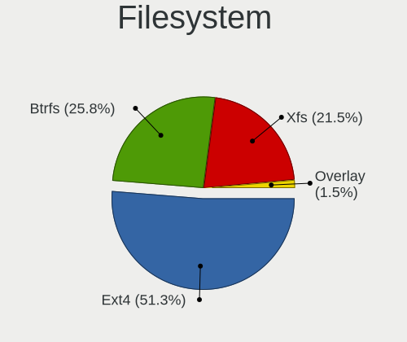
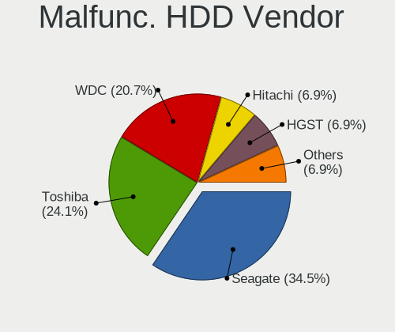
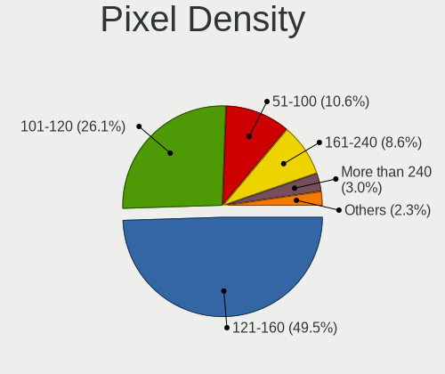
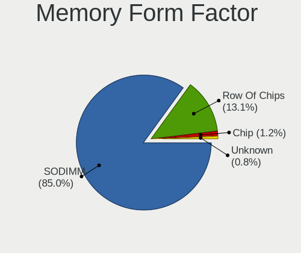

Xero - Tested Hardware & Statistics (Notebooks)
-----------------------------------------------

A project to collect tested hardware configurations for Xero.

Anyone can contribute to this report by the [hw-probe](https://github.com/linuxhw/hw-probe) tool:

    sudo -E hw-probe -all -upload

Please contribute! Especially if your hardware is rare.

Contents
--------

* [ Test Cases ](#test-cases)

* [ System ](#system)
  - [ OS                       ](#os)
  - [ OS Family                ](#os-family)
  - [ Kernel                   ](#kernel)
  - [ Kernel Family            ](#kernel-family)
  - [ Kernel Major Ver.        ](#kernel-major-ver)
  - [ Arch                     ](#arch)
  - [ DE                       ](#de)
  - [ Display Server           ](#display-server)
  - [ Display Manager          ](#display-manager)
  - [ OS Lang                  ](#os-lang)
  - [ Boot Mode                ](#boot-mode)
  - [ Filesystem               ](#filesystem)
  - [ Part. scheme             ](#part-scheme)
  - [ Dual Boot with Linux/BSD ](#dual-boot-with-linuxbsd)
  - [ Dual Boot (Win)          ](#dual-boot-win)

* [ Board ](#board)
  - [ Vendor                   ](#vendor)
  - [ Model                    ](#model)
  - [ Model Family             ](#model-family)
  - [ MFG Year                 ](#mfg-year)
  - [ Form Factor              ](#form-factor)
  - [ Secure Boot              ](#secure-boot)
  - [ Coreboot                 ](#coreboot)
  - [ RAM Size                 ](#ram-size)
  - [ RAM Used                 ](#ram-used)
  - [ Total Drives             ](#total-drives)
  - [ Has CD-ROM               ](#has-cd-rom)
  - [ Has Ethernet             ](#has-ethernet)
  - [ Has WiFi                 ](#has-wifi)
  - [ Has Bluetooth            ](#has-bluetooth)

* [ Location ](#location)
  - [ Country                  ](#country)
  - [ City                     ](#city)

* [ Drives ](#drives)
  - [ Drive Vendor             ](#drive-vendor)
  - [ Drive Model              ](#drive-model)
  - [ HDD Vendor               ](#hdd-vendor)
  - [ SSD Vendor               ](#ssd-vendor)
  - [ Drive Kind               ](#drive-kind)
  - [ Drive Connector          ](#drive-connector)
  - [ Drive Size               ](#drive-size)
  - [ Space Total              ](#space-total)
  - [ Space Used               ](#space-used)
  - [ Malfunc. Drives          ](#malfunc-drives)
  - [ Malfunc. Drive Vendor    ](#malfunc-drive-vendor)
  - [ Malfunc. HDD Vendor      ](#malfunc-hdd-vendor)
  - [ Malfunc. Drive Kind      ](#malfunc-drive-kind)
  - [ Failed Drives            ](#failed-drives)
  - [ Failed Drive Vendor      ](#failed-drive-vendor)
  - [ Drive Status             ](#drive-status)

* [ Storage controller ](#storage-controller)
  - [ Storage Vendor           ](#storage-vendor)
  - [ Storage Model            ](#storage-model)
  - [ Storage Kind             ](#storage-kind)

* [ Processor ](#processor)
  - [ CPU Vendor               ](#cpu-vendor)
  - [ CPU Model                ](#cpu-model)
  - [ CPU Model Family         ](#cpu-model-family)
  - [ CPU Cores                ](#cpu-cores)
  - [ CPU Sockets              ](#cpu-sockets)
  - [ CPU Threads              ](#cpu-threads)
  - [ CPU Op-Modes             ](#cpu-op-modes)
  - [ CPU Microcode            ](#cpu-microcode)
  - [ CPU Microarch            ](#cpu-microarch)

* [ Graphics ](#graphics)
  - [ GPU Vendor               ](#gpu-vendor)
  - [ GPU Model                ](#gpu-model)
  - [ GPU Combo                ](#gpu-combo)
  - [ GPU Driver               ](#gpu-driver)
  - [ GPU Memory               ](#gpu-memory)

* [ Monitor ](#monitor)
  - [ Monitor Vendor           ](#monitor-vendor)
  - [ Monitor Model            ](#monitor-model)
  - [ Monitor Resolution       ](#monitor-resolution)
  - [ Monitor Diagonal         ](#monitor-diagonal)
  - [ Monitor Width            ](#monitor-width)
  - [ Aspect Ratio             ](#aspect-ratio)
  - [ Monitor Area             ](#monitor-area)
  - [ Pixel Density            ](#pixel-density)
  - [ Multiple Monitors        ](#multiple-monitors)

* [ Network ](#network)
  - [ Net Controller Vendor    ](#net-controller-vendor)
  - [ Net Controller Model     ](#net-controller-model)
  - [ Wireless Vendor          ](#wireless-vendor)
  - [ Wireless Model           ](#wireless-model)
  - [ Ethernet Vendor          ](#ethernet-vendor)
  - [ Ethernet Model           ](#ethernet-model)
  - [ Net Controller Kind      ](#net-controller-kind)
  - [ Used Controller          ](#used-controller)
  - [ NICs                     ](#nics)
  - [ IPv6                     ](#ipv6)

* [ Bluetooth ](#bluetooth)
  - [ Bluetooth Vendor         ](#bluetooth-vendor)
  - [ Bluetooth Model          ](#bluetooth-model)

* [ Sound ](#sound)
  - [ Sound Vendor             ](#sound-vendor)
  - [ Sound Model              ](#sound-model)

* [ Memory ](#memory)
  - [ Memory Vendor            ](#memory-vendor)
  - [ Memory Model             ](#memory-model)
  - [ Memory Kind              ](#memory-kind)
  - [ Memory Form Factor       ](#memory-form-factor)
  - [ Memory Size              ](#memory-size)
  - [ Memory Speed             ](#memory-speed)

* [ Printers & scanners ](#printers--scanners)
  - [ Printer Vendor           ](#printer-vendor)
  - [ Printer Model            ](#printer-model)
  - [ Scanner Vendor           ](#scanner-vendor)
  - [ Scanner Model            ](#scanner-model)

* [ Camera ](#camera)
  - [ Camera Vendor            ](#camera-vendor)
  - [ Camera Model             ](#camera-model)

* [ Security ](#security)
  - [ Fingerprint Vendor       ](#fingerprint-vendor)
  - [ Fingerprint Model        ](#fingerprint-model)
  - [ Chipcard Vendor          ](#chipcard-vendor)
  - [ Chipcard Model           ](#chipcard-model)

* [ Unsupported ](#unsupported)
  - [ Unsupported Devices      ](#unsupported-devices)
  - [ Unsupported Device Types ](#unsupported-device-types)

Test Cases
----------

Total: 94

| Vendor   | Model                       | Probe                                                      | Date         |
|----------|-----------------------------|------------------------------------------------------------|--------------|
| Lenovo   | ThinkPad T440 20B7A0CYMH    | [428491a9d5](https://linux-hardware.org/?probe=428491a9d5) | Mar 29, 2023 |
| HP       | Victus by Laptop 16-e0xx... | [f8cd7d94b2](https://linux-hardware.org/?probe=f8cd7d94b2) | Mar 23, 2023 |
| Dell     | G5 5500                     | [f9b3b5d852](https://linux-hardware.org/?probe=f9b3b5d852) | Mar 19, 2023 |
| Lenovo   | IdeaPad S340-15IIL 81VW     | [90ef6ca2b7](https://linux-hardware.org/?probe=90ef6ca2b7) | Mar 18, 2023 |
| Lenovo   | IdeaPad S340-15IIL 81VW     | [b769745990](https://linux-hardware.org/?probe=b769745990) | Mar 18, 2023 |
| Dell     | Latitude 5420               | [318da7f6c0](https://linux-hardware.org/?probe=318da7f6c0) | Mar 18, 2023 |
| ASUSTek  | TUF Gaming FX505DY_FX505... | [d1bf2f0a8b](https://linux-hardware.org/?probe=d1bf2f0a8b) | Mar 12, 2023 |
| Apple    | MacBookPro11,3              | [bccc889328](https://linux-hardware.org/?probe=bccc889328) | Mar 10, 2023 |
| Lenovo   | ThinkPad P51 20HJS11Y00     | [0843074b87](https://linux-hardware.org/?probe=0843074b87) | Mar 09, 2023 |
| Lenovo   | IdeaPad S540-15IML D 81N... | [31e144de96](https://linux-hardware.org/?probe=31e144de96) | Mar 08, 2023 |
| Dell     | Inspiron 3505               | [324020ca8b](https://linux-hardware.org/?probe=324020ca8b) | Feb 24, 2023 |
| Lenovo   | ThinkPad X1 Carbon Gen 9... | [efd9f878d2](https://linux-hardware.org/?probe=efd9f878d2) | Feb 12, 2023 |
| Lenovo   | ThinkPad X1 Carbon Gen 9... | [3c2d4cf289](https://linux-hardware.org/?probe=3c2d4cf289) | Feb 02, 2023 |
| Lenovo   | ThinkPad X1 Carbon Gen 9... | [0de8121880](https://linux-hardware.org/?probe=0de8121880) | Feb 01, 2023 |
| Lenovo   | ThinkPad X1 Carbon Gen 9... | [f39ab69b74](https://linux-hardware.org/?probe=f39ab69b74) | Feb 01, 2023 |
| HP       | ProBook 6565b               | [0ef00f6bcc](https://linux-hardware.org/?probe=0ef00f6bcc) | Jan 25, 2023 |
| ASUSTek  | ASUS TUF Gaming F15 FX50... | [5661d09dd0](https://linux-hardware.org/?probe=5661d09dd0) | Jan 15, 2023 |
| HP       | 245 G7 Notebook PC          | [3997d98a9a](https://linux-hardware.org/?probe=3997d98a9a) | Jan 11, 2023 |
| HUAWEI   | BOM-WXX9                    | [21fcd391f1](https://linux-hardware.org/?probe=21fcd391f1) | Jan 08, 2023 |
| Lenovo   | IdeaPad 3 14IGL05 81WH      | [86cf09380a](https://linux-hardware.org/?probe=86cf09380a) | Jan 02, 2023 |
| ASUSTek  | X540LA                      | [65f5548781](https://linux-hardware.org/?probe=65f5548781) | Dec 30, 2022 |
| HUAWEI   | BOM-WXX9                    | [fb1d454bc2](https://linux-hardware.org/?probe=fb1d454bc2) | Dec 29, 2022 |
| HUAWEI   | BOM-WXX9                    | [62010fe267](https://linux-hardware.org/?probe=62010fe267) | Dec 29, 2022 |
| HP       | Pavilion Gaming Laptop 1... | [6b34107dcf](https://linux-hardware.org/?probe=6b34107dcf) | Dec 21, 2022 |
| HP       | ZBook 15 G4                 | [669d7e74a2](https://linux-hardware.org/?probe=669d7e74a2) | Dec 19, 2022 |
| HP       | ZBook 15 G4                 | [91391127d1](https://linux-hardware.org/?probe=91391127d1) | Dec 18, 2022 |
| HP       | Pavilion Gaming Laptop 1... | [3111a63a09](https://linux-hardware.org/?probe=3111a63a09) | Dec 16, 2022 |
| Lenovo   | ThinkPad T490s 20NX001KM... | [49f30d3eee](https://linux-hardware.org/?probe=49f30d3eee) | Dec 06, 2022 |
| ASUSTek  | ROG Zephyrus G14 GA401II... | [16f086de33](https://linux-hardware.org/?probe=16f086de33) | Nov 25, 2022 |
| Medion   | P6816                       | [3aadacefe7](https://linux-hardware.org/?probe=3aadacefe7) | Nov 17, 2022 |
| Dell     | Latitude E6530              | [c87c9abe22](https://linux-hardware.org/?probe=c87c9abe22) | Nov 14, 2022 |
| Toshiba  | TECRA A11                   | [ba91b9d331](https://linux-hardware.org/?probe=ba91b9d331) | Nov 09, 2022 |
| Lenovo   | ThinkPad L450 20DT0000GE    | [1a925e0302](https://linux-hardware.org/?probe=1a925e0302) | Nov 06, 2022 |
| ASUSTek  | VivoBook_ASUSLaptop X421... | [4cd7aa6350](https://linux-hardware.org/?probe=4cd7aa6350) | Nov 01, 2022 |
| ASUSTek  | K53SJ                       | [8c85e545f2](https://linux-hardware.org/?probe=8c85e545f2) | Oct 23, 2022 |
| ASUSTek  | ROG Strix G513IC_G513IC     | [ef1974cfc8](https://linux-hardware.org/?probe=ef1974cfc8) | Oct 10, 2022 |
| HP       | Laptop 15s-fq2xxx           | [69e60dfe44](https://linux-hardware.org/?probe=69e60dfe44) | Oct 07, 2022 |
| ASUSTek  | ZenBook UX433FN_UX433FN     | [a7764ad0f6](https://linux-hardware.org/?probe=a7764ad0f6) | Oct 03, 2022 |
| MSI      | Katana GF66 11UE            | [36b2cba297](https://linux-hardware.org/?probe=36b2cba297) | Sep 05, 2022 |
| Lenovo   | ThinkPad X1 Carbon Gen 9... | [b28edd3886](https://linux-hardware.org/?probe=b28edd3886) | Aug 26, 2022 |
| Lenovo   | ThinkPad X1 Carbon Gen 9... | [97770c5716](https://linux-hardware.org/?probe=97770c5716) | Aug 26, 2022 |
| Lenovo   | ThinkPad T430s 2356FG9      | [9a10c152af](https://linux-hardware.org/?probe=9a10c152af) | Aug 17, 2022 |
| Aquarius | NS585                       | [db9cbd5688](https://linux-hardware.org/?probe=db9cbd5688) | Aug 17, 2022 |
| Lenovo   | IdeaPad S145-15AST 81N3     | [7c46c8f737](https://linux-hardware.org/?probe=7c46c8f737) | Jul 15, 2022 |
| ASUSTek  | G551JM                      | [599c7b9eae](https://linux-hardware.org/?probe=599c7b9eae) | Jul 14, 2022 |
| ASUSTek  | G551JM                      | [9f4536df1c](https://linux-hardware.org/?probe=9f4536df1c) | Jul 14, 2022 |
| ASUSTek  | UX303LN                     | [9ce42e1b01](https://linux-hardware.org/?probe=9ce42e1b01) | Jun 12, 2022 |
| Dell     | Inspiron 1545               | [ce0e24a314](https://linux-hardware.org/?probe=ce0e24a314) | May 28, 2022 |
| Lenovo   | IdeaPad 330-17IKB 81DM      | [53475a6004](https://linux-hardware.org/?probe=53475a6004) | May 24, 2022 |
| ASUSTek  | VivoBook_ASUSLaptop X350... | [80d32848bf](https://linux-hardware.org/?probe=80d32848bf) | May 21, 2022 |
| Dell     | Precision M3800             | [7b63874768](https://linux-hardware.org/?probe=7b63874768) | Apr 25, 2022 |
| Dell     | Precision M3800             | [fbabacd835](https://linux-hardware.org/?probe=fbabacd835) | Apr 24, 2022 |
| Lenovo   | ThinkPad X230 2325HR9       | [a9d9d3fbb2](https://linux-hardware.org/?probe=a9d9d3fbb2) | Apr 21, 2022 |
| Acer     | Aspire A515-54G             | [52b660d8fb](https://linux-hardware.org/?probe=52b660d8fb) | Apr 11, 2022 |
| Dell     | Precision M3800             | [1ef57b39a7](https://linux-hardware.org/?probe=1ef57b39a7) | Apr 10, 2022 |
| Dell     | Precision M3800             | [9fc15d1ae6](https://linux-hardware.org/?probe=9fc15d1ae6) | Mar 31, 2022 |
| MSI      | GF63 Thin 9SCX              | [4501fa1556](https://linux-hardware.org/?probe=4501fa1556) | Mar 25, 2022 |
| Dell     | Latitude 7480               | [bf00ec6a76](https://linux-hardware.org/?probe=bf00ec6a76) | Mar 23, 2022 |
| HUAWEI   | WRT-WX9                     | [70ec26bed6](https://linux-hardware.org/?probe=70ec26bed6) | Mar 22, 2022 |
| Dell     | Latitude 7480               | [faddba28a8](https://linux-hardware.org/?probe=faddba28a8) | Mar 19, 2022 |
| Apple    | MacBookAir6,2               | [b71110144d](https://linux-hardware.org/?probe=b71110144d) | Mar 19, 2022 |
| HP       | Laptop 15-da0xxx            | [bb9074ccdf](https://linux-hardware.org/?probe=bb9074ccdf) | Mar 18, 2022 |
| Lenovo   | IdeaPad 3 15IML05 81WR      | [918c951cd1](https://linux-hardware.org/?probe=918c951cd1) | Mar 12, 2022 |
| Lenovo   | IdeaPad S145-15IIL 81W8     | [e251c9f079](https://linux-hardware.org/?probe=e251c9f079) | Mar 11, 2022 |
| Dell     | Venue 11 Pro 7130 vPro      | [57b302b119](https://linux-hardware.org/?probe=57b302b119) | Mar 05, 2022 |
| Lenovo   | ThinkPad T460 20FMS1XX00    | [78e82c6674](https://linux-hardware.org/?probe=78e82c6674) | Feb 24, 2022 |
| Dell     | Latitude E6430              | [e1de4e80fe](https://linux-hardware.org/?probe=e1de4e80fe) | Feb 15, 2022 |
| Lenovo   | Legion 5 15ARH05H 82B1      | [a3c5f00a2a](https://linux-hardware.org/?probe=a3c5f00a2a) | Feb 10, 2022 |
| Lenovo   | Legion 5 15ARH05H 82B1      | [e53fb31614](https://linux-hardware.org/?probe=e53fb31614) | Feb 10, 2022 |
| Lenovo   | Legion Y740-15IRHg 81UH     | [b0cc5e0cbc](https://linux-hardware.org/?probe=b0cc5e0cbc) | Jan 29, 2022 |
| Acer     | Aspire A315-58G             | [cb4f253c1c](https://linux-hardware.org/?probe=cb4f253c1c) | Jan 28, 2022 |
| Dell     | Latitude E6520              | [ee96960cec](https://linux-hardware.org/?probe=ee96960cec) | Jan 25, 2022 |
| HP       | Laptop 15s-eq0xxx           | [0df160c245](https://linux-hardware.org/?probe=0df160c245) | Jan 21, 2022 |
| Lenovo   | Legion Y540-15IRH-PG0 81... | [3df8a1c560](https://linux-hardware.org/?probe=3df8a1c560) | Jan 08, 2022 |
| Dell     | Vostro 3590                 | [9e77a2584c](https://linux-hardware.org/?probe=9e77a2584c) | Dec 30, 2021 |
| ASUSTek  | ASUS EXPERTBOOK B9400CEA... | [78e3fbdf6a](https://linux-hardware.org/?probe=78e3fbdf6a) | Dec 28, 2021 |
| HP       | Notebook                    | [c14ea64659](https://linux-hardware.org/?probe=c14ea64659) | Dec 23, 2021 |
| ASUSTek  | X510UNR                     | [0733a05806](https://linux-hardware.org/?probe=0733a05806) | Dec 21, 2021 |
| ASUSTek  | ASUS EXPERTBOOK B9400CEA... | [b4425de4a6](https://linux-hardware.org/?probe=b4425de4a6) | Dec 17, 2021 |
| ASUSTek  | ASUS TUF Gaming F15 FX50... | [6f3bd18b3f](https://linux-hardware.org/?probe=6f3bd18b3f) | Dec 06, 2021 |
| Pegatron | D15K                        | [eaeaad8d39](https://linux-hardware.org/?probe=eaeaad8d39) | Nov 29, 2021 |
| MSI      | GP73 Leopard 8RD            | [5bafb43f78](https://linux-hardware.org/?probe=5bafb43f78) | Nov 21, 2021 |
| Acer     | Aspire A315-58G             | [911895fcf2](https://linux-hardware.org/?probe=911895fcf2) | Nov 19, 2021 |
| Acer     | Aspire A315-58G             | [5748b3cd05](https://linux-hardware.org/?probe=5748b3cd05) | Nov 12, 2021 |
| Lenovo   | ThinkPad W530 24384CU       | [d18d3495e0](https://linux-hardware.org/?probe=d18d3495e0) | Nov 05, 2021 |
| Acer     | Aspire A315-58G             | [905fce5118](https://linux-hardware.org/?probe=905fce5118) | Oct 29, 2021 |
| HP       | ENVY Sleekbook 4            | [ebea056239](https://linux-hardware.org/?probe=ebea056239) | Oct 29, 2021 |
| ASUSTek  | VivoBook_ASUSLaptop X509... | [2a54689fb3](https://linux-hardware.org/?probe=2a54689fb3) | Oct 24, 2021 |
| ASUSTek  | VivoBook_ASUS Laptop E41... | [fb95cbb063](https://linux-hardware.org/?probe=fb95cbb063) | Oct 19, 2021 |
| Lenovo   | IdeaPad 5 15ITL05 82FG      | [6cd76dfa2a](https://linux-hardware.org/?probe=6cd76dfa2a) | Oct 13, 2021 |
| ASUSTek  | ASUS TUF Gaming F15 FX50... | [e3a8d1ca32](https://linux-hardware.org/?probe=e3a8d1ca32) | Oct 11, 2021 |
| ASUSTek  | ASUS TUF Gaming F15 FX50... | [c7c4a74bb8](https://linux-hardware.org/?probe=c7c4a74bb8) | Oct 11, 2021 |
| ASUSTek  | ASUS TUF Gaming F15 FX50... | [68865693c7](https://linux-hardware.org/?probe=68865693c7) | Oct 09, 2021 |
| Lenovo   | Y520-15IKBN 80WK            | [e804a59920](https://linux-hardware.org/?probe=e804a59920) | Oct 02, 2021 |

System
------

OS
--

Installed operating systems

| Name         | Notebooks | Percent |
|--------------|-----------|---------|
| Xero Rolling | 66        | 89.19%  |
| Xero         | 8         | 10.81%  |

OS Family
---------

OS without a version

| Name | Notebooks | Percent |
|------|-----------|---------|
| Xero | 73        | 100%    |

Kernel
------

Version of the Linux kernel

| Version          | Notebooks | Percent |
|------------------|-----------|---------|
| 6.0.12-arch1-1   | 4         | 5.13%   |
| 5.16.15-arch1-1  | 4         | 5.13%   |
| 6.2.6-arch1-1    | 3         | 3.85%   |
| 6.1.1-arch1-1    | 3         | 3.85%   |
| 6.2.7-arch1-1    | 2         | 2.56%   |
| 6.0.7-arch1-1    | 2         | 2.56%   |
| 5.18.16-arch1-1  | 2         | 2.56%   |
| 5.18.11-arch1-1  | 2         | 2.56%   |
| 5.17.9-arch1-1   | 2         | 2.56%   |
| 5.16.8-arch1-1   | 2         | 2.56%   |
| 5.16.2-arch1-1   | 2         | 2.56%   |
| 5.16.1-arch1-1   | 2         | 2.56%   |
| 5.15.33-1-lts    | 2         | 2.56%   |
| 5.14.14-arch1-1  | 2         | 2.56%   |
| 6.2.2-arch2-1    | 1         | 1.28%   |
| 6.1.8-arch1-1    | 1         | 1.28%   |
| 6.1.7-arch1-1    | 1         | 1.28%   |
| 6.1.6-arch1-1    | 1         | 1.28%   |
| 6.1.4-arch1-1    | 1         | 1.28%   |
| 6.1.3-zen1-1-zen | 1         | 1.28%   |
| 6.1.15-1-lts     | 1         | 1.28%   |
| 6.1.12-arch1-1   | 1         | 1.28%   |
| 6.0.9-arch1-1    | 1         | 1.28%   |
| 6.0.8-zen1-1-zen | 1         | 1.28%   |
| 6.0.8-arch1-1    | 1         | 1.28%   |
| 6.0.6-arch1-1    | 1         | 1.28%   |
| 6.0.2-arch1-1    | 1         | 1.28%   |
| 6.0.11-arch1-1   | 1         | 1.28%   |
| 5.19.9-arch1-1   | 1         | 1.28%   |
| 5.19.3-arch1-1   | 1         | 1.28%   |
| 5.19.13-arch1-1  | 1         | 1.28%   |
| 5.19.12-arch1-1  | 1         | 1.28%   |
| 5.19.1-arch2-1   | 1         | 1.28%   |
| 5.18.3-arch1-1   | 1         | 1.28%   |
| 5.17.7-arch1-1   | 1         | 1.28%   |
| 5.17.1-arch1-1   | 1         | 1.28%   |
| 5.16.16-arch1-1  | 1         | 1.28%   |
| 5.16.14-arch1-1  | 1         | 1.28%   |
| 5.16.13-arch1-1  | 1         | 1.28%   |
| 5.16.10-arch1-1  | 1         | 1.28%   |

Kernel Family
-------------

Linux kernel without a distro release

| Version | Notebooks | Percent |
|---------|-----------|---------|
| 6.0.12  | 4         | 5.13%   |
| 5.16.15 | 4         | 5.13%   |
| 6.2.6   | 3         | 3.85%   |
| 6.1.1   | 3         | 3.85%   |
| 5.14.16 | 3         | 3.85%   |
| 5.14.14 | 3         | 3.85%   |
| 6.2.7   | 2         | 2.56%   |
| 6.0.8   | 2         | 2.56%   |
| 6.0.7   | 2         | 2.56%   |
| 5.18.16 | 2         | 2.56%   |
| 5.18.11 | 2         | 2.56%   |
| 5.17.9  | 2         | 2.56%   |
| 5.16.8  | 2         | 2.56%   |
| 5.16.2  | 2         | 2.56%   |
| 5.16.1  | 2         | 2.56%   |
| 5.15.33 | 2         | 2.56%   |
| 5.14.8  | 2         | 2.56%   |
| 6.2.2   | 1         | 1.28%   |
| 6.1.8   | 1         | 1.28%   |
| 6.1.7   | 1         | 1.28%   |
| 6.1.6   | 1         | 1.28%   |
| 6.1.4   | 1         | 1.28%   |
| 6.1.3   | 1         | 1.28%   |
| 6.1.15  | 1         | 1.28%   |
| 6.1.12  | 1         | 1.28%   |
| 6.0.9   | 1         | 1.28%   |
| 6.0.6   | 1         | 1.28%   |
| 6.0.2   | 1         | 1.28%   |
| 6.0.11  | 1         | 1.28%   |
| 5.19.9  | 1         | 1.28%   |
| 5.19.3  | 1         | 1.28%   |
| 5.19.13 | 1         | 1.28%   |
| 5.19.12 | 1         | 1.28%   |
| 5.19.1  | 1         | 1.28%   |
| 5.18.3  | 1         | 1.28%   |
| 5.17.7  | 1         | 1.28%   |
| 5.17.1  | 1         | 1.28%   |
| 5.16.16 | 1         | 1.28%   |
| 5.16.14 | 1         | 1.28%   |
| 5.16.13 | 1         | 1.28%   |

Kernel Major Ver.
-----------------

Linux kernel major version

| Version | Notebooks | Percent |
|---------|-----------|---------|
| 5.16    | 14        | 18.42%  |
| 6.0     | 12        | 15.79%  |
| 6.1     | 9         | 11.84%  |
| 5.15    | 9         | 11.84%  |
| 5.14    | 9         | 11.84%  |
| 6.2     | 6         | 7.89%   |
| 5.19    | 5         | 6.58%   |
| 5.18    | 5         | 6.58%   |
| 5.17    | 4         | 5.26%   |
| 5.10    | 3         | 3.95%   |

Arch
----

OS architecture (x86_64, i586, etc.)

| Name   | Notebooks | Percent |
|--------|-----------|---------|
| x86_64 | 73        | 100%    |

DE
--

Desktop Environment

| Name   | Notebooks | Percent |
|--------|-----------|---------|
| KDE5   | 68        | 91.89%  |
| XFCE   | 2         | 2.7%    |
| GNOME  | 2         | 2.7%    |
| LeftWM | 1         | 1.35%   |
| KDE    | 1         | 1.35%   |

Display Server
--------------

X11 or Wayland

| Name    | Notebooks | Percent |
|---------|-----------|---------|
| X11     | 64        | 86.49%  |
| Wayland | 10        | 13.51%  |

Display Manager
---------------

SDDM, LightDM, etc.

| Name    | Notebooks | Percent |
|---------|-----------|---------|
| SDDM    | 52        | 68.42%  |
| Unknown | 13        | 17.11%  |
| LightDM | 10        | 13.16%  |
| GDM     | 1         | 1.32%   |

OS Lang
-------

Language

| Lang  | Notebooks | Percent |
|-------|-----------|---------|
| en_US | 39        | 52.7%   |
| en_IN | 9         | 12.16%  |
| pl_PL | 4         | 5.41%   |
| C     | 4         | 5.41%   |
| ru_RU | 3         | 4.05%   |
| it_IT | 3         | 4.05%   |
| de_DE | 3         | 4.05%   |
| fr_FR | 2         | 2.7%    |
| es_MX | 2         | 2.7%    |
| en_AU | 2         | 2.7%    |
| vi_VN | 1         | 1.35%   |
| en_GB | 1         | 1.35%   |
| en_AG | 1         | 1.35%   |

Boot Mode
---------

EFI or BIOS

| Mode | Notebooks | Percent |
|------|-----------|---------|
| EFI  | 49        | 66.22%  |
| BIOS | 25        | 33.78%  |

Filesystem
----------

Type of filesystem

| Type    | Notebooks | Percent |
|---------|-----------|---------|
| Btrfs   | 35        | 47.3%   |
| Xfs     | 25        | 33.78%  |
| Ext4    | 10        | 13.51%  |
| Overlay | 4         | 5.41%   |

Part. scheme
------------

Scheme of partitioning

| Type    | Notebooks | Percent |
|---------|-----------|---------|
| GPT     | 52        | 70.27%  |
| Unknown | 13        | 17.57%  |
| MBR     | 9         | 12.16%  |

Dual Boot with Linux/BSD
------------------------

Hosting more than one Linux/BSD

| Dual boot | Notebooks | Percent |
|-----------|-----------|---------|
| No        | 62        | 81.58%  |
| Yes       | 14        | 18.42%  |

Dual Boot (Win)
---------------

Hosting Linux and Windows

| Dual boot | Notebooks | Percent |
|-----------|-----------|---------|
| No        | 47        | 63.51%  |
| Yes       | 27        | 36.49%  |

Board
-----

Vendor
------

Motherboard manufacturer

| Name             | Notebooks | Percent |
|------------------|-----------|---------|
| Lenovo           | 21        | 28.77%  |
| ASUSTek Computer | 16        | 21.92%  |
| Dell             | 13        | 17.81%  |
| Hewlett-Packard  | 10        | 13.7%   |
| MSI              | 3         | 4.11%   |
| HUAWEI           | 2         | 2.74%   |
| Apple            | 2         | 2.74%   |
| Acer             | 2         | 2.74%   |
| Toshiba          | 1         | 1.37%   |
| Pegatron         | 1         | 1.37%   |
| Medion           | 1         | 1.37%   |
| Aquarius         | 1         | 1.37%   |

Model
-----

Motherboard model

| Name                                       | Notebooks | Percent |
|--------------------------------------------|-----------|---------|
| Dell Precision M3800                       | 3         | 4.11%   |
| Toshiba TECRA A11                          | 1         | 1.37%   |
| Pegatron D15K                              | 1         | 1.37%   |
| MSI Katana GF66 11UE                       | 1         | 1.37%   |
| MSI GP73 Leopard 8RD                       | 1         | 1.37%   |
| MSI GF63 Thin 9SCX                         | 1         | 1.37%   |
| Medion P6816                               | 1         | 1.37%   |
| Lenovo Y520-15IKBN 80WK                    | 1         | 1.37%   |
| Lenovo ThinkPad X230 2325HR9               | 1         | 1.37%   |
| Lenovo ThinkPad X1 Carbon Gen 9 20XW0055MH | 1         | 1.37%   |
| Lenovo ThinkPad W530 24384CU               | 1         | 1.37%   |
| Lenovo ThinkPad T490s 20NX001KMX           | 1         | 1.37%   |
| Lenovo ThinkPad T460 20FMS1XX00            | 1         | 1.37%   |
| Lenovo ThinkPad T440 20B7A0CYMH            | 1         | 1.37%   |
| Lenovo ThinkPad T430s 2356FG9              | 1         | 1.37%   |
| Lenovo ThinkPad P51 20HJS11Y00             | 1         | 1.37%   |
| Lenovo ThinkPad L450 20DT0000GE            | 1         | 1.37%   |
| Lenovo Legion Y740-15IRHg 81UH             | 1         | 1.37%   |
| Lenovo Legion Y540-15IRH-PG0 81SY          | 1         | 1.37%   |
| Lenovo Legion 5 15ARH05H 82B1              | 1         | 1.37%   |
| Lenovo IdeaPad S540-15IML D 81NG           | 1         | 1.37%   |
| Lenovo IdeaPad S340-15IIL 81VW             | 1         | 1.37%   |
| Lenovo IdeaPad S145-15IIL 81W8             | 1         | 1.37%   |
| Lenovo IdeaPad S145-15AST 81N3             | 1         | 1.37%   |
| Lenovo IdeaPad 5 15ITL05 82FG              | 1         | 1.37%   |
| Lenovo IdeaPad 330-17IKB 81DM              | 1         | 1.37%   |
| Lenovo IdeaPad 3 15IML05 81WR              | 1         | 1.37%   |
| Lenovo IdeaPad 3 14IGL05 81WH              | 1         | 1.37%   |
| HUAWEI WRT-WX9                             | 1         | 1.37%   |
| HUAWEI BOM-WXX9                            | 1         | 1.37%   |
| HP ZBook 15 G4                             | 1         | 1.37%   |
| HP Victus by Laptop 16-e0xxx               | 1         | 1.37%   |
| HP ProBook 6565b                           | 1         | 1.37%   |
| HP Pavilion Gaming Laptop 15-ec0xxx        | 1         | 1.37%   |
| HP Notebook                                | 1         | 1.37%   |
| HP Laptop 15s-fq2xxx                       | 1         | 1.37%   |
| HP Laptop 15s-eq0xxx                       | 1         | 1.37%   |
| HP Laptop 15-da0xxx                        | 1         | 1.37%   |
| HP ENVY Sleekbook 4                        | 1         | 1.37%   |
| HP 245 G7 Notebook PC                      | 1         | 1.37%   |

Model Family
------------

Motherboard model prefix

| Name               | Notebooks | Percent |
|--------------------|-----------|---------|
| Lenovo ThinkPad    | 9         | 12.33%  |
| Lenovo IdeaPad     | 8         | 10.96%  |
| Dell Latitude      | 5         | 6.85%   |
| ASUS VivoBook      | 4         | 5.48%   |
| Lenovo Legion      | 3         | 4.11%   |
| HP Laptop          | 3         | 4.11%   |
| Dell Precision     | 3         | 4.11%   |
| ASUS ASUS          | 3         | 4.11%   |
| Dell Inspiron      | 2         | 2.74%   |
| ASUS ROG           | 2         | 2.74%   |
| Acer Aspire        | 2         | 2.74%   |
| Toshiba TECRA      | 1         | 1.37%   |
| Pegatron D15K      | 1         | 1.37%   |
| MSI Katana         | 1         | 1.37%   |
| MSI GP73           | 1         | 1.37%   |
| MSI GF63           | 1         | 1.37%   |
| Medion P6816       | 1         | 1.37%   |
| Lenovo Y520-15IKBN | 1         | 1.37%   |
| HUAWEI WRT-WX9     | 1         | 1.37%   |
| HUAWEI BOM-WXX9    | 1         | 1.37%   |
| HP ZBook           | 1         | 1.37%   |
| HP Victus          | 1         | 1.37%   |
| HP ProBook         | 1         | 1.37%   |
| HP Pavilion        | 1         | 1.37%   |
| HP Notebook        | 1         | 1.37%   |
| HP ENVY            | 1         | 1.37%   |
| HP 245             | 1         | 1.37%   |
| Dell Vostro        | 1         | 1.37%   |
| Dell Venue         | 1         | 1.37%   |
| Dell G5            | 1         | 1.37%   |
| ASUS ZenBook       | 1         | 1.37%   |
| ASUS X540LA        | 1         | 1.37%   |
| ASUS X510UNR       | 1         | 1.37%   |
| ASUS UX303LN       | 1         | 1.37%   |
| ASUS TUF           | 1         | 1.37%   |
| ASUS K53SJ         | 1         | 1.37%   |
| ASUS G551JM        | 1         | 1.37%   |
| Aquarius NS585     | 1         | 1.37%   |
| Apple MacBookPro11 | 1         | 1.37%   |
| Apple MacBookAir6  | 1         | 1.37%   |

MFG Year
--------

Motherboard manufacture year

| Year | Notebooks | Percent |
|------|-----------|---------|
| 2019 | 15        | 20.55%  |
| 2020 | 13        | 17.81%  |
| 2021 | 9         | 12.33%  |
| 2012 | 7         | 9.59%   |
| 2013 | 6         | 8.22%   |
| 2018 | 5         | 6.85%   |
| 2017 | 5         | 6.85%   |
| 2015 | 3         | 4.11%   |
| 2011 | 3         | 4.11%   |
| 2016 | 2         | 2.74%   |
| 2014 | 2         | 2.74%   |
| 2022 | 1         | 1.37%   |
| 2010 | 1         | 1.37%   |
| 2008 | 1         | 1.37%   |

Form Factor
-----------

Physical design of the computer

| Name     | Notebooks | Percent |
|----------|-----------|---------|
| Notebook | 73        | 100%    |

Secure Boot
-----------

Enabled or disabled

| State    | Notebooks | Percent |
|----------|-----------|---------|
| Disabled | 73        | 100%    |

Coreboot
--------

Have coreboot on board

| Used | Notebooks | Percent |
|------|-----------|---------|
| No   | 73        | 100%    |

RAM Size
--------

Total RAM memory

| Size in GB  | Notebooks | Percent |
|-------------|-----------|---------|
| 4.01-8.0    | 27        | 36.99%  |
| 16.01-24.0  | 15        | 20.55%  |
| 8.01-16.0   | 13        | 17.81%  |
| 3.01-4.0    | 12        | 16.44%  |
| 32.01-64.0  | 3         | 4.11%   |
| 24.01-32.0  | 2         | 2.74%   |
| 64.01-256.0 | 1         | 1.37%   |

RAM Used
--------

Used RAM memory

| Used GB    | Notebooks | Percent |
|------------|-----------|---------|
| 2.01-3.0   | 27        | 35.53%  |
| 1.01-2.0   | 19        | 25%     |
| 4.01-8.0   | 16        | 21.05%  |
| 3.01-4.0   | 11        | 14.47%  |
| 16.01-24.0 | 1         | 1.32%   |
| 8.01-16.0  | 1         | 1.32%   |
| 0.51-1.0   | 1         | 1.32%   |

Total Drives
------------

Number of drives on board

| Drives | Notebooks | Percent |
|--------|-----------|---------|
| 1      | 50        | 67.57%  |
| 2      | 22        | 29.73%  |
| 4      | 1         | 1.35%   |
| 3      | 1         | 1.35%   |

Has CD-ROM
----------

Has CD-ROM on board

| Presented | Notebooks | Percent |
|-----------|-----------|---------|
| No        | 60        | 82.19%  |
| Yes       | 13        | 17.81%  |

Has Ethernet
------------

Has Ethernet on board

| Presented | Notebooks | Percent |
|-----------|-----------|---------|
| Yes       | 53        | 72.6%   |
| No        | 20        | 27.4%   |

Has WiFi
--------

Has WiFi module

| Presented | Notebooks | Percent |
|-----------|-----------|---------|
| Yes       | 70        | 95.89%  |
| No        | 3         | 4.11%   |

Has Bluetooth
-------------

Has Bluetooth module

| Presented | Notebooks | Percent |
|-----------|-----------|---------|
| Yes       | 62        | 84.93%  |
| No        | 11        | 15.07%  |

Location
--------

Country
-------

Geographic location (country)

| Country                | Notebooks | Percent |
|------------------------|-----------|---------|
| USA                    | 13        | 17.57%  |
| India                  | 11        | 14.86%  |
| Germany                | 6         | 8.11%   |
| Poland                 | 4         | 5.41%   |
| Italy                  | 4         | 5.41%   |
| France                 | 4         | 5.41%   |
| Russia                 | 3         | 4.05%   |
| Turkey                 | 2         | 2.7%    |
| Pakistan               | 2         | 2.7%    |
| Norway                 | 2         | 2.7%    |
| Greece                 | 2         | 2.7%    |
| Australia              | 2         | 2.7%    |
| Zambia                 | 1         | 1.35%   |
| Vietnam                | 1         | 1.35%   |
| Togo                   | 1         | 1.35%   |
| Sweden                 | 1         | 1.35%   |
| Romania                | 1         | 1.35%   |
| Palestinian Territory  | 1         | 1.35%   |
| Netherlands            | 1         | 1.35%   |
| Morocco                | 1         | 1.35%   |
| Mongolia               | 1         | 1.35%   |
| Mexico                 | 1         | 1.35%   |
| Malaysia               | 1         | 1.35%   |
| Lebanon                | 1         | 1.35%   |
| Indonesia              | 1         | 1.35%   |
| Hungary                | 1         | 1.35%   |
| Egypt                  | 1         | 1.35%   |
| Colombia               | 1         | 1.35%   |
| Chile                  | 1         | 1.35%   |
| Canada                 | 1         | 1.35%   |
| Bosnia and Herzegovina | 1         | 1.35%   |

City
----

Geographic location (city)

| City         | Notebooks | Percent |
|--------------|-----------|---------|
| Longmont     | 3         | 4.05%   |
| Pune         | 2         | 2.7%    |
| Madurai      | 2         | 2.7%    |
| Istanbul     | 2         | 2.7%    |
| Zenica       | 1         | 1.35%   |
| Warsaw       | 1         | 1.35%   |
| Ulan Bator   | 1         | 1.35%   |
| Ufa          | 1         | 1.35%   |
| Toronto      | 1         | 1.35%   |
| Taranto      | 1         | 1.35%   |
| Tangerang    | 1         | 1.35%   |
| Stuttgart    | 1         | 1.35%   |
| Stockholm    | 1         | 1.35%   |
| Stavropol    | 1         | 1.35%   |
| Seattle      | 1         | 1.35%   |
| Santa Cruz   | 1         | 1.35%   |
| Ramallah     | 1         | 1.35%   |
| Queens       | 1         | 1.35%   |
| Poznan       | 1         | 1.35%   |
| Porcia       | 1         | 1.35%   |
| Pirmasens    | 1         | 1.35%   |
| Phoenix      | 1         | 1.35%   |
| Perth        | 1         | 1.35%   |
| Pavia        | 1         | 1.35%   |
| Paris        | 1         | 1.35%   |
| Oslo         | 1         | 1.35%   |
| Neu-Ulm      | 1         | 1.35%   |
| Mumbai       | 1         | 1.35%   |
| Melbourne    | 1         | 1.35%   |
| Medellín    | 1         | 1.35%   |
| Magdeburg    | 1         | 1.35%   |
| Lusaka       | 1         | 1.35%   |
| Lucknow      | 1         | 1.35%   |
| Lublin       | 1         | 1.35%   |
| Longvic      | 1         | 1.35%   |
| Lomé        | 1         | 1.35%   |
| Lamia        | 1         | 1.35%   |
| Lahore       | 1         | 1.35%   |
| Kuala Lumpur | 1         | 1.35%   |
| Kristiansand | 1         | 1.35%   |

Drives
------

Drive Vendor
------------

Hard drive vendors

| Vendor                      | Notebooks | Drives | Percent |
|-----------------------------|-----------|--------|---------|
| Samsung Electronics         | 19        | 20     | 19.39%  |
| Seagate                     | 16        | 19     | 16.33%  |
| WDC                         | 8         | 9      | 8.16%   |
| Toshiba                     | 6         | 6      | 6.12%   |
| Intel                       | 5         | 5      | 5.1%    |
| Kingston                    | 4         | 5      | 4.08%   |
| HGST                        | 4         | 4      | 4.08%   |
| SK hynix                    | 3         | 3      | 3.06%   |
| Sandisk                     | 3         | 3      | 3.06%   |
| Micron Technology           | 3         | 4      | 3.06%   |
| KIOXIA                      | 3         | 4      | 3.06%   |
| Unknown                     | 2         | 2      | 2.04%   |
| Transcend                   | 2         | 2      | 2.04%   |
| Crucial                     | 2         | 2      | 2.04%   |
| Apple                       | 2         | 2      | 2.04%   |
| Vaseky                      | 1         | 1      | 1.02%   |
| Plextor                     | 1         | 1      | 1.02%   |
| Phison Electronics          | 1         | 1      | 1.02%   |
| Phison                      | 1         | 1      | 1.02%   |
| OSCOO                       | 1         | 1      | 1.02%   |
| Micron/Crucial Technology   | 1         | 1      | 1.02%   |
| LITEONIT                    | 1         | 1      | 1.02%   |
| LITEON                      | 1         | 1      | 1.02%   |
| Kingston Technology Company | 1         | 1      | 1.02%   |
| Intenso                     | 1         | 1      | 1.02%   |
| Inateck                     | 1         | 1      | 1.02%   |
| Hitachi                     | 1         | 1      | 1.02%   |
| GOODRAM                     | 1         | 1      | 1.02%   |
| China                       | 1         | 1      | 1.02%   |
| Biostar                     | 1         | 1      | 1.02%   |
| Apacer                      | 1         | 1      | 1.02%   |

Drive Model
-----------

Hard drive models

| Model                                               | Notebooks | Percent |
|-----------------------------------------------------|-----------|---------|
| Seagate ST1000LM049-2GH172 1TB                      | 3         | 3.03%   |
| Seagate ST1000LM035-1RK172 1TB                      | 3         | 3.03%   |
| Seagate One Touch HDD 5TB                           | 3         | 3.03%   |
| Toshiba MQ04ABF100 1TB                              | 2         | 2.02%   |
| Seagate ST750LM022 HN-M750MBB 752GB                 | 2         | 2.02%   |
| Samsung SSD 860 EVO 250GB                           | 2         | 2.02%   |
| Samsung NVMe SSD Controller SM981/PM981/PM983 250GB | 2         | 2.02%   |
| WDC WDS100T1X0E-00AFY0 1TB                          | 1         | 1.01%   |
| WDC WDBNCE0010PNC 1TB SSD                           | 1         | 1.01%   |
| WDC WD10SPZX-60Z10T0 1TB                            | 1         | 1.01%   |
| WDC WD10SPZX-24Z10 1TB                              | 1         | 1.01%   |
| WDC PC SN720 SDAPNTW-512G-1027 512GB                | 1         | 1.01%   |
| WDC PC SN530 SDBPNPZ-256G-1114 256GB                | 1         | 1.01%   |
| WDC PC SN530 SDBPMPZ-512G-1101 512GB                | 1         | 1.01%   |
| WDC PC SN520 SDAPMUW-256G-1101 256GB                | 1         | 1.01%   |
| Vaseky V800/256G 256GB SSD                          | 1         | 1.01%   |
| Unknown MMC Card  64GB                              | 1         | 1.01%   |
| Unknown G1J38E  64GB                                | 1         | 1.01%   |
| Transcend TS512GMTS430S 512GB SSD                   | 1         | 1.01%   |
| Transcend TS256GMTS400 256GB SSD                    | 1         | 1.01%   |
| Toshiba XG6 NVMe SSD Controller 512GB               | 1         | 1.01%   |
| Toshiba MQ01ABF050M 500GB                           | 1         | 1.01%   |
| Toshiba KBG40ZNT512G MEMORY 512GB                   | 1         | 1.01%   |
| Toshiba KBG30ZMV256G 256GB                          | 1         | 1.01%   |
| SK hynix PC711 HFS512GDE9X073N 512GB                | 1         | 1.01%   |
| SK hynix BC711 NVMe 512GB                           | 1         | 1.01%   |
| SK hynix BC711 NVMe 128GB                           | 1         | 1.01%   |
| Seagate ST9500325AS 500GB                           | 1         | 1.01%   |
| Seagate ST500LT012-9WS142 500GB                     | 1         | 1.01%   |
| Seagate ST500LM000-SSHD-8GB                         | 1         | 1.01%   |
| Seagate ST1000LM048-2E7172 1TB                      | 1         | 1.01%   |
| Seagate FireCuda 510 SSD ZP1000GM30031 1TB          | 1         | 1.01%   |
| Seagate Expansion+ 2TB                              | 1         | 1.01%   |
| SanDisk SD8SB8U-256G-1006 256GB SSD                 | 1         | 1.01%   |
| Sandisk PC SN520 NVMe SSD 128GB                     | 1         | 1.01%   |
| SanDisk NVMe SSD Drive 256GB                        | 1         | 1.01%   |
| Samsung SSD SM841 mSATA 128GB                       | 1         | 1.01%   |
| Samsung SSD 980 1TB                                 | 1         | 1.01%   |
| Samsung SSD 860 EVO 1TB                             | 1         | 1.01%   |
| Samsung SSD 850 PRO 512GB                           | 1         | 1.01%   |

HDD Vendor
----------

Hard disk drive vendors

| Vendor  | Notebooks | Drives | Percent |
|---------|-----------|--------|---------|
| Seagate | 16        | 18     | 61.54%  |
| HGST    | 4         | 4      | 15.38%  |
| Toshiba | 3         | 3      | 11.54%  |
| WDC     | 2         | 2      | 7.69%   |
| Hitachi | 1         | 1      | 3.85%   |

SSD Vendor
----------

Solid state drive vendors

| Vendor              | Notebooks | Drives | Percent |
|---------------------|-----------|--------|---------|
| Samsung Electronics | 7         | 7      | 25.93%  |
| Transcend           | 2         | 2      | 7.41%   |
| Crucial             | 2         | 2      | 7.41%   |
| Apple               | 2         | 2      | 7.41%   |
| WDC                 | 1         | 1      | 3.7%    |
| Vaseky              | 1         | 1      | 3.7%    |
| SanDisk             | 1         | 1      | 3.7%    |
| Plextor             | 1         | 1      | 3.7%    |
| OSCOO               | 1         | 1      | 3.7%    |
| LITEONIT            | 1         | 1      | 3.7%    |
| LITEON              | 1         | 1      | 3.7%    |
| Kingston            | 1         | 1      | 3.7%    |
| Intenso             | 1         | 1      | 3.7%    |
| Intel               | 1         | 1      | 3.7%    |
| GOODRAM             | 1         | 1      | 3.7%    |
| China               | 1         | 1      | 3.7%    |
| Biostar             | 1         | 1      | 3.7%    |
| Apacer              | 1         | 1      | 3.7%    |

Drive Kind
----------

HDD or SSD

| Kind | Notebooks | Drives | Percent |
|------|-----------|--------|---------|
| NVMe | 39        | 49     | 43.82%  |
| HDD  | 25        | 28     | 28.09%  |
| SSD  | 23        | 27     | 25.84%  |
| MMC  | 2         | 2      | 2.25%   |

Drive Connector
---------------

SATA, SAS, NVMe, etc.

| Type | Notebooks | Drives | Percent |
|------|-----------|--------|---------|
| SATA | 41        | 51     | 47.13%  |
| NVMe | 39        | 48     | 44.83%  |
| SAS  | 5         | 5      | 5.75%   |
| MMC  | 2         | 2      | 2.3%    |

Drive Size
----------

Size of hard drive

| Size in TB | Notebooks | Drives | Percent |
|------------|-----------|--------|---------|
| 0.51-1.0   | 23        | 25     | 47.92%  |
| 0.01-0.5   | 21        | 26     | 43.75%  |
| 4.01-10.0  | 3         | 3      | 6.25%   |
| 1.01-2.0   | 1         | 1      | 2.08%   |

Space Total
-----------

Amount of disk space available on the file system

| Size in GB     | Notebooks | Percent |
|----------------|-----------|---------|
| More than 3000 | 13        | 17.33%  |
| 251-500        | 13        | 17.33%  |
| 1001-2000      | 13        | 17.33%  |
| 101-250        | 10        | 13.33%  |
| 501-1000       | 8         | 10.67%  |
| Unknown        | 7         | 9.33%   |
| 51-100         | 6         | 8%      |
| 1-20           | 3         | 4%      |
| 21-50          | 1         | 1.33%   |
| 2001-3000      | 1         | 1.33%   |

Space Used
----------

Amount of used disk space

| Used GB        | Notebooks | Percent |
|----------------|-----------|---------|
| 101-250        | 15        | 20%     |
| 1-20           | 14        | 18.67%  |
| 51-100         | 14        | 18.67%  |
| 21-50          | 10        | 13.33%  |
| Unknown        | 7         | 9.33%   |
| 251-500        | 6         | 8%      |
| 501-1000       | 4         | 5.33%   |
| 2001-3000      | 3         | 4%      |
| More than 3000 | 1         | 1.33%   |
| 1001-2000      | 1         | 1.33%   |

Malfunc. Drives
---------------

Drive models with a malfunction

| Model                                                           | Notebooks | Drives | Percent |
|-----------------------------------------------------------------|-----------|--------|---------|
| WDC WD10SPZX-24Z10 1TB                                          | 1         | 1      | 11.11%  |
| Toshiba MQ01ABF050M 500GB                                       | 1         | 1      | 11.11%  |
| Seagate ST9500325AS 500GB                                       | 1         | 1      | 11.11%  |
| Seagate ST500LM000-SSHD-8GB                                     | 1         | 1      | 11.11%  |
| Seagate ST1000LM049-2GH172 1TB                                  | 1         | 1      | 11.11%  |
| Seagate ST1000LM048-2E7172 1TB                                  | 1         | 1      | 11.11%  |
| Samsung Electronics NVMe SSD Controller SM961/PM961/SM963 256GB | 1         | 1      | 11.11%  |
| HGST HTS725032A7E630 320GB                                      | 1         | 1      | 11.11%  |
| HGST HTS721010A9E630 1TB                                        | 1         | 1      | 11.11%  |

Malfunc. Drive Vendor
---------------------

Vendors of faulty drives

| Vendor              | Notebooks | Drives | Percent |
|---------------------|-----------|--------|---------|
| Seagate             | 4         | 4      | 44.44%  |
| HGST                | 2         | 2      | 22.22%  |
| WDC                 | 1         | 1      | 11.11%  |
| Toshiba             | 1         | 1      | 11.11%  |
| Samsung Electronics | 1         | 1      | 11.11%  |

Malfunc. HDD Vendor
-------------------

Vendors of faulty HDD drives

| Vendor  | Notebooks | Drives | Percent |
|---------|-----------|--------|---------|
| Seagate | 4         | 4      | 50%     |
| HGST    | 2         | 2      | 25%     |
| WDC     | 1         | 1      | 12.5%   |
| Toshiba | 1         | 1      | 12.5%   |

Malfunc. Drive Kind
-------------------

Kinds of faulty drives

| Kind | Notebooks | Drives | Percent |
|------|-----------|--------|---------|
| HDD  | 8         | 8      | 88.89%  |
| NVMe | 1         | 1      | 11.11%  |

Failed Drives
-------------

Failed drive models

Zero info for selected period =(

Failed Drive Vendor
-------------------

Failed drive vendors

Zero info for selected period =(

Drive Status
------------

Number of failed and malfunc. drives

| Status   | Notebooks | Drives | Percent |
|----------|-----------|--------|---------|
| Works    | 54        | 72     | 68.35%  |
| Detected | 16        | 25     | 20.25%  |
| Malfunc  | 9         | 9      | 11.39%  |

Storage controller
------------------

Storage Vendor
--------------

Storage controller vendors

| Vendor                       | Notebooks | Percent |
|------------------------------|-----------|---------|
| Intel                        | 55        | 53.92%  |
| Samsung Electronics          | 14        | 13.73%  |
| AMD                          | 7         | 6.86%   |
| SanDisk                      | 6         | 5.88%   |
| Kingston Technology Company  | 4         | 3.92%   |
| Toshiba America Info Systems | 3         | 2.94%   |
| SK hynix                     | 3         | 2.94%   |
| Micron Technology            | 3         | 2.94%   |
| KIOXIA                       | 3         | 2.94%   |
| Phison Electronics           | 2         | 1.96%   |
| Seagate Technology           | 1         | 0.98%   |
| Micron/Crucial Technology    | 1         | 0.98%   |

Storage Model
-------------

Storage controller models

| Model                                                                          | Notebooks | Percent |
|--------------------------------------------------------------------------------|-----------|---------|
| Intel Volume Management Device NVMe RAID Controller                            | 7         | 6.67%   |
| AMD FCH SATA Controller [AHCI mode]                                            | 7         | 6.67%   |
| Intel 7 Series Chipset Family 6-port SATA Controller [AHCI mode]               | 6         | 5.71%   |
| Samsung NVMe SSD Controller 980                                                | 5         | 4.76%   |
| Intel Sunrise Point-LP SATA Controller [AHCI mode]                             | 5         | 4.76%   |
| Samsung NVMe SSD Controller SM981/PM981/PM983                                  | 4         | 3.81%   |
| Intel Cannon Lake Mobile PCH SATA AHCI Controller                              | 4         | 3.81%   |
| Intel 82801 Mobile SATA Controller [RAID mode]                                 | 4         | 3.81%   |
| Intel 8 Series/C220 Series Chipset Family 6-port SATA Controller 1 [AHCI mode] | 4         | 3.81%   |
| SK hynix Gold P31/PC711 NVMe Solid State Drive                                 | 3         | 2.86%   |
| Micron NVMe Storage Controller                                                 | 3         | 2.86%   |
| KIOXIA NVMe SSD Controller BG4                                                 | 3         | 2.86%   |
| Kingston Company U-SNS8154P3 NVMe SSD                                          | 3         | 2.86%   |
| Intel 8 Series SATA Controller 1 [AHCI mode]                                   | 3         | 2.86%   |
| Toshiba America Info Systems BG3 NVMe SSD Controller                           | 2         | 1.9%    |
| SanDisk PC SN520 NVMe SSD                                                      | 2         | 1.9%    |
| Samsung NVMe SSD Controller SM961/PM961/SM963                                  | 2         | 1.9%    |
| Samsung Apple PCIe SSD                                                         | 2         | 1.9%    |
| Phison E12 NVMe Controller                                                     | 2         | 1.9%    |
| Intel Wildcat Point-LP SATA Controller [AHCI Mode]                             | 2         | 1.9%    |
| Intel Tiger Lake-LP SATA Controller                                            | 2         | 1.9%    |
| Intel SSD 660P Series                                                          | 2         | 1.9%    |
| Intel Ice Lake-LP SATA Controller [AHCI mode]                                  | 2         | 1.9%    |
| Intel Celeron/Pentium Silver Processor SATA Controller                         | 2         | 1.9%    |
| Intel Cannon Point-LP SATA Controller [AHCI Mode]                              | 2         | 1.9%    |
| Intel 400 Series Chipset Family SATA AHCI Controller                           | 2         | 1.9%    |
| Toshiba America Info Systems XG6 NVMe SSD Controller                           | 1         | 0.95%   |
| Seagate FireCuda 510 SSD                                                       | 1         | 0.95%   |
| SanDisk WD PC SN810 / Black SN850 NVMe SSD                                     | 1         | 0.95%   |
| SanDisk WD Blue SN550 NVMe SSD                                                 | 1         | 0.95%   |
| SanDisk WD Black 2018/SN750 / PC SN720 NVMe SSD                                | 1         | 0.95%   |
| SanDisk NVMe Controller                                                        | 1         | 0.95%   |
| Samsung NVMe SSD Controller PM9A1/PM9A3/980PRO                                 | 1         | 0.95%   |
| Micron/Crucial P2 NVMe PCIe SSD                                                | 1         | 0.95%   |
| Kingston Company Company Non-Volatile memory controller                        | 1         | 0.95%   |
| Intel SSD Pro 7600p/760p/E 6100p Series                                        | 1         | 0.95%   |
| Intel SATA Controller [RAID mode]                                              | 1         | 0.95%   |
| Intel Non-Volatile memory controller                                           | 1         | 0.95%   |
| Intel HM170/QM170 Chipset SATA Controller [AHCI Mode]                          | 1         | 0.95%   |
| Intel Comet Lake SATA AHCI Controller                                          | 1         | 0.95%   |

Storage Kind
------------

Kind of storage controller (IDE, SATA, NVMe, SAS, ...)

| Kind | Notebooks | Percent |
|------|-----------|---------|
| SATA | 50        | 49.02%  |
| NVMe | 39        | 38.24%  |
| RAID | 13        | 12.75%  |

Processor
---------

CPU Vendor
----------

Processor vendors

| Vendor | Notebooks | Percent |
|--------|-----------|---------|
| Intel  | 61        | 83.56%  |
| AMD    | 12        | 16.44%  |

CPU Model
---------

Processor models

| Model                                         | Notebooks | Percent |
|-----------------------------------------------|-----------|---------|
| Intel Core i7-8565U CPU @ 1.80GHz             | 3         | 4.11%   |
| Intel Core i5-10210U CPU @ 1.60GHz            | 3         | 4.11%   |
| Intel 11th Gen Core i7-1165G7 @ 2.80GHz       | 3         | 4.11%   |
| Intel 11th Gen Core i3-1115G4 @ 3.00GHz       | 3         | 4.11%   |
| Intel Core i7-7820HQ CPU @ 2.90GHz            | 2         | 2.74%   |
| Intel Core i7-7500U CPU @ 2.70GHz             | 2         | 2.74%   |
| Intel Core i7-4712HQ CPU @ 2.30GHz            | 2         | 2.74%   |
| Intel Core i5-9300H CPU @ 2.40GHz             | 2         | 2.74%   |
| Intel Core i5-8265U CPU @ 1.60GHz             | 2         | 2.74%   |
| Intel Core i5-8250U CPU @ 1.60GHz             | 2         | 2.74%   |
| Intel Core i5-3210M CPU @ 2.50GHz             | 2         | 2.74%   |
| Intel Core i5-1035G1 CPU @ 1.00GHz            | 2         | 2.74%   |
| Intel Celeron N4020 CPU @ 1.10GHz             | 2         | 2.74%   |
| AMD Ryzen 7 4800H with Radeon Graphics        | 2         | 2.74%   |
| AMD Ryzen 5 3550H with Radeon Vega Mobile Gfx | 2         | 2.74%   |
| Intel Core i7-9750H CPU @ 2.60GHz             | 1         | 1.37%   |
| Intel Core i7-8750H CPU @ 2.20GHz             | 1         | 1.37%   |
| Intel Core i7-8550U CPU @ 1.80GHz             | 1         | 1.37%   |
| Intel Core i7-7700HQ CPU @ 2.80GHz            | 1         | 1.37%   |
| Intel Core i7-7600U CPU @ 2.80GHz             | 1         | 1.37%   |
| Intel Core i7-4960HQ CPU @ 2.60GHz            | 1         | 1.37%   |
| Intel Core i7-4710HQ CPU @ 2.50GHz            | 1         | 1.37%   |
| Intel Core i7-4702HQ CPU @ 2.20GHz            | 1         | 1.37%   |
| Intel Core i7-4650U CPU @ 1.70GHz             | 1         | 1.37%   |
| Intel Core i7-3720QM CPU @ 2.60GHz            | 1         | 1.37%   |
| Intel Core i7-2760QM CPU @ 2.40GHz            | 1         | 1.37%   |
| Intel Core i7-2670QM CPU @ 2.20GHz            | 1         | 1.37%   |
| Intel Core i7-10870H CPU @ 2.20GHz            | 1         | 1.37%   |
| Intel Core i7-10750H CPU @ 2.60GHz            | 1         | 1.37%   |
| Intel Core i5-5200U CPU @ 2.20GHz             | 1         | 1.37%   |
| Intel Core i5-4300Y CPU @ 1.60GHz             | 1         | 1.37%   |
| Intel Core i5-4300U CPU @ 1.90GHz             | 1         | 1.37%   |
| Intel Core i5-4210U CPU @ 1.70GHz             | 1         | 1.37%   |
| Intel Core i5-3340M CPU @ 2.70GHz             | 1         | 1.37%   |
| Intel Core i5-3337U CPU @ 1.80GHz             | 1         | 1.37%   |
| Intel Core i5-3320M CPU @ 2.60GHz             | 1         | 1.37%   |
| Intel Core i5 CPU M 520 @ 2.40GHz             | 1         | 1.37%   |
| Intel Core i3-8100 CPU @ 3.60GHz              | 1         | 1.37%   |
| Intel Core i3-6100U CPU @ 2.30GHz             | 1         | 1.37%   |
| Intel Core i3-5020U CPU @ 2.20GHz             | 1         | 1.37%   |

CPU Model Family
----------------

Processor model prefix

| Model            | Notebooks | Percent |
|------------------|-----------|---------|
| Intel Core i7    | 23        | 31.51%  |
| Intel Core i5    | 21        | 28.77%  |
| Other            | 10        | 13.7%   |
| AMD Ryzen 5      | 5         | 6.85%   |
| Intel Core i3    | 4         | 5.48%   |
| AMD Ryzen 7      | 3         | 4.11%   |
| Intel Celeron    | 2         | 2.74%   |
| AMD Ryzen 3      | 2         | 2.74%   |
| Intel Core 2 Duo | 1         | 1.37%   |
| AMD A6           | 1         | 1.37%   |
| AMD A4           | 1         | 1.37%   |

CPU Cores
---------

Number of processor cores

| Number | Notebooks | Percent |
|--------|-----------|---------|
| 4      | 35        | 47.95%  |
| 2      | 27        | 36.99%  |
| 6      | 6         | 8.22%   |
| 8      | 4         | 5.48%   |
| 14     | 1         | 1.37%   |

CPU Sockets
-----------

Number of sockets

| Number | Notebooks | Percent |
|--------|-----------|---------|
| 1      | 73        | 100%    |

CPU Threads
-----------

Threads per core (Hyper-Threading)

| Number | Notebooks | Percent |
|--------|-----------|---------|
| 2      | 67        | 90.54%  |
| 1      | 7         | 9.46%   |

CPU Op-Modes
------------

CPU Operation Modes (32-bit, 64-bit)

| Op mode        | Notebooks | Percent |
|----------------|-----------|---------|
| 32-bit, 64-bit | 73        | 100%    |

CPU Microcode
-------------

Microcode number

| Number     | Notebooks | Percent |
|------------|-----------|---------|
| Unknown    | 20        | 26.67%  |
| 0x806c1    | 7         | 9.33%   |
| 0x806ec    | 6         | 8%      |
| 0x306a9    | 4         | 5.33%   |
| 0x906ea    | 3         | 4%      |
| 0x906e9    | 3         | 4%      |
| 0x806e9    | 3         | 4%      |
| 0x206a7    | 3         | 4%      |
| 0x08108109 | 3         | 4%      |
| 0x806eb    | 2         | 2.67%   |
| 0x706a8    | 2         | 2.67%   |
| 0x40651    | 2         | 2.67%   |
| 0xa0652    | 1         | 1.33%   |
| 0x906ed    | 1         | 1.33%   |
| 0x906eb    | 1         | 1.33%   |
| 0x906a3    | 1         | 1.33%   |
| 0x806d1    | 1         | 1.33%   |
| 0x706e5    | 1         | 1.33%   |
| 0x406e3    | 1         | 1.33%   |
| 0x40661    | 1         | 1.33%   |
| 0x306d4    | 1         | 1.33%   |
| 0x306c3    | 1         | 1.33%   |
| 0x20652    | 1         | 1.33%   |
| 0x1067a    | 1         | 1.33%   |
| 0x08608103 | 1         | 1.33%   |
| 0x08600106 | 1         | 1.33%   |
| 0x08108102 | 1         | 1.33%   |
| 0x06006705 | 1         | 1.33%   |
| 0x03000027 | 1         | 1.33%   |

CPU Microarch
-------------

Microarchitecture

| Name             | Notebooks | Percent |
|------------------|-----------|---------|
| KabyLake         | 22        | 30.14%  |
| Haswell          | 9         | 12.33%  |
| TigerLake        | 8         | 10.96%  |
| IvyBridge        | 6         | 8.22%   |
| Zen+             | 5         | 6.85%   |
| Zen 2            | 3         | 4.11%   |
| SandyBridge      | 3         | 4.11%   |
| IceLake          | 3         | 4.11%   |
| Goldmont plus    | 2         | 2.74%   |
| CometLake        | 2         | 2.74%   |
| Broadwell        | 2         | 2.74%   |
| Zen 3            | 1         | 1.37%   |
| Westmere         | 1         | 1.37%   |
| Skylake          | 1         | 1.37%   |
| Penryn           | 1         | 1.37%   |
| K10 Llano        | 1         | 1.37%   |
| Excavator        | 1         | 1.37%   |
| Alderlake Hybrid | 1         | 1.37%   |
| Unknown          | 1         | 1.37%   |

Graphics
--------

GPU Vendor
----------

Vendors of graphics cards

| Vendor | Notebooks | Percent |
|--------|-----------|---------|
| Intel  | 60        | 54.05%  |
| Nvidia | 37        | 33.33%  |
| AMD    | 14        | 12.61%  |

GPU Model
---------

Graphics card models

| Model                                                                     | Notebooks | Percent |
|---------------------------------------------------------------------------|-----------|---------|
| Intel WhiskeyLake-U GT2 [UHD Graphics 620]                                | 5         | 4.46%   |
| Intel TigerLake-LP GT2 [Iris Xe Graphics]                                 | 5         | 4.46%   |
| Intel 3rd Gen Core processor Graphics Controller                          | 5         | 4.46%   |
| AMD Picasso/Raven 2 [Radeon Vega Series / Radeon Vega Mobile Series]      | 5         | 4.46%   |
| Intel CoffeeLake-H GT2 [UHD Graphics 630]                                 | 4         | 3.57%   |
| Intel 4th Gen Core Processor Integrated Graphics Controller               | 4         | 3.57%   |
| Nvidia TU117M [GeForce GTX 1650 Mobile / Max-Q]                           | 3         | 2.68%   |
| Nvidia GP108M [GeForce MX150]                                             | 3         | 2.68%   |
| Nvidia GK107GLM [Quadro K1100M]                                           | 3         | 2.68%   |
| Intel UHD Graphics 620                                                    | 3         | 2.68%   |
| Intel Tiger Lake-LP GT2 [UHD Graphics G4]                                 | 3         | 2.68%   |
| Intel HD Graphics 630                                                     | 3         | 2.68%   |
| Intel HD Graphics 620                                                     | 3         | 2.68%   |
| Intel Haswell-ULT Integrated Graphics Controller                          | 3         | 2.68%   |
| Intel CometLake-U GT2 [UHD Graphics]                                      | 3         | 2.68%   |
| Intel 2nd Generation Core Processor Family Integrated Graphics Controller | 3         | 2.68%   |
| Nvidia GP108M [GeForce MX250]                                             | 2         | 1.79%   |
| Nvidia GF108GLM [NVS 5200M]                                               | 2         | 1.79%   |
| Nvidia GA107M [GeForce RTX 3050 Mobile]                                   | 2         | 1.79%   |
| Nvidia GA106M [GeForce RTX 3060 Mobile / Max-Q]                           | 2         | 1.79%   |
| Intel Iris Plus Graphics G1 (Ice Lake)                                    | 2         | 1.79%   |
| Intel HD Graphics 5500                                                    | 2         | 1.79%   |
| Intel GeminiLake [UHD Graphics 600]                                       | 2         | 1.79%   |
| Intel CometLake-H GT2 [UHD Graphics]                                      | 2         | 1.79%   |
| AMD Renoir                                                                | 2         | 1.79%   |
| Nvidia TU117M [GeForce GTX 1650 Ti Mobile]                                | 1         | 0.89%   |
| Nvidia TU117M                                                             | 1         | 0.89%   |
| Nvidia TU116M [GeForce GTX 1660 Ti Mobile]                                | 1         | 0.89%   |
| Nvidia TU116M [GeForce GTX 1650 Ti Mobile]                                | 1         | 0.89%   |
| Nvidia TU106M [GeForce RTX 2060 Mobile]                                   | 1         | 0.89%   |
| Nvidia TU106BM [GeForce RTX 2070 Mobile / Max-Q]                          | 1         | 0.89%   |
| Nvidia GP108M [GeForce MX230]                                             | 1         | 0.89%   |
| Nvidia GP107M [GeForce MX350]                                             | 1         | 0.89%   |
| Nvidia GP107M [GeForce GTX 1050 Ti Mobile]                                | 1         | 0.89%   |
| Nvidia GP107M [GeForce GTX 1050 Mobile]                                   | 1         | 0.89%   |
| Nvidia GM206GLM [Quadro M2200 Mobile]                                     | 1         | 0.89%   |
| Nvidia GM108M [GeForce 940MX]                                             | 1         | 0.89%   |
| Nvidia GM108M [GeForce 840M]                                              | 1         | 0.89%   |
| Nvidia GM107M [GeForce GTX 860M]                                          | 1         | 0.89%   |
| Nvidia GM107GLM [Quadro M1200 Mobile]                                     | 1         | 0.89%   |

GPU Combo
---------

Combinations of graphics cards

| Name           | Notebooks | Percent |
|----------------|-----------|---------|
| Intel + Nvidia | 31        | 42.47%  |
| 1 x Intel      | 25        | 34.25%  |
| 1 x AMD        | 6         | 8.22%   |
| AMD + Nvidia   | 4         | 5.48%   |
| Intel + AMD    | 3         | 4.11%   |
| 1 x Nvidia     | 2         | 2.74%   |
| 2 x Intel      | 1         | 1.37%   |
| 2 x AMD        | 1         | 1.37%   |

GPU Driver
----------

Free vs proprietary

| Driver      | Notebooks | Percent |
|-------------|-----------|---------|
| Free        | 50        | 67.57%  |
| Proprietary | 24        | 32.43%  |

GPU Memory
----------

Total video memory

| Size in GB | Notebooks | Percent |
|------------|-----------|---------|
| Unknown    | 53        | 71.62%  |
| 1.01-2.0   | 9         | 12.16%  |
| 0.01-0.5   | 5         | 6.76%   |
| 5.01-6.0   | 3         | 4.05%   |
| 3.01-4.0   | 3         | 4.05%   |
| 0.51-1.0   | 1         | 1.35%   |

Monitor
-------

Monitor Vendor
--------------

Monitor vendors

| Vendor              | Notebooks | Percent |
|---------------------|-----------|---------|
| AU Optronics        | 18        | 21.18%  |
| BOE                 | 14        | 16.47%  |
| Chimei Innolux      | 13        | 15.29%  |
| LG Display          | 12        | 14.12%  |
| Samsung Electronics | 10        | 11.76%  |
| PANDA               | 3         | 3.53%   |
| Apple               | 3         | 3.53%   |
| Sharp               | 2         | 2.35%   |
| Dell                | 2         | 2.35%   |
| TMX                 | 1         | 1.18%   |
| Sceptre Tech        | 1         | 1.18%   |
| LGD                 | 1         | 1.18%   |
| Lenovo              | 1         | 1.18%   |
| Goldstar            | 1         | 1.18%   |
| CSO                 | 1         | 1.18%   |
| BenQ                | 1         | 1.18%   |
| Acer                | 1         | 1.18%   |

Monitor Model
-------------

Monitor models

| Model                                                                   | Notebooks | Percent |
|-------------------------------------------------------------------------|-----------|---------|
| Chimei Innolux LCD Monitor CMN15F5 1920x1080 344x193mm 15.5-inch        | 3         | 3.53%   |
| Samsung Electronics LCD Monitor SAM0F14 3840x2160 1872x1053mm 84.6-inch | 2         | 2.35%   |
| LG Display LCD Monitor LGD05E5 1920x1080 344x194mm 15.5-inch            | 2         | 2.35%   |
| Chimei Innolux LCD Monitor CMN1521 1920x1080 344x193mm 15.5-inch        | 2         | 2.35%   |
| AU Optronics LCD Monitor AUO26EC 1366x768 344x193mm 15.5-inch           | 2         | 2.35%   |
| AU Optronics LCD Monitor AUO23ED 1920x1080 344x194mm 15.5-inch          | 2         | 2.35%   |
| AU Optronics LCD Monitor AUO21ED 1920x1080 344x194mm 15.5-inch          | 2         | 2.35%   |
| TMX TL156VDXP0101 TMX1561 1920x1080 344x194mm 15.5-inch                 | 1         | 1.18%   |
| Sharp LCD Monitor SHP1431 3840x2160 350x190mm 15.7-inch                 | 1         | 1.18%   |
| Sharp LCD Monitor SHP13F8 3200x1800 346x194mm 15.6-inch                 | 1         | 1.18%   |
| Sceptre Tech C27 SPT0ADD 1920x1080 598x336mm 27.0-inch                  | 1         | 1.18%   |
| Samsung Electronics SMBX2450L SAM071F 1920x1080 521x293mm 23.5-inch     | 1         | 1.18%   |
| Samsung Electronics S24F350 SAM0D20 1920x1080 521x293mm 23.5-inch       | 1         | 1.18%   |
| Samsung Electronics S24E650 SAM0CB8 1920x1080 521x293mm 23.5-inch       | 1         | 1.18%   |
| Samsung Electronics S22C450 SAM09C7 1680x1050 473x291mm 21.9-inch       | 1         | 1.18%   |
| Samsung Electronics LCD Monitor SDC4C48 1920x1080 309x174mm 14.0-inch   | 1         | 1.18%   |
| Samsung Electronics LCD Monitor SDC4161 1920x1080 344x194mm 15.5-inch   | 1         | 1.18%   |
| Samsung Electronics LCD Monitor SDC200F 1366x768 344x193mm 15.5-inch    | 1         | 1.18%   |
| Samsung Electronics LCD Monitor SAM0F13 3840x2160 1872x1053mm 84.6-inch | 1         | 1.18%   |
| PANDA LCD Monitor NCP0063 1920x1080 344x194mm 15.5-inch                 | 1         | 1.18%   |
| PANDA LCD Monitor NCP0050 1920x1080 309x174mm 14.0-inch                 | 1         | 1.18%   |
| PANDA LCD Monitor NCP002D 1920x1080 344x194mm 15.5-inch                 | 1         | 1.18%   |
| LGD LCD Monitor 1920x1080                                               | 1         | 1.18%   |
| LG Display LCD Monitor LGD6E01 1366x768 344x194mm 15.5-inch             | 1         | 1.18%   |
| LG Display LCD Monitor LGD057E 1920x1080 344x194mm 15.5-inch            | 1         | 1.18%   |
| LG Display LCD Monitor LGD0573 1920x1080 344x194mm 15.5-inch            | 1         | 1.18%   |
| LG Display LCD Monitor LGD0533 1920x1080 344x194mm 15.5-inch            | 1         | 1.18%   |
| LG Display LCD Monitor LGD0456 1366x768 344x194mm 15.5-inch             | 1         | 1.18%   |
| LG Display LCD Monitor LGD03F0 1366x768 310x174mm 14.0-inch             | 1         | 1.18%   |
| LG Display LCD Monitor LGD03D7 1366x768 310x174mm 14.0-inch             | 1         | 1.18%   |
| LG Display LCD Monitor LGD03AD 1366x768 309x174mm 14.0-inch             | 1         | 1.18%   |
| LG Display LCD Monitor LGD03A3 1366x768 277x156mm 12.5-inch             | 1         | 1.18%   |
| LG Display LCD Monitor LGD0362 1600x900 309x174mm 14.0-inch             | 1         | 1.18%   |
| Lenovo LCD Monitor LEN40B2 1920x1080 344x193mm 15.5-inch                | 1         | 1.18%   |
| Goldstar 27EA63 GSM598B 1920x1080 600x340mm 27.2-inch                   | 1         | 1.18%   |
| Dell U2913WM DEL408A 2560x1080 673x284mm 28.8-inch                      | 1         | 1.18%   |
| Dell P2419H DELD0DA 1920x1080 527x296mm 23.8-inch                       | 1         | 1.18%   |
| CSO LCD Monitor CSO1403 3840x2400 302x189mm 14.0-inch                   | 1         | 1.18%   |
| Chimei Innolux P130ZFA-BA1 CMN8201 2160x1440 275x183mm 13.0-inch        | 1         | 1.18%   |
| Chimei Innolux LCD Monitor CMN1747 1920x1080 381x214mm 17.2-inch        | 1         | 1.18%   |

Monitor Resolution
------------------

Monitor screen resolution

| Resolution         | Notebooks | Percent |
|--------------------|-----------|---------|
| 1920x1080 (FHD)    | 50        | 62.5%   |
| 1366x768 (WXGA)    | 16        | 20%     |
| 3840x2160 (4K)     | 3         | 3.75%   |
| 1600x900 (HD+)     | 3         | 3.75%   |
| 3840x2400          | 1         | 1.25%   |
| 3200x1800 (QHD+)   | 1         | 1.25%   |
| 2880x1800          | 1         | 1.25%   |
| 2560x1080          | 1         | 1.25%   |
| 2160x1440          | 1         | 1.25%   |
| 1920x1200 (WUXGA)  | 1         | 1.25%   |
| 1680x1050 (WSXGA+) | 1         | 1.25%   |
| 1440x900 (WXGA+)   | 1         | 1.25%   |

Monitor Diagonal
----------------

Diagonal size in inches

| Inches  | Notebooks | Percent |
|---------|-----------|---------|
| 15      | 45        | 53.57%  |
| 14      | 11        | 13.1%   |
| 13      | 9         | 10.71%  |
| 23      | 4         | 4.76%   |
| 84      | 3         | 3.57%   |
| 21      | 2         | 2.38%   |
| 17      | 2         | 2.38%   |
| 31      | 1         | 1.19%   |
| 28      | 1         | 1.19%   |
| 27      | 1         | 1.19%   |
| 24      | 1         | 1.19%   |
| 18      | 1         | 1.19%   |
| 16      | 1         | 1.19%   |
| 12      | 1         | 1.19%   |
| Unknown | 1         | 1.19%   |

Monitor Width
-------------

Physical width

| Width in mm | Notebooks | Percent |
|-------------|-----------|---------|
| 301-350     | 62        | 72.94%  |
| 501-600     | 6         | 7.06%   |
| 401-500     | 4         | 4.71%   |
| 201-300     | 4         | 4.71%   |
| 351-400     | 3         | 3.53%   |
| 1501-2000   | 3         | 3.53%   |
| 601-700     | 2         | 2.35%   |
| Unknown     | 1         | 1.18%   |

Aspect Ratio
------------

Proportional relationship between the width and the height

| Ratio   | Notebooks | Percent |
|---------|-----------|---------|
| 16/9    | 67        | 90.54%  |
| 16/10   | 4         | 5.41%   |
| 3/2     | 1         | 1.35%   |
| 21/9    | 1         | 1.35%   |
| Unknown | 1         | 1.35%   |

Monitor Area
------------

Area in inch²

| Area in inch² | Notebooks | Percent |
|----------------|-----------|---------|
| 101-110        | 46        | 55.42%  |
| 81-90          | 18        | 21.69%  |
| 201-250        | 6         | 7.23%   |
| More than 1000 | 3         | 3.61%   |
| 71-80          | 2         | 2.41%   |
| 121-130        | 2         | 2.41%   |
| 61-70          | 1         | 1.2%    |
| 351-500        | 1         | 1.2%    |
| 301-350        | 1         | 1.2%    |
| 251-300        | 1         | 1.2%    |
| 141-150        | 1         | 1.2%    |
| Unknown        | 1         | 1.2%    |

Pixel Density
-------------

Pixels per inch

| Density       | Notebooks | Percent |
|---------------|-----------|---------|
| 121-160       | 47        | 56.63%  |
| 101-120       | 18        | 21.69%  |
| 51-100        | 11        | 13.25%  |
| 161-240       | 4         | 4.82%   |
| More than 240 | 2         | 2.41%   |
| Unknown       | 1         | 1.2%    |

Multiple Monitors
-----------------

Total monitors connected

| Total | Notebooks | Percent |
|-------|-----------|---------|
| 1     | 61        | 83.56%  |
| 2     | 11        | 15.07%  |
| 3     | 1         | 1.37%   |

Network
-------

Net Controller Vendor
---------------------

Controller vendors

| Vendor                            | Notebooks | Percent |
|-----------------------------------|-----------|---------|
| Intel                             | 47        | 45.19%  |
| Realtek Semiconductor             | 36        | 34.62%  |
| Qualcomm Atheros                  | 5         | 4.81%   |
| Broadcom Limited                  | 4         | 3.85%   |
| ASIX Electronics                  | 3         | 2.88%   |
| Samsung Electronics               | 2         | 1.92%   |
| MediaTek                          | 2         | 1.92%   |
| Ericsson Business Mobile Networks | 2         | 1.92%   |
| Ralink                            | 1         | 0.96%   |
| Marvell Technology Group          | 1         | 0.96%   |
| Broadcom                          | 1         | 0.96%   |

Net Controller Model
--------------------

Controller models

| Model                                                              | Notebooks | Percent |
|--------------------------------------------------------------------|-----------|---------|
| Realtek RTL8111/8168/8411 PCI Express Gigabit Ethernet Controller  | 25        | 19.38%  |
| Intel Wi-Fi 6 AX201                                                | 6         | 4.65%   |
| Intel 82579LM Gigabit Network Connection (Lewisville)              | 6         | 4.65%   |
| Realtek RTL8821CE 802.11ac PCIe Wireless Network Adapter           | 5         | 3.88%   |
| Realtek RTL8153 Gigabit Ethernet Adapter                           | 5         | 3.88%   |
| Intel Wireless 7260                                                | 5         | 3.88%   |
| Intel Wireless 8265 / 8275                                         | 4         | 3.1%    |
| Intel Centrino Advanced-N 6205 [Taylor Peak]                       | 4         | 3.1%    |
| Intel Cannon Point-LP CNVi [Wireless-AC]                           | 4         | 3.1%    |
| Intel Cannon Lake PCH CNVi WiFi                                    | 4         | 3.1%    |
| Realtek RTL810xE PCI Express Fast Ethernet controller              | 3         | 2.33%   |
| Intel Comet Lake PCH-LP CNVi WiFi                                  | 3         | 2.33%   |
| ASIX AX88179 Gigabit Ethernet                                      | 3         | 2.33%   |
| Samsung GT-I9070 (network tethering, USB debugging enabled)        | 2         | 1.55%   |
| Realtek RTL8822CE 802.11ac PCIe Wireless Network Adapter           | 2         | 1.55%   |
| Realtek RTL8723BE PCIe Wireless Network Adapter                    | 2         | 1.55%   |
| Qualcomm Atheros QCA9377 802.11ac Wireless Network Adapter         | 2         | 1.55%   |
| Qualcomm Atheros QCA6174 802.11ac Wireless Network Adapter         | 2         | 1.55%   |
| MediaTek MT7921 802.11ax PCI Express Wireless Network Adapter      | 2         | 1.55%   |
| Intel Wi-Fi 6 AX200                                                | 2         | 1.55%   |
| Intel Centrino Wireless-N 2230                                     | 2         | 1.55%   |
| Ericsson Business Mobile Networks H5321 gw Mobile Broadband Module | 2         | 1.55%   |
| Broadcom Limited BCM4352 802.11ac Wireless Network Adapter         | 2         | 1.55%   |
| Realtek RTL8852AE 802.11ax PCIe Wireless Network Adapter           | 1         | 0.78%   |
| Realtek RTL8822BE 802.11a/b/g/n/ac WiFi adapter                    | 1         | 0.78%   |
| Realtek RTL8723DE Wireless Network Adapter                         | 1         | 0.78%   |
| Ralink RT3090 Wireless 802.11n 1T/1R PCIe                          | 1         | 0.78%   |
| Qualcomm Atheros Killer E2400 Gigabit Ethernet Controller          | 1         | 0.78%   |
| Marvell Group 88E8040 PCI-E Fast Ethernet Controller               | 1         | 0.78%   |
| Intel Wireless-AC 9260                                             | 1         | 0.78%   |
| Intel Wireless 8260                                                | 1         | 0.78%   |
| Intel Wireless 7265                                                | 1         | 0.78%   |
| Intel Tiger Lake PCH CNVi WiFi                                     | 1         | 0.78%   |
| Intel Ice Lake-LP PCH CNVi WiFi                                    | 1         | 0.78%   |
| Intel Gemini Lake PCH CNVi WiFi                                    | 1         | 0.78%   |
| Intel Ethernet Connection I219-V                                   | 1         | 0.78%   |
| Intel Ethernet Connection I218-LM                                  | 1         | 0.78%   |
| Intel Ethernet Connection (6) I219-V                               | 1         | 0.78%   |
| Intel Ethernet Connection (5) I219-LM                              | 1         | 0.78%   |
| Intel Ethernet Connection (4) I219-LM                              | 1         | 0.78%   |

Wireless Vendor
---------------

Wireless vendors

| Vendor                | Notebooks | Percent |
|-----------------------|-----------|---------|
| Intel                 | 46        | 65.71%  |
| Realtek Semiconductor | 12        | 17.14%  |
| Qualcomm Atheros      | 4         | 5.71%   |
| Broadcom Limited      | 4         | 5.71%   |
| MediaTek              | 2         | 2.86%   |
| Ralink                | 1         | 1.43%   |
| Broadcom              | 1         | 1.43%   |

Wireless Model
--------------

Wireless models

| Model                                                         | Notebooks | Percent |
|---------------------------------------------------------------|-----------|---------|
| Intel Wi-Fi 6 AX201                                           | 6         | 8.57%   |
| Realtek RTL8821CE 802.11ac PCIe Wireless Network Adapter      | 5         | 7.14%   |
| Intel Wireless 7260                                           | 5         | 7.14%   |
| Intel Wireless 8265 / 8275                                    | 4         | 5.71%   |
| Intel Centrino Advanced-N 6205 [Taylor Peak]                  | 4         | 5.71%   |
| Intel Cannon Point-LP CNVi [Wireless-AC]                      | 4         | 5.71%   |
| Intel Cannon Lake PCH CNVi WiFi                               | 4         | 5.71%   |
| Intel Comet Lake PCH-LP CNVi WiFi                             | 3         | 4.29%   |
| Realtek RTL8822CE 802.11ac PCIe Wireless Network Adapter      | 2         | 2.86%   |
| Realtek RTL8723BE PCIe Wireless Network Adapter               | 2         | 2.86%   |
| Qualcomm Atheros QCA9377 802.11ac Wireless Network Adapter    | 2         | 2.86%   |
| Qualcomm Atheros QCA6174 802.11ac Wireless Network Adapter    | 2         | 2.86%   |
| MediaTek MT7921 802.11ax PCI Express Wireless Network Adapter | 2         | 2.86%   |
| Intel Wi-Fi 6 AX200                                           | 2         | 2.86%   |
| Intel Centrino Wireless-N 2230                                | 2         | 2.86%   |
| Broadcom Limited BCM4352 802.11ac Wireless Network Adapter    | 2         | 2.86%   |
| Realtek RTL8852AE 802.11ax PCIe Wireless Network Adapter      | 1         | 1.43%   |
| Realtek RTL8822BE 802.11a/b/g/n/ac WiFi adapter               | 1         | 1.43%   |
| Realtek RTL8723DE Wireless Network Adapter                    | 1         | 1.43%   |
| Ralink RT3090 Wireless 802.11n 1T/1R PCIe                     | 1         | 1.43%   |
| Intel Wireless-AC 9260                                        | 1         | 1.43%   |
| Intel Wireless 8260                                           | 1         | 1.43%   |
| Intel Wireless 7265                                           | 1         | 1.43%   |
| Intel Tiger Lake PCH CNVi WiFi                                | 1         | 1.43%   |
| Intel Ice Lake-LP PCH CNVi WiFi                               | 1         | 1.43%   |
| Intel Gemini Lake PCH CNVi WiFi                               | 1         | 1.43%   |
| Intel Dual Band Wireless-AC 3165 Plus Bluetooth               | 1         | 1.43%   |
| Intel Comet Lake PCH CNVi WiFi                                | 1         | 1.43%   |
| Intel Centrino Wireless-N 2200                                | 1         | 1.43%   |
| Intel Centrino Wireless-N 100                                 | 1         | 1.43%   |
| Intel Centrino Ultimate-N 6300                                | 1         | 1.43%   |
| Intel Alder Lake-P PCH CNVi WiFi                              | 1         | 1.43%   |
| Broadcom Limited BCM4360 802.11ac Wireless Network Adapter    | 1         | 1.43%   |
| Broadcom Limited BCM43224 802.11a/b/g/n                       | 1         | 1.43%   |
| Broadcom BCM4360 802.11ac Wireless Network Adapter            | 1         | 1.43%   |

Ethernet Vendor
---------------

Ethernet vendors

| Vendor                   | Notebooks | Percent |
|--------------------------|-----------|---------|
| Realtek Semiconductor    | 32        | 57.14%  |
| Intel                    | 17        | 30.36%  |
| ASIX Electronics         | 3         | 5.36%   |
| Samsung Electronics      | 2         | 3.57%   |
| Qualcomm Atheros         | 1         | 1.79%   |
| Marvell Technology Group | 1         | 1.79%   |

Ethernet Model
--------------

Ethernet models

| Model                                                             | Notebooks | Percent |
|-------------------------------------------------------------------|-----------|---------|
| Realtek RTL8111/8168/8411 PCI Express Gigabit Ethernet Controller | 25        | 43.86%  |
| Intel 82579LM Gigabit Network Connection (Lewisville)             | 6         | 10.53%  |
| Realtek RTL8153 Gigabit Ethernet Adapter                          | 5         | 8.77%   |
| Realtek RTL810xE PCI Express Fast Ethernet controller             | 3         | 5.26%   |
| ASIX AX88179 Gigabit Ethernet                                     | 3         | 5.26%   |
| Samsung GT-I9070 (network tethering, USB debugging enabled)       | 2         | 3.51%   |
| Qualcomm Atheros Killer E2400 Gigabit Ethernet Controller         | 1         | 1.75%   |
| Marvell Group 88E8040 PCI-E Fast Ethernet Controller              | 1         | 1.75%   |
| Intel Ethernet Connection I219-V                                  | 1         | 1.75%   |
| Intel Ethernet Connection I218-LM                                 | 1         | 1.75%   |
| Intel Ethernet Connection (6) I219-V                              | 1         | 1.75%   |
| Intel Ethernet Connection (5) I219-LM                             | 1         | 1.75%   |
| Intel Ethernet Connection (4) I219-LM                             | 1         | 1.75%   |
| Intel Ethernet Connection (3) I218-V                              | 1         | 1.75%   |
| Intel Ethernet Connection (2) I219-LM                             | 1         | 1.75%   |
| Intel Ethernet Connection (16) I219-LM                            | 1         | 1.75%   |
| Intel Ethernet Connection (13) I219-V                             | 1         | 1.75%   |
| Intel Ethernet Connection (13) I219-LM                            | 1         | 1.75%   |
| Intel 82577LM Gigabit Network Connection                          | 1         | 1.75%   |

Net Controller Kind
-------------------

Ethernet, WiFi or modem

| Kind     | Notebooks | Percent |
|----------|-----------|---------|
| WiFi     | 70        | 56%     |
| Ethernet | 53        | 42.4%   |
| Modem    | 2         | 1.6%    |

Used Controller
---------------

Currently used network controller

| Kind     | Notebooks | Percent |
|----------|-----------|---------|
| WiFi     | 61        | 81.33%  |
| Ethernet | 14        | 18.67%  |

NICs
----

Total network controllers on board

| Total | Notebooks | Percent |
|-------|-----------|---------|
| 2     | 44        | 60.27%  |
| 1     | 28        | 38.36%  |
| 0     | 1         | 1.37%   |

IPv6
----

IPv6 vs IPv4

| Used | Notebooks | Percent |
|------|-----------|---------|
| No   | 51        | 69.86%  |
| Yes  | 22        | 30.14%  |

Bluetooth
---------

Bluetooth Vendor
----------------

Controller vendors

| Vendor                          | Notebooks | Percent |
|---------------------------------|-----------|---------|
| Intel                           | 36        | 58.06%  |
| Realtek Semiconductor           | 7         | 11.29%  |
| IMC Networks                    | 5         | 8.06%   |
| Broadcom                        | 5         | 8.06%   |
| Qualcomm Atheros Communications | 3         | 4.84%   |
| Apple                           | 2         | 3.23%   |
| Toshiba                         | 1         | 1.61%   |
| Realtek                         | 1         | 1.61%   |
| Lite-On Technology              | 1         | 1.61%   |
| Dell                            | 1         | 1.61%   |

Bluetooth Model
---------------

Controller models

| Model                                          | Notebooks | Percent |
|------------------------------------------------|-----------|---------|
| Intel Bluetooth 9460/9560 Jefferson Peak (JfP) | 14        | 22.58%  |
| Intel Bluetooth wireless interface             | 9         | 14.52%  |
| Intel AX201 Bluetooth                          | 8         | 12.9%   |
| Realtek Bluetooth Radio                        | 4         | 6.45%   |
| Realtek  Bluetooth 4.2 Adapter                 | 3         | 4.84%   |
| Qualcomm Atheros  Bluetooth Device             | 3         | 4.84%   |
| IMC Networks Bluetooth Radio                   | 3         | 4.84%   |
| Intel Centrino Bluetooth Wireless Transceiver  | 2         | 3.23%   |
| Intel AX200 Bluetooth                          | 2         | 3.23%   |
| IMC Networks Wireless_Device                   | 2         | 3.23%   |
| Broadcom BCM20702A0 Bluetooth                  | 2         | 3.23%   |
| Broadcom BCM20702 Bluetooth 4.0 [ThinkPad]     | 2         | 3.23%   |
| Toshiba Integrated Bluetooth HCI               | 1         | 1.61%   |
| Realtek Bluetooth Radio                        | 1         | 1.61%   |
| Lite-On Bluetooth Device                       | 1         | 1.61%   |
| Intel Wireless-AC 9260 Bluetooth Adapter       | 1         | 1.61%   |
| Dell BCM20702A0 Bluetooth Module               | 1         | 1.61%   |
| Broadcom BCM2045A0                             | 1         | 1.61%   |
| Apple Bluetooth USB Host Controller            | 1         | 1.61%   |
| Apple Bluetooth Host Controller                | 1         | 1.61%   |

Sound
-----

Sound Vendor
------------

Sound card vendors

| Vendor                     | Notebooks | Percent |
|----------------------------|-----------|---------|
| Intel                      | 61        | 62.24%  |
| Nvidia                     | 18        | 18.37%  |
| AMD                        | 12        | 12.24%  |
| Samsung Electronics        | 1         | 1.02%   |
| Realtek Semiconductor      | 1         | 1.02%   |
| PreSonus Audio Electronics | 1         | 1.02%   |
| Lenovo                     | 1         | 1.02%   |
| GN Netcom                  | 1         | 1.02%   |
| Barco Display Systems      | 1         | 1.02%   |
| ASUSTek Computer           | 1         | 1.02%   |

Sound Model
-----------

Sound card models

| Model                                                                      | Notebooks | Percent |
|----------------------------------------------------------------------------|-----------|---------|
| AMD Family 17h/19h HD Audio Controller                                     | 9         | 7.63%   |
| Intel Tiger Lake-LP Smart Sound Technology Audio Controller                | 8         | 6.78%   |
| Intel Sunrise Point-LP HD Audio                                            | 7         | 5.93%   |
| Intel 7 Series/C216 Chipset Family High Definition Audio Controller        | 7         | 5.93%   |
| Intel Cannon Point-LP High Definition Audio Controller                     | 5         | 4.24%   |
| Intel Cannon Lake PCH cAVS                                                 | 5         | 4.24%   |
| Intel 8 Series/C220 Series Chipset High Definition Audio Controller        | 5         | 4.24%   |
| Nvidia TU107 GeForce GTX 1650 High Definition Audio Controller             | 4         | 3.39%   |
| Intel Xeon E3-1200 v3/4th Gen Core Processor HD Audio Controller           | 4         | 3.39%   |
| Intel Haswell-ULT HD Audio Controller                                      | 4         | 3.39%   |
| Intel 8 Series HD Audio Controller                                         | 4         | 3.39%   |
| AMD Renoir Radeon High Definition Audio Controller                         | 4         | 3.39%   |
| AMD Raven/Raven2/Fenghuang HDMI/DP Audio Controller                        | 4         | 3.39%   |
| Intel Comet Lake PCH-LP cAVS                                               | 3         | 2.54%   |
| Intel CM238 HD Audio Controller                                            | 3         | 2.54%   |
| Nvidia TU116 High Definition Audio Controller                              | 2         | 1.69%   |
| Nvidia TU106 High Definition Audio Controller                              | 2         | 1.69%   |
| Nvidia GK107 HDMI Audio Controller                                         | 2         | 1.69%   |
| Nvidia GF108 High Definition Audio Controller                              | 2         | 1.69%   |
| Nvidia GA106 High Definition Audio Controller                              | 2         | 1.69%   |
| Intel Wildcat Point-LP High Definition Audio Controller                    | 2         | 1.69%   |
| Intel Ice Lake-LP Smart Sound Technology Audio Controller                  | 2         | 1.69%   |
| Intel Comet Lake PCH cAVS                                                  | 2         | 1.69%   |
| Intel Celeron/Pentium Silver Processor High Definition Audio               | 2         | 1.69%   |
| Intel Broadwell-U Audio Controller                                         | 2         | 1.69%   |
| Intel 6 Series/C200 Series Chipset Family High Definition Audio Controller | 2         | 1.69%   |
| Samsung Electronics USBC Headset                                           | 1         | 0.85%   |
| Realtek Semiconductor USB Audio                                            | 1         | 0.85%   |
| PreSonus Audio Electronics AudioBox USB 96                                 | 1         | 0.85%   |
| Nvidia GM206 High Definition Audio Controller                              | 1         | 0.85%   |
| Nvidia GM107 High Definition Audio Controller [GeForce 940MX]              | 1         | 0.85%   |
| Nvidia GF119 HDMI Audio Controller                                         | 1         | 0.85%   |
| Nvidia Audio device                                                        | 1         | 0.85%   |
| Lenovo USB Headset                                                         | 1         | 0.85%   |
| Intel Tiger Lake-H HD Audio Controller                                     | 1         | 0.85%   |
| Intel Crystal Well HD Audio Controller                                     | 1         | 0.85%   |
| Intel Alder Lake PCH-P High Definition Audio Controller                    | 1         | 0.85%   |
| Intel 82801I (ICH9 Family) HD Audio Controller                             | 1         | 0.85%   |
| Intel 5 Series/3400 Series Chipset High Definition Audio                   | 1         | 0.85%   |
| GN Netcom Jabra Link 370                                                   | 1         | 0.85%   |

Memory
------

Memory Vendor
-------------

Memory module vendors

| Vendor              | Notebooks | Percent |
|---------------------|-----------|---------|
| Samsung Electronics | 27        | 36%     |
| SK hynix            | 22        | 29.33%  |
| Micron Technology   | 10        | 13.33%  |
| Crucial             | 6         | 8%      |
| Ramaxel Technology  | 4         | 5.33%   |
| Kingston            | 3         | 4%      |
| Nanya Technology    | 1         | 1.33%   |
| Elpida              | 1         | 1.33%   |
| Corsair             | 1         | 1.33%   |

Memory Model
------------

Memory module models

| Model                                                            | Notebooks | Percent |
|------------------------------------------------------------------|-----------|---------|
| Samsung RAM M471A5244CB0-CTD 4GB SODIMM DDR4 3266MT/s            | 4         | 5.13%   |
| SK hynix RAM HMA81GS6AFR8N-UH 8GB SODIMM DDR4 2667MT/s           | 3         | 3.85%   |
| SK hynix RAM HMT451S6AFR8A-PB 4GB SODIMM DDR3 1600MT/s           | 2         | 2.56%   |
| SK hynix RAM HMT41GS6BFR8A-PB 8GB SODIMM DDR3 1600MT/s           | 2         | 2.56%   |
| SK hynix RAM HMA851S6JJR6N-VK 4GB SODIMM DDR4 2667MT/s           | 2         | 2.56%   |
| Samsung RAM M471A1K43EB1-CWE 8GB SODIMM DDR4 3200MT/s            | 2         | 2.56%   |
| Samsung RAM M471A1K43DB1-CWE 8GB SODIMM DDR4 3200MT/s            | 2         | 2.56%   |
| Samsung RAM M471A1K43DB1-CTD 8GB SODIMM DDR4 2667MT/s            | 2         | 2.56%   |
| Samsung RAM M471A1K43BB1-CRC 8GB SODIMM DDR4 2667MT/s            | 2         | 2.56%   |
| Ramaxel RAM RMSA3270ME86H9F-2666 4GB SODIMM DDR4 2667MT/s        | 2         | 2.56%   |
| Micron RAM 4ATF51264HZ-3G2J1 4GB Row Of Chips DDR4 3200MT/s      | 2         | 2.56%   |
| SK hynix RAM Module 8GB SODIMM DDR3 1600MT/s                     | 1         | 1.28%   |
| SK hynix RAM Module 16GB SODIMM DDR4 2133MT/s                    | 1         | 1.28%   |
| SK hynix RAM HMT451S6MFR8C-H9 4GB SODIMM DDR3 1333MT/s           | 1         | 1.28%   |
| SK hynix RAM HMT41GS6MFR8C-PB 8GB SODIMM DDR3 1600MT/s           | 1         | 1.28%   |
| SK hynix RAM HMT351S6EFR8A-PB 4GB SODIMM DDR3 1600MT/s           | 1         | 1.28%   |
| SK hynix RAM HMT325S6BFR8C-H9 2GB SODIMM DDR3 1333MT/s           | 1         | 1.28%   |
| SK hynix RAM HMAA1GS6CMR6N-XN 8GB Row Of Chips DDR4 3200MT/s     | 1         | 1.28%   |
| SK hynix RAM HMA851S6DJR6N-XN 4GB SODIMM DDR4 3200MT/s           | 1         | 1.28%   |
| SK hynix RAM HMA851S6CJR6N-VK 8GB SODIMM DDR4 2667MT/s           | 1         | 1.28%   |
| SK hynix RAM HMA82GS6AFR8N-UH 16GB SODIMM DDR4 2667MT/s          | 1         | 1.28%   |
| SK hynix RAM HMA81GS6DJR8N-VK 8GB SODIMM DDR4 2667MT/s           | 1         | 1.28%   |
| SK hynix RAM HMA81GS6CJR8N-VK 8GB SODIMM DDR4 2667MT/s           | 1         | 1.28%   |
| SK hynix RAM HCNNNFAMMLXR-NEE 4GB Row Of Chips LPDDR4 4267MT/s   | 1         | 1.28%   |
| SK hynix RAM H9CCNNNBJTALAR-NVD 4GB Row Of Chips LPDDR3 2133MT/s | 1         | 1.28%   |
| Samsung RAM Module 4GB SODIMM DDR3 1600MT/s                      | 1         | 1.28%   |
| Samsung RAM Module 4GB Row Of Chips DDR4 2400MT/s                | 1         | 1.28%   |
| Samsung RAM M471B5673FH0-CF8 2GB SODIMM DDR3 1067MT/s            | 1         | 1.28%   |
| Samsung RAM M471B5173EB0-YK0 4GB SODIMM DDR3 1600MT/s            | 1         | 1.28%   |
| Samsung RAM M471B1G73QH0-YK0 8GB SODIMM DDR3 1867MT/s            | 1         | 1.28%   |
| Samsung RAM M471B1G73DB0-YK0 8GB SODIMM DDR3 1600MT/s            | 1         | 1.28%   |
| Samsung RAM M471B1G73CB0-YK0 8GB SODIMM DDR3 1600MT/s            | 1         | 1.28%   |
| Samsung RAM M471A5244CB0-CWE 4GB SODIMM DDR4 3200MT/s            | 1         | 1.28%   |
| Samsung RAM M471A2G43BB2-CWE 16GB SODIMM DDR4 3200MT/s           | 1         | 1.28%   |
| Samsung RAM M471A1K43CB1-CRC 8GB SODIMM DDR4 2667MT/s            | 1         | 1.28%   |
| Samsung RAM M471A1K43BB1-CTD 8GB SODIMM DDR4 2667MT/s            | 1         | 1.28%   |
| Samsung RAM M471A1G44AB0-CWE 8GB SODIMM DDR4 3200MT/s            | 1         | 1.28%   |
| Samsung RAM M471A1G44AB0-CTD 8GB Row Of Chips DDR4 2667MT/s      | 1         | 1.28%   |
| Samsung RAM M425R1GB4BB0-CQKOL 8GB SODIMM DDR5 4800MT/s          | 1         | 1.28%   |
| Samsung RAM K4E6E304EC-EGCG 4GB Row Of Chips LPDDR3 2133MT/s     | 1         | 1.28%   |

Memory Kind
-----------

Memory module kinds

| Kind   | Notebooks | Percent |
|--------|-----------|---------|
| DDR4   | 38        | 61.29%  |
| DDR3   | 17        | 27.42%  |
| LPDDR4 | 2         | 3.23%   |
| LPDDR3 | 2         | 3.23%   |
| SDRAM  | 1         | 1.61%   |
| DDR5   | 1         | 1.61%   |
| DDR    | 1         | 1.61%   |

Memory Form Factor
------------------

Physical design of the memory module

| Name         | Notebooks | Percent |
|--------------|-----------|---------|
| SODIMM       | 54        | 84.38%  |
| Row Of Chips | 10        | 15.63%  |

Memory Size
-----------

Memory module size

| Size  | Notebooks | Percent |
|-------|-----------|---------|
| 8192  | 33        | 49.25%  |
| 4096  | 24        | 35.82%  |
| 16384 | 7         | 10.45%  |
| 2048  | 3         | 4.48%   |

Memory Speed
------------

Memory module speed

| Speed | Notebooks | Percent |
|-------|-----------|---------|
| 2667  | 25        | 34.72%  |
| 3200  | 14        | 19.44%  |
| 1600  | 13        | 18.06%  |
| 3266  | 4         | 5.56%   |
| 2400  | 3         | 4.17%   |
| 2133  | 3         | 4.17%   |
| 1333  | 3         | 4.17%   |
| 4267  | 2         | 2.78%   |
| 4800  | 1         | 1.39%   |
| 4199  | 1         | 1.39%   |
| 1334  | 1         | 1.39%   |
| 1067  | 1         | 1.39%   |
| 800   | 1         | 1.39%   |

Printers & scanners
-------------------

Printer Vendor
--------------

Printer device vendors

Zero info for selected period =(

Printer Model
-------------

Printer device models

Zero info for selected period =(

Scanner Vendor
--------------

Scanner device vendors

| Vendor | Notebooks | Percent |
|--------|-----------|---------|
| Canon  | 1         | 100%    |

Scanner Model
-------------

Scanner device models

| Model                   | Notebooks | Percent |
|-------------------------|-----------|---------|
| Canon CanoScan LiDE 200 | 1         | 100%    |

Camera
------

Camera Vendor
-------------

Camera device vendors

| Vendor                                 | Notebooks | Percent |
|----------------------------------------|-----------|---------|
| IMC Networks                           | 18        | 26.47%  |
| Chicony Electronics                    | 11        | 16.18%  |
| Realtek Semiconductor                  | 6         | 8.82%   |
| Acer                                   | 6         | 8.82%   |
| Syntek                                 | 4         | 5.88%   |
| Quanta                                 | 4         | 5.88%   |
| Microdia                               | 4         | 5.88%   |
| Sunplus Innovation Technology          | 3         | 4.41%   |
| Cheng Uei Precision Industry (Foxlink) | 3         | 4.41%   |
| Bison Electronics                      | 3         | 4.41%   |
| Suyin                                  | 1         | 1.47%   |
| Sonix Technology                       | 1         | 1.47%   |
| Ricoh                                  | 1         | 1.47%   |
| Luxvisions Innotech Limited            | 1         | 1.47%   |
| Lite-On Technology                     | 1         | 1.47%   |
| Alpha Imaging Technology               | 1         | 1.47%   |

Camera Model
------------

Camera device models

| Model                                                          | Notebooks | Percent |
|----------------------------------------------------------------|-----------|---------|
| IMC Networks USB2.0 HD UVC WebCam                              | 5         | 7.35%   |
| IMC Networks Integrated Camera                                 | 5         | 7.35%   |
| Syntek Integrated Camera                                       | 4         | 5.88%   |
| Realtek Integrated_Webcam_HD                                   | 3         | 4.41%   |
| Quanta HP TrueVision HD Camera                                 | 3         | 4.41%   |
| Chicony Integrated Camera                                      | 3         | 4.41%   |
| Microdia Integrated_Webcam_HD                                  | 2         | 2.94%   |
| IMC Networks USB2.0 VGA UVC WebCam                             | 2         | 2.94%   |
| Bison ThinkPad Integrated Camera                               | 2         | 2.94%   |
| Acer HD Webcam                                                 | 2         | 2.94%   |
| Suyin Asus Integrated Webcam                                   | 1         | 1.47%   |
| Sunplus Laptop_Integrated_Webcam_FHD                           | 1         | 1.47%   |
| Sunplus Integrated_Webcam_FHD                                  | 1         | 1.47%   |
| Sunplus HP Truevision HD                                       | 1         | 1.47%   |
| Sonix USB2.0 HD UVC WebCam                                     | 1         | 1.47%   |
| Ricoh Integrated Webcam                                        | 1         | 1.47%   |
| Realtek Integrated Webcam_HD                                   | 1         | 1.47%   |
| Realtek Integrated Webcam                                      | 1         | 1.47%   |
| Realtek Built-In Video Camera                                  | 1         | 1.47%   |
| Quanta HD User Facing                                          | 1         | 1.47%   |
| Microdia Laptop_Integrated_Webcam_E4HD                         | 1         | 1.47%   |
| Microdia Dell Integrated HD Webcam                             | 1         | 1.47%   |
| Luxvisions Innotech Limited HP TrueVision HD Camera            | 1         | 1.47%   |
| Lite-On Integrated Camera                                      | 1         | 1.47%   |
| IMC Networks VGA UVC WebCam                                    | 1         | 1.47%   |
| IMC Networks UVC VGA Webcam                                    | 1         | 1.47%   |
| IMC Networks USB2.0 UVC HD Webcam                              | 1         | 1.47%   |
| IMC Networks USB2.0 HD IR UVC WebCam                           | 1         | 1.47%   |
| IMC Networks HD Camera                                         | 1         | 1.47%   |
| IMC Networks EasyCamera                                        | 1         | 1.47%   |
| Chicony USB2.0 VGA UVC WebCam                                  | 1         | 1.47%   |
| Chicony USB2.0 UVC WebCam                                      | 1         | 1.47%   |
| Chicony USB 2.0 Camera                                         | 1         | 1.47%   |
| Chicony Integrated HP HD Webcam                                | 1         | 1.47%   |
| Chicony HP Wide Vision HD Camera                               | 1         | 1.47%   |
| Chicony HP Webcam                                              | 1         | 1.47%   |
| Chicony HD User Facing                                         | 1         | 1.47%   |
| Chicony EasyCamera                                             | 1         | 1.47%   |
| Cheng Uei Precision Industry (Foxlink) HP TrueVision HD Camera | 1         | 1.47%   |
| Cheng Uei Precision Industry (Foxlink) HP HD Camera            | 1         | 1.47%   |

Security
--------

Fingerprint Vendor
------------------

Fingerprint sensor vendors

| Vendor                     | Notebooks | Percent |
|----------------------------|-----------|---------|
| Validity Sensors           | 3         | 33.33%  |
| Synaptics                  | 2         | 22.22%  |
| Shenzhen Goodix Technology | 2         | 22.22%  |
| Elan Microelectronics      | 1         | 11.11%  |
| AuthenTec                  | 1         | 11.11%  |

Fingerprint Model
-----------------

Fingerprint sensor models

| Model                                             | Notebooks | Percent |
|---------------------------------------------------|-----------|---------|
| Shenzhen Goodix  Fingerprint Device               | 2         | 22.22%  |
| Validity Sensors VFS7500 Touch Fingerprint Sensor | 1         | 11.11%  |
| Validity Sensors VFS5011 Fingerprint Reader       | 1         | 11.11%  |
| Validity Sensors VFS495 Fingerprint Reader        | 1         | 11.11%  |
| Synaptics WBDI                                    | 1         | 11.11%  |
| Synaptics Prometheus MIS Touch Fingerprint Reader | 1         | 11.11%  |
| Elan ELAN:Fingerprint                             | 1         | 11.11%  |
| AuthenTec Fingerprint Sensor                      | 1         | 11.11%  |

Chipcard Vendor
---------------

Chipcard module vendors

| Vendor      | Notebooks | Percent |
|-------------|-----------|---------|
| Broadcom    | 3         | 33.33%  |
| Upek        | 2         | 22.22%  |
| Alcor Micro | 2         | 22.22%  |
| Yubico.com  | 1         | 11.11%  |
| Clay Logic  | 1         | 11.11%  |

Chipcard Model
--------------

Chipcard module models

| Model                                                      | Notebooks | Percent |
|------------------------------------------------------------|-----------|---------|
| Upek TouchChip Fingerprint Coprocessor (WBF advanced mode) | 2         | 22.22%  |
| Broadcom BCM5880 Secure Applications Processor             | 2         | 22.22%  |
| Alcor Micro AU9540 Smartcard Reader                        | 2         | 22.22%  |
| Yubico.com Yubikey NEO(-N) OTP+CCID                        | 1         | 11.11%  |
| Clay Logic Nitrokey Pro                                    | 1         | 11.11%  |
| Broadcom 58200                                             | 1         | 11.11%  |

Unsupported
-----------

Unsupported Devices
-------------------

Total unsupported devices on board

| Total | Notebooks | Percent |
|-------|-----------|---------|
| 0     | 49        | 66.22%  |
| 1     | 20        | 27.03%  |
| 2     | 5         | 6.76%   |

Unsupported Device Types
------------------------

Types of unsupported devices

| Type                  | Notebooks | Percent |
|-----------------------|-----------|---------|
| Fingerprint reader    | 9         | 30%     |
| Graphics card         | 7         | 23.33%  |
| Chipcard              | 7         | 23.33%  |
| Multimedia controller | 3         | 10%     |
| Camera                | 2         | 6.67%   |
| Storage               | 1         | 3.33%   |
| Network               | 1         | 3.33%   |

