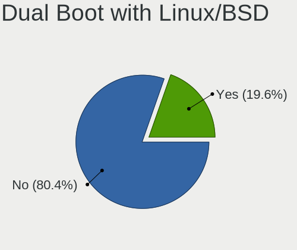
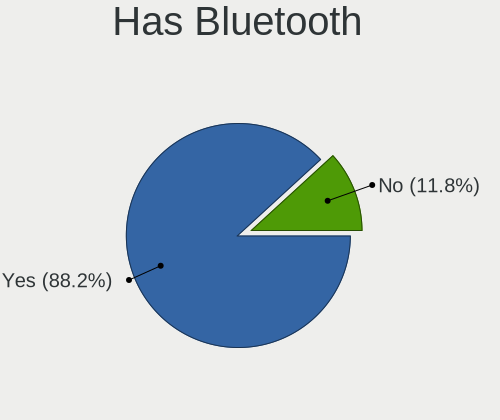
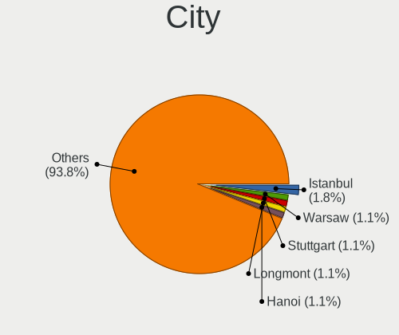
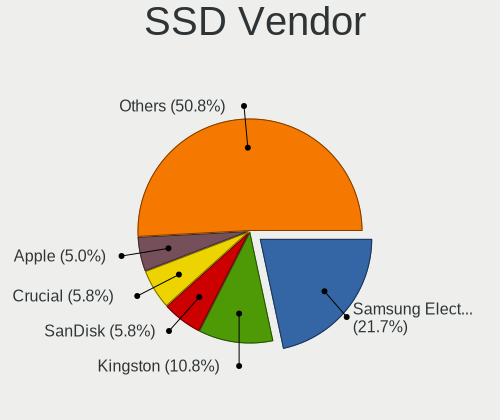
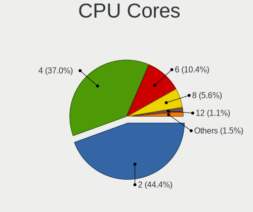
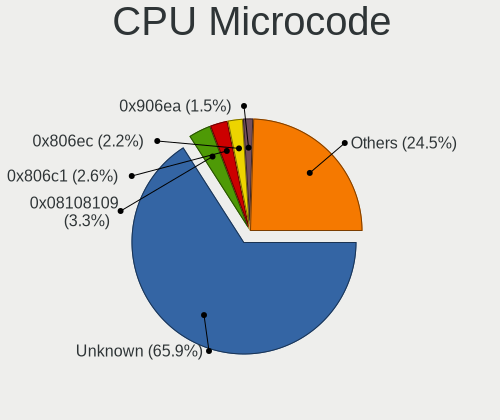

Xero - Tested Hardware & Statistics (Notebooks)
-----------------------------------------------

A project to collect tested hardware configurations for Xero.

Anyone can contribute to this report by the [hw-probe](https://github.com/linuxhw/hw-probe) tool:

    sudo -E hw-probe -all -upload

Please submit a probe of your configuration if it's not presented on the page or is rare.

Full-feature report is available here: https://linux-hardware.org/?view=trends

Contents
--------

* [ Test Cases ](#test-cases)

* [ System ](#system)
  - [ Kernel                   ](#kernel)
  - [ Kernel Family            ](#kernel-family)
  - [ Kernel Major Ver.        ](#kernel-major-ver)
  - [ Arch                     ](#arch)
  - [ DE                       ](#de)
  - [ Display Server           ](#display-server)
  - [ Display Manager          ](#display-manager)
  - [ OS Lang                  ](#os-lang)
  - [ Boot Mode                ](#boot-mode)
  - [ Filesystem               ](#filesystem)
  - [ Part. scheme             ](#part-scheme)
  - [ Dual Boot with Linux/BSD ](#dual-boot-with-linuxbsd)
  - [ Dual Boot (Win)          ](#dual-boot-win)

* [ Board ](#board)
  - [ Vendor                   ](#vendor)
  - [ Model                    ](#model)
  - [ Model Family             ](#model-family)
  - [ MFG Year                 ](#mfg-year)
  - [ Form Factor              ](#form-factor)
  - [ Secure Boot              ](#secure-boot)
  - [ Coreboot                 ](#coreboot)
  - [ RAM Size                 ](#ram-size)
  - [ RAM Used                 ](#ram-used)
  - [ Total Drives             ](#total-drives)
  - [ Has CD-ROM               ](#has-cd-rom)
  - [ Has Ethernet             ](#has-ethernet)
  - [ Has WiFi                 ](#has-wifi)
  - [ Has Bluetooth            ](#has-bluetooth)

* [ Location ](#location)
  - [ Country                  ](#country)
  - [ City                     ](#city)

* [ Drives ](#drives)
  - [ Drive Vendor             ](#drive-vendor)
  - [ Drive Model              ](#drive-model)
  - [ HDD Vendor               ](#hdd-vendor)
  - [ SSD Vendor               ](#ssd-vendor)
  - [ Drive Kind               ](#drive-kind)
  - [ Drive Connector          ](#drive-connector)
  - [ Drive Size               ](#drive-size)
  - [ Space Total              ](#space-total)
  - [ Space Used               ](#space-used)
  - [ Malfunc. Drives          ](#malfunc-drives)
  - [ Malfunc. Drive Vendor    ](#malfunc-drive-vendor)
  - [ Malfunc. HDD Vendor      ](#malfunc-hdd-vendor)
  - [ Malfunc. Drive Kind      ](#malfunc-drive-kind)
  - [ Failed Drives            ](#failed-drives)
  - [ Failed Drive Vendor      ](#failed-drive-vendor)
  - [ Drive Status             ](#drive-status)

* [ Storage controller ](#storage-controller)
  - [ Storage Vendor           ](#storage-vendor)
  - [ Storage Model            ](#storage-model)
  - [ Storage Kind             ](#storage-kind)

* [ Processor ](#processor)
  - [ CPU Vendor               ](#cpu-vendor)
  - [ CPU Model                ](#cpu-model)
  - [ CPU Model Family         ](#cpu-model-family)
  - [ CPU Cores                ](#cpu-cores)
  - [ CPU Sockets              ](#cpu-sockets)
  - [ CPU Threads              ](#cpu-threads)
  - [ CPU Op-Modes             ](#cpu-op-modes)
  - [ CPU Microcode            ](#cpu-microcode)
  - [ CPU Microarch            ](#cpu-microarch)

* [ Graphics ](#graphics)
  - [ GPU Vendor               ](#gpu-vendor)
  - [ GPU Model                ](#gpu-model)
  - [ GPU Combo                ](#gpu-combo)
  - [ GPU Driver               ](#gpu-driver)
  - [ GPU Memory               ](#gpu-memory)

* [ Monitor ](#monitor)
  - [ Monitor Vendor           ](#monitor-vendor)
  - [ Monitor Model            ](#monitor-model)
  - [ Monitor Resolution       ](#monitor-resolution)
  - [ Monitor Diagonal         ](#monitor-diagonal)
  - [ Monitor Width            ](#monitor-width)
  - [ Aspect Ratio             ](#aspect-ratio)
  - [ Monitor Area             ](#monitor-area)
  - [ Pixel Density            ](#pixel-density)
  - [ Multiple Monitors        ](#multiple-monitors)

* [ Network ](#network)
  - [ Net Controller Vendor    ](#net-controller-vendor)
  - [ Net Controller Model     ](#net-controller-model)
  - [ Wireless Vendor          ](#wireless-vendor)
  - [ Wireless Model           ](#wireless-model)
  - [ Ethernet Vendor          ](#ethernet-vendor)
  - [ Ethernet Model           ](#ethernet-model)
  - [ Net Controller Kind      ](#net-controller-kind)
  - [ Used Controller          ](#used-controller)
  - [ NICs                     ](#nics)
  - [ IPv6                     ](#ipv6)

* [ Bluetooth ](#bluetooth)
  - [ Bluetooth Vendor         ](#bluetooth-vendor)
  - [ Bluetooth Model          ](#bluetooth-model)

* [ Sound ](#sound)
  - [ Sound Vendor             ](#sound-vendor)
  - [ Sound Model              ](#sound-model)

* [ Memory ](#memory)
  - [ Memory Vendor            ](#memory-vendor)
  - [ Memory Model             ](#memory-model)
  - [ Memory Kind              ](#memory-kind)
  - [ Memory Form Factor       ](#memory-form-factor)
  - [ Memory Size              ](#memory-size)
  - [ Memory Speed             ](#memory-speed)

* [ Printers & scanners ](#printers--scanners)
  - [ Printer Vendor           ](#printer-vendor)
  - [ Printer Model            ](#printer-model)
  - [ Scanner Vendor           ](#scanner-vendor)
  - [ Scanner Model            ](#scanner-model)

* [ Camera ](#camera)
  - [ Camera Vendor            ](#camera-vendor)
  - [ Camera Model             ](#camera-model)

* [ Security ](#security)
  - [ Fingerprint Vendor       ](#fingerprint-vendor)
  - [ Fingerprint Model        ](#fingerprint-model)
  - [ Chipcard Vendor          ](#chipcard-vendor)
  - [ Chipcard Model           ](#chipcard-model)

* [ Unsupported ](#unsupported)
  - [ Unsupported Devices      ](#unsupported-devices)
  - [ Unsupported Device Types ](#unsupported-device-types)

Test Cases
----------

| Vendor   | Model                       | Probe                                                      | Date         |
|----------|-----------------------------|------------------------------------------------------------|--------------|
| Lenovo   | ThinkPad T460 20FMS1XX00    | [78e82c6674](https://linux-hardware.org/?probe=78e82c6674) | Feb 24, 2022 |
| Dell     | Latitude E6430              | [e1de4e80fe](https://linux-hardware.org/?probe=e1de4e80fe) | Feb 15, 2022 |
| Lenovo   | Legion 5 15ARH05H 82B1      | [a3c5f00a2a](https://linux-hardware.org/?probe=a3c5f00a2a) | Feb 10, 2022 |
| Lenovo   | Legion 5 15ARH05H 82B1      | [e53fb31614](https://linux-hardware.org/?probe=e53fb31614) | Feb 10, 2022 |
| Lenovo   | Legion Y740-15IRHg 81UH     | [b0cc5e0cbc](https://linux-hardware.org/?probe=b0cc5e0cbc) | Jan 29, 2022 |
| Acer     | Aspire A315-58G             | [cb4f253c1c](https://linux-hardware.org/?probe=cb4f253c1c) | Jan 28, 2022 |
| Dell     | Latitude E6520              | [ee96960cec](https://linux-hardware.org/?probe=ee96960cec) | Jan 25, 2022 |
| HP       | Laptop 15s-eq0xxx           | [0df160c245](https://linux-hardware.org/?probe=0df160c245) | Jan 21, 2022 |
| Lenovo   | Legion Y540-15IRH-PG0 81... | [3df8a1c560](https://linux-hardware.org/?probe=3df8a1c560) | Jan 08, 2022 |
| Dell     | Vostro 3590                 | [9e77a2584c](https://linux-hardware.org/?probe=9e77a2584c) | Dec 30, 2021 |
| ASUSTek  | ASUS EXPERTBOOK B9400CEA... | [78e3fbdf6a](https://linux-hardware.org/?probe=78e3fbdf6a) | Dec 28, 2021 |
| HP       | Notebook                    | [c14ea64659](https://linux-hardware.org/?probe=c14ea64659) | Dec 23, 2021 |
| ASUSTek  | X510UNR                     | [0733a05806](https://linux-hardware.org/?probe=0733a05806) | Dec 21, 2021 |
| ASUSTek  | ASUS EXPERTBOOK B9400CEA... | [b4425de4a6](https://linux-hardware.org/?probe=b4425de4a6) | Dec 17, 2021 |
| ASUSTek  | ASUS TUF Gaming F15 FX50... | [6f3bd18b3f](https://linux-hardware.org/?probe=6f3bd18b3f) | Dec 06, 2021 |
| Pegatron | D15K                        | [eaeaad8d39](https://linux-hardware.org/?probe=eaeaad8d39) | Nov 29, 2021 |
| MSI      | GP73 Leopard 8RD            | [5bafb43f78](https://linux-hardware.org/?probe=5bafb43f78) | Nov 21, 2021 |
| Acer     | Aspire A315-58G             | [911895fcf2](https://linux-hardware.org/?probe=911895fcf2) | Nov 19, 2021 |
| Acer     | Aspire A315-58G             | [5748b3cd05](https://linux-hardware.org/?probe=5748b3cd05) | Nov 12, 2021 |
| Lenovo   | ThinkPad W530 24384CU       | [d18d3495e0](https://linux-hardware.org/?probe=d18d3495e0) | Nov 05, 2021 |
| Acer     | Aspire A315-58G             | [905fce5118](https://linux-hardware.org/?probe=905fce5118) | Oct 29, 2021 |
| HP       | ENVY Sleekbook 4            | [ebea056239](https://linux-hardware.org/?probe=ebea056239) | Oct 29, 2021 |
| ASUSTek  | VivoBook_ASUSLaptop X509... | [2a54689fb3](https://linux-hardware.org/?probe=2a54689fb3) | Oct 24, 2021 |
| ASUSTek  | VivoBook_ASUS Laptop E41... | [fb95cbb063](https://linux-hardware.org/?probe=fb95cbb063) | Oct 19, 2021 |
| Lenovo   | IdeaPad 5 15ITL05 82FG      | [6cd76dfa2a](https://linux-hardware.org/?probe=6cd76dfa2a) | Oct 13, 2021 |
| ASUSTek  | ASUS TUF Gaming F15 FX50... | [e3a8d1ca32](https://linux-hardware.org/?probe=e3a8d1ca32) | Oct 11, 2021 |
| ASUSTek  | ASUS TUF Gaming F15 FX50... | [c7c4a74bb8](https://linux-hardware.org/?probe=c7c4a74bb8) | Oct 11, 2021 |
| ASUSTek  | ASUS TUF Gaming F15 FX50... | [68865693c7](https://linux-hardware.org/?probe=68865693c7) | Oct 09, 2021 |
| Lenovo   | Y520-15IKBN 80WK            | [e804a59920](https://linux-hardware.org/?probe=e804a59920) | Oct 02, 2021 |

System
------

Kernel
------

Version of the Linux kernel

| Version                      | Notebooks | Percent |
|------------------------------|-----------|---------|
| 5.16.8-arch1-1               | 2         | 8.33%   |
| 5.16.2-arch1-1               | 2         | 8.33%   |
| 5.16.1-arch1-1               | 2         | 8.33%   |
| 5.14.14-arch1-1              | 2         | 8.33%   |
| 5.16.10-arch1-1              | 1         | 4.17%   |
| 5.15.8-zen1-1-zen            | 1         | 4.17%   |
| 5.15.13-arch1-1              | 1         | 4.17%   |
| 5.15.11-arch2-1              | 1         | 4.17%   |
| 5.15.10-arch1-1              | 1         | 4.17%   |
| 5.14.8-zen1-1-zen            | 1         | 4.17%   |
| 5.14.8-arch1-1               | 1         | 4.17%   |
| 5.14.16-zen1-1-zen           | 1         | 4.17%   |
| 5.14.16-arch1-2-surface      | 1         | 4.17%   |
| 5.14.16-arch1-1              | 1         | 4.17%   |
| 5.14.14-zen1-1-zen           | 1         | 4.17%   |
| 5.14.12-arch1-1              | 1         | 4.17%   |
| 5.14.11-hardened1-1-hardened | 1         | 4.17%   |
| 5.10.88-1-lts                | 1         | 4.17%   |
| 5.10.80-1-lts                | 1         | 4.17%   |
| 5.10.71-1-lts                | 1         | 4.17%   |

Kernel Family
-------------

Linux kernel without a distro release

| Version | Notebooks | Percent |
|---------|-----------|---------|
| 5.14.16 | 3         | 12.5%   |
| 5.14.14 | 3         | 12.5%   |
| 5.16.8  | 2         | 8.33%   |
| 5.16.2  | 2         | 8.33%   |
| 5.16.1  | 2         | 8.33%   |
| 5.14.8  | 2         | 8.33%   |
| 5.16.10 | 1         | 4.17%   |
| 5.15.8  | 1         | 4.17%   |
| 5.15.13 | 1         | 4.17%   |
| 5.15.11 | 1         | 4.17%   |
| 5.15.10 | 1         | 4.17%   |
| 5.14.12 | 1         | 4.17%   |
| 5.14.11 | 1         | 4.17%   |
| 5.10.88 | 1         | 4.17%   |
| 5.10.80 | 1         | 4.17%   |
| 5.10.71 | 1         | 4.17%   |

Kernel Major Ver.
-----------------

Linux kernel major version

| Version | Notebooks | Percent |
|---------|-----------|---------|
| 5.14    | 9         | 39.13%  |
| 5.16    | 7         | 30.43%  |
| 5.15    | 4         | 17.39%  |
| 5.10    | 3         | 13.04%  |

Arch
----

OS architecture (x86_64, i586, etc.)

| Name   | Notebooks | Percent |
|--------|-----------|---------|
| x86_64 | 21        | 100%    |

DE
--

Desktop Environment

| Name  | Notebooks | Percent |
|-------|-----------|---------|
| KDE5  | 20        | 90.91%  |
| XFCE  | 1         | 4.55%   |
| GNOME | 1         | 4.55%   |

Display Server
--------------

X11 or Wayland

| Name    | Notebooks | Percent |
|---------|-----------|---------|
| X11     | 18        | 85.71%  |
| Wayland | 3         | 14.29%  |

Display Manager
---------------

SDDM, LightDM, etc.

| Name    | Notebooks | Percent |
|---------|-----------|---------|
| SDDM    | 13        | 54.17%  |
| LightDM | 9         | 37.5%   |
| Unknown | 2         | 8.33%   |

OS Lang
-------

Language

| Lang  | Notebooks | Percent |
|-------|-----------|---------|
| en_US | 12        | 54.55%  |
| en_IN | 4         | 18.18%  |
| pl_PL | 2         | 9.09%   |
| C     | 2         | 9.09%   |
| it_IT | 1         | 4.55%   |
| en_AU | 1         | 4.55%   |

Boot Mode
---------

EFI or BIOS

| Mode | Notebooks | Percent |
|------|-----------|---------|
| EFI  | 17        | 77.27%  |
| BIOS | 5         | 22.73%  |

Filesystem
----------

Type of filesystem

| Type    | Notebooks | Percent |
|---------|-----------|---------|
| Btrfs   | 18        | 81.82%  |
| Overlay | 2         | 9.09%   |
| Ext4    | 2         | 9.09%   |

Part. scheme
------------

Scheme of partitioning

| Type    | Notebooks | Percent |
|---------|-----------|---------|
| GPT     | 18        | 81.82%  |
| MBR     | 2         | 9.09%   |
| Unknown | 2         | 9.09%   |

Dual Boot with Linux/BSD
------------------------

Hosting more than one Linux/BSD

| Dual boot | Notebooks | Percent |
|-----------|-----------|---------|
| No        | 20        | 86.96%  |
| Yes       | 3         | 13.04%  |

Dual Boot (Win)
---------------

Hosting Linux and Windows

| Dual boot | Notebooks | Percent |
|-----------|-----------|---------|
| No        | 13        | 61.9%   |
| Yes       | 8         | 38.1%   |

Board
-----

Vendor
------

Motherboard manufacturer

| Name             | Notebooks | Percent |
|------------------|-----------|---------|
| Lenovo           | 7         | 33.33%  |
| ASUSTek Computer | 5         | 23.81%  |
| Hewlett-Packard  | 3         | 14.29%  |
| Dell             | 3         | 14.29%  |
| Pegatron         | 1         | 4.76%   |
| MSI              | 1         | 4.76%   |
| Acer             | 1         | 4.76%   |

Model
-----

Motherboard model

| Name                                     | Notebooks | Percent |
|------------------------------------------|-----------|---------|
| Pegatron D15K                            | 1         | 4.76%   |
| MSI GP73 Leopard 8RD                     | 1         | 4.76%   |
| Lenovo Y520-15IKBN 80WK                  | 1         | 4.76%   |
| Lenovo ThinkPad W530 24384CU             | 1         | 4.76%   |
| Lenovo ThinkPad T460 20FMS1XX00          | 1         | 4.76%   |
| Lenovo Legion Y740-15IRHg 81UH           | 1         | 4.76%   |
| Lenovo Legion Y540-15IRH-PG0 81SY        | 1         | 4.76%   |
| Lenovo Legion 5 15ARH05H 82B1            | 1         | 4.76%   |
| Lenovo IdeaPad 5 15ITL05 82FG            | 1         | 4.76%   |
| HP Notebook                              | 1         | 4.76%   |
| HP Laptop 15s-eq0xxx                     | 1         | 4.76%   |
| HP ENVY Sleekbook 4                      | 1         | 4.76%   |
| Dell Vostro 3590                         | 1         | 4.76%   |
| Dell Latitude E6520                      | 1         | 4.76%   |
| Dell Latitude E6430                      | 1         | 4.76%   |
| ASUS X510UNR                             | 1         | 4.76%   |
| ASUS VivoBook_ASUSLaptop X509FJ_X509FJ   | 1         | 4.76%   |
| ASUS VivoBook_ASUS Laptop E410MA_E410MA  | 1         | 4.76%   |
| ASUS ASUS TUF Gaming F15 FX506LU_FX506LU | 1         | 4.76%   |
| ASUS ASUS EXPERTBOOK B9400CEA_B9450CEA   | 1         | 4.76%   |
| Acer Aspire A315-58G                     | 1         | 4.76%   |

Model Family
------------

Motherboard model prefix

| Name               | Notebooks | Percent |
|--------------------|-----------|---------|
| Lenovo Legion      | 3         | 14.29%  |
| Lenovo ThinkPad    | 2         | 9.52%   |
| Dell Latitude      | 2         | 9.52%   |
| ASUS VivoBook      | 2         | 9.52%   |
| ASUS ASUS          | 2         | 9.52%   |
| Pegatron D15K      | 1         | 4.76%   |
| MSI GP73           | 1         | 4.76%   |
| Lenovo Y520-15IKBN | 1         | 4.76%   |
| Lenovo IdeaPad     | 1         | 4.76%   |
| HP Notebook        | 1         | 4.76%   |
| HP Laptop          | 1         | 4.76%   |
| HP ENVY            | 1         | 4.76%   |
| Dell Vostro        | 1         | 4.76%   |
| ASUS X510UNR       | 1         | 4.76%   |
| Acer Aspire        | 1         | 4.76%   |

MFG Year
--------

Motherboard manufacture year

| Year | Notebooks | Percent |
|------|-----------|---------|
| 2019 | 6         | 28.57%  |
| 2020 | 5         | 23.81%  |
| 2012 | 3         | 14.29%  |
| 2021 | 2         | 9.52%   |
| 2017 | 2         | 9.52%   |
| 2016 | 2         | 9.52%   |
| 2011 | 1         | 4.76%   |

Form Factor
-----------

Physical design of the computer

| Name     | Notebooks | Percent |
|----------|-----------|---------|
| Notebook | 21        | 100%    |

Secure Boot
-----------

Enabled or disabled

| State    | Notebooks | Percent |
|----------|-----------|---------|
| Disabled | 21        | 100%    |

Coreboot
--------

Have coreboot on board

| Used | Notebooks | Percent |
|------|-----------|---------|
| No   | 21        | 100%    |

RAM Size
--------

Total RAM memory

| Size in GB | Notebooks | Percent |
|------------|-----------|---------|
| 4.01-8.0   | 8         | 38.1%   |
| 16.01-24.0 | 5         | 23.81%  |
| 3.01-4.0   | 3         | 14.29%  |
| 8.01-16.0  | 3         | 14.29%  |
| 24.01-32.0 | 2         | 9.52%   |

RAM Used
--------

Used RAM memory

| Used GB  | Notebooks | Percent |
|----------|-----------|---------|
| 2.01-3.0 | 9         | 37.5%   |
| 4.01-8.0 | 6         | 25%     |
| 1.01-2.0 | 6         | 25%     |
| 3.01-4.0 | 2         | 8.33%   |
| 0.51-1.0 | 1         | 4.17%   |

Total Drives
------------

Number of drives on board

| Drives | Notebooks | Percent |
|--------|-----------|---------|
| 1      | 12        | 57.14%  |
| 2      | 9         | 42.86%  |

Has CD-ROM
----------

Has CD-ROM on board

| Presented | Notebooks | Percent |
|-----------|-----------|---------|
| No        | 17        | 80.95%  |
| Yes       | 4         | 19.05%  |

Has Ethernet
------------

Has Ethernet on board

| Presented | Notebooks | Percent |
|-----------|-----------|---------|
| Yes       | 16        | 76.19%  |
| No        | 5         | 23.81%  |

Has WiFi
--------

Has WiFi module

| Presented | Notebooks | Percent |
|-----------|-----------|---------|
| Yes       | 21        | 100%    |

Has Bluetooth
-------------

Has Bluetooth module

| Presented | Notebooks | Percent |
|-----------|-----------|---------|
| Yes       | 18        | 85.71%  |
| No        | 3         | 14.29%  |

Location
--------

Country
-------

Geographic location (country)

| Country               | Notebooks | Percent |
|-----------------------|-----------|---------|
| India                 | 6         | 28.57%  |
| USA                   | 2         | 9.52%   |
| Poland                | 2         | 9.52%   |
| France                | 2         | 9.52%   |
| Turkey                | 1         | 4.76%   |
| Palestinian Territory | 1         | 4.76%   |
| Norway                | 1         | 4.76%   |
| Morocco               | 1         | 4.76%   |
| Italy                 | 1         | 4.76%   |
| Hungary               | 1         | 4.76%   |
| Greece                | 1         | 4.76%   |
| Canada                | 1         | 4.76%   |
| Australia             | 1         | 4.76%   |

City
----

Geographic location (city)

| City            | Notebooks | Percent |
|-----------------|-----------|---------|
| Vannes          | 1         | 4.55%   |
| Toronto         | 1         | 4.55%   |
| Ramallah        | 1         | 4.55%   |
| Poznan          | 1         | 4.55%   |
| Panchkula       | 1         | 4.55%   |
| Oslo            | 1         | 4.55%   |
| Mumbai          | 1         | 4.55%   |
| Melbourne       | 1         | 4.55%   |
| Madurai         | 1         | 4.55%   |
| Lucknow         | 1         | 4.55%   |
| Istanbul        | 1         | 4.55%   |
| Genoa           | 1         | 4.55%   |
| Gdansk          | 1         | 4.55%   |
| East Malvern    | 1         | 4.55%   |
| Dunkirk         | 1         | 4.55%   |
| Denver          | 1         | 4.55%   |
| Chennai         | 1         | 4.55%   |
| Casablanca      | 1         | 4.55%   |
| Budapest        | 1         | 4.55%   |
| Bhubaneswar     | 1         | 4.55%   |
| Athens          | 1         | 4.55%   |
| Aix-en-Provence | 1         | 4.55%   |

Drives
------

Drive Vendor
------------

Hard drive vendors

| Vendor              | Notebooks | Drives | Percent |
|---------------------|-----------|--------|---------|
| Seagate             | 7         | 10     | 23.33%  |
| Samsung Electronics | 6         | 6      | 20%     |
| Toshiba             | 3         | 3      | 10%     |
| WDC                 | 2         | 3      | 6.67%   |
| Micron Technology   | 2         | 3      | 6.67%   |
| Unknown             | 1         | 1      | 3.33%   |
| Sandisk             | 1         | 1      | 3.33%   |
| PLEXTOR             | 1         | 1      | 3.33%   |
| Phison              | 1         | 1      | 3.33%   |
| KIOXIA              | 1         | 1      | 3.33%   |
| Kingston            | 1         | 2      | 3.33%   |
| Intel               | 1         | 1      | 3.33%   |
| GOODRAM             | 1         | 1      | 3.33%   |
| Crucial             | 1         | 1      | 3.33%   |
| Apacer              | 1         | 1      | 3.33%   |

Drive Model
-----------

Hard drive models

| Model                                      | Notebooks | Percent |
|--------------------------------------------|-----------|---------|
| Seagate ST1000LM049-2GH172 1TB             | 2         | 6.45%   |
| WDC WDS100T1X0E-00AFY0 1TB                 | 1         | 3.23%   |
| WDC PC SN530 SDBPNPZ-256G-1114 256GB       | 1         | 3.23%   |
| Unknown G1J38E  64GB                       | 1         | 3.23%   |
| Toshiba MQ04ABF100 1TB                     | 1         | 3.23%   |
| Toshiba MQ01ABF050M 500GB                  | 1         | 3.23%   |
| Toshiba KBG40ZNT512G MEMORY 512GB          | 1         | 3.23%   |
| Seagate ST9500325AS 500GB                  | 1         | 3.23%   |
| Seagate ST500LT012-9WS142 500GB            | 1         | 3.23%   |
| Seagate ST1000LM048-2E7172 1TB             | 1         | 3.23%   |
| Seagate ST1000LM035-1RK172 1TB             | 1         | 3.23%   |
| Seagate FireCuda 510 SSD ZP1000GM30031 1TB | 1         | 3.23%   |
| Seagate Expansion+ 2TB                     | 1         | 3.23%   |
| Sandisk NVMe SSD Drive 256GB               | 1         | 3.23%   |
| Samsung SSD 860 EVO 250GB                  | 1         | 3.23%   |
| Samsung SSD 860 EVO 1TB                    | 1         | 3.23%   |
| Samsung MZVLB1T0HBLR-00000 1TB             | 1         | 3.23%   |
| Samsung MZVLB1T0HALR-000L2 1TB             | 1         | 3.23%   |
| Samsung MZALQ128HBHQ-000L2 128GB           | 1         | 3.23%   |
| Samsung MZ7LF128HCHP-000L1 128GB SSD       | 1         | 3.23%   |
| PLEXTOR PX-128M5M 128GB SSD                | 1         | 3.23%   |
| Phison Sabrent 1TB                         | 1         | 3.23%   |
| Micron MTFDHBA1T0TCK 1TB                   | 1         | 3.23%   |
| Micron 2210_MTFDHBA512QFD 512GB            | 1         | 3.23%   |
| KIOXIA KBG30ZMV256G 256GB                  | 1         | 3.23%   |
| Kingston RBUSNS8154P3256GJ1 256GB          | 1         | 3.23%   |
| Intel SSDPEKNW512G8 512GB                  | 1         | 3.23%   |
| GOODRAM SSD 240GB                          | 1         | 3.23%   |
| Crucial M4-CT512M4SSD1 512GB               | 1         | 3.23%   |
| Apacer AS350 256GB SSD                     | 1         | 3.23%   |

HDD Vendor
----------

Hard disk drive vendors

| Vendor  | Notebooks | Drives | Percent |
|---------|-----------|--------|---------|
| Seagate | 7         | 9      | 77.78%  |
| Toshiba | 2         | 2      | 22.22%  |

SSD Vendor
----------

Solid state drive vendors

| Vendor              | Notebooks | Drives | Percent |
|---------------------|-----------|--------|---------|
| Samsung Electronics | 3         | 3      | 42.86%  |
| PLEXTOR             | 1         | 1      | 14.29%  |
| GOODRAM             | 1         | 1      | 14.29%  |
| Crucial             | 1         | 1      | 14.29%  |
| Apacer              | 1         | 1      | 14.29%  |

Drive Kind
----------

HDD or SSD

| Kind | Notebooks | Drives | Percent |
|------|-----------|--------|---------|
| NVMe | 11        | 17     | 39.29%  |
| HDD  | 9         | 11     | 32.14%  |
| SSD  | 7         | 7      | 25%     |
| MMC  | 1         | 1      | 3.57%   |

Drive Connector
---------------

SATA, SAS, NVMe, etc.

| Type | Notebooks | Drives | Percent |
|------|-----------|--------|---------|
| SATA | 13        | 17     | 50%     |
| NVMe | 11        | 17     | 42.31%  |
| SAS  | 1         | 1      | 3.85%   |
| MMC  | 1         | 1      | 3.85%   |

Drive Size
----------

Size of hard drive

| Size in TB | Notebooks | Drives | Percent |
|------------|-----------|--------|---------|
| 0.51-1.0   | 7         | 9      | 50%     |
| 0.01-0.5   | 6         | 8      | 42.86%  |
| 1.01-2.0   | 1         | 1      | 7.14%   |

Space Total
-----------

Amount of disk space available on the file system

| Size in GB     | Notebooks | Percent |
|----------------|-----------|---------|
| 1001-2000      | 8         | 34.78%  |
| More than 3000 | 3         | 13.04%  |
| Unknown        | 3         | 13.04%  |
| 251-500        | 2         | 8.7%    |
| 501-1000       | 2         | 8.7%    |
| 21-50          | 1         | 4.35%   |
| 2001-3000      | 1         | 4.35%   |
| 101-250        | 1         | 4.35%   |
| 1-20           | 1         | 4.35%   |
| 51-100         | 1         | 4.35%   |

Space Used
----------

Amount of used disk space

| Used GB        | Notebooks | Percent |
|----------------|-----------|---------|
| 51-100         | 7         | 30.43%  |
| 101-250        | 6         | 26.09%  |
| 501-1000       | 3         | 13.04%  |
| Unknown        | 3         | 13.04%  |
| 1-20           | 2         | 8.7%    |
| More than 3000 | 1         | 4.35%   |
| 21-50          | 1         | 4.35%   |

Malfunc. Drives
---------------

Drive models with a malfunction

| Model                          | Notebooks | Drives | Percent |
|--------------------------------|-----------|--------|---------|
| Toshiba MQ01ABF050M 500GB      | 1         | 1      | 25%     |
| Seagate ST9500325AS 500GB      | 1         | 1      | 25%     |
| Seagate ST1000LM049-2GH172 1TB | 1         | 1      | 25%     |
| Seagate ST1000LM048-2E7172 1TB | 1         | 1      | 25%     |

Malfunc. Drive Vendor
---------------------

Vendors of faulty drives

| Vendor  | Notebooks | Drives | Percent |
|---------|-----------|--------|---------|
| Seagate | 3         | 3      | 75%     |
| Toshiba | 1         | 1      | 25%     |

Malfunc. HDD Vendor
-------------------

Vendors of faulty HDD drives

| Vendor  | Notebooks | Drives | Percent |
|---------|-----------|--------|---------|
| Seagate | 3         | 3      | 75%     |
| Toshiba | 1         | 1      | 25%     |

Malfunc. Drive Kind
-------------------

Kinds of faulty drives

| Kind | Notebooks | Drives | Percent |
|------|-----------|--------|---------|
| HDD  | 4         | 4      | 100%    |

Failed Drives
-------------

Failed drive models

Zero info for selected period =(

Failed Drive Vendor
-------------------

Failed drive vendors

Zero info for selected period =(

Drive Status
------------

Number of failed and malfunc. drives

| Status   | Notebooks | Drives | Percent |
|----------|-----------|--------|---------|
| Works    | 17        | 26     | 68%     |
| Detected | 4         | 6      | 16%     |
| Malfunc  | 4         | 4      | 16%     |

Storage controller
------------------

Storage Vendor
--------------

Storage controller vendors

| Vendor                       | Notebooks | Percent |
|------------------------------|-----------|---------|
| Intel                        | 19        | 59.38%  |
| Samsung Electronics          | 3         | 9.38%   |
| Sandisk                      | 2         | 6.25%   |
| Micron Technology            | 2         | 6.25%   |
| Toshiba America Info Systems | 1         | 3.13%   |
| Seagate Technology           | 1         | 3.13%   |
| Phison Electronics           | 1         | 3.13%   |
| KIOXIA                       | 1         | 3.13%   |
| Kingston Technology Company  | 1         | 3.13%   |
| AMD                          | 1         | 3.13%   |

Storage Model
-------------

Storage controller models

| Model                                                            | Notebooks | Percent |
|------------------------------------------------------------------|-----------|---------|
| Intel Sunrise Point-LP SATA Controller [AHCI mode]               | 4         | 11.76%  |
| Intel Cannon Lake Mobile PCH SATA AHCI Controller                | 3         | 8.82%   |
| Samsung NVMe SSD Controller SM981/PM981/PM983                    | 2         | 5.88%   |
| Micron Non-Volatile memory controller                            | 2         | 5.88%   |
| Intel Volume Management Device NVMe RAID Controller              | 2         | 5.88%   |
| Intel Tiger Lake-LP SATA Controller [AHCI mode]                  | 2         | 5.88%   |
| Intel 82801 Mobile SATA Controller [RAID mode]                   | 2         | 5.88%   |
| Intel 7 Series Chipset Family 6-port SATA Controller [AHCI mode] | 2         | 5.88%   |
| Toshiba America Info Systems BG3 NVMe SSD Controller             | 1         | 2.94%   |
| Seagate FireCuda 510 SSD                                         | 1         | 2.94%   |
| Sandisk WD PC SN810 / Black SN850 NVMe SSD                       | 1         | 2.94%   |
| Sandisk WD Blue SN550 NVMe SSD                                   | 1         | 2.94%   |
| Samsung NVMe SSD Controller 980                                  | 1         | 2.94%   |
| Phison E12 NVMe Controller                                       | 1         | 2.94%   |
| KIOXIA Non-Volatile memory controller                            | 1         | 2.94%   |
| Kingston Company U-SNS8154P3 NVMe SSD                            | 1         | 2.94%   |
| Intel SSD 660P Series                                            | 1         | 2.94%   |
| Intel HM170/QM170 Chipset SATA Controller [AHCI Mode]            | 1         | 2.94%   |
| Intel Comet Lake PCH-LP SATA RAID Premium Controller             | 1         | 2.94%   |
| Intel Celeron/Pentium Silver Processor SATA Controller           | 1         | 2.94%   |
| Intel Cannon Point-LP SATA Controller [AHCI Mode]                | 1         | 2.94%   |
| Intel 400 Series Chipset Family SATA AHCI Controller             | 1         | 2.94%   |
| AMD FCH SATA Controller [AHCI mode]                              | 1         | 2.94%   |

Storage Kind
------------

Kind of storage controller (IDE, SATA, NVMe, SAS, ...)

| Kind | Notebooks | Percent |
|------|-----------|---------|
| SATA | 16        | 50%     |
| NVMe | 11        | 34.38%  |
| RAID | 5         | 15.63%  |

Processor
---------

CPU Vendor
----------

Processor vendors

| Vendor | Notebooks | Percent |
|--------|-----------|---------|
| Intel  | 19        | 90.48%  |
| AMD    | 2         | 9.52%   |

CPU Model
---------

Processor models

| Model                                         | Notebooks | Percent |
|-----------------------------------------------|-----------|---------|
| Intel Core i7-7500U CPU @ 2.70GHz             | 2         | 9.52%   |
| Intel 11th Gen Core i7-1165G7 @ 2.80GHz       | 2         | 9.52%   |
| Intel Core i7-9750H CPU @ 2.60GHz             | 1         | 4.76%   |
| Intel Core i7-8750H CPU @ 2.20GHz             | 1         | 4.76%   |
| Intel Core i7-8550U CPU @ 1.80GHz             | 1         | 4.76%   |
| Intel Core i7-7700HQ CPU @ 2.80GHz            | 1         | 4.76%   |
| Intel Core i7-3720QM CPU @ 2.60GHz            | 1         | 4.76%   |
| Intel Core i7-2760QM CPU @ 2.40GHz            | 1         | 4.76%   |
| Intel Core i7-10870H CPU @ 2.20GHz            | 1         | 4.76%   |
| Intel Core i5-9300H CPU @ 2.40GHz             | 1         | 4.76%   |
| Intel Core i5-8265U CPU @ 1.60GHz             | 1         | 4.76%   |
| Intel Core i5-3340M CPU @ 2.70GHz             | 1         | 4.76%   |
| Intel Core i5-3337U CPU @ 1.80GHz             | 1         | 4.76%   |
| Intel Core i5-10210U CPU @ 1.60GHz            | 1         | 4.76%   |
| Intel Core i3-6100U CPU @ 2.30GHz             | 1         | 4.76%   |
| Intel Celeron N4020 CPU @ 1.10GHz             | 1         | 4.76%   |
| Intel 11th Gen Core i3-1115G4 @ 3.00GHz       | 1         | 4.76%   |
| AMD Ryzen 7 4800H with Radeon Graphics        | 1         | 4.76%   |
| AMD Ryzen 3 3200U with Radeon Vega Mobile Gfx | 1         | 4.76%   |

CPU Model Family
----------------

Processor model prefix

| Model         | Notebooks | Percent |
|---------------|-----------|---------|
| Intel Core i7 | 9         | 42.86%  |
| Intel Core i5 | 5         | 23.81%  |
| Other         | 3         | 14.29%  |
| Intel Core i3 | 1         | 4.76%   |
| Intel Celeron | 1         | 4.76%   |
| AMD Ryzen 7   | 1         | 4.76%   |
| AMD Ryzen 3   | 1         | 4.76%   |

CPU Cores
---------

Number of processor cores

| Number | Notebooks | Percent |
|--------|-----------|---------|
| 4      | 9         | 42.86%  |
| 2      | 8         | 38.1%   |
| 8      | 2         | 9.52%   |
| 6      | 2         | 9.52%   |

CPU Sockets
-----------

Number of sockets

| Number | Notebooks | Percent |
|--------|-----------|---------|
| 1      | 21        | 100%    |

CPU Threads
-----------

Threads per core (Hyper-Threading)

| Number | Notebooks | Percent |
|--------|-----------|---------|
| 2      | 20        | 90.91%  |
| 1      | 2         | 9.09%   |

CPU Op-Modes
------------

CPU Operation Modes (32-bit, 64-bit)

| Op mode        | Notebooks | Percent |
|----------------|-----------|---------|
| 32-bit, 64-bit | 21        | 100%    |

CPU Microcode
-------------

Microcode number

| Number     | Notebooks | Percent |
|------------|-----------|---------|
| Unknown    | 4         | 17.39%  |
| 0x906ea    | 3         | 13.04%  |
| 0x806c1    | 3         | 13.04%  |
| 0x806ec    | 2         | 8.7%    |
| 0x806e9    | 2         | 8.7%    |
| 0x306a9    | 2         | 8.7%    |
| 0xa0652    | 1         | 4.35%   |
| 0x906e9    | 1         | 4.35%   |
| 0x706a8    | 1         | 4.35%   |
| 0x406e3    | 1         | 4.35%   |
| 0x206a7    | 1         | 4.35%   |
| 0x08600106 | 1         | 4.35%   |
| 0x08108109 | 1         | 4.35%   |

CPU Microarch
-------------

Microarchitecture

| Name          | Notebooks | Percent |
|---------------|-----------|---------|
| KabyLake      | 9         | 42.86%  |
| TigerLake     | 3         | 14.29%  |
| IvyBridge     | 3         | 14.29%  |
| Zen+          | 1         | 4.76%   |
| Zen 2         | 1         | 4.76%   |
| Skylake       | 1         | 4.76%   |
| SandyBridge   | 1         | 4.76%   |
| Goldmont plus | 1         | 4.76%   |
| CometLake     | 1         | 4.76%   |

Graphics
--------

GPU Vendor
----------

Vendors of graphics cards

| Vendor | Notebooks | Percent |
|--------|-----------|---------|
| Intel  | 19        | 52.78%  |
| Nvidia | 13        | 36.11%  |
| AMD    | 4         | 11.11%  |

GPU Model
---------

Graphics card models

| Model                                                                                 | Notebooks | Percent |
|---------------------------------------------------------------------------------------|-----------|---------|
| Intel CoffeeLake-H GT2 [UHD Graphics 630]                                             | 3         | 8.33%   |
| Intel 3rd Gen Core processor Graphics Controller                                      | 3         | 8.33%   |
| Intel TigerLake-LP GT2 [Iris Xe Graphics]                                             | 2         | 5.56%   |
| Intel HD Graphics 620                                                                 | 2         | 5.56%   |
| Nvidia TU117M [GeForce GTX 1650 Mobile / Max-Q]                                       | 1         | 2.78%   |
| Nvidia TU116M [GeForce GTX 1660 Ti Mobile]                                            | 1         | 2.78%   |
| Nvidia TU106M [GeForce RTX 2060 Mobile]                                               | 1         | 2.78%   |
| Nvidia TU106BM [GeForce RTX 2070 Mobile / Max-Q]                                      | 1         | 2.78%   |
| Nvidia GP108M [GeForce MX230]                                                         | 1         | 2.78%   |
| Nvidia GP108M [GeForce MX150]                                                         | 1         | 2.78%   |
| Nvidia GP107M [GeForce MX350]                                                         | 1         | 2.78%   |
| Nvidia GP107M [GeForce GTX 1050 Ti Mobile]                                            | 1         | 2.78%   |
| Nvidia GP107M [GeForce GTX 1050 Mobile]                                               | 1         | 2.78%   |
| Nvidia GM108M [GeForce 940MX]                                                         | 1         | 2.78%   |
| Nvidia GK107GLM [Quadro K1000M]                                                       | 1         | 2.78%   |
| Nvidia GF119M [NVS 4200M]                                                             | 1         | 2.78%   |
| Nvidia GF108GLM [NVS 5200M]                                                           | 1         | 2.78%   |
| Intel WhiskeyLake-U GT2 [UHD Graphics 620]                                            | 1         | 2.78%   |
| Intel UHD Graphics 620                                                                | 1         | 2.78%   |
| Intel Tiger Lake UHD Graphics                                                         | 1         | 2.78%   |
| Intel Skylake GT2 [HD Graphics 520]                                                   | 1         | 2.78%   |
| Intel HD Graphics 630                                                                 | 1         | 2.78%   |
| Intel GeminiLake [UHD Graphics 600]                                                   | 1         | 2.78%   |
| Intel CometLake-U GT2 [UHD Graphics]                                                  | 1         | 2.78%   |
| Intel CometLake-H GT2 [UHD Graphics]                                                  | 1         | 2.78%   |
| Intel 2nd Generation Core Processor Family Integrated Graphics Controller             | 1         | 2.78%   |
| AMD Topaz XT [Radeon R7 M260/M265 / M340/M360 / M440/M445 / 530/535 / 620/625 Mobile] | 1         | 2.78%   |
| AMD Picasso/Raven 2 [Radeon Vega Series / Radeon Vega Mobile Series]                  | 1         | 2.78%   |
| AMD Mars [Radeon HD 8670A/8670M/8750M / R7 M370]                                      | 1         | 2.78%   |
| AMD Jet PRO [Radeon R5 M230 / R7 M260DX / Radeon 520 Mobile]                          | 1         | 2.78%   |

GPU Combo
---------

Combinations of graphics cards

| Name           | Notebooks | Percent |
|----------------|-----------|---------|
| Intel + Nvidia | 12        | 57.14%  |
| 1 x Intel      | 4         | 19.05%  |
| Intel + AMD    | 3         | 14.29%  |
| 1 x Nvidia     | 1         | 4.76%   |
| 1 x AMD        | 1         | 4.76%   |

GPU Driver
----------

Free vs proprietary

| Driver      | Notebooks | Percent |
|-------------|-----------|---------|
| Free        | 13        | 59.09%  |
| Proprietary | 9         | 40.91%  |

GPU Memory
----------

Total video memory

| Size in GB | Notebooks | Percent |
|------------|-----------|---------|
| Unknown    | 15        | 68.18%  |
| 1.01-2.0   | 3         | 13.64%  |
| 5.01-6.0   | 2         | 9.09%   |
| 0.01-0.5   | 2         | 9.09%   |

Monitor
-------

Monitor Vendor
--------------

Monitor vendors

| Vendor              | Notebooks | Percent |
|---------------------|-----------|---------|
| Chimei Innolux      | 5         | 20.83%  |
| BOE                 | 5         | 20.83%  |
| AU Optronics        | 5         | 20.83%  |
| LG Display          | 4         | 16.67%  |
| Sceptre Tech        | 1         | 4.17%   |
| Samsung Electronics | 1         | 4.17%   |
| PANDA               | 1         | 4.17%   |
| Lenovo              | 1         | 4.17%   |
| Apple               | 1         | 4.17%   |

Monitor Model
-------------

Monitor models

| Model                                                               | Notebooks | Percent |
|---------------------------------------------------------------------|-----------|---------|
| Chimei Innolux LCD Monitor CMN15F5 1920x1080 344x193mm 15.5-inch    | 2         | 8.33%   |
| Sceptre Tech C27 SPT0ADD 1920x1080 598x336mm 27.0-inch              | 1         | 4.17%   |
| Samsung Electronics SMBX2450L SAM071F 1920x1080 521x293mm 23.5-inch | 1         | 4.17%   |
| PANDA LCD Monitor NCP0063 1920x1080 344x194mm 15.5-inch             | 1         | 4.17%   |
| LG Display LCD Monitor LGD0533 1920x1080 344x194mm 15.5-inch        | 1         | 4.17%   |
| LG Display LCD Monitor LGD0456 1366x768 344x194mm 15.5-inch         | 1         | 4.17%   |
| LG Display LCD Monitor LGD03D7 1366x768 310x174mm 14.0-inch         | 1         | 4.17%   |
| LG Display LCD Monitor LGD03AD 1366x768 309x174mm 14.0-inch         | 1         | 4.17%   |
| Lenovo LCD Monitor LEN40B2 1920x1080 344x193mm 15.5-inch            | 1         | 4.17%   |
| Chimei Innolux LCD Monitor CMN1747 1920x1080 381x214mm 17.2-inch    | 1         | 4.17%   |
| Chimei Innolux LCD Monitor CMN1521 1920x1080 344x193mm 15.5-inch    | 1         | 4.17%   |
| Chimei Innolux LCD Monitor CMN14D4 1920x1080 309x173mm 13.9-inch    | 1         | 4.17%   |
| BOE LCD Monitor BOE08E7 1920x1080 344x193mm 15.5-inch               | 1         | 4.17%   |
| BOE LCD Monitor BOE08E2 1920x1080 344x194mm 15.5-inch               | 1         | 4.17%   |
| BOE LCD Monitor BOE083B 1920x1080 344x193mm 15.5-inch               | 1         | 4.17%   |
| BOE LCD Monitor BOE0700 1920x1080 344x194mm 15.5-inch               | 1         | 4.17%   |
| BOE LCD Monitor BOE0687 1920x1080 344x193mm 15.5-inch               | 1         | 4.17%   |
| AU Optronics LCD Monitor AUOD1ED 1920x1080 344x193mm 15.5-inch      | 1         | 4.17%   |
| AU Optronics LCD Monitor AUOA48F 1920x1080 309x174mm 14.0-inch      | 1         | 4.17%   |
| AU Optronics LCD Monitor AUO61ED 1920x1080 344x194mm 15.5-inch      | 1         | 4.17%   |
| AU Optronics LCD Monitor AUO313E 1600x900 309x174mm 14.0-inch       | 1         | 4.17%   |
| AU Optronics LCD Monitor AUO21ED 1920x1080 344x194mm 15.5-inch      | 1         | 4.17%   |
| Apple Cinema HD APP9223 1920x1200 490x310mm 22.8-inch               | 1         | 4.17%   |

Monitor Resolution
------------------

Monitor screen resolution

| Resolution        | Notebooks | Percent |
|-------------------|-----------|---------|
| 1920x1080 (FHD)   | 18        | 78.26%  |
| 1366x768 (WXGA)   | 3         | 13.04%  |
| 1920x1200 (WUXGA) | 1         | 4.35%   |
| 1600x900 (HD+)    | 1         | 4.35%   |

Monitor Diagonal
----------------

Diagonal size in inches

| Inches | Notebooks | Percent |
|--------|-----------|---------|
| 15     | 15        | 65.22%  |
| 14     | 4         | 17.39%  |
| 31     | 1         | 4.35%   |
| 23     | 1         | 4.35%   |
| 17     | 1         | 4.35%   |
| 13     | 1         | 4.35%   |

Monitor Width
-------------

Physical width

| Width in mm | Notebooks | Percent |
|-------------|-----------|---------|
| 301-350     | 20        | 83.33%  |
| 601-700     | 1         | 4.17%   |
| 501-600     | 1         | 4.17%   |
| 401-500     | 1         | 4.17%   |
| 351-400     | 1         | 4.17%   |

Aspect Ratio
------------

Proportional relationship between the width and the height

| Ratio | Notebooks | Percent |
|-------|-----------|---------|
| 16/9  | 21        | 95.45%  |
| 16/10 | 1         | 4.55%   |

Monitor Area
------------

Area in inch²

| Area in inch² | Notebooks | Percent |
|----------------|-----------|---------|
| 101-110        | 15        | 65.22%  |
| 81-90          | 5         | 21.74%  |
| 351-500        | 1         | 4.35%   |
| 201-250        | 1         | 4.35%   |
| 121-130        | 1         | 4.35%   |

Pixel Density
-------------

Pixels per inch

| Density | Notebooks | Percent |
|---------|-----------|---------|
| 121-160 | 18        | 78.26%  |
| 101-120 | 3         | 13.04%  |
| 51-100  | 2         | 8.7%    |

Multiple Monitors
-----------------

Total monitors connected

| Total | Notebooks | Percent |
|-------|-----------|---------|
| 1     | 19        | 90.48%  |
| 3     | 1         | 4.76%   |
| 2     | 1         | 4.76%   |

Network
-------

Net Controller Vendor
---------------------

Controller vendors

| Vendor                | Notebooks | Percent |
|-----------------------|-----------|---------|
| Intel                 | 17        | 54.84%  |
| Realtek Semiconductor | 12        | 38.71%  |
| Samsung Electronics   | 1         | 3.23%   |
| Qualcomm Atheros      | 1         | 3.23%   |

Net Controller Model
--------------------

Controller models

| Model                                                             | Notebooks | Percent |
|-------------------------------------------------------------------|-----------|---------|
| Realtek RTL8111/8168/8411 PCI Express Gigabit Ethernet Controller | 9         | 23.68%  |
| Intel Wi-Fi 6 AX201                                               | 3         | 7.89%   |
| Intel Centrino Advanced-N 6205 [Taylor Peak]                      | 3         | 7.89%   |
| Intel Cannon Lake PCH CNVi WiFi                                   | 3         | 7.89%   |
| Intel 82579LM Gigabit Network Connection (Lewisville)             | 3         | 7.89%   |
| Realtek RTL8723BE PCIe Wireless Network Adapter                   | 2         | 5.26%   |
| Samsung GT-I9070 (network tethering, USB debugging enabled)       | 1         | 2.63%   |
| Realtek RTL8821CE 802.11ac PCIe Wireless Network Adapter          | 1         | 2.63%   |
| Realtek RTL8723DE Wireless Network Adapter                        | 1         | 2.63%   |
| Realtek RTL810xE PCI Express Fast Ethernet controller             | 1         | 2.63%   |
| Qualcomm Atheros Killer E2400 Gigabit Ethernet Controller         | 1         | 2.63%   |
| Intel Wireless-AC 9260                                            | 1         | 2.63%   |
| Intel Wireless 8265 / 8275                                        | 1         | 2.63%   |
| Intel Wireless 8260                                               | 1         | 2.63%   |
| Intel Wi-Fi 6 AX200                                               | 1         | 2.63%   |
| Intel Ethernet Connection I219-V                                  | 1         | 2.63%   |
| Intel Ethernet Connection (13) I219-V                             | 1         | 2.63%   |
| Intel Comet Lake PCH-LP CNVi WiFi                                 | 1         | 2.63%   |
| Intel Comet Lake PCH CNVi WiFi                                    | 1         | 2.63%   |
| Intel Centrino Wireless-N 2230                                    | 1         | 2.63%   |
| Intel Cannon Point-LP CNVi [Wireless-AC]                          | 1         | 2.63%   |

Wireless Vendor
---------------

Wireless vendors

| Vendor                | Notebooks | Percent |
|-----------------------|-----------|---------|
| Intel                 | 17        | 80.95%  |
| Realtek Semiconductor | 4         | 19.05%  |

Wireless Model
--------------

Wireless models

| Model                                                    | Notebooks | Percent |
|----------------------------------------------------------|-----------|---------|
| Intel Wi-Fi 6 AX201                                      | 3         | 14.29%  |
| Intel Centrino Advanced-N 6205 [Taylor Peak]             | 3         | 14.29%  |
| Intel Cannon Lake PCH CNVi WiFi                          | 3         | 14.29%  |
| Realtek RTL8723BE PCIe Wireless Network Adapter          | 2         | 9.52%   |
| Realtek RTL8821CE 802.11ac PCIe Wireless Network Adapter | 1         | 4.76%   |
| Realtek RTL8723DE Wireless Network Adapter               | 1         | 4.76%   |
| Intel Wireless-AC 9260                                   | 1         | 4.76%   |
| Intel Wireless 8265 / 8275                               | 1         | 4.76%   |
| Intel Wireless 8260                                      | 1         | 4.76%   |
| Intel Wi-Fi 6 AX200                                      | 1         | 4.76%   |
| Intel Comet Lake PCH-LP CNVi WiFi                        | 1         | 4.76%   |
| Intel Comet Lake PCH CNVi WiFi                           | 1         | 4.76%   |
| Intel Centrino Wireless-N 2230                           | 1         | 4.76%   |
| Intel Cannon Point-LP CNVi [Wireless-AC]                 | 1         | 4.76%   |

Ethernet Vendor
---------------

Ethernet vendors

| Vendor                | Notebooks | Percent |
|-----------------------|-----------|---------|
| Realtek Semiconductor | 10        | 58.82%  |
| Intel                 | 5         | 29.41%  |
| Samsung Electronics   | 1         | 5.88%   |
| Qualcomm Atheros      | 1         | 5.88%   |

Ethernet Model
--------------

Ethernet models

| Model                                                             | Notebooks | Percent |
|-------------------------------------------------------------------|-----------|---------|
| Realtek RTL8111/8168/8411 PCI Express Gigabit Ethernet Controller | 9         | 52.94%  |
| Intel 82579LM Gigabit Network Connection (Lewisville)             | 3         | 17.65%  |
| Samsung GT-I9070 (network tethering, USB debugging enabled)       | 1         | 5.88%   |
| Realtek RTL810xE PCI Express Fast Ethernet controller             | 1         | 5.88%   |
| Qualcomm Atheros Killer E2400 Gigabit Ethernet Controller         | 1         | 5.88%   |
| Intel Ethernet Connection I219-V                                  | 1         | 5.88%   |
| Intel Ethernet Connection (13) I219-V                             | 1         | 5.88%   |

Net Controller Kind
-------------------

Ethernet, WiFi or modem

| Kind     | Notebooks | Percent |
|----------|-----------|---------|
| WiFi     | 21        | 56.76%  |
| Ethernet | 16        | 43.24%  |

Used Controller
---------------

Currently used network controller

| Kind     | Notebooks | Percent |
|----------|-----------|---------|
| WiFi     | 20        | 86.96%  |
| Ethernet | 3         | 13.04%  |

NICs
----

Total network controllers on board

| Total | Notebooks | Percent |
|-------|-----------|---------|
| 2     | 16        | 76.19%  |
| 1     | 5         | 23.81%  |

IPv6
----

IPv6 vs IPv4

| Used | Notebooks | Percent |
|------|-----------|---------|
| No   | 17        | 80.95%  |
| Yes  | 4         | 19.05%  |

Bluetooth
---------

Bluetooth Vendor
----------------

Controller vendors

| Vendor                | Notebooks | Percent |
|-----------------------|-----------|---------|
| Intel                 | 13        | 72.22%  |
| Realtek Semiconductor | 2         | 11.11%  |
| IMC Networks          | 2         | 11.11%  |
| Dell                  | 1         | 5.56%   |

Bluetooth Model
---------------

Controller models

| Model                                         | Notebooks | Percent |
|-----------------------------------------------|-----------|---------|
| Intel Bluetooth Device                        | 7         | 38.89%  |
| Intel AX201 Bluetooth                         | 3         | 16.67%  |
| IMC Networks Bluetooth Radio                  | 2         | 11.11%  |
| Realtek  Bluetooth 4.2 Adapter                | 1         | 5.56%   |
| Realtek Bluetooth Radio                       | 1         | 5.56%   |
| Intel Wireless-AC 9260 Bluetooth Adapter      | 1         | 5.56%   |
| Intel Centrino Bluetooth Wireless Transceiver | 1         | 5.56%   |
| Intel AX200 Bluetooth                         | 1         | 5.56%   |
| Dell BCM20702A0                               | 1         | 5.56%   |

Sound
-----

Sound Vendor
------------

Sound card vendors

| Vendor | Notebooks | Percent |
|--------|-----------|---------|
| Intel  | 19        | 67.86%  |
| Nvidia | 7         | 25%     |
| AMD    | 2         | 7.14%   |

Sound Model
-----------

Sound card models

| Model                                                                      | Notebooks | Percent |
|----------------------------------------------------------------------------|-----------|---------|
| Intel Sunrise Point-LP HD Audio                                            | 4         | 13.79%  |
| Intel Tiger Lake-LP Smart Sound Technology Audio Controller                | 3         | 10.34%  |
| Intel Cannon Lake PCH cAVS                                                 | 3         | 10.34%  |
| Intel 7 Series/C216 Chipset Family High Definition Audio Controller        | 3         | 10.34%  |
| Nvidia TU106 High Definition Audio Controller                              | 2         | 6.9%    |
| AMD Family 17h/19h HD Audio Controller                                     | 2         | 6.9%    |
| Nvidia TU116 High Definition Audio Controller                              | 1         | 3.45%   |
| Nvidia TU107 GeForce GTX 1650 High Definition Audio Controller             | 1         | 3.45%   |
| Nvidia GK107 HDMI Audio Controller                                         | 1         | 3.45%   |
| Nvidia GF119 HDMI Audio Controller                                         | 1         | 3.45%   |
| Nvidia GF108 High Definition Audio Controller                              | 1         | 3.45%   |
| Intel Comet Lake PCH-LP cAVS                                               | 1         | 3.45%   |
| Intel Comet Lake PCH cAVS                                                  | 1         | 3.45%   |
| Intel CM238 HD Audio Controller                                            | 1         | 3.45%   |
| Intel Celeron/Pentium Silver Processor High Definition Audio               | 1         | 3.45%   |
| Intel Cannon Point-LP High Definition Audio Controller                     | 1         | 3.45%   |
| Intel 6 Series/C200 Series Chipset Family High Definition Audio Controller | 1         | 3.45%   |
| AMD Raven/Raven2/Fenghuang HDMI/DP Audio Controller                        | 1         | 3.45%   |

Memory
------

Memory Vendor
-------------

Memory module vendors

| Vendor              | Notebooks | Percent |
|---------------------|-----------|---------|
| Samsung Electronics | 9         | 33.33%  |
| SK Hynix            | 8         | 29.63%  |
| Kingston            | 3         | 11.11%  |
| Ramaxel Technology  | 2         | 7.41%   |
| Micron Technology   | 2         | 7.41%   |
| Crucial             | 2         | 7.41%   |
| Corsair             | 1         | 3.7%    |

Memory Model
------------

Memory module models

| Model                                                          | Notebooks | Percent |
|----------------------------------------------------------------|-----------|---------|
| SK Hynix RAM HMT451S6AFR8A-PB 4GB SODIMM DDR3 1600MT/s         | 1         | 3.57%   |
| SK Hynix RAM HMT41GS6MFR8C-PB 8192MB SODIMM DDR3 1600MT/s      | 1         | 3.57%   |
| SK Hynix RAM HMT351S6EFR8A-PB 4GB SODIMM DDR3 1600MT/s         | 1         | 3.57%   |
| SK Hynix RAM HMAA1GS6CMR6N-XN 8GB Row Of Chips DDR4 3200MT/s   | 1         | 3.57%   |
| SK Hynix RAM HMA851S6JJR6N-VK 4GB SODIMM DDR4 2667MT/s         | 1         | 3.57%   |
| SK Hynix RAM HMA851S6JJR6N-VK 4096MB SODIMM DDR4 2667MT/s      | 1         | 3.57%   |
| SK Hynix RAM HMA851S6CJR6N-VK 4GB SODIMM DDR4 2667MT/s         | 1         | 3.57%   |
| SK Hynix RAM HMA82GS6AFR8N-UH 16GB SODIMM DDR4 2667MT/s        | 1         | 3.57%   |
| SK Hynix RAM HMA81GS6AFR8N-UH 8192MB SODIMM DDR4 2667MT/s      | 1         | 3.57%   |
| Samsung RAM M471B5173EB0-YK0 4GB SODIMM DDR3 1600MT/s          | 1         | 3.57%   |
| Samsung RAM M471B1G73CB0-YK0 8GB SODIMM DDR3 1600MT/s          | 1         | 3.57%   |
| Samsung RAM M471A5244CB0-CWE 4GB SODIMM DDR4 3200MT/s          | 1         | 3.57%   |
| Samsung RAM M471A5244CB0-CTD 4096MB SODIMM DDR4 3266MT/s       | 1         | 3.57%   |
| Samsung RAM M471A1K43EB1-CWE 8GB SODIMM DDR4 3200MT/s          | 1         | 3.57%   |
| Samsung RAM M471A1K43DB1-CWE 8GB SODIMM DDR4 3200MT/s          | 1         | 3.57%   |
| Samsung RAM M471A1K43DB1-CTD 8GB SODIMM DDR4 2667MT/s          | 1         | 3.57%   |
| Samsung RAM M471A1K43CB1-CRC 8192MB SODIMM DDR4 2667MT/s       | 1         | 3.57%   |
| Samsung RAM M471A1K43BB1-CRC 8192MB SODIMM DDR4 2667MT/s       | 1         | 3.57%   |
| Ramaxel RAM RMT3020EC58E9F1333 4GB SODIMM DDR3 4199MT/s        | 1         | 3.57%   |
| Ramaxel RAM RMSA3260ME78HAF-2666 8GB SODIMM DDR4 2667MT/s      | 1         | 3.57%   |
| Micron RAM 53E1G32D2NP-046 2048MB Row Of Chips LPDDR4 4267MT/s | 1         | 3.57%   |
| Micron RAM 4ATF51264HZ-2G3E1 4GB SODIMM DDR4 2667MT/s          | 1         | 3.57%   |
| Kingston RAM KHYXPX-MID 8GB SODIMM DDR4 2667MT/s               | 1         | 3.57%   |
| Kingston RAM HP16D3LS1KFG/4G 4096MB SODIMM DDR3 1600MT/s       | 1         | 3.57%   |
| Kingston RAM 99U5428-069.A00LF 8GB SODIMM DDR3 1600MT/s        | 1         | 3.57%   |
| Crucial RAM CT51264BF160BJ.M8F 4GB SODIMM DDR3 1600MT/s        | 1         | 3.57%   |
| Crucial RAM CT16G4SFD824A.C16FDD 16GB SODIMM DDR4 2400MT/s     | 1         | 3.57%   |
| Corsair RAM CMSO16GX4M2A2133C15 8GB SODIMM DDR4 2667MT/s       | 1         | 3.57%   |

Memory Kind
-----------

Memory module kinds

| Kind   | Notebooks | Percent |
|--------|-----------|---------|
| DDR4   | 14        | 66.67%  |
| DDR3   | 5         | 23.81%  |
| SDRAM  | 1         | 4.76%   |
| LPDDR4 | 1         | 4.76%   |

Memory Form Factor
------------------

Physical design of the memory module

| Name         | Notebooks | Percent |
|--------------|-----------|---------|
| SODIMM       | 18        | 90%     |
| Row Of Chips | 2         | 10%     |

Memory Size
-----------

Memory module size

| Size  | Notebooks | Percent |
|-------|-----------|---------|
| 8192  | 14        | 58.33%  |
| 4096  | 8         | 33.33%  |
| 16384 | 2         | 8.33%   |

Memory Speed
------------

Memory module speed

| Speed | Notebooks | Percent |
|-------|-----------|---------|
| 2667  | 11        | 45.83%  |
| 1600  | 5         | 20.83%  |
| 3200  | 4         | 16.67%  |
| 4267  | 1         | 4.17%   |
| 4199  | 1         | 4.17%   |
| 3266  | 1         | 4.17%   |
| 2400  | 1         | 4.17%   |

Printers & scanners
-------------------

Printer Vendor
--------------

Printer device vendors

Zero info for selected period =(

Printer Model
-------------

Printer device models

Zero info for selected period =(

Scanner Vendor
--------------

Scanner device vendors

Zero info for selected period =(

Scanner Model
-------------

Scanner device models

Zero info for selected period =(

Camera
------

Camera Vendor
-------------

Camera device vendors

| Vendor                        | Notebooks | Percent |
|-------------------------------|-----------|---------|
| IMC Networks                  | 5         | 23.81%  |
| Chicony Electronics           | 3         | 14.29%  |
| Acer                          | 3         | 14.29%  |
| Syntek                        | 2         | 9.52%   |
| Sunplus Innovation Technology | 2         | 9.52%   |
| Quanta                        | 2         | 9.52%   |
| Microdia                      | 2         | 9.52%   |
| Realtek Semiconductor         | 1         | 4.76%   |
| Lite-On Technology            | 1         | 4.76%   |

Camera Model
------------

Camera device models

| Model                                | Notebooks | Percent |
|--------------------------------------|-----------|---------|
| IMC Networks USB2.0 VGA UVC WebCam   | 3         | 14.29%  |
| Syntek Integrated Camera             | 2         | 9.52%   |
| IMC Networks USB2.0 HD UVC WebCam    | 2         | 9.52%   |
| Sunplus Laptop_Integrated_Webcam_FHD | 1         | 4.76%   |
| Sunplus HP Truevision HD             | 1         | 4.76%   |
| Realtek Built-In Video Camera        | 1         | 4.76%   |
| Quanta HP TrueVision HD Camera       | 1         | 4.76%   |
| Quanta HD User Facing                | 1         | 4.76%   |
| Microdia Integrated_Webcam_HD        | 1         | 4.76%   |
| Microdia Dell Integrated HD Webcam   | 1         | 4.76%   |
| Lite-On Integrated Camera            | 1         | 4.76%   |
| Chicony Integrated Camera            | 1         | 4.76%   |
| Chicony HP Webcam                    | 1         | 4.76%   |
| Chicony EasyCamera                   | 1         | 4.76%   |
| Acer ThinkPad Integrated Camera      | 1         | 4.76%   |
| Acer SunplusIT Integrated Camera     | 1         | 4.76%   |
| Acer HD Webcam                       | 1         | 4.76%   |

Security
--------

Fingerprint Vendor
------------------

Fingerprint sensor vendors

| Vendor                     | Notebooks | Percent |
|----------------------------|-----------|---------|
| Shenzhen Goodix Technology | 1         | 100%    |

Fingerprint Model
-----------------

Fingerprint sensor models

| Model                               | Notebooks | Percent |
|-------------------------------------|-----------|---------|
| Shenzhen Goodix  FingerPrint Device | 1         | 100%    |

Chipcard Vendor
---------------

Chipcard module vendors

| Vendor   | Notebooks | Percent |
|----------|-----------|---------|
| Broadcom | 2         | 66.67%  |
| Upek     | 1         | 33.33%  |

Chipcard Model
--------------

Chipcard module models

| Model                                                      | Notebooks | Percent |
|------------------------------------------------------------|-----------|---------|
| Broadcom BCM5880 Secure Applications Processor             | 2         | 66.67%  |
| Upek TouchChip Fingerprint Coprocessor (WBF advanced mode) | 1         | 33.33%  |

Unsupported
-----------

Unsupported Devices
-------------------

Total unsupported devices on board

| Total | Notebooks | Percent |
|-------|-----------|---------|
| 0     | 14        | 63.64%  |
| 1     | 6         | 27.27%  |
| 2     | 2         | 9.09%   |

Unsupported Device Types
------------------------

Types of unsupported devices

| Type               | Notebooks | Percent |
|--------------------|-----------|---------|
| Chipcard           | 3         | 30%     |
| Graphics card      | 2         | 20%     |
| Camera             | 2         | 20%     |
| Storage            | 1         | 10%     |
| Network            | 1         | 10%     |
| Fingerprint reader | 1         | 10%     |

