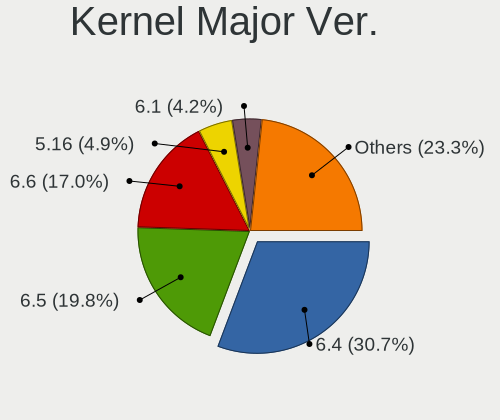
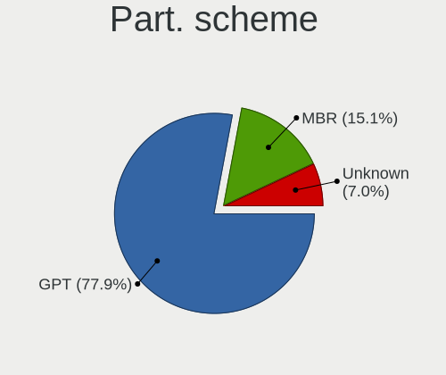
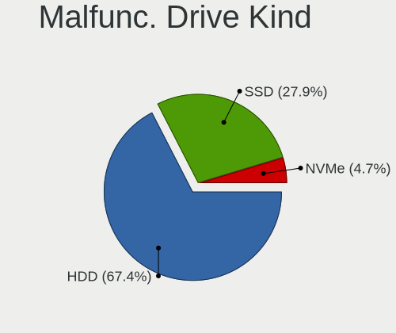
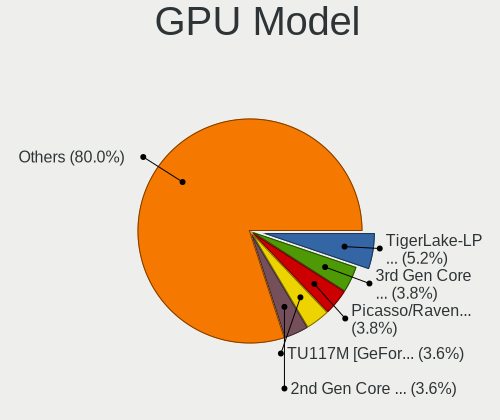
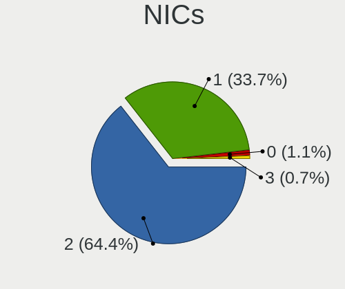
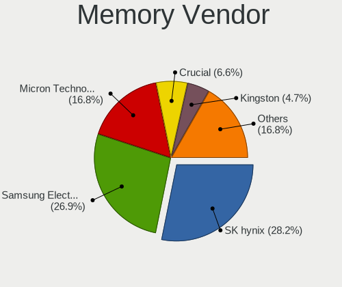
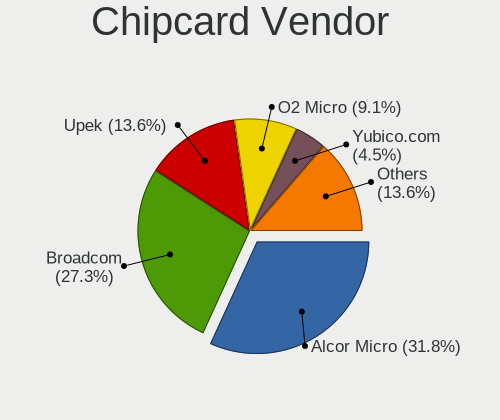

Xero - Tested Hardware & Statistics (Notebooks)
-----------------------------------------------

A project to collect tested hardware configurations for Xero.

Anyone can contribute to this report by the [hw-probe](https://github.com/linuxhw/hw-probe) tool:

    sudo -E hw-probe -all -upload

Please contribute! Especially if your hardware is rare.

Contents
--------

* [ Test Cases ](#test-cases)

* [ System ](#system)
  - [ OS                       ](#os)
  - [ OS Family                ](#os-family)
  - [ Kernel                   ](#kernel)
  - [ Kernel Family            ](#kernel-family)
  - [ Kernel Major Ver.        ](#kernel-major-ver)
  - [ Arch                     ](#arch)
  - [ DE                       ](#de)
  - [ Display Server           ](#display-server)
  - [ Display Manager          ](#display-manager)
  - [ OS Lang                  ](#os-lang)
  - [ Boot Mode                ](#boot-mode)
  - [ Filesystem               ](#filesystem)
  - [ Part. scheme             ](#part-scheme)
  - [ Dual Boot with Linux/BSD ](#dual-boot-with-linuxbsd)
  - [ Dual Boot (Win)          ](#dual-boot-win)

* [ Board ](#board)
  - [ Vendor                   ](#vendor)
  - [ Model                    ](#model)
  - [ Model Family             ](#model-family)
  - [ MFG Year                 ](#mfg-year)
  - [ Form Factor              ](#form-factor)
  - [ Secure Boot              ](#secure-boot)
  - [ Coreboot                 ](#coreboot)
  - [ RAM Size                 ](#ram-size)
  - [ RAM Used                 ](#ram-used)
  - [ Total Drives             ](#total-drives)
  - [ Has CD-ROM               ](#has-cd-rom)
  - [ Has Ethernet             ](#has-ethernet)
  - [ Has WiFi                 ](#has-wifi)
  - [ Has Bluetooth            ](#has-bluetooth)

* [ Location ](#location)
  - [ Country                  ](#country)
  - [ City                     ](#city)

* [ Drives ](#drives)
  - [ Drive Vendor             ](#drive-vendor)
  - [ Drive Model              ](#drive-model)
  - [ HDD Vendor               ](#hdd-vendor)
  - [ SSD Vendor               ](#ssd-vendor)
  - [ Drive Kind               ](#drive-kind)
  - [ Drive Connector          ](#drive-connector)
  - [ Drive Size               ](#drive-size)
  - [ Space Total              ](#space-total)
  - [ Space Used               ](#space-used)
  - [ Malfunc. Drives          ](#malfunc-drives)
  - [ Malfunc. Drive Vendor    ](#malfunc-drive-vendor)
  - [ Malfunc. HDD Vendor      ](#malfunc-hdd-vendor)
  - [ Malfunc. Drive Kind      ](#malfunc-drive-kind)
  - [ Failed Drives            ](#failed-drives)
  - [ Failed Drive Vendor      ](#failed-drive-vendor)
  - [ Drive Status             ](#drive-status)

* [ Storage controller ](#storage-controller)
  - [ Storage Vendor           ](#storage-vendor)
  - [ Storage Model            ](#storage-model)
  - [ Storage Kind             ](#storage-kind)

* [ Processor ](#processor)
  - [ CPU Vendor               ](#cpu-vendor)
  - [ CPU Model                ](#cpu-model)
  - [ CPU Model Family         ](#cpu-model-family)
  - [ CPU Cores                ](#cpu-cores)
  - [ CPU Sockets              ](#cpu-sockets)
  - [ CPU Threads              ](#cpu-threads)
  - [ CPU Op-Modes             ](#cpu-op-modes)
  - [ CPU Microcode            ](#cpu-microcode)
  - [ CPU Microarch            ](#cpu-microarch)

* [ Graphics ](#graphics)
  - [ GPU Vendor               ](#gpu-vendor)
  - [ GPU Model                ](#gpu-model)
  - [ GPU Combo                ](#gpu-combo)
  - [ GPU Driver               ](#gpu-driver)
  - [ GPU Memory               ](#gpu-memory)

* [ Monitor ](#monitor)
  - [ Monitor Vendor           ](#monitor-vendor)
  - [ Monitor Model            ](#monitor-model)
  - [ Monitor Resolution       ](#monitor-resolution)
  - [ Monitor Diagonal         ](#monitor-diagonal)
  - [ Monitor Width            ](#monitor-width)
  - [ Aspect Ratio             ](#aspect-ratio)
  - [ Monitor Area             ](#monitor-area)
  - [ Pixel Density            ](#pixel-density)
  - [ Multiple Monitors        ](#multiple-monitors)

* [ Network ](#network)
  - [ Net Controller Vendor    ](#net-controller-vendor)
  - [ Net Controller Model     ](#net-controller-model)
  - [ Wireless Vendor          ](#wireless-vendor)
  - [ Wireless Model           ](#wireless-model)
  - [ Ethernet Vendor          ](#ethernet-vendor)
  - [ Ethernet Model           ](#ethernet-model)
  - [ Net Controller Kind      ](#net-controller-kind)
  - [ Used Controller          ](#used-controller)
  - [ NICs                     ](#nics)
  - [ IPv6                     ](#ipv6)

* [ Bluetooth ](#bluetooth)
  - [ Bluetooth Vendor         ](#bluetooth-vendor)
  - [ Bluetooth Model          ](#bluetooth-model)

* [ Sound ](#sound)
  - [ Sound Vendor             ](#sound-vendor)
  - [ Sound Model              ](#sound-model)

* [ Memory ](#memory)
  - [ Memory Vendor            ](#memory-vendor)
  - [ Memory Model             ](#memory-model)
  - [ Memory Kind              ](#memory-kind)
  - [ Memory Form Factor       ](#memory-form-factor)
  - [ Memory Size              ](#memory-size)
  - [ Memory Speed             ](#memory-speed)

* [ Printers & scanners ](#printers--scanners)
  - [ Printer Vendor           ](#printer-vendor)
  - [ Printer Model            ](#printer-model)
  - [ Scanner Vendor           ](#scanner-vendor)
  - [ Scanner Model            ](#scanner-model)

* [ Camera ](#camera)
  - [ Camera Vendor            ](#camera-vendor)
  - [ Camera Model             ](#camera-model)

* [ Security ](#security)
  - [ Fingerprint Vendor       ](#fingerprint-vendor)
  - [ Fingerprint Model        ](#fingerprint-model)
  - [ Chipcard Vendor          ](#chipcard-vendor)
  - [ Chipcard Model           ](#chipcard-model)

* [ Unsupported ](#unsupported)
  - [ Unsupported Devices      ](#unsupported-devices)
  - [ Unsupported Device Types ](#unsupported-device-types)

Test Cases
----------

Total: 61

| Vendor   | Model                       | Probe                                                      | Date         |
|----------|-----------------------------|------------------------------------------------------------|--------------|
| ASUSTek  | VivoBook_ASUSLaptop X421... | [4cd7aa6350](https://linux-hardware.org/?probe=4cd7aa6350) | Nov 01, 2022 |
| ASUSTek  | K53SJ                       | [8c85e545f2](https://linux-hardware.org/?probe=8c85e545f2) | Oct 23, 2022 |
| ASUSTek  | ROG Strix G513IC_G513IC     | [ef1974cfc8](https://linux-hardware.org/?probe=ef1974cfc8) | Oct 10, 2022 |
| HP       | Laptop 15s-fq2xxx           | [69e60dfe44](https://linux-hardware.org/?probe=69e60dfe44) | Oct 07, 2022 |
| ASUSTek  | ZenBook UX433FN_UX433FN     | [a7764ad0f6](https://linux-hardware.org/?probe=a7764ad0f6) | Oct 03, 2022 |
| MSI      | Katana GF66 11UE            | [36b2cba297](https://linux-hardware.org/?probe=36b2cba297) | Sep 05, 2022 |
| Lenovo   | ThinkPad X1 Carbon Gen 9... | [b28edd3886](https://linux-hardware.org/?probe=b28edd3886) | Aug 26, 2022 |
| Lenovo   | ThinkPad X1 Carbon Gen 9... | [97770c5716](https://linux-hardware.org/?probe=97770c5716) | Aug 26, 2022 |
| Lenovo   | ThinkPad T430s 2356FG9      | [9a10c152af](https://linux-hardware.org/?probe=9a10c152af) | Aug 17, 2022 |
| Aquarius | NS585                       | [db9cbd5688](https://linux-hardware.org/?probe=db9cbd5688) | Aug 17, 2022 |
| Lenovo   | IdeaPad S145-15AST 81N3     | [7c46c8f737](https://linux-hardware.org/?probe=7c46c8f737) | Jul 15, 2022 |
| ASUSTek  | G551JM                      | [599c7b9eae](https://linux-hardware.org/?probe=599c7b9eae) | Jul 14, 2022 |
| ASUSTek  | G551JM                      | [9f4536df1c](https://linux-hardware.org/?probe=9f4536df1c) | Jul 14, 2022 |
| ASUSTek  | UX303LN                     | [9ce42e1b01](https://linux-hardware.org/?probe=9ce42e1b01) | Jun 12, 2022 |
| Dell     | Inspiron 1545               | [ce0e24a314](https://linux-hardware.org/?probe=ce0e24a314) | May 28, 2022 |
| Lenovo   | IdeaPad 330-17IKB 81DM      | [53475a6004](https://linux-hardware.org/?probe=53475a6004) | May 24, 2022 |
| ASUSTek  | VivoBook_ASUSLaptop X350... | [80d32848bf](https://linux-hardware.org/?probe=80d32848bf) | May 21, 2022 |
| Dell     | Precision M3800             | [7b63874768](https://linux-hardware.org/?probe=7b63874768) | Apr 25, 2022 |
| Dell     | Precision M3800             | [fbabacd835](https://linux-hardware.org/?probe=fbabacd835) | Apr 24, 2022 |
| Lenovo   | ThinkPad X230 2325HR9       | [a9d9d3fbb2](https://linux-hardware.org/?probe=a9d9d3fbb2) | Apr 21, 2022 |
| Acer     | Aspire A515-54G             | [52b660d8fb](https://linux-hardware.org/?probe=52b660d8fb) | Apr 11, 2022 |
| Dell     | Precision M3800             | [1ef57b39a7](https://linux-hardware.org/?probe=1ef57b39a7) | Apr 10, 2022 |
| Dell     | Precision M3800             | [9fc15d1ae6](https://linux-hardware.org/?probe=9fc15d1ae6) | Mar 31, 2022 |
| MSI      | GF63 Thin 9SCX              | [4501fa1556](https://linux-hardware.org/?probe=4501fa1556) | Mar 25, 2022 |
| Dell     | Latitude 7480               | [bf00ec6a76](https://linux-hardware.org/?probe=bf00ec6a76) | Mar 23, 2022 |
| HUAWEI   | WRT-WX9                     | [70ec26bed6](https://linux-hardware.org/?probe=70ec26bed6) | Mar 22, 2022 |
| Dell     | Latitude 7480               | [faddba28a8](https://linux-hardware.org/?probe=faddba28a8) | Mar 19, 2022 |
| Apple    | MacBookAir6,2               | [b71110144d](https://linux-hardware.org/?probe=b71110144d) | Mar 19, 2022 |
| HP       | Laptop 15-da0xxx            | [bb9074ccdf](https://linux-hardware.org/?probe=bb9074ccdf) | Mar 18, 2022 |
| Lenovo   | IdeaPad 3 15IML05 81WR      | [918c951cd1](https://linux-hardware.org/?probe=918c951cd1) | Mar 12, 2022 |
| Lenovo   | IdeaPad S145-15IIL 81W8     | [e251c9f079](https://linux-hardware.org/?probe=e251c9f079) | Mar 11, 2022 |
| Dell     | Venue 11 Pro 7130 vPro      | [57b302b119](https://linux-hardware.org/?probe=57b302b119) | Mar 05, 2022 |
| Lenovo   | ThinkPad T460 20FMS1XX00    | [78e82c6674](https://linux-hardware.org/?probe=78e82c6674) | Feb 24, 2022 |
| Dell     | Latitude E6430              | [e1de4e80fe](https://linux-hardware.org/?probe=e1de4e80fe) | Feb 15, 2022 |
| Lenovo   | Legion 5 15ARH05H 82B1      | [a3c5f00a2a](https://linux-hardware.org/?probe=a3c5f00a2a) | Feb 10, 2022 |
| Lenovo   | Legion 5 15ARH05H 82B1      | [e53fb31614](https://linux-hardware.org/?probe=e53fb31614) | Feb 10, 2022 |
| Lenovo   | Legion Y740-15IRHg 81UH     | [b0cc5e0cbc](https://linux-hardware.org/?probe=b0cc5e0cbc) | Jan 29, 2022 |
| Acer     | Aspire A315-58G             | [cb4f253c1c](https://linux-hardware.org/?probe=cb4f253c1c) | Jan 28, 2022 |
| Dell     | Latitude E6520              | [ee96960cec](https://linux-hardware.org/?probe=ee96960cec) | Jan 25, 2022 |
| HP       | Laptop 15s-eq0xxx           | [0df160c245](https://linux-hardware.org/?probe=0df160c245) | Jan 21, 2022 |
| Lenovo   | Legion Y540-15IRH-PG0 81... | [3df8a1c560](https://linux-hardware.org/?probe=3df8a1c560) | Jan 08, 2022 |
| Dell     | Vostro 3590                 | [9e77a2584c](https://linux-hardware.org/?probe=9e77a2584c) | Dec 30, 2021 |
| ASUSTek  | ASUS EXPERTBOOK B9400CEA... | [78e3fbdf6a](https://linux-hardware.org/?probe=78e3fbdf6a) | Dec 28, 2021 |
| HP       | Notebook                    | [c14ea64659](https://linux-hardware.org/?probe=c14ea64659) | Dec 23, 2021 |
| ASUSTek  | X510UNR                     | [0733a05806](https://linux-hardware.org/?probe=0733a05806) | Dec 21, 2021 |
| ASUSTek  | ASUS EXPERTBOOK B9400CEA... | [b4425de4a6](https://linux-hardware.org/?probe=b4425de4a6) | Dec 17, 2021 |
| ASUSTek  | ASUS TUF Gaming F15 FX50... | [6f3bd18b3f](https://linux-hardware.org/?probe=6f3bd18b3f) | Dec 06, 2021 |
| Pegatron | D15K                        | [eaeaad8d39](https://linux-hardware.org/?probe=eaeaad8d39) | Nov 29, 2021 |
| MSI      | GP73 Leopard 8RD            | [5bafb43f78](https://linux-hardware.org/?probe=5bafb43f78) | Nov 21, 2021 |
| Acer     | Aspire A315-58G             | [911895fcf2](https://linux-hardware.org/?probe=911895fcf2) | Nov 19, 2021 |
| Acer     | Aspire A315-58G             | [5748b3cd05](https://linux-hardware.org/?probe=5748b3cd05) | Nov 12, 2021 |
| Lenovo   | ThinkPad W530 24384CU       | [d18d3495e0](https://linux-hardware.org/?probe=d18d3495e0) | Nov 05, 2021 |
| Acer     | Aspire A315-58G             | [905fce5118](https://linux-hardware.org/?probe=905fce5118) | Oct 29, 2021 |
| HP       | ENVY Sleekbook 4            | [ebea056239](https://linux-hardware.org/?probe=ebea056239) | Oct 29, 2021 |
| ASUSTek  | VivoBook_ASUSLaptop X509... | [2a54689fb3](https://linux-hardware.org/?probe=2a54689fb3) | Oct 24, 2021 |
| ASUSTek  | VivoBook_ASUS Laptop E41... | [fb95cbb063](https://linux-hardware.org/?probe=fb95cbb063) | Oct 19, 2021 |
| Lenovo   | IdeaPad 5 15ITL05 82FG      | [6cd76dfa2a](https://linux-hardware.org/?probe=6cd76dfa2a) | Oct 13, 2021 |
| ASUSTek  | ASUS TUF Gaming F15 FX50... | [e3a8d1ca32](https://linux-hardware.org/?probe=e3a8d1ca32) | Oct 11, 2021 |
| ASUSTek  | ASUS TUF Gaming F15 FX50... | [c7c4a74bb8](https://linux-hardware.org/?probe=c7c4a74bb8) | Oct 11, 2021 |
| ASUSTek  | ASUS TUF Gaming F15 FX50... | [68865693c7](https://linux-hardware.org/?probe=68865693c7) | Oct 09, 2021 |
| Lenovo   | Y520-15IKBN 80WK            | [e804a59920](https://linux-hardware.org/?probe=e804a59920) | Oct 02, 2021 |

System
------

OS
--

Installed operating systems

| Name         | Notebooks | Percent |
|--------------|-----------|---------|
| Xero Rolling | 42        | 84%     |
| Xero         | 8         | 16%     |

OS Family
---------

OS without a version

| Name | Notebooks | Percent |
|------|-----------|---------|
| Xero | 49        | 100%    |

Kernel
------

Version of the Linux kernel

| Version                      | Notebooks | Percent |
|------------------------------|-----------|---------|
| 5.16.15-arch1-1              | 4         | 7.69%   |
| 5.18.16-arch1-1              | 2         | 3.85%   |
| 5.18.11-arch1-1              | 2         | 3.85%   |
| 5.17.9-arch1-1               | 2         | 3.85%   |
| 5.16.8-arch1-1               | 2         | 3.85%   |
| 5.16.2-arch1-1               | 2         | 3.85%   |
| 5.16.1-arch1-1               | 2         | 3.85%   |
| 5.15.33-1-lts                | 2         | 3.85%   |
| 5.14.14-arch1-1              | 2         | 3.85%   |
| 6.0.6-arch1-1                | 1         | 1.92%   |
| 6.0.2-arch1-1                | 1         | 1.92%   |
| 5.19.9-arch1-1               | 1         | 1.92%   |
| 5.19.3-arch1-1               | 1         | 1.92%   |
| 5.19.13-arch1-1              | 1         | 1.92%   |
| 5.19.12-arch1-1              | 1         | 1.92%   |
| 5.19.1-arch2-1               | 1         | 1.92%   |
| 5.18.3-arch1-1               | 1         | 1.92%   |
| 5.17.7-arch1-1               | 1         | 1.92%   |
| 5.17.1-arch1-1               | 1         | 1.92%   |
| 5.16.16-arch1-1              | 1         | 1.92%   |
| 5.16.14-arch1-1              | 1         | 1.92%   |
| 5.16.13-arch1-1              | 1         | 1.92%   |
| 5.16.10-arch1-1              | 1         | 1.92%   |
| 5.15.8-zen1-1-zen            | 1         | 1.92%   |
| 5.15.6-arch2-1               | 1         | 1.92%   |
| 5.15.35-1-lts                | 1         | 1.92%   |
| 5.15.26-1-lts                | 1         | 1.92%   |
| 5.15.13-arch1-1              | 1         | 1.92%   |
| 5.15.11-arch2-1              | 1         | 1.92%   |
| 5.15.10-arch1-1              | 1         | 1.92%   |
| 5.14.8-zen1-1-zen            | 1         | 1.92%   |
| 5.14.8-arch1-1               | 1         | 1.92%   |
| 5.14.16-zen1-1-zen           | 1         | 1.92%   |
| 5.14.16-arch1-2-surface      | 1         | 1.92%   |
| 5.14.16-arch1-1              | 1         | 1.92%   |
| 5.14.14-zen1-1-zen           | 1         | 1.92%   |
| 5.14.12-arch1-1              | 1         | 1.92%   |
| 5.14.11-hardened1-1-hardened | 1         | 1.92%   |
| 5.10.88-1-lts                | 1         | 1.92%   |
| 5.10.80-1-lts                | 1         | 1.92%   |

Kernel Family
-------------

Linux kernel without a distro release

| Version | Notebooks | Percent |
|---------|-----------|---------|
| 5.16.15 | 4         | 7.69%   |
| 5.14.16 | 3         | 5.77%   |
| 5.14.14 | 3         | 5.77%   |
| 5.18.16 | 2         | 3.85%   |
| 5.18.11 | 2         | 3.85%   |
| 5.17.9  | 2         | 3.85%   |
| 5.16.8  | 2         | 3.85%   |
| 5.16.2  | 2         | 3.85%   |
| 5.16.1  | 2         | 3.85%   |
| 5.15.33 | 2         | 3.85%   |
| 5.14.8  | 2         | 3.85%   |
| 6.0.6   | 1         | 1.92%   |
| 6.0.2   | 1         | 1.92%   |
| 5.19.9  | 1         | 1.92%   |
| 5.19.3  | 1         | 1.92%   |
| 5.19.13 | 1         | 1.92%   |
| 5.19.12 | 1         | 1.92%   |
| 5.19.1  | 1         | 1.92%   |
| 5.18.3  | 1         | 1.92%   |
| 5.17.7  | 1         | 1.92%   |
| 5.17.1  | 1         | 1.92%   |
| 5.16.16 | 1         | 1.92%   |
| 5.16.14 | 1         | 1.92%   |
| 5.16.13 | 1         | 1.92%   |
| 5.16.10 | 1         | 1.92%   |
| 5.15.8  | 1         | 1.92%   |
| 5.15.6  | 1         | 1.92%   |
| 5.15.35 | 1         | 1.92%   |
| 5.15.26 | 1         | 1.92%   |
| 5.15.13 | 1         | 1.92%   |
| 5.15.11 | 1         | 1.92%   |
| 5.15.10 | 1         | 1.92%   |
| 5.14.12 | 1         | 1.92%   |
| 5.14.11 | 1         | 1.92%   |
| 5.10.88 | 1         | 1.92%   |
| 5.10.80 | 1         | 1.92%   |
| 5.10.71 | 1         | 1.92%   |

Kernel Major Ver.
-----------------

Linux kernel major version

| Version | Notebooks | Percent |
|---------|-----------|---------|
| 5.16    | 14        | 27.45%  |
| 5.15    | 9         | 17.65%  |
| 5.14    | 9         | 17.65%  |
| 5.19    | 5         | 9.8%    |
| 5.18    | 5         | 9.8%    |
| 5.17    | 4         | 7.84%   |
| 5.10    | 3         | 5.88%   |
| 6.0     | 2         | 3.92%   |

Arch
----

OS architecture (x86_64, i586, etc.)

| Name   | Notebooks | Percent |
|--------|-----------|---------|
| x86_64 | 49        | 100%    |

DE
--

Desktop Environment

| Name   | Notebooks | Percent |
|--------|-----------|---------|
| KDE5   | 46        | 92%     |
| XFCE   | 2         | 4%      |
| LeftWM | 1         | 2%      |
| GNOME  | 1         | 2%      |

Display Server
--------------

X11 or Wayland

| Name    | Notebooks | Percent |
|---------|-----------|---------|
| X11     | 40        | 81.63%  |
| Wayland | 9         | 18.37%  |

Display Manager
---------------

SDDM, LightDM, etc.

| Name    | Notebooks | Percent |
|---------|-----------|---------|
| SDDM    | 34        | 65.38%  |
| LightDM | 10        | 19.23%  |
| Unknown | 8         | 15.38%  |

OS Lang
-------

Language

| Lang  | Notebooks | Percent |
|-------|-----------|---------|
| en_US | 28        | 56%     |
| en_IN | 5         | 10%     |
| pl_PL | 3         | 6%      |
| it_IT | 3         | 6%      |
| C     | 3         | 6%      |
| fr_FR | 2         | 4%      |
| ru_RU | 1         | 2%      |
| es_MX | 1         | 2%      |
| en_GB | 1         | 2%      |
| en_AU | 1         | 2%      |
| en_AG | 1         | 2%      |
| de_DE | 1         | 2%      |

Boot Mode
---------

EFI or BIOS

| Mode | Notebooks | Percent |
|------|-----------|---------|
| EFI  | 35        | 70%     |
| BIOS | 15        | 30%     |

Filesystem
----------

Type of filesystem

| Type    | Notebooks | Percent |
|---------|-----------|---------|
| Btrfs   | 31        | 62%     |
| Xfs     | 9         | 18%     |
| Ext4    | 7         | 14%     |
| Overlay | 3         | 6%      |

Part. scheme
------------

Scheme of partitioning

| Type    | Notebooks | Percent |
|---------|-----------|---------|
| GPT     | 36        | 72%     |
| Unknown | 8         | 16%     |
| MBR     | 6         | 12%     |

Dual Boot with Linux/BSD
------------------------

Hosting more than one Linux/BSD

| Dual boot | Notebooks | Percent |
|-----------|-----------|---------|
| No        | 40        | 78.43%  |
| Yes       | 11        | 21.57%  |

Dual Boot (Win)
---------------

Hosting Linux and Windows

| Dual boot | Notebooks | Percent |
|-----------|-----------|---------|
| No        | 34        | 69.39%  |
| Yes       | 15        | 30.61%  |

Board
-----

Vendor
------

Motherboard manufacturer

| Name             | Notebooks | Percent |
|------------------|-----------|---------|
| Lenovo           | 14        | 28.57%  |
| ASUSTek Computer | 12        | 24.49%  |
| Dell             | 9         | 18.37%  |
| Hewlett-Packard  | 5         | 10.2%   |
| MSI              | 3         | 6.12%   |
| Acer             | 2         | 4.08%   |
| Pegatron         | 1         | 2.04%   |
| HUAWEI           | 1         | 2.04%   |
| Aquarius         | 1         | 2.04%   |
| Apple            | 1         | 2.04%   |

Model
-----

Motherboard model

| Name                                       | Notebooks | Percent |
|--------------------------------------------|-----------|---------|
| Dell Precision M3800                       | 3         | 6.12%   |
| Pegatron D15K                              | 1         | 2.04%   |
| MSI Katana GF66 11UE                       | 1         | 2.04%   |
| MSI GP73 Leopard 8RD                       | 1         | 2.04%   |
| MSI GF63 Thin 9SCX                         | 1         | 2.04%   |
| Lenovo Y520-15IKBN 80WK                    | 1         | 2.04%   |
| Lenovo ThinkPad X230 2325HR9               | 1         | 2.04%   |
| Lenovo ThinkPad X1 Carbon Gen 9 20XW0055MH | 1         | 2.04%   |
| Lenovo ThinkPad W530 24384CU               | 1         | 2.04%   |
| Lenovo ThinkPad T460 20FMS1XX00            | 1         | 2.04%   |
| Lenovo ThinkPad T430s 2356FG9              | 1         | 2.04%   |
| Lenovo Legion Y740-15IRHg 81UH             | 1         | 2.04%   |
| Lenovo Legion Y540-15IRH-PG0 81SY          | 1         | 2.04%   |
| Lenovo Legion 5 15ARH05H 82B1              | 1         | 2.04%   |
| Lenovo IdeaPad S145-15IIL 81W8             | 1         | 2.04%   |
| Lenovo IdeaPad S145-15AST 81N3             | 1         | 2.04%   |
| Lenovo IdeaPad 5 15ITL05 82FG              | 1         | 2.04%   |
| Lenovo IdeaPad 330-17IKB 81DM              | 1         | 2.04%   |
| Lenovo IdeaPad 3 15IML05 81WR              | 1         | 2.04%   |
| HUAWEI WRT-WX9                             | 1         | 2.04%   |
| HP Notebook                                | 1         | 2.04%   |
| HP Laptop 15s-fq2xxx                       | 1         | 2.04%   |
| HP Laptop 15s-eq0xxx                       | 1         | 2.04%   |
| HP Laptop 15-da0xxx                        | 1         | 2.04%   |
| HP ENVY Sleekbook 4                        | 1         | 2.04%   |
| Dell Vostro 3590                           | 1         | 2.04%   |
| Dell Venue 11 Pro 7130 vPro                | 1         | 2.04%   |
| Dell Latitude E6520                        | 1         | 2.04%   |
| Dell Latitude E6430                        | 1         | 2.04%   |
| Dell Latitude 7480                         | 1         | 2.04%   |
| Dell Inspiron 1545                         | 1         | 2.04%   |
| ASUS ZenBook UX433FN_UX433FN               | 1         | 2.04%   |
| ASUS X510UNR                               | 1         | 2.04%   |
| ASUS VivoBook_ASUSLaptop X509FJ_X509FJ     | 1         | 2.04%   |
| ASUS VivoBook_ASUSLaptop X421EAY_X413EA    | 1         | 2.04%   |
| ASUS VivoBook_ASUSLaptop X3500PC_K3500PC   | 1         | 2.04%   |
| ASUS VivoBook_ASUS Laptop E410MA_E410MA    | 1         | 2.04%   |
| ASUS UX303LN                               | 1         | 2.04%   |
| ASUS ROG Strix G513IC_G513IC               | 1         | 2.04%   |
| ASUS K53SJ                                 | 1         | 2.04%   |

Model Family
------------

Motherboard model prefix

| Name               | Notebooks | Percent |
|--------------------|-----------|---------|
| Lenovo ThinkPad    | 5         | 10.2%   |
| Lenovo IdeaPad     | 5         | 10.2%   |
| ASUS VivoBook      | 4         | 8.16%   |
| Lenovo Legion      | 3         | 6.12%   |
| HP Laptop          | 3         | 6.12%   |
| Dell Precision     | 3         | 6.12%   |
| Dell Latitude      | 3         | 6.12%   |
| ASUS ASUS          | 2         | 4.08%   |
| Acer Aspire        | 2         | 4.08%   |
| Pegatron D15K      | 1         | 2.04%   |
| MSI Katana         | 1         | 2.04%   |
| MSI GP73           | 1         | 2.04%   |
| MSI GF63           | 1         | 2.04%   |
| Lenovo Y520-15IKBN | 1         | 2.04%   |
| HUAWEI WRT-WX9     | 1         | 2.04%   |
| HP Notebook        | 1         | 2.04%   |
| HP ENVY            | 1         | 2.04%   |
| Dell Vostro        | 1         | 2.04%   |
| Dell Venue         | 1         | 2.04%   |
| Dell Inspiron      | 1         | 2.04%   |
| ASUS ZenBook       | 1         | 2.04%   |
| ASUS X510UNR       | 1         | 2.04%   |
| ASUS UX303LN       | 1         | 2.04%   |
| ASUS ROG           | 1         | 2.04%   |
| ASUS K53SJ         | 1         | 2.04%   |
| ASUS G551JM        | 1         | 2.04%   |
| Aquarius NS585     | 1         | 2.04%   |
| Apple MacBookAir6  | 1         | 2.04%   |

MFG Year
--------

Motherboard manufacture year

| Year | Notebooks | Percent |
|------|-----------|---------|
| 2019 | 10        | 20.41%  |
| 2020 | 9         | 18.37%  |
| 2021 | 6         | 12.24%  |
| 2012 | 5         | 10.2%   |
| 2018 | 4         | 8.16%   |
| 2013 | 4         | 8.16%   |
| 2017 | 3         | 6.12%   |
| 2016 | 2         | 4.08%   |
| 2014 | 2         | 4.08%   |
| 2011 | 2         | 4.08%   |
| 2015 | 1         | 2.04%   |
| 2008 | 1         | 2.04%   |

Form Factor
-----------

Physical design of the computer

| Name     | Notebooks | Percent |
|----------|-----------|---------|
| Notebook | 49        | 100%    |

Secure Boot
-----------

Enabled or disabled

| State    | Notebooks | Percent |
|----------|-----------|---------|
| Disabled | 49        | 100%    |

Coreboot
--------

Have coreboot on board

| Used | Notebooks | Percent |
|------|-----------|---------|
| No   | 49        | 100%    |

RAM Size
--------

Total RAM memory

| Size in GB | Notebooks | Percent |
|------------|-----------|---------|
| 4.01-8.0   | 22        | 44.9%   |
| 16.01-24.0 | 10        | 20.41%  |
| 8.01-16.0  | 7         | 14.29%  |
| 3.01-4.0   | 6         | 12.24%  |
| 32.01-64.0 | 2         | 4.08%   |
| 24.01-32.0 | 2         | 4.08%   |

RAM Used
--------

Used RAM memory

| Used GB    | Notebooks | Percent |
|------------|-----------|---------|
| 2.01-3.0   | 20        | 38.46%  |
| 1.01-2.0   | 16        | 30.77%  |
| 4.01-8.0   | 8         | 15.38%  |
| 3.01-4.0   | 6         | 11.54%  |
| 16.01-24.0 | 1         | 1.92%   |
| 0.51-1.0   | 1         | 1.92%   |

Total Drives
------------

Number of drives on board

| Drives | Notebooks | Percent |
|--------|-----------|---------|
| 1      | 34        | 69.39%  |
| 2      | 13        | 26.53%  |
| 4      | 1         | 2.04%   |
| 3      | 1         | 2.04%   |

Has CD-ROM
----------

Has CD-ROM on board

| Presented | Notebooks | Percent |
|-----------|-----------|---------|
| No        | 39        | 79.59%  |
| Yes       | 10        | 20.41%  |

Has Ethernet
------------

Has Ethernet on board

| Presented | Notebooks | Percent |
|-----------|-----------|---------|
| Yes       | 34        | 69.39%  |
| No        | 15        | 30.61%  |

Has WiFi
--------

Has WiFi module

| Presented | Notebooks | Percent |
|-----------|-----------|---------|
| Yes       | 47        | 95.92%  |
| No        | 2         | 4.08%   |

Has Bluetooth
-------------

Has Bluetooth module

| Presented | Notebooks | Percent |
|-----------|-----------|---------|
| Yes       | 43        | 87.76%  |
| No        | 6         | 12.24%  |

Location
--------

Country
-------

Geographic location (country)

| Country               | Notebooks | Percent |
|-----------------------|-----------|---------|
| USA                   | 10        | 20.41%  |
| India                 | 7         | 14.29%  |
| France                | 4         | 8.16%   |
| Poland                | 3         | 6.12%   |
| Italy                 | 3         | 6.12%   |
| Germany               | 3         | 6.12%   |
| Norway                | 2         | 4.08%   |
| Greece                | 2         | 4.08%   |
| Zambia                | 1         | 2.04%   |
| Turkey                | 1         | 2.04%   |
| Togo                  | 1         | 2.04%   |
| Russia                | 1         | 2.04%   |
| Romania               | 1         | 2.04%   |
| Palestinian Territory | 1         | 2.04%   |
| Pakistan              | 1         | 2.04%   |
| Netherlands           | 1         | 2.04%   |
| Morocco               | 1         | 2.04%   |
| Mongolia              | 1         | 2.04%   |
| Malaysia              | 1         | 2.04%   |
| Hungary               | 1         | 2.04%   |
| Chile                 | 1         | 2.04%   |
| Canada                | 1         | 2.04%   |
| Australia             | 1         | 2.04%   |

City
----

Geographic location (city)

| City         | Notebooks | Percent |
|--------------|-----------|---------|
| Longmont     | 3         | 6.12%   |
| Madurai      | 2         | 4.08%   |
| Ulan Bator   | 1         | 2.04%   |
| Toronto      | 1         | 2.04%   |
| Taranto      | 1         | 2.04%   |
| Stuttgart    | 1         | 2.04%   |
| Stavropol    | 1         | 2.04%   |
| Santa Cruz   | 1         | 2.04%   |
| Ramallah     | 1         | 2.04%   |
| Pune         | 1         | 2.04%   |
| Poznan       | 1         | 2.04%   |
| Porcia       | 1         | 2.04%   |
| Pirmasens    | 1         | 2.04%   |
| Pavia        | 1         | 2.04%   |
| Paris        | 1         | 2.04%   |
| Oslo         | 1         | 2.04%   |
| Neu-Ulm      | 1         | 2.04%   |
| Mumbai       | 1         | 2.04%   |
| Melbourne    | 1         | 2.04%   |
| Lusaka       | 1         | 2.04%   |
| Lucknow      | 1         | 2.04%   |
| Lublin       | 1         | 2.04%   |
| Longvic      | 1         | 2.04%   |
| Lomé        | 1         | 2.04%   |
| Lamia        | 1         | 2.04%   |
| Kuala Lumpur | 1         | 2.04%   |
| Kristiansand | 1         | 2.04%   |
| Kolkata      | 1         | 2.04%   |
| Istanbul     | 1         | 2.04%   |
| Islamabad    | 1         | 2.04%   |
| Ioannina     | 1         | 2.04%   |
| Iasi         | 1         | 2.04%   |
| Gdansk       | 1         | 2.04%   |
| Dunkirk      | 1         | 2.04%   |
| Denver       | 1         | 2.04%   |
| Delft        | 1         | 2.04%   |
| Danville     | 1         | 2.04%   |
| Clearfield   | 1         | 2.04%   |
| Casablanca   | 1         | 2.04%   |
| Buffalo      | 1         | 2.04%   |

Drives
------

Drive Vendor
------------

Hard drive vendors

| Vendor                      | Notebooks | Drives | Percent |
|-----------------------------|-----------|--------|---------|
| Seagate                     | 13        | 16     | 19.7%   |
| Samsung Electronics         | 13        | 13     | 19.7%   |
| WDC                         | 6         | 7      | 9.09%   |
| Toshiba                     | 4         | 4      | 6.06%   |
| Kingston                    | 4         | 5      | 6.06%   |
| Intel                       | 4         | 4      | 6.06%   |
| HGST                        | 4         | 4      | 6.06%   |
| Unknown                     | 2         | 2      | 3.03%   |
| Micron Technology           | 2         | 3      | 3.03%   |
| SanDisk                     | 1         | 1      | 1.52%   |
| Plextor                     | 1         | 1      | 1.52%   |
| Phison                      | 1         | 1      | 1.52%   |
| LITEONIT                    | 1         | 1      | 1.52%   |
| LITEON                      | 1         | 1      | 1.52%   |
| KIOXIA                      | 1         | 1      | 1.52%   |
| Kingston Technology Company | 1         | 1      | 1.52%   |
| Intenso                     | 1         | 1      | 1.52%   |
| Inateck                     | 1         | 1      | 1.52%   |
| GOODRAM                     | 1         | 1      | 1.52%   |
| Crucial                     | 1         | 1      | 1.52%   |
| China                       | 1         | 1      | 1.52%   |
| Apple                       | 1         | 1      | 1.52%   |
| Apacer                      | 1         | 1      | 1.52%   |

Drive Model
-----------

Hard drive models

| Model                                                | Notebooks | Percent |
|------------------------------------------------------|-----------|---------|
| Seagate ST1000LM035-1RK172 1TB                       | 3         | 4.48%   |
| Seagate One Touch HDD 5TB                            | 3         | 4.48%   |
| Seagate ST1000LM049-2GH172 1TB                       | 2         | 2.99%   |
| Samsung SSD 860 EVO 250GB                            | 2         | 2.99%   |
| WDC WDS100T1X0E-00AFY0 1TB                           | 1         | 1.49%   |
| WDC WDBNCE0010PNC 1TB SSD                            | 1         | 1.49%   |
| WDC PC SN720 SDAPNTW-512G-1027 512GB                 | 1         | 1.49%   |
| WDC PC SN530 SDBPNPZ-256G-1114 256GB                 | 1         | 1.49%   |
| WDC PC SN530 SDBPMPZ-512G-1101 512GB                 | 1         | 1.49%   |
| WDC PC SN520 SDAPMUW-256G-1101 256GB                 | 1         | 1.49%   |
| Unknown MMC Card  64GB                               | 1         | 1.49%   |
| Unknown G1J38E  64GB                                 | 1         | 1.49%   |
| Toshiba MQ04ABF100 1TB                               | 1         | 1.49%   |
| Toshiba MQ01ABF050M 500GB                            | 1         | 1.49%   |
| Toshiba KBG40ZNT512G MEMORY 512GB                    | 1         | 1.49%   |
| Toshiba KBG30ZMV256G 256GB                           | 1         | 1.49%   |
| Seagate ST9500325AS 500GB                            | 1         | 1.49%   |
| Seagate ST500LT012-9WS142 500GB                      | 1         | 1.49%   |
| Seagate ST500LM000-SSHD-8GB                          | 1         | 1.49%   |
| Seagate ST1000LM048-2E7172 1TB                       | 1         | 1.49%   |
| Seagate FireCuda 510 SSD ZP1000GM30031 1TB           | 1         | 1.49%   |
| Seagate Expansion 2TB                                | 1         | 1.49%   |
| SanDisk NVMe SSD Drive 256GB                         | 1         | 1.49%   |
| Samsung SSD SM841 mSATA 128GB                        | 1         | 1.49%   |
| Samsung SSD 980 1TB                                  | 1         | 1.49%   |
| Samsung SSD 860 EVO 1TB                              | 1         | 1.49%   |
| Samsung SSD 850 EVO 250GB                            | 1         | 1.49%   |
| Samsung PM961 NVMe 1024GB                            | 1         | 1.49%   |
| Samsung NVMe SSD Controller PM9A1/PM9A3/980PRO 250GB | 1         | 1.49%   |
| Samsung MZVLQ512HBLU-00BH1 512GB                     | 1         | 1.49%   |
| Samsung MZVLB1T0HBLR-00000 1TB                       | 1         | 1.49%   |
| Samsung MZVLB1T0HALR-000L2 1TB                       | 1         | 1.49%   |
| Samsung MZALQ128HBHQ-000L2 128GB                     | 1         | 1.49%   |
| Samsung MZ7LF128HCHP-000L1 128GB SSD                 | 1         | 1.49%   |
| Plextor PX-128M5M 128GB SSD                          | 1         | 1.49%   |
| Phison Sabrent 512GB                                 | 1         | 1.49%   |
| Micron MTFDHBA1T0TCK 1TB                             | 1         | 1.49%   |
| Micron 2210_MTFDHBA512QFD 512GB                      | 1         | 1.49%   |
| LITEONIT LMT-128L9M-11 MSATA 128GB SSD               | 1         | 1.49%   |
| LITEON LJH-128V2G-11 M.2 2260 128GB SSD              | 1         | 1.49%   |

HDD Vendor
----------

Hard disk drive vendors

| Vendor  | Notebooks | Drives | Percent |
|---------|-----------|--------|---------|
| Seagate | 13        | 15     | 68.42%  |
| HGST    | 4         | 4      | 21.05%  |
| Toshiba | 2         | 2      | 10.53%  |

SSD Vendor
----------

Solid state drive vendors

| Vendor              | Notebooks | Drives | Percent |
|---------------------|-----------|--------|---------|
| Samsung Electronics | 6         | 6      | 33.33%  |
| WDC                 | 1         | 1      | 5.56%   |
| Plextor             | 1         | 1      | 5.56%   |
| LITEONIT            | 1         | 1      | 5.56%   |
| LITEON              | 1         | 1      | 5.56%   |
| Kingston            | 1         | 1      | 5.56%   |
| Intenso             | 1         | 1      | 5.56%   |
| Intel               | 1         | 1      | 5.56%   |
| GOODRAM             | 1         | 1      | 5.56%   |
| Crucial             | 1         | 1      | 5.56%   |
| China               | 1         | 1      | 5.56%   |
| Apple               | 1         | 1      | 5.56%   |
| Apacer              | 1         | 1      | 5.56%   |

Drive Kind
----------

HDD or SSD

| Kind | Notebooks | Drives | Percent |
|------|-----------|--------|---------|
| NVMe | 24        | 31     | 39.34%  |
| HDD  | 18        | 21     | 29.51%  |
| SSD  | 17        | 18     | 27.87%  |
| MMC  | 2         | 2      | 3.28%   |

Drive Connector
---------------

SATA, SAS, NVMe, etc.

| Type | Notebooks | Drives | Percent |
|------|-----------|--------|---------|
| SATA | 29        | 35     | 48.33%  |
| NVMe | 24        | 30     | 40%     |
| SAS  | 5         | 5      | 8.33%   |
| MMC  | 2         | 2      | 3.33%   |

Drive Size
----------

Size of hard drive

| Size in TB | Notebooks | Drives | Percent |
|------------|-----------|--------|---------|
| 0.01-0.5   | 16        | 19     | 47.06%  |
| 0.51-1.0   | 14        | 16     | 41.18%  |
| 4.01-10.0  | 3         | 3      | 8.82%   |
| 1.01-2.0   | 1         | 1      | 2.94%   |

Space Total
-----------

Amount of disk space available on the file system

| Size in GB     | Notebooks | Percent |
|----------------|-----------|---------|
| More than 3000 | 11        | 21.57%  |
| 1001-2000      | 11        | 21.57%  |
| 251-500        | 8         | 15.69%  |
| 501-1000       | 6         | 11.76%  |
| 101-250        | 5         | 9.8%    |
| Unknown        | 4         | 7.84%   |
| 1-20           | 2         | 3.92%   |
| 51-100         | 2         | 3.92%   |
| 21-50          | 1         | 1.96%   |
| 2001-3000      | 1         | 1.96%   |

Space Used
----------

Amount of used disk space

| Used GB        | Notebooks | Percent |
|----------------|-----------|---------|
| 101-250        | 13        | 25.49%  |
| 51-100         | 12        | 23.53%  |
| 1-20           | 9         | 17.65%  |
| 501-1000       | 4         | 7.84%   |
| Unknown        | 4         | 7.84%   |
| 251-500        | 3         | 5.88%   |
| 21-50          | 3         | 5.88%   |
| 2001-3000      | 2         | 3.92%   |
| More than 3000 | 1         | 1.96%   |

Malfunc. Drives
---------------

Drive models with a malfunction

| Model                          | Notebooks | Drives | Percent |
|--------------------------------|-----------|--------|---------|
| Toshiba MQ01ABF050M 500GB      | 1         | 1      | 14.29%  |
| Seagate ST9500325AS 500GB      | 1         | 1      | 14.29%  |
| Seagate ST500LM000-SSHD-8GB    | 1         | 1      | 14.29%  |
| Seagate ST1000LM049-2GH172 1TB | 1         | 1      | 14.29%  |
| Seagate ST1000LM048-2E7172 1TB | 1         | 1      | 14.29%  |
| HGST HTS725032A7E630 320GB     | 1         | 1      | 14.29%  |
| HGST HTS721010A9E630 1TB       | 1         | 1      | 14.29%  |

Malfunc. Drive Vendor
---------------------

Vendors of faulty drives

| Vendor  | Notebooks | Drives | Percent |
|---------|-----------|--------|---------|
| Seagate | 4         | 4      | 57.14%  |
| HGST    | 2         | 2      | 28.57%  |
| Toshiba | 1         | 1      | 14.29%  |

Malfunc. HDD Vendor
-------------------

Vendors of faulty HDD drives

| Vendor  | Notebooks | Drives | Percent |
|---------|-----------|--------|---------|
| Seagate | 4         | 4      | 57.14%  |
| HGST    | 2         | 2      | 28.57%  |
| Toshiba | 1         | 1      | 14.29%  |

Malfunc. Drive Kind
-------------------

Kinds of faulty drives

| Kind | Notebooks | Drives | Percent |
|------|-----------|--------|---------|
| HDD  | 7         | 7      | 100%    |

Failed Drives
-------------

Failed drive models

Zero info for selected period =(

Failed Drive Vendor
-------------------

Failed drive vendors

Zero info for selected period =(

Drive Status
------------

Number of failed and malfunc. drives

| Status   | Notebooks | Drives | Percent |
|----------|-----------|--------|---------|
| Works    | 37        | 47     | 68.52%  |
| Detected | 10        | 18     | 18.52%  |
| Malfunc  | 7         | 7      | 12.96%  |

Storage controller
------------------

Storage Vendor
--------------

Storage controller vendors

| Vendor                       | Notebooks | Percent |
|------------------------------|-----------|---------|
| Intel                        | 41        | 61.19%  |
| Samsung Electronics          | 8         | 11.94%  |
| SanDisk                      | 5         | 7.46%   |
| Kingston Technology Company  | 4         | 5.97%   |
| Toshiba America Info Systems | 2         | 2.99%   |
| Micron Technology            | 2         | 2.99%   |
| AMD                          | 2         | 2.99%   |
| Seagate Technology           | 1         | 1.49%   |
| Phison Electronics           | 1         | 1.49%   |
| KIOXIA                       | 1         | 1.49%   |

Storage Model
-------------

Storage controller models

| Model                                                                          | Notebooks | Percent |
|--------------------------------------------------------------------------------|-----------|---------|
| Intel Volume Management Device NVMe RAID Controller                            | 5         | 7.14%   |
| Intel Sunrise Point-LP SATA Controller [AHCI mode]                             | 5         | 7.14%   |
| Intel Cannon Lake Mobile PCH SATA AHCI Controller                              | 4         | 5.71%   |
| Intel 8 Series/C220 Series Chipset Family 6-port SATA Controller 1 [AHCI mode] | 4         | 5.71%   |
| Intel 7 Series Chipset Family 6-port SATA Controller [AHCI mode]               | 4         | 5.71%   |
| Samsung NVMe SSD Controller 980                                                | 3         | 4.29%   |
| Kingston Company U-SNS8154P3 NVMe SSD                                          | 3         | 4.29%   |
| Intel 82801 Mobile SATA Controller [RAID mode]                                 | 3         | 4.29%   |
| Toshiba America Info Systems BG3 NVMe SSD Controller                           | 2         | 2.86%   |
| Samsung NVMe SSD Controller SM981/PM981/PM983                                  | 2         | 2.86%   |
| Micron Non-Volatile memory controller                                          | 2         | 2.86%   |
| Intel Tiger Lake-LP SATA Controller                                            | 2         | 2.86%   |
| Intel SSD 660P Series                                                          | 2         | 2.86%   |
| Intel Cannon Point-LP SATA Controller [AHCI Mode]                              | 2         | 2.86%   |
| Intel 8 Series SATA Controller 1 [AHCI mode]                                   | 2         | 2.86%   |
| AMD FCH SATA Controller [AHCI mode]                                            | 2         | 2.86%   |
| Seagate FireCuda 510 SSD                                                       | 1         | 1.43%   |
| SanDisk WD PC SN810 / Black SN850 NVMe SSD                                     | 1         | 1.43%   |
| SanDisk WD Blue SN550 NVMe SSD                                                 | 1         | 1.43%   |
| SanDisk WD Black 2018/SN750 / PC SN720 NVMe SSD                                | 1         | 1.43%   |
| SanDisk PC SN520 NVMe SSD                                                      | 1         | 1.43%   |
| SanDisk Non-Volatile memory controller                                         | 1         | 1.43%   |
| Samsung NVMe SSD Controller SM961/PM961/SM963                                  | 1         | 1.43%   |
| Samsung NVMe SSD Controller PM9A1/PM9A3/980PRO                                 | 1         | 1.43%   |
| Samsung Apple PCIe SSD                                                         | 1         | 1.43%   |
| Phison E12 NVMe Controller                                                     | 1         | 1.43%   |
| KIOXIA NVMe SSD Controller BG4                                                 | 1         | 1.43%   |
| Kingston Company Company Non-Volatile memory controller                        | 1         | 1.43%   |
| Intel Non-Volatile memory controller                                           | 1         | 1.43%   |
| Intel Ice Lake-LP SATA Controller [AHCI mode]                                  | 1         | 1.43%   |
| Intel HM170/QM170 Chipset SATA Controller [AHCI Mode]                          | 1         | 1.43%   |
| Intel Comet Lake SATA AHCI Controller                                          | 1         | 1.43%   |
| Intel Comet Lake PCH-LP SATA RAID Premium Controller                           | 1         | 1.43%   |
| Intel Celeron/Pentium Silver Processor SATA Controller                         | 1         | 1.43%   |
| Intel Cannon Lake PCH SATA AHCI Controller                                     | 1         | 1.43%   |
| Intel 82801IBM/IEM (ICH9M/ICH9M-E) 4 port SATA Controller [AHCI mode]          | 1         | 1.43%   |
| Intel 6 Series/C200 Series Chipset Family 6 port Mobile SATA AHCI Controller   | 1         | 1.43%   |
| Intel 500 Series Chipset Family SATA AHCI Controller                           | 1         | 1.43%   |
| Intel 400 Series Chipset Family SATA AHCI Controller                           | 1         | 1.43%   |

Storage Kind
------------

Kind of storage controller (IDE, SATA, NVMe, SAS, ...)

| Kind | Notebooks | Percent |
|------|-----------|---------|
| SATA | 35        | 51.47%  |
| NVMe | 24        | 35.29%  |
| RAID | 9         | 13.24%  |

Processor
---------

CPU Vendor
----------

Processor vendors

| Vendor | Notebooks | Percent |
|--------|-----------|---------|
| Intel  | 45        | 91.84%  |
| AMD    | 4         | 8.16%   |

CPU Model
---------

Processor models

| Model                                         | Notebooks | Percent |
|-----------------------------------------------|-----------|---------|
| Intel 11th Gen Core i7-1165G7 @ 2.80GHz       | 3         | 6.12%   |
| Intel 11th Gen Core i3-1115G4 @ 3.00GHz       | 3         | 6.12%   |
| Intel Core i7-8565U CPU @ 1.80GHz             | 2         | 4.08%   |
| Intel Core i7-7500U CPU @ 2.70GHz             | 2         | 4.08%   |
| Intel Core i7-4712HQ CPU @ 2.30GHz            | 2         | 4.08%   |
| Intel Core i5-9300H CPU @ 2.40GHz             | 2         | 4.08%   |
| Intel Core i5-8265U CPU @ 1.60GHz             | 2         | 4.08%   |
| Intel Core i5-8250U CPU @ 1.60GHz             | 2         | 4.08%   |
| Intel Core i5-10210U CPU @ 1.60GHz            | 2         | 4.08%   |
| AMD Ryzen 7 4800H with Radeon Graphics        | 2         | 4.08%   |
| Intel Core i7-9750H CPU @ 2.60GHz             | 1         | 2.04%   |
| Intel Core i7-8750H CPU @ 2.20GHz             | 1         | 2.04%   |
| Intel Core i7-8550U CPU @ 1.80GHz             | 1         | 2.04%   |
| Intel Core i7-7700HQ CPU @ 2.80GHz            | 1         | 2.04%   |
| Intel Core i7-7600U CPU @ 2.80GHz             | 1         | 2.04%   |
| Intel Core i7-4710HQ CPU @ 2.50GHz            | 1         | 2.04%   |
| Intel Core i7-4702HQ CPU @ 2.20GHz            | 1         | 2.04%   |
| Intel Core i7-4650U CPU @ 1.70GHz             | 1         | 2.04%   |
| Intel Core i7-3720QM CPU @ 2.60GHz            | 1         | 2.04%   |
| Intel Core i7-2760QM CPU @ 2.40GHz            | 1         | 2.04%   |
| Intel Core i7-10870H CPU @ 2.20GHz            | 1         | 2.04%   |
| Intel Core i5-4300Y CPU @ 1.60GHz             | 1         | 2.04%   |
| Intel Core i5-4210U CPU @ 1.70GHz             | 1         | 2.04%   |
| Intel Core i5-3340M CPU @ 2.70GHz             | 1         | 2.04%   |
| Intel Core i5-3337U CPU @ 1.80GHz             | 1         | 2.04%   |
| Intel Core i5-3320M CPU @ 2.60GHz             | 1         | 2.04%   |
| Intel Core i5-3210M CPU @ 2.50GHz             | 1         | 2.04%   |
| Intel Core i5-1035G1 CPU @ 1.00GHz            | 1         | 2.04%   |
| Intel Core i3-8100 CPU @ 3.60GHz              | 1         | 2.04%   |
| Intel Core i3-6100U CPU @ 2.30GHz             | 1         | 2.04%   |
| Intel Core i3-2310M CPU @ 2.10GHz             | 1         | 2.04%   |
| Intel Core 2 Duo CPU P8700 @ 2.53GHz          | 1         | 2.04%   |
| Intel Celeron N4020 CPU @ 1.10GHz             | 1         | 2.04%   |
| Intel 11th Gen Core i5-11400H @ 2.70GHz       | 1         | 2.04%   |
| Intel 11th Gen Core i5-11300H @ 3.10GHz       | 1         | 2.04%   |
| AMD Ryzen 3 3200U with Radeon Vega Mobile Gfx | 1         | 2.04%   |
| AMD A6-9225 RADEON R4, 5 COMPUTE CORES 2C+3G  | 1         | 2.04%   |

CPU Model Family
----------------

Processor model prefix

| Model            | Notebooks | Percent |
|------------------|-----------|---------|
| Intel Core i7    | 17        | 34.69%  |
| Intel Core i5    | 15        | 30.61%  |
| Other            | 8         | 16.33%  |
| Intel Core i3    | 3         | 6.12%   |
| AMD Ryzen 7      | 2         | 4.08%   |
| Intel Core 2 Duo | 1         | 2.04%   |
| Intel Celeron    | 1         | 2.04%   |
| AMD Ryzen 3      | 1         | 2.04%   |
| AMD A6           | 1         | 2.04%   |

CPU Cores
---------

Number of processor cores

| Number | Notebooks | Percent |
|--------|-----------|---------|
| 4      | 24        | 48.98%  |
| 2      | 19        | 38.78%  |
| 8      | 3         | 6.12%   |
| 6      | 3         | 6.12%   |

CPU Sockets
-----------

Number of sockets

| Number | Notebooks | Percent |
|--------|-----------|---------|
| 1      | 49        | 100%    |

CPU Threads
-----------

Threads per core (Hyper-Threading)

| Number | Notebooks | Percent |
|--------|-----------|---------|
| 2      | 45        | 90%     |
| 1      | 5         | 10%     |

CPU Op-Modes
------------

CPU Operation Modes (32-bit, 64-bit)

| Op mode        | Notebooks | Percent |
|----------------|-----------|---------|
| 32-bit, 64-bit | 49        | 100%    |

CPU Microcode
-------------

Microcode number

| Number     | Notebooks | Percent |
|------------|-----------|---------|
| Unknown    | 11        | 21.57%  |
| 0x806c1    | 7         | 13.73%  |
| 0x806ec    | 5         | 9.8%    |
| 0x306a9    | 4         | 7.84%   |
| 0x906ea    | 3         | 5.88%   |
| 0x806e9    | 3         | 5.88%   |
| 0x40651    | 2         | 3.92%   |
| 0x206a7    | 2         | 3.92%   |
| 0xa0652    | 1         | 1.96%   |
| 0x906ed    | 1         | 1.96%   |
| 0x906eb    | 1         | 1.96%   |
| 0x906e9    | 1         | 1.96%   |
| 0x806eb    | 1         | 1.96%   |
| 0x806d1    | 1         | 1.96%   |
| 0x706e5    | 1         | 1.96%   |
| 0x706a8    | 1         | 1.96%   |
| 0x406e3    | 1         | 1.96%   |
| 0x306c3    | 1         | 1.96%   |
| 0x1067a    | 1         | 1.96%   |
| 0x08600106 | 1         | 1.96%   |
| 0x08108109 | 1         | 1.96%   |
| 0x06006705 | 1         | 1.96%   |

CPU Microarch
-------------

Microarchitecture

| Name          | Notebooks | Percent |
|---------------|-----------|---------|
| KabyLake      | 18        | 36.73%  |
| TigerLake     | 7         | 14.29%  |
| Haswell       | 7         | 14.29%  |
| IvyBridge     | 5         | 10.2%   |
| Zen 2         | 2         | 4.08%   |
| SandyBridge   | 2         | 4.08%   |
| IceLake       | 2         | 4.08%   |
| Zen+          | 1         | 2.04%   |
| Skylake       | 1         | 2.04%   |
| Penryn        | 1         | 2.04%   |
| Goldmont plus | 1         | 2.04%   |
| Excavator     | 1         | 2.04%   |
| CometLake     | 1         | 2.04%   |

Graphics
--------

GPU Vendor
----------

Vendors of graphics cards

| Vendor | Notebooks | Percent |
|--------|-----------|---------|
| Intel  | 45        | 58.44%  |
| Nvidia | 26        | 33.77%  |
| AMD    | 6         | 7.79%   |

GPU Model
---------

Graphics card models

| Model                                                                     | Notebooks | Percent |
|---------------------------------------------------------------------------|-----------|---------|
| Intel 3rd Gen Core processor Graphics Controller                          | 5         | 6.49%   |
| Intel WhiskeyLake-U GT2 [UHD Graphics 620]                                | 4         | 5.19%   |
| Intel TigerLake-LP GT2 [Iris Xe Graphics]                                 | 4         | 5.19%   |
| Intel CoffeeLake-H GT2 [UHD Graphics 630]                                 | 4         | 5.19%   |
| Intel 4th Gen Core Processor Integrated Graphics Controller               | 4         | 5.19%   |
| Nvidia GP108M [GeForce MX150]                                             | 3         | 3.9%    |
| Nvidia GK107GLM [Quadro K1100M]                                           | 3         | 3.9%    |
| Intel UHD Graphics 620                                                    | 3         | 3.9%    |
| Intel Tiger Lake UHD Graphics                                             | 3         | 3.9%    |
| Intel HD Graphics 620                                                     | 3         | 3.9%    |
| Nvidia GA107M [GeForce RTX 3050 Mobile]                                   | 2         | 2.6%    |
| Intel Haswell-ULT Integrated Graphics Controller                          | 2         | 2.6%    |
| Intel CometLake-U GT2 [UHD Graphics]                                      | 2         | 2.6%    |
| Intel 2nd Generation Core Processor Family Integrated Graphics Controller | 2         | 2.6%    |
| Nvidia TU117M [GeForce GTX 1650 Mobile / Max-Q]                           | 1         | 1.3%    |
| Nvidia TU117M                                                             | 1         | 1.3%    |
| Nvidia TU116M [GeForce GTX 1660 Ti Mobile]                                | 1         | 1.3%    |
| Nvidia TU106M [GeForce RTX 2060 Mobile]                                   | 1         | 1.3%    |
| Nvidia TU106BM [GeForce RTX 2070 Mobile / Max-Q]                          | 1         | 1.3%    |
| Nvidia GP108M [GeForce MX250]                                             | 1         | 1.3%    |
| Nvidia GP108M [GeForce MX230]                                             | 1         | 1.3%    |
| Nvidia GP107M [GeForce MX350]                                             | 1         | 1.3%    |
| Nvidia GP107M [GeForce GTX 1050 Ti Mobile]                                | 1         | 1.3%    |
| Nvidia GP107M [GeForce GTX 1050 Mobile]                                   | 1         | 1.3%    |
| Nvidia GM108M [GeForce 940MX]                                             | 1         | 1.3%    |
| Nvidia GM108M [GeForce 840M]                                              | 1         | 1.3%    |
| Nvidia GM107M [GeForce GTX 860M]                                          | 1         | 1.3%    |
| Nvidia GK107GLM [Quadro K1000M]                                           | 1         | 1.3%    |
| Nvidia GF119M [NVS 4200M]                                                 | 1         | 1.3%    |
| Nvidia GF119M [GeForce GT 520M]                                           | 1         | 1.3%    |
| Nvidia GF108GLM [NVS 5200M]                                               | 1         | 1.3%    |
| Nvidia GA106M [GeForce RTX 3060 Mobile / Max-Q]                           | 1         | 1.3%    |
| Intel TigerLake-H GT1 [UHD Graphics]                                      | 1         | 1.3%    |
| Intel Skylake GT2 [HD Graphics 520]                                       | 1         | 1.3%    |
| Intel Mobile 4 Series Chipset Integrated Graphics Controller              | 1         | 1.3%    |
| Intel Iris Plus Graphics G1 (Ice Lake)                                    | 1         | 1.3%    |
| Intel HD Graphics 630                                                     | 1         | 1.3%    |
| Intel Haswell-ULT High Definition Audio Controller [HD Graphics]          | 1         | 1.3%    |
| Intel GeminiLake [UHD Graphics 600]                                       | 1         | 1.3%    |
| Intel CometLake-H GT2 [UHD Graphics]                                      | 1         | 1.3%    |

GPU Combo
---------

Combinations of graphics cards

| Name           | Notebooks | Percent |
|----------------|-----------|---------|
| Intel + Nvidia | 24        | 48.98%  |
| 1 x Intel      | 17        | 34.69%  |
| Intel + AMD    | 3         | 6.12%   |
| 1 x AMD        | 2         | 4.08%   |
| 2 x Intel      | 1         | 2.04%   |
| 1 x Nvidia     | 1         | 2.04%   |
| AMD + Nvidia   | 1         | 2.04%   |

GPU Driver
----------

Free vs proprietary

| Driver      | Notebooks | Percent |
|-------------|-----------|---------|
| Free        | 33        | 66%     |
| Proprietary | 17        | 34%     |

GPU Memory
----------

Total video memory

| Size in GB | Notebooks | Percent |
|------------|-----------|---------|
| Unknown    | 37        | 74%     |
| 1.01-2.0   | 7         | 14%     |
| 0.01-0.5   | 3         | 6%      |
| 5.01-6.0   | 2         | 4%      |
| 3.01-4.0   | 1         | 2%      |

Monitor
-------

Monitor Vendor
--------------

Monitor vendors

| Vendor              | Notebooks | Percent |
|---------------------|-----------|---------|
| AU Optronics        | 13        | 21.67%  |
| BOE                 | 11        | 18.33%  |
| LG Display          | 8         | 13.33%  |
| Chimei Innolux      | 8         | 13.33%  |
| Samsung Electronics | 7         | 11.67%  |
| Sharp               | 2         | 3.33%   |
| Dell                | 2         | 3.33%   |
| Apple               | 2         | 3.33%   |
| Sceptre Tech        | 1         | 1.67%   |
| PANDA               | 1         | 1.67%   |
| Lenovo              | 1         | 1.67%   |
| Goldstar            | 1         | 1.67%   |
| CSO                 | 1         | 1.67%   |
| BenQ                | 1         | 1.67%   |
| Acer                | 1         | 1.67%   |

Monitor Model
-------------

Monitor models

| Model                                                                   | Notebooks | Percent |
|-------------------------------------------------------------------------|-----------|---------|
| Samsung Electronics LCD Monitor SAM0F14 3840x2160 1872x1053mm 84.6-inch | 2         | 3.33%   |
| Chimei Innolux LCD Monitor CMN15F5 1920x1080 344x193mm 15.5-inch        | 2         | 3.33%   |
| Chimei Innolux LCD Monitor CMN1521 1920x1080 344x193mm 15.5-inch        | 2         | 3.33%   |
| AU Optronics LCD Monitor AUO21ED 1920x1080 344x193mm 15.5-inch          | 2         | 3.33%   |
| Sharp LCD Monitor SHP1431 3840x2160 350x190mm 15.7-inch                 | 1         | 1.67%   |
| Sharp LCD Monitor SHP13F8 3200x1800 346x194mm 15.6-inch                 | 1         | 1.67%   |
| Sceptre Tech C27 SPT0ADD 1920x1080 598x336mm 27.0-inch                  | 1         | 1.67%   |
| Samsung Electronics SMBX2450L SAM071F 1920x1080 521x293mm 23.5-inch     | 1         | 1.67%   |
| Samsung Electronics LCD Monitor SDC4C48 1920x1080 410x230mm 18.5-inch   | 1         | 1.67%   |
| Samsung Electronics LCD Monitor SDC4161 1920x1080 344x194mm 15.5-inch   | 1         | 1.67%   |
| Samsung Electronics LCD Monitor SDC200F 1366x768 344x193mm 15.5-inch    | 1         | 1.67%   |
| Samsung Electronics LCD Monitor SAM0F13 3840x2160 890x500mm 40.2-inch   | 1         | 1.67%   |
| PANDA LCD Monitor NCP0063 1920x1080 344x194mm 15.5-inch                 | 1         | 1.67%   |
| LG Display LCD Monitor LGD6E01 1366x768 344x194mm 15.5-inch             | 1         | 1.67%   |
| LG Display LCD Monitor LGD0573 1920x1080 344x194mm 15.5-inch            | 1         | 1.67%   |
| LG Display LCD Monitor LGD0533 1920x1080 344x194mm 15.5-inch            | 1         | 1.67%   |
| LG Display LCD Monitor LGD0456 1366x768 344x194mm 15.5-inch             | 1         | 1.67%   |
| LG Display LCD Monitor LGD03D7 1366x768 310x174mm 14.0-inch             | 1         | 1.67%   |
| LG Display LCD Monitor LGD03AD 1366x768 309x174mm 14.0-inch             | 1         | 1.67%   |
| LG Display LCD Monitor LGD03A3 1366x768 277x156mm 12.5-inch             | 1         | 1.67%   |
| LG Display LCD Monitor LGD0362 1600x900 309x174mm 14.0-inch             | 1         | 1.67%   |
| Lenovo LCD Monitor LEN40B2 1920x1080 340x190mm 15.3-inch                | 1         | 1.67%   |
| Goldstar 27EA63 GSM598B 1920x1080 600x340mm 27.2-inch                   | 1         | 1.67%   |
| Dell U2913WM DEL408A 2560x1080 673x284mm 28.8-inch                      | 1         | 1.67%   |
| Dell P2419H DELD0DA 1920x1080 527x296mm 23.8-inch                       | 1         | 1.67%   |
| CSO LCD Monitor CSO1403 3840x2400 302x189mm 14.0-inch                   | 1         | 1.67%   |
| Chimei Innolux P130ZFA-BA1 CMN8201 2160x1440 275x183mm 13.0-inch        | 1         | 1.67%   |
| Chimei Innolux LCD Monitor CMN1747 1920x1080 381x214mm 17.2-inch        | 1         | 1.67%   |
| Chimei Innolux LCD Monitor CMN14D4 1920x1080 309x173mm 13.9-inch        | 1         | 1.67%   |
| Chimei Innolux LCD Monitor CMN1361 1920x1080 293x165mm 13.2-inch        | 1         | 1.67%   |
| BOE LCD Monitor BOE0991 1920x1080 344x194mm 15.5-inch                   | 1         | 1.67%   |
| BOE LCD Monitor BOE08E7 1920x1080 344x193mm 15.5-inch                   | 1         | 1.67%   |
| BOE LCD Monitor BOE08E2 1920x1080 344x194mm 15.5-inch                   | 1         | 1.67%   |
| BOE LCD Monitor BOE083B 1920x1080 344x193mm 15.5-inch                   | 1         | 1.67%   |
| BOE LCD Monitor BOE0816 1366x768 344x193mm 15.5-inch                    | 1         | 1.67%   |
| BOE LCD Monitor BOE0812 1920x1080 344x194mm 15.5-inch                   | 1         | 1.67%   |
| BOE LCD Monitor BOE07F7 1920x1080 309x174mm 14.0-inch                   | 1         | 1.67%   |
| BOE LCD Monitor BOE0700 1920x1080 344x194mm 15.5-inch                   | 1         | 1.67%   |
| BOE LCD Monitor BOE06D1 1366x768 309x173mm 13.9-inch                    | 1         | 1.67%   |
| BOE LCD Monitor BOE0687 1920x1080 344x193mm 15.5-inch                   | 1         | 1.67%   |

Monitor Resolution
------------------

Monitor screen resolution

| Resolution        | Notebooks | Percent |
|-------------------|-----------|---------|
| 1920x1080 (FHD)   | 34        | 60.71%  |
| 1366x768 (WXGA)   | 10        | 17.86%  |
| 3840x2160 (4K)    | 3         | 5.36%   |
| 1600x900 (HD+)    | 3         | 5.36%   |
| 3840x2400         | 1         | 1.79%   |
| 3200x1800 (QHD+)  | 1         | 1.79%   |
| 2560x1080         | 1         | 1.79%   |
| 2160x1440         | 1         | 1.79%   |
| 1920x1200 (WUXGA) | 1         | 1.79%   |
| 1440x900 (WXGA+)  | 1         | 1.79%   |

Monitor Diagonal
----------------

Diagonal size in inches

| Inches | Notebooks | Percent |
|--------|-----------|---------|
| 15     | 32        | 54.24%  |
| 14     | 8         | 13.56%  |
| 13     | 5         | 8.47%   |
| 84     | 3         | 5.08%   |
| 23     | 2         | 3.39%   |
| 17     | 2         | 3.39%   |
| 31     | 1         | 1.69%   |
| 28     | 1         | 1.69%   |
| 27     | 1         | 1.69%   |
| 24     | 1         | 1.69%   |
| 21     | 1         | 1.69%   |
| 18     | 1         | 1.69%   |
| 12     | 1         | 1.69%   |

Monitor Width
-------------

Physical width

| Width in mm | Notebooks | Percent |
|-------------|-----------|---------|
| 301-350     | 42        | 70%     |
| 501-600     | 4         | 6.67%   |
| 201-300     | 4         | 6.67%   |
| 401-500     | 3         | 5%      |
| 1501-2000   | 3         | 5%      |
| 601-700     | 2         | 3.33%   |
| 351-400     | 2         | 3.33%   |

Aspect Ratio
------------

Proportional relationship between the width and the height

| Ratio | Notebooks | Percent |
|-------|-----------|---------|
| 16/9  | 47        | 90.38%  |
| 16/10 | 3         | 5.77%   |
| 3/2   | 1         | 1.92%   |
| 21/9  | 1         | 1.92%   |

Monitor Area
------------

Area in inch²

| Area in inch² | Notebooks | Percent |
|----------------|-----------|---------|
| 101-110        | 32        | 54.24%  |
| 81-90          | 11        | 18.64%  |
| 201-250        | 4         | 6.78%   |
| More than 1000 | 3         | 5.08%   |
| 71-80          | 2         | 3.39%   |
| 121-130        | 2         | 3.39%   |
| 61-70          | 1         | 1.69%   |
| 351-500        | 1         | 1.69%   |
| 301-350        | 1         | 1.69%   |
| 251-300        | 1         | 1.69%   |
| 141-150        | 1         | 1.69%   |

Pixel Density
-------------

Pixels per inch

| Density       | Notebooks | Percent |
|---------------|-----------|---------|
| 121-160       | 33        | 55.93%  |
| 101-120       | 12        | 20.34%  |
| 51-100        | 9         | 15.25%  |
| 161-240       | 3         | 5.08%   |
| More than 240 | 2         | 3.39%   |

Multiple Monitors
-----------------

Total monitors connected

| Total | Notebooks | Percent |
|-------|-----------|---------|
| 1     | 39        | 79.59%  |
| 2     | 9         | 18.37%  |
| 3     | 1         | 2.04%   |

Network
-------

Net Controller Vendor
---------------------

Controller vendors

| Vendor                            | Notebooks | Percent |
|-----------------------------------|-----------|---------|
| Intel                             | 34        | 46.58%  |
| Realtek Semiconductor             | 24        | 32.88%  |
| Qualcomm Atheros                  | 3         | 4.11%   |
| Broadcom Limited                  | 3         | 4.11%   |
| ASIX Electronics                  | 3         | 4.11%   |
| MediaTek                          | 2         | 2.74%   |
| Ericsson Business Mobile Networks | 2         | 2.74%   |
| Samsung Electronics               | 1         | 1.37%   |
| Marvell Technology Group          | 1         | 1.37%   |

Net Controller Model
--------------------

Controller models

| Model                                                              | Notebooks | Percent |
|--------------------------------------------------------------------|-----------|---------|
| Realtek RTL8111/8168/8411 PCI Express Gigabit Ethernet Controller  | 18        | 21.18%  |
| Intel Wi-Fi 6 AX201                                                | 5         | 5.88%   |
| Intel 82579LM Gigabit Network Connection (Lewisville)              | 5         | 5.88%   |
| Intel Wireless 7260                                                | 4         | 4.71%   |
| Intel Centrino Advanced-N 6205 [Taylor Peak]                       | 4         | 4.71%   |
| Intel Cannon Lake PCH CNVi WiFi                                    | 4         | 4.71%   |
| Realtek RTL8821CE 802.11ac PCIe Wireless Network Adapter           | 3         | 3.53%   |
| Realtek RTL8153 Gigabit Ethernet Adapter                           | 3         | 3.53%   |
| Intel Cannon Point-LP CNVi [Wireless-AC]                           | 3         | 3.53%   |
| ASIX AX88179 Gigabit Ethernet                                      | 3         | 3.53%   |
| Realtek RTL8723BE PCIe Wireless Network Adapter                    | 2         | 2.35%   |
| MediaTek MT7921 802.11ax PCI Express Wireless Network Adapter      | 2         | 2.35%   |
| Intel Wireless 8265 / 8275                                         | 2         | 2.35%   |
| Intel Comet Lake PCH-LP CNVi WiFi                                  | 2         | 2.35%   |
| Ericsson Business Mobile Networks H5321 gw Mobile Broadband Driver | 2         | 2.35%   |
| Broadcom Limited BCM4352 802.11ac Wireless Network Adapter         | 2         | 2.35%   |
| Samsung GT-I9070 (network tethering, USB debugging enabled)        | 1         | 1.18%   |
| Realtek RTL8723DE Wireless Network Adapter                         | 1         | 1.18%   |
| Realtek RTL810xE PCI Express Fast Ethernet controller              | 1         | 1.18%   |
| Qualcomm Atheros QCA9377 802.11ac Wireless Network Adapter         | 1         | 1.18%   |
| Qualcomm Atheros QCA6174 802.11ac Wireless Network Adapter         | 1         | 1.18%   |
| Qualcomm Atheros Killer E2400 Gigabit Ethernet Controller          | 1         | 1.18%   |
| Marvell Group 88E8040 PCI-E Fast Ethernet Controller               | 1         | 1.18%   |
| Intel Wireless-AC 9260                                             | 1         | 1.18%   |
| Intel Wireless 8260                                                | 1         | 1.18%   |
| Intel Wi-Fi 6 AX200                                                | 1         | 1.18%   |
| Intel Tiger Lake PCH CNVi WiFi                                     | 1         | 1.18%   |
| Intel Ice Lake-LP PCH CNVi WiFi                                    | 1         | 1.18%   |
| Intel Ethernet Connection I219-V                                   | 1         | 1.18%   |
| Intel Ethernet Connection (4) I219-LM                              | 1         | 1.18%   |
| Intel Ethernet Connection (13) I219-V                              | 1         | 1.18%   |
| Intel Dual Band Wireless-AC 3165 Plus Bluetooth                    | 1         | 1.18%   |
| Intel Comet Lake PCH CNVi WiFi                                     | 1         | 1.18%   |
| Intel Centrino Wireless-N 2230                                     | 1         | 1.18%   |
| Intel Centrino Wireless-N 2200                                     | 1         | 1.18%   |
| Intel Centrino Wireless-N 100                                      | 1         | 1.18%   |
| Broadcom Limited BCM4360 802.11ac Wireless Network Adapter         | 1         | 1.18%   |

Wireless Vendor
---------------

Wireless vendors

| Vendor                | Notebooks | Percent |
|-----------------------|-----------|---------|
| Intel                 | 34        | 72.34%  |
| Realtek Semiconductor | 6         | 12.77%  |
| Broadcom Limited      | 3         | 6.38%   |
| Qualcomm Atheros      | 2         | 4.26%   |
| MediaTek              | 2         | 4.26%   |

Wireless Model
--------------

Wireless models

| Model                                                         | Notebooks | Percent |
|---------------------------------------------------------------|-----------|---------|
| Intel Wi-Fi 6 AX201                                           | 5         | 10.64%  |
| Intel Wireless 7260                                           | 4         | 8.51%   |
| Intel Centrino Advanced-N 6205 [Taylor Peak]                  | 4         | 8.51%   |
| Intel Cannon Lake PCH CNVi WiFi                               | 4         | 8.51%   |
| Realtek RTL8821CE 802.11ac PCIe Wireless Network Adapter      | 3         | 6.38%   |
| Intel Cannon Point-LP CNVi [Wireless-AC]                      | 3         | 6.38%   |
| Realtek RTL8723BE PCIe Wireless Network Adapter               | 2         | 4.26%   |
| MediaTek MT7921 802.11ax PCI Express Wireless Network Adapter | 2         | 4.26%   |
| Intel Wireless 8265 / 8275                                    | 2         | 4.26%   |
| Intel Comet Lake PCH-LP CNVi WiFi                             | 2         | 4.26%   |
| Broadcom Limited BCM4352 802.11ac Wireless Network Adapter    | 2         | 4.26%   |
| Realtek RTL8723DE Wireless Network Adapter                    | 1         | 2.13%   |
| Qualcomm Atheros QCA9377 802.11ac Wireless Network Adapter    | 1         | 2.13%   |
| Qualcomm Atheros QCA6174 802.11ac Wireless Network Adapter    | 1         | 2.13%   |
| Intel Wireless-AC 9260                                        | 1         | 2.13%   |
| Intel Wireless 8260                                           | 1         | 2.13%   |
| Intel Wi-Fi 6 AX200                                           | 1         | 2.13%   |
| Intel Tiger Lake PCH CNVi WiFi                                | 1         | 2.13%   |
| Intel Ice Lake-LP PCH CNVi WiFi                               | 1         | 2.13%   |
| Intel Dual Band Wireless-AC 3165 Plus Bluetooth               | 1         | 2.13%   |
| Intel Comet Lake PCH CNVi WiFi                                | 1         | 2.13%   |
| Intel Centrino Wireless-N 2230                                | 1         | 2.13%   |
| Intel Centrino Wireless-N 2200                                | 1         | 2.13%   |
| Intel Centrino Wireless-N 100                                 | 1         | 2.13%   |
| Broadcom Limited BCM4360 802.11ac Wireless Network Adapter    | 1         | 2.13%   |

Ethernet Vendor
---------------

Ethernet vendors

| Vendor                   | Notebooks | Percent |
|--------------------------|-----------|---------|
| Realtek Semiconductor    | 21        | 60%     |
| Intel                    | 8         | 22.86%  |
| ASIX Electronics         | 3         | 8.57%   |
| Samsung Electronics      | 1         | 2.86%   |
| Qualcomm Atheros         | 1         | 2.86%   |
| Marvell Technology Group | 1         | 2.86%   |

Ethernet Model
--------------

Ethernet models

| Model                                                             | Notebooks | Percent |
|-------------------------------------------------------------------|-----------|---------|
| Realtek RTL8111/8168/8411 PCI Express Gigabit Ethernet Controller | 18        | 50%     |
| Intel 82579LM Gigabit Network Connection (Lewisville)             | 5         | 13.89%  |
| Realtek RTL8153 Gigabit Ethernet Adapter                          | 3         | 8.33%   |
| ASIX AX88179 Gigabit Ethernet                                     | 3         | 8.33%   |
| Samsung GT-I9070 (network tethering, USB debugging enabled)       | 1         | 2.78%   |
| Realtek RTL810xE PCI Express Fast Ethernet controller             | 1         | 2.78%   |
| Qualcomm Atheros Killer E2400 Gigabit Ethernet Controller         | 1         | 2.78%   |
| Marvell Group 88E8040 PCI-E Fast Ethernet Controller              | 1         | 2.78%   |
| Intel Ethernet Connection I219-V                                  | 1         | 2.78%   |
| Intel Ethernet Connection (4) I219-LM                             | 1         | 2.78%   |
| Intel Ethernet Connection (13) I219-V                             | 1         | 2.78%   |

Net Controller Kind
-------------------

Ethernet, WiFi or modem

| Kind     | Notebooks | Percent |
|----------|-----------|---------|
| WiFi     | 47        | 56.63%  |
| Ethernet | 34        | 40.96%  |
| Modem    | 2         | 2.41%   |

Used Controller
---------------

Currently used network controller

| Kind     | Notebooks | Percent |
|----------|-----------|---------|
| WiFi     | 44        | 84.62%  |
| Ethernet | 8         | 15.38%  |

NICs
----

Total network controllers on board

| Total | Notebooks | Percent |
|-------|-----------|---------|
| 2     | 28        | 57.14%  |
| 1     | 20        | 40.82%  |
| 0     | 1         | 2.04%   |

IPv6
----

IPv6 vs IPv4

| Used | Notebooks | Percent |
|------|-----------|---------|
| No   | 33        | 67.35%  |
| Yes  | 16        | 32.65%  |

Bluetooth
---------

Bluetooth Vendor
----------------

Controller vendors

| Vendor                          | Notebooks | Percent |
|---------------------------------|-----------|---------|
| Intel                           | 26        | 60.47%  |
| Broadcom                        | 5         | 11.63%  |
| Realtek Semiconductor           | 4         | 9.3%    |
| IMC Networks                    | 4         | 9.3%    |
| Qualcomm Atheros Communications | 1         | 2.33%   |
| Lite-On Technology              | 1         | 2.33%   |
| Dell                            | 1         | 2.33%   |
| Apple                           | 1         | 2.33%   |

Bluetooth Model
---------------

Controller models

| Model                                          | Notebooks | Percent |
|------------------------------------------------|-----------|---------|
| Intel Bluetooth 9460/9560 Jefferson Peak (JfP) | 11        | 25.58%  |
| Intel Bluetooth wireless interface             | 6         | 13.95%  |
| Intel AX201 Bluetooth                          | 6         | 13.95%  |
| Realtek  Bluetooth 4.2 Adapter                 | 2         | 4.65%   |
| Realtek Bluetooth Radio                        | 2         | 4.65%   |
| IMC Networks Wireless_Device                   | 2         | 4.65%   |
| IMC Networks Bluetooth Radio                   | 2         | 4.65%   |
| Broadcom BCM20702A0 Bluetooth                  | 2         | 4.65%   |
| Broadcom BCM20702 Bluetooth 4.0 [ThinkPad]     | 2         | 4.65%   |
| Qualcomm Atheros  Bluetooth Device             | 1         | 2.33%   |
| Lite-On Bluetooth Device                       | 1         | 2.33%   |
| Intel Wireless-AC 9260 Bluetooth Adapter       | 1         | 2.33%   |
| Intel Centrino Bluetooth Wireless Transceiver  | 1         | 2.33%   |
| Intel AX200 Bluetooth                          | 1         | 2.33%   |
| Dell BCM20702A0 Bluetooth Module               | 1         | 2.33%   |
| Broadcom BCM2045A0                             | 1         | 2.33%   |
| Apple Bluetooth USB Host Controller            | 1         | 2.33%   |

Sound
-----

Sound Vendor
------------

Sound card vendors

| Vendor                | Notebooks | Percent |
|-----------------------|-----------|---------|
| Intel                 | 45        | 75%     |
| Nvidia                | 9         | 15%     |
| AMD                   | 4         | 6.67%   |
| Samsung Electronics   | 1         | 1.67%   |
| Realtek Semiconductor | 1         | 1.67%   |

Sound Model
-----------

Sound card models

| Model                                                                      | Notebooks | Percent |
|----------------------------------------------------------------------------|-----------|---------|
| Intel Tiger Lake-LP Smart Sound Technology Audio Controller                | 7         | 10%     |
| Intel Sunrise Point-LP HD Audio                                            | 7         | 10%     |
| Intel Cannon Lake PCH cAVS                                                 | 5         | 7.14%   |
| Intel 7 Series/C216 Chipset Family High Definition Audio Controller        | 5         | 7.14%   |
| Intel Xeon E3-1200 v3/4th Gen Core Processor HD Audio Controller           | 4         | 5.71%   |
| Intel Cannon Point-LP High Definition Audio Controller                     | 4         | 5.71%   |
| Intel 8 Series/C220 Series Chipset High Definition Audio Controller        | 4         | 5.71%   |
| Intel Haswell-ULT HD Audio Controller                                      | 3         | 4.29%   |
| Intel 8 Series HD Audio Controller                                         | 3         | 4.29%   |
| AMD Family 17h/19h HD Audio Controller                                     | 3         | 4.29%   |
| Nvidia TU106 High Definition Audio Controller                              | 2         | 2.86%   |
| Intel Comet Lake PCH-LP cAVS                                               | 2         | 2.86%   |
| Intel 6 Series/C200 Series Chipset Family High Definition Audio Controller | 2         | 2.86%   |
| Samsung Electronics USBC Headset                                           | 1         | 1.43%   |
| Realtek Semiconductor USB Audio                                            | 1         | 1.43%   |
| Nvidia TU116 High Definition Audio Controller                              | 1         | 1.43%   |
| Nvidia TU107 GeForce GTX 1650 High Definition Audio Controller             | 1         | 1.43%   |
| Nvidia GK107 HDMI Audio Controller                                         | 1         | 1.43%   |
| Nvidia GF119 HDMI Audio Controller                                         | 1         | 1.43%   |
| Nvidia GF108 High Definition Audio Controller                              | 1         | 1.43%   |
| Nvidia GA106 High Definition Audio Controller                              | 1         | 1.43%   |
| Nvidia Audio device                                                        | 1         | 1.43%   |
| Intel Tiger Lake-H HD Audio Controller                                     | 1         | 1.43%   |
| Intel Ice Lake-LP Smart Sound Technology Audio Controller                  | 1         | 1.43%   |
| Intel Comet Lake PCH cAVS                                                  | 1         | 1.43%   |
| Intel CM238 HD Audio Controller                                            | 1         | 1.43%   |
| Intel Celeron/Pentium Silver Processor High Definition Audio               | 1         | 1.43%   |
| Intel 82801I (ICH9 Family) HD Audio Controller                             | 1         | 1.43%   |
| AMD Renoir Radeon High Definition Audio Controller                         | 1         | 1.43%   |
| AMD Raven/Raven2/Fenghuang HDMI/DP Audio Controller                        | 1         | 1.43%   |
| AMD High Definition Audio Controller                                       | 1         | 1.43%   |
| AMD Family 15h (Models 60h-6fh) Audio Controller                           | 1         | 1.43%   |

Memory
------

Memory Vendor
-------------

Memory module vendors

| Vendor              | Notebooks | Percent |
|---------------------|-----------|---------|
| SK hynix            | 17        | 32.08%  |
| Samsung Electronics | 17        | 32.08%  |
| Micron Technology   | 7         | 13.21%  |
| Crucial             | 5         | 9.43%   |
| Kingston            | 3         | 5.66%   |
| Ramaxel Technology  | 2         | 3.77%   |
| Elpida              | 1         | 1.89%   |
| Corsair             | 1         | 1.89%   |

Memory Model
------------

Memory module models

| Model                                                            | Notebooks | Percent |
|------------------------------------------------------------------|-----------|---------|
| SK hynix RAM HMA81GS6AFR8N-UH 8GB SODIMM DDR4 2667MT/s           | 3         | 5.45%   |
| Samsung RAM M471A5244CB0-CTD 4GB SODIMM DDR4 3266MT/s            | 3         | 5.45%   |
| SK hynix RAM HMT451S6AFR8A-PB 4GB SODIMM DDR3 1600MT/s           | 2         | 3.64%   |
| SK hynix RAM HMA851S6JJR6N-VK 4GB SODIMM DDR4 2667MT/s           | 2         | 3.64%   |
| Samsung RAM M471A1K43EB1-CWE 8GB SODIMM DDR4 3200MT/s            | 2         | 3.64%   |
| Samsung RAM M471A1K43DB1-CWE 8GB SODIMM DDR4 3200MT/s            | 2         | 3.64%   |
| SK hynix RAM HMT41GS6MFR8C-PB 8GB SODIMM DDR3 1600MT/s           | 1         | 1.82%   |
| SK hynix RAM HMT41GS6BFR8A-PB 8GB SODIMM DDR3 1600MT/s           | 1         | 1.82%   |
| SK hynix RAM HMT351S6EFR8A-PB 4GB SODIMM DDR3 1600MT/s           | 1         | 1.82%   |
| SK hynix RAM HMT325S6BFR8C-H9 2GB SODIMM DDR3 1333MT/s           | 1         | 1.82%   |
| SK hynix RAM HMAA1GS6CMR6N-XN 8GB Row Of Chips DDR4 3200MT/s     | 1         | 1.82%   |
| SK hynix RAM HMA851S6DJR6N-XN 4GB SODIMM DDR4 3200MT/s           | 1         | 1.82%   |
| SK hynix RAM HMA851S6CJR6N-VK 4GB SODIMM DDR4 2667MT/s           | 1         | 1.82%   |
| SK hynix RAM HMA82GS6AFR8N-UH 16GB SODIMM DDR4 2667MT/s          | 1         | 1.82%   |
| SK hynix RAM HMA81GS6DJR8N-VK 8GB SODIMM DDR4 2667MT/s           | 1         | 1.82%   |
| SK hynix RAM HCNNNFAMMLXR-NEE 4GB Row Of Chips LPDDR4 4267MT/s   | 1         | 1.82%   |
| SK hynix RAM H9CCNNNBJTALAR-NVD 4GB Row Of Chips LPDDR3 2133MT/s | 1         | 1.82%   |
| Samsung RAM Module 4GB SODIMM DDR3 1600MT/s                      | 1         | 1.82%   |
| Samsung RAM M471B5173EB0-YK0 4GB SODIMM DDR3 1600MT/s            | 1         | 1.82%   |
| Samsung RAM M471B1G73DB0-YK0 8GB SODIMM DDR3 1600MT/s            | 1         | 1.82%   |
| Samsung RAM M471B1G73CB0-YK0 8192MB SODIMM DDR3 1600MT/s         | 1         | 1.82%   |
| Samsung RAM M471A5244CB0-CWE 4GB SODIMM DDR4 3200MT/s            | 1         | 1.82%   |
| Samsung RAM M471A1K43DB1-CTD 8GB SODIMM DDR4 2667MT/s            | 1         | 1.82%   |
| Samsung RAM M471A1K43CB1-CRC 8GB SODIMM DDR4 2667MT/s            | 1         | 1.82%   |
| Samsung RAM M471A1K43BB1-CRC 8GB SODIMM DDR4 2667MT/s            | 1         | 1.82%   |
| Samsung RAM M471A1G44AB0-CWE 8GB SODIMM DDR4 3200MT/s            | 1         | 1.82%   |
| Samsung RAM K4E6E304EC-EGCG 4GB Row Of Chips LPDDR3 2133MT/s     | 1         | 1.82%   |
| Ramaxel RAM RMT3020EC58E9F1333 4GB SODIMM DDR3 4199MT/s          | 1         | 1.82%   |
| Ramaxel RAM RMSA3260ME78HAF-2666 8GB SODIMM DDR4 2667MT/s        | 1         | 1.82%   |
| Micron RAM Module 4GB SODIMM DDR3 1600MT/s                       | 1         | 1.82%   |
| Micron RAM 53E1G32D2NP-046 2GB Row Of Chips LPDDR4 4267MT/s      | 1         | 1.82%   |
| Micron RAM 4ATF51264HZ-3G2J1 4GB SODIMM DDR4 3200MT/s            | 1         | 1.82%   |
| Micron RAM 4ATF51264HZ-3G2J1 4GB Row Of Chips DDR4 3200MT/s      | 1         | 1.82%   |
| Micron RAM 4ATF51264HZ-2G6E1 4GB Row Of Chips DDR4 2667MT/s      | 1         | 1.82%   |
| Micron RAM 4ATF51264HZ-2G3E1 4GB SODIMM DDR4 2667MT/s            | 1         | 1.82%   |
| Micron RAM 16KTF51264HZ-1G6M1 4GB SODIMM DDR3 1600MT/s           | 1         | 1.82%   |
| Kingston RAM KHYXPX-MID 8GB SODIMM DDR4 2667MT/s                 | 1         | 1.82%   |
| Kingston RAM HP16D3LS1KFG/4G 4GB SODIMM DDR3 1600MT/s            | 1         | 1.82%   |
| Kingston RAM 99U5428-069.A00LF 8192MB SODIMM DDR3 1600MT/s       | 1         | 1.82%   |
| Elpida RAM EBJ41UF8BCS0-DJ-F 4GB SODIMM DDR3 1334MT/s            | 1         | 1.82%   |

Memory Kind
-----------

Memory module kinds

| Kind   | Notebooks | Percent |
|--------|-----------|---------|
| DDR4   | 26        | 60.47%  |
| DDR3   | 11        | 25.58%  |
| LPDDR4 | 2         | 4.65%   |
| LPDDR3 | 2         | 4.65%   |
| SDRAM  | 1         | 2.33%   |
| DDR    | 1         | 2.33%   |

Memory Form Factor
------------------

Physical design of the memory module

| Name         | Notebooks | Percent |
|--------------|-----------|---------|
| SODIMM       | 37        | 84.09%  |
| Row Of Chips | 7         | 15.91%  |

Memory Size
-----------

Memory module size

| Size  | Notebooks | Percent |
|-------|-----------|---------|
| 8192  | 22        | 46.81%  |
| 4096  | 20        | 42.55%  |
| 16384 | 4         | 8.51%   |
| 2048  | 1         | 2.13%   |

Memory Speed
------------

Memory module speed

| Speed | Notebooks | Percent |
|-------|-----------|---------|
| 2667  | 16        | 32.65%  |
| 3200  | 11        | 22.45%  |
| 1600  | 10        | 20.41%  |
| 3266  | 3         | 6.12%   |
| 4267  | 2         | 4.08%   |
| 2133  | 2         | 4.08%   |
| 4199  | 1         | 2.04%   |
| 2400  | 1         | 2.04%   |
| 1334  | 1         | 2.04%   |
| 1333  | 1         | 2.04%   |
| 800   | 1         | 2.04%   |

Printers & scanners
-------------------

Printer Vendor
--------------

Printer device vendors

Zero info for selected period =(

Printer Model
-------------

Printer device models

Zero info for selected period =(

Scanner Vendor
--------------

Scanner device vendors

Zero info for selected period =(

Scanner Model
-------------

Scanner device models

Zero info for selected period =(

Camera
------

Camera Vendor
-------------

Camera device vendors

| Vendor                                 | Notebooks | Percent |
|----------------------------------------|-----------|---------|
| IMC Networks                           | 13        | 27.66%  |
| Acer                                   | 7         | 14.89%  |
| Realtek Semiconductor                  | 6         | 12.77%  |
| Chicony Electronics                    | 5         | 10.64%  |
| Syntek                                 | 3         | 6.38%   |
| Quanta                                 | 3         | 6.38%   |
| Sunplus Innovation Technology          | 2         | 4.26%   |
| Microdia                               | 2         | 4.26%   |
| Suyin                                  | 1         | 2.13%   |
| Ricoh                                  | 1         | 2.13%   |
| Luxvisions Innotech Limited            | 1         | 2.13%   |
| Lite-On Technology                     | 1         | 2.13%   |
| Cheng Uei Precision Industry (Foxlink) | 1         | 2.13%   |
| Alpha Imaging Technology               | 1         | 2.13%   |

Camera Model
------------

Camera device models

| Model                                               | Notebooks | Percent |
|-----------------------------------------------------|-----------|---------|
| IMC Networks USB2.0 HD UVC WebCam                   | 4         | 8.51%   |
| Syntek Integrated Camera                            | 3         | 6.38%   |
| Realtek Integrated_Webcam_HD                        | 3         | 6.38%   |
| Quanta HP TrueVision HD Camera                      | 2         | 4.26%   |
| IMC Networks USB2.0 VGA UVC WebCam                  | 2         | 4.26%   |
| IMC Networks Integrated Camera                      | 2         | 4.26%   |
| Chicony Integrated Camera                           | 2         | 4.26%   |
| Acer ThinkPad Integrated Camera                     | 2         | 4.26%   |
| Acer HD Webcam                                      | 2         | 4.26%   |
| Suyin Asus Integrated Webcam                        | 1         | 2.13%   |
| Sunplus Laptop_Integrated_Webcam_FHD                | 1         | 2.13%   |
| Sunplus HP Truevision HD                            | 1         | 2.13%   |
| Ricoh Integrated Webcam                             | 1         | 2.13%   |
| Realtek Integrated Webcam_HD                        | 1         | 2.13%   |
| Realtek Integrated Webcam                           | 1         | 2.13%   |
| Realtek Built-In Video Camera                       | 1         | 2.13%   |
| Quanta HD User Facing                               | 1         | 2.13%   |
| Microdia Integrated_Webcam_HD                       | 1         | 2.13%   |
| Microdia Dell Integrated HD Webcam                  | 1         | 2.13%   |
| Luxvisions Innotech Limited HP TrueVision HD Camera | 1         | 2.13%   |
| Lite-On Integrated Camera                           | 1         | 2.13%   |
| IMC Networks VGA UVC WebCam                         | 1         | 2.13%   |
| IMC Networks UVC VGA Webcam                         | 1         | 2.13%   |
| IMC Networks USB2.0 UVC HD Webcam                   | 1         | 2.13%   |
| IMC Networks USB2.0 HD IR UVC WebCam                | 1         | 2.13%   |
| IMC Networks EasyCamera                             | 1         | 2.13%   |
| Chicony HP Webcam                                   | 1         | 2.13%   |
| Chicony HD User Facing                              | 1         | 2.13%   |
| Chicony EasyCamera                                  | 1         | 2.13%   |
| Cheng Uei Precision Industry (Foxlink) HD Camera    | 1         | 2.13%   |
| Alpha Imaging Integrated_Webcam_8M                  | 1         | 2.13%   |
| Acer SunplusIT Integrated Camera                    | 1         | 2.13%   |
| Acer Integrated Camera                              | 1         | 2.13%   |
| Acer BisonCam, NB Pro                               | 1         | 2.13%   |

Security
--------

Fingerprint Vendor
------------------

Fingerprint sensor vendors

| Vendor                     | Notebooks | Percent |
|----------------------------|-----------|---------|
| Shenzhen Goodix Technology | 1         | 50%     |
| Elan Microelectronics      | 1         | 50%     |

Fingerprint Model
-----------------

Fingerprint sensor models

| Model                               | Notebooks | Percent |
|-------------------------------------|-----------|---------|
| Shenzhen Goodix  FingerPrint Device | 1         | 50%     |
| Elan ELAN:Fingerprint               | 1         | 50%     |

Chipcard Vendor
---------------

Chipcard module vendors

| Vendor   | Notebooks | Percent |
|----------|-----------|---------|
| Upek     | 2         | 50%     |
| Broadcom | 2         | 50%     |

Chipcard Model
--------------

Chipcard module models

| Model                                                      | Notebooks | Percent |
|------------------------------------------------------------|-----------|---------|
| Upek TouchChip Fingerprint Coprocessor (WBF advanced mode) | 2         | 50%     |
| Broadcom BCM5880 Secure Applications Processor             | 2         | 50%     |

Unsupported
-----------

Unsupported Devices
-------------------

Total unsupported devices on board

| Total | Notebooks | Percent |
|-------|-----------|---------|
| 0     | 37        | 74%     |
| 1     | 10        | 20%     |
| 2     | 3         | 6%      |

Unsupported Device Types
------------------------

Types of unsupported devices

| Type                  | Notebooks | Percent |
|-----------------------|-----------|---------|
| Graphics card         | 5         | 31.25%  |
| Chipcard              | 4         | 25%     |
| Fingerprint reader    | 2         | 12.5%   |
| Camera                | 2         | 12.5%   |
| Storage               | 1         | 6.25%   |
| Network               | 1         | 6.25%   |
| Multimedia controller | 1         | 6.25%   |

