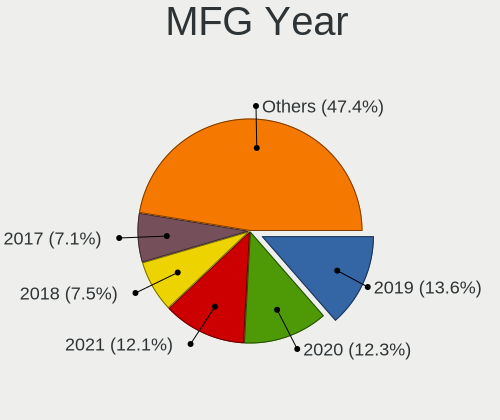
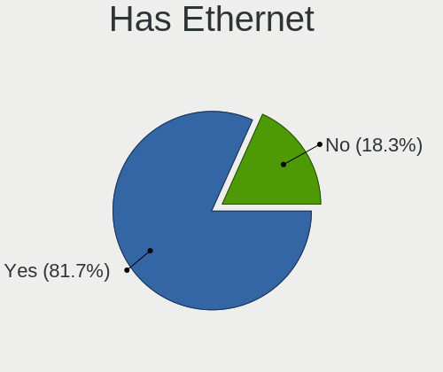
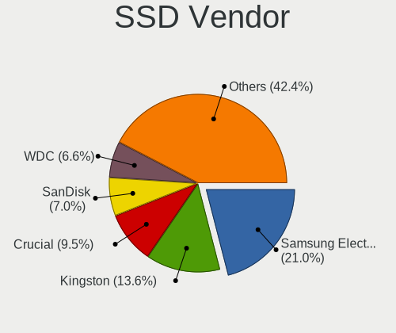
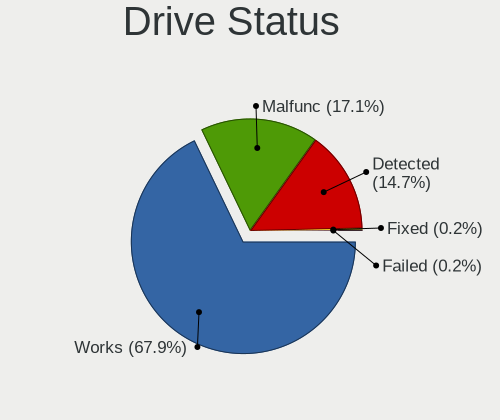
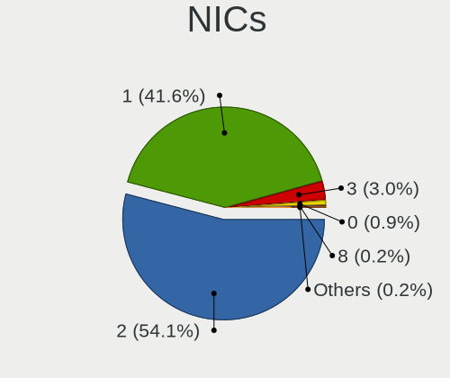

Xero - Tested Hardware & Statistics
-----------------------------------

A project to collect tested hardware configurations for Xero.

Anyone can contribute to this report by the [hw-probe](https://github.com/linuxhw/hw-probe) tool:

    sudo -E hw-probe -all -upload

Please contribute! Especially if your hardware is rare.

This is a report for all computer types. See also reports for [desktops](/Dist/Xero/Desktop/README.md) and [notebooks](/Dist/Xero/Notebook/README.md).

Contents
--------

* [ Test Cases ](#test-cases)

* [ System ](#system)
  - [ OS                       ](#os)
  - [ OS Family                ](#os-family)
  - [ Kernel                   ](#kernel)
  - [ Kernel Family            ](#kernel-family)
  - [ Kernel Major Ver.        ](#kernel-major-ver)
  - [ Arch                     ](#arch)
  - [ DE                       ](#de)
  - [ Display Server           ](#display-server)
  - [ Display Manager          ](#display-manager)
  - [ OS Lang                  ](#os-lang)
  - [ Boot Mode                ](#boot-mode)
  - [ Filesystem               ](#filesystem)
  - [ Part. scheme             ](#part-scheme)
  - [ Dual Boot with Linux/BSD ](#dual-boot-with-linuxbsd)
  - [ Dual Boot (Win)          ](#dual-boot-win)

* [ Board ](#board)
  - [ Vendor                   ](#vendor)
  - [ Model                    ](#model)
  - [ Model Family             ](#model-family)
  - [ MFG Year                 ](#mfg-year)
  - [ Form Factor              ](#form-factor)
  - [ Secure Boot              ](#secure-boot)
  - [ Coreboot                 ](#coreboot)
  - [ RAM Size                 ](#ram-size)
  - [ RAM Used                 ](#ram-used)
  - [ Total Drives             ](#total-drives)
  - [ Has CD-ROM               ](#has-cd-rom)
  - [ Has Ethernet             ](#has-ethernet)
  - [ Has WiFi                 ](#has-wifi)
  - [ Has Bluetooth            ](#has-bluetooth)

* [ Location ](#location)
  - [ Country                  ](#country)
  - [ City                     ](#city)

* [ Drives ](#drives)
  - [ Drive Vendor             ](#drive-vendor)
  - [ Drive Model              ](#drive-model)
  - [ HDD Vendor               ](#hdd-vendor)
  - [ SSD Vendor               ](#ssd-vendor)
  - [ Drive Kind               ](#drive-kind)
  - [ Drive Connector          ](#drive-connector)
  - [ Drive Size               ](#drive-size)
  - [ Space Total              ](#space-total)
  - [ Space Used               ](#space-used)
  - [ Malfunc. Drives          ](#malfunc-drives)
  - [ Malfunc. Drive Vendor    ](#malfunc-drive-vendor)
  - [ Malfunc. HDD Vendor      ](#malfunc-hdd-vendor)
  - [ Malfunc. Drive Kind      ](#malfunc-drive-kind)
  - [ Failed Drives            ](#failed-drives)
  - [ Failed Drive Vendor      ](#failed-drive-vendor)
  - [ Drive Status             ](#drive-status)

* [ Storage controller ](#storage-controller)
  - [ Storage Vendor           ](#storage-vendor)
  - [ Storage Model            ](#storage-model)
  - [ Storage Kind             ](#storage-kind)

* [ Processor ](#processor)
  - [ CPU Vendor               ](#cpu-vendor)
  - [ CPU Model                ](#cpu-model)
  - [ CPU Model Family         ](#cpu-model-family)
  - [ CPU Cores                ](#cpu-cores)
  - [ CPU Sockets              ](#cpu-sockets)
  - [ CPU Threads              ](#cpu-threads)
  - [ CPU Op-Modes             ](#cpu-op-modes)
  - [ CPU Microcode            ](#cpu-microcode)
  - [ CPU Microarch            ](#cpu-microarch)

* [ Graphics ](#graphics)
  - [ GPU Vendor               ](#gpu-vendor)
  - [ GPU Model                ](#gpu-model)
  - [ GPU Combo                ](#gpu-combo)
  - [ GPU Driver               ](#gpu-driver)
  - [ GPU Memory               ](#gpu-memory)

* [ Monitor ](#monitor)
  - [ Monitor Vendor           ](#monitor-vendor)
  - [ Monitor Model            ](#monitor-model)
  - [ Monitor Resolution       ](#monitor-resolution)
  - [ Monitor Diagonal         ](#monitor-diagonal)
  - [ Monitor Width            ](#monitor-width)
  - [ Aspect Ratio             ](#aspect-ratio)
  - [ Monitor Area             ](#monitor-area)
  - [ Pixel Density            ](#pixel-density)
  - [ Multiple Monitors        ](#multiple-monitors)

* [ Network ](#network)
  - [ Net Controller Vendor    ](#net-controller-vendor)
  - [ Net Controller Model     ](#net-controller-model)
  - [ Wireless Vendor          ](#wireless-vendor)
  - [ Wireless Model           ](#wireless-model)
  - [ Ethernet Vendor          ](#ethernet-vendor)
  - [ Ethernet Model           ](#ethernet-model)
  - [ Net Controller Kind      ](#net-controller-kind)
  - [ Used Controller          ](#used-controller)
  - [ NICs                     ](#nics)
  - [ IPv6                     ](#ipv6)

* [ Bluetooth ](#bluetooth)
  - [ Bluetooth Vendor         ](#bluetooth-vendor)
  - [ Bluetooth Model          ](#bluetooth-model)

* [ Sound ](#sound)
  - [ Sound Vendor             ](#sound-vendor)
  - [ Sound Model              ](#sound-model)

* [ Memory ](#memory)
  - [ Memory Vendor            ](#memory-vendor)
  - [ Memory Model             ](#memory-model)
  - [ Memory Kind              ](#memory-kind)
  - [ Memory Form Factor       ](#memory-form-factor)
  - [ Memory Size              ](#memory-size)
  - [ Memory Speed             ](#memory-speed)

* [ Printers & scanners ](#printers--scanners)
  - [ Printer Vendor           ](#printer-vendor)
  - [ Printer Model            ](#printer-model)
  - [ Scanner Vendor           ](#scanner-vendor)
  - [ Scanner Model            ](#scanner-model)

* [ Camera ](#camera)
  - [ Camera Vendor            ](#camera-vendor)
  - [ Camera Model             ](#camera-model)

* [ Security ](#security)
  - [ Fingerprint Vendor       ](#fingerprint-vendor)
  - [ Fingerprint Model        ](#fingerprint-model)
  - [ Chipcard Vendor          ](#chipcard-vendor)
  - [ Chipcard Model           ](#chipcard-model)

* [ Unsupported ](#unsupported)
  - [ Unsupported Devices      ](#unsupported-devices)
  - [ Unsupported Device Types ](#unsupported-device-types)

Test Cases
----------

Total: 86

| Vendor        | Model                       | Form-Factor | Probe                                                      | Date         |
|---------------|-----------------------------|-------------|------------------------------------------------------------|--------------|
| ASRock        | AB350 Pro4                  | Desktop     | [7049f819f0](https://linux-hardware.org/?probe=7049f819f0) | Jun 30, 2022 |
| HP            | 3396                        | Desktop     | [00782afa06](https://linux-hardware.org/?probe=00782afa06) | Jun 22, 2022 |
| ASUSTek       | UX303LN                     | Notebook    | [9ce42e1b01](https://linux-hardware.org/?probe=9ce42e1b01) | Jun 12, 2022 |
| ASUSTek       | ROG STRIX B450-F GAMING     | Desktop     | [8109a04ffa](https://linux-hardware.org/?probe=8109a04ffa) | Jun 12, 2022 |
| BESSTAR Te... | ATB15                       | Server      | [d6e47a7c18](https://linux-hardware.org/?probe=d6e47a7c18) | Jun 12, 2022 |
| ASUSTek       | ROG STRIX B450-F GAMING     | Desktop     | [8a7401e54a](https://linux-hardware.org/?probe=8a7401e54a) | Jun 11, 2022 |
| Acer          | Aspire XC-886 V:2.0         | Desktop     | [2fe8cdaf93](https://linux-hardware.org/?probe=2fe8cdaf93) | May 31, 2022 |
| Dell          | Inspiron 1545               | Notebook    | [ce0e24a314](https://linux-hardware.org/?probe=ce0e24a314) | May 28, 2022 |
| Lenovo        | IdeaPad 330-17IKB 81DM      | Notebook    | [53475a6004](https://linux-hardware.org/?probe=53475a6004) | May 24, 2022 |
| ASUSTek       | VivoBook_ASUSLaptop X350... | Notebook    | [80d32848bf](https://linux-hardware.org/?probe=80d32848bf) | May 21, 2022 |
| ASUSTek       | ROG Maximus X HERO          | Desktop     | [3ddad532a9](https://linux-hardware.org/?probe=3ddad532a9) | May 08, 2022 |
| Dell          | Inspiron 7786               | Convertible | [0ef12447d9](https://linux-hardware.org/?probe=0ef12447d9) | May 02, 2022 |
| Dell          | Precision M3800             | Notebook    | [7b63874768](https://linux-hardware.org/?probe=7b63874768) | Apr 25, 2022 |
| Dell          | Precision M3800             | Notebook    | [fbabacd835](https://linux-hardware.org/?probe=fbabacd835) | Apr 24, 2022 |
| Lenovo        | ThinkPad X230 2325HR9       | Notebook    | [a9d9d3fbb2](https://linux-hardware.org/?probe=a9d9d3fbb2) | Apr 21, 2022 |
| MSI           | Z170-A PRO                  | Desktop     | [db5ab86328](https://linux-hardware.org/?probe=db5ab86328) | Apr 11, 2022 |
| Acer          | Aspire A515-54G             | Notebook    | [52b660d8fb](https://linux-hardware.org/?probe=52b660d8fb) | Apr 11, 2022 |
| MSI           | Z170-A PRO                  | Desktop     | [3bd5bb8d08](https://linux-hardware.org/?probe=3bd5bb8d08) | Apr 10, 2022 |
| Dell          | Precision M3800             | Notebook    | [1ef57b39a7](https://linux-hardware.org/?probe=1ef57b39a7) | Apr 10, 2022 |
| ASUSTek       | TUF Gaming X570-PLUS        | Desktop     | [8d251b1b2a](https://linux-hardware.org/?probe=8d251b1b2a) | Apr 03, 2022 |
| Dell          | Precision M3800             | Notebook    | [9fc15d1ae6](https://linux-hardware.org/?probe=9fc15d1ae6) | Mar 31, 2022 |
| HP            | 843B                        | Desktop     | [a88ff7cf5c](https://linux-hardware.org/?probe=a88ff7cf5c) | Mar 27, 2022 |
| Pegatron      | 2AC2                        | Desktop     | [d3c82e973b](https://linux-hardware.org/?probe=d3c82e973b) | Mar 25, 2022 |
| ASUSTek       | Maximus IX HERO             | Desktop     | [745cc1d638](https://linux-hardware.org/?probe=745cc1d638) | Mar 25, 2022 |
| MSI           | GF63 Thin 9SCX              | Notebook    | [4501fa1556](https://linux-hardware.org/?probe=4501fa1556) | Mar 25, 2022 |
| Dell          | Latitude 7480               | Notebook    | [bf00ec6a76](https://linux-hardware.org/?probe=bf00ec6a76) | Mar 23, 2022 |
| ASUSTek       | Maximus IX HERO             | Desktop     | [8eb98db533](https://linux-hardware.org/?probe=8eb98db533) | Mar 22, 2022 |
| HUAWEI        | WRT-WX9                     | Notebook    | [70ec26bed6](https://linux-hardware.org/?probe=70ec26bed6) | Mar 22, 2022 |
| ASUSTek       | ROG CROSSHAIR VIII HERO     | Desktop     | [13cdf54c81](https://linux-hardware.org/?probe=13cdf54c81) | Mar 21, 2022 |
| Dell          | Latitude 7480               | Notebook    | [faddba28a8](https://linux-hardware.org/?probe=faddba28a8) | Mar 19, 2022 |
| Apple         | MacBookAir6,2               | Notebook    | [b71110144d](https://linux-hardware.org/?probe=b71110144d) | Mar 19, 2022 |
| HP            | Laptop 15-da0xxx            | Notebook    | [bb9074ccdf](https://linux-hardware.org/?probe=bb9074ccdf) | Mar 18, 2022 |
| Lenovo        | IdeaPad 3 15IML05 81WR      | Notebook    | [918c951cd1](https://linux-hardware.org/?probe=918c951cd1) | Mar 12, 2022 |
| ASUSTek       | TUF Gaming B550M-PLUS       | Desktop     | [639e7361ef](https://linux-hardware.org/?probe=639e7361ef) | Mar 12, 2022 |
| Lenovo        | IdeaPad S145-15IIL 81W8     | Notebook    | [e251c9f079](https://linux-hardware.org/?probe=e251c9f079) | Mar 11, 2022 |
| MSI           | Z170A PC MATE               | Desktop     | [181e014823](https://linux-hardware.org/?probe=181e014823) | Mar 08, 2022 |
| Gigabyte      | Z170X-UD3-CF                | Desktop     | [3ec7a7f643](https://linux-hardware.org/?probe=3ec7a7f643) | Mar 06, 2022 |
| Dell          | Venue 11 Pro 7130 vPro      | Notebook    | [57b302b119](https://linux-hardware.org/?probe=57b302b119) | Mar 05, 2022 |
| Lenovo        | ThinkPad T460 20FMS1XX00    | Notebook    | [78e82c6674](https://linux-hardware.org/?probe=78e82c6674) | Feb 24, 2022 |
| Dell          | Latitude E6430              | Notebook    | [e1de4e80fe](https://linux-hardware.org/?probe=e1de4e80fe) | Feb 15, 2022 |
| Lenovo        | Legion 5 15ARH05H 82B1      | Notebook    | [a3c5f00a2a](https://linux-hardware.org/?probe=a3c5f00a2a) | Feb 10, 2022 |
| Lenovo        | Legion 5 15ARH05H 82B1      | Notebook    | [e53fb31614](https://linux-hardware.org/?probe=e53fb31614) | Feb 10, 2022 |
| Lenovo        | Legion Y740-15IRHg 81UH     | Notebook    | [b0cc5e0cbc](https://linux-hardware.org/?probe=b0cc5e0cbc) | Jan 29, 2022 |
| ASUSTek       | P5Q PRO TURBO               | Desktop     | [83ca29c9c8](https://linux-hardware.org/?probe=83ca29c9c8) | Jan 28, 2022 |
| Acer          | Aspire A315-58G             | Notebook    | [cb4f253c1c](https://linux-hardware.org/?probe=cb4f253c1c) | Jan 28, 2022 |
| Dell          | Latitude E6520              | Notebook    | [ee96960cec](https://linux-hardware.org/?probe=ee96960cec) | Jan 25, 2022 |
| Lenovo        | Yoga 710-15IKB 80V5         | Convertible | [3d5fe9fc42](https://linux-hardware.org/?probe=3d5fe9fc42) | Jan 22, 2022 |
| HP            | Laptop 15s-eq0xxx           | Notebook    | [0df160c245](https://linux-hardware.org/?probe=0df160c245) | Jan 21, 2022 |
| ASUSTek       | TUF Gaming B550M-PLUS       | Desktop     | [230373b3ff](https://linux-hardware.org/?probe=230373b3ff) | Jan 09, 2022 |
| Lenovo        | Legion Y540-15IRH-PG0 81... | Notebook    | [3df8a1c560](https://linux-hardware.org/?probe=3df8a1c560) | Jan 08, 2022 |
| HP            | 1906                        | Desktop     | [5f8fe7cb20](https://linux-hardware.org/?probe=5f8fe7cb20) | Jan 06, 2022 |
| ASUSTek       | TUF Gaming X570-PLUS        | Desktop     | [793bfa4f40](https://linux-hardware.org/?probe=793bfa4f40) | Jan 04, 2022 |
| HP            | 2179                        | Desktop     | [79bac7ce1b](https://linux-hardware.org/?probe=79bac7ce1b) | Jan 01, 2022 |
| ASUSTek       | TUF B360M-PLUS GAMING/BR    | Desktop     | [512091cd1c](https://linux-hardware.org/?probe=512091cd1c) | Dec 30, 2021 |
| Dell          | Vostro 3590                 | Notebook    | [9e77a2584c](https://linux-hardware.org/?probe=9e77a2584c) | Dec 30, 2021 |
| HP            | 2179                        | Desktop     | [9b6358ce37](https://linux-hardware.org/?probe=9b6358ce37) | Dec 30, 2021 |
| ASUSTek       | ASUS EXPERTBOOK B9400CEA... | Notebook    | [78e3fbdf6a](https://linux-hardware.org/?probe=78e3fbdf6a) | Dec 28, 2021 |
| HP            | Notebook                    | Notebook    | [c14ea64659](https://linux-hardware.org/?probe=c14ea64659) | Dec 23, 2021 |
| ASRock        | X570 Taichi                 | Desktop     | [5c2c86f287](https://linux-hardware.org/?probe=5c2c86f287) | Dec 23, 2021 |
| ASUSTek       | X510UNR                     | Notebook    | [0733a05806](https://linux-hardware.org/?probe=0733a05806) | Dec 21, 2021 |
| ASUSTek       | ASUS EXPERTBOOK B9400CEA... | Notebook    | [b4425de4a6](https://linux-hardware.org/?probe=b4425de4a6) | Dec 17, 2021 |
| ASUSTek       | ASUS TUF Gaming F15 FX50... | Notebook    | [6f3bd18b3f](https://linux-hardware.org/?probe=6f3bd18b3f) | Dec 06, 2021 |
| Pegatron      | D15K                        | Notebook    | [eaeaad8d39](https://linux-hardware.org/?probe=eaeaad8d39) | Nov 29, 2021 |
| ASUSTek       | TUF Gaming X570-PLUS        | Desktop     | [728b23aa46](https://linux-hardware.org/?probe=728b23aa46) | Nov 26, 2021 |
| ASUSTek       | PRIME A320M-K               | Desktop     | [9e9b6fd944](https://linux-hardware.org/?probe=9e9b6fd944) | Nov 21, 2021 |
| MSI           | GP73 Leopard 8RD            | Notebook    | [5bafb43f78](https://linux-hardware.org/?probe=5bafb43f78) | Nov 21, 2021 |
| Acer          | Aspire A315-58G             | Notebook    | [911895fcf2](https://linux-hardware.org/?probe=911895fcf2) | Nov 19, 2021 |
| Acer          | Aspire A315-58G             | Notebook    | [5748b3cd05](https://linux-hardware.org/?probe=5748b3cd05) | Nov 12, 2021 |
| Lenovo        | ThinkPad W530 24384CU       | Notebook    | [d18d3495e0](https://linux-hardware.org/?probe=d18d3495e0) | Nov 05, 2021 |
| ASUSTek       | TUF Z390-PLUS GAMING        | Desktop     | [4877535f8b](https://linux-hardware.org/?probe=4877535f8b) | Nov 03, 2021 |
| MSI           | Z370 GAMING PLUS            | Desktop     | [8dd5924480](https://linux-hardware.org/?probe=8dd5924480) | Oct 31, 2021 |
| Acer          | Aspire A315-58G             | Notebook    | [905fce5118](https://linux-hardware.org/?probe=905fce5118) | Oct 29, 2021 |
| HP            | ENVY Sleekbook 4            | Notebook    | [ebea056239](https://linux-hardware.org/?probe=ebea056239) | Oct 29, 2021 |
| ASUSTek       | VivoBook_ASUSLaptop X509... | Notebook    | [2a54689fb3](https://linux-hardware.org/?probe=2a54689fb3) | Oct 24, 2021 |
| ASUSTek       | VivoBook_ASUS Laptop E41... | Notebook    | [fb95cbb063](https://linux-hardware.org/?probe=fb95cbb063) | Oct 19, 2021 |
| Lenovo        | IdeaPad 5 15ITL05 82FG      | Notebook    | [6cd76dfa2a](https://linux-hardware.org/?probe=6cd76dfa2a) | Oct 13, 2021 |
| ASUSTek       | ASUS TUF Gaming F15 FX50... | Notebook    | [e3a8d1ca32](https://linux-hardware.org/?probe=e3a8d1ca32) | Oct 11, 2021 |
| ASUSTek       | ASUS TUF Gaming F15 FX50... | Notebook    | [c7c4a74bb8](https://linux-hardware.org/?probe=c7c4a74bb8) | Oct 11, 2021 |
| ASUSTek       | ASUS TUF Gaming F15 FX50... | Notebook    | [68865693c7](https://linux-hardware.org/?probe=68865693c7) | Oct 09, 2021 |
| Dell          | 0XC7MM A01                  | Desktop     | [390c5408b2](https://linux-hardware.org/?probe=390c5408b2) | Oct 05, 2021 |
| Lenovo        | Y520-15IKBN 80WK            | Notebook    | [e804a59920](https://linux-hardware.org/?probe=e804a59920) | Oct 02, 2021 |
| ASRock        | B450M Pro4                  | Desktop     | [a198e8517a](https://linux-hardware.org/?probe=a198e8517a) | Oct 01, 2021 |
| ASRock        | X570 Taichi                 | Desktop     | [50fd919991](https://linux-hardware.org/?probe=50fd919991) | Aug 29, 2021 |
| Gigabyte      | X570 AORUS MASTER           | Desktop     | [a3c6fe4037](https://linux-hardware.org/?probe=a3c6fe4037) | Jul 24, 2021 |
| ASRock        | X570 Taichi                 | Desktop     | [57d19e2c3a](https://linux-hardware.org/?probe=57d19e2c3a) | May 19, 2021 |
| Acer          | FIH57                       | Desktop     | [9c3e383ea5](https://linux-hardware.org/?probe=9c3e383ea5) | Apr 30, 2021 |

System
------

OS
--

Installed operating systems

| Name         | Computers | Percent |
|--------------|-----------|---------|
| Xero Rolling | 57        | 82.61%  |
| Xero         | 12        | 17.39%  |

OS Family
---------

OS without a version

| Name | Computers | Percent |
|------|-----------|---------|
| Xero | 68        | 100%    |

Kernel
------

Version of the Linux kernel

| Version                      | Computers | Percent |
|------------------------------|-----------|---------|
| 5.16.15-arch1-1              | 6         | 8%      |
| 5.17.9-arch1-1               | 3         | 4%      |
| 5.16.2-arch1-1               | 3         | 4%      |
| 5.16.1-arch1-1               | 3         | 4%      |
| 5.15.33-1-lts                | 3         | 4%      |
| 5.14.14-arch1-1              | 3         | 4%      |
| 5.18.3-arch1-1               | 2         | 2.67%   |
| 5.17.5-arch1-1               | 2         | 2.67%   |
| 5.17.1-arch1-1               | 2         | 2.67%   |
| 5.16.8-arch1-1               | 2         | 2.67%   |
| 5.16.16-arch1-1              | 2         | 2.67%   |
| 5.16.13-arch1-1              | 2         | 2.67%   |
| 5.16.12-arch1-1              | 2         | 2.67%   |
| 5.15.10-arch1-1              | 2         | 2.67%   |
| 5.14.8-zen1-1-zen            | 2         | 2.67%   |
| 5.18.6-arch1-1               | 1         | 1.33%   |
| 5.18.0-arch1-1               | 1         | 1.33%   |
| 5.17.7-arch1-1               | 1         | 1.33%   |
| 5.16.16-zen1-1-zen           | 1         | 1.33%   |
| 5.16.14-arch1-1              | 1         | 1.33%   |
| 5.16.10-arch1-1              | 1         | 1.33%   |
| 5.15.8-zen1-1-zen            | 1         | 1.33%   |
| 5.15.6-arch2-1               | 1         | 1.33%   |
| 5.15.4-arch1-1               | 1         | 1.33%   |
| 5.15.35-1-lts                | 1         | 1.33%   |
| 5.15.3-zen1-1-zen            | 1         | 1.33%   |
| 5.15.26-1-lts                | 1         | 1.33%   |
| 5.15.24-1-lts                | 1         | 1.33%   |
| 5.15.13-arch1-1              | 1         | 1.33%   |
| 5.15.13-AMD                  | 1         | 1.33%   |
| 5.15.12-zen1-1-zen           | 1         | 1.33%   |
| 5.15.12-arch1-1-surface      | 1         | 1.33%   |
| 5.15.12-arch1-1              | 1         | 1.33%   |
| 5.15.11-arch2-1-surface      | 1         | 1.33%   |
| 5.15.11-arch2-1              | 1         | 1.33%   |
| 5.14.9-zen2-1-zen            | 1         | 1.33%   |
| 5.14.8-arch1-1               | 1         | 1.33%   |
| 5.14.16-zen1-1-zen           | 1         | 1.33%   |
| 5.14.16-arch1-2-surface      | 1         | 1.33%   |
| 5.14.16-arch1-1              | 1         | 1.33%   |
| 5.14.15-zen1-1-zen           | 1         | 1.33%   |
| 5.14.14-zen1-1-zen           | 1         | 1.33%   |
| 5.14.12-arch1-1              | 1         | 1.33%   |
| 5.14.11-hardened1-1-hardened | 1         | 1.33%   |
| 5.13.4-zen1-1-zen            | 1         | 1.33%   |
| 5.13.13-AMD                  | 1         | 1.33%   |
| 5.12.5-AMD                   | 1         | 1.33%   |
| 5.11.16-zen1-1-zen           | 1         | 1.33%   |
| 5.10.88-1-lts                | 1         | 1.33%   |
| 5.10.80-1-lts                | 1         | 1.33%   |
| 5.10.71-1-lts                | 1         | 1.33%   |

Kernel Family
-------------

Linux kernel without a distro release

| Version | Computers | Percent |
|---------|-----------|---------|
| 5.16.15 | 6         | 8%      |
| 5.14.14 | 4         | 5.33%   |
| 5.17.9  | 3         | 4%      |
| 5.16.2  | 3         | 4%      |
| 5.16.16 | 3         | 4%      |
| 5.16.1  | 3         | 4%      |
| 5.15.33 | 3         | 4%      |
| 5.15.12 | 3         | 4%      |
| 5.14.8  | 3         | 4%      |
| 5.14.16 | 3         | 4%      |
| 5.18.3  | 2         | 2.67%   |
| 5.17.5  | 2         | 2.67%   |
| 5.17.1  | 2         | 2.67%   |
| 5.16.8  | 2         | 2.67%   |
| 5.16.13 | 2         | 2.67%   |
| 5.16.12 | 2         | 2.67%   |
| 5.15.13 | 2         | 2.67%   |
| 5.15.11 | 2         | 2.67%   |
| 5.15.10 | 2         | 2.67%   |
| 5.18.6  | 1         | 1.33%   |
| 5.18.0  | 1         | 1.33%   |
| 5.17.7  | 1         | 1.33%   |
| 5.16.14 | 1         | 1.33%   |
| 5.16.10 | 1         | 1.33%   |
| 5.15.8  | 1         | 1.33%   |
| 5.15.6  | 1         | 1.33%   |
| 5.15.4  | 1         | 1.33%   |
| 5.15.35 | 1         | 1.33%   |
| 5.15.3  | 1         | 1.33%   |
| 5.15.26 | 1         | 1.33%   |
| 5.15.24 | 1         | 1.33%   |
| 5.14.9  | 1         | 1.33%   |
| 5.14.15 | 1         | 1.33%   |
| 5.14.12 | 1         | 1.33%   |
| 5.14.11 | 1         | 1.33%   |
| 5.13.4  | 1         | 1.33%   |
| 5.13.13 | 1         | 1.33%   |
| 5.12.5  | 1         | 1.33%   |
| 5.11.16 | 1         | 1.33%   |
| 5.10.88 | 1         | 1.33%   |
| 5.10.80 | 1         | 1.33%   |
| 5.10.71 | 1         | 1.33%   |

Kernel Major Ver.
-----------------

Linux kernel major version

| Version | Computers | Percent |
|---------|-----------|---------|
| 5.16    | 23        | 31.51%  |
| 5.15    | 18        | 24.66%  |
| 5.14    | 13        | 17.81%  |
| 5.17    | 8         | 10.96%  |
| 5.18    | 4         | 5.48%   |
| 5.10    | 3         | 4.11%   |
| 5.13    | 2         | 2.74%   |
| 5.12    | 1         | 1.37%   |
| 5.11    | 1         | 1.37%   |

Arch
----

OS architecture (x86_64, i586, etc.)

| Name   | Computers | Percent |
|--------|-----------|---------|
| x86_64 | 68        | 100%    |

DE
--

Desktop Environment

| Name  | Computers | Percent |
|-------|-----------|---------|
| KDE5  | 64        | 91.43%  |
| XFCE  | 4         | 5.71%   |
| GNOME | 2         | 2.86%   |

Display Server
--------------

X11 or Wayland

| Name    | Computers | Percent |
|---------|-----------|---------|
| X11     | 56        | 82.35%  |
| Wayland | 10        | 14.71%  |
| Tty     | 2         | 2.94%   |

Display Manager
---------------

SDDM, LightDM, etc.

| Name    | Computers | Percent |
|---------|-----------|---------|
| SDDM    | 43        | 59.72%  |
| LightDM | 15        | 20.83%  |
| Unknown | 12        | 16.67%  |
| TDM     | 1         | 1.39%   |
| GDM     | 1         | 1.39%   |

OS Lang
-------

Language

| Lang  | Computers | Percent |
|-------|-----------|---------|
| en_US | 39        | 56.52%  |
| en_IN | 6         | 8.7%    |
| C     | 5         | 7.25%   |
| pl_PL | 4         | 5.8%    |
| en_GB | 3         | 4.35%   |
| de_DE | 3         | 4.35%   |
| it_IT | 2         | 2.9%    |
| en_AU | 2         | 2.9%    |
| fr_FR | 1         | 1.45%   |
| en_IL | 1         | 1.45%   |
| en_DK | 1         | 1.45%   |
| en_CA | 1         | 1.45%   |
| de_AT | 1         | 1.45%   |

Boot Mode
---------

EFI or BIOS

| Mode | Computers | Percent |
|------|-----------|---------|
| EFI  | 46        | 66.67%  |
| BIOS | 23        | 33.33%  |

Filesystem
----------

Type of filesystem

| Type    | Computers | Percent |
|---------|-----------|---------|
| Btrfs   | 52        | 74.29%  |
| Ext4    | 11        | 15.71%  |
| Overlay | 5         | 7.14%   |
| Xfs     | 2         | 2.86%   |

Part. scheme
------------

Scheme of partitioning

| Type    | Computers | Percent |
|---------|-----------|---------|
| GPT     | 48        | 69.57%  |
| Unknown | 12        | 17.39%  |
| MBR     | 9         | 13.04%  |

Dual Boot with Linux/BSD
------------------------

Hosting more than one Linux/BSD

| Dual boot | Computers | Percent |
|-----------|-----------|---------|
| No        | 56        | 78.87%  |
| Yes       | 15        | 21.13%  |

Dual Boot (Win)
---------------

Hosting Linux and Windows

| Dual boot | Computers | Percent |
|-----------|-----------|---------|
| No        | 47        | 69.12%  |
| Yes       | 21        | 30.88%  |

Board
-----

Vendor
------

Motherboard manufacturer

| Name                | Computers | Percent |
|---------------------|-----------|---------|
| ASUSTek Computer    | 18        | 26.47%  |
| Lenovo              | 12        | 17.65%  |
| Dell                | 11        | 16.18%  |
| Hewlett-Packard     | 8         | 11.76%  |
| MSI                 | 5         | 7.35%   |
| Acer                | 4         | 5.88%   |
| ASRock              | 3         | 4.41%   |
| Pegatron            | 2         | 2.94%   |
| Gigabyte Technology | 2         | 2.94%   |
| HUAWEI              | 1         | 1.47%   |
| BESSTAR Tech        | 1         | 1.47%   |
| Apple               | 1         | 1.47%   |

Model
-----

Motherboard model

| Name                                     | Computers | Percent |
|------------------------------------------|-----------|---------|
| Dell Precision M3800                     | 3         | 4.41%   |
| MSI MS-7971                              | 2         | 2.94%   |
| ASUS TUF Gaming X570-PLUS                | 2         | 2.94%   |
| Pegatron p6-2026                         | 1         | 1.47%   |
| Pegatron D15K                            | 1         | 1.47%   |
| MSI MS-7B61                              | 1         | 1.47%   |
| MSI GP73 Leopard 8RD                     | 1         | 1.47%   |
| MSI GF63 Thin 9SCX                       | 1         | 1.47%   |
| Lenovo Yoga 710-15IKB 80V5               | 1         | 1.47%   |
| Lenovo Y520-15IKBN 80WK                  | 1         | 1.47%   |
| Lenovo ThinkPad X230 2325HR9             | 1         | 1.47%   |
| Lenovo ThinkPad W530 24384CU             | 1         | 1.47%   |
| Lenovo ThinkPad T460 20FMS1XX00          | 1         | 1.47%   |
| Lenovo Legion Y740-15IRHg 81UH           | 1         | 1.47%   |
| Lenovo Legion Y540-15IRH-PG0 81SY        | 1         | 1.47%   |
| Lenovo Legion 5 15ARH05H 82B1            | 1         | 1.47%   |
| Lenovo IdeaPad S145-15IIL 81W8           | 1         | 1.47%   |
| Lenovo IdeaPad 5 15ITL05 82FG            | 1         | 1.47%   |
| Lenovo IdeaPad 330-17IKB 81DM            | 1         | 1.47%   |
| Lenovo IdeaPad 3 15IML05 81WR            | 1         | 1.47%   |
| HUAWEI WRT-WX9                           | 1         | 1.47%   |
| HP Z230 SFF Workstation                  | 1         | 1.47%   |
| HP ProOne 400 G1 AiO                     | 1         | 1.47%   |
| HP Pavilion Desktop 590-p0xxx            | 1         | 1.47%   |
| HP Notebook                              | 1         | 1.47%   |
| HP Laptop 15s-eq0xxx                     | 1         | 1.47%   |
| HP Laptop 15-da0xxx                      | 1         | 1.47%   |
| HP ENVY Sleekbook 4                      | 1         | 1.47%   |
| HP Compaq Elite 8300 CMT                 | 1         | 1.47%   |
| Gigabyte Z170X-UD3                       | 1         | 1.47%   |
| Gigabyte X570 AORUS MASTER               | 1         | 1.47%   |
| Dell Vostro 3590                         | 1         | 1.47%   |
| Dell Venue 11 Pro 7130 vPro              | 1         | 1.47%   |
| Dell Precision T1500                     | 1         | 1.47%   |
| Dell Latitude E6520                      | 1         | 1.47%   |
| Dell Latitude E6430                      | 1         | 1.47%   |
| Dell Latitude 7480                       | 1         | 1.47%   |
| Dell Inspiron 7786                       | 1         | 1.47%   |
| Dell Inspiron 1545                       | 1         | 1.47%   |
| BESSTAR Tech X500                        | 1         | 1.47%   |
| ASUS X510UNR                             | 1         | 1.47%   |
| ASUS VivoBook_ASUSLaptop X509FJ_X509FJ   | 1         | 1.47%   |
| ASUS VivoBook_ASUSLaptop X3500PC_K3500PC | 1         | 1.47%   |
| ASUS VivoBook_ASUS Laptop E410MA_E410MA  | 1         | 1.47%   |
| ASUS UX303LN                             | 1         | 1.47%   |
| ASUS TUF Z390-PLUS GAMING                | 1         | 1.47%   |
| ASUS TUF Gaming B550M-PLUS               | 1         | 1.47%   |
| ASUS TUF B360M-PLUS GAMING/BR            | 1         | 1.47%   |
| ASUS ROG STRIX B450-F GAMING             | 1         | 1.47%   |
| ASUS ROG Maximus X HERO                  | 1         | 1.47%   |
| ASUS ROG CROSSHAIR VIII HERO             | 1         | 1.47%   |
| ASUS PRIME A320M-K                       | 1         | 1.47%   |
| ASUS P5Q PRO TURBO                       | 1         | 1.47%   |
| ASUS Maximus IX HERO                     | 1         | 1.47%   |
| ASUS ASUS TUF Gaming F15 FX506LU_FX506LU | 1         | 1.47%   |
| ASUS ASUS EXPERTBOOK B9400CEA_B9450CEA   | 1         | 1.47%   |
| ASRock X570 Taichi                       | 1         | 1.47%   |
| ASRock B450M Pro4                        | 1         | 1.47%   |
| ASRock AB350 Pro4                        | 1         | 1.47%   |
| Apple MacBookAir6,2                      | 1         | 1.47%   |

Model Family
------------

Motherboard model prefix

| Name               | Computers | Percent |
|--------------------|-----------|---------|
| ASUS TUF           | 5         | 7.35%   |
| Lenovo IdeaPad     | 4         | 5.88%   |
| Dell Precision     | 4         | 5.88%   |
| Acer Aspire        | 4         | 5.88%   |
| Lenovo ThinkPad    | 3         | 4.41%   |
| Lenovo Legion      | 3         | 4.41%   |
| Dell Latitude      | 3         | 4.41%   |
| ASUS VivoBook      | 3         | 4.41%   |
| ASUS ROG           | 3         | 4.41%   |
| MSI MS-7971        | 2         | 2.94%   |
| HP Laptop          | 2         | 2.94%   |
| Dell Inspiron      | 2         | 2.94%   |
| ASUS ASUS          | 2         | 2.94%   |
| Pegatron p6-2026   | 1         | 1.47%   |
| Pegatron D15K      | 1         | 1.47%   |
| MSI MS-7B61        | 1         | 1.47%   |
| MSI GP73           | 1         | 1.47%   |
| MSI GF63           | 1         | 1.47%   |
| Lenovo Yoga        | 1         | 1.47%   |
| Lenovo Y520-15IKBN | 1         | 1.47%   |
| HUAWEI WRT-WX9     | 1         | 1.47%   |
| HP Z230            | 1         | 1.47%   |
| HP ProOne          | 1         | 1.47%   |
| HP Pavilion        | 1         | 1.47%   |
| HP Notebook        | 1         | 1.47%   |
| HP ENVY            | 1         | 1.47%   |
| HP Compaq          | 1         | 1.47%   |
| Gigabyte Z170X-UD3 | 1         | 1.47%   |
| Gigabyte X570      | 1         | 1.47%   |
| Dell Vostro        | 1         | 1.47%   |
| Dell Venue         | 1         | 1.47%   |
| BESSTAR Tech X500  | 1         | 1.47%   |
| ASUS X510UNR       | 1         | 1.47%   |
| ASUS UX303LN       | 1         | 1.47%   |
| ASUS PRIME         | 1         | 1.47%   |
| ASUS P5Q           | 1         | 1.47%   |
| ASUS Maximus       | 1         | 1.47%   |
| ASRock X570        | 1         | 1.47%   |
| ASRock B450M       | 1         | 1.47%   |
| ASRock AB350       | 1         | 1.47%   |
| Apple MacBookAir6  | 1         | 1.47%   |

MFG Year
--------

Motherboard manufacture year

| Year | Computers | Percent |
|------|-----------|---------|
| 2019 | 14        | 20.59%  |
| 2020 | 9         | 13.24%  |
| 2018 | 9         | 13.24%  |
| 2017 | 8         | 11.76%  |
| 2013 | 5         | 7.35%   |
| 2012 | 5         | 7.35%   |
| 2021 | 4         | 5.88%   |
| 2015 | 4         | 5.88%   |
| 2016 | 2         | 2.94%   |
| 2014 | 2         | 2.94%   |
| 2011 | 2         | 2.94%   |
| 2010 | 2         | 2.94%   |
| 2009 | 1         | 1.47%   |
| 2008 | 1         | 1.47%   |

Form Factor
-----------

Physical design of the computer

| Name        | Computers | Percent |
|-------------|-----------|---------|
| Notebook    | 38        | 55.88%  |
| Desktop     | 27        | 39.71%  |
| Convertible | 2         | 2.94%   |
| Server      | 1         | 1.47%   |

Secure Boot
-----------

Enabled or disabled

| State    | Computers | Percent |
|----------|-----------|---------|
| Disabled | 68        | 100%    |

Coreboot
--------

Have coreboot on board

| Used | Computers | Percent |
|------|-----------|---------|
| No   | 68        | 100%    |

RAM Size
--------

Total RAM memory

| Size in GB  | Computers | Percent |
|-------------|-----------|---------|
| 4.01-8.0    | 19        | 27.94%  |
| 16.01-24.0  | 18        | 26.47%  |
| 8.01-16.0   | 15        | 22.06%  |
| 32.01-64.0  | 7         | 10.29%  |
| 3.01-4.0    | 5         | 7.35%   |
| 24.01-32.0  | 3         | 4.41%   |
| 64.01-256.0 | 1         | 1.47%   |

RAM Used
--------

Used RAM memory

| Used GB    | Computers | Percent |
|------------|-----------|---------|
| 2.01-3.0   | 26        | 34.21%  |
| 1.01-2.0   | 18        | 23.68%  |
| 4.01-8.0   | 14        | 18.42%  |
| 3.01-4.0   | 9         | 11.84%  |
| 8.01-16.0  | 4         | 5.26%   |
| 0.51-1.0   | 2         | 2.63%   |
| 0.01-0.5   | 2         | 2.63%   |
| 16.01-24.0 | 1         | 1.32%   |

Total Drives
------------

Number of drives on board

| Drives | Computers | Percent |
|--------|-----------|---------|
| 1      | 35        | 51.47%  |
| 2      | 18        | 26.47%  |
| 3      | 8         | 11.76%  |
| 4      | 3         | 4.41%   |
| 6      | 2         | 2.94%   |
| 7      | 1         | 1.47%   |
| 5      | 1         | 1.47%   |

Has CD-ROM
----------

Has CD-ROM on board

| Presented | Computers | Percent |
|-----------|-----------|---------|
| No        | 54        | 79.41%  |
| Yes       | 14        | 20.59%  |

Has Ethernet
------------

Has Ethernet on board

| Presented | Computers | Percent |
|-----------|-----------|---------|
| Yes       | 56        | 82.35%  |
| No        | 12        | 17.65%  |

Has WiFi
--------

Has WiFi module

| Presented | Computers | Percent |
|-----------|-----------|---------|
| Yes       | 56        | 82.35%  |
| No        | 12        | 17.65%  |

Has Bluetooth
-------------

Has Bluetooth module

| Presented | Computers | Percent |
|-----------|-----------|---------|
| Yes       | 54        | 79.41%  |
| No        | 14        | 20.59%  |

Location
--------

Country
-------

Geographic location (country)

| Country               | Computers | Percent |
|-----------------------|-----------|---------|
| USA                   | 17        | 25%     |
| India                 | 8         | 11.76%  |
| Germany               | 5         | 7.35%   |
| Poland                | 4         | 5.88%   |
| Italy                 | 3         | 4.41%   |
| Greece                | 3         | 4.41%   |
| France                | 3         | 4.41%   |
| UK                    | 2         | 2.94%   |
| Canada                | 2         | 2.94%   |
| Australia             | 2         | 2.94%   |
| Turkey                | 1         | 1.47%   |
| Sweden                | 1         | 1.47%   |
| Spain                 | 1         | 1.47%   |
| Portugal              | 1         | 1.47%   |
| Palestinian Territory | 1         | 1.47%   |
| Pakistan              | 1         | 1.47%   |
| Norway                | 1         | 1.47%   |
| Netherlands           | 1         | 1.47%   |
| Morocco               | 1         | 1.47%   |
| Mongolia              | 1         | 1.47%   |
| Mexico                | 1         | 1.47%   |
| Malaysia              | 1         | 1.47%   |
| Lebanon               | 1         | 1.47%   |
| Israel                | 1         | 1.47%   |
| Hungary               | 1         | 1.47%   |
| Denmark               | 1         | 1.47%   |
| Colombia              | 1         | 1.47%   |
| Brazil                | 1         | 1.47%   |
| Austria               | 1         | 1.47%   |

City
----

Geographic location (city)

| City           | Computers | Percent |
|----------------|-----------|---------|
| Longmont       | 3         | 4.41%   |
| Madurai        | 2         | 2.94%   |
| Zell am See    | 1         | 1.47%   |
| Wrexham        | 1         | 1.47%   |
| Wells          | 1         | 1.47%   |
| Warsaw         | 1         | 1.47%   |
| Ulan Bator     | 1         | 1.47%   |
| Toronto        | 1         | 1.47%   |
| Tel Aviv       | 1         | 1.47%   |
| Taranto        | 1         | 1.47%   |
| Stuttgart      | 1         | 1.47%   |
| Springfield    | 1         | 1.47%   |
| Silkeborg      | 1         | 1.47%   |
| Salt Lake City | 1         | 1.47%   |
| Ramallah       | 1         | 1.47%   |
| Pune           | 1         | 1.47%   |
| Poznan         | 1         | 1.47%   |
| Portland       | 1         | 1.47%   |
| Pirmasens      | 1         | 1.47%   |
| Phoenix        | 1         | 1.47%   |
| Pavia          | 1         | 1.47%   |
| Passos         | 1         | 1.47%   |
| Paris          | 1         | 1.47%   |
| Oslo           | 1         | 1.47%   |
| Oberursel      | 1         | 1.47%   |
| Neu-Ulm        | 1         | 1.47%   |
| Mumbai         | 1         | 1.47%   |
| Monterrey      | 1         | 1.47%   |
| Melbourne      | 1         | 1.47%   |
| Lucknow        | 1         | 1.47%   |
| Lublin         | 1         | 1.47%   |
| Longview       | 1         | 1.47%   |
| Longvic        | 1         | 1.47%   |
| Lisbon         | 1         | 1.47%   |
| Lamia          | 1         | 1.47%   |
| Kuala Lumpur   | 1         | 1.47%   |
| Kista          | 1         | 1.47%   |
| Istanbul       | 1         | 1.47%   |
| Islamabad      | 1         | 1.47%   |
| Ioannina       | 1         | 1.47%   |
| Gdansk         | 1         | 1.47%   |
| Ernakulam      | 1         | 1.47%   |
| Dunkirk        | 1         | 1.47%   |
| Denver         | 1         | 1.47%   |
| Danville       | 1         | 1.47%   |
| Clearfield     | 1         | 1.47%   |
| Chicago        | 1         | 1.47%   |
| Casablanca     | 1         | 1.47%   |
| Canovelles     | 1         | 1.47%   |
| Candiac        | 1         | 1.47%   |
| Buffalo        | 1         | 1.47%   |
| Budapest       | 1         | 1.47%   |
| Bristol        | 1         | 1.47%   |
| Brisbane       | 1         | 1.47%   |
| Brindisi       | 1         | 1.47%   |
| Bremen         | 1         | 1.47%   |
| Bogotá        | 1         | 1.47%   |
| Blairsville    | 1         | 1.47%   |
| Bhubaneswar    | 1         | 1.47%   |
| Bengaluru      | 1         | 1.47%   |

Drives
------

Drive Vendor
------------

Hard drive vendors

| Vendor                    | Computers | Drives | Percent |
|---------------------------|-----------|--------|---------|
| Seagate                   | 22        | 34     | 19.13%  |
| Samsung Electronics       | 21        | 32     | 18.26%  |
| WDC                       | 18        | 24     | 15.65%  |
| Toshiba                   | 8         | 10     | 6.96%   |
| Kingston                  | 8         | 11     | 6.96%   |
| HGST                      | 5         | 5      | 4.35%   |
| SanDisk                   | 4         | 4      | 3.48%   |
| Phison                    | 3         | 3      | 2.61%   |
| Intel                     | 3         | 5      | 2.61%   |
| Unknown                   | 2         | 2      | 1.74%   |
| Micron Technology         | 2         | 3      | 1.74%   |
| LITEON                    | 2         | 2      | 1.74%   |
| China                     | 2         | 2      | 1.74%   |
| XPG                       | 1         | 1      | 0.87%   |
| SK hynix                  | 1         | 1      | 0.87%   |
| PNY                       | 1         | 1      | 0.87%   |
| Plextor                   | 1         | 1      | 0.87%   |
| Micron/Crucial Technology | 1         | 1      | 0.87%   |
| LITEONIT                  | 1         | 1      | 0.87%   |
| KIOXIA                    | 1         | 1      | 0.87%   |
| Intenso                   | 1         | 1      | 0.87%   |
| Hitachi                   | 1         | 1      | 0.87%   |
| Goodram                   | 1         | 1      | 0.87%   |
| Crucial                   | 1         | 1      | 0.87%   |
| Apple                     | 1         | 1      | 0.87%   |
| Apacer                    | 1         | 1      | 0.87%   |
| A-DATA Technology         | 1         | 1      | 0.87%   |
| 2-Power                   | 1         | 1      | 0.87%   |

Drive Model
-----------

Hard drive models

| Model                                      | Computers | Percent |
|--------------------------------------------|-----------|---------|
| Seagate One Touch HDD 5TB                  | 3         | 2.26%   |
| Kingston SA400S37240G 240GB SSD            | 3         | 2.26%   |
| Toshiba MQ04ABF100 1TB                     | 2         | 1.5%    |
| Seagate ST1000LM049-2GH172 1TB             | 2         | 1.5%    |
| Seagate ST1000LM048-2E7172 1TB             | 2         | 1.5%    |
| Seagate ST1000LM035-1RK172 1TB             | 2         | 1.5%    |
| Seagate ST1000DM010-2EP102 1TB             | 2         | 1.5%    |
| SanDisk NVMe SSD Drive 500GB               | 2         | 1.5%    |
| Samsung SSD 970 EVO 1TB                    | 2         | 1.5%    |
| Samsung SSD 860 EVO 1TB                    | 2         | 1.5%    |
| Samsung SSD 850 EVO 250GB                  | 2         | 1.5%    |
| HGST HTS545050A7E680 500GB                 | 2         | 1.5%    |
| XPG GAMMIX S50 1TB                         | 1         | 0.75%   |
| WDC WDS512G1X0C-00ENX0 512GB               | 1         | 0.75%   |
| WDC WDS500G3XHC-00SJG0 500GB               | 1         | 0.75%   |
| WDC WDS500G3X0C-00SJG0 500GB               | 1         | 0.75%   |
| WDC WDS500G2B0A-00SM50 500GB SSD           | 1         | 0.75%   |
| WDC WDS100T1X0E-00AFY0 1TB                 | 1         | 0.75%   |
| WDC WDBNCE0010PNC 1TB SSD                  | 1         | 0.75%   |
| WDC WD800JD-00MSA1 80GB                    | 1         | 0.75%   |
| WDC WD7500BPKT-75PK4T0 752GB               | 1         | 0.75%   |
| WDC WD6400AAKS-22A7B2 640GB                | 1         | 0.75%   |
| WDC WD5000AAVS-00ZTB0 500GB                | 1         | 0.75%   |
| WDC WD5000AAKX-60U6AA0 500GB               | 1         | 0.75%   |
| WDC WD2500BEVT-60ZCT1 250GB                | 1         | 0.75%   |
| WDC WD20EZRZ-60Z5HB0 2TB                   | 1         | 0.75%   |
| WDC WD2003FZEX-00SRLA0 2TB                 | 1         | 0.75%   |
| WDC WD10EZEX-60WN4A0 1TB                   | 1         | 0.75%   |
| WDC WD10EZEX-22MFCA0 1TB                   | 1         | 0.75%   |
| WDC WD10EZEX-00KUWA0 1TB                   | 1         | 0.75%   |
| WDC WD1002FAEX-00Z3A0 1TB                  | 1         | 0.75%   |
| WDC PC SN720 SDAPNTW-512G-1027 512GB       | 1         | 0.75%   |
| WDC PC SN530 SDBPNPZ-256G-1114 256GB       | 1         | 0.75%   |
| WDC PC SN530 SDBPMPZ-512G-1101 512GB       | 1         | 0.75%   |
| WDC PC SN520 SDAPMUW-256G-1101 256GB       | 1         | 0.75%   |
| Unknown MMC Card  64GB                     | 1         | 0.75%   |
| Unknown G1J38E  64GB                       | 1         | 0.75%   |
| Toshiba MQ01ABF050M 500GB                  | 1         | 0.75%   |
| Toshiba MQ01ABD100 1TB                     | 1         | 0.75%   |
| Toshiba MK4058GSX 400GB                    | 1         | 0.75%   |
| Toshiba KBG40ZNT512G MEMORY 512GB          | 1         | 0.75%   |
| Toshiba KBG30ZMV256G 256GB                 | 1         | 0.75%   |
| Toshiba HDWR160 6TB                        | 1         | 0.75%   |
| Toshiba HDWE160 6TB                        | 1         | 0.75%   |
| Toshiba DT01ACA300 3TB                     | 1         | 0.75%   |
| SK hynix HFM256GDJTNG-8310A 256GB          | 1         | 0.75%   |
| Seagate ST9500325AS 500GB                  | 1         | 0.75%   |
| Seagate ST500LT012-9WS142 500GB            | 1         | 0.75%   |
| Seagate ST500LM000-SSHD-8GB                | 1         | 0.75%   |
| Seagate ST3500418AS 500GB                  | 1         | 0.75%   |
| Seagate ST250DM000-1BD141 250GB            | 1         | 0.75%   |
| Seagate ST2000DX001-1CM164 2TB             | 1         | 0.75%   |
| Seagate ST2000DM008-2FR102 2TB             | 1         | 0.75%   |
| Seagate ST2000DM006-2DM164 2TB             | 1         | 0.75%   |
| Seagate ST2000DM001-1ER164 2TB             | 1         | 0.75%   |
| Seagate ST1000VN002-2EY102 1TB             | 1         | 0.75%   |
| Seagate ST1000DX001-SSHD-8GB               | 1         | 0.75%   |
| Seagate ST1000DM003-1SB102 1TB             | 1         | 0.75%   |
| Seagate ST10000NE0008-2JM101 10TB          | 1         | 0.75%   |
| Seagate FireCuda 510 SSD ZP1000GM30031 1TB | 1         | 0.75%   |

HDD Vendor
----------

Hard disk drive vendors

| Vendor              | Computers | Drives | Percent |
|---------------------|-----------|--------|---------|
| Seagate             | 22        | 33     | 47.83%  |
| WDC                 | 10        | 13     | 21.74%  |
| Toshiba             | 6         | 8      | 13.04%  |
| HGST                | 5         | 5      | 10.87%  |
| Samsung Electronics | 2         | 2      | 4.35%   |
| Hitachi             | 1         | 1      | 2.17%   |

SSD Vendor
----------

Solid state drive vendors

| Vendor              | Computers | Drives | Percent |
|---------------------|-----------|--------|---------|
| Samsung Electronics | 10        | 13     | 33.33%  |
| Kingston            | 5         | 7      | 16.67%  |
| WDC                 | 2         | 2      | 6.67%   |
| LITEON              | 2         | 2      | 6.67%   |
| China               | 2         | 2      | 6.67%   |
| SanDisk             | 1         | 1      | 3.33%   |
| PNY                 | 1         | 1      | 3.33%   |
| Plextor             | 1         | 1      | 3.33%   |
| LITEONIT            | 1         | 1      | 3.33%   |
| Goodram             | 1         | 1      | 3.33%   |
| Crucial             | 1         | 1      | 3.33%   |
| Apple               | 1         | 1      | 3.33%   |
| Apacer              | 1         | 1      | 3.33%   |
| 2-Power             | 1         | 1      | 3.33%   |

Drive Kind
----------

HDD or SSD

| Kind    | Computers | Drives | Percent |
|---------|-----------|--------|---------|
| HDD     | 38        | 62     | 36.89%  |
| NVMe    | 35        | 52     | 33.98%  |
| SSD     | 27        | 35     | 26.21%  |
| MMC     | 2         | 2      | 1.94%   |
| Unknown | 1         | 1      | 0.97%   |

Drive Connector
---------------

SATA, SAS, NVMe, etc.

| Type | Computers | Drives | Percent |
|------|-----------|--------|---------|
| SATA | 50        | 92     | 53.76%  |
| NVMe | 35        | 52     | 37.63%  |
| SAS  | 6         | 6      | 6.45%   |
| MMC  | 2         | 2      | 2.15%   |

Drive Size
----------

Size of hard drive

| Size in TB | Computers | Drives | Percent |
|------------|-----------|--------|---------|
| 0.01-0.5   | 32        | 47     | 45.71%  |
| 0.51-1.0   | 25        | 33     | 35.71%  |
| 4.01-10.0  | 7         | 8      | 10%     |
| 1.01-2.0   | 5         | 8      | 7.14%   |
| 2.01-3.0   | 1         | 1      | 1.43%   |

Space Total
-----------

Amount of disk space available on the file system

| Size in GB     | Computers | Percent |
|----------------|-----------|---------|
| More than 3000 | 22        | 30.14%  |
| 1001-2000      | 17        | 23.29%  |
| 501-1000       | 10        | 13.7%   |
| 251-500        | 5         | 6.85%   |
| 101-250        | 5         | 6.85%   |
| Unknown        | 4         | 5.48%   |
| 1-20           | 3         | 4.11%   |
| 51-100         | 3         | 4.11%   |
| 21-50          | 2         | 2.74%   |
| 2001-3000      | 2         | 2.74%   |

Space Used
----------

Amount of used disk space

| Used GB        | Computers | Percent |
|----------------|-----------|---------|
| 101-250        | 22        | 30.14%  |
| 51-100         | 16        | 21.92%  |
| 1-20           | 11        | 15.07%  |
| 251-500        | 6         | 8.22%   |
| 501-1000       | 5         | 6.85%   |
| Unknown        | 4         | 5.48%   |
| 21-50          | 3         | 4.11%   |
| More than 3000 | 2         | 2.74%   |
| 2001-3000      | 2         | 2.74%   |
| 1001-2000      | 2         | 2.74%   |

Malfunc. Drives
---------------

Drive models with a malfunction

| Model                            | Computers | Drives | Percent |
|----------------------------------|-----------|--------|---------|
| WDC WD5000AAKX-60U6AA0 500GB     | 1         | 1      | 7.14%   |
| WDC WD1002FAEX-00Z3A0 1TB        | 1         | 2      | 7.14%   |
| Toshiba MQ01ABF050M 500GB        | 1         | 1      | 7.14%   |
| Toshiba MQ01ABD100 1TB           | 1         | 1      | 7.14%   |
| Toshiba MK4058GSX 400GB          | 1         | 1      | 7.14%   |
| Seagate ST9500325AS 500GB        | 1         | 1      | 7.14%   |
| Seagate ST500LM000-SSHD-8GB      | 1         | 1      | 7.14%   |
| Seagate ST2000DM006-2DM164 2TB   | 1         | 1      | 7.14%   |
| Seagate ST1000LM049-2GH172 1TB   | 1         | 1      | 7.14%   |
| Seagate ST1000LM048-2E7172 1TB   | 1         | 1      | 7.14%   |
| Kingston SUV400S37240G 240GB SSD | 1         | 1      | 7.14%   |
| Hitachi HTS725050A9A364 500GB    | 1         | 1      | 7.14%   |
| HGST HTS725032A7E630 320GB       | 1         | 1      | 7.14%   |
| China SATA3 240GB SSD            | 1         | 1      | 7.14%   |

Malfunc. Drive Vendor
---------------------

Vendors of faulty drives

| Vendor   | Computers | Drives | Percent |
|----------|-----------|--------|---------|
| Seagate  | 5         | 5      | 38.46%  |
| WDC      | 2         | 3      | 15.38%  |
| Toshiba  | 2         | 3      | 15.38%  |
| Kingston | 1         | 1      | 7.69%   |
| Hitachi  | 1         | 1      | 7.69%   |
| HGST     | 1         | 1      | 7.69%   |
| China    | 1         | 1      | 7.69%   |

Malfunc. HDD Vendor
-------------------

Vendors of faulty HDD drives

| Vendor  | Computers | Drives | Percent |
|---------|-----------|--------|---------|
| Seagate | 5         | 5      | 45.45%  |
| WDC     | 2         | 3      | 18.18%  |
| Toshiba | 2         | 3      | 18.18%  |
| Hitachi | 1         | 1      | 9.09%   |
| HGST    | 1         | 1      | 9.09%   |

Malfunc. Drive Kind
-------------------

Kinds of faulty drives

| Kind | Computers | Drives | Percent |
|------|-----------|--------|---------|
| HDD  | 11        | 13     | 84.62%  |
| SSD  | 2         | 2      | 15.38%  |

Failed Drives
-------------

Failed drive models

Zero info for selected period =(

Failed Drive Vendor
-------------------

Failed drive vendors

Zero info for selected period =(

Drive Status
------------

Number of failed and malfunc. drives

| Status   | Computers | Drives | Percent |
|----------|-----------|--------|---------|
| Works    | 53        | 101    | 64.63%  |
| Detected | 16        | 36     | 19.51%  |
| Malfunc  | 13        | 15     | 15.85%  |

Storage controller
------------------

Storage Vendor
--------------

Storage controller vendors

| Vendor                       | Computers | Percent |
|------------------------------|-----------|---------|
| Intel                        | 53        | 51.96%  |
| Samsung Electronics          | 11        | 10.78%  |
| AMD                          | 11        | 10.78%  |
| SanDisk                      | 10        | 9.8%    |
| Phison Electronics           | 3         | 2.94%   |
| Kingston Technology Company  | 3         | 2.94%   |
| Toshiba America Info Systems | 2         | 1.96%   |
| Micron Technology            | 2         | 1.96%   |
| SK hynix                     | 1         | 0.98%   |
| Seagate Technology           | 1         | 0.98%   |
| Realtek Semiconductor        | 1         | 0.98%   |
| Micron/Crucial Technology    | 1         | 0.98%   |
| KIOXIA                       | 1         | 0.98%   |
| ASMedia Technology           | 1         | 0.98%   |
| ADATA Technology             | 1         | 0.98%   |

Storage Model
-------------

Storage controller models

| Model                                                                          | Computers | Percent |
|--------------------------------------------------------------------------------|-----------|---------|
| AMD FCH SATA Controller [AHCI mode]                                            | 10        | 8.93%   |
| Intel Sunrise Point-LP SATA Controller [AHCI mode]                             | 6         | 5.36%   |
| Samsung NVMe SSD Controller SM981/PM981/PM983                                  | 5         | 4.46%   |
| Intel Cannon Lake Mobile PCH SATA AHCI Controller                              | 4         | 3.57%   |
| Intel 82801 Mobile SATA Controller [RAID mode]                                 | 4         | 3.57%   |
| Intel 8 Series/C220 Series Chipset Family 6-port SATA Controller 1 [AHCI mode] | 4         | 3.57%   |
| Intel 200 Series PCH SATA controller [AHCI mode]                               | 4         | 3.57%   |
| SanDisk WD Black 2018/SN750 / PC SN720 NVMe SSD                                | 3         | 2.68%   |
| Samsung NVMe SSD Controller SM961/PM961/SM963                                  | 3         | 2.68%   |
| Intel Volume Management Device NVMe RAID Controller                            | 3         | 2.68%   |
| Intel SATA Controller [RAID mode]                                              | 3         | 2.68%   |
| Intel Q170/Q150/B150/H170/H110/Z170/CM236 Chipset SATA Controller [AHCI Mode]  | 3         | 2.68%   |
| Intel 7 Series Chipset Family 6-port SATA Controller [AHCI mode]               | 3         | 2.68%   |
| Toshiba America Info Systems BG3 NVMe SSD Controller                           | 2         | 1.79%   |
| SanDisk WD Blue SN550 NVMe SSD                                                 | 2         | 1.79%   |
| Samsung NVMe SSD Controller PM9A1/PM9A3/980PRO                                 | 2         | 1.79%   |
| Samsung NVMe SSD Controller 980                                                | 2         | 1.79%   |
| Phison E12 NVMe Controller                                                     | 2         | 1.79%   |
| Micron Non-Volatile memory controller                                          | 2         | 1.79%   |
| Kingston Company U-SNS8154P3 NVMe SSD                                          | 2         | 1.79%   |
| Intel Tiger Lake-LP SATA Controller [AHCI mode]                                | 2         | 1.79%   |
| Intel SSD 660P Series                                                          | 2         | 1.79%   |
| Intel Cannon Point-LP SATA Controller [AHCI Mode]                              | 2         | 1.79%   |
| Intel Cannon Lake PCH SATA AHCI Controller                                     | 2         | 1.79%   |
| Intel 8 Series SATA Controller 1 [AHCI mode]                                   | 2         | 1.79%   |
| Intel 5 Series/3400 Series Chipset 6 port SATA AHCI Controller                 | 2         | 1.79%   |
| AMD 400 Series Chipset SATA Controller                                         | 2         | 1.79%   |
| SK hynix BC501 NVMe Solid State Drive                                          | 1         | 0.89%   |
| Seagate FireCuda 510 SSD                                                       | 1         | 0.89%   |
| SanDisk WD PC SN810 / Black SN850 NVMe SSD                                     | 1         | 0.89%   |
| SanDisk WD Blue SN570 NVMe SSD                                                 | 1         | 0.89%   |
| SanDisk WD Black NVMe SSD                                                      | 1         | 0.89%   |
| SanDisk PC SN520 NVMe SSD                                                      | 1         | 0.89%   |
| SanDisk Non-Volatile memory controller                                         | 1         | 0.89%   |
| Samsung Apple PCIe SSD                                                         | 1         | 0.89%   |
| Realtek Realtek Non-Volatile memory controller                                 | 1         | 0.89%   |
| Phison E16 PCIe4 NVMe Controller                                               | 1         | 0.89%   |
| Micron/Crucial P1 NVMe PCIe SSD                                                | 1         | 0.89%   |
| KIOXIA Non-Volatile memory controller                                          | 1         | 0.89%   |
| Kingston Company OM3PDP3 NVMe SSD                                              | 1         | 0.89%   |
| Intel Non-Volatile memory controller                                           | 1         | 0.89%   |
| Intel Ice Lake-LP SATA Controller [AHCI mode]                                  | 1         | 0.89%   |
| Intel HM170/QM170 Chipset SATA Controller [AHCI Mode]                          | 1         | 0.89%   |
| Intel Comet Lake SATA AHCI Controller                                          | 1         | 0.89%   |
| Intel Comet Lake PCH-LP SATA RAID Premium Controller                           | 1         | 0.89%   |
| Intel Celeron/Pentium Silver Processor SATA Controller                         | 1         | 0.89%   |
| Intel 82801JI (ICH10 Family) SATA AHCI Controller                              | 1         | 0.89%   |
| Intel 82801IBM/IEM (ICH9M/ICH9M-E) 4 port SATA Controller [AHCI mode]          | 1         | 0.89%   |
| Intel 7 Series/C210 Series Chipset Family 6-port SATA Controller [AHCI mode]   | 1         | 0.89%   |
| Intel 6 Series/C200 Series Chipset Family 6 port Desktop SATA AHCI Controller  | 1         | 0.89%   |
| Intel 400 Series Chipset Family SATA AHCI Controller                           | 1         | 0.89%   |
| ASMedia ASM1062 Serial ATA Controller                                          | 1         | 0.89%   |
| AMD FCH SATA Controller D                                                      | 1         | 0.89%   |
| AMD 500 Series Chipset SATA Controller                                         | 1         | 0.89%   |
| AMD 300 Series Chipset SATA Controller                                         | 1         | 0.89%   |
| ADATA Non-Volatile memory controller                                           | 1         | 0.89%   |

Storage Kind
------------

Kind of storage controller (IDE, SATA, NVMe, SAS, ...)

| Kind | Computers | Percent |
|------|-----------|---------|
| SATA | 55        | 54.46%  |
| NVMe | 35        | 34.65%  |
| RAID | 11        | 10.89%  |

Processor
---------

CPU Vendor
----------

Processor vendors

| Vendor | Computers | Percent |
|--------|-----------|---------|
| Intel  | 55        | 80.88%  |
| AMD    | 13        | 19.12%  |

CPU Model
---------

Processor models

| Model                                         | Computers | Percent |
|-----------------------------------------------|-----------|---------|
| Intel Core i7-7500U CPU @ 2.70GHz             | 3         | 4.41%   |
| AMD Ryzen 5 3600X 6-Core Processor            | 3         | 4.41%   |
| Intel Core i7-8565U CPU @ 1.80GHz             | 2         | 2.94%   |
| Intel Core i7-4712HQ CPU @ 2.30GHz            | 2         | 2.94%   |
| Intel Core i5-9300H CPU @ 2.40GHz             | 2         | 2.94%   |
| Intel Core i5-8265U CPU @ 1.60GHz             | 2         | 2.94%   |
| Intel Core i5-8250U CPU @ 1.60GHz             | 2         | 2.94%   |
| Intel Core i5-10210U CPU @ 1.60GHz            | 2         | 2.94%   |
| Intel 11th Gen Core i7-1165G7 @ 2.80GHz       | 2         | 2.94%   |
| Intel Genuine CPU 0000 @ 2.10GHz              | 1         | 1.47%   |
| Intel Core i7-9750H CPU @ 2.60GHz             | 1         | 1.47%   |
| Intel Core i7-8750H CPU @ 2.20GHz             | 1         | 1.47%   |
| Intel Core i7-8700K CPU @ 3.70GHz             | 1         | 1.47%   |
| Intel Core i7-8550U CPU @ 1.80GHz             | 1         | 1.47%   |
| Intel Core i7-7700K CPU @ 4.20GHz             | 1         | 1.47%   |
| Intel Core i7-7700HQ CPU @ 2.80GHz            | 1         | 1.47%   |
| Intel Core i7-7600U CPU @ 2.80GHz             | 1         | 1.47%   |
| Intel Core i7-6700K CPU @ 4.00GHz             | 1         | 1.47%   |
| Intel Core i7-4702HQ CPU @ 2.20GHz            | 1         | 1.47%   |
| Intel Core i7-4650U CPU @ 1.70GHz             | 1         | 1.47%   |
| Intel Core i7-3720QM CPU @ 2.60GHz            | 1         | 1.47%   |
| Intel Core i7-2760QM CPU @ 2.40GHz            | 1         | 1.47%   |
| Intel Core i7-10870H CPU @ 2.20GHz            | 1         | 1.47%   |
| Intel Core i7 CPU 870 @ 2.93GHz               | 1         | 1.47%   |
| Intel Core i5-9600K CPU @ 3.70GHz             | 1         | 1.47%   |
| Intel Core i5-9400F CPU @ 2.90GHz             | 1         | 1.47%   |
| Intel Core i5-9400 CPU @ 2.90GHz              | 1         | 1.47%   |
| Intel Core i5-6600 CPU @ 3.30GHz              | 1         | 1.47%   |
| Intel Core i5-6500 CPU @ 3.20GHz              | 1         | 1.47%   |
| Intel Core i5-4670 CPU @ 3.40GHz              | 1         | 1.47%   |
| Intel Core i5-4590T CPU @ 2.00GHz             | 1         | 1.47%   |
| Intel Core i5-4300Y CPU @ 1.60GHz             | 1         | 1.47%   |
| Intel Core i5-4210U CPU @ 1.70GHz             | 1         | 1.47%   |
| Intel Core i5-3470 CPU @ 3.20GHz              | 1         | 1.47%   |
| Intel Core i5-3340M CPU @ 2.70GHz             | 1         | 1.47%   |
| Intel Core i5-3337U CPU @ 1.80GHz             | 1         | 1.47%   |
| Intel Core i5-3210M CPU @ 2.50GHz             | 1         | 1.47%   |
| Intel Core i5-1035G1 CPU @ 1.00GHz            | 1         | 1.47%   |
| Intel Core i3-8100 CPU @ 3.60GHz              | 1         | 1.47%   |
| Intel Core i3-6100U CPU @ 2.30GHz             | 1         | 1.47%   |
| Intel Core i3-2120 CPU @ 3.30GHz              | 1         | 1.47%   |
| Intel Core i3 CPU 540 @ 3.07GHz               | 1         | 1.47%   |
| Intel Core 2 Quad CPU Q9650 @ 3.00GHz         | 1         | 1.47%   |
| Intel Core 2 Duo CPU P8700 @ 2.53GHz          | 1         | 1.47%   |
| Intel Celeron N4020 CPU @ 1.10GHz             | 1         | 1.47%   |
| Intel 11th Gen Core i5-11300H @ 3.10GHz       | 1         | 1.47%   |
| Intel 11th Gen Core i3-1115G4 @ 3.00GHz       | 1         | 1.47%   |
| AMD Ryzen 9 3900X 12-Core Processor           | 1         | 1.47%   |
| AMD Ryzen 7 5800X 8-Core Processor            | 1         | 1.47%   |
| AMD Ryzen 7 5700G with Radeon Graphics        | 1         | 1.47%   |
| AMD Ryzen 7 4800H with Radeon Graphics        | 1         | 1.47%   |
| AMD Ryzen 7 2700 Eight-Core Processor         | 1         | 1.47%   |
| AMD Ryzen 5 5600X 6-Core Processor            | 1         | 1.47%   |
| AMD Ryzen 5 3600 6-Core Processor             | 1         | 1.47%   |
| AMD Ryzen 5 1600 Six-Core Processor           | 1         | 1.47%   |
| AMD Ryzen 3 3200U with Radeon Vega Mobile Gfx | 1         | 1.47%   |
| AMD Athlon 200GE with Radeon Vega Graphics    | 1         | 1.47%   |

CPU Model Family
----------------

Processor model prefix

| Model             | Computers | Percent |
|-------------------|-----------|---------|
| Intel Core i5     | 22        | 32.35%  |
| Intel Core i7     | 21        | 30.88%  |
| AMD Ryzen 5       | 6         | 8.82%   |
| Other             | 4         | 5.88%   |
| Intel Core i3     | 4         | 5.88%   |
| AMD Ryzen 7       | 4         | 5.88%   |
| Intel Genuine     | 1         | 1.47%   |
| Intel Core 2 Quad | 1         | 1.47%   |
| Intel Core 2 Duo  | 1         | 1.47%   |
| Intel Celeron     | 1         | 1.47%   |
| AMD Ryzen 9       | 1         | 1.47%   |
| AMD Ryzen 3       | 1         | 1.47%   |
| AMD Athlon        | 1         | 1.47%   |

CPU Cores
---------

Number of processor cores

| Number | Computers | Percent |
|--------|-----------|---------|
| 4      | 31        | 45.59%  |
| 2      | 18        | 26.47%  |
| 6      | 12        | 17.65%  |
| 8      | 6         | 8.82%   |
| 12     | 1         | 1.47%   |

CPU Sockets
-----------

Number of sockets

| Number | Computers | Percent |
|--------|-----------|---------|
| 1      | 68        | 100%    |

CPU Threads
-----------

Threads per core (Hyper-Threading)

| Number | Computers | Percent |
|--------|-----------|---------|
| 2      | 56        | 81.16%  |
| 1      | 13        | 18.84%  |

CPU Op-Modes
------------

CPU Operation Modes (32-bit, 64-bit)

| Op mode        | Computers | Percent |
|----------------|-----------|---------|
| 32-bit, 64-bit | 68        | 100%    |

CPU Microcode
-------------

Microcode number

| Number     | Computers | Percent |
|------------|-----------|---------|
| Unknown    | 15        | 21.43%  |
| 0x906ea    | 6         | 8.57%   |
| 0x806ec    | 4         | 5.71%   |
| 0x806e9    | 4         | 5.71%   |
| 0x806c1    | 4         | 5.71%   |
| 0x306a9    | 4         | 5.71%   |
| 0x08701021 | 4         | 5.71%   |
| 0x506e3    | 3         | 4.29%   |
| 0x906ed    | 2         | 2.86%   |
| 0x906e9    | 2         | 2.86%   |
| 0x806eb    | 2         | 2.86%   |
| 0x40651    | 2         | 2.86%   |
| 0x306c3    | 2         | 2.86%   |
| 0x1067a    | 2         | 2.86%   |
| 0x0a201016 | 2         | 2.86%   |
| 0xa0652    | 1         | 1.43%   |
| 0x906eb    | 1         | 1.43%   |
| 0x706e5    | 1         | 1.43%   |
| 0x706a8    | 1         | 1.43%   |
| 0x406e3    | 1         | 1.43%   |
| 0x206a7    | 1         | 1.43%   |
| 0x20655    | 1         | 1.43%   |
| 0x0a50000b | 1         | 1.43%   |
| 0x08701013 | 1         | 1.43%   |
| 0x08600106 | 1         | 1.43%   |
| 0x08108109 | 1         | 1.43%   |
| 0x0810100b | 1         | 1.43%   |

CPU Microarch
-------------

Microarchitecture

| Name          | Computers | Percent |
|---------------|-----------|---------|
| KabyLake      | 25        | 36.76%  |
| Haswell       | 8         | 11.76%  |
| Zen 2         | 6         | 8.82%   |
| IvyBridge     | 5         | 7.35%   |
| TigerLake     | 4         | 5.88%   |
| Skylake       | 4         | 5.88%   |
| Zen+          | 3         | 4.41%   |
| Zen 3         | 3         | 4.41%   |
| SandyBridge   | 2         | 2.94%   |
| Penryn        | 2         | 2.94%   |
| Zen           | 1         | 1.47%   |
| Westmere      | 1         | 1.47%   |
| Nehalem       | 1         | 1.47%   |
| IceLake       | 1         | 1.47%   |
| Goldmont plus | 1         | 1.47%   |
| CometLake     | 1         | 1.47%   |

Graphics
--------

GPU Vendor
----------

Vendors of graphics cards

| Vendor | Computers | Percent |
|--------|-----------|---------|
| Intel  | 43        | 45.74%  |
| Nvidia | 37        | 39.36%  |
| AMD    | 14        | 14.89%  |

GPU Model
---------

Graphics card models

| Model                                                                                 | Computers | Percent |
|---------------------------------------------------------------------------------------|-----------|---------|
| Intel WhiskeyLake-U GT2 [UHD Graphics 620]                                            | 4         | 4.26%   |
| Intel HD Graphics 620                                                                 | 4         | 4.26%   |
| Intel CoffeeLake-H GT2 [UHD Graphics 630]                                             | 4         | 4.26%   |
| Intel 3rd Gen Core processor Graphics Controller                                      | 4         | 4.26%   |
| Nvidia GK107GLM [Quadro K1100M]                                                       | 3         | 3.19%   |
| Intel UHD Graphics 620                                                                | 3         | 3.19%   |
| Intel TigerLake-LP GT2 [Iris Xe Graphics]                                             | 3         | 3.19%   |
| Intel 4th Gen Core Processor Integrated Graphics Controller                           | 3         | 3.19%   |
| AMD Navi 10 [Radeon RX 5600 OEM/5600 XT / 5700/5700 XT]                               | 3         | 3.19%   |
| Nvidia GP108M [GeForce MX250]                                                         | 2         | 2.13%   |
| Nvidia GP108M [GeForce MX150]                                                         | 2         | 2.13%   |
| Nvidia GP106 [GeForce GTX 1060 6GB]                                                   | 2         | 2.13%   |
| Nvidia GP104 [GeForce GTX 1080]                                                       | 2         | 2.13%   |
| Nvidia GM108M [GeForce 940MX]                                                         | 2         | 2.13%   |
| Intel Haswell-ULT Integrated Graphics Controller                                      | 2         | 2.13%   |
| Intel CometLake-U GT2 [UHD Graphics]                                                  | 2         | 2.13%   |
| Intel CoffeeLake-S GT2 [UHD Graphics 630]                                             | 2         | 2.13%   |
| Intel 2nd Generation Core Processor Family Integrated Graphics Controller             | 2         | 2.13%   |
| Nvidia TU117M [GeForce GTX 1650 Mobile / Max-Q]                                       | 1         | 1.06%   |
| Nvidia TU117M                                                                         | 1         | 1.06%   |
| Nvidia TU117 [GeForce GTX 1650]                                                       | 1         | 1.06%   |
| Nvidia TU116M [GeForce GTX 1660 Ti Mobile]                                            | 1         | 1.06%   |
| Nvidia TU116 [GeForce GTX 1650 SUPER]                                                 | 1         | 1.06%   |
| Nvidia TU106M [GeForce RTX 2060 Mobile]                                               | 1         | 1.06%   |
| Nvidia TU106BM [GeForce RTX 2070 Mobile / Max-Q]                                      | 1         | 1.06%   |
| Nvidia TU106 [GeForce RTX 2060 Rev. A]                                                | 1         | 1.06%   |
| Nvidia GP108M [GeForce MX230]                                                         | 1         | 1.06%   |
| Nvidia GP108 [GeForce GT 1030]                                                        | 1         | 1.06%   |
| Nvidia GP107M [GeForce MX350]                                                         | 1         | 1.06%   |
| Nvidia GP107M [GeForce GTX 1050 Ti Mobile]                                            | 1         | 1.06%   |
| Nvidia GP107M [GeForce GTX 1050 Mobile]                                               | 1         | 1.06%   |
| Nvidia GP102 [GeForce GTX 1080 Ti]                                                    | 1         | 1.06%   |
| Nvidia GM206 [GeForce GTX 960]                                                        | 1         | 1.06%   |
| Nvidia GM108M [GeForce 840M]                                                          | 1         | 1.06%   |
| Nvidia GM107 [GeForce GTX 750 Ti]                                                     | 1         | 1.06%   |
| Nvidia GK208B [GeForce GT 710]                                                        | 1         | 1.06%   |
| Nvidia GK107GLM [Quadro K1000M]                                                       | 1         | 1.06%   |
| Nvidia GK107 [GeForce GT 740]                                                         | 1         | 1.06%   |
| Nvidia GF119M [NVS 4200M]                                                             | 1         | 1.06%   |
| Nvidia GF108GLM [NVS 5200M]                                                           | 1         | 1.06%   |
| Nvidia GA107M [GeForce RTX 3050 Mobile]                                               | 1         | 1.06%   |
| Nvidia GA102 [GeForce RTX 3080 Lite Hash Rate]                                        | 1         | 1.06%   |
| Intel Xeon E3-1200 v3/4th Gen Core Processor Integrated Graphics Controller           | 1         | 1.06%   |
| Intel Tiger Lake UHD Graphics                                                         | 1         | 1.06%   |
| Intel Skylake GT2 [HD Graphics 520]                                                   | 1         | 1.06%   |
| Intel Mobile 4 Series Chipset Integrated Graphics Controller                          | 1         | 1.06%   |
| Intel Iris Plus Graphics G1 (Ice Lake)                                                | 1         | 1.06%   |
| Intel HD Graphics 630                                                                 | 1         | 1.06%   |
| Intel Haswell-ULT High Definition Audio Controller [HD Graphics]                      | 1         | 1.06%   |
| Intel GeminiLake [UHD Graphics 600]                                                   | 1         | 1.06%   |
| Intel Core Processor Integrated Graphics Controller                                   | 1         | 1.06%   |
| Intel CometLake-H GT2 [UHD Graphics]                                                  | 1         | 1.06%   |
| AMD Turks XT [Radeon HD 6670/7670]                                                    | 1         | 1.06%   |
| AMD Topaz XT [Radeon R7 M260/M265 / M340/M360 / M440/M445 / 530/535 / 620/625 Mobile] | 1         | 1.06%   |
| AMD Tonga PRO [Radeon R9 285/380]                                                     | 1         | 1.06%   |
| AMD Raven Ridge [Radeon Vega Series / Radeon Vega Mobile Series]                      | 1         | 1.06%   |
| AMD Picasso/Raven 2 [Radeon Vega Series / Radeon Vega Mobile Series]                  | 1         | 1.06%   |
| AMD Mars [Radeon HD 8670A/8670M/8750M / R7 M370]                                      | 1         | 1.06%   |
| AMD Jet PRO [Radeon R5 M230 / R7 M260DX / Radeon 520 Mobile]                          | 1         | 1.06%   |
| AMD Ellesmere [Radeon RX 470/480/570/570X/580/580X/590]                               | 1         | 1.06%   |

GPU Combo
---------

Combinations of graphics cards

| Name           | Computers | Percent |
|----------------|-----------|---------|
| Intel + Nvidia | 22        | 32.35%  |
| 1 x Intel      | 16        | 23.53%  |
| 1 x Nvidia     | 15        | 22.06%  |
| 1 x AMD        | 11        | 16.18%  |
| Intel + AMD    | 3         | 4.41%   |
| 2 x Intel      | 1         | 1.47%   |

GPU Driver
----------

Free vs proprietary

| Driver      | Computers | Percent |
|-------------|-----------|---------|
| Free        | 39        | 56.52%  |
| Proprietary | 28        | 40.58%  |
| Unknown     | 2         | 2.9%    |

GPU Memory
----------

Total video memory

| Size in GB | Computers | Percent |
|------------|-----------|---------|
| Unknown    | 40        | 57.97%  |
| 1.01-2.0   | 13        | 18.84%  |
| 7.01-8.0   | 5         | 7.25%   |
| 5.01-6.0   | 4         | 5.8%    |
| 3.01-4.0   | 3         | 4.35%   |
| 8.01-16.0  | 2         | 2.9%    |
| 0.01-0.5   | 2         | 2.9%    |

Monitor
-------

Monitor Vendor
--------------

Monitor vendors

| Vendor               | Computers | Percent |
|----------------------|-----------|---------|
| Samsung Electronics  | 14        | 17.95%  |
| BOE                  | 9         | 11.54%  |
| AU Optronics         | 9         | 11.54%  |
| Chimei Innolux       | 7         | 8.97%   |
| LG Display           | 6         | 7.69%   |
| Goldstar             | 4         | 5.13%   |
| Ancor Communications | 4         | 5.13%   |
| Sharp                | 3         | 3.85%   |
| Dell                 | 3         | 3.85%   |
| AOC                  | 3         | 3.85%   |
| Hewlett-Packard      | 2         | 2.56%   |
| Apple                | 2         | 2.56%   |
| Acer                 | 2         | 2.56%   |
| Sceptre Tech         | 1         | 1.28%   |
| PANDA                | 1         | 1.28%   |
| Lenovo               | 1         | 1.28%   |
| Kogan                | 1         | 1.28%   |
| KOC                  | 1         | 1.28%   |
| Iiyama               | 1         | 1.28%   |
| Idek Iiyama          | 1         | 1.28%   |
| Hitachi              | 1         | 1.28%   |
| Gigabyte Technology  | 1         | 1.28%   |
| ASUSTek Computer     | 1         | 1.28%   |

Monitor Model
-------------

Monitor models

| Model                                                                   | Computers | Percent |
|-------------------------------------------------------------------------|-----------|---------|
| Samsung Electronics LCD Monitor SAM0F14 3840x2160 950x540mm 43.0-inch   | 2         | 2.5%    |
| Chimei Innolux LCD Monitor CMN15F5 1920x1080 344x193mm 15.5-inch        | 2         | 2.5%    |
| AU Optronics LCD Monitor AUO21ED 1920x1080 344x193mm 15.5-inch          | 2         | 2.5%    |
| Sharp LCD Monitor SHP1463 3840x2160 346x194mm 15.6-inch                 | 1         | 1.25%   |
| Sharp LCD Monitor SHP1431 3840x2160 350x190mm 15.7-inch                 | 1         | 1.25%   |
| Sharp LCD Monitor SHP13F8 3200x1800 346x194mm 15.6-inch                 | 1         | 1.25%   |
| Sceptre Tech C27 SPT0ADD 1920x1080 598x336mm 27.0-inch                  | 1         | 1.25%   |
| Samsung Electronics SyncMaster SAM0524 1920x1080 480x270mm 21.7-inch    | 1         | 1.25%   |
| Samsung Electronics SyncMaster SAM02FE 1680x1050 433x271mm 20.1-inch    | 1         | 1.25%   |
| Samsung Electronics SMS24A350H SAM07D6 1920x1080 530x300mm 24.0-inch    | 1         | 1.25%   |
| Samsung Electronics SMBX2450L SAM071F 1920x1080 521x293mm 23.5-inch     | 1         | 1.25%   |
| Samsung Electronics S34J55x SAM0F70 3440x1440 797x333mm 34.0-inch       | 1         | 1.25%   |
| Samsung Electronics LCD Monitor SDC4C48 1920x1080 344x194mm 15.5-inch   | 1         | 1.25%   |
| Samsung Electronics LCD Monitor SDC4161 1920x1080 344x194mm 15.5-inch   | 1         | 1.25%   |
| Samsung Electronics LCD Monitor SDC200F 1366x768 344x193mm 15.5-inch    | 1         | 1.25%   |
| Samsung Electronics LCD Monitor SAM0F13 3840x2160 1872x1053mm 84.6-inch | 1         | 1.25%   |
| Samsung Electronics LCD Monitor SAM0B60 1920x1080 1210x680mm 54.6-inch  | 1         | 1.25%   |
| Samsung Electronics LCD Monitor SAM02EB 1920x540                        | 1         | 1.25%   |
| Samsung Electronics LC49G95T SAM7053 3840x1080 1193x336mm 48.8-inch     | 1         | 1.25%   |
| PANDA LCD Monitor NCP0063 1920x1080 344x194mm 15.5-inch                 | 1         | 1.25%   |
| LG Display LCD Monitor LGD6E01 1366x768 344x194mm 15.5-inch             | 1         | 1.25%   |
| LG Display LCD Monitor LGD0533 1920x1080 344x194mm 15.5-inch            | 1         | 1.25%   |
| LG Display LCD Monitor LGD0456 1366x768 344x194mm 15.5-inch             | 1         | 1.25%   |
| LG Display LCD Monitor LGD03D7 1366x768 310x174mm 14.0-inch             | 1         | 1.25%   |
| LG Display LCD Monitor LGD03AD 1366x768 309x174mm 14.0-inch             | 1         | 1.25%   |
| LG Display LCD Monitor LGD03A3 1366x768 277x156mm 12.5-inch             | 1         | 1.25%   |
| Lenovo LCD Monitor LEN40B2 1920x1080 344x193mm 15.5-inch                | 1         | 1.25%   |
| Kogan KAMN34FXQULA KGN3400 3440x1440 797x334mm 34.0-inch                | 1         | 1.25%   |
| KOC SXGA85_ANALOG KOC0482 1280x1024 365x292mm 18.4-inch                 | 1         | 1.25%   |
| Iiyama PL2409HD IVM560C 1920x1080 521x293mm 23.5-inch                   | 1         | 1.25%   |
| Idek Iiyama LCD Monitor PL2760Q 2560x1440                               | 1         | 1.25%   |
| Hitachi HISENSE HEC002F 3840x2160 1872x1053mm 84.6-inch                 | 1         | 1.25%   |
| Hewlett-Packard E240c HWP327C 1920x1080 510x290mm 23.1-inch             | 1         | 1.25%   |
| Hewlett-Packard 27w HPN3494 1920x1080 600x340mm 27.2-inch               | 1         | 1.25%   |
| Goldstar ULTRAGEAR GSM5B7F 2560x1440 597x336mm 27.0-inch                | 1         | 1.25%   |
| Goldstar HDR 4K GSM7706 3840x2160 600x340mm 27.2-inch                   | 1         | 1.25%   |
| Goldstar FULL HD GSM5B55 1920x1080 480x270mm 21.7-inch                  | 1         | 1.25%   |
| Goldstar 27EA63 GSM598B 1920x1080 600x340mm 27.2-inch                   | 1         | 1.25%   |
| Gigabyte Technology M27Q GBT270D 2560x1440 596x335mm 26.9-inch          | 1         | 1.25%   |
| Dell U3219Q DELA124 3840x2160 697x392mm 31.5-inch                       | 1         | 1.25%   |
| Dell U2913WM DEL408A 2560x1080 673x284mm 28.8-inch                      | 1         | 1.25%   |
| Dell SE2219HX DELF10F 1920x1080 476x268mm 21.5-inch                     | 1         | 1.25%   |
| Chimei Innolux P130ZFA-BA1 CMN8201 2160x1440 275x183mm 13.0-inch        | 1         | 1.25%   |
| Chimei Innolux LCD Monitor CMN1747 1920x1080 381x214mm 17.2-inch        | 1         | 1.25%   |
| Chimei Innolux LCD Monitor CMN1521 1920x1080 344x193mm 15.5-inch        | 1         | 1.25%   |
| Chimei Innolux LCD Monitor CMN14D4 1920x1080 309x173mm 13.9-inch        | 1         | 1.25%   |
| Chimei Innolux LCD Monitor CMN1361 1920x1080 293x165mm 13.2-inch        | 1         | 1.25%   |
| BOE LCD Monitor BOE08E7 1920x1080 344x193mm 15.5-inch                   | 1         | 1.25%   |
| BOE LCD Monitor BOE08E2 1920x1080 344x194mm 15.5-inch                   | 1         | 1.25%   |
| BOE LCD Monitor BOE083B 1920x1080 344x193mm 15.5-inch                   | 1         | 1.25%   |
| BOE LCD Monitor BOE0816 1366x768 344x193mm 15.5-inch                    | 1         | 1.25%   |
| BOE LCD Monitor BOE0812 1920x1080 344x194mm 15.5-inch                   | 1         | 1.25%   |
| BOE LCD Monitor BOE0700 1920x1080 344x194mm 15.5-inch                   | 1         | 1.25%   |
| BOE LCD Monitor BOE06D1 1366x768 309x173mm 13.9-inch                    | 1         | 1.25%   |
| BOE LCD Monitor BOE0687 1920x1080 344x193mm 15.5-inch                   | 1         | 1.25%   |
| BOE LCD Monitor BOE0685 1600x900 382x215mm 17.3-inch                    | 1         | 1.25%   |
| AU Optronics LCD Monitor AUOD1ED 1920x1080 344x193mm 15.5-inch          | 1         | 1.25%   |
| AU Optronics LCD Monitor AUOA48F 1920x1080 309x174mm 14.0-inch          | 1         | 1.25%   |
| AU Optronics LCD Monitor AUO61ED 1920x1080 344x194mm 15.5-inch          | 1         | 1.25%   |
| AU Optronics LCD Monitor AUO313E 1600x900 309x174mm 14.0-inch           | 1         | 1.25%   |

Monitor Resolution
------------------

Monitor screen resolution

| Resolution         | Computers | Percent |
|--------------------|-----------|---------|
| 1920x1080 (FHD)    | 38        | 51.35%  |
| 3840x2160 (4K)     | 8         | 10.81%  |
| 1366x768 (WXGA)    | 8         | 10.81%  |
| 2560x1440 (QHD)    | 5         | 6.76%   |
| 3440x1440          | 3         | 4.05%   |
| 2560x1080          | 2         | 2.7%    |
| 1600x900 (HD+)     | 2         | 2.7%    |
| 3840x1080          | 1         | 1.35%   |
| 3200x1800 (QHD+)   | 1         | 1.35%   |
| 2160x1440          | 1         | 1.35%   |
| 1920x540           | 1         | 1.35%   |
| 1920x1200 (WUXGA)  | 1         | 1.35%   |
| 1680x1050 (WSXGA+) | 1         | 1.35%   |
| 1440x900 (WXGA+)   | 1         | 1.35%   |
| 1280x1024 (SXGA)   | 1         | 1.35%   |

Monitor Diagonal
----------------

Diagonal size in inches

| Inches  | Computers | Percent |
|---------|-----------|---------|
| 15      | 26        | 33.77%  |
| 27      | 8         | 10.39%  |
| 13      | 5         | 6.49%   |
| 84      | 4         | 5.19%   |
| 23      | 4         | 5.19%   |
| 21      | 4         | 5.19%   |
| 14      | 4         | 5.19%   |
| 34      | 3         | 3.9%    |
| 31      | 3         | 3.9%    |
| 24      | 3         | 3.9%    |
| 17      | 3         | 3.9%    |
| 28      | 2         | 2.6%    |
| 18      | 2         | 2.6%    |
| Unknown | 2         | 2.6%    |
| 54      | 1         | 1.3%    |
| 48      | 1         | 1.3%    |
| 20      | 1         | 1.3%    |
| 12      | 1         | 1.3%    |

Monitor Width
-------------

Physical width

| Width in mm | Computers | Percent |
|-------------|-----------|---------|
| 301-350     | 32        | 41.56%  |
| 501-600     | 14        | 18.18%  |
| 401-500     | 7         | 9.09%   |
| 601-700     | 5         | 6.49%   |
| 351-400     | 4         | 5.19%   |
| 201-300     | 4         | 5.19%   |
| 1501-2000   | 4         | 5.19%   |
| 701-800     | 3         | 3.9%    |
| 1001-1500   | 2         | 2.6%    |
| Unknown     | 2         | 2.6%    |

Aspect Ratio
------------

Proportional relationship between the width and the height

| Ratio   | Computers | Percent |
|---------|-----------|---------|
| 16/9    | 56        | 82.35%  |
| 21/9    | 5         | 7.35%   |
| 16/10   | 3         | 4.41%   |
| 5/4     | 1         | 1.47%   |
| 32/9    | 1         | 1.47%   |
| 3/2     | 1         | 1.47%   |
| Unknown | 1         | 1.47%   |

Monitor Area
------------

Area in inch²

| Area in inch² | Computers | Percent |
|----------------|-----------|---------|
| 101-110        | 26        | 34.21%  |
| 201-250        | 10        | 13.16%  |
| 301-350        | 8         | 10.53%  |
| 81-90          | 7         | 9.21%   |
| 351-500        | 6         | 7.89%   |
| More than 1000 | 5         | 6.58%   |
| 121-130        | 3         | 3.95%   |
| 71-80          | 2         | 2.63%   |
| 251-300        | 2         | 2.63%   |
| 151-200        | 2         | 2.63%   |
| Unknown        | 2         | 2.63%   |
| 61-70          | 1         | 1.32%   |
| 141-150        | 1         | 1.32%   |
| 501-1000       | 1         | 1.32%   |

Pixel Density
-------------

Pixels per inch

| Density       | Computers | Percent |
|---------------|-----------|---------|
| 121-160       | 27        | 36.99%  |
| 51-100        | 20        | 27.4%   |
| 101-120       | 17        | 23.29%  |
| 161-240       | 4         | 5.48%   |
| More than 240 | 2         | 2.74%   |
| Unknown       | 2         | 2.74%   |
| 1-50          | 1         | 1.37%   |

Multiple Monitors
-----------------

Total monitors connected

| Total | Computers | Percent |
|-------|-----------|---------|
| 1     | 54        | 78.26%  |
| 2     | 12        | 17.39%  |
| 0     | 2         | 2.9%    |
| 3     | 1         | 1.45%   |

Network
-------

Net Controller Vendor
---------------------

Controller vendors

| Vendor                            | Computers | Percent |
|-----------------------------------|-----------|---------|
| Intel                             | 43        | 43.43%  |
| Realtek Semiconductor             | 35        | 35.35%  |
| Qualcomm Atheros                  | 4         | 4.04%   |
| Broadcom Limited                  | 3         | 3.03%   |
| ASIX Electronics                  | 3         | 3.03%   |
| MediaTek                          | 2         | 2.02%   |
| Broadcom                          | 2         | 2.02%   |
| TP-Link                           | 1         | 1.01%   |
| Samsung Electronics               | 1         | 1.01%   |
| Qualcomm                          | 1         | 1.01%   |
| NetGear                           | 1         | 1.01%   |
| Microsoft                         | 1         | 1.01%   |
| Marvell Technology Group          | 1         | 1.01%   |
| Ericsson Business Mobile Networks | 1         | 1.01%   |

Net Controller Model
--------------------

Controller models

| Model                                                                     | Computers | Percent |
|---------------------------------------------------------------------------|-----------|---------|
| Realtek RTL8111/8168/8411 PCI Express Gigabit Ethernet Controller         | 26        | 21.85%  |
| Intel Wi-Fi 6 AX200                                                       | 5         | 4.2%    |
| Intel Cannon Lake PCH CNVi WiFi                                           | 5         | 4.2%    |
| Intel 82579LM Gigabit Network Connection (Lewisville)                     | 5         | 4.2%    |
| Intel I211 Gigabit Network Connection                                     | 4         | 3.36%   |
| Intel Ethernet Connection (2) I219-V                                      | 4         | 3.36%   |
| Realtek RTL8821CE 802.11ac PCIe Wireless Network Adapter                  | 3         | 2.52%   |
| Realtek RTL8153 Gigabit Ethernet Adapter                                  | 3         | 2.52%   |
| Realtek RTL8125 2.5GbE Controller                                         | 3         | 2.52%   |
| Intel Wireless 7260                                                       | 3         | 2.52%   |
| Intel Wi-Fi 6 AX201                                                       | 3         | 2.52%   |
| Intel Centrino Advanced-N 6205 [Taylor Peak]                              | 3         | 2.52%   |
| Intel Cannon Point-LP CNVi [Wireless-AC]                                  | 3         | 2.52%   |
| ASIX AX88179 Gigabit Ethernet                                             | 3         | 2.52%   |
| Realtek RTL8723BE PCIe Wireless Network Adapter                           | 2         | 1.68%   |
| Qualcomm Atheros QCA6174 802.11ac Wireless Network Adapter                | 2         | 1.68%   |
| Intel Wireless-AC 9260                                                    | 2         | 1.68%   |
| Intel Wireless 8265 / 8275                                                | 2         | 1.68%   |
| Intel Ethernet Connection (7) I219-V                                      | 2         | 1.68%   |
| Intel Comet Lake PCH-LP CNVi WiFi                                         | 2         | 1.68%   |
| Broadcom Limited BCM4352 802.11ac Wireless Network Adapter                | 2         | 1.68%   |
| TP-Link Archer T2U PLUS [RTL8821AU]                                       | 1         | 0.84%   |
| Samsung GT-I9070 (network tethering, USB debugging enabled)               | 1         | 0.84%   |
| Realtek RTL88x2bu [AC1200 Techkey]                                        | 1         | 0.84%   |
| Realtek RTL8822BE 802.11a/b/g/n/ac WiFi adapter                           | 1         | 0.84%   |
| Realtek RTL8723DE Wireless Network Adapter                                | 1         | 0.84%   |
| Realtek RTL8192EE PCIe Wireless Network Adapter                           | 1         | 0.84%   |
| Realtek RTL810xE PCI Express Fast Ethernet controller                     | 1         | 0.84%   |
| Qualcomm Redmi 9T                                                         | 1         | 0.84%   |
| Qualcomm Atheros Killer E2400 Gigabit Ethernet Controller                 | 1         | 0.84%   |
| Qualcomm Atheros AR93xx Wireless Network Adapter                          | 1         | 0.84%   |
| Qualcomm Atheros AR8121/AR8113/AR8114 Gigabit or Fast Ethernet            | 1         | 0.84%   |
| NetGear Nighthawk A7000 802.11ac Wireless Adapter AC1900 [Realtek 8814AU] | 1         | 0.84%   |
| Microsoft Xbox 360 Wireless Adapter                                       | 1         | 0.84%   |
| MediaTek MT7921K (RZ608) Wi-Fi 6E 80MHz                                   | 1         | 0.84%   |
| MediaTek MT7921 802.11ax PCI Express Wireless Network Adapter             | 1         | 0.84%   |
| Marvell Group 88E8040 PCI-E Fast Ethernet Controller                      | 1         | 0.84%   |
| Intel Wireless 8260                                                       | 1         | 0.84%   |
| Intel Ice Lake-LP PCH CNVi WiFi                                           | 1         | 0.84%   |
| Intel Ethernet Connection I219-V                                          | 1         | 0.84%   |
| Intel Ethernet Connection I217-LM                                         | 1         | 0.84%   |
| Intel Ethernet Connection (4) I219-LM                                     | 1         | 0.84%   |
| Intel Ethernet Connection (13) I219-V                                     | 1         | 0.84%   |
| Intel Dual Band Wireless-AC 3168NGW [Stone Peak]                          | 1         | 0.84%   |
| Intel Dual Band Wireless-AC 3165 Plus Bluetooth                           | 1         | 0.84%   |
| Intel Comet Lake PCH CNVi WiFi                                            | 1         | 0.84%   |
| Intel Centrino Wireless-N 2230                                            | 1         | 0.84%   |
| Intel Centrino Wireless-N 2200                                            | 1         | 0.84%   |
| Ericsson Business Mobile Networks H5321 gw Mobile Broadband Module        | 1         | 0.84%   |
| Broadcom NetLink BCM57780 Gigabit Ethernet PCIe                           | 1         | 0.84%   |
| Broadcom Limited BCM4360 802.11ac Wireless Network Adapter                | 1         | 0.84%   |
| Broadcom BCM43228 802.11a/b/g/n                                           | 1         | 0.84%   |
| Broadcom BCM4318 [AirForce One 54g] 802.11g Wireless LAN Controller       | 1         | 0.84%   |

Wireless Vendor
---------------

Wireless vendors

| Vendor                | Computers | Percent |
|-----------------------|-----------|---------|
| Intel                 | 35        | 61.4%   |
| Realtek Semiconductor | 9         | 15.79%  |
| Qualcomm Atheros      | 3         | 5.26%   |
| Broadcom Limited      | 3         | 5.26%   |
| MediaTek              | 2         | 3.51%   |
| Broadcom              | 2         | 3.51%   |
| TP-Link               | 1         | 1.75%   |
| NetGear               | 1         | 1.75%   |
| Microsoft             | 1         | 1.75%   |

Wireless Model
--------------

Wireless models

| Model                                                                     | Computers | Percent |
|---------------------------------------------------------------------------|-----------|---------|
| Intel Wi-Fi 6 AX200                                                       | 5         | 8.77%   |
| Intel Cannon Lake PCH CNVi WiFi                                           | 5         | 8.77%   |
| Realtek RTL8821CE 802.11ac PCIe Wireless Network Adapter                  | 3         | 5.26%   |
| Intel Wireless 7260                                                       | 3         | 5.26%   |
| Intel Wi-Fi 6 AX201                                                       | 3         | 5.26%   |
| Intel Centrino Advanced-N 6205 [Taylor Peak]                              | 3         | 5.26%   |
| Intel Cannon Point-LP CNVi [Wireless-AC]                                  | 3         | 5.26%   |
| Realtek RTL8723BE PCIe Wireless Network Adapter                           | 2         | 3.51%   |
| Qualcomm Atheros QCA6174 802.11ac Wireless Network Adapter                | 2         | 3.51%   |
| Intel Wireless-AC 9260                                                    | 2         | 3.51%   |
| Intel Wireless 8265 / 8275                                                | 2         | 3.51%   |
| Intel Comet Lake PCH-LP CNVi WiFi                                         | 2         | 3.51%   |
| Broadcom Limited BCM4352 802.11ac Wireless Network Adapter                | 2         | 3.51%   |
| TP-Link Archer T2U PLUS [RTL8821AU]                                       | 1         | 1.75%   |
| Realtek RTL88x2bu [AC1200 Techkey]                                        | 1         | 1.75%   |
| Realtek RTL8822BE 802.11a/b/g/n/ac WiFi adapter                           | 1         | 1.75%   |
| Realtek RTL8723DE Wireless Network Adapter                                | 1         | 1.75%   |
| Realtek RTL8192EE PCIe Wireless Network Adapter                           | 1         | 1.75%   |
| Qualcomm Atheros AR93xx Wireless Network Adapter                          | 1         | 1.75%   |
| NetGear Nighthawk A7000 802.11ac Wireless Adapter AC1900 [Realtek 8814AU] | 1         | 1.75%   |
| Microsoft Xbox 360 Wireless Adapter                                       | 1         | 1.75%   |
| MediaTek MT7921K (RZ608) Wi-Fi 6E 80MHz                                   | 1         | 1.75%   |
| MediaTek MT7921 802.11ax PCI Express Wireless Network Adapter             | 1         | 1.75%   |
| Intel Wireless 8260                                                       | 1         | 1.75%   |
| Intel Ice Lake-LP PCH CNVi WiFi                                           | 1         | 1.75%   |
| Intel Dual Band Wireless-AC 3168NGW [Stone Peak]                          | 1         | 1.75%   |
| Intel Dual Band Wireless-AC 3165 Plus Bluetooth                           | 1         | 1.75%   |
| Intel Comet Lake PCH CNVi WiFi                                            | 1         | 1.75%   |
| Intel Centrino Wireless-N 2230                                            | 1         | 1.75%   |
| Intel Centrino Wireless-N 2200                                            | 1         | 1.75%   |
| Broadcom Limited BCM4360 802.11ac Wireless Network Adapter                | 1         | 1.75%   |
| Broadcom BCM43228 802.11a/b/g/n                                           | 1         | 1.75%   |
| Broadcom BCM4318 [AirForce One 54g] 802.11g Wireless LAN Controller       | 1         | 1.75%   |

Ethernet Vendor
---------------

Ethernet vendors

| Vendor                   | Computers | Percent |
|--------------------------|-----------|---------|
| Realtek Semiconductor    | 32        | 53.33%  |
| Intel                    | 19        | 31.67%  |
| ASIX Electronics         | 3         | 5%      |
| Qualcomm Atheros         | 2         | 3.33%   |
| Samsung Electronics      | 1         | 1.67%   |
| Qualcomm                 | 1         | 1.67%   |
| Marvell Technology Group | 1         | 1.67%   |
| Broadcom                 | 1         | 1.67%   |

Ethernet Model
--------------

Ethernet models

| Model                                                             | Computers | Percent |
|-------------------------------------------------------------------|-----------|---------|
| Realtek RTL8111/8168/8411 PCI Express Gigabit Ethernet Controller | 26        | 42.62%  |
| Intel 82579LM Gigabit Network Connection (Lewisville)             | 5         | 8.2%    |
| Intel I211 Gigabit Network Connection                             | 4         | 6.56%   |
| Intel Ethernet Connection (2) I219-V                              | 4         | 6.56%   |
| Realtek RTL8153 Gigabit Ethernet Adapter                          | 3         | 4.92%   |
| Realtek RTL8125 2.5GbE Controller                                 | 3         | 4.92%   |
| ASIX AX88179 Gigabit Ethernet                                     | 3         | 4.92%   |
| Intel Ethernet Connection (7) I219-V                              | 2         | 3.28%   |
| Samsung GT-I9070 (network tethering, USB debugging enabled)       | 1         | 1.64%   |
| Realtek RTL810xE PCI Express Fast Ethernet controller             | 1         | 1.64%   |
| Qualcomm Redmi 9T                                                 | 1         | 1.64%   |
| Qualcomm Atheros Killer E2400 Gigabit Ethernet Controller         | 1         | 1.64%   |
| Qualcomm Atheros AR8121/AR8113/AR8114 Gigabit or Fast Ethernet    | 1         | 1.64%   |
| Marvell Group 88E8040 PCI-E Fast Ethernet Controller              | 1         | 1.64%   |
| Intel Ethernet Connection I219-V                                  | 1         | 1.64%   |
| Intel Ethernet Connection I217-LM                                 | 1         | 1.64%   |
| Intel Ethernet Connection (4) I219-LM                             | 1         | 1.64%   |
| Intel Ethernet Connection (13) I219-V                             | 1         | 1.64%   |
| Broadcom NetLink BCM57780 Gigabit Ethernet PCIe                   | 1         | 1.64%   |

Net Controller Kind
-------------------

Ethernet, WiFi or modem

| Kind     | Computers | Percent |
|----------|-----------|---------|
| WiFi     | 56        | 49.56%  |
| Ethernet | 56        | 49.56%  |
| Modem    | 1         | 0.88%   |

Used Controller
---------------

Currently used network controller

| Kind     | Computers | Percent |
|----------|-----------|---------|
| WiFi     | 44        | 61.97%  |
| Ethernet | 27        | 38.03%  |

NICs
----

Total network controllers on board

| Total | Computers | Percent |
|-------|-----------|---------|
| 2     | 34        | 50%     |
| 1     | 30        | 44.12%  |
| 3     | 3         | 4.41%   |
| 0     | 1         | 1.47%   |

IPv6
----

IPv6 vs IPv4

| Used | Computers | Percent |
|------|-----------|---------|
| No   | 47        | 68.12%  |
| Yes  | 22        | 31.88%  |

Bluetooth
---------

Bluetooth Vendor
----------------

Controller vendors

| Vendor                          | Computers | Percent |
|---------------------------------|-----------|---------|
| Intel                           | 30        | 55.56%  |
| Broadcom                        | 6         | 11.11%  |
| Realtek Semiconductor           | 5         | 9.26%   |
| IMC Networks                    | 3         | 5.56%   |
| Cambridge Silicon Radio         | 3         | 5.56%   |
| ASUSTek Computer                | 2         | 3.7%    |
| Qualcomm Atheros Communications | 1         | 1.85%   |
| MediaTek                        | 1         | 1.85%   |
| Lite-On Technology              | 1         | 1.85%   |
| Dell                            | 1         | 1.85%   |
| Apple                           | 1         | 1.85%   |

Bluetooth Model
---------------

Controller models

| Model                                               | Computers | Percent |
|-----------------------------------------------------|-----------|---------|
| Intel Bluetooth 9460/9560 Jefferson Peak (JfP)      | 12        | 22.22%  |
| Intel Bluetooth wireless interface                  | 6         | 11.11%  |
| Intel AX200 Bluetooth                               | 5         | 9.26%   |
| Realtek  Bluetooth 4.2 Adapter                      | 3         | 5.56%   |
| Intel Bluetooth Device                              | 3         | 5.56%   |
| Cambridge Silicon Radio Bluetooth Dongle (HCI mode) | 3         | 5.56%   |
| Realtek Bluetooth Radio                             | 2         | 3.7%    |
| Intel Wireless-AC 9260 Bluetooth Adapter            | 2         | 3.7%    |
| IMC Networks Bluetooth Radio                        | 2         | 3.7%    |
| Broadcom BCM20702A0 Bluetooth                       | 2         | 3.7%    |
| Qualcomm Atheros QCA61x4 Bluetooth 4.0              | 1         | 1.85%   |
| MediaTek Wireless_Device                            | 1         | 1.85%   |
| Lite-On Bluetooth Device                            | 1         | 1.85%   |
| Intel Wireless-AC 3168 Bluetooth                    | 1         | 1.85%   |
| Intel Centrino Bluetooth Wireless Transceiver       | 1         | 1.85%   |
| IMC Networks Wireless_Device                        | 1         | 1.85%   |
| Dell BCM20702A0 Bluetooth Module                    | 1         | 1.85%   |
| Broadcom HP Portable Bumble Bee                     | 1         | 1.85%   |
| Broadcom BCM20702A0 Bluetooth 4.0                   | 1         | 1.85%   |
| Broadcom BCM20702 Bluetooth 4.0 [ThinkPad]          | 1         | 1.85%   |
| Broadcom BCM2045A0                                  | 1         | 1.85%   |
| ASUS Broadcom BCM20702A0 Bluetooth                  | 1         | 1.85%   |
| ASUS Bluetooth Radio                                | 1         | 1.85%   |
| Apple Bluetooth USB Host Controller                 | 1         | 1.85%   |

Sound
-----

Sound Vendor
------------

Sound card vendors

| Vendor                 | Computers | Percent |
|------------------------|-----------|---------|
| Intel                  | 55        | 51.89%  |
| Nvidia                 | 21        | 19.81%  |
| AMD                    | 15        | 14.15%  |
| C-Media Electronics    | 3         | 2.83%   |
| Razer USA              | 2         | 1.89%   |
| Corsair                | 2         | 1.89%   |
| Tenx Technology        | 1         | 0.94%   |
| Samsung Electronics    | 1         | 0.94%   |
| Realtek Semiconductor  | 1         | 0.94%   |
| Plantronics            | 1         | 0.94%   |
| Logitech               | 1         | 0.94%   |
| Kingston Technology    | 1         | 0.94%   |
| Hewlett-Packard        | 1         | 0.94%   |
| Generalplus Technology | 1         | 0.94%   |

Sound Model
-----------

Sound card models

| Model                                                                      | Computers | Percent |
|----------------------------------------------------------------------------|-----------|---------|
| Intel Sunrise Point-LP HD Audio                                            | 8         | 6.56%   |
| Intel Cannon Lake PCH cAVS                                                 | 7         | 5.74%   |
| AMD Starship/Matisse HD Audio Controller                                   | 6         | 4.92%   |
| Intel 8 Series/C220 Series Chipset High Definition Audio Controller        | 5         | 4.1%    |
| Intel 7 Series/C216 Chipset Family High Definition Audio Controller        | 5         | 4.1%    |
| Intel Xeon E3-1200 v3/4th Gen Core Processor HD Audio Controller           | 4         | 3.28%   |
| Intel Tiger Lake-LP Smart Sound Technology Audio Controller                | 4         | 3.28%   |
| Intel Cannon Point-LP High Definition Audio Controller                     | 4         | 3.28%   |
| Intel 200 Series PCH HD Audio                                              | 4         | 3.28%   |
| AMD Family 17h/19h HD Audio Controller                                     | 4         | 3.28%   |
| Nvidia TU106 High Definition Audio Controller                              | 3         | 2.46%   |
| Intel Haswell-ULT HD Audio Controller                                      | 3         | 2.46%   |
| Intel 8 Series HD Audio Controller                                         | 3         | 2.46%   |
| Intel 100 Series/C230 Series Chipset Family HD Audio Controller            | 3         | 2.46%   |
| AMD Navi 10 HDMI Audio                                                     | 3         | 2.46%   |
| Nvidia TU116 High Definition Audio Controller                              | 2         | 1.64%   |
| Nvidia TU107 GeForce GTX 1650 High Definition Audio Controller             | 2         | 1.64%   |
| Nvidia GP106 High Definition Audio Controller                              | 2         | 1.64%   |
| Nvidia GP104 High Definition Audio Controller                              | 2         | 1.64%   |
| Nvidia GK107 HDMI Audio Controller                                         | 2         | 1.64%   |
| Intel Comet Lake PCH-LP cAVS                                               | 2         | 1.64%   |
| Intel 6 Series/C200 Series Chipset Family High Definition Audio Controller | 2         | 1.64%   |
| Intel 5 Series/3400 Series Chipset High Definition Audio                   | 2         | 1.64%   |
| AMD Raven/Raven2/Fenghuang HDMI/DP Audio Controller                        | 2         | 1.64%   |
| AMD Family 17h (Models 00h-0fh) HD Audio Controller                        | 2         | 1.64%   |
| Tenx Technology USB AUDIO                                                  | 1         | 0.82%   |
| Samsung Electronics USBC Headset                                           | 1         | 0.82%   |
| Realtek Semiconductor USB Audio                                            | 1         | 0.82%   |
| Razer USA RZ04-0318 Gaming Headset [Kraken Ultimate]                       | 1         | 0.82%   |
| Razer USA Razer Kraken X USB                                               | 1         | 0.82%   |
| Plantronics C320-M                                                         | 1         | 0.82%   |
| Nvidia GP108 High Definition Audio Controller                              | 1         | 0.82%   |
| Nvidia GP102 HDMI Audio Controller                                         | 1         | 0.82%   |
| Nvidia GM206 High Definition Audio Controller                              | 1         | 0.82%   |
| Nvidia GM107 High Definition Audio Controller [GeForce 940MX]              | 1         | 0.82%   |
| Nvidia GK208 HDMI/DP Audio Controller                                      | 1         | 0.82%   |
| Nvidia GF119 HDMI Audio Controller                                         | 1         | 0.82%   |
| Nvidia GF108 High Definition Audio Controller                              | 1         | 0.82%   |
| Nvidia GA102 High Definition Audio Controller                              | 1         | 0.82%   |
| Logitech G633 Gaming Headset                                               | 1         | 0.82%   |
| Kingston Technology HyperX Cloud Flight Wireless                           | 1         | 0.82%   |
| Intel Ice Lake-LP Smart Sound Technology Audio Controller                  | 1         | 0.82%   |
| Intel Comet Lake PCH cAVS                                                  | 1         | 0.82%   |
| Intel CM238 HD Audio Controller                                            | 1         | 0.82%   |
| Intel Celeron/Pentium Silver Processor High Definition Audio               | 1         | 0.82%   |
| Intel 82801JI (ICH10 Family) HD Audio Controller                           | 1         | 0.82%   |
| Intel 82801I (ICH9 Family) HD Audio Controller                             | 1         | 0.82%   |
| Hewlett-Packard E240C                                                      | 1         | 0.82%   |
| Generalplus Technology IMYB 7.1 Channel                                    | 1         | 0.82%   |
| Corsair Slipstream Multi-Device Receiver                                   | 1         | 0.82%   |
| Corsair CORSAIR HS60 PRO SURROUND                                          | 1         | 0.82%   |
| C-Media Electronics USB Modi Device                                        | 1         | 0.82%   |
| C-Media Electronics CMI8788 [Oxygen HD Audio]                              | 1         | 0.82%   |
| C-Media Electronics Blue Snowball                                          | 1         | 0.82%   |
| C-Media Electronics Audio Adapter (Unitek Y-247A)                          | 1         | 0.82%   |
| AMD Turks HDMI Audio [Radeon HD 6500/6600 / 6700M Series]                  | 1         | 0.82%   |
| AMD Tonga HDMI Audio [Radeon R9 285/380]                                   | 1         | 0.82%   |
| AMD Renoir Radeon High Definition Audio Controller                         | 1         | 0.82%   |
| AMD Oland/Hainan/Cape Verde/Pitcairn HDMI Audio [Radeon HD 7000 Series]    | 1         | 0.82%   |
| AMD Ellesmere HDMI Audio [Radeon RX 470/480 / 570/580/590]                 | 1         | 0.82%   |

Memory
------

Memory Vendor
-------------

Memory module vendors

| Vendor              | Computers | Percent |
|---------------------|-----------|---------|
| SK hynix            | 18        | 25.35%  |
| Samsung Electronics | 15        | 21.13%  |
| Micron Technology   | 7         | 9.86%   |
| Corsair             | 7         | 9.86%   |
| G.Skill             | 6         | 8.45%   |
| Kingston            | 5         | 7.04%   |
| Crucial             | 5         | 7.04%   |
| Unknown             | 3         | 4.23%   |
| Ramaxel Technology  | 2         | 2.82%   |
| Unifosa             | 1         | 1.41%   |
| Team                | 1         | 1.41%   |
| PNY                 | 1         | 1.41%   |

Memory Model
------------

Memory module models

| Model                                                            | Computers | Percent |
|------------------------------------------------------------------|-----------|---------|
| SK hynix RAM HMA81GS6AFR8N-UH 8GB SODIMM DDR4 2667MT/s           | 3         | 4%      |
| SK hynix RAM HMT451S6AFR8A-PB 4GB SODIMM DDR3 1600MT/s           | 2         | 2.67%   |
| SK hynix RAM HMA851S6JJR6N-VK 4GB SODIMM DDR4 2667MT/s           | 2         | 2.67%   |
| Samsung RAM M471A5244CB0-CTD 4GB SODIMM DDR4 3266MT/s            | 2         | 2.67%   |
| Corsair RAM CMK16GX4M2B3200C16 8GB DIMM DDR4 3600MT/s            | 2         | 2.67%   |
| Unknown RAM Module 8GB DIMM DDR3 1600MT/s                        | 1         | 1.33%   |
| Unknown RAM Module 4GB DIMM DDR4 2133MT/s                        | 1         | 1.33%   |
| Unknown RAM Module 2GB DIMM DDR2 800MT/s                         | 1         | 1.33%   |
| Unifosa RAM GU512303EP0202 2GB DIMM DDR3 1333MT/s                | 1         | 1.33%   |
| Team RAM TEAMGROUP-UD4-3000 8GB DIMM DDR4 3067MT/s               | 1         | 1.33%   |
| SK hynix RAM HMT451U6AFR8C-PB 4GB DIMM DDR3 1600MT/s             | 1         | 1.33%   |
| SK hynix RAM HMT451S6BFR8A-PB 4096MB SODIMM DDR3 1600MT/s        | 1         | 1.33%   |
| SK hynix RAM HMT41GS6MFR8C-PB 8GB SODIMM DDR3 1600MT/s           | 1         | 1.33%   |
| SK hynix RAM HMT351U6CFR8C-PB 4GB DIMM DDR3 1800MT/s             | 1         | 1.33%   |
| SK hynix RAM HMT351U6BFR8C-H9 4GB DIMM DDR3 1450MT/s             | 1         | 1.33%   |
| SK hynix RAM HMT351S6EFR8A-PB 4096MB SODIMM DDR3 1600MT/s        | 1         | 1.33%   |
| SK hynix RAM HMT351S6CFR8C-PB 4GB SODIMM DDR3 1600MT/s           | 1         | 1.33%   |
| SK hynix RAM HMAA1GS6CMR6N-XN 8GB Row Of Chips DDR4 3200MT/s     | 1         | 1.33%   |
| SK hynix RAM HMA851S6DJR6N-XN 4GB SODIMM DDR4 3200MT/s           | 1         | 1.33%   |
| SK hynix RAM HMA851S6CJR6N-VK 4GB SODIMM DDR4 2667MT/s           | 1         | 1.33%   |
| SK hynix RAM HMA82GS6JJR8N-VK 16GB SODIMM DDR4 2667MT/s          | 1         | 1.33%   |
| SK hynix RAM HMA82GS6AFR8N-UH 16GB SODIMM DDR4 2667MT/s          | 1         | 1.33%   |
| SK hynix RAM HMA81GS6DJR8N-VK 8GB SODIMM DDR4 2667MT/s           | 1         | 1.33%   |
| SK hynix RAM H9CCNNNBJTALAR-NVD 4GB Row Of Chips LPDDR3 2133MT/s | 1         | 1.33%   |
| Samsung RAM Module 8GB DIMM DDR4 2666MT/s                        | 1         | 1.33%   |
| Samsung RAM Module 8GB DIMM DDR4 2133MT/s                        | 1         | 1.33%   |
| Samsung RAM Module 4GB SODIMM DDR3 1600MT/s                      | 1         | 1.33%   |
| Samsung RAM M471B5173EB0-YK0 4GB SODIMM DDR3 1600MT/s            | 1         | 1.33%   |
| Samsung RAM M471B1G73CB0-YK0 8192MB SODIMM DDR3 1600MT/s         | 1         | 1.33%   |
| Samsung RAM M471A5244CB0-CWE 4GB SODIMM DDR4 3200MT/s            | 1         | 1.33%   |
| Samsung RAM M471A2K43BB1-CRC 16384MB SODIMM DDR4 2400MT/s        | 1         | 1.33%   |
| Samsung RAM M471A1K43EB1-CWE 8GB SODIMM DDR4 3200MT/s            | 1         | 1.33%   |
| Samsung RAM M471A1K43DB1-CWE 8GB SODIMM DDR4 3200MT/s            | 1         | 1.33%   |
| Samsung RAM M471A1K43DB1-CTD 8GB SODIMM DDR4 2667MT/s            | 1         | 1.33%   |
| Samsung RAM M471A1K43CB1-CRC 8192MB SODIMM DDR4 2667MT/s         | 1         | 1.33%   |
| Samsung RAM M471A1K43BB1-CRC 8GB SODIMM DDR4 2667MT/s            | 1         | 1.33%   |
| Samsung RAM M471A1G44AB0-CWE 8192MB SODIMM DDR4 3200MT/s         | 1         | 1.33%   |
| Ramaxel RAM RMT3020EC58E9F1333 4GB SODIMM DDR3 4199MT/s          | 1         | 1.33%   |
| Ramaxel RAM RMSA3260ME78HAF-2666 8GB SODIMM DDR4 2667MT/s        | 1         | 1.33%   |
| PNY RAM 8GBF1X08QFHH36-135-K 8GB DIMM DDR4 2400MT/s              | 1         | 1.33%   |
| Micron RAM Module 4GB SODIMM DDR3 1600MT/s                       | 1         | 1.33%   |
| Micron RAM 53E1G32D2NP-046 2048MB Row Of Chips LPDDR4 4267MT/s   | 1         | 1.33%   |
| Micron RAM 4ATF51264HZ-3G2J1 4GB Row Of Chips DDR4 3200MT/s      | 1         | 1.33%   |
| Micron RAM 4ATF51264HZ-2G6E1 4GB Row Of Chips DDR4 2667MT/s      | 1         | 1.33%   |
| Micron RAM 4ATF51264HZ-2G3E1 4096MB SODIMM DDR4 2667MT/s         | 1         | 1.33%   |
| Micron RAM 16KTF51264HZ-1G6M1 4GB SODIMM DDR3 1600MT/s           | 1         | 1.33%   |
| Micron RAM 16KTF1G64AZ-1G6E1 8GB DIMM DDR3 1600MT/s              | 1         | 1.33%   |
| Kingston RAM KHYXPX-MID 8192MB SODIMM DDR4 2667MT/s              | 1         | 1.33%   |
| Kingston RAM KHX2133C14/16G 16GB DIMM DDR4 2176MT/s              | 1         | 1.33%   |
| Kingston RAM HP16D3LS1KFG/4G 4GB SODIMM DDR3 1600MT/s            | 1         | 1.33%   |
| Kingston RAM CBD32D4S2S8MR-8 8GB SODIMM DDR4 3200MT/s            | 1         | 1.33%   |
| Kingston RAM 99U5428-069.A00LF 8192MB SODIMM DDR3 1600MT/s       | 1         | 1.33%   |
| G.Skill RAM F4-3600C17-8GTZR 8GB DIMM DDR4 3600MT/s              | 1         | 1.33%   |
| G.Skill RAM F4-3600C16-8GTZNC 8GB DIMM DDR4 3800MT/s             | 1         | 1.33%   |
| G.Skill RAM F4-3600C16-16GTZRC 16GB DIMM DDR4 4400MT/s           | 1         | 1.33%   |
| G.Skill RAM F4-3600C16-16GTZNC 16GB DIMM DDR4 3600MT/s           | 1         | 1.33%   |
| G.Skill RAM F4-3200C16-8GTZKW 8192MB DIMM DDR4 3200MT/s          | 1         | 1.33%   |
| G.Skill RAM F4-3200C16-8GTZKO 8GB DIMM DDR4 3200MT/s             | 1         | 1.33%   |
| G.Skill RAM F4-2666C15-4GVR 4GB DIMM DDR4 2933MT/s               | 1         | 1.33%   |
| Crucial RAM Module 4GB SODIMM DDR 800MT/s                        | 1         | 1.33%   |

Memory Kind
-----------

Memory module kinds

| Kind   | Computers | Percent |
|--------|-----------|---------|
| DDR4   | 39        | 68.42%  |
| DDR3   | 13        | 22.81%  |
| SDRAM  | 1         | 1.75%   |
| LPDDR4 | 1         | 1.75%   |
| LPDDR3 | 1         | 1.75%   |
| DDR2   | 1         | 1.75%   |
| DDR    | 1         | 1.75%   |

Memory Form Factor
------------------

Physical design of the memory module

| Name         | Computers | Percent |
|--------------|-----------|---------|
| SODIMM       | 32        | 55.17%  |
| DIMM         | 21        | 36.21%  |
| Row Of Chips | 5         | 8.62%   |

Memory Size
-----------

Memory module size

| Size  | Computers | Percent |
|-------|-----------|---------|
| 8192  | 30        | 47.62%  |
| 4096  | 22        | 34.92%  |
| 16384 | 9         | 14.29%  |
| 2048  | 2         | 3.17%   |

Memory Speed
------------

Memory module speed

| Speed | Computers | Percent |
|-------|-----------|---------|
| 2667  | 16        | 24.62%  |
| 1600  | 11        | 16.92%  |
| 3200  | 10        | 15.38%  |
| 2400  | 4         | 6.15%   |
| 3600  | 3         | 4.62%   |
| 3266  | 2         | 3.08%   |
| 2933  | 2         | 3.08%   |
| 2133  | 2         | 3.08%   |
| 800   | 2         | 3.08%   |
| 4400  | 1         | 1.54%   |
| 4267  | 1         | 1.54%   |
| 4199  | 1         | 1.54%   |
| 4133  | 1         | 1.54%   |
| 3800  | 1         | 1.54%   |
| 3400  | 1         | 1.54%   |
| 3067  | 1         | 1.54%   |
| 2747  | 1         | 1.54%   |
| 2666  | 1         | 1.54%   |
| 2176  | 1         | 1.54%   |
| 1800  | 1         | 1.54%   |
| 1450  | 1         | 1.54%   |
| 1333  | 1         | 1.54%   |

Printers & scanners
-------------------

Printer Vendor
--------------

Printer device vendors

Zero info for selected period =(

Printer Model
-------------

Printer device models

Zero info for selected period =(

Scanner Vendor
--------------

Scanner device vendors

Zero info for selected period =(

Scanner Model
-------------

Scanner device models

Zero info for selected period =(

Camera
------

Camera Vendor
-------------

Camera device vendors

| Vendor                                 | Computers | Percent |
|----------------------------------------|-----------|---------|
| IMC Networks                           | 8         | 18.6%   |
| Realtek Semiconductor                  | 7         | 16.28%  |
| Chicony Electronics                    | 7         | 16.28%  |
| Acer                                   | 4         | 9.3%    |
| Quanta                                 | 3         | 6.98%   |
| Syntek                                 | 2         | 4.65%   |
| Sunplus Innovation Technology          | 2         | 4.65%   |
| Microdia                               | 2         | 4.65%   |
| Cheng Uei Precision Industry (Foxlink) | 2         | 4.65%   |
| Suyin                                  | 1         | 2.33%   |
| Ricoh                                  | 1         | 2.33%   |
| Logitech                               | 1         | 2.33%   |
| Lite-On Technology                     | 1         | 2.33%   |
| Generalplus Technology                 | 1         | 2.33%   |
| Alpha Imaging Technology               | 1         | 2.33%   |

Camera Model
------------

Camera device models

| Model                                                                | Computers | Percent |
|----------------------------------------------------------------------|-----------|---------|
| Realtek Integrated_Webcam_HD                                         | 4         | 9.3%    |
| IMC Networks USB2.0 HD UVC WebCam                                    | 3         | 6.98%   |
| Syntek Integrated Camera                                             | 2         | 4.65%   |
| Quanta HP TrueVision HD Camera                                       | 2         | 4.65%   |
| IMC Networks USB2.0 VGA UVC WebCam                                   | 2         | 4.65%   |
| Chicony Integrated Camera                                            | 2         | 4.65%   |
| Chicony EasyCamera                                                   | 2         | 4.65%   |
| Acer ThinkPad Integrated Camera                                      | 2         | 4.65%   |
| Suyin Asus Integrated Webcam                                         | 1         | 2.33%   |
| Sunplus Laptop_Integrated_Webcam_FHD                                 | 1         | 2.33%   |
| Sunplus HP Truevision HD                                             | 1         | 2.33%   |
| Ricoh Integrated Webcam                                              | 1         | 2.33%   |
| Realtek Integrated Webcam_HD                                         | 1         | 2.33%   |
| Realtek Integrated Webcam                                            | 1         | 2.33%   |
| Realtek Built-In Video Camera                                        | 1         | 2.33%   |
| Quanta HD User Facing                                                | 1         | 2.33%   |
| Microdia Integrated_Webcam_HD                                        | 1         | 2.33%   |
| Microdia Dell Integrated HD Webcam                                   | 1         | 2.33%   |
| Logitech Webcam C600                                                 | 1         | 2.33%   |
| Lite-On Integrated Camera                                            | 1         | 2.33%   |
| IMC Networks VGA UVC WebCam                                          | 1         | 2.33%   |
| IMC Networks Integrated Camera                                       | 1         | 2.33%   |
| IMC Networks EasyCamera                                              | 1         | 2.33%   |
| Generalplus GENERAL WEBCAM                                           | 1         | 2.33%   |
| Chicony HP Webcam                                                    | 1         | 2.33%   |
| Chicony HP High Definition 1MP Webcam                                | 1         | 2.33%   |
| Chicony HD User Facing                                               | 1         | 2.33%   |
| Cheng Uei Precision Industry (Foxlink) HP High Definition 1MP Webcam | 1         | 2.33%   |
| Cheng Uei Precision Industry (Foxlink) HD Camera                     | 1         | 2.33%   |
| Alpha Imaging Integrated_Webcam_8M                                   | 1         | 2.33%   |
| Acer SunplusIT Integrated Camera                                     | 1         | 2.33%   |
| Acer HD Webcam                                                       | 1         | 2.33%   |

Security
--------

Fingerprint Vendor
------------------

Fingerprint sensor vendors

| Vendor                     | Computers | Percent |
|----------------------------|-----------|---------|
| Shenzhen Goodix Technology | 2         | 50%     |
| Validity Sensors           | 1         | 25%     |
| Elan Microelectronics      | 1         | 25%     |

Fingerprint Model
-----------------

Fingerprint sensor models

| Model                               | Computers | Percent |
|-------------------------------------|-----------|---------|
| Validity Sensors Synaptics WBDI     | 1         | 25%     |
| Shenzhen Goodix  FingerPrint Device | 1         | 25%     |
| Shenzhen Goodix Fingerprint Reader  | 1         | 25%     |
| Elan ELAN:Fingerprint               | 1         | 25%     |

Chipcard Vendor
---------------

Chipcard module vendors

| Vendor   | Computers | Percent |
|----------|-----------|---------|
| Broadcom | 2         | 66.67%  |
| Upek     | 1         | 33.33%  |

Chipcard Model
--------------

Chipcard module models

| Model                                                      | Computers | Percent |
|------------------------------------------------------------|-----------|---------|
| Broadcom BCM5880 Secure Applications Processor             | 2         | 66.67%  |
| Upek TouchChip Fingerprint Coprocessor (WBF advanced mode) | 1         | 33.33%  |

Unsupported
-----------

Unsupported Devices
-------------------

Total unsupported devices on board

| Total | Computers | Percent |
|-------|-----------|---------|
| 0     | 52        | 75.36%  |
| 1     | 14        | 20.29%  |
| 2     | 3         | 4.35%   |

Unsupported Device Types
------------------------

Types of unsupported devices

| Type                  | Computers | Percent |
|-----------------------|-----------|---------|
| Graphics card         | 5         | 25%     |
| Fingerprint reader    | 4         | 20%     |
| Chipcard              | 3         | 15%     |
| Camera                | 2         | 10%     |
| Bluetooth             | 2         | 10%     |
| Storage               | 1         | 5%      |
| Network               | 1         | 5%      |
| Net/wireless          | 1         | 5%      |
| Multimedia controller | 1         | 5%      |

