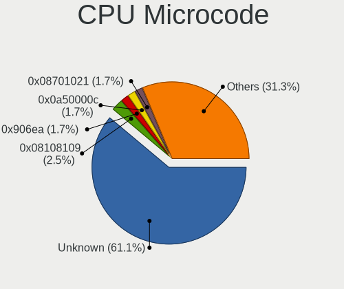
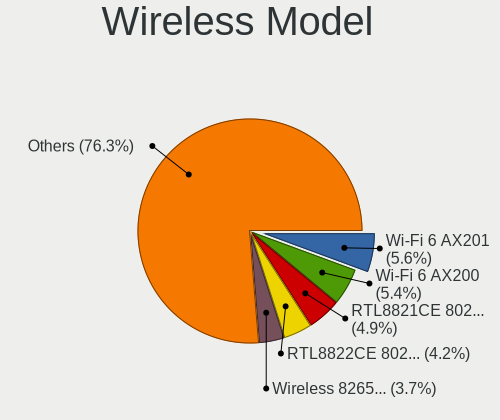
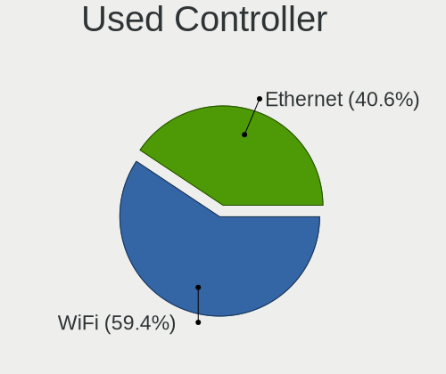

Xero - Tested Hardware & Statistics
-----------------------------------

A project to collect tested hardware configurations for Xero.

Anyone can contribute to this report by the [hw-probe](https://github.com/linuxhw/hw-probe) tool:

    sudo -E hw-probe -all -upload

Please contribute! Especially if your hardware is rare.

This is a report for all computer types. See also reports for [desktops](/Dist/Xero/Desktop/README.md) and [notebooks](/Dist/Xero/Notebook/README.md).

Contents
--------

* [ Test Cases ](#test-cases)

* [ System ](#system)
  - [ OS                       ](#os)
  - [ OS Family                ](#os-family)
  - [ Kernel                   ](#kernel)
  - [ Kernel Family            ](#kernel-family)
  - [ Kernel Major Ver.        ](#kernel-major-ver)
  - [ Arch                     ](#arch)
  - [ DE                       ](#de)
  - [ Display Server           ](#display-server)
  - [ Display Manager          ](#display-manager)
  - [ OS Lang                  ](#os-lang)
  - [ Boot Mode                ](#boot-mode)
  - [ Filesystem               ](#filesystem)
  - [ Part. scheme             ](#part-scheme)
  - [ Dual Boot with Linux/BSD ](#dual-boot-with-linuxbsd)
  - [ Dual Boot (Win)          ](#dual-boot-win)

* [ Board ](#board)
  - [ Vendor                   ](#vendor)
  - [ Model                    ](#model)
  - [ Model Family             ](#model-family)
  - [ MFG Year                 ](#mfg-year)
  - [ Form Factor              ](#form-factor)
  - [ Secure Boot              ](#secure-boot)
  - [ Coreboot                 ](#coreboot)
  - [ RAM Size                 ](#ram-size)
  - [ RAM Used                 ](#ram-used)
  - [ Total Drives             ](#total-drives)
  - [ Has CD-ROM               ](#has-cd-rom)
  - [ Has Ethernet             ](#has-ethernet)
  - [ Has WiFi                 ](#has-wifi)
  - [ Has Bluetooth            ](#has-bluetooth)

* [ Location ](#location)
  - [ Country                  ](#country)
  - [ City                     ](#city)

* [ Drives ](#drives)
  - [ Drive Vendor             ](#drive-vendor)
  - [ Drive Model              ](#drive-model)
  - [ HDD Vendor               ](#hdd-vendor)
  - [ SSD Vendor               ](#ssd-vendor)
  - [ Drive Kind               ](#drive-kind)
  - [ Drive Connector          ](#drive-connector)
  - [ Drive Size               ](#drive-size)
  - [ Space Total              ](#space-total)
  - [ Space Used               ](#space-used)
  - [ Malfunc. Drives          ](#malfunc-drives)
  - [ Malfunc. Drive Vendor    ](#malfunc-drive-vendor)
  - [ Malfunc. HDD Vendor      ](#malfunc-hdd-vendor)
  - [ Malfunc. Drive Kind      ](#malfunc-drive-kind)
  - [ Failed Drives            ](#failed-drives)
  - [ Failed Drive Vendor      ](#failed-drive-vendor)
  - [ Drive Status             ](#drive-status)

* [ Storage controller ](#storage-controller)
  - [ Storage Vendor           ](#storage-vendor)
  - [ Storage Model            ](#storage-model)
  - [ Storage Kind             ](#storage-kind)

* [ Processor ](#processor)
  - [ CPU Vendor               ](#cpu-vendor)
  - [ CPU Model                ](#cpu-model)
  - [ CPU Model Family         ](#cpu-model-family)
  - [ CPU Cores                ](#cpu-cores)
  - [ CPU Sockets              ](#cpu-sockets)
  - [ CPU Threads              ](#cpu-threads)
  - [ CPU Op-Modes             ](#cpu-op-modes)
  - [ CPU Microcode            ](#cpu-microcode)
  - [ CPU Microarch            ](#cpu-microarch)

* [ Graphics ](#graphics)
  - [ GPU Vendor               ](#gpu-vendor)
  - [ GPU Model                ](#gpu-model)
  - [ GPU Combo                ](#gpu-combo)
  - [ GPU Driver               ](#gpu-driver)
  - [ GPU Memory               ](#gpu-memory)

* [ Monitor ](#monitor)
  - [ Monitor Vendor           ](#monitor-vendor)
  - [ Monitor Model            ](#monitor-model)
  - [ Monitor Resolution       ](#monitor-resolution)
  - [ Monitor Diagonal         ](#monitor-diagonal)
  - [ Monitor Width            ](#monitor-width)
  - [ Aspect Ratio             ](#aspect-ratio)
  - [ Monitor Area             ](#monitor-area)
  - [ Pixel Density            ](#pixel-density)
  - [ Multiple Monitors        ](#multiple-monitors)

* [ Network ](#network)
  - [ Net Controller Vendor    ](#net-controller-vendor)
  - [ Net Controller Model     ](#net-controller-model)
  - [ Wireless Vendor          ](#wireless-vendor)
  - [ Wireless Model           ](#wireless-model)
  - [ Ethernet Vendor          ](#ethernet-vendor)
  - [ Ethernet Model           ](#ethernet-model)
  - [ Net Controller Kind      ](#net-controller-kind)
  - [ Used Controller          ](#used-controller)
  - [ NICs                     ](#nics)
  - [ IPv6                     ](#ipv6)

* [ Bluetooth ](#bluetooth)
  - [ Bluetooth Vendor         ](#bluetooth-vendor)
  - [ Bluetooth Model          ](#bluetooth-model)

* [ Sound ](#sound)
  - [ Sound Vendor             ](#sound-vendor)
  - [ Sound Model              ](#sound-model)

* [ Memory ](#memory)
  - [ Memory Vendor            ](#memory-vendor)
  - [ Memory Model             ](#memory-model)
  - [ Memory Kind              ](#memory-kind)
  - [ Memory Form Factor       ](#memory-form-factor)
  - [ Memory Size              ](#memory-size)
  - [ Memory Speed             ](#memory-speed)

* [ Printers & scanners ](#printers--scanners)
  - [ Printer Vendor           ](#printer-vendor)
  - [ Printer Model            ](#printer-model)
  - [ Scanner Vendor           ](#scanner-vendor)
  - [ Scanner Model            ](#scanner-model)

* [ Camera ](#camera)
  - [ Camera Vendor            ](#camera-vendor)
  - [ Camera Model             ](#camera-model)

* [ Security ](#security)
  - [ Fingerprint Vendor       ](#fingerprint-vendor)
  - [ Fingerprint Model        ](#fingerprint-model)
  - [ Chipcard Vendor          ](#chipcard-vendor)
  - [ Chipcard Model           ](#chipcard-model)

* [ Unsupported ](#unsupported)
  - [ Unsupported Devices      ](#unsupported-devices)
  - [ Unsupported Device Types ](#unsupported-device-types)

Test Cases
----------

Total: 116

| Vendor        | Model                       | Form-Factor | Probe                                                      | Date         |
|---------------|-----------------------------|-------------|------------------------------------------------------------|--------------|
| ASUSTek       | ROG STRIX X570-F GAMING     | Desktop     | [711e95b72e](https://linux-hardware.org/?probe=711e95b72e) | Nov 02, 2022 |
| ASUSTek       | ROG STRIX X570-F GAMING     | Desktop     | [ff0c19c661](https://linux-hardware.org/?probe=ff0c19c661) | Nov 02, 2022 |
| ASUSTek       | VivoBook_ASUSLaptop X421... | Notebook    | [4cd7aa6350](https://linux-hardware.org/?probe=4cd7aa6350) | Nov 01, 2022 |
| ASUSTek       | K53SJ                       | Notebook    | [8c85e545f2](https://linux-hardware.org/?probe=8c85e545f2) | Oct 23, 2022 |
| Gigabyte      | A320M-S2H-CF                | Desktop     | [bcf4fa1baf](https://linux-hardware.org/?probe=bcf4fa1baf) | Oct 18, 2022 |
| Dell          | 0GY6Y8 A02                  | Desktop     | [07b256f333](https://linux-hardware.org/?probe=07b256f333) | Oct 17, 2022 |
| Dell          | 0GY6Y8 A02                  | Desktop     | [fc1ec464bf](https://linux-hardware.org/?probe=fc1ec464bf) | Oct 17, 2022 |
| ASUSTek       | ROG STRIX X570-F GAMING     | Desktop     | [bf0e112f9a](https://linux-hardware.org/?probe=bf0e112f9a) | Oct 16, 2022 |
| ASUSTek       | PRIME B250-PLUS             | Desktop     | [00ab764924](https://linux-hardware.org/?probe=00ab764924) | Oct 15, 2022 |
| ASUSTek       | ROG STRIX X570-F GAMING     | Desktop     | [e037086b30](https://linux-hardware.org/?probe=e037086b30) | Oct 14, 2022 |
| ASUSTek       | ROG Strix G513IC_G513IC     | Notebook    | [ef1974cfc8](https://linux-hardware.org/?probe=ef1974cfc8) | Oct 10, 2022 |
| HP            | Laptop 15s-fq2xxx           | Notebook    | [69e60dfe44](https://linux-hardware.org/?probe=69e60dfe44) | Oct 07, 2022 |
| Lenovo        | ThinkPad Yoga 370 20JJS0... | Convertible | [a11de13c4f](https://linux-hardware.org/?probe=a11de13c4f) | Oct 04, 2022 |
| Lenovo        | ThinkPad Yoga 370 20JJS0... | Convertible | [6de76ddb0e](https://linux-hardware.org/?probe=6de76ddb0e) | Oct 04, 2022 |
| ASUSTek       | ZenBook UX433FN_UX433FN     | Notebook    | [a7764ad0f6](https://linux-hardware.org/?probe=a7764ad0f6) | Oct 03, 2022 |
| ASUSTek       | ROG CROSSHAIR VIII DARK ... | Desktop     | [9931b35717](https://linux-hardware.org/?probe=9931b35717) | Sep 24, 2022 |
| MSI           | Katana GF66 11UE            | Notebook    | [36b2cba297](https://linux-hardware.org/?probe=36b2cba297) | Sep 05, 2022 |
| Lenovo        | ThinkPad X1 Carbon Gen 9... | Notebook    | [b28edd3886](https://linux-hardware.org/?probe=b28edd3886) | Aug 26, 2022 |
| Lenovo        | ThinkPad X1 Carbon Gen 9... | Notebook    | [97770c5716](https://linux-hardware.org/?probe=97770c5716) | Aug 26, 2022 |
| ASUSTek       | ROG STRIX B450-F GAMING     | Desktop     | [4c95b1bccf](https://linux-hardware.org/?probe=4c95b1bccf) | Aug 22, 2022 |
| Lenovo        | ThinkPad T430s 2356FG9      | Notebook    | [9a10c152af](https://linux-hardware.org/?probe=9a10c152af) | Aug 17, 2022 |
| Aquarius      | NS585                       | Notebook    | [db9cbd5688](https://linux-hardware.org/?probe=db9cbd5688) | Aug 17, 2022 |
| Gigabyte      | B460M DS3H V2               | Desktop     | [2522ff1530](https://linux-hardware.org/?probe=2522ff1530) | Aug 13, 2022 |
| ASUSTek       | P7P55 LX                    | Desktop     | [8211ccc6cc](https://linux-hardware.org/?probe=8211ccc6cc) | Aug 11, 2022 |
| Unknown       | Unknown                     | Desktop     | [b73e5f9cbf](https://linux-hardware.org/?probe=b73e5f9cbf) | Aug 08, 2022 |
| Unknown       | Unknown                     | Desktop     | [f483092edf](https://linux-hardware.org/?probe=f483092edf) | Aug 07, 2022 |
| ASUSTek       | TUF Gaming X570-PLUS        | Desktop     | [a0507fae02](https://linux-hardware.org/?probe=a0507fae02) | Jul 31, 2022 |
| Lenovo        | IdeaPad S145-15AST 81N3     | Notebook    | [7c46c8f737](https://linux-hardware.org/?probe=7c46c8f737) | Jul 15, 2022 |
| ASUSTek       | G551JM                      | Notebook    | [599c7b9eae](https://linux-hardware.org/?probe=599c7b9eae) | Jul 14, 2022 |
| ASUSTek       | G551JM                      | Notebook    | [9f4536df1c](https://linux-hardware.org/?probe=9f4536df1c) | Jul 14, 2022 |
| ASRock        | AB350 Pro4                  | Desktop     | [7049f819f0](https://linux-hardware.org/?probe=7049f819f0) | Jun 30, 2022 |
| HP            | 3396                        | Desktop     | [00782afa06](https://linux-hardware.org/?probe=00782afa06) | Jun 22, 2022 |
| ASUSTek       | UX303LN                     | Notebook    | [9ce42e1b01](https://linux-hardware.org/?probe=9ce42e1b01) | Jun 12, 2022 |
| ASUSTek       | ROG STRIX B450-F GAMING     | Desktop     | [8109a04ffa](https://linux-hardware.org/?probe=8109a04ffa) | Jun 12, 2022 |
| BESSTAR Te... | ATB15                       | Server      | [d6e47a7c18](https://linux-hardware.org/?probe=d6e47a7c18) | Jun 12, 2022 |
| ASUSTek       | ROG STRIX B450-F GAMING     | Desktop     | [8a7401e54a](https://linux-hardware.org/?probe=8a7401e54a) | Jun 11, 2022 |
| Acer          | Aspire XC-886 V:2.0         | Desktop     | [2fe8cdaf93](https://linux-hardware.org/?probe=2fe8cdaf93) | May 31, 2022 |
| Dell          | Inspiron 1545               | Notebook    | [ce0e24a314](https://linux-hardware.org/?probe=ce0e24a314) | May 28, 2022 |
| Lenovo        | IdeaPad 330-17IKB 81DM      | Notebook    | [53475a6004](https://linux-hardware.org/?probe=53475a6004) | May 24, 2022 |
| ASUSTek       | VivoBook_ASUSLaptop X350... | Notebook    | [80d32848bf](https://linux-hardware.org/?probe=80d32848bf) | May 21, 2022 |
| ASUSTek       | ROG Maximus X HERO          | Desktop     | [3ddad532a9](https://linux-hardware.org/?probe=3ddad532a9) | May 08, 2022 |
| Dell          | Inspiron 7786               | Convertible | [0ef12447d9](https://linux-hardware.org/?probe=0ef12447d9) | May 02, 2022 |
| Dell          | Precision M3800             | Notebook    | [7b63874768](https://linux-hardware.org/?probe=7b63874768) | Apr 25, 2022 |
| Dell          | Precision M3800             | Notebook    | [fbabacd835](https://linux-hardware.org/?probe=fbabacd835) | Apr 24, 2022 |
| Lenovo        | ThinkPad X230 2325HR9       | Notebook    | [a9d9d3fbb2](https://linux-hardware.org/?probe=a9d9d3fbb2) | Apr 21, 2022 |
| MSI           | Z170-A PRO                  | Desktop     | [db5ab86328](https://linux-hardware.org/?probe=db5ab86328) | Apr 11, 2022 |
| Acer          | Aspire A515-54G             | Notebook    | [52b660d8fb](https://linux-hardware.org/?probe=52b660d8fb) | Apr 11, 2022 |
| MSI           | Z170-A PRO                  | Desktop     | [3bd5bb8d08](https://linux-hardware.org/?probe=3bd5bb8d08) | Apr 10, 2022 |
| Dell          | Precision M3800             | Notebook    | [1ef57b39a7](https://linux-hardware.org/?probe=1ef57b39a7) | Apr 10, 2022 |
| ASUSTek       | TUF Gaming X570-PLUS        | Desktop     | [8d251b1b2a](https://linux-hardware.org/?probe=8d251b1b2a) | Apr 03, 2022 |
| Dell          | Precision M3800             | Notebook    | [9fc15d1ae6](https://linux-hardware.org/?probe=9fc15d1ae6) | Mar 31, 2022 |
| HP            | 843B                        | Desktop     | [a88ff7cf5c](https://linux-hardware.org/?probe=a88ff7cf5c) | Mar 27, 2022 |
| Pegatron      | 2AC2                        | Desktop     | [d3c82e973b](https://linux-hardware.org/?probe=d3c82e973b) | Mar 25, 2022 |
| ASUSTek       | Maximus IX HERO             | Desktop     | [745cc1d638](https://linux-hardware.org/?probe=745cc1d638) | Mar 25, 2022 |
| MSI           | GF63 Thin 9SCX              | Notebook    | [4501fa1556](https://linux-hardware.org/?probe=4501fa1556) | Mar 25, 2022 |
| Dell          | Latitude 7480               | Notebook    | [bf00ec6a76](https://linux-hardware.org/?probe=bf00ec6a76) | Mar 23, 2022 |
| ASUSTek       | Maximus IX HERO             | Desktop     | [8eb98db533](https://linux-hardware.org/?probe=8eb98db533) | Mar 22, 2022 |
| HUAWEI        | WRT-WX9                     | Notebook    | [70ec26bed6](https://linux-hardware.org/?probe=70ec26bed6) | Mar 22, 2022 |
| ASUSTek       | ROG CROSSHAIR VIII HERO     | Desktop     | [13cdf54c81](https://linux-hardware.org/?probe=13cdf54c81) | Mar 21, 2022 |
| Dell          | Latitude 7480               | Notebook    | [faddba28a8](https://linux-hardware.org/?probe=faddba28a8) | Mar 19, 2022 |
| Apple         | MacBookAir6,2               | Notebook    | [b71110144d](https://linux-hardware.org/?probe=b71110144d) | Mar 19, 2022 |
| HP            | Laptop 15-da0xxx            | Notebook    | [bb9074ccdf](https://linux-hardware.org/?probe=bb9074ccdf) | Mar 18, 2022 |
| Lenovo        | IdeaPad 3 15IML05 81WR      | Notebook    | [918c951cd1](https://linux-hardware.org/?probe=918c951cd1) | Mar 12, 2022 |
| ASUSTek       | TUF Gaming B550M-PLUS       | Desktop     | [639e7361ef](https://linux-hardware.org/?probe=639e7361ef) | Mar 12, 2022 |
| Lenovo        | IdeaPad S145-15IIL 81W8     | Notebook    | [e251c9f079](https://linux-hardware.org/?probe=e251c9f079) | Mar 11, 2022 |
| MSI           | Z170A PC MATE               | Desktop     | [181e014823](https://linux-hardware.org/?probe=181e014823) | Mar 08, 2022 |
| Gigabyte      | Z170X-UD3-CF                | Desktop     | [3ec7a7f643](https://linux-hardware.org/?probe=3ec7a7f643) | Mar 06, 2022 |
| Dell          | Venue 11 Pro 7130 vPro      | Notebook    | [57b302b119](https://linux-hardware.org/?probe=57b302b119) | Mar 05, 2022 |
| Lenovo        | ThinkPad T460 20FMS1XX00    | Notebook    | [78e82c6674](https://linux-hardware.org/?probe=78e82c6674) | Feb 24, 2022 |
| Dell          | Latitude E6430              | Notebook    | [e1de4e80fe](https://linux-hardware.org/?probe=e1de4e80fe) | Feb 15, 2022 |
| Lenovo        | Legion 5 15ARH05H 82B1      | Notebook    | [a3c5f00a2a](https://linux-hardware.org/?probe=a3c5f00a2a) | Feb 10, 2022 |
| Lenovo        | Legion 5 15ARH05H 82B1      | Notebook    | [e53fb31614](https://linux-hardware.org/?probe=e53fb31614) | Feb 10, 2022 |
| Lenovo        | Legion Y740-15IRHg 81UH     | Notebook    | [b0cc5e0cbc](https://linux-hardware.org/?probe=b0cc5e0cbc) | Jan 29, 2022 |
| ASUSTek       | P5Q PRO TURBO               | Desktop     | [83ca29c9c8](https://linux-hardware.org/?probe=83ca29c9c8) | Jan 28, 2022 |
| Acer          | Aspire A315-58G             | Notebook    | [cb4f253c1c](https://linux-hardware.org/?probe=cb4f253c1c) | Jan 28, 2022 |
| Dell          | Latitude E6520              | Notebook    | [ee96960cec](https://linux-hardware.org/?probe=ee96960cec) | Jan 25, 2022 |
| Lenovo        | Yoga 710-15IKB 80V5         | Convertible | [3d5fe9fc42](https://linux-hardware.org/?probe=3d5fe9fc42) | Jan 22, 2022 |
| HP            | Laptop 15s-eq0xxx           | Notebook    | [0df160c245](https://linux-hardware.org/?probe=0df160c245) | Jan 21, 2022 |
| ASUSTek       | TUF Gaming B550M-PLUS       | Desktop     | [230373b3ff](https://linux-hardware.org/?probe=230373b3ff) | Jan 09, 2022 |
| Lenovo        | Legion Y540-15IRH-PG0 81... | Notebook    | [3df8a1c560](https://linux-hardware.org/?probe=3df8a1c560) | Jan 08, 2022 |
| HP            | 1906                        | Desktop     | [5f8fe7cb20](https://linux-hardware.org/?probe=5f8fe7cb20) | Jan 06, 2022 |
| ASUSTek       | TUF Gaming X570-PLUS        | Desktop     | [793bfa4f40](https://linux-hardware.org/?probe=793bfa4f40) | Jan 04, 2022 |
| HP            | 2179                        | Desktop     | [79bac7ce1b](https://linux-hardware.org/?probe=79bac7ce1b) | Jan 01, 2022 |
| ASUSTek       | TUF B360M-PLUS GAMING/BR    | Desktop     | [512091cd1c](https://linux-hardware.org/?probe=512091cd1c) | Dec 30, 2021 |
| Dell          | Vostro 3590                 | Notebook    | [9e77a2584c](https://linux-hardware.org/?probe=9e77a2584c) | Dec 30, 2021 |
| HP            | 2179                        | Desktop     | [9b6358ce37](https://linux-hardware.org/?probe=9b6358ce37) | Dec 30, 2021 |
| ASUSTek       | ASUS EXPERTBOOK B9400CEA... | Notebook    | [78e3fbdf6a](https://linux-hardware.org/?probe=78e3fbdf6a) | Dec 28, 2021 |
| HP            | Notebook                    | Notebook    | [c14ea64659](https://linux-hardware.org/?probe=c14ea64659) | Dec 23, 2021 |
| ASRock        | X570 Taichi                 | Desktop     | [5c2c86f287](https://linux-hardware.org/?probe=5c2c86f287) | Dec 23, 2021 |
| ASUSTek       | X510UNR                     | Notebook    | [0733a05806](https://linux-hardware.org/?probe=0733a05806) | Dec 21, 2021 |
| ASUSTek       | ASUS EXPERTBOOK B9400CEA... | Notebook    | [b4425de4a6](https://linux-hardware.org/?probe=b4425de4a6) | Dec 17, 2021 |
| ASUSTek       | ASUS TUF Gaming F15 FX50... | Notebook    | [6f3bd18b3f](https://linux-hardware.org/?probe=6f3bd18b3f) | Dec 06, 2021 |
| Pegatron      | D15K                        | Notebook    | [eaeaad8d39](https://linux-hardware.org/?probe=eaeaad8d39) | Nov 29, 2021 |
| ASUSTek       | TUF Gaming X570-PLUS        | Desktop     | [728b23aa46](https://linux-hardware.org/?probe=728b23aa46) | Nov 26, 2021 |
| ASUSTek       | PRIME A320M-K               | Desktop     | [9e9b6fd944](https://linux-hardware.org/?probe=9e9b6fd944) | Nov 21, 2021 |
| MSI           | GP73 Leopard 8RD            | Notebook    | [5bafb43f78](https://linux-hardware.org/?probe=5bafb43f78) | Nov 21, 2021 |
| Acer          | Aspire A315-58G             | Notebook    | [911895fcf2](https://linux-hardware.org/?probe=911895fcf2) | Nov 19, 2021 |
| Acer          | Aspire A315-58G             | Notebook    | [5748b3cd05](https://linux-hardware.org/?probe=5748b3cd05) | Nov 12, 2021 |
| Lenovo        | ThinkPad W530 24384CU       | Notebook    | [d18d3495e0](https://linux-hardware.org/?probe=d18d3495e0) | Nov 05, 2021 |
| ASUSTek       | TUF Z390-PLUS GAMING        | Desktop     | [4877535f8b](https://linux-hardware.org/?probe=4877535f8b) | Nov 03, 2021 |
| MSI           | Z370 GAMING PLUS            | Desktop     | [8dd5924480](https://linux-hardware.org/?probe=8dd5924480) | Oct 31, 2021 |
| Acer          | Aspire A315-58G             | Notebook    | [905fce5118](https://linux-hardware.org/?probe=905fce5118) | Oct 29, 2021 |
| HP            | ENVY Sleekbook 4            | Notebook    | [ebea056239](https://linux-hardware.org/?probe=ebea056239) | Oct 29, 2021 |
| ASUSTek       | VivoBook_ASUSLaptop X509... | Notebook    | [2a54689fb3](https://linux-hardware.org/?probe=2a54689fb3) | Oct 24, 2021 |
| ASUSTek       | VivoBook_ASUS Laptop E41... | Notebook    | [fb95cbb063](https://linux-hardware.org/?probe=fb95cbb063) | Oct 19, 2021 |
| Lenovo        | IdeaPad 5 15ITL05 82FG      | Notebook    | [6cd76dfa2a](https://linux-hardware.org/?probe=6cd76dfa2a) | Oct 13, 2021 |
| ASUSTek       | ASUS TUF Gaming F15 FX50... | Notebook    | [e3a8d1ca32](https://linux-hardware.org/?probe=e3a8d1ca32) | Oct 11, 2021 |
| ASUSTek       | ASUS TUF Gaming F15 FX50... | Notebook    | [c7c4a74bb8](https://linux-hardware.org/?probe=c7c4a74bb8) | Oct 11, 2021 |
| ASUSTek       | ASUS TUF Gaming F15 FX50... | Notebook    | [68865693c7](https://linux-hardware.org/?probe=68865693c7) | Oct 09, 2021 |
| Dell          | 0XC7MM A01                  | Desktop     | [390c5408b2](https://linux-hardware.org/?probe=390c5408b2) | Oct 05, 2021 |
| Lenovo        | Y520-15IKBN 80WK            | Notebook    | [e804a59920](https://linux-hardware.org/?probe=e804a59920) | Oct 02, 2021 |
| ASRock        | B450M Pro4                  | Desktop     | [a198e8517a](https://linux-hardware.org/?probe=a198e8517a) | Oct 01, 2021 |
| ASRock        | X570 Taichi                 | Desktop     | [50fd919991](https://linux-hardware.org/?probe=50fd919991) | Aug 29, 2021 |
| Gigabyte      | X570 AORUS MASTER           | Desktop     | [a3c6fe4037](https://linux-hardware.org/?probe=a3c6fe4037) | Jul 24, 2021 |
| ASRock        | X570 Taichi                 | Desktop     | [57d19e2c3a](https://linux-hardware.org/?probe=57d19e2c3a) | May 19, 2021 |
| Acer          | FIH57                       | Desktop     | [9c3e383ea5](https://linux-hardware.org/?probe=9c3e383ea5) | Apr 30, 2021 |

System
------

OS
--

Installed operating systems

| Name         | Computers | Percent |
|--------------|-----------|---------|
| Xero Rolling | 76        | 85.39%  |
| Xero         | 13        | 14.61%  |

OS Family
---------

OS without a version

| Name | Computers | Percent |
|------|-----------|---------|
| Xero | 88        | 100%    |

Kernel
------

Version of the Linux kernel

| Version            | Computers | Percent |
|--------------------|-----------|---------|
| 5.16.15-arch1-1    | 6         | 6.19%   |
| 5.18.16-arch1-1    | 4         | 4.12%   |
| 5.17.9-arch1-1     | 3         | 3.09%   |
| 5.16.2-arch1-1     | 3         | 3.09%   |
| 5.16.1-arch1-1     | 3         | 3.09%   |
| 5.15.33-1-lts      | 3         | 3.09%   |
| 5.14.14-arch1-1    | 3         | 3.09%   |
| 5.19.13-arch1-1    | 2         | 2.06%   |
| 5.19.12-arch1-1    | 2         | 2.06%   |
| 5.18.3-arch1-1     | 2         | 2.06%   |
| 5.18.11-arch1-1    | 2         | 2.06%   |
| 5.17.5-arch1-1     | 2         | 2.06%   |
| 5.17.1-arch1-1     | 2         | 2.06%   |
| 5.16.8-arch1-1     | 2         | 2.06%   |
| 5.16.16-arch1-1    | 2         | 2.06%   |
| 5.16.13-arch1-1    | 2         | 2.06%   |
| 5.16.12-arch1-1    | 2         | 2.06%   |
| 5.15.10-arch1-1    | 2         | 2.06%   |
| 5.14.8-zen1-1-zen  | 2         | 2.06%   |
| 6.0.6-zen1-1-zen   | 1         | 1.03%   |
| 6.0.6-arch1-1      | 1         | 1.03%   |
| 6.0.2-zen1-1-zen   | 1         | 1.03%   |
| 6.0.2-arch1-1      | 1         | 1.03%   |
| 6.0.1-arch2-1      | 1         | 1.03%   |
| 5.19.9-arch1-1     | 1         | 1.03%   |
| 5.19.3-arch1-1     | 1         | 1.03%   |
| 5.19.2-zen1-1-zen  | 1         | 1.03%   |
| 5.19.13-zen1-1-zen | 1         | 1.03%   |
| 5.19.10-arch1-1    | 1         | 1.03%   |
| 5.19.1-arch2-1     | 1         | 1.03%   |
| 5.18.9-arch1-1     | 1         | 1.03%   |
| 5.18.6-arch1-1     | 1         | 1.03%   |
| 5.18.0-arch1-1     | 1         | 1.03%   |
| 5.17.7-arch1-1     | 1         | 1.03%   |
| 5.16.16-zen1-1-zen | 1         | 1.03%   |
| 5.16.14-arch1-1    | 1         | 1.03%   |
| 5.16.10-arch1-1    | 1         | 1.03%   |
| 5.15.8-zen1-1-zen  | 1         | 1.03%   |
| 5.15.6-arch2-1     | 1         | 1.03%   |
| 5.15.4-arch1-1     | 1         | 1.03%   |

Kernel Family
-------------

Linux kernel without a distro release

| Version | Computers | Percent |
|---------|-----------|---------|
| 5.16.15 | 6         | 6.19%   |
| 5.18.16 | 4         | 4.12%   |
| 5.14.14 | 4         | 4.12%   |
| 5.19.13 | 3         | 3.09%   |
| 5.17.9  | 3         | 3.09%   |
| 5.16.2  | 3         | 3.09%   |
| 5.16.16 | 3         | 3.09%   |
| 5.16.1  | 3         | 3.09%   |
| 5.15.33 | 3         | 3.09%   |
| 5.15.12 | 3         | 3.09%   |
| 5.14.8  | 3         | 3.09%   |
| 5.14.16 | 3         | 3.09%   |
| 6.0.6   | 2         | 2.06%   |
| 6.0.2   | 2         | 2.06%   |
| 5.19.12 | 2         | 2.06%   |
| 5.18.3  | 2         | 2.06%   |
| 5.18.11 | 2         | 2.06%   |
| 5.17.5  | 2         | 2.06%   |
| 5.17.1  | 2         | 2.06%   |
| 5.16.8  | 2         | 2.06%   |
| 5.16.13 | 2         | 2.06%   |
| 5.16.12 | 2         | 2.06%   |
| 5.15.13 | 2         | 2.06%   |
| 5.15.11 | 2         | 2.06%   |
| 5.15.10 | 2         | 2.06%   |
| 6.0.1   | 1         | 1.03%   |
| 5.19.9  | 1         | 1.03%   |
| 5.19.3  | 1         | 1.03%   |
| 5.19.2  | 1         | 1.03%   |
| 5.19.10 | 1         | 1.03%   |
| 5.19.1  | 1         | 1.03%   |
| 5.18.9  | 1         | 1.03%   |
| 5.18.6  | 1         | 1.03%   |
| 5.18.0  | 1         | 1.03%   |
| 5.17.7  | 1         | 1.03%   |
| 5.16.14 | 1         | 1.03%   |
| 5.16.10 | 1         | 1.03%   |
| 5.15.8  | 1         | 1.03%   |
| 5.15.6  | 1         | 1.03%   |
| 5.15.4  | 1         | 1.03%   |

Kernel Major Ver.
-----------------

Linux kernel major version

| Version | Computers | Percent |
|---------|-----------|---------|
| 5.16    | 23        | 24.21%  |
| 5.15    | 18        | 18.95%  |
| 5.14    | 13        | 13.68%  |
| 5.18    | 11        | 11.58%  |
| 5.19    | 10        | 10.53%  |
| 5.17    | 8         | 8.42%   |
| 6.0     | 5         | 5.26%   |
| 5.10    | 3         | 3.16%   |
| 5.13    | 2         | 2.11%   |
| 5.12    | 1         | 1.05%   |
| 5.11    | 1         | 1.05%   |

Arch
----

OS architecture (x86_64, i586, etc.)

| Name   | Computers | Percent |
|--------|-----------|---------|
| x86_64 | 88        | 100%    |

DE
--

Desktop Environment

| Name   | Computers | Percent |
|--------|-----------|---------|
| KDE5   | 83        | 92.22%  |
| XFCE   | 4         | 4.44%   |
| GNOME  | 2         | 2.22%   |
| LeftWM | 1         | 1.11%   |

Display Server
--------------

X11 or Wayland

| Name    | Computers | Percent |
|---------|-----------|---------|
| X11     | 75        | 85.23%  |
| Wayland | 11        | 12.5%   |
| Tty     | 2         | 2.27%   |

Display Manager
---------------

SDDM, LightDM, etc.

| Name    | Computers | Percent |
|---------|-----------|---------|
| SDDM    | 60        | 65.22%  |
| LightDM | 15        | 16.3%   |
| Unknown | 15        | 16.3%   |
| TDM     | 1         | 1.09%   |
| GDM     | 1         | 1.09%   |

OS Lang
-------

Language

| Lang  | Computers | Percent |
|-------|-----------|---------|
| en_US | 47        | 52.81%  |
| en_IN | 7         | 7.87%   |
| en_GB | 6         | 6.74%   |
| C     | 5         | 5.62%   |
| pl_PL | 4         | 4.49%   |
| it_IT | 3         | 3.37%   |
| de_DE | 3         | 3.37%   |
| ru_RU | 2         | 2.25%   |
| fr_FR | 2         | 2.25%   |
| es_MX | 2         | 2.25%   |
| en_AU | 2         | 2.25%   |
| en_IL | 1         | 1.12%   |
| en_DK | 1         | 1.12%   |
| en_CA | 1         | 1.12%   |
| en_AG | 1         | 1.12%   |
| de_AT | 1         | 1.12%   |
| ba_RU | 1         | 1.12%   |

Boot Mode
---------

EFI or BIOS

| Mode | Computers | Percent |
|------|-----------|---------|
| EFI  | 61        | 68.54%  |
| BIOS | 28        | 31.46%  |

Filesystem
----------

Type of filesystem

| Type    | Computers | Percent |
|---------|-----------|---------|
| Btrfs   | 54        | 60%     |
| Ext4    | 16        | 17.78%  |
| Xfs     | 14        | 15.56%  |
| Overlay | 6         | 6.67%   |

Part. scheme
------------

Scheme of partitioning

| Type    | Computers | Percent |
|---------|-----------|---------|
| GPT     | 63        | 70.79%  |
| Unknown | 15        | 16.85%  |
| MBR     | 11        | 12.36%  |

Dual Boot with Linux/BSD
------------------------

Hosting more than one Linux/BSD

| Dual boot | Computers | Percent |
|-----------|-----------|---------|
| No        | 68        | 73.91%  |
| Yes       | 24        | 26.09%  |

Dual Boot (Win)
---------------

Hosting Linux and Windows

| Dual boot | Computers | Percent |
|-----------|-----------|---------|
| No        | 57        | 64.77%  |
| Yes       | 31        | 35.23%  |

Board
-----

Vendor
------

Motherboard manufacturer

| Name                | Computers | Percent |
|---------------------|-----------|---------|
| ASUSTek Computer    | 27        | 30.68%  |
| Lenovo              | 16        | 18.18%  |
| Dell                | 12        | 13.64%  |
| Hewlett-Packard     | 9         | 10.23%  |
| MSI                 | 6         | 6.82%   |
| Gigabyte Technology | 4         | 4.55%   |
| Acer                | 4         | 4.55%   |
| ASRock              | 3         | 3.41%   |
| Pegatron            | 2         | 2.27%   |
| HUAWEI              | 1         | 1.14%   |
| BESSTAR Tech        | 1         | 1.14%   |
| Aquarius            | 1         | 1.14%   |
| Apple               | 1         | 1.14%   |
| Unknown             | 1         | 1.14%   |

Model
-----

Motherboard model

| Name                                       | Computers | Percent |
|--------------------------------------------|-----------|---------|
| Dell Precision M3800                       | 3         | 3.41%   |
| MSI MS-7971                                | 2         | 2.27%   |
| ASUS TUF Gaming X570-PLUS                  | 2         | 2.27%   |
| Pegatron p6-2026                           | 1         | 1.14%   |
| Pegatron D15K                              | 1         | 1.14%   |
| MSI MS-7B61                                | 1         | 1.14%   |
| MSI Katana GF66 11UE                       | 1         | 1.14%   |
| MSI GP73 Leopard 8RD                       | 1         | 1.14%   |
| MSI GF63 Thin 9SCX                         | 1         | 1.14%   |
| Lenovo Yoga 710-15IKB 80V5                 | 1         | 1.14%   |
| Lenovo Y520-15IKBN 80WK                    | 1         | 1.14%   |
| Lenovo ThinkPad Yoga 370 20JJS0SB00        | 1         | 1.14%   |
| Lenovo ThinkPad X230 2325HR9               | 1         | 1.14%   |
| Lenovo ThinkPad X1 Carbon Gen 9 20XW0055MH | 1         | 1.14%   |
| Lenovo ThinkPad W530 24384CU               | 1         | 1.14%   |
| Lenovo ThinkPad T460 20FMS1XX00            | 1         | 1.14%   |
| Lenovo ThinkPad T430s 2356FG9              | 1         | 1.14%   |
| Lenovo Legion Y740-15IRHg 81UH             | 1         | 1.14%   |
| Lenovo Legion Y540-15IRH-PG0 81SY          | 1         | 1.14%   |
| Lenovo Legion 5 15ARH05H 82B1              | 1         | 1.14%   |
| Lenovo IdeaPad S145-15IIL 81W8             | 1         | 1.14%   |
| Lenovo IdeaPad S145-15AST 81N3             | 1         | 1.14%   |
| Lenovo IdeaPad 5 15ITL05 82FG              | 1         | 1.14%   |
| Lenovo IdeaPad 330-17IKB 81DM              | 1         | 1.14%   |
| Lenovo IdeaPad 3 15IML05 81WR              | 1         | 1.14%   |
| HUAWEI WRT-WX9                             | 1         | 1.14%   |
| HP Z230 SFF Workstation                    | 1         | 1.14%   |
| HP ProOne 400 G1 AiO                       | 1         | 1.14%   |
| HP Pavilion Desktop 590-p0xxx              | 1         | 1.14%   |
| HP Notebook                                | 1         | 1.14%   |
| HP Laptop 15s-fq2xxx                       | 1         | 1.14%   |
| HP Laptop 15s-eq0xxx                       | 1         | 1.14%   |
| HP Laptop 15-da0xxx                        | 1         | 1.14%   |
| HP ENVY Sleekbook 4                        | 1         | 1.14%   |
| HP Compaq Elite 8300 CMT                   | 1         | 1.14%   |
| Gigabyte Z170X-UD3                         | 1         | 1.14%   |
| Gigabyte X570 AORUS MASTER                 | 1         | 1.14%   |
| Gigabyte B460MDS3HV2                       | 1         | 1.14%   |
| Gigabyte A320M-S2H                         | 1         | 1.14%   |
| Dell Vostro 3590                           | 1         | 1.14%   |

Model Family
------------

Motherboard model prefix

| Name                 | Computers | Percent |
|----------------------|-----------|---------|
| Lenovo ThinkPad      | 6         | 6.82%   |
| ASUS ROG             | 6         | 6.82%   |
| Lenovo IdeaPad       | 5         | 5.68%   |
| ASUS TUF             | 5         | 5.68%   |
| Dell Precision       | 4         | 4.55%   |
| ASUS VivoBook        | 4         | 4.55%   |
| Acer Aspire          | 4         | 4.55%   |
| Lenovo Legion        | 3         | 3.41%   |
| HP Laptop            | 3         | 3.41%   |
| Dell Latitude        | 3         | 3.41%   |
| MSI MS-7971          | 2         | 2.27%   |
| Dell Inspiron        | 2         | 2.27%   |
| ASUS PRIME           | 2         | 2.27%   |
| ASUS ASUS            | 2         | 2.27%   |
| Pegatron p6-2026     | 1         | 1.14%   |
| Pegatron D15K        | 1         | 1.14%   |
| MSI MS-7B61          | 1         | 1.14%   |
| MSI Katana           | 1         | 1.14%   |
| MSI GP73             | 1         | 1.14%   |
| MSI GF63             | 1         | 1.14%   |
| Lenovo Yoga          | 1         | 1.14%   |
| Lenovo Y520-15IKBN   | 1         | 1.14%   |
| HUAWEI WRT-WX9       | 1         | 1.14%   |
| HP Z230              | 1         | 1.14%   |
| HP ProOne            | 1         | 1.14%   |
| HP Pavilion          | 1         | 1.14%   |
| HP Notebook          | 1         | 1.14%   |
| HP ENVY              | 1         | 1.14%   |
| HP Compaq            | 1         | 1.14%   |
| Gigabyte Z170X-UD3   | 1         | 1.14%   |
| Gigabyte X570        | 1         | 1.14%   |
| Gigabyte B460MDS3HV2 | 1         | 1.14%   |
| Gigabyte A320M-S2H   | 1         | 1.14%   |
| Dell Vostro          | 1         | 1.14%   |
| Dell Venue           | 1         | 1.14%   |
| Dell OptiPlex        | 1         | 1.14%   |
| BESSTAR Tech X500    | 1         | 1.14%   |
| ASUS ZenBook         | 1         | 1.14%   |
| ASUS X510UNR         | 1         | 1.14%   |
| ASUS UX303LN         | 1         | 1.14%   |

MFG Year
--------

Motherboard manufacture year

| Year | Computers | Percent |
|------|-----------|---------|
| 2019 | 18        | 20.45%  |
| 2020 | 12        | 13.64%  |
| 2018 | 10        | 11.36%  |
| 2017 | 9         | 10.23%  |
| 2021 | 8         | 9.09%   |
| 2013 | 6         | 6.82%   |
| 2012 | 6         | 6.82%   |
| 2015 | 4         | 4.55%   |
| 2016 | 3         | 3.41%   |
| 2014 | 3         | 3.41%   |
| 2011 | 3         | 3.41%   |
| 2010 | 2         | 2.27%   |
| 2009 | 2         | 2.27%   |
| 2022 | 1         | 1.14%   |
| 2008 | 1         | 1.14%   |

Form Factor
-----------

Physical design of the computer

| Name        | Computers | Percent |
|-------------|-----------|---------|
| Notebook    | 49        | 55.68%  |
| Desktop     | 35        | 39.77%  |
| Convertible | 3         | 3.41%   |
| Server      | 1         | 1.14%   |

Secure Boot
-----------

Enabled or disabled

| State    | Computers | Percent |
|----------|-----------|---------|
| Disabled | 88        | 100%    |

Coreboot
--------

Have coreboot on board

| Used | Computers | Percent |
|------|-----------|---------|
| No   | 88        | 100%    |

RAM Size
--------

Total RAM memory

| Size in GB  | Computers | Percent |
|-------------|-----------|---------|
| 4.01-8.0    | 28        | 31.82%  |
| 16.01-24.0  | 22        | 25%     |
| 8.01-16.0   | 16        | 18.18%  |
| 32.01-64.0  | 12        | 13.64%  |
| 3.01-4.0    | 6         | 6.82%   |
| 24.01-32.0  | 3         | 3.41%   |
| 64.01-256.0 | 1         | 1.14%   |

RAM Used
--------

Used RAM memory

| Used GB    | Computers | Percent |
|------------|-----------|---------|
| 2.01-3.0   | 32        | 32.99%  |
| 1.01-2.0   | 24        | 24.74%  |
| 4.01-8.0   | 17        | 17.53%  |
| 3.01-4.0   | 11        | 11.34%  |
| 8.01-16.0  | 5         | 5.15%   |
| 16.01-24.0 | 4         | 4.12%   |
| 0.51-1.0   | 2         | 2.06%   |
| 0.01-0.5   | 2         | 2.06%   |

Total Drives
------------

Number of drives on board

| Drives | Computers | Percent |
|--------|-----------|---------|
| 1      | 48        | 54.55%  |
| 2      | 21        | 23.86%  |
| 3      | 9         | 10.23%  |
| 4      | 5         | 5.68%   |
| 6      | 2         | 2.27%   |
| 5      | 2         | 2.27%   |
| 7      | 1         | 1.14%   |

Has CD-ROM
----------

Has CD-ROM on board

| Presented | Computers | Percent |
|-----------|-----------|---------|
| No        | 69        | 78.41%  |
| Yes       | 19        | 21.59%  |

Has Ethernet
------------

Has Ethernet on board

| Presented | Computers | Percent |
|-----------|-----------|---------|
| Yes       | 71        | 80.68%  |
| No        | 17        | 19.32%  |

Has WiFi
--------

Has WiFi module

| Presented | Computers | Percent |
|-----------|-----------|---------|
| Yes       | 71        | 80.68%  |
| No        | 17        | 19.32%  |

Has Bluetooth
-------------

Has Bluetooth module

| Presented | Computers | Percent |
|-----------|-----------|---------|
| Yes       | 68        | 76.4%   |
| No        | 21        | 23.6%   |

Location
--------

Country
-------

Geographic location (country)

| Country               | Computers | Percent |
|-----------------------|-----------|---------|
| USA                   | 20        | 22.73%  |
| India                 | 9         | 10.23%  |
| Poland                | 5         | 5.68%   |
| Germany               | 5         | 5.68%   |
| Italy                 | 4         | 4.55%   |
| France                | 4         | 4.55%   |
| UK                    | 3         | 3.41%   |
| Russia                | 3         | 3.41%   |
| Greece                | 3         | 3.41%   |
| Norway                | 2         | 2.27%   |
| Netherlands           | 2         | 2.27%   |
| Mexico                | 2         | 2.27%   |
| Canada                | 2         | 2.27%   |
| Australia             | 2         | 2.27%   |
| Zambia                | 1         | 1.14%   |
| Turkey                | 1         | 1.14%   |
| Togo                  | 1         | 1.14%   |
| Sweden                | 1         | 1.14%   |
| Spain                 | 1         | 1.14%   |
| Romania               | 1         | 1.14%   |
| Portugal              | 1         | 1.14%   |
| Palestinian Territory | 1         | 1.14%   |
| Pakistan              | 1         | 1.14%   |
| Morocco               | 1         | 1.14%   |
| Mongolia              | 1         | 1.14%   |
| Malaysia              | 1         | 1.14%   |
| Lebanon               | 1         | 1.14%   |
| Israel                | 1         | 1.14%   |
| Hungary               | 1         | 1.14%   |
| Denmark               | 1         | 1.14%   |
| Cyprus                | 1         | 1.14%   |
| Colombia              | 1         | 1.14%   |
| Chile                 | 1         | 1.14%   |
| Brazil                | 1         | 1.14%   |
| Austria               | 1         | 1.14%   |
| Argentina             | 1         | 1.14%   |

City
----

Geographic location (city)

| City           | Computers | Percent |
|----------------|-----------|---------|
| Longmont       | 3         | 3.41%   |
| Madurai        | 2         | 2.27%   |
| Zell am See    | 1         | 1.14%   |
| Wroclaw        | 1         | 1.14%   |
| Wrexham        | 1         | 1.14%   |
| Wells          | 1         | 1.14%   |
| Warsaw         | 1         | 1.14%   |
| Ulan Bator     | 1         | 1.14%   |
| Toronto        | 1         | 1.14%   |
| Tel Aviv       | 1         | 1.14%   |
| Taranto        | 1         | 1.14%   |
| Stuttgart      | 1         | 1.14%   |
| Stavropol      | 1         | 1.14%   |
| Springfield    | 1         | 1.14%   |
| Silkeborg      | 1         | 1.14%   |
| Shadrinsk      | 1         | 1.14%   |
| Santa Cruz     | 1         | 1.14%   |
| Salt Lake City | 1         | 1.14%   |
| Ramallah       | 1         | 1.14%   |
| Pune           | 1         | 1.14%   |
| Poznan         | 1         | 1.14%   |
| Portland       | 1         | 1.14%   |
| Porcia         | 1         | 1.14%   |
| Pirmasens      | 1         | 1.14%   |
| Phoenix        | 1         | 1.14%   |
| Pavia          | 1         | 1.14%   |
| Passos         | 1         | 1.14%   |
| Paris          | 1         | 1.14%   |
| Oslo           | 1         | 1.14%   |
| Oberursel      | 1         | 1.14%   |
| Nicosia        | 1         | 1.14%   |
| New Haven      | 1         | 1.14%   |
| Neu-Ulm        | 1         | 1.14%   |
| Mumbai         | 1         | 1.14%   |
| Moscow         | 1         | 1.14%   |
| Monterrey      | 1         | 1.14%   |
| Milton Keynes  | 1         | 1.14%   |
| Mexico City    | 1         | 1.14%   |
| Melbourne      | 1         | 1.14%   |
| Lusaka         | 1         | 1.14%   |

Drives
------

Drive Vendor
------------

Hard drive vendors

| Vendor                      | Computers | Drives | Percent |
|-----------------------------|-----------|--------|---------|
| Seagate                     | 27        | 41     | 18.12%  |
| Samsung Electronics         | 26        | 37     | 17.45%  |
| WDC                         | 22        | 31     | 14.77%  |
| Kingston                    | 12        | 16     | 8.05%   |
| Toshiba                     | 8         | 10     | 5.37%   |
| Intel                       | 6         | 8      | 4.03%   |
| HGST                        | 6         | 6      | 4.03%   |
| SanDisk                     | 5         | 7      | 3.36%   |
| China                       | 4         | 4      | 2.68%   |
| Unknown                     | 3         | 4      | 2.01%   |
| Phison                      | 3         | 3      | 2.01%   |
| Micron Technology           | 3         | 5      | 2.01%   |
| LITEON                      | 2         | 2      | 1.34%   |
| Hitachi                     | 2         | 2      | 1.34%   |
| Crucial                     | 2         | 2      | 1.34%   |
| XPG                         | 1         | 1      | 0.67%   |
| Transcend                   | 1         | 1      | 0.67%   |
| SK hynix                    | 1         | 1      | 0.67%   |
| Silicon Motion              | 1         | 1      | 0.67%   |
| Realtek Semiconductor       | 1         | 1      | 0.67%   |
| PNY                         | 1         | 1      | 0.67%   |
| Plextor                     | 1         | 1      | 0.67%   |
| Micron/Crucial Technology   | 1         | 1      | 0.67%   |
| LITEONIT                    | 1         | 1      | 0.67%   |
| KIOXIA                      | 1         | 1      | 0.67%   |
| Kingston Technology Company | 1         | 1      | 0.67%   |
| Intenso                     | 1         | 1      | 0.67%   |
| Inateck                     | 1         | 1      | 0.67%   |
| GOODRAM                     | 1         | 1      | 0.67%   |
| Apple                       | 1         | 1      | 0.67%   |
| Apacer                      | 1         | 1      | 0.67%   |
| A-DATA Technology           | 1         | 1      | 0.67%   |
| 2-Power                     | 1         | 1      | 0.67%   |

Drive Model
-----------

Hard drive models

| Model                                | Computers | Percent |
|--------------------------------------|-----------|---------|
| Seagate ST1000LM035-1RK172 1TB       | 3         | 1.75%   |
| Seagate One Touch HDD 5TB            | 3         | 1.75%   |
| Kingston SA400S37240G 240GB SSD      | 3         | 1.75%   |
| Toshiba MQ04ABF100 1TB               | 2         | 1.17%   |
| Seagate ST1000LM049-2GH172 1TB       | 2         | 1.17%   |
| Seagate ST1000LM048-2E7172 1TB       | 2         | 1.17%   |
| Seagate ST1000DM010-2EP102 1TB       | 2         | 1.17%   |
| SanDisk NVMe SSD Drive 500GB         | 2         | 1.17%   |
| Samsung SSD 970 EVO 1TB              | 2         | 1.17%   |
| Samsung SSD 860 EVO 250GB            | 2         | 1.17%   |
| Samsung SSD 860 EVO 1TB              | 2         | 1.17%   |
| Samsung SSD 850 EVO 250GB            | 2         | 1.17%   |
| HGST HTS545050A7E680 500GB           | 2         | 1.17%   |
| China SSD 1TB                        | 2         | 1.17%   |
| XPG GAMMIX S50 1TB                   | 1         | 0.58%   |
| WDC WDS512G1X0C-00ENX0 512GB         | 1         | 0.58%   |
| WDC WDS500G3XHC-00SJG0 500GB         | 1         | 0.58%   |
| WDC WDS500G3X0C-00SJG0 500GB         | 1         | 0.58%   |
| WDC WDS500G2B0B-00YS70 500GB SSD     | 1         | 0.58%   |
| WDC WDS500G2B0A-00SM50 500GB SSD     | 1         | 0.58%   |
| WDC WDS100T1X0E-00AFY0 1TB           | 1         | 0.58%   |
| WDC WDBNCE0010PNC 1TB SSD            | 1         | 0.58%   |
| WDC WD800JD-00MSA1 80GB              | 1         | 0.58%   |
| WDC WD7500BPKT-75PK4T0 752GB         | 1         | 0.58%   |
| WDC WD6400AAKS-22A7B2 640GB          | 1         | 0.58%   |
| WDC WD5000AAVS-00ZTB0 500GB          | 1         | 0.58%   |
| WDC WD5000AAKX-60U6AA0 500GB         | 1         | 0.58%   |
| WDC WD40EZRZ-22GXCB0 4TB             | 1         | 0.58%   |
| WDC WD2500BEVT-60ZCT1 250GB          | 1         | 0.58%   |
| WDC WD20EZRZ-60Z5HB0 2TB             | 1         | 0.58%   |
| WDC WD20EZBX-00AYRA0 2TB             | 1         | 0.58%   |
| WDC WD2003FZEX-00SRLA0 2TB           | 1         | 0.58%   |
| WDC WD15EADS-11R6B1 1TB              | 1         | 0.58%   |
| WDC WD10EZEX-60WN4A0 1TB             | 1         | 0.58%   |
| WDC WD10EZEX-22MFCA0 1TB             | 1         | 0.58%   |
| WDC WD10EZEX-00KUWA0 1TB             | 1         | 0.58%   |
| WDC WD10EAVS-00D7B1 1TB              | 1         | 0.58%   |
| WDC WD1002FAEX-00Z3A0 1TB            | 1         | 0.58%   |
| WDC PC SN720 SDAPNTW-512G-1027 512GB | 1         | 0.58%   |
| WDC PC SN530 SDBPNPZ-256G-1114 256GB | 1         | 0.58%   |

HDD Vendor
----------

Hard disk drive vendors

| Vendor              | Computers | Drives | Percent |
|---------------------|-----------|--------|---------|
| Seagate             | 27        | 40     | 48.21%  |
| WDC                 | 13        | 19     | 23.21%  |
| Toshiba             | 6         | 8      | 10.71%  |
| HGST                | 6         | 6      | 10.71%  |
| Samsung Electronics | 2         | 2      | 3.57%   |
| Hitachi             | 2         | 2      | 3.57%   |

SSD Vendor
----------

Solid state drive vendors

| Vendor              | Computers | Drives | Percent |
|---------------------|-----------|--------|---------|
| Samsung Electronics | 12        | 15     | 27.91%  |
| Kingston            | 8         | 11     | 18.6%   |
| China               | 4         | 4      | 9.3%    |
| WDC                 | 3         | 3      | 6.98%   |
| LITEON              | 2         | 2      | 4.65%   |
| Crucial             | 2         | 2      | 4.65%   |
| Transcend           | 1         | 1      | 2.33%   |
| SanDisk             | 1         | 1      | 2.33%   |
| PNY                 | 1         | 1      | 2.33%   |
| Plextor             | 1         | 1      | 2.33%   |
| Micron Technology   | 1         | 1      | 2.33%   |
| LITEONIT            | 1         | 1      | 2.33%   |
| Intenso             | 1         | 1      | 2.33%   |
| Intel               | 1         | 1      | 2.33%   |
| GOODRAM             | 1         | 1      | 2.33%   |
| Apple               | 1         | 1      | 2.33%   |
| Apacer              | 1         | 1      | 2.33%   |
| 2-Power             | 1         | 1      | 2.33%   |

Drive Kind
----------

HDD or SSD

| Kind | Computers | Drives | Percent |
|------|-----------|--------|---------|
| HDD  | 46        | 77     | 35.11%  |
| NVMe | 45        | 66     | 34.35%  |
| SSD  | 37        | 49     | 28.24%  |
| MMC  | 3         | 4      | 2.29%   |

Drive Connector
---------------

SATA, SAS, NVMe, etc.

| Type | Computers | Drives | Percent |
|------|-----------|--------|---------|
| SATA | 62        | 118    | 52.54%  |
| NVMe | 45        | 65     | 38.14%  |
| SAS  | 8         | 9      | 6.78%   |
| MMC  | 3         | 4      | 2.54%   |

Drive Size
----------

Size of hard drive

| Size in TB | Computers | Drives | Percent |
|------------|-----------|--------|---------|
| 0.01-0.5   | 39        | 57     | 42.86%  |
| 0.51-1.0   | 33        | 44     | 36.26%  |
| 1.01-2.0   | 9         | 12     | 9.89%   |
| 4.01-10.0  | 7         | 10     | 7.69%   |
| 3.01-4.0   | 2         | 2      | 2.2%    |
| 2.01-3.0   | 1         | 1      | 1.1%    |

Space Total
-----------

Amount of disk space available on the file system

| Size in GB     | Computers | Percent |
|----------------|-----------|---------|
| More than 3000 | 25        | 26.88%  |
| 1001-2000      | 19        | 20.43%  |
| 501-1000       | 12        | 12.9%   |
| 251-500        | 11        | 11.83%  |
| 101-250        | 8         | 8.6%    |
| Unknown        | 6         | 6.45%   |
| 1-20           | 4         | 4.3%    |
| 51-100         | 4         | 4.3%    |
| 21-50          | 2         | 2.15%   |
| 2001-3000      | 2         | 2.15%   |

Space Used
----------

Amount of used disk space

| Used GB        | Computers | Percent |
|----------------|-----------|---------|
| 101-250        | 24        | 25.81%  |
| 1-20           | 17        | 18.28%  |
| 51-100         | 17        | 18.28%  |
| 251-500        | 7         | 7.53%   |
| 501-1000       | 7         | 7.53%   |
| 21-50          | 6         | 6.45%   |
| Unknown        | 6         | 6.45%   |
| 2001-3000      | 4         | 4.3%    |
| More than 3000 | 3         | 3.23%   |
| 1001-2000      | 2         | 2.15%   |

Malfunc. Drives
---------------

Drive models with a malfunction

| Model                            | Computers | Drives | Percent |
|----------------------------------|-----------|--------|---------|
| WDC WD5000AAKX-60U6AA0 500GB     | 1         | 1      | 5%      |
| WDC WD1002FAEX-00Z3A0 1TB        | 1         | 2      | 5%      |
| Toshiba MQ01ABF050M 500GB        | 1         | 1      | 5%      |
| Toshiba MQ01ABD100 1TB           | 1         | 1      | 5%      |
| Toshiba MK4058GSX 400GB          | 1         | 1      | 5%      |
| Seagate ST9500420AS 500GB        | 1         | 1      | 5%      |
| Seagate ST9500325AS 500GB        | 1         | 1      | 5%      |
| Seagate ST500LM000-SSHD-8GB      | 1         | 1      | 5%      |
| Seagate ST31000524AS 1TB         | 1         | 1      | 5%      |
| Seagate ST2000VX000-1CU164 2TB   | 1         | 1      | 5%      |
| Seagate ST2000DM006-2DM164 2TB   | 1         | 1      | 5%      |
| Seagate ST1000LM049-2GH172 1TB   | 1         | 1      | 5%      |
| Seagate ST1000LM048-2E7172 1TB   | 1         | 1      | 5%      |
| Kingston SV300S37A120G 120GB SSD | 1         | 1      | 5%      |
| Kingston SUV400S37240G 240GB SSD | 1         | 1      | 5%      |
| Hitachi HTS725050A9A364 500GB    | 1         | 1      | 5%      |
| Hitachi HCP725050GLA380 500GB    | 1         | 1      | 5%      |
| HGST HTS725032A7E630 320GB       | 1         | 1      | 5%      |
| HGST HTS721010A9E630 1TB         | 1         | 1      | 5%      |
| China SATA3 240GB SSD            | 1         | 1      | 5%      |

Malfunc. Drive Vendor
---------------------

Vendors of faulty drives

| Vendor   | Computers | Drives | Percent |
|----------|-----------|--------|---------|
| Seagate  | 8         | 8      | 42.11%  |
| WDC      | 2         | 3      | 10.53%  |
| Toshiba  | 2         | 3      | 10.53%  |
| Kingston | 2         | 2      | 10.53%  |
| Hitachi  | 2         | 2      | 10.53%  |
| HGST     | 2         | 2      | 10.53%  |
| China    | 1         | 1      | 5.26%   |

Malfunc. HDD Vendor
-------------------

Vendors of faulty HDD drives

| Vendor  | Computers | Drives | Percent |
|---------|-----------|--------|---------|
| Seagate | 8         | 8      | 50%     |
| WDC     | 2         | 3      | 12.5%   |
| Toshiba | 2         | 3      | 12.5%   |
| Hitachi | 2         | 2      | 12.5%   |
| HGST    | 2         | 2      | 12.5%   |

Malfunc. Drive Kind
-------------------

Kinds of faulty drives

| Kind | Computers | Drives | Percent |
|------|-----------|--------|---------|
| HDD  | 15        | 18     | 83.33%  |
| SSD  | 3         | 3      | 16.67%  |

Failed Drives
-------------

Failed drive models

Zero info for selected period =(

Failed Drive Vendor
-------------------

Failed drive vendors

Zero info for selected period =(

Drive Status
------------

Number of failed and malfunc. drives

| Status   | Computers | Drives | Percent |
|----------|-----------|--------|---------|
| Works    | 68        | 124    | 64.76%  |
| Detected | 20        | 51     | 19.05%  |
| Malfunc  | 17        | 21     | 16.19%  |

Storage controller
------------------

Storage Vendor
--------------

Storage controller vendors

| Vendor                       | Computers | Percent |
|------------------------------|-----------|---------|
| Intel                        | 66        | 51.56%  |
| AMD                          | 15        | 11.72%  |
| Samsung Electronics          | 14        | 10.94%  |
| SanDisk                      | 11        | 8.59%   |
| Kingston Technology Company  | 5         | 3.91%   |
| Phison Electronics           | 3         | 2.34%   |
| Micron Technology            | 3         | 2.34%   |
| Toshiba America Info Systems | 2         | 1.56%   |
| Realtek Semiconductor        | 2         | 1.56%   |
| SK hynix                     | 1         | 0.78%   |
| Silicon Motion               | 1         | 0.78%   |
| Seagate Technology           | 1         | 0.78%   |
| Micron/Crucial Technology    | 1         | 0.78%   |
| KIOXIA                       | 1         | 0.78%   |
| ASMedia Technology           | 1         | 0.78%   |
| ADATA Technology             | 1         | 0.78%   |

Storage Model
-------------

Storage controller models

| Model                                                                          | Computers | Percent |
|--------------------------------------------------------------------------------|-----------|---------|
| AMD FCH SATA Controller [AHCI mode]                                            | 14        | 10%     |
| Intel Sunrise Point-LP SATA Controller [AHCI mode]                             | 6         | 4.29%   |
| Samsung NVMe SSD Controller SM981/PM981/PM983                                  | 5         | 3.57%   |
| Intel Volume Management Device NVMe RAID Controller                            | 5         | 3.57%   |
| Intel 8 Series/C220 Series Chipset Family 6-port SATA Controller 1 [AHCI mode] | 5         | 3.57%   |
| Intel 200 Series PCH SATA controller [AHCI mode]                               | 5         | 3.57%   |
| Samsung NVMe SSD Controller SM961/PM961/SM963                                  | 4         | 2.86%   |
| Intel SATA Controller [RAID mode]                                              | 4         | 2.86%   |
| Intel Cannon Lake Mobile PCH SATA AHCI Controller                              | 4         | 2.86%   |
| Intel 82801 Mobile SATA Controller [RAID mode]                                 | 4         | 2.86%   |
| Intel 7 Series Chipset Family 6-port SATA Controller [AHCI mode]               | 4         | 2.86%   |
| SanDisk WD Black 2018/SN750 / PC SN720 NVMe SSD                                | 3         | 2.14%   |
| Samsung NVMe SSD Controller PM9A1/PM9A3/980PRO                                 | 3         | 2.14%   |
| Samsung NVMe SSD Controller 980                                                | 3         | 2.14%   |
| Micron Non-Volatile memory controller                                          | 3         | 2.14%   |
| Kingston Company U-SNS8154P3 NVMe SSD                                          | 3         | 2.14%   |
| Intel SSD 660P Series                                                          | 3         | 2.14%   |
| Intel Q170/Q150/B150/H170/H110/Z170/CM236 Chipset SATA Controller [AHCI Mode]  | 3         | 2.14%   |
| Intel Cannon Lake PCH SATA AHCI Controller                                     | 3         | 2.14%   |
| Intel 5 Series/3400 Series Chipset 6 port SATA AHCI Controller                 | 3         | 2.14%   |
| Toshiba America Info Systems BG3 NVMe SSD Controller                           | 2         | 1.43%   |
| SanDisk WD Blue SN550 NVMe SSD                                                 | 2         | 1.43%   |
| SanDisk Non-Volatile memory controller                                         | 2         | 1.43%   |
| Phison E12 NVMe Controller                                                     | 2         | 1.43%   |
| Intel Tiger Lake-LP SATA Controller                                            | 2         | 1.43%   |
| Intel Non-Volatile memory controller                                           | 2         | 1.43%   |
| Intel Celeron/Pentium Silver Processor SATA Controller                         | 2         | 1.43%   |
| Intel Cannon Point-LP SATA Controller [AHCI Mode]                              | 2         | 1.43%   |
| Intel 8 Series SATA Controller 1 [AHCI mode]                                   | 2         | 1.43%   |
| Intel 7 Series/C210 Series Chipset Family 6-port SATA Controller [AHCI mode]   | 2         | 1.43%   |
| AMD FCH SATA Controller D                                                      | 2         | 1.43%   |
| AMD 400 Series Chipset SATA Controller                                         | 2         | 1.43%   |
| SK hynix BC501 NVMe Solid State Drive                                          | 1         | 0.71%   |
| Silicon Motion SM2262/SM2262EN SSD Controller                                  | 1         | 0.71%   |
| Seagate FireCuda 510 SSD                                                       | 1         | 0.71%   |
| SanDisk WD PC SN810 / Black SN850 NVMe SSD                                     | 1         | 0.71%   |
| SanDisk WD Blue SN570 NVMe SSD                                                 | 1         | 0.71%   |
| SanDisk WD Black NVMe SSD                                                      | 1         | 0.71%   |
| SanDisk PC SN520 NVMe SSD                                                      | 1         | 0.71%   |
| Samsung Apple PCIe SSD                                                         | 1         | 0.71%   |

Storage Kind
------------

Kind of storage controller (IDE, SATA, NVMe, SAS, ...)

| Kind | Computers | Percent |
|------|-----------|---------|
| SATA | 68        | 53.54%  |
| NVMe | 45        | 35.43%  |
| RAID | 14        | 11.02%  |

Processor
---------

CPU Vendor
----------

Processor vendors

| Vendor | Computers | Percent |
|--------|-----------|---------|
| Intel  | 70        | 79.55%  |
| AMD    | 18        | 20.45%  |

CPU Model
---------

Processor models

| Model                                   | Computers | Percent |
|-----------------------------------------|-----------|---------|
| Intel Core i7-8565U CPU @ 1.80GHz       | 3         | 3.37%   |
| Intel Core i7-7500U CPU @ 2.70GHz       | 3         | 3.37%   |
| Intel 11th Gen Core i7-1165G7 @ 2.80GHz | 3         | 3.37%   |
| Intel 11th Gen Core i3-1115G4 @ 3.00GHz | 3         | 3.37%   |
| AMD Ryzen 5 3600X 6-Core Processor      | 3         | 3.37%   |
| Intel Core i7-4712HQ CPU @ 2.30GHz      | 2         | 2.25%   |
| Intel Core i5-9300H CPU @ 2.40GHz       | 2         | 2.25%   |
| Intel Core i5-8265U CPU @ 1.60GHz       | 2         | 2.25%   |
| Intel Core i5-8250U CPU @ 1.60GHz       | 2         | 2.25%   |
| Intel Core i5-3470 CPU @ 3.20GHz        | 2         | 2.25%   |
| Intel Core i5-10210U CPU @ 1.60GHz      | 2         | 2.25%   |
| Intel Core i3-8100 CPU @ 3.60GHz        | 2         | 2.25%   |
| AMD Ryzen 7 5800X 8-Core Processor      | 2         | 2.25%   |
| AMD Ryzen 7 4800H with Radeon Graphics  | 2         | 2.25%   |
| AMD Ryzen 5 3600 6-Core Processor       | 2         | 2.25%   |
| Intel Genuine CPU 0000 @ 2.10GHz        | 1         | 1.12%   |
| Intel Core i7-9750H CPU @ 2.60GHz       | 1         | 1.12%   |
| Intel Core i7-8750H CPU @ 2.20GHz       | 1         | 1.12%   |
| Intel Core i7-8700K CPU @ 3.70GHz       | 1         | 1.12%   |
| Intel Core i7-8550U CPU @ 1.80GHz       | 1         | 1.12%   |
| Intel Core i7-7700K CPU @ 4.20GHz       | 1         | 1.12%   |
| Intel Core i7-7700HQ CPU @ 2.80GHz      | 1         | 1.12%   |
| Intel Core i7-7600U CPU @ 2.80GHz       | 1         | 1.12%   |
| Intel Core i7-6700K CPU @ 4.00GHz       | 1         | 1.12%   |
| Intel Core i7-4710HQ CPU @ 2.50GHz      | 1         | 1.12%   |
| Intel Core i7-4702HQ CPU @ 2.20GHz      | 1         | 1.12%   |
| Intel Core i7-4650U CPU @ 1.70GHz       | 1         | 1.12%   |
| Intel Core i7-3720QM CPU @ 2.60GHz      | 1         | 1.12%   |
| Intel Core i7-2760QM CPU @ 2.40GHz      | 1         | 1.12%   |
| Intel Core i7-10870H CPU @ 2.20GHz      | 1         | 1.12%   |
| Intel Core i7 CPU 870 @ 2.93GHz         | 1         | 1.12%   |
| Intel Core i7 CPU 860 @ 2.80GHz         | 1         | 1.12%   |
| Intel Core i5-9600K CPU @ 3.70GHz       | 1         | 1.12%   |
| Intel Core i5-9400F CPU @ 2.90GHz       | 1         | 1.12%   |
| Intel Core i5-9400 CPU @ 2.90GHz        | 1         | 1.12%   |
| Intel Core i5-7300U CPU @ 2.60GHz       | 1         | 1.12%   |
| Intel Core i5-6600 CPU @ 3.30GHz        | 1         | 1.12%   |
| Intel Core i5-6500 CPU @ 3.20GHz        | 1         | 1.12%   |
| Intel Core i5-6400 CPU @ 2.70GHz        | 1         | 1.12%   |
| Intel Core i5-4670 CPU @ 3.40GHz        | 1         | 1.12%   |

CPU Model Family
----------------

Processor model prefix

| Model             | Computers | Percent |
|-------------------|-----------|---------|
| Intel Core i5     | 27        | 30.34%  |
| Intel Core i7     | 24        | 26.97%  |
| Other             | 8         | 8.99%   |
| AMD Ryzen 7       | 7         | 7.87%   |
| AMD Ryzen 5       | 7         | 7.87%   |
| Intel Core i3     | 6         | 6.74%   |
| Intel Celeron     | 2         | 2.25%   |
| Intel Genuine     | 1         | 1.12%   |
| Intel Core 2 Quad | 1         | 1.12%   |
| Intel Core 2 Duo  | 1         | 1.12%   |
| AMD Ryzen 9       | 1         | 1.12%   |
| AMD Ryzen 3       | 1         | 1.12%   |
| AMD Athlon        | 1         | 1.12%   |
| AMD A8            | 1         | 1.12%   |
| AMD A6            | 1         | 1.12%   |

CPU Cores
---------

Number of processor cores

| Number | Computers | Percent |
|--------|-----------|---------|
| 4      | 39        | 43.82%  |
| 2      | 25        | 28.09%  |
| 6      | 15        | 16.85%  |
| 8      | 9         | 10.11%  |
| 12     | 1         | 1.12%   |

CPU Sockets
-----------

Number of sockets

| Number | Computers | Percent |
|--------|-----------|---------|
| 1      | 88        | 100%    |

CPU Threads
-----------

Threads per core (Hyper-Threading)

| Number | Computers | Percent |
|--------|-----------|---------|
| 2      | 71        | 79.78%  |
| 1      | 18        | 20.22%  |

CPU Op-Modes
------------

CPU Operation Modes (32-bit, 64-bit)

| Op mode        | Computers | Percent |
|----------------|-----------|---------|
| 32-bit, 64-bit | 88        | 100%    |

CPU Microcode
-------------

Microcode number

| Number     | Computers | Percent |
|------------|-----------|---------|
| Unknown    | 18        | 19.78%  |
| 0x806c1    | 7         | 7.69%   |
| 0x906ea    | 6         | 6.59%   |
| 0x306a9    | 6         | 6.59%   |
| 0x806ec    | 5         | 5.49%   |
| 0x806e9    | 5         | 5.49%   |
| 0x506e3    | 4         | 4.4%    |
| 0x08701021 | 4         | 4.4%    |
| 0x306c3    | 3         | 3.3%    |
| 0x0a201016 | 3         | 3.3%    |
| 0x906ed    | 2         | 2.2%    |
| 0x906eb    | 2         | 2.2%    |
| 0x906e9    | 2         | 2.2%    |
| 0x806eb    | 2         | 2.2%    |
| 0x40651    | 2         | 2.2%    |
| 0x206a7    | 2         | 2.2%    |
| 0x1067a    | 2         | 2.2%    |
| 0xa0653    | 1         | 1.1%    |
| 0xa0652    | 1         | 1.1%    |
| 0x806d1    | 1         | 1.1%    |
| 0x706e5    | 1         | 1.1%    |
| 0x706a8    | 1         | 1.1%    |
| 0x406e3    | 1         | 1.1%    |
| 0x20655    | 1         | 1.1%    |
| 0x106e5    | 1         | 1.1%    |
| 0x0a50000b | 1         | 1.1%    |
| 0x0a20120a | 1         | 1.1%    |
| 0x08701013 | 1         | 1.1%    |
| 0x08600106 | 1         | 1.1%    |
| 0x08108109 | 1         | 1.1%    |
| 0x0810100b | 1         | 1.1%    |
| 0x06006705 | 1         | 1.1%    |
| 0x0600611a | 1         | 1.1%    |

CPU Microarch
-------------

Microarchitecture

| Name          | Computers | Percent |
|---------------|-----------|---------|
| KabyLake      | 28        | 31.46%  |
| Haswell       | 9         | 10.11%  |
| Zen 2         | 8         | 8.99%   |
| TigerLake     | 7         | 7.87%   |
| IvyBridge     | 7         | 7.87%   |
| Zen 3         | 5         | 5.62%   |
| Skylake       | 5         | 5.62%   |
| Zen+          | 3         | 3.37%   |
| SandyBridge   | 3         | 3.37%   |
| Penryn        | 2         | 2.25%   |
| Nehalem       | 2         | 2.25%   |
| Icelake       | 2         | 2.25%   |
| Goldmont plus | 2         | 2.25%   |
| Excavator     | 2         | 2.25%   |
| CometLake     | 2         | 2.25%   |
| Zen           | 1         | 1.12%   |
| Westmere      | 1         | 1.12%   |

Graphics
--------

GPU Vendor
----------

Vendors of graphics cards

| Vendor | Computers | Percent |
|--------|-----------|---------|
| Intel  | 55        | 46.22%  |
| Nvidia | 45        | 37.82%  |
| AMD    | 19        | 15.97%  |

GPU Model
---------

Graphics card models

| Model                                                                     | Computers | Percent |
|---------------------------------------------------------------------------|-----------|---------|
| Intel WhiskeyLake-U GT2 [UHD Graphics 620]                                | 5         | 4.17%   |
| Intel HD Graphics 620                                                     | 5         | 4.17%   |
| Intel 3rd Gen Core processor Graphics Controller                          | 5         | 4.17%   |
| Intel TigerLake-LP GT2 [Iris Xe Graphics]                                 | 4         | 3.33%   |
| Intel CoffeeLake-H GT2 [UHD Graphics 630]                                 | 4         | 3.33%   |
| Intel 4th Gen Core Processor Integrated Graphics Controller               | 4         | 3.33%   |
| Nvidia GP108M [GeForce MX150]                                             | 3         | 2.5%    |
| Nvidia GP104 [GeForce GTX 1080]                                           | 3         | 2.5%    |
| Nvidia GK107GLM [Quadro K1100M]                                           | 3         | 2.5%    |
| Intel UHD Graphics 620                                                    | 3         | 2.5%    |
| Intel Tiger Lake UHD Graphics                                             | 3         | 2.5%    |
| Intel CoffeeLake-S GT2 [UHD Graphics 630]                                 | 3         | 2.5%    |
| Intel 2nd Generation Core Processor Family Integrated Graphics Controller | 3         | 2.5%    |
| AMD Navi 10 [Radeon RX 5600 OEM/5600 XT / 5700/5700 XT]                   | 3         | 2.5%    |
| Nvidia TU106 [GeForce RTX 2060 Rev. A]                                    | 2         | 1.67%   |
| Nvidia GP108M [GeForce MX250]                                             | 2         | 1.67%   |
| Nvidia GP106 [GeForce GTX 1060 6GB]                                       | 2         | 1.67%   |
| Nvidia GM108M [GeForce 940MX]                                             | 2         | 1.67%   |
| Nvidia GA107M [GeForce RTX 3050 Mobile]                                   | 2         | 1.67%   |
| Intel Haswell-ULT Integrated Graphics Controller                          | 2         | 1.67%   |
| Intel GeminiLake [UHD Graphics 600]                                       | 2         | 1.67%   |
| Intel CometLake-U GT2 [UHD Graphics]                                      | 2         | 1.67%   |
| AMD Navi 21 [Radeon RX 6800/6800 XT / 6900 XT]                            | 2         | 1.67%   |
| Nvidia TU117M [GeForce GTX 1650 Mobile / Max-Q]                           | 1         | 0.83%   |
| Nvidia TU117M                                                             | 1         | 0.83%   |
| Nvidia TU117 [GeForce GTX 1650]                                           | 1         | 0.83%   |
| Nvidia TU116M [GeForce GTX 1660 Ti Mobile]                                | 1         | 0.83%   |
| Nvidia TU116 [GeForce GTX 1660 SUPER]                                     | 1         | 0.83%   |
| Nvidia TU116 [GeForce GTX 1650 SUPER]                                     | 1         | 0.83%   |
| Nvidia TU106M [GeForce RTX 2060 Mobile]                                   | 1         | 0.83%   |
| Nvidia TU106BM [GeForce RTX 2070 Mobile / Max-Q]                          | 1         | 0.83%   |
| Nvidia GP108M [GeForce MX230]                                             | 1         | 0.83%   |
| Nvidia GP108 [GeForce GT 1030]                                            | 1         | 0.83%   |
| Nvidia GP107M [GeForce MX350]                                             | 1         | 0.83%   |
| Nvidia GP107M [GeForce GTX 1050 Ti Mobile]                                | 1         | 0.83%   |
| Nvidia GP107M [GeForce GTX 1050 Mobile]                                   | 1         | 0.83%   |
| Nvidia GP107 [GeForce GTX 1050]                                           | 1         | 0.83%   |
| Nvidia GP102 [GeForce GTX 1080 Ti]                                        | 1         | 0.83%   |
| Nvidia GM206 [GeForce GTX 960]                                            | 1         | 0.83%   |
| Nvidia GM108M [GeForce 840M]                                              | 1         | 0.83%   |

GPU Combo
---------

Combinations of graphics cards

| Name           | Computers | Percent |
|----------------|-----------|---------|
| Intel + Nvidia | 26        | 29.55%  |
| 1 x Intel      | 24        | 27.27%  |
| 1 x Nvidia     | 17        | 19.32%  |
| 1 x AMD        | 15        | 17.05%  |
| Intel + AMD    | 3         | 3.41%   |
| 2 x Nvidia     | 1         | 1.14%   |
| 2 x Intel      | 1         | 1.14%   |
| AMD + Nvidia   | 1         | 1.14%   |

GPU Driver
----------

Free vs proprietary

| Driver      | Computers | Percent |
|-------------|-----------|---------|
| Free        | 55        | 61.8%   |
| Proprietary | 32        | 35.96%  |
| Unknown     | 2         | 2.25%   |

GPU Memory
----------

Total video memory

| Size in GB | Computers | Percent |
|------------|-----------|---------|
| Unknown    | 53        | 59.55%  |
| 1.01-2.0   | 14        | 15.73%  |
| 7.01-8.0   | 6         | 6.74%   |
| 5.01-6.0   | 6         | 6.74%   |
| 0.01-0.5   | 4         | 4.49%   |
| 3.01-4.0   | 3         | 3.37%   |
| 8.01-16.0  | 3         | 3.37%   |

Monitor
-------

Monitor Vendor
--------------

Monitor vendors

| Vendor               | Computers | Percent |
|----------------------|-----------|---------|
| Samsung Electronics  | 16        | 15.53%  |
| AU Optronics         | 14        | 13.59%  |
| BOE                  | 11        | 10.68%  |
| LG Display           | 9         | 8.74%   |
| Chimei Innolux       | 8         | 7.77%   |
| Goldstar             | 5         | 4.85%   |
| Ancor Communications | 5         | 4.85%   |
| Acer                 | 5         | 4.85%   |
| Dell                 | 4         | 3.88%   |
| Sharp                | 3         | 2.91%   |
| AOC                  | 3         | 2.91%   |
| Iiyama               | 2         | 1.94%   |
| Hewlett-Packard      | 2         | 1.94%   |
| Apple                | 2         | 1.94%   |
| Sceptre Tech         | 1         | 0.97%   |
| PANDA                | 1         | 0.97%   |
| MSI                  | 1         | 0.97%   |
| Lenovo               | 1         | 0.97%   |
| Kogan                | 1         | 0.97%   |
| KOC                  | 1         | 0.97%   |
| JRY                  | 1         | 0.97%   |
| Idek Iiyama          | 1         | 0.97%   |
| Hitachi              | 1         | 0.97%   |
| Gigabyte Technology  | 1         | 0.97%   |
| FOX                  | 1         | 0.97%   |
| CSO                  | 1         | 0.97%   |
| BenQ                 | 1         | 0.97%   |
| ASUSTek Computer     | 1         | 0.97%   |

Monitor Model
-------------

Monitor models

| Model                                                                   | Computers | Percent |
|-------------------------------------------------------------------------|-----------|---------|
| Samsung Electronics S34J55x SAM0F70 3440x1440 797x333mm 34.0-inch       | 2         | 1.89%   |
| Samsung Electronics LCD Monitor SAM0F14 3840x2160 1872x1053mm 84.6-inch | 2         | 1.89%   |
| Chimei Innolux LCD Monitor CMN15F5 1920x1080 344x193mm 15.5-inch        | 2         | 1.89%   |
| Chimei Innolux LCD Monitor CMN1521 1920x1080 344x193mm 15.5-inch        | 2         | 1.89%   |
| AU Optronics LCD Monitor AUO21ED 1920x1080 344x193mm 15.5-inch          | 2         | 1.89%   |
| Sharp LCD Monitor SHP1463 3840x2160 346x194mm 15.6-inch                 | 1         | 0.94%   |
| Sharp LCD Monitor SHP1431 3840x2160 350x190mm 15.7-inch                 | 1         | 0.94%   |
| Sharp LCD Monitor SHP13F8 3200x1800 346x194mm 15.6-inch                 | 1         | 0.94%   |
| Sceptre Tech C27 SPT0ADD 1920x1080 598x336mm 27.0-inch                  | 1         | 0.94%   |
| Samsung Electronics SyncMaster SAM0524 1920x1080 477x268mm 21.5-inch    | 1         | 0.94%   |
| Samsung Electronics SyncMaster SAM02FE 1680x1050 433x271mm 20.1-inch    | 1         | 0.94%   |
| Samsung Electronics SMBX2450L SAM071F 1920x1080 521x293mm 23.5-inch     | 1         | 0.94%   |
| Samsung Electronics LCD Monitor SDC4C48 1920x1080 410x230mm 18.5-inch   | 1         | 0.94%   |
| Samsung Electronics LCD Monitor SDC4161 1920x1080 344x194mm 15.5-inch   | 1         | 0.94%   |
| Samsung Electronics LCD Monitor SDC200F 1366x768 344x193mm 15.5-inch    | 1         | 0.94%   |
| Samsung Electronics LCD Monitor SAM0F13 3840x2160 890x500mm 40.2-inch   | 1         | 0.94%   |
| Samsung Electronics LCD Monitor SAM0B60 1920x1080 887x500mm 40.1-inch   | 1         | 0.94%   |
| Samsung Electronics LCD Monitor SAM07D6 1920x1080 530x300mm 24.0-inch   | 1         | 0.94%   |
| Samsung Electronics LCD Monitor SAM02EB 1920x540                        | 1         | 0.94%   |
| Samsung Electronics LC49G95T SAM7053 3840x1080 1193x336mm 48.8-inch     | 1         | 0.94%   |
| Samsung Electronics C27R50x SAM0F9E 1920x1080 598x336mm 27.0-inch       | 1         | 0.94%   |
| PANDA LCD Monitor NCP0063 1920x1080 344x194mm 15.5-inch                 | 1         | 0.94%   |
| MSI G24C6 MSI3BA0 1920x1080 521x293mm 23.5-inch                         | 1         | 0.94%   |
| LG Display LCD Monitor LGD6E01 1366x768 344x194mm 15.5-inch             | 1         | 0.94%   |
| LG Display LCD Monitor LGD0573 1920x1080 344x194mm 15.5-inch            | 1         | 0.94%   |
| LG Display LCD Monitor LGD0561 1920x1080 294x165mm 13.3-inch            | 1         | 0.94%   |
| LG Display LCD Monitor LGD0533 1920x1080 344x194mm 15.5-inch            | 1         | 0.94%   |
| LG Display LCD Monitor LGD0456 1366x768 344x194mm 15.5-inch             | 1         | 0.94%   |
| LG Display LCD Monitor LGD03D7 1366x768 310x174mm 14.0-inch             | 1         | 0.94%   |
| LG Display LCD Monitor LGD03AD 1366x768 309x174mm 14.0-inch             | 1         | 0.94%   |
| LG Display LCD Monitor LGD03A3 1366x768 277x156mm 12.5-inch             | 1         | 0.94%   |
| LG Display LCD Monitor LGD0362 1600x900 309x174mm 14.0-inch             | 1         | 0.94%   |
| Lenovo LCD Monitor LEN40B2 1920x1080 340x190mm 15.3-inch                | 1         | 0.94%   |
| Kogan HDMI1 KGN3400 3440x1440 796x334mm 34.0-inch                       | 1         | 0.94%   |
| KOC SXGA85_ANALOG KOC0482 1280x1024 365x292mm 18.4-inch                 | 1         | 0.94%   |
| JRY DP JRY2700 2560x1440 597x336mm 27.0-inch                            | 1         | 0.94%   |
| Iiyama PL3466WQ IVM761A 3440x1440 797x334mm 34.0-inch                   | 1         | 0.94%   |
| Iiyama PL2409HD IVM560C 1920x1080 521x293mm 23.5-inch                   | 1         | 0.94%   |
| Idek Iiyama LCD Monitor PL2760Q 2560x1440                               | 1         | 0.94%   |
| Hitachi HISENSE HEC002F 3840x2160 1872x1053mm 84.6-inch                 | 1         | 0.94%   |

Monitor Resolution
------------------

Monitor screen resolution

| Resolution         | Computers | Percent |
|--------------------|-----------|---------|
| 1920x1080 (FHD)    | 53        | 54.08%  |
| 1366x768 (WXGA)    | 11        | 11.22%  |
| 3840x2160 (4K)     | 8         | 8.16%   |
| 2560x1440 (QHD)    | 6         | 6.12%   |
| 3440x1440          | 5         | 5.1%    |
| 2560x1080          | 3         | 3.06%   |
| 1600x900 (HD+)     | 3         | 3.06%   |
| 3840x2400          | 1         | 1.02%   |
| 3840x1080          | 1         | 1.02%   |
| 3200x1800 (QHD+)   | 1         | 1.02%   |
| 2160x1440          | 1         | 1.02%   |
| 1920x540           | 1         | 1.02%   |
| 1920x1200 (WUXGA)  | 1         | 1.02%   |
| 1680x1050 (WSXGA+) | 1         | 1.02%   |
| 1440x900 (WXGA+)   | 1         | 1.02%   |
| 1280x1024 (SXGA)   | 1         | 1.02%   |

Monitor Diagonal
----------------

Diagonal size in inches

| Inches  | Computers | Percent |
|---------|-----------|---------|
| 15      | 33        | 32.04%  |
| 27      | 10        | 9.71%   |
| 23      | 8         | 7.77%   |
| 14      | 8         | 7.77%   |
| 21      | 7         | 6.8%    |
| 34      | 6         | 5.83%   |
| 13      | 6         | 5.83%   |
| 84      | 4         | 3.88%   |
| 31      | 4         | 3.88%   |
| 24      | 4         | 3.88%   |
| 17      | 3         | 2.91%   |
| 28      | 2         | 1.94%   |
| 18      | 2         | 1.94%   |
| Unknown | 2         | 1.94%   |
| 54      | 1         | 0.97%   |
| 48      | 1         | 0.97%   |
| 20      | 1         | 0.97%   |
| 12      | 1         | 0.97%   |

Monitor Width
-------------

Physical width

| Width in mm | Computers | Percent |
|-------------|-----------|---------|
| 301-350     | 43        | 41.75%  |
| 501-600     | 21        | 20.39%  |
| 401-500     | 10        | 9.71%   |
| 701-800     | 6         | 5.83%   |
| 601-700     | 6         | 5.83%   |
| 201-300     | 5         | 4.85%   |
| 351-400     | 4         | 3.88%   |
| 1501-2000   | 4         | 3.88%   |
| 1001-1500   | 2         | 1.94%   |
| Unknown     | 2         | 1.94%   |

Aspect Ratio
------------

Proportional relationship between the width and the height

| Ratio   | Computers | Percent |
|---------|-----------|---------|
| 16/9    | 76        | 82.61%  |
| 21/9    | 8         | 8.7%    |
| 16/10   | 4         | 4.35%   |
| 5/4     | 1         | 1.09%   |
| 32/9    | 1         | 1.09%   |
| 3/2     | 1         | 1.09%   |
| Unknown | 1         | 1.09%   |

Monitor Area
------------

Area in inch

| Area in inch | Computers | Percent |
|----------------|-----------|---------|
| 101-110        | 33        | 32.35%  |
| 201-250        | 18        | 17.65%  |
| 81-90          | 11        | 10.78%  |
| 351-500        | 10        | 9.8%    |
| 301-350        | 10        | 9.8%    |
| More than 1000 | 5         | 4.9%    |
| 71-80          | 3         | 2.94%   |
| 121-130        | 3         | 2.94%   |
| 251-300        | 2         | 1.96%   |
| 151-200        | 2         | 1.96%   |
| Unknown        | 2         | 1.96%   |
| 61-70          | 1         | 0.98%   |
| 141-150        | 1         | 0.98%   |
| 501-1000       | 1         | 0.98%   |

Pixel Density
-------------

Pixels per inch

| Density       | Computers | Percent |
|---------------|-----------|---------|
| 121-160       | 35        | 35.71%  |
| 51-100        | 27        | 27.55%  |
| 101-120       | 24        | 24.49%  |
| 161-240       | 5         | 5.1%    |
| More than 240 | 3         | 3.06%   |
| 1-50          | 2         | 2.04%   |
| Unknown       | 2         | 2.04%   |

Multiple Monitors
-----------------

Total monitors connected

| Total | Computers | Percent |
|-------|-----------|---------|
| 1     | 68        | 76.4%   |
| 2     | 18        | 20.22%  |
| 0     | 2         | 2.25%   |
| 3     | 1         | 1.12%   |

Network
-------

Net Controller Vendor
---------------------

Controller vendors

| Vendor                            | Computers | Percent |
|-----------------------------------|-----------|---------|
| Intel                             | 56        | 43.75%  |
| Realtek Semiconductor             | 46        | 35.94%  |
| Qualcomm Atheros                  | 6         | 4.69%   |
| MediaTek                          | 3         | 2.34%   |
| Broadcom Limited                  | 3         | 2.34%   |
| ASIX Electronics                  | 3         | 2.34%   |
| Ericsson Business Mobile Networks | 2         | 1.56%   |
| Broadcom                          | 2         | 1.56%   |
| TP-Link                           | 1         | 0.78%   |
| Samsung Electronics               | 1         | 0.78%   |
| Ralink Technology                 | 1         | 0.78%   |
| Qualcomm                          | 1         | 0.78%   |
| NetGear                           | 1         | 0.78%   |
| Microsoft                         | 1         | 0.78%   |
| Marvell Technology Group          | 1         | 0.78%   |

Net Controller Model
--------------------

Controller models

| Model                                                                     | Computers | Percent |
|---------------------------------------------------------------------------|-----------|---------|
| Realtek RTL8111/8168/8411 PCI Express Gigabit Ethernet Controller         | 35        | 23.18%  |
| Intel 82579LM Gigabit Network Connection (Lewisville)                     | 7         | 4.64%   |
| Intel Wi-Fi 6 AX200                                                       | 6         | 3.97%   |
| Intel I211 Gigabit Network Connection                                     | 6         | 3.97%   |
| Intel Wi-Fi 6 AX201                                                       | 5         | 3.31%   |
| Intel Cannon Lake PCH CNVi WiFi                                           | 5         | 3.31%   |
| Realtek RTL8821CE 802.11ac PCIe Wireless Network Adapter                  | 4         | 2.65%   |
| Realtek RTL8125 2.5GbE Controller                                         | 4         | 2.65%   |
| Intel Wireless 7260                                                       | 4         | 2.65%   |
| Intel Ethernet Connection (2) I219-V                                      | 4         | 2.65%   |
| Intel Centrino Advanced-N 6205 [Taylor Peak]                              | 4         | 2.65%   |
| Intel Cannon Point-LP CNVi [Wireless-AC]                                  | 4         | 2.65%   |
| Realtek RTL8153 Gigabit Ethernet Adapter                                  | 3         | 1.99%   |
| Intel Wireless 8265 / 8275                                                | 3         | 1.99%   |
| ASIX AX88179 Gigabit Ethernet                                             | 3         | 1.99%   |
| Realtek RTL8723BE PCIe Wireless Network Adapter                           | 2         | 1.32%   |
| Qualcomm Atheros QCA6174 802.11ac Wireless Network Adapter                | 2         | 1.32%   |
| MediaTek MT7921 802.11ax PCI Express Wireless Network Adapter             | 2         | 1.32%   |
| Intel Wireless-AC 9260                                                    | 2         | 1.32%   |
| Intel Ethernet Connection (7) I219-V                                      | 2         | 1.32%   |
| Intel Ethernet Connection (4) I219-LM                                     | 2         | 1.32%   |
| Intel Comet Lake PCH-LP CNVi WiFi                                         | 2         | 1.32%   |
| Ericsson Business Mobile Networks H5321 gw Mobile Broadband Driver        | 2         | 1.32%   |
| Broadcom Limited BCM4352 802.11ac Wireless Network Adapter                | 2         | 1.32%   |
| TP-Link Archer T2U PLUS [RTL8821AU]                                       | 1         | 0.66%   |
| Samsung GT-I9070 (network tethering, USB debugging enabled)               | 1         | 0.66%   |
| Realtek RTL88x2bu [AC1200 Techkey]                                        | 1         | 0.66%   |
| Realtek RTL8822BE 802.11a/b/g/n/ac WiFi adapter                           | 1         | 0.66%   |
| Realtek RTL8723DE Wireless Network Adapter                                | 1         | 0.66%   |
| Realtek RTL8192EE PCIe Wireless Network Adapter                           | 1         | 0.66%   |
| Realtek RTL810xE PCI Express Fast Ethernet controller                     | 1         | 0.66%   |
| Ralink RT2501/RT2573 Wireless Adapter                                     | 1         | 0.66%   |
| Qualcomm Mobile Router                                                    | 1         | 0.66%   |
| Qualcomm Atheros QCA9377 802.11ac Wireless Network Adapter                | 1         | 0.66%   |
| Qualcomm Atheros Killer E2400 Gigabit Ethernet Controller                 | 1         | 0.66%   |
| Qualcomm Atheros AR93xx Wireless Network Adapter                          | 1         | 0.66%   |
| Qualcomm Atheros AR9287 Wireless Network Adapter (PCI-Express)            | 1         | 0.66%   |
| Qualcomm Atheros AR8121/AR8113/AR8114 Gigabit or Fast Ethernet            | 1         | 0.66%   |
| NetGear Nighthawk A7000 802.11ac Wireless Adapter AC1900 [Realtek 8814AU] | 1         | 0.66%   |
| Microsoft Xbox 360 Wireless Adapter                                       | 1         | 0.66%   |

Wireless Vendor
---------------

Wireless vendors

| Vendor                | Computers | Percent |
|-----------------------|-----------|---------|
| Intel                 | 45        | 62.5%   |
| Realtek Semiconductor | 10        | 13.89%  |
| Qualcomm Atheros      | 5         | 6.94%   |
| MediaTek              | 3         | 4.17%   |
| Broadcom Limited      | 3         | 4.17%   |
| Broadcom              | 2         | 2.78%   |
| TP-Link               | 1         | 1.39%   |
| Ralink Technology     | 1         | 1.39%   |
| NetGear               | 1         | 1.39%   |
| Microsoft             | 1         | 1.39%   |

Wireless Model
--------------

Wireless models

| Model                                                                     | Computers | Percent |
|---------------------------------------------------------------------------|-----------|---------|
| Intel Wi-Fi 6 AX200                                                       | 6         | 8.33%   |
| Intel Wi-Fi 6 AX201                                                       | 5         | 6.94%   |
| Intel Cannon Lake PCH CNVi WiFi                                           | 5         | 6.94%   |
| Realtek RTL8821CE 802.11ac PCIe Wireless Network Adapter                  | 4         | 5.56%   |
| Intel Wireless 7260                                                       | 4         | 5.56%   |
| Intel Centrino Advanced-N 6205 [Taylor Peak]                              | 4         | 5.56%   |
| Intel Cannon Point-LP CNVi [Wireless-AC]                                  | 4         | 5.56%   |
| Intel Wireless 8265 / 8275                                                | 3         | 4.17%   |
| Realtek RTL8723BE PCIe Wireless Network Adapter                           | 2         | 2.78%   |
| Qualcomm Atheros QCA6174 802.11ac Wireless Network Adapter                | 2         | 2.78%   |
| MediaTek MT7921 802.11ax PCI Express Wireless Network Adapter             | 2         | 2.78%   |
| Intel Wireless-AC 9260                                                    | 2         | 2.78%   |
| Intel Comet Lake PCH-LP CNVi WiFi                                         | 2         | 2.78%   |
| Broadcom Limited BCM4352 802.11ac Wireless Network Adapter                | 2         | 2.78%   |
| TP-Link Archer T2U PLUS [RTL8821AU]                                       | 1         | 1.39%   |
| Realtek RTL88x2bu [AC1200 Techkey]                                        | 1         | 1.39%   |
| Realtek RTL8822BE 802.11a/b/g/n/ac WiFi adapter                           | 1         | 1.39%   |
| Realtek RTL8723DE Wireless Network Adapter                                | 1         | 1.39%   |
| Realtek RTL8192EE PCIe Wireless Network Adapter                           | 1         | 1.39%   |
| Ralink RT2501/RT2573 Wireless Adapter                                     | 1         | 1.39%   |
| Qualcomm Atheros QCA9377 802.11ac Wireless Network Adapter                | 1         | 1.39%   |
| Qualcomm Atheros AR93xx Wireless Network Adapter                          | 1         | 1.39%   |
| Qualcomm Atheros AR9287 Wireless Network Adapter (PCI-Express)            | 1         | 1.39%   |
| NetGear Nighthawk A7000 802.11ac Wireless Adapter AC1900 [Realtek 8814AU] | 1         | 1.39%   |
| Microsoft Xbox 360 Wireless Adapter                                       | 1         | 1.39%   |
| MediaTek MT7921K (RZ608) Wi-Fi 6E 80MHz                                   | 1         | 1.39%   |
| Intel Wireless 8260                                                       | 1         | 1.39%   |
| Intel Wireless 7265                                                       | 1         | 1.39%   |
| Intel Tiger Lake PCH CNVi WiFi                                            | 1         | 1.39%   |
| Intel Ice Lake-LP PCH CNVi WiFi                                           | 1         | 1.39%   |
| Intel Dual Band Wireless-AC 3168NGW [Stone Peak]                          | 1         | 1.39%   |
| Intel Dual Band Wireless-AC 3165 Plus Bluetooth                           | 1         | 1.39%   |
| Intel Comet Lake PCH CNVi WiFi                                            | 1         | 1.39%   |
| Intel Centrino Wireless-N 2230                                            | 1         | 1.39%   |
| Intel Centrino Wireless-N 2200                                            | 1         | 1.39%   |
| Intel Centrino Wireless-N 100                                             | 1         | 1.39%   |
| Broadcom Limited BCM4360 802.11ac Wireless Network Adapter                | 1         | 1.39%   |
| Broadcom BCM43228 802.11a/b/g/n                                           | 1         | 1.39%   |
| Broadcom BCM4318 [AirForce One 54g] 802.11g Wireless LAN Controller       | 1         | 1.39%   |

Ethernet Vendor
---------------

Ethernet vendors

| Vendor                   | Computers | Percent |
|--------------------------|-----------|---------|
| Realtek Semiconductor    | 42        | 55.26%  |
| Intel                    | 25        | 32.89%  |
| ASIX Electronics         | 3         | 3.95%   |
| Qualcomm Atheros         | 2         | 2.63%   |
| Samsung Electronics      | 1         | 1.32%   |
| Qualcomm                 | 1         | 1.32%   |
| Marvell Technology Group | 1         | 1.32%   |
| Broadcom                 | 1         | 1.32%   |

Ethernet Model
--------------

Ethernet models

| Model                                                             | Computers | Percent |
|-------------------------------------------------------------------|-----------|---------|
| Realtek RTL8111/8168/8411 PCI Express Gigabit Ethernet Controller | 35        | 45.45%  |
| Intel 82579LM Gigabit Network Connection (Lewisville)             | 7         | 9.09%   |
| Intel I211 Gigabit Network Connection                             | 6         | 7.79%   |
| Realtek RTL8125 2.5GbE Controller                                 | 4         | 5.19%   |
| Intel Ethernet Connection (2) I219-V                              | 4         | 5.19%   |
| Realtek RTL8153 Gigabit Ethernet Adapter                          | 3         | 3.9%    |
| ASIX AX88179 Gigabit Ethernet                                     | 3         | 3.9%    |
| Intel Ethernet Connection (7) I219-V                              | 2         | 2.6%    |
| Intel Ethernet Connection (4) I219-LM                             | 2         | 2.6%    |
| Samsung GT-I9070 (network tethering, USB debugging enabled)       | 1         | 1.3%    |
| Realtek RTL810xE PCI Express Fast Ethernet controller             | 1         | 1.3%    |
| Qualcomm Mobile Router                                            | 1         | 1.3%    |
| Qualcomm Atheros Killer E2400 Gigabit Ethernet Controller         | 1         | 1.3%    |
| Qualcomm Atheros AR8121/AR8113/AR8114 Gigabit or Fast Ethernet    | 1         | 1.3%    |
| Marvell Group 88E8040 PCI-E Fast Ethernet Controller              | 1         | 1.3%    |
| Intel Ethernet Connection I219-V                                  | 1         | 1.3%    |
| Intel Ethernet Connection I217-LM                                 | 1         | 1.3%    |
| Intel Ethernet Connection (13) I219-V                             | 1         | 1.3%    |
| Intel Ethernet Connection (11) I219-V                             | 1         | 1.3%    |
| Broadcom NetLink BCM57780 Gigabit Ethernet PCIe                   | 1         | 1.3%    |

Net Controller Kind
-------------------

Ethernet, WiFi or modem

| Kind     | Computers | Percent |
|----------|-----------|---------|
| WiFi     | 71        | 49.31%  |
| Ethernet | 71        | 49.31%  |
| Modem    | 2         | 1.39%   |

Used Controller
---------------

Currently used network controller

| Kind     | Computers | Percent |
|----------|-----------|---------|
| WiFi     | 56        | 60.87%  |
| Ethernet | 36        | 39.13%  |

NICs
----

Total network controllers on board

| Total | Computers | Percent |
|-------|-----------|---------|
| 2     | 42        | 47.73%  |
| 1     | 41        | 46.59%  |
| 3     | 4         | 4.55%   |
| 0     | 1         | 1.14%   |

IPv6
----

IPv6 vs IPv4

| Used | Computers | Percent |
|------|-----------|---------|
| No   | 62        | 69.66%  |
| Yes  | 27        | 30.34%  |

Bluetooth
---------

Bluetooth Vendor
----------------

Controller vendors

| Vendor                          | Computers | Percent |
|---------------------------------|-----------|---------|
| Intel                           | 37        | 54.41%  |
| Broadcom                        | 7         | 10.29%  |
| Realtek Semiconductor           | 6         | 8.82%   |
| Cambridge Silicon Radio         | 6         | 8.82%   |
| IMC Networks                    | 4         | 5.88%   |
| Qualcomm Atheros Communications | 2         | 2.94%   |
| ASUSTek Computer                | 2         | 2.94%   |
| MediaTek                        | 1         | 1.47%   |
| Lite-On Technology              | 1         | 1.47%   |
| Dell                            | 1         | 1.47%   |
| Apple                           | 1         | 1.47%   |

Bluetooth Model
---------------

Controller models

| Model                                               | Computers | Percent |
|-----------------------------------------------------|-----------|---------|
| Intel Bluetooth 9460/9560 Jefferson Peak (JfP)      | 13        | 19.12%  |
| Intel Bluetooth wireless interface                  | 8         | 11.76%  |
| Intel AX201 Bluetooth                               | 6         | 8.82%   |
| Intel AX200 Bluetooth                               | 6         | 8.82%   |
| Cambridge Silicon Radio Bluetooth Dongle (HCI mode) | 6         | 8.82%   |
| Realtek  Bluetooth 4.2 Adapter                      | 3         | 4.41%   |
| Realtek Bluetooth Radio                             | 3         | 4.41%   |
| Intel Wireless-AC 9260 Bluetooth Adapter            | 2         | 2.94%   |
| IMC Networks Wireless_Device                        | 2         | 2.94%   |
| IMC Networks Bluetooth Radio                        | 2         | 2.94%   |
| Broadcom BCM20702A0 Bluetooth                       | 2         | 2.94%   |
| Broadcom BCM20702 Bluetooth 4.0 [ThinkPad]          | 2         | 2.94%   |
| Qualcomm Atheros  Bluetooth Device                  | 1         | 1.47%   |
| Qualcomm Atheros QCA61x4 Bluetooth 4.0              | 1         | 1.47%   |
| MediaTek Wireless_Device                            | 1         | 1.47%   |
| Lite-On Bluetooth Device                            | 1         | 1.47%   |
| Intel Wireless-AC 3168 Bluetooth                    | 1         | 1.47%   |
| Intel Centrino Bluetooth Wireless Transceiver       | 1         | 1.47%   |
| Dell BCM20702A0 Bluetooth Module                    | 1         | 1.47%   |
| Broadcom HP Portable Bumble Bee                     | 1         | 1.47%   |
| Broadcom BCM20702A0 Bluetooth 4.0                   | 1         | 1.47%   |
| Broadcom BCM2045A0                                  | 1         | 1.47%   |
| ASUS Broadcom BCM20702A0 Bluetooth                  | 1         | 1.47%   |
| ASUS Bluetooth Radio                                | 1         | 1.47%   |
| Apple Bluetooth USB Host Controller                 | 1         | 1.47%   |

Sound
-----

Sound Vendor
------------

Sound card vendors

| Vendor                 | Computers | Percent |
|------------------------|-----------|---------|
| Intel                  | 70        | 52.24%  |
| Nvidia                 | 26        | 19.4%   |
| AMD                    | 20        | 14.93%  |
| Corsair                | 3         | 2.24%   |
| C-Media Electronics    | 3         | 2.24%   |
| Razer USA              | 2         | 1.49%   |
| Kingston Technology    | 2         | 1.49%   |
| Tenx Technology        | 1         | 0.75%   |
| Samsung Electronics    | 1         | 0.75%   |
| Realtek Semiconductor  | 1         | 0.75%   |
| Plantronics            | 1         | 0.75%   |
| Logitech               | 1         | 0.75%   |
| Hewlett-Packard        | 1         | 0.75%   |
| Generalplus Technology | 1         | 0.75%   |
| Astro Gaming           | 1         | 0.75%   |

Sound Model
-----------

Sound card models

| Model                                                                      | Computers | Percent |
|----------------------------------------------------------------------------|-----------|---------|
| Intel Sunrise Point-LP HD Audio                                            | 9         | 5.73%   |
| Intel Cannon Lake PCH cAVS                                                 | 8         | 5.1%    |
| AMD Starship/Matisse HD Audio Controller                                   | 8         | 5.1%    |
| Intel Tiger Lake-LP Smart Sound Technology Audio Controller                | 7         | 4.46%   |
| Intel 7 Series/C216 Chipset Family High Definition Audio Controller        | 7         | 4.46%   |
| Intel 8 Series/C220 Series Chipset High Definition Audio Controller        | 6         | 3.82%   |
| Intel Xeon E3-1200 v3/4th Gen Core Processor HD Audio Controller           | 5         | 3.18%   |
| Intel Cannon Point-LP High Definition Audio Controller                     | 5         | 3.18%   |
| Intel 200 Series PCH HD Audio                                              | 5         | 3.18%   |
| AMD Family 17h/19h HD Audio Controller                                     | 5         | 3.18%   |
| Nvidia TU106 High Definition Audio Controller                              | 4         | 2.55%   |
| Nvidia TU116 High Definition Audio Controller                              | 3         | 1.91%   |
| Nvidia GP104 High Definition Audio Controller                              | 3         | 1.91%   |
| Intel Haswell-ULT HD Audio Controller                                      | 3         | 1.91%   |
| Intel 8 Series HD Audio Controller                                         | 3         | 1.91%   |
| Intel 6 Series/C200 Series Chipset Family High Definition Audio Controller | 3         | 1.91%   |
| Intel 5 Series/3400 Series Chipset High Definition Audio                   | 3         | 1.91%   |
| Intel 100 Series/C230 Series Chipset Family HD Audio Controller            | 3         | 1.91%   |
| AMD Navi 10 HDMI Audio                                                     | 3         | 1.91%   |
| Nvidia TU107 GeForce GTX 1650 High Definition Audio Controller             | 2         | 1.27%   |
| Nvidia GP106 High Definition Audio Controller                              | 2         | 1.27%   |
| Nvidia GK107 HDMI Audio Controller                                         | 2         | 1.27%   |
| Intel Comet Lake PCH-LP cAVS                                               | 2         | 1.27%   |
| Intel Comet Lake PCH cAVS                                                  | 2         | 1.27%   |
| Intel Celeron/Pentium Silver Processor High Definition Audio               | 2         | 1.27%   |
| AMD Renoir Radeon High Definition Audio Controller                         | 2         | 1.27%   |
| AMD Raven/Raven2/Fenghuang HDMI/DP Audio Controller                        | 2         | 1.27%   |
| AMD Navi 21/23 HDMI/DP Audio Controller                                    | 2         | 1.27%   |
| AMD Family 17h (Models 00h-0fh) HD Audio Controller                        | 2         | 1.27%   |
| AMD Family 15h (Models 60h-6fh) Audio Controller                           | 2         | 1.27%   |
| Tenx Technology USB AUDIO                                                  | 1         | 0.64%   |
| Samsung Electronics USBC Headset                                           | 1         | 0.64%   |
| Realtek Semiconductor USB Audio                                            | 1         | 0.64%   |
| Razer USA RZ04-0318 Gaming Headset [Kraken Ultimate]                       | 1         | 0.64%   |
| Razer USA Razer Kraken X USB                                               | 1         | 0.64%   |
| Plantronics C320-M                                                         | 1         | 0.64%   |
| Nvidia GP108 High Definition Audio Controller                              | 1         | 0.64%   |
| Nvidia GP107GL High Definition Audio Controller                            | 1         | 0.64%   |
| Nvidia GP102 HDMI Audio Controller                                         | 1         | 0.64%   |
| Nvidia GM206 High Definition Audio Controller                              | 1         | 0.64%   |

Memory
------

Memory Vendor
-------------

Memory module vendors

| Vendor              | Computers | Percent |
|---------------------|-----------|---------|
| SK hynix            | 21        | 23.08%  |
| Samsung Electronics | 20        | 21.98%  |
| Corsair             | 10        | 10.99%  |
| Micron Technology   | 9         | 9.89%   |
| Crucial             | 7         | 7.69%   |
| Kingston            | 6         | 6.59%   |
| G.Skill             | 6         | 6.59%   |
| Unknown             | 4         | 4.4%    |
| Team                | 2         | 2.2%    |
| Ramaxel Technology  | 2         | 2.2%    |
| Unifosa             | 1         | 1.1%    |
| PNY                 | 1         | 1.1%    |
| Elpida              | 1         | 1.1%    |
| A-DATA Technology   | 1         | 1.1%    |

Memory Model
------------

Memory module models

| Model                                                            | Computers | Percent |
|------------------------------------------------------------------|-----------|---------|
| SK hynix RAM HMA81GS6AFR8N-UH 8GB SODIMM DDR4 2667MT/s           | 3         | 3.09%   |
| Samsung RAM M471A5244CB0-CTD 4GB SODIMM DDR4 3266MT/s            | 3         | 3.09%   |
| SK hynix RAM HMT451S6AFR8A-PB 4GB SODIMM DDR3 1600MT/s           | 2         | 2.06%   |
| SK hynix RAM HMA851S6JJR6N-VK 4GB SODIMM DDR4 2667MT/s           | 2         | 2.06%   |
| Samsung RAM M471A1K43EB1-CWE 8GB SODIMM DDR4 3200MT/s            | 2         | 2.06%   |
| Samsung RAM M471A1K43DB1-CWE 8GB SODIMM DDR4 3200MT/s            | 2         | 2.06%   |
| Kingston RAM KHX2133C14/16G 16GB DIMM DDR4 2176MT/s              | 2         | 2.06%   |
| Corsair RAM CMK16GX4M2B3200C16 8192MB DIMM DDR4 3600MT/s         | 2         | 2.06%   |
| Unknown RAM Module 8GB DIMM DDR3 1600MT/s                        | 1         | 1.03%   |
| Unknown RAM Module 4GB DIMM DDR4 2133MT/s                        | 1         | 1.03%   |
| Unknown RAM Module 4GB DIMM DDR 1333MT/s                         | 1         | 1.03%   |
| Unknown RAM Module 2GB DIMM DDR2 800MT/s                         | 1         | 1.03%   |
| Unifosa RAM GU512303EP0202 2GB DIMM DDR3 1333MT/s                | 1         | 1.03%   |
| Team RAM TEAMGROUP-UD4-3000 8192MB DIMM DDR4 3067MT/s            | 1         | 1.03%   |
| Team RAM TEAMGROUP-UD3-1600 4GB DIMM DDR3 1600MT/s               | 1         | 1.03%   |
| SK hynix RAM HMT451U6AFR8C-PB 4GB DIMM DDR3 1600MT/s             | 1         | 1.03%   |
| SK hynix RAM HMT451S6BFR8A-PB 4GB SODIMM DDR3 1600MT/s           | 1         | 1.03%   |
| SK hynix RAM HMT41GS6MFR8C-PB 8GB SODIMM DDR3 1600MT/s           | 1         | 1.03%   |
| SK hynix RAM HMT41GS6BFR8A-PB 8GB SODIMM DDR3 1600MT/s           | 1         | 1.03%   |
| SK hynix RAM HMT351U6CFR8C-PB 4096MB DIMM DDR3 1800MT/s          | 1         | 1.03%   |
| SK hynix RAM HMT351U6BFR8C-H9 4GB DIMM DDR3 1450MT/s             | 1         | 1.03%   |
| SK hynix RAM HMT351S6EFR8A-PB 4GB SODIMM DDR3 1600MT/s           | 1         | 1.03%   |
| SK hynix RAM HMT351S6CFR8C-PB 4GB SODIMM DDR3 1600MT/s           | 1         | 1.03%   |
| SK hynix RAM HMT325S6BFR8C-H9 2GB SODIMM DDR3 1333MT/s           | 1         | 1.03%   |
| SK hynix RAM HMAA1GS6CMR6N-XN 8GB Row Of Chips DDR4 3200MT/s     | 1         | 1.03%   |
| SK hynix RAM HMA851S6DJR6N-XN 4GB SODIMM DDR4 3200MT/s           | 1         | 1.03%   |
| SK hynix RAM HMA851S6CJR6N-VK 4GB SODIMM DDR4 2667MT/s           | 1         | 1.03%   |
| SK hynix RAM HMA82GS6JJR8N-VK 16GB SODIMM DDR4 2667MT/s          | 1         | 1.03%   |
| SK hynix RAM HMA82GS6AFR8N-UH 16GB SODIMM DDR4 2667MT/s          | 1         | 1.03%   |
| SK hynix RAM HMA81GS6DJR8N-VK 8GB SODIMM DDR4 2667MT/s           | 1         | 1.03%   |
| SK hynix RAM HCNNNFAMMLXR-NEE 4GB Row Of Chips LPDDR4 4267MT/s   | 1         | 1.03%   |
| SK hynix RAM H9CCNNNBJTALAR-NVD 4GB Row Of Chips LPDDR3 2133MT/s | 1         | 1.03%   |
| Samsung RAM Module 8GB DIMM DDR4 2666MT/s                        | 1         | 1.03%   |
| Samsung RAM Module 8GB DIMM DDR4 2133MT/s                        | 1         | 1.03%   |
| Samsung RAM Module 4GB SODIMM DDR3 1600MT/s                      | 1         | 1.03%   |
| Samsung RAM M471B5173EB0-YK0 4GB SODIMM DDR3 1600MT/s            | 1         | 1.03%   |
| Samsung RAM M471B1G73DB0-YK0 8GB SODIMM DDR3 1600MT/s            | 1         | 1.03%   |
| Samsung RAM M471B1G73CB0-YK0 8192MB SODIMM DDR3 1600MT/s         | 1         | 1.03%   |
| Samsung RAM M471A5244CB0-CWE 4GB SODIMM DDR4 3200MT/s            | 1         | 1.03%   |
| Samsung RAM M471A2K43BB1-CRC 16GB SODIMM DDR4 2400MT/s           | 1         | 1.03%   |

Memory Kind
-----------

Memory module kinds

| Kind   | Computers | Percent |
|--------|-----------|---------|
| DDR4   | 51        | 67.11%  |
| DDR3   | 17        | 22.37%  |
| LPDDR4 | 2         | 2.63%   |
| LPDDR3 | 2         | 2.63%   |
| DDR    | 2         | 2.63%   |
| SDRAM  | 1         | 1.32%   |
| DDR2   | 1         | 1.32%   |

Memory Form Factor
------------------

Physical design of the memory module

| Name         | Computers | Percent |
|--------------|-----------|---------|
| SODIMM       | 42        | 54.55%  |
| DIMM         | 28        | 36.36%  |
| Row Of Chips | 7         | 9.09%   |

Memory Size
-----------

Memory module size

| Size  | Computers | Percent |
|-------|-----------|---------|
| 8192  | 37        | 44.58%  |
| 4096  | 28        | 33.73%  |
| 16384 | 15        | 18.07%  |
| 2048  | 3         | 3.61%   |

Memory Speed
------------

Memory module speed

| Speed | Computers | Percent |
|-------|-----------|---------|
| 2667  | 17        | 19.77%  |
| 3200  | 16        | 18.6%   |
| 1600  | 13        | 15.12%  |
| 2400  | 4         | 4.65%   |
| 3600  | 3         | 3.49%   |
| 3266  | 3         | 3.49%   |
| 2933  | 3         | 3.49%   |
| 2133  | 3         | 3.49%   |
| 1333  | 3         | 3.49%   |
| 4267  | 2         | 2.33%   |
| 3400  | 2         | 2.33%   |
| 2666  | 2         | 2.33%   |
| 2176  | 2         | 2.33%   |
| 1800  | 2         | 2.33%   |
| 800   | 2         | 2.33%   |
| 4400  | 1         | 1.16%   |
| 4199  | 1         | 1.16%   |
| 4133  | 1         | 1.16%   |
| 3800  | 1         | 1.16%   |
| 3467  | 1         | 1.16%   |
| 3067  | 1         | 1.16%   |
| 2747  | 1         | 1.16%   |
| 1450  | 1         | 1.16%   |
| 1334  | 1         | 1.16%   |

Printers & scanners
-------------------

Printer Vendor
--------------

Printer device vendors

Zero info for selected period =(

Printer Model
-------------

Printer device models

Zero info for selected period =(

Scanner Vendor
--------------

Scanner device vendors

Zero info for selected period =(

Scanner Model
-------------

Scanner device models

Zero info for selected period =(

Camera
------

Camera Vendor
-------------

Camera device vendors

| Vendor                                 | Computers | Percent |
|----------------------------------------|-----------|---------|
| IMC Networks                           | 14        | 25%     |
| Realtek Semiconductor                  | 7         | 12.5%   |
| Chicony Electronics                    | 7         | 12.5%   |
| Acer                                   | 7         | 12.5%   |
| Syntek                                 | 3         | 5.36%   |
| Quanta                                 | 3         | 5.36%   |
| Microdia                               | 3         | 5.36%   |
| Sunplus Innovation Technology          | 2         | 3.57%   |
| Generalplus Technology                 | 2         | 3.57%   |
| Cheng Uei Precision Industry (Foxlink) | 2         | 3.57%   |
| Suyin                                  | 1         | 1.79%   |
| Ricoh                                  | 1         | 1.79%   |
| Luxvisions Innotech Limited            | 1         | 1.79%   |
| Logitech                               | 1         | 1.79%   |
| Lite-On Technology                     | 1         | 1.79%   |
| Alpha Imaging Technology               | 1         | 1.79%   |

Camera Model
------------

Camera device models

| Model                                                                | Computers | Percent |
|----------------------------------------------------------------------|-----------|---------|
| Realtek Integrated_Webcam_HD                                         | 4         | 7.14%   |
| IMC Networks USB2.0 HD UVC WebCam                                    | 4         | 7.14%   |
| Syntek Integrated Camera                                             | 3         | 5.36%   |
| Quanta HP TrueVision HD Camera                                       | 2         | 3.57%   |
| IMC Networks USB2.0 VGA UVC WebCam                                   | 2         | 3.57%   |
| IMC Networks Integrated Camera                                       | 2         | 3.57%   |
| Chicony Integrated Camera                                            | 2         | 3.57%   |
| Chicony EasyCamera                                                   | 2         | 3.57%   |
| Acer ThinkPad Integrated Camera                                      | 2         | 3.57%   |
| Acer HD Webcam                                                       | 2         | 3.57%   |
| Suyin Asus Integrated Webcam                                         | 1         | 1.79%   |
| Sunplus Laptop_Integrated_Webcam_FHD                                 | 1         | 1.79%   |
| Sunplus HP Truevision HD                                             | 1         | 1.79%   |
| Ricoh Integrated Webcam                                              | 1         | 1.79%   |
| Realtek Integrated Webcam_HD                                         | 1         | 1.79%   |
| Realtek Integrated Webcam                                            | 1         | 1.79%   |
| Realtek Built-In Video Camera                                        | 1         | 1.79%   |
| Quanta HD User Facing                                                | 1         | 1.79%   |
| Microdia Webcam Vitade AF                                            | 1         | 1.79%   |
| Microdia Integrated_Webcam_HD                                        | 1         | 1.79%   |
| Microdia Dell Integrated HD Webcam                                   | 1         | 1.79%   |
| Luxvisions Innotech Limited HP TrueVision HD Camera                  | 1         | 1.79%   |
| Logitech Webcam C600                                                 | 1         | 1.79%   |
| Lite-On Integrated Camera                                            | 1         | 1.79%   |
| IMC Networks VGA UVC WebCam                                          | 1         | 1.79%   |
| IMC Networks UVC VGA Webcam                                          | 1         | 1.79%   |
| IMC Networks USB2.0 UVC HD Webcam                                    | 1         | 1.79%   |
| IMC Networks USB2.0 HD IR UVC WebCam                                 | 1         | 1.79%   |
| IMC Networks SunplusIT Integrated Camera                             | 1         | 1.79%   |
| IMC Networks EasyCamera                                              | 1         | 1.79%   |
| Generalplus GENERAL WEBCAM                                           | 1         | 1.79%   |
| Generalplus campark PC04                                             | 1         | 1.79%   |
| Chicony HP Webcam                                                    | 1         | 1.79%   |
| Chicony HP High Definition 1MP Webcam                                | 1         | 1.79%   |
| Chicony HD User Facing                                               | 1         | 1.79%   |
| Cheng Uei Precision Industry (Foxlink) HP High Definition 1MP Webcam | 1         | 1.79%   |
| Cheng Uei Precision Industry (Foxlink) HD Camera                     | 1         | 1.79%   |
| Alpha Imaging Integrated_Webcam_8M                                   | 1         | 1.79%   |
| Acer SunplusIT Integrated Camera                                     | 1         | 1.79%   |
| Acer Integrated Camera                                               | 1         | 1.79%   |

Security
--------

Fingerprint Vendor
------------------

Fingerprint sensor vendors

| Vendor                     | Computers | Percent |
|----------------------------|-----------|---------|
| Validity Sensors           | 2         | 33.33%  |
| Shenzhen Goodix Technology | 2         | 33.33%  |
| Elan Microelectronics      | 2         | 33.33%  |

Fingerprint Model
-----------------

Fingerprint sensor models

| Model                                       | Computers | Percent |
|---------------------------------------------|-----------|---------|
| Validity Sensors Synaptics WBDI             | 2         | 33.33%  |
| Shenzhen Goodix  FingerPrint Device         | 1         | 16.67%  |
| Shenzhen Goodix Fingerprint Reader          | 1         | 16.67%  |
| Elan fingerprint sensor [FeinTech FPS00200] | 1         | 16.67%  |
| Elan ELAN:Fingerprint                       | 1         | 16.67%  |

Chipcard Vendor
---------------

Chipcard module vendors

| Vendor   | Computers | Percent |
|----------|-----------|---------|
| Upek     | 2         | 50%     |
| Broadcom | 2         | 50%     |

Chipcard Model
--------------

Chipcard module models

| Model                                                      | Computers | Percent |
|------------------------------------------------------------|-----------|---------|
| Upek TouchChip Fingerprint Coprocessor (WBF advanced mode) | 2         | 50%     |
| Broadcom BCM5880 Secure Applications Processor             | 2         | 50%     |

Unsupported
-----------

Unsupported Devices
-------------------

Total unsupported devices on board

| Total | Computers | Percent |
|-------|-----------|---------|
| 0     | 66        | 74.16%  |
| 1     | 20        | 22.47%  |
| 2     | 3         | 3.37%   |

Unsupported Device Types
------------------------

Types of unsupported devices

| Type                  | Computers | Percent |
|-----------------------|-----------|---------|
| Graphics card         | 7         | 26.92%  |
| Fingerprint reader    | 6         | 23.08%  |
| Chipcard              | 4         | 15.38%  |
| Net/wireless          | 2         | 7.69%   |
| Camera                | 2         | 7.69%   |
| Bluetooth             | 2         | 7.69%   |
| Storage               | 1         | 3.85%   |
| Network               | 1         | 3.85%   |
| Multimedia controller | 1         | 3.85%   |

