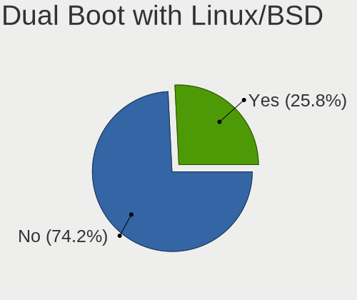
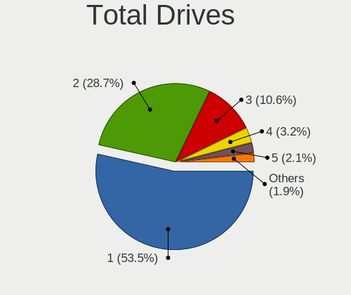
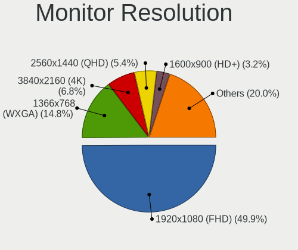
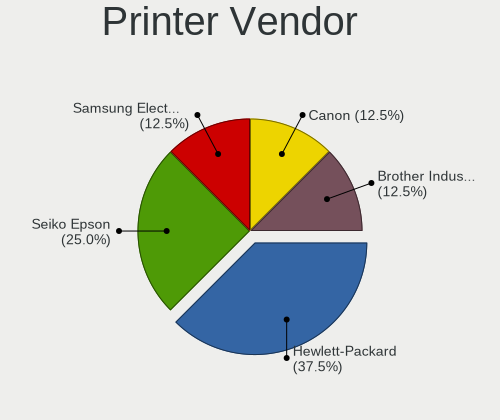

Xero - Tested Hardware & Statistics
-----------------------------------

A project to collect tested hardware configurations for Xero.

Anyone can contribute to this report by the [hw-probe](https://github.com/linuxhw/hw-probe) tool:

    sudo -E hw-probe -all -upload

Please contribute! Especially if your hardware is rare.

This is a report for all computer types. See also reports for [desktops](/Dist/Xero/Desktop/README.md) and [notebooks](/Dist/Xero/Notebook/README.md).

Contents
--------

* [ Test Cases ](#test-cases)

* [ System ](#system)
  - [ OS                       ](#os)
  - [ OS Family                ](#os-family)
  - [ Kernel                   ](#kernel)
  - [ Kernel Family            ](#kernel-family)
  - [ Kernel Major Ver.        ](#kernel-major-ver)
  - [ Arch                     ](#arch)
  - [ DE                       ](#de)
  - [ Display Server           ](#display-server)
  - [ Display Manager          ](#display-manager)
  - [ OS Lang                  ](#os-lang)
  - [ Boot Mode                ](#boot-mode)
  - [ Filesystem               ](#filesystem)
  - [ Part. scheme             ](#part-scheme)
  - [ Dual Boot with Linux/BSD ](#dual-boot-with-linuxbsd)
  - [ Dual Boot (Win)          ](#dual-boot-win)

* [ Board ](#board)
  - [ Vendor                   ](#vendor)
  - [ Model                    ](#model)
  - [ Model Family             ](#model-family)
  - [ MFG Year                 ](#mfg-year)
  - [ Form Factor              ](#form-factor)
  - [ Secure Boot              ](#secure-boot)
  - [ Coreboot                 ](#coreboot)
  - [ RAM Size                 ](#ram-size)
  - [ RAM Used                 ](#ram-used)
  - [ Total Drives             ](#total-drives)
  - [ Has CD-ROM               ](#has-cd-rom)
  - [ Has Ethernet             ](#has-ethernet)
  - [ Has WiFi                 ](#has-wifi)
  - [ Has Bluetooth            ](#has-bluetooth)

* [ Location ](#location)
  - [ Country                  ](#country)
  - [ City                     ](#city)

* [ Drives ](#drives)
  - [ Drive Vendor             ](#drive-vendor)
  - [ Drive Model              ](#drive-model)
  - [ HDD Vendor               ](#hdd-vendor)
  - [ SSD Vendor               ](#ssd-vendor)
  - [ Drive Kind               ](#drive-kind)
  - [ Drive Connector          ](#drive-connector)
  - [ Drive Size               ](#drive-size)
  - [ Space Total              ](#space-total)
  - [ Space Used               ](#space-used)
  - [ Malfunc. Drives          ](#malfunc-drives)
  - [ Malfunc. Drive Vendor    ](#malfunc-drive-vendor)
  - [ Malfunc. HDD Vendor      ](#malfunc-hdd-vendor)
  - [ Malfunc. Drive Kind      ](#malfunc-drive-kind)
  - [ Failed Drives            ](#failed-drives)
  - [ Failed Drive Vendor      ](#failed-drive-vendor)
  - [ Drive Status             ](#drive-status)

* [ Storage controller ](#storage-controller)
  - [ Storage Vendor           ](#storage-vendor)
  - [ Storage Model            ](#storage-model)
  - [ Storage Kind             ](#storage-kind)

* [ Processor ](#processor)
  - [ CPU Vendor               ](#cpu-vendor)
  - [ CPU Model                ](#cpu-model)
  - [ CPU Model Family         ](#cpu-model-family)
  - [ CPU Cores                ](#cpu-cores)
  - [ CPU Sockets              ](#cpu-sockets)
  - [ CPU Threads              ](#cpu-threads)
  - [ CPU Op-Modes             ](#cpu-op-modes)
  - [ CPU Microcode            ](#cpu-microcode)
  - [ CPU Microarch            ](#cpu-microarch)

* [ Graphics ](#graphics)
  - [ GPU Vendor               ](#gpu-vendor)
  - [ GPU Model                ](#gpu-model)
  - [ GPU Combo                ](#gpu-combo)
  - [ GPU Driver               ](#gpu-driver)
  - [ GPU Memory               ](#gpu-memory)

* [ Monitor ](#monitor)
  - [ Monitor Vendor           ](#monitor-vendor)
  - [ Monitor Model            ](#monitor-model)
  - [ Monitor Resolution       ](#monitor-resolution)
  - [ Monitor Diagonal         ](#monitor-diagonal)
  - [ Monitor Width            ](#monitor-width)
  - [ Aspect Ratio             ](#aspect-ratio)
  - [ Monitor Area             ](#monitor-area)
  - [ Pixel Density            ](#pixel-density)
  - [ Multiple Monitors        ](#multiple-monitors)

* [ Network ](#network)
  - [ Net Controller Vendor    ](#net-controller-vendor)
  - [ Net Controller Model     ](#net-controller-model)
  - [ Wireless Vendor          ](#wireless-vendor)
  - [ Wireless Model           ](#wireless-model)
  - [ Ethernet Vendor          ](#ethernet-vendor)
  - [ Ethernet Model           ](#ethernet-model)
  - [ Net Controller Kind      ](#net-controller-kind)
  - [ Used Controller          ](#used-controller)
  - [ NICs                     ](#nics)
  - [ IPv6                     ](#ipv6)

* [ Bluetooth ](#bluetooth)
  - [ Bluetooth Vendor         ](#bluetooth-vendor)
  - [ Bluetooth Model          ](#bluetooth-model)

* [ Sound ](#sound)
  - [ Sound Vendor             ](#sound-vendor)
  - [ Sound Model              ](#sound-model)

* [ Memory ](#memory)
  - [ Memory Vendor            ](#memory-vendor)
  - [ Memory Model             ](#memory-model)
  - [ Memory Kind              ](#memory-kind)
  - [ Memory Form Factor       ](#memory-form-factor)
  - [ Memory Size              ](#memory-size)
  - [ Memory Speed             ](#memory-speed)

* [ Printers & scanners ](#printers--scanners)
  - [ Printer Vendor           ](#printer-vendor)
  - [ Printer Model            ](#printer-model)
  - [ Scanner Vendor           ](#scanner-vendor)
  - [ Scanner Model            ](#scanner-model)

* [ Camera ](#camera)
  - [ Camera Vendor            ](#camera-vendor)
  - [ Camera Model             ](#camera-model)

* [ Security ](#security)
  - [ Fingerprint Vendor       ](#fingerprint-vendor)
  - [ Fingerprint Model        ](#fingerprint-model)
  - [ Chipcard Vendor          ](#chipcard-vendor)
  - [ Chipcard Model           ](#chipcard-model)

* [ Unsupported ](#unsupported)
  - [ Unsupported Devices      ](#unsupported-devices)
  - [ Unsupported Device Types ](#unsupported-device-types)

Test Cases
----------

Total: 339

| Vendor        | Model                       | Form-Factor | Probe                                                      | Date         |
|---------------|-----------------------------|-------------|------------------------------------------------------------|--------------|
| Dell          | Inspiron 7460               | Notebook    | [03726302da](https://linux-hardware.org/?probe=03726302da) | Sep 07, 2023 |
| HP            | 2B3C                        | Desktop     | [471f0f283b](https://linux-hardware.org/?probe=471f0f283b) | Sep 06, 2023 |
| HP            | Pavilion x360 Convertibl... | Convertible | [55c623e23d](https://linux-hardware.org/?probe=55c623e23d) | Sep 06, 2023 |
| HP            | Pavilion x360 Convertibl... | Convertible | [db0c457b51](https://linux-hardware.org/?probe=db0c457b51) | Sep 06, 2023 |
| HP            | ProBook 455 15.6 inch G9... | Notebook    | [5b7ab92e89](https://linux-hardware.org/?probe=5b7ab92e89) | Sep 06, 2023 |
| ASUSTek       | ROG STRIX Z790-E GAMING ... | Desktop     | [b1329d0cc1](https://linux-hardware.org/?probe=b1329d0cc1) | Sep 05, 2023 |
| ASUSTek       | PRIME A320M-K               | Desktop     | [7263435dde](https://linux-hardware.org/?probe=7263435dde) | Sep 05, 2023 |
| Acer          | Aspire 5742                 | Notebook    | [ff917b0920](https://linux-hardware.org/?probe=ff917b0920) | Sep 02, 2023 |
| HUAWEI        | HN-WX9X                     | Notebook    | [efd67d7c17](https://linux-hardware.org/?probe=efd67d7c17) | Sep 02, 2023 |
| Dell          | Latitude 5420               | Notebook    | [2acb1da32c](https://linux-hardware.org/?probe=2acb1da32c) | Sep 02, 2023 |
| ASUSTek       | PRIME X299-A II             | Desktop     | [80a93a9457](https://linux-hardware.org/?probe=80a93a9457) | Sep 02, 2023 |
| Lenovo        | IdeaPad 3 14ALC6 82KT       | Notebook    | [9de67aa419](https://linux-hardware.org/?probe=9de67aa419) | Sep 01, 2023 |
| HP            | 18E9                        | Desktop     | [fd1f6decb2](https://linux-hardware.org/?probe=fd1f6decb2) | Sep 01, 2023 |
| Dell          | G15 5530                    | Notebook    | [ababfa6c5e](https://linux-hardware.org/?probe=ababfa6c5e) | Aug 31, 2023 |
| HP            | 255 G8 Notebook PC          | Notebook    | [92552fa038](https://linux-hardware.org/?probe=92552fa038) | Aug 30, 2023 |
| Acer          | Aspire A315-58              | Notebook    | [75ef08524c](https://linux-hardware.org/?probe=75ef08524c) | Aug 30, 2023 |
| Dell          | Latitude E6520              | Notebook    | [4918e66ad8](https://linux-hardware.org/?probe=4918e66ad8) | Aug 29, 2023 |
| MSI           | Z97 GAMING 7                | Desktop     | [ea78ba2d46](https://linux-hardware.org/?probe=ea78ba2d46) | Aug 29, 2023 |
| Lenovo        | IdeaPad C340-14IML 81TK     | Convertible | [176ad353fa](https://linux-hardware.org/?probe=176ad353fa) | Aug 29, 2023 |
| Lenovo        | IdeaPad 3 14ALC6 82KT       | Notebook    | [fc7834595f](https://linux-hardware.org/?probe=fc7834595f) | Aug 29, 2023 |
| ASUSTek       | ROG STRIX Z690-G GAMING ... | Desktop     | [5b896ea45c](https://linux-hardware.org/?probe=5b896ea45c) | Aug 29, 2023 |
| Acer          | Aspire V5-471               | Notebook    | [c5d2dabe27](https://linux-hardware.org/?probe=c5d2dabe27) | Aug 28, 2023 |
| Gigabyte      | B450 AORUS ELITE            | Desktop     | [6b6ec006aa](https://linux-hardware.org/?probe=6b6ec006aa) | Aug 28, 2023 |
| Gigabyte      | H110M-H-CF                  | Desktop     | [cc89933ff1](https://linux-hardware.org/?probe=cc89933ff1) | Aug 28, 2023 |
| Intel         | NUC11PABi7 K90104-302       | Mini pc     | [ee8ee6bf06](https://linux-hardware.org/?probe=ee8ee6bf06) | Aug 28, 2023 |
| ASUSTek       | PRIME H510M-R               | Desktop     | [c6614846b5](https://linux-hardware.org/?probe=c6614846b5) | Aug 28, 2023 |
| HP            | 2B18                        | Desktop     | [891ce74167](https://linux-hardware.org/?probe=891ce74167) | Aug 27, 2023 |
| Dell          | 06X1TJ A00                  | Desktop     | [450512bee1](https://linux-hardware.org/?probe=450512bee1) | Aug 27, 2023 |
| MSI           | A520M-A PRO                 | Desktop     | [7423f83594](https://linux-hardware.org/?probe=7423f83594) | Aug 27, 2023 |
| MSI           | MPG X570 GAMING EDGE WIF... | Desktop     | [dd4626de1b](https://linux-hardware.org/?probe=dd4626de1b) | Aug 27, 2023 |
| Gigabyte      | Z370M DS3H-CF               | Desktop     | [6ae200367f](https://linux-hardware.org/?probe=6ae200367f) | Aug 27, 2023 |
| Gigabyte      | Z490 GAMING X               | Desktop     | [ee07c69165](https://linux-hardware.org/?probe=ee07c69165) | Aug 27, 2023 |
| Timi          | Redmi Book Pro 14 2022      | Notebook    | [8f85c500ec](https://linux-hardware.org/?probe=8f85c500ec) | Aug 27, 2023 |
| ASUSTek       | ROG STRIX B550-F GAMING     | Desktop     | [17a7fc84be](https://linux-hardware.org/?probe=17a7fc84be) | Aug 26, 2023 |
| ASUSTek       | ROG STRIX X470-I GAMING     | Desktop     | [d4cf1916d2](https://linux-hardware.org/?probe=d4cf1916d2) | Aug 26, 2023 |
| ASUSTek       | ASUS TUF Gaming A17 FA70... | Notebook    | [211472aacc](https://linux-hardware.org/?probe=211472aacc) | Aug 26, 2023 |
| ASUSTek       | ROG STRIX X670E-E GAMING... | Desktop     | [16790cbb5f](https://linux-hardware.org/?probe=16790cbb5f) | Aug 26, 2023 |
| HP            | Laptop 14-dq2xxx            | Notebook    | [0c46e2d419](https://linux-hardware.org/?probe=0c46e2d419) | Aug 26, 2023 |
| HP            | Laptop 15-da2xxx            | Notebook    | [01636af413](https://linux-hardware.org/?probe=01636af413) | Aug 25, 2023 |
| BESSTAR Te... | UM700                       | Desktop     | [bca12d1c12](https://linux-hardware.org/?probe=bca12d1c12) | Aug 24, 2023 |
| Gigabyte      | Z790 AORUS MASTER           | Desktop     | [202017a190](https://linux-hardware.org/?probe=202017a190) | Aug 23, 2023 |
| Google        | Pirika                      | Notebook    | [f0937aba65](https://linux-hardware.org/?probe=f0937aba65) | Aug 23, 2023 |
| Lenovo        | ThinkPad P50 20EQS4XN00     | Notebook    | [a517cc57b8](https://linux-hardware.org/?probe=a517cc57b8) | Aug 23, 2023 |
| VIT           | P2402                       | Notebook    | [fa87ae71d4](https://linux-hardware.org/?probe=fa87ae71d4) | Aug 22, 2023 |
| VIT           | P2402                       | Notebook    | [7b83628f3c](https://linux-hardware.org/?probe=7b83628f3c) | Aug 22, 2023 |
| ASUSTek       | X510UAR                     | Notebook    | [cdef569014](https://linux-hardware.org/?probe=cdef569014) | Aug 22, 2023 |
| Win Elemen... | M9                          | Desktop     | [f161447dfc](https://linux-hardware.org/?probe=f161447dfc) | Aug 22, 2023 |
| HP            | Laptop 15-dy1xxx            | Notebook    | [e00521ec88](https://linux-hardware.org/?probe=e00521ec88) | Aug 22, 2023 |
| Acer          | Predator PO3-630            | Desktop     | [b7c9c3e0c4](https://linux-hardware.org/?probe=b7c9c3e0c4) | Aug 22, 2023 |
| HUAWEI        | HVY-WXX9                    | Notebook    | [d63bd363bc](https://linux-hardware.org/?probe=d63bd363bc) | Aug 22, 2023 |
| ASUSTek       | ROG Strix G531GT_G531GT     | Notebook    | [882234a7b8](https://linux-hardware.org/?probe=882234a7b8) | Aug 22, 2023 |
| ASRock        | A320M-DVS R4.0              | Desktop     | [5a9badb376](https://linux-hardware.org/?probe=5a9badb376) | Aug 22, 2023 |
| Dell          | Inspiron 5558               | Notebook    | [ee47d4b6a7](https://linux-hardware.org/?probe=ee47d4b6a7) | Aug 20, 2023 |
| HONOR         | BBR-WAX9                    | Notebook    | [1d013fbf4b](https://linux-hardware.org/?probe=1d013fbf4b) | Aug 20, 2023 |
| Lenovo        | Yoga 920-13IKB 80Y7         | Convertible | [4456ccbc85](https://linux-hardware.org/?probe=4456ccbc85) | Aug 20, 2023 |
| MSI           | MEG Z390 ACE                | Desktop     | [5ab219fbd1](https://linux-hardware.org/?probe=5ab219fbd1) | Aug 20, 2023 |
| MSI           | H270M BAZOOKA               | Desktop     | [f51f1ce129](https://linux-hardware.org/?probe=f51f1ce129) | Aug 19, 2023 |
| Lenovo        | Rev B 82KU                  | Notebook    | [114345f952](https://linux-hardware.org/?probe=114345f952) | Aug 18, 2023 |
| ASUSTek       | VivoBook_ASUSLaptop X712... | Notebook    | [faaba537ca](https://linux-hardware.org/?probe=faaba537ca) | Aug 18, 2023 |
| MSI           | Z87 MPOWER MAX              | Desktop     | [6bda9908df](https://linux-hardware.org/?probe=6bda9908df) | Aug 16, 2023 |
| Lenovo        | IdeaPad S145-15IIL 82DJ     | Notebook    | [d7ec063f46](https://linux-hardware.org/?probe=d7ec063f46) | Aug 16, 2023 |
| Gigabyte      | B550M AORUS ELITE           | Desktop     | [11dafc79e8](https://linux-hardware.org/?probe=11dafc79e8) | Aug 15, 2023 |
| Lenovo        | ThinkPad X1 Carbon 3rd 2... | Notebook    | [c078e667a4](https://linux-hardware.org/?probe=c078e667a4) | Aug 15, 2023 |
| Sony          | VAIO                        | All in one  | [a134fd35ac](https://linux-hardware.org/?probe=a134fd35ac) | Aug 13, 2023 |
| MSI           | 760GM-P33                   | Desktop     | [878209b83a](https://linux-hardware.org/?probe=878209b83a) | Aug 13, 2023 |
| Lenovo        | IdeaPad Gaming 3 15IHU6 ... | Notebook    | [1c643cc90f](https://linux-hardware.org/?probe=1c643cc90f) | Aug 13, 2023 |
| Microsoft     | Surface Pro 7               | Tablet      | [551d8f3fc8](https://linux-hardware.org/?probe=551d8f3fc8) | Aug 13, 2023 |
| Fujitsu       | LIFEBOOK A3510              | Notebook    | [3e830ffabc](https://linux-hardware.org/?probe=3e830ffabc) | Aug 12, 2023 |
| Dell          | G3 3590                     | Notebook    | [084d659110](https://linux-hardware.org/?probe=084d659110) | Aug 11, 2023 |
| LNV           | L40-70                      | Notebook    | [66fe107447](https://linux-hardware.org/?probe=66fe107447) | Aug 11, 2023 |
| Microsoft     | Surface Pro 7               | Tablet      | [93a61b62a5](https://linux-hardware.org/?probe=93a61b62a5) | Aug 11, 2023 |
| Lenovo        | Yoga 3 Pro-1370 80HE        | Notebook    | [eee160a070](https://linux-hardware.org/?probe=eee160a070) | Aug 10, 2023 |
| HP            | Laptop 15s-eq3xxx           | Notebook    | [284cfb0f6d](https://linux-hardware.org/?probe=284cfb0f6d) | Aug 08, 2023 |
| ASUSTek       | ASUS TUF Gaming F15 FX50... | Notebook    | [c9c978701a](https://linux-hardware.org/?probe=c9c978701a) | Aug 08, 2023 |
| ASUSTek       | PRIME H510M-R               | Desktop     | [38ab435feb](https://linux-hardware.org/?probe=38ab435feb) | Aug 08, 2023 |
| MSI           | B350 GAMING PLUS            | Desktop     | [951597859a](https://linux-hardware.org/?probe=951597859a) | Aug 08, 2023 |
| ASRock        | X300M-STX                   | Desktop     | [e642e8e489](https://linux-hardware.org/?probe=e642e8e489) | Aug 08, 2023 |
| Sony          | VAIO                        | All in one  | [e924df8ac8](https://linux-hardware.org/?probe=e924df8ac8) | Aug 07, 2023 |
| Sony          | VAIO                        | All in one  | [8349b185e4](https://linux-hardware.org/?probe=8349b185e4) | Aug 07, 2023 |
| ECS           | H61H2-CM                    | Desktop     | [e2b9ff65d7](https://linux-hardware.org/?probe=e2b9ff65d7) | Aug 06, 2023 |
| WEIGO         | CDA-141AU                   | Notebook    | [35c705bd70](https://linux-hardware.org/?probe=35c705bd70) | Aug 05, 2023 |
| Dell          | Inspiron 3558               | Notebook    | [5331913f13](https://linux-hardware.org/?probe=5331913f13) | Aug 04, 2023 |
| Lenovo        | IdeaPad Gaming 3 15IHU6 ... | Notebook    | [8b84e48f4c](https://linux-hardware.org/?probe=8b84e48f4c) | Aug 04, 2023 |
| HP            | Laptop 15-dy1xxx            | Notebook    | [6dbeaa5f27](https://linux-hardware.org/?probe=6dbeaa5f27) | Aug 04, 2023 |
| Acer          | Aspire V3-371               | Notebook    | [5d5a4b489b](https://linux-hardware.org/?probe=5d5a4b489b) | Aug 03, 2023 |
| ASRock        | Z77 Professional            | Desktop     | [2f0bc369b4](https://linux-hardware.org/?probe=2f0bc369b4) | Aug 03, 2023 |
| Fujitsu       | LIFEBOOK A3510              | Notebook    | [7281304bf0](https://linux-hardware.org/?probe=7281304bf0) | Aug 02, 2023 |
| Dell          | G3 3590                     | Notebook    | [78aeeb1aa3](https://linux-hardware.org/?probe=78aeeb1aa3) | Aug 02, 2023 |
| Dell          | G3 3590                     | Notebook    | [47d3c9b9fe](https://linux-hardware.org/?probe=47d3c9b9fe) | Aug 02, 2023 |
| Microsoft     | Surface Pro 3               | Tablet      | [b0d7ab05f0](https://linux-hardware.org/?probe=b0d7ab05f0) | Aug 02, 2023 |
| AZW           | SER                         | Mini pc     | [de1abb2584](https://linux-hardware.org/?probe=de1abb2584) | Aug 02, 2023 |
| Dell          | XPS 15 7590                 | Notebook    | [39216c08ff](https://linux-hardware.org/?probe=39216c08ff) | Aug 01, 2023 |
| Microsoft     | Surface Pro 6               | Tablet      | [70a56ad26d](https://linux-hardware.org/?probe=70a56ad26d) | Aug 01, 2023 |
| Gigabyte      | Z490 GAMING X               | Desktop     | [f710ad8b96](https://linux-hardware.org/?probe=f710ad8b96) | Jul 31, 2023 |
| Lenovo        | ThinkPad T480 20L6S2CE00    | Notebook    | [eb14620792](https://linux-hardware.org/?probe=eb14620792) | Jul 30, 2023 |
| ASUSTek       | TUF B450-PLUS GAMING        | Desktop     | [2c6149347b](https://linux-hardware.org/?probe=2c6149347b) | Jul 30, 2023 |
| MSI           | H510M-A PRO                 | Desktop     | [20d5d0a3ad](https://linux-hardware.org/?probe=20d5d0a3ad) | Jul 30, 2023 |
| Apple         | MacBookPro11,1              | Notebook    | [3fb2cba3db](https://linux-hardware.org/?probe=3fb2cba3db) | Jul 29, 2023 |
| HP            | 82DD 0001                   | All in one  | [e6da7743f0](https://linux-hardware.org/?probe=e6da7743f0) | Jul 28, 2023 |
| HP            | Spectre x360 Convertible... | Convertible | [37440e19b5](https://linux-hardware.org/?probe=37440e19b5) | Jul 28, 2023 |
| ASUSTek       | VivoBook_ASUSLaptop X712... | Notebook    | [a467ce5440](https://linux-hardware.org/?probe=a467ce5440) | Jul 28, 2023 |
| Acer          | Aspire A315-42              | Notebook    | [3afa5a3034](https://linux-hardware.org/?probe=3afa5a3034) | Jul 27, 2023 |
| ASUSTek       | VivoBook_ASUSLaptop X712... | Notebook    | [dc632de3b5](https://linux-hardware.org/?probe=dc632de3b5) | Jul 27, 2023 |
| HP            | Laptop 14-fq1xxx            | Notebook    | [5de59d7736](https://linux-hardware.org/?probe=5de59d7736) | Jul 27, 2023 |
| Apple         | MacBook7,1                  | Notebook    | [762861205a](https://linux-hardware.org/?probe=762861205a) | Jul 26, 2023 |
| Intel         | B75                         | Desktop     | [492fa4fc25](https://linux-hardware.org/?probe=492fa4fc25) | Jul 26, 2023 |
| Lenovo        | ThinkCentre M58 3231W2Y     | Desktop     | [72f09cd320](https://linux-hardware.org/?probe=72f09cd320) | Jul 26, 2023 |
| Lenovo        | ThinkPad T470p 20J6003DG... | Notebook    | [5693ac5e4c](https://linux-hardware.org/?probe=5693ac5e4c) | Jul 25, 2023 |
| ASUSTek       | ROG Flow X13 GV301RC_GV3... | Convertible | [676bfc8484](https://linux-hardware.org/?probe=676bfc8484) | Jul 25, 2023 |
| ASUSTek       | VivoBook_ASUS Laptop E41... | Notebook    | [032db75736](https://linux-hardware.org/?probe=032db75736) | Jul 23, 2023 |
| Dell          | XPS 15 7590                 | Notebook    | [f5174240a7](https://linux-hardware.org/?probe=f5174240a7) | Jul 23, 2023 |
| Dell          | Inspiron 3476               | Notebook    | [eb12521a96](https://linux-hardware.org/?probe=eb12521a96) | Jul 23, 2023 |
| Lenovo        | IdeaPad 330-15ARR 81D2      | Notebook    | [c95c0b0730](https://linux-hardware.org/?probe=c95c0b0730) | Jul 22, 2023 |
| ASUSTek       | PRIME X570-P                | Desktop     | [96f5f9ffdc](https://linux-hardware.org/?probe=96f5f9ffdc) | Jul 19, 2023 |
| ASRock        | B450 Pro4                   | Desktop     | [c10ecff0f6](https://linux-hardware.org/?probe=c10ecff0f6) | Jul 19, 2023 |
| ASUSTek       | PRIME X299-A II             | Desktop     | [54f9bd2050](https://linux-hardware.org/?probe=54f9bd2050) | Jul 18, 2023 |
| Gigabyte      | X79-UD3                     | Desktop     | [d688be2c92](https://linux-hardware.org/?probe=d688be2c92) | Jul 18, 2023 |
| Gigabyte      | Z490 GAMING X               | Desktop     | [866bc45d05](https://linux-hardware.org/?probe=866bc45d05) | Jul 18, 2023 |
| MSI           | B450M-A PRO MAX             | Desktop     | [4c8b8b5a8a](https://linux-hardware.org/?probe=4c8b8b5a8a) | Jul 18, 2023 |
| ASUSTek       | TUF Z270 MARK 2             | Desktop     | [d23b7166b1](https://linux-hardware.org/?probe=d23b7166b1) | Jul 18, 2023 |
| Lenovo        | ThinkPad T420 4236C92       | Notebook    | [a7b56f640a](https://linux-hardware.org/?probe=a7b56f640a) | Jul 18, 2023 |
| Gigabyte      | Z490 GAMING X               | Desktop     | [3c5ef629e4](https://linux-hardware.org/?probe=3c5ef629e4) | Jul 18, 2023 |
| MSI           | MAG B550M MORTAR WIFI       | Desktop     | [4d00148664](https://linux-hardware.org/?probe=4d00148664) | Jul 16, 2023 |
| Lenovo        | ThinkPad T480 20L6S2CE00    | Notebook    | [e88c64ac3c](https://linux-hardware.org/?probe=e88c64ac3c) | Jul 16, 2023 |
| Gigabyte      | X399 AORUS XTREME-CF        | Desktop     | [59bf614ae2](https://linux-hardware.org/?probe=59bf614ae2) | Jul 14, 2023 |
| MSI           | B450M-A PRO MAX             | Desktop     | [9ec51bc7eb](https://linux-hardware.org/?probe=9ec51bc7eb) | Jul 14, 2023 |
| Lenovo        | ThinkPad T450 20BUS1BW01    | Notebook    | [db28c39c19](https://linux-hardware.org/?probe=db28c39c19) | Jul 14, 2023 |
| MSI           | MAG B550M MORTAR WIFI       | Desktop     | [75d40e5a2b](https://linux-hardware.org/?probe=75d40e5a2b) | Jul 14, 2023 |
| Intel         | NUC7i5BNB J31144-305        | Mini pc     | [d477369e7e](https://linux-hardware.org/?probe=d477369e7e) | Jul 14, 2023 |
| Lenovo        | ThinkPad T460s 20F90057M... | Notebook    | [698c4a8958](https://linux-hardware.org/?probe=698c4a8958) | Jul 14, 2023 |
| ASUSTek       | GL553VW                     | Notebook    | [9946c63986](https://linux-hardware.org/?probe=9946c63986) | Jul 12, 2023 |
| HP            | Laptop 15-dy2xxx            | Notebook    | [06f4243bee](https://linux-hardware.org/?probe=06f4243bee) | Jul 12, 2023 |
| Lenovo        | ThinkPad T450 20BUS1BW01    | Notebook    | [91d748c376](https://linux-hardware.org/?probe=91d748c376) | Jul 11, 2023 |
| MSI           | H510M-A PRO                 | Desktop     | [995e13dee9](https://linux-hardware.org/?probe=995e13dee9) | Jul 11, 2023 |
| Lenovo        | ThinkPad P72 20MCS0EU00     | Notebook    | [394bdbc596](https://linux-hardware.org/?probe=394bdbc596) | Jul 11, 2023 |
| HP            | OMEN Laptop 15-en0xxx       | Notebook    | [a5d9143c99](https://linux-hardware.org/?probe=a5d9143c99) | Jul 10, 2023 |
| Lenovo        | ThinkPad T480 20L6S2CE00    | Notebook    | [bbc78272ea](https://linux-hardware.org/?probe=bbc78272ea) | Jul 10, 2023 |
| Apple         | MacBook5,1                  | Notebook    | [b5ddf3381c](https://linux-hardware.org/?probe=b5ddf3381c) | Jul 10, 2023 |
| Lenovo        | ThinkPad T470p 20J6003DG... | Notebook    | [a7632f8c4b](https://linux-hardware.org/?probe=a7632f8c4b) | Jul 09, 2023 |
| HP            | ENVY Laptop 13-aq0xxx       | Notebook    | [8fcda3580f](https://linux-hardware.org/?probe=8fcda3580f) | Jul 08, 2023 |
| Alienware     | 17                          | Notebook    | [b8b8032da9](https://linux-hardware.org/?probe=b8b8032da9) | Jul 08, 2023 |
| Lenovo        | ThinkPad T460s 20F90057M... | Notebook    | [cd45163d47](https://linux-hardware.org/?probe=cd45163d47) | Jul 08, 2023 |
| Gigabyte      | Z490 GAMING X               | Desktop     | [27e600a93b](https://linux-hardware.org/?probe=27e600a93b) | Jul 07, 2023 |
| Dell          | Latitude 7480               | Notebook    | [4c07c7b04a](https://linux-hardware.org/?probe=4c07c7b04a) | Jul 07, 2023 |
| ASUSTek       | VivoBook_ASUSLaptop X712... | Notebook    | [b23ba37244](https://linux-hardware.org/?probe=b23ba37244) | Jul 06, 2023 |
| Apple         | MacBookPro8,1               | Notebook    | [d25474786c](https://linux-hardware.org/?probe=d25474786c) | Jul 05, 2023 |
| Acer          | TravelMate 8572T            | Notebook    | [67f4a2af7e](https://linux-hardware.org/?probe=67f4a2af7e) | Jul 05, 2023 |
| ASUSTek       | Rampage V EDITION 10        | Desktop     | [c945bae843](https://linux-hardware.org/?probe=c945bae843) | Jul 05, 2023 |
| ASUSTek       | ROG STRIX B550-F GAMING ... | Desktop     | [ca637a5884](https://linux-hardware.org/?probe=ca637a5884) | Jul 05, 2023 |
| ASUSTek       | CROSSHAIR VI HERO           | Desktop     | [407e00921f](https://linux-hardware.org/?probe=407e00921f) | Jul 04, 2023 |
| MSI           | MAG B550M MORTAR WIFI       | Desktop     | [fc70411ea4](https://linux-hardware.org/?probe=fc70411ea4) | Jul 03, 2023 |
| Gigabyte      | Z490 GAMING X               | Desktop     | [107fe61a53](https://linux-hardware.org/?probe=107fe61a53) | Jul 02, 2023 |
| Timi          | Redmi Book Pro 15 2022      | Notebook    | [7fee63007e](https://linux-hardware.org/?probe=7fee63007e) | Jul 02, 2023 |
| Acer          | Aspire 7715Z                | Notebook    | [b288a09d6e](https://linux-hardware.org/?probe=b288a09d6e) | Jul 01, 2023 |
| Lenovo        | ThinkPad T460s 20F90057M... | Notebook    | [a78e2b4096](https://linux-hardware.org/?probe=a78e2b4096) | Jun 29, 2023 |
| Medion        | Akoya P7818                 | Notebook    | [cfe9ae82fa](https://linux-hardware.org/?probe=cfe9ae82fa) | Jun 29, 2023 |
| ASUSTek       | H110M-A                     | Desktop     | [c3118a3d89](https://linux-hardware.org/?probe=c3118a3d89) | Jun 29, 2023 |
| ASRock        | X570 Taichi                 | Desktop     | [895760e7db](https://linux-hardware.org/?probe=895760e7db) | Jun 27, 2023 |
| ASUSTek       | A68HM-PLUS                  | Desktop     | [fa162784e0](https://linux-hardware.org/?probe=fa162784e0) | Jun 24, 2023 |
| Lenovo        | IdeaPad 320-15IKB 80XL      | Notebook    | [b67f86bedc](https://linux-hardware.org/?probe=b67f86bedc) | Jun 21, 2023 |
| Lenovo        | Legion 5 Pro 16ARH7H 82R... | Notebook    | [5314aeb7e0](https://linux-hardware.org/?probe=5314aeb7e0) | Jun 21, 2023 |
| MSI           | Z77A-G41                    | Desktop     | [e7e4924bda](https://linux-hardware.org/?probe=e7e4924bda) | Jun 20, 2023 |
| ASUSTek       | ROG STRIX B450-F GAMING     | Desktop     | [284344e775](https://linux-hardware.org/?probe=284344e775) | Jun 14, 2023 |
| ASUSTek       | ROG STRIX X570-E GAMING ... | Desktop     | [859f1b3a88](https://linux-hardware.org/?probe=859f1b3a88) | Jun 13, 2023 |
| ASUSTek       | PRIME B450M-A II            | Desktop     | [95bc101c80](https://linux-hardware.org/?probe=95bc101c80) | Jun 09, 2023 |
| Acer          | Aspire E5-573G              | Notebook    | [277ddf45b4](https://linux-hardware.org/?probe=277ddf45b4) | Jun 08, 2023 |
| Lenovo        | IdeaPad C340-14IML 81TK     | Convertible | [1d8b78cbdc](https://linux-hardware.org/?probe=1d8b78cbdc) | May 29, 2023 |
| Acer          | Aspire E1-572               | Notebook    | [6dc6a9d6f5](https://linux-hardware.org/?probe=6dc6a9d6f5) | May 29, 2023 |
| Lenovo        | IdeaPad C340-14IML 81TK     | Convertible | [2cdf1c9e61](https://linux-hardware.org/?probe=2cdf1c9e61) | May 23, 2023 |
| Lenovo        | IdeaPad C340-14IML 81TK     | Convertible | [cca41e18cb](https://linux-hardware.org/?probe=cca41e18cb) | May 23, 2023 |
| Dell          | 00V62H A01                  | Desktop     | [89d6a4edd2](https://linux-hardware.org/?probe=89d6a4edd2) | May 13, 2023 |
| Lenovo        | Yoga 730-15IKB 81CU         | Convertible | [5cfbeb30e0](https://linux-hardware.org/?probe=5cfbeb30e0) | May 10, 2023 |
| Unknown       | Intel X79                   | Desktop     | [6b1ddbd923](https://linux-hardware.org/?probe=6b1ddbd923) | May 03, 2023 |
| Biostar       | H110MHV3                    | Desktop     | [95b25ba480](https://linux-hardware.org/?probe=95b25ba480) | Apr 29, 2023 |
| Samsung       | 950QED                      | Convertible | [f2568c7949](https://linux-hardware.org/?probe=f2568c7949) | Apr 07, 2023 |
| Lenovo        | Legion 5 15ACH6H 82JU       | Notebook    | [ba6e80b2b7](https://linux-hardware.org/?probe=ba6e80b2b7) | Apr 02, 2023 |
| Lenovo        | Legion 5 15ACH6H 82JU       | Notebook    | [195ab3d907](https://linux-hardware.org/?probe=195ab3d907) | Apr 02, 2023 |
| ASUSTek       | A68HM-PLUS                  | Desktop     | [520ad2ca86](https://linux-hardware.org/?probe=520ad2ca86) | Mar 31, 2023 |
| Lenovo        | ThinkPad T440 20B7A0CYMH    | Notebook    | [428491a9d5](https://linux-hardware.org/?probe=428491a9d5) | Mar 29, 2023 |
| HP            | 8437                        | Desktop     | [cdc32d8d8b](https://linux-hardware.org/?probe=cdc32d8d8b) | Mar 25, 2023 |
| HP            | 8437                        | Desktop     | [6fbb459a03](https://linux-hardware.org/?probe=6fbb459a03) | Mar 25, 2023 |
| HP            | Victus by Laptop 16-e0xx... | Notebook    | [f8cd7d94b2](https://linux-hardware.org/?probe=f8cd7d94b2) | Mar 23, 2023 |
| Dell          | G5 5500                     | Notebook    | [f9b3b5d852](https://linux-hardware.org/?probe=f9b3b5d852) | Mar 19, 2023 |
| Lenovo        | IdeaPad S340-15IIL 81VW     | Notebook    | [90ef6ca2b7](https://linux-hardware.org/?probe=90ef6ca2b7) | Mar 18, 2023 |
| Lenovo        | IdeaPad S340-15IIL 81VW     | Notebook    | [b769745990](https://linux-hardware.org/?probe=b769745990) | Mar 18, 2023 |
| ASUSTek       | A68HM-PLUS                  | Desktop     | [5d307f2d26](https://linux-hardware.org/?probe=5d307f2d26) | Mar 18, 2023 |
| Dell          | Latitude 5420               | Notebook    | [318da7f6c0](https://linux-hardware.org/?probe=318da7f6c0) | Mar 18, 2023 |
| ASUSTek       | TUF Gaming FX505DY_FX505... | Notebook    | [d1bf2f0a8b](https://linux-hardware.org/?probe=d1bf2f0a8b) | Mar 12, 2023 |
| Apple         | MacBookPro11,3              | Notebook    | [bccc889328](https://linux-hardware.org/?probe=bccc889328) | Mar 10, 2023 |
| Lenovo        | ThinkPad P51 20HJS11Y00     | Notebook    | [0843074b87](https://linux-hardware.org/?probe=0843074b87) | Mar 09, 2023 |
| Lenovo        | IdeaPad S540-15IML D 81N... | Notebook    | [31e144de96](https://linux-hardware.org/?probe=31e144de96) | Mar 08, 2023 |
| Acer          | Aspire GX-281               | Desktop     | [d318df6931](https://linux-hardware.org/?probe=d318df6931) | Mar 04, 2023 |
| JINGSHA       | Unknown                     | Desktop     | [c8bd846b63](https://linux-hardware.org/?probe=c8bd846b63) | Feb 26, 2023 |
| Dell          | 0G3HR7 A00                  | Desktop     | [33723c8b80](https://linux-hardware.org/?probe=33723c8b80) | Feb 25, 2023 |
| Dell          | Inspiron 3505               | Notebook    | [324020ca8b](https://linux-hardware.org/?probe=324020ca8b) | Feb 24, 2023 |
| MSI           | MAG B550 TOMAHAWK           | Desktop     | [503fe663b4](https://linux-hardware.org/?probe=503fe663b4) | Feb 20, 2023 |
| ASUSTek       | ROG STRIX Z370-F GAMING     | Desktop     | [d76b048134](https://linux-hardware.org/?probe=d76b048134) | Feb 17, 2023 |
| Lenovo        | ThinkPad X1 Carbon Gen 9... | Notebook    | [efd9f878d2](https://linux-hardware.org/?probe=efd9f878d2) | Feb 12, 2023 |
| Lenovo        | ThinkPad X1 Carbon Gen 9... | Notebook    | [3c2d4cf289](https://linux-hardware.org/?probe=3c2d4cf289) | Feb 02, 2023 |
| Lenovo        | ThinkPad X1 Carbon Gen 9... | Notebook    | [0de8121880](https://linux-hardware.org/?probe=0de8121880) | Feb 01, 2023 |
| Lenovo        | ThinkPad X1 Carbon Gen 9... | Notebook    | [f39ab69b74](https://linux-hardware.org/?probe=f39ab69b74) | Feb 01, 2023 |
| HP            | ProBook 6565b               | Notebook    | [0ef00f6bcc](https://linux-hardware.org/?probe=0ef00f6bcc) | Jan 25, 2023 |
| HP            | 828A                        | Desktop     | [5f430ba8d1](https://linux-hardware.org/?probe=5f430ba8d1) | Jan 19, 2023 |
| ASUSTek       | ASUS TUF Gaming F15 FX50... | Notebook    | [5661d09dd0](https://linux-hardware.org/?probe=5661d09dd0) | Jan 15, 2023 |
| HP            | 245 G7 Notebook PC          | Notebook    | [3997d98a9a](https://linux-hardware.org/?probe=3997d98a9a) | Jan 11, 2023 |
| HUAWEI        | BOM-WXX9                    | Notebook    | [21fcd391f1](https://linux-hardware.org/?probe=21fcd391f1) | Jan 08, 2023 |
| HP            | 86EE                        | All in one  | [1fc671302e](https://linux-hardware.org/?probe=1fc671302e) | Jan 06, 2023 |
| Lenovo        | IdeaPad 3 14IGL05 81WH      | Notebook    | [86cf09380a](https://linux-hardware.org/?probe=86cf09380a) | Jan 02, 2023 |
| Pegatron      | 2AF0                        | Desktop     | [77768feff6](https://linux-hardware.org/?probe=77768feff6) | Jan 01, 2023 |
| ASUSTek       | X540LA                      | Notebook    | [65f5548781](https://linux-hardware.org/?probe=65f5548781) | Dec 30, 2022 |
| HUAWEI        | BOM-WXX9                    | Notebook    | [fb1d454bc2](https://linux-hardware.org/?probe=fb1d454bc2) | Dec 29, 2022 |
| HUAWEI        | BOM-WXX9                    | Notebook    | [62010fe267](https://linux-hardware.org/?probe=62010fe267) | Dec 29, 2022 |
| HP            | Pavilion Gaming Laptop 1... | Notebook    | [6b34107dcf](https://linux-hardware.org/?probe=6b34107dcf) | Dec 21, 2022 |
| HP            | ZBook 15 G4                 | Notebook    | [669d7e74a2](https://linux-hardware.org/?probe=669d7e74a2) | Dec 19, 2022 |
| HP            | ZBook 15 G4                 | Notebook    | [91391127d1](https://linux-hardware.org/?probe=91391127d1) | Dec 18, 2022 |
| HP            | Pavilion Gaming Laptop 1... | Notebook    | [3111a63a09](https://linux-hardware.org/?probe=3111a63a09) | Dec 16, 2022 |
| Lenovo        | ThinkPad T490s 20NX001KM... | Notebook    | [49f30d3eee](https://linux-hardware.org/?probe=49f30d3eee) | Dec 06, 2022 |
| ASUSTek       | ROG Zephyrus G14 GA401II... | Notebook    | [16f086de33](https://linux-hardware.org/?probe=16f086de33) | Nov 25, 2022 |
| Medion        | P6816                       | Notebook    | [3aadacefe7](https://linux-hardware.org/?probe=3aadacefe7) | Nov 17, 2022 |
| ASUSTek       | ROG STRIX X570-F GAMING     | Desktop     | [f074ef2e7c](https://linux-hardware.org/?probe=f074ef2e7c) | Nov 15, 2022 |
| Dell          | Latitude E6530              | Notebook    | [c87c9abe22](https://linux-hardware.org/?probe=c87c9abe22) | Nov 14, 2022 |
| Toshiba       | TECRA A11                   | Notebook    | [ba91b9d331](https://linux-hardware.org/?probe=ba91b9d331) | Nov 09, 2022 |
| Lenovo        | ThinkPad L450 20DT0000GE    | Notebook    | [1a925e0302](https://linux-hardware.org/?probe=1a925e0302) | Nov 06, 2022 |
| ASUSTek       | ROG STRIX X570-F GAMING     | Desktop     | [711e95b72e](https://linux-hardware.org/?probe=711e95b72e) | Nov 02, 2022 |
| ASUSTek       | ROG STRIX X570-F GAMING     | Desktop     | [ff0c19c661](https://linux-hardware.org/?probe=ff0c19c661) | Nov 02, 2022 |
| ASUSTek       | VivoBook_ASUSLaptop X421... | Notebook    | [4cd7aa6350](https://linux-hardware.org/?probe=4cd7aa6350) | Nov 01, 2022 |
| ASUSTek       | K53SJ                       | Notebook    | [8c85e545f2](https://linux-hardware.org/?probe=8c85e545f2) | Oct 23, 2022 |
| Gigabyte      | A320M-S2H-CF                | Desktop     | [bcf4fa1baf](https://linux-hardware.org/?probe=bcf4fa1baf) | Oct 18, 2022 |
| Dell          | 0GY6Y8 A02                  | Desktop     | [07b256f333](https://linux-hardware.org/?probe=07b256f333) | Oct 17, 2022 |
| Dell          | 0GY6Y8 A02                  | Desktop     | [fc1ec464bf](https://linux-hardware.org/?probe=fc1ec464bf) | Oct 17, 2022 |
| ASUSTek       | ROG STRIX X570-F GAMING     | Desktop     | [bf0e112f9a](https://linux-hardware.org/?probe=bf0e112f9a) | Oct 16, 2022 |
| ASUSTek       | PRIME B250-PLUS             | Desktop     | [00ab764924](https://linux-hardware.org/?probe=00ab764924) | Oct 15, 2022 |
| ASUSTek       | ROG STRIX X570-F GAMING     | Desktop     | [e037086b30](https://linux-hardware.org/?probe=e037086b30) | Oct 14, 2022 |
| ASUSTek       | ROG Strix G513IC_G513IC     | Notebook    | [ef1974cfc8](https://linux-hardware.org/?probe=ef1974cfc8) | Oct 10, 2022 |
| HP            | Laptop 15s-fq2xxx           | Notebook    | [69e60dfe44](https://linux-hardware.org/?probe=69e60dfe44) | Oct 07, 2022 |
| Lenovo        | ThinkPad Yoga 370 20JJS0... | Convertible | [a11de13c4f](https://linux-hardware.org/?probe=a11de13c4f) | Oct 04, 2022 |
| Lenovo        | ThinkPad Yoga 370 20JJS0... | Convertible | [6de76ddb0e](https://linux-hardware.org/?probe=6de76ddb0e) | Oct 04, 2022 |
| ASUSTek       | ZenBook UX433FN_UX433FN     | Notebook    | [a7764ad0f6](https://linux-hardware.org/?probe=a7764ad0f6) | Oct 03, 2022 |
| ASUSTek       | ROG CROSSHAIR VIII DARK ... | Desktop     | [9931b35717](https://linux-hardware.org/?probe=9931b35717) | Sep 24, 2022 |
| MSI           | Katana GF66 11UE            | Notebook    | [36b2cba297](https://linux-hardware.org/?probe=36b2cba297) | Sep 05, 2022 |
| Lenovo        | ThinkPad X1 Carbon Gen 9... | Notebook    | [b28edd3886](https://linux-hardware.org/?probe=b28edd3886) | Aug 26, 2022 |
| Lenovo        | ThinkPad X1 Carbon Gen 9... | Notebook    | [97770c5716](https://linux-hardware.org/?probe=97770c5716) | Aug 26, 2022 |
| ASUSTek       | ROG STRIX B450-F GAMING     | Desktop     | [4c95b1bccf](https://linux-hardware.org/?probe=4c95b1bccf) | Aug 22, 2022 |
| Lenovo        | ThinkPad T430s 2356FG9      | Notebook    | [9a10c152af](https://linux-hardware.org/?probe=9a10c152af) | Aug 17, 2022 |
| Aquarius      | NS585                       | Notebook    | [db9cbd5688](https://linux-hardware.org/?probe=db9cbd5688) | Aug 17, 2022 |
| Gigabyte      | B460M DS3H V2               | Desktop     | [2522ff1530](https://linux-hardware.org/?probe=2522ff1530) | Aug 13, 2022 |
| ASUSTek       | P7P55 LX                    | Desktop     | [8211ccc6cc](https://linux-hardware.org/?probe=8211ccc6cc) | Aug 11, 2022 |
| Unknown       | Unknown                     | Desktop     | [b73e5f9cbf](https://linux-hardware.org/?probe=b73e5f9cbf) | Aug 08, 2022 |
| Unknown       | Unknown                     | Desktop     | [f483092edf](https://linux-hardware.org/?probe=f483092edf) | Aug 07, 2022 |
| ASUSTek       | TUF Gaming X570-PLUS        | Desktop     | [a0507fae02](https://linux-hardware.org/?probe=a0507fae02) | Jul 31, 2022 |
| Lenovo        | IdeaPad S145-15AST 81N3     | Notebook    | [7c46c8f737](https://linux-hardware.org/?probe=7c46c8f737) | Jul 15, 2022 |
| ASUSTek       | G551JM                      | Notebook    | [599c7b9eae](https://linux-hardware.org/?probe=599c7b9eae) | Jul 14, 2022 |
| ASUSTek       | G551JM                      | Notebook    | [9f4536df1c](https://linux-hardware.org/?probe=9f4536df1c) | Jul 14, 2022 |
| ASRock        | AB350 Pro4                  | Desktop     | [7049f819f0](https://linux-hardware.org/?probe=7049f819f0) | Jun 30, 2022 |
| HP            | 3396                        | Desktop     | [00782afa06](https://linux-hardware.org/?probe=00782afa06) | Jun 22, 2022 |
| ASUSTek       | UX303LN                     | Notebook    | [9ce42e1b01](https://linux-hardware.org/?probe=9ce42e1b01) | Jun 12, 2022 |
| ASUSTek       | ROG STRIX B450-F GAMING     | Desktop     | [8109a04ffa](https://linux-hardware.org/?probe=8109a04ffa) | Jun 12, 2022 |
| BESSTAR Te... | ATB15                       | Server      | [d6e47a7c18](https://linux-hardware.org/?probe=d6e47a7c18) | Jun 12, 2022 |
| ASUSTek       | ROG STRIX B450-F GAMING     | Desktop     | [8a7401e54a](https://linux-hardware.org/?probe=8a7401e54a) | Jun 11, 2022 |
| Acer          | Aspire XC-886 V:2.0         | Desktop     | [2fe8cdaf93](https://linux-hardware.org/?probe=2fe8cdaf93) | May 31, 2022 |
| Dell          | Inspiron 1545               | Notebook    | [ce0e24a314](https://linux-hardware.org/?probe=ce0e24a314) | May 28, 2022 |
| Lenovo        | IdeaPad 330-17IKB 81DM      | Notebook    | [53475a6004](https://linux-hardware.org/?probe=53475a6004) | May 24, 2022 |
| ASUSTek       | VivoBook_ASUSLaptop X350... | Notebook    | [80d32848bf](https://linux-hardware.org/?probe=80d32848bf) | May 21, 2022 |
| ASUSTek       | ROG Maximus X HERO          | Desktop     | [3ddad532a9](https://linux-hardware.org/?probe=3ddad532a9) | May 08, 2022 |
| Dell          | Inspiron 7786               | Convertible | [0ef12447d9](https://linux-hardware.org/?probe=0ef12447d9) | May 02, 2022 |
| Dell          | Precision M3800             | Notebook    | [7b63874768](https://linux-hardware.org/?probe=7b63874768) | Apr 25, 2022 |
| Dell          | Precision M3800             | Notebook    | [fbabacd835](https://linux-hardware.org/?probe=fbabacd835) | Apr 24, 2022 |
| Lenovo        | ThinkPad X230 2325HR9       | Notebook    | [a9d9d3fbb2](https://linux-hardware.org/?probe=a9d9d3fbb2) | Apr 21, 2022 |
| MSI           | Z170-A PRO                  | Desktop     | [db5ab86328](https://linux-hardware.org/?probe=db5ab86328) | Apr 11, 2022 |
| Acer          | Aspire A515-54G             | Notebook    | [52b660d8fb](https://linux-hardware.org/?probe=52b660d8fb) | Apr 11, 2022 |
| MSI           | Z170-A PRO                  | Desktop     | [3bd5bb8d08](https://linux-hardware.org/?probe=3bd5bb8d08) | Apr 10, 2022 |
| Dell          | Precision M3800             | Notebook    | [1ef57b39a7](https://linux-hardware.org/?probe=1ef57b39a7) | Apr 10, 2022 |
| ASUSTek       | TUF Gaming X570-PLUS        | Desktop     | [8d251b1b2a](https://linux-hardware.org/?probe=8d251b1b2a) | Apr 03, 2022 |
| Dell          | Precision M3800             | Notebook    | [9fc15d1ae6](https://linux-hardware.org/?probe=9fc15d1ae6) | Mar 31, 2022 |
| HP            | 843B                        | Desktop     | [a88ff7cf5c](https://linux-hardware.org/?probe=a88ff7cf5c) | Mar 27, 2022 |
| Pegatron      | 2AC2                        | Desktop     | [d3c82e973b](https://linux-hardware.org/?probe=d3c82e973b) | Mar 25, 2022 |
| ASUSTek       | Maximus IX HERO             | Desktop     | [745cc1d638](https://linux-hardware.org/?probe=745cc1d638) | Mar 25, 2022 |
| MSI           | GF63 Thin 9SCX              | Notebook    | [4501fa1556](https://linux-hardware.org/?probe=4501fa1556) | Mar 25, 2022 |
| Dell          | Latitude 7480               | Notebook    | [bf00ec6a76](https://linux-hardware.org/?probe=bf00ec6a76) | Mar 23, 2022 |
| ASUSTek       | Maximus IX HERO             | Desktop     | [8eb98db533](https://linux-hardware.org/?probe=8eb98db533) | Mar 22, 2022 |
| HUAWEI        | WRT-WX9                     | Notebook    | [70ec26bed6](https://linux-hardware.org/?probe=70ec26bed6) | Mar 22, 2022 |
| ASUSTek       | ROG CROSSHAIR VIII HERO     | Desktop     | [13cdf54c81](https://linux-hardware.org/?probe=13cdf54c81) | Mar 21, 2022 |
| Dell          | Latitude 7480               | Notebook    | [faddba28a8](https://linux-hardware.org/?probe=faddba28a8) | Mar 19, 2022 |
| Apple         | MacBookAir6,2               | Notebook    | [b71110144d](https://linux-hardware.org/?probe=b71110144d) | Mar 19, 2022 |
| HP            | Laptop 15-da0xxx            | Notebook    | [bb9074ccdf](https://linux-hardware.org/?probe=bb9074ccdf) | Mar 18, 2022 |
| Lenovo        | IdeaPad 3 15IML05 81WR      | Notebook    | [918c951cd1](https://linux-hardware.org/?probe=918c951cd1) | Mar 12, 2022 |
| ASUSTek       | TUF Gaming B550M-PLUS       | Desktop     | [639e7361ef](https://linux-hardware.org/?probe=639e7361ef) | Mar 12, 2022 |
| Lenovo        | IdeaPad S145-15IIL 81W8     | Notebook    | [e251c9f079](https://linux-hardware.org/?probe=e251c9f079) | Mar 11, 2022 |
| MSI           | Z170A PC MATE               | Desktop     | [181e014823](https://linux-hardware.org/?probe=181e014823) | Mar 08, 2022 |
| Gigabyte      | Z170X-UD3-CF                | Desktop     | [3ec7a7f643](https://linux-hardware.org/?probe=3ec7a7f643) | Mar 06, 2022 |
| Dell          | Venue 11 Pro 7130 vPro      | Notebook    | [57b302b119](https://linux-hardware.org/?probe=57b302b119) | Mar 05, 2022 |
| Lenovo        | ThinkPad T460 20FMS1XX00    | Notebook    | [78e82c6674](https://linux-hardware.org/?probe=78e82c6674) | Feb 24, 2022 |
| Dell          | Latitude E6430              | Notebook    | [e1de4e80fe](https://linux-hardware.org/?probe=e1de4e80fe) | Feb 15, 2022 |
| Lenovo        | Legion 5 15ARH05H 82B1      | Notebook    | [a3c5f00a2a](https://linux-hardware.org/?probe=a3c5f00a2a) | Feb 10, 2022 |
| Lenovo        | Legion 5 15ARH05H 82B1      | Notebook    | [e53fb31614](https://linux-hardware.org/?probe=e53fb31614) | Feb 10, 2022 |
| Lenovo        | Legion Y740-15IRHg 81UH     | Notebook    | [b0cc5e0cbc](https://linux-hardware.org/?probe=b0cc5e0cbc) | Jan 29, 2022 |
| ASUSTek       | P5Q PRO TURBO               | Desktop     | [83ca29c9c8](https://linux-hardware.org/?probe=83ca29c9c8) | Jan 28, 2022 |
| Acer          | Aspire A315-58G             | Notebook    | [cb4f253c1c](https://linux-hardware.org/?probe=cb4f253c1c) | Jan 28, 2022 |
| Dell          | Latitude E6520              | Notebook    | [ee96960cec](https://linux-hardware.org/?probe=ee96960cec) | Jan 25, 2022 |
| Lenovo        | Yoga 710-15IKB 80V5         | Convertible | [3d5fe9fc42](https://linux-hardware.org/?probe=3d5fe9fc42) | Jan 22, 2022 |
| HP            | Laptop 15s-eq0xxx           | Notebook    | [0df160c245](https://linux-hardware.org/?probe=0df160c245) | Jan 21, 2022 |
| ASUSTek       | TUF Gaming B550M-PLUS       | Desktop     | [230373b3ff](https://linux-hardware.org/?probe=230373b3ff) | Jan 09, 2022 |
| Lenovo        | Legion Y540-15IRH-PG0 81... | Notebook    | [3df8a1c560](https://linux-hardware.org/?probe=3df8a1c560) | Jan 08, 2022 |
| HP            | 1906                        | Desktop     | [5f8fe7cb20](https://linux-hardware.org/?probe=5f8fe7cb20) | Jan 06, 2022 |
| ASUSTek       | TUF Gaming X570-PLUS        | Desktop     | [793bfa4f40](https://linux-hardware.org/?probe=793bfa4f40) | Jan 04, 2022 |
| HP            | 2179                        | Desktop     | [79bac7ce1b](https://linux-hardware.org/?probe=79bac7ce1b) | Jan 01, 2022 |
| ASUSTek       | TUF B360M-PLUS GAMING/BR    | Desktop     | [512091cd1c](https://linux-hardware.org/?probe=512091cd1c) | Dec 30, 2021 |
| Dell          | Vostro 3590                 | Notebook    | [9e77a2584c](https://linux-hardware.org/?probe=9e77a2584c) | Dec 30, 2021 |
| HP            | 2179                        | Desktop     | [9b6358ce37](https://linux-hardware.org/?probe=9b6358ce37) | Dec 30, 2021 |
| ASUSTek       | ASUS EXPERTBOOK B9400CEA... | Notebook    | [78e3fbdf6a](https://linux-hardware.org/?probe=78e3fbdf6a) | Dec 28, 2021 |
| HP            | Notebook                    | Notebook    | [c14ea64659](https://linux-hardware.org/?probe=c14ea64659) | Dec 23, 2021 |
| ASRock        | X570 Taichi                 | Desktop     | [5c2c86f287](https://linux-hardware.org/?probe=5c2c86f287) | Dec 23, 2021 |
| ASUSTek       | X510UNR                     | Notebook    | [0733a05806](https://linux-hardware.org/?probe=0733a05806) | Dec 21, 2021 |
| ASUSTek       | ASUS EXPERTBOOK B9400CEA... | Notebook    | [b4425de4a6](https://linux-hardware.org/?probe=b4425de4a6) | Dec 17, 2021 |
| ASUSTek       | ASUS TUF Gaming F15 FX50... | Notebook    | [6f3bd18b3f](https://linux-hardware.org/?probe=6f3bd18b3f) | Dec 06, 2021 |
| Pegatron      | D15K                        | Notebook    | [eaeaad8d39](https://linux-hardware.org/?probe=eaeaad8d39) | Nov 29, 2021 |
| ASUSTek       | TUF Gaming X570-PLUS        | Desktop     | [728b23aa46](https://linux-hardware.org/?probe=728b23aa46) | Nov 26, 2021 |
| ASUSTek       | PRIME A320M-K               | Desktop     | [9e9b6fd944](https://linux-hardware.org/?probe=9e9b6fd944) | Nov 21, 2021 |
| MSI           | GP73 Leopard 8RD            | Notebook    | [5bafb43f78](https://linux-hardware.org/?probe=5bafb43f78) | Nov 21, 2021 |
| Acer          | Aspire A315-58G             | Notebook    | [911895fcf2](https://linux-hardware.org/?probe=911895fcf2) | Nov 19, 2021 |
| Acer          | Aspire A315-58G             | Notebook    | [5748b3cd05](https://linux-hardware.org/?probe=5748b3cd05) | Nov 12, 2021 |
| Lenovo        | ThinkPad W530 24384CU       | Notebook    | [d18d3495e0](https://linux-hardware.org/?probe=d18d3495e0) | Nov 05, 2021 |
| ASUSTek       | TUF Z390-PLUS GAMING        | Desktop     | [4877535f8b](https://linux-hardware.org/?probe=4877535f8b) | Nov 03, 2021 |
| MSI           | Z370 GAMING PLUS            | Desktop     | [8dd5924480](https://linux-hardware.org/?probe=8dd5924480) | Oct 31, 2021 |
| Acer          | Aspire A315-58G             | Notebook    | [905fce5118](https://linux-hardware.org/?probe=905fce5118) | Oct 29, 2021 |
| HP            | ENVY Sleekbook 4            | Notebook    | [ebea056239](https://linux-hardware.org/?probe=ebea056239) | Oct 29, 2021 |
| ASUSTek       | VivoBook_ASUSLaptop X509... | Notebook    | [2a54689fb3](https://linux-hardware.org/?probe=2a54689fb3) | Oct 24, 2021 |
| ASUSTek       | VivoBook_ASUS Laptop E41... | Notebook    | [fb95cbb063](https://linux-hardware.org/?probe=fb95cbb063) | Oct 19, 2021 |
| Lenovo        | IdeaPad 5 15ITL05 82FG      | Notebook    | [6cd76dfa2a](https://linux-hardware.org/?probe=6cd76dfa2a) | Oct 13, 2021 |
| ASUSTek       | ASUS TUF Gaming F15 FX50... | Notebook    | [e3a8d1ca32](https://linux-hardware.org/?probe=e3a8d1ca32) | Oct 11, 2021 |
| ASUSTek       | ASUS TUF Gaming F15 FX50... | Notebook    | [c7c4a74bb8](https://linux-hardware.org/?probe=c7c4a74bb8) | Oct 11, 2021 |
| ASUSTek       | ASUS TUF Gaming F15 FX50... | Notebook    | [68865693c7](https://linux-hardware.org/?probe=68865693c7) | Oct 09, 2021 |
| Dell          | 0XC7MM A01                  | Desktop     | [390c5408b2](https://linux-hardware.org/?probe=390c5408b2) | Oct 05, 2021 |
| Lenovo        | Y520-15IKBN 80WK            | Notebook    | [e804a59920](https://linux-hardware.org/?probe=e804a59920) | Oct 02, 2021 |
| ASRock        | B450M Pro4                  | Desktop     | [a198e8517a](https://linux-hardware.org/?probe=a198e8517a) | Oct 01, 2021 |
| ASRock        | X570 Taichi                 | Desktop     | [50fd919991](https://linux-hardware.org/?probe=50fd919991) | Aug 29, 2021 |
| Gigabyte      | X570 AORUS MASTER           | Desktop     | [a3c6fe4037](https://linux-hardware.org/?probe=a3c6fe4037) | Jul 24, 2021 |
| ASRock        | X570 Taichi                 | Desktop     | [57d19e2c3a](https://linux-hardware.org/?probe=57d19e2c3a) | May 19, 2021 |
| Acer          | FIH57                       | Desktop     | [9c3e383ea5](https://linux-hardware.org/?probe=9c3e383ea5) | Apr 30, 2021 |

System
------

OS
--

Installed operating systems

| Name         | Computers | Percent |
|--------------|-----------|---------|
| Xero Rolling | 244       | 94.94%  |
| Xero         | 13        | 5.06%   |

OS Family
---------

OS without a version

| Name | Computers | Percent |
|------|-----------|---------|
| Xero | 256       | 100%    |

Kernel
------

Version of the Linux kernel

| Version          | Computers | Percent |
|------------------|-----------|---------|
| 6.4.3-arch1-2    | 26        | 9.45%   |
| 6.4.9-arch1-1    | 24        | 8.73%   |
| 6.4.12-arch1-1   | 19        | 6.91%   |
| 6.4.2-arch1-1    | 6         | 2.18%   |
| 6.4.10-arch1-1   | 6         | 2.18%   |
| 5.16.15-arch1-1  | 6         | 2.18%   |
| 6.4.1-arch2-1    | 5         | 1.82%   |
| 6.1.12-arch1-1   | 5         | 1.82%   |
| 6.4.4-arch1-1    | 4         | 1.45%   |
| 6.3.9-arch1-1    | 4         | 1.45%   |
| 6.2.6-arch1-1    | 4         | 1.45%   |
| 6.0.12-arch1-1   | 4         | 1.45%   |
| 5.18.16-arch1-1  | 4         | 1.45%   |
| 6.4.3-arch1-1    | 3         | 1.09%   |
| 6.4.11-arch2-1   | 3         | 1.09%   |
| 6.1.1-arch1-1    | 3         | 1.09%   |
| 5.17.9-arch1-1   | 3         | 1.09%   |
| 5.16.2-arch1-1   | 3         | 1.09%   |
| 5.16.1-arch1-1   | 3         | 1.09%   |
| 5.15.33-1-lts    | 3         | 1.09%   |
| 5.14.14-arch1-1  | 3         | 1.09%   |
| 6.4.8-arch1-1    | 2         | 0.73%   |
| 6.4.7-zen1-1-zen | 2         | 0.73%   |
| 6.4.7-arch1-2    | 2         | 0.73%   |
| 6.4.7-arch1-1    | 2         | 0.73%   |
| 6.4.2-zen1-1-zen | 2         | 0.73%   |
| 6.4.1-arch1-1    | 2         | 0.73%   |
| 6.3.8-arch1-1    | 2         | 0.73%   |
| 6.3.6-arch1-1    | 2         | 0.73%   |
| 6.2.8-arch1-1    | 2         | 0.73%   |
| 6.2.7-arch1-1    | 2         | 0.73%   |
| 6.2.12-arch1-1   | 2         | 0.73%   |
| 6.0.7-arch1-1    | 2         | 0.73%   |
| 5.19.9-arch1-1   | 2         | 0.73%   |
| 5.19.13-arch1-1  | 2         | 0.73%   |
| 5.19.12-arch1-1  | 2         | 0.73%   |
| 5.18.3-arch1-1   | 2         | 0.73%   |
| 5.18.11-arch1-1  | 2         | 0.73%   |
| 5.17.5-arch1-1   | 2         | 0.73%   |
| 5.17.1-arch1-1   | 2         | 0.73%   |

Kernel Family
-------------

Linux kernel without a distro release

| Version | Computers | Percent |
|---------|-----------|---------|
| 6.4.3   | 30        | 10.91%  |
| 6.4.9   | 24        | 8.73%   |
| 6.4.12  | 19        | 6.91%   |
| 6.4.7   | 8         | 2.91%   |
| 6.4.2   | 8         | 2.91%   |
| 6.4.10  | 8         | 2.91%   |
| 6.4.1   | 7         | 2.55%   |
| 6.3.9   | 6         | 2.18%   |
| 5.16.15 | 6         | 2.18%   |
| 6.4.4   | 5         | 1.82%   |
| 6.4.11  | 5         | 1.82%   |
| 6.1.12  | 5         | 1.82%   |
| 6.2.6   | 4         | 1.45%   |
| 6.0.12  | 4         | 1.45%   |
| 5.18.16 | 4         | 1.45%   |
| 5.14.14 | 4         | 1.45%   |
| 6.3.8   | 3         | 1.09%   |
| 6.1.1   | 3         | 1.09%   |
| 5.19.13 | 3         | 1.09%   |
| 5.17.9  | 3         | 1.09%   |
| 5.16.2  | 3         | 1.09%   |
| 5.16.16 | 3         | 1.09%   |
| 5.16.1  | 3         | 1.09%   |
| 5.15.33 | 3         | 1.09%   |
| 5.15.12 | 3         | 1.09%   |
| 5.14.8  | 3         | 1.09%   |
| 5.14.16 | 3         | 1.09%   |
| 6.4.8   | 2         | 0.73%   |
| 6.3.6   | 2         | 0.73%   |
| 6.2.8   | 2         | 0.73%   |
| 6.2.7   | 2         | 0.73%   |
| 6.2.12  | 2         | 0.73%   |
| 6.1.6   | 2         | 0.73%   |
| 6.1.38  | 2         | 0.73%   |
| 6.0.8   | 2         | 0.73%   |
| 6.0.7   | 2         | 0.73%   |
| 6.0.6   | 2         | 0.73%   |
| 6.0.2   | 2         | 0.73%   |
| 5.19.9  | 2         | 0.73%   |
| 5.19.12 | 2         | 0.73%   |

Kernel Major Ver.
-----------------

Linux kernel major version

| Version | Computers | Percent |
|---------|-----------|---------|
| 6.4     | 114       | 42.54%  |
| 5.16    | 23        | 8.58%   |
| 6.1     | 18        | 6.72%   |
| 5.15    | 18        | 6.72%   |
| 6.3     | 15        | 5.6%    |
| 6.0     | 15        | 5.6%    |
| 6.2     | 14        | 5.22%   |
| 5.14    | 13        | 4.85%   |
| 5.19    | 11        | 4.1%    |
| 5.18    | 11        | 4.1%    |
| 5.17    | 8         | 2.99%   |
| 5.10    | 3         | 1.12%   |
| 5.13    | 2         | 0.75%   |
| 6.5     | 1         | 0.37%   |
| 5.12    | 1         | 0.37%   |
| 5.11    | 1         | 0.37%   |

Arch
----

OS architecture (x86_64, i586, etc.)

| Name   | Computers | Percent |
|--------|-----------|---------|
| x86_64 | 256       | 100%    |

DE
--

Desktop Environment

| Name     | Computers | Percent |
|----------|-----------|---------|
| KDE5     | 243       | 93.82%  |
| XFCE     | 8         | 3.09%   |
| GNOME    | 4         | 1.54%   |
| Hyprland | 2         | 0.77%   |
| LeftWM   | 1         | 0.39%   |
| KDE      | 1         | 0.39%   |

Display Server
--------------

X11 or Wayland

| Name    | Computers | Percent |
|---------|-----------|---------|
| X11     | 235       | 91.44%  |
| Wayland | 19        | 7.39%   |
| Tty     | 2         | 0.78%   |
| Unknown | 1         | 0.39%   |

Display Manager
---------------

SDDM, LightDM, etc.

| Name    | Computers | Percent |
|---------|-----------|---------|
| SDDM    | 208       | 79.69%  |
| Unknown | 30        | 11.49%  |
| LightDM | 20        | 7.66%   |
| GDM     | 2         | 0.77%   |
| TDM     | 1         | 0.38%   |

OS Lang
-------

Language

| Lang  | Computers | Percent |
|-------|-----------|---------|
| en_US | 118       | 45.74%  |
| de_DE | 21        | 8.14%   |
| en_IN | 14        | 5.43%   |
| es_MX | 11        | 4.26%   |
| en_GB | 10        | 3.88%   |
| pl_PL | 8         | 3.1%    |
| C     | 8         | 3.1%    |
| ru_RU | 7         | 2.71%   |
| pt_BR | 7         | 2.71%   |
| tr_TR | 6         | 2.33%   |
| it_IT | 6         | 2.33%   |
| en_CA | 5         | 1.94%   |
| en_AU | 5         | 1.94%   |
| fr_FR | 4         | 1.55%   |
| es_ES | 3         | 1.16%   |
| vi_VN | 2         | 0.78%   |
| hu_HU | 2         | 0.78%   |
| es_AR | 2         | 0.78%   |
| en_ZA | 2         | 0.78%   |
| en_DK | 2         | 0.78%   |
| zh_CN | 1         | 0.39%   |
| sv_SE | 1         | 0.39%   |
| nl_NL | 1         | 0.39%   |
| nb_NO | 1         | 0.39%   |
| es_VE | 1         | 0.39%   |
| es_SV | 1         | 0.39%   |
| es_CL | 1         | 0.39%   |
| en_PH | 1         | 0.39%   |
| en_IL | 1         | 0.39%   |
| en_AG | 1         | 0.39%   |
| de_CH | 1         | 0.39%   |
| de_AT | 1         | 0.39%   |
| da_DK | 1         | 0.39%   |
| ca_ES | 1         | 0.39%   |
| ba_RU | 1         | 0.39%   |

Boot Mode
---------

EFI or BIOS

| Mode | Computers | Percent |
|------|-----------|---------|
| EFI  | 188       | 72.87%  |
| BIOS | 70        | 27.13%  |

Filesystem
----------

Type of filesystem

| Type    | Computers | Percent |
|---------|-----------|---------|
| Btrfs   | 94        | 36.29%  |
| Xfs     | 88        | 33.98%  |
| Ext4    | 67        | 25.87%  |
| Overlay | 9         | 3.47%   |
| Nilfs2  | 1         | 0.39%   |

Part. scheme
------------

Scheme of partitioning

| Type    | Computers | Percent |
|---------|-----------|---------|
| GPT     | 200       | 77.52%  |
| Unknown | 30        | 11.63%  |
| MBR     | 28        | 10.85%  |

Dual Boot with Linux/BSD
------------------------

Hosting more than one Linux/BSD

| Dual boot | Computers | Percent |
|-----------|-----------|---------|
| No        | 193       | 73.95%  |
| Yes       | 68        | 26.05%  |

Dual Boot (Win)
---------------

Hosting Linux and Windows

| Dual boot | Computers | Percent |
|-----------|-----------|---------|
| No        | 156       | 60.7%   |
| Yes       | 101       | 39.3%   |

Board
-----

Vendor
------

Motherboard manufacturer

| Name                | Computers | Percent |
|---------------------|-----------|---------|
| ASUSTek Computer    | 56        | 21.88%  |
| Lenovo              | 45        | 17.58%  |
| Hewlett-Packard     | 32        | 12.5%   |
| Dell                | 29        | 11.33%  |
| MSI                 | 19        | 7.42%   |
| Acer                | 15        | 5.86%   |
| Gigabyte Technology | 11        | 4.3%    |
| ASRock              | 7         | 2.73%   |
| Apple               | 6         | 2.34%   |
| HUAWEI              | 4         | 1.56%   |
| Pegatron            | 3         | 1.17%   |
| Intel               | 3         | 1.17%   |
| Timi                | 2         | 0.78%   |
| Microsoft           | 2         | 0.78%   |
| Medion              | 2         | 0.78%   |
| BESSTAR Tech        | 2         | 0.78%   |
| Unknown             | 2         | 0.78%   |
| Win Element         | 1         | 0.39%   |
| WEIGO               | 1         | 0.39%   |
| VIT                 | 1         | 0.39%   |
| Toshiba             | 1         | 0.39%   |
| Sony                | 1         | 0.39%   |
| Samsung Electronics | 1         | 0.39%   |
| LNV                 | 1         | 0.39%   |
| JINGSHA             | 1         | 0.39%   |
| HONOR               | 1         | 0.39%   |
| Google              | 1         | 0.39%   |
| Fujitsu             | 1         | 0.39%   |
| ECS                 | 1         | 0.39%   |
| Biostar             | 1         | 0.39%   |
| AZW                 | 1         | 0.39%   |
| Aquarius            | 1         | 0.39%   |
| Alienware           | 1         | 0.39%   |

Model
-----

Motherboard model

| Name                                | Computers | Percent |
|-------------------------------------|-----------|---------|
| Dell Precision M3800                | 3         | 1.17%   |
| Unknown                             | 3         | 1.17%   |
| MSI MS-7971                         | 2         | 0.78%   |
| Lenovo IdeaPad Gaming 3 15IHU6 82K1 | 2         | 0.78%   |
| Dell OptiPlex 9020                  | 2         | 0.78%   |
| Dell Latitude E6520                 | 2         | 0.78%   |
| Dell Latitude 7480                  | 2         | 0.78%   |
| Dell Latitude 5420                  | 2         | 0.78%   |
| ASUS TUF Gaming X570-PLUS           | 2         | 0.78%   |
| ASUS PRIME A320M-K                  | 2         | 0.78%   |
| Win Element M9                      | 1         | 0.39%   |
| WEIGO CDA-141AU                     | 1         | 0.39%   |
| VIT P2402                           | 1         | 0.39%   |
| Toshiba TECRA A11                   | 1         | 0.39%   |
| Timi Redmi Book Pro 15 2022         | 1         | 0.39%   |
| Timi Redmi Book Pro 14 2022         | 1         | 0.39%   |
| Sony VGC-LV180ME                    | 1         | 0.39%   |
| Samsung 950QED                      | 1         | 0.39%   |
| Pegatron p6-2026                    | 1         | 0.39%   |
| Pegatron D15K                       | 1         | 0.39%   |
| Pegatron 20-b010                    | 1         | 0.39%   |
| MSI MS-7D22                         | 1         | 0.39%   |
| MSI MS-7C96                         | 1         | 0.39%   |
| MSI MS-7C94                         | 1         | 0.39%   |
| MSI MS-7C91                         | 1         | 0.39%   |
| MSI MS-7C52                         | 1         | 0.39%   |
| MSI MS-7C37                         | 1         | 0.39%   |
| MSI MS-7B61                         | 1         | 0.39%   |
| MSI MS-7B12                         | 1         | 0.39%   |
| MSI MS-7A70                         | 1         | 0.39%   |
| MSI MS-7A34                         | 1         | 0.39%   |
| MSI MS-7916                         | 1         | 0.39%   |
| MSI MS-7815                         | 1         | 0.39%   |
| MSI MS-7758                         | 1         | 0.39%   |
| MSI MS-7623                         | 1         | 0.39%   |
| MSI Katana GF66 11UE                | 1         | 0.39%   |
| MSI GP73 Leopard 8RD                | 1         | 0.39%   |
| MSI GF63 Thin 9SCX                  | 1         | 0.39%   |
| Microsoft Surface Pro 6             | 1         | 0.39%   |
| Microsoft Surface Pro 3             | 1         | 0.39%   |

Model Family
------------

Motherboard model prefix

| Name               | Computers | Percent |
|--------------------|-----------|---------|
| Lenovo ThinkPad    | 18        | 7.03%   |
| Lenovo IdeaPad     | 15        | 5.86%   |
| ASUS ROG           | 15        | 5.86%   |
| Acer Aspire        | 13        | 5.08%   |
| HP Laptop          | 9         | 3.52%   |
| Dell Latitude      | 8         | 3.13%   |
| ASUS VivoBook      | 8         | 3.13%   |
| ASUS TUF           | 8         | 3.13%   |
| Dell Inspiron      | 7         | 2.73%   |
| ASUS PRIME         | 7         | 2.73%   |
| Lenovo Legion      | 5         | 1.95%   |
| Lenovo Yoga        | 4         | 1.56%   |
| HP Pavilion        | 4         | 1.56%   |
| Dell Precision     | 4         | 1.56%   |
| ASUS ASUS          | 4         | 1.56%   |
| Dell OptiPlex      | 3         | 1.17%   |
| Unknown            | 3         | 1.17%   |
| Timi Redmi         | 2         | 0.78%   |
| MSI MS-7971        | 2         | 0.78%   |
| Microsoft Surface  | 2         | 0.78%   |
| HP ProBook         | 2         | 0.78%   |
| HP ENVY            | 2         | 0.78%   |
| Apple MacBookPro11 | 2         | 0.78%   |
| Win Element M9     | 1         | 0.39%   |
| WEIGO CDA-141AU    | 1         | 0.39%   |
| VIT P2402          | 1         | 0.39%   |
| Toshiba TECRA      | 1         | 0.39%   |
| Sony VGC-LV180ME   | 1         | 0.39%   |
| Samsung 950QED     | 1         | 0.39%   |
| Pegatron p6-2026   | 1         | 0.39%   |
| Pegatron D15K      | 1         | 0.39%   |
| Pegatron 20-b010   | 1         | 0.39%   |
| MSI MS-7D22        | 1         | 0.39%   |
| MSI MS-7C96        | 1         | 0.39%   |
| MSI MS-7C94        | 1         | 0.39%   |
| MSI MS-7C91        | 1         | 0.39%   |
| MSI MS-7C52        | 1         | 0.39%   |
| MSI MS-7C37        | 1         | 0.39%   |
| MSI MS-7B61        | 1         | 0.39%   |
| MSI MS-7B12        | 1         | 0.39%   |

MFG Year
--------

Motherboard manufacture year

| Year | Computers | Percent |
|------|-----------|---------|
| 2019 | 38        | 14.84%  |
| 2020 | 36        | 14.06%  |
| 2021 | 30        | 11.72%  |
| 2017 | 25        | 9.77%   |
| 2018 | 23        | 8.98%   |
| 2014 | 15        | 5.86%   |
| 2022 | 14        | 5.47%   |
| 2015 | 13        | 5.08%   |
| 2012 | 13        | 5.08%   |
| 2013 | 12        | 4.69%   |
| 2016 | 9         | 3.52%   |
| 2011 | 9         | 3.52%   |
| 2010 | 8         | 3.13%   |
| 2009 | 5         | 1.95%   |
| 2023 | 4         | 1.56%   |
| 2008 | 2         | 0.78%   |

Form Factor
-----------

Physical design of the computer

| Name        | Computers | Percent |
|-------------|-----------|---------|
| Notebook    | 144       | 56.25%  |
| Desktop     | 94        | 36.72%  |
| Convertible | 10        | 3.91%   |
| Mini pc     | 3         | 1.17%   |
| Tablet      | 2         | 0.78%   |
| All in one  | 2         | 0.78%   |
| Server      | 1         | 0.39%   |

Secure Boot
-----------

Enabled or disabled

| State    | Computers | Percent |
|----------|-----------|---------|
| Disabled | 256       | 99.61%  |
| Enabled  | 1         | 0.39%   |

Coreboot
--------

Have coreboot on board

| Used | Computers | Percent |
|------|-----------|---------|
| No   | 255       | 99.61%  |
| Yes  | 1         | 0.39%   |

RAM Size
--------

Total RAM memory

| Size in GB  | Computers | Percent |
|-------------|-----------|---------|
| 4.01-8.0    | 69        | 26.95%  |
| 16.01-24.0  | 64        | 25%     |
| 8.01-16.0   | 51        | 19.92%  |
| 32.01-64.0  | 34        | 13.28%  |
| 3.01-4.0    | 26        | 10.16%  |
| 24.01-32.0  | 6         | 2.34%   |
| 64.01-256.0 | 6         | 2.34%   |

RAM Used
--------

Used RAM memory

| Used GB    | Computers | Percent |
|------------|-----------|---------|
| 1.01-2.0   | 89        | 32.96%  |
| 2.01-3.0   | 73        | 27.04%  |
| 4.01-8.0   | 50        | 18.52%  |
| 3.01-4.0   | 36        | 13.33%  |
| 8.01-16.0  | 10        | 3.7%    |
| 16.01-24.0 | 7         | 2.59%   |
| 0.51-1.0   | 3         | 1.11%   |
| 0.01-0.5   | 2         | 0.74%   |

Total Drives
------------

Number of drives on board

| Drives | Computers | Percent |
|--------|-----------|---------|
| 1      | 131       | 50.38%  |
| 2      | 77        | 29.62%  |
| 3      | 27        | 10.38%  |
| 4      | 10        | 3.85%   |
| 5      | 7         | 2.69%   |
| 6      | 4         | 1.54%   |
| 8      | 2         | 0.77%   |
| 7      | 2         | 0.77%   |

Has CD-ROM
----------

Has CD-ROM on board

| Presented | Computers | Percent |
|-----------|-----------|---------|
| No        | 203       | 78.99%  |
| Yes       | 54        | 21.01%  |

Has Ethernet
------------

Has Ethernet on board

| Presented | Computers | Percent |
|-----------|-----------|---------|
| Yes       | 207       | 80.54%  |
| No        | 50        | 19.46%  |

Has WiFi
--------

Has WiFi module

| Presented | Computers | Percent |
|-----------|-----------|---------|
| Yes       | 214       | 82.95%  |
| No        | 44        | 17.05%  |

Has Bluetooth
-------------

Has Bluetooth module

| Presented | Computers | Percent |
|-----------|-----------|---------|
| Yes       | 198       | 76.74%  |
| No        | 60        | 23.26%  |

Location
--------

Country
-------

Geographic location (country)

| Country      | Computers | Percent |
|--------------|-----------|---------|
| USA          | 52        | 20.23%  |
| Germany      | 25        | 9.73%   |
| India        | 17        | 6.61%   |
| Turkey       | 10        | 3.89%   |
| Italy        | 10        | 3.89%   |
| Russia       | 9         | 3.5%    |
| Poland       | 9         | 3.5%    |
| Mexico       | 8         | 3.11%   |
| Canada       | 8         | 3.11%   |
| France       | 7         | 2.72%   |
| Brazil       | 7         | 2.72%   |
| UK           | 5         | 1.95%   |
| Australia    | 5         | 1.95%   |
| Spain        | 4         | 1.56%   |
| Romania      | 4         | 1.56%   |
| Netherlands  | 4         | 1.56%   |
| Chile        | 4         | 1.56%   |
| Argentina    | 4         | 1.56%   |
| Vietnam      | 3         | 1.17%   |
| Switzerland  | 3         | 1.17%   |
| Norway       | 3         | 1.17%   |
| Hungary      | 3         | 1.17%   |
| Greece       | 3         | 1.17%   |
| Denmark      | 3         | 1.17%   |
| Venezuela    | 2         | 0.78%   |
| Sweden       | 2         | 0.78%   |
| South Africa | 2         | 0.78%   |
| Portugal     | 2         | 0.78%   |
| Philippines  | 2         | 0.78%   |
| Pakistan     | 2         | 0.78%   |
| Morocco      | 2         | 0.78%   |
| Lebanon      | 2         | 0.78%   |
| Indonesia    | 2         | 0.78%   |
| Egypt        | 2         | 0.78%   |
| Colombia     | 2         | 0.78%   |
| Bahrain      | 2         | 0.78%   |
| Zambia       | 1         | 0.39%   |
| Tunisia      | 1         | 0.39%   |
| Togo         | 1         | 0.39%   |
| Thailand     | 1         | 0.39%   |

City
----

Geographic location (city)

| City           | Computers | Percent |
|----------------|-----------|---------|
| Istanbul       | 5         | 1.93%   |
| Longmont       | 4         | 1.54%   |
| Hamburg        | 3         | 1.16%   |
| Berlin         | 3         | 1.16%   |
| Warsaw         | 2         | 0.77%   |
| Tangerang      | 2         | 0.77%   |
| Stuttgart      | 2         | 0.77%   |
| St Petersburg  | 2         | 0.77%   |
| Red Lake       | 2         | 0.77%   |
| Pune           | 2         | 0.77%   |
| Poznan         | 2         | 0.77%   |
| Phoenix        | 2         | 0.77%   |
| Norfolk        | 2         | 0.77%   |
| Mexico City    | 2         | 0.77%   |
| Melbourne      | 2         | 0.77%   |
| Madurai        | 2         | 0.77%   |
| Iasi           | 2         | 0.77%   |
| Denver         | 2         | 0.77%   |
| Cumming        | 2         | 0.77%   |
| Chicago        | 2         | 0.77%   |
| Chennai        | 2         | 0.77%   |
| Cairo          | 2         | 0.77%   |
| Cagayan de Oro | 2         | 0.77%   |
| Buenos Aires   | 2         | 0.77%   |
| Brisbane       | 2         | 0.77%   |
| Bremen         | 2         | 0.77%   |
| Beirut         | 2         | 0.77%   |
| Zurich         | 1         | 0.39%   |
| Zenica         | 1         | 0.39%   |
| Zell am See    | 1         | 0.39%   |
| Zeeland        | 1         | 0.39%   |
| Zalaegerszeg   | 1         | 0.39%   |
| Zabrze         | 1         | 0.39%   |
| York           | 1         | 0.39%   |
| Wroclaw        | 1         | 0.39%   |
| Wrexham        | 1         | 0.39%   |
| Wolfville      | 1         | 0.39%   |
| Wolfsburg      | 1         | 0.39%   |
| Wells          | 1         | 0.39%   |
| Wasilla        | 1         | 0.39%   |

Drives
------

Drive Vendor
------------

Hard drive vendors

| Vendor                       | Computers | Drives | Percent |
|------------------------------|-----------|--------|---------|
| Samsung Electronics          | 72        | 104    | 16.74%  |
| Seagate                      | 54        | 72     | 12.56%  |
| WDC                          | 47        | 65     | 10.93%  |
| Sandisk                      | 29        | 36     | 6.74%   |
| Kingston                     | 29        | 34     | 6.74%   |
| Toshiba                      | 25        | 28     | 5.81%   |
| Intel                        | 15        | 21     | 3.49%   |
| Crucial                      | 15        | 19     | 3.49%   |
| Unknown                      | 12        | 14     | 2.79%   |
| SK hynix                     | 11        | 12     | 2.56%   |
| Micron Technology            | 9         | 11     | 2.09%   |
| Micron/Crucial Technology    | 7         | 8      | 1.63%   |
| HGST                         | 7         | 7      | 1.63%   |
| KIOXIA                       | 6         | 7      | 1.4%    |
| Hitachi                      | 6         | 6      | 1.4%    |
| China                        | 5         | 5      | 1.16%   |
| A-DATA Technology            | 5         | 5      | 1.16%   |
| Transcend                    | 4         | 4      | 0.93%   |
| Realtek Semiconductor        | 4         | 4      | 0.93%   |
| Phison Electronics           | 4         | 5      | 0.93%   |
| ADATA Technology             | 4         | 4      | 0.93%   |
| PNY                          | 3         | 3      | 0.7%    |
| Phison                       | 3         | 3      | 0.7%    |
| Intenso                      | 3         | 4      | 0.7%    |
| Apple                        | 3         | 3      | 0.7%    |
| Apacer                       | 3         | 3      | 0.7%    |
| Shenzhen Longsys Electronics | 2         | 2      | 0.47%   |
| SAGE                         | 2         | 2      | 0.47%   |
| OWC                          | 2         | 2      | 0.47%   |
| MAXIO Technology (Hangzhou)  | 2         | 2      | 0.47%   |
| LITEONIT                     | 2         | 2      | 0.47%   |
| LITEON                       | 2         | 2      | 0.47%   |
| Kingston Technology Company  | 2         | 2      | 0.47%   |
| Emtec                        | 2         | 2      | 0.47%   |
| XPG                          | 1         | 1      | 0.23%   |
| Vaseky                       | 1         | 1      | 0.23%   |
| Team                         | 1         | 1      | 0.23%   |
| SSK                          | 1         | 1      | 0.23%   |
| SPCC                         | 1         | 1      | 0.23%   |
| Silicon Motion               | 1         | 1      | 0.23%   |

Drive Model
-----------

Hard drive models

| Model                                                           | Computers | Percent |
|-----------------------------------------------------------------|-----------|---------|
| Samsung NVMe SSD Controller SM981/PM981/PM983 500GB             | 12        | 2.53%   |
| Toshiba MQ04ABF100 1TB                                          | 7         | 1.48%   |
| Kingston SA400S37240G 240GB SSD                                 | 7         | 1.48%   |
| Kingston SA400S37960G 960GB SSD                                 | 6         | 1.27%   |
| Unknown SD/MMC/MS PRO 1GB                                       | 5         | 1.05%   |
| Samsung NVMe SSD Controller SM961/PM961/SM963 1024GB            | 5         | 1.05%   |
| Samsung NVMe SSD Controller PM9A1/PM9A3/980PRO 1024GB           | 5         | 1.05%   |
| Crucial CT500MX500SSD1 500GB                                    | 5         | 1.05%   |
| Seagate ST1000LM035-1RK172 1TB                                  | 4         | 0.84%   |
| Seagate ST1000DM003-1SB102 1TB                                  | 4         | 0.84%   |
| Sandisk WD Black SN750 / PC SN730 NVMe SSD 1024GB               | 4         | 0.84%   |
| WDC WD10SPZX-24Z10 1TB                                          | 3         | 0.63%   |
| Unknown MMC Card  64GB                                          | 3         | 0.63%   |
| Seagate ST1000LM049-2GH172 1TB                                  | 3         | 0.63%   |
| Seagate ST1000DM010-2EP102 1TB                                  | 3         | 0.63%   |
| Seagate One Touch HDD 5TB                                       | 3         | 0.63%   |
| Sandisk WD Blue SN550 NVMe SSD 250GB                            | 3         | 0.63%   |
| Samsung SSD 980 1TB                                             | 3         | 0.63%   |
| Samsung SSD 860 EVO 1TB                                         | 3         | 0.63%   |
| Samsung SSD 850 EVO 250GB                                       | 3         | 0.63%   |
| Realtek RTS5763DL NVMe SSD Controller 512GB                     | 3         | 0.63%   |
| Micron/Crucial P2 NVMe PCIe SSD 1TB                             | 3         | 0.63%   |
| Micron/Crucial CT2000P5PSSD8 2TB                                | 3         | 0.63%   |
| Kingston SA400S37480G 480GB SSD                                 | 3         | 0.63%   |
| ADATA XPG SX8200 Pro PCIe Gen3x4 M.2 2280 Solid State Drive 2TB | 3         | 0.63%   |
| WDC WDS500G2B0A-00SM50 500GB SSD                                | 2         | 0.42%   |
| WDC WD20EZBX-00AYRA0 2TB                                        | 2         | 0.42%   |
| WDC WD10SPZX-60Z10T0 1TB                                        | 2         | 0.42%   |
| WDC WD10EZEX-60WN4A0 1TB                                        | 2         | 0.42%   |
| WDC WD10EZEX-22MFCA0 1TB                                        | 2         | 0.42%   |
| Unknown MMC Card  128GB                                         | 2         | 0.42%   |
| Toshiba XG6 NVMe SSD Controller 1024GB                          | 2         | 0.42%   |
| Toshiba DT01ACA300 3TB                                          | 2         | 0.42%   |
| Seagate ST9500325AS 500GB                                       | 2         | 0.42%   |
| Seagate ST750LM022 HN-M750MBB 752GB                             | 2         | 0.42%   |
| Seagate ST250DM000-1BD141 250GB                                 | 2         | 0.42%   |
| Seagate ST2000DM008-2FR102 2TB                                  | 2         | 0.42%   |
| Seagate ST2000DM006-2DM164 2TB                                  | 2         | 0.42%   |
| Seagate ST1000LM048-2E7172 1TB                                  | 2         | 0.42%   |
| Sandisk WD Black SN850 256GB                                    | 2         | 0.42%   |

HDD Vendor
----------

Hard disk drive vendors

| Vendor              | Computers | Drives | Percent |
|---------------------|-----------|--------|---------|
| Seagate             | 53        | 70     | 38.69%  |
| WDC                 | 35        | 48     | 25.55%  |
| Toshiba             | 19        | 21     | 13.87%  |
| HGST                | 7         | 7      | 5.11%   |
| Hitachi             | 6         | 6      | 4.38%   |
| Unknown             | 5         | 5      | 3.65%   |
| Samsung Electronics | 4         | 4      | 2.92%   |
| SAGE                | 2         | 2      | 1.46%   |
| Intenso             | 2         | 3      | 1.46%   |
| SSK                 | 1         | 1      | 0.73%   |
| SABRENT             | 1         | 1      | 0.73%   |
| Maxtor              | 1         | 1      | 0.73%   |
| ASMedia             | 1         | 1      | 0.73%   |

SSD Vendor
----------

Solid state drive vendors

| Vendor              | Computers | Drives | Percent |
|---------------------|-----------|--------|---------|
| Samsung Electronics | 28        | 35     | 20.14%  |
| Kingston            | 22        | 26     | 15.83%  |
| Crucial             | 15        | 19     | 10.79%  |
| SanDisk             | 11        | 11     | 7.91%   |
| WDC                 | 8         | 8      | 5.76%   |
| China               | 5         | 5      | 3.6%    |
| Transcend           | 4         | 4      | 2.88%   |
| PNY                 | 3         | 3      | 2.16%   |
| Apple               | 3         | 3      | 2.16%   |
| Apacer              | 3         | 3      | 2.16%   |
| A-DATA Technology   | 3         | 3      | 2.16%   |
| SK hynix            | 2         | 2      | 1.44%   |
| OWC                 | 2         | 2      | 1.44%   |
| Micron Technology   | 2         | 2      | 1.44%   |
| LITEONIT            | 2         | 2      | 1.44%   |
| LITEON              | 2         | 2      | 1.44%   |
| Intel               | 2         | 2      | 1.44%   |
| Emtec               | 2         | 2      | 1.44%   |
| Vaseky              | 1         | 1      | 0.72%   |
| Team                | 1         | 1      | 0.72%   |
| SPCC                | 1         | 1      | 0.72%   |
| S3+                 | 1         | 1      | 0.72%   |
| Plextor             | 1         | 1      | 0.72%   |
| Patriot             | 1         | 1      | 0.72%   |
| OSCOO               | 1         | 1      | 0.72%   |
| Mushkin             | 1         | 1      | 0.72%   |
| Lexar               | 1         | 1      | 0.72%   |
| Leven               | 1         | 1      | 0.72%   |
| KingSpec            | 1         | 1      | 0.72%   |
| KingFast            | 1         | 1      | 0.72%   |
| Intenso             | 1         | 1      | 0.72%   |
| Hikvision           | 1         | 1      | 0.72%   |
| Hewlett-Packard     | 1         | 1      | 0.72%   |
| GOODRAM             | 1         | 1      | 0.72%   |
| Gigabyte Technology | 1         | 1      | 0.72%   |
| Corsair             | 1         | 1      | 0.72%   |
| Biostar             | 1         | 1      | 0.72%   |
| 2-Power             | 1         | 1      | 0.72%   |

Drive Kind
----------

HDD or SSD

| Kind    | Computers | Drives | Percent |
|---------|-----------|--------|---------|
| NVMe    | 137       | 195    | 36.44%  |
| SSD     | 115       | 154    | 30.59%  |
| HDD     | 113       | 170    | 30.05%  |
| MMC     | 8         | 10     | 2.13%   |
| Unknown | 3         | 3      | 0.8%    |

Drive Connector
---------------

SATA, SAS, NVMe, etc.

| Type | Computers | Drives | Percent |
|------|-----------|--------|---------|
| SATA | 174       | 296    | 50.58%  |
| NVMe | 137       | 194    | 39.83%  |
| SAS  | 25        | 32     | 7.27%   |
| MMC  | 8         | 10     | 2.33%   |

Drive Size
----------

Size of hard drive

| Size in TB | Computers | Drives | Percent |
|------------|-----------|--------|---------|
| 0.01-0.5   | 116       | 157    | 47.74%  |
| 0.51-1.0   | 92        | 116    | 37.86%  |
| 1.01-2.0   | 18        | 23     | 7.41%   |
| 4.01-10.0  | 9         | 18     | 3.7%    |
| 3.01-4.0   | 5         | 7      | 2.06%   |
| 2.01-3.0   | 3         | 3      | 1.23%   |

Space Total
-----------

Amount of disk space available on the file system

| Size in GB     | Computers | Percent |
|----------------|-----------|---------|
| 251-500        | 52        | 19.85%  |
| 101-250        | 52        | 19.85%  |
| More than 3000 | 41        | 15.65%  |
| 1001-2000      | 32        | 12.21%  |
| 501-1000       | 32        | 12.21%  |
| 51-100         | 14        | 5.34%   |
| Unknown        | 13        | 4.96%   |
| 21-50          | 10        | 3.82%   |
| 2001-3000      | 9         | 3.44%   |
| 1-20           | 7         | 2.67%   |

Space Used
----------

Amount of used disk space

| Used GB        | Computers | Percent |
|----------------|-----------|---------|
| 1-20           | 89        | 33.84%  |
| 21-50          | 45        | 17.11%  |
| 101-250        | 36        | 13.69%  |
| 51-100         | 33        | 12.55%  |
| 251-500        | 16        | 6.08%   |
| Unknown        | 13        | 4.94%   |
| 501-1000       | 12        | 4.56%   |
| 2001-3000      | 7         | 2.66%   |
| More than 3000 | 6         | 2.28%   |
| 1001-2000      | 6         | 2.28%   |

Malfunc. Drives
---------------

Drive models with a malfunction

| Model                                                            | Computers | Drives | Percent |
|------------------------------------------------------------------|-----------|--------|---------|
| Seagate ST9500325AS 500GB                                        | 2         | 2      | 3.51%   |
| WDC WD5000AAKX-60U6AA0 500GB                                     | 1         | 1      | 1.75%   |
| WDC WD3200AAJS-08L7A0 320GB                                      | 1         | 1      | 1.75%   |
| WDC WD10SPZX-60Z10T0 1TB                                         | 1         | 1      | 1.75%   |
| WDC WD10SPZX-24Z10 1TB                                           | 1         | 1      | 1.75%   |
| WDC WD10JPVX-60JC3T0 1TB                                         | 1         | 1      | 1.75%   |
| WDC WD10EZEX-08WN4A0 1TB                                         | 1         | 1      | 1.75%   |
| WDC WD10EADS-00M2B0 1TB                                          | 1         | 1      | 1.75%   |
| WDC WD1002FAEX-00Z3A0 1TB                                        | 1         | 2      | 1.75%   |
| Toshiba MQ04ABF100 1TB                                           | 1         | 1      | 1.75%   |
| Toshiba MQ01ABF050M 500GB                                        | 1         | 1      | 1.75%   |
| Toshiba MQ01ABF050 500GB                                         | 1         | 1      | 1.75%   |
| Toshiba MQ01ABD100 1TB                                           | 1         | 1      | 1.75%   |
| Toshiba MK6465GSX 640GB                                          | 1         | 1      | 1.75%   |
| Toshiba MK4058GSX 400GB                                          | 1         | 1      | 1.75%   |
| Toshiba MK3261GSY 320GB                                          | 1         | 1      | 1.75%   |
| Toshiba MK2555GSX 250GB                                          | 1         | 1      | 1.75%   |
| SK hynix HFS128G3BTND-N210A 128GB SSD                            | 1         | 1      | 1.75%   |
| SK hynix HFS128G3AMNB-2200A 128GB SSD                            | 1         | 1      | 1.75%   |
| SK hynix BC711 HFM512GD3JX013N 512GB                             | 1         | 1      | 1.75%   |
| Seagate ST9500420AS 500GB                                        | 1         | 1      | 1.75%   |
| Seagate ST9320423AS 320GB                                        | 1         | 1      | 1.75%   |
| Seagate ST500LT012-1DG142 500GB                                  | 1         | 1      | 1.75%   |
| Seagate ST500LM000-SSHD-8GB                                      | 1         | 1      | 1.75%   |
| Seagate ST500DM009-2F110A 500GB                                  | 1         | 1      | 1.75%   |
| Seagate ST3500820AS 500GB                                        | 1         | 1      | 1.75%   |
| Seagate ST320LT012-9WS14C 320GB                                  | 1         | 1      | 1.75%   |
| Seagate ST31000524AS 1TB                                         | 1         | 1      | 1.75%   |
| Seagate ST2000VX000-1CU164 2TB                                   | 1         | 1      | 1.75%   |
| Seagate ST2000DM006-2DM164 2TB                                   | 1         | 1      | 1.75%   |
| Seagate ST2000DL003-9VT166 2TB                                   | 1         | 1      | 1.75%   |
| Seagate ST1000LM049-2GH172 1TB                                   | 1         | 1      | 1.75%   |
| Seagate ST1000LM048-2E7172 1TB                                   | 1         | 1      | 1.75%   |
| Seagate ST1000LM035-1RK172 1TB                                   | 1         | 1      | 1.75%   |
| Seagate ST1000LM024 HN-M101MBB 1TB                               | 1         | 1      | 1.75%   |
| Seagate ST1000DM010-2EP102 1TB                                   | 1         | 1      | 1.75%   |
| Seagate ST1000DM003-1SB102 1TB                                   | 1         | 1      | 1.75%   |
| Samsung Electronics NVMe SSD Controller SM961/PM961/SM963 1024GB | 1         | 1      | 1.75%   |
| Samsung Electronics HM100UI 1TB                                  | 1         | 1      | 1.75%   |
| SAGE 3639S 500GB                                                 | 1         | 1      | 1.75%   |

Malfunc. Drive Vendor
---------------------

Vendors of faulty drives

| Vendor              | Computers | Drives | Percent |
|---------------------|-----------|--------|---------|
| Seagate             | 19        | 19     | 33.93%  |
| WDC                 | 8         | 9      | 14.29%  |
| Toshiba             | 7         | 8      | 12.5%   |
| Hitachi             | 4         | 4      | 7.14%   |
| SK hynix            | 3         | 3      | 5.36%   |
| Samsung Electronics | 2         | 2      | 3.57%   |
| Kingston            | 2         | 2      | 3.57%   |
| HGST                | 2         | 2      | 3.57%   |
| Crucial             | 2         | 2      | 3.57%   |
| SAGE                | 1         | 1      | 1.79%   |
| SABRENT             | 1         | 1      | 1.79%   |
| Maxtor              | 1         | 1      | 1.79%   |
| LITEONIT            | 1         | 1      | 1.79%   |
| China               | 1         | 1      | 1.79%   |
| ASMedia             | 1         | 1      | 1.79%   |
| ADATA Technology    | 1         | 1      | 1.79%   |

Malfunc. HDD Vendor
-------------------

Vendors of faulty HDD drives

| Vendor              | Computers | Drives | Percent |
|---------------------|-----------|--------|---------|
| Seagate             | 19        | 19     | 42.22%  |
| WDC                 | 8         | 9      | 17.78%  |
| Toshiba             | 7         | 8      | 15.56%  |
| Hitachi             | 4         | 4      | 8.89%   |
| HGST                | 2         | 2      | 4.44%   |
| Samsung Electronics | 1         | 1      | 2.22%   |
| SAGE                | 1         | 1      | 2.22%   |
| SABRENT             | 1         | 1      | 2.22%   |
| Maxtor              | 1         | 1      | 2.22%   |
| ASMedia             | 1         | 1      | 2.22%   |

Malfunc. Drive Kind
-------------------

Kinds of faulty drives

| Kind | Computers | Drives | Percent |
|------|-----------|--------|---------|
| HDD  | 44        | 47     | 80%     |
| SSD  | 8         | 8      | 14.55%  |
| NVMe | 3         | 3      | 5.45%   |

Failed Drives
-------------

Failed drive models

Zero info for selected period =(

Failed Drive Vendor
-------------------

Failed drive vendors

Zero info for selected period =(

Drive Status
------------

Number of failed and malfunc. drives

| Status   | Computers | Drives | Percent |
|----------|-----------|--------|---------|
| Works    | 203       | 373    | 66.12%  |
| Malfunc  | 53        | 58     | 17.26%  |
| Detected | 51        | 101    | 16.61%  |

Storage controller
------------------

Storage Vendor
--------------

Storage controller vendors

| Vendor                       | Computers | Percent |
|------------------------------|-----------|---------|
| Intel                        | 171       | 45.72%  |
| AMD                          | 52        | 13.9%   |
| Samsung Electronics          | 44        | 11.76%  |
| SanDisk                      | 26        | 6.95%   |
| SK hynix                     | 9         | 2.41%   |
| Kingston Technology Company  | 9         | 2.41%   |
| Micron Technology            | 8         | 2.14%   |
| Phison Electronics           | 7         | 1.87%   |
| Micron/Crucial Technology    | 7         | 1.87%   |
| ASMedia Technology           | 7         | 1.87%   |
| Toshiba America Info Systems | 6         | 1.6%    |
| KIOXIA                       | 6         | 1.6%    |
| ADATA Technology             | 6         | 1.6%    |
| Realtek Semiconductor        | 5         | 1.34%   |
| Shenzhen Longsys Electronics | 2         | 0.53%   |
| Nvidia                       | 2         | 0.53%   |
| MAXIO Technology (Hangzhou)  | 2         | 0.53%   |
| Marvell Technology Group     | 2         | 0.53%   |
| VIA Technologies             | 1         | 0.27%   |
| Silicon Motion               | 1         | 0.27%   |
| Seagate Technology           | 1         | 0.27%   |

Storage Model
-------------

Storage controller models

| Model                                                                          | Computers | Percent |
|--------------------------------------------------------------------------------|-----------|---------|
| AMD FCH SATA Controller [AHCI mode]                                            | 41        | 10%     |
| Samsung NVMe SSD Controller SM981/PM981/PM983                                  | 17        | 4.15%   |
| Intel Volume Management Device NVMe RAID Controller                            | 15        | 3.66%   |
| Intel Sunrise Point-LP SATA Controller [AHCI mode]                             | 14        | 3.41%   |
| Samsung NVMe SSD Controller 980                                                | 12        | 2.93%   |
| Intel 82801 Mobile SATA Controller [RAID mode]                                 | 11        | 2.68%   |
| Intel Wildcat Point-LP SATA Controller [AHCI Mode]                             | 10        | 2.44%   |
| Intel 200 Series PCH SATA controller [AHCI mode]                               | 10        | 2.44%   |
| Intel SATA Controller [RAID mode]                                              | 9         | 2.2%    |
| Intel 7 Series Chipset Family 6-port SATA Controller [AHCI mode]               | 9         | 2.2%    |
| Samsung NVMe SSD Controller SM961/PM961/SM963                                  | 8         | 1.95%   |
| Intel Tiger Lake-LP SATA Controller                                            | 8         | 1.95%   |
| Intel Q170/Q150/B150/H170/H110/Z170/CM236 Chipset SATA Controller [AHCI Mode]  | 8         | 1.95%   |
| Intel Cannon Lake Mobile PCH SATA AHCI Controller                              | 8         | 1.95%   |
| Intel 8 Series/C220 Series Chipset Family 6-port SATA Controller 1 [AHCI mode] | 8         | 1.95%   |
| Samsung NVMe SSD Controller PM9A1/PM9A3/980PRO                                 | 7         | 1.71%   |
| ASMedia ASM1062 Serial ATA Controller                                          | 7         | 1.71%   |
| AMD 500 Series Chipset SATA Controller                                         | 7         | 1.71%   |
| AMD 400 Series Chipset SATA Controller                                         | 7         | 1.71%   |
| Intel 8 Series SATA Controller 1 [AHCI mode]                                   | 6         | 1.46%   |
| SK hynix Gold P31/BC711/PC711 NVMe Solid State Drive                           | 5         | 1.22%   |
| SanDisk WD Blue SN550 NVMe SSD                                                 | 5         | 1.22%   |
| Intel Ice Lake-LP SATA Controller [AHCI mode]                                  | 5         | 1.22%   |
| Intel 7 Series/C210 Series Chipset Family 6-port SATA Controller [AHCI mode]   | 5         | 1.22%   |
| SanDisk WD Black SN750 / PC SN730 NVMe SSD                                     | 4         | 0.98%   |
| Phison E12 NVMe Controller                                                     | 4         | 0.98%   |
| KIOXIA NVMe SSD Controller BG4 (DRAM-less)                                     | 4         | 0.98%   |
| Intel SSD 660P Series                                                          | 4         | 0.98%   |
| Intel Optane NVME SSD H10 with Solid State Storage [Teton Glacier]             | 4         | 0.98%   |
| Intel Celeron/Pentium Silver Processor SATA Controller                         | 4         | 0.98%   |
| Intel Cannon Lake PCH SATA AHCI Controller                                     | 4         | 0.98%   |
| Intel 5 Series/3400 Series Chipset 6 port SATA AHCI Controller                 | 4         | 0.98%   |
| AMD FCH SATA Controller D                                                      | 4         | 0.98%   |
| SanDisk WD PC SN810 / Black SN850 NVMe SSD                                     | 3         | 0.73%   |
| SanDisk WD Black 2018/SN750 / PC SN720 NVMe SSD                                | 3         | 0.73%   |
| Realtek RTS5763DL NVMe SSD Controller                                          | 3         | 0.73%   |
| Micron/Crucial P5 Plus NVMe PCIe SSD                                           | 3         | 0.73%   |
| Micron/Crucial P2 [Nick P2] / P3 / P3 Plus NVMe PCIe SSD (DRAM-less)           | 3         | 0.73%   |
| Micron 2210 NVMe SSD [Cobain]                                                  | 3         | 0.73%   |
| Micron 2200S NVMe SSD [Cassandra]                                              | 3         | 0.73%   |

Storage Kind
------------

Kind of storage controller (IDE, SATA, NVMe, SAS, ...)

| Kind | Computers | Percent |
|------|-----------|---------|
| SATA | 192       | 51.89%  |
| NVMe | 137       | 37.03%  |
| RAID | 36        | 9.73%   |
| IDE  | 5         | 1.35%   |

Processor
---------

CPU Vendor
----------

Processor vendors

| Vendor | Computers | Percent |
|--------|-----------|---------|
| Intel  | 189       | 73.83%  |
| AMD    | 67        | 26.17%  |

CPU Model
---------

Processor models

| Model                                   | Computers | Percent |
|-----------------------------------------|-----------|---------|
| Intel Core i5-8250U CPU @ 1.60GHz       | 6         | 2.33%   |
| Intel 11th Gen Core i3-1115G4 @ 3.00GHz | 6         | 2.33%   |
| Intel Core i7-8565U CPU @ 1.80GHz       | 5         | 1.95%   |
| Intel Core i5-1035G1 CPU @ 1.00GHz      | 5         | 1.95%   |
| AMD Ryzen 5 5600X 6-Core Processor      | 5         | 1.95%   |
| Intel Core i7-7500U CPU @ 2.70GHz       | 4         | 1.56%   |
| Intel Core i5-10210U CPU @ 1.60GHz      | 4         | 1.56%   |
| Intel 11th Gen Core i7-1165G7 @ 2.80GHz | 4         | 1.56%   |
| AMD Ryzen 5 5500U with Radeon Graphics  | 4         | 1.56%   |
| Intel Core i7-9750H CPU @ 2.60GHz       | 3         | 1.17%   |
| Intel Core i7-8700K CPU @ 3.70GHz       | 3         | 1.17%   |
| Intel Core i7-8550U CPU @ 1.80GHz       | 3         | 1.17%   |
| Intel Core i7-7820HQ CPU @ 2.90GHz      | 3         | 1.17%   |
| Intel Core i7-7700K CPU @ 4.20GHz       | 3         | 1.17%   |
| Intel Core i5-9300H CPU @ 2.40GHz       | 3         | 1.17%   |
| Intel Core i5-5200U CPU @ 2.20GHz       | 3         | 1.17%   |
| Intel Core i3-5005U CPU @ 2.00GHz       | 3         | 1.17%   |
| Intel Celeron N4020 CPU @ 1.10GHz       | 3         | 1.17%   |
| Intel 11th Gen Core i5-1135G7 @ 2.40GHz | 3         | 1.17%   |
| AMD Ryzen 7 5800X 8-Core Processor      | 3         | 1.17%   |
| AMD Ryzen 5 3600X 6-Core Processor      | 3         | 1.17%   |
| Intel Pentium CPU 4415U @ 2.30GHz       | 2         | 0.78%   |
| Intel Core i7-7600U CPU @ 2.80GHz       | 2         | 0.78%   |
| Intel Core i7-4790K CPU @ 4.00GHz       | 2         | 0.78%   |
| Intel Core i7-4712HQ CPU @ 2.30GHz      | 2         | 0.78%   |
| Intel Core i7 CPU 870 @ 2.93GHz         | 2         | 0.78%   |
| Intel Core i5-8265U CPU @ 1.60GHz       | 2         | 0.78%   |
| Intel Core i5-6500 CPU @ 3.20GHz        | 2         | 0.78%   |
| Intel Core i5-4300U CPU @ 1.90GHz       | 2         | 0.78%   |
| Intel Core i5-3470 CPU @ 3.20GHz        | 2         | 0.78%   |
| Intel Core i5-3210M CPU @ 2.50GHz       | 2         | 0.78%   |
| Intel Core i5-2520M CPU @ 2.50GHz       | 2         | 0.78%   |
| Intel Core i3-8100 CPU @ 3.60GHz        | 2         | 0.78%   |
| Intel Core i3-6100 CPU @ 3.70GHz        | 2         | 0.78%   |
| Intel 11th Gen Core i5-11400H @ 2.70GHz | 2         | 0.78%   |
| Intel 11th Gen Core i5-11320H @ 3.20GHz | 2         | 0.78%   |
| AMD Ryzen 7 6800H with Radeon Graphics  | 2         | 0.78%   |
| AMD Ryzen 7 5700G with Radeon Graphics  | 2         | 0.78%   |
| AMD Ryzen 7 4800H with Radeon Graphics  | 2         | 0.78%   |
| AMD Ryzen 7 3800X 8-Core Processor      | 2         | 0.78%   |

CPU Model Family
----------------

Processor model prefix

| Model                   | Computers | Percent |
|-------------------------|-----------|---------|
| Intel Core i5           | 63        | 24.51%  |
| Intel Core i7           | 56        | 21.79%  |
| AMD Ryzen 5             | 32        | 12.45%  |
| Other                   | 29        | 11.28%  |
| AMD Ryzen 7             | 20        | 7.78%   |
| Intel Core i3           | 19        | 7.39%   |
| Intel Xeon              | 5         | 1.95%   |
| Intel Core 2 Duo        | 5         | 1.95%   |
| Intel Celeron           | 4         | 1.56%   |
| AMD Ryzen 3             | 4         | 1.56%   |
| Intel Pentium           | 3         | 1.17%   |
| AMD Ryzen 9             | 2         | 0.78%   |
| AMD Athlon              | 2         | 0.78%   |
| AMD A8                  | 2         | 0.78%   |
| AMD A4                  | 2         | 0.78%   |
| Intel Pentium Silver    | 1         | 0.39%   |
| Intel Pentium Dual-Core | 1         | 0.39%   |
| Intel Genuine           | 1         | 0.39%   |
| Intel Core i9           | 1         | 0.39%   |
| Intel Core 2 Quad       | 1         | 0.39%   |
| AMD Ryzen Threadripper  | 1         | 0.39%   |
| AMD E1                  | 1         | 0.39%   |
| AMD Athlon II X3        | 1         | 0.39%   |
| AMD A6                  | 1         | 0.39%   |

CPU Cores
---------

Number of processor cores

| Number | Computers | Percent |
|--------|-----------|---------|
| 4      | 98        | 38.13%  |
| 2      | 78        | 30.35%  |
| 6      | 43        | 16.73%  |
| 8      | 26        | 10.12%  |
| 16     | 3         | 1.17%   |
| 12     | 3         | 1.17%   |
| 10     | 3         | 1.17%   |
| 24     | 1         | 0.39%   |
| 14     | 1         | 0.39%   |
| 3      | 1         | 0.39%   |

CPU Sockets
-----------

Number of sockets

| Number | Computers | Percent |
|--------|-----------|---------|
| 1      | 255       | 99.61%  |
| 2      | 1         | 0.39%   |

CPU Threads
-----------

Threads per core (Hyper-Threading)

| Number | Computers | Percent |
|--------|-----------|---------|
| 2      | 215       | 83.66%  |
| 1      | 42        | 16.34%  |

CPU Op-Modes
------------

CPU Operation Modes (32-bit, 64-bit)

| Op mode        | Computers | Percent |
|----------------|-----------|---------|
| 32-bit, 64-bit | 256       | 100%    |

CPU Microcode
-------------

Microcode number

| Number     | Computers | Percent |
|------------|-----------|---------|
| Unknown    | 130       | 50%     |
| 0x906ea    | 8         | 3.08%   |
| 0x806c1    | 7         | 2.69%   |
| 0x08108109 | 7         | 2.69%   |
| 0x806ec    | 6         | 2.31%   |
| 0x506e3    | 6         | 2.31%   |
| 0x306a9    | 6         | 2.31%   |
| 0x806e9    | 5         | 1.92%   |
| 0x08701021 | 5         | 1.92%   |
| 0x906e9    | 4         | 1.54%   |
| 0x306c3    | 4         | 1.54%   |
| 0x0a201016 | 4         | 1.54%   |
| 0x806eb    | 3         | 1.15%   |
| 0x206a7    | 3         | 1.15%   |
| 0x0a50000c | 3         | 1.15%   |
| 0x0a404102 | 3         | 1.15%   |
| 0x0a20120a | 3         | 1.15%   |
| 0x0a201025 | 3         | 1.15%   |
| 0x08608103 | 3         | 1.15%   |
| 0x0810100b | 3         | 1.15%   |
| 0x906ed    | 2         | 0.77%   |
| 0x906eb    | 2         | 0.77%   |
| 0x706a8    | 2         | 0.77%   |
| 0x40651    | 2         | 0.77%   |
| 0x106e5    | 2         | 0.77%   |
| 0x1067a    | 2         | 0.77%   |
| 0x0a50000d | 2         | 0.77%   |
| 0x08701030 | 2         | 0.77%   |
| 0x08600106 | 2         | 0.77%   |
| 0x08108102 | 2         | 0.77%   |
| 0xa0653    | 1         | 0.38%   |
| 0xa0652    | 1         | 0.38%   |
| 0x906a3    | 1         | 0.38%   |
| 0x806d1    | 1         | 0.38%   |
| 0x706e5    | 1         | 0.38%   |
| 0x406e3    | 1         | 0.38%   |
| 0x40661    | 1         | 0.38%   |
| 0x306f2    | 1         | 0.38%   |
| 0x306d4    | 1         | 0.38%   |
| 0x20655    | 1         | 0.38%   |

CPU Microarch
-------------

Microarchitecture

| Name             | Computers | Percent |
|------------------|-----------|---------|
| KabyLake         | 59        | 22.96%  |
| Haswell          | 23        | 8.95%   |
| Zen 3            | 19        | 7.39%   |
| TigerLake        | 17        | 6.61%   |
| Zen 2            | 15        | 5.84%   |
| IvyBridge        | 14        | 5.45%   |
| Zen+             | 13        | 5.06%   |
| Skylake          | 13        | 5.06%   |
| Broadwell        | 11        | 4.28%   |
| SandyBridge      | 10        | 3.89%   |
| Icelake          | 10        | 3.89%   |
| Unknown          | 10        | 3.89%   |
| Penryn           | 7         | 2.72%   |
| CometLake        | 6         | 2.33%   |
| Zen              | 5         | 1.95%   |
| Alderlake Hybrid | 5         | 1.95%   |
| Westmere         | 4         | 1.56%   |
| Goldmont plus    | 4         | 1.56%   |
| Nehalem          | 3         | 1.17%   |
| Excavator        | 2         | 0.78%   |
| Tremont          | 1         | 0.39%   |
| Piledriver       | 1         | 0.39%   |
| K10 Llano        | 1         | 0.39%   |
| K10              | 1         | 0.39%   |
| Jaguar           | 1         | 0.39%   |
| Gracemont        | 1         | 0.39%   |
| Bobcat           | 1         | 0.39%   |

Graphics
--------

GPU Vendor
----------

Vendors of graphics cards

| Vendor            | Computers | Percent |
|-------------------|-----------|---------|
| Intel             | 148       | 45.54%  |
| Nvidia            | 110       | 33.85%  |
| AMD               | 66        | 20.31%  |
| ASPEED Technology | 1         | 0.31%   |

GPU Model
---------

Graphics card models

| Model                                                                       | Computers | Percent |
|-----------------------------------------------------------------------------|-----------|---------|
| Intel TigerLake-LP GT2 [Iris Xe Graphics]                                   | 11        | 3.35%   |
| Intel UHD Graphics 620                                                      | 10        | 3.05%   |
| AMD Picasso/Raven 2 [Radeon Vega Series / Radeon Vega Mobile Series]        | 10        | 3.05%   |
| Intel HD Graphics 620                                                       | 8         | 2.44%   |
| Intel HD Graphics 5500                                                      | 8         | 2.44%   |
| Intel 2nd Generation Core Processor Family Integrated Graphics Controller   | 8         | 2.44%   |
| Intel WhiskeyLake-U GT2 [UHD Graphics 620]                                  | 7         | 2.13%   |
| Intel Haswell-ULT Integrated Graphics Controller                            | 7         | 2.13%   |
| Intel CoffeeLake-H GT2 [UHD Graphics 630]                                   | 7         | 2.13%   |
| Intel 3rd Gen Core processor Graphics Controller                            | 7         | 2.13%   |
| Nvidia GA107M [GeForce RTX 3050 Mobile]                                     | 6         | 1.83%   |
| Intel Xeon E3-1200 v3/4th Gen Core Processor Integrated Graphics Controller | 6         | 1.83%   |
| Intel Tiger Lake-LP GT2 [UHD Graphics G4]                                   | 6         | 1.83%   |
| AMD Cezanne [Radeon Vega Series / Radeon Vega Mobile Series]                | 6         | 1.83%   |
| Nvidia TU117M [GeForce GTX 1650 Mobile / Max-Q]                             | 5         | 1.52%   |
| Nvidia GP107 [GeForce GTX 1050 Ti]                                          | 5         | 1.52%   |
| Intel Iris Plus Graphics G1 (Ice Lake)                                      | 5         | 1.52%   |
| Intel CometLake-U GT2 [UHD Graphics]                                        | 5         | 1.52%   |
| Intel 4th Gen Core Processor Integrated Graphics Controller                 | 5         | 1.52%   |
| AMD Renoir                                                                  | 5         | 1.52%   |
| AMD Navi 10 [Radeon RX 5600 OEM/5600 XT / 5700/5700 XT]                     | 5         | 1.52%   |
| Nvidia GP104 [GeForce GTX 1080]                                             | 4         | 1.22%   |
| Nvidia GP104 [GeForce GTX 1070]                                             | 4         | 1.22%   |
| Nvidia GM108M [GeForce 940MX]                                               | 4         | 1.22%   |
| Nvidia GA106M [GeForce RTX 3060 Mobile / Max-Q]                             | 4         | 1.22%   |
| Intel HD Graphics 630                                                       | 4         | 1.22%   |
| Intel GeminiLake [UHD Graphics 600]                                         | 4         | 1.22%   |
| Intel Core Processor Integrated Graphics Controller                         | 4         | 1.22%   |
| AMD Rembrandt [Radeon 680M]                                                 | 4         | 1.22%   |
| AMD Polaris 20 XL [Radeon RX 580 2048SP]                                    | 4         | 1.22%   |
| AMD Lucienne                                                                | 4         | 1.22%   |
| Nvidia TU106 [GeForce RTX 2060 Rev. A]                                      | 3         | 0.91%   |
| Nvidia GP108M [GeForce MX250]                                               | 3         | 0.91%   |
| Nvidia GP108M [GeForce MX150]                                               | 3         | 0.91%   |
| Nvidia GK107GLM [Quadro K1100M]                                             | 3         | 0.91%   |
| Nvidia GA104 [GeForce RTX 3060 Ti Lite Hash Rate]                           | 3         | 0.91%   |
| Intel Xeon E3-1200 v2/3rd Gen Core processor Graphics Controller            | 3         | 0.91%   |
| Intel CoffeeLake-S GT2 [UHD Graphics 630]                                   | 3         | 0.91%   |
| Nvidia TU116M [GeForce GTX 1660 Ti Mobile]                                  | 2         | 0.61%   |
| Nvidia TU106 [GeForce RTX 2060 SUPER]                                       | 2         | 0.61%   |

GPU Combo
---------

Combinations of graphics cards

| Name            | Computers | Percent |
|-----------------|-----------|---------|
| 1 x Intel       | 87        | 33.85%  |
| Intel + Nvidia  | 53        | 20.62%  |
| 1 x AMD         | 52        | 20.23%  |
| 1 x Nvidia      | 46        | 17.9%   |
| AMD + Nvidia    | 9         | 3.5%    |
| Intel + AMD     | 4         | 1.56%   |
| 2 x Intel       | 3         | 1.17%   |
| 2 x Nvidia      | 1         | 0.39%   |
| 2 x AMD         | 1         | 0.39%   |
| Nvidia + ASPEED | 1         | 0.39%   |

GPU Driver
----------

Free vs proprietary

| Driver      | Computers | Percent |
|-------------|-----------|---------|
| Free        | 198       | 76.45%  |
| Proprietary | 58        | 22.39%  |
| Unknown     | 3         | 1.16%   |

GPU Memory
----------

Total video memory

| Size in GB | Computers | Percent |
|------------|-----------|---------|
| Unknown    | 143       | 55.43%  |
| 1.01-2.0   | 32        | 12.4%   |
| 7.01-8.0   | 24        | 9.3%    |
| 3.01-4.0   | 18        | 6.98%   |
| 0.01-0.5   | 18        | 6.98%   |
| 5.01-6.0   | 11        | 4.26%   |
| 8.01-16.0  | 5         | 1.94%   |
| 2.01-3.0   | 3         | 1.16%   |
| 0.51-1.0   | 3         | 1.16%   |
| 16.01-24.0 | 1         | 0.39%   |

Monitor
-------

Monitor Vendor
--------------

Monitor vendors

| Vendor               | Computers | Percent |
|----------------------|-----------|---------|
| Samsung Electronics  | 41        | 14.44%  |
| BOE                  | 41        | 14.44%  |
| AU Optronics         | 34        | 11.97%  |
| Chimei Innolux       | 26        | 9.15%   |
| LG Display           | 24        | 8.45%   |
| Goldstar             | 14        | 4.93%   |
| Hewlett-Packard      | 13        | 4.58%   |
| Acer                 | 8         | 2.82%   |
| Dell                 | 7         | 2.46%   |
| Apple                | 7         | 2.46%   |
| Sharp                | 6         | 2.11%   |
| BenQ                 | 6         | 2.11%   |
| AOC                  | 5         | 1.76%   |
| PANDA                | 4         | 1.41%   |
| Ancor Communications | 4         | 1.41%   |
| Unknown              | 3         | 1.06%   |
| Philips              | 3         | 1.06%   |
| MSI                  | 3         | 1.06%   |
| Lenovo               | 3         | 1.06%   |
| Iiyama               | 3         | 1.06%   |
| TMX                  | 2         | 0.7%    |
| Sony                 | 2         | 0.7%    |
| HKC                  | 2         | 0.7%    |
| Gigabyte Technology  | 2         | 0.7%    |
| ASUSTek Computer     | 2         | 0.7%    |
| Unknown              | 2         | 0.7%    |
| Yeyian               | 1         | 0.35%   |
| Yamaha               | 1         | 0.35%   |
| Toshiba              | 1         | 0.35%   |
| Sceptre Tech         | 1         | 0.35%   |
| QIA                  | 1         | 0.35%   |
| LGD                  | 1         | 0.35%   |
| Konka                | 1         | 0.35%   |
| Kogan                | 1         | 0.35%   |
| KOC                  | 1         | 0.35%   |
| JRY                  | 1         | 0.35%   |
| ITE                  | 1         | 0.35%   |
| Idek Iiyama          | 1         | 0.35%   |
| HUAWEI               | 1         | 0.35%   |
| Hitachi              | 1         | 0.35%   |

Monitor Model
-------------

Monitor models

| Model                                                                   | Computers | Percent |
|-------------------------------------------------------------------------|-----------|---------|
| Chimei Innolux LCD Monitor CMN15F5 1920x1080 344x193mm 15.5-inch        | 4         | 1.37%   |
| Dell P2419H DELD0DA 1920x1080 527x296mm 23.8-inch                       | 3         | 1.03%   |
| BOE LCD Monitor BOE084E 1920x1080 382x215mm 17.3-inch                   | 3         | 1.03%   |
| Unknown LCD Monitor FFFF 2288x1287 2550x2550mm 142.0-inch               | 2         | 0.68%   |
| Samsung Electronics S34J55x SAM0F70 3440x1440 797x333mm 34.0-inch       | 2         | 0.68%   |
| Samsung Electronics S24F350 SAM0D20 1920x1080 521x293mm 23.5-inch       | 2         | 0.68%   |
| Samsung Electronics LCD Monitor SAM0F14 3840x2160 1872x1053mm 84.6-inch | 2         | 0.68%   |
| Samsung Electronics C24F390 SAM0D2C 1920x1080 521x293mm 23.5-inch       | 2         | 0.68%   |
| LG Display LCD Monitor LGD05E5 1920x1080 344x194mm 15.5-inch            | 2         | 0.68%   |
| Goldstar ULTRAGEAR GSM7766 2560x1440 697x392mm 31.5-inch                | 2         | 0.68%   |
| Goldstar FULL HD GSM5BDE 1920x1080 480x270mm 21.7-inch                  | 2         | 0.68%   |
| Goldstar FULL HD GSM5B55 1920x1080 480x270mm 21.7-inch                  | 2         | 0.68%   |
| Dell S3221QS DELD107 3840x2160 697x392mm 31.5-inch                      | 2         | 0.68%   |
| Chimei Innolux P130ZFA-BA1 CMN8201 2160x1440 275x183mm 13.0-inch        | 2         | 0.68%   |
| Chimei Innolux LCD Monitor CMN15CA 1366x768 344x193mm 15.5-inch         | 2         | 0.68%   |
| Chimei Innolux LCD Monitor CMN1521 1920x1080 344x193mm 15.5-inch        | 2         | 0.68%   |
| Chimei Innolux LCD Monitor CMN14D4 1920x1080 309x173mm 13.9-inch        | 2         | 0.68%   |
| BOE LCD Monitor BOE0A81 1920x1080 344x194mm 15.5-inch                   | 2         | 0.68%   |
| BOE LCD Monitor BOE0872 1920x1080 344x194mm 15.5-inch                   | 2         | 0.68%   |
| BOE LCD Monitor BOE0700 1920x1080 344x194mm 15.5-inch                   | 2         | 0.68%   |
| AU Optronics LCD Monitor AUOD1ED 1920x1080 344x193mm 15.5-inch          | 2         | 0.68%   |
| AU Optronics LCD Monitor AUO2E3C 1366x768 309x173mm 13.9-inch           | 2         | 0.68%   |
| AU Optronics LCD Monitor AUO26EC 1366x768 344x193mm 15.5-inch           | 2         | 0.68%   |
| AU Optronics LCD Monitor AUO23ED 1920x1080 344x194mm 15.5-inch          | 2         | 0.68%   |
| AU Optronics LCD Monitor AUO23EC 1366x768 344x193mm 15.5-inch           | 2         | 0.68%   |
| AU Optronics LCD Monitor AUO21ED 1920x1080 344x193mm 15.5-inch          | 2         | 0.68%   |
| Unknown                                                                 | 2         | 0.68%   |
| Yeyian YMC-70102 YEY2700 1920x1080 698x393mm 31.5-inch                  | 1         | 0.34%   |
| Yamaha RX-V473 YMH3171 1920x540                                         | 1         | 0.34%   |
| Unknown LCD Monitor SAMSUNG 1360x768                                    | 1         | 0.34%   |
| Toshiba TV TSB0205 1360x768 886x498mm 40.0-inch                         | 1         | 0.34%   |
| TMX TL156VDXP0101 TMX1561 1920x1080 344x194mm 15.5-inch                 | 1         | 0.34%   |
| TMX TL156MDMP01-1 TMX1560 3200x2000 336x210mm 15.6-inch                 | 1         | 0.34%   |
| Sony TV SNY3002 1920x1080 886x498mm 40.0-inch                           | 1         | 0.34%   |
| Sony LCD Monitor AVSYSTEM 1280x720                                      | 1         | 0.34%   |
| Sharp LQ134N1JW55 SHP1558 1920x1200 288x180mm 13.4-inch                 | 1         | 0.34%   |
| Sharp LCD Monitor SHP14B9 3840x2160 344x194mm 15.5-inch                 | 1         | 0.34%   |
| Sharp LCD Monitor SHP1463 3840x2160 346x194mm 15.6-inch                 | 1         | 0.34%   |
| Sharp LCD Monitor SHP143B 3840x2160 346x194mm 15.6-inch                 | 1         | 0.34%   |
| Sharp LCD Monitor SHP1431 3840x2160 350x190mm 15.7-inch                 | 1         | 0.34%   |

Monitor Resolution
------------------

Monitor screen resolution

| Resolution         | Computers | Percent |
|--------------------|-----------|---------|
| 1920x1080 (FHD)    | 147       | 53.85%  |
| 1366x768 (WXGA)    | 37        | 13.55%  |
| 3840x2160 (4K)     | 21        | 7.69%   |
| 2560x1440 (QHD)    | 14        | 5.13%   |
| 3440x1440          | 8         | 2.93%   |
| 1600x900 (HD+)     | 7         | 2.56%   |
| 2560x1600          | 4         | 1.47%   |
| 2560x1080          | 3         | 1.1%    |
| 2160x1440          | 3         | 1.1%    |
| 1920x1200 (WUXGA)  | 3         | 1.1%    |
| 1680x1050 (WSXGA+) | 3         | 1.1%    |
| 1280x800 (WXGA)    | 3         | 1.1%    |
| 3840x1080          | 2         | 0.73%   |
| 3200x1800 (QHD+)   | 2         | 0.73%   |
| 2288x1287          | 2         | 0.73%   |
| 1920x540           | 2         | 0.73%   |
| 1440x900 (WXGA+)   | 2         | 0.73%   |
| 1360x768           | 2         | 0.73%   |
| 1280x1024 (SXGA)   | 2         | 0.73%   |
| 3840x2400          | 1         | 0.37%   |
| 3200x2000          | 1         | 0.37%   |
| 2880x1800          | 1         | 0.37%   |
| 2736x1824          | 1         | 0.37%   |
| 1280x720 (HD)      | 1         | 0.37%   |
| Unknown            | 1         | 0.37%   |

Monitor Diagonal
----------------

Diagonal size in inches

| Inches  | Computers | Percent |
|---------|-----------|---------|
| 15      | 83        | 29.02%  |
| 13      | 29        | 10.14%  |
| 14      | 25        | 8.74%   |
| 27      | 21        | 7.34%   |
| 23      | 20        | 6.99%   |
| 24      | 18        | 6.29%   |
| 21      | 18        | 6.29%   |
| 31      | 12        | 4.2%    |
| 17      | 10        | 3.5%    |
| Unknown | 9         | 3.15%   |
| 34      | 8         | 2.8%    |
| 84      | 5         | 1.75%   |
| 16      | 4         | 1.4%    |
| 28      | 3         | 1.05%   |
| 142     | 2         | 0.7%    |
| 20      | 2         | 0.7%    |
| 19      | 2         | 0.7%    |
| 18      | 2         | 0.7%    |
| 12      | 2         | 0.7%    |
| 72      | 1         | 0.35%   |
| 58      | 1         | 0.35%   |
| 54      | 1         | 0.35%   |
| 52      | 1         | 0.35%   |
| 48      | 1         | 0.35%   |
| 46      | 1         | 0.35%   |
| 40      | 1         | 0.35%   |
| 35      | 1         | 0.35%   |
| 33      | 1         | 0.35%   |
| 29      | 1         | 0.35%   |
| 26      | 1         | 0.35%   |

Monitor Width
-------------

Physical width

| Width in mm    | Computers | Percent |
|----------------|-----------|---------|
| 301-350        | 124       | 43.97%  |
| 501-600        | 53        | 18.79%  |
| 401-500        | 24        | 8.51%   |
| 601-700        | 17        | 6.03%   |
| 201-300        | 16        | 5.67%   |
| 351-400        | 15        | 5.32%   |
| 701-800        | 9         | 3.19%   |
| Unknown        | 9         | 3.19%   |
| 1501-2000      | 6         | 2.13%   |
| 1001-1500      | 5         | 1.77%   |
| More than 2000 | 2         | 0.71%   |
| 801-900        | 2         | 0.71%   |

Aspect Ratio
------------

Proportional relationship between the width and the height

| Ratio   | Computers | Percent |
|---------|-----------|---------|
| 16/9    | 213       | 83.2%   |
| 16/10   | 16        | 6.25%   |
| 21/9    | 11        | 4.3%    |
| Unknown | 6         | 2.34%   |
| 3/2     | 4         | 1.56%   |
| 5/4     | 2         | 0.78%   |
| 32/9    | 2         | 0.78%   |
| 1.00    | 2         | 0.78%   |

Monitor Area
------------

Area in inch

| Area in inch | Computers | Percent |
|----------------|-----------|---------|
| 101-110        | 85        | 30.04%  |
| 201-250        | 47        | 16.61%  |
| 81-90          | 44        | 15.55%  |
| 351-500        | 24        | 8.48%   |
| 301-350        | 21        | 7.42%   |
| More than 1000 | 11        | 3.89%   |
| 71-80          | 11        | 3.89%   |
| 121-130        | 10        | 3.53%   |
| 151-200        | 9         | 3.18%   |
| Unknown        | 9         | 3.18%   |
| 251-300        | 5         | 1.77%   |
| 501-1000       | 3         | 1.06%   |
| 111-120        | 2         | 0.71%   |
| 61-70          | 1         | 0.35%   |
| 141-150        | 1         | 0.35%   |

Pixel Density
-------------

Pixels per inch

| Density       | Computers | Percent |
|---------------|-----------|---------|
| 121-160       | 95        | 34.42%  |
| 101-120       | 71        | 25.72%  |
| 51-100        | 70        | 25.36%  |
| 161-240       | 14        | 5.07%   |
| More than 240 | 9         | 3.26%   |
| Unknown       | 9         | 3.26%   |
| 1-50          | 8         | 2.9%    |

Multiple Monitors
-----------------

Total monitors connected

| Total | Computers | Percent |
|-------|-----------|---------|
| 1     | 212       | 82.17%  |
| 2     | 40        | 15.5%   |
| 3     | 4         | 1.55%   |
| 0     | 2         | 0.78%   |

Network
-------

Net Controller Vendor
---------------------

Controller vendors

| Vendor                            | Computers | Percent |
|-----------------------------------|-----------|---------|
| Realtek Semiconductor             | 140       | 37.53%  |
| Intel                             | 136       | 36.46%  |
| Qualcomm Atheros                  | 28        | 7.51%   |
| Broadcom                          | 13        | 3.49%   |
| MediaTek                          | 11        | 2.95%   |
| Broadcom Limited                  | 8         | 2.14%   |
| TP-Link                           | 4         | 1.07%   |
| Ralink Technology                 | 3         | 0.8%    |
| Ralink                            | 3         | 0.8%    |
| Marvell Technology Group          | 3         | 0.8%    |
| ASIX Electronics                  | 3         | 0.8%    |
| Sierra Wireless                   | 2         | 0.54%   |
| Samsung Electronics               | 2         | 0.54%   |
| Qualcomm                          | 2         | 0.54%   |
| Nvidia                            | 2         | 0.54%   |
| Ericsson Business Mobile Networks | 2         | 0.54%   |
| Aquantia                          | 2         | 0.54%   |
| T & A Mobile Phones               | 1         | 0.27%   |
| Qualcomm Atheros Communications   | 1         | 0.27%   |
| OPPO Electronics                  | 1         | 0.27%   |
| NetGear                           | 1         | 0.27%   |
| Microsoft                         | 1         | 0.27%   |
| Huawei Technologies               | 1         | 0.27%   |
| DisplayLink                       | 1         | 0.27%   |
| Dell                              | 1         | 0.27%   |
| ASUSTek Computer                  | 1         | 0.27%   |

Net Controller Model
--------------------

Controller models

| Model                                                             | Computers | Percent |
|-------------------------------------------------------------------|-----------|---------|
| Realtek RTL8111/8168/8411 PCI Express Gigabit Ethernet Controller | 98        | 21.59%  |
| Intel Wi-Fi 6 AX201                                               | 13        | 2.86%   |
| Realtek RTL8821CE 802.11ac PCIe Wireless Network Adapter          | 12        | 2.64%   |
| Intel Wi-Fi 6 AX200                                               | 12        | 2.64%   |
| Intel Wireless 8265 / 8275                                        | 11        | 2.42%   |
| Realtek RTL8153 Gigabit Ethernet Adapter                          | 10        | 2.2%    |
| Realtek RTL8125 2.5GbE Controller                                 | 10        | 2.2%    |
| Intel 82579LM Gigabit Network Connection (Lewisville)             | 10        | 2.2%    |
| Realtek RTL8822CE 802.11ac PCIe Wireless Network Adapter          | 9         | 1.98%   |
| Realtek RTL810xE PCI Express Fast Ethernet controller             | 8         | 1.76%   |
| Intel Wireless 7265                                               | 8         | 1.76%   |
| Intel I211 Gigabit Network Connection                             | 8         | 1.76%   |
| Intel Cannon Lake PCH CNVi WiFi                                   | 8         | 1.76%   |
| MediaTek MT7921 802.11ax PCI Express Wireless Network Adapter     | 7         | 1.54%   |
| Intel Ethernet Controller I225-V                                  | 7         | 1.54%   |
| Intel Ethernet Connection (2) I219-V                              | 7         | 1.54%   |
| Qualcomm Atheros QCA9377 802.11ac Wireless Network Adapter        | 6         | 1.32%   |
| Qualcomm Atheros QCA6174 802.11ac Wireless Network Adapter        | 6         | 1.32%   |
| Intel Cannon Point-LP CNVi [Wireless-AC]                          | 6         | 1.32%   |
| Intel Wireless 7260                                               | 5         | 1.1%    |
| Intel Wi-Fi 6 AX210/AX211/AX411 160MHz                            | 5         | 1.1%    |
| Realtek RTL8822BE 802.11a/b/g/n/ac WiFi adapter                   | 4         | 0.88%   |
| Intel Ice Lake-LP PCH CNVi WiFi                                   | 4         | 0.88%   |
| Intel Ethernet Connection (4) I219-LM                             | 4         | 0.88%   |
| Intel Dual Band Wireless-AC 3168NGW [Stone Peak]                  | 4         | 0.88%   |
| Intel Comet Lake PCH-LP CNVi WiFi                                 | 4         | 0.88%   |
| Intel Centrino Wireless-N 2230                                    | 4         | 0.88%   |
| Intel Centrino Advanced-N 6205 [Taylor Peak]                      | 4         | 0.88%   |
| Realtek RTL88x2bu [AC1200 Techkey]                                | 3         | 0.66%   |
| Realtek RTL8723BE PCIe Wireless Network Adapter                   | 3         | 0.66%   |
| Qualcomm Atheros Killer E220x Gigabit Ethernet Controller         | 3         | 0.66%   |
| MediaTek MT7921K (RZ608) Wi-Fi 6E 80MHz                           | 3         | 0.66%   |
| Intel Wireless 8260                                               | 3         | 0.66%   |
| Intel Ethernet Connection I217-LM                                 | 3         | 0.66%   |
| Intel Alder Lake-P PCH CNVi WiFi                                  | 3         | 0.66%   |
| Broadcom NetLink BCM57780 Gigabit Ethernet PCIe                   | 3         | 0.66%   |
| Broadcom Limited BCM4360 802.11ac Wireless Network Adapter        | 3         | 0.66%   |
| Broadcom Limited BCM4352 802.11ac Wireless Network Adapter        | 3         | 0.66%   |
| Broadcom BCM4360 802.11ac Wireless Network Adapter                | 3         | 0.66%   |
| ASIX AX88179 Gigabit Ethernet                                     | 3         | 0.66%   |

Wireless Vendor
---------------

Wireless vendors

| Vendor                          | Computers | Percent |
|---------------------------------|-----------|---------|
| Intel                           | 113       | 50.22%  |
| Realtek Semiconductor           | 43        | 19.11%  |
| Qualcomm Atheros                | 22        | 9.78%   |
| MediaTek                        | 11        | 4.89%   |
| Broadcom                        | 10        | 4.44%   |
| Broadcom Limited                | 7         | 3.11%   |
| TP-Link                         | 4         | 1.78%   |
| Ralink Technology               | 3         | 1.33%   |
| Ralink                          | 3         | 1.33%   |
| Sierra Wireless                 | 2         | 0.89%   |
| Marvell Technology Group        | 2         | 0.89%   |
| Qualcomm Atheros Communications | 1         | 0.44%   |
| NetGear                         | 1         | 0.44%   |
| Microsoft                       | 1         | 0.44%   |
| Dell                            | 1         | 0.44%   |
| ASUSTek Computer                | 1         | 0.44%   |

Wireless Model
--------------

Wireless models

| Model                                                          | Computers | Percent |
|----------------------------------------------------------------|-----------|---------|
| Intel Wi-Fi 6 AX201                                            | 13        | 5.78%   |
| Realtek RTL8821CE 802.11ac PCIe Wireless Network Adapter       | 12        | 5.33%   |
| Intel Wi-Fi 6 AX200                                            | 12        | 5.33%   |
| Intel Wireless 8265 / 8275                                     | 11        | 4.89%   |
| Realtek RTL8822CE 802.11ac PCIe Wireless Network Adapter       | 9         | 4%      |
| Intel Wireless 7265                                            | 8         | 3.56%   |
| Intel Cannon Lake PCH CNVi WiFi                                | 8         | 3.56%   |
| MediaTek MT7921 802.11ax PCI Express Wireless Network Adapter  | 7         | 3.11%   |
| Qualcomm Atheros QCA9377 802.11ac Wireless Network Adapter     | 6         | 2.67%   |
| Qualcomm Atheros QCA6174 802.11ac Wireless Network Adapter     | 6         | 2.67%   |
| Intel Cannon Point-LP CNVi [Wireless-AC]                       | 6         | 2.67%   |
| Intel Wireless 7260                                            | 5         | 2.22%   |
| Intel Wi-Fi 6 AX210/AX211/AX411 160MHz                         | 5         | 2.22%   |
| Realtek RTL8822BE 802.11a/b/g/n/ac WiFi adapter                | 4         | 1.78%   |
| Intel Ice Lake-LP PCH CNVi WiFi                                | 4         | 1.78%   |
| Intel Dual Band Wireless-AC 3168NGW [Stone Peak]               | 4         | 1.78%   |
| Intel Comet Lake PCH-LP CNVi WiFi                              | 4         | 1.78%   |
| Intel Centrino Wireless-N 2230                                 | 4         | 1.78%   |
| Intel Centrino Advanced-N 6205 [Taylor Peak]                   | 4         | 1.78%   |
| Realtek RTL88x2bu [AC1200 Techkey]                             | 3         | 1.33%   |
| Realtek RTL8723BE PCIe Wireless Network Adapter                | 3         | 1.33%   |
| MediaTek MT7921K (RZ608) Wi-Fi 6E 80MHz                        | 3         | 1.33%   |
| Intel Wireless 8260                                            | 3         | 1.33%   |
| Intel Alder Lake-P PCH CNVi WiFi                               | 3         | 1.33%   |
| Broadcom Limited BCM4360 802.11ac Wireless Network Adapter     | 3         | 1.33%   |
| Broadcom Limited BCM4352 802.11ac Wireless Network Adapter     | 3         | 1.33%   |
| Broadcom BCM4360 802.11ac Wireless Network Adapter             | 3         | 1.33%   |
| TP-Link TL-WN823N v2/v3 [Realtek RTL8192EU]                    | 2         | 0.89%   |
| Sierra Wireless EM7455                                         | 2         | 0.89%   |
| Realtek RTL8723DE Wireless Network Adapter                     | 2         | 0.89%   |
| Ralink RT3090 Wireless 802.11n 1T/1R PCIe                      | 2         | 0.89%   |
| Qualcomm Atheros QCA9565 / AR9565 Wireless Network Adapter     | 2         | 0.89%   |
| Qualcomm Atheros AR9462 Wireless Network Adapter               | 2         | 0.89%   |
| Qualcomm Atheros AR928X Wireless Network Adapter (PCI-Express) | 2         | 0.89%   |
| Qualcomm Atheros AR9287 Wireless Network Adapter (PCI-Express) | 2         | 0.89%   |
| Marvell Group 88W8897 [AVASTAR] 802.11ac Wireless              | 2         | 0.89%   |
| Intel Wireless-AC 9260                                         | 2         | 0.89%   |
| Intel Tiger Lake PCH CNVi WiFi                                 | 2         | 0.89%   |
| Intel Centrino Ultimate-N 6300                                 | 2         | 0.89%   |
| Intel 700 Series Chipset Family Wi-Fi                          | 2         | 0.89%   |

Ethernet Vendor
---------------

Ethernet vendors

| Vendor                   | Computers | Percent |
|--------------------------|-----------|---------|
| Realtek Semiconductor    | 123       | 55.91%  |
| Intel                    | 66        | 30%     |
| Qualcomm Atheros         | 9         | 4.09%   |
| Broadcom                 | 6         | 2.73%   |
| ASIX Electronics         | 3         | 1.36%   |
| Samsung Electronics      | 2         | 0.91%   |
| Qualcomm                 | 2         | 0.91%   |
| Nvidia                   | 2         | 0.91%   |
| Aquantia                 | 2         | 0.91%   |
| OPPO Electronics         | 1         | 0.45%   |
| Marvell Technology Group | 1         | 0.45%   |
| Huawei Technologies      | 1         | 0.45%   |
| DisplayLink              | 1         | 0.45%   |
| Broadcom Limited         | 1         | 0.45%   |

Ethernet Model
--------------

Ethernet models

| Model                                                             | Computers | Percent |
|-------------------------------------------------------------------|-----------|---------|
| Realtek RTL8111/8168/8411 PCI Express Gigabit Ethernet Controller | 98        | 43.36%  |
| Realtek RTL8153 Gigabit Ethernet Adapter                          | 10        | 4.42%   |
| Realtek RTL8125 2.5GbE Controller                                 | 10        | 4.42%   |
| Intel 82579LM Gigabit Network Connection (Lewisville)             | 10        | 4.42%   |
| Realtek RTL810xE PCI Express Fast Ethernet controller             | 8         | 3.54%   |
| Intel I211 Gigabit Network Connection                             | 8         | 3.54%   |
| Intel Ethernet Controller I225-V                                  | 7         | 3.1%    |
| Intel Ethernet Connection (2) I219-V                              | 7         | 3.1%    |
| Intel Ethernet Connection (4) I219-LM                             | 4         | 1.77%   |
| Qualcomm Atheros Killer E220x Gigabit Ethernet Controller         | 3         | 1.33%   |
| Intel Ethernet Connection I217-LM                                 | 3         | 1.33%   |
| Broadcom NetLink BCM57780 Gigabit Ethernet PCIe                   | 3         | 1.33%   |
| ASIX AX88179 Gigabit Ethernet                                     | 3         | 1.33%   |
| Samsung GT-I9070 (network tethering, USB debugging enabled)       | 2         | 0.88%   |
| Intel Ethernet Connection (7) I219-V                              | 2         | 0.88%   |
| Intel Ethernet Connection (5) I219-LM                             | 2         | 0.88%   |
| Intel Ethernet Connection (3) I218-V                              | 2         | 0.88%   |
| Intel Ethernet Connection (2) I219-LM                             | 2         | 0.88%   |
| Intel Ethernet Connection (13) I219-V                             | 2         | 0.88%   |
| Intel Ethernet Connection (11) I219-V                             | 2         | 0.88%   |
| Realtek RTL8152 Fast Ethernet Adapter                             | 1         | 0.44%   |
| Realtek Killer E2600 Gigabit Ethernet Controller                  | 1         | 0.44%   |
| Qualcomm Redmi Note 8                                             | 1         | 0.44%   |
| Qualcomm Atheros Killer E2500 Gigabit Ethernet Controller         | 1         | 0.44%   |
| Qualcomm Atheros Killer E2400 Gigabit Ethernet Controller         | 1         | 0.44%   |
| Qualcomm Atheros AR8161 Gigabit Ethernet                          | 1         | 0.44%   |
| Qualcomm Atheros AR8132 Fast Ethernet                             | 1         | 0.44%   |
| Qualcomm Atheros AR8131 Gigabit Ethernet                          | 1         | 0.44%   |
| Qualcomm Atheros AR8121/AR8113/AR8114 Gigabit or Fast Ethernet    | 1         | 0.44%   |
| Qualcomm Android                                                  | 1         | 0.44%   |
| OPPO OnePlus Nord                                                 | 1         | 0.44%   |
| Nvidia MCP89 Ethernet                                             | 1         | 0.44%   |
| Nvidia MCP79 Ethernet                                             | 1         | 0.44%   |
| Marvell Group 88E8040 PCI-E Fast Ethernet Controller              | 1         | 0.44%   |
| Intel I210 Gigabit Network Connection                             | 1         | 0.44%   |
| Intel Ethernet Connection I219-V                                  | 1         | 0.44%   |
| Intel Ethernet Connection I219-LM                                 | 1         | 0.44%   |
| Intel Ethernet Connection I218-LM                                 | 1         | 0.44%   |
| Intel Ethernet Connection (7) I219-LM                             | 1         | 0.44%   |
| Intel Ethernet Connection (6) I219-V                              | 1         | 0.44%   |

Net Controller Kind
-------------------

Ethernet, WiFi or modem

| Kind     | Computers | Percent |
|----------|-----------|---------|
| WiFi     | 214       | 50.71%  |
| Ethernet | 205       | 48.58%  |
| Modem    | 3         | 0.71%   |

Used Controller
---------------

Currently used network controller

| Kind     | Computers | Percent |
|----------|-----------|---------|
| WiFi     | 155       | 59.85%  |
| Ethernet | 104       | 40.15%  |

NICs
----

Total network controllers on board

| Total | Computers | Percent |
|-------|-----------|---------|
| 2     | 136       | 52.71%  |
| 1     | 112       | 43.41%  |
| 3     | 7         | 2.71%   |
| 8     | 1         | 0.39%   |
| 4     | 1         | 0.39%   |
| 0     | 1         | 0.39%   |

IPv6
----

IPv6 vs IPv4

| Used | Computers | Percent |
|------|-----------|---------|
| No   | 175       | 68.09%  |
| Yes  | 82        | 31.91%  |

Bluetooth
---------

Bluetooth Vendor
----------------

Controller vendors

| Vendor                          | Computers | Percent |
|---------------------------------|-----------|---------|
| Intel                           | 100       | 49.5%   |
| Realtek Semiconductor           | 26        | 12.87%  |
| Qualcomm Atheros Communications | 11        | 5.45%   |
| IMC Networks                    | 11        | 5.45%   |
| Cambridge Silicon Radio         | 10        | 4.95%   |
| Broadcom                        | 8         | 3.96%   |
| Apple                           | 7         | 3.47%   |
| Foxconn / Hon Hai               | 6         | 2.97%   |
| Lite-On Technology              | 5         | 2.48%   |
| ASUSTek Computer                | 5         | 2.48%   |
| Realtek                         | 3         | 1.49%   |
| MediaTek                        | 3         | 1.49%   |
| TP-Link                         | 2         | 0.99%   |
| Marvell Semiconductor           | 2         | 0.99%   |
| Toshiba                         | 1         | 0.5%    |
| Dell                            | 1         | 0.5%    |
| Alps Electric                   | 1         | 0.5%    |

Bluetooth Model
---------------

Controller models

| Model                                               | Computers | Percent |
|-----------------------------------------------------|-----------|---------|
| Intel Bluetooth wireless interface                  | 26        | 12.87%  |
| Intel Bluetooth 9460/9560 Jefferson Peak (JfP)      | 25        | 12.38%  |
| Intel AX201 Bluetooth                               | 19        | 9.41%   |
| Realtek Bluetooth Radio                             | 17        | 8.42%   |
| Intel AX200 Bluetooth                               | 12        | 5.94%   |
| Cambridge Silicon Radio Bluetooth Dongle (HCI mode) | 10        | 4.95%   |
| Qualcomm Atheros  Bluetooth Device                  | 8         | 3.96%   |
| Realtek  Bluetooth 4.2 Adapter                      | 7         | 3.47%   |
| Intel Bluetooth Device                              | 7         | 3.47%   |
| IMC Networks Wireless_Device                        | 6         | 2.97%   |
| Intel AX210 Bluetooth                               | 5         | 2.48%   |
| Apple Bluetooth Host Controller                     | 5         | 2.48%   |
| Intel Centrino Bluetooth Wireless Transceiver       | 4         | 1.98%   |
| IMC Networks Bluetooth Radio                        | 4         | 1.98%   |
| Realtek 802.11ac WLAN Adapter                       | 3         | 1.49%   |
| MediaTek Wireless_Device                            | 3         | 1.49%   |
| TP-Link UB5A Adapter                                | 2         | 0.99%   |
| Qualcomm Atheros QCA61x4 Bluetooth 4.0              | 2         | 0.99%   |
| Lite-On Bluetooth Device                            | 2         | 0.99%   |
| Lite-On Atheros AR3012 Bluetooth                    | 2         | 0.99%   |
| Intel Wireless-AC 9260 Bluetooth Adapter            | 2         | 0.99%   |
| Foxconn / Hon Hai MediaTek Bluetooth Adapter        | 2         | 0.99%   |
| Broadcom BCM20702A0 Bluetooth                       | 2         | 0.99%   |
| Broadcom BCM20702 Bluetooth 4.0 [ThinkPad]          | 2         | 0.99%   |
| ASUS Broadcom BCM20702A0 Bluetooth                  | 2         | 0.99%   |
| ASUS Bluetooth Radio                                | 2         | 0.99%   |
| Apple Bluetooth USB Host Controller                 | 2         | 0.99%   |
| Toshiba Integrated Bluetooth HCI                    | 1         | 0.5%    |
| Realtek RTL8822BE Bluetooth 4.2 Adapter             | 1         | 0.5%    |
| Realtek RTL8821A Bluetooth                          | 1         | 0.5%    |
| Qualcomm Atheros Bluetooth (AR3011)                 | 1         | 0.5%    |
| Marvell Bluetooth and Wireless LAN Composite Device | 1         | 0.5%    |
| Marvell Bluetooth and Wireless LAN Composite        | 1         | 0.5%    |
| Lite-On Qualcomm Atheros QCA9377 Bluetooth          | 1         | 0.5%    |
| IMC Networks BCM20702A0                             | 1         | 0.5%    |
| Foxconn / Hon Hai Wireless_Device                   | 1         | 0.5%    |
| Foxconn / Hon Hai Bluetooth Device                  | 1         | 0.5%    |
| Foxconn / Hon Hai BCM20702A0                        | 1         | 0.5%    |
| Foxconn / Hon Hai Acer Bluetooth module             | 1         | 0.5%    |
| Dell BCM20702A0 Bluetooth Module                    | 1         | 0.5%    |

Sound
-----

Sound Vendor
------------

Sound card vendors

| Vendor                                       | Computers | Percent |
|----------------------------------------------|-----------|---------|
| Intel                                        | 187       | 48.57%  |
| Nvidia                                       | 77        | 20%     |
| AMD                                          | 75        | 19.48%  |
| C-Media Electronics                          | 6         | 1.56%   |
| Corsair                                      | 4         | 1.04%   |
| GN Netcom                                    | 3         | 0.78%   |
| Generalplus Technology                       | 3         | 0.78%   |
| ASUSTek Computer                             | 3         | 0.78%   |
| Razer USA                                    | 2         | 0.52%   |
| PreSonus Audio Electronics                   | 2         | 0.52%   |
| Kingston Technology                          | 2         | 0.52%   |
| JMTek                                        | 2         | 0.52%   |
| Elgato Systems                               | 2         | 0.52%   |
| Zoran Co. Personal Media Division (Nogatech) | 1         | 0.26%   |
| Trust                                        | 1         | 0.26%   |
| Tenx Technology                              | 1         | 0.26%   |
| Soundprese                                   | 1         | 0.26%   |
| Samsung Electronics                          | 1         | 0.26%   |
| Realtek Semiconductor                        | 1         | 0.26%   |
| Plantronics                                  | 1         | 0.26%   |
| Logitech                                     | 1         | 0.26%   |
| Lenovo                                       | 1         | 0.26%   |
| Jieli Technology                             | 1         | 0.26%   |
| JBL                                          | 1         | 0.26%   |
| Hewlett-Packard                              | 1         | 0.26%   |
| fifine Microphone                            | 1         | 0.26%   |
| ELMCU                                        | 1         | 0.26%   |
| Barco Display Systems                        | 1         | 0.26%   |
| Astro Gaming                                 | 1         | 0.26%   |
| Arturia                                      | 1         | 0.26%   |

Sound Model
-----------

Sound card models

| Model                                                                      | Computers | Percent |
|----------------------------------------------------------------------------|-----------|---------|
| AMD Family 17h/19h HD Audio Controller                                     | 34        | 7.34%   |
| Intel Sunrise Point-LP HD Audio                                            | 23        | 4.97%   |
| Intel Tiger Lake-LP Smart Sound Technology Audio Controller                | 17        | 3.67%   |
| AMD Starship/Matisse HD Audio Controller                                   | 17        | 3.67%   |
| AMD Renoir Radeon High Definition Audio Controller                         | 16        | 3.46%   |
| Intel 7 Series/C216 Chipset Family High Definition Audio Controller        | 15        | 3.24%   |
| Intel Cannon Lake PCH cAVS                                                 | 13        | 2.81%   |
| Intel 8 Series/C220 Series Chipset High Definition Audio Controller        | 13        | 2.81%   |
| Intel 200 Series PCH HD Audio                                              | 11        | 2.38%   |
| AMD Raven/Raven2/Fenghuang HDMI/DP Audio Controller                        | 11        | 2.38%   |
| Intel Xeon E3-1200 v3/4th Gen Core Processor HD Audio Controller           | 10        | 2.16%   |
| Intel Wildcat Point-LP High Definition Audio Controller                    | 10        | 2.16%   |
| Intel Broadwell-U Audio Controller                                         | 10        | 2.16%   |
| Nvidia GP104 High Definition Audio Controller                              | 9         | 1.94%   |
| Intel 100 Series/C230 Series Chipset Family HD Audio Controller            | 9         | 1.94%   |
| Nvidia GP107GL High Definition Audio Controller                            | 8         | 1.73%   |
| Intel Haswell-ULT HD Audio Controller                                      | 8         | 1.73%   |
| Intel 8 Series HD Audio Controller                                         | 8         | 1.73%   |
| Nvidia TU116 High Definition Audio Controller                              | 7         | 1.51%   |
| Nvidia TU106 High Definition Audio Controller                              | 7         | 1.51%   |
| Intel Cannon Point-LP High Definition Audio Controller                     | 7         | 1.51%   |
| Intel 6 Series/C200 Series Chipset Family High Definition Audio Controller | 7         | 1.51%   |
| Intel 5 Series/3400 Series Chipset High Definition Audio                   | 7         | 1.51%   |
| Nvidia TU107 GeForce GTX 1650 High Definition Audio Controller             | 6         | 1.3%    |
| Intel Ice Lake-LP Smart Sound Technology Audio Controller                  | 6         | 1.3%    |
| Intel Comet Lake PCH-LP cAVS                                               | 6         | 1.3%    |
| AMD Ellesmere HDMI Audio [Radeon RX 470/480 / 570/580/590]                 | 6         | 1.3%    |
| Nvidia GA106 High Definition Audio Controller                              | 5         | 1.08%   |
| Nvidia GA104 High Definition Audio Controller                              | 5         | 1.08%   |
| AMD Rembrandt Radeon High Definition Audio Controller                      | 5         | 1.08%   |
| AMD Navi 10 HDMI Audio                                                     | 5         | 1.08%   |
| AMD Family 17h (Models 00h-0fh) HD Audio Controller                        | 5         | 1.08%   |
| Intel Tiger Lake-H HD Audio Controller                                     | 4         | 0.86%   |
| Intel Comet Lake PCH cAVS                                                  | 4         | 0.86%   |
| Intel CM238 HD Audio Controller                                            | 4         | 0.86%   |
| Intel Celeron/Pentium Silver Processor High Definition Audio               | 4         | 0.86%   |
| AMD FCH Azalia Controller                                                  | 4         | 0.86%   |
| Nvidia GM107 High Definition Audio Controller [GeForce 940MX]              | 3         | 0.65%   |
| Nvidia GK107 HDMI Audio Controller                                         | 3         | 0.65%   |
| Nvidia GF108 High Definition Audio Controller                              | 3         | 0.65%   |

Memory
------

Memory Vendor
-------------

Memory module vendors

| Vendor                       | Computers | Percent |
|------------------------------|-----------|---------|
| SK hynix                     | 58        | 20.94%  |
| Samsung Electronics          | 57        | 20.58%  |
| Micron Technology            | 30        | 10.83%  |
| Kingston                     | 26        | 9.39%   |
| Crucial                      | 22        | 7.94%   |
| G.Skill                      | 16        | 5.78%   |
| Corsair                      | 16        | 5.78%   |
| Unknown                      | 11        | 3.97%   |
| Ramaxel Technology           | 11        | 3.97%   |
| Team                         | 6         | 2.17%   |
| A-DATA Technology            | 5         | 1.81%   |
| Timetec                      | 2         | 0.72%   |
| PNY                          | 2         | 0.72%   |
| Unifosa                      | 1         | 0.36%   |
| Transcend                    | 1         | 0.36%   |
| Smart Brazil                 | 1         | 0.36%   |
| Smart                        | 1         | 0.36%   |
| Silicon Power                | 1         | 0.36%   |
| Patriot Memory (PDP Systems) | 1         | 0.36%   |
| Patriot                      | 1         | 0.36%   |
| Nanya Technology             | 1         | 0.36%   |
| Kllisre                      | 1         | 0.36%   |
| KingFast                     | 1         | 0.36%   |
| Juhor                        | 1         | 0.36%   |
| Heoriady                     | 1         | 0.36%   |
| GOODRAM                      | 1         | 0.36%   |
| GeIL                         | 1         | 0.36%   |
| Elpida                       | 1         | 0.36%   |

Memory Model
------------

Memory module models

| Model                                                            | Computers | Percent |
|------------------------------------------------------------------|-----------|---------|
| SK hynix RAM HMA81GS6AFR8N-UH 8GB SODIMM DDR4 2667MT/s           | 6         | 2.06%   |
| Samsung RAM M471A5244CB0-CTD 4GB SODIMM DDR4 3266MT/s            | 6         | 2.06%   |
| Samsung RAM M471A5244CB0-CWE 4GB SODIMM DDR4 3200MT/s            | 4         | 1.37%   |
| Micron RAM 4ATF51264HZ-3G2J1 4GB SODIMM DDR4 3200MT/s            | 4         | 1.37%   |
| SK hynix RAM HMT41GS6BFR8A-PB 8192MB SODIMM DDR3 1600MT/s        | 3         | 1.03%   |
| SK hynix RAM HMA851S6DJR6N-XN 4GB SODIMM DDR4 3200MT/s           | 3         | 1.03%   |
| Samsung RAM M471B5173EB0-YK0 4GB SODIMM DDR3 1600MT/s            | 3         | 1.03%   |
| Samsung RAM M471A5244CB0-CRC 4GB SODIMM DDR4 2667MT/s            | 3         | 1.03%   |
| Samsung RAM M471A1K43BB1-CRC 8GB SODIMM DDR4 2667MT/s            | 3         | 1.03%   |
| Samsung RAM M471A1G44AB0-CWE 8GB SODIMM DDR4 3200MT/s            | 3         | 1.03%   |
| Micron RAM 4ATF51264HZ-3G2J1 4GB Row Of Chips DDR4 3200MT/s      | 3         | 1.03%   |
| Team RAM TEAMGROUP-UD4-3000 8GB DIMM DDR4 3200MT/s               | 2         | 0.69%   |
| SK hynix RAM Module 8GB SODIMM DDR3 1600MT/s                     | 2         | 0.69%   |
| SK hynix RAM HMT451S6MFR8C-H9 4GB SODIMM DDR3 1333MT/s           | 2         | 0.69%   |
| SK hynix RAM HMT451S6BFR8A-PB 4GB SODIMM DDR3 1600MT/s           | 2         | 0.69%   |
| SK hynix RAM HMT451S6AFR8A-PB 4GB SODIMM DDR3 1600MT/s           | 2         | 0.69%   |
| SK hynix RAM HMT351S6CFR8C-PB 4GB SODIMM DDR3 1600MT/s           | 2         | 0.69%   |
| SK hynix RAM HMA851S6JJR6N-VK 4GB SODIMM DDR4 2667MT/s           | 2         | 0.69%   |
| SK hynix RAM HMA851S6AFR6N-UH 4GB SODIMM DDR4 2667MT/s           | 2         | 0.69%   |
| SK hynix RAM HMA82GS6AFR8N-UH 16GB SODIMM DDR4 2667MT/s          | 2         | 0.69%   |
| SK hynix RAM HMA81GS6JJR8N-VK 8GB SODIMM DDR4 2667MT/s           | 2         | 0.69%   |
| SK hynix RAM HMA81GS6DJR8N-XN 8GB SODIMM DDR4 3200MT/s           | 2         | 0.69%   |
| SK hynix RAM HMA81GS6DJR8N-VK 8GB SODIMM DDR4 2667MT/s           | 2         | 0.69%   |
| SK hynix RAM HMA81GS6CJR8N-VK 8GB SODIMM DDR4 2667MT/s           | 2         | 0.69%   |
| SK hynix RAM H9JCNNNCP3MLYR-N6E 2GB Row Of Chips LPDDR5 6400MT/s | 2         | 0.69%   |
| Samsung RAM M471A1K43EB1-CWE 8GB SODIMM DDR4 3200MT/s            | 2         | 0.69%   |
| Samsung RAM M471A1K43DB1-CWE 8GB SODIMM DDR4 3200MT/s            | 2         | 0.69%   |
| Samsung RAM M471A1K43DB1-CTD 8GB SODIMM DDR4 2667MT/s            | 2         | 0.69%   |
| Samsung RAM M471A1K43BB1-CTD 8GB SODIMM DDR4 2667MT/s            | 2         | 0.69%   |
| Ramaxel RAM RMSA3270ME86H9F-2666 4GB SODIMM DDR4 2667MT/s        | 2         | 0.69%   |
| Ramaxel RAM RMSA3260ME78HAF-2666 8GB SODIMM DDR4 2667MT/s        | 2         | 0.69%   |
| Micron RAM 4ATF51264HZ-2G3E1 4GB SODIMM DDR4 2667MT/s            | 2         | 0.69%   |
| Kingston RAM KHX2133C14/16G 16GB DIMM DDR4 2176MT/s              | 2         | 0.69%   |
| Kingston RAM KHX1600C10D3/4G 4GB DIMM DDR3 1600MT/s              | 2         | 0.69%   |
| Crucial RAM CT8G4SFS824A.C8FHD1 8GB SODIMM DDR4 2667MT/s         | 2         | 0.69%   |
| Corsair RAM CMK16GX4M2B3200C16 8GB DIMM DDR4 3600MT/s            | 2         | 0.69%   |
| A-DATA RAM DDR4 3200 8GB DIMM DDR4 3600MT/s                      | 2         | 0.69%   |
| Unknown RAM Module 8GB SODIMM DDR3 1067MT/s                      | 1         | 0.34%   |
| Unknown RAM Module 8GB DIMM DDR3 1600MT/s                        | 1         | 0.34%   |
| Unknown RAM Module 4GB SODIMM LPDDR3 1600MT/s                    | 1         | 0.34%   |

Memory Kind
-----------

Memory module kinds

| Kind    | Computers | Percent |
|---------|-----------|---------|
| DDR4    | 143       | 61.64%  |
| DDR3    | 58        | 25%     |
| DDR5    | 7         | 3.02%   |
| LPDDR4  | 6         | 2.59%   |
| LPDDR3  | 5         | 2.16%   |
| LPDDR5  | 4         | 1.72%   |
| DDR2    | 4         | 1.72%   |
| SDRAM   | 2         | 0.86%   |
| DDR     | 2         | 0.86%   |
| Unknown | 1         | 0.43%   |

Memory Form Factor
------------------

Physical design of the memory module

| Name         | Computers | Percent |
|--------------|-----------|---------|
| SODIMM       | 134       | 57.02%  |
| DIMM         | 78        | 33.19%  |
| Row Of Chips | 21        | 8.94%   |
| Chip         | 2         | 0.85%   |

Memory Size
-----------

Memory module size

| Size  | Computers | Percent |
|-------|-----------|---------|
| 8192  | 112       | 43.58%  |
| 4096  | 74        | 28.79%  |
| 16384 | 47        | 18.29%  |
| 2048  | 16        | 6.23%   |
| 32768 | 7         | 2.72%   |
| 1024  | 1         | 0.39%   |

Memory Speed
------------

Memory module speed

| Speed   | Computers | Percent |
|---------|-----------|---------|
| 2667    | 54        | 20.93%  |
| 3200    | 51        | 19.77%  |
| 1600    | 41        | 15.89%  |
| 2400    | 15        | 5.81%   |
| 1333    | 12        | 4.65%   |
| 3600    | 11        | 4.26%   |
| 2133    | 11        | 4.26%   |
| 3266    | 6         | 2.33%   |
| 6400    | 4         | 1.55%   |
| 4800    | 4         | 1.55%   |
| 2933    | 4         | 1.55%   |
| 1067    | 4         | 1.55%   |
| 3733    | 3         | 1.16%   |
| 1866    | 3         | 1.16%   |
| 1800    | 3         | 1.16%   |
| 800     | 3         | 1.16%   |
| 4267    | 2         | 0.78%   |
| 3800    | 2         | 0.78%   |
| 3400    | 2         | 0.78%   |
| 2666    | 2         | 0.78%   |
| 2176    | 2         | 0.78%   |
| 1867    | 2         | 0.78%   |
| 1334    | 2         | 0.78%   |
| Unknown | 2         | 0.78%   |
| 8400    | 1         | 0.39%   |
| 7000    | 1         | 0.39%   |
| 6000    | 1         | 0.39%   |
| 5800    | 1         | 0.39%   |
| 4400    | 1         | 0.39%   |
| 4199    | 1         | 0.39%   |
| 4133    | 1         | 0.39%   |
| 3467    | 1         | 0.39%   |
| 3333    | 1         | 0.39%   |
| 3000    | 1         | 0.39%   |
| 2747    | 1         | 0.39%   |
| 2134    | 1         | 0.39%   |
| 1450    | 1         | 0.39%   |

Printers & scanners
-------------------

Printer Vendor
--------------

Printer device vendors

| Vendor             | Computers | Percent |
|--------------------|-----------|---------|
| Brother Industries | 1         | 100%    |

Printer Model
-------------

Printer device models

| Model                     | Computers | Percent |
|---------------------------|-----------|---------|
| Brother HL-5250DN Printer | 1         | 100%    |

Scanner Vendor
--------------

Scanner device vendors

| Vendor | Computers | Percent |
|--------|-----------|---------|
| Canon  | 1         | 100%    |

Scanner Model
-------------

Scanner device models

| Model                   | Computers | Percent |
|-------------------------|-----------|---------|
| Canon CanoScan LiDE 200 | 1         | 100%    |

Camera
------

Camera Vendor
-------------

Camera device vendors

| Vendor                                 | Computers | Percent |
|----------------------------------------|-----------|---------|
| Chicony Electronics                    | 35        | 20.96%  |
| IMC Networks                           | 33        | 19.76%  |
| Realtek Semiconductor                  | 14        | 8.38%   |
| Sunplus Innovation Technology          | 11        | 6.59%   |
| Microdia                               | 11        | 6.59%   |
| Bison Electronics                      | 9         | 5.39%   |
| Syntek                                 | 7         | 4.19%   |
| Quanta                                 | 7         | 4.19%   |
| Cheng Uei Precision Industry (Foxlink) | 6         | 3.59%   |
| Apple                                  | 5         | 2.99%   |
| Logitech                               | 4         | 2.4%    |
| Suyin                                  | 3         | 1.8%    |
| Luxvisions Innotech Limited            | 3         | 1.8%    |
| Lite-On Technology                     | 3         | 1.8%    |
| Ricoh                                  | 2         | 1.2%    |
| Generalplus Technology                 | 2         | 1.2%    |
| SunplusIT                              | 1         | 0.6%    |
| Sonix Technology                       | 1         | 0.6%    |
| Samsung Electronics                    | 1         | 0.6%    |
| Panasonic (Matsushita)                 | 1         | 0.6%    |
| OPPO Electronics                       | 1         | 0.6%    |
| Microsoft                              | 1         | 0.6%    |
| Creative Technology                    | 1         | 0.6%    |
| Aveo Technology                        | 1         | 0.6%    |
| Alpha Imaging Technology               | 1         | 0.6%    |
| ALi                                    | 1         | 0.6%    |
| Alcor Micro                            | 1         | 0.6%    |
| Acer                                   | 1         | 0.6%    |

Camera Model
------------

Camera device models

| Model                                                          | Computers | Percent |
|----------------------------------------------------------------|-----------|---------|
| IMC Networks USB2.0 HD UVC WebCam                              | 11        | 6.51%   |
| Chicony Integrated Camera                                      | 9         | 5.33%   |
| IMC Networks Integrated Camera                                 | 8         | 4.73%   |
| Syntek Integrated Camera                                       | 7         | 4.14%   |
| Realtek Integrated_Webcam_HD                                   | 6         | 3.55%   |
| Quanta HP TrueVision HD Camera                                 | 4         | 2.37%   |
| Microdia Integrated_Webcam_HD                                  | 4         | 2.37%   |
| IMC Networks HD Camera                                         | 4         | 2.37%   |
| Lite-On Integrated Camera                                      | 3         | 1.78%   |
| IMC Networks USB2.0 VGA UVC WebCam                             | 3         | 1.78%   |
| Chicony HP TrueVision HD Camera                                | 3         | 1.78%   |
| Chicony EasyCamera                                             | 3         | 1.78%   |
| Sunplus Laptop Integrated Webcam FHD                           | 2         | 1.18%   |
| Sunplus Integrated_Webcam_HD                                   | 2         | 1.18%   |
| Realtek Integrated Webcam_HD                                   | 2         | 1.18%   |
| Quanta HD User Facing                                          | 2         | 1.18%   |
| Microdia Webcam Vitade AF                                      | 2         | 1.18%   |
| Microdia USB 2.0 Camera                                        | 2         | 1.18%   |
| Luxvisions Innotech Limited HP TrueVision HD Camera            | 2         | 1.18%   |
| Logitech BRIO Ultra HD Webcam                                  | 2         | 1.18%   |
| IMC Networks VGA UVC WebCam                                    | 2         | 1.18%   |
| Chicony HP Webcam                                              | 2         | 1.18%   |
| Chicony HP High Definition 1MP Webcam                          | 2         | 1.18%   |
| Chicony HD WebCam                                              | 2         | 1.18%   |
| Cheng Uei Precision Industry (Foxlink) HP TrueVision HD Camera | 2         | 1.18%   |
| Bison ThinkPad Integrated Camera                               | 2         | 1.18%   |
| Bison Integrated Camera                                        | 2         | 1.18%   |
| Bison HD Webcam                                                | 2         | 1.18%   |
| Apple iPhone 5/5C/5S/6/SE/7/8/X                                | 2         | 1.18%   |
| Apple Built-in iSight                                          | 2         | 1.18%   |
| Suyin Integrated_Webcam_HD                                     | 1         | 0.59%   |
| Suyin HD WebCam                                                | 1         | 0.59%   |
| Suyin Asus Integrated Webcam                                   | 1         | 0.59%   |
| SunplusIT XiaoMi USB 2.0 Webcam                                | 1         | 0.59%   |
| Sunplus XiaoMi USB 2.0 Webcam                                  | 1         | 0.59%   |
| Sunplus Lenovo EasyCamera                                      | 1         | 0.59%   |
| Sunplus Laptop_Integrated_Webcam_FHD                           | 1         | 0.59%   |
| Sunplus Integrated_Webcam_FHD                                  | 1         | 0.59%   |
| Sunplus HP Truevision HD                                       | 1         | 0.59%   |
| Sunplus FHD Camera Microphone                                  | 1         | 0.59%   |

Security
--------

Fingerprint Vendor
------------------

Fingerprint sensor vendors

| Vendor                     | Computers | Percent |
|----------------------------|-----------|---------|
| Validity Sensors           | 9         | 34.62%  |
| Synaptics                  | 6         | 23.08%  |
| Shenzhen Goodix Technology | 6         | 23.08%  |
| Elan Microelectronics      | 3         | 11.54%  |
| LighTuning Technology      | 1         | 3.85%   |
| AuthenTec                  | 1         | 3.85%   |

Fingerprint Model
-----------------

Fingerprint sensor models

| Model                                             | Computers | Percent |
|---------------------------------------------------|-----------|---------|
| Shenzhen Goodix  Fingerprint Device               | 4         | 15.38%  |
| Validity Sensors VFS7500 Touch Fingerprint Sensor | 3         | 11.54%  |
| Validity Sensors Synaptics WBDI                   | 3         | 11.54%  |
| Synaptics  WBDI                                   | 2         | 7.69%   |
| Shenzhen Goodix Fingerprint Reader                | 2         | 7.69%   |
| Validity Sensors VFS5011 Fingerprint Reader       | 1         | 3.85%   |
| Validity Sensors VFS495 Fingerprint Reader        | 1         | 3.85%   |
| Validity Sensors VFS 5011 fingerprint sensor      | 1         | 3.85%   |
| Synaptics WBDI                                    | 1         | 3.85%   |
| Synaptics UWP WBDI                                | 1         | 3.85%   |
| Synaptics Prometheus MIS Touch Fingerprint Reader | 1         | 3.85%   |
| Synaptics Metallica MIS Touch Fingerprint Reader  | 1         | 3.85%   |
| LighTuning Fingerprint Reader                     | 1         | 3.85%   |
| Elan WBF Fingerprint Sensor                       | 1         | 3.85%   |
| Elan fingerprint sensor [FeinTech FPS00200]       | 1         | 3.85%   |
| Elan ELAN:ARM-M4                                  | 1         | 3.85%   |
| AuthenTec Fingerprint Sensor                      | 1         | 3.85%   |

Chipcard Vendor
---------------

Chipcard module vendors

| Vendor      | Computers | Percent |
|-------------|-----------|---------|
| Broadcom    | 5         | 35.71%  |
| Alcor Micro | 5         | 35.71%  |
| Upek        | 2         | 14.29%  |
| Yubico.com  | 1         | 7.14%   |
| Clay Logic  | 1         | 7.14%   |

Chipcard Model
--------------

Chipcard module models

| Model                                                      | Computers | Percent |
|------------------------------------------------------------|-----------|---------|
| Alcor Micro AU9540 Smartcard Reader                        | 5         | 35.71%  |
| Broadcom BCM5880 Secure Applications Processor             | 3         | 21.43%  |
| Upek TouchChip Fingerprint Coprocessor (WBF advanced mode) | 2         | 14.29%  |
| Yubico.com Yubikey NEO(-N) OTP+CCID                        | 1         | 7.14%   |
| Clay Logic Nitrokey Pro                                    | 1         | 7.14%   |
| Broadcom 5880                                              | 1         | 7.14%   |
| Broadcom 58200                                             | 1         | 7.14%   |

Unsupported
-----------

Unsupported Devices
-------------------

Total unsupported devices on board

| Total | Computers | Percent |
|-------|-----------|---------|
| 0     | 196       | 75.97%  |
| 1     | 51        | 19.77%  |
| 2     | 10        | 3.88%   |
| 3     | 1         | 0.39%   |

Unsupported Device Types
------------------------

Types of unsupported devices

| Type                  | Computers | Percent |
|-----------------------|-----------|---------|
| Fingerprint reader    | 26        | 36.11%  |
| Graphics card         | 15        | 20.83%  |
| Chipcard              | 12        | 16.67%  |
| Multimedia controller | 5         | 6.94%   |
| Net/wireless          | 3         | 4.17%   |
| Camera                | 3         | 4.17%   |
| Bluetooth             | 3         | 4.17%   |
| Unassigned class      | 2         | 2.78%   |
| Storage               | 2         | 2.78%   |
| Network               | 1         | 1.39%   |

