Xubuntu - Tested Hardware & Statistics
--------------------------------------

A project to collect tested hardware configurations for Xubuntu.

Anyone can contribute to this report by the [hw-probe](https://github.com/linuxhw/hw-probe) tool:

    sudo -E hw-probe -all -upload

Please contribute! Especially if your hardware is rare.

This is a report for all computer types. See also reports for [desktops](/Dist/Xubuntu/Desktop/README.md) and [notebooks](/Dist/Xubuntu/Notebook/README.md).

Contents
--------

* [ Test Cases ](#test-cases)

* [ System ](#system)
  - [ OS                       ](#os)
  - [ OS Family                ](#os-family)
  - [ Kernel                   ](#kernel)
  - [ Kernel Family            ](#kernel-family)
  - [ Kernel Major Ver.        ](#kernel-major-ver)
  - [ Arch                     ](#arch)
  - [ DE                       ](#de)
  - [ Display Server           ](#display-server)
  - [ Display Manager          ](#display-manager)
  - [ OS Lang                  ](#os-lang)
  - [ Boot Mode                ](#boot-mode)
  - [ Filesystem               ](#filesystem)
  - [ Part. scheme             ](#part-scheme)
  - [ Dual Boot with Linux/BSD ](#dual-boot-with-linuxbsd)
  - [ Dual Boot (Win)          ](#dual-boot-win)

* [ Board ](#board)
  - [ Vendor                   ](#vendor)
  - [ Model                    ](#model)
  - [ Model Family             ](#model-family)
  - [ MFG Year                 ](#mfg-year)
  - [ Form Factor              ](#form-factor)
  - [ Secure Boot              ](#secure-boot)
  - [ Coreboot                 ](#coreboot)
  - [ RAM Size                 ](#ram-size)
  - [ RAM Used                 ](#ram-used)
  - [ Total Drives             ](#total-drives)
  - [ Has CD-ROM               ](#has-cd-rom)
  - [ Has Ethernet             ](#has-ethernet)
  - [ Has WiFi                 ](#has-wifi)
  - [ Has Bluetooth            ](#has-bluetooth)

* [ Location ](#location)
  - [ Country                  ](#country)
  - [ City                     ](#city)

* [ Drives ](#drives)
  - [ Drive Vendor             ](#drive-vendor)
  - [ Drive Model              ](#drive-model)
  - [ HDD Vendor               ](#hdd-vendor)
  - [ SSD Vendor               ](#ssd-vendor)
  - [ Drive Kind               ](#drive-kind)
  - [ Drive Connector          ](#drive-connector)
  - [ Drive Size               ](#drive-size)
  - [ Space Total              ](#space-total)
  - [ Space Used               ](#space-used)
  - [ Malfunc. Drives          ](#malfunc-drives)
  - [ Malfunc. Drive Vendor    ](#malfunc-drive-vendor)
  - [ Malfunc. HDD Vendor      ](#malfunc-hdd-vendor)
  - [ Malfunc. Drive Kind      ](#malfunc-drive-kind)
  - [ Failed Drives            ](#failed-drives)
  - [ Failed Drive Vendor      ](#failed-drive-vendor)
  - [ Drive Status             ](#drive-status)

* [ Storage controller ](#storage-controller)
  - [ Storage Vendor           ](#storage-vendor)
  - [ Storage Model            ](#storage-model)
  - [ Storage Kind             ](#storage-kind)

* [ Processor ](#processor)
  - [ CPU Vendor               ](#cpu-vendor)
  - [ CPU Model                ](#cpu-model)
  - [ CPU Model Family         ](#cpu-model-family)
  - [ CPU Cores                ](#cpu-cores)
  - [ CPU Sockets              ](#cpu-sockets)
  - [ CPU Threads              ](#cpu-threads)
  - [ CPU Op-Modes             ](#cpu-op-modes)
  - [ CPU Microcode            ](#cpu-microcode)
  - [ CPU Microarch            ](#cpu-microarch)

* [ Graphics ](#graphics)
  - [ GPU Vendor               ](#gpu-vendor)
  - [ GPU Model                ](#gpu-model)
  - [ GPU Combo                ](#gpu-combo)
  - [ GPU Driver               ](#gpu-driver)
  - [ GPU Memory               ](#gpu-memory)

* [ Monitor ](#monitor)
  - [ Monitor Vendor           ](#monitor-vendor)
  - [ Monitor Model            ](#monitor-model)
  - [ Monitor Resolution       ](#monitor-resolution)
  - [ Monitor Diagonal         ](#monitor-diagonal)
  - [ Monitor Width            ](#monitor-width)
  - [ Aspect Ratio             ](#aspect-ratio)
  - [ Monitor Area             ](#monitor-area)
  - [ Pixel Density            ](#pixel-density)
  - [ Multiple Monitors        ](#multiple-monitors)

* [ Network ](#network)
  - [ Net Controller Vendor    ](#net-controller-vendor)
  - [ Net Controller Model     ](#net-controller-model)
  - [ Wireless Vendor          ](#wireless-vendor)
  - [ Wireless Model           ](#wireless-model)
  - [ Ethernet Vendor          ](#ethernet-vendor)
  - [ Ethernet Model           ](#ethernet-model)
  - [ Net Controller Kind      ](#net-controller-kind)
  - [ Used Controller          ](#used-controller)
  - [ NICs                     ](#nics)
  - [ IPv6                     ](#ipv6)

* [ Bluetooth ](#bluetooth)
  - [ Bluetooth Vendor         ](#bluetooth-vendor)
  - [ Bluetooth Model          ](#bluetooth-model)

* [ Sound ](#sound)
  - [ Sound Vendor             ](#sound-vendor)
  - [ Sound Model              ](#sound-model)

* [ Memory ](#memory)
  - [ Memory Vendor            ](#memory-vendor)
  - [ Memory Model             ](#memory-model)
  - [ Memory Kind              ](#memory-kind)
  - [ Memory Form Factor       ](#memory-form-factor)
  - [ Memory Size              ](#memory-size)
  - [ Memory Speed             ](#memory-speed)

* [ Printers & scanners ](#printers--scanners)
  - [ Printer Vendor           ](#printer-vendor)
  - [ Printer Model            ](#printer-model)
  - [ Scanner Vendor           ](#scanner-vendor)
  - [ Scanner Model            ](#scanner-model)

* [ Camera ](#camera)
  - [ Camera Vendor            ](#camera-vendor)
  - [ Camera Model             ](#camera-model)

* [ Security ](#security)
  - [ Fingerprint Vendor       ](#fingerprint-vendor)
  - [ Fingerprint Model        ](#fingerprint-model)
  - [ Chipcard Vendor          ](#chipcard-vendor)
  - [ Chipcard Model           ](#chipcard-model)

* [ Unsupported ](#unsupported)
  - [ Unsupported Devices      ](#unsupported-devices)
  - [ Unsupported Device Types ](#unsupported-device-types)

Test Cases
----------

Total: 8085

| Vendor        | Model                       | Form-Factor | Probe                                                      | Date         |
|---------------|-----------------------------|-------------|------------------------------------------------------------|--------------|
| MSI           | PRO B650M-P                 | Desktop     | [e714c83b3a](https://linux-hardware.org/?probe=e714c83b3a) | Jan 03, 2026 |
| ASUSTek       | T100HAN                     | Notebook    | [c7df26701e](https://linux-hardware.org/?probe=c7df26701e) | Jan 03, 2026 |
| Lenovo        | ThinkPad X390 20Q0003PAD    | Notebook    | [62ff220533](https://linux-hardware.org/?probe=62ff220533) | Jan 02, 2026 |
| Lenovo        | ThinkBook 14 G6 ABP 21KJ    | Notebook    | [de19a93522](https://linux-hardware.org/?probe=de19a93522) | Dec 31, 2025 |
| Lenovo        | ThinkPad X220 42912WG       | Notebook    | [e43164c78c](https://linux-hardware.org/?probe=e43164c78c) | Dec 29, 2025 |
| Chuwi         | CoreBook X                  | Notebook    | [12c493c4da](https://linux-hardware.org/?probe=12c493c4da) | Dec 29, 2025 |
| ASUSTek       | B150-PLUS                   | Desktop     | [5e426e3ad4](https://linux-hardware.org/?probe=5e426e3ad4) | Dec 28, 2025 |
| MSI           | GF63 Thin 11UC              | Notebook    | [8e34722e5b](https://linux-hardware.org/?probe=8e34722e5b) | Dec 28, 2025 |
| Lenovo        | 0B98401 PRO                 | Desktop     | [673b67a1df](https://linux-hardware.org/?probe=673b67a1df) | Dec 27, 2025 |
| ASUSTek       | P7P55D                      | Desktop     | [54fcabe14f](https://linux-hardware.org/?probe=54fcabe14f) | Dec 25, 2025 |
| ASRock        | B450 Pro4                   | Desktop     | [51f2950a0d](https://linux-hardware.org/?probe=51f2950a0d) | Dec 25, 2025 |
| Lenovo        | ThinkPad P16 Gen 3 21RQC... | Notebook    | [55b55a6f86](https://linux-hardware.org/?probe=55b55a6f86) | Dec 25, 2025 |
| Dell          | Precision M6500             | Notebook    | [8a883b6743](https://linux-hardware.org/?probe=8a883b6743) | Dec 24, 2025 |
| ASUSTek       | ROG CROSSHAIR VIII DARK ... | Desktop     | [10316f3d09](https://linux-hardware.org/?probe=10316f3d09) | Dec 24, 2025 |
| TongFang      | GM7IX0N                     | Notebook    | [71dfa6c4aa](https://linux-hardware.org/?probe=71dfa6c4aa) | Dec 24, 2025 |
| TongFang      | GM7IX0N                     | Notebook    | [0ec8cd8588](https://linux-hardware.org/?probe=0ec8cd8588) | Dec 24, 2025 |
| Apple         | Mac-27ADBB7B4CEE8E61 iMa... | All in one  | [bb9dd8e4e2](https://linux-hardware.org/?probe=bb9dd8e4e2) | Dec 23, 2025 |
| Acer          | Aspire E5-771G              | Notebook    | [35d04177f4](https://linux-hardware.org/?probe=35d04177f4) | Dec 23, 2025 |
| ASRock        | B450 Gaming-ITX/ac          | Desktop     | [c59d4df9a3](https://linux-hardware.org/?probe=c59d4df9a3) | Dec 23, 2025 |
| ASUSTek       | P8H61-MX R2.0               | Desktop     | [b53f06d531](https://linux-hardware.org/?probe=b53f06d531) | Dec 21, 2025 |
| Toshiba       | Satellite L300              | Notebook    | [2ad94c4385](https://linux-hardware.org/?probe=2ad94c4385) | Dec 20, 2025 |
| Lenovo        | IdeaPad Slim 3 15ABR8 82... | Notebook    | [3dc3f50112](https://linux-hardware.org/?probe=3dc3f50112) | Dec 18, 2025 |
| Lenovo        | IdeaPad Slim 3 15ABR8 82... | Notebook    | [87cc6bf203](https://linux-hardware.org/?probe=87cc6bf203) | Dec 18, 2025 |
| HP            | 1587h                       | Desktop     | [ee137884ce](https://linux-hardware.org/?probe=ee137884ce) | Dec 18, 2025 |
| AZW           | MINI S                      | Mini pc     | [591c5d32cc](https://linux-hardware.org/?probe=591c5d32cc) | Dec 17, 2025 |
| Dell          | 0FF3FN A00                  | Desktop     | [b34954685a](https://linux-hardware.org/?probe=b34954685a) | Dec 17, 2025 |
| Framework     | Laptop 13 (AMD Ryzen AI ... | Notebook    | [6248e5282a](https://linux-hardware.org/?probe=6248e5282a) | Dec 16, 2025 |
| Framework     | Laptop 13 (AMD Ryzen AI ... | Notebook    | [d4384698d2](https://linux-hardware.org/?probe=d4384698d2) | Dec 16, 2025 |
| Dell          | Latitude 5431               | Notebook    | [3653ed7c47](https://linux-hardware.org/?probe=3653ed7c47) | Dec 16, 2025 |
| Toshiba       | Satellite C855-2DG          | Notebook    | [87346741d9](https://linux-hardware.org/?probe=87346741d9) | Dec 15, 2025 |
| Dell          | 0FF3FN A00                  | Desktop     | [daa446a97b](https://linux-hardware.org/?probe=daa446a97b) | Dec 15, 2025 |
| MSI           | Z170A SLI                   | Desktop     | [be9741eb97](https://linux-hardware.org/?probe=be9741eb97) | Dec 14, 2025 |
| Toshiba       | Satellite C855-2DG          | Notebook    | [7444bc0e10](https://linux-hardware.org/?probe=7444bc0e10) | Dec 14, 2025 |
| Apple         | Mac-81E3E92DD6088272 iMa... | All in one  | [7d85d9b058](https://linux-hardware.org/?probe=7d85d9b058) | Dec 14, 2025 |
| Lenovo        | IdeaPad 100-15IBD 80QQ      | Notebook    | [76c49f6157](https://linux-hardware.org/?probe=76c49f6157) | Dec 12, 2025 |
| Shenzhen M... | F7BSW                       | Mini pc     | [cc2708942c](https://linux-hardware.org/?probe=cc2708942c) | Dec 12, 2025 |
| Shenzhen M... | F7BSW                       | Mini pc     | [ac717e3e46](https://linux-hardware.org/?probe=ac717e3e46) | Dec 12, 2025 |
| Dell          | 0WR7PY A03                  | Desktop     | [7b32997cf2](https://linux-hardware.org/?probe=7b32997cf2) | Dec 10, 2025 |
| Gigabyte      | H61M-S2PV                   | Desktop     | [66075d2559](https://linux-hardware.org/?probe=66075d2559) | Dec 08, 2025 |
| HP            | ProBook 6570b               | Notebook    | [32b3d52588](https://linux-hardware.org/?probe=32b3d52588) | Dec 07, 2025 |
| Acer          | Swift SF114-32              | Notebook    | [7d71b0b7fe](https://linux-hardware.org/?probe=7d71b0b7fe) | Dec 07, 2025 |
| HP            | EliteBook 8570p             | Notebook    | [ab79a68a19](https://linux-hardware.org/?probe=ab79a68a19) | Dec 06, 2025 |
| HP            | OmniBook 5 Laptop 16-af1... | Notebook    | [56d9d4d650](https://linux-hardware.org/?probe=56d9d4d650) | Dec 05, 2025 |
| HP            | ProBook 4520s               | Notebook    | [8343c8860b](https://linux-hardware.org/?probe=8343c8860b) | Dec 05, 2025 |
| HP            | EliteBook 640 14 inch G9... | Notebook    | [0f27f1eaa4](https://linux-hardware.org/?probe=0f27f1eaa4) | Dec 05, 2025 |
| ASUSTek       | TUF Gaming FX505DT_FX505... | Notebook    | [cf9d6e8a2b](https://linux-hardware.org/?probe=cf9d6e8a2b) | Dec 05, 2025 |
| Toshiba       | Satellite L55-C             | Notebook    | [c75067cbec](https://linux-hardware.org/?probe=c75067cbec) | Dec 04, 2025 |
| Lenovo        | ThinkPad P15 Gen 1 20SUS... | Notebook    | [363dea3e0e](https://linux-hardware.org/?probe=363dea3e0e) | Dec 04, 2025 |
| Medion        | H110H4-EM                   | Desktop     | [dd94d4a416](https://linux-hardware.org/?probe=dd94d4a416) | Dec 04, 2025 |
| Lenovo        | IdeaPad 3 17ADA05 81W2      | Notebook    | [89ee23c92b](https://linux-hardware.org/?probe=89ee23c92b) | Dec 03, 2025 |
| Chuwi         | CoreBook X                  | Notebook    | [47b5d9490f](https://linux-hardware.org/?probe=47b5d9490f) | Dec 03, 2025 |
| Lenovo        | ThinkPad T480 20L6SE5A00    | Notebook    | [5a6395dfbd](https://linux-hardware.org/?probe=5a6395dfbd) | Dec 02, 2025 |
| Google        | Swanky                      | Notebook    | [0efb08651e](https://linux-hardware.org/?probe=0efb08651e) | Dec 01, 2025 |
| ASUSTek       | ROG CROSSHAIR VIII DARK ... | Desktop     | [e549225698](https://linux-hardware.org/?probe=e549225698) | Dec 01, 2025 |
| Lenovo        | 310B SDK0J40697 WIN 3305... | Desktop     | [c40a0c84c4](https://linux-hardware.org/?probe=c40a0c84c4) | Dec 01, 2025 |
| Intel         | NUC10i7FNB K61360-306       | Mini pc     | [bf358d30cd](https://linux-hardware.org/?probe=bf358d30cd) | Dec 01, 2025 |
| ASUSTek       | ASUS TUF Gaming A15 FA50... | Notebook    | [3fe3c09aae](https://linux-hardware.org/?probe=3fe3c09aae) | Nov 29, 2025 |
| Acer          | Aspire V3-571G              | Notebook    | [5bf19ee308](https://linux-hardware.org/?probe=5bf19ee308) | Nov 29, 2025 |
| Acer          | Aspire V3-571G              | Notebook    | [e5464d1add](https://linux-hardware.org/?probe=e5464d1add) | Nov 29, 2025 |
| Raspberry ... | Raspberry Pi                | Soc         | [17ff0ee425](https://linux-hardware.org/?probe=17ff0ee425) | Nov 26, 2025 |
| ASUSTek       | K75VM                       | Notebook    | [c59d54d799](https://linux-hardware.org/?probe=c59d54d799) | Nov 26, 2025 |
| Dell          | Precision 7750              | Notebook    | [4961e891de](https://linux-hardware.org/?probe=4961e891de) | Nov 25, 2025 |
| MSI           | GE73VR 7RF                  | Notebook    | [178da2c413](https://linux-hardware.org/?probe=178da2c413) | Nov 23, 2025 |
| Gigabyte      | B150M-D3H-CF                | Desktop     | [132c56f729](https://linux-hardware.org/?probe=132c56f729) | Nov 22, 2025 |
| Lenovo        | ThinkPad X131e 336735U      | Notebook    | [dc7d2aa500](https://linux-hardware.org/?probe=dc7d2aa500) | Nov 22, 2025 |
| Lenovo        | Legion Y530-15ICH 81FV      | Notebook    | [43cb991203](https://linux-hardware.org/?probe=43cb991203) | Nov 22, 2025 |
| Apple         | MacBookPro11,4              | Notebook    | [2f3c0a72a7](https://linux-hardware.org/?probe=2f3c0a72a7) | Nov 21, 2025 |
| Gigabyte      | B550 GAMING X V2            | Desktop     | [85d0938951](https://linux-hardware.org/?probe=85d0938951) | Nov 19, 2025 |
| Lenovo        | ThinkPad X201 3323A3G       | Notebook    | [1e2045a193](https://linux-hardware.org/?probe=1e2045a193) | Nov 18, 2025 |
| MSI           | MS-AEC11                    | All in one  | [98d7c8db35](https://linux-hardware.org/?probe=98d7c8db35) | Nov 18, 2025 |
| Lenovo        | IdeaPad 320-15ISK 80XH      | Notebook    | [3ca7bf1a68](https://linux-hardware.org/?probe=3ca7bf1a68) | Nov 16, 2025 |
| Lenovo        | IdeaPad 320-15ISK 80XH      | Notebook    | [1bdbfd82d8](https://linux-hardware.org/?probe=1bdbfd82d8) | Nov 16, 2025 |
| HP            | EliteBook 830 G6            | Notebook    | [2756765643](https://linux-hardware.org/?probe=2756765643) | Nov 16, 2025 |
| HP            | 829A                        | Mini pc     | [407d4baff4](https://linux-hardware.org/?probe=407d4baff4) | Nov 16, 2025 |
| Acer          | Aspire E5-571G              | Notebook    | [eea479806b](https://linux-hardware.org/?probe=eea479806b) | Nov 15, 2025 |
| Apple         | Mac-031B6874CF7F642A iMa... | All in one  | [39199e720f](https://linux-hardware.org/?probe=39199e720f) | Nov 14, 2025 |
| Gigabyte      | B650M GAMING X AX           | Desktop     | [6776f19283](https://linux-hardware.org/?probe=6776f19283) | Nov 11, 2025 |
| ASUSTek       | X58C                        | Notebook    | [acfc2f6c86](https://linux-hardware.org/?probe=acfc2f6c86) | Nov 10, 2025 |
| Dell          | Latitude E5470              | Notebook    | [82a483c87b](https://linux-hardware.org/?probe=82a483c87b) | Nov 09, 2025 |
| ASUSTek       | 1215B                       | Notebook    | [d9e6ee0eb7](https://linux-hardware.org/?probe=d9e6ee0eb7) | Nov 09, 2025 |
| ASUSTek       | X202EP                      | Notebook    | [2770896fa7](https://linux-hardware.org/?probe=2770896fa7) | Nov 08, 2025 |
| ASUSTek       | P751JA                      | Notebook    | [11675d931e](https://linux-hardware.org/?probe=11675d931e) | Nov 08, 2025 |
| Lenovo        | ThinkPad L480 20LS0017GE    | Notebook    | [d517d6efda](https://linux-hardware.org/?probe=d517d6efda) | Nov 08, 2025 |
| MSI           | K9A2VM                      | Desktop     | [c6f427589a](https://linux-hardware.org/?probe=c6f427589a) | Nov 08, 2025 |
| MSI           | K9A2VM                      | Desktop     | [08c8b7d079](https://linux-hardware.org/?probe=08c8b7d079) | Nov 08, 2025 |
| Acer          | Aspire A315-34              | Notebook    | [5982922c98](https://linux-hardware.org/?probe=5982922c98) | Nov 08, 2025 |
| Lenovo        | IdeaPad 3 15ITL6 82H8       | Notebook    | [f2bb76ea3e](https://linux-hardware.org/?probe=f2bb76ea3e) | Nov 06, 2025 |
| Samsung       | Q210/P210                   | Notebook    | [f7635041fe](https://linux-hardware.org/?probe=f7635041fe) | Nov 06, 2025 |
| Samsung       | Q210/P210                   | Notebook    | [b6090f0b48](https://linux-hardware.org/?probe=b6090f0b48) | Nov 06, 2025 |
| Positivo      | POS-RIH470EM 11178483       | Desktop     | [37ee9f4759](https://linux-hardware.org/?probe=37ee9f4759) | Nov 03, 2025 |
| Gigabyte      | H81M-S2V                    | Desktop     | [093ed66aac](https://linux-hardware.org/?probe=093ed66aac) | Nov 02, 2025 |
| Lenovo        | IdeaPad S340-15IWL 81N8     | Notebook    | [0e1f1d4129](https://linux-hardware.org/?probe=0e1f1d4129) | Nov 02, 2025 |
| Dell          | Inspiron N5030              | Notebook    | [89141076b5](https://linux-hardware.org/?probe=89141076b5) | Nov 02, 2025 |
| Supermicro    | C2SBX                       | Desktop     | [d6bf8337f2](https://linux-hardware.org/?probe=d6bf8337f2) | Nov 01, 2025 |
| Intel         | NUC10i7FNB K61360-306       | Mini pc     | [db55938140](https://linux-hardware.org/?probe=db55938140) | Oct 30, 2025 |
| MSI           | Z170A SLI                   | Desktop     | [759e9d1b08](https://linux-hardware.org/?probe=759e9d1b08) | Oct 30, 2025 |
| ASUSTek       | PRIME A320M-K               | Desktop     | [33a8fe694d](https://linux-hardware.org/?probe=33a8fe694d) | Oct 29, 2025 |
| HP            | 212B                        | Desktop     | [16f18f460f](https://linux-hardware.org/?probe=16f18f460f) | Oct 28, 2025 |
| Apple         | MacBookAir3,1               | Notebook    | [c1a98f2c11](https://linux-hardware.org/?probe=c1a98f2c11) | Oct 27, 2025 |
| Lenovo        | Flex 2-14 20404             | Notebook    | [f7283cc94e](https://linux-hardware.org/?probe=f7283cc94e) | Oct 27, 2025 |
| HP            | 0B54h D                     | Desktop     | [8a9f22139e](https://linux-hardware.org/?probe=8a9f22139e) | Oct 27, 2025 |
| Apple         | MacBookAir3,1               | Notebook    | [d4df2a5c13](https://linux-hardware.org/?probe=d4df2a5c13) | Oct 27, 2025 |
| ASUSTek       | N76VB                       | Notebook    | [909189b355](https://linux-hardware.org/?probe=909189b355) | Oct 25, 2025 |
| Dell          | Latitude D531               | Notebook    | [1d0865a60f](https://linux-hardware.org/?probe=1d0865a60f) | Oct 24, 2025 |
| Acer          | Aspire A15-61M              | Notebook    | [8f551f4ea6](https://linux-hardware.org/?probe=8f551f4ea6) | Oct 24, 2025 |
| Alienware     | Area-51m                    | Notebook    | [61b695d0d3](https://linux-hardware.org/?probe=61b695d0d3) | Oct 24, 2025 |
| Fujitsu Si... | AMILO Xi 3650               | Notebook    | [eb320d6a4d](https://linux-hardware.org/?probe=eb320d6a4d) | Oct 24, 2025 |
| Gigabyte      | GA-78LMT-USB3 SEx           | Desktop     | [85e53f329b](https://linux-hardware.org/?probe=85e53f329b) | Oct 22, 2025 |
| HP            | 829E                        | Mini pc     | [c946e449e0](https://linux-hardware.org/?probe=c946e449e0) | Oct 21, 2025 |
| Dell          | Latitude D531               | Notebook    | [072c6e8cd9](https://linux-hardware.org/?probe=072c6e8cd9) | Oct 21, 2025 |
| Dell          | Latitude 5290 2-in-1        | Tablet      | [fdbe7dd5d1](https://linux-hardware.org/?probe=fdbe7dd5d1) | Oct 21, 2025 |
| HP            | EliteBook 855 G8 Noteboo... | Notebook    | [db50da4444](https://linux-hardware.org/?probe=db50da4444) | Oct 21, 2025 |
| Lenovo        | IdeaPad S340-15IWL 81N8     | Notebook    | [5ec78f225c](https://linux-hardware.org/?probe=5ec78f225c) | Oct 19, 2025 |
| Apple         | MacBookPro9,2               | Notebook    | [29419a0c7d](https://linux-hardware.org/?probe=29419a0c7d) | Oct 16, 2025 |
| ASUSTek       | P7P55D                      | Desktop     | [2289b2f93b](https://linux-hardware.org/?probe=2289b2f93b) | Oct 16, 2025 |
| HP            | ProBook 6570b               | Notebook    | [409035bd46](https://linux-hardware.org/?probe=409035bd46) | Oct 15, 2025 |
| Packard Be... | WMCP78M                     | Desktop     | [5bcdcde379](https://linux-hardware.org/?probe=5bcdcde379) | Oct 12, 2025 |
| Lenovo        | ThinkPad T400 2768W3A       | Notebook    | [5bf365f4a6](https://linux-hardware.org/?probe=5bf365f4a6) | Oct 10, 2025 |
| Lenovo        | ThinkPad L14 Gen 1 20U6S... | Notebook    | [1bc0dcdbc1](https://linux-hardware.org/?probe=1bc0dcdbc1) | Oct 09, 2025 |
| C&T Soluti... | RCO10X0 Series 100          | Desktop     | [c08f4730e4](https://linux-hardware.org/?probe=c08f4730e4) | Oct 09, 2025 |
| Unknown       | Unknown                     | Mini pc     | [462203b084](https://linux-hardware.org/?probe=462203b084) | Oct 09, 2025 |
| C&T Soluti... | RCO10X0 Series 100          | Desktop     | [4c175cf7d0](https://linux-hardware.org/?probe=4c175cf7d0) | Oct 08, 2025 |
| Intel         | NUC6i7KYB H90766-406        | Mini pc     | [b82e22a251](https://linux-hardware.org/?probe=b82e22a251) | Oct 08, 2025 |
| Gigabyte      | H110M-S2-CF                 | Desktop     | [261705e25b](https://linux-hardware.org/?probe=261705e25b) | Oct 07, 2025 |
| Dell          | Latitude E4300              | Notebook    | [c5e0ea5ed3](https://linux-hardware.org/?probe=c5e0ea5ed3) | Oct 07, 2025 |
| Intel         | NUC6i5SYB H81131-502        | Mini pc     | [e52c537dd4](https://linux-hardware.org/?probe=e52c537dd4) | Oct 05, 2025 |
| MSI           | PRO B650M-P                 | Desktop     | [e4b7f5072f](https://linux-hardware.org/?probe=e4b7f5072f) | Oct 04, 2025 |
| Haier         | Y11C                        | Notebook    | [a6e697f34a](https://linux-hardware.org/?probe=a6e697f34a) | Oct 04, 2025 |
| ASUSTek       | VivoBook_ASUSLaptop MJ40... | Notebook    | [af1660b718](https://linux-hardware.org/?probe=af1660b718) | Oct 04, 2025 |
| ASUSTek       | M5A97 LE R2.0               | Desktop     | [5541afe218](https://linux-hardware.org/?probe=5541afe218) | Oct 03, 2025 |
| Gigabyte      | B550 AORUS ELITE            | Desktop     | [7182519e06](https://linux-hardware.org/?probe=7182519e06) | Oct 03, 2025 |
| AMI           | Aptio CRB                   | Mini pc     | [06ce5ecc00](https://linux-hardware.org/?probe=06ce5ecc00) | Oct 03, 2025 |
| Apple         | Mac-942B5BF58194151B        | All in one  | [c91ccd01d1](https://linux-hardware.org/?probe=c91ccd01d1) | Oct 02, 2025 |
| ASUSTek       | ROG CROSSHAIR VIII DARK ... | Desktop     | [3a1817fe8d](https://linux-hardware.org/?probe=3a1817fe8d) | Sep 29, 2025 |
| PC Special... | Recoil VIII 17              | Notebook    | [f70fb10ba2](https://linux-hardware.org/?probe=f70fb10ba2) | Sep 29, 2025 |
| Wortmann      | 1220695_1470205             | Notebook    | [3fa470346b](https://linux-hardware.org/?probe=3fa470346b) | Sep 29, 2025 |
| ASUSTek       | P8H61-M LE                  | Desktop     | [85a6d22667](https://linux-hardware.org/?probe=85a6d22667) | Sep 28, 2025 |
| Dell          | 06FW8M A05                  | Server      | [0aaa4ba9d5](https://linux-hardware.org/?probe=0aaa4ba9d5) | Sep 28, 2025 |
| Lenovo        | MAHOBAY NO DPK              | Desktop     | [16ef4b8f5a](https://linux-hardware.org/?probe=16ef4b8f5a) | Sep 28, 2025 |
| Gigabyte      | B85M-DS3H                   | Desktop     | [9423d16066](https://linux-hardware.org/?probe=9423d16066) | Sep 28, 2025 |
| Dell          | Vostro 5568                 | Notebook    | [b8a13c4feb](https://linux-hardware.org/?probe=b8a13c4feb) | Sep 26, 2025 |
| Apple         | MacBook6,1                  | Notebook    | [b2d237ff99](https://linux-hardware.org/?probe=b2d237ff99) | Sep 26, 2025 |
| Dell          | 042P49 A00                  | Desktop     | [3660960c12](https://linux-hardware.org/?probe=3660960c12) | Sep 25, 2025 |
| HP            | 83E9                        | Desktop     | [addefaff73](https://linux-hardware.org/?probe=addefaff73) | Sep 25, 2025 |
| Dell          | 0P658H A05                  | Server      | [3006b6d321](https://linux-hardware.org/?probe=3006b6d321) | Sep 25, 2025 |
| HP            | 8184 X4                     | Desktop     | [78de963a36](https://linux-hardware.org/?probe=78de963a36) | Sep 24, 2025 |
| Acer          | Aspire A515-43              | Notebook    | [e5e983737f](https://linux-hardware.org/?probe=e5e983737f) | Sep 24, 2025 |
| Apple         | MacBookAir7,1               | Notebook    | [d6ee5c408b](https://linux-hardware.org/?probe=d6ee5c408b) | Sep 23, 2025 |
| HP            | Pavilion dv6                | Notebook    | [b5a872ca89](https://linux-hardware.org/?probe=b5a872ca89) | Sep 23, 2025 |
| Apple         | MacBookAir7,1               | Notebook    | [269ea74f92](https://linux-hardware.org/?probe=269ea74f92) | Sep 23, 2025 |
| Dell          | 0NT78X A03                  | Server      | [f29f76c333](https://linux-hardware.org/?probe=f29f76c333) | Sep 22, 2025 |
| ASUSTek       | ProArt X870E-CREATOR WIF... | Desktop     | [e81385f5b1](https://linux-hardware.org/?probe=e81385f5b1) | Sep 21, 2025 |
| Lenovo        | G550 2958                   | Notebook    | [b97c4fd7f5](https://linux-hardware.org/?probe=b97c4fd7f5) | Sep 21, 2025 |
| Intel         | NUC10i7FNB K61360-306       | Mini pc     | [2308e43c6c](https://linux-hardware.org/?probe=2308e43c6c) | Sep 21, 2025 |
| HP            | 158A                        | Desktop     | [7fb5c6f734](https://linux-hardware.org/?probe=7fb5c6f734) | Sep 20, 2025 |
| HP            | 158A                        | Desktop     | [9ce806a2e2](https://linux-hardware.org/?probe=9ce806a2e2) | Sep 20, 2025 |
| Dell          | G3 3579                     | Notebook    | [08f64d0e91](https://linux-hardware.org/?probe=08f64d0e91) | Sep 18, 2025 |
| Gigabyte      | GA-78LMT-USB3 R2 sex        | Desktop     | [8507d9348d](https://linux-hardware.org/?probe=8507d9348d) | Sep 17, 2025 |
| ASUSTek       | VivoBook_ASUSLaptop E510... | Notebook    | [386ab76f00](https://linux-hardware.org/?probe=386ab76f00) | Sep 17, 2025 |
| Google        | Gallop                      | Notebook    | [7022ee5f6b](https://linux-hardware.org/?probe=7022ee5f6b) | Sep 16, 2025 |
| Gigabyte      | B550 AORUS ELITE            | Desktop     | [98a22edb0f](https://linux-hardware.org/?probe=98a22edb0f) | Sep 16, 2025 |
| Lenovo        | MAHOBAY NO DPK              | Desktop     | [6e8658f69e](https://linux-hardware.org/?probe=6e8658f69e) | Sep 15, 2025 |
| HP            | 339A                        | Desktop     | [9c57273d96](https://linux-hardware.org/?probe=9c57273d96) | Sep 15, 2025 |
| Medion        | MS-7728                     | Desktop     | [59d272cb60](https://linux-hardware.org/?probe=59d272cb60) | Sep 14, 2025 |
| Haier         | Y11C                        | Notebook    | [2f901b3289](https://linux-hardware.org/?probe=2f901b3289) | Sep 14, 2025 |
| Toshiba       | Satellite P55W-C            | Notebook    | [3269fe9f2c](https://linux-hardware.org/?probe=3269fe9f2c) | Sep 13, 2025 |
| Toshiba       | Satellite P55W-C            | Notebook    | [0841ba965a](https://linux-hardware.org/?probe=0841ba965a) | Sep 13, 2025 |
| Lenovo        | SHARKBAY SDK0E50510 PRO ... | Desktop     | [2981cae94e](https://linux-hardware.org/?probe=2981cae94e) | Sep 13, 2025 |
| ASUSTek       | TUF Gaming B650-PLUS        | Desktop     | [0414190d1c](https://linux-hardware.org/?probe=0414190d1c) | Sep 12, 2025 |
| Haier         | Y11C                        | Notebook    | [328a9d04e3](https://linux-hardware.org/?probe=328a9d04e3) | Sep 12, 2025 |
| Toshiba       | TECRA A50-A                 | Notebook    | [a4afe1b0c8](https://linux-hardware.org/?probe=a4afe1b0c8) | Sep 12, 2025 |
| Acer          | Swift SF313-52              | Notebook    | [2d85bd9f8f](https://linux-hardware.org/?probe=2d85bd9f8f) | Sep 12, 2025 |
| Medion        | S321X                       | Notebook    | [aea5daa29e](https://linux-hardware.org/?probe=aea5daa29e) | Sep 11, 2025 |
| GEEKOM        | Mini IT12                   | Server      | [1e42d6929b](https://linux-hardware.org/?probe=1e42d6929b) | Sep 10, 2025 |
| HP            | ENVY Laptop 17-da0xxx       | Notebook    | [7e2d2fd388](https://linux-hardware.org/?probe=7e2d2fd388) | Sep 09, 2025 |
| MSI           | GX701                       | Notebook    | [72ec6bf202](https://linux-hardware.org/?probe=72ec6bf202) | Sep 09, 2025 |
| Medion        | H110H4-EM                   | Desktop     | [9736aa70f5](https://linux-hardware.org/?probe=9736aa70f5) | Sep 09, 2025 |
| HP            | Laptop 15-bw0xx             | Notebook    | [312fc16f0e](https://linux-hardware.org/?probe=312fc16f0e) | Sep 08, 2025 |
| Fujitsu Si... | AMILO Li3710                | Notebook    | [ee11059377](https://linux-hardware.org/?probe=ee11059377) | Sep 07, 2025 |
| Intel         | NUC5PPYB H76558-106         | Mini pc     | [a4ca94feec](https://linux-hardware.org/?probe=a4ca94feec) | Sep 06, 2025 |
| Gigabyte      | B550 AORUS ELITE            | Desktop     | [6f79b2d547](https://linux-hardware.org/?probe=6f79b2d547) | Sep 06, 2025 |
| HP            | ProBook 6570b               | Notebook    | [5f461df747](https://linux-hardware.org/?probe=5f461df747) | Sep 05, 2025 |
| Lenovo        | 3140 SDK0J40697 WIN 3305... | Desktop     | [bb82c6aea0](https://linux-hardware.org/?probe=bb82c6aea0) | Sep 04, 2025 |
| Packard Be... | IMEDIA S3840                | Desktop     | [b765052057](https://linux-hardware.org/?probe=b765052057) | Sep 01, 2025 |
| Gigabyte      | Z270-HD3P-CF                | Desktop     | [b8498e312f](https://linux-hardware.org/?probe=b8498e312f) | Aug 29, 2025 |
| MCD           | iceBook 7 Pro               | Notebook    | [1f8b4ccfbe](https://linux-hardware.org/?probe=1f8b4ccfbe) | Aug 29, 2025 |
| HP            | ZBook 17 G3                 | Notebook    | [94181a63aa](https://linux-hardware.org/?probe=94181a63aa) | Aug 29, 2025 |
| Lenovo        | Z51-70 80K6                 | Notebook    | [b70fefe4d7](https://linux-hardware.org/?probe=b70fefe4d7) | Aug 27, 2025 |
| Dell          | 060K5C A00                  | Server      | [50779f2567](https://linux-hardware.org/?probe=50779f2567) | Aug 27, 2025 |
| Acer          | Aspire A315-21              | Notebook    | [344fb2c6f9](https://linux-hardware.org/?probe=344fb2c6f9) | Aug 27, 2025 |
| ASUSTek       | K55A                        | Notebook    | [d5b5b40327](https://linux-hardware.org/?probe=d5b5b40327) | Aug 27, 2025 |
| Apple         | MacBookPro10,1              | Notebook    | [59911574aa](https://linux-hardware.org/?probe=59911574aa) | Aug 27, 2025 |
| Lenovo        | B50-70 20384                | Notebook    | [1abea8916c](https://linux-hardware.org/?probe=1abea8916c) | Aug 26, 2025 |
| HP            | Pavilion tx1000             | Notebook    | [08c30245ad](https://linux-hardware.org/?probe=08c30245ad) | Aug 24, 2025 |
| Fujitsu       | D3183-A1 S26361-D3183-A1    | Desktop     | [89a51a3044](https://linux-hardware.org/?probe=89a51a3044) | Aug 23, 2025 |
| ASUSTek       | VivoBook_ASUSLaptop X170... | Notebook    | [33dc5e3306](https://linux-hardware.org/?probe=33dc5e3306) | Aug 22, 2025 |
| ASUSTek       | P8P67 DELUXE                | Desktop     | [f46380e7d1](https://linux-hardware.org/?probe=f46380e7d1) | Aug 22, 2025 |
| Gigabyte      | B360M D3H-CF                | Desktop     | [ffcd7e1ab2](https://linux-hardware.org/?probe=ffcd7e1ab2) | Aug 22, 2025 |
| Lenovo        | ThinkPad X1 Carbon Gen 1... | Notebook    | [664f78ee87](https://linux-hardware.org/?probe=664f78ee87) | Aug 22, 2025 |
| Dell          | 0GM819                      | Desktop     | [a790ca8027](https://linux-hardware.org/?probe=a790ca8027) | Aug 22, 2025 |
| HP            | ProBook 6570b               | Notebook    | [adba2fc114](https://linux-hardware.org/?probe=adba2fc114) | Aug 21, 2025 |
| MSI           | A520M-A PRO                 | Desktop     | [ab38974843](https://linux-hardware.org/?probe=ab38974843) | Aug 21, 2025 |
| ASUSTek       | X553MA                      | Notebook    | [14112305b8](https://linux-hardware.org/?probe=14112305b8) | Aug 20, 2025 |
| AZW           | MINI S                      | Mini pc     | [e5da2614e9](https://linux-hardware.org/?probe=e5da2614e9) | Aug 19, 2025 |
| Intel         | DZ68DB AAG27985-101         | Desktop     | [3586422b38](https://linux-hardware.org/?probe=3586422b38) | Aug 18, 2025 |
| OrangePi      | Zero3                       | Soc         | [5f5a8e90fd](https://linux-hardware.org/?probe=5f5a8e90fd) | Aug 18, 2025 |
| ASUSTek       | VivoBook_ASUSLaptop X415... | Notebook    | [22644f085c](https://linux-hardware.org/?probe=22644f085c) | Aug 13, 2025 |
| Acer          | Predator PH317-53           | Notebook    | [4711e25bca](https://linux-hardware.org/?probe=4711e25bca) | Aug 12, 2025 |
| HP            | EliteBook 8460p             | Notebook    | [07cedb882f](https://linux-hardware.org/?probe=07cedb882f) | Aug 11, 2025 |
| Apple         | MacBookPro8,2               | Notebook    | [e0de259449](https://linux-hardware.org/?probe=e0de259449) | Aug 08, 2025 |
| Gigabyte      | B550M AORUS ELITE           | Desktop     | [31a59781ee](https://linux-hardware.org/?probe=31a59781ee) | Aug 06, 2025 |
| Dell          | Inspiron 1010               | Notebook    | [21501d49aa](https://linux-hardware.org/?probe=21501d49aa) | Aug 05, 2025 |
| Dell          | 0VHRW1 A03                  | Desktop     | [0a5584874a](https://linux-hardware.org/?probe=0a5584874a) | Aug 04, 2025 |
| Dell          | 0VHRW1 A03                  | Desktop     | [2946944915](https://linux-hardware.org/?probe=2946944915) | Aug 04, 2025 |
| AZW           | SER V1.0                    | Desktop     | [db19e257b7](https://linux-hardware.org/?probe=db19e257b7) | Aug 01, 2025 |
| ASUSTek       | ROG ZENITH EXTREME          | Desktop     | [66199c03a6](https://linux-hardware.org/?probe=66199c03a6) | Jul 31, 2025 |
| Alienware     | 16X Aurora AC16251          | Notebook    | [dbc55136b2](https://linux-hardware.org/?probe=dbc55136b2) | Jul 30, 2025 |
| ASUSTek       | X555LD                      | Notebook    | [3dab8e4bf3](https://linux-hardware.org/?probe=3dab8e4bf3) | Jul 30, 2025 |
| ASUSTek       | X555LD                      | Notebook    | [0386ea7dc0](https://linux-hardware.org/?probe=0386ea7dc0) | Jul 30, 2025 |
| ASUSTek       | P8H67-M LE                  | Desktop     | [c4ad575646](https://linux-hardware.org/?probe=c4ad575646) | Jul 30, 2025 |
| Fujitsu Si... | ESPRIMO Mobile V5535        | Notebook    | [0775eca339](https://linux-hardware.org/?probe=0775eca339) | Jul 30, 2025 |
| ASUSTek       | ROG CROSSHAIR VIII DARK ... | Desktop     | [5285d934c4](https://linux-hardware.org/?probe=5285d934c4) | Jul 28, 2025 |
| Acer          | Aspire one 1-431            | Notebook    | [f7c14c5561](https://linux-hardware.org/?probe=f7c14c5561) | Jul 28, 2025 |
| Dell          | Latitude 2120               | Notebook    | [68e5266d42](https://linux-hardware.org/?probe=68e5266d42) | Jul 27, 2025 |
| Sony          | SVT13115FHS                 | Notebook    | [9ad4885d61](https://linux-hardware.org/?probe=9ad4885d61) | Jul 27, 2025 |
| Lenovo        | ThinkPad X13 Gen 1 20T20... | Notebook    | [05afacf28b](https://linux-hardware.org/?probe=05afacf28b) | Jul 24, 2025 |
| Dell          | 0HD5W2 A01                  | Desktop     | [72eac0f69a](https://linux-hardware.org/?probe=72eac0f69a) | Jul 23, 2025 |
| Lenovo        | ThinkPad T14 Gen 1 20S1S... | Notebook    | [9f1d85ab15](https://linux-hardware.org/?probe=9f1d85ab15) | Jul 22, 2025 |
| Gigabyte      | A520 AORUS ELITE            | Desktop     | [f055011fd7](https://linux-hardware.org/?probe=f055011fd7) | Jul 22, 2025 |
| Acer          | Aspire 7739ZG               | Notebook    | [56a56c8810](https://linux-hardware.org/?probe=56a56c8810) | Jul 21, 2025 |
| Gigabyte      | GA-78LMT-USB3               | Desktop     | [cd36452cb2](https://linux-hardware.org/?probe=cd36452cb2) | Jul 21, 2025 |
| Gigabyte      | GA-78LMT-USB3               | Desktop     | [f76b354b32](https://linux-hardware.org/?probe=f76b354b32) | Jul 21, 2025 |
| MSI           | B550-A PRO                  | Desktop     | [6747cc7a03](https://linux-hardware.org/?probe=6747cc7a03) | Jul 19, 2025 |
| ASUSTek       | PRIME X399-A                | Desktop     | [706f52707e](https://linux-hardware.org/?probe=706f52707e) | Jul 19, 2025 |
| Lenovo        | ThinkPad A485 20MVS05B00    | Notebook    | [6b8822f84c](https://linux-hardware.org/?probe=6b8822f84c) | Jul 19, 2025 |
| ASUSTek       | VivoBook_ASUSLaptop X170... | Notebook    | [7879460329](https://linux-hardware.org/?probe=7879460329) | Jul 17, 2025 |
| Samsung       | RV411/RV511/E3511/S3511/... | Notebook    | [03b8a6b9d1](https://linux-hardware.org/?probe=03b8a6b9d1) | Jul 16, 2025 |
| HP            | Laptop 17-cp0xxx            | Notebook    | [45b2527fac](https://linux-hardware.org/?probe=45b2527fac) | Jul 16, 2025 |
| Gigabyte      | B550M DS3H                  | Desktop     | [c44dc0bb46](https://linux-hardware.org/?probe=c44dc0bb46) | Jul 16, 2025 |
| HP            | Pavilion dv4                | Notebook    | [c353ef9842](https://linux-hardware.org/?probe=c353ef9842) | Jul 15, 2025 |
| IBM           | 8141KB4                     | Desktop     | [b2d94fe26b](https://linux-hardware.org/?probe=b2d94fe26b) | Jul 14, 2025 |
| HP            | ZBook 15 G6                 | Notebook    | [b192e07ca0](https://linux-hardware.org/?probe=b192e07ca0) | Jul 11, 2025 |
| ASUSTek       | PRIME X670-P WIFI           | Desktop     | [dc7426a790](https://linux-hardware.org/?probe=dc7426a790) | Jul 10, 2025 |
| HP            | 3048h                       | Desktop     | [459571fab0](https://linux-hardware.org/?probe=459571fab0) | Jul 10, 2025 |
| HP            | 3048h                       | Desktop     | [faa55eb659](https://linux-hardware.org/?probe=faa55eb659) | Jul 10, 2025 |
| Lenovo        | ThinkPad X220 Tablet 429... | Notebook    | [a67a7af07b](https://linux-hardware.org/?probe=a67a7af07b) | Jul 10, 2025 |
| Acer          | Aspire 5935                 | Notebook    | [7e4c1eee07](https://linux-hardware.org/?probe=7e4c1eee07) | Jul 09, 2025 |
| Google        | Elm                         | Soc         | [a85a6f132d](https://linux-hardware.org/?probe=a85a6f132d) | Jul 09, 2025 |
| Lenovo        | B50-70 20384                | Notebook    | [0f4359783b](https://linux-hardware.org/?probe=0f4359783b) | Jul 09, 2025 |
| Samsung       | SR700                       | Notebook    | [e49218c134](https://linux-hardware.org/?probe=e49218c134) | Jul 07, 2025 |
| Google        | Fleex                       | Notebook    | [f3ec4d36fa](https://linux-hardware.org/?probe=f3ec4d36fa) | Jul 05, 2025 |
| Dell          | Precision 7550              | Notebook    | [ad80287448](https://linux-hardware.org/?probe=ad80287448) | Jul 04, 2025 |
| Dell          | Latitude E6440              | Notebook    | [dc3b1c1c1e](https://linux-hardware.org/?probe=dc3b1c1c1e) | Jul 04, 2025 |
| ASUSTek       | S500CA                      | Notebook    | [a4fd316702](https://linux-hardware.org/?probe=a4fd316702) | Jul 04, 2025 |
| ASUSTek       | S500CA                      | Notebook    | [8211bf9cdd](https://linux-hardware.org/?probe=8211bf9cdd) | Jul 04, 2025 |
| ASUSTek       | S500CA                      | Notebook    | [dd03a5b011](https://linux-hardware.org/?probe=dd03a5b011) | Jul 04, 2025 |
| Fujitsu Si... | AMILO Xi 3650               | Notebook    | [89eba71be3](https://linux-hardware.org/?probe=89eba71be3) | Jul 04, 2025 |
| HP            | 3397                        | Desktop     | [e2225593fd](https://linux-hardware.org/?probe=e2225593fd) | Jul 01, 2025 |
| ASUSTek       | VivoBook_ASUSLaptop X170... | Notebook    | [c1ac3fa0a2](https://linux-hardware.org/?probe=c1ac3fa0a2) | Jul 01, 2025 |
| ASUSTek       | VivoBook_ASUSLaptop X170... | Notebook    | [38a76ac6bd](https://linux-hardware.org/?probe=38a76ac6bd) | Jul 01, 2025 |
| Gigabyte      | B650 AORUS ELITE AX V2      | Desktop     | [6abcd7e33d](https://linux-hardware.org/?probe=6abcd7e33d) | Jun 30, 2025 |
| Gigabyte      | B650 AORUS ELITE AX V2      | Desktop     | [8f49cf453f](https://linux-hardware.org/?probe=8f49cf453f) | Jun 30, 2025 |
| ASRock        | B250 Pro4                   | Desktop     | [e6bb1c0e8f](https://linux-hardware.org/?probe=e6bb1c0e8f) | Jun 30, 2025 |
| HP            | ProBook 450 G1              | Notebook    | [3b2047bcdb](https://linux-hardware.org/?probe=3b2047bcdb) | Jun 29, 2025 |
| Apple         | Mac-81E3E92DD6088272 iMa... | All in one  | [de895065ee](https://linux-hardware.org/?probe=de895065ee) | Jun 29, 2025 |
| Apple         | Mac-81E3E92DD6088272 iMa... | All in one  | [304fb711c1](https://linux-hardware.org/?probe=304fb711c1) | Jun 29, 2025 |
| Dell          | Latitude E6540              | Notebook    | [4db632383b](https://linux-hardware.org/?probe=4db632383b) | Jun 28, 2025 |
| Toshiba       | TECRA A10                   | Notebook    | [f60bcfccec](https://linux-hardware.org/?probe=f60bcfccec) | Jun 28, 2025 |
| ASUSTek       | M5A78L-M LX PLUS            | Desktop     | [750fe8f3da](https://linux-hardware.org/?probe=750fe8f3da) | Jun 27, 2025 |
| Gigabyte      | Z690 UD                     | Desktop     | [31262a28b1](https://linux-hardware.org/?probe=31262a28b1) | Jun 26, 2025 |
| ASUSTek       | X751MA                      | Notebook    | [4086e4cc1d](https://linux-hardware.org/?probe=4086e4cc1d) | Jun 25, 2025 |
| HP            | Pavilion 15                 | Notebook    | [1344d4308e](https://linux-hardware.org/?probe=1344d4308e) | Jun 25, 2025 |
| Lenovo        | SHARKBAY 0C48431 WIN        | Desktop     | [dd4a3075d0](https://linux-hardware.org/?probe=dd4a3075d0) | Jun 24, 2025 |
| Dell          | 0VRWRC A00                  | Desktop     | [4d9eaa7cb1](https://linux-hardware.org/?probe=4d9eaa7cb1) | Jun 24, 2025 |
| Lenovo        | G470 20078                  | Notebook    | [b55ab35643](https://linux-hardware.org/?probe=b55ab35643) | Jun 22, 2025 |
| Gigabyte      | Z690I A ULTRA LITE          | Desktop     | [755b394dcb](https://linux-hardware.org/?probe=755b394dcb) | Jun 20, 2025 |
| Unknown       | Unknown                     | Desktop     | [adaa4267c4](https://linux-hardware.org/?probe=adaa4267c4) | Jun 19, 2025 |
| Unknown       | Unknown                     | Desktop     | [24d0cdd808](https://linux-hardware.org/?probe=24d0cdd808) | Jun 19, 2025 |
| PCWare        | IPX1800G1                   | Desktop     | [f270319f91](https://linux-hardware.org/?probe=f270319f91) | Jun 18, 2025 |
| GPD           | MicroPC                     | Notebook    | [c5100e4d38](https://linux-hardware.org/?probe=c5100e4d38) | Jun 17, 2025 |
| Lenovo        | IdeaPad Pro 5 16AKP10 83... | Notebook    | [24654ecad3](https://linux-hardware.org/?probe=24654ecad3) | Jun 17, 2025 |
| Gigabyte      | X470 AORUS ULTRA GAMING-... | Desktop     | [d3a0c2f6e7](https://linux-hardware.org/?probe=d3a0c2f6e7) | Jun 14, 2025 |
| Lenovo        | ThinkPad T61p 64577WM       | Notebook    | [3d2b5117eb](https://linux-hardware.org/?probe=3d2b5117eb) | Jun 14, 2025 |
| Dell          | 02YYK5 A01                  | Desktop     | [64936da66a](https://linux-hardware.org/?probe=64936da66a) | Jun 13, 2025 |
| Dell          | 02YYK5 A01                  | Desktop     | [2181b53bf9](https://linux-hardware.org/?probe=2181b53bf9) | Jun 13, 2025 |
| Lenovo        | ThinkPad X1 Carbon Gen 9... | Notebook    | [c8c0de98d1](https://linux-hardware.org/?probe=c8c0de98d1) | Jun 12, 2025 |
| Shenzhen M... | F7BSW                       | Mini pc     | [550c9f392d](https://linux-hardware.org/?probe=550c9f392d) | Jun 11, 2025 |
| Shenzhen M... | F7BSW                       | Mini pc     | [62eb3d13a6](https://linux-hardware.org/?probe=62eb3d13a6) | Jun 11, 2025 |
| ASRockRack    | X470D4U2-2T                 | Desktop     | [eb0fbb49a2](https://linux-hardware.org/?probe=eb0fbb49a2) | Jun 10, 2025 |
| Lenovo        | Legion Pro 7 16IAX10H 83... | Notebook    | [00920646e3](https://linux-hardware.org/?probe=00920646e3) | Jun 10, 2025 |
| HP            | ProBook 4515s               | Notebook    | [8e6f687795](https://linux-hardware.org/?probe=8e6f687795) | Jun 10, 2025 |
| Lenovo        | Legion Pro 7 16IAX10H 83... | Notebook    | [57d996afdc](https://linux-hardware.org/?probe=57d996afdc) | Jun 10, 2025 |
| HP            | Pavilion Notebook           | Notebook    | [9a32ea36d2](https://linux-hardware.org/?probe=9a32ea36d2) | Jun 10, 2025 |
| Clevo         | E512xQ/E4129                | Notebook    | [9522c2d793](https://linux-hardware.org/?probe=9522c2d793) | Jun 10, 2025 |
| Acer          | NC-ES1-512-C162             | Notebook    | [55444ed159](https://linux-hardware.org/?probe=55444ed159) | Jun 07, 2025 |
| ASRock        | H81M-VG4 R2.0               | Desktop     | [fc98ad9ba7](https://linux-hardware.org/?probe=fc98ad9ba7) | Jun 07, 2025 |
| Dell          | 0XT4CY A02                  | Desktop     | [55bfd5a55e](https://linux-hardware.org/?probe=55bfd5a55e) | Jun 06, 2025 |
| Intel         | X99                         | Desktop     | [a74dc7fb22](https://linux-hardware.org/?probe=a74dc7fb22) | Jun 05, 2025 |
| ASUSTek       | PRIME B650-PLUS             | Desktop     | [4ecea22956](https://linux-hardware.org/?probe=4ecea22956) | Jun 05, 2025 |
| HP            | EliteBook 2540p             | Notebook    | [31ec162bc4](https://linux-hardware.org/?probe=31ec162bc4) | Jun 05, 2025 |
| Sony          | VGN-NS31M_W                 | Notebook    | [9d83015b9b](https://linux-hardware.org/?probe=9d83015b9b) | Jun 04, 2025 |
| Gigabyte      | H510M H V2                  | Desktop     | [acc268f166](https://linux-hardware.org/?probe=acc268f166) | Jun 04, 2025 |
| ASUSTek       | PRIME B650-PLUS             | Desktop     | [6019182266](https://linux-hardware.org/?probe=6019182266) | Jun 03, 2025 |
| Raspberry ... | Raspberry Pi                | Soc         | [2d5c8f9b7b](https://linux-hardware.org/?probe=2d5c8f9b7b) | Jun 03, 2025 |
| Gigabyte      | H110M-S2H-CF                | Desktop     | [db6768265f](https://linux-hardware.org/?probe=db6768265f) | Jun 02, 2025 |
| Acer          | Aspire 5935                 | Notebook    | [a7426c964c](https://linux-hardware.org/?probe=a7426c964c) | Jun 02, 2025 |
| Clevo         | E512xQ/E4129                | Notebook    | [7efc6be571](https://linux-hardware.org/?probe=7efc6be571) | Jun 02, 2025 |
| ASRock        | H81M-VG4 R2.0               | Desktop     | [37e3bfb209](https://linux-hardware.org/?probe=37e3bfb209) | May 31, 2025 |
| Gigabyte      | B550 GAMING X V2            | Desktop     | [ae7ba9f7c6](https://linux-hardware.org/?probe=ae7ba9f7c6) | May 30, 2025 |
| Gigabyte      | Z97X-Gaming 5               | Desktop     | [3e216b1761](https://linux-hardware.org/?probe=3e216b1761) | May 29, 2025 |
| MSI           | X79A-GD45 Plus              | Desktop     | [cf9f503e11](https://linux-hardware.org/?probe=cf9f503e11) | May 29, 2025 |
| Dell          | 0K240Y A02                  | Desktop     | [8f1ec741a0](https://linux-hardware.org/?probe=8f1ec741a0) | May 28, 2025 |
| Dell          | 0K240Y A02                  | Desktop     | [c9c1fb73ae](https://linux-hardware.org/?probe=c9c1fb73ae) | May 28, 2025 |
| ASRock        | H81M-VG4 R2.0               | Desktop     | [0623a1f5f6](https://linux-hardware.org/?probe=0623a1f5f6) | May 27, 2025 |
| Lenovo        | ThinkPad X270 W10DG 20K5... | Notebook    | [077a2c7eb7](https://linux-hardware.org/?probe=077a2c7eb7) | May 27, 2025 |
| HP            | Pavilion dv6                | Notebook    | [46f3f3db57](https://linux-hardware.org/?probe=46f3f3db57) | May 27, 2025 |
| AZW           | SER V2.0                    | Mini pc     | [1119b5962f](https://linux-hardware.org/?probe=1119b5962f) | May 26, 2025 |
| AZW           | SER V1                      | Desktop     | [98404ae024](https://linux-hardware.org/?probe=98404ae024) | May 26, 2025 |
| Fujitsu       | D3400-A1 S26361-D3400-A1    | Desktop     | [d901055e32](https://linux-hardware.org/?probe=d901055e32) | May 26, 2025 |
| ASUSTek       | ROG CROSSHAIR VIII DARK ... | Desktop     | [49b5de52f5](https://linux-hardware.org/?probe=49b5de52f5) | May 26, 2025 |
| Gigabyte      | N3050ND3H                   | Desktop     | [3745e66d2c](https://linux-hardware.org/?probe=3745e66d2c) | May 26, 2025 |
| MSI           | MAG X570S TORPEDO MAX       | Desktop     | [e9cca9016c](https://linux-hardware.org/?probe=e9cca9016c) | May 25, 2025 |
| Gigabyte      | N3050ND3H                   | Desktop     | [2ef93a7f1c](https://linux-hardware.org/?probe=2ef93a7f1c) | May 25, 2025 |
| Lenovo        | Z50-75 80EC                 | Notebook    | [0d5826b497](https://linux-hardware.org/?probe=0d5826b497) | May 25, 2025 |
| ASUSTek       | VivoBook_ASUSLaptop X350... | Notebook    | [199d667db4](https://linux-hardware.org/?probe=199d667db4) | May 24, 2025 |
| Lenovo        | ThinkPad P52 20M9S1GQ01     | Notebook    | [94ddaca6cb](https://linux-hardware.org/?probe=94ddaca6cb) | May 24, 2025 |
| HP            | Victus by Laptop 16-e0xx... | Notebook    | [2acb7680de](https://linux-hardware.org/?probe=2acb7680de) | May 23, 2025 |
| Apple         | Mac-031B6874CF7F642A iMa... | All in one  | [53f01aed4a](https://linux-hardware.org/?probe=53f01aed4a) | May 22, 2025 |
| Dell          | Latitude E5500              | Notebook    | [0001579d1a](https://linux-hardware.org/?probe=0001579d1a) | May 22, 2025 |
| Dell          | Precision 5530              | Notebook    | [940acf3f36](https://linux-hardware.org/?probe=940acf3f36) | May 21, 2025 |
| Dell          | Latitude E6440              | Notebook    | [49f3dbdd2c](https://linux-hardware.org/?probe=49f3dbdd2c) | May 19, 2025 |
| Dell          | Latitude E6440              | Notebook    | [eb6691d7d9](https://linux-hardware.org/?probe=eb6691d7d9) | May 18, 2025 |
| Lenovo        | ThinkPad T580 20LAS02K0A    | Notebook    | [9ef1d51c50](https://linux-hardware.org/?probe=9ef1d51c50) | May 18, 2025 |
| HP            | Pavilion dv6                | Notebook    | [b5543651a1](https://linux-hardware.org/?probe=b5543651a1) | May 17, 2025 |
| Haier         | Y11C                        | Notebook    | [f053f785fd](https://linux-hardware.org/?probe=f053f785fd) | May 17, 2025 |
| Dell          | Inspiron 3541               | Notebook    | [cc1a5f0d16](https://linux-hardware.org/?probe=cc1a5f0d16) | May 17, 2025 |
| HP            | Pavilion 17                 | Notebook    | [c7ab04e9fc](https://linux-hardware.org/?probe=c7ab04e9fc) | May 16, 2025 |
| HP            | Pavilion 17                 | Notebook    | [3c12b63bf2](https://linux-hardware.org/?probe=3c12b63bf2) | May 16, 2025 |
| HP            | ProBook 430 G5              | Notebook    | [f0d6b68e6e](https://linux-hardware.org/?probe=f0d6b68e6e) | May 16, 2025 |
| HP            | ProBook 430 G5              | Notebook    | [db1782751e](https://linux-hardware.org/?probe=db1782751e) | May 16, 2025 |
| Intel         | X99                         | Desktop     | [14f83a3418](https://linux-hardware.org/?probe=14f83a3418) | May 16, 2025 |
| HP            | G72                         | Notebook    | [2e8729d24c](https://linux-hardware.org/?probe=2e8729d24c) | May 15, 2025 |
| Acer          | Aspire X1935                | Desktop     | [f0a8b7cc45](https://linux-hardware.org/?probe=f0a8b7cc45) | May 15, 2025 |
| Dell          | 0GDG8Y A00                  | Desktop     | [a4a9de1ef2](https://linux-hardware.org/?probe=a4a9de1ef2) | May 15, 2025 |
| ASUSTek       | PRIME B550M-K               | Desktop     | [3ab81516ed](https://linux-hardware.org/?probe=3ab81516ed) | May 15, 2025 |
| HP            | G72                         | Notebook    | [757e3d7211](https://linux-hardware.org/?probe=757e3d7211) | May 14, 2025 |
| Dell          | 0XFWHV A00                  | Desktop     | [efb0c3b2e1](https://linux-hardware.org/?probe=efb0c3b2e1) | May 14, 2025 |
| Gigabyte      | B250M-DS3H-CF               | Desktop     | [4db92d0bbd](https://linux-hardware.org/?probe=4db92d0bbd) | May 12, 2025 |
| Dell          | 0X8DXD A01                  | Desktop     | [f98ffeddc7](https://linux-hardware.org/?probe=f98ffeddc7) | May 12, 2025 |
| Dell          | 06D7TR A01                  | Desktop     | [cb10864d4a](https://linux-hardware.org/?probe=cb10864d4a) | May 12, 2025 |
| Lenovo        | 312A SDK0J40697 WIN 3305... | Desktop     | [16e68543f3](https://linux-hardware.org/?probe=16e68543f3) | May 11, 2025 |
| Toshiba       | Satellite L645              | Notebook    | [76b40554cf](https://linux-hardware.org/?probe=76b40554cf) | May 11, 2025 |
| Unknown       | Unknown                     | Notebook    | [b733dfcdb9](https://linux-hardware.org/?probe=b733dfcdb9) | May 11, 2025 |
| ASUSTek       | T304UA                      | Tablet      | [a4e159a1fb](https://linux-hardware.org/?probe=a4e159a1fb) | May 11, 2025 |
| Toshiba       | TECRA S3                    | Notebook    | [546e4fac4c](https://linux-hardware.org/?probe=546e4fac4c) | May 10, 2025 |
| ASUSTek       | ROG ZENITH EXTREME          | Desktop     | [e4f6f922d7](https://linux-hardware.org/?probe=e4f6f922d7) | May 10, 2025 |
| HP            | 82DD                        | All in one  | [4173108e63](https://linux-hardware.org/?probe=4173108e63) | May 10, 2025 |
| Dell          | Inspiron N5110              | Notebook    | [14a0ca2091](https://linux-hardware.org/?probe=14a0ca2091) | May 10, 2025 |
| Toshiba       | TECRA S3                    | Notebook    | [f7cdd63d80](https://linux-hardware.org/?probe=f7cdd63d80) | May 10, 2025 |
| Huanan        | X99-F8D PLUS V1.3           | Desktop     | [35006977e7](https://linux-hardware.org/?probe=35006977e7) | May 10, 2025 |
| Haier         | Y11C                        | Notebook    | [37d34163ab](https://linux-hardware.org/?probe=37d34163ab) | May 09, 2025 |
| Samsung       | SR700                       | Notebook    | [9e59d26a3b](https://linux-hardware.org/?probe=9e59d26a3b) | May 07, 2025 |
| MSI           | B450M PRO-VDH PLUS          | Desktop     | [5c0e6cfa15](https://linux-hardware.org/?probe=5c0e6cfa15) | May 07, 2025 |
| MSI           | GF63 Thin 11UC              | Notebook    | [0307b55704](https://linux-hardware.org/?probe=0307b55704) | May 07, 2025 |
| Gigabyte      | B550 AORUS ELITE            | Desktop     | [15e69dc916](https://linux-hardware.org/?probe=15e69dc916) | May 06, 2025 |
| Dell          | 06FW8P A01                  | Desktop     | [5a944461e8](https://linux-hardware.org/?probe=5a944461e8) | May 06, 2025 |
| Toshiba       | Satellite L645              | Notebook    | [d80cdaf6bd](https://linux-hardware.org/?probe=d80cdaf6bd) | May 06, 2025 |
| HP            | 3397                        | Desktop     | [d338c5f1c1](https://linux-hardware.org/?probe=d338c5f1c1) | May 06, 2025 |
| Acer          | Aspire V3-772               | Notebook    | [a7bf66b45c](https://linux-hardware.org/?probe=a7bf66b45c) | May 05, 2025 |
| MSI           | P45-C51                     | Desktop     | [bbf32bc9ca](https://linux-hardware.org/?probe=bbf32bc9ca) | May 04, 2025 |
| Fujitsu       | D2679-B1 S26361-D2679-Bx... | Desktop     | [927ccce014](https://linux-hardware.org/?probe=927ccce014) | May 03, 2025 |
| Acer          | Aspire A515-55              | Notebook    | [452915d4db](https://linux-hardware.org/?probe=452915d4db) | May 03, 2025 |
| Dell          | Inspiron 7520               | Notebook    | [59a05dbbfe](https://linux-hardware.org/?probe=59a05dbbfe) | May 02, 2025 |
| HP            | Spectre x360 Convertible    | Convertible | [7a7e07dc95](https://linux-hardware.org/?probe=7a7e07dc95) | May 02, 2025 |
| Acer          | Aspire E5-532T              | Notebook    | [304217d829](https://linux-hardware.org/?probe=304217d829) | May 02, 2025 |
| Lenovo        | IdeaPad Gaming 3 15IMH05... | Notebook    | [b5cb63275a](https://linux-hardware.org/?probe=b5cb63275a) | May 02, 2025 |
| Dell          | 0WPG9H A00                  | All in one  | [6907b91380](https://linux-hardware.org/?probe=6907b91380) | May 02, 2025 |
| Dell          | 0WPG9H A00                  | All in one  | [bd88139140](https://linux-hardware.org/?probe=bd88139140) | May 02, 2025 |
| Lenovo        | Yoga C740-15IML 81TD        | Convertible | [fd55ea672c](https://linux-hardware.org/?probe=fd55ea672c) | May 01, 2025 |
| HP            | Laptop 15-dw3xxx            | Notebook    | [9f999e2d74](https://linux-hardware.org/?probe=9f999e2d74) | May 01, 2025 |
| ASUSTek       | K50IJ                       | Notebook    | [851e65659a](https://linux-hardware.org/?probe=851e65659a) | Apr 29, 2025 |
| Gigabyte      | X470 AORUS ULTRA GAMING-... | Desktop     | [4b33656ca5](https://linux-hardware.org/?probe=4b33656ca5) | Apr 29, 2025 |
| ASUSTek       | TUF Gaming B650-PLUS        | Desktop     | [b0ced8e214](https://linux-hardware.org/?probe=b0ced8e214) | Apr 28, 2025 |
| Dell          | 09D2HH A00                  | Desktop     | [ef417bed29](https://linux-hardware.org/?probe=ef417bed29) | Apr 28, 2025 |
| Lenovo        | ThinkPad E14 Gen 2 20TA0... | Notebook    | [e1069e2dee](https://linux-hardware.org/?probe=e1069e2dee) | Apr 28, 2025 |
| Dell          | Precision M6700             | Notebook    | [8edfe246b7](https://linux-hardware.org/?probe=8edfe246b7) | Apr 27, 2025 |
| Lenovo        | ThinkPad X9-14 Gen 1 21Q... | Notebook    | [c6836e3133](https://linux-hardware.org/?probe=c6836e3133) | Apr 27, 2025 |
| Lenovo        | ThinkPad X9-14 Gen 1 21Q... | Notebook    | [fe9dc102cc](https://linux-hardware.org/?probe=fe9dc102cc) | Apr 27, 2025 |
| Fujitsu Si... | AMILO Xi 3650               | Notebook    | [ad0a1225d3](https://linux-hardware.org/?probe=ad0a1225d3) | Apr 27, 2025 |
| Packard Be... | EasyNote LV11HC             | Notebook    | [2c6b03ea46](https://linux-hardware.org/?probe=2c6b03ea46) | Apr 25, 2025 |
| Gigabyte      | C1037UN                     | Desktop     | [a78fd78a9b](https://linux-hardware.org/?probe=a78fd78a9b) | Apr 25, 2025 |
| Toshiba       | Satellite M305D             | Notebook    | [5660aec242](https://linux-hardware.org/?probe=5660aec242) | Apr 24, 2025 |
| HP            | Pavilion Notebook           | Notebook    | [887721225a](https://linux-hardware.org/?probe=887721225a) | Apr 24, 2025 |
| Dell          | Inspiron 1010               | Notebook    | [fb3ef91159](https://linux-hardware.org/?probe=fb3ef91159) | Apr 23, 2025 |
| Dell          | Inspiron 1010               | Notebook    | [92dd37e3cf](https://linux-hardware.org/?probe=92dd37e3cf) | Apr 22, 2025 |
| Apple         | MacBookPro3,1               | Notebook    | [1cb904b528](https://linux-hardware.org/?probe=1cb904b528) | Apr 22, 2025 |
| Lenovo        | ThinkBook 16 G5+ APH 21K... | Notebook    | [3e10ae4c6d](https://linux-hardware.org/?probe=3e10ae4c6d) | Apr 22, 2025 |
| Toshiba       | Satellite L645              | Notebook    | [ddc93cf56f](https://linux-hardware.org/?probe=ddc93cf56f) | Apr 22, 2025 |
| Gigabyte      | H61M-S2PV                   | Desktop     | [d073c4fe2b](https://linux-hardware.org/?probe=d073c4fe2b) | Apr 20, 2025 |
| Gigabyte      | H61M-S2PV                   | Desktop     | [87254251a0](https://linux-hardware.org/?probe=87254251a0) | Apr 20, 2025 |
| eMachines     | EL1352G                     | Desktop     | [73983a2c90](https://linux-hardware.org/?probe=73983a2c90) | Apr 20, 2025 |
| ASUSTek       | TUF Gaming B850-PLUS WIF... | Desktop     | [37343483c6](https://linux-hardware.org/?probe=37343483c6) | Apr 20, 2025 |
| Dell          | 04YP6J A02                  | Desktop     | [dc171a8d29](https://linux-hardware.org/?probe=dc171a8d29) | Apr 18, 2025 |
| MSI           | H110M PRO-VH PLUS           | Desktop     | [63e38a34e3](https://linux-hardware.org/?probe=63e38a34e3) | Apr 17, 2025 |
| ASUSTek       | A6R                         | Notebook    | [9f28563322](https://linux-hardware.org/?probe=9f28563322) | Apr 17, 2025 |
| HP            | Pavilion Laptop 14-bk0xx    | Notebook    | [7721b6732c](https://linux-hardware.org/?probe=7721b6732c) | Apr 16, 2025 |
| HP            | 1494                        | Desktop     | [9841c91918](https://linux-hardware.org/?probe=9841c91918) | Apr 15, 2025 |
| MSI           | B550-A PRO                  | Desktop     | [a147ce8902](https://linux-hardware.org/?probe=a147ce8902) | Apr 14, 2025 |
| Acer          | Aspire A315-31              | Notebook    | [4382fc4ee6](https://linux-hardware.org/?probe=4382fc4ee6) | Apr 14, 2025 |
| ASUSTek       | H170-PRO                    | Desktop     | [d2f0275464](https://linux-hardware.org/?probe=d2f0275464) | Apr 13, 2025 |
| Gigabyte      | X470 AORUS ULTRA GAMING-... | Desktop     | [0f1f5c84af](https://linux-hardware.org/?probe=0f1f5c84af) | Apr 11, 2025 |
| Google        | Link                        | Notebook    | [8ab01fd094](https://linux-hardware.org/?probe=8ab01fd094) | Apr 10, 2025 |
| HP            | 339A                        | Desktop     | [295b9a148a](https://linux-hardware.org/?probe=295b9a148a) | Apr 10, 2025 |
| HP            | Pavilion dv6700             | Notebook    | [25e2425679](https://linux-hardware.org/?probe=25e2425679) | Apr 10, 2025 |
| HP            | Pavilion dv6700             | Notebook    | [ea0be0b1a9](https://linux-hardware.org/?probe=ea0be0b1a9) | Apr 10, 2025 |
| ATOPNUC       | AG40                        | Mini pc     | [6900ee8624](https://linux-hardware.org/?probe=6900ee8624) | Apr 10, 2025 |
| Lenovo        | ThinkPad P16v Gen 1 21FE... | Notebook    | [aea006a546](https://linux-hardware.org/?probe=aea006a546) | Apr 08, 2025 |
| Lenovo        | ThinkPad P16v Gen 1 21FE... | Notebook    | [e6778c5cbf](https://linux-hardware.org/?probe=e6778c5cbf) | Apr 08, 2025 |
| Gigabyte      | MZBSWAP-K4                  | Desktop     | [7d6782eaa8](https://linux-hardware.org/?probe=7d6782eaa8) | Apr 07, 2025 |
| Gigabyte      | GA-MA790GP-UD4H             | Desktop     | [10ff265098](https://linux-hardware.org/?probe=10ff265098) | Apr 07, 2025 |
| Dell          | Latitude 5411               | Notebook    | [50e44370d5](https://linux-hardware.org/?probe=50e44370d5) | Apr 05, 2025 |
| MSI           | H110M PRO-VH PLUS           | Desktop     | [e1736cb98b](https://linux-hardware.org/?probe=e1736cb98b) | Apr 02, 2025 |
| Lenovo        | IdeaPad Slim 5 16AHP9 83... | Notebook    | [3214721b43](https://linux-hardware.org/?probe=3214721b43) | Apr 01, 2025 |
| Samsung       | 750XED                      | Notebook    | [5bd169f4bf](https://linux-hardware.org/?probe=5bd169f4bf) | Mar 31, 2025 |
| Positivo      | W940TU-TV                   | Notebook    | [71bb267a7d](https://linux-hardware.org/?probe=71bb267a7d) | Mar 31, 2025 |
| Dell          | Studio 1558                 | Notebook    | [8b8f7cfe7f](https://linux-hardware.org/?probe=8b8f7cfe7f) | Mar 31, 2025 |
| Gateway       | EC14 Series                 | Notebook    | [1d07145715](https://linux-hardware.org/?probe=1d07145715) | Mar 30, 2025 |
| Gateway       | EC14 Series                 | Notebook    | [58229cc4f4](https://linux-hardware.org/?probe=58229cc4f4) | Mar 30, 2025 |
| Dell          | 0GN6JF A01                  | Desktop     | [0f4b7ea2e2](https://linux-hardware.org/?probe=0f4b7ea2e2) | Mar 30, 2025 |
| Radxa         | ROCK Pi 4A                  | Soc         | [601a6ab861](https://linux-hardware.org/?probe=601a6ab861) | Mar 28, 2025 |
| Radxa         | ROCK Pi 4A                  | Soc         | [2fe0ea0895](https://linux-hardware.org/?probe=2fe0ea0895) | Mar 28, 2025 |
| ASUSTek       | CROSSBLADE RANGER           | Desktop     | [acc389852b](https://linux-hardware.org/?probe=acc389852b) | Mar 26, 2025 |
| MSI           | B450M PRO-M2                | Desktop     | [9b3abfdf2e](https://linux-hardware.org/?probe=9b3abfdf2e) | Mar 26, 2025 |
| ASUSTek       | ROG CROSSHAIR VIII DARK ... | Desktop     | [ef0c6c4b44](https://linux-hardware.org/?probe=ef0c6c4b44) | Mar 24, 2025 |
| Acer          | Aspire A315-21              | Notebook    | [c697c88302](https://linux-hardware.org/?probe=c697c88302) | Mar 24, 2025 |
| Lenovo        | ThinkPad T510 43495KG       | Notebook    | [405b8ea879](https://linux-hardware.org/?probe=405b8ea879) | Mar 24, 2025 |
| Dell          | 0F6X5P A00                  | Desktop     | [aab8bed677](https://linux-hardware.org/?probe=aab8bed677) | Mar 24, 2025 |
| Sony          | VPCEH3S1E                   | Notebook    | [554a1d424c](https://linux-hardware.org/?probe=554a1d424c) | Mar 23, 2025 |
| Acer          | Aspire 2920                 | Notebook    | [7f38a3b1e8](https://linux-hardware.org/?probe=7f38a3b1e8) | Mar 22, 2025 |
| HP            | 1589                        | Desktop     | [6efae2511d](https://linux-hardware.org/?probe=6efae2511d) | Mar 21, 2025 |
| Intel         | H81U                        | Notebook    | [d04b5fb57d](https://linux-hardware.org/?probe=d04b5fb57d) | Mar 21, 2025 |
| MSI           | Modern 15 A5M               | Notebook    | [8e70dd34ba](https://linux-hardware.org/?probe=8e70dd34ba) | Mar 21, 2025 |
| OEM           | Unknown                     | Desktop     | [d594780500](https://linux-hardware.org/?probe=d594780500) | Mar 21, 2025 |
| OEM           | Unknown                     | Desktop     | [a6ba57e0f0](https://linux-hardware.org/?probe=a6ba57e0f0) | Mar 21, 2025 |
| LG Electro... | 22V270 2                    | All in one  | [fb61604d7c](https://linux-hardware.org/?probe=fb61604d7c) | Mar 21, 2025 |
| Hardkernel    | ODROID-H4                   | Desktop     | [4f1c6103db](https://linux-hardware.org/?probe=4f1c6103db) | Mar 20, 2025 |
| Lenovo        | ThinkBook 13s G3 ACN 20Y... | Notebook    | [b6f9d430de](https://linux-hardware.org/?probe=b6f9d430de) | Mar 19, 2025 |
| ASUSTek       | TUF Gaming B550M-PLUS       | Desktop     | [b82c293036](https://linux-hardware.org/?probe=b82c293036) | Mar 18, 2025 |
| TUXEDO        | InfinityBook Pro 15 v5      | Notebook    | [4ebfda5697](https://linux-hardware.org/?probe=4ebfda5697) | Mar 17, 2025 |
| Lenovo        | ThinkPad T430 2347G4U       | Notebook    | [ce9c81b769](https://linux-hardware.org/?probe=ce9c81b769) | Mar 17, 2025 |
| Intel         | H61 V1.6B                   | Desktop     | [4aca9ed8f8](https://linux-hardware.org/?probe=4aca9ed8f8) | Mar 17, 2025 |
| Lenovo        | ThinkPad T14 Gen 5 21MCC... | Notebook    | [dbc8df9aa8](https://linux-hardware.org/?probe=dbc8df9aa8) | Mar 17, 2025 |
| Gigabyte      | X470 AORUS ULTRA GAMING-... | Desktop     | [c69c01b451](https://linux-hardware.org/?probe=c69c01b451) | Mar 16, 2025 |
| Acer          | Predator G3-605             | Desktop     | [782bedfef3](https://linux-hardware.org/?probe=782bedfef3) | Mar 16, 2025 |
| Samsung       | 905S3G/906S3G/915S3G/930... | Notebook    | [befa9fae1d](https://linux-hardware.org/?probe=befa9fae1d) | Mar 16, 2025 |
| Samsung       | 905S3G/906S3G/915S3G/930... | Notebook    | [3517ecbc86](https://linux-hardware.org/?probe=3517ecbc86) | Mar 16, 2025 |
| Google        | Panther                     | Desktop     | [33638be546](https://linux-hardware.org/?probe=33638be546) | Mar 16, 2025 |
| Sony          | VPCEH3S1E                   | Notebook    | [0fc988e0f5](https://linux-hardware.org/?probe=0fc988e0f5) | Mar 15, 2025 |
| Vorke         | V1 Plus                     | Desktop     | [f01c6d5e75](https://linux-hardware.org/?probe=f01c6d5e75) | Mar 15, 2025 |
| Unknown       | Orange Pi 5 Plus            | Soc         | [0253239d02](https://linux-hardware.org/?probe=0253239d02) | Mar 15, 2025 |
| Acer          | Aspire E1-571G              | Notebook    | [7a075e9da0](https://linux-hardware.org/?probe=7a075e9da0) | Mar 15, 2025 |
| Acer          | Aspire E1-571G              | Notebook    | [b377004716](https://linux-hardware.org/?probe=b377004716) | Mar 15, 2025 |
| HP            | EliteBook Revolve 810 G2    | Notebook    | [1cb15049c7](https://linux-hardware.org/?probe=1cb15049c7) | Mar 15, 2025 |
| Unknown       | Unknown                     | Soc         | [362e708577](https://linux-hardware.org/?probe=362e708577) | Mar 15, 2025 |
| Acer          | TravelMate 5335             | Notebook    | [d4cffbdbfa](https://linux-hardware.org/?probe=d4cffbdbfa) | Mar 14, 2025 |
| Acer          | TravelMate 5335             | Notebook    | [5cbc16c0e7](https://linux-hardware.org/?probe=5cbc16c0e7) | Mar 14, 2025 |
| Acer          | Aspire ES1-523              | Notebook    | [59dd73b46e](https://linux-hardware.org/?probe=59dd73b46e) | Mar 12, 2025 |
| Acer          | Aspire V3-771               | Notebook    | [728e486f10](https://linux-hardware.org/?probe=728e486f10) | Mar 12, 2025 |
| Lenovo        | ThinkPad P14s Gen 4 21HG... | Notebook    | [6684b9ee3c](https://linux-hardware.org/?probe=6684b9ee3c) | Mar 12, 2025 |
| ASUSTek       | ROG STRIX B550-E GAMING     | Desktop     | [ebbbf372d8](https://linux-hardware.org/?probe=ebbbf372d8) | Mar 11, 2025 |
| Acer          | Aspire 4752                 | Notebook    | [51068a585b](https://linux-hardware.org/?probe=51068a585b) | Mar 10, 2025 |
| Gateway       | SX2855                      | Desktop     | [d3488ce0cd](https://linux-hardware.org/?probe=d3488ce0cd) | Mar 09, 2025 |
| Toshiba       | Satellite L300              | Notebook    | [e810ce14ab](https://linux-hardware.org/?probe=e810ce14ab) | Mar 09, 2025 |
| Acer          | Aspire E5-573G              | Notebook    | [15588152d6](https://linux-hardware.org/?probe=15588152d6) | Mar 07, 2025 |
| Acer          | Aspire 4752                 | Notebook    | [0663065782](https://linux-hardware.org/?probe=0663065782) | Mar 07, 2025 |
| PC Special... | NH5x_7xDPx                  | Notebook    | [46ac90a9c2](https://linux-hardware.org/?probe=46ac90a9c2) | Mar 07, 2025 |
| Dell          | Vostro 7580                 | Notebook    | [3130f9d593](https://linux-hardware.org/?probe=3130f9d593) | Mar 06, 2025 |
| Lenovo        | ThinkPad T16 Gen 1 21BV0... | Notebook    | [ca5632d51c](https://linux-hardware.org/?probe=ca5632d51c) | Mar 06, 2025 |
| Lenovo        | G580 20157                  | Notebook    | [159fc90a60](https://linux-hardware.org/?probe=159fc90a60) | Mar 06, 2025 |
| Dell          | Inspiron 5767               | Notebook    | [e6dea300a2](https://linux-hardware.org/?probe=e6dea300a2) | Mar 05, 2025 |
| HP            | OMEN by Laptop 15-ce0xx     | Notebook    | [c4cc932e01](https://linux-hardware.org/?probe=c4cc932e01) | Mar 04, 2025 |
| Dell          | 0G214D A00                  | Desktop     | [50cd9ada73](https://linux-hardware.org/?probe=50cd9ada73) | Mar 04, 2025 |
| Lenovo        | IdeaPad Slim 5 16AHP9 83... | Notebook    | [d736356dac](https://linux-hardware.org/?probe=d736356dac) | Mar 02, 2025 |
| Apple         | MacBookAir5,2               | Notebook    | [595e94acc5](https://linux-hardware.org/?probe=595e94acc5) | Mar 02, 2025 |
| Lenovo        | IdeaPad Slim 5 16AHP9 83... | Notebook    | [409f28efa3](https://linux-hardware.org/?probe=409f28efa3) | Mar 02, 2025 |
| Lenovo        | ThinkPad A285 20MXS05R00    | Notebook    | [7f3bfb696b](https://linux-hardware.org/?probe=7f3bfb696b) | Mar 02, 2025 |
| HP            | Pavilion dv5                | Notebook    | [de40ca7081](https://linux-hardware.org/?probe=de40ca7081) | Feb 28, 2025 |
| HP            | Pavilion dv5                | Notebook    | [e0172b341b](https://linux-hardware.org/?probe=e0172b341b) | Feb 28, 2025 |
| Apple         | MacBookPro9,2               | Notebook    | [1557db135a](https://linux-hardware.org/?probe=1557db135a) | Feb 26, 2025 |
| HP            | 3397                        | Desktop     | [7f230c5c37](https://linux-hardware.org/?probe=7f230c5c37) | Feb 25, 2025 |
| Lenovo        | SKYBAY SDK0J40705 WIN 34... | Desktop     | [76f8e49e1a](https://linux-hardware.org/?probe=76f8e49e1a) | Feb 25, 2025 |
| Lenovo        | SKYBAY SDK0J40705 WIN 34... | Desktop     | [11768e4140](https://linux-hardware.org/?probe=11768e4140) | Feb 25, 2025 |
| Dell          | 07N90W A01                  | Desktop     | [cdfc04728d](https://linux-hardware.org/?probe=cdfc04728d) | Feb 24, 2025 |
| Gigabyte      | GA-78LMT-USB3 SEx           | Desktop     | [8edc2cd5dc](https://linux-hardware.org/?probe=8edc2cd5dc) | Feb 23, 2025 |
| ASUSTek       | GL502VM                     | Notebook    | [82f8d204e4](https://linux-hardware.org/?probe=82f8d204e4) | Feb 23, 2025 |
| Notebook      | NJ50_70CU                   | Notebook    | [47852bad5b](https://linux-hardware.org/?probe=47852bad5b) | Feb 22, 2025 |
| ASUSTek       | PRIME B550M-K               | Desktop     | [1d1539d333](https://linux-hardware.org/?probe=1d1539d333) | Feb 22, 2025 |
| Google        | Blipper                     | Notebook    | [abfb3ec222](https://linux-hardware.org/?probe=abfb3ec222) | Feb 22, 2025 |
| Intel         | NUC11ATBC2 M53055-500       | Mini pc     | [5de154a027](https://linux-hardware.org/?probe=5de154a027) | Feb 22, 2025 |
| ASUSTek       | PN50                        | Mini pc     | [def3f65fdb](https://linux-hardware.org/?probe=def3f65fdb) | Feb 22, 2025 |
| Dell          | Latitude 5450               | Notebook    | [fbe26da58c](https://linux-hardware.org/?probe=fbe26da58c) | Feb 20, 2025 |
| HP            | ML110 G4                    | Desktop     | [9094a237e2](https://linux-hardware.org/?probe=9094a237e2) | Feb 20, 2025 |
| Lenovo        | G550 20023                  | Notebook    | [f9f8de8a01](https://linux-hardware.org/?probe=f9f8de8a01) | Feb 19, 2025 |
| Lenovo        | ThinkPad A275 20KCS08300    | Notebook    | [5ac7159c57](https://linux-hardware.org/?probe=5ac7159c57) | Feb 18, 2025 |
| Dell          | Inspiron 5748               | Notebook    | [f030dd0264](https://linux-hardware.org/?probe=f030dd0264) | Feb 17, 2025 |
| Vorke         | V1 Plus                     | Desktop     | [20d9f96adf](https://linux-hardware.org/?probe=20d9f96adf) | Feb 17, 2025 |
| Vorke         | V1 Plus                     | Desktop     | [1aaecffd7f](https://linux-hardware.org/?probe=1aaecffd7f) | Feb 16, 2025 |
| Dell          | XPS 13 9365                 | Convertible | [61216a776b](https://linux-hardware.org/?probe=61216a776b) | Feb 16, 2025 |
| ASUSTek       | X556UQK                     | Notebook    | [56ddda07d2](https://linux-hardware.org/?probe=56ddda07d2) | Feb 16, 2025 |
| ASUSTek       | X556UQK                     | Notebook    | [ed065d5b1f](https://linux-hardware.org/?probe=ed065d5b1f) | Feb 15, 2025 |
| ASUSTek       | VivoBook_ASUSLaptop X509... | Notebook    | [fa6c030313](https://linux-hardware.org/?probe=fa6c030313) | Feb 15, 2025 |
| HP            | Pavilion Laptop 14-bk0xx    | Notebook    | [6432ee069f](https://linux-hardware.org/?probe=6432ee069f) | Feb 14, 2025 |
| HP            | Laptop 15-dw3xxx            | Notebook    | [37f94d2bde](https://linux-hardware.org/?probe=37f94d2bde) | Feb 13, 2025 |
| Acer          | Aspire E5-575               | Notebook    | [a8b8a6c78b](https://linux-hardware.org/?probe=a8b8a6c78b) | Feb 13, 2025 |
| ASRock        | A520M-HDVP/DASH             | Desktop     | [70fc12ec91](https://linux-hardware.org/?probe=70fc12ec91) | Feb 13, 2025 |
| Haier         | Y11C                        | Notebook    | [ab2e4174f8](https://linux-hardware.org/?probe=ab2e4174f8) | Feb 13, 2025 |
| Lenovo        | ThinkPad P50s 20FKS02C00    | Notebook    | [2491c4a00f](https://linux-hardware.org/?probe=2491c4a00f) | Feb 12, 2025 |
| Lenovo        | SKYBAY NOK                  | Desktop     | [260de37902](https://linux-hardware.org/?probe=260de37902) | Feb 12, 2025 |
| Samsung       | RV420/RV520/RV720/E3530/... | Notebook    | [f623b92396](https://linux-hardware.org/?probe=f623b92396) | Feb 12, 2025 |
| ASUSTek       | PRIME B550-PLUS             | Desktop     | [1f930397b7](https://linux-hardware.org/?probe=1f930397b7) | Feb 12, 2025 |
| HP            | 17E2                        | Mini pc     | [c39cebdcc1](https://linux-hardware.org/?probe=c39cebdcc1) | Feb 12, 2025 |
| ASRock        | FM2A55M-HD+                 | Desktop     | [bf622924dc](https://linux-hardware.org/?probe=bf622924dc) | Feb 12, 2025 |
| Haier         | Y11C                        | Notebook    | [d4ac7d573c](https://linux-hardware.org/?probe=d4ac7d573c) | Feb 11, 2025 |
| Dell          | 0NR282 A00                  | Server      | [ca3ee6273c](https://linux-hardware.org/?probe=ca3ee6273c) | Feb 11, 2025 |
| Dell          | 061VPC A02                  | Server      | [c8b0ac17d7](https://linux-hardware.org/?probe=c8b0ac17d7) | Feb 10, 2025 |
| Lenovo        | SKYBAY NOK                  | Desktop     | [1d6c7d8b42](https://linux-hardware.org/?probe=1d6c7d8b42) | Feb 09, 2025 |
| HP            | Pavilion 11 x360 PC         | Notebook    | [fb8d0702e6](https://linux-hardware.org/?probe=fb8d0702e6) | Feb 09, 2025 |
| Dell          | Inspiron 15 3520            | Notebook    | [77b4da5e12](https://linux-hardware.org/?probe=77b4da5e12) | Feb 07, 2025 |
| HP            | Laptop 15-fd0xxx            | Notebook    | [75516c8226](https://linux-hardware.org/?probe=75516c8226) | Feb 07, 2025 |
| HP            | Pavilion 17                 | Notebook    | [04d69a7333](https://linux-hardware.org/?probe=04d69a7333) | Feb 06, 2025 |
| Acer          | Aspire E5-772               | Notebook    | [7954b6e3a1](https://linux-hardware.org/?probe=7954b6e3a1) | Feb 06, 2025 |
| Fujitsu Si... | AMILO La1703                | Notebook    | [30d37a66f4](https://linux-hardware.org/?probe=30d37a66f4) | Feb 05, 2025 |
| ASUSTek       | VivoBook_ASUSLaptop E210... | Notebook    | [3f616261cf](https://linux-hardware.org/?probe=3f616261cf) | Feb 04, 2025 |
| Toshiba       | Satellite L670D             | Notebook    | [e4af12ac33](https://linux-hardware.org/?probe=e4af12ac33) | Feb 03, 2025 |
| Lenovo        | MAHOBAY NO DPK              | Desktop     | [45cf86508c](https://linux-hardware.org/?probe=45cf86508c) | Feb 03, 2025 |
| Dell          | 0FF3FN A00                  | Desktop     | [a2769ee425](https://linux-hardware.org/?probe=a2769ee425) | Feb 03, 2025 |
| HP            | 158Ch                       | Mini pc     | [238a9c9cdf](https://linux-hardware.org/?probe=238a9c9cdf) | Feb 03, 2025 |
| Dell          | Inspiron 1525               | Notebook    | [ed4916ff6c](https://linux-hardware.org/?probe=ed4916ff6c) | Feb 02, 2025 |
| Dell          | Inspiron 15-3552            | Notebook    | [4a33cfa48c](https://linux-hardware.org/?probe=4a33cfa48c) | Feb 01, 2025 |
| Apple         | Mac-81E3E92DD6088272 iMa... | All in one  | [812e9382ad](https://linux-hardware.org/?probe=812e9382ad) | Feb 01, 2025 |
| Lenovo        | ThinkPad P50 20EQS20D00     | Notebook    | [9cb74fbf3d](https://linux-hardware.org/?probe=9cb74fbf3d) | Jan 31, 2025 |
| Lenovo        | ThinkPad P50 20EQS20D00     | Notebook    | [9eb93c4f69](https://linux-hardware.org/?probe=9eb93c4f69) | Jan 31, 2025 |
| Lenovo        | ThinkPad T450s 20BWS1U60... | Notebook    | [b7c2061856](https://linux-hardware.org/?probe=b7c2061856) | Jan 31, 2025 |
| Huanan        | X99-F8D PLUS V1.3           | Desktop     | [97b3244934](https://linux-hardware.org/?probe=97b3244934) | Jan 31, 2025 |
| Huanan        | X99-F8D PLUS V1.3           | Desktop     | [2dcc62b591](https://linux-hardware.org/?probe=2dcc62b591) | Jan 31, 2025 |
| ASUSTek       | 1201N                       | Notebook    | [3ab2d10f2e](https://linux-hardware.org/?probe=3ab2d10f2e) | Jan 29, 2025 |
| ASUSTek       | 1201N                       | Notebook    | [2514318ed9](https://linux-hardware.org/?probe=2514318ed9) | Jan 29, 2025 |
| ASUSTek       | A8N-SLI Premium             | Desktop     | [eb9a0b72c2](https://linux-hardware.org/?probe=eb9a0b72c2) | Jan 29, 2025 |
| Acer          | Aspire A315-33              | Notebook    | [5e8c75e023](https://linux-hardware.org/?probe=5e8c75e023) | Jan 29, 2025 |
| Acer          | Aspire A315-33              | Notebook    | [c4f546783c](https://linux-hardware.org/?probe=c4f546783c) | Jan 29, 2025 |
| HP            | Pavilion 17                 | Notebook    | [37fbdecd11](https://linux-hardware.org/?probe=37fbdecd11) | Jan 28, 2025 |
| Fujitsu       | D3041-A1 S26361-D3041-A1    | Desktop     | [d16217a656](https://linux-hardware.org/?probe=d16217a656) | Jan 28, 2025 |
| Lenovo        | Legion 5 15ACH6 82JW        | Notebook    | [2e071d128c](https://linux-hardware.org/?probe=2e071d128c) | Jan 26, 2025 |
| Dell          | Inspiron 15-3552            | Notebook    | [ccec276851](https://linux-hardware.org/?probe=ccec276851) | Jan 26, 2025 |
| Gigabyte      | P55A-UD3                    | Desktop     | [3d2918ae8c](https://linux-hardware.org/?probe=3d2918ae8c) | Jan 25, 2025 |
| Lenovo        | 3151 SDK0J40697 WIN 3305... | Mini pc     | [20dfac74b1](https://linux-hardware.org/?probe=20dfac74b1) | Jan 25, 2025 |
| Sony          | VPCS13L9E                   | Notebook    | [5cbe2b53cf](https://linux-hardware.org/?probe=5cbe2b53cf) | Jan 25, 2025 |
| HP            | Pavilion 17                 | Notebook    | [9305fd8085](https://linux-hardware.org/?probe=9305fd8085) | Jan 24, 2025 |
| HP            | EliteBook 1050 G1           | Notebook    | [0e824d086a](https://linux-hardware.org/?probe=0e824d086a) | Jan 24, 2025 |
| ASUSTek       | ROG CROSSHAIR VIII DARK ... | Desktop     | [16cd2802f1](https://linux-hardware.org/?probe=16cd2802f1) | Jan 23, 2025 |
| Dell          | 0PM2CW A04                  | Server      | [fb0ce1be1e](https://linux-hardware.org/?probe=fb0ce1be1e) | Jan 23, 2025 |
| Unknown       | Intel X79                   | Desktop     | [477fce703f](https://linux-hardware.org/?probe=477fce703f) | Jan 19, 2025 |
| Dell          | 08NPPY A00                  | Desktop     | [82995409cb](https://linux-hardware.org/?probe=82995409cb) | Jan 18, 2025 |
| Acer          | Aspire A315-59              | Notebook    | [a53d704491](https://linux-hardware.org/?probe=a53d704491) | Jan 17, 2025 |
| Acer          | Aspire A315-59              | Notebook    | [699c9e20a8](https://linux-hardware.org/?probe=699c9e20a8) | Jan 17, 2025 |
| MSI           | MPG X570S EDGE MAX WIFI     | Desktop     | [114f715280](https://linux-hardware.org/?probe=114f715280) | Jan 17, 2025 |
| ASUSTek       | 1005HA                      | Notebook    | [41eaef6420](https://linux-hardware.org/?probe=41eaef6420) | Jan 16, 2025 |
| ASUSTek       | X751NA                      | Notebook    | [97c4a058a6](https://linux-hardware.org/?probe=97c4a058a6) | Jan 16, 2025 |
| Unknown       | CreateBest ZB3588           | Soc         | [f7f2b29a0d](https://linux-hardware.org/?probe=f7f2b29a0d) | Jan 15, 2025 |
| ASUSTek       | K53SC                       | Notebook    | [75489f348d](https://linux-hardware.org/?probe=75489f348d) | Jan 14, 2025 |
| Dell          | 02DXT3 A00                  | Mini pc     | [29592b3dee](https://linux-hardware.org/?probe=29592b3dee) | Jan 14, 2025 |
| HP            | ProBook 440 14 inch G10 ... | Notebook    | [26258a6b39](https://linux-hardware.org/?probe=26258a6b39) | Jan 14, 2025 |
| HP            | 0AA8h                       | Desktop     | [188b9a473f](https://linux-hardware.org/?probe=188b9a473f) | Jan 14, 2025 |
| Acer          | Aspire E5-575               | Notebook    | [76ff1d98ca](https://linux-hardware.org/?probe=76ff1d98ca) | Jan 14, 2025 |
| Dell          | 09WH54 A00                  | Desktop     | [d1332901ea](https://linux-hardware.org/?probe=d1332901ea) | Jan 13, 2025 |
| Intel         | D54250WYK H13922-303        | Desktop     | [dc4e6b8688](https://linux-hardware.org/?probe=dc4e6b8688) | Jan 13, 2025 |
| ASUSTek       | 1005HA                      | Notebook    | [51de85b46e](https://linux-hardware.org/?probe=51de85b46e) | Jan 13, 2025 |
| Acer          | Aspire E5-575               | Notebook    | [c1da83d3c3](https://linux-hardware.org/?probe=c1da83d3c3) | Jan 12, 2025 |
| Lenovo        | IdeaPad 330S-15IKB 81F5     | Notebook    | [e27afefb0e](https://linux-hardware.org/?probe=e27afefb0e) | Jan 12, 2025 |
| Gigabyte      | X870 AORUS ELITE WIFI7      | Desktop     | [274d3b6ee0](https://linux-hardware.org/?probe=274d3b6ee0) | Jan 11, 2025 |
| HP            | Compaq 6720s                | Notebook    | [ca109978d6](https://linux-hardware.org/?probe=ca109978d6) | Jan 11, 2025 |
| HP            | Notebook                    | Notebook    | [69cbfaad97](https://linux-hardware.org/?probe=69cbfaad97) | Jan 10, 2025 |
| Lenovo        | ThinkBook 15 G4 ABA 21DL    | Notebook    | [8591f7eb34](https://linux-hardware.org/?probe=8591f7eb34) | Jan 10, 2025 |
| ASUSTek       | P5Q PRO TURBO               | Desktop     | [61e32f6b33](https://linux-hardware.org/?probe=61e32f6b33) | Jan 10, 2025 |
| Gigabyte      | MZBAYAB-00                  | Desktop     | [e732aee4ce](https://linux-hardware.org/?probe=e732aee4ce) | Jan 08, 2025 |
| Gigabyte      | MZBAYAB-00                  | Desktop     | [85e7890a78](https://linux-hardware.org/?probe=85e7890a78) | Jan 08, 2025 |
| HP            | 3397                        | Desktop     | [a6f9ed17b7](https://linux-hardware.org/?probe=a6f9ed17b7) | Jan 08, 2025 |
| ASUSTek       | ROG Zephyrus G16 GU605MV... | Notebook    | [b360a75763](https://linux-hardware.org/?probe=b360a75763) | Jan 05, 2025 |
| Gigabyte      | X470 AORUS ULTRA GAMING-... | Desktop     | [99e9eae159](https://linux-hardware.org/?probe=99e9eae159) | Jan 05, 2025 |
| Fujitsu       | D3183-A1 S26361-D3183-A1    | Desktop     | [3696f797a8](https://linux-hardware.org/?probe=3696f797a8) | Jan 04, 2025 |
| Intel         | DH61CR AAG14064-204         | Desktop     | [0b1feaadef](https://linux-hardware.org/?probe=0b1feaadef) | Jan 04, 2025 |
| Lenovo        | ThinkPad X1 Carbon 6th 2... | Notebook    | [437234b838](https://linux-hardware.org/?probe=437234b838) | Jan 04, 2025 |
| Dell          | 0FF3FN A00                  | Desktop     | [7015b068fb](https://linux-hardware.org/?probe=7015b068fb) | Jan 03, 2025 |
| Dell          | 0FF3FN A00                  | Desktop     | [24dd59cb38](https://linux-hardware.org/?probe=24dd59cb38) | Jan 03, 2025 |
| Lenovo        | ThinkPad X1 Carbon 6th 2... | Notebook    | [3df95b02eb](https://linux-hardware.org/?probe=3df95b02eb) | Jan 02, 2025 |
| Dell          | Inspiron 15 3515            | Notebook    | [ca2cc3e4ae](https://linux-hardware.org/?probe=ca2cc3e4ae) | Jan 02, 2025 |
| ASUSTek       | 1002HA                      | Notebook    | [c1ab481b80](https://linux-hardware.org/?probe=c1ab481b80) | Jan 02, 2025 |
| ASUSTek       | 1002HA                      | Notebook    | [6720866a96](https://linux-hardware.org/?probe=6720866a96) | Jan 02, 2025 |
| Lenovo        | ThinkPad SL410 2842EVC      | Notebook    | [344aabb4c4](https://linux-hardware.org/?probe=344aabb4c4) | Jan 01, 2025 |
| ASUSTek       | 1005HA                      | Notebook    | [334101d338](https://linux-hardware.org/?probe=334101d338) | Dec 31, 2024 |
| Lenovo        | G400s VILG1                 | Notebook    | [5363dba88d](https://linux-hardware.org/?probe=5363dba88d) | Dec 31, 2024 |
| Lenovo        | G510 20238                  | Notebook    | [d970da31bf](https://linux-hardware.org/?probe=d970da31bf) | Dec 31, 2024 |
| Dell          | Inspiron 1011               | Notebook    | [d0c3eef6f6](https://linux-hardware.org/?probe=d0c3eef6f6) | Dec 31, 2024 |
| Toshiba       | Satellite C55-C             | Notebook    | [709c9b508d](https://linux-hardware.org/?probe=709c9b508d) | Dec 30, 2024 |
| Toshiba       | Satellite C55-C             | Notebook    | [dc3315e8ad](https://linux-hardware.org/?probe=dc3315e8ad) | Dec 29, 2024 |
| HP            | Laptop 15-bs1xx             | Notebook    | [39fde8f5ca](https://linux-hardware.org/?probe=39fde8f5ca) | Dec 29, 2024 |
| Dell          | Vostro 3558                 | Notebook    | [b480d52ec1](https://linux-hardware.org/?probe=b480d52ec1) | Dec 29, 2024 |
| ASUSTek       | Vivobook Go E1404FA_E140... | Notebook    | [5b91ae868c](https://linux-hardware.org/?probe=5b91ae868c) | Dec 29, 2024 |
| Lenovo        | ThinkPad R61 8918DFG        | Notebook    | [a7030c8afc](https://linux-hardware.org/?probe=a7030c8afc) | Dec 29, 2024 |
| ASUSTek       | M5A78L-M LX3                | Desktop     | [9436b53810](https://linux-hardware.org/?probe=9436b53810) | Dec 28, 2024 |
| Intel         | H61 V1.6B                   | Desktop     | [a60c63d4f8](https://linux-hardware.org/?probe=a60c63d4f8) | Dec 28, 2024 |
| ASRock        | G31M-GS                     | Desktop     | [43edae3bca](https://linux-hardware.org/?probe=43edae3bca) | Dec 27, 2024 |
| ASUSTek       | X541UVK                     | Notebook    | [e84d6fc1f1](https://linux-hardware.org/?probe=e84d6fc1f1) | Dec 26, 2024 |
| ASUSTek       | X510UQR                     | Notebook    | [84503b8cca](https://linux-hardware.org/?probe=84503b8cca) | Dec 26, 2024 |
| Google        | Cave                        | Notebook    | [bd961db2f9](https://linux-hardware.org/?probe=bd961db2f9) | Dec 25, 2024 |
| Gigabyte      | H410M H V3                  | Desktop     | [411d54ea0e](https://linux-hardware.org/?probe=411d54ea0e) | Dec 24, 2024 |
| HP            | EliteBook 2540p             | Notebook    | [1f59b3e296](https://linux-hardware.org/?probe=1f59b3e296) | Dec 24, 2024 |
| HP            | EliteBook 2540p             | Notebook    | [2729bde753](https://linux-hardware.org/?probe=2729bde753) | Dec 24, 2024 |
| HP            | Pavilion g7                 | Notebook    | [349ddf33a4](https://linux-hardware.org/?probe=349ddf33a4) | Dec 23, 2024 |
| Acer          | Aspire A515-57              | Notebook    | [1e6b1c0777](https://linux-hardware.org/?probe=1e6b1c0777) | Dec 23, 2024 |
| BESSTAR Te... | HX90                        | Desktop     | [11b30e17f3](https://linux-hardware.org/?probe=11b30e17f3) | Dec 23, 2024 |
| Gigabyte      | H410M H V3                  | Desktop     | [8d38a80f8d](https://linux-hardware.org/?probe=8d38a80f8d) | Dec 23, 2024 |
| Lenovo        | ThinkPad S1 Yoga 20C0A0C... | Notebook    | [013dec6bfc](https://linux-hardware.org/?probe=013dec6bfc) | Dec 19, 2024 |
| ASRock        | B75M                        | Desktop     | [b5d292db3a](https://linux-hardware.org/?probe=b5d292db3a) | Dec 18, 2024 |
| Lenovo        | ThinkPad T400 6473D2G       | Notebook    | [2c03096475](https://linux-hardware.org/?probe=2c03096475) | Dec 18, 2024 |
| ASUSTek       | X540UA                      | Notebook    | [6d11bceba5](https://linux-hardware.org/?probe=6d11bceba5) | Dec 17, 2024 |
| Unknown       | Unknown                     | Desktop     | [57ac1cff4f](https://linux-hardware.org/?probe=57ac1cff4f) | Dec 17, 2024 |
| ASUSTek       | VivoBook_ASUSLaptop X140... | Notebook    | [7833f87105](https://linux-hardware.org/?probe=7833f87105) | Dec 16, 2024 |
| ASUSTek       | VivoBook_ASUSLaptop X140... | Notebook    | [a3a58e38ac](https://linux-hardware.org/?probe=a3a58e38ac) | Dec 16, 2024 |
| ASUSTek       | M5A78L-M LX PLUS            | Desktop     | [83a10df0af](https://linux-hardware.org/?probe=83a10df0af) | Dec 16, 2024 |
| Unknown       | Unknown                     | Desktop     | [d64bb975dd](https://linux-hardware.org/?probe=d64bb975dd) | Dec 16, 2024 |
| Unknown       | Unknown                     | Desktop     | [add57541c1](https://linux-hardware.org/?probe=add57541c1) | Dec 16, 2024 |
| Fujitsu Si... | AMILO Xi 3650               | Notebook    | [62988b3cd2](https://linux-hardware.org/?probe=62988b3cd2) | Dec 15, 2024 |
| Lenovo        | ThinkPad T14 Gen 3 21CF0... | Notebook    | [02772198f0](https://linux-hardware.org/?probe=02772198f0) | Dec 15, 2024 |
| Lenovo        | ThinkPad T14 Gen 3 21CF0... | Notebook    | [7684d15138](https://linux-hardware.org/?probe=7684d15138) | Dec 15, 2024 |
| Lenovo        | V145-15AST 81MT             | Notebook    | [65a80c8ae1](https://linux-hardware.org/?probe=65a80c8ae1) | Dec 15, 2024 |
| Lenovo        | SHARKBAY 0B98401 PRO        | Desktop     | [f25016b0a2](https://linux-hardware.org/?probe=f25016b0a2) | Dec 14, 2024 |
| ASUSTek       | X45C                        | Notebook    | [4d8d6df206](https://linux-hardware.org/?probe=4d8d6df206) | Dec 12, 2024 |
| Lenovo        | ThinkPad X250 20CLS35P00    | Notebook    | [1e756b4f02](https://linux-hardware.org/?probe=1e756b4f02) | Dec 12, 2024 |
| Lenovo        | ThinkPad X250 20CLS35P00    | Notebook    | [f07bee115e](https://linux-hardware.org/?probe=f07bee115e) | Dec 12, 2024 |
| AZW           | EQ                          | Mini pc     | [e8ad67f29d](https://linux-hardware.org/?probe=e8ad67f29d) | Dec 11, 2024 |
| ASRock        | G31M-GS                     | Desktop     | [769e2a4b35](https://linux-hardware.org/?probe=769e2a4b35) | Dec 11, 2024 |
| Dell          | 0HY9JP A00                  | Desktop     | [d65f5e1d9f](https://linux-hardware.org/?probe=d65f5e1d9f) | Dec 10, 2024 |
| Unknown       | Unknown                     | Desktop     | [47b0853442](https://linux-hardware.org/?probe=47b0853442) | Dec 09, 2024 |
| Packard Be... | EasyNote MH36               | Notebook    | [f7069c0d8b](https://linux-hardware.org/?probe=f7069c0d8b) | Dec 09, 2024 |
| Lenovo        | ThinkPad T14 Gen 3 21AJS... | Notebook    | [372950613f](https://linux-hardware.org/?probe=372950613f) | Dec 07, 2024 |
| ASUSTek       | TP410UA                     | Convertible | [c29847d5bc](https://linux-hardware.org/?probe=c29847d5bc) | Dec 07, 2024 |
| Lenovo        | IdeaPad 3 14ALC6 82KT       | Notebook    | [4b0d54bc10](https://linux-hardware.org/?probe=4b0d54bc10) | Dec 06, 2024 |
| Medion        | Akoya P2214T                | Notebook    | [0c9f9d15b7](https://linux-hardware.org/?probe=0c9f9d15b7) | Dec 04, 2024 |
| ASUSTek       | PB50                        | Desktop     | [4c089afc7d](https://linux-hardware.org/?probe=4c089afc7d) | Dec 03, 2024 |
| Apple         | Mac-F221BEC8                | Desktop     | [ea2b3a630f](https://linux-hardware.org/?probe=ea2b3a630f) | Dec 03, 2024 |
| Lenovo        | ThinkPad T590 20N40033GE    | Notebook    | [4c47ccfa06](https://linux-hardware.org/?probe=4c47ccfa06) | Dec 02, 2024 |
| Lenovo        | ThinkPad T590 20N40033GE    | Notebook    | [618f8af0fb](https://linux-hardware.org/?probe=618f8af0fb) | Dec 02, 2024 |
| ASUSTek       | X555LAB                     | Notebook    | [78dd2bd80f](https://linux-hardware.org/?probe=78dd2bd80f) | Nov 30, 2024 |
| Lenovo        | Legion Slim 5 16AHP9 83D... | Notebook    | [7454798a5c](https://linux-hardware.org/?probe=7454798a5c) | Nov 30, 2024 |
| HP            | Notebook                    | Notebook    | [f6aaab07ba](https://linux-hardware.org/?probe=f6aaab07ba) | Nov 29, 2024 |
| Lenovo        | Bantry CRB SDK0J40709 WI... | Desktop     | [02fadfe7cc](https://linux-hardware.org/?probe=02fadfe7cc) | Nov 28, 2024 |
| Lenovo        | Bantry CRB SDK0J40709 WI... | Desktop     | [a0f78ace36](https://linux-hardware.org/?probe=a0f78ace36) | Nov 28, 2024 |
| HP            | 15                          | Notebook    | [9abcf874e9](https://linux-hardware.org/?probe=9abcf874e9) | Nov 28, 2024 |
| Gigabyte      | H110M-S2-CF                 | Desktop     | [61e673309f](https://linux-hardware.org/?probe=61e673309f) | Nov 27, 2024 |
| Gigabyte      | H110M-S2-CF                 | Desktop     | [0d40b44d15](https://linux-hardware.org/?probe=0d40b44d15) | Nov 27, 2024 |
| HP            | ProBook 4330s               | Notebook    | [a2218163e8](https://linux-hardware.org/?probe=a2218163e8) | Nov 27, 2024 |
| Toshiba       | Satellite L870-120          | Notebook    | [44263921b6](https://linux-hardware.org/?probe=44263921b6) | Nov 26, 2024 |
| ASRock        | G31M-S                      | Desktop     | [eb86f2cd39](https://linux-hardware.org/?probe=eb86f2cd39) | Nov 25, 2024 |
| Acer          | Aspire F5-572G              | Notebook    | [0968b801ff](https://linux-hardware.org/?probe=0968b801ff) | Nov 25, 2024 |
| HP            | Notebook                    | Notebook    | [b00a743ec2](https://linux-hardware.org/?probe=b00a743ec2) | Nov 24, 2024 |
| Lenovo        | V330-15IKB 81AX             | Notebook    | [9b1d667645](https://linux-hardware.org/?probe=9b1d667645) | Nov 23, 2024 |
| MSI           | AM1M                        | Desktop     | [563eb1dd1a](https://linux-hardware.org/?probe=563eb1dd1a) | Nov 23, 2024 |
| Packard Be... | EasyNote TS11HR             | Notebook    | [416650beef](https://linux-hardware.org/?probe=416650beef) | Nov 23, 2024 |
| Pegatron      | 2AC2                        | Desktop     | [24efcbf074](https://linux-hardware.org/?probe=24efcbf074) | Nov 23, 2024 |
| Acer          | Aspire ES1-523              | Notebook    | [a0b86901ed](https://linux-hardware.org/?probe=a0b86901ed) | Nov 22, 2024 |
| ASUSTek       | X751MA                      | Notebook    | [1b27d931c8](https://linux-hardware.org/?probe=1b27d931c8) | Nov 22, 2024 |
| ASUSTek       | X51L                        | Notebook    | [69d6dda7a9](https://linux-hardware.org/?probe=69d6dda7a9) | Nov 22, 2024 |
| ASUSTek       | K53SC                       | Notebook    | [40d3302bb4](https://linux-hardware.org/?probe=40d3302bb4) | Nov 22, 2024 |
| ASUSTek       | K53SC                       | Notebook    | [15401fc9c4](https://linux-hardware.org/?probe=15401fc9c4) | Nov 22, 2024 |
| Dell          | 051FJ8 A02                  | Desktop     | [66b7975345](https://linux-hardware.org/?probe=66b7975345) | Nov 20, 2024 |
| Sony          | VGN-FS315M                  | Notebook    | [4619d1639e](https://linux-hardware.org/?probe=4619d1639e) | Nov 20, 2024 |
| Sony          | VGN-FS315M                  | Notebook    | [1e6166f9c8](https://linux-hardware.org/?probe=1e6166f9c8) | Nov 20, 2024 |
| HP            | ProBook 455 G2              | Notebook    | [a739af0867](https://linux-hardware.org/?probe=a739af0867) | Nov 19, 2024 |
| Dell          | Inspiron 5570               | Notebook    | [f000fe5bb8](https://linux-hardware.org/?probe=f000fe5bb8) | Nov 19, 2024 |
| HP            | 15                          | Notebook    | [ae229ea058](https://linux-hardware.org/?probe=ae229ea058) | Nov 19, 2024 |
| Lenovo        | ThinkPad A475 20KMS0MR00    | Notebook    | [57d3147d55](https://linux-hardware.org/?probe=57d3147d55) | Nov 18, 2024 |
| ASUSTek       | ROG CROSSHAIR VIII DARK ... | Desktop     | [f12649ad72](https://linux-hardware.org/?probe=f12649ad72) | Nov 18, 2024 |
| Lenovo        | ThinkPad A475 20KMS0MR00    | Notebook    | [54c2687b9b](https://linux-hardware.org/?probe=54c2687b9b) | Nov 16, 2024 |
| Lenovo        | ThinkPad L14 Gen 5 21L1C... | Notebook    | [4c48ff54de](https://linux-hardware.org/?probe=4c48ff54de) | Nov 16, 2024 |
| HP            | EliteBook 840 G5            | Notebook    | [7beeeb1653](https://linux-hardware.org/?probe=7beeeb1653) | Nov 15, 2024 |
| HP            | EliteBook 840 G5            | Notebook    | [70cca43b11](https://linux-hardware.org/?probe=70cca43b11) | Nov 14, 2024 |
| ASUSTek       | H81M-K                      | Desktop     | [713cf8fabf](https://linux-hardware.org/?probe=713cf8fabf) | Nov 14, 2024 |
| HP            | ProBook 650 G1              | Notebook    | [556af0bd7a](https://linux-hardware.org/?probe=556af0bd7a) | Nov 14, 2024 |
| Intel         | BIRCHSTREAM E63448-400      | Server      | [f71eae46a6](https://linux-hardware.org/?probe=f71eae46a6) | Nov 14, 2024 |
| Gigabyte      | Z790 UD AX                  | Desktop     | [e7d2ae557b](https://linux-hardware.org/?probe=e7d2ae557b) | Nov 13, 2024 |
| Dell          | Latitude 7340               | Notebook    | [ad73fedd66](https://linux-hardware.org/?probe=ad73fedd66) | Nov 13, 2024 |
| Fujitsu Si... | AMILO Xa 2528               | Notebook    | [6391255449](https://linux-hardware.org/?probe=6391255449) | Nov 13, 2024 |
| Apple         | Mac-F2218EA9                | All in one  | [6bbab3b46c](https://linux-hardware.org/?probe=6bbab3b46c) | Nov 13, 2024 |
| Foxconn       | H61MXT1/F2/-S/-V            | Desktop     | [a45a575296](https://linux-hardware.org/?probe=a45a575296) | Nov 12, 2024 |
| Gigabyte      | B660M DS3H DDR4             | Desktop     | [07bf1053a6](https://linux-hardware.org/?probe=07bf1053a6) | Nov 12, 2024 |
| Dell          | Inspiron 1525               | Notebook    | [96262de2eb](https://linux-hardware.org/?probe=96262de2eb) | Nov 10, 2024 |
| Pegatron      | 2ACB                        | Desktop     | [cd03619b7b](https://linux-hardware.org/?probe=cd03619b7b) | Nov 10, 2024 |
| Gigabyte      | G41M-ES2L                   | Desktop     | [d1d98f5e59](https://linux-hardware.org/?probe=d1d98f5e59) | Nov 10, 2024 |
| HP            | ProBook 455 G2              | Notebook    | [6fe664f991](https://linux-hardware.org/?probe=6fe664f991) | Nov 09, 2024 |
| Acer          | Swift SF314-512             | Notebook    | [78edb25f37](https://linux-hardware.org/?probe=78edb25f37) | Nov 09, 2024 |
| ASUSTek       | TUF Z390-PLUS GAMING        | Desktop     | [09bd105ca4](https://linux-hardware.org/?probe=09bd105ca4) | Nov 09, 2024 |
| HP            | EliteBook 2540p             | Notebook    | [0b808f5fdb](https://linux-hardware.org/?probe=0b808f5fdb) | Nov 04, 2024 |
| HP            | EliteBook 2540p             | Notebook    | [ef768f0f93](https://linux-hardware.org/?probe=ef768f0f93) | Nov 04, 2024 |
| MSI           | PRO B550M-P GEN3            | Desktop     | [c13f813eba](https://linux-hardware.org/?probe=c13f813eba) | Nov 04, 2024 |
| Pegatron      | 2ACB                        | Desktop     | [4fdc43d013](https://linux-hardware.org/?probe=4fdc43d013) | Nov 04, 2024 |
| Gigabyte      | GA-MA69G-S3H                | Desktop     | [155af677bf](https://linux-hardware.org/?probe=155af677bf) | Nov 03, 2024 |
| Apple         | Mac-4B682C642B45593E iMa... | All in one  | [76cb3b0e14](https://linux-hardware.org/?probe=76cb3b0e14) | Nov 03, 2024 |
| Dell          | Inspiron 3593               | Notebook    | [ce28048d27](https://linux-hardware.org/?probe=ce28048d27) | Nov 02, 2024 |
| ASUSTek       | PRIME X399-A                | Desktop     | [47631494b7](https://linux-hardware.org/?probe=47631494b7) | Nov 02, 2024 |
| Lenovo        | 36FE SDK0J40700 WIN 3258... | All in one  | [e3bb8b6d1f](https://linux-hardware.org/?probe=e3bb8b6d1f) | Oct 31, 2024 |
| HP            | 859B                        | Desktop     | [75749e37f1](https://linux-hardware.org/?probe=75749e37f1) | Oct 31, 2024 |
| Dell          | Inspiron 5567               | Notebook    | [cff441fb06](https://linux-hardware.org/?probe=cff441fb06) | Oct 30, 2024 |
| Lenovo        | ThinkPad T530 2429A94       | Notebook    | [65b19adb3c](https://linux-hardware.org/?probe=65b19adb3c) | Oct 30, 2024 |
| Lenovo        | ThinkPad X1 Yoga 1st 20F... | Convertible | [6a3c1dda1a](https://linux-hardware.org/?probe=6a3c1dda1a) | Oct 30, 2024 |
| BANGHO        | Suma 1025                   | Tablet      | [9dc2d138b4](https://linux-hardware.org/?probe=9dc2d138b4) | Oct 30, 2024 |
| BANGHO        | Suma 1025                   | Tablet      | [9ba3946dee](https://linux-hardware.org/?probe=9ba3946dee) | Oct 30, 2024 |
| HP            | 250 15.6 inch G9 Noteboo... | Notebook    | [6c33a69b77](https://linux-hardware.org/?probe=6c33a69b77) | Oct 29, 2024 |
| Sun Micros... | Ultra 27 52                 | Desktop     | [0f59d982bf](https://linux-hardware.org/?probe=0f59d982bf) | Oct 29, 2024 |
| HP            | 3029h                       | Desktop     | [83bfbe4bbe](https://linux-hardware.org/?probe=83bfbe4bbe) | Oct 28, 2024 |
| Toshiba       | Satellite Pro C50-A-1C9     | Notebook    | [09c875c667](https://linux-hardware.org/?probe=09c875c667) | Oct 28, 2024 |
| Dell          | 0P658H A05                  | Server      | [5ca3522b87](https://linux-hardware.org/?probe=5ca3522b87) | Oct 27, 2024 |
| Dell          | 0P658H A05                  | Server      | [8aecda16f1](https://linux-hardware.org/?probe=8aecda16f1) | Oct 27, 2024 |
| HP            | 246 G3                      | Notebook    | [f79febabc0](https://linux-hardware.org/?probe=f79febabc0) | Oct 26, 2024 |
| HP            | 246 G3                      | Notebook    | [9a44312e8d](https://linux-hardware.org/?probe=9a44312e8d) | Oct 26, 2024 |
| Lenovo        | G470 20078                  | Notebook    | [f2b0a607fe](https://linux-hardware.org/?probe=f2b0a607fe) | Oct 25, 2024 |
| Gigabyte      | C1037UN                     | Desktop     | [336eb3673c](https://linux-hardware.org/?probe=336eb3673c) | Oct 25, 2024 |
| HP            | EliteBook 830 G8 Noteboo... | Notebook    | [7c3872493b](https://linux-hardware.org/?probe=7c3872493b) | Oct 24, 2024 |
| Apple         | MacBookPro8,1               | Notebook    | [9a9ae9d765](https://linux-hardware.org/?probe=9a9ae9d765) | Oct 24, 2024 |
| Lenovo        | ThinkPad X240 20AMS00100    | Notebook    | [96ae96801f](https://linux-hardware.org/?probe=96ae96801f) | Oct 24, 2024 |
| HP            | Pavilion g7                 | Notebook    | [1d62587da9](https://linux-hardware.org/?probe=1d62587da9) | Oct 24, 2024 |
| Lenovo        | ThinkPad X220 42918F6       | Notebook    | [73dfa63259](https://linux-hardware.org/?probe=73dfa63259) | Oct 23, 2024 |
| HP            | 250 15.6 inch G9 Noteboo... | Notebook    | [80e86c27ad](https://linux-hardware.org/?probe=80e86c27ad) | Oct 23, 2024 |
| HP            | 83E9                        | Desktop     | [b3ae37412e](https://linux-hardware.org/?probe=b3ae37412e) | Oct 23, 2024 |
| GMKtec        | NucBox5                     | Notebook    | [3d6b2c6fe2](https://linux-hardware.org/?probe=3d6b2c6fe2) | Oct 23, 2024 |
| Lenovo        | IdeaPad Pro 5 14IMH9 83D... | Notebook    | [45055f8225](https://linux-hardware.org/?probe=45055f8225) | Oct 22, 2024 |
| AZW           | GK mini                     | Mini pc     | [8bcf6d53a1](https://linux-hardware.org/?probe=8bcf6d53a1) | Oct 17, 2024 |
| BESSTAR Te... | GB7                         | Mini pc     | [1ae416e43a](https://linux-hardware.org/?probe=1ae416e43a) | Oct 17, 2024 |
| Google        | Candy                       | Notebook    | [0657332520](https://linux-hardware.org/?probe=0657332520) | Oct 17, 2024 |
| BESSTAR Te... | GB7                         | Mini pc     | [fe3c75ebbe](https://linux-hardware.org/?probe=fe3c75ebbe) | Oct 17, 2024 |
| HP            | Compaq CQ58                 | Notebook    | [745f176ea5](https://linux-hardware.org/?probe=745f176ea5) | Oct 16, 2024 |
| Toshiba       | Satellite Pro C50-A-1C9     | Notebook    | [18b2fad0cc](https://linux-hardware.org/?probe=18b2fad0cc) | Oct 16, 2024 |
| ASUSTek       | VivoBook_ASUSLaptop X150... | Notebook    | [6062104c08](https://linux-hardware.org/?probe=6062104c08) | Oct 16, 2024 |
| ASRock        | 970M Pro3                   | Desktop     | [d3e4fb691b](https://linux-hardware.org/?probe=d3e4fb691b) | Oct 16, 2024 |
| Dell          | Latitude 3540               | Notebook    | [5ab18fa675](https://linux-hardware.org/?probe=5ab18fa675) | Oct 15, 2024 |
| Fujitsu       | D3400-A1 S26361-D3400-A1    | Desktop     | [7107105e6c](https://linux-hardware.org/?probe=7107105e6c) | Oct 15, 2024 |
| Acer          | Aspire TC-710 V:1.1         | Desktop     | [f08a4f01c7](https://linux-hardware.org/?probe=f08a4f01c7) | Oct 15, 2024 |
| ASRock        | Z370 Pro4                   | Desktop     | [8be5788f0f](https://linux-hardware.org/?probe=8be5788f0f) | Oct 14, 2024 |
| HP            | ENVY 14                     | Notebook    | [d5f1ec9d65](https://linux-hardware.org/?probe=d5f1ec9d65) | Oct 14, 2024 |
| Google        | Reks                        | Notebook    | [7654a0cc4c](https://linux-hardware.org/?probe=7654a0cc4c) | Oct 12, 2024 |
| Apple         | MacBookPro6,2               | Notebook    | [967ef3aa22](https://linux-hardware.org/?probe=967ef3aa22) | Oct 12, 2024 |
| Gigabyte      | X470 AORUS ULTRA GAMING-... | Desktop     | [903f8e6923](https://linux-hardware.org/?probe=903f8e6923) | Oct 12, 2024 |
| HP            | 82A2                        | Desktop     | [f5c82a12b7](https://linux-hardware.org/?probe=f5c82a12b7) | Oct 12, 2024 |
| Apple         | MacBookPro9,1               | Notebook    | [b98264ba07](https://linux-hardware.org/?probe=b98264ba07) | Oct 12, 2024 |
| ASUSTek       | P5E                         | Desktop     | [cdbc95990e](https://linux-hardware.org/?probe=cdbc95990e) | Oct 11, 2024 |
| HP            | Pavilion g6                 | Notebook    | [bec0b24e36](https://linux-hardware.org/?probe=bec0b24e36) | Oct 11, 2024 |
| ASUSTek       | P5Q-PRO                     | Desktop     | [60db33116f](https://linux-hardware.org/?probe=60db33116f) | Oct 09, 2024 |
| ASUSTek       | X751LD                      | Notebook    | [4dd82e5a32](https://linux-hardware.org/?probe=4dd82e5a32) | Oct 06, 2024 |
| Lenovo        | ThinkPad L13 Gen 2 20VH0... | Notebook    | [c7823c9fd3](https://linux-hardware.org/?probe=c7823c9fd3) | Oct 05, 2024 |
| Positivo      | W2150G-V2 11184041          | All in one  | [ddf5e843a5](https://linux-hardware.org/?probe=ddf5e843a5) | Oct 03, 2024 |
| Dell          | 0RY007                      | Desktop     | [aef3641a97](https://linux-hardware.org/?probe=aef3641a97) | Oct 03, 2024 |
| Dell          | Vostro 3560                 | Notebook    | [e156004a52](https://linux-hardware.org/?probe=e156004a52) | Oct 01, 2024 |
| MSI           | GL73 8RE                    | Notebook    | [f8ea57ec02](https://linux-hardware.org/?probe=f8ea57ec02) | Oct 01, 2024 |
| HP            | ProBook 470 G0              | Notebook    | [850a898da0](https://linux-hardware.org/?probe=850a898da0) | Oct 01, 2024 |
| Lenovo        | ThinkPad T440s 20AQ009DG... | Notebook    | [b60d9ddc7c](https://linux-hardware.org/?probe=b60d9ddc7c) | Oct 01, 2024 |
| Acer          | Aspire A315-58              | Notebook    | [50a08b9a0d](https://linux-hardware.org/?probe=50a08b9a0d) | Oct 01, 2024 |
| Acer          | Aspire TC-710 V:1.1         | Desktop     | [243099814f](https://linux-hardware.org/?probe=243099814f) | Oct 01, 2024 |
| Lenovo        | G470 20078                  | Notebook    | [6c70ad2067](https://linux-hardware.org/?probe=6c70ad2067) | Oct 01, 2024 |
| Notebook      | NJx0MU                      | Notebook    | [292a3746c0](https://linux-hardware.org/?probe=292a3746c0) | Sep 29, 2024 |
| Lenovo        | Yoga Pro 9 16IRP8 83BY      | Notebook    | [eb1917ce7b](https://linux-hardware.org/?probe=eb1917ce7b) | Sep 28, 2024 |
| Acer          | IPXBD-RB                    | Desktop     | [5b0559d8f9](https://linux-hardware.org/?probe=5b0559d8f9) | Sep 28, 2024 |
| Dell          | Latitude 7480               | Notebook    | [d3d014ada7](https://linux-hardware.org/?probe=d3d014ada7) | Sep 27, 2024 |
| GPU Compan... | GWTN141-4                   | Notebook    | [23a59baf4c](https://linux-hardware.org/?probe=23a59baf4c) | Sep 26, 2024 |
| Alienware     | M11xR3                      | Notebook    | [640a59c53a](https://linux-hardware.org/?probe=640a59c53a) | Sep 25, 2024 |
| System76      | Pangolin                    | Notebook    | [95c7382d2b](https://linux-hardware.org/?probe=95c7382d2b) | Sep 24, 2024 |
| MSI           | PRO B550M-P GEN3            | Desktop     | [0d355df0ac](https://linux-hardware.org/?probe=0d355df0ac) | Sep 23, 2024 |
| MSI           | PRO B550M-P GEN3            | Desktop     | [51f9d6568b](https://linux-hardware.org/?probe=51f9d6568b) | Sep 23, 2024 |
| ASUSTek       | ZenBook UX534FTC_UX533FT... | Notebook    | [18e8157e5c](https://linux-hardware.org/?probe=18e8157e5c) | Sep 22, 2024 |
| Lenovo        | ThinkPad X240 20AMS00100    | Notebook    | [2cd69a8fee](https://linux-hardware.org/?probe=2cd69a8fee) | Sep 21, 2024 |
| Unknown       | Unknown                     | Notebook    | [556cdc2448](https://linux-hardware.org/?probe=556cdc2448) | Sep 21, 2024 |
| Unknown       | Unknown                     | Notebook    | [7e13c15a7b](https://linux-hardware.org/?probe=7e13c15a7b) | Sep 21, 2024 |
| Lenovo        | ThinkPad X240 20AMS00100    | Notebook    | [afa733200b](https://linux-hardware.org/?probe=afa733200b) | Sep 21, 2024 |
| ECS           | Nettle3                     | Desktop     | [805686f76b](https://linux-hardware.org/?probe=805686f76b) | Sep 21, 2024 |
| Gigabyte      | B650E AORUS PRO X USB4      | Desktop     | [d1c1277774](https://linux-hardware.org/?probe=d1c1277774) | Sep 20, 2024 |
| ASRock        | H510 Pro BTC+               | Desktop     | [a1ae1e84a3](https://linux-hardware.org/?probe=a1ae1e84a3) | Sep 18, 2024 |
| Gigabyte      | P55-UD3                     | Desktop     | [6d3fbd2a9b](https://linux-hardware.org/?probe=6d3fbd2a9b) | Sep 17, 2024 |
| HP            | 8A96 11                     | Desktop     | [4a8df6b044](https://linux-hardware.org/?probe=4a8df6b044) | Sep 17, 2024 |
| Lenovo        | ThinkPad E14 Gen 4 21EBC... | Notebook    | [f412eebcbc](https://linux-hardware.org/?probe=f412eebcbc) | Sep 17, 2024 |
| Lenovo        | 4068A15                     | Notebook    | [7b17fc2403](https://linux-hardware.org/?probe=7b17fc2403) | Sep 16, 2024 |
| ASUSTek       | ROG CROSSHAIR VIII DARK ... | Desktop     | [12e603b654](https://linux-hardware.org/?probe=12e603b654) | Sep 15, 2024 |
| Lenovo        | SKYBAY NOK                  | Desktop     | [8f7dbb486d](https://linux-hardware.org/?probe=8f7dbb486d) | Sep 14, 2024 |
| Google        | Snappy                      | Notebook    | [4dc99ec7c5](https://linux-hardware.org/?probe=4dc99ec7c5) | Sep 14, 2024 |
| ECS           | Nettle3                     | Desktop     | [578c7331e4](https://linux-hardware.org/?probe=578c7331e4) | Sep 13, 2024 |
| Supermicro    | X8DTN                       | Server      | [3c6d5d3b61](https://linux-hardware.org/?probe=3c6d5d3b61) | Sep 13, 2024 |
| MSI           | B550-A PRO                  | Desktop     | [0cbd62775a](https://linux-hardware.org/?probe=0cbd62775a) | Sep 13, 2024 |
| HP            | EliteBook 745 G5            | Notebook    | [49efe4433a](https://linux-hardware.org/?probe=49efe4433a) | Sep 13, 2024 |
| Dell          | Inspiron 3458               | Notebook    | [79c31f85e1](https://linux-hardware.org/?probe=79c31f85e1) | Sep 13, 2024 |
| MSI           | Cyborg 15 A13VE             | Notebook    | [6271d79a8a](https://linux-hardware.org/?probe=6271d79a8a) | Sep 12, 2024 |
| ASUSTek       | ROG STRIX B450-F GAMING     | Desktop     | [12bdde9ebc](https://linux-hardware.org/?probe=12bdde9ebc) | Sep 11, 2024 |
| Lenovo        | G50-30 80G0                 | Notebook    | [ee69b44d21](https://linux-hardware.org/?probe=ee69b44d21) | Sep 09, 2024 |
| ASUSTek       | M51BC                       | Desktop     | [5c0e68a9cf](https://linux-hardware.org/?probe=5c0e68a9cf) | Sep 09, 2024 |
| Gigabyte      | Z87-HD3                     | Desktop     | [5ce754d8ac](https://linux-hardware.org/?probe=5ce754d8ac) | Sep 08, 2024 |
| HP            | EliteBook 2540p             | Notebook    | [7c9759b951](https://linux-hardware.org/?probe=7c9759b951) | Sep 08, 2024 |
| Unknown       | Unknown                     | Desktop     | [76a130d405](https://linux-hardware.org/?probe=76a130d405) | Sep 07, 2024 |
| Dell          | Precision M4600             | Notebook    | [1301902f3b](https://linux-hardware.org/?probe=1301902f3b) | Sep 06, 2024 |
| Lenovo        | 30D0 SDK0J40697 WIN 3305... | Desktop     | [7f98effccd](https://linux-hardware.org/?probe=7f98effccd) | Sep 06, 2024 |
| ASRock        | A320M Pro4                  | Desktop     | [9eaf0c1129](https://linux-hardware.org/?probe=9eaf0c1129) | Sep 06, 2024 |
| HP            | EliteBook 840 G1            | Notebook    | [744d4d925a](https://linux-hardware.org/?probe=744d4d925a) | Sep 05, 2024 |
| Gigabyte      | X470 AORUS ULTRA GAMING-... | Desktop     | [f896396077](https://linux-hardware.org/?probe=f896396077) | Sep 04, 2024 |
| Lenovo        | G50-30 80G0                 | Notebook    | [eaa7e8d7c1](https://linux-hardware.org/?probe=eaa7e8d7c1) | Sep 04, 2024 |
| Dell          | Latitude 5300               | Notebook    | [2bb6cd074d](https://linux-hardware.org/?probe=2bb6cd074d) | Sep 04, 2024 |
| Packard Be... | IMEDIA S2185                | Desktop     | [2881d2dd1c](https://linux-hardware.org/?probe=2881d2dd1c) | Sep 04, 2024 |
| Dell          | 0P658H A05                  | Server      | [c5009a5fee](https://linux-hardware.org/?probe=c5009a5fee) | Sep 04, 2024 |
| HP            | Pavilion dm4                | Notebook    | [cadd83c1c1](https://linux-hardware.org/?probe=cadd83c1c1) | Sep 04, 2024 |
| HP            | ProBook 645 G3              | Notebook    | [49013f7886](https://linux-hardware.org/?probe=49013f7886) | Sep 03, 2024 |
| HP            | 18E4                        | Desktop     | [c35e92df21](https://linux-hardware.org/?probe=c35e92df21) | Sep 03, 2024 |
| Gigabyte      | P55-UD3                     | Desktop     | [53864e5ccf](https://linux-hardware.org/?probe=53864e5ccf) | Sep 02, 2024 |
| Gigabyte      | P55-UD3                     | Desktop     | [6fbeb76c6a](https://linux-hardware.org/?probe=6fbeb76c6a) | Sep 02, 2024 |
| MSI           | H81M-P33                    | Desktop     | [e042807dc2](https://linux-hardware.org/?probe=e042807dc2) | Sep 01, 2024 |
| Radxa         | ROCK Pi 4C                  | Soc         | [36cbffe1d4](https://linux-hardware.org/?probe=36cbffe1d4) | Aug 31, 2024 |
| Lenovo        | SHARKBAY SDK0E50510 PRO     | Desktop     | [89910d636e](https://linux-hardware.org/?probe=89910d636e) | Aug 31, 2024 |
| Lenovo        | SHARKBAY SDK0E50510 PRO     | Desktop     | [af2f92a36b](https://linux-hardware.org/?probe=af2f92a36b) | Aug 31, 2024 |
| HP            | 8777 01011                  | Mini pc     | [85604280d8](https://linux-hardware.org/?probe=85604280d8) | Aug 31, 2024 |
| Lenovo        | ThinkPad X240 20AMS00100    | Notebook    | [ac446ca7d3](https://linux-hardware.org/?probe=ac446ca7d3) | Aug 31, 2024 |
| Lenovo        | ThinkPad X240 20AMS00100    | Notebook    | [1a3c5dec3d](https://linux-hardware.org/?probe=1a3c5dec3d) | Aug 30, 2024 |
| Lenovo        | ThinkPad T400 6473D2G       | Notebook    | [dc1863924d](https://linux-hardware.org/?probe=dc1863924d) | Aug 29, 2024 |
| Packard Be... | EasyNote TK85               | Notebook    | [a13d7cb9c3](https://linux-hardware.org/?probe=a13d7cb9c3) | Aug 29, 2024 |
| MSI           | A520M-A PRO                 | Desktop     | [bea9bcf4a7](https://linux-hardware.org/?probe=bea9bcf4a7) | Aug 29, 2024 |
| Lenovo        | ThinkPad L460 20FVS1BC0S    | Notebook    | [37cbd62ca6](https://linux-hardware.org/?probe=37cbd62ca6) | Aug 28, 2024 |
| MSI           | MAG B550 TOMAHAWK MAX WI... | Desktop     | [0ffefcc1f1](https://linux-hardware.org/?probe=0ffefcc1f1) | Aug 26, 2024 |
| Dell          | 0WR7PY A02                  | Desktop     | [950d0e1cfd](https://linux-hardware.org/?probe=950d0e1cfd) | Aug 26, 2024 |
| HP            | 0B48h                       | Desktop     | [ac50d6a5f7](https://linux-hardware.org/?probe=ac50d6a5f7) | Aug 25, 2024 |
| ASUSTek       | VivoBook_ASUSLaptop X150... | Notebook    | [75931341d7](https://linux-hardware.org/?probe=75931341d7) | Aug 25, 2024 |
| HP            | 0B48h                       | Desktop     | [7ac220ff90](https://linux-hardware.org/?probe=7ac220ff90) | Aug 25, 2024 |
| Lenovo        | ThinkPad T400 6473D2G       | Notebook    | [a3f3ab59d7](https://linux-hardware.org/?probe=a3f3ab59d7) | Aug 24, 2024 |
| Positivo      | Q4128C-S                    | Notebook    | [85bbf83b0b](https://linux-hardware.org/?probe=85bbf83b0b) | Aug 23, 2024 |
| Acer          | Aspire XC-885 V:1.1         | Desktop     | [15c0568e70](https://linux-hardware.org/?probe=15c0568e70) | Aug 23, 2024 |
| Lenovo        | IdeaPad 3 15IIL05 81WE      | Notebook    | [fda381da20](https://linux-hardware.org/?probe=fda381da20) | Aug 22, 2024 |
| IBM           | 8141KB4                     | Desktop     | [237b1f38c6](https://linux-hardware.org/?probe=237b1f38c6) | Aug 22, 2024 |
| IBM           | 8141KB4                     | Desktop     | [374425afb5](https://linux-hardware.org/?probe=374425afb5) | Aug 22, 2024 |
| Lenovo        | IdeaPad 330-15AST 81D6      | Notebook    | [91adaea4ea](https://linux-hardware.org/?probe=91adaea4ea) | Aug 22, 2024 |
| Google        | Sand                        | Notebook    | [46ff8107da](https://linux-hardware.org/?probe=46ff8107da) | Aug 21, 2024 |
| Acer          | Aspire E1-571               | Notebook    | [3d7216a60a](https://linux-hardware.org/?probe=3d7216a60a) | Aug 21, 2024 |
| Lenovo        | B50-30 80ES                 | Notebook    | [e0122960d3](https://linux-hardware.org/?probe=e0122960d3) | Aug 20, 2024 |
| HP            | Pavilion dv6                | Notebook    | [d66efbf40c](https://linux-hardware.org/?probe=d66efbf40c) | Aug 20, 2024 |
| Unknown       | FH5251                      | Desktop     | [50afcad45f](https://linux-hardware.org/?probe=50afcad45f) | Aug 19, 2024 |
| MSI           | MAG B550 TOMAHAWK MAX WI... | Desktop     | [6cb977f422](https://linux-hardware.org/?probe=6cb977f422) | Aug 18, 2024 |
| Biostar       | B350ET2                     | Desktop     | [435502bdae](https://linux-hardware.org/?probe=435502bdae) | Aug 17, 2024 |
| Biostar       | B350ET2                     | Desktop     | [1c9548b133](https://linux-hardware.org/?probe=1c9548b133) | Aug 17, 2024 |
| HP            | 255 15.6 inch G9 Noteboo... | Notebook    | [ff742887ee](https://linux-hardware.org/?probe=ff742887ee) | Aug 17, 2024 |
| Lenovo        | IdeaPad 5 15ITL05 82FG      | Notebook    | [f4350e4e44](https://linux-hardware.org/?probe=f4350e4e44) | Aug 17, 2024 |
| Gigabyte      | F2A88XM-D3H                 | Desktop     | [326191891a](https://linux-hardware.org/?probe=326191891a) | Aug 17, 2024 |
| Lenovo        | ThinkPad E485 20KU000CCD    | Notebook    | [86d2276d54](https://linux-hardware.org/?probe=86d2276d54) | Aug 16, 2024 |
| ASUSTek       | H87-PRO                     | Desktop     | [2df8b23618](https://linux-hardware.org/?probe=2df8b23618) | Aug 15, 2024 |
| MSI           | B450M/ac                    | Desktop     | [be62424ac6](https://linux-hardware.org/?probe=be62424ac6) | Aug 14, 2024 |
| MSI           | B450M/ac                    | Desktop     | [442a4c144c](https://linux-hardware.org/?probe=442a4c144c) | Aug 14, 2024 |
| Unknown       | Unknown                     | Soc         | [f9d19eaf2d](https://linux-hardware.org/?probe=f9d19eaf2d) | Aug 14, 2024 |
| Lenovo        | ThinkPad T470s 20HGS0US0... | Notebook    | [84337f8394](https://linux-hardware.org/?probe=84337f8394) | Aug 13, 2024 |
| ASUSTek       | X705UAR                     | Notebook    | [7120b40e86](https://linux-hardware.org/?probe=7120b40e86) | Aug 13, 2024 |
| Lenovo        | Legion 5 15ACH6 82JW        | Notebook    | [c81f8dd4de](https://linux-hardware.org/?probe=c81f8dd4de) | Aug 11, 2024 |
| Dell          | Latitude E4300              | Notebook    | [5e3477a1b2](https://linux-hardware.org/?probe=5e3477a1b2) | Aug 11, 2024 |
| ASRock        | X600M-STX                   | Desktop     | [94cf713435](https://linux-hardware.org/?probe=94cf713435) | Aug 10, 2024 |
| ASUSTek       | A7V333-X                    | Desktop     | [50bb42078d](https://linux-hardware.org/?probe=50bb42078d) | Aug 10, 2024 |
| MSI           | Z77A-G41                    | Desktop     | [85eb1d0f02](https://linux-hardware.org/?probe=85eb1d0f02) | Aug 09, 2024 |
| Acer          | Aspire A317-53              | Notebook    | [0697fd4b7d](https://linux-hardware.org/?probe=0697fd4b7d) | Aug 08, 2024 |
| Acer          | Aspire A317-53              | Notebook    | [7275c379a9](https://linux-hardware.org/?probe=7275c379a9) | Aug 08, 2024 |
| Dell          | Latitude 3540               | Notebook    | [c211e993f2](https://linux-hardware.org/?probe=c211e993f2) | Aug 07, 2024 |
| Dell          | Latitude 3540               | Notebook    | [5694031221](https://linux-hardware.org/?probe=5694031221) | Aug 07, 2024 |
| Gigabyte      | 970A-DS3P                   | Desktop     | [e2b516fa74](https://linux-hardware.org/?probe=e2b516fa74) | Aug 07, 2024 |
| Lenovo        | ThinkPad T440s 20AQ009DG... | Notebook    | [b208c323dd](https://linux-hardware.org/?probe=b208c323dd) | Aug 07, 2024 |
| Lenovo        | Legion 5 15IAH7H 82RB       | Notebook    | [1d7ea5d209](https://linux-hardware.org/?probe=1d7ea5d209) | Aug 06, 2024 |
| Chuwi         | CoreBook X                  | Notebook    | [bcdc21a44e](https://linux-hardware.org/?probe=bcdc21a44e) | Aug 05, 2024 |
| Unknown       | axera,ax650x                | Soc         | [91d750536e](https://linux-hardware.org/?probe=91d750536e) | Aug 05, 2024 |
| HP            | 1790                        | Desktop     | [8104bc2455](https://linux-hardware.org/?probe=8104bc2455) | Aug 03, 2024 |
| ASUSTek       | N53SV                       | Notebook    | [f8b8da7d99](https://linux-hardware.org/?probe=f8b8da7d99) | Aug 01, 2024 |
| Dell          | Inspiron 3542               | Notebook    | [5914942e68](https://linux-hardware.org/?probe=5914942e68) | Jul 31, 2024 |
| Lenovo        | IdeaPad N585 20179          | Notebook    | [701e0f9aa6](https://linux-hardware.org/?probe=701e0f9aa6) | Jul 30, 2024 |
| System76      | Pangolin                    | Notebook    | [39af172bfc](https://linux-hardware.org/?probe=39af172bfc) | Jul 29, 2024 |
| HUAWEI        | BOHK-WAX9X                  | Notebook    | [7c2e75f1ab](https://linux-hardware.org/?probe=7c2e75f1ab) | Jul 29, 2024 |
| HP            | EliteBook 2540p             | Notebook    | [1d1515aa10](https://linux-hardware.org/?probe=1d1515aa10) | Jul 28, 2024 |
| Dell          | 0P658H A05                  | Server      | [5e284b9d77](https://linux-hardware.org/?probe=5e284b9d77) | Jul 28, 2024 |
| ASRock        | N68-S3 UCC                  | Desktop     | [cc2c1f8fd5](https://linux-hardware.org/?probe=cc2c1f8fd5) | Jul 27, 2024 |
| Lenovo        | IdeaPad N585 20179          | Notebook    | [7be453f1ba](https://linux-hardware.org/?probe=7be453f1ba) | Jul 27, 2024 |
| ASRock        | B550 Phantom Gaming 4       | Desktop     | [475f183aa6](https://linux-hardware.org/?probe=475f183aa6) | Jul 27, 2024 |
| ASUSTek       | ROG CROSSHAIR VIII DARK ... | Desktop     | [26c71d4462](https://linux-hardware.org/?probe=26c71d4462) | Jul 26, 2024 |
| Dell          | Inspiron 3542               | Notebook    | [7dbae4d4d0](https://linux-hardware.org/?probe=7dbae4d4d0) | Jul 26, 2024 |
| ASUSTek       | SABERTOOTH 990FX R2.0       | Desktop     | [4882975a0e](https://linux-hardware.org/?probe=4882975a0e) | Jul 25, 2024 |
| Gigabyte      | 970A-DS3P                   | Desktop     | [be21c5a7f3](https://linux-hardware.org/?probe=be21c5a7f3) | Jul 25, 2024 |
| OrangePi      | Zero2 W                     | Soc         | [afa5a07c4b](https://linux-hardware.org/?probe=afa5a07c4b) | Jul 25, 2024 |
| Unknown       | Orange Pi 5 Plus            | Soc         | [09737f7741](https://linux-hardware.org/?probe=09737f7741) | Jul 25, 2024 |
| ASRock        | N68-S3 UCC                  | Desktop     | [ebee0b577f](https://linux-hardware.org/?probe=ebee0b577f) | Jul 23, 2024 |
| Dell          | Latitude E6400              | Notebook    | [af51717ce3](https://linux-hardware.org/?probe=af51717ce3) | Jul 21, 2024 |
| Dell          | Latitude E6400              | Notebook    | [ddd0058ebc](https://linux-hardware.org/?probe=ddd0058ebc) | Jul 20, 2024 |
| MSI           | MPG B550 GAMING EDGE WIF... | Desktop     | [798d35210d](https://linux-hardware.org/?probe=798d35210d) | Jul 20, 2024 |
| Apple         | MacBookPro9,1               | Notebook    | [42cf0b2779](https://linux-hardware.org/?probe=42cf0b2779) | Jul 19, 2024 |
| Dell          | 0F5C5X A00                  | Desktop     | [006ce103a9](https://linux-hardware.org/?probe=006ce103a9) | Jul 18, 2024 |
| ASUSTek       | PRIME B560-PLUS             | Desktop     | [4f05ba0751](https://linux-hardware.org/?probe=4f05ba0751) | Jul 18, 2024 |
| Gigabyte      | B550 AORUS ELITE            | Desktop     | [755fd67459](https://linux-hardware.org/?probe=755fd67459) | Jul 17, 2024 |
| ASUSTek       | X555YI                      | Notebook    | [5b525693e5](https://linux-hardware.org/?probe=5b525693e5) | Jul 17, 2024 |
| ASUSTek       | M2N68-AM SE2                | Desktop     | [54c2bc8ab6](https://linux-hardware.org/?probe=54c2bc8ab6) | Jul 17, 2024 |
| Acer          | Aspire XC-885 V:1.1         | Desktop     | [9302be7b15](https://linux-hardware.org/?probe=9302be7b15) | Jul 16, 2024 |
| ASUSTek       | ROG STRIX B760-I GAMING ... | Desktop     | [75dbf5b437](https://linux-hardware.org/?probe=75dbf5b437) | Jul 16, 2024 |
| Lenovo        | 0B98401 WIN                 | Desktop     | [f711cc08e2](https://linux-hardware.org/?probe=f711cc08e2) | Jul 16, 2024 |
| ASUSTek       | ROG CROSSHAIR VIII DARK ... | Desktop     | [2814f40d02](https://linux-hardware.org/?probe=2814f40d02) | Jul 15, 2024 |
| Fujitsu       | D3400-A1 S26361-D3400-A1    | Desktop     | [7237cf5366](https://linux-hardware.org/?probe=7237cf5366) | Jul 15, 2024 |
| Fujitsu       | D3400-A1 S26361-D3400-A1    | Desktop     | [25b171346a](https://linux-hardware.org/?probe=25b171346a) | Jul 14, 2024 |
| ASUSTek       | VivoBook_ASUSLaptop E410... | Notebook    | [fc3bff82fa](https://linux-hardware.org/?probe=fc3bff82fa) | Jul 12, 2024 |
| ASUSTek       | VivoBook_ASUSLaptop E410... | Notebook    | [7bea648431](https://linux-hardware.org/?probe=7bea648431) | Jul 12, 2024 |
| Dell          | 0XKH0D A02                  | Desktop     | [0781f0c28d](https://linux-hardware.org/?probe=0781f0c28d) | Jul 12, 2024 |
| Dell          | 0XKH0D A02                  | Desktop     | [c2611748dd](https://linux-hardware.org/?probe=c2611748dd) | Jul 12, 2024 |
| Acer          | Aspire ES1-533              | Notebook    | [2486b4cc11](https://linux-hardware.org/?probe=2486b4cc11) | Jul 12, 2024 |
| Acer          | Aspire ES1-533              | Notebook    | [c96e97f04c](https://linux-hardware.org/?probe=c96e97f04c) | Jul 11, 2024 |
| MSI           | GF63 Thin 9RCX              | Notebook    | [c9e9bfbbef](https://linux-hardware.org/?probe=c9e9bfbbef) | Jul 11, 2024 |
| Gigabyte      | B550M K                     | Desktop     | [ea2aa30897](https://linux-hardware.org/?probe=ea2aa30897) | Jul 11, 2024 |
| Gigabyte      | B85-HD3                     | Desktop     | [ce9e0e79fb](https://linux-hardware.org/?probe=ce9e0e79fb) | Jul 10, 2024 |
| Lenovo        | IdeaPad 700-17ISK 80RV      | Notebook    | [679136a996](https://linux-hardware.org/?probe=679136a996) | Jul 09, 2024 |
| Gigabyte      | B550 AORUS ELITE            | Desktop     | [9d2570fead](https://linux-hardware.org/?probe=9d2570fead) | Jul 09, 2024 |
| HP            | Laptop 15-fc0xxx            | Notebook    | [af064811c4](https://linux-hardware.org/?probe=af064811c4) | Jul 07, 2024 |
| ASUSTek       | TUF B450M-PRO GAMING        | Desktop     | [01e4be1d25](https://linux-hardware.org/?probe=01e4be1d25) | Jul 07, 2024 |
| Pegatron      | Eureka3                     | Desktop     | [28c1c2dc17](https://linux-hardware.org/?probe=28c1c2dc17) | Jul 07, 2024 |
| HP            | ProLiant ML310e Gen8        | Desktop     | [11f1a32973](https://linux-hardware.org/?probe=11f1a32973) | Jul 06, 2024 |
| ASUSTek       | 1215N                       | Notebook    | [2f21b9e533](https://linux-hardware.org/?probe=2f21b9e533) | Jul 06, 2024 |
| MSI           | PRO B650-S WIFI             | Desktop     | [bab4ce8163](https://linux-hardware.org/?probe=bab4ce8163) | Jul 06, 2024 |
| Acer          | Aspire 5251                 | Notebook    | [ee4236aa4b](https://linux-hardware.org/?probe=ee4236aa4b) | Jul 05, 2024 |
| Acer          | Aspire 5251                 | Notebook    | [738fcb5042](https://linux-hardware.org/?probe=738fcb5042) | Jul 04, 2024 |
| Notebook      | PE60RNE_RND_RNC             | Notebook    | [82b61a10fa](https://linux-hardware.org/?probe=82b61a10fa) | Jul 03, 2024 |
| Dell          | Latitude 5411               | Notebook    | [de4b92c6d7](https://linux-hardware.org/?probe=de4b92c6d7) | Jul 02, 2024 |
| Lenovo        | G50-70 20351                | Notebook    | [0a8491e8c6](https://linux-hardware.org/?probe=0a8491e8c6) | Jul 02, 2024 |
| Rockchip      | RK3588 OPi 5 Plus           | Soc         | [ee86f5ecfa](https://linux-hardware.org/?probe=ee86f5ecfa) | Jul 02, 2024 |
| Fujitsu       | D3601-A1 S26361-D3601-A1    | Desktop     | [49df17e4c7](https://linux-hardware.org/?probe=49df17e4c7) | Jul 01, 2024 |
| HP            | Pavilion x2 Detachable      | Notebook    | [3f4813d1b6](https://linux-hardware.org/?probe=3f4813d1b6) | Jul 01, 2024 |
| ASUSTek       | P8Z77-V LX2                 | Desktop     | [3d53620284](https://linux-hardware.org/?probe=3d53620284) | Jul 01, 2024 |
| HP            | ProBook 430 G1              | Notebook    | [979d9c3cba](https://linux-hardware.org/?probe=979d9c3cba) | Jun 30, 2024 |
| Pegatron      | Benicia                     | Desktop     | [794c6e94ca](https://linux-hardware.org/?probe=794c6e94ca) | Jun 30, 2024 |
| Dell          | Inspiron 7501               | Notebook    | [e3de7681b2](https://linux-hardware.org/?probe=e3de7681b2) | Jun 30, 2024 |
| HP            | 3397                        | Desktop     | [de4dbe185d](https://linux-hardware.org/?probe=de4dbe185d) | Jun 29, 2024 |
| HP            | Laptop 14-bw0xx             | Notebook    | [9ac841dacf](https://linux-hardware.org/?probe=9ac841dacf) | Jun 29, 2024 |
| HP            | 3029h                       | Desktop     | [5be522cd78](https://linux-hardware.org/?probe=5be522cd78) | Jun 28, 2024 |
| ASUSTek       | 1215N                       | Notebook    | [5c51d39b47](https://linux-hardware.org/?probe=5c51d39b47) | Jun 27, 2024 |
| HP            | Laptop 15-da0xxx            | Notebook    | [f44a6b32d8](https://linux-hardware.org/?probe=f44a6b32d8) | Jun 27, 2024 |
| ASUSTek       | VivoBook_ASUSLaptop X513... | Notebook    | [4ace4ec7d7](https://linux-hardware.org/?probe=4ace4ec7d7) | Jun 26, 2024 |
| Google        | Candy                       | Notebook    | [df8341aeba](https://linux-hardware.org/?probe=df8341aeba) | Jun 26, 2024 |
| Gigabyte      | 970A-D3                     | Desktop     | [ca72b5cc43](https://linux-hardware.org/?probe=ca72b5cc43) | Jun 24, 2024 |
| Maibenben     | MaiBook M                   | Notebook    | [1e0a97a5f1](https://linux-hardware.org/?probe=1e0a97a5f1) | Jun 24, 2024 |
| Xunlong       | Orange Pi 5 Plus            | Soc         | [72fd015c0c](https://linux-hardware.org/?probe=72fd015c0c) | Jun 23, 2024 |
| Dell          | Inspiron 3542               | Notebook    | [6c9ebe6ce2](https://linux-hardware.org/?probe=6c9ebe6ce2) | Jun 22, 2024 |
| Dell          | 088DT1 A00                  | Desktop     | [63c22aab38](https://linux-hardware.org/?probe=63c22aab38) | Jun 22, 2024 |
| HP            | 09F8h                       | Desktop     | [5760a9f480](https://linux-hardware.org/?probe=5760a9f480) | Jun 20, 2024 |
| Lenovo        | IdeaPad 700-17ISK 80RV      | Notebook    | [ccdf03b592](https://linux-hardware.org/?probe=ccdf03b592) | Jun 19, 2024 |
| ASUSTek       | P55VA                       | Notebook    | [d29924ad3f](https://linux-hardware.org/?probe=d29924ad3f) | Jun 18, 2024 |
| ASUSTek       | P5P43TD PRO                 | Desktop     | [2d319649ba](https://linux-hardware.org/?probe=2d319649ba) | Jun 18, 2024 |
| Lenovo        | IdeaPad Pro 5 16ARP8 83A... | Notebook    | [a40ce4c093](https://linux-hardware.org/?probe=a40ce4c093) | Jun 18, 2024 |
| Unknown       | Phitronics G31VS-M          | Desktop     | [3dc51ab2b2](https://linux-hardware.org/?probe=3dc51ab2b2) | Jun 18, 2024 |
| Sony          | VPCCW2S8E                   | Notebook    | [0020b32401](https://linux-hardware.org/?probe=0020b32401) | Jun 17, 2024 |
| Lenovo        | IdeaPad N585 20179          | Notebook    | [04002fe8fb](https://linux-hardware.org/?probe=04002fe8fb) | Jun 17, 2024 |
| MSI           | MS-B1831                    | Desktop     | [8e56f848ac](https://linux-hardware.org/?probe=8e56f848ac) | Jun 16, 2024 |
| HP            | 8643 SMVB                   | Desktop     | [21b770ac23](https://linux-hardware.org/?probe=21b770ac23) | Jun 15, 2024 |
| Apple         | Mac-F221BEC8                | Desktop     | [8ee29ba2e7](https://linux-hardware.org/?probe=8ee29ba2e7) | Jun 15, 2024 |
| ASUSTek       | H110M-PLUS                  | Desktop     | [a13acdf786](https://linux-hardware.org/?probe=a13acdf786) | Jun 14, 2024 |
| ASUSTek       | H110M-PLUS                  | Desktop     | [fffccdaea1](https://linux-hardware.org/?probe=fffccdaea1) | Jun 14, 2024 |
| Gigabyte      | Z790 AORUS ELITE AX         | Desktop     | [1221242e81](https://linux-hardware.org/?probe=1221242e81) | Jun 14, 2024 |
| MOXA          | V2400A                      | Notebook    | [90eb7f3d35](https://linux-hardware.org/?probe=90eb7f3d35) | Jun 13, 2024 |
| Dell          | Inspiron 5570               | Notebook    | [f5c26979ee](https://linux-hardware.org/?probe=f5c26979ee) | Jun 13, 2024 |
| HP            | EliteBook 745 G6            | Notebook    | [5e9d948603](https://linux-hardware.org/?probe=5e9d948603) | Jun 12, 2024 |
| ASUSTek       | ROG ZENITH EXTREME          | Desktop     | [23f82615a3](https://linux-hardware.org/?probe=23f82615a3) | Jun 12, 2024 |
| Acer          | Aspire X1430                | Desktop     | [3d3d2f7d99](https://linux-hardware.org/?probe=3d3d2f7d99) | Jun 10, 2024 |
| Acer          | Aspire X1430                | Desktop     | [afbf613945](https://linux-hardware.org/?probe=afbf613945) | Jun 10, 2024 |
| ASUSTek       | P5P43TD PRO                 | Desktop     | [1c0f8d8ad8](https://linux-hardware.org/?probe=1c0f8d8ad8) | Jun 10, 2024 |
| Apple         | MacBookPro11,4              | Notebook    | [edd1f3a769](https://linux-hardware.org/?probe=edd1f3a769) | Jun 10, 2024 |
| Positivo      | Mobile                      | Notebook    | [7057552808](https://linux-hardware.org/?probe=7057552808) | Jun 09, 2024 |
| Notebook      | N85_N87HCHNHZ               | Notebook    | [2094539dff](https://linux-hardware.org/?probe=2094539dff) | Jun 09, 2024 |
| Xunlong       | Orange Pi 5 Plus            | Soc         | [5d7dc73759](https://linux-hardware.org/?probe=5d7dc73759) | Jun 09, 2024 |
| Lenovo        | IdeaPad 100-15IBY 80MJ      | Notebook    | [258aafdc3f](https://linux-hardware.org/?probe=258aafdc3f) | Jun 07, 2024 |
| Dell          | 0M3F6C A01                  | Desktop     | [d9355d53f8](https://linux-hardware.org/?probe=d9355d53f8) | Jun 07, 2024 |
| ASUSTek       | M51AC                       | Desktop     | [8b39e8a250](https://linux-hardware.org/?probe=8b39e8a250) | Jun 06, 2024 |
| Google        | Lindar                      | Notebook    | [27c9d1d626](https://linux-hardware.org/?probe=27c9d1d626) | Jun 06, 2024 |
| Lenovo        | IdeaPad 3 15IML05 81WB      | Notebook    | [055665c491](https://linux-hardware.org/?probe=055665c491) | Jun 05, 2024 |
| Lenovo        | ThinkPad E14 Gen 5 21JRC... | Notebook    | [5f45e3b98b](https://linux-hardware.org/?probe=5f45e3b98b) | Jun 04, 2024 |
| ASUSTek       | ET1612I                     | Desktop     | [589954115c](https://linux-hardware.org/?probe=589954115c) | Jun 03, 2024 |
| Dell          | 0FM586                      | Desktop     | [480574c2be](https://linux-hardware.org/?probe=480574c2be) | Jun 03, 2024 |
| Unknown       | Unknown                     | Notebook    | [6bfe624c55](https://linux-hardware.org/?probe=6bfe624c55) | Jun 03, 2024 |
| Dell          | 0P658H A05                  | Server      | [47c556be06](https://linux-hardware.org/?probe=47c556be06) | Jun 02, 2024 |
| Unknown       | E142                        | Notebook    | [631c390a54](https://linux-hardware.org/?probe=631c390a54) | Jun 02, 2024 |
| HP            | Pavilion dv7                | Notebook    | [826b443536](https://linux-hardware.org/?probe=826b443536) | May 31, 2024 |
| ASUSTek       | ROG STRIX B450-F GAMING ... | Desktop     | [5d292de909](https://linux-hardware.org/?probe=5d292de909) | May 30, 2024 |
| Dell          | 0FM586                      | Desktop     | [c192f1ab3d](https://linux-hardware.org/?probe=c192f1ab3d) | May 30, 2024 |
| Acer          | Aspire SW5-012              | Notebook    | [39dbf768d7](https://linux-hardware.org/?probe=39dbf768d7) | May 30, 2024 |
| Dell          | XPS 15 9510                 | Notebook    | [7362f68c8c](https://linux-hardware.org/?probe=7362f68c8c) | May 29, 2024 |
| Lenovo        | MAHOBAY                     | Desktop     | [00e6135e76](https://linux-hardware.org/?probe=00e6135e76) | May 29, 2024 |
| Dell          | Inspiron 3421               | Notebook    | [26c6e28f8c](https://linux-hardware.org/?probe=26c6e28f8c) | May 28, 2024 |
| ASUSTek       | E200HA                      | Notebook    | [528fdeaaba](https://linux-hardware.org/?probe=528fdeaaba) | May 28, 2024 |
| ASUSTek       | K54C                        | Notebook    | [a7e501420d](https://linux-hardware.org/?probe=a7e501420d) | May 27, 2024 |
| ASUSTek       | PRIME B550-PLUS             | Desktop     | [4fb3692ff1](https://linux-hardware.org/?probe=4fb3692ff1) | May 27, 2024 |
| Dell          | 0CRH6C A01                  | Desktop     | [9d92d084e8](https://linux-hardware.org/?probe=9d92d084e8) | May 27, 2024 |
| Medion        | E15309                      | Notebook    | [b095da9dbd](https://linux-hardware.org/?probe=b095da9dbd) | May 26, 2024 |
| Dell          | Latitude E6440              | Notebook    | [d63cfa2ec5](https://linux-hardware.org/?probe=d63cfa2ec5) | May 26, 2024 |
| Rockchip      | Orange Pi 5                 | Soc         | [59ff8bf9b8](https://linux-hardware.org/?probe=59ff8bf9b8) | May 25, 2024 |
| Lenovo        | 31900059 STD                | All in one  | [462e531e2a](https://linux-hardware.org/?probe=462e531e2a) | May 25, 2024 |
| Lenovo        | ThinkPad W540 20BHS22200    | Notebook    | [4e16082fc6](https://linux-hardware.org/?probe=4e16082fc6) | May 24, 2024 |
| HP            | Presario CQ57               | Notebook    | [a0f691866b](https://linux-hardware.org/?probe=a0f691866b) | May 23, 2024 |
| Lenovo        | ThinkPad X270 20HMS25S00    | Notebook    | [253d2e5692](https://linux-hardware.org/?probe=253d2e5692) | May 23, 2024 |

...

See full list of test cases in the file [Test_Cases.md](</Dist/Xubuntu/All/Test_Cases.md>).

System
------

OS
--

Installed operating systems

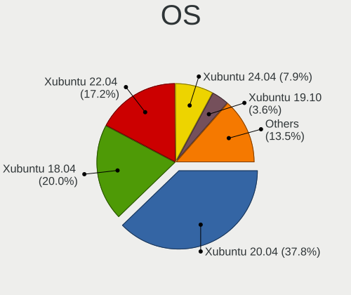

| Name                 | Computers | Percent |
|----------------------|-----------|---------|
| Xubuntu 20.04        | 2079      | 37.79%  |
| Xubuntu 18.04        | 1098      | 19.96%  |
| Xubuntu 22.04        | 945       | 17.18%  |
| Xubuntu 24.04        | 437       | 7.94%   |
| Xubuntu 19.10        | 199       | 3.62%   |
| Xubuntu 16.04        | 104       | 1.89%   |
| Xubuntu 21.10        | 96        | 1.74%   |
| Xubuntu 20.10        | 93        | 1.69%   |
| Xubuntu 23.10        | 87        | 1.58%   |
| Xubuntu 21.04        | 81        | 1.47%   |
| Xubuntu 23.04        | 80        | 1.45%   |
| Xubuntu 22.10        | 60        | 1.09%   |
| Xubuntu 25.04        | 31        | 0.56%   |
| Xubuntu 19.04        | 27        | 0.49%   |
| Xubuntu 24.10        | 25        | 0.45%   |
| Xubuntu 25.10        | 19        | 0.35%   |
| Xubuntu 18.10        | 11        | 0.2%    |
| Xubuntu 17.10        | 6         | 0.11%   |
| Xubuntu              | 6         | 0.11%   |
| Xubuntu 14.04        | 3         | 0.05%   |
| Xubuntu 2023.4~rc    | 2         | 0.04%   |
| Xubuntu 2023.2       | 2         | 0.04%   |
| Xubuntu 17.04        | 2         | 0.04%   |
| Xubuntu 2025.3       | 1         | 0.02%   |
| Xubuntu 2024.3       | 1         | 0.02%   |
| Xubuntu 2024.2       | 1         | 0.02%   |
| Xubuntu 2024.1~rc    | 1         | 0.02%   |
| Xubuntu 2024.1       | 1         | 0.02%   |
| Xubuntu 2023.4       | 1         | 0.02%   |
| Xubuntu 2023.3~rc    | 1         | 0.02%   |
| Xubuntu 2023.3       | 1         | 0.02%   |
| Xubuntu 2023.1-beta5 | 1         | 0.02%   |

OS Family
---------

OS without a version

| Name    | Computers | Percent |
|---------|-----------|---------|
| Xubuntu | 5249      | 100%    |

Kernel
------

Version of the Linux kernel

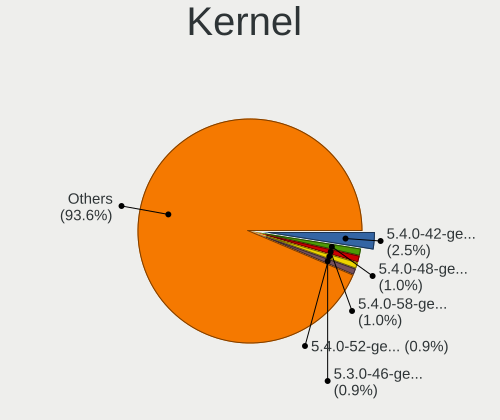

| Version             | Computers | Percent |
|---------------------|-----------|---------|
| 5.4.0-42-generic    | 158       | 2.51%   |
| 5.4.0-48-generic    | 65        | 1.03%   |
| 5.4.0-58-generic    | 61        | 0.97%   |
| 5.4.0-52-generic    | 59        | 0.94%   |
| 5.3.0-46-generic    | 59        | 0.94%   |
| 5.15.0-56-generic   | 51        | 0.81%   |
| 5.11.0-27-generic   | 49        | 0.78%   |
| 5.4.0-65-generic    | 48        | 0.76%   |
| 5.3.0-40-generic    | 48        | 0.76%   |
| 5.4.0-29-generic    | 46        | 0.73%   |
| 5.4.0-54-generic    | 45        | 0.71%   |
| 5.15.0-52-generic   | 44        | 0.7%    |
| 5.4.0-47-generic    | 42        | 0.67%   |
| 5.4.0-42-lowlatency | 40        | 0.63%   |
| 5.4.0-26-generic    | 39        | 0.62%   |
| 6.2.0-26-generic    | 38        | 0.6%    |
| 5.3.0-42-generic    | 38        | 0.6%    |
| 5.3.0-28-generic    | 36        | 0.57%   |
| 5.4.0-40-generic    | 35        | 0.56%   |
| 5.0.0-37-generic    | 35        | 0.56%   |
| 5.3.0-51-generic    | 34        | 0.54%   |
| 6.8.0-51-generic    | 33        | 0.52%   |
| 5.4.0-37-generic    | 33        | 0.52%   |
| 5.4.0-66-generic    | 31        | 0.49%   |
| 5.15.0-58-generic   | 31        | 0.49%   |
| 5.15.0-47-generic   | 31        | 0.49%   |
| 4.15.0-99-generic   | 31        | 0.49%   |
| 5.4.0-89-generic    | 30        | 0.48%   |
| 5.4.0-31-generic    | 30        | 0.48%   |
| 5.15.0-48-generic   | 30        | 0.48%   |
| 6.5.0-26-generic    | 29        | 0.46%   |
| 5.15.0-46-generic   | 29        | 0.46%   |
| 5.4.0-72-generic    | 28        | 0.44%   |
| 5.3.0-53-generic    | 28        | 0.44%   |
| 6.5.0-14-generic    | 27        | 0.43%   |
| 5.4.0-81-generic    | 27        | 0.43%   |
| 5.4.0-29-lowlatency | 27        | 0.43%   |
| 5.4.0-150-generic   | 27        | 0.43%   |
| 6.8.0-31-generic    | 26        | 0.41%   |
| 5.4.0-91-generic    | 26        | 0.41%   |

Kernel Family
-------------

Linux kernel without a distro release

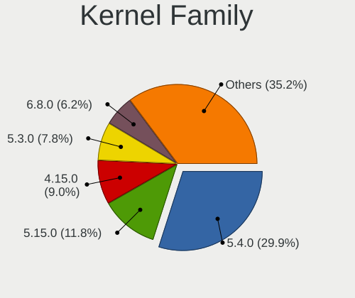

| Version  | Computers | Percent |
|----------|-----------|---------|
| 5.4.0    | 1681      | 29.93%  |
| 5.15.0   | 665       | 11.84%  |
| 4.15.0   | 504       | 8.97%   |
| 5.3.0    | 439       | 7.82%   |
| 6.8.0    | 350       | 6.23%   |
| 5.11.0   | 275       | 4.9%    |
| 5.8.0    | 255       | 4.54%   |
| 5.13.0   | 225       | 4.01%   |
| 6.5.0    | 200       | 3.56%   |
| 6.2.0    | 195       | 3.47%   |
| 5.19.0   | 146       | 2.6%    |
| 5.0.0    | 108       | 1.92%   |
| 6.14.0   | 90        | 1.6%    |
| 6.11.0   | 78        | 1.39%   |
| 4.4.0    | 51        | 0.91%   |
| 4.18.0   | 26        | 0.46%   |
| 6.17.0   | 18        | 0.32%   |
| 5.17.0   | 12        | 0.21%   |
| 6.1.0    | 10        | 0.18%   |
| 4.13.0   | 9         | 0.16%   |
| 5.14.0   | 6         | 0.11%   |
| 4.10.0   | 6         | 0.11%   |
| 6.1.31   | 5         | 0.09%   |
| 5.6.0    | 5         | 0.09%   |
| 5.4.217  | 5         | 0.09%   |
| 5.10.0   | 5         | 0.09%   |
| 6.0.0    | 4         | 0.07%   |
| 5.9.8    | 4         | 0.07%   |
| 5.18.0   | 4         | 0.07%   |
| 6.5.1    | 3         | 0.05%   |
| 6.13.0   | 3         | 0.05%   |
| 6.1.30   | 3         | 0.05%   |
| 5.9.16   | 3         | 0.05%   |
| 5.9.0    | 3         | 0.05%   |
| 5.15.1   | 3         | 0.05%   |
| 5.11.16  | 3         | 0.05%   |
| 5.10.110 | 3         | 0.05%   |
| 4.8.0    | 3         | 0.05%   |
| 4.4.194  | 3         | 0.05%   |
| 6.9.1    | 2         | 0.04%   |

Kernel Major Ver.
-----------------

Linux kernel major version

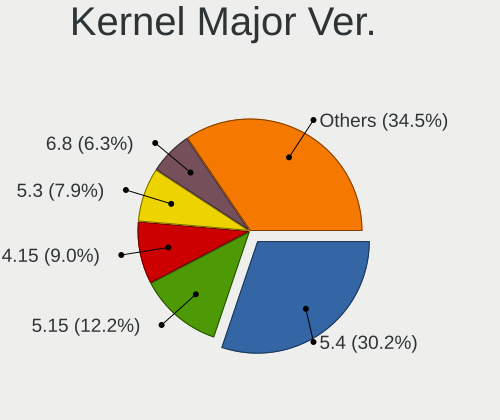

| Version | Computers | Percent |
|---------|-----------|---------|
| 5.4     | 1694      | 30.19%  |
| 5.15    | 682       | 12.15%  |
| 4.15    | 506       | 9.02%   |
| 5.3     | 441       | 7.86%   |
| 6.8     | 354       | 6.31%   |
| 5.11    | 282       | 5.02%   |
| 5.8     | 260       | 4.63%   |
| 5.13    | 229       | 4.08%   |
| 6.5     | 205       | 3.65%   |
| 6.2     | 201       | 3.58%   |
| 5.19    | 151       | 2.69%   |
| 5.0     | 110       | 1.96%   |
| 6.14    | 93        | 1.66%   |
| 6.11    | 79        | 1.41%   |
| 4.4     | 57        | 1.02%   |
| 6.1     | 26        | 0.46%   |
| 4.18    | 26        | 0.46%   |
| 5.10    | 20        | 0.36%   |
| 6.17    | 19        | 0.34%   |
| 5.17    | 14        | 0.25%   |
| 5.9     | 13        | 0.23%   |
| 5.14    | 11        | 0.2%    |
| 5.7     | 10        | 0.18%   |
| 5.6     | 10        | 0.18%   |
| 4.13    | 9         | 0.16%   |
| 5.12    | 8         | 0.14%   |
| 4.19    | 8         | 0.14%   |
| 6.6     | 7         | 0.12%   |
| 6.4     | 7         | 0.12%   |
| 6.3     | 7         | 0.12%   |
| 6.0     | 7         | 0.12%   |
| 5.18    | 7         | 0.12%   |
| 4.9     | 6         | 0.11%   |
| 4.10    | 6         | 0.11%   |
| 6.9     | 5         | 0.09%   |
| 6.10    | 5         | 0.09%   |
| 5.16    | 5         | 0.09%   |
| 6.15    | 4         | 0.07%   |
| 6.12    | 4         | 0.07%   |
| 6.7     | 3         | 0.05%   |

Arch
----

OS architecture (x86_64, i586, etc.)

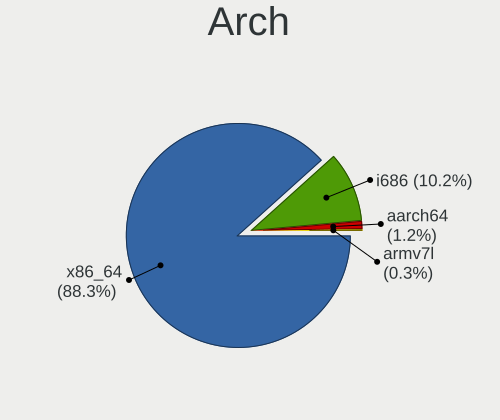

| Name    | Computers | Percent |
|---------|-----------|---------|
| x86_64  | 4643      | 88.34%  |
| i686    | 537       | 10.22%  |
| aarch64 | 62        | 1.18%   |
| armv7l  | 14        | 0.27%   |

DE
--

Desktop Environment

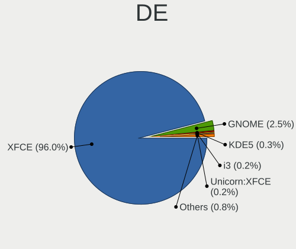

| Name            | Computers | Percent |
|-----------------|-----------|---------|
| XFCE            | 5052      | 95.95%  |
| GNOME           | 132       | 2.51%   |
| KDE5            | 18        | 0.34%   |
| i3              | 12        | 0.23%   |
| Unicorn:XFCE    | 10        | 0.19%   |
| Cinnamon        | 8         | 0.15%   |
| GNOME Flashback | 7         | 0.13%   |
| X-Cinnamon      | 5         | 0.09%   |
| Unity           | 5         | 0.09%   |
| MATE            | 3         | 0.06%   |
| LXQt            | 3         | 0.06%   |
| GNUstep         | 3         | 0.06%   |
| xmonad          | 1         | 0.02%   |
| LXDE            | 1         | 0.02%   |
| KDE             | 1         | 0.02%   |
| ICEWM           | 1         | 0.02%   |
| Budgie          | 1         | 0.02%   |
| awesome         | 1         | 0.02%   |
| Unknown         | 1         | 0.02%   |

Display Server
--------------

X11 or Wayland

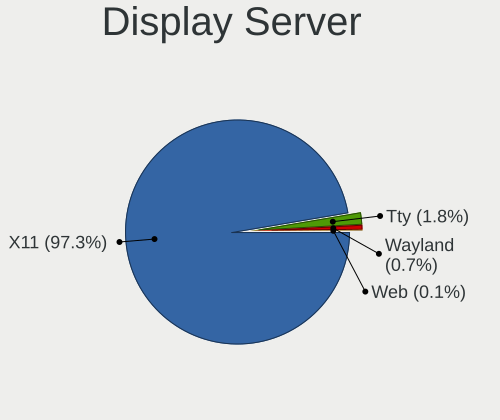

| Name    | Computers | Percent |
|---------|-----------|---------|
| X11     | 5121      | 97.32%  |
| Tty     | 94        | 1.79%   |
| Wayland | 38        | 0.72%   |
| Unknown | 5         | 0.1%    |
| Web     | 4         | 0.08%   |

Display Manager
---------------

SDDM, LightDM, etc.

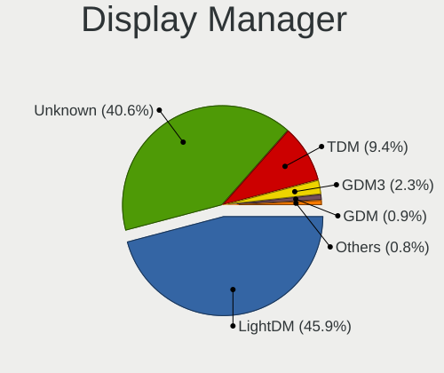

| Name    | Computers | Percent |
|---------|-----------|---------|
| LightDM | 2486      | 45.89%  |
| Unknown | 2201      | 40.63%  |
| TDM     | 509       | 9.4%    |
| GDM3    | 126       | 2.33%   |
| GDM     | 50        | 0.92%   |
| SDDM    | 33        | 0.61%   |
| XDM     | 4         | 0.07%   |
| LXDM    | 4         | 0.07%   |
| SLiM    | 3         | 0.06%   |
| NODM    | 1         | 0.02%   |

OS Lang
-------

Language

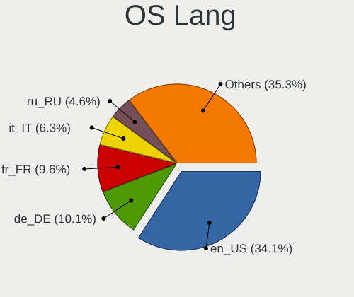

| Lang    | Computers | Percent |
|---------|-----------|---------|
| en_US   | 1803      | 34.13%  |
| de_DE   | 531       | 10.05%  |
| fr_FR   | 505       | 9.56%   |
| it_IT   | 333       | 6.3%    |
| ru_RU   | 244       | 4.62%   |
| pt_BR   | 243       | 4.6%    |
| C       | 207       | 3.92%   |
| en_GB   | 196       | 3.71%   |
| es_ES   | 145       | 2.75%   |
| en_CA   | 116       | 2.2%    |
| pl_PL   | 86        | 1.63%   |
| Unknown | 85        | 1.61%   |
| en_AU   | 83        | 1.57%   |
| es_AR   | 47        | 0.89%   |
| nl_NL   | 45        | 0.85%   |
| hu_HU   | 45        | 0.85%   |
| cs_CZ   | 42        | 0.8%    |
| ja_JP   | 41        | 0.78%   |
| en_IN   | 31        | 0.59%   |
| es_MX   | 26        | 0.49%   |
| zh_CN   | 20        | 0.38%   |
| fr_BE   | 20        | 0.38%   |
| de_CH   | 19        | 0.36%   |
| pt_PT   | 18        | 0.34%   |
| fi_FI   | 18        | 0.34%   |
| sk_SK   | 17        | 0.32%   |
| ru_UA   | 17        | 0.32%   |
| fr_CA   | 17        | 0.32%   |
| en_ZA   | 17        | 0.32%   |
| tr_TR   | 16        | 0.3%    |
| es_CO   | 16        | 0.3%    |
| de_AT   | 16        | 0.3%    |
| sv_SE   | 15        | 0.28%   |
| el_GR   | 14        | 0.27%   |
| zh_TW   | 13        | 0.25%   |
| nl_BE   | 12        | 0.23%   |
| es_VE   | 12        | 0.23%   |
| en_NZ   | 9         | 0.17%   |
| en_IE   | 8         | 0.15%   |
| da_DK   | 8         | 0.15%   |

Boot Mode
---------

EFI or BIOS

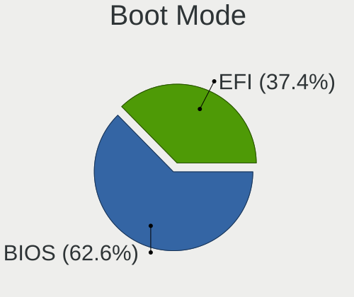

| Mode | Computers | Percent |
|------|-----------|---------|
| BIOS | 3331      | 62.65%  |
| EFI  | 1986      | 37.35%  |

Filesystem
----------

Type of filesystem

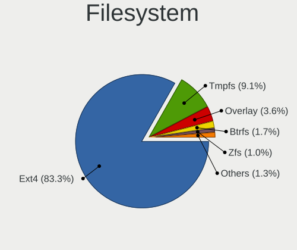

| Type    | Computers | Percent |
|---------|-----------|---------|
| Ext4    | 4451      | 83.26%  |
| Tmpfs   | 486       | 9.09%   |
| Overlay | 195       | 3.65%   |
| Btrfs   | 90        | 1.68%   |
| Zfs     | 55        | 1.03%   |
| Unknown | 24        | 0.45%   |
| Xfs     | 21        | 0.39%   |
| Ext3    | 11        | 0.21%   |
| Ext2    | 11        | 0.21%   |
| Ufs     | 1         | 0.02%   |
| Aufs    | 1         | 0.02%   |

Part. scheme
------------

Scheme of partitioning

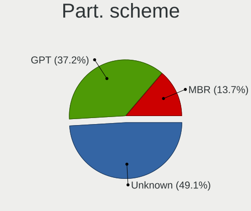

| Type    | Computers | Percent |
|---------|-----------|---------|
| Unknown | 2628      | 49.08%  |
| GPT     | 1991      | 37.18%  |
| MBR     | 736       | 13.74%  |

Dual Boot with Linux/BSD
------------------------

Hosting more than one Linux/BSD

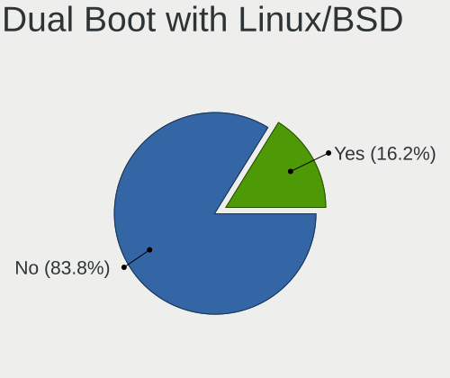

| Dual boot | Computers | Percent |
|-----------|-----------|---------|
| No        | 4501      | 83.83%  |
| Yes       | 868       | 16.17%  |

Dual Boot (Win)
---------------

Hosting Linux and Windows

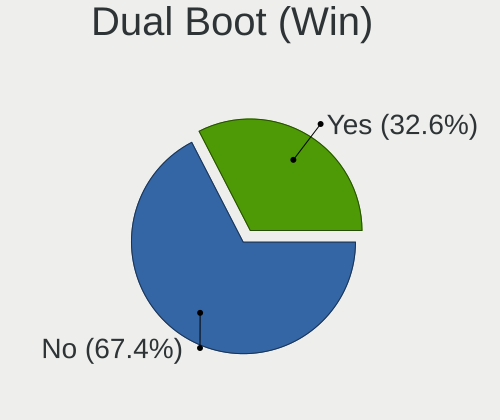

| Dual boot | Computers | Percent |
|-----------|-----------|---------|
| No        | 3603      | 67.42%  |
| Yes       | 1741      | 32.58%  |

Board
-----

Vendor
------

Motherboard manufacturer

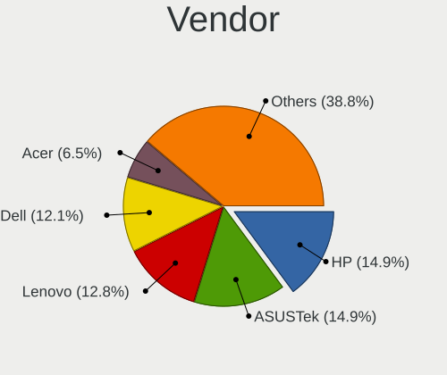

| Name                    | Computers | Percent |
|-------------------------|-----------|---------|
| Hewlett-Packard         | 782       | 14.9%   |
| ASUSTek Computer        | 780       | 14.86%  |
| Lenovo                  | 673       | 12.82%  |
| Dell                    | 636       | 12.12%  |
| Acer                    | 341       | 6.5%    |
| Gigabyte Technology     | 307       | 5.85%   |
| MSI                     | 235       | 4.48%   |
| ASRock                  | 181       | 3.45%   |
| Toshiba                 | 121       | 2.31%   |
| Apple                   | 112       | 2.13%   |
| Intel                   | 90        | 1.71%   |
| Unknown                 | 73        | 1.39%   |
| Samsung Electronics     | 70        | 1.33%   |
| Sony                    | 60        | 1.14%   |
| Medion                  | 53        | 1.01%   |
| Fujitsu                 | 45        | 0.86%   |
| Google                  | 40        | 0.76%   |
| Fujitsu Siemens         | 37        | 0.7%    |
| Packard Bell            | 35        | 0.67%   |
| ECS                     | 30        | 0.57%   |
| Foxconn                 | 26        | 0.5%    |
| Pegatron                | 23        | 0.44%   |
| Notebook                | 23        | 0.44%   |
| Positivo                | 22        | 0.42%   |
| Raspberry Pi Foundation | 17        | 0.32%   |
| eMachines               | 17        | 0.32%   |
| Clevo                   | 16        | 0.3%    |
| HUAWEI                  | 15        | 0.29%   |
| Supermicro              | 13        | 0.25%   |
| IBM                     | 13        | 0.25%   |
| AMI                     | 13        | 0.25%   |
| Gateway                 | 12        | 0.23%   |
| AZW                     | 12        | 0.23%   |
| Biostar                 | 11        | 0.21%   |
| GPU Company             | 10        | 0.19%   |
| LG Electronics          | 9         | 0.17%   |
| Alienware               | 9         | 0.17%   |
| ZOTAC                   | 8         | 0.15%   |
| Rockchip                | 8         | 0.15%   |
| TUXEDO                  | 7         | 0.13%   |

Model
-----

Motherboard model

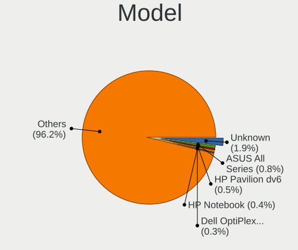

| Name                                   | Computers | Percent |
|----------------------------------------|-----------|---------|
| Unknown                                | 99        | 1.89%   |
| ASUS All Series                        | 40        | 0.76%   |
| HP Pavilion dv6                        | 24        | 0.46%   |
| HP Notebook                            | 20        | 0.38%   |
| Dell OptiPlex 7010                     | 17        | 0.32%   |
| Gigabyte H410M S2H                     | 15        | 0.29%   |
| HP 15                                  | 12        | 0.23%   |
| Dell OptiPlex 755                      | 12        | 0.23%   |
| HP Pavilion 15                         | 11        | 0.21%   |
| Dell Latitude D630                     | 11        | 0.21%   |
| HP Pavilion g6                         | 10        | 0.19%   |
| Dell OptiPlex 390                      | 10        | 0.19%   |
| HP Pavilion dv7                        | 9         | 0.17%   |
| Gigabyte H81M-S2V                      | 9         | 0.17%   |
| ECS G31T-M9                            | 9         | 0.17%   |
| Dell Latitude E6430                    | 9         | 0.17%   |
| ASRock N68C-S UCC                      | 9         | 0.17%   |
| Dell OptiPlex 780                      | 8         | 0.15%   |
| Dell OptiPlex 760                      | 8         | 0.15%   |
| Dell OptiPlex 3020                     | 8         | 0.15%   |
| MSI MS-7C56                            | 7         | 0.13%   |
| MSI MS-7C37                            | 7         | 0.13%   |
| MSI MS-7721                            | 7         | 0.13%   |
| HP Pavilion dv6500                     | 7         | 0.13%   |
| HP Pavilion 17                         | 7         | 0.13%   |
| HP EliteDesk 800 G1 SFF                | 7         | 0.13%   |
| HP Compaq Pro 6300 SFF                 | 7         | 0.13%   |
| HP Compaq Elite 8300 SFF               | 7         | 0.13%   |
| ASUS TUF Gaming X570-PLUS              | 7         | 0.13%   |
| ASUS M5A78L-M/USB3                     | 7         | 0.13%   |
| MSI MS-7A38                            | 6         | 0.11%   |
| MSI MS-7817                            | 6         | 0.11%   |
| HP Pavilion g7                         | 6         | 0.11%   |
| Dell OptiPlex 9020                     | 6         | 0.11%   |
| Dell Latitude E6520                    | 6         | 0.11%   |
| Dell Latitude E6400                    | 6         | 0.11%   |
| Dell Inspiron 1525                     | 6         | 0.11%   |
| ASUS VivoBook_ASUSLaptop X571LH_K571LH | 6         | 0.11%   |
| ASUS TUF Gaming B550M-PLUS             | 6         | 0.11%   |
| ASUS T100HAN                           | 6         | 0.11%   |

Model Family
------------

Motherboard model prefix

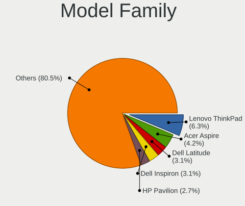

| Name                  | Computers | Percent |
|-----------------------|-----------|---------|
| Lenovo ThinkPad       | 333       | 6.34%   |
| Acer Aspire           | 223       | 4.25%   |
| Dell Latitude         | 164       | 3.12%   |
| Dell Inspiron         | 161       | 3.07%   |
| HP Pavilion           | 142       | 2.71%   |
| HP Compaq             | 127       | 2.42%   |
| Dell OptiPlex         | 126       | 2.4%    |
| Toshiba Satellite     | 101       | 1.92%   |
| Lenovo IdeaPad        | 100       | 1.91%   |
| Unknown               | 99        | 1.89%   |
| HP EliteBook          | 78        | 1.49%   |
| ASUS PRIME            | 67        | 1.28%   |
| HP ProBook            | 62        | 1.18%   |
| Lenovo ThinkCentre    | 59        | 1.12%   |
| ASUS VivoBook         | 59        | 1.12%   |
| Dell Precision        | 55        | 1.05%   |
| HP Laptop             | 54        | 1.03%   |
| ASUS All              | 40        | 0.76%   |
| ASUS ROG              | 37        | 0.7%    |
| Dell XPS              | 32        | 0.61%   |
| ASUS TUF              | 32        | 0.61%   |
| Dell Vostro           | 30        | 0.57%   |
| HP ProDesk            | 23        | 0.44%   |
| HP Notebook           | 21        | 0.4%    |
| Acer Extensa          | 21        | 0.4%    |
| Dell PowerEdge        | 20        | 0.38%   |
| HP EliteDesk          | 19        | 0.36%   |
| Acer Veriton          | 19        | 0.36%   |
| Packard Bell EasyNote | 18        | 0.34%   |
| RPi Raspberry         | 17        | 0.32%   |
| HP ENVY               | 17        | 0.32%   |
| Gigabyte H410M        | 17        | 0.32%   |
| Fujitsu Siemens AMILO | 17        | 0.32%   |
| Fujitsu ESPRIMO       | 17        | 0.32%   |
| Fujitsu LIFEBOOK      | 16        | 0.3%    |
| HP Presario           | 15        | 0.29%   |
| ASUS M5A78L-M         | 15        | 0.29%   |
| Lenovo Yoga           | 14        | 0.27%   |
| Lenovo IdeaCentre     | 14        | 0.27%   |
| Dell Studio           | 14        | 0.27%   |

MFG Year
--------

Motherboard manufacture year

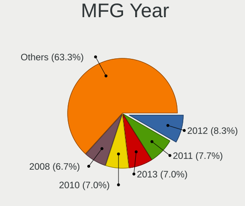

| Year    | Computers | Percent |
|---------|-----------|---------|
| 2012    | 437       | 8.33%   |
| 2011    | 405       | 7.72%   |
| 2013    | 370       | 7.05%   |
| 2010    | 365       | 6.95%   |
| 2008    | 352       | 6.71%   |
| 2009    | 343       | 6.53%   |
| 2014    | 309       | 5.89%   |
| 2019    | 300       | 5.72%   |
| 2018    | 293       | 5.58%   |
| 2007    | 292       | 5.56%   |
| 2020    | 283       | 5.39%   |
| 2017    | 261       | 4.97%   |
| 2015    | 222       | 4.23%   |
| 2016    | 218       | 4.15%   |
| 2021    | 210       | 4%      |
| 2006    | 158       | 3.01%   |
| 2022    | 120       | 2.29%   |
| 2023    | 76        | 1.45%   |
| 2005    | 75        | 1.43%   |
| Unknown | 73        | 1.39%   |
| 2024    | 32        | 0.61%   |
| 2004    | 18        | 0.34%   |
| 2003    | 16        | 0.3%    |
| 2025    | 13        | 0.25%   |
| 2002    | 4         | 0.08%   |
| 2001    | 4         | 0.08%   |

Form Factor
-----------

Physical design of the computer

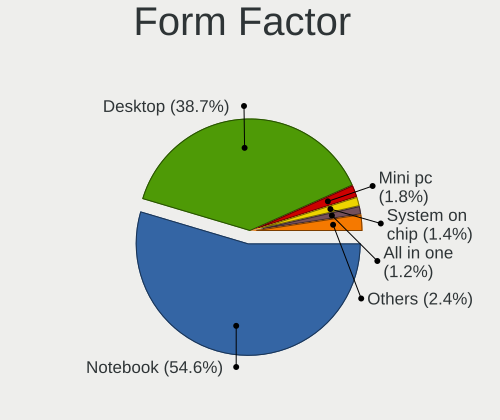

| Name           | Computers | Percent |
|----------------|-----------|---------|
| Notebook       | 2866      | 54.6%   |
| Desktop        | 2033      | 38.73%  |
| Mini pc        | 92        | 1.75%   |
| System on chip | 71        | 1.35%   |
| All in one     | 62        | 1.18%   |
| Convertible    | 53        | 1.01%   |
| Server         | 49        | 0.93%   |
| Tablet         | 21        | 0.4%    |
| Other          | 1         | 0.02%   |
| Firewall       | 1         | 0.02%   |

Secure Boot
-----------

Enabled or disabled

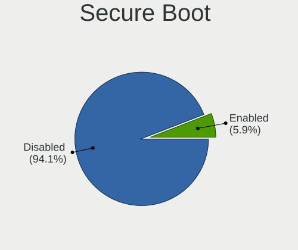

| State    | Computers | Percent |
|----------|-----------|---------|
| Disabled | 4970      | 94.09%  |
| Enabled  | 312       | 5.91%   |

Coreboot
--------

Have coreboot on board

| Used | Computers | Percent |
|------|-----------|---------|
| No   | 5208      | 99.22%  |
| Yes  | 41        | 0.78%   |

RAM Size
--------

Total RAM memory

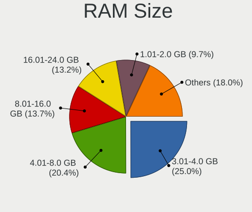

| Size in GB      | Computers | Percent |
|-----------------|-----------|---------|
| 3.01-4.0        | 1334      | 24.98%  |
| 4.01-8.0        | 1087      | 20.35%  |
| 8.01-16.0       | 730       | 13.67%  |
| 16.01-24.0      | 707       | 13.24%  |
| 1.01-2.0        | 520       | 9.74%   |
| 32.01-64.0      | 350       | 6.55%   |
| 2.01-3.0        | 185       | 3.46%   |
| 0.51-1.0        | 163       | 3.05%   |
| 64.01-256.0     | 159       | 2.98%   |
| 24.01-32.0      | 84        | 1.57%   |
| 0.01-0.5        | 13        | 0.24%   |
| More than 256.0 | 9         | 0.17%   |

RAM Used
--------

Used RAM memory

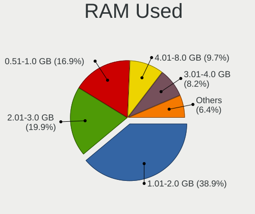

| Used GB     | Computers | Percent |
|-------------|-----------|---------|
| 1.01-2.0    | 2265      | 38.93%  |
| 2.01-3.0    | 1155      | 19.85%  |
| 0.51-1.0    | 982       | 16.88%  |
| 4.01-8.0    | 566       | 9.73%   |
| 3.01-4.0    | 477       | 8.2%    |
| 8.01-16.0   | 186       | 3.2%    |
| 0.01-0.5    | 134       | 2.3%    |
| 16.01-24.0  | 34        | 0.58%   |
| 24.01-32.0  | 10        | 0.17%   |
| 32.01-64.0  | 6         | 0.1%    |
| Unknown     | 2         | 0.03%   |
| 64.01-256.0 | 1         | 0.02%   |

Total Drives
------------

Number of drives on board

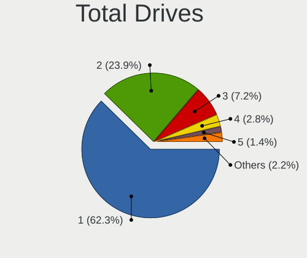

| Drives | Computers | Percent |
|--------|-----------|---------|
| 1      | 3368      | 62.32%  |
| 2      | 1294      | 23.95%  |
| 3      | 391       | 7.24%   |
| 4      | 154       | 2.85%   |
| 5      | 77        | 1.42%   |
| 0      | 54        | 1%      |
| 6      | 31        | 0.57%   |
| 7      | 19        | 0.35%   |
| 10     | 5         | 0.09%   |
| 8      | 5         | 0.09%   |
| 9      | 3         | 0.06%   |
| 11     | 2         | 0.04%   |
| 22     | 1         | 0.02%   |

Has CD-ROM
----------

Has CD-ROM on board

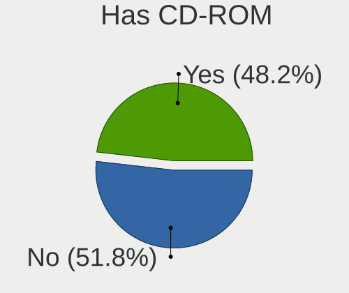

| Presented | Computers | Percent |
|-----------|-----------|---------|
| No        | 2740      | 51.8%   |
| Yes       | 2550      | 48.2%   |

Has Ethernet
------------

Has Ethernet on board

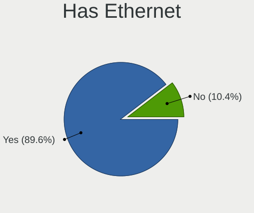

| Presented | Computers | Percent |
|-----------|-----------|---------|
| Yes       | 4707      | 89.59%  |
| No        | 547       | 10.41%  |

Has WiFi
--------

Has WiFi module

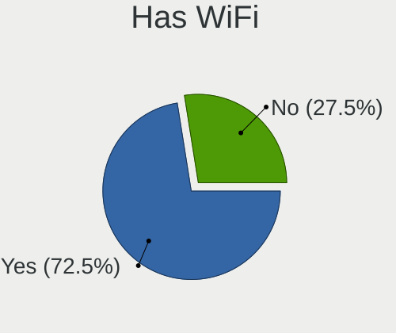

| Presented | Computers | Percent |
|-----------|-----------|---------|
| Yes       | 3831      | 72.49%  |
| No        | 1454      | 27.51%  |

Has Bluetooth
-------------

Has Bluetooth module

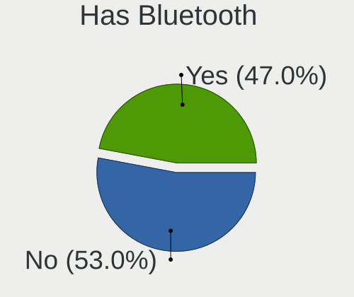

| Presented | Computers | Percent |
|-----------|-----------|---------|
| No        | 2814      | 52.95%  |
| Yes       | 2500      | 47.05%  |

Location
--------

Country
-------

Geographic location (country)

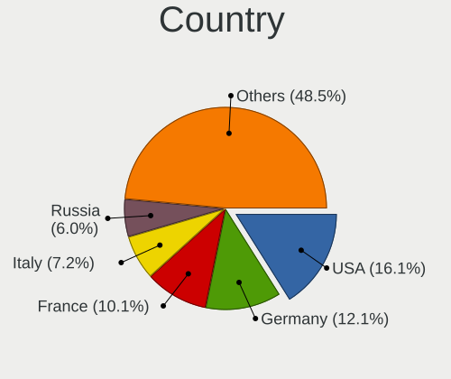

| Country      | Computers | Percent |
|--------------|-----------|---------|
| USA          | 848       | 16.05%  |
| Germany      | 640       | 12.12%  |
| France       | 535       | 10.13%  |
| Italy        | 379       | 7.18%   |
| Russia       | 318       | 6.02%   |
| Brazil       | 286       | 5.41%   |
| Canada       | 195       | 3.69%   |
| UK           | 192       | 3.63%   |
| Spain        | 166       | 3.14%   |
| Poland       | 115       | 2.18%   |
| Netherlands  | 112       | 2.12%   |
| Australia    | 101       | 1.91%   |
| Argentina    | 71        | 1.34%   |
| Belgium      | 70        | 1.33%   |
| Czechia      | 63        | 1.19%   |
| Ukraine      | 62        | 1.17%   |
| Sweden       | 56        | 1.06%   |
| Mexico       | 54        | 1.02%   |
| Hungary      | 54        | 1.02%   |
| Japan        | 50        | 0.95%   |
| India        | 48        | 0.91%   |
| Austria      | 45        | 0.85%   |
| Finland      | 44        | 0.83%   |
| Portugal     | 39        | 0.74%   |
| Greece       | 39        | 0.74%   |
| Switzerland  | 37        | 0.7%    |
| Bulgaria     | 34        | 0.64%   |
| Indonesia    | 31        | 0.59%   |
| Romania      | 28        | 0.53%   |
| Turkey       | 27        | 0.51%   |
| Slovakia     | 25        | 0.47%   |
| Norway       | 23        | 0.44%   |
| Colombia     | 23        | 0.44%   |
| China        | 23        | 0.44%   |
| Iran         | 21        | 0.4%    |
| South Africa | 18        | 0.34%   |
| Venezuela    | 17        | 0.32%   |
| Serbia       | 17        | 0.32%   |
| New Zealand  | 17        | 0.32%   |
| Thailand     | 16        | 0.3%    |

City
----

Geographic location (city)

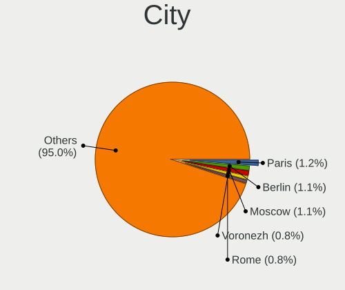

| City              | Computers | Percent |
|-------------------|-----------|---------|
| Paris             | 70        | 1.25%   |
| Berlin            | 61        | 1.09%   |
| Moscow            | 60        | 1.07%   |
| Voronezh          | 47        | 0.84%   |
| Rome              | 44        | 0.79%   |
| Milan             | 44        | 0.79%   |
| Warsaw            | 35        | 0.62%   |
| Sydney            | 33        | 0.59%   |
| Amsterdam         | 33        | 0.59%   |
| Sao Paulo         | 31        | 0.55%   |
| St Petersburg     | 29        | 0.52%   |
| Munich            | 28        | 0.5%    |
| Madrid            | 28        | 0.5%    |
| Hamburg           | 27        | 0.48%   |
| Budapest          | 27        | 0.48%   |
| Athens            | 25        | 0.45%   |
| Rio de Janeiro    | 24        | 0.43%   |
| Prague            | 24        | 0.43%   |
| Helsinki          | 22        | 0.39%   |
| Melbourne         | 21        | 0.37%   |
| Québec           | 20        | 0.36%   |
| Vienna            | 19        | 0.34%   |
| Barcelona         | 19        | 0.34%   |
| Stuttgart         | 18        | 0.32%   |
| Toronto           | 17        | 0.3%    |
| Sofia             | 17        | 0.3%    |
| Montreal          | 17        | 0.3%    |
| Genoa             | 17        | 0.3%    |
| Buenos Aires      | 17        | 0.3%    |
| Turin             | 16        | 0.29%   |
| Tehran            | 16        | 0.29%   |
| Oryol             | 15        | 0.27%   |
| Leipzig           | 15        | 0.27%   |
| Kyiv              | 15        | 0.27%   |
| Frankfurt am Main | 15        | 0.27%   |
| Vancouver         | 14        | 0.25%   |
| Denver            | 14        | 0.25%   |
| Cologne           | 14        | 0.25%   |
| Chicago           | 13        | 0.23%   |
| Seattle           | 12        | 0.21%   |

Drives
------

Drive Vendor
------------

Hard drive vendors

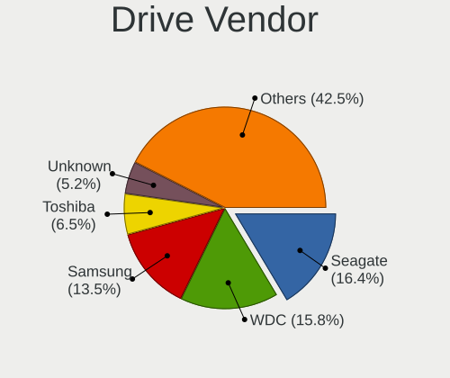

| Vendor                      | Computers | Drives | Percent |
|-----------------------------|-----------|--------|---------|
| Seagate                     | 1200      | 1787   | 16.42%  |
| WDC                         | 1153      | 1738   | 15.78%  |
| Samsung Electronics         | 990       | 1416   | 13.55%  |
| Toshiba                     | 477       | 611    | 6.53%   |
| Unknown                     | 380       | 490    | 5.2%    |
| Hitachi                     | 377       | 528    | 5.16%   |
| Kingston                    | 365       | 462    | 4.99%   |
| SanDisk                     | 296       | 382    | 4.05%   |
| Crucial                     | 237       | 314    | 3.24%   |
| HGST                        | 136       | 184    | 1.86%   |
| Intel                       | 134       | 191    | 1.83%   |
| SK hynix                    | 131       | 155    | 1.79%   |
| A-DATA Technology           | 91        | 120    | 1.25%   |
| China                       | 82        | 100    | 1.12%   |
| Micron Technology           | 78        | 93     | 1.07%   |
| Fujitsu                     | 78        | 101    | 1.07%   |
| Maxtor                      | 63        | 90     | 0.86%   |
| PNY                         | 53        | 77     | 0.73%   |
| Intenso                     | 44        | 53     | 0.6%    |
| Patriot                     | 43        | 48     | 0.59%   |
| Transcend                   | 39        | 45     | 0.53%   |
| KIOXIA                      | 39        | 50     | 0.53%   |
| SPCC                        | 35        | 55     | 0.48%   |
| Phison                      | 32        | 78     | 0.44%   |
| Apple                       | 32        | 44     | 0.44%   |
| OCZ                         | 31        | 39     | 0.42%   |
| Unknown                     | 27        | 28     | 0.37%   |
| LITEON                      | 22        | 25     | 0.3%    |
| Lexar                       | 22        | 23     | 0.3%    |
| Kingston Technology Company | 22        | 29     | 0.3%    |
| Hewlett-Packard             | 22        | 40     | 0.3%    |
| JMicron Technology          | 21        | 25     | 0.29%   |
| Silicon Motion              | 20        | 21     | 0.27%   |
| Phison Electronics          | 19        | 26     | 0.26%   |
| LITEONIT                    | 19        | 22     | 0.26%   |
| ASMT                        | 19        | 28     | 0.26%   |
| Apacer                      | 19        | 25     | 0.26%   |
| KingSpec                    | 14        | 18     | 0.19%   |
| KingDian                    | 14        | 21     | 0.19%   |
| GOODRAM                     | 13        | 16     | 0.18%   |

Drive Model
-----------

Hard drive models

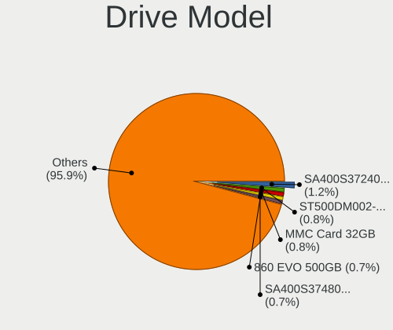

| Model                                             | Computers | Percent |
|---------------------------------------------------|-----------|---------|
| Kingston SA400S37240G 240GB SSD                   | 92        | 1.15%   |
| Seagate ST500DM002-1BD142 500GB                   | 64        | 0.8%    |
| Unknown MMC Card  32GB                            | 63        | 0.79%   |
| Samsung SSD 860 EVO 500GB                         | 57        | 0.71%   |
| Kingston SA400S37480G 480GB SSD                   | 55        | 0.69%   |
| Samsung SSD 850 EVO 250GB                         | 49        | 0.61%   |
| Unknown MMC Card  64GB                            | 42        | 0.53%   |
| Seagate ST1000LM024 HN-M101MBB 1TB                | 42        | 0.53%   |
| Seagate ST500LT012-1DG142 500GB                   | 39        | 0.49%   |
| Samsung SSD 850 EVO 500GB                         | 38        | 0.48%   |
| Seagate ST1000DM010-2EP102 1TB                    | 37        | 0.46%   |
| Toshiba MQ01ABD100 1TB                            | 36        | 0.45%   |
| Seagate ST500LM012 HN-M500MBB 500GB               | 35        | 0.44%   |
| Unknown SD/MMC/MS PRO 2GB                         | 34        | 0.43%   |
| Toshiba MQ01ABF050 500GB                          | 34        | 0.43%   |
| Kingston SA400S37120G 120GB SSD                   | 34        | 0.43%   |
| Seagate ST1000LM035-1RK172 1TB                    | 32        | 0.4%    |
| Toshiba DT01ACA100 1TB                            | 31        | 0.39%   |
| Seagate ST1000DM003-1CH162 1TB                    | 31        | 0.39%   |
| Crucial CT500MX500SSD1 500GB                      | 31        | 0.39%   |
| Unknown MMC Card  128GB                           | 30        | 0.38%   |
| Seagate ST3500418AS 500GB                         | 29        | 0.36%   |
| Seagate ST2000DM008-2FR102 2TB                    | 29        | 0.36%   |
| Samsung NVMe SSD Controller SM981/PM981/PM983 1TB | 29        | 0.36%   |
| Seagate Expansion 2TB                             | 28        | 0.35%   |
| Seagate ST1000DM003-1ER162 1TB                    | 27        | 0.34%   |
| Kingston SV300S37A120G 120GB SSD                  | 27        | 0.34%   |
| Unknown                                           | 27        | 0.34%   |
| HGST HTS721010A9E630 1TB                          | 25        | 0.31%   |
| Unknown MMC Card  16GB                            | 24        | 0.3%    |
| Seagate ST4000DM004-2CV104 4TB                    | 24        | 0.3%    |
| Seagate ST2000DM001-1CH164 2TB                    | 24        | 0.3%    |
| Samsung SSD 860 EVO 250GB                         | 23        | 0.29%   |
| HGST HTS541010A9E680 1TB                          | 23        | 0.29%   |
| Crucial CT240BX500SSD1 240GB                      | 23        | 0.29%   |
| Seagate ST9320325AS 320GB                         | 22        | 0.28%   |
| Samsung SSD 860 EVO 1TB                           | 22        | 0.28%   |
| Crucial CT480BX500SSD1 480GB                      | 22        | 0.28%   |
| Crucial CT1000MX500SSD1 1TB                       | 22        | 0.28%   |
| WDC WD10JPVX-22JC3T0 1TB                          | 21        | 0.26%   |

HDD Vendor
----------

Hard disk drive vendors

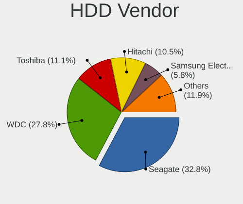

| Vendor              | Computers | Drives | Percent |
|---------------------|-----------|--------|---------|
| Seagate             | 1177      | 1748   | 32.79%  |
| WDC                 | 999       | 1509   | 27.84%  |
| Toshiba             | 399       | 517    | 11.12%  |
| Hitachi             | 377       | 528    | 10.5%   |
| Samsung Electronics | 209       | 290    | 5.82%   |
| HGST                | 136       | 184    | 3.79%   |
| Fujitsu             | 76        | 98     | 2.12%   |
| Maxtor              | 61        | 88     | 1.7%    |
| Unknown             | 37        | 44     | 1.03%   |
| JMicron Technology  | 11        | 14     | 0.31%   |
| Hewlett-Packard     | 10        | 22     | 0.28%   |
| ASMT                | 9         | 15     | 0.25%   |
| USB3.0              | 8         | 11     | 0.22%   |
| TO Exter            | 8         | 10     | 0.22%   |
| Intenso             | 8         | 9      | 0.22%   |
| Apple               | 8         | 9      | 0.22%   |
| IBM/Hitachi         | 7         | 7      | 0.2%    |
| SSK                 | 6         | 7      | 0.17%   |
| HPE                 | 5         | 9      | 0.14%   |
| External            | 5         | 7      | 0.14%   |
| Inateck             | 3         | 3      | 0.08%   |
| HGST HTS            | 3         | 4      | 0.08%   |
| ASMedia             | 3         | 3      | 0.08%   |
| WD MediaMax         | 2         | 2      | 0.06%   |
| Lenovo              | 2         | 8      | 0.06%   |
| ExcelStor           | 2         | 2      | 0.06%   |
| Apricorn            | 2         | 3      | 0.06%   |
| Synology            | 1         | 2      | 0.03%   |
| Shenzhen            | 1         | 1      | 0.03%   |
| SD                  | 1         | 1      | 0.03%   |
| SAGE                | 1         | 1      | 0.03%   |
| SABRENT             | 1         | 1      | 0.03%   |
| OEM                 | 1         | 1      | 0.03%   |
| MaxDigital          | 1         | 2      | 0.03%   |
| MARVELL             | 1         | 1      | 0.03%   |
| LaCie               | 1         | 5      | 0.03%   |
| ICY BOX             | 1         | 2      | 0.03%   |
| IBM-ESXS            | 1         | 13     | 0.03%   |
| Ext Hard            | 1         | 1      | 0.03%   |
| CLOVER              | 1         | 1      | 0.03%   |

SSD Vendor
----------

Solid state drive vendors

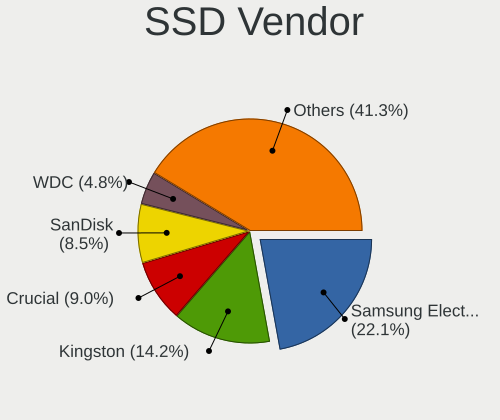

| Vendor              | Computers | Drives | Percent |
|---------------------|-----------|--------|---------|
| Samsung Electronics | 500       | 678    | 22.14%  |
| Kingston            | 321       | 398    | 14.22%  |
| Crucial             | 204       | 276    | 9.03%   |
| SanDisk             | 192       | 263    | 8.5%    |
| WDC                 | 108       | 139    | 4.78%   |
| China               | 80        | 98     | 3.54%   |
| A-DATA Technology   | 77        | 105    | 3.41%   |
| Intel               | 62        | 96     | 2.75%   |
| PNY                 | 52        | 74     | 2.3%    |
| Micron Technology   | 44        | 52     | 1.95%   |
| Patriot             | 40        | 45     | 1.77%   |
| Toshiba             | 38        | 47     | 1.68%   |
| Transcend           | 35        | 39     | 1.55%   |
| SPCC                | 33        | 50     | 1.46%   |
| Intenso             | 33        | 37     | 1.46%   |
| SK hynix            | 32        | 33     | 1.42%   |
| OCZ                 | 30        | 37     | 1.33%   |
| LITEON              | 22        | 25     | 0.97%   |
| Lexar               | 20        | 21     | 0.89%   |
| LITEONIT            | 19        | 22     | 0.84%   |
| Apacer              | 18        | 24     | 0.8%    |
| Apple               | 17        | 22     | 0.75%   |
| KingDian            | 14        | 21     | 0.62%   |
| GOODRAM             | 13        | 16     | 0.58%   |
| KingSpec            | 12        | 16     | 0.53%   |
| ASMT                | 10        | 13     | 0.44%   |
| Unknown             | 9         | 10     | 0.4%    |
| Team                | 9         | 17     | 0.4%    |
| Hewlett-Packard     | 9         | 14     | 0.4%    |
| Corsair             | 9         | 10     | 0.4%    |
| Smartbuy            | 7         | 7      | 0.31%   |
| Plextor             | 7         | 13     | 0.31%   |
| Netac               | 7         | 11     | 0.31%   |
| FORESEE             | 7         | 12     | 0.31%   |
| SABRENT             | 6         | 6      | 0.27%   |
| Dogfish             | 6         | 9      | 0.27%   |
| Seagate             | 5         | 8      | 0.22%   |
| PHD 3.0             | 5         | 6      | 0.22%   |
| Mushkin             | 5         | 5      | 0.22%   |
| KIOXIA-EXCERIA      | 5         | 7      | 0.22%   |

Drive Kind
----------

HDD or SSD

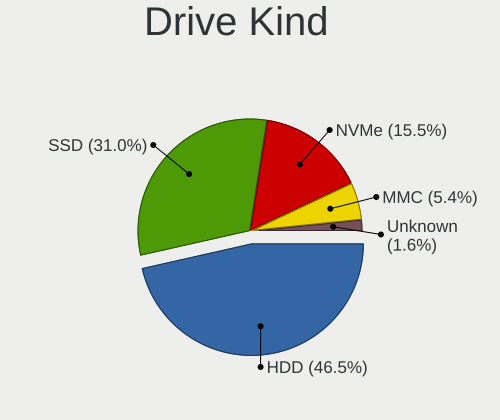

| Kind    | Computers | Drives | Percent |
|---------|-----------|--------|---------|
| HDD     | 3033      | 5186   | 46.47%  |
| SSD     | 2023      | 2946   | 30.99%  |
| NVMe    | 1014      | 1432   | 15.54%  |
| MMC     | 352       | 456    | 5.39%   |
| Unknown | 105       | 130    | 1.61%   |

Drive Connector
---------------

SATA, SAS, NVMe, etc.

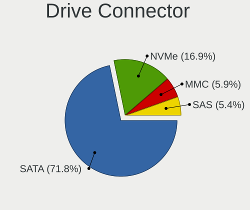

| Type | Computers | Drives | Percent |
|------|-----------|--------|---------|
| SATA | 4292      | 7803   | 71.77%  |
| NVMe | 1011      | 1423   | 16.91%  |
| MMC  | 352       | 456    | 5.89%   |
| SAS  | 325       | 468    | 5.43%   |

Drive Size
----------

Size of hard drive

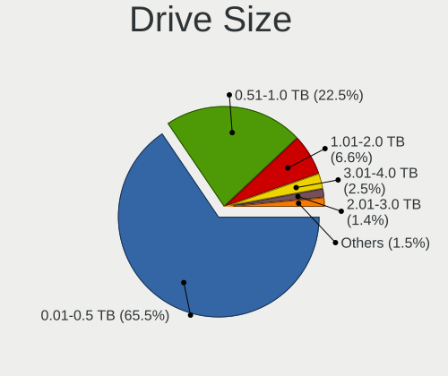

| Size in TB | Computers | Drives | Percent |
|------------|-----------|--------|---------|
| 0.01-0.5   | 3469      | 5277   | 65.53%  |
| 0.51-1.0   | 1189      | 1797   | 22.46%  |
| 1.01-2.0   | 351       | 552    | 6.63%   |
| 3.01-4.0   | 131       | 237    | 2.47%   |
| 2.01-3.0   | 75        | 141    | 1.42%   |
| 4.01-10.0  | 63        | 107    | 1.19%   |
| 10.01-20.0 | 13        | 18     | 0.25%   |
| 20.01-50.0 | 2         | 2      | 0.04%   |
| 0          | 1         | 1      | 0.02%   |

Space Total
-----------

Amount of disk space available on the file system

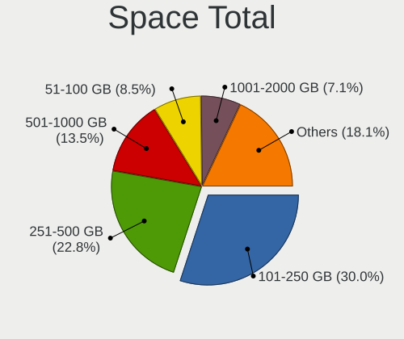

| Size in GB     | Computers | Percent |
|----------------|-----------|---------|
| 101-250        | 1648      | 30.02%  |
| 251-500        | 1250      | 22.77%  |
| 501-1000       | 739       | 13.46%  |
| 51-100         | 469       | 8.54%   |
| 1001-2000      | 392       | 7.14%   |
| 21-50          | 324       | 5.9%    |
| 1-20           | 280       | 5.1%    |
| More than 3000 | 224       | 4.08%   |
| 2001-3000      | 132       | 2.4%    |
| Unknown        | 31        | 0.56%   |

Space Used
----------

Amount of used disk space

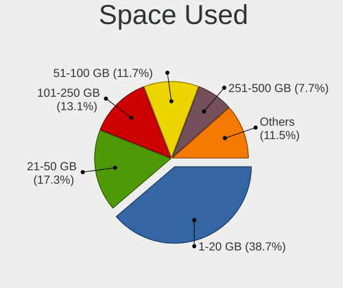

| Used GB        | Computers | Percent |
|----------------|-----------|---------|
| 1-20           | 2213      | 38.74%  |
| 21-50          | 989       | 17.31%  |
| 101-250        | 747       | 13.08%  |
| 51-100         | 666       | 11.66%  |
| 251-500        | 438       | 7.67%   |
| 501-1000       | 314       | 5.5%    |
| 1001-2000      | 161       | 2.82%   |
| More than 3000 | 91        | 1.59%   |
| 2001-3000      | 62        | 1.09%   |
| Unknown        | 31        | 0.54%   |

Malfunc. Drives
---------------

Drive models with a malfunction

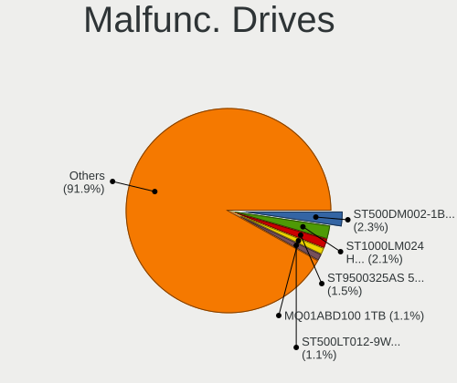

| Model                              | Computers | Drives | Percent |
|------------------------------------|-----------|--------|---------|
| Seagate ST500DM002-1BD142 500GB    | 11        | 11     | 2.34%   |
| Seagate ST1000LM024 HN-M101MBB 1TB | 10        | 10     | 2.13%   |
| Seagate ST9500325AS 500GB          | 7         | 9      | 1.49%   |
| Toshiba MQ01ABD100 1TB             | 5         | 6      | 1.06%   |
| Seagate ST500LT012-9WS142 500GB    | 5         | 5      | 1.06%   |
| Samsung Electronics HM321HI 320GB  | 5         | 6      | 1.06%   |
| Toshiba MQ01ABD050 500GB           | 4         | 4      | 0.85%   |
| Toshiba DT01ACA100 1TB             | 4         | 4      | 0.85%   |
| Seagate ST3500418AS 500GB          | 4         | 5      | 0.85%   |
| Seagate ST320LT007-9ZV142 320GB    | 4         | 4      | 0.85%   |
| Seagate ST2000DM001-1CH164 2TB     | 4         | 6      | 0.85%   |
| Kingston SA400S37480G 480GB SSD    | 4         | 4      | 0.85%   |
| Hitachi HTS543232A7A384 320GB      | 4         | 5      | 0.85%   |
| HGST HTS545050A7E680 500GB         | 4         | 4      | 0.85%   |
| WDC WD10JPVX-22JC3T0 1TB           | 3         | 4      | 0.64%   |
| Seagate ST9500423AS 500GB          | 3         | 3      | 0.64%   |
| Seagate ST9250410AS 250GB          | 3         | 3      | 0.64%   |
| Seagate ST500LT012-1DG142 500GB    | 3         | 3      | 0.64%   |
| Seagate ST1000LM035-1RK172 1TB     | 3         | 3      | 0.64%   |
| Seagate ST1000DM010-2EP102 1TB     | 3         | 3      | 0.64%   |
| Maxtor STM3160215AS 160GB          | 3         | 3      | 0.64%   |
| Kingston SV300S37A120G 120GB SSD   | 3         | 3      | 0.64%   |
| Kingston SA400S37240G 240GB SSD    | 3         | 3      | 0.64%   |
| Hitachi HTS725050A9A364 500GB      | 3         | 4      | 0.64%   |
| Hitachi HTS725032A9A364 320GB      | 3         | 3      | 0.64%   |
| Hitachi HTS545050A7E380 500GB      | 3         | 3      | 0.64%   |
| Hitachi HDS721050CLA362 500GB      | 3         | 3      | 0.64%   |
| HGST HTS541010A9E680 1TB           | 3         | 3      | 0.64%   |
| WDC WDS480G2G0A-00JH30 480GB SSD   | 2         | 2      | 0.43%   |
| WDC WD7500BPKX-00HPJT0 752GB       | 2         | 2      | 0.43%   |
| WDC WD6400AAKS-22A7B2 640GB        | 2         | 2      | 0.43%   |
| WDC WD5000LPVX-22V0TT0 500GB       | 2         | 2      | 0.43%   |
| WDC WD5000AAKX-60U6AA0 500GB       | 2         | 2      | 0.43%   |
| WDC WD5000AAKX-00ERMA0 500GB       | 2         | 2      | 0.43%   |
| WDC WD4000FYYZ-01UL1B1 4TB         | 2         | 3      | 0.43%   |
| WDC WD3200AAKS-00L9A0 320GB        | 2         | 2      | 0.43%   |
| WDC WD2003FYYS-05T9B0 2TB          | 2         | 2      | 0.43%   |
| WDC WD1002FAEX-00Z3A0 1TB          | 2         | 3      | 0.43%   |
| Toshiba MK5065GSXN 500GB           | 2         | 4      | 0.43%   |
| Toshiba MK2552GSX 250GB            | 2         | 2      | 0.43%   |

Malfunc. Drive Vendor
---------------------

Vendors of faulty drives

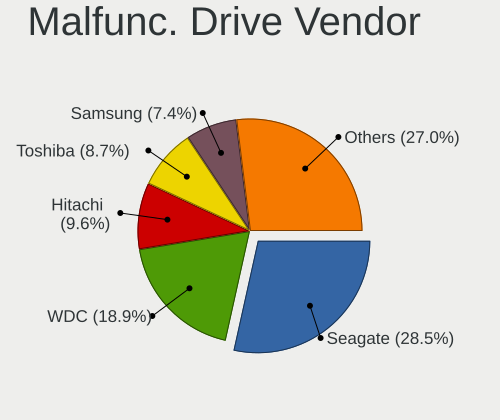

| Vendor              | Computers | Drives | Percent |
|---------------------|-----------|--------|---------|
| Seagate             | 131       | 148    | 28.48%  |
| WDC                 | 87        | 106    | 18.91%  |
| Hitachi             | 44        | 53     | 9.57%   |
| Toshiba             | 40        | 47     | 8.7%    |
| Samsung Electronics | 34        | 42     | 7.39%   |
| Kingston            | 18        | 20     | 3.91%   |
| HGST                | 15        | 23     | 3.26%   |
| Maxtor              | 8         | 8      | 1.74%   |
| Fujitsu             | 8         | 9      | 1.74%   |
| SanDisk             | 7         | 8      | 1.52%   |
| Intel               | 7         | 9      | 1.52%   |
| SK hynix            | 6         | 7      | 1.3%    |
| Micron Technology   | 5         | 6      | 1.09%   |
| A-DATA Technology   | 5         | 6      | 1.09%   |
| China               | 4         | 4      | 0.87%   |
| OCZ                 | 3         | 3      | 0.65%   |
| LDLC                | 3         | 3      | 0.65%   |
| Crucial             | 3         | 3      | 0.65%   |
| Apple               | 3         | 4      | 0.65%   |
| Netac               | 2         | 2      | 0.43%   |
| LITEON              | 2         | 2      | 0.43%   |
| KingDian            | 2         | 4      | 0.43%   |
| Hewlett-Packard     | 2         | 3      | 0.43%   |
| Apacer              | 2         | 2      | 0.43%   |
| Wodposit            | 1         | 1      | 0.22%   |
| Unknown             | 1         | 1      | 0.22%   |
| SSSTC               | 1         | 1      | 0.22%   |
| SPCC                | 1         | 1      | 0.22%   |
| PNY                 | 1         | 1      | 0.22%   |
| Neo Forza           | 1         | 1      | 0.22%   |
| Mushkin             | 1         | 1      | 0.22%   |
| KEEPDATA            | 1         | 1      | 0.22%   |
| JMicron Technology  | 1         | 1      | 0.22%   |
| Intenso             | 1         | 2      | 0.22%   |
| ICY BOX             | 1         | 2      | 0.22%   |
| FORESEE             | 1         | 1      | 0.22%   |
| Drevo               | 1         | 1      | 0.22%   |
| Corsair             | 1         | 1      | 0.22%   |
| Avant               | 1         | 1      | 0.22%   |
| ASMT                | 1         | 4      | 0.22%   |

Malfunc. HDD Vendor
-------------------

Vendors of faulty HDD drives

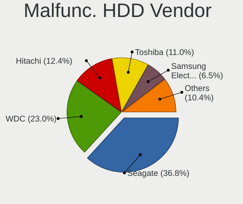

| Vendor              | Computers | Drives | Percent |
|---------------------|-----------|--------|---------|
| Seagate             | 131       | 148    | 36.8%   |
| WDC                 | 82        | 101    | 23.03%  |
| Hitachi             | 44        | 53     | 12.36%  |
| Toshiba             | 39        | 46     | 10.96%  |
| Samsung Electronics | 23        | 30     | 6.46%   |
| HGST                | 15        | 23     | 4.21%   |
| Maxtor              | 8         | 8      | 2.25%   |
| Fujitsu             | 8         | 9      | 2.25%   |
| Hewlett-Packard     | 2         | 3      | 0.56%   |
| JMicron Technology  | 1         | 1      | 0.28%   |
| ICY BOX             | 1         | 2      | 0.28%   |
| ASMT                | 1         | 4      | 0.28%   |
| Apple               | 1         | 1      | 0.28%   |

Malfunc. Drive Kind
-------------------

Kinds of faulty drives

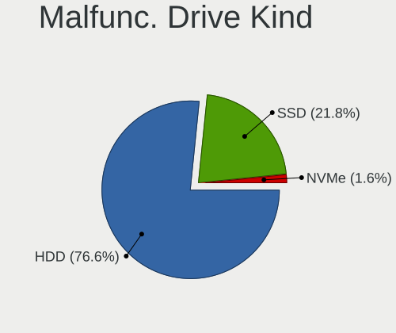

| Kind | Computers | Drives | Percent |
|------|-----------|--------|---------|
| HDD  | 334       | 429    | 76.61%  |
| SSD  | 95        | 110    | 21.79%  |
| NVMe | 7         | 7      | 1.61%   |

Failed Drives
-------------

Failed drive models

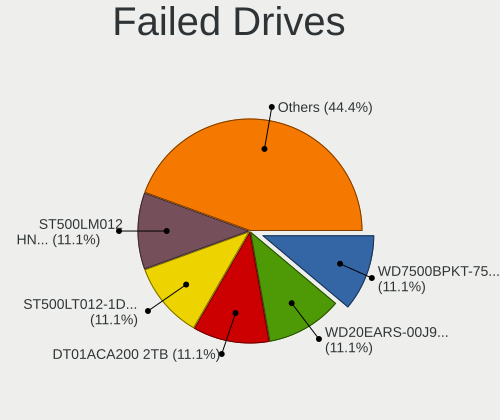

| Model                               | Computers | Drives | Percent |
|-------------------------------------|-----------|--------|---------|
| WDC WD7500BPKT-75PK4T0 752GB        | 1         | 1      | 11.11%  |
| WDC WD20EARS-00J99B0 2TB            | 1         | 2      | 11.11%  |
| Toshiba DT01ACA200 2TB              | 1         | 1      | 11.11%  |
| Seagate ST500LT012-1DG142 500GB     | 1         | 3      | 11.11%  |
| Seagate ST500LM012 HN-M500MBB 500GB | 1         | 1      | 11.11%  |
| Seagate ST500DM002-1BC142 500GB     | 1         | 1      | 11.11%  |
| Seagate ST3320613AS 320GB           | 1         | 1      | 11.11%  |
| JMicron Technology Tech 250GB       | 1         | 1      | 11.11%  |
| A-DATA Technology SP800 32GB SSD    | 1         | 1      | 11.11%  |

Failed Drive Vendor
-------------------

Failed drive vendors

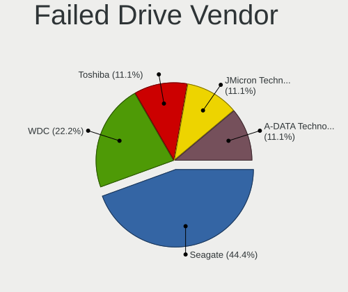

| Vendor             | Computers | Drives | Percent |
|--------------------|-----------|--------|---------|
| Seagate            | 4         | 6      | 44.44%  |
| WDC                | 2         | 3      | 22.22%  |
| Toshiba            | 1         | 1      | 11.11%  |
| JMicron Technology | 1         | 1      | 11.11%  |
| A-DATA Technology  | 1         | 1      | 11.11%  |

Drive Status
------------

Number of failed and malfunc. drives

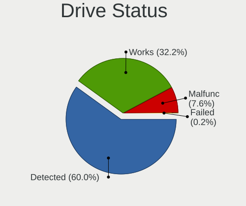

| Status   | Computers | Drives | Percent |
|----------|-----------|--------|---------|
| Detected | 3365      | 6418   | 59.99%  |
| Works    | 1806      | 3174   | 32.2%   |
| Malfunc  | 429       | 546    | 7.65%   |
| Failed   | 9         | 12     | 0.16%   |

Storage controller
------------------

Storage Vendor
--------------

Storage controller vendors

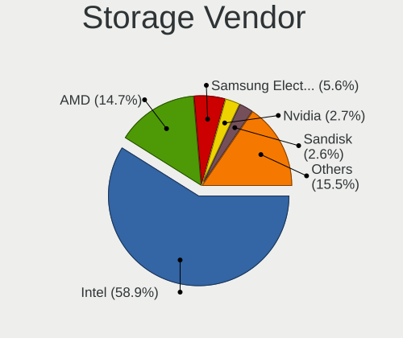

| Vendor                           | Computers | Percent |
|----------------------------------|-----------|---------|
| Intel                            | 3577      | 58.93%  |
| AMD                              | 893       | 14.71%  |
| Samsung Electronics              | 341       | 5.62%   |
| Nvidia                           | 165       | 2.72%   |
| Sandisk                          | 155       | 2.55%   |
| SK hynix                         | 89        | 1.47%   |
| JMicron Technology               | 89        | 1.47%   |
| ASMedia Technology               | 79        | 1.3%    |
| Kingston Technology Company      | 71        | 1.17%   |
| Marvell Technology Group         | 63        | 1.04%   |
| Phison Electronics               | 58        | 0.96%   |
| VIA Technologies                 | 56        | 0.92%   |
| Silicon Integrated Systems [SiS] | 45        | 0.74%   |
| Toshiba America Info Systems     | 40        | 0.66%   |
| KIOXIA                           | 40        | 0.66%   |
| Micron/Crucial Technology        | 38        | 0.63%   |
| Micron Technology                | 38        | 0.63%   |
| Silicon Motion                   | 29        | 0.48%   |
| ADATA Technology                 | 25        | 0.41%   |
| Realtek Semiconductor            | 22        | 0.36%   |
| LSI Logic / Symbios Logic        | 21        | 0.35%   |
| Broadcom / LSI                   | 20        | 0.33%   |
| MAXIO Technology (Hangzhou)      | 17        | 0.28%   |
| Silicon Image                    | 13        | 0.21%   |
| Adaptec                          | 8         | 0.13%   |
| Union Memory (Shenzhen)          | 7         | 0.12%   |
| Apple                            | 7         | 0.12%   |
| ULi Electronics                  | 6         | 0.1%    |
| Integrated Technology Express    | 6         | 0.1%    |
| Hewlett-Packard                  | 6         | 0.1%    |
| Seagate Technology               | 5         | 0.08%   |
| Lenovo                           | 5         | 0.08%   |
| Shenzhen Longsys Electronics     | 4         | 0.07%   |
| Promise Technology               | 4         | 0.07%   |
| Hosin Global Electronics         | 4         | 0.07%   |
| Transcend                        | 3         | 0.05%   |
| Lite-On Technology               | 3         | 0.05%   |
| INNOGRIT                         | 3         | 0.05%   |
| Biwin Storage Technology         | 3         | 0.05%   |
| Solid State Storage Technology   | 2         | 0.03%   |

Storage Model
-------------

Storage controller models

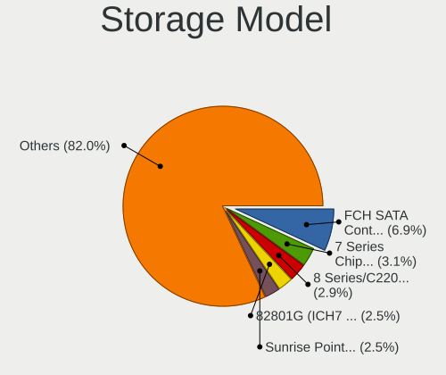

| Model                                                                                   | Computers | Percent |
|-----------------------------------------------------------------------------------------|-----------|---------|
| AMD FCH SATA Controller [AHCI mode]                                                     | 513       | 6.9%    |
| Intel 7 Series Chipset Family 6-port SATA Controller [AHCI mode]                        | 233       | 3.13%   |
| Intel 8 Series/C220 Series Chipset Family 6-port SATA Controller 1 [AHCI mode]          | 219       | 2.94%   |
| Intel 82801G (ICH7 Family) IDE Controller                                               | 188       | 2.53%   |
| Intel Sunrise Point-LP SATA Controller [AHCI mode]                                      | 187       | 2.51%   |
| Samsung NVMe SSD Controller SM981/PM981/PM983                                           | 171       | 2.3%    |
| Intel NM10/ICH7 Family SATA Controller [IDE mode]                                       | 168       | 2.26%   |
| Intel 82801IBM/IEM (ICH9M/ICH9M-E) 4 port SATA Controller [AHCI mode]                   | 154       | 2.07%   |
| Intel 82801HM/HEM (ICH8M/ICH8M-E) IDE Controller                                        | 153       | 2.06%   |
| Intel 6 Series/C200 Series Chipset Family 6 port Mobile SATA AHCI Controller            | 151       | 2.03%   |
| Intel 6 Series/C200 Series Chipset Family 6 port Desktop SATA AHCI Controller           | 134       | 1.8%    |
| Intel 82801HM/HEM (ICH8M/ICH8M-E) SATA Controller [AHCI mode]                           | 127       | 1.71%   |
| Intel 82801 Mobile SATA Controller [RAID mode]                                          | 127       | 1.71%   |
| AMD SB7x0/SB8x0/SB9x0 IDE Controller                                                    | 126       | 1.69%   |
| AMD SB7x0/SB8x0/SB9x0 SATA Controller [AHCI mode]                                       | 121       | 1.63%   |
| Intel 8 Series SATA Controller 1 [AHCI mode]                                            | 103       | 1.38%   |
| Intel 5 Series/3400 Series Chipset 4 port SATA AHCI Controller                          | 98        | 1.32%   |
| Intel 7 Series/C210 Series Chipset Family 6-port SATA Controller [AHCI mode]            | 95        | 1.28%   |
| Intel SATA Controller [RAID mode]                                                       | 90        | 1.21%   |
| Intel Q170/Q150/B150/H170/H110/Z170/CM236 Chipset SATA Controller [AHCI Mode]           | 89        | 1.2%    |
| AMD SB7x0/SB8x0/SB9x0 SATA Controller [IDE mode]                                        | 82        | 1.1%    |
| Intel Atom Processor E3800 Series SATA AHCI Controller                                  | 80        | 1.08%   |
| AMD 400 Series Chipset SATA Controller                                                  | 77        | 1.04%   |
| Intel 5 Series/3400 Series Chipset 6 port SATA AHCI Controller                          | 76        | 1.02%   |
| Intel Volume Management Device NVMe RAID Controller                                     | 75        | 1.01%   |
| ASMedia ASM1061/ASM1062 Serial ATA Controller                                           | 74        | 0.99%   |
| Nvidia MCP61 SATA Controller                                                            | 68        | 0.91%   |
| Intel NM10/ICH7 Family SATA Controller [AHCI mode]                                      | 68        | 0.91%   |
| Intel 82801GBM/GHM (ICH7-M Family) SATA Controller [IDE mode]                           | 65        | 0.87%   |
| Intel Celeron/Pentium Silver Processor SATA Controller                                  | 64        | 0.86%   |
| Intel Wildcat Point-LP SATA Controller [AHCI Mode]                                      | 63        | 0.85%   |
| Samsung NVMe SSD Controller 980 (DRAM-less)                                             | 62        | 0.83%   |
| Intel 82801GBM/GHM (ICH7-M Family) SATA Controller [AHCI mode]                          | 59        | 0.79%   |
| AMD 500 Series Chipset SATA Controller                                                  | 59        | 0.79%   |
| Intel 200 Series PCH SATA controller [AHCI mode]                                        | 58        | 0.78%   |
| Nvidia MCP61 IDE                                                                        | 55        | 0.74%   |
| JMicron JMB363 SATA/IDE Controller                                                      | 54        | 0.73%   |
| Intel Atom/Celeron/Pentium Processor x5-E8000/J3xxx/N3xxx Series SATA Controller        | 54        | 0.73%   |
| Intel 6 Series/C200 Series Chipset Family Desktop SATA Controller (IDE mode, ports 4-5) | 54        | 0.73%   |
| Intel 6 Series/C200 Series Chipset Family Desktop SATA Controller (IDE mode, ports 0-3) | 54        | 0.73%   |

Storage Kind
------------

Kind of storage controller (IDE, SATA, NVMe, SAS, ...)

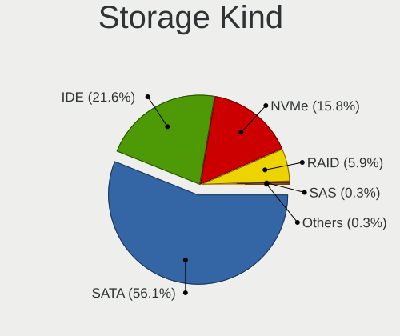

| Kind | Computers | Percent |
|------|-----------|---------|
| SATA | 3578      | 56.07%  |
| IDE  | 1378      | 21.6%   |
| NVMe | 1007      | 15.78%  |
| RAID | 378       | 5.92%   |
| SAS  | 22        | 0.34%   |
| SCSI | 18        | 0.28%   |

Processor
---------

CPU Vendor
----------

Processor vendors

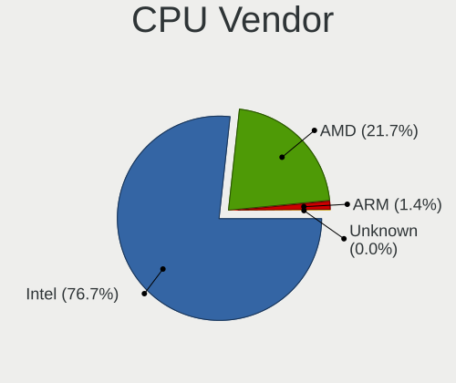

| Vendor       | Computers | Percent |
|--------------|-----------|---------|
| Intel        | 4027      | 76.72%  |
| AMD          | 1141      | 21.74%  |
| ARM          | 75        | 1.43%   |
| CentaurHauls | 5         | 0.1%    |
| Unknown      | 1         | 0.02%   |

CPU Model
---------

Processor models

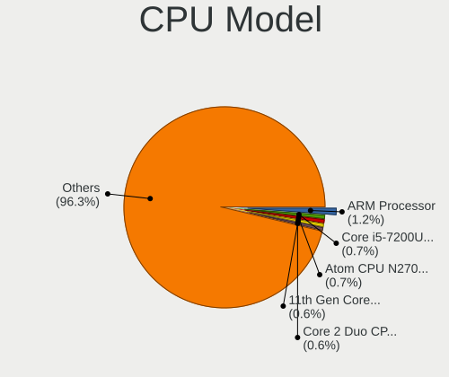

| Model                                   | Computers | Percent |
|-----------------------------------------|-----------|---------|
| ARM Processor                           | 62        | 1.18%   |
| Intel Core i5-7200U CPU @ 2.50GHz       | 37        | 0.7%    |
| Intel Atom CPU N270 @ 1.60GHz           | 36        | 0.68%   |
| Intel 11th Gen Core i7-1165G7 @ 2.80GHz | 32        | 0.61%   |
| Intel Core 2 Duo CPU E8400 @ 3.00GHz    | 30        | 0.57%   |
| Intel Core i5-8250U CPU @ 1.60GHz       | 29        | 0.55%   |
| Intel Atom x5-Z8350 CPU @ 1.44GHz       | 29        | 0.55%   |
| Intel Core i7-8550U CPU @ 1.80GHz       | 28        | 0.53%   |
| Intel Celeron CPU N3350 @ 1.10GHz       | 27        | 0.51%   |
| Intel Celeron CPU N3060 @ 1.60GHz       | 27        | 0.51%   |
| Intel Celeron CPU N2840 @ 2.16GHz       | 27        | 0.51%   |
| Intel Core i5-6300U CPU @ 2.40GHz       | 26        | 0.49%   |
| Intel Core i5-2400 CPU @ 3.10GHz        | 26        | 0.49%   |
| Intel Core 2 Duo CPU P8600 @ 2.40GHz    | 26        | 0.49%   |
| Intel Core i5-3470 CPU @ 3.20GHz        | 25        | 0.47%   |
| Intel Core i5-3320M CPU @ 2.60GHz       | 25        | 0.47%   |
| Intel Core i5-2520M CPU @ 2.50GHz       | 25        | 0.47%   |
| Intel Pentium 4 CPU 3.00GHz             | 24        | 0.46%   |
| Intel Core i5-6200U CPU @ 2.30GHz       | 24        | 0.46%   |
| Intel Core i3 CPU M 370 @ 2.40GHz       | 24        | 0.46%   |
| Intel Core i7-3770 CPU @ 3.40GHz        | 23        | 0.44%   |
| Intel Atom CPU N450 @ 1.66GHz           | 23        | 0.44%   |
| AMD Ryzen 5 3600 6-Core Processor       | 23        | 0.44%   |
| Intel Core i3-4130 CPU @ 3.40GHz        | 22        | 0.42%   |
| Intel Core 2 Duo CPU E7500 @ 2.93GHz    | 21        | 0.4%    |
| Intel 11th Gen Core i5-1135G7 @ 2.40GHz | 21        | 0.4%    |
| Intel Core i7-2670QM CPU @ 2.20GHz      | 20        | 0.38%   |
| Intel Core i5-1035G1 CPU @ 1.00GHz      | 20        | 0.38%   |
| Intel Core i5-10210U CPU @ 1.60GHz      | 20        | 0.38%   |
| Intel Core 2 Duo CPU P8400 @ 2.26GHz    | 20        | 0.38%   |
| Intel Celeron N4020 CPU @ 1.10GHz       | 20        | 0.38%   |
| Intel Celeron CPU N3050 @ 1.60GHz       | 20        | 0.38%   |
| Intel Core i7-9750H CPU @ 2.60GHz       | 19        | 0.36%   |
| Intel Core i7-2600 CPU @ 3.40GHz        | 19        | 0.36%   |
| Intel Core i5-4210U CPU @ 1.70GHz       | 19        | 0.36%   |
| Intel Core i5 CPU M 520 @ 2.40GHz       | 19        | 0.36%   |
| Intel Core i3-2100 CPU @ 3.10GHz        | 19        | 0.36%   |
| Intel Core 2 Quad CPU Q6600 @ 2.40GHz   | 19        | 0.36%   |
| Intel Core 2 Duo CPU T7500 @ 2.20GHz    | 19        | 0.36%   |
| Intel Core i7-4790 CPU @ 3.60GHz        | 18        | 0.34%   |

CPU Model Family
----------------

Processor model prefix

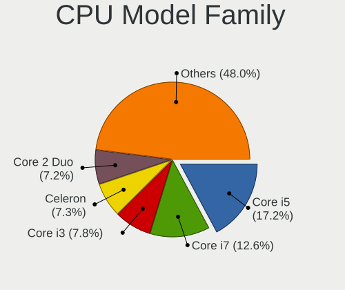

| Model                   | Computers | Percent |
|-------------------------|-----------|---------|
| Intel Core i5           | 903       | 17.16%  |
| Intel Core i7           | 662       | 12.58%  |
| Intel Core i3           | 412       | 7.83%   |
| Intel Celeron           | 382       | 7.26%   |
| Intel Core 2 Duo        | 378       | 7.18%   |
| Other                   | 279       | 5.3%    |
| Intel Atom              | 206       | 3.91%   |
| AMD Ryzen 5             | 186       | 3.53%   |
| Intel Pentium           | 155       | 2.95%   |
| Intel Xeon              | 140       | 2.66%   |
| AMD Ryzen 7             | 138       | 2.62%   |
| Intel Pentium Dual-Core | 102       | 1.94%   |
| Intel Pentium Dual      | 76        | 1.44%   |
| Intel Pentium 4         | 68        | 1.29%   |
| AMD FX                  | 66        | 1.25%   |
| Intel Core 2 Quad       | 63        | 1.2%    |
| Intel Core 2            | 62        | 1.18%   |
| Intel Genuine           | 60        | 1.14%   |
| AMD A8                  | 58        | 1.1%    |
| AMD Ryzen 9             | 54        | 1.03%   |
| AMD Athlon 64 X2        | 44        | 0.84%   |
| AMD A6                  | 39        | 0.74%   |
| AMD Ryzen 3             | 38        | 0.72%   |
| AMD E1                  | 36        | 0.68%   |
| AMD Athlon II X2        | 35        | 0.67%   |
| AMD Phenom II X4        | 34        | 0.65%   |
| AMD A4                  | 33        | 0.63%   |
| Intel Pentium M         | 31        | 0.59%   |
| AMD A10                 | 27        | 0.51%   |
| Intel Celeron M         | 26        | 0.49%   |
| AMD Athlon              | 25        | 0.48%   |
| AMD Ryzen 7 PRO         | 24        | 0.46%   |
| AMD E                   | 24        | 0.46%   |
| Intel Core i9           | 23        | 0.44%   |
| AMD Ryzen 5 PRO         | 23        | 0.44%   |
| AMD Turion 64 X2 Mobile | 22        | 0.42%   |
| AMD Sempron             | 21        | 0.4%    |
| Intel Pentium D         | 18        | 0.34%   |
| AMD E2                  | 17        | 0.32%   |
| AMD Athlon 64           | 17        | 0.32%   |

CPU Cores
---------

Number of processor cores

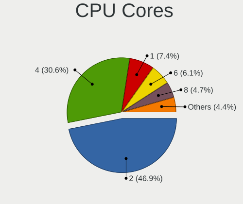

| Number  | Computers | Percent |
|---------|-----------|---------|
| 2       | 2467      | 46.86%  |
| 4       | 1610      | 30.58%  |
| 1       | 388       | 7.37%   |
| 6       | 321       | 6.1%    |
| 8       | 245       | 4.65%   |
| 12      | 64        | 1.22%   |
| 16      | 44        | 0.84%   |
| 10      | 34        | 0.65%   |
| 3       | 25        | 0.47%   |
| 14      | 19        | 0.36%   |
| Unknown | 19        | 0.36%   |
| 24      | 10        | 0.19%   |
| 20      | 6         | 0.11%   |
| 64      | 3         | 0.06%   |
| 5       | 3         | 0.06%   |
| 40      | 2         | 0.04%   |
| 18      | 2         | 0.04%   |
| 256     | 1         | 0.02%   |
| 48      | 1         | 0.02%   |
| 28      | 1         | 0.02%   |

CPU Sockets
-----------

Number of sockets

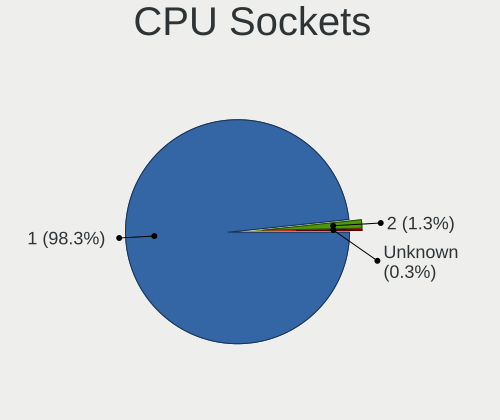

| Number  | Computers | Percent |
|---------|-----------|---------|
| 1       | 5163      | 98.32%  |
| 2       | 70        | 1.33%   |
| Unknown | 18        | 0.34%   |

CPU Threads
-----------

Threads per core (Hyper-Threading)

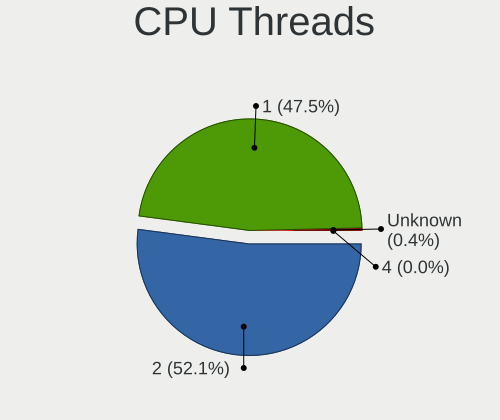

| Number  | Computers | Percent |
|---------|-----------|---------|
| 2       | 2737      | 52.08%  |
| 1       | 2498      | 47.54%  |
| Unknown | 19        | 0.36%   |
| 4       | 1         | 0.02%   |

CPU Op-Modes
------------

CPU Operation Modes (32-bit, 64-bit)

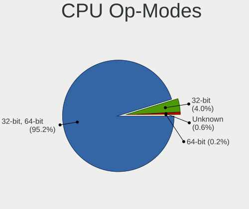

| Op mode        | Computers | Percent |
|----------------|-----------|---------|
| 32-bit, 64-bit | 4999      | 95.22%  |
| 32-bit         | 208       | 3.96%   |
| Unknown        | 34        | 0.65%   |
| 64-bit         | 9         | 0.17%   |

CPU Microcode
-------------

Microcode number

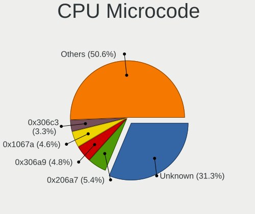

| Number     | Computers | Percent |
|------------|-----------|---------|
| Unknown    | 1698      | 31.3%   |
| 0x206a7    | 292       | 5.38%   |
| 0x306a9    | 261       | 4.81%   |
| 0x1067a    | 251       | 4.63%   |
| 0x306c3    | 177       | 3.26%   |
| 0x6fd      | 148       | 2.73%   |
| 0x20655    | 94        | 1.73%   |
| 0x10676    | 86        | 1.59%   |
| 0x40651    | 78        | 1.44%   |
| 0x506e3    | 75        | 1.38%   |
| 0x906ea    | 67        | 1.24%   |
| 0x406e3    | 62        | 1.14%   |
| 0x406c4    | 62        | 1.14%   |
| 0x30678    | 62        | 1.14%   |
| 0x010000c8 | 61        | 1.12%   |
| 0x106ca    | 57        | 1.05%   |
| 0x6fb      | 56        | 1.03%   |
| 0x6f6      | 55        | 1.01%   |
| 0x806ea    | 53        | 0.98%   |
| 0x106c2    | 53        | 0.98%   |
| 0x806ec    | 51        | 0.94%   |
| 0x806c1    | 49        | 0.9%    |
| 0x20652    | 49        | 0.9%    |
| 0x906e9    | 48        | 0.88%   |
| 0x806e9    | 48        | 0.88%   |
| 0x306d4    | 44        | 0.81%   |
| 0x08108109 | 43        | 0.79%   |
| 0x06000852 | 42        | 0.77%   |
| 0x406c3    | 39        | 0.72%   |
| 0x6e8      | 37        | 0.68%   |
| 0x6d8      | 36        | 0.66%   |
| 0x08701021 | 36        | 0.66%   |
| 0x05000119 | 36        | 0.66%   |
| 0x106e5    | 34        | 0.63%   |
| 0x0800820d | 33        | 0.61%   |
| 0x07030105 | 33        | 0.61%   |
| 0x0700010f | 32        | 0.59%   |
| 0x506c9    | 29        | 0.53%   |
| 0x03000027 | 29        | 0.53%   |
| 0xa0652    | 26        | 0.48%   |

CPU Microarch
-------------

Microarchitecture

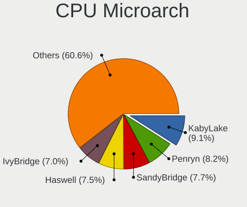

| Name              | Computers | Percent |
|-------------------|-----------|---------|
| KabyLake          | 477       | 9.06%   |
| Penryn            | 432       | 8.2%    |
| SandyBridge       | 405       | 7.69%   |
| Haswell           | 393       | 7.46%   |
| IvyBridge         | 370       | 7.02%   |
| Core              | 346       | 6.57%   |
| Silvermont        | 241       | 4.58%   |
| Unknown           | 215       | 4.08%   |
| Skylake           | 213       | 4.04%   |
| Westmere          | 210       | 3.99%   |
| K10               | 143       | 2.72%   |
| Bonnell           | 142       | 2.7%    |
| Zen 2             | 133       | 2.53%   |
| K8 Hammer         | 132       | 2.51%   |
| Zen+              | 116       | 2.2%    |
| P6                | 106       | 2.01%   |
| NetBurst          | 96        | 1.82%   |
| Zen 3             | 94        | 1.78%   |
| Piledriver        | 91        | 1.73%   |
| TigerLake         | 83        | 1.58%   |
| CometLake         | 82        | 1.56%   |
| Broadwell         | 82        | 1.56%   |
| Zen               | 70        | 1.33%   |
| Goldmont plus     | 69        | 1.31%   |
| Nehalem           | 65        | 1.23%   |
| Alderlake Hybrid  | 62        | 1.18%   |
| Bobcat            | 58        | 1.1%    |
| Excavator         | 54        | 1.03%   |
| IceLake           | 50        | 0.95%   |
| Goldmont          | 49        | 0.93%   |
| Puma              | 47        | 0.89%   |
| Jaguar            | 38        | 0.72%   |
| K10 Llano         | 35        | 0.66%   |
| Steamroller       | 19        | 0.36%   |
| K8 & K10 hybrid   | 13        | 0.25%   |
| Tremont           | 11        | 0.21%   |
| Bulldozer         | 11        | 0.21%   |
| K6                | 6         | 0.11%   |
| Meteorlake Hybrid | 4         | 0.08%   |
| Lunarlake Hybrid  | 2         | 0.04%   |

Graphics
--------

GPU Vendor
----------

Vendors of graphics cards

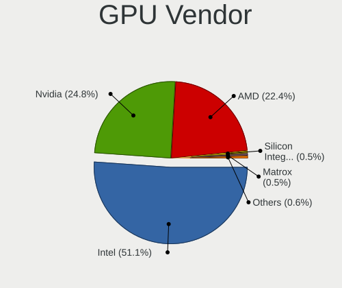

| Vendor                           | Computers | Percent |
|----------------------------------|-----------|---------|
| Intel                            | 2985      | 51.11%  |
| Nvidia                           | 1450      | 24.83%  |
| AMD                              | 1311      | 22.45%  |
| Silicon Integrated Systems [SiS] | 31        | 0.53%   |
| Matrox Electronics Systems       | 30        | 0.51%   |
| VIA Technologies                 | 20        | 0.34%   |
| ASPEED Technology                | 11        | 0.19%   |
| S3 Graphics                      | 1         | 0.02%   |
| Alliance Semiconductor           | 1         | 0.02%   |

GPU Model
---------

Graphics card models

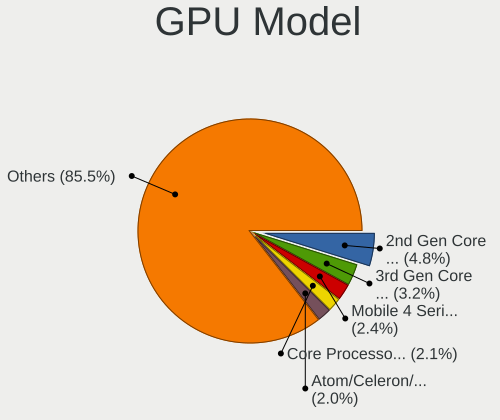

| Model                                                                                    | Computers | Percent |
|------------------------------------------------------------------------------------------|-----------|---------|
| Intel 2nd Generation Core Processor Family Integrated Graphics Controller                | 297       | 4.81%   |
| Intel 3rd Gen Core processor Graphics Controller                                         | 196       | 3.17%   |
| Intel Mobile 4 Series Chipset Integrated Graphics Controller                             | 148       | 2.4%    |
| Intel Core Processor Integrated Graphics Controller                                      | 127       | 2.06%   |
| Intel Atom/Celeron/Pentium Processor x5-E8000/J3xxx/N3xxx Integrated Graphics Controller | 126       | 2.04%   |
| Intel Atom Processor Z36xxx/Z37xxx Series Graphics & Display                             | 114       | 1.85%   |
| Intel Haswell-ULT Integrated Graphics Controller                                         | 107       | 1.73%   |
| Intel Xeon E3-1200 v3/4th Gen Core Processor Integrated Graphics Controller              | 104       | 1.68%   |
| Intel Mobile 945GM/GMS/GME, 943/940GML Express Integrated Graphics Controller            | 99        | 1.6%    |
| Intel Mobile GM965/GL960 Integrated Graphics Controller (secondary)                      | 95        | 1.54%   |
| Intel Mobile GM965/GL960 Integrated Graphics Controller (primary)                        | 95        | 1.54%   |
| Intel Skylake-U GT2 [HD Graphics 520]                                                    | 78        | 1.26%   |
| Intel Kaby Lake-R GT2 [UHD Graphics 620]                                                 | 78        | 1.26%   |
| Intel Kaby Lake-U GT2 [HD Graphics 620]                                                  | 74        | 1.2%    |
| AMD Picasso/Raven 2 [Radeon Vega Series / Radeon Vega Mobile Series]                     | 74        | 1.2%    |
| Intel TigerLake-LP GT2 [Iris Xe Graphics]                                                | 71        | 1.15%   |
| Intel Xeon E3-1200 v2/3rd Gen Core processor Graphics Controller                         | 68        | 1.1%    |
| Intel 4 Series Chipset Integrated Graphics Controller                                    | 68        | 1.1%    |
| Intel Mobile 945GM/GMS, 943/940GML Express Integrated Graphics Controller                | 65        | 1.05%   |
| Intel Atom Processor D4xx/D5xx/N4xx/N5xx Integrated Graphics Controller                  | 61        | 0.99%   |
| Intel 4th Gen Core Processor Integrated Graphics Controller                              | 61        | 0.99%   |
| AMD Ellesmere [Radeon RX 470/480/570/570X/580/580X/590]                                  | 59        | 0.96%   |
| Nvidia GK208B [GeForce GT 710]                                                           | 56        | 0.91%   |
| Intel GeminiLake [UHD Graphics 600]                                                      | 56        | 0.91%   |
| Intel CoffeeLake-H GT2 [UHD Graphics 630]                                                | 56        | 0.91%   |
| Intel Broadwell-U GT2 [HD Graphics 5500]                                                 | 56        | 0.91%   |
| AMD Renoir [Radeon Vega Series / Radeon Vega Mobile Series]                              | 55        | 0.89%   |
| Intel 82G33/G31 Express Integrated Graphics Controller                                   | 47        | 0.76%   |
| Intel CometLake-U GT2 [UHD Graphics]                                                     | 45        | 0.73%   |
| Intel Skylake-S GT2 [HD Graphics 530]                                                    | 44        | 0.71%   |
| Intel WhiskeyLake-U GT2 [UHD Graphics 620]                                               | 42        | 0.68%   |
| Nvidia GP107 [GeForce GTX 1050 Ti]                                                       | 41        | 0.66%   |
| AMD Cezanne [Radeon Vega Series / Radeon Vega Mobile Series]                             | 41        | 0.66%   |
| Intel Apollo Lake GT1 [HD Graphics 500]                                                  | 40        | 0.65%   |
| Intel CoffeeLake-S GT2 [UHD Graphics 630]                                                | 39        | 0.63%   |
| AMD Raven Ridge [Radeon Vega Series / Radeon Vega Mobile Series]                         | 39        | 0.63%   |
| Intel Mobile 945GSE Express Integrated Graphics Controller                               | 38        | 0.62%   |
| Nvidia GT218 [GeForce 210]                                                               | 37        | 0.6%    |
| Intel CometLake-H GT2 [UHD Graphics]                                                     | 34        | 0.55%   |
| Nvidia TU117M [GeForce GTX 1650 Mobile / Max-Q]                                          | 31        | 0.5%    |

GPU Combo
---------

Combinations of graphics cards

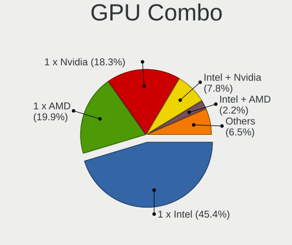

| Name                                 | Computers | Percent |
|--------------------------------------|-----------|---------|
| 1 x Intel                            | 2395      | 45.35%  |
| 1 x AMD                              | 1049      | 19.86%  |
| 1 x Nvidia                           | 966       | 18.29%  |
| Intel + Nvidia                       | 410       | 7.76%   |
| Intel + AMD                          | 117       | 2.22%   |
| Other                                | 90        | 1.7%    |
| 2 x AMD                              | 87        | 1.65%   |
| AMD + Nvidia                         | 50        | 0.95%   |
| 1 x SiS                              | 31        | 0.59%   |
| 1 x Matrox                           | 23        | 0.44%   |
| 1 x VIA                              | 20        | 0.38%   |
| 2 x Intel                            | 9         | 0.17%   |
| 2 x Nvidia                           | 7         | 0.13%   |
| Nvidia + ASPEED                      | 6         | 0.11%   |
| Nvidia + Matrox                      | 4         | 0.08%   |
| 1 x ASPEED                           | 4         | 0.08%   |
| 2 x AMD + 1 x Nvidia                 | 2         | 0.04%   |
| Intel + 2 x Nvidia                   | 2         | 0.04%   |
| AMD + Matrox                         | 2         | 0.04%   |
| 3 x AMD                              | 1         | 0.02%   |
| 2 x Nvidia + 1 x Matrox              | 1         | 0.02%   |
| 2 x AMD + 1 x Alliance Semiconductor | 1         | 0.02%   |
| 1 x S3 Graphics                      | 1         | 0.02%   |
| Intel + 2 x AMD                      | 1         | 0.02%   |
| Intel + AMD + 1 x Nvidia             | 1         | 0.02%   |
| AMD + ASPEED                         | 1         | 0.02%   |

GPU Driver
----------

Free vs proprietary

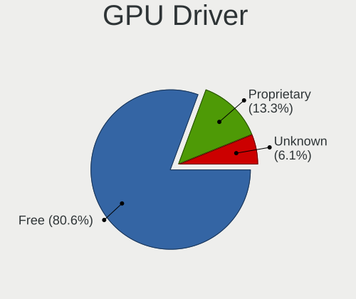

| Driver      | Computers | Percent |
|-------------|-----------|---------|
| Free        | 4280      | 80.63%  |
| Proprietary | 704       | 13.26%  |
| Unknown     | 324       | 6.1%    |

GPU Memory
----------

Total video memory

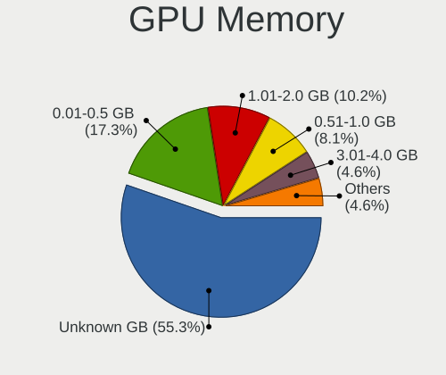

| Size in GB | Computers | Percent |
|------------|-----------|---------|
| Unknown    | 2970      | 55.3%   |
| 0.01-0.5   | 927       | 17.26%  |
| 1.01-2.0   | 546       | 10.17%  |
| 0.51-1.0   | 437       | 8.14%   |
| 3.01-4.0   | 246       | 4.58%   |
| 7.01-8.0   | 109       | 2.03%   |
| 5.01-6.0   | 69        | 1.28%   |
| 8.01-16.0  | 38        | 0.71%   |
| 2.01-3.0   | 21        | 0.39%   |
| 16.01-24.0 | 4         | 0.07%   |
| 4.01-5.0   | 3         | 0.06%   |
| 32.01-64.0 | 1         | 0.02%   |

Monitor
-------

Monitor Vendor
--------------

Monitor vendors

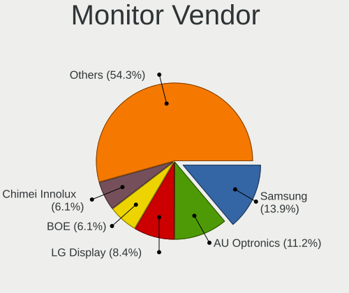

| Vendor                  | Computers | Percent |
|-------------------------|-----------|---------|
| Samsung Electronics     | 757       | 13.88%  |
| AU Optronics            | 609       | 11.16%  |
| LG Display              | 460       | 8.43%   |
| BOE                     | 334       | 6.12%   |
| Chimei Innolux          | 331       | 6.07%   |
| Dell                    | 323       | 5.92%   |
| Goldstar                | 250       | 4.58%   |
| Hewlett-Packard         | 216       | 3.96%   |
| Acer                    | 192       | 3.52%   |
| AOC                     | 135       | 2.47%   |
| Lenovo                  | 131       | 2.4%    |
| Philips                 | 128       | 2.35%   |
| Chi Mei Optoelectronics | 116       | 2.13%   |
| Ancor Communications    | 106       | 1.94%   |
| BenQ                    | 99        | 1.81%   |
| Apple                   | 92        | 1.69%   |
| LG Philips              | 76        | 1.39%   |
| ViewSonic               | 66        | 1.21%   |
| Iiyama                  | 61        | 1.12%   |
| HannStar                | 58        | 1.06%   |
| Unknown                 | 48        | 0.88%   |
| Sony                    | 48        | 0.88%   |
| Sharp                   | 48        | 0.88%   |
| InfoVision              | 42        | 0.77%   |
| LG Electronics          | 38        | 0.7%    |
| Fujitsu Siemens         | 36        | 0.66%   |
| NEC Computers           | 32        | 0.59%   |
| ASUSTek Computer        | 27        | 0.49%   |
| PANDA                   | 26        | 0.48%   |
| CPT                     | 25        | 0.46%   |
| Panasonic               | 22        | 0.4%    |
| Toshiba                 | 21        | 0.38%   |
| Eizo                    | 21        | 0.38%   |
| Vizio                   | 18        | 0.33%   |
| Medion                  | 15        | 0.27%   |
| RTK                     | 14        | 0.26%   |
| Vestel Elektronik       | 12        | 0.22%   |
| Quanta Display          | 11        | 0.2%    |
| PKB                     | 11        | 0.2%    |
| Packard Bell            | 11        | 0.2%    |

Monitor Model
-------------

Monitor models

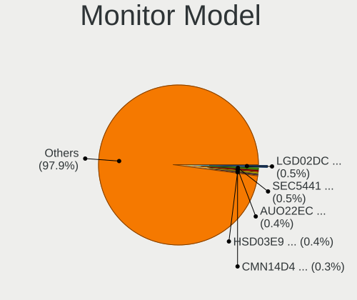

| Model                                                                    | Computers | Percent |
|--------------------------------------------------------------------------|-----------|---------|
| LG Display LCD Monitor LGD02DC 1366x768 344x194mm 15.5-inch              | 29        | 0.51%   |
| Samsung Electronics LCD Monitor SEC5441 1280x800 331x207mm 15.4-inch     | 28        | 0.5%    |
| AU Optronics LCD Monitor AUO22EC 1366x768 344x193mm 15.5-inch            | 22        | 0.39%   |
| HannStar LCD Monitor HSD03E9 1024x600 220x129mm 10.0-inch                | 21        | 0.37%   |
| Chimei Innolux LCD Monitor CMN14D4 1920x1080 309x173mm 13.9-inch         | 19        | 0.34%   |
| Chi Mei Optoelectronics LCD Monitor CMO15A7 1366x768 344x193mm 15.5-inch | 19        | 0.34%   |
| AU Optronics LCD Monitor AUO38ED 1920x1080 344x193mm 15.5-inch           | 19        | 0.34%   |
| AOC 24G2W1G3 AOC2402 1920x1080 527x296mm 23.8-inch                       | 17        | 0.3%    |
| AU Optronics LCD Monitor AUO21ED 1920x1080 344x193mm 15.5-inch           | 16        | 0.28%   |
| AU Optronics LCD Monitor AUO26EC 1366x768 344x193mm 15.5-inch            | 15        | 0.27%   |
| AU Optronics LCD Monitor AUO8174 1280x800 331x207mm 15.4-inch            | 14        | 0.25%   |
| AU Optronics LCD Monitor AUO235C 1366x768 256x144mm 11.6-inch            | 13        | 0.23%   |
| Vestel Elektronik 40UHD_LCD_TV VES3700 3840x2160 880x500mm 39.8-inch     | 12        | 0.21%   |
| Chimei Innolux LCD Monitor CMN15E7 1920x1080 344x193mm 15.5-inch         | 12        | 0.21%   |
| Unknown LCD Monitor FFFF 2288x1287 2550x2550mm 142.0-inch                | 11        | 0.19%   |
| LG Display LCD Monitor LGD0563 1920x1080 344x194mm 15.5-inch             | 11        | 0.19%   |
| BOE LCD Monitor BOE0687 1920x1080 344x193mm 15.5-inch                    | 11        | 0.19%   |
| AU Optronics LCD Monitor AUO21EC 1366x768 344x193mm 15.5-inch            | 11        | 0.19%   |
| AU Optronics LCD Monitor AUO106C 1366x768 276x155mm 12.5-inch            | 11        | 0.19%   |
| Panasonic TV MEIA296 1920x1080 698x392mm 31.5-inch                       | 10        | 0.18%   |
| LG Display LCD Monitor LGD033A 1366x768 344x194mm 15.5-inch              | 10        | 0.18%   |
| Goldstar W1943 GSM4BAD 1360x768 406x229mm 18.4-inch                      | 10        | 0.18%   |
| Chimei Innolux LCD Monitor CMN15F5 1920x1080 344x193mm 15.5-inch         | 10        | 0.18%   |
| Chimei Innolux LCD Monitor CMN15DB 1366x768 344x193mm 15.5-inch          | 10        | 0.18%   |
| Chimei Innolux LCD Monitor CMN14C9 1920x1080 309x173mm 13.9-inch         | 10        | 0.18%   |
| Chi Mei Optoelectronics LCD Monitor CMO1526 1280x800 331x207mm 15.4-inch | 10        | 0.18%   |
| PKB LCD Monitor Viseo223DX 1920x1080                                     | 9         | 0.16%   |
| PANDA LCD Monitor NCP004D 1920x1080 344x194mm 15.5-inch                  | 9         | 0.16%   |
| InfoVision LCD Monitor IVO03F4 1920x1080 309x173mm 13.9-inch             | 9         | 0.16%   |
| HannStar HSD121PHW1 HSD04B6 1366x768 270x150mm 12.2-inch                 | 9         | 0.16%   |
| Goldstar LG ULTRAWIDE GSM59F1 2560x1080 670x280mm 28.6-inch              | 9         | 0.16%   |
| AU Optronics LCD Monitor AUO61D2 1024x600 222x125mm 10.0-inch            | 9         | 0.16%   |
| AU Optronics LCD Monitor AUO45EC 1366x768 344x193mm 15.5-inch            | 9         | 0.16%   |
| AU Optronics LCD Monitor AUO403D 1920x1080 309x174mm 14.0-inch           | 9         | 0.16%   |
| AU Optronics LCD Monitor AUO213E 1600x900 309x174mm 14.0-inch            | 9         | 0.16%   |
| AU Optronics LCD Monitor AUO139E 1600x900 382x214mm 17.2-inch            | 9         | 0.16%   |
| AU Optronics LCD Monitor AUO10EC 1366x768 344x193mm 15.5-inch            | 9         | 0.16%   |
| Ancor Communications ASUS VS197 ACI19F2 1366x768 410x230mm 18.5-inch     | 9         | 0.16%   |
| Samsung Electronics LCD Monitor SEC4251 1366x768 344x194mm 15.5-inch     | 8         | 0.14%   |
| Samsung Electronics LCD Monitor SEC3345 1280x800 331x207mm 15.4-inch     | 8         | 0.14%   |

Monitor Resolution
------------------

Monitor screen resolution

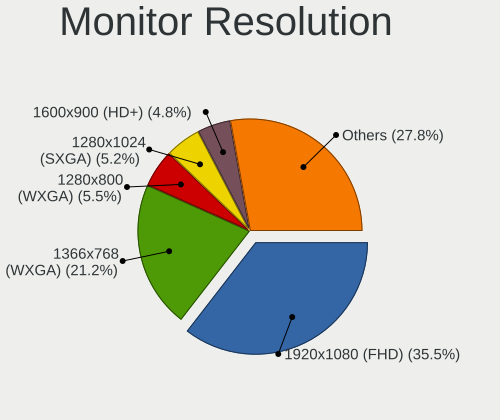

| Resolution         | Computers | Percent |
|--------------------|-----------|---------|
| 1920x1080 (FHD)    | 1884      | 35.49%  |
| 1366x768 (WXGA)    | 1126      | 21.21%  |
| 1280x800 (WXGA)    | 291       | 5.48%   |
| 1280x1024 (SXGA)   | 275       | 5.18%   |
| 1600x900 (HD+)     | 255       | 4.8%    |
| 3840x2160 (4K)     | 226       | 4.26%   |
| 1440x900 (WXGA+)   | 211       | 3.97%   |
| 1680x1050 (WSXGA+) | 195       | 3.67%   |
| 2560x1440 (QHD)    | 163       | 3.07%   |
| 1920x1200 (WUXGA)  | 152       | 2.86%   |
| 1024x600           | 77        | 1.45%   |
| Unknown            | 66        | 1.24%   |
| 1024x768 (XGA)     | 54        | 1.02%   |
| 1360x768           | 49        | 0.92%   |
| 3840x1080          | 27        | 0.51%   |
| 2560x1080          | 26        | 0.49%   |
| 2560x1600          | 25        | 0.47%   |
| 3440x1440          | 24        | 0.45%   |
| 1920x540           | 20        | 0.38%   |
| 1600x1200          | 19        | 0.36%   |
| 2288x1287          | 16        | 0.3%    |
| 1280x720 (HD)      | 12        | 0.23%   |
| 2880x1800          | 11        | 0.21%   |
| 3200x1800 (QHD+)   | 6         | 0.11%   |
| 3200x1080          | 6         | 0.11%   |
| 1400x1050          | 6         | 0.11%   |
| 2160x1440          | 5         | 0.09%   |
| 2048x1152          | 5         | 0.09%   |
| 5120x1440          | 4         | 0.08%   |
| 3840x2400          | 4         | 0.08%   |
| 3840x1200          | 4         | 0.08%   |
| 3840x1600          | 3         | 0.06%   |
| 2880x1920          | 3         | 0.06%   |
| 2256x1504          | 3         | 0.06%   |
| 1920x1280          | 3         | 0.06%   |
| 1280x960           | 3         | 0.06%   |
| 4480x1440          | 2         | 0.04%   |
| 3600x1080          | 2         | 0.04%   |
| 3286x1080          | 2         | 0.04%   |
| 3200x900           | 2         | 0.04%   |

Monitor Diagonal
----------------

Diagonal size in inches

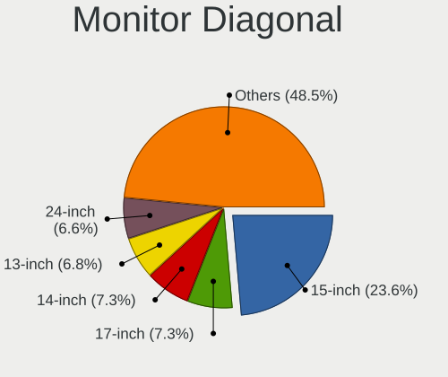

| Inches  | Computers | Percent |
|---------|-----------|---------|
| 15      | 1290      | 23.62%  |
| 17      | 400       | 7.32%   |
| 14      | 396       | 7.25%   |
| 13      | 370       | 6.78%   |
| 24      | 359       | 6.57%   |
| Unknown | 327       | 5.99%   |
| 21      | 319       | 5.84%   |
| 23      | 296       | 5.42%   |
| 27      | 284       | 5.2%    |
| 19      | 239       | 4.38%   |
| 18      | 160       | 2.93%   |
| 20      | 123       | 2.25%   |
| 12      | 112       | 2.05%   |
| 31      | 110       | 2.01%   |
| 22      | 103       | 1.89%   |
| 11      | 97        | 1.78%   |
| 10      | 87        | 1.59%   |
| 16      | 44        | 0.81%   |
| 84      | 38        | 0.7%    |
| 34      | 33        | 0.6%    |
| 54      | 28        | 0.51%   |
| 72      | 27        | 0.49%   |
| 32      | 27        | 0.49%   |
| 40      | 26        | 0.48%   |
| 25      | 21        | 0.38%   |
| 26      | 19        | 0.35%   |
| 28      | 14        | 0.26%   |
| 142     | 11        | 0.2%    |
| 52      | 11        | 0.2%    |
| 63      | 9         | 0.16%   |
| 37      | 9         | 0.16%   |
| 49      | 8         | 0.15%   |
| 48      | 8         | 0.15%   |
| 46      | 7         | 0.13%   |
| 29      | 6         | 0.11%   |
| 65      | 5         | 0.09%   |
| 74      | 4         | 0.07%   |
| 42      | 4         | 0.07%   |
| 8       | 4         | 0.07%   |
| 39      | 3         | 0.05%   |

Monitor Width
-------------

Physical width

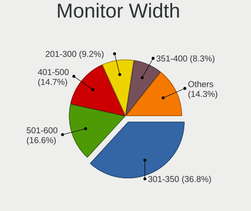

| Width in mm    | Computers | Percent |
|----------------|-----------|---------|
| 301-350        | 1984      | 36.81%  |
| 501-600        | 897       | 16.64%  |
| 401-500        | 795       | 14.75%  |
| 201-300        | 496       | 9.2%    |
| 351-400        | 446       | 8.27%   |
| Unknown        | 327       | 6.07%   |
| 601-700        | 163       | 3.02%   |
| 1001-1500      | 84        | 1.56%   |
| 1501-2000      | 71        | 1.32%   |
| 701-800        | 63        | 1.17%   |
| 801-900        | 40        | 0.74%   |
| More than 2000 | 11        | 0.2%    |
| 901-1000       | 8         | 0.15%   |
| 101-200        | 5         | 0.09%   |

Aspect Ratio
------------

Proportional relationship between the width and the height

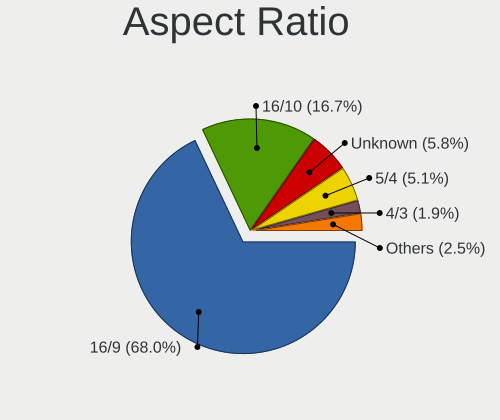

| Ratio   | Computers | Percent |
|---------|-----------|---------|
| 16/9    | 3431      | 67.97%  |
| 16/10   | 844       | 16.72%  |
| Unknown | 293       | 5.8%    |
| 5/4     | 257       | 5.09%   |
| 4/3     | 95        | 1.88%   |
| 21/9    | 43        | 0.85%   |
| 3/2     | 39        | 0.77%   |
| 1.00    | 14        | 0.28%   |
| 6/5     | 12        | 0.24%   |
| 32/9    | 12        | 0.24%   |
| 0.56    | 2         | 0.04%   |
| 3.73    | 1         | 0.02%   |
| 2.64    | 1         | 0.02%   |
| 2.12    | 1         | 0.02%   |
| 1.96    | 1         | 0.02%   |
| 0.75    | 1         | 0.02%   |
| 0.62    | 1         | 0.02%   |

Monitor Area
------------

Area in inch²

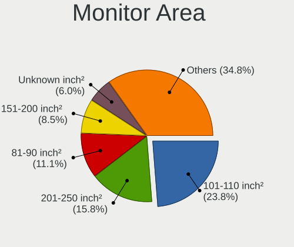

| Area in inch² | Computers | Percent |
|----------------|-----------|---------|
| 101-110        | 1289      | 23.76%  |
| 201-250        | 857       | 15.8%   |
| 81-90          | 601       | 11.08%  |
| 151-200        | 461       | 8.5%    |
| Unknown        | 327       | 6.03%   |
| 301-350        | 294       | 5.42%   |
| 141-150        | 263       | 4.85%   |
| 121-130        | 212       | 3.91%   |
| 351-500        | 185       | 3.41%   |
| 251-300        | 158       | 2.91%   |
| More than 1000 | 149       | 2.75%   |
| 71-80          | 145       | 2.67%   |
| 61-70          | 106       | 1.95%   |
| 51-60          | 98        | 1.81%   |
| 41-50          | 86        | 1.59%   |
| 501-1000       | 66        | 1.22%   |
| 131-140        | 61        | 1.12%   |
| 111-120        | 33        | 0.61%   |
| 91-100         | 28        | 0.52%   |
| 1-40           | 5         | 0.09%   |

Pixel Density
-------------

Pixels per inch

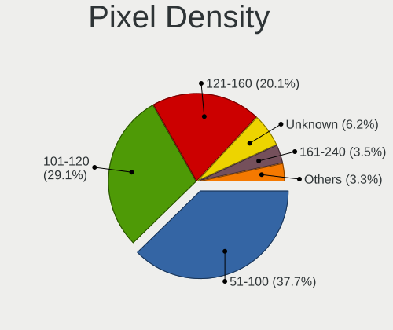

| Density       | Computers | Percent |
|---------------|-----------|---------|
| 51-100        | 1977      | 37.7%   |
| 101-120       | 1527      | 29.12%  |
| 121-160       | 1056      | 20.14%  |
| Unknown       | 327       | 6.24%   |
| 161-240       | 182       | 3.47%   |
| 1-50          | 131       | 2.5%    |
| More than 240 | 44        | 0.84%   |

Multiple Monitors
-----------------

Total monitors connected

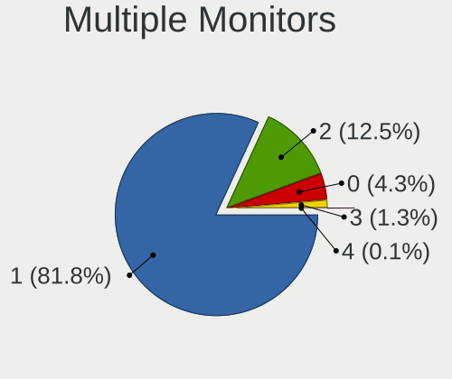

| Total | Computers | Percent |
|-------|-----------|---------|
| 1     | 4387      | 81.85%  |
| 2     | 669       | 12.48%  |
| 0     | 230       | 4.29%   |
| 3     | 68        | 1.27%   |
| 4     | 6         | 0.11%   |

Network
-------

Net Controller Vendor
---------------------

Controller vendors

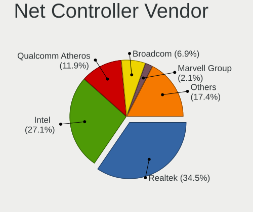

| Vendor                            | Computers | Percent |
|-----------------------------------|-----------|---------|
| Realtek Semiconductor             | 2781      | 34.53%  |
| Intel                             | 2180      | 27.06%  |
| Qualcomm Atheros                  | 960       | 11.92%  |
| Broadcom                          | 558       | 6.93%   |
| Marvell Technology Group          | 173       | 2.15%   |
| Broadcom Limited                  | 146       | 1.81%   |
| Nvidia                            | 135       | 1.68%   |
| Ralink Technology                 | 111       | 1.38%   |
| Ralink                            | 100       | 1.24%   |
| TP-Link                           | 98        | 1.22%   |
| MediaTek                          | 92        | 1.14%   |
| Samsung Electronics               | 44        | 0.55%   |
| Qualcomm Atheros Communications   | 43        | 0.53%   |
| VIA Technologies                  | 42        | 0.52%   |
| Silicon Integrated Systems [SiS]  | 37        | 0.46%   |
| D-Link System                     | 32        | 0.4%    |
| ASIX Electronics                  | 32        | 0.4%    |
| Huawei Technologies               | 30        | 0.37%   |
| NetGear                           | 28        | 0.35%   |
| Sierra Wireless                   | 27        | 0.34%   |
| D-Link                            | 27        | 0.34%   |
| JMicron Technology                | 26        | 0.32%   |
| Ericsson Business Mobile Networks | 19        | 0.24%   |
| Attansic Technology               | 18        | 0.22%   |
| Xiaomi                            | 17        | 0.21%   |
| DisplayLink                       | 17        | 0.21%   |
| Dell                              | 17        | 0.21%   |
| Qualcomm                          | 14        | 0.17%   |
| ASUSTek Computer                  | 13        | 0.16%   |
| Lenovo                            | 12        | 0.15%   |
| Belkin Components                 | 12        | 0.15%   |
| Aquantia                          | 11        | 0.14%   |
| Shenzhen Goodix Technology        | 10        | 0.12%   |
| Edimax Technology                 | 10        | 0.12%   |
| Fibocom                           | 9         | 0.11%   |
| Microsoft                         | 8         | 0.1%    |
| Linksys                           | 8         | 0.1%    |
| Hewlett-Packard                   | 8         | 0.1%    |
| AMD                               | 8         | 0.1%    |
| IBM                               | 6         | 0.07%   |

Net Controller Model
--------------------

Controller models

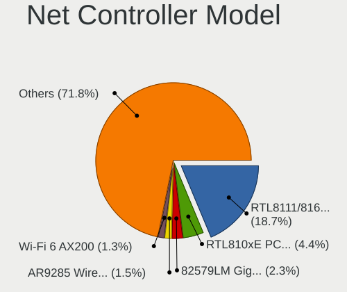

| Model                                                                   | Computers | Percent |
|-------------------------------------------------------------------------|-----------|---------|
| Realtek RTL8111/8168/8211/8411 PCI Express Gigabit Ethernet Controller  | 1756      | 18.69%  |
| Realtek RTL810xE PCI Express Fast Ethernet controller                   | 410       | 4.36%   |
| Intel 82579LM Gigabit Network Connection (Lewisville)                   | 217       | 2.31%   |
| Qualcomm Atheros AR9285 Wireless Network Adapter (PCI-Express)          | 141       | 1.5%    |
| Intel Wi-Fi 6 AX200                                                     | 125       | 1.33%   |
| Qualcomm Atheros AR9485 Wireless Network Adapter                        | 119       | 1.27%   |
| Qualcomm Atheros QCA9565 / AR9565 Wireless Network Adapter              | 112       | 1.19%   |
| Intel PRO/Wireless 3945ABG [Golan] Network Connection                   | 105       | 1.12%   |
| Intel Wireless 7260                                                     | 101       | 1.08%   |
| Realtek RTL-8100/8101L/8139 PCI Fast Ethernet Adapter                   | 98        | 1.04%   |
| Qualcomm Atheros QCA9377 802.11ac Wireless Network Adapter              | 93        | 0.99%   |
| Intel Wireless 8265 / 8275                                              | 92        | 0.98%   |
| Realtek RTL8125 2.5GbE Controller                                       | 89        | 0.95%   |
| Intel Wireless 7265                                                     | 86        | 0.92%   |
| Realtek RTL8821CE 802.11ac PCIe Wireless Network Adapter                | 85        | 0.9%    |
| Realtek RTL8153 Gigabit Ethernet Adapter                                | 83        | 0.88%   |
| Intel Ethernet Connection I217-LM                                       | 83        | 0.88%   |
| Qualcomm Atheros AR242x / AR542x Wireless Network Adapter (PCI-Express) | 81        | 0.86%   |
| Broadcom BCM4313 802.11bgn Wireless Network Adapter                     | 81        | 0.86%   |
| Intel Centrino Advanced-N 6205 [Taylor Peak]                            | 74        | 0.79%   |
| Intel Wireless 8260                                                     | 73        | 0.78%   |
| Realtek RTL8723BE PCIe Wireless Network Adapter                         | 71        | 0.76%   |
| Intel Wireless 3165                                                     | 65        | 0.69%   |
| Nvidia MCP61 Ethernet                                                   | 61        | 0.65%   |
| Intel I211 Gigabit Network Connection                                   | 61        | 0.65%   |
| Intel Wi-Fi 6 AX201                                                     | 59        | 0.63%   |
| Realtek RTL8188EUS 802.11n Wireless Network Adapter                     | 54        | 0.57%   |
| Qualcomm Atheros QCA6174 802.11ac Wireless Network Adapter              | 53        | 0.56%   |
| Intel 82579V Gigabit Network Connection                                 | 51        | 0.54%   |
| Realtek RTL8188CE 802.11b/g/n WiFi Adapter                              | 49        | 0.52%   |
| Qualcomm Atheros AR928X Wireless Network Adapter (PCI-Express)          | 49        | 0.52%   |
| Realtek RTL8822CE 802.11ac PCIe Wireless Network Adapter                | 48        | 0.51%   |
| Ralink MT7601U Wireless Adapter                                         | 46        | 0.49%   |
| Intel Ethernet Connection (2) I219-V                                    | 46        | 0.49%   |
| Intel Comet Lake PCH-LP CNVi WiFi                                       | 46        | 0.49%   |
| Intel Dual Band Wireless-AC 3168NGW [Stone Peak]                        | 44        | 0.47%   |
| Broadcom BCM43142 802.11b/g/n                                           | 41        | 0.44%   |
| Qualcomm Atheros AR8151 v2.0 Gigabit Ethernet                           | 39        | 0.42%   |
| Intel 82567LM-3 Gigabit Network Connection                              | 39        | 0.42%   |
| Realtek 802.11ac NIC                                                    | 37        | 0.39%   |

Wireless Vendor
---------------

Wireless vendors

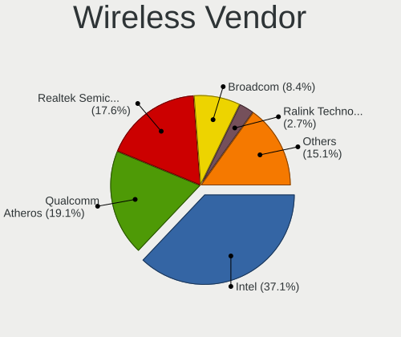

| Vendor                                | Computers | Percent |
|---------------------------------------|-----------|---------|
| Intel                                 | 1517      | 37.06%  |
| Qualcomm Atheros                      | 783       | 19.13%  |
| Realtek Semiconductor                 | 721       | 17.62%  |
| Broadcom                              | 344       | 8.4%    |
| Ralink Technology                     | 111       | 2.71%   |
| Ralink                                | 100       | 2.44%   |
| TP-Link                               | 92        | 2.25%   |
| MediaTek                              | 78        | 1.91%   |
| Broadcom Limited                      | 72        | 1.76%   |
| Qualcomm Atheros Communications       | 43        | 1.05%   |
| NetGear                               | 28        | 0.68%   |
| Sierra Wireless                       | 27        | 0.66%   |
| D-Link                                | 26        | 0.64%   |
| D-Link System                         | 23        | 0.56%   |
| Belkin Components                     | 12        | 0.29%   |
| ASUSTek Computer                      | 12        | 0.29%   |
| Qualcomm                              | 10        | 0.24%   |
| Edimax Technology                     | 10        | 0.24%   |
| Dell                                  | 10        | 0.24%   |
| Fibocom                               | 9         | 0.22%   |
| Microsoft                             | 7         | 0.17%   |
| Linksys                               | 7         | 0.17%   |
| ZyDAS                                 | 5         | 0.12%   |
| Sitecom Europe                        | 5         | 0.12%   |
| Marvell Technology Group              | 5         | 0.12%   |
| AVM                                   | 5         | 0.12%   |
| IMC Networks                          | 4         | 0.1%    |
| TRENDnet                              | 3         | 0.07%   |
| Wilocity                              | 2         | 0.05%   |
| Micro Star International              | 2         | 0.05%   |
| Hewlett-Packard                       | 2         | 0.05%   |
| Gemtek                                | 2         | 0.05%   |
| AboCom Systems                        | 2         | 0.05%   |
| 802.11g Adapter [Linksys WUSB54GC v3] | 2         | 0.05%   |
| ZyXEL Communications                  | 1         | 0.02%   |
| Xiaomi                                | 1         | 0.02%   |
| Winbond Electronics                   | 1         | 0.02%   |
| Toshiba                               | 1         | 0.02%   |
| Texas Instruments                     | 1         | 0.02%   |
| Realtek                               | 1         | 0.02%   |

Wireless Model
--------------

Wireless models

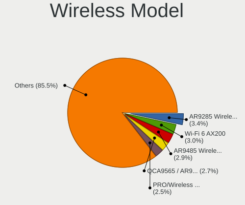

| Model                                                                   | Computers | Percent |
|-------------------------------------------------------------------------|-----------|---------|
| Qualcomm Atheros AR9285 Wireless Network Adapter (PCI-Express)          | 141       | 3.4%    |
| Intel Wi-Fi 6 AX200                                                     | 125       | 3.02%   |
| Qualcomm Atheros AR9485 Wireless Network Adapter                        | 119       | 2.87%   |
| Qualcomm Atheros QCA9565 / AR9565 Wireless Network Adapter              | 112       | 2.7%    |
| Intel PRO/Wireless 3945ABG [Golan] Network Connection                   | 105       | 2.54%   |
| Intel Wireless 7260                                                     | 101       | 2.44%   |
| Qualcomm Atheros QCA9377 802.11ac Wireless Network Adapter              | 93        | 2.25%   |
| Intel Wireless 8265 / 8275                                              | 92        | 2.22%   |
| Intel Wireless 7265                                                     | 86        | 2.08%   |
| Realtek RTL8821CE 802.11ac PCIe Wireless Network Adapter                | 85        | 2.05%   |
| Qualcomm Atheros AR242x / AR542x Wireless Network Adapter (PCI-Express) | 81        | 1.96%   |
| Broadcom BCM4313 802.11bgn Wireless Network Adapter                     | 81        | 1.96%   |
| Intel Centrino Advanced-N 6205 [Taylor Peak]                            | 74        | 1.79%   |
| Intel Wireless 8260                                                     | 73        | 1.76%   |
| Realtek RTL8723BE PCIe Wireless Network Adapter                         | 71        | 1.71%   |
| Intel Wireless 3165                                                     | 65        | 1.57%   |
| Intel Wi-Fi 6 AX201                                                     | 59        | 1.42%   |
| Realtek RTL8188EUS 802.11n Wireless Network Adapter                     | 54        | 1.3%    |
| Qualcomm Atheros QCA6174 802.11ac Wireless Network Adapter              | 53        | 1.28%   |
| Realtek RTL8188CE 802.11b/g/n WiFi Adapter                              | 49        | 1.18%   |
| Qualcomm Atheros AR928X Wireless Network Adapter (PCI-Express)          | 49        | 1.18%   |
| Realtek RTL8822CE 802.11ac PCIe Wireless Network Adapter                | 48        | 1.16%   |
| Ralink MT7601U Wireless Adapter                                         | 46        | 1.11%   |
| Intel Comet Lake PCH-LP CNVi WiFi                                       | 46        | 1.11%   |
| Intel Dual Band Wireless-AC 3168NGW [Stone Peak]                        | 44        | 1.06%   |
| Broadcom BCM43142 802.11b/g/n                                           | 41        | 0.99%   |
| Realtek 802.11ac NIC                                                    | 37        | 0.89%   |
| Qualcomm Atheros AR9271 802.11n                                         | 37        | 0.89%   |
| Intel Comet Lake PCH CNVi WiFi                                          | 37        | 0.89%   |
| Broadcom BCM4312 802.11b/g LP-PHY                                       | 37        | 0.89%   |
| Realtek RTL8188EE Wireless Network Adapter                              | 36        | 0.87%   |
| Intel Wi-Fi 6E(802.11ax) AX210/AX1675* 2x2 [Typhoon Peak]               | 36        | 0.87%   |
| Intel PRO/Wireless 4965 AG or AGN [Kedron] Network Connection           | 36        | 0.87%   |
| Intel Wireless 3160                                                     | 35        | 0.85%   |
| Intel Centrino Advanced-N 6200                                          | 35        | 0.85%   |
| Realtek RTL88x2bu [AC1200 Techkey]                                      | 34        | 0.82%   |
| Intel Cannon Lake PCH CNVi WiFi                                         | 34        | 0.82%   |
| Intel WiFi Link 5100                                                    | 32        | 0.77%   |
| Intel Wi-Fi 5(802.11ac) Wireless-AC 9x6x [Thunder Peak]                 | 32        | 0.77%   |
| Intel PRO/Wireless 5100 AGN [Shiloh] Network Connection                 | 32        | 0.77%   |

Ethernet Vendor
---------------

Ethernet vendors

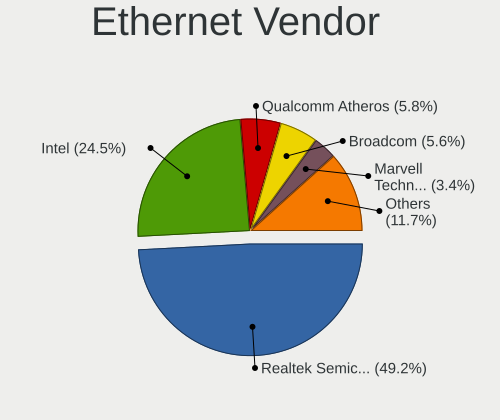

| Vendor                                 | Computers | Percent |
|----------------------------------------|-----------|---------|
| Realtek Semiconductor                  | 2463      | 49.17%  |
| Intel                                  | 1225      | 24.46%  |
| Qualcomm Atheros                       | 291       | 5.81%   |
| Broadcom                               | 278       | 5.55%   |
| Marvell Technology Group               | 168       | 3.35%   |
| Nvidia                                 | 134       | 2.68%   |
| Broadcom Limited                       | 76        | 1.52%   |
| VIA Technologies                       | 42        | 0.84%   |
| Samsung Electronics                    | 42        | 0.84%   |
| Silicon Integrated Systems [SiS]       | 35        | 0.7%    |
| ASIX Electronics                       | 32        | 0.64%   |
| JMicron Technology                     | 26        | 0.52%   |
| Huawei Technologies                    | 19        | 0.38%   |
| Attansic Technology                    | 18        | 0.36%   |
| DisplayLink                            | 17        | 0.34%   |
| Xiaomi                                 | 16        | 0.32%   |
| MediaTek                               | 15        | 0.3%    |
| Lenovo                                 | 12        | 0.24%   |
| Aquantia                               | 11        | 0.22%   |
| D-Link System                          | 9         | 0.18%   |
| TP-Link                                | 6         | 0.12%   |
| IBM                                    | 6         | 0.12%   |
| OPPO Electronics                       | 5         | 0.1%    |
| HTC (High Tech Computer)               | 5         | 0.1%    |
| Hewlett-Packard                        | 5         | 0.1%    |
| Spreadtrum Communications              | 4         | 0.08%   |
| Qualcomm                               | 4         | 0.08%   |
| Motorola PCS                           | 4         | 0.08%   |
| LG Electronics                         | 4         | 0.08%   |
| Microchip Technology                   | 3         | 0.06%   |
| Insyde Software                        | 3         | 0.06%   |
| Apple                                  | 3         | 0.06%   |
| ZTE WCDMA Technologies MSM             | 2         | 0.04%   |
| Suzhou Motorcomm Electronic Technology | 2         | 0.04%   |
| Raspberry Pi                           | 2         | 0.04%   |
| National Semiconductor                 | 2         | 0.04%   |
| ICS Advent                             | 2         | 0.04%   |
| Dell                                   | 2         | 0.04%   |
| Accton Technology                      | 2         | 0.04%   |
| 3Com                                   | 2         | 0.04%   |

Ethernet Model
--------------

Ethernet models

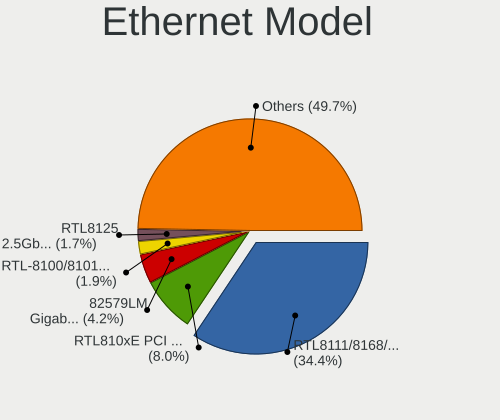

| Model                                                                  | Computers | Percent |
|------------------------------------------------------------------------|-----------|---------|
| Realtek RTL8111/8168/8211/8411 PCI Express Gigabit Ethernet Controller | 1756      | 34.37%  |
| Realtek RTL810xE PCI Express Fast Ethernet controller                  | 410       | 8.03%   |
| Intel 82579LM Gigabit Network Connection (Lewisville)                  | 217       | 4.25%   |
| Realtek RTL-8100/8101L/8139 PCI Fast Ethernet Adapter                  | 98        | 1.92%   |
| Realtek RTL8125 2.5GbE Controller                                      | 89        | 1.74%   |
| Realtek RTL8153 Gigabit Ethernet Adapter                               | 83        | 1.62%   |
| Intel Ethernet Connection I217-LM                                      | 83        | 1.62%   |
| Nvidia MCP61 Ethernet                                                  | 61        | 1.19%   |
| Intel I211 Gigabit Network Connection                                  | 61        | 1.19%   |
| Intel 82579V Gigabit Network Connection                                | 51        | 1%      |
| Intel Ethernet Connection (2) I219-V                                   | 46        | 0.9%    |
| Qualcomm Atheros AR8151 v2.0 Gigabit Ethernet                          | 39        | 0.76%   |
| Intel 82567LM-3 Gigabit Network Connection                             | 39        | 0.76%   |
| Intel Ethernet Connection I219-LM                                      | 36        | 0.7%    |
| Intel 82567LM Gigabit Network Connection                               | 35        | 0.69%   |
| VIA VT6102/VT6103 [Rhine-II]                                           | 34        | 0.67%   |
| Qualcomm Atheros AR8132 Fast Ethernet                                  | 34        | 0.67%   |
| Intel 82577LM Gigabit Network Connection                               | 34        | 0.67%   |
| Qualcomm Atheros AR8131 Gigabit Ethernet                               | 32        | 0.63%   |
| Samsung Galaxy series, misc. (tethering mode)                          | 31        | 0.61%   |
| Marvell Group 88E8040 PCI-E Fast Ethernet Controller                   | 31        | 0.61%   |
| Intel 82566DM-2 Gigabit Network Connection                             | 31        | 0.61%   |
| Broadcom NetLink BCM57780 Gigabit Ethernet PCIe                        | 31        | 0.61%   |
| Intel Ethernet Connection I217-V                                       | 30        | 0.59%   |
| Intel Ethernet Connection (4) I219-LM                                  | 30        | 0.59%   |
| Intel Ethernet Connection (7) I219-V                                   | 29        | 0.57%   |
| Intel Ethernet Connection (2) I219-LM                                  | 28        | 0.55%   |
| Intel Ethernet Connection I218-LM                                      | 25        | 0.49%   |
| ASIX AX88179 Gigabit Ethernet                                          | 25        | 0.49%   |
| Qualcomm Atheros AR8152 v2.0 Fast Ethernet                             | 24        | 0.47%   |
| Nvidia MCP79 Ethernet                                                  | 24        | 0.47%   |
| Intel 82574L Gigabit Network Connection                                | 24        | 0.47%   |
| Broadcom NetXtreme BCM5764M Gigabit Ethernet PCIe                      | 24        | 0.47%   |
| Broadcom NetLink BCM5787M Gigabit Ethernet PCI Express                 | 24        | 0.47%   |
| Silicon Integrated Systems [SiS] 191 Gigabit Ethernet Adapter          | 23        | 0.45%   |
| Qualcomm Atheros QCA8171 Gigabit Ethernet                              | 23        | 0.45%   |
| Intel 82566MM Gigabit Network Connection                               | 23        | 0.45%   |
| Qualcomm Atheros AR8121/AR8113/AR8114 Gigabit or Fast Ethernet         | 22        | 0.43%   |
| Marvell Group 88E8055 PCI-E Gigabit Ethernet Controller                | 22        | 0.43%   |
| Intel I210 Gigabit Network Connection                                  | 22        | 0.43%   |

Net Controller Kind
-------------------

Ethernet, WiFi or modem

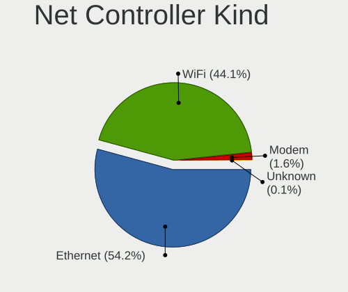

| Kind     | Computers | Percent |
|----------|-----------|---------|
| Ethernet | 4699      | 54.22%  |
| WiFi     | 3822      | 44.1%   |
| Modem    | 137       | 1.58%   |
| Unknown  | 8         | 0.09%   |

Used Controller
---------------

Currently used network controller

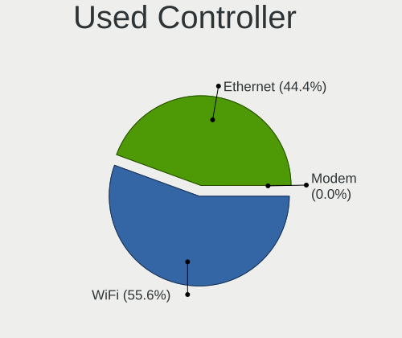

| Kind     | Computers | Percent |
|----------|-----------|---------|
| WiFi     | 3024      | 55.57%  |
| Ethernet | 2417      | 44.41%  |
| Modem    | 1         | 0.02%   |

NICs
----

Total network controllers on board

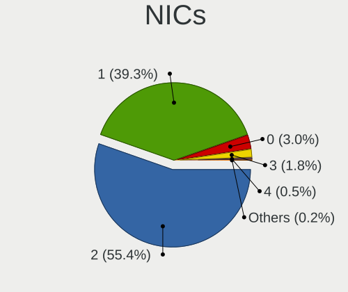

| Total | Computers | Percent |
|-------|-----------|---------|
| 2     | 2919      | 55.37%  |
| 1     | 2070      | 39.26%  |
| 0     | 156       | 2.96%   |
| 3     | 93        | 1.76%   |
| 4     | 24        | 0.46%   |
| 5     | 5         | 0.09%   |
| 6     | 2         | 0.04%   |
| 10    | 1         | 0.02%   |
| 8     | 1         | 0.02%   |
| 7     | 1         | 0.02%   |

IPv6
----

IPv6 vs IPv4

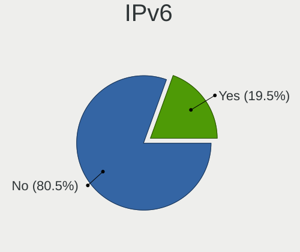

| Used | Computers | Percent |
|------|-----------|---------|
| No   | 4296      | 80.52%  |
| Yes  | 1039      | 19.48%  |

Bluetooth
---------

Bluetooth Vendor
----------------

Controller vendors

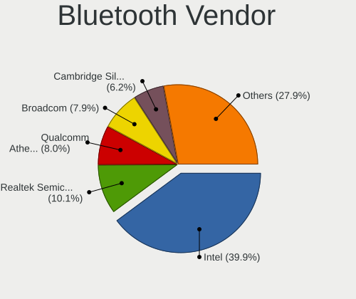

| Vendor                          | Computers | Percent |
|---------------------------------|-----------|---------|
| Intel                           | 1014      | 39.86%  |
| Realtek Semiconductor           | 256       | 10.06%  |
| Qualcomm Atheros Communications | 203       | 7.98%   |
| Broadcom                        | 202       | 7.94%   |
| Cambridge Silicon Radio         | 159       | 6.25%   |
| IMC Networks                    | 108       | 4.25%   |
| Apple                           | 100       | 3.93%   |
| Lite-On Technology              | 92        | 3.62%   |
| Foxconn / Hon Hai               | 84        | 3.3%    |
| Dell                            | 64        | 2.52%   |
| Hewlett-Packard                 | 55        | 2.16%   |
| ASUSTek Computer                | 38        | 1.49%   |
| MediaTek                        | 28        | 1.1%    |
| Toshiba                         | 26        | 1.02%   |
| Ralink                          | 20        | 0.79%   |
| Alps Electric                   | 15        | 0.59%   |
| Realtek                         | 9         | 0.35%   |
| Integrated System Solution      | 9         | 0.35%   |
| TP-Link                         | 8         | 0.31%   |
| Ralink Technology               | 8         | 0.31%   |
| Foxconn International           | 8         | 0.31%   |
| USI                             | 4         | 0.16%   |
| Micro Star International        | 4         | 0.16%   |
| Edimax Technology               | 4         | 0.16%   |
| Chicony Electronics             | 4         | 0.16%   |
| Taiyo Yuden                     | 3         | 0.12%   |
| Unknown                         | 3         | 0.12%   |
| SiW                             | 2         | 0.08%   |
| Qcom                            | 2         | 0.08%   |
| Fujitsu                         | 2         | 0.08%   |
| Syntek                          | 1         | 0.04%   |
| Sitecom Europe                  | 1         | 0.04%   |
| Mercucys                        | 1         | 0.04%   |
| Marvell Semiconductor           | 1         | 0.04%   |
| Logitech                        | 1         | 0.04%   |
| Dynex                           | 1         | 0.04%   |
| Conwise Technology              | 1         | 0.04%   |
| Askey Computer                  | 1         | 0.04%   |
| AICSemi                         | 1         | 0.04%   |
| Actions                         | 1         | 0.04%   |

Bluetooth Model
---------------

Controller models

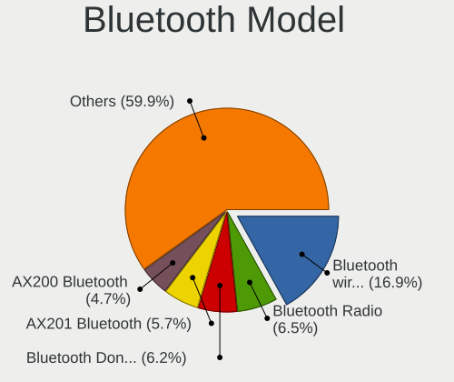

| Model                                               | Computers | Percent |
|-----------------------------------------------------|-----------|---------|
| Intel Bluetooth wireless interface                  | 431       | 16.92%  |
| Realtek Bluetooth Radio                             | 165       | 6.48%   |
| Cambridge Silicon Radio Bluetooth Dongle (HCI mode) | 159       | 6.24%   |
| Intel AX201 Bluetooth                               | 146       | 5.73%   |
| Intel AX200 Bluetooth                               | 121       | 4.75%   |
| Intel Bluetooth 9460/9560 Jefferson Peak (JfP)      | 109       | 4.28%   |
| Qualcomm Atheros  Bluetooth Device                  | 79        | 3.1%    |
| Realtek  Bluetooth 4.2 Adapter                      | 57        | 2.24%   |
| Intel Centrino Bluetooth Wireless Transceiver       | 44        | 1.73%   |
| Intel Bluetooth Device                              | 44        | 1.73%   |
| Intel Wireless-AC 3168 Bluetooth                    | 43        | 1.69%   |
| Qualcomm Atheros AR3011 Bluetooth                   | 37        | 1.45%   |
| Apple Bluetooth Host Controller                     | 35        | 1.37%   |
| HP Bluetooth 2.0 Interface [Broadcom BCM2045]       | 33        | 1.3%    |
| Lite-On Qualcomm Atheros QCA9377 Bluetooth          | 32        | 1.26%   |
| Intel AX210 Bluetooth                               | 32        | 1.26%   |
| Qualcomm Atheros AR3012 Bluetooth 4.0               | 31        | 1.22%   |
| IMC Networks Bluetooth Radio                        | 31        | 1.22%   |
| Broadcom BCM2045B (BDC-2.1)                         | 31        | 1.22%   |
| Intel Wireless-AC 9260 Bluetooth Adapter            | 29        | 1.14%   |
| IMC Networks Bluetooth Device                       | 27        | 1.06%   |
| MediaTek Wireless_Device                            | 26        | 1.02%   |
| Lite-On Bluetooth Device                            | 24        | 0.94%   |
| Foxconn / Hon Hai Bluetooth Device                  | 24        | 0.94%   |
| Broadcom BCM20702 Bluetooth 4.0 [ThinkPad]          | 23        | 0.9%    |
| Apple Bluetooth HCI                                 | 23        | 0.9%    |
| Qualcomm Atheros QCA61x4 Bluetooth 4.0              | 22        | 0.86%   |
| IMC Networks Wireless_Device                        | 22        | 0.86%   |
| Broadcom BCM20702A0 Bluetooth 4.0                   | 22        | 0.86%   |
| Apple Built-in Bluetooth 2.0+EDR HCI                | 21        | 0.82%   |
| Apple Bluetooth USB Host Controller                 | 21        | 0.82%   |
| Ralink RT3290 Bluetooth                             | 20        | 0.78%   |
| Qualcomm Atheros AR9462 Bluetooth                   | 20        | 0.78%   |
| Lite-On Atheros AR3012 Bluetooth                    | 19        | 0.75%   |
| HP Broadcom 2070 Bluetooth Combo                    | 18        | 0.71%   |
| Intel Centrino Advanced-N 6230 Bluetooth adapter    | 17        | 0.67%   |
| Dell DW375 Bluetooth Module                         | 17        | 0.67%   |
| Broadcom BCM2045 Bluetooth                          | 17        | 0.67%   |
| Realtek RTL8723B Bluetooth                          | 16        | 0.63%   |
| Broadcom BCM2045B (BDC-2) [Bluetooth Controller]    | 15        | 0.59%   |

Sound
-----

Sound Vendor
------------

Sound card vendors

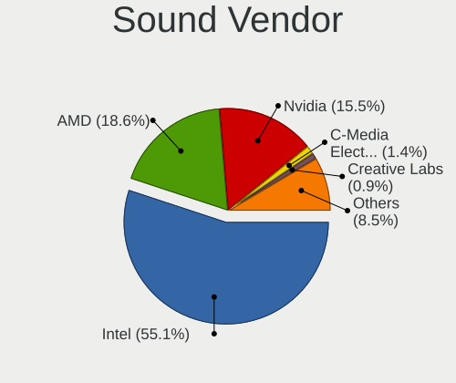

| Vendor                                       | Computers | Percent |
|----------------------------------------------|-----------|---------|
| Intel                                        | 3758      | 55.06%  |
| AMD                                          | 1269      | 18.59%  |
| Nvidia                                       | 1060      | 15.53%  |
| C-Media Electronics                          | 93        | 1.36%   |
| Creative Labs                                | 64        | 0.94%   |
| VIA Technologies                             | 56        | 0.82%   |
| Silicon Integrated Systems [SiS]             | 45        | 0.66%   |
| Texas Instruments                            | 41        | 0.6%    |
| Logitech                                     | 39        | 0.57%   |
| GN Netcom                                    | 24        | 0.35%   |
| Focusrite-Novation                           | 22        | 0.32%   |
| M-Audio                                      | 16        | 0.23%   |
| Plantronics                                  | 15        | 0.22%   |
| Lenovo                                       | 15        | 0.22%   |
| Generalplus Technology                       | 15        | 0.22%   |
| JMTek                                        | 14        | 0.21%   |
| Creative Technology                          | 14        | 0.21%   |
| ASUSTek Computer                             | 12        | 0.18%   |
| Yamaha                                       | 11        | 0.16%   |
| BEHRINGER International                      | 11        | 0.16%   |
| Realtek Semiconductor                        | 9         | 0.13%   |
| DSEA A/S                                     | 9         | 0.13%   |
| Tenx Technology                              | 8         | 0.12%   |
| Razer USA                                    | 8         | 0.12%   |
| Corsair                                      | 7         | 0.1%    |
| ULi Electronics                              | 6         | 0.09%   |
| Micro Star International                     | 6         | 0.09%   |
| XMOS                                         | 5         | 0.07%   |
| Hewlett-Packard                              | 5         | 0.07%   |
| Zoran Co. Personal Media Division (Nogatech) | 4         | 0.06%   |
| TEAC                                         | 4         | 0.06%   |
| SAVITECH                                     | 4         | 0.06%   |
| Roland                                       | 4         | 0.06%   |
| RODE Microphones                             | 4         | 0.06%   |
| Kingston Technology                          | 4         | 0.06%   |
| Jieli Technology                             | 4         | 0.06%   |
| Ensoniq                                      | 4         | 0.06%   |
| DigiTech                                     | 4         | 0.06%   |
| Dell                                         | 4         | 0.06%   |
| AKAI Professional M.I.                       | 4         | 0.06%   |

Sound Model
-----------

Sound card models

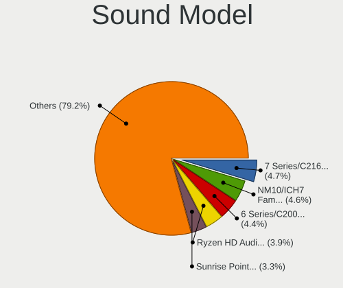

| Model                                                                                             | Computers | Percent |
|---------------------------------------------------------------------------------------------------|-----------|---------|
| Intel 7 Series/C216 Chipset Family High Definition Audio Controller                               | 374       | 4.7%    |
| Intel NM10/ICH7 Family High Definition Audio Controller                                           | 365       | 4.58%   |
| Intel 6 Series/C200 Series Chipset Family High Definition Audio Controller                        | 347       | 4.36%   |
| AMD Ryzen HD Audio Controller                                                                     | 307       | 3.86%   |
| Intel Sunrise Point-LP HD Audio                                                                   | 266       | 3.34%   |
| Intel 82801I (ICH9 Family) HD Audio Controller                                                    | 260       | 3.27%   |
| Intel 8 Series/C220 Series Chipset High Definition Audio Controller                               | 236       | 2.96%   |
| AMD SBx00 Azalia (Intel HDA)                                                                      | 231       | 2.9%    |
| Intel 5 Series/3400 Series Chipset High Definition Audio                                          | 226       | 2.84%   |
| AMD FCH Azalia Controller                                                                         | 202       | 2.54%   |
| Intel Xeon E3-1200 v3/4th Gen Core Processor HD Audio Controller                                  | 179       | 2.25%   |
| Intel 82801H (ICH8 Family) HD Audio Controller                                                    | 178       | 2.24%   |
| AMD Renoir/Cezanne HDMI/DP Audio Controller                                                       | 133       | 1.67%   |
| Intel Cannon Lake PCH cAVS                                                                        | 114       | 1.43%   |
| Intel Haswell-ULT HD Audio Controller                                                             | 109       | 1.37%   |
| Intel 8 Series HD Audio Controller                                                                | 109       | 1.37%   |
| AMD Raven/Raven2/Fenghuang HDMI/DP Audio Controller                                               | 109       | 1.37%   |
| Intel 100 Series/C230 Series Chipset Family HD Audio Controller                                   | 104       | 1.31%   |
| AMD Starship/Matisse HD Audio Controller                                                          | 103       | 1.29%   |
| AMD Kabini HDMI/DP Audio                                                                          | 103       | 1.29%   |
| Intel Atom Processor Z36xxx/Z37xxx Series High Definition Audio Controller                        | 99        | 1.24%   |
| Nvidia GF108 High Definition Audio Controller                                                     | 96        | 1.21%   |
| Nvidia GK208 HDMI/DP Audio Controller                                                             | 95        | 1.19%   |
| Nvidia High Definition Audio Controller                                                           | 85        | 1.07%   |
| Intel Tiger Lake-LP Smart Sound Technology Audio Controller                                       | 83        | 1.04%   |
| Intel Atom/Celeron/Pentium Processor x5-E8000/J3xxx/N3xxx Series High Definition Audio Controller | 81        | 1.02%   |
| Intel Broadwell-U Audio Controller                                                                | 72        | 0.9%    |
| Intel Wildcat Point-LP High Definition Audio Controller                                           | 70        | 0.88%   |
| Intel Celeron/Pentium Silver Processor High Definition Audio                                      | 69        | 0.87%   |
| Nvidia GP107GL High Definition Audio Controller                                                   | 65        | 0.82%   |
| Nvidia MCP61 High Definition Audio                                                                | 64        | 0.8%    |
| Intel 200 Series PCH HD Audio                                                                     | 64        | 0.8%    |
| Intel 82801JI (ICH10 Family) HD Audio Controller                                                  | 63        | 0.79%   |
| AMD Ellesmere HDMI Audio [Radeon RX 470/480 / 570/580/590]                                        | 63        | 0.79%   |
| AMD Family 17h (Models 00h-0fh) HD Audio Controller                                               | 62        | 0.78%   |
| Intel Comet Lake PCH-LP cAVS                                                                      | 57        | 0.72%   |
| AMD Oland/Hainan/Cape Verde/Pitcairn HDMI Audio [Radeon HD 7000 Series]                           | 55        | 0.69%   |
| AMD Cedar HDMI Audio [Radeon HD 5400/6300/7300 Series]                                            | 50        | 0.63%   |
| Nvidia GK107 HDMI Audio Controller                                                                | 49        | 0.62%   |
| Intel Celeron N3350/Pentium N4200/Atom E3900 Series Audio Cluster                                 | 48        | 0.6%    |

Memory
------

Memory Vendor
-------------

Memory module vendors

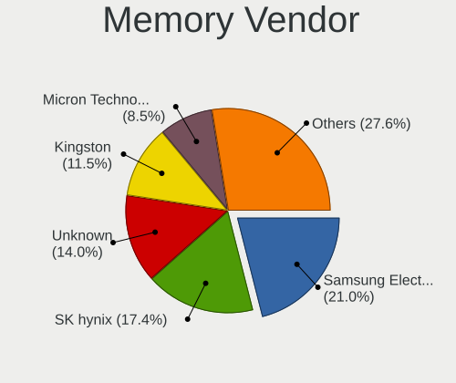

| Vendor              | Computers | Percent |
|---------------------|-----------|---------|
| Samsung Electronics | 640       | 21.05%  |
| SK hynix            | 529       | 17.4%   |
| Unknown             | 425       | 13.98%  |
| Kingston            | 350       | 11.51%  |
| Micron Technology   | 259       | 8.52%   |
| Crucial             | 186       | 6.12%   |
| Corsair             | 125       | 4.11%   |
| G.Skill             | 78        | 2.56%   |
| Ramaxel Technology  | 60        | 1.97%   |
| Elpida              | 56        | 1.84%   |
| Nanya Technology    | 44        | 1.45%   |
| A-DATA Technology   | 43        | 1.41%   |
| Unknown (ABCD)      | 39        | 1.28%   |
| Unknown             | 26        | 0.85%   |
| Smart               | 20        | 0.66%   |
| Transcend           | 16        | 0.53%   |
| Team                | 13        | 0.43%   |
| Patriot             | 10        | 0.33%   |
| GOODRAM             | 9         | 0.3%    |
| Qimonda             | 5         | 0.16%   |
| Avant               | 5         | 0.16%   |
| Apacer              | 5         | 0.16%   |
| Unifosa             | 4         | 0.13%   |
| Timetec             | 4         | 0.13%   |
| GeIL                | 4         | 0.13%   |
| fef5                | 4         | 0.13%   |
| 48spaces            | 4         | 0.13%   |
| Spectek             | 3         | 0.1%    |
| PNY                 | 3         | 0.1%    |
| V-Color             | 2         | 0.07%   |
| Teikon              | 2         | 0.07%   |
| Super Talent        | 2         | 0.07%   |
| Silicon Power       | 2         | 0.07%   |
| Neo Forza           | 2         | 0.07%   |
| Hikvision           | 2         | 0.07%   |
| High Bridge         | 2         | 0.07%   |
| CSX                 | 2         | 0.07%   |
| ASint Technology    | 2         | 0.07%   |
| Walton Chaintech    | 1         | 0.03%   |
| V-GeN               | 1         | 0.03%   |

Memory Model
------------

Memory module models

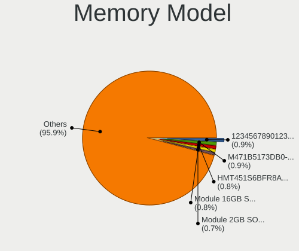

| Model                                                            | Computers | Percent |
|------------------------------------------------------------------|-----------|---------|
| Unknown (ABCD) RAM 123456789012345678 2GB SODIMM LPDDR4 2400MT/s | 30        | 0.91%   |
| Samsung RAM M471B5173DB0-YK0 4GB SODIMM DDR3 1600MT/s            | 30        | 0.91%   |
| SK hynix RAM HMT451S6BFR8A-PB 4GB SODIMM DDR3 1600MT/s           | 28        | 0.85%   |
| Unknown                                                          | 26        | 0.79%   |
| Unknown RAM Module 2GB SODIMM DDR2 667MT/s                       | 22        | 0.67%   |
| Samsung RAM M471A5244CB0-CTD 4GB SODIMM DDR4 3266MT/s            | 22        | 0.67%   |
| Samsung RAM M471B5173QH0-YK0 4GB SODIMM DDR3 1600MT/s            | 21        | 0.64%   |
| SK hynix RAM HMA81GS6JJR8N-VK 8GB SODIMM DDR4 2667MT/s           | 18        | 0.55%   |
| SK hynix RAM HMA81GS6AFR8N-UH 8GB SODIMM DDR4 2667MT/s           | 18        | 0.55%   |
| Unknown RAM Module 2GB DIMM SDRAM                                | 17        | 0.52%   |
| Unknown RAM Module 1GB SODIMM DDR2 667MT/s                       | 16        | 0.49%   |
| SK hynix RAM HMA82GU6JJR8N-VK 16GB DIMM DDR4 2667MT/s            | 15        | 0.46%   |
| SK hynix RAM HMT351S6CFR8C-PB 4GB SODIMM DDR3 1600MT/s           | 14        | 0.42%   |
| Samsung RAM M471B1G73DB0-YK0 8GB SODIMM DDR3 1600MT/s            | 14        | 0.42%   |
| Samsung RAM M471B5273DH0-CH9 4GB SODIMM DDR3 1600MT/s            | 13        | 0.39%   |
| Samsung RAM M471B5273CH0-CH9 4GB SODIMM DDR3 1334MT/s            | 13        | 0.39%   |
| Samsung RAM M471B1G73QH0-YK0 8GB SODIMM DDR3 1600MT/s            | 13        | 0.39%   |
| Samsung RAM M471B5173EB0-YK0 4GB SODIMM DDR3 1600MT/s            | 12        | 0.36%   |
| Samsung RAM M471B1G73EB0-YK0 8192MB SODIMM DDR3 1600MT/s         | 12        | 0.36%   |
| Samsung RAM M471A5244CB0-CRC 4GB SODIMM DDR4 2667MT/s            | 12        | 0.36%   |
| Samsung RAM M471A1K43DB1-CWE 8GB SODIMM DDR4 3200MT/s            | 12        | 0.36%   |
| Unknown RAM Module 2GB DIMM DDR2 800MT/s                         | 11        | 0.33%   |
| Unknown RAM Module 2048MB DIMM SDRAM                             | 11        | 0.33%   |
| SK hynix RAM HMA81GS6DJR8N-XN 8GB SODIMM DDR4 3200MT/s           | 11        | 0.33%   |
| Samsung RAM M471B5773CHS-CH9 2GB SODIMM DDR3 4199MT/s            | 11        | 0.33%   |
| Samsung RAM M471A5244CB0-CWE 4GB SODIMM DDR4 3200MT/s            | 11        | 0.33%   |
| Samsung RAM M471A1K43BB1-CRC 8GB SODIMM DDR4 2667MT/s            | 11        | 0.33%   |
| Micron RAM 8KTF51264HZ-1G6E1 4GB SODIMM DDR3 1600MT/s            | 11        | 0.33%   |
| Crucial RAM CT102464BF160B.M16 8GB SODIMM DDR3 1600MT/s          | 11        | 0.33%   |
| Unknown RAM Module 2048MB SODIMM DDR2                            | 10        | 0.3%    |
| SK hynix RAM HMT41GS6AFR8A-PB 8GiB SODIMM DDR3 2667MT/s          | 10        | 0.3%    |
| Samsung RAM M471B5773DH0-CH9 2GB SODIMM DDR3 1600MT/s            | 10        | 0.3%    |
| Samsung RAM M471A1K43EB1-CWE 8GB SODIMM DDR4 3200MT/s            | 10        | 0.3%    |
| Samsung RAM M471A1G44AB0-CWE 8GiB SODIMM DDR4 3200MT/s           | 10        | 0.3%    |
| Micron RAM 4ATF51264HZ-2G6E1 4GB SODIMM DDR4 2667MT/s            | 10        | 0.3%    |
| Crucial RAM CT102464BF160B.C16 8GB SODIMM DDR3 1600MT/s          | 10        | 0.3%    |
| Unknown RAM Module 4GB DIMM 1333MT/s                             | 9         | 0.27%   |
| Unknown RAM Module 2048MB SODIMM DDR2 667MT/s                    | 9         | 0.27%   |
| Unknown RAM Module 2048MB DIMM DDR2 800MT/s                      | 9         | 0.27%   |
| Unknown (ABCD) RAM 123456789012345678 2GB DIMM LPDDR4 2133MT/s   | 9         | 0.27%   |

Memory Kind
-----------

Memory module kinds

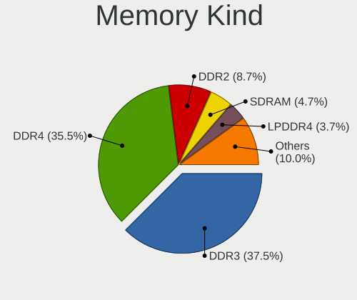

| Kind    | Computers | Percent |
|---------|-----------|---------|
| DDR3    | 997       | 37.51%  |
| DDR4    | 944       | 35.52%  |
| DDR2    | 230       | 8.65%   |
| SDRAM   | 124       | 4.67%   |
| LPDDR4  | 98        | 3.69%   |
| Unknown | 88        | 3.31%   |
| DDR5    | 54        | 2.03%   |
| LPDDR3  | 47        | 1.77%   |
| DDR     | 30        | 1.13%   |
| LPDDR5  | 26        | 0.98%   |
| DRAM    | 18        | 0.68%   |
| EEPROM  | 2         | 0.08%   |

Memory Form Factor
------------------

Physical design of the memory module

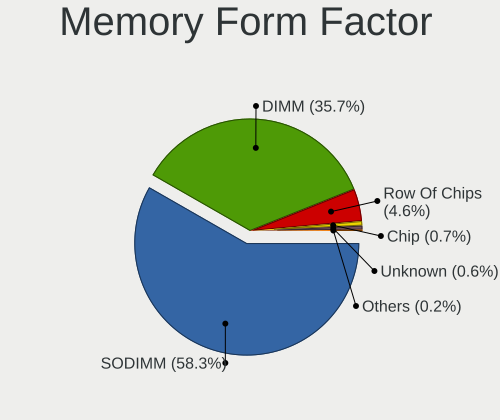

| Name         | Computers | Percent |
|--------------|-----------|---------|
| SODIMM       | 1520      | 58.28%  |
| DIMM         | 930       | 35.66%  |
| Row Of Chips | 121       | 4.64%   |
| Chip         | 17        | 0.65%   |
| Unknown      | 15        | 0.58%   |
| FB-DIMM      | 5         | 0.19%   |

Memory Size
-----------

Memory module size

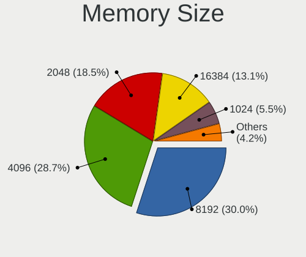

| Size    | Computers | Percent |
|---------|-----------|---------|
| 8192    | 866       | 30.02%  |
| 4096    | 827       | 28.67%  |
| 2048    | 534       | 18.51%  |
| 16384   | 379       | 13.14%  |
| 1024    | 158       | 5.48%   |
| 32768   | 91        | 3.15%   |
| 512     | 17        | 0.59%   |
| 65536   | 3         | 0.1%    |
| 49152   | 3         | 0.1%    |
| 1536    | 2         | 0.07%   |
| 1       | 2         | 0.07%   |
| Unknown | 2         | 0.07%   |
| 256     | 1         | 0.03%   |

Memory Speed
------------

Memory module speed

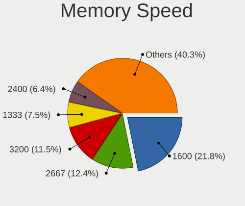

| Speed   | Computers | Percent |
|---------|-----------|---------|
| 1600    | 623       | 21.84%  |
| 2667    | 355       | 12.44%  |
| 3200    | 329       | 11.53%  |
| 1333    | 214       | 7.5%    |
| 2400    | 183       | 6.41%   |
| 667     | 122       | 4.28%   |
| 800     | 103       | 3.61%   |
| 2133    | 102       | 3.58%   |
| Unknown | 98        | 3.43%   |
| 1334    | 87        | 3.05%   |
| 3600    | 56        | 1.96%   |
| 1067    | 43        | 1.51%   |
| 1066    | 40        | 1.4%    |
| 1867    | 37        | 1.3%    |
| 4199    | 27        | 0.95%   |
| 3266    | 27        | 0.95%   |
| 1866    | 27        | 0.95%   |
| 3733    | 24        | 0.84%   |
| 1800    | 24        | 0.84%   |
| 4267    | 22        | 0.77%   |
| 533     | 22        | 0.77%   |
| 4800    | 21        | 0.74%   |
| 2666    | 20        | 0.7%    |
| 5600    | 19        | 0.67%   |
| 3000    | 19        | 0.67%   |
| 2048    | 18        | 0.63%   |
| 3800    | 14        | 0.49%   |
| 6400    | 13        | 0.46%   |
| 8400    | 12        | 0.42%   |
| 2000    | 10        | 0.35%   |
| 7500    | 9         | 0.32%   |
| 975     | 9         | 0.32%   |
| 2733    | 8         | 0.28%   |
| 400     | 8         | 0.28%   |
| 1639    | 7         | 0.25%   |
| 4000    | 6         | 0.21%   |
| 2933    | 6         | 0.21%   |
| 333     | 6         | 0.21%   |
| 49926   | 5         | 0.18%   |
| 6000    | 5         | 0.18%   |

Printers & scanners
-------------------

Printer Vendor
--------------

Printer device vendors

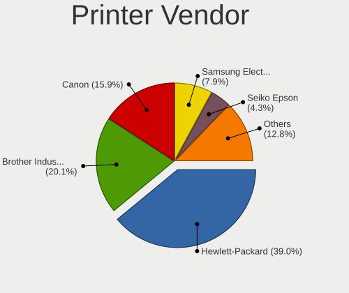

| Vendor                | Computers | Percent |
|-----------------------|-----------|---------|
| Hewlett-Packard       | 64        | 39.02%  |
| Brother Industries    | 33        | 20.12%  |
| Canon                 | 26        | 15.85%  |
| Samsung Electronics   | 13        | 7.93%   |
| Seiko Epson           | 7         | 4.27%   |
| Zebra                 | 5         | 3.05%   |
| QinHeng Electronics   | 4         | 2.44%   |
| Prolific Technology   | 3         | 1.83%   |
| Kyocera               | 2         | 1.22%   |
| Xiaomi                | 1         | 0.61%   |
| STMicroelectronics    | 1         | 0.61%   |
| Pantum                | 1         | 0.61%   |
| Minolta               | 1         | 0.61%   |
| Lexmark International | 1         | 0.61%   |
| Dymo-CoStar           | 1         | 0.61%   |
| Belkin Components     | 1         | 0.61%   |

Printer Model
-------------

Printer device models

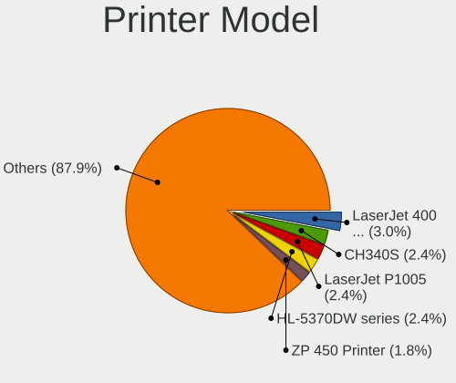

| Model                                                                 | Computers | Percent |
|-----------------------------------------------------------------------|-----------|---------|
| HP LaserJet 400 M401dne                                               | 5         | 3.03%   |
| QinHeng CH340S                                                        | 4         | 2.42%   |
| HP LaserJet P1005                                                     | 4         | 2.42%   |
| Brother HL-5370DW series                                              | 4         | 2.42%   |
| Zebra ZP 450 Printer                                                  | 3         | 1.82%   |
| Prolific PL2305 Parallel Port                                         | 3         | 1.82%   |
| HP ENVY 4520 series                                                   | 3         | 1.82%   |
| HP DeskJet 3700 series                                                | 3         | 1.82%   |
| Zebra ZTC ZP 500 (ZPL)                                                | 2         | 1.21%   |
| Seiko Epson EPSON L220 Series                                         | 2         | 1.21%   |
| Samsung M2020 Series                                                  | 2         | 1.21%   |
| HP OfficeJet Pro 7730 series                                          | 2         | 1.21%   |
| HP LaserJet P2055 series                                              | 2         | 1.21%   |
| HP LaserJet P1006                                                     | 2         | 1.21%   |
| HP LaserJet 1320                                                      | 2         | 1.21%   |
| HP LaserJet 1020                                                      | 2         | 1.21%   |
| HP LaserJet 1018                                                      | 2         | 1.21%   |
| HP LaserJet 1015                                                      | 2         | 1.21%   |
| HP Deskjet 3050A                                                      | 2         | 1.21%   |
| HP DeskJet 2800 series                                                | 2         | 1.21%   |
| Canon TS3100 series                                                   | 2         | 1.21%   |
| Canon PIXMA MX530 Series                                              | 2         | 1.21%   |
| Canon LBP6230/6240                                                    | 2         | 1.21%   |
| Canon LBP6000                                                         | 2         | 1.21%   |
| Brother MFC-L2710DW series                                            | 2         | 1.21%   |
| Brother HL-L2320D series                                              | 2         | 1.21%   |
| Brother HL-5340 series                                                | 2         | 1.21%   |
| Brother HL-2270DW Laser Printer                                       | 2         | 1.21%   |
| Brother HL-1110 series                                                | 2         | 1.21%   |
| Xiaomi MiMouse 2                                                      | 1         | 0.61%   |
| STMicroelectronics LED badge -- mini LED display -- 11x44             | 1         | 0.61%   |
| Seiko Epson ME OFFICE 620F Series/Stylus Office BX305F/BX305FW/TX320F | 1         | 0.61%   |
| Seiko Epson L3050 Series                                              | 1         | 0.61%   |
| Seiko Epson L120 Series                                               | 1         | 0.61%   |
| Seiko Epson ET-2720 Series                                            | 1         | 0.61%   |
| Seiko Epson ET-2710 Series                                            | 1         | 0.61%   |
| Samsung Xerox Phaser 3117 Laser Printer                               | 1         | 0.61%   |
| Samsung SF-760 Series                                                 | 1         | 0.61%   |
| Samsung SCX-4200 series                                               | 1         | 0.61%   |
| Samsung SCX-4100 Scanner                                              | 1         | 0.61%   |

Scanner Vendor
--------------

Scanner device vendors

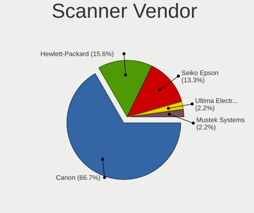

| Vendor             | Computers | Percent |
|--------------------|-----------|---------|
| Canon              | 30        | 66.67%  |
| Hewlett-Packard    | 7         | 15.56%  |
| Seiko Epson        | 6         | 13.33%  |
| Ultima Electronics | 1         | 2.22%   |
| Mustek Systems     | 1         | 2.22%   |

Scanner Model
-------------

Scanner device models

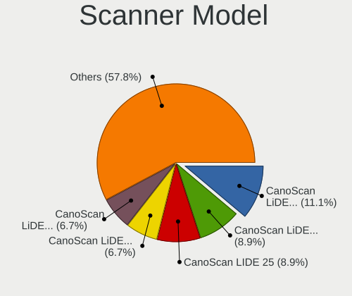

| Model                                                       | Computers | Percent |
|-------------------------------------------------------------|-----------|---------|
| Canon CanoScan LiDE 110                                     | 5         | 11.11%  |
| Canon CanoScan LIDE 25                                      | 4         | 8.89%   |
| Canon CanoScan LiDE 100                                     | 4         | 8.89%   |
| Canon CanoScan LiDE 50/LiDE 35/LiDE 40                      | 3         | 6.67%   |
| Canon CanoScan LiDE 220                                     | 3         | 6.67%   |
| Canon CanoScan N670U/N676U/LiDE 20                          | 2         | 4.44%   |
| Canon CanoScan N650U/N656U                                  | 2         | 4.44%   |
| Canon CanoScan LiDE 210                                     | 2         | 4.44%   |
| Canon CanoScan LiDE 120                                     | 2         | 4.44%   |
| Ultima Artec E+ 48U                                         | 1         | 2.22%   |
| Seiko Epson GT-X900 [Perfection V700/V750 Photo]            | 1         | 2.22%   |
| Seiko Epson GT-X770 [Perfection V500]                       | 1         | 2.22%   |
| Seiko Epson GT-9800F [Perfection 3200]                      | 1         | 2.22%   |
| Seiko Epson GT-8200U/GT-8200UF [Perfection 1650/1650 PHOTO] | 1         | 2.22%   |
| Seiko Epson GT-7700U [Perfection 1240U]                     | 1         | 2.22%   |
| Seiko Epson GT-1500 [GT-D1000]                              | 1         | 2.22%   |
| Mustek Systems ScanExpress 1200 UB                          | 1         | 2.22%   |
| HP ScanJet 82x0C                                            | 1         | 2.22%   |
| HP ScanJet 7400c                                            | 1         | 2.22%   |
| HP ScanJet 5590                                             | 1         | 2.22%   |
| HP ScanJet 3570c                                            | 1         | 2.22%   |
| HP Scanjet 200                                              | 1         | 2.22%   |
| HP PSC 1200                                                 | 1         | 2.22%   |
| HP HP Scanjet 300                                           | 1         | 2.22%   |
| Canon CanoScan LiDE 90                                      | 1         | 2.22%   |
| Canon CanoScan LiDE 200                                     | 1         | 2.22%   |
| Canon CanoScan 4400F                                        | 1         | 2.22%   |

Camera
------

Camera Vendor
-------------

Camera device vendors

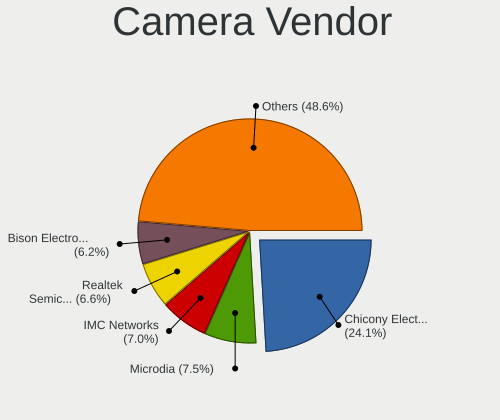

| Vendor                                 | Computers | Percent |
|----------------------------------------|-----------|---------|
| Chicony Electronics                    | 680       | 24.08%  |
| Microdia                               | 213       | 7.54%   |
| IMC Networks                           | 198       | 7.01%   |
| Realtek Semiconductor                  | 186       | 6.59%   |
| Bison Electronics                      | 174       | 6.16%   |
| Logitech                               | 151       | 5.35%   |
| Suyin                                  | 146       | 5.17%   |
| Sunplus Innovation Technology          | 131       | 4.64%   |
| Quanta                                 | 102       | 3.61%   |
| Cheng Uei Precision Industry (Foxlink) | 87        | 3.08%   |
| Apple                                  | 82        | 2.9%    |
| Syntek                                 | 69        | 2.44%   |
| Silicon Motion                         | 55        | 1.95%   |
| Alcor Micro                            | 50        | 1.77%   |
| Lite-On Technology                     | 49        | 1.74%   |
| Ricoh                                  | 48        | 1.7%    |
| Luxvisions Innotech Limited            | 34        | 1.2%    |
| Samsung Electronics                    | 33        | 1.17%   |
| Z-Star Microelectronics                | 29        | 1.03%   |
| Microsoft                              | 24        | 0.85%   |
| Lenovo                                 | 21        | 0.74%   |
| ALi                                    | 17        | 0.6%    |
| Sonix Technology                       | 13        | 0.46%   |
| Primax Electronics                     | 13        | 0.46%   |
| Acer                                   | 13        | 0.46%   |
| Importek                               | 11        | 0.39%   |
| Generalplus Technology                 | 11        | 0.39%   |
| GEMBIRD                                | 11        | 0.39%   |
| MacroSilicon                           | 9         | 0.32%   |
| Jieli Technology                       | 9         | 0.32%   |
| icSpring                               | 9         | 0.32%   |
| Cubeternet                             | 9         | 0.32%   |
| ARC International                      | 8         | 0.28%   |
| OmniVision Technologies                | 7         | 0.25%   |
| KYE Systems (Mouse Systems)            | 7         | 0.25%   |
| DigiTech                               | 7         | 0.25%   |
| Shinetech                              | 6         | 0.21%   |
| Trust                                  | 5         | 0.18%   |
| Genesys Logic                          | 5         | 0.18%   |
| Creative Technology                    | 5         | 0.18%   |

Camera Model
------------

Camera device models

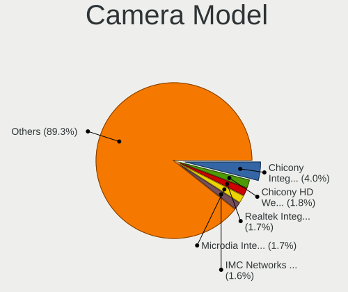

| Model                                            | Computers | Percent |
|--------------------------------------------------|-----------|---------|
| Chicony Integrated Camera                        | 112       | 3.95%   |
| Chicony HD WebCam                                | 51        | 1.8%    |
| Realtek Integrated_Webcam_HD                     | 48        | 1.69%   |
| Microdia Integrated_Webcam_HD                    | 47        | 1.66%   |
| IMC Networks USB2.0 HD UVC WebCam                | 45        | 1.59%   |
| IMC Networks Integrated Camera                   | 41        | 1.45%   |
| Logitech Webcam C270                             | 38        | 1.34%   |
| Bison Integrated Camera                          | 37        | 1.31%   |
| Chicony TOSHIBA Web Camera - HD                  | 33        | 1.16%   |
| Samsung Galaxy series, misc. (MTP mode)          | 32        | 1.13%   |
| Sunplus Integrated_Webcam_HD                     | 31        | 1.09%   |
| Syntek Integrated Camera                         | 30        | 1.06%   |
| Apple Built-in iSight                            | 29        | 1.02%   |
| Chicony USB 2.0 Camera                           | 27        | 0.95%   |
| Bison Lenovo EasyCamera                          | 26        | 0.92%   |
| IMC Networks USB2.0 VGA UVC WebCam               | 25        | 0.88%   |
| Microdia Integrated Webcam                       | 24        | 0.85%   |
| Chicony HP Truevision HD                         | 24        | 0.85%   |
| Logitech HD Pro Webcam C920                      | 23        | 0.81%   |
| Alcor Micro USB 2.0 Camera                       | 23        | 0.81%   |
| Microdia Sonix USB 2.0 Camera                    | 21        | 0.74%   |
| Lite-On Integrated Camera                        | 21        | 0.74%   |
| Sunplus HD WebCam                                | 20        | 0.71%   |
| Cheng Uei Precision Industry (Foxlink) HP Webcam | 20        | 0.71%   |
| Suyin HP Truevision HD                           | 19        | 0.67%   |
| Realtek USB Camera                               | 19        | 0.67%   |
| IMC Networks UVC VGA Webcam                      | 19        | 0.67%   |
| Chicony Lenovo EasyCamera                        | 19        | 0.67%   |
| Apple iPhone 5/5C/5S/6/SE/7/8/X                  | 19        | 0.67%   |
| Apple FaceTime HD Camera (Built-in)              | 19        | 0.67%   |
| Chicony USB2.0 VGA UVC WebCam                    | 18        | 0.63%   |
| Chicony HP TrueVision HD Camera                  | 18        | 0.63%   |
| Bison SunplusIT Integrated Camera                | 18        | 0.63%   |
| Bison HD Webcam                                  | 18        | 0.63%   |
| Quanta HD User Facing                            | 17        | 0.6%    |
| Syntek Lenovo EasyCamera                         | 16        | 0.56%   |
| Microdia USB 2.0 Camera                          | 16        | 0.56%   |
| Chicony HP HD Camera                             | 16        | 0.56%   |
| Suyin Acer CrystalEye Webcam                     | 15        | 0.53%   |
| Quanta HP Webcam                                 | 15        | 0.53%   |

Security
--------

Fingerprint Vendor
------------------

Fingerprint sensor vendors

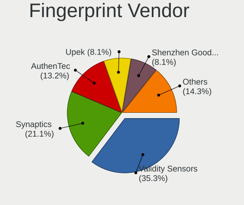

| Vendor                             | Computers | Percent |
|------------------------------------|-----------|---------|
| Validity Sensors                   | 166       | 35.32%  |
| Synaptics                          | 99        | 21.06%  |
| AuthenTec                          | 62        | 13.19%  |
| Upek                               | 38        | 8.09%   |
| Shenzhen Goodix Technology         | 38        | 8.09%   |
| STMicroelectronics                 | 24        | 5.11%   |
| LighTuning Technology              | 17        | 3.62%   |
| Elan Microelectronics              | 16        | 3.4%    |
| Samsung Electronics                | 3         | 0.64%   |
| Realtek USB2.0 Finger Print Bridge | 2         | 0.43%   |
| Focal-systems.Corp                 | 2         | 0.43%   |
| Gingytech                          | 1         | 0.21%   |
| DigitalPersona                     | 1         | 0.21%   |
| Dell                               | 1         | 0.21%   |

Fingerprint Model
-----------------

Fingerprint sensor models

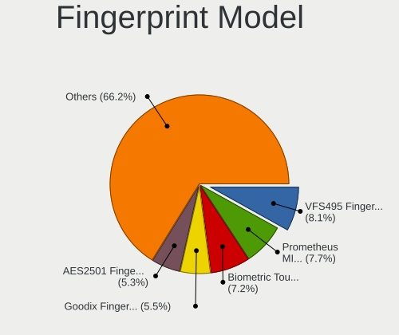

| Model                                                                      | Computers | Percent |
|----------------------------------------------------------------------------|-----------|---------|
| Validity Sensors VFS495 Fingerprint Reader                                 | 38        | 8.09%   |
| Synaptics Prometheus MIS Touch Fingerprint Reader                          | 36        | 7.66%   |
| Upek Biometric Touchchip/Touchstrip Fingerprint Sensor                     | 34        | 7.23%   |
| Shenzhen Goodix  FingerPrint Device                                        | 26        | 5.53%   |
| AuthenTec AES2501 Fingerprint Sensor                                       | 25        | 5.32%   |
| STMicroelectronics Fingerprint Reader                                      | 24        | 5.11%   |
| Validity Sensors VFS 5011 fingerprint sensor                               | 19        | 4.04%   |
| AuthenTec AES2810                                                          | 19        | 4.04%   |
| Validity Sensors VFS5011 Fingerprint Reader                                | 15        | 3.19%   |
| Synaptics Metallica MIS Touch Fingerprint Reader                           | 15        | 3.19%   |
| Validity Sensors Fingerprint scanner                                       | 14        | 2.98%   |
| Validity Sensors VFS491                                                    | 12        | 2.55%   |
| Validity Sensors VFS451 Fingerprint Reader                                 | 12        | 2.55%   |
| Validity Sensors VFS7500 Touch Fingerprint Sensor                          | 11        | 2.34%   |
| Validity Sensors Synaptics WBDI                                            | 11        | 2.34%   |
| Validity Sensors VFS471 Fingerprint Reader                                 | 10        | 2.13%   |
| Shenzhen Goodix Fingerprint Reader                                         | 10        | 2.13%   |
| Elan ELAN:Fingerprint                                                      | 9         | 1.91%   |
| Synaptics UWP WBDI Device                                                  | 8         | 1.7%    |
| AuthenTec Fingerprint Sensor                                               | 8         | 1.7%    |
| AuthenTec AES1600                                                          | 8         | 1.7%    |
| LighTuning EgisTec Touch Fingerprint Sensor                                | 7         | 1.49%   |
| Elan ELAN:ARM-M4                                                           | 7         | 1.49%   |
| Validity Sensors VFS301 Fingerprint Reader                                 | 6         | 1.28%   |
| Synaptics  WBDI                                                            | 6         | 1.28%   |
| Synaptics Prometheus Fingerprint Reader                                    | 6         | 1.28%   |
| Synaptics Metallica MOH Touch Fingerprint Reader                           | 6         | 1.28%   |
| Validity Sensors Synaptics VFS7552 Touch Fingerprint Sensor with PurePrint | 5         | 1.06%   |
| LighTuning ES603 Swipe Fingerprint Sensor                                  | 5         | 1.06%   |
| Validity Sensors VFS Fingerprint sensor                                    | 4         | 0.85%   |
| Validity Sensors Swipe Fingerprint Sensor                                  | 4         | 0.85%   |
| Upek TCS5B Fingerprint sensor                                              | 4         | 0.85%   |
| Synaptics  FS7604 Touch Fingerprint Sensor with PurePrint                  | 4         | 0.85%   |
| Synaptics Fingerprint reader [HP G6]                                       | 4         | 0.85%   |
| LighTuning Fingerprint Reader                                              | 4         | 0.85%   |
| Synaptics UWP WBDI                                                         | 3         | 0.64%   |
| Unknown                                                                    | 3         | 0.64%   |
| Validity Sensors VFS7552 Touch Fingerprint Sensor                          | 2         | 0.43%   |
| Validity Sensors VFS101 Fingerprint Reader                                 | 2         | 0.43%   |
| Synaptics WBDI Device                                                      | 2         | 0.43%   |

Chipcard Vendor
---------------

Chipcard module vendors

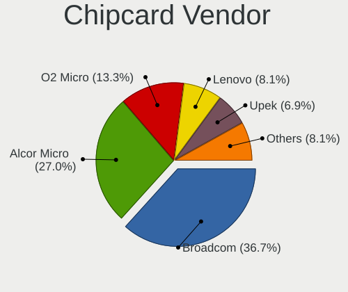

| Vendor                            | Computers | Percent |
|-----------------------------------|-----------|---------|
| Broadcom                          | 91        | 36.69%  |
| Alcor Micro                       | 67        | 27.02%  |
| O2 Micro                          | 33        | 13.31%  |
| Lenovo                            | 20        | 8.06%   |
| Upek                              | 17        | 6.85%   |
| OmniKey                           | 3         | 1.21%   |
| Gemalto (was Gemplus)             | 3         | 1.21%   |
| Yubico.com                        | 2         | 0.81%   |
| Reiner SCT Kartensysteme          | 2         | 0.81%   |
| Chicony Electronics               | 2         | 0.81%   |
| VASCO Data Security International | 1         | 0.4%    |
| In Focus Systems                  | 1         | 0.4%    |
| Fujitsu Siemens Computers         | 1         | 0.4%    |
| Clay Logic                        | 1         | 0.4%    |
| Cherry                            | 1         | 0.4%    |
| C3PO                              | 1         | 0.4%    |
| Aktiv                             | 1         | 0.4%    |
| Advanced Card Systems             | 1         | 0.4%    |

Chipcard Model
--------------

Chipcard module models

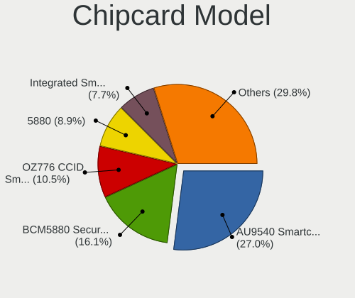

| Model                                                                        | Computers | Percent |
|------------------------------------------------------------------------------|-----------|---------|
| Alcor Micro AU9540 Smartcard Reader                                          | 67        | 27.02%  |
| Broadcom BCM5880 Secure Applications Processor                               | 40        | 16.13%  |
| O2 Micro OZ776 CCID Smartcard Reader                                         | 26        | 10.48%  |
| Broadcom 5880                                                                | 22        | 8.87%   |
| Lenovo Integrated Smart Card Reader                                          | 19        | 7.66%   |
| Upek TouchChip Fingerprint Coprocessor (WBF advanced mode)                   | 17        | 6.85%   |
| Broadcom BCM5880 Secure Applications Processor with fingerprint swipe sensor | 11        | 4.44%   |
| Broadcom 58200                                                               | 9         | 3.63%   |
| Broadcom BCM58200 ControlVault 3 (FingerPrint sensor + Contacted SmartCard)  | 8         | 3.23%   |
| O2 Micro Oz776 SmartCard Reader                                              | 7         | 2.82%   |
| OmniKey CardMan 3021 / 3121                                                  | 2         | 0.81%   |
| Gemalto (was Gemplus) GemPC Twin SmartCard Reader                            | 2         | 0.81%   |
| Chicony Electronics HP Skylab USB Smartcard Keyboard                         | 2         | 0.81%   |
| Yubico.com Yubikey NEO(-N) OTP+CCID                                          | 1         | 0.4%    |
| Yubico.com Yubikey 4/5 U2F+CCID                                              | 1         | 0.4%    |
| VASCO Data Security International DIGIPASS 870                               | 1         | 0.4%    |
| Reiner SCT Kartensysteme cyberJack RFID basis contactless smartcard reader   | 1         | 0.4%    |
| Reiner SCT Kartensysteme cyberJack one                                       | 1         | 0.4%    |
| OmniKey CardMan Smart@Link                                                   | 1         | 0.4%    |
| Lenovo Smartcard Keyboard                                                    | 1         | 0.4%    |
| In Focus Systems EMV Smartcard Reader                                        | 1         | 0.4%    |
| Gemalto (was Gemplus) GemPC Key SmartCard Reader                             | 1         | 0.4%    |
| Fujitsu Siemens Computers SmartCard Reader 2A                                | 1         | 0.4%    |
| Clay Logic Nitrokey Pro                                                      | 1         | 0.4%    |
| Cherry SmartTerminal XX44                                                    | 1         | 0.4%    |
| C3PO USB SMART CARD READER                                                   | 1         | 0.4%    |
| Broadcom BCM5880 Secure Applications Processor with fingerprint touch sensor | 1         | 0.4%    |
| Aktiv Rutoken lite                                                           | 1         | 0.4%    |
| Advanced Card Systems ACR38 SmartCard Reader                                 | 1         | 0.4%    |

Unsupported
-----------

Unsupported Devices
-------------------

Total unsupported devices on board

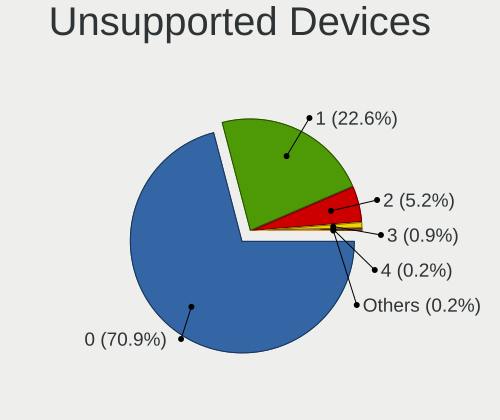

| Total | Computers | Percent |
|-------|-----------|---------|
| 0     | 3791      | 70.94%  |
| 1     | 1207      | 22.59%  |
| 2     | 277       | 5.18%   |
| 3     | 47        | 0.88%   |
| 4     | 12        | 0.22%   |
| 5     | 5         | 0.09%   |
| 6     | 2         | 0.04%   |
| 10    | 1         | 0.02%   |
| 8     | 1         | 0.02%   |
| 7     | 1         | 0.02%   |

Unsupported Device Types
------------------------

Types of unsupported devices

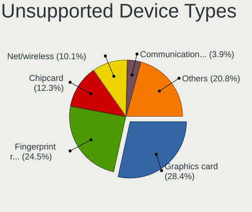

| Type                     | Computers | Percent |
|--------------------------|-----------|---------|
| Graphics card            | 537       | 28.44%  |
| Fingerprint reader       | 463       | 24.52%  |
| Chipcard                 | 232       | 12.29%  |
| Net/wireless             | 191       | 10.12%  |
| Communication controller | 73        | 3.87%   |
| Camera                   | 62        | 3.28%   |
| Multimedia controller    | 53        | 2.81%   |
| Modem                    | 50        | 2.65%   |
| Unassigned class         | 43        | 2.28%   |
| Bluetooth                | 36        | 1.91%   |
| Storage                  | 31        | 1.64%   |
| Sound                    | 30        | 1.59%   |
| Card reader              | 26        | 1.38%   |
| Net/ethernet             | 17        | 0.9%    |
| Flash memory             | 16        | 0.85%   |
| Network                  | 12        | 0.64%   |
| Dvb card                 | 5         | 0.26%   |
| Storage/raid             | 3         | 0.16%   |
| Storage/ide              | 3         | 0.16%   |
| Storage/nvme             | 2         | 0.11%   |
| Video                    | 1         | 0.05%   |
| Storage/ata              | 1         | 0.05%   |
| Firewire controller      | 1         | 0.05%   |

