Xubuntu - Tested Hardware & Statistics
--------------------------------------

A project to collect tested hardware configurations for Xubuntu.

Anyone can contribute to this report by the [hw-probe](https://github.com/linuxhw/hw-probe) tool:

    sudo -E hw-probe -all -upload

Please contribute! Especially if your hardware is rare.

This is a report for all computer types. See also reports for [desktops](/Dist/Xubuntu/Desktop/README.md) and [notebooks](/Dist/Xubuntu/Notebook/README.md).

Contents
--------

* [ Test Cases ](#test-cases)

* [ System ](#system)
  - [ OS                       ](#os)
  - [ OS Family                ](#os-family)
  - [ Kernel                   ](#kernel)
  - [ Kernel Family            ](#kernel-family)
  - [ Kernel Major Ver.        ](#kernel-major-ver)
  - [ Arch                     ](#arch)
  - [ DE                       ](#de)
  - [ Display Server           ](#display-server)
  - [ Display Manager          ](#display-manager)
  - [ OS Lang                  ](#os-lang)
  - [ Boot Mode                ](#boot-mode)
  - [ Filesystem               ](#filesystem)
  - [ Part. scheme             ](#part-scheme)
  - [ Dual Boot with Linux/BSD ](#dual-boot-with-linuxbsd)
  - [ Dual Boot (Win)          ](#dual-boot-win)

* [ Board ](#board)
  - [ Vendor                   ](#vendor)
  - [ Model                    ](#model)
  - [ Model Family             ](#model-family)
  - [ MFG Year                 ](#mfg-year)
  - [ Form Factor              ](#form-factor)
  - [ Secure Boot              ](#secure-boot)
  - [ Coreboot                 ](#coreboot)
  - [ RAM Size                 ](#ram-size)
  - [ RAM Used                 ](#ram-used)
  - [ Total Drives             ](#total-drives)
  - [ Has CD-ROM               ](#has-cd-rom)
  - [ Has Ethernet             ](#has-ethernet)
  - [ Has WiFi                 ](#has-wifi)
  - [ Has Bluetooth            ](#has-bluetooth)

* [ Location ](#location)
  - [ Country                  ](#country)
  - [ City                     ](#city)

* [ Drives ](#drives)
  - [ Drive Vendor             ](#drive-vendor)
  - [ Drive Model              ](#drive-model)
  - [ HDD Vendor               ](#hdd-vendor)
  - [ SSD Vendor               ](#ssd-vendor)
  - [ Drive Kind               ](#drive-kind)
  - [ Drive Connector          ](#drive-connector)
  - [ Drive Size               ](#drive-size)
  - [ Space Total              ](#space-total)
  - [ Space Used               ](#space-used)
  - [ Malfunc. Drives          ](#malfunc-drives)
  - [ Malfunc. Drive Vendor    ](#malfunc-drive-vendor)
  - [ Malfunc. HDD Vendor      ](#malfunc-hdd-vendor)
  - [ Malfunc. Drive Kind      ](#malfunc-drive-kind)
  - [ Failed Drives            ](#failed-drives)
  - [ Failed Drive Vendor      ](#failed-drive-vendor)
  - [ Drive Status             ](#drive-status)

* [ Storage controller ](#storage-controller)
  - [ Storage Vendor           ](#storage-vendor)
  - [ Storage Model            ](#storage-model)
  - [ Storage Kind             ](#storage-kind)

* [ Processor ](#processor)
  - [ CPU Vendor               ](#cpu-vendor)
  - [ CPU Model                ](#cpu-model)
  - [ CPU Model Family         ](#cpu-model-family)
  - [ CPU Cores                ](#cpu-cores)
  - [ CPU Sockets              ](#cpu-sockets)
  - [ CPU Threads              ](#cpu-threads)
  - [ CPU Op-Modes             ](#cpu-op-modes)
  - [ CPU Microcode            ](#cpu-microcode)
  - [ CPU Microarch            ](#cpu-microarch)

* [ Graphics ](#graphics)
  - [ GPU Vendor               ](#gpu-vendor)
  - [ GPU Model                ](#gpu-model)
  - [ GPU Combo                ](#gpu-combo)
  - [ GPU Driver               ](#gpu-driver)
  - [ GPU Memory               ](#gpu-memory)

* [ Monitor ](#monitor)
  - [ Monitor Vendor           ](#monitor-vendor)
  - [ Monitor Model            ](#monitor-model)
  - [ Monitor Resolution       ](#monitor-resolution)
  - [ Monitor Diagonal         ](#monitor-diagonal)
  - [ Monitor Width            ](#monitor-width)
  - [ Aspect Ratio             ](#aspect-ratio)
  - [ Monitor Area             ](#monitor-area)
  - [ Pixel Density            ](#pixel-density)
  - [ Multiple Monitors        ](#multiple-monitors)

* [ Network ](#network)
  - [ Net Controller Vendor    ](#net-controller-vendor)
  - [ Net Controller Model     ](#net-controller-model)
  - [ Wireless Vendor          ](#wireless-vendor)
  - [ Wireless Model           ](#wireless-model)
  - [ Ethernet Vendor          ](#ethernet-vendor)
  - [ Ethernet Model           ](#ethernet-model)
  - [ Net Controller Kind      ](#net-controller-kind)
  - [ Used Controller          ](#used-controller)
  - [ NICs                     ](#nics)
  - [ IPv6                     ](#ipv6)

* [ Bluetooth ](#bluetooth)
  - [ Bluetooth Vendor         ](#bluetooth-vendor)
  - [ Bluetooth Model          ](#bluetooth-model)

* [ Sound ](#sound)
  - [ Sound Vendor             ](#sound-vendor)
  - [ Sound Model              ](#sound-model)

* [ Memory ](#memory)
  - [ Memory Vendor            ](#memory-vendor)
  - [ Memory Model             ](#memory-model)
  - [ Memory Kind              ](#memory-kind)
  - [ Memory Form Factor       ](#memory-form-factor)
  - [ Memory Size              ](#memory-size)
  - [ Memory Speed             ](#memory-speed)

* [ Printers & scanners ](#printers--scanners)
  - [ Printer Vendor           ](#printer-vendor)
  - [ Printer Model            ](#printer-model)
  - [ Scanner Vendor           ](#scanner-vendor)
  - [ Scanner Model            ](#scanner-model)

* [ Camera ](#camera)
  - [ Camera Vendor            ](#camera-vendor)
  - [ Camera Model             ](#camera-model)

* [ Security ](#security)
  - [ Fingerprint Vendor       ](#fingerprint-vendor)
  - [ Fingerprint Model        ](#fingerprint-model)
  - [ Chipcard Vendor          ](#chipcard-vendor)
  - [ Chipcard Model           ](#chipcard-model)

* [ Unsupported ](#unsupported)
  - [ Unsupported Devices      ](#unsupported-devices)
  - [ Unsupported Device Types ](#unsupported-device-types)

Test Cases
----------

Total: 5431

| Vendor        | Model                       | Form-Factor | Probe                                                      | Date         |
|---------------|-----------------------------|-------------|------------------------------------------------------------|--------------|
| Dell          | 500                         | Notebook    | [83c01aa11f](https://linux-hardware.org/?probe=83c01aa11f) | Oct 01, 2022 |
| Lenovo        | B70-80 80MR                 | Notebook    | [69aec9e100](https://linux-hardware.org/?probe=69aec9e100) | Oct 01, 2022 |
| HP            | Notebook                    | Notebook    | [fec2594d37](https://linux-hardware.org/?probe=fec2594d37) | Oct 01, 2022 |
| HP            | EliteBook 840 G3            | Notebook    | [ddf1904011](https://linux-hardware.org/?probe=ddf1904011) | Oct 01, 2022 |
| Acer          | Aspire A315-55G             | Notebook    | [77605e313d](https://linux-hardware.org/?probe=77605e313d) | Oct 01, 2022 |
| Lenovo        | ThinkPad E14 Gen 2 20TA0... | Notebook    | [025a55eab7](https://linux-hardware.org/?probe=025a55eab7) | Sep 30, 2022 |
| Lenovo        | ThinkPad E14 Gen 2 20TA0... | Notebook    | [875b1df312](https://linux-hardware.org/?probe=875b1df312) | Sep 30, 2022 |
| Sony          | SVE1512C6EB                 | Notebook    | [c47a3a5bd7](https://linux-hardware.org/?probe=c47a3a5bd7) | Sep 30, 2022 |
| Lenovo        | ThinkPad T420 42361L0       | Notebook    | [abe6563e67](https://linux-hardware.org/?probe=abe6563e67) | Sep 30, 2022 |
| Dell          | Latitude 5420               | Notebook    | [36ddd1d6d7](https://linux-hardware.org/?probe=36ddd1d6d7) | Sep 30, 2022 |
| MSI           | A68HM-E33 V2                | Desktop     | [1001ccbbaf](https://linux-hardware.org/?probe=1001ccbbaf) | Sep 30, 2022 |
| ASUSTek       | B85M-G                      | Desktop     | [ba607b91e0](https://linux-hardware.org/?probe=ba607b91e0) | Sep 29, 2022 |
| Lenovo        | IdeaPad N585 20179          | Notebook    | [dcdafbbd9b](https://linux-hardware.org/?probe=dcdafbbd9b) | Sep 28, 2022 |
| Gigabyte      | H81M-D2W                    | Desktop     | [467845e1c1](https://linux-hardware.org/?probe=467845e1c1) | Sep 28, 2022 |
| HP            | Pavilion dv7                | Notebook    | [5479c35130](https://linux-hardware.org/?probe=5479c35130) | Sep 28, 2022 |
| Lenovo        | IdeaPad N585 20179          | Notebook    | [0a8aed635a](https://linux-hardware.org/?probe=0a8aed635a) | Sep 28, 2022 |
| Toshiba       | Satellite Pro R50-C         | Notebook    | [834ef0ec59](https://linux-hardware.org/?probe=834ef0ec59) | Sep 27, 2022 |
| Toshiba       | Satellite Pro R50-C         | Notebook    | [564d385b61](https://linux-hardware.org/?probe=564d385b61) | Sep 27, 2022 |
| Dell          | CS24-TY                     | Server      | [029e2bdb60](https://linux-hardware.org/?probe=029e2bdb60) | Sep 27, 2022 |
| ASRock        | 775Dual-VSTA                | Desktop     | [9509fb65dd](https://linux-hardware.org/?probe=9509fb65dd) | Sep 26, 2022 |
| ASUSTek       | ROG STRIX B450-F GAMING ... | Desktop     | [41cc3cdcfd](https://linux-hardware.org/?probe=41cc3cdcfd) | Sep 26, 2022 |
| ASUSTek       | ROG STRIX B450-F GAMING ... | Desktop     | [d6924eb78d](https://linux-hardware.org/?probe=d6924eb78d) | Sep 26, 2022 |
| MSI           | H170M PRO-VDH               | Desktop     | [f7254adff2](https://linux-hardware.org/?probe=f7254adff2) | Sep 25, 2022 |
| Toshiba       | Satellite C650              | Notebook    | [c7920c2e68](https://linux-hardware.org/?probe=c7920c2e68) | Sep 24, 2022 |
| Packard Be... | EasyNote MH45               | Notebook    | [c312580997](https://linux-hardware.org/?probe=c312580997) | Sep 24, 2022 |
| Unknown       | Unknown                     | Notebook    | [63b1596d63](https://linux-hardware.org/?probe=63b1596d63) | Sep 24, 2022 |
| Toshiba       | Satellite C55D-B            | Notebook    | [5b2029b4d3](https://linux-hardware.org/?probe=5b2029b4d3) | Sep 24, 2022 |
| Toshiba       | Satellite A300              | Notebook    | [3f6203e550](https://linux-hardware.org/?probe=3f6203e550) | Sep 24, 2022 |
| ASUSTek       | PRIME A320M-K               | Desktop     | [5588f73920](https://linux-hardware.org/?probe=5588f73920) | Sep 24, 2022 |
| ASUSTek       | PRIME A320M-K               | Desktop     | [a83e57d8c1](https://linux-hardware.org/?probe=a83e57d8c1) | Sep 23, 2022 |
| Tactus        | GeoBook 140                 | Notebook    | [7d8700d0e1](https://linux-hardware.org/?probe=7d8700d0e1) | Sep 23, 2022 |
| Dell          | Latitude 5411               | Notebook    | [018a9c569a](https://linux-hardware.org/?probe=018a9c569a) | Sep 23, 2022 |
| ASUSTek       | P6T                         | Desktop     | [612682c52d](https://linux-hardware.org/?probe=612682c52d) | Sep 23, 2022 |
| HP            | EliteBook 840 G3            | Notebook    | [c3a88ed62d](https://linux-hardware.org/?probe=c3a88ed62d) | Sep 22, 2022 |
| Lenovo        | ThinkPad P51s 20HCS00F00    | Notebook    | [5f0dc19f55](https://linux-hardware.org/?probe=5f0dc19f55) | Sep 22, 2022 |
| Lenovo        | ThinkPad T61 7659AB7        | Notebook    | [aa07f9c271](https://linux-hardware.org/?probe=aa07f9c271) | Sep 20, 2022 |
| ASUSTek       | A68HM-K                     | Desktop     | [966ae734c2](https://linux-hardware.org/?probe=966ae734c2) | Sep 20, 2022 |
| Lenovo        | ThinkPad T61p 6457A24       | Notebook    | [d98e9a64bd](https://linux-hardware.org/?probe=d98e9a64bd) | Sep 20, 2022 |
| HP            | ProBook 450 G2              | Notebook    | [73c35ad64a](https://linux-hardware.org/?probe=73c35ad64a) | Sep 20, 2022 |
| MSI           | Z77A-G43                    | Desktop     | [4b91f7a270](https://linux-hardware.org/?probe=4b91f7a270) | Sep 19, 2022 |
| Dell          | Precision 7750              | Notebook    | [ced8b5a7b2](https://linux-hardware.org/?probe=ced8b5a7b2) | Sep 19, 2022 |
| Lenovo        | ThinkPad X220 42918F6       | Notebook    | [69dda668fc](https://linux-hardware.org/?probe=69dda668fc) | Sep 18, 2022 |
| Raspberry ... | Raspberry Pi 4 Model B R... | Soc         | [e2b4056812](https://linux-hardware.org/?probe=e2b4056812) | Sep 18, 2022 |
| ASRock        | 960GC-GS FX                 | Desktop     | [3e40742ff0](https://linux-hardware.org/?probe=3e40742ff0) | Sep 18, 2022 |
| Acer          | Swift SF314-511             | Notebook    | [914d532c78](https://linux-hardware.org/?probe=914d532c78) | Sep 17, 2022 |
| ASUSTek       | ET1612I                     | Desktop     | [0ddd9554cc](https://linux-hardware.org/?probe=0ddd9554cc) | Sep 16, 2022 |
| Pine Micro... | Pine64 Rock64               | Soc         | [dbd6ac01d6](https://linux-hardware.org/?probe=dbd6ac01d6) | Sep 16, 2022 |
| ASUSTek       | PRIME H310M-D R2.0          | Desktop     | [588c189149](https://linux-hardware.org/?probe=588c189149) | Sep 16, 2022 |
| ASUSTek       | PRIME H310M-D R2.0          | Desktop     | [4b94d21772](https://linux-hardware.org/?probe=4b94d21772) | Sep 16, 2022 |
| Gigabyte      | H410M S2H                   | Desktop     | [d852f09d43](https://linux-hardware.org/?probe=d852f09d43) | Sep 15, 2022 |
| Dell          | Latitude 7490               | Notebook    | [ce54bcd741](https://linux-hardware.org/?probe=ce54bcd741) | Sep 15, 2022 |
| Dell          | Inspiron 3576               | Notebook    | [02023473b8](https://linux-hardware.org/?probe=02023473b8) | Sep 15, 2022 |
| Gigabyte      | H410M S2H                   | Desktop     | [a0bdfffa04](https://linux-hardware.org/?probe=a0bdfffa04) | Sep 15, 2022 |
| Gigabyte      | H410M S2H                   | Desktop     | [196e6b048b](https://linux-hardware.org/?probe=196e6b048b) | Sep 15, 2022 |
| Gigabyte      | H410M S2H                   | Desktop     | [8e95a850da](https://linux-hardware.org/?probe=8e95a850da) | Sep 15, 2022 |
| Gigabyte      | H410M S2H                   | Desktop     | [499d354033](https://linux-hardware.org/?probe=499d354033) | Sep 15, 2022 |
| Gigabyte      | H410M S2H                   | Desktop     | [a830a7b6e5](https://linux-hardware.org/?probe=a830a7b6e5) | Sep 15, 2022 |
| Gigabyte      | H410M S2H                   | Desktop     | [19ba71f923](https://linux-hardware.org/?probe=19ba71f923) | Sep 15, 2022 |
| Gigabyte      | H410M S2H                   | Desktop     | [ad888e4455](https://linux-hardware.org/?probe=ad888e4455) | Sep 15, 2022 |
| Gigabyte      | H410M S2H                   | Desktop     | [d35bf4c513](https://linux-hardware.org/?probe=d35bf4c513) | Sep 15, 2022 |
| Gigabyte      | H410M S2H                   | Desktop     | [dce51bb6d6](https://linux-hardware.org/?probe=dce51bb6d6) | Sep 15, 2022 |
| Gigabyte      | H410M S2H                   | Desktop     | [3bc232858d](https://linux-hardware.org/?probe=3bc232858d) | Sep 15, 2022 |
| Gigabyte      | H410M S2H                   | Desktop     | [ca79460771](https://linux-hardware.org/?probe=ca79460771) | Sep 15, 2022 |
| Gigabyte      | H410M S2H                   | Desktop     | [1e24243624](https://linux-hardware.org/?probe=1e24243624) | Sep 15, 2022 |
| Gigabyte      | H410M S2H                   | Desktop     | [b0625e01e3](https://linux-hardware.org/?probe=b0625e01e3) | Sep 15, 2022 |
| Gigabyte      | H410M S2H                   | Desktop     | [f97cd53683](https://linux-hardware.org/?probe=f97cd53683) | Sep 15, 2022 |
| Gigabyte      | H410M S2H                   | Desktop     | [cd3fc03204](https://linux-hardware.org/?probe=cd3fc03204) | Sep 15, 2022 |
| ASUSTek       | Maximus VII HERO            | Desktop     | [6d40add21a](https://linux-hardware.org/?probe=6d40add21a) | Sep 15, 2022 |
| HP            | Laptop 15-ef1xxx            | Notebook    | [dd55f6960d](https://linux-hardware.org/?probe=dd55f6960d) | Sep 15, 2022 |
| Dell          | Latitude 7420               | Convertible | [5d119f6255](https://linux-hardware.org/?probe=5d119f6255) | Sep 14, 2022 |
| Dell          | 0DR845                      | Desktop     | [158b3832bc](https://linux-hardware.org/?probe=158b3832bc) | Sep 13, 2022 |
| Dell          | Precision 5540              | Notebook    | [229337f709](https://linux-hardware.org/?probe=229337f709) | Sep 13, 2022 |
| ASUSTek       | K30BD                       | Desktop     | [d6daf0e1f8](https://linux-hardware.org/?probe=d6daf0e1f8) | Sep 13, 2022 |
| HP            | 1000                        | Notebook    | [65024f3d7a](https://linux-hardware.org/?probe=65024f3d7a) | Sep 13, 2022 |
| ASUSTek       | H61M-C                      | Desktop     | [bb07dfab63](https://linux-hardware.org/?probe=bb07dfab63) | Sep 13, 2022 |
| ASRock        | N68-S3 UCC                  | Desktop     | [e59aa2e1d5](https://linux-hardware.org/?probe=e59aa2e1d5) | Sep 13, 2022 |
| ASRock        | N68-S3 UCC                  | Desktop     | [930da2e105](https://linux-hardware.org/?probe=930da2e105) | Sep 13, 2022 |
| MSI           | Z77A-G43                    | Desktop     | [c9f7f86b9e](https://linux-hardware.org/?probe=c9f7f86b9e) | Sep 13, 2022 |
| MSI           | Z77A-G43                    | Desktop     | [4d559dfa50](https://linux-hardware.org/?probe=4d559dfa50) | Sep 13, 2022 |
| Dell          | 0DR845                      | Desktop     | [f65bf44380](https://linux-hardware.org/?probe=f65bf44380) | Sep 13, 2022 |
| Gigabyte      | H510M S2H                   | Desktop     | [f004b06a17](https://linux-hardware.org/?probe=f004b06a17) | Sep 12, 2022 |
| Apple         | Mac-942B5BF58194151B        | All in one  | [3f56f510f8](https://linux-hardware.org/?probe=3f56f510f8) | Sep 12, 2022 |
| Apple         | Mac-942B5BF58194151B        | All in one  | [940507a1ec](https://linux-hardware.org/?probe=940507a1ec) | Sep 12, 2022 |
| Dell          | Inspiron 3537               | Notebook    | [afd2b6555e](https://linux-hardware.org/?probe=afd2b6555e) | Sep 12, 2022 |
| ASUSTek       | X453SA                      | Notebook    | [1446eda5e9](https://linux-hardware.org/?probe=1446eda5e9) | Sep 12, 2022 |
| ASUSTek       | PRIME A320M-K               | Desktop     | [7b7a1cfeb9](https://linux-hardware.org/?probe=7b7a1cfeb9) | Sep 11, 2022 |
| MSI           | Z77A-G43                    | Desktop     | [f347256293](https://linux-hardware.org/?probe=f347256293) | Sep 10, 2022 |
| Dell          | 03NVJ6 A01                  | Desktop     | [3f51b6da48](https://linux-hardware.org/?probe=3f51b6da48) | Sep 10, 2022 |
| MSI           | Z77A-G43                    | Desktop     | [d0e5863756](https://linux-hardware.org/?probe=d0e5863756) | Sep 10, 2022 |
| Rockchip      | RK3318 BOX                  | Soc         | [bf1aba4ebe](https://linux-hardware.org/?probe=bf1aba4ebe) | Sep 10, 2022 |
| Dell          | 0T10XW A02                  | Desktop     | [33faaf5341](https://linux-hardware.org/?probe=33faaf5341) | Sep 10, 2022 |
| Dell          | 0R092H                      | Desktop     | [a22af2bad5](https://linux-hardware.org/?probe=a22af2bad5) | Sep 09, 2022 |
| ASUSTek       | ASUS TUF Gaming A15 FA50... | Notebook    | [1f2be56ed4](https://linux-hardware.org/?probe=1f2be56ed4) | Sep 09, 2022 |
| ASUSTek       | ASUS TUF Gaming A15 FA50... | Notebook    | [31717bdcb1](https://linux-hardware.org/?probe=31717bdcb1) | Sep 09, 2022 |
| ASRock        | Q1900-ITX                   | Desktop     | [738bae7e52](https://linux-hardware.org/?probe=738bae7e52) | Sep 08, 2022 |
| Intel         | NUC7JYB J67967-404          | Mini pc     | [31a50780b4](https://linux-hardware.org/?probe=31a50780b4) | Sep 08, 2022 |
| ASUSTek       | M2N-E                       | Desktop     | [2737c0fd67](https://linux-hardware.org/?probe=2737c0fd67) | Sep 08, 2022 |
| Nvidia        | Tegra                       | Soc         | [bf3fee013b](https://linux-hardware.org/?probe=bf3fee013b) | Sep 08, 2022 |
| MSI           | MPG X570 GAMING EDGE WIF... | Desktop     | [f714986404](https://linux-hardware.org/?probe=f714986404) | Sep 08, 2022 |
| Dell          | Inspiron 5406 2n1           | Convertible | [b0412cee20](https://linux-hardware.org/?probe=b0412cee20) | Sep 07, 2022 |
| ASRock        | N68-S3 UCC                  | Desktop     | [31fdd16d2f](https://linux-hardware.org/?probe=31fdd16d2f) | Sep 07, 2022 |
| ASRock        | N68-S3 UCC                  | Desktop     | [24647846ee](https://linux-hardware.org/?probe=24647846ee) | Sep 06, 2022 |
| MSI           | MS-7387                     | Desktop     | [1f49477abf](https://linux-hardware.org/?probe=1f49477abf) | Sep 06, 2022 |
| ASUSTek       | PRIME A320M-C R2.0          | Desktop     | [7649a53341](https://linux-hardware.org/?probe=7649a53341) | Sep 06, 2022 |
| Dell          | Latitude 9520               | Notebook    | [04188fb6c2](https://linux-hardware.org/?probe=04188fb6c2) | Sep 06, 2022 |
| Dell          | 0NV0M7 A02                  | Desktop     | [23024b776e](https://linux-hardware.org/?probe=23024b776e) | Sep 06, 2022 |
| ASUSTek       | K55VD                       | Notebook    | [c1ca471555](https://linux-hardware.org/?probe=c1ca471555) | Sep 06, 2022 |
| ASUSTek       | PRIME B560-PLUS             | Desktop     | [989e0d5d57](https://linux-hardware.org/?probe=989e0d5d57) | Sep 06, 2022 |
| ASUSTek       | PRIME B560-PLUS             | Desktop     | [f51b1f139e](https://linux-hardware.org/?probe=f51b1f139e) | Sep 06, 2022 |
| Panasonic     | CF-D1DVA06F3                | Notebook    | [e3cc43135a](https://linux-hardware.org/?probe=e3cc43135a) | Sep 05, 2022 |
| ASUSTek       | M4A78T-E                    | Desktop     | [6c0537c32c](https://linux-hardware.org/?probe=6c0537c32c) | Sep 05, 2022 |
| HP            | 255 G7 Notebook PC          | Notebook    | [dd775ffe8f](https://linux-hardware.org/?probe=dd775ffe8f) | Sep 05, 2022 |
| ASUSTek       | PRIME H270M-PLUS            | Desktop     | [668995f3ff](https://linux-hardware.org/?probe=668995f3ff) | Sep 04, 2022 |
| HP            | Laptop 15-dw0xxx            | Notebook    | [1bd6f2ba6f](https://linux-hardware.org/?probe=1bd6f2ba6f) | Sep 04, 2022 |
| Google        | Kip                         | Notebook    | [e92d971d5e](https://linux-hardware.org/?probe=e92d971d5e) | Sep 04, 2022 |
| ASUSTek       | K30BD                       | Desktop     | [6042bda5d7](https://linux-hardware.org/?probe=6042bda5d7) | Sep 03, 2022 |
| Lenovo        | IdeaPad 120S-14IAP 81A5     | Notebook    | [059bb72ff2](https://linux-hardware.org/?probe=059bb72ff2) | Sep 03, 2022 |
| Google        | Reks                        | Notebook    | [d88eecb32d](https://linux-hardware.org/?probe=d88eecb32d) | Sep 03, 2022 |
| Clientron     | C800                        | Mini pc     | [18fcb4170b](https://linux-hardware.org/?probe=18fcb4170b) | Sep 03, 2022 |
| HP            | EliteBook 2570p             | Notebook    | [506f9da93b](https://linux-hardware.org/?probe=506f9da93b) | Sep 03, 2022 |
| Apple         | MacBookPro16,1              | Notebook    | [8add31fdfe](https://linux-hardware.org/?probe=8add31fdfe) | Sep 02, 2022 |
| ECS           | G31T-M9                     | Desktop     | [c3212ee5a3](https://linux-hardware.org/?probe=c3212ee5a3) | Sep 02, 2022 |
| ECS           | G31T-M9                     | Desktop     | [673b33ac0c](https://linux-hardware.org/?probe=673b33ac0c) | Sep 02, 2022 |
| ECS           | G31T-M9                     | Desktop     | [18a2d69632](https://linux-hardware.org/?probe=18a2d69632) | Sep 02, 2022 |
| ECS           | G31T-M9                     | Desktop     | [965107cf86](https://linux-hardware.org/?probe=965107cf86) | Sep 02, 2022 |
| ECS           | G31T-M9                     | Desktop     | [d8f5734dd8](https://linux-hardware.org/?probe=d8f5734dd8) | Sep 02, 2022 |
| ECS           | G31T-M9                     | Desktop     | [b2f37a3080](https://linux-hardware.org/?probe=b2f37a3080) | Sep 02, 2022 |
| ECS           | G31T-M9                     | Desktop     | [91857942dd](https://linux-hardware.org/?probe=91857942dd) | Sep 02, 2022 |
| ECS           | G31T-M9                     | Desktop     | [940fb9c208](https://linux-hardware.org/?probe=940fb9c208) | Sep 02, 2022 |
| ECS           | G31T-M9                     | Desktop     | [10315fa577](https://linux-hardware.org/?probe=10315fa577) | Sep 02, 2022 |
| ECS           | G31T-M9                     | Desktop     | [aedc37e8e4](https://linux-hardware.org/?probe=aedc37e8e4) | Sep 02, 2022 |
| Acer          | Aspire A315-31              | Notebook    | [21d3a4bd56](https://linux-hardware.org/?probe=21d3a4bd56) | Sep 02, 2022 |
| Medion        | H110H4-EM                   | Desktop     | [9f80ee3a09](https://linux-hardware.org/?probe=9f80ee3a09) | Sep 01, 2022 |
| ASUSTek       | TUF Gaming B450-PLUS II     | Desktop     | [efc46d8d23](https://linux-hardware.org/?probe=efc46d8d23) | Sep 01, 2022 |
| HP            | 8433 11                     | Desktop     | [00868f25c6](https://linux-hardware.org/?probe=00868f25c6) | Aug 31, 2022 |
| sunxi         | Allwinner sun7i (A20) Fa... | Soc         | [632a8a0ad8](https://linux-hardware.org/?probe=632a8a0ad8) | Aug 30, 2022 |
| Dell          | Latitude E5530 non-vPro     | Notebook    | [7e839a0ef4](https://linux-hardware.org/?probe=7e839a0ef4) | Aug 30, 2022 |
| Acer          | Aspire E5-771G              | Notebook    | [76803c2532](https://linux-hardware.org/?probe=76803c2532) | Aug 30, 2022 |
| DNI           | SNDTP-1513N 5508015890      | Desktop     | [9570ee789c](https://linux-hardware.org/?probe=9570ee789c) | Aug 30, 2022 |
| Sony          | VPCSB1V9R                   | Notebook    | [b54e74887f](https://linux-hardware.org/?probe=b54e74887f) | Aug 29, 2022 |
| ASUSTek       | Z97-C                       | Desktop     | [9bdae9239f](https://linux-hardware.org/?probe=9bdae9239f) | Aug 29, 2022 |
| Acer          | Aspire E5-771G              | Notebook    | [52cc79c6d9](https://linux-hardware.org/?probe=52cc79c6d9) | Aug 29, 2022 |
| Gigabyte      | H97M-D3H                    | Desktop     | [a8100fcf41](https://linux-hardware.org/?probe=a8100fcf41) | Aug 29, 2022 |
| Gigabyte      | H97M-D3H                    | Desktop     | [f8f42b0857](https://linux-hardware.org/?probe=f8f42b0857) | Aug 29, 2022 |
| Gigabyte      | GA-MA790FXT-UD5P            | Desktop     | [e692fe97cb](https://linux-hardware.org/?probe=e692fe97cb) | Aug 28, 2022 |
| Intel         | H61                         | Desktop     | [c829101789](https://linux-hardware.org/?probe=c829101789) | Aug 27, 2022 |
| Dell          | Inspiron N5010              | Notebook    | [b9953ab67e](https://linux-hardware.org/?probe=b9953ab67e) | Aug 27, 2022 |
| Lenovo        | V340-17IWL 81RG             | Notebook    | [f725a87544](https://linux-hardware.org/?probe=f725a87544) | Aug 27, 2022 |
| Lenovo        | 14w 81MQ000JUS              | Notebook    | [d71f12bede](https://linux-hardware.org/?probe=d71f12bede) | Aug 27, 2022 |
| Lenovo        | V340-17IWL 81RG             | Notebook    | [8a689fc0fd](https://linux-hardware.org/?probe=8a689fc0fd) | Aug 27, 2022 |
| ASUSTek       | P8H67-M LE                  | Desktop     | [7bf3626764](https://linux-hardware.org/?probe=7bf3626764) | Aug 25, 2022 |
| Dell          | XPS 13 9380                 | Notebook    | [5bb7561235](https://linux-hardware.org/?probe=5bb7561235) | Aug 25, 2022 |
| Lenovo        | ThinkPad P70 20ERCTO1WW     | Notebook    | [d269aaa456](https://linux-hardware.org/?probe=d269aaa456) | Aug 25, 2022 |
| ASUSTek       | TUF B450-PLUS GAMING        | Desktop     | [c37bc2a345](https://linux-hardware.org/?probe=c37bc2a345) | Aug 24, 2022 |
| ASUSTek       | ASUS TUF Gaming A15 FA50... | Notebook    | [92be7f3368](https://linux-hardware.org/?probe=92be7f3368) | Aug 24, 2022 |
| Acer          | Aspire 5740                 | Notebook    | [5652f2c73d](https://linux-hardware.org/?probe=5652f2c73d) | Aug 24, 2022 |
| HP            | 844C                        | Desktop     | [b56856200e](https://linux-hardware.org/?probe=b56856200e) | Aug 23, 2022 |
| Lenovo        | 14w 81MQ000JUS              | Notebook    | [1ff769c6ef](https://linux-hardware.org/?probe=1ff769c6ef) | Aug 23, 2022 |
| Gigabyte      | H370 HD3-CF                 | Desktop     | [3f06afc812](https://linux-hardware.org/?probe=3f06afc812) | Aug 21, 2022 |
| Acer          | Unknown                     | Notebook    | [c35afdde00](https://linux-hardware.org/?probe=c35afdde00) | Aug 21, 2022 |
| Gigabyte      | AB350-Gaming-CF             | Desktop     | [5dabf74b7f](https://linux-hardware.org/?probe=5dabf74b7f) | Aug 21, 2022 |
| Gigabyte      | Z97X-UD3H-CF                | Desktop     | [38fd87d37c](https://linux-hardware.org/?probe=38fd87d37c) | Aug 21, 2022 |
| Lenovo        | ThinkPad X220 4291V1C       | Notebook    | [8ab56e33c4](https://linux-hardware.org/?probe=8ab56e33c4) | Aug 21, 2022 |
| ASUSTek       | Z10PE-D16 WS                | Desktop     | [d9ff119ebe](https://linux-hardware.org/?probe=d9ff119ebe) | Aug 21, 2022 |
| Lenovo        | ThinkPad T480 20L5000BGE    | Notebook    | [dd53f23249](https://linux-hardware.org/?probe=dd53f23249) | Aug 20, 2022 |
| MSI           | X370 KRAIT GAMING           | Desktop     | [ea80c11a16](https://linux-hardware.org/?probe=ea80c11a16) | Aug 20, 2022 |
| HP            | EliteBook 8540p             | Notebook    | [cdd3dd9925](https://linux-hardware.org/?probe=cdd3dd9925) | Aug 19, 2022 |
| Gigabyte      | GA-78LMT-USB3 SEx           | Desktop     | [ed1f055157](https://linux-hardware.org/?probe=ed1f055157) | Aug 19, 2022 |
| Gigabyte      | GA-78LMT-USB3 SEx           | Desktop     | [764eaea2ba](https://linux-hardware.org/?probe=764eaea2ba) | Aug 19, 2022 |
| Packard Be... | EasyNote TJ66               | Notebook    | [96c3144e93](https://linux-hardware.org/?probe=96c3144e93) | Aug 19, 2022 |
| Dell          | 07T4MC A06                  | Desktop     | [d6c22de1e9](https://linux-hardware.org/?probe=d6c22de1e9) | Aug 18, 2022 |
| eMachines     | ET1350                      | Desktop     | [96e9f7aba7](https://linux-hardware.org/?probe=96e9f7aba7) | Aug 18, 2022 |
| Foxconn       | 2ADA                        | Desktop     | [015ccc4b06](https://linux-hardware.org/?probe=015ccc4b06) | Aug 18, 2022 |
| HP            | 8591                        | Desktop     | [4235eb97c1](https://linux-hardware.org/?probe=4235eb97c1) | Aug 18, 2022 |
| Gigabyte      | F2A88XM-D3H                 | Desktop     | [c4336ae88d](https://linux-hardware.org/?probe=c4336ae88d) | Aug 17, 2022 |
| Dell          | 0YXT71 A00                  | Desktop     | [def7e10c65](https://linux-hardware.org/?probe=def7e10c65) | Aug 17, 2022 |
| Dell          | 0RY007                      | Desktop     | [a863b6949c](https://linux-hardware.org/?probe=a863b6949c) | Aug 16, 2022 |
| ASUSTek       | K53TA                       | Notebook    | [db6525efb3](https://linux-hardware.org/?probe=db6525efb3) | Aug 15, 2022 |
| ASUSTek       | Z10PE-D16 WS                | Desktop     | [ea40fd79f3](https://linux-hardware.org/?probe=ea40fd79f3) | Aug 15, 2022 |
| ASUSTek       | K84C                        | Notebook    | [c19b238bcf](https://linux-hardware.org/?probe=c19b238bcf) | Aug 15, 2022 |
| ASUSTek       | K30AD_M31AD_M51AD_M32AD     | Desktop     | [b98fcab3a6](https://linux-hardware.org/?probe=b98fcab3a6) | Aug 15, 2022 |
| Lenovo        | ThinkPad T460s 20FAS0Q90... | Notebook    | [644c7518e9](https://linux-hardware.org/?probe=644c7518e9) | Aug 14, 2022 |
| ASUSTek       | X101CH                      | Notebook    | [174bc50211](https://linux-hardware.org/?probe=174bc50211) | Aug 14, 2022 |
| Dell          | 0RY007                      | Desktop     | [592206f3e1](https://linux-hardware.org/?probe=592206f3e1) | Aug 14, 2022 |
| ASUSTek       | ROG CROSSHAIR VIII DARK ... | Desktop     | [fd06db829d](https://linux-hardware.org/?probe=fd06db829d) | Aug 14, 2022 |
| Panasonic     | CF-31XEUAXMF                | Notebook    | [914e54f984](https://linux-hardware.org/?probe=914e54f984) | Aug 13, 2022 |
| Toshiba       | PT10F                       | Notebook    | [08b7dc52a2](https://linux-hardware.org/?probe=08b7dc52a2) | Aug 12, 2022 |
| Dell          | 0RY007                      | Desktop     | [05edd2876d](https://linux-hardware.org/?probe=05edd2876d) | Aug 12, 2022 |
| Mediacom      | SmartBook 14 FullHD - SB... | Notebook    | [5bb07e1a28](https://linux-hardware.org/?probe=5bb07e1a28) | Aug 11, 2022 |
| ASUSTek       | ROG STRIX B450-F GAMING ... | Desktop     | [23005caccd](https://linux-hardware.org/?probe=23005caccd) | Aug 11, 2022 |
| eMachines     | EL1358G                     | Desktop     | [eebc968f87](https://linux-hardware.org/?probe=eebc968f87) | Aug 11, 2022 |
| ASRock        | X58 Extreme3                | Desktop     | [81f68d4fc7](https://linux-hardware.org/?probe=81f68d4fc7) | Aug 10, 2022 |
| OEM_MB        | NARRA3                      | Desktop     | [4574011966](https://linux-hardware.org/?probe=4574011966) | Aug 09, 2022 |
| OEM_MB        | NARRA3                      | Desktop     | [8454f0f091](https://linux-hardware.org/?probe=8454f0f091) | Aug 09, 2022 |
| Dell          | System XPS L502X            | Notebook    | [1453afc507](https://linux-hardware.org/?probe=1453afc507) | Aug 09, 2022 |
| Lenovo        | ThinkPad E590 20NB002AMH    | Notebook    | [aed42791cd](https://linux-hardware.org/?probe=aed42791cd) | Aug 09, 2022 |
| ASUSTek       | Z170 PRO GAMING             | Desktop     | [20a93d57e6](https://linux-hardware.org/?probe=20a93d57e6) | Aug 08, 2022 |
| MSI           | H310M PRO-M2 PLUS           | Desktop     | [0fadd2421f](https://linux-hardware.org/?probe=0fadd2421f) | Aug 08, 2022 |
| ASUSTek       | K53SC                       | Notebook    | [15522c32d7](https://linux-hardware.org/?probe=15522c32d7) | Aug 06, 2022 |
| Lenovo        | ThinkPad T460s 20FAS6JY0... | Notebook    | [7d85d4f00b](https://linux-hardware.org/?probe=7d85d4f00b) | Aug 06, 2022 |
| Render        | NOTEBOOK Revision A         | Notebook    | [90a540652f](https://linux-hardware.org/?probe=90a540652f) | Aug 06, 2022 |
| Gigabyte      | F2A78M-HD2                  | Desktop     | [64b08b679f](https://linux-hardware.org/?probe=64b08b679f) | Aug 05, 2022 |
| ASUSTek       | 1015CX                      | Notebook    | [f8d358f521](https://linux-hardware.org/?probe=f8d358f521) | Aug 05, 2022 |
| Lenovo        | IdeaPad 120S-14IAP 81A5     | Notebook    | [eeff2bac06](https://linux-hardware.org/?probe=eeff2bac06) | Aug 05, 2022 |
| Lenovo        | IdeaPad 330-15IKB 81FE      | Notebook    | [32a99db93e](https://linux-hardware.org/?probe=32a99db93e) | Aug 04, 2022 |
| Acer          | Aspire V3-551G              | Notebook    | [8b0237ee5e](https://linux-hardware.org/?probe=8b0237ee5e) | Aug 03, 2022 |
| Lenovo        | ThinkPad T430 23501K1       | Notebook    | [fdd30ffa23](https://linux-hardware.org/?probe=fdd30ffa23) | Aug 03, 2022 |
| ASUSTek       | P8Z77-M PRO                 | Desktop     | [b81c8578b9](https://linux-hardware.org/?probe=b81c8578b9) | Aug 03, 2022 |
| Acer          | Aspire V3-551G              | Notebook    | [4b8ed45c90](https://linux-hardware.org/?probe=4b8ed45c90) | Aug 03, 2022 |
| HP            | Pavilion Laptop 14-dv0xx... | Notebook    | [8aa899fe67](https://linux-hardware.org/?probe=8aa899fe67) | Aug 02, 2022 |
| GMKtec        | NucBox5                     | Notebook    | [5023bc1773](https://linux-hardware.org/?probe=5023bc1773) | Aug 02, 2022 |
| Lenovo        | IdeaPad 330S-15IKB 81F5     | Notebook    | [e512f0884d](https://linux-hardware.org/?probe=e512f0884d) | Aug 01, 2022 |
| Dell          | Inspiron 5748               | Notebook    | [9113ee6d54](https://linux-hardware.org/?probe=9113ee6d54) | Aug 01, 2022 |
| Unknown       | Unknown                     | Notebook    | [50153bd9ff](https://linux-hardware.org/?probe=50153bd9ff) | Aug 01, 2022 |
| HP            | Pavilion dv2600             | Notebook    | [87651d6efc](https://linux-hardware.org/?probe=87651d6efc) | Jul 31, 2022 |
| Unknown       | Unknown                     | Notebook    | [aa0c007709](https://linux-hardware.org/?probe=aa0c007709) | Jul 31, 2022 |
| HUAWEI        | BOHK-WAX9X                  | Notebook    | [745f6815cb](https://linux-hardware.org/?probe=745f6815cb) | Jul 30, 2022 |
| ASUSTek       | P5P43TD PRO                 | Desktop     | [7325fb8135](https://linux-hardware.org/?probe=7325fb8135) | Jul 30, 2022 |
| ASUSTek       | TUF Gaming B550M-E WIFI     | Desktop     | [01bcafef3c](https://linux-hardware.org/?probe=01bcafef3c) | Jul 30, 2022 |
| Alienware     | 17 R4                       | Notebook    | [ae2cd7095b](https://linux-hardware.org/?probe=ae2cd7095b) | Jul 29, 2022 |
| Intel         | SHARKBAY                    | Desktop     | [bd5b812271](https://linux-hardware.org/?probe=bd5b812271) | Jul 29, 2022 |
| Dell          | Vostro 3700                 | Notebook    | [0a4b552d69](https://linux-hardware.org/?probe=0a4b552d69) | Jul 28, 2022 |
| Samsung       | R59P/R60P/R61P              | Notebook    | [d435057109](https://linux-hardware.org/?probe=d435057109) | Jul 28, 2022 |
| ASUSTek       | PRIME A320M-K               | Desktop     | [9a97caa028](https://linux-hardware.org/?probe=9a97caa028) | Jul 28, 2022 |
| Schenker      | WORK (Early 2021)           | Notebook    | [8666cc396a](https://linux-hardware.org/?probe=8666cc396a) | Jul 28, 2022 |
| ASUSTek       | PRIME A320M-K               | Desktop     | [d00325cd68](https://linux-hardware.org/?probe=d00325cd68) | Jul 28, 2022 |
| ASUSTek       | P5QL/EPU                    | Desktop     | [797c3b1dc2](https://linux-hardware.org/?probe=797c3b1dc2) | Jul 28, 2022 |
| Lenovo        | SHARKBAY SDK0E50510 WIN     | Desktop     | [da54317b9a](https://linux-hardware.org/?probe=da54317b9a) | Jul 27, 2022 |
| ASUSTek       | X450CP                      | Notebook    | [dceda2fe9d](https://linux-hardware.org/?probe=dceda2fe9d) | Jul 27, 2022 |
| ASUSTek       | M5A78L-M PLUS/USB3          | Desktop     | [611f1d79e3](https://linux-hardware.org/?probe=611f1d79e3) | Jul 26, 2022 |
| ASUSTek       | M51BC                       | Desktop     | [4d6af73032](https://linux-hardware.org/?probe=4d6af73032) | Jul 26, 2022 |
| LG Electro... | LE50-5BC6H1                 | Notebook    | [010123b7d5](https://linux-hardware.org/?probe=010123b7d5) | Jul 26, 2022 |
| Lenovo        | G50-30 80G0                 | Notebook    | [c380d02bbf](https://linux-hardware.org/?probe=c380d02bbf) | Jul 25, 2022 |
| HP            | ENVY x360 Convertible 13... | Convertible | [cc16c01563](https://linux-hardware.org/?probe=cc16c01563) | Jul 25, 2022 |
| ASUSTek       | P8H67-M LE                  | Desktop     | [a27a0707b8](https://linux-hardware.org/?probe=a27a0707b8) | Jul 25, 2022 |
| HP            | ENVY x360 Convertible 13... | Convertible | [9b841f9332](https://linux-hardware.org/?probe=9b841f9332) | Jul 25, 2022 |
| Apple         | MacBookPro12,1              | Notebook    | [4db419918b](https://linux-hardware.org/?probe=4db419918b) | Jul 25, 2022 |
| PCWare        | IPX1800E2                   | Desktop     | [4426727633](https://linux-hardware.org/?probe=4426727633) | Jul 24, 2022 |
| Toshiba       | NB205                       | Notebook    | [2dd373f150](https://linux-hardware.org/?probe=2dd373f150) | Jul 23, 2022 |
| ASUSTek       | P4B-M                       | Desktop     | [a193b562fa](https://linux-hardware.org/?probe=a193b562fa) | Jul 22, 2022 |
| ASUSTek       | P4B-M                       | Desktop     | [5128fcd55d](https://linux-hardware.org/?probe=5128fcd55d) | Jul 22, 2022 |
| ASUSTek       | N56VZ                       | Notebook    | [3813cc04d1](https://linux-hardware.org/?probe=3813cc04d1) | Jul 22, 2022 |
| Dell          | Inspiron N5030              | Notebook    | [3ae520c245](https://linux-hardware.org/?probe=3ae520c245) | Jul 22, 2022 |
| HP            | ProBook 640 G8 Notebook ... | Notebook    | [75f71928fe](https://linux-hardware.org/?probe=75f71928fe) | Jul 21, 2022 |
| MSI           | U-100 Ver.001               | Notebook    | [b5b7407958](https://linux-hardware.org/?probe=b5b7407958) | Jul 20, 2022 |
| MSI           | U-100 Ver.001               | Notebook    | [819488216f](https://linux-hardware.org/?probe=819488216f) | Jul 20, 2022 |
| MSI           | PRO B660M-A DDR4            | Desktop     | [ba0058e96e](https://linux-hardware.org/?probe=ba0058e96e) | Jul 20, 2022 |
| ASUSTek       | VivoBook_ASUSLaptop X513... | Notebook    | [75b4088788](https://linux-hardware.org/?probe=75b4088788) | Jul 20, 2022 |
| ASUSTek       | TUF Gaming X570-PLUS        | Desktop     | [e2cd5c8d4b](https://linux-hardware.org/?probe=e2cd5c8d4b) | Jul 20, 2022 |
| Lenovo        | Win8 STD MM DPK IPG         | All in one  | [5889a04334](https://linux-hardware.org/?probe=5889a04334) | Jul 20, 2022 |
| ASUSTek       | VivoBook_ASUSLaptop X513... | Notebook    | [3c2afd2b5e](https://linux-hardware.org/?probe=3c2afd2b5e) | Jul 20, 2022 |
| HP            | EliteBook 845 G8 Noteboo... | Notebook    | [2a10c24690](https://linux-hardware.org/?probe=2a10c24690) | Jul 20, 2022 |
| ASUSTek       | FX503VM                     | Notebook    | [47c70e3628](https://linux-hardware.org/?probe=47c70e3628) | Jul 19, 2022 |
| Dell          | Latitude D430               | Notebook    | [7ae462d6f7](https://linux-hardware.org/?probe=7ae462d6f7) | Jul 18, 2022 |
| Dell          | 0PM2CW A04                  | Server      | [8162a1a915](https://linux-hardware.org/?probe=8162a1a915) | Jul 17, 2022 |
| Lenovo        | ThinkPad W540 20BG001CMN    | Notebook    | [117f9a585b](https://linux-hardware.org/?probe=117f9a585b) | Jul 17, 2022 |
| ASUSTek       | U30Jc                       | Notebook    | [3a6a0ec169](https://linux-hardware.org/?probe=3a6a0ec169) | Jul 17, 2022 |
| Lenovo        | ThinkPad W540 20BG001CMN    | Notebook    | [e408c1236c](https://linux-hardware.org/?probe=e408c1236c) | Jul 17, 2022 |
| ASUSTek       | PRIME B450M-A               | Desktop     | [d5a64d7baa](https://linux-hardware.org/?probe=d5a64d7baa) | Jul 16, 2022 |
| Dell          | 0F6X5P A00                  | Desktop     | [528f781464](https://linux-hardware.org/?probe=528f781464) | Jul 16, 2022 |
| Acer          | Aspire E1-532               | Notebook    | [13d38a6632](https://linux-hardware.org/?probe=13d38a6632) | Jul 16, 2022 |
| ASUSTek       | ROG Zephyrus G14 GA401QM... | Notebook    | [a6ae556389](https://linux-hardware.org/?probe=a6ae556389) | Jul 16, 2022 |
| Samsung       | R59P/R60P/R61P              | Notebook    | [4773de66cf](https://linux-hardware.org/?probe=4773de66cf) | Jul 15, 2022 |
| ASUSTek       | K53SC                       | Notebook    | [dd45175b9d](https://linux-hardware.org/?probe=dd45175b9d) | Jul 15, 2022 |
| HP            | 1496                        | Desktop     | [7797b2d6dd](https://linux-hardware.org/?probe=7797b2d6dd) | Jul 14, 2022 |
| ASUSTek       | P8Z77-M PRO                 | Desktop     | [0c70241041](https://linux-hardware.org/?probe=0c70241041) | Jul 13, 2022 |
| HP            | Stream Laptop 14-ax0XX      | Notebook    | [daf43ce57a](https://linux-hardware.org/?probe=daf43ce57a) | Jul 13, 2022 |
| HP            | Stream Laptop 14-ax0XX      | Notebook    | [4a587952db](https://linux-hardware.org/?probe=4a587952db) | Jul 13, 2022 |
| Gigabyte      | GA-MA785GM-US2H             | Desktop     | [8a5a5a0987](https://linux-hardware.org/?probe=8a5a5a0987) | Jul 12, 2022 |
| ASUSTek       | P8Z77-M PRO                 | Desktop     | [4929b942aa](https://linux-hardware.org/?probe=4929b942aa) | Jul 12, 2022 |
| Apple         | MacBookPro15,3              | Notebook    | [a8f8224853](https://linux-hardware.org/?probe=a8f8224853) | Jul 11, 2022 |
| ASUSTek       | X453MA                      | Notebook    | [da05c4539d](https://linux-hardware.org/?probe=da05c4539d) | Jul 11, 2022 |
| MSI           | GF63 Thin 9RCX              | Notebook    | [f2f3db370a](https://linux-hardware.org/?probe=f2f3db370a) | Jul 10, 2022 |
| HP            | Laptop 14-bw0xx             | Notebook    | [17b90f7a4b](https://linux-hardware.org/?probe=17b90f7a4b) | Jul 10, 2022 |
| HP            | Laptop 14-bw0xx             | Notebook    | [3b8444274b](https://linux-hardware.org/?probe=3b8444274b) | Jul 10, 2022 |
| MSI           | A320M PRO-E                 | Desktop     | [d16a812a12](https://linux-hardware.org/?probe=d16a812a12) | Jul 10, 2022 |
| Lenovo        | ThinkPad W540 20BG001KGE    | Notebook    | [434091ba07](https://linux-hardware.org/?probe=434091ba07) | Jul 10, 2022 |
| Gigabyte      | GA-MA78GM-S2H               | Desktop     | [6ed805403a](https://linux-hardware.org/?probe=6ed805403a) | Jul 10, 2022 |
| Toshiba       | NB205                       | Notebook    | [f4046cb02f](https://linux-hardware.org/?probe=f4046cb02f) | Jul 10, 2022 |
| Acer          | Aspire E5-521               | Notebook    | [7becd2f2df](https://linux-hardware.org/?probe=7becd2f2df) | Jul 10, 2022 |
| HP            | 158A                        | Desktop     | [e1bec79951](https://linux-hardware.org/?probe=e1bec79951) | Jul 10, 2022 |
| Lenovo        | IdeaPad 520-15IKB 81BF      | Notebook    | [bb736b4d03](https://linux-hardware.org/?probe=bb736b4d03) | Jul 08, 2022 |
| ASUSTek       | P5KC                        | Desktop     | [0ce9dd5cee](https://linux-hardware.org/?probe=0ce9dd5cee) | Jul 08, 2022 |
| Dell          | 07T4MC A02                  | Desktop     | [88de707c31](https://linux-hardware.org/?probe=88de707c31) | Jul 08, 2022 |
| Lenovo        | ThinkPad P14s Gen 2a 21A... | Notebook    | [b2d4e91300](https://linux-hardware.org/?probe=b2d4e91300) | Jul 07, 2022 |
| HP            | Notebook                    | Notebook    | [0c64a91465](https://linux-hardware.org/?probe=0c64a91465) | Jul 07, 2022 |
| HP            | EliteBook 845 G8 Noteboo... | Notebook    | [5cff36844a](https://linux-hardware.org/?probe=5cff36844a) | Jul 07, 2022 |
| Lenovo        | G50-70 20351                | Notebook    | [68efa303fa](https://linux-hardware.org/?probe=68efa303fa) | Jul 07, 2022 |
| Acer          | Aspire E5-521               | Notebook    | [f27a09f9eb](https://linux-hardware.org/?probe=f27a09f9eb) | Jul 07, 2022 |
| Chuwi         | FreeBook                    | Notebook    | [3e0b057e38](https://linux-hardware.org/?probe=3e0b057e38) | Jul 07, 2022 |
| Samsung       | 350V5C/351V5C/3540VC/344... | Notebook    | [e5bf9b72d0](https://linux-hardware.org/?probe=e5bf9b72d0) | Jul 07, 2022 |
| Acer          | Aspire E5-571               | Notebook    | [2225f70ee7](https://linux-hardware.org/?probe=2225f70ee7) | Jul 06, 2022 |
| Dell          | Inspiron 5593               | Notebook    | [542470182e](https://linux-hardware.org/?probe=542470182e) | Jul 05, 2022 |
| Gigabyte      | G41M-ES2L                   | Desktop     | [d1aa8fe23d](https://linux-hardware.org/?probe=d1aa8fe23d) | Jul 05, 2022 |
| Dell          | 0GY6Y8 A03                  | Desktop     | [5703355b59](https://linux-hardware.org/?probe=5703355b59) | Jul 04, 2022 |
| ASUSTek       | ZenBook UX435EG_UX435EG     | Notebook    | [51b138f349](https://linux-hardware.org/?probe=51b138f349) | Jul 04, 2022 |
| Lenovo        | V330-15IKB 81AX             | Notebook    | [2f915d68e5](https://linux-hardware.org/?probe=2f915d68e5) | Jul 04, 2022 |
| ASUSTek       | K53SC                       | Notebook    | [ef75149636](https://linux-hardware.org/?probe=ef75149636) | Jul 03, 2022 |
| MSI           | PRO B660M-A DDR4            | Desktop     | [7b470f27d3](https://linux-hardware.org/?probe=7b470f27d3) | Jul 03, 2022 |
| Samsung       | 370E4K                      | Notebook    | [a6512c1606](https://linux-hardware.org/?probe=a6512c1606) | Jul 03, 2022 |
| HP            | Mini 210-1100               | Notebook    | [72289b7641](https://linux-hardware.org/?probe=72289b7641) | Jul 03, 2022 |
| HP            | Mini 210-1100               | Notebook    | [aaa9b86216](https://linux-hardware.org/?probe=aaa9b86216) | Jul 02, 2022 |
| Gigabyte      | X470 AORUS ULTRA GAMING-... | Desktop     | [3633eb51d4](https://linux-hardware.org/?probe=3633eb51d4) | Jul 01, 2022 |
| ASUSTek       | PRIME H670-PLUS D4          | Desktop     | [8f90bed577](https://linux-hardware.org/?probe=8f90bed577) | Jul 01, 2022 |
| Dell          | 0GXM1W A00                  | Desktop     | [d48eb55102](https://linux-hardware.org/?probe=d48eb55102) | Jul 01, 2022 |
| Dell          | 500                         | Notebook    | [040e3cb12c](https://linux-hardware.org/?probe=040e3cb12c) | Jun 30, 2022 |
| HP            | EliteBook 840 G3            | Notebook    | [9ce5b9c45c](https://linux-hardware.org/?probe=9ce5b9c45c) | Jun 30, 2022 |
| Acer          | Aspire E5-521               | Notebook    | [717281a3f9](https://linux-hardware.org/?probe=717281a3f9) | Jun 29, 2022 |
| ASUSTek       | M5A97 R2.0                  | Desktop     | [05e7378ad8](https://linux-hardware.org/?probe=05e7378ad8) | Jun 29, 2022 |
| Acer          | Aspire E5-521               | Notebook    | [f532d90f38](https://linux-hardware.org/?probe=f532d90f38) | Jun 29, 2022 |
| Standard      | Unknown                     | Notebook    | [1a94acbc05](https://linux-hardware.org/?probe=1a94acbc05) | Jun 29, 2022 |
| HP            | ProBook 455 G8 Notebook ... | Notebook    | [e08493100f](https://linux-hardware.org/?probe=e08493100f) | Jun 29, 2022 |
| Lenovo        | IdeaPad 330-17IKB 81DK      | Notebook    | [2fa204d33e](https://linux-hardware.org/?probe=2fa204d33e) | Jun 29, 2022 |
| Lenovo        | ThinkPad T14s Gen 1 20UH... | Notebook    | [bd4018ed46](https://linux-hardware.org/?probe=bd4018ed46) | Jun 29, 2022 |
| Dell          | 0WMJ54 A01                  | Desktop     | [a55837dc17](https://linux-hardware.org/?probe=a55837dc17) | Jun 29, 2022 |
| ASUSTek       | TUF Gaming X570-PLUS        | Desktop     | [87b9ce1db1](https://linux-hardware.org/?probe=87b9ce1db1) | Jun 28, 2022 |
| Lenovo        | IdeaPad 330S-15IKB 81F5     | Notebook    | [372d361276](https://linux-hardware.org/?probe=372d361276) | Jun 28, 2022 |
| ASUSTek       | X551MA                      | Notebook    | [9bdb2a5577](https://linux-hardware.org/?probe=9bdb2a5577) | Jun 28, 2022 |
| Lenovo        | ThinkPad P17 Gen 1 20SQS... | Notebook    | [ac9a35e85e](https://linux-hardware.org/?probe=ac9a35e85e) | Jun 27, 2022 |
| HP            | Laptop 15-ef1xxx            | Notebook    | [d0200625ac](https://linux-hardware.org/?probe=d0200625ac) | Jun 27, 2022 |
| Supermicro    | X10SRA                      | Server      | [4646cb2fae](https://linux-hardware.org/?probe=4646cb2fae) | Jun 27, 2022 |
| Dell          | Inspiron 15-3567            | Notebook    | [e6d22a4d34](https://linux-hardware.org/?probe=e6d22a4d34) | Jun 27, 2022 |
| Standard      | Unknown                     | Notebook    | [93ac825a25](https://linux-hardware.org/?probe=93ac825a25) | Jun 27, 2022 |
| Apple         | MacBookPro1,1               | Notebook    | [feddac03b9](https://linux-hardware.org/?probe=feddac03b9) | Jun 26, 2022 |
| Lenovo        | ThinkPad T420s 417152U      | Notebook    | [cc52ed5e41](https://linux-hardware.org/?probe=cc52ed5e41) | Jun 26, 2022 |
| ASUSTek       | M2N-E                       | Desktop     | [47cddfb141](https://linux-hardware.org/?probe=47cddfb141) | Jun 25, 2022 |
| ASUSTek       | M2N-E                       | Desktop     | [ad5514340b](https://linux-hardware.org/?probe=ad5514340b) | Jun 25, 2022 |
| Dell          | 0HN7XN A00                  | Desktop     | [4562c09862](https://linux-hardware.org/?probe=4562c09862) | Jun 24, 2022 |
| HP            | Pavilion dv5                | Notebook    | [4009a4fd8c](https://linux-hardware.org/?probe=4009a4fd8c) | Jun 24, 2022 |
| Lenovo        | ThinkCentre A70 7844H9G     | Desktop     | [8cf9d783a3](https://linux-hardware.org/?probe=8cf9d783a3) | Jun 23, 2022 |
| HP            | Laptop 15-ef1xxx            | Notebook    | [1d18aab349](https://linux-hardware.org/?probe=1d18aab349) | Jun 23, 2022 |
| Dell          | Inspiron 5570               | Notebook    | [4a61f83195](https://linux-hardware.org/?probe=4a61f83195) | Jun 23, 2022 |
| MSI           | Modern 15 A5M               | Notebook    | [b648b81eca](https://linux-hardware.org/?probe=b648b81eca) | Jun 23, 2022 |
| MSI           | B450M-A PRO MAX             | Desktop     | [db4763808b](https://linux-hardware.org/?probe=db4763808b) | Jun 22, 2022 |
| ASRock        | N68-S3 UCC                  | Desktop     | [5e9cdd75c7](https://linux-hardware.org/?probe=5e9cdd75c7) | Jun 22, 2022 |
| Apple         | MacBookPro14,1              | Notebook    | [e9d8c28a34](https://linux-hardware.org/?probe=e9d8c28a34) | Jun 22, 2022 |
| Alienware     | 17 R4                       | Notebook    | [74b66aebc5](https://linux-hardware.org/?probe=74b66aebc5) | Jun 21, 2022 |
| Dell          | Inspiron 15-3567            | Notebook    | [9538654245](https://linux-hardware.org/?probe=9538654245) | Jun 21, 2022 |
| Intel         | D102GGC2 AAD42789-204       | Desktop     | [3ed07edb6a](https://linux-hardware.org/?probe=3ed07edb6a) | Jun 21, 2022 |
| HP            | 15                          | Notebook    | [61e6eddc93](https://linux-hardware.org/?probe=61e6eddc93) | Jun 20, 2022 |
| ASUSTek       | P8Z77-V                     | Desktop     | [e32a4e0214](https://linux-hardware.org/?probe=e32a4e0214) | Jun 20, 2022 |
| Acer          | Switch SW312-31             | Tablet      | [ded5eaba87](https://linux-hardware.org/?probe=ded5eaba87) | Jun 19, 2022 |
| ASUSTek       | M5A78L-M/USB3               | Desktop     | [515b063f08](https://linux-hardware.org/?probe=515b063f08) | Jun 18, 2022 |
| MSI           | X570-A PRO                  | Desktop     | [fc761acd97](https://linux-hardware.org/?probe=fc761acd97) | Jun 18, 2022 |
| Intel         | NUC7i3BNB J22859-312        | Mini pc     | [89d99d840f](https://linux-hardware.org/?probe=89d99d840f) | Jun 17, 2022 |
| Google        | Kindred                     | Notebook    | [c12b15c596](https://linux-hardware.org/?probe=c12b15c596) | Jun 17, 2022 |
| Lenovo        | ThinkCentre M71e 5033AR1    | Desktop     | [dd0f797f78](https://linux-hardware.org/?probe=dd0f797f78) | Jun 17, 2022 |
| ASUSTek       | P8H67-M LE                  | Desktop     | [f340c1d172](https://linux-hardware.org/?probe=f340c1d172) | Jun 17, 2022 |
| ASUSTek       | M5A97 R2.0                  | Desktop     | [384aa1f6c2](https://linux-hardware.org/?probe=384aa1f6c2) | Jun 17, 2022 |
| Medion        | E2221T MD60684              | Convertible | [559733f94d](https://linux-hardware.org/?probe=559733f94d) | Jun 16, 2022 |
| Acer          | Aspire 7720                 | Notebook    | [3f098cc493](https://linux-hardware.org/?probe=3f098cc493) | Jun 15, 2022 |
| Acer          | Aspire 7720                 | Notebook    | [d60aee8a9c](https://linux-hardware.org/?probe=d60aee8a9c) | Jun 15, 2022 |
| Dynabook      | TECRA A50-J                 | Notebook    | [3f4449202f](https://linux-hardware.org/?probe=3f4449202f) | Jun 14, 2022 |
| Sony          | VPCSB1V9R                   | Notebook    | [c1490b2a1c](https://linux-hardware.org/?probe=c1490b2a1c) | Jun 14, 2022 |
| HP            | ProBook 445 G7              | Notebook    | [f41d413820](https://linux-hardware.org/?probe=f41d413820) | Jun 13, 2022 |
| Lenovo        | ThinkPad T530 23923MG       | Notebook    | [cf21c4e831](https://linux-hardware.org/?probe=cf21c4e831) | Jun 12, 2022 |
| HP            | 255 G7 Notebook PC          | Notebook    | [0ebaae147d](https://linux-hardware.org/?probe=0ebaae147d) | Jun 12, 2022 |
| GPU Compan... | GWTN141-4                   | Notebook    | [ba579cb383](https://linux-hardware.org/?probe=ba579cb383) | Jun 11, 2022 |
| Matsushita... | CF-W5LWEZZBM                | Notebook    | [380c6df037](https://linux-hardware.org/?probe=380c6df037) | Jun 11, 2022 |
| Packard Be... | EasyNote TK11BZ             | Notebook    | [f9c69ea1c6](https://linux-hardware.org/?probe=f9c69ea1c6) | Jun 11, 2022 |
| Lenovo        | G505 20240                  | Notebook    | [0b0d5e5252](https://linux-hardware.org/?probe=0b0d5e5252) | Jun 11, 2022 |
| MSI           | G31TM-P21                   | Desktop     | [824dc8a1c9](https://linux-hardware.org/?probe=824dc8a1c9) | Jun 11, 2022 |
| Intel         | DG33BU AAD79951-407         | Desktop     | [5df0f93da9](https://linux-hardware.org/?probe=5df0f93da9) | Jun 10, 2022 |
| Dell          | Latitude 7280               | Notebook    | [7900c8009a](https://linux-hardware.org/?probe=7900c8009a) | Jun 10, 2022 |
| ASRock        | N68-S3 UCC                  | Desktop     | [535126df2b](https://linux-hardware.org/?probe=535126df2b) | Jun 09, 2022 |
| Lenovo        | ThinkPad X200 7459V2R       | Notebook    | [565722f81e](https://linux-hardware.org/?probe=565722f81e) | Jun 09, 2022 |
| Lenovo        | ThinkPad X200 7459V2R       | Notebook    | [c36b6d8e2c](https://linux-hardware.org/?probe=c36b6d8e2c) | Jun 09, 2022 |
| GPU Compan... | GWTN116-3                   | Notebook    | [bd0f56a43c](https://linux-hardware.org/?probe=bd0f56a43c) | Jun 09, 2022 |
| Chuwi         | GemiBook Pro                | Notebook    | [7bd963dd56](https://linux-hardware.org/?probe=7bd963dd56) | Jun 09, 2022 |
| Gigabyte      | H97-HD3                     | Desktop     | [7f48bb6a8a](https://linux-hardware.org/?probe=7f48bb6a8a) | Jun 08, 2022 |
| Acer          | Aspire 7720                 | Notebook    | [640b757bc8](https://linux-hardware.org/?probe=640b757bc8) | Jun 08, 2022 |
| ASUSTek       | VivoBook_ASUSLaptop X760... | Notebook    | [674cab9d61](https://linux-hardware.org/?probe=674cab9d61) | Jun 08, 2022 |
| Lenovo        | ThinkPad L380 20M6S4J400    | Notebook    | [dc1bcd1532](https://linux-hardware.org/?probe=dc1bcd1532) | Jun 08, 2022 |
| Lenovo        | CRESCENTBAY SDK0E50510 W... | All in one  | [5eaef9db5a](https://linux-hardware.org/?probe=5eaef9db5a) | Jun 08, 2022 |
| Acer          | Aspire E5-573               | Notebook    | [bb17805ada](https://linux-hardware.org/?probe=bb17805ada) | Jun 08, 2022 |
| HP            | Pavilion Laptop 15-eh1xx... | Notebook    | [77a5e1c6f9](https://linux-hardware.org/?probe=77a5e1c6f9) | Jun 08, 2022 |
| ASUSTek       | ROG STRIX B450-F GAMING ... | Desktop     | [33dbe3e5db](https://linux-hardware.org/?probe=33dbe3e5db) | Jun 08, 2022 |
| Acer          | Aspire 7720                 | Notebook    | [ac4362743a](https://linux-hardware.org/?probe=ac4362743a) | Jun 07, 2022 |
| AMI           | Intel                       | Notebook    | [79b1f29bc4](https://linux-hardware.org/?probe=79b1f29bc4) | Jun 07, 2022 |
| AMI           | Intel                       | Notebook    | [d7746ec6d5](https://linux-hardware.org/?probe=d7746ec6d5) | Jun 07, 2022 |
| ASUSTek       | Maximus VII HERO            | Desktop     | [064492c64d](https://linux-hardware.org/?probe=064492c64d) | Jun 07, 2022 |
| Lenovo        | CRESCENTBAY SDK0E50510 W... | All in one  | [0ce0f27bac](https://linux-hardware.org/?probe=0ce0f27bac) | Jun 07, 2022 |
| Chuwi         | GemiBook Pro                | Notebook    | [2d31db0d12](https://linux-hardware.org/?probe=2d31db0d12) | Jun 07, 2022 |
| Lenovo        | ThinkPad T440s 20AQ009DG... | Notebook    | [c4250d2ee2](https://linux-hardware.org/?probe=c4250d2ee2) | Jun 07, 2022 |
| Fujitsu       | LIFEBOOK U772               | Notebook    | [8dcf195f94](https://linux-hardware.org/?probe=8dcf195f94) | Jun 07, 2022 |
| ASRockRack    | ROMED8-2T                   | Desktop     | [3ee16e0227](https://linux-hardware.org/?probe=3ee16e0227) | Jun 07, 2022 |
| Digma         | EVE 15 C413 ES5059EW        | Notebook    | [26eb7d39e1](https://linux-hardware.org/?probe=26eb7d39e1) | Jun 06, 2022 |
| HP            | Pavilion g7                 | Notebook    | [b31de17368](https://linux-hardware.org/?probe=b31de17368) | Jun 06, 2022 |
| Chuwi         | GemiBook Pro                | Notebook    | [48738fc474](https://linux-hardware.org/?probe=48738fc474) | Jun 06, 2022 |
| Unknown       | Unknown                     | Soc         | [0c5a37efd2](https://linux-hardware.org/?probe=0c5a37efd2) | Jun 05, 2022 |
| Gigabyte      | H61M-S2PV                   | Desktop     | [63b4cd5c56](https://linux-hardware.org/?probe=63b4cd5c56) | Jun 05, 2022 |
| MSI           | PR601/VR603                 | Notebook    | [9763977184](https://linux-hardware.org/?probe=9763977184) | Jun 05, 2022 |
| Chuwi         | GemiBook Pro                | Notebook    | [e8dd7b95a6](https://linux-hardware.org/?probe=e8dd7b95a6) | Jun 03, 2022 |
| HP            | 3397                        | Desktop     | [775c6990fd](https://linux-hardware.org/?probe=775c6990fd) | Jun 03, 2022 |
| Dell          | Inspiron N4010              | Notebook    | [49e472d67e](https://linux-hardware.org/?probe=49e472d67e) | Jun 02, 2022 |
| Lenovo        | ThinkPad W510 431963G       | Notebook    | [dfe3e4b66b](https://linux-hardware.org/?probe=dfe3e4b66b) | Jun 02, 2022 |
| Lenovo        | ThinkPad W510 431963G       | Notebook    | [d620bac2cb](https://linux-hardware.org/?probe=d620bac2cb) | Jun 02, 2022 |
| Dell          | Latitude D820               | Notebook    | [8c2336469f](https://linux-hardware.org/?probe=8c2336469f) | Jun 01, 2022 |
| Acer          | Aspire 5740                 | Notebook    | [db6d025d69](https://linux-hardware.org/?probe=db6d025d69) | Jun 01, 2022 |
| Lenovo        | ThinkPad L13 20R4S4WG00     | Notebook    | [14100804b6](https://linux-hardware.org/?probe=14100804b6) | May 31, 2022 |
| Lenovo        | ThinkPad W510 431963G       | Notebook    | [e46a1497d8](https://linux-hardware.org/?probe=e46a1497d8) | May 31, 2022 |
| Dell          | Latitude 5511               | Notebook    | [bc6fd9e79d](https://linux-hardware.org/?probe=bc6fd9e79d) | May 30, 2022 |
| ASUSTek       | VM60                        | Desktop     | [57bea34864](https://linux-hardware.org/?probe=57bea34864) | May 30, 2022 |
| ASUSTek       | VM60                        | Desktop     | [bf1dcb2901](https://linux-hardware.org/?probe=bf1dcb2901) | May 30, 2022 |
| Medion        | E15407                      | Notebook    | [6e457b6abb](https://linux-hardware.org/?probe=6e457b6abb) | May 29, 2022 |
| Medion        | E15407                      | Notebook    | [a0d6c795e7](https://linux-hardware.org/?probe=a0d6c795e7) | May 29, 2022 |
| TUXEDO        | N14xWU                      | Notebook    | [c20d682e14](https://linux-hardware.org/?probe=c20d682e14) | May 29, 2022 |
| HP            | 2B29                        | Desktop     | [d2ab16d631](https://linux-hardware.org/?probe=d2ab16d631) | May 28, 2022 |
| Pegatron      | Benicia                     | Desktop     | [64aa376623](https://linux-hardware.org/?probe=64aa376623) | May 28, 2022 |
| Apple         | Mac-F4238CC8 PVT            | All in one  | [d6adaef7cc](https://linux-hardware.org/?probe=d6adaef7cc) | May 28, 2022 |
| Apple         | Mac-F4238CC8 PVT            | All in one  | [c848e4649e](https://linux-hardware.org/?probe=c848e4649e) | May 28, 2022 |
| TUXEDO        | N14xWU                      | Notebook    | [8711ac9989](https://linux-hardware.org/?probe=8711ac9989) | May 26, 2022 |
| LG Electro... | 22V280 FAB1                 | All in one  | [d61829e715](https://linux-hardware.org/?probe=d61829e715) | May 26, 2022 |
| ASUSTek       | PRIME X470-PRO              | Desktop     | [496399846f](https://linux-hardware.org/?probe=496399846f) | May 26, 2022 |
| Acer          | Aspire 5740                 | Notebook    | [2c541b20f6](https://linux-hardware.org/?probe=2c541b20f6) | May 26, 2022 |
| HP            | Laptop 15-bw0xx             | Notebook    | [f71c048a96](https://linux-hardware.org/?probe=f71c048a96) | May 25, 2022 |
| Lenovo        | MAHOBAY NOK                 | Desktop     | [aa8d9cb3b9](https://linux-hardware.org/?probe=aa8d9cb3b9) | May 25, 2022 |
| ASUSTek       | ROG CROSSHAIR VIII DARK ... | Desktop     | [a22a5ebbff](https://linux-hardware.org/?probe=a22a5ebbff) | May 25, 2022 |
| Gigabyte      | 970A-DS3P                   | Desktop     | [23d890ffc6](https://linux-hardware.org/?probe=23d890ffc6) | May 23, 2022 |
| HP            | 1497                        | Desktop     | [4b9a65b621](https://linux-hardware.org/?probe=4b9a65b621) | May 23, 2022 |
| HP            | Mini 5103                   | Notebook    | [aa7f4e957e](https://linux-hardware.org/?probe=aa7f4e957e) | May 23, 2022 |
| Gigabyte      | Z97X-UD3H-CF                | Desktop     | [a1315854db](https://linux-hardware.org/?probe=a1315854db) | May 23, 2022 |
| ASUSTek       | X99-A II                    | Desktop     | [288a6b3b20](https://linux-hardware.org/?probe=288a6b3b20) | May 23, 2022 |
| MSI           | MPG B550 GAMING EDGE WIF... | Desktop     | [3e34ce179d](https://linux-hardware.org/?probe=3e34ce179d) | May 22, 2022 |
| ASUSTek       | X510UA                      | Notebook    | [51d57b9e53](https://linux-hardware.org/?probe=51d57b9e53) | May 22, 2022 |
| Sony          | VGN-NS21S_S                 | Notebook    | [0c972ad98b](https://linux-hardware.org/?probe=0c972ad98b) | May 21, 2022 |
| HP            | Pavilion dv6000 (RR374EA... | Notebook    | [926749e311](https://linux-hardware.org/?probe=926749e311) | May 21, 2022 |
| Google        | Snappy                      | Notebook    | [c88d27b24a](https://linux-hardware.org/?probe=c88d27b24a) | May 20, 2022 |
| Google        | Snappy                      | Notebook    | [9fc85cd49a](https://linux-hardware.org/?probe=9fc85cd49a) | May 20, 2022 |
| Google        | Snappy                      | Notebook    | [cb9e7730ad](https://linux-hardware.org/?probe=cb9e7730ad) | May 20, 2022 |
| HP            | Compaq nc6320 (RH374EA#A... | Notebook    | [baed2325d7](https://linux-hardware.org/?probe=baed2325d7) | May 20, 2022 |
| Lenovo        | Yoga 7 14ITL5 82BH          | Convertible | [ee3726a591](https://linux-hardware.org/?probe=ee3726a591) | May 19, 2022 |
| Lenovo        | Legion Y540-17IRH-PG0 81... | Notebook    | [086fceea4f](https://linux-hardware.org/?probe=086fceea4f) | May 19, 2022 |
| Lenovo        | ThinkPad E580 20KS001JGE    | Notebook    | [724c06c08c](https://linux-hardware.org/?probe=724c06c08c) | May 19, 2022 |
| Lenovo        | ThinkPad T410 2516CTO       | Notebook    | [e4150ff93b](https://linux-hardware.org/?probe=e4150ff93b) | May 19, 2022 |
| Acer          | Aspire G7750                | Desktop     | [28f3018ecc](https://linux-hardware.org/?probe=28f3018ecc) | May 18, 2022 |
| IBM           | ThinkPad T43 2668F5G        | Notebook    | [af59841e31](https://linux-hardware.org/?probe=af59841e31) | May 18, 2022 |
| Dell          | Latitude D610               | Notebook    | [2e945626d4](https://linux-hardware.org/?probe=2e945626d4) | May 17, 2022 |
| Dell          | Latitude D610               | Notebook    | [9ee1df5d0e](https://linux-hardware.org/?probe=9ee1df5d0e) | May 17, 2022 |
| HP            | 158A                        | Desktop     | [dd67e1f8d2](https://linux-hardware.org/?probe=dd67e1f8d2) | May 17, 2022 |
| Dell          | Latitude E6410              | Notebook    | [ae757ea3a4](https://linux-hardware.org/?probe=ae757ea3a4) | May 16, 2022 |
| ASUSTek       | UL30A                       | Notebook    | [c121dd37ba](https://linux-hardware.org/?probe=c121dd37ba) | May 16, 2022 |
| ASUSTek       | X101CH                      | Notebook    | [544536b2d8](https://linux-hardware.org/?probe=544536b2d8) | May 16, 2022 |
| ASUSTek       | X101CH                      | Notebook    | [fbcf200ed5](https://linux-hardware.org/?probe=fbcf200ed5) | May 16, 2022 |
| HP            | Mini 110-1100               | Notebook    | [b93ac7c302](https://linux-hardware.org/?probe=b93ac7c302) | May 16, 2022 |
| HP            | Mini 110-1100               | Notebook    | [4a5f85e53d](https://linux-hardware.org/?probe=4a5f85e53d) | May 16, 2022 |
| Dell          | 0T656F A01                  | Desktop     | [2df08f807d](https://linux-hardware.org/?probe=2df08f807d) | May 15, 2022 |
| Dell          | Latitude 5580               | Notebook    | [c2f15d647a](https://linux-hardware.org/?probe=c2f15d647a) | May 15, 2022 |
| MSI           | AM1I                        | Desktop     | [f22b398676](https://linux-hardware.org/?probe=f22b398676) | May 15, 2022 |
| Google        | Droid                       | Notebook    | [e938864c93](https://linux-hardware.org/?probe=e938864c93) | May 15, 2022 |
| Lenovo        | ThinkPad X200s 74664SJ      | Notebook    | [65728fda7a](https://linux-hardware.org/?probe=65728fda7a) | May 14, 2022 |
| ECS           | Asterope                    | Desktop     | [a0c032d6f6](https://linux-hardware.org/?probe=a0c032d6f6) | May 14, 2022 |
| Lenovo        | IdeaPad L340-17IRH Gamin... | Notebook    | [a3b1829dec](https://linux-hardware.org/?probe=a3b1829dec) | May 13, 2022 |
| HP            | 82B4                        | Desktop     | [3a1723a2ee](https://linux-hardware.org/?probe=3a1723a2ee) | May 13, 2022 |
| Fujitsu       | D2917-A1 S26361-D2917-A1    | Desktop     | [6f58937bed](https://linux-hardware.org/?probe=6f58937bed) | May 13, 2022 |
| Dell          | 0X2MKR A00                  | All in one  | [cace04f39a](https://linux-hardware.org/?probe=cace04f39a) | May 12, 2022 |
| ASUSTek       | P5KC                        | Desktop     | [bf7fdb19c8](https://linux-hardware.org/?probe=bf7fdb19c8) | May 12, 2022 |
| AMI           | Cherry Trail CR             | Notebook    | [62744ba7e3](https://linux-hardware.org/?probe=62744ba7e3) | May 12, 2022 |
| ASUSTek       | TUF Gaming B550-PLUS        | Desktop     | [bf4afe4481](https://linux-hardware.org/?probe=bf4afe4481) | May 12, 2022 |
| ASUSTek       | A7K                         | Notebook    | [29ca1c7e33](https://linux-hardware.org/?probe=29ca1c7e33) | May 11, 2022 |
| ASUSTek       | B150-PLUS                   | Desktop     | [eb2447cec6](https://linux-hardware.org/?probe=eb2447cec6) | May 11, 2022 |
| Dell          | Latitude E6410              | Notebook    | [a14c28c93f](https://linux-hardware.org/?probe=a14c28c93f) | May 11, 2022 |
| ASUSTek       | ASUS TUF Dash F15 FX516P... | Notebook    | [bb4a27a023](https://linux-hardware.org/?probe=bb4a27a023) | May 10, 2022 |
| Dell          | Latitude 7400               | Notebook    | [a0600c38f3](https://linux-hardware.org/?probe=a0600c38f3) | May 09, 2022 |
| Unknown       | Unknown                     | Notebook    | [f802e84b8e](https://linux-hardware.org/?probe=f802e84b8e) | May 08, 2022 |
| Lenovo        | ThinkPad X240 20AMS6FF00    | Notebook    | [3e3da41a35](https://linux-hardware.org/?probe=3e3da41a35) | May 08, 2022 |
| ASUSTek       | TUF B450M-PRO GAMING        | Desktop     | [bd94a8145a](https://linux-hardware.org/?probe=bd94a8145a) | May 08, 2022 |
| Gigabyte      | Z68A-D3-B3                  | Desktop     | [573e425cb6](https://linux-hardware.org/?probe=573e425cb6) | May 08, 2022 |
| Dell          | Latitude E6410              | Notebook    | [361bcaa4cc](https://linux-hardware.org/?probe=361bcaa4cc) | May 07, 2022 |
| Dell          | Inspiron 7501               | Notebook    | [a8a1e1e3a2](https://linux-hardware.org/?probe=a8a1e1e3a2) | May 07, 2022 |
| HP            | Compaq 6820s                | Notebook    | [1ba74fc299](https://linux-hardware.org/?probe=1ba74fc299) | May 07, 2022 |
| HP            | Compaq 6820s                | Notebook    | [5b027deec0](https://linux-hardware.org/?probe=5b027deec0) | May 07, 2022 |
| ASRock        | X570 Phantom Gaming 4       | Desktop     | [e7ad5ed098](https://linux-hardware.org/?probe=e7ad5ed098) | May 06, 2022 |
| HP            | 3397                        | Desktop     | [157ef440d8](https://linux-hardware.org/?probe=157ef440d8) | May 06, 2022 |
| Toshiba       | Satellite C70D-B            | Notebook    | [fa4a4b7ffc](https://linux-hardware.org/?probe=fa4a4b7ffc) | May 06, 2022 |
| Acer          | Aspire 5740                 | Notebook    | [e754b48e71](https://linux-hardware.org/?probe=e754b48e71) | May 06, 2022 |
| Dell          | Latitude 7420               | Notebook    | [384325350c](https://linux-hardware.org/?probe=384325350c) | May 05, 2022 |
| Gigabyte      | X48-DS5                     | Desktop     | [72a1aaf67d](https://linux-hardware.org/?probe=72a1aaf67d) | May 05, 2022 |
| Inventec      | Dell Wyse Thin Client De... | Mini pc     | [6dbe28a107](https://linux-hardware.org/?probe=6dbe28a107) | May 05, 2022 |
| Google        | Auron_Yuna                  | Notebook    | [795d9af5a7](https://linux-hardware.org/?probe=795d9af5a7) | May 05, 2022 |
| Acer          | Veriton M490G               | Desktop     | [f55983d536](https://linux-hardware.org/?probe=f55983d536) | May 04, 2022 |
| Gigabyte      | G33M-DS2R                   | Desktop     | [d4dff7f002](https://linux-hardware.org/?probe=d4dff7f002) | May 04, 2022 |
| HP            | 158A                        | Desktop     | [cb763d6fab](https://linux-hardware.org/?probe=cb763d6fab) | May 04, 2022 |
| Gigabyte      | X570S AORUS MASTER          | Desktop     | [c6da7b776e](https://linux-hardware.org/?probe=c6da7b776e) | May 03, 2022 |
| Dell          | XPS M1530                   | Notebook    | [760cae00c1](https://linux-hardware.org/?probe=760cae00c1) | May 03, 2022 |
| ASUSTek       | K53SC                       | Notebook    | [1533323fbf](https://linux-hardware.org/?probe=1533323fbf) | May 02, 2022 |
| ASRock        | P55 Pro                     | Desktop     | [e626676348](https://linux-hardware.org/?probe=e626676348) | May 02, 2022 |
| Lenovo        | ThinkPad X1 Carbon Gen 9... | Notebook    | [981f468940](https://linux-hardware.org/?probe=981f468940) | May 02, 2022 |
| ASUSTek       | B150-PLUS                   | Desktop     | [e2f5eb0a39](https://linux-hardware.org/?probe=e2f5eb0a39) | May 02, 2022 |
| Acer          | Aspire 5740                 | Notebook    | [6e1a9ce167](https://linux-hardware.org/?probe=6e1a9ce167) | May 01, 2022 |
| Razer         | Blade Stealth 13 Late 20... | Notebook    | [ba8fa66c1c](https://linux-hardware.org/?probe=ba8fa66c1c) | May 01, 2022 |
| Acer          | Aspire 5740                 | Notebook    | [f9e5dd9719](https://linux-hardware.org/?probe=f9e5dd9719) | May 01, 2022 |
| Dell          | XPS M1530                   | Notebook    | [757d1b099e](https://linux-hardware.org/?probe=757d1b099e) | Apr 30, 2022 |
| ASUSTek       | T100HAN                     | Notebook    | [5ee200cfbe](https://linux-hardware.org/?probe=5ee200cfbe) | Apr 30, 2022 |
| Unknown       | Intel X79                   | Desktop     | [95d09d79ca](https://linux-hardware.org/?probe=95d09d79ca) | Apr 29, 2022 |
| ASUSTek       | K53SC                       | Notebook    | [f2605ba739](https://linux-hardware.org/?probe=f2605ba739) | Apr 29, 2022 |
| Acer          | Aspire ES1-311              | Notebook    | [aa4612575b](https://linux-hardware.org/?probe=aa4612575b) | Apr 29, 2022 |
| HP            | Compaq 6730b (GW687AV)      | Notebook    | [96ee86a3c6](https://linux-hardware.org/?probe=96ee86a3c6) | Apr 28, 2022 |
| Dell          | Inspiron 3135               | Notebook    | [6ca6980f06](https://linux-hardware.org/?probe=6ca6980f06) | Apr 28, 2022 |
| HP            | ProBook 455 G8 Notebook ... | Notebook    | [fc0cea6830](https://linux-hardware.org/?probe=fc0cea6830) | Apr 27, 2022 |
| HP            | 09F8h                       | Desktop     | [8605181df9](https://linux-hardware.org/?probe=8605181df9) | Apr 26, 2022 |
| Acer          | Aspire ES1-512              | Notebook    | [f0ed67e309](https://linux-hardware.org/?probe=f0ed67e309) | Apr 26, 2022 |
| Supermicro    | X11SPL-F                    | Server      | [34f6e28125](https://linux-hardware.org/?probe=34f6e28125) | Apr 26, 2022 |
| Dell          | Latitude 7480               | Notebook    | [7e85baf2f4](https://linux-hardware.org/?probe=7e85baf2f4) | Apr 26, 2022 |
| Lenovo        | IdeaPad 100-15IBY 80MJ      | Notebook    | [bd286b124a](https://linux-hardware.org/?probe=bd286b124a) | Apr 25, 2022 |
| MSI           | Z390-A PRO                  | Desktop     | [6c64775a71](https://linux-hardware.org/?probe=6c64775a71) | Apr 24, 2022 |
| HP            | 255 G8 Notebook PC          | Notebook    | [c16cb4e0d6](https://linux-hardware.org/?probe=c16cb4e0d6) | Apr 24, 2022 |
| Lenovo        | ThinkPad T440 20B7A0S200    | Notebook    | [0ef99a6615](https://linux-hardware.org/?probe=0ef99a6615) | Apr 24, 2022 |
| ASUSTek       | 1215N                       | Notebook    | [93ad513620](https://linux-hardware.org/?probe=93ad513620) | Apr 24, 2022 |
| Lenovo        | B590 20206                  | Notebook    | [80befa3088](https://linux-hardware.org/?probe=80befa3088) | Apr 23, 2022 |
| Nvidia        | Tegra                       | Soc         | [36bbd53ec1](https://linux-hardware.org/?probe=36bbd53ec1) | Apr 23, 2022 |
| HP            | 09F8h                       | Desktop     | [5042a34dcd](https://linux-hardware.org/?probe=5042a34dcd) | Apr 23, 2022 |
| Gigabyte      | G33M-DS2R                   | Desktop     | [d2cd51f72d](https://linux-hardware.org/?probe=d2cd51f72d) | Apr 22, 2022 |
| Gigabyte      | H310M S2H x.x               | Desktop     | [bde3fa1f37](https://linux-hardware.org/?probe=bde3fa1f37) | Apr 22, 2022 |
| Lenovo        | ThinkPad T470s 20HF004MM... | Notebook    | [69a5e98a04](https://linux-hardware.org/?probe=69a5e98a04) | Apr 22, 2022 |
| Lenovo        | ThinkPad T14s Gen 2i 20W... | Notebook    | [3e1029ed36](https://linux-hardware.org/?probe=3e1029ed36) | Apr 22, 2022 |
| Dell          | XPS M1530                   | Notebook    | [f22a6a2c55](https://linux-hardware.org/?probe=f22a6a2c55) | Apr 21, 2022 |
| Dell          | 0X2MKR A00                  | All in one  | [5a662b428e](https://linux-hardware.org/?probe=5a662b428e) | Apr 21, 2022 |
| Hardkernel    | ODROID-M1                   | Soc         | [481e87aa23](https://linux-hardware.org/?probe=481e87aa23) | Apr 21, 2022 |
| Lenovo        | ThinkBook 14 G2 ARE 20VF    | Notebook    | [e87dfd05bc](https://linux-hardware.org/?probe=e87dfd05bc) | Apr 20, 2022 |
| Lenovo        | ThinkBook 14 G2 ARE 20VF    | Notebook    | [fae46ae55c](https://linux-hardware.org/?probe=fae46ae55c) | Apr 20, 2022 |
| eMachines     | MCP61PM-GM                  | Desktop     | [16c4522843](https://linux-hardware.org/?probe=16c4522843) | Apr 20, 2022 |
| HP            | OMEN by Laptop 16-c0xxx     | Notebook    | [d277143404](https://linux-hardware.org/?probe=d277143404) | Apr 20, 2022 |
| HP            | 255 G8 Notebook PC          | Notebook    | [d88db86125](https://linux-hardware.org/?probe=d88db86125) | Apr 20, 2022 |
| Dell          | XPS M1530                   | Notebook    | [60d3e4f97f](https://linux-hardware.org/?probe=60d3e4f97f) | Apr 20, 2022 |
| ASUSTek       | P8Z77-V                     | Desktop     | [40e958c5e1](https://linux-hardware.org/?probe=40e958c5e1) | Apr 19, 2022 |
| Dell          | 0WR7PY A01                  | Desktop     | [6fa162f829](https://linux-hardware.org/?probe=6fa162f829) | Apr 19, 2022 |
| ASUSTek       | P8Z68 DELUXE                | Desktop     | [4df90e6250](https://linux-hardware.org/?probe=4df90e6250) | Apr 18, 2022 |
| HP            | 18E5                        | Desktop     | [211d35a24b](https://linux-hardware.org/?probe=211d35a24b) | Apr 17, 2022 |
| Fujitsu       | D3091-A1 S26361-D3091-A1    | Desktop     | [d2559a2f19](https://linux-hardware.org/?probe=d2559a2f19) | Apr 17, 2022 |
| Apple         | Mac-F221BEC8                | Desktop     | [32bdb05198](https://linux-hardware.org/?probe=32bdb05198) | Apr 16, 2022 |
| HP            | Compaq 6730s                | Notebook    | [4902d2bf25](https://linux-hardware.org/?probe=4902d2bf25) | Apr 16, 2022 |
| Positivo B... | VJC141F11X-B0111L           | Notebook    | [5ea499eca7](https://linux-hardware.org/?probe=5ea499eca7) | Apr 16, 2022 |
| Lenovo        | Gardenia CRB SDK0J40700 ... | All in one  | [521cf503e2](https://linux-hardware.org/?probe=521cf503e2) | Apr 15, 2022 |
| Dell          | Latitude E6540              | Notebook    | [94fbc5408f](https://linux-hardware.org/?probe=94fbc5408f) | Apr 15, 2022 |
| HP            | 21B4 A01                    | Desktop     | [ddd3a601b3](https://linux-hardware.org/?probe=ddd3a601b3) | Apr 15, 2022 |
| HP            | Compaq 6730s                | Notebook    | [755dcc7629](https://linux-hardware.org/?probe=755dcc7629) | Apr 15, 2022 |
| Lenovo        | ThinkPad X280 20KE001MMX    | Notebook    | [fb0da9def7](https://linux-hardware.org/?probe=fb0da9def7) | Apr 15, 2022 |
| Lenovo        | SHARKBAY 0B98401 PRO        | Desktop     | [0e7314b7c9](https://linux-hardware.org/?probe=0e7314b7c9) | Apr 14, 2022 |
| ASUSTek       | ASUS TUF Dash F15 FX516P... | Notebook    | [554040d7b4](https://linux-hardware.org/?probe=554040d7b4) | Apr 14, 2022 |
| Lenovo        | ThinkPad P53 20QNS01C00     | Notebook    | [b320a8cca8](https://linux-hardware.org/?probe=b320a8cca8) | Apr 14, 2022 |
| Lenovo        | ThinkPad E590 20NB0029GE    | Notebook    | [1f9cb1427a](https://linux-hardware.org/?probe=1f9cb1427a) | Apr 13, 2022 |
| MSI           | B450M MORTAR TITANIUM       | Desktop     | [6b11750e41](https://linux-hardware.org/?probe=6b11750e41) | Apr 13, 2022 |
| Lenovo        | ThinkPad T480s 20L7001PI... | Notebook    | [53c7e12994](https://linux-hardware.org/?probe=53c7e12994) | Apr 13, 2022 |
| Dynabook      | TECRA X40-F                 | Notebook    | [6d6f37f70e](https://linux-hardware.org/?probe=6d6f37f70e) | Apr 13, 2022 |
| Dell          | 0X2MKR A00                  | All in one  | [0123ade8f7](https://linux-hardware.org/?probe=0123ade8f7) | Apr 13, 2022 |
| MSI           | MPG B550 GAMING PLUS        | Desktop     | [fe40f7c199](https://linux-hardware.org/?probe=fe40f7c199) | Apr 13, 2022 |
| Dell          | Precision 7550              | Notebook    | [624c231f19](https://linux-hardware.org/?probe=624c231f19) | Apr 13, 2022 |
| Lenovo        | IdeaPad Y550 4186           | Notebook    | [0ba7d3b80a](https://linux-hardware.org/?probe=0ba7d3b80a) | Apr 13, 2022 |
| HP            | Laptop 15-bw0xx             | Notebook    | [1c15e67e64](https://linux-hardware.org/?probe=1c15e67e64) | Apr 11, 2022 |
| Xunlong       | Orange Pi PC                | Soc         | [6280e20fbe](https://linux-hardware.org/?probe=6280e20fbe) | Apr 11, 2022 |
| Acer          | Nitro N50-610               | Desktop     | [f3581a0d9d](https://linux-hardware.org/?probe=f3581a0d9d) | Apr 11, 2022 |
| Dell          | 0GY6Y8 A03                  | Desktop     | [1fb7e31b37](https://linux-hardware.org/?probe=1fb7e31b37) | Apr 10, 2022 |
| Gigabyte      | P55A-UD3                    | Desktop     | [9c6781cf90](https://linux-hardware.org/?probe=9c6781cf90) | Apr 10, 2022 |
| Dell          | 00V62H A01                  | Desktop     | [6d0445b848](https://linux-hardware.org/?probe=6d0445b848) | Apr 09, 2022 |
| ASUSTek       | P5G41T-M LX                 | Desktop     | [db8350499d](https://linux-hardware.org/?probe=db8350499d) | Apr 09, 2022 |
| MSI           | Z77A-G45 GAMING             | Desktop     | [622ecbb225](https://linux-hardware.org/?probe=622ecbb225) | Apr 09, 2022 |
| ASUSTek       | TUF Gaming X570-PRO         | Desktop     | [14ae36ec3e](https://linux-hardware.org/?probe=14ae36ec3e) | Apr 09, 2022 |
| ASUSTek       | K53SC                       | Notebook    | [8b6bb16303](https://linux-hardware.org/?probe=8b6bb16303) | Apr 08, 2022 |
| ASUSTek       | Maximus V EXTREME           | Desktop     | [3718d92d8a](https://linux-hardware.org/?probe=3718d92d8a) | Apr 08, 2022 |
| ASUSTek       | Maximus V EXTREME           | Desktop     | [f6d9a139de](https://linux-hardware.org/?probe=f6d9a139de) | Apr 08, 2022 |
| Toshiba       | NB505                       | Notebook    | [55f9f70b0b](https://linux-hardware.org/?probe=55f9f70b0b) | Apr 08, 2022 |
| HP            | ENVY Sleekbook 6 PC         | Notebook    | [2e5d15f716](https://linux-hardware.org/?probe=2e5d15f716) | Apr 08, 2022 |
| HP            | Laptop 15s-fq2xxx           | Notebook    | [b073554afc](https://linux-hardware.org/?probe=b073554afc) | Apr 08, 2022 |
| Fujitsu       | D3161-A1 S26361-D3161-A1    | Desktop     | [b43ffa5ce5](https://linux-hardware.org/?probe=b43ffa5ce5) | Apr 07, 2022 |
| ASUSTek       | M51BC                       | Desktop     | [e205187536](https://linux-hardware.org/?probe=e205187536) | Apr 07, 2022 |
| Dell          | Latitude 5521               | Notebook    | [ce1e3c5551](https://linux-hardware.org/?probe=ce1e3c5551) | Apr 07, 2022 |
| Dell          | MXG061                      | Notebook    | [3ff1cc3367](https://linux-hardware.org/?probe=3ff1cc3367) | Apr 07, 2022 |
| Apple         | Mac-F221BEC8                | Desktop     | [e092f62bc4](https://linux-hardware.org/?probe=e092f62bc4) | Apr 07, 2022 |
| Dell          | Inspiron 11-3162            | Notebook    | [8c348f2f1a](https://linux-hardware.org/?probe=8c348f2f1a) | Apr 07, 2022 |
| Dell          | 0GY6Y8 A03                  | Desktop     | [a971341576](https://linux-hardware.org/?probe=a971341576) | Apr 05, 2022 |
| Acer          | Switch SW312-31             | Tablet      | [1f1a2dbacc](https://linux-hardware.org/?probe=1f1a2dbacc) | Apr 05, 2022 |
| Dell          | 0X2MKR A00                  | All in one  | [c081f43e18](https://linux-hardware.org/?probe=c081f43e18) | Apr 05, 2022 |
| Dell          | OptiPlex 760                | Desktop     | [fa3babeea9](https://linux-hardware.org/?probe=fa3babeea9) | Apr 04, 2022 |
| HP            | Pavilion dv6500             | Notebook    | [2f18112668](https://linux-hardware.org/?probe=2f18112668) | Apr 04, 2022 |
| HP            | Spectre x360 Convertible... | Convertible | [0a0a02bac3](https://linux-hardware.org/?probe=0a0a02bac3) | Apr 04, 2022 |
| Wortmann      | M7x0S                       | Notebook    | [364f9cbe89](https://linux-hardware.org/?probe=364f9cbe89) | Apr 03, 2022 |
| Dell          | OptiPlex 760                | Desktop     | [ca42b9f058](https://linux-hardware.org/?probe=ca42b9f058) | Apr 03, 2022 |
| MSI           | GX70 3CC                    | Notebook    | [0b706f83d3](https://linux-hardware.org/?probe=0b706f83d3) | Apr 02, 2022 |
| HP            | Pavilion 15                 | Notebook    | [98be421e4c](https://linux-hardware.org/?probe=98be421e4c) | Apr 02, 2022 |
| Gigabyte      | H97-D3H-CF                  | Desktop     | [e7b9989223](https://linux-hardware.org/?probe=e7b9989223) | Apr 02, 2022 |
| HP            | 18E5                        | Desktop     | [3474ce6335](https://linux-hardware.org/?probe=3474ce6335) | Apr 02, 2022 |
| HP            | Laptop 15s-fq2xxx           | Notebook    | [c3dcb61dd5](https://linux-hardware.org/?probe=c3dcb61dd5) | Apr 02, 2022 |
| Dell          | 0WM839 A00                  | All in one  | [b5edf6760d](https://linux-hardware.org/?probe=b5edf6760d) | Apr 02, 2022 |
| Shuttle       | FH61V                       | Desktop     | [05c1b046da](https://linux-hardware.org/?probe=05c1b046da) | Apr 01, 2022 |
| Shuttle       | FH61V                       | Desktop     | [b89bd4d737](https://linux-hardware.org/?probe=b89bd4d737) | Apr 01, 2022 |
| Shuttle       | FH61V                       | Desktop     | [65009176b4](https://linux-hardware.org/?probe=65009176b4) | Apr 01, 2022 |
| MSI           | B550-A PRO[CEC]             | Desktop     | [d3f3139ac2](https://linux-hardware.org/?probe=d3f3139ac2) | Apr 01, 2022 |
| MSI           | B550-A PRO[CEC]             | Desktop     | [647fd89862](https://linux-hardware.org/?probe=647fd89862) | Apr 01, 2022 |
| ASUSTek       | ROG STRIX B450-F GAMING ... | Desktop     | [521a29d065](https://linux-hardware.org/?probe=521a29d065) | Mar 31, 2022 |
| Acer          | Veriton M4610G              | Desktop     | [34ac41051e](https://linux-hardware.org/?probe=34ac41051e) | Mar 30, 2022 |
| Rockchip      | RK3318 BOX                  | Soc         | [6098716d3e](https://linux-hardware.org/?probe=6098716d3e) | Mar 30, 2022 |
| Gigabyte      | E350N WIN8                  | Desktop     | [a56241f1a8](https://linux-hardware.org/?probe=a56241f1a8) | Mar 30, 2022 |
| HP            | Laptop 15-ef2xxx            | Notebook    | [a245ae2e74](https://linux-hardware.org/?probe=a245ae2e74) | Mar 29, 2022 |
| Acer          | Aspire one                  | Notebook    | [2b0b231b1a](https://linux-hardware.org/?probe=2b0b231b1a) | Mar 29, 2022 |
| Dell          | OptiPlex 760                | Desktop     | [1ecb9c1cf3](https://linux-hardware.org/?probe=1ecb9c1cf3) | Mar 29, 2022 |
| Medion        | Crawler E25                 | Notebook    | [6093396d8a](https://linux-hardware.org/?probe=6093396d8a) | Mar 28, 2022 |
| Raspberry ... | Raspberry Pi 4 Model B R... | Soc         | [da62c7238d](https://linux-hardware.org/?probe=da62c7238d) | Mar 28, 2022 |
| Dell          | Studio 1450                 | Notebook    | [1b7df0163d](https://linux-hardware.org/?probe=1b7df0163d) | Mar 28, 2022 |
| ASUSTek       | K55VD                       | Notebook    | [5c65461fe1](https://linux-hardware.org/?probe=5c65461fe1) | Mar 28, 2022 |
| HP            | 21B4 A01                    | Desktop     | [963752fd6f](https://linux-hardware.org/?probe=963752fd6f) | Mar 28, 2022 |
| Dell          | Vostro 3458                 | Notebook    | [a3cb323822](https://linux-hardware.org/?probe=a3cb323822) | Mar 27, 2022 |
| Dell          | Vostro 3458                 | Notebook    | [9e9df1f902](https://linux-hardware.org/?probe=9e9df1f902) | Mar 27, 2022 |
| Lenovo        | 36FD SDK0J40709 WIN 3259... | All in one  | [75410d5871](https://linux-hardware.org/?probe=75410d5871) | Mar 27, 2022 |
| Toshiba       | NB505                       | Notebook    | [cab0ce252d](https://linux-hardware.org/?probe=cab0ce252d) | Mar 27, 2022 |
| Unknown       | T3 MRD                      | Desktop     | [3e12cb02f8](https://linux-hardware.org/?probe=3e12cb02f8) | Mar 26, 2022 |
| Lenovo        | Legion 7 16ACHg6 82N6       | Notebook    | [5b371c14a6](https://linux-hardware.org/?probe=5b371c14a6) | Mar 25, 2022 |
| ASUSTek       | P8H61/USB3 R2.0             | Desktop     | [d5a1c13ab1](https://linux-hardware.org/?probe=d5a1c13ab1) | Mar 25, 2022 |
| GPU Compan... | GWTC116-2                   | Notebook    | [2e6f1e1946](https://linux-hardware.org/?probe=2e6f1e1946) | Mar 25, 2022 |
| Pegatron      | Benicia                     | Desktop     | [cb852b48fb](https://linux-hardware.org/?probe=cb852b48fb) | Mar 25, 2022 |
| GPU Compan... | GWTC116-2                   | Notebook    | [897adf54cc](https://linux-hardware.org/?probe=897adf54cc) | Mar 24, 2022 |
| ASUSTek       | PRIME H270M-PLUS            | Desktop     | [b27c4a7fe4](https://linux-hardware.org/?probe=b27c4a7fe4) | Mar 24, 2022 |
| HP            | Stream 11 Pro G2 Noteboo... | Notebook    | [879788ce4f](https://linux-hardware.org/?probe=879788ce4f) | Mar 24, 2022 |
| ASUSTek       | U31SD                       | Notebook    | [00cff36d3f](https://linux-hardware.org/?probe=00cff36d3f) | Mar 24, 2022 |
| ASRock        | B550 Phantom Gaming 4       | Desktop     | [39dc1025e9](https://linux-hardware.org/?probe=39dc1025e9) | Mar 24, 2022 |
| Gigabyte      | H310M H x.x                 | Desktop     | [5adb4614c4](https://linux-hardware.org/?probe=5adb4614c4) | Mar 23, 2022 |
| Gigabyte      | H310M H x.x                 | Desktop     | [d277e5c6bc](https://linux-hardware.org/?probe=d277e5c6bc) | Mar 23, 2022 |
| Unknown       | T3 MRD                      | Desktop     | [3ec2149915](https://linux-hardware.org/?probe=3ec2149915) | Mar 23, 2022 |
| ASRock        | B550 Phantom Gaming 4       | Desktop     | [2f0764ceb3](https://linux-hardware.org/?probe=2f0764ceb3) | Mar 23, 2022 |
| Dell          | Latitude E6400              | Notebook    | [49b4e17d7a](https://linux-hardware.org/?probe=49b4e17d7a) | Mar 22, 2022 |
| ASUSTek       | PRIME X370-PRO              | Desktop     | [d755a1a962](https://linux-hardware.org/?probe=d755a1a962) | Mar 22, 2022 |
| ASUSTek       | PRIME X370-PRO              | Desktop     | [2cfe733664](https://linux-hardware.org/?probe=2cfe733664) | Mar 22, 2022 |
| ASUSTek       | X501A                       | Notebook    | [5c8c010850](https://linux-hardware.org/?probe=5c8c010850) | Mar 22, 2022 |
| Dell          | Latitude 5510               | Notebook    | [d83be08c5d](https://linux-hardware.org/?probe=d83be08c5d) | Mar 21, 2022 |
| HP            | ZBook 15                    | Notebook    | [303748aa9e](https://linux-hardware.org/?probe=303748aa9e) | Mar 21, 2022 |
| HUAWEI        | KPL-W0X                     | Notebook    | [fbe7d7c6b0](https://linux-hardware.org/?probe=fbe7d7c6b0) | Mar 21, 2022 |
| Dell          | Latitude 7490               | Notebook    | [0799e0955b](https://linux-hardware.org/?probe=0799e0955b) | Mar 20, 2022 |
| ECS           | H87H3-M                     | Desktop     | [f15990212f](https://linux-hardware.org/?probe=f15990212f) | Mar 20, 2022 |
| Lenovo        | ThinkPad T450 20BUS06B00    | Notebook    | [dd40ec296a](https://linux-hardware.org/?probe=dd40ec296a) | Mar 20, 2022 |
| Lenovo        | ThinkPad T450 20BUS06B00    | Notebook    | [fb3591c2f8](https://linux-hardware.org/?probe=fb3591c2f8) | Mar 20, 2022 |
| Dell          | Latitude E6430              | Notebook    | [6503f89ca1](https://linux-hardware.org/?probe=6503f89ca1) | Mar 20, 2022 |
| Samsung       | R510/P510                   | Notebook    | [5ec1b197a4](https://linux-hardware.org/?probe=5ec1b197a4) | Mar 19, 2022 |
| ASUSTek       | ROG STRIX B450-F GAMING ... | Desktop     | [a226a58819](https://linux-hardware.org/?probe=a226a58819) | Mar 19, 2022 |
| Samsung       | R530/R730/R540              | Notebook    | [17c8c47d7b](https://linux-hardware.org/?probe=17c8c47d7b) | Mar 18, 2022 |
| ASUSTek       | U31SD                       | Notebook    | [63c0093cea](https://linux-hardware.org/?probe=63c0093cea) | Mar 18, 2022 |
| HP            | ZBook 15                    | Notebook    | [c5d326781a](https://linux-hardware.org/?probe=c5d326781a) | Mar 17, 2022 |
| Packard Be... | EasyNote TM85               | Notebook    | [ec7dd9aba3](https://linux-hardware.org/?probe=ec7dd9aba3) | Mar 17, 2022 |
| Toshiba       | NB205                       | Notebook    | [ffef19b228](https://linux-hardware.org/?probe=ffef19b228) | Mar 17, 2022 |
| Acer          | Nitro AN515-42              | Notebook    | [97ebb0ca74](https://linux-hardware.org/?probe=97ebb0ca74) | Mar 16, 2022 |
| Teclast       | F15 Plus                    | Notebook    | [9d3b8151f2](https://linux-hardware.org/?probe=9d3b8151f2) | Mar 16, 2022 |
| Acer          | Aspire 5935                 | Notebook    | [69cae65bf4](https://linux-hardware.org/?probe=69cae65bf4) | Mar 16, 2022 |
| ASRock        | B450 Steel Legend           | Desktop     | [db613d4f60](https://linux-hardware.org/?probe=db613d4f60) | Mar 16, 2022 |
| Acer          | Aspire 5935                 | Notebook    | [67a1970f50](https://linux-hardware.org/?probe=67a1970f50) | Mar 16, 2022 |
| ASUSTek       | A68HM-K                     | Desktop     | [4491d23e02](https://linux-hardware.org/?probe=4491d23e02) | Mar 16, 2022 |
| Dell          | Inspiron 7437               | Notebook    | [83eed6eaef](https://linux-hardware.org/?probe=83eed6eaef) | Mar 14, 2022 |
| Acer          | Aspire X1920                | Desktop     | [2b3d54ec4a](https://linux-hardware.org/?probe=2b3d54ec4a) | Mar 14, 2022 |
| Fujitsu Si... | AMILO Xi 3650               | Notebook    | [6f416ff93b](https://linux-hardware.org/?probe=6f416ff93b) | Mar 13, 2022 |
| Gigabyte      | GA-MA78GM-S2H               | Desktop     | [dfef2d9492](https://linux-hardware.org/?probe=dfef2d9492) | Mar 13, 2022 |
| HP            | Pavilion dv7                | Notebook    | [7cc5311803](https://linux-hardware.org/?probe=7cc5311803) | Mar 13, 2022 |
| Gigabyte      | 8IPE775/-G                  | Desktop     | [7888ddbc2b](https://linux-hardware.org/?probe=7888ddbc2b) | Mar 13, 2022 |
| Dell          | 0RW199                      | Desktop     | [2298b1db14](https://linux-hardware.org/?probe=2298b1db14) | Mar 13, 2022 |
| HP            | EliteBook 2540p             | Notebook    | [d07352bf9a](https://linux-hardware.org/?probe=d07352bf9a) | Mar 12, 2022 |
| ASUSTek       | Z170I PRO GAMING            | Desktop     | [2c17897902](https://linux-hardware.org/?probe=2c17897902) | Mar 10, 2022 |
| Dell          | Inspiron 7520               | Notebook    | [2e4bdb96fa](https://linux-hardware.org/?probe=2e4bdb96fa) | Mar 10, 2022 |
| Lenovo        | ThinkPad T14s Gen 1 20T1... | Notebook    | [4f65353f3e](https://linux-hardware.org/?probe=4f65353f3e) | Mar 10, 2022 |
| Acer          | TP-SW5-012-16UW             | Notebook    | [1558c31a17](https://linux-hardware.org/?probe=1558c31a17) | Mar 09, 2022 |
| ASUSTek       | TUF Gaming X570-PRO         | Desktop     | [54c4f70c98](https://linux-hardware.org/?probe=54c4f70c98) | Mar 08, 2022 |
| Acer          | TPDS05 R3700                | Desktop     | [48fc5c9d8b](https://linux-hardware.org/?probe=48fc5c9d8b) | Mar 08, 2022 |
| Dell          | Latitude E6400              | Notebook    | [bcacefe427](https://linux-hardware.org/?probe=bcacefe427) | Mar 08, 2022 |
| Fujitsu       | LIFEBOOK T939               | Convertible | [aa341bdff4](https://linux-hardware.org/?probe=aa341bdff4) | Mar 07, 2022 |
| Dell          | 00V62H A00                  | Desktop     | [b9ca0e3bde](https://linux-hardware.org/?probe=b9ca0e3bde) | Mar 07, 2022 |
| Dell          | 00V62H A00                  | Desktop     | [6f5adc1704](https://linux-hardware.org/?probe=6f5adc1704) | Mar 07, 2022 |
| Packard Be... | EasyNote TM85               | Notebook    | [10c87bed94](https://linux-hardware.org/?probe=10c87bed94) | Mar 07, 2022 |
| Packard Be... | EasyNote TM85               | Notebook    | [2b3ba9a762](https://linux-hardware.org/?probe=2b3ba9a762) | Mar 07, 2022 |
| Dell          | Latitude E6400              | Notebook    | [4e626b238b](https://linux-hardware.org/?probe=4e626b238b) | Mar 07, 2022 |
| Acer          | Aspire VN7-572              | Notebook    | [952fd83515](https://linux-hardware.org/?probe=952fd83515) | Mar 06, 2022 |
| MSI           | B350 TOMAHAWK               | Desktop     | [2525f81966](https://linux-hardware.org/?probe=2525f81966) | Mar 06, 2022 |
| HP            | Pavilion dv7                | Notebook    | [97b2a4a508](https://linux-hardware.org/?probe=97b2a4a508) | Mar 05, 2022 |
| ASUSTek       | X555LAB                     | Notebook    | [80be8910f4](https://linux-hardware.org/?probe=80be8910f4) | Mar 05, 2022 |
| ASUSTek       | X450CC                      | Notebook    | [835313a116](https://linux-hardware.org/?probe=835313a116) | Mar 03, 2022 |
| HP            | Pavilion dv7                | Notebook    | [b32286ecad](https://linux-hardware.org/?probe=b32286ecad) | Mar 03, 2022 |
| Lenovo        | B590 20208                  | Notebook    | [4a4fd37e32](https://linux-hardware.org/?probe=4a4fd37e32) | Mar 02, 2022 |
| HP            | Notebook PC                 | Notebook    | [2297e2813f](https://linux-hardware.org/?probe=2297e2813f) | Mar 02, 2022 |
| HP            | Pavilion dv7                | Notebook    | [d3a9235dcb](https://linux-hardware.org/?probe=d3a9235dcb) | Mar 02, 2022 |
| ASUSTek       | VivoBook_ASUSLaptop E210... | Notebook    | [4fe25f775d](https://linux-hardware.org/?probe=4fe25f775d) | Mar 01, 2022 |
| Notebook      | PC5x_7xHP_HR_HS             | Notebook    | [d88405b0dc](https://linux-hardware.org/?probe=d88405b0dc) | Mar 01, 2022 |
| Lenovo        | ThinkPad X270 20HNS0LW00    | Notebook    | [c781fc668f](https://linux-hardware.org/?probe=c781fc668f) | Mar 01, 2022 |
| ASUSTek       | ASUS TUF Gaming F15 FX50... | Notebook    | [1b5df98df2](https://linux-hardware.org/?probe=1b5df98df2) | Feb 28, 2022 |
| Gigabyte      | X570 AORUS MASTER           | Desktop     | [2623cf5090](https://linux-hardware.org/?probe=2623cf5090) | Feb 28, 2022 |
| VIT           | P3400                       | Notebook    | [6075d8d8b2](https://linux-hardware.org/?probe=6075d8d8b2) | Feb 28, 2022 |
| Medion        | E16402                      | Notebook    | [1622ca8570](https://linux-hardware.org/?probe=1622ca8570) | Feb 27, 2022 |
| Lenovo        | NO DPK                      | Desktop     | [a720d5bcaf](https://linux-hardware.org/?probe=a720d5bcaf) | Feb 27, 2022 |
| Dell          | 0Y958C A00                  | Desktop     | [e2abde1282](https://linux-hardware.org/?probe=e2abde1282) | Feb 27, 2022 |
| Lenovo        | ThinkPad T510 4384VJM       | Notebook    | [19e8d8425e](https://linux-hardware.org/?probe=19e8d8425e) | Feb 26, 2022 |
| ASUSTek       | Z170-K                      | Desktop     | [cfdffcf6ab](https://linux-hardware.org/?probe=cfdffcf6ab) | Feb 26, 2022 |
| HP            | EliteBook 8560p             | Notebook    | [d440e21050](https://linux-hardware.org/?probe=d440e21050) | Feb 26, 2022 |
| Lenovo        | Unknown                     | Notebook    | [8a5df3c23e](https://linux-hardware.org/?probe=8a5df3c23e) | Feb 25, 2022 |
| Dell          | 042P49 A02                  | Desktop     | [9efbb51081](https://linux-hardware.org/?probe=9efbb51081) | Feb 25, 2022 |
| LG Electro... | 22V240 FAB3                 | All in one  | [23b20c26f2](https://linux-hardware.org/?probe=23b20c26f2) | Feb 24, 2022 |
| Acer          | TPDS05 R3700                | Desktop     | [df877f2b77](https://linux-hardware.org/?probe=df877f2b77) | Feb 24, 2022 |
| HP            | 15                          | Notebook    | [fa8d20b53f](https://linux-hardware.org/?probe=fa8d20b53f) | Feb 23, 2022 |
| MSI           | G41M-P25                    | Desktop     | [c8ebea2807](https://linux-hardware.org/?probe=c8ebea2807) | Feb 23, 2022 |
| Pegatron      | 2AB5                        | Desktop     | [f2ee067b5f](https://linux-hardware.org/?probe=f2ee067b5f) | Feb 23, 2022 |
| Dell          | Vostro V130                 | Notebook    | [75b7360134](https://linux-hardware.org/?probe=75b7360134) | Feb 22, 2022 |
| ASRock        | K10N78M                     | Desktop     | [f8a578c070](https://linux-hardware.org/?probe=f8a578c070) | Feb 21, 2022 |
| MSI           | Z97 PC Mate                 | Desktop     | [e7013b772d](https://linux-hardware.org/?probe=e7013b772d) | Feb 21, 2022 |
| Dell          | Precision 3561              | Notebook    | [d46fbe1d5f](https://linux-hardware.org/?probe=d46fbe1d5f) | Feb 21, 2022 |
| Lenovo        | ThinkPad T410 2522W6G       | Notebook    | [d2b007cb44](https://linux-hardware.org/?probe=d2b007cb44) | Feb 20, 2022 |
| MSI           | A55M-P33                    | Desktop     | [d891e34be9](https://linux-hardware.org/?probe=d891e34be9) | Feb 20, 2022 |
| Gateway       | M-6307                      | Notebook    | [7cda83b770](https://linux-hardware.org/?probe=7cda83b770) | Feb 20, 2022 |
| Fujitsu Si... | D1784 S26361-D1784          | Desktop     | [2734c5a939](https://linux-hardware.org/?probe=2734c5a939) | Feb 19, 2022 |
| ASUSTek       | X542URR                     | Notebook    | [ee334867a0](https://linux-hardware.org/?probe=ee334867a0) | Feb 19, 2022 |
| Fujitsu Si... | D1784 S26361-D1784          | Desktop     | [7baecb9fce](https://linux-hardware.org/?probe=7baecb9fce) | Feb 19, 2022 |
| Dell          | Inspiron 5593               | Notebook    | [f4bce4423f](https://linux-hardware.org/?probe=f4bce4423f) | Feb 19, 2022 |
| ASUSTek       | A2D                         | Notebook    | [6fbba6195d](https://linux-hardware.org/?probe=6fbba6195d) | Feb 17, 2022 |
| Lenovo        | ThinkPad R500 2716A54       | Notebook    | [9aa87e9270](https://linux-hardware.org/?probe=9aa87e9270) | Feb 17, 2022 |
| Lenovo        | XiaoXinPro 16ACH 2021 82... | Notebook    | [354434e81d](https://linux-hardware.org/?probe=354434e81d) | Feb 16, 2022 |
| Dell          | Inspiron 1764               | Notebook    | [475df3f2af](https://linux-hardware.org/?probe=475df3f2af) | Feb 16, 2022 |
| Dell          | Inspiron 1764               | Notebook    | [177f5aac6c](https://linux-hardware.org/?probe=177f5aac6c) | Feb 16, 2022 |
| ASUSTek       | ROG STRIX X570-E GAMING     | Desktop     | [8f1ce82db7](https://linux-hardware.org/?probe=8f1ce82db7) | Feb 15, 2022 |
| MSI           | MEG X570 ACE                | Desktop     | [4cb6628353](https://linux-hardware.org/?probe=4cb6628353) | Feb 14, 2022 |
| MSI           | MEG X570 ACE                | Desktop     | [43ac6b6d18](https://linux-hardware.org/?probe=43ac6b6d18) | Feb 14, 2022 |
| ASUSTek       | TUF Gaming X570-PRO         | Desktop     | [6f11ea4988](https://linux-hardware.org/?probe=6f11ea4988) | Feb 14, 2022 |
| HP            | x2 210 G2                   | Tablet      | [6cab74e68a](https://linux-hardware.org/?probe=6cab74e68a) | Feb 14, 2022 |
| Sony          | VPCEB3E1E                   | Notebook    | [a0be8de519](https://linux-hardware.org/?probe=a0be8de519) | Feb 13, 2022 |
| Khadas        | VIM2                        | Soc         | [c3e2b43e74](https://linux-hardware.org/?probe=c3e2b43e74) | Feb 13, 2022 |
| Dell          | 0FH884                      | Desktop     | [bd2aa894cc](https://linux-hardware.org/?probe=bd2aa894cc) | Feb 13, 2022 |
| HP            | Stream Notebook PC 13       | Notebook    | [33d5b7046b](https://linux-hardware.org/?probe=33d5b7046b) | Feb 13, 2022 |
| Samsung       | 900X1B                      | Notebook    | [c609dfc310](https://linux-hardware.org/?probe=c609dfc310) | Feb 13, 2022 |
| HP            | 3031h                       | Desktop     | [1475e006cd](https://linux-hardware.org/?probe=1475e006cd) | Feb 13, 2022 |
| ASUSTek       | PRIME H570M-PLUS            | Desktop     | [adc14fca30](https://linux-hardware.org/?probe=adc14fca30) | Feb 12, 2022 |
| Unknown       | Intel X79                   | Desktop     | [f0dd6357fe](https://linux-hardware.org/?probe=f0dd6357fe) | Feb 12, 2022 |
| HP            | ProBook 655 G1              | Notebook    | [1c6a5c6e55](https://linux-hardware.org/?probe=1c6a5c6e55) | Feb 11, 2022 |
| ASUSTek       | P5Q-PRO                     | Desktop     | [d455b09330](https://linux-hardware.org/?probe=d455b09330) | Feb 10, 2022 |
| ASUSTek       | M5A97 R2.0                  | Desktop     | [0301e86e1b](https://linux-hardware.org/?probe=0301e86e1b) | Feb 09, 2022 |
| ASRock        | 960GM-GS3 FX                | Desktop     | [005f4b4afc](https://linux-hardware.org/?probe=005f4b4afc) | Feb 08, 2022 |
| Lenovo        | ThinkPad T14s Gen 1 20UH... | Notebook    | [935de1698b](https://linux-hardware.org/?probe=935de1698b) | Feb 08, 2022 |
| HP            | ProBook 650 G3              | Notebook    | [54a5c321be](https://linux-hardware.org/?probe=54a5c321be) | Feb 08, 2022 |
| HP            | x2 210 G2                   | Tablet      | [8ff26bf040](https://linux-hardware.org/?probe=8ff26bf040) | Feb 08, 2022 |
| Acer          | TravelMate 8172             | Notebook    | [76e402e3d6](https://linux-hardware.org/?probe=76e402e3d6) | Feb 07, 2022 |
| ASUSTek       | PRIME B550M-K               | Desktop     | [b4fe3a7a24](https://linux-hardware.org/?probe=b4fe3a7a24) | Feb 07, 2022 |
| Lenovo        | ThinkPad W510 431963G       | Notebook    | [a2e027fa38](https://linux-hardware.org/?probe=a2e027fa38) | Feb 07, 2022 |
| ASUSTek       | K73SV                       | Notebook    | [d02cd235da](https://linux-hardware.org/?probe=d02cd235da) | Feb 06, 2022 |
| HP            | 1497                        | Desktop     | [2a41e081da](https://linux-hardware.org/?probe=2a41e081da) | Feb 06, 2022 |
| Acer          | Aspire 5100                 | Notebook    | [191eb6224a](https://linux-hardware.org/?probe=191eb6224a) | Feb 06, 2022 |
| Unknown       | Intel X79                   | Desktop     | [089b663f84](https://linux-hardware.org/?probe=089b663f84) | Feb 06, 2022 |
| Fujitsu Si... | D1784 S26361-D1784          | Desktop     | [843210cfb0](https://linux-hardware.org/?probe=843210cfb0) | Feb 06, 2022 |
| Dell          | 0WR7PY A02                  | Desktop     | [2b3c148135](https://linux-hardware.org/?probe=2b3c148135) | Feb 06, 2022 |
| IBM           | ThinkPad T43 2668BU7        | Notebook    | [2586bf5e87](https://linux-hardware.org/?probe=2586bf5e87) | Feb 06, 2022 |
| ASUSTek       | TUF Gaming X570-PRO         | Desktop     | [1feae56050](https://linux-hardware.org/?probe=1feae56050) | Feb 06, 2022 |
| Lenovo        | ThinkPad L480 20LS001AMD    | Notebook    | [801aa8fb1e](https://linux-hardware.org/?probe=801aa8fb1e) | Feb 05, 2022 |
| HP            | EliteBook 8530p             | Notebook    | [a2fc96b3dc](https://linux-hardware.org/?probe=a2fc96b3dc) | Feb 05, 2022 |
| Gigabyte      | GA-870A-UD3                 | Desktop     | [e4b5396bf7](https://linux-hardware.org/?probe=e4b5396bf7) | Feb 04, 2022 |
| Dell          | Latitude E5450              | Notebook    | [84845ef09c](https://linux-hardware.org/?probe=84845ef09c) | Feb 04, 2022 |
| HP            | Pavilion 17                 | Notebook    | [f0d4a99870](https://linux-hardware.org/?probe=f0d4a99870) | Feb 04, 2022 |
| Dell          | Latitude E5450              | Notebook    | [fc7d07dba8](https://linux-hardware.org/?probe=fc7d07dba8) | Feb 04, 2022 |
| HP            | Compaq nc6320 (RH374EA#A... | Notebook    | [9359d0a8af](https://linux-hardware.org/?probe=9359d0a8af) | Feb 04, 2022 |
| Lenovo        | ThinkPad Edge 0301FAG       | Notebook    | [44efd2d456](https://linux-hardware.org/?probe=44efd2d456) | Feb 03, 2022 |
| Lenovo        | ThinkPad Edge 0301FAG       | Notebook    | [2e33681926](https://linux-hardware.org/?probe=2e33681926) | Feb 03, 2022 |
| Dell          | 0XCR8D A01                  | Desktop     | [a68034b1e8](https://linux-hardware.org/?probe=a68034b1e8) | Feb 03, 2022 |
| HP            | 872E                        | Mini pc     | [8366a84cdb](https://linux-hardware.org/?probe=8366a84cdb) | Feb 02, 2022 |
| HP            | 872E                        | Mini pc     | [533e06f8ac](https://linux-hardware.org/?probe=533e06f8ac) | Feb 02, 2022 |
| Fujitsu       | LIFEBOOK E734               | Notebook    | [28280d252b](https://linux-hardware.org/?probe=28280d252b) | Feb 02, 2022 |
| Dell          | 051FJ8 A00                  | Desktop     | [da74a4ea79](https://linux-hardware.org/?probe=da74a4ea79) | Feb 01, 2022 |
| ASUSTek       | M4A87TD EVO                 | Desktop     | [8eab19298c](https://linux-hardware.org/?probe=8eab19298c) | Feb 01, 2022 |
| TrekStor      | Primetab T13B               | Tablet      | [172fc399f5](https://linux-hardware.org/?probe=172fc399f5) | Feb 01, 2022 |
| ASUSTek       | VivoBook_ASUSLaptop X515... | Notebook    | [bba0be98c7](https://linux-hardware.org/?probe=bba0be98c7) | Feb 01, 2022 |
| HP            | EliteBook 725 G2            | Notebook    | [d49dd26324](https://linux-hardware.org/?probe=d49dd26324) | Feb 01, 2022 |
| Dell          | 05XGC8 A01                  | Desktop     | [346195c820](https://linux-hardware.org/?probe=346195c820) | Feb 01, 2022 |
| Fujitsu       | D3613-A1 S26361-D3613-A1    | Desktop     | [27b9e98a16](https://linux-hardware.org/?probe=27b9e98a16) | Feb 01, 2022 |
| Gigabyte      | Z170-HD3P-CF                | Desktop     | [901d568e70](https://linux-hardware.org/?probe=901d568e70) | Jan 31, 2022 |
| Gigabyte      | Z170-HD3P-CF                | Desktop     | [621d099786](https://linux-hardware.org/?probe=621d099786) | Jan 31, 2022 |
| Fujitsu Si... | ESPRIMO Mobile V6535        | Notebook    | [460a295f83](https://linux-hardware.org/?probe=460a295f83) | Jan 30, 2022 |
| Chuwi         | RZBOX                       | Desktop     | [bea5e134d8](https://linux-hardware.org/?probe=bea5e134d8) | Jan 30, 2022 |
| Gateway       | MT6831                      | Notebook    | [36947a389a](https://linux-hardware.org/?probe=36947a389a) | Jan 30, 2022 |
| ASRock        | N68-S3 UCC                  | Desktop     | [7b47741e03](https://linux-hardware.org/?probe=7b47741e03) | Jan 30, 2022 |
| HP            | EliteBook 745 G3            | Notebook    | [20e43b8b53](https://linux-hardware.org/?probe=20e43b8b53) | Jan 29, 2022 |
| Acer          | AOD257                      | Notebook    | [4d8476adb1](https://linux-hardware.org/?probe=4d8476adb1) | Jan 29, 2022 |
| ASUSTek       | TP500LA                     | Notebook    | [e18b673cd3](https://linux-hardware.org/?probe=e18b673cd3) | Jan 28, 2022 |
| Dell          | Latitude E6510              | Notebook    | [a571bdc501](https://linux-hardware.org/?probe=a571bdc501) | Jan 28, 2022 |
| Fujitsu       | LIFEBOOK E734               | Notebook    | [c969e228f3](https://linux-hardware.org/?probe=c969e228f3) | Jan 28, 2022 |
| Dell          | Studio 1450                 | Notebook    | [9c2bf5854d](https://linux-hardware.org/?probe=9c2bf5854d) | Jan 28, 2022 |
| ASRock        | M3A UCC                     | Desktop     | [8ca7699b4c](https://linux-hardware.org/?probe=8ca7699b4c) | Jan 28, 2022 |
| Fujitsu       | LIFEBOOK E734               | Notebook    | [3e66e21a1e](https://linux-hardware.org/?probe=3e66e21a1e) | Jan 28, 2022 |
| HP            | 1497                        | Desktop     | [3a3b4fe530](https://linux-hardware.org/?probe=3a3b4fe530) | Jan 27, 2022 |
| Pegatron      | Benicia                     | Desktop     | [8d1af3f3af](https://linux-hardware.org/?probe=8d1af3f3af) | Jan 27, 2022 |
| VIA Techno... | VT8366-8233/5               | Desktop     | [e285c87c48](https://linux-hardware.org/?probe=e285c87c48) | Jan 27, 2022 |
| Dell          | Latitude D630               | Notebook    | [8a0a5b89dd](https://linux-hardware.org/?probe=8a0a5b89dd) | Jan 27, 2022 |
| Dell          | Latitude D630               | Notebook    | [321264426f](https://linux-hardware.org/?probe=321264426f) | Jan 26, 2022 |
| ASUSTek       | VivoBook_ASUSLaptop TP42... | Convertible | [ca6be0ae4b](https://linux-hardware.org/?probe=ca6be0ae4b) | Jan 26, 2022 |
| Gigabyte      | M68MT-S2P                   | Desktop     | [8a951a4419](https://linux-hardware.org/?probe=8a951a4419) | Jan 26, 2022 |
| ASUSTek       | N56VZ                       | Notebook    | [6f1b0cf9e0](https://linux-hardware.org/?probe=6f1b0cf9e0) | Jan 26, 2022 |
| Unknown       | Unknown                     | Desktop     | [018c871f94](https://linux-hardware.org/?probe=018c871f94) | Jan 25, 2022 |
| HP            | G42                         | Notebook    | [3d3f5f2d07](https://linux-hardware.org/?probe=3d3f5f2d07) | Jan 25, 2022 |
| HP            | ENVY Laptop 17-ch1xxx       | Notebook    | [e932911cde](https://linux-hardware.org/?probe=e932911cde) | Jan 25, 2022 |
| VIA Techno... | VT8366-8233/5               | Desktop     | [54ce61fa7e](https://linux-hardware.org/?probe=54ce61fa7e) | Jan 25, 2022 |
| Lenovo        | ThinkPad E590 20NB002AMH    | Notebook    | [a97c44b274](https://linux-hardware.org/?probe=a97c44b274) | Jan 25, 2022 |
| MSI           | Prestige 15 A11SC           | Notebook    | [71a31ddfac](https://linux-hardware.org/?probe=71a31ddfac) | Jan 25, 2022 |
| Acer          | Aspire E5-575G              | Notebook    | [2c42aa1caf](https://linux-hardware.org/?probe=2c42aa1caf) | Jan 24, 2022 |
| Lenovo        | 3100 SDK0J40700 WIN 3258... | Desktop     | [d914fce08c](https://linux-hardware.org/?probe=d914fce08c) | Jan 24, 2022 |
| Lenovo        | 3642 SDK0J40700 WIN 3258... | Desktop     | [db13a3f215](https://linux-hardware.org/?probe=db13a3f215) | Jan 24, 2022 |
| TUXEDO        | Pulse 15 Gen1               | Notebook    | [e0197893fc](https://linux-hardware.org/?probe=e0197893fc) | Jan 24, 2022 |
| Gigabyte      | M68MT-S2P                   | Desktop     | [9a38c32175](https://linux-hardware.org/?probe=9a38c32175) | Jan 24, 2022 |
| HP            | G60                         | Notebook    | [acd0e22a1a](https://linux-hardware.org/?probe=acd0e22a1a) | Jan 23, 2022 |
| MSI           | U90/U100                    | Notebook    | [a87163f5ea](https://linux-hardware.org/?probe=a87163f5ea) | Jan 23, 2022 |
| Kogan         | KAL11C250SB                 | Notebook    | [ba3fd61313](https://linux-hardware.org/?probe=ba3fd61313) | Jan 23, 2022 |
| MSI           | MS-163B Ver                 | Notebook    | [2e2d0c47bd](https://linux-hardware.org/?probe=2e2d0c47bd) | Jan 23, 2022 |
| HP            | ProBook 440 G6              | Notebook    | [b7fb25920a](https://linux-hardware.org/?probe=b7fb25920a) | Jan 23, 2022 |
| Intel         | DG965MQ AAD37419-302        | Desktop     | [0c7117815f](https://linux-hardware.org/?probe=0c7117815f) | Jan 23, 2022 |
| MSI           | U90/U100                    | Notebook    | [a005adaf94](https://linux-hardware.org/?probe=a005adaf94) | Jan 23, 2022 |
| Dell          | XPS 13 9310                 | Notebook    | [75d4eef3ba](https://linux-hardware.org/?probe=75d4eef3ba) | Jan 22, 2022 |
| ASUSTek       | K8V-MXG                     | Desktop     | [504cbc919c](https://linux-hardware.org/?probe=504cbc919c) | Jan 21, 2022 |
| HP            | Laptop 17-ca1xxx            | Notebook    | [77545529dc](https://linux-hardware.org/?probe=77545529dc) | Jan 21, 2022 |
| ASUSTek       | H87M-PLUS                   | Desktop     | [986b65d292](https://linux-hardware.org/?probe=986b65d292) | Jan 21, 2022 |
| Lenovo        | B590 37612MG                | Notebook    | [cc8d1271b0](https://linux-hardware.org/?probe=cc8d1271b0) | Jan 21, 2022 |
| Lenovo        | ThinkPad P17 Gen 1 20SNC... | Notebook    | [0b0ddf4175](https://linux-hardware.org/?probe=0b0ddf4175) | Jan 21, 2022 |
| ASUSTek       | K8V-MXG                     | Desktop     | [d4138da396](https://linux-hardware.org/?probe=d4138da396) | Jan 21, 2022 |
| Lenovo        | ThinkPad W510 431963G       | Notebook    | [6906b181eb](https://linux-hardware.org/?probe=6906b181eb) | Jan 20, 2022 |
| Dell          | Latitude E6330              | Notebook    | [c7b076f945](https://linux-hardware.org/?probe=c7b076f945) | Jan 20, 2022 |
| HP            | Pavilion x360 Convertibl... | Convertible | [b6de24e7df](https://linux-hardware.org/?probe=b6de24e7df) | Jan 20, 2022 |
| Apple         | Mac-00BE6ED71E35EB86 iMa... | All in one  | [452df44e84](https://linux-hardware.org/?probe=452df44e84) | Jan 20, 2022 |
| Lenovo        | Myrtle CRB SDK0J40700 WI... | Desktop     | [44b718700d](https://linux-hardware.org/?probe=44b718700d) | Jan 19, 2022 |
| ASUSTek       | K50IJ                       | Notebook    | [262dcaf21e](https://linux-hardware.org/?probe=262dcaf21e) | Jan 18, 2022 |
| ASUSTek       | K50IJ                       | Notebook    | [5187874180](https://linux-hardware.org/?probe=5187874180) | Jan 18, 2022 |
| HP            | 255 G8 Notebook PC          | Notebook    | [c1f8df4bbd](https://linux-hardware.org/?probe=c1f8df4bbd) | Jan 18, 2022 |
| Dell          | Latitude D630               | Notebook    | [6327eec09e](https://linux-hardware.org/?probe=6327eec09e) | Jan 18, 2022 |
| Gigabyte      | MZBSWBP-00                  | Desktop     | [a8699a0a00](https://linux-hardware.org/?probe=a8699a0a00) | Jan 18, 2022 |
| Fujitsu       | LIFEBOOK AH531/GFO          | Notebook    | [3b8acf9181](https://linux-hardware.org/?probe=3b8acf9181) | Jan 17, 2022 |
| Foxconn       | 2ABF                        | Desktop     | [54a4320a98](https://linux-hardware.org/?probe=54a4320a98) | Jan 16, 2022 |
| Lenovo        | ThinkPad W520 42844MG       | Notebook    | [cf460c52bb](https://linux-hardware.org/?probe=cf460c52bb) | Jan 16, 2022 |
| ASUSTek       | P9X79                       | Desktop     | [2afe3ef5cc](https://linux-hardware.org/?probe=2afe3ef5cc) | Jan 16, 2022 |
| Lenovo        | ThinkPad X260 20F5S22K0Z    | Notebook    | [e83aec04ca](https://linux-hardware.org/?probe=e83aec04ca) | Jan 16, 2022 |
| Dell          | 0PP150 A00                  | Desktop     | [554774c3c8](https://linux-hardware.org/?probe=554774c3c8) | Jan 16, 2022 |
| Lenovo        | IdeaPad 120S-14IAP 81A5     | Notebook    | [d735255913](https://linux-hardware.org/?probe=d735255913) | Jan 15, 2022 |
| Lenovo        | IdeaPad S145-15IWL 81MV     | Notebook    | [7edf924514](https://linux-hardware.org/?probe=7edf924514) | Jan 15, 2022 |
| Lenovo        | IdeaPad Yoga 13 20175       | Notebook    | [347317645d](https://linux-hardware.org/?probe=347317645d) | Jan 15, 2022 |
| Gigabyte      | EX58-UD4P                   | Desktop     | [368d168909](https://linux-hardware.org/?probe=368d168909) | Jan 15, 2022 |
| ASRock        | N68-S3 UCC                  | Desktop     | [1414842f81](https://linux-hardware.org/?probe=1414842f81) | Jan 14, 2022 |
| Insyde        | Braswell                    | Notebook    | [a5bca1e5e8](https://linux-hardware.org/?probe=a5bca1e5e8) | Jan 14, 2022 |
| Dell          | Latitude 5480               | Notebook    | [d95c781c2e](https://linux-hardware.org/?probe=d95c781c2e) | Jan 14, 2022 |
| Dell          | Latitude 5480               | Notebook    | [d58108295c](https://linux-hardware.org/?probe=d58108295c) | Jan 14, 2022 |
| Lenovo        | ThinkCentre A70 7099A5G     | Desktop     | [78902354bb](https://linux-hardware.org/?probe=78902354bb) | Jan 14, 2022 |
| HP            | EliteBook 830 G8 Noteboo... | Notebook    | [e293ddf5fc](https://linux-hardware.org/?probe=e293ddf5fc) | Jan 14, 2022 |
| Dell          | Latitude D620               | Notebook    | [a43c35d2fa](https://linux-hardware.org/?probe=a43c35d2fa) | Jan 14, 2022 |
| HP            | 829A                        | Mini pc     | [9526ea61c6](https://linux-hardware.org/?probe=9526ea61c6) | Jan 13, 2022 |
| ASUSTek       | 1015CX                      | Notebook    | [e682cee335](https://linux-hardware.org/?probe=e682cee335) | Jan 13, 2022 |
| ASUSTek       | M4A78L-M                    | Desktop     | [dfb87ada40](https://linux-hardware.org/?probe=dfb87ada40) | Jan 13, 2022 |
| Lenovo        | ThinkPad T470s W10DG 20J... | Notebook    | [6892ab87e1](https://linux-hardware.org/?probe=6892ab87e1) | Jan 13, 2022 |
| Medion        | Akoya THE TOUCH 10          | Notebook    | [7606a573d6](https://linux-hardware.org/?probe=7606a573d6) | Jan 12, 2022 |
| Dell          | Inspiron 7520               | Notebook    | [e433dbb39d](https://linux-hardware.org/?probe=e433dbb39d) | Jan 12, 2022 |
| Google        | Auron_Yuna                  | Notebook    | [9ccb52f9b4](https://linux-hardware.org/?probe=9ccb52f9b4) | Jan 11, 2022 |
| Lenovo        | IdeaPad S415 Touch 20319    | Notebook    | [d59706fc52](https://linux-hardware.org/?probe=d59706fc52) | Jan 11, 2022 |
| HP            | 3031h                       | Desktop     | [46b02ff904](https://linux-hardware.org/?probe=46b02ff904) | Jan 11, 2022 |
| Fujitsu       | LIFEBOOK A3510              | Notebook    | [b673072fbb](https://linux-hardware.org/?probe=b673072fbb) | Jan 11, 2022 |
| ASUSTek       | K53SC                       | Notebook    | [b01004055c](https://linux-hardware.org/?probe=b01004055c) | Jan 11, 2022 |
| MOTION        | KEX00                       | Notebook    | [8e36590e72](https://linux-hardware.org/?probe=8e36590e72) | Jan 10, 2022 |
| HP            | 3031h                       | Desktop     | [2e78e6c7f8](https://linux-hardware.org/?probe=2e78e6c7f8) | Jan 10, 2022 |
| HP            | 09F8h                       | Desktop     | [b17a2aef1b](https://linux-hardware.org/?probe=b17a2aef1b) | Jan 10, 2022 |
| HP            | ENVY Laptop 14-eb0xxx       | Notebook    | [bbcda99dab](https://linux-hardware.org/?probe=bbcda99dab) | Jan 10, 2022 |
| Fujitsu Si... | AMILO PRO V3515             | Notebook    | [d537e0bc35](https://linux-hardware.org/?probe=d537e0bc35) | Jan 09, 2022 |
| Fujitsu Si... | AMILO PRO V3515             | Notebook    | [4bfe339a98](https://linux-hardware.org/?probe=4bfe339a98) | Jan 09, 2022 |
| Alienware     | m15 R3                      | Notebook    | [8cff8c6d3f](https://linux-hardware.org/?probe=8cff8c6d3f) | Jan 09, 2022 |
| ASRock        | ALiveNF6G-GLAN              | Desktop     | [004087e9c8](https://linux-hardware.org/?probe=004087e9c8) | Jan 09, 2022 |
| ASUSTek       | H87M-PLUS                   | Desktop     | [eb70946711](https://linux-hardware.org/?probe=eb70946711) | Jan 09, 2022 |
| ASUSTek       | M4A88T-M                    | Desktop     | [7f20d8ac9a](https://linux-hardware.org/?probe=7f20d8ac9a) | Jan 09, 2022 |
| Gigabyte      | MJPLNAB-00                  | Desktop     | [79d90bf440](https://linux-hardware.org/?probe=79d90bf440) | Jan 08, 2022 |
| Acer          | Extensa 5620                | Notebook    | [41a1c7001c](https://linux-hardware.org/?probe=41a1c7001c) | Jan 08, 2022 |
| MSI           | H61M-P23                    | Desktop     | [14690b4128](https://linux-hardware.org/?probe=14690b4128) | Jan 08, 2022 |
| Sony          | SVF15A190X                  | Notebook    | [6d729a76af](https://linux-hardware.org/?probe=6d729a76af) | Jan 08, 2022 |
| ASRock        | N68-VS3 UCC                 | Desktop     | [0ea3f1d6fa](https://linux-hardware.org/?probe=0ea3f1d6fa) | Jan 08, 2022 |
| Dell          | 073MMW A03                  | Desktop     | [65c164f304](https://linux-hardware.org/?probe=65c164f304) | Jan 07, 2022 |
| Gigabyte      | GA-970A-D3                  | Desktop     | [0fe418c7b1](https://linux-hardware.org/?probe=0fe418c7b1) | Jan 07, 2022 |
| Gigabyte      | Z97X-UD3H-BK-CF             | Desktop     | [ef69bbfd12](https://linux-hardware.org/?probe=ef69bbfd12) | Jan 07, 2022 |
| Dell          | Latitude E6500              | Notebook    | [8355df56a3](https://linux-hardware.org/?probe=8355df56a3) | Jan 07, 2022 |
| Lenovo        | ThinkCentre M91p 4518A13    | Desktop     | [8e163d26ab](https://linux-hardware.org/?probe=8e163d26ab) | Jan 06, 2022 |
| Gateway       | NV53A                       | Notebook    | [2e67e3a86e](https://linux-hardware.org/?probe=2e67e3a86e) | Jan 05, 2022 |
| HP            | ProBook 640 G1              | Notebook    | [a7f4591b40](https://linux-hardware.org/?probe=a7f4591b40) | Jan 05, 2022 |
| HP            | 0AA8h                       | Desktop     | [9abf55a71f](https://linux-hardware.org/?probe=9abf55a71f) | Jan 05, 2022 |
| ASUSTek       | N550JV                      | Notebook    | [aefb321446](https://linux-hardware.org/?probe=aefb321446) | Jan 04, 2022 |
| HP            | 0AA8h                       | Desktop     | [44c9ba4231](https://linux-hardware.org/?probe=44c9ba4231) | Jan 03, 2022 |
| Dell          | Latitude E5440              | Notebook    | [16fbe4c9c0](https://linux-hardware.org/?probe=16fbe4c9c0) | Jan 03, 2022 |
| HP            | Pavilion dv6000 (GH912EA... | Notebook    | [a41f8d2d74](https://linux-hardware.org/?probe=a41f8d2d74) | Jan 03, 2022 |
| Intel         | DP35DP AAD81073-209         | Desktop     | [f6ec40d0f8](https://linux-hardware.org/?probe=f6ec40d0f8) | Jan 01, 2022 |
| Packard Be... | EasyNote TK87               | Notebook    | [a551958cb8](https://linux-hardware.org/?probe=a551958cb8) | Jan 01, 2022 |
| Dell          | Inspiron N5030              | Notebook    | [127df37eab](https://linux-hardware.org/?probe=127df37eab) | Jan 01, 2022 |
| HP            | G60                         | Notebook    | [08350a2b75](https://linux-hardware.org/?probe=08350a2b75) | Jan 01, 2022 |
| Dell          | Inspiron N5030              | Notebook    | [fc6d58d758](https://linux-hardware.org/?probe=fc6d58d758) | Jan 01, 2022 |
| Dell          | Inspiron 5765               | Notebook    | [c3a91857b3](https://linux-hardware.org/?probe=c3a91857b3) | Jan 01, 2022 |
| ASUSTek       | P5K-E                       | Desktop     | [f1c3532217](https://linux-hardware.org/?probe=f1c3532217) | Dec 31, 2021 |
| ASUSTek       | 1001PX                      | Notebook    | [a175657549](https://linux-hardware.org/?probe=a175657549) | Dec 31, 2021 |
| Intel         | Crestline & ICH8M Chipse... | Notebook    | [286566a874](https://linux-hardware.org/?probe=286566a874) | Dec 31, 2021 |
| ASUSTek       | 1001PX                      | Notebook    | [48423d0bef](https://linux-hardware.org/?probe=48423d0bef) | Dec 31, 2021 |
| ASUSTek       | P8H61-M LX3 PLUS R2.0       | Desktop     | [02881d7e37](https://linux-hardware.org/?probe=02881d7e37) | Dec 30, 2021 |
| ECS           | G41T-M2                     | Desktop     | [6b4159a357](https://linux-hardware.org/?probe=6b4159a357) | Dec 29, 2021 |
| Intel         | NUC7JYB J67967-404          | Mini pc     | [2ab97853e3](https://linux-hardware.org/?probe=2ab97853e3) | Dec 29, 2021 |
| Intel         | NUC7JYB J67967-404          | Mini pc     | [bc14137c9c](https://linux-hardware.org/?probe=bc14137c9c) | Dec 29, 2021 |
| HP            | Laptop 17-cp0xxx            | Notebook    | [596bdeff81](https://linux-hardware.org/?probe=596bdeff81) | Dec 27, 2021 |
| HP            | EliteBook 8440p (VD484AV... | Notebook    | [ba4cf422e7](https://linux-hardware.org/?probe=ba4cf422e7) | Dec 27, 2021 |
| Gigabyte      | H110M-H-CF                  | Desktop     | [d8a2a90482](https://linux-hardware.org/?probe=d8a2a90482) | Dec 27, 2021 |
| Toshiba       | Satellite C50-A-19U         | Notebook    | [6a61931dde](https://linux-hardware.org/?probe=6a61931dde) | Dec 26, 2021 |
| MSI           | B450M MORTAR MAX            | Desktop     | [82cd3a640e](https://linux-hardware.org/?probe=82cd3a640e) | Dec 26, 2021 |
| Acer          | Aspire A515-54G             | Notebook    | [00c1f1b6df](https://linux-hardware.org/?probe=00c1f1b6df) | Dec 26, 2021 |
| Gigabyte      | H110M-H-CF                  | Desktop     | [63b3337725](https://linux-hardware.org/?probe=63b3337725) | Dec 26, 2021 |
| Lenovo        | ThinkPad X61 7674CT0        | Notebook    | [25a59e69c1](https://linux-hardware.org/?probe=25a59e69c1) | Dec 25, 2021 |
| Lenovo        | ThinkPad X61 7674CT0        | Notebook    | [a5b0d0a06a](https://linux-hardware.org/?probe=a5b0d0a06a) | Dec 25, 2021 |
| ASRock        | A75M-ITX                    | Desktop     | [1070ea74d9](https://linux-hardware.org/?probe=1070ea74d9) | Dec 25, 2021 |
| MSI           | B450M MORTAR MAX            | Desktop     | [bcfc2dd514](https://linux-hardware.org/?probe=bcfc2dd514) | Dec 25, 2021 |
| MSI           | MS-7255                     | Desktop     | [8bb001fa61](https://linux-hardware.org/?probe=8bb001fa61) | Dec 25, 2021 |
| Intel         | NUC10i7FNB K61360-302       | Mini pc     | [388da6b74c](https://linux-hardware.org/?probe=388da6b74c) | Dec 24, 2021 |
| MSI           | GP76 Leopard 11UG           | Notebook    | [a14e38d07e](https://linux-hardware.org/?probe=a14e38d07e) | Dec 24, 2021 |
| GPU Compan... | GWTN156-11                  | Notebook    | [2ef30c62b5](https://linux-hardware.org/?probe=2ef30c62b5) | Dec 24, 2021 |
| Google        | Swanky                      | Notebook    | [7c19406756](https://linux-hardware.org/?probe=7c19406756) | Dec 24, 2021 |
| Samsung       | RV411/RV511/E3511/S3511/... | Notebook    | [6eec25d058](https://linux-hardware.org/?probe=6eec25d058) | Dec 24, 2021 |
| ASRock        | X570M Pro4                  | Desktop     | [602d3e0afd](https://linux-hardware.org/?probe=602d3e0afd) | Dec 23, 2021 |
| HP            | Pavilion dv7                | Notebook    | [3b47550de1](https://linux-hardware.org/?probe=3b47550de1) | Dec 23, 2021 |
| Acer          | Swift SF114-34              | Notebook    | [7178bccf8f](https://linux-hardware.org/?probe=7178bccf8f) | Dec 22, 2021 |
| HP            | 3398                        | Desktop     | [759e3821b8](https://linux-hardware.org/?probe=759e3821b8) | Dec 22, 2021 |
| HP            | Laptop 17-cn1xxx            | Notebook    | [c26a2c5c03](https://linux-hardware.org/?probe=c26a2c5c03) | Dec 22, 2021 |
| Samsung       | RC410/RC510/RC710           | Notebook    | [123bdbfa71](https://linux-hardware.org/?probe=123bdbfa71) | Dec 22, 2021 |
| Google        | Nami                        | Notebook    | [045f17f15d](https://linux-hardware.org/?probe=045f17f15d) | Dec 22, 2021 |
| Dell          | 0M5DCD A00                  | Desktop     | [d29b59a855](https://linux-hardware.org/?probe=d29b59a855) | Dec 21, 2021 |
| HP            | Compaq Mini 311-1100        | Notebook    | [d1aaa6b464](https://linux-hardware.org/?probe=d1aaa6b464) | Dec 21, 2021 |
| Gigabyte      | B150M-D3H-CF                | Desktop     | [22f2f5c84b](https://linux-hardware.org/?probe=22f2f5c84b) | Dec 21, 2021 |
| HP            | 18E7                        | Desktop     | [b233eb9f3e](https://linux-hardware.org/?probe=b233eb9f3e) | Dec 20, 2021 |
| ASUSTek       | PRIME H310M-R R2.0          | Desktop     | [32340d057e](https://linux-hardware.org/?probe=32340d057e) | Dec 20, 2021 |
| Google        | Kefka                       | Notebook    | [4bd83691fd](https://linux-hardware.org/?probe=4bd83691fd) | Dec 20, 2021 |
| ASUSTek       | P8H61-M LX3 PLUS R2.0       | Desktop     | [8986819d3f](https://linux-hardware.org/?probe=8986819d3f) | Dec 19, 2021 |
| HP            | 8169                        | Desktop     | [4c7533e842](https://linux-hardware.org/?probe=4c7533e842) | Dec 19, 2021 |
| ASUSTek       | TUF Gaming B550M-PLUS       | Desktop     | [a94bf3ef84](https://linux-hardware.org/?probe=a94bf3ef84) | Dec 19, 2021 |
| HP            | Laptop 17-cn1xxx            | Notebook    | [e3c5530718](https://linux-hardware.org/?probe=e3c5530718) | Dec 19, 2021 |
| Acer          | Swift SF314-43              | Notebook    | [1f0d544a85](https://linux-hardware.org/?probe=1f0d544a85) | Dec 18, 2021 |
| Dell          | 0VD5HY A04                  | Desktop     | [2aaa0df82d](https://linux-hardware.org/?probe=2aaa0df82d) | Dec 18, 2021 |
| ASUSTek       | P5GC-MX                     | Desktop     | [499a024e97](https://linux-hardware.org/?probe=499a024e97) | Dec 18, 2021 |
| ASUSTek       | E200HA                      | Notebook    | [bcd4913896](https://linux-hardware.org/?probe=bcd4913896) | Dec 17, 2021 |
| Gateway       | MT6831                      | Notebook    | [3df425d68b](https://linux-hardware.org/?probe=3df425d68b) | Dec 17, 2021 |
| Lenovo        | B50-30 20382                | Notebook    | [7c3c9b5cdd](https://linux-hardware.org/?probe=7c3c9b5cdd) | Dec 17, 2021 |
| Dell          | System XPS L502X            | Notebook    | [4588c107ed](https://linux-hardware.org/?probe=4588c107ed) | Dec 16, 2021 |
| Biostar       | H110MHC                     | Desktop     | [bb74f304fd](https://linux-hardware.org/?probe=bb74f304fd) | Dec 16, 2021 |
| Packard Be... | EasyNote TK13BZ             | Notebook    | [e08d4e940c](https://linux-hardware.org/?probe=e08d4e940c) | Dec 15, 2021 |
| Toshiba       | Satellite A105              | Notebook    | [4bddc587d8](https://linux-hardware.org/?probe=4bddc587d8) | Dec 15, 2021 |
| Lenovo        | ThinkPad T530 24296JG       | Notebook    | [e8d6ff471a](https://linux-hardware.org/?probe=e8d6ff471a) | Dec 15, 2021 |
| MSI           | Boston                      | Desktop     | [760fa25b63](https://linux-hardware.org/?probe=760fa25b63) | Dec 15, 2021 |
| MSI           | Boston                      | Desktop     | [bc4405aa85](https://linux-hardware.org/?probe=bc4405aa85) | Dec 15, 2021 |
| Acer          | Aspire one                  | Notebook    | [32fd744f46](https://linux-hardware.org/?probe=32fd744f46) | Dec 14, 2021 |
| MSI           | MS-B0501 100                | Desktop     | [ca4048db98](https://linux-hardware.org/?probe=ca4048db98) | Dec 14, 2021 |
| Gigabyte      | EX58-UD4P                   | Desktop     | [aa8da2e23c](https://linux-hardware.org/?probe=aa8da2e23c) | Dec 14, 2021 |
| Gateway       | NV53A                       | Notebook    | [1912b6b8c5](https://linux-hardware.org/?probe=1912b6b8c5) | Dec 14, 2021 |
| ASUSTek       | X55U                        | Notebook    | [6260fe5ca9](https://linux-hardware.org/?probe=6260fe5ca9) | Dec 13, 2021 |
| Dell          | 0T656F A02                  | Desktop     | [c6fcad51e9](https://linux-hardware.org/?probe=c6fcad51e9) | Dec 13, 2021 |
| Sony          | VGN-SZ2HP_B                 | Notebook    | [a5d51adfab](https://linux-hardware.org/?probe=a5d51adfab) | Dec 13, 2021 |
| Gigabyte      | GA-MA78LMT-US2H             | Desktop     | [45a5dc5b06](https://linux-hardware.org/?probe=45a5dc5b06) | Dec 13, 2021 |
| Dell          | 073MMW A00                  | Desktop     | [c5c064c84f](https://linux-hardware.org/?probe=c5c064c84f) | Dec 13, 2021 |
| HP            | Pavilion TS 11              | Notebook    | [1617abd2f4](https://linux-hardware.org/?probe=1617abd2f4) | Dec 12, 2021 |
| ASUSTek       | P8H61-M LX3 PLUS R2.0       | Desktop     | [1f799f28c2](https://linux-hardware.org/?probe=1f799f28c2) | Dec 12, 2021 |
| Dell          | Inspiron 13-5378            | Notebook    | [22b04adc28](https://linux-hardware.org/?probe=22b04adc28) | Dec 12, 2021 |
| ASUSTek       | M51BC                       | Desktop     | [11ff47f723](https://linux-hardware.org/?probe=11ff47f723) | Dec 12, 2021 |
| ASUSTek       | M51BC                       | Desktop     | [0dd637c0b8](https://linux-hardware.org/?probe=0dd637c0b8) | Dec 12, 2021 |
| Dell          | Inspiron 7501               | Notebook    | [25566e4f44](https://linux-hardware.org/?probe=25566e4f44) | Dec 11, 2021 |
| Lenovo        | ThinkPad T14s Gen 1 20UJ... | Notebook    | [9e861e7f7d](https://linux-hardware.org/?probe=9e861e7f7d) | Dec 11, 2021 |
| Lenovo        | ThinkPad T495s 20QKS0SD0... | Notebook    | [615e44dbe8](https://linux-hardware.org/?probe=615e44dbe8) | Dec 11, 2021 |
| ASUSTek       | P5G41T-M LX                 | Desktop     | [8b03acc524](https://linux-hardware.org/?probe=8b03acc524) | Dec 11, 2021 |
| Lenovo        | ThinkCentre A70 7844H9G     | Desktop     | [1b7f8b1fb9](https://linux-hardware.org/?probe=1b7f8b1fb9) | Dec 11, 2021 |
| Dell          | Inspiron 7501               | Notebook    | [9d9b833c3a](https://linux-hardware.org/?probe=9d9b833c3a) | Dec 11, 2021 |
| ASUSTek       | M5A97 PLUS                  | Desktop     | [8684f34a9e](https://linux-hardware.org/?probe=8684f34a9e) | Dec 10, 2021 |
| ASUSTek       | PRIME A320M-K               | Desktop     | [43602a8079](https://linux-hardware.org/?probe=43602a8079) | Dec 10, 2021 |
| Quanta        | 2AC5                        | Desktop     | [0e0fcca430](https://linux-hardware.org/?probe=0e0fcca430) | Dec 10, 2021 |
| Quanta        | 2AC5                        | Desktop     | [d0c9fba2a4](https://linux-hardware.org/?probe=d0c9fba2a4) | Dec 10, 2021 |
| ASUSTek       | VivoBook_ASUSLaptop X509... | Notebook    | [204f77ca68](https://linux-hardware.org/?probe=204f77ca68) | Dec 10, 2021 |
| Lenovo        | ThinkPad T61 64669YG        | Notebook    | [f0c57ccd03](https://linux-hardware.org/?probe=f0c57ccd03) | Dec 10, 2021 |
| HP            | ProBook 450 G4              | Notebook    | [9fb3716320](https://linux-hardware.org/?probe=9fb3716320) | Dec 10, 2021 |
| HP            | EliteBook Folio 9470m       | Notebook    | [c505dc1521](https://linux-hardware.org/?probe=c505dc1521) | Dec 09, 2021 |
| HUAWEI        | HKD-WXX                     | Notebook    | [2e235ec353](https://linux-hardware.org/?probe=2e235ec353) | Dec 09, 2021 |
| Dell          | 06D7TR A00                  | Desktop     | [a4f61b0f15](https://linux-hardware.org/?probe=a4f61b0f15) | Dec 09, 2021 |
| Lenovo        | ThinkPad T510 4384A78       | Notebook    | [2c5d450c67](https://linux-hardware.org/?probe=2c5d450c67) | Dec 08, 2021 |
| HP            | 8307                        | Desktop     | [488c2db91c](https://linux-hardware.org/?probe=488c2db91c) | Dec 08, 2021 |
| Dell          | 08WKV3 A00                  | Desktop     | [1bb7cb432f](https://linux-hardware.org/?probe=1bb7cb432f) | Dec 08, 2021 |
| Acer          | Veriton E430 v1.0           | Desktop     | [5c857f1bb6](https://linux-hardware.org/?probe=5c857f1bb6) | Dec 08, 2021 |
| ASUSTek       | TUF Gaming FX504GD_FX80G... | Notebook    | [269cb5f1c1](https://linux-hardware.org/?probe=269cb5f1c1) | Dec 08, 2021 |
| HP            | Pavilion dv6                | Notebook    | [479a9e57d5](https://linux-hardware.org/?probe=479a9e57d5) | Dec 07, 2021 |
| HP            | Pavilion dv6                | Notebook    | [98ad56ddcc](https://linux-hardware.org/?probe=98ad56ddcc) | Dec 07, 2021 |
| ECS           | Nettle2                     | Desktop     | [bb67b27e67](https://linux-hardware.org/?probe=bb67b27e67) | Dec 07, 2021 |
| Toshiba       | Satellite A105              | Notebook    | [25a235745d](https://linux-hardware.org/?probe=25a235745d) | Dec 07, 2021 |
| Toshiba       | Satellite A105              | Notebook    | [8b638d983f](https://linux-hardware.org/?probe=8b638d983f) | Dec 07, 2021 |
| Dell          | 01W26N A00                  | Desktop     | [7c3e61ec94](https://linux-hardware.org/?probe=7c3e61ec94) | Dec 06, 2021 |
| Acer          | Aspire 5336                 | Notebook    | [ce9d41eb2f](https://linux-hardware.org/?probe=ce9d41eb2f) | Dec 06, 2021 |
| Lenovo        | MIIX 320-10ICR 80XF         | Tablet      | [998b2258eb](https://linux-hardware.org/?probe=998b2258eb) | Dec 05, 2021 |
| Lenovo        | IdeaPad 110S-11IBR 80WG     | Notebook    | [c4263a27a5](https://linux-hardware.org/?probe=c4263a27a5) | Dec 05, 2021 |
| Acer          | Aspire A315-34              | Notebook    | [b4382c3b38](https://linux-hardware.org/?probe=b4382c3b38) | Dec 04, 2021 |
| AMI           | Intel                       | Convertible | [292a506fac](https://linux-hardware.org/?probe=292a506fac) | Dec 04, 2021 |
| Gigabyte      | EP35-DS4                    | Desktop     | [570104ad1e](https://linux-hardware.org/?probe=570104ad1e) | Dec 04, 2021 |
| Acer          | Aspire A315-34              | Notebook    | [bc211e09fd](https://linux-hardware.org/?probe=bc211e09fd) | Dec 04, 2021 |
| Gigabyte      | B450M DS3H-CF               | Desktop     | [2e34a3a698](https://linux-hardware.org/?probe=2e34a3a698) | Dec 04, 2021 |
| Dixonsxp      | Unknown                     | Notebook    | [9f1502866b](https://linux-hardware.org/?probe=9f1502866b) | Dec 03, 2021 |
| Dixonsxp      | Unknown                     | Notebook    | [093fef7eaa](https://linux-hardware.org/?probe=093fef7eaa) | Dec 03, 2021 |
| Samsung       | 730QAA                      | Convertible | [b636f17557](https://linux-hardware.org/?probe=b636f17557) | Dec 03, 2021 |
| TUXEDO        | InfinityBook Pro 14 Gen6    | Notebook    | [674712f2a1](https://linux-hardware.org/?probe=674712f2a1) | Dec 03, 2021 |
| Toshiba       | Satellite L870-196          | Notebook    | [15ed850b16](https://linux-hardware.org/?probe=15ed850b16) | Dec 02, 2021 |
| Medion        | H81M-P33                    | Desktop     | [29b3a27675](https://linux-hardware.org/?probe=29b3a27675) | Dec 02, 2021 |
| MSI           | MPG B550 GAMING CARBON W... | Desktop     | [8bf8004930](https://linux-hardware.org/?probe=8bf8004930) | Dec 02, 2021 |
| Dell          | Latitude 5401               | Notebook    | [796c461b16](https://linux-hardware.org/?probe=796c461b16) | Dec 01, 2021 |
| HP            | 2000                        | Notebook    | [f16b490828](https://linux-hardware.org/?probe=f16b490828) | Dec 01, 2021 |
| HP            | 0AA4h                       | Desktop     | [f7438f59ac](https://linux-hardware.org/?probe=f7438f59ac) | Dec 01, 2021 |
| Acer          | Aspire 5630                 | Notebook    | [90453b887a](https://linux-hardware.org/?probe=90453b887a) | Dec 01, 2021 |
| Gigabyte      | X99-UD4-CF                  | Desktop     | [190d1b6a29](https://linux-hardware.org/?probe=190d1b6a29) | Dec 01, 2021 |
| ASUSTek       | E203NAS                     | Notebook    | [c400f4df81](https://linux-hardware.org/?probe=c400f4df81) | Nov 30, 2021 |
| Shuttle       | NC03U                       | Desktop     | [2453ada3ba](https://linux-hardware.org/?probe=2453ada3ba) | Nov 30, 2021 |
| ASUSTek       | H81M-PLUS                   | Desktop     | [6d6caad964](https://linux-hardware.org/?probe=6d6caad964) | Nov 29, 2021 |
| MSI           | Alpha 17 A4DEK              | Notebook    | [6a72e44cf5](https://linux-hardware.org/?probe=6a72e44cf5) | Nov 29, 2021 |
| ASUSTek       | 1015CX                      | Notebook    | [d1c7a213b8](https://linux-hardware.org/?probe=d1c7a213b8) | Nov 29, 2021 |
| ASUSTek       | A68HM-K                     | Desktop     | [29e9d64420](https://linux-hardware.org/?probe=29e9d64420) | Nov 29, 2021 |
| ASUSTek       | P7P55D                      | Desktop     | [85f288d39b](https://linux-hardware.org/?probe=85f288d39b) | Nov 29, 2021 |

...

See full list of test cases in the file [Test_Cases.md](</Dist/Xubuntu/All/Test_Cases.md>).

System
------

OS
--

Installed operating systems

| Name          | Computers | Percent |
|---------------|-----------|---------|
| Xubuntu 20.04 | 1844      | 50.94%  |
| Xubuntu 18.04 | 1004      | 27.73%  |
| Xubuntu 19.10 | 199       | 5.5%    |
| Xubuntu 22.04 | 157       | 4.34%   |
| Xubuntu 21.10 | 96        | 2.65%   |
| Xubuntu 16.04 | 94        | 2.6%    |
| Xubuntu 20.10 | 92        | 2.54%   |
| Xubuntu 21.04 | 79        | 2.18%   |
| Xubuntu 19.04 | 26        | 0.72%   |
| Xubuntu 18.10 | 11        | 0.3%    |
| Xubuntu 17.10 | 6         | 0.17%   |
| Xubuntu       | 6         | 0.17%   |
| Xubuntu 14.04 | 3         | 0.08%   |
| Xubuntu 17.04 | 2         | 0.06%   |
| Xubuntu 22.10 | 1         | 0.03%   |

OS Family
---------

OS without a version

| Name    | Computers | Percent |
|---------|-----------|---------|
| Xubuntu | 3515      | 100%    |

Kernel
------

Version of the Linux kernel

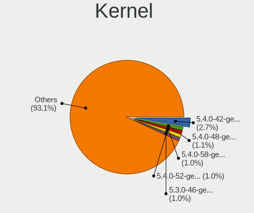

| Version             | Computers | Percent |
|---------------------|-----------|---------|
| 5.4.0-42-generic    | 155       | 3.74%   |
| 5.4.0-48-generic    | 65        | 1.57%   |
| 5.4.0-58-generic    | 60        | 1.45%   |
| 5.4.0-52-generic    | 59        | 1.42%   |
| 5.3.0-46-generic    | 59        | 1.42%   |
| 5.11.0-27-generic   | 50        | 1.21%   |
| 5.3.0-40-generic    | 48        | 1.16%   |
| 5.4.0-65-generic    | 47        | 1.13%   |
| 5.4.0-29-generic    | 46        | 1.11%   |
| 5.4.0-54-generic    | 45        | 1.09%   |
| 5.4.0-47-generic    | 42        | 1.01%   |
| 5.4.0-42-lowlatency | 40        | 0.97%   |
| 5.4.0-26-generic    | 38        | 0.92%   |
| 5.3.0-42-generic    | 38        | 0.92%   |
| 5.3.0-28-generic    | 36        | 0.87%   |
| 5.4.0-40-generic    | 35        | 0.84%   |
| 5.0.0-37-generic    | 35        | 0.84%   |
| 5.3.0-51-generic    | 34        | 0.82%   |
| 5.4.0-37-generic    | 33        | 0.8%    |
| 5.4.0-66-generic    | 31        | 0.75%   |
| 4.15.0-99-generic   | 31        | 0.75%   |
| 5.4.0-89-generic    | 30        | 0.72%   |
| 5.4.0-31-generic    | 30        | 0.72%   |
| 5.4.0-72-generic    | 28        | 0.68%   |
| 5.3.0-53-generic    | 28        | 0.68%   |
| 5.15.0-47-generic   | 28        | 0.68%   |
| 5.4.0-29-lowlatency | 27        | 0.65%   |
| 5.4.0-91-generic    | 26        | 0.63%   |
| 5.4.0-81-generic    | 26        | 0.63%   |
| 5.15.0-46-generic   | 26        | 0.63%   |
| 5.8.0-53-generic    | 25        | 0.6%    |
| 5.4.0-33-generic    | 25        | 0.6%    |
| 5.8.0-43-generic    | 24        | 0.58%   |
| 5.4.0-56-generic    | 24        | 0.58%   |
| 5.13.0-39-generic   | 24        | 0.58%   |
| 5.11.0-37-generic   | 24        | 0.58%   |
| 5.4.0-77-generic    | 23        | 0.56%   |
| 5.4.0-73-generic    | 23        | 0.56%   |
| 5.4.0-53-generic    | 23        | 0.56%   |
| 5.13.0-30-generic   | 23        | 0.56%   |

Kernel Family
-------------

Linux kernel without a distro release

| Version | Computers | Percent |
|---------|-----------|---------|
| 5.4.0   | 1527      | 41.37%  |
| 4.15.0  | 466       | 12.63%  |
| 5.3.0   | 438       | 11.87%  |
| 5.11.0  | 274       | 7.42%   |
| 5.8.0   | 253       | 6.85%   |
| 5.13.0  | 218       | 5.91%   |
| 5.15.0  | 170       | 4.61%   |
| 5.0.0   | 107       | 2.9%    |
| 4.4.0   | 45        | 1.22%   |
| 4.18.0  | 25        | 0.68%   |
| 4.13.0  | 9         | 0.24%   |
| 5.17.0  | 7         | 0.19%   |
| 4.10.0  | 6         | 0.16%   |
| 5.6.0   | 5         | 0.14%   |
| 5.14.0  | 5         | 0.14%   |
| 5.10.0  | 5         | 0.14%   |
| 5.9.8   | 3         | 0.08%   |
| 5.9.16  | 3         | 0.08%   |
| 5.18.0  | 3         | 0.08%   |
| 5.15.1  | 3         | 0.08%   |
| 5.11.16 | 3         | 0.08%   |
| 4.8.0   | 3         | 0.08%   |
| 5.9.0   | 2         | 0.05%   |
| 5.7.7   | 2         | 0.05%   |
| 5.7.6   | 2         | 0.05%   |
| 5.7.1   | 2         | 0.05%   |
| 5.7.0   | 2         | 0.05%   |
| 5.6.19  | 2         | 0.05%   |
| 5.5.19  | 2         | 0.05%   |
| 5.19.0  | 2         | 0.05%   |
| 5.16.9  | 2         | 0.05%   |
| 5.13.7  | 2         | 0.05%   |
| 5.12.12 | 2         | 0.05%   |
| 5.12.10 | 2         | 0.05%   |
| 5.11.6  | 2         | 0.05%   |
| 5.11.11 | 2         | 0.05%   |
| 4.9.253 | 2         | 0.05%   |
| 4.4.254 | 2         | 0.05%   |
| 4.11.0  | 2         | 0.05%   |
| 5.9.6   | 1         | 0.03%   |

Kernel Major Ver.
-----------------

Linux kernel major version

| Version | Computers | Percent |
|---------|-----------|---------|
| 5.4     | 1533      | 41.58%  |
| 4.15    | 466       | 12.64%  |
| 5.3     | 440       | 11.93%  |
| 5.11    | 281       | 7.62%   |
| 5.8     | 258       | 7%      |
| 5.13    | 222       | 6.02%   |
| 5.15    | 180       | 4.88%   |
| 5.0     | 109       | 2.96%   |
| 4.4     | 48        | 1.3%    |
| 4.18    | 25        | 0.68%   |
| 5.10    | 15        | 0.41%   |
| 5.9     | 11        | 0.3%    |
| 5.7     | 10        | 0.27%   |
| 5.14    | 10        | 0.27%   |
| 5.6     | 9         | 0.24%   |
| 4.13    | 9         | 0.24%   |
| 5.17    | 8         | 0.22%   |
| 5.12    | 8         | 0.22%   |
| 4.19    | 7         | 0.19%   |
| 4.10    | 6         | 0.16%   |
| 5.18    | 5         | 0.14%   |
| 5.19    | 4         | 0.11%   |
| 5.16    | 4         | 0.11%   |
| 4.9     | 4         | 0.11%   |
| 5.5     | 3         | 0.08%   |
| 4.8     | 3         | 0.08%   |
| 5.2     | 2         | 0.05%   |
| 4.14    | 2         | 0.05%   |
| 4.11    | 2         | 0.05%   |
| 4.20    | 1         | 0.03%   |
| 4.12    | 1         | 0.03%   |
| 3.13    | 1         | 0.03%   |

Arch
----

OS architecture (x86_64, i586, etc.)

| Name    | Computers | Percent |
|---------|-----------|---------|
| x86_64  | 2999      | 85.17%  |
| i686    | 487       | 13.83%  |
| aarch64 | 28        | 0.8%    |
| armv7l  | 7         | 0.2%    |

DE
--

Desktop Environment

| Name            | Computers | Percent |
|-----------------|-----------|---------|
| XFCE            | 3394      | 96.37%  |
| GNOME           | 89        | 2.53%   |
| i3              | 8         | 0.23%   |
| KDE5            | 7         | 0.2%    |
| Cinnamon        | 6         | 0.17%   |
| Unity           | 4         | 0.11%   |
| GNOME Flashback | 4         | 0.11%   |
| X-Cinnamon      | 2         | 0.06%   |
| MATE            | 2         | 0.06%   |
| LXQt            | 2         | 0.06%   |
| ICEWM           | 1         | 0.03%   |
| GNUstep         | 1         | 0.03%   |
| awesome         | 1         | 0.03%   |
| Unknown         | 1         | 0.03%   |

Display Server
--------------

X11 or Wayland

| Name    | Computers | Percent |
|---------|-----------|---------|
| X11     | 3457      | 98.29%  |
| Tty     | 41        | 1.17%   |
| Wayland | 14        | 0.4%    |
| Web     | 3         | 0.09%   |
| Unknown | 2         | 0.06%   |

Display Manager
---------------

SDDM, LightDM, etc.

| Name    | Computers | Percent |
|---------|-----------|---------|
| Unknown | 2068      | 57%     |
| LightDM | 963       | 26.54%  |
| TDM     | 508       | 14%     |
| GDM     | 45        | 1.24%   |
| GDM3    | 31        | 0.85%   |
| SDDM    | 7         | 0.19%   |
| XDM     | 4         | 0.11%   |
| SLiM    | 1         | 0.03%   |
| NODM    | 1         | 0.03%   |

OS Lang
-------

Language

| Lang    | Computers | Percent |
|---------|-----------|---------|
| en_US   | 1123      | 31.78%  |
| de_DE   | 356       | 10.07%  |
| fr_FR   | 304       | 8.6%    |
| it_IT   | 235       | 6.65%   |
| pt_BR   | 182       | 5.15%   |
| ru_RU   | 167       | 4.73%   |
| en_GB   | 131       | 3.71%   |
| C       | 128       | 3.62%   |
| es_ES   | 99        | 2.8%    |
| en_CA   | 84        | 2.38%   |
| Unknown | 81        | 2.29%   |
| en_AU   | 66        | 1.87%   |
| pl_PL   | 55        | 1.56%   |
| es_AR   | 40        | 1.13%   |
| nl_NL   | 36        | 1.02%   |
| hu_HU   | 36        | 1.02%   |
| ja_JP   | 35        | 0.99%   |
| cs_CZ   | 28        | 0.79%   |
| es_MX   | 20        | 0.57%   |
| en_IN   | 20        | 0.57%   |
| pt_PT   | 16        | 0.45%   |
| fi_FI   | 16        | 0.45%   |
| sv_SE   | 14        | 0.4%    |
| sk_SK   | 14        | 0.4%    |
| ru_UA   | 14        | 0.4%    |
| fr_BE   | 14        | 0.4%    |
| tr_TR   | 12        | 0.34%   |
| en_ZA   | 12        | 0.34%   |
| el_GR   | 12        | 0.34%   |
| zh_TW   | 11        | 0.31%   |
| de_CH   | 11        | 0.31%   |
| de_AT   | 11        | 0.31%   |
| fr_CA   | 10        | 0.28%   |
| es_CO   | 10        | 0.28%   |
| nl_BE   | 9         | 0.25%   |
| zh_CN   | 8         | 0.23%   |
| es_VE   | 7         | 0.2%    |
| ca_ES   | 7         | 0.2%    |
| bg_BG   | 7         | 0.2%    |
| es_PE   | 6         | 0.17%   |

Boot Mode
---------

EFI or BIOS

| Mode | Computers | Percent |
|------|-----------|---------|
| BIOS | 2373      | 66.86%  |
| EFI  | 1176      | 33.14%  |

Filesystem
----------

Type of filesystem

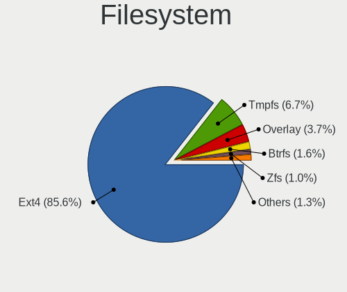

| Type    | Computers | Percent |
|---------|-----------|---------|
| Ext4    | 3237      | 91.8%   |
| Overlay | 140       | 3.97%   |
| Btrfs   | 59        | 1.67%   |
| Zfs     | 31        | 0.88%   |
| Unknown | 24        | 0.68%   |
| Xfs     | 15        | 0.43%   |
| Ext2    | 11        | 0.31%   |
| Ext3    | 7         | 0.2%    |
| Ufs     | 1         | 0.03%   |
| Aufs    | 1         | 0.03%   |

Part. scheme
------------

Scheme of partitioning

| Type    | Computers | Percent |
|---------|-----------|---------|
| Unknown | 2455      | 69.59%  |
| GPT     | 668       | 18.93%  |
| MBR     | 405       | 11.48%  |

Dual Boot with Linux/BSD
------------------------

Hosting more than one Linux/BSD

| Dual boot | Computers | Percent |
|-----------|-----------|---------|
| No        | 2990      | 83.38%  |
| Yes       | 596       | 16.62%  |

Dual Boot (Win)
---------------

Hosting Linux and Windows

| Dual boot | Computers | Percent |
|-----------|-----------|---------|
| No        | 2352      | 65.74%  |
| Yes       | 1226      | 34.26%  |

Board
-----

Vendor
------

Motherboard manufacturer

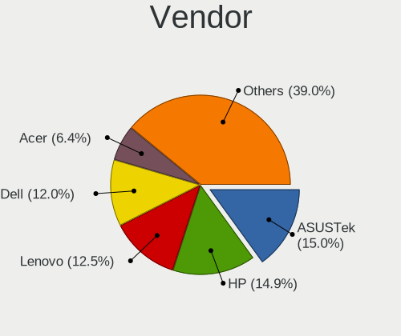

| Name                    | Computers | Percent |
|-------------------------|-----------|---------|
| Hewlett-Packard         | 560       | 15.93%  |
| ASUSTek Computer        | 533       | 15.16%  |
| Dell                    | 430       | 12.23%  |
| Lenovo                  | 401       | 11.41%  |
| Acer                    | 235       | 6.69%   |
| Gigabyte Technology     | 201       | 5.72%   |
| MSI                     | 156       | 4.44%   |
| ASRock                  | 136       | 3.87%   |
| Toshiba                 | 94        | 2.67%   |
| Apple                   | 62        | 1.76%   |
| Intel                   | 59        | 1.68%   |
| Samsung Electronics     | 54        | 1.54%   |
| Sony                    | 44        | 1.25%   |
| Medion                  | 42        | 1.19%   |
| Unknown                 | 36        | 1.02%   |
| Fujitsu                 | 30        | 0.85%   |
| Fujitsu Siemens         | 29        | 0.83%   |
| ECS                     | 28        | 0.8%    |
| Packard Bell            | 25        | 0.71%   |
| Foxconn                 | 20        | 0.57%   |
| Positivo                | 15        | 0.43%   |
| Notebook                | 15        | 0.43%   |
| Raspberry Pi Foundation | 14        | 0.4%    |
| Google                  | 14        | 0.4%    |
| Pegatron                | 13        | 0.37%   |
| Clevo                   | 13        | 0.37%   |
| IBM                     | 12        | 0.34%   |
| eMachines               | 11        | 0.31%   |
| HUAWEI                  | 9         | 0.26%   |
| AMI                     | 9         | 0.26%   |
| Supermicro              | 8         | 0.23%   |
| LG Electronics          | 8         | 0.23%   |
| Gateway                 | 8         | 0.23%   |
| Biostar                 | 8         | 0.23%   |
| ZOTAC                   | 6         | 0.17%   |
| NEC Computers           | 6         | 0.17%   |
| Alienware               | 6         | 0.17%   |
| Semp Toshiba            | 5         | 0.14%   |
| OEM                     | 5         | 0.14%   |
| TUXEDO                  | 4         | 0.11%   |

Model
-----

Motherboard model

| Name                                   | Computers | Percent |
|----------------------------------------|-----------|---------|
| Unknown                                | 56        | 1.59%   |
| ASUS All Series                        | 23        | 0.65%   |
| HP Pavilion dv6                        | 17        | 0.48%   |
| HP Notebook                            | 17        | 0.48%   |
| Gigabyte H410M S2H                     | 15        | 0.43%   |
| Dell OptiPlex 7010                     | 13        | 0.37%   |
| Dell OptiPlex 755                      | 11        | 0.31%   |
| Dell Latitude D630                     | 11        | 0.31%   |
| HP 15                                  | 10        | 0.28%   |
| ECS G31T-M9                            | 9         | 0.26%   |
| HP Pavilion 15                         | 8         | 0.23%   |
| Dell OptiPlex 780                      | 8         | 0.23%   |
| Dell OptiPlex 760                      | 8         | 0.23%   |
| ASRock N68C-S UCC                      | 8         | 0.23%   |
| HP Pavilion dv6500                     | 7         | 0.2%    |
| Dell OptiPlex 390                      | 7         | 0.2%    |
| Dell Latitude E6430                    | 7         | 0.2%    |
| MSI MS-7C37                            | 6         | 0.17%   |
| HP Pavilion dv7                        | 6         | 0.17%   |
| ASUS VivoBook_ASUSLaptop X571LH_K571LH | 6         | 0.17%   |
| ASUS TUF Gaming X570-PLUS              | 6         | 0.17%   |
| MSI MS-7B89                            | 5         | 0.14%   |
| MSI MS-7B79                            | 5         | 0.14%   |
| MSI MS-7A38                            | 5         | 0.14%   |
| MSI MS-7721                            | 5         | 0.14%   |
| HP Pavilion g6                         | 5         | 0.14%   |
| HP EliteDesk 800 G1 SFF                | 5         | 0.14%   |
| HP Compaq Elite 8300 SFF               | 5         | 0.14%   |
| HP Compaq dc7600 Small Form Factor     | 5         | 0.14%   |
| Dell OptiPlex GX620                    | 5         | 0.14%   |
| Dell Latitude E6520                    | 5         | 0.14%   |
| ASUS M5A78L-M/USB3                     | 5         | 0.14%   |
| ASUS 1005HA                            | 5         | 0.14%   |
| Acer Aspire one                        | 5         | 0.14%   |
| Acer AO751h                            | 5         | 0.14%   |
| RPi Raspberry Pi 4 Model B Rev 1.1     | 4         | 0.11%   |
| MSI MS-7C02                            | 4         | 0.11%   |
| MSI MS-7817                            | 4         | 0.11%   |
| MSI MS-7816                            | 4         | 0.11%   |
| MSI MS-7693                            | 4         | 0.11%   |

Model Family
------------

Motherboard model prefix

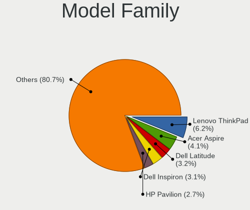

| Name                  | Computers | Percent |
|-----------------------|-----------|---------|
| Lenovo ThinkPad       | 197       | 5.6%    |
| Acer Aspire           | 149       | 4.24%   |
| Dell Inspiron         | 119       | 3.39%   |
| HP Compaq             | 105       | 2.99%   |
| Dell Latitude         | 105       | 2.99%   |
| HP Pavilion           | 102       | 2.9%    |
| Dell OptiPlex         | 89        | 2.53%   |
| Toshiba Satellite     | 79        | 2.25%   |
| Lenovo IdeaPad        | 60        | 1.71%   |
| Unknown               | 56        | 1.59%   |
| HP EliteBook          | 54        | 1.54%   |
| HP ProBook            | 42        | 1.19%   |
| ASUS PRIME            | 41        | 1.17%   |
| HP Laptop             | 35        | 1%      |
| Lenovo ThinkCentre    | 34        | 0.97%   |
| Dell Precision        | 32        | 0.91%   |
| ASUS VivoBook         | 29        | 0.83%   |
| ASUS All              | 23        | 0.65%   |
| Dell Vostro           | 19        | 0.54%   |
| ASUS TUF              | 19        | 0.54%   |
| HP Notebook           | 18        | 0.51%   |
| Dell XPS              | 18        | 0.51%   |
| HP ProDesk            | 16        | 0.46%   |
| Gigabyte H410M        | 15        | 0.43%   |
| Fujitsu Siemens AMILO | 15        | 0.43%   |
| ASUS ROG              | 15        | 0.43%   |
| Acer Extensa          | 15        | 0.43%   |
| RPi Raspberry         | 14        | 0.4%    |
| Packard Bell EasyNote | 14        | 0.4%    |
| Acer Veriton          | 14        | 0.4%    |
| HP ENVY               | 13        | 0.37%   |
| Fujitsu LIFEBOOK      | 12        | 0.34%   |
| Dell Studio           | 12        | 0.34%   |
| Dell PowerEdge        | 12        | 0.34%   |
| HP Presario           | 11        | 0.31%   |
| HP Mini               | 11        | 0.31%   |
| HP EliteDesk          | 11        | 0.31%   |
| HP 15                 | 11        | 0.31%   |
| Fujitsu ESPRIMO       | 11        | 0.31%   |
| Lenovo IdeaCentre     | 10        | 0.28%   |

MFG Year
--------

Motherboard manufacture year

| Year    | Computers | Percent |
|---------|-----------|---------|
| 2012    | 303       | 8.62%   |
| 2011    | 297       | 8.45%   |
| 2010    | 274       | 7.8%    |
| 2008    | 273       | 7.77%   |
| 2013    | 261       | 7.43%   |
| 2009    | 252       | 7.17%   |
| 2007    | 248       | 7.06%   |
| 2019    | 215       | 6.12%   |
| 2018    | 195       | 5.55%   |
| 2014    | 189       | 5.38%   |
| 2017    | 182       | 5.18%   |
| 2020    | 179       | 5.09%   |
| 2006    | 141       | 4.01%   |
| 2015    | 138       | 3.93%   |
| 2016    | 128       | 3.64%   |
| 2021    | 95        | 2.7%    |
| 2005    | 66        | 1.88%   |
| Unknown | 32        | 0.91%   |
| 2004    | 16        | 0.46%   |
| 2003    | 15        | 0.43%   |
| 2022    | 9         | 0.26%   |
| 2001    | 4         | 0.11%   |
| 2002    | 3         | 0.09%   |

Form Factor
-----------

Physical design of the computer

| Name           | Computers | Percent |
|----------------|-----------|---------|
| Notebook       | 1920      | 54.62%  |
| Desktop        | 1405      | 39.97%  |
| Mini pc        | 43        | 1.22%   |
| All in one     | 39        | 1.11%   |
| Convertible    | 34        | 0.97%   |
| System on chip | 33        | 0.94%   |
| Server         | 27        | 0.77%   |
| Tablet         | 13        | 0.37%   |
| Firewall       | 1         | 0.03%   |

Secure Boot
-----------

Enabled or disabled

| State    | Computers | Percent |
|----------|-----------|---------|
| Disabled | 3338      | 94.61%  |
| Enabled  | 190       | 5.39%   |

Coreboot
--------

Have coreboot on board

| Used | Computers | Percent |
|------|-----------|---------|
| No   | 3500      | 99.57%  |
| Yes  | 15        | 0.43%   |

RAM Size
--------

Total RAM memory

| Size in GB      | Computers | Percent |
|-----------------|-----------|---------|
| 3.01-4.0        | 949       | 26.6%   |
| 4.01-8.0        | 659       | 18.47%  |
| 8.01-16.0       | 478       | 13.4%   |
| 1.01-2.0        | 450       | 12.62%  |
| 16.01-24.0      | 446       | 12.5%   |
| 32.01-64.0      | 180       | 5.05%   |
| 0.51-1.0        | 142       | 3.98%   |
| 2.01-3.0        | 139       | 3.9%    |
| 64.01-256.0     | 72        | 2.02%   |
| 24.01-32.0      | 39        | 1.09%   |
| 0.01-0.5        | 12        | 0.34%   |
| More than 256.0 | 1         | 0.03%   |

RAM Used
--------

Used RAM memory

| Used GB    | Computers | Percent |
|------------|-----------|---------|
| 1.01-2.0   | 1650      | 42.5%   |
| 0.51-1.0   | 810       | 20.87%  |
| 2.01-3.0   | 674       | 17.36%  |
| 4.01-8.0   | 297       | 7.65%   |
| 3.01-4.0   | 243       | 6.26%   |
| 0.01-0.5   | 111       | 2.86%   |
| 8.01-16.0  | 78        | 2.01%   |
| 16.01-24.0 | 9         | 0.23%   |
| 24.01-32.0 | 7         | 0.18%   |
| 32.01-64.0 | 2         | 0.05%   |
| Unknown    | 1         | 0.03%   |

Total Drives
------------

Number of drives on board

| Drives | Computers | Percent |
|--------|-----------|---------|
| 1      | 2248      | 62.29%  |
| 2      | 865       | 23.97%  |
| 3      | 271       | 7.51%   |
| 4      | 101       | 2.8%    |
| 5      | 45        | 1.25%   |
| 0      | 42        | 1.16%   |
| 6      | 17        | 0.47%   |
| 7      | 12        | 0.33%   |
| 10     | 3         | 0.08%   |
| 8      | 3         | 0.08%   |
| 9      | 2         | 0.06%   |

Has CD-ROM
----------

Has CD-ROM on board

| Presented | Computers | Percent |
|-----------|-----------|---------|
| Yes       | 1887      | 53.29%  |
| No        | 1654      | 46.71%  |

Has Ethernet
------------

Has Ethernet on board

| Presented | Computers | Percent |
|-----------|-----------|---------|
| Yes       | 3200      | 91.01%  |
| No        | 316       | 8.99%   |

Has WiFi
--------

Has WiFi module

| Presented | Computers | Percent |
|-----------|-----------|---------|
| Yes       | 2544      | 71.8%   |
| No        | 999       | 28.2%   |

Has Bluetooth
-------------

Has Bluetooth module

| Presented | Computers | Percent |
|-----------|-----------|---------|
| No        | 2048      | 57.56%  |
| Yes       | 1510      | 42.44%  |

Location
--------

Country
-------

Geographic location (country)

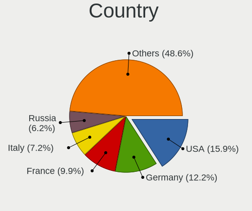

| Country      | Computers | Percent |
|--------------|-----------|---------|
| USA          | 552       | 15.63%  |
| Germany      | 433       | 12.26%  |
| France       | 317       | 8.98%   |
| Italy        | 263       | 7.45%   |
| Russia       | 216       | 6.12%   |
| Brazil       | 206       | 5.83%   |
| Canada       | 138       | 3.91%   |
| UK           | 132       | 3.74%   |
| Spain        | 118       | 3.34%   |
| Netherlands  | 86        | 2.43%   |
| Australia    | 75        | 2.12%   |
| Poland       | 65        | 1.84%   |
| Ukraine      | 54        | 1.53%   |
| Argentina    | 52        | 1.47%   |
| Belgium      | 45        | 1.27%   |
| Japan        | 41        | 1.16%   |
| Hungary      | 41        | 1.16%   |
| Mexico       | 40        | 1.13%   |
| Finland      | 39        | 1.1%    |
| Czechia      | 39        | 1.1%    |
| Sweden       | 36        | 1.02%   |
| Portugal     | 33        | 0.93%   |
| Greece       | 30        | 0.85%   |
| India        | 29        | 0.82%   |
| Indonesia    | 27        | 0.76%   |
| Bulgaria     | 25        | 0.71%   |
| Austria      | 22        | 0.62%   |
| Romania      | 21        | 0.59%   |
| Turkey       | 19        | 0.54%   |
| Slovakia     | 18        | 0.51%   |
| Switzerland  | 16        | 0.45%   |
| Iran         | 15        | 0.42%   |
| Norway       | 14        | 0.4%    |
| Taiwan       | 13        | 0.37%   |
| Colombia     | 13        | 0.37%   |
| South Africa | 12        | 0.34%   |
| Israel       | 11        | 0.31%   |
| Venezuela    | 10        | 0.28%   |
| Denmark      | 10        | 0.28%   |
| Chile        | 10        | 0.28%   |

City
----

Geographic location (city)

| City              | Computers | Percent |
|-------------------|-----------|---------|
| Paris             | 47        | 1.26%   |
| Berlin            | 41        | 1.1%    |
| Moscow            | 38        | 1.02%   |
| Rome              | 31        | 0.83%   |
| Voronezh          | 27        | 0.73%   |
| Milan             | 26        | 0.7%    |
| Sao Paulo         | 24        | 0.65%   |
| Sydney            | 23        | 0.62%   |
| Amsterdam         | 22        | 0.59%   |
| Warsaw            | 20        | 0.54%   |
| Madrid            | 20        | 0.54%   |
| Hamburg           | 20        | 0.54%   |
| Budapest          | 20        | 0.54%   |
| Athens            | 20        | 0.54%   |
| St Petersburg     | 19        | 0.51%   |
| Qubec           | 19        | 0.51%   |
| Munich            | 17        | 0.46%   |
| Helsinki          | 17        | 0.46%   |
| Barcelona         | 16        | 0.43%   |
| Rio de Janeiro    | 15        | 0.4%    |
| Oryol             | 15        | 0.4%    |
| Montreal          | 15        | 0.4%    |
| Kyiv              | 15        | 0.4%    |
| Genoa             | 15        | 0.4%    |
| Melbourne         | 14        | 0.38%   |
| Turin             | 13        | 0.35%   |
| Sofia             | 12        | 0.32%   |
| Prague            | 12        | 0.32%   |
| Leipzig           | 12        | 0.32%   |
| Buenos Aires      | 12        | 0.32%   |
| Vancouver         | 11        | 0.3%    |
| Toronto           | 11        | 0.3%    |
| Tehran            | 11        | 0.3%    |
| Frankfurt am Main | 11        | 0.3%    |
| Belo Horizonte    | 11        | 0.3%    |
| Yokohama          | 10        | 0.27%   |
| Vienna            | 10        | 0.27%   |
| Lisbon            | 10        | 0.27%   |
| Cologne           | 10        | 0.27%   |
| Rostov-on-Don     | 9         | 0.24%   |

Drives
------

Drive Vendor
------------

Hard drive vendors

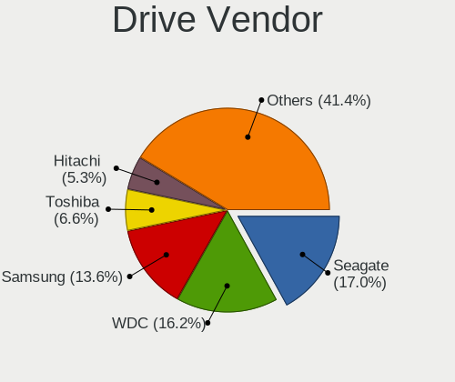

| Vendor              | Computers | Drives | Percent |
|---------------------|-----------|--------|---------|
| Seagate             | 901       | 1308   | 18.71%  |
| WDC                 | 835       | 1195   | 17.34%  |
| Samsung Electronics | 641       | 893    | 13.31%  |
| Toshiba             | 344       | 431    | 7.14%   |
| Hitachi             | 296       | 384    | 6.15%   |
| Unknown             | 228       | 290    | 4.74%   |
| Kingston            | 216       | 272    | 4.49%   |
| SanDisk             | 163       | 203    | 3.39%   |
| Crucial             | 122       | 164    | 2.53%   |
| HGST                | 94        | 110    | 1.95%   |
| Intel               | 86        | 126    | 1.79%   |
| SK hynix            | 71        | 79     | 1.47%   |
| A-DATA Technology   | 65        | 84     | 1.35%   |
| Fujitsu             | 64        | 81     | 1.33%   |
| Maxtor              | 58        | 83     | 1.2%    |
| China               | 50        | 59     | 1.04%   |
| Micron Technology   | 36        | 40     | 0.75%   |
| PNY                 | 29        | 39     | 0.6%    |
| Patriot             | 29        | 34     | 0.6%    |
| OCZ                 | 26        | 33     | 0.54%   |
| Transcend           | 23        | 24     | 0.48%   |
| Phison              | 23        | 31     | 0.48%   |
| Intenso             | 23        | 30     | 0.48%   |
| KIOXIA              | 17        | 20     | 0.35%   |
| Apple               | 17        | 25     | 0.35%   |
| LITEON              | 15        | 17     | 0.31%   |
| SPCC                | 14        | 20     | 0.29%   |
| LITEONIT            | 14        | 17     | 0.29%   |
| Silicon Motion      | 12        | 13     | 0.25%   |
| Apacer              | 12        | 17     | 0.25%   |
| Unknown             | 12        | 12     | 0.25%   |
| KingDian            | 11        | 17     | 0.23%   |
| ASMT                | 11        | 14     | 0.23%   |
| JMicron Technology  | 10        | 10     | 0.21%   |
| Lexar               | 9         | 9      | 0.19%   |
| Hewlett-Packard     | 9         | 13     | 0.19%   |
| Smartbuy            | 7         | 7      | 0.15%   |
| Plextor             | 7         | 8      | 0.15%   |
| KingSpec            | 7         | 9      | 0.15%   |
| IBM/Hitachi         | 7         | 7      | 0.15%   |

Drive Model
-----------

Hard drive models

| Model                               | Computers | Percent |
|-------------------------------------|-----------|---------|
| Kingston SA400S37240G 240GB SSD     | 62        | 1.18%   |
| Unknown MMC Card  32GB              | 47        | 0.89%   |
| Seagate ST500DM002-1BD142 500GB     | 46        | 0.87%   |
| Samsung SSD 860 EVO 500GB           | 39        | 0.74%   |
| Kingston SA400S37480G 480GB SSD     | 36        | 0.68%   |
| Seagate ST1000LM024 HN-M101MBB 1TB  | 31        | 0.59%   |
| Unknown MMC Card  64GB              | 30        | 0.57%   |
| Seagate ST500LM012 HN-M500MBB 500GB | 30        | 0.57%   |
| Seagate ST1000DM010-2EP102 1TB      | 30        | 0.57%   |
| Samsung SSD 850 EVO 250GB           | 29        | 0.55%   |
| Seagate ST500LT012-1DG142 500GB     | 28        | 0.53%   |
| Toshiba MQ01ABD100 1TB              | 26        | 0.49%   |
| Toshiba MQ01ABF050 500GB            | 25        | 0.47%   |
| Samsung SSD 850 EVO 500GB           | 25        | 0.47%   |
| Kingston SA400S37120G 120GB SSD     | 24        | 0.46%   |
| Seagate ST1000LM035-1RK172 1TB      | 23        | 0.44%   |
| Seagate Expansion 1TB               | 22        | 0.42%   |
| Seagate ST3500418AS 500GB           | 21        | 0.4%    |
| Unknown SD/MMC/MS PRO 2GB           | 20        | 0.38%   |
| Toshiba DT01ACA100 1TB              | 20        | 0.38%   |
| HGST HTS721010A9E630 1TB            | 20        | 0.38%   |
| Seagate ST9500325AS 500GB           | 19        | 0.36%   |
| Seagate ST2000DM008-2FR102 2TB      | 19        | 0.36%   |
| Samsung SSD 860 EVO 1TB             | 18        | 0.34%   |
| HGST HTS541010A9E680 1TB            | 18        | 0.34%   |
| Unknown MMC Card  16GB              | 17        | 0.32%   |
| Unknown MMC Card  128GB             | 17        | 0.32%   |
| Seagate ST31000528AS 1TB            | 17        | 0.32%   |
| Seagate ST2000DM001-1CH164 2TB      | 17        | 0.32%   |
| Seagate ST1000DM003-1CH162 1TB      | 17        | 0.32%   |
| Kingston SV300S37A120G 120GB SSD    | 17        | 0.32%   |
| Seagate ST9320325AS 320GB           | 16        | 0.3%    |
| Seagate ST500LT012-9WS142 500GB     | 16        | 0.3%    |
| Samsung SSD 860 EVO 250GB           | 16        | 0.3%    |
| Samsung NVMe SSD Drive 256GB        | 16        | 0.3%    |
| Hitachi HDS721010CLA332 1TB         | 16        | 0.3%    |
| WDC WD10JPVX-22JC3T0 1TB            | 15        | 0.28%   |
| Seagate ST31000524AS 1TB            | 15        | 0.28%   |
| Crucial CT500MX500SSD1 500GB        | 15        | 0.28%   |
| Crucial CT240BX500SSD1 240GB        | 15        | 0.28%   |

HDD Vendor
----------

Hard disk drive vendors

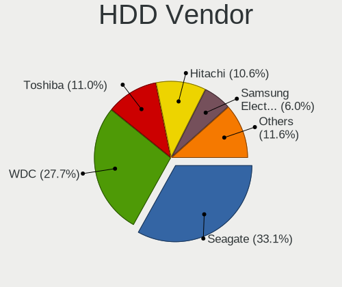

| Vendor              | Computers | Drives | Percent |
|---------------------|-----------|--------|---------|
| Seagate             | 884       | 1282   | 33.17%  |
| WDC                 | 734       | 1045   | 27.54%  |
| Hitachi             | 296       | 384    | 11.11%  |
| Toshiba             | 293       | 371    | 10.99%  |
| Samsung Electronics | 178       | 247    | 6.68%   |
| HGST                | 94        | 110    | 3.53%   |
| Fujitsu             | 62        | 79     | 2.33%   |
| Maxtor              | 56        | 81     | 2.1%    |
| Unknown             | 21        | 23     | 0.79%   |
| IBM/Hitachi         | 7         | 7      | 0.26%   |
| USB3.0              | 6         | 8      | 0.23%   |
| Intenso             | 5         | 6      | 0.19%   |
| ASMT                | 5         | 8      | 0.19%   |
| Apple               | 3         | 4      | 0.11%   |
| WD MediaMax         | 2         | 2      | 0.08%   |
| Inateck             | 2         | 2      | 0.08%   |
| HGST HTS            | 2         | 2      | 0.08%   |
| Hewlett-Packard     | 2         | 2      | 0.08%   |
| ExcelStor           | 2         | 2      | 0.08%   |
| Apricorn            | 2         | 3      | 0.08%   |
| SAGE                | 1         | 1      | 0.04%   |
| PHD 3.0             | 1         | 1      | 0.04%   |
| LaCie               | 1         | 4      | 0.04%   |
| ICY BOX             | 1         | 1      | 0.04%   |
| HPE                 | 1         | 4      | 0.04%   |
| Ext Hard            | 1         | 1      | 0.04%   |
| CLOVER              | 1         | 1      | 0.04%   |
| ASMedia             | 1         | 1      | 0.04%   |
| ACASIS              | 1         | 1      | 0.04%   |

SSD Vendor
----------

Solid state drive vendors

| Vendor              | Computers | Drives | Percent |
|---------------------|-----------|--------|---------|
| Samsung Electronics | 329       | 436    | 23.32%  |
| Kingston            | 194       | 243    | 13.75%  |
| SanDisk             | 130       | 166    | 9.21%   |
| Crucial             | 112       | 154    | 7.94%   |
| WDC                 | 69        | 90     | 4.89%   |
| A-DATA Technology   | 54        | 72     | 3.83%   |
| China               | 50        | 59     | 3.54%   |
| Intel               | 45        | 68     | 3.19%   |
| Patriot             | 29        | 34     | 2.06%   |
| PNY                 | 28        | 38     | 1.98%   |
| Micron Technology   | 27        | 30     | 1.91%   |
| Toshiba             | 26        | 32     | 1.84%   |
| OCZ                 | 25        | 31     | 1.77%   |
| Transcend           | 21        | 21     | 1.49%   |
| SK hynix            | 20        | 20     | 1.42%   |
| Intenso             | 16        | 18     | 1.13%   |
| LITEON              | 15        | 17     | 1.06%   |
| SPCC                | 14        | 20     | 0.99%   |
| LITEONIT            | 14        | 17     | 0.99%   |
| KingDian            | 11        | 17     | 0.78%   |
| Apacer              | 11        | 16     | 0.78%   |
| Apple               | 9         | 13     | 0.64%   |
| Unknown             | 8         | 9      | 0.57%   |
| Lexar               | 8         | 8      | 0.57%   |
| Smartbuy            | 7         | 7      | 0.5%    |
| Plextor             | 7         | 8      | 0.5%    |
| KingSpec            | 6         | 8      | 0.43%   |
| Goodram             | 6         | 8      | 0.43%   |
| Corsair             | 6         | 6      | 0.43%   |
| ASMT                | 6         | 6      | 0.43%   |
| Team                | 5         | 9      | 0.35%   |
| Mushkin             | 5         | 5      | 0.35%   |
| Hewlett-Packard     | 5         | 8      | 0.35%   |
| Pioneer             | 4         | 4      | 0.28%   |
| Netac               | 4         | 6      | 0.28%   |
| FORESEE             | 4         | 5      | 0.28%   |
| Drevo               | 4         | 4      | 0.28%   |
| TO Exter            | 3         | 4      | 0.21%   |
| Seagate             | 3         | 3      | 0.21%   |
| Kingmax             | 3         | 4      | 0.21%   |

Drive Kind
----------

HDD or SSD

| Kind    | Computers | Drives | Percent |
|---------|-----------|--------|---------|
| HDD     | 2254      | 3683   | 52.46%  |
| SSD     | 1273      | 1806   | 29.63%  |
| NVMe    | 493       | 632    | 11.47%  |
| MMC     | 205       | 266    | 4.77%   |
| Unknown | 72        | 93     | 1.68%   |

Drive Connector
---------------

SATA, SAS, NVMe, etc.

| Type | Computers | Drives | Percent |
|------|-----------|--------|---------|
| SATA | 3033      | 5339   | 77.43%  |
| NVMe | 484       | 621    | 12.36%  |
| MMC  | 205       | 266    | 5.23%   |
| SAS  | 195       | 254    | 4.98%   |

Drive Size
----------

Size of hard drive

| Size in TB | Computers | Drives | Percent |
|------------|-----------|--------|---------|
| 0.01-0.5   | 2502      | 3773   | 68.27%  |
| 0.51-1.0   | 801       | 1122   | 21.86%  |
| 1.01-2.0   | 212       | 334    | 5.78%   |
| 3.01-4.0   | 59        | 101    | 1.61%   |
| 2.01-3.0   | 48        | 90     | 1.31%   |
| 4.01-10.0  | 39        | 64     | 1.06%   |
| 10.01-20.0 | 3         | 4      | 0.08%   |
| 0          | 1         | 1      | 0.03%   |

Space Total
-----------

Amount of disk space available on the file system

| Size in GB     | Computers | Percent |
|----------------|-----------|---------|
| 101-250        | 1154      | 31.52%  |
| 251-500        | 817       | 22.32%  |
| 501-1000       | 462       | 12.62%  |
| 51-100         | 346       | 9.45%   |
| 21-50          | 253       | 6.91%   |
| 1001-2000      | 231       | 6.31%   |
| 1-20           | 163       | 4.45%   |
| More than 3000 | 127       | 3.47%   |
| 2001-3000      | 83        | 2.27%   |
| Unknown        | 25        | 0.68%   |

Space Used
----------

Amount of used disk space

| Used GB        | Computers | Percent |
|----------------|-----------|---------|
| 1-20           | 1587      | 41.71%  |
| 21-50          | 641       | 16.85%  |
| 101-250        | 477       | 12.54%  |
| 51-100         | 444       | 11.67%  |
| 251-500        | 259       | 6.81%   |
| 501-1000       | 188       | 4.94%   |
| 1001-2000      | 92        | 2.42%   |
| More than 3000 | 56        | 1.47%   |
| 2001-3000      | 36        | 0.95%   |
| Unknown        | 25        | 0.66%   |

Malfunc. Drives
---------------

Drive models with a malfunction

| Model                               | Computers | Drives | Percent |
|-------------------------------------|-----------|--------|---------|
| Seagate ST1000LM024 HN-M101MBB 1TB  | 7         | 7      | 2.76%   |
| Toshiba MQ01ABD100 1TB              | 5         | 6      | 1.97%   |
| Seagate ST9500325AS 500GB           | 5         | 7      | 1.97%   |
| Seagate ST500LT012-9WS142 500GB     | 4         | 4      | 1.57%   |
| Seagate ST500DM002-1BD142 500GB     | 4         | 4      | 1.57%   |
| Seagate ST3500418AS 500GB           | 3         | 4      | 1.18%   |
| Seagate ST2000DM001-1CH164 2TB      | 3         | 4      | 1.18%   |
| Maxtor STM3160215AS 160GB           | 3         | 3      | 1.18%   |
| Hitachi HDS721050CLA362 500GB       | 3         | 3      | 1.18%   |
| HGST HTS545050A7E680 500GB          | 3         | 3      | 1.18%   |
| WDC WD7500BPKX-00HPJT0 752GB        | 2         | 2      | 0.79%   |
| WDC WD5000LPVX-22V0TT0 500GB        | 2         | 2      | 0.79%   |
| WDC WD4000FYYZ-01UL1B1 4TB          | 2         | 3      | 0.79%   |
| WDC WD1002FAEX-00Z3A0 1TB           | 2         | 2      | 0.79%   |
| Toshiba MK2552GSX 250GB             | 2         | 2      | 0.79%   |
| Seagate ST9500423AS 500GB           | 2         | 2      | 0.79%   |
| Seagate ST9320423AS 320GB           | 2         | 2      | 0.79%   |
| Seagate ST9320325AS 320GB           | 2         | 2      | 0.79%   |
| Seagate ST500LM012 HN-M500MBB 500GB | 2         | 2      | 0.79%   |
| Seagate ST3250318AS 250GB           | 2         | 4      | 0.79%   |
| Seagate ST31000528AS 1TB            | 2         | 2      | 0.79%   |
| Seagate ST1000DL002-9TT153 1TB      | 2         | 2      | 0.79%   |
| Samsung Electronics HM321HI 320GB   | 2         | 2      | 0.79%   |
| Samsung Electronics HD103SI 1TB     | 2         | 2      | 0.79%   |
| Samsung Electronics HD081GJ 80GB    | 2         | 2      | 0.79%   |
| Kingston SV300S37A120G 120GB SSD    | 2         | 2      | 0.79%   |
| Kingston SA400S37240G 240GB SSD     | 2         | 2      | 0.79%   |
| KingDian S100 32GB SSD              | 2         | 4      | 0.79%   |
| Hitachi HTS725050A9A364 500GB       | 2         | 2      | 0.79%   |
| Hitachi HTS725032A9A364 320GB       | 2         | 2      | 0.79%   |
| Hitachi HTS545050A7E380 500GB       | 2         | 2      | 0.79%   |
| Hitachi HTS543232A7A384 320GB       | 2         | 3      | 0.79%   |
| Hitachi HDS721010CLA332 1TB         | 2         | 2      | 0.79%   |
| HGST HTS541010A9E680 1TB            | 2         | 2      | 0.79%   |
| WDC WDS480G2G0A-00JH30 480GB SSD    | 1         | 1      | 0.39%   |
| WDC WDS240G2G0B-00EPW0 240GB SSD    | 1         | 1      | 0.39%   |
| WDC WD7500BPVT-80HXZT3 752GB        | 1         | 2      | 0.39%   |
| WDC WD7500BPVT-24HXZT1 752GB        | 1         | 2      | 0.39%   |
| WDC WD6400AAKS-22A7B2 640GB         | 1         | 1      | 0.39%   |
| WDC WD6400AAKS-22A7B0 640GB         | 1         | 1      | 0.39%   |

Malfunc. Drive Vendor
---------------------

Vendors of faulty drives

| Vendor              | Computers | Drives | Percent |
|---------------------|-----------|--------|---------|
| Seagate             | 75        | 87     | 30.24%  |
| WDC                 | 50        | 58     | 20.16%  |
| Toshiba             | 26        | 32     | 10.48%  |
| Hitachi             | 25        | 31     | 10.08%  |
| Samsung Electronics | 16        | 19     | 6.45%   |
| HGST                | 7         | 8      | 2.82%   |
| Kingston            | 6         | 7      | 2.42%   |
| SK hynix            | 5         | 5      | 2.02%   |
| Maxtor              | 5         | 5      | 2.02%   |
| Fujitsu             | 4         | 5      | 1.61%   |
| Crucial             | 3         | 3      | 1.21%   |
| A-DATA Technology   | 3         | 4      | 1.21%   |
| OCZ                 | 2         | 2      | 0.81%   |
| Micron Technology   | 2         | 2      | 0.81%   |
| KingDian            | 2         | 4      | 0.81%   |
| Intel               | 2         | 3      | 0.81%   |
| Unknown             | 1         | 1      | 0.4%    |
| SSSTC               | 1         | 1      | 0.4%    |
| SPCC                | 1         | 1      | 0.4%    |
| SanDisk             | 1         | 1      | 0.4%    |
| Neo Forza           | 1         | 1      | 0.4%    |
| Mushkin             | 1         | 1      | 0.4%    |
| LDLC                | 1         | 1      | 0.4%    |
| ICY BOX             | 1         | 1      | 0.4%    |
| FORESEE             | 1         | 1      | 0.4%    |
| Drevo               | 1         | 1      | 0.4%    |
| Corsair             | 1         | 1      | 0.4%    |
| China               | 1         | 1      | 0.4%    |
| Avant               | 1         | 1      | 0.4%    |
| Apple               | 1         | 1      | 0.4%    |
| Apacer              | 1         | 1      | 0.4%    |

Malfunc. HDD Vendor
-------------------

Vendors of faulty HDD drives

| Vendor              | Computers | Drives | Percent |
|---------------------|-----------|--------|---------|
| Seagate             | 75        | 87     | 36.95%  |
| WDC                 | 48        | 56     | 23.65%  |
| Toshiba             | 25        | 31     | 12.32%  |
| Hitachi             | 25        | 31     | 12.32%  |
| Samsung Electronics | 13        | 15     | 6.4%    |
| HGST                | 7         | 8      | 3.45%   |
| Maxtor              | 5         | 5      | 2.46%   |
| Fujitsu             | 4         | 5      | 1.97%   |
| ICY BOX             | 1         | 1      | 0.49%   |

Malfunc. Drive Kind
-------------------

Kinds of faulty drives

| Kind | Computers | Drives | Percent |
|------|-----------|--------|---------|
| HDD  | 191       | 239    | 81.62%  |
| SSD  | 41        | 49     | 17.52%  |
| NVMe | 2         | 2      | 0.85%   |

Failed Drives
-------------

Failed drive models

| Model                            | Computers | Drives | Percent |
|----------------------------------|-----------|--------|---------|
| WDC WD20EARS-00J99B0 2TB         | 1         | 1      | 25%     |
| Toshiba DT01ACA200 2TB           | 1         | 1      | 25%     |
| Seagate ST500DM002-1BC142 500GB  | 1         | 1      | 25%     |
| A-DATA Technology SP800 32GB SSD | 1         | 1      | 25%     |

Failed Drive Vendor
-------------------

Failed drive vendors

| Vendor            | Computers | Drives | Percent |
|-------------------|-----------|--------|---------|
| WDC               | 1         | 1      | 25%     |
| Toshiba           | 1         | 1      | 25%     |
| Seagate           | 1         | 1      | 25%     |
| A-DATA Technology | 1         | 1      | 25%     |

Drive Status
------------

Number of failed and malfunc. drives

| Status   | Computers | Drives | Percent |
|----------|-----------|--------|---------|
| Detected | 2532      | 4682   | 68.88%  |
| Works    | 912       | 1504   | 24.81%  |
| Malfunc  | 228       | 290    | 6.2%    |
| Failed   | 4         | 4      | 0.11%   |

Storage controller
------------------

Storage Vendor
--------------

Storage controller vendors

| Vendor                           | Computers | Percent |
|----------------------------------|-----------|---------|
| Intel                            | 2442      | 61.71%  |
| AMD                              | 605       | 15.29%  |
| Samsung Electronics              | 174       | 4.4%    |
| Nvidia                           | 136       | 3.44%   |
| SanDisk                          | 72        | 1.82%   |
| JMicron Technology               | 62        | 1.57%   |
| ASMedia Technology               | 58        | 1.47%   |
| VIA Technologies                 | 51        | 1.29%   |
| SK hynix                         | 44        | 1.11%   |
| Marvell Technology Group         | 44        | 1.11%   |
| Silicon Integrated Systems [SiS] | 36        | 0.91%   |
| Phison Electronics               | 27        | 0.68%   |
| Kingston Technology Company      | 25        | 0.63%   |
| Toshiba America Info Systems     | 23        | 0.58%   |
| KIOXIA                           | 19        | 0.48%   |
| Silicon Motion                   | 16        | 0.4%    |
| ADATA Technology                 | 15        | 0.38%   |
| LSI Logic / Symbios Logic        | 13        | 0.33%   |
| Micron/Crucial Technology        | 11        | 0.28%   |
| Micron Technology                | 10        | 0.25%   |
| Silicon Image                    | 9         | 0.23%   |
| Broadcom / LSI                   | 8         | 0.2%    |
| Realtek Semiconductor            | 7         | 0.18%   |
| ULi Electronics                  | 6         | 0.15%   |
| Hewlett-Packard                  | 6         | 0.15%   |
| Adaptec                          | 6         | 0.15%   |
| Apple                            | 5         | 0.13%   |
| Union Memory (Shenzhen)          | 4         | 0.1%    |
| Promise Technology               | 4         | 0.1%    |
| Integrated Technology Express    | 4         | 0.1%    |
| Seagate Technology               | 3         | 0.08%   |
| Shenzhen Longsys Electronics     | 2         | 0.05%   |
| Lite-On Technology               | 2         | 0.05%   |
| Lenovo                           | 2         | 0.05%   |
| Unknown                          | 1         | 0.03%   |
| Solid State Storage Technology   | 1         | 0.03%   |
| OCZ Technology Group             | 1         | 0.03%   |
| MAXIO Technology (Hangzhou)      | 1         | 0.03%   |
| HighPoint Technologies           | 1         | 0.03%   |
| Biwin Storage Technology         | 1         | 0.03%   |

Storage Model
-------------

Storage controller models

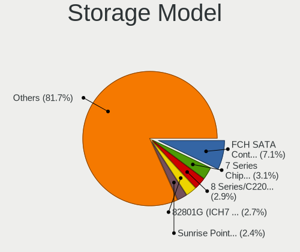

| Model                                                                                   | Computers | Percent |
|-----------------------------------------------------------------------------------------|-----------|---------|
| AMD FCH SATA Controller [AHCI mode]                                                     | 353       | 7.07%   |
| Intel 82801G (ICH7 Family) IDE Controller                                               | 164       | 3.28%   |
| Intel 7 Series Chipset Family 6-port SATA Controller [AHCI mode]                        | 157       | 3.14%   |
| Intel NM10/ICH7 Family SATA Controller [IDE mode]                                       | 148       | 2.96%   |
| Intel 8 Series/C220 Series Chipset Family 6-port SATA Controller 1 [AHCI mode]          | 128       | 2.56%   |
| Intel 82801HM/HEM (ICH8M/ICH8M-E) IDE Controller                                        | 122       | 2.44%   |
| Intel Sunrise Point-LP SATA Controller [AHCI mode]                                      | 114       | 2.28%   |
| Intel 82801IBM/IEM (ICH9M/ICH9M-E) 4 port SATA Controller [AHCI mode]                   | 111       | 2.22%   |
| Intel 6 Series/C200 Series Chipset Family 6 port Mobile SATA AHCI Controller            | 107       | 2.14%   |
| Samsung NVMe SSD Controller SM981/PM981/PM983                                           | 102       | 2.04%   |
| Intel 82801HM/HEM (ICH8M/ICH8M-E) SATA Controller [AHCI mode]                           | 101       | 2.02%   |
| Intel 6 Series/C200 Series Chipset Family 6 port Desktop SATA AHCI Controller           | 97        | 1.94%   |
| AMD SB7x0/SB8x0/SB9x0 IDE Controller                                                    | 88        | 1.76%   |
| Intel 82801 Mobile SATA Controller [RAID mode]                                          | 86        | 1.72%   |
| AMD SB7x0/SB8x0/SB9x0 SATA Controller [AHCI mode]                                       | 83        | 1.66%   |
| Intel 5 Series/3400 Series Chipset 4 port SATA AHCI Controller                          | 73        | 1.46%   |
| Intel 7 Series/C210 Series Chipset Family 6-port SATA Controller [AHCI mode]            | 66        | 1.32%   |
| Intel 8 Series SATA Controller 1 [AHCI mode]                                            | 62        | 1.24%   |
| AMD SB7x0/SB8x0/SB9x0 SATA Controller [IDE mode]                                        | 61        | 1.22%   |
| Intel NM10/ICH7 Family SATA Controller [AHCI mode]                                      | 59        | 1.18%   |
| Nvidia MCP61 SATA Controller                                                            | 57        | 1.14%   |
| Intel 82801GBM/GHM (ICH7-M Family) SATA Controller [IDE mode]                           | 56        | 1.12%   |
| Intel 5 Series/3400 Series Chipset 6 port SATA AHCI Controller                          | 56        | 1.12%   |
| ASMedia ASM1062 Serial ATA Controller                                                   | 56        | 1.12%   |
| AMD 400 Series Chipset SATA Controller                                                  | 56        | 1.12%   |
| Intel SATA Controller [RAID mode]                                                       | 53        | 1.06%   |
| Intel 82801GBM/GHM (ICH7-M Family) SATA Controller [AHCI mode]                          | 51        | 1.02%   |
| Intel Q170/Q150/B150/H170/H110/Z170/CM236 Chipset SATA Controller [AHCI Mode]           | 50        | 1%      |
| Intel Atom Processor E3800 Series SATA AHCI Controller                                  | 50        | 1%      |
| Nvidia MCP61 IDE                                                                        | 47        | 0.94%   |
| Intel Wildcat Point-LP SATA Controller [AHCI Mode]                                      | 39        | 0.78%   |
| Intel 6 Series/C200 Series Chipset Family Desktop SATA Controller (IDE mode, ports 4-5) | 38        | 0.76%   |
| Intel 6 Series/C200 Series Chipset Family Desktop SATA Controller (IDE mode, ports 0-3) | 38        | 0.76%   |
| VIA VT82C586A/B/VT82C686/A/B/VT823x/A/C PIPC Bus Master IDE                             | 37        | 0.74%   |
| JMicron JMB363 SATA/IDE Controller                                                      | 37        | 0.74%   |
| Intel 200 Series PCH SATA controller [AHCI mode]                                        | 37        | 0.74%   |
| Intel 82801I (ICH9 Family) 2 port SATA Controller [IDE mode]                            | 36        | 0.72%   |
| Intel Cannon Lake Mobile PCH SATA AHCI Controller                                       | 35        | 0.7%    |
| Silicon Integrated Systems [SiS] 5513 IDE Controller                                    | 34        | 0.68%   |
| AMD SB600 Non-Raid-5 SATA                                                               | 34        | 0.68%   |

Storage Kind
------------

Kind of storage controller (IDE, SATA, NVMe, SAS, ...)

| Kind | Computers | Percent |
|------|-----------|---------|
| SATA | 2353      | 55.81%  |
| IDE  | 1131      | 26.83%  |
| NVMe | 479       | 11.36%  |
| RAID | 230       | 5.46%   |
| SAS  | 12        | 0.28%   |
| SCSI | 11        | 0.26%   |

Processor
---------

CPU Vendor
----------

Processor vendors

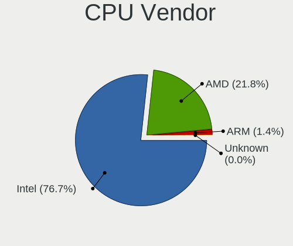

| Vendor       | Computers | Percent |
|--------------|-----------|---------|
| Intel        | 2719      | 77.35%  |
| AMD          | 757       | 21.54%  |
| ARM          | 35        | 1%      |
| CentaurHauls | 4         | 0.11%   |

CPU Model
---------

Processor models

| Model                                   | Computers | Percent |
|-----------------------------------------|-----------|---------|
| Intel Atom CPU N270 @ 1.60GHz           | 30        | 0.85%   |
| ARM Processor                           | 28        | 0.79%   |
| Intel Core 2 Duo CPU E8400 @ 3.00GHz    | 25        | 0.71%   |
| Intel Atom x5-Z8350 CPU @ 1.44GHz       | 25        | 0.71%   |
| Intel Pentium 4 CPU 3.00GHz             | 21        | 0.59%   |
| Intel Core i5-8250U CPU @ 1.60GHz       | 21        | 0.59%   |
| Intel Core i5-3320M CPU @ 2.60GHz       | 21        | 0.59%   |
| Intel Core i5-2400 CPU @ 3.10GHz        | 21        | 0.59%   |
| Intel Atom CPU N450 @ 1.66GHz           | 21        | 0.59%   |
| Intel Core i7-8550U CPU @ 1.80GHz       | 20        | 0.57%   |
| Intel Core i5-3470 CPU @ 3.20GHz        | 19        | 0.54%   |
| Intel Celeron CPU N3060 @ 1.60GHz       | 19        | 0.54%   |
| Intel Celeron CPU N2840 @ 2.16GHz       | 19        | 0.54%   |
| Intel Core i5-2520M CPU @ 2.50GHz       | 18        | 0.51%   |
| Intel Core 2 Duo CPU P8600 @ 2.40GHz    | 18        | 0.51%   |
| Intel Core 2 Duo CPU P8400 @ 2.26GHz    | 18        | 0.51%   |
| Intel 11th Gen Core i7-1165G7 @ 2.80GHz | 18        | 0.51%   |
| Intel Core i7-2670QM CPU @ 2.20GHz      | 17        | 0.48%   |
| Intel Core i5-7200U CPU @ 2.50GHz       | 17        | 0.48%   |
| Intel Core i3-2100 CPU @ 3.10GHz        | 17        | 0.48%   |
| Intel Core i3-10100 CPU @ 3.60GHz       | 17        | 0.48%   |
| Intel Core 2 Duo CPU E7500 @ 2.93GHz    | 17        | 0.48%   |
| Intel Core i7-3770 CPU @ 3.40GHz        | 16        | 0.45%   |
| Intel Core i7-9750H CPU @ 2.60GHz       | 15        | 0.42%   |
| Intel Core i5-6200U CPU @ 2.30GHz       | 15        | 0.42%   |
| Intel Core i3 CPU M 370 @ 2.40GHz       | 15        | 0.42%   |
| Intel Core 2 Duo CPU T7500 @ 2.20GHz    | 15        | 0.42%   |
| Intel Core i5-6300U CPU @ 2.40GHz       | 14        | 0.4%    |
| Intel Core i5-4570 CPU @ 3.20GHz        | 14        | 0.4%    |
| Intel Core i5-1035G1 CPU @ 1.00GHz      | 14        | 0.4%    |
| Intel Core i5 CPU M 520 @ 2.40GHz       | 14        | 0.4%    |
| Intel Celeron CPU N3350 @ 1.10GHz       | 14        | 0.4%    |
| AMD Ryzen 5 3600 6-Core Processor       | 14        | 0.4%    |
| Intel Core i7-8750H CPU @ 2.20GHz       | 13        | 0.37%   |
| Intel Core i7-8565U CPU @ 1.80GHz       | 13        | 0.37%   |
| Intel Core i7-3630QM CPU @ 2.40GHz      | 13        | 0.37%   |
| Intel Core i7-2600 CPU @ 3.40GHz        | 13        | 0.37%   |
| Intel Core i3-6006U CPU @ 2.00GHz       | 13        | 0.37%   |
| Intel Core i3 CPU M 380 @ 2.53GHz       | 13        | 0.37%   |
| Intel Core 2 Duo CPU T7250 @ 2.00GHz    | 13        | 0.37%   |

CPU Model Family
----------------

Processor model prefix

| Model                   | Computers | Percent |
|-------------------------|-----------|---------|
| Intel Core i5           | 570       | 16.15%  |
| Intel Core i7           | 446       | 12.64%  |
| Intel Core 2 Duo        | 299       | 8.47%   |
| Intel Core i3           | 273       | 7.74%   |
| Intel Celeron           | 224       | 6.35%   |
| Intel Atom              | 170       | 4.82%   |
| Intel Pentium           | 114       | 3.23%   |
| Other                   | 102       | 2.89%   |
| AMD Ryzen 5             | 99        | 2.81%   |
| Intel Xeon              | 89        | 2.52%   |
| Intel Pentium Dual-Core | 82        | 2.32%   |
| AMD Ryzen 7             | 74        | 2.1%    |
| Intel Pentium 4         | 62        | 1.76%   |
| Intel Pentium Dual      | 60        | 1.7%    |
| Intel Genuine           | 56        | 1.59%   |
| Intel Core 2            | 50        | 1.42%   |
| Intel Core 2 Quad       | 47        | 1.33%   |
| AMD FX                  | 47        | 1.33%   |
| AMD A8                  | 43        | 1.22%   |
| AMD Athlon 64 X2        | 40        | 1.13%   |
| AMD E1                  | 30        | 0.85%   |
| AMD A6                  | 29        | 0.82%   |
| Intel Pentium M         | 26        | 0.74%   |
| AMD Ryzen 3             | 26        | 0.74%   |
| AMD Phenom II X4        | 26        | 0.74%   |
| AMD Ryzen 9             | 25        | 0.71%   |
| AMD Athlon II X2        | 25        | 0.71%   |
| Intel Celeron M         | 24        | 0.68%   |
| AMD A4                  | 21        | 0.6%    |
| AMD Turion 64 X2 Mobile | 20        | 0.57%   |
| AMD A10                 | 20        | 0.57%   |
| AMD Sempron             | 19        | 0.54%   |
| AMD E                   | 18        | 0.51%   |
| Intel Pentium D         | 17        | 0.48%   |
| AMD Athlon 64           | 16        | 0.45%   |
| AMD Athlon              | 16        | 0.45%   |
| Intel Core i9           | 15        | 0.43%   |
| AMD E2                  | 15        | 0.43%   |
| AMD Ryzen 7 PRO         | 13        | 0.37%   |
| Intel Pentium Silver    | 11        | 0.31%   |

CPU Cores
---------

Number of processor cores

| Number  | Computers | Percent |
|---------|-----------|---------|
| 2       | 1743      | 49.46%  |
| 4       | 1070      | 30.36%  |
| 1       | 331       | 9.39%   |
| 6       | 170       | 4.82%   |
| 8       | 133       | 3.77%   |
| 12      | 30        | 0.85%   |
| 16      | 17        | 0.48%   |
| 3       | 16        | 0.45%   |
| 10      | 5         | 0.14%   |
| Unknown | 4         | 0.11%   |
| 24      | 2         | 0.06%   |
| 20      | 2         | 0.06%   |
| 14      | 1         | 0.03%   |

CPU Sockets
-----------

Number of sockets

| Number  | Computers | Percent |
|---------|-----------|---------|
| 1       | 3472      | 98.78%  |
| 2       | 40        | 1.14%   |
| Unknown | 3         | 0.09%   |

CPU Threads
-----------

Threads per core (Hyper-Threading)

| Number  | Computers | Percent |
|---------|-----------|---------|
| 1       | 1795      | 50.99%  |
| 2       | 1721      | 48.89%  |
| Unknown | 4         | 0.11%   |

CPU Op-Modes
------------

CPU Operation Modes (32-bit, 64-bit)

| Op mode        | Computers | Percent |
|----------------|-----------|---------|
| 32-bit, 64-bit | 3304      | 93.97%  |
| 32-bit         | 186       | 5.29%   |
| Unknown        | 25        | 0.71%   |
| 64-bit         | 1         | 0.03%   |

CPU Microcode
-------------

Microcode number

| Number     | Computers | Percent |
|------------|-----------|---------|
| Unknown    | 578       | 16.04%  |
| 0x206a7    | 247       | 6.85%   |
| 0x306a9    | 224       | 6.22%   |
| 0x1067a    | 223       | 6.19%   |
| 0x306c3    | 140       | 3.88%   |
| 0x6fd      | 135       | 3.75%   |
| 0x20655    | 81        | 2.25%   |
| 0x10676    | 77        | 2.14%   |
| 0x40651    | 61        | 1.69%   |
| 0x30678    | 60        | 1.66%   |
| 0x906ea    | 55        | 1.53%   |
| 0x506e3    | 55        | 1.53%   |
| 0x406c4    | 53        | 1.47%   |
| 0x106ca    | 50        | 1.39%   |
| 0x6fb      | 49        | 1.36%   |
| 0x010000c8 | 47        | 1.3%    |
| 0x406e3    | 46        | 1.28%   |
| 0x806ea    | 45        | 1.25%   |
| 0x6f6      | 45        | 1.25%   |
| 0x106c2    | 44        | 1.22%   |
| 0x20652    | 43        | 1.19%   |
| 0x806ec    | 38        | 1.05%   |
| 0x306d4    | 38        | 1.05%   |
| 0x806e9    | 37        | 1.03%   |
| 0x906e9    | 35        | 0.97%   |
| 0x806c1    | 35        | 0.97%   |
| 0x6e8      | 35        | 0.97%   |
| 0x06000852 | 35        | 0.97%   |
| 0x6d8      | 32        | 0.89%   |
| 0x08108109 | 32        | 0.89%   |
| 0x406c3    | 31        | 0.86%   |
| 0x0800820d | 29        | 0.8%    |
| 0x106e5    | 28        | 0.78%   |
| 0x08701021 | 28        | 0.78%   |
| 0x05000119 | 28        | 0.78%   |
| 0x0700010f | 26        | 0.72%   |
| 0x06001119 | 25        | 0.69%   |
| 0x07030105 | 24        | 0.67%   |
| 0x03000027 | 24        | 0.67%   |
| 0x10661    | 23        | 0.64%   |

CPU Microarch
-------------

Microarchitecture

| Name             | Computers | Percent |
|------------------|-----------|---------|
| Penryn           | 334       | 9.48%   |
| KabyLake         | 295       | 8.37%   |
| SandyBridge      | 282       | 8%      |
| Core             | 281       | 7.97%   |
| IvyBridge        | 258       | 7.32%   |
| Haswell          | 238       | 6.75%   |
| Silvermont       | 161       | 4.57%   |
| Westmere         | 157       | 4.46%   |
| K8 Hammer        | 124       | 3.52%   |
| Skylake          | 123       | 3.49%   |
| Bonnell          | 120       | 3.41%   |
| K10              | 104       | 2.95%   |
| P6               | 96        | 2.72%   |
| NetBurst         | 88        | 2.5%    |
| Zen 2            | 87        | 2.47%   |
| Zen+             | 85        | 2.41%   |
| Piledriver       | 67        | 1.9%    |
| Unknown          | 53        | 1.5%    |
| CometLake        | 51        | 1.45%   |
| Zen              | 50        | 1.42%   |
| Broadwell        | 49        | 1.39%   |
| TigerLake        | 46        | 1.31%   |
| Nehalem          | 45        | 1.28%   |
| Bobcat           | 43        | 1.22%   |
| Puma             | 33        | 0.94%   |
| Zen 3            | 32        | 0.91%   |
| Goldmont plus    | 32        | 0.91%   |
| Excavator        | 32        | 0.91%   |
| Jaguar           | 30        | 0.85%   |
| Goldmont         | 29        | 0.82%   |
| Icelake          | 27        | 0.77%   |
| K10 Llano        | 26        | 0.74%   |
| Steamroller      | 12        | 0.34%   |
| K8 & K10 hybrid  | 11        | 0.31%   |
| Bulldozer        | 10        | 0.28%   |
| K6               | 6         | 0.17%   |
| Alderlake Hybrid | 4         | 0.11%   |
| Tremont          | 3         | 0.09%   |

Graphics
--------

GPU Vendor
----------

Vendors of graphics cards

| Vendor                           | Computers | Percent |
|----------------------------------|-----------|---------|
| Intel                            | 1959      | 50.3%   |
| Nvidia                           | 999       | 25.65%  |
| AMD                              | 871       | 22.36%  |
| Silicon Integrated Systems [SiS] | 22        | 0.56%   |
| Matrox Electronics Systems       | 19        | 0.49%   |
| VIA Technologies                 | 18        | 0.46%   |
| ASPEED Technology                | 5         | 0.13%   |
| S3 Graphics                      | 1         | 0.03%   |
| Alliance Semiconductor           | 1         | 0.03%   |

GPU Model
---------

Graphics card models

| Model                                                                                    | Computers | Percent |
|------------------------------------------------------------------------------------------|-----------|---------|
| Intel 2nd Generation Core Processor Family Integrated Graphics Controller                | 206       | 4.96%   |
| Intel 3rd Gen Core processor Graphics Controller                                         | 135       | 3.25%   |
| Intel Mobile 4 Series Chipset Integrated Graphics Controller                             | 113       | 2.72%   |
| Intel Core Processor Integrated Graphics Controller                                      | 96        | 2.31%   |
| Intel Atom/Celeron/Pentium Processor x5-E8000/J3xxx/N3xxx Integrated Graphics Controller | 87        | 2.09%   |
| Intel Mobile 945GM/GMS/GME, 943/940GML Express Integrated Graphics Controller            | 84        | 2.02%   |
| Intel Mobile GM965/GL960 Integrated Graphics Controller (secondary)                      | 77        | 1.85%   |
| Intel Mobile GM965/GL960 Integrated Graphics Controller (primary)                        | 77        | 1.85%   |
| Intel Atom Processor Z36xxx/Z37xxx Series Graphics & Display                             | 73        | 1.76%   |
| Intel Xeon E3-1200 v3/4th Gen Core Processor Integrated Graphics Controller              | 65        | 1.56%   |
| Intel Haswell-ULT Integrated Graphics Controller                                         | 65        | 1.56%   |
| Intel 4 Series Chipset Integrated Graphics Controller                                    | 56        | 1.35%   |
| Intel Mobile 945GM/GMS, 943/940GML Express Integrated Graphics Controller                | 55        | 1.32%   |
| Intel UHD Graphics 620                                                                   | 52        | 1.25%   |
| AMD Picasso/Raven 2 [Radeon Vega Series / Radeon Vega Mobile Series]                     | 52        | 1.25%   |
| Intel Skylake GT2 [HD Graphics 520]                                                      | 50        | 1.2%    |
| Intel Atom Processor D4xx/D5xx/N4xx/N5xx Integrated Graphics Controller                  | 50        | 1.2%    |
| Intel Xeon E3-1200 v2/3rd Gen Core processor Graphics Controller                         | 46        | 1.11%   |
| AMD Ellesmere [Radeon RX 470/480/570/570X/580/580X/590]                                  | 44        | 1.06%   |
| Nvidia GK208B [GeForce GT 710]                                                           | 43        | 1.04%   |
| Intel TigerLake-LP GT2 [Iris Xe Graphics]                                                | 42        | 1.01%   |
| Intel 82G33/G31 Express Integrated Graphics Controller                                   | 42        | 1.01%   |
| Intel 4th Gen Core Processor Integrated Graphics Controller                              | 41        | 0.99%   |
| Intel HD Graphics 620                                                                    | 40        | 0.96%   |
| Intel CoffeeLake-H GT2 [UHD Graphics 630]                                                | 40        | 0.96%   |
| AMD Renoir                                                                               | 35        | 0.84%   |
| Intel Mobile 945GSE Express Integrated Graphics Controller                               | 33        | 0.79%   |
| Intel HD Graphics 5500                                                                   | 33        | 0.79%   |
| Nvidia GP107 [GeForce GTX 1050 Ti]                                                       | 32        | 0.77%   |
| Intel HD Graphics 530                                                                    | 31        | 0.75%   |
| Nvidia GT218 [GeForce 210]                                                               | 28        | 0.67%   |
| Intel WhiskeyLake-U GT2 [UHD Graphics 620]                                               | 28        | 0.67%   |
| AMD Raven Ridge [Radeon Vega Series / Radeon Vega Mobile Series]                         | 26        | 0.63%   |
| Intel HD Graphics 630                                                                    | 24        | 0.58%   |
| Intel CometLake-U GT2 [UHD Graphics]                                                     | 24        | 0.58%   |
| Intel 82945G/GZ Integrated Graphics Controller                                           | 24        | 0.58%   |
| Intel HD Graphics 500                                                                    | 23        | 0.55%   |
| Intel GeminiLake [UHD Graphics 600]                                                      | 23        | 0.55%   |
| Intel CometLake-H GT2 [UHD Graphics]                                                     | 22        | 0.53%   |
| AMD Cedar [Radeon HD 5000/6000/7350/8350 Series]                                         | 21        | 0.51%   |

GPU Combo
---------

Combinations of graphics cards

| Name                                 | Computers | Percent |
|--------------------------------------|-----------|---------|
| 1 x Intel                            | 1599      | 45.22%  |
| 1 x Nvidia                           | 708       | 20.02%  |
| 1 x AMD                              | 701       | 19.82%  |
| Intel + Nvidia                       | 249       | 7.04%   |
| Intel + AMD                          | 78        | 2.21%   |
| 2 x AMD                              | 60        | 1.7%    |
| Other                                | 42        | 1.19%   |
| AMD + Nvidia                         | 24        | 0.68%   |
| 1 x SiS                              | 22        | 0.62%   |
| 1 x VIA                              | 18        | 0.51%   |
| 1 x Matrox                           | 14        | 0.4%    |
| 2 x Nvidia                           | 5         | 0.14%   |
| Nvidia + ASPEED                      | 4         | 0.11%   |
| Nvidia + Matrox                      | 2         | 0.06%   |
| AMD + Matrox                         | 2         | 0.06%   |
| 3 x AMD                              | 1         | 0.03%   |
| 2 x Nvidia + 1 x Matrox              | 1         | 0.03%   |
| 2 x AMD + 1 x Nvidia                 | 1         | 0.03%   |
| 2 x AMD + 1 x Alliance Semiconductor | 1         | 0.03%   |
| 1 x S3 Graphics                      | 1         | 0.03%   |
| Intel + 2 x AMD                      | 1         | 0.03%   |
| Intel + AMD + 1 x Nvidia             | 1         | 0.03%   |
| 1 x ASPEED                           | 1         | 0.03%   |

GPU Driver
----------

Free vs proprietary

| Driver      | Computers | Percent |
|-------------|-----------|---------|
| Free        | 2837      | 80.12%  |
| Proprietary | 531       | 15%     |
| Unknown     | 173       | 4.89%   |

GPU Memory
----------

Total video memory

| Size in GB | Computers | Percent |
|------------|-----------|---------|
| Unknown    | 1765      | 49.22%  |
| 0.01-0.5   | 743       | 20.72%  |
| 1.01-2.0   | 421       | 11.74%  |
| 0.51-1.0   | 330       | 9.2%    |
| 3.01-4.0   | 180       | 5.02%   |
| 7.01-8.0   | 69        | 1.92%   |
| 5.01-6.0   | 43        | 1.2%    |
| 8.01-16.0  | 18        | 0.5%    |
| 2.01-3.0   | 14        | 0.39%   |
| 16.01-24.0 | 2         | 0.06%   |
| 4.01-5.0   | 1         | 0.03%   |

Monitor
-------

Monitor Vendor
--------------

Monitor vendors

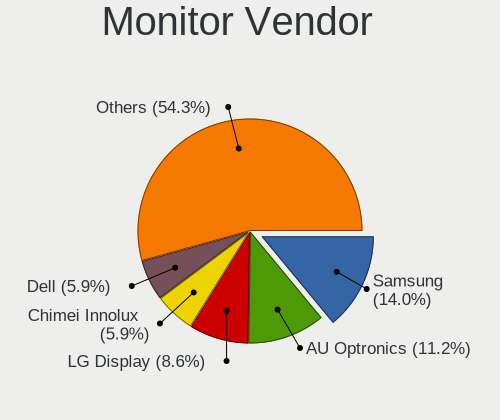

| Vendor                  | Computers | Percent |
|-------------------------|-----------|---------|
| Samsung Electronics     | 542       | 15.06%  |
| AU Optronics            | 394       | 10.95%  |
| LG Display              | 307       | 8.53%   |
| Chimei Innolux          | 203       | 5.64%   |
| Dell                    | 191       | 5.31%   |
| Goldstar                | 176       | 4.89%   |
| BOE                     | 176       | 4.89%   |
| Hewlett-Packard         | 135       | 3.75%   |
| Acer                    | 131       | 3.64%   |
| Chi Mei Optoelectronics | 96        | 2.67%   |
| Philips                 | 95        | 2.64%   |
| AOC                     | 90        | 2.5%    |
| Lenovo                  | 87        | 2.42%   |
| Ancor Communications    | 69        | 1.92%   |
| LG Philips              | 66        | 1.83%   |
| BenQ                    | 66        | 1.83%   |
| HannStar                | 49        | 1.36%   |
| Apple                   | 48        | 1.33%   |
| ViewSonic               | 45        | 1.25%   |
| Iiyama                  | 37        | 1.03%   |
| Unknown                 | 36        | 1%      |
| Sony                    | 34        | 0.94%   |
| LG Electronics          | 33        | 0.92%   |
| Sharp                   | 29        | 0.81%   |
| InfoVision              | 29        | 0.81%   |
| Fujitsu Siemens         | 25        | 0.69%   |
| Panasonic               | 22        | 0.61%   |
| CPT                     | 22        | 0.61%   |
| NEC Computers           | 21        | 0.58%   |
| Toshiba                 | 17        | 0.47%   |
| PANDA                   | 17        | 0.47%   |
| Eizo                    | 14        | 0.39%   |
| Medion                  | 13        | 0.36%   |
| Vizio                   | 12        | 0.33%   |
| ASUSTek Computer        | 11        | 0.31%   |
| Quanta Display          | 10        | 0.28%   |
| Vestel Elektronik       | 8         | 0.22%   |
| Lenovo Group Limited    | 8         | 0.22%   |
| DENON                   | 8         | 0.22%   |
| Seiko/Epson             | 7         | 0.19%   |

Monitor Model
-------------

Monitor models

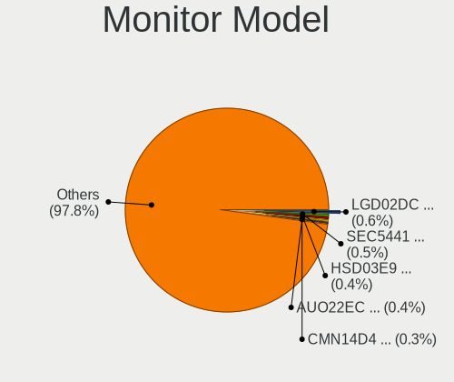

| Model                                                                    | Computers | Percent |
|--------------------------------------------------------------------------|-----------|---------|
| LG Display LCD Monitor LGD02DC 1366x768 344x194mm 15.5-inch              | 22        | 0.59%   |
| HannStar LCD Monitor HSD03E9 1024x600 220x129mm 10.0-inch                | 20        | 0.54%   |
| Samsung Electronics LCD Monitor SEC5441 1366x768 353x198mm 15.9-inch     | 17        | 0.46%   |
| Chi Mei Optoelectronics LCD Monitor CMO15A7 1366x768 344x193mm 15.5-inch | 16        | 0.43%   |
| AU Optronics LCD Monitor AUO22EC 1366x768 344x193mm 15.5-inch            | 16        | 0.43%   |
| AOC 24B2W1G5 AOC2402 1920x1080 527x296mm 23.8-inch                       | 15        | 0.4%    |
| Chimei Innolux LCD Monitor CMN14D4 1920x1080 309x173mm 13.9-inch         | 13        | 0.35%   |
| AU Optronics LCD Monitor AUO8174 1280x800 331x207mm 15.4-inch            | 12        | 0.32%   |
| AU Optronics LCD Monitor AUO38ED 1920x1080 344x193mm 15.5-inch           | 12        | 0.32%   |
| AU Optronics LCD Monitor AUO26EC 1366x768 344x193mm 15.5-inch            | 11        | 0.3%    |
| Panasonic TV MEIA296 1920x1080 698x392mm 31.5-inch                       | 10        | 0.27%   |
| AU Optronics LCD Monitor AUO21ED 1920x1080 344x193mm 15.5-inch           | 10        | 0.27%   |
| LG Display LCD Monitor LGD0563 1920x1080 344x194mm 15.5-inch             | 9         | 0.24%   |
| Goldstar W1943 GSM4BAD 1360x768 406x229mm 18.4-inch                      | 9         | 0.24%   |
| Chimei Innolux LCD Monitor CMN15DB 1366x768 344x193mm 15.5-inch          | 9         | 0.24%   |
| Chi Mei Optoelectronics LCD Monitor CMO1526 1280x800 331x207mm 15.4-inch | 9         | 0.24%   |
| AU Optronics LCD Monitor AUO21EC 1366x768 344x193mm 15.5-inch            | 9         | 0.24%   |
| Vestel Elektronik 24W_LCD_TV VES3700 1920x1080 706x398mm 31.9-inch       | 8         | 0.22%   |
| Samsung Electronics LCD Monitor SEC3345 1280x800 331x207mm 15.4-inch     | 8         | 0.22%   |
| InfoVision LCD Monitor IVO03F4 1024x600 223x125mm 10.1-inch              | 8         | 0.22%   |
| BOE LCD Monitor BOE0687 1920x1080 344x193mm 15.5-inch                    | 8         | 0.22%   |
| AU Optronics LCD Monitor AUO61ED 1920x1080 344x194mm 15.5-inch           | 8         | 0.22%   |
| AU Optronics LCD Monitor AUO213E 1600x900 309x174mm 14.0-inch            | 8         | 0.22%   |
| Samsung Electronics LCD Monitor SEC3030 1024x600 223x125mm 10.1-inch     | 7         | 0.19%   |
| LG Display LCD Monitor LGD033A 1366x768 344x194mm 15.5-inch              | 7         | 0.19%   |
| LG Display LCD Monitor LGD02E3 1366x768 344x194mm 15.5-inch              | 7         | 0.19%   |
| Chimei Innolux LCD Monitor CMN15AB 1366x768 344x193mm 15.5-inch          | 7         | 0.19%   |
| Chimei Innolux LCD Monitor CMN14C9 1920x1080 309x173mm 13.9-inch         | 7         | 0.19%   |
| AU Optronics LCD Monitor AUO45EC 1366x768 344x193mm 15.5-inch            | 7         | 0.19%   |
| AU Optronics LCD Monitor AUO235C 1366x768 256x144mm 11.6-inch            | 7         | 0.19%   |
| AU Optronics LCD Monitor AUO205C 1366x768 256x144mm 11.6-inch            | 7         | 0.19%   |
| Apple LCD Monitor APP9C5F 1280x800 286x179mm 13.3-inch                   | 7         | 0.19%   |
| Samsung Electronics SyncMaster SAM03C2 1680x1050 459x296mm 21.5-inch     | 6         | 0.16%   |
| Samsung Electronics LCD Monitor SEC5541 1366x768 340x190mm 15.3-inch     | 6         | 0.16%   |
| Samsung Electronics LCD Monitor SEC4251 1366x768 344x194mm 15.5-inch     | 6         | 0.16%   |
| Samsung Electronics LCD Monitor SEC325A 1366x768 344x194mm 15.5-inch     | 6         | 0.16%   |
| Philips PHL 243V5 PHLC0D1 1920x1080 521x293mm 23.5-inch                  | 6         | 0.16%   |
| PANDA LCD Monitor NCP004D 1920x1080 344x194mm 15.5-inch                  | 6         | 0.16%   |
| LG Display LP156WH2-TLAA LGD0230 1366x768 344x194mm 15.5-inch            | 6         | 0.16%   |
| LG Display LCD Monitor LGD033B 1366x768 344x194mm 15.5-inch              | 6         | 0.16%   |

Monitor Resolution
------------------

Monitor screen resolution

| Resolution         | Computers | Percent |
|--------------------|-----------|---------|
| 1920x1080 (FHD)    | 1166      | 33.15%  |
| 1366x768 (WXGA)    | 790       | 22.46%  |
| 1280x800 (WXGA)    | 236       | 6.71%   |
| 1280x1024 (SXGA)   | 212       | 6.03%   |
| 1600x900 (HD+)     | 168       | 4.78%   |
| 1440x900 (WXGA+)   | 165       | 4.69%   |
| 1680x1050 (WSXGA+) | 141       | 4.01%   |
| 3840x2160 (4K)     | 129       | 3.67%   |
| 1920x1200 (WUXGA)  | 74        | 2.1%    |
| 2560x1440 (QHD)    | 71        | 2.02%   |
| 1024x600           | 65        | 1.85%   |
| Unknown            | 56        | 1.59%   |
| 1024x768 (XGA)     | 41        | 1.17%   |
| 1360x768           | 39        | 1.11%   |
| 3840x1080          | 21        | 0.6%    |
| 1920x540           | 13        | 0.37%   |
| 2560x1080          | 12        | 0.34%   |
| 1600x1200          | 12        | 0.34%   |
| 2560x1600          | 10        | 0.28%   |
| 1280x720 (HD)      | 9         | 0.26%   |
| 2288x1287          | 7         | 0.2%    |
| 3440x1440          | 6         | 0.17%   |
| 3200x1080          | 6         | 0.17%   |
| 5120x1440          | 4         | 0.11%   |
| 3840x1200          | 4         | 0.11%   |
| 3200x1800 (QHD+)   | 4         | 0.11%   |
| 2880x1800          | 4         | 0.11%   |
| 1400x1050          | 4         | 0.11%   |
| 2160x1440          | 3         | 0.09%   |
| 2048x1152          | 3         | 0.09%   |
| 4480x1440          | 2         | 0.06%   |
| 3840x2400          | 2         | 0.06%   |
| 3286x1080          | 2         | 0.06%   |
| 3200x900           | 2         | 0.06%   |
| 2960x1050          | 2         | 0.06%   |
| 2048x1536          | 2         | 0.06%   |
| 1280x960           | 2         | 0.06%   |
| 800x600            | 1         | 0.03%   |
| 800x480            | 1         | 0.03%   |
| 7680x2164          | 1         | 0.03%   |

Monitor Diagonal
----------------

Diagonal size in inches

| Inches  | Computers | Percent |
|---------|-----------|---------|
| 15      | 883       | 24.63%  |
| Unknown | 277       | 7.73%   |
| 17      | 269       | 7.5%    |
| 14      | 269       | 7.5%    |
| 13      | 238       | 6.64%   |
| 23      | 211       | 5.89%   |
| 21      | 186       | 5.19%   |
| 24      | 184       | 5.13%   |
| 19      | 178       | 4.97%   |
| 27      | 139       | 3.88%   |
| 18      | 110       | 3.07%   |
| 20      | 87        | 2.43%   |
| 22      | 79        | 2.2%    |
| 10      | 73        | 2.04%   |
| 12      | 67        | 1.87%   |
| 31      | 64        | 1.79%   |
| 11      | 60        | 1.67%   |
| 84      | 27        | 0.75%   |
| 72      | 21        | 0.59%   |
| 54      | 20        | 0.56%   |
| 40      | 15        | 0.42%   |
| 26      | 15        | 0.42%   |
| 32      | 14        | 0.39%   |
| 25      | 13        | 0.36%   |
| 16      | 13        | 0.36%   |
| 34      | 10        | 0.28%   |
| 52      | 8         | 0.22%   |
| 48      | 8         | 0.22%   |
| 28      | 8         | 0.22%   |
| 37      | 5         | 0.14%   |
| 8       | 4         | 0.11%   |
| 49      | 3         | 0.08%   |
| 47      | 3         | 0.08%   |
| 29      | 3         | 0.08%   |
| 142     | 2         | 0.06%   |
| 74      | 2         | 0.06%   |
| 65      | 2         | 0.06%   |
| 60      | 2         | 0.06%   |
| 57      | 2         | 0.06%   |
| 46      | 2         | 0.06%   |

Monitor Width
-------------

Physical width

| Width in mm    | Computers | Percent |
|----------------|-----------|---------|
| 301-350        | 1353      | 38.14%  |
| 401-500        | 521       | 14.69%  |
| 501-600        | 520       | 14.66%  |
| 201-300        | 323       | 9.11%   |
| 351-400        | 302       | 8.51%   |
| Unknown        | 277       | 7.81%   |
| 601-700        | 95        | 2.68%   |
| 1501-2000      | 51        | 1.44%   |
| 1001-1500      | 49        | 1.38%   |
| 701-800        | 25        | 0.7%    |
| 801-900        | 23        | 0.65%   |
| 101-200        | 4         | 0.11%   |
| More than 2000 | 2         | 0.06%   |
| 901-1000       | 2         | 0.06%   |

Aspect Ratio
------------

Proportional relationship between the width and the height

| Ratio   | Computers | Percent |
|---------|-----------|---------|
| 16/9    | 2174      | 65.15%  |
| 16/10   | 585       | 17.53%  |
| Unknown | 252       | 7.55%   |
| 5/4     | 203       | 6.08%   |
| 4/3     | 68        | 2.04%   |
| 3/2     | 22        | 0.66%   |
| 21/9    | 14        | 0.42%   |
| 6/5     | 9         | 0.27%   |
| 32/9    | 4         | 0.12%   |
| 1.00    | 3         | 0.09%   |
| 3.20    | 1         | 0.03%   |
| 1.96    | 1         | 0.03%   |
| 0.62    | 1         | 0.03%   |

Monitor Area
------------

Area in inch

| Area in inch | Computers | Percent |
|----------------|-----------|---------|
| 101-110        | 881       | 24.69%  |
| 201-250        | 538       | 15.08%  |
| 81-90          | 402       | 11.27%  |
| 151-200        | 344       | 9.64%   |
| Unknown        | 277       | 7.76%   |
| 141-150        | 185       | 5.18%   |
| 301-350        | 147       | 4.12%   |
| 121-130        | 123       | 3.45%   |
| 351-500        | 95        | 2.66%   |
| More than 1000 | 94        | 2.63%   |
| 71-80          | 89        | 2.49%   |
| 251-300        | 85        | 2.38%   |
| 41-50          | 72        | 2.02%   |
| 61-70          | 63        | 1.77%   |
| 51-60          | 61        | 1.71%   |
| 131-140        | 43        | 1.21%   |
| 501-1000       | 34        | 0.95%   |
| 91-100         | 21        | 0.59%   |
| 111-120        | 10        | 0.28%   |
| 1-40           | 4         | 0.11%   |

Pixel Density
-------------

Pixels per inch

| Density       | Computers | Percent |
|---------------|-----------|---------|
| 51-100        | 1360      | 39.34%  |
| 101-120       | 993       | 28.72%  |
| 121-160       | 628       | 18.17%  |
| Unknown       | 277       | 8.01%   |
| 161-240       | 87        | 2.52%   |
| 1-50          | 83        | 2.4%    |
| More than 240 | 29        | 0.84%   |

Multiple Monitors
-----------------

Total monitors connected

| Total | Computers | Percent |
|-------|-----------|---------|
| 1     | 2966      | 82.92%  |
| 2     | 420       | 11.74%  |
| 0     | 161       | 4.5%    |
| 3     | 26        | 0.73%   |
| 4     | 4         | 0.11%   |

Network
-------

Net Controller Vendor
---------------------

Controller vendors

| Vendor                            | Computers | Percent |
|-----------------------------------|-----------|---------|
| Realtek Semiconductor             | 1811      | 33.46%  |
| Intel                             | 1420      | 26.23%  |
| Qualcomm Atheros                  | 700       | 12.93%  |
| Broadcom                          | 407       | 7.52%   |
| Marvell Technology Group          | 130       | 2.4%    |
| Nvidia                            | 112       | 2.07%   |
| Broadcom Limited                  | 111       | 2.05%   |
| Ralink Technology                 | 84        | 1.55%   |
| Ralink                            | 76        | 1.4%    |
| TP-Link                           | 60        | 1.11%   |
| VIA Technologies                  | 39        | 0.72%   |
| Qualcomm Atheros Communications   | 34        | 0.63%   |
| Silicon Integrated Systems [SiS]  | 30        | 0.55%   |
| Samsung Electronics               | 28        | 0.52%   |
| Huawei Technologies               | 27        | 0.5%    |
| D-Link System                     | 26        | 0.48%   |
| MediaTek                          | 25        | 0.46%   |
| NetGear                           | 21        | 0.39%   |
| JMicron Technology                | 21        | 0.39%   |
| Sierra Wireless                   | 15        | 0.28%   |
| D-Link                            | 15        | 0.28%   |
| Ericsson Business Mobile Networks | 14        | 0.26%   |
| Attansic Technology               | 14        | 0.26%   |
| ASUSTek Computer                  | 11        | 0.2%    |
| ASIX Electronics                  | 11        | 0.2%    |
| Xiaomi                            | 10        | 0.18%   |
| Edimax Technology                 | 10        | 0.18%   |
| Lenovo                            | 9         | 0.17%   |
| DisplayLink                       | 9         | 0.17%   |
| AMD                               | 8         | 0.15%   |
| Belkin Components                 | 7         | 0.13%   |
| Aquantia                          | 7         | 0.13%   |
| FIBOCOM                           | 6         | 0.11%   |
| Dell                              | 6         | 0.11%   |
| ULi Electronics                   | 5         | 0.09%   |
| Sitecom Europe                    | 5         | 0.09%   |
| Qualcomm                          | 5         | 0.09%   |
| Microsoft                         | 5         | 0.09%   |
| Linksys                           | 5         | 0.09%   |
| HTC (High Tech Computer)          | 5         | 0.09%   |

Net Controller Model
--------------------

Controller models

| Model                                                                   | Computers | Percent |
|-------------------------------------------------------------------------|-----------|---------|
| Realtek RTL8111/8168/8411 PCI Express Gigabit Ethernet Controller       | 1136      | 18.13%  |
| Realtek RTL810xE PCI Express Fast Ethernet controller                   | 314       | 5.01%   |
| Intel 82579LM Gigabit Network Connection (Lewisville)                   | 157       | 2.51%   |
| Qualcomm Atheros AR9285 Wireless Network Adapter (PCI-Express)          | 106       | 1.69%   |
| Intel PRO/Wireless 3945ABG [Golan] Network Connection                   | 89        | 1.42%   |
| Qualcomm Atheros AR9485 Wireless Network Adapter                        | 86        | 1.37%   |
| Realtek RTL-8100/8101L/8139 PCI Fast Ethernet Adapter                   | 84        | 1.34%   |
| Qualcomm Atheros QCA9565 / AR9565 Wireless Network Adapter              | 84        | 1.34%   |
| Intel Wi-Fi 6 AX200                                                     | 81        | 1.29%   |
| Qualcomm Atheros AR242x / AR542x Wireless Network Adapter (PCI-Express) | 67        | 1.07%   |
| Broadcom BCM4313 802.11bgn Wireless Network Adapter                     | 64        | 1.02%   |
| Intel Wireless 7260                                                     | 63        | 1.01%   |
| Intel Centrino Advanced-N 6205 [Taylor Peak]                            | 57        | 0.91%   |
| Qualcomm Atheros QCA9377 802.11ac Wireless Network Adapter              | 53        | 0.85%   |
| Intel Ethernet Connection I217-LM                                       | 53        | 0.85%   |
| Intel Wireless 8265 / 8275                                              | 52        | 0.83%   |
| Intel Wireless 7265                                                     | 52        | 0.83%   |
| Nvidia MCP61 Ethernet                                                   | 50        | 0.8%    |
| Realtek RTL8723BE PCIe Wireless Network Adapter                         | 49        | 0.78%   |
| Intel Wireless 3165                                                     | 44        | 0.7%    |
| Realtek RTL8188CE 802.11b/g/n WiFi Adapter                              | 43        | 0.69%   |
| Intel I211 Gigabit Network Connection                                   | 43        | 0.69%   |
| Realtek RTL8821CE 802.11ac PCIe Wireless Network Adapter                | 40        | 0.64%   |
| Realtek 802.11ac NIC                                                    | 40        | 0.64%   |
| Realtek RTL8153 Gigabit Ethernet Adapter                                | 36        | 0.57%   |
| Intel Wi-Fi 6 AX201                                                     | 36        | 0.57%   |
| Intel 82567LM-3 Gigabit Network Connection                              | 36        | 0.57%   |
| Qualcomm Atheros AR928X Wireless Network Adapter (PCI-Express)          | 35        | 0.56%   |
| Intel 82579V Gigabit Network Connection                                 | 35        | 0.56%   |
| Qualcomm Atheros QCA6174 802.11ac Wireless Network Adapter              | 34        | 0.54%   |
| Intel Wireless 8260                                                     | 33        | 0.53%   |
| Broadcom BCM4312 802.11b/g LP-PHY                                       | 33        | 0.53%   |
| VIA VT6102/VT6103 [Rhine-II]                                            | 32        | 0.51%   |
| Realtek RTL8188EUS 802.11n Wireless Network Adapter                     | 31        | 0.49%   |
| Ralink MT7601U Wireless Adapter                                         | 31        | 0.49%   |
| Qualcomm Atheros AR9271 802.11n                                         | 30        | 0.48%   |
| Qualcomm Atheros AR8132 Fast Ethernet                                   | 30        | 0.48%   |
| Intel Ethernet Connection (2) I219-V                                    | 29        | 0.46%   |
| Qualcomm Atheros AR8151 v2.0 Gigabit Ethernet                           | 28        | 0.45%   |
| Intel PRO/Wireless 5100 AGN [Shiloh] Network Connection                 | 28        | 0.45%   |

Wireless Vendor
---------------

Wireless vendors

| Vendor                                | Computers | Percent |
|---------------------------------------|-----------|---------|
| Intel                                 | 963       | 35.51%  |
| Qualcomm Atheros                      | 565       | 20.83%  |
| Realtek Semiconductor                 | 460       | 16.96%  |
| Broadcom                              | 249       | 9.18%   |
| Ralink Technology                     | 84        | 3.1%    |
| Ralink                                | 76        | 2.8%    |
| TP-Link                               | 56        | 2.06%   |
| Broadcom Limited                      | 54        | 1.99%   |
| Qualcomm Atheros Communications       | 34        | 1.25%   |
| NetGear                               | 21        | 0.77%   |
| D-Link System                         | 18        | 0.66%   |
| MediaTek                              | 16        | 0.59%   |
| Sierra Wireless                       | 15        | 0.55%   |
| D-Link                                | 14        | 0.52%   |
| Edimax Technology                     | 10        | 0.37%   |
| ASUSTek Computer                      | 10        | 0.37%   |
| Belkin Components                     | 7         | 0.26%   |
| FIBOCOM                               | 6         | 0.22%   |
| Sitecom Europe                        | 5         | 0.18%   |
| Microsoft                             | 5         | 0.18%   |
| Linksys                               | 5         | 0.18%   |
| ZyDAS                                 | 4         | 0.15%   |
| IMC Networks                          | 4         | 0.15%   |
| AVM                                   | 4         | 0.15%   |
| TRENDnet                              | 3         | 0.11%   |
| Marvell Technology Group              | 3         | 0.11%   |
| Ericsson Business Mobile Networks     | 3         | 0.11%   |
| Dell                                  | 3         | 0.11%   |
| Qualcomm                              | 2         | 0.07%   |
| 802.11g Adapter [Linksys WUSB54GC v3] | 2         | 0.07%   |
| ZyXEL Communications                  | 1         | 0.04%   |
| Xiaomi                                | 1         | 0.04%   |
| Winbond Electronics                   | 1         | 0.04%   |
| Texas Instruments                     | 1         | 0.04%   |
| Philips (or NXP)                      | 1         | 0.04%   |
| Micro Star International              | 1         | 0.04%   |
| Hewlett-Packard                       | 1         | 0.04%   |
| Gemtek                                | 1         | 0.04%   |
| BUFFALO                               | 1         | 0.04%   |
| AboCom Systems                        | 1         | 0.04%   |

Wireless Model
--------------

Wireless models

| Model                                                                         | Computers | Percent |
|-------------------------------------------------------------------------------|-----------|---------|
| Qualcomm Atheros AR9285 Wireless Network Adapter (PCI-Express)                | 106       | 3.87%   |
| Intel PRO/Wireless 3945ABG [Golan] Network Connection                         | 89        | 3.25%   |
| Qualcomm Atheros AR9485 Wireless Network Adapter                              | 86        | 3.14%   |
| Qualcomm Atheros QCA9565 / AR9565 Wireless Network Adapter                    | 84        | 3.07%   |
| Intel Wi-Fi 6 AX200                                                           | 81        | 2.96%   |
| Qualcomm Atheros AR242x / AR542x Wireless Network Adapter (PCI-Express)       | 67        | 2.45%   |
| Broadcom BCM4313 802.11bgn Wireless Network Adapter                           | 64        | 2.34%   |
| Intel Wireless 7260                                                           | 63        | 2.3%    |
| Intel Centrino Advanced-N 6205 [Taylor Peak]                                  | 57        | 2.08%   |
| Qualcomm Atheros QCA9377 802.11ac Wireless Network Adapter                    | 53        | 1.93%   |
| Intel Wireless 8265 / 8275                                                    | 52        | 1.9%    |
| Intel Wireless 7265                                                           | 52        | 1.9%    |
| Realtek RTL8723BE PCIe Wireless Network Adapter                               | 49        | 1.79%   |
| Intel Wireless 3165                                                           | 44        | 1.61%   |
| Realtek RTL8188CE 802.11b/g/n WiFi Adapter                                    | 43        | 1.57%   |
| Realtek RTL8821CE 802.11ac PCIe Wireless Network Adapter                      | 40        | 1.46%   |
| Realtek 802.11ac NIC                                                          | 40        | 1.46%   |
| Intel Wi-Fi 6 AX201                                                           | 36        | 1.31%   |
| Qualcomm Atheros AR928X Wireless Network Adapter (PCI-Express)                | 35        | 1.28%   |
| Qualcomm Atheros QCA6174 802.11ac Wireless Network Adapter                    | 34        | 1.24%   |
| Intel Wireless 8260                                                           | 33        | 1.2%    |
| Broadcom BCM4312 802.11b/g LP-PHY                                             | 33        | 1.2%    |
| Realtek RTL8188EUS 802.11n Wireless Network Adapter                           | 31        | 1.13%   |
| Ralink MT7601U Wireless Adapter                                               | 31        | 1.13%   |
| Qualcomm Atheros AR9271 802.11n                                               | 30        | 1.09%   |
| Intel PRO/Wireless 5100 AGN [Shiloh] Network Connection                       | 28        | 1.02%   |
| Intel PRO/Wireless 4965 AG or AGN [Kedron] Network Connection                 | 28        | 1.02%   |
| Realtek RTL8822CE 802.11ac PCIe Wireless Network Adapter                      | 27        | 0.99%   |
| Intel Dual Band Wireless-AC 3168NGW [Stone Peak]                              | 27        | 0.99%   |
| Realtek RTL8188EE Wireless Network Adapter                                    | 26        | 0.95%   |
| Intel Cannon Lake PCH CNVi WiFi                                               | 26        | 0.95%   |
| Intel Wireless-AC 9260                                                        | 25        | 0.91%   |
| Intel Centrino Advanced-N 6200                                                | 25        | 0.91%   |
| Intel Comet Lake PCH CNVi WiFi                                                | 24        | 0.88%   |
| Broadcom BCM43142 802.11b/g/n                                                 | 24        | 0.88%   |
| Broadcom BCM4311 802.11b/g WLAN                                               | 24        | 0.88%   |
| Intel Wireless 3160                                                           | 22        | 0.8%    |
| Intel Comet Lake PCH-LP CNVi WiFi                                             | 22        | 0.8%    |
| Realtek RTL8188CUS 802.11n WLAN Adapter                                       | 21        | 0.77%   |
| Qualcomm Atheros AR2413/AR2414 Wireless Network Adapter [AR5005G(S) 802.11bg] | 21        | 0.77%   |

Ethernet Vendor
---------------

Ethernet vendors

| Vendor                           | Computers | Percent |
|----------------------------------|-----------|---------|
| Realtek Semiconductor            | 1614      | 47.74%  |
| Intel                            | 809       | 23.93%  |
| Qualcomm Atheros                 | 219       | 6.48%   |
| Broadcom                         | 197       | 5.83%   |
| Marvell Technology Group         | 127       | 3.76%   |
| Nvidia                           | 111       | 3.28%   |
| Broadcom Limited                 | 58        | 1.72%   |
| VIA Technologies                 | 39        | 1.15%   |
| Silicon Integrated Systems [SiS] | 28        | 0.83%   |
| Samsung Electronics              | 28        | 0.83%   |
| JMicron Technology               | 21        | 0.62%   |
| Huawei Technologies              | 17        | 0.5%    |
| Attansic Technology              | 14        | 0.41%   |
| ASIX Electronics                 | 11        | 0.33%   |
| MediaTek                         | 10        | 0.3%    |
| Xiaomi                           | 9         | 0.27%   |
| Lenovo                           | 9         | 0.27%   |
| DisplayLink                      | 9         | 0.27%   |
| D-Link System                    | 8         | 0.24%   |
| Aquantia                         | 7         | 0.21%   |
| TP-Link                          | 4         | 0.12%   |
| ZTE WCDMA Technologies MSM       | 3         | 0.09%   |
| Qualcomm                         | 3         | 0.09%   |
| LG Electronics                   | 3         | 0.09%   |
| IBM                              | 3         | 0.09%   |
| National Semiconductor           | 2         | 0.06%   |
| Motorola PCS                     | 2         | 0.06%   |
| Apple                            | 2         | 0.06%   |
| 3Com                             | 2         | 0.06%   |
| ULi Electronics                  | 1         | 0.03%   |
| T & A Mobile Phones              | 1         | 0.03%   |
| Spreadtrum Communications        | 1         | 0.03%   |
| Mellanox Technologies            | 1         | 0.03%   |
| ICS Advent                       | 1         | 0.03%   |
| Hewlett-Packard                  | 1         | 0.03%   |
| Hangzhou Silan Microelectronics  | 1         | 0.03%   |
| Foxconn / Hon Hai                | 1         | 0.03%   |
| D-Link                           | 1         | 0.03%   |
| ASUSTek Computer                 | 1         | 0.03%   |
| ADMtek                           | 1         | 0.03%   |

Ethernet Model
--------------

Ethernet models

| Model                                                             | Computers | Percent |
|-------------------------------------------------------------------|-----------|---------|
| Realtek RTL8111/8168/8411 PCI Express Gigabit Ethernet Controller | 1136      | 33.19%  |
| Realtek RTL810xE PCI Express Fast Ethernet controller             | 314       | 9.17%   |
| Intel 82579LM Gigabit Network Connection (Lewisville)             | 157       | 4.59%   |
| Realtek RTL-8100/8101L/8139 PCI Fast Ethernet Adapter             | 84        | 2.45%   |
| Intel Ethernet Connection I217-LM                                 | 53        | 1.55%   |
| Nvidia MCP61 Ethernet                                             | 50        | 1.46%   |
| Intel I211 Gigabit Network Connection                             | 43        | 1.26%   |
| Realtek RTL8153 Gigabit Ethernet Adapter                          | 36        | 1.05%   |
| Intel 82567LM-3 Gigabit Network Connection                        | 36        | 1.05%   |
| Intel 82579V Gigabit Network Connection                           | 35        | 1.02%   |
| VIA VT6102/VT6103 [Rhine-II]                                      | 32        | 0.93%   |
| Qualcomm Atheros AR8132 Fast Ethernet                             | 30        | 0.88%   |
| Intel Ethernet Connection (2) I219-V                              | 29        | 0.85%   |
| Qualcomm Atheros AR8151 v2.0 Gigabit Ethernet                     | 28        | 0.82%   |
| Broadcom NetLink BCM57780 Gigabit Ethernet PCIe                   | 27        | 0.79%   |
| Realtek RTL8125 2.5GbE Controller                                 | 26        | 0.76%   |
| Intel 82566DM-2 Gigabit Network Connection                        | 26        | 0.76%   |
| Intel 82567LM Gigabit Network Connection                          | 25        | 0.73%   |
| Marvell Group 88E8040 PCI-E Fast Ethernet Controller              | 24        | 0.7%    |
| Intel 82577LM Gigabit Network Connection                          | 23        | 0.67%   |
| Qualcomm Atheros AR8131 Gigabit Ethernet                          | 21        | 0.61%   |
| Intel Ethernet Connection I219-LM                                 | 20        | 0.58%   |
| Broadcom NetLink BCM5787M Gigabit Ethernet PCI Express            | 19        | 0.56%   |
| Samsung Galaxy series, misc. (tethering mode)                     | 18        | 0.53%   |
| Qualcomm Atheros AR8152 v2.0 Fast Ethernet                        | 18        | 0.53%   |
| Intel Ethernet Connection I217-V                                  | 18        | 0.53%   |
| Intel Ethernet Connection (7) I219-V                              | 17        | 0.5%    |
| Intel 82566MM Gigabit Network Connection                          | 17        | 0.5%    |
| Silicon Integrated Systems [SiS] 191 Gigabit Ethernet Adapter     | 16        | 0.47%   |
| Qualcomm Atheros QCA8171 Gigabit Ethernet                         | 16        | 0.47%   |
| Qualcomm Atheros AR8121/AR8113/AR8114 Gigabit or Fast Ethernet    | 16        | 0.47%   |
| Nvidia MCP79 Ethernet                                             | 16        | 0.47%   |
| Intel PRO/100 VE Network Connection                               | 16        | 0.47%   |
| Intel Ethernet Connection I218-LM                                 | 16        | 0.47%   |
| Intel 82573L Gigabit Ethernet Controller                          | 16        | 0.47%   |
| Intel Ethernet Connection (4) I219-LM                             | 15        | 0.44%   |
| Intel 82574L Gigabit Network Connection                           | 15        | 0.44%   |
| Broadcom BCM4401-B0 100Base-TX                                    | 15        | 0.44%   |
| Qualcomm Atheros Attansic L1 Gigabit Ethernet                     | 14        | 0.41%   |
| Marvell Group 88E8055 PCI-E Gigabit Ethernet Controller           | 14        | 0.41%   |

Net Controller Kind
-------------------

Ethernet, WiFi or modem

| Kind     | Computers | Percent |
|----------|-----------|---------|
| Ethernet | 3195      | 54.72%  |
| WiFi     | 2542      | 43.53%  |
| Modem    | 96        | 1.64%   |
| Unknown  | 6         | 0.1%    |

Used Controller
---------------

Currently used network controller

| Kind     | Computers | Percent |
|----------|-----------|---------|
| WiFi     | 2009      | 55.48%  |
| Ethernet | 1609      | 44.44%  |
| Modem    | 2         | 0.06%   |
| Unknown  | 1         | 0.03%   |

NICs
----

Total network controllers on board

| Total | Computers | Percent |
|-------|-----------|---------|
| 2     | 1976      | 55.96%  |
| 1     | 1384      | 39.2%   |
| 0     | 99        | 2.8%    |
| 3     | 52        | 1.47%   |
| 4     | 16        | 0.45%   |
| 10    | 1         | 0.03%   |
| 8     | 1         | 0.03%   |
| 6     | 1         | 0.03%   |
| 5     | 1         | 0.03%   |

IPv6
----

IPv6 vs IPv4

| Used | Computers | Percent |
|------|-----------|---------|
| No   | 3092      | 86.76%  |
| Yes  | 472       | 13.24%  |

Bluetooth
---------

Bluetooth Vendor
----------------

Controller vendors

| Vendor                          | Computers | Percent |
|---------------------------------|-----------|---------|
| Intel                           | 576       | 37.62%  |
| Broadcom                        | 160       | 10.45%  |
| Qualcomm Atheros Communications | 144       | 9.41%   |
| Realtek Semiconductor           | 132       | 8.62%   |
| Cambridge Silicon Radio         | 104       | 6.79%   |
| Apple                           | 54        | 3.53%   |
| Lite-On Technology              | 53        | 3.46%   |
| Dell                            | 50        | 3.27%   |
| IMC Networks                    | 49        | 3.2%    |
| Foxconn / Hon Hai               | 48        | 3.14%   |
| Hewlett-Packard                 | 46        | 3%      |
| ASUSTek Computer                | 24        | 1.57%   |
| Toshiba                         | 18        | 1.18%   |
| Ralink                          | 14        | 0.91%   |
| Alps Electric                   | 13        | 0.85%   |
| Integrated System Solution      | 7         | 0.46%   |
| Ralink Technology               | 6         | 0.39%   |
| Realtek                         | 5         | 0.33%   |
| Foxconn International           | 5         | 0.33%   |
| MediaTek                        | 4         | 0.26%   |
| Chicony Electronics             | 4         | 0.26%   |
| Edimax Technology               | 3         | 0.2%    |
| Qcom                            | 2         | 0.13%   |
| TP-Link                         | 1         | 0.07%   |
| Taiyo Yuden                     | 1         | 0.07%   |
| Syntek                          | 1         | 0.07%   |
| Sitecom Europe                  | 1         | 0.07%   |
| Micro Star International        | 1         | 0.07%   |
| Logitech                        | 1         | 0.07%   |
| Fujitsu                         | 1         | 0.07%   |
| Conwise Technology              | 1         | 0.07%   |
| Askey Computer                  | 1         | 0.07%   |
| Unknown                         | 1         | 0.07%   |

Bluetooth Model
---------------

Controller models

| Model                                                                               | Computers | Percent |
|-------------------------------------------------------------------------------------|-----------|---------|
| Intel Bluetooth wireless interface                                                  | 253       | 16.51%  |
| Cambridge Silicon Radio Bluetooth Dongle (HCI mode)                                 | 104       | 6.79%   |
| Intel AX200 Bluetooth                                                               | 82        | 5.35%   |
| Intel AX201 Bluetooth                                                               | 81        | 5.29%   |
| Realtek Bluetooth Radio                                                             | 80        | 5.22%   |
| Intel Bluetooth 9460/9560 Jefferson Peak (JfP)                                      | 62        | 4.05%   |
| Qualcomm Atheros  Bluetooth Device                                                  | 60        | 3.92%   |
| Realtek  Bluetooth 4.2 Adapter                                                      | 39        | 2.55%   |
| Intel Centrino Bluetooth Wireless Transceiver                                       | 32        | 2.09%   |
| HP Bluetooth 2.0 Interface [Broadcom BCM2045]                                       | 29        | 1.89%   |
| Qualcomm Atheros AR3011 Bluetooth                                                   | 27        | 1.76%   |
| Intel Wireless-AC 3168 Bluetooth                                                    | 26        | 1.7%    |
| Broadcom BCM2045B (BDC-2.1)                                                         | 23        | 1.5%    |
| Intel Wireless-AC 9260 Bluetooth Adapter                                            | 22        | 1.44%   |
| Qualcomm Atheros AR3012 Bluetooth 4.0                                               | 21        | 1.37%   |
| Broadcom BCM20702A0 Bluetooth 4.0                                                   | 19        | 1.24%   |
| Broadcom BCM20702 Bluetooth 4.0 [ThinkPad]                                          | 19        | 1.24%   |
| Apple Bluetooth HCI                                                                 | 19        | 1.24%   |
| Qualcomm Atheros AR9462 Bluetooth                                                   | 16        | 1.04%   |
| Lite-On Bluetooth Device                                                            | 16        | 1.04%   |
| IMC Networks Bluetooth Device                                                       | 16        | 1.04%   |
| Lite-On Qualcomm Atheros QCA9377 Bluetooth                                          | 15        | 0.98%   |
| Lite-On Atheros AR3012 Bluetooth                                                    | 15        | 0.98%   |
| Ralink RT3290 Bluetooth                                                             | 14        | 0.91%   |
| Broadcom BCM2045 Bluetooth                                                          | 14        | 0.91%   |
| Apple Bluetooth Host Controller                                                     | 14        | 0.91%   |
| Qualcomm Atheros QCA61x4 Bluetooth 4.0                                              | 13        | 0.85%   |
| HP Broadcom 2070 Bluetooth Combo                                                    | 13        | 0.85%   |
| Foxconn / Hon Hai Bluetooth Device                                                  | 13        | 0.85%   |
| Realtek RTL8723B Bluetooth                                                          | 12        | 0.78%   |
| Intel Centrino Advanced-N 6230 Bluetooth adapter                                    | 12        | 0.78%   |
| Apple Built-in Bluetooth 2.0+EDR HCI                                                | 12        | 0.78%   |
| IMC Networks Bluetooth Radio                                                        | 11        | 0.72%   |
| Broadcom BCM2045B (BDC-2.1) [Bluetooth Controller]                                  | 11        | 0.72%   |
| Broadcom BCM2045B (BDC-2) [Bluetooth Controller]                                    | 11        | 0.72%   |
| Toshiba Integrated Bluetooth HCI                                                    | 10        | 0.65%   |
| Foxconn / Hon Hai Foxconn T77H114 BCM2070 [Single-Chip Bluetooth 2.1 + EDR Adapter] | 10        | 0.65%   |
| Dell Wireless 360 Bluetooth                                                         | 10        | 0.65%   |
| Broadcom BCM2070 Bluetooth 2.1 + EDR                                                | 10        | 0.65%   |
| Dell DW375 Bluetooth Module                                                         | 9         | 0.59%   |

Sound
-----

Sound Vendor
------------

Sound card vendors

| Vendor                               | Computers | Percent |
|--------------------------------------|-----------|---------|
| Intel                                | 2510      | 55.25%  |
| AMD                                  | 831       | 18.29%  |
| Nvidia                               | 718       | 15.8%   |
| C-Media Electronics                  | 66        | 1.45%   |
| Creative Labs                        | 51        | 1.12%   |
| VIA Technologies                     | 46        | 1.01%   |
| Silicon Integrated Systems [SiS]     | 36        | 0.79%   |
| Logitech                             | 25        | 0.55%   |
| Texas Instruments                    | 24        | 0.53%   |
| GN Netcom                            | 14        | 0.31%   |
| M-Audio                              | 12        | 0.26%   |
| Focusrite-Novation                   | 12        | 0.26%   |
| Yamaha                               | 9         | 0.2%    |
| Plantronics                          | 9         | 0.2%    |
| Lenovo                               | 9         | 0.2%    |
| JMTek                                | 9         | 0.2%    |
| Generalplus Technology               | 9         | 0.2%    |
| Creative Technology                  | 9         | 0.2%    |
| Realtek Semiconductor                | 7         | 0.15%   |
| ULi Electronics                      | 6         | 0.13%   |
| BEHRINGER International              | 6         | 0.13%   |
| Sennheiser Communications            | 5         | 0.11%   |
| Ensoniq                              | 4         | 0.09%   |
| ASUSTek Computer                     | 4         | 0.09%   |
| AKAI Professional M.I.               | 4         | 0.09%   |
| Xilinx                               | 3         | 0.07%   |
| Tenx Technology                      | 3         | 0.07%   |
| TEAC                                 | 3         | 0.07%   |
| Roland                               | 3         | 0.07%   |
| Elite Silicon                        | 3         | 0.07%   |
| EGO SYStems                          | 3         | 0.07%   |
| DigiTech                             | 3         | 0.07%   |
| Digidesign                           | 3         | 0.07%   |
| Corsair                              | 3         | 0.07%   |
| ZOOM                                 | 2         | 0.04%   |
| XMOS                                 | 2         | 0.04%   |
| Unknown                              | 2         | 0.04%   |
| Thesycon Systemsoftware & Consulting | 2         | 0.04%   |
| TerraTec Electronic                  | 2         | 0.04%   |
| Syntek                               | 2         | 0.04%   |

Sound Model
-----------

Sound card models

| Model                                                                                             | Computers | Percent |
|---------------------------------------------------------------------------------------------------|-----------|---------|
| Intel NM10/ICH7 Family High Definition Audio Controller                                           | 318       | 6.09%   |
| Intel 7 Series/C216 Chipset Family High Definition Audio Controller                               | 257       | 4.92%   |
| Intel 6 Series/C200 Series Chipset Family High Definition Audio Controller                        | 248       | 4.75%   |
| Intel 82801I (ICH9 Family) HD Audio Controller                                                    | 196       | 3.75%   |
| AMD SBx00 Azalia (Intel HDA)                                                                      | 171       | 3.28%   |
| Intel 5 Series/3400 Series Chipset High Definition Audio                                          | 169       | 3.24%   |
| Intel Sunrise Point-LP HD Audio                                                                   | 158       | 3.03%   |
| AMD FCH Azalia Controller                                                                         | 150       | 2.87%   |
| Intel 82801H (ICH8 Family) HD Audio Controller                                                    | 142       | 2.72%   |
| AMD Family 17h/19h HD Audio Controller                                                            | 140       | 2.68%   |
| Intel 8 Series/C220 Series Chipset High Definition Audio Controller                               | 135       | 2.59%   |
| Intel Xeon E3-1200 v3/4th Gen Core Processor HD Audio Controller                                  | 109       | 2.09%   |
| AMD Raven/Raven2/Fenghuang HDMI/DP Audio Controller                                               | 75        | 1.44%   |
| Intel Cannon Lake PCH cAVS                                                                        | 72        | 1.38%   |
| AMD Kabini HDMI/DP Audio                                                                          | 72        | 1.38%   |
| Nvidia GK208 HDMI/DP Audio Controller                                                             | 68        | 1.3%    |
| Nvidia GF108 High Definition Audio Controller                                                     | 66        | 1.26%   |
| Intel Haswell-ULT HD Audio Controller                                                             | 66        | 1.26%   |
| Intel 8 Series HD Audio Controller                                                                | 66        | 1.26%   |
| Nvidia High Definition Audio Controller                                                           | 62        | 1.19%   |
| Intel 100 Series/C230 Series Chipset Family HD Audio Controller                                   | 62        | 1.19%   |
| Intel Atom Processor Z36xxx/Z37xxx Series High Definition Audio Controller                        | 61        | 1.17%   |
| AMD Starship/Matisse HD Audio Controller                                                          | 59        | 1.13%   |
| AMD Renoir Radeon High Definition Audio Controller                                                | 57        | 1.09%   |
| Nvidia MCP61 High Definition Audio                                                                | 54        | 1.03%   |
| Intel Atom/Celeron/Pentium Processor x5-E8000/J3xxx/N3xxx Series High Definition Audio Controller | 52        | 1%      |
| AMD Family 17h (Models 00h-0fh) HD Audio Controller                                               | 51        | 0.98%   |
| Nvidia GP107GL High Definition Audio Controller                                                   | 48        | 0.92%   |
| Intel Tiger Lake-LP Smart Sound Technology Audio Controller                                       | 46        | 0.88%   |
| AMD Ellesmere HDMI Audio [Radeon RX 470/480 / 570/580/590]                                        | 46        | 0.88%   |
| Intel Broadwell-U Audio Controller                                                                | 44        | 0.84%   |
| Intel Wildcat Point-LP High Definition Audio Controller                                           | 43        | 0.82%   |
| Intel 200 Series PCH HD Audio                                                                     | 41        | 0.79%   |
| Intel 82801JI (ICH10 Family) HD Audio Controller                                                  | 40        | 0.77%   |
| Intel 82801JD/DO (ICH10 Family) HD Audio Controller                                               | 39        | 0.75%   |
| AMD Oland/Hainan/Cape Verde/Pitcairn HDMI Audio [Radeon HD 7000 Series]                           | 37        | 0.71%   |
| Nvidia GK107 HDMI Audio Controller                                                                | 34        | 0.65%   |
| AMD Cedar HDMI Audio [Radeon HD 5400/6300/7300 Series]                                            | 34        | 0.65%   |
| AMD Wrestler HDMI Audio                                                                           | 33        | 0.63%   |
| Nvidia GP104 High Definition Audio Controller                                                     | 32        | 0.61%   |

Memory
------

Memory Vendor
-------------

Memory module vendors

| Vendor                                           | Computers | Percent |
|--------------------------------------------------|-----------|---------|
| Samsung Electronics                              | 346       | 20.77%  |
| SK hynix                                         | 297       | 17.83%  |
| Unknown                                          | 273       | 16.39%  |
| Kingston                                         | 181       | 10.86%  |
| Micron Technology                                | 132       | 7.92%   |
| Crucial                                          | 93        | 5.58%   |
| Corsair                                          | 66        | 3.96%   |
| G.Skill                                          | 45        | 2.7%    |
| Elpida                                           | 36        | 2.16%   |
| Nanya Technology                                 | 26        | 1.56%   |
| A-DATA Technology                                | 25        | 1.5%    |
| Ramaxel Technology                               | 24        | 1.44%   |
| Unknown (ABCD)                                   | 15        | 0.9%    |
| Smart                                            | 12        | 0.72%   |
| Transcend                                        | 10        | 0.6%    |
| Team                                             | 10        | 0.6%    |
| GOODRAM                                          | 9         | 0.54%   |
| Apacer                                           | 5         | 0.3%    |
| Avant                                            | 4         | 0.24%   |
| Unifosa                                          | 3         | 0.18%   |
| Patriot                                          | 3         | 0.18%   |
| 48spaces                                         | 3         | 0.18%   |
| Teikon                                           | 2         | 0.12%   |
| Super Talent                                     | 2         | 0.12%   |
| Qimonda                                          | 2         | 0.12%   |
| PNY                                              | 2         | 0.12%   |
| Neo Forza                                        | 2         | 0.12%   |
| High Bridge                                      | 2         | 0.12%   |
| GeIL                                             | 2         | 0.12%   |
| Walton Chaintech                                 | 1         | 0.06%   |
| V-GeN                                            | 1         | 0.06%   |
| Unknown (7F7F7F7F7F7F6B00)                       | 1         | 0.06%   |
| Unknown (0x7FA8000000000000)                     | 1         | 0.06%   |
| Unknown (0x7F7FB5FFFFFFFFFF)                     | 1         | 0.06%   |
| Unknown (0x36345431323830323145444C335342322020) | 1         | 0.06%   |
| Unknown (0x0043415455000000)                     | 1         | 0.06%   |
| Toshiba                                          | 1         | 0.06%   |
| Timetec                                          | 1         | 0.06%   |
| Smart Brazil                                     | 1         | 0.06%   |
| SHARETRONIC                                      | 1         | 0.06%   |

Memory Model
------------

Memory module models

| Model                                                            | Computers | Percent |
|------------------------------------------------------------------|-----------|---------|
| SK hynix RAM HMA82GU6JJR8N-VK 16GB DIMM DDR4 2667MT/s            | 15        | 0.83%   |
| SK hynix RAM HMA81GS6JJR8N-VK 8GB SODIMM DDR4 2667MT/s           | 15        | 0.83%   |
| Samsung RAM M471B5173DB0-YK0 4GB SODIMM DDR3 1600MT/s            | 14        | 0.78%   |
| Samsung RAM M471A5244CB0-CTD 4GB SODIMM DDR4 3266MT/s            | 14        | 0.78%   |
| Unknown (ABCD) RAM 123456789012345678 1GB SODIMM LPDDR4 2400MT/s | 13        | 0.72%   |
| SK hynix RAM HMT351S6CFR8C-PB 4GB SODIMM DDR3 1600MT/s           | 13        | 0.72%   |
| Samsung RAM M471B5173QH0-YK0 4GB SODIMM DDR3 1600MT/s            | 13        | 0.72%   |
| Unknown RAM Module 2GB SODIMM DDR2 667MT/s                       | 12        | 0.67%   |
| SK hynix RAM HMA81GS6AFR8N-UH 8192MB SODIMM DDR4 2667MT/s        | 12        | 0.67%   |
| Unknown RAM Module 2GB DIMM SDRAM                                | 11        | 0.61%   |
| Unknown RAM Module 2048MB DIMM SDRAM                             | 11        | 0.61%   |
| Unknown RAM Module 1GB SODIMM DDR2 667MT/s                       | 10        | 0.56%   |
| SK hynix RAM HMT451S6BFR8A-PB 4096MB SODIMM DDR3 1600MT/s        | 10        | 0.56%   |
| Samsung RAM M471B5273DH0-CH9 4GB SODIMM DDR3 1334MT/s            | 10        | 0.56%   |
| Samsung RAM M471A1K43DB1-CWE 8192MB SODIMM DDR4 3200MT/s         | 10        | 0.56%   |
| SK hynix RAM HMT41GS6AFR8A-PB 8GB SODIMM DDR3 1600MT/s           | 9         | 0.5%    |
| Samsung RAM M471B1G73QH0-YK0 8192MB SODIMM DDR3 1600MT/s         | 9         | 0.5%    |
| Samsung RAM M471B1G73DB0-YK0 8GB SODIMM DDR3 1600MT/s            | 9         | 0.5%    |
| Unknown RAM Module 2048MB SODIMM DDR2                            | 8         | 0.45%   |
| Samsung RAM M471B5173EB0-YK0 4GB SODIMM DDR3 1600MT/s            | 8         | 0.45%   |
| Samsung RAM M471A5244CB0-CRC 4GB SODIMM DDR4 2667MT/s            | 8         | 0.45%   |
| Samsung RAM M471A1K43BB1-CRC 8GB SODIMM DDR4 2667MT/s            | 8         | 0.45%   |
| Micron RAM 4ATF51264HZ-2G6E1 4GB SODIMM DDR4 2667MT/s            | 8         | 0.45%   |
| Unknown RAM Module 2048MB SODIMM DDR3 1333MT/s                   | 7         | 0.39%   |
| Unknown RAM Module 2048MB DIMM DDR2 800MT/s                      | 7         | 0.39%   |
| SK hynix RAM HMT41GS6BFR8A-PB 8GB SODIMM DDR3 1600MT/s           | 7         | 0.39%   |
| SK hynix RAM HMA851S6AFR6N-UH 4GB SODIMM DDR4 2667MT/s           | 7         | 0.39%   |
| Samsung RAM M471B5273CH0-CH9 4GB SODIMM DDR3 1334MT/s            | 7         | 0.39%   |
| Samsung RAM M471B1G73EB0-YK0 8GB SODIMM DDR3 1600MT/s            | 7         | 0.39%   |
| Unknown RAM Module 8192MB SODIMM DDR4 2667MT/s                   | 6         | 0.33%   |
| Unknown RAM Module 4096MB SODIMM DDR3 1333MT/s                   | 6         | 0.33%   |
| Unknown RAM Module 4096MB DIMM 1333MT/s                          | 6         | 0.33%   |
| Unknown RAM Module 2048MB SODIMM DDR2 667MT/s                    | 6         | 0.33%   |
| Unknown RAM Module 2048MB DIMM DDR3 1333MT/s                     | 6         | 0.33%   |
| SK hynix RAM HMT351U6CFR8C-PB 4GB DIMM DDR3 1800MT/s             | 6         | 0.33%   |
| Samsung RAM M471A2K43DB1-CTD 16GB SODIMM DDR4 2667MT/s           | 6         | 0.33%   |
| Samsung RAM M471A1G44AB0-CWE 8GB SODIMM DDR4 3200MT/s            | 6         | 0.33%   |
| Samsung RAM M471A1G44AB0-CWE 8GB Row Of Chips DDR4 3200MT/s      | 6         | 0.33%   |
| Micron RAM 8KTF51264HZ-1G6E1 4096MB SODIMM DDR3 1600MT/s         | 6         | 0.33%   |
| Crucial RAM CT102464BF160B.M16 8GB SODIMM DDR3 1600MT/s          | 6         | 0.33%   |

Memory Kind
-----------

Memory module kinds

| Kind    | Computers | Percent |
|---------|-----------|---------|
| DDR3    | 580       | 39.73%  |
| DDR4    | 506       | 34.66%  |
| DDR2    | 153       | 10.48%  |
| SDRAM   | 67        | 4.59%   |
| Unknown | 50        | 3.42%   |
| LPDDR4  | 45        | 3.08%   |
| LPDDR3  | 27        | 1.85%   |
| DDR     | 24        | 1.64%   |
| DRAM    | 6         | 0.41%   |
| EEPROM  | 1         | 0.07%   |
| DDR5    | 1         | 0.07%   |

Memory Form Factor
------------------

Physical design of the memory module

| Name         | Computers | Percent |
|--------------|-----------|---------|
| SODIMM       | 846       | 59.08%  |
| DIMM         | 516       | 36.03%  |
| Row Of Chips | 53        | 3.7%    |
| Chip         | 9         | 0.63%   |
| Unknown      | 5         | 0.35%   |
| FB-DIMM      | 3         | 0.21%   |

Memory Size
-----------

Memory module size

| Size    | Computers | Percent |
|---------|-----------|---------|
| 4096    | 497       | 31.62%  |
| 8192    | 423       | 26.91%  |
| 2048    | 335       | 21.31%  |
| 16384   | 170       | 10.81%  |
| 1024    | 102       | 6.49%   |
| 32768   | 27        | 1.72%   |
| 512     | 13        | 0.83%   |
| 1536    | 2         | 0.13%   |
| 256     | 1         | 0.06%   |
| 1       | 1         | 0.06%   |
| Unknown | 1         | 0.06%   |

Memory Speed
------------

Memory module speed

| Speed   | Computers | Percent |
|---------|-----------|---------|
| 1600    | 350       | 22.61%  |
| 2667    | 216       | 13.95%  |
| 3200    | 126       | 8.14%   |
| 1333    | 123       | 7.95%   |
| 2400    | 99        | 6.4%    |
| 667     | 85        | 5.49%   |
| Unknown | 69        | 4.46%   |
| 800     | 67        | 4.33%   |
| 2133    | 59        | 3.81%   |
| 1334    | 59        | 3.81%   |
| 1066    | 30        | 1.94%   |
| 3600    | 27        | 1.74%   |
| 1867    | 25        | 1.61%   |
| 1067    | 22        | 1.42%   |
| 3266    | 16        | 1.03%   |
| 1866    | 16        | 1.03%   |
| 533     | 15        | 0.97%   |
| 4267    | 13        | 0.84%   |
| 4199    | 12        | 0.78%   |
| 3000    | 12        | 0.78%   |
| 2666    | 12        | 0.78%   |
| 2048    | 12        | 0.78%   |
| 1800    | 11        | 0.71%   |
| 975     | 8         | 0.52%   |
| 400     | 7         | 0.45%   |
| 49926   | 4         | 0.26%   |
| 3400    | 4         | 0.26%   |
| 2733    | 4         | 0.26%   |
| 2200    | 4         | 0.26%   |
| 2000    | 4         | 0.26%   |
| 333     | 4         | 0.26%   |
| 3800    | 3         | 0.19%   |
| 3733    | 3         | 0.19%   |
| 2800    | 3         | 0.19%   |
| 4800    | 2         | 0.13%   |
| 3466    | 2         | 0.13%   |
| 2187    | 2         | 0.13%   |
| 1639    | 2         | 0.13%   |
| 8400    | 1         | 0.06%   |
| 5354    | 1         | 0.06%   |

Printers & scanners
-------------------

Printer Vendor
--------------

Printer device vendors

| Vendor                | Computers | Percent |
|-----------------------|-----------|---------|
| Hewlett-Packard       | 48        | 39.67%  |
| Brother Industries    | 23        | 19.01%  |
| Canon                 | 21        | 17.36%  |
| Samsung Electronics   | 10        | 8.26%   |
| Seiko Epson           | 5         | 4.13%   |
| Zebra                 | 4         | 3.31%   |
| QinHeng Electronics   | 2         | 1.65%   |
| Prolific Technology   | 2         | 1.65%   |
| STMicroelectronics    | 1         | 0.83%   |
| Pantum                | 1         | 0.83%   |
| Minolta               | 1         | 0.83%   |
| Lexmark International | 1         | 0.83%   |
| Kyocera               | 1         | 0.83%   |
| Dymo-CoStar           | 1         | 0.83%   |

Printer Model
-------------

Printer device models

| Model                                                                 | Computers | Percent |
|-----------------------------------------------------------------------|-----------|---------|
| HP LaserJet P1005                                                     | 4         | 3.28%   |
| HP LaserJet 400 M401dne                                               | 4         | 3.28%   |
| Zebra ZP 450 Printer                                                  | 3         | 2.46%   |
| Brother HL-5370DW series                                              | 3         | 2.46%   |
| Seiko Epson L222 Series                                               | 2         | 1.64%   |
| QinHeng CH340S                                                        | 2         | 1.64%   |
| Prolific PL2305 Parallel Port                                         | 2         | 1.64%   |
| HP OfficeJet Pro 7730 series                                          | 2         | 1.64%   |
| HP LaserJet P1006                                                     | 2         | 1.64%   |
| HP LaserJet 1320                                                      | 2         | 1.64%   |
| HP LaserJet 1020                                                      | 2         | 1.64%   |
| HP ENVY 4520 series                                                   | 2         | 1.64%   |
| HP DeskJet 3700 series                                                | 2         | 1.64%   |
| HP Deskjet 3050A                                                      | 2         | 1.64%   |
| Canon PIXMA MX530 Series                                              | 2         | 1.64%   |
| Canon LBP6000                                                         | 2         | 1.64%   |
| Brother HL-L2320D series                                              | 2         | 1.64%   |
| Brother HL-5340 series                                                | 2         | 1.64%   |
| Brother HL-2270DW Laser Printer                                       | 2         | 1.64%   |
| Zebra ZTC ZP 500 (ZPL)                                                | 1         | 0.82%   |
| STMicroelectronics LED badge -- mini LED display -- 11x44             | 1         | 0.82%   |
| Seiko Epson ME OFFICE 620F Series/Stylus Office BX305F/BX305FW/TX320F | 1         | 0.82%   |
| Seiko Epson L395 Series                                               | 1         | 0.82%   |
| Seiko Epson L3160 Series                                              | 1         | 0.82%   |
| Samsung Xerox Phaser 3117 Laser Printer                               | 1         | 0.82%   |
| Samsung SF-760 Series                                                 | 1         | 0.82%   |
| Samsung SCX-4200 series                                               | 1         | 0.82%   |
| Samsung SCX-4100 Scanner                                              | 1         | 0.82%   |
| Samsung SCX-3400 Series                                               | 1         | 0.82%   |
| Samsung ML-2525W Series                                               | 1         | 0.82%   |
| Samsung ML-1740 Printer                                               | 1         | 0.82%   |
| Samsung M2070 Series                                                  | 1         | 0.82%   |
| Samsung M2020 Series                                                  | 1         | 0.82%   |
| Samsung C48x Series Color Laser Multifunction Printer                 | 1         | 0.82%   |
| Pantum P2000 Series                                                   | 1         | 0.82%   |
| Minolta PagePro 1300W                                                 | 1         | 0.82%   |
| Lexmark International E360d                                           | 1         | 0.82%   |
| Kyocera Mita FS-920                                                   | 1         | 0.82%   |
| HP PSC 750xi                                                          | 1         | 0.82%   |
| HP OfficeJet Reflash                                                  | 1         | 0.82%   |

Scanner Vendor
--------------

Scanner device vendors

| Vendor          | Computers | Percent |
|-----------------|-----------|---------|
| Canon           | 21        | 70%     |
| Hewlett-Packard | 5         | 16.67%  |
| Seiko Epson     | 4         | 13.33%  |

Scanner Model
-------------

Scanner device models

| Model                                                       | Computers | Percent |
|-------------------------------------------------------------|-----------|---------|
| Canon CanoScan LiDE 50/LiDE 35/LiDE 40                      | 3         | 10%     |
| Canon CanoScan LIDE 25                                      | 3         | 10%     |
| Canon CanoScan N650U/N656U                                  | 2         | 6.67%   |
| Canon CanoScan LiDE 220                                     | 2         | 6.67%   |
| Canon CanoScan LiDE 210                                     | 2         | 6.67%   |
| Canon CanoScan LiDE 120                                     | 2         | 6.67%   |
| Canon CanoScan LiDE 110                                     | 2         | 6.67%   |
| Canon CanoScan LiDE 100                                     | 2         | 6.67%   |
| Seiko Epson GT-X900 [Perfection V700/V750 Photo]            | 1         | 3.33%   |
| Seiko Epson GT-X770 [Perfection V500]                       | 1         | 3.33%   |
| Seiko Epson GT-8200U/GT-8200UF [Perfection 1650/1650 PHOTO] | 1         | 3.33%   |
| Seiko Epson GT-7700U [Perfection 1240U]                     | 1         | 3.33%   |
| HP ScanJet 82x0C                                            | 1         | 3.33%   |
| HP ScanJet 5590                                             | 1         | 3.33%   |
| HP ScanJet 3570c                                            | 1         | 3.33%   |
| HP Scanjet 200                                              | 1         | 3.33%   |
| HP PSC 1200                                                 | 1         | 3.33%   |
| Canon CanoScan N670U/N676U/LiDE 20                          | 1         | 3.33%   |
| Canon CanoScan LiDE 90                                      | 1         | 3.33%   |
| Canon CanoScan LiDE 200                                     | 1         | 3.33%   |

Camera
------

Camera Vendor
-------------

Camera device vendors

| Vendor                                 | Computers | Percent |
|----------------------------------------|-----------|---------|
| Chicony Electronics                    | 455       | 25.12%  |
| Microdia                               | 140       | 7.73%   |
| Realtek Semiconductor                  | 122       | 6.74%   |
| Acer                                   | 118       | 6.52%   |
| IMC Networks                           | 114       | 6.29%   |
| Suyin                                  | 106       | 5.85%   |
| Logitech                               | 95        | 5.25%   |
| Sunplus Innovation Technology          | 86        | 4.75%   |
| Quanta                                 | 58        | 3.2%    |
| Cheng Uei Precision Industry (Foxlink) | 55        | 3.04%   |
| Apple                                  | 45        | 2.48%   |
| Silicon Motion                         | 43        | 2.37%   |
| Alcor Micro                            | 42        | 2.32%   |
| Syntek                                 | 37        | 2.04%   |
| Ricoh                                  | 35        | 1.93%   |
| Lite-On Technology                     | 35        | 1.93%   |
| Samsung Electronics                    | 22        | 1.21%   |
| Z-Star Microelectronics                | 20        | 1.1%    |
| Microsoft                              | 18        | 0.99%   |
| Luxvisions Innotech Limited            | 13        | 0.72%   |
| Lenovo                                 | 13        | 0.72%   |
| ALi                                    | 13        | 0.72%   |
| Importek                               | 10        | 0.55%   |
| Primax Electronics                     | 9         | 0.5%    |
| OmniVision Technologies                | 7         | 0.39%   |
| Generalplus Technology                 | 7         | 0.39%   |
| GEMBIRD                                | 7         | 0.39%   |
| MacroSilicon                           | 6         | 0.33%   |
| DigiTech                               | 6         | 0.33%   |
| Jieli Technology                       | 5         | 0.28%   |
| Cubeternet                             | 5         | 0.28%   |
| Creative Technology                    | 5         | 0.28%   |
| Sunplus Technology                     | 4         | 0.22%   |
| KYE Systems (Mouse Systems)            | 4         | 0.22%   |
| ARC International                      | 4         | 0.22%   |
| Unknown                                | 3         | 0.17%   |
| Trust                                  | 3         | 0.17%   |
| icSpring                               | 3         | 0.17%   |
| Genesys Logic                          | 3         | 0.17%   |
| Arkmicro Technologies                  | 3         | 0.17%   |

Camera Model
------------

Camera device models

| Model                                            | Computers | Percent |
|--------------------------------------------------|-----------|---------|
| Chicony integrated camera                        | 60        | 3.3%    |
| Microdia Integrated_Webcam_HD                    | 33        | 1.82%   |
| Realtek Integrated_Webcam_HD                     | 32        | 1.76%   |
| Chicony USB 2.0 Camera                           | 31        | 1.71%   |
| Chicony HD WebCam                                | 24        | 1.32%   |
| Logitech Webcam C270                             | 23        | 1.27%   |
| IMC Networks USB2.0 HD UVC WebCam                | 22        | 1.21%   |
| Samsung Galaxy A5 (MTP)                          | 21        | 1.16%   |
| Realtek USB Camera                               | 21        | 1.16%   |
| Chicony TOSHIBA Web Camera - HD                  | 19        | 1.05%   |
| Acer Integrated Camera                           | 19        | 1.05%   |
| Sunplus Integrated_Webcam_HD                     | 18        | 0.99%   |
| Logitech HD Pro Webcam C920                      | 18        | 0.99%   |
| IMC Networks Integrated Camera                   | 18        | 0.99%   |
| Chicony Lenovo EasyCamera                        | 18        | 0.99%   |
| Suyin HP TrueVision HD                           | 17        | 0.94%   |
| Microdia Sonix USB 2.0 Camera                    | 17        | 0.94%   |
| Apple iPhone5/5C/5S/6                            | 17        | 0.94%   |
| Acer Lenovo EasyCamera                           | 17        | 0.94%   |
| Chicony HP TrueVision HD                         | 16        | 0.88%   |
| Alcor Micro SHUNCCM2MP                           | 16        | 0.88%   |
| Cheng Uei Precision Industry (Foxlink) HP Webcam | 15        | 0.83%   |
| Acer HD Webcam                                   | 15        | 0.83%   |
| Lite-On Integrated Camera                        | 14        | 0.77%   |
| Chicony USB2.0 VGA UVC WebCam                    | 14        | 0.77%   |
| Apple Built-in iSight                            | 14        | 0.77%   |
| Microdia Integrated Webcam                       | 13        | 0.72%   |
| IMC Networks USB2.0 VGA UVC WebCam               | 13        | 0.72%   |
| Suyin Acer CrystalEye Webcam                     | 12        | 0.66%   |
| IMC Networks UVC VGA Webcam                      | 12        | 0.66%   |
| Syntek Lenovo EasyCamera                         | 11        | 0.61%   |
| Sunplus HD WebCam                                | 11        | 0.61%   |
| Quanta HP Webcam                                 | 11        | 0.61%   |
| Lite-On HP HD Camera                             | 11        | 0.61%   |
| Chicony HP HD Camera                             | 11        | 0.61%   |
| Acer SunplusIT Integrated Camera                 | 11        | 0.61%   |
| Acer BisonCam, NB Pro                            | 11        | 0.61%   |
| Syntek Integrated Camera                         | 10        | 0.55%   |
| Suyin 1.3M HD WebCam                             | 10        | 0.55%   |
| Chicony WebCam                                   | 10        | 0.55%   |

Security
--------

Fingerprint Vendor
------------------

Fingerprint sensor vendors

| Vendor                     | Computers | Percent |
|----------------------------|-----------|---------|
| Validity Sensors           | 114       | 37.38%  |
| Synaptics                  | 59        | 19.34%  |
| AuthenTec                  | 52        | 17.05%  |
| Upek                       | 24        | 7.87%   |
| STMicroelectronics         | 18        | 5.9%    |
| Shenzhen Goodix Technology | 16        | 5.25%   |
| LighTuning Technology      | 11        | 3.61%   |
| Elan Microelectronics      | 8         | 2.62%   |
| Samsung Electronics        | 2         | 0.66%   |
| DigitalPersona             | 1         | 0.33%   |

Fingerprint Model
-----------------

Fingerprint sensor models

| Model                                                                      | Computers | Percent |
|----------------------------------------------------------------------------|-----------|---------|
| Validity Sensors VFS495 Fingerprint Reader                                 | 26        | 8.52%   |
| Synaptics Prometheus MIS Touch Fingerprint Reader                          | 25        | 8.2%    |
| Upek Biometric Touchchip/Touchstrip Fingerprint Sensor                     | 22        | 7.21%   |
| AuthenTec AES2501 Fingerprint Sensor                                       | 21        | 6.89%   |
| STMicroelectronics Fingerprint Reader                                      | 18        | 5.9%    |
| AuthenTec AES2810                                                          | 14        | 4.59%   |
| Validity Sensors VFS 5011 fingerprint sensor                               | 13        | 4.26%   |
| Validity Sensors Fingerprint scanner                                       | 12        | 3.93%   |
| Validity Sensors VFS5011 Fingerprint Reader                                | 11        | 3.61%   |
| Validity Sensors VFS491                                                    | 11        | 3.61%   |
| Shenzhen Goodix  Fingerprint Device                                        | 10        | 3.28%   |
| Validity Sensors VFS451 Fingerprint Reader                                 | 9         | 2.95%   |
| Unknown                                                                    | 9         | 2.95%   |
| Validity Sensors VFS471 Fingerprint Reader                                 | 8         | 2.62%   |
| Synaptics Metallica MIS Touch Fingerprint Reader                           | 8         | 2.62%   |
| AuthenTec Fingerprint Sensor                                               | 8         | 2.62%   |
| AuthenTec AES1600                                                          | 7         | 2.3%    |
| Validity Sensors Synaptics WBDI                                            | 6         | 1.97%   |
| Synaptics Metallica MOH Touch Fingerprint Reader                           | 6         | 1.97%   |
| Elan ELAN:Fingerprint                                                      | 6         | 1.97%   |
| Shenzhen Goodix Fingerprint Reader                                         | 5         | 1.64%   |
| LighTuning EgisTec Touch Fingerprint Sensor                                | 5         | 1.64%   |
| Validity Sensors VFS7500 Touch Fingerprint Sensor                          | 4         | 1.31%   |
| Validity Sensors Swipe Fingerprint Sensor                                  | 4         | 1.31%   |
| Synaptics  WBDI                                                            | 4         | 1.31%   |
| Validity Sensors VFS Fingerprint sensor                                    | 3         | 0.98%   |
| Validity Sensors Synaptics VFS7552 Touch Fingerprint Sensor with PurePrint | 3         | 0.98%   |
| Synaptics  FS7604 Touch Fingerprint Sensor with PurePrint                  | 3         | 0.98%   |
| LighTuning Fingerprint Reader                                              | 3         | 0.98%   |
| LighTuning ES603 Swipe Fingerprint Sensor                                  | 3         | 0.98%   |
| Validity Sensors VFS301 Fingerprint Reader                                 | 2         | 0.66%   |
| Validity Sensors VFS101 Fingerprint Reader                                 | 2         | 0.66%   |
| Upek TCS5B Fingerprint sensor                                              | 2         | 0.66%   |
| Synaptics WBDI Device                                                      | 2         | 0.66%   |
| Synaptics  VFS7552 Touch Fingerprint Sensor with PurePrint                 | 2         | 0.66%   |
| Elan ELAN:ARM-M4                                                           | 2         | 0.66%   |
| Shenzhen Goodix FingerPrint                                                | 1         | 0.33%   |
| Samsung Fingerprint Sensor Device - 730B                                   | 1         | 0.33%   |
| Samsung Fingerprint Device                                                 | 1         | 0.33%   |
| DigitalPersona Fingerprint Reader                                          | 1         | 0.33%   |

Chipcard Vendor
---------------

Chipcard module vendors

| Vendor                    | Computers | Percent |
|---------------------------|-----------|---------|
| Broadcom                  | 55        | 32.93%  |
| Alcor Micro               | 43        | 25.75%  |
| O2 Micro                  | 27        | 16.17%  |
| Upek                      | 15        | 8.98%   |
| Lenovo                    | 14        | 8.38%   |
| OmniKey                   | 3         | 1.8%    |
| Reiner SCT Kartensysteme  | 2         | 1.2%    |
| In Focus Systems          | 1         | 0.6%    |
| Gemalto (was Gemplus)     | 1         | 0.6%    |
| Fujitsu Siemens Computers | 1         | 0.6%    |
| Chicony Electronics       | 1         | 0.6%    |
| Cherry                    | 1         | 0.6%    |
| C3PO                      | 1         | 0.6%    |
| Aktiv                     | 1         | 0.6%    |
| Advanced Card Systems     | 1         | 0.6%    |

Chipcard Model
--------------

Chipcard module models

| Model                                                                        | Computers | Percent |
|------------------------------------------------------------------------------|-----------|---------|
| Alcor Micro AU9540 Smartcard Reader                                          | 43        | 25.75%  |
| Broadcom BCM5880 Secure Applications Processor                               | 25        | 14.97%  |
| O2 Micro OZ776 CCID Smartcard Reader                                         | 21        | 12.57%  |
| Upek TouchChip Fingerprint Coprocessor (WBF advanced mode)                   | 15        | 8.98%   |
| Lenovo Integrated Smart Card Reader                                          | 13        | 7.78%   |
| Broadcom 5880                                                                | 11        | 6.59%   |
| Broadcom BCM5880 Secure Applications Processor with fingerprint swipe sensor | 9         | 5.39%   |
| Broadcom 58200                                                               | 9         | 5.39%   |
| O2 Micro Oz776 SmartCard Reader                                              | 6         | 3.59%   |
| OmniKey CardMan 3021 / 3121                                                  | 2         | 1.2%    |
| Reiner SCT Kartensysteme cyberJack RFID basis contactless smartcard reader   | 1         | 0.6%    |
| Reiner SCT Kartensysteme cyberJack one                                       | 1         | 0.6%    |
| OmniKey CardMan Smart@Link                                                   | 1         | 0.6%    |
| Lenovo Smartcard Keyboard                                                    | 1         | 0.6%    |
| In Focus Systems EMV Smartcard Reader                                        | 1         | 0.6%    |
| Gemalto (was Gemplus) GemPC Twin SmartCard Reader                            | 1         | 0.6%    |
| Fujitsu Siemens Computers SmartCard Reader 2A                                | 1         | 0.6%    |
| Chicony Electronics HP Skylab USB Smartcard Keyboard                         | 1         | 0.6%    |
| Cherry SmartTerminal XX44                                                    | 1         | 0.6%    |
| C3PO USB SMART CARD READER                                                   | 1         | 0.6%    |
| Broadcom BCM5880 Secure Applications Processor with fingerprint touch sensor | 1         | 0.6%    |
| Aktiv Rutoken lite                                                           | 1         | 0.6%    |
| Advanced Card Systems ACR38 SmartCard Reader                                 | 1         | 0.6%    |

Unsupported
-----------

Unsupported Devices
-------------------

Total unsupported devices on board

| Total | Computers | Percent |
|-------|-----------|---------|
| 0     | 2624      | 73.56%  |
| 1     | 746       | 20.91%  |
| 2     | 159       | 4.46%   |
| 3     | 23        | 0.64%   |
| 4     | 10        | 0.28%   |
| 5     | 3         | 0.08%   |
| 10    | 1         | 0.03%   |
| 6     | 1         | 0.03%   |

Unsupported Device Types
------------------------

Types of unsupported devices

| Type                     | Computers | Percent |
|--------------------------|-----------|---------|
| Fingerprint reader       | 304       | 27.05%  |
| Graphics card            | 236       | 21%     |
| Chipcard                 | 159       | 14.15%  |
| Net/wireless             | 131       | 11.65%  |
| Communication controller | 49        | 4.36%   |
| Modem                    | 46        | 4.09%   |
| Multimedia controller    | 30        | 2.67%   |
| Camera                   | 30        | 2.67%   |
| Unassigned class         | 25        | 2.22%   |
| Storage                  | 21        | 1.87%   |
| Bluetooth                | 20        | 1.78%   |
| Sound                    | 19        | 1.69%   |
| Card reader              | 19        | 1.69%   |
| Flash memory             | 16        | 1.42%   |
| Net/ethernet             | 6         | 0.53%   |
| Network                  | 5         | 0.44%   |
| Dvb card                 | 3         | 0.27%   |
| Storage/raid             | 2         | 0.18%   |
| Video                    | 1         | 0.09%   |
| Storage/ide              | 1         | 0.09%   |
| Firewire controller      | 1         | 0.09%   |

