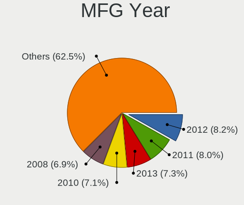
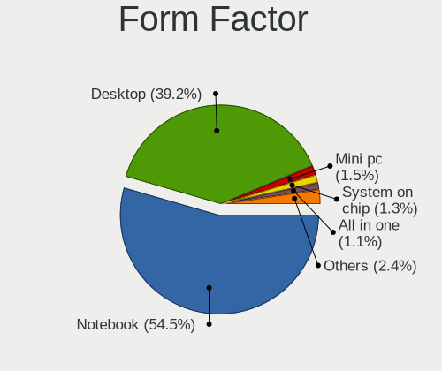
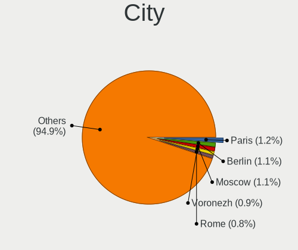
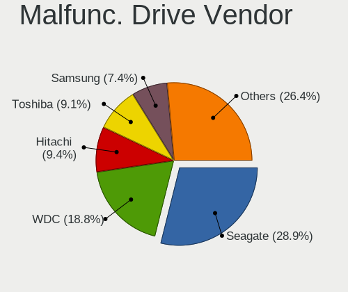
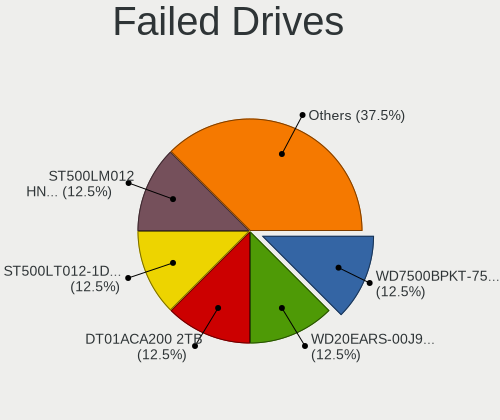
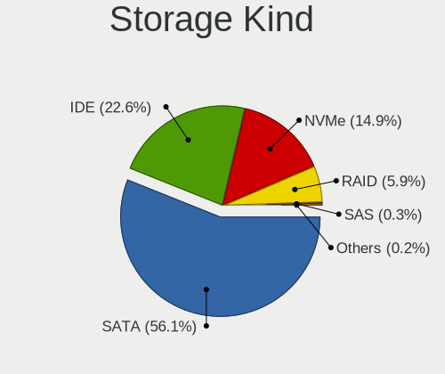
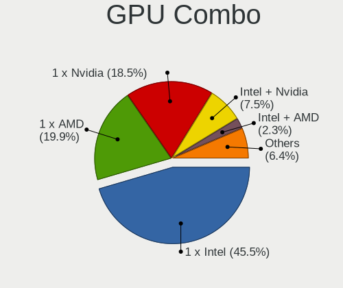
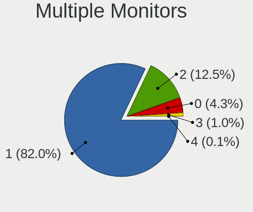
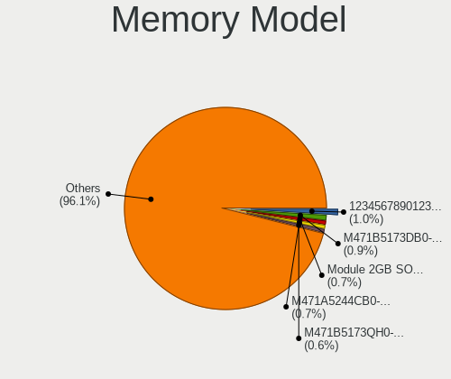

Xubuntu - Tested Hardware & Statistics
--------------------------------------

A project to collect tested hardware configurations for Xubuntu.

Anyone can contribute to this report by the [hw-probe](https://github.com/linuxhw/hw-probe) tool:

    sudo -E hw-probe -all -upload

Please contribute! Especially if your hardware is rare.

This is a report for all computer types. See also reports for [desktops](/Dist/Xubuntu/Desktop/README.md) and [notebooks](/Dist/Xubuntu/Notebook/README.md).

Contents
--------

* [ Test Cases ](#test-cases)

* [ System ](#system)
  - [ OS                       ](#os)
  - [ OS Family                ](#os-family)
  - [ Kernel                   ](#kernel)
  - [ Kernel Family            ](#kernel-family)
  - [ Kernel Major Ver.        ](#kernel-major-ver)
  - [ Arch                     ](#arch)
  - [ DE                       ](#de)
  - [ Display Server           ](#display-server)
  - [ Display Manager          ](#display-manager)
  - [ OS Lang                  ](#os-lang)
  - [ Boot Mode                ](#boot-mode)
  - [ Filesystem               ](#filesystem)
  - [ Part. scheme             ](#part-scheme)
  - [ Dual Boot with Linux/BSD ](#dual-boot-with-linuxbsd)
  - [ Dual Boot (Win)          ](#dual-boot-win)

* [ Board ](#board)
  - [ Vendor                   ](#vendor)
  - [ Model                    ](#model)
  - [ Model Family             ](#model-family)
  - [ MFG Year                 ](#mfg-year)
  - [ Form Factor              ](#form-factor)
  - [ Secure Boot              ](#secure-boot)
  - [ Coreboot                 ](#coreboot)
  - [ RAM Size                 ](#ram-size)
  - [ RAM Used                 ](#ram-used)
  - [ Total Drives             ](#total-drives)
  - [ Has CD-ROM               ](#has-cd-rom)
  - [ Has Ethernet             ](#has-ethernet)
  - [ Has WiFi                 ](#has-wifi)
  - [ Has Bluetooth            ](#has-bluetooth)

* [ Location ](#location)
  - [ Country                  ](#country)
  - [ City                     ](#city)

* [ Drives ](#drives)
  - [ Drive Vendor             ](#drive-vendor)
  - [ Drive Model              ](#drive-model)
  - [ HDD Vendor               ](#hdd-vendor)
  - [ SSD Vendor               ](#ssd-vendor)
  - [ Drive Kind               ](#drive-kind)
  - [ Drive Connector          ](#drive-connector)
  - [ Drive Size               ](#drive-size)
  - [ Space Total              ](#space-total)
  - [ Space Used               ](#space-used)
  - [ Malfunc. Drives          ](#malfunc-drives)
  - [ Malfunc. Drive Vendor    ](#malfunc-drive-vendor)
  - [ Malfunc. HDD Vendor      ](#malfunc-hdd-vendor)
  - [ Malfunc. Drive Kind      ](#malfunc-drive-kind)
  - [ Failed Drives            ](#failed-drives)
  - [ Failed Drive Vendor      ](#failed-drive-vendor)
  - [ Drive Status             ](#drive-status)

* [ Storage controller ](#storage-controller)
  - [ Storage Vendor           ](#storage-vendor)
  - [ Storage Model            ](#storage-model)
  - [ Storage Kind             ](#storage-kind)

* [ Processor ](#processor)
  - [ CPU Vendor               ](#cpu-vendor)
  - [ CPU Model                ](#cpu-model)
  - [ CPU Model Family         ](#cpu-model-family)
  - [ CPU Cores                ](#cpu-cores)
  - [ CPU Sockets              ](#cpu-sockets)
  - [ CPU Threads              ](#cpu-threads)
  - [ CPU Op-Modes             ](#cpu-op-modes)
  - [ CPU Microcode            ](#cpu-microcode)
  - [ CPU Microarch            ](#cpu-microarch)

* [ Graphics ](#graphics)
  - [ GPU Vendor               ](#gpu-vendor)
  - [ GPU Model                ](#gpu-model)
  - [ GPU Combo                ](#gpu-combo)
  - [ GPU Driver               ](#gpu-driver)
  - [ GPU Memory               ](#gpu-memory)

* [ Monitor ](#monitor)
  - [ Monitor Vendor           ](#monitor-vendor)
  - [ Monitor Model            ](#monitor-model)
  - [ Monitor Resolution       ](#monitor-resolution)
  - [ Monitor Diagonal         ](#monitor-diagonal)
  - [ Monitor Width            ](#monitor-width)
  - [ Aspect Ratio             ](#aspect-ratio)
  - [ Monitor Area             ](#monitor-area)
  - [ Pixel Density            ](#pixel-density)
  - [ Multiple Monitors        ](#multiple-monitors)

* [ Network ](#network)
  - [ Net Controller Vendor    ](#net-controller-vendor)
  - [ Net Controller Model     ](#net-controller-model)
  - [ Wireless Vendor          ](#wireless-vendor)
  - [ Wireless Model           ](#wireless-model)
  - [ Ethernet Vendor          ](#ethernet-vendor)
  - [ Ethernet Model           ](#ethernet-model)
  - [ Net Controller Kind      ](#net-controller-kind)
  - [ Used Controller          ](#used-controller)
  - [ NICs                     ](#nics)
  - [ IPv6                     ](#ipv6)

* [ Bluetooth ](#bluetooth)
  - [ Bluetooth Vendor         ](#bluetooth-vendor)
  - [ Bluetooth Model          ](#bluetooth-model)

* [ Sound ](#sound)
  - [ Sound Vendor             ](#sound-vendor)
  - [ Sound Model              ](#sound-model)

* [ Memory ](#memory)
  - [ Memory Vendor            ](#memory-vendor)
  - [ Memory Model             ](#memory-model)
  - [ Memory Kind              ](#memory-kind)
  - [ Memory Form Factor       ](#memory-form-factor)
  - [ Memory Size              ](#memory-size)
  - [ Memory Speed             ](#memory-speed)

* [ Printers & scanners ](#printers--scanners)
  - [ Printer Vendor           ](#printer-vendor)
  - [ Printer Model            ](#printer-model)
  - [ Scanner Vendor           ](#scanner-vendor)
  - [ Scanner Model            ](#scanner-model)

* [ Camera ](#camera)
  - [ Camera Vendor            ](#camera-vendor)
  - [ Camera Model             ](#camera-model)

* [ Security ](#security)
  - [ Fingerprint Vendor       ](#fingerprint-vendor)
  - [ Fingerprint Model        ](#fingerprint-model)
  - [ Chipcard Vendor          ](#chipcard-vendor)
  - [ Chipcard Model           ](#chipcard-model)

* [ Unsupported ](#unsupported)
  - [ Unsupported Devices      ](#unsupported-devices)
  - [ Unsupported Device Types ](#unsupported-device-types)

Test Cases
----------

Total: 5130

| Vendor        | Model                       | Form-Factor | Probe                                                      | Date         |
|---------------|-----------------------------|-------------|------------------------------------------------------------|--------------|
| Gigabyte      | X470 AORUS ULTRA GAMING-... | Desktop     | [3633eb51d4](https://linux-hardware.org/?probe=3633eb51d4) | Jul 01, 2022 |
| ASUSTek       | PRIME H670-PLUS D4          | Desktop     | [8f90bed577](https://linux-hardware.org/?probe=8f90bed577) | Jul 01, 2022 |
| Dell          | 0GXM1W A00                  | Desktop     | [d48eb55102](https://linux-hardware.org/?probe=d48eb55102) | Jul 01, 2022 |
| Dell          | 500                         | Notebook    | [040e3cb12c](https://linux-hardware.org/?probe=040e3cb12c) | Jun 30, 2022 |
| HP            | EliteBook 840 G3            | Notebook    | [9ce5b9c45c](https://linux-hardware.org/?probe=9ce5b9c45c) | Jun 30, 2022 |
| Acer          | Aspire E5-521               | Notebook    | [717281a3f9](https://linux-hardware.org/?probe=717281a3f9) | Jun 29, 2022 |
| ASUSTek       | M5A97 R2.0                  | Desktop     | [05e7378ad8](https://linux-hardware.org/?probe=05e7378ad8) | Jun 29, 2022 |
| Acer          | Aspire E5-521               | Notebook    | [f532d90f38](https://linux-hardware.org/?probe=f532d90f38) | Jun 29, 2022 |
| Standard      | Unknown                     | Notebook    | [1a94acbc05](https://linux-hardware.org/?probe=1a94acbc05) | Jun 29, 2022 |
| HP            | ProBook 455 G8 Notebook ... | Notebook    | [e08493100f](https://linux-hardware.org/?probe=e08493100f) | Jun 29, 2022 |
| Lenovo        | IdeaPad 330-17IKB 81DK      | Notebook    | [2fa204d33e](https://linux-hardware.org/?probe=2fa204d33e) | Jun 29, 2022 |
| Lenovo        | ThinkPad T14s Gen 1 20UH... | Notebook    | [bd4018ed46](https://linux-hardware.org/?probe=bd4018ed46) | Jun 29, 2022 |
| Dell          | 0WMJ54 A01                  | Desktop     | [a55837dc17](https://linux-hardware.org/?probe=a55837dc17) | Jun 29, 2022 |
| ASUSTek       | TUF Gaming X570-PLUS        | Desktop     | [87b9ce1db1](https://linux-hardware.org/?probe=87b9ce1db1) | Jun 28, 2022 |
| Lenovo        | IdeaPad 330S-15IKB 81F5     | Notebook    | [372d361276](https://linux-hardware.org/?probe=372d361276) | Jun 28, 2022 |
| ASUSTek       | X551MA                      | Notebook    | [9bdb2a5577](https://linux-hardware.org/?probe=9bdb2a5577) | Jun 28, 2022 |
| Lenovo        | ThinkPad P17 Gen 1 20SQS... | Notebook    | [ac9a35e85e](https://linux-hardware.org/?probe=ac9a35e85e) | Jun 27, 2022 |
| HP            | Laptop 15-ef1xxx            | Notebook    | [d0200625ac](https://linux-hardware.org/?probe=d0200625ac) | Jun 27, 2022 |
| Supermicro    | X10SRA                      | Server      | [4646cb2fae](https://linux-hardware.org/?probe=4646cb2fae) | Jun 27, 2022 |
| Dell          | Inspiron 15-3567            | Notebook    | [e6d22a4d34](https://linux-hardware.org/?probe=e6d22a4d34) | Jun 27, 2022 |
| Standard      | Unknown                     | Notebook    | [93ac825a25](https://linux-hardware.org/?probe=93ac825a25) | Jun 27, 2022 |
| Apple         | MacBookPro1,1               | Notebook    | [feddac03b9](https://linux-hardware.org/?probe=feddac03b9) | Jun 26, 2022 |
| Lenovo        | ThinkPad T420s 417152U      | Notebook    | [cc52ed5e41](https://linux-hardware.org/?probe=cc52ed5e41) | Jun 26, 2022 |
| ASUSTek       | M2N-E                       | Desktop     | [47cddfb141](https://linux-hardware.org/?probe=47cddfb141) | Jun 25, 2022 |
| ASUSTek       | M2N-E                       | Desktop     | [ad5514340b](https://linux-hardware.org/?probe=ad5514340b) | Jun 25, 2022 |
| Dell          | 0HN7XN A00                  | Desktop     | [4562c09862](https://linux-hardware.org/?probe=4562c09862) | Jun 24, 2022 |
| HP            | Pavilion dv5                | Notebook    | [4009a4fd8c](https://linux-hardware.org/?probe=4009a4fd8c) | Jun 24, 2022 |
| Lenovo        | ThinkCentre A70 7844H9G     | Desktop     | [8cf9d783a3](https://linux-hardware.org/?probe=8cf9d783a3) | Jun 23, 2022 |
| HP            | Laptop 15-ef1xxx            | Notebook    | [1d18aab349](https://linux-hardware.org/?probe=1d18aab349) | Jun 23, 2022 |
| Dell          | Inspiron 5570               | Notebook    | [4a61f83195](https://linux-hardware.org/?probe=4a61f83195) | Jun 23, 2022 |
| MSI           | Modern 15 A5M               | Notebook    | [b648b81eca](https://linux-hardware.org/?probe=b648b81eca) | Jun 23, 2022 |
| MSI           | B450M-A PRO MAX             | Desktop     | [db4763808b](https://linux-hardware.org/?probe=db4763808b) | Jun 22, 2022 |
| ASRock        | N68-S3 UCC                  | Desktop     | [5e9cdd75c7](https://linux-hardware.org/?probe=5e9cdd75c7) | Jun 22, 2022 |
| Apple         | MacBookPro14,1              | Notebook    | [e9d8c28a34](https://linux-hardware.org/?probe=e9d8c28a34) | Jun 22, 2022 |
| Alienware     | 17 R4                       | Notebook    | [74b66aebc5](https://linux-hardware.org/?probe=74b66aebc5) | Jun 21, 2022 |
| Dell          | Inspiron 15-3567            | Notebook    | [9538654245](https://linux-hardware.org/?probe=9538654245) | Jun 21, 2022 |
| Intel         | D102GGC2 AAD42789-204       | Desktop     | [3ed07edb6a](https://linux-hardware.org/?probe=3ed07edb6a) | Jun 21, 2022 |
| HP            | 15                          | Notebook    | [61e6eddc93](https://linux-hardware.org/?probe=61e6eddc93) | Jun 20, 2022 |
| ASUSTek       | P8Z77-V                     | Desktop     | [e32a4e0214](https://linux-hardware.org/?probe=e32a4e0214) | Jun 20, 2022 |
| Acer          | Switch SW312-31             | Tablet      | [ded5eaba87](https://linux-hardware.org/?probe=ded5eaba87) | Jun 19, 2022 |
| ASUSTek       | M5A78L-M/USB3               | Desktop     | [515b063f08](https://linux-hardware.org/?probe=515b063f08) | Jun 18, 2022 |
| MSI           | X570-A PRO                  | Desktop     | [fc761acd97](https://linux-hardware.org/?probe=fc761acd97) | Jun 18, 2022 |
| Intel         | NUC7i3BNB J22859-312        | Mini pc     | [89d99d840f](https://linux-hardware.org/?probe=89d99d840f) | Jun 17, 2022 |
| Google        | Kindred                     | Notebook    | [c12b15c596](https://linux-hardware.org/?probe=c12b15c596) | Jun 17, 2022 |
| Lenovo        | ThinkCentre M71e 5033AR1    | Desktop     | [dd0f797f78](https://linux-hardware.org/?probe=dd0f797f78) | Jun 17, 2022 |
| ASUSTek       | P8H67-M LE                  | Desktop     | [f340c1d172](https://linux-hardware.org/?probe=f340c1d172) | Jun 17, 2022 |
| ASUSTek       | M5A97 R2.0                  | Desktop     | [384aa1f6c2](https://linux-hardware.org/?probe=384aa1f6c2) | Jun 17, 2022 |
| Medion        | E2221T MD60684              | Convertible | [559733f94d](https://linux-hardware.org/?probe=559733f94d) | Jun 16, 2022 |
| Acer          | Aspire 7720                 | Notebook    | [3f098cc493](https://linux-hardware.org/?probe=3f098cc493) | Jun 15, 2022 |
| Acer          | Aspire 7720                 | Notebook    | [d60aee8a9c](https://linux-hardware.org/?probe=d60aee8a9c) | Jun 15, 2022 |
| Dynabook      | TECRA A50-J                 | Notebook    | [3f4449202f](https://linux-hardware.org/?probe=3f4449202f) | Jun 14, 2022 |
| Sony          | VPCSB1V9R                   | Notebook    | [c1490b2a1c](https://linux-hardware.org/?probe=c1490b2a1c) | Jun 14, 2022 |
| HP            | ProBook 445 G7              | Notebook    | [f41d413820](https://linux-hardware.org/?probe=f41d413820) | Jun 13, 2022 |
| Lenovo        | ThinkPad T530 23923MG       | Notebook    | [cf21c4e831](https://linux-hardware.org/?probe=cf21c4e831) | Jun 12, 2022 |
| HP            | 255 G7 Notebook PC          | Notebook    | [0ebaae147d](https://linux-hardware.org/?probe=0ebaae147d) | Jun 12, 2022 |
| GPU Compan... | GWTN141-4                   | Notebook    | [ba579cb383](https://linux-hardware.org/?probe=ba579cb383) | Jun 11, 2022 |
| Matsushita... | CF-W5LWEZZBM                | Notebook    | [380c6df037](https://linux-hardware.org/?probe=380c6df037) | Jun 11, 2022 |
| Packard Be... | EasyNote TK11BZ             | Notebook    | [f9c69ea1c6](https://linux-hardware.org/?probe=f9c69ea1c6) | Jun 11, 2022 |
| Lenovo        | G505 20240                  | Notebook    | [0b0d5e5252](https://linux-hardware.org/?probe=0b0d5e5252) | Jun 11, 2022 |
| MSI           | G31TM-P21                   | Desktop     | [824dc8a1c9](https://linux-hardware.org/?probe=824dc8a1c9) | Jun 11, 2022 |
| Intel         | DG33BU AAD79951-407         | Desktop     | [5df0f93da9](https://linux-hardware.org/?probe=5df0f93da9) | Jun 10, 2022 |
| Dell          | Latitude 7280               | Notebook    | [7900c8009a](https://linux-hardware.org/?probe=7900c8009a) | Jun 10, 2022 |
| ASRock        | N68-S3 UCC                  | Desktop     | [535126df2b](https://linux-hardware.org/?probe=535126df2b) | Jun 09, 2022 |
| Lenovo        | ThinkPad X200 7459V2R       | Notebook    | [565722f81e](https://linux-hardware.org/?probe=565722f81e) | Jun 09, 2022 |
| Lenovo        | ThinkPad X200 7459V2R       | Notebook    | [c36b6d8e2c](https://linux-hardware.org/?probe=c36b6d8e2c) | Jun 09, 2022 |
| GPU Compan... | GWTN116-3                   | Notebook    | [bd0f56a43c](https://linux-hardware.org/?probe=bd0f56a43c) | Jun 09, 2022 |
| Chuwi         | GemiBook Pro                | Notebook    | [7bd963dd56](https://linux-hardware.org/?probe=7bd963dd56) | Jun 09, 2022 |
| Gigabyte      | H97-HD3                     | Desktop     | [7f48bb6a8a](https://linux-hardware.org/?probe=7f48bb6a8a) | Jun 08, 2022 |
| Acer          | Aspire 7720                 | Notebook    | [640b757bc8](https://linux-hardware.org/?probe=640b757bc8) | Jun 08, 2022 |
| ASUSTek       | VivoBook_ASUSLaptop X760... | Notebook    | [674cab9d61](https://linux-hardware.org/?probe=674cab9d61) | Jun 08, 2022 |
| Lenovo        | ThinkPad L380 20M6S4J400    | Notebook    | [dc1bcd1532](https://linux-hardware.org/?probe=dc1bcd1532) | Jun 08, 2022 |
| Lenovo        | CRESCENTBAY SDK0E50510 W... | All in one  | [5eaef9db5a](https://linux-hardware.org/?probe=5eaef9db5a) | Jun 08, 2022 |
| Acer          | Aspire E5-573               | Notebook    | [bb17805ada](https://linux-hardware.org/?probe=bb17805ada) | Jun 08, 2022 |
| HP            | Pavilion Laptop 15-eh1xx... | Notebook    | [77a5e1c6f9](https://linux-hardware.org/?probe=77a5e1c6f9) | Jun 08, 2022 |
| ASUSTek       | ROG STRIX B450-F GAMING ... | Desktop     | [33dbe3e5db](https://linux-hardware.org/?probe=33dbe3e5db) | Jun 08, 2022 |
| Acer          | Aspire 7720                 | Notebook    | [ac4362743a](https://linux-hardware.org/?probe=ac4362743a) | Jun 07, 2022 |
| AMI           | Intel                       | Notebook    | [79b1f29bc4](https://linux-hardware.org/?probe=79b1f29bc4) | Jun 07, 2022 |
| AMI           | Intel                       | Notebook    | [d7746ec6d5](https://linux-hardware.org/?probe=d7746ec6d5) | Jun 07, 2022 |
| ASUSTek       | Maximus VII HERO            | Desktop     | [064492c64d](https://linux-hardware.org/?probe=064492c64d) | Jun 07, 2022 |
| Lenovo        | CRESCENTBAY SDK0E50510 W... | All in one  | [0ce0f27bac](https://linux-hardware.org/?probe=0ce0f27bac) | Jun 07, 2022 |
| Chuwi         | GemiBook Pro                | Notebook    | [2d31db0d12](https://linux-hardware.org/?probe=2d31db0d12) | Jun 07, 2022 |
| Lenovo        | ThinkPad T440s 20AQ009DG... | Notebook    | [c4250d2ee2](https://linux-hardware.org/?probe=c4250d2ee2) | Jun 07, 2022 |
| Fujitsu       | LIFEBOOK U772               | Notebook    | [8dcf195f94](https://linux-hardware.org/?probe=8dcf195f94) | Jun 07, 2022 |
| ASRockRack    | ROMED8-2T                   | Desktop     | [3ee16e0227](https://linux-hardware.org/?probe=3ee16e0227) | Jun 07, 2022 |
| Digma         | EVE 15 C413 ES5059EW        | Notebook    | [26eb7d39e1](https://linux-hardware.org/?probe=26eb7d39e1) | Jun 06, 2022 |
| HP            | Pavilion g7                 | Notebook    | [b31de17368](https://linux-hardware.org/?probe=b31de17368) | Jun 06, 2022 |
| Chuwi         | GemiBook Pro                | Notebook    | [48738fc474](https://linux-hardware.org/?probe=48738fc474) | Jun 06, 2022 |
| Unknown       | Unknown                     | Soc         | [0c5a37efd2](https://linux-hardware.org/?probe=0c5a37efd2) | Jun 05, 2022 |
| Gigabyte      | H61M-S2PV                   | Desktop     | [63b4cd5c56](https://linux-hardware.org/?probe=63b4cd5c56) | Jun 05, 2022 |
| MSI           | PR601/VR603                 | Notebook    | [9763977184](https://linux-hardware.org/?probe=9763977184) | Jun 05, 2022 |
| Chuwi         | GemiBook Pro                | Notebook    | [e8dd7b95a6](https://linux-hardware.org/?probe=e8dd7b95a6) | Jun 03, 2022 |
| HP            | 3397                        | Desktop     | [775c6990fd](https://linux-hardware.org/?probe=775c6990fd) | Jun 03, 2022 |
| Dell          | Inspiron N4010              | Notebook    | [49e472d67e](https://linux-hardware.org/?probe=49e472d67e) | Jun 02, 2022 |
| Lenovo        | ThinkPad W510 431963G       | Notebook    | [dfe3e4b66b](https://linux-hardware.org/?probe=dfe3e4b66b) | Jun 02, 2022 |
| Lenovo        | ThinkPad W510 431963G       | Notebook    | [d620bac2cb](https://linux-hardware.org/?probe=d620bac2cb) | Jun 02, 2022 |
| Dell          | Latitude D820               | Notebook    | [8c2336469f](https://linux-hardware.org/?probe=8c2336469f) | Jun 01, 2022 |
| Acer          | Aspire 5740                 | Notebook    | [db6d025d69](https://linux-hardware.org/?probe=db6d025d69) | Jun 01, 2022 |
| Lenovo        | ThinkPad L13 20R4S4WG00     | Notebook    | [14100804b6](https://linux-hardware.org/?probe=14100804b6) | May 31, 2022 |
| Lenovo        | ThinkPad W510 431963G       | Notebook    | [e46a1497d8](https://linux-hardware.org/?probe=e46a1497d8) | May 31, 2022 |
| Dell          | Latitude 5511               | Notebook    | [bc6fd9e79d](https://linux-hardware.org/?probe=bc6fd9e79d) | May 30, 2022 |
| ASUSTek       | VM60                        | Desktop     | [57bea34864](https://linux-hardware.org/?probe=57bea34864) | May 30, 2022 |
| ASUSTek       | VM60                        | Desktop     | [bf1dcb2901](https://linux-hardware.org/?probe=bf1dcb2901) | May 30, 2022 |
| Medion        | E15407                      | Notebook    | [6e457b6abb](https://linux-hardware.org/?probe=6e457b6abb) | May 29, 2022 |
| Medion        | E15407                      | Notebook    | [a0d6c795e7](https://linux-hardware.org/?probe=a0d6c795e7) | May 29, 2022 |
| TUXEDO        | N14xWU                      | Notebook    | [c20d682e14](https://linux-hardware.org/?probe=c20d682e14) | May 29, 2022 |
| HP            | 2B29                        | Desktop     | [d2ab16d631](https://linux-hardware.org/?probe=d2ab16d631) | May 28, 2022 |
| Pegatron      | Benicia                     | Desktop     | [64aa376623](https://linux-hardware.org/?probe=64aa376623) | May 28, 2022 |
| Apple         | Mac-F4238CC8 PVT            | All in one  | [d6adaef7cc](https://linux-hardware.org/?probe=d6adaef7cc) | May 28, 2022 |
| Apple         | Mac-F4238CC8 PVT            | All in one  | [c848e4649e](https://linux-hardware.org/?probe=c848e4649e) | May 28, 2022 |
| TUXEDO        | N14xWU                      | Notebook    | [8711ac9989](https://linux-hardware.org/?probe=8711ac9989) | May 26, 2022 |
| LG Electro... | 22V280 FAB1                 | All in one  | [d61829e715](https://linux-hardware.org/?probe=d61829e715) | May 26, 2022 |
| ASUSTek       | PRIME X470-PRO              | Desktop     | [496399846f](https://linux-hardware.org/?probe=496399846f) | May 26, 2022 |
| Acer          | Aspire 5740                 | Notebook    | [2c541b20f6](https://linux-hardware.org/?probe=2c541b20f6) | May 26, 2022 |
| HP            | Laptop 15-bw0xx             | Notebook    | [f71c048a96](https://linux-hardware.org/?probe=f71c048a96) | May 25, 2022 |
| Lenovo        | MAHOBAY NOK                 | Desktop     | [aa8d9cb3b9](https://linux-hardware.org/?probe=aa8d9cb3b9) | May 25, 2022 |
| ASUSTek       | ROG CROSSHAIR VIII DARK ... | Desktop     | [a22a5ebbff](https://linux-hardware.org/?probe=a22a5ebbff) | May 25, 2022 |
| Gigabyte      | 970A-DS3P                   | Desktop     | [23d890ffc6](https://linux-hardware.org/?probe=23d890ffc6) | May 23, 2022 |
| HP            | 1497                        | Desktop     | [4b9a65b621](https://linux-hardware.org/?probe=4b9a65b621) | May 23, 2022 |
| HP            | Mini 5103                   | Notebook    | [aa7f4e957e](https://linux-hardware.org/?probe=aa7f4e957e) | May 23, 2022 |
| Gigabyte      | Z97X-UD3H-CF                | Desktop     | [a1315854db](https://linux-hardware.org/?probe=a1315854db) | May 23, 2022 |
| ASUSTek       | X99-A II                    | Desktop     | [288a6b3b20](https://linux-hardware.org/?probe=288a6b3b20) | May 23, 2022 |
| MSI           | MPG B550 GAMING EDGE WIF... | Desktop     | [3e34ce179d](https://linux-hardware.org/?probe=3e34ce179d) | May 22, 2022 |
| ASUSTek       | X510UA                      | Notebook    | [51d57b9e53](https://linux-hardware.org/?probe=51d57b9e53) | May 22, 2022 |
| Sony          | VGN-NS21S_S                 | Notebook    | [0c972ad98b](https://linux-hardware.org/?probe=0c972ad98b) | May 21, 2022 |
| HP            | Pavilion dv6000 (RR374EA... | Notebook    | [926749e311](https://linux-hardware.org/?probe=926749e311) | May 21, 2022 |
| Google        | Snappy                      | Notebook    | [c88d27b24a](https://linux-hardware.org/?probe=c88d27b24a) | May 20, 2022 |
| Google        | Snappy                      | Notebook    | [9fc85cd49a](https://linux-hardware.org/?probe=9fc85cd49a) | May 20, 2022 |
| Google        | Snappy                      | Notebook    | [cb9e7730ad](https://linux-hardware.org/?probe=cb9e7730ad) | May 20, 2022 |
| HP            | Compaq nc6320 (RH374EA#A... | Notebook    | [baed2325d7](https://linux-hardware.org/?probe=baed2325d7) | May 20, 2022 |
| Lenovo        | Yoga 7 14ITL5 82BH          | Convertible | [ee3726a591](https://linux-hardware.org/?probe=ee3726a591) | May 19, 2022 |
| Lenovo        | Legion Y540-17IRH-PG0 81... | Notebook    | [086fceea4f](https://linux-hardware.org/?probe=086fceea4f) | May 19, 2022 |
| Lenovo        | ThinkPad E580 20KS001JGE    | Notebook    | [724c06c08c](https://linux-hardware.org/?probe=724c06c08c) | May 19, 2022 |
| Lenovo        | ThinkPad T410 2516CTO       | Notebook    | [e4150ff93b](https://linux-hardware.org/?probe=e4150ff93b) | May 19, 2022 |
| Acer          | Aspire G7750                | Desktop     | [28f3018ecc](https://linux-hardware.org/?probe=28f3018ecc) | May 18, 2022 |
| IBM           | ThinkPad T43 2668F5G        | Notebook    | [af59841e31](https://linux-hardware.org/?probe=af59841e31) | May 18, 2022 |
| Dell          | Latitude D610               | Notebook    | [2e945626d4](https://linux-hardware.org/?probe=2e945626d4) | May 17, 2022 |
| Dell          | Latitude D610               | Notebook    | [9ee1df5d0e](https://linux-hardware.org/?probe=9ee1df5d0e) | May 17, 2022 |
| HP            | 158A                        | Desktop     | [dd67e1f8d2](https://linux-hardware.org/?probe=dd67e1f8d2) | May 17, 2022 |
| Dell          | Latitude E6410              | Notebook    | [ae757ea3a4](https://linux-hardware.org/?probe=ae757ea3a4) | May 16, 2022 |
| ASUSTek       | UL30A                       | Notebook    | [c121dd37ba](https://linux-hardware.org/?probe=c121dd37ba) | May 16, 2022 |
| ASUSTek       | X101CH                      | Notebook    | [544536b2d8](https://linux-hardware.org/?probe=544536b2d8) | May 16, 2022 |
| ASUSTek       | X101CH                      | Notebook    | [fbcf200ed5](https://linux-hardware.org/?probe=fbcf200ed5) | May 16, 2022 |
| HP            | Mini 110-1100               | Notebook    | [b93ac7c302](https://linux-hardware.org/?probe=b93ac7c302) | May 16, 2022 |
| HP            | Mini 110-1100               | Notebook    | [4a5f85e53d](https://linux-hardware.org/?probe=4a5f85e53d) | May 16, 2022 |
| Dell          | 0T656F A01                  | Desktop     | [2df08f807d](https://linux-hardware.org/?probe=2df08f807d) | May 15, 2022 |
| Dell          | Latitude 5580               | Notebook    | [c2f15d647a](https://linux-hardware.org/?probe=c2f15d647a) | May 15, 2022 |
| MSI           | AM1I                        | Desktop     | [f22b398676](https://linux-hardware.org/?probe=f22b398676) | May 15, 2022 |
| Google        | Droid                       | Notebook    | [e938864c93](https://linux-hardware.org/?probe=e938864c93) | May 15, 2022 |
| Lenovo        | ThinkPad X200s 74664SJ      | Notebook    | [65728fda7a](https://linux-hardware.org/?probe=65728fda7a) | May 14, 2022 |
| ECS           | Asterope                    | Desktop     | [a0c032d6f6](https://linux-hardware.org/?probe=a0c032d6f6) | May 14, 2022 |
| Lenovo        | IdeaPad L340-17IRH Gamin... | Notebook    | [a3b1829dec](https://linux-hardware.org/?probe=a3b1829dec) | May 13, 2022 |
| HP            | 82B4                        | Desktop     | [3a1723a2ee](https://linux-hardware.org/?probe=3a1723a2ee) | May 13, 2022 |
| Fujitsu       | D2917-A1 S26361-D2917-A1    | Desktop     | [6f58937bed](https://linux-hardware.org/?probe=6f58937bed) | May 13, 2022 |
| Dell          | 0X2MKR A00                  | All in one  | [cace04f39a](https://linux-hardware.org/?probe=cace04f39a) | May 12, 2022 |
| ASUSTek       | P5KC                        | Desktop     | [bf7fdb19c8](https://linux-hardware.org/?probe=bf7fdb19c8) | May 12, 2022 |
| AMI           | Cherry Trail CR             | Notebook    | [62744ba7e3](https://linux-hardware.org/?probe=62744ba7e3) | May 12, 2022 |
| ASUSTek       | TUF Gaming B550-PLUS        | Desktop     | [bf4afe4481](https://linux-hardware.org/?probe=bf4afe4481) | May 12, 2022 |
| ASUSTek       | A7K                         | Notebook    | [29ca1c7e33](https://linux-hardware.org/?probe=29ca1c7e33) | May 11, 2022 |
| ASUSTek       | B150-PLUS                   | Desktop     | [eb2447cec6](https://linux-hardware.org/?probe=eb2447cec6) | May 11, 2022 |
| Dell          | Latitude E6410              | Notebook    | [a14c28c93f](https://linux-hardware.org/?probe=a14c28c93f) | May 11, 2022 |
| ASUSTek       | ASUS TUF Dash F15 FX516P... | Notebook    | [bb4a27a023](https://linux-hardware.org/?probe=bb4a27a023) | May 10, 2022 |
| Dell          | Latitude 7400               | Notebook    | [a0600c38f3](https://linux-hardware.org/?probe=a0600c38f3) | May 09, 2022 |
| Unknown       | Unknown                     | Notebook    | [f802e84b8e](https://linux-hardware.org/?probe=f802e84b8e) | May 08, 2022 |
| Lenovo        | ThinkPad X240 20AMS6FF00    | Notebook    | [3e3da41a35](https://linux-hardware.org/?probe=3e3da41a35) | May 08, 2022 |
| ASUSTek       | TUF B450M-PRO GAMING        | Desktop     | [bd94a8145a](https://linux-hardware.org/?probe=bd94a8145a) | May 08, 2022 |
| Gigabyte      | Z68A-D3-B3                  | Desktop     | [573e425cb6](https://linux-hardware.org/?probe=573e425cb6) | May 08, 2022 |
| Dell          | Latitude E6410              | Notebook    | [361bcaa4cc](https://linux-hardware.org/?probe=361bcaa4cc) | May 07, 2022 |
| Dell          | Inspiron 7501               | Notebook    | [a8a1e1e3a2](https://linux-hardware.org/?probe=a8a1e1e3a2) | May 07, 2022 |
| HP            | Compaq 6820s                | Notebook    | [1ba74fc299](https://linux-hardware.org/?probe=1ba74fc299) | May 07, 2022 |
| HP            | Compaq 6820s                | Notebook    | [5b027deec0](https://linux-hardware.org/?probe=5b027deec0) | May 07, 2022 |
| ASRock        | X570 Phantom Gaming 4       | Desktop     | [e7ad5ed098](https://linux-hardware.org/?probe=e7ad5ed098) | May 06, 2022 |
| HP            | 3397                        | Desktop     | [157ef440d8](https://linux-hardware.org/?probe=157ef440d8) | May 06, 2022 |
| Toshiba       | Satellite C70D-B            | Notebook    | [fa4a4b7ffc](https://linux-hardware.org/?probe=fa4a4b7ffc) | May 06, 2022 |
| Acer          | Aspire 5740                 | Notebook    | [e754b48e71](https://linux-hardware.org/?probe=e754b48e71) | May 06, 2022 |
| Dell          | Latitude 7420               | Notebook    | [384325350c](https://linux-hardware.org/?probe=384325350c) | May 05, 2022 |
| Gigabyte      | X48-DS5                     | Desktop     | [72a1aaf67d](https://linux-hardware.org/?probe=72a1aaf67d) | May 05, 2022 |
| Inventec      | Dell Wyse Thin Client De... | Mini pc     | [6dbe28a107](https://linux-hardware.org/?probe=6dbe28a107) | May 05, 2022 |
| Google        | Auron_Yuna                  | Notebook    | [795d9af5a7](https://linux-hardware.org/?probe=795d9af5a7) | May 05, 2022 |
| Acer          | Veriton M490G               | Desktop     | [f55983d536](https://linux-hardware.org/?probe=f55983d536) | May 04, 2022 |
| Gigabyte      | G33M-DS2R                   | Desktop     | [d4dff7f002](https://linux-hardware.org/?probe=d4dff7f002) | May 04, 2022 |
| HP            | 158A                        | Desktop     | [cb763d6fab](https://linux-hardware.org/?probe=cb763d6fab) | May 04, 2022 |
| Gigabyte      | X570S AORUS MASTER          | Desktop     | [c6da7b776e](https://linux-hardware.org/?probe=c6da7b776e) | May 03, 2022 |
| Dell          | XPS M1530                   | Notebook    | [760cae00c1](https://linux-hardware.org/?probe=760cae00c1) | May 03, 2022 |
| ASUSTek       | K53SC                       | Notebook    | [1533323fbf](https://linux-hardware.org/?probe=1533323fbf) | May 02, 2022 |
| ASRock        | P55 Pro                     | Desktop     | [e626676348](https://linux-hardware.org/?probe=e626676348) | May 02, 2022 |
| Lenovo        | ThinkPad X1 Carbon Gen 9... | Notebook    | [981f468940](https://linux-hardware.org/?probe=981f468940) | May 02, 2022 |
| ASUSTek       | B150-PLUS                   | Desktop     | [e2f5eb0a39](https://linux-hardware.org/?probe=e2f5eb0a39) | May 02, 2022 |
| Acer          | Aspire 5740                 | Notebook    | [6e1a9ce167](https://linux-hardware.org/?probe=6e1a9ce167) | May 01, 2022 |
| Razer         | Blade Stealth 13 Late 20... | Notebook    | [ba8fa66c1c](https://linux-hardware.org/?probe=ba8fa66c1c) | May 01, 2022 |
| Acer          | Aspire 5740                 | Notebook    | [f9e5dd9719](https://linux-hardware.org/?probe=f9e5dd9719) | May 01, 2022 |
| Dell          | XPS M1530                   | Notebook    | [757d1b099e](https://linux-hardware.org/?probe=757d1b099e) | Apr 30, 2022 |
| ASUSTek       | T100HAN                     | Notebook    | [5ee200cfbe](https://linux-hardware.org/?probe=5ee200cfbe) | Apr 30, 2022 |
| Unknown       | Intel X79                   | Desktop     | [95d09d79ca](https://linux-hardware.org/?probe=95d09d79ca) | Apr 29, 2022 |
| ASUSTek       | K53SC                       | Notebook    | [f2605ba739](https://linux-hardware.org/?probe=f2605ba739) | Apr 29, 2022 |
| Acer          | Aspire ES1-311              | Notebook    | [aa4612575b](https://linux-hardware.org/?probe=aa4612575b) | Apr 29, 2022 |
| HP            | Compaq 6730b (GW687AV)      | Notebook    | [96ee86a3c6](https://linux-hardware.org/?probe=96ee86a3c6) | Apr 28, 2022 |
| Dell          | Inspiron 3135               | Notebook    | [6ca6980f06](https://linux-hardware.org/?probe=6ca6980f06) | Apr 28, 2022 |
| HP            | ProBook 455 G8 Notebook ... | Notebook    | [fc0cea6830](https://linux-hardware.org/?probe=fc0cea6830) | Apr 27, 2022 |
| HP            | 09F8h                       | Desktop     | [8605181df9](https://linux-hardware.org/?probe=8605181df9) | Apr 26, 2022 |
| Acer          | Aspire ES1-512              | Notebook    | [f0ed67e309](https://linux-hardware.org/?probe=f0ed67e309) | Apr 26, 2022 |
| Supermicro    | X11SPL-F                    | Server      | [34f6e28125](https://linux-hardware.org/?probe=34f6e28125) | Apr 26, 2022 |
| Dell          | Latitude 7480               | Notebook    | [7e85baf2f4](https://linux-hardware.org/?probe=7e85baf2f4) | Apr 26, 2022 |
| Lenovo        | IdeaPad 100-15IBY 80MJ      | Notebook    | [bd286b124a](https://linux-hardware.org/?probe=bd286b124a) | Apr 25, 2022 |
| MSI           | Z390-A PRO                  | Desktop     | [6c64775a71](https://linux-hardware.org/?probe=6c64775a71) | Apr 24, 2022 |
| HP            | 255 G8 Notebook PC          | Notebook    | [c16cb4e0d6](https://linux-hardware.org/?probe=c16cb4e0d6) | Apr 24, 2022 |
| Lenovo        | ThinkPad T440 20B7A0S200    | Notebook    | [0ef99a6615](https://linux-hardware.org/?probe=0ef99a6615) | Apr 24, 2022 |
| ASUSTek       | 1215N                       | Notebook    | [93ad513620](https://linux-hardware.org/?probe=93ad513620) | Apr 24, 2022 |
| Lenovo        | B590 20206                  | Notebook    | [80befa3088](https://linux-hardware.org/?probe=80befa3088) | Apr 23, 2022 |
| Nvidia        | Tegra                       | Soc         | [36bbd53ec1](https://linux-hardware.org/?probe=36bbd53ec1) | Apr 23, 2022 |
| HP            | 09F8h                       | Desktop     | [5042a34dcd](https://linux-hardware.org/?probe=5042a34dcd) | Apr 23, 2022 |
| Gigabyte      | G33M-DS2R                   | Desktop     | [d2cd51f72d](https://linux-hardware.org/?probe=d2cd51f72d) | Apr 22, 2022 |
| Gigabyte      | H310M S2H x.x               | Desktop     | [bde3fa1f37](https://linux-hardware.org/?probe=bde3fa1f37) | Apr 22, 2022 |
| Lenovo        | ThinkPad T470s 20HF004MM... | Notebook    | [69a5e98a04](https://linux-hardware.org/?probe=69a5e98a04) | Apr 22, 2022 |
| Lenovo        | ThinkPad T14s Gen 2i 20W... | Notebook    | [3e1029ed36](https://linux-hardware.org/?probe=3e1029ed36) | Apr 22, 2022 |
| Dell          | XPS M1530                   | Notebook    | [f22a6a2c55](https://linux-hardware.org/?probe=f22a6a2c55) | Apr 21, 2022 |
| Dell          | 0X2MKR A00                  | All in one  | [5a662b428e](https://linux-hardware.org/?probe=5a662b428e) | Apr 21, 2022 |
| Hardkernel    | ODROID-M1                   | Soc         | [481e87aa23](https://linux-hardware.org/?probe=481e87aa23) | Apr 21, 2022 |
| Lenovo        | ThinkBook 14 G2 ARE 20VF    | Notebook    | [e87dfd05bc](https://linux-hardware.org/?probe=e87dfd05bc) | Apr 20, 2022 |
| Lenovo        | ThinkBook 14 G2 ARE 20VF    | Notebook    | [fae46ae55c](https://linux-hardware.org/?probe=fae46ae55c) | Apr 20, 2022 |
| eMachines     | MCP61PM-GM                  | Desktop     | [16c4522843](https://linux-hardware.org/?probe=16c4522843) | Apr 20, 2022 |
| HP            | OMEN by Laptop 16-c0xxx     | Notebook    | [d277143404](https://linux-hardware.org/?probe=d277143404) | Apr 20, 2022 |
| HP            | 255 G8 Notebook PC          | Notebook    | [d88db86125](https://linux-hardware.org/?probe=d88db86125) | Apr 20, 2022 |
| Dell          | XPS M1530                   | Notebook    | [60d3e4f97f](https://linux-hardware.org/?probe=60d3e4f97f) | Apr 20, 2022 |
| ASUSTek       | P8Z77-V                     | Desktop     | [40e958c5e1](https://linux-hardware.org/?probe=40e958c5e1) | Apr 19, 2022 |
| Dell          | 0WR7PY A01                  | Desktop     | [6fa162f829](https://linux-hardware.org/?probe=6fa162f829) | Apr 19, 2022 |
| ASUSTek       | P8Z68 DELUXE                | Desktop     | [4df90e6250](https://linux-hardware.org/?probe=4df90e6250) | Apr 18, 2022 |
| HP            | 18E5                        | Desktop     | [211d35a24b](https://linux-hardware.org/?probe=211d35a24b) | Apr 17, 2022 |
| Fujitsu       | D3091-A1 S26361-D3091-A1    | Desktop     | [d2559a2f19](https://linux-hardware.org/?probe=d2559a2f19) | Apr 17, 2022 |
| Apple         | Mac-F221BEC8                | Desktop     | [32bdb05198](https://linux-hardware.org/?probe=32bdb05198) | Apr 16, 2022 |
| HP            | Compaq 6730s                | Notebook    | [4902d2bf25](https://linux-hardware.org/?probe=4902d2bf25) | Apr 16, 2022 |
| Positivo B... | VJC141F11X-B0111L           | Notebook    | [5ea499eca7](https://linux-hardware.org/?probe=5ea499eca7) | Apr 16, 2022 |
| Lenovo        | Gardenia CRB SDK0J40700 ... | All in one  | [521cf503e2](https://linux-hardware.org/?probe=521cf503e2) | Apr 15, 2022 |
| Dell          | Latitude E6540              | Notebook    | [94fbc5408f](https://linux-hardware.org/?probe=94fbc5408f) | Apr 15, 2022 |
| HP            | 21B4 A01                    | Desktop     | [ddd3a601b3](https://linux-hardware.org/?probe=ddd3a601b3) | Apr 15, 2022 |
| HP            | Compaq 6730s                | Notebook    | [755dcc7629](https://linux-hardware.org/?probe=755dcc7629) | Apr 15, 2022 |
| Lenovo        | ThinkPad X280 20KE001MMX    | Notebook    | [fb0da9def7](https://linux-hardware.org/?probe=fb0da9def7) | Apr 15, 2022 |
| Lenovo        | SHARKBAY 0B98401 PRO        | Desktop     | [0e7314b7c9](https://linux-hardware.org/?probe=0e7314b7c9) | Apr 14, 2022 |
| ASUSTek       | ASUS TUF Dash F15 FX516P... | Notebook    | [554040d7b4](https://linux-hardware.org/?probe=554040d7b4) | Apr 14, 2022 |
| Lenovo        | ThinkPad P53 20QNS01C00     | Notebook    | [b320a8cca8](https://linux-hardware.org/?probe=b320a8cca8) | Apr 14, 2022 |
| Lenovo        | ThinkPad E590 20NB0029GE    | Notebook    | [1f9cb1427a](https://linux-hardware.org/?probe=1f9cb1427a) | Apr 13, 2022 |
| MSI           | B450M MORTAR TITANIUM       | Desktop     | [6b11750e41](https://linux-hardware.org/?probe=6b11750e41) | Apr 13, 2022 |
| Lenovo        | ThinkPad T480s 20L7001PI... | Notebook    | [53c7e12994](https://linux-hardware.org/?probe=53c7e12994) | Apr 13, 2022 |
| Dynabook      | TECRA X40-F                 | Notebook    | [6d6f37f70e](https://linux-hardware.org/?probe=6d6f37f70e) | Apr 13, 2022 |
| Dell          | 0X2MKR A00                  | All in one  | [0123ade8f7](https://linux-hardware.org/?probe=0123ade8f7) | Apr 13, 2022 |
| MSI           | MPG B550 GAMING PLUS        | Desktop     | [fe40f7c199](https://linux-hardware.org/?probe=fe40f7c199) | Apr 13, 2022 |
| Dell          | Precision 7550              | Notebook    | [624c231f19](https://linux-hardware.org/?probe=624c231f19) | Apr 13, 2022 |
| Lenovo        | IdeaPad Y550 4186           | Notebook    | [0ba7d3b80a](https://linux-hardware.org/?probe=0ba7d3b80a) | Apr 13, 2022 |
| HP            | Laptop 15-bw0xx             | Notebook    | [1c15e67e64](https://linux-hardware.org/?probe=1c15e67e64) | Apr 11, 2022 |
| Xunlong       | Orange Pi PC                | Soc         | [6280e20fbe](https://linux-hardware.org/?probe=6280e20fbe) | Apr 11, 2022 |
| Acer          | Nitro N50-610               | Desktop     | [f3581a0d9d](https://linux-hardware.org/?probe=f3581a0d9d) | Apr 11, 2022 |
| Dell          | 0GY6Y8 A03                  | Desktop     | [1fb7e31b37](https://linux-hardware.org/?probe=1fb7e31b37) | Apr 10, 2022 |
| Gigabyte      | P55A-UD3                    | Desktop     | [9c6781cf90](https://linux-hardware.org/?probe=9c6781cf90) | Apr 10, 2022 |
| Dell          | 00V62H A01                  | Desktop     | [6d0445b848](https://linux-hardware.org/?probe=6d0445b848) | Apr 09, 2022 |
| ASUSTek       | P5G41T-M LX                 | Desktop     | [db8350499d](https://linux-hardware.org/?probe=db8350499d) | Apr 09, 2022 |
| MSI           | Z77A-G45 GAMING             | Desktop     | [622ecbb225](https://linux-hardware.org/?probe=622ecbb225) | Apr 09, 2022 |
| ASUSTek       | TUF Gaming X570-PRO         | Desktop     | [14ae36ec3e](https://linux-hardware.org/?probe=14ae36ec3e) | Apr 09, 2022 |
| ASUSTek       | K53SC                       | Notebook    | [8b6bb16303](https://linux-hardware.org/?probe=8b6bb16303) | Apr 08, 2022 |
| ASUSTek       | Maximus V EXTREME           | Desktop     | [3718d92d8a](https://linux-hardware.org/?probe=3718d92d8a) | Apr 08, 2022 |
| ASUSTek       | Maximus V EXTREME           | Desktop     | [f6d9a139de](https://linux-hardware.org/?probe=f6d9a139de) | Apr 08, 2022 |
| Toshiba       | NB505                       | Notebook    | [55f9f70b0b](https://linux-hardware.org/?probe=55f9f70b0b) | Apr 08, 2022 |
| HP            | ENVY Sleekbook 6 PC         | Notebook    | [2e5d15f716](https://linux-hardware.org/?probe=2e5d15f716) | Apr 08, 2022 |
| HP            | Laptop 15s-fq2xxx           | Notebook    | [b073554afc](https://linux-hardware.org/?probe=b073554afc) | Apr 08, 2022 |
| Fujitsu       | D3161-A1 S26361-D3161-A1    | Desktop     | [b43ffa5ce5](https://linux-hardware.org/?probe=b43ffa5ce5) | Apr 07, 2022 |
| ASUSTek       | M51BC                       | Desktop     | [e205187536](https://linux-hardware.org/?probe=e205187536) | Apr 07, 2022 |
| Dell          | Latitude 5521               | Notebook    | [ce1e3c5551](https://linux-hardware.org/?probe=ce1e3c5551) | Apr 07, 2022 |
| Dell          | MXG061                      | Notebook    | [3ff1cc3367](https://linux-hardware.org/?probe=3ff1cc3367) | Apr 07, 2022 |
| Apple         | Mac-F221BEC8                | Desktop     | [e092f62bc4](https://linux-hardware.org/?probe=e092f62bc4) | Apr 07, 2022 |
| Dell          | Inspiron 11-3162            | Notebook    | [8c348f2f1a](https://linux-hardware.org/?probe=8c348f2f1a) | Apr 07, 2022 |
| Dell          | 0GY6Y8 A03                  | Desktop     | [a971341576](https://linux-hardware.org/?probe=a971341576) | Apr 05, 2022 |
| Acer          | Switch SW312-31             | Tablet      | [1f1a2dbacc](https://linux-hardware.org/?probe=1f1a2dbacc) | Apr 05, 2022 |
| Dell          | 0X2MKR A00                  | All in one  | [c081f43e18](https://linux-hardware.org/?probe=c081f43e18) | Apr 05, 2022 |
| Dell          | OptiPlex 760                | Desktop     | [fa3babeea9](https://linux-hardware.org/?probe=fa3babeea9) | Apr 04, 2022 |
| HP            | Pavilion dv6500             | Notebook    | [2f18112668](https://linux-hardware.org/?probe=2f18112668) | Apr 04, 2022 |
| HP            | Spectre x360 Convertible... | Convertible | [0a0a02bac3](https://linux-hardware.org/?probe=0a0a02bac3) | Apr 04, 2022 |
| Wortmann      | M7x0S                       | Notebook    | [364f9cbe89](https://linux-hardware.org/?probe=364f9cbe89) | Apr 03, 2022 |
| Dell          | OptiPlex 760                | Desktop     | [ca42b9f058](https://linux-hardware.org/?probe=ca42b9f058) | Apr 03, 2022 |
| MSI           | GX70 3CC                    | Notebook    | [0b706f83d3](https://linux-hardware.org/?probe=0b706f83d3) | Apr 02, 2022 |
| HP            | Pavilion 15                 | Notebook    | [98be421e4c](https://linux-hardware.org/?probe=98be421e4c) | Apr 02, 2022 |
| Gigabyte      | H97-D3H-CF                  | Desktop     | [e7b9989223](https://linux-hardware.org/?probe=e7b9989223) | Apr 02, 2022 |
| HP            | 18E5                        | Desktop     | [3474ce6335](https://linux-hardware.org/?probe=3474ce6335) | Apr 02, 2022 |
| HP            | Laptop 15s-fq2xxx           | Notebook    | [c3dcb61dd5](https://linux-hardware.org/?probe=c3dcb61dd5) | Apr 02, 2022 |
| Dell          | 0WM839 A00                  | All in one  | [b5edf6760d](https://linux-hardware.org/?probe=b5edf6760d) | Apr 02, 2022 |
| Shuttle       | FH61V                       | Desktop     | [05c1b046da](https://linux-hardware.org/?probe=05c1b046da) | Apr 01, 2022 |
| Shuttle       | FH61V                       | Desktop     | [b89bd4d737](https://linux-hardware.org/?probe=b89bd4d737) | Apr 01, 2022 |
| Shuttle       | FH61V                       | Desktop     | [65009176b4](https://linux-hardware.org/?probe=65009176b4) | Apr 01, 2022 |
| MSI           | B550-A PRO[CEC]             | Desktop     | [d3f3139ac2](https://linux-hardware.org/?probe=d3f3139ac2) | Apr 01, 2022 |
| MSI           | B550-A PRO[CEC]             | Desktop     | [647fd89862](https://linux-hardware.org/?probe=647fd89862) | Apr 01, 2022 |
| ASUSTek       | ROG STRIX B450-F GAMING ... | Desktop     | [521a29d065](https://linux-hardware.org/?probe=521a29d065) | Mar 31, 2022 |
| Acer          | Veriton M4610G              | Desktop     | [34ac41051e](https://linux-hardware.org/?probe=34ac41051e) | Mar 30, 2022 |
| Rockchip      | RK3318 BOX                  | Soc         | [6098716d3e](https://linux-hardware.org/?probe=6098716d3e) | Mar 30, 2022 |
| Gigabyte      | E350N WIN8                  | Desktop     | [a56241f1a8](https://linux-hardware.org/?probe=a56241f1a8) | Mar 30, 2022 |
| HP            | Laptop 15-ef2xxx            | Notebook    | [a245ae2e74](https://linux-hardware.org/?probe=a245ae2e74) | Mar 29, 2022 |
| Acer          | Aspire one                  | Notebook    | [2b0b231b1a](https://linux-hardware.org/?probe=2b0b231b1a) | Mar 29, 2022 |
| Dell          | OptiPlex 760                | Desktop     | [1ecb9c1cf3](https://linux-hardware.org/?probe=1ecb9c1cf3) | Mar 29, 2022 |
| Medion        | Crawler E25                 | Notebook    | [6093396d8a](https://linux-hardware.org/?probe=6093396d8a) | Mar 28, 2022 |
| Raspberry ... | Raspberry Pi 4 Model B R... | Soc         | [da62c7238d](https://linux-hardware.org/?probe=da62c7238d) | Mar 28, 2022 |
| Dell          | Studio 1450                 | Notebook    | [1b7df0163d](https://linux-hardware.org/?probe=1b7df0163d) | Mar 28, 2022 |
| ASUSTek       | K55VD                       | Notebook    | [5c65461fe1](https://linux-hardware.org/?probe=5c65461fe1) | Mar 28, 2022 |
| HP            | 21B4 A01                    | Desktop     | [963752fd6f](https://linux-hardware.org/?probe=963752fd6f) | Mar 28, 2022 |
| Dell          | Vostro 3458                 | Notebook    | [a3cb323822](https://linux-hardware.org/?probe=a3cb323822) | Mar 27, 2022 |
| Dell          | Vostro 3458                 | Notebook    | [9e9df1f902](https://linux-hardware.org/?probe=9e9df1f902) | Mar 27, 2022 |
| Lenovo        | 36FD SDK0J40709 WIN 3259... | All in one  | [75410d5871](https://linux-hardware.org/?probe=75410d5871) | Mar 27, 2022 |
| Toshiba       | NB505                       | Notebook    | [cab0ce252d](https://linux-hardware.org/?probe=cab0ce252d) | Mar 27, 2022 |
| Unknown       | T3 MRD                      | Desktop     | [3e12cb02f8](https://linux-hardware.org/?probe=3e12cb02f8) | Mar 26, 2022 |
| Lenovo        | Legion 7 16ACHg6 82N6       | Notebook    | [5b371c14a6](https://linux-hardware.org/?probe=5b371c14a6) | Mar 25, 2022 |
| ASUSTek       | P8H61/USB3 R2.0             | Desktop     | [d5a1c13ab1](https://linux-hardware.org/?probe=d5a1c13ab1) | Mar 25, 2022 |
| GPU Compan... | GWTC116-2                   | Notebook    | [2e6f1e1946](https://linux-hardware.org/?probe=2e6f1e1946) | Mar 25, 2022 |
| Pegatron      | Benicia                     | Desktop     | [cb852b48fb](https://linux-hardware.org/?probe=cb852b48fb) | Mar 25, 2022 |
| GPU Compan... | GWTC116-2                   | Notebook    | [897adf54cc](https://linux-hardware.org/?probe=897adf54cc) | Mar 24, 2022 |
| ASUSTek       | PRIME H270M-PLUS            | Desktop     | [b27c4a7fe4](https://linux-hardware.org/?probe=b27c4a7fe4) | Mar 24, 2022 |
| HP            | Stream 11 Pro G2 Noteboo... | Notebook    | [879788ce4f](https://linux-hardware.org/?probe=879788ce4f) | Mar 24, 2022 |
| ASUSTek       | U31SD                       | Notebook    | [00cff36d3f](https://linux-hardware.org/?probe=00cff36d3f) | Mar 24, 2022 |
| ASRock        | B550 Phantom Gaming 4       | Desktop     | [39dc1025e9](https://linux-hardware.org/?probe=39dc1025e9) | Mar 24, 2022 |
| Gigabyte      | H310M H x.x                 | Desktop     | [5adb4614c4](https://linux-hardware.org/?probe=5adb4614c4) | Mar 23, 2022 |
| Gigabyte      | H310M H x.x                 | Desktop     | [d277e5c6bc](https://linux-hardware.org/?probe=d277e5c6bc) | Mar 23, 2022 |
| Unknown       | T3 MRD                      | Desktop     | [3ec2149915](https://linux-hardware.org/?probe=3ec2149915) | Mar 23, 2022 |
| ASRock        | B550 Phantom Gaming 4       | Desktop     | [2f0764ceb3](https://linux-hardware.org/?probe=2f0764ceb3) | Mar 23, 2022 |
| Dell          | Latitude E6400              | Notebook    | [49b4e17d7a](https://linux-hardware.org/?probe=49b4e17d7a) | Mar 22, 2022 |
| ASUSTek       | PRIME X370-PRO              | Desktop     | [d755a1a962](https://linux-hardware.org/?probe=d755a1a962) | Mar 22, 2022 |
| ASUSTek       | PRIME X370-PRO              | Desktop     | [2cfe733664](https://linux-hardware.org/?probe=2cfe733664) | Mar 22, 2022 |
| ASUSTek       | X501A                       | Notebook    | [5c8c010850](https://linux-hardware.org/?probe=5c8c010850) | Mar 22, 2022 |
| Dell          | Latitude 5510               | Notebook    | [d83be08c5d](https://linux-hardware.org/?probe=d83be08c5d) | Mar 21, 2022 |
| HP            | ZBook 15                    | Notebook    | [303748aa9e](https://linux-hardware.org/?probe=303748aa9e) | Mar 21, 2022 |
| HUAWEI        | KPL-W0X                     | Notebook    | [fbe7d7c6b0](https://linux-hardware.org/?probe=fbe7d7c6b0) | Mar 21, 2022 |
| Dell          | Latitude 7490               | Notebook    | [0799e0955b](https://linux-hardware.org/?probe=0799e0955b) | Mar 20, 2022 |
| ECS           | H87H3-M                     | Desktop     | [f15990212f](https://linux-hardware.org/?probe=f15990212f) | Mar 20, 2022 |
| Lenovo        | ThinkPad T450 20BUS06B00    | Notebook    | [dd40ec296a](https://linux-hardware.org/?probe=dd40ec296a) | Mar 20, 2022 |
| Lenovo        | ThinkPad T450 20BUS06B00    | Notebook    | [fb3591c2f8](https://linux-hardware.org/?probe=fb3591c2f8) | Mar 20, 2022 |
| Dell          | Latitude E6430              | Notebook    | [6503f89ca1](https://linux-hardware.org/?probe=6503f89ca1) | Mar 20, 2022 |
| Samsung       | R510/P510                   | Notebook    | [5ec1b197a4](https://linux-hardware.org/?probe=5ec1b197a4) | Mar 19, 2022 |
| ASUSTek       | ROG STRIX B450-F GAMING ... | Desktop     | [a226a58819](https://linux-hardware.org/?probe=a226a58819) | Mar 19, 2022 |
| Samsung       | R530/R730/R540              | Notebook    | [17c8c47d7b](https://linux-hardware.org/?probe=17c8c47d7b) | Mar 18, 2022 |
| ASUSTek       | U31SD                       | Notebook    | [63c0093cea](https://linux-hardware.org/?probe=63c0093cea) | Mar 18, 2022 |
| HP            | ZBook 15                    | Notebook    | [c5d326781a](https://linux-hardware.org/?probe=c5d326781a) | Mar 17, 2022 |
| Packard Be... | EasyNote TM85               | Notebook    | [ec7dd9aba3](https://linux-hardware.org/?probe=ec7dd9aba3) | Mar 17, 2022 |
| Toshiba       | NB205                       | Notebook    | [ffef19b228](https://linux-hardware.org/?probe=ffef19b228) | Mar 17, 2022 |
| Acer          | Nitro AN515-42              | Notebook    | [97ebb0ca74](https://linux-hardware.org/?probe=97ebb0ca74) | Mar 16, 2022 |
| Teclast       | F15 Plus                    | Notebook    | [9d3b8151f2](https://linux-hardware.org/?probe=9d3b8151f2) | Mar 16, 2022 |
| Acer          | Aspire 5935                 | Notebook    | [69cae65bf4](https://linux-hardware.org/?probe=69cae65bf4) | Mar 16, 2022 |
| ASRock        | B450 Steel Legend           | Desktop     | [db613d4f60](https://linux-hardware.org/?probe=db613d4f60) | Mar 16, 2022 |
| Acer          | Aspire 5935                 | Notebook    | [67a1970f50](https://linux-hardware.org/?probe=67a1970f50) | Mar 16, 2022 |
| ASUSTek       | A68HM-K                     | Desktop     | [4491d23e02](https://linux-hardware.org/?probe=4491d23e02) | Mar 16, 2022 |
| Dell          | Inspiron 7437               | Notebook    | [83eed6eaef](https://linux-hardware.org/?probe=83eed6eaef) | Mar 14, 2022 |
| Acer          | Aspire X1920                | Desktop     | [2b3d54ec4a](https://linux-hardware.org/?probe=2b3d54ec4a) | Mar 14, 2022 |
| Fujitsu Si... | AMILO Xi 3650               | Notebook    | [6f416ff93b](https://linux-hardware.org/?probe=6f416ff93b) | Mar 13, 2022 |
| Gigabyte      | GA-MA78GM-S2H               | Desktop     | [dfef2d9492](https://linux-hardware.org/?probe=dfef2d9492) | Mar 13, 2022 |
| HP            | Pavilion dv7                | Notebook    | [7cc5311803](https://linux-hardware.org/?probe=7cc5311803) | Mar 13, 2022 |
| Gigabyte      | 8IPE775/-G                  | Desktop     | [7888ddbc2b](https://linux-hardware.org/?probe=7888ddbc2b) | Mar 13, 2022 |
| Dell          | 0RW199                      | Desktop     | [2298b1db14](https://linux-hardware.org/?probe=2298b1db14) | Mar 13, 2022 |
| HP            | EliteBook 2540p             | Notebook    | [d07352bf9a](https://linux-hardware.org/?probe=d07352bf9a) | Mar 12, 2022 |
| ASUSTek       | Z170I PRO GAMING            | Desktop     | [2c17897902](https://linux-hardware.org/?probe=2c17897902) | Mar 10, 2022 |
| Dell          | Inspiron 7520               | Notebook    | [2e4bdb96fa](https://linux-hardware.org/?probe=2e4bdb96fa) | Mar 10, 2022 |
| Lenovo        | ThinkPad T14s Gen 1 20T1... | Notebook    | [4f65353f3e](https://linux-hardware.org/?probe=4f65353f3e) | Mar 10, 2022 |
| Acer          | TP-SW5-012-16UW             | Notebook    | [1558c31a17](https://linux-hardware.org/?probe=1558c31a17) | Mar 09, 2022 |
| ASUSTek       | TUF Gaming X570-PRO         | Desktop     | [54c4f70c98](https://linux-hardware.org/?probe=54c4f70c98) | Mar 08, 2022 |
| Acer          | TPDS05 R3700                | Desktop     | [48fc5c9d8b](https://linux-hardware.org/?probe=48fc5c9d8b) | Mar 08, 2022 |
| Dell          | Latitude E6400              | Notebook    | [bcacefe427](https://linux-hardware.org/?probe=bcacefe427) | Mar 08, 2022 |
| Fujitsu       | LIFEBOOK T939               | Convertible | [aa341bdff4](https://linux-hardware.org/?probe=aa341bdff4) | Mar 07, 2022 |
| Dell          | 00V62H A00                  | Desktop     | [b9ca0e3bde](https://linux-hardware.org/?probe=b9ca0e3bde) | Mar 07, 2022 |
| Dell          | 00V62H A00                  | Desktop     | [6f5adc1704](https://linux-hardware.org/?probe=6f5adc1704) | Mar 07, 2022 |
| Packard Be... | EasyNote TM85               | Notebook    | [10c87bed94](https://linux-hardware.org/?probe=10c87bed94) | Mar 07, 2022 |
| Packard Be... | EasyNote TM85               | Notebook    | [2b3ba9a762](https://linux-hardware.org/?probe=2b3ba9a762) | Mar 07, 2022 |
| Dell          | Latitude E6400              | Notebook    | [4e626b238b](https://linux-hardware.org/?probe=4e626b238b) | Mar 07, 2022 |
| Acer          | Aspire VN7-572              | Notebook    | [952fd83515](https://linux-hardware.org/?probe=952fd83515) | Mar 06, 2022 |
| MSI           | B350 TOMAHAWK               | Desktop     | [2525f81966](https://linux-hardware.org/?probe=2525f81966) | Mar 06, 2022 |
| HP            | Pavilion dv7                | Notebook    | [97b2a4a508](https://linux-hardware.org/?probe=97b2a4a508) | Mar 05, 2022 |
| ASUSTek       | X555LAB                     | Notebook    | [80be8910f4](https://linux-hardware.org/?probe=80be8910f4) | Mar 05, 2022 |
| ASUSTek       | X450CC                      | Notebook    | [835313a116](https://linux-hardware.org/?probe=835313a116) | Mar 03, 2022 |
| HP            | Pavilion dv7                | Notebook    | [b32286ecad](https://linux-hardware.org/?probe=b32286ecad) | Mar 03, 2022 |
| Lenovo        | B590 20208                  | Notebook    | [4a4fd37e32](https://linux-hardware.org/?probe=4a4fd37e32) | Mar 02, 2022 |
| HP            | Notebook PC                 | Notebook    | [2297e2813f](https://linux-hardware.org/?probe=2297e2813f) | Mar 02, 2022 |
| HP            | Pavilion dv7                | Notebook    | [d3a9235dcb](https://linux-hardware.org/?probe=d3a9235dcb) | Mar 02, 2022 |
| ASUSTek       | VivoBook_ASUSLaptop E210... | Notebook    | [4fe25f775d](https://linux-hardware.org/?probe=4fe25f775d) | Mar 01, 2022 |
| Notebook      | PC5x_7xHP_HR_HS             | Notebook    | [d88405b0dc](https://linux-hardware.org/?probe=d88405b0dc) | Mar 01, 2022 |
| Lenovo        | ThinkPad X270 20HNS0LW00    | Notebook    | [c781fc668f](https://linux-hardware.org/?probe=c781fc668f) | Mar 01, 2022 |
| ASUSTek       | ASUS TUF Gaming F15 FX50... | Notebook    | [1b5df98df2](https://linux-hardware.org/?probe=1b5df98df2) | Feb 28, 2022 |
| Gigabyte      | X570 AORUS MASTER           | Desktop     | [2623cf5090](https://linux-hardware.org/?probe=2623cf5090) | Feb 28, 2022 |
| VIT           | P3400                       | Notebook    | [6075d8d8b2](https://linux-hardware.org/?probe=6075d8d8b2) | Feb 28, 2022 |
| Medion        | E16402                      | Notebook    | [1622ca8570](https://linux-hardware.org/?probe=1622ca8570) | Feb 27, 2022 |
| Lenovo        | NO DPK                      | Desktop     | [a720d5bcaf](https://linux-hardware.org/?probe=a720d5bcaf) | Feb 27, 2022 |
| Dell          | 0Y958C A00                  | Desktop     | [e2abde1282](https://linux-hardware.org/?probe=e2abde1282) | Feb 27, 2022 |
| Lenovo        | ThinkPad T510 4384VJM       | Notebook    | [19e8d8425e](https://linux-hardware.org/?probe=19e8d8425e) | Feb 26, 2022 |
| ASUSTek       | Z170-K                      | Desktop     | [cfdffcf6ab](https://linux-hardware.org/?probe=cfdffcf6ab) | Feb 26, 2022 |
| HP            | EliteBook 8560p             | Notebook    | [d440e21050](https://linux-hardware.org/?probe=d440e21050) | Feb 26, 2022 |
| Lenovo        | Unknown                     | Notebook    | [8a5df3c23e](https://linux-hardware.org/?probe=8a5df3c23e) | Feb 25, 2022 |
| Dell          | 042P49 A02                  | Desktop     | [9efbb51081](https://linux-hardware.org/?probe=9efbb51081) | Feb 25, 2022 |
| LG Electro... | 22V240 FAB3                 | All in one  | [23b20c26f2](https://linux-hardware.org/?probe=23b20c26f2) | Feb 24, 2022 |
| Acer          | TPDS05 R3700                | Desktop     | [df877f2b77](https://linux-hardware.org/?probe=df877f2b77) | Feb 24, 2022 |
| HP            | 15                          | Notebook    | [fa8d20b53f](https://linux-hardware.org/?probe=fa8d20b53f) | Feb 23, 2022 |
| MSI           | G41M-P25                    | Desktop     | [c8ebea2807](https://linux-hardware.org/?probe=c8ebea2807) | Feb 23, 2022 |
| Pegatron      | 2AB5                        | Desktop     | [f2ee067b5f](https://linux-hardware.org/?probe=f2ee067b5f) | Feb 23, 2022 |
| Dell          | Vostro V130                 | Notebook    | [75b7360134](https://linux-hardware.org/?probe=75b7360134) | Feb 22, 2022 |
| ASRock        | K10N78M                     | Desktop     | [f8a578c070](https://linux-hardware.org/?probe=f8a578c070) | Feb 21, 2022 |
| MSI           | Z97 PC Mate                 | Desktop     | [e7013b772d](https://linux-hardware.org/?probe=e7013b772d) | Feb 21, 2022 |
| Dell          | Precision 3561              | Notebook    | [d46fbe1d5f](https://linux-hardware.org/?probe=d46fbe1d5f) | Feb 21, 2022 |
| Lenovo        | ThinkPad T410 2522W6G       | Notebook    | [d2b007cb44](https://linux-hardware.org/?probe=d2b007cb44) | Feb 20, 2022 |
| MSI           | A55M-P33                    | Desktop     | [d891e34be9](https://linux-hardware.org/?probe=d891e34be9) | Feb 20, 2022 |
| Gateway       | M-6307                      | Notebook    | [7cda83b770](https://linux-hardware.org/?probe=7cda83b770) | Feb 20, 2022 |
| Fujitsu Si... | D1784 S26361-D1784          | Desktop     | [2734c5a939](https://linux-hardware.org/?probe=2734c5a939) | Feb 19, 2022 |
| ASUSTek       | X542URR                     | Notebook    | [ee334867a0](https://linux-hardware.org/?probe=ee334867a0) | Feb 19, 2022 |
| Fujitsu Si... | D1784 S26361-D1784          | Desktop     | [7baecb9fce](https://linux-hardware.org/?probe=7baecb9fce) | Feb 19, 2022 |
| Dell          | Inspiron 5593               | Notebook    | [f4bce4423f](https://linux-hardware.org/?probe=f4bce4423f) | Feb 19, 2022 |
| ASUSTek       | A2D                         | Notebook    | [6fbba6195d](https://linux-hardware.org/?probe=6fbba6195d) | Feb 17, 2022 |
| Lenovo        | ThinkPad R500 2716A54       | Notebook    | [9aa87e9270](https://linux-hardware.org/?probe=9aa87e9270) | Feb 17, 2022 |
| Lenovo        | XiaoXinPro 16ACH 2021 82... | Notebook    | [354434e81d](https://linux-hardware.org/?probe=354434e81d) | Feb 16, 2022 |
| Dell          | Inspiron 1764               | Notebook    | [475df3f2af](https://linux-hardware.org/?probe=475df3f2af) | Feb 16, 2022 |
| Dell          | Inspiron 1764               | Notebook    | [177f5aac6c](https://linux-hardware.org/?probe=177f5aac6c) | Feb 16, 2022 |
| ASUSTek       | ROG STRIX X570-E GAMING     | Desktop     | [8f1ce82db7](https://linux-hardware.org/?probe=8f1ce82db7) | Feb 15, 2022 |
| MSI           | MEG X570 ACE                | Desktop     | [4cb6628353](https://linux-hardware.org/?probe=4cb6628353) | Feb 14, 2022 |
| MSI           | MEG X570 ACE                | Desktop     | [43ac6b6d18](https://linux-hardware.org/?probe=43ac6b6d18) | Feb 14, 2022 |
| ASUSTek       | TUF Gaming X570-PRO         | Desktop     | [6f11ea4988](https://linux-hardware.org/?probe=6f11ea4988) | Feb 14, 2022 |
| HP            | x2 210 G2                   | Tablet      | [6cab74e68a](https://linux-hardware.org/?probe=6cab74e68a) | Feb 14, 2022 |
| Sony          | VPCEB3E1E                   | Notebook    | [a0be8de519](https://linux-hardware.org/?probe=a0be8de519) | Feb 13, 2022 |
| Khadas        | VIM2                        | Soc         | [c3e2b43e74](https://linux-hardware.org/?probe=c3e2b43e74) | Feb 13, 2022 |
| Dell          | 0FH884                      | Desktop     | [bd2aa894cc](https://linux-hardware.org/?probe=bd2aa894cc) | Feb 13, 2022 |
| HP            | Stream Notebook PC 13       | Notebook    | [33d5b7046b](https://linux-hardware.org/?probe=33d5b7046b) | Feb 13, 2022 |
| Samsung       | 900X1B                      | Notebook    | [c609dfc310](https://linux-hardware.org/?probe=c609dfc310) | Feb 13, 2022 |
| HP            | 3031h                       | Desktop     | [1475e006cd](https://linux-hardware.org/?probe=1475e006cd) | Feb 13, 2022 |
| ASUSTek       | PRIME H570M-PLUS            | Desktop     | [adc14fca30](https://linux-hardware.org/?probe=adc14fca30) | Feb 12, 2022 |
| Unknown       | Intel X79                   | Desktop     | [f0dd6357fe](https://linux-hardware.org/?probe=f0dd6357fe) | Feb 12, 2022 |
| HP            | ProBook 655 G1              | Notebook    | [1c6a5c6e55](https://linux-hardware.org/?probe=1c6a5c6e55) | Feb 11, 2022 |
| ASUSTek       | P5Q-PRO                     | Desktop     | [d455b09330](https://linux-hardware.org/?probe=d455b09330) | Feb 10, 2022 |
| ASUSTek       | M5A97 R2.0                  | Desktop     | [0301e86e1b](https://linux-hardware.org/?probe=0301e86e1b) | Feb 09, 2022 |
| ASRock        | 960GM-GS3 FX                | Desktop     | [005f4b4afc](https://linux-hardware.org/?probe=005f4b4afc) | Feb 08, 2022 |
| Lenovo        | ThinkPad T14s Gen 1 20UH... | Notebook    | [935de1698b](https://linux-hardware.org/?probe=935de1698b) | Feb 08, 2022 |
| HP            | ProBook 650 G3              | Notebook    | [54a5c321be](https://linux-hardware.org/?probe=54a5c321be) | Feb 08, 2022 |
| HP            | x2 210 G2                   | Tablet      | [8ff26bf040](https://linux-hardware.org/?probe=8ff26bf040) | Feb 08, 2022 |
| Acer          | TravelMate 8172             | Notebook    | [76e402e3d6](https://linux-hardware.org/?probe=76e402e3d6) | Feb 07, 2022 |
| ASUSTek       | PRIME B550M-K               | Desktop     | [b4fe3a7a24](https://linux-hardware.org/?probe=b4fe3a7a24) | Feb 07, 2022 |
| Lenovo        | ThinkPad W510 431963G       | Notebook    | [a2e027fa38](https://linux-hardware.org/?probe=a2e027fa38) | Feb 07, 2022 |
| ASUSTek       | K73SV                       | Notebook    | [d02cd235da](https://linux-hardware.org/?probe=d02cd235da) | Feb 06, 2022 |
| HP            | 1497                        | Desktop     | [2a41e081da](https://linux-hardware.org/?probe=2a41e081da) | Feb 06, 2022 |
| Acer          | Aspire 5100                 | Notebook    | [191eb6224a](https://linux-hardware.org/?probe=191eb6224a) | Feb 06, 2022 |
| Unknown       | Intel X79                   | Desktop     | [089b663f84](https://linux-hardware.org/?probe=089b663f84) | Feb 06, 2022 |
| Fujitsu Si... | D1784 S26361-D1784          | Desktop     | [843210cfb0](https://linux-hardware.org/?probe=843210cfb0) | Feb 06, 2022 |
| Dell          | 0WR7PY A02                  | Desktop     | [2b3c148135](https://linux-hardware.org/?probe=2b3c148135) | Feb 06, 2022 |
| IBM           | ThinkPad T43 2668BU7        | Notebook    | [2586bf5e87](https://linux-hardware.org/?probe=2586bf5e87) | Feb 06, 2022 |
| ASUSTek       | TUF Gaming X570-PRO         | Desktop     | [1feae56050](https://linux-hardware.org/?probe=1feae56050) | Feb 06, 2022 |
| Lenovo        | ThinkPad L480 20LS001AMD    | Notebook    | [801aa8fb1e](https://linux-hardware.org/?probe=801aa8fb1e) | Feb 05, 2022 |
| HP            | EliteBook 8530p             | Notebook    | [a2fc96b3dc](https://linux-hardware.org/?probe=a2fc96b3dc) | Feb 05, 2022 |
| Gigabyte      | GA-870A-UD3                 | Desktop     | [e4b5396bf7](https://linux-hardware.org/?probe=e4b5396bf7) | Feb 04, 2022 |
| Dell          | Latitude E5450              | Notebook    | [84845ef09c](https://linux-hardware.org/?probe=84845ef09c) | Feb 04, 2022 |
| HP            | Pavilion 17                 | Notebook    | [f0d4a99870](https://linux-hardware.org/?probe=f0d4a99870) | Feb 04, 2022 |
| Dell          | Latitude E5450              | Notebook    | [fc7d07dba8](https://linux-hardware.org/?probe=fc7d07dba8) | Feb 04, 2022 |
| HP            | Compaq nc6320 (RH374EA#A... | Notebook    | [9359d0a8af](https://linux-hardware.org/?probe=9359d0a8af) | Feb 04, 2022 |
| Lenovo        | ThinkPad Edge 0301FAG       | Notebook    | [44efd2d456](https://linux-hardware.org/?probe=44efd2d456) | Feb 03, 2022 |
| Lenovo        | ThinkPad Edge 0301FAG       | Notebook    | [2e33681926](https://linux-hardware.org/?probe=2e33681926) | Feb 03, 2022 |
| Dell          | 0XCR8D A01                  | Desktop     | [a68034b1e8](https://linux-hardware.org/?probe=a68034b1e8) | Feb 03, 2022 |
| HP            | 872E                        | Mini pc     | [8366a84cdb](https://linux-hardware.org/?probe=8366a84cdb) | Feb 02, 2022 |
| HP            | 872E                        | Mini pc     | [533e06f8ac](https://linux-hardware.org/?probe=533e06f8ac) | Feb 02, 2022 |
| Fujitsu       | LIFEBOOK E734               | Notebook    | [28280d252b](https://linux-hardware.org/?probe=28280d252b) | Feb 02, 2022 |
| Dell          | 051FJ8 A00                  | Desktop     | [da74a4ea79](https://linux-hardware.org/?probe=da74a4ea79) | Feb 01, 2022 |
| ASUSTek       | M4A87TD EVO                 | Desktop     | [8eab19298c](https://linux-hardware.org/?probe=8eab19298c) | Feb 01, 2022 |
| TrekStor      | Primetab T13B               | Tablet      | [172fc399f5](https://linux-hardware.org/?probe=172fc399f5) | Feb 01, 2022 |
| ASUSTek       | VivoBook_ASUSLaptop X515... | Notebook    | [bba0be98c7](https://linux-hardware.org/?probe=bba0be98c7) | Feb 01, 2022 |
| HP            | EliteBook 725 G2            | Notebook    | [d49dd26324](https://linux-hardware.org/?probe=d49dd26324) | Feb 01, 2022 |
| Dell          | 05XGC8 A01                  | Desktop     | [346195c820](https://linux-hardware.org/?probe=346195c820) | Feb 01, 2022 |
| Fujitsu       | D3613-A1 S26361-D3613-A1    | Desktop     | [27b9e98a16](https://linux-hardware.org/?probe=27b9e98a16) | Feb 01, 2022 |
| Gigabyte      | Z170-HD3P-CF                | Desktop     | [901d568e70](https://linux-hardware.org/?probe=901d568e70) | Jan 31, 2022 |
| Gigabyte      | Z170-HD3P-CF                | Desktop     | [621d099786](https://linux-hardware.org/?probe=621d099786) | Jan 31, 2022 |
| Fujitsu Si... | ESPRIMO Mobile V6535        | Notebook    | [460a295f83](https://linux-hardware.org/?probe=460a295f83) | Jan 30, 2022 |
| Chuwi         | RZBOX                       | Desktop     | [bea5e134d8](https://linux-hardware.org/?probe=bea5e134d8) | Jan 30, 2022 |
| Gateway       | MT6831                      | Notebook    | [36947a389a](https://linux-hardware.org/?probe=36947a389a) | Jan 30, 2022 |
| ASRock        | N68-S3 UCC                  | Desktop     | [7b47741e03](https://linux-hardware.org/?probe=7b47741e03) | Jan 30, 2022 |
| HP            | EliteBook 745 G3            | Notebook    | [20e43b8b53](https://linux-hardware.org/?probe=20e43b8b53) | Jan 29, 2022 |
| Acer          | AOD257                      | Notebook    | [4d8476adb1](https://linux-hardware.org/?probe=4d8476adb1) | Jan 29, 2022 |
| ASUSTek       | TP500LA                     | Notebook    | [e18b673cd3](https://linux-hardware.org/?probe=e18b673cd3) | Jan 28, 2022 |
| Dell          | Latitude E6510              | Notebook    | [a571bdc501](https://linux-hardware.org/?probe=a571bdc501) | Jan 28, 2022 |
| Fujitsu       | LIFEBOOK E734               | Notebook    | [c969e228f3](https://linux-hardware.org/?probe=c969e228f3) | Jan 28, 2022 |
| Dell          | Studio 1450                 | Notebook    | [9c2bf5854d](https://linux-hardware.org/?probe=9c2bf5854d) | Jan 28, 2022 |
| ASRock        | M3A UCC                     | Desktop     | [8ca7699b4c](https://linux-hardware.org/?probe=8ca7699b4c) | Jan 28, 2022 |
| Fujitsu       | LIFEBOOK E734               | Notebook    | [3e66e21a1e](https://linux-hardware.org/?probe=3e66e21a1e) | Jan 28, 2022 |
| HP            | 1497                        | Desktop     | [3a3b4fe530](https://linux-hardware.org/?probe=3a3b4fe530) | Jan 27, 2022 |
| Pegatron      | Benicia                     | Desktop     | [8d1af3f3af](https://linux-hardware.org/?probe=8d1af3f3af) | Jan 27, 2022 |
| VIA Techno... | VT8366-8233/5               | Desktop     | [e285c87c48](https://linux-hardware.org/?probe=e285c87c48) | Jan 27, 2022 |
| Dell          | Latitude D630               | Notebook    | [8a0a5b89dd](https://linux-hardware.org/?probe=8a0a5b89dd) | Jan 27, 2022 |
| Dell          | Latitude D630               | Notebook    | [321264426f](https://linux-hardware.org/?probe=321264426f) | Jan 26, 2022 |
| ASUSTek       | VivoBook_ASUSLaptop TP42... | Convertible | [ca6be0ae4b](https://linux-hardware.org/?probe=ca6be0ae4b) | Jan 26, 2022 |
| Gigabyte      | M68MT-S2P                   | Desktop     | [8a951a4419](https://linux-hardware.org/?probe=8a951a4419) | Jan 26, 2022 |
| ASUSTek       | N56VZ                       | Notebook    | [6f1b0cf9e0](https://linux-hardware.org/?probe=6f1b0cf9e0) | Jan 26, 2022 |
| Unknown       | Unknown                     | Desktop     | [018c871f94](https://linux-hardware.org/?probe=018c871f94) | Jan 25, 2022 |
| HP            | G42                         | Notebook    | [3d3f5f2d07](https://linux-hardware.org/?probe=3d3f5f2d07) | Jan 25, 2022 |
| HP            | ENVY Laptop 17-ch1xxx       | Notebook    | [e932911cde](https://linux-hardware.org/?probe=e932911cde) | Jan 25, 2022 |
| VIA Techno... | VT8366-8233/5               | Desktop     | [54ce61fa7e](https://linux-hardware.org/?probe=54ce61fa7e) | Jan 25, 2022 |
| Lenovo        | ThinkPad E590 20NB002AMH    | Notebook    | [a97c44b274](https://linux-hardware.org/?probe=a97c44b274) | Jan 25, 2022 |
| MSI           | Prestige 15 A11SC           | Notebook    | [71a31ddfac](https://linux-hardware.org/?probe=71a31ddfac) | Jan 25, 2022 |
| Acer          | Aspire E5-575G              | Notebook    | [2c42aa1caf](https://linux-hardware.org/?probe=2c42aa1caf) | Jan 24, 2022 |
| Lenovo        | 3100 SDK0J40700 WIN 3258... | Desktop     | [d914fce08c](https://linux-hardware.org/?probe=d914fce08c) | Jan 24, 2022 |
| Lenovo        | 3642 SDK0J40700 WIN 3258... | Desktop     | [db13a3f215](https://linux-hardware.org/?probe=db13a3f215) | Jan 24, 2022 |
| TUXEDO        | Pulse 15 Gen1               | Notebook    | [e0197893fc](https://linux-hardware.org/?probe=e0197893fc) | Jan 24, 2022 |
| Gigabyte      | M68MT-S2P                   | Desktop     | [9a38c32175](https://linux-hardware.org/?probe=9a38c32175) | Jan 24, 2022 |
| HP            | G60                         | Notebook    | [acd0e22a1a](https://linux-hardware.org/?probe=acd0e22a1a) | Jan 23, 2022 |
| MSI           | U90/U100                    | Notebook    | [a87163f5ea](https://linux-hardware.org/?probe=a87163f5ea) | Jan 23, 2022 |
| Kogan         | KAL11C250SB                 | Notebook    | [ba3fd61313](https://linux-hardware.org/?probe=ba3fd61313) | Jan 23, 2022 |
| MSI           | MS-163B Ver                 | Notebook    | [2e2d0c47bd](https://linux-hardware.org/?probe=2e2d0c47bd) | Jan 23, 2022 |
| HP            | ProBook 440 G6              | Notebook    | [b7fb25920a](https://linux-hardware.org/?probe=b7fb25920a) | Jan 23, 2022 |
| Intel         | DG965MQ AAD37419-302        | Desktop     | [0c7117815f](https://linux-hardware.org/?probe=0c7117815f) | Jan 23, 2022 |
| MSI           | U90/U100                    | Notebook    | [a005adaf94](https://linux-hardware.org/?probe=a005adaf94) | Jan 23, 2022 |
| Dell          | XPS 13 9310                 | Notebook    | [75d4eef3ba](https://linux-hardware.org/?probe=75d4eef3ba) | Jan 22, 2022 |
| ASUSTek       | K8V-MXG                     | Desktop     | [504cbc919c](https://linux-hardware.org/?probe=504cbc919c) | Jan 21, 2022 |
| HP            | Laptop 17-ca1xxx            | Notebook    | [77545529dc](https://linux-hardware.org/?probe=77545529dc) | Jan 21, 2022 |
| ASUSTek       | H87M-PLUS                   | Desktop     | [986b65d292](https://linux-hardware.org/?probe=986b65d292) | Jan 21, 2022 |
| Lenovo        | B590 37612MG                | Notebook    | [cc8d1271b0](https://linux-hardware.org/?probe=cc8d1271b0) | Jan 21, 2022 |
| Lenovo        | ThinkPad P17 Gen 1 20SNC... | Notebook    | [0b0ddf4175](https://linux-hardware.org/?probe=0b0ddf4175) | Jan 21, 2022 |
| ASUSTek       | K8V-MXG                     | Desktop     | [d4138da396](https://linux-hardware.org/?probe=d4138da396) | Jan 21, 2022 |
| Lenovo        | ThinkPad W510 431963G       | Notebook    | [6906b181eb](https://linux-hardware.org/?probe=6906b181eb) | Jan 20, 2022 |
| Dell          | Latitude E6330              | Notebook    | [c7b076f945](https://linux-hardware.org/?probe=c7b076f945) | Jan 20, 2022 |
| HP            | Pavilion x360 Convertibl... | Convertible | [b6de24e7df](https://linux-hardware.org/?probe=b6de24e7df) | Jan 20, 2022 |
| Apple         | Mac-00BE6ED71E35EB86 iMa... | All in one  | [452df44e84](https://linux-hardware.org/?probe=452df44e84) | Jan 20, 2022 |
| Lenovo        | Myrtle CRB SDK0J40700 WI... | Desktop     | [44b718700d](https://linux-hardware.org/?probe=44b718700d) | Jan 19, 2022 |
| ASUSTek       | K50IJ                       | Notebook    | [262dcaf21e](https://linux-hardware.org/?probe=262dcaf21e) | Jan 18, 2022 |
| ASUSTek       | K50IJ                       | Notebook    | [5187874180](https://linux-hardware.org/?probe=5187874180) | Jan 18, 2022 |
| HP            | 255 G8 Notebook PC          | Notebook    | [c1f8df4bbd](https://linux-hardware.org/?probe=c1f8df4bbd) | Jan 18, 2022 |
| Dell          | Latitude D630               | Notebook    | [6327eec09e](https://linux-hardware.org/?probe=6327eec09e) | Jan 18, 2022 |
| Gigabyte      | MZBSWBP-00                  | Desktop     | [a8699a0a00](https://linux-hardware.org/?probe=a8699a0a00) | Jan 18, 2022 |
| Fujitsu       | LIFEBOOK AH531/GFO          | Notebook    | [3b8acf9181](https://linux-hardware.org/?probe=3b8acf9181) | Jan 17, 2022 |
| Foxconn       | 2ABF                        | Desktop     | [54a4320a98](https://linux-hardware.org/?probe=54a4320a98) | Jan 16, 2022 |
| Lenovo        | ThinkPad W520 42844MG       | Notebook    | [cf460c52bb](https://linux-hardware.org/?probe=cf460c52bb) | Jan 16, 2022 |
| ASUSTek       | P9X79                       | Desktop     | [2afe3ef5cc](https://linux-hardware.org/?probe=2afe3ef5cc) | Jan 16, 2022 |
| Lenovo        | ThinkPad X260 20F5S22K0Z    | Notebook    | [e83aec04ca](https://linux-hardware.org/?probe=e83aec04ca) | Jan 16, 2022 |
| Dell          | 0PP150 A00                  | Desktop     | [554774c3c8](https://linux-hardware.org/?probe=554774c3c8) | Jan 16, 2022 |
| Lenovo        | IdeaPad 120S-14IAP 81A5     | Notebook    | [d735255913](https://linux-hardware.org/?probe=d735255913) | Jan 15, 2022 |
| Lenovo        | IdeaPad S145-15IWL 81MV     | Notebook    | [7edf924514](https://linux-hardware.org/?probe=7edf924514) | Jan 15, 2022 |
| Lenovo        | IdeaPad Yoga 13 20175       | Notebook    | [347317645d](https://linux-hardware.org/?probe=347317645d) | Jan 15, 2022 |
| Gigabyte      | EX58-UD4P                   | Desktop     | [368d168909](https://linux-hardware.org/?probe=368d168909) | Jan 15, 2022 |
| ASRock        | N68-S3 UCC                  | Desktop     | [1414842f81](https://linux-hardware.org/?probe=1414842f81) | Jan 14, 2022 |
| Insyde        | Braswell                    | Notebook    | [a5bca1e5e8](https://linux-hardware.org/?probe=a5bca1e5e8) | Jan 14, 2022 |
| Dell          | Latitude 5480               | Notebook    | [d95c781c2e](https://linux-hardware.org/?probe=d95c781c2e) | Jan 14, 2022 |
| Dell          | Latitude 5480               | Notebook    | [d58108295c](https://linux-hardware.org/?probe=d58108295c) | Jan 14, 2022 |
| Lenovo        | ThinkCentre A70 7099A5G     | Desktop     | [78902354bb](https://linux-hardware.org/?probe=78902354bb) | Jan 14, 2022 |
| HP            | EliteBook 830 G8 Noteboo... | Notebook    | [e293ddf5fc](https://linux-hardware.org/?probe=e293ddf5fc) | Jan 14, 2022 |
| Dell          | Latitude D620               | Notebook    | [a43c35d2fa](https://linux-hardware.org/?probe=a43c35d2fa) | Jan 14, 2022 |
| HP            | 829A                        | Mini pc     | [9526ea61c6](https://linux-hardware.org/?probe=9526ea61c6) | Jan 13, 2022 |
| ASUSTek       | 1015CX                      | Notebook    | [e682cee335](https://linux-hardware.org/?probe=e682cee335) | Jan 13, 2022 |
| ASUSTek       | M4A78L-M                    | Desktop     | [dfb87ada40](https://linux-hardware.org/?probe=dfb87ada40) | Jan 13, 2022 |
| Lenovo        | ThinkPad T470s W10DG 20J... | Notebook    | [6892ab87e1](https://linux-hardware.org/?probe=6892ab87e1) | Jan 13, 2022 |
| Medion        | Akoya THE TOUCH 10          | Notebook    | [7606a573d6](https://linux-hardware.org/?probe=7606a573d6) | Jan 12, 2022 |
| Dell          | Inspiron 7520               | Notebook    | [e433dbb39d](https://linux-hardware.org/?probe=e433dbb39d) | Jan 12, 2022 |
| Google        | Auron_Yuna                  | Notebook    | [9ccb52f9b4](https://linux-hardware.org/?probe=9ccb52f9b4) | Jan 11, 2022 |
| Lenovo        | IdeaPad S415 Touch 20319    | Notebook    | [d59706fc52](https://linux-hardware.org/?probe=d59706fc52) | Jan 11, 2022 |
| HP            | 3031h                       | Desktop     | [46b02ff904](https://linux-hardware.org/?probe=46b02ff904) | Jan 11, 2022 |
| Fujitsu       | LIFEBOOK A3510              | Notebook    | [b673072fbb](https://linux-hardware.org/?probe=b673072fbb) | Jan 11, 2022 |
| ASUSTek       | K53SC                       | Notebook    | [b01004055c](https://linux-hardware.org/?probe=b01004055c) | Jan 11, 2022 |
| MOTION        | KEX00                       | Notebook    | [8e36590e72](https://linux-hardware.org/?probe=8e36590e72) | Jan 10, 2022 |
| HP            | 3031h                       | Desktop     | [2e78e6c7f8](https://linux-hardware.org/?probe=2e78e6c7f8) | Jan 10, 2022 |
| HP            | 09F8h                       | Desktop     | [b17a2aef1b](https://linux-hardware.org/?probe=b17a2aef1b) | Jan 10, 2022 |
| HP            | ENVY Laptop 14-eb0xxx       | Notebook    | [bbcda99dab](https://linux-hardware.org/?probe=bbcda99dab) | Jan 10, 2022 |
| Fujitsu Si... | AMILO PRO V3515             | Notebook    | [d537e0bc35](https://linux-hardware.org/?probe=d537e0bc35) | Jan 09, 2022 |
| Fujitsu Si... | AMILO PRO V3515             | Notebook    | [4bfe339a98](https://linux-hardware.org/?probe=4bfe339a98) | Jan 09, 2022 |
| Alienware     | m15 R3                      | Notebook    | [8cff8c6d3f](https://linux-hardware.org/?probe=8cff8c6d3f) | Jan 09, 2022 |
| ASRock        | ALiveNF6G-GLAN              | Desktop     | [004087e9c8](https://linux-hardware.org/?probe=004087e9c8) | Jan 09, 2022 |
| ASUSTek       | H87M-PLUS                   | Desktop     | [eb70946711](https://linux-hardware.org/?probe=eb70946711) | Jan 09, 2022 |
| ASUSTek       | M4A88T-M                    | Desktop     | [7f20d8ac9a](https://linux-hardware.org/?probe=7f20d8ac9a) | Jan 09, 2022 |
| Gigabyte      | MJPLNAB-00                  | Desktop     | [79d90bf440](https://linux-hardware.org/?probe=79d90bf440) | Jan 08, 2022 |
| Acer          | Extensa 5620                | Notebook    | [41a1c7001c](https://linux-hardware.org/?probe=41a1c7001c) | Jan 08, 2022 |
| MSI           | H61M-P23                    | Desktop     | [14690b4128](https://linux-hardware.org/?probe=14690b4128) | Jan 08, 2022 |
| Sony          | SVF15A190X                  | Notebook    | [6d729a76af](https://linux-hardware.org/?probe=6d729a76af) | Jan 08, 2022 |
| ASRock        | N68-VS3 UCC                 | Desktop     | [0ea3f1d6fa](https://linux-hardware.org/?probe=0ea3f1d6fa) | Jan 08, 2022 |
| Dell          | 073MMW A03                  | Desktop     | [65c164f304](https://linux-hardware.org/?probe=65c164f304) | Jan 07, 2022 |
| Gigabyte      | GA-970A-D3                  | Desktop     | [0fe418c7b1](https://linux-hardware.org/?probe=0fe418c7b1) | Jan 07, 2022 |
| Gigabyte      | Z97X-UD3H-BK-CF             | Desktop     | [ef69bbfd12](https://linux-hardware.org/?probe=ef69bbfd12) | Jan 07, 2022 |
| Dell          | Latitude E6500              | Notebook    | [8355df56a3](https://linux-hardware.org/?probe=8355df56a3) | Jan 07, 2022 |
| Lenovo        | ThinkCentre M91p 4518A13    | Desktop     | [8e163d26ab](https://linux-hardware.org/?probe=8e163d26ab) | Jan 06, 2022 |
| Gateway       | NV53A                       | Notebook    | [2e67e3a86e](https://linux-hardware.org/?probe=2e67e3a86e) | Jan 05, 2022 |
| HP            | ProBook 640 G1              | Notebook    | [a7f4591b40](https://linux-hardware.org/?probe=a7f4591b40) | Jan 05, 2022 |
| HP            | 0AA8h                       | Desktop     | [9abf55a71f](https://linux-hardware.org/?probe=9abf55a71f) | Jan 05, 2022 |
| ASUSTek       | N550JV                      | Notebook    | [aefb321446](https://linux-hardware.org/?probe=aefb321446) | Jan 04, 2022 |
| HP            | 0AA8h                       | Desktop     | [44c9ba4231](https://linux-hardware.org/?probe=44c9ba4231) | Jan 03, 2022 |
| Dell          | Latitude E5440              | Notebook    | [16fbe4c9c0](https://linux-hardware.org/?probe=16fbe4c9c0) | Jan 03, 2022 |
| HP            | Pavilion dv6000 (GH912EA... | Notebook    | [a41f8d2d74](https://linux-hardware.org/?probe=a41f8d2d74) | Jan 03, 2022 |
| Intel         | DP35DP AAD81073-209         | Desktop     | [f6ec40d0f8](https://linux-hardware.org/?probe=f6ec40d0f8) | Jan 01, 2022 |
| Packard Be... | EasyNote TK87               | Notebook    | [a551958cb8](https://linux-hardware.org/?probe=a551958cb8) | Jan 01, 2022 |
| Dell          | Inspiron N5030              | Notebook    | [127df37eab](https://linux-hardware.org/?probe=127df37eab) | Jan 01, 2022 |
| HP            | G60                         | Notebook    | [08350a2b75](https://linux-hardware.org/?probe=08350a2b75) | Jan 01, 2022 |
| Dell          | Inspiron N5030              | Notebook    | [fc6d58d758](https://linux-hardware.org/?probe=fc6d58d758) | Jan 01, 2022 |
| Dell          | Inspiron 5765               | Notebook    | [c3a91857b3](https://linux-hardware.org/?probe=c3a91857b3) | Jan 01, 2022 |
| ASUSTek       | P5K-E                       | Desktop     | [f1c3532217](https://linux-hardware.org/?probe=f1c3532217) | Dec 31, 2021 |
| ASUSTek       | 1001PX                      | Notebook    | [a175657549](https://linux-hardware.org/?probe=a175657549) | Dec 31, 2021 |
| Intel         | Crestline & ICH8M Chipse... | Notebook    | [286566a874](https://linux-hardware.org/?probe=286566a874) | Dec 31, 2021 |
| ASUSTek       | 1001PX                      | Notebook    | [48423d0bef](https://linux-hardware.org/?probe=48423d0bef) | Dec 31, 2021 |
| ASUSTek       | P8H61-M LX3 PLUS R2.0       | Desktop     | [02881d7e37](https://linux-hardware.org/?probe=02881d7e37) | Dec 30, 2021 |
| ECS           | G41T-M2                     | Desktop     | [6b4159a357](https://linux-hardware.org/?probe=6b4159a357) | Dec 29, 2021 |
| Intel         | NUC7JYB J67967-404          | Mini pc     | [2ab97853e3](https://linux-hardware.org/?probe=2ab97853e3) | Dec 29, 2021 |
| Intel         | NUC7JYB J67967-404          | Mini pc     | [bc14137c9c](https://linux-hardware.org/?probe=bc14137c9c) | Dec 29, 2021 |
| HP            | Laptop 17-cp0xxx            | Notebook    | [596bdeff81](https://linux-hardware.org/?probe=596bdeff81) | Dec 27, 2021 |
| HP            | EliteBook 8440p (VD484AV... | Notebook    | [ba4cf422e7](https://linux-hardware.org/?probe=ba4cf422e7) | Dec 27, 2021 |
| Gigabyte      | H110M-H-CF                  | Desktop     | [d8a2a90482](https://linux-hardware.org/?probe=d8a2a90482) | Dec 27, 2021 |
| Toshiba       | Satellite C50-A-19U         | Notebook    | [6a61931dde](https://linux-hardware.org/?probe=6a61931dde) | Dec 26, 2021 |
| MSI           | B450M MORTAR MAX            | Desktop     | [82cd3a640e](https://linux-hardware.org/?probe=82cd3a640e) | Dec 26, 2021 |
| Acer          | Aspire A515-54G             | Notebook    | [00c1f1b6df](https://linux-hardware.org/?probe=00c1f1b6df) | Dec 26, 2021 |
| Gigabyte      | H110M-H-CF                  | Desktop     | [63b3337725](https://linux-hardware.org/?probe=63b3337725) | Dec 26, 2021 |
| Lenovo        | ThinkPad X61 7674CT0        | Notebook    | [25a59e69c1](https://linux-hardware.org/?probe=25a59e69c1) | Dec 25, 2021 |
| Lenovo        | ThinkPad X61 7674CT0        | Notebook    | [a5b0d0a06a](https://linux-hardware.org/?probe=a5b0d0a06a) | Dec 25, 2021 |
| ASRock        | A75M-ITX                    | Desktop     | [1070ea74d9](https://linux-hardware.org/?probe=1070ea74d9) | Dec 25, 2021 |
| MSI           | B450M MORTAR MAX            | Desktop     | [bcfc2dd514](https://linux-hardware.org/?probe=bcfc2dd514) | Dec 25, 2021 |
| MSI           | MS-7255                     | Desktop     | [8bb001fa61](https://linux-hardware.org/?probe=8bb001fa61) | Dec 25, 2021 |
| Intel         | NUC10i7FNB K61360-302       | Mini pc     | [388da6b74c](https://linux-hardware.org/?probe=388da6b74c) | Dec 24, 2021 |
| MSI           | GP76 Leopard 11UG           | Notebook    | [a14e38d07e](https://linux-hardware.org/?probe=a14e38d07e) | Dec 24, 2021 |
| GPU Compan... | GWTN156-11                  | Notebook    | [2ef30c62b5](https://linux-hardware.org/?probe=2ef30c62b5) | Dec 24, 2021 |
| Google        | Swanky                      | Notebook    | [7c19406756](https://linux-hardware.org/?probe=7c19406756) | Dec 24, 2021 |
| Samsung       | RV411/RV511/E3511/S3511/... | Notebook    | [6eec25d058](https://linux-hardware.org/?probe=6eec25d058) | Dec 24, 2021 |
| ASRock        | X570M Pro4                  | Desktop     | [602d3e0afd](https://linux-hardware.org/?probe=602d3e0afd) | Dec 23, 2021 |
| HP            | Pavilion dv7                | Notebook    | [3b47550de1](https://linux-hardware.org/?probe=3b47550de1) | Dec 23, 2021 |
| Acer          | Swift SF114-34              | Notebook    | [7178bccf8f](https://linux-hardware.org/?probe=7178bccf8f) | Dec 22, 2021 |
| HP            | 3398                        | Desktop     | [759e3821b8](https://linux-hardware.org/?probe=759e3821b8) | Dec 22, 2021 |
| HP            | Laptop 17-cn1xxx            | Notebook    | [c26a2c5c03](https://linux-hardware.org/?probe=c26a2c5c03) | Dec 22, 2021 |
| Samsung       | RC410/RC510/RC710           | Notebook    | [123bdbfa71](https://linux-hardware.org/?probe=123bdbfa71) | Dec 22, 2021 |
| Google        | Nami                        | Notebook    | [045f17f15d](https://linux-hardware.org/?probe=045f17f15d) | Dec 22, 2021 |
| Dell          | 0M5DCD A00                  | Desktop     | [d29b59a855](https://linux-hardware.org/?probe=d29b59a855) | Dec 21, 2021 |
| HP            | Compaq Mini 311-1100        | Notebook    | [d1aaa6b464](https://linux-hardware.org/?probe=d1aaa6b464) | Dec 21, 2021 |
| Gigabyte      | B150M-D3H-CF                | Desktop     | [22f2f5c84b](https://linux-hardware.org/?probe=22f2f5c84b) | Dec 21, 2021 |
| HP            | 18E7                        | Desktop     | [b233eb9f3e](https://linux-hardware.org/?probe=b233eb9f3e) | Dec 20, 2021 |
| ASUSTek       | PRIME H310M-R R2.0          | Desktop     | [32340d057e](https://linux-hardware.org/?probe=32340d057e) | Dec 20, 2021 |
| Google        | Kefka                       | Notebook    | [4bd83691fd](https://linux-hardware.org/?probe=4bd83691fd) | Dec 20, 2021 |
| ASUSTek       | P8H61-M LX3 PLUS R2.0       | Desktop     | [8986819d3f](https://linux-hardware.org/?probe=8986819d3f) | Dec 19, 2021 |
| HP            | 8169                        | Desktop     | [4c7533e842](https://linux-hardware.org/?probe=4c7533e842) | Dec 19, 2021 |
| ASUSTek       | TUF Gaming B550M-PLUS       | Desktop     | [a94bf3ef84](https://linux-hardware.org/?probe=a94bf3ef84) | Dec 19, 2021 |
| HP            | Laptop 17-cn1xxx            | Notebook    | [e3c5530718](https://linux-hardware.org/?probe=e3c5530718) | Dec 19, 2021 |
| Acer          | Swift SF314-43              | Notebook    | [1f0d544a85](https://linux-hardware.org/?probe=1f0d544a85) | Dec 18, 2021 |
| Dell          | 0VD5HY A04                  | Desktop     | [2aaa0df82d](https://linux-hardware.org/?probe=2aaa0df82d) | Dec 18, 2021 |
| ASUSTek       | P5GC-MX                     | Desktop     | [499a024e97](https://linux-hardware.org/?probe=499a024e97) | Dec 18, 2021 |
| ASUSTek       | E200HA                      | Notebook    | [bcd4913896](https://linux-hardware.org/?probe=bcd4913896) | Dec 17, 2021 |
| Gateway       | MT6831                      | Notebook    | [3df425d68b](https://linux-hardware.org/?probe=3df425d68b) | Dec 17, 2021 |
| Lenovo        | B50-30 20382                | Notebook    | [7c3c9b5cdd](https://linux-hardware.org/?probe=7c3c9b5cdd) | Dec 17, 2021 |
| Dell          | System XPS L502X            | Notebook    | [4588c107ed](https://linux-hardware.org/?probe=4588c107ed) | Dec 16, 2021 |
| Biostar       | H110MHC                     | Desktop     | [bb74f304fd](https://linux-hardware.org/?probe=bb74f304fd) | Dec 16, 2021 |
| Packard Be... | EasyNote TK13BZ             | Notebook    | [e08d4e940c](https://linux-hardware.org/?probe=e08d4e940c) | Dec 15, 2021 |
| Toshiba       | Satellite A105              | Notebook    | [4bddc587d8](https://linux-hardware.org/?probe=4bddc587d8) | Dec 15, 2021 |
| Lenovo        | ThinkPad T530 24296JG       | Notebook    | [e8d6ff471a](https://linux-hardware.org/?probe=e8d6ff471a) | Dec 15, 2021 |
| MSI           | Boston                      | Desktop     | [760fa25b63](https://linux-hardware.org/?probe=760fa25b63) | Dec 15, 2021 |
| MSI           | Boston                      | Desktop     | [bc4405aa85](https://linux-hardware.org/?probe=bc4405aa85) | Dec 15, 2021 |
| Acer          | Aspire one                  | Notebook    | [32fd744f46](https://linux-hardware.org/?probe=32fd744f46) | Dec 14, 2021 |
| MSI           | MS-B0501 100                | Desktop     | [ca4048db98](https://linux-hardware.org/?probe=ca4048db98) | Dec 14, 2021 |
| Gigabyte      | EX58-UD4P                   | Desktop     | [aa8da2e23c](https://linux-hardware.org/?probe=aa8da2e23c) | Dec 14, 2021 |
| Gateway       | NV53A                       | Notebook    | [1912b6b8c5](https://linux-hardware.org/?probe=1912b6b8c5) | Dec 14, 2021 |
| ASUSTek       | X55U                        | Notebook    | [6260fe5ca9](https://linux-hardware.org/?probe=6260fe5ca9) | Dec 13, 2021 |
| Dell          | 0T656F A02                  | Desktop     | [c6fcad51e9](https://linux-hardware.org/?probe=c6fcad51e9) | Dec 13, 2021 |
| Sony          | VGN-SZ2HP_B                 | Notebook    | [a5d51adfab](https://linux-hardware.org/?probe=a5d51adfab) | Dec 13, 2021 |
| Gigabyte      | GA-MA78LMT-US2H             | Desktop     | [45a5dc5b06](https://linux-hardware.org/?probe=45a5dc5b06) | Dec 13, 2021 |
| Dell          | 073MMW A00                  | Desktop     | [c5c064c84f](https://linux-hardware.org/?probe=c5c064c84f) | Dec 13, 2021 |
| HP            | Pavilion TS 11              | Notebook    | [1617abd2f4](https://linux-hardware.org/?probe=1617abd2f4) | Dec 12, 2021 |
| ASUSTek       | P8H61-M LX3 PLUS R2.0       | Desktop     | [1f799f28c2](https://linux-hardware.org/?probe=1f799f28c2) | Dec 12, 2021 |
| Dell          | Inspiron 13-5378            | Notebook    | [22b04adc28](https://linux-hardware.org/?probe=22b04adc28) | Dec 12, 2021 |
| ASUSTek       | M51BC                       | Desktop     | [11ff47f723](https://linux-hardware.org/?probe=11ff47f723) | Dec 12, 2021 |
| ASUSTek       | M51BC                       | Desktop     | [0dd637c0b8](https://linux-hardware.org/?probe=0dd637c0b8) | Dec 12, 2021 |
| Dell          | Inspiron 7501               | Notebook    | [25566e4f44](https://linux-hardware.org/?probe=25566e4f44) | Dec 11, 2021 |
| Lenovo        | ThinkPad T14s Gen 1 20UJ... | Notebook    | [9e861e7f7d](https://linux-hardware.org/?probe=9e861e7f7d) | Dec 11, 2021 |
| Lenovo        | ThinkPad T495s 20QKS0SD0... | Notebook    | [615e44dbe8](https://linux-hardware.org/?probe=615e44dbe8) | Dec 11, 2021 |
| ASUSTek       | P5G41T-M LX                 | Desktop     | [8b03acc524](https://linux-hardware.org/?probe=8b03acc524) | Dec 11, 2021 |
| Lenovo        | ThinkCentre A70 7844H9G     | Desktop     | [1b7f8b1fb9](https://linux-hardware.org/?probe=1b7f8b1fb9) | Dec 11, 2021 |
| Dell          | Inspiron 7501               | Notebook    | [9d9b833c3a](https://linux-hardware.org/?probe=9d9b833c3a) | Dec 11, 2021 |
| ASUSTek       | M5A97 PLUS                  | Desktop     | [8684f34a9e](https://linux-hardware.org/?probe=8684f34a9e) | Dec 10, 2021 |
| ASUSTek       | PRIME A320M-K               | Desktop     | [43602a8079](https://linux-hardware.org/?probe=43602a8079) | Dec 10, 2021 |
| Quanta        | 2AC5                        | Desktop     | [0e0fcca430](https://linux-hardware.org/?probe=0e0fcca430) | Dec 10, 2021 |
| Quanta        | 2AC5                        | Desktop     | [d0c9fba2a4](https://linux-hardware.org/?probe=d0c9fba2a4) | Dec 10, 2021 |
| ASUSTek       | VivoBook_ASUSLaptop X509... | Notebook    | [204f77ca68](https://linux-hardware.org/?probe=204f77ca68) | Dec 10, 2021 |
| Lenovo        | ThinkPad T61 64669YG        | Notebook    | [f0c57ccd03](https://linux-hardware.org/?probe=f0c57ccd03) | Dec 10, 2021 |
| HP            | ProBook 450 G4              | Notebook    | [9fb3716320](https://linux-hardware.org/?probe=9fb3716320) | Dec 10, 2021 |
| HP            | EliteBook Folio 9470m       | Notebook    | [c505dc1521](https://linux-hardware.org/?probe=c505dc1521) | Dec 09, 2021 |
| HUAWEI        | HKD-WXX                     | Notebook    | [2e235ec353](https://linux-hardware.org/?probe=2e235ec353) | Dec 09, 2021 |
| Dell          | 06D7TR A00                  | Desktop     | [a4f61b0f15](https://linux-hardware.org/?probe=a4f61b0f15) | Dec 09, 2021 |
| Lenovo        | ThinkPad T510 4384A78       | Notebook    | [2c5d450c67](https://linux-hardware.org/?probe=2c5d450c67) | Dec 08, 2021 |
| HP            | 8307                        | Desktop     | [488c2db91c](https://linux-hardware.org/?probe=488c2db91c) | Dec 08, 2021 |
| Dell          | 08WKV3 A00                  | Desktop     | [1bb7cb432f](https://linux-hardware.org/?probe=1bb7cb432f) | Dec 08, 2021 |
| Acer          | Veriton E430 v1.0           | Desktop     | [5c857f1bb6](https://linux-hardware.org/?probe=5c857f1bb6) | Dec 08, 2021 |
| ASUSTek       | TUF Gaming FX504GD_FX80G... | Notebook    | [269cb5f1c1](https://linux-hardware.org/?probe=269cb5f1c1) | Dec 08, 2021 |
| HP            | Pavilion dv6                | Notebook    | [479a9e57d5](https://linux-hardware.org/?probe=479a9e57d5) | Dec 07, 2021 |
| HP            | Pavilion dv6                | Notebook    | [98ad56ddcc](https://linux-hardware.org/?probe=98ad56ddcc) | Dec 07, 2021 |
| ECS           | Nettle2                     | Desktop     | [bb67b27e67](https://linux-hardware.org/?probe=bb67b27e67) | Dec 07, 2021 |
| Toshiba       | Satellite A105              | Notebook    | [25a235745d](https://linux-hardware.org/?probe=25a235745d) | Dec 07, 2021 |
| Toshiba       | Satellite A105              | Notebook    | [8b638d983f](https://linux-hardware.org/?probe=8b638d983f) | Dec 07, 2021 |
| Dell          | 01W26N A00                  | Desktop     | [7c3e61ec94](https://linux-hardware.org/?probe=7c3e61ec94) | Dec 06, 2021 |
| Acer          | Aspire 5336                 | Notebook    | [ce9d41eb2f](https://linux-hardware.org/?probe=ce9d41eb2f) | Dec 06, 2021 |
| Lenovo        | MIIX 320-10ICR 80XF         | Tablet      | [998b2258eb](https://linux-hardware.org/?probe=998b2258eb) | Dec 05, 2021 |
| Lenovo        | IdeaPad 110S-11IBR 80WG     | Notebook    | [c4263a27a5](https://linux-hardware.org/?probe=c4263a27a5) | Dec 05, 2021 |
| Acer          | Aspire A315-34              | Notebook    | [b4382c3b38](https://linux-hardware.org/?probe=b4382c3b38) | Dec 04, 2021 |
| AMI           | Intel                       | Convertible | [292a506fac](https://linux-hardware.org/?probe=292a506fac) | Dec 04, 2021 |
| Gigabyte      | EP35-DS4                    | Desktop     | [570104ad1e](https://linux-hardware.org/?probe=570104ad1e) | Dec 04, 2021 |
| Acer          | Aspire A315-34              | Notebook    | [bc211e09fd](https://linux-hardware.org/?probe=bc211e09fd) | Dec 04, 2021 |
| Gigabyte      | B450M DS3H-CF               | Desktop     | [2e34a3a698](https://linux-hardware.org/?probe=2e34a3a698) | Dec 04, 2021 |
| Dixonsxp      | Unknown                     | Notebook    | [9f1502866b](https://linux-hardware.org/?probe=9f1502866b) | Dec 03, 2021 |
| Dixonsxp      | Unknown                     | Notebook    | [093fef7eaa](https://linux-hardware.org/?probe=093fef7eaa) | Dec 03, 2021 |
| Samsung       | 730QAA                      | Convertible | [b636f17557](https://linux-hardware.org/?probe=b636f17557) | Dec 03, 2021 |
| TUXEDO        | InfinityBook Pro 14 Gen6    | Notebook    | [674712f2a1](https://linux-hardware.org/?probe=674712f2a1) | Dec 03, 2021 |
| Toshiba       | Satellite L870-196          | Notebook    | [15ed850b16](https://linux-hardware.org/?probe=15ed850b16) | Dec 02, 2021 |
| Medion        | H81M-P33                    | Desktop     | [29b3a27675](https://linux-hardware.org/?probe=29b3a27675) | Dec 02, 2021 |
| MSI           | MPG B550 GAMING CARBON W... | Desktop     | [8bf8004930](https://linux-hardware.org/?probe=8bf8004930) | Dec 02, 2021 |
| Dell          | Latitude 5401               | Notebook    | [796c461b16](https://linux-hardware.org/?probe=796c461b16) | Dec 01, 2021 |
| HP            | 2000                        | Notebook    | [f16b490828](https://linux-hardware.org/?probe=f16b490828) | Dec 01, 2021 |
| HP            | 0AA4h                       | Desktop     | [f7438f59ac](https://linux-hardware.org/?probe=f7438f59ac) | Dec 01, 2021 |
| Acer          | Aspire 5630                 | Notebook    | [90453b887a](https://linux-hardware.org/?probe=90453b887a) | Dec 01, 2021 |
| Gigabyte      | X99-UD4-CF                  | Desktop     | [190d1b6a29](https://linux-hardware.org/?probe=190d1b6a29) | Dec 01, 2021 |
| ASUSTek       | E203NAS                     | Notebook    | [c400f4df81](https://linux-hardware.org/?probe=c400f4df81) | Nov 30, 2021 |
| Shuttle       | NC03U                       | Desktop     | [2453ada3ba](https://linux-hardware.org/?probe=2453ada3ba) | Nov 30, 2021 |
| ASUSTek       | H81M-PLUS                   | Desktop     | [6d6caad964](https://linux-hardware.org/?probe=6d6caad964) | Nov 29, 2021 |
| MSI           | Alpha 17 A4DEK              | Notebook    | [6a72e44cf5](https://linux-hardware.org/?probe=6a72e44cf5) | Nov 29, 2021 |
| ASUSTek       | 1015CX                      | Notebook    | [d1c7a213b8](https://linux-hardware.org/?probe=d1c7a213b8) | Nov 29, 2021 |
| ASUSTek       | A68HM-K                     | Desktop     | [29e9d64420](https://linux-hardware.org/?probe=29e9d64420) | Nov 29, 2021 |
| ASUSTek       | P7P55D                      | Desktop     | [85f288d39b](https://linux-hardware.org/?probe=85f288d39b) | Nov 29, 2021 |
| Samsung       | R530/R730/P590              | Notebook    | [0bbf67316b](https://linux-hardware.org/?probe=0bbf67316b) | Nov 28, 2021 |
| Acer          | EG43LMK                     | Desktop     | [28e31230a4](https://linux-hardware.org/?probe=28e31230a4) | Nov 28, 2021 |
| Acer          | Swift SF114-34              | Notebook    | [d0170808b3](https://linux-hardware.org/?probe=d0170808b3) | Nov 27, 2021 |
| HP            | ProBook 4310s               | Notebook    | [6d339b7843](https://linux-hardware.org/?probe=6d339b7843) | Nov 27, 2021 |
| Dell          | Inspiron N5030              | Notebook    | [6ddb7fee36](https://linux-hardware.org/?probe=6ddb7fee36) | Nov 26, 2021 |
| HP            | 0AA8h                       | Desktop     | [1d80d6636e](https://linux-hardware.org/?probe=1d80d6636e) | Nov 26, 2021 |
| Lenovo        | IdeaPad 100-15IBY 80MJ      | Notebook    | [71d58a102c](https://linux-hardware.org/?probe=71d58a102c) | Nov 26, 2021 |
| Lenovo        | IdeaPad 100-15IBY 80MJ      | Notebook    | [d9b3bd7851](https://linux-hardware.org/?probe=d9b3bd7851) | Nov 26, 2021 |
| MSI           | MS-1034                     | Notebook    | [bbf051d81a](https://linux-hardware.org/?probe=bbf051d81a) | Nov 26, 2021 |
| Lenovo        | IdeaPad Y570 0862           | Notebook    | [c795d5132c](https://linux-hardware.org/?probe=c795d5132c) | Nov 26, 2021 |
| HP            | Laptop 17-ak0xx             | Notebook    | [176f69ab48](https://linux-hardware.org/?probe=176f69ab48) | Nov 25, 2021 |
| ECS           | H81H3-M4                    | Desktop     | [4215fcadd9](https://linux-hardware.org/?probe=4215fcadd9) | Nov 25, 2021 |
| Medion        | H110H4-EM                   | Desktop     | [8b1485f27d](https://linux-hardware.org/?probe=8b1485f27d) | Nov 25, 2021 |
| HP            | ProBook 640 G1              | Notebook    | [311cb04cc5](https://linux-hardware.org/?probe=311cb04cc5) | Nov 25, 2021 |
| HP            | Pavilion 17                 | Notebook    | [43944b4f78](https://linux-hardware.org/?probe=43944b4f78) | Nov 24, 2021 |
| Gateway       | DX4840                      | Desktop     | [6c540749cd](https://linux-hardware.org/?probe=6c540749cd) | Nov 24, 2021 |
| HP            | Pavilion dv9700             | Notebook    | [5a583ec569](https://linux-hardware.org/?probe=5a583ec569) | Nov 24, 2021 |
| ASRock        | B450M Pro4                  | Desktop     | [76361c26c6](https://linux-hardware.org/?probe=76361c26c6) | Nov 24, 2021 |
| Dell          | 0RY007                      | Desktop     | [b4bfb93212](https://linux-hardware.org/?probe=b4bfb93212) | Nov 24, 2021 |
| Dell          | 0RY007                      | Desktop     | [74a23ca55d](https://linux-hardware.org/?probe=74a23ca55d) | Nov 24, 2021 |
| ASRock        | N68-GS4 FX R2.0             | Desktop     | [d61128f6f4](https://linux-hardware.org/?probe=d61128f6f4) | Nov 24, 2021 |
| Lenovo        | ThinkPad R61 77331CU        | Notebook    | [28380a5079](https://linux-hardware.org/?probe=28380a5079) | Nov 23, 2021 |
| Gigabyte      | Z97X-UD3H-CF                | Desktop     | [fe8ad04ad3](https://linux-hardware.org/?probe=fe8ad04ad3) | Nov 23, 2021 |
| TrekStor      | Primetab T13B               | Tablet      | [19b9435dff](https://linux-hardware.org/?probe=19b9435dff) | Nov 23, 2021 |
| ASUSTek       | X51RL                       | Notebook    | [4ec59d2453](https://linux-hardware.org/?probe=4ec59d2453) | Nov 22, 2021 |
| Dell          | XPS 13 9333                 | Notebook    | [faf93e292c](https://linux-hardware.org/?probe=faf93e292c) | Nov 22, 2021 |
| Lenovo        | Legion Y540-17IRH-PG0 81... | Notebook    | [898f3db0ed](https://linux-hardware.org/?probe=898f3db0ed) | Nov 22, 2021 |
| ASUSTek       | VivoBook_ASUSLaptop X571... | Notebook    | [39d84bdde8](https://linux-hardware.org/?probe=39d84bdde8) | Nov 22, 2021 |
| Alienware     | M17x                        | Notebook    | [13acf7a3f9](https://linux-hardware.org/?probe=13acf7a3f9) | Nov 22, 2021 |
| Lenovo        | Edge 15 80K9                | Notebook    | [65a59cf71c](https://linux-hardware.org/?probe=65a59cf71c) | Nov 22, 2021 |
| Lenovo        | Edge 15 80K9                | Notebook    | [55d87b9d59](https://linux-hardware.org/?probe=55d87b9d59) | Nov 22, 2021 |
| HP            | EliteBook 835 G7 Noteboo... | Notebook    | [cdf3297bef](https://linux-hardware.org/?probe=cdf3297bef) | Nov 21, 2021 |
| ASUSTek       | M3N78-EM                    | Desktop     | [b358f07f1d](https://linux-hardware.org/?probe=b358f07f1d) | Nov 21, 2021 |
| Unknown       | Unknown                     | Notebook    | [81e2289408](https://linux-hardware.org/?probe=81e2289408) | Nov 21, 2021 |
| Dell          | 0WMJ54 A01                  | Desktop     | [b1f845a48f](https://linux-hardware.org/?probe=b1f845a48f) | Nov 20, 2021 |
| ASUSTek       | M3N78-EM                    | Desktop     | [930c018424](https://linux-hardware.org/?probe=930c018424) | Nov 20, 2021 |
| Lenovo        | 3734 SDK0L77769 WIN 3423... | All in one  | [53462f848a](https://linux-hardware.org/?probe=53462f848a) | Nov 20, 2021 |
| Dell          | 014GRG A02                  | Desktop     | [c23455dd49](https://linux-hardware.org/?probe=c23455dd49) | Nov 20, 2021 |
| ASUSTek       | PRIME Z590M-PLUS            | Desktop     | [ad117f68b3](https://linux-hardware.org/?probe=ad117f68b3) | Nov 20, 2021 |
| HP            | ProBook 640 G1              | Notebook    | [b75a64f96a](https://linux-hardware.org/?probe=b75a64f96a) | Nov 19, 2021 |
| ASUSTek       | B150-PLUS                   | Desktop     | [3c4c353831](https://linux-hardware.org/?probe=3c4c353831) | Nov 19, 2021 |
| Lenovo        | ThinkPad T61 766511G        | Notebook    | [e1c74cc580](https://linux-hardware.org/?probe=e1c74cc580) | Nov 19, 2021 |
| HP            | ProBook 650 G3              | Notebook    | [def83e3614](https://linux-hardware.org/?probe=def83e3614) | Nov 19, 2021 |
| MSI           | 3666h                       | Desktop     | [21f11d2850](https://linux-hardware.org/?probe=21f11d2850) | Nov 19, 2021 |
| MSI           | GT75VR 7RE                  | Notebook    | [02a0e2b5c8](https://linux-hardware.org/?probe=02a0e2b5c8) | Nov 19, 2021 |
| ONE-NETBOO... | A1                          | Notebook    | [aff2f60770](https://linux-hardware.org/?probe=aff2f60770) | Nov 19, 2021 |
| ASRock        | Z97 Extreme4                | Desktop     | [fc86b0fc2e](https://linux-hardware.org/?probe=fc86b0fc2e) | Nov 18, 2021 |
| MSI           | 3666h                       | Desktop     | [aad8cfbf76](https://linux-hardware.org/?probe=aad8cfbf76) | Nov 18, 2021 |
| ASUSTek       | P5LD2-VM                    | Desktop     | [befbf7345c](https://linux-hardware.org/?probe=befbf7345c) | Nov 17, 2021 |
| ASUSTek       | ASUS TUF Dash F15 FX516P... | Notebook    | [dfba89a8f0](https://linux-hardware.org/?probe=dfba89a8f0) | Nov 17, 2021 |
| HP            | Pavilion dv9700             | Notebook    | [2d4636d0ee](https://linux-hardware.org/?probe=2d4636d0ee) | Nov 17, 2021 |
| HP            | Pavilion dv9700             | Notebook    | [e5da3884b4](https://linux-hardware.org/?probe=e5da3884b4) | Nov 17, 2021 |
| HP            | 0AA8h                       | Desktop     | [5cd5f5de04](https://linux-hardware.org/?probe=5cd5f5de04) | Nov 16, 2021 |
| ASUSTek       | Acacia                      | Desktop     | [acb0ed7655](https://linux-hardware.org/?probe=acb0ed7655) | Nov 16, 2021 |
| ASRock        | H470 Phantom Gaming 4       | Desktop     | [07ef26c830](https://linux-hardware.org/?probe=07ef26c830) | Nov 16, 2021 |
| Dell          | Latitude 7370               | Notebook    | [b43fadb11c](https://linux-hardware.org/?probe=b43fadb11c) | Nov 16, 2021 |
| Dell          | XPS 13 9370                 | Notebook    | [343fdf2e23](https://linux-hardware.org/?probe=343fdf2e23) | Nov 16, 2021 |
| Apple         | Mac-F2218EC8                | All in one  | [93af642a5d](https://linux-hardware.org/?probe=93af642a5d) | Nov 15, 2021 |
| HP            | Compaq 6710b (RM405UT#AB... | Notebook    | [f758717e6b](https://linux-hardware.org/?probe=f758717e6b) | Nov 14, 2021 |
| Apple         | Mac-942B59F58194171B iMa... | All in one  | [dad15363d9](https://linux-hardware.org/?probe=dad15363d9) | Nov 14, 2021 |
| Apple         | MacBookPro8,1               | Notebook    | [ea402fa75e](https://linux-hardware.org/?probe=ea402fa75e) | Nov 14, 2021 |
| HP            | Compaq 6710b (RM405UT#AB... | Notebook    | [547c6f47b2](https://linux-hardware.org/?probe=547c6f47b2) | Nov 13, 2021 |
| Dell          | Latitude E6430              | Notebook    | [16f005fd2b](https://linux-hardware.org/?probe=16f005fd2b) | Nov 13, 2021 |
| HP            | 0AACh                       | Desktop     | [31db25eee2](https://linux-hardware.org/?probe=31db25eee2) | Nov 13, 2021 |
| HP            | 0AACh                       | Desktop     | [490587bfd6](https://linux-hardware.org/?probe=490587bfd6) | Nov 13, 2021 |
| Lenovo        | ThinkCentre A58e 0841A2U    | Desktop     | [a8398f9036](https://linux-hardware.org/?probe=a8398f9036) | Nov 13, 2021 |
| ASUSTek       | VivoBook_ASUSLaptop X571... | Notebook    | [78651b05bb](https://linux-hardware.org/?probe=78651b05bb) | Nov 13, 2021 |
| ASRock        | N68C-S UCC                  | Desktop     | [245cf1e8e7](https://linux-hardware.org/?probe=245cf1e8e7) | Nov 13, 2021 |
| ASUSTek       | 1002HA                      | Notebook    | [2eb3d438b2](https://linux-hardware.org/?probe=2eb3d438b2) | Nov 12, 2021 |
| HP            | Pavilion TS 11              | Notebook    | [746f0808f4](https://linux-hardware.org/?probe=746f0808f4) | Nov 12, 2021 |
| Dell          | G15 5510                    | Notebook    | [178497a15b](https://linux-hardware.org/?probe=178497a15b) | Nov 12, 2021 |
| Lenovo        | 3734 SDK0L77769 WIN 3423... | All in one  | [51d1a5ac24](https://linux-hardware.org/?probe=51d1a5ac24) | Nov 12, 2021 |
| Dell          | Inspiron N5030              | Notebook    | [04def67913](https://linux-hardware.org/?probe=04def67913) | Nov 12, 2021 |
| Google        | Terra                       | Notebook    | [d80b98949e](https://linux-hardware.org/?probe=d80b98949e) | Nov 12, 2021 |
| ASUSTek       | X501A                       | Notebook    | [f1eb057027](https://linux-hardware.org/?probe=f1eb057027) | Nov 11, 2021 |
| Fujitsu Si... | AMILO Pro Edition V3505     | Notebook    | [f168acafa4](https://linux-hardware.org/?probe=f168acafa4) | Nov 10, 2021 |
| ASUSTek       | PRIME B550M-A               | Desktop     | [269b146e10](https://linux-hardware.org/?probe=269b146e10) | Nov 10, 2021 |
| Fujitsu       | D3417-B2 S26361-D3417-B2    | Desktop     | [ab14080e40](https://linux-hardware.org/?probe=ab14080e40) | Nov 09, 2021 |
| HP            | ZBook 15 G3                 | Notebook    | [3e94ac7df1](https://linux-hardware.org/?probe=3e94ac7df1) | Nov 09, 2021 |
| Lenovo        | ThinkPad T410 2537MT3       | Notebook    | [76965c829b](https://linux-hardware.org/?probe=76965c829b) | Nov 09, 2021 |
| Medion        | H110H4-EM                   | Desktop     | [3ecf7775d6](https://linux-hardware.org/?probe=3ecf7775d6) | Nov 09, 2021 |
| Lenovo        | ThinkPad P15s Gen 1 20T4... | Notebook    | [6d3d2766f2](https://linux-hardware.org/?probe=6d3d2766f2) | Nov 09, 2021 |
| Sony          | VPCF13M1E                   | Notebook    | [9858905cc2](https://linux-hardware.org/?probe=9858905cc2) | Nov 09, 2021 |
| Apple         | Mac-F2268DC8                | All in one  | [ad1e48835f](https://linux-hardware.org/?probe=ad1e48835f) | Nov 08, 2021 |
| ASUSTek       | PRIME B550M-A               | Desktop     | [9456930b53](https://linux-hardware.org/?probe=9456930b53) | Nov 08, 2021 |
| MSI           | X470 GAMING PLUS            | Desktop     | [ac741fe858](https://linux-hardware.org/?probe=ac741fe858) | Nov 08, 2021 |
| ASUSTek       | ROG Strix G531GT_GL531GT    | Notebook    | [685c3c0f3f](https://linux-hardware.org/?probe=685c3c0f3f) | Nov 08, 2021 |
| HP            | ENVY x360 Convertible 15... | Convertible | [f40b389872](https://linux-hardware.org/?probe=f40b389872) | Nov 08, 2021 |
| HP            | Compaq nc6320 (RH374EA#A... | Notebook    | [a67ec35b48](https://linux-hardware.org/?probe=a67ec35b48) | Nov 08, 2021 |
| ASUSTek       | ASUS TUF Gaming A15 FA50... | Notebook    | [81237c05f7](https://linux-hardware.org/?probe=81237c05f7) | Nov 08, 2021 |
| ASUSTek       | VivoBook_ASUSLaptop X571... | Notebook    | [d7a0b05df7](https://linux-hardware.org/?probe=d7a0b05df7) | Nov 07, 2021 |
| ASUSTek       | ROG STRIX B450-F GAMING     | Desktop     | [425b956614](https://linux-hardware.org/?probe=425b956614) | Nov 07, 2021 |
| Lenovo        | ThinkPad E15 Gen 2 20TD0... | Notebook    | [cd1647c038](https://linux-hardware.org/?probe=cd1647c038) | Nov 07, 2021 |
| Dell          | XPS 15 7590                 | Notebook    | [53cfd83c43](https://linux-hardware.org/?probe=53cfd83c43) | Nov 07, 2021 |
| System76      | Oryx Pro                    | Notebook    | [39d1d14e62](https://linux-hardware.org/?probe=39d1d14e62) | Nov 07, 2021 |
| HP            | Pavilion g6                 | Notebook    | [ed14748445](https://linux-hardware.org/?probe=ed14748445) | Nov 07, 2021 |
| ASUSTek       | VivoBook_ASUSLaptop X571... | Notebook    | [b4c93f107b](https://linux-hardware.org/?probe=b4c93f107b) | Nov 07, 2021 |
| NCR           | Pocono BIOS.3.1             | Desktop     | [985620ce15](https://linux-hardware.org/?probe=985620ce15) | Nov 07, 2021 |
| HP            | Notebook                    | Notebook    | [9334c94844](https://linux-hardware.org/?probe=9334c94844) | Nov 07, 2021 |
| Dell          | G3 3500                     | Notebook    | [acc14d7efc](https://linux-hardware.org/?probe=acc14d7efc) | Nov 07, 2021 |
| Lenovo        | IdeaPadFlex 5 14ARE05 81... | Convertible | [d864187bdc](https://linux-hardware.org/?probe=d864187bdc) | Nov 06, 2021 |
| Dell          | Precision M4600             | Notebook    | [acd5115099](https://linux-hardware.org/?probe=acd5115099) | Nov 06, 2021 |
| ASUSTek       | A8N32-SLI-Deluxe            | Desktop     | [d3f60c7a58](https://linux-hardware.org/?probe=d3f60c7a58) | Nov 06, 2021 |
| MSI           | GL63 8RC                    | Notebook    | [068ed7518b](https://linux-hardware.org/?probe=068ed7518b) | Nov 06, 2021 |
| Dell          | G3 3500                     | Notebook    | [ea3cdd3cc4](https://linux-hardware.org/?probe=ea3cdd3cc4) | Nov 06, 2021 |
| ASUSTek       | M4A89GTD-PRO                | Desktop     | [4964ad307b](https://linux-hardware.org/?probe=4964ad307b) | Nov 06, 2021 |
| ASUSTek       | VivoBook_ASUSLaptop X512... | Notebook    | [617d2f5444](https://linux-hardware.org/?probe=617d2f5444) | Nov 06, 2021 |
| Lenovo        | ThinkPad T495s 20QJCTO1W... | Notebook    | [305cca4bc8](https://linux-hardware.org/?probe=305cca4bc8) | Nov 06, 2021 |
| MAXDATA       | ECO4000IW                   | Notebook    | [090bbdeb4a](https://linux-hardware.org/?probe=090bbdeb4a) | Nov 06, 2021 |
| ASUSTek       | E402SA                      | Notebook    | [345438c3cd](https://linux-hardware.org/?probe=345438c3cd) | Nov 06, 2021 |
| ASUSTek       | VivoBook_ASUSLaptop X509... | Notebook    | [0c1490178d](https://linux-hardware.org/?probe=0c1490178d) | Nov 06, 2021 |
| Acer          | Nitro AN715-52              | Notebook    | [d7fe8595a3](https://linux-hardware.org/?probe=d7fe8595a3) | Nov 05, 2021 |
| HP            | Compaq nc6320 (RH374EA#A... | Notebook    | [91c9beef79](https://linux-hardware.org/?probe=91c9beef79) | Nov 05, 2021 |
| Dell          | 0XPDFK A01                  | Desktop     | [6ba2adb529](https://linux-hardware.org/?probe=6ba2adb529) | Nov 05, 2021 |
| Lenovo        | ThinkPad X1 Extreme Gen ... | Notebook    | [9d85113feb](https://linux-hardware.org/?probe=9d85113feb) | Nov 05, 2021 |
| HP            | ENVY x360 Convertible 15... | Convertible | [f8c0647646](https://linux-hardware.org/?probe=f8c0647646) | Nov 05, 2021 |
| Dell          | Inspiron 7501               | Notebook    | [3690315342](https://linux-hardware.org/?probe=3690315342) | Nov 05, 2021 |
| HP            | Pavilion dv6                | Notebook    | [dcd2956978](https://linux-hardware.org/?probe=dcd2956978) | Nov 05, 2021 |
| HP            | Pavilion dv6                | Notebook    | [a509e62c95](https://linux-hardware.org/?probe=a509e62c95) | Nov 05, 2021 |
| Acer          | Nitro AN515-54              | Notebook    | [8859c97474](https://linux-hardware.org/?probe=8859c97474) | Nov 05, 2021 |
| Toshiba       | Satellite P745              | Notebook    | [59b3468fb9](https://linux-hardware.org/?probe=59b3468fb9) | Nov 04, 2021 |
| HP            | ProBook 6450b               | Notebook    | [603fac0b2e](https://linux-hardware.org/?probe=603fac0b2e) | Nov 04, 2021 |
| Dell          | Latitude D630               | Notebook    | [f212896c99](https://linux-hardware.org/?probe=f212896c99) | Nov 04, 2021 |
| Gigabyte      | 945GZM-S2                   | Desktop     | [df920d0ad1](https://linux-hardware.org/?probe=df920d0ad1) | Nov 04, 2021 |
| Dell          | Precision M4600             | Notebook    | [155f9ec4f4](https://linux-hardware.org/?probe=155f9ec4f4) | Nov 04, 2021 |
| Medion        | MS-7366                     | Desktop     | [da9961f1ee](https://linux-hardware.org/?probe=da9961f1ee) | Nov 04, 2021 |
| Toshiba       | Satellite C70D-B            | Notebook    | [9fd353eaff](https://linux-hardware.org/?probe=9fd353eaff) | Nov 04, 2021 |
| ABIT          | AI7                         | Desktop     | [75f77dabe1](https://linux-hardware.org/?probe=75f77dabe1) | Nov 03, 2021 |
| ASUSTek       | T100TA                      | Notebook    | [fa6b87b50d](https://linux-hardware.org/?probe=fa6b87b50d) | Nov 03, 2021 |
| Gigabyte      | H370 HD3-CF                 | Desktop     | [c4bd2daf84](https://linux-hardware.org/?probe=c4bd2daf84) | Nov 03, 2021 |
| Dell          | 0XPDFK A01                  | Desktop     | [1df464dbfe](https://linux-hardware.org/?probe=1df464dbfe) | Nov 03, 2021 |
| ASUSTek       | VivoBook_ASUSLaptop X412... | Notebook    | [070b533b05](https://linux-hardware.org/?probe=070b533b05) | Nov 02, 2021 |
| HP            | Compaq Presario CQ61        | Notebook    | [86dd6331fc](https://linux-hardware.org/?probe=86dd6331fc) | Nov 02, 2021 |
| EVGA          | 111-CS-E371                 | Desktop     | [0f95a7356a](https://linux-hardware.org/?probe=0f95a7356a) | Nov 02, 2021 |
| HP            | Pavilion TS 11              | Notebook    | [29af280c0e](https://linux-hardware.org/?probe=29af280c0e) | Nov 01, 2021 |
| ASUSTek       | P2540UA                     | Notebook    | [f10ce209c4](https://linux-hardware.org/?probe=f10ce209c4) | Nov 01, 2021 |
| ASUSTek       | GL553VE                     | Notebook    | [22b5b29b32](https://linux-hardware.org/?probe=22b5b29b32) | Nov 01, 2021 |
| ASUSTek       | VivoBook_ASUSLaptop X571... | Notebook    | [c1965ee087](https://linux-hardware.org/?probe=c1965ee087) | Nov 01, 2021 |
| MSI           | GL63 8RC                    | Notebook    | [ad6c3506c1](https://linux-hardware.org/?probe=ad6c3506c1) | Nov 01, 2021 |
| ASUSTek       | VivoBook_ASUSLaptop X571... | Notebook    | [22728e37fe](https://linux-hardware.org/?probe=22728e37fe) | Oct 31, 2021 |
| ASUSTek       | VivoBook_ASUSLaptop X571... | Notebook    | [68a5bdc18a](https://linux-hardware.org/?probe=68a5bdc18a) | Oct 31, 2021 |
| Dell          | Precision M4600             | Notebook    | [f442df91a1](https://linux-hardware.org/?probe=f442df91a1) | Oct 31, 2021 |
| ASUSTek       | M2N-E SLI                   | Desktop     | [f9bff20c4d](https://linux-hardware.org/?probe=f9bff20c4d) | Oct 31, 2021 |
| ASUSTek       | M2N-E SLI                   | Desktop     | [03db91ce41](https://linux-hardware.org/?probe=03db91ce41) | Oct 31, 2021 |
| ASUSTek       | X756UX                      | Notebook    | [2f027fcbc2](https://linux-hardware.org/?probe=2f027fcbc2) | Oct 30, 2021 |
| ASUSTek       | ROG CROSSHAIR VIII EXTRE... | Desktop     | [29e8bce644](https://linux-hardware.org/?probe=29e8bce644) | Oct 30, 2021 |
| Khadas        | VIM3                        | Soc         | [14bc5c234d](https://linux-hardware.org/?probe=14bc5c234d) | Oct 30, 2021 |
| VIT           | P3400                       | Notebook    | [58cc91aba3](https://linux-hardware.org/?probe=58cc91aba3) | Oct 30, 2021 |
| Lenovo        | MIIX 320-10ICR 80XF         | Tablet      | [f45a93e403](https://linux-hardware.org/?probe=f45a93e403) | Oct 29, 2021 |
| Toshiba       | Satellite P55W-C            | Notebook    | [8d16328dfd](https://linux-hardware.org/?probe=8d16328dfd) | Oct 29, 2021 |
| Acer          | Aspire X3990                | Desktop     | [967427d98c](https://linux-hardware.org/?probe=967427d98c) | Oct 29, 2021 |
| Acer          | Aspire X3990                | Desktop     | [7ccc4b3004](https://linux-hardware.org/?probe=7ccc4b3004) | Oct 29, 2021 |
| sunxi         | Libre Computer Board ALL... | Soc         | [8f5ad2889e](https://linux-hardware.org/?probe=8f5ad2889e) | Oct 29, 2021 |
| HP            | 8433 11                     | Desktop     | [6183f8775b](https://linux-hardware.org/?probe=6183f8775b) | Oct 29, 2021 |
| Gigabyte      | X470 AORUS ULTRA GAMING-... | Desktop     | [164b215164](https://linux-hardware.org/?probe=164b215164) | Oct 29, 2021 |
| ASUSTek       | VivoBook_ASUSLaptop X571... | Notebook    | [48434e75fb](https://linux-hardware.org/?probe=48434e75fb) | Oct 28, 2021 |
| ASUSTek       | VivoBook_ASUSLaptop X571... | Notebook    | [13addb7994](https://linux-hardware.org/?probe=13addb7994) | Oct 28, 2021 |
| Lenovo        | ThinkPad W510 431963G       | Notebook    | [5ce9661292](https://linux-hardware.org/?probe=5ce9661292) | Oct 28, 2021 |
| MSI           | MS-1034                     | Notebook    | [f1770353a3](https://linux-hardware.org/?probe=f1770353a3) | Oct 28, 2021 |
| Dell          | 0478VN A00                  | Desktop     | [f90352c29f](https://linux-hardware.org/?probe=f90352c29f) | Oct 28, 2021 |
| HP            | Compaq 6730s                | Notebook    | [8bc4483616](https://linux-hardware.org/?probe=8bc4483616) | Oct 27, 2021 |
| Khadas        | VIM3                        | Soc         | [ef5d046e03](https://linux-hardware.org/?probe=ef5d046e03) | Oct 27, 2021 |
| HP            | Pavilion g4                 | Notebook    | [90f6743fbd](https://linux-hardware.org/?probe=90f6743fbd) | Oct 27, 2021 |
| ASUSTek       | X501A                       | Notebook    | [2e47dd4121](https://linux-hardware.org/?probe=2e47dd4121) | Oct 27, 2021 |
| ASUSTek       | ROG Strix G712LV_G712LV     | Notebook    | [2c2443341f](https://linux-hardware.org/?probe=2c2443341f) | Oct 27, 2021 |
| HP            | Pavilion Laptop 15-cw1xx... | Notebook    | [406fcb6975](https://linux-hardware.org/?probe=406fcb6975) | Oct 27, 2021 |
| ASUSTek       | ROG Strix G713QM_G713QM     | Notebook    | [16306ffb37](https://linux-hardware.org/?probe=16306ffb37) | Oct 25, 2021 |
| HUAWEI        | KLVL-WXX9                   | Notebook    | [336d9d575f](https://linux-hardware.org/?probe=336d9d575f) | Oct 25, 2021 |
| ASUSTek       | P5KC                        | Desktop     | [109cb750a6](https://linux-hardware.org/?probe=109cb750a6) | Oct 25, 2021 |
| Toshiba       | Satellite L850              | Notebook    | [066f99ecbc](https://linux-hardware.org/?probe=066f99ecbc) | Oct 25, 2021 |
| Alienware     | m17 R4                      | Notebook    | [5c569c3982](https://linux-hardware.org/?probe=5c569c3982) | Oct 24, 2021 |
| ASUSTek       | TUF Gaming X570-PLUS        | Desktop     | [2b52b81540](https://linux-hardware.org/?probe=2b52b81540) | Oct 24, 2021 |
| HP            | Compaq 6730s                | Notebook    | [587b440ce4](https://linux-hardware.org/?probe=587b440ce4) | Oct 24, 2021 |
| Dell          | 042P49 A00                  | Desktop     | [7bb7c6c3cb](https://linux-hardware.org/?probe=7bb7c6c3cb) | Oct 23, 2021 |
| Lenovo        | IdeaPad 500S-13ISK 80Q2     | Notebook    | [68f1525bef](https://linux-hardware.org/?probe=68f1525bef) | Oct 23, 2021 |
| Lenovo        | IdeaPad 500S-13ISK 80Q2     | Notebook    | [1146299277](https://linux-hardware.org/?probe=1146299277) | Oct 23, 2021 |
| HP            | Compaq Presario CQ61        | Notebook    | [cb8b850048](https://linux-hardware.org/?probe=cb8b850048) | Oct 23, 2021 |
| MSI           | Z97 GAMING 5                | Desktop     | [0273030434](https://linux-hardware.org/?probe=0273030434) | Oct 22, 2021 |
| Sony          | VGN-NR11Z_T                 | Notebook    | [f76ae4b159](https://linux-hardware.org/?probe=f76ae4b159) | Oct 22, 2021 |
| MSI           | X570-A PRO                  | Desktop     | [357ea9ab5d](https://linux-hardware.org/?probe=357ea9ab5d) | Oct 22, 2021 |
| HP            | kip                         | Notebook    | [18f48f3a5b](https://linux-hardware.org/?probe=18f48f3a5b) | Oct 22, 2021 |
| Lenovo        | ThinkPad W510 431963G       | Notebook    | [ba467258aa](https://linux-hardware.org/?probe=ba467258aa) | Oct 21, 2021 |
| Gigabyte      | GA-990FXA-D3                | Desktop     | [166334966a](https://linux-hardware.org/?probe=166334966a) | Oct 21, 2021 |
| HP            | Notebook                    | Notebook    | [fb90bf9dc7](https://linux-hardware.org/?probe=fb90bf9dc7) | Oct 21, 2021 |
| Lenovo        | ThinkPad T420 4180AP3       | Notebook    | [6be3808b94](https://linux-hardware.org/?probe=6be3808b94) | Oct 21, 2021 |
| HP            | 1998                        | Desktop     | [db3a3fbce2](https://linux-hardware.org/?probe=db3a3fbce2) | Oct 21, 2021 |
| Lenovo        | IdeaPad U550 20034,3749     | Notebook    | [3bbec8b8fd](https://linux-hardware.org/?probe=3bbec8b8fd) | Oct 21, 2021 |
| Dell          | 0PU052                      | Desktop     | [7e7d0bc489](https://linux-hardware.org/?probe=7e7d0bc489) | Oct 21, 2021 |
| ASUSTek       | PRIME H310T                 | Desktop     | [b0e10a4766](https://linux-hardware.org/?probe=b0e10a4766) | Oct 20, 2021 |
| MSI           | B350 TOMAHAWK               | Desktop     | [a119d97189](https://linux-hardware.org/?probe=a119d97189) | Oct 20, 2021 |
| Toshiba       | Satellite Pro C850-1G8      | Notebook    | [8ad9f2f898](https://linux-hardware.org/?probe=8ad9f2f898) | Oct 20, 2021 |
| Acer          | Aspire XC-603G              | Desktop     | [943617d620](https://linux-hardware.org/?probe=943617d620) | Oct 20, 2021 |
| Apple         | MacBookPro11,1              | Notebook    | [7fb2681427](https://linux-hardware.org/?probe=7fb2681427) | Oct 20, 2021 |
| Lenovo        | B5400 s20278Q               | Notebook    | [c71ca98310](https://linux-hardware.org/?probe=c71ca98310) | Oct 19, 2021 |
| Lenovo        | ThinkPad T510 4384A78       | Notebook    | [a2aee507a3](https://linux-hardware.org/?probe=a2aee507a3) | Oct 19, 2021 |
| Lenovo        | ThinkPad T510 4384A78       | Notebook    | [5a3e03b67e](https://linux-hardware.org/?probe=5a3e03b67e) | Oct 19, 2021 |
| Dell          | 0KX11M A04                  | Server      | [df26c4e8c4](https://linux-hardware.org/?probe=df26c4e8c4) | Oct 19, 2021 |
| Samsung       | R530/R730/P590              | Notebook    | [e76e147759](https://linux-hardware.org/?probe=e76e147759) | Oct 19, 2021 |
| ASRock        | G31M-VS2                    | Desktop     | [555bb7179c](https://linux-hardware.org/?probe=555bb7179c) | Oct 19, 2021 |
| MSI           | H170M PRO-VDH               | Desktop     | [63cab5e07f](https://linux-hardware.org/?probe=63cab5e07f) | Oct 19, 2021 |
| MSI           | H170M PRO-VDH               | Desktop     | [355e464f7f](https://linux-hardware.org/?probe=355e464f7f) | Oct 19, 2021 |
| Dell          | 0RY007                      | Desktop     | [b1095c5887](https://linux-hardware.org/?probe=b1095c5887) | Oct 18, 2021 |
| Lenovo        | B50-30 20382                | Notebook    | [235b6e8d1a](https://linux-hardware.org/?probe=235b6e8d1a) | Oct 18, 2021 |
| Acer          | Extensa 5630                | Notebook    | [4823b348aa](https://linux-hardware.org/?probe=4823b348aa) | Oct 18, 2021 |
| HP            | 8717                        | Desktop     | [23f7ea44ce](https://linux-hardware.org/?probe=23f7ea44ce) | Oct 18, 2021 |
| Dell          | Inspiron 3537               | Notebook    | [255aca010b](https://linux-hardware.org/?probe=255aca010b) | Oct 18, 2021 |
| ASUSTek       | A8N32-SLI-Deluxe            | Desktop     | [1b7f4401be](https://linux-hardware.org/?probe=1b7f4401be) | Oct 17, 2021 |
| Dell          | Latitude E6440              | Notebook    | [640d2341de](https://linux-hardware.org/?probe=640d2341de) | Oct 17, 2021 |
| HP            | 255 G7 Notebook PC          | Notebook    | [28930b356e](https://linux-hardware.org/?probe=28930b356e) | Oct 16, 2021 |
| Acer          | Aspire 4738Z                | Notebook    | [8962990035](https://linux-hardware.org/?probe=8962990035) | Oct 16, 2021 |
| Gigabyte      | M68MT-D3P                   | Desktop     | [0d3c131ddf](https://linux-hardware.org/?probe=0d3c131ddf) | Oct 16, 2021 |
| Gigabyte      | M68MT-D3P                   | Desktop     | [9debdd654c](https://linux-hardware.org/?probe=9debdd654c) | Oct 15, 2021 |
| NCR           | Pocono BIOS.3.1             | Desktop     | [53cafab8f3](https://linux-hardware.org/?probe=53cafab8f3) | Oct 15, 2021 |
| HUAWEI        | NBLK-WAX9X                  | Notebook    | [b9218a0347](https://linux-hardware.org/?probe=b9218a0347) | Oct 15, 2021 |
| Acer          | Aspire 5750                 | Notebook    | [ff12aa7481](https://linux-hardware.org/?probe=ff12aa7481) | Oct 15, 2021 |
| Dell          | XPS L521X                   | Notebook    | [5026df6496](https://linux-hardware.org/?probe=5026df6496) | Oct 15, 2021 |
| HP            | Mini 110-3000               | Notebook    | [ee2ce4e3b9](https://linux-hardware.org/?probe=ee2ce4e3b9) | Oct 14, 2021 |
| ASUSTek       | P8H61-I R2.0                | Desktop     | [7f199df3a7](https://linux-hardware.org/?probe=7f199df3a7) | Oct 14, 2021 |
| ASUSTek       | Z170-P                      | Desktop     | [b7907647ce](https://linux-hardware.org/?probe=b7907647ce) | Oct 14, 2021 |
| Lenovo        | MAHOBAY                     | Desktop     | [2529e14d59](https://linux-hardware.org/?probe=2529e14d59) | Oct 14, 2021 |
| Supermicro    | X8DTH                       | Server      | [ad4abe60cd](https://linux-hardware.org/?probe=ad4abe60cd) | Oct 13, 2021 |
| Toshiba       | Satellite A100              | Notebook    | [ef126ad790](https://linux-hardware.org/?probe=ef126ad790) | Oct 13, 2021 |
| Clientron     | Pineview-D                  | Desktop     | [59bf0b789c](https://linux-hardware.org/?probe=59bf0b789c) | Oct 13, 2021 |
| Samsung       | 550XCJ/550XCR               | Notebook    | [125473d905](https://linux-hardware.org/?probe=125473d905) | Oct 13, 2021 |
| ASUSTek       | PRIME B450-PLUS             | Desktop     | [c02c412d87](https://linux-hardware.org/?probe=c02c412d87) | Oct 13, 2021 |
| ASUSTek       | PRIME B450-PLUS             | Desktop     | [83e53328a7](https://linux-hardware.org/?probe=83e53328a7) | Oct 13, 2021 |
| Dell          | Latitude D630               | Notebook    | [f931dcd89d](https://linux-hardware.org/?probe=f931dcd89d) | Oct 13, 2021 |
| Dell          | Latitude D630               | Notebook    | [328ae0eccc](https://linux-hardware.org/?probe=328ae0eccc) | Oct 13, 2021 |
| HP            | OMEN by Laptop              | Notebook    | [6163de66f1](https://linux-hardware.org/?probe=6163de66f1) | Oct 12, 2021 |
| ASUSTek       | TUF Gaming B550M-PLUS       | Desktop     | [e922eda008](https://linux-hardware.org/?probe=e922eda008) | Oct 12, 2021 |
| eMachines     | G730                        | Notebook    | [b24afe5dc2](https://linux-hardware.org/?probe=b24afe5dc2) | Oct 12, 2021 |
| Foxconn       | 2AB1h                       | Desktop     | [6216ce3f5c](https://linux-hardware.org/?probe=6216ce3f5c) | Oct 12, 2021 |
| HP            | ProBook 650 G4              | Notebook    | [ea1c62ead1](https://linux-hardware.org/?probe=ea1c62ead1) | Oct 12, 2021 |
| Dell          | Latitude 7370               | Notebook    | [348b718b2b](https://linux-hardware.org/?probe=348b718b2b) | Oct 11, 2021 |
| Dell          | 0215PR A02                  | Desktop     | [d9e5820db2](https://linux-hardware.org/?probe=d9e5820db2) | Oct 11, 2021 |
| Dell          | 0RN4PJ A01                  | Server      | [c7d795e2a5](https://linux-hardware.org/?probe=c7d795e2a5) | Oct 11, 2021 |
| PCChips       | P49G                        | Desktop     | [381061a980](https://linux-hardware.org/?probe=381061a980) | Oct 11, 2021 |
| ASRock        | G31M-VS                     | Desktop     | [0c8b706839](https://linux-hardware.org/?probe=0c8b706839) | Oct 11, 2021 |
| HP            | Notebook                    | Notebook    | [732cc33a53](https://linux-hardware.org/?probe=732cc33a53) | Oct 11, 2021 |
| MSI           | H170M PRO-VDH               | Desktop     | [56135a7fa6](https://linux-hardware.org/?probe=56135a7fa6) | Oct 11, 2021 |
| MSI           | H170M PRO-VDH               | Desktop     | [d7676eeb32](https://linux-hardware.org/?probe=d7676eeb32) | Oct 11, 2021 |
| Gigabyte      | B450 AORUS ELITE V2         | Desktop     | [c49cbf2f7a](https://linux-hardware.org/?probe=c49cbf2f7a) | Oct 11, 2021 |
| Lenovo        | ThinkPad T60 1952W97        | Notebook    | [17678957ea](https://linux-hardware.org/?probe=17678957ea) | Oct 11, 2021 |
| HP            | Compaq 6730s                | Notebook    | [9b21d843cd](https://linux-hardware.org/?probe=9b21d843cd) | Oct 10, 2021 |
| Medion        | B360H4-EM V1.0              | Desktop     | [6d2f43a452](https://linux-hardware.org/?probe=6d2f43a452) | Oct 09, 2021 |
| Gigabyte      | GA-78LMT-USB3 SEx           | Desktop     | [6beb9ddceb](https://linux-hardware.org/?probe=6beb9ddceb) | Oct 09, 2021 |
| Gigabyte      | H510M S2H                   | Desktop     | [77205a87c4](https://linux-hardware.org/?probe=77205a87c4) | Oct 09, 2021 |
| LG Electro... | R710-S.APSAG                | Notebook    | [07b311caef](https://linux-hardware.org/?probe=07b311caef) | Oct 09, 2021 |
| Dell          | 0YC523                      | Desktop     | [cf8d063deb](https://linux-hardware.org/?probe=cf8d063deb) | Oct 09, 2021 |
| Sony          | VGN-N11M_W                  | Notebook    | [7a0e2dfd11](https://linux-hardware.org/?probe=7a0e2dfd11) | Oct 09, 2021 |
| ASUSTek       | PRIME H410M-K               | Desktop     | [a4da124d05](https://linux-hardware.org/?probe=a4da124d05) | Oct 08, 2021 |
| Dell          | Precision 5540              | Notebook    | [b59369e8e7](https://linux-hardware.org/?probe=b59369e8e7) | Oct 08, 2021 |
| ASRock        | G31M-VS                     | Desktop     | [17021380ec](https://linux-hardware.org/?probe=17021380ec) | Oct 08, 2021 |
| Multilaser    | UB32X                       | Notebook    | [e5e22df913](https://linux-hardware.org/?probe=e5e22df913) | Oct 08, 2021 |
| Gigabyte      | X38-DS4                     | Desktop     | [5e06d3cb35](https://linux-hardware.org/?probe=5e06d3cb35) | Oct 08, 2021 |
| HP            | Compaq 6720s                | Notebook    | [36a9fc9a39](https://linux-hardware.org/?probe=36a9fc9a39) | Oct 07, 2021 |
| Dell          | 05DN3X A00                  | Desktop     | [248c508eb0](https://linux-hardware.org/?probe=248c508eb0) | Oct 07, 2021 |
| Lenovo        | ThinkPad T60 1952W97        | Notebook    | [babe5f02f0](https://linux-hardware.org/?probe=babe5f02f0) | Oct 07, 2021 |
| Gigabyte      | H61M-S2PV                   | Desktop     | [c78f82b137](https://linux-hardware.org/?probe=c78f82b137) | Oct 07, 2021 |
| Dell          | 05DN3X A00                  | Desktop     | [0735063fbe](https://linux-hardware.org/?probe=0735063fbe) | Oct 07, 2021 |
| Gigabyte      | H370 HD3-CF                 | Desktop     | [bc2d1e8c10](https://linux-hardware.org/?probe=bc2d1e8c10) | Oct 06, 2021 |
| Lenovo        | ThinkBook 14 G2 ITL 20VD    | Notebook    | [399430cdbe](https://linux-hardware.org/?probe=399430cdbe) | Oct 06, 2021 |
| HUAWEI        | NBLB-WAX9N                  | Notebook    | [9638a69b00](https://linux-hardware.org/?probe=9638a69b00) | Oct 06, 2021 |
| Lenovo        | ThinkPad E14 20RA0016RT     | Notebook    | [d09fddd2b5](https://linux-hardware.org/?probe=d09fddd2b5) | Oct 06, 2021 |
| ASRock        | 775Dual-VSTA                | Desktop     | [6df28d7ea1](https://linux-hardware.org/?probe=6df28d7ea1) | Oct 06, 2021 |
| ASUSTek       | 1005HA                      | Notebook    | [c420fc556e](https://linux-hardware.org/?probe=c420fc556e) | Oct 05, 2021 |
| ASUSTek       | ET2010AG                    | All in one  | [86cd4a72d1](https://linux-hardware.org/?probe=86cd4a72d1) | Oct 05, 2021 |
| ASUSTek       | ET2010AG                    | All in one  | [a96edf35cd](https://linux-hardware.org/?probe=a96edf35cd) | Oct 05, 2021 |
| Sony          | VPCSB1V9R                   | Notebook    | [2d0b219a36](https://linux-hardware.org/?probe=2d0b219a36) | Oct 05, 2021 |
| Lenovo        | ThinkCentre A55 92658HG     | Desktop     | [edc1f2768d](https://linux-hardware.org/?probe=edc1f2768d) | Oct 05, 2021 |
| Acer          | Aspire X1430                | Desktop     | [0864e39368](https://linux-hardware.org/?probe=0864e39368) | Oct 05, 2021 |
| Lenovo        | ThinkPad T440s 20AQ009DG... | Notebook    | [697843fefc](https://linux-hardware.org/?probe=697843fefc) | Oct 05, 2021 |
| Lenovo        | ThinkPad T14s Gen 1 20UH... | Notebook    | [9ba5143844](https://linux-hardware.org/?probe=9ba5143844) | Oct 04, 2021 |
| Alienware     | 17 R4                       | Notebook    | [564dd05308](https://linux-hardware.org/?probe=564dd05308) | Oct 04, 2021 |
| Alienware     | 17 R4                       | Notebook    | [01f8341213](https://linux-hardware.org/?probe=01f8341213) | Oct 04, 2021 |
| ASUSTek       | X455LD                      | Notebook    | [70b6961d1d](https://linux-hardware.org/?probe=70b6961d1d) | Oct 03, 2021 |
| ASUSTek       | X455LD                      | Notebook    | [7587f9b825](https://linux-hardware.org/?probe=7587f9b825) | Oct 03, 2021 |
| Dell          | Vostro 3550                 | Notebook    | [e8fd995776](https://linux-hardware.org/?probe=e8fd995776) | Oct 03, 2021 |
| HP            | ProLiant ML350 G6           | Desktop     | [2645539128](https://linux-hardware.org/?probe=2645539128) | Oct 03, 2021 |
| Medion        | E14303                      | Notebook    | [0fa72b5193](https://linux-hardware.org/?probe=0fa72b5193) | Oct 02, 2021 |
| MiTAC         | PD14RI                      | Desktop     | [04ec92a4b9](https://linux-hardware.org/?probe=04ec92a4b9) | Oct 02, 2021 |
| MSI           | MPG Z390 GAMING EDGE AC     | Desktop     | [37caf69047](https://linux-hardware.org/?probe=37caf69047) | Oct 02, 2021 |
| ASRock        | N68C-S UCC                  | Desktop     | [14def316c8](https://linux-hardware.org/?probe=14def316c8) | Oct 01, 2021 |
| Sony          | VGN-NR38E_S                 | Notebook    | [8cb5fc39c1](https://linux-hardware.org/?probe=8cb5fc39c1) | Oct 01, 2021 |
| Fujitsu       | LIFEBOOK E752               | Notebook    | [5cccf30dd4](https://linux-hardware.org/?probe=5cccf30dd4) | Oct 01, 2021 |
| ASUSTek       | K53E                        | Notebook    | [c98e6e26ce](https://linux-hardware.org/?probe=c98e6e26ce) | Oct 01, 2021 |
| ASRock        | Z170 Gaming K4              | Desktop     | [f107c84c00](https://linux-hardware.org/?probe=f107c84c00) | Sep 30, 2021 |
| Insyde        | Harrisonville               | Desktop     | [2b7a8ba5fc](https://linux-hardware.org/?probe=2b7a8ba5fc) | Sep 30, 2021 |
| HP            | Compaq 6730b (GW687AV)      | Notebook    | [ae3ecaef4f](https://linux-hardware.org/?probe=ae3ecaef4f) | Sep 29, 2021 |
| Fujitsu Si... | AMILO Pa 1510               | Notebook    | [73a0747f86](https://linux-hardware.org/?probe=73a0747f86) | Sep 29, 2021 |
| Apple         | Mac-942B5BF58194151B        | All in one  | [8fa77435f7](https://linux-hardware.org/?probe=8fa77435f7) | Sep 29, 2021 |
| HP            | Notebook                    | Notebook    | [bdf314b662](https://linux-hardware.org/?probe=bdf314b662) | Sep 29, 2021 |
| HP            | 2175                        | Desktop     | [856907ec52](https://linux-hardware.org/?probe=856907ec52) | Sep 28, 2021 |
| Toshiba       | Satellite C55-A             | Notebook    | [97872be09f](https://linux-hardware.org/?probe=97872be09f) | Sep 28, 2021 |
| Toshiba       | Satellite C55-A             | Notebook    | [c79d4daf0a](https://linux-hardware.org/?probe=c79d4daf0a) | Sep 28, 2021 |
| ASUSTek       | PRIME H310T                 | Desktop     | [58721f0765](https://linux-hardware.org/?probe=58721f0765) | Sep 28, 2021 |
| Dell          | 0N826N A03                  | Desktop     | [fc1d74c246](https://linux-hardware.org/?probe=fc1d74c246) | Sep 27, 2021 |
| HP            | 1905                        | Desktop     | [5c8416c157](https://linux-hardware.org/?probe=5c8416c157) | Sep 27, 2021 |
| Lenovo        | ThinkPad T14 Gen 2i 20W0... | Notebook    | [4850590ac5](https://linux-hardware.org/?probe=4850590ac5) | Sep 27, 2021 |
| Lenovo        | ThinkPad T14 Gen 2i 20W0... | Notebook    | [e7f361c688](https://linux-hardware.org/?probe=e7f361c688) | Sep 27, 2021 |
| Lenovo        | ThinkPad T14 Gen 2i 20W0... | Notebook    | [17bef7f4cf](https://linux-hardware.org/?probe=17bef7f4cf) | Sep 27, 2021 |
| Dell          | Latitude E5530 non-vPro     | Notebook    | [7e710da685](https://linux-hardware.org/?probe=7e710da685) | Sep 27, 2021 |
| Lenovo        | IdeaPad 110S-11IBR 80WG     | Notebook    | [d3fcb6ade8](https://linux-hardware.org/?probe=d3fcb6ade8) | Sep 27, 2021 |
| Dell          | Latitude E5530 non-vPro     | Notebook    | [87dd9f48a9](https://linux-hardware.org/?probe=87dd9f48a9) | Sep 26, 2021 |
| HP            | EliteBook 850 G2            | Notebook    | [d4635dacdd](https://linux-hardware.org/?probe=d4635dacdd) | Sep 26, 2021 |
| ASUSTek       | P5L-MX                      | Desktop     | [6b722285dd](https://linux-hardware.org/?probe=6b722285dd) | Sep 26, 2021 |
| Dell          | Studio 1558                 | Notebook    | [05f781c843](https://linux-hardware.org/?probe=05f781c843) | Sep 25, 2021 |
| Acer          | Aspire XC-603G              | Desktop     | [ec0efc1b42](https://linux-hardware.org/?probe=ec0efc1b42) | Sep 25, 2021 |
| ASUSTek       | P5Q-PRO                     | Desktop     | [84016450a8](https://linux-hardware.org/?probe=84016450a8) | Sep 25, 2021 |
| ASUSTek       | P5Q-PRO                     | Desktop     | [6802376ebe](https://linux-hardware.org/?probe=6802376ebe) | Sep 25, 2021 |
| Shenzhen A... | X96 Max                     | Soc         | [ce0d8f233c](https://linux-hardware.org/?probe=ce0d8f233c) | Sep 24, 2021 |
| Shenzhen A... | X96 Max                     | Soc         | [6160d9149f](https://linux-hardware.org/?probe=6160d9149f) | Sep 24, 2021 |
| ASUSTek       | PRIME H510M-K               | Desktop     | [c11c48b5d6](https://linux-hardware.org/?probe=c11c48b5d6) | Sep 24, 2021 |
| HP            | Compaq 6710b (GB889ET#AB... | Notebook    | [2fcbe348d6](https://linux-hardware.org/?probe=2fcbe348d6) | Sep 24, 2021 |
| ASUSTek       | PRIME H510M-K               | Desktop     | [66900d1009](https://linux-hardware.org/?probe=66900d1009) | Sep 24, 2021 |
| Lenovo        | IdeaPad 500-15ACZ 80K4      | Notebook    | [df7ff85482](https://linux-hardware.org/?probe=df7ff85482) | Sep 23, 2021 |
| Lenovo        | IdeaPad 500-15ACZ 80K4      | Notebook    | [36c78f1667](https://linux-hardware.org/?probe=36c78f1667) | Sep 23, 2021 |
| HP            | 1905                        | Desktop     | [1c85499a51](https://linux-hardware.org/?probe=1c85499a51) | Sep 22, 2021 |
| Dell          | XPS 15 9560                 | Notebook    | [cc4ac84959](https://linux-hardware.org/?probe=cc4ac84959) | Sep 22, 2021 |
| HP            | Notebook                    | Notebook    | [0253eca654](https://linux-hardware.org/?probe=0253eca654) | Sep 22, 2021 |
| HP            | Notebook                    | Notebook    | [9afc140a7e](https://linux-hardware.org/?probe=9afc140a7e) | Sep 22, 2021 |
| HP            | 21F5                        | Desktop     | [d6613e1901](https://linux-hardware.org/?probe=d6613e1901) | Sep 22, 2021 |
| ASUSTek       | T100HAN                     | Notebook    | [aabfa3e289](https://linux-hardware.org/?probe=aabfa3e289) | Sep 22, 2021 |
| AAEON         | GENE-APL5 V1.0              | Desktop     | [7abd7a20df](https://linux-hardware.org/?probe=7abd7a20df) | Sep 21, 2021 |
| Fujitsu Si... | AMILO PRO V3515             | Notebook    | [f770a4f41f](https://linux-hardware.org/?probe=f770a4f41f) | Sep 20, 2021 |
| HP            | Stream Notebook PC 13       | Notebook    | [193b294617](https://linux-hardware.org/?probe=193b294617) | Sep 20, 2021 |
| HP            | Compaq CQ45                 | Notebook    | [87a47d3bc8](https://linux-hardware.org/?probe=87a47d3bc8) | Sep 20, 2021 |
| Clevo         | W760SUB                     | Notebook    | [8ae1ea1d6b](https://linux-hardware.org/?probe=8ae1ea1d6b) | Sep 20, 2021 |
| HP            | ProBook 4510s               | Notebook    | [721b35cbcb](https://linux-hardware.org/?probe=721b35cbcb) | Sep 19, 2021 |
| NCR           | Pocono                      | Desktop     | [bbd821ad81](https://linux-hardware.org/?probe=bbd821ad81) | Sep 18, 2021 |
| Prestigio     | PNT10131DEDB                | Convertible | [39dc1df1df](https://linux-hardware.org/?probe=39dc1df1df) | Sep 18, 2021 |
| ASUSTek       | A6JC                        | Notebook    | [71da82e880](https://linux-hardware.org/?probe=71da82e880) | Sep 18, 2021 |
| HP            | 550                         | Notebook    | [19817702a0](https://linux-hardware.org/?probe=19817702a0) | Sep 17, 2021 |
| MSI           | B350M PRO-VDH               | Desktop     | [fd8290e92f](https://linux-hardware.org/?probe=fd8290e92f) | Sep 17, 2021 |
| Lenovo        | G460 0677                   | Notebook    | [6f23b54ef5](https://linux-hardware.org/?probe=6f23b54ef5) | Sep 17, 2021 |
| Lenovo        | ThinkPad X1 Carbon 3rd 2... | Notebook    | [5cd5dd7086](https://linux-hardware.org/?probe=5cd5dd7086) | Sep 17, 2021 |
| ASUSTek       | P8H67                       | Desktop     | [ad597e71b6](https://linux-hardware.org/?probe=ad597e71b6) | Sep 16, 2021 |
| Gigabyte      | GA-970A-UD3                 | Desktop     | [009afad721](https://linux-hardware.org/?probe=009afad721) | Sep 16, 2021 |
| Dell          | Latitude D630               | Notebook    | [260bb1528f](https://linux-hardware.org/?probe=260bb1528f) | Sep 15, 2021 |
| Dell          | Inspiron 3437               | Notebook    | [67069e48f0](https://linux-hardware.org/?probe=67069e48f0) | Sep 15, 2021 |
| Lenovo        | G480 20150                  | Notebook    | [d7d8be3a08](https://linux-hardware.org/?probe=d7d8be3a08) | Sep 15, 2021 |
| Gigabyte      | B550 AORUS PRO AC           | Desktop     | [ea9fbdbba6](https://linux-hardware.org/?probe=ea9fbdbba6) | Sep 14, 2021 |
| HP            | 550                         | Notebook    | [5b79123b1c](https://linux-hardware.org/?probe=5b79123b1c) | Sep 14, 2021 |
| HP            | 620                         | Notebook    | [1ab2cc4e02](https://linux-hardware.org/?probe=1ab2cc4e02) | Sep 14, 2021 |
| Dell          | 0XHGV1 A00                  | Desktop     | [c7f133cbb9](https://linux-hardware.org/?probe=c7f133cbb9) | Sep 14, 2021 |
| HP            | Pavilion dv2500             | Notebook    | [0b9636c64b](https://linux-hardware.org/?probe=0b9636c64b) | Sep 14, 2021 |
| Foxconn       | M61PMV FAB                  | Desktop     | [290d3e0fd5](https://linux-hardware.org/?probe=290d3e0fd5) | Sep 14, 2021 |
| Gigabyte      | F2A88XM-D3H                 | Desktop     | [6a8c881d1b](https://linux-hardware.org/?probe=6a8c881d1b) | Sep 13, 2021 |
| Foxconn       | 2ABF                        | Desktop     | [b86d7ca102](https://linux-hardware.org/?probe=b86d7ca102) | Sep 12, 2021 |
| Foxconn       | 2A8C                        | Desktop     | [f7b2ed152f](https://linux-hardware.org/?probe=f7b2ed152f) | Sep 12, 2021 |
| HP            | 15                          | Notebook    | [d88dbb5aa3](https://linux-hardware.org/?probe=d88dbb5aa3) | Sep 12, 2021 |
| ASUSTek       | V-M3N8200                   | Desktop     | [4ee51bb086](https://linux-hardware.org/?probe=4ee51bb086) | Sep 11, 2021 |
| ASUSTek       | PN50                        | Mini pc     | [933cef7efd](https://linux-hardware.org/?probe=933cef7efd) | Sep 11, 2021 |
| HP            | Pavilion dm4                | Notebook    | [a10c76835b](https://linux-hardware.org/?probe=a10c76835b) | Sep 11, 2021 |
| ASUSTek       | VivoBook_ASUSLaptop X521... | Notebook    | [bced59049e](https://linux-hardware.org/?probe=bced59049e) | Sep 11, 2021 |
| ASRock        | X570 Taichi                 | Desktop     | [d40b2f831e](https://linux-hardware.org/?probe=d40b2f831e) | Sep 11, 2021 |
| ASUSTek       | PN50                        | Mini pc     | [b126226a31](https://linux-hardware.org/?probe=b126226a31) | Sep 11, 2021 |
| ASRock        | HM55-MXM                    | Desktop     | [0d500a3661](https://linux-hardware.org/?probe=0d500a3661) | Sep 11, 2021 |
| HP            | Compaq nx8220 (PG801ET#A... | Notebook    | [bf69b6646d](https://linux-hardware.org/?probe=bf69b6646d) | Sep 11, 2021 |
| HP            | Compaq nx8220 (PG801ET#A... | Notebook    | [796e5b8b43](https://linux-hardware.org/?probe=796e5b8b43) | Sep 11, 2021 |
| ASUSTek       | P8Z68 DELUXE                | Desktop     | [4e38c7976d](https://linux-hardware.org/?probe=4e38c7976d) | Sep 11, 2021 |
| Samsung       | 930QCG                      | Convertible | [2169c592d9](https://linux-hardware.org/?probe=2169c592d9) | Sep 11, 2021 |
| HP            | Pavilion dv6                | Notebook    | [e2ad40d8c1](https://linux-hardware.org/?probe=e2ad40d8c1) | Sep 10, 2021 |
| Lenovo        | ThinkPad T520 4243AP1       | Notebook    | [3abbaccc90](https://linux-hardware.org/?probe=3abbaccc90) | Sep 09, 2021 |
| Nvidia        | Tegra                       | Soc         | [bc91368802](https://linux-hardware.org/?probe=bc91368802) | Sep 09, 2021 |
| ASUSTek       | VivoBook_ASUSLaptop X521... | Notebook    | [a3e329ff30](https://linux-hardware.org/?probe=a3e329ff30) | Sep 09, 2021 |
| ASUSTek       | M3N18L T-M3N8200            | Desktop     | [bd8410bceb](https://linux-hardware.org/?probe=bd8410bceb) | Sep 09, 2021 |
| MSI           | GF75 Thin 9SD               | Notebook    | [e70d1b33e1](https://linux-hardware.org/?probe=e70d1b33e1) | Sep 09, 2021 |
| HP            | ProBook 4510s               | Notebook    | [b2e4641005](https://linux-hardware.org/?probe=b2e4641005) | Sep 09, 2021 |
| Dell          | Vostro 1700                 | Notebook    | [3ca698d670](https://linux-hardware.org/?probe=3ca698d670) | Sep 09, 2021 |
| Dell          | Vostro 1700                 | Notebook    | [37bd4db385](https://linux-hardware.org/?probe=37bd4db385) | Sep 09, 2021 |
| Itautec       | Infoway a7420               | Notebook    | [282046f0c0](https://linux-hardware.org/?probe=282046f0c0) | Sep 09, 2021 |
| HP            | G60                         | Notebook    | [065e03350f](https://linux-hardware.org/?probe=065e03350f) | Sep 09, 2021 |
| HP            | G60                         | Notebook    | [4d35031cdf](https://linux-hardware.org/?probe=4d35031cdf) | Sep 09, 2021 |
| Acer          | Aspire F5-573G              | Notebook    | [527f58e3a8](https://linux-hardware.org/?probe=527f58e3a8) | Sep 08, 2021 |
| Biostar       | G41D3C                      | Desktop     | [fc87e33227](https://linux-hardware.org/?probe=fc87e33227) | Sep 07, 2021 |
| ASUSTek       | K70AB                       | Notebook    | [09d17038e7](https://linux-hardware.org/?probe=09d17038e7) | Sep 07, 2021 |
| HP            | ProBook 4520s               | Notebook    | [7deeda6273](https://linux-hardware.org/?probe=7deeda6273) | Sep 07, 2021 |
| ASUSTek       | H170M-PLUS                  | Desktop     | [7b81d32161](https://linux-hardware.org/?probe=7b81d32161) | Sep 07, 2021 |
| Dell          | Inspiron 5577               | Notebook    | [d7b97d1fff](https://linux-hardware.org/?probe=d7b97d1fff) | Sep 07, 2021 |
| Samsung       | 300E4C/300E5C/300E7C        | Notebook    | [7ff32b60eb](https://linux-hardware.org/?probe=7ff32b60eb) | Sep 05, 2021 |
| Apple         | Mac-F2208EC8                | Mini pc     | [452356fda6](https://linux-hardware.org/?probe=452356fda6) | Sep 05, 2021 |
| Dell          | Latitude E4310              | Notebook    | [5e7233f129](https://linux-hardware.org/?probe=5e7233f129) | Sep 05, 2021 |
| Samsung       | 300E4C/300E5C/300E7C        | Notebook    | [631ee4fd97](https://linux-hardware.org/?probe=631ee4fd97) | Sep 05, 2021 |
| Google        | Nautilus                    | Notebook    | [83c28c6fb1](https://linux-hardware.org/?probe=83c28c6fb1) | Sep 05, 2021 |
| ASUSTek       | 1215P                       | Notebook    | [dd6345e640](https://linux-hardware.org/?probe=dd6345e640) | Sep 04, 2021 |
| Apple         | MacBook9,1                  | Notebook    | [888ca9b5de](https://linux-hardware.org/?probe=888ca9b5de) | Sep 04, 2021 |
| Apple         | MacBook9,1                  | Notebook    | [69119d1952](https://linux-hardware.org/?probe=69119d1952) | Sep 04, 2021 |
| Lenovo        | IdeaPad 5 Pro 16ACH6 82L... | Notebook    | [441840f603](https://linux-hardware.org/?probe=441840f603) | Sep 04, 2021 |
| HP            | 14                          | Notebook    | [9f574ea069](https://linux-hardware.org/?probe=9f574ea069) | Sep 04, 2021 |
| Gateway       | NV57H                       | Notebook    | [5ccb66dc7c](https://linux-hardware.org/?probe=5ccb66dc7c) | Sep 03, 2021 |
| ZOTAC         | ZBOX-CI320NANO series Re... | Mini pc     | [34efc38e50](https://linux-hardware.org/?probe=34efc38e50) | Sep 03, 2021 |
| Acer          | TravelMate 5310             | Notebook    | [ac6597929a](https://linux-hardware.org/?probe=ac6597929a) | Sep 03, 2021 |
| OEM           | BayTrail JHS365             | Desktop     | [e82d82c85b](https://linux-hardware.org/?probe=e82d82c85b) | Sep 03, 2021 |
| ASUSTek       | P8Z68-V LX                  | Desktop     | [899954b326](https://linux-hardware.org/?probe=899954b326) | Sep 02, 2021 |
| Acer          | Aspire XC-603G              | Desktop     | [888a6f7244](https://linux-hardware.org/?probe=888a6f7244) | Sep 02, 2021 |
| HP            | 3032h                       | Desktop     | [4b261dcd37](https://linux-hardware.org/?probe=4b261dcd37) | Sep 02, 2021 |
| Gigabyte      | G41M-ES2L                   | Desktop     | [b9fdcaf2f7](https://linux-hardware.org/?probe=b9fdcaf2f7) | Sep 02, 2021 |
| HP            | Pavilion Gaming Laptop 1... | Notebook    | [e47d2dc721](https://linux-hardware.org/?probe=e47d2dc721) | Sep 02, 2021 |
| HP            | 3396                        | Desktop     | [a22cfaf69e](https://linux-hardware.org/?probe=a22cfaf69e) | Sep 02, 2021 |
| Samsung       | 300E5EV/300E4EV/270E5EV/... | Notebook    | [d6397ce0e3](https://linux-hardware.org/?probe=d6397ce0e3) | Sep 02, 2021 |
| Acer          | Aspire E1-772               | Notebook    | [2b6d07434a](https://linux-hardware.org/?probe=2b6d07434a) | Sep 01, 2021 |
| HP            | Pavilion Gaming Laptop 1... | Notebook    | [ee916ec895](https://linux-hardware.org/?probe=ee916ec895) | Sep 01, 2021 |
| Acer          | Aspire E1-772               | Notebook    | [4c1d560351](https://linux-hardware.org/?probe=4c1d560351) | Sep 01, 2021 |
| HP            | Notebook                    | Notebook    | [6afc243dea](https://linux-hardware.org/?probe=6afc243dea) | Sep 01, 2021 |
| Biostar       | G41D3C                      | Desktop     | [985970ad93](https://linux-hardware.org/?probe=985970ad93) | Sep 01, 2021 |
| Biostar       | G41D3C                      | Desktop     | [a94c446d8d](https://linux-hardware.org/?probe=a94c446d8d) | Sep 01, 2021 |
| Lenovo        | ThinkPad X395 20NLS0J400    | Notebook    | [cd2fa55d01](https://linux-hardware.org/?probe=cd2fa55d01) | Sep 01, 2021 |
| MSI           | Z97-G43                     | Desktop     | [364baf5248](https://linux-hardware.org/?probe=364baf5248) | Aug 31, 2021 |
| ASRock        | Q1900M                      | Desktop     | [bdb4eba3e4](https://linux-hardware.org/?probe=bdb4eba3e4) | Aug 31, 2021 |
| Toshiba       | Satellite A200              | Notebook    | [ce4010bf4f](https://linux-hardware.org/?probe=ce4010bf4f) | Aug 31, 2021 |
| Toshiba       | Satellite A200              | Notebook    | [2f2e0ec5bf](https://linux-hardware.org/?probe=2f2e0ec5bf) | Aug 31, 2021 |
| Toshiba       | Satellite A215              | Notebook    | [3140742cd5](https://linux-hardware.org/?probe=3140742cd5) | Aug 31, 2021 |
| Foxconn       | 2ABF                        | Desktop     | [967db93155](https://linux-hardware.org/?probe=967db93155) | Aug 30, 2021 |
| HP            | OMEN by Laptop              | Notebook    | [0631958800](https://linux-hardware.org/?probe=0631958800) | Aug 29, 2021 |
| Gigabyte      | B450 I AORUS PRO WIFI-CF    | Desktop     | [89c397b882](https://linux-hardware.org/?probe=89c397b882) | Aug 29, 2021 |
| MSI           | 2A78h                       | Desktop     | [2fbe95f312](https://linux-hardware.org/?probe=2fbe95f312) | Aug 29, 2021 |
| MSI           | 2A78h                       | Desktop     | [b39690d456](https://linux-hardware.org/?probe=b39690d456) | Aug 29, 2021 |
| Dell          | XPS L412Z                   | Notebook    | [e2cb7e745e](https://linux-hardware.org/?probe=e2cb7e745e) | Aug 29, 2021 |
| Lenovo        | ThinkCentre M58 7627AA9     | Desktop     | [e5bedff47d](https://linux-hardware.org/?probe=e5bedff47d) | Aug 29, 2021 |
| Lenovo        | QIWG5                       | Notebook    | [7287242b4c](https://linux-hardware.org/?probe=7287242b4c) | Aug 28, 2021 |
| Lenovo        | QIWG5                       | Notebook    | [b9edb3e2ab](https://linux-hardware.org/?probe=b9edb3e2ab) | Aug 28, 2021 |
| MSI           | CR61 2M/CX61 2OC/CX61 2O... | Notebook    | [c5bbffbd8f](https://linux-hardware.org/?probe=c5bbffbd8f) | Aug 28, 2021 |
| ASUSTek       | Z170-A                      | Desktop     | [2d0a7ed28d](https://linux-hardware.org/?probe=2d0a7ed28d) | Aug 28, 2021 |
| ASUSTek       | Z170-A                      | Desktop     | [fc294326ce](https://linux-hardware.org/?probe=fc294326ce) | Aug 28, 2021 |
| HP            | Pavilion Laptop 15-cc1xx    | Notebook    | [a7cc7fb98c](https://linux-hardware.org/?probe=a7cc7fb98c) | Aug 27, 2021 |
| HP            | 15                          | Notebook    | [8e64e4a38f](https://linux-hardware.org/?probe=8e64e4a38f) | Aug 26, 2021 |
| Toshiba       | PORTEGE R30-A               | Notebook    | [c639ec81b0](https://linux-hardware.org/?probe=c639ec81b0) | Aug 26, 2021 |
| Lenovo        | ThinkPad T460s 20FAS12E0... | Notebook    | [932fb79537](https://linux-hardware.org/?probe=932fb79537) | Aug 26, 2021 |
| Intel         | DH67BL AAG10189-206         | Desktop     | [cf6543044c](https://linux-hardware.org/?probe=cf6543044c) | Aug 25, 2021 |
| Lenovo        | SHARKBAY SDK0E50512 STD     | Desktop     | [aa1a98a9d6](https://linux-hardware.org/?probe=aa1a98a9d6) | Aug 25, 2021 |
| HP            | Mini 311-1000               | Notebook    | [50468df6ed](https://linux-hardware.org/?probe=50468df6ed) | Aug 25, 2021 |
| Intel         | DH67BL AAG10189-206         | Desktop     | [67f7ee5fde](https://linux-hardware.org/?probe=67f7ee5fde) | Aug 25, 2021 |
| MSI           | PR601/VR603                 | Notebook    | [836a501df0](https://linux-hardware.org/?probe=836a501df0) | Aug 25, 2021 |
| HP            | Pavilion Laptop 15-cc1xx    | Notebook    | [6972dfc45b](https://linux-hardware.org/?probe=6972dfc45b) | Aug 25, 2021 |
| Lenovo        | B40-45 20394                | Notebook    | [551749a1af](https://linux-hardware.org/?probe=551749a1af) | Aug 25, 2021 |
| Notebook      | W970SUW                     | Notebook    | [231346d40a](https://linux-hardware.org/?probe=231346d40a) | Aug 24, 2021 |
| Lenovo        | SHARKBAY 0B98401 PRO        | Desktop     | [fae18649fd](https://linux-hardware.org/?probe=fae18649fd) | Aug 24, 2021 |
| Lenovo        | SHARKBAY 0B98401 PRO        | Desktop     | [f0824b7193](https://linux-hardware.org/?probe=f0824b7193) | Aug 24, 2021 |
| Lenovo        | ThinkPad T460s 20FAS12E0... | Notebook    | [74c2a834e7](https://linux-hardware.org/?probe=74c2a834e7) | Aug 23, 2021 |
| Acer          | Aspire TC-885 V:1.1         | Desktop     | [8d43ff5f35](https://linux-hardware.org/?probe=8d43ff5f35) | Aug 23, 2021 |
| Acer          | Aspire TC-885 V:1.1         | Desktop     | [23fcf2122e](https://linux-hardware.org/?probe=23fcf2122e) | Aug 23, 2021 |
| Toshiba       | Satellite P300              | Notebook    | [03ec6b77ae](https://linux-hardware.org/?probe=03ec6b77ae) | Aug 23, 2021 |
| Dell          | Studio 1569                 | Notebook    | [600cbb330c](https://linux-hardware.org/?probe=600cbb330c) | Aug 23, 2021 |
| Gigabyte      | B450M DS3H-CF               | Desktop     | [f128b4ee5a](https://linux-hardware.org/?probe=f128b4ee5a) | Aug 23, 2021 |
| Lenovo        | IdeaPad 100S-14IBR 80R9     | Notebook    | [08e78aa61d](https://linux-hardware.org/?probe=08e78aa61d) | Aug 23, 2021 |
| Acer          | Aspire XC-603G              | Desktop     | [3aca23ef5f](https://linux-hardware.org/?probe=3aca23ef5f) | Aug 22, 2021 |
| Foxconn       | 2A8C                        | Desktop     | [f3ae3bb84c](https://linux-hardware.org/?probe=f3ae3bb84c) | Aug 21, 2021 |
| ASRock        | X399M Taichi                | Desktop     | [7387be39e6](https://linux-hardware.org/?probe=7387be39e6) | Aug 21, 2021 |
| ASUSTek       | X501A                       | Notebook    | [e9784e8db3](https://linux-hardware.org/?probe=e9784e8db3) | Aug 21, 2021 |
| Alienware     | 0N4R4N A00                  | Desktop     | [bf5947b943](https://linux-hardware.org/?probe=bf5947b943) | Aug 20, 2021 |
| Lenovo        | ThinkPad T460s 20FAS12E0... | Notebook    | [fb7ab1b2d1](https://linux-hardware.org/?probe=fb7ab1b2d1) | Aug 20, 2021 |
| ASRock        | B450 Steel Legend           | Desktop     | [4819fabe04](https://linux-hardware.org/?probe=4819fabe04) | Aug 20, 2021 |
| Lenovo        | ThinkPad E15 Gen 3 20YHS... | Notebook    | [df5f5f1ab4](https://linux-hardware.org/?probe=df5f5f1ab4) | Aug 20, 2021 |
| HP            | 255 G7 Notebook PC          | Notebook    | [1639c4e352](https://linux-hardware.org/?probe=1639c4e352) | Aug 20, 2021 |
| HP            | 255 G7 Notebook PC          | Notebook    | [a7c72d0be5](https://linux-hardware.org/?probe=a7c72d0be5) | Aug 20, 2021 |
| Lenovo        | 1046 SDK0T08861 WIN 3305... | Desktop     | [de1fa2ccc0](https://linux-hardware.org/?probe=de1fa2ccc0) | Aug 20, 2021 |
| ASRock        | A320M-HDV                   | Desktop     | [42ab0a8ca5](https://linux-hardware.org/?probe=42ab0a8ca5) | Aug 20, 2021 |
| Acer          | Aspire X1470                | Desktop     | [79d5cfd4fd](https://linux-hardware.org/?probe=79d5cfd4fd) | Aug 20, 2021 |
| ASUSTek       | P6T                         | Desktop     | [ec64baf8fc](https://linux-hardware.org/?probe=ec64baf8fc) | Aug 20, 2021 |
| HP            | Laptop 15s-fq1xxx           | Notebook    | [6651af56b1](https://linux-hardware.org/?probe=6651af56b1) | Aug 19, 2021 |
| Lenovo        | ThinkPad 20AY001DMH         | Notebook    | [d3f7b62a42](https://linux-hardware.org/?probe=d3f7b62a42) | Aug 19, 2021 |
| Lenovo        | MIIX 310-10ICR 80SG         | Tablet      | [af56329f56](https://linux-hardware.org/?probe=af56329f56) | Aug 19, 2021 |
| Apple         | MacBookPro8,1               | Notebook    | [a0e952ee9c](https://linux-hardware.org/?probe=a0e952ee9c) | Aug 19, 2021 |
| Google        | Kip                         | Notebook    | [11ba4592bc](https://linux-hardware.org/?probe=11ba4592bc) | Aug 19, 2021 |
| HP            | ProBook 450 G3              | Notebook    | [37a5e6b984](https://linux-hardware.org/?probe=37a5e6b984) | Aug 18, 2021 |
| HP            | 255 G1                      | Notebook    | [4998946adc](https://linux-hardware.org/?probe=4998946adc) | Aug 18, 2021 |
| NEC Comput... | GA-8TRC410M-NF              | Desktop     | [e2215fc750](https://linux-hardware.org/?probe=e2215fc750) | Aug 18, 2021 |
| NEC Comput... | GA-8TRC410M-NF              | Desktop     | [552abea580](https://linux-hardware.org/?probe=552abea580) | Aug 18, 2021 |
| Dell          | Vostro 3500                 | Notebook    | [a5b305d6f5](https://linux-hardware.org/?probe=a5b305d6f5) | Aug 18, 2021 |
| ASUSTek       | ROG STRIX B450-F GAMING     | Desktop     | [dbb548b728](https://linux-hardware.org/?probe=dbb548b728) | Aug 18, 2021 |
| HP            | EliteBook 8470p             | Notebook    | [ce21a853bc](https://linux-hardware.org/?probe=ce21a853bc) | Aug 18, 2021 |
| Dell          | Latitude E5520              | Notebook    | [9e4e9c3dea](https://linux-hardware.org/?probe=9e4e9c3dea) | Aug 17, 2021 |
| Lenovo        | B5400 s20278Q               | Notebook    | [24ebde0d00](https://linux-hardware.org/?probe=24ebde0d00) | Aug 17, 2021 |
| Dell          | Latitude E4310              | Notebook    | [489bf81791](https://linux-hardware.org/?probe=489bf81791) | Aug 17, 2021 |
| ASUSTek       | ROG STRIX B450-F GAMING     | Desktop     | [4740529a1f](https://linux-hardware.org/?probe=4740529a1f) | Aug 17, 2021 |
| MSI           | Boston                      | Desktop     | [eb189f6da8](https://linux-hardware.org/?probe=eb189f6da8) | Aug 17, 2021 |
| Acer          | Swift SF314-57G             | Notebook    | [a5f10ae10b](https://linux-hardware.org/?probe=a5f10ae10b) | Aug 17, 2021 |
| Lenovo        | V130-15IKB 81HN             | Notebook    | [0f274985d5](https://linux-hardware.org/?probe=0f274985d5) | Aug 17, 2021 |
| HP            | 0B54h D                     | Desktop     | [f68a448d75](https://linux-hardware.org/?probe=f68a448d75) | Aug 17, 2021 |
| Gateway       | SX2185                      | Desktop     | [6e9745ae09](https://linux-hardware.org/?probe=6e9745ae09) | Aug 17, 2021 |
| HP            | 0B54h D                     | Desktop     | [9fd9d289f2](https://linux-hardware.org/?probe=9fd9d289f2) | Aug 17, 2021 |
| Dell          | 0X9680                      | Desktop     | [1b15ec58a9](https://linux-hardware.org/?probe=1b15ec58a9) | Aug 16, 2021 |
| Lenovo        | ThinkPad W540 20BHS0KY08    | Notebook    | [6ba4712f8d](https://linux-hardware.org/?probe=6ba4712f8d) | Aug 16, 2021 |
| Dell          | Vostro 3491                 | Notebook    | [0f23db87f7](https://linux-hardware.org/?probe=0f23db87f7) | Aug 16, 2021 |
| HP            | Unknown                     | Notebook    | [11a771b463](https://linux-hardware.org/?probe=11a771b463) | Aug 15, 2021 |
| Intel         | powered classmate PC        | Tablet      | [0ef2caca24](https://linux-hardware.org/?probe=0ef2caca24) | Aug 15, 2021 |
| HP            | ProBook 6470b               | Notebook    | [f42e212309](https://linux-hardware.org/?probe=f42e212309) | Aug 14, 2021 |
| Gigabyte      | F2A88XM-HD3                 | Desktop     | [b178612e9f](https://linux-hardware.org/?probe=b178612e9f) | Aug 14, 2021 |
| Gigabyte      | F2A88XM-HD3                 | Desktop     | [28b07ead33](https://linux-hardware.org/?probe=28b07ead33) | Aug 14, 2021 |
| ASUSTek       | B85-PLUS                    | Desktop     | [10fd5746f0](https://linux-hardware.org/?probe=10fd5746f0) | Aug 14, 2021 |
| ASUSTek       | M5A99X EVO R2.0             | Desktop     | [81a83c41a2](https://linux-hardware.org/?probe=81a83c41a2) | Aug 14, 2021 |
| HP            | Compaq 8710w                | Notebook    | [1e1d518b29](https://linux-hardware.org/?probe=1e1d518b29) | Aug 14, 2021 |
| ASRock        | A300M-STX                   | Desktop     | [3ff1b8f6dc](https://linux-hardware.org/?probe=3ff1b8f6dc) | Aug 14, 2021 |
| Lenovo        | ThinkPad W540 20BHS1HR00    | Notebook    | [514e20d875](https://linux-hardware.org/?probe=514e20d875) | Aug 14, 2021 |
| Dell          | 0478VN A00                  | Desktop     | [c8aed0954a](https://linux-hardware.org/?probe=c8aed0954a) | Aug 13, 2021 |
| HP            | Compaq CQ58                 | Notebook    | [23b1aab5c3](https://linux-hardware.org/?probe=23b1aab5c3) | Aug 13, 2021 |
| Acer          | Predator PH315-52           | Notebook    | [35a01be443](https://linux-hardware.org/?probe=35a01be443) | Aug 13, 2021 |
| Toshiba       | Satellite P205D             | Notebook    | [95f23ff5ec](https://linux-hardware.org/?probe=95f23ff5ec) | Aug 13, 2021 |
| HP            | ENVY x360 Convertible 15... | Convertible | [2e78e29878](https://linux-hardware.org/?probe=2e78e29878) | Aug 12, 2021 |
| Dell          | Vostro 3491                 | Notebook    | [125085e464](https://linux-hardware.org/?probe=125085e464) | Aug 12, 2021 |
| Dell          | 0YJPT1 A00                  | Desktop     | [38822c9ed8](https://linux-hardware.org/?probe=38822c9ed8) | Aug 12, 2021 |
| ASUSTek       | N550JV                      | Notebook    | [a0023fa7d2](https://linux-hardware.org/?probe=a0023fa7d2) | Aug 12, 2021 |
| HP            | 0B54h D                     | Desktop     | [49eb423362](https://linux-hardware.org/?probe=49eb423362) | Aug 11, 2021 |
| Digibras      | NH4CU53                     | Notebook    | [815877fb99](https://linux-hardware.org/?probe=815877fb99) | Aug 11, 2021 |
| HP            | EliteBook 840 G3            | Notebook    | [4a660bcb77](https://linux-hardware.org/?probe=4a660bcb77) | Aug 11, 2021 |
| Acer          | Swift SF314-54G             | Notebook    | [0cf6373ba8](https://linux-hardware.org/?probe=0cf6373ba8) | Aug 10, 2021 |
| ASUSTek       | 1002HA                      | Notebook    | [f94a12bb94](https://linux-hardware.org/?probe=f94a12bb94) | Aug 10, 2021 |
| Fujitsu       | D3162-A1 S26361-D3162-A1    | Desktop     | [c69570237c](https://linux-hardware.org/?probe=c69570237c) | Aug 10, 2021 |
| Lenovo        | ThinkPad X1 Carbon Gen 8... | Notebook    | [adee49adad](https://linux-hardware.org/?probe=adee49adad) | Aug 10, 2021 |
| ASRock        | Q1900M                      | Desktop     | [14a67edffe](https://linux-hardware.org/?probe=14a67edffe) | Aug 09, 2021 |
| Clevo         | W240HU/W250HUQ              | Notebook    | [24fa19e6a1](https://linux-hardware.org/?probe=24fa19e6a1) | Aug 09, 2021 |
| Gigabyte      | X99-UD4-CF                  | Desktop     | [0b019ac936](https://linux-hardware.org/?probe=0b019ac936) | Aug 09, 2021 |
| ASUSTek       | H87M-PLUS                   | Desktop     | [c2ed04ce87](https://linux-hardware.org/?probe=c2ed04ce87) | Aug 09, 2021 |
| Intel         | D945GNT AAC96315-402        | Desktop     | [a2d256eee3](https://linux-hardware.org/?probe=a2d256eee3) | Aug 08, 2021 |
| Dell          | 0WMJ54 A00                  | Desktop     | [d577241d35](https://linux-hardware.org/?probe=d577241d35) | Aug 08, 2021 |
| Dell          | Inspiron 7405 2n1           | Convertible | [6f97e49163](https://linux-hardware.org/?probe=6f97e49163) | Aug 08, 2021 |
| Gigabyte      | H81M-H                      | Desktop     | [a54ce42dd4](https://linux-hardware.org/?probe=a54ce42dd4) | Aug 07, 2021 |
| Toshiba       | Satellite P205D             | Notebook    | [827f451413](https://linux-hardware.org/?probe=827f451413) | Aug 07, 2021 |
| Toshiba       | Satellite P205D             | Notebook    | [a39bd5d78b](https://linux-hardware.org/?probe=a39bd5d78b) | Aug 07, 2021 |
| Lenovo        | ThinkPad L580 20LW0010GE    | Notebook    | [36bdd2c814](https://linux-hardware.org/?probe=36bdd2c814) | Aug 07, 2021 |
| Gigabyte      | B450 I AORUS PRO WIFI-CF    | Desktop     | [c45499e754](https://linux-hardware.org/?probe=c45499e754) | Aug 07, 2021 |
| Toshiba       | Satellite A100              | Notebook    | [7d3f237f02](https://linux-hardware.org/?probe=7d3f237f02) | Aug 07, 2021 |
| UNOWHY        | Y13G010S4EI                 | Notebook    | [a642818617](https://linux-hardware.org/?probe=a642818617) | Aug 06, 2021 |
| Gigabyte      | B450 I AORUS PRO WIFI-CF    | Desktop     | [c3ac112d1b](https://linux-hardware.org/?probe=c3ac112d1b) | Aug 06, 2021 |
| Notebook      | P65_P67RGRERA               | Notebook    | [07d63d9efc](https://linux-hardware.org/?probe=07d63d9efc) | Aug 06, 2021 |
| Sony          | VPCF236FM                   | Notebook    | [01a2971d58](https://linux-hardware.org/?probe=01a2971d58) | Aug 06, 2021 |
| Acer          | Aspire ES1-111              | Notebook    | [5f5802297c](https://linux-hardware.org/?probe=5f5802297c) | Aug 05, 2021 |
| ASUSTek       | X455YA                      | Notebook    | [7ceff8b834](https://linux-hardware.org/?probe=7ceff8b834) | Aug 05, 2021 |
| Lenovo        | G460 0677                   | Notebook    | [18dd5bf1b0](https://linux-hardware.org/?probe=18dd5bf1b0) | Aug 05, 2021 |
| ASUSTek       | 1002HA                      | Notebook    | [3b3ec4d071](https://linux-hardware.org/?probe=3b3ec4d071) | Aug 04, 2021 |
| Dell          | 0PN455 A00                  | All in one  | [3936fd702b](https://linux-hardware.org/?probe=3936fd702b) | Aug 04, 2021 |
| HP            | EliteBook x360 1040 G7 N... | Convertible | [ca10831a1e](https://linux-hardware.org/?probe=ca10831a1e) | Aug 04, 2021 |
| Lenovo        | ThinkPad T61 6468AE2        | Notebook    | [4dd4d240c2](https://linux-hardware.org/?probe=4dd4d240c2) | Aug 04, 2021 |
| Acer          | Swift SF314-54G             | Notebook    | [3bca4552ab](https://linux-hardware.org/?probe=3bca4552ab) | Aug 04, 2021 |
| HP            | 1998                        | Desktop     | [e6d0744e85](https://linux-hardware.org/?probe=e6d0744e85) | Aug 04, 2021 |
| HP            | 1998                        | Desktop     | [b3b909d152](https://linux-hardware.org/?probe=b3b909d152) | Aug 04, 2021 |
| Dell          | G5 5590                     | Notebook    | [946f31a6ac](https://linux-hardware.org/?probe=946f31a6ac) | Aug 04, 2021 |
| Lenovo        | ThinkPad T61 6468AE2        | Notebook    | [939fbd8a09](https://linux-hardware.org/?probe=939fbd8a09) | Aug 04, 2021 |
| HP            | 2000                        | Notebook    | [27633bfd4b](https://linux-hardware.org/?probe=27633bfd4b) | Aug 03, 2021 |
| Acer          | Swift SF314-54G             | Notebook    | [8076357ae9](https://linux-hardware.org/?probe=8076357ae9) | Aug 03, 2021 |
| Toshiba       | Satellite C665D             | Notebook    | [d59b8d5f1d](https://linux-hardware.org/?probe=d59b8d5f1d) | Aug 03, 2021 |
| Lenovo        | G460 0677                   | Notebook    | [1563cdbde9](https://linux-hardware.org/?probe=1563cdbde9) | Aug 02, 2021 |
| ASUSTek       | Lancaster                   | Desktop     | [7c955ee689](https://linux-hardware.org/?probe=7c955ee689) | Aug 02, 2021 |
| HP            | 3646h                       | Desktop     | [60fb363058](https://linux-hardware.org/?probe=60fb363058) | Aug 02, 2021 |
| Sony          | SVE1512C6EB                 | Notebook    | [e6e8da123e](https://linux-hardware.org/?probe=e6e8da123e) | Aug 02, 2021 |
| HP            | 2B29                        | Desktop     | [06babd8c13](https://linux-hardware.org/?probe=06babd8c13) | Aug 01, 2021 |
| HP            | 0B54h D                     | Desktop     | [a7f0b16b1f](https://linux-hardware.org/?probe=a7f0b16b1f) | Jul 31, 2021 |
| ASUSTek       | PRIME B350-PLUS             | Desktop     | [0aae2dd454](https://linux-hardware.org/?probe=0aae2dd454) | Jul 30, 2021 |
| Lenovo        | ThinkPad E15 Gen 3 20YHS... | Notebook    | [fb919a9b90](https://linux-hardware.org/?probe=fb919a9b90) | Jul 30, 2021 |
| Acer          | Aspire E5-521               | Notebook    | [c901cb9abb](https://linux-hardware.org/?probe=c901cb9abb) | Jul 30, 2021 |
| Dell          | Inspiron 15-3567            | Notebook    | [fb839f1401](https://linux-hardware.org/?probe=fb839f1401) | Jul 30, 2021 |
| Lenovo        | ThinkPad T500 2241CG9       | Notebook    | [912d324ee3](https://linux-hardware.org/?probe=912d324ee3) | Jul 29, 2021 |
| Lenovo        | G50-70 20351                | Notebook    | [90e216200b](https://linux-hardware.org/?probe=90e216200b) | Jul 29, 2021 |
| Lenovo        | IdeaPad 330S-15ARR 81FB     | Notebook    | [4e46cf5851](https://linux-hardware.org/?probe=4e46cf5851) | Jul 29, 2021 |
| Packard Be... | EasyNote MB65               | Notebook    | [f659f0645c](https://linux-hardware.org/?probe=f659f0645c) | Jul 28, 2021 |
| Sony          | SVE1512C6EB                 | Notebook    | [e1ce6add06](https://linux-hardware.org/?probe=e1ce6add06) | Jul 28, 2021 |
| HP            | 255 G2                      | Notebook    | [04b5be2a91](https://linux-hardware.org/?probe=04b5be2a91) | Jul 28, 2021 |
| Dell          | XPS 13 9310                 | Notebook    | [0a30fad96c](https://linux-hardware.org/?probe=0a30fad96c) | Jul 27, 2021 |
| Lenovo        | 4518-a12                    | Desktop     | [8574df0f54](https://linux-hardware.org/?probe=8574df0f54) | Jul 27, 2021 |
| HP            | 15                          | Notebook    | [6b1274ba87](https://linux-hardware.org/?probe=6b1274ba87) | Jul 27, 2021 |
| HP            | 15                          | Notebook    | [28f688d410](https://linux-hardware.org/?probe=28f688d410) | Jul 27, 2021 |
| ASUSTek       | Lancaster                   | Desktop     | [03d7312da2](https://linux-hardware.org/?probe=03d7312da2) | Jul 27, 2021 |
| BANGHO        | Suma 1025                   | Tablet      | [a8fd7a9a44](https://linux-hardware.org/?probe=a8fd7a9a44) | Jul 26, 2021 |
| MSI           | MS-7181                     | Desktop     | [f2c624a258](https://linux-hardware.org/?probe=f2c624a258) | Jul 26, 2021 |
| WinFast       | 6100M2MA FAB1.0             | Desktop     | [f994eb2a66](https://linux-hardware.org/?probe=f994eb2a66) | Jul 26, 2021 |
| Intel         | DQ67SW AAG12527-310         | Desktop     | [36a4037b9d](https://linux-hardware.org/?probe=36a4037b9d) | Jul 26, 2021 |
| Dell          | 0MX4YF A01                  | Server      | [15aef595c1](https://linux-hardware.org/?probe=15aef595c1) | Jul 26, 2021 |
| ASRock        | B450 Pro4                   | Desktop     | [73d6127953](https://linux-hardware.org/?probe=73d6127953) | Jul 26, 2021 |
| Lenovo        | IdeaPad 330S-15ARR 81FB     | Notebook    | [9a8bc84b14](https://linux-hardware.org/?probe=9a8bc84b14) | Jul 26, 2021 |
| Apple         | Mac-F4208DC8 PVT            | Desktop     | [c17c4c65d5](https://linux-hardware.org/?probe=c17c4c65d5) | Jul 26, 2021 |
| Gigabyte      | GA-MA74GM-S2H               | Desktop     | [69bc249119](https://linux-hardware.org/?probe=69bc249119) | Jul 25, 2021 |
| Lenovo        | ThinkPad X220 429137G       | Notebook    | [ab41516068](https://linux-hardware.org/?probe=ab41516068) | Jul 25, 2021 |
| Gigabyte      | B450 I AORUS PRO WIFI-CF    | Desktop     | [d6e4e7f445](https://linux-hardware.org/?probe=d6e4e7f445) | Jul 25, 2021 |
| Gigabyte      | B450 I AORUS PRO WIFI-CF    | Desktop     | [7d7ebd3f1e](https://linux-hardware.org/?probe=7d7ebd3f1e) | Jul 25, 2021 |
| Gigabyte      | GA-MA74GM-S2H               | Desktop     | [56198fa6c1](https://linux-hardware.org/?probe=56198fa6c1) | Jul 24, 2021 |
| Unknown       | 775i65G                     | Desktop     | [5d536ea682](https://linux-hardware.org/?probe=5d536ea682) | Jul 24, 2021 |
| Dell          | 03KWTV A02                  | Desktop     | [b292aa69b5](https://linux-hardware.org/?probe=b292aa69b5) | Jul 24, 2021 |
| Dell          | 0MX4YF A01                  | Server      | [94f41122bf](https://linux-hardware.org/?probe=94f41122bf) | Jul 24, 2021 |
| HP            | Notebook                    | Notebook    | [75e72e2359](https://linux-hardware.org/?probe=75e72e2359) | Jul 24, 2021 |
| Unknown       | 775i65G                     | Desktop     | [0eefee7dfd](https://linux-hardware.org/?probe=0eefee7dfd) | Jul 24, 2021 |
| HP            | 1589                        | Desktop     | [2885bdaad2](https://linux-hardware.org/?probe=2885bdaad2) | Jul 23, 2021 |
| Lenovo        | IdeaPad 710S-13ISK 80SW     | Notebook    | [1d0f458592](https://linux-hardware.org/?probe=1d0f458592) | Jul 23, 2021 |
| Dell          | XPS 13 9310                 | Notebook    | [a81a047059](https://linux-hardware.org/?probe=a81a047059) | Jul 23, 2021 |
| Dell          | Inspiron 7560               | Notebook    | [3cc56271ad](https://linux-hardware.org/?probe=3cc56271ad) | Jul 23, 2021 |
| Dell          | Inspiron 7560               | Notebook    | [46032a26c5](https://linux-hardware.org/?probe=46032a26c5) | Jul 23, 2021 |
| Samsung       | 530U3C/530U4C/532U3C        | Notebook    | [9c29a484d0](https://linux-hardware.org/?probe=9c29a484d0) | Jul 23, 2021 |
| Samsung       | 530U3C/530U4C/532U3C        | Notebook    | [a23035dfca](https://linux-hardware.org/?probe=a23035dfca) | Jul 23, 2021 |
| Lenovo        | ThinkPad T440s 20AQ009DG... | Notebook    | [a76718434c](https://linux-hardware.org/?probe=a76718434c) | Jul 23, 2021 |
| MSI           | Z370-A PRO                  | Desktop     | [b125a65313](https://linux-hardware.org/?probe=b125a65313) | Jul 22, 2021 |
| Lenovo        | ThinkPad T430 2347G4U       | Notebook    | [d7524fb2d0](https://linux-hardware.org/?probe=d7524fb2d0) | Jul 22, 2021 |
| Toshiba       | PORTEGE R930                | Notebook    | [6141314610](https://linux-hardware.org/?probe=6141314610) | Jul 22, 2021 |
| Acer          | Aspire E1-522               | Notebook    | [f5c443572c](https://linux-hardware.org/?probe=f5c443572c) | Jul 21, 2021 |
| Apple         | MacBook3,1                  | Notebook    | [c2c7b7b147](https://linux-hardware.org/?probe=c2c7b7b147) | Jul 21, 2021 |
| Dell          | Latitude E6330              | Notebook    | [772c8f269b](https://linux-hardware.org/?probe=772c8f269b) | Jul 21, 2021 |
| System76      | Gazelle                     | Notebook    | [a6df2bb1a8](https://linux-hardware.org/?probe=a6df2bb1a8) | Jul 21, 2021 |
| Toshiba       | Satellite L500              | Notebook    | [8a51f94bcc](https://linux-hardware.org/?probe=8a51f94bcc) | Jul 21, 2021 |
| HP            | Unknown                     | Notebook    | [3f71deefd5](https://linux-hardware.org/?probe=3f71deefd5) | Jul 20, 2021 |
| ASUSTek       | M4A89GTD-PRO                | Desktop     | [a556f90b28](https://linux-hardware.org/?probe=a556f90b28) | Jul 20, 2021 |
| Lenovo        | IdeaPad 710S-13ISK 80SW     | Notebook    | [0d3be70373](https://linux-hardware.org/?probe=0d3be70373) | Jul 20, 2021 |
| Raspberry ... | Raspberry Pi 4 Model B R... | Soc         | [63865e14f0](https://linux-hardware.org/?probe=63865e14f0) | Jul 19, 2021 |
| Raspberry ... | Raspberry Pi 4 Model B R... | Soc         | [2895631c36](https://linux-hardware.org/?probe=2895631c36) | Jul 19, 2021 |
| ASRock        | B85M-HDS                    | Desktop     | [9104b94412](https://linux-hardware.org/?probe=9104b94412) | Jul 19, 2021 |
| ASRock        | B85M-HDS                    | Desktop     | [cafe2c46f1](https://linux-hardware.org/?probe=cafe2c46f1) | Jul 19, 2021 |
| HP            | Laptop 17-by4xxx            | Notebook    | [d66405d958](https://linux-hardware.org/?probe=d66405d958) | Jul 19, 2021 |
| Gigabyte      | B250M-DS3H-CF               | Desktop     | [689b83e978](https://linux-hardware.org/?probe=689b83e978) | Jul 18, 2021 |
| ASUSTek       | PRIME Z390-A                | Desktop     | [f8767723e4](https://linux-hardware.org/?probe=f8767723e4) | Jul 18, 2021 |
| Dell          | XPS 13 9310                 | Notebook    | [29e1b14111](https://linux-hardware.org/?probe=29e1b14111) | Jul 18, 2021 |
| Dell          | 0MX4YF A01                  | Server      | [088adbd181](https://linux-hardware.org/?probe=088adbd181) | Jul 18, 2021 |
| ASRock        | 880GM-LE                    | Desktop     | [4808dde963](https://linux-hardware.org/?probe=4808dde963) | Jul 18, 2021 |
| Gigabyte      | AB350-Gaming 3-CF           | Desktop     | [8026da144d](https://linux-hardware.org/?probe=8026da144d) | Jul 18, 2021 |
| Fujitsu Si... | AMILO Xi 3650               | Notebook    | [561ed2dd58](https://linux-hardware.org/?probe=561ed2dd58) | Jul 18, 2021 |
| Google        | Kip                         | Notebook    | [4239289cf3](https://linux-hardware.org/?probe=4239289cf3) | Jul 17, 2021 |
| HP            | Laptop 17-ca0xxx            | Notebook    | [838188303a](https://linux-hardware.org/?probe=838188303a) | Jul 17, 2021 |
| HP            | Compaq nx7300 (RU389ES#A... | Notebook    | [d678be8583](https://linux-hardware.org/?probe=d678be8583) | Jul 17, 2021 |
| Samsung       | R530/R730/P530              | Notebook    | [f95d4bb8f5](https://linux-hardware.org/?probe=f95d4bb8f5) | Jul 17, 2021 |
| Dell          | 0VNP2H A00                  | Desktop     | [167ec81986](https://linux-hardware.org/?probe=167ec81986) | Jul 17, 2021 |
| Gigabyte      | Z77X-D3H                    | Desktop     | [8263a1f725](https://linux-hardware.org/?probe=8263a1f725) | Jul 17, 2021 |
| ASUSTek       | M4A89GTD-PRO                | Desktop     | [6b1b434e27](https://linux-hardware.org/?probe=6b1b434e27) | Jul 17, 2021 |
| ASRock        | X300M-STX                   | Desktop     | [3a35cafb7f](https://linux-hardware.org/?probe=3a35cafb7f) | Jul 17, 2021 |
| Lenovo        | ThinkPad E485 20KU001CGE    | Notebook    | [4a42a910a2](https://linux-hardware.org/?probe=4a42a910a2) | Jul 15, 2021 |
| Samsung       | RV415/RV515/E3415           | Notebook    | [ebbe4a088d](https://linux-hardware.org/?probe=ebbe4a088d) | Jul 15, 2021 |
| HP            | Laptop 17-ca0xxx            | Notebook    | [3f9fb487ad](https://linux-hardware.org/?probe=3f9fb487ad) | Jul 15, 2021 |
| ASUSTek       | M3A-H/HDMI                  | Desktop     | [6c97b09b3f](https://linux-hardware.org/?probe=6c97b09b3f) | Jul 14, 2021 |
| Medion        | WAM2070                     | Notebook    | [e8ba4fafa0](https://linux-hardware.org/?probe=e8ba4fafa0) | Jul 14, 2021 |
| Gigabyte      | H55M-UD2H                   | Desktop     | [d871a17735](https://linux-hardware.org/?probe=d871a17735) | Jul 14, 2021 |
| HP            | ProBook 450 G8 Notebook ... | Notebook    | [46fb536e9d](https://linux-hardware.org/?probe=46fb536e9d) | Jul 13, 2021 |
| Lenovo        | G40-30 80FY                 | Notebook    | [226ba6125f](https://linux-hardware.org/?probe=226ba6125f) | Jul 13, 2021 |
| ASRock        | Z490 Phantom Gaming 4       | Desktop     | [ee2fa49a14](https://linux-hardware.org/?probe=ee2fa49a14) | Jul 13, 2021 |
| Gigabyte      | F2A88XN-WIFI                | Desktop     | [62577e9673](https://linux-hardware.org/?probe=62577e9673) | Jul 13, 2021 |
| HP            | 0A64h                       | Desktop     | [317c62b0b9](https://linux-hardware.org/?probe=317c62b0b9) | Jul 13, 2021 |
| HP            | 0A64h                       | Desktop     | [7495976a12](https://linux-hardware.org/?probe=7495976a12) | Jul 13, 2021 |
| Lenovo        | ThinkPad W530 24479Q7       | Notebook    | [1feeb254be](https://linux-hardware.org/?probe=1feeb254be) | Jul 12, 2021 |
| ASUSTek       | A68HM-K                     | Desktop     | [03c69f44e3](https://linux-hardware.org/?probe=03c69f44e3) | Jul 12, 2021 |
| ASRock        | H81M-HDS R2.0               | Desktop     | [e46886ce2d](https://linux-hardware.org/?probe=e46886ce2d) | Jul 12, 2021 |
| ASRock        | H81M-HDS R2.0               | Desktop     | [f51a4f44b2](https://linux-hardware.org/?probe=f51a4f44b2) | Jul 12, 2021 |
| Acer          | Aspire 1810TZ               | Notebook    | [9b650cfab3](https://linux-hardware.org/?probe=9b650cfab3) | Jul 11, 2021 |
| ASUSTek       | M5A99X EVO R2.0             | Desktop     | [2e9f511032](https://linux-hardware.org/?probe=2e9f511032) | Jul 11, 2021 |
| Dell          | Inspiron 5485               | Notebook    | [d97549e586](https://linux-hardware.org/?probe=d97549e586) | Jul 11, 2021 |
| Toshiba       | Satellite L300              | Notebook    | [6103626346](https://linux-hardware.org/?probe=6103626346) | Jul 11, 2021 |
| HP            | Pavilion dv6                | Notebook    | [bb0f20f7a9](https://linux-hardware.org/?probe=bb0f20f7a9) | Jul 10, 2021 |
| Gigabyte      | Z77X-D3H                    | Desktop     | [5416b8d0da](https://linux-hardware.org/?probe=5416b8d0da) | Jul 10, 2021 |
| HP            | ProBook 4330s               | Notebook    | [a0f2b87a43](https://linux-hardware.org/?probe=a0f2b87a43) | Jul 08, 2021 |
| Lenovo        | ThinkPad T430 2349SU6       | Notebook    | [9cd74fc6d1](https://linux-hardware.org/?probe=9cd74fc6d1) | Jul 08, 2021 |
| HP            | ZBook 17 G5                 | Notebook    | [9f1b7a37f2](https://linux-hardware.org/?probe=9f1b7a37f2) | Jul 07, 2021 |
| HP            | Laptop 17-by4xxx            | Notebook    | [bd9ce451e8](https://linux-hardware.org/?probe=bd9ce451e8) | Jul 07, 2021 |
| ASUSTek       | N53SV                       | Notebook    | [e36e6ba4b8](https://linux-hardware.org/?probe=e36e6ba4b8) | Jul 06, 2021 |
| Dell          | Precision M4400             | Notebook    | [684c6ee1c0](https://linux-hardware.org/?probe=684c6ee1c0) | Jul 06, 2021 |
| Acer          | Predator PH317-53           | Notebook    | [1e5cb90c22](https://linux-hardware.org/?probe=1e5cb90c22) | Jul 06, 2021 |
| ASUSTek       | ROG STRIX Z590-A GAMING ... | Desktop     | [252d84e173](https://linux-hardware.org/?probe=252d84e173) | Jul 05, 2021 |
| Acer          | AOD270                      | Notebook    | [c829f9921a](https://linux-hardware.org/?probe=c829f9921a) | Jul 05, 2021 |
| MSI           | Boston                      | Desktop     | [72f1bfa2f0](https://linux-hardware.org/?probe=72f1bfa2f0) | Jul 05, 2021 |
| Acer          | AO751h                      | Notebook    | [bdc360e4e1](https://linux-hardware.org/?probe=bdc360e4e1) | Jul 04, 2021 |
| MSI           | Boston                      | Desktop     | [ff82275c70](https://linux-hardware.org/?probe=ff82275c70) | Jul 04, 2021 |
| ASRock        | J4105M                      | Desktop     | [b732da09a3](https://linux-hardware.org/?probe=b732da09a3) | Jul 04, 2021 |
| ASRock        | J4105M                      | Desktop     | [a2d5afa1d6](https://linux-hardware.org/?probe=a2d5afa1d6) | Jul 04, 2021 |
| Gigabyte      | F2A78M-HD2                  | Desktop     | [7974efd1a4](https://linux-hardware.org/?probe=7974efd1a4) | Jul 03, 2021 |
| HP            | ProBook 6570b               | Notebook    | [7b0d0e900b](https://linux-hardware.org/?probe=7b0d0e900b) | Jul 03, 2021 |
| Lenovo        | IdeaPad 110S-11IBR 80WG     | Notebook    | [d14f09dc2d](https://linux-hardware.org/?probe=d14f09dc2d) | Jul 03, 2021 |
| HP            | EliteBook 845 G7 Noteboo... | Notebook    | [6e5f031c7a](https://linux-hardware.org/?probe=6e5f031c7a) | Jul 03, 2021 |
| IBM           | 00Y7823                     | Server      | [8d55479353](https://linux-hardware.org/?probe=8d55479353) | Jul 02, 2021 |
| ASUSTek       | S551LN                      | Notebook    | [dc682f3aa6](https://linux-hardware.org/?probe=dc682f3aa6) | Jul 02, 2021 |
| ASUSTek       | S551LN                      | Notebook    | [fca2998afc](https://linux-hardware.org/?probe=fca2998afc) | Jul 02, 2021 |
| HP            | 0A54h                       | Desktop     | [c8d8757784](https://linux-hardware.org/?probe=c8d8757784) | Jul 02, 2021 |
| Apple         | MacBookAir6,2               | Notebook    | [2684f65b51](https://linux-hardware.org/?probe=2684f65b51) | Jul 02, 2021 |
| Sony          | SVE1512C6EB                 | Notebook    | [76ce4f7188](https://linux-hardware.org/?probe=76ce4f7188) | Jul 01, 2021 |
| Timi          | TM1701                      | Notebook    | [23c1b6206e](https://linux-hardware.org/?probe=23c1b6206e) | Jul 01, 2021 |
| Lenovo        | ThinkBook 14 G2 ITL 20VD    | Notebook    | [0854799759](https://linux-hardware.org/?probe=0854799759) | Jul 01, 2021 |
| Lenovo        | ThinkPad T61 7661V9Z        | Notebook    | [ca7c8358f6](https://linux-hardware.org/?probe=ca7c8358f6) | Jul 01, 2021 |
| Packard Be... | DOTS E2                     | Notebook    | [0414f513ca](https://linux-hardware.org/?probe=0414f513ca) | Jun 30, 2021 |
| HP            | 3397                        | Desktop     | [85b6ea31ba](https://linux-hardware.org/?probe=85b6ea31ba) | Jun 30, 2021 |
| HP            | EliteBook 8470p             | Notebook    | [e0e0307e93](https://linux-hardware.org/?probe=e0e0307e93) | Jun 30, 2021 |
| ASUSTek       | X501A                       | Notebook    | [0a17576c5f](https://linux-hardware.org/?probe=0a17576c5f) | Jun 30, 2021 |
| HP            | Notebook                    | Notebook    | [998cae7006](https://linux-hardware.org/?probe=998cae7006) | Jun 30, 2021 |
| HP            | Laptop 15-dw0xxx            | Notebook    | [d5ed944b9b](https://linux-hardware.org/?probe=d5ed944b9b) | Jun 29, 2021 |
| Login Info... | LOG-MB47II7                 | Notebook    | [a4a339a28c](https://linux-hardware.org/?probe=a4a339a28c) | Jun 29, 2021 |
| Login Info... | LOG-MB47II7                 | Notebook    | [ad2829b254](https://linux-hardware.org/?probe=ad2829b254) | Jun 29, 2021 |
| ASUSTek       | P8H61/USB3 R2.0             | Desktop     | [a2398ab2d4](https://linux-hardware.org/?probe=a2398ab2d4) | Jun 29, 2021 |
| Dell          | Inspiron 7773               | Notebook    | [fb0644646a](https://linux-hardware.org/?probe=fb0644646a) | Jun 28, 2021 |
| Dell          | Inspiron 5485               | Notebook    | [6b66b2cf07](https://linux-hardware.org/?probe=6b66b2cf07) | Jun 27, 2021 |
| Dell          | Latitude E6400              | Notebook    | [8d3183f3b8](https://linux-hardware.org/?probe=8d3183f3b8) | Jun 27, 2021 |
| Dell          | 0M863N A00                  | Desktop     | [a505e284ec](https://linux-hardware.org/?probe=a505e284ec) | Jun 27, 2021 |
| ASUSTek       | TUF Gaming B550M-PLUS       | Desktop     | [1e4e8c8638](https://linux-hardware.org/?probe=1e4e8c8638) | Jun 27, 2021 |
| Unknown       | Unknown                     | Notebook    | [4d4040c7bd](https://linux-hardware.org/?probe=4d4040c7bd) | Jun 27, 2021 |
| ASUSTek       | 1005HA                      | Notebook    | [e3bbe8cc57](https://linux-hardware.org/?probe=e3bbe8cc57) | Jun 26, 2021 |
| Gigabyte      | P31-DS3L                    | Desktop     | [9e8b678a15](https://linux-hardware.org/?probe=9e8b678a15) | Jun 26, 2021 |
| ASUSTek       | K53SD                       | Notebook    | [6e8a57b8cf](https://linux-hardware.org/?probe=6e8a57b8cf) | Jun 26, 2021 |
| Lenovo        | ThinkStation D20 4158CM1    | Desktop     | [004bd0bb8e](https://linux-hardware.org/?probe=004bd0bb8e) | Jun 26, 2021 |
| HP            | G72                         | Notebook    | [1d1f4771a9](https://linux-hardware.org/?probe=1d1f4771a9) | Jun 26, 2021 |
| Dell          | Latitude E5410              | Notebook    | [b047bdb721](https://linux-hardware.org/?probe=b047bdb721) | Jun 25, 2021 |
| ASUSTek       | PN62                        | Mini pc     | [6ab9b12528](https://linux-hardware.org/?probe=6ab9b12528) | Jun 24, 2021 |
| Gigabyte      | B450M DS3H-CF               | Desktop     | [c40b02d888](https://linux-hardware.org/?probe=c40b02d888) | Jun 24, 2021 |
| HP            | 0AA8h                       | Desktop     | [8de391044c](https://linux-hardware.org/?probe=8de391044c) | Jun 24, 2021 |
| HP            | 0AA8h                       | Desktop     | [a477bc402f](https://linux-hardware.org/?probe=a477bc402f) | Jun 24, 2021 |
| MSI           | MPG X570 GAMING PRO CARB... | Desktop     | [f697fb056b](https://linux-hardware.org/?probe=f697fb056b) | Jun 24, 2021 |
| HP            | Pavilion dv6700             | Notebook    | [c72481003a](https://linux-hardware.org/?probe=c72481003a) | Jun 24, 2021 |
| MSI           | X470 GAMING PLUS            | Desktop     | [6e3bc83381](https://linux-hardware.org/?probe=6e3bc83381) | Jun 23, 2021 |
| HP            | EliteBook 845 G7 Noteboo... | Notebook    | [e966d318da](https://linux-hardware.org/?probe=e966d318da) | Jun 23, 2021 |
| MSI           | GL63 8RD                    | Notebook    | [f1f7f36853](https://linux-hardware.org/?probe=f1f7f36853) | Jun 23, 2021 |
| Acer          | Aspire 7250                 | Notebook    | [e0311af549](https://linux-hardware.org/?probe=e0311af549) | Jun 23, 2021 |
| Medion        | P17609                      | Notebook    | [663f74686e](https://linux-hardware.org/?probe=663f74686e) | Jun 22, 2021 |
| Medion        | P17609                      | Notebook    | [268469bcbb](https://linux-hardware.org/?probe=268469bcbb) | Jun 22, 2021 |
| MSI           | B350M PRO-VDH               | Desktop     | [c1009474e9](https://linux-hardware.org/?probe=c1009474e9) | Jun 21, 2021 |
| Lenovo        | ThinkPad L412 44034KG       | Notebook    | [5834d217ea](https://linux-hardware.org/?probe=5834d217ea) | Jun 21, 2021 |
| Gigabyte      | A320M-S2H V2-CF             | Desktop     | [d2519fe6fd](https://linux-hardware.org/?probe=d2519fe6fd) | Jun 21, 2021 |
| HP            | EliteBook 850 G1            | Notebook    | [e93b924262](https://linux-hardware.org/?probe=e93b924262) | Jun 20, 2021 |
| Sony          | VPCEB12FD                   | Notebook    | [2baf31f862](https://linux-hardware.org/?probe=2baf31f862) | Jun 19, 2021 |
| Sony          | VPCEB12FD                   | Notebook    | [09ec19dcce](https://linux-hardware.org/?probe=09ec19dcce) | Jun 19, 2021 |
| HP            | Pavilion dv5000 (EZ149EA... | Notebook    | [54e16f7626](https://linux-hardware.org/?probe=54e16f7626) | Jun 19, 2021 |
| Lenovo        | ThinkPad X230 23255JU       | Notebook    | [0a92a62b0e](https://linux-hardware.org/?probe=0a92a62b0e) | Jun 19, 2021 |
| ASUSTek       | ROG STRIX X570-E GAMING     | Desktop     | [d5ebc8bdc6](https://linux-hardware.org/?probe=d5ebc8bdc6) | Jun 18, 2021 |
| Acer          | Aspire VN7-791              | Notebook    | [ec33c41167](https://linux-hardware.org/?probe=ec33c41167) | Jun 17, 2021 |
| Lenovo        | ThinkPad X270 W10DG 20K5... | Notebook    | [7729db091d](https://linux-hardware.org/?probe=7729db091d) | Jun 17, 2021 |
| Dell          | 0WG855                      | Desktop     | [02b09ef628](https://linux-hardware.org/?probe=02b09ef628) | Jun 17, 2021 |
| Apple         | MacBookAir1,1               | Notebook    | [8492ea1603](https://linux-hardware.org/?probe=8492ea1603) | Jun 15, 2021 |
| Dell          | 0WR7PY A02                  | Desktop     | [fb27aaebe4](https://linux-hardware.org/?probe=fb27aaebe4) | Jun 15, 2021 |
| Apple         | MacBookAir1,1               | Notebook    | [79b77baeb0](https://linux-hardware.org/?probe=79b77baeb0) | Jun 15, 2021 |
| MSI           | B350M PRO-VDH               | Desktop     | [b2d3b7546a](https://linux-hardware.org/?probe=b2d3b7546a) | Jun 15, 2021 |
| Gigabyte      | H55M-USB3                   | Desktop     | [3372e4c0ab](https://linux-hardware.org/?probe=3372e4c0ab) | Jun 14, 2021 |
| TUXEDO        | Unknown                     | Notebook    | [bb04e3d7e3](https://linux-hardware.org/?probe=bb04e3d7e3) | Jun 13, 2021 |
| Lenovo        | ThinkPad X270 W10DG 20K5... | Notebook    | [aea22f2fcb](https://linux-hardware.org/?probe=aea22f2fcb) | Jun 13, 2021 |
| Lenovo        | IdeaPad Gaming 3 15IMH05... | Notebook    | [821204c4fa](https://linux-hardware.org/?probe=821204c4fa) | Jun 13, 2021 |
| HP            | 1589                        | Desktop     | [531fd7a206](https://linux-hardware.org/?probe=531fd7a206) | Jun 12, 2021 |
| ASRock        | X300M-STX                   | Desktop     | [fd6970af13](https://linux-hardware.org/?probe=fd6970af13) | Jun 12, 2021 |
| Gigabyte      | B450M DS3H-CF               | Desktop     | [28cc50b8af](https://linux-hardware.org/?probe=28cc50b8af) | Jun 11, 2021 |
| Gigabyte      | H81M-D2W                    | Desktop     | [a5cf29d3fa](https://linux-hardware.org/?probe=a5cf29d3fa) | Jun 11, 2021 |
| Dell          | Latitude 7390               | Notebook    | [38724f6fd8](https://linux-hardware.org/?probe=38724f6fd8) | Jun 11, 2021 |
| ASUSTek       | Z170 PRO GAMING/AURA        | Desktop     | [6b3ad983d3](https://linux-hardware.org/?probe=6b3ad983d3) | Jun 11, 2021 |
| Packard Be... | WMCP78M                     | Desktop     | [c267385b22](https://linux-hardware.org/?probe=c267385b22) | Jun 11, 2021 |
| Dell          | 0M863N A01                  | Desktop     | [0e646737b0](https://linux-hardware.org/?probe=0e646737b0) | Jun 11, 2021 |
| HP            | Compaq 6730s                | Notebook    | [c2207a656d](https://linux-hardware.org/?probe=c2207a656d) | Jun 10, 2021 |
| HP            | Slate 2                     | Notebook    | [0d820f363e](https://linux-hardware.org/?probe=0d820f363e) | Jun 10, 2021 |
| HP            | Slate 2                     | Notebook    | [ecb6d7d96f](https://linux-hardware.org/?probe=ecb6d7d96f) | Jun 10, 2021 |
| Lenovo        | ThinkPad X270 W10DG 20K5... | Notebook    | [f14555d2b6](https://linux-hardware.org/?probe=f14555d2b6) | Jun 09, 2021 |
| Dell          | 0X75JG A01                  | Desktop     | [42bf6b208e](https://linux-hardware.org/?probe=42bf6b208e) | Jun 09, 2021 |
| Dell          | 0MWYPT A01                  | Desktop     | [fb7b10919d](https://linux-hardware.org/?probe=fb7b10919d) | Jun 09, 2021 |
| ASUSTek       | X510UQ                      | Notebook    | [78ae37cf88](https://linux-hardware.org/?probe=78ae37cf88) | Jun 09, 2021 |
| Quanta        | QL3 TBD                     | Notebook    | [bdb6375793](https://linux-hardware.org/?probe=bdb6375793) | Jun 08, 2021 |
| Gigabyte      | 945PL-S3                    | Desktop     | [885dc78ef1](https://linux-hardware.org/?probe=885dc78ef1) | Jun 08, 2021 |
| HP            | 3397                        | Desktop     | [883f6f07e7](https://linux-hardware.org/?probe=883f6f07e7) | Jun 08, 2021 |
| MSI           | MAG B550M MORTAR WIFI       | Desktop     | [7b6170422b](https://linux-hardware.org/?probe=7b6170422b) | Jun 08, 2021 |
| Gateway       | SX2185                      | Desktop     | [541a86ceb1](https://linux-hardware.org/?probe=541a86ceb1) | Jun 08, 2021 |
| Fujitsu Si... | AMILO Xi 3650               | Notebook    | [7dd86b4c8f](https://linux-hardware.org/?probe=7dd86b4c8f) | Jun 07, 2021 |
| Intel         | H61                         | Desktop     | [50b0503c3c](https://linux-hardware.org/?probe=50b0503c3c) | Jun 07, 2021 |
| Sony          | VPCF236FM                   | Notebook    | [91ec4b799a](https://linux-hardware.org/?probe=91ec4b799a) | Jun 07, 2021 |
| HP            | EliteBook 840 G3            | Notebook    | [b16595a449](https://linux-hardware.org/?probe=b16595a449) | Jun 07, 2021 |
| Samsung       | 300E5K/300E5Q               | Notebook    | [5319df9212](https://linux-hardware.org/?probe=5319df9212) | Jun 06, 2021 |
| Dell          | XPS 13 9310                 | Notebook    | [64d9cfa382](https://linux-hardware.org/?probe=64d9cfa382) | Jun 06, 2021 |
| Dell          | XPS 13 9310                 | Notebook    | [b3d1e1b346](https://linux-hardware.org/?probe=b3d1e1b346) | Jun 06, 2021 |
| PLAISIO CO... | TURBO-X                     | Notebook    | [44f5d57c9d](https://linux-hardware.org/?probe=44f5d57c9d) | Jun 06, 2021 |
| PLAISIO CO... | TURBO-X                     | Notebook    | [47473943ab](https://linux-hardware.org/?probe=47473943ab) | Jun 06, 2021 |
| HP            | Laptop 15-dw0xxx            | Notebook    | [4760acae27](https://linux-hardware.org/?probe=4760acae27) | Jun 06, 2021 |
| Acer          | AOD270                      | Notebook    | [bf1409a0a6](https://linux-hardware.org/?probe=bf1409a0a6) | Jun 06, 2021 |
| HP            | Laptop 15-dw0xxx            | Notebook    | [94cafae76b](https://linux-hardware.org/?probe=94cafae76b) | Jun 06, 2021 |
| ASUSTek       | X55U                        | Notebook    | [4a44c680de](https://linux-hardware.org/?probe=4a44c680de) | Jun 05, 2021 |
| Apple         | MacBookAir5,2               | Notebook    | [f0b2632ba4](https://linux-hardware.org/?probe=f0b2632ba4) | Jun 05, 2021 |
| Apple         | MacBookAir5,2               | Notebook    | [5b087dd571](https://linux-hardware.org/?probe=5b087dd571) | Jun 05, 2021 |
| Gigabyte      | X58A-UD3R                   | Desktop     | [216d963387](https://linux-hardware.org/?probe=216d963387) | Jun 05, 2021 |
| MSI           | X99A SLI Krait Edition      | Desktop     | [f9626d011c](https://linux-hardware.org/?probe=f9626d011c) | Jun 05, 2021 |
| Foxconn       | 2ABF                        | Desktop     | [11b7eb9f82](https://linux-hardware.org/?probe=11b7eb9f82) | Jun 05, 2021 |
| HP            | G72                         | Notebook    | [dfae1b630a](https://linux-hardware.org/?probe=dfae1b630a) | Jun 05, 2021 |
| ASRock        | A320M-DVS R4.0              | Desktop     | [4ce3673d2d](https://linux-hardware.org/?probe=4ce3673d2d) | Jun 04, 2021 |
| Sony          | VPCSB1V9R                   | Notebook    | [69b4ed5191](https://linux-hardware.org/?probe=69b4ed5191) | Jun 04, 2021 |
| Positivo      | Mobile                      | Notebook    | [03cafdec17](https://linux-hardware.org/?probe=03cafdec17) | Jun 04, 2021 |
| Lenovo        | ThinkCentre A70 7844H9G     | Desktop     | [8684efd5c9](https://linux-hardware.org/?probe=8684efd5c9) | Jun 04, 2021 |
| Lenovo        | IdeaPad 330S-15ARR 81FB     | Notebook    | [6710e0bf1c](https://linux-hardware.org/?probe=6710e0bf1c) | Jun 03, 2021 |
| ASUSTek       | TUF Gaming X570-PLUS        | Desktop     | [5dbe42cf75](https://linux-hardware.org/?probe=5dbe42cf75) | Jun 03, 2021 |
| ASUSTek       | TUF Gaming X570-PLUS        | Desktop     | [07eb1feeb4](https://linux-hardware.org/?probe=07eb1feeb4) | Jun 03, 2021 |
| HP            | Pavilion dv1000 (PN626EA... | Notebook    | [47ff7370cc](https://linux-hardware.org/?probe=47ff7370cc) | Jun 03, 2021 |
| HP            | Pavilion dv1000 (PN626EA... | Notebook    | [ce345c2ca3](https://linux-hardware.org/?probe=ce345c2ca3) | Jun 03, 2021 |
| Lenovo        | IdeaPad L340-17IRH Gamin... | Notebook    | [94cc1922de](https://linux-hardware.org/?probe=94cc1922de) | Jun 03, 2021 |
| HP            | 3032h                       | Desktop     | [dade0cb1d6](https://linux-hardware.org/?probe=dade0cb1d6) | Jun 03, 2021 |
| Packard Be... | IMEDIA S2110A               | Desktop     | [34a921fd71](https://linux-hardware.org/?probe=34a921fd71) | Jun 03, 2021 |
| Acer          | Aspire 5333                 | Notebook    | [23c27a1bad](https://linux-hardware.org/?probe=23c27a1bad) | Jun 03, 2021 |
| Acer          | Aspire 5333                 | Notebook    | [26231d3977](https://linux-hardware.org/?probe=26231d3977) | Jun 03, 2021 |
| Dell          | Inspiron 1545               | Notebook    | [56dc35f6b4](https://linux-hardware.org/?probe=56dc35f6b4) | Jun 03, 2021 |
| Lenovo        | ThinkPad T430s 2356H9G      | Notebook    | [1c45dc94ec](https://linux-hardware.org/?probe=1c45dc94ec) | Jun 02, 2021 |
| HP            | 8836                        | Mini pc     | [da34e7c710](https://linux-hardware.org/?probe=da34e7c710) | Jun 02, 2021 |
| HP            | Laptop 15-da0xxx            | Notebook    | [7fea036197](https://linux-hardware.org/?probe=7fea036197) | Jun 01, 2021 |
| QTQD          | Unknown                     | Desktop     | [f7d66120da](https://linux-hardware.org/?probe=f7d66120da) | Jun 01, 2021 |
| Intel         | DH61WW AAG23116-204         | Desktop     | [5b590117dd](https://linux-hardware.org/?probe=5b590117dd) | Jun 01, 2021 |
| ASUSTek       | F5SR                        | Notebook    | [29dba33d3c](https://linux-hardware.org/?probe=29dba33d3c) | May 31, 2021 |
| MSI           | B250M PRO-VD                | Desktop     | [c90bb6eca1](https://linux-hardware.org/?probe=c90bb6eca1) | May 31, 2021 |
| HP            | Pavilion dv7                | Notebook    | [e2cabcdb94](https://linux-hardware.org/?probe=e2cabcdb94) | May 31, 2021 |
| Acer          | Aspire E5-772G              | Notebook    | [fdb63cb152](https://linux-hardware.org/?probe=fdb63cb152) | May 31, 2021 |
| Dell          | Inspiron 1545               | Notebook    | [f0d0f92fd9](https://linux-hardware.org/?probe=f0d0f92fd9) | May 31, 2021 |
| Acer          | Aspire E5-575               | Notebook    | [9756ce58fc](https://linux-hardware.org/?probe=9756ce58fc) | May 31, 2021 |
| HP            | 3032h                       | Desktop     | [ea009f77d1](https://linux-hardware.org/?probe=ea009f77d1) | May 31, 2021 |
| NCR           | Pocono                      | Desktop     | [73bfada83a](https://linux-hardware.org/?probe=73bfada83a) | May 30, 2021 |
| Notebook      | N85_87HP6                   | Notebook    | [241e2fc9bd](https://linux-hardware.org/?probe=241e2fc9bd) | May 30, 2021 |
| Acer          | Veriton X270                | Desktop     | [d6cb41706d](https://linux-hardware.org/?probe=d6cb41706d) | May 30, 2021 |
| Lenovo        | ThinkPad W510 431963G       | Notebook    | [4ff6dae64c](https://linux-hardware.org/?probe=4ff6dae64c) | May 29, 2021 |
| Intel         | DH61WW AAG23116-204         | Desktop     | [f109707413](https://linux-hardware.org/?probe=f109707413) | May 29, 2021 |
| ASUSTek       | E200HA                      | Notebook    | [c323a8132a](https://linux-hardware.org/?probe=c323a8132a) | May 29, 2021 |
| Dell          | 0RY206                      | Desktop     | [f02982ff12](https://linux-hardware.org/?probe=f02982ff12) | May 29, 2021 |
| MSI           | A68HM-E33 V2                | Desktop     | [a9971ed939](https://linux-hardware.org/?probe=a9971ed939) | May 29, 2021 |
| Intel         | D945GCPE AAD97209-201       | Desktop     | [101800e413](https://linux-hardware.org/?probe=101800e413) | May 29, 2021 |
| Intel         | D945GNT AAC96315-402        | Desktop     | [36fb4e2aba](https://linux-hardware.org/?probe=36fb4e2aba) | May 29, 2021 |
| Lenovo        | ThinkPad T470 20HES0FX00    | Notebook    | [5adbf6a949](https://linux-hardware.org/?probe=5adbf6a949) | May 28, 2021 |
| HP            | 158Ch                       | Mini pc     | [15268c0ccc](https://linux-hardware.org/?probe=15268c0ccc) | May 28, 2021 |
| Lenovo        | HASWELLREFRESHDT 3190005... | All in one  | [ff239ad52e](https://linux-hardware.org/?probe=ff239ad52e) | May 28, 2021 |
| HP            | Laptop 15-gw0xxx            | Notebook    | [756904bec1](https://linux-hardware.org/?probe=756904bec1) | May 27, 2021 |
| ASUSTek       | P8Z77-V LK                  | Desktop     | [adeef0fa37](https://linux-hardware.org/?probe=adeef0fa37) | May 27, 2021 |
| HP            | 18E7                        | Desktop     | [dbb0731dd9](https://linux-hardware.org/?probe=dbb0731dd9) | May 27, 2021 |
| HP            | EliteBook Folio 9470m       | Notebook    | [3e6a2f7b59](https://linux-hardware.org/?probe=3e6a2f7b59) | May 27, 2021 |
| Acer          | Aspire E5-573               | Notebook    | [2427d069a8](https://linux-hardware.org/?probe=2427d069a8) | May 27, 2021 |
| HP            | 3397                        | Desktop     | [de611cdb9f](https://linux-hardware.org/?probe=de611cdb9f) | May 26, 2021 |
| HP            | Pavilion dv2700             | Notebook    | [d6dadc467d](https://linux-hardware.org/?probe=d6dadc467d) | May 26, 2021 |
| Lenovo        | HASWELLREFRESHDT 3190005... | All in one  | [bfc07a5d3b](https://linux-hardware.org/?probe=bfc07a5d3b) | May 25, 2021 |
| Dell          | Latitude E6330              | Notebook    | [7f740d929f](https://linux-hardware.org/?probe=7f740d929f) | May 25, 2021 |
| ASUSTek       | 1015PX                      | Notebook    | [2117f02a4f](https://linux-hardware.org/?probe=2117f02a4f) | May 25, 2021 |
| Medion        | H110H4-EM                   | Desktop     | [09ca813f06](https://linux-hardware.org/?probe=09ca813f06) | May 25, 2021 |
| Dell          | Inspiron 7501               | Notebook    | [836ea11085](https://linux-hardware.org/?probe=836ea11085) | May 25, 2021 |
| Dell          | Inspiron 7501               | Notebook    | [e789ad8de7](https://linux-hardware.org/?probe=e789ad8de7) | May 25, 2021 |
| ASRock        | H110M-ITX/ac                | Desktop     | [f03f0287f4](https://linux-hardware.org/?probe=f03f0287f4) | May 24, 2021 |
| Acer          | Aspire Z3620 V1.1A          | All in one  | [d0f0da0187](https://linux-hardware.org/?probe=d0f0da0187) | May 24, 2021 |
| Acer          | Aspire Z3620 V1.1A          | All in one  | [555941e094](https://linux-hardware.org/?probe=555941e094) | May 24, 2021 |
| Dell          | Inspiron 15-3552            | Notebook    | [1ea1c9f3fe](https://linux-hardware.org/?probe=1ea1c9f3fe) | May 23, 2021 |
| Apple         | Mac-F2208EC8                | Mini pc     | [9adeb0bd4e](https://linux-hardware.org/?probe=9adeb0bd4e) | May 23, 2021 |
| HP            | 0AA8h                       | Desktop     | [c0e9143e13](https://linux-hardware.org/?probe=c0e9143e13) | May 23, 2021 |
| PC Special... | N150CU                      | Notebook    | [99d75e799f](https://linux-hardware.org/?probe=99d75e799f) | May 22, 2021 |
| Dell          | Latitude E6330              | Notebook    | [3dee60820b](https://linux-hardware.org/?probe=3dee60820b) | May 22, 2021 |
| ECS           | H61H2-M2                    | Desktop     | [a6e86907bf](https://linux-hardware.org/?probe=a6e86907bf) | May 22, 2021 |
| HP            | Stream Notebook PC 11       | Notebook    | [d06a7ca46b](https://linux-hardware.org/?probe=d06a7ca46b) | May 22, 2021 |
| ASUSTek       | A68HM-K                     | Desktop     | [d62c1cc4aa](https://linux-hardware.org/?probe=d62c1cc4aa) | May 22, 2021 |
| Lenovo        | ThinkPad P17 Gen 1 20SQS... | Notebook    | [b71f289496](https://linux-hardware.org/?probe=b71f289496) | May 22, 2021 |
| MSI           | B450M PRO-M2 MAX            | Desktop     | [7dbdabf49b](https://linux-hardware.org/?probe=7dbdabf49b) | May 22, 2021 |
| MSI           | MAG B550 TOMAHAWK           | Desktop     | [c4a7a4682b](https://linux-hardware.org/?probe=c4a7a4682b) | May 21, 2021 |
| HP            | EliteBook 820 G3            | Notebook    | [510f0e599e](https://linux-hardware.org/?probe=510f0e599e) | May 21, 2021 |
| Packard Be... | EasyNote NX69HR             | Notebook    | [1e6a01d9bd](https://linux-hardware.org/?probe=1e6a01d9bd) | May 21, 2021 |
| Acer          | AOA150                      | Notebook    | [19783e7af3](https://linux-hardware.org/?probe=19783e7af3) | May 21, 2021 |
| HP            | ProBook 6570b               | Notebook    | [2b341b7bf9](https://linux-hardware.org/?probe=2b341b7bf9) | May 21, 2021 |
| Toshiba       | Satellite S55-C             | Notebook    | [6b411d236a](https://linux-hardware.org/?probe=6b411d236a) | May 20, 2021 |
| Medion        | MS-7366                     | Desktop     | [903b29e77e](https://linux-hardware.org/?probe=903b29e77e) | May 20, 2021 |
| Dell          | 0M863N A01                  | Desktop     | [8f0c6ed152](https://linux-hardware.org/?probe=8f0c6ed152) | May 20, 2021 |
| HP            | 250 G7 Notebook PC          | Notebook    | [850cd6457d](https://linux-hardware.org/?probe=850cd6457d) | May 20, 2021 |
| Gigabyte      | AB350-Gaming 3-CF           | Desktop     | [4a87825add](https://linux-hardware.org/?probe=4a87825add) | May 20, 2021 |
| Gigabyte      | AB350-Gaming 3-CF           | Desktop     | [74172b19b1](https://linux-hardware.org/?probe=74172b19b1) | May 20, 2021 |
| Dell          | XPS L521X                   | Notebook    | [70b1074bd4](https://linux-hardware.org/?probe=70b1074bd4) | May 20, 2021 |
| Samsung       | 300E4Z/300E5Z/300E7Z        | Notebook    | [ddfb904938](https://linux-hardware.org/?probe=ddfb904938) | May 19, 2021 |
| Samsung       | 300E4Z/300E5Z/300E7Z        | Notebook    | [35324d2388](https://linux-hardware.org/?probe=35324d2388) | May 19, 2021 |
| Sony          | VPCF236FM                   | Notebook    | [5e0b431cb8](https://linux-hardware.org/?probe=5e0b431cb8) | May 19, 2021 |
| Schenker      | XMG CORE 14 XCO14L20        | Notebook    | [65baefcf59](https://linux-hardware.org/?probe=65baefcf59) | May 19, 2021 |
| Dixonsxp      | F71IX1                      | Notebook    | [c4eb5546ba](https://linux-hardware.org/?probe=c4eb5546ba) | May 19, 2021 |
| ASUSTek       | A6M                         | Notebook    | [7bd5fa25b3](https://linux-hardware.org/?probe=7bd5fa25b3) | May 19, 2021 |
| Acer          | H57M01                      | Desktop     | [8b9e2fb5f2](https://linux-hardware.org/?probe=8b9e2fb5f2) | May 19, 2021 |
| Dell          | Latitude E6320              | Notebook    | [b9503f222c](https://linux-hardware.org/?probe=b9503f222c) | May 19, 2021 |
| Lenovo        | ThinkPad T490 20N2004AGE    | Notebook    | [81bbbc9593](https://linux-hardware.org/?probe=81bbbc9593) | May 19, 2021 |
| Lenovo        | ThinkPad P17 Gen 1 20SQS... | Notebook    | [a177654d13](https://linux-hardware.org/?probe=a177654d13) | May 19, 2021 |
| MSI           | B450M MORTAR MAX            | Desktop     | [22e4c37309](https://linux-hardware.org/?probe=22e4c37309) | May 19, 2021 |
| Dell          | Precision M6500             | Notebook    | [e56c7ef208](https://linux-hardware.org/?probe=e56c7ef208) | May 18, 2021 |
| HP            | ProBook 445 G7              | Notebook    | [ed8c410826](https://linux-hardware.org/?probe=ed8c410826) | May 18, 2021 |
| Fujitsu       | D3091-A1 S26361-D3091-A1    | Desktop     | [21bb7408e3](https://linux-hardware.org/?probe=21bb7408e3) | May 18, 2021 |
| Gigabyte      | C847N                       | Desktop     | [7a17d8efef](https://linux-hardware.org/?probe=7a17d8efef) | May 17, 2021 |
| Gigabyte      | C847N                       | Desktop     | [deb3c6a79f](https://linux-hardware.org/?probe=deb3c6a79f) | May 17, 2021 |
| Dell          | Studio 1535                 | Notebook    | [90762831e7](https://linux-hardware.org/?probe=90762831e7) | May 17, 2021 |
| Lenovo        | C-Notebook XXXX 3000 G40... | Notebook    | [1ad049bf43](https://linux-hardware.org/?probe=1ad049bf43) | May 17, 2021 |
| ASUSTek       | P8Z77-V LK                  | Desktop     | [4b3a2f512f](https://linux-hardware.org/?probe=4b3a2f512f) | May 17, 2021 |
| Toshiba       | Satellite L500D             | Notebook    | [959bafa5bd](https://linux-hardware.org/?probe=959bafa5bd) | May 17, 2021 |
| Lenovo        | ThinkPad R61 8934F9U        | Notebook    | [1747f3d32a](https://linux-hardware.org/?probe=1747f3d32a) | May 17, 2021 |
| Acer          | H57M01                      | Desktop     | [a80686767d](https://linux-hardware.org/?probe=a80686767d) | May 16, 2021 |
| Gigabyte      | B150M-D3H-CF                | Desktop     | [1fc64a9567](https://linux-hardware.org/?probe=1fc64a9567) | May 16, 2021 |
| Samsung       | 900X3C/900X4C/900X4D        | Notebook    | [e652961fa4](https://linux-hardware.org/?probe=e652961fa4) | May 16, 2021 |
| Sony          | VPCF236FM                   | Notebook    | [22921fb0b7](https://linux-hardware.org/?probe=22921fb0b7) | May 16, 2021 |
| Dell          | Studio 1535                 | Notebook    | [9d034e29dc](https://linux-hardware.org/?probe=9d034e29dc) | May 16, 2021 |
| HP            | ZBook 15                    | Notebook    | [06ac7de58c](https://linux-hardware.org/?probe=06ac7de58c) | May 16, 2021 |
| Intel         | BTC-T37                     | Desktop     | [dcfc697c0a](https://linux-hardware.org/?probe=dcfc697c0a) | May 16, 2021 |
| ASUSTek       | M4A78-VM                    | Desktop     | [3313d34c41](https://linux-hardware.org/?probe=3313d34c41) | May 15, 2021 |
| Dell          | 0PJ149                      | Desktop     | [132993403b](https://linux-hardware.org/?probe=132993403b) | May 15, 2021 |
| Dell          | 0PJ149                      | Desktop     | [6c5a768962](https://linux-hardware.org/?probe=6c5a768962) | May 15, 2021 |
| Lenovo        | MAHOBAY                     | Desktop     | [0299025f98](https://linux-hardware.org/?probe=0299025f98) | May 15, 2021 |
| Acer          | TPDS05 R3700                | Desktop     | [9abf1ed283](https://linux-hardware.org/?probe=9abf1ed283) | May 15, 2021 |
| Apple         | MacBookAir3,2               | Notebook    | [8b2100d9ad](https://linux-hardware.org/?probe=8b2100d9ad) | May 14, 2021 |
| Gigabyte      | A320M-S2H-CF                | Desktop     | [48f873b6de](https://linux-hardware.org/?probe=48f873b6de) | May 14, 2021 |
| MSI           | B450-A PRO MAX              | Desktop     | [7b40989bc7](https://linux-hardware.org/?probe=7b40989bc7) | May 13, 2021 |
| HP            | 8836                        | Mini pc     | [ddeee57dbd](https://linux-hardware.org/?probe=ddeee57dbd) | May 13, 2021 |
| Dell          | Latitude E6330              | Notebook    | [11ae9c15ac](https://linux-hardware.org/?probe=11ae9c15ac) | May 13, 2021 |
| AMI           | Aptio CRB                   | Mini pc     | [63e4da1d94](https://linux-hardware.org/?probe=63e4da1d94) | May 13, 2021 |
| ASUSTek       | 1215N                       | Notebook    | [2e4383bd79](https://linux-hardware.org/?probe=2e4383bd79) | May 13, 2021 |
| MSI           | B450-A PRO MAX              | Desktop     | [acff281d6b](https://linux-hardware.org/?probe=acff281d6b) | May 12, 2021 |
| Apple         | Mac-F2238AC8                | All in one  | [efed4d817c](https://linux-hardware.org/?probe=efed4d817c) | May 12, 2021 |
| Gigabyte      | EP45-UD3R                   | Desktop     | [25abeee3ef](https://linux-hardware.org/?probe=25abeee3ef) | May 12, 2021 |
| Dell          | 0WF810                      | Desktop     | [8939e63ade](https://linux-hardware.org/?probe=8939e63ade) | May 11, 2021 |
| Gigabyte      | A320M-S2H-CF                | Desktop     | [a3f9e2334a](https://linux-hardware.org/?probe=a3f9e2334a) | May 11, 2021 |
| Dell          | 0CU409                      | Desktop     | [151b11acfc](https://linux-hardware.org/?probe=151b11acfc) | May 11, 2021 |
| HP            | 15                          | Notebook    | [85eb4cc12d](https://linux-hardware.org/?probe=85eb4cc12d) | May 11, 2021 |
| Toshiba       | Satellite L500              | Notebook    | [1ddf49c752](https://linux-hardware.org/?probe=1ddf49c752) | May 10, 2021 |
| Dell          | 0CU409                      | Desktop     | [3ea181ca1b](https://linux-hardware.org/?probe=3ea181ca1b) | May 10, 2021 |
| ASUSTek       | P8Z77-V LK                  | Desktop     | [70b78860ae](https://linux-hardware.org/?probe=70b78860ae) | May 10, 2021 |
| HP            | Compaq 6730s                | Notebook    | [3592dd32d6](https://linux-hardware.org/?probe=3592dd32d6) | May 10, 2021 |
| Packard Be... | AAXSKB-VA                   | All in one  | [a586c561cc](https://linux-hardware.org/?probe=a586c561cc) | May 09, 2021 |
| Medion        | H110H4-CM2                  | Desktop     | [c622bcf1bb](https://linux-hardware.org/?probe=c622bcf1bb) | May 09, 2021 |
| MSI           | AM1I                        | Desktop     | [4c05e00484](https://linux-hardware.org/?probe=4c05e00484) | May 09, 2021 |
| ASUSTek       | UX305FA                     | Notebook    | [17e30b0724](https://linux-hardware.org/?probe=17e30b0724) | May 09, 2021 |
| Acer          | H57M01                      | Desktop     | [ec79128c45](https://linux-hardware.org/?probe=ec79128c45) | May 09, 2021 |
| Acer          | Aspire 5740                 | Notebook    | [ed5c778d4f](https://linux-hardware.org/?probe=ed5c778d4f) | May 09, 2021 |
| ASRock        | A75M-HVS                    | Desktop     | [17d284ce82](https://linux-hardware.org/?probe=17d284ce82) | May 09, 2021 |
| Acer          | Swift SF114-32              | Notebook    | [75220f50b9](https://linux-hardware.org/?probe=75220f50b9) | May 08, 2021 |
| Toshiba       | Satellite P755              | Notebook    | [aabbaa4370](https://linux-hardware.org/?probe=aabbaa4370) | May 08, 2021 |
| ASUSTek       | T100HAN                     | Notebook    | [4c3fc6257c](https://linux-hardware.org/?probe=4c3fc6257c) | May 07, 2021 |
| Gigabyte      | A520I AC                    | Desktop     | [eb32404ebf](https://linux-hardware.org/?probe=eb32404ebf) | May 07, 2021 |
| Dell          | Inspiron 3442               | Notebook    | [c8a5492bbe](https://linux-hardware.org/?probe=c8a5492bbe) | May 06, 2021 |
| Lenovo        | ThinkStation D30 4223B35    | Desktop     | [e3c6a7b793](https://linux-hardware.org/?probe=e3c6a7b793) | May 06, 2021 |
| Gigabyte      | H110N-CF                    | Desktop     | [d03c007deb](https://linux-hardware.org/?probe=d03c007deb) | May 06, 2021 |
| HP            | 2B05                        | Desktop     | [0bfbf859ca](https://linux-hardware.org/?probe=0bfbf859ca) | May 05, 2021 |
| Dell          | Latitude D630               | Notebook    | [bfcc642ec6](https://linux-hardware.org/?probe=bfcc642ec6) | May 05, 2021 |
| Huanan        | X58-RX3.0 V111              | Desktop     | [5181d65714](https://linux-hardware.org/?probe=5181d65714) | May 04, 2021 |
| ASUSTek       | PRIME X570-PRO              | Desktop     | [e1b742d511](https://linux-hardware.org/?probe=e1b742d511) | May 04, 2021 |
| HP            | 198E                        | Desktop     | [396de7f15d](https://linux-hardware.org/?probe=396de7f15d) | May 03, 2021 |
| Gigabyte      | H81M-DS2                    | Desktop     | [747c5516a4](https://linux-hardware.org/?probe=747c5516a4) | May 03, 2021 |
| Gigabyte      | X570 AORUS MASTER           | Desktop     | [05bc374383](https://linux-hardware.org/?probe=05bc374383) | May 02, 2021 |
| Dell          | 02YRK5 A02                  | Desktop     | [0ff2e7f046](https://linux-hardware.org/?probe=0ff2e7f046) | May 02, 2021 |
| ASUSTek       | Z170-P                      | Desktop     | [036adc9920](https://linux-hardware.org/?probe=036adc9920) | May 02, 2021 |
| MSI           | Z490M-S01                   | Desktop     | [b2de3af507](https://linux-hardware.org/?probe=b2de3af507) | May 02, 2021 |
| Lenovo        | ThinkPad T495s 20QKS0SD0... | Notebook    | [7065f7bb74](https://linux-hardware.org/?probe=7065f7bb74) | May 02, 2021 |
| Dell          | Inspiron 3442               | Notebook    | [3f22b7b8c7](https://linux-hardware.org/?probe=3f22b7b8c7) | May 02, 2021 |
| Foxconn       | H67M-S/H67M-V/H67           | Desktop     | [f22a2df347](https://linux-hardware.org/?probe=f22a2df347) | May 01, 2021 |
| Acer          | Aspire 4315                 | Notebook    | [159c0c0abe](https://linux-hardware.org/?probe=159c0c0abe) | Apr 30, 2021 |
| Gigabyte      | X570 AORUS MASTER           | Desktop     | [f2e3521766](https://linux-hardware.org/?probe=f2e3521766) | Apr 30, 2021 |
| Acer          | Aspire 4315                 | Notebook    | [b05c255870](https://linux-hardware.org/?probe=b05c255870) | Apr 30, 2021 |
| ASUSTek       | X553MA                      | Notebook    | [24844a899b](https://linux-hardware.org/?probe=24844a899b) | Apr 30, 2021 |
| Lenovo        | ThinkCentre M57 6071ADF     | Desktop     | [aeb8467831](https://linux-hardware.org/?probe=aeb8467831) | Apr 30, 2021 |
| Gigabyte      | A320M-S2H-CF                | Desktop     | [0deafa542c](https://linux-hardware.org/?probe=0deafa542c) | Apr 29, 2021 |
| ASUSTek       | X553MA                      | Notebook    | [2a6a48781c](https://linux-hardware.org/?probe=2a6a48781c) | Apr 29, 2021 |
| Lenovo        | ThinkPad T14 Gen 1 20S00... | Notebook    | [5e50746d8e](https://linux-hardware.org/?probe=5e50746d8e) | Apr 29, 2021 |
| Gigabyte      | A320M-S2H-CF                | Desktop     | [04d81bb2f6](https://linux-hardware.org/?probe=04d81bb2f6) | Apr 29, 2021 |
| HP            | Compaq 6530b (GB974ET#AB... | Notebook    | [32465fed2e](https://linux-hardware.org/?probe=32465fed2e) | Apr 28, 2021 |
| Lenovo        | ZHAOYANG K43c-80 81HX       | Notebook    | [de6628af88](https://linux-hardware.org/?probe=de6628af88) | Apr 27, 2021 |
| HP            | 15                          | Notebook    | [85c3bbf6d2](https://linux-hardware.org/?probe=85c3bbf6d2) | Apr 26, 2021 |
| HP            | 15                          | Notebook    | [8b59240afa](https://linux-hardware.org/?probe=8b59240afa) | Apr 26, 2021 |
| Dell          | Latitude E6540              | Notebook    | [a3f162170c](https://linux-hardware.org/?probe=a3f162170c) | Apr 26, 2021 |
| Acer          | FC51GM                      | Desktop     | [ace5e495f5](https://linux-hardware.org/?probe=ace5e495f5) | Apr 26, 2021 |
| ASUSTek       | 1005HA                      | Notebook    | [0afa50b53a](https://linux-hardware.org/?probe=0afa50b53a) | Apr 26, 2021 |
| Lenovo        | ThinkPad X230 2320JPU       | Notebook    | [a3fbebddc1](https://linux-hardware.org/?probe=a3fbebddc1) | Apr 26, 2021 |
| ASRock        | X300M-STX                   | Desktop     | [0f15e44442](https://linux-hardware.org/?probe=0f15e44442) | Apr 26, 2021 |
| HP            | 21B4 A01                    | Desktop     | [9193163279](https://linux-hardware.org/?probe=9193163279) | Apr 26, 2021 |
| Chuwi         | Hi10 plus tablet            | Tablet      | [03f22f7870](https://linux-hardware.org/?probe=03f22f7870) | Apr 25, 2021 |
| Clevo         | W55xEU                      | Notebook    | [72c097cf51](https://linux-hardware.org/?probe=72c097cf51) | Apr 25, 2021 |
| HP            | Stream Notebook PC 13       | Notebook    | [2b2eff602d](https://linux-hardware.org/?probe=2b2eff602d) | Apr 25, 2021 |
| ASRock        | B550 Taichi                 | Desktop     | [cbb2ac50e7](https://linux-hardware.org/?probe=cbb2ac50e7) | Apr 25, 2021 |
| ASUSTek       | H87M-PLUS                   | Desktop     | [7ecfe05882](https://linux-hardware.org/?probe=7ecfe05882) | Apr 25, 2021 |
| Gigabyte      | Z68MA-D2H-B3                | Desktop     | [f6e266a897](https://linux-hardware.org/?probe=f6e266a897) | Apr 25, 2021 |
| ASRock        | Z170 Gaming K4              | Desktop     | [69ec5d246b](https://linux-hardware.org/?probe=69ec5d246b) | Apr 25, 2021 |
| ASRock        | N68-VS3 FX                  | Desktop     | [b92a431094](https://linux-hardware.org/?probe=b92a431094) | Apr 24, 2021 |
| Toshiba       | STI 001213 ECS              | Desktop     | [f3b44173de](https://linux-hardware.org/?probe=f3b44173de) | Apr 24, 2021 |
| Raspberry ... | Raspberry Pi                | Soc         | [990e5c71b2](https://linux-hardware.org/?probe=990e5c71b2) | Apr 24, 2021 |
| Intel         | DH61WW AAG23116-203         | Desktop     | [32aae9ea9a](https://linux-hardware.org/?probe=32aae9ea9a) | Apr 24, 2021 |
| Samsung       | 3570R/370R/470R/450R/510... | Notebook    | [8f49103dc5](https://linux-hardware.org/?probe=8f49103dc5) | Apr 24, 2021 |
| HP            | ZBook 15                    | Notebook    | [0ce2956fdb](https://linux-hardware.org/?probe=0ce2956fdb) | Apr 23, 2021 |
| ASUSTek       | T100HAN                     | Notebook    | [fe82c2f357](https://linux-hardware.org/?probe=fe82c2f357) | Apr 23, 2021 |
| Lenovo        | V15-ADA 82C7                | Notebook    | [bf61694de7](https://linux-hardware.org/?probe=bf61694de7) | Apr 22, 2021 |
| MSI           | CR61 2M/CX61 2OC/CX61 2O... | Notebook    | [dd26ab05a5](https://linux-hardware.org/?probe=dd26ab05a5) | Apr 22, 2021 |
| ATI           | BONEFISH                    | Notebook    | [c4d6f442ce](https://linux-hardware.org/?probe=c4d6f442ce) | Apr 21, 2021 |
| HP            | 339A                        | Desktop     | [ed44deea1a](https://linux-hardware.org/?probe=ed44deea1a) | Apr 21, 2021 |
| Lenovo        | ThinkCentre A70 7844H9G     | Desktop     | [2517cbf080](https://linux-hardware.org/?probe=2517cbf080) | Apr 20, 2021 |
| Coradir       | Coradir/ES10IS5             | Notebook    | [74f5215b3f](https://linux-hardware.org/?probe=74f5215b3f) | Apr 20, 2021 |
| Dell          | 06D7TR A00                  | Desktop     | [907d14ed71](https://linux-hardware.org/?probe=907d14ed71) | Apr 20, 2021 |
| Lenovo        | B5400 s20278Q               | Notebook    | [48b8cfd930](https://linux-hardware.org/?probe=48b8cfd930) | Apr 20, 2021 |
| ASUSTek       | K52Jr                       | Notebook    | [685e2a3341](https://linux-hardware.org/?probe=685e2a3341) | Apr 20, 2021 |
| MSI           | 770-G45                     | Desktop     | [85ebceeb24](https://linux-hardware.org/?probe=85ebceeb24) | Apr 20, 2021 |
| Dell          | 0M5DCD A02                  | Desktop     | [ef0ddc38ce](https://linux-hardware.org/?probe=ef0ddc38ce) | Apr 19, 2021 |
| Dell          | Vostro V130                 | Notebook    | [36a06dbff2](https://linux-hardware.org/?probe=36a06dbff2) | Apr 19, 2021 |
| HP            | 8836                        | Mini pc     | [e2448e1de1](https://linux-hardware.org/?probe=e2448e1de1) | Apr 19, 2021 |
| Lenovo        | ThinkPad X1 Carbon 7th 2... | Notebook    | [1c4386aedf](https://linux-hardware.org/?probe=1c4386aedf) | Apr 19, 2021 |
| Packard Be... | EasyNote_BU45               | Notebook    | [83204d550c](https://linux-hardware.org/?probe=83204d550c) | Apr 19, 2021 |
| Acer          | Aspire ES1-521              | Notebook    | [6e75e7c288](https://linux-hardware.org/?probe=6e75e7c288) | Apr 19, 2021 |
| ASUSTek       | P8B75-V                     | Desktop     | [57d0c51af4](https://linux-hardware.org/?probe=57d0c51af4) | Apr 18, 2021 |
| Dell          | 0KRC95 A03                  | Desktop     | [61da77da82](https://linux-hardware.org/?probe=61da77da82) | Apr 18, 2021 |
| HP            | 3047h                       | Desktop     | [c426bd5393](https://linux-hardware.org/?probe=c426bd5393) | Apr 18, 2021 |
| Gigabyte      | G31M-ES2C                   | Desktop     | [1b5a4441c9](https://linux-hardware.org/?probe=1b5a4441c9) | Apr 18, 2021 |
| Acer          | E1-510                      | Notebook    | [d5a5b71d6a](https://linux-hardware.org/?probe=d5a5b71d6a) | Apr 17, 2021 |
| Acer          | Acadia V1.40                | Notebook    | [46bad3ecf2](https://linux-hardware.org/?probe=46bad3ecf2) | Apr 17, 2021 |
| Lenovo        | IdeaPad Y570 20091          | Notebook    | [335a444bbd](https://linux-hardware.org/?probe=335a444bbd) | Apr 17, 2021 |
| Toshiba       | Satellite Pro A40           | Notebook    | [fbf8640d2e](https://linux-hardware.org/?probe=fbf8640d2e) | Apr 17, 2021 |
| Dell          | Latitude E5440              | Notebook    | [3423e4a8a9](https://linux-hardware.org/?probe=3423e4a8a9) | Apr 17, 2021 |
| Raspberry ... | Raspberry Pi                | Soc         | [2ed3727a69](https://linux-hardware.org/?probe=2ed3727a69) | Apr 17, 2021 |
| Raspberry ... | Raspberry Pi                | Soc         | [c0c8c54e92](https://linux-hardware.org/?probe=c0c8c54e92) | Apr 17, 2021 |
| Huanan        | X58-RX3.0 V111              | Desktop     | [52841d2dbf](https://linux-hardware.org/?probe=52841d2dbf) | Apr 17, 2021 |
| HP            | ML110 G4                    | Desktop     | [443a299302](https://linux-hardware.org/?probe=443a299302) | Apr 17, 2021 |
| Lenovo        | G50-80 80L0                 | Notebook    | [45f62e0b22](https://linux-hardware.org/?probe=45f62e0b22) | Apr 16, 2021 |
| HUAWEI        | KPL-W0X                     | Notebook    | [1797098345](https://linux-hardware.org/?probe=1797098345) | Apr 16, 2021 |
| Lenovo        | V15-ADA 82C7                | Notebook    | [bc633becd7](https://linux-hardware.org/?probe=bc633becd7) | Apr 16, 2021 |
| MSI           | CR61 2M/CX61 2OC/CX61 2O... | Notebook    | [e2c46e5654](https://linux-hardware.org/?probe=e2c46e5654) | Apr 16, 2021 |
| IBM           | 00W2263                     | Server      | [58a63b2a93](https://linux-hardware.org/?probe=58a63b2a93) | Apr 16, 2021 |
| Dell          | 0M5DCD A02                  | Desktop     | [91f1b586b4](https://linux-hardware.org/?probe=91f1b586b4) | Apr 16, 2021 |
| Lenovo        | ThinkCentre M57 6071ADF     | Desktop     | [d997531604](https://linux-hardware.org/?probe=d997531604) | Apr 16, 2021 |
| Acer          | TPDS05 R3700                | Desktop     | [4c7b9482f3](https://linux-hardware.org/?probe=4c7b9482f3) | Apr 15, 2021 |
| ASUSTek       | T100HAN                     | Notebook    | [0751d8f0d6](https://linux-hardware.org/?probe=0751d8f0d6) | Apr 15, 2021 |
| MSI           | GS63 7RD                    | Notebook    | [0e3e856520](https://linux-hardware.org/?probe=0e3e856520) | Apr 15, 2021 |
| Acer          | E1-510                      | Notebook    | [a831e2fdb1](https://linux-hardware.org/?probe=a831e2fdb1) | Apr 15, 2021 |
| ASUSTek       | N53SV                       | Notebook    | [fa885b5df7](https://linux-hardware.org/?probe=fa885b5df7) | Apr 14, 2021 |
| Lenovo        | ThinkPad X1 Carbon 7th 2... | Notebook    | [bfe9ff4cf7](https://linux-hardware.org/?probe=bfe9ff4cf7) | Apr 14, 2021 |
| HP            | Pavilion zd8000 (PW944EA... | Notebook    | [c98b9cf200](https://linux-hardware.org/?probe=c98b9cf200) | Apr 14, 2021 |
| Acer          | Lugano                      | Notebook    | [edf0363afe](https://linux-hardware.org/?probe=edf0363afe) | Apr 14, 2021 |
| Acer          | Lugano                      | Notebook    | [783cd87967](https://linux-hardware.org/?probe=783cd87967) | Apr 14, 2021 |
| ASUSTek       | T100HAN                     | Notebook    | [e24c5b97f6](https://linux-hardware.org/?probe=e24c5b97f6) | Apr 14, 2021 |
| Pegatron      | 2AC2A                       | Desktop     | [87fa4f3888](https://linux-hardware.org/?probe=87fa4f3888) | Apr 13, 2021 |
| Apple         | MacBookPro5,5               | Notebook    | [cb050daed7](https://linux-hardware.org/?probe=cb050daed7) | Apr 12, 2021 |
| Acer          | Aspire 9300                 | Notebook    | [56639aca29](https://linux-hardware.org/?probe=56639aca29) | Apr 11, 2021 |
| ASUSTek       | AM1I-A                      | Desktop     | [6c2469b32a](https://linux-hardware.org/?probe=6c2469b32a) | Apr 11, 2021 |
| MSI           | B450M MORTAR MAX            | Desktop     | [aa0ca44bd4](https://linux-hardware.org/?probe=aa0ca44bd4) | Apr 11, 2021 |
| ASUSTek       | N750JK                      | Notebook    | [38117d02be](https://linux-hardware.org/?probe=38117d02be) | Apr 11, 2021 |
| MSI           | B450M MORTAR MAX            | Desktop     | [fb354a97da](https://linux-hardware.org/?probe=fb354a97da) | Apr 11, 2021 |
| Acer          | Aspire X1430                | Desktop     | [b3b59b7e37](https://linux-hardware.org/?probe=b3b59b7e37) | Apr 11, 2021 |
| ASUSTek       | AM1I-A                      | Desktop     | [56f187f014](https://linux-hardware.org/?probe=56f187f014) | Apr 11, 2021 |
| ASRock        | H270M-ITX/ac                | Desktop     | [071ce283c1](https://linux-hardware.org/?probe=071ce283c1) | Apr 11, 2021 |
| ASRock        | H270M-ITX/ac                | Desktop     | [73cf10f10a](https://linux-hardware.org/?probe=73cf10f10a) | Apr 11, 2021 |
| ASRock        | B450M/ac                    | Desktop     | [ef79828d94](https://linux-hardware.org/?probe=ef79828d94) | Apr 11, 2021 |
| Dell          | 0GM819                      | Desktop     | [95f4b4a653](https://linux-hardware.org/?probe=95f4b4a653) | Apr 10, 2021 |
| Gigabyte      | X99-UD4-CF                  | Desktop     | [2189f9be68](https://linux-hardware.org/?probe=2189f9be68) | Apr 10, 2021 |
| MSI           | GL62M 7REX                  | Notebook    | [8ee2678b38](https://linux-hardware.org/?probe=8ee2678b38) | Apr 10, 2021 |
| HP            | Pavilion dv6500             | Notebook    | [d7be62bfcb](https://linux-hardware.org/?probe=d7be62bfcb) | Apr 10, 2021 |
| ASRock        | B450 Pro4                   | Desktop     | [e97c041e12](https://linux-hardware.org/?probe=e97c041e12) | Apr 10, 2021 |
| HP            | Pavilion dv6500             | Notebook    | [4ed04c8d2b](https://linux-hardware.org/?probe=4ed04c8d2b) | Apr 09, 2021 |
| MSI           | 970A-G43                    | Desktop     | [4618a9eef4](https://linux-hardware.org/?probe=4618a9eef4) | Apr 09, 2021 |
| Fujitsu       | D3221-A1 S26361-D3221-A1    | Desktop     | [cb6c7d5ecb](https://linux-hardware.org/?probe=cb6c7d5ecb) | Apr 09, 2021 |
| ASUSTek       | P5VD2-VM SE                 | Desktop     | [922a324d57](https://linux-hardware.org/?probe=922a324d57) | Apr 09, 2021 |
| ASUSTek       | N46VB                       | Notebook    | [a425e290d7](https://linux-hardware.org/?probe=a425e290d7) | Apr 09, 2021 |
| HP            | EG157AA-ABF m1260.fr        | Desktop     | [cf4f87aefd](https://linux-hardware.org/?probe=cf4f87aefd) | Apr 08, 2021 |
| HP            | Spectre x360 Convertible... | Convertible | [f7a10fa316](https://linux-hardware.org/?probe=f7a10fa316) | Apr 07, 2021 |
| Lenovo        | ThinkPad L14 Gen 1 20U2S... | Notebook    | [3c44770d1a](https://linux-hardware.org/?probe=3c44770d1a) | Apr 07, 2021 |
| Lenovo        | ThinkPad L14 Gen 1 20U2S... | Notebook    | [3a85124409](https://linux-hardware.org/?probe=3a85124409) | Apr 07, 2021 |
| HP            | Pavilion dv6                | Notebook    | [8b9cd8bac1](https://linux-hardware.org/?probe=8b9cd8bac1) | Apr 07, 2021 |
| Lenovo        | ThinkPad E495 20NEA001GE    | Notebook    | [c7a893da2e](https://linux-hardware.org/?probe=c7a893da2e) | Apr 06, 2021 |
| ASUSTek       | X302LA                      | Notebook    | [e1432d67a7](https://linux-hardware.org/?probe=e1432d67a7) | Apr 06, 2021 |
| Clevo         | M7x0S                       | Notebook    | [e3cc77148f](https://linux-hardware.org/?probe=e3cc77148f) | Apr 06, 2021 |
| ASUSTek       | 1008HA                      | Notebook    | [8819e810d5](https://linux-hardware.org/?probe=8819e810d5) | Apr 05, 2021 |
| Gigabyte      | B450M DS3H-CF               | Desktop     | [a66003eab5](https://linux-hardware.org/?probe=a66003eab5) | Apr 05, 2021 |
| Gigabyte      | H270-HD3-CF                 | Desktop     | [987824d49a](https://linux-hardware.org/?probe=987824d49a) | Apr 05, 2021 |
| HP            | 550                         | Notebook    | [a8e1220f45](https://linux-hardware.org/?probe=a8e1220f45) | Apr 05, 2021 |
| Biostar       | TB250-BTC                   | Desktop     | [a1b3b845a7](https://linux-hardware.org/?probe=a1b3b845a7) | Apr 05, 2021 |
| HP            | ProLiant DL380p Gen8        | Server      | [2fc41158d5](https://linux-hardware.org/?probe=2fc41158d5) | Apr 05, 2021 |
| HP            | EliteBook Folio 9470m       | Notebook    | [22fc47b193](https://linux-hardware.org/?probe=22fc47b193) | Apr 05, 2021 |
| Biostar       | TB250-BTC                   | Desktop     | [908171f266](https://linux-hardware.org/?probe=908171f266) | Apr 05, 2021 |
| Sony          | VPCF236FM                   | Notebook    | [c7f9905fe5](https://linux-hardware.org/?probe=c7f9905fe5) | Apr 05, 2021 |
| HP            | Pavilion dv2000 (RD261LA... | Notebook    | [8d8f1e3c82](https://linux-hardware.org/?probe=8d8f1e3c82) | Apr 05, 2021 |
| ASUSTek       | P5LD2EB2-DHS                | Desktop     | [4089d0f836](https://linux-hardware.org/?probe=4089d0f836) | Apr 04, 2021 |
| MSI           | P45-C51                     | Desktop     | [fd6b5e81cc](https://linux-hardware.org/?probe=fd6b5e81cc) | Apr 04, 2021 |
| ASUSTek       | 1008HA                      | Notebook    | [1045f8543a](https://linux-hardware.org/?probe=1045f8543a) | Apr 04, 2021 |
| Jumper        | EZbook                      | Notebook    | [b532c0faab](https://linux-hardware.org/?probe=b532c0faab) | Apr 04, 2021 |
| Medion        | E7216                       | Notebook    | [df0198f099](https://linux-hardware.org/?probe=df0198f099) | Apr 04, 2021 |
| Dell          | System XPS L702X            | Notebook    | [e15be45763](https://linux-hardware.org/?probe=e15be45763) | Apr 04, 2021 |
| Sony          | VPCF236FM                   | Notebook    | [cb5204d13b](https://linux-hardware.org/?probe=cb5204d13b) | Apr 04, 2021 |
| Intel         | DG31PR AAD97573-302         | Desktop     | [330f034c61](https://linux-hardware.org/?probe=330f034c61) | Apr 04, 2021 |
| Intel         | DG31PR AAD97573-302         | Desktop     | [4cf71fac35](https://linux-hardware.org/?probe=4cf71fac35) | Apr 04, 2021 |
| Lenovo        | ThinkPad R61 8934F9U        | Notebook    | [8e7e380b3b](https://linux-hardware.org/?probe=8e7e380b3b) | Apr 04, 2021 |
| ASUSTek       | B150I PRO GAMING/AURA       | Desktop     | [b33866b71b](https://linux-hardware.org/?probe=b33866b71b) | Apr 03, 2021 |
| Lenovo        | ThinkPad X200T 7453CTO      | Notebook    | [0e029ba8c4](https://linux-hardware.org/?probe=0e029ba8c4) | Apr 03, 2021 |
| Gateway       | NV57H                       | Notebook    | [2474e1aa77](https://linux-hardware.org/?probe=2474e1aa77) | Apr 03, 2021 |
| Fujitsu Si... | D2824-A1 S26361-D2824-A1    | Desktop     | [817d1bb360](https://linux-hardware.org/?probe=817d1bb360) | Apr 03, 2021 |
| Fujitsu Si... | D2824-A1 S26361-D2824-A1    | Desktop     | [ca1692012f](https://linux-hardware.org/?probe=ca1692012f) | Apr 03, 2021 |
| Lenovo        | ThinkPad W520 4284A95       | Notebook    | [2cc9f7db66](https://linux-hardware.org/?probe=2cc9f7db66) | Apr 03, 2021 |
| Gigabyte      | 990FXA-UD3                  | Desktop     | [327a4888d5](https://linux-hardware.org/?probe=327a4888d5) | Apr 03, 2021 |
| Acer          | RS780DV                     | Desktop     | [42ed33d902](https://linux-hardware.org/?probe=42ed33d902) | Apr 03, 2021 |
| Acer          | Aspire 4741                 | Notebook    | [ddda7566c5](https://linux-hardware.org/?probe=ddda7566c5) | Apr 03, 2021 |
| Acer          | Aspire 4741                 | Notebook    | [5fb915669a](https://linux-hardware.org/?probe=5fb915669a) | Apr 03, 2021 |
| Dell          | Latitude E6330              | Notebook    | [ba3e536b64](https://linux-hardware.org/?probe=ba3e536b64) | Apr 02, 2021 |
| ASUSTek       | PRIME Z390-A                | Desktop     | [d17ca5581f](https://linux-hardware.org/?probe=d17ca5581f) | Apr 01, 2021 |
| Packard Be... | AAXSKB-VA                   | All in one  | [81fd1fec47](https://linux-hardware.org/?probe=81fd1fec47) | Apr 01, 2021 |
| Samsung       | 300E4C/300E5C/300E7C        | Notebook    | [fdc7067309](https://linux-hardware.org/?probe=fdc7067309) | Apr 01, 2021 |
| Dell          | Inspiron MM061              | Notebook    | [b5fd8765a4](https://linux-hardware.org/?probe=b5fd8765a4) | Mar 31, 2021 |
| Dell          | Latitude D630               | Notebook    | [3a68abfa65](https://linux-hardware.org/?probe=3a68abfa65) | Mar 31, 2021 |
| ASUSTek       | T100HAN                     | Notebook    | [b16cab1e51](https://linux-hardware.org/?probe=b16cab1e51) | Mar 31, 2021 |
| MSI           | MS-7061                     | Desktop     | [ff8b934f8d](https://linux-hardware.org/?probe=ff8b934f8d) | Mar 31, 2021 |
| ASUSTek       | P8H61                       | Desktop     | [cb9797346b](https://linux-hardware.org/?probe=cb9797346b) | Mar 30, 2021 |
| Huanan        | X58-RX3.0 V111              | Desktop     | [c18bd3abe8](https://linux-hardware.org/?probe=c18bd3abe8) | Mar 30, 2021 |
| Dell          | Latitude E6430              | Notebook    | [bf705c8135](https://linux-hardware.org/?probe=bf705c8135) | Mar 30, 2021 |
| Dell          | Inspiron N4030              | Notebook    | [1cc1db9dc1](https://linux-hardware.org/?probe=1cc1db9dc1) | Mar 30, 2021 |
| Packard Be... | EasyNote TK87               | Notebook    | [f7a63e6a25](https://linux-hardware.org/?probe=f7a63e6a25) | Mar 30, 2021 |
| ASRock        | K10N78D                     | Desktop     | [500f4c7c38](https://linux-hardware.org/?probe=500f4c7c38) | Mar 29, 2021 |
| Medion        | MAM2010                     | Notebook    | [9b37c1e94f](https://linux-hardware.org/?probe=9b37c1e94f) | Mar 29, 2021 |
| Lenovo        | IdeaPad Z580                | Notebook    | [9f9c94ffea](https://linux-hardware.org/?probe=9f9c94ffea) | Mar 29, 2021 |
| Lenovo        | ThinkPad X200T 7453CTO      | Notebook    | [815692ace4](https://linux-hardware.org/?probe=815692ace4) | Mar 28, 2021 |
| Toshiba       | Satellite C655D             | Notebook    | [1959880e8f](https://linux-hardware.org/?probe=1959880e8f) | Mar 28, 2021 |
| ASRock        | ALiveNF6G-GLAN              | Desktop     | [1f409f9bf1](https://linux-hardware.org/?probe=1f409f9bf1) | Mar 28, 2021 |
| ASUSTek       | A68HM-K                     | Desktop     | [ef5acde9af](https://linux-hardware.org/?probe=ef5acde9af) | Mar 28, 2021 |
| Dell          | System XPS L502X            | Notebook    | [7986186fbc](https://linux-hardware.org/?probe=7986186fbc) | Mar 28, 2021 |
| Acer          | Aspire 5520                 | Notebook    | [b79b98d390](https://linux-hardware.org/?probe=b79b98d390) | Mar 28, 2021 |
| Acer          | Aspire 5520                 | Notebook    | [2f37d03d68](https://linux-hardware.org/?probe=2f37d03d68) | Mar 28, 2021 |
| eMachines     | EL1850                      | Desktop     | [7c2d95778c](https://linux-hardware.org/?probe=7c2d95778c) | Mar 27, 2021 |
| HP            | Laptop 15-dy2xxx            | Notebook    | [862be46cd4](https://linux-hardware.org/?probe=862be46cd4) | Mar 27, 2021 |
| Sony          | VGN-CR19VN_B                | Notebook    | [fb82fced50](https://linux-hardware.org/?probe=fb82fced50) | Mar 27, 2021 |
| Acer          | Ferrari IV                  | Notebook    | [60873d0a0e](https://linux-hardware.org/?probe=60873d0a0e) | Mar 27, 2021 |
| Toshiba       | Satellite E45W-C            | Notebook    | [8429536a24](https://linux-hardware.org/?probe=8429536a24) | Mar 27, 2021 |
| Gigabyte      | Z97X-Gaming 5               | Desktop     | [ab9c020fbf](https://linux-hardware.org/?probe=ab9c020fbf) | Mar 26, 2021 |
| Lenovo        | ThinkPad Edge E540 20C60... | Notebook    | [103f4f1b88](https://linux-hardware.org/?probe=103f4f1b88) | Mar 26, 2021 |
| MSI           | MAG X570 TOMAHAWK WIFI      | Desktop     | [47323e14e8](https://linux-hardware.org/?probe=47323e14e8) | Mar 26, 2021 |
| ASUSTek       | P8Z68 DELUXE                | Desktop     | [8ce30ac5a9](https://linux-hardware.org/?probe=8ce30ac5a9) | Mar 26, 2021 |
| Direkt-Tek    | DTLAPY116-1                 | Notebook    | [e6ff85a54d](https://linux-hardware.org/?probe=e6ff85a54d) | Mar 26, 2021 |
| Lenovo        | ThinkPad X270 W10DG 20K5... | Notebook    | [51a3bc61bb](https://linux-hardware.org/?probe=51a3bc61bb) | Mar 25, 2021 |
| Acer          | Aspire V5-531               | Notebook    | [7aa91d503d](https://linux-hardware.org/?probe=7aa91d503d) | Mar 25, 2021 |
| Acer          | Aspire V5-531               | Notebook    | [15d116776f](https://linux-hardware.org/?probe=15d116776f) | Mar 25, 2021 |
| HP            | EliteBook 850 G3            | Notebook    | [f4c0a5e9a8](https://linux-hardware.org/?probe=f4c0a5e9a8) | Mar 25, 2021 |
| Lenovo        | ThinkPad T420 4236GH6       | Notebook    | [102d74838a](https://linux-hardware.org/?probe=102d74838a) | Mar 25, 2021 |
| Lenovo        | ThinkPad X1 Carbon 3rd 2... | Notebook    | [3d99b46431](https://linux-hardware.org/?probe=3d99b46431) | Mar 25, 2021 |
| Dell          | Inspiron 5558               | Notebook    | [49c7a18f18](https://linux-hardware.org/?probe=49c7a18f18) | Mar 25, 2021 |
| HP            | 3646h                       | Desktop     | [b529769ddc](https://linux-hardware.org/?probe=b529769ddc) | Mar 25, 2021 |
| Dell          | Latitude E4300              | Notebook    | [7734046382](https://linux-hardware.org/?probe=7734046382) | Mar 25, 2021 |
| ASUSTek       | P5KC                        | Desktop     | [0d1ffacb54](https://linux-hardware.org/?probe=0d1ffacb54) | Mar 24, 2021 |
| Lenovo        | ThinkPad T495 20NJ0015SP    | Notebook    | [f5ed2fe938](https://linux-hardware.org/?probe=f5ed2fe938) | Mar 23, 2021 |
| Toshiba       | Satellite L300              | Notebook    | [7eb9b157fc](https://linux-hardware.org/?probe=7eb9b157fc) | Mar 23, 2021 |
| Foxconn       | G31MXP FAB:1.1              | Desktop     | [e1e70c62da](https://linux-hardware.org/?probe=e1e70c62da) | Mar 23, 2021 |
| Gigabyte      | Z97X-Gaming 3               | Desktop     | [56e94aaad4](https://linux-hardware.org/?probe=56e94aaad4) | Mar 23, 2021 |
| Sony          | VGN-CR19VN_B                | Notebook    | [af3059a686](https://linux-hardware.org/?probe=af3059a686) | Mar 23, 2021 |
| Fujitsu       | D2990-A2 S26361-D2990-A2    | Desktop     | [ca09a97564](https://linux-hardware.org/?probe=ca09a97564) | Mar 23, 2021 |
| Toshiba       | Satellite L350D             | Notebook    | [b083513b72](https://linux-hardware.org/?probe=b083513b72) | Mar 23, 2021 |
| Gigabyte      | 945GZM-S2                   | Desktop     | [3da6cb6a08](https://linux-hardware.org/?probe=3da6cb6a08) | Mar 22, 2021 |
| Gigabyte      | Z97X-Gaming 5               | Desktop     | [5d83038560](https://linux-hardware.org/?probe=5d83038560) | Mar 22, 2021 |
| Acer          | Aspire A317-52              | Notebook    | [bb22a21887](https://linux-hardware.org/?probe=bb22a21887) | Mar 22, 2021 |
| Acer          | Aspire A317-52              | Notebook    | [655572af16](https://linux-hardware.org/?probe=655572af16) | Mar 22, 2021 |
| ASUSTek       | PN62                        | Mini pc     | [8755a8559b](https://linux-hardware.org/?probe=8755a8559b) | Mar 22, 2021 |
| AAEON         | GENE-APL5 V1.0              | Desktop     | [ee93b490f0](https://linux-hardware.org/?probe=ee93b490f0) | Mar 22, 2021 |
| ASRock        | X300M-STX                   | Desktop     | [d5722fd82b](https://linux-hardware.org/?probe=d5722fd82b) | Mar 22, 2021 |
| Lenovo        | IdeaPad N585                | Notebook    | [081d063f0a](https://linux-hardware.org/?probe=081d063f0a) | Mar 22, 2021 |
| Lenovo        | ThinkCentre A70 7844H9G     | Desktop     | [070c4000e1](https://linux-hardware.org/?probe=070c4000e1) | Mar 22, 2021 |
| ASUSTek       | ET2013I                     | All in one  | [11466c75b0](https://linux-hardware.org/?probe=11466c75b0) | Mar 21, 2021 |
| Lenovo        | IdeaPadFlex 5 14ALC05 82... | Convertible | [47aef26ec8](https://linux-hardware.org/?probe=47aef26ec8) | Mar 21, 2021 |
| Dell          | Inspiron N5030              | Notebook    | [bbc0554b01](https://linux-hardware.org/?probe=bbc0554b01) | Mar 21, 2021 |
| Lenovo        | ThinkPad E525 12003NG       | Notebook    | [b848b7f3da](https://linux-hardware.org/?probe=b848b7f3da) | Mar 21, 2021 |
| Toshiba       | Satellite Pro A120          | Notebook    | [8a4710b123](https://linux-hardware.org/?probe=8a4710b123) | Mar 21, 2021 |
| ASUSTek       | X51RL                       | Notebook    | [0451b6db0a](https://linux-hardware.org/?probe=0451b6db0a) | Mar 21, 2021 |
| ASUSTek       | ET2013I                     | All in one  | [37c46dab6e](https://linux-hardware.org/?probe=37c46dab6e) | Mar 20, 2021 |
| ASUSTek       | X553MA                      | Notebook    | [01899b17ca](https://linux-hardware.org/?probe=01899b17ca) | Mar 20, 2021 |
| ASUSTek       | F5R                         | Notebook    | [e575c47a9f](https://linux-hardware.org/?probe=e575c47a9f) | Mar 20, 2021 |
| Foxconn       | nT-i1000 Series PCB         | Desktop     | [05ae766e7f](https://linux-hardware.org/?probe=05ae766e7f) | Mar 20, 2021 |
| ASUSTek       | PN62                        | Mini pc     | [3c21155821](https://linux-hardware.org/?probe=3c21155821) | Mar 20, 2021 |
| ASUSTek       | K52JT                       | Notebook    | [06ae75152b](https://linux-hardware.org/?probe=06ae75152b) | Mar 20, 2021 |
| Toshiba       | Satellite M115              | Notebook    | [ba6c478d21](https://linux-hardware.org/?probe=ba6c478d21) | Mar 20, 2021 |
| Dell          | Latitude E6530              | Notebook    | [077a12b05c](https://linux-hardware.org/?probe=077a12b05c) | Mar 20, 2021 |
| Lenovo        | V560                        | Notebook    | [0f271bca24](https://linux-hardware.org/?probe=0f271bca24) | Mar 20, 2021 |
| Lenovo        | V560                        | Notebook    | [841e4c52d6](https://linux-hardware.org/?probe=841e4c52d6) | Mar 20, 2021 |
| Apple         | MacBookAir4,2               | Notebook    | [8a1a88952c](https://linux-hardware.org/?probe=8a1a88952c) | Mar 19, 2021 |
| Gigabyte      | Z97X-Gaming 5               | Desktop     | [3795b5e3a6](https://linux-hardware.org/?probe=3795b5e3a6) | Mar 19, 2021 |
| ECS           | J1800NH3                    | Desktop     | [69c12914ce](https://linux-hardware.org/?probe=69c12914ce) | Mar 19, 2021 |
| Gigabyte      | B450M S2H                   | Desktop     | [deb06f914c](https://linux-hardware.org/?probe=deb06f914c) | Mar 19, 2021 |
| ASRock        | A320M-HDV R3.0              | Desktop     | [05f64afe14](https://linux-hardware.org/?probe=05f64afe14) | Mar 18, 2021 |
| Lenovo        | Z50-75 80EC                 | Notebook    | [9c2537edc4](https://linux-hardware.org/?probe=9c2537edc4) | Mar 18, 2021 |
| Lenovo        | Z50-75 80EC                 | Notebook    | [0fa936cf65](https://linux-hardware.org/?probe=0fa936cf65) | Mar 18, 2021 |
| HP            | 3031h                       | Desktop     | [b30170a46c](https://linux-hardware.org/?probe=b30170a46c) | Mar 18, 2021 |
| HP            | ProBook 430 G5              | Notebook    | [45a9198d77](https://linux-hardware.org/?probe=45a9198d77) | Mar 18, 2021 |
| HP            | EliteBook 840 G2            | Notebook    | [946190bdea](https://linux-hardware.org/?probe=946190bdea) | Mar 18, 2021 |
| MSI           | Z97-G43                     | Desktop     | [984145ba36](https://linux-hardware.org/?probe=984145ba36) | Mar 18, 2021 |
| ASUSTek       | K40AF                       | Notebook    | [5fef90f5a8](https://linux-hardware.org/?probe=5fef90f5a8) | Mar 18, 2021 |
| Samsung       | 350V5C/350V5X/350V4C/350... | Notebook    | [7a380b410b](https://linux-hardware.org/?probe=7a380b410b) | Mar 18, 2021 |
| HP            | Pavilion dv6                | Notebook    | [90ceaec3fb](https://linux-hardware.org/?probe=90ceaec3fb) | Mar 18, 2021 |
| Dell          | Inspiron 3585               | Notebook    | [41af086330](https://linux-hardware.org/?probe=41af086330) | Mar 18, 2021 |
| ASRock        | AB350M Pro4 R2.0            | Desktop     | [d5ddb563ac](https://linux-hardware.org/?probe=d5ddb563ac) | Mar 18, 2021 |
| Dell          | 01G5C3 A02                  | Server      | [d4ccc85620](https://linux-hardware.org/?probe=d4ccc85620) | Mar 17, 2021 |
| ASRock        | AB350M Pro4 R2.0            | Desktop     | [af9b948ec2](https://linux-hardware.org/?probe=af9b948ec2) | Mar 17, 2021 |
| Toshiba       | Satellite L775              | Notebook    | [559738d7ef](https://linux-hardware.org/?probe=559738d7ef) | Mar 17, 2021 |
| Intel         | X99                         | Desktop     | [eff3e65d6d](https://linux-hardware.org/?probe=eff3e65d6d) | Mar 17, 2021 |
| MSI           | H310M PRO-VH PLUS           | Desktop     | [b952795165](https://linux-hardware.org/?probe=b952795165) | Mar 17, 2021 |
| HP            | Pavilion dv6                | Notebook    | [43e4352240](https://linux-hardware.org/?probe=43e4352240) | Mar 17, 2021 |
| Lenovo        | B50-70 20384                | Notebook    | [7e50de86dc](https://linux-hardware.org/?probe=7e50de86dc) | Mar 17, 2021 |
| Fujitsu Si... | AMILO Li 1718 Rev.A         | Notebook    | [fb859f86eb](https://linux-hardware.org/?probe=fb859f86eb) | Mar 17, 2021 |
| Samsung       | R540/R580/R780/SA41/E452... | Notebook    | [ee9785067b](https://linux-hardware.org/?probe=ee9785067b) | Mar 17, 2021 |
| ASUSTek       | M4A78 PRO                   | Desktop     | [0d75059dc8](https://linux-hardware.org/?probe=0d75059dc8) | Mar 17, 2021 |
| Medion        | Akoya E4214 MD99570         | Notebook    | [45e8b2ad25](https://linux-hardware.org/?probe=45e8b2ad25) | Mar 17, 2021 |
| ASUSTek       | TUF B450M-PLUS GAMING       | Desktop     | [7cc0dfac27](https://linux-hardware.org/?probe=7cc0dfac27) | Mar 17, 2021 |
| MSI           | MPG X570 GAMING PLUS        | Desktop     | [b26a3ac620](https://linux-hardware.org/?probe=b26a3ac620) | Mar 17, 2021 |
| Intel         | X99                         | Desktop     | [1f84949851](https://linux-hardware.org/?probe=1f84949851) | Mar 17, 2021 |
| Dell          | Latitude 7480               | Notebook    | [149339b634](https://linux-hardware.org/?probe=149339b634) | Mar 17, 2021 |
| MSI           | A88XM-E45                   | Desktop     | [96048dac39](https://linux-hardware.org/?probe=96048dac39) | Mar 17, 2021 |
| ASUSTek       | K52JT                       | Notebook    | [f58f87e21c](https://linux-hardware.org/?probe=f58f87e21c) | Mar 16, 2021 |
| HP            | 2B17                        | Desktop     | [753cbbeb9e](https://linux-hardware.org/?probe=753cbbeb9e) | Mar 16, 2021 |
| ASUSTek       | GL702VM                     | Notebook    | [d2139b224f](https://linux-hardware.org/?probe=d2139b224f) | Mar 15, 2021 |
| HP            | Laptop 14s-fq0xxx           | Notebook    | [10c1219043](https://linux-hardware.org/?probe=10c1219043) | Mar 15, 2021 |
| Notebook      | N14xWU                      | Notebook    | [0d11ae6b23](https://linux-hardware.org/?probe=0d11ae6b23) | Mar 15, 2021 |
| HP            | Laptop 15-dw0xxx            | Notebook    | [3a99165c4b](https://linux-hardware.org/?probe=3a99165c4b) | Mar 15, 2021 |
| ASRock        | X300M-STX                   | Desktop     | [b36b41329b](https://linux-hardware.org/?probe=b36b41329b) | Mar 14, 2021 |
| ASUSTek       | UX305FA                     | Notebook    | [5cfa71c7c9](https://linux-hardware.org/?probe=5cfa71c7c9) | Mar 14, 2021 |
| Toshiba       | PORTEGE R930                | Notebook    | [6e5981a1c8](https://linux-hardware.org/?probe=6e5981a1c8) | Mar 14, 2021 |
| ASUSTek       | UX305FA                     | Notebook    | [4a8a3fbe80](https://linux-hardware.org/?probe=4a8a3fbe80) | Mar 14, 2021 |
| Dell          | Inspiron 5566               | Notebook    | [296f4ef1fc](https://linux-hardware.org/?probe=296f4ef1fc) | Mar 14, 2021 |
| Dell          | Inspiron 5566               | Notebook    | [9d9f8210f0](https://linux-hardware.org/?probe=9d9f8210f0) | Mar 14, 2021 |
| ASUSTek       | P4C800-E                    | Desktop     | [e4d5f651e2](https://linux-hardware.org/?probe=e4d5f651e2) | Mar 14, 2021 |
| ASRock        | FM2A88X-ITX+                | Desktop     | [7a38886add](https://linux-hardware.org/?probe=7a38886add) | Mar 14, 2021 |
| Lenovo        | G560 0679                   | Notebook    | [e3e4d139c9](https://linux-hardware.org/?probe=e3e4d139c9) | Mar 14, 2021 |
| ASUSTek       | A6VC                        | Notebook    | [ab746bb033](https://linux-hardware.org/?probe=ab746bb033) | Mar 14, 2021 |
| MSI           | GE76 Raider 10UH            | Notebook    | [33402f594e](https://linux-hardware.org/?probe=33402f594e) | Mar 13, 2021 |
| Dell          | 0T656F A02                  | Desktop     | [708eb1bf51](https://linux-hardware.org/?probe=708eb1bf51) | Mar 13, 2021 |
| MSI           | GE76 Raider 10UH            | Notebook    | [791c8ef629](https://linux-hardware.org/?probe=791c8ef629) | Mar 13, 2021 |
| HP            | 339A                        | Desktop     | [355b85c060](https://linux-hardware.org/?probe=355b85c060) | Mar 13, 2021 |
| ASUSTek       | A6VC                        | Notebook    | [d7f52205f7](https://linux-hardware.org/?probe=d7f52205f7) | Mar 13, 2021 |
| Medion        | H110H4-EM                   | Desktop     | [c0f324b6aa](https://linux-hardware.org/?probe=c0f324b6aa) | Mar 13, 2021 |
| HP            | 18E7                        | Desktop     | [c0793d8023](https://linux-hardware.org/?probe=c0793d8023) | Mar 13, 2021 |
| HP            | 339A                        | Desktop     | [a24b4dd571](https://linux-hardware.org/?probe=a24b4dd571) | Mar 13, 2021 |
| ASUSTek       | P5KC                        | Desktop     | [d20831473f](https://linux-hardware.org/?probe=d20831473f) | Mar 12, 2021 |
| HP            | 212B                        | Desktop     | [6afcf12073](https://linux-hardware.org/?probe=6afcf12073) | Mar 12, 2021 |
| Dell          | 0T656F A02                  | Desktop     | [cc36a18a02](https://linux-hardware.org/?probe=cc36a18a02) | Mar 12, 2021 |
| Lenovo        | ThinkCentre M91p 4518A13    | Desktop     | [85a5abb007](https://linux-hardware.org/?probe=85a5abb007) | Mar 12, 2021 |
| Acer          | Aspire TC-780               | Desktop     | [5ac5e5625a](https://linux-hardware.org/?probe=5ac5e5625a) | Mar 12, 2021 |
| Intel         | DG965MQ AAD37419-302        | Desktop     | [2c5b191c86](https://linux-hardware.org/?probe=2c5b191c86) | Mar 11, 2021 |
| Dell          | Inspiron N4030              | Notebook    | [c46b3d0202](https://linux-hardware.org/?probe=c46b3d0202) | Mar 11, 2021 |
| Dell          | Latitude E6330              | Notebook    | [ac5ebc37a0](https://linux-hardware.org/?probe=ac5ebc37a0) | Mar 11, 2021 |
| MSI           | B450M MORTAR MAX            | Desktop     | [a4da5e59df](https://linux-hardware.org/?probe=a4da5e59df) | Mar 11, 2021 |
| ASUSTek       | K52JT                       | Notebook    | [b69ca67a4f](https://linux-hardware.org/?probe=b69ca67a4f) | Mar 11, 2021 |
| ASUSTek       | PRIME H310M-D R2.0          | Desktop     | [5f4e258cd5](https://linux-hardware.org/?probe=5f4e258cd5) | Mar 11, 2021 |
| HP            | 15                          | Notebook    | [08233bfc88](https://linux-hardware.org/?probe=08233bfc88) | Mar 10, 2021 |
| Gigabyte      | B450M DS3H-CF               | Desktop     | [0d5694c1b3](https://linux-hardware.org/?probe=0d5694c1b3) | Mar 10, 2021 |
| ASUSTek       | PRIME A320M-K               | Desktop     | [0dc7c8f9dc](https://linux-hardware.org/?probe=0dc7c8f9dc) | Mar 10, 2021 |
| Gigabyte      | GB-BSi3A-6100               | Notebook    | [f818695382](https://linux-hardware.org/?probe=f818695382) | Mar 09, 2021 |
| ASUSTek       | P5K Premium                 | Desktop     | [868aaae2fd](https://linux-hardware.org/?probe=868aaae2fd) | Mar 09, 2021 |
| Foxconn       | 2ADA                        | Desktop     | [2540cc492a](https://linux-hardware.org/?probe=2540cc492a) | Mar 09, 2021 |
| ASUSTek       | F5SR                        | Notebook    | [732f5f8f85](https://linux-hardware.org/?probe=732f5f8f85) | Mar 08, 2021 |
| Dell          | 0GM819                      | Desktop     | [395dee4e1f](https://linux-hardware.org/?probe=395dee4e1f) | Mar 08, 2021 |
| Acer          | Aspire A315-57G             | Notebook    | [f088cd5cf8](https://linux-hardware.org/?probe=f088cd5cf8) | Mar 08, 2021 |
| HP            | Pavilion 17                 | Notebook    | [4c4d69f2f4](https://linux-hardware.org/?probe=4c4d69f2f4) | Mar 08, 2021 |
| Dell          | Latitude E6510              | Notebook    | [1de0040b1e](https://linux-hardware.org/?probe=1de0040b1e) | Mar 08, 2021 |
| HP            | 21B4 A01                    | Desktop     | [1b6837c321](https://linux-hardware.org/?probe=1b6837c321) | Mar 08, 2021 |
| Toshiba       | TECRA M7                    | Notebook    | [a40f61b08a](https://linux-hardware.org/?probe=a40f61b08a) | Mar 08, 2021 |
| HP            | 339A                        | Desktop     | [dd14e6b8f8](https://linux-hardware.org/?probe=dd14e6b8f8) | Mar 08, 2021 |
| Gigabyte      | 970-GAMING                  | Desktop     | [f05a49c047](https://linux-hardware.org/?probe=f05a49c047) | Mar 08, 2021 |
| Intel         | DG965MQ AAD37419-302        | Desktop     | [e444e349b6](https://linux-hardware.org/?probe=e444e349b6) | Mar 08, 2021 |
| ASUSTek       | GL553VD                     | Notebook    | [a590a174be](https://linux-hardware.org/?probe=a590a174be) | Mar 07, 2021 |
| ASUSTek       | P5K Premium                 | Desktop     | [551f3363c1](https://linux-hardware.org/?probe=551f3363c1) | Mar 07, 2021 |
| Lenovo        | Legion Y530-15ICH 81FV      | Notebook    | [2b34023242](https://linux-hardware.org/?probe=2b34023242) | Mar 07, 2021 |
| Lenovo        | Yoga Slim 7 14ITL05 82A3    | Notebook    | [1fdc0e17d4](https://linux-hardware.org/?probe=1fdc0e17d4) | Mar 07, 2021 |
| ASUSTek       | K70AB                       | Notebook    | [0798b8b6c8](https://linux-hardware.org/?probe=0798b8b6c8) | Mar 06, 2021 |
| MSI           | MS-1727                     | Notebook    | [cb6654e18b](https://linux-hardware.org/?probe=cb6654e18b) | Mar 06, 2021 |
| Dell          | Latitude E6530              | Notebook    | [141e382738](https://linux-hardware.org/?probe=141e382738) | Mar 06, 2021 |
| HP            | 212B                        | Desktop     | [acee068006](https://linux-hardware.org/?probe=acee068006) | Mar 06, 2021 |
| ASRock        | FM2A68M-HD+                 | Desktop     | [a9a3d7da6f](https://linux-hardware.org/?probe=a9a3d7da6f) | Mar 05, 2021 |
| HP            | Compaq Presario CQ40        | Notebook    | [482cbc591f](https://linux-hardware.org/?probe=482cbc591f) | Mar 05, 2021 |
| HP            | Pavilion 15                 | Notebook    | [bf7c710709](https://linux-hardware.org/?probe=bf7c710709) | Mar 05, 2021 |
| ASUSTek       | P5KPL-AM/PS                 | Desktop     | [32e4837219](https://linux-hardware.org/?probe=32e4837219) | Mar 05, 2021 |
| Toshiba       | Satellite L350D             | Notebook    | [ef8a29af20](https://linux-hardware.org/?probe=ef8a29af20) | Mar 05, 2021 |
| HP            | Pavilion 15                 | Notebook    | [15bbeb15c3](https://linux-hardware.org/?probe=15bbeb15c3) | Mar 05, 2021 |
| Lenovo        | Yoga 300-11IBR 80M1         | Notebook    | [b1691daab6](https://linux-hardware.org/?probe=b1691daab6) | Mar 04, 2021 |
| Dell          | XPS 13 7390                 | Notebook    | [ff72c4978e](https://linux-hardware.org/?probe=ff72c4978e) | Mar 03, 2021 |
| ZOTAC         | ZBOX-CI320NANO series Re... | Mini pc     | [494ae0914e](https://linux-hardware.org/?probe=494ae0914e) | Mar 03, 2021 |
| ASUSTek       | M2N68-AM Plus               | Desktop     | [18268633d9](https://linux-hardware.org/?probe=18268633d9) | Mar 03, 2021 |
| Dell          | System XPS L502X            | Notebook    | [9b0f41d77e](https://linux-hardware.org/?probe=9b0f41d77e) | Mar 03, 2021 |
| Schenker      | XMG CORE 17(M20, RTX 206... | Notebook    | [18912b688f](https://linux-hardware.org/?probe=18912b688f) | Mar 03, 2021 |
| ASUSTek       | M2N68-AM Plus               | Desktop     | [c4e5bc819d](https://linux-hardware.org/?probe=c4e5bc819d) | Mar 02, 2021 |
| HP            | 550                         | Notebook    | [6c93356a23](https://linux-hardware.org/?probe=6c93356a23) | Mar 02, 2021 |
| Gigabyte      | A320M-H-CF                  | Desktop     | [bfa3a17409](https://linux-hardware.org/?probe=bfa3a17409) | Mar 02, 2021 |
| Gigabyte      | A320M-H-CF                  | Desktop     | [4b9649e87e](https://linux-hardware.org/?probe=4b9649e87e) | Mar 02, 2021 |
| HP            | ZBook 15 G6                 | Notebook    | [061392ad81](https://linux-hardware.org/?probe=061392ad81) | Mar 01, 2021 |
| HP            | Compaq Presario CQ40        | Notebook    | [e9dcaf1355](https://linux-hardware.org/?probe=e9dcaf1355) | Mar 01, 2021 |
| Gigabyte      | M61PME-S2P                  | Desktop     | [39f661106f](https://linux-hardware.org/?probe=39f661106f) | Mar 01, 2021 |
| Medion        | WIM2220                     | Notebook    | [7f1eead610](https://linux-hardware.org/?probe=7f1eead610) | Mar 01, 2021 |
| Toshiba       | Satellite L300              | Notebook    | [97a2208e46](https://linux-hardware.org/?probe=97a2208e46) | Feb 28, 2021 |
| Dell          | Latitude E6330              | Notebook    | [64767019e5](https://linux-hardware.org/?probe=64767019e5) | Feb 28, 2021 |
| Unknown       | Intel X79                   | Desktop     | [85e2bda5cc](https://linux-hardware.org/?probe=85e2bda5cc) | Feb 28, 2021 |
| Unknown       | Intel X79                   | Desktop     | [cbe66f456c](https://linux-hardware.org/?probe=cbe66f456c) | Feb 28, 2021 |
| Toshiba       | Satellite L300              | Notebook    | [1d638916dd](https://linux-hardware.org/?probe=1d638916dd) | Feb 27, 2021 |
| Dell          | Precision M6300             | Notebook    | [be19d19f40](https://linux-hardware.org/?probe=be19d19f40) | Feb 27, 2021 |
| Acer          | Veriton X2611G V1.0         | Desktop     | [0f52aff29d](https://linux-hardware.org/?probe=0f52aff29d) | Feb 27, 2021 |
| ASRock        | A320M-HDV R4.0              | Desktop     | [9057e2fabf](https://linux-hardware.org/?probe=9057e2fabf) | Feb 27, 2021 |
| Acer          | Veriton X2611G V1.0         | Desktop     | [ba907b59a6](https://linux-hardware.org/?probe=ba907b59a6) | Feb 27, 2021 |
| Gigabyte      | 8I915PL-G                   | Desktop     | [e9ed9c7fdf](https://linux-hardware.org/?probe=e9ed9c7fdf) | Feb 27, 2021 |
| ASUSTek       | X550EA                      | Notebook    | [3ccc6c99ce](https://linux-hardware.org/?probe=3ccc6c99ce) | Feb 27, 2021 |
| Fujitsu Si... | LIFEBOOK S7110              | Notebook    | [27cfc26b43](https://linux-hardware.org/?probe=27cfc26b43) | Feb 26, 2021 |
| Lenovo        | ThinkPad T480 20L5000AFR    | Notebook    | [8b1b96af72](https://linux-hardware.org/?probe=8b1b96af72) | Feb 26, 2021 |
| HP            | ProBook 6465b               | Notebook    | [a046d9bd06](https://linux-hardware.org/?probe=a046d9bd06) | Feb 25, 2021 |
| Advent        | Modena                      | Notebook    | [9017e16265](https://linux-hardware.org/?probe=9017e16265) | Feb 25, 2021 |
| HP            | Pavilion dv6                | Notebook    | [ffde1aad10](https://linux-hardware.org/?probe=ffde1aad10) | Feb 25, 2021 |
| MSI           | H87-G43 GAMING              | Desktop     | [84a36237d0](https://linux-hardware.org/?probe=84a36237d0) | Feb 24, 2021 |
| Gateway       | LT40                        | Notebook    | [98f2ce8032](https://linux-hardware.org/?probe=98f2ce8032) | Feb 24, 2021 |
| MSI           | B450M PRO-VDH MAX           | Desktop     | [be1a115b55](https://linux-hardware.org/?probe=be1a115b55) | Feb 23, 2021 |
| ASUSTek       | Rampage V EXTREME           | Desktop     | [8912ddde77](https://linux-hardware.org/?probe=8912ddde77) | Feb 23, 2021 |
| Lenovo        | ThinkPad X260 20F5S1G104    | Notebook    | [97f3e486f0](https://linux-hardware.org/?probe=97f3e486f0) | Feb 22, 2021 |
| ASUSTek       | K43TK                       | Notebook    | [d004408c66](https://linux-hardware.org/?probe=d004408c66) | Feb 22, 2021 |
| Shuttle       | B10IE01                     | Desktop     | [33f0017dbd](https://linux-hardware.org/?probe=33f0017dbd) | Feb 22, 2021 |
| Shuttle       | B10IE01                     | Desktop     | [33babdfb03](https://linux-hardware.org/?probe=33babdfb03) | Feb 22, 2021 |
| HP            | Compaq 6735b                | Notebook    | [103297afaf](https://linux-hardware.org/?probe=103297afaf) | Feb 22, 2021 |
| Lenovo        | ThinkPad X260 20F5S1G104    | Notebook    | [d4273cb949](https://linux-hardware.org/?probe=d4273cb949) | Feb 22, 2021 |
| Dell          | 0YC523                      | Desktop     | [d805d39715](https://linux-hardware.org/?probe=d805d39715) | Feb 22, 2021 |
| ASUSTek       | P5K                         | Desktop     | [26b7e4d025](https://linux-hardware.org/?probe=26b7e4d025) | Feb 22, 2021 |
| Acer          | Aspire ES1-521              | Notebook    | [4d9a43cd2c](https://linux-hardware.org/?probe=4d9a43cd2c) | Feb 22, 2021 |
| Fujitsu       | LIFEBOOK AH531/GFO          | Notebook    | [31119f3ebf](https://linux-hardware.org/?probe=31119f3ebf) | Feb 21, 2021 |
| Lenovo        | ThinkPad E490 20N80018RT    | Notebook    | [14104da49a](https://linux-hardware.org/?probe=14104da49a) | Feb 21, 2021 |
| Dell          | Latitude E6420              | Notebook    | [5c9fa0347d](https://linux-hardware.org/?probe=5c9fa0347d) | Feb 21, 2021 |
| Samsung       | 350V5C/350V5X/350V4C/350... | Notebook    | [f61ed1e295](https://linux-hardware.org/?probe=f61ed1e295) | Feb 20, 2021 |
| Pegatron      | NARRA5                      | Desktop     | [294b1c19fb](https://linux-hardware.org/?probe=294b1c19fb) | Feb 20, 2021 |
| Intel         | DP55WB AAE64798-204         | Desktop     | [6e9ac2a13d](https://linux-hardware.org/?probe=6e9ac2a13d) | Feb 20, 2021 |
| ASRock        | X300M-STX                   | Desktop     | [826dd058e1](https://linux-hardware.org/?probe=826dd058e1) | Feb 20, 2021 |
| Lenovo        | IdeaPad 330S-15IKB 81F5     | Notebook    | [3a32460b92](https://linux-hardware.org/?probe=3a32460b92) | Feb 19, 2021 |
| Toshiba       | dynabook Satellite TXW/6... | Notebook    | [51128d9716](https://linux-hardware.org/?probe=51128d9716) | Feb 19, 2021 |
| Dell          | XPS 15 7590                 | Notebook    | [7e75ca2d7f](https://linux-hardware.org/?probe=7e75ca2d7f) | Feb 19, 2021 |
| ASUSTek       | A4110                       | Desktop     | [26905e1ebd](https://linux-hardware.org/?probe=26905e1ebd) | Feb 19, 2021 |
| ASUSTek       | 1015PE                      | Notebook    | [16f37f6676](https://linux-hardware.org/?probe=16f37f6676) | Feb 18, 2021 |
| eMachines     | WMCP61M                     | Desktop     | [087382e171](https://linux-hardware.org/?probe=087382e171) | Feb 18, 2021 |
| eMachines     | WMCP61M                     | Desktop     | [a1a77aa715](https://linux-hardware.org/?probe=a1a77aa715) | Feb 18, 2021 |
| Dell          | System XPS L502X            | Notebook    | [c5d51e09ab](https://linux-hardware.org/?probe=c5d51e09ab) | Feb 18, 2021 |
| Toshiba       | TECRA M7                    | Notebook    | [1754c58f4f](https://linux-hardware.org/?probe=1754c58f4f) | Feb 18, 2021 |
| HP            | Pavilion dv2500             | Notebook    | [fd5bd80a7d](https://linux-hardware.org/?probe=fd5bd80a7d) | Feb 18, 2021 |
| ASUSTek       | M5A78L/USB3                 | Desktop     | [10ee841597](https://linux-hardware.org/?probe=10ee841597) | Feb 17, 2021 |
| Biostar       | H61MLC                      | Desktop     | [be5a5130e5](https://linux-hardware.org/?probe=be5a5130e5) | Feb 17, 2021 |
| Dell          | Inspiron 3442               | Notebook    | [5d25709db0](https://linux-hardware.org/?probe=5d25709db0) | Feb 17, 2021 |
| HP            | Pavilion dv2500             | Notebook    | [532a81acd0](https://linux-hardware.org/?probe=532a81acd0) | Feb 17, 2021 |
| Lenovo        | IdeaPad Z580                | Notebook    | [b5192be9bf](https://linux-hardware.org/?probe=b5192be9bf) | Feb 16, 2021 |
| ASUSTek       | N550JK                      | Notebook    | [9d76fe4c9a](https://linux-hardware.org/?probe=9d76fe4c9a) | Feb 16, 2021 |
| Acer          | TravelMate 5720             | Notebook    | [5fd128134a](https://linux-hardware.org/?probe=5fd128134a) | Feb 16, 2021 |
| HP            | Stream Notebook PC 11       | Notebook    | [1d94335b59](https://linux-hardware.org/?probe=1d94335b59) | Feb 16, 2021 |
| Dell          | 0JP3NX A01                  | Desktop     | [5072bb4508](https://linux-hardware.org/?probe=5072bb4508) | Feb 15, 2021 |
| Gigabyte      | M68MT-S2P                   | Desktop     | [74f31779a2](https://linux-hardware.org/?probe=74f31779a2) | Feb 15, 2021 |
| HP            | EliteBook 840 G2            | Notebook    | [299705d145](https://linux-hardware.org/?probe=299705d145) | Feb 15, 2021 |
| Biostar       | G41D3+                      | Desktop     | [b184b1bd6e](https://linux-hardware.org/?probe=b184b1bd6e) | Feb 15, 2021 |
| Acer          | Aspire ES1-521              | Notebook    | [a8669fea8d](https://linux-hardware.org/?probe=a8669fea8d) | Feb 15, 2021 |
| Lenovo        | Yoga 510-14AST 80S9         | Convertible | [dc41704aec](https://linux-hardware.org/?probe=dc41704aec) | Feb 14, 2021 |
| Apple         | MacBook3,1                  | Notebook    | [8248e0b63a](https://linux-hardware.org/?probe=8248e0b63a) | Feb 14, 2021 |
| Seco          | C40 C                       | Desktop     | [1d98beaf5d](https://linux-hardware.org/?probe=1d98beaf5d) | Feb 14, 2021 |
| ASUSTek       | M2N68-AM SE2                | Desktop     | [4679546f16](https://linux-hardware.org/?probe=4679546f16) | Feb 14, 2021 |
| Dell          | 0C27VV A01                  | Desktop     | [bd2590461c](https://linux-hardware.org/?probe=bd2590461c) | Feb 13, 2021 |
| MSI           | H87-G43 GAMING              | Desktop     | [1de518df69](https://linux-hardware.org/?probe=1de518df69) | Feb 13, 2021 |
| Sony          | VGN-NR11Z_T                 | Notebook    | [6ff21c8f17](https://linux-hardware.org/?probe=6ff21c8f17) | Feb 13, 2021 |
| HP            | Pavilion Laptop 14-ce1xx... | Notebook    | [2a1ba44e02](https://linux-hardware.org/?probe=2a1ba44e02) | Feb 12, 2021 |
| Gateway       | SX2185                      | Desktop     | [650152fe14](https://linux-hardware.org/?probe=650152fe14) | Feb 12, 2021 |
| Medion        | E1212 Ver.001               | Notebook    | [d5b6cf9125](https://linux-hardware.org/?probe=d5b6cf9125) | Feb 12, 2021 |
| MSI           | P55M-GD45                   | Desktop     | [51241a24a1](https://linux-hardware.org/?probe=51241a24a1) | Feb 11, 2021 |
| Dell          | Inspiron 15-3567            | Notebook    | [f8b215c3ed](https://linux-hardware.org/?probe=f8b215c3ed) | Feb 11, 2021 |
| Dell          | Inspiron 15-3567            | Notebook    | [a4e2325400](https://linux-hardware.org/?probe=a4e2325400) | Feb 11, 2021 |
| Lenovo        | ThinkPad T495s 20QJCTO1W... | Notebook    | [922c8b7dfd](https://linux-hardware.org/?probe=922c8b7dfd) | Feb 11, 2021 |
| Dell          | Latitude D830               | Notebook    | [77e54cbe3e](https://linux-hardware.org/?probe=77e54cbe3e) | Feb 10, 2021 |
| Gigabyte      | G31M-ES2L                   | Desktop     | [556d565291](https://linux-hardware.org/?probe=556d565291) | Feb 10, 2021 |
| Lenovo        | ThinkPad X201 3680PKG       | Notebook    | [c93bf320d7](https://linux-hardware.org/?probe=c93bf320d7) | Feb 10, 2021 |
| Sony          | VPCEH1AFX                   | Notebook    | [9a652ce0c0](https://linux-hardware.org/?probe=9a652ce0c0) | Feb 10, 2021 |
| MSI           | A68HM-E33 V2                | Desktop     | [b74bbac7ff](https://linux-hardware.org/?probe=b74bbac7ff) | Feb 10, 2021 |
| HP            | Notebook                    | Notebook    | [e9512b4333](https://linux-hardware.org/?probe=e9512b4333) | Feb 09, 2021 |
| HP            | Notebook                    | Notebook    | [1fa1c10289](https://linux-hardware.org/?probe=1fa1c10289) | Feb 09, 2021 |
| Fujitsu Si... | ESPRIMO Mobile V6535        | Notebook    | [f8b57e588f](https://linux-hardware.org/?probe=f8b57e588f) | Feb 09, 2021 |
| MSI           | Z87-G45 GAMING              | Desktop     | [232dc2ff7f](https://linux-hardware.org/?probe=232dc2ff7f) | Feb 09, 2021 |
| Dell          | Inspiron 5490               | Notebook    | [3644971313](https://linux-hardware.org/?probe=3644971313) | Feb 09, 2021 |
| Dell          | Latitude E6510              | Notebook    | [1b60c81113](https://linux-hardware.org/?probe=1b60c81113) | Feb 08, 2021 |
| Apple         | MacBookPro2,2               | Notebook    | [5afc5aefcc](https://linux-hardware.org/?probe=5afc5aefcc) | Feb 08, 2021 |
| Lenovo        | ThinkCentre M58 8910B4U     | Desktop     | [1ac9efa4af](https://linux-hardware.org/?probe=1ac9efa4af) | Feb 08, 2021 |
| ASRock        | N68C-S UCC                  | Desktop     | [c35f0c5e8f](https://linux-hardware.org/?probe=c35f0c5e8f) | Feb 08, 2021 |
| ASUSTek       | K52JT                       | Notebook    | [f4015df0c9](https://linux-hardware.org/?probe=f4015df0c9) | Feb 08, 2021 |
| Dell          | 06D7TR A00                  | Desktop     | [c4f7207a30](https://linux-hardware.org/?probe=c4f7207a30) | Feb 08, 2021 |
| Gigabyte      | B85M-HD3                    | Desktop     | [d4efd5185b](https://linux-hardware.org/?probe=d4efd5185b) | Feb 08, 2021 |
| Intel         | NUC6i7KYB H90766-406        | Mini pc     | [2efcdc0fc3](https://linux-hardware.org/?probe=2efcdc0fc3) | Feb 08, 2021 |
| Dell          | Latitude E4310              | Notebook    | [9c6781e592](https://linux-hardware.org/?probe=9c6781e592) | Feb 08, 2021 |
| MSI           | X470 GAMING PLUS            | Desktop     | [5e431277e8](https://linux-hardware.org/?probe=5e431277e8) | Feb 08, 2021 |
| MSI           | H87-G43 GAMING              | Desktop     | [c87c06fa30](https://linux-hardware.org/?probe=c87c06fa30) | Feb 07, 2021 |
| MSI           | X470 GAMING PLUS            | Desktop     | [f487bd28cd](https://linux-hardware.org/?probe=f487bd28cd) | Feb 07, 2021 |
| ASUSTek       | P5G41-M LE                  | Desktop     | [760db7896e](https://linux-hardware.org/?probe=760db7896e) | Feb 07, 2021 |
| ASUSTek       | P5KPL-AM/PS                 | Desktop     | [da10acb66c](https://linux-hardware.org/?probe=da10acb66c) | Feb 07, 2021 |
| Gigabyte      | GA-78LMT-USB3 R2 sex        | Desktop     | [67b240fcfb](https://linux-hardware.org/?probe=67b240fcfb) | Feb 06, 2021 |
| ASUSTek       | K56CM                       | Notebook    | [cdb06fd1e3](https://linux-hardware.org/?probe=cdb06fd1e3) | Feb 06, 2021 |
| ASUSTek       | K56CM                       | Notebook    | [177d8987e5](https://linux-hardware.org/?probe=177d8987e5) | Feb 06, 2021 |
| Lenovo        | IdeaPad 3 15IIL05 81WE      | Notebook    | [75c312983b](https://linux-hardware.org/?probe=75c312983b) | Feb 06, 2021 |
| Sony          | SVF1421E2EW                 | Notebook    | [95111e84c2](https://linux-hardware.org/?probe=95111e84c2) | Feb 06, 2021 |
| Dell          | Latitude D630               | Notebook    | [13962aca6f](https://linux-hardware.org/?probe=13962aca6f) | Feb 06, 2021 |
| Unknown       | Unknown                     | Soc         | [15a8630182](https://linux-hardware.org/?probe=15a8630182) | Feb 06, 2021 |
| Dell          | 0C2KJT A00                  | Desktop     | [cf78c04cc2](https://linux-hardware.org/?probe=cf78c04cc2) | Feb 06, 2021 |
| Dell          | 0C2KJT A00                  | Desktop     | [aeb4ab8839](https://linux-hardware.org/?probe=aeb4ab8839) | Feb 06, 2021 |
| Sony          | VGN-AR71S                   | Notebook    | [a5c6539aca](https://linux-hardware.org/?probe=a5c6539aca) | Feb 05, 2021 |
| HP            | Spectre x360 Convertible... | Convertible | [b3e301a9ed](https://linux-hardware.org/?probe=b3e301a9ed) | Feb 05, 2021 |
| Jumper        | EZbook                      | Notebook    | [084a3c40f3](https://linux-hardware.org/?probe=084a3c40f3) | Feb 05, 2021 |
| AZW           | U55                         | Mini pc     | [003f5ff020](https://linux-hardware.org/?probe=003f5ff020) | Feb 05, 2021 |
| ASRock        | N3150-ITX                   | Desktop     | [8e2f08771e](https://linux-hardware.org/?probe=8e2f08771e) | Feb 05, 2021 |
| ASUSTek       | P5VD2-MX                    | Desktop     | [f0f594baaf](https://linux-hardware.org/?probe=f0f594baaf) | Feb 04, 2021 |
| Quanta        | QL8 03                      | Notebook    | [062683b39e](https://linux-hardware.org/?probe=062683b39e) | Feb 04, 2021 |
| Medion        | H61H2-LM3                   | Desktop     | [580a224664](https://linux-hardware.org/?probe=580a224664) | Feb 04, 2021 |
| ASUSTek       | 1002HA                      | Notebook    | [0479f1db7f](https://linux-hardware.org/?probe=0479f1db7f) | Feb 04, 2021 |
| ASRock        | HM87-MXM                    | Desktop     | [95efd1e9a2](https://linux-hardware.org/?probe=95efd1e9a2) | Feb 04, 2021 |
| Apple         | Mac-F221BEC8                | Desktop     | [04273ebc86](https://linux-hardware.org/?probe=04273ebc86) | Feb 04, 2021 |
| Apple         | Mac-F2208EC8                | Mini pc     | [4f4e9cc810](https://linux-hardware.org/?probe=4f4e9cc810) | Feb 04, 2021 |
| ASUSTek       | P5GC-MX/1333                | Desktop     | [f91c641523](https://linux-hardware.org/?probe=f91c641523) | Feb 03, 2021 |
| Gigabyte      | EP45-UD3LR                  | Desktop     | [a3dadb268d](https://linux-hardware.org/?probe=a3dadb268d) | Feb 03, 2021 |
| Lenovo        | ThinkPad X230 2320JPU       | Notebook    | [62582d4d7f](https://linux-hardware.org/?probe=62582d4d7f) | Feb 03, 2021 |
| Lenovo        | ThinkPad X230 2320JPU       | Notebook    | [0ee5585f96](https://linux-hardware.org/?probe=0ee5585f96) | Feb 03, 2021 |
| Quanta        | QL8 03                      | Notebook    | [0378f524c2](https://linux-hardware.org/?probe=0378f524c2) | Feb 03, 2021 |
| MSI           | 09AC                        | Desktop     | [aeccfacb66](https://linux-hardware.org/?probe=aeccfacb66) | Feb 03, 2021 |
| Raspberry ... | Raspberry Pi                | Soc         | [a63af8e149](https://linux-hardware.org/?probe=a63af8e149) | Feb 03, 2021 |
| Toshiba       | Satellite Pro A120          | Notebook    | [cdd1e92e16](https://linux-hardware.org/?probe=cdd1e92e16) | Feb 03, 2021 |
| Intel         | NUC6CAYB J23203-403         | Mini pc     | [c7f7ee988b](https://linux-hardware.org/?probe=c7f7ee988b) | Feb 03, 2021 |
| AMI           | Cherry Trail CR             | Desktop     | [61c97edba3](https://linux-hardware.org/?probe=61c97edba3) | Feb 03, 2021 |
| MSI           | Z97-GD65 GAMING             | Desktop     | [f093b8cb38](https://linux-hardware.org/?probe=f093b8cb38) | Feb 03, 2021 |
| Dell          | System XPS L502X            | Notebook    | [1204db7bcd](https://linux-hardware.org/?probe=1204db7bcd) | Feb 03, 2021 |
| Fujitsu Si... | ESPRIMO Mobile V5515        | Notebook    | [0456c2b499](https://linux-hardware.org/?probe=0456c2b499) | Feb 03, 2021 |
| Dell          | System XPS L502X            | Notebook    | [7b564d8b8f](https://linux-hardware.org/?probe=7b564d8b8f) | Feb 02, 2021 |
| HP            | Pavilion Gaming Laptop 1... | Notebook    | [7954ba7fc4](https://linux-hardware.org/?probe=7954ba7fc4) | Feb 02, 2021 |
| Lenovo        | ThinkPad E480 20KNCTO1WW    | Notebook    | [56f886b83b](https://linux-hardware.org/?probe=56f886b83b) | Feb 02, 2021 |
| ASUSTek       | M4A89GTD-PRO                | Desktop     | [4625d62a82](https://linux-hardware.org/?probe=4625d62a82) | Feb 02, 2021 |
| Intel         | NUC5i3MYBE H47781-202       | Mini pc     | [6e19619f29](https://linux-hardware.org/?probe=6e19619f29) | Feb 02, 2021 |
| Biostar       | A68N-5000                   | Desktop     | [548a4540cf](https://linux-hardware.org/?probe=548a4540cf) | Feb 02, 2021 |
| MSI           | H87-G43 GAMING              | Desktop     | [45072c8d06](https://linux-hardware.org/?probe=45072c8d06) | Feb 01, 2021 |
| Dell          | Latitude 3450               | Notebook    | [d1c4ad0cdf](https://linux-hardware.org/?probe=d1c4ad0cdf) | Feb 01, 2021 |
| Acer          | AOD257                      | Notebook    | [6516a78368](https://linux-hardware.org/?probe=6516a78368) | Feb 01, 2021 |
| Acer          | AOD257                      | Notebook    | [f435e31f67](https://linux-hardware.org/?probe=f435e31f67) | Feb 01, 2021 |
| Lenovo        | ThinkPad T510 4484Y1X       | Notebook    | [49bbbfe6d1](https://linux-hardware.org/?probe=49bbbfe6d1) | Feb 01, 2021 |
| HP            | 1589                        | Desktop     | [9f0f12f814](https://linux-hardware.org/?probe=9f0f12f814) | Jan 31, 2021 |
| Fujitsu       | LIFEBOOK AH531/GFO          | Notebook    | [ad179ed76f](https://linux-hardware.org/?probe=ad179ed76f) | Jan 31, 2021 |
| HP            | ZBook 17 G2                 | Notebook    | [ccf18d4e4e](https://linux-hardware.org/?probe=ccf18d4e4e) | Jan 31, 2021 |
| MSI           | H87-G43 GAMING              | Desktop     | [d725b3aeb9](https://linux-hardware.org/?probe=d725b3aeb9) | Jan 31, 2021 |
| MSI           | H87-G43 GAMING              | Desktop     | [26b37cbedb](https://linux-hardware.org/?probe=26b37cbedb) | Jan 31, 2021 |
| Packard Be... | IMEDIA S3840                | Desktop     | [c0a7dff96d](https://linux-hardware.org/?probe=c0a7dff96d) | Jan 31, 2021 |
| Lenovo        | G500s 20245                 | Notebook    | [68cd2bf232](https://linux-hardware.org/?probe=68cd2bf232) | Jan 31, 2021 |
| HP            | EliteBook 850 G7 Noteboo... | Notebook    | [529126337c](https://linux-hardware.org/?probe=529126337c) | Jan 31, 2021 |
| Lenovo        | ThinkPad T430 23445GU       | Notebook    | [a76c81d69b](https://linux-hardware.org/?probe=a76c81d69b) | Jan 31, 2021 |
| HP            | Pavilion Sleekbook 15       | Notebook    | [bf72f555cb](https://linux-hardware.org/?probe=bf72f555cb) | Jan 31, 2021 |
| Wistron       | J361Y                       | Desktop     | [347eb6b747](https://linux-hardware.org/?probe=347eb6b747) | Jan 31, 2021 |
| Dell          | Latitude D630               | Notebook    | [e4bd287d04](https://linux-hardware.org/?probe=e4bd287d04) | Jan 31, 2021 |
| Dell          | 0GXM1W A01                  | Desktop     | [720c314129](https://linux-hardware.org/?probe=720c314129) | Jan 30, 2021 |
| ASRock        | FM2A85X Extreme4            | Desktop     | [2f1725cb23](https://linux-hardware.org/?probe=2f1725cb23) | Jan 30, 2021 |
| Packard Be... | ENLE11BZ                    | Notebook    | [eb30ccf4c3](https://linux-hardware.org/?probe=eb30ccf4c3) | Jan 30, 2021 |
| Dell          | Venue 8 Pro 5830            | Notebook    | [6a98989bb4](https://linux-hardware.org/?probe=6a98989bb4) | Jan 30, 2021 |
| Dell          | Inspiron 7720               | Notebook    | [557eb8d8f0](https://linux-hardware.org/?probe=557eb8d8f0) | Jan 29, 2021 |
| Dell          | Inspiron 7720               | Notebook    | [6239b8c7b8](https://linux-hardware.org/?probe=6239b8c7b8) | Jan 29, 2021 |
| HP            | 1905                        | Desktop     | [09ac94e4b2](https://linux-hardware.org/?probe=09ac94e4b2) | Jan 29, 2021 |
| Gigabyte      | GA-780T-D3L                 | Desktop     | [e745405951](https://linux-hardware.org/?probe=e745405951) | Jan 29, 2021 |
| Lenovo        | SKYBAY SDK0J40705 WIN 34... | Desktop     | [193f9e8bab](https://linux-hardware.org/?probe=193f9e8bab) | Jan 28, 2021 |
| Samsung       | Q330                        | Notebook    | [0120157b2e](https://linux-hardware.org/?probe=0120157b2e) | Jan 28, 2021 |
| Lenovo        | SKYBAY SDK0J40705 WIN 34... | Desktop     | [c0dd8179cd](https://linux-hardware.org/?probe=c0dd8179cd) | Jan 28, 2021 |
| Gigabyte      | GA-78LMT-USB3 R2 sex        | Desktop     | [54c0113616](https://linux-hardware.org/?probe=54c0113616) | Jan 28, 2021 |
| HP            | 18E5                        | Desktop     | [2a72f13e4c](https://linux-hardware.org/?probe=2a72f13e4c) | Jan 27, 2021 |
| HP            | Compaq 15                   | Notebook    | [863dcc43b8](https://linux-hardware.org/?probe=863dcc43b8) | Jan 27, 2021 |
| IBM           | ThinkPad T41 2373271        | Notebook    | [71daf2c5b4](https://linux-hardware.org/?probe=71daf2c5b4) | Jan 26, 2021 |
| Toshiba       | Satellite C850-1GL          | Notebook    | [bc5255260e](https://linux-hardware.org/?probe=bc5255260e) | Jan 26, 2021 |
| Gigabyte      | F2A75M-HD2                  | Desktop     | [66c8d532cc](https://linux-hardware.org/?probe=66c8d532cc) | Jan 26, 2021 |
| Gigabyte      | F2A75M-HD2                  | Desktop     | [068a50df4d](https://linux-hardware.org/?probe=068a50df4d) | Jan 26, 2021 |
| Dell          | Latitude 7490               | Notebook    | [f7dfec504b](https://linux-hardware.org/?probe=f7dfec504b) | Jan 26, 2021 |
| ASRock        | B450 Pro4                   | Desktop     | [b78244d995](https://linux-hardware.org/?probe=b78244d995) | Jan 26, 2021 |
| ASUSTek       | P5L-MX                      | Desktop     | [63cabb6bf4](https://linux-hardware.org/?probe=63cabb6bf4) | Jan 25, 2021 |
| Dell          | Inspiron 7720               | Notebook    | [923d51902b](https://linux-hardware.org/?probe=923d51902b) | Jan 25, 2021 |
| Clevo         | W760T/M740T/M760T           | Notebook    | [4b75664c6f](https://linux-hardware.org/?probe=4b75664c6f) | Jan 25, 2021 |
| NEC Comput... | IS8XM                       | Desktop     | [5ef77bc965](https://linux-hardware.org/?probe=5ef77bc965) | Jan 25, 2021 |
| HP            | Pavilion dv6                | Notebook    | [27d7eb5a92](https://linux-hardware.org/?probe=27d7eb5a92) | Jan 25, 2021 |
| Sony          | VGN-AR61ZU                  | Notebook    | [32858b781b](https://linux-hardware.org/?probe=32858b781b) | Jan 25, 2021 |
| NCR           | Pocono                      | Desktop     | [8bd94573e3](https://linux-hardware.org/?probe=8bd94573e3) | Jan 25, 2021 |
| Acer          | Aspire E5-571               | Notebook    | [2855a371c3](https://linux-hardware.org/?probe=2855a371c3) | Jan 24, 2021 |
| Positivo      | Mobile                      | Notebook    | [a687cd9f9b](https://linux-hardware.org/?probe=a687cd9f9b) | Jan 24, 2021 |
| ASUSTek       | P9X79                       | Desktop     | [b96b88613a](https://linux-hardware.org/?probe=b96b88613a) | Jan 24, 2021 |
| Gigabyte      | X99-UD4-CF                  | Desktop     | [27d1050290](https://linux-hardware.org/?probe=27d1050290) | Jan 24, 2021 |
| Toshiba       | Satellite P305              | Notebook    | [c510c015c5](https://linux-hardware.org/?probe=c510c015c5) | Jan 23, 2021 |
| HP            | 2AFE                        | Desktop     | [f9e753f06a](https://linux-hardware.org/?probe=f9e753f06a) | Jan 23, 2021 |
| MSI           | B85-G43                     | Desktop     | [4955170f6b](https://linux-hardware.org/?probe=4955170f6b) | Jan 23, 2021 |
| Lenovo        | 3718 No DPK                 | All in one  | [bf45cb3ed6](https://linux-hardware.org/?probe=bf45cb3ed6) | Jan 23, 2021 |
| ASUSTek       | CROSSHAIR V FORMULA-Z       | Desktop     | [a16e38020e](https://linux-hardware.org/?probe=a16e38020e) | Jan 23, 2021 |
| Lenovo        | ThinkPad W540 20BG001KGE    | Notebook    | [22b00ab4e5](https://linux-hardware.org/?probe=22b00ab4e5) | Jan 23, 2021 |
| HP            | EliteBook 8560p             | Notebook    | [875db98e08](https://linux-hardware.org/?probe=875db98e08) | Jan 23, 2021 |
| Lenovo        | ThinkPad X240 20AMS41000    | Notebook    | [7409bbb00a](https://linux-hardware.org/?probe=7409bbb00a) | Jan 22, 2021 |
| ASUSTek       | PRIME X470-PRO              | Desktop     | [bf6fd8e5ac](https://linux-hardware.org/?probe=bf6fd8e5ac) | Jan 22, 2021 |
| HP            | Pavilion g7                 | Notebook    | [1e465cca1b](https://linux-hardware.org/?probe=1e465cca1b) | Jan 22, 2021 |
| ASUSTek       | CROSSHAIR V FORMULA-Z       | Desktop     | [2f3b56a94e](https://linux-hardware.org/?probe=2f3b56a94e) | Jan 22, 2021 |
| ASUSTek       | P5GD1-VM                    | Desktop     | [863b2fd0bf](https://linux-hardware.org/?probe=863b2fd0bf) | Jan 22, 2021 |
| MSI           | G41TM-E43                   | Desktop     | [2d830938bf](https://linux-hardware.org/?probe=2d830938bf) | Jan 21, 2021 |
| ASUSTek       | Z97-PRO GAMER               | Desktop     | [79ea9e0ea5](https://linux-hardware.org/?probe=79ea9e0ea5) | Jan 21, 2021 |
| ASUSTek       | P8Z77-V LX                  | Desktop     | [8d943aea44](https://linux-hardware.org/?probe=8d943aea44) | Jan 21, 2021 |
| Lenovo        | G500 20236                  | Notebook    | [ba6a60bdac](https://linux-hardware.org/?probe=ba6a60bdac) | Jan 20, 2021 |
| ASRock        | Z370 Killer SLI/ac          | Desktop     | [039d18029d](https://linux-hardware.org/?probe=039d18029d) | Jan 20, 2021 |
| Toshiba       | Satellite P305              | Notebook    | [92c11ef7c0](https://linux-hardware.org/?probe=92c11ef7c0) | Jan 20, 2021 |
| ASUSTek       | P8H61-MX USB3               | Desktop     | [5f6d7de9fe](https://linux-hardware.org/?probe=5f6d7de9fe) | Jan 20, 2021 |
| Dell          | Inspiron 5490               | Notebook    | [9dab1fde54](https://linux-hardware.org/?probe=9dab1fde54) | Jan 20, 2021 |
| Dell          | 033FF6 A00                  | Desktop     | [37d767af07](https://linux-hardware.org/?probe=37d767af07) | Jan 20, 2021 |
| Intel         | DG31GL AAE33912-200         | Desktop     | [14491b53d7](https://linux-hardware.org/?probe=14491b53d7) | Jan 20, 2021 |
| Lenovo        | 30BE SDK0J40697 WIN 3305... | Desktop     | [cd75d76c4a](https://linux-hardware.org/?probe=cd75d76c4a) | Jan 19, 2021 |
| Dell          | Latitude D430               | Notebook    | [e364de4914](https://linux-hardware.org/?probe=e364de4914) | Jan 19, 2021 |
| Dell          | Latitude D430               | Notebook    | [632ede8190](https://linux-hardware.org/?probe=632ede8190) | Jan 19, 2021 |
| Acer          | TravelMate 5720             | Notebook    | [7de3839eb1](https://linux-hardware.org/?probe=7de3839eb1) | Jan 19, 2021 |
| ASUSTek       | N56VZ                       | Notebook    | [039ce9b983](https://linux-hardware.org/?probe=039ce9b983) | Jan 19, 2021 |
| HP            | Notebook                    | Notebook    | [5724cfe110](https://linux-hardware.org/?probe=5724cfe110) | Jan 19, 2021 |
| Dell          | 0M863N A01                  | Desktop     | [1a1c082e4c](https://linux-hardware.org/?probe=1a1c082e4c) | Jan 19, 2021 |
| HP            | Pavilion 10 TS              | Notebook    | [c9bb8286c5](https://linux-hardware.org/?probe=c9bb8286c5) | Jan 18, 2021 |
| Medion        | WIM2220                     | Notebook    | [ac6c69073e](https://linux-hardware.org/?probe=ac6c69073e) | Jan 17, 2021 |
| ASUSTek       | M2N-MX SE                   | Desktop     | [7eb3673e0d](https://linux-hardware.org/?probe=7eb3673e0d) | Jan 17, 2021 |
| Acer          | Aspire 5741                 | Notebook    | [15311207d3](https://linux-hardware.org/?probe=15311207d3) | Jan 17, 2021 |
| HP            | Pavilion Sleekbook 15 PC    | Notebook    | [3cbd0f0cda](https://linux-hardware.org/?probe=3cbd0f0cda) | Jan 17, 2021 |
| Acer          | G31                         | Desktop     | [981b782758](https://linux-hardware.org/?probe=981b782758) | Jan 17, 2021 |
| MSI           | P45-C51                     | Desktop     | [5b67bdfc19](https://linux-hardware.org/?probe=5b67bdfc19) | Jan 17, 2021 |
| HP            | 18E5                        | Desktop     | [5af2f3397e](https://linux-hardware.org/?probe=5af2f3397e) | Jan 17, 2021 |
| Intel         | NUC5i5RYB H40999-508        | Mini pc     | [7078c228ee](https://linux-hardware.org/?probe=7078c228ee) | Jan 17, 2021 |
| Samsung       | DP700A3D-A01IT SEC_SW_RE... | All in one  | [738c727e3e](https://linux-hardware.org/?probe=738c727e3e) | Jan 17, 2021 |
| ASL           | Fusion JHS652               | Desktop     | [446053ce45](https://linux-hardware.org/?probe=446053ce45) | Jan 17, 2021 |
| Google        | Zako                        | Desktop     | [dec016baf8](https://linux-hardware.org/?probe=dec016baf8) | Jan 17, 2021 |
| Dell          | 07PR60 A01                  | Desktop     | [c28e9c99eb](https://linux-hardware.org/?probe=c28e9c99eb) | Jan 17, 2021 |
| Dell          | 07PR60 A01                  | Desktop     | [d97f00549e](https://linux-hardware.org/?probe=d97f00549e) | Jan 17, 2021 |
| ASUSTek       | P5GC-MX/1333                | Desktop     | [ff318577f3](https://linux-hardware.org/?probe=ff318577f3) | Jan 17, 2021 |
| Apple         | Mac-F4208EC8 PVT            | Mini pc     | [ace927a0c7](https://linux-hardware.org/?probe=ace927a0c7) | Jan 16, 2021 |
| Dell          | Precision M4300             | Notebook    | [2bdf7cd651](https://linux-hardware.org/?probe=2bdf7cd651) | Jan 16, 2021 |
| Lenovo        | ThinkPad T440p 20AWS19A0... | Notebook    | [b69cc8aec5](https://linux-hardware.org/?probe=b69cc8aec5) | Jan 16, 2021 |
| ASUSTek       | P8H61-M LX2                 | Desktop     | [81d37f44c6](https://linux-hardware.org/?probe=81d37f44c6) | Jan 16, 2021 |
| Lenovo        | ThinkPad T440p 20AWS19A0... | Notebook    | [3fdc2f7c30](https://linux-hardware.org/?probe=3fdc2f7c30) | Jan 16, 2021 |
| Sony          | VPCZ126GG                   | Notebook    | [537d05799c](https://linux-hardware.org/?probe=537d05799c) | Jan 16, 2021 |
| Sony          | VPCZ126GG                   | Notebook    | [66598d3f69](https://linux-hardware.org/?probe=66598d3f69) | Jan 16, 2021 |
| Acer          | Aspire XC-602 V1.0          | Desktop     | [f9111a7765](https://linux-hardware.org/?probe=f9111a7765) | Jan 16, 2021 |
| Dell          | Inspiron 3576               | Notebook    | [99f1a1ac09](https://linux-hardware.org/?probe=99f1a1ac09) | Jan 16, 2021 |
| HP            | 2129                        | Desktop     | [449a9223a3](https://linux-hardware.org/?probe=449a9223a3) | Jan 15, 2021 |
| Lenovo        | IdeaPad 320-15AST 80XV      | Notebook    | [8fd5cff88d](https://linux-hardware.org/?probe=8fd5cff88d) | Jan 15, 2021 |
| Sony          | VPCEB2C5E                   | Notebook    | [dcfaa42cf0](https://linux-hardware.org/?probe=dcfaa42cf0) | Jan 15, 2021 |
| Sony          | VPCZ126GG                   | Notebook    | [113406e67d](https://linux-hardware.org/?probe=113406e67d) | Jan 15, 2021 |
| Sony          | VPCSB1V9R                   | Notebook    | [a9dfeb172a](https://linux-hardware.org/?probe=a9dfeb172a) | Jan 15, 2021 |
| Lenovo        | V110-15ISK 80TL             | Notebook    | [e2a560419e](https://linux-hardware.org/?probe=e2a560419e) | Jan 14, 2021 |
| ASUSTek       | VivoBook_ASUSLaptop X509... | Notebook    | [8275484c27](https://linux-hardware.org/?probe=8275484c27) | Jan 14, 2021 |
| ASRock        | FM2A88X Extreme4+           | Desktop     | [2ee541928a](https://linux-hardware.org/?probe=2ee541928a) | Jan 14, 2021 |
| Sony          | VPCEB2C5E                   | Notebook    | [f2021cc21b](https://linux-hardware.org/?probe=f2021cc21b) | Jan 14, 2021 |
| Samsung       | SQ1US                       | Notebook    | [c5b1d00d5a](https://linux-hardware.org/?probe=c5b1d00d5a) | Jan 14, 2021 |
| Toshiba       | Satellite Pro C660          | Notebook    | [85263df56a](https://linux-hardware.org/?probe=85263df56a) | Jan 14, 2021 |
| Acer          | Aspire 5733                 | Notebook    | [a6c21535b6](https://linux-hardware.org/?probe=a6c21535b6) | Jan 14, 2021 |
| Samsung       | SQ1US                       | Notebook    | [b7c374caa7](https://linux-hardware.org/?probe=b7c374caa7) | Jan 14, 2021 |
| MSI           | H81M-E33                    | Desktop     | [531fd99a38](https://linux-hardware.org/?probe=531fd99a38) | Jan 13, 2021 |
| HP            | Pavilion Gaming Laptop 1... | Notebook    | [80270e2d6e](https://linux-hardware.org/?probe=80270e2d6e) | Jan 13, 2021 |
| Samsung       | SQ1US                       | Notebook    | [38c340b504](https://linux-hardware.org/?probe=38c340b504) | Jan 13, 2021 |
| Dell          | Inspiron 5584               | Notebook    | [8d9be2defd](https://linux-hardware.org/?probe=8d9be2defd) | Jan 13, 2021 |
| ASUSTek       | BU401LG                     | Notebook    | [ba8c37fec9](https://linux-hardware.org/?probe=ba8c37fec9) | Jan 12, 2021 |
| Lenovo        | ThinkPad T430 23472M0       | Notebook    | [e964f1933f](https://linux-hardware.org/?probe=e964f1933f) | Jan 12, 2021 |
| ASUSTek       | BU401LG                     | Notebook    | [38da8474f2](https://linux-hardware.org/?probe=38da8474f2) | Jan 12, 2021 |
| Gigabyte      | GA-MA770T-UD3P              | Desktop     | [1a3f30ee59](https://linux-hardware.org/?probe=1a3f30ee59) | Jan 12, 2021 |
| Samsung       | RC410/RC510/RC710           | Notebook    | [3ddef39d9e](https://linux-hardware.org/?probe=3ddef39d9e) | Jan 12, 2021 |
| Dell          | Inspiron 3576               | Notebook    | [b21e44d0c4](https://linux-hardware.org/?probe=b21e44d0c4) | Jan 11, 2021 |
| Lenovo        | ThinkPad X1 Carbon Gen 8... | Notebook    | [33653bbaea](https://linux-hardware.org/?probe=33653bbaea) | Jan 11, 2021 |
| Lenovo        | ThinkPad X1 Carbon Gen 8... | Notebook    | [71609aabd3](https://linux-hardware.org/?probe=71609aabd3) | Jan 11, 2021 |
| Apple         | MacBookAir6,2               | Notebook    | [cc81d791e4](https://linux-hardware.org/?probe=cc81d791e4) | Jan 11, 2021 |
| Lenovo        | ThinkPad P52 20M9001GMX     | Notebook    | [ffdee2c6e0](https://linux-hardware.org/?probe=ffdee2c6e0) | Jan 11, 2021 |
| ASRock        | 880GM-LE                    | Desktop     | [21afeee128](https://linux-hardware.org/?probe=21afeee128) | Jan 11, 2021 |
| Acer          | Aspire ES1-522              | Notebook    | [4ff2c4c392](https://linux-hardware.org/?probe=4ff2c4c392) | Jan 11, 2021 |
| Sony          | VPCEB4C4E                   | Notebook    | [1227d96313](https://linux-hardware.org/?probe=1227d96313) | Jan 11, 2021 |
| Dell          | Latitude E6400              | Notebook    | [83d8d95301](https://linux-hardware.org/?probe=83d8d95301) | Jan 10, 2021 |
| MSI           | H81M-E33                    | Desktop     | [680f4eac8d](https://linux-hardware.org/?probe=680f4eac8d) | Jan 10, 2021 |
| HP            | Pavilion dv8000 (EZ579UA... | Notebook    | [38cb7e7b07](https://linux-hardware.org/?probe=38cb7e7b07) | Jan 10, 2021 |
| ASUSTek       | PRIME B350-PLUS             | Desktop     | [0265add193](https://linux-hardware.org/?probe=0265add193) | Jan 10, 2021 |
| HP            | Pavilion dv8000 (EZ579UA... | Notebook    | [02c83d4e48](https://linux-hardware.org/?probe=02c83d4e48) | Jan 10, 2021 |
| Acer          | Prespa M                    | Notebook    | [43b40ca9ed](https://linux-hardware.org/?probe=43b40ca9ed) | Jan 10, 2021 |
| ASUSTek       | X101CH                      | Notebook    | [fdba690254](https://linux-hardware.org/?probe=fdba690254) | Jan 10, 2021 |
| Gigabyte      | B450M DS3H-CF               | Desktop     | [8b0a9a71b3](https://linux-hardware.org/?probe=8b0a9a71b3) | Jan 10, 2021 |
| ASRock        | 970 Extreme3 R2.0           | Desktop     | [58014b2267](https://linux-hardware.org/?probe=58014b2267) | Jan 10, 2021 |
| ASUSTek       | PRIME B350-PLUS             | Desktop     | [497bf4005e](https://linux-hardware.org/?probe=497bf4005e) | Jan 10, 2021 |
| HP            | Laptop 15-ra0xx             | Notebook    | [8227f44e5c](https://linux-hardware.org/?probe=8227f44e5c) | Jan 10, 2021 |
| ASUSTek       | P8Z77-V DELUXE              | Desktop     | [18722316d8](https://linux-hardware.org/?probe=18722316d8) | Jan 10, 2021 |
| ASRock        | X399 Professional Gaming    | Desktop     | [cc3cbc6c76](https://linux-hardware.org/?probe=cc3cbc6c76) | Jan 10, 2021 |
| MSI           | MAG B550M MORTAR WIFI       | Desktop     | [d2e7afe72d](https://linux-hardware.org/?probe=d2e7afe72d) | Jan 10, 2021 |
| Toshiba       | Satellite L350D             | Notebook    | [679698e4f1](https://linux-hardware.org/?probe=679698e4f1) | Jan 09, 2021 |
| ASUSTek       | X553MA                      | Notebook    | [a8dacfffee](https://linux-hardware.org/?probe=a8dacfffee) | Jan 09, 2021 |
| Foxconn       | 2A92                        | Desktop     | [88f28ae2bf](https://linux-hardware.org/?probe=88f28ae2bf) | Jan 09, 2021 |
| HP            | 3648h                       | Desktop     | [95ce8ac6d8](https://linux-hardware.org/?probe=95ce8ac6d8) | Jan 09, 2021 |
| Foxconn       | 2A92                        | Desktop     | [4b75fd00b3](https://linux-hardware.org/?probe=4b75fd00b3) | Jan 09, 2021 |
| MSI           | MAG B550M MORTAR WIFI       | Desktop     | [5f70979d18](https://linux-hardware.org/?probe=5f70979d18) | Jan 09, 2021 |
| MSI           | MAG B550M MORTAR WIFI       | Desktop     | [e5a628c858](https://linux-hardware.org/?probe=e5a628c858) | Jan 09, 2021 |
| HP            | 2B46                        | Desktop     | [9fc7425e3d](https://linux-hardware.org/?probe=9fc7425e3d) | Jan 09, 2021 |
| ASUSTek       | K50C                        | Notebook    | [74aa850d91](https://linux-hardware.org/?probe=74aa850d91) | Jan 08, 2021 |
| Dell          | Latitude E6400              | Notebook    | [a12b8f8f80](https://linux-hardware.org/?probe=a12b8f8f80) | Jan 08, 2021 |
| Fujitsu       | D3643-H1 S26361-D3643-H1    | Desktop     | [f09e35f12c](https://linux-hardware.org/?probe=f09e35f12c) | Jan 08, 2021 |
| Acer          | Aspire XC-602 V1.0          | Desktop     | [0e8be5137f](https://linux-hardware.org/?probe=0e8be5137f) | Jan 08, 2021 |
| Lenovo        | ThinkCentre M57p 6073BA4    | Desktop     | [00d0709e3d](https://linux-hardware.org/?probe=00d0709e3d) | Jan 07, 2021 |
| Lenovo        | ThinkCentre M57p 6073BA4    | Desktop     | [208dc61a99](https://linux-hardware.org/?probe=208dc61a99) | Jan 07, 2021 |
| ASUSTek       | P5LD2-VM SE                 | Desktop     | [71eec0354c](https://linux-hardware.org/?probe=71eec0354c) | Jan 07, 2021 |
| HP            | 158A                        | Desktop     | [0539eeeeb8](https://linux-hardware.org/?probe=0539eeeeb8) | Jan 07, 2021 |
| Dell          | Inspiron 15 7000 Gaming     | Notebook    | [79f731b831](https://linux-hardware.org/?probe=79f731b831) | Jan 07, 2021 |
| Lenovo        | G460 20041                  | Notebook    | [f224060be4](https://linux-hardware.org/?probe=f224060be4) | Jan 07, 2021 |
| Lenovo        | C-Notebook XXXX 3000 G40... | Notebook    | [8a573087bd](https://linux-hardware.org/?probe=8a573087bd) | Jan 07, 2021 |
| Apple         | Mac-F22C86C8                | Mini pc     | [47437c1fbe](https://linux-hardware.org/?probe=47437c1fbe) | Jan 07, 2021 |
| Fujitsu Si... | ESPRIMO Mobile V5515        | Notebook    | [f31551a41b](https://linux-hardware.org/?probe=f31551a41b) | Jan 07, 2021 |
| MSI           | B450 TOMAHAWK               | Desktop     | [f27c124f98](https://linux-hardware.org/?probe=f27c124f98) | Jan 06, 2021 |
| ASUSTek       | SABERTOOTH 990FX R2.0       | Desktop     | [4a237e25c2](https://linux-hardware.org/?probe=4a237e25c2) | Jan 06, 2021 |
| Dell          | Precision M6300             | Notebook    | [2030de32cf](https://linux-hardware.org/?probe=2030de32cf) | Jan 06, 2021 |
| Gigabyte      | EX58-UD4P                   | Desktop     | [391d558985](https://linux-hardware.org/?probe=391d558985) | Jan 06, 2021 |
| HP            | Notebook                    | Notebook    | [ef517e817b](https://linux-hardware.org/?probe=ef517e817b) | Jan 06, 2021 |
| Dell          | 0RY007                      | Desktop     | [91aeb1441d](https://linux-hardware.org/?probe=91aeb1441d) | Jan 05, 2021 |
| Lenovo        | IdeaPadFlex 4-1470 80SA     | Convertible | [efea79c15d](https://linux-hardware.org/?probe=efea79c15d) | Jan 05, 2021 |
| Lenovo        | IdeaPadFlex 4-1470 80SA     | Convertible | [b90f6eeebf](https://linux-hardware.org/?probe=b90f6eeebf) | Jan 05, 2021 |
| HP            | Pavilion dv6                | Notebook    | [f7f371d643](https://linux-hardware.org/?probe=f7f371d643) | Jan 05, 2021 |
| Dell          | 0X501H A03                  | Desktop     | [64a89d74d6](https://linux-hardware.org/?probe=64a89d74d6) | Jan 05, 2021 |
| Samsung       | 530U3C/530U4C               | Notebook    | [5bc500f949](https://linux-hardware.org/?probe=5bc500f949) | Jan 04, 2021 |
| Acer          | WMCP78M                     | Desktop     | [c5a4dd4ee4](https://linux-hardware.org/?probe=c5a4dd4ee4) | Jan 04, 2021 |
| Acer          | Aspire one                  | Notebook    | [2864d8c0ab](https://linux-hardware.org/?probe=2864d8c0ab) | Jan 04, 2021 |
| Lenovo        | IdeaPad 5 14IIL05 81YH      | Notebook    | [d1bdd46e5a](https://linux-hardware.org/?probe=d1bdd46e5a) | Jan 04, 2021 |
| MSI           | B150M MORTAR                | Desktop     | [467cca1579](https://linux-hardware.org/?probe=467cca1579) | Jan 04, 2021 |
| Lenovo        | IdeaPad 5 14IIL05 81YH      | Notebook    | [dbab55b2da](https://linux-hardware.org/?probe=dbab55b2da) | Jan 04, 2021 |
| HP            | OMEN Laptop 15-en0xxx       | Notebook    | [49395e2b5a](https://linux-hardware.org/?probe=49395e2b5a) | Jan 04, 2021 |
| Acer          | Extensa 5230                | Notebook    | [4415e4e70d](https://linux-hardware.org/?probe=4415e4e70d) | Jan 04, 2021 |
| ASUSTek       | K55VD                       | Notebook    | [2df37718ac](https://linux-hardware.org/?probe=2df37718ac) | Jan 04, 2021 |
| IBM           | ThinkPad T43 187164U        | Notebook    | [e323e5fe53](https://linux-hardware.org/?probe=e323e5fe53) | Jan 04, 2021 |
| Dell          | 0YC523                      | Desktop     | [ef04db7b3d](https://linux-hardware.org/?probe=ef04db7b3d) | Jan 04, 2021 |
| AMI           | Intel                       | Notebook    | [0ea3da73ad](https://linux-hardware.org/?probe=0ea3da73ad) | Jan 04, 2021 |
| MSI           | MS-7061                     | Desktop     | [5701f637e7](https://linux-hardware.org/?probe=5701f637e7) | Jan 04, 2021 |
| Packard Be... | EasyNote TK87               | Notebook    | [c56d5ed89f](https://linux-hardware.org/?probe=c56d5ed89f) | Jan 03, 2021 |
| HP            | Elite x2 1012 G1 Tablet     | Notebook    | [b0b6d27ef9](https://linux-hardware.org/?probe=b0b6d27ef9) | Jan 03, 2021 |
| HP            | Elite x2 1012 G1 Tablet     | Notebook    | [39fa2bb12d](https://linux-hardware.org/?probe=39fa2bb12d) | Jan 03, 2021 |
| MSI           | H81M-E33                    | Desktop     | [583b415d68](https://linux-hardware.org/?probe=583b415d68) | Jan 03, 2021 |
| ASUSTek       | F2A85-M LE                  | Desktop     | [1eb4ed61d6](https://linux-hardware.org/?probe=1eb4ed61d6) | Jan 03, 2021 |
| HP            | 1905                        | Desktop     | [125b128cd1](https://linux-hardware.org/?probe=125b128cd1) | Jan 03, 2021 |
| Acer          | Aspire XC-602 V1.0          | Desktop     | [bb166b2faa](https://linux-hardware.org/?probe=bb166b2faa) | Jan 03, 2021 |
| Gigabyte      | F2A88XM-D3H                 | Desktop     | [ea032e8f96](https://linux-hardware.org/?probe=ea032e8f96) | Jan 03, 2021 |
| Unknown       | Intel X79                   | Desktop     | [6184467f17](https://linux-hardware.org/?probe=6184467f17) | Jan 02, 2021 |
| Lenovo        | V110-15ISK 80TL             | Notebook    | [0625ab5853](https://linux-hardware.org/?probe=0625ab5853) | Jan 02, 2021 |
| Lenovo        | V110-15ISK 80TL             | Notebook    | [906906add6](https://linux-hardware.org/?probe=906906add6) | Jan 02, 2021 |
| HP            | Pavilion dv7                | Notebook    | [69c177d931](https://linux-hardware.org/?probe=69c177d931) | Jan 02, 2021 |
| ASUSTek       | H81M-P                      | Desktop     | [8357877ce0](https://linux-hardware.org/?probe=8357877ce0) | Jan 02, 2021 |
| Barracuda ... | Barracuda NG Firewall F3... | Firewall    | [f6a9986fd7](https://linux-hardware.org/?probe=f6a9986fd7) | Jan 02, 2021 |
| PCChips       | A33G                        | Desktop     | [ec9962b7f0](https://linux-hardware.org/?probe=ec9962b7f0) | Jan 02, 2021 |
| IBM           | ThinkPad T43 187164U        | Notebook    | [a53a837545](https://linux-hardware.org/?probe=a53a837545) | Jan 02, 2021 |
| HP            | Pavilion dv7                | Notebook    | [35bda93da4](https://linux-hardware.org/?probe=35bda93da4) | Jan 02, 2021 |
| eMachines     | eM350                       | Notebook    | [3134e24f54](https://linux-hardware.org/?probe=3134e24f54) | Jan 01, 2021 |
| Dell          | XPS 13 9370                 | Notebook    | [c5d23388dc](https://linux-hardware.org/?probe=c5d23388dc) | Jan 01, 2021 |
| Dell          | Latitude D630               | Notebook    | [3edfe3cfa5](https://linux-hardware.org/?probe=3edfe3cfa5) | Jan 01, 2021 |
| MSI           | P55-CD53                    | Desktop     | [4d4128c3a2](https://linux-hardware.org/?probe=4d4128c3a2) | Jan 01, 2021 |
| ASUSTek       | PRIME H370M-PLUS            | Desktop     | [403e79415b](https://linux-hardware.org/?probe=403e79415b) | Jan 01, 2021 |
| Biostar       | P4M900-M7 FE Ver:1.0        | Desktop     | [4d96f1db71](https://linux-hardware.org/?probe=4d96f1db71) | Dec 31, 2020 |
| Samsung       | 900X3C/900X3D/900X4C/900... | Notebook    | [492bf814a7](https://linux-hardware.org/?probe=492bf814a7) | Dec 31, 2020 |
| ASUSTek       | PRIME H370M-PLUS            | Desktop     | [120cc88a70](https://linux-hardware.org/?probe=120cc88a70) | Dec 31, 2020 |
| Dell          | 0K83V0 A00                  | Desktop     | [3bcb7a7dc7](https://linux-hardware.org/?probe=3bcb7a7dc7) | Dec 31, 2020 |
| Dell          | 07PR60 A01                  | Desktop     | [de6e7ceac7](https://linux-hardware.org/?probe=de6e7ceac7) | Dec 31, 2020 |
| HP            | Pavilion x2 Detachable      | Notebook    | [0083bc9797](https://linux-hardware.org/?probe=0083bc9797) | Dec 30, 2020 |
| ASUSTek       | TUF Gaming B550M-PLUS       | Desktop     | [db7addea20](https://linux-hardware.org/?probe=db7addea20) | Dec 30, 2020 |
| HP            | Pavilion x2 Detachable      | Notebook    | [62de2c10ce](https://linux-hardware.org/?probe=62de2c10ce) | Dec 30, 2020 |
| ASUSTek       | H81M-P                      | Desktop     | [e532649d15](https://linux-hardware.org/?probe=e532649d15) | Dec 30, 2020 |
| HP            | Notebook                    | Notebook    | [638aeddfe5](https://linux-hardware.org/?probe=638aeddfe5) | Dec 29, 2020 |
| Dell          | Inspiron 3541               | Notebook    | [dc6edaf97d](https://linux-hardware.org/?probe=dc6edaf97d) | Dec 29, 2020 |
| Medion        | MS-7728                     | Desktop     | [1c026dd4cb](https://linux-hardware.org/?probe=1c026dd4cb) | Dec 29, 2020 |
| Lenovo        | Win8 STD EM DPK IPG         | All in one  | [225e0c36dc](https://linux-hardware.org/?probe=225e0c36dc) | Dec 29, 2020 |
| HP            | 2B29                        | Desktop     | [3161742f5a](https://linux-hardware.org/?probe=3161742f5a) | Dec 28, 2020 |
| HP            | EliteBook 745 G6            | Notebook    | [abbb1bd093](https://linux-hardware.org/?probe=abbb1bd093) | Dec 28, 2020 |
| Notebook      | P9XXEN_EF_ED                | Notebook    | [e12068dde4](https://linux-hardware.org/?probe=e12068dde4) | Dec 28, 2020 |
| ASRock        | J3455B-ITX                  | Desktop     | [188b19422f](https://linux-hardware.org/?probe=188b19422f) | Dec 28, 2020 |
| ASUSTek       | F81Se                       | Notebook    | [58d315aa47](https://linux-hardware.org/?probe=58d315aa47) | Dec 28, 2020 |
| Dell          | Inspiron 7348               | Notebook    | [843004563b](https://linux-hardware.org/?probe=843004563b) | Dec 28, 2020 |
| HP            | Pavilion dv7                | Notebook    | [a076317396](https://linux-hardware.org/?probe=a076317396) | Dec 28, 2020 |
| Lenovo        | ThinkPad X250 20CLA3TPJP    | Notebook    | [fbc4b89320](https://linux-hardware.org/?probe=fbc4b89320) | Dec 28, 2020 |
| Lenovo        | ThinkServer TS140           | Desktop     | [41ce3f2b0a](https://linux-hardware.org/?probe=41ce3f2b0a) | Dec 28, 2020 |
| Fujitsu       | LIFEBOOK E744               | Notebook    | [81daeffb49](https://linux-hardware.org/?probe=81daeffb49) | Dec 28, 2020 |
| ASUSTek       | P6T SE                      | Desktop     | [2a4138bb29](https://linux-hardware.org/?probe=2a4138bb29) | Dec 27, 2020 |
| HP            | Pavilion Sleekbook 15 PC    | Notebook    | [b5761576fc](https://linux-hardware.org/?probe=b5761576fc) | Dec 27, 2020 |
| MSI           | MS-B1831                    | Desktop     | [8aeb261956](https://linux-hardware.org/?probe=8aeb261956) | Dec 27, 2020 |
| Samsung       | RV415/RV515/E3415           | Notebook    | [567058f9d7](https://linux-hardware.org/?probe=567058f9d7) | Dec 27, 2020 |
| ASUSTek       | A68HM-K                     | Desktop     | [759f17e2d4](https://linux-hardware.org/?probe=759f17e2d4) | Dec 27, 2020 |
| Gigabyte      | H61M-S2PV                   | Desktop     | [9f886b4496](https://linux-hardware.org/?probe=9f886b4496) | Dec 27, 2020 |
| Apple         | MacBookAir5,2               | Notebook    | [7db2c6e8e1](https://linux-hardware.org/?probe=7db2c6e8e1) | Dec 27, 2020 |
| Clevo         | W35_37ET                    | Notebook    | [7623914c7d](https://linux-hardware.org/?probe=7623914c7d) | Dec 27, 2020 |
| Acer          | Aspire A515-43              | Notebook    | [cdd77b000b](https://linux-hardware.org/?probe=cdd77b000b) | Dec 27, 2020 |
| Lenovo        | ThinkServer TS140           | Desktop     | [96b3895113](https://linux-hardware.org/?probe=96b3895113) | Dec 26, 2020 |
| ASRock        | X570M Pro4                  | Desktop     | [6c57972a71](https://linux-hardware.org/?probe=6c57972a71) | Dec 26, 2020 |
| Dell          | Inspiron 5406 2n1           | Convertible | [ef57dae3ae](https://linux-hardware.org/?probe=ef57dae3ae) | Dec 26, 2020 |
| Dell          | Inspiron 5406 2n1           | Convertible | [c7e18f6262](https://linux-hardware.org/?probe=c7e18f6262) | Dec 26, 2020 |
| ASUSTek       | P8P67 LE                    | Desktop     | [627ed8e703](https://linux-hardware.org/?probe=627ed8e703) | Dec 25, 2020 |
| Acer          | RS780DV                     | Desktop     | [78c1d5a37b](https://linux-hardware.org/?probe=78c1d5a37b) | Dec 25, 2020 |
| Toshiba       | dynabook Satellite TXW/6... | Notebook    | [f4fe782260](https://linux-hardware.org/?probe=f4fe782260) | Dec 25, 2020 |
| Dell          | 0HN7XN A01                  | Desktop     | [4056bb2a7a](https://linux-hardware.org/?probe=4056bb2a7a) | Dec 25, 2020 |
| Toshiba       | dynabook Satellite TXW/6... | Notebook    | [21e571b40f](https://linux-hardware.org/?probe=21e571b40f) | Dec 25, 2020 |
| ASUSTek       | M4A88T-M                    | Desktop     | [67714f54b0](https://linux-hardware.org/?probe=67714f54b0) | Dec 25, 2020 |
| Foxconn       | 2ABF                        | Desktop     | [9f73be02e9](https://linux-hardware.org/?probe=9f73be02e9) | Dec 24, 2020 |
| Acer          | Aspire A515-55              | Notebook    | [8dae06d8e5](https://linux-hardware.org/?probe=8dae06d8e5) | Dec 24, 2020 |
| Acer          | RS780DV                     | Desktop     | [f5547eeb84](https://linux-hardware.org/?probe=f5547eeb84) | Dec 24, 2020 |
| Lenovo        | G550 2958                   | Notebook    | [2d88ba921c](https://linux-hardware.org/?probe=2d88ba921c) | Dec 24, 2020 |
| HP            | EliteBook Folio 9470m       | Notebook    | [5bd5d77342](https://linux-hardware.org/?probe=5bd5d77342) | Dec 24, 2020 |
| ASUSTek       | P5KPL-AM SE                 | Desktop     | [e7dc329cf3](https://linux-hardware.org/?probe=e7dc329cf3) | Dec 24, 2020 |
| Lenovo        | ThinkPad X1 Carbon Gen 8... | Notebook    | [b47b8aade9](https://linux-hardware.org/?probe=b47b8aade9) | Dec 24, 2020 |
| Lenovo        | ThinkPad X1 Carbon Gen 8... | Notebook    | [9c3c5c774e](https://linux-hardware.org/?probe=9c3c5c774e) | Dec 24, 2020 |
| Acer          | Extensa 5235                | Notebook    | [3ddcc1fd9e](https://linux-hardware.org/?probe=3ddcc1fd9e) | Dec 24, 2020 |
| Acer          | Extensa 5235                | Notebook    | [4b5b00203c](https://linux-hardware.org/?probe=4b5b00203c) | Dec 24, 2020 |
| Acer          | Extensa 5235                | Notebook    | [847b5cf2ab](https://linux-hardware.org/?probe=847b5cf2ab) | Dec 24, 2020 |
| MSI           | MS-B1831                    | Desktop     | [2ece565439](https://linux-hardware.org/?probe=2ece565439) | Dec 23, 2020 |
| HP            | EliteBook 8460p             | Notebook    | [084780fb78](https://linux-hardware.org/?probe=084780fb78) | Dec 23, 2020 |
| ECS           | H110M-C3D/C3V               | Desktop     | [aa44a6674f](https://linux-hardware.org/?probe=aa44a6674f) | Dec 23, 2020 |
| Acer          | Extensa 215-31              | Notebook    | [d3dd4986ae](https://linux-hardware.org/?probe=d3dd4986ae) | Dec 23, 2020 |
| Dell          | 0Y958C A00                  | Desktop     | [1a60b18b20](https://linux-hardware.org/?probe=1a60b18b20) | Dec 23, 2020 |
| HP            | 18E4                        | Desktop     | [2c5cdbbd62](https://linux-hardware.org/?probe=2c5cdbbd62) | Dec 23, 2020 |
| HP            | ProBook 450 G5              | Notebook    | [183d05951e](https://linux-hardware.org/?probe=183d05951e) | Dec 22, 2020 |
| ASRock        | 990FX Professional          | Desktop     | [3d2c0caaaf](https://linux-hardware.org/?probe=3d2c0caaaf) | Dec 22, 2020 |
| HP            | ProBook 430 G5              | Notebook    | [1937524c32](https://linux-hardware.org/?probe=1937524c32) | Dec 22, 2020 |
| HP            | 2B34                        | Desktop     | [e0d288fe64](https://linux-hardware.org/?probe=e0d288fe64) | Dec 22, 2020 |
| HP            | Pavilion dv6                | Notebook    | [5e3b4a96ff](https://linux-hardware.org/?probe=5e3b4a96ff) | Dec 22, 2020 |
| Dell          | 0Y958C A00                  | Desktop     | [edd17e8864](https://linux-hardware.org/?probe=edd17e8864) | Dec 22, 2020 |
| Acer          | Aspire 4738Z                | Notebook    | [26c4af7060](https://linux-hardware.org/?probe=26c4af7060) | Dec 22, 2020 |
| Gigabyte      | M61PME-S2P                  | Desktop     | [51114c4b75](https://linux-hardware.org/?probe=51114c4b75) | Dec 22, 2020 |
| ASUSTek       | Z170-P                      | Desktop     | [53291d247a](https://linux-hardware.org/?probe=53291d247a) | Dec 21, 2020 |
| Lenovo        | ThinkPad T500 20567LG       | Notebook    | [9435132c9f](https://linux-hardware.org/?probe=9435132c9f) | Dec 21, 2020 |
| ECS           | nForce3-A                   | Desktop     | [0150835d63](https://linux-hardware.org/?probe=0150835d63) | Dec 21, 2020 |
| ECS           | nForce3-A                   | Desktop     | [c08a9c2d3a](https://linux-hardware.org/?probe=c08a9c2d3a) | Dec 21, 2020 |
| Unknown       | mqmaker MiQi                | Desktop     | [7113abee46](https://linux-hardware.org/?probe=7113abee46) | Dec 21, 2020 |
| Dell          | XPS L701X                   | Notebook    | [c730aaa61e](https://linux-hardware.org/?probe=c730aaa61e) | Dec 21, 2020 |
| HP            | 158A                        | Desktop     | [d48f153026](https://linux-hardware.org/?probe=d48f153026) | Dec 21, 2020 |
| HP            | Laptop 15-db1xxx            | Notebook    | [c7f70318f1](https://linux-hardware.org/?probe=c7f70318f1) | Dec 21, 2020 |
| HP            | Laptop 15-db1xxx            | Notebook    | [03cb85a270](https://linux-hardware.org/?probe=03cb85a270) | Dec 21, 2020 |
| HP            | Laptop 15-db0xxx            | Notebook    | [445ca5b97b](https://linux-hardware.org/?probe=445ca5b97b) | Dec 21, 2020 |
| Gigabyte      | F2A78M-HD2                  | Desktop     | [e30f78c281](https://linux-hardware.org/?probe=e30f78c281) | Dec 20, 2020 |
| emaxs         | 2000                        | Notebook    | [b115d6b061](https://linux-hardware.org/?probe=b115d6b061) | Dec 20, 2020 |
| emaxs         | 2000                        | Notebook    | [4dafe14a24](https://linux-hardware.org/?probe=4dafe14a24) | Dec 20, 2020 |
| ASUSTek       | M3N78-EMH HDMI              | Desktop     | [72db0d0125](https://linux-hardware.org/?probe=72db0d0125) | Dec 20, 2020 |
| Dell          | Latitude 120L               | Notebook    | [7eb6160f21](https://linux-hardware.org/?probe=7eb6160f21) | Dec 20, 2020 |
| ASUSTek       | M4A88T-M                    | Desktop     | [ee7d610e8e](https://linux-hardware.org/?probe=ee7d610e8e) | Dec 20, 2020 |
| Toshiba       | Satellite L20               | Notebook    | [fbaec7a912](https://linux-hardware.org/?probe=fbaec7a912) | Dec 20, 2020 |
| Intel         | DG33BU AAD79951-407         | Desktop     | [c0e2f63e04](https://linux-hardware.org/?probe=c0e2f63e04) | Dec 20, 2020 |
| IGEL Techn... | M330C                       | Notebook    | [e2f47ddf56](https://linux-hardware.org/?probe=e2f47ddf56) | Dec 20, 2020 |
| IGEL Techn... | M330C                       | Notebook    | [e22d107c2b](https://linux-hardware.org/?probe=e22d107c2b) | Dec 20, 2020 |
| HP            | 15                          | Notebook    | [1250b3c01b](https://linux-hardware.org/?probe=1250b3c01b) | Dec 20, 2020 |
| Fujitsu Si... | ESPRIMO Mobile V5515        | Notebook    | [76a6638371](https://linux-hardware.org/?probe=76a6638371) | Dec 20, 2020 |
| ASUSTek       | P52F                        | Notebook    | [cffa620df7](https://linux-hardware.org/?probe=cffa620df7) | Dec 19, 2020 |
| ASUSTek       | TUF Gaming X570-PLUS_BR     | Desktop     | [a129449d5f](https://linux-hardware.org/?probe=a129449d5f) | Dec 19, 2020 |
| Lenovo        | ThinkPad T15 Gen 1 20S60... | Notebook    | [6c3965a41f](https://linux-hardware.org/?probe=6c3965a41f) | Dec 18, 2020 |
| HP            | Pavilion Gaming Laptop 1... | Notebook    | [ca9265e9b1](https://linux-hardware.org/?probe=ca9265e9b1) | Dec 18, 2020 |
| Gigabyte      | M720-US3                    | Desktop     | [5a23275111](https://linux-hardware.org/?probe=5a23275111) | Dec 18, 2020 |
| Lenovo        | C-Notebook XXXX 3000 G40... | Notebook    | [23766674a9](https://linux-hardware.org/?probe=23766674a9) | Dec 18, 2020 |
| HP            | ZBook 17 G6                 | Notebook    | [94594a968a](https://linux-hardware.org/?probe=94594a968a) | Dec 17, 2020 |
| Gigabyte      | GA-770T-D3L                 | Desktop     | [f819b316d4](https://linux-hardware.org/?probe=f819b316d4) | Dec 17, 2020 |
| Apple         | MacBookPro14,1              | Notebook    | [16916f679a](https://linux-hardware.org/?probe=16916f679a) | Dec 17, 2020 |
| HP            | EliteBook 2540p             | Notebook    | [0a896a3335](https://linux-hardware.org/?probe=0a896a3335) | Dec 17, 2020 |
| HP            | Pavilion dv7                | Notebook    | [efdb11d251](https://linux-hardware.org/?probe=efdb11d251) | Dec 17, 2020 |
| Unknown       | Unknown                     | Notebook    | [0ae4e6645b](https://linux-hardware.org/?probe=0ae4e6645b) | Dec 17, 2020 |
| Sony          | VGN-AR41E                   | Notebook    | [52ca609559](https://linux-hardware.org/?probe=52ca609559) | Dec 17, 2020 |
| Sony          | VGN-AR41E                   | Notebook    | [8e8aaf9c2e](https://linux-hardware.org/?probe=8e8aaf9c2e) | Dec 17, 2020 |
| Clevo         | W7x0S Bottom                | Notebook    | [eedb5a267c](https://linux-hardware.org/?probe=eedb5a267c) | Dec 16, 2020 |
| HP            | ZBook 17 G6                 | Notebook    | [d253ffd0f9](https://linux-hardware.org/?probe=d253ffd0f9) | Dec 16, 2020 |
| ASUSTek       | Z170-P                      | Desktop     | [d99338778f](https://linux-hardware.org/?probe=d99338778f) | Dec 16, 2020 |
| Gigabyte      | X470 AORUS ULTRA GAMING-... | Desktop     | [94b7599bed](https://linux-hardware.org/?probe=94b7599bed) | Dec 16, 2020 |
| Dell          | 0FH884                      | Desktop     | [060bb668ae](https://linux-hardware.org/?probe=060bb668ae) | Dec 16, 2020 |
| Notebook      | MAM2150                     | Notebook    | [1088093aba](https://linux-hardware.org/?probe=1088093aba) | Dec 16, 2020 |
| Acer          | Acadia V1.45                | Notebook    | [f03c43a6cc](https://linux-hardware.org/?probe=f03c43a6cc) | Dec 16, 2020 |
| Intel         | DP55WB AAE64798-206         | Desktop     | [86ac31c5bc](https://linux-hardware.org/?probe=86ac31c5bc) | Dec 15, 2020 |
| Dell          | 03NVJ6 A01                  | Desktop     | [8226cd7051](https://linux-hardware.org/?probe=8226cd7051) | Dec 15, 2020 |
| Dell          | Inspiron 7348               | Notebook    | [3f25978672](https://linux-hardware.org/?probe=3f25978672) | Dec 15, 2020 |
| Dell          | Inspiron 7348               | Notebook    | [a83aeea4c8](https://linux-hardware.org/?probe=a83aeea4c8) | Dec 15, 2020 |
| Gigabyte      | GA-MA770T-UD3P              | Desktop     | [d70485fe77](https://linux-hardware.org/?probe=d70485fe77) | Dec 14, 2020 |
| Gigabyte      | GA-MA770T-UD3P              | Desktop     | [2d7b706368](https://linux-hardware.org/?probe=2d7b706368) | Dec 14, 2020 |
| Toshiba       | Satellite L750              | Notebook    | [8f2d45f210](https://linux-hardware.org/?probe=8f2d45f210) | Dec 14, 2020 |
| Toshiba       | Satellite T110              | Notebook    | [a6aa049d77](https://linux-hardware.org/?probe=a6aa049d77) | Dec 14, 2020 |
| ASUSTek       | Z170-P                      | Desktop     | [c70d8ca3f9](https://linux-hardware.org/?probe=c70d8ca3f9) | Dec 14, 2020 |
| Gigabyte      | GA-970A-UD3                 | Desktop     | [057cbe5156](https://linux-hardware.org/?probe=057cbe5156) | Dec 14, 2020 |
| Gigabyte      | GA-78LMT-USB3 R2 sex        | Desktop     | [e34dec3dcb](https://linux-hardware.org/?probe=e34dec3dcb) | Dec 14, 2020 |
| Intel         | DH61BE AAG14062-204         | Desktop     | [2b13931740](https://linux-hardware.org/?probe=2b13931740) | Dec 14, 2020 |
| Dell          | Inspiron 5737               | Notebook    | [a91a5b0027](https://linux-hardware.org/?probe=a91a5b0027) | Dec 13, 2020 |
| Dell          | Latitude E5550              | Notebook    | [b515199940](https://linux-hardware.org/?probe=b515199940) | Dec 13, 2020 |
| Gigabyte      | GA-78LMT-USB3 R2 sex        | Desktop     | [0a70b1601e](https://linux-hardware.org/?probe=0a70b1601e) | Dec 13, 2020 |
| ASUSTek       | H81M-K                      | Desktop     | [fb9204c5ef](https://linux-hardware.org/?probe=fb9204c5ef) | Dec 13, 2020 |
| Sony          | VGN-FZ31M                   | Notebook    | [a66ff4c9f1](https://linux-hardware.org/?probe=a66ff4c9f1) | Dec 13, 2020 |
| HP            | EliteBook 850 G7 Noteboo... | Notebook    | [2494a33ba4](https://linux-hardware.org/?probe=2494a33ba4) | Dec 13, 2020 |
| ASRock        | A320M Pro4 R2.0             | Desktop     | [28891e7360](https://linux-hardware.org/?probe=28891e7360) | Dec 13, 2020 |
| Dell          | Latitude E6420              | Notebook    | [e5430b607e](https://linux-hardware.org/?probe=e5430b607e) | Dec 13, 2020 |
| Gigabyte      | J3455N-D3H                  | Desktop     | [a9a1ba9727](https://linux-hardware.org/?probe=a9a1ba9727) | Dec 13, 2020 |
| Dell          | Latitude E6420              | Notebook    | [5b197971ae](https://linux-hardware.org/?probe=5b197971ae) | Dec 13, 2020 |
| Lenovo        | G50-30 80G0                 | Notebook    | [9e347f10ee](https://linux-hardware.org/?probe=9e347f10ee) | Dec 12, 2020 |
| Dell          | Latitude D630               | Notebook    | [d064886394](https://linux-hardware.org/?probe=d064886394) | Dec 12, 2020 |
| Apple         | Mac-63001698E7A34814 iMa... | All in one  | [3d4ed9e8f4](https://linux-hardware.org/?probe=3d4ed9e8f4) | Dec 12, 2020 |
| Dell          | Precision M4300             | Notebook    | [b1a836cd98](https://linux-hardware.org/?probe=b1a836cd98) | Dec 12, 2020 |
| Lenovo        | ThinkPad T480 20L5000BGE    | Notebook    | [dbfe4f7f45](https://linux-hardware.org/?probe=dbfe4f7f45) | Dec 12, 2020 |
| Dell          | 0GDG8Y A00                  | Desktop     | [a829a2256d](https://linux-hardware.org/?probe=a829a2256d) | Dec 12, 2020 |
| Foxconn       | 2ADA                        | Desktop     | [0b3c20a9d9](https://linux-hardware.org/?probe=0b3c20a9d9) | Dec 12, 2020 |
| Foxconn       | 2ADA                        | Desktop     | [1aedfd747c](https://linux-hardware.org/?probe=1aedfd747c) | Dec 12, 2020 |
| I-Life Dig... | ZED AIR PRO                 | Notebook    | [98d5a20a00](https://linux-hardware.org/?probe=98d5a20a00) | Dec 12, 2020 |
| Gigabyte      | H110M-H-CF                  | Desktop     | [168e6322d7](https://linux-hardware.org/?probe=168e6322d7) | Dec 12, 2020 |
| Intel         | D945GNT AAC96315-402        | Desktop     | [bf27b4bfee](https://linux-hardware.org/?probe=bf27b4bfee) | Dec 12, 2020 |
| HP            | Presario C500 (GF867EA#A... | Notebook    | [c98de8d498](https://linux-hardware.org/?probe=c98de8d498) | Dec 11, 2020 |
| Medion        | E6228                       | Notebook    | [c9781fc6c2](https://linux-hardware.org/?probe=c9781fc6c2) | Dec 11, 2020 |
| Medion        | E6228                       | Notebook    | [dffd73069b](https://linux-hardware.org/?probe=dffd73069b) | Dec 11, 2020 |
| ASUSTek       | P9X79 WS                    | Desktop     | [5a4110ac7b](https://linux-hardware.org/?probe=5a4110ac7b) | Dec 11, 2020 |
| Apple         | MacBookAir3,2               | Notebook    | [da600a761d](https://linux-hardware.org/?probe=da600a761d) | Dec 10, 2020 |
| HP            | 15                          | Notebook    | [350e3446db](https://linux-hardware.org/?probe=350e3446db) | Dec 10, 2020 |
| ASUSTek       | A68HM-K                     | Desktop     | [60ff39db0c](https://linux-hardware.org/?probe=60ff39db0c) | Dec 10, 2020 |
| Acer          | Aspire 5630                 | Notebook    | [3833d0f90a](https://linux-hardware.org/?probe=3833d0f90a) | Dec 10, 2020 |
| Dell          | Inspiron 1521               | Notebook    | [8c9ebdaf0f](https://linux-hardware.org/?probe=8c9ebdaf0f) | Dec 10, 2020 |
| ASUSTek       | X550MJ                      | Notebook    | [66ed5909f8](https://linux-hardware.org/?probe=66ed5909f8) | Dec 10, 2020 |
| ASUSTek       | TUF Gaming X570-PLUS        | Desktop     | [e4dc25a528](https://linux-hardware.org/?probe=e4dc25a528) | Dec 09, 2020 |
| ASUSTek       | 1101HA                      | Notebook    | [61ad0a79de](https://linux-hardware.org/?probe=61ad0a79de) | Dec 09, 2020 |
| ASUSTek       | 1101HA                      | Notebook    | [fe2b6cb733](https://linux-hardware.org/?probe=fe2b6cb733) | Dec 09, 2020 |
| Alienware     | m15 R3                      | Notebook    | [78038bb251](https://linux-hardware.org/?probe=78038bb251) | Dec 09, 2020 |
| ASUSTek       | P2540UA                     | Notebook    | [318bce5e19](https://linux-hardware.org/?probe=318bce5e19) | Dec 09, 2020 |
| HP            | Compaq 6735b                | Notebook    | [c81a16ae2b](https://linux-hardware.org/?probe=c81a16ae2b) | Dec 08, 2020 |
| ASRock        | H55M Pro                    | Desktop     | [ddbb1b1bfc](https://linux-hardware.org/?probe=ddbb1b1bfc) | Dec 08, 2020 |
| Acer          | Aspire 9300                 | Notebook    | [07a152f778](https://linux-hardware.org/?probe=07a152f778) | Dec 08, 2020 |
| Medion        | MS-7728                     | Desktop     | [e1af3f1d3c](https://linux-hardware.org/?probe=e1af3f1d3c) | Dec 08, 2020 |
| Dell          | Latitude E6520              | Notebook    | [d65d918b28](https://linux-hardware.org/?probe=d65d918b28) | Dec 08, 2020 |
| Dell          | Latitude D410               | Notebook    | [ac254de06a](https://linux-hardware.org/?probe=ac254de06a) | Dec 08, 2020 |
| ASUSTek       | A68HM-K                     | Desktop     | [5e804c56ae](https://linux-hardware.org/?probe=5e804c56ae) | Dec 07, 2020 |
| Gigabyte      | GA-MA785GM-US2H             | Desktop     | [f9f42752ca](https://linux-hardware.org/?probe=f9f42752ca) | Dec 07, 2020 |
| Dell          | 0Y958C A00                  | Desktop     | [8a8d020fab](https://linux-hardware.org/?probe=8a8d020fab) | Dec 07, 2020 |
| Medion        | Akoya S4220 MD99660         | Notebook    | [b07a7e906e](https://linux-hardware.org/?probe=b07a7e906e) | Dec 07, 2020 |
| Intel         | CAPELL VALLEY CRB           | Notebook    | [59d2069d40](https://linux-hardware.org/?probe=59d2069d40) | Dec 07, 2020 |
| HP            | 2B29                        | Desktop     | [7a5d8033c4](https://linux-hardware.org/?probe=7a5d8033c4) | Dec 06, 2020 |
| Gigabyte      | G31M-ES2L                   | Desktop     | [898bc4b97a](https://linux-hardware.org/?probe=898bc4b97a) | Dec 06, 2020 |
| ECS           | G31T-M7                     | Desktop     | [da86a0de6d](https://linux-hardware.org/?probe=da86a0de6d) | Dec 06, 2020 |
| Intel         | CAPELL VALLEY CRB           | Notebook    | [ce350750e3](https://linux-hardware.org/?probe=ce350750e3) | Dec 05, 2020 |
| Apple         | MacBookPro2,2               | Notebook    | [f52473e66c](https://linux-hardware.org/?probe=f52473e66c) | Dec 05, 2020 |
| HP            | Compaq 8510w                | Notebook    | [8f72110bda](https://linux-hardware.org/?probe=8f72110bda) | Dec 05, 2020 |
| HP            | Pavilion dv7                | Notebook    | [b9d9d59b79](https://linux-hardware.org/?probe=b9d9d59b79) | Dec 04, 2020 |
| Dell          | Latitude E5440              | Notebook    | [c88b8d642b](https://linux-hardware.org/?probe=c88b8d642b) | Dec 04, 2020 |
| ASRock        | 775Dual-VSTA                | Desktop     | [b226a3533a](https://linux-hardware.org/?probe=b226a3533a) | Dec 04, 2020 |
| Dell          | Latitude E5440              | Notebook    | [4ff22fe0e6](https://linux-hardware.org/?probe=4ff22fe0e6) | Dec 04, 2020 |
| Acer          | Aspire 5630                 | Notebook    | [ce8aa59be7](https://linux-hardware.org/?probe=ce8aa59be7) | Dec 04, 2020 |
| HP            | 2B29                        | Desktop     | [0de16218a6](https://linux-hardware.org/?probe=0de16218a6) | Dec 04, 2020 |
| Dell          | 0CT103 A03                  | Desktop     | [26833c0a59](https://linux-hardware.org/?probe=26833c0a59) | Dec 04, 2020 |
| Acer          | Extensa 5635Z               | Notebook    | [e236cf5d70](https://linux-hardware.org/?probe=e236cf5d70) | Dec 04, 2020 |
| Notebook      | MAM2150                     | Notebook    | [4ecea880fc](https://linux-hardware.org/?probe=4ecea880fc) | Dec 03, 2020 |
| Lenovo        | IdeaPad 520-15IKB 80YL      | Notebook    | [14afee3a76](https://linux-hardware.org/?probe=14afee3a76) | Dec 03, 2020 |
| Acer          | Aspire A315-21              | Notebook    | [6c9e7e4bad](https://linux-hardware.org/?probe=6c9e7e4bad) | Dec 03, 2020 |
| HP            | Pavilion ZV6100 (EK857EA... | Notebook    | [07c5d7ba93](https://linux-hardware.org/?probe=07c5d7ba93) | Dec 03, 2020 |
| HP            | Pavilion 15                 | Notebook    | [ac2be8ed07](https://linux-hardware.org/?probe=ac2be8ed07) | Dec 02, 2020 |
| Gigabyte      | Z87X-UD3H-CF                | Desktop     | [189a9d33dc](https://linux-hardware.org/?probe=189a9d33dc) | Dec 02, 2020 |
| Fujitsu       | STYLISTIC Q704              | Notebook    | [caa54ddfda](https://linux-hardware.org/?probe=caa54ddfda) | Dec 02, 2020 |
| Dell          | 0Y958C A00                  | Desktop     | [8dc6bd07d9](https://linux-hardware.org/?probe=8dc6bd07d9) | Dec 02, 2020 |
| Dell          | Inspiron 1545               | Notebook    | [368f2012de](https://linux-hardware.org/?probe=368f2012de) | Dec 02, 2020 |
| HP            | 304Ah                       | Desktop     | [e0127b5745](https://linux-hardware.org/?probe=e0127b5745) | Dec 02, 2020 |
| ASUSTek       | STRIX B250G GAMING          | Desktop     | [442ae34c4c](https://linux-hardware.org/?probe=442ae34c4c) | Dec 02, 2020 |
| Acer          | Aspire A315-21              | Notebook    | [ac50d99982](https://linux-hardware.org/?probe=ac50d99982) | Dec 02, 2020 |
| Alienware     | m15 R3                      | Notebook    | [0ead98cec4](https://linux-hardware.org/?probe=0ead98cec4) | Dec 01, 2020 |
| ASRock        | B450M Pro4-F                | Desktop     | [1e395f258f](https://linux-hardware.org/?probe=1e395f258f) | Dec 01, 2020 |
| ASUSTek       | M4N68T-M LE                 | Desktop     | [f500a90ee5](https://linux-hardware.org/?probe=f500a90ee5) | Dec 01, 2020 |
| Lenovo        | Z50-70 20354                | Notebook    | [a03742bc98](https://linux-hardware.org/?probe=a03742bc98) | Dec 01, 2020 |
| ASUSTek       | M4N68T-M LE                 | Desktop     | [edda2cb008](https://linux-hardware.org/?probe=edda2cb008) | Dec 01, 2020 |
| Lenovo        | Z50-70 20354                | Notebook    | [1703cc2678](https://linux-hardware.org/?probe=1703cc2678) | Dec 01, 2020 |
| Acer          | Aspire 4810T                | Notebook    | [8fd4c51539](https://linux-hardware.org/?probe=8fd4c51539) | Dec 01, 2020 |
| Acer          | Aspire 4810T                | Notebook    | [8b489c82b5](https://linux-hardware.org/?probe=8b489c82b5) | Dec 01, 2020 |
| ASUSTek       | VivoBook 15_ASUS Laptop ... | Notebook    | [47835d66f6](https://linux-hardware.org/?probe=47835d66f6) | Dec 01, 2020 |
| Intel         | DP55WB AAE64798-206         | Desktop     | [72330be67d](https://linux-hardware.org/?probe=72330be67d) | Nov 30, 2020 |
| Medion        | E3216 MD60900               | Convertible | [dd2ec5cd24](https://linux-hardware.org/?probe=dd2ec5cd24) | Nov 30, 2020 |
| Medion        | E6228                       | Notebook    | [ea3b2898fd](https://linux-hardware.org/?probe=ea3b2898fd) | Nov 30, 2020 |
| HP            | ProLiant DL380 G7           | Server      | [a9f0e5dec4](https://linux-hardware.org/?probe=a9f0e5dec4) | Nov 30, 2020 |
| Intel         | DP55WB AAE64798-206         | Desktop     | [3fbfbe0a79](https://linux-hardware.org/?probe=3fbfbe0a79) | Nov 29, 2020 |
| HP            | 2B29                        | Desktop     | [0f5898cf39](https://linux-hardware.org/?probe=0f5898cf39) | Nov 29, 2020 |
| MSI           | MS-7387                     | Desktop     | [c0b3272c7c](https://linux-hardware.org/?probe=c0b3272c7c) | Nov 29, 2020 |
| ASUSTek       | P5QL-ASUS-SE                | Desktop     | [e2e1a617e3](https://linux-hardware.org/?probe=e2e1a617e3) | Nov 29, 2020 |
| HP            | ProLiant ML370 G6           | Desktop     | [0c4b40cafd](https://linux-hardware.org/?probe=0c4b40cafd) | Nov 29, 2020 |
| ASRock        | 990FX Extreme4              | Desktop     | [2168e642ab](https://linux-hardware.org/?probe=2168e642ab) | Nov 29, 2020 |
| eMachines     | EL1352                      | Desktop     | [b7646b7bf3](https://linux-hardware.org/?probe=b7646b7bf3) | Nov 29, 2020 |
| HP            | Pavilion ZV6100 (EK857EA... | Notebook    | [93b1f4cfd7](https://linux-hardware.org/?probe=93b1f4cfd7) | Nov 28, 2020 |
| Gigabyte      | H61M-D2H-USB3               | Desktop     | [5de3c42e69](https://linux-hardware.org/?probe=5de3c42e69) | Nov 28, 2020 |
| Gigabyte      | X570 AORUS ELITE            | Desktop     | [294c2bf2e7](https://linux-hardware.org/?probe=294c2bf2e7) | Nov 28, 2020 |
| ASUSTek       | VivoBook_ASUS Laptop E40... | Notebook    | [8b7bafb647](https://linux-hardware.org/?probe=8b7bafb647) | Nov 28, 2020 |
| Samsung       | N150P/N210P                 | Notebook    | [0c58a0472f](https://linux-hardware.org/?probe=0c58a0472f) | Nov 28, 2020 |
| HP            | ProLiant DL380 G7           | Server      | [906f49b881](https://linux-hardware.org/?probe=906f49b881) | Nov 28, 2020 |
| ASRock        | 990FX Professional          | Desktop     | [fb773aef22](https://linux-hardware.org/?probe=fb773aef22) | Nov 27, 2020 |
| Fujitsu Si... | ESPRIMO Mobile V5535        | Notebook    | [155ad49fd4](https://linux-hardware.org/?probe=155ad49fd4) | Nov 27, 2020 |
| Lenovo        | ThinkCentre M58 7360A24     | Desktop     | [44fbb2b2f8](https://linux-hardware.org/?probe=44fbb2b2f8) | Nov 27, 2020 |
| Lenovo        | ThinkCentre M58 7360A24     | Desktop     | [d45b996432](https://linux-hardware.org/?probe=d45b996432) | Nov 27, 2020 |
| Acer          | Aspire E1-571               | Notebook    | [05ba359ba5](https://linux-hardware.org/?probe=05ba359ba5) | Nov 27, 2020 |
| Dell          | Latitude E6520              | Notebook    | [5fda977607](https://linux-hardware.org/?probe=5fda977607) | Nov 27, 2020 |
| HP            | EliteBook 8460p             | Notebook    | [c3ba6d54c1](https://linux-hardware.org/?probe=c3ba6d54c1) | Nov 27, 2020 |
| Unknown       | Unknown                     | Desktop     | [8184bf3cea](https://linux-hardware.org/?probe=8184bf3cea) | Nov 26, 2020 |
| Lenovo        | 36EB SDK0J40700 WIN 3258... | Desktop     | [2ff8c7a3f8](https://linux-hardware.org/?probe=2ff8c7a3f8) | Nov 26, 2020 |
| Dell          | Latitude 7480               | Notebook    | [550fab0637](https://linux-hardware.org/?probe=550fab0637) | Nov 26, 2020 |
| Lenovo        | Legion 5 15IMH05 82AU       | Notebook    | [c337ddd282](https://linux-hardware.org/?probe=c337ddd282) | Nov 26, 2020 |
| Notebook      | N150CU                      | Notebook    | [d72b191f9e](https://linux-hardware.org/?probe=d72b191f9e) | Nov 26, 2020 |
| Dell          | 0GXM1W A02                  | Desktop     | [baca597036](https://linux-hardware.org/?probe=baca597036) | Nov 26, 2020 |
| Clevo         | P170HMx                     | Notebook    | [7fb9c2c988](https://linux-hardware.org/?probe=7fb9c2c988) | Nov 26, 2020 |
| HP            | 15                          | Notebook    | [8cae83f5f4](https://linux-hardware.org/?probe=8cae83f5f4) | Nov 26, 2020 |
| HP            | 1495                        | Desktop     | [962c9714de](https://linux-hardware.org/?probe=962c9714de) | Nov 25, 2020 |
| Dell          | Vostro 5470                 | Notebook    | [7f0e50a415](https://linux-hardware.org/?probe=7f0e50a415) | Nov 25, 2020 |
| Dell          | Latitude E7440              | Notebook    | [7b84406eb7](https://linux-hardware.org/?probe=7b84406eb7) | Nov 25, 2020 |
| Dell          | 0GXM1W A02                  | Desktop     | [06de0c3923](https://linux-hardware.org/?probe=06de0c3923) | Nov 25, 2020 |
| Intel         | DB85FL AAG89861-201         | Desktop     | [936daa5428](https://linux-hardware.org/?probe=936daa5428) | Nov 25, 2020 |
| Quanta        | 2AC5                        | Desktop     | [18d1d03193](https://linux-hardware.org/?probe=18d1d03193) | Nov 24, 2020 |
| ASUSTek       | K70IO                       | Notebook    | [ad025b52f0](https://linux-hardware.org/?probe=ad025b52f0) | Nov 24, 2020 |
| ASUSTek       | VivoBook_ASUSLaptop X705... | Notebook    | [bbdcb30776](https://linux-hardware.org/?probe=bbdcb30776) | Nov 24, 2020 |
| Lenovo        | G580 2689NHG                | Notebook    | [98ea230530](https://linux-hardware.org/?probe=98ea230530) | Nov 24, 2020 |
| Dell          | Inspiron 5570               | Notebook    | [2074f71e04](https://linux-hardware.org/?probe=2074f71e04) | Nov 24, 2020 |
| MSI           | GT70                        | Notebook    | [a1b226924c](https://linux-hardware.org/?probe=a1b226924c) | Nov 23, 2020 |
| Samsung       | N145P/N250P/N260P           | Notebook    | [02b86dbe26](https://linux-hardware.org/?probe=02b86dbe26) | Nov 23, 2020 |
| ASRock        | 990FX Extreme4              | Desktop     | [deffb50091](https://linux-hardware.org/?probe=deffb50091) | Nov 23, 2020 |
| ASRock        | FM2A88X Extreme6+           | Desktop     | [0ddc71518c](https://linux-hardware.org/?probe=0ddc71518c) | Nov 22, 2020 |
| Gigabyte      | X470 AORUS ULTRA GAMING-... | Desktop     | [7e1033e8f3](https://linux-hardware.org/?probe=7e1033e8f3) | Nov 22, 2020 |
| Lenovo        | ThinkPad T400 2765TDG       | Notebook    | [eda69b4a56](https://linux-hardware.org/?probe=eda69b4a56) | Nov 22, 2020 |
| Acer          | Extensa 2519                | Notebook    | [515d8fccc9](https://linux-hardware.org/?probe=515d8fccc9) | Nov 22, 2020 |
| Acer          | Aspire E1-571G              | Notebook    | [49a53faaa4](https://linux-hardware.org/?probe=49a53faaa4) | Nov 22, 2020 |
| Sony          | VGN-CR41ZR_N                | Notebook    | [d844211e4c](https://linux-hardware.org/?probe=d844211e4c) | Nov 22, 2020 |
| ASUSTek       | M4A78L-M                    | Desktop     | [2c715cff4c](https://linux-hardware.org/?probe=2c715cff4c) | Nov 22, 2020 |
| ASUSTek       | PRIME Z390-A                | Desktop     | [c5b35954b5](https://linux-hardware.org/?probe=c5b35954b5) | Nov 22, 2020 |
| Acer          | Aspire VN7-793G             | Notebook    | [79f11201bc](https://linux-hardware.org/?probe=79f11201bc) | Nov 22, 2020 |
| Apple         | Mac-F4208DC8 PVT            | Desktop     | [16c8c272a5](https://linux-hardware.org/?probe=16c8c272a5) | Nov 22, 2020 |
| ASUSTek       | VivoBook_ASUSLaptop X705... | Notebook    | [5d7d75bea0](https://linux-hardware.org/?probe=5d7d75bea0) | Nov 22, 2020 |
| ASUSTek       | 1215B                       | Notebook    | [ade349b4c4](https://linux-hardware.org/?probe=ade349b4c4) | Nov 22, 2020 |
| ASUSTek       | N752VX                      | Notebook    | [4bd973e49c](https://linux-hardware.org/?probe=4bd973e49c) | Nov 22, 2020 |
| HP            | 1495                        | Desktop     | [1af1357ec5](https://linux-hardware.org/?probe=1af1357ec5) | Nov 22, 2020 |
| ASUSTek       | M4A77T                      | Desktop     | [8f463afca3](https://linux-hardware.org/?probe=8f463afca3) | Nov 22, 2020 |
| ASUSTek       | M4A77T                      | Desktop     | [8e1b9c4d71](https://linux-hardware.org/?probe=8e1b9c4d71) | Nov 22, 2020 |
| Apple         | Mac-F42786C8 PVT            | All in one  | [f2ca52c620](https://linux-hardware.org/?probe=f2ca52c620) | Nov 21, 2020 |
| Acer          | Aspire E3-111               | Notebook    | [4d3a6bbf1f](https://linux-hardware.org/?probe=4d3a6bbf1f) | Nov 21, 2020 |
| HP            | Pavilion 15                 | Notebook    | [3ac387736a](https://linux-hardware.org/?probe=3ac387736a) | Nov 21, 2020 |
| ASUSTek       | 1215B                       | Notebook    | [fac0ef4c3c](https://linux-hardware.org/?probe=fac0ef4c3c) | Nov 21, 2020 |
| Dell          | Inspiron MM061              | Notebook    | [e280be624b](https://linux-hardware.org/?probe=e280be624b) | Nov 21, 2020 |
| HP            | Pavilion 15                 | Notebook    | [5fbf0650cf](https://linux-hardware.org/?probe=5fbf0650cf) | Nov 21, 2020 |
| Foxconn       | 2ABF                        | Desktop     | [fa95d7cd22](https://linux-hardware.org/?probe=fa95d7cd22) | Nov 21, 2020 |
| HP            | 530 Notebook PC(KD092AA#... | Notebook    | [ae8a3e55cd](https://linux-hardware.org/?probe=ae8a3e55cd) | Nov 21, 2020 |
| Acer          | Aspire 7720                 | Notebook    | [27460225c6](https://linux-hardware.org/?probe=27460225c6) | Nov 21, 2020 |
| HP            | Pavilion Sleekbook 15 PC    | Notebook    | [3c4541bbf8](https://linux-hardware.org/?probe=3c4541bbf8) | Nov 21, 2020 |
| Dell          | Inspiron 5490               | Notebook    | [e07e0b4e45](https://linux-hardware.org/?probe=e07e0b4e45) | Nov 20, 2020 |
| Samsung       | N145P/N250P/N260P           | Notebook    | [49ff22ee16](https://linux-hardware.org/?probe=49ff22ee16) | Nov 20, 2020 |
| Acer          | Aspire 9300                 | Notebook    | [13f5a3ccc7](https://linux-hardware.org/?probe=13f5a3ccc7) | Nov 20, 2020 |
| HP            | Laptop 17-by0xxx            | Notebook    | [a4d5dd679f](https://linux-hardware.org/?probe=a4d5dd679f) | Nov 20, 2020 |
| HP            | Laptop 17-by0xxx            | Notebook    | [9f67caa394](https://linux-hardware.org/?probe=9f67caa394) | Nov 20, 2020 |
| HP            | 3397                        | Desktop     | [8c4414f5e6](https://linux-hardware.org/?probe=8c4414f5e6) | Nov 20, 2020 |
| Foxconn       | 2ADA                        | Desktop     | [4735a99b91](https://linux-hardware.org/?probe=4735a99b91) | Nov 20, 2020 |
| Foxconn       | 2ADA                        | Desktop     | [52b337443a](https://linux-hardware.org/?probe=52b337443a) | Nov 20, 2020 |
| Dell          | Latitude E6430              | Notebook    | [a1d7b0f9ab](https://linux-hardware.org/?probe=a1d7b0f9ab) | Nov 20, 2020 |
| HP            | EliteBook 840 G1            | Notebook    | [03c7c3bfc7](https://linux-hardware.org/?probe=03c7c3bfc7) | Nov 20, 2020 |
| HP            | EliteBook 840 G1            | Notebook    | [d46cf5e259](https://linux-hardware.org/?probe=d46cf5e259) | Nov 20, 2020 |
| Dell          | 028PX1 A00                  | Server      | [00fda23065](https://linux-hardware.org/?probe=00fda23065) | Nov 20, 2020 |
| ASRock        | Q1900M                      | Desktop     | [2d0b876209](https://linux-hardware.org/?probe=2d0b876209) | Nov 20, 2020 |
| HP            | Compaq nc6120 (PN936AV)     | Notebook    | [932c3d4cc2](https://linux-hardware.org/?probe=932c3d4cc2) | Nov 19, 2020 |
| HP            | Compaq nc6120 (PN936AV)     | Notebook    | [eeab9b0e19](https://linux-hardware.org/?probe=eeab9b0e19) | Nov 19, 2020 |
| HP            | 198E                        | Desktop     | [1c885683dc](https://linux-hardware.org/?probe=1c885683dc) | Nov 19, 2020 |
| Lenovo        | ThinkPad R61 8935WFB        | Notebook    | [b82d043b71](https://linux-hardware.org/?probe=b82d043b71) | Nov 18, 2020 |
| Toshiba       | Satellite C650D             | Notebook    | [630b2da17a](https://linux-hardware.org/?probe=630b2da17a) | Nov 18, 2020 |
| ASUSTek       | M5A78L-M/USB3               | Desktop     | [90e2e642cf](https://linux-hardware.org/?probe=90e2e642cf) | Nov 18, 2020 |
| Acer          | Aspire E1-532G              | Notebook    | [dd90b2f3e2](https://linux-hardware.org/?probe=dd90b2f3e2) | Nov 18, 2020 |
| HP            | EliteBook 725 G2            | Notebook    | [c7f76b756a](https://linux-hardware.org/?probe=c7f76b756a) | Nov 18, 2020 |
| HP            | Pavilion 15                 | Notebook    | [853af87cc9](https://linux-hardware.org/?probe=853af87cc9) | Nov 18, 2020 |
| ASUSTek       | P9X79 LE                    | Desktop     | [1674d3318e](https://linux-hardware.org/?probe=1674d3318e) | Nov 18, 2020 |
| HP            | Pavilion 15                 | Notebook    | [ff48c24c41](https://linux-hardware.org/?probe=ff48c24c41) | Nov 18, 2020 |
| Gigabyte      | G41M-Combo                  | Desktop     | [34ac1118fc](https://linux-hardware.org/?probe=34ac1118fc) | Nov 18, 2020 |
| ASUSTek       | P9X79 LE                    | Desktop     | [0ae9d90f3f](https://linux-hardware.org/?probe=0ae9d90f3f) | Nov 18, 2020 |
| ASRock        | B450 Gaming K4              | Desktop     | [f900377694](https://linux-hardware.org/?probe=f900377694) | Nov 18, 2020 |
| ASUSTek       | H81M-P                      | Desktop     | [32ccf4d815](https://linux-hardware.org/?probe=32ccf4d815) | Nov 18, 2020 |
| Gigabyte      | G41M-Combo                  | Desktop     | [43fc3c5473](https://linux-hardware.org/?probe=43fc3c5473) | Nov 17, 2020 |
| Acer          | Aspire 5745                 | Notebook    | [2bcfe42ea3](https://linux-hardware.org/?probe=2bcfe42ea3) | Nov 17, 2020 |
| Lenovo        | IdeaPad 320-14IKB 80XK      | Notebook    | [1095dc2ac3](https://linux-hardware.org/?probe=1095dc2ac3) | Nov 17, 2020 |
| HP            | 250 G6 Notebook PC          | Notebook    | [f5c576d2df](https://linux-hardware.org/?probe=f5c576d2df) | Nov 17, 2020 |
| Lenovo        | ThinkServer TS140           | Desktop     | [303ae16f51](https://linux-hardware.org/?probe=303ae16f51) | Nov 17, 2020 |
| MSI           | MS-7012                     | Desktop     | [a35b309960](https://linux-hardware.org/?probe=a35b309960) | Nov 16, 2020 |
| Dell          | 0F6X5P A00                  | Desktop     | [c5ed241b08](https://linux-hardware.org/?probe=c5ed241b08) | Nov 16, 2020 |
| Apple         | MacBookPro1,1               | Notebook    | [045af11fec](https://linux-hardware.org/?probe=045af11fec) | Nov 16, 2020 |
| HP            | Laptop 15-da0xxx            | Notebook    | [2cc03df5d0](https://linux-hardware.org/?probe=2cc03df5d0) | Nov 16, 2020 |
| ASUSTek       | VivoBook_ASUSLaptop X705... | Notebook    | [a8aff7471b](https://linux-hardware.org/?probe=a8aff7471b) | Nov 16, 2020 |
| ASUSTek       | VivoBook_ASUSLaptop X705... | Notebook    | [8a88ea0405](https://linux-hardware.org/?probe=8a88ea0405) | Nov 16, 2020 |
| Acer          | Lugano M                    | Notebook    | [464da49516](https://linux-hardware.org/?probe=464da49516) | Nov 15, 2020 |
| Lenovo        | ThinkPad T530 24292VG       | Notebook    | [3460614c7f](https://linux-hardware.org/?probe=3460614c7f) | Nov 15, 2020 |
| Dell          | 088DT1 A01                  | Desktop     | [ac8f81ddbc](https://linux-hardware.org/?probe=ac8f81ddbc) | Nov 15, 2020 |
| Acer          | Aspire 3100                 | Notebook    | [a572cc3368](https://linux-hardware.org/?probe=a572cc3368) | Nov 15, 2020 |
| Dell          | Latitude 5480               | Notebook    | [ed7aa46a28](https://linux-hardware.org/?probe=ed7aa46a28) | Nov 15, 2020 |
| ASUSTek       | NCCH-DL                     | Desktop     | [ed6ebd1f7d](https://linux-hardware.org/?probe=ed6ebd1f7d) | Nov 15, 2020 |
| Dell          | Latitude 5480               | Notebook    | [6ac2d1d34a](https://linux-hardware.org/?probe=6ac2d1d34a) | Nov 15, 2020 |
| HP            | 18E5                        | Desktop     | [9da8cd466f](https://linux-hardware.org/?probe=9da8cd466f) | Nov 15, 2020 |
| NEC Comput... | G1BJN A                     | Desktop     | [300e280e8c](https://linux-hardware.org/?probe=300e280e8c) | Nov 15, 2020 |
| U Leader D... | Altro                       | Notebook    | [018275b0aa](https://linux-hardware.org/?probe=018275b0aa) | Nov 14, 2020 |
| U Leader D... | Altro                       | Notebook    | [8f460be9ff](https://linux-hardware.org/?probe=8f460be9ff) | Nov 14, 2020 |
| HP            | Compaq 6730s                | Notebook    | [a586d3058b](https://linux-hardware.org/?probe=a586d3058b) | Nov 14, 2020 |
| HP            | Compaq 6730s                | Notebook    | [432326bf8c](https://linux-hardware.org/?probe=432326bf8c) | Nov 14, 2020 |
| Fujitsu       | FMVA0803F                   | Notebook    | [c9a2921775](https://linux-hardware.org/?probe=c9a2921775) | Nov 14, 2020 |
| Lenovo        | MAHOBAY NO DPK              | Desktop     | [be10f2c608](https://linux-hardware.org/?probe=be10f2c608) | Nov 13, 2020 |
| Dell          | XPS 13 9343                 | Notebook    | [4f86cf4cbf](https://linux-hardware.org/?probe=4f86cf4cbf) | Nov 13, 2020 |
| ASRock        | A320M Pro4                  | Desktop     | [b2a79c11d8](https://linux-hardware.org/?probe=b2a79c11d8) | Nov 13, 2020 |
| Lenovo        | ThinkPad T520 424229U       | Notebook    | [7e7b6fe785](https://linux-hardware.org/?probe=7e7b6fe785) | Nov 13, 2020 |
| MSI           | Z77A-G45                    | Desktop     | [f3741b744f](https://linux-hardware.org/?probe=f3741b744f) | Nov 13, 2020 |
| Dell          | 088DT1 A01                  | Desktop     | [6fe876bc14](https://linux-hardware.org/?probe=6fe876bc14) | Nov 13, 2020 |
| HP            | 8158 A01                    | Mini pc     | [94367a9427](https://linux-hardware.org/?probe=94367a9427) | Nov 13, 2020 |
| Lenovo        | MAHOBAY NO DPK              | Desktop     | [c79b58ba5b](https://linux-hardware.org/?probe=c79b58ba5b) | Nov 13, 2020 |
| Gigabyte      | F2A88XM-D3H                 | Desktop     | [bfec91d4a8](https://linux-hardware.org/?probe=bfec91d4a8) | Nov 13, 2020 |
| HP            | 18E4                        | Desktop     | [83617bf0d8](https://linux-hardware.org/?probe=83617bf0d8) | Nov 12, 2020 |
| Lenovo        | ThinkPad T430s 23539MU      | Notebook    | [52b1f1d052](https://linux-hardware.org/?probe=52b1f1d052) | Nov 12, 2020 |
| ASUSTek       | PRIME X370-A                | Desktop     | [6618ea7285](https://linux-hardware.org/?probe=6618ea7285) | Nov 12, 2020 |
| Fujitsu Si... | AMILO Li1705                | Notebook    | [3233bbc0ec](https://linux-hardware.org/?probe=3233bbc0ec) | Nov 12, 2020 |
| ASUSTek       | PRIME B250-PLUS             | Desktop     | [e4b0348a15](https://linux-hardware.org/?probe=e4b0348a15) | Nov 12, 2020 |
| HP            | Pavilion dv4                | Notebook    | [05540eeade](https://linux-hardware.org/?probe=05540eeade) | Nov 12, 2020 |
| NEC Comput... | G1BJN A                     | Desktop     | [7344b2e1a1](https://linux-hardware.org/?probe=7344b2e1a1) | Nov 12, 2020 |
| Samsung       | R59P/R60P/R61P              | Notebook    | [a0f0618980](https://linux-hardware.org/?probe=a0f0618980) | Nov 12, 2020 |
| Gigabyte      | GA-MA785GM-US2H             | Desktop     | [79ba5e5e77](https://linux-hardware.org/?probe=79ba5e5e77) | Nov 11, 2020 |
| Packard Be... | MCP73VT-PM                  | Desktop     | [cbc5eb625b](https://linux-hardware.org/?probe=cbc5eb625b) | Nov 11, 2020 |
| Gigabyte      | P85-D3                      | Desktop     | [3c7676cec2](https://linux-hardware.org/?probe=3c7676cec2) | Nov 11, 2020 |
| Acer          | Ferrari IV                  | Notebook    | [88cfdbff04](https://linux-hardware.org/?probe=88cfdbff04) | Nov 11, 2020 |
| Dynabook      | PORTEGE X30L-G              | Notebook    | [0499612b59](https://linux-hardware.org/?probe=0499612b59) | Nov 10, 2020 |
| Gigabyte      | EX58-UD4P                   | Desktop     | [d5dfd8ab5b](https://linux-hardware.org/?probe=d5dfd8ab5b) | Nov 10, 2020 |
| Acer          | Aspire one                  | Notebook    | [a8416025a0](https://linux-hardware.org/?probe=a8416025a0) | Nov 09, 2020 |
| HP            | ENVY x360 Convertible 15... | Convertible | [4b9d9c67b8](https://linux-hardware.org/?probe=4b9d9c67b8) | Nov 09, 2020 |
| HP            | 0A00h                       | Desktop     | [5515bf006a](https://linux-hardware.org/?probe=5515bf006a) | Nov 08, 2020 |
| Dell          | Vostro 1510                 | Notebook    | [981243e1fe](https://linux-hardware.org/?probe=981243e1fe) | Nov 08, 2020 |
| Medion        | WIM2220                     | Notebook    | [f9bd17f677](https://linux-hardware.org/?probe=f9bd17f677) | Nov 08, 2020 |
| Toshiba       | Satellite L750              | Notebook    | [12f811448a](https://linux-hardware.org/?probe=12f811448a) | Nov 08, 2020 |
| Dell          | Inspiron N4050              | Notebook    | [25cad13082](https://linux-hardware.org/?probe=25cad13082) | Nov 08, 2020 |
| HP            | Notebook                    | Notebook    | [c3d389a569](https://linux-hardware.org/?probe=c3d389a569) | Nov 08, 2020 |
| Fujitsu Si... | D2587-A1 S26361-D2587-A1    | Desktop     | [d584773eee](https://linux-hardware.org/?probe=d584773eee) | Nov 08, 2020 |
| Sony          | VGN-FZ21E                   | Notebook    | [f6381ac365](https://linux-hardware.org/?probe=f6381ac365) | Nov 08, 2020 |
| Dell          | 0ND237                      | Desktop     | [b03fba236c](https://linux-hardware.org/?probe=b03fba236c) | Nov 08, 2020 |
| ASUSTek       | P5KPL-CM                    | Desktop     | [983136dd6f](https://linux-hardware.org/?probe=983136dd6f) | Nov 08, 2020 |
| ASUSTek       | P5KPL-CM                    | Desktop     | [d86c3fd251](https://linux-hardware.org/?probe=d86c3fd251) | Nov 08, 2020 |
| Lenovo        | IdeaPad 100-15IBY 80MJ      | Notebook    | [2fd2c8389d](https://linux-hardware.org/?probe=2fd2c8389d) | Nov 08, 2020 |
| HP            | Pavilion dv6000 (RV216UA... | Notebook    | [1d1e7e6236](https://linux-hardware.org/?probe=1d1e7e6236) | Nov 07, 2020 |
| Medion        | WIM2220                     | Notebook    | [e1f3023c5f](https://linux-hardware.org/?probe=e1f3023c5f) | Nov 07, 2020 |
| Gigabyte      | GA-970A-DS3                 | Desktop     | [58a8f1077b](https://linux-hardware.org/?probe=58a8f1077b) | Nov 06, 2020 |
| Raspberry ... | Raspberry Pi 4 Model B R... | Soc         | [3ecd75648c](https://linux-hardware.org/?probe=3ecd75648c) | Nov 06, 2020 |
| Medion        | MS-7797                     | Desktop     | [7e6563d31c](https://linux-hardware.org/?probe=7e6563d31c) | Nov 06, 2020 |
| Dell          | Inspiron 1501               | Notebook    | [5548a6b87e](https://linux-hardware.org/?probe=5548a6b87e) | Nov 06, 2020 |
| Medion        | Akoya S4220 MD99660         | Notebook    | [7f1c16bcda](https://linux-hardware.org/?probe=7f1c16bcda) | Nov 06, 2020 |
| ASUSTek       | SABERTOOTH 990FX R2.0       | Desktop     | [424e7b661d](https://linux-hardware.org/?probe=424e7b661d) | Nov 06, 2020 |
| Apple         | Mac-F221BEC8                | Desktop     | [ac6556242f](https://linux-hardware.org/?probe=ac6556242f) | Nov 06, 2020 |
| Apple         | Mac-F221BEC8                | Desktop     | [56d223bda7](https://linux-hardware.org/?probe=56d223bda7) | Nov 06, 2020 |
| Dell          | 0ND237                      | Desktop     | [2ee8528114](https://linux-hardware.org/?probe=2ee8528114) | Nov 05, 2020 |
| Gigabyte      | X470 AORUS ULTRA GAMING-... | Desktop     | [233cd75348](https://linux-hardware.org/?probe=233cd75348) | Nov 05, 2020 |
| Toshiba       | Satellite L750              | Notebook    | [44061b6a41](https://linux-hardware.org/?probe=44061b6a41) | Nov 05, 2020 |
| ASUSTek       | E203NA                      | Notebook    | [83f3bbfada](https://linux-hardware.org/?probe=83f3bbfada) | Nov 05, 2020 |
| HP            | EliteBook 2760p             | Notebook    | [d1cad27e6f](https://linux-hardware.org/?probe=d1cad27e6f) | Nov 05, 2020 |
| Intel         | H61                         | Desktop     | [071d57e367](https://linux-hardware.org/?probe=071d57e367) | Nov 05, 2020 |
| HP            | ProBook 4720s               | Notebook    | [acb46376ad](https://linux-hardware.org/?probe=acb46376ad) | Nov 04, 2020 |
| ASUSTek       | X55VD                       | Notebook    | [0e5dd875e8](https://linux-hardware.org/?probe=0e5dd875e8) | Nov 04, 2020 |
| NEC Comput... | IS8XM                       | Desktop     | [ca22c03b0e](https://linux-hardware.org/?probe=ca22c03b0e) | Nov 04, 2020 |
| Dell          | Inspiron 3542               | Notebook    | [c0ad42acb0](https://linux-hardware.org/?probe=c0ad42acb0) | Nov 04, 2020 |
| Dell          | Inspiron 3542               | Notebook    | [b5e6f52433](https://linux-hardware.org/?probe=b5e6f52433) | Nov 04, 2020 |
| Packard Be... | EasyNote ENTG81BA           | Notebook    | [554b898a54](https://linux-hardware.org/?probe=554b898a54) | Nov 04, 2020 |
| ASUSTek       | X205TAW                     | Notebook    | [56c7b66e60](https://linux-hardware.org/?probe=56c7b66e60) | Nov 04, 2020 |
| ASUSTek       | ROG STRIX B350-F GAMING     | Desktop     | [f27791145e](https://linux-hardware.org/?probe=f27791145e) | Nov 03, 2020 |
| ASUSTek       | F3U                         | Notebook    | [a48a07cbcf](https://linux-hardware.org/?probe=a48a07cbcf) | Nov 03, 2020 |
| ASUSTek       | F3U                         | Notebook    | [828ad4fe18](https://linux-hardware.org/?probe=828ad4fe18) | Nov 03, 2020 |
| ASRock        | HM87-MXM                    | Desktop     | [d47723e369](https://linux-hardware.org/?probe=d47723e369) | Nov 03, 2020 |
| Gigabyte      | B150M-D3H-CF                | Desktop     | [97130cbbc4](https://linux-hardware.org/?probe=97130cbbc4) | Nov 03, 2020 |
| Apple         | Mac-F226BEC8 PVT            | All in one  | [78592ddb24](https://linux-hardware.org/?probe=78592ddb24) | Nov 03, 2020 |
| Apple         | Mac-F226BEC8 PVT            | All in one  | [07d94fa2e4](https://linux-hardware.org/?probe=07d94fa2e4) | Nov 03, 2020 |
| Lenovo        | IdeaPad 330S-15ARR 81FB     | Notebook    | [5a8d4603be](https://linux-hardware.org/?probe=5a8d4603be) | Nov 03, 2020 |
| ASUSTek       | VivoBook 15_ASUS Laptop ... | Notebook    | [4f17218d86](https://linux-hardware.org/?probe=4f17218d86) | Nov 03, 2020 |
| Dell          | Inspiron 5565               | Notebook    | [6f65a87d67](https://linux-hardware.org/?probe=6f65a87d67) | Nov 03, 2020 |
| Gigabyte      | 945GZM-S2                   | Desktop     | [b2df27738c](https://linux-hardware.org/?probe=b2df27738c) | Nov 03, 2020 |
| ASRock        | A300M-STX                   | Desktop     | [d16cbe4e3e](https://linux-hardware.org/?probe=d16cbe4e3e) | Nov 03, 2020 |
| ASUSTek       | G750JH                      | Notebook    | [128c0ee6c6](https://linux-hardware.org/?probe=128c0ee6c6) | Nov 02, 2020 |
| ASRock        | G31M-S                      | Desktop     | [2c12aea39c](https://linux-hardware.org/?probe=2c12aea39c) | Nov 02, 2020 |
| Gigabyte      | X570 UD                     | Desktop     | [607e02b996](https://linux-hardware.org/?probe=607e02b996) | Nov 02, 2020 |
| Toshiba       | Satellite L855              | Notebook    | [57b4629ea3](https://linux-hardware.org/?probe=57b4629ea3) | Nov 02, 2020 |
| HP            | 0A58h                       | Desktop     | [796cd4ef09](https://linux-hardware.org/?probe=796cd4ef09) | Nov 02, 2020 |
| ASUSTek       | M5A99FX PRO R2.0            | Desktop     | [55c65411a0](https://linux-hardware.org/?probe=55c65411a0) | Nov 01, 2020 |
| HP            | Unknown                     | Notebook    | [17dd82f874](https://linux-hardware.org/?probe=17dd82f874) | Nov 01, 2020 |
| ASUSTek       | M5A99FX PRO R2.0            | Desktop     | [9f09e4b2e0](https://linux-hardware.org/?probe=9f09e4b2e0) | Nov 01, 2020 |
| Apple         | Mac-63001698E7A34814 iMa... | All in one  | [0c68f62b6e](https://linux-hardware.org/?probe=0c68f62b6e) | Nov 01, 2020 |
| Dell          | 0DR845                      | Desktop     | [c59e7b1e56](https://linux-hardware.org/?probe=c59e7b1e56) | Nov 01, 2020 |
| Lenovo        | ThinkPad X250 20CLA3TPJP    | Notebook    | [51449a174d](https://linux-hardware.org/?probe=51449a174d) | Nov 01, 2020 |
| ASUSTek       | M5A99FX PRO R2.0            | Desktop     | [8e7396c5f2](https://linux-hardware.org/?probe=8e7396c5f2) | Nov 01, 2020 |
| ASUSTek       | P5K PRO                     | Desktop     | [6067c97f8f](https://linux-hardware.org/?probe=6067c97f8f) | Nov 01, 2020 |
| HP            | Unknown                     | Notebook    | [2730000f1d](https://linux-hardware.org/?probe=2730000f1d) | Nov 01, 2020 |
| HP            | Unknown                     | Notebook    | [3a3f6c7df1](https://linux-hardware.org/?probe=3a3f6c7df1) | Nov 01, 2020 |
| Toshiba       | Satellite L750              | Notebook    | [7f0b8fb732](https://linux-hardware.org/?probe=7f0b8fb732) | Nov 01, 2020 |
| Apple         | Mac-63001698E7A34814 iMa... | All in one  | [e19809dbbb](https://linux-hardware.org/?probe=e19809dbbb) | Oct 31, 2020 |
| ASUSTek       | G750JH                      | Notebook    | [70ac965df6](https://linux-hardware.org/?probe=70ac965df6) | Oct 31, 2020 |
| HP            | EliteBook 820 G3            | Notebook    | [563415fbf4](https://linux-hardware.org/?probe=563415fbf4) | Oct 31, 2020 |
| Gigabyte      | B150M-D3H-CF                | Desktop     | [57d7a8f5f7](https://linux-hardware.org/?probe=57d7a8f5f7) | Oct 31, 2020 |
| Notebook      | NL40_50CU                   | Notebook    | [4497b97240](https://linux-hardware.org/?probe=4497b97240) | Oct 31, 2020 |
| ASUSTek       | P5VDC-MX/2.x                | Desktop     | [f426e06ee9](https://linux-hardware.org/?probe=f426e06ee9) | Oct 31, 2020 |
| Medion        | Akoya S4220 MD99660         | Notebook    | [bb717a9e21](https://linux-hardware.org/?probe=bb717a9e21) | Oct 31, 2020 |
| HP            | 3397                        | Desktop     | [cf461d2903](https://linux-hardware.org/?probe=cf461d2903) | Oct 31, 2020 |
| Lenovo        | IdeaPad S110 20126          | Notebook    | [c172177266](https://linux-hardware.org/?probe=c172177266) | Oct 31, 2020 |
| Raspberry ... | Raspberry Pi 4 Model B R... | Soc         | [81dba199eb](https://linux-hardware.org/?probe=81dba199eb) | Oct 31, 2020 |
| ASUSTek       | M4A785-M                    | Desktop     | [af85b28568](https://linux-hardware.org/?probe=af85b28568) | Oct 31, 2020 |
| ASUSTek       | F81Se                       | Notebook    | [b1d32b54c3](https://linux-hardware.org/?probe=b1d32b54c3) | Oct 30, 2020 |
| Notebook      | N13_N140ZU                  | Notebook    | [9994e807e6](https://linux-hardware.org/?probe=9994e807e6) | Oct 30, 2020 |
| ASUSTek       | K56CB                       | Notebook    | [913a11339e](https://linux-hardware.org/?probe=913a11339e) | Oct 30, 2020 |
| HP            | 304Ah                       | Desktop     | [ebc4ca37d5](https://linux-hardware.org/?probe=ebc4ca37d5) | Oct 30, 2020 |
| Dell          | 04GJJT A00                  | Desktop     | [fc31c33025](https://linux-hardware.org/?probe=fc31c33025) | Oct 30, 2020 |
| ASUSTek       | P5KPL-AM SE                 | Desktop     | [b916a2471b](https://linux-hardware.org/?probe=b916a2471b) | Oct 29, 2020 |
| Foxconn       | 2AB1h                       | Desktop     | [dd42a7e94c](https://linux-hardware.org/?probe=dd42a7e94c) | Oct 29, 2020 |
| Dell          | 0PU052                      | Desktop     | [990c95aeaf](https://linux-hardware.org/?probe=990c95aeaf) | Oct 29, 2020 |
| HP            | ZBook 15 G2                 | Notebook    | [0b113f8315](https://linux-hardware.org/?probe=0b113f8315) | Oct 29, 2020 |
| Lenovo        | IdeaPadFlex 5 14ARE05 81... | Convertible | [b4ce37aee1](https://linux-hardware.org/?probe=b4ce37aee1) | Oct 29, 2020 |
| Lenovo        | G770 20089                  | Notebook    | [de69856947](https://linux-hardware.org/?probe=de69856947) | Oct 28, 2020 |
| HP            | Pavilion dv6500             | Notebook    | [121844b238](https://linux-hardware.org/?probe=121844b238) | Oct 28, 2020 |
| Dell          | 0PU052                      | Desktop     | [3eb9b51dc2](https://linux-hardware.org/?probe=3eb9b51dc2) | Oct 28, 2020 |
| ASUSTek       | H87M-PLUS                   | Desktop     | [7df4485d80](https://linux-hardware.org/?probe=7df4485d80) | Oct 28, 2020 |
| ASUSTek       | G750JH                      | Notebook    | [8d5a94ab37](https://linux-hardware.org/?probe=8d5a94ab37) | Oct 28, 2020 |
| Foxconn       | 2ABF                        | Desktop     | [98e0846229](https://linux-hardware.org/?probe=98e0846229) | Oct 28, 2020 |
| Dell          | 0KY237 A01                  | Desktop     | [e42c21b44c](https://linux-hardware.org/?probe=e42c21b44c) | Oct 27, 2020 |
| Nvidia        | Tegra                       | Soc         | [b07982f83b](https://linux-hardware.org/?probe=b07982f83b) | Oct 27, 2020 |
| Dell          | 0K83V0 A00                  | Desktop     | [caa3f7d5c2](https://linux-hardware.org/?probe=caa3f7d5c2) | Oct 27, 2020 |
| Dell          | 0K83V0 A00                  | Desktop     | [8fc67df632](https://linux-hardware.org/?probe=8fc67df632) | Oct 27, 2020 |
| ASUSTek       | PRIME B360M-A               | Desktop     | [f52d2d566a](https://linux-hardware.org/?probe=f52d2d566a) | Oct 27, 2020 |
| Lenovo        | G505s 20255                 | Notebook    | [178a94abbf](https://linux-hardware.org/?probe=178a94abbf) | Oct 26, 2020 |
| ASUSTek       | V-P5G31                     | Desktop     | [4fa33541b4](https://linux-hardware.org/?probe=4fa33541b4) | Oct 26, 2020 |
| Packard Be... | EasyNote TS11HR             | Notebook    | [4a9c6cd2af](https://linux-hardware.org/?probe=4a9c6cd2af) | Oct 26, 2020 |
| HP            | 3397                        | Desktop     | [0c7f93cb53](https://linux-hardware.org/?probe=0c7f93cb53) | Oct 26, 2020 |
| Acer          | Extensa 5230                | Notebook    | [b9b92019bc](https://linux-hardware.org/?probe=b9b92019bc) | Oct 25, 2020 |
| LG Electro... | X120-L.C7LDG                | Notebook    | [66edf23a93](https://linux-hardware.org/?probe=66edf23a93) | Oct 25, 2020 |
| Dell          | 0Y5DDC A00                  | Desktop     | [4a6901b354](https://linux-hardware.org/?probe=4a6901b354) | Oct 25, 2020 |
| Lenovo        | ThinkPad T500 2241W8Q       | Notebook    | [f507c9b3e5](https://linux-hardware.org/?probe=f507c9b3e5) | Oct 25, 2020 |
| Toshiba       | Satellite P50t-B-113        | Notebook    | [6c087ce8ea](https://linux-hardware.org/?probe=6c087ce8ea) | Oct 24, 2020 |
| ASRock        | Q1900M                      | Desktop     | [72cddfd9ae](https://linux-hardware.org/?probe=72cddfd9ae) | Oct 24, 2020 |
| Samsung       | 300V3A/300V4A/300V5A/200... | Notebook    | [d1cf725e54](https://linux-hardware.org/?probe=d1cf725e54) | Oct 24, 2020 |
| Gigabyte      | Z170-HD3P-CF                | Desktop     | [e3920e0ddd](https://linux-hardware.org/?probe=e3920e0ddd) | Oct 24, 2020 |
| ASRock        | H110M-ITX                   | Desktop     | [c6e251789a](https://linux-hardware.org/?probe=c6e251789a) | Oct 24, 2020 |
| Lenovo        | ThinkPad X230 2325TRN       | Notebook    | [4ff5dbb2c4](https://linux-hardware.org/?probe=4ff5dbb2c4) | Oct 23, 2020 |
| Acer          | Aspire 5733Z                | Notebook    | [3ac448e0a6](https://linux-hardware.org/?probe=3ac448e0a6) | Oct 23, 2020 |
| Dell          | 0X9M3X A03                  | Desktop     | [0fbdc774f7](https://linux-hardware.org/?probe=0fbdc774f7) | Oct 23, 2020 |
| Dell          | Vostro 3350                 | Notebook    | [88e849444f](https://linux-hardware.org/?probe=88e849444f) | Oct 22, 2020 |
| ASRock        | N68C-S UCC                  | Desktop     | [e8b5a5c6c1](https://linux-hardware.org/?probe=e8b5a5c6c1) | Oct 22, 2020 |
| Fujitsu Si... | AMILO La1703                | Notebook    | [89eeb34dbc](https://linux-hardware.org/?probe=89eeb34dbc) | Oct 22, 2020 |
| Fujitsu Si... | AMILO La1703                | Notebook    | [bdee704ce9](https://linux-hardware.org/?probe=bdee704ce9) | Oct 22, 2020 |
| ASRock        | 970 Extreme3 R2.0           | Desktop     | [e9eab6369f](https://linux-hardware.org/?probe=e9eab6369f) | Oct 22, 2020 |
| ASRock        | 970 Extreme3 R2.0           | Desktop     | [ee3c78e7f9](https://linux-hardware.org/?probe=ee3c78e7f9) | Oct 22, 2020 |
| HP            | 18E7                        | Desktop     | [9b75d72659](https://linux-hardware.org/?probe=9b75d72659) | Oct 21, 2020 |
| Lenovo        | ThinkPad X220 42919L5       | Notebook    | [730e9b72a8](https://linux-hardware.org/?probe=730e9b72a8) | Oct 21, 2020 |
| MSI           | B85M-E45                    | Desktop     | [7d562c5a0b](https://linux-hardware.org/?probe=7d562c5a0b) | Oct 21, 2020 |
| HP            | 1589                        | Desktop     | [97e2a8328c](https://linux-hardware.org/?probe=97e2a8328c) | Oct 21, 2020 |
| HP            | 1589                        | Desktop     | [c01a481fe5](https://linux-hardware.org/?probe=c01a481fe5) | Oct 21, 2020 |
| HP            | ProLiant DL360p Gen8        | Server      | [12d0d76c15](https://linux-hardware.org/?probe=12d0d76c15) | Oct 20, 2020 |
| Intel         | DH55HC AAE70933-501         | Desktop     | [6542fc1f81](https://linux-hardware.org/?probe=6542fc1f81) | Oct 20, 2020 |
| sunxi         | Banana Pi BPI-M1-Plus       | Soc         | [4bf63ad755](https://linux-hardware.org/?probe=4bf63ad755) | Oct 20, 2020 |
| ASUSTek       | N552VW                      | Notebook    | [6893d4927d](https://linux-hardware.org/?probe=6893d4927d) | Oct 20, 2020 |
| Acer          | Aspire A515-55              | Notebook    | [aea22ab01a](https://linux-hardware.org/?probe=aea22ab01a) | Oct 20, 2020 |
| Lenovo        | ThinkServer TS140           | Desktop     | [cc871fe1eb](https://linux-hardware.org/?probe=cc871fe1eb) | Oct 20, 2020 |
| Samsung       | 300V3A/300V4A/300V5A/200... | Notebook    | [039517f9b1](https://linux-hardware.org/?probe=039517f9b1) | Oct 19, 2020 |
| ASUSTek       | TUF Gaming X570-PLUS        | Desktop     | [8892c91b74](https://linux-hardware.org/?probe=8892c91b74) | Oct 19, 2020 |
| MouseCompu... | NG-N-i5730                  | Notebook    | [7748ae5522](https://linux-hardware.org/?probe=7748ae5522) | Oct 19, 2020 |
| Lenovo        | IdeaPad 330-15IGM 81D1      | Notebook    | [c5598d4988](https://linux-hardware.org/?probe=c5598d4988) | Oct 19, 2020 |
| Apple         | Mac-F221BEC8                | Desktop     | [80e12bbdd7](https://linux-hardware.org/?probe=80e12bbdd7) | Oct 19, 2020 |
| ASUSTek       | U50A                        | Notebook    | [7454957de5](https://linux-hardware.org/?probe=7454957de5) | Oct 19, 2020 |
| ASRock        | N68C-S UCC                  | Desktop     | [2c05125698](https://linux-hardware.org/?probe=2c05125698) | Oct 19, 2020 |
| Fujitsu       | LIFEBOOK U904               | Notebook    | [72afc70aea](https://linux-hardware.org/?probe=72afc70aea) | Oct 19, 2020 |
| Gigabyte      | H370 HD3-CF                 | Desktop     | [7ec632322d](https://linux-hardware.org/?probe=7ec632322d) | Oct 18, 2020 |
| Gigabyte      | H370 HD3-CF                 | Desktop     | [d118950dad](https://linux-hardware.org/?probe=d118950dad) | Oct 18, 2020 |
| Dell          | XPS 13 9360                 | Notebook    | [d9f50cb7c0](https://linux-hardware.org/?probe=d9f50cb7c0) | Oct 18, 2020 |
| ASUSTek       | X550EA                      | Notebook    | [27074cf7ae](https://linux-hardware.org/?probe=27074cf7ae) | Oct 18, 2020 |
| Dell          | Inspiron N5110              | Notebook    | [fe557d9bf0](https://linux-hardware.org/?probe=fe557d9bf0) | Oct 18, 2020 |
| Intel         | DH67CF AAG10215-207         | Desktop     | [bdad9ec53e](https://linux-hardware.org/?probe=bdad9ec53e) | Oct 18, 2020 |
| Dell          | Latitude D830               | Notebook    | [4f25b40702](https://linux-hardware.org/?probe=4f25b40702) | Oct 17, 2020 |
| ASRock        | N68C-GS FX                  | Desktop     | [9e5b81cf31](https://linux-hardware.org/?probe=9e5b81cf31) | Oct 17, 2020 |
| HP            | 82F2 A01                    | Desktop     | [9f775578b2](https://linux-hardware.org/?probe=9f775578b2) | Oct 17, 2020 |
| ASUSTek       | M4A78LT-M                   | Desktop     | [05d6ef0ede](https://linux-hardware.org/?probe=05d6ef0ede) | Oct 17, 2020 |
| Acer          | G31                         | Desktop     | [5eb228cd87](https://linux-hardware.org/?probe=5eb228cd87) | Oct 17, 2020 |
| Lenovo        | ThinkPad 10 20C10024GE      | Tablet      | [1d6f4c02a1](https://linux-hardware.org/?probe=1d6f4c02a1) | Oct 17, 2020 |
| Lenovo        | ThinkPad 10 20C10024GE      | Tablet      | [d87741381c](https://linux-hardware.org/?probe=d87741381c) | Oct 17, 2020 |
| Lenovo        | 31900003 STD                | All in one  | [42bc05af33](https://linux-hardware.org/?probe=42bc05af33) | Oct 17, 2020 |
| ASRock        | X570 Phantom Gaming-ITX/... | Desktop     | [877be0d702](https://linux-hardware.org/?probe=877be0d702) | Oct 16, 2020 |
| ASRock        | X570 Phantom Gaming-ITX/... | Desktop     | [10afcab1dd](https://linux-hardware.org/?probe=10afcab1dd) | Oct 16, 2020 |
| Lenovo        | ThinkPad W540 20BG001KGE    | Notebook    | [f7a51ece15](https://linux-hardware.org/?probe=f7a51ece15) | Oct 16, 2020 |
| HP            | 805F                        | Desktop     | [253d13c796](https://linux-hardware.org/?probe=253d13c796) | Oct 16, 2020 |
| HP            | 655                         | Notebook    | [8d521629e4](https://linux-hardware.org/?probe=8d521629e4) | Oct 16, 2020 |
| Itautec       | ST 4265 ST-4265 Padrao 0... | Desktop     | [4c66a9acab](https://linux-hardware.org/?probe=4c66a9acab) | Oct 16, 2020 |
| Positivo      | Mobile                      | Notebook    | [211c5d812f](https://linux-hardware.org/?probe=211c5d812f) | Oct 16, 2020 |
| Gigabyte      | X570 I AORUS PRO WIFI       | Desktop     | [cacf226be4](https://linux-hardware.org/?probe=cacf226be4) | Oct 16, 2020 |
| HP            | 3397                        | Desktop     | [33fdc768a1](https://linux-hardware.org/?probe=33fdc768a1) | Oct 15, 2020 |
| ASRock        | 970 Extreme4                | Desktop     | [da013f2159](https://linux-hardware.org/?probe=da013f2159) | Oct 15, 2020 |
| Dynabook      | PORTEGE X30L-G              | Notebook    | [00ad2832f0](https://linux-hardware.org/?probe=00ad2832f0) | Oct 15, 2020 |
| HP            | Pavilion 15                 | Notebook    | [ded3ec96e6](https://linux-hardware.org/?probe=ded3ec96e6) | Oct 15, 2020 |
| HP            | Pavilion dv6                | Notebook    | [aa66ea4d86](https://linux-hardware.org/?probe=aa66ea4d86) | Oct 15, 2020 |
| Huanan        | X79 VAA1                    | Desktop     | [4bfc91ed55](https://linux-hardware.org/?probe=4bfc91ed55) | Oct 15, 2020 |
| ASRock        | ALiveNF6G-GLAN              | Desktop     | [8c04dd6ae3](https://linux-hardware.org/?probe=8c04dd6ae3) | Oct 15, 2020 |
| Hardkernel    | ODROID-C2                   | Soc         | [08ef6e888c](https://linux-hardware.org/?probe=08ef6e888c) | Oct 15, 2020 |
| ASRock        | A320M-HDV R4.0              | Desktop     | [753273ae7d](https://linux-hardware.org/?probe=753273ae7d) | Oct 14, 2020 |
| HP            | ProBook 450 G1              | Notebook    | [e27420b2ea](https://linux-hardware.org/?probe=e27420b2ea) | Oct 14, 2020 |
| Gigabyte      | B450 AORUS ELITE            | Desktop     | [aea7dc9a63](https://linux-hardware.org/?probe=aea7dc9a63) | Oct 14, 2020 |
| Positivo      | Mobile                      | Notebook    | [bcbe9b6892](https://linux-hardware.org/?probe=bcbe9b6892) | Oct 14, 2020 |
| ASRock        | 990FX Professional          | Desktop     | [97ce7ab2bc](https://linux-hardware.org/?probe=97ce7ab2bc) | Oct 12, 2020 |
| Dell          | Inspiron N5010              | Notebook    | [8b8eb157cd](https://linux-hardware.org/?probe=8b8eb157cd) | Oct 12, 2020 |
| Dell          | Inspiron N5010              | Notebook    | [d1b82d210b](https://linux-hardware.org/?probe=d1b82d210b) | Oct 12, 2020 |
| Lenovo        | G50-30 80G0                 | Notebook    | [b12687c62b](https://linux-hardware.org/?probe=b12687c62b) | Oct 12, 2020 |
| Unknown       | Intel X79                   | Desktop     | [e72fc308d4](https://linux-hardware.org/?probe=e72fc308d4) | Oct 12, 2020 |
| Pegatron      | IPM41G                      | Desktop     | [fa3b72447f](https://linux-hardware.org/?probe=fa3b72447f) | Oct 12, 2020 |
| Pegatron      | IPM41G                      | Desktop     | [4d26fb41ea](https://linux-hardware.org/?probe=4d26fb41ea) | Oct 12, 2020 |
| ASUSTek       | P7P55D-E                    | Desktop     | [53d11e2f7e](https://linux-hardware.org/?probe=53d11e2f7e) | Oct 12, 2020 |
| ASUSTek       | P8H61-M LX2                 | Desktop     | [ec63552e89](https://linux-hardware.org/?probe=ec63552e89) | Oct 11, 2020 |
| HUAWEI        | KLVL-WXX9                   | Notebook    | [eac49ba0c8](https://linux-hardware.org/?probe=eac49ba0c8) | Oct 11, 2020 |
| ASUSTek       | X540SA                      | Notebook    | [6694a38429](https://linux-hardware.org/?probe=6694a38429) | Oct 11, 2020 |
| OEGStone      | C4100/C5100                 | Notebook    | [b3a5e6dbc7](https://linux-hardware.org/?probe=b3a5e6dbc7) | Oct 11, 2020 |
| Gigabyte      | 8S648FX-RZ                  | Desktop     | [c00289e6ed](https://linux-hardware.org/?probe=c00289e6ed) | Oct 11, 2020 |
| ASUSTek       | M5A78L-M/USB3               | Desktop     | [964d90f42f](https://linux-hardware.org/?probe=964d90f42f) | Oct 11, 2020 |
| Lenovo        | ThinkPad X380 Yoga 20LJS... | Convertible | [847655cb40](https://linux-hardware.org/?probe=847655cb40) | Oct 10, 2020 |
| Lenovo        | MAHOBAY                     | Desktop     | [6427fb47dd](https://linux-hardware.org/?probe=6427fb47dd) | Oct 10, 2020 |
| HP            | Compaq Presario CQ60        | Notebook    | [57c0796f7d](https://linux-hardware.org/?probe=57c0796f7d) | Oct 10, 2020 |
| HP            | Compaq Presario CQ60        | Notebook    | [ac0d496c41](https://linux-hardware.org/?probe=ac0d496c41) | Oct 10, 2020 |
| Dell          | 096JG8 A01                  | Desktop     | [1c591aa639](https://linux-hardware.org/?probe=1c591aa639) | Oct 10, 2020 |
| HP            | ENVY m7 Notebook            | Notebook    | [c3d45b395f](https://linux-hardware.org/?probe=c3d45b395f) | Oct 10, 2020 |
| HP            | 1495                        | Desktop     | [95e7609af2](https://linux-hardware.org/?probe=95e7609af2) | Oct 10, 2020 |
| Medion        | WIM2120                     | Notebook    | [d08a023f83](https://linux-hardware.org/?probe=d08a023f83) | Oct 10, 2020 |
| Gigabyte      | GA-78LMT-USB3 SEx           | Desktop     | [19ef25af06](https://linux-hardware.org/?probe=19ef25af06) | Oct 09, 2020 |
| HP            | Laptop 15-bs1xx             | Notebook    | [44119852e3](https://linux-hardware.org/?probe=44119852e3) | Oct 09, 2020 |
| ASUSTek       | TUF Gaming FX505GD_FX505... | Notebook    | [7bdc5da88c](https://linux-hardware.org/?probe=7bdc5da88c) | Oct 09, 2020 |
| MSI           | B450M-A PRO MAX             | Desktop     | [3712afebf5](https://linux-hardware.org/?probe=3712afebf5) | Oct 09, 2020 |
| Apple         | MacBookPro6,2               | Notebook    | [90be6b4795](https://linux-hardware.org/?probe=90be6b4795) | Oct 09, 2020 |
| HP            | 304Ah                       | Desktop     | [c05b24bee0](https://linux-hardware.org/?probe=c05b24bee0) | Oct 09, 2020 |
| ASUSTek       | K53E                        | Notebook    | [57d6280b99](https://linux-hardware.org/?probe=57d6280b99) | Oct 09, 2020 |
| ASUSTek       | 1002HA                      | Notebook    | [5715b3b723](https://linux-hardware.org/?probe=5715b3b723) | Oct 08, 2020 |
| Intel         | D865PERL AAC27648-207       | Desktop     | [387171a87d](https://linux-hardware.org/?probe=387171a87d) | Oct 08, 2020 |
| HP            | Compaq 6510b                | Notebook    | [cf190a85ea](https://linux-hardware.org/?probe=cf190a85ea) | Oct 08, 2020 |
| HP            | 0A64h                       | Desktop     | [83fa351a56](https://linux-hardware.org/?probe=83fa351a56) | Oct 07, 2020 |
| Lenovo        | ThinkPad X220 42918F6       | Notebook    | [6a427182ad](https://linux-hardware.org/?probe=6a427182ad) | Oct 07, 2020 |
| ASUSTek       | X540SA                      | Notebook    | [b65be0bf44](https://linux-hardware.org/?probe=b65be0bf44) | Oct 07, 2020 |
| Acer          | AO531h                      | Notebook    | [af1d7d28cc](https://linux-hardware.org/?probe=af1d7d28cc) | Oct 07, 2020 |
| Lenovo        | IdeaPad 100S-11IBY 80R2     | Notebook    | [9c83568b79](https://linux-hardware.org/?probe=9c83568b79) | Oct 07, 2020 |
| MSI           | 970A-G46                    | Desktop     | [299e4a7770](https://linux-hardware.org/?probe=299e4a7770) | Oct 07, 2020 |
| HP            | Compaq 6730b (GW687AV)      | Notebook    | [ad72c46779](https://linux-hardware.org/?probe=ad72c46779) | Oct 07, 2020 |
| HP            | Notebook                    | Notebook    | [5152b94329](https://linux-hardware.org/?probe=5152b94329) | Oct 07, 2020 |
| HP            | G72                         | Notebook    | [9ffd6f9800](https://linux-hardware.org/?probe=9ffd6f9800) | Oct 06, 2020 |
| Dell          | Latitude E6330              | Notebook    | [3eeb1d435a](https://linux-hardware.org/?probe=3eeb1d435a) | Oct 06, 2020 |
| Toshiba       | Satellite S40Dt-A           | Notebook    | [1e7683c83e](https://linux-hardware.org/?probe=1e7683c83e) | Oct 06, 2020 |
| ASRock        | H61M-DG3/USB3               | Desktop     | [40a60b6eb5](https://linux-hardware.org/?probe=40a60b6eb5) | Oct 05, 2020 |
| Acer          | Aspire 7720                 | Notebook    | [37ee142080](https://linux-hardware.org/?probe=37ee142080) | Oct 05, 2020 |
| Raspberry ... | Raspberry Pi 4 Model B R... | Soc         | [36889b5833](https://linux-hardware.org/?probe=36889b5833) | Oct 05, 2020 |
| ASRock        | N68C-S UCC                  | Desktop     | [9e0087b3ce](https://linux-hardware.org/?probe=9e0087b3ce) | Oct 05, 2020 |
| Raspberry ... | Raspberry Pi 4 Model B R... | Soc         | [56667ca59e](https://linux-hardware.org/?probe=56667ca59e) | Oct 05, 2020 |
| Gigabyte      | P55M-UD2                    | Desktop     | [cf07ea3801](https://linux-hardware.org/?probe=cf07ea3801) | Oct 05, 2020 |
| Unknown       | Generic RK322x TV Box       | Mini pc     | [2d6256e8c5](https://linux-hardware.org/?probe=2d6256e8c5) | Oct 05, 2020 |
| Supermicro    | X11SPL-F                    | Server      | [4d0ed95e02](https://linux-hardware.org/?probe=4d0ed95e02) | Oct 05, 2020 |
| MSI           | A68HM-E33 V2                | Desktop     | [a88be898c1](https://linux-hardware.org/?probe=a88be898c1) | Oct 05, 2020 |
| Toshiba       | STI NA 1402                 | Notebook    | [563e501126](https://linux-hardware.org/?probe=563e501126) | Oct 05, 2020 |
| MSI           | MEG X570 ACE                | Desktop     | [707d8920a5](https://linux-hardware.org/?probe=707d8920a5) | Oct 04, 2020 |
| Acer          | TravelMate P449-G2-M        | Notebook    | [b821ae7537](https://linux-hardware.org/?probe=b821ae7537) | Oct 04, 2020 |
| HP            | 0A64h                       | Desktop     | [212a85da51](https://linux-hardware.org/?probe=212a85da51) | Oct 04, 2020 |
| Lenovo        | ThinkPad T430s 23564H3      | Notebook    | [bea20b3463](https://linux-hardware.org/?probe=bea20b3463) | Oct 04, 2020 |
| Intel         | D865PERL AAC27648-207       | Desktop     | [7d3672caff](https://linux-hardware.org/?probe=7d3672caff) | Oct 04, 2020 |
| Intel         | D865PERL AAC27648-207       | Desktop     | [2a18eaa0ab](https://linux-hardware.org/?probe=2a18eaa0ab) | Oct 04, 2020 |
| Dell          | 0TP406                      | Desktop     | [b9e8cd1651](https://linux-hardware.org/?probe=b9e8cd1651) | Oct 04, 2020 |
| ASUSTek       | M5A78L-M LX V2              | Desktop     | [8174433592](https://linux-hardware.org/?probe=8174433592) | Oct 04, 2020 |
| HP            | Laptop 15-bs1xx             | Notebook    | [55c36c93a4](https://linux-hardware.org/?probe=55c36c93a4) | Oct 03, 2020 |
| HP            | G62                         | Notebook    | [549f82b3ab](https://linux-hardware.org/?probe=549f82b3ab) | Oct 03, 2020 |
| HP            | G62                         | Notebook    | [d5f754a79b](https://linux-hardware.org/?probe=d5f754a79b) | Oct 03, 2020 |
| ASUSTek       | K72F                        | Notebook    | [53978c1ea4](https://linux-hardware.org/?probe=53978c1ea4) | Oct 03, 2020 |
| ASUSTek       | Z170 PRO GAMING             | Desktop     | [3c907dd84e](https://linux-hardware.org/?probe=3c907dd84e) | Oct 03, 2020 |
| ASUSTek       | M5A99X EVO R2.0             | Desktop     | [24de1ec982](https://linux-hardware.org/?probe=24de1ec982) | Oct 03, 2020 |
| Toshiba       | STI NA 1402                 | Notebook    | [06bd99a96d](https://linux-hardware.org/?probe=06bd99a96d) | Oct 03, 2020 |
| Lenovo        | Yoga 510-14IKB 80VB         | Convertible | [8d23390737](https://linux-hardware.org/?probe=8d23390737) | Oct 03, 2020 |
| Dell          | 0F0XJ6 A11                  | Server      | [ba4ffbda6d](https://linux-hardware.org/?probe=ba4ffbda6d) | Oct 03, 2020 |
| Gigabyte      | Z97X-Gaming 3               | Desktop     | [b1aeaa645b](https://linux-hardware.org/?probe=b1aeaa645b) | Oct 03, 2020 |
| Gigabyte      | Z97X-Gaming 3               | Desktop     | [45bfa5eb3c](https://linux-hardware.org/?probe=45bfa5eb3c) | Oct 03, 2020 |
| ASUSTek       | F1A75-V PRO                 | Desktop     | [e8b974939e](https://linux-hardware.org/?probe=e8b974939e) | Oct 02, 2020 |
| HP            | 82F2 A01                    | Desktop     | [624aa6976f](https://linux-hardware.org/?probe=624aa6976f) | Oct 02, 2020 |
| Dell          | 0PU052                      | Desktop     | [e2e65a1fa7](https://linux-hardware.org/?probe=e2e65a1fa7) | Oct 02, 2020 |
| ASRock        | N68C-S UCC                  | Desktop     | [b82b064a51](https://linux-hardware.org/?probe=b82b064a51) | Oct 02, 2020 |
| HP            | EliteBook 8440p             | Notebook    | [a5438c06dc](https://linux-hardware.org/?probe=a5438c06dc) | Oct 02, 2020 |
| ASUSTek       | P5K                         | Desktop     | [c1c290f102](https://linux-hardware.org/?probe=c1c290f102) | Oct 02, 2020 |
| HP            | Pavilion g6                 | Notebook    | [877d5394f3](https://linux-hardware.org/?probe=877d5394f3) | Oct 02, 2020 |
| Dell          | 0M863N A00                  | Desktop     | [4ffc77e348](https://linux-hardware.org/?probe=4ffc77e348) | Oct 02, 2020 |
| Dell          | 0M863N A00                  | Desktop     | [3719f7c699](https://linux-hardware.org/?probe=3719f7c699) | Oct 02, 2020 |
| Sony          | VGN-AW11M_H                 | Notebook    | [93eb90689f](https://linux-hardware.org/?probe=93eb90689f) | Oct 02, 2020 |
| ASUSTek       | Z87-A                       | Desktop     | [63e9e30049](https://linux-hardware.org/?probe=63e9e30049) | Oct 02, 2020 |
| Intel         | DG41TX AAE78178-303         | Desktop     | [2ba4c11c35](https://linux-hardware.org/?probe=2ba4c11c35) | Oct 02, 2020 |
| ASUSTek       | P5VD2-VM/SI                 | Desktop     | [6238bafc54](https://linux-hardware.org/?probe=6238bafc54) | Oct 01, 2020 |
| Dell          | 0WR7PY A02                  | Desktop     | [44ffa409aa](https://linux-hardware.org/?probe=44ffa409aa) | Oct 01, 2020 |
| Gigabyte      | G41MT-S2PT                  | Desktop     | [cfddb029a9](https://linux-hardware.org/?probe=cfddb029a9) | Oct 01, 2020 |
| Fujitsu Si... | AMILO Pa 1510               | Notebook    | [6d68ce16bd](https://linux-hardware.org/?probe=6d68ce16bd) | Oct 01, 2020 |
| HP            | 09F8h                       | Desktop     | [a05c147755](https://linux-hardware.org/?probe=a05c147755) | Oct 01, 2020 |
| Fujitsu Si... | AMILO Pa 1510               | Notebook    | [978510a0b5](https://linux-hardware.org/?probe=978510a0b5) | Oct 01, 2020 |
| ASUSTek       | H87M-PLUS                   | Desktop     | [07387013eb](https://linux-hardware.org/?probe=07387013eb) | Sep 30, 2020 |
| ASUSTek       | 1001P                       | Notebook    | [2d569d7877](https://linux-hardware.org/?probe=2d569d7877) | Sep 30, 2020 |
| HP            | Pavilion dv6                | Notebook    | [e579b3a47a](https://linux-hardware.org/?probe=e579b3a47a) | Sep 30, 2020 |
| ASUSTek       | K53E                        | Notebook    | [57b9033911](https://linux-hardware.org/?probe=57b9033911) | Sep 30, 2020 |
| Acer          | G31                         | Desktop     | [57f21d51f3](https://linux-hardware.org/?probe=57f21d51f3) | Sep 30, 2020 |
| HP            | 1495                        | Desktop     | [0b848e88ef](https://linux-hardware.org/?probe=0b848e88ef) | Sep 30, 2020 |
| MSI           | GL73 8RC                    | Notebook    | [4b4584646a](https://linux-hardware.org/?probe=4b4584646a) | Sep 29, 2020 |
| Unknown       | Unknown                     | Desktop     | [4ebc73788d](https://linux-hardware.org/?probe=4ebc73788d) | Sep 29, 2020 |
| MSI           | X470 GAMING PLUS            | Desktop     | [cfb285ef78](https://linux-hardware.org/?probe=cfb285ef78) | Sep 29, 2020 |
| Sony          | VGN-AR61ZU                  | Notebook    | [b7d1817106](https://linux-hardware.org/?probe=b7d1817106) | Sep 29, 2020 |
| Schenker      | VIA_14_SVI14E20             | Notebook    | [431de74e18](https://linux-hardware.org/?probe=431de74e18) | Sep 29, 2020 |
| ASUSTek       | PRIME B450M-A               | Desktop     | [0f6dc81b18](https://linux-hardware.org/?probe=0f6dc81b18) | Sep 29, 2020 |
| MSI           | X570-A PRO                  | Desktop     | [601b9c7dcf](https://linux-hardware.org/?probe=601b9c7dcf) | Sep 29, 2020 |
| HP            | Pavilion tx1000             | Notebook    | [45aaad469b](https://linux-hardware.org/?probe=45aaad469b) | Sep 29, 2020 |
| Lenovo        | IdeaPad 720S-13ARR 81BR     | Notebook    | [9de962d26f](https://linux-hardware.org/?probe=9de962d26f) | Sep 29, 2020 |
| Sony          | VPCM13M1E                   | Notebook    | [139119fce3](https://linux-hardware.org/?probe=139119fce3) | Sep 28, 2020 |
| Sony          | VPCM13M1E                   | Notebook    | [40da79e9dc](https://linux-hardware.org/?probe=40da79e9dc) | Sep 28, 2020 |
| Gigabyte      | H61M-D2H-USB3               | Desktop     | [2f1a9e6f27](https://linux-hardware.org/?probe=2f1a9e6f27) | Sep 28, 2020 |
| Gigabyte      | H61M-S2PV                   | Desktop     | [97d6fcdf95](https://linux-hardware.org/?probe=97d6fcdf95) | Sep 28, 2020 |
| MSI           | B350M BAZOOKA               | Desktop     | [bc99ab4879](https://linux-hardware.org/?probe=bc99ab4879) | Sep 28, 2020 |
| Toshiba       | Satellite A40               | Notebook    | [6fdde857d2](https://linux-hardware.org/?probe=6fdde857d2) | Sep 28, 2020 |
| Lenovo        | ThinkPad T440s 20AQ004GU... | Notebook    | [e66f231ad8](https://linux-hardware.org/?probe=e66f231ad8) | Sep 28, 2020 |
| ASUSTek       | TUF Gaming FX505GD_FX505... | Notebook    | [251b23f141](https://linux-hardware.org/?probe=251b23f141) | Sep 28, 2020 |
| Acer          | Aspire SW3-013              | Notebook    | [40c00a9cd5](https://linux-hardware.org/?probe=40c00a9cd5) | Sep 27, 2020 |
| Acer          | Aspire SW3-013              | Notebook    | [2f3245e837](https://linux-hardware.org/?probe=2f3245e837) | Sep 27, 2020 |
| Acer          | Aspire SW3-013              | Notebook    | [271ab121ee](https://linux-hardware.org/?probe=271ab121ee) | Sep 27, 2020 |
| Intel         | D946GZIS AAD66165-301       | Desktop     | [f8df50faeb](https://linux-hardware.org/?probe=f8df50faeb) | Sep 27, 2020 |
| ASUSTek       | P5KPL-AM                    | Desktop     | [d42399006f](https://linux-hardware.org/?probe=d42399006f) | Sep 27, 2020 |
| HP            | 500 Notebook PC (RQ260AA... | Notebook    | [01927c1bb9](https://linux-hardware.org/?probe=01927c1bb9) | Sep 27, 2020 |
| ASUSTek       | K53E                        | Notebook    | [04740b7dad](https://linux-hardware.org/?probe=04740b7dad) | Sep 26, 2020 |
| HP            | Presario R4100 (EF004EA#... | Notebook    | [1ef40c5f42](https://linux-hardware.org/?probe=1ef40c5f42) | Sep 26, 2020 |
| Dell          | Inspiron 3558               | Notebook    | [853e25d0f9](https://linux-hardware.org/?probe=853e25d0f9) | Sep 26, 2020 |
| Fujitsu       | D3091-A1 S26361-D3091-A1    | Desktop     | [30a2037cce](https://linux-hardware.org/?probe=30a2037cce) | Sep 26, 2020 |
| Intel         | H61                         | Desktop     | [0ddeefc2fc](https://linux-hardware.org/?probe=0ddeefc2fc) | Sep 26, 2020 |
| HP            | 0AA8h                       | Desktop     | [244549772f](https://linux-hardware.org/?probe=244549772f) | Sep 25, 2020 |
| Raspberry ... | Raspberry Pi 4 Model B R... | Soc         | [cb3c08ee24](https://linux-hardware.org/?probe=cb3c08ee24) | Sep 25, 2020 |
| Intel         | H61                         | Desktop     | [87b485d42f](https://linux-hardware.org/?probe=87b485d42f) | Sep 25, 2020 |
| Dell          | Inspiron 3558               | Notebook    | [175875ac7b](https://linux-hardware.org/?probe=175875ac7b) | Sep 25, 2020 |
| ASUSTek       | VivoBook 15_ASUS Laptop ... | Notebook    | [a6630164b8](https://linux-hardware.org/?probe=a6630164b8) | Sep 25, 2020 |
| Lenovo        | MAHOBAY NOK                 | Desktop     | [052bf49b84](https://linux-hardware.org/?probe=052bf49b84) | Sep 25, 2020 |
| Itautec       | W7655                       | Notebook    | [5878935978](https://linux-hardware.org/?probe=5878935978) | Sep 25, 2020 |
| HP            | 0AA8h                       | Desktop     | [80cbff87bd](https://linux-hardware.org/?probe=80cbff87bd) | Sep 24, 2020 |
| Acer          | Extensa 5630                | Notebook    | [c405a4cab9](https://linux-hardware.org/?probe=c405a4cab9) | Sep 24, 2020 |
| ASUSTek       | M5A78L-M LX V2              | Desktop     | [918e747daf](https://linux-hardware.org/?probe=918e747daf) | Sep 24, 2020 |
| Gigabyte      | B450M DS3H-CF               | Desktop     | [c52887d7df](https://linux-hardware.org/?probe=c52887d7df) | Sep 24, 2020 |
| Dell          | 02K9CR A01                  | Desktop     | [c2e31c7ce8](https://linux-hardware.org/?probe=c2e31c7ce8) | Sep 24, 2020 |
| Gateway       | LT20                        | Notebook    | [06df072406](https://linux-hardware.org/?probe=06df072406) | Sep 24, 2020 |
| Dell          | 0D517D A00                  | Desktop     | [6eab500eb9](https://linux-hardware.org/?probe=6eab500eb9) | Sep 24, 2020 |
| Lenovo        | IdeaPad 5 14ARE05 81YM      | Notebook    | [6e5da39670](https://linux-hardware.org/?probe=6e5da39670) | Sep 24, 2020 |
| Positivo      | POS-AG31AP                  | Desktop     | [9dc1ba771f](https://linux-hardware.org/?probe=9dc1ba771f) | Sep 23, 2020 |
| Dell          | 0F6X5P A00                  | Desktop     | [a1cbd8f918](https://linux-hardware.org/?probe=a1cbd8f918) | Sep 23, 2020 |
| MSI           | MPG X570 GAMING PLUS        | Desktop     | [118729faeb](https://linux-hardware.org/?probe=118729faeb) | Sep 23, 2020 |
| Dell          | 0KWVT8 A00                  | Desktop     | [bbda677807](https://linux-hardware.org/?probe=bbda677807) | Sep 23, 2020 |
| Notebook      | W65_67SJ                    | Notebook    | [da03090968](https://linux-hardware.org/?probe=da03090968) | Sep 23, 2020 |
| Samsung       | R530/R730                   | Notebook    | [ad2e122a5f](https://linux-hardware.org/?probe=ad2e122a5f) | Sep 23, 2020 |
| Samsung       | R530/R730                   | Notebook    | [06f3a7db3a](https://linux-hardware.org/?probe=06f3a7db3a) | Sep 23, 2020 |
| Lenovo        | S206                        | Notebook    | [b4d2c25f69](https://linux-hardware.org/?probe=b4d2c25f69) | Sep 22, 2020 |
| Acer          | Extensa 4620                | Notebook    | [a163441b9e](https://linux-hardware.org/?probe=a163441b9e) | Sep 22, 2020 |
| ASUSTek       | N752VX                      | Notebook    | [357b0ba973](https://linux-hardware.org/?probe=357b0ba973) | Sep 22, 2020 |
| Dell          | 0X501H A03                  | Desktop     | [ebeee4544c](https://linux-hardware.org/?probe=ebeee4544c) | Sep 22, 2020 |
| HP            | Compaq 6510b                | Notebook    | [9b9a4b4614](https://linux-hardware.org/?probe=9b9a4b4614) | Sep 22, 2020 |
| Dell          | 0F6X5P A00                  | Desktop     | [0b548f3a3f](https://linux-hardware.org/?probe=0b548f3a3f) | Sep 22, 2020 |
| HP            | Pavilion x2 Detachable      | Notebook    | [6bef9b4408](https://linux-hardware.org/?probe=6bef9b4408) | Sep 21, 2020 |
| Dell          | XPS L701X                   | Notebook    | [e825e50fce](https://linux-hardware.org/?probe=e825e50fce) | Sep 21, 2020 |
| Lenovo        | IdeaPad 5 15ARE05 81YQ      | Notebook    | [e66100f134](https://linux-hardware.org/?probe=e66100f134) | Sep 21, 2020 |
| Lenovo        | ThinkPad T410 2522DS2       | Notebook    | [f0cc956336](https://linux-hardware.org/?probe=f0cc956336) | Sep 21, 2020 |
| Dell          | 0T656F A01                  | Desktop     | [f733804cb4](https://linux-hardware.org/?probe=f733804cb4) | Sep 21, 2020 |
| Dell          | Latitude E4300              | Notebook    | [b80743fa09](https://linux-hardware.org/?probe=b80743fa09) | Sep 21, 2020 |
| Dell          | 0X501H A03                  | Desktop     | [4a8ba3857a](https://linux-hardware.org/?probe=4a8ba3857a) | Sep 21, 2020 |
| Lenovo        | IdeaPad 130-15AST 81H5      | Notebook    | [3feb39014a](https://linux-hardware.org/?probe=3feb39014a) | Sep 20, 2020 |
| Acer          | Aspire X3400G               | Desktop     | [80fdbf7a1b](https://linux-hardware.org/?probe=80fdbf7a1b) | Sep 20, 2020 |
| ASUSTek       | F5VL                        | Notebook    | [f385221573](https://linux-hardware.org/?probe=f385221573) | Sep 20, 2020 |
| HP            | ProBook 4540s               | Notebook    | [9423eb5acb](https://linux-hardware.org/?probe=9423eb5acb) | Sep 20, 2020 |
| HUAWEI        | NBLK-WAX9X                  | Notebook    | [9bb6aefa2c](https://linux-hardware.org/?probe=9bb6aefa2c) | Sep 20, 2020 |
| Dell          | 0M877N A01                  | Server      | [8630cbf1b7](https://linux-hardware.org/?probe=8630cbf1b7) | Sep 20, 2020 |
| HP            | Compaq 6510b                | Notebook    | [3487aab3a6](https://linux-hardware.org/?probe=3487aab3a6) | Sep 20, 2020 |
| Lenovo        | IdeaPad 100-14IBY 80MH      | Notebook    | [66d1e7ec35](https://linux-hardware.org/?probe=66d1e7ec35) | Sep 20, 2020 |
| Dell          | Latitude E6440              | Notebook    | [f58584fa2c](https://linux-hardware.org/?probe=f58584fa2c) | Sep 20, 2020 |
| ASUSTek       | TUF Gaming FX505GD_FX505... | Notebook    | [04771ae78a](https://linux-hardware.org/?probe=04771ae78a) | Sep 19, 2020 |
| Acer          | Aspire ES1-111M             | Notebook    | [4a9dbc9937](https://linux-hardware.org/?probe=4a9dbc9937) | Sep 19, 2020 |
| HP            | Pavilion x2 Detachable      | Notebook    | [fd26b0980f](https://linux-hardware.org/?probe=fd26b0980f) | Sep 19, 2020 |
| Acer          | Aspire ES1-111M             | Notebook    | [0e2694227b](https://linux-hardware.org/?probe=0e2694227b) | Sep 19, 2020 |
| Toshiba       | PORTEGE R930                | Notebook    | [bfbb7fc847](https://linux-hardware.org/?probe=bfbb7fc847) | Sep 19, 2020 |
| Lenovo        | ThinkPad T590 20N4004UMB    | Notebook    | [be3d2c8855](https://linux-hardware.org/?probe=be3d2c8855) | Sep 19, 2020 |
| HP            | Compaq 6510b                | Notebook    | [b7382d2141](https://linux-hardware.org/?probe=b7382d2141) | Sep 19, 2020 |
| Acer          | Aspire A515-44G             | Notebook    | [cf221f1b18](https://linux-hardware.org/?probe=cf221f1b18) | Sep 19, 2020 |
| ASUSTek       | P6T                         | Desktop     | [6faaaa2819](https://linux-hardware.org/?probe=6faaaa2819) | Sep 19, 2020 |
| HP            | ProBook 6550b               | Notebook    | [58aeb4c973](https://linux-hardware.org/?probe=58aeb4c973) | Sep 19, 2020 |
| HP            | Pavilion g7                 | Notebook    | [7a81ae667b](https://linux-hardware.org/?probe=7a81ae667b) | Sep 19, 2020 |
| Dell          | Latitude E6500              | Notebook    | [1a55fcc1ee](https://linux-hardware.org/?probe=1a55fcc1ee) | Sep 19, 2020 |
| Intel         | DH55HC AAE70933-501         | Desktop     | [c9aba3f147](https://linux-hardware.org/?probe=c9aba3f147) | Sep 19, 2020 |
| HP            | Pavilion dv6700             | Notebook    | [e514981e11](https://linux-hardware.org/?probe=e514981e11) | Sep 19, 2020 |
| HP            | Pavilion g7                 | Notebook    | [767609618f](https://linux-hardware.org/?probe=767609618f) | Sep 19, 2020 |
| ASUSTek       | A88XM-PLUS                  | Desktop     | [bdae1a68a5](https://linux-hardware.org/?probe=bdae1a68a5) | Sep 18, 2020 |
| Dell          | 0HJ054                      | Desktop     | [e25047a3fa](https://linux-hardware.org/?probe=e25047a3fa) | Sep 18, 2020 |
| ASRock        | N68C-S UCC                  | Desktop     | [e5b022a186](https://linux-hardware.org/?probe=e5b022a186) | Sep 18, 2020 |
| Lenovo        | IdeaPad Slim 1-14AST-05 ... | Notebook    | [f5941e6787](https://linux-hardware.org/?probe=f5941e6787) | Sep 17, 2020 |
| ASRock        | X99 WS-E/10G                | Desktop     | [cd3238583f](https://linux-hardware.org/?probe=cd3238583f) | Sep 17, 2020 |
| HP            | ENVY x360 Convertible 15... | Convertible | [63ed12357b](https://linux-hardware.org/?probe=63ed12357b) | Sep 17, 2020 |

...

See full list of test cases in the file [Test_Cases.md](</Dist/Xubuntu/All/Test_Cases.md>).

System
------

OS
--

Installed operating systems

| Name          | Computers | Percent |
|---------------|-----------|---------|
| Xubuntu 20.04 | 1751      | 51.39%  |
| Xubuntu 18.04 | 994       | 29.18%  |
| Xubuntu 19.10 | 199       | 5.84%   |
| Xubuntu 21.10 | 94        | 2.76%   |
| Xubuntu 20.10 | 91        | 2.67%   |
| Xubuntu 16.04 | 90        | 2.64%   |
| Xubuntu 21.04 | 79        | 2.32%   |
| Xubuntu 22.04 | 54        | 1.58%   |
| Xubuntu 19.04 | 26        | 0.76%   |
| Xubuntu 18.10 | 11        | 0.32%   |
| Xubuntu 17.10 | 6         | 0.18%   |
| Xubuntu       | 6         | 0.18%   |
| Xubuntu 14.04 | 3         | 0.09%   |
| Xubuntu 17.04 | 2         | 0.06%   |
| Xubuntu 22.10 | 1         | 0.03%   |

OS Family
---------

OS without a version

| Name    | Computers | Percent |
|---------|-----------|---------|
| Xubuntu | 3316      | 100%    |

Kernel
------

Version of the Linux kernel

| Version             | Computers | Percent |
|---------------------|-----------|---------|
| 5.4.0-42-generic    | 155       | 3.98%   |
| 5.4.0-48-generic    | 64        | 1.64%   |
| 5.4.0-58-generic    | 60        | 1.54%   |
| 5.4.0-52-generic    | 59        | 1.51%   |
| 5.3.0-46-generic    | 59        | 1.51%   |
| 5.3.0-40-generic    | 48        | 1.23%   |
| 5.11.0-27-generic   | 48        | 1.23%   |
| 5.4.0-65-generic    | 47        | 1.21%   |
| 5.4.0-29-generic    | 46        | 1.18%   |
| 5.4.0-54-generic    | 45        | 1.15%   |
| 5.4.0-47-generic    | 42        | 1.08%   |
| 5.4.0-42-lowlatency | 40        | 1.03%   |
| 5.4.0-26-generic    | 38        | 0.98%   |
| 5.3.0-42-generic    | 38        | 0.98%   |
| 5.3.0-28-generic    | 36        | 0.92%   |
| 5.4.0-40-generic    | 35        | 0.9%    |
| 5.0.0-37-generic    | 35        | 0.9%    |
| 5.3.0-51-generic    | 34        | 0.87%   |
| 5.4.0-37-generic    | 33        | 0.85%   |
| 5.4.0-66-generic    | 31        | 0.8%    |
| 4.15.0-99-generic   | 31        | 0.8%    |
| 5.4.0-89-generic    | 30        | 0.77%   |
| 5.4.0-31-generic    | 30        | 0.77%   |
| 5.3.0-53-generic    | 28        | 0.72%   |
| 5.4.0-72-generic    | 27        | 0.69%   |
| 5.4.0-29-lowlatency | 27        | 0.69%   |
| 5.4.0-91-generic    | 26        | 0.67%   |
| 5.4.0-81-generic    | 26        | 0.67%   |
| 5.8.0-53-generic    | 25        | 0.64%   |
| 5.4.0-33-generic    | 25        | 0.64%   |
| 5.8.0-43-generic    | 24        | 0.62%   |
| 5.4.0-56-generic    | 24        | 0.62%   |
| 5.13.0-39-generic   | 24        | 0.62%   |
| 5.11.0-37-generic   | 24        | 0.62%   |
| 5.4.0-77-generic    | 23        | 0.59%   |
| 5.4.0-73-generic    | 23        | 0.59%   |
| 5.4.0-53-generic    | 23        | 0.59%   |
| 5.13.0-30-generic   | 23        | 0.59%   |
| 4.15.0-96-generic   | 23        | 0.59%   |
| 5.4.0-67-generic    | 22        | 0.56%   |
| 5.4.0-80-generic    | 21        | 0.54%   |
| 5.4.0-70-generic    | 21        | 0.54%   |
| 5.4.0-40-lowlatency | 21        | 0.54%   |
| 4.15.0-91-generic   | 21        | 0.54%   |
| 4.15.0-72-generic   | 21        | 0.54%   |
| 5.4.0-62-generic    | 20        | 0.51%   |
| 5.4.0-45-generic    | 20        | 0.51%   |
| 5.0.0-36-generic    | 20        | 0.51%   |
| 4.15.0-88-generic   | 20        | 0.51%   |
| 5.8.0-50-generic    | 19        | 0.49%   |
| 5.4.0-74-generic    | 19        | 0.49%   |
| 5.4.0-60-generic    | 19        | 0.49%   |
| 5.4.0-58-lowlatency | 19        | 0.49%   |
| 5.8.0-44-generic    | 18        | 0.46%   |
| 5.4.0-65-lowlatency | 18        | 0.46%   |
| 5.4.0-51-generic    | 18        | 0.46%   |
| 5.4.0-37-lowlatency | 18        | 0.46%   |
| 5.3.0-26-generic    | 18        | 0.46%   |
| 5.11.0-38-generic   | 18        | 0.46%   |
| 5.11.0-34-generic   | 18        | 0.46%   |

Kernel Family
-------------

Linux kernel without a distro release

| Version | Computers | Percent |
|---------|-----------|---------|
| 5.4.0   | 1464      | 42.17%  |
| 4.15.0  | 463       | 13.34%  |
| 5.3.0   | 438       | 12.62%  |
| 5.11.0  | 272       | 7.83%   |
| 5.8.0   | 251       | 7.23%   |
| 5.13.0  | 208       | 5.99%   |
| 5.0.0   | 107       | 3.08%   |
| 5.15.0  | 54        | 1.56%   |
| 4.4.0   | 42        | 1.21%   |
| 4.18.0  | 25        | 0.72%   |
| 4.13.0  | 9         | 0.26%   |
| 4.10.0  | 6         | 0.17%   |
| 5.6.0   | 5         | 0.14%   |
| 5.14.0  | 5         | 0.14%   |
| 5.10.0  | 5         | 0.14%   |
| 5.9.8   | 3         | 0.09%   |
| 5.9.16  | 3         | 0.09%   |
| 5.17.0  | 3         | 0.09%   |
| 5.15.1  | 3         | 0.09%   |
| 5.11.16 | 3         | 0.09%   |
| 4.8.0   | 3         | 0.09%   |
| 5.9.0   | 2         | 0.06%   |
| 5.7.7   | 2         | 0.06%   |
| 5.7.6   | 2         | 0.06%   |
| 5.7.1   | 2         | 0.06%   |
| 5.7.0   | 2         | 0.06%   |
| 5.6.19  | 2         | 0.06%   |
| 5.5.19  | 2         | 0.06%   |
| 5.13.7  | 2         | 0.06%   |
| 5.12.12 | 2         | 0.06%   |
| 5.12.10 | 2         | 0.06%   |
| 5.11.6  | 2         | 0.06%   |
| 5.11.11 | 2         | 0.06%   |
| 4.4.254 | 2         | 0.06%   |
| 4.11.0  | 2         | 0.06%   |
| 5.9.6   | 1         | 0.03%   |
| 5.9.14  | 1         | 0.03%   |
| 5.9.1   | 1         | 0.03%   |
| 5.8.5   | 1         | 0.03%   |
| 5.8.18  | 1         | 0.03%   |
| 5.8.16  | 1         | 0.03%   |
| 5.8.13  | 1         | 0.03%   |
| 5.8.1   | 1         | 0.03%   |
| 5.7.19  | 1         | 0.03%   |
| 5.7.17  | 1         | 0.03%   |
| 5.6.6   | 1         | 0.03%   |
| 5.6.3   | 1         | 0.03%   |
| 5.5.13  | 1         | 0.03%   |
| 5.4.67  | 1         | 0.03%   |
| 5.4.65  | 1         | 0.03%   |
| 5.4.64  | 1         | 0.03%   |
| 5.4.24  | 1         | 0.03%   |
| 5.4.107 | 1         | 0.03%   |
| 5.3.6   | 1         | 0.03%   |
| 5.3.13  | 1         | 0.03%   |
| 5.2.3   | 1         | 0.03%   |
| 5.2.0   | 1         | 0.03%   |
| 5.18.0  | 1         | 0.03%   |
| 5.17.3  | 1         | 0.03%   |
| 5.16.9  | 1         | 0.03%   |

Kernel Major Ver.
-----------------

Linux kernel major version

| Version | Computers | Percent |
|---------|-----------|---------|
| 5.4     | 1469      | 42.36%  |
| 4.15    | 463       | 13.35%  |
| 5.3     | 440       | 12.69%  |
| 5.11    | 279       | 8.04%   |
| 5.8     | 256       | 7.38%   |
| 5.13    | 212       | 6.11%   |
| 5.0     | 109       | 3.14%   |
| 5.15    | 60        | 1.73%   |
| 4.4     | 45        | 1.3%    |
| 4.18    | 25        | 0.72%   |
| 5.10    | 15        | 0.43%   |
| 5.9     | 11        | 0.32%   |
| 5.7     | 10        | 0.29%   |
| 5.14    | 10        | 0.29%   |
| 5.6     | 9         | 0.26%   |
| 4.13    | 9         | 0.26%   |
| 5.12    | 8         | 0.23%   |
| 4.19    | 6         | 0.17%   |
| 4.10    | 6         | 0.17%   |
| 5.17    | 4         | 0.12%   |
| 5.5     | 3         | 0.09%   |
| 5.16    | 3         | 0.09%   |
| 4.9     | 3         | 0.09%   |
| 4.8     | 3         | 0.09%   |
| 5.2     | 2         | 0.06%   |
| 4.14    | 2         | 0.06%   |
| 4.11    | 2         | 0.06%   |
| 5.18    | 1         | 0.03%   |
| 4.20    | 1         | 0.03%   |
| 4.12    | 1         | 0.03%   |
| 3.13    | 1         | 0.03%   |

Arch
----

OS architecture (x86_64, i586, etc.)

| Name    | Computers | Percent |
|---------|-----------|---------|
| x86_64  | 2810      | 84.59%  |
| i686    | 482       | 14.51%  |
| aarch64 | 24        | 0.72%   |
| armv7l  | 6         | 0.18%   |

DE
--

Desktop Environment

| Name            | Computers | Percent |
|-----------------|-----------|---------|
| XFCE            | 3206      | 96.48%  |
| GNOME           | 78        | 2.35%   |
| i3              | 8         | 0.24%   |
| KDE5            | 7         | 0.21%   |
| Cinnamon        | 6         | 0.18%   |
| Unity           | 5         | 0.15%   |
| GNOME Flashback | 4         | 0.12%   |
| X-Cinnamon      | 2         | 0.06%   |
| LXQt            | 2         | 0.06%   |
| MATE            | 1         | 0.03%   |
| ICEWM           | 1         | 0.03%   |
| GNUstep         | 1         | 0.03%   |
| awesome         | 1         | 0.03%   |
| Unknown         | 1         | 0.03%   |

Display Server
--------------

X11 or Wayland

| Name    | Computers | Percent |
|---------|-----------|---------|
| X11     | 3263      | 98.37%  |
| Tty     | 39        | 1.18%   |
| Wayland | 10        | 0.3%    |
| Web     | 3         | 0.09%   |
| Unknown | 2         | 0.06%   |

Display Manager
---------------

SDDM, LightDM, etc.

| Name    | Computers | Percent |
|---------|-----------|---------|
| Unknown | 2060      | 60.34%  |
| LightDM | 771       | 22.58%  |
| TDM     | 510       | 14.94%  |
| GDM     | 40        | 1.17%   |
| GDM3    | 22        | 0.64%   |
| SDDM    | 6         | 0.18%   |
| XDM     | 4         | 0.12%   |
| NODM    | 1         | 0.03%   |

OS Lang
-------

Language

| Lang    | Computers | Percent |
|---------|-----------|---------|
| en_US   | 1056      | 31.68%  |
| de_DE   | 339       | 10.17%  |
| fr_FR   | 272       | 8.16%   |
| it_IT   | 226       | 6.78%   |
| pt_BR   | 175       | 5.25%   |
| ru_RU   | 142       | 4.26%   |
| C       | 124       | 3.72%   |
| en_GB   | 122       | 3.66%   |
| es_ES   | 95        | 2.85%   |
| Unknown | 82        | 2.46%   |
| en_CA   | 77        | 2.31%   |
| en_AU   | 63        | 1.89%   |
| pl_PL   | 55        | 1.65%   |
| es_AR   | 39        | 1.17%   |
| nl_NL   | 36        | 1.08%   |
| ja_JP   | 35        | 1.05%   |
| hu_HU   | 34        | 1.02%   |
| cs_CZ   | 27        | 0.81%   |
| es_MX   | 20        | 0.6%    |
| en_IN   | 19        | 0.57%   |
| pt_PT   | 16        | 0.48%   |
| fi_FI   | 15        | 0.45%   |
| sv_SE   | 14        | 0.42%   |
| sk_SK   | 14        | 0.42%   |
| ru_UA   | 14        | 0.42%   |
| fr_BE   | 13        | 0.39%   |
| en_ZA   | 12        | 0.36%   |
| el_GR   | 12        | 0.36%   |
| tr_TR   | 11        | 0.33%   |
| de_CH   | 11        | 0.33%   |
| zh_TW   | 10        | 0.3%    |
| fr_CA   | 10        | 0.3%    |
| es_CO   | 10        | 0.3%    |
| de_AT   | 10        | 0.3%    |
| nl_BE   | 8         | 0.24%   |
| zh_CN   | 7         | 0.21%   |
| es_VE   | 7         | 0.21%   |
| en_NZ   | 6         | 0.18%   |
| ca_ES   | 6         | 0.18%   |
| bg_BG   | 6         | 0.18%   |
| uk_UA   | 5         | 0.15%   |
| ro_RO   | 5         | 0.15%   |
| id_ID   | 5         | 0.15%   |
| es_UY   | 5         | 0.15%   |
| es_PE   | 5         | 0.15%   |
| en_PH   | 5         | 0.15%   |
| da_DK   | 5         | 0.15%   |
| nb_NO   | 4         | 0.12%   |
| lt_LT   | 4         | 0.12%   |
| en_IL   | 4         | 0.12%   |
| sl_SI   | 3         | 0.09%   |
| fr_CH   | 3         | 0.09%   |
| es_CL   | 3         | 0.09%   |
| en_SG   | 3         | 0.09%   |
| th_TH   | 2         | 0.06%   |
| fa_IR   | 2         | 0.06%   |
| es_NI   | 2         | 0.06%   |
| es_EC   | 2         | 0.06%   |
| es_CR   | 2         | 0.06%   |
| en_IE   | 2         | 0.06%   |

Boot Mode
---------

EFI or BIOS

| Mode | Computers | Percent |
|------|-----------|---------|
| BIOS | 2247      | 67.19%  |
| EFI  | 1097      | 32.81%  |

Filesystem
----------

Type of filesystem

| Type    | Computers | Percent |
|---------|-----------|---------|
| Ext4    | 3047      | 91.58%  |
| Overlay | 136       | 4.09%   |
| Btrfs   | 58        | 1.74%   |
| Zfs     | 29        | 0.87%   |
| Unknown | 24        | 0.72%   |
| Xfs     | 14        | 0.42%   |
| Ext2    | 11        | 0.33%   |
| Ext3    | 6         | 0.18%   |
| Ufs     | 1         | 0.03%   |
| Aufs    | 1         | 0.03%   |

Part. scheme
------------

Scheme of partitioning

| Type    | Computers | Percent |
|---------|-----------|---------|
| Unknown | 2386      | 71.67%  |
| GPT     | 590       | 17.72%  |
| MBR     | 353       | 10.6%   |

Dual Boot with Linux/BSD
------------------------

Hosting more than one Linux/BSD

| Dual boot | Computers | Percent |
|-----------|-----------|---------|
| No        | 2813      | 83.22%  |
| Yes       | 567       | 16.78%  |

Dual Boot (Win)
---------------

Hosting Linux and Windows

| Dual boot | Computers | Percent |
|-----------|-----------|---------|
| No        | 2199      | 65.16%  |
| Yes       | 1176      | 34.84%  |

Board
-----

Vendor
------

Motherboard manufacturer

| Name                    | Computers | Percent |
|-------------------------|-----------|---------|
| Hewlett-Packard         | 539       | 16.25%  |
| ASUSTek Computer        | 496       | 14.96%  |
| Dell                    | 400       | 12.06%  |
| Lenovo                  | 379       | 11.43%  |
| Acer                    | 228       | 6.88%   |
| Gigabyte Technology     | 180       | 5.43%   |
| MSI                     | 146       | 4.4%    |
| ASRock                  | 133       | 4.01%   |
| Toshiba                 | 89        | 2.68%   |
| Apple                   | 59        | 1.78%   |
| Intel                   | 57        | 1.72%   |
| Samsung Electronics     | 51        | 1.54%   |
| Sony                    | 44        | 1.33%   |
| Medion                  | 42        | 1.27%   |
| Unknown                 | 34        | 1.03%   |
| Fujitsu                 | 30        | 0.9%    |
| Fujitsu Siemens         | 29        | 0.87%   |
| Packard Bell            | 23        | 0.69%   |
| Foxconn                 | 19        | 0.57%   |
| ECS                     | 19        | 0.57%   |
| Positivo                | 15        | 0.45%   |
| Notebook                | 15        | 0.45%   |
| Raspberry Pi Foundation | 13        | 0.39%   |
| Pegatron                | 13        | 0.39%   |
| Clevo                   | 13        | 0.39%   |
| IBM                     | 12        | 0.36%   |
| Google                  | 12        | 0.36%   |
| eMachines               | 9         | 0.27%   |
| AMI                     | 9         | 0.27%   |
| Supermicro              | 8         | 0.24%   |
| HUAWEI                  | 8         | 0.24%   |
| Gateway                 | 8         | 0.24%   |
| Biostar                 | 8         | 0.24%   |
| LG Electronics          | 7         | 0.21%   |
| ZOTAC                   | 6         | 0.18%   |
| NEC Computers           | 6         | 0.18%   |
| Alienware               | 6         | 0.18%   |
| Semp Toshiba            | 5         | 0.15%   |
| OEM                     | 5         | 0.15%   |
| TUXEDO                  | 4         | 0.12%   |
| Shuttle                 | 4         | 0.12%   |
| Quanta                  | 4         | 0.12%   |
| Itautec                 | 4         | 0.12%   |
| GPU Company             | 4         | 0.12%   |
| Dynabook                | 4         | 0.12%   |
| AOpen                   | 4         | 0.12%   |
| AAEON                   | 4         | 0.12%   |
| Schenker                | 3         | 0.09%   |
| Nvidia                  | 3         | 0.09%   |
| EVGA                    | 3         | 0.09%   |
| Dixonsxp                | 3         | 0.09%   |
| Chuwi                   | 3         | 0.09%   |
| WinFast                 | 2         | 0.06%   |
| VIA Technologies        | 2         | 0.06%   |
| System76                | 2         | 0.06%   |
| sunxi                   | 2         | 0.06%   |
| Rockchip                | 2         | 0.06%   |
| Razer                   | 2         | 0.06%   |
| Prestigio               | 2         | 0.06%   |
| PCChips                 | 2         | 0.06%   |

Model
-----

Motherboard model

| Name                                   | Computers | Percent |
|----------------------------------------|-----------|---------|
| Unknown                                | 53        | 1.6%    |
| ASUS All Series                        | 21        | 0.63%   |
| HP Pavilion dv6                        | 17        | 0.51%   |
| HP Notebook                            | 15        | 0.45%   |
| Dell OptiPlex 7010                     | 12        | 0.36%   |
| Dell Latitude D630                     | 11        | 0.33%   |
| HP 15                                  | 10        | 0.3%    |
| Dell OptiPlex 755                      | 9         | 0.27%   |
| HP Pavilion 15                         | 8         | 0.24%   |
| Dell OptiPlex 760                      | 8         | 0.24%   |
| ASRock N68C-S UCC                      | 8         | 0.24%   |
| HP Pavilion dv6500                     | 7         | 0.21%   |
| Dell OptiPlex 780                      | 7         | 0.21%   |
| Dell Latitude E6430                    | 7         | 0.21%   |
| Dell OptiPlex 390                      | 6         | 0.18%   |
| ASUS VivoBook_ASUSLaptop X571LH_K571LH | 6         | 0.18%   |
| ASUS TUF Gaming X570-PLUS              | 6         | 0.18%   |
| MSI MS-7C37                            | 5         | 0.15%   |
| MSI MS-7B89                            | 5         | 0.15%   |
| MSI MS-7B79                            | 5         | 0.15%   |
| MSI MS-7A38                            | 5         | 0.15%   |
| HP Pavilion g6                         | 5         | 0.15%   |
| HP Pavilion dv7                        | 5         | 0.15%   |
| HP EliteDesk 800 G1 SFF                | 5         | 0.15%   |
| HP Compaq Elite 8300 SFF               | 5         | 0.15%   |
| HP Compaq dc7600 Small Form Factor     | 5         | 0.15%   |
| Dell OptiPlex GX620                    | 5         | 0.15%   |
| Dell Latitude E6520                    | 5         | 0.15%   |
| ASUS M5A78L-M/USB3                     | 5         | 0.15%   |
| ASUS 1005HA                            | 5         | 0.15%   |
| Acer Aspire one                        | 5         | 0.15%   |
| Acer AO751h                            | 5         | 0.15%   |
| RPi Raspberry Pi 4 Model B Rev 1.1     | 4         | 0.12%   |
| MSI MS-7C02                            | 4         | 0.12%   |
| MSI MS-7817                            | 4         | 0.12%   |
| MSI MS-7816                            | 4         | 0.12%   |
| MSI MS-7721                            | 4         | 0.12%   |
| MSI MS-7693                            | 4         | 0.12%   |
| HP ProDesk 405 G6 Desktop Mini PC      | 4         | 0.12%   |
| HP Pavilion g7                         | 4         | 0.12%   |
| HP G62                                 | 4         | 0.12%   |
| HP G42                                 | 4         | 0.12%   |
| HP EliteBook 8560p                     | 4         | 0.12%   |
| HP Compaq Pro 6300 SFF                 | 4         | 0.12%   |
| HP Compaq dc7900 Small Form Factor     | 4         | 0.12%   |
| HP Compaq 6730s                        | 4         | 0.12%   |
| HP Compaq 6200 Pro MT PC               | 4         | 0.12%   |
| Gigabyte X570 AORUS MASTER             | 4         | 0.12%   |
| Gigabyte B450M DS3H                    | 4         | 0.12%   |
| Gigabyte 945GZM-S2                     | 4         | 0.12%   |
| Dell Studio 1535                       | 4         | 0.12%   |
| Dell Precision WorkStation T7400       | 4         | 0.12%   |
| Dell OptiPlex 990                      | 4         | 0.12%   |
| Dell OptiPlex 9020                     | 4         | 0.12%   |
| Dell OptiPlex 3020                     | 4         | 0.12%   |
| Dell Latitude E6400                    | 4         | 0.12%   |
| Dell Latitude E6330                    | 4         | 0.12%   |
| Dell Inspiron 531s                     | 4         | 0.12%   |
| Dell Inspiron 1545                     | 4         | 0.12%   |
| Dell Inspiron 1525                     | 4         | 0.12%   |

Model Family
------------

Motherboard model prefix

| Name                    | Computers | Percent |
|-------------------------|-----------|---------|
| Lenovo ThinkPad         | 185       | 5.58%   |
| Acer Aspire             | 144       | 4.34%   |
| Dell Inspiron           | 112       | 3.38%   |
| HP Compaq               | 104       | 3.14%   |
| HP Pavilion             | 99        | 2.99%   |
| Dell Latitude           | 98        | 2.96%   |
| Dell OptiPlex           | 82        | 2.47%   |
| Toshiba Satellite       | 75        | 2.26%   |
| Lenovo IdeaPad          | 56        | 1.69%   |
| Unknown                 | 53        | 1.6%    |
| HP EliteBook            | 49        | 1.48%   |
| HP ProBook              | 41        | 1.24%   |
| ASUS PRIME              | 36        | 1.09%   |
| Lenovo ThinkCentre      | 33        | 1%      |
| HP Laptop               | 33        | 1%      |
| Dell Precision          | 30        | 0.9%    |
| ASUS VivoBook           | 28        | 0.84%   |
| ASUS All                | 21        | 0.63%   |
| Dell Vostro             | 18        | 0.54%   |
| Dell XPS                | 17        | 0.51%   |
| ASUS TUF                | 17        | 0.51%   |
| HP ProDesk              | 16        | 0.48%   |
| HP Notebook             | 16        | 0.48%   |
| Fujitsu Siemens AMILO   | 15        | 0.45%   |
| Acer Extensa            | 15        | 0.45%   |
| ASUS ROG                | 14        | 0.42%   |
| Acer Veriton            | 14        | 0.42%   |
| RPi Raspberry           | 13        | 0.39%   |
| Packard Bell EasyNote   | 12        | 0.36%   |
| Fujitsu LIFEBOOK        | 12        | 0.36%   |
| Dell Studio             | 12        | 0.36%   |
| HP Presario             | 11        | 0.33%   |
| HP ENVY                 | 11        | 0.33%   |
| HP EliteDesk            | 11        | 0.33%   |
| HP 15                   | 11        | 0.33%   |
| Fujitsu ESPRIMO         | 11        | 0.33%   |
| Lenovo IdeaCentre       | 10        | 0.3%    |
| HP Mini                 | 10        | 0.3%    |
| Acer TravelMate         | 10        | 0.3%    |
| HP ProLiant             | 9         | 0.27%   |
| Dell PowerEdge          | 9         | 0.27%   |
| ASUS P5KPL-AM           | 9         | 0.27%   |
| HP 255                  | 8         | 0.24%   |
| ASUS P8H61-M            | 8         | 0.24%   |
| ASUS M5A78L-M           | 8         | 0.24%   |
| ASRock N68C-S           | 8         | 0.24%   |
| Lenovo Yoga             | 7         | 0.21%   |
| HP ZBook                | 7         | 0.21%   |
| HP Stream               | 7         | 0.21%   |
| HP 250                  | 7         | 0.21%   |
| Gigabyte X570           | 7         | 0.21%   |
| Fujitsu Siemens ESPRIMO | 7         | 0.21%   |
| Acer Swift              | 7         | 0.21%   |
| Acer Nitro              | 7         | 0.21%   |
| Toshiba PORTEGE         | 6         | 0.18%   |
| Packard Bell IMEDIA     | 6         | 0.18%   |
| Lenovo ThinkStation     | 6         | 0.18%   |
| IBM ThinkPad            | 6         | 0.18%   |
| Gigabyte B450M          | 6         | 0.18%   |
| ASUS P8Z77-V            | 6         | 0.18%   |

MFG Year
--------

Motherboard manufacture year

| Year    | Computers | Percent |
|---------|-----------|---------|
| 2012    | 293       | 8.84%   |
| 2011    | 284       | 8.56%   |
| 2008    | 267       | 8.05%   |
| 2010    | 263       | 7.93%   |
| 2013    | 244       | 7.36%   |
| 2007    | 242       | 7.3%    |
| 2009    | 236       | 7.12%   |
| 2019    | 200       | 6.03%   |
| 2018    | 184       | 5.55%   |
| 2014    | 179       | 5.4%    |
| 2017    | 165       | 4.98%   |
| 2020    | 154       | 4.64%   |
| 2006    | 139       | 4.19%   |
| 2015    | 131       | 3.95%   |
| 2016    | 120       | 3.62%   |
| 2021    | 77        | 2.32%   |
| 2005    | 66        | 1.99%   |
| Unknown | 31        | 0.93%   |
| 2004    | 16        | 0.48%   |
| 2003    | 15        | 0.45%   |
| 2022    | 4         | 0.12%   |
| 2002    | 3         | 0.09%   |
| 2001    | 3         | 0.09%   |

Form Factor
-----------

Physical design of the computer

| Name           | Computers | Percent |
|----------------|-----------|---------|
| Notebook       | 1817      | 54.79%  |
| Desktop        | 1320      | 39.81%  |
| Mini pc        | 43        | 1.3%    |
| All in one     | 38        | 1.15%   |
| Convertible    | 31        | 0.93%   |
| System on chip | 28        | 0.84%   |
| Server         | 25        | 0.75%   |
| Tablet         | 13        | 0.39%   |
| Firewall       | 1         | 0.03%   |

Secure Boot
-----------

Enabled or disabled

| State    | Computers | Percent |
|----------|-----------|---------|
| Disabled | 3152      | 94.68%  |
| Enabled  | 177       | 5.32%   |

Coreboot
--------

Have coreboot on board

| Used | Computers | Percent |
|------|-----------|---------|
| No   | 3303      | 99.61%  |
| Yes  | 13        | 0.39%   |

RAM Size
--------

Total RAM memory

| Size in GB      | Computers | Percent |
|-----------------|-----------|---------|
| 3.01-4.0        | 904       | 26.9%   |
| 4.01-8.0        | 607       | 18.06%  |
| 8.01-16.0       | 457       | 13.6%   |
| 1.01-2.0        | 427       | 12.7%   |
| 16.01-24.0      | 404       | 12.02%  |
| 32.01-64.0      | 168       | 5%      |
| 0.51-1.0        | 140       | 4.17%   |
| 2.01-3.0        | 137       | 4.08%   |
| 64.01-256.0     | 69        | 2.05%   |
| 24.01-32.0      | 36        | 1.07%   |
| 0.01-0.5        | 11        | 0.33%   |
| More than 256.0 | 1         | 0.03%   |

RAM Used
--------

Used RAM memory

| Used GB    | Computers | Percent |
|------------|-----------|---------|
| 1.01-2.0   | 1542      | 42.15%  |
| 0.51-1.0   | 783       | 21.41%  |
| 2.01-3.0   | 634       | 17.33%  |
| 4.01-8.0   | 276       | 7.55%   |
| 3.01-4.0   | 226       | 6.18%   |
| 0.01-0.5   | 108       | 2.95%   |
| 8.01-16.0  | 70        | 1.91%   |
| 16.01-24.0 | 9         | 0.25%   |
| 24.01-32.0 | 7         | 0.19%   |
| 32.01-64.0 | 2         | 0.05%   |
| Unknown    | 1         | 0.03%   |

Total Drives
------------

Number of drives on board

| Drives | Computers | Percent |
|--------|-----------|---------|
| 1      | 2115      | 62.1%   |
| 2      | 825       | 24.22%  |
| 3      | 258       | 7.57%   |
| 4      | 94        | 2.76%   |
| 5      | 43        | 1.26%   |
| 0      | 39        | 1.15%   |
| 6      | 16        | 0.47%   |
| 7      | 10        | 0.29%   |
| 10     | 2         | 0.06%   |
| 9      | 2         | 0.06%   |
| 8      | 2         | 0.06%   |

Has CD-ROM
----------

Has CD-ROM on board

| Presented | Computers | Percent |
|-----------|-----------|---------|
| Yes       | 1811      | 54.17%  |
| No        | 1532      | 45.83%  |

Has Ethernet
------------

Has Ethernet on board

| Presented | Computers | Percent |
|-----------|-----------|---------|
| Yes       | 3023      | 91.14%  |
| No        | 294       | 8.86%   |

Has WiFi
--------

Has WiFi module

| Presented | Computers | Percent |
|-----------|-----------|---------|
| Yes       | 2418      | 72.33%  |
| No        | 925       | 27.67%  |

Has Bluetooth
-------------

Has Bluetooth module

| Presented | Computers | Percent |
|-----------|-----------|---------|
| No        | 1931      | 57.52%  |
| Yes       | 1426      | 42.48%  |

Location
--------

Country
-------

Geographic location (country)

| Country                | Computers | Percent |
|------------------------|-----------|---------|
| USA                    | 526       | 15.79%  |
| Germany                | 413       | 12.39%  |
| France                 | 287       | 8.61%   |
| Italy                  | 249       | 7.47%   |
| Brazil                 | 197       | 5.91%   |
| Russia                 | 185       | 5.55%   |
| Canada                 | 131       | 3.93%   |
| UK                     | 123       | 3.69%   |
| Spain                  | 114       | 3.42%   |
| Netherlands            | 84        | 2.52%   |
| Australia              | 72        | 2.16%   |
| Poland                 | 64        | 1.92%   |
| Ukraine                | 54        | 1.62%   |
| Argentina              | 50        | 1.5%    |
| Japan                  | 41        | 1.23%   |
| Belgium                | 41        | 1.23%   |
| Mexico                 | 40        | 1.2%    |
| Hungary                | 39        | 1.17%   |
| Finland                | 38        | 1.14%   |
| Czechia                | 37        | 1.11%   |
| Sweden                 | 35        | 1.05%   |
| Portugal               | 32        | 0.96%   |
| Greece                 | 30        | 0.9%    |
| India                  | 28        | 0.84%   |
| Bulgaria               | 24        | 0.72%   |
| Indonesia              | 23        | 0.69%   |
| Romania                | 20        | 0.6%    |
| Austria                | 20        | 0.6%    |
| Turkey                 | 18        | 0.54%   |
| Slovakia               | 18        | 0.54%   |
| Switzerland            | 16        | 0.48%   |
| Norway                 | 13        | 0.39%   |
| Colombia               | 12        | 0.36%   |
| Taiwan                 | 11        | 0.33%   |
| South Africa           | 11        | 0.33%   |
| Iran                   | 11        | 0.33%   |
| Venezuela              | 10        | 0.3%    |
| Denmark                | 10        | 0.3%    |
| Thailand               | 9         | 0.27%   |
| Slovenia               | 9         | 0.27%   |
| Israel                 | 9         | 0.27%   |
| Uruguay                | 8         | 0.24%   |
| Serbia                 | 8         | 0.24%   |
| Philippines            | 8         | 0.24%   |
| Chile                  | 8         | 0.24%   |
| New Zealand            | 7         | 0.21%   |
| Lithuania              | 7         | 0.21%   |
| China                  | 7         | 0.21%   |
| Belarus                | 6         | 0.18%   |
| Singapore              | 5         | 0.15%   |
| Peru                   | 5         | 0.15%   |
| Latvia                 | 5         | 0.15%   |
| Estonia                | 5         | 0.15%   |
| Saudi Arabia           | 4         | 0.12%   |
| Malaysia               | 4         | 0.12%   |
| Luxembourg             | 4         | 0.12%   |
| Iceland                | 4         | 0.12%   |
| Egypt                  | 4         | 0.12%   |
| Croatia                | 4         | 0.12%   |
| Bosnia and Herzegovina | 4         | 0.12%   |

City
----

Geographic location (city)

| City              | Computers | Percent |
|-------------------|-----------|---------|
| Paris             | 41        | 1.17%   |
| Berlin            | 40        | 1.14%   |
| Moscow            | 34        | 0.97%   |
| Rome              | 30        | 0.86%   |
| Milan             | 26        | 0.74%   |
| Sao Paulo         | 24        | 0.68%   |
| Sydney            | 21        | 0.6%    |
| Amsterdam         | 21        | 0.6%    |
| Warsaw            | 20        | 0.57%   |
| Hamburg           | 20        | 0.57%   |
| Athens            | 20        | 0.57%   |
| Qubec           | 19        | 0.54%   |
| Budapest          | 18        | 0.51%   |
| St Petersburg     | 17        | 0.48%   |
| Madrid            | 17        | 0.48%   |
| Munich            | 16        | 0.46%   |
| Helsinki          | 16        | 0.46%   |
| Barcelona         | 16        | 0.46%   |
| Rio de Janeiro    | 15        | 0.43%   |
| Oryol             | 15        | 0.43%   |
| Kyiv              | 15        | 0.43%   |
| Montreal          | 14        | 0.4%    |
| Turin             | 13        | 0.37%   |
| Sofia             | 12        | 0.34%   |
| Prague            | 12        | 0.34%   |
| Melbourne         | 12        | 0.34%   |
| Leipzig           | 12        | 0.34%   |
| Genoa             | 12        | 0.34%   |
| Buenos Aires      | 12        | 0.34%   |
| Toronto           | 11        | 0.31%   |
| Belo Horizonte    | 11        | 0.31%   |
| Vienna            | 10        | 0.29%   |
| Vancouver         | 10        | 0.29%   |
| Lisbon            | 10        | 0.29%   |
| Frankfurt am Main | 10        | 0.29%   |
| Cologne           | 10        | 0.29%   |
| Yokohama          | 9         | 0.26%   |
| Tehran            | 9         | 0.26%   |
| Rostov-on-Don     | 9         | 0.26%   |
| Karlsruhe         | 9         | 0.26%   |
| Chicago           | 9         | 0.26%   |
| Stuttgart         | 8         | 0.23%   |
| Saint Paul        | 8         | 0.23%   |
| Mexico City       | 8         | 0.23%   |
| Denver            | 8         | 0.23%   |
| Clichy-sous-Bois  | 8         | 0.23%   |
| Bucharest         | 8         | 0.23%   |
| Brisbane          | 8         | 0.23%   |
| Seattle           | 7         | 0.2%    |
| Perth             | 7         | 0.2%    |
| Ottawa            | 7         | 0.2%    |
| Dallas            | 7         | 0.2%    |
| Ankara            | 7         | 0.2%    |
| Yekaterinburg     | 6         | 0.17%   |
| Wroclaw           | 6         | 0.17%   |
| Tel Aviv          | 6         | 0.17%   |
| Tampere           | 6         | 0.17%   |
| Surabaya          | 6         | 0.17%   |
| Samara            | 6         | 0.17%   |
| Pittsburgh        | 6         | 0.17%   |

Drives
------

Drive Vendor
------------

Hard drive vendors

| Vendor                    | Computers | Drives | Percent |
|---------------------------|-----------|--------|---------|
| Seagate                   | 865       | 1237   | 19.08%  |
| WDC                       | 792       | 1128   | 17.47%  |
| Samsung Electronics       | 603       | 832    | 13.3%   |
| Toshiba                   | 323       | 402    | 7.12%   |
| Hitachi                   | 278       | 355    | 6.13%   |
| Unknown                   | 217       | 279    | 4.79%   |
| Kingston                  | 189       | 241    | 4.17%   |
| SanDisk                   | 154       | 193    | 3.4%    |
| Crucial                   | 113       | 149    | 2.49%   |
| HGST                      | 93        | 108    | 2.05%   |
| Intel                     | 81        | 119    | 1.79%   |
| Fujitsu                   | 63        | 80     | 1.39%   |
| A-DATA Technology         | 62        | 79     | 1.37%   |
| SK hynix                  | 61        | 68     | 1.35%   |
| Maxtor                    | 56        | 79     | 1.24%   |
| China                     | 47        | 56     | 1.04%   |
| Micron Technology         | 33        | 37     | 0.73%   |
| Patriot                   | 28        | 33     | 0.62%   |
| PNY                       | 24        | 32     | 0.53%   |
| OCZ                       | 24        | 30     | 0.53%   |
| Transcend                 | 23        | 24     | 0.51%   |
| Intenso                   | 22        | 29     | 0.49%   |
| Phison                    | 21        | 26     | 0.46%   |
| KIOXIA                    | 16        | 18     | 0.35%   |
| SPCC                      | 14        | 19     | 0.31%   |
| LITEONIT                  | 14        | 17     | 0.31%   |
| LITEON                    | 13        | 15     | 0.29%   |
| Apple                     | 13        | 20     | 0.29%   |
| Apacer                    | 12        | 17     | 0.26%   |
| Silicon Motion            | 11        | 12     | 0.24%   |
| KingDian                  | 11        | 17     | 0.24%   |
| ASMT                      | 11        | 14     | 0.24%   |
| JMicron Technology        | 10        | 10     | 0.22%   |
| Hewlett-Packard           | 9         | 13     | 0.2%    |
| Lexar                     | 8         | 8      | 0.18%   |
| Unknown                   | 8         | 8      | 0.18%   |
| Smartbuy                  | 7         | 7      | 0.15%   |
| Plextor                   | 7         | 8      | 0.15%   |
| IBM/Hitachi               | 7         | 7      | 0.15%   |
| HUAWEI                    | 6         | 7      | 0.13%   |
| Goodram                   | 6         | 8      | 0.13%   |
| XPG                       | 5         | 11     | 0.11%   |
| USB3.0                    | 5         | 6      | 0.11%   |
| Team                      | 5         | 9      | 0.11%   |
| Mushkin                   | 5         | 5      | 0.11%   |
| KingSpec                  | 5         | 7      | 0.11%   |
| Corsair                   | 5         | 5      | 0.11%   |
| SABRENT                   | 4         | 4      | 0.09%   |
| Pioneer                   | 4         | 4      | 0.09%   |
| Netac                     | 4         | 6      | 0.09%   |
| Gigabyte Technology       | 4         | 6      | 0.09%   |
| FORESEE                   | 4         | 5      | 0.09%   |
| Drevo                     | 4         | 4      | 0.09%   |
| Zheino                    | 3         | 3      | 0.07%   |
| TO Exter                  | 3         | 4      | 0.07%   |
| SSK                       | 3         | 3      | 0.07%   |
| Realtek Semiconductor     | 3         | 5      | 0.07%   |
| Micron/Crucial Technology | 3         | 5      | 0.07%   |
| Kingmax                   | 3         | 4      | 0.07%   |
| Integral                  | 3         | 3      | 0.07%   |

Drive Model
-----------

Hard drive models

| Model                               | Computers | Percent |
|-------------------------------------|-----------|---------|
| Unknown MMC Card  32GB              | 46        | 0.93%   |
| Seagate ST500DM002-1BD142 500GB     | 44        | 0.89%   |
| Kingston SA400S37240G 240GB SSD     | 42        | 0.85%   |
| Samsung SSD 860 EVO 500GB           | 37        | 0.75%   |
| Kingston SA400S37480G 480GB SSD     | 34        | 0.69%   |
| Unknown MMC Card  64GB              | 30        | 0.6%    |
| Seagate ST1000LM024 HN-M101MBB 1TB  | 30        | 0.6%    |
| Samsung SSD 850 EVO 250GB           | 29        | 0.58%   |
| Seagate ST1000DM010-2EP102 1TB      | 28        | 0.56%   |
| Toshiba MQ01ABD100 1TB              | 26        | 0.52%   |
| Seagate ST500LT012-1DG142 500GB     | 26        | 0.52%   |
| Seagate ST500LM012 HN-M500MBB 500GB | 26        | 0.52%   |
| Toshiba MQ01ABF050 500GB            | 23        | 0.46%   |
| Samsung SSD 850 EVO 500GB           | 23        | 0.46%   |
| Kingston SA400S37120G 120GB SSD     | 23        | 0.46%   |
| Seagate Expansion 1TB               | 22        | 0.44%   |
| Seagate ST3500418AS 500GB           | 21        | 0.42%   |
| Seagate ST1000LM035-1RK172 1TB      | 21        | 0.42%   |
| Unknown SD/MMC/MS PRO 128GB         | 20        | 0.4%    |
| HGST HTS721010A9E630 1TB            | 20        | 0.4%    |
| Toshiba DT01ACA100 1TB              | 19        | 0.38%   |
| Seagate ST9500325AS 500GB           | 18        | 0.36%   |
| Seagate ST2000DM008-2FR102 2TB      | 18        | 0.36%   |
| HGST HTS541010A9E680 1TB            | 18        | 0.36%   |
| Unknown MMC Card  16GB              | 17        | 0.34%   |
| Seagate ST31000528AS 1TB            | 17        | 0.34%   |
| Seagate ST1000DM003-1CH162 1TB      | 17        | 0.34%   |
| Samsung SSD 860 EVO 1TB             | 17        | 0.34%   |
| Unknown MMC Card  128GB             | 16        | 0.32%   |
| Seagate ST9320325AS 320GB           | 16        | 0.32%   |
| Kingston SV300S37A120G 120GB SSD    | 16        | 0.32%   |
| Seagate ST500LT012-9WS142 500GB     | 15        | 0.3%    |
| Seagate ST2000DM001-1CH164 2TB      | 15        | 0.3%    |
| Samsung SSD 860 EVO 250GB           | 15        | 0.3%    |
| Crucial CT500MX500SSD1 500GB        | 15        | 0.3%    |
| Crucial CT240BX500SSD1 240GB        | 15        | 0.3%    |
| Seagate ST31000524AS 1TB            | 14        | 0.28%   |
| Samsung NVMe SSD Drive 256GB        | 14        | 0.28%   |
| WDC WD10JPVX-22JC3T0 1TB            | 13        | 0.26%   |
| Seagate ST380815AS 80GB             | 13        | 0.26%   |
| Seagate ST3250310AS 250GB           | 13        | 0.26%   |
| Seagate ST3160815AS 160GB           | 13        | 0.26%   |
| Samsung NVMe SSD Drive 512GB        | 13        | 0.26%   |
| WDC WD1600BEVT-22ZCT0 160GB         | 12        | 0.24%   |
| WDC WD10EZEX-08WN4A0 1TB            | 12        | 0.24%   |
| Samsung NVMe SSD Drive 1TB          | 12        | 0.24%   |
| Samsung HM321HI 320GB               | 12        | 0.24%   |
| Patriot Burst 120GB SSD             | 12        | 0.24%   |
| Hitachi HDS721010CLA332 1TB         | 12        | 0.24%   |
| HGST HTS545050A7E680 500GB          | 12        | 0.24%   |
| WDC WD800JD-75MSA3 80GB             | 11        | 0.22%   |
| Toshiba HDWD110 1TB                 | 11        | 0.22%   |
| SK hynix NVMe SSD Drive 256GB       | 11        | 0.22%   |
| Seagate ST9250315AS 250GB           | 11        | 0.22%   |
| Seagate ST4000DM004-2CV104 4TB      | 11        | 0.22%   |
| SanDisk SSD PLUS 240GB              | 11        | 0.22%   |
| HGST HTS545050A7E380 500GB          | 11        | 0.22%   |
| Crucial CT1000MX500SSD1 1TB         | 11        | 0.22%   |
| WDC WDS240G2G0A-00JH30 240GB SSD    | 10        | 0.2%    |
| WDC WD2500BEVT-22A23T0 250GB        | 10        | 0.2%    |

HDD Vendor
----------

Hard disk drive vendors

| Vendor              | Computers | Drives | Percent |
|---------------------|-----------|--------|---------|
| Seagate             | 848       | 1212   | 33.32%  |
| WDC                 | 693       | 982    | 27.23%  |
| Hitachi             | 278       | 355    | 10.92%  |
| Toshiba             | 273       | 344    | 10.73%  |
| Samsung Electronics | 173       | 235    | 6.8%    |
| HGST                | 93        | 108    | 3.65%   |
| Fujitsu             | 62        | 79     | 2.44%   |
| Maxtor              | 54        | 77     | 2.12%   |
| Unknown             | 21        | 23     | 0.83%   |
| ASMT                | 10        | 13     | 0.39%   |
| IBM/Hitachi         | 7         | 7      | 0.28%   |
| JMicron Technology  | 5         | 5      | 0.2%    |
| Intenso             | 5         | 6      | 0.2%    |
| WD MediaMax         | 2         | 2      | 0.08%   |
| USB3.0              | 2         | 3      | 0.08%   |
| Inateck             | 2         | 2      | 0.08%   |
| HGST HTS            | 2         | 2      | 0.08%   |
| Hewlett-Packard     | 2         | 2      | 0.08%   |
| ExcelStor           | 2         | 2      | 0.08%   |
| Apricorn            | 2         | 3      | 0.08%   |
| Apple               | 2         | 2      | 0.08%   |
| PHD 3.0             | 1         | 1      | 0.04%   |
| LaCie               | 1         | 3      | 0.04%   |
| ICY BOX             | 1         | 1      | 0.04%   |
| HPE                 | 1         | 4      | 0.04%   |
| Ext Hard            | 1         | 1      | 0.04%   |
| CLOVER              | 1         | 1      | 0.04%   |
| ACASIS              | 1         | 1      | 0.04%   |

SSD Vendor
----------

Solid state drive vendors

| Vendor              | Computers | Drives | Percent |
|---------------------|-----------|--------|---------|
| Samsung Electronics | 307       | 402    | 23.35%  |
| Kingston            | 168       | 214    | 12.78%  |
| SanDisk             | 124       | 159    | 9.43%   |
| Crucial             | 106       | 142    | 8.06%   |
| WDC                 | 68        | 88     | 5.17%   |
| A-DATA Technology   | 51        | 67     | 3.88%   |
| China               | 47        | 56     | 3.57%   |
| Intel               | 44        | 67     | 3.35%   |
| Patriot             | 28        | 33     | 2.13%   |
| Micron Technology   | 26        | 29     | 1.98%   |
| Toshiba             | 25        | 30     | 1.9%    |
| PNY                 | 24        | 32     | 1.83%   |
| OCZ                 | 23        | 28     | 1.75%   |
| Transcend           | 21        | 21     | 1.6%    |
| SK hynix            | 18        | 18     | 1.37%   |
| Intenso             | 15        | 17     | 1.14%   |
| SPCC                | 14        | 19     | 1.06%   |
| LITEONIT            | 14        | 17     | 1.06%   |
| LITEON              | 13        | 15     | 0.99%   |
| KingDian            | 11        | 17     | 0.84%   |
| Apacer              | 11        | 16     | 0.84%   |
| Unknown             | 8         | 9      | 0.61%   |
| Lexar               | 8         | 8      | 0.61%   |
| Apple               | 8         | 12     | 0.61%   |
| Smartbuy            | 7         | 7      | 0.53%   |
| Plextor             | 7         | 8      | 0.53%   |
| Goodram             | 6         | 8      | 0.46%   |
| Team                | 5         | 9      | 0.38%   |
| Hewlett-Packard     | 5         | 8      | 0.38%   |
| Corsair             | 5         | 5      | 0.38%   |
| Pioneer             | 4         | 4      | 0.3%    |
| Mushkin             | 4         | 4      | 0.3%    |
| KingSpec            | 4         | 6      | 0.3%    |
| FORESEE             | 4         | 5      | 0.3%    |
| Drevo               | 4         | 4      | 0.3%    |
| USB3.0              | 3         | 3      | 0.23%   |
| TO Exter            | 3         | 4      | 0.23%   |
| Seagate             | 3         | 3      | 0.23%   |
| Netac               | 3         | 5      | 0.23%   |
| Kingmax             | 3         | 4      | 0.23%   |
| Integral            | 3         | 3      | 0.23%   |
| Dogfish             | 3         | 6      | 0.23%   |
| Unknown             | 3         | 3      | 0.23%   |
| Zheino              | 2         | 2      | 0.15%   |
| Vaseky              | 2         | 3      | 0.15%   |
| TCSUNBOW            | 2         | 2      | 0.15%   |
| SUNEAST             | 2         | 3      | 0.15%   |
| OWC                 | 2         | 2      | 0.15%   |
| OCZ-VERTEX3         | 2         | 2      | 0.15%   |
| Maxtor              | 2         | 2      | 0.15%   |
| KIOXIA-EXCERIA      | 2         | 3      | 0.15%   |
| INNOVATION IT       | 2         | 2      | 0.15%   |
| Gigabyte Technology | 2         | 4      | 0.15%   |
| ASMedia             | 2         | 2      | 0.15%   |
| WDC WDS             | 1         | 1      | 0.08%   |
| WANGCHU             | 1         | 1      | 0.08%   |
| Verbatim            | 1         | 1      | 0.08%   |
| TrekStor            | 1         | 1      | 0.08%   |
| Teclast             | 1         | 1      | 0.08%   |
| Super Talent        | 1         | 1      | 0.08%   |

Drive Kind
----------

HDD or SSD

| Kind    | Computers | Drives | Percent |
|---------|-----------|--------|---------|
| HDD     | 2158      | 3476   | 53.27%  |
| SSD     | 1187      | 1679   | 29.3%   |
| NVMe    | 448       | 575    | 11.06%  |
| MMC     | 191       | 252    | 4.71%   |
| Unknown | 67        | 84     | 1.65%   |

Drive Connector
---------------

SATA, SAS, NVMe, etc.

| Type | Computers | Drives | Percent |
|------|-----------|--------|---------|
| SATA | 2877      | 5004   | 77.82%  |
| NVMe | 443       | 569    | 11.98%  |
| MMC  | 191       | 252    | 5.17%   |
| SAS  | 186       | 241    | 5.03%   |

Drive Size
----------

Size of hard drive

| Size in TB | Computers | Drives | Percent |
|------------|-----------|--------|---------|
| 0.01-0.5   | 2375      | 3547   | 68.31%  |
| 0.51-1.0   | 763       | 1060   | 21.94%  |
| 1.01-2.0   | 192       | 299    | 5.52%   |
| 3.01-4.0   | 54        | 94     | 1.55%   |
| 2.01-3.0   | 48        | 87     | 1.38%   |
| 4.01-10.0  | 41        | 63     | 1.18%   |
| 10.01-20.0 | 3         | 4      | 0.09%   |
| 0          | 1         | 1      | 0.03%   |

Space Total
-----------

Amount of disk space available on the file system

| Size in GB     | Computers | Percent |
|----------------|-----------|---------|
| 101-250        | 1081      | 31.34%  |
| 251-500        | 767       | 22.24%  |
| 501-1000       | 428       | 12.41%  |
| 51-100         | 334       | 9.68%   |
| 21-50          | 245       | 7.1%    |
| 1001-2000      | 218       | 6.32%   |
| 1-20           | 154       | 4.47%   |
| More than 3000 | 122       | 3.54%   |
| 2001-3000      | 77        | 2.23%   |
| Unknown        | 23        | 0.67%   |

Space Used
----------

Amount of used disk space

| Used GB        | Computers | Percent |
|----------------|-----------|---------|
| 1-20           | 1530      | 42.73%  |
| 21-50          | 602       | 16.81%  |
| 101-250        | 452       | 12.62%  |
| 51-100         | 388       | 10.83%  |
| 251-500        | 234       | 6.53%   |
| 501-1000       | 177       | 4.94%   |
| 1001-2000      | 88        | 2.46%   |
| More than 3000 | 51        | 1.42%   |
| 2001-3000      | 36        | 1.01%   |
| Unknown        | 23        | 0.64%   |

Malfunc. Drives
---------------

Drive models with a malfunction

| Model                               | Computers | Drives | Percent |
|-------------------------------------|-----------|--------|---------|
| Seagate ST1000LM024 HN-M101MBB 1TB  | 6         | 6      | 2.62%   |
| Toshiba MQ01ABD100 1TB              | 5         | 6      | 2.18%   |
| Seagate ST9500325AS 500GB           | 5         | 7      | 2.18%   |
| Seagate ST500DM002-1BD142 500GB     | 4         | 4      | 1.75%   |
| Seagate ST500LT012-9WS142 500GB     | 3         | 3      | 1.31%   |
| Seagate ST3500418AS 500GB           | 3         | 4      | 1.31%   |
| Maxtor STM3160215AS 160GB           | 3         | 3      | 1.31%   |
| HGST HTS545050A7E680 500GB          | 3         | 3      | 1.31%   |
| WDC WD7500BPKX-00HPJT0 752GB        | 2         | 2      | 0.87%   |
| WDC WD5000LPVX-22V0TT0 500GB        | 2         | 2      | 0.87%   |
| WDC WD4000FYYZ-01UL1B1 4TB          | 2         | 3      | 0.87%   |
| WDC WD1002FAEX-00Z3A0 1TB           | 2         | 2      | 0.87%   |
| Toshiba MK2552GSX 250GB             | 2         | 2      | 0.87%   |
| Seagate ST9500423AS 500GB           | 2         | 2      | 0.87%   |
| Seagate ST9320423AS 320GB           | 2         | 2      | 0.87%   |
| Seagate ST9320325AS 320GB           | 2         | 2      | 0.87%   |
| Seagate ST500LM012 HN-M500MBB 500GB | 2         | 2      | 0.87%   |
| Seagate ST3250318AS 250GB           | 2         | 2      | 0.87%   |
| Seagate ST31000528AS 1TB            | 2         | 2      | 0.87%   |
| Seagate ST1000DL002-9TT153 1TB      | 2         | 2      | 0.87%   |
| Samsung Electronics HM321HI 320GB   | 2         | 2      | 0.87%   |
| Samsung Electronics HD103SI 1TB     | 2         | 2      | 0.87%   |
| Kingston SV300S37A120G 120GB SSD    | 2         | 2      | 0.87%   |
| Kingston SA400S37240G 240GB SSD     | 2         | 2      | 0.87%   |
| KingDian S100 32GB SSD              | 2         | 4      | 0.87%   |
| Hitachi HTS725050A9A364 500GB       | 2         | 2      | 0.87%   |
| Hitachi HTS725032A9A364 320GB       | 2         | 2      | 0.87%   |
| Hitachi HTS545050A7E380 500GB       | 2         | 2      | 0.87%   |
| Hitachi HTS543232A7A384 320GB       | 2         | 3      | 0.87%   |
| HGST HTS541010A9E680 1TB            | 2         | 2      | 0.87%   |
| WDC WDS480G2G0A-00JH30 480GB SSD    | 1         | 1      | 0.44%   |
| WDC WDS240G2G0B-00EPW0 240GB SSD    | 1         | 1      | 0.44%   |
| WDC WD7500BPVT-80HXZT3 752GB        | 1         | 2      | 0.44%   |
| WDC WD7500BPVT-24HXZT1 752GB        | 1         | 2      | 0.44%   |
| WDC WD6400AAKS-22A7B2 640GB         | 1         | 1      | 0.44%   |
| WDC WD6400AAKS-22A7B0 640GB         | 1         | 1      | 0.44%   |
| WDC WD5000LPVX-08V0TT5 500GB        | 1         | 1      | 0.44%   |
| WDC WD5000LPCX-00VHAT0 500GB        | 1         | 1      | 0.44%   |
| WDC WD5000BEVT-60ZAT1 500GB         | 1         | 1      | 0.44%   |
| WDC WD5000BEVT-22ZAT0 500GB         | 1         | 1      | 0.44%   |
| WDC WD5000AAKX-08U6AA0 500GB        | 1         | 1      | 0.44%   |
| WDC WD5000AAKX-08ERMA0 500GB        | 1         | 1      | 0.44%   |
| WDC WD5000AAKS-22V1A0 500GB         | 1         | 1      | 0.44%   |
| WDC WD5000AAKS-00A7B0 500GB         | 1         | 1      | 0.44%   |
| WDC WD5000AADS-00S9B0 500GB         | 1         | 1      | 0.44%   |
| WDC WD400EB-00CPF0 40GB             | 1         | 1      | 0.44%   |
| WDC WD3200BPVT-35ZEST0 320GB        | 1         | 1      | 0.44%   |
| WDC WD3200BEVT-75ZCT1 320GB         | 1         | 1      | 0.44%   |
| WDC WD3200BEVT-60ZCT1 320GB         | 1         | 1      | 0.44%   |
| WDC WD3200BEKT-75PVMT0 320GB        | 1         | 1      | 0.44%   |
| WDC WD3200AVJS-63TBA0 320GB         | 1         | 1      | 0.44%   |
| WDC WD3200AAKS-00L9A0 320GB         | 1         | 1      | 0.44%   |
| WDC WD3200AAJS-08L7A0 320GB         | 1         | 1      | 0.44%   |
| WDC WD20EZRX-00D8PB0 2TB            | 1         | 2      | 0.44%   |
| WDC WD20EFRX-68EUZN0 2TB            | 1         | 1      | 0.44%   |
| WDC WD1600BJKT-75F4T0 160GB         | 1         | 1      | 0.44%   |
| WDC WD1600AAJS-00L7A0 160GB         | 1         | 1      | 0.44%   |
| WDC WD1600AABS-00H4A0 160GB         | 1         | 1      | 0.44%   |
| WDC WD10SPCX-24HWST1 1TB            | 1         | 1      | 0.44%   |
| WDC WD10JPVX-22JC3T0 1TB            | 1         | 2      | 0.44%   |

Malfunc. Drive Vendor
---------------------

Vendors of faulty drives

| Vendor              | Computers | Drives | Percent |
|---------------------|-----------|--------|---------|
| Seagate             | 67        | 77     | 30.04%  |
| WDC                 | 45        | 53     | 20.18%  |
| Toshiba             | 24        | 29     | 10.76%  |
| Hitachi             | 20        | 25     | 8.97%   |
| Samsung Electronics | 14        | 16     | 6.28%   |
| HGST                | 7         | 8      | 3.14%   |
| Kingston            | 6         | 7      | 2.69%   |
| SK hynix            | 5         | 5      | 2.24%   |
| Maxtor              | 4         | 4      | 1.79%   |
| Fujitsu             | 4         | 5      | 1.79%   |
| Crucial             | 3         | 3      | 1.35%   |
| A-DATA Technology   | 3         | 4      | 1.35%   |
| OCZ                 | 2         | 2      | 0.9%    |
| Micron Technology   | 2         | 2      | 0.9%    |
| KingDian            | 2         | 4      | 0.9%    |
| Intel               | 2         | 3      | 0.9%    |
| Unknown             | 1         | 1      | 0.45%   |
| SPCC                | 1         | 1      | 0.45%   |
| SanDisk             | 1         | 1      | 0.45%   |
| Neo Forza           | 1         | 1      | 0.45%   |
| Mushkin             | 1         | 1      | 0.45%   |
| LDLC                | 1         | 1      | 0.45%   |
| ICY BOX             | 1         | 1      | 0.45%   |
| FORESEE             | 1         | 1      | 0.45%   |
| Drevo               | 1         | 1      | 0.45%   |
| Corsair             | 1         | 1      | 0.45%   |
| China               | 1         | 1      | 0.45%   |
| Apple               | 1         | 1      | 0.45%   |
| Apacer              | 1         | 1      | 0.45%   |

Malfunc. HDD Vendor
-------------------

Vendors of faulty HDD drives

| Vendor              | Computers | Drives | Percent |
|---------------------|-----------|--------|---------|
| Seagate             | 67        | 77     | 37.22%  |
| WDC                 | 43        | 51     | 23.89%  |
| Toshiba             | 23        | 28     | 12.78%  |
| Hitachi             | 20        | 25     | 11.11%  |
| Samsung Electronics | 11        | 13     | 6.11%   |
| HGST                | 7         | 8      | 3.89%   |
| Maxtor              | 4         | 4      | 2.22%   |
| Fujitsu             | 4         | 5      | 2.22%   |
| ICY BOX             | 1         | 1      | 0.56%   |

Malfunc. Drive Kind
-------------------

Kinds of faulty drives

| Kind | Computers | Drives | Percent |
|------|-----------|--------|---------|
| HDD  | 170       | 212    | 80.57%  |
| SSD  | 39        | 46     | 18.48%  |
| NVMe | 2         | 2      | 0.95%   |

Failed Drives
-------------

Failed drive models

| Model                            | Computers | Drives | Percent |
|----------------------------------|-----------|--------|---------|
| WDC WD20EARS-00J99B0 2TB         | 1         | 1      | 25%     |
| Toshiba DT01ACA200 2TB           | 1         | 1      | 25%     |
| Seagate ST500DM002-1BC142 500GB  | 1         | 1      | 25%     |
| A-DATA Technology SP800 32GB SSD | 1         | 1      | 25%     |

Failed Drive Vendor
-------------------

Failed drive vendors

| Vendor            | Computers | Drives | Percent |
|-------------------|-----------|--------|---------|
| WDC               | 1         | 1      | 25%     |
| Toshiba           | 1         | 1      | 25%     |
| Seagate           | 1         | 1      | 25%     |
| A-DATA Technology | 1         | 1      | 25%     |

Drive Status
------------

Number of failed and malfunc. drives

| Status   | Computers | Drives | Percent |
|----------|-----------|--------|---------|
| Detected | 2452      | 4458   | 70.76%  |
| Works    | 804       | 1344   | 23.2%   |
| Malfunc  | 205       | 260    | 5.92%   |
| Failed   | 4         | 4      | 0.12%   |

Storage controller
------------------

Storage Vendor
--------------

Storage controller vendors

| Vendor                           | Computers | Percent |
|----------------------------------|-----------|---------|
| Intel                            | 2300      | 61.65%  |
| AMD                              | 575       | 15.41%  |
| Samsung Electronics              | 162       | 4.34%   |
| Nvidia                           | 131       | 3.51%   |
| SanDisk                          | 69        | 1.85%   |
| JMicron Technology               | 58        | 1.55%   |
| ASMedia Technology               | 53        | 1.42%   |
| VIA Technologies                 | 51        | 1.37%   |
| Marvell Technology Group         | 42        | 1.13%   |
| SK hynix                         | 36        | 0.96%   |
| Silicon Integrated Systems [SiS] | 36        | 0.96%   |
| Phison Electronics               | 24        | 0.64%   |
| Toshiba America Info Systems     | 23        | 0.62%   |
| Kingston Technology Company      | 23        | 0.62%   |
| KIOXIA                           | 18        | 0.48%   |
| Silicon Motion                   | 15        | 0.4%    |
| ADATA Technology                 | 15        | 0.4%    |
| LSI Logic / Symbios Logic        | 13        | 0.35%   |
| Micron Technology                | 9         | 0.24%   |
| Silicon Image                    | 8         | 0.21%   |
| Micron/Crucial Technology        | 8         | 0.21%   |
| Broadcom / LSI                   | 8         | 0.21%   |
| Realtek Semiconductor            | 7         | 0.19%   |
| ULi Electronics                  | 6         | 0.16%   |
| Hewlett-Packard                  | 6         | 0.16%   |
| Adaptec                          | 6         | 0.16%   |
| Union Memory (Shenzhen)          | 4         | 0.11%   |
| Promise Technology               | 4         | 0.11%   |
| Integrated Technology Express    | 4         | 0.11%   |
| Seagate Technology               | 3         | 0.08%   |
| Apple                            | 3         | 0.08%   |
| Lite-On Technology               | 2         | 0.05%   |
| Lenovo                           | 2         | 0.05%   |
| Unknown                          | 1         | 0.03%   |
| Solid State Storage Technology   | 1         | 0.03%   |
| Shenzhen Longsys Electronics     | 1         | 0.03%   |
| OCZ Technology Group             | 1         | 0.03%   |
| MAXIO Technology (Hangzhou)      | 1         | 0.03%   |
| HighPoint Technologies           | 1         | 0.03%   |
| Biwin Storage Technology         | 1         | 0.03%   |

Storage Model
-------------

Storage controller models

| Model                                                                                   | Computers | Percent |
|-----------------------------------------------------------------------------------------|-----------|---------|
| AMD FCH SATA Controller [AHCI mode]                                                     | 334       | 7.07%   |
| Intel 82801G (ICH7 Family) IDE Controller                                               | 154       | 3.26%   |
| Intel 7 Series Chipset Family 6-port SATA Controller [AHCI mode]                        | 149       | 3.15%   |
| Intel NM10/ICH7 Family SATA Controller [IDE mode]                                       | 138       | 2.92%   |
| Intel 8 Series/C220 Series Chipset Family 6-port SATA Controller 1 [AHCI mode]          | 122       | 2.58%   |
| Intel 82801HM/HEM (ICH8M/ICH8M-E) IDE Controller                                        | 119       | 2.52%   |
| Intel 82801IBM/IEM (ICH9M/ICH9M-E) 4 port SATA Controller [AHCI mode]                   | 109       | 2.31%   |
| Intel Sunrise Point-LP SATA Controller [AHCI mode]                                      | 107       | 2.27%   |
| Samsung NVMe SSD Controller SM981/PM981/PM983                                           | 101       | 2.14%   |
| Intel 6 Series/C200 Series Chipset Family 6 port Mobile SATA AHCI Controller            | 99        | 2.1%    |
| Intel 82801HM/HEM (ICH8M/ICH8M-E) SATA Controller [AHCI mode]                           | 98        | 2.07%   |
| Intel 6 Series/C200 Series Chipset Family 6 port Desktop SATA AHCI Controller           | 92        | 1.95%   |
| AMD SB7x0/SB8x0/SB9x0 IDE Controller                                                    | 85        | 1.8%    |
| Intel 82801 Mobile SATA Controller [RAID mode]                                          | 82        | 1.74%   |
| AMD SB7x0/SB8x0/SB9x0 SATA Controller [AHCI mode]                                       | 80        | 1.69%   |
| Intel 5 Series/3400 Series Chipset 4 port SATA AHCI Controller                          | 70        | 1.48%   |
| Intel 7 Series/C210 Series Chipset Family 6-port SATA Controller [AHCI mode]            | 63        | 1.33%   |
| AMD SB7x0/SB8x0/SB9x0 SATA Controller [IDE mode]                                        | 60        | 1.27%   |
| Intel NM10/ICH7 Family SATA Controller [AHCI mode]                                      | 57        | 1.21%   |
| Intel 82801GBM/GHM (ICH7-M Family) SATA Controller [IDE mode]                           | 56        | 1.19%   |
| Intel 8 Series SATA Controller 1 [AHCI mode]                                            | 56        | 1.19%   |
| Nvidia MCP61 SATA Controller                                                            | 53        | 1.12%   |
| Intel 5 Series/3400 Series Chipset 6 port SATA AHCI Controller                          | 53        | 1.12%   |
| AMD 400 Series Chipset SATA Controller                                                  | 53        | 1.12%   |
| ASMedia ASM1062 Serial ATA Controller                                                   | 51        | 1.08%   |
| Intel 82801GBM/GHM (ICH7-M Family) SATA Controller [AHCI mode]                          | 50        | 1.06%   |
| Intel SATA Controller [RAID mode]                                                       | 48        | 1.02%   |
| Intel Q170/Q150/B150/H170/H110/Z170/CM236 Chipset SATA Controller [AHCI Mode]           | 48        | 1.02%   |
| Intel Atom Processor E3800 Series SATA AHCI Controller                                  | 47        | 1%      |
| Nvidia MCP61 IDE                                                                        | 44        | 0.93%   |
| VIA VT82C586A/B/VT82C686/A/B/VT823x/A/C PIPC Bus Master IDE                             | 37        | 0.78%   |
| Intel Wildcat Point-LP SATA Controller [AHCI Mode]                                      | 36        | 0.76%   |
| JMicron JMB363 SATA/IDE Controller                                                      | 35        | 0.74%   |
| Intel 82801I (ICH9 Family) 2 port SATA Controller [IDE mode]                            | 35        | 0.74%   |
| Intel 6 Series/C200 Series Chipset Family Desktop SATA Controller (IDE mode, ports 4-5) | 35        | 0.74%   |
| Intel 6 Series/C200 Series Chipset Family Desktop SATA Controller (IDE mode, ports 0-3) | 35        | 0.74%   |
| Intel 200 Series PCH SATA controller [AHCI mode]                                        | 35        | 0.74%   |
| Silicon Integrated Systems [SiS] 5513 IDE Controller                                    | 34        | 0.72%   |
| Intel Cannon Lake Mobile PCH SATA AHCI Controller                                       | 33        | 0.7%    |
| Intel 5 Series/3400 Series Chipset 4 port SATA IDE Controller                           | 33        | 0.7%    |
| AMD SB600 Non-Raid-5 SATA                                                               | 33        | 0.7%    |
| AMD SB600 IDE                                                                           | 33        | 0.7%    |
| Intel Atom/Celeron/Pentium Processor x5-E8000/J3xxx/N3xxx Series SATA Controller        | 32        | 0.68%   |
| Intel 4 Series Chipset PT IDER Controller                                               | 32        | 0.68%   |
| Intel 5 Series/3400 Series Chipset 2 port SATA IDE Controller                           | 30        | 0.64%   |
| Intel Celeron/Pentium Silver Processor SATA Controller                                  | 29        | 0.61%   |
| Intel 82801HM/HEM (ICH8M/ICH8M-E) SATA Controller [IDE mode]                            | 29        | 0.61%   |
| AMD IXP SB4x0 IDE Controller                                                            | 28        | 0.59%   |
| Intel 82801IR/IO/IH (ICH9R/DO/DH) 4 port SATA Controller [IDE mode]                     | 27        | 0.57%   |
| Intel Celeron N3350/Pentium N4200/Atom E3900 Series SATA AHCI Controller                | 26        | 0.55%   |
| Intel 82801FB/FBM/FR/FW/FRW (ICH6 Family) IDE Controller                                | 26        | 0.55%   |
| AMD FCH IDE Controller                                                                  | 26        | 0.55%   |
| Samsung NVMe SSD Controller SM961/PM961/SM963                                           | 22        | 0.47%   |
| Samsung NVMe SSD Controller 980                                                         | 22        | 0.47%   |
| Intel Volume Management Device NVMe RAID Controller                                     | 22        | 0.47%   |
| Intel Cannon Lake PCH SATA AHCI Controller                                              | 22        | 0.47%   |
| Intel 82801JD/DO (ICH10 Family) SATA AHCI Controller                                    | 22        | 0.47%   |
| Intel 82801IBM/IEM (ICH9M/ICH9M-E) 2 port SATA Controller [IDE mode]                    | 22        | 0.47%   |
| Intel HM170/QM170 Chipset SATA Controller [AHCI Mode]                                   | 21        | 0.44%   |
| AMD 500 Series Chipset SATA Controller                                                  | 21        | 0.44%   |

Storage Kind
------------

Kind of storage controller (IDE, SATA, NVMe, SAS, ...)

| Kind | Computers | Percent |
|------|-----------|---------|
| SATA | 2219      | 55.66%  |
| IDE  | 1093      | 27.41%  |
| NVMe | 438       | 10.99%  |
| RAID | 214       | 5.37%   |
| SAS  | 12        | 0.3%    |
| SCSI | 11        | 0.28%   |

Processor
---------

CPU Vendor
----------

Processor vendors

| Vendor       | Computers | Percent |
|--------------|-----------|---------|
| Intel        | 2561      | 77.23%  |
| AMD          | 721       | 21.74%  |
| ARM          | 30        | 0.9%    |
| CentaurHauls | 4         | 0.12%   |

CPU Model
---------

Processor models

| Model                                       | Computers | Percent |
|---------------------------------------------|-----------|---------|
| Intel Atom CPU N270 @ 1.60GHz               | 29        | 0.87%   |
| Intel Atom x5-Z8350 CPU @ 1.44GHz           | 25        | 0.75%   |
| Intel Core 2 Duo CPU E8400 @ 3.00GHz        | 24        | 0.72%   |
| ARM Processor                               | 24        | 0.72%   |
| Intel Pentium 4 CPU 3.00GHz                 | 21        | 0.63%   |
| Intel Core i5-2400 CPU @ 3.10GHz            | 21        | 0.63%   |
| Intel Atom CPU N450 @ 1.66GHz               | 21        | 0.63%   |
| Intel Core i5-8250U CPU @ 1.60GHz           | 20        | 0.6%    |
| Intel Core i5-3320M CPU @ 2.60GHz           | 19        | 0.57%   |
| Intel Core i7-8550U CPU @ 1.80GHz           | 18        | 0.54%   |
| Intel Core i5-2520M CPU @ 2.50GHz           | 18        | 0.54%   |
| Intel Core 2 Duo CPU P8600 @ 2.40GHz        | 18        | 0.54%   |
| Intel Core 2 Duo CPU P8400 @ 2.26GHz        | 18        | 0.54%   |
| Intel Celeron CPU N3060 @ 1.60GHz           | 18        | 0.54%   |
| Intel Core i5-3470 CPU @ 3.20GHz            | 17        | 0.51%   |
| Intel Core i3-2100 CPU @ 3.10GHz            | 17        | 0.51%   |
| Intel Core 2 Duo CPU E7500 @ 2.93GHz        | 17        | 0.51%   |
| Intel Celeron CPU N2840 @ 2.16GHz           | 17        | 0.51%   |
| Intel Core i7-3770 CPU @ 3.40GHz            | 16        | 0.48%   |
| Intel Core i5-7200U CPU @ 2.50GHz           | 16        | 0.48%   |
| Intel 11th Gen Core i7-1165G7 @ 2.80GHz     | 16        | 0.48%   |
| Intel Core i5-6200U CPU @ 2.30GHz           | 15        | 0.45%   |
| Intel Core i5-4570 CPU @ 3.20GHz            | 14        | 0.42%   |
| Intel Core i3 CPU M 370 @ 2.40GHz           | 14        | 0.42%   |
| Intel Core 2 Duo CPU T7500 @ 2.20GHz        | 14        | 0.42%   |
| Intel Core i7-8750H CPU @ 2.20GHz           | 13        | 0.39%   |
| Intel Core i7-2670QM CPU @ 2.20GHz          | 13        | 0.39%   |
| Intel Core i7-2600 CPU @ 3.40GHz            | 13        | 0.39%   |
| Intel Core i5-1035G1 CPU @ 1.00GHz          | 13        | 0.39%   |
| Intel Core i5 CPU M 520 @ 2.40GHz           | 13        | 0.39%   |
| Intel Core 2 Duo CPU T7250 @ 2.00GHz        | 13        | 0.39%   |
| Intel Core 2 Duo CPU T7100 @ 1.80GHz        | 13        | 0.39%   |
| Intel Celeron CPU N3350 @ 1.10GHz           | 13        | 0.39%   |
| AMD Ryzen 5 2600 Six-Core Processor         | 13        | 0.39%   |
| Intel Pentium M processor 1.73GHz           | 12        | 0.36%   |
| Intel Core i7-9750H CPU @ 2.60GHz           | 12        | 0.36%   |
| Intel Core i7-8565U CPU @ 1.80GHz           | 12        | 0.36%   |
| Intel Core i3-6006U CPU @ 2.00GHz           | 12        | 0.36%   |
| Intel Core i3-4130 CPU @ 3.40GHz            | 12        | 0.36%   |
| Intel Core i3 CPU M 380 @ 2.53GHz           | 12        | 0.36%   |
| Intel Atom CPU N2600 @ 1.60GHz              | 12        | 0.36%   |
| AMD Ryzen 5 3600 6-Core Processor           | 12        | 0.36%   |
| Intel Pentium Dual-Core CPU E5300 @ 2.60GHz | 11        | 0.33%   |
| Intel Pentium Dual CPU T3400 @ 2.16GHz      | 11        | 0.33%   |
| Intel Pentium CPU N3540 @ 2.16GHz           | 11        | 0.33%   |
| Intel Pentium 4 CPU 2.80GHz                 | 11        | 0.33%   |
| Intel Core i7-7700HQ CPU @ 2.80GHz          | 11        | 0.33%   |
| Intel Core i7-10750H CPU @ 2.60GHz          | 11        | 0.33%   |
| Intel Core i7-10510U CPU @ 1.80GHz          | 11        | 0.33%   |
| Intel Core i5-6300U CPU @ 2.40GHz           | 11        | 0.33%   |
| Intel Core i5-3230M CPU @ 2.60GHz           | 11        | 0.33%   |
| Intel Core i5-2450M CPU @ 2.50GHz           | 11        | 0.33%   |
| Intel Core i5-2410M CPU @ 2.30GHz           | 11        | 0.33%   |
| Intel Core i5-10210U CPU @ 1.60GHz          | 11        | 0.33%   |
| Intel Core i3-3110M CPU @ 2.40GHz           | 11        | 0.33%   |
| Intel Core i3-2330M CPU @ 2.20GHz           | 11        | 0.33%   |
| Intel Core i3-2120 CPU @ 3.30GHz            | 11        | 0.33%   |
| Intel Core i3 CPU M 330 @ 2.13GHz           | 11        | 0.33%   |
| Intel Core 2 Quad CPU Q6600 @ 2.40GHz       | 11        | 0.33%   |
| Intel Celeron CPU N3050 @ 1.60GHz           | 11        | 0.33%   |

CPU Model Family
----------------

Processor model prefix

| Model                   | Computers | Percent |
|-------------------------|-----------|---------|
| Intel Core i5           | 538       | 16.17%  |
| Intel Core i7           | 419       | 12.59%  |
| Intel Core 2 Duo        | 288       | 8.65%   |
| Intel Core i3           | 244       | 7.33%   |
| Intel Celeron           | 206       | 6.19%   |
| Intel Atom              | 166       | 4.99%   |
| Intel Pentium           | 111       | 3.34%   |
| AMD Ryzen 5             | 92        | 2.76%   |
| Other                   | 84        | 2.52%   |
| Intel Xeon              | 82        | 2.46%   |
| Intel Pentium Dual-Core | 74        | 2.22%   |
| AMD Ryzen 7             | 69        | 2.07%   |
| Intel Pentium 4         | 61        | 1.83%   |
| Intel Pentium Dual      | 58        | 1.74%   |
| Intel Genuine           | 56        | 1.68%   |
| Intel Core 2            | 50        | 1.5%    |
| Intel Core 2 Quad       | 46        | 1.38%   |
| AMD FX                  | 45        | 1.35%   |
| AMD A8                  | 41        | 1.23%   |
| AMD Athlon 64 X2        | 39        | 1.17%   |
| AMD E1                  | 28        | 0.84%   |
| Intel Pentium M         | 26        | 0.78%   |
| AMD Ryzen 3             | 25        | 0.75%   |
| AMD Phenom II X4        | 25        | 0.75%   |
| AMD A6                  | 25        | 0.75%   |
| Intel Celeron M         | 24        | 0.72%   |
| AMD Ryzen 9             | 22        | 0.66%   |
| AMD Athlon II X2        | 22        | 0.66%   |
| AMD Turion 64 X2 Mobile | 20        | 0.6%    |
| AMD A4                  | 20        | 0.6%    |
| AMD A10                 | 20        | 0.6%    |
| AMD Sempron             | 18        | 0.54%   |
| AMD E                   | 18        | 0.54%   |
| Intel Pentium D         | 17        | 0.51%   |
| AMD Athlon 64           | 16        | 0.48%   |
| AMD Athlon              | 16        | 0.48%   |
| Intel Core i9           | 14        | 0.42%   |
| AMD E2                  | 14        | 0.42%   |
| AMD Ryzen 7 PRO         | 12        | 0.36%   |
| AMD Turion 64 Mobile    | 11        | 0.33%   |
| AMD Phenom              | 11        | 0.33%   |
| AMD Athlon II X4        | 11        | 0.33%   |
| Intel Pentium Silver    | 10        | 0.3%    |
| AMD Ryzen 5 PRO         | 8         | 0.24%   |
| AMD Mobile Sempron      | 8         | 0.24%   |
| Intel Core Duo          | 6         | 0.18%   |
| AMD Ryzen Threadripper  | 6         | 0.18%   |
| AMD Phenom II X6        | 6         | 0.18%   |
| AMD Athlon Dual Core    | 6         | 0.18%   |
| Intel Pentium Gold      | 5         | 0.15%   |
| Intel Celeron Dual-Core | 5         | 0.15%   |
| AMD C-60                | 5         | 0.15%   |
| AMD Athlon XP           | 5         | 0.15%   |
| AMD Athlon X2           | 5         | 0.15%   |
| AMD Athlon II           | 5         | 0.15%   |
| AMD Phenom II X2        | 4         | 0.12%   |
| AMD Athlon II X3        | 4         | 0.12%   |
| Intel Mobile Pentium 4  | 3         | 0.09%   |
| Intel Core 2 Extreme    | 3         | 0.09%   |
| ARM Allwinner           | 3         | 0.09%   |

CPU Cores
---------

Number of processor cores

| Number  | Computers | Percent |
|---------|-----------|---------|
| 2       | 1657      | 49.86%  |
| 4       | 991       | 29.82%  |
| 1       | 326       | 9.81%   |
| 6       | 156       | 4.69%   |
| 8       | 123       | 3.7%    |
| 12      | 26        | 0.78%   |
| 16      | 17        | 0.51%   |
| 3       | 15        | 0.45%   |
| 10      | 5         | 0.15%   |
| 24      | 2         | 0.06%   |
| 20      | 2         | 0.06%   |
| Unknown | 2         | 0.06%   |
| 14      | 1         | 0.03%   |

CPU Sockets
-----------

Number of sockets

| Number  | Computers | Percent |
|---------|-----------|---------|
| 1       | 3276      | 98.79%  |
| 2       | 39        | 1.18%   |
| Unknown | 1         | 0.03%   |

CPU Threads
-----------

Threads per core (Hyper-Threading)

| Number  | Computers | Percent |
|---------|-----------|---------|
| 1       | 1715      | 51.64%  |
| 2       | 1604      | 48.3%   |
| Unknown | 2         | 0.06%   |

CPU Op-Modes
------------

CPU Operation Modes (32-bit, 64-bit)

| Op mode        | Computers | Percent |
|----------------|-----------|---------|
| 32-bit, 64-bit | 3110      | 93.76%  |
| 32-bit         | 184       | 5.55%   |
| Unknown        | 22        | 0.66%   |
| 64-bit         | 1         | 0.03%   |

CPU Microcode
-------------

Microcode number

| Number     | Computers | Percent |
|------------|-----------|---------|
| Unknown    | 520       | 15.32%  |
| 0x206a7    | 239       | 7.04%   |
| 0x306a9    | 211       | 6.22%   |
| 0x1067a    | 211       | 6.22%   |
| 0x306c3    | 135       | 3.98%   |
| 0x6fd      | 129       | 3.8%    |
| 0x20655    | 79        | 2.33%   |
| 0x10676    | 76        | 2.24%   |
| 0x30678    | 57        | 1.68%   |
| 0x40651    | 56        | 1.65%   |
| 0x506e3    | 52        | 1.53%   |
| 0x406c4    | 51        | 1.5%    |
| 0x906ea    | 49        | 1.44%   |
| 0x106ca    | 48        | 1.41%   |
| 0x6f6      | 45        | 1.33%   |
| 0x806ea    | 44        | 1.3%    |
| 0x6fb      | 44        | 1.3%    |
| 0x010000c8 | 44        | 1.3%    |
| 0x406e3    | 43        | 1.27%   |
| 0x106c2    | 43        | 1.27%   |
| 0x20652    | 42        | 1.24%   |
| 0x806ec    | 36        | 1.06%   |
| 0x806e9    | 36        | 1.06%   |
| 0x906e9    | 35        | 1.03%   |
| 0x6e8      | 35        | 1.03%   |
| 0x306d4    | 34        | 1%      |
| 0x6d8      | 33        | 0.97%   |
| 0x06000852 | 33        | 0.97%   |
| 0x08108109 | 31        | 0.91%   |
| 0x406c3    | 29        | 0.85%   |
| 0x106e5    | 28        | 0.82%   |
| 0x05000119 | 28        | 0.82%   |
| 0x806c1    | 27        | 0.8%    |
| 0x08701021 | 27        | 0.8%    |
| 0x0800820d | 27        | 0.8%    |
| 0x0700010f | 25        | 0.74%   |
| 0x06001119 | 24        | 0.71%   |
| 0x10661    | 23        | 0.68%   |
| 0x03000027 | 23        | 0.68%   |
| 0x07030105 | 22        | 0.65%   |
| 0x6ec      | 21        | 0.62%   |
| 0xa0652    | 20        | 0.59%   |
| 0x706a1    | 20        | 0.59%   |
| 0xf43      | 18        | 0.53%   |
| 0x906ed    | 18        | 0.53%   |
| 0x506c9    | 18        | 0.53%   |
| 0x08108102 | 17        | 0.5%    |
| 0x706e5    | 16        | 0.47%   |
| 0x30661    | 16        | 0.47%   |
| 0x08600106 | 15        | 0.44%   |
| 0x206d7    | 13        | 0.38%   |
| 0x206c2    | 13        | 0.38%   |
| 0x106a5    | 12        | 0.35%   |
| 0x08701013 | 12        | 0.35%   |
| 0x010000db | 12        | 0.35%   |
| 0xf64      | 11        | 0.32%   |
| 0xf29      | 11        | 0.32%   |
| 0x0810100b | 11        | 0.32%   |
| 0x05000029 | 11        | 0.32%   |
| 0xf65      | 10        | 0.29%   |

CPU Microarch
-------------

Microarchitecture

| Name             | Computers | Percent |
|------------------|-----------|---------|
| Penryn           | 321       | 9.66%   |
| KabyLake         | 275       | 8.28%   |
| SandyBridge      | 271       | 8.16%   |
| Core             | 269       | 8.1%    |
| IvyBridge        | 241       | 7.25%   |
| Haswell          | 225       | 6.77%   |
| Silvermont       | 152       | 4.58%   |
| Westmere         | 151       | 4.55%   |
| K8 Hammer        | 123       | 3.7%    |
| Bonnell          | 117       | 3.52%   |
| Skylake          | 114       | 3.43%   |
| K10              | 98        | 2.95%   |
| P6               | 96        | 2.89%   |
| NetBurst         | 87        | 2.62%   |
| Zen 2            | 82        | 2.47%   |
| Zen+             | 81        | 2.44%   |
| Piledriver       | 63        | 1.9%    |
| Zen              | 48        | 1.44%   |
| Unknown          | 45        | 1.35%   |
| Nehalem          | 43        | 1.29%   |
| Broadwell        | 43        | 1.29%   |
| Bobcat           | 42        | 1.26%   |
| TigerLake        | 35        | 1.05%   |
| CometLake        | 33        | 0.99%   |
| Puma             | 30        | 0.9%    |
| Goldmont plus    | 30        | 0.9%    |
| Jaguar           | 29        | 0.87%   |
| Excavator        | 29        | 0.87%   |
| Goldmont         | 28        | 0.84%   |
| Zen 3            | 27        | 0.81%   |
| K10 Llano        | 25        | 0.75%   |
| IceLake          | 25        | 0.75%   |
| Steamroller      | 12        | 0.36%   |
| K8 & K10 hybrid  | 11        | 0.33%   |
| Bulldozer        | 10        | 0.3%    |
| K6               | 6         | 0.18%   |
| Tremont          | 3         | 0.09%   |
| Alderlake Hybrid | 2         | 0.06%   |

Graphics
--------

GPU Vendor
----------

Vendors of graphics cards

| Vendor                           | Computers | Percent |
|----------------------------------|-----------|---------|
| Intel                            | 1825      | 49.81%  |
| Nvidia                           | 943       | 25.74%  |
| AMD                              | 832       | 22.71%  |
| Silicon Integrated Systems [SiS] | 22        | 0.6%    |
| VIA Technologies                 | 18        | 0.49%   |
| Matrox Electronics Systems       | 18        | 0.49%   |
| ASPEED Technology                | 4         | 0.11%   |
| S3 Graphics                      | 1         | 0.03%   |
| Alliance Semiconductor           | 1         | 0.03%   |

GPU Model
---------

Graphics card models

| Model                                                                                    | Computers | Percent |
|------------------------------------------------------------------------------------------|-----------|---------|
| Intel 2nd Generation Core Processor Family Integrated Graphics Controller                | 195       | 4.98%   |
| Intel 3rd Gen Core processor Graphics Controller                                         | 127       | 3.25%   |
| Intel Mobile 4 Series Chipset Integrated Graphics Controller                             | 110       | 2.81%   |
| Intel Core Processor Integrated Graphics Controller                                      | 92        | 2.35%   |
| Intel Atom/Celeron/Pentium Processor x5-E8000/J3xxx/N3xxx Integrated Graphics Controller | 83        | 2.12%   |
| Intel Mobile 945GM/GMS/GME, 943/940GML Express Integrated Graphics Controller            | 82        | 2.1%    |
| Intel Mobile GM965/GL960 Integrated Graphics Controller (secondary)                      | 74        | 1.89%   |
| Intel Mobile GM965/GL960 Integrated Graphics Controller (primary)                        | 74        | 1.89%   |
| Intel Atom Processor Z36xxx/Z37xxx Series Graphics & Display                             | 68        | 1.74%   |
| Intel Xeon E3-1200 v3/4th Gen Core Processor Integrated Graphics Controller              | 62        | 1.58%   |
| Intel Haswell-ULT Integrated Graphics Controller                                         | 60        | 1.53%   |
| Intel Mobile 945GM/GMS, 943/940GML Express Integrated Graphics Controller                | 54        | 1.38%   |
| Intel 4 Series Chipset Integrated Graphics Controller                                    | 54        | 1.38%   |
| AMD Picasso/Raven 2 [Radeon Vega Series / Radeon Vega Mobile Series]                     | 51        | 1.3%    |
| Intel UHD Graphics 620                                                                   | 49        | 1.25%   |
| Intel Atom Processor D4xx/D5xx/N4xx/N5xx Integrated Graphics Controller                  | 48        | 1.23%   |
| Intel Skylake GT2 [HD Graphics 520]                                                      | 45        | 1.15%   |
| Intel Xeon E3-1200 v2/3rd Gen Core processor Graphics Controller                         | 41        | 1.05%   |
| AMD Ellesmere [Radeon RX 470/480/570/570X/580/580X/590]                                  | 41        | 1.05%   |
| Intel 4th Gen Core Processor Integrated Graphics Controller                              | 40        | 1.02%   |
| Nvidia GK208B [GeForce GT 710]                                                           | 38        | 0.97%   |
| Intel CoffeeLake-H GT2 [UHD Graphics 630]                                                | 38        | 0.97%   |
| Intel HD Graphics 620                                                                    | 37        | 0.95%   |
| Intel 82G33/G31 Express Integrated Graphics Controller                                   | 35        | 0.89%   |
| AMD Renoir                                                                               | 34        | 0.87%   |
| Intel TigerLake-LP GT2 [Iris Xe Graphics]                                                | 32        | 0.82%   |
| Intel Mobile 945GSE Express Integrated Graphics Controller                               | 32        | 0.82%   |
| Intel HD Graphics 5500                                                                   | 31        | 0.79%   |
| Nvidia GP107 [GeForce GTX 1050 Ti]                                                       | 30        | 0.77%   |
| Intel HD Graphics 530                                                                    | 30        | 0.77%   |
| Nvidia GT218 [GeForce 210]                                                               | 28        | 0.72%   |
| Intel WhiskeyLake-U GT2 [UHD Graphics 620]                                               | 26        | 0.66%   |
| AMD Raven Ridge [Radeon Vega Series / Radeon Vega Mobile Series]                         | 26        | 0.66%   |
| Intel CometLake-U GT2 [UHD Graphics]                                                     | 24        | 0.61%   |
| Intel 82945G/GZ Integrated Graphics Controller                                           | 24        | 0.61%   |
| Intel HD Graphics 630                                                                    | 23        | 0.59%   |
| Intel HD Graphics 500                                                                    | 22        | 0.56%   |
| Intel GeminiLake [UHD Graphics 600]                                                      | 22        | 0.56%   |
| AMD Cedar [Radeon HD 5000/6000/7350/8350 Series]                                         | 21        | 0.54%   |
| Intel CometLake-H GT2 [UHD Graphics]                                                     | 20        | 0.51%   |
| Nvidia GF117M [GeForce 610M/710M/810M/820M / GT 620M/625M/630M/720M]                     | 17        | 0.43%   |
| Nvidia C61 [GeForce 6150SE nForce 430]                                                   | 17        | 0.43%   |
| Intel Mobile 915GM/GMS/910GML Express Graphics Controller                                | 17        | 0.43%   |
| Intel Atom Processor D2xxx/N2xxx Integrated Graphics Controller                          | 17        | 0.43%   |
| AMD Mullins [Radeon R4/R5 Graphics]                                                      | 17        | 0.43%   |
| Nvidia GP107M [GeForce GTX 1050 Mobile]                                                  | 16        | 0.41%   |
| Intel CoffeeLake-S GT2 [UHD Graphics 630]                                                | 16        | 0.41%   |
| Intel Iris Plus Graphics G1 (Ice Lake)                                                   | 15        | 0.38%   |
| Nvidia GP108 [GeForce GT 1030]                                                           | 14        | 0.36%   |
| Nvidia GM107 [GeForce GTX 750 Ti]                                                        | 14        | 0.36%   |
| Intel IvyBridge GT2 [HD Graphics 4000]                                                   | 14        | 0.36%   |
| AMD Wrestler [Radeon HD 6310]                                                            | 14        | 0.36%   |
| AMD Seymour [Radeon HD 6400M/7400M Series]                                               | 14        | 0.36%   |
| AMD RV620/M82 [Mobility Radeon HD 3450/3470]                                             | 14        | 0.36%   |
| AMD Caicos [Radeon HD 6450/7450/8450 / R5 230 OEM]                                       | 14        | 0.36%   |
| Nvidia TU117M [GeForce GTX 1650 Mobile / Max-Q]                                          | 13        | 0.33%   |
| Nvidia GP104 [GeForce GTX 1070]                                                          | 13        | 0.33%   |
| Nvidia GF108 [GeForce GT 630]                                                            | 13        | 0.33%   |
| Intel 82Q35 Express Integrated Graphics Controller                                       | 13        | 0.33%   |
| AMD Topaz XT [Radeon R7 M260/M265 / M340/M360 / M440/M445 / 530/535 / 620/625 Mobile]    | 13        | 0.33%   |

GPU Combo
---------

Combinations of graphics cards

| Name                                 | Computers | Percent |
|--------------------------------------|-----------|---------|
| 1 x Intel                            | 1496      | 44.83%  |
| 1 x Nvidia                           | 679       | 20.35%  |
| 1 x AMD                              | 674       | 20.2%   |
| Intel + Nvidia                       | 226       | 6.77%   |
| Intel + AMD                          | 74        | 2.22%   |
| 2 x AMD                              | 58        | 1.74%   |
| Other                                | 36        | 1.08%   |
| 1 x SiS                              | 22        | 0.66%   |
| AMD + Nvidia                         | 21        | 0.63%   |
| 1 x VIA                              | 18        | 0.54%   |
| 1 x Matrox                           | 14        | 0.42%   |
| 2 x Nvidia                           | 5         | 0.15%   |
| Nvidia + ASPEED                      | 3         | 0.09%   |
| Nvidia + Matrox                      | 2         | 0.06%   |
| 3 x AMD                              | 1         | 0.03%   |
| 2 x Nvidia + 1 x Matrox              | 1         | 0.03%   |
| 2 x AMD + 1 x Nvidia                 | 1         | 0.03%   |
| 2 x AMD + 1 x Alliance Semiconductor | 1         | 0.03%   |
| 1 x S3 Graphics                      | 1         | 0.03%   |
| Intel + 2 x AMD                      | 1         | 0.03%   |
| Intel + AMD + 1 x Nvidia             | 1         | 0.03%   |
| 1 x ASPEED                           | 1         | 0.03%   |
| AMD + Matrox                         | 1         | 0.03%   |

GPU Driver
----------

Free vs proprietary

| Driver      | Computers | Percent |
|-------------|-----------|---------|
| Free        | 2681      | 80.25%  |
| Proprietary | 502       | 15.03%  |
| Unknown     | 158       | 4.73%   |

GPU Memory
----------

Total video memory

| Size in GB | Computers | Percent |
|------------|-----------|---------|
| Unknown    | 1619      | 47.93%  |
| 0.01-0.5   | 723       | 21.4%   |
| 1.01-2.0   | 407       | 12.05%  |
| 0.51-1.0   | 314       | 9.3%    |
| 3.01-4.0   | 173       | 5.12%   |
| 7.01-8.0   | 67        | 1.98%   |
| 5.01-6.0   | 42        | 1.24%   |
| 8.01-16.0  | 17        | 0.5%    |
| 2.01-3.0   | 13        | 0.38%   |
| 16.01-24.0 | 2         | 0.06%   |
| 4.01-5.0   | 1         | 0.03%   |

Monitor
-------

Monitor Vendor
--------------

Monitor vendors

| Vendor                  | Computers | Percent |
|-------------------------|-----------|---------|
| Samsung Electronics     | 521       | 15.33%  |
| AU Optronics            | 376       | 11.07%  |
| LG Display              | 287       | 8.45%   |
| Chimei Innolux          | 189       | 5.56%   |
| Dell                    | 184       | 5.41%   |
| BOE                     | 163       | 4.8%    |
| Goldstar                | 162       | 4.77%   |
| Hewlett-Packard         | 130       | 3.83%   |
| Acer                    | 124       | 3.65%   |
| Philips                 | 92        | 2.71%   |
| Chi Mei Optoelectronics | 90        | 2.65%   |
| Lenovo                  | 83        | 2.44%   |
| AOC                     | 68        | 2%      |
| Ancor Communications    | 65        | 1.91%   |
| LG Philips              | 64        | 1.88%   |
| BenQ                    | 63        | 1.85%   |
| HannStar                | 47        | 1.38%   |
| Apple                   | 46        | 1.35%   |
| ViewSonic               | 42        | 1.24%   |
| Unknown                 | 35        | 1.03%   |
| Sony                    | 34        | 1%      |
| Iiyama                  | 32        | 0.94%   |
| LG Electronics          | 31        | 0.91%   |
| InfoVision              | 28        | 0.82%   |
| Sharp                   | 27        | 0.79%   |
| Fujitsu Siemens         | 24        | 0.71%   |
| NEC Computers           | 21        | 0.62%   |
| CPT                     | 20        | 0.59%   |
| Panasonic               | 19        | 0.56%   |
| Toshiba                 | 15        | 0.44%   |
| PANDA                   | 15        | 0.44%   |
| Eizo                    | 14        | 0.41%   |
| Vizio                   | 12        | 0.35%   |
| Medion                  | 12        | 0.35%   |
| ASUSTek Computer        | 11        | 0.32%   |
| Quanta Display          | 10        | 0.29%   |
| Lenovo Group Limited    | 8         | 0.24%   |
| DENON                   | 8         | 0.24%   |
| Vestel Elektronik       | 7         | 0.21%   |
| Seiko/Epson             | 7         | 0.21%   |
| InnoLux Display         | 7         | 0.21%   |
| RTK                     | 6         | 0.18%   |
| Idek Iiyama             | 6         | 0.18%   |
| CSO                     | 6         | 0.18%   |
| Nvidia                  | 5         | 0.15%   |
| LPL                     | 5         | 0.15%   |
| IBM                     | 5         | 0.15%   |
| Haier                   | 5         | 0.15%   |
| OEM                     | 4         | 0.12%   |
| MStar                   | 4         | 0.12%   |
| MSI                     | 4         | 0.12%   |
| Mitsubishi              | 4         | 0.12%   |
| LGD                     | 4         | 0.12%   |
| Insignia                | 4         | 0.12%   |
| Gateway                 | 4         | 0.12%   |
| CHR                     | 4         | 0.12%   |
| ___                     | 3         | 0.09%   |
| Plain Tree Systems      | 3         | 0.09%   |
| Packard Bell            | 3         | 0.09%   |
| NECCI                   | 3         | 0.09%   |

Monitor Model
-------------

Monitor models

| Model                                                                    | Computers | Percent |
|--------------------------------------------------------------------------|-----------|---------|
| HannStar LCD Monitor HSD03E9 1024x600 220x129mm 10.0-inch                | 20        | 0.57%   |
| LG Display LCD Monitor LGD02DC 1366x768 344x194mm 15.5-inch              | 18        | 0.51%   |
| Samsung Electronics LCD Monitor SEC5441 1366x768 344x194mm 15.5-inch     | 16        | 0.46%   |
| AU Optronics LCD Monitor AUO22EC 1366x768 344x193mm 15.5-inch            | 16        | 0.46%   |
| Chi Mei Optoelectronics LCD Monitor CMO15A7 1366x768 344x193mm 15.5-inch | 13        | 0.37%   |
| AU Optronics LCD Monitor AUO8174 1280x800 331x207mm 15.4-inch            | 12        | 0.34%   |
| Chimei Innolux LCD Monitor CMN14D4 1920x1080 309x173mm 13.9-inch         | 11        | 0.31%   |
| AU Optronics LCD Monitor AUO26EC 1366x768 344x193mm 15.5-inch            | 11        | 0.31%   |
| AU Optronics LCD Monitor AUO38ED 1920x1080 344x193mm 15.5-inch           | 10        | 0.29%   |
| Panasonic TV MEIA296 3840x2160 698x392mm 31.5-inch                       | 9         | 0.26%   |
| LG Display LCD Monitor LGD0563 1920x1080 344x194mm 15.5-inch             | 9         | 0.26%   |
| Chi Mei Optoelectronics LCD Monitor CMO1526 1280x800 331x207mm 15.4-inch | 9         | 0.26%   |
| AU Optronics LCD Monitor AUO21ED 1920x1080 344x193mm 15.5-inch           | 9         | 0.26%   |
| Samsung Electronics LCD Monitor SEC3345 1280x800 331x207mm 15.4-inch     | 8         | 0.23%   |
| InfoVision LCD Monitor IVO03F4 1024x600 223x125mm 10.1-inch              | 8         | 0.23%   |
| BOE LCD Monitor BOE0687 1920x1080 344x193mm 15.5-inch                    | 8         | 0.23%   |
| AU Optronics LCD Monitor AUO21EC 1366x768 344x193mm 15.5-inch            | 8         | 0.23%   |
| Vestel Elektronik 28W_LCD_TV VES3700 1920x540                            | 7         | 0.2%    |
| Samsung Electronics LCD Monitor SEC3030 1024x600 223x125mm 10.1-inch     | 7         | 0.2%    |
| LG Display LCD Monitor LGD02E3 1366x768 344x194mm 15.5-inch              | 7         | 0.2%    |
| Chimei Innolux LCD Monitor CMN15DB 1366x768 344x193mm 15.5-inch          | 7         | 0.2%    |
| Chimei Innolux LCD Monitor CMN15AB 1366x768 344x194mm 15.5-inch          | 7         | 0.2%    |
| Chimei Innolux LCD Monitor CMN14C9 1920x1080 309x173mm 13.9-inch         | 7         | 0.2%    |
| AU Optronics LCD Monitor AUO61ED 1920x1080 344x194mm 15.5-inch           | 7         | 0.2%    |
| AU Optronics LCD Monitor AUO45EC 1366x768 344x193mm 15.5-inch            | 7         | 0.2%    |
| AU Optronics LCD Monitor AUO235C 1366x768 256x144mm 11.6-inch            | 7         | 0.2%    |
| AU Optronics LCD Monitor AUO213E 1600x900 309x174mm 14.0-inch            | 7         | 0.2%    |
| AU Optronics LCD Monitor AUO205C 1366x768 256x144mm 11.6-inch            | 7         | 0.2%    |
| Apple LCD Monitor APP9C5F 1280x800 286x179mm 13.3-inch                   | 7         | 0.2%    |
| Samsung Electronics SyncMaster SAM03C2 1680x1050 459x296mm 21.5-inch     | 6         | 0.17%   |
| Samsung Electronics LCD Monitor SEC5541 1366x768 344x193mm 15.5-inch     | 6         | 0.17%   |
| Samsung Electronics LCD Monitor SEC4251 1366x768 344x194mm 15.5-inch     | 6         | 0.17%   |
| Samsung Electronics LCD Monitor SEC325A 1366x768 344x194mm 15.5-inch     | 6         | 0.17%   |
| Philips PHL 243V5 PHLC0D1 1920x1080 521x293mm 23.5-inch                  | 6         | 0.17%   |
| LG Display LCD Monitor LGD033B 1366x768 344x194mm 15.5-inch              | 6         | 0.17%   |
| LG Display LCD Monitor LGD033A 1366x768 344x194mm 15.5-inch              | 6         | 0.17%   |
| Lenovo LCD Monitor LEN4020 1024x768 286x214mm 14.1-inch                  | 6         | 0.17%   |
| Goldstar W1942 GSM4B6F 1440x900 408x255mm 18.9-inch                      | 6         | 0.17%   |
| Chimei Innolux LCD Monitor CMN15F5 1920x1080 344x193mm 15.5-inch         | 6         | 0.17%   |
| Chimei Innolux LCD Monitor CMN15CA 1366x768 344x193mm 15.5-inch          | 6         | 0.17%   |
| Chi Mei Optoelectronics LCD Monitor CMO15A3 1366x768 344x193mm 15.5-inch | 6         | 0.17%   |
| Chi Mei Optoelectronics LCD Monitor CMO1592 1366x768 344x193mm 15.5-inch | 6         | 0.17%   |
| BOE LCD Monitor BOE0700 1920x1080 344x194mm 15.5-inch                    | 6         | 0.17%   |
| AU Optronics LCD Monitor AUO61D2 1024x600 222x125mm 10.0-inch            | 6         | 0.17%   |
| AU Optronics LCD Monitor AUO312C 1366x768 293x164mm 13.2-inch            | 6         | 0.17%   |
| AU Optronics LCD Monitor AUO106C 1366x768 277x156mm 12.5-inch            | 6         | 0.17%   |
| Samsung Electronics U28E590 SAM0C4D 3840x2160 607x345mm 27.5-inch        | 5         | 0.14%   |
| Samsung Electronics S22F350 SAM0D1A 1920x1080 477x268mm 21.5-inch        | 5         | 0.14%   |
| Samsung Electronics C24F390 SAM0D2C 1920x1080 521x293mm 23.5-inch        | 5         | 0.14%   |
| Philips PHL 223V5 PHLC0CF 1920x1080 477x268mm 21.5-inch                  | 5         | 0.14%   |
| PANDA LCD Monitor NCP004D 1920x1080 344x194mm 15.5-inch                  | 5         | 0.14%   |
| LG Philips LP154WX4-TLAB LPL3D01 1280x800 331x207mm 15.4-inch            | 5         | 0.14%   |
| LG Electronics LCD Monitor LG TV 1920x1080                               | 5         | 0.14%   |
| LG Display LP156WH2-TLAA LGD0230 1366x768 344x194mm 15.5-inch            | 5         | 0.14%   |
| LG Display LCD Monitor LGD04E8 1920x1080 380x210mm 17.1-inch             | 5         | 0.14%   |
| LG Display LCD Monitor LGD02E9 1366x768 309x174mm 14.0-inch              | 5         | 0.14%   |
| Lenovo LCD Monitor LEN4050 1280x800 331x207mm 15.4-inch                  | 5         | 0.14%   |
| Goldstar IPS FULLHD GSM5AB8 1920x1080 480x270mm 21.7-inch                | 5         | 0.14%   |
| Goldstar HD GSM5ACB 1366x768 410x230mm 18.5-inch                         | 5         | 0.14%   |
| Dell P2217H DELA0D9 1920x1080 476x267mm 21.5-inch                        | 5         | 0.14%   |

Monitor Resolution
------------------

Monitor screen resolution

| Resolution         | Computers | Percent |
|--------------------|-----------|---------|
| 1920x1080 (FHD)    | 1078      | 32.45%  |
| 1366x768 (WXGA)    | 745       | 22.43%  |
| 1280x800 (WXGA)    | 233       | 7.01%   |
| 1280x1024 (SXGA)   | 203       | 6.11%   |
| 1600x900 (HD+)     | 161       | 4.85%   |
| 1440x900 (WXGA+)   | 159       | 4.79%   |
| 1680x1050 (WSXGA+) | 139       | 4.18%   |
| 3840x2160 (4K)     | 119       | 3.58%   |
| 1920x1200 (WUXGA)  | 72        | 2.17%   |
| 2560x1440 (QHD)    | 67        | 2.02%   |
| 1024x600           | 63        | 1.9%    |
| Unknown            | 54        | 1.63%   |
| 1024x768 (XGA)     | 42        | 1.26%   |
| 1360x768           | 31        | 0.93%   |
| 3840x1080          | 21        | 0.63%   |
| 1920x540           | 13        | 0.39%   |
| 2560x1080          | 11        | 0.33%   |
| 1600x1200          | 11        | 0.33%   |
| 2560x1600          | 9         | 0.27%   |
| 1280x720 (HD)      | 8         | 0.24%   |
| 3440x1440          | 6         | 0.18%   |
| 3200x1080          | 6         | 0.18%   |
| 2288x1287          | 6         | 0.18%   |
| 3840x1200          | 4         | 0.12%   |
| 3200x1800 (QHD+)   | 4         | 0.12%   |
| 2880x1800          | 4         | 0.12%   |
| 1400x1050          | 4         | 0.12%   |
| 5120x1440          | 3         | 0.09%   |
| 2160x1440          | 3         | 0.09%   |
| 2048x1152          | 3         | 0.09%   |
| 4480x1440          | 2         | 0.06%   |
| 3840x2400          | 2         | 0.06%   |
| 3286x1080          | 2         | 0.06%   |
| 3200x900           | 2         | 0.06%   |
| 2960x1050          | 2         | 0.06%   |
| 2048x1536          | 2         | 0.06%   |
| 1280x960           | 2         | 0.06%   |
| 800x600            | 1         | 0.03%   |
| 800x480            | 1         | 0.03%   |
| 7680x2164          | 1         | 0.03%   |
| 5760x2160          | 1         | 0.03%   |
| 5760x1200          | 1         | 0.03%   |
| 5760x1080          | 1         | 0.03%   |
| 5520x2160          | 1         | 0.03%   |
| 5360x1440          | 1         | 0.03%   |
| 5280x2160          | 1         | 0.03%   |
| 4480x1441          | 1         | 0.03%   |
| 4480x1200          | 1         | 0.03%   |
| 3840x1600          | 1         | 0.03%   |
| 3600x1080          | 1         | 0.03%   |
| 3525x1080          | 1         | 0.03%   |
| 3360x1080          | 1         | 0.03%   |
| 3280x1080          | 1         | 0.03%   |
| 3120x1050          | 1         | 0.03%   |
| 3000x2000          | 1         | 0.03%   |
| 2640x768           | 1         | 0.03%   |
| 2520x1680          | 1         | 0.03%   |
| 2304x1440          | 1         | 0.03%   |
| 1920x1280          | 1         | 0.03%   |
| 1680x945           | 1         | 0.03%   |

Monitor Diagonal
----------------

Diagonal size in inches

| Inches  | Computers | Percent |
|---------|-----------|---------|
| 15      | 839       | 24.79%  |
| Unknown | 266       | 7.86%   |
| 17      | 253       | 7.47%   |
| 14      | 247       | 7.3%    |
| 13      | 218       | 6.44%   |
| 23      | 182       | 5.38%   |
| 21      | 180       | 5.32%   |
| 24      | 173       | 5.11%   |
| 19      | 173       | 5.11%   |
| 27      | 131       | 3.87%   |
| 18      | 98        | 2.9%    |
| 20      | 84        | 2.48%   |
| 22      | 79        | 2.33%   |
| 10      | 72        | 2.13%   |
| 12      | 65        | 1.92%   |
| 11      | 63        | 1.86%   |
| 31      | 61        | 1.8%    |
| 84      | 25        | 0.74%   |
| 72      | 21        | 0.62%   |
| 54      | 20        | 0.59%   |
| 40      | 15        | 0.44%   |
| 32      | 14        | 0.41%   |
| 25      | 12        | 0.35%   |
| 16      | 12        | 0.35%   |
| 26      | 11        | 0.32%   |
| 34      | 10        | 0.3%    |
| 52      | 8         | 0.24%   |
| 48      | 8         | 0.24%   |
| 28      | 8         | 0.24%   |
| 37      | 4         | 0.12%   |
| 8       | 4         | 0.12%   |
| 49      | 3         | 0.09%   |
| 47      | 3         | 0.09%   |
| 29      | 3         | 0.09%   |
| 142     | 2         | 0.06%   |
| 74      | 2         | 0.06%   |
| 65      | 2         | 0.06%   |
| 60      | 2         | 0.06%   |
| 57      | 2         | 0.06%   |
| 46      | 2         | 0.06%   |
| 38      | 2         | 0.06%   |
| 69      | 1         | 0.03%   |
| 42      | 1         | 0.03%   |
| 41      | 1         | 0.03%   |
| 39      | 1         | 0.03%   |
| 33      | 1         | 0.03%   |
| 30      | 1         | 0.03%   |

Monitor Width
-------------

Physical width

| Width in mm    | Computers | Percent |
|----------------|-----------|---------|
| 301-350        | 1266      | 37.81%  |
| 401-500        | 496       | 14.81%  |
| 501-600        | 469       | 14.01%  |
| 201-300        | 318       | 9.5%    |
| 351-400        | 289       | 8.63%   |
| Unknown        | 266       | 7.95%   |
| 601-700        | 92        | 2.75%   |
| 1501-2000      | 49        | 1.46%   |
| 1001-1500      | 48        | 1.43%   |
| 701-800        | 25        | 0.75%   |
| 801-900        | 22        | 0.66%   |
| 101-200        | 4         | 0.12%   |
| More than 2000 | 2         | 0.06%   |
| 901-1000       | 2         | 0.06%   |

Aspect Ratio
------------

Proportional relationship between the width and the height

| Ratio   | Computers | Percent |
|---------|-----------|---------|
| 16/9    | 2023      | 64.24%  |
| 16/10   | 567       | 18.01%  |
| Unknown | 244       | 7.75%   |
| 5/4     | 194       | 6.16%   |
| 4/3     | 67        | 2.13%   |
| 3/2     | 21        | 0.67%   |
| 21/9    | 14        | 0.44%   |
| 6/5     | 9         | 0.29%   |
| 32/9    | 4         | 0.13%   |
| 1.00    | 3         | 0.1%    |
| 3.20    | 1         | 0.03%   |
| 1.96    | 1         | 0.03%   |
| 0.62    | 1         | 0.03%   |

Monitor Area
------------

Area in inch

| Area in inch | Computers | Percent |
|----------------|-----------|---------|
| 101-110        | 837       | 24.85%  |
| 201-250        | 501       | 14.88%  |
| 81-90          | 365       | 10.84%  |
| 151-200        | 329       | 9.77%   |
| Unknown        | 266       | 7.9%    |
| 141-150        | 169       | 5.02%   |
| 301-350        | 137       | 4.07%   |
| 121-130        | 115       | 3.41%   |
| 351-500        | 92        | 2.73%   |
| More than 1000 | 91        | 2.7%    |
| 71-80          | 85        | 2.52%   |
| 251-300        | 77        | 2.29%   |
| 41-50          | 71        | 2.11%   |
| 51-60          | 64        | 1.9%    |
| 61-70          | 61        | 1.81%   |
| 131-140        | 42        | 1.25%   |
| 501-1000       | 33        | 0.98%   |
| 91-100         | 20        | 0.59%   |
| 111-120        | 9         | 0.27%   |
| 1-40           | 4         | 0.12%   |

Pixel Density
-------------

Pixels per inch

| Density       | Computers | Percent |
|---------------|-----------|---------|
| 51-100        | 1277      | 39.15%  |
| 101-120       | 933       | 28.6%   |
| 121-160       | 593       | 18.18%  |
| Unknown       | 266       | 8.15%   |
| 161-240       | 84        | 2.58%   |
| 1-50          | 83        | 2.54%   |
| More than 240 | 26        | 0.8%    |

Multiple Monitors
-----------------

Total monitors connected

| Total | Computers | Percent |
|-------|-----------|---------|
| 1     | 2795      | 82.77%  |
| 2     | 401       | 11.87%  |
| 0     | 151       | 4.47%   |
| 3     | 26        | 0.77%   |
| 4     | 4         | 0.12%   |

Network
-------

Net Controller Vendor
---------------------

Controller vendors

| Vendor                                | Computers | Percent |
|---------------------------------------|-----------|---------|
| Realtek Semiconductor                 | 1692      | 32.94%  |
| Intel                                 | 1345      | 26.18%  |
| Qualcomm Atheros                      | 669       | 13.02%  |
| Broadcom                              | 393       | 7.65%   |
| Marvell Technology Group              | 126       | 2.45%   |
| Broadcom Limited                      | 110       | 2.14%   |
| Nvidia                                | 107       | 2.08%   |
| Ralink Technology                     | 83        | 1.62%   |
| Ralink                                | 74        | 1.44%   |
| TP-Link                               | 58        | 1.13%   |
| VIA Technologies                      | 39        | 0.76%   |
| Qualcomm Atheros Communications       | 33        | 0.64%   |
| Silicon Integrated Systems [SiS]      | 30        | 0.58%   |
| Samsung Electronics                   | 27        | 0.53%   |
| Huawei Technologies                   | 25        | 0.49%   |
| D-Link System                         | 25        | 0.49%   |
| MediaTek                              | 22        | 0.43%   |
| JMicron Technology                    | 20        | 0.39%   |
| NetGear                               | 19        | 0.37%   |
| Sierra Wireless                       | 14        | 0.27%   |
| Ericsson Business Mobile Networks     | 14        | 0.27%   |
| D-Link                                | 14        | 0.27%   |
| Attansic Technology                   | 14        | 0.27%   |
| ASIX Electronics                      | 11        | 0.21%   |
| ASUSTek Computer                      | 10        | 0.19%   |
| Xiaomi                                | 9         | 0.18%   |
| Edimax Technology                     | 9         | 0.18%   |
| DisplayLink                           | 9         | 0.18%   |
| Lenovo                                | 8         | 0.16%   |
| AMD                                   | 8         | 0.16%   |
| Aquantia                              | 7         | 0.14%   |
| Fibocom                               | 6         | 0.12%   |
| Belkin Components                     | 6         | 0.12%   |
| ULi Electronics                       | 5         | 0.1%    |
| Sitecom Europe                        | 5         | 0.1%    |
| Qualcomm                              | 5         | 0.1%    |
| Microsoft                             | 5         | 0.1%    |
| Linksys                               | 5         | 0.1%    |
| HTC (High Tech Computer)              | 5         | 0.1%    |
| Dell                                  | 5         | 0.1%    |
| ZyDAS                                 | 4         | 0.08%   |
| ZTE WCDMA Technologies MSM            | 4         | 0.08%   |
| IMC Networks                          | 4         | 0.08%   |
| AVM                                   | 4         | 0.08%   |
| TRENDnet                              | 3         | 0.06%   |
| Motorola PCS                          | 3         | 0.06%   |
| LG Electronics                        | 3         | 0.06%   |
| IBM                                   | 3         | 0.06%   |
| 3Com                                  | 3         | 0.06%   |
| Toshiba                               | 2         | 0.04%   |
| National Semiconductor                | 2         | 0.04%   |
| Arduino SA                            | 2         | 0.04%   |
| 802.11g Adapter [Linksys WUSB54GC v3] | 2         | 0.04%   |
| ZyXEL Communications                  | 1         | 0.02%   |
| Winbond Electronics                   | 1         | 0.02%   |
| Van Ooijen Technische Informatica     | 1         | 0.02%   |
| Unknown                               | 1         | 0.02%   |
| Texas Instruments                     | 1         | 0.02%   |
| T & A Mobile Phones                   | 1         | 0.02%   |
| STMicroelectronics                    | 1         | 0.02%   |

Net Controller Model
--------------------

Controller models

| Model                                                                         | Computers | Percent |
|-------------------------------------------------------------------------------|-----------|---------|
| Realtek RTL8111/8168/8411 PCI Express Gigabit Ethernet Controller             | 1055      | 17.74%  |
| Realtek RTL810xE PCI Express Fast Ethernet controller                         | 290       | 4.88%   |
| Intel 82579LM Gigabit Network Connection (Lewisville)                         | 149       | 2.51%   |
| Qualcomm Atheros AR9285 Wireless Network Adapter (PCI-Express)                | 104       | 1.75%   |
| Intel PRO/Wireless 3945ABG [Golan] Network Connection                         | 88        | 1.48%   |
| Realtek RTL-8100/8101L/8139 PCI Fast Ethernet Adapter                         | 84        | 1.41%   |
| Qualcomm Atheros AR9485 Wireless Network Adapter                              | 81        | 1.36%   |
| Intel Wi-Fi 6 AX200                                                           | 78        | 1.31%   |
| Qualcomm Atheros QCA9565 / AR9565 Wireless Network Adapter                    | 76        | 1.28%   |
| Qualcomm Atheros AR242x / AR542x Wireless Network Adapter (PCI-Express)       | 66        | 1.11%   |
| Intel Wireless 7260                                                           | 61        | 1.03%   |
| Broadcom BCM4313 802.11bgn Wireless Network Adapter                           | 59        | 0.99%   |
| Intel Ethernet Connection I217-LM                                             | 51        | 0.86%   |
| Intel Centrino Advanced-N 6205 [Taylor Peak]                                  | 51        | 0.86%   |
| Qualcomm Atheros QCA9377 802.11ac Wireless Network Adapter                    | 50        | 0.84%   |
| Intel Wireless 7265                                                           | 50        | 0.84%   |
| Intel Wireless 8265 / 8275                                                    | 48        | 0.81%   |
| Nvidia MCP61 Ethernet                                                         | 46        | 0.77%   |
| Realtek RTL8723BE PCIe Wireless Network Adapter                               | 44        | 0.74%   |
| Realtek RTL8188CE 802.11b/g/n WiFi Adapter                                    | 42        | 0.71%   |
| Intel I211 Gigabit Network Connection                                         | 42        | 0.71%   |
| Intel Wireless 3165                                                           | 41        | 0.69%   |
| Realtek RTL8821CE 802.11ac PCIe Wireless Network Adapter                      | 35        | 0.59%   |
| Intel 82579V Gigabit Network Connection                                       | 35        | 0.59%   |
| Intel 82567LM-3 Gigabit Network Connection                                    | 35        | 0.59%   |
| Qualcomm Atheros AR928X Wireless Network Adapter (PCI-Express)                | 34        | 0.57%   |
| Broadcom BCM4312 802.11b/g LP-PHY                                             | 33        | 0.55%   |
| VIA VT6102/VT6103 [Rhine-II]                                                  | 32        | 0.54%   |
| Realtek RTL8153 Gigabit Ethernet Adapter                                      | 32        | 0.54%   |
| Qualcomm Atheros QCA6174 802.11ac Wireless Network Adapter                    | 31        | 0.52%   |
| Realtek RTL8188EUS 802.11n Wireless Network Adapter                           | 30        | 0.5%    |
| Ralink MT7601U Wireless Adapter                                               | 30        | 0.5%    |
| Qualcomm Atheros AR8132 Fast Ethernet                                         | 30        | 0.5%    |
| Qualcomm Atheros AR9271 802.11n                                               | 29        | 0.49%   |
| Intel Wireless 8260                                                           | 28        | 0.47%   |
| Intel PRO/Wireless 5100 AGN [Shiloh] Network Connection                       | 28        | 0.47%   |
| Qualcomm Atheros AR8151 v2.0 Gigabit Ethernet                                 | 27        | 0.45%   |
| Intel Wi-Fi 6 AX201                                                           | 27        | 0.45%   |
| Realtek RTL8188EE Wireless Network Adapter                                    | 26        | 0.44%   |
| Intel Ethernet Connection (2) I219-V                                          | 26        | 0.44%   |
| Broadcom NetLink BCM57780 Gigabit Ethernet PCIe                               | 26        | 0.44%   |
| Intel Wireless-AC 9260                                                        | 25        | 0.42%   |
| Intel PRO/Wireless 4965 AG or AGN [Kedron] Network Connection                 | 25        | 0.42%   |
| Intel Dual Band Wireless-AC 3168NGW [Stone Peak]                              | 25        | 0.42%   |
| Intel Cannon Lake PCH CNVi WiFi                                               | 25        | 0.42%   |
| Intel 82567LM Gigabit Network Connection                                      | 25        | 0.42%   |
| Realtek RTL8125 2.5GbE Controller                                             | 24        | 0.4%    |
| Marvell Group 88E8040 PCI-E Fast Ethernet Controller                          | 24        | 0.4%    |
| Intel Centrino Advanced-N 6200                                                | 24        | 0.4%    |
| Intel 82566DM-2 Gigabit Network Connection                                    | 24        | 0.4%    |
| Broadcom BCM43142 802.11b/g/n                                                 | 24        | 0.4%    |
| Broadcom BCM4311 802.11b/g WLAN                                               | 24        | 0.4%    |
| Realtek RTL88x2bu [AC1200 Techkey]                                            | 23        | 0.39%   |
| Realtek RTL8822CE 802.11ac PCIe Wireless Network Adapter                      | 23        | 0.39%   |
| Intel Comet Lake PCH-LP CNVi WiFi                                             | 22        | 0.37%   |
| Intel Comet Lake PCH CNVi WiFi                                                | 22        | 0.37%   |
| Intel 82577LM Gigabit Network Connection                                      | 22        | 0.37%   |
| Realtek RTL8188CUS 802.11n WLAN Adapter                                       | 21        | 0.35%   |
| Qualcomm Atheros AR2413/AR2414 Wireless Network Adapter [AR5005G(S) 802.11bg] | 21        | 0.35%   |
| Intel Wireless 3160                                                           | 21        | 0.35%   |

Wireless Vendor
---------------

Wireless vendors

| Vendor                                | Computers | Percent |
|---------------------------------------|-----------|---------|
| Intel                                 | 908       | 35.25%  |
| Qualcomm Atheros                      | 536       | 20.81%  |
| Realtek Semiconductor                 | 437       | 16.96%  |
| Broadcom                              | 241       | 9.36%   |
| Ralink Technology                     | 83        | 3.22%   |
| Ralink                                | 74        | 2.87%   |
| TP-Link                               | 55        | 2.14%   |
| Broadcom Limited                      | 53        | 2.06%   |
| Qualcomm Atheros Communications       | 33        | 1.28%   |
| NetGear                               | 19        | 0.74%   |
| D-Link System                         | 17        | 0.66%   |
| Sierra Wireless                       | 14        | 0.54%   |
| MediaTek                              | 13        | 0.5%    |
| D-Link                                | 13        | 0.5%    |
| Edimax Technology                     | 9         | 0.35%   |
| ASUSTek Computer                      | 9         | 0.35%   |
| Fibocom                               | 6         | 0.23%   |
| Belkin Components                     | 6         | 0.23%   |
| Sitecom Europe                        | 5         | 0.19%   |
| Microsoft                             | 5         | 0.19%   |
| Linksys                               | 5         | 0.19%   |
| ZyDAS                                 | 4         | 0.16%   |
| IMC Networks                          | 4         | 0.16%   |
| AVM                                   | 4         | 0.16%   |
| TRENDnet                              | 3         | 0.12%   |
| Marvell Technology Group              | 3         | 0.12%   |
| Qualcomm                              | 2         | 0.08%   |
| Dell                                  | 2         | 0.08%   |
| 802.11g Adapter [Linksys WUSB54GC v3] | 2         | 0.08%   |
| ZyXEL Communications                  | 1         | 0.04%   |
| Xiaomi                                | 1         | 0.04%   |
| Winbond Electronics                   | 1         | 0.04%   |
| Texas Instruments                     | 1         | 0.04%   |
| Philips (or NXP)                      | 1         | 0.04%   |
| Micro Star International              | 1         | 0.04%   |
| Hewlett-Packard                       | 1         | 0.04%   |
| Gemtek                                | 1         | 0.04%   |
| BUFFALO                               | 1         | 0.04%   |
| AboCom Systems                        | 1         | 0.04%   |
| 3Com                                  | 1         | 0.04%   |

Wireless Model
--------------

Wireless models

| Model                                                                         | Computers | Percent |
|-------------------------------------------------------------------------------|-----------|---------|
| Qualcomm Atheros AR9285 Wireless Network Adapter (PCI-Express)                | 104       | 3.99%   |
| Intel PRO/Wireless 3945ABG [Golan] Network Connection                         | 88        | 3.38%   |
| Qualcomm Atheros AR9485 Wireless Network Adapter                              | 81        | 3.11%   |
| Intel Wi-Fi 6 AX200                                                           | 78        | 3%      |
| Qualcomm Atheros QCA9565 / AR9565 Wireless Network Adapter                    | 76        | 2.92%   |
| Qualcomm Atheros AR242x / AR542x Wireless Network Adapter (PCI-Express)       | 66        | 2.53%   |
| Intel Wireless 7260                                                           | 61        | 2.34%   |
| Broadcom BCM4313 802.11bgn Wireless Network Adapter                           | 59        | 2.27%   |
| Intel Centrino Advanced-N 6205 [Taylor Peak]                                  | 51        | 1.96%   |
| Qualcomm Atheros QCA9377 802.11ac Wireless Network Adapter                    | 50        | 1.92%   |
| Intel Wireless 7265                                                           | 50        | 1.92%   |
| Intel Wireless 8265 / 8275                                                    | 48        | 1.84%   |
| Realtek RTL8723BE PCIe Wireless Network Adapter                               | 44        | 1.69%   |
| Realtek RTL8188CE 802.11b/g/n WiFi Adapter                                    | 42        | 1.61%   |
| Intel Wireless 3165                                                           | 41        | 1.57%   |
| Realtek RTL8821CE 802.11ac PCIe Wireless Network Adapter                      | 35        | 1.34%   |
| Qualcomm Atheros AR928X Wireless Network Adapter (PCI-Express)                | 34        | 1.31%   |
| Broadcom BCM4312 802.11b/g LP-PHY                                             | 33        | 1.27%   |
| Qualcomm Atheros QCA6174 802.11ac Wireless Network Adapter                    | 31        | 1.19%   |
| Realtek RTL8188EUS 802.11n Wireless Network Adapter                           | 30        | 1.15%   |
| Ralink MT7601U Wireless Adapter                                               | 30        | 1.15%   |
| Qualcomm Atheros AR9271 802.11n                                               | 29        | 1.11%   |
| Intel Wireless 8260                                                           | 28        | 1.08%   |
| Intel PRO/Wireless 5100 AGN [Shiloh] Network Connection                       | 28        | 1.08%   |
| Intel Wi-Fi 6 AX201                                                           | 27        | 1.04%   |
| Realtek RTL8188EE Wireless Network Adapter                                    | 26        | 1%      |
| Intel Wireless-AC 9260                                                        | 25        | 0.96%   |
| Intel PRO/Wireless 4965 AG or AGN [Kedron] Network Connection                 | 25        | 0.96%   |
| Intel Dual Band Wireless-AC 3168NGW [Stone Peak]                              | 25        | 0.96%   |
| Intel Cannon Lake PCH CNVi WiFi                                               | 25        | 0.96%   |
| Intel Centrino Advanced-N 6200                                                | 24        | 0.92%   |
| Broadcom BCM43142 802.11b/g/n                                                 | 24        | 0.92%   |
| Broadcom BCM4311 802.11b/g WLAN                                               | 24        | 0.92%   |
| Realtek RTL88x2bu [AC1200 Techkey]                                            | 23        | 0.88%   |
| Realtek RTL8822CE 802.11ac PCIe Wireless Network Adapter                      | 23        | 0.88%   |
| Intel Comet Lake PCH-LP CNVi WiFi                                             | 22        | 0.84%   |
| Intel Comet Lake PCH CNVi WiFi                                                | 22        | 0.84%   |
| Realtek RTL8188CUS 802.11n WLAN Adapter                                       | 21        | 0.81%   |
| Qualcomm Atheros AR2413/AR2414 Wireless Network Adapter [AR5005G(S) 802.11bg] | 21        | 0.81%   |
| Intel Wireless 3160                                                           | 21        | 0.81%   |
| Intel WiFi Link 5100                                                          | 20        | 0.77%   |
| Realtek RTL8192CU 802.11n WLAN Adapter                                        | 19        | 0.73%   |
| Ralink RT2870/RT3070 Wireless Adapter                                         | 19        | 0.73%   |
| Ralink RT3090 Wireless 802.11n 1T/1R PCIe                                     | 19        | 0.73%   |
| Qualcomm Atheros AR9287 Wireless Network Adapter (PCI-Express)                | 19        | 0.73%   |
| Intel Centrino Ultimate-N 6300                                                | 19        | 0.73%   |
| Intel Centrino Advanced-N 6235                                                | 18        | 0.69%   |
| Intel PRO/Wireless 2200BG [Calexico2] Network Connection                      | 17        | 0.65%   |
| Intel Centrino Wireless-N 1000 [Condor Peak]                                  | 17        | 0.65%   |
| TP-Link TL-WN722N v2/v3 [Realtek RTL8188EUS]                                  | 16        | 0.61%   |
| Intel Dual Band Wireless-AC 3165 Plus Bluetooth                               | 16        | 0.61%   |
| Realtek 802.11ac NIC                                                          | 15        | 0.58%   |
| Intel Ice Lake-LP PCH CNVi WiFi                                               | 15        | 0.58%   |
| Realtek RTL8191SEvB Wireless LAN Controller                                   | 14        | 0.54%   |
| Realtek RTL8187B Wireless 802.11g 54Mbps Network Adapter                      | 14        | 0.54%   |
| Ralink RT3290 Wireless 802.11n 1T/1R PCIe                                     | 14        | 0.54%   |
| Intel Ultimate N WiFi Link 5300                                               | 14        | 0.54%   |
| Intel Cannon Point-LP CNVi [Wireless-AC]                                      | 14        | 0.54%   |
| Broadcom Limited BCM4312 802.11b/g LP-PHY                                     | 14        | 0.54%   |
| Broadcom BCM43228 802.11a/b/g/n                                               | 14        | 0.54%   |

Ethernet Vendor
---------------

Ethernet vendors

| Vendor                           | Computers | Percent |
|----------------------------------|-----------|---------|
| Realtek Semiconductor            | 1503      | 47%     |
| Intel                            | 767       | 23.98%  |
| Qualcomm Atheros                 | 213       | 6.66%   |
| Broadcom                         | 191       | 5.97%   |
| Marvell Technology Group         | 123       | 3.85%   |
| Nvidia                           | 106       | 3.31%   |
| Broadcom Limited                 | 58        | 1.81%   |
| VIA Technologies                 | 39        | 1.22%   |
| Silicon Integrated Systems [SiS] | 28        | 0.88%   |
| Samsung Electronics              | 27        | 0.84%   |
| JMicron Technology               | 20        | 0.63%   |
| Huawei Technologies              | 15        | 0.47%   |
| Attansic Technology              | 14        | 0.44%   |
| ASIX Electronics                 | 11        | 0.34%   |
| MediaTek                         | 10        | 0.31%   |
| DisplayLink                      | 9         | 0.28%   |
| Xiaomi                           | 8         | 0.25%   |
| Lenovo                           | 8         | 0.25%   |
| D-Link System                    | 8         | 0.25%   |
| Aquantia                         | 7         | 0.22%   |
| ZTE WCDMA Technologies MSM       | 3         | 0.09%   |
| TP-Link                          | 3         | 0.09%   |
| Qualcomm                         | 3         | 0.09%   |
| LG Electronics                   | 3         | 0.09%   |
| IBM                              | 3         | 0.09%   |
| National Semiconductor           | 2         | 0.06%   |
| Motorola PCS                     | 2         | 0.06%   |
| 3Com                             | 2         | 0.06%   |
| ULi Electronics                  | 1         | 0.03%   |
| T & A Mobile Phones              | 1         | 0.03%   |
| Spreadtrum Communications        | 1         | 0.03%   |
| Mellanox Technologies            | 1         | 0.03%   |
| ICS Advent                       | 1         | 0.03%   |
| Hangzhou Silan Microelectronics  | 1         | 0.03%   |
| Foxconn / Hon Hai                | 1         | 0.03%   |
| D-Link                           | 1         | 0.03%   |
| ASUSTek Computer                 | 1         | 0.03%   |
| Apple                            | 1         | 0.03%   |
| ADMtek                           | 1         | 0.03%   |
| Accton Technology                | 1         | 0.03%   |

Ethernet Model
--------------

Ethernet models

| Model                                                             | Computers | Percent |
|-------------------------------------------------------------------|-----------|---------|
| Realtek RTL8111/8168/8411 PCI Express Gigabit Ethernet Controller | 1055      | 32.58%  |
| Realtek RTL810xE PCI Express Fast Ethernet controller             | 290       | 8.96%   |
| Intel 82579LM Gigabit Network Connection (Lewisville)             | 149       | 4.6%    |
| Realtek RTL-8100/8101L/8139 PCI Fast Ethernet Adapter             | 84        | 2.59%   |
| Intel Ethernet Connection I217-LM                                 | 51        | 1.58%   |
| Nvidia MCP61 Ethernet                                             | 46        | 1.42%   |
| Intel I211 Gigabit Network Connection                             | 42        | 1.3%    |
| Intel 82579V Gigabit Network Connection                           | 35        | 1.08%   |
| Intel 82567LM-3 Gigabit Network Connection                        | 35        | 1.08%   |
| VIA VT6102/VT6103 [Rhine-II]                                      | 32        | 0.99%   |
| Realtek RTL8153 Gigabit Ethernet Adapter                          | 32        | 0.99%   |
| Qualcomm Atheros AR8132 Fast Ethernet                             | 30        | 0.93%   |
| Qualcomm Atheros AR8151 v2.0 Gigabit Ethernet                     | 27        | 0.83%   |
| Intel Ethernet Connection (2) I219-V                              | 26        | 0.8%    |
| Broadcom NetLink BCM57780 Gigabit Ethernet PCIe                   | 26        | 0.8%    |
| Intel 82567LM Gigabit Network Connection                          | 25        | 0.77%   |
| Realtek RTL8125 2.5GbE Controller                                 | 24        | 0.74%   |
| Marvell Group 88E8040 PCI-E Fast Ethernet Controller              | 24        | 0.74%   |
| Intel 82566DM-2 Gigabit Network Connection                        | 24        | 0.74%   |
| Intel 82577LM Gigabit Network Connection                          | 22        | 0.68%   |
| Qualcomm Atheros AR8131 Gigabit Ethernet                          | 20        | 0.62%   |
| Broadcom NetLink BCM5787M Gigabit Ethernet PCI Express            | 19        | 0.59%   |
| Samsung Galaxy series, misc. (tethering mode)                     | 18        | 0.56%   |
| Qualcomm Atheros AR8152 v2.0 Fast Ethernet                        | 18        | 0.56%   |
| Intel Ethernet Connection I217-V                                  | 17        | 0.53%   |
| Intel Ethernet Connection (7) I219-V                              | 17        | 0.53%   |
| Silicon Integrated Systems [SiS] 191 Gigabit Ethernet Adapter     | 16        | 0.49%   |
| Qualcomm Atheros QCA8171 Gigabit Ethernet                         | 16        | 0.49%   |
| Nvidia MCP79 Ethernet                                             | 16        | 0.49%   |
| Intel PRO/100 VE Network Connection                               | 16        | 0.49%   |
| Intel Ethernet Connection I219-LM                                 | 16        | 0.49%   |
| Intel Ethernet Connection I218-LM                                 | 16        | 0.49%   |
| Intel 82573L Gigabit Ethernet Controller                          | 16        | 0.49%   |
| Qualcomm Atheros AR8121/AR8113/AR8114 Gigabit or Fast Ethernet    | 15        | 0.46%   |
| Intel 82574L Gigabit Network Connection                           | 15        | 0.46%   |
| Intel 82566MM Gigabit Network Connection                          | 15        | 0.46%   |
| Broadcom BCM4401-B0 100Base-TX                                    | 15        | 0.46%   |
| Qualcomm Atheros Attansic L1 Gigabit Ethernet                     | 14        | 0.43%   |
| Marvell Group 88E8055 PCI-E Gigabit Ethernet Controller           | 14        | 0.43%   |
| Attansic AR8152 v2.0 Fast Ethernet                                | 14        | 0.43%   |
| Realtek RTL8169 PCI Gigabit Ethernet Controller                   | 13        | 0.4%    |
| Qualcomm Atheros Killer E220x Gigabit Ethernet Controller         | 13        | 0.4%    |
| Nvidia MCP77 Ethernet                                             | 13        | 0.4%    |
| Intel Ethernet Connection (4) I219-V                              | 13        | 0.4%    |
| Intel Ethernet Connection (4) I219-LM                             | 13        | 0.4%    |
| Nvidia MCP51 Ethernet Controller                                  | 12        | 0.37%   |
| Marvell Group 88E8056 PCI-E Gigabit Ethernet Controller           | 12        | 0.37%   |
| Marvell Group 88E8053 PCI-E Gigabit Ethernet Controller           | 12        | 0.37%   |
| JMicron JMC250 PCI Express Gigabit Ethernet Controller            | 12        | 0.37%   |
| Intel Ethernet Connection (10) I219-V                             | 12        | 0.37%   |
| Broadcom NetXtreme BCM5764M Gigabit Ethernet PCIe                 | 12        | 0.37%   |
| Broadcom NetXtreme BCM5755M Gigabit Ethernet PCI Express          | 12        | 0.37%   |
| Silicon Integrated Systems [SiS] SiS900 PCI Fast Ethernet         | 11        | 0.34%   |
| Realtek RTL-8110SC/8169SC Gigabit Ethernet                        | 11        | 0.34%   |
| Qualcomm Atheros QCA8172 Fast Ethernet                            | 11        | 0.34%   |
| Qualcomm Atheros AR8161 Gigabit Ethernet                          | 11        | 0.34%   |
| Intel Ethernet Connection (2) I218-V                              | 11        | 0.34%   |
| Qualcomm Atheros AR8162 Fast Ethernet                             | 10        | 0.31%   |
| Marvell Group 88E8058 PCI-E Gigabit Ethernet Controller           | 10        | 0.31%   |
| Intel Ethernet Connection (7) I219-LM                             | 10        | 0.31%   |

Net Controller Kind
-------------------

Ethernet, WiFi or modem

| Kind     | Computers | Percent |
|----------|-----------|---------|
| Ethernet | 3019      | 54.49%  |
| WiFi     | 2416      | 43.61%  |
| Modem    | 99        | 1.79%   |
| Unknown  | 6         | 0.11%   |

Used Controller
---------------

Currently used network controller

| Kind     | Computers | Percent |
|----------|-----------|---------|
| WiFi     | 1916      | 56.11%  |
| Ethernet | 1496      | 43.81%  |
| Modem    | 2         | 0.06%   |
| Unknown  | 1         | 0.03%   |

NICs
----

Total network controllers on board

| Total | Computers | Percent |
|-------|-----------|---------|
| 2     | 1881      | 56.47%  |
| 1     | 1287      | 38.64%  |
| 0     | 93        | 2.79%   |
| 3     | 51        | 1.53%   |
| 4     | 16        | 0.48%   |
| 8     | 1         | 0.03%   |
| 6     | 1         | 0.03%   |
| 5     | 1         | 0.03%   |

IPv6
----

IPv6 vs IPv4

| Used | Computers | Percent |
|------|-----------|---------|
| No   | 2957      | 88.14%  |
| Yes  | 398       | 11.86%  |

Bluetooth
---------

Bluetooth Vendor
----------------

Controller vendors

| Vendor                          | Computers | Percent |
|---------------------------------|-----------|---------|
| Intel                           | 541       | 37.44%  |
| Broadcom                        | 154       | 10.66%  |
| Qualcomm Atheros Communications | 136       | 9.41%   |
| Realtek Semiconductor           | 122       | 8.44%   |
| Cambridge Silicon Radio         | 99        | 6.85%   |
| Apple                           | 53        | 3.67%   |
| Lite-On Technology              | 48        | 3.32%   |
| Dell                            | 48        | 3.32%   |
| Hewlett-Packard                 | 45        | 3.11%   |
| Foxconn / Hon Hai               | 45        | 3.11%   |
| IMC Networks                    | 44        | 3.04%   |
| ASUSTek Computer                | 24        | 1.66%   |
| Toshiba                         | 16        | 1.11%   |
| Ralink                          | 14        | 0.97%   |
| Alps Electric                   | 12        | 0.83%   |
| Integrated System Solution      | 7         | 0.48%   |
| Ralink Technology               | 6         | 0.42%   |
| Foxconn International           | 5         | 0.35%   |
| Realtek                         | 4         | 0.28%   |
| MediaTek                        | 4         | 0.28%   |
| Chicony Electronics             | 4         | 0.28%   |
| Edimax Technology               | 3         | 0.21%   |
| Qcom                            | 2         | 0.14%   |
| TP-Link                         | 1         | 0.07%   |
| Taiyo Yuden                     | 1         | 0.07%   |
| Syntek                          | 1         | 0.07%   |
| Sitecom Europe                  | 1         | 0.07%   |
| Micro Star International        | 1         | 0.07%   |
| Logitech                        | 1         | 0.07%   |
| Conwise Technology              | 1         | 0.07%   |
| Askey Computer                  | 1         | 0.07%   |
| Unknown                         | 1         | 0.07%   |

Bluetooth Model
---------------

Controller models

| Model                                                                               | Computers | Percent |
|-------------------------------------------------------------------------------------|-----------|---------|
| Intel Bluetooth wireless interface                                                  | 238       | 16.46%  |
| Cambridge Silicon Radio Bluetooth Dongle (HCI mode)                                 | 99        | 6.85%   |
| Intel AX200 Bluetooth                                                               | 79        | 5.46%   |
| Intel Bluetooth Device                                                              | 69        | 4.77%   |
| Realtek Bluetooth Radio                                                             | 66        | 4.56%   |
| Intel Bluetooth 9460/9560 Jefferson Peak (JfP)                                      | 61        | 4.22%   |
| Qualcomm Atheros  Bluetooth Device                                                  | 58        | 4.01%   |
| Realtek  Bluetooth 4.2 Adapter                                                      | 36        | 2.49%   |
| Intel Centrino Bluetooth Wireless Transceiver                                       | 31        | 2.14%   |
| HP Bluetooth 2.0 Interface [Broadcom BCM2045]                                       | 29        | 2.01%   |
| Qualcomm Atheros AR3011 Bluetooth                                                   | 27        | 1.87%   |
| Intel Wireless-AC 3168 Bluetooth                                                    | 24        | 1.66%   |
| Intel Wireless-AC 9260 Bluetooth Adapter                                            | 22        | 1.52%   |
| Broadcom BCM2045B (BDC-2.1)                                                         | 22        | 1.52%   |
| Qualcomm Atheros AR3012 Bluetooth 4.0                                               | 19        | 1.31%   |
| Broadcom BCM20702A0 Bluetooth 4.0                                                   | 19        | 1.31%   |
| Apple Bluetooth HCI                                                                 | 19        | 1.31%   |
| Broadcom BCM20702 Bluetooth 4.0 [ThinkPad]                                          | 18        | 1.24%   |
| IMC Networks Bluetooth Device                                                       | 16        | 1.11%   |
| Lite-On Bluetooth Device                                                            | 15        | 1.04%   |
| Ralink RT3290 Bluetooth                                                             | 14        | 0.97%   |
| Qualcomm Atheros AR9462 Bluetooth                                                   | 14        | 0.97%   |
| Lite-On Qualcomm Atheros QCA9377 Bluetooth                                          | 14        | 0.97%   |
| Lite-On Atheros AR3012 Bluetooth                                                    | 13        | 0.9%    |
| Broadcom BCM2045 Bluetooth                                                          | 13        | 0.9%    |
| Apple Bluetooth Host Controller                                                     | 13        | 0.9%    |
| HP Broadcom 2070 Bluetooth Combo                                                    | 12        | 0.83%   |
| Apple Built-in Bluetooth 2.0+EDR HCI                                                | 12        | 0.83%   |
| Realtek RTL8723B Bluetooth                                                          | 11        | 0.76%   |
| Qualcomm Atheros QCA61x4 Bluetooth 4.0                                              | 11        | 0.76%   |
| Intel Centrino Advanced-N 6230 Bluetooth adapter                                    | 11        | 0.76%   |
| Foxconn / Hon Hai Bluetooth Device                                                  | 11        | 0.76%   |
| Broadcom BCM2045B (BDC-2.1) [Bluetooth Controller]                                  | 11        | 0.76%   |
| Broadcom BCM2045B (BDC-2) [Bluetooth Controller]                                    | 11        | 0.76%   |
| IMC Networks Bluetooth Radio                                                        | 10        | 0.69%   |
| Foxconn / Hon Hai Foxconn T77H114 BCM2070 [Single-Chip Bluetooth 2.1 + EDR Adapter] | 10        | 0.69%   |
| Dell Wireless 360 Bluetooth                                                         | 10        | 0.69%   |
| Toshiba Integrated Bluetooth HCI                                                    | 9         | 0.62%   |
| Dell DW375 Bluetooth Module                                                         | 9         | 0.62%   |
| Broadcom BCM2070 Bluetooth Device                                                   | 9         | 0.62%   |
| Broadcom BCM2070 Bluetooth 2.1 + EDR                                                | 9         | 0.62%   |
| Apple Bluetooth USB Host Controller                                                 | 9         | 0.62%   |
| Realtek RTL8821A Bluetooth                                                          | 8         | 0.55%   |
| Dell Wireless 370 Bluetooth Mini-card                                               | 8         | 0.55%   |
| Broadcom HP Portable SoftSailing                                                    | 8         | 0.55%   |
| Intel AX210 Bluetooth                                                               | 7         | 0.48%   |
| Foxconn / Hon Hai BCM20702A0                                                        | 7         | 0.48%   |
| Dell Wireless 365 Bluetooth                                                         | 6         | 0.41%   |
| Qualcomm Atheros Bluetooth USB Host Controller                                      | 5         | 0.35%   |
| Integrated System Solution Bluetooth Device                                         | 5         | 0.35%   |
| Foxconn International BCM43142A0 Bluetooth module                                   | 5         | 0.35%   |
| Dell Wireless 355 Bluetooth                                                         | 5         | 0.35%   |
| Dell Wireless 350 Bluetooth                                                         | 5         | 0.35%   |
| Dell BCM20702A0 Bluetooth Module                                                    | 5         | 0.35%   |
| Broadcom HP Portable Valentine                                                      | 5         | 0.35%   |
| Broadcom BCM43142A0 Bluetooth Device                                                | 5         | 0.35%   |
| Broadcom BCM20702A0                                                                 | 5         | 0.35%   |
| ASUS BT-183 Bluetooth 2.0+EDR adapter                                               | 5         | 0.35%   |
| ASUS Broadcom BCM20702A0 Bluetooth                                                  | 5         | 0.35%   |
| Realtek Bluetooth Radio                                                             | 4         | 0.28%   |

Sound
-----

Sound Vendor
------------

Sound card vendors

| Vendor                               | Computers | Percent |
|--------------------------------------|-----------|---------|
| Intel                                | 2363      | 54.99%  |
| AMD                                  | 792       | 18.43%  |
| Nvidia                               | 680       | 15.82%  |
| C-Media Electronics                  | 60        | 1.4%    |
| Creative Labs                        | 48        | 1.12%   |
| VIA Technologies                     | 46        | 1.07%   |
| Silicon Integrated Systems [SiS]     | 36        | 0.84%   |
| Logitech                             | 24        | 0.56%   |
| Texas Instruments                    | 22        | 0.51%   |
| GN Netcom                            | 13        | 0.3%    |
| M-Audio                              | 12        | 0.28%   |
| Focusrite-Novation                   | 11        | 0.26%   |
| Yamaha                               | 9         | 0.21%   |
| Plantronics                          | 9         | 0.21%   |
| Generalplus Technology               | 9         | 0.21%   |
| Creative Technology                  | 9         | 0.21%   |
| Sennheiser Communications            | 7         | 0.16%   |
| Realtek Semiconductor                | 7         | 0.16%   |
| Lenovo                               | 7         | 0.16%   |
| JMTek                                | 7         | 0.16%   |
| ULi Electronics                      | 6         | 0.14%   |
| BEHRINGER International              | 6         | 0.14%   |
| Ensoniq                              | 4         | 0.09%   |
| AKAI Professional M.I.               | 4         | 0.09%   |
| Xilinx                               | 3         | 0.07%   |
| Tenx Technology                      | 3         | 0.07%   |
| TEAC                                 | 3         | 0.07%   |
| Roland                               | 3         | 0.07%   |
| Elite Silicon                        | 3         | 0.07%   |
| EGO SYStems                          | 3         | 0.07%   |
| DigiTech                             | 3         | 0.07%   |
| Digidesign                           | 3         | 0.07%   |
| Corsair                              | 3         | 0.07%   |
| ASUSTek Computer                     | 3         | 0.07%   |
| ZOOM                                 | 2         | 0.05%   |
| XMOS                                 | 2         | 0.05%   |
| Unknown                              | 2         | 0.05%   |
| Thesycon Systemsoftware & Consulting | 2         | 0.05%   |
| TerraTec Electronic                  | 2         | 0.05%   |
| Syntek                               | 2         | 0.05%   |
| SAVITECH                             | 2         | 0.05%   |
| RODE Microphones                     | 2         | 0.05%   |
| PreSonus Audio Electronics           | 2         | 0.05%   |
| KORG                                 | 2         | 0.05%   |
| Kingston Technology                  | 2         | 0.05%   |
| FiiO Electronics Technology          | 2         | 0.05%   |
| ESI Audiotechnik                     | 2         | 0.05%   |
| Cambridge Silicon Radio              | 2         | 0.05%   |
| Avid Technology                      | 2         | 0.05%   |
| Audio-Technica                       | 2         | 0.05%   |
| Alesis                               | 2         | 0.05%   |
| ThrustMaster                         | 1         | 0.02%   |
| Textech International                | 1         | 0.02%   |
| TC Electronic                        | 1         | 0.02%   |
| SteelSeries ApS                      | 1         | 0.02%   |
| Sony                                 | 1         | 0.02%   |
| Samson Technologies                  | 1         | 0.02%   |
| Razer USA                            | 1         | 0.02%   |
| QinHeng Electronics                  | 1         | 0.02%   |
| Pioneer DJ                           | 1         | 0.02%   |

Sound Model
-----------

Sound card models

| Model                                                                                             | Computers | Percent |
|---------------------------------------------------------------------------------------------------|-----------|---------|
| Intel NM10/ICH7 Family High Definition Audio Controller                                           | 304       | 6.16%   |
| Intel 7 Series/C216 Chipset Family High Definition Audio Controller                               | 245       | 4.97%   |
| Intel 6 Series/C200 Series Chipset Family High Definition Audio Controller                        | 234       | 4.74%   |
| Intel 82801I (ICH9 Family) HD Audio Controller                                                    | 190       | 3.85%   |
| AMD SBx00 Azalia (Intel HDA)                                                                      | 166       | 3.37%   |
| Intel 5 Series/3400 Series Chipset High Definition Audio                                          | 163       | 3.3%    |
| Intel Sunrise Point-LP HD Audio                                                                   | 147       | 2.98%   |
| AMD FCH Azalia Controller                                                                         | 142       | 2.88%   |
| Intel 82801H (ICH8 Family) HD Audio Controller                                                    | 138       | 2.8%    |
| AMD Family 17h/19h HD Audio Controller                                                            | 133       | 2.7%    |
| Intel 8 Series/C220 Series Chipset High Definition Audio Controller                               | 130       | 2.64%   |
| Intel Xeon E3-1200 v3/4th Gen Core Processor HD Audio Controller                                  | 105       | 2.13%   |
| AMD Raven/Raven2/Fenghuang HDMI/DP Audio Controller                                               | 74        | 1.5%    |
| AMD Kabini HDMI/DP Audio                                                                          | 68        | 1.38%   |
| Intel Cannon Lake PCH cAVS                                                                        | 67        | 1.36%   |
| Nvidia GF108 High Definition Audio Controller                                                     | 64        | 1.3%    |
| Nvidia High Definition Audio Controller                                                           | 60        | 1.22%   |
| Nvidia GK208 HDMI/DP Audio Controller                                                             | 60        | 1.22%   |
| Intel Haswell-ULT HD Audio Controller                                                             | 60        | 1.22%   |
| Intel 8 Series HD Audio Controller                                                                | 60        | 1.22%   |
| Intel 100 Series/C230 Series Chipset Family HD Audio Controller                                   | 58        | 1.18%   |
| Intel Atom Processor Z36xxx/Z37xxx Series High Definition Audio Controller                        | 56        | 1.14%   |
| AMD Starship/Matisse HD Audio Controller                                                          | 56        | 1.14%   |
| AMD Renoir Radeon High Definition Audio Controller                                                | 51        | 1.03%   |
| Nvidia MCP61 High Definition Audio                                                                | 50        | 1.01%   |
| Intel Atom/Celeron/Pentium Processor x5-E8000/J3xxx/N3xxx Series High Definition Audio Controller | 49        | 0.99%   |
| AMD Family 17h (Models 00h-0fh) HD Audio Controller                                               | 46        | 0.93%   |
| Nvidia GP107GL High Definition Audio Controller                                                   | 44        | 0.89%   |
| AMD Ellesmere HDMI Audio [Radeon RX 470/480 / 570/580/590]                                        | 43        | 0.87%   |
| Intel Broadwell-U Audio Controller                                                                | 40        | 0.81%   |
| Intel Wildcat Point-LP High Definition Audio Controller                                           | 39        | 0.79%   |
| Intel 82801JI (ICH10 Family) HD Audio Controller                                                  | 38        | 0.77%   |
| Intel 82801JD/DO (ICH10 Family) HD Audio Controller                                               | 38        | 0.77%   |
| Intel 200 Series PCH HD Audio                                                                     | 38        | 0.77%   |
| Intel Tiger Lake-LP Smart Sound Technology Audio Controller                                       | 35        | 0.71%   |
| AMD Oland/Hainan/Cape Verde/Pitcairn HDMI Audio [Radeon HD 7000 Series]                           | 35        | 0.71%   |
| Nvidia GK107 HDMI Audio Controller                                                                | 33        | 0.67%   |
| AMD Cedar HDMI Audio [Radeon HD 5400/6300/7300 Series]                                            | 33        | 0.67%   |
| AMD Wrestler HDMI Audio                                                                           | 32        | 0.65%   |
| Nvidia GP104 High Definition Audio Controller                                                     | 31        | 0.63%   |
| Intel Celeron/Pentium Silver Processor High Definition Audio                                      | 30        | 0.61%   |
| Intel Comet Lake PCH-LP cAVS                                                                      | 29        | 0.59%   |
| AMD Caicos HDMI Audio [Radeon HD 6450 / 7450/8450/8490 OEM / R5 230/235/235X OEM]                 | 28        | 0.57%   |
| Intel Comet Lake PCH cAVS                                                                         | 27        | 0.55%   |
| Intel Celeron N3350/Pentium N4200/Atom E3900 Series Audio Cluster                                 | 27        | 0.55%   |
| Intel Cannon Point-LP High Definition Audio Controller                                            | 27        | 0.55%   |
| Nvidia GF119 HDMI Audio Controller                                                                | 26        | 0.53%   |
| Intel 82801FB/FBM/FR/FW/FRW (ICH6 Family) AC'97 Audio Controller                                  | 25        | 0.51%   |
| AMD RV710/730 HDMI Audio [Radeon HD 4000 series]                                                  | 25        | 0.51%   |
| Nvidia GM107 High Definition Audio Controller [GeForce 940MX]                                     | 24        | 0.49%   |
| AMD Family 15h (Models 60h-6fh) Audio Controller                                                  | 24        | 0.49%   |
| VIA Technologies VX900/VT8xxx High Definition Audio Controller                                    | 21        | 0.43%   |
| Intel 9 Series Chipset Family HD Audio Controller                                                 | 21        | 0.43%   |
| Intel Ice Lake-LP Smart Sound Technology Audio Controller                                         | 20        | 0.41%   |
| AMD BeaverCreek HDMI Audio [Radeon HD 6500D and 6400G-6600G series]                               | 20        | 0.41%   |
| Silicon Integrated Systems [SiS] Azalia Audio Controller                                          | 19        | 0.39%   |
| Nvidia TU106 High Definition Audio Controller                                                     | 19        | 0.39%   |
| AMD Trinity HDMI Audio Controller                                                                 | 19        | 0.39%   |
| Nvidia TU107 GeForce GTX 1650 High Definition Audio Controller                                    | 18        | 0.36%   |
| Nvidia MCP79 High Definition Audio                                                                | 18        | 0.36%   |

Memory
------

Memory Vendor
-------------

Memory module vendors

| Vendor                                           | Computers | Percent |
|--------------------------------------------------|-----------|---------|
| Samsung Electronics                              | 310       | 20.56%  |
| SK hynix                                         | 256       | 16.98%  |
| Unknown                                          | 247       | 16.38%  |
| Kingston                                         | 170       | 11.27%  |
| Micron Technology                                | 121       | 8.02%   |
| Crucial                                          | 83        | 5.5%    |
| Corsair                                          | 58        | 3.85%   |
| G.Skill                                          | 44        | 2.92%   |
| Elpida                                           | 36        | 2.39%   |
| Nanya Technology                                 | 24        | 1.59%   |
| A-DATA Technology                                | 24        | 1.59%   |
| Ramaxel Technology                               | 22        | 1.46%   |
| Unknown (ABCD)                                   | 14        | 0.93%   |
| Transcend                                        | 10        | 0.66%   |
| Team                                             | 10        | 0.66%   |
| Smart                                            | 10        | 0.66%   |
| Goodram                                          | 9         | 0.6%    |
| Avant                                            | 4         | 0.27%   |
| Apacer                                           | 4         | 0.27%   |
| Unifosa                                          | 3         | 0.2%    |
| Patriot                                          | 3         | 0.2%    |
| Super Talent                                     | 2         | 0.13%   |
| Qimonda                                          | 2         | 0.13%   |
| PNY                                              | 2         | 0.13%   |
| Neo Forza                                        | 2         | 0.13%   |
| High Bridge                                      | 2         | 0.13%   |
| GeIL                                             | 2         | 0.13%   |
| 48spaces                                         | 2         | 0.13%   |
| Walton Chaintech                                 | 1         | 0.07%   |
| V-GeN                                            | 1         | 0.07%   |
| Unknown (7F7F7F7F7F7F6B00)                       | 1         | 0.07%   |
| Unknown (0x7FA8000000000000)                     | 1         | 0.07%   |
| Unknown (0x7F7FB5FFFFFFFFFF)                     | 1         | 0.07%   |
| Unknown (0x36345431323830323145444C335342322020) | 1         | 0.07%   |
| Unknown (0x0043415455000000)                     | 1         | 0.07%   |
| Toshiba                                          | 1         | 0.07%   |
| Timetec                                          | 1         | 0.07%   |
| Teikon                                           | 1         | 0.07%   |
| Smart Brazil                                     | 1         | 0.07%   |
| SHARETRONIC                                      | 1         | 0.07%   |
| Sesame                                           | 1         | 0.07%   |
| Reboto                                           | 1         | 0.07%   |
| Positivo                                         | 1         | 0.07%   |
| Netac                                            | 1         | 0.07%   |
| Memox                                            | 1         | 0.07%   |
| Hikvision                                        | 1         | 0.07%   |
| Hewlett-Packard                                  | 1         | 0.07%   |
| HBS                                              | 1         | 0.07%   |
| G-Alantic                                        | 1         | 0.07%   |
| fef5                                             | 1         | 0.07%   |
| EVGA                                             | 1         | 0.07%   |
| CSX                                              | 1         | 0.07%   |
| ChangXin Memory                                  | 1         | 0.07%   |
| B50711390119F885                                 | 1         | 0.07%   |
| Axiom                                            | 1         | 0.07%   |
| Atermiter                                        | 1         | 0.07%   |
| ASint Technology                                 | 1         | 0.07%   |
| AMD                                              | 1         | 0.07%   |
| A Force                                          | 1         | 0.07%   |
| Unknown                                          | 1         | 0.07%   |

Memory Model
------------

Memory module models

| Model                                                               | Computers | Percent |
|---------------------------------------------------------------------|-----------|---------|
| SK hynix RAM HMA81GS6JJR8N-VK 8GB SODIMM DDR4 2667MT/s              | 13        | 0.8%    |
| Unknown (ABCD) RAM 123456789012345678 2048MB SODIMM LPDDR4 2400MT/s | 12        | 0.74%   |
| SK hynix RAM HMT351S6CFR8C-PB 4GB SODIMM DDR3 1600MT/s              | 12        | 0.74%   |
| Samsung RAM M471B5173DB0-YK0 4GB SODIMM DDR3 1600MT/s               | 12        | 0.74%   |
| Samsung RAM M471A5244CB0-CTD 4GB SODIMM DDR4 3266MT/s               | 12        | 0.74%   |
| Unknown RAM Module 2048MB DIMM SDRAM                                | 11        | 0.67%   |
| Samsung RAM M471B5173QH0-YK0 4GB SODIMM DDR3 1600MT/s               | 11        | 0.67%   |
| Unknown RAM Module 2GB SODIMM DDR2 667MT/s                          | 10        | 0.61%   |
| SK hynix RAM HMT451S6BFR8A-PB 4096MB SODIMM DDR3 1600MT/s           | 10        | 0.61%   |
| SK hynix RAM HMA81GS6AFR8N-UH 8GB SODIMM DDR4 2667MT/s              | 10        | 0.61%   |
| Samsung RAM M471B1G73QH0-YK0 8GB SODIMM DDR3 1600MT/s               | 9         | 0.55%   |
| Samsung RAM M471B1G73DB0-YK0 8GB SODIMM DDR3 1600MT/s               | 9         | 0.55%   |
| Unknown RAM Module 2048MB SODIMM DDR2                               | 8         | 0.49%   |
| SK hynix RAM HMT41GS6AFR8A-PB 8192MB SODIMM DDR3 1600MT/s           | 8         | 0.49%   |
| Samsung RAM M471A1K43DB1-CWE 8GB SODIMM DDR4 3200MT/s               | 8         | 0.49%   |
| Samsung RAM M471A1K43BB1-CRC 8GB SODIMM DDR4 2667MT/s               | 8         | 0.49%   |
| Unknown RAM Module 2048MB SODIMM DDR3 1333MT/s                      | 7         | 0.43%   |
| Unknown RAM Module 2048MB DIMM DDR2 800MT/s                         | 7         | 0.43%   |
| Unknown RAM Module 1GB SODIMM DDR2 667MT/s                          | 7         | 0.43%   |
| SK hynix RAM HMA851S6AFR6N-UH 4GB SODIMM DDR4 2667MT/s              | 7         | 0.43%   |
| Samsung RAM M471B5273DH0-CH9 4GB SODIMM DDR3 1334MT/s               | 7         | 0.43%   |
| Samsung RAM M471B5273CH0-CH9 4GB SODIMM DDR3 1334MT/s               | 7         | 0.43%   |
| Samsung RAM M471B5173EB0-YK0 4GB SODIMM DDR3 1600MT/s               | 7         | 0.43%   |
| Samsung RAM M471B1G73EB0-YK0 8GB SODIMM DDR3 1600MT/s               | 7         | 0.43%   |
| Samsung RAM M471A5244CB0-CRC 4GB SODIMM DDR4 2667MT/s               | 7         | 0.43%   |
| Micron RAM 4ATF51264HZ-2G6E1 4GB SODIMM DDR4 2667MT/s               | 7         | 0.43%   |
| Unknown RAM Module 8192MB SODIMM DDR4 2667MT/s                      | 6         | 0.37%   |
| Unknown RAM Module 4096MB SODIMM DDR3 1333MT/s                      | 6         | 0.37%   |
| Unknown RAM Module 4096MB DIMM 1333MT/s                             | 6         | 0.37%   |
| Unknown RAM Module 2048MB SODIMM DDR2 667MT/s                       | 6         | 0.37%   |
| Unknown RAM Module 2048MB DIMM DDR3 1333MT/s                        | 6         | 0.37%   |
| Samsung RAM M471A2K43DB1-CTD 16384MB SODIMM DDR4 2667MT/s           | 6         | 0.37%   |
| Samsung RAM M471A1G44AB0-CWE 8GB Row Of Chips DDR4 3200MT/s         | 6         | 0.37%   |
| Crucial RAM CT102464BF160B.M16 8GB SODIMM DDR3 1600MT/s             | 6         | 0.37%   |
| Unknown RAM Module 4096MB DIMM DDR3 1333MT/s                        | 5         | 0.31%   |
| Unknown RAM Module 2048MB DIMM 1333MT/s                             | 5         | 0.31%   |
| SK hynix RAM HMT451S6BFR8A-PB 4GB SODIMM DDR3 1600MT/s              | 5         | 0.31%   |
| SK hynix RAM HMT41GS6BFR8A-PB 8GB SODIMM DDR3 1600MT/s              | 5         | 0.31%   |
| SK hynix RAM HMT351S6EFR8A-PB 4096MB SODIMM DDR3 1600MT/s           | 5         | 0.31%   |
| SK hynix RAM HMA851S6JJR6N-VK 4GB SODIMM DDR4 2667MT/s              | 5         | 0.31%   |
| Samsung RAM Module 8192MB SODIMM DDR4 3200MT/s                      | 5         | 0.31%   |
| Samsung RAM M471A1K43DB1-CTD 8GB SODIMM DDR4 2667MT/s               | 5         | 0.31%   |
| Ramaxel RAM RMSA3270ME86H9F-2666 4GB SODIMM DDR4 2667MT/s           | 5         | 0.31%   |
| Ramaxel RAM RMSA3260ME78HAF-2666 8GB SODIMM DDR4 2667MT/s           | 5         | 0.31%   |
| Nanya RAM NT4GC64B8HB0NS-CG 4096MB SODIMM DDR3 1334MT/s             | 5         | 0.31%   |
| Micron RAM 8KTF51264HZ-1G6E1 4096MB SODIMM DDR3 1600MT/s            | 5         | 0.31%   |
| Micron RAM 8JTF51264AZ-1G6E1 4GB DIMM DDR3 1600MT/s                 | 5         | 0.31%   |
| Micron RAM 4ATS1G64HZ-2G6E1 8GB SODIMM DDR4 2667MT/s                | 5         | 0.31%   |
| Micron RAM 4ATF1G64HZ-3G2E2 8GB SODIMM DDR4 3200MT/s                | 5         | 0.31%   |
| Kingston RAM KHX1600C10D3/8G 8GB DIMM DDR3 1600MT/s                 | 5         | 0.31%   |
| Corsair RAM CMK16GX4M2B3200C16 8GB DIMM DDR4 3600MT/s               | 5         | 0.31%   |
| Unknown RAM Module 4096MB SODIMM DDR3                               | 4         | 0.25%   |
| Unknown RAM Module 2GB SODIMM DDR2                                  | 4         | 0.25%   |
| Unknown RAM Module 2GB DIMM DDR2 800MT/s                            | 4         | 0.25%   |
| Unknown RAM Module 2048MB SODIMM DRAM                               | 4         | 0.25%   |
| Unknown RAM Module 2048MB DIMM DDR 800MT/s                          | 4         | 0.25%   |
| Unknown RAM Module 2048MB DIMM 800MT/s                              | 4         | 0.25%   |
| Unknown RAM Module 1024MB SODIMM DDR2                               | 4         | 0.25%   |
| SK hynix RAM HMT451S6AFR8A-PB 4GB SODIMM DDR3 1600MT/s              | 4         | 0.25%   |
| SK hynix RAM HMT351U6EFR8C-PB 4GB DIMM DDR3 1800MT/s                | 4         | 0.25%   |

Memory Kind
-----------

Memory module kinds

| Kind    | Computers | Percent |
|---------|-----------|---------|
| DDR3    | 532       | 40.3%   |
| DDR4    | 444       | 33.64%  |
| DDR2    | 146       | 11.06%  |
| SDRAM   | 56        | 4.24%   |
| Unknown | 44        | 3.33%   |
| LPDDR4  | 41        | 3.11%   |
| LPDDR3  | 25        | 1.89%   |
| DDR     | 25        | 1.89%   |
| DRAM    | 6         | 0.45%   |
| EEPROM  | 1         | 0.08%   |

Memory Form Factor
------------------

Physical design of the memory module

| Name         | Computers | Percent |
|--------------|-----------|---------|
| SODIMM       | 776       | 60.11%  |
| DIMM         | 452       | 35.01%  |
| Row Of Chips | 48        | 3.72%   |
| Chip         | 7         | 0.54%   |
| Unknown      | 5         | 0.39%   |
| FB-DIMM      | 3         | 0.23%   |

Memory Size
-----------

Memory module size

| Size    | Computers | Percent |
|---------|-----------|---------|
| 4096    | 458       | 32.19%  |
| 8192    | 385       | 27.06%  |
| 2048    | 303       | 21.29%  |
| 16384   | 138       | 9.7%    |
| 1024    | 95        | 6.68%   |
| 32768   | 25        | 1.76%   |
| 512     | 14        | 0.98%   |
| 1536    | 2         | 0.14%   |
| 256     | 1         | 0.07%   |
| 1       | 1         | 0.07%   |
| Unknown | 1         | 0.07%   |

Memory Speed
------------

Memory module speed

| Speed   | Computers | Percent |
|---------|-----------|---------|
| 1600    | 321       | 22.91%  |
| 2667    | 182       | 12.99%  |
| 1333    | 117       | 8.35%   |
| 3200    | 112       | 7.99%   |
| 2400    | 92        | 6.57%   |
| 667     | 77        | 5.5%    |
| 800     | 65        | 4.64%   |
| Unknown | 59        | 4.21%   |
| 2133    | 54        | 3.85%   |
| 1334    | 53        | 3.78%   |
| 1066    | 25        | 1.78%   |
| 3600    | 24        | 1.71%   |
| 1867    | 24        | 1.71%   |
| 1067    | 20        | 1.43%   |
| 1866    | 16        | 1.14%   |
| 533     | 16        | 1.14%   |
| 3266    | 14        | 1%      |
| 2666    | 12        | 0.86%   |
| 2048    | 12        | 0.86%   |
| 4199    | 11        | 0.79%   |
| 4267    | 10        | 0.71%   |
| 3000    | 10        | 0.71%   |
| 1800    | 9         | 0.64%   |
| 975     | 7         | 0.5%    |
| 400     | 7         | 0.5%    |
| 49926   | 4         | 0.29%   |
| 3400    | 4         | 0.29%   |
| 2200    | 4         | 0.29%   |
| 333     | 4         | 0.29%   |
| 3800    | 3         | 0.21%   |
| 3733    | 3         | 0.21%   |
| 3533    | 3         | 0.21%   |
| 2733    | 3         | 0.21%   |
| 2000    | 3         | 0.21%   |
| 3466    | 2         | 0.14%   |
| 2800    | 2         | 0.14%   |
| 1639    | 2         | 0.14%   |
| 5354    | 1         | 0.07%   |
| 4800    | 1         | 0.07%   |
| 4333    | 1         | 0.07%   |
| 4266    | 1         | 0.07%   |
| 4000    | 1         | 0.07%   |
| 3100    | 1         | 0.07%   |
| 2933    | 1         | 0.07%   |
| 2866    | 1         | 0.07%   |
| 2465    | 1         | 0.07%   |
| 2187    | 1         | 0.07%   |
| 2134    | 1         | 0.07%   |
| 1599    | 1         | 0.07%   |
| 200     | 1         | 0.07%   |
| 133     | 1         | 0.07%   |
| 33      | 1         | 0.07%   |

Printers & scanners
-------------------

Printer Vendor
--------------

Printer device vendors

| Vendor                | Computers | Percent |
|-----------------------|-----------|---------|
| Hewlett-Packard       | 46        | 40.35%  |
| Brother Industries    | 22        | 19.3%   |
| Canon                 | 19        | 16.67%  |
| Samsung Electronics   | 10        | 8.77%   |
| Seiko Epson           | 5         | 4.39%   |
| Zebra                 | 4         | 3.51%   |
| Prolific Technology   | 2         | 1.75%   |
| STMicroelectronics    | 1         | 0.88%   |
| QinHeng Electronics   | 1         | 0.88%   |
| Pantum                | 1         | 0.88%   |
| Lexmark International | 1         | 0.88%   |
| Kyocera               | 1         | 0.88%   |
| Dymo-CoStar           | 1         | 0.88%   |

Printer Model
-------------

Printer device models

| Model                                                                 | Computers | Percent |
|-----------------------------------------------------------------------|-----------|---------|
| HP LaserJet P1005                                                     | 4         | 3.48%   |
| HP LaserJet 400 M401dne                                               | 4         | 3.48%   |
| Zebra ZP 450 Printer                                                  | 3         | 2.61%   |
| Seiko Epson L222 Series                                               | 2         | 1.74%   |
| Prolific PL2305 Parallel Port                                         | 2         | 1.74%   |
| HP OfficeJet Pro 7730 series                                          | 2         | 1.74%   |
| HP LaserJet P1006                                                     | 2         | 1.74%   |
| HP LaserJet 1320                                                      | 2         | 1.74%   |
| HP LaserJet 1020                                                      | 2         | 1.74%   |
| HP ENVY 4520 series                                                   | 2         | 1.74%   |
| HP DeskJet 3700 series                                                | 2         | 1.74%   |
| HP Deskjet 3050A                                                      | 2         | 1.74%   |
| Canon LBP6000                                                         | 2         | 1.74%   |
| Brother HL-L2320D series                                              | 2         | 1.74%   |
| Brother HL-5370DW series                                              | 2         | 1.74%   |
| Brother HL-5340 series                                                | 2         | 1.74%   |
| Brother HL-2270DW Laser Printer                                       | 2         | 1.74%   |
| Zebra ZTC ZP 500 (ZPL)                                                | 1         | 0.87%   |
| STMicroelectronics LED badge -- mini LED display -- 11x44             | 1         | 0.87%   |
| Seiko Epson ME OFFICE 620F Series/Stylus Office BX305F/BX305FW/TX320F | 1         | 0.87%   |
| Seiko Epson L395 Series                                               | 1         | 0.87%   |
| Seiko Epson ET-2720 Series                                            | 1         | 0.87%   |
| Samsung Xerox Phaser 3117 Laser Printer                               | 1         | 0.87%   |
| Samsung SF-760 Series                                                 | 1         | 0.87%   |
| Samsung SCX-4200 series                                               | 1         | 0.87%   |
| Samsung SCX-4100 Scanner                                              | 1         | 0.87%   |
| Samsung SCX-3400 Series                                               | 1         | 0.87%   |
| Samsung ML-2525W Series                                               | 1         | 0.87%   |
| Samsung ML-1740 Printer                                               | 1         | 0.87%   |
| Samsung M2070 Series                                                  | 1         | 0.87%   |
| Samsung M2020 Series                                                  | 1         | 0.87%   |
| Samsung C48x Series Color Laser Multifunction Printer                 | 1         | 0.87%   |
| QinHeng CH340S                                                        | 1         | 0.87%   |
| Pantum P2000 Series                                                   | 1         | 0.87%   |
| Lexmark International E360d                                           | 1         | 0.87%   |
| Kyocera Mita FS-920                                                   | 1         | 0.87%   |
| HP PSC 750xi                                                          | 1         | 0.87%   |
| HP OfficeJet Reflash                                                  | 1         | 0.87%   |
| HP OfficeJet Pro 9010 series                                          | 1         | 0.87%   |
| HP Officejet Pro 6230                                                 | 1         | 0.87%   |
| HP Officejet 6600                                                     | 1         | 0.87%   |
| HP Officejet 2620 series                                              | 1         | 0.87%   |
| HP LaserJet P2055 series                                              | 1         | 0.87%   |
| HP LaserJet P2015 series                                              | 1         | 0.87%   |
| HP LaserJet M14-M17                                                   | 1         | 0.87%   |
| HP LaserJet M101-M106                                                 | 1         | 0.87%   |
| HP LaserJet CP 1025                                                   | 1         | 0.87%   |
| HP LaserJet 1150                                                      | 1         | 0.87%   |
| HP LaserJet 1018                                                      | 1         | 0.87%   |
| HP LaserJet 1015                                                      | 1         | 0.87%   |
| HP LaserJet 1012                                                      | 1         | 0.87%   |
| HP Deskjet F4400 series                                               | 1         | 0.87%   |
| HP DeskJet F300 series                                                | 1         | 0.87%   |
| HP DeskJet F2492 All-in-One                                           | 1         | 0.87%   |
| HP DeskJet F2100 Printer series                                       | 1         | 0.87%   |
| HP DeskJet D1360                                                      | 1         | 0.87%   |
| HP DeskJet 920c                                                       | 1         | 0.87%   |
| HP DeskJet 6940 series                                                | 1         | 0.87%   |
| HP DeskJet 5850c                                                      | 1         | 0.87%   |
| HP DeskJet 3630 series                                                | 1         | 0.87%   |

Scanner Vendor
--------------

Scanner device vendors

| Vendor          | Computers | Percent |
|-----------------|-----------|---------|
| Canon           | 20        | 68.97%  |
| Hewlett-Packard | 5         | 17.24%  |
| Seiko Epson     | 4         | 13.79%  |

Scanner Model
-------------

Scanner device models

| Model                                                       | Computers | Percent |
|-------------------------------------------------------------|-----------|---------|
| Canon CanoScan LIDE 25                                      | 3         | 10.34%  |
| Canon CanoScan N650U/N656U                                  | 2         | 6.9%    |
| Canon CanoScan LiDE 50/LiDE 35/LiDE 40                      | 2         | 6.9%    |
| Canon CanoScan LiDE 220                                     | 2         | 6.9%    |
| Canon CanoScan LiDE 210                                     | 2         | 6.9%    |
| Canon CanoScan LiDE 120                                     | 2         | 6.9%    |
| Canon CanoScan LiDE 110                                     | 2         | 6.9%    |
| Canon CanoScan LiDE 100                                     | 2         | 6.9%    |
| Seiko Epson GT-X900 [Perfection V700/V750 Photo]            | 1         | 3.45%   |
| Seiko Epson GT-X770 [Perfection V500]                       | 1         | 3.45%   |
| Seiko Epson GT-8200U/GT-8200UF [Perfection 1650/1650 PHOTO] | 1         | 3.45%   |
| Seiko Epson GT-7700U [Perfection 1240U]                     | 1         | 3.45%   |
| HP ScanJet 82x0C                                            | 1         | 3.45%   |
| HP ScanJet 5590                                             | 1         | 3.45%   |
| HP ScanJet 3570c                                            | 1         | 3.45%   |
| HP Scanjet 200                                              | 1         | 3.45%   |
| HP PSC 1200                                                 | 1         | 3.45%   |
| Canon CanoScan N670U/N676U/LiDE 20                          | 1         | 3.45%   |
| Canon CanoScan LiDE 90                                      | 1         | 3.45%   |
| Canon CanoScan LiDE 200                                     | 1         | 3.45%   |

Camera
------

Camera Vendor
-------------

Camera device vendors

| Vendor                                 | Computers | Percent |
|----------------------------------------|-----------|---------|
| Chicony Electronics                    | 424       | 24.81%  |
| Microdia                               | 131       | 7.67%   |
| Realtek Semiconductor                  | 115       | 6.73%   |
| Acer                                   | 115       | 6.73%   |
| IMC Networks                           | 110       | 6.44%   |
| Suyin                                  | 102       | 5.97%   |
| Logitech                               | 91        | 5.32%   |
| Sunplus Innovation Technology          | 79        | 4.62%   |
| Quanta                                 | 52        | 3.04%   |
| Cheng Uei Precision Industry (Foxlink) | 52        | 3.04%   |
| Apple                                  | 43        | 2.52%   |
| Silicon Motion                         | 41        | 2.4%    |
| Alcor Micro                            | 37        | 2.17%   |
| Syntek                                 | 36        | 2.11%   |
| Ricoh                                  | 35        | 2.05%   |
| Lite-On Technology                     | 34        | 1.99%   |
| Samsung Electronics                    | 21        | 1.23%   |
| Z-Star Microelectronics                | 19        | 1.11%   |
| Microsoft                              | 17        | 0.99%   |
| Lenovo                                 | 13        | 0.76%   |
| ALi                                    | 12        | 0.7%    |
| Luxvisions Innotech Limited            | 10        | 0.59%   |
| Primax Electronics                     | 9         | 0.53%   |
| Importek                               | 9         | 0.53%   |
| OmniVision Technologies                | 7         | 0.41%   |
| GEMBIRD                                | 7         | 0.41%   |
| MacroSilicon                           | 6         | 0.35%   |
| DigiTech                               | 6         | 0.35%   |
| Jieli Technology                       | 5         | 0.29%   |
| Generalplus Technology                 | 5         | 0.29%   |
| Cubeternet                             | 5         | 0.29%   |
| Creative Technology                    | 5         | 0.29%   |
| Sunplus Technology                     | 4         | 0.23%   |
| KYE Systems (Mouse Systems)            | 4         | 0.23%   |
| ARC International                      | 4         | 0.23%   |
| Unknown                                | 3         | 0.18%   |
| Trust                                  | 3         | 0.18%   |
| icSpring                               | 3         | 0.18%   |
| Genesys Logic                          | 3         | 0.18%   |
| Arkmicro Technologies                  | 3         | 0.18%   |
| Razer USA                              | 2         | 0.12%   |
| Pixart Imaging                         | 2         | 0.12%   |
| Hewlett-Packard                        | 2         | 0.12%   |
| Aveo Technology                        | 2         | 0.12%   |
| YGTek                                  | 1         | 0.06%   |
| USB3.0 HD Audio Capture                | 1         | 0.06%   |
| USB Camera CS                          | 1         | 0.06%   |
| Tobii AB                               | 1         | 0.06%   |
| Sunplus IT                             | 1         | 0.06%   |
| Spreadtrum Communications              | 1         | 0.06%   |
| Sonix Technology                       | 1         | 0.06%   |
| PrehKeyTec                             | 1         | 0.06%   |
| OPPO Electronics                       | 1         | 0.06%   |
| Omnivision                             | 1         | 0.06%   |
| Novatek Microelectronics               | 1         | 0.06%   |
| Nintendo                               | 1         | 0.06%   |
| Mimaki Engineering                     | 1         | 0.06%   |
| Magic Control Technology               | 1         | 0.06%   |
| Linux Foundation                       | 1         | 0.06%   |
| LG Innotek                             | 1         | 0.06%   |

Camera Model
------------

Camera device models

| Model                                                       | Computers | Percent |
|-------------------------------------------------------------|-----------|---------|
| Chicony Integrated Camera                                   | 52        | 3.03%   |
| Realtek Integrated_Webcam_HD                                | 30        | 1.75%   |
| Chicony USB 2.0 Camera                                      | 27        | 1.57%   |
| Microdia Integrated_Webcam_HD                               | 25        | 1.46%   |
| Chicony HD Webcam                                           | 25        | 1.46%   |
| Logitech Webcam C270                                        | 23        | 1.34%   |
| Samsung Galaxy series, misc. (MTP mode)                     | 20        | 1.17%   |
| Realtek USB Camera                                          | 20        | 1.17%   |
| IMC Networks USB2.0 HD UVC WebCam                           | 19        | 1.11%   |
| Acer Integrated Camera                                      | 19        | 1.11%   |
| Logitech HD Pro Webcam C920                                 | 18        | 1.05%   |
| IMC Networks Integrated Camera                              | 18        | 1.05%   |
| Chicony Lenovo EasyCamera                                   | 18        | 1.05%   |
| Alcor Micro USB 2.0 Camera                                  | 18        | 1.05%   |
| Microdia Sonix USB 2.0 Camera                               | 17        | 0.99%   |
| Chicony TOSHIBA Web Camera - HD                             | 17        | 0.99%   |
| Acer Lenovo EasyCamera                                      | 17        | 0.99%   |
| Suyin HP Truevision HD                                      | 16        | 0.93%   |
| Apple iPhone 5/5C/5S/6/SE                                   | 16        | 0.93%   |
| Sunplus Integrated_Webcam_HD                                | 15        | 0.87%   |
| Chicony HP TrueVision HD                                    | 15        | 0.87%   |
| Cheng Uei Precision Industry (Foxlink) HP Webcam            | 15        | 0.87%   |
| Lite-On Integrated Camera                                   | 14        | 0.82%   |
| Apple Built-in iSight                                       | 14        | 0.82%   |
| Microdia Integrated Webcam                                  | 13        | 0.76%   |
| IMC Networks USB2.0 VGA UVC WebCam                          | 13        | 0.76%   |
| Chicony USB2.0 VGA UVC WebCam                               | 13        | 0.76%   |
| Suyin Acer CrystalEye Webcam                                | 12        | 0.7%    |
| IMC Networks UVC VGA Webcam                                 | 12        | 0.7%    |
| Syntek Lenovo EasyCamera                                    | 11        | 0.64%   |
| Sunplus HD WebCam                                           | 11        | 0.64%   |
| Quanta HP Webcam                                            | 11        | 0.64%   |
| Lite-On HP HD Camera                                        | 11        | 0.64%   |
| Acer SunplusIT Integrated Camera                            | 11        | 0.64%   |
| Acer HD Webcam                                              | 11        | 0.64%   |
| Acer BisonCam, NB Pro                                       | 11        | 0.64%   |
| Syntek Integrated Camera                                    | 10        | 0.58%   |
| Chicony WebCam                                              | 10        | 0.58%   |
| Chicony HP Truevision HD camera                             | 10        | 0.58%   |
| Chicony HP HD Camera                                        | 10        | 0.58%   |
| Suyin 1.3M HD WebCam                                        | 9         | 0.52%   |
| Chicony HP HD Webcam                                        | 9         | 0.52%   |
| Suyin 1.3M WebCam (notebook emachines E730, Acer sub-brand) | 8         | 0.47%   |
| Realtek Acer 640 x 480 laptop camera                        | 8         | 0.47%   |
| Quanta HP TrueVision HD Camera                              | 8         | 0.47%   |
| Microdia Webcam Vitade AF                                   | 8         | 0.47%   |
| Chicony USB2.0 HD UVC WebCam                                | 8         | 0.47%   |
| Chicony USB2.0 Camera                                       | 8         | 0.47%   |
| Chicony FJ Camera                                           | 8         | 0.47%   |
| Acer Lenovo Integrated Webcam                               | 8         | 0.47%   |
| Suyin Acer/Lenovo Webcam [CN0316]                           | 7         | 0.41%   |
| Suyin Acer/HP Integrated Webcam [CN0314]                    | 7         | 0.41%   |
| Realtek Lenovo EasyCamera                                   | 7         | 0.41%   |
| Quanta VGA WebCam                                           | 7         | 0.41%   |
| Microdia Laptop_Integrated_Webcam_HD                        | 7         | 0.41%   |
| IMC Networks Integrated Webcam                              | 7         | 0.41%   |
| Chicony Lenovo Integrated Camera (0.3MP)                    | 7         | 0.41%   |
| Chicony Integrated Camera (1280x720@30)                     | 7         | 0.41%   |
| Chicony HP HD Webcam [Fixed]                                | 7         | 0.41%   |
| Chicony HD User Facing                                      | 7         | 0.41%   |

Security
--------

Fingerprint Vendor
------------------

Fingerprint sensor vendors

| Vendor                     | Computers | Percent |
|----------------------------|-----------|---------|
| Validity Sensors           | 108       | 37.37%  |
| Synaptics                  | 56        | 19.38%  |
| AuthenTec                  | 51        | 17.65%  |
| Upek                       | 22        | 7.61%   |
| STMicroelectronics         | 17        | 5.88%   |
| Shenzhen Goodix Technology | 15        | 5.19%   |
| LighTuning Technology      | 11        | 3.81%   |
| Elan Microelectronics      | 6         | 2.08%   |
| Samsung Electronics        | 2         | 0.69%   |
| DigitalPersona             | 1         | 0.35%   |

Fingerprint Model
-----------------

Fingerprint sensor models

| Model                                                                      | Computers | Percent |
|----------------------------------------------------------------------------|-----------|---------|
| Validity Sensors VFS495 Fingerprint Reader                                 | 25        | 8.65%   |
| Synaptics Prometheus MIS Touch Fingerprint Reader                          | 25        | 8.65%   |
| Upek Biometric Touchchip/Touchstrip Fingerprint Sensor                     | 20        | 6.92%   |
| AuthenTec AES2501 Fingerprint Sensor                                       | 20        | 6.92%   |
| STMicroelectronics Fingerprint Reader                                      | 17        | 5.88%   |
| AuthenTec AES2810                                                          | 14        | 4.84%   |
| Validity Sensors VFS 5011 fingerprint sensor                               | 12        | 4.15%   |
| Validity Sensors Fingerprint scanner                                       | 12        | 4.15%   |
| Validity Sensors VFS5011 Fingerprint Reader                                | 11        | 3.81%   |
| Validity Sensors VFS491                                                    | 11        | 3.81%   |
| Shenzhen Goodix  Fingerprint Device                                        | 9         | 3.11%   |
| Validity Sensors VFS471 Fingerprint Reader                                 | 8         | 2.77%   |
| Validity Sensors VFS451 Fingerprint Reader                                 | 8         | 2.77%   |
| Synaptics Metallica MIS Touch Fingerprint Reader                           | 8         | 2.77%   |
| AuthenTec Fingerprint Sensor                                               | 8         | 2.77%   |
| Unknown                                                                    | 8         | 2.77%   |
| AuthenTec AES1600                                                          | 7         | 2.42%   |
| Validity Sensors Synaptics WBDI                                            | 6         | 2.08%   |
| Synaptics Metallica MOH Touch Fingerprint Reader                           | 6         | 2.08%   |
| Shenzhen Goodix Fingerprint Reader                                         | 5         | 1.73%   |
| LighTuning EgisTec Touch Fingerprint Sensor                                | 5         | 1.73%   |
| Elan ELAN:Fingerprint                                                      | 5         | 1.73%   |
| Validity Sensors Swipe Fingerprint Sensor                                  | 4         | 1.38%   |
| Validity Sensors VFS Fingerprint sensor                                    | 3         | 1.04%   |
| Validity Sensors Synaptics VFS7552 Touch Fingerprint Sensor with PurePrint | 3         | 1.04%   |
| Synaptics  FS7604 Touch Fingerprint Sensor with PurePrint                  | 3         | 1.04%   |
| LighTuning Fingerprint Reader                                              | 3         | 1.04%   |
| LighTuning ES603 Swipe Fingerprint Sensor                                  | 3         | 1.04%   |
| Validity Sensors VFS301 Fingerprint Reader                                 | 2         | 0.69%   |
| Validity Sensors VFS101 Fingerprint Reader                                 | 2         | 0.69%   |
| Upek TCS5B Fingerprint sensor                                              | 2         | 0.69%   |
| Synaptics WBDI Device                                                      | 2         | 0.69%   |
| Synaptics  WBDI                                                            | 2         | 0.69%   |
| Synaptics  VFS7552 Touch Fingerprint Sensor with PurePrint                 | 2         | 0.69%   |
| Validity Sensors VFS7500 Touch Fingerprint Sensor                          | 1         | 0.35%   |
| Shenzhen Goodix FingerPrint                                                | 1         | 0.35%   |
| Samsung Fingerprint Sensor Device - 730B                                   | 1         | 0.35%   |
| Samsung Fingerprint Device                                                 | 1         | 0.35%   |
| Elan ELAN:ARM-M4                                                           | 1         | 0.35%   |
| DigitalPersona Fingerprint Reader                                          | 1         | 0.35%   |
| AuthenTec AES2550 Fingerprint Sensor                                       | 1         | 0.35%   |
| AuthenTec AES1660 Fingerprint Sensor                                       | 1         | 0.35%   |

Chipcard Vendor
---------------

Chipcard module vendors

| Vendor                    | Computers | Percent |
|---------------------------|-----------|---------|
| Broadcom                  | 52        | 33.33%  |
| Alcor Micro               | 40        | 25.64%  |
| O2 Micro                  | 26        | 16.67%  |
| Upek                      | 15        | 9.62%   |
| Lenovo                    | 13        | 8.33%   |
| OmniKey                   | 3         | 1.92%   |
| Reiner SCT Kartensysteme  | 1         | 0.64%   |
| Gemalto (was Gemplus)     | 1         | 0.64%   |
| Fujitsu Siemens Computers | 1         | 0.64%   |
| Chicony Electronics       | 1         | 0.64%   |
| Cherry                    | 1         | 0.64%   |
| C3PO                      | 1         | 0.64%   |
| Advanced Card Systems     | 1         | 0.64%   |

Chipcard Model
--------------

Chipcard module models

| Model                                                                        | Computers | Percent |
|------------------------------------------------------------------------------|-----------|---------|
| Alcor Micro AU9540 Smartcard Reader                                          | 40        | 25.64%  |
| Broadcom BCM5880 Secure Applications Processor                               | 25        | 16.03%  |
| O2 Micro OZ776 CCID Smartcard Reader                                         | 21        | 13.46%  |
| Upek TouchChip Fingerprint Coprocessor (WBF advanced mode)                   | 15        | 9.62%   |
| Lenovo Integrated Smart Card Reader                                          | 12        | 7.69%   |
| Broadcom 5880                                                                | 10        | 6.41%   |
| Broadcom BCM5880 Secure Applications Processor with fingerprint swipe sensor | 9         | 5.77%   |
| Broadcom 58200                                                               | 7         | 4.49%   |
| O2 Micro Oz776 SmartCard Reader                                              | 5         | 3.21%   |
| OmniKey CardMan 3021 / 3121                                                  | 2         | 1.28%   |
| Reiner SCT Kartensysteme cyberJack one                                       | 1         | 0.64%   |
| OmniKey CardMan Smart@Link                                                   | 1         | 0.64%   |
| Lenovo Smartcard Keyboard                                                    | 1         | 0.64%   |
| Gemalto (was Gemplus) GemPC Twin SmartCard Reader                            | 1         | 0.64%   |
| Fujitsu Siemens Computers SmartCard Reader 2A                                | 1         | 0.64%   |
| Chicony Electronics HP Skylab USB Smartcard Keyboard                         | 1         | 0.64%   |
| Cherry SmartTerminal XX44                                                    | 1         | 0.64%   |
| C3PO USB SMART CARD READER                                                   | 1         | 0.64%   |
| Broadcom BCM5880 Secure Applications Processor with fingerprint touch sensor | 1         | 0.64%   |
| Advanced Card Systems ACR38 SmartCard Reader                                 | 1         | 0.64%   |

Unsupported
-----------

Unsupported Devices
-------------------

Total unsupported devices on board

| Total | Computers | Percent |
|-------|-----------|---------|
| 0     | 2504      | 74.46%  |
| 1     | 680       | 20.22%  |
| 2     | 146       | 4.34%   |
| 3     | 20        | 0.59%   |
| 4     | 9         | 0.27%   |
| 5     | 3         | 0.09%   |
| 10    | 1         | 0.03%   |

Unsupported Device Types
------------------------

Types of unsupported devices

| Type                     | Computers | Percent |
|--------------------------|-----------|---------|
| Fingerprint reader       | 289       | 28.06%  |
| Graphics card            | 192       | 18.64%  |
| Chipcard                 | 149       | 14.47%  |
| Net/wireless             | 121       | 11.75%  |
| Modem                    | 47        | 4.56%   |
| Communication controller | 45        | 4.37%   |
| Multimedia controller    | 29        | 2.82%   |
| Camera                   | 26        | 2.52%   |
| Unassigned class         | 24        | 2.33%   |
| Storage                  | 20        | 1.94%   |
| Bluetooth                | 19        | 1.84%   |
| Flash memory             | 17        | 1.65%   |
| Card reader              | 17        | 1.65%   |
| Sound                    | 16        | 1.55%   |
| Net/ethernet             | 6         | 0.58%   |
| Network                  | 5         | 0.49%   |
| Dvb card                 | 3         | 0.29%   |
| Storage/raid             | 2         | 0.19%   |
| Video                    | 1         | 0.1%    |
| Storage/ide              | 1         | 0.1%    |
| Firewire controller      | 1         | 0.1%    |

