Xubuntu - Tested Hardware & Statistics (Desktops)
-------------------------------------------------

A project to collect tested hardware configurations for Xubuntu.

Anyone can contribute to this report by the [hw-probe](https://github.com/linuxhw/hw-probe) tool:

    sudo -E hw-probe -all -upload

Please contribute! Especially if your hardware is rare.

Contents
--------

* [ Test Cases ](#test-cases)

* [ System ](#system)
  - [ OS                       ](#os)
  - [ OS Family                ](#os-family)
  - [ Kernel                   ](#kernel)
  - [ Kernel Family            ](#kernel-family)
  - [ Kernel Major Ver.        ](#kernel-major-ver)
  - [ Arch                     ](#arch)
  - [ DE                       ](#de)
  - [ Display Server           ](#display-server)
  - [ Display Manager          ](#display-manager)
  - [ OS Lang                  ](#os-lang)
  - [ Boot Mode                ](#boot-mode)
  - [ Filesystem               ](#filesystem)
  - [ Part. scheme             ](#part-scheme)
  - [ Dual Boot with Linux/BSD ](#dual-boot-with-linuxbsd)
  - [ Dual Boot (Win)          ](#dual-boot-win)

* [ Board ](#board)
  - [ Vendor                   ](#vendor)
  - [ Model                    ](#model)
  - [ Model Family             ](#model-family)
  - [ MFG Year                 ](#mfg-year)
  - [ Form Factor              ](#form-factor)
  - [ Secure Boot              ](#secure-boot)
  - [ Coreboot                 ](#coreboot)
  - [ RAM Size                 ](#ram-size)
  - [ RAM Used                 ](#ram-used)
  - [ Total Drives             ](#total-drives)
  - [ Has CD-ROM               ](#has-cd-rom)
  - [ Has Ethernet             ](#has-ethernet)
  - [ Has WiFi                 ](#has-wifi)
  - [ Has Bluetooth            ](#has-bluetooth)

* [ Location ](#location)
  - [ Country                  ](#country)
  - [ City                     ](#city)

* [ Drives ](#drives)
  - [ Drive Vendor             ](#drive-vendor)
  - [ Drive Model              ](#drive-model)
  - [ HDD Vendor               ](#hdd-vendor)
  - [ SSD Vendor               ](#ssd-vendor)
  - [ Drive Kind               ](#drive-kind)
  - [ Drive Connector          ](#drive-connector)
  - [ Drive Size               ](#drive-size)
  - [ Space Total              ](#space-total)
  - [ Space Used               ](#space-used)
  - [ Malfunc. Drives          ](#malfunc-drives)
  - [ Malfunc. Drive Vendor    ](#malfunc-drive-vendor)
  - [ Malfunc. HDD Vendor      ](#malfunc-hdd-vendor)
  - [ Malfunc. Drive Kind      ](#malfunc-drive-kind)
  - [ Failed Drives            ](#failed-drives)
  - [ Failed Drive Vendor      ](#failed-drive-vendor)
  - [ Drive Status             ](#drive-status)

* [ Storage controller ](#storage-controller)
  - [ Storage Vendor           ](#storage-vendor)
  - [ Storage Model            ](#storage-model)
  - [ Storage Kind             ](#storage-kind)

* [ Processor ](#processor)
  - [ CPU Vendor               ](#cpu-vendor)
  - [ CPU Model                ](#cpu-model)
  - [ CPU Model Family         ](#cpu-model-family)
  - [ CPU Cores                ](#cpu-cores)
  - [ CPU Sockets              ](#cpu-sockets)
  - [ CPU Threads              ](#cpu-threads)
  - [ CPU Op-Modes             ](#cpu-op-modes)
  - [ CPU Microcode            ](#cpu-microcode)
  - [ CPU Microarch            ](#cpu-microarch)

* [ Graphics ](#graphics)
  - [ GPU Vendor               ](#gpu-vendor)
  - [ GPU Model                ](#gpu-model)
  - [ GPU Combo                ](#gpu-combo)
  - [ GPU Driver               ](#gpu-driver)
  - [ GPU Memory               ](#gpu-memory)

* [ Monitor ](#monitor)
  - [ Monitor Vendor           ](#monitor-vendor)
  - [ Monitor Model            ](#monitor-model)
  - [ Monitor Resolution       ](#monitor-resolution)
  - [ Monitor Diagonal         ](#monitor-diagonal)
  - [ Monitor Width            ](#monitor-width)
  - [ Aspect Ratio             ](#aspect-ratio)
  - [ Monitor Area             ](#monitor-area)
  - [ Pixel Density            ](#pixel-density)
  - [ Multiple Monitors        ](#multiple-monitors)

* [ Network ](#network)
  - [ Net Controller Vendor    ](#net-controller-vendor)
  - [ Net Controller Model     ](#net-controller-model)
  - [ Wireless Vendor          ](#wireless-vendor)
  - [ Wireless Model           ](#wireless-model)
  - [ Ethernet Vendor          ](#ethernet-vendor)
  - [ Ethernet Model           ](#ethernet-model)
  - [ Net Controller Kind      ](#net-controller-kind)
  - [ Used Controller          ](#used-controller)
  - [ NICs                     ](#nics)
  - [ IPv6                     ](#ipv6)

* [ Bluetooth ](#bluetooth)
  - [ Bluetooth Vendor         ](#bluetooth-vendor)
  - [ Bluetooth Model          ](#bluetooth-model)

* [ Sound ](#sound)
  - [ Sound Vendor             ](#sound-vendor)
  - [ Sound Model              ](#sound-model)

* [ Memory ](#memory)
  - [ Memory Vendor            ](#memory-vendor)
  - [ Memory Model             ](#memory-model)
  - [ Memory Kind              ](#memory-kind)
  - [ Memory Form Factor       ](#memory-form-factor)
  - [ Memory Size              ](#memory-size)
  - [ Memory Speed             ](#memory-speed)

* [ Printers & scanners ](#printers--scanners)
  - [ Printer Vendor           ](#printer-vendor)
  - [ Printer Model            ](#printer-model)
  - [ Scanner Vendor           ](#scanner-vendor)
  - [ Scanner Model            ](#scanner-model)

* [ Camera ](#camera)
  - [ Camera Vendor            ](#camera-vendor)
  - [ Camera Model             ](#camera-model)

* [ Security ](#security)
  - [ Fingerprint Vendor       ](#fingerprint-vendor)
  - [ Fingerprint Model        ](#fingerprint-model)
  - [ Chipcard Vendor          ](#chipcard-vendor)
  - [ Chipcard Model           ](#chipcard-model)

* [ Unsupported ](#unsupported)
  - [ Unsupported Devices      ](#unsupported-devices)
  - [ Unsupported Device Types ](#unsupported-device-types)

Test Cases
----------

Total: 2551

| Vendor        | Model                       | Probe                                                      | Date         |
|---------------|-----------------------------|------------------------------------------------------------|--------------|
| Gigabyte      | P55A-UD3                    | [2c8c27897b](https://linux-hardware.org/?probe=2c8c27897b) | Jun 09, 2023 |
| MSI           | A55M-E35                    | [7800efb785](https://linux-hardware.org/?probe=7800efb785) | Jun 08, 2023 |
| ASUSTek       | PRIME H410I-PLUS            | [83988ad739](https://linux-hardware.org/?probe=83988ad739) | Jun 06, 2023 |
| LORD ELECT... | I915 Series V1.0            | [d693b7baec](https://linux-hardware.org/?probe=d693b7baec) | Jun 05, 2023 |
| HP            | 8768 A                      | [17d0560a85](https://linux-hardware.org/?probe=17d0560a85) | Jun 05, 2023 |
| ASRock        | N68C-S UCC                  | [741e39b142](https://linux-hardware.org/?probe=741e39b142) | Jun 05, 2023 |
| HP            | 21B4 A01                    | [5d394c52ed](https://linux-hardware.org/?probe=5d394c52ed) | Jun 04, 2023 |
| Gigabyte      | Z690 AORUS ELITE DDR4       | [c716b12ee2](https://linux-hardware.org/?probe=c716b12ee2) | Jun 02, 2023 |
| Pegatron      | NARRA5                      | [1d9f5bc60f](https://linux-hardware.org/?probe=1d9f5bc60f) | Jun 02, 2023 |
| ASUSTek       | TUF Gaming X570-PLUS        | [1383313bbb](https://linux-hardware.org/?probe=1383313bbb) | May 31, 2023 |
| Gigabyte      | H270-HD3-CF                 | [d2912dfb69](https://linux-hardware.org/?probe=d2912dfb69) | May 31, 2023 |
| MSI           | A320M-A PRO                 | [88f3c7f5e5](https://linux-hardware.org/?probe=88f3c7f5e5) | May 29, 2023 |
| Acer          | Veriton N4620G              | [4f2cc019b8](https://linux-hardware.org/?probe=4f2cc019b8) | May 26, 2023 |
| Gigabyte      | B550 AORUS ELITE            | [2dfed39533](https://linux-hardware.org/?probe=2dfed39533) | May 24, 2023 |
| Intel         | DP55WB AAE64798-205         | [91bb4c8e5d](https://linux-hardware.org/?probe=91bb4c8e5d) | May 22, 2023 |
| ASRock        | A520M Phantom Gaming 4      | [50b46e4d8c](https://linux-hardware.org/?probe=50b46e4d8c) | May 22, 2023 |
| Unknown       | 1.0                         | [54d3a069a4](https://linux-hardware.org/?probe=54d3a069a4) | May 22, 2023 |
| HP            | 0A08h                       | [9d159d2637](https://linux-hardware.org/?probe=9d159d2637) | May 21, 2023 |
| MSI           | MPG B760I EDGE WIFI DDR4    | [9419d4d25c](https://linux-hardware.org/?probe=9419d4d25c) | May 19, 2023 |
| MSI           | B450 TOMAHAWK MAX           | [584948af65](https://linux-hardware.org/?probe=584948af65) | May 19, 2023 |
| MSI           | H310M PRO-M2 PLUS           | [0b802ad297](https://linux-hardware.org/?probe=0b802ad297) | May 19, 2023 |
| Gigabyte      | M68MT-S2                    | [bd7e95bf66](https://linux-hardware.org/?probe=bd7e95bf66) | May 18, 2023 |
| Pegatron      | Benicia                     | [8d49889e39](https://linux-hardware.org/?probe=8d49889e39) | May 18, 2023 |
| Gigabyte      | B550 AORUS ELITE            | [84bd50bc27](https://linux-hardware.org/?probe=84bd50bc27) | May 17, 2023 |
| Gigabyte      | B550 AORUS ELITE            | [3a7b647f0b](https://linux-hardware.org/?probe=3a7b647f0b) | May 17, 2023 |
| HP            | 09F8h                       | [380bbcda71](https://linux-hardware.org/?probe=380bbcda71) | May 17, 2023 |
| MSI           | MPG B760I EDGE WIFI DDR4    | [f48dba1e04](https://linux-hardware.org/?probe=f48dba1e04) | May 16, 2023 |
| ASUSTek       | P5B-Deluxe                  | [87edc3a632](https://linux-hardware.org/?probe=87edc3a632) | May 12, 2023 |
| Lenovo        | SHARKBAY 0B98401 WIN        | [d5bd5c8930](https://linux-hardware.org/?probe=d5bd5c8930) | May 12, 2023 |
| ASUSTek       | M5A78L-M LX PLUS            | [3191d9fca4](https://linux-hardware.org/?probe=3191d9fca4) | May 11, 2023 |
| ASRock        | Z590M-ITX/ax                | [2d3692d380](https://linux-hardware.org/?probe=2d3692d380) | May 11, 2023 |
| ASRock        | Z590M-ITX/ax                | [3c43bfe7bc](https://linux-hardware.org/?probe=3c43bfe7bc) | May 11, 2023 |
| Lenovo        | MAHOBAY                     | [9726453f00](https://linux-hardware.org/?probe=9726453f00) | May 09, 2023 |
| Lenovo        | MAHOBAY NO DPK              | [7ac436d763](https://linux-hardware.org/?probe=7ac436d763) | May 08, 2023 |
| ASUSTek       | P5Q SE2                     | [c7d1eac585](https://linux-hardware.org/?probe=c7d1eac585) | May 07, 2023 |
| MSI           | MEG Z590 ACE GOLD EDITIO... | [e34348c1b5](https://linux-hardware.org/?probe=e34348c1b5) | May 06, 2023 |
| Gigabyte      | H510M S2H V2                | [2d41ef08f2](https://linux-hardware.org/?probe=2d41ef08f2) | May 05, 2023 |
| ASUSTek       | M5A78L-M LX PLUS            | [f5f0edbac8](https://linux-hardware.org/?probe=f5f0edbac8) | May 05, 2023 |
| Gigabyte      | B550 AORUS ELITE            | [307dfb1c46](https://linux-hardware.org/?probe=307dfb1c46) | May 05, 2023 |
| MSI           | A68HM-E33 V2                | [bbac197d5d](https://linux-hardware.org/?probe=bbac197d5d) | May 04, 2023 |
| Gigabyte      | B550 AORUS ELITE            | [11e132041b](https://linux-hardware.org/?probe=11e132041b) | May 04, 2023 |
| Dell          | 0GY6Y8 A03                  | [b735e1019b](https://linux-hardware.org/?probe=b735e1019b) | May 03, 2023 |
| Dell          | 0VHWTR A01                  | [2f6fd9e5b0](https://linux-hardware.org/?probe=2f6fd9e5b0) | May 03, 2023 |
| Dell          | 0VHWTR A01                  | [6cbfaabd66](https://linux-hardware.org/?probe=6cbfaabd66) | May 03, 2023 |
| Dell          | 0VHWTR A01                  | [4762d9bb4e](https://linux-hardware.org/?probe=4762d9bb4e) | May 03, 2023 |
| Gigabyte      | X58A-UD3R                   | [36f4134c6b](https://linux-hardware.org/?probe=36f4134c6b) | May 01, 2023 |
| HP            | 158A                        | [fb7aef7883](https://linux-hardware.org/?probe=fb7aef7883) | Apr 28, 2023 |
| ASUSTek       | P5Q                         | [6daa7002c8](https://linux-hardware.org/?probe=6daa7002c8) | Apr 27, 2023 |
| ASRock        | Z170 Extreme4               | [b2c012c1e2](https://linux-hardware.org/?probe=b2c012c1e2) | Apr 27, 2023 |
| HP            | 1632                        | [b818834691](https://linux-hardware.org/?probe=b818834691) | Apr 26, 2023 |
| HP            | 1632                        | [caae9b5992](https://linux-hardware.org/?probe=caae9b5992) | Apr 26, 2023 |
| HP            | 158A                        | [c3189bccb1](https://linux-hardware.org/?probe=c3189bccb1) | Apr 26, 2023 |
| ASUSTek       | ROG CROSSHAIR VIII DARK ... | [98ed5e9a2e](https://linux-hardware.org/?probe=98ed5e9a2e) | Apr 25, 2023 |
| HP            | 0AECh D                     | [827246f901](https://linux-hardware.org/?probe=827246f901) | Apr 22, 2023 |
| Fujitsu       | D2917-A1 S26361-D2917-A1    | [9ff4edba5b](https://linux-hardware.org/?probe=9ff4edba5b) | Apr 20, 2023 |
| Acer          | Aspire TC-885 V:1.1         | [9539ccfd4d](https://linux-hardware.org/?probe=9539ccfd4d) | Apr 18, 2023 |
| ASRock        | N3700-ITX                   | [849679b442](https://linux-hardware.org/?probe=849679b442) | Apr 17, 2023 |
| ASRock        | X370 Killer SLI             | [912a7f830b](https://linux-hardware.org/?probe=912a7f830b) | Apr 16, 2023 |
| Gigabyte      | M68MT-S2                    | [7b5363bc3e](https://linux-hardware.org/?probe=7b5363bc3e) | Apr 16, 2023 |
| Fujitsu       | D3613-A1 S26361-D3613-A1    | [4cb39d1136](https://linux-hardware.org/?probe=4cb39d1136) | Apr 15, 2023 |
| Gigabyte      | P55A-UD4P                   | [ae144ff4c8](https://linux-hardware.org/?probe=ae144ff4c8) | Apr 12, 2023 |
| MSI           | Z77A-G43                    | [f44505b54b](https://linux-hardware.org/?probe=f44505b54b) | Apr 12, 2023 |
| ASRock        | Z77 Pro4                    | [7f718ab68f](https://linux-hardware.org/?probe=7f718ab68f) | Apr 10, 2023 |
| eMachines     | EL1852G                     | [e99e4b1fac](https://linux-hardware.org/?probe=e99e4b1fac) | Apr 10, 2023 |
| Medion        | MS-7848                     | [40e46961a4](https://linux-hardware.org/?probe=40e46961a4) | Apr 08, 2023 |
| eMachines     | EL1852G                     | [e9dde876e9](https://linux-hardware.org/?probe=e9dde876e9) | Apr 08, 2023 |
| ASUSTek       | M5A78L-M LX PLUS            | [9f0d854259](https://linux-hardware.org/?probe=9f0d854259) | Apr 03, 2023 |
| ASUSTek       | M5A78L-M LX PLUS            | [1b8983e24d](https://linux-hardware.org/?probe=1b8983e24d) | Apr 03, 2023 |
| Acer          | Aspire TC-885 V:1.1         | [25c3fdc9f7](https://linux-hardware.org/?probe=25c3fdc9f7) | Apr 02, 2023 |
| Acer          | Aspire TC-885 V:1.1         | [8b4f79808a](https://linux-hardware.org/?probe=8b4f79808a) | Apr 01, 2023 |
| ASUSTek       | ROG STRIX B360-F GAMING     | [8bc61e0fcd](https://linux-hardware.org/?probe=8bc61e0fcd) | Mar 31, 2023 |
| ASUSTek       | M5A78L-M LX PLUS            | [deedee079c](https://linux-hardware.org/?probe=deedee079c) | Mar 31, 2023 |
| ASUSTek       | ROG STRIX B360-F GAMING     | [0f26b74917](https://linux-hardware.org/?probe=0f26b74917) | Mar 30, 2023 |
| Dell          | 0KWVT8 A02                  | [a46eb24b2a](https://linux-hardware.org/?probe=a46eb24b2a) | Mar 29, 2023 |
| Gigabyte      | F2A88XM-D3H                 | [94cd15664b](https://linux-hardware.org/?probe=94cd15664b) | Mar 27, 2023 |
| MSI           | MEG B550 UNIFY              | [492a70f1c3](https://linux-hardware.org/?probe=492a70f1c3) | Mar 26, 2023 |
| Fujitsu       | D2917-A1 S26361-D2917-A1    | [0fc1609d81](https://linux-hardware.org/?probe=0fc1609d81) | Mar 26, 2023 |
| MSI           | H110M PRO-D                 | [a822425dcf](https://linux-hardware.org/?probe=a822425dcf) | Mar 25, 2023 |
| ASUSTek       | P5B-Deluxe                  | [3d8b7a6d89](https://linux-hardware.org/?probe=3d8b7a6d89) | Mar 25, 2023 |
| MSI           | H81M-E33                    | [47f031e68c](https://linux-hardware.org/?probe=47f031e68c) | Mar 25, 2023 |
| HP            | 158A                        | [9ed0f8f65f](https://linux-hardware.org/?probe=9ed0f8f65f) | Mar 25, 2023 |
| Dell          | 00V62H A00                  | [34d3fc12b2](https://linux-hardware.org/?probe=34d3fc12b2) | Mar 25, 2023 |
| Dell          | 00V62H A00                  | [f7aaf1dcd0](https://linux-hardware.org/?probe=f7aaf1dcd0) | Mar 25, 2023 |
| ASRock        | FM2A68M-DG3+                | [204b7c3324](https://linux-hardware.org/?probe=204b7c3324) | Mar 23, 2023 |
| Gigabyte      | B550 AORUS ELITE            | [bbd16627c2](https://linux-hardware.org/?probe=bbd16627c2) | Mar 22, 2023 |
| ASRock        | H270 Pro4                   | [01eb4c8ba5](https://linux-hardware.org/?probe=01eb4c8ba5) | Mar 22, 2023 |
| ASRock        | Z390M-ITX/ac                | [5c07e530e9](https://linux-hardware.org/?probe=5c07e530e9) | Mar 21, 2023 |
| Biostar       | TZ77A                       | [9484c73494](https://linux-hardware.org/?probe=9484c73494) | Mar 21, 2023 |
| HP            | 158A                        | [033f7a5abd](https://linux-hardware.org/?probe=033f7a5abd) | Mar 21, 2023 |
| Packard Be... | IXTREME M5800               | [62d90f07ba](https://linux-hardware.org/?probe=62d90f07ba) | Mar 20, 2023 |
| Packard Be... | IXTREME M5800               | [653b1820fe](https://linux-hardware.org/?probe=653b1820fe) | Mar 20, 2023 |
| ASRock        | FM2A68M-DG3+                | [00b550c606](https://linux-hardware.org/?probe=00b550c606) | Mar 18, 2023 |
| Packard Be... | IXTREME M5800               | [4efa1b8600](https://linux-hardware.org/?probe=4efa1b8600) | Mar 16, 2023 |
| MSI           | H81M-E34                    | [4cad3cfe12](https://linux-hardware.org/?probe=4cad3cfe12) | Mar 14, 2023 |
| ASUSTek       | PRIME H270M-PLUS            | [406ea57f9c](https://linux-hardware.org/?probe=406ea57f9c) | Mar 13, 2023 |
| Gigabyte      | 8IR533                      | [ee9bb6485a](https://linux-hardware.org/?probe=ee9bb6485a) | Mar 12, 2023 |
| Gigabyte      | 8IR533                      | [9e5837ddaf](https://linux-hardware.org/?probe=9e5837ddaf) | Mar 12, 2023 |
| HP            | 0A64h                       | [d5b197e7f2](https://linux-hardware.org/?probe=d5b197e7f2) | Mar 12, 2023 |
| HP            | 0A64h                       | [14de22ae05](https://linux-hardware.org/?probe=14de22ae05) | Mar 11, 2023 |
| Lenovo        | 3141 SDK0J40700 WIN 3258... | [b7de8d093d](https://linux-hardware.org/?probe=b7de8d093d) | Mar 11, 2023 |
| Foxconn       | ETON                        | [3a087bc020](https://linux-hardware.org/?probe=3a087bc020) | Mar 10, 2023 |
| Gigabyte      | X570 AORUS ELITE            | [82551d929c](https://linux-hardware.org/?probe=82551d929c) | Mar 09, 2023 |
| Gigabyte      | H81M-H                      | [6f915814dd](https://linux-hardware.org/?probe=6f915814dd) | Mar 08, 2023 |
| Gigabyte      | H81M-H                      | [5fdd1701df](https://linux-hardware.org/?probe=5fdd1701df) | Mar 08, 2023 |
| Foxconn       | ETON                        | [2afed9b076](https://linux-hardware.org/?probe=2afed9b076) | Mar 08, 2023 |
| Lenovo        | 313C SDK0J40697 WIN 3305... | [44509323b0](https://linux-hardware.org/?probe=44509323b0) | Mar 08, 2023 |
| ASUSTek       | P8H61-I R2.0                | [66f6a0491e](https://linux-hardware.org/?probe=66f6a0491e) | Mar 07, 2023 |
| ASUSTek       | Z170-P                      | [c0f8008427](https://linux-hardware.org/?probe=c0f8008427) | Mar 07, 2023 |
| HP            | ProLiant MicroServer        | [32dedf99a8](https://linux-hardware.org/?probe=32dedf99a8) | Mar 07, 2023 |
| Gigabyte      | B550 AORUS ELITE            | [5bd9a1c0d2](https://linux-hardware.org/?probe=5bd9a1c0d2) | Mar 07, 2023 |
| MSI           | PRO Z790-A WIFI             | [439ec46914](https://linux-hardware.org/?probe=439ec46914) | Mar 05, 2023 |
| ASUSTek       | PRIME Z270-A                | [ec9c2f21a5](https://linux-hardware.org/?probe=ec9c2f21a5) | Mar 05, 2023 |
| OEM           | Unknown                     | [d0f1ae246c](https://linux-hardware.org/?probe=d0f1ae246c) | Mar 03, 2023 |
| ASUSTek       | PRIME Z270-A                | [e367c45f3b](https://linux-hardware.org/?probe=e367c45f3b) | Mar 03, 2023 |
| Fujitsu       | D3223-A1 S26361-D3223-A1    | [c803be2765](https://linux-hardware.org/?probe=c803be2765) | Mar 02, 2023 |
| ASUSTek       | P5KC                        | [45f781ee3a](https://linux-hardware.org/?probe=45f781ee3a) | Feb 28, 2023 |
| Dell          | 0NW6H5 A00                  | [aeb7d7a9f4](https://linux-hardware.org/?probe=aeb7d7a9f4) | Feb 27, 2023 |
| Dell          | 0NW6H5 A00                  | [83e6da010b](https://linux-hardware.org/?probe=83e6da010b) | Feb 27, 2023 |
| Unknown       | Unknown                     | [1a407f82b9](https://linux-hardware.org/?probe=1a407f82b9) | Feb 27, 2023 |
| MSI           | B150M PRO-VDH               | [e538527e6c](https://linux-hardware.org/?probe=e538527e6c) | Feb 26, 2023 |
| Gigabyte      | MZBSWBP-00                  | [525ac20362](https://linux-hardware.org/?probe=525ac20362) | Feb 26, 2023 |
| MSI           | C847MS-E33                  | [698d950f05](https://linux-hardware.org/?probe=698d950f05) | Feb 24, 2023 |
| AZW           | U59                         | [b574c32b53](https://linux-hardware.org/?probe=b574c32b53) | Feb 24, 2023 |
| ASRock        | H81M-DGS R2.0               | [2645328f34](https://linux-hardware.org/?probe=2645328f34) | Feb 23, 2023 |
| Packard Be... | IXTREME M5800               | [43b2cca281](https://linux-hardware.org/?probe=43b2cca281) | Feb 23, 2023 |
| Dell          | 0YC03K A03                  | [0101ef8ce7](https://linux-hardware.org/?probe=0101ef8ce7) | Feb 23, 2023 |
| ASUSTek       | ROG CROSSHAIR VIII DARK ... | [656629ffba](https://linux-hardware.org/?probe=656629ffba) | Feb 20, 2023 |
| HP            | 158A                        | [ce217224ba](https://linux-hardware.org/?probe=ce217224ba) | Feb 19, 2023 |
| ASUSTek       | H170 PRO GAMING             | [e85ff6e5c3](https://linux-hardware.org/?probe=e85ff6e5c3) | Feb 18, 2023 |
| Intel         | X79                         | [28c9b2590c](https://linux-hardware.org/?probe=28c9b2590c) | Feb 18, 2023 |
| Intel         | X79                         | [89c51847f9](https://linux-hardware.org/?probe=89c51847f9) | Feb 18, 2023 |
| Gigabyte      | Z170XP-SLI-CF               | [8338ee5a0d](https://linux-hardware.org/?probe=8338ee5a0d) | Feb 17, 2023 |
| Gigabyte      | H410M S2 V3                 | [0dbeeea38c](https://linux-hardware.org/?probe=0dbeeea38c) | Feb 16, 2023 |
| Gigabyte      | 945GZM-S2                   | [8cd6645d36](https://linux-hardware.org/?probe=8cd6645d36) | Feb 16, 2023 |
| MSI           | X370 GAMING PRO CARBON      | [e1bbf14222](https://linux-hardware.org/?probe=e1bbf14222) | Feb 16, 2023 |
| MSI           | X370 GAMING PRO CARBON      | [ba96494c0f](https://linux-hardware.org/?probe=ba96494c0f) | Feb 16, 2023 |
| MSI           | PRO Z690-A WIFI DDR4        | [40c415883e](https://linux-hardware.org/?probe=40c415883e) | Feb 16, 2023 |
| Pegatron      | EVE                         | [0bde64bb64](https://linux-hardware.org/?probe=0bde64bb64) | Feb 15, 2023 |
| Gigabyte      | B550 AORUS ELITE            | [21ad600245](https://linux-hardware.org/?probe=21ad600245) | Feb 14, 2023 |
| Packard Be... | IXTREME M5800               | [6e1d13cecb](https://linux-hardware.org/?probe=6e1d13cecb) | Feb 14, 2023 |
| Packard Be... | IXTREME M5800               | [33e3d93b19](https://linux-hardware.org/?probe=33e3d93b19) | Feb 14, 2023 |
| ASRock        | AOD790GX/128M               | [693f4f40f8](https://linux-hardware.org/?probe=693f4f40f8) | Feb 13, 2023 |
| ASUSTek       | M5A97 LE R2.0               | [bb037d75a7](https://linux-hardware.org/?probe=bb037d75a7) | Feb 13, 2023 |
| Fujitsu       | D3613-A1 S26361-D3613-A1    | [dd2d87798a](https://linux-hardware.org/?probe=dd2d87798a) | Feb 13, 2023 |
| ASUSTek       | P8H77-I                     | [74013e0688](https://linux-hardware.org/?probe=74013e0688) | Feb 11, 2023 |
| Gigabyte      | GA-A75-UD4H                 | [eb4302c6dd](https://linux-hardware.org/?probe=eb4302c6dd) | Feb 10, 2023 |
| MSI           | MPG X570 GAMING EDGE WIF... | [feeed093c0](https://linux-hardware.org/?probe=feeed093c0) | Feb 07, 2023 |
| MSI           | MS-7309                     | [46995d58eb](https://linux-hardware.org/?probe=46995d58eb) | Feb 05, 2023 |
| ASUSTek       | H87M-PLUS                   | [99dc5ad30d](https://linux-hardware.org/?probe=99dc5ad30d) | Feb 05, 2023 |
| ASUSTek       | P5V-VM DH                   | [9d090675b1](https://linux-hardware.org/?probe=9d090675b1) | Feb 05, 2023 |
| MSI           | H61M-P31/W8                 | [163991dfae](https://linux-hardware.org/?probe=163991dfae) | Feb 03, 2023 |
| Dell          | 0J3C2F A02                  | [7cd66ad148](https://linux-hardware.org/?probe=7cd66ad148) | Feb 03, 2023 |
| MSI           | H61M-P31/W8                 | [a08e60bb31](https://linux-hardware.org/?probe=a08e60bb31) | Feb 03, 2023 |
| MSI           | H61M-P31/W8                 | [d6829621d7](https://linux-hardware.org/?probe=d6829621d7) | Feb 03, 2023 |
| Gigabyte      | MZBSWMP-00                  | [894f632950](https://linux-hardware.org/?probe=894f632950) | Feb 01, 2023 |
| Dell          | 0D28YY A00                  | [8641149603](https://linux-hardware.org/?probe=8641149603) | Jan 31, 2023 |
| Gigabyte      | B550 AORUS ELITE            | [3fac03d01d](https://linux-hardware.org/?probe=3fac03d01d) | Jan 30, 2023 |
| MSI           | PRO B660M-A DDR4            | [0f2037dcd8](https://linux-hardware.org/?probe=0f2037dcd8) | Jan 30, 2023 |
| ASUSTek       | SABERTOOTH 990FX            | [0e28b954b4](https://linux-hardware.org/?probe=0e28b954b4) | Jan 30, 2023 |
| ASUSTek       | SABERTOOTH 990FX            | [10421fe598](https://linux-hardware.org/?probe=10421fe598) | Jan 30, 2023 |
| Gigabyte      | X470 AORUS ULTRA GAMING-... | [6444a93633](https://linux-hardware.org/?probe=6444a93633) | Jan 29, 2023 |
| HP            | 0A08h                       | [f9b0168de1](https://linux-hardware.org/?probe=f9b0168de1) | Jan 28, 2023 |
| Medion        | H61H2-LM3                   | [e9d671848c](https://linux-hardware.org/?probe=e9d671848c) | Jan 27, 2023 |
| Gigabyte      | H310M S2H                   | [6aa78b855a](https://linux-hardware.org/?probe=6aa78b855a) | Jan 27, 2023 |
| Gigabyte      | B365 M AORUS ELITE-CF       | [28effc69e6](https://linux-hardware.org/?probe=28effc69e6) | Jan 25, 2023 |
| Dell          | 0GDG8Y A00                  | [4867533043](https://linux-hardware.org/?probe=4867533043) | Jan 25, 2023 |
| Gigabyte      | B450M S2H                   | [058de08b2b](https://linux-hardware.org/?probe=058de08b2b) | Jan 24, 2023 |
| Gigabyte      | B550 AORUS ELITE            | [7e91e49912](https://linux-hardware.org/?probe=7e91e49912) | Jan 23, 2023 |
| Gigabyte      | B550 AORUS ELITE            | [3324fafe5a](https://linux-hardware.org/?probe=3324fafe5a) | Jan 23, 2023 |
| ASUSTek       | J1800I-C                    | [ec7d450cb0](https://linux-hardware.org/?probe=ec7d450cb0) | Jan 23, 2023 |
| ASUSTek       | J1800I-C                    | [d55b2b9507](https://linux-hardware.org/?probe=d55b2b9507) | Jan 23, 2023 |
| ASUSTek       | J1800I-C                    | [8716ca07da](https://linux-hardware.org/?probe=8716ca07da) | Jan 23, 2023 |
| ASUSTek       | J1800I-C                    | [21e1d557cc](https://linux-hardware.org/?probe=21e1d557cc) | Jan 23, 2023 |
| ASUSTek       | J1800I-C                    | [33c845f3a4](https://linux-hardware.org/?probe=33c845f3a4) | Jan 23, 2023 |
| ASUSTek       | J1800I-C                    | [24d2721a00](https://linux-hardware.org/?probe=24d2721a00) | Jan 23, 2023 |
| ASUSTek       | J1800I-C                    | [1e1066bd8b](https://linux-hardware.org/?probe=1e1066bd8b) | Jan 23, 2023 |
| ASUSTek       | J1800I-C                    | [7e636906b9](https://linux-hardware.org/?probe=7e636906b9) | Jan 23, 2023 |
| ASUSTek       | J1800I-C                    | [5aa076d0a5](https://linux-hardware.org/?probe=5aa076d0a5) | Jan 23, 2023 |
| MSI           | MPG B550 GAMING PLUS        | [b5e6a74fcb](https://linux-hardware.org/?probe=b5e6a74fcb) | Jan 22, 2023 |
| ASUSTek       | PRIME A320M-K               | [4c4a17a3cf](https://linux-hardware.org/?probe=4c4a17a3cf) | Jan 22, 2023 |
| Gigabyte      | 8I945GMF                    | [2971006e43](https://linux-hardware.org/?probe=2971006e43) | Jan 21, 2023 |
| MSI           | B450 TOMAHAWK               | [d5ad4c9486](https://linux-hardware.org/?probe=d5ad4c9486) | Jan 17, 2023 |
| ASUSTek       | J1800I-C                    | [c32c7f2d35](https://linux-hardware.org/?probe=c32c7f2d35) | Jan 17, 2023 |
| MSI           | MAG X570 TOMAHAWK WIFI      | [a49a3ddeaa](https://linux-hardware.org/?probe=a49a3ddeaa) | Jan 17, 2023 |
| ASUSTek       | P5K-E                       | [2b7ce8a40b](https://linux-hardware.org/?probe=2b7ce8a40b) | Jan 17, 2023 |
| Gigabyte      | B550M DS3H                  | [d667bf6bb2](https://linux-hardware.org/?probe=d667bf6bb2) | Jan 15, 2023 |
| Gigabyte      | X670 GAMING X AX            | [0277ea7e50](https://linux-hardware.org/?probe=0277ea7e50) | Jan 15, 2023 |
| Gigabyte      | GA-790XT-USB3               | [22c3999607](https://linux-hardware.org/?probe=22c3999607) | Jan 14, 2023 |
| Lenovo        | ThinkCentre M58 7373A5G     | [07a6ffe405](https://linux-hardware.org/?probe=07a6ffe405) | Jan 11, 2023 |
| ASUSTek       | ROG STRIX B450-F GAMING     | [f2d7914ecc](https://linux-hardware.org/?probe=f2d7914ecc) | Jan 11, 2023 |
| Acer          | Veriton N2620G              | [6345424cff](https://linux-hardware.org/?probe=6345424cff) | Jan 07, 2023 |
| Gigabyte      | Z87N-WIFI                   | [ef5e737fd6](https://linux-hardware.org/?probe=ef5e737fd6) | Jan 04, 2023 |
| Gigabyte      | J1800N-D2H                  | [f809473b20](https://linux-hardware.org/?probe=f809473b20) | Jan 03, 2023 |
| HP            | 339A                        | [c35711cb53](https://linux-hardware.org/?probe=c35711cb53) | Jan 03, 2023 |
| Gigabyte      | B550 GAMING X V2            | [da1db1e278](https://linux-hardware.org/?probe=da1db1e278) | Jan 02, 2023 |
| MSI           | MS-7142                     | [b267479470](https://linux-hardware.org/?probe=b267479470) | Jan 01, 2023 |
| MSI           | MS-7142                     | [ad19259a27](https://linux-hardware.org/?probe=ad19259a27) | Jan 01, 2023 |
| ASUSTek       | P5GD2-VM                    | [13ccd15493](https://linux-hardware.org/?probe=13ccd15493) | Jan 01, 2023 |
| Unknown       | Intel X79                   | [f26c05e261](https://linux-hardware.org/?probe=f26c05e261) | Dec 31, 2022 |
| ASUSTek       | PRIME B450M-K               | [cc1d0776d5](https://linux-hardware.org/?probe=cc1d0776d5) | Dec 30, 2022 |
| Lenovo        | ChiefRiver                  | [847a9e86cd](https://linux-hardware.org/?probe=847a9e86cd) | Dec 30, 2022 |
| HP            | 1998                        | [c3404205e3](https://linux-hardware.org/?probe=c3404205e3) | Dec 29, 2022 |
| MSI           | B75MA-P45                   | [f0b4df8849](https://linux-hardware.org/?probe=f0b4df8849) | Dec 29, 2022 |
| ASRock        | H61M-ITX                    | [0ee8e9bb5b](https://linux-hardware.org/?probe=0ee8e9bb5b) | Dec 28, 2022 |
| Dell          | 040DDP A01                  | [3548fd618d](https://linux-hardware.org/?probe=3548fd618d) | Dec 28, 2022 |
| Intel         | X79 (INTEL Xeon E5/Corei... | [23dc9112a8](https://linux-hardware.org/?probe=23dc9112a8) | Dec 27, 2022 |
| Gigabyte      | B360M D3H-CF                | [2041ed5cba](https://linux-hardware.org/?probe=2041ed5cba) | Dec 27, 2022 |
| Acer          | Veriton NBU                 | [cca454d1bd](https://linux-hardware.org/?probe=cca454d1bd) | Dec 26, 2022 |
| MSI           | Z390-A PRO                  | [9bfeb5727a](https://linux-hardware.org/?probe=9bfeb5727a) | Dec 26, 2022 |
| ASUSTek       | P5G41T-M LX                 | [01466a6701](https://linux-hardware.org/?probe=01466a6701) | Dec 25, 2022 |
| ASRock        | N3700-ITX                   | [dc3f0d5062](https://linux-hardware.org/?probe=dc3f0d5062) | Dec 25, 2022 |
| ASRock        | A320M-HDV R4.0              | [41ec48c0e5](https://linux-hardware.org/?probe=41ec48c0e5) | Dec 23, 2022 |
| ASUSTek       | PRIME B450M-A               | [360e473cf9](https://linux-hardware.org/?probe=360e473cf9) | Dec 22, 2022 |
| Dell          | 0YJPT1 A00                  | [f78b9b1a90](https://linux-hardware.org/?probe=f78b9b1a90) | Dec 22, 2022 |
| HP            | 81C9                        | [cb40ddba01](https://linux-hardware.org/?probe=cb40ddba01) | Dec 22, 2022 |
| HP            | 8594                        | [de0b36257e](https://linux-hardware.org/?probe=de0b36257e) | Dec 21, 2022 |
| PCWare        | IPMH81G1                    | [3dc25592eb](https://linux-hardware.org/?probe=3dc25592eb) | Dec 20, 2022 |
| ASUSTek       | P8H61-M LX3 PLUS R2.0       | [82687103ac](https://linux-hardware.org/?probe=82687103ac) | Dec 20, 2022 |
| ASUSTek       | P8H61-M LX3 PLUS R2.0       | [7f18d05353](https://linux-hardware.org/?probe=7f18d05353) | Dec 20, 2022 |
| ASUSTek       | ROG STRIX B450-F GAMING     | [8862992776](https://linux-hardware.org/?probe=8862992776) | Dec 20, 2022 |
| ASUSTek       | M4A88T-M/USB3               | [52b5b53173](https://linux-hardware.org/?probe=52b5b53173) | Dec 19, 2022 |
| ASUSTek       | M4A88T-M/USB3               | [64972eb902](https://linux-hardware.org/?probe=64972eb902) | Dec 19, 2022 |
| Gigabyte      | B360M D3H-CF                | [6ea891850f](https://linux-hardware.org/?probe=6ea891850f) | Dec 18, 2022 |
| Packard Be... | PT890-8237A                 | [bb9e8d2cd7](https://linux-hardware.org/?probe=bb9e8d2cd7) | Dec 17, 2022 |
| ASUSTek       | TUF B450-PLUS GAMING        | [fdb9e278dd](https://linux-hardware.org/?probe=fdb9e278dd) | Dec 16, 2022 |
| Gigabyte      | B360M D3H-CF                | [0679db84af](https://linux-hardware.org/?probe=0679db84af) | Dec 14, 2022 |
| ASUSTek       | ROG CROSSHAIR VIII DARK ... | [c62c8e69b0](https://linux-hardware.org/?probe=c62c8e69b0) | Dec 12, 2022 |
| ASUSTek       | PRIME H310M-E R2.0/BR       | [51acd303f0](https://linux-hardware.org/?probe=51acd303f0) | Dec 12, 2022 |
| HP            | 1497                        | [475049bb79](https://linux-hardware.org/?probe=475049bb79) | Dec 10, 2022 |
| Lenovo        | 3140 SDK0J40697 WIN 3305... | [ef403a3962](https://linux-hardware.org/?probe=ef403a3962) | Dec 10, 2022 |
| MSI           | MPG X670E CARBON WIFI       | [7968282240](https://linux-hardware.org/?probe=7968282240) | Dec 10, 2022 |
| ASUSTek       | PRIME A320M-K               | [ce802653d4](https://linux-hardware.org/?probe=ce802653d4) | Dec 07, 2022 |
| ASUSTek       | PRIME A320M-K               | [e2e47d2d43](https://linux-hardware.org/?probe=e2e47d2d43) | Dec 06, 2022 |
| HP            | 2B34                        | [18ec4a2e66](https://linux-hardware.org/?probe=18ec4a2e66) | Dec 04, 2022 |
| Gigabyte      | GA-880GM-UD2H               | [f6bb91c588](https://linux-hardware.org/?probe=f6bb91c588) | Dec 03, 2022 |
| MSI           | PRO Z690-A DDR4             | [db5a886817](https://linux-hardware.org/?probe=db5a886817) | Dec 01, 2022 |
| ASUSTek       | P8H61-M LX3                 | [87d3950072](https://linux-hardware.org/?probe=87d3950072) | Nov 30, 2022 |
| MSI           | PRO Z690-A DDR4             | [bd30397e24](https://linux-hardware.org/?probe=bd30397e24) | Nov 29, 2022 |
| MSI           | PRO Z690-A DDR4             | [3b4f834c63](https://linux-hardware.org/?probe=3b4f834c63) | Nov 29, 2022 |
| ASRock        | H270M-ITX/ac                | [dfc381d411](https://linux-hardware.org/?probe=dfc381d411) | Nov 29, 2022 |
| ASUSTek       | TUF B450-PLUS GAMING        | [472530d650](https://linux-hardware.org/?probe=472530d650) | Nov 29, 2022 |
| ASUSTek       | H81M-A                      | [9ed3a001c9](https://linux-hardware.org/?probe=9ed3a001c9) | Nov 23, 2022 |
| ASUSTek       | PRIME X570-PRO              | [7399298a0f](https://linux-hardware.org/?probe=7399298a0f) | Nov 22, 2022 |
| Gigabyte      | A320M-S2H-CF                | [452417fa68](https://linux-hardware.org/?probe=452417fa68) | Nov 21, 2022 |
| ASUSTek       | ROG STRIX B450-F GAMING     | [a5cfd24a43](https://linux-hardware.org/?probe=a5cfd24a43) | Nov 18, 2022 |
| ASUSTek       | M4A88TD-M/USB3              | [8ff2384625](https://linux-hardware.org/?probe=8ff2384625) | Nov 16, 2022 |
| MACHINIST     | X99-RS9 V2.0                | [c9a4863d1f](https://linux-hardware.org/?probe=c9a4863d1f) | Nov 15, 2022 |
| MSI           | PRO H610M-B DDR4            | [5ffe9844bd](https://linux-hardware.org/?probe=5ffe9844bd) | Nov 15, 2022 |
| HP            | 1495                        | [e29c423a17](https://linux-hardware.org/?probe=e29c423a17) | Nov 15, 2022 |
| Gigabyte      | H97-HD3                     | [8a2f5e3f03](https://linux-hardware.org/?probe=8a2f5e3f03) | Nov 14, 2022 |
| MSI           | MS-7309                     | [bd4d6c72e3](https://linux-hardware.org/?probe=bd4d6c72e3) | Nov 12, 2022 |
| ASUSTek       | P8H61-M LX PLUS R2.0        | [b042e75495](https://linux-hardware.org/?probe=b042e75495) | Nov 11, 2022 |
| Dell          | 0M5DCD A00                  | [ac93b84c08](https://linux-hardware.org/?probe=ac93b84c08) | Nov 10, 2022 |
| ASRock        | Z68 Extreme3 Gen3           | [01cb4ff120](https://linux-hardware.org/?probe=01cb4ff120) | Nov 10, 2022 |
| Lenovo        | ThinkCentre M70e 0830AC4    | [8eb9b40274](https://linux-hardware.org/?probe=8eb9b40274) | Nov 10, 2022 |
| ASUSTek       | B150M-C                     | [d2dd725b2e](https://linux-hardware.org/?probe=d2dd725b2e) | Nov 09, 2022 |
| MSI           | A320M PRO-VH                | [70ba1bf558](https://linux-hardware.org/?probe=70ba1bf558) | Nov 08, 2022 |
| ASUSTek       | VM40B                       | [5736f2e2ae](https://linux-hardware.org/?probe=5736f2e2ae) | Nov 08, 2022 |
| MSI           | PRO H610M-B DDR4            | [377df38ed7](https://linux-hardware.org/?probe=377df38ed7) | Nov 08, 2022 |
| MSI           | X370 GAMING PRO CARBON      | [2796faab6c](https://linux-hardware.org/?probe=2796faab6c) | Nov 08, 2022 |
| Fujitsu       | D2917-A1 S26361-D2917-A1    | [640298162b](https://linux-hardware.org/?probe=640298162b) | Nov 07, 2022 |
| Intel         | D525MW AAE93082-401         | [d37fe5f0b4](https://linux-hardware.org/?probe=d37fe5f0b4) | Nov 06, 2022 |
| MSI           | CSM-H87M-G43                | [43ffdafb80](https://linux-hardware.org/?probe=43ffdafb80) | Nov 06, 2022 |
| Gigabyte      | Z390 AORUS ELITE-CF         | [98a3c2457d](https://linux-hardware.org/?probe=98a3c2457d) | Nov 05, 2022 |
| Gigabyte      | Z390 AORUS ELITE-CF         | [1cf71a1b5c](https://linux-hardware.org/?probe=1cf71a1b5c) | Nov 05, 2022 |
| Gigabyte      | Z77-DS3H                    | [e97900160b](https://linux-hardware.org/?probe=e97900160b) | Nov 05, 2022 |
| Lenovo        | ThinkCentre M90p 3282A9G    | [f60040c1b7](https://linux-hardware.org/?probe=f60040c1b7) | Nov 05, 2022 |
| Lenovo        | ThinkCentre M90p 3282A9G    | [cd87b011a0](https://linux-hardware.org/?probe=cd87b011a0) | Nov 05, 2022 |
| HP            | 8054                        | [0f1371d133](https://linux-hardware.org/?probe=0f1371d133) | Nov 03, 2022 |
| ASUSTek       | P8H61-M LX PLUS R2.0        | [423d3158cd](https://linux-hardware.org/?probe=423d3158cd) | Nov 03, 2022 |
| eMachines     | EL1358G                     | [48d6ba4c24](https://linux-hardware.org/?probe=48d6ba4c24) | Nov 03, 2022 |
| eMachines     | EL1358G                     | [1acbe713b6](https://linux-hardware.org/?probe=1acbe713b6) | Nov 03, 2022 |
| Gigabyte      | 970A-DS3P                   | [65231808f8](https://linux-hardware.org/?probe=65231808f8) | Nov 02, 2022 |
| MSI           | B450M MORTAR MAX            | [034414a73e](https://linux-hardware.org/?probe=034414a73e) | Nov 01, 2022 |
| MSI           | B450M MORTAR MAX            | [6f635f46c6](https://linux-hardware.org/?probe=6f635f46c6) | Nov 01, 2022 |
| ASUSTek       | ROG STRIX B450-F GAMING     | [7a29190887](https://linux-hardware.org/?probe=7a29190887) | Nov 01, 2022 |
| BCM           | MX110HD                     | [60c3eb0c5c](https://linux-hardware.org/?probe=60c3eb0c5c) | Nov 01, 2022 |
| ASUSTek       | P9X79                       | [3af3091881](https://linux-hardware.org/?probe=3af3091881) | Oct 31, 2022 |
| ECS           | H81H3-M4                    | [a4e0449df5](https://linux-hardware.org/?probe=a4e0449df5) | Oct 30, 2022 |
| Foxconn       | 2ABF                        | [ad558f1150](https://linux-hardware.org/?probe=ad558f1150) | Oct 30, 2022 |
| Dell          | 0GY6Y8 A03                  | [1c95e9ba40](https://linux-hardware.org/?probe=1c95e9ba40) | Oct 28, 2022 |
| Lenovo        | ThinkCentre M58p 6234CZ6    | [5831a0d715](https://linux-hardware.org/?probe=5831a0d715) | Oct 28, 2022 |
| Dell          | 0XHGV1 A00                  | [8fad928e72](https://linux-hardware.org/?probe=8fad928e72) | Oct 28, 2022 |
| Gigabyte      | H370 HD3-CF                 | [275bc51aaf](https://linux-hardware.org/?probe=275bc51aaf) | Oct 27, 2022 |
| Fujitsu       | D3161-A1 S26361-D3161-A1    | [46d64e9947](https://linux-hardware.org/?probe=46d64e9947) | Oct 25, 2022 |
| ASUSTek       | TUF Gaming B550M-PLUS       | [3c65639aad](https://linux-hardware.org/?probe=3c65639aad) | Oct 25, 2022 |
| ASUSTek       | K30AD_M31AD_M51AD_M32AD     | [7027921568](https://linux-hardware.org/?probe=7027921568) | Oct 25, 2022 |
| Fujitsu       | D3161-A1 S26361-D3161-A1    | [4ef2a348fc](https://linux-hardware.org/?probe=4ef2a348fc) | Oct 25, 2022 |
| Intel         | DH61AG AAG23736-507         | [7fa3b3bc6a](https://linux-hardware.org/?probe=7fa3b3bc6a) | Oct 25, 2022 |
| Hardkernel    | ODROID-H2                   | [6398e45c99](https://linux-hardware.org/?probe=6398e45c99) | Oct 24, 2022 |
| ASRock        | B450M Pro4                  | [23a298a9a5](https://linux-hardware.org/?probe=23a298a9a5) | Oct 23, 2022 |
| MSI           | A320M PRO-VH                | [5f1aeaf170](https://linux-hardware.org/?probe=5f1aeaf170) | Oct 22, 2022 |
| ASUSTek       | Z97-P                       | [f5b8282e1f](https://linux-hardware.org/?probe=f5b8282e1f) | Oct 21, 2022 |
| ASUSTek       | PRIME H310M-R R2.0          | [d575515de3](https://linux-hardware.org/?probe=d575515de3) | Oct 20, 2022 |
| Itautec       | ST 4273 ST-4273 Padrao 0... | [8c4af1707c](https://linux-hardware.org/?probe=8c4af1707c) | Oct 17, 2022 |
| MSI           | MS-7309                     | [9d4f0daf60](https://linux-hardware.org/?probe=9d4f0daf60) | Oct 16, 2022 |
| ASUSTek       | P8H67                       | [4f03e84827](https://linux-hardware.org/?probe=4f03e84827) | Oct 16, 2022 |
| Lenovo        | ThinkCentre M58 7373A5G     | [ed6ebf5f98](https://linux-hardware.org/?probe=ed6ebf5f98) | Oct 16, 2022 |
| HP            | 198E                        | [47439edd0e](https://linux-hardware.org/?probe=47439edd0e) | Oct 15, 2022 |
| ASUSTek       | P5KPL-CM                    | [d00f5feebf](https://linux-hardware.org/?probe=d00f5feebf) | Oct 15, 2022 |
| Gigabyte      | G33M-DS2R                   | [a14ced18eb](https://linux-hardware.org/?probe=a14ced18eb) | Oct 15, 2022 |
| MSI           | A68HM-E33 V2                | [16f5eb4d25](https://linux-hardware.org/?probe=16f5eb4d25) | Oct 12, 2022 |
| ASUSTek       | M5A97 EVO R2.0              | [c3513de476](https://linux-hardware.org/?probe=c3513de476) | Oct 11, 2022 |
| Dell          | 0WR7PY A03                  | [3598f82c1e](https://linux-hardware.org/?probe=3598f82c1e) | Oct 10, 2022 |
| HP            | 1589                        | [d50afd3db1](https://linux-hardware.org/?probe=d50afd3db1) | Oct 08, 2022 |
| ASUSTek       | ET1612I                     | [91fea00cbf](https://linux-hardware.org/?probe=91fea00cbf) | Oct 06, 2022 |
| Acer          | EQ35M                       | [6a765c4673](https://linux-hardware.org/?probe=6a765c4673) | Oct 05, 2022 |
| Acer          | EQ35M                       | [4ad6d2e719](https://linux-hardware.org/?probe=4ad6d2e719) | Oct 05, 2022 |
| Dell          | 0WF810                      | [dd24119965](https://linux-hardware.org/?probe=dd24119965) | Oct 04, 2022 |
| ASUSTek       | ROG CROSSHAIR VIII DARK ... | [10e3123558](https://linux-hardware.org/?probe=10e3123558) | Oct 03, 2022 |
| MSI           | A68HM-E33 V2                | [1001ccbbaf](https://linux-hardware.org/?probe=1001ccbbaf) | Sep 30, 2022 |
| ASUSTek       | B85M-G                      | [ba607b91e0](https://linux-hardware.org/?probe=ba607b91e0) | Sep 29, 2022 |
| Gigabyte      | H81M-D2W                    | [467845e1c1](https://linux-hardware.org/?probe=467845e1c1) | Sep 28, 2022 |
| ASRock        | 775Dual-VSTA                | [9509fb65dd](https://linux-hardware.org/?probe=9509fb65dd) | Sep 26, 2022 |
| ASUSTek       | ROG STRIX B450-F GAMING ... | [41cc3cdcfd](https://linux-hardware.org/?probe=41cc3cdcfd) | Sep 26, 2022 |
| ASUSTek       | ROG STRIX B450-F GAMING ... | [d6924eb78d](https://linux-hardware.org/?probe=d6924eb78d) | Sep 26, 2022 |
| MSI           | H170M PRO-VDH               | [f7254adff2](https://linux-hardware.org/?probe=f7254adff2) | Sep 25, 2022 |
| ASUSTek       | PRIME A320M-K               | [5588f73920](https://linux-hardware.org/?probe=5588f73920) | Sep 24, 2022 |
| ASUSTek       | PRIME A320M-K               | [a83e57d8c1](https://linux-hardware.org/?probe=a83e57d8c1) | Sep 23, 2022 |
| ASUSTek       | P6T                         | [612682c52d](https://linux-hardware.org/?probe=612682c52d) | Sep 23, 2022 |
| ASUSTek       | A68HM-K                     | [966ae734c2](https://linux-hardware.org/?probe=966ae734c2) | Sep 20, 2022 |
| MSI           | Z77A-G43                    | [4b91f7a270](https://linux-hardware.org/?probe=4b91f7a270) | Sep 19, 2022 |
| ASRock        | 960GC-GS FX                 | [3e40742ff0](https://linux-hardware.org/?probe=3e40742ff0) | Sep 18, 2022 |
| ASUSTek       | ET1612I                     | [0ddd9554cc](https://linux-hardware.org/?probe=0ddd9554cc) | Sep 16, 2022 |
| ASUSTek       | PRIME H310M-D R2.0          | [588c189149](https://linux-hardware.org/?probe=588c189149) | Sep 16, 2022 |
| ASUSTek       | PRIME H310M-D R2.0          | [4b94d21772](https://linux-hardware.org/?probe=4b94d21772) | Sep 16, 2022 |
| Gigabyte      | H410M S2H                   | [d852f09d43](https://linux-hardware.org/?probe=d852f09d43) | Sep 15, 2022 |
| Gigabyte      | H410M S2H                   | [a0bdfffa04](https://linux-hardware.org/?probe=a0bdfffa04) | Sep 15, 2022 |
| Gigabyte      | H410M S2H                   | [196e6b048b](https://linux-hardware.org/?probe=196e6b048b) | Sep 15, 2022 |
| Gigabyte      | H410M S2H                   | [8e95a850da](https://linux-hardware.org/?probe=8e95a850da) | Sep 15, 2022 |
| Gigabyte      | H410M S2H                   | [499d354033](https://linux-hardware.org/?probe=499d354033) | Sep 15, 2022 |
| Gigabyte      | H410M S2H                   | [a830a7b6e5](https://linux-hardware.org/?probe=a830a7b6e5) | Sep 15, 2022 |
| Gigabyte      | H410M S2H                   | [19ba71f923](https://linux-hardware.org/?probe=19ba71f923) | Sep 15, 2022 |
| Gigabyte      | H410M S2H                   | [ad888e4455](https://linux-hardware.org/?probe=ad888e4455) | Sep 15, 2022 |
| Gigabyte      | H410M S2H                   | [d35bf4c513](https://linux-hardware.org/?probe=d35bf4c513) | Sep 15, 2022 |
| Gigabyte      | H410M S2H                   | [dce51bb6d6](https://linux-hardware.org/?probe=dce51bb6d6) | Sep 15, 2022 |
| Gigabyte      | H410M S2H                   | [3bc232858d](https://linux-hardware.org/?probe=3bc232858d) | Sep 15, 2022 |
| Gigabyte      | H410M S2H                   | [ca79460771](https://linux-hardware.org/?probe=ca79460771) | Sep 15, 2022 |
| Gigabyte      | H410M S2H                   | [1e24243624](https://linux-hardware.org/?probe=1e24243624) | Sep 15, 2022 |
| Gigabyte      | H410M S2H                   | [b0625e01e3](https://linux-hardware.org/?probe=b0625e01e3) | Sep 15, 2022 |
| Gigabyte      | H410M S2H                   | [f97cd53683](https://linux-hardware.org/?probe=f97cd53683) | Sep 15, 2022 |
| Gigabyte      | H410M S2H                   | [cd3fc03204](https://linux-hardware.org/?probe=cd3fc03204) | Sep 15, 2022 |
| ASUSTek       | Maximus VII HERO            | [6d40add21a](https://linux-hardware.org/?probe=6d40add21a) | Sep 15, 2022 |
| Dell          | 0DR845                      | [158b3832bc](https://linux-hardware.org/?probe=158b3832bc) | Sep 13, 2022 |
| ASUSTek       | K30BD                       | [d6daf0e1f8](https://linux-hardware.org/?probe=d6daf0e1f8) | Sep 13, 2022 |
| ASUSTek       | H61M-C                      | [bb07dfab63](https://linux-hardware.org/?probe=bb07dfab63) | Sep 13, 2022 |
| ASRock        | N68-S3 UCC                  | [e59aa2e1d5](https://linux-hardware.org/?probe=e59aa2e1d5) | Sep 13, 2022 |
| ASRock        | N68-S3 UCC                  | [930da2e105](https://linux-hardware.org/?probe=930da2e105) | Sep 13, 2022 |
| Dell          | 0DR845                      | [f65bf44380](https://linux-hardware.org/?probe=f65bf44380) | Sep 13, 2022 |
| Gigabyte      | H510M S2H                   | [f004b06a17](https://linux-hardware.org/?probe=f004b06a17) | Sep 12, 2022 |
| ASUSTek       | PRIME A320M-K               | [7b7a1cfeb9](https://linux-hardware.org/?probe=7b7a1cfeb9) | Sep 11, 2022 |
| Dell          | 03NVJ6 A01                  | [3f51b6da48](https://linux-hardware.org/?probe=3f51b6da48) | Sep 10, 2022 |
| MSI           | Z77A-G43                    | [d0e5863756](https://linux-hardware.org/?probe=d0e5863756) | Sep 10, 2022 |
| Dell          | 0T10XW A02                  | [33faaf5341](https://linux-hardware.org/?probe=33faaf5341) | Sep 10, 2022 |
| Dell          | 0R092H                      | [a22af2bad5](https://linux-hardware.org/?probe=a22af2bad5) | Sep 09, 2022 |
| ASRock        | Q1900-ITX                   | [738bae7e52](https://linux-hardware.org/?probe=738bae7e52) | Sep 08, 2022 |
| ASUSTek       | M2N-E                       | [2737c0fd67](https://linux-hardware.org/?probe=2737c0fd67) | Sep 08, 2022 |
| MSI           | MPG X570 GAMING EDGE WIF... | [f714986404](https://linux-hardware.org/?probe=f714986404) | Sep 08, 2022 |
| ASRock        | N68-S3 UCC                  | [31fdd16d2f](https://linux-hardware.org/?probe=31fdd16d2f) | Sep 07, 2022 |
| ASRock        | N68-S3 UCC                  | [24647846ee](https://linux-hardware.org/?probe=24647846ee) | Sep 06, 2022 |
| MSI           | MS-7387                     | [1f49477abf](https://linux-hardware.org/?probe=1f49477abf) | Sep 06, 2022 |
| ASUSTek       | PRIME A320M-C R2.0          | [7649a53341](https://linux-hardware.org/?probe=7649a53341) | Sep 06, 2022 |
| Dell          | 0NV0M7 A02                  | [23024b776e](https://linux-hardware.org/?probe=23024b776e) | Sep 06, 2022 |
| ASUSTek       | PRIME B560-PLUS             | [989e0d5d57](https://linux-hardware.org/?probe=989e0d5d57) | Sep 06, 2022 |
| ASUSTek       | PRIME B560-PLUS             | [f51b1f139e](https://linux-hardware.org/?probe=f51b1f139e) | Sep 06, 2022 |
| ASUSTek       | M4A78T-E                    | [6c0537c32c](https://linux-hardware.org/?probe=6c0537c32c) | Sep 05, 2022 |
| ASUSTek       | PRIME H270M-PLUS            | [668995f3ff](https://linux-hardware.org/?probe=668995f3ff) | Sep 04, 2022 |
| ASUSTek       | K30BD                       | [6042bda5d7](https://linux-hardware.org/?probe=6042bda5d7) | Sep 03, 2022 |
| ECS           | G31T-M9                     | [c3212ee5a3](https://linux-hardware.org/?probe=c3212ee5a3) | Sep 02, 2022 |
| ECS           | G31T-M9                     | [673b33ac0c](https://linux-hardware.org/?probe=673b33ac0c) | Sep 02, 2022 |
| ECS           | G31T-M9                     | [18a2d69632](https://linux-hardware.org/?probe=18a2d69632) | Sep 02, 2022 |
| ECS           | G31T-M9                     | [965107cf86](https://linux-hardware.org/?probe=965107cf86) | Sep 02, 2022 |
| ECS           | G31T-M9                     | [d8f5734dd8](https://linux-hardware.org/?probe=d8f5734dd8) | Sep 02, 2022 |
| ECS           | G31T-M9                     | [b2f37a3080](https://linux-hardware.org/?probe=b2f37a3080) | Sep 02, 2022 |
| ECS           | G31T-M9                     | [91857942dd](https://linux-hardware.org/?probe=91857942dd) | Sep 02, 2022 |
| ECS           | G31T-M9                     | [940fb9c208](https://linux-hardware.org/?probe=940fb9c208) | Sep 02, 2022 |
| ECS           | G31T-M9                     | [10315fa577](https://linux-hardware.org/?probe=10315fa577) | Sep 02, 2022 |
| ECS           | G31T-M9                     | [aedc37e8e4](https://linux-hardware.org/?probe=aedc37e8e4) | Sep 02, 2022 |
| Medion        | H110H4-EM                   | [9f80ee3a09](https://linux-hardware.org/?probe=9f80ee3a09) | Sep 01, 2022 |
| ASUSTek       | TUF Gaming B450-PLUS II     | [efc46d8d23](https://linux-hardware.org/?probe=efc46d8d23) | Sep 01, 2022 |
| HP            | 8433 11                     | [00868f25c6](https://linux-hardware.org/?probe=00868f25c6) | Aug 31, 2022 |
| DNI           | SNDTP-1513N 5508015890      | [9570ee789c](https://linux-hardware.org/?probe=9570ee789c) | Aug 30, 2022 |
| ASUSTek       | Z97-C                       | [9bdae9239f](https://linux-hardware.org/?probe=9bdae9239f) | Aug 29, 2022 |
| Gigabyte      | H97M-D3H                    | [a8100fcf41](https://linux-hardware.org/?probe=a8100fcf41) | Aug 29, 2022 |
| Gigabyte      | H97M-D3H                    | [f8f42b0857](https://linux-hardware.org/?probe=f8f42b0857) | Aug 29, 2022 |
| Gigabyte      | GA-MA790FXT-UD5P            | [e692fe97cb](https://linux-hardware.org/?probe=e692fe97cb) | Aug 28, 2022 |
| Intel         | H61                         | [c829101789](https://linux-hardware.org/?probe=c829101789) | Aug 27, 2022 |
| ASUSTek       | P8H67-M LE                  | [7bf3626764](https://linux-hardware.org/?probe=7bf3626764) | Aug 25, 2022 |
| ASUSTek       | TUF B450-PLUS GAMING        | [c37bc2a345](https://linux-hardware.org/?probe=c37bc2a345) | Aug 24, 2022 |
| HP            | 844C                        | [b56856200e](https://linux-hardware.org/?probe=b56856200e) | Aug 23, 2022 |
| Gigabyte      | H370 HD3-CF                 | [3f06afc812](https://linux-hardware.org/?probe=3f06afc812) | Aug 21, 2022 |
| Gigabyte      | AB350-Gaming-CF             | [5dabf74b7f](https://linux-hardware.org/?probe=5dabf74b7f) | Aug 21, 2022 |
| Gigabyte      | Z97X-UD3H-CF                | [38fd87d37c](https://linux-hardware.org/?probe=38fd87d37c) | Aug 21, 2022 |
| ASUSTek       | Z10PE-D16 WS                | [d9ff119ebe](https://linux-hardware.org/?probe=d9ff119ebe) | Aug 21, 2022 |
| MSI           | X370 KRAIT GAMING           | [ea80c11a16](https://linux-hardware.org/?probe=ea80c11a16) | Aug 20, 2022 |
| Gigabyte      | GA-78LMT-USB3 SEx           | [ed1f055157](https://linux-hardware.org/?probe=ed1f055157) | Aug 19, 2022 |
| Gigabyte      | GA-78LMT-USB3 SEx           | [764eaea2ba](https://linux-hardware.org/?probe=764eaea2ba) | Aug 19, 2022 |
| Dell          | 07T4MC A06                  | [d6c22de1e9](https://linux-hardware.org/?probe=d6c22de1e9) | Aug 18, 2022 |
| eMachines     | ET1350                      | [96e9f7aba7](https://linux-hardware.org/?probe=96e9f7aba7) | Aug 18, 2022 |
| Foxconn       | 2ADA                        | [015ccc4b06](https://linux-hardware.org/?probe=015ccc4b06) | Aug 18, 2022 |
| HP            | 8591                        | [4235eb97c1](https://linux-hardware.org/?probe=4235eb97c1) | Aug 18, 2022 |
| Gigabyte      | F2A88XM-D3H                 | [c4336ae88d](https://linux-hardware.org/?probe=c4336ae88d) | Aug 17, 2022 |
| Dell          | 0YXT71 A00                  | [def7e10c65](https://linux-hardware.org/?probe=def7e10c65) | Aug 17, 2022 |
| Dell          | 0RY007                      | [a863b6949c](https://linux-hardware.org/?probe=a863b6949c) | Aug 16, 2022 |
| ASUSTek       | Z10PE-D16 WS                | [ea40fd79f3](https://linux-hardware.org/?probe=ea40fd79f3) | Aug 15, 2022 |
| ASUSTek       | K30AD_M31AD_M51AD_M32AD     | [b98fcab3a6](https://linux-hardware.org/?probe=b98fcab3a6) | Aug 15, 2022 |
| Dell          | 0RY007                      | [592206f3e1](https://linux-hardware.org/?probe=592206f3e1) | Aug 14, 2022 |
| ASUSTek       | ROG CROSSHAIR VIII DARK ... | [fd06db829d](https://linux-hardware.org/?probe=fd06db829d) | Aug 14, 2022 |
| Dell          | 0RY007                      | [05edd2876d](https://linux-hardware.org/?probe=05edd2876d) | Aug 12, 2022 |
| ASUSTek       | ROG STRIX B450-F GAMING ... | [23005caccd](https://linux-hardware.org/?probe=23005caccd) | Aug 11, 2022 |
| eMachines     | EL1358G                     | [eebc968f87](https://linux-hardware.org/?probe=eebc968f87) | Aug 11, 2022 |
| ASRock        | X58 Extreme3                | [81f68d4fc7](https://linux-hardware.org/?probe=81f68d4fc7) | Aug 10, 2022 |
| OEM_MB        | NARRA3                      | [4574011966](https://linux-hardware.org/?probe=4574011966) | Aug 09, 2022 |
| OEM_MB        | NARRA3                      | [8454f0f091](https://linux-hardware.org/?probe=8454f0f091) | Aug 09, 2022 |
| ASUSTek       | Z170 PRO GAMING             | [20a93d57e6](https://linux-hardware.org/?probe=20a93d57e6) | Aug 08, 2022 |
| MSI           | H310M PRO-M2 PLUS           | [0fadd2421f](https://linux-hardware.org/?probe=0fadd2421f) | Aug 08, 2022 |
| Gigabyte      | F2A78M-HD2                  | [64b08b679f](https://linux-hardware.org/?probe=64b08b679f) | Aug 05, 2022 |
| ASUSTek       | P8Z77-M PRO                 | [b81c8578b9](https://linux-hardware.org/?probe=b81c8578b9) | Aug 03, 2022 |
| ASUSTek       | P5P43TD PRO                 | [7325fb8135](https://linux-hardware.org/?probe=7325fb8135) | Jul 30, 2022 |
| ASUSTek       | TUF Gaming B550M-E WIFI     | [01bcafef3c](https://linux-hardware.org/?probe=01bcafef3c) | Jul 30, 2022 |
| Intel         | SHARKBAY                    | [bd5b812271](https://linux-hardware.org/?probe=bd5b812271) | Jul 29, 2022 |
| ASUSTek       | PRIME A320M-K               | [9a97caa028](https://linux-hardware.org/?probe=9a97caa028) | Jul 28, 2022 |
| ASUSTek       | PRIME A320M-K               | [d00325cd68](https://linux-hardware.org/?probe=d00325cd68) | Jul 28, 2022 |
| ASUSTek       | P5QL/EPU                    | [797c3b1dc2](https://linux-hardware.org/?probe=797c3b1dc2) | Jul 28, 2022 |
| Lenovo        | SHARKBAY SDK0E50510 WIN     | [da54317b9a](https://linux-hardware.org/?probe=da54317b9a) | Jul 27, 2022 |
| ASUSTek       | M5A78L-M PLUS/USB3          | [611f1d79e3](https://linux-hardware.org/?probe=611f1d79e3) | Jul 26, 2022 |
| ASUSTek       | M51BC                       | [4d6af73032](https://linux-hardware.org/?probe=4d6af73032) | Jul 26, 2022 |
| ASUSTek       | P8H67-M LE                  | [a27a0707b8](https://linux-hardware.org/?probe=a27a0707b8) | Jul 25, 2022 |
| PCWare        | IPX1800E2                   | [4426727633](https://linux-hardware.org/?probe=4426727633) | Jul 24, 2022 |
| ASUSTek       | P4B-M                       | [a193b562fa](https://linux-hardware.org/?probe=a193b562fa) | Jul 22, 2022 |
| ASUSTek       | P4B-M                       | [5128fcd55d](https://linux-hardware.org/?probe=5128fcd55d) | Jul 22, 2022 |
| MSI           | PRO B660M-A DDR4            | [ba0058e96e](https://linux-hardware.org/?probe=ba0058e96e) | Jul 20, 2022 |
| ASUSTek       | TUF Gaming X570-PLUS        | [e2cd5c8d4b](https://linux-hardware.org/?probe=e2cd5c8d4b) | Jul 20, 2022 |
| ASUSTek       | PRIME B450M-A               | [d5a64d7baa](https://linux-hardware.org/?probe=d5a64d7baa) | Jul 16, 2022 |
| Dell          | 0F6X5P A00                  | [528f781464](https://linux-hardware.org/?probe=528f781464) | Jul 16, 2022 |
| HP            | 1496                        | [7797b2d6dd](https://linux-hardware.org/?probe=7797b2d6dd) | Jul 14, 2022 |
| ASUSTek       | P8Z77-M PRO                 | [0c70241041](https://linux-hardware.org/?probe=0c70241041) | Jul 13, 2022 |
| Gigabyte      | GA-MA785GM-US2H             | [8a5a5a0987](https://linux-hardware.org/?probe=8a5a5a0987) | Jul 12, 2022 |
| ASUSTek       | P8Z77-M PRO                 | [4929b942aa](https://linux-hardware.org/?probe=4929b942aa) | Jul 12, 2022 |
| MSI           | A320M PRO-E                 | [d16a812a12](https://linux-hardware.org/?probe=d16a812a12) | Jul 10, 2022 |
| Gigabyte      | GA-MA78GM-S2H               | [6ed805403a](https://linux-hardware.org/?probe=6ed805403a) | Jul 10, 2022 |
| HP            | 158A                        | [e1bec79951](https://linux-hardware.org/?probe=e1bec79951) | Jul 10, 2022 |
| ASUSTek       | P5KC                        | [0ce9dd5cee](https://linux-hardware.org/?probe=0ce9dd5cee) | Jul 08, 2022 |
| Dell          | 07T4MC A02                  | [88de707c31](https://linux-hardware.org/?probe=88de707c31) | Jul 08, 2022 |
| Gigabyte      | G41M-ES2L                   | [d1aa8fe23d](https://linux-hardware.org/?probe=d1aa8fe23d) | Jul 05, 2022 |
| Dell          | 0GY6Y8 A03                  | [5703355b59](https://linux-hardware.org/?probe=5703355b59) | Jul 04, 2022 |
| MSI           | PRO B660M-A DDR4            | [7b470f27d3](https://linux-hardware.org/?probe=7b470f27d3) | Jul 03, 2022 |
| Gigabyte      | X470 AORUS ULTRA GAMING-... | [3633eb51d4](https://linux-hardware.org/?probe=3633eb51d4) | Jul 01, 2022 |
| ASUSTek       | PRIME H670-PLUS D4          | [8f90bed577](https://linux-hardware.org/?probe=8f90bed577) | Jul 01, 2022 |
| Dell          | 0GXM1W A00                  | [d48eb55102](https://linux-hardware.org/?probe=d48eb55102) | Jul 01, 2022 |
| ASUSTek       | M5A97 R2.0                  | [05e7378ad8](https://linux-hardware.org/?probe=05e7378ad8) | Jun 29, 2022 |
| Dell          | 0WMJ54 A01                  | [a55837dc17](https://linux-hardware.org/?probe=a55837dc17) | Jun 29, 2022 |
| ASUSTek       | TUF Gaming X570-PLUS        | [87b9ce1db1](https://linux-hardware.org/?probe=87b9ce1db1) | Jun 28, 2022 |
| ASUSTek       | M2N-E                       | [47cddfb141](https://linux-hardware.org/?probe=47cddfb141) | Jun 25, 2022 |
| ASUSTek       | M2N-E                       | [ad5514340b](https://linux-hardware.org/?probe=ad5514340b) | Jun 25, 2022 |
| Dell          | 0HN7XN A00                  | [4562c09862](https://linux-hardware.org/?probe=4562c09862) | Jun 24, 2022 |
| Lenovo        | ThinkCentre A70 7844H9G     | [8cf9d783a3](https://linux-hardware.org/?probe=8cf9d783a3) | Jun 23, 2022 |
| MSI           | B450M-A PRO MAX             | [db4763808b](https://linux-hardware.org/?probe=db4763808b) | Jun 22, 2022 |
| ASRock        | N68-S3 UCC                  | [5e9cdd75c7](https://linux-hardware.org/?probe=5e9cdd75c7) | Jun 22, 2022 |
| Intel         | D102GGC2 AAD42789-204       | [3ed07edb6a](https://linux-hardware.org/?probe=3ed07edb6a) | Jun 21, 2022 |
| ASUSTek       | P8Z77-V                     | [e32a4e0214](https://linux-hardware.org/?probe=e32a4e0214) | Jun 20, 2022 |
| ASUSTek       | M5A78L-M/USB3               | [515b063f08](https://linux-hardware.org/?probe=515b063f08) | Jun 18, 2022 |
| MSI           | X570-A PRO                  | [fc761acd97](https://linux-hardware.org/?probe=fc761acd97) | Jun 18, 2022 |
| Lenovo        | ThinkCentre M71e 5033AR1    | [dd0f797f78](https://linux-hardware.org/?probe=dd0f797f78) | Jun 17, 2022 |
| ASUSTek       | P8H67-M LE                  | [f340c1d172](https://linux-hardware.org/?probe=f340c1d172) | Jun 17, 2022 |
| MSI           | G31TM-P21                   | [824dc8a1c9](https://linux-hardware.org/?probe=824dc8a1c9) | Jun 11, 2022 |
| Intel         | DG33BU AAD79951-407         | [5df0f93da9](https://linux-hardware.org/?probe=5df0f93da9) | Jun 10, 2022 |
| ASRock        | N68-S3 UCC                  | [535126df2b](https://linux-hardware.org/?probe=535126df2b) | Jun 09, 2022 |
| Gigabyte      | H97-HD3                     | [7f48bb6a8a](https://linux-hardware.org/?probe=7f48bb6a8a) | Jun 08, 2022 |
| ASUSTek       | ROG STRIX B450-F GAMING ... | [33dbe3e5db](https://linux-hardware.org/?probe=33dbe3e5db) | Jun 08, 2022 |
| ASUSTek       | Maximus VII HERO            | [064492c64d](https://linux-hardware.org/?probe=064492c64d) | Jun 07, 2022 |
| Dell          | 0J1C3P A00                  | [3ee16e0227](https://linux-hardware.org/?probe=3ee16e0227) | Jun 07, 2022 |
| Gigabyte      | H61M-S2PV                   | [63b4cd5c56](https://linux-hardware.org/?probe=63b4cd5c56) | Jun 05, 2022 |
| HP            | 3397                        | [775c6990fd](https://linux-hardware.org/?probe=775c6990fd) | Jun 03, 2022 |
| ASUSTek       | VM60                        | [57bea34864](https://linux-hardware.org/?probe=57bea34864) | May 30, 2022 |
| ASUSTek       | VM60                        | [bf1dcb2901](https://linux-hardware.org/?probe=bf1dcb2901) | May 30, 2022 |
| HP            | 2B29                        | [d2ab16d631](https://linux-hardware.org/?probe=d2ab16d631) | May 28, 2022 |
| Pegatron      | Benicia                     | [64aa376623](https://linux-hardware.org/?probe=64aa376623) | May 28, 2022 |
| ASUSTek       | PRIME X470-PRO              | [496399846f](https://linux-hardware.org/?probe=496399846f) | May 26, 2022 |
| Lenovo        | MAHOBAY NOK                 | [aa8d9cb3b9](https://linux-hardware.org/?probe=aa8d9cb3b9) | May 25, 2022 |
| ASUSTek       | ROG CROSSHAIR VIII DARK ... | [a22a5ebbff](https://linux-hardware.org/?probe=a22a5ebbff) | May 25, 2022 |
| Gigabyte      | 970A-DS3P                   | [23d890ffc6](https://linux-hardware.org/?probe=23d890ffc6) | May 23, 2022 |
| HP            | 1497                        | [4b9a65b621](https://linux-hardware.org/?probe=4b9a65b621) | May 23, 2022 |
| ASUSTek       | X99-A II                    | [288a6b3b20](https://linux-hardware.org/?probe=288a6b3b20) | May 23, 2022 |
| MSI           | MPG B550 GAMING EDGE WIF... | [3e34ce179d](https://linux-hardware.org/?probe=3e34ce179d) | May 22, 2022 |
| Acer          | Aspire G7750                | [28f3018ecc](https://linux-hardware.org/?probe=28f3018ecc) | May 18, 2022 |
| HP            | 158A                        | [dd67e1f8d2](https://linux-hardware.org/?probe=dd67e1f8d2) | May 17, 2022 |
| Dell          | 0T656F A01                  | [2df08f807d](https://linux-hardware.org/?probe=2df08f807d) | May 15, 2022 |
| MSI           | AM1I                        | [f22b398676](https://linux-hardware.org/?probe=f22b398676) | May 15, 2022 |
| ECS           | Asterope                    | [a0c032d6f6](https://linux-hardware.org/?probe=a0c032d6f6) | May 14, 2022 |
| HP            | 82B4                        | [3a1723a2ee](https://linux-hardware.org/?probe=3a1723a2ee) | May 13, 2022 |
| Fujitsu       | D2917-A1 S26361-D2917-A1    | [6f58937bed](https://linux-hardware.org/?probe=6f58937bed) | May 13, 2022 |
| ASUSTek       | P5KC                        | [bf7fdb19c8](https://linux-hardware.org/?probe=bf7fdb19c8) | May 12, 2022 |
| ASUSTek       | TUF Gaming B550-PLUS        | [bf4afe4481](https://linux-hardware.org/?probe=bf4afe4481) | May 12, 2022 |
| ASUSTek       | B150-PLUS                   | [eb2447cec6](https://linux-hardware.org/?probe=eb2447cec6) | May 11, 2022 |
| ASUSTek       | TUF B450M-PRO GAMING        | [bd94a8145a](https://linux-hardware.org/?probe=bd94a8145a) | May 08, 2022 |
| Gigabyte      | Z68A-D3-B3                  | [573e425cb6](https://linux-hardware.org/?probe=573e425cb6) | May 08, 2022 |
| ASRock        | X570 Phantom Gaming 4       | [e7ad5ed098](https://linux-hardware.org/?probe=e7ad5ed098) | May 06, 2022 |
| HP            | 3397                        | [157ef440d8](https://linux-hardware.org/?probe=157ef440d8) | May 06, 2022 |
| Gigabyte      | X48-DS5                     | [72a1aaf67d](https://linux-hardware.org/?probe=72a1aaf67d) | May 05, 2022 |
| Acer          | Veriton M490G               | [f55983d536](https://linux-hardware.org/?probe=f55983d536) | May 04, 2022 |
| Gigabyte      | G33M-DS2R                   | [d4dff7f002](https://linux-hardware.org/?probe=d4dff7f002) | May 04, 2022 |
| HP            | 158A                        | [cb763d6fab](https://linux-hardware.org/?probe=cb763d6fab) | May 04, 2022 |
| Gigabyte      | X570S AORUS MASTER          | [c6da7b776e](https://linux-hardware.org/?probe=c6da7b776e) | May 03, 2022 |
| ASRock        | P55 Pro                     | [e626676348](https://linux-hardware.org/?probe=e626676348) | May 02, 2022 |
| ASUSTek       | B150-PLUS                   | [e2f5eb0a39](https://linux-hardware.org/?probe=e2f5eb0a39) | May 02, 2022 |
| Unknown       | Intel X79                   | [95d09d79ca](https://linux-hardware.org/?probe=95d09d79ca) | Apr 29, 2022 |
| HP            | 09F8h                       | [8605181df9](https://linux-hardware.org/?probe=8605181df9) | Apr 26, 2022 |
| MSI           | Z390-A PRO                  | [6c64775a71](https://linux-hardware.org/?probe=6c64775a71) | Apr 24, 2022 |
| HP            | 09F8h                       | [5042a34dcd](https://linux-hardware.org/?probe=5042a34dcd) | Apr 23, 2022 |
| Gigabyte      | G33M-DS2R                   | [d2cd51f72d](https://linux-hardware.org/?probe=d2cd51f72d) | Apr 22, 2022 |
| Gigabyte      | H310M S2H x.x               | [bde3fa1f37](https://linux-hardware.org/?probe=bde3fa1f37) | Apr 22, 2022 |
| eMachines     | MCP61PM-GM                  | [16c4522843](https://linux-hardware.org/?probe=16c4522843) | Apr 20, 2022 |
| ASUSTek       | P8Z77-V                     | [40e958c5e1](https://linux-hardware.org/?probe=40e958c5e1) | Apr 19, 2022 |
| Dell          | 0WR7PY A01                  | [6fa162f829](https://linux-hardware.org/?probe=6fa162f829) | Apr 19, 2022 |
| ASUSTek       | P8Z68 DELUXE                | [4df90e6250](https://linux-hardware.org/?probe=4df90e6250) | Apr 18, 2022 |
| HP            | 18E5                        | [211d35a24b](https://linux-hardware.org/?probe=211d35a24b) | Apr 17, 2022 |
| Fujitsu       | D3091-A1 S26361-D3091-A1    | [d2559a2f19](https://linux-hardware.org/?probe=d2559a2f19) | Apr 17, 2022 |
| Apple         | Mac-F221BEC8                | [32bdb05198](https://linux-hardware.org/?probe=32bdb05198) | Apr 16, 2022 |
| HP            | 21B4 A01                    | [ddd3a601b3](https://linux-hardware.org/?probe=ddd3a601b3) | Apr 15, 2022 |
| Lenovo        | SHARKBAY 0B98401 PRO        | [0e7314b7c9](https://linux-hardware.org/?probe=0e7314b7c9) | Apr 14, 2022 |
| MSI           | B450M MORTAR TITANIUM       | [6b11750e41](https://linux-hardware.org/?probe=6b11750e41) | Apr 13, 2022 |
| MSI           | MPG B550 GAMING PLUS        | [fe40f7c199](https://linux-hardware.org/?probe=fe40f7c199) | Apr 13, 2022 |
| Acer          | Nitro N50-610               | [f3581a0d9d](https://linux-hardware.org/?probe=f3581a0d9d) | Apr 11, 2022 |
| Dell          | 0GY6Y8 A03                  | [1fb7e31b37](https://linux-hardware.org/?probe=1fb7e31b37) | Apr 10, 2022 |
| Gigabyte      | P55A-UD3                    | [9c6781cf90](https://linux-hardware.org/?probe=9c6781cf90) | Apr 10, 2022 |
| Dell          | 00V62H A01                  | [6d0445b848](https://linux-hardware.org/?probe=6d0445b848) | Apr 09, 2022 |
| ASUSTek       | P5G41T-M LX                 | [db8350499d](https://linux-hardware.org/?probe=db8350499d) | Apr 09, 2022 |
| MSI           | Z77A-G45 GAMING             | [622ecbb225](https://linux-hardware.org/?probe=622ecbb225) | Apr 09, 2022 |
| ASUSTek       | TUF Gaming X570-PRO         | [14ae36ec3e](https://linux-hardware.org/?probe=14ae36ec3e) | Apr 09, 2022 |
| ASUSTek       | Maximus V EXTREME           | [3718d92d8a](https://linux-hardware.org/?probe=3718d92d8a) | Apr 08, 2022 |
| ASUSTek       | Maximus V EXTREME           | [f6d9a139de](https://linux-hardware.org/?probe=f6d9a139de) | Apr 08, 2022 |
| Fujitsu       | D3161-A1 S26361-D3161-A1    | [b43ffa5ce5](https://linux-hardware.org/?probe=b43ffa5ce5) | Apr 07, 2022 |
| ASUSTek       | M51BC                       | [e205187536](https://linux-hardware.org/?probe=e205187536) | Apr 07, 2022 |
| Apple         | Mac-F221BEC8                | [e092f62bc4](https://linux-hardware.org/?probe=e092f62bc4) | Apr 07, 2022 |
| Dell          | 0GY6Y8 A03                  | [a971341576](https://linux-hardware.org/?probe=a971341576) | Apr 05, 2022 |
| Dell          | OptiPlex 760                | [fa3babeea9](https://linux-hardware.org/?probe=fa3babeea9) | Apr 04, 2022 |
| Dell          | OptiPlex 760                | [ca42b9f058](https://linux-hardware.org/?probe=ca42b9f058) | Apr 03, 2022 |
| Gigabyte      | H97-D3H-CF                  | [e7b9989223](https://linux-hardware.org/?probe=e7b9989223) | Apr 02, 2022 |
| HP            | 18E5                        | [3474ce6335](https://linux-hardware.org/?probe=3474ce6335) | Apr 02, 2022 |
| Shuttle       | FH61V                       | [05c1b046da](https://linux-hardware.org/?probe=05c1b046da) | Apr 01, 2022 |
| Shuttle       | FH61V                       | [b89bd4d737](https://linux-hardware.org/?probe=b89bd4d737) | Apr 01, 2022 |
| Shuttle       | FH61V                       | [65009176b4](https://linux-hardware.org/?probe=65009176b4) | Apr 01, 2022 |
| MSI           | B550-A PRO[CEC]             | [d3f3139ac2](https://linux-hardware.org/?probe=d3f3139ac2) | Apr 01, 2022 |
| MSI           | B550-A PRO[CEC]             | [647fd89862](https://linux-hardware.org/?probe=647fd89862) | Apr 01, 2022 |
| ASUSTek       | ROG STRIX B450-F GAMING ... | [521a29d065](https://linux-hardware.org/?probe=521a29d065) | Mar 31, 2022 |
| Acer          | Veriton M4610G              | [34ac41051e](https://linux-hardware.org/?probe=34ac41051e) | Mar 30, 2022 |
| Gigabyte      | E350N WIN8                  | [a56241f1a8](https://linux-hardware.org/?probe=a56241f1a8) | Mar 30, 2022 |
| Dell          | OptiPlex 760                | [1ecb9c1cf3](https://linux-hardware.org/?probe=1ecb9c1cf3) | Mar 29, 2022 |
| HP            | 21B4 A01                    | [963752fd6f](https://linux-hardware.org/?probe=963752fd6f) | Mar 28, 2022 |
| Unknown       | T3 MRD                      | [3e12cb02f8](https://linux-hardware.org/?probe=3e12cb02f8) | Mar 26, 2022 |
| ASUSTek       | P8H61/USB3 R2.0             | [d5a1c13ab1](https://linux-hardware.org/?probe=d5a1c13ab1) | Mar 25, 2022 |
| Pegatron      | Benicia                     | [cb852b48fb](https://linux-hardware.org/?probe=cb852b48fb) | Mar 25, 2022 |
| ASUSTek       | PRIME H270M-PLUS            | [b27c4a7fe4](https://linux-hardware.org/?probe=b27c4a7fe4) | Mar 24, 2022 |
| ASRock        | B550 Phantom Gaming 4       | [39dc1025e9](https://linux-hardware.org/?probe=39dc1025e9) | Mar 24, 2022 |
| Gigabyte      | H310M H x.x                 | [5adb4614c4](https://linux-hardware.org/?probe=5adb4614c4) | Mar 23, 2022 |
| Gigabyte      | H310M H x.x                 | [d277e5c6bc](https://linux-hardware.org/?probe=d277e5c6bc) | Mar 23, 2022 |
| Unknown       | T3 MRD                      | [3ec2149915](https://linux-hardware.org/?probe=3ec2149915) | Mar 23, 2022 |
| ASRock        | B550 Phantom Gaming 4       | [2f0764ceb3](https://linux-hardware.org/?probe=2f0764ceb3) | Mar 23, 2022 |
| ASUSTek       | PRIME X370-PRO              | [d755a1a962](https://linux-hardware.org/?probe=d755a1a962) | Mar 22, 2022 |
| ASUSTek       | PRIME X370-PRO              | [2cfe733664](https://linux-hardware.org/?probe=2cfe733664) | Mar 22, 2022 |
| ECS           | H87H3-M                     | [f15990212f](https://linux-hardware.org/?probe=f15990212f) | Mar 20, 2022 |
| ASUSTek       | ROG STRIX B450-F GAMING ... | [a226a58819](https://linux-hardware.org/?probe=a226a58819) | Mar 19, 2022 |
| ASRock        | B450 Steel Legend           | [db613d4f60](https://linux-hardware.org/?probe=db613d4f60) | Mar 16, 2022 |
| ASUSTek       | A68HM-K                     | [4491d23e02](https://linux-hardware.org/?probe=4491d23e02) | Mar 16, 2022 |
| Acer          | Aspire X1920                | [2b3d54ec4a](https://linux-hardware.org/?probe=2b3d54ec4a) | Mar 14, 2022 |
| Gigabyte      | GA-MA78GM-S2H               | [dfef2d9492](https://linux-hardware.org/?probe=dfef2d9492) | Mar 13, 2022 |
| Gigabyte      | 8IPE775/-G                  | [7888ddbc2b](https://linux-hardware.org/?probe=7888ddbc2b) | Mar 13, 2022 |
| Dell          | 0RW199                      | [2298b1db14](https://linux-hardware.org/?probe=2298b1db14) | Mar 13, 2022 |
| ASUSTek       | Z170I PRO GAMING            | [2c17897902](https://linux-hardware.org/?probe=2c17897902) | Mar 10, 2022 |
| ASUSTek       | TUF Gaming X570-PRO         | [54c4f70c98](https://linux-hardware.org/?probe=54c4f70c98) | Mar 08, 2022 |
| Acer          | TPDS05 R3700                | [48fc5c9d8b](https://linux-hardware.org/?probe=48fc5c9d8b) | Mar 08, 2022 |
| Dell          | 00V62H A00                  | [b9ca0e3bde](https://linux-hardware.org/?probe=b9ca0e3bde) | Mar 07, 2022 |
| Dell          | 00V62H A00                  | [6f5adc1704](https://linux-hardware.org/?probe=6f5adc1704) | Mar 07, 2022 |
| MSI           | B350 TOMAHAWK               | [2525f81966](https://linux-hardware.org/?probe=2525f81966) | Mar 06, 2022 |
| Gigabyte      | X570 AORUS MASTER           | [2623cf5090](https://linux-hardware.org/?probe=2623cf5090) | Feb 28, 2022 |
| Lenovo        | NO DPK                      | [a720d5bcaf](https://linux-hardware.org/?probe=a720d5bcaf) | Feb 27, 2022 |
| Dell          | 0Y958C A00                  | [e2abde1282](https://linux-hardware.org/?probe=e2abde1282) | Feb 27, 2022 |
| ASUSTek       | Z170-K                      | [cfdffcf6ab](https://linux-hardware.org/?probe=cfdffcf6ab) | Feb 26, 2022 |
| Dell          | 042P49 A02                  | [9efbb51081](https://linux-hardware.org/?probe=9efbb51081) | Feb 25, 2022 |
| Acer          | TPDS05 R3700                | [df877f2b77](https://linux-hardware.org/?probe=df877f2b77) | Feb 24, 2022 |
| MSI           | G41M-P25                    | [c8ebea2807](https://linux-hardware.org/?probe=c8ebea2807) | Feb 23, 2022 |
| Pegatron      | 2AB5                        | [f2ee067b5f](https://linux-hardware.org/?probe=f2ee067b5f) | Feb 23, 2022 |
| ASRock        | K10N78M                     | [f8a578c070](https://linux-hardware.org/?probe=f8a578c070) | Feb 21, 2022 |
| MSI           | Z97 PC Mate                 | [e7013b772d](https://linux-hardware.org/?probe=e7013b772d) | Feb 21, 2022 |
| MSI           | A55M-P33                    | [d891e34be9](https://linux-hardware.org/?probe=d891e34be9) | Feb 20, 2022 |
| Fujitsu Si... | D1784 S26361-D1784          | [2734c5a939](https://linux-hardware.org/?probe=2734c5a939) | Feb 19, 2022 |
| Fujitsu Si... | D1784 S26361-D1784          | [7baecb9fce](https://linux-hardware.org/?probe=7baecb9fce) | Feb 19, 2022 |
| ASUSTek       | ROG STRIX X570-E GAMING     | [8f1ce82db7](https://linux-hardware.org/?probe=8f1ce82db7) | Feb 15, 2022 |
| MSI           | MEG X570 ACE                | [4cb6628353](https://linux-hardware.org/?probe=4cb6628353) | Feb 14, 2022 |
| MSI           | MEG X570 ACE                | [43ac6b6d18](https://linux-hardware.org/?probe=43ac6b6d18) | Feb 14, 2022 |
| ASUSTek       | TUF Gaming X570-PRO         | [6f11ea4988](https://linux-hardware.org/?probe=6f11ea4988) | Feb 14, 2022 |
| Dell          | 0FH884                      | [bd2aa894cc](https://linux-hardware.org/?probe=bd2aa894cc) | Feb 13, 2022 |
| HP            | 3031h                       | [1475e006cd](https://linux-hardware.org/?probe=1475e006cd) | Feb 13, 2022 |
| ASUSTek       | PRIME H570M-PLUS            | [adc14fca30](https://linux-hardware.org/?probe=adc14fca30) | Feb 12, 2022 |
| Unknown       | Intel X79                   | [f0dd6357fe](https://linux-hardware.org/?probe=f0dd6357fe) | Feb 12, 2022 |
| ASUSTek       | P5Q-PRO                     | [d455b09330](https://linux-hardware.org/?probe=d455b09330) | Feb 10, 2022 |
| ASUSTek       | M5A97 R2.0                  | [0301e86e1b](https://linux-hardware.org/?probe=0301e86e1b) | Feb 09, 2022 |
| ASRock        | 960GM-GS3 FX                | [005f4b4afc](https://linux-hardware.org/?probe=005f4b4afc) | Feb 08, 2022 |
| ASUSTek       | PRIME B550M-K               | [b4fe3a7a24](https://linux-hardware.org/?probe=b4fe3a7a24) | Feb 07, 2022 |
| HP            | 1497                        | [2a41e081da](https://linux-hardware.org/?probe=2a41e081da) | Feb 06, 2022 |
| Unknown       | Intel X79                   | [089b663f84](https://linux-hardware.org/?probe=089b663f84) | Feb 06, 2022 |
| Fujitsu Si... | D1784 S26361-D1784          | [843210cfb0](https://linux-hardware.org/?probe=843210cfb0) | Feb 06, 2022 |
| Dell          | 0WR7PY A02                  | [2b3c148135](https://linux-hardware.org/?probe=2b3c148135) | Feb 06, 2022 |
| ASUSTek       | TUF Gaming X570-PRO         | [1feae56050](https://linux-hardware.org/?probe=1feae56050) | Feb 06, 2022 |
| Gigabyte      | GA-870A-UD3                 | [e4b5396bf7](https://linux-hardware.org/?probe=e4b5396bf7) | Feb 04, 2022 |
| Dell          | 0XCR8D A01                  | [a68034b1e8](https://linux-hardware.org/?probe=a68034b1e8) | Feb 03, 2022 |
| Dell          | 051FJ8 A00                  | [da74a4ea79](https://linux-hardware.org/?probe=da74a4ea79) | Feb 01, 2022 |
| ASUSTek       | M4A87TD EVO                 | [8eab19298c](https://linux-hardware.org/?probe=8eab19298c) | Feb 01, 2022 |
| Dell          | 05XGC8 A01                  | [346195c820](https://linux-hardware.org/?probe=346195c820) | Feb 01, 2022 |
| Fujitsu       | D3613-A1 S26361-D3613-A1    | [27b9e98a16](https://linux-hardware.org/?probe=27b9e98a16) | Feb 01, 2022 |
| Gigabyte      | Z170-HD3P-CF                | [901d568e70](https://linux-hardware.org/?probe=901d568e70) | Jan 31, 2022 |
| Gigabyte      | Z170-HD3P-CF                | [621d099786](https://linux-hardware.org/?probe=621d099786) | Jan 31, 2022 |
| Chuwi         | RZBOX                       | [bea5e134d8](https://linux-hardware.org/?probe=bea5e134d8) | Jan 30, 2022 |
| ASRock        | M3A UCC                     | [8ca7699b4c](https://linux-hardware.org/?probe=8ca7699b4c) | Jan 28, 2022 |
| HP            | 1497                        | [3a3b4fe530](https://linux-hardware.org/?probe=3a3b4fe530) | Jan 27, 2022 |
| Pegatron      | Benicia                     | [8d1af3f3af](https://linux-hardware.org/?probe=8d1af3f3af) | Jan 27, 2022 |
| VIA Techno... | VT8366-8233/5               | [e285c87c48](https://linux-hardware.org/?probe=e285c87c48) | Jan 27, 2022 |
| Gigabyte      | M68MT-S2P                   | [8a951a4419](https://linux-hardware.org/?probe=8a951a4419) | Jan 26, 2022 |
| Unknown       | Unknown                     | [018c871f94](https://linux-hardware.org/?probe=018c871f94) | Jan 25, 2022 |
| VIA Techno... | VT8366-8233/5               | [54ce61fa7e](https://linux-hardware.org/?probe=54ce61fa7e) | Jan 25, 2022 |
| Lenovo        | 3100 SDK0J40700 WIN 3258... | [d914fce08c](https://linux-hardware.org/?probe=d914fce08c) | Jan 24, 2022 |
| Lenovo        | 3642 SDK0J40700 WIN 3258... | [db13a3f215](https://linux-hardware.org/?probe=db13a3f215) | Jan 24, 2022 |
| Gigabyte      | M68MT-S2P                   | [9a38c32175](https://linux-hardware.org/?probe=9a38c32175) | Jan 24, 2022 |
| Intel         | DG965MQ AAD37419-302        | [0c7117815f](https://linux-hardware.org/?probe=0c7117815f) | Jan 23, 2022 |
| ASUSTek       | K8V-MXG                     | [504cbc919c](https://linux-hardware.org/?probe=504cbc919c) | Jan 21, 2022 |
| ASUSTek       | H87M-PLUS                   | [986b65d292](https://linux-hardware.org/?probe=986b65d292) | Jan 21, 2022 |
| ASUSTek       | K8V-MXG                     | [d4138da396](https://linux-hardware.org/?probe=d4138da396) | Jan 21, 2022 |
| Lenovo        | Myrtle CRB SDK0J40700 WI... | [44b718700d](https://linux-hardware.org/?probe=44b718700d) | Jan 19, 2022 |
| Gigabyte      | MZBSWBP-00                  | [a8699a0a00](https://linux-hardware.org/?probe=a8699a0a00) | Jan 18, 2022 |
| Foxconn       | 2ABF                        | [54a4320a98](https://linux-hardware.org/?probe=54a4320a98) | Jan 16, 2022 |
| ASUSTek       | P9X79                       | [2afe3ef5cc](https://linux-hardware.org/?probe=2afe3ef5cc) | Jan 16, 2022 |
| Dell          | 0PP150 A00                  | [554774c3c8](https://linux-hardware.org/?probe=554774c3c8) | Jan 16, 2022 |
| Gigabyte      | EX58-UD4P                   | [368d168909](https://linux-hardware.org/?probe=368d168909) | Jan 15, 2022 |
| ASRock        | N68-S3 UCC                  | [1414842f81](https://linux-hardware.org/?probe=1414842f81) | Jan 14, 2022 |
| Lenovo        | ThinkCentre A70 7099A5G     | [78902354bb](https://linux-hardware.org/?probe=78902354bb) | Jan 14, 2022 |
| ASUSTek       | M4A78L-M                    | [dfb87ada40](https://linux-hardware.org/?probe=dfb87ada40) | Jan 13, 2022 |
| HP            | 3031h                       | [46b02ff904](https://linux-hardware.org/?probe=46b02ff904) | Jan 11, 2022 |
| HP            | 3031h                       | [2e78e6c7f8](https://linux-hardware.org/?probe=2e78e6c7f8) | Jan 10, 2022 |
| HP            | 09F8h                       | [b17a2aef1b](https://linux-hardware.org/?probe=b17a2aef1b) | Jan 10, 2022 |
| ASRock        | ALiveNF6G-GLAN              | [004087e9c8](https://linux-hardware.org/?probe=004087e9c8) | Jan 09, 2022 |
| ASUSTek       | H87M-PLUS                   | [eb70946711](https://linux-hardware.org/?probe=eb70946711) | Jan 09, 2022 |
| ASUSTek       | M4A88T-M                    | [7f20d8ac9a](https://linux-hardware.org/?probe=7f20d8ac9a) | Jan 09, 2022 |
| Gigabyte      | MJPLNAB-00                  | [79d90bf440](https://linux-hardware.org/?probe=79d90bf440) | Jan 08, 2022 |
| MSI           | H61M-P23                    | [14690b4128](https://linux-hardware.org/?probe=14690b4128) | Jan 08, 2022 |
| ASRock        | N68-VS3 UCC                 | [0ea3f1d6fa](https://linux-hardware.org/?probe=0ea3f1d6fa) | Jan 08, 2022 |
| Dell          | 073MMW A03                  | [65c164f304](https://linux-hardware.org/?probe=65c164f304) | Jan 07, 2022 |
| Gigabyte      | GA-970A-D3                  | [0fe418c7b1](https://linux-hardware.org/?probe=0fe418c7b1) | Jan 07, 2022 |
| Gigabyte      | Z97X-UD3H-BK-CF             | [ef69bbfd12](https://linux-hardware.org/?probe=ef69bbfd12) | Jan 07, 2022 |
| Lenovo        | ThinkCentre M91p 4518A13    | [8e163d26ab](https://linux-hardware.org/?probe=8e163d26ab) | Jan 06, 2022 |
| HP            | 0AA8h                       | [9abf55a71f](https://linux-hardware.org/?probe=9abf55a71f) | Jan 05, 2022 |
| HP            | 0AA8h                       | [44c9ba4231](https://linux-hardware.org/?probe=44c9ba4231) | Jan 03, 2022 |
| Intel         | DP35DP AAD81073-209         | [f6ec40d0f8](https://linux-hardware.org/?probe=f6ec40d0f8) | Jan 01, 2022 |
| ASUSTek       | P5K-E                       | [f1c3532217](https://linux-hardware.org/?probe=f1c3532217) | Dec 31, 2021 |
| ASUSTek       | P8H61-M LX3 PLUS R2.0       | [02881d7e37](https://linux-hardware.org/?probe=02881d7e37) | Dec 30, 2021 |
| ECS           | G41T-M2                     | [6b4159a357](https://linux-hardware.org/?probe=6b4159a357) | Dec 29, 2021 |
| Gigabyte      | H110M-H-CF                  | [d8a2a90482](https://linux-hardware.org/?probe=d8a2a90482) | Dec 27, 2021 |
| MSI           | B450M MORTAR MAX            | [82cd3a640e](https://linux-hardware.org/?probe=82cd3a640e) | Dec 26, 2021 |
| Gigabyte      | H110M-H-CF                  | [63b3337725](https://linux-hardware.org/?probe=63b3337725) | Dec 26, 2021 |
| ASRock        | A75M-ITX                    | [1070ea74d9](https://linux-hardware.org/?probe=1070ea74d9) | Dec 25, 2021 |
| MSI           | B450M MORTAR MAX            | [bcfc2dd514](https://linux-hardware.org/?probe=bcfc2dd514) | Dec 25, 2021 |
| MSI           | MS-7255                     | [8bb001fa61](https://linux-hardware.org/?probe=8bb001fa61) | Dec 25, 2021 |
| ASRock        | X570M Pro4                  | [602d3e0afd](https://linux-hardware.org/?probe=602d3e0afd) | Dec 23, 2021 |
| HP            | 3398                        | [759e3821b8](https://linux-hardware.org/?probe=759e3821b8) | Dec 22, 2021 |
| Dell          | 0M5DCD A00                  | [d29b59a855](https://linux-hardware.org/?probe=d29b59a855) | Dec 21, 2021 |
| Gigabyte      | B150M-D3H-CF                | [22f2f5c84b](https://linux-hardware.org/?probe=22f2f5c84b) | Dec 21, 2021 |
| HP            | 18E7                        | [b233eb9f3e](https://linux-hardware.org/?probe=b233eb9f3e) | Dec 20, 2021 |
| ASUSTek       | PRIME H310M-R R2.0          | [32340d057e](https://linux-hardware.org/?probe=32340d057e) | Dec 20, 2021 |
| ASUSTek       | P8H61-M LX3 PLUS R2.0       | [8986819d3f](https://linux-hardware.org/?probe=8986819d3f) | Dec 19, 2021 |
| HP            | 8169                        | [4c7533e842](https://linux-hardware.org/?probe=4c7533e842) | Dec 19, 2021 |
| ASUSTek       | TUF Gaming B550M-PLUS       | [a94bf3ef84](https://linux-hardware.org/?probe=a94bf3ef84) | Dec 19, 2021 |
| Dell          | 0VD5HY A04                  | [2aaa0df82d](https://linux-hardware.org/?probe=2aaa0df82d) | Dec 18, 2021 |
| ASUSTek       | P5GC-MX                     | [499a024e97](https://linux-hardware.org/?probe=499a024e97) | Dec 18, 2021 |
| Biostar       | H110MHC                     | [bb74f304fd](https://linux-hardware.org/?probe=bb74f304fd) | Dec 16, 2021 |
| MSI           | Boston                      | [760fa25b63](https://linux-hardware.org/?probe=760fa25b63) | Dec 15, 2021 |
| MSI           | Boston                      | [bc4405aa85](https://linux-hardware.org/?probe=bc4405aa85) | Dec 15, 2021 |
| MSI           | MS-B0501 100                | [ca4048db98](https://linux-hardware.org/?probe=ca4048db98) | Dec 14, 2021 |
| Gigabyte      | EX58-UD4P                   | [aa8da2e23c](https://linux-hardware.org/?probe=aa8da2e23c) | Dec 14, 2021 |
| Dell          | 0T656F A02                  | [c6fcad51e9](https://linux-hardware.org/?probe=c6fcad51e9) | Dec 13, 2021 |
| Gigabyte      | GA-MA78LMT-US2H             | [45a5dc5b06](https://linux-hardware.org/?probe=45a5dc5b06) | Dec 13, 2021 |
| Dell          | 073MMW A00                  | [c5c064c84f](https://linux-hardware.org/?probe=c5c064c84f) | Dec 13, 2021 |
| ASUSTek       | P8H61-M LX3 PLUS R2.0       | [1f799f28c2](https://linux-hardware.org/?probe=1f799f28c2) | Dec 12, 2021 |
| ASUSTek       | M51BC                       | [11ff47f723](https://linux-hardware.org/?probe=11ff47f723) | Dec 12, 2021 |
| ASUSTek       | M51BC                       | [0dd637c0b8](https://linux-hardware.org/?probe=0dd637c0b8) | Dec 12, 2021 |
| ASUSTek       | P5G41T-M LX                 | [8b03acc524](https://linux-hardware.org/?probe=8b03acc524) | Dec 11, 2021 |
| Lenovo        | ThinkCentre A70 7844H9G     | [1b7f8b1fb9](https://linux-hardware.org/?probe=1b7f8b1fb9) | Dec 11, 2021 |
| ASUSTek       | M5A97 PLUS                  | [8684f34a9e](https://linux-hardware.org/?probe=8684f34a9e) | Dec 10, 2021 |
| ASUSTek       | PRIME A320M-K               | [43602a8079](https://linux-hardware.org/?probe=43602a8079) | Dec 10, 2021 |
| Quanta        | 2AC5                        | [0e0fcca430](https://linux-hardware.org/?probe=0e0fcca430) | Dec 10, 2021 |
| Quanta        | 2AC5                        | [d0c9fba2a4](https://linux-hardware.org/?probe=d0c9fba2a4) | Dec 10, 2021 |
| Dell          | 06D7TR A00                  | [a4f61b0f15](https://linux-hardware.org/?probe=a4f61b0f15) | Dec 09, 2021 |
| HP            | 8307                        | [488c2db91c](https://linux-hardware.org/?probe=488c2db91c) | Dec 08, 2021 |
| Dell          | 08WKV3 A00                  | [1bb7cb432f](https://linux-hardware.org/?probe=1bb7cb432f) | Dec 08, 2021 |
| Acer          | Veriton E430 v1.0           | [5c857f1bb6](https://linux-hardware.org/?probe=5c857f1bb6) | Dec 08, 2021 |
| ECS           | Nettle2                     | [bb67b27e67](https://linux-hardware.org/?probe=bb67b27e67) | Dec 07, 2021 |
| Dell          | 01W26N A00                  | [7c3e61ec94](https://linux-hardware.org/?probe=7c3e61ec94) | Dec 06, 2021 |
| Gigabyte      | EP35-DS4                    | [570104ad1e](https://linux-hardware.org/?probe=570104ad1e) | Dec 04, 2021 |
| Gigabyte      | B450M DS3H-CF               | [2e34a3a698](https://linux-hardware.org/?probe=2e34a3a698) | Dec 04, 2021 |
| Medion        | H81M-P33                    | [29b3a27675](https://linux-hardware.org/?probe=29b3a27675) | Dec 02, 2021 |
| MSI           | MPG B550 GAMING CARBON W... | [8bf8004930](https://linux-hardware.org/?probe=8bf8004930) | Dec 02, 2021 |
| HP            | 0AA4h                       | [f7438f59ac](https://linux-hardware.org/?probe=f7438f59ac) | Dec 01, 2021 |
| Gigabyte      | X99-UD4-CF                  | [190d1b6a29](https://linux-hardware.org/?probe=190d1b6a29) | Dec 01, 2021 |
| Shuttle       | NC03U                       | [2453ada3ba](https://linux-hardware.org/?probe=2453ada3ba) | Nov 30, 2021 |
| ASUSTek       | H81M-PLUS                   | [6d6caad964](https://linux-hardware.org/?probe=6d6caad964) | Nov 29, 2021 |
| ASUSTek       | A68HM-K                     | [29e9d64420](https://linux-hardware.org/?probe=29e9d64420) | Nov 29, 2021 |
| ASUSTek       | P7P55D                      | [85f288d39b](https://linux-hardware.org/?probe=85f288d39b) | Nov 29, 2021 |
| Acer          | EG43LMK                     | [28e31230a4](https://linux-hardware.org/?probe=28e31230a4) | Nov 28, 2021 |
| HP            | 0AA8h                       | [1d80d6636e](https://linux-hardware.org/?probe=1d80d6636e) | Nov 26, 2021 |
| ECS           | H81H3-M4                    | [4215fcadd9](https://linux-hardware.org/?probe=4215fcadd9) | Nov 25, 2021 |
| Medion        | H110H4-EM                   | [8b1485f27d](https://linux-hardware.org/?probe=8b1485f27d) | Nov 25, 2021 |
| Gateway       | DX4840                      | [6c540749cd](https://linux-hardware.org/?probe=6c540749cd) | Nov 24, 2021 |
| ASRock        | B450M Pro4                  | [76361c26c6](https://linux-hardware.org/?probe=76361c26c6) | Nov 24, 2021 |
| Dell          | 0RY007                      | [b4bfb93212](https://linux-hardware.org/?probe=b4bfb93212) | Nov 24, 2021 |
| Dell          | 0RY007                      | [74a23ca55d](https://linux-hardware.org/?probe=74a23ca55d) | Nov 24, 2021 |
| ASRock        | N68-GS4 FX R2.0             | [d61128f6f4](https://linux-hardware.org/?probe=d61128f6f4) | Nov 24, 2021 |
| Gigabyte      | Z97X-UD3H-CF                | [fe8ad04ad3](https://linux-hardware.org/?probe=fe8ad04ad3) | Nov 23, 2021 |
| ASUSTek       | M3N78-EM                    | [b358f07f1d](https://linux-hardware.org/?probe=b358f07f1d) | Nov 21, 2021 |
| Dell          | 0WMJ54 A01                  | [b1f845a48f](https://linux-hardware.org/?probe=b1f845a48f) | Nov 20, 2021 |
| ASUSTek       | M3N78-EM                    | [930c018424](https://linux-hardware.org/?probe=930c018424) | Nov 20, 2021 |
| Dell          | 014GRG A02                  | [c23455dd49](https://linux-hardware.org/?probe=c23455dd49) | Nov 20, 2021 |
| ASUSTek       | PRIME Z590M-PLUS            | [ad117f68b3](https://linux-hardware.org/?probe=ad117f68b3) | Nov 20, 2021 |
| ASUSTek       | B150-PLUS                   | [3c4c353831](https://linux-hardware.org/?probe=3c4c353831) | Nov 19, 2021 |
| MSI           | 3666h                       | [21f11d2850](https://linux-hardware.org/?probe=21f11d2850) | Nov 19, 2021 |
| ASRock        | Z97 Extreme4                | [fc86b0fc2e](https://linux-hardware.org/?probe=fc86b0fc2e) | Nov 18, 2021 |
| MSI           | 3666h                       | [aad8cfbf76](https://linux-hardware.org/?probe=aad8cfbf76) | Nov 18, 2021 |
| ASUSTek       | P5LD2-VM                    | [befbf7345c](https://linux-hardware.org/?probe=befbf7345c) | Nov 17, 2021 |
| HP            | 0AA8h                       | [5cd5f5de04](https://linux-hardware.org/?probe=5cd5f5de04) | Nov 16, 2021 |
| ASUSTek       | Acacia                      | [acb0ed7655](https://linux-hardware.org/?probe=acb0ed7655) | Nov 16, 2021 |
| ASRock        | H470 Phantom Gaming 4       | [07ef26c830](https://linux-hardware.org/?probe=07ef26c830) | Nov 16, 2021 |
| HP            | 0AACh                       | [31db25eee2](https://linux-hardware.org/?probe=31db25eee2) | Nov 13, 2021 |
| HP            | 0AACh                       | [490587bfd6](https://linux-hardware.org/?probe=490587bfd6) | Nov 13, 2021 |
| Lenovo        | ThinkCentre A58e 0841A2U    | [a8398f9036](https://linux-hardware.org/?probe=a8398f9036) | Nov 13, 2021 |
| ASRock        | N68C-S UCC                  | [245cf1e8e7](https://linux-hardware.org/?probe=245cf1e8e7) | Nov 13, 2021 |
| ASUSTek       | PRIME B550M-A               | [269b146e10](https://linux-hardware.org/?probe=269b146e10) | Nov 10, 2021 |
| Fujitsu       | D3417-B2 S26361-D3417-B2    | [ab14080e40](https://linux-hardware.org/?probe=ab14080e40) | Nov 09, 2021 |
| Medion        | H110H4-EM                   | [3ecf7775d6](https://linux-hardware.org/?probe=3ecf7775d6) | Nov 09, 2021 |
| ASUSTek       | PRIME B550M-A               | [9456930b53](https://linux-hardware.org/?probe=9456930b53) | Nov 08, 2021 |
| MSI           | X470 GAMING PLUS            | [ac741fe858](https://linux-hardware.org/?probe=ac741fe858) | Nov 08, 2021 |
| ASUSTek       | ROG STRIX B450-F GAMING     | [425b956614](https://linux-hardware.org/?probe=425b956614) | Nov 07, 2021 |
| NCR           | Pocono BIOS.3.1             | [985620ce15](https://linux-hardware.org/?probe=985620ce15) | Nov 07, 2021 |
| ASUSTek       | A8N32-SLI-Deluxe            | [d3f60c7a58](https://linux-hardware.org/?probe=d3f60c7a58) | Nov 06, 2021 |
| ASUSTek       | M4A89GTD-PRO                | [4964ad307b](https://linux-hardware.org/?probe=4964ad307b) | Nov 06, 2021 |
| Dell          | 0XPDFK A01                  | [6ba2adb529](https://linux-hardware.org/?probe=6ba2adb529) | Nov 05, 2021 |
| Gigabyte      | 945GZM-S2                   | [df920d0ad1](https://linux-hardware.org/?probe=df920d0ad1) | Nov 04, 2021 |
| Medion        | MS-7366                     | [da9961f1ee](https://linux-hardware.org/?probe=da9961f1ee) | Nov 04, 2021 |
| ABIT          | AI7                         | [75f77dabe1](https://linux-hardware.org/?probe=75f77dabe1) | Nov 03, 2021 |
| Gigabyte      | H370 HD3-CF                 | [c4bd2daf84](https://linux-hardware.org/?probe=c4bd2daf84) | Nov 03, 2021 |
| Dell          | 0XPDFK A01                  | [1df464dbfe](https://linux-hardware.org/?probe=1df464dbfe) | Nov 03, 2021 |
| EVGA          | 111-CS-E371                 | [0f95a7356a](https://linux-hardware.org/?probe=0f95a7356a) | Nov 02, 2021 |
| ASUSTek       | M2N-E SLI                   | [f9bff20c4d](https://linux-hardware.org/?probe=f9bff20c4d) | Oct 31, 2021 |
| ASUSTek       | M2N-E SLI                   | [03db91ce41](https://linux-hardware.org/?probe=03db91ce41) | Oct 31, 2021 |
| ASUSTek       | ROG CROSSHAIR VIII EXTRE... | [29e8bce644](https://linux-hardware.org/?probe=29e8bce644) | Oct 30, 2021 |
| Acer          | Aspire X3990                | [967427d98c](https://linux-hardware.org/?probe=967427d98c) | Oct 29, 2021 |
| Acer          | Aspire X3990                | [7ccc4b3004](https://linux-hardware.org/?probe=7ccc4b3004) | Oct 29, 2021 |
| HP            | 8433 11                     | [6183f8775b](https://linux-hardware.org/?probe=6183f8775b) | Oct 29, 2021 |
| Gigabyte      | X470 AORUS ULTRA GAMING-... | [164b215164](https://linux-hardware.org/?probe=164b215164) | Oct 29, 2021 |
| Dell          | 0478VN A00                  | [f90352c29f](https://linux-hardware.org/?probe=f90352c29f) | Oct 28, 2021 |
| ASUSTek       | P5KC                        | [109cb750a6](https://linux-hardware.org/?probe=109cb750a6) | Oct 25, 2021 |
| ASUSTek       | TUF Gaming X570-PLUS        | [2b52b81540](https://linux-hardware.org/?probe=2b52b81540) | Oct 24, 2021 |
| Dell          | 042P49 A00                  | [7bb7c6c3cb](https://linux-hardware.org/?probe=7bb7c6c3cb) | Oct 23, 2021 |
| MSI           | Z97 GAMING 5                | [0273030434](https://linux-hardware.org/?probe=0273030434) | Oct 22, 2021 |
| MSI           | X570-A PRO                  | [357ea9ab5d](https://linux-hardware.org/?probe=357ea9ab5d) | Oct 22, 2021 |
| Gigabyte      | GA-990FXA-D3                | [166334966a](https://linux-hardware.org/?probe=166334966a) | Oct 21, 2021 |
| HP            | 1998                        | [db3a3fbce2](https://linux-hardware.org/?probe=db3a3fbce2) | Oct 21, 2021 |
| Dell          | 0PU052                      | [7e7d0bc489](https://linux-hardware.org/?probe=7e7d0bc489) | Oct 21, 2021 |
| ASUSTek       | PRIME H310T                 | [b0e10a4766](https://linux-hardware.org/?probe=b0e10a4766) | Oct 20, 2021 |
| MSI           | B350 TOMAHAWK               | [a119d97189](https://linux-hardware.org/?probe=a119d97189) | Oct 20, 2021 |
| Acer          | Aspire XC-603G              | [943617d620](https://linux-hardware.org/?probe=943617d620) | Oct 20, 2021 |
| ASRock        | G31M-VS2                    | [555bb7179c](https://linux-hardware.org/?probe=555bb7179c) | Oct 19, 2021 |
| MSI           | H170M PRO-VDH               | [63cab5e07f](https://linux-hardware.org/?probe=63cab5e07f) | Oct 19, 2021 |
| MSI           | H170M PRO-VDH               | [355e464f7f](https://linux-hardware.org/?probe=355e464f7f) | Oct 19, 2021 |
| Dell          | 0RY007                      | [b1095c5887](https://linux-hardware.org/?probe=b1095c5887) | Oct 18, 2021 |
| HP            | 8717                        | [23f7ea44ce](https://linux-hardware.org/?probe=23f7ea44ce) | Oct 18, 2021 |
| ASUSTek       | A8N32-SLI-Deluxe            | [1b7f4401be](https://linux-hardware.org/?probe=1b7f4401be) | Oct 17, 2021 |
| Gigabyte      | M68MT-D3P                   | [0d3c131ddf](https://linux-hardware.org/?probe=0d3c131ddf) | Oct 16, 2021 |
| Gigabyte      | M68MT-D3P                   | [9debdd654c](https://linux-hardware.org/?probe=9debdd654c) | Oct 15, 2021 |
| NCR           | Pocono BIOS.3.1             | [53cafab8f3](https://linux-hardware.org/?probe=53cafab8f3) | Oct 15, 2021 |
| ASUSTek       | P8H61-I R2.0                | [7f199df3a7](https://linux-hardware.org/?probe=7f199df3a7) | Oct 14, 2021 |
| ASUSTek       | Z170-P                      | [b7907647ce](https://linux-hardware.org/?probe=b7907647ce) | Oct 14, 2021 |
| Lenovo        | MAHOBAY                     | [2529e14d59](https://linux-hardware.org/?probe=2529e14d59) | Oct 14, 2021 |
| Clientron     | Pineview-D                  | [59bf0b789c](https://linux-hardware.org/?probe=59bf0b789c) | Oct 13, 2021 |
| ASUSTek       | PRIME B450-PLUS             | [c02c412d87](https://linux-hardware.org/?probe=c02c412d87) | Oct 13, 2021 |
| ASUSTek       | PRIME B450-PLUS             | [83e53328a7](https://linux-hardware.org/?probe=83e53328a7) | Oct 13, 2021 |
| ASUSTek       | TUF Gaming B550M-PLUS       | [e922eda008](https://linux-hardware.org/?probe=e922eda008) | Oct 12, 2021 |
| Foxconn       | 2AB1h                       | [6216ce3f5c](https://linux-hardware.org/?probe=6216ce3f5c) | Oct 12, 2021 |
| Dell          | 0215PR A02                  | [d9e5820db2](https://linux-hardware.org/?probe=d9e5820db2) | Oct 11, 2021 |
| PCChips       | P49G                        | [381061a980](https://linux-hardware.org/?probe=381061a980) | Oct 11, 2021 |
| ASRock        | G31M-VS                     | [0c8b706839](https://linux-hardware.org/?probe=0c8b706839) | Oct 11, 2021 |
| MSI           | H170M PRO-VDH               | [56135a7fa6](https://linux-hardware.org/?probe=56135a7fa6) | Oct 11, 2021 |
| MSI           | H170M PRO-VDH               | [d7676eeb32](https://linux-hardware.org/?probe=d7676eeb32) | Oct 11, 2021 |
| Gigabyte      | B450 AORUS ELITE V2         | [c49cbf2f7a](https://linux-hardware.org/?probe=c49cbf2f7a) | Oct 11, 2021 |
| Medion        | B360H4-EM V1.0              | [6d2f43a452](https://linux-hardware.org/?probe=6d2f43a452) | Oct 09, 2021 |
| Gigabyte      | GA-78LMT-USB3 SEx           | [6beb9ddceb](https://linux-hardware.org/?probe=6beb9ddceb) | Oct 09, 2021 |
| Gigabyte      | H510M S2H                   | [77205a87c4](https://linux-hardware.org/?probe=77205a87c4) | Oct 09, 2021 |
| Dell          | 0YC523                      | [cf8d063deb](https://linux-hardware.org/?probe=cf8d063deb) | Oct 09, 2021 |
| ASUSTek       | PRIME H410M-K               | [a4da124d05](https://linux-hardware.org/?probe=a4da124d05) | Oct 08, 2021 |
| ASRock        | G31M-VS                     | [17021380ec](https://linux-hardware.org/?probe=17021380ec) | Oct 08, 2021 |
| Gigabyte      | X38-DS4                     | [5e06d3cb35](https://linux-hardware.org/?probe=5e06d3cb35) | Oct 08, 2021 |
| Dell          | 05DN3X A00                  | [248c508eb0](https://linux-hardware.org/?probe=248c508eb0) | Oct 07, 2021 |
| Gigabyte      | H61M-S2PV                   | [c78f82b137](https://linux-hardware.org/?probe=c78f82b137) | Oct 07, 2021 |
| Dell          | 05DN3X A00                  | [0735063fbe](https://linux-hardware.org/?probe=0735063fbe) | Oct 07, 2021 |
| Gigabyte      | H370 HD3-CF                 | [bc2d1e8c10](https://linux-hardware.org/?probe=bc2d1e8c10) | Oct 06, 2021 |
| ASRock        | 775Dual-VSTA                | [6df28d7ea1](https://linux-hardware.org/?probe=6df28d7ea1) | Oct 06, 2021 |
| Lenovo        | ThinkCentre A55 92658HG     | [edc1f2768d](https://linux-hardware.org/?probe=edc1f2768d) | Oct 05, 2021 |
| Acer          | Aspire X1430                | [0864e39368](https://linux-hardware.org/?probe=0864e39368) | Oct 05, 2021 |
| HP            | ProLiant ML350 G6           | [2645539128](https://linux-hardware.org/?probe=2645539128) | Oct 03, 2021 |
| MiTAC         | PD14RI                      | [04ec92a4b9](https://linux-hardware.org/?probe=04ec92a4b9) | Oct 02, 2021 |
| MSI           | MPG Z390 GAMING EDGE AC     | [37caf69047](https://linux-hardware.org/?probe=37caf69047) | Oct 02, 2021 |
| ASRock        | N68C-S UCC                  | [14def316c8](https://linux-hardware.org/?probe=14def316c8) | Oct 01, 2021 |
| ASRock        | Z170 Gaming K4              | [f107c84c00](https://linux-hardware.org/?probe=f107c84c00) | Sep 30, 2021 |
| Insyde        | Harrisonville               | [2b7a8ba5fc](https://linux-hardware.org/?probe=2b7a8ba5fc) | Sep 30, 2021 |
| HP            | 2175                        | [856907ec52](https://linux-hardware.org/?probe=856907ec52) | Sep 28, 2021 |
| ASUSTek       | PRIME H310T                 | [58721f0765](https://linux-hardware.org/?probe=58721f0765) | Sep 28, 2021 |
| Dell          | 0N826N A03                  | [fc1d74c246](https://linux-hardware.org/?probe=fc1d74c246) | Sep 27, 2021 |
| HP            | 1905                        | [5c8416c157](https://linux-hardware.org/?probe=5c8416c157) | Sep 27, 2021 |
| ASUSTek       | P5L-MX                      | [6b722285dd](https://linux-hardware.org/?probe=6b722285dd) | Sep 26, 2021 |
| Acer          | Aspire XC-603G              | [ec0efc1b42](https://linux-hardware.org/?probe=ec0efc1b42) | Sep 25, 2021 |
| ASUSTek       | P5Q-PRO                     | [84016450a8](https://linux-hardware.org/?probe=84016450a8) | Sep 25, 2021 |
| ASUSTek       | P5Q-PRO                     | [6802376ebe](https://linux-hardware.org/?probe=6802376ebe) | Sep 25, 2021 |
| ASUSTek       | PRIME H510M-K               | [c11c48b5d6](https://linux-hardware.org/?probe=c11c48b5d6) | Sep 24, 2021 |
| ASUSTek       | PRIME H510M-K               | [66900d1009](https://linux-hardware.org/?probe=66900d1009) | Sep 24, 2021 |
| HP            | 1905                        | [1c85499a51](https://linux-hardware.org/?probe=1c85499a51) | Sep 22, 2021 |
| HP            | 21F5                        | [d6613e1901](https://linux-hardware.org/?probe=d6613e1901) | Sep 22, 2021 |
| AAEON         | GENE-APL5 V1.0              | [7abd7a20df](https://linux-hardware.org/?probe=7abd7a20df) | Sep 21, 2021 |
| NCR           | Pocono                      | [bbd821ad81](https://linux-hardware.org/?probe=bbd821ad81) | Sep 18, 2021 |
| MSI           | B350M PRO-VDH               | [fd8290e92f](https://linux-hardware.org/?probe=fd8290e92f) | Sep 17, 2021 |
| ASUSTek       | P8H67                       | [ad597e71b6](https://linux-hardware.org/?probe=ad597e71b6) | Sep 16, 2021 |
| Gigabyte      | GA-970A-UD3                 | [009afad721](https://linux-hardware.org/?probe=009afad721) | Sep 16, 2021 |
| Gigabyte      | B550 AORUS PRO AC           | [ea9fbdbba6](https://linux-hardware.org/?probe=ea9fbdbba6) | Sep 14, 2021 |
| Dell          | 0XHGV1 A00                  | [c7f133cbb9](https://linux-hardware.org/?probe=c7f133cbb9) | Sep 14, 2021 |
| Foxconn       | M61PMV FAB                  | [290d3e0fd5](https://linux-hardware.org/?probe=290d3e0fd5) | Sep 14, 2021 |
| Gigabyte      | F2A88XM-D3H                 | [6a8c881d1b](https://linux-hardware.org/?probe=6a8c881d1b) | Sep 13, 2021 |
| Foxconn       | 2ABF                        | [b86d7ca102](https://linux-hardware.org/?probe=b86d7ca102) | Sep 12, 2021 |
| Foxconn       | 2A8C                        | [f7b2ed152f](https://linux-hardware.org/?probe=f7b2ed152f) | Sep 12, 2021 |
| ASUSTek       | V-M3N8200                   | [4ee51bb086](https://linux-hardware.org/?probe=4ee51bb086) | Sep 11, 2021 |
| ASRock        | X570 Taichi                 | [d40b2f831e](https://linux-hardware.org/?probe=d40b2f831e) | Sep 11, 2021 |
| ASRock        | HM55-MXM                    | [0d500a3661](https://linux-hardware.org/?probe=0d500a3661) | Sep 11, 2021 |
| ASUSTek       | P8Z68 DELUXE                | [4e38c7976d](https://linux-hardware.org/?probe=4e38c7976d) | Sep 11, 2021 |
| ASUSTek       | M3N18L T-M3N8200            | [bd8410bceb](https://linux-hardware.org/?probe=bd8410bceb) | Sep 09, 2021 |
| Biostar       | G41D3C                      | [fc87e33227](https://linux-hardware.org/?probe=fc87e33227) | Sep 07, 2021 |
| ASUSTek       | H170M-PLUS                  | [7b81d32161](https://linux-hardware.org/?probe=7b81d32161) | Sep 07, 2021 |
| OEM           | BayTrail JHS365             | [e82d82c85b](https://linux-hardware.org/?probe=e82d82c85b) | Sep 03, 2021 |
| ASUSTek       | P8Z68-V LX                  | [899954b326](https://linux-hardware.org/?probe=899954b326) | Sep 02, 2021 |
| Acer          | Aspire XC-603G              | [888a6f7244](https://linux-hardware.org/?probe=888a6f7244) | Sep 02, 2021 |
| HP            | 3032h                       | [4b261dcd37](https://linux-hardware.org/?probe=4b261dcd37) | Sep 02, 2021 |
| Gigabyte      | G41M-ES2L                   | [b9fdcaf2f7](https://linux-hardware.org/?probe=b9fdcaf2f7) | Sep 02, 2021 |
| HP            | 3396                        | [a22cfaf69e](https://linux-hardware.org/?probe=a22cfaf69e) | Sep 02, 2021 |
| Biostar       | G41D3C                      | [985970ad93](https://linux-hardware.org/?probe=985970ad93) | Sep 01, 2021 |
| Biostar       | G41D3C                      | [a94c446d8d](https://linux-hardware.org/?probe=a94c446d8d) | Sep 01, 2021 |
| MSI           | Z97-G43                     | [364baf5248](https://linux-hardware.org/?probe=364baf5248) | Aug 31, 2021 |
| ASRock        | Q1900M                      | [bdb4eba3e4](https://linux-hardware.org/?probe=bdb4eba3e4) | Aug 31, 2021 |
| Foxconn       | 2ABF                        | [967db93155](https://linux-hardware.org/?probe=967db93155) | Aug 30, 2021 |
| Gigabyte      | B450 I AORUS PRO WIFI-CF    | [89c397b882](https://linux-hardware.org/?probe=89c397b882) | Aug 29, 2021 |
| MSI           | 2A78h                       | [2fbe95f312](https://linux-hardware.org/?probe=2fbe95f312) | Aug 29, 2021 |
| MSI           | 2A78h                       | [b39690d456](https://linux-hardware.org/?probe=b39690d456) | Aug 29, 2021 |
| Lenovo        | ThinkCentre M58 7627AA9     | [e5bedff47d](https://linux-hardware.org/?probe=e5bedff47d) | Aug 29, 2021 |
| ASUSTek       | Z170-A                      | [2d0a7ed28d](https://linux-hardware.org/?probe=2d0a7ed28d) | Aug 28, 2021 |
| ASUSTek       | Z170-A                      | [fc294326ce](https://linux-hardware.org/?probe=fc294326ce) | Aug 28, 2021 |
| Intel         | DH67BL AAG10189-206         | [cf6543044c](https://linux-hardware.org/?probe=cf6543044c) | Aug 25, 2021 |
| Lenovo        | SHARKBAY SDK0E50512 STD     | [aa1a98a9d6](https://linux-hardware.org/?probe=aa1a98a9d6) | Aug 25, 2021 |
| Intel         | DH67BL AAG10189-206         | [67f7ee5fde](https://linux-hardware.org/?probe=67f7ee5fde) | Aug 25, 2021 |
| Lenovo        | SHARKBAY 0B98401 PRO        | [fae18649fd](https://linux-hardware.org/?probe=fae18649fd) | Aug 24, 2021 |
| Lenovo        | SHARKBAY 0B98401 PRO        | [f0824b7193](https://linux-hardware.org/?probe=f0824b7193) | Aug 24, 2021 |
| Acer          | Aspire TC-885 V:1.1         | [8d43ff5f35](https://linux-hardware.org/?probe=8d43ff5f35) | Aug 23, 2021 |
| Acer          | Aspire TC-885 V:1.1         | [23fcf2122e](https://linux-hardware.org/?probe=23fcf2122e) | Aug 23, 2021 |
| Gigabyte      | B450M DS3H-CF               | [f128b4ee5a](https://linux-hardware.org/?probe=f128b4ee5a) | Aug 23, 2021 |
| Acer          | Aspire XC-603G              | [3aca23ef5f](https://linux-hardware.org/?probe=3aca23ef5f) | Aug 22, 2021 |
| Foxconn       | 2A8C                        | [f3ae3bb84c](https://linux-hardware.org/?probe=f3ae3bb84c) | Aug 21, 2021 |
| ASRock        | X399M Taichi                | [7387be39e6](https://linux-hardware.org/?probe=7387be39e6) | Aug 21, 2021 |
| Alienware     | 0N4R4N A00                  | [bf5947b943](https://linux-hardware.org/?probe=bf5947b943) | Aug 20, 2021 |
| ASRock        | B450 Steel Legend           | [4819fabe04](https://linux-hardware.org/?probe=4819fabe04) | Aug 20, 2021 |
| Lenovo        | 1046 SDK0T08861 WIN 3305... | [de1fa2ccc0](https://linux-hardware.org/?probe=de1fa2ccc0) | Aug 20, 2021 |
| ASRock        | A320M-HDV                   | [42ab0a8ca5](https://linux-hardware.org/?probe=42ab0a8ca5) | Aug 20, 2021 |
| Acer          | Aspire X1470                | [79d5cfd4fd](https://linux-hardware.org/?probe=79d5cfd4fd) | Aug 20, 2021 |
| NEC Comput... | GA-8TRC410M-NF              | [e2215fc750](https://linux-hardware.org/?probe=e2215fc750) | Aug 18, 2021 |
| NEC Comput... | GA-8TRC410M-NF              | [552abea580](https://linux-hardware.org/?probe=552abea580) | Aug 18, 2021 |
| ASUSTek       | ROG STRIX B450-F GAMING     | [dbb548b728](https://linux-hardware.org/?probe=dbb548b728) | Aug 18, 2021 |
| ASUSTek       | ROG STRIX B450-F GAMING     | [4740529a1f](https://linux-hardware.org/?probe=4740529a1f) | Aug 17, 2021 |
| MSI           | Boston                      | [eb189f6da8](https://linux-hardware.org/?probe=eb189f6da8) | Aug 17, 2021 |
| HP            | 0B54h D                     | [f68a448d75](https://linux-hardware.org/?probe=f68a448d75) | Aug 17, 2021 |
| Gateway       | SX2185                      | [6e9745ae09](https://linux-hardware.org/?probe=6e9745ae09) | Aug 17, 2021 |
| HP            | 0B54h D                     | [9fd9d289f2](https://linux-hardware.org/?probe=9fd9d289f2) | Aug 17, 2021 |
| Dell          | 0X9680                      | [1b15ec58a9](https://linux-hardware.org/?probe=1b15ec58a9) | Aug 16, 2021 |
| Gigabyte      | F2A88XM-HD3                 | [b178612e9f](https://linux-hardware.org/?probe=b178612e9f) | Aug 14, 2021 |
| Gigabyte      | F2A88XM-HD3                 | [28b07ead33](https://linux-hardware.org/?probe=28b07ead33) | Aug 14, 2021 |
| ASUSTek       | B85-PLUS                    | [10fd5746f0](https://linux-hardware.org/?probe=10fd5746f0) | Aug 14, 2021 |
| ASUSTek       | M5A99X EVO R2.0             | [81a83c41a2](https://linux-hardware.org/?probe=81a83c41a2) | Aug 14, 2021 |
| ASRock        | A300M-STX                   | [3ff1b8f6dc](https://linux-hardware.org/?probe=3ff1b8f6dc) | Aug 14, 2021 |
| Dell          | 0478VN A00                  | [c8aed0954a](https://linux-hardware.org/?probe=c8aed0954a) | Aug 13, 2021 |
| Dell          | 0YJPT1 A00                  | [38822c9ed8](https://linux-hardware.org/?probe=38822c9ed8) | Aug 12, 2021 |
| HP            | 0B54h D                     | [49eb423362](https://linux-hardware.org/?probe=49eb423362) | Aug 11, 2021 |
| Fujitsu       | D3162-A1 S26361-D3162-A1    | [c69570237c](https://linux-hardware.org/?probe=c69570237c) | Aug 10, 2021 |
| ASRock        | Q1900M                      | [14a67edffe](https://linux-hardware.org/?probe=14a67edffe) | Aug 09, 2021 |
| Gigabyte      | X99-UD4-CF                  | [0b019ac936](https://linux-hardware.org/?probe=0b019ac936) | Aug 09, 2021 |
| ASUSTek       | H87M-PLUS                   | [c2ed04ce87](https://linux-hardware.org/?probe=c2ed04ce87) | Aug 09, 2021 |
| Intel         | D945GNT AAC96315-402        | [a2d256eee3](https://linux-hardware.org/?probe=a2d256eee3) | Aug 08, 2021 |
| Dell          | 0WMJ54 A00                  | [d577241d35](https://linux-hardware.org/?probe=d577241d35) | Aug 08, 2021 |
| Gigabyte      | H81M-H                      | [a54ce42dd4](https://linux-hardware.org/?probe=a54ce42dd4) | Aug 07, 2021 |
| Gigabyte      | B450 I AORUS PRO WIFI-CF    | [c45499e754](https://linux-hardware.org/?probe=c45499e754) | Aug 07, 2021 |
| Gigabyte      | B450 I AORUS PRO WIFI-CF    | [c3ac112d1b](https://linux-hardware.org/?probe=c3ac112d1b) | Aug 06, 2021 |
| HP            | 1998                        | [e6d0744e85](https://linux-hardware.org/?probe=e6d0744e85) | Aug 04, 2021 |
| HP            | 1998                        | [b3b909d152](https://linux-hardware.org/?probe=b3b909d152) | Aug 04, 2021 |
| ASUSTek       | Lancaster                   | [7c955ee689](https://linux-hardware.org/?probe=7c955ee689) | Aug 02, 2021 |
| HP            | 3646h                       | [60fb363058](https://linux-hardware.org/?probe=60fb363058) | Aug 02, 2021 |
| HP            | 2B29                        | [06babd8c13](https://linux-hardware.org/?probe=06babd8c13) | Aug 01, 2021 |
| HP            | 0B54h D                     | [a7f0b16b1f](https://linux-hardware.org/?probe=a7f0b16b1f) | Jul 31, 2021 |
| ASUSTek       | PRIME B350-PLUS             | [0aae2dd454](https://linux-hardware.org/?probe=0aae2dd454) | Jul 30, 2021 |
| Lenovo        | 4518-a12                    | [8574df0f54](https://linux-hardware.org/?probe=8574df0f54) | Jul 27, 2021 |
| ASUSTek       | Lancaster                   | [03d7312da2](https://linux-hardware.org/?probe=03d7312da2) | Jul 27, 2021 |
| MSI           | MS-7181                     | [f2c624a258](https://linux-hardware.org/?probe=f2c624a258) | Jul 26, 2021 |
| WinFast       | 6100M2MA FAB1.0             | [f994eb2a66](https://linux-hardware.org/?probe=f994eb2a66) | Jul 26, 2021 |
| Intel         | DQ67SW AAG12527-310         | [36a4037b9d](https://linux-hardware.org/?probe=36a4037b9d) | Jul 26, 2021 |
| ASRock        | B450 Pro4                   | [73d6127953](https://linux-hardware.org/?probe=73d6127953) | Jul 26, 2021 |
| Apple         | Mac-F4208DC8 PVT            | [c17c4c65d5](https://linux-hardware.org/?probe=c17c4c65d5) | Jul 26, 2021 |
| Gigabyte      | GA-MA74GM-S2H               | [69bc249119](https://linux-hardware.org/?probe=69bc249119) | Jul 25, 2021 |
| Gigabyte      | B450 I AORUS PRO WIFI-CF    | [d6e4e7f445](https://linux-hardware.org/?probe=d6e4e7f445) | Jul 25, 2021 |
| Gigabyte      | B450 I AORUS PRO WIFI-CF    | [7d7ebd3f1e](https://linux-hardware.org/?probe=7d7ebd3f1e) | Jul 25, 2021 |
| Gigabyte      | GA-MA74GM-S2H               | [56198fa6c1](https://linux-hardware.org/?probe=56198fa6c1) | Jul 24, 2021 |
| Unknown       | 775i65G                     | [5d536ea682](https://linux-hardware.org/?probe=5d536ea682) | Jul 24, 2021 |
| Dell          | 03KWTV A02                  | [b292aa69b5](https://linux-hardware.org/?probe=b292aa69b5) | Jul 24, 2021 |
| Unknown       | 775i65G                     | [0eefee7dfd](https://linux-hardware.org/?probe=0eefee7dfd) | Jul 24, 2021 |
| HP            | 1589                        | [2885bdaad2](https://linux-hardware.org/?probe=2885bdaad2) | Jul 23, 2021 |
| MSI           | Z370-A PRO                  | [b125a65313](https://linux-hardware.org/?probe=b125a65313) | Jul 22, 2021 |
| ASUSTek       | M4A89GTD-PRO                | [a556f90b28](https://linux-hardware.org/?probe=a556f90b28) | Jul 20, 2021 |
| ASRock        | B85M-HDS                    | [9104b94412](https://linux-hardware.org/?probe=9104b94412) | Jul 19, 2021 |
| ASRock        | B85M-HDS                    | [cafe2c46f1](https://linux-hardware.org/?probe=cafe2c46f1) | Jul 19, 2021 |
| Gigabyte      | B250M-DS3H-CF               | [689b83e978](https://linux-hardware.org/?probe=689b83e978) | Jul 18, 2021 |
| ASUSTek       | PRIME Z390-A                | [f8767723e4](https://linux-hardware.org/?probe=f8767723e4) | Jul 18, 2021 |
| ASRock        | 880GM-LE                    | [4808dde963](https://linux-hardware.org/?probe=4808dde963) | Jul 18, 2021 |
| Gigabyte      | AB350-Gaming 3-CF           | [8026da144d](https://linux-hardware.org/?probe=8026da144d) | Jul 18, 2021 |
| Dell          | 0VNP2H A00                  | [167ec81986](https://linux-hardware.org/?probe=167ec81986) | Jul 17, 2021 |
| Gigabyte      | Z77X-D3H                    | [8263a1f725](https://linux-hardware.org/?probe=8263a1f725) | Jul 17, 2021 |
| ASUSTek       | M4A89GTD-PRO                | [6b1b434e27](https://linux-hardware.org/?probe=6b1b434e27) | Jul 17, 2021 |
| ASRock        | X300M-STX                   | [3a35cafb7f](https://linux-hardware.org/?probe=3a35cafb7f) | Jul 17, 2021 |
| ASUSTek       | M3A-H/HDMI                  | [6c97b09b3f](https://linux-hardware.org/?probe=6c97b09b3f) | Jul 14, 2021 |
| Gigabyte      | H55M-UD2H                   | [d871a17735](https://linux-hardware.org/?probe=d871a17735) | Jul 14, 2021 |
| ASRock        | Z490 Phantom Gaming 4       | [ee2fa49a14](https://linux-hardware.org/?probe=ee2fa49a14) | Jul 13, 2021 |
| Gigabyte      | F2A88XN-WIFI                | [62577e9673](https://linux-hardware.org/?probe=62577e9673) | Jul 13, 2021 |
| HP            | 0A64h                       | [317c62b0b9](https://linux-hardware.org/?probe=317c62b0b9) | Jul 13, 2021 |
| HP            | 0A64h                       | [7495976a12](https://linux-hardware.org/?probe=7495976a12) | Jul 13, 2021 |
| ASUSTek       | A68HM-K                     | [03c69f44e3](https://linux-hardware.org/?probe=03c69f44e3) | Jul 12, 2021 |
| ASRock        | H81M-HDS R2.0               | [e46886ce2d](https://linux-hardware.org/?probe=e46886ce2d) | Jul 12, 2021 |
| ASRock        | H81M-HDS R2.0               | [f51a4f44b2](https://linux-hardware.org/?probe=f51a4f44b2) | Jul 12, 2021 |
| ASUSTek       | M5A99X EVO R2.0             | [2e9f511032](https://linux-hardware.org/?probe=2e9f511032) | Jul 11, 2021 |
| Gigabyte      | Z77X-D3H                    | [5416b8d0da](https://linux-hardware.org/?probe=5416b8d0da) | Jul 10, 2021 |
| ASUSTek       | ROG STRIX Z590-A GAMING ... | [252d84e173](https://linux-hardware.org/?probe=252d84e173) | Jul 05, 2021 |
| MSI           | Boston                      | [72f1bfa2f0](https://linux-hardware.org/?probe=72f1bfa2f0) | Jul 05, 2021 |
| MSI           | Boston                      | [ff82275c70](https://linux-hardware.org/?probe=ff82275c70) | Jul 04, 2021 |
| ASRock        | J4105M                      | [b732da09a3](https://linux-hardware.org/?probe=b732da09a3) | Jul 04, 2021 |
| ASRock        | J4105M                      | [a2d5afa1d6](https://linux-hardware.org/?probe=a2d5afa1d6) | Jul 04, 2021 |
| Gigabyte      | F2A78M-HD2                  | [7974efd1a4](https://linux-hardware.org/?probe=7974efd1a4) | Jul 03, 2021 |
| HP            | 0A54h                       | [c8d8757784](https://linux-hardware.org/?probe=c8d8757784) | Jul 02, 2021 |
| HP            | 3397                        | [85b6ea31ba](https://linux-hardware.org/?probe=85b6ea31ba) | Jun 30, 2021 |
| ASUSTek       | P8H61/USB3 R2.0             | [a2398ab2d4](https://linux-hardware.org/?probe=a2398ab2d4) | Jun 29, 2021 |
| Dell          | 0M863N A00                  | [a505e284ec](https://linux-hardware.org/?probe=a505e284ec) | Jun 27, 2021 |
| ASUSTek       | TUF Gaming B550M-PLUS       | [1e4e8c8638](https://linux-hardware.org/?probe=1e4e8c8638) | Jun 27, 2021 |
| Gigabyte      | P31-DS3L                    | [9e8b678a15](https://linux-hardware.org/?probe=9e8b678a15) | Jun 26, 2021 |
| Lenovo        | ThinkStation D20 4158CM1    | [004bd0bb8e](https://linux-hardware.org/?probe=004bd0bb8e) | Jun 26, 2021 |
| Gigabyte      | B450M DS3H-CF               | [c40b02d888](https://linux-hardware.org/?probe=c40b02d888) | Jun 24, 2021 |
| HP            | 0AA8h                       | [8de391044c](https://linux-hardware.org/?probe=8de391044c) | Jun 24, 2021 |
| HP            | 0AA8h                       | [a477bc402f](https://linux-hardware.org/?probe=a477bc402f) | Jun 24, 2021 |
| MSI           | MPG X570 GAMING PRO CARB... | [f697fb056b](https://linux-hardware.org/?probe=f697fb056b) | Jun 24, 2021 |
| MSI           | X470 GAMING PLUS            | [6e3bc83381](https://linux-hardware.org/?probe=6e3bc83381) | Jun 23, 2021 |
| MSI           | B350M PRO-VDH               | [c1009474e9](https://linux-hardware.org/?probe=c1009474e9) | Jun 21, 2021 |
| Gigabyte      | A320M-S2H V2-CF             | [d2519fe6fd](https://linux-hardware.org/?probe=d2519fe6fd) | Jun 21, 2021 |
| ASUSTek       | ROG STRIX X570-E GAMING     | [d5ebc8bdc6](https://linux-hardware.org/?probe=d5ebc8bdc6) | Jun 18, 2021 |
| Dell          | 0WG855                      | [02b09ef628](https://linux-hardware.org/?probe=02b09ef628) | Jun 17, 2021 |
| Dell          | 0WR7PY A02                  | [fb27aaebe4](https://linux-hardware.org/?probe=fb27aaebe4) | Jun 15, 2021 |
| MSI           | B350M PRO-VDH               | [b2d3b7546a](https://linux-hardware.org/?probe=b2d3b7546a) | Jun 15, 2021 |
| Gigabyte      | H55M-USB3                   | [3372e4c0ab](https://linux-hardware.org/?probe=3372e4c0ab) | Jun 14, 2021 |
| HP            | 1589                        | [531fd7a206](https://linux-hardware.org/?probe=531fd7a206) | Jun 12, 2021 |
| ASRock        | X300M-STX                   | [fd6970af13](https://linux-hardware.org/?probe=fd6970af13) | Jun 12, 2021 |
| Gigabyte      | B450M DS3H-CF               | [28cc50b8af](https://linux-hardware.org/?probe=28cc50b8af) | Jun 11, 2021 |
| Gigabyte      | H81M-D2W                    | [a5cf29d3fa](https://linux-hardware.org/?probe=a5cf29d3fa) | Jun 11, 2021 |
| ASUSTek       | Z170 PRO GAMING/AURA        | [6b3ad983d3](https://linux-hardware.org/?probe=6b3ad983d3) | Jun 11, 2021 |
| Packard Be... | WMCP78M                     | [c267385b22](https://linux-hardware.org/?probe=c267385b22) | Jun 11, 2021 |
| Dell          | 0M863N A01                  | [0e646737b0](https://linux-hardware.org/?probe=0e646737b0) | Jun 11, 2021 |
| Dell          | 0X75JG A01                  | [42bf6b208e](https://linux-hardware.org/?probe=42bf6b208e) | Jun 09, 2021 |
| Dell          | 0MWYPT A01                  | [fb7b10919d](https://linux-hardware.org/?probe=fb7b10919d) | Jun 09, 2021 |
| Gigabyte      | 945PL-S3                    | [885dc78ef1](https://linux-hardware.org/?probe=885dc78ef1) | Jun 08, 2021 |
| HP            | 3397                        | [883f6f07e7](https://linux-hardware.org/?probe=883f6f07e7) | Jun 08, 2021 |
| MSI           | MAG B550M MORTAR WIFI       | [7b6170422b](https://linux-hardware.org/?probe=7b6170422b) | Jun 08, 2021 |
| Gateway       | SX2185                      | [541a86ceb1](https://linux-hardware.org/?probe=541a86ceb1) | Jun 08, 2021 |
| Intel         | H61                         | [50b0503c3c](https://linux-hardware.org/?probe=50b0503c3c) | Jun 07, 2021 |
| Gigabyte      | X58A-UD3R                   | [216d963387](https://linux-hardware.org/?probe=216d963387) | Jun 05, 2021 |
| MSI           | X99A SLI Krait Edition      | [f9626d011c](https://linux-hardware.org/?probe=f9626d011c) | Jun 05, 2021 |
| Foxconn       | 2ABF                        | [11b7eb9f82](https://linux-hardware.org/?probe=11b7eb9f82) | Jun 05, 2021 |
| ASRock        | A320M-DVS R4.0              | [4ce3673d2d](https://linux-hardware.org/?probe=4ce3673d2d) | Jun 04, 2021 |
| Lenovo        | ThinkCentre A70 7844H9G     | [8684efd5c9](https://linux-hardware.org/?probe=8684efd5c9) | Jun 04, 2021 |
| ASUSTek       | TUF Gaming X570-PLUS        | [5dbe42cf75](https://linux-hardware.org/?probe=5dbe42cf75) | Jun 03, 2021 |
| ASUSTek       | TUF Gaming X570-PLUS        | [07eb1feeb4](https://linux-hardware.org/?probe=07eb1feeb4) | Jun 03, 2021 |
| HP            | 3032h                       | [dade0cb1d6](https://linux-hardware.org/?probe=dade0cb1d6) | Jun 03, 2021 |
| Packard Be... | IMEDIA S2110A               | [34a921fd71](https://linux-hardware.org/?probe=34a921fd71) | Jun 03, 2021 |
| QTQD          | Unknown                     | [f7d66120da](https://linux-hardware.org/?probe=f7d66120da) | Jun 01, 2021 |
| Intel         | DH61WW AAG23116-204         | [5b590117dd](https://linux-hardware.org/?probe=5b590117dd) | Jun 01, 2021 |
| MSI           | B250M PRO-VD                | [c90bb6eca1](https://linux-hardware.org/?probe=c90bb6eca1) | May 31, 2021 |
| HP            | 3032h                       | [ea009f77d1](https://linux-hardware.org/?probe=ea009f77d1) | May 31, 2021 |
| NCR           | Pocono                      | [73bfada83a](https://linux-hardware.org/?probe=73bfada83a) | May 30, 2021 |
| Acer          | Veriton X270                | [d6cb41706d](https://linux-hardware.org/?probe=d6cb41706d) | May 30, 2021 |
| Intel         | DH61WW AAG23116-204         | [f109707413](https://linux-hardware.org/?probe=f109707413) | May 29, 2021 |
| Dell          | 0RY206                      | [f02982ff12](https://linux-hardware.org/?probe=f02982ff12) | May 29, 2021 |

...

See full list of test cases in the file [Test_Cases.md](</Dist/Xubuntu/Desktop/Test_Cases.md>).

System
------

OS
--

Installed operating systems

| Name          | Desktops | Percent |
|---------------|----------|---------|
| Xubuntu 20.04 | 832      | 49.76%  |
| Xubuntu 18.04 | 399      | 23.86%  |
| Xubuntu 22.04 | 164      | 9.81%   |
| Xubuntu 19.10 | 77       | 4.61%   |
| Xubuntu 16.04 | 49       | 2.93%   |
| Xubuntu 20.10 | 43       | 2.57%   |
| Xubuntu 21.10 | 33       | 1.97%   |
| Xubuntu 21.04 | 29       | 1.73%   |
| Xubuntu 22.10 | 21       | 1.26%   |
| Xubuntu 19.04 | 11       | 0.66%   |
| Xubuntu 23.04 | 7        | 0.42%   |
| Xubuntu 18.10 | 5        | 0.3%    |
| Xubuntu       | 2        | 0.12%   |

OS Family
---------

OS without a version

| Name    | Desktops | Percent |
|---------|----------|---------|
| Xubuntu | 1593     | 100%    |

Kernel
------

Version of the Linux kernel

| Version             | Desktops | Percent |
|---------------------|----------|---------|
| 5.4.0-42-generic    | 63       | 3.22%   |
| 5.4.0-48-generic    | 33       | 1.69%   |
| 5.4.0-52-generic    | 28       | 1.43%   |
| 5.4.0-58-generic    | 26       | 1.33%   |
| 5.15.0-52-generic   | 22       | 1.13%   |
| 5.4.0-42-lowlatency | 21       | 1.07%   |
| 5.15.0-56-generic   | 21       | 1.07%   |
| 5.3.0-40-generic    | 20       | 1.02%   |
| 5.4.0-65-generic    | 19       | 0.97%   |
| 5.4.0-54-generic    | 19       | 0.97%   |
| 5.4.0-37-generic    | 17       | 0.87%   |
| 5.4.0-26-generic    | 17       | 0.87%   |
| 5.4.0-126-generic   | 17       | 0.87%   |
| 5.3.0-46-generic    | 17       | 0.87%   |
| 5.4.0-29-generic    | 16       | 0.82%   |
| 5.3.0-28-generic    | 15       | 0.77%   |
| 5.15.0-46-generic   | 15       | 0.77%   |
| 5.4.0-72-generic    | 14       | 0.72%   |
| 5.4.0-66-generic    | 14       | 0.72%   |
| 5.4.0-40-lowlatency | 14       | 0.72%   |
| 5.4.0-40-generic    | 14       | 0.72%   |
| 5.4.0-29-lowlatency | 14       | 0.72%   |
| 5.4.0-125-generic   | 14       | 0.72%   |
| 5.0.0-37-generic    | 13       | 0.67%   |
| 4.15.0-72-generic   | 13       | 0.67%   |
| 5.4.0-89-generic    | 12       | 0.61%   |
| 5.4.0-81-generic    | 12       | 0.61%   |
| 5.4.0-91-generic    | 11       | 0.56%   |
| 5.4.0-73-generic    | 11       | 0.56%   |
| 5.4.0-70-generic    | 11       | 0.56%   |
| 5.4.0-52-lowlatency | 11       | 0.56%   |
| 5.4.0-47-generic    | 11       | 0.56%   |
| 5.4.0-45-generic    | 11       | 0.56%   |
| 5.4.0-37-lowlatency | 11       | 0.56%   |
| 5.0.0-36-generic    | 11       | 0.56%   |
| 4.15.0-99-generic   | 11       | 0.56%   |
| 5.4.0-80-generic    | 10       | 0.51%   |
| 5.4.0-77-generic    | 10       | 0.51%   |
| 5.4.0-74-generic    | 10       | 0.51%   |
| 5.4.0-47-lowlatency | 10       | 0.51%   |

Kernel Family
-------------

Linux kernel without a distro release

| Version | Desktops | Percent |
|---------|----------|---------|
| 5.4.0   | 711      | 41.68%  |
| 4.15.0  | 217      | 12.72%  |
| 5.15.0  | 169      | 9.91%   |
| 5.3.0   | 157      | 9.2%    |
| 5.8.0   | 102      | 5.98%   |
| 5.11.0  | 90       | 5.28%   |
| 5.13.0  | 78       | 4.57%   |
| 5.0.0   | 45       | 2.64%   |
| 5.19.0  | 40       | 2.34%   |
| 4.4.0   | 22       | 1.29%   |
| 4.18.0  | 10       | 0.59%   |
| 6.2.0   | 8        | 0.47%   |
| 4.10.0  | 4        | 0.23%   |
| 6.2.7   | 2        | 0.12%   |
| 5.9.8   | 2        | 0.12%   |
| 5.9.16  | 2        | 0.12%   |
| 5.6.0   | 2        | 0.12%   |
| 5.17.0  | 2        | 0.12%   |
| 5.15.1  | 2        | 0.12%   |
| 5.11.16 | 2        | 0.12%   |
| 4.13.0  | 2        | 0.12%   |
| 6.3.3   | 1        | 0.06%   |
| 6.3.1   | 1        | 0.06%   |
| 6.3.0   | 1        | 0.06%   |
| 6.2.2   | 1        | 0.06%   |
| 6.2.10  | 1        | 0.06%   |
| 6.1.7   | 1        | 0.06%   |
| 6.1.10  | 1        | 0.06%   |
| 6.1.0   | 1        | 0.06%   |
| 6.0.0   | 1        | 0.06%   |
| 5.9.14  | 1        | 0.06%   |
| 5.8.5   | 1        | 0.06%   |
| 5.8.1   | 1        | 0.06%   |
| 5.7.17  | 1        | 0.06%   |
| 5.7.1   | 1        | 0.06%   |
| 5.6.6   | 1        | 0.06%   |
| 5.5.13  | 1        | 0.06%   |
| 5.4.64  | 1        | 0.06%   |
| 5.2.3   | 1        | 0.06%   |
| 5.19.13 | 1        | 0.06%   |

Kernel Major Ver.
-----------------

Linux kernel major version

| Version | Desktops | Percent |
|---------|----------|---------|
| 5.4     | 712      | 41.81%  |
| 4.15    | 217      | 12.74%  |
| 5.15    | 171      | 10.04%  |
| 5.3     | 157      | 9.22%   |
| 5.8     | 104      | 6.11%   |
| 5.11    | 91       | 5.34%   |
| 5.13    | 80       | 4.7%    |
| 5.0     | 46       | 2.7%    |
| 5.19    | 42       | 2.47%   |
| 4.4     | 22       | 1.29%   |
| 6.2     | 12       | 0.7%    |
| 4.18    | 10       | 0.59%   |
| 5.9     | 5        | 0.29%   |
| 4.10    | 4        | 0.23%   |
| 6.3     | 3        | 0.18%   |
| 6.1     | 3        | 0.18%   |
| 5.6     | 3        | 0.18%   |
| 5.12    | 3        | 0.18%   |
| 5.10    | 3        | 0.18%   |
| 5.7     | 2        | 0.12%   |
| 5.17    | 2        | 0.12%   |
| 5.16    | 2        | 0.12%   |
| 4.13    | 2        | 0.12%   |
| 6.0     | 1        | 0.06%   |
| 5.5     | 1        | 0.06%   |
| 5.2     | 1        | 0.06%   |
| 5.18    | 1        | 0.06%   |
| 5.14    | 1        | 0.06%   |
| 4.8     | 1        | 0.06%   |
| 4.14    | 1        | 0.06%   |

Arch
----

OS architecture (x86_64, i586, etc.)

| Name   | Desktops | Percent |
|--------|----------|---------|
| x86_64 | 1433     | 89.73%  |
| i686   | 163      | 10.21%  |
| armv7l | 1        | 0.06%   |

DE
--

Desktop Environment

| Name            | Desktops | Percent |
|-----------------|----------|---------|
| XFCE            | 1538     | 96.37%  |
| GNOME           | 41       | 2.57%   |
| KDE5            | 5        | 0.31%   |
| Cinnamon        | 3        | 0.19%   |
| X-Cinnamon      | 2        | 0.13%   |
| GNOME Flashback | 2        | 0.13%   |
| MATE            | 1        | 0.06%   |
| LXQt            | 1        | 0.06%   |
| i3              | 1        | 0.06%   |
| GNUstep         | 1        | 0.06%   |
| Unknown         | 1        | 0.06%   |

Display Server
--------------

X11 or Wayland

| Name    | Desktops | Percent |
|---------|----------|---------|
| X11     | 1559     | 97.62%  |
| Tty     | 28       | 1.75%   |
| Wayland | 6        | 0.38%   |
| Web     | 3        | 0.19%   |
| Unknown | 1        | 0.06%   |

Display Manager
---------------

SDDM, LightDM, etc.

| Name    | Desktops | Percent |
|---------|----------|---------|
| Unknown | 883      | 53.45%  |
| LightDM | 529      | 32.02%  |
| TDM     | 197      | 11.92%  |
| GDM3    | 20       | 1.21%   |
| GDM     | 17       | 1.03%   |
| XDM     | 3        | 0.18%   |
| SDDM    | 3        | 0.18%   |

OS Lang
-------

Language

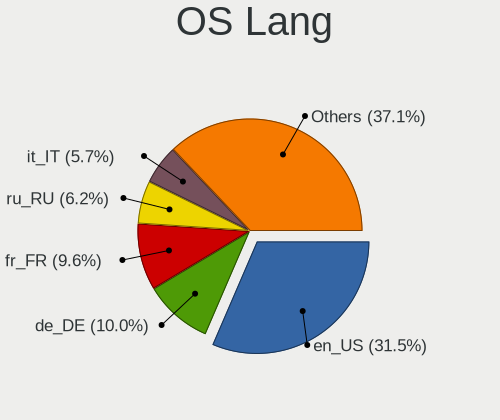

| Lang    | Desktops | Percent |
|---------|----------|---------|
| en_US   | 484      | 30.14%  |
| de_DE   | 169      | 10.52%  |
| fr_FR   | 148      | 9.22%   |
| ru_RU   | 103      | 6.41%   |
| it_IT   | 96       | 5.98%   |
| pt_BR   | 88       | 5.48%   |
| en_GB   | 60       | 3.74%   |
| en_CA   | 58       | 3.61%   |
| en_AU   | 37       | 2.3%    |
| es_ES   | 35       | 2.18%   |
| Unknown | 33       | 2.05%   |
| C       | 32       | 1.99%   |
| pl_PL   | 22       | 1.37%   |
| ja_JP   | 22       | 1.37%   |
| es_AR   | 22       | 1.37%   |
| nl_NL   | 21       | 1.31%   |
| hu_HU   | 18       | 1.12%   |
| zh_TW   | 9        | 0.56%   |
| sv_SE   | 8        | 0.5%    |
| fr_BE   | 8        | 0.5%    |
| es_MX   | 8        | 0.5%    |
| cs_CZ   | 8        | 0.5%    |
| ru_UA   | 7        | 0.44%   |
| fr_CA   | 7        | 0.44%   |
| en_ZA   | 7        | 0.44%   |
| de_AT   | 7        | 0.44%   |
| pt_PT   | 6        | 0.37%   |
| fi_FI   | 6        | 0.37%   |
| es_CO   | 6        | 0.37%   |
| sk_SK   | 5        | 0.31%   |
| es_VE   | 5        | 0.31%   |
| es_UY   | 5        | 0.31%   |
| ro_RO   | 4        | 0.25%   |
| en_IN   | 4        | 0.25%   |
| de_CH   | 4        | 0.25%   |
| zh_CN   | 3        | 0.19%   |
| tr_TR   | 3        | 0.19%   |
| nl_BE   | 3        | 0.19%   |
| fr_CH   | 3        | 0.19%   |
| en_IL   | 3        | 0.19%   |

Boot Mode
---------

EFI or BIOS

| Mode | Desktops | Percent |
|------|----------|---------|
| BIOS | 1198     | 74.09%  |
| EFI  | 419      | 25.91%  |

Filesystem
----------

Type of filesystem

| Type    | Desktops | Percent |
|---------|----------|---------|
| Ext4    | 1474     | 91.67%  |
| Overlay | 40       | 2.49%   |
| Btrfs   | 32       | 1.99%   |
| Zfs     | 16       | 1%      |
| Tmpfs   | 15       | 0.93%   |
| Unknown | 11       | 0.68%   |
| Xfs     | 10       | 0.62%   |
| Ext2    | 5        | 0.31%   |
| Ext3    | 4        | 0.25%   |
| Aufs    | 1        | 0.06%   |

Part. scheme
------------

Scheme of partitioning

| Type    | Desktops | Percent |
|---------|----------|---------|
| Unknown | 1031     | 63.72%  |
| GPT     | 336      | 20.77%  |
| MBR     | 251      | 15.51%  |

Dual Boot with Linux/BSD
------------------------

Hosting more than one Linux/BSD

| Dual boot | Desktops | Percent |
|-----------|----------|---------|
| No        | 1262     | 77.19%  |
| Yes       | 373      | 22.81%  |

Dual Boot (Win)
---------------

Hosting Linux and Windows

| Dual boot | Desktops | Percent |
|-----------|----------|---------|
| No        | 989      | 60.49%  |
| Yes       | 646      | 39.51%  |

Board
-----

Vendor
------

Motherboard manufacturer

| Name                | Desktops | Percent |
|---------------------|----------|---------|
| ASUSTek Computer    | 352      | 22.1%   |
| Gigabyte Technology | 230      | 14.44%  |
| Dell                | 173      | 10.86%  |
| MSI                 | 153      | 9.6%    |
| ASRock              | 152      | 9.54%   |
| Hewlett-Packard     | 143      | 8.98%   |
| Lenovo              | 58       | 3.64%   |
| Intel               | 44       | 2.76%   |
| Acer                | 42       | 2.64%   |
| ECS                 | 28       | 1.76%   |
| Unknown             | 27       | 1.69%   |
| Foxconn             | 21       | 1.32%   |
| Medion              | 17       | 1.07%   |
| Pegatron            | 16       | 1%      |
| Fujitsu             | 16       | 1%      |
| eMachines           | 9        | 0.56%   |
| Biostar             | 9        | 0.56%   |
| Packard Bell        | 8        | 0.5%    |
| Fujitsu Siemens     | 7        | 0.44%   |
| Positivo            | 6        | 0.38%   |
| Apple               | 5        | 0.31%   |
| Shuttle             | 4        | 0.25%   |
| NEC Computers       | 4        | 0.25%   |
| AOpen               | 4        | 0.25%   |
| AAEON               | 4        | 0.25%   |
| PCWare              | 3        | 0.19%   |
| OEM                 | 3        | 0.19%   |
| IBM                 | 3        | 0.19%   |
| EVGA                | 3        | 0.19%   |
| ZOTAC               | 2        | 0.13%   |
| WinFast             | 2        | 0.13%   |
| VIA Technologies    | 2        | 0.13%   |
| Semp Toshiba        | 2        | 0.13%   |
| Quanta              | 2        | 0.13%   |
| PCChips             | 2        | 0.13%   |
| NCR                 | 2        | 0.13%   |
| Itautec             | 2        | 0.13%   |
| Huanan              | 2        | 0.13%   |
| Gateway             | 2        | 0.13%   |
| BCM                 | 2        | 0.13%   |

Model
-----

Motherboard model

| Name                               | Desktops | Percent |
|------------------------------------|----------|---------|
| ASUS All Series                    | 35       | 2.2%    |
| Unknown                            | 30       | 1.88%   |
| Gigabyte H410M S2H                 | 15       | 0.94%   |
| Dell OptiPlex 7010                 | 15       | 0.94%   |
| Dell OptiPlex 755                  | 11       | 0.69%   |
| ECS G31T-M9                        | 9        | 0.56%   |
| ASRock N68C-S UCC                  | 9        | 0.56%   |
| Dell OptiPlex 780                  | 8        | 0.5%    |
| Dell OptiPlex 760                  | 8        | 0.5%    |
| Dell OptiPlex 390                  | 8        | 0.5%    |
| ASUS TUF Gaming X570-PLUS          | 7        | 0.44%   |
| MSI MS-7C37                        | 6        | 0.38%   |
| MSI MS-7817                        | 6        | 0.38%   |
| MSI MS-7721                        | 6        | 0.38%   |
| HP EliteDesk 800 G1 SFF            | 6        | 0.38%   |
| Dell OptiPlex 3020                 | 6        | 0.38%   |
| MSI MS-7C02                        | 5        | 0.31%   |
| MSI MS-7B89                        | 5        | 0.31%   |
| MSI MS-7B79                        | 5        | 0.31%   |
| MSI MS-7A38                        | 5        | 0.31%   |
| HP Compaq Elite 8300 SFF           | 5        | 0.31%   |
| HP Compaq dc7600 Small Form Factor | 5        | 0.31%   |
| Gigabyte 945GZM-S2                 | 5        | 0.31%   |
| Dell OptiPlex GX620                | 5        | 0.31%   |
| Dell OptiPlex 9020                 | 5        | 0.31%   |
| ASUS M5A78L-M/USB3                 | 5        | 0.31%   |
| MSI MS-7816                        | 4        | 0.25%   |
| MSI MS-7693                        | 4        | 0.25%   |
| Intel H61                          | 4        | 0.25%   |
| HP Z420 Workstation                | 4        | 0.25%   |
| HP Compaq Pro 6300 SFF             | 4        | 0.25%   |
| HP Compaq dc7900 Small Form Factor | 4        | 0.25%   |
| HP Compaq 8200 Elite SFF PC        | 4        | 0.25%   |
| HP Compaq 6200 Pro MT PC           | 4        | 0.25%   |
| Gigabyte X570 AORUS MASTER         | 4        | 0.25%   |
| Gigabyte GA-MA785GM-US2H           | 4        | 0.25%   |
| Gigabyte B450M DS3H                | 4        | 0.25%   |
| Dell Precision WorkStation T7400   | 4        | 0.25%   |
| Dell OptiPlex 990                  | 4        | 0.25%   |
| Dell OptiPlex 3010                 | 4        | 0.25%   |

Model Family
------------

Motherboard model prefix

| Name                | Desktops | Percent |
|---------------------|----------|---------|
| Dell OptiPlex       | 99       | 6.21%   |
| HP Compaq           | 64       | 4.02%   |
| ASUS PRIME          | 47       | 2.95%   |
| Lenovo ThinkCentre  | 40       | 2.51%   |
| ASUS All            | 35       | 2.2%    |
| Unknown             | 30       | 1.88%   |
| Dell Inspiron       | 27       | 1.69%   |
| Dell Precision      | 19       | 1.19%   |
| ASUS TUF            | 19       | 1.19%   |
| Acer Aspire         | 19       | 1.19%   |
| Acer Veriton        | 18       | 1.13%   |
| Gigabyte H410M      | 16       | 1%      |
| HP ProDesk          | 13       | 0.82%   |
| HP EliteDesk        | 13       | 0.82%   |
| Fujitsu ESPRIMO     | 12       | 0.75%   |
| ASUS ROG            | 12       | 0.75%   |
| ASUS P8H61-M        | 10       | 0.63%   |
| ASUS M5A78L-M       | 10       | 0.63%   |
| ECS G31T-M9         | 9        | 0.56%   |
| ASUS P5KPL-AM       | 9        | 0.56%   |
| ASRock N68C-S       | 9        | 0.56%   |
| Gigabyte X570       | 8        | 0.5%    |
| Packard Bell IMEDIA | 7        | 0.44%   |
| Lenovo IdeaCentre   | 7        | 0.44%   |
| Gigabyte B450M      | 7        | 0.44%   |
| MSI MS-7C37         | 6        | 0.38%   |
| MSI MS-7817         | 6        | 0.38%   |
| MSI MS-7721         | 6        | 0.38%   |
| Lenovo ThinkStation | 6        | 0.38%   |
| ASUS P9X79          | 6        | 0.38%   |
| ASUS P8Z77-V        | 6        | 0.38%   |
| ASUS P5K            | 6        | 0.38%   |
| MSI MS-7C02         | 5        | 0.31%   |
| MSI MS-7B89         | 5        | 0.31%   |
| MSI MS-7B79         | 5        | 0.31%   |
| MSI MS-7A38         | 5        | 0.31%   |
| HP ProLiant         | 5        | 0.31%   |
| Gigabyte H310M      | 5        | 0.31%   |
| Gigabyte 945GZM-S2  | 5        | 0.31%   |
| Dell Studio         | 5        | 0.31%   |

MFG Year
--------

Motherboard manufacture year

| Year    | Desktops | Percent |
|---------|----------|---------|
| 2009    | 144      | 9.04%   |
| 2012    | 143      | 8.98%   |
| 2013    | 138      | 8.66%   |
| 2011    | 137      | 8.6%    |
| 2010    | 119      | 7.47%   |
| 2007    | 109      | 6.84%   |
| 2008    | 107      | 6.72%   |
| 2018    | 99       | 6.21%   |
| 2014    | 97       | 6.09%   |
| 2019    | 87       | 5.46%   |
| 2017    | 70       | 4.39%   |
| 2020    | 64       | 4.02%   |
| 2015    | 61       | 3.83%   |
| 2006    | 60       | 3.77%   |
| 2016    | 50       | 3.14%   |
| 2005    | 37       | 2.32%   |
| 2021    | 35       | 2.2%    |
| 2004    | 9        | 0.56%   |
| 2022    | 8        | 0.5%    |
| 2003    | 8        | 0.5%    |
| 2001    | 4        | 0.25%   |
| 2002    | 3        | 0.19%   |
| Unknown | 3        | 0.19%   |
| 2023    | 1        | 0.06%   |

Form Factor
-----------

Physical design of the computer

| Name    | Desktops | Percent |
|---------|----------|---------|
| Desktop | 1593     | 100%    |

Secure Boot
-----------

Enabled or disabled

| State    | Desktops | Percent |
|----------|----------|---------|
| Disabled | 1564     | 97.81%  |
| Enabled  | 35       | 2.19%   |

Coreboot
--------

Have coreboot on board

| Used | Desktops | Percent |
|------|----------|---------|
| No   | 1592     | 99.94%  |
| Yes  | 1        | 0.06%   |

RAM Size
--------

Total RAM memory

| Size in GB      | Desktops | Percent |
|-----------------|----------|---------|
| 3.01-4.0        | 369      | 22.69%  |
| 16.01-24.0      | 283      | 17.4%   |
| 8.01-16.0       | 277      | 17.04%  |
| 4.01-8.0        | 254      | 15.62%  |
| 1.01-2.0        | 140      | 8.61%   |
| 32.01-64.0      | 133      | 8.18%   |
| 64.01-256.0     | 53       | 3.26%   |
| 2.01-3.0        | 51       | 3.14%   |
| 0.51-1.0        | 32       | 1.97%   |
| 24.01-32.0      | 28       | 1.72%   |
| 0.01-0.5        | 5        | 0.31%   |
| More than 256.0 | 1        | 0.06%   |

RAM Used
--------

Used RAM memory

| Used GB    | Desktops | Percent |
|------------|----------|---------|
| 1.01-2.0   | 755      | 41.67%  |
| 0.51-1.0   | 325      | 17.94%  |
| 2.01-3.0   | 311      | 17.16%  |
| 4.01-8.0   | 172      | 9.49%   |
| 3.01-4.0   | 139      | 7.67%   |
| 8.01-16.0  | 53       | 2.92%   |
| 0.01-0.5   | 39       | 2.15%   |
| 16.01-24.0 | 10       | 0.55%   |
| 24.01-32.0 | 6        | 0.33%   |
| 32.01-64.0 | 2        | 0.11%   |

Total Drives
------------

Number of drives on board

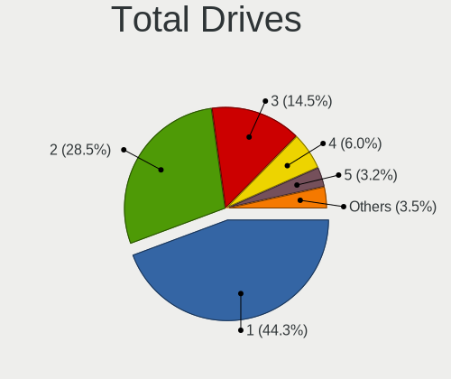

| Drives | Desktops | Percent |
|--------|----------|---------|
| 1      | 732      | 43.94%  |
| 2      | 474      | 28.45%  |
| 3      | 249      | 14.95%  |
| 4      | 103      | 6.18%   |
| 5      | 54       | 3.24%   |
| 6      | 21       | 1.26%   |
| 7      | 13       | 0.78%   |
| 0      | 9        | 0.54%   |
| 10     | 4        | 0.24%   |
| 9      | 3        | 0.18%   |
| 8      | 3        | 0.18%   |
| 11     | 1        | 0.06%   |

Has CD-ROM
----------

Has CD-ROM on board

| Presented | Desktops | Percent |
|-----------|----------|---------|
| Yes       | 923      | 57.12%  |
| No        | 693      | 42.88%  |

Has Ethernet
------------

Has Ethernet on board

| Presented | Desktops | Percent |
|-----------|----------|---------|
| Yes       | 1577     | 99%     |
| No        | 16       | 1%      |

Has WiFi
--------

Has WiFi module

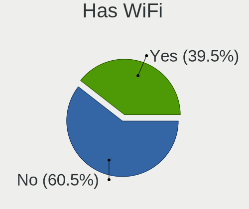

| Presented | Desktops | Percent |
|-----------|----------|---------|
| No        | 1001     | 61.87%  |
| Yes       | 617      | 38.13%  |

Has Bluetooth
-------------

Has Bluetooth module

| Presented | Desktops | Percent |
|-----------|----------|---------|
| No        | 1316     | 81.33%  |
| Yes       | 302      | 18.67%  |

Location
--------

Country
-------

Geographic location (country)

| Country      | Desktops | Percent |
|--------------|----------|---------|
| USA          | 267      | 16.72%  |
| Germany      | 193      | 12.09%  |
| France       | 144      | 9.02%   |
| Russia       | 117      | 7.33%   |
| Italy        | 108      | 6.76%   |
| Brazil       | 97       | 6.07%   |
| Canada       | 72       | 4.51%   |
| UK           | 58       | 3.63%   |
| Netherlands  | 43       | 2.69%   |
| Spain        | 42       | 2.63%   |
| Australia    | 40       | 2.5%    |
| Argentina    | 29       | 1.82%   |
| Ukraine      | 26       | 1.63%   |
| Japan        | 25       | 1.57%   |
| Poland       | 23       | 1.44%   |
| Sweden       | 22       | 1.38%   |
| Hungary      | 22       | 1.38%   |
| Belgium      | 20       | 1.25%   |
| Finland      | 16       | 1%      |
| Mexico       | 13       | 0.81%   |
| Greece       | 13       | 0.81%   |
| Taiwan       | 12       | 0.75%   |
| Austria      | 12       | 0.75%   |
| Bulgaria     | 11       | 0.69%   |
| Portugal     | 9        | 0.56%   |
| Czechia      | 9        | 0.56%   |
| Switzerland  | 8        | 0.5%    |
| South Africa | 8        | 0.5%    |
| Romania      | 8        | 0.5%    |
| Iran         | 7        | 0.44%   |
| Colombia     | 7        | 0.44%   |
| Venezuela    | 6        | 0.38%   |
| Uruguay      | 6        | 0.38%   |
| Thailand     | 6        | 0.38%   |
| Slovakia     | 6        | 0.38%   |
| Israel       | 6        | 0.38%   |
| Indonesia    | 6        | 0.38%   |
| Slovenia     | 5        | 0.31%   |
| Norway       | 5        | 0.31%   |
| Turkey       | 4        | 0.25%   |

City
----

Geographic location (city)

| City           | Desktops | Percent |
|----------------|----------|---------|
| Voronezh       | 36       | 2.12%   |
| Berlin         | 19       | 1.12%   |
| Paris          | 17       | 1%      |
| Sydney         | 15       | 0.88%   |
| Moscow         | 14       | 0.82%   |
| Sao Paulo      | 12       | 0.71%   |
| Milan          | 12       | 0.71%   |
| Rome           | 11       | 0.65%   |
| Amsterdam      | 11       | 0.65%   |
| Madrid         | 10       | 0.59%   |
| Hamburg        | 10       | 0.59%   |
| Vancouver      | 9        | 0.53%   |
| Montreal       | 9        | 0.53%   |
| Budapest       | 9        | 0.53%   |
| Rio de Janeiro | 8        | 0.47%   |
| Oryol          | 8        | 0.47%   |
| Genoa          | 8        | 0.47%   |
| Buenos Aires   | 8        | 0.47%   |
| Munich         | 7        | 0.41%   |
| Melbourne      | 7        | 0.41%   |
| Turin          | 6        | 0.35%   |
| Tehran         | 6        | 0.35%   |
| Sofia          | 6        | 0.35%   |
| Cologne        | 6        | 0.35%   |
| Athens         | 6        | 0.35%   |
| Tampere        | 5        | 0.29%   |
| Perth          | 5        | 0.29%   |
| Montevideo     | 5        | 0.29%   |
| Kyiv           | 5        | 0.29%   |
| Helsinki       | 5        | 0.29%   |
| Hanover        | 5        | 0.29%   |
| Dresden        | 5        | 0.29%   |
| Warsaw         | 4        | 0.24%   |
| Vienna         | 4        | 0.24%   |
| The Hague      | 4        | 0.24%   |
| Taipei         | 4        | 0.24%   |
| Stuttgart      | 4        | 0.24%   |
| St Petersburg  | 4        | 0.24%   |
| Springfield    | 4        | 0.24%   |
| Seattle        | 4        | 0.24%   |

Drives
------

Drive Vendor
------------

Hard drive vendors

| Vendor                | Desktops | Drives | Percent |
|-----------------------|----------|--------|---------|
| WDC                   | 594      | 940    | 22.05%  |
| Seagate               | 577      | 954    | 21.42%  |
| Samsung Electronics   | 358      | 570    | 13.29%  |
| Hitachi               | 153      | 226    | 5.68%   |
| Toshiba               | 139      | 202    | 5.16%   |
| Kingston              | 135      | 171    | 5.01%   |
| SanDisk               | 87       | 116    | 3.23%   |
| Crucial               | 85       | 124    | 3.16%   |
| Maxtor                | 60       | 85     | 2.23%   |
| A-DATA Technology     | 42       | 52     | 1.56%   |
| Intel                 | 41       | 61     | 1.52%   |
| China                 | 32       | 39     | 1.19%   |
| Unknown               | 30       | 38     | 1.11%   |
| Patriot               | 25       | 30     | 0.93%   |
| HGST                  | 24       | 34     | 0.89%   |
| PNY                   | 23       | 32     | 0.85%   |
| Intenso               | 16       | 23     | 0.59%   |
| OCZ                   | 15       | 22     | 0.56%   |
| Phison                | 13       | 25     | 0.48%   |
| Transcend             | 11       | 12     | 0.41%   |
| Fujitsu               | 11       | 13     | 0.41%   |
| ASMT                  | 10       | 14     | 0.37%   |
| Silicon Motion        | 9        | 10     | 0.33%   |
| Micron Technology     | 9        | 11     | 0.33%   |
| SPCC                  | 8        | 17     | 0.3%    |
| SK hynix              | 8        | 8      | 0.3%    |
| Lexar                 | 8        | 8      | 0.3%    |
| KingDian              | 6        | 10     | 0.22%   |
| Hewlett-Packard       | 6        | 11     | 0.22%   |
| Corsair               | 6        | 7      | 0.22%   |
| Apacer                | 6        | 9      | 0.22%   |
| Mushkin               | 5        | 5      | 0.19%   |
| KIOXIA                | 5        | 9      | 0.19%   |
| XPG                   | 4        | 10     | 0.15%   |
| Team                  | 4        | 6      | 0.15%   |
| Realtek Semiconductor | 4        | 6      | 0.15%   |
| Plextor               | 4        | 4      | 0.15%   |
| Phison Electronics    | 4        | 6      | 0.15%   |
| JMicron Technology    | 4        | 5      | 0.15%   |
| GOODRAM               | 4        | 6      | 0.15%   |

Drive Model
-----------

Hard drive models

| Model                            | Desktops | Percent |
|----------------------------------|----------|---------|
| Seagate ST500DM002-1BD142 500GB  | 48       | 1.54%   |
| Kingston SA400S37240G 240GB SSD  | 48       | 1.54%   |
| Samsung SSD 860 EVO 500GB        | 31       | 0.99%   |
| Seagate ST1000DM010-2EP102 1TB   | 30       | 0.96%   |
| Toshiba DT01ACA100 1TB           | 24       | 0.77%   |
| Seagate ST2000DM008-2FR102 2TB   | 21       | 0.67%   |
| Seagate ST2000DM001-1CH164 2TB   | 20       | 0.64%   |
| Seagate ST1000DM003-1CH162 1TB   | 20       | 0.64%   |
| Seagate ST3500418AS 500GB        | 19       | 0.61%   |
| Seagate ST31000528AS 1TB         | 18       | 0.58%   |
| Samsung SSD 850 EVO 250GB        | 18       | 0.58%   |
| Kingston SA400S37480G 480GB SSD  | 17       | 0.55%   |
| Seagate ST4000DM004-2CV104 4TB   | 16       | 0.51%   |
| Hitachi HDS721010CLA332 1TB      | 16       | 0.51%   |
| Toshiba DT01ACA050 500GB         | 15       | 0.48%   |
| Seagate Expansion 1TB            | 14       | 0.45%   |
| Samsung SSD 850 EVO 500GB        | 14       | 0.45%   |
| Toshiba HDWD110 1TB              | 13       | 0.42%   |
| Toshiba DT01ACA200 2TB           | 13       | 0.42%   |
| Seagate ST380815AS 80GB          | 13       | 0.42%   |
| Seagate ST3250310AS 250GB        | 13       | 0.42%   |
| Seagate ST3160815AS 160GB        | 13       | 0.42%   |
| Hitachi HDS721050CLA362 500GB    | 13       | 0.42%   |
| WDC WD800JD-75MSA3 80GB          | 12       | 0.39%   |
| WDC WD10EZEX-08WN4A0 1TB         | 12       | 0.39%   |
| Seagate ST3500413AS 500GB        | 12       | 0.39%   |
| Seagate ST31000524AS 1TB         | 12       | 0.39%   |
| Seagate ST1000DM003-1ER162 1TB   | 12       | 0.39%   |
| Patriot Burst 120GB SSD          | 12       | 0.39%   |
| Crucial CT1000MX500SSD1 1TB      | 12       | 0.39%   |
| Unknown SD/MMC/MS PRO 64GB       | 11       | 0.35%   |
| Samsung HD103SJ 1TB              | 11       | 0.35%   |
| Kingston SV300S37A120G 120GB SSD | 11       | 0.35%   |
| Kingston SA400S37120G 120GB SSD  | 11       | 0.35%   |
| WDC WD20EARX-00PASB0 2TB         | 10       | 0.32%   |
| WDC WD10EZEX-00BN5A0 1TB         | 10       | 0.32%   |
| Seagate ST3250820AS 250GB        | 10       | 0.32%   |
| Seagate ST1000DM003-1SB102 1TB   | 10       | 0.32%   |
| Samsung SSD 860 EVO 250GB        | 10       | 0.32%   |
| Samsung SSD 860 EVO 1TB          | 10       | 0.32%   |

HDD Vendor
----------

Hard disk drive vendors

| Vendor              | Desktops | Drives | Percent |
|---------------------|----------|--------|---------|
| Seagate             | 569      | 938    | 34.09%  |
| WDC                 | 552      | 857    | 33.07%  |
| Hitachi             | 153      | 226    | 9.17%   |
| Samsung Electronics | 133      | 199    | 7.97%   |
| Toshiba             | 124      | 180    | 7.43%   |
| Maxtor              | 58       | 83     | 3.48%   |
| HGST                | 24       | 34     | 1.44%   |
| Unknown             | 12       | 15     | 0.72%   |
| Fujitsu             | 11       | 13     | 0.66%   |
| ASMT                | 5        | 9      | 0.3%    |
| Intenso             | 4        | 5      | 0.24%   |
| Hewlett-Packard     | 4        | 7      | 0.24%   |
| USB3.0              | 3        | 5      | 0.18%   |
| Apple               | 3        | 4      | 0.18%   |
| WD MediaMax         | 2        | 2      | 0.12%   |
| HPE                 | 2        | 5      | 0.12%   |
| ExcelStor           | 2        | 2      | 0.12%   |
| Super Talent        | 1        | 1      | 0.06%   |
| SAGE                | 1        | 1      | 0.06%   |
| PHD 3.0             | 1        | 1      | 0.06%   |
| LaCie               | 1        | 5      | 0.06%   |
| Inateck             | 1        | 1      | 0.06%   |
| ICY BOX             | 1        | 1      | 0.06%   |
| IBM/Hitachi         | 1        | 1      | 0.06%   |
| External            | 1        | 1      | 0.06%   |

SSD Vendor
----------

Solid state drive vendors

| Vendor              | Desktops | Drives | Percent |
|---------------------|----------|--------|---------|
| Samsung Electronics | 186      | 270    | 22.57%  |
| Kingston            | 120      | 148    | 14.56%  |
| SanDisk             | 76       | 102    | 9.22%   |
| Crucial             | 76       | 115    | 9.22%   |
| WDC                 | 50       | 71     | 6.07%   |
| A-DATA Technology   | 35       | 44     | 4.25%   |
| China               | 32       | 39     | 3.88%   |
| Intel               | 30       | 45     | 3.64%   |
| Patriot             | 25       | 30     | 3.03%   |
| PNY                 | 22       | 31     | 2.67%   |
| OCZ                 | 14       | 20     | 1.7%    |
| Toshiba             | 11       | 17     | 1.33%   |
| Intenso             | 10       | 12     | 1.21%   |
| Transcend           | 9        | 9      | 1.09%   |
| SPCC                | 8        | 17     | 0.97%   |
| Micron Technology   | 8        | 10     | 0.97%   |
| Lexar               | 7        | 7      | 0.85%   |
| KingDian            | 6        | 10     | 0.73%   |
| Apacer              | 6        | 9      | 0.73%   |
| Corsair             | 5        | 6      | 0.61%   |
| ASMT                | 5        | 5      | 0.61%   |
| Team                | 4        | 6      | 0.49%   |
| SK hynix            | 4        | 4      | 0.49%   |
| Plextor             | 4        | 4      | 0.49%   |
| GOODRAM             | 4        | 6      | 0.49%   |
| TO Exter            | 3        | 5      | 0.36%   |
| Smartbuy            | 3        | 3      | 0.36%   |
| SABRENT             | 3        | 3      | 0.36%   |
| Mushkin             | 3        | 3      | 0.36%   |
| LITEONIT            | 3        | 3      | 0.36%   |
| Vaseky              | 2        | 2      | 0.24%   |
| TEXTORM             | 2        | 2      | 0.24%   |
| OCZ-VERTEX3         | 2        | 2      | 0.24%   |
| Maxtor              | 2        | 2      | 0.24%   |
| LITEON              | 2        | 2      | 0.24%   |
| Kingmax             | 2        | 3      | 0.24%   |
| KingFast            | 2        | 2      | 0.24%   |
| Integral            | 2        | 2      | 0.24%   |
| Hewlett-Packard     | 2        | 4      | 0.24%   |
| Emtec               | 2        | 2      | 0.24%   |

Drive Kind
----------

HDD or SSD

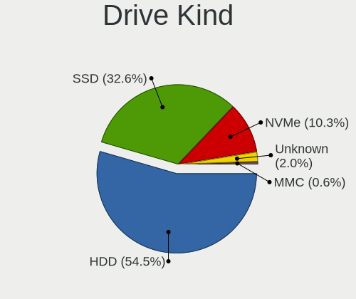

| Kind    | Desktops | Drives | Percent |
|---------|----------|--------|---------|
| HDD     | 1252     | 2596   | 57.04%  |
| SSD     | 709      | 1114   | 32.3%   |
| NVMe    | 180      | 285    | 8.2%    |
| Unknown | 42       | 59     | 1.91%   |
| MMC     | 12       | 13     | 0.55%   |

Drive Connector
---------------

SATA, SAS, NVMe, etc.

| Type | Desktops | Drives | Percent |
|------|----------|--------|---------|
| SATA | 1537     | 3589   | 83.22%  |
| NVMe | 180      | 285    | 9.75%   |
| SAS  | 118      | 180    | 6.39%   |
| MMC  | 12       | 13     | 0.65%   |

Drive Size
----------

Size of hard drive

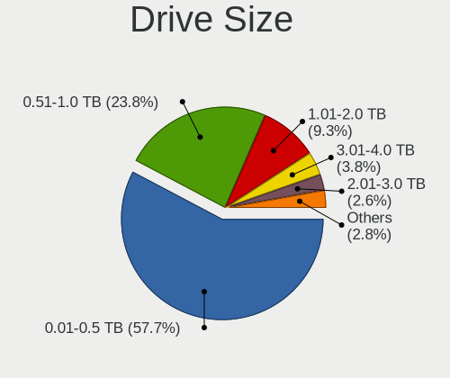

| Size in TB | Desktops | Drives | Percent |
|------------|----------|--------|---------|
| 0.01-0.5   | 1266     | 2250   | 58.75%  |
| 0.51-1.0   | 510      | 818    | 23.67%  |
| 1.01-2.0   | 200      | 342    | 9.28%   |
| 3.01-4.0   | 74       | 129    | 3.43%   |
| 2.01-3.0   | 55       | 98     | 2.55%   |
| 4.01-10.0  | 45       | 67     | 2.09%   |
| 10.01-20.0 | 5        | 6      | 0.23%   |

Space Total
-----------

Amount of disk space available on the file system

| Size in GB     | Desktops | Percent |
|----------------|----------|---------|
| 101-250        | 465      | 27.63%  |
| 251-500        | 312      | 18.54%  |
| 501-1000       | 239      | 14.2%   |
| 1001-2000      | 180      | 10.7%   |
| 51-100         | 125      | 7.43%   |
| More than 3000 | 124      | 7.37%   |
| 21-50          | 93       | 5.53%   |
| 2001-3000      | 76       | 4.52%   |
| 1-20           | 57       | 3.39%   |
| Unknown        | 12       | 0.71%   |

Space Used
----------

Amount of used disk space

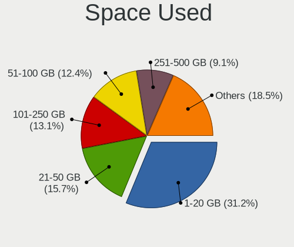

| Used GB        | Desktops | Percent |
|----------------|----------|---------|
| 1-20           | 565      | 32.21%  |
| 21-50          | 284      | 16.19%  |
| 101-250        | 230      | 13.11%  |
| 51-100         | 216      | 12.31%  |
| 251-500        | 146      | 8.32%   |
| 501-1000       | 127      | 7.24%   |
| 1001-2000      | 83       | 4.73%   |
| More than 3000 | 54       | 3.08%   |
| 2001-3000      | 37       | 2.11%   |
| Unknown        | 12       | 0.68%   |

Malfunc. Drives
---------------

Drive models with a malfunction

| Model                             | Desktops | Drives | Percent |
|-----------------------------------|----------|--------|---------|
| Seagate ST500DM002-1BD142 500GB   | 5        | 5      | 2.98%   |
| Seagate ST2000DM001-1CH164 2TB    | 4        | 6      | 2.38%   |
| Seagate ST3500418AS 500GB         | 3        | 4      | 1.79%   |
| Maxtor STM3160215AS 160GB         | 3        | 3      | 1.79%   |
| Hitachi HDS721050CLA362 500GB     | 3        | 3      | 1.79%   |
| WDC WD4000FYYZ-01UL1B1 4TB        | 2        | 3      | 1.19%   |
| WDC WD3200AAKS-00L9A0 320GB       | 2        | 2      | 1.19%   |
| WDC WD1002FAEX-00Z3A0 1TB         | 2        | 2      | 1.19%   |
| Toshiba DT01ACA100 1TB            | 2        | 2      | 1.19%   |
| Seagate ST3250318AS 250GB         | 2        | 4      | 1.19%   |
| Seagate ST31000528AS 1TB          | 2        | 2      | 1.19%   |
| Seagate ST1000DM010-2EP102 1TB    | 2        | 2      | 1.19%   |
| Seagate ST1000DM003-1ER162 1TB    | 2        | 2      | 1.19%   |
| Seagate ST1000DL002-9TT153 1TB    | 2        | 2      | 1.19%   |
| Samsung Electronics HM321HI 320GB | 2        | 3      | 1.19%   |
| Samsung Electronics HD753LJ 752GB | 2        | 3      | 1.19%   |
| Samsung Electronics HD103SJ 1TB   | 2        | 3      | 1.19%   |
| Samsung Electronics HD103SI 1TB   | 2        | 2      | 1.19%   |
| Samsung Electronics HD081GJ 80GB  | 2        | 2      | 1.19%   |
| Kingston SA400S37240G 240GB SSD   | 2        | 2      | 1.19%   |
| Intel SSDSC2BW120A4 120GB         | 2        | 3      | 1.19%   |
| Hitachi HDS721010CLA332 1TB       | 2        | 2      | 1.19%   |
| WDC WDS480G2G0A-00JH30 480GB SSD  | 1        | 1      | 0.6%    |
| WDC WDS240G2G0B-00EPW0 240GB SSD  | 1        | 1      | 0.6%    |
| WDC WD6400AAKS-22A7B2 640GB       | 1        | 1      | 0.6%    |
| WDC WD6400AAKS-22A7B0 640GB       | 1        | 1      | 0.6%    |
| WDC WD5000LPVX-08V0TT5 500GB      | 1        | 1      | 0.6%    |
| WDC WD5000LPCX-00VHAT0 500GB      | 1        | 1      | 0.6%    |
| WDC WD5000BEVT-22ZAT0 500GB       | 1        | 1      | 0.6%    |
| WDC WD5000AAKX-60U6AA0 500GB      | 1        | 1      | 0.6%    |
| WDC WD5000AAKX-08U6AA0 500GB      | 1        | 1      | 0.6%    |
| WDC WD5000AAKX-08ERMA0 500GB      | 1        | 1      | 0.6%    |
| WDC WD5000AAKX-00ERMA0 500GB      | 1        | 1      | 0.6%    |
| WDC WD5000AAKS-22V1A0 500GB       | 1        | 1      | 0.6%    |
| WDC WD5000AAKS-00A7B0 500GB       | 1        | 1      | 0.6%    |
| WDC WD5000AADS-00S9B0 500GB       | 1        | 1      | 0.6%    |
| WDC WD400EB-00CPF0 40GB           | 1        | 1      | 0.6%    |
| WDC WD3200BEVT-75ZCT1 320GB       | 1        | 1      | 0.6%    |
| WDC WD3200AVJS-63TBA0 320GB       | 1        | 1      | 0.6%    |
| WDC WD3200AAJS-60Z0A0 320GB       | 1        | 1      | 0.6%    |

Malfunc. Drive Vendor
---------------------

Vendors of faulty drives

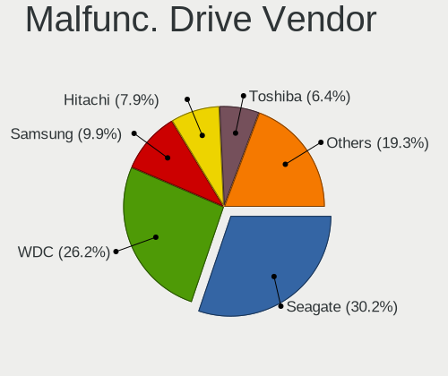

| Vendor              | Desktops | Drives | Percent |
|---------------------|----------|--------|---------|
| Seagate             | 47       | 57     | 29.38%  |
| WDC                 | 45       | 51     | 28.13%  |
| Samsung Electronics | 16       | 23     | 10%     |
| Hitachi             | 12       | 17     | 7.5%    |
| Toshiba             | 10       | 11     | 6.25%   |
| Maxtor              | 7        | 7      | 4.38%   |
| Kingston            | 4        | 4      | 2.5%    |
| SK hynix            | 2        | 2      | 1.25%   |
| Intel               | 2        | 3      | 1.25%   |
| HGST                | 2        | 4      | 1.25%   |
| Crucial             | 2        | 2      | 1.25%   |
| SPCC                | 1        | 1      | 0.63%   |
| PNY                 | 1        | 1      | 0.63%   |
| KingDian            | 1        | 1      | 0.63%   |
| ICY BOX             | 1        | 1      | 0.63%   |
| Hewlett-Packard     | 1        | 1      | 0.63%   |
| FORESEE             | 1        | 1      | 0.63%   |
| Corsair             | 1        | 1      | 0.63%   |
| China               | 1        | 1      | 0.63%   |
| Avant               | 1        | 1      | 0.63%   |
| ASMT                | 1        | 4      | 0.63%   |
| A-DATA Technology   | 1        | 1      | 0.63%   |

Malfunc. HDD Vendor
-------------------

Vendors of faulty HDD drives

| Vendor              | Desktops | Drives | Percent |
|---------------------|----------|--------|---------|
| Seagate             | 47       | 57     | 34.31%  |
| WDC                 | 43       | 49     | 31.39%  |
| Samsung Electronics | 14       | 20     | 10.22%  |
| Hitachi             | 12       | 17     | 8.76%   |
| Toshiba             | 9        | 10     | 6.57%   |
| Maxtor              | 7        | 7      | 5.11%   |
| HGST                | 2        | 4      | 1.46%   |
| ICY BOX             | 1        | 1      | 0.73%   |
| Hewlett-Packard     | 1        | 1      | 0.73%   |
| ASMT                | 1        | 4      | 0.73%   |

Malfunc. Drive Kind
-------------------

Kinds of faulty drives

| Kind | Desktops | Drives | Percent |
|------|----------|--------|---------|
| HDD  | 123      | 170    | 85.42%  |
| SSD  | 21       | 25     | 14.58%  |

Failed Drives
-------------

Failed drive models

| Model                            | Desktops | Drives | Percent |
|----------------------------------|----------|--------|---------|
| WDC WD20EARS-00J99B0 2TB         | 1        | 2      | 25%     |
| Toshiba DT01ACA200 2TB           | 1        | 1      | 25%     |
| Seagate ST500DM002-1BC142 500GB  | 1        | 1      | 25%     |
| A-DATA Technology SP800 32GB SSD | 1        | 1      | 25%     |

Failed Drive Vendor
-------------------

Failed drive vendors

| Vendor            | Desktops | Drives | Percent |
|-------------------|----------|--------|---------|
| WDC               | 1        | 2      | 25%     |
| Toshiba           | 1        | 1      | 25%     |
| Seagate           | 1        | 1      | 25%     |
| A-DATA Technology | 1        | 1      | 25%     |

Drive Status
------------

Number of failed and malfunc. drives

| Status   | Desktops | Drives | Percent |
|----------|----------|--------|---------|
| Detected | 1109     | 2815   | 64.03%  |
| Works    | 480      | 1052   | 27.71%  |
| Malfunc  | 139      | 195    | 8.03%   |
| Failed   | 4        | 5      | 0.23%   |

Storage controller
------------------

Storage Vendor
--------------

Storage controller vendors

| Vendor                           | Desktops | Percent |
|----------------------------------|----------|---------|
| Intel                            | 1061     | 53.1%   |
| AMD                              | 384      | 19.22%  |
| Nvidia                           | 103      | 5.16%   |
| Samsung Electronics              | 72       | 3.6%    |
| ASMedia Technology               | 64       | 3.2%    |
| JMicron Technology               | 61       | 3.05%   |
| Marvell Technology Group         | 48       | 2.4%    |
| VIA Technologies                 | 41       | 2.05%   |
| Kingston Technology Company      | 20       | 1%      |
| Phison Electronics               | 19       | 0.95%   |
| SanDisk                          | 16       | 0.8%    |
| Silicon Motion                   | 13       | 0.65%   |
| ADATA Technology                 | 12       | 0.6%    |
| Micron/Crucial Technology        | 10       | 0.5%    |
| Silicon Integrated Systems [SiS] | 8        | 0.4%    |
| Broadcom / LSI                   | 8        | 0.4%    |
| Silicon Image                    | 7        | 0.35%   |
| Realtek Semiconductor            | 6        | 0.3%    |
| LSI Logic / Symbios Logic        | 6        | 0.3%    |
| Toshiba America Info Systems     | 5        | 0.25%   |
| Integrated Technology Express    | 5        | 0.25%   |
| Adaptec                          | 5        | 0.25%   |
| Promise Technology               | 4        | 0.2%    |
| SK hynix                         | 3        | 0.15%   |
| Micron Technology                | 3        | 0.15%   |
| KIOXIA                           | 3        | 0.15%   |
| ULi Electronics                  | 2        | 0.1%    |
| Shenzhen Longsys Electronics     | 2        | 0.1%    |
| Seagate Technology               | 1        | 0.05%   |
| OCZ Technology Group             | 1        | 0.05%   |
| MAXIO Technology (Hangzhou)      | 1        | 0.05%   |
| Lite-On Technology               | 1        | 0.05%   |
| INNOGRIT                         | 1        | 0.05%   |
| HighPoint Technologies           | 1        | 0.05%   |
| Hewlett-Packard                  | 1        | 0.05%   |

Storage Model
-------------

Storage controller models

| Model                                                                                   | Desktops | Percent |
|-----------------------------------------------------------------------------------------|----------|---------|
| AMD FCH SATA Controller [AHCI mode]                                                     | 203      | 7.36%   |
| Intel NM10/ICH7 Family SATA Controller [IDE mode]                                       | 149      | 5.4%    |
| Intel 82801G (ICH7 Family) IDE Controller                                               | 113      | 4.09%   |
| Intel 8 Series/C220 Series Chipset Family 6-port SATA Controller 1 [AHCI mode]          | 103      | 3.73%   |
| Intel 6 Series/C200 Series Chipset Family 6 port Desktop SATA AHCI Controller           | 94       | 3.41%   |
| AMD SB7x0/SB8x0/SB9x0 IDE Controller                                                    | 84       | 3.04%   |
| Intel 7 Series/C210 Series Chipset Family 6-port SATA Controller [AHCI mode]            | 74       | 2.68%   |
| Nvidia MCP61 SATA Controller                                                            | 62       | 2.25%   |
| AMD 400 Series Chipset SATA Controller                                                  | 62       | 2.25%   |
| ASMedia ASM1062 Serial ATA Controller                                                   | 60       | 2.17%   |
| AMD SB7x0/SB8x0/SB9x0 SATA Controller [IDE mode]                                        | 56       | 2.03%   |
| Intel SATA Controller [RAID mode]                                                       | 55       | 1.99%   |
| Intel Q170/Q150/B150/H170/H110/Z170/CM236 Chipset SATA Controller [AHCI Mode]           | 55       | 1.99%   |
| AMD SB7x0/SB8x0/SB9x0 SATA Controller [AHCI mode]                                       | 54       | 1.96%   |
| Nvidia MCP61 IDE                                                                        | 49       | 1.78%   |
| Samsung NVMe SSD Controller SM981/PM981/PM983                                           | 45       | 1.63%   |
| Intel 200 Series PCH SATA controller [AHCI mode]                                        | 44       | 1.59%   |
| Intel 6 Series/C200 Series Chipset Family Desktop SATA Controller (IDE mode, ports 4-5) | 43       | 1.56%   |
| Intel 6 Series/C200 Series Chipset Family Desktop SATA Controller (IDE mode, ports 0-3) | 43       | 1.56%   |
| JMicron JMB363 SATA/IDE Controller                                                      | 39       | 1.41%   |
| Intel 82801I (ICH9 Family) 2 port SATA Controller [IDE mode]                            | 38       | 1.38%   |
| Intel 4 Series Chipset PT IDER Controller                                               | 35       | 1.27%   |
| Intel 82801IR/IO/IH (ICH9R/DO/DH) 4 port SATA Controller [IDE mode]                     | 30       | 1.09%   |
| VIA VT82C586A/B/VT82C686/A/B/VT823x/A/C PIPC Bus Master IDE                             | 29       | 1.05%   |
| Intel Cannon Lake PCH SATA AHCI Controller                                              | 27       | 0.98%   |
| Intel 5 Series/3400 Series Chipset 4 port SATA IDE Controller                           | 26       | 0.94%   |
| AMD 500 Series Chipset SATA Controller                                                  | 25       | 0.91%   |
| Intel 82801JD/DO (ICH10 Family) SATA AHCI Controller                                    | 24       | 0.87%   |
| Intel 5 Series/3400 Series Chipset 2 port SATA IDE Controller                           | 23       | 0.83%   |
| Intel 9 Series Chipset Family SATA Controller [AHCI Mode]                               | 22       | 0.8%    |
| Intel 82Q35 Express PT IDER Controller                                                  | 22       | 0.8%    |
| AMD FCH SATA Controller D                                                               | 22       | 0.8%    |
| AMD FCH IDE Controller                                                                  | 21       | 0.76%   |
| Intel 82801JI (ICH10 Family) 4 port SATA IDE Controller #1                              | 20       | 0.72%   |
| Intel Atom Processor E3800 Series SATA AHCI Controller                                  | 19       | 0.69%   |
| Intel 82801JI (ICH10 Family) 2 port SATA IDE Controller #2                              | 19       | 0.69%   |
| Intel 5 Series/3400 Series Chipset 6 port SATA AHCI Controller                          | 19       | 0.69%   |
| Intel 82801JI (ICH10 Family) SATA AHCI Controller                                       | 18       | 0.65%   |
| Intel 82801IR/IO/IH (ICH9R/DO/DH) 6 port SATA Controller [AHCI mode]                    | 18       | 0.65%   |
| Intel 400 Series Chipset Family SATA AHCI Controller                                    | 17       | 0.62%   |

Storage Kind
------------

Kind of storage controller (IDE, SATA, NVMe, SAS, ...)

| Kind | Desktops | Percent |
|------|----------|---------|
| SATA | 1040     | 50.44%  |
| IDE  | 710      | 34.43%  |
| NVMe | 181      | 8.78%   |
| RAID | 109      | 5.29%   |
| SAS  | 11       | 0.53%   |
| SCSI | 11       | 0.53%   |

Processor
---------

CPU Vendor
----------

Processor vendors

| Vendor       | Desktops | Percent |
|--------------|----------|---------|
| Intel        | 1109     | 69.62%  |
| AMD          | 482      | 30.26%  |
| CentaurHauls | 1        | 0.06%   |
| ARM          | 1        | 0.06%   |

CPU Model
---------

Processor models

| Model                                       | Desktops | Percent |
|---------------------------------------------|----------|---------|
| Intel Core 2 Duo CPU E8400 @ 3.00GHz        | 26       | 1.62%   |
| Intel Core i5-2400 CPU @ 3.10GHz            | 24       | 1.5%    |
| Intel Pentium 4 CPU 3.00GHz                 | 23       | 1.43%   |
| Intel Core i5-3470 CPU @ 3.20GHz            | 20       | 1.25%   |
| Intel Core i3-10100 CPU @ 3.60GHz           | 18       | 1.12%   |
| Intel Core 2 Duo CPU E7500 @ 2.93GHz        | 18       | 1.12%   |
| Intel Core i7-3770 CPU @ 3.40GHz            | 17       | 1.06%   |
| Intel Core i3-2100 CPU @ 3.10GHz            | 16       | 1%      |
| AMD Ryzen 5 3600 6-Core Processor           | 16       | 1%      |
| Intel Core i5-4570 CPU @ 3.20GHz            | 15       | 0.93%   |
| Intel Core 2 Quad CPU Q6600 @ 2.40GHz       | 15       | 0.93%   |
| Intel Core i7-2600 CPU @ 3.40GHz            | 14       | 0.87%   |
| Intel Celeron CPU J1800 @ 2.41GHz           | 14       | 0.87%   |
| AMD Ryzen 5 2600 Six-Core Processor         | 14       | 0.87%   |
| Intel Core i3-2120 CPU @ 3.30GHz            | 13       | 0.81%   |
| Intel Pentium Dual-Core CPU E5300 @ 2.60GHz | 12       | 0.75%   |
| Intel Core i7-4790 CPU @ 3.60GHz            | 12       | 0.75%   |
| Intel Core i3-4130 CPU @ 3.40GHz            | 12       | 0.75%   |
| AMD Ryzen 7 2700X Eight-Core Processor      | 12       | 0.75%   |
| AMD FX-8350 Eight-Core Processor            | 12       | 0.75%   |
| AMD Ryzen 7 3700X 8-Core Processor          | 11       | 0.69%   |
| AMD Ryzen 5 3400G with Radeon Vega Graphics | 11       | 0.69%   |
| AMD Phenom II X4 955 Processor              | 11       | 0.69%   |
| Intel Core i7-4770 CPU @ 3.40GHz            | 10       | 0.62%   |
| Intel Core i5-4590 CPU @ 3.30GHz            | 10       | 0.62%   |
| Intel Core i5-4460 CPU @ 3.20GHz            | 10       | 0.62%   |
| Intel Core i5-3570 CPU @ 3.40GHz            | 10       | 0.62%   |
| Intel Core i3-3220 CPU @ 3.30GHz            | 10       | 0.62%   |
| Intel Core 2 Duo CPU E6550 @ 2.33GHz        | 10       | 0.62%   |
| AMD Ryzen 9 3900X 12-Core Processor         | 10       | 0.62%   |
| Intel Pentium Dual CPU E2180 @ 2.00GHz      | 9        | 0.56%   |
| Intel Pentium 4 CPU 3.20GHz                 | 9        | 0.56%   |
| Intel Pentium 4 CPU 2.80GHz                 | 9        | 0.56%   |
| Intel Core i7-6700 CPU @ 3.40GHz            | 9        | 0.56%   |
| Intel Core i7-3770K CPU @ 3.50GHz           | 9        | 0.56%   |
| Intel Core i7-2600K CPU @ 3.40GHz           | 9        | 0.56%   |
| Intel Core i5-6400 CPU @ 2.70GHz            | 9        | 0.56%   |
| Intel Core i5 CPU 750 @ 2.67GHz             | 9        | 0.56%   |
| Intel Core i3-3240 CPU @ 3.40GHz            | 9        | 0.56%   |
| Intel Core 2 Quad CPU Q9550 @ 2.83GHz       | 9        | 0.56%   |

CPU Model Family
----------------

Processor model prefix

| Model                   | Desktops | Percent |
|-------------------------|----------|---------|
| Intel Core i5           | 240      | 14.97%  |
| Intel Core i7           | 160      | 9.98%   |
| Intel Core i3           | 130      | 8.11%   |
| Intel Core 2 Duo        | 103      | 6.43%   |
| Intel Celeron           | 80       | 4.99%   |
| AMD Ryzen 5             | 76       | 4.74%   |
| Intel Xeon              | 73       | 4.55%   |
| Intel Pentium 4         | 58       | 3.62%   |
| Intel Core 2 Quad       | 54       | 3.37%   |
| AMD Ryzen 7             | 50       | 3.12%   |
| AMD FX                  | 50       | 3.12%   |
| Intel Pentium Dual-Core | 48       | 2.99%   |
| Intel Pentium           | 43       | 2.68%   |
| AMD Athlon 64 X2        | 35       | 2.18%   |
| AMD Phenom II X4        | 28       | 1.75%   |
| AMD Athlon II X2        | 27       | 1.68%   |
| Intel Pentium Dual      | 25       | 1.56%   |
| AMD Ryzen 9             | 25       | 1.56%   |
| Intel Atom              | 24       | 1.5%    |
| Intel Core 2            | 22       | 1.37%   |
| AMD A8                  | 21       | 1.31%   |
| Other                   | 19       | 1.19%   |
| AMD Ryzen 3             | 19       | 1.19%   |
| Intel Pentium D         | 17       | 1.06%   |
| AMD Sempron             | 16       | 1%      |
| AMD Athlon 64           | 16       | 1%      |
| AMD A10                 | 15       | 0.94%   |
| AMD Athlon II X4        | 13       | 0.81%   |
| Intel Core i9           | 12       | 0.75%   |
| AMD Phenom              | 11       | 0.69%   |
| AMD Athlon              | 11       | 0.69%   |
| AMD A4                  | 8        | 0.5%    |
| AMD Phenom II X6        | 7        | 0.44%   |
| AMD Ryzen Threadripper  | 6        | 0.37%   |
| AMD Athlon Dual Core    | 6        | 0.37%   |
| AMD A6                  | 6        | 0.37%   |
| Intel Pentium Gold      | 4        | 0.25%   |
| AMD Phenom II X2        | 4        | 0.25%   |
| AMD E1                  | 4        | 0.25%   |
| AMD E                   | 4        | 0.25%   |

CPU Cores
---------

Number of processor cores

| Number  | Desktops | Percent |
|---------|----------|---------|
| 4       | 624      | 38.95%  |
| 2       | 569      | 35.52%  |
| 1       | 125      | 7.8%    |
| 6       | 119      | 7.43%   |
| 8       | 90       | 5.62%   |
| 12      | 28       | 1.75%   |
| 16      | 17       | 1.06%   |
| 3       | 17       | 1.06%   |
| 10      | 6        | 0.37%   |
| 24      | 3        | 0.19%   |
| 20      | 2        | 0.12%   |
| 14      | 1        | 0.06%   |
| Unknown | 1        | 0.06%   |

CPU Sockets
-----------

Number of sockets

| Number | Desktops | Percent |
|--------|----------|---------|
| 1      | 1567     | 98.37%  |
| 2      | 26       | 1.63%   |

CPU Threads
-----------

Threads per core (Hyper-Threading)

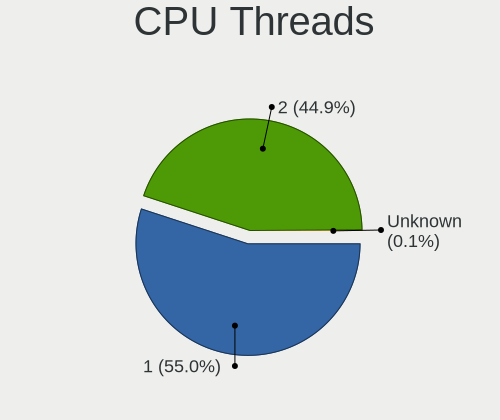

| Number  | Desktops | Percent |
|---------|----------|---------|
| 1       | 912      | 57.11%  |
| 2       | 683      | 42.77%  |
| 4       | 1        | 0.06%   |
| Unknown | 1        | 0.06%   |

CPU Op-Modes
------------

CPU Operation Modes (32-bit, 64-bit)

| Op mode        | Desktops | Percent |
|----------------|----------|---------|
| 32-bit, 64-bit | 1566     | 98.31%  |
| 32-bit         | 26       | 1.63%   |
| Unknown        | 1        | 0.06%   |

CPU Microcode
-------------

Microcode number

| Number     | Desktops | Percent |
|------------|----------|---------|
| Unknown    | 312      | 18.86%  |
| 0x1067a    | 123      | 7.44%   |
| 0x306c3    | 115      | 6.95%   |
| 0x206a7    | 105      | 6.35%   |
| 0x306a9    | 100      | 6.05%   |
| 0x506e3    | 50       | 3.02%   |
| 0x010000c8 | 47       | 2.84%   |
| 0x06000852 | 37       | 2.24%   |
| 0x6fd      | 36       | 2.18%   |
| 0x10676    | 32       | 1.93%   |
| 0x6fb      | 31       | 1.87%   |
| 0x08701021 | 31       | 1.87%   |
| 0x0800820d | 31       | 1.87%   |
| 0x906e9    | 25       | 1.51%   |
| 0x106e5    | 25       | 1.51%   |
| 0x906ea    | 24       | 1.45%   |
| 0xa0653    | 21       | 1.27%   |
| 0xf43      | 18       | 1.09%   |
| 0x6f6      | 18       | 1.09%   |
| 0x08108109 | 18       | 1.09%   |
| 0x06001119 | 17       | 1.03%   |
| 0x206d7    | 14       | 0.85%   |
| 0x08701013 | 14       | 0.85%   |
| 0x20655    | 13       | 0.79%   |
| 0x010000db | 13       | 0.79%   |
| 0x106a5    | 12       | 0.73%   |
| 0xf64      | 11       | 0.67%   |
| 0x03000027 | 11       | 0.67%   |
| 0xf65      | 10       | 0.6%    |
| 0xf49      | 10       | 0.6%    |
| 0x906ed    | 10       | 0.6%    |
| 0x306f2    | 10       | 0.6%    |
| 0x306e4    | 10       | 0.6%    |
| 0x30679    | 10       | 0.6%    |
| 0x10677    | 10       | 0.6%    |
| 0x010000c7 | 10       | 0.6%    |
| 0xf41      | 9        | 0.54%   |
| 0x406c3    | 9        | 0.54%   |
| 0x106ca    | 9        | 0.54%   |
| 0x08001137 | 9        | 0.54%   |

CPU Microarch
-------------

Microarchitecture

| Name             | Desktops | Percent |
|------------------|----------|---------|
| Penryn           | 177      | 11.06%  |
| Haswell          | 150      | 9.37%   |
| SandyBridge      | 134      | 8.37%   |
| IvyBridge        | 124      | 7.75%   |
| Core             | 108      | 6.75%   |
| K10              | 103      | 6.43%   |
| KabyLake         | 86       | 5.37%   |
| NetBurst         | 82       | 5.12%   |
| K8 Hammer        | 74       | 4.62%   |
| Zen 2            | 67       | 4.18%   |
| Piledriver       | 59       | 3.69%   |
| Skylake          | 58       | 3.62%   |
| Zen+             | 55       | 3.44%   |
| Nehalem          | 41       | 2.56%   |
| Zen              | 38       | 2.37%   |
| Silvermont       | 38       | 2.37%   |
| Westmere         | 32       | 2%      |
| CometLake        | 29       | 1.81%   |
| Zen 3            | 25       | 1.56%   |
| Bonnell          | 19       | 1.19%   |
| Unknown          | 14       | 0.87%   |
| K10 Llano        | 13       | 0.81%   |
| Jaguar           | 10       | 0.62%   |
| Excavator        | 10       | 0.62%   |
| Bulldozer        | 10       | 0.62%   |
| Steamroller      | 9        | 0.56%   |
| Goldmont         | 7        | 0.44%   |
| Bobcat           | 6        | 0.37%   |
| Alderlake Hybrid | 6        | 0.37%   |
| Broadwell        | 5        | 0.31%   |
| K6               | 4        | 0.25%   |
| Icelake          | 3        | 0.19%   |
| Puma             | 2        | 0.12%   |
| Goldmont plus    | 2        | 0.12%   |
| Tremont          | 1        | 0.06%   |

Graphics
--------

GPU Vendor
----------

Vendors of graphics cards

| Vendor                           | Desktops | Percent |
|----------------------------------|----------|---------|
| Nvidia                           | 638      | 37.91%  |
| Intel                            | 592      | 35.18%  |
| AMD                              | 438      | 26.02%  |
| VIA Technologies                 | 6        | 0.36%   |
| Silicon Integrated Systems [SiS] | 5        | 0.3%    |
| Matrox Electronics Systems       | 2        | 0.12%   |
| ASPEED Technology                | 1        | 0.06%   |
| Alliance Semiconductor           | 1        | 0.06%   |

GPU Model
---------

Graphics card models

| Model                                                                                    | Desktops | Percent |
|------------------------------------------------------------------------------------------|----------|---------|
| Intel Xeon E3-1200 v3/4th Gen Core Processor Integrated Graphics Controller              | 78       | 4.42%   |
| Intel 2nd Generation Core Processor Family Integrated Graphics Controller                | 71       | 4.02%   |
| Intel 4 Series Chipset Integrated Graphics Controller                                    | 61       | 3.46%   |
| Intel Xeon E3-1200 v2/3rd Gen Core processor Graphics Controller                         | 50       | 2.83%   |
| AMD Ellesmere [Radeon RX 470/480/570/570X/580/580X/590]                                  | 49       | 2.78%   |
| Nvidia GK208B [GeForce GT 710]                                                           | 48       | 2.72%   |
| Intel 82G33/G31 Express Integrated Graphics Controller                                   | 43       | 2.44%   |
| Nvidia GP107 [GeForce GTX 1050 Ti]                                                       | 35       | 1.98%   |
| Nvidia GT218 [GeForce 210]                                                               | 31       | 1.76%   |
| Intel HD Graphics 530                                                                    | 28       | 1.59%   |
| Intel 82945G/GZ Integrated Graphics Controller                                           | 25       | 1.42%   |
| AMD Cedar [Radeon HD 5000/6000/7350/8350 Series]                                         | 23       | 1.3%    |
| Intel CometLake-S GT2 [UHD Graphics 630]                                                 | 22       | 1.25%   |
| Intel CoffeeLake-S GT2 [UHD Graphics 630]                                                | 22       | 1.25%   |
| Intel Atom Processor Z36xxx/Z37xxx Series Graphics & Display                             | 22       | 1.25%   |
| Nvidia C61 [GeForce 6150SE nForce 430]                                                   | 19       | 1.08%   |
| Nvidia GP108 [GeForce GT 1030]                                                           | 18       | 1.02%   |
| Intel IvyBridge GT2 [HD Graphics 4000]                                                   | 18       | 1.02%   |
| AMD Picasso/Raven 2 [Radeon Vega Series / Radeon Vega Mobile Series]                     | 17       | 0.96%   |
| AMD Caicos [Radeon HD 6450/7450/8450 / R5 230 OEM]                                       | 17       | 0.96%   |
| Nvidia GM107 [GeForce GTX 750 Ti]                                                        | 16       | 0.91%   |
| Intel Atom/Celeron/Pentium Processor x5-E8000/J3xxx/N3xxx Integrated Graphics Controller | 16       | 0.91%   |
| Intel 82Q35 Express Integrated Graphics Controller                                       | 16       | 0.91%   |
| AMD Raven Ridge [Radeon Vega Series / Radeon Vega Mobile Series]                         | 16       | 0.91%   |
| Nvidia GP104 [GeForce GTX 1070]                                                          | 15       | 0.85%   |
| Nvidia GF119 [GeForce GT 610]                                                            | 15       | 0.85%   |
| Intel 4th Generation Core Processor Family Integrated Graphics Controller                | 14       | 0.79%   |
| Nvidia GP106 [GeForce GTX 1060 6GB]                                                      | 12       | 0.68%   |
| Nvidia GM204 [GeForce GTX 970]                                                           | 12       | 0.68%   |
| Nvidia GK208B [GeForce GT 730]                                                           | 12       | 0.68%   |
| Nvidia GF108 [GeForce GT 630]                                                            | 12       | 0.68%   |
| Intel HD Graphics 630                                                                    | 12       | 0.68%   |
| Nvidia GM206 [GeForce GTX 960]                                                           | 11       | 0.62%   |
| Nvidia G96C [GeForce 9500 GT]                                                            | 10       | 0.57%   |
| Nvidia G86 [GeForce 8500 GT]                                                             | 10       | 0.57%   |
| Nvidia C61 [GeForce 7025 / nForce 630a]                                                  | 10       | 0.57%   |
| AMD RS880 [Radeon HD 4250]                                                               | 10       | 0.57%   |
| Nvidia GF116 [GeForce GTX 550 Ti]                                                        | 9        | 0.51%   |
| Nvidia TU106 [GeForce RTX 2060 Rev. A]                                                   | 8        | 0.45%   |
| Nvidia GT216 [GeForce GT 220]                                                            | 8        | 0.45%   |

GPU Combo
---------

Combinations of graphics cards

| Name                                 | Desktops | Percent |
|--------------------------------------|----------|---------|
| 1 x Nvidia                           | 607      | 37.56%  |
| 1 x Intel                            | 536      | 33.17%  |
| 1 x AMD                              | 374      | 23.14%  |
| 2 x AMD                              | 42       | 2.6%    |
| Intel + Nvidia                       | 13       | 0.8%    |
| Intel + AMD                          | 9        | 0.56%   |
| AMD + Nvidia                         | 7        | 0.43%   |
| 1 x VIA                              | 6        | 0.37%   |
| 2 x Nvidia                           | 5        | 0.31%   |
| 1 x SiS                              | 5        | 0.31%   |
| Other                                | 3        | 0.19%   |
| 1 x Matrox                           | 2        | 0.12%   |
| 3 x AMD                              | 1        | 0.06%   |
| 2 x Intel                            | 1        | 0.06%   |
| 2 x AMD + 1 x Nvidia                 | 1        | 0.06%   |
| 2 x AMD + 1 x Alliance Semiconductor | 1        | 0.06%   |
| Nvidia + ASPEED                      | 1        | 0.06%   |
| Intel + 2 x AMD                      | 1        | 0.06%   |
| Intel + AMD + 1 x Nvidia             | 1        | 0.06%   |

GPU Driver
----------

Free vs proprietary

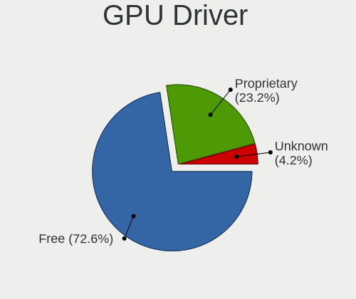

| Driver      | Desktops | Percent |
|-------------|----------|---------|
| Free        | 1172     | 72.57%  |
| Proprietary | 374      | 23.16%  |
| Unknown     | 69       | 4.27%   |

GPU Memory
----------

Total video memory

| Size in GB | Desktops | Percent |
|------------|----------|---------|
| Unknown    | 643      | 39.02%  |
| 0.01-0.5   | 314      | 19.05%  |
| 0.51-1.0   | 230      | 13.96%  |
| 1.01-2.0   | 227      | 13.77%  |
| 3.01-4.0   | 109      | 6.61%   |
| 7.01-8.0   | 69       | 4.19%   |
| 5.01-6.0   | 26       | 1.58%   |
| 8.01-16.0  | 15       | 0.91%   |
| 2.01-3.0   | 12       | 0.73%   |
| 4.01-5.0   | 2        | 0.12%   |
| 16.01-24.0 | 1        | 0.06%   |

Monitor
-------

Monitor Vendor
--------------

Monitor vendors

| Vendor                  | Desktops | Percent |
|-------------------------|----------|---------|
| Samsung Electronics     | 263      | 16.17%  |
| Dell                    | 171      | 10.52%  |
| Goldstar                | 143      | 8.79%   |
| Hewlett-Packard         | 130      | 8%      |
| Acer                    | 117      | 7.2%    |
| AOC                     | 92       | 5.66%   |
| Philips                 | 83       | 5.1%    |
| Ancor Communications    | 69       | 4.24%   |
| BenQ                    | 55       | 3.38%   |
| ViewSonic               | 41       | 2.52%   |
| Unknown                 | 36       | 2.21%   |
| LG Electronics          | 36       | 2.21%   |
| Iiyama                  | 30       | 1.85%   |
| Sony                    | 25       | 1.54%   |
| Fujitsu Siemens         | 21       | 1.29%   |
| NEC Computers           | 20       | 1.23%   |
| Lenovo                  | 18       | 1.11%   |
| HannStar                | 16       | 0.98%   |
| Panasonic               | 15       | 0.92%   |
| Eizo                    | 15       | 0.92%   |
| ASUSTek Computer        | 14       | 0.86%   |
| Medion                  | 11       | 0.68%   |
| Vizio                   | 8        | 0.49%   |
| Vestel Elektronik       | 8        | 0.49%   |
| Idek Iiyama             | 6        | 0.37%   |
| Gateway                 | 6        | 0.37%   |
| Lenovo Group Limited    | 5        | 0.31%   |
| Haier                   | 5        | 0.31%   |
| ___                     | 4        | 0.25%   |
| Sharp                   | 4        | 0.25%   |
| RTK                     | 4        | 0.25%   |
| Mitsubishi              | 4        | 0.25%   |
| IBM                     | 4        | 0.25%   |
| Hitachi                 | 4        | 0.25%   |
| DENON                   | 4        | 0.25%   |
| Chi Mei Optoelectronics | 4        | 0.25%   |
| Unknown                 | 4        | 0.25%   |
| Toshiba                 | 3        | 0.18%   |
| Tech Concepts           | 3        | 0.18%   |
| Packard Bell            | 3        | 0.18%   |

Monitor Model
-------------

Monitor models

| Model                                                                  | Desktops | Percent |
|------------------------------------------------------------------------|----------|---------|
| AOC 24B2W1G5 AOC2402 1920x1080 527x296mm 23.8-inch                     | 16       | 0.92%   |
| Goldstar W1943 GSM4BAD 1360x768 406x229mm 18.4-inch                    | 10       | 0.58%   |
| Panasonic TV MEIA296 3840x2160 708x398mm 32.0-inch                     | 9        | 0.52%   |
| Vestel Elektronik 43UHD_LCD_TV VES3700 3840x2160 950x540mm 43.0-inch   | 8        | 0.46%   |
| Ancor Communications ASUS VS197 ACI19F2 1366x768 410x230mm 18.5-inch   | 8        | 0.46%   |
| Unknown LCD Monitor SAMSUNG 1920x1080                                  | 6        | 0.35%   |
| Samsung Electronics LCD Monitor SyncMaster 1280x1024                   | 6        | 0.35%   |
| Philips PHL 243V5 PHLC0D1 1920x1080 521x293mm 23.5-inch                | 6        | 0.35%   |
| Goldstar W1942 GSM4B6F 1440x900 408x255mm 18.9-inch                    | 6        | 0.35%   |
| Dell E176FP DELA014 1280x1024 338x270mm 17.0-inch                      | 6        | 0.35%   |
| Samsung Electronics U28E590 SAM0C4D 1680x1050 610x350mm 27.7-inch      | 5        | 0.29%   |
| Samsung Electronics SyncMaster SAM03C2 1680x1050 459x296mm 21.5-inch   | 5        | 0.29%   |
| Samsung Electronics S22F350 SAM0D1A 1920x1080 477x268mm 21.5-inch      | 5        | 0.29%   |
| LG Electronics LCD Monitor LG TV 1920x1080                             | 5        | 0.29%   |
| Goldstar HD GSM5ACB 1366x768 410x230mm 18.5-inch                       | 5        | 0.29%   |
| AOC 1950W AOC1950 1366x768 410x230mm 18.5-inch                         | 5        | 0.29%   |
| Samsung Electronics LCD Monitor SyncMaster 1920x1080                   | 4        | 0.23%   |
| Philips PHL 223V5 PHLC0CF 1920x1080 477x268mm 21.5-inch                | 4        | 0.23%   |
| Philips 196VL PHLC07F 1366x768 409x230mm 18.5-inch                     | 4        | 0.23%   |
| Philips 170S PHL0839 1280x1024 340x270mm 17.1-inch                     | 4        | 0.23%   |
| Iiyama PL2278H IVM5624 1920x1080 477x268mm 21.5-inch                   | 4        | 0.23%   |
| Dell 1908FP DEL4026 1280x1024 376x301mm 19.0-inch                      | 4        | 0.23%   |
| BenQ GL2460 BNQ78CE 1920x1080 531x299mm 24.0-inch                      | 4        | 0.23%   |
| Unknown                                                                | 4        | 0.23%   |
| Vizio D32x-D1 VIZ1005 1920x1080 698x392mm 31.5-inch                    | 3        | 0.17%   |
| Unknown LCD Monitor FFFF 2288x1287 2550x2550mm 142.0-inch              | 3        | 0.17%   |
| Samsung Electronics S24F350 SAM0D20 1920x1080 521x293mm 23.5-inch      | 3        | 0.17%   |
| Samsung Electronics S24D330 SAM0D92 1920x1080 531x299mm 24.0-inch      | 3        | 0.17%   |
| Samsung Electronics LCD Monitor SAM0A7D 1920x1080 1060x626mm 48.5-inch | 3        | 0.17%   |
| Samsung Electronics C32F391 SAM0D34 1920x1080 698x393mm 31.5-inch      | 3        | 0.17%   |
| Philips PHL 243V7 PHLC155 1920x1080 527x296mm 23.8-inch                | 3        | 0.17%   |
| Philips 170S PHL082B 1280x1024 338x270mm 17.0-inch                     | 3        | 0.17%   |
| Iiyama PLE2483H IVM6113 1920x1080 531x299mm 24.0-inch                  | 3        | 0.17%   |
| Hewlett-Packard w2007 HWP26A7 1680x1050 433x271mm 20.1-inch            | 3        | 0.17%   |
| Hewlett-Packard P19A HWP3087 1280x1024 338x270mm 17.0-inch             | 3        | 0.17%   |
| Hewlett-Packard LE1901w HWP2842 1440x900 410x256mm 19.0-inch           | 3        | 0.17%   |
| Hewlett-Packard LCD Monitor ZR2440w                                    | 3        | 0.17%   |
| Hewlett-Packard LA1951 HWP285A 1280x1024 380x300mm 19.1-inch           | 3        | 0.17%   |
| Hewlett-Packard L1740 HWP2648 1280x1024 338x270mm 17.0-inch            | 3        | 0.17%   |
| Hewlett-Packard L1706 HWP265C 1280x1024 338x270mm 17.0-inch            | 3        | 0.17%   |

Monitor Resolution
------------------

Monitor screen resolution

| Resolution         | Desktops | Percent |
|--------------------|----------|---------|
| 1920x1080 (FHD)    | 614      | 37.95%  |
| 1280x1024 (SXGA)   | 199      | 12.3%   |
| 1680x1050 (WSXGA+) | 111      | 6.86%   |
| 1366x768 (WXGA)    | 96       | 5.93%   |
| 1440x900 (WXGA+)   | 91       | 5.62%   |
| 3840x2160 (4K)     | 83       | 5.13%   |
| 2560x1440 (QHD)    | 75       | 4.64%   |
| Unknown            | 55       | 3.4%    |
| 1920x1200 (WUXGA)  | 53       | 3.28%   |
| 1600x900 (HD+)     | 52       | 3.21%   |
| 1360x768           | 34       | 2.1%    |
| 1024x768 (XGA)     | 28       | 1.73%   |
| 3840x1080          | 20       | 1.24%   |
| 1600x1200          | 11       | 0.68%   |
| 3440x1440          | 10       | 0.62%   |
| 1920x540           | 10       | 0.62%   |
| 1280x720 (HD)      | 8        | 0.49%   |
| 2560x1080          | 7        | 0.43%   |
| 3200x1080          | 6        | 0.37%   |
| 2288x1287          | 5        | 0.31%   |
| 5120x1440          | 4        | 0.25%   |
| 2048x1152          | 4        | 0.25%   |
| 3840x1200          | 3        | 0.19%   |
| 2560x1600          | 3        | 0.19%   |
| 4480x1440          | 2        | 0.12%   |
| 3840x1600          | 2        | 0.12%   |
| 3286x1080          | 2        | 0.12%   |
| 3200x900           | 2        | 0.12%   |
| 2960x1050          | 2        | 0.12%   |
| 2048x1536          | 2        | 0.12%   |
| 1280x960           | 2        | 0.12%   |
| 1280x800 (WXGA)    | 2        | 0.12%   |
| 800x600            | 1        | 0.06%   |
| 7680x2164          | 1        | 0.06%   |
| 7680x1080          | 1        | 0.06%   |
| 7360x1200          | 1        | 0.06%   |
| 6400x1440          | 1        | 0.06%   |
| 5760x2160          | 1        | 0.06%   |
| 5760x1200          | 1        | 0.06%   |
| 5760x1080          | 1        | 0.06%   |

Monitor Diagonal
----------------

Diagonal size in inches

| Inches  | Desktops | Percent |
|---------|----------|---------|
| Unknown | 238      | 14.77%  |
| 23      | 182      | 11.3%   |
| 19      | 159      | 9.87%   |
| 24      | 150      | 9.31%   |
| 21      | 150      | 9.31%   |
| 27      | 115      | 7.14%   |
| 17      | 108      | 6.7%    |
| 18      | 104      | 6.46%   |
| 20      | 76       | 4.72%   |
| 22      | 68       | 4.22%   |
| 31      | 53       | 3.29%   |
| 15      | 37       | 2.3%    |
| 84      | 23       | 1.43%   |
| 72      | 17       | 1.06%   |
| 40      | 14       | 0.87%   |
| 32      | 14       | 0.87%   |
| 34      | 11       | 0.68%   |
| 26      | 9        | 0.56%   |
| 25      | 9        | 0.56%   |
| 28      | 8        | 0.5%    |
| 54      | 7        | 0.43%   |
| 52      | 6        | 0.37%   |
| 37      | 5        | 0.31%   |
| 14      | 5        | 0.31%   |
| 12      | 5        | 0.31%   |
| 48      | 4        | 0.25%   |
| 46      | 4        | 0.25%   |
| 142     | 3        | 0.19%   |
| 65      | 2        | 0.12%   |
| 60      | 2        | 0.12%   |
| 49      | 2        | 0.12%   |
| 47      | 2        | 0.12%   |
| 29      | 2        | 0.12%   |
| 16      | 2        | 0.12%   |
| 13      | 2        | 0.12%   |
| 10      | 2        | 0.12%   |
| 69      | 1        | 0.06%   |
| 63      | 1        | 0.06%   |
| 57      | 1        | 0.06%   |
| 41      | 1        | 0.06%   |

Monitor Width
-------------

Physical width

| Width in mm    | Desktops | Percent |
|----------------|----------|---------|
| 401-500        | 457      | 28.94%  |
| 501-600        | 424      | 26.85%  |
| Unknown        | 238      | 15.07%  |
| 301-350        | 143      | 9.06%   |
| 351-400        | 99       | 6.27%   |
| 601-700        | 80       | 5.07%   |
| 1501-2000      | 41       | 2.6%    |
| 1001-1500      | 29       | 1.84%   |
| 701-800        | 27       | 1.71%   |
| 801-900        | 21       | 1.33%   |
| 201-300        | 15       | 0.95%   |
| More than 2000 | 3        | 0.19%   |
| 101-200        | 1        | 0.06%   |
| 901-1000       | 1        | 0.06%   |

Aspect Ratio
------------

Proportional relationship between the width and the height

| Ratio   | Desktops | Percent |
|---------|----------|---------|
| 16/9    | 801      | 52.11%  |
| 16/10   | 236      | 15.35%  |
| Unknown | 224      | 14.57%  |
| 5/4     | 187      | 12.17%  |
| 4/3     | 50       | 3.25%   |
| 21/9    | 16       | 1.04%   |
| 6/5     | 8        | 0.52%   |
| 3/2     | 8        | 0.52%   |
| 1.00    | 4        | 0.26%   |
| 32/9    | 2        | 0.13%   |
| 1.96    | 1        | 0.07%   |

Monitor Area
------------

Area in inch

| Area in inch | Desktops | Percent |
|----------------|----------|---------|
| 201-250        | 452      | 28.41%  |
| 151-200        | 288      | 18.1%   |
| Unknown        | 238      | 14.96%  |
| 141-150        | 183      | 11.5%   |
| 301-350        | 118      | 7.42%   |
| 351-500        | 85       | 5.34%   |
| 251-300        | 73       | 4.59%   |
| More than 1000 | 66       | 4.15%   |
| 101-110        | 39       | 2.45%   |
| 501-1000       | 30       | 1.89%   |
| 71-80          | 4        | 0.25%   |
| 131-140        | 4        | 0.25%   |
| 81-90          | 2        | 0.13%   |
| 51-60          | 2        | 0.13%   |
| 91-100         | 2        | 0.13%   |
| 61-70          | 1        | 0.06%   |
| 41-50          | 1        | 0.06%   |
| 1-40           | 1        | 0.06%   |
| 121-130        | 1        | 0.06%   |
| 111-120        | 1        | 0.06%   |

Pixel Density
-------------

Pixels per inch

| Density       | Desktops | Percent |
|---------------|----------|---------|
| 51-100        | 961      | 63.43%  |
| Unknown       | 238      | 15.71%  |
| 101-120       | 208      | 13.73%  |
| 1-50          | 57       | 3.76%   |
| 121-160       | 46       | 3.04%   |
| 161-240       | 4        | 0.26%   |
| More than 240 | 1        | 0.07%   |

Multiple Monitors
-----------------

Total monitors connected

| Total | Desktops | Percent |
|-------|----------|---------|
| 1     | 1316     | 81.03%  |
| 2     | 207      | 12.75%  |
| 0     | 85       | 5.23%   |
| 3     | 14       | 0.86%   |
| 4     | 2        | 0.12%   |

Network
-------

Net Controller Vendor
---------------------

Controller vendors

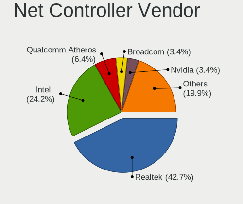

| Vendor                           | Desktops | Percent |
|----------------------------------|----------|---------|
| Realtek Semiconductor            | 938      | 41.65%  |
| Intel                            | 545      | 24.2%   |
| Qualcomm Atheros                 | 152      | 6.75%   |
| Nvidia                           | 86       | 3.82%   |
| Broadcom                         | 82       | 3.64%   |
| Ralink Technology                | 58       | 2.58%   |
| TP-Link                          | 39       | 1.73%   |
| Ralink                           | 36       | 1.6%    |
| VIA Technologies                 | 31       | 1.38%   |
| Marvell Technology Group         | 30       | 1.33%   |
| Qualcomm Atheros Communications  | 29       | 1.29%   |
| Broadcom Limited                 | 23       | 1.02%   |
| D-Link System                    | 21       | 0.93%   |
| NetGear                          | 19       | 0.84%   |
| D-Link                           | 15       | 0.67%   |
| MediaTek                         | 13       | 0.58%   |
| Huawei Technologies              | 12       | 0.53%   |
| Samsung Electronics              | 9        | 0.4%    |
| ASUSTek Computer                 | 9        | 0.4%    |
| Belkin Components                | 8        | 0.36%   |
| Edimax Technology                | 7        | 0.31%   |
| Aquantia                         | 7        | 0.31%   |
| Microsoft                        | 5        | 0.22%   |
| ASIX Electronics                 | 5        | 0.22%   |
| Silicon Integrated Systems [SiS] | 4        | 0.18%   |
| Linksys                          | 4        | 0.18%   |
| IMC Networks                     | 4        | 0.18%   |
| HTC (High Tech Computer)         | 4        | 0.18%   |
| DisplayLink                      | 4        | 0.18%   |
| Xiaomi                           | 3        | 0.13%   |
| Sitecom Europe                   | 3        | 0.13%   |
| Qualcomm                         | 3        | 0.13%   |
| AVM                              | 3        | 0.13%   |
| 3Com                             | 3        | 0.13%   |
| TRENDnet                         | 2        | 0.09%   |
| Mellanox Technologies            | 2        | 0.09%   |
| LG Electronics                   | 2        | 0.09%   |
| Arduino SA                       | 2        | 0.09%   |
| Accton Technology                | 2        | 0.09%   |
| ZyXEL Communications             | 1        | 0.04%   |

Net Controller Model
--------------------

Controller models

| Model                                                             | Desktops | Percent |
|-------------------------------------------------------------------|----------|---------|
| Realtek RTL8111/8168/8411 PCI Express Gigabit Ethernet Controller | 711      | 29.04%  |
| Intel 82579LM Gigabit Network Connection (Lewisville)             | 81       | 3.31%   |
| Realtek RTL810xE PCI Express Fast Ethernet controller             | 56       | 2.29%   |
| Nvidia MCP61 Ethernet                                             | 55       | 2.25%   |
| Intel I211 Gigabit Network Connection                             | 48       | 1.96%   |
| Intel Wi-Fi 6 AX200                                               | 40       | 1.63%   |
| Realtek RTL-8100/8101L/8139 PCI Fast Ethernet Adapter             | 39       | 1.59%   |
| Intel Ethernet Connection I217-LM                                 | 38       | 1.55%   |
| Intel 82567LM-3 Gigabit Network Connection                        | 38       | 1.55%   |
| Intel Ethernet Connection (2) I219-V                              | 36       | 1.47%   |
| Realtek RTL8125 2.5GbE Controller                                 | 35       | 1.43%   |
| Intel 82579V Gigabit Network Connection                           | 30       | 1.23%   |
| Ralink MT7601U Wireless Adapter                                   | 27       | 1.1%    |
| Intel 82566DM-2 Gigabit Network Connection                        | 27       | 1.1%    |
| Qualcomm Atheros AR9271 802.11n                                   | 26       | 1.06%   |
| Realtek RTL8188EUS 802.11n Wireless Network Adapter               | 24       | 0.98%   |
| VIA VT6102/VT6103 [Rhine-II]                                      | 23       | 0.94%   |
| Intel Ethernet Connection (7) I219-V                              | 18       | 0.74%   |
| Realtek RTL8192CU 802.11n WLAN Adapter                            | 17       | 0.69%   |
| Intel Ethernet Connection I217-V                                  | 17       | 0.69%   |
| Realtek RTL8188CUS 802.11n WLAN Adapter                           | 16       | 0.65%   |
| Intel 82574L Gigabit Network Connection                           | 16       | 0.65%   |
| Realtek RTL88x2bu [AC1200 Techkey]                                | 15       | 0.61%   |
| Intel Dual Band Wireless-AC 3168NGW [Stone Peak]                  | 15       | 0.61%   |
| Realtek RTL8153 Gigabit Ethernet Adapter                          | 14       | 0.57%   |
| Qualcomm Atheros Attansic L1 Gigabit Ethernet                     | 14       | 0.57%   |
| Qualcomm Atheros AR9485 Wireless Network Adapter                  | 14       | 0.57%   |
| Marvell Group 88E8056 PCI-E Gigabit Ethernet Controller           | 14       | 0.57%   |
| TP-Link TL-WN722N v2/v3 [Realtek RTL8188EUS]                      | 12       | 0.49%   |
| Qualcomm Atheros AR8151 v2.0 Gigabit Ethernet                     | 12       | 0.49%   |
| Intel Ethernet Connection (2) I218-V                              | 12       | 0.49%   |
| Qualcomm Atheros Killer E220x Gigabit Ethernet Controller         | 11       | 0.45%   |
| Qualcomm Atheros AR9287 Wireless Network Adapter (PCI-Express)    | 11       | 0.45%   |
| Qualcomm Atheros AR9227 Wireless Network Adapter                  | 11       | 0.45%   |
| Intel Ethernet Connection (2) I219-LM                             | 11       | 0.45%   |
| Realtek RTL8169 PCI Gigabit Ethernet Controller                   | 10       | 0.41%   |
| Realtek RTL-8110SC/8169SC Gigabit Ethernet                        | 10       | 0.41%   |
| Ralink RT2870/RT3070 Wireless Adapter                             | 10       | 0.41%   |
| Qualcomm Atheros AR9462 Wireless Network Adapter                  | 10       | 0.41%   |
| Qualcomm Atheros AR8121/AR8113/AR8114 Gigabit or Fast Ethernet    | 10       | 0.41%   |

Wireless Vendor
---------------

Wireless vendors

| Vendor                                | Desktops | Percent |
|---------------------------------------|----------|---------|
| Realtek Semiconductor                 | 161      | 24.25%  |
| Intel                                 | 117      | 17.62%  |
| Qualcomm Atheros                      | 89       | 13.4%   |
| Ralink Technology                     | 58       | 8.73%   |
| TP-Link                               | 38       | 5.72%   |
| Ralink                                | 36       | 5.42%   |
| Qualcomm Atheros Communications       | 29       | 4.37%   |
| Broadcom                              | 24       | 3.61%   |
| NetGear                               | 19       | 2.86%   |
| D-Link                                | 14       | 2.11%   |
| D-Link System                         | 13       | 1.96%   |
| ASUSTek Computer                      | 9        | 1.36%   |
| Belkin Components                     | 8        | 1.2%    |
| Edimax Technology                     | 7        | 1.05%   |
| MediaTek                              | 6        | 0.9%    |
| Microsoft                             | 5        | 0.75%   |
| Linksys                               | 4        | 0.6%    |
| IMC Networks                          | 4        | 0.6%    |
| Sitecom Europe                        | 3        | 0.45%   |
| Marvell Technology Group              | 3        | 0.45%   |
| Broadcom Limited                      | 3        | 0.45%   |
| AVM                                   | 3        | 0.45%   |
| TRENDnet                              | 2        | 0.3%    |
| ZyXEL Communications                  | 1        | 0.15%   |
| ZyDAS                                 | 1        | 0.15%   |
| Xiaomi                                | 1        | 0.15%   |
| Philips (or NXP)                      | 1        | 0.15%   |
| Gemtek                                | 1        | 0.15%   |
| Dell                                  | 1        | 0.15%   |
| AboCom Systems                        | 1        | 0.15%   |
| 802.11g Adapter [Linksys WUSB54GC v3] | 1        | 0.15%   |
| 3Com                                  | 1        | 0.15%   |

Wireless Model
--------------

Wireless models

| Model                                                          | Desktops | Percent |
|----------------------------------------------------------------|----------|---------|
| Intel Wi-Fi 6 AX200                                            | 40       | 5.97%   |
| Ralink MT7601U Wireless Adapter                                | 27       | 4.03%   |
| Qualcomm Atheros AR9271 802.11n                                | 26       | 3.88%   |
| Realtek RTL8188EUS 802.11n Wireless Network Adapter            | 24       | 3.58%   |
| Realtek RTL8192CU 802.11n WLAN Adapter                         | 17       | 2.54%   |
| Realtek RTL8188CUS 802.11n WLAN Adapter                        | 16       | 2.39%   |
| Realtek RTL88x2bu [AC1200 Techkey]                             | 15       | 2.24%   |
| Intel Dual Band Wireless-AC 3168NGW [Stone Peak]               | 15       | 2.24%   |
| Qualcomm Atheros AR9485 Wireless Network Adapter               | 14       | 2.09%   |
| TP-Link TL-WN722N v2/v3 [Realtek RTL8188EUS]                   | 12       | 1.79%   |
| Qualcomm Atheros AR9287 Wireless Network Adapter (PCI-Express) | 11       | 1.64%   |
| Qualcomm Atheros AR9227 Wireless Network Adapter               | 11       | 1.64%   |
| Ralink RT2870/RT3070 Wireless Adapter                          | 10       | 1.49%   |
| Qualcomm Atheros AR9462 Wireless Network Adapter               | 10       | 1.49%   |
| Realtek 802.11ac NIC                                           | 8        | 1.19%   |
| Qualcomm Atheros AR93xx Wireless Network Adapter               | 8        | 1.19%   |
| Qualcomm Atheros AR9285 Wireless Network Adapter (PCI-Express) | 8        | 1.19%   |
| Intel Wireless-AC 9260                                         | 8        | 1.19%   |
| Intel Wireless 7260                                            | 8        | 1.19%   |
| TP-Link TL-WN823N v2/v3 [Realtek RTL8192EU]                    | 7        | 1.04%   |
| Realtek RTL8821CE 802.11ac PCIe Wireless Network Adapter       | 7        | 1.04%   |
| Realtek RTL8821AE 802.11ac PCIe Wireless Network Adapter       | 7        | 1.04%   |
| Realtek RTL8192EU 802.11b/g/n WLAN Adapter                     | 7        | 1.04%   |
| Intel Wi-Fi 6 AX210/AX211/AX411 160MHz                         | 7        | 1.04%   |
| Broadcom BCM4360 802.11ac Wireless Network Adapter             | 7        | 1.04%   |
| Broadcom BCM4352 802.11ac Wireless Network Adapter             | 7        | 1.04%   |
| Realtek RTL8812AE 802.11ac PCIe Wireless Network Adapter       | 6        | 0.9%    |
| Realtek RTL8192EE PCIe Wireless Network Adapter                | 6        | 0.9%    |
| Realtek RTL8188FTV 802.11b/g/n 1T1R 2.4G WLAN Adapter          | 6        | 0.9%    |
| Ralink RT2790 Wireless 802.11n 1T/2R PCIe                      | 6        | 0.9%    |
| Ralink RT2561/RT61 802.11g PCI                                 | 6        | 0.9%    |
| Intel Wireless 3160                                            | 6        | 0.9%    |
| TP-Link TL-WN821N Version 5 RTL8192EU                          | 5        | 0.75%   |
| Realtek RTL8187 Wireless Adapter                               | 5        | 0.75%   |
| Ralink RT5390 Wireless 802.11n 1T/1R PCIe                      | 5        | 0.75%   |
| Ralink RT3090 Wireless 802.11n 1T/1R PCIe                      | 5        | 0.75%   |
| Qualcomm Atheros AR5212/5213/2414 Wireless Network Adapter     | 5        | 0.75%   |
| NetGear A6210                                                  | 5        | 0.75%   |
| Intel Wireless 7265                                            | 5        | 0.75%   |
| Intel Wireless 3165                                            | 5        | 0.75%   |

Ethernet Vendor
---------------

Ethernet vendors

| Vendor                           | Desktops | Percent |
|----------------------------------|----------|---------|
| Realtek Semiconductor            | 860      | 50.32%  |
| Intel                            | 476      | 27.85%  |
| Nvidia                           | 86       | 5.03%   |
| Qualcomm Atheros                 | 74       | 4.33%   |
| Broadcom                         | 59       | 3.45%   |
| VIA Technologies                 | 31       | 1.81%   |
| Marvell Technology Group         | 27       | 1.58%   |
| Broadcom Limited                 | 20       | 1.17%   |
| Huawei Technologies              | 8        | 0.47%   |
| D-Link System                    | 8        | 0.47%   |
| MediaTek                         | 7        | 0.41%   |
| Aquantia                         | 7        | 0.41%   |
| Samsung Electronics              | 6        | 0.35%   |
| ASIX Electronics                 | 5        | 0.29%   |
| Silicon Integrated Systems [SiS] | 4        | 0.23%   |
| HTC (High Tech Computer)         | 4        | 0.23%   |
| DisplayLink                      | 4        | 0.23%   |
| Qualcomm                         | 3        | 0.18%   |
| Xiaomi                           | 2        | 0.12%   |
| LG Electronics                   | 2        | 0.12%   |
| Accton Technology                | 2        | 0.12%   |
| 3Com                             | 2        | 0.12%   |
| ZTE WCDMA Technologies MSM       | 1        | 0.06%   |
| TP-Link                          | 1        | 0.06%   |
| T & A Mobile Phones              | 1        | 0.06%   |
| OPPO Electronics                 | 1        | 0.06%   |
| National Semiconductor           | 1        | 0.06%   |
| Mellanox Technologies            | 1        | 0.06%   |
| Lenovo                           | 1        | 0.06%   |
| JMicron Technology               | 1        | 0.06%   |
| Hangzhou Silan Microelectronics  | 1        | 0.06%   |
| D-Link                           | 1        | 0.06%   |
| Apple                            | 1        | 0.06%   |
| ADMtek                           | 1        | 0.06%   |

Ethernet Model
--------------

Ethernet models

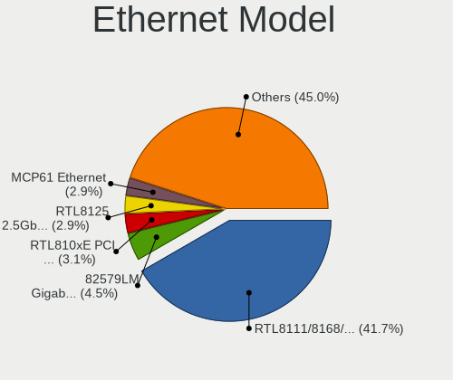

| Model                                                             | Desktops | Percent |
|-------------------------------------------------------------------|----------|---------|
| Realtek RTL8111/8168/8411 PCI Express Gigabit Ethernet Controller | 711      | 40.61%  |
| Intel 82579LM Gigabit Network Connection (Lewisville)             | 81       | 4.63%   |
| Realtek RTL810xE PCI Express Fast Ethernet controller             | 56       | 3.2%    |
| Nvidia MCP61 Ethernet                                             | 55       | 3.14%   |
| Intel I211 Gigabit Network Connection                             | 48       | 2.74%   |
| Realtek RTL-8100/8101L/8139 PCI Fast Ethernet Adapter             | 39       | 2.23%   |
| Intel Ethernet Connection I217-LM                                 | 38       | 2.17%   |
| Intel 82567LM-3 Gigabit Network Connection                        | 38       | 2.17%   |
| Intel Ethernet Connection (2) I219-V                              | 36       | 2.06%   |
| Realtek RTL8125 2.5GbE Controller                                 | 35       | 2%      |
| Intel 82579V Gigabit Network Connection                           | 30       | 1.71%   |
| Intel 82566DM-2 Gigabit Network Connection                        | 27       | 1.54%   |
| VIA VT6102/VT6103 [Rhine-II]                                      | 23       | 1.31%   |
| Intel Ethernet Connection (7) I219-V                              | 18       | 1.03%   |
| Intel Ethernet Connection I217-V                                  | 17       | 0.97%   |
| Intel 82574L Gigabit Network Connection                           | 16       | 0.91%   |
| Realtek RTL8153 Gigabit Ethernet Adapter                          | 14       | 0.8%    |
| Qualcomm Atheros Attansic L1 Gigabit Ethernet                     | 14       | 0.8%    |
| Marvell Group 88E8056 PCI-E Gigabit Ethernet Controller           | 14       | 0.8%    |
| Qualcomm Atheros AR8151 v2.0 Gigabit Ethernet                     | 12       | 0.69%   |
| Intel Ethernet Connection (2) I218-V                              | 12       | 0.69%   |
| Qualcomm Atheros Killer E220x Gigabit Ethernet Controller         | 11       | 0.63%   |
| Intel Ethernet Connection (2) I219-LM                             | 11       | 0.63%   |
| Realtek RTL8169 PCI Gigabit Ethernet Controller                   | 10       | 0.57%   |
| Realtek RTL-8110SC/8169SC Gigabit Ethernet                        | 10       | 0.57%   |
| Qualcomm Atheros AR8121/AR8113/AR8114 Gigabit or Fast Ethernet    | 10       | 0.57%   |
| Intel Ethernet Controller I225-V                                  | 10       | 0.57%   |
| Nvidia MCP77 Ethernet                                             | 9        | 0.51%   |
| Broadcom NetXtreme BCM5751 Gigabit Ethernet PCI Express           | 9        | 0.51%   |
| Intel 82578DC Gigabit Network Connection                          | 8        | 0.46%   |
| Broadcom NetXtreme BCM5754 Gigabit Ethernet PCI Express           | 8        | 0.46%   |
| VIA VT6105/VT6106S [Rhine-III]                                    | 7        | 0.4%    |
| Intel 82562V-2 10/100 Network Connection                          | 7        | 0.4%    |
| Broadcom NetLink BCM57780 Gigabit Ethernet PCIe                   | 7        | 0.4%    |
| Samsung Galaxy series, misc. (tethering mode)                     | 6        | 0.34%   |
| Qualcomm Atheros AR8152 v2.0 Fast Ethernet                        | 6        | 0.34%   |
| Qualcomm Atheros AR8131 Gigabit Ethernet                          | 6        | 0.34%   |
| Nvidia MCP51 Ethernet Controller                                  | 6        | 0.34%   |
| MediaTek TECNO SPARK 9T                                           | 6        | 0.34%   |
| Intel I210 Gigabit Network Connection                             | 6        | 0.34%   |

Net Controller Kind
-------------------

Ethernet, WiFi or modem

| Kind     | Desktops | Percent |
|----------|----------|---------|
| Ethernet | 1577     | 71.2%   |
| WiFi     | 611      | 27.58%  |
| Modem    | 21       | 0.95%   |
| Unknown  | 6        | 0.27%   |

Used Controller
---------------

Currently used network controller

| Kind     | Desktops | Percent |
|----------|----------|---------|
| Ethernet | 1251     | 75.91%  |
| WiFi     | 397      | 24.09%  |

NICs
----

Total network controllers on board

| Total | Desktops | Percent |
|-------|----------|---------|
| 1     | 1162     | 72.49%  |
| 2     | 365      | 22.77%  |
| 3     | 47       | 2.93%   |
| 0     | 19       | 1.19%   |
| 4     | 6        | 0.37%   |
| 5     | 3        | 0.19%   |
| 10    | 1        | 0.06%   |

IPv6
----

IPv6 vs IPv4

| Used | Desktops | Percent |
|------|----------|---------|
| No   | 1352     | 83.72%  |
| Yes  | 263      | 16.28%  |

Bluetooth
---------

Bluetooth Vendor
----------------

Controller vendors

| Vendor                          | Desktops | Percent |
|---------------------------------|----------|---------|
| Intel                           | 106      | 33.87%  |
| Cambridge Silicon Radio         | 87       | 27.8%   |
| Broadcom                        | 29       | 9.27%   |
| Qualcomm Atheros Communications | 19       | 6.07%   |
| Realtek Semiconductor           | 18       | 5.75%   |
| ASUSTek Computer                | 12       | 3.83%   |
| IMC Networks                    | 10       | 3.19%   |
| Integrated System Solution      | 6        | 1.92%   |
| Lite-On Technology              | 4        | 1.28%   |
| Apple                           | 4        | 1.28%   |
| MediaTek                        | 3        | 0.96%   |
| TP-Link                         | 2        | 0.64%   |
| Fujitsu                         | 2        | 0.64%   |
| Edimax Technology               | 2        | 0.64%   |
| Sitecom Europe                  | 1        | 0.32%   |
| Ralink                          | 1        | 0.32%   |
| Logitech                        | 1        | 0.32%   |
| ISSC                            | 1        | 0.32%   |
| Hewlett-Packard                 | 1        | 0.32%   |
| Dell                            | 1        | 0.32%   |
| Conwise Technology              | 1        | 0.32%   |
| Actions                         | 1        | 0.32%   |
| Unknown                         | 1        | 0.32%   |

Bluetooth Model
---------------

Controller models

| Model                                                     | Desktops | Percent |
|-----------------------------------------------------------|----------|---------|
| Cambridge Silicon Radio Bluetooth Dongle (HCI mode)       | 87       | 27.8%   |
| Intel AX200 Bluetooth                                     | 42       | 13.42%  |
| Intel Bluetooth wireless interface                        | 27       | 8.63%   |
| Broadcom BCM20702A0 Bluetooth 4.0                         | 16       | 5.11%   |
| Intel Wireless-AC 3168 Bluetooth                          | 14       | 4.47%   |
| Realtek Bluetooth Radio                                   | 10       | 3.19%   |
| Qualcomm Atheros AR3011 Bluetooth                         | 8        | 2.56%   |
| Qualcomm Atheros  Bluetooth Device                        | 7        | 2.24%   |
| Intel Wireless-AC 9260 Bluetooth Adapter                  | 6        | 1.92%   |
| Intel Bluetooth 9460/9560 Jefferson Peak (JfP)            | 6        | 1.92%   |
| Intel AX210 Bluetooth                                     | 6        | 1.92%   |
| Integrated System Solution Bluetooth Device               | 6        | 1.92%   |
| Realtek  Bluetooth 4.2 Adapter                            | 5        | 1.6%    |
| IMC Networks Bluetooth Radio                              | 5        | 1.6%    |
| Lite-On Bluetooth Device                                  | 4        | 1.28%   |
| ASUS Broadcom BCM20702A0 Bluetooth                        | 4        | 1.28%   |
| Apple Built-in Bluetooth 2.0+EDR HCI                      | 4        | 1.28%   |
| Realtek RTL8821A Bluetooth                                | 3        | 0.96%   |
| MediaTek Wireless_Device                                  | 3        | 0.96%   |
| Intel AX201 Bluetooth                                     | 3        | 0.96%   |
| IMC Networks BCM20702A0                                   | 3        | 0.96%   |
| Broadcom BCM2045 Bluetooth                                | 3        | 0.96%   |
| Broadcom ANYCOM Blue USB-UHE 200/250                      | 3        | 0.96%   |
| TP-Link UB500 Adapter                                     | 2        | 0.64%   |
| Qualcomm Atheros Bluetooth USB Host Controller            | 2        | 0.64%   |
| Intel Bluetooth Device                                    | 2        | 0.64%   |
| IMC Networks Bluetooth Device                             | 2        | 0.64%   |
| Fujitsu Bluetooth Device                                  | 2        | 0.64%   |
| Broadcom BCM2035 Bluetooth dongle                         | 2        | 0.64%   |
| ASUS Broadcom BCM20702 Single-Chip Bluetooth 4.0 + LE     | 2        | 0.64%   |
| ASUS BCM20702A0                                           | 2        | 0.64%   |
| Sitecom Europe Sitecom bluetooth2.0 class 2 dongle CN-512 | 1        | 0.32%   |
| Ralink RT3290 Bluetooth                                   | 1        | 0.32%   |
| Qualcomm Atheros QCA61x4 Bluetooth 4.0                    | 1        | 0.32%   |
| Qualcomm Atheros AR9462 Bluetooth                         | 1        | 0.32%   |
| Logitech BT Mini-Receiver (HCI mode)                      | 1        | 0.32%   |
| ISSC Bluetooth Device                                     | 1        | 0.32%   |
| HP Bluetooth 2.0 Interface [Broadcom BCM2045]             | 1        | 0.32%   |
| Edimax EW-7611ULB 802.11b/g/n and Bluetooth 4.0 Adapter   | 1        | 0.32%   |
| Edimax Bluetooth Adapter                                  | 1        | 0.32%   |

Sound
-----

Sound Vendor
------------

Sound card vendors

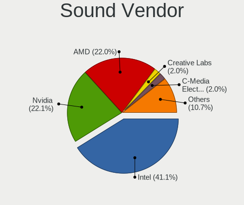

| Vendor                               | Desktops | Percent |
|--------------------------------------|----------|---------|
| Intel                                | 1033     | 41.62%  |
| Nvidia                               | 563      | 22.68%  |
| AMD                                  | 523      | 21.07%  |
| Creative Labs                        | 54       | 2.18%   |
| C-Media Electronics                  | 52       | 2.1%    |
| VIA Technologies                     | 37       | 1.49%   |
| Texas Instruments                    | 21       | 0.85%   |
| Logitech                             | 15       | 0.6%    |
| Creative Technology                  | 11       | 0.44%   |
| Yamaha                               | 10       | 0.4%    |
| Focusrite-Novation                   | 10       | 0.4%    |
| M-Audio                              | 9        | 0.36%   |
| GN Netcom                            | 9        | 0.36%   |
| Silicon Integrated Systems [SiS]     | 8        | 0.32%   |
| JMTek                                | 7        | 0.28%   |
| SAVITECH                             | 4        | 0.16%   |
| Plantronics                          | 4        | 0.16%   |
| Generalplus Technology               | 4        | 0.16%   |
| Ensoniq                              | 4        | 0.16%   |
| DigiTech                             | 4        | 0.16%   |
| BEHRINGER International              | 4        | 0.16%   |
| Micro Star International             | 3        | 0.12%   |
| Kingston Technology                  | 3        | 0.12%   |
| EGO SYStems                          | 3        | 0.12%   |
| Corsair                              | 3        | 0.12%   |
| AKAI Professional M.I.               | 3        | 0.12%   |
| XMOS                                 | 2        | 0.08%   |
| Xilinx                               | 2        | 0.08%   |
| ULi Electronics                      | 2        | 0.08%   |
| Thesycon Systemsoftware & Consulting | 2        | 0.08%   |
| TerraTec Electronic                  | 2        | 0.08%   |
| Tenx Technology                      | 2        | 0.08%   |
| TEAC                                 | 2        | 0.08%   |
| Sennheiser Communications            | 2        | 0.08%   |
| Samson Technologies                  | 2        | 0.08%   |
| Razer USA                            | 2        | 0.08%   |
| Lenovo                               | 2        | 0.08%   |
| ESI Audiotechnik                     | 2        | 0.08%   |
| Elite Silicon                        | 2        | 0.08%   |
| DSEA A/S                             | 2        | 0.08%   |

Sound Model
-----------

Sound card models

| Model                                                                             | Desktops | Percent |
|-----------------------------------------------------------------------------------|----------|---------|
| Intel NM10/ICH7 Family High Definition Audio Controller                           | 157      | 5.58%   |
| Intel 6 Series/C200 Series Chipset Family High Definition Audio Controller        | 135      | 4.8%    |
| AMD SBx00 Azalia (Intel HDA)                                                      | 118      | 4.2%    |
| Intel 8 Series/C220 Series Chipset High Definition Audio Controller               | 109      | 3.88%   |
| Intel 7 Series/C216 Chipset Family High Definition Audio Controller               | 94       | 3.34%   |
| Intel Xeon E3-1200 v3/4th Gen Core Processor HD Audio Controller                  | 83       | 2.95%   |
| Nvidia GK208 HDMI/DP Audio Controller                                             | 71       | 2.52%   |
| AMD Starship/Matisse HD Audio Controller                                          | 70       | 2.49%   |
| Intel 82801I (ICH9 Family) HD Audio Controller                                    | 60       | 2.13%   |
| Nvidia MCP61 High Definition Audio                                                | 58       | 2.06%   |
| Intel 100 Series/C230 Series Chipset Family HD Audio Controller                   | 58       | 2.06%   |
| AMD FCH Azalia Controller                                                         | 57       | 2.03%   |
| AMD Family 17h (Models 00h-0fh) HD Audio Controller                               | 53       | 1.88%   |
| AMD Ellesmere HDMI Audio [Radeon RX 470/480 / 570/580/590]                        | 51       | 1.81%   |
| AMD Family 17h/19h HD Audio Controller                                            | 50       | 1.78%   |
| Nvidia High Definition Audio Controller                                           | 49       | 1.74%   |
| Intel 5 Series/3400 Series Chipset High Definition Audio                          | 48       | 1.71%   |
| Intel 200 Series PCH HD Audio                                                     | 48       | 1.71%   |
| Intel 82801JI (ICH10 Family) HD Audio Controller                                  | 41       | 1.46%   |
| Intel 82801JD/DO (ICH10 Family) HD Audio Controller                               | 41       | 1.46%   |
| Nvidia GP107GL High Definition Audio Controller                                   | 40       | 1.42%   |
| AMD Oland/Hainan/Cape Verde/Pitcairn HDMI Audio [Radeon HD 7000 Series]           | 39       | 1.39%   |
| Nvidia GF108 High Definition Audio Controller                                     | 38       | 1.35%   |
| AMD Raven/Raven2/Fenghuang HDMI/DP Audio Controller                               | 33       | 1.17%   |
| Intel Cannon Lake PCH cAVS                                                        | 30       | 1.07%   |
| Nvidia GM107 High Definition Audio Controller [GeForce 940MX]                     | 26       | 0.92%   |
| AMD Caicos HDMI Audio [Radeon HD 6450 / 7450/8450/8490 OEM / R5 230/235/235X OEM] | 26       | 0.92%   |
| Nvidia GP104 High Definition Audio Controller                                     | 25       | 0.89%   |
| Nvidia GF119 HDMI Audio Controller                                                | 24       | 0.85%   |
| Intel 9 Series Chipset Family HD Audio Controller                                 | 24       | 0.85%   |
| AMD Cedar HDMI Audio [Radeon HD 5400/6300/7300 Series]                            | 23       | 0.82%   |
| Nvidia GK107 HDMI Audio Controller                                                | 22       | 0.78%   |
| Intel C600/X79 series chipset High Definition Audio Controller                    | 22       | 0.78%   |
| Intel Atom Processor Z36xxx/Z37xxx Series High Definition Audio Controller        | 22       | 0.78%   |
| AMD Baffin HDMI/DP Audio [Radeon RX 550 640SP / RX 560/560X]                      | 19       | 0.68%   |
| Nvidia GP108 High Definition Audio Controller                                     | 18       | 0.64%   |
| Nvidia GP106 High Definition Audio Controller                                     | 18       | 0.64%   |
| Intel Comet Lake PCH-V cAVS                                                       | 18       | 0.64%   |
| Nvidia TU106 High Definition Audio Controller                                     | 16       | 0.57%   |
| C-Media Electronics CMI8738/CMI8768 PCI Audio                                     | 16       | 0.57%   |

Memory
------

Memory Vendor
-------------

Memory module vendors

| Vendor                       | Desktops | Percent |
|------------------------------|----------|---------|
| Unknown                      | 156      | 20.5%   |
| Kingston                     | 125      | 16.43%  |
| Samsung Electronics          | 81       | 10.64%  |
| SK hynix                     | 78       | 10.25%  |
| Crucial                      | 66       | 8.67%   |
| Corsair                      | 66       | 8.67%   |
| G.Skill                      | 45       | 5.91%   |
| Micron Technology            | 33       | 4.34%   |
| Nanya Technology             | 15       | 1.97%   |
| Elpida                       | 13       | 1.71%   |
| A-DATA Technology            | 10       | 1.31%   |
| Transcend                    | 9        | 1.18%   |
| Team                         | 7        | 0.92%   |
| Ramaxel Technology           | 7        | 0.92%   |
| Qimonda                      | 3        | 0.39%   |
| Patriot                      | 3        | 0.39%   |
| Goodram                      | 3        | 0.39%   |
| GeIL                         | 3        | 0.39%   |
| Unknown                      | 3        | 0.39%   |
| Unknown (ABCD)               | 2        | 0.26%   |
| Unifosa                      | 2        | 0.26%   |
| Avant                        | 2        | 0.26%   |
| Apacer                       | 2        | 0.26%   |
| Walton Chaintech             | 1        | 0.13%   |
| Unknown (AB)                 | 1        | 0.13%   |
| Unknown (0x7FA8000000000000) | 1        | 0.13%   |
| Unknown (0x7F7FB5FFFFFFFFFF) | 1        | 0.13%   |
| Unknown (0x053E)             | 1        | 0.13%   |
| Toshiba                      | 1        | 0.13%   |
| Timetec                      | 1        | 0.13%   |
| Smart                        | 1        | 0.13%   |
| Sesame                       | 1        | 0.13%   |
| Reboto                       | 1        | 0.13%   |
| Qumo                         | 1        | 0.13%   |
| Positivo                     | 1        | 0.13%   |
| PNY                          | 1        | 0.13%   |
| Netac                        | 1        | 0.13%   |
| Neo Forza                    | 1        | 0.13%   |
| Kreton                       | 1        | 0.13%   |
| Hikvision                    | 1        | 0.13%   |

Memory Model
------------

Memory module models

| Model                                                  | Desktops | Percent |
|--------------------------------------------------------|----------|---------|
| SK hynix RAM HMA82GU6JJR8N-VK 16GB DIMM DDR4 2667MT/s  | 15       | 1.8%    |
| Unknown RAM Module 2GB DIMM SDRAM                      | 11       | 1.32%   |
| Unknown RAM Module 2048MB DIMM SDRAM                   | 11       | 1.32%   |
| Unknown RAM Module 2048MB DIMM DDR2 800MT/s            | 8        | 0.96%   |
| Unknown RAM Module 2GB DIMM DDR2 800MT/s               | 7        | 0.84%   |
| Unknown RAM Module 4096MB DIMM 1333MT/s                | 6        | 0.72%   |
| Unknown RAM Module 2048MB DIMM DDR3 1333MT/s           | 6        | 0.72%   |
| SK hynix RAM HMT351U6CFR8C-PB 4GB DIMM DDR3 1800MT/s   | 6        | 0.72%   |
| Micron RAM 8JTF51264AZ-1G6E1 4GB DIMM DDR3 1600MT/s    | 6        | 0.72%   |
| Unknown RAM Module 4096MB DIMM DDR3 1333MT/s           | 5        | 0.6%    |
| Unknown RAM Module 2048MB DIMM 1333MT/s                | 5        | 0.6%    |
| Samsung RAM M378B5173DB0-CK0 4GB DIMM DDR3 1600MT/s    | 5        | 0.6%    |
| Kingston RAM KHX1600C10D3/8G 8GB DIMM DDR3 1600MT/s    | 5        | 0.6%    |
| Kingston RAM 99U5469-045.A00LF 4GB DIMM DDR3 1600MT/s  | 5        | 0.6%    |
| Crucial RAM CT51264BA160BJ.C8F 4GB DIMM DDR3 1600MT/s  | 5        | 0.6%    |
| Corsair RAM CMK16GX4M2B3200C16 8GB DIMM DDR4 3600MT/s  | 5        | 0.6%    |
| Unknown RAM Module 4GB DIMM DDR3 1333MT/s              | 4        | 0.48%   |
| Unknown RAM Module 2048MB DIMM DDR 800MT/s             | 4        | 0.48%   |
| Unknown RAM Module 2048MB DIMM 800MT/s                 | 4        | 0.48%   |
| SK hynix RAM HMT351U6EFR8C-PB 4GB DIMM DDR3 1800MT/s   | 4        | 0.48%   |
| Samsung RAM M378B5273DH0-CK0 4GB DIMM 2200MT/s         | 4        | 0.48%   |
| Kingston RAM KHX3200C16D4/8GX 8GB DIMM DDR4 3600MT/s   | 4        | 0.48%   |
| Kingston RAM 99U5469-069.A00LF 4GB DIMM DDR3 1600MT/s  | 4        | 0.48%   |
| Corsair RAM CMZ8GX3M2A1600C9 4GB DIMM DDR3 1600MT/s    | 4        | 0.48%   |
| Unknown RAM Module 8GB DIMM DDR3 1333MT/s              | 3        | 0.36%   |
| Unknown RAM Module 2GB DIMM 800MT/s                    | 3        | 0.36%   |
| Unknown RAM Module 1024MB DIMM DDR2 800MT/s            | 3        | 0.36%   |
| Unknown RAM Module 1024MB DIMM DDR2                    | 3        | 0.36%   |
| SK hynix RAM HYMP125U64CP8-S6 2GB DIMM DDR2 49926MT/s  | 3        | 0.36%   |
| SK hynix RAM HYMP112U64CP8-S6 1GB DIMM DDR2 800MT/s    | 3        | 0.36%   |
| Samsung RAM M378B5773DH0-CH9 2GB DIMM DDR3 1333MT/s    | 3        | 0.36%   |
| Samsung RAM M378B5673FH0-CH9 2GB DIMM 1600MT/s         | 3        | 0.36%   |
| Samsung RAM M378B5273DH0-CH9 4GB DIMM DDR3 2133MT/s    | 3        | 0.36%   |
| Samsung RAM M378B5273CH0-CK0 4GB DIMM DDR3 2000MT/s    | 3        | 0.36%   |
| Samsung RAM M378A1K43CB2-CTD 8GB DIMM DDR4 3266MT/s    | 3        | 0.36%   |
| Samsung RAM M3 78T5663QZ3-CF7 2048MB DIMM DDR2 800MT/s | 3        | 0.36%   |
| Micron RAM 8ATF1G64AZ-2G3H1 8GB DIMM DDR4 2448MT/s     | 3        | 0.36%   |
| Micron RAM 16JTF1G64AZ-1G6E1 8GB DIMM DDR3 1600MT/s    | 3        | 0.36%   |
| Kingston RAM KHX1866C10D3/8G 8GB DIMM DDR3 2133MT/s    | 3        | 0.36%   |
| Kingston RAM KHX1866C10D3/ 8GB DIMM DDR3 1866MT/s      | 3        | 0.36%   |

Memory Kind
-----------

Memory module kinds

| Kind    | Desktops | Percent |
|---------|----------|---------|
| DDR3    | 252      | 37.44%  |
| DDR4    | 233      | 34.62%  |
| DDR2    | 66       | 9.81%   |
| SDRAM   | 54       | 8.02%   |
| Unknown | 46       | 6.84%   |
| DDR     | 14       | 2.08%   |
| LPDDR4  | 4        | 0.59%   |
| DDR5    | 3        | 0.45%   |
| LPDDR3  | 1        | 0.15%   |

Memory Form Factor
------------------

Physical design of the memory module

| Name    | Desktops | Percent |
|---------|----------|---------|
| DIMM    | 611      | 93.43%  |
| SODIMM  | 40       | 6.12%   |
| FB-DIMM | 3        | 0.46%   |

Memory Size
-----------

Memory module size

| Size  | Desktops | Percent |
|-------|----------|---------|
| 4096  | 211      | 29.22%  |
| 8192  | 189      | 26.18%  |
| 2048  | 156      | 21.61%  |
| 16384 | 96       | 13.3%   |
| 1024  | 48       | 6.65%   |
| 32768 | 13       | 1.8%    |
| 512   | 9        | 1.25%   |

Memory Speed
------------

Memory module speed

| Speed   | Desktops | Percent |
|---------|----------|---------|
| 1600    | 148      | 20.27%  |
| 1333    | 88       | 12.05%  |
| 800     | 56       | 7.67%   |
| 2667    | 54       | 7.4%    |
| 2400    | 43       | 5.89%   |
| 3200    | 38       | 5.21%   |
| Unknown | 38       | 5.21%   |
| 3600    | 32       | 4.38%   |
| 2133    | 27       | 3.7%    |
| 667     | 20       | 2.74%   |
| 1867    | 17       | 2.33%   |
| 1866    | 14       | 1.92%   |
| 1800    | 14       | 1.92%   |
| 3000    | 12       | 1.64%   |
| 2666    | 12       | 1.64%   |
| 1066    | 12       | 1.64%   |
| 533     | 8        | 1.1%    |
| 400     | 6        | 0.82%   |
| 3800    | 5        | 0.68%   |
| 3266    | 5        | 0.68%   |
| 2733    | 5        | 0.68%   |
| 2048    | 5        | 0.68%   |
| 2000    | 5        | 0.68%   |
| 1067    | 5        | 0.68%   |
| 49926   | 4        | 0.55%   |
| 3400    | 4        | 0.55%   |
| 2800    | 4        | 0.55%   |
| 2200    | 4        | 0.55%   |
| 3466    | 3        | 0.41%   |
| 2448    | 3        | 0.41%   |
| 1639    | 3        | 0.41%   |
| 1334    | 3        | 0.41%   |
| 5354    | 2        | 0.27%   |
| 4800    | 2        | 0.27%   |
| 3866    | 2        | 0.27%   |
| 3666    | 2        | 0.27%   |
| 2933    | 2        | 0.27%   |
| 2187    | 2        | 0.27%   |
| 1648    | 2        | 0.27%   |
| 1331    | 2        | 0.27%   |

Printers & scanners
-------------------

Printer Vendor
--------------

Printer device vendors

| Vendor              | Desktops | Percent |
|---------------------|----------|---------|
| Hewlett-Packard     | 44       | 41.9%   |
| Brother Industries  | 24       | 22.86%  |
| Canon               | 15       | 14.29%  |
| Samsung Electronics | 10       | 9.52%   |
| Zebra               | 4        | 3.81%   |
| Seiko Epson         | 4        | 3.81%   |
| QinHeng Electronics | 2        | 1.9%    |
| Pantum              | 1        | 0.95%   |
| Dymo-CoStar         | 1        | 0.95%   |

Printer Model
-------------

Printer device models

| Model                                                                 | Desktops | Percent |
|-----------------------------------------------------------------------|----------|---------|
| HP LaserJet 400 M401a                                                 | 4        | 3.81%   |
| Zebra ZP 450 Printer                                                  | 3        | 2.86%   |
| HP LaserJet P1005                                                     | 3        | 2.86%   |
| HP ENVY 4520 series                                                   | 3        | 2.86%   |
| Brother HL-5370DW series                                              | 3        | 2.86%   |
| QinHeng CH340S                                                        | 2        | 1.9%    |
| HP OfficeJet Pro 7730 series                                          | 2        | 1.9%    |
| HP LaserJet P1006                                                     | 2        | 1.9%    |
| HP DeskJet 3700 series                                                | 2        | 1.9%    |
| HP Deskjet 3050A                                                      | 2        | 1.9%    |
| Canon PIXMA MX530 Series                                              | 2        | 1.9%    |
| Brother HL-5340 series                                                | 2        | 1.9%    |
| Brother HL-2270DW Laser Printer                                       | 2        | 1.9%    |
| Zebra ZTC ZP 500 (ZPL)                                                | 1        | 0.95%   |
| Seiko Epson ME OFFICE 620F Series/Stylus Office BX305F/BX305FW/TX320F | 1        | 0.95%   |
| Seiko Epson L396 Series                                               | 1        | 0.95%   |
| Seiko Epson L220 Series                                               | 1        | 0.95%   |
| Seiko Epson ET-2720 Series                                            | 1        | 0.95%   |
| Samsung Xerox Phaser 3117 Laser Printer                               | 1        | 0.95%   |
| Samsung SF-760 Series                                                 | 1        | 0.95%   |
| Samsung SCX-4200 series                                               | 1        | 0.95%   |
| Samsung SCX-4100 Scanner                                              | 1        | 0.95%   |
| Samsung SCX-3400 Series                                               | 1        | 0.95%   |
| Samsung ML-2525W Series                                               | 1        | 0.95%   |
| Samsung ML-1740 Printer                                               | 1        | 0.95%   |
| Samsung M2070 Series                                                  | 1        | 0.95%   |
| Samsung M2020 Series                                                  | 1        | 0.95%   |
| Samsung C48x Series                                                   | 1        | 0.95%   |
| Pantum P2000                                                          | 1        | 0.95%   |
| HP OfficeJet Pro 9010 series                                          | 1        | 0.95%   |
| HP Officejet Pro 6230                                                 | 1        | 0.95%   |
| HP Officejet 6600                                                     | 1        | 0.95%   |
| HP Officejet 2620 series                                              | 1        | 0.95%   |
| HP LaserJet P2055 series                                              | 1        | 0.95%   |
| HP LaserJet P2015 series                                              | 1        | 0.95%   |
| HP LaserJet M14-M17                                                   | 1        | 0.95%   |
| HP LaserJet M101-M106                                                 | 1        | 0.95%   |
| HP LaserJet CP 1025nw                                                 | 1        | 0.95%   |
| HP LaserJet 1320                                                      | 1        | 0.95%   |
| HP LaserJet 1150                                                      | 1        | 0.95%   |

Scanner Vendor
--------------

Scanner device vendors

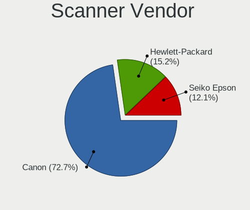

| Vendor          | Desktops | Percent |
|-----------------|----------|---------|
| Canon           | 21       | 70%     |
| Hewlett-Packard | 5        | 16.67%  |
| Seiko Epson     | 4        | 13.33%  |

Scanner Model
-------------

Scanner device models

| Model                                                       | Desktops | Percent |
|-------------------------------------------------------------|----------|---------|
| Canon CanoScan LiDE 110                                     | 5        | 16.67%  |
| Canon CanoScan LiDE 50/LiDE 35/LiDE 40                      | 3        | 10%     |
| Canon CanoScan LIDE 25                                      | 2        | 6.67%   |
| Canon CanoScan LiDE 210                                     | 2        | 6.67%   |
| Canon CanoScan LiDE 120                                     | 2        | 6.67%   |
| Canon CanoScan LiDE 100                                     | 2        | 6.67%   |
| Seiko Epson GT-X770 [Perfection V500]                       | 1        | 3.33%   |
| Seiko Epson GT-9800F [Perfection 3200]                      | 1        | 3.33%   |
| Seiko Epson GT-8200U/GT-8200UF [Perfection 1650/1650 PHOTO] | 1        | 3.33%   |
| Seiko Epson GT-7700U [Perfection 1240U]                     | 1        | 3.33%   |
| HP ScanJet 82x0C                                            | 1        | 3.33%   |
| HP ScanJet 7400c                                            | 1        | 3.33%   |
| HP ScanJet 5590                                             | 1        | 3.33%   |
| HP Scanjet 200                                              | 1        | 3.33%   |
| HP PSC 1200                                                 | 1        | 3.33%   |
| Canon CanoScan N670U/N676U/LiDE 20                          | 1        | 3.33%   |
| Canon CanoScan N650U/N656U                                  | 1        | 3.33%   |
| Canon CanoScan LiDE 90                                      | 1        | 3.33%   |
| Canon CanoScan LiDE 220                                     | 1        | 3.33%   |
| Canon CanoScan LiDE 200                                     | 1        | 3.33%   |

Camera
------

Camera Vendor
-------------

Camera device vendors

| Vendor                        | Desktops | Percent |
|-------------------------------|----------|---------|
| Logitech                      | 87       | 36.71%  |
| Microdia                      | 23       | 9.7%    |
| Microsoft                     | 16       | 6.75%   |
| Samsung Electronics           | 7        | 2.95%   |
| Realtek Semiconductor         | 7        | 2.95%   |
| Generalplus Technology        | 7        | 2.95%   |
| Chicony Electronics           | 7        | 2.95%   |
| Z-Star Microelectronics       | 6        | 2.53%   |
| Sunplus Innovation Technology | 6        | 2.53%   |
| KYE Systems (Mouse Systems)   | 5        | 2.11%   |
| Apple                         | 5        | 2.11%   |
| MacroSilicon                  | 4        | 1.69%   |
| Jieli Technology              | 4        | 1.69%   |
| GEMBIRD                       | 4        | 1.69%   |
| Cubeternet                    | 4        | 1.69%   |
| Creative Technology           | 4        | 1.69%   |
| Trust                         | 3        | 1.27%   |
| Razer USA                     | 3        | 1.27%   |
| OPPO Electronics              | 3        | 1.27%   |
| Aveo Technology               | 3        | 1.27%   |
| ARC International             | 3        | 1.27%   |
| webcam                        | 2        | 0.84%   |
| Sunplus IT                    | 2        | 0.84%   |
| Linux Foundation              | 2        | 0.84%   |
| Hewlett-Packard               | 2        | 0.84%   |
| Guillemot                     | 2        | 0.84%   |
| Arkmicro Technologies         | 2        | 0.84%   |
| Xiaomi                        | 1        | 0.42%   |
| USB3.0 HD Audio Capture       | 1        | 0.42%   |
| Silicon Motion                | 1        | 0.42%   |
| Quanta                        | 1        | 0.42%   |
| PrehKeyTec                    | 1        | 0.42%   |
| Pixart Imaging                | 1        | 0.42%   |
| OmniVision Technologies       | 1        | 0.42%   |
| Omnivision                    | 1        | 0.42%   |
| Nintendo                      | 1        | 0.42%   |
| Mimaki Engineering            | 1        | 0.42%   |
| IMC Networks                  | 1        | 0.42%   |
| Huawei Technologies           | 1        | 0.42%   |
| Genesys Logic                 | 1        | 0.42%   |

Camera Model
------------

Camera device models

| Model                                       | Desktops | Percent |
|---------------------------------------------|----------|---------|
| Logitech Webcam C270                        | 23       | 9.7%    |
| Logitech HD Pro Webcam C920                 | 14       | 5.91%   |
| Samsung Galaxy series, misc. (MTP mode)     | 7        | 2.95%   |
| Logitech C922 Pro Stream Webcam             | 7        | 2.95%   |
| Microdia Webcam Vitade AF                   | 6        | 2.53%   |
| Logitech Webcam C170                        | 5        | 2.11%   |
| Logitech HD Webcam C525                     | 5        | 2.11%   |
| Apple iPhone 5/5C/5S/6/SE/7/8/X             | 5        | 2.11%   |
| Realtek FULL HD 1080P Webcam                | 4        | 1.69%   |
| Microdia USB 2.0 Camera                     | 4        | 1.69%   |
| Microdia Sonix USB 2.0 Camera               | 4        | 1.69%   |
| MacroSilicon usb video                      | 4        | 1.69%   |
| Jieli USB PHY 2.0                           | 4        | 1.69%   |
| Generalplus 808 Camera #9 (web-cam mode)    | 4        | 1.69%   |
| Z-Star Venus USB2.0 Camera                  | 3        | 1.27%   |
| Trust USB Camera                            | 3        | 1.27%   |
| Microdia Camera                             | 3        | 1.27%   |
| Logitech Webcam Pro 9000                    | 3        | 1.27%   |
| Logitech QuickCam Pro 9000                  | 3        | 1.27%   |
| Logitech HD Webcam B910                     | 3        | 1.27%   |
| Generalplus GENERAL WEBCAM                  | 3        | 1.27%   |
| ARC International Camera                    | 3        | 1.27%   |
| Z-Star A4 TECH USB2.0 PC Camera E           | 2        | 0.84%   |
| webcam webcam                               | 2        | 0.84%   |
| Sunplus Aoni FHD Camera                     | 2        | 0.84%   |
| Razer USA Gaming Webcam [Kiyo]              | 2        | 0.84%   |
| OPPO SM4250-QRD _SN:C0CE5FDA                | 2        | 0.84%   |
| Microsoft Microsoft LifeCam Studio        | 2        | 0.84%   |
| Microsoft LifeCam VX-5000                   | 2        | 0.84%   |
| Microsoft LifeCam VX-2000                   | 2        | 0.84%   |
| Microsoft LifeCam HD-3000                   | 2        | 0.84%   |
| Microsoft LifeCam Cinema                    | 2        | 0.84%   |
| Microdia Defender G-Lens 2577 HD720p Camera | 2        | 0.84%   |
| Logitech Webcam C300                        | 2        | 0.84%   |
| Logitech Webcam B500                        | 2        | 0.84%   |
| Logitech QuickCam Pro 5000                  | 2        | 0.84%   |
| Logitech Logitech Webcam C160               | 2        | 0.84%   |
| Logitech HD Webcam C615                     | 2        | 0.84%   |
| Logitech BRIO Ultra HD Webcam               | 2        | 0.84%   |
| Logitech B525 HD Webcam                     | 2        | 0.84%   |

Security
--------

Fingerprint Vendor
------------------

Fingerprint sensor vendors

| Vendor         | Desktops | Percent |
|----------------|----------|---------|
| Synaptics      | 1        | 50%     |
| DigitalPersona | 1        | 50%     |

Fingerprint Model
-----------------

Fingerprint sensor models

| Model                                        | Desktops | Percent |
|----------------------------------------------|----------|---------|
| Synaptics  WBDI Fingerprint Reader - USB 052 | 1        | 50%     |
| DigitalPersona Fingerprint Reader            | 1        | 50%     |

Chipcard Vendor
---------------

Chipcard module vendors

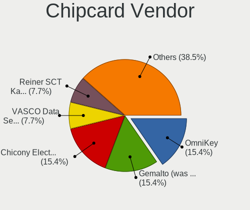

| Vendor                    | Desktops | Percent |
|---------------------------|----------|---------|
| OmniKey                   | 2        | 18.18%  |
| Gemalto (was Gemplus)     | 2        | 18.18%  |
| Reiner SCT Kartensysteme  | 1        | 9.09%   |
| Lenovo                    | 1        | 9.09%   |
| In Focus Systems          | 1        | 9.09%   |
| Fujitsu Siemens Computers | 1        | 9.09%   |
| Chicony Electronics       | 1        | 9.09%   |
| Cherry                    | 1        | 9.09%   |
| Alcor Micro               | 1        | 9.09%   |

Chipcard Model
--------------

Chipcard module models

| Model                                                | Desktops | Percent |
|------------------------------------------------------|----------|---------|
| OmniKey CardMan 3021 / 3121                          | 2        | 18.18%  |
| Reiner SCT Kartensysteme cyberJack one               | 1        | 9.09%   |
| Lenovo Smartcard Keyboard                            | 1        | 9.09%   |
| In Focus Systems EMV Smartcard Reader                | 1        | 9.09%   |
| Gemalto (was Gemplus) GemPC Twin SmartCard Reader    | 1        | 9.09%   |
| Gemalto (was Gemplus) GemPC Key SmartCard Reader     | 1        | 9.09%   |
| Fujitsu Siemens Computers SmartCard Reader 2A        | 1        | 9.09%   |
| Chicony Electronics HP Skylab USB Smartcard Keyboard | 1        | 9.09%   |
| Cherry SmartTerminal XX44                            | 1        | 9.09%   |
| Alcor Micro AU9540 Smartcard Reader                  | 1        | 9.09%   |

Unsupported
-----------

Unsupported Devices
-------------------

Total unsupported devices on board

| Total | Desktops | Percent |
|-------|----------|---------|
| 0     | 1391     | 85.6%   |
| 1     | 191      | 11.75%  |
| 2     | 30       | 1.85%   |
| 3     | 8        | 0.49%   |
| 4     | 3        | 0.18%   |
| 5     | 2        | 0.12%   |

Unsupported Device Types
------------------------

Types of unsupported devices

| Type                     | Desktops | Percent |
|--------------------------|----------|---------|
| Graphics card            | 106      | 39.55%  |
| Net/wireless             | 55       | 20.52%  |
| Communication controller | 30       | 11.19%  |
| Sound                    | 14       | 5.22%   |
| Unassigned class         | 13       | 4.85%   |
| Multimedia controller    | 12       | 4.48%   |
| Camera                   | 9        | 3.36%   |
| Chipcard                 | 8        | 2.99%   |
| Network                  | 3        | 1.12%   |
| Net/ethernet             | 3        | 1.12%   |
| Modem                    | 3        | 1.12%   |
| Card reader              | 3        | 1.12%   |
| Storage/raid             | 2        | 0.75%   |
| Fingerprint reader       | 2        | 0.75%   |
| Dvb card                 | 2        | 0.75%   |
| Video                    | 1        | 0.37%   |
| Storage/ide              | 1        | 0.37%   |
| Bluetooth                | 1        | 0.37%   |

