Xubuntu - Tested Hardware & Statistics (Desktops)
-------------------------------------------------

A project to collect tested hardware configurations for Xubuntu.

Anyone can contribute to this report by the [hw-probe](https://github.com/linuxhw/hw-probe) tool:

    sudo -E hw-probe -all -upload

Please contribute! Especially if your hardware is rare.

Contents
--------

* [ Test Cases ](#test-cases)

* [ System ](#system)
  - [ OS                       ](#os)
  - [ OS Family                ](#os-family)
  - [ Kernel                   ](#kernel)
  - [ Kernel Family            ](#kernel-family)
  - [ Kernel Major Ver.        ](#kernel-major-ver)
  - [ Arch                     ](#arch)
  - [ DE                       ](#de)
  - [ Display Server           ](#display-server)
  - [ Display Manager          ](#display-manager)
  - [ OS Lang                  ](#os-lang)
  - [ Boot Mode                ](#boot-mode)
  - [ Filesystem               ](#filesystem)
  - [ Part. scheme             ](#part-scheme)
  - [ Dual Boot with Linux/BSD ](#dual-boot-with-linuxbsd)
  - [ Dual Boot (Win)          ](#dual-boot-win)

* [ Board ](#board)
  - [ Vendor                   ](#vendor)
  - [ Model                    ](#model)
  - [ Model Family             ](#model-family)
  - [ MFG Year                 ](#mfg-year)
  - [ Form Factor              ](#form-factor)
  - [ Secure Boot              ](#secure-boot)
  - [ Coreboot                 ](#coreboot)
  - [ RAM Size                 ](#ram-size)
  - [ RAM Used                 ](#ram-used)
  - [ Total Drives             ](#total-drives)
  - [ Has CD-ROM               ](#has-cd-rom)
  - [ Has Ethernet             ](#has-ethernet)
  - [ Has WiFi                 ](#has-wifi)
  - [ Has Bluetooth            ](#has-bluetooth)

* [ Location ](#location)
  - [ Country                  ](#country)
  - [ City                     ](#city)

* [ Drives ](#drives)
  - [ Drive Vendor             ](#drive-vendor)
  - [ Drive Model              ](#drive-model)
  - [ HDD Vendor               ](#hdd-vendor)
  - [ SSD Vendor               ](#ssd-vendor)
  - [ Drive Kind               ](#drive-kind)
  - [ Drive Connector          ](#drive-connector)
  - [ Drive Size               ](#drive-size)
  - [ Space Total              ](#space-total)
  - [ Space Used               ](#space-used)
  - [ Malfunc. Drives          ](#malfunc-drives)
  - [ Malfunc. Drive Vendor    ](#malfunc-drive-vendor)
  - [ Malfunc. HDD Vendor      ](#malfunc-hdd-vendor)
  - [ Malfunc. Drive Kind      ](#malfunc-drive-kind)
  - [ Failed Drives            ](#failed-drives)
  - [ Failed Drive Vendor      ](#failed-drive-vendor)
  - [ Drive Status             ](#drive-status)

* [ Storage controller ](#storage-controller)
  - [ Storage Vendor           ](#storage-vendor)
  - [ Storage Model            ](#storage-model)
  - [ Storage Kind             ](#storage-kind)

* [ Processor ](#processor)
  - [ CPU Vendor               ](#cpu-vendor)
  - [ CPU Model                ](#cpu-model)
  - [ CPU Model Family         ](#cpu-model-family)
  - [ CPU Cores                ](#cpu-cores)
  - [ CPU Sockets              ](#cpu-sockets)
  - [ CPU Threads              ](#cpu-threads)
  - [ CPU Op-Modes             ](#cpu-op-modes)
  - [ CPU Microcode            ](#cpu-microcode)
  - [ CPU Microarch            ](#cpu-microarch)

* [ Graphics ](#graphics)
  - [ GPU Vendor               ](#gpu-vendor)
  - [ GPU Model                ](#gpu-model)
  - [ GPU Combo                ](#gpu-combo)
  - [ GPU Driver               ](#gpu-driver)
  - [ GPU Memory               ](#gpu-memory)

* [ Monitor ](#monitor)
  - [ Monitor Vendor           ](#monitor-vendor)
  - [ Monitor Model            ](#monitor-model)
  - [ Monitor Resolution       ](#monitor-resolution)
  - [ Monitor Diagonal         ](#monitor-diagonal)
  - [ Monitor Width            ](#monitor-width)
  - [ Aspect Ratio             ](#aspect-ratio)
  - [ Monitor Area             ](#monitor-area)
  - [ Pixel Density            ](#pixel-density)
  - [ Multiple Monitors        ](#multiple-monitors)

* [ Network ](#network)
  - [ Net Controller Vendor    ](#net-controller-vendor)
  - [ Net Controller Model     ](#net-controller-model)
  - [ Wireless Vendor          ](#wireless-vendor)
  - [ Wireless Model           ](#wireless-model)
  - [ Ethernet Vendor          ](#ethernet-vendor)
  - [ Ethernet Model           ](#ethernet-model)
  - [ Net Controller Kind      ](#net-controller-kind)
  - [ Used Controller          ](#used-controller)
  - [ NICs                     ](#nics)
  - [ IPv6                     ](#ipv6)

* [ Bluetooth ](#bluetooth)
  - [ Bluetooth Vendor         ](#bluetooth-vendor)
  - [ Bluetooth Model          ](#bluetooth-model)

* [ Sound ](#sound)
  - [ Sound Vendor             ](#sound-vendor)
  - [ Sound Model              ](#sound-model)

* [ Memory ](#memory)
  - [ Memory Vendor            ](#memory-vendor)
  - [ Memory Model             ](#memory-model)
  - [ Memory Kind              ](#memory-kind)
  - [ Memory Form Factor       ](#memory-form-factor)
  - [ Memory Size              ](#memory-size)
  - [ Memory Speed             ](#memory-speed)

* [ Printers & scanners ](#printers--scanners)
  - [ Printer Vendor           ](#printer-vendor)
  - [ Printer Model            ](#printer-model)
  - [ Scanner Vendor           ](#scanner-vendor)
  - [ Scanner Model            ](#scanner-model)

* [ Camera ](#camera)
  - [ Camera Vendor            ](#camera-vendor)
  - [ Camera Model             ](#camera-model)

* [ Security ](#security)
  - [ Fingerprint Vendor       ](#fingerprint-vendor)
  - [ Fingerprint Model        ](#fingerprint-model)
  - [ Chipcard Vendor          ](#chipcard-vendor)
  - [ Chipcard Model           ](#chipcard-model)

* [ Unsupported ](#unsupported)
  - [ Unsupported Devices      ](#unsupported-devices)
  - [ Unsupported Device Types ](#unsupported-device-types)

Test Cases
----------

Total: 2904

| Vendor        | Model                       | Probe                                                      | Date         |
|---------------|-----------------------------|------------------------------------------------------------|--------------|
| Dell          | 088DT1 A00                  | [edb955bd5e](https://linux-hardware.org/?probe=edb955bd5e) | May 07, 2024 |
| ASUSTek       | TUF B350M-PLUS GAMING       | [e31ea5ab17](https://linux-hardware.org/?probe=e31ea5ab17) | May 06, 2024 |
| MACHINIST     | X99 G7 V1.0                 | [47f648047f](https://linux-hardware.org/?probe=47f648047f) | May 04, 2024 |
| MACHINIST     | X99 G7 V1.0                 | [017f1471b0](https://linux-hardware.org/?probe=017f1471b0) | May 04, 2024 |
| Dell          | 0N867P A02                  | [7b2f6946b9](https://linux-hardware.org/?probe=7b2f6946b9) | May 01, 2024 |
| Gigabyte      | H110M-S2-CF                 | [e55bcf23cf](https://linux-hardware.org/?probe=e55bcf23cf) | Apr 30, 2024 |
| HP            | 09F8h                       | [d31df7e1d8](https://linux-hardware.org/?probe=d31df7e1d8) | Apr 29, 2024 |
| AZW           | EQ                          | [dc09b0ecbc](https://linux-hardware.org/?probe=dc09b0ecbc) | Apr 29, 2024 |
| AZW           | EQ                          | [9e4f615d36](https://linux-hardware.org/?probe=9e4f615d36) | Apr 29, 2024 |
| ASUSTek       | PRIME H770-PLUS D4          | [d05be00e83](https://linux-hardware.org/?probe=d05be00e83) | Apr 28, 2024 |
| AMI           | Intel                       | [e1b1d85e3c](https://linux-hardware.org/?probe=e1b1d85e3c) | Apr 23, 2024 |
| Lenovo        | 30D0 SDK0J40697 WIN 3305... | [aa0595d186](https://linux-hardware.org/?probe=aa0595d186) | Apr 22, 2024 |
| Lenovo        | 30D0 SDK0J40697 WIN 3305... | [34d0d4f469](https://linux-hardware.org/?probe=34d0d4f469) | Apr 22, 2024 |
| Dell          | 0MN1TX A02                  | [2aa151f159](https://linux-hardware.org/?probe=2aa151f159) | Apr 20, 2024 |
| Dell          | 0MN1TX A02                  | [cfac7f54ed](https://linux-hardware.org/?probe=cfac7f54ed) | Apr 20, 2024 |
| ASUSTek       | TUF Gaming B550M-PLUS       | [5e4c324298](https://linux-hardware.org/?probe=5e4c324298) | Apr 18, 2024 |
| Dell          | 0FF3FN A00                  | [b1bddc88aa](https://linux-hardware.org/?probe=b1bddc88aa) | Apr 15, 2024 |
| ASUSTek       | P5Q                         | [2a2880460d](https://linux-hardware.org/?probe=2a2880460d) | Apr 15, 2024 |
| Dell          | 0WG864                      | [b430ed12b5](https://linux-hardware.org/?probe=b430ed12b5) | Apr 15, 2024 |
| Lenovo        | 0B98401 WIN                 | [4fa3e985a9](https://linux-hardware.org/?probe=4fa3e985a9) | Apr 15, 2024 |
| ASUSTek       | PRIME Z790-P WIFI           | [6b8bceb5c0](https://linux-hardware.org/?probe=6b8bceb5c0) | Apr 14, 2024 |
| ASRock        | A75M-HVS                    | [fc26a8b5fa](https://linux-hardware.org/?probe=fc26a8b5fa) | Apr 12, 2024 |
| Fujitsu       | FujitsuTP7000 -1            | [1d3918f13c](https://linux-hardware.org/?probe=1d3918f13c) | Apr 11, 2024 |
| ASUSTek       | P8P67 LE                    | [de829401f2](https://linux-hardware.org/?probe=de829401f2) | Apr 10, 2024 |
| Dell          | 0FF3FN A00                  | [979d51faa5](https://linux-hardware.org/?probe=979d51faa5) | Apr 10, 2024 |
| Shenzhen M... | F7BFD                       | [98e43e8de4](https://linux-hardware.org/?probe=98e43e8de4) | Apr 09, 2024 |
| ASUSTek       | Crosshair IV Formula        | [e62581b4c5](https://linux-hardware.org/?probe=e62581b4c5) | Apr 09, 2024 |
| Dell          | 02YYK5 A01                  | [cee98f0931](https://linux-hardware.org/?probe=cee98f0931) | Apr 09, 2024 |
| Dell          | 02YYK5 A01                  | [ed8a461ca7](https://linux-hardware.org/?probe=ed8a461ca7) | Apr 09, 2024 |
| Dell          | 088DT1 A00                  | [c11b83e86b](https://linux-hardware.org/?probe=c11b83e86b) | Apr 08, 2024 |
| Hardkernel    | ODROID-H2                   | [64075f354e](https://linux-hardware.org/?probe=64075f354e) | Apr 07, 2024 |
| Gigabyte      | B150-HD3 DDR3-CF            | [11eed3d590](https://linux-hardware.org/?probe=11eed3d590) | Apr 05, 2024 |
| Gigabyte      | M68M-S2P                    | [2711aee181](https://linux-hardware.org/?probe=2711aee181) | Apr 05, 2024 |
| ASUSTek       | P8H61-M LX R2.0             | [415b56c381](https://linux-hardware.org/?probe=415b56c381) | Apr 03, 2024 |
| MSI           | X58 Pro                     | [9b0fab5acc](https://linux-hardware.org/?probe=9b0fab5acc) | Apr 02, 2024 |
| ASUSTek       | ROG CROSSHAIR VIII HERO     | [84ed1b3cc5](https://linux-hardware.org/?probe=84ed1b3cc5) | Apr 01, 2024 |
| ASUSTek       | PRIME A320M-K               | [0bd97f775d](https://linux-hardware.org/?probe=0bd97f775d) | Apr 01, 2024 |
| ASUSTek       | PRIME A320M-K               | [d952efad38](https://linux-hardware.org/?probe=d952efad38) | Apr 01, 2024 |
| ASUSTek       | M5A78L-M PLUS/USB3          | [943b90560f](https://linux-hardware.org/?probe=943b90560f) | Mar 31, 2024 |
| ASUSTek       | P8H61-M LX R2.0             | [6452e5397a](https://linux-hardware.org/?probe=6452e5397a) | Mar 31, 2024 |
| MSI           | MPG X570S EDGE MAX WIFI     | [a09b8ab7cc](https://linux-hardware.org/?probe=a09b8ab7cc) | Mar 29, 2024 |
| ASUSTek       | PRIME A320M-K/BR            | [62ff739b8b](https://linux-hardware.org/?probe=62ff739b8b) | Mar 27, 2024 |
| ASUSTek       | PRIME A320M-K/BR            | [15137ac3a5](https://linux-hardware.org/?probe=15137ac3a5) | Mar 27, 2024 |
| MSI           | MPG X570S EDGE MAX WIFI     | [ee2674fe55](https://linux-hardware.org/?probe=ee2674fe55) | Mar 26, 2024 |
| Intel         | X99                         | [2479fc825c](https://linux-hardware.org/?probe=2479fc825c) | Mar 25, 2024 |
| Fujitsu       | D3400-A1 S26361-D3400-A1    | [b58c3d38ef](https://linux-hardware.org/?probe=b58c3d38ef) | Mar 24, 2024 |
| Shenzhen M... | F7BFD                       | [64942ccf25](https://linux-hardware.org/?probe=64942ccf25) | Mar 24, 2024 |
| MACHINIST     | E5-MR9A V1.0                | [24cd2954c5](https://linux-hardware.org/?probe=24cd2954c5) | Mar 24, 2024 |
| Fujitsu       | D3400-A1 S26361-D3400-A1    | [8ab7c6d8dc](https://linux-hardware.org/?probe=8ab7c6d8dc) | Mar 23, 2024 |
| ASUSTek       | PRIME A320M-K               | [052a56e30a](https://linux-hardware.org/?probe=052a56e30a) | Mar 23, 2024 |
| Lenovo        | SHARKBAY SDK0E50510 PRO     | [e18375e687](https://linux-hardware.org/?probe=e18375e687) | Mar 23, 2024 |
| MSI           | 760GM-P21                   | [9ea00e6ebb](https://linux-hardware.org/?probe=9ea00e6ebb) | Mar 22, 2024 |
| Intel         | H81                         | [9faff0c332](https://linux-hardware.org/?probe=9faff0c332) | Mar 21, 2024 |
| Gigabyte      | X470 AORUS ULTRA GAMING-... | [9df4721239](https://linux-hardware.org/?probe=9df4721239) | Mar 20, 2024 |
| Packard Be... | IXTREME M5800               | [1f3f47a00c](https://linux-hardware.org/?probe=1f3f47a00c) | Mar 20, 2024 |
| Packard Be... | IXTREME M5800               | [3d41908138](https://linux-hardware.org/?probe=3d41908138) | Mar 20, 2024 |
| ASUSTek       | ROG STRIX B550-F GAMING ... | [62f6992f05](https://linux-hardware.org/?probe=62f6992f05) | Mar 20, 2024 |
| ASUSTek       | M5A78L-M/USB3               | [aff15cce95](https://linux-hardware.org/?probe=aff15cce95) | Mar 17, 2024 |
| ASUSTek       | ROG CROSSHAIR VIII DARK ... | [84e1a7347a](https://linux-hardware.org/?probe=84e1a7347a) | Mar 16, 2024 |
| Gigabyte      | X470 AORUS ULTRA GAMING-... | [8f589013b1](https://linux-hardware.org/?probe=8f589013b1) | Mar 15, 2024 |
| HP            | 2175                        | [f43124076c](https://linux-hardware.org/?probe=f43124076c) | Mar 14, 2024 |
| Dell          | 088DT1 A00                  | [8eb20f3ee6](https://linux-hardware.org/?probe=8eb20f3ee6) | Mar 12, 2024 |
| Dell          | 0J3C2F A02                  | [bebba9cf4a](https://linux-hardware.org/?probe=bebba9cf4a) | Mar 12, 2024 |
| Gigabyte      | GA-MA790FXT-UD5P            | [c50d470e19](https://linux-hardware.org/?probe=c50d470e19) | Mar 11, 2024 |
| Dell          | 0FF3FN A00                  | [78dd6f891e](https://linux-hardware.org/?probe=78dd6f891e) | Mar 11, 2024 |
| Dell          | 0VHXCD A03                  | [4ea894ca73](https://linux-hardware.org/?probe=4ea894ca73) | Mar 10, 2024 |
| HP            | 3397                        | [571ec29e07](https://linux-hardware.org/?probe=571ec29e07) | Mar 07, 2024 |
| HP            | 2129                        | [c06e16031f](https://linux-hardware.org/?probe=c06e16031f) | Mar 07, 2024 |
| HP            | 2129                        | [5f2414ecf8](https://linux-hardware.org/?probe=5f2414ecf8) | Mar 07, 2024 |
| HP            | 1998                        | [bd3e35eb3f](https://linux-hardware.org/?probe=bd3e35eb3f) | Mar 06, 2024 |
| ASUSTek       | P5Q-PRO                     | [4d165bc18c](https://linux-hardware.org/?probe=4d165bc18c) | Mar 05, 2024 |
| Gigabyte      | B550 AORUS ELITE            | [98a6b003c9](https://linux-hardware.org/?probe=98a6b003c9) | Mar 04, 2024 |
| Gigabyte      | M61PME-S2P                  | [3a3676f133](https://linux-hardware.org/?probe=3a3676f133) | Mar 04, 2024 |
| Lenovo        | SHARKBAY NOK                | [abfba381b6](https://linux-hardware.org/?probe=abfba381b6) | Mar 02, 2024 |
| Lenovo        | SHARKBAY NOK                | [5d03e50172](https://linux-hardware.org/?probe=5d03e50172) | Mar 02, 2024 |
| ASUSTek       | P5K3 Deluxe                 | [fa29313cd5](https://linux-hardware.org/?probe=fa29313cd5) | Feb 29, 2024 |
| HP            | 212A                        | [688db14d79](https://linux-hardware.org/?probe=688db14d79) | Feb 29, 2024 |
| ASUSTek       | ROG STRIX B450-F GAMING     | [6b541baebc](https://linux-hardware.org/?probe=6b541baebc) | Feb 28, 2024 |
| Gigabyte      | GA-MA790FXT-UD5P            | [5239851f48](https://linux-hardware.org/?probe=5239851f48) | Feb 26, 2024 |
| MSI           | B550-A PRO                  | [92c45b0a38](https://linux-hardware.org/?probe=92c45b0a38) | Feb 25, 2024 |
| MSI           | MAG X570S TORPEDO MAX       | [aec002e00b](https://linux-hardware.org/?probe=aec002e00b) | Feb 24, 2024 |
| ASUSTek       | Z170-K                      | [790bcad6c3](https://linux-hardware.org/?probe=790bcad6c3) | Feb 23, 2024 |
| Dell          | 088DT1 A00                  | [688b84c15c](https://linux-hardware.org/?probe=688b84c15c) | Feb 23, 2024 |
| Shenzhen M... | F7BFD                       | [ed5d36c89f](https://linux-hardware.org/?probe=ed5d36c89f) | Feb 22, 2024 |
| Shenzhen M... | F7BSC                       | [5d927b9be1](https://linux-hardware.org/?probe=5d927b9be1) | Feb 22, 2024 |
| MSI           | A320M-A PRO MAX             | [00d5567bac](https://linux-hardware.org/?probe=00d5567bac) | Feb 22, 2024 |
| Shenzhen M... | F7BSC                       | [4af6eadc22](https://linux-hardware.org/?probe=4af6eadc22) | Feb 21, 2024 |
| Gigabyte      | B550 AORUS ELITE            | [57be1d0dbf](https://linux-hardware.org/?probe=57be1d0dbf) | Feb 18, 2024 |
| Gigabyte      | GA-MA790FXT-UD5P            | [f521933e0c](https://linux-hardware.org/?probe=f521933e0c) | Feb 18, 2024 |
| ASUSTek       | P6T SE                      | [19014495ef](https://linux-hardware.org/?probe=19014495ef) | Feb 18, 2024 |
| Dell          | 0Y5DDC A00                  | [cdc54dee02](https://linux-hardware.org/?probe=cdc54dee02) | Feb 17, 2024 |
| Dell          | 088DT1 A00                  | [1442765491](https://linux-hardware.org/?probe=1442765491) | Feb 17, 2024 |
| Dell          | 088DT1 A00                  | [90fc76d5f0](https://linux-hardware.org/?probe=90fc76d5f0) | Feb 17, 2024 |
| Intel         | DB75EN                      | [d2fb5b9c49](https://linux-hardware.org/?probe=d2fb5b9c49) | Feb 15, 2024 |
| ASRock        | Z790 Nova WiFi              | [f718b015d2](https://linux-hardware.org/?probe=f718b015d2) | Feb 15, 2024 |
| Intel         | D54250WYK H13922-303        | [2c7d744bc7](https://linux-hardware.org/?probe=2c7d744bc7) | Feb 14, 2024 |
| Pegatron      | IPM41G                      | [a9a2ccae14](https://linux-hardware.org/?probe=a9a2ccae14) | Feb 12, 2024 |
| Lenovo        | NOK                         | [ee3d0a6048](https://linux-hardware.org/?probe=ee3d0a6048) | Feb 11, 2024 |
| Lenovo        | SKYBAY SDK0J40697 WIN 33... | [fed5260916](https://linux-hardware.org/?probe=fed5260916) | Feb 06, 2024 |
| Lenovo        | NOK                         | [24ed0846b2](https://linux-hardware.org/?probe=24ed0846b2) | Feb 05, 2024 |
| Intel         | DB75EN                      | [0ec38bc63a](https://linux-hardware.org/?probe=0ec38bc63a) | Feb 04, 2024 |
| Fujitsu       | D2990-A1 S26361-D2990-A1    | [a87f78b559](https://linux-hardware.org/?probe=a87f78b559) | Feb 03, 2024 |
| INP           | i1000BTS                    | [3148738295](https://linux-hardware.org/?probe=3148738295) | Feb 02, 2024 |
| Dell          | 06D7TR A01                  | [34d3eaffac](https://linux-hardware.org/?probe=34d3eaffac) | Jan 31, 2024 |
| HP            | 859C                        | [866ac7f0ed](https://linux-hardware.org/?probe=866ac7f0ed) | Jan 30, 2024 |
| Packard Be... | IXTREME M5800               | [f31eaf65b4](https://linux-hardware.org/?probe=f31eaf65b4) | Jan 29, 2024 |
| Packard Be... | IXTREME M5800               | [8d8f99feb9](https://linux-hardware.org/?probe=8d8f99feb9) | Jan 28, 2024 |
| ASUSTek       | M4A79T Deluxe               | [0948177334](https://linux-hardware.org/?probe=0948177334) | Jan 26, 2024 |
| Shuttle       | NC40U                       | [893dcee1f0](https://linux-hardware.org/?probe=893dcee1f0) | Jan 26, 2024 |
| ASUSTek       | TUF B450-PRO GAMING         | [38a14a6e3b](https://linux-hardware.org/?probe=38a14a6e3b) | Jan 26, 2024 |
| Gigabyte      | C1037UN                     | [7d3a3e3ca9](https://linux-hardware.org/?probe=7d3a3e3ca9) | Jan 26, 2024 |
| Intel         | DB75EN                      | [41cea41d1e](https://linux-hardware.org/?probe=41cea41d1e) | Jan 26, 2024 |
| Dell          | 0K240Y A01                  | [fe08501f76](https://linux-hardware.org/?probe=fe08501f76) | Jan 24, 2024 |
| Gigabyte      | GA-MA790FXT-UD5P            | [961ba7a8a2](https://linux-hardware.org/?probe=961ba7a8a2) | Jan 24, 2024 |
| Gigabyte      | 8IPE1000P-G                 | [052ba36722](https://linux-hardware.org/?probe=052ba36722) | Jan 24, 2024 |
| ASUSTek       | ROG STRIX B450-F GAMING     | [d11d529522](https://linux-hardware.org/?probe=d11d529522) | Jan 23, 2024 |
| Gigabyte      | C1037UN                     | [344699bbb2](https://linux-hardware.org/?probe=344699bbb2) | Jan 23, 2024 |
| ASRock        | A520M-HVS                   | [87e6c23293](https://linux-hardware.org/?probe=87e6c23293) | Jan 23, 2024 |
| ASUSTek       | P8P67 DELUXE                | [545e0a6896](https://linux-hardware.org/?probe=545e0a6896) | Jan 23, 2024 |
| AOpen         | D2644 S26361-D2644          | [f45673bd59](https://linux-hardware.org/?probe=f45673bd59) | Jan 22, 2024 |
| ASUSTek       | TUF B450-PLUS GAMING        | [4254242157](https://linux-hardware.org/?probe=4254242157) | Jan 21, 2024 |
| Intel         | DB75EN                      | [f639799c41](https://linux-hardware.org/?probe=f639799c41) | Jan 21, 2024 |
| Fujitsu       | D3613-A1 S26361-D3613-A1    | [22c44fb878](https://linux-hardware.org/?probe=22c44fb878) | Jan 19, 2024 |
| Dell          | 0F5C5X A00                  | [f320dddb34](https://linux-hardware.org/?probe=f320dddb34) | Jan 19, 2024 |
| MSI           | B550-A PRO                  | [15f0af587b](https://linux-hardware.org/?probe=15f0af587b) | Jan 17, 2024 |
| ASUSTek       | H81M-C                      | [bcbb9c099f](https://linux-hardware.org/?probe=bcbb9c099f) | Jan 16, 2024 |
| ASRock        | E350M1                      | [7fe46e5672](https://linux-hardware.org/?probe=7fe46e5672) | Jan 15, 2024 |
| Gigabyte      | B550 AORUS ELITE AX V2      | [77032de9df](https://linux-hardware.org/?probe=77032de9df) | Jan 14, 2024 |
| ASUSTek       | P8H61-M2 USB3               | [705185dd25](https://linux-hardware.org/?probe=705185dd25) | Jan 13, 2024 |
| Lenovo        | 364F SDK0J40700 WIN 3258... | [b6d8783c20](https://linux-hardware.org/?probe=b6d8783c20) | Jan 12, 2024 |
| Dell          | 0T0MHW A03                  | [2ad439d95f](https://linux-hardware.org/?probe=2ad439d95f) | Jan 11, 2024 |
| ASRock        | N68-S3 FX                   | [ce413f7140](https://linux-hardware.org/?probe=ce413f7140) | Jan 09, 2024 |
| ASUSTek       | ROG CROSSHAIR VIII DARK ... | [e72b2cebd3](https://linux-hardware.org/?probe=e72b2cebd3) | Jan 08, 2024 |
| MSI           | B550 GAMING GEN3            | [511526bcf7](https://linux-hardware.org/?probe=511526bcf7) | Jan 08, 2024 |
| ASUSTek       | ROG STRIX B650E-F GAMING... | [59adb7b85b](https://linux-hardware.org/?probe=59adb7b85b) | Jan 08, 2024 |
| ASUSTek       | B85M-G                      | [9e3cd173d7](https://linux-hardware.org/?probe=9e3cd173d7) | Jan 08, 2024 |
| ASUSTek       | B85M-G                      | [22ef91bad9](https://linux-hardware.org/?probe=22ef91bad9) | Jan 08, 2024 |
| Gigabyte      | P55-UD3R                    | [44658131d3](https://linux-hardware.org/?probe=44658131d3) | Jan 05, 2024 |
| ASRock        | B450 Steel Legend           | [d01ee5a226](https://linux-hardware.org/?probe=d01ee5a226) | Jan 02, 2024 |
| KunPengDia... | Unknown                     | [574df96e17](https://linux-hardware.org/?probe=574df96e17) | Jan 01, 2024 |
| Gigabyte      | B450M DS3H-CF               | [08f5647277](https://linux-hardware.org/?probe=08f5647277) | Dec 31, 2023 |
| Foxconn       | Irvine HP P/N               | [cd125aca3c](https://linux-hardware.org/?probe=cd125aca3c) | Dec 29, 2023 |
| Unknown       | Unknown                     | [1f73670f10](https://linux-hardware.org/?probe=1f73670f10) | Dec 27, 2023 |
| Gigabyte      | Z270-HD3P-CF                | [6bf30b2ec5](https://linux-hardware.org/?probe=6bf30b2ec5) | Dec 26, 2023 |
| Intel         | DB75EN                      | [c2c820f0d9](https://linux-hardware.org/?probe=c2c820f0d9) | Dec 25, 2023 |
| Intel         | DB75EN                      | [6ec790f3fc](https://linux-hardware.org/?probe=6ec790f3fc) | Dec 24, 2023 |
| ASRock        | Q1900DC-ITX                 | [ee59bde7c9](https://linux-hardware.org/?probe=ee59bde7c9) | Dec 23, 2023 |
| ASRock        | Q1900DC-ITX                 | [9733217ad2](https://linux-hardware.org/?probe=9733217ad2) | Dec 23, 2023 |
| ASRock        | B450 Steel Legend           | [039823b939](https://linux-hardware.org/?probe=039823b939) | Dec 23, 2023 |
| Gigabyte      | P35-DS3R                    | [741ad16651](https://linux-hardware.org/?probe=741ad16651) | Dec 22, 2023 |
| MSI           | X570-A PRO                  | [07a7762b25](https://linux-hardware.org/?probe=07a7762b25) | Dec 21, 2023 |
| Apple         | Mac-F221BEC8                | [c5d51ca43d](https://linux-hardware.org/?probe=c5d51ca43d) | Dec 21, 2023 |
| ASUSTek       | K30AD_M31AD_M51AD_M32AD     | [ee1a222677](https://linux-hardware.org/?probe=ee1a222677) | Dec 20, 2023 |
| ASUSTek       | P6X58D PREMIUM              | [c7aaf87bcd](https://linux-hardware.org/?probe=c7aaf87bcd) | Dec 17, 2023 |
| Unknown       | YL-J1900-V1                 | [257144f3a3](https://linux-hardware.org/?probe=257144f3a3) | Dec 17, 2023 |
| Unknown       | YL-J1900-V1                 | [c14e43b65f](https://linux-hardware.org/?probe=c14e43b65f) | Dec 17, 2023 |
| HP            | 212B                        | [1ce8b8d929](https://linux-hardware.org/?probe=1ce8b8d929) | Dec 14, 2023 |
| Intel         | H310 Series                 | [9565b22822](https://linux-hardware.org/?probe=9565b22822) | Dec 13, 2023 |
| Lenovo        | NO DPK                      | [2204183295](https://linux-hardware.org/?probe=2204183295) | Dec 12, 2023 |
| ASUSTek       | ROG STRIX B650E-F GAMING... | [e223660e23](https://linux-hardware.org/?probe=e223660e23) | Dec 11, 2023 |
| Gigabyte      | B550 AORUS ELITE            | [6c3916c3fa](https://linux-hardware.org/?probe=6c3916c3fa) | Dec 10, 2023 |
| ASUSTek       | PRIME H510M-A WIFI          | [ba43863b29](https://linux-hardware.org/?probe=ba43863b29) | Dec 09, 2023 |
| ASUSTek       | P7P55D                      | [93672594de](https://linux-hardware.org/?probe=93672594de) | Dec 09, 2023 |
| MSI           | B550-A PRO                  | [cc2b6e8b40](https://linux-hardware.org/?probe=cc2b6e8b40) | Dec 08, 2023 |
| ASUSTek       | PRIME X670-P WIFI           | [74440ebfad](https://linux-hardware.org/?probe=74440ebfad) | Dec 07, 2023 |
| Intel         | STK1AW32SC H91596-302       | [9dbc61e045](https://linux-hardware.org/?probe=9dbc61e045) | Dec 05, 2023 |
| Intel         | DB75EN                      | [15f11719b5](https://linux-hardware.org/?probe=15f11719b5) | Dec 02, 2023 |
| ASRock        | B450M Steel Legend          | [7d88a4ceef](https://linux-hardware.org/?probe=7d88a4ceef) | Dec 01, 2023 |
| ASUSTek       | K30AD_M31AD_M51AD_M32AD     | [c8e6af0346](https://linux-hardware.org/?probe=c8e6af0346) | Nov 30, 2023 |
| ASRock        | X399 Taichi                 | [5e8be973c6](https://linux-hardware.org/?probe=5e8be973c6) | Nov 29, 2023 |
| ASUSTek       | ROG STRIX X570-F GAMING     | [2c9b3f229e](https://linux-hardware.org/?probe=2c9b3f229e) | Nov 29, 2023 |
| Unknown       | HX90                        | [54a2eb227b](https://linux-hardware.org/?probe=54a2eb227b) | Nov 29, 2023 |
| ASUSTek       | P8Z68-M PRO                 | [aedaf10575](https://linux-hardware.org/?probe=aedaf10575) | Nov 27, 2023 |
| ASUSTek       | K30AD_M31AD_M51AD_M32AD     | [4b14c830c0](https://linux-hardware.org/?probe=4b14c830c0) | Nov 26, 2023 |
| Gigabyte      | B560M DS3H                  | [7130842b5a](https://linux-hardware.org/?probe=7130842b5a) | Nov 26, 2023 |
| MSI           | B250M PRO-VD                | [d3697eee2c](https://linux-hardware.org/?probe=d3697eee2c) | Nov 24, 2023 |
| Dell          | 0M5DCD A00                  | [78748bcf50](https://linux-hardware.org/?probe=78748bcf50) | Nov 24, 2023 |
| Itautec       | SM 3322 SM-3322 Padrao 0... | [2cf2808a7f](https://linux-hardware.org/?probe=2cf2808a7f) | Nov 23, 2023 |
| Intel         | DH55TC AAG26116-302         | [0edf2befff](https://linux-hardware.org/?probe=0edf2befff) | Nov 21, 2023 |
| ASRock        | G41C-GS                     | [de97cb0d6f](https://linux-hardware.org/?probe=de97cb0d6f) | Nov 21, 2023 |
| Gigabyte      | Z390 M GAMING-CF            | [cc2aa981d3](https://linux-hardware.org/?probe=cc2aa981d3) | Nov 21, 2023 |
| Gigabyte      | H81M-DS2                    | [9701d268e8](https://linux-hardware.org/?probe=9701d268e8) | Nov 21, 2023 |
| ASUSTek       | ROG STRIX B450-F GAMING     | [17c2f68bc7](https://linux-hardware.org/?probe=17c2f68bc7) | Nov 19, 2023 |
| HP            | 21B4 A01                    | [73a4740b8f](https://linux-hardware.org/?probe=73a4740b8f) | Nov 18, 2023 |
| Acer          | EG43LMK                     | [bc1ab38f8f](https://linux-hardware.org/?probe=bc1ab38f8f) | Nov 18, 2023 |
| Intel         | DH55TC AAG26116-302         | [8a23e4f586](https://linux-hardware.org/?probe=8a23e4f586) | Nov 16, 2023 |
| Intel         | DH55TC AAG26116-302         | [7fabbf9cb1](https://linux-hardware.org/?probe=7fabbf9cb1) | Nov 16, 2023 |
| MSI           | B75MA-P45                   | [6401616423](https://linux-hardware.org/?probe=6401616423) | Nov 16, 2023 |
| MSI           | B350M PRO-VDH               | [6560a26a12](https://linux-hardware.org/?probe=6560a26a12) | Nov 15, 2023 |
| ASUSTek       | ROG STRIX B650E-F GAMING... | [ec22cbd65c](https://linux-hardware.org/?probe=ec22cbd65c) | Nov 10, 2023 |
| ASRock        | Z590M-ITX/ax                | [238b7326f1](https://linux-hardware.org/?probe=238b7326f1) | Nov 10, 2023 |
| Fujitsu       | D3613-A1 S26361-D3613-A1    | [941b37816d](https://linux-hardware.org/?probe=941b37816d) | Nov 10, 2023 |
| ASRock        | Z590M-ITX/ax                | [c1a263f3b5](https://linux-hardware.org/?probe=c1a263f3b5) | Nov 08, 2023 |
| ASUSTek       | P5K                         | [4870e13f93](https://linux-hardware.org/?probe=4870e13f93) | Nov 08, 2023 |
| Pegatron      | 2AF0                        | [d918aae63e](https://linux-hardware.org/?probe=d918aae63e) | Nov 06, 2023 |
| Pegatron      | 2AF0                        | [de892702f8](https://linux-hardware.org/?probe=de892702f8) | Nov 05, 2023 |
| Gigabyte      | X570 AORUS ELITE            | [5c4543cc31](https://linux-hardware.org/?probe=5c4543cc31) | Nov 05, 2023 |
| Dell          | 0J8H4R A00                  | [d743b33cc7](https://linux-hardware.org/?probe=d743b33cc7) | Nov 05, 2023 |
| ASRock        | P67 Pro3 SE                 | [10b1460f7a](https://linux-hardware.org/?probe=10b1460f7a) | Nov 05, 2023 |
| Gigabyte      | B450M DS3H-CF               | [fefb7e12d2](https://linux-hardware.org/?probe=fefb7e12d2) | Nov 05, 2023 |
| Gigabyte      | 970A-D3                     | [80fb26e63a](https://linux-hardware.org/?probe=80fb26e63a) | Nov 03, 2023 |
| Acer          | Aspire TC-885 V:1.1         | [a871f012a2](https://linux-hardware.org/?probe=a871f012a2) | Nov 02, 2023 |
| ASRock        | X570M Pro4                  | [ad5e8f91e5](https://linux-hardware.org/?probe=ad5e8f91e5) | Nov 01, 2023 |
| ASUSTek       | ROG CROSSHAIR VIII DARK ... | [e06f6c5888](https://linux-hardware.org/?probe=e06f6c5888) | Oct 30, 2023 |
| ASUSTek       | F2A85-M PRO                 | [dd2a52ab8f](https://linux-hardware.org/?probe=dd2a52ab8f) | Oct 30, 2023 |
| MSI           | B550M PRO-VDH WIFI          | [9c77415bfc](https://linux-hardware.org/?probe=9c77415bfc) | Oct 29, 2023 |
| Gigabyte      | G1.Sniper B5-CF             | [291bf42f9d](https://linux-hardware.org/?probe=291bf42f9d) | Oct 27, 2023 |
| Gigabyte      | H77M-D3H                    | [1d3f58a610](https://linux-hardware.org/?probe=1d3f58a610) | Oct 25, 2023 |
| Gigabyte      | 965P-DS3                    | [b33d6b8a3c](https://linux-hardware.org/?probe=b33d6b8a3c) | Oct 24, 2023 |
| Gigabyte      | H97M-D3H                    | [15ac9c0529](https://linux-hardware.org/?probe=15ac9c0529) | Oct 24, 2023 |
| Dell          | 0XKH0D A02                  | [bba36c01cf](https://linux-hardware.org/?probe=bba36c01cf) | Oct 19, 2023 |
| HP            | 0A68h                       | [376c3156a9](https://linux-hardware.org/?probe=376c3156a9) | Oct 19, 2023 |
| Foxconn       | 2ABF                        | [cf4a419a07](https://linux-hardware.org/?probe=cf4a419a07) | Oct 17, 2023 |
| MSI           | B550 GAMING GEN3            | [e657535210](https://linux-hardware.org/?probe=e657535210) | Oct 17, 2023 |
| ASUSTek       | ROG STRIX B550-F GAMING     | [d519c10989](https://linux-hardware.org/?probe=d519c10989) | Oct 16, 2023 |
| Unknown       | Unknown                     | [626c7e1591](https://linux-hardware.org/?probe=626c7e1591) | Oct 16, 2023 |
| HP            | 18E5                        | [d869fcd6dc](https://linux-hardware.org/?probe=d869fcd6dc) | Oct 16, 2023 |
| ASUSTek       | ROG STRIX B450-F GAMING ... | [18922baf01](https://linux-hardware.org/?probe=18922baf01) | Oct 15, 2023 |
| ASUSTek       | ROG CROSSHAIR VIII HERO     | [430df05ea3](https://linux-hardware.org/?probe=430df05ea3) | Oct 14, 2023 |
| HP            | 339A                        | [188e7d023e](https://linux-hardware.org/?probe=188e7d023e) | Oct 14, 2023 |
| Intel         | DB75EN                      | [3d5c90093d](https://linux-hardware.org/?probe=3d5c90093d) | Oct 13, 2023 |
| Intel         | DB75EN                      | [30be24215f](https://linux-hardware.org/?probe=30be24215f) | Oct 13, 2023 |
| HP            | 18E5                        | [653e855c90](https://linux-hardware.org/?probe=653e855c90) | Oct 05, 2023 |
| MSI           | B550 GAMING GEN3            | [870556d425](https://linux-hardware.org/?probe=870556d425) | Oct 04, 2023 |
| MSI           | B450M MORTAR MAX            | [a3f55874e2](https://linux-hardware.org/?probe=a3f55874e2) | Oct 03, 2023 |
| HP            | 09F8h                       | [996f1179ba](https://linux-hardware.org/?probe=996f1179ba) | Oct 02, 2023 |
| ASUSTek       | P5Q SE2                     | [df644adbab](https://linux-hardware.org/?probe=df644adbab) | Oct 01, 2023 |
| ASUSTek       | P5Q SE2                     | [2ccade9ad8](https://linux-hardware.org/?probe=2ccade9ad8) | Oct 01, 2023 |
| HP            | 18E5                        | [1f3e02bd3e](https://linux-hardware.org/?probe=1f3e02bd3e) | Oct 01, 2023 |
| ASUSTek       | F2A85-M PRO                 | [79d4084e18](https://linux-hardware.org/?probe=79d4084e18) | Sep 30, 2023 |
| Dell          | 0P301D A00                  | [99587baa3d](https://linux-hardware.org/?probe=99587baa3d) | Sep 30, 2023 |
| Medion        | B660M DS3H AX DDR4          | [1dbbeda8cd](https://linux-hardware.org/?probe=1dbbeda8cd) | Sep 30, 2023 |
| Medion        | B660M DS3H AX DDR4          | [57a42b9ccf](https://linux-hardware.org/?probe=57a42b9ccf) | Sep 30, 2023 |
| Dell          | 0YJPT1 A00                  | [27b01f468d](https://linux-hardware.org/?probe=27b01f468d) | Sep 30, 2023 |
| Lenovo        | NOK                         | [95ba956749](https://linux-hardware.org/?probe=95ba956749) | Sep 28, 2023 |
| Gigabyte      | EX58-UD5                    | [060deb4c88](https://linux-hardware.org/?probe=060deb4c88) | Sep 26, 2023 |
| ASUSTek       | M5A97 R2.0                  | [275018a17e](https://linux-hardware.org/?probe=275018a17e) | Sep 26, 2023 |
| Gigabyte      | F2A68HM-H                   | [f3b7fdc0c1](https://linux-hardware.org/?probe=f3b7fdc0c1) | Sep 26, 2023 |
| Medion        | MS-7848                     | [5ce2a07d18](https://linux-hardware.org/?probe=5ce2a07d18) | Sep 25, 2023 |
| Gigabyte      | B85M-D3H                    | [cfcdb2a961](https://linux-hardware.org/?probe=cfcdb2a961) | Sep 23, 2023 |
| Fujitsu       | D3432-A1 S26361-D3432-A1    | [c3043092b9](https://linux-hardware.org/?probe=c3043092b9) | Sep 22, 2023 |
| ASUSTek       | PRIME H270M-PLUS            | [e4b8175a36](https://linux-hardware.org/?probe=e4b8175a36) | Sep 21, 2023 |
| ASUSTek       | TUF Gaming X570-PRO         | [d2fe3f1d44](https://linux-hardware.org/?probe=d2fe3f1d44) | Sep 19, 2023 |
| Gigabyte      | H61M-D2-B3                  | [d8f04cd109](https://linux-hardware.org/?probe=d8f04cd109) | Sep 19, 2023 |
| HP            | 86FB MVB A                  | [cdb3ae1787](https://linux-hardware.org/?probe=cdb3ae1787) | Sep 14, 2023 |
| Gigabyte      | F2A68HM-H                   | [08e19ba183](https://linux-hardware.org/?probe=08e19ba183) | Sep 13, 2023 |
| HP            | 8433 11                     | [6160c13209](https://linux-hardware.org/?probe=6160c13209) | Sep 12, 2023 |
| HP            | 8433 11                     | [2fbe297e6c](https://linux-hardware.org/?probe=2fbe297e6c) | Sep 12, 2023 |
| ASUSTek       | TUF Gaming B450-PLUS II     | [adc1e755c4](https://linux-hardware.org/?probe=adc1e755c4) | Sep 10, 2023 |
| ASUSTek       | M5A78L-M/USB3               | [ddddf5662e](https://linux-hardware.org/?probe=ddddf5662e) | Sep 10, 2023 |
| Fujitsu       | D2778-B1 S26361-D2778-B1    | [c043df4efb](https://linux-hardware.org/?probe=c043df4efb) | Sep 09, 2023 |
| Packard Be... | IXTREME M5800               | [841d189992](https://linux-hardware.org/?probe=841d189992) | Sep 09, 2023 |
| ASUSTek       | P9X79 PRO                   | [1056a6ebb4](https://linux-hardware.org/?probe=1056a6ebb4) | Sep 06, 2023 |
| Dell          | 042P49 A00                  | [b9dddc1ef8](https://linux-hardware.org/?probe=b9dddc1ef8) | Sep 06, 2023 |
| ASUSTek       | ROG CROSSHAIR VIII DARK ... | [c404211007](https://linux-hardware.org/?probe=c404211007) | Sep 05, 2023 |
| Dell          | 0GY6Y8 A03                  | [da9dc1f5d9](https://linux-hardware.org/?probe=da9dc1f5d9) | Sep 05, 2023 |
| HP            | 198E                        | [7f57cfbacc](https://linux-hardware.org/?probe=7f57cfbacc) | Sep 04, 2023 |
| eMachines     | EL1852G                     | [e9234028f1](https://linux-hardware.org/?probe=e9234028f1) | Sep 03, 2023 |
| AMD           | A88K                        | [d58c29d4ad](https://linux-hardware.org/?probe=d58c29d4ad) | Sep 03, 2023 |
| HP            | 2B2C                        | [a24d61a0f4](https://linux-hardware.org/?probe=a24d61a0f4) | Sep 02, 2023 |
| HP            | 198E                        | [3f3cb2e64c](https://linux-hardware.org/?probe=3f3cb2e64c) | Sep 02, 2023 |
| Intel         | DN2820FYK H24582-204        | [6decc4abdd](https://linux-hardware.org/?probe=6decc4abdd) | Sep 01, 2023 |
| AMD           | A88K                        | [08a455504f](https://linux-hardware.org/?probe=08a455504f) | Sep 01, 2023 |
| MSI           | A320M-A PRO MAX             | [281e7176d8](https://linux-hardware.org/?probe=281e7176d8) | Aug 31, 2023 |
| ASUSTek       | M4A87TD EVO                 | [32a123fc5d](https://linux-hardware.org/?probe=32a123fc5d) | Aug 31, 2023 |
| Gigabyte      | H97N-WIFI                   | [6edcb45992](https://linux-hardware.org/?probe=6edcb45992) | Aug 26, 2023 |
| Gigabyte      | B550 AORUS ELITE            | [26c7035d28](https://linux-hardware.org/?probe=26c7035d28) | Aug 25, 2023 |
| Gigabyte      | B550 AORUS ELITE            | [e5317c3887](https://linux-hardware.org/?probe=e5317c3887) | Aug 25, 2023 |
| ASUSTek       | M5A99X EVO R2.0             | [4d01543131](https://linux-hardware.org/?probe=4d01543131) | Aug 24, 2023 |
| ASUSTek       | P8Z68-V GEN3                | [aad70f30d7](https://linux-hardware.org/?probe=aad70f30d7) | Aug 21, 2023 |
| MSI           | A520M-A PRO                 | [277050ce29](https://linux-hardware.org/?probe=277050ce29) | Aug 20, 2023 |
| MSI           | A520M-A PRO                 | [3c24c755d6](https://linux-hardware.org/?probe=3c24c755d6) | Aug 20, 2023 |
| ASUSTek       | P5G41T-M LX2/BR             | [f8fa12cc07](https://linux-hardware.org/?probe=f8fa12cc07) | Aug 11, 2023 |
| ASUSTek       | PRIME B550M-K               | [60de8d6d38](https://linux-hardware.org/?probe=60de8d6d38) | Aug 11, 2023 |
| Acer          | Aspire TC-885 V:1.1         | [63f0153cfe](https://linux-hardware.org/?probe=63f0153cfe) | Aug 10, 2023 |
| MSI           | MPG B760I EDGE WIFI DDR4    | [150d68269d](https://linux-hardware.org/?probe=150d68269d) | Aug 08, 2023 |
| MSI           | A68HM-E33 V2                | [047ae922f7](https://linux-hardware.org/?probe=047ae922f7) | Aug 07, 2023 |
| MSI           | A68HM-E33 V2                | [341fecf811](https://linux-hardware.org/?probe=341fecf811) | Aug 06, 2023 |
| ASUSTek       | PRIME B550M-A WIFI II       | [7a15d18c93](https://linux-hardware.org/?probe=7a15d18c93) | Aug 06, 2023 |
| ASUSTek       | PRIME Z790-P WIFI D4        | [13f47a5399](https://linux-hardware.org/?probe=13f47a5399) | Aug 06, 2023 |
| Dell          | 02YYK5 A01                  | [5796ca55ef](https://linux-hardware.org/?probe=5796ca55ef) | Aug 06, 2023 |
| ASUSTek       | M5A78L-M LX3                | [0ffd23b534](https://linux-hardware.org/?probe=0ffd23b534) | Aug 04, 2023 |
| MSI           | MPG X670E CARBON WIFI       | [cc7ae6c4e9](https://linux-hardware.org/?probe=cc7ae6c4e9) | Aug 04, 2023 |
| ASUSTek       | P5B-Deluxe                  | [122ba504c1](https://linux-hardware.org/?probe=122ba504c1) | Aug 04, 2023 |
| Pegatron      | Eureka3                     | [a999a00c0a](https://linux-hardware.org/?probe=a999a00c0a) | Aug 03, 2023 |
| Lenovo        | 3140 SDK0J40697 WIN 3305... | [a61b8168b7](https://linux-hardware.org/?probe=a61b8168b7) | Aug 02, 2023 |
| Gigabyte      | B550 AORUS ELITE            | [60cb0baf9d](https://linux-hardware.org/?probe=60cb0baf9d) | Aug 02, 2023 |
| ASUSTek       | H97-PLUS                    | [485793f801](https://linux-hardware.org/?probe=485793f801) | Aug 02, 2023 |
| ASRock        | Z490M-ITX/ac                | [80558a1dcd](https://linux-hardware.org/?probe=80558a1dcd) | Aug 02, 2023 |
| MSI           | B450M MORTAR MAX            | [edbd410baa](https://linux-hardware.org/?probe=edbd410baa) | Jul 30, 2023 |
| MSI           | H310M PRO-M2 PLUS           | [136cb11fa2](https://linux-hardware.org/?probe=136cb11fa2) | Jul 28, 2023 |
| Foxconn       | nT-iBT18/nT-iBT19/nT-iBT... | [23633cafce](https://linux-hardware.org/?probe=23633cafce) | Jul 27, 2023 |
| Toshiba       | STI 005492G                 | [6e73cad7e4](https://linux-hardware.org/?probe=6e73cad7e4) | Jul 27, 2023 |
| Dell          | 0FDY5C A00                  | [14b58ac305](https://linux-hardware.org/?probe=14b58ac305) | Jul 27, 2023 |
| MSI           | A520M-A PRO                 | [6a1aa5fbc8](https://linux-hardware.org/?probe=6a1aa5fbc8) | Jul 26, 2023 |
| Dell          | 0D28YY A00                  | [08fd0fea6a](https://linux-hardware.org/?probe=08fd0fea6a) | Jul 26, 2023 |
| Gigabyte      | B550 AORUS ELITE            | [2ae4820944](https://linux-hardware.org/?probe=2ae4820944) | Jul 25, 2023 |
| ASUSTek       | PRIME H670-PLUS D4          | [f4e52f14b5](https://linux-hardware.org/?probe=f4e52f14b5) | Jul 22, 2023 |
| HP            | 158A                        | [a2a4176353](https://linux-hardware.org/?probe=a2a4176353) | Jul 22, 2023 |
| ASRock        | TRX40 Creator               | [5bf3142c39](https://linux-hardware.org/?probe=5bf3142c39) | Jul 21, 2023 |
| ASRock        | 960GC-GS FX                 | [187cbf1010](https://linux-hardware.org/?probe=187cbf1010) | Jul 21, 2023 |
| MSI           | H310M PRO-M2 PLUS           | [287298e199](https://linux-hardware.org/?probe=287298e199) | Jul 21, 2023 |
| ASUSTek       | TUF Gaming B650M-PLUS WI... | [e4cc108748](https://linux-hardware.org/?probe=e4cc108748) | Jul 20, 2023 |
| MSI           | B550-A PRO                  | [59cf8541b4](https://linux-hardware.org/?probe=59cf8541b4) | Jul 20, 2023 |
| Gigabyte      | H81M-S2V                    | [014e4a907f](https://linux-hardware.org/?probe=014e4a907f) | Jul 19, 2023 |
| Gigabyte      | H81M-S2V                    | [39742015a1](https://linux-hardware.org/?probe=39742015a1) | Jul 19, 2023 |
| Gigabyte      | H81M-S2V                    | [e69885810c](https://linux-hardware.org/?probe=e69885810c) | Jul 19, 2023 |
| Gigabyte      | H81M-S2V                    | [02958438e7](https://linux-hardware.org/?probe=02958438e7) | Jul 19, 2023 |
| Gigabyte      | H81M-S2V                    | [28850b9e94](https://linux-hardware.org/?probe=28850b9e94) | Jul 19, 2023 |
| Gigabyte      | H81M-S2V                    | [35c4f96184](https://linux-hardware.org/?probe=35c4f96184) | Jul 19, 2023 |
| Gigabyte      | H81M-S2V                    | [3b0be53d2b](https://linux-hardware.org/?probe=3b0be53d2b) | Jul 19, 2023 |
| Gigabyte      | H81M-S2V                    | [f35f948278](https://linux-hardware.org/?probe=f35f948278) | Jul 19, 2023 |
| Gigabyte      | H81M-S2V                    | [cb12281aa1](https://linux-hardware.org/?probe=cb12281aa1) | Jul 19, 2023 |
| Gigabyte      | H81M-S2V                    | [3bfca8e034](https://linux-hardware.org/?probe=3bfca8e034) | Jul 19, 2023 |
| Gigabyte      | H81M-S2V                    | [667a30309b](https://linux-hardware.org/?probe=667a30309b) | Jul 19, 2023 |
| Gigabyte      | H81M-S2V                    | [08cca00ba4](https://linux-hardware.org/?probe=08cca00ba4) | Jul 19, 2023 |
| Gigabyte      | H81M-S2V                    | [646ef2c43e](https://linux-hardware.org/?probe=646ef2c43e) | Jul 19, 2023 |
| Gigabyte      | H81M-S2V                    | [d1f453b1cf](https://linux-hardware.org/?probe=d1f453b1cf) | Jul 19, 2023 |
| Gigabyte      | H81M-S2V                    | [0525e36038](https://linux-hardware.org/?probe=0525e36038) | Jul 19, 2023 |
| Gigabyte      | H81M-S2V                    | [56571f9682](https://linux-hardware.org/?probe=56571f9682) | Jul 19, 2023 |
| Gigabyte      | H81M-S2V                    | [b4516f6d51](https://linux-hardware.org/?probe=b4516f6d51) | Jul 19, 2023 |
| Pegatron      | IPM41G                      | [9d29cf9820](https://linux-hardware.org/?probe=9d29cf9820) | Jul 18, 2023 |
| MSI           | B550-A PRO                  | [e790be3f6e](https://linux-hardware.org/?probe=e790be3f6e) | Jul 17, 2023 |
| Gigabyte      | F2A88XM-D3H                 | [0bd37865ac](https://linux-hardware.org/?probe=0bd37865ac) | Jul 15, 2023 |
| Dell          | 09M8Y8 A01                  | [8807f705d0](https://linux-hardware.org/?probe=8807f705d0) | Jul 12, 2023 |
| MSI           | H81M-P32                    | [2bf59485a6](https://linux-hardware.org/?probe=2bf59485a6) | Jul 12, 2023 |
| ASRock        | A320M-HD                    | [5477254db4](https://linux-hardware.org/?probe=5477254db4) | Jul 10, 2023 |
| ASRock        | Z370 Gaming K6              | [cc05c0d021](https://linux-hardware.org/?probe=cc05c0d021) | Jul 09, 2023 |
| Pegatron      | IPM41G                      | [be1f42c658](https://linux-hardware.org/?probe=be1f42c658) | Jul 09, 2023 |
| ASRock        | Z170 Extreme4               | [abc4554a51](https://linux-hardware.org/?probe=abc4554a51) | Jul 04, 2023 |
| Gigabyte      | Z97X-UD3H-CF                | [4fbf0f4e5d](https://linux-hardware.org/?probe=4fbf0f4e5d) | Jul 04, 2023 |
| ASUSTek       | TUF B450-PLUS GAMING        | [a9b28705a3](https://linux-hardware.org/?probe=a9b28705a3) | Jul 03, 2023 |
| ASUSTek       | ROG CROSSHAIR VIII DARK ... | [349ff94e9f](https://linux-hardware.org/?probe=349ff94e9f) | Jul 02, 2023 |
| Gigabyte      | B550 AORUS ELITE            | [72d0376041](https://linux-hardware.org/?probe=72d0376041) | Jul 01, 2023 |
| ASUSTek       | PRIME H610M-K D4            | [196daaa768](https://linux-hardware.org/?probe=196daaa768) | Jun 30, 2023 |
| ASUSTek       | PRIME H610M-K D4            | [8e7db66929](https://linux-hardware.org/?probe=8e7db66929) | Jun 30, 2023 |
| Gigabyte      | B550 AORUS ELITE            | [e46c7340d7](https://linux-hardware.org/?probe=e46c7340d7) | Jun 28, 2023 |
| ASUSTek       | H61M-CS                     | [2878c06857](https://linux-hardware.org/?probe=2878c06857) | Jun 26, 2023 |
| HP            | 339A                        | [ff38f43250](https://linux-hardware.org/?probe=ff38f43250) | Jun 25, 2023 |
| Gigabyte      | F2A88XM-D3H                 | [a39abe1278](https://linux-hardware.org/?probe=a39abe1278) | Jun 24, 2023 |
| Hardkernel    | ODROID-H2                   | [8f879f5566](https://linux-hardware.org/?probe=8f879f5566) | Jun 21, 2023 |
| ASUSTek       | PRIME Z270-K                | [66736b8fbb](https://linux-hardware.org/?probe=66736b8fbb) | Jun 21, 2023 |
| HP            | 18E7                        | [3b872d2a88](https://linux-hardware.org/?probe=3b872d2a88) | Jun 20, 2023 |
| Gigabyte      | B550 AORUS ELITE            | [c2313cf371](https://linux-hardware.org/?probe=c2313cf371) | Jun 20, 2023 |
| Lenovo        | 1057 SDK0T76530 WIN 3556... | [0502b8f756](https://linux-hardware.org/?probe=0502b8f756) | Jun 20, 2023 |
| Intel         | H61                         | [d8de2bb1a7](https://linux-hardware.org/?probe=d8de2bb1a7) | Jun 20, 2023 |
| Standard      | Unknown                     | [4956d7fc21](https://linux-hardware.org/?probe=4956d7fc21) | Jun 18, 2023 |
| Dell          | 0N4YC8 A00                  | [154f9809e6](https://linux-hardware.org/?probe=154f9809e6) | Jun 18, 2023 |
| Dell          | 0N4YC8 A00                  | [66ce1a98a8](https://linux-hardware.org/?probe=66ce1a98a8) | Jun 18, 2023 |
| Gigabyte      | F2A88XM-D3H                 | [10b3b517f3](https://linux-hardware.org/?probe=10b3b517f3) | Jun 18, 2023 |
| Foxconn       | 2ABF                        | [601d7611be](https://linux-hardware.org/?probe=601d7611be) | Jun 17, 2023 |
| Colorful T... | CVN B550M GAMING FROZEN ... | [53a0b2f173](https://linux-hardware.org/?probe=53a0b2f173) | Jun 15, 2023 |
| Dell          | 0WMJ54 A01                  | [04f1fdc3c9](https://linux-hardware.org/?probe=04f1fdc3c9) | Jun 14, 2023 |
| Pegatron      | 2ACB                        | [61e759f7db](https://linux-hardware.org/?probe=61e759f7db) | Jun 11, 2023 |
| Biostar       | TPower I45                  | [b88767bce0](https://linux-hardware.org/?probe=b88767bce0) | Jun 11, 2023 |
| Gigabyte      | P55A-UD3                    | [2c8c27897b](https://linux-hardware.org/?probe=2c8c27897b) | Jun 09, 2023 |
| MSI           | A55M-E35                    | [7800efb785](https://linux-hardware.org/?probe=7800efb785) | Jun 08, 2023 |
| ASUSTek       | PRIME H410I-PLUS            | [83988ad739](https://linux-hardware.org/?probe=83988ad739) | Jun 06, 2023 |
| LORD ELECT... | I915 Series V1.0            | [d693b7baec](https://linux-hardware.org/?probe=d693b7baec) | Jun 05, 2023 |
| HP            | 8768 A                      | [17d0560a85](https://linux-hardware.org/?probe=17d0560a85) | Jun 05, 2023 |
| ASRock        | N68C-S UCC                  | [741e39b142](https://linux-hardware.org/?probe=741e39b142) | Jun 05, 2023 |
| HP            | 21B4 A01                    | [5d394c52ed](https://linux-hardware.org/?probe=5d394c52ed) | Jun 04, 2023 |
| Gigabyte      | Z690 AORUS ELITE DDR4       | [c716b12ee2](https://linux-hardware.org/?probe=c716b12ee2) | Jun 02, 2023 |
| Pegatron      | NARRA5                      | [1d9f5bc60f](https://linux-hardware.org/?probe=1d9f5bc60f) | Jun 02, 2023 |
| ASUSTek       | TUF Gaming X570-PLUS        | [1383313bbb](https://linux-hardware.org/?probe=1383313bbb) | May 31, 2023 |
| Gigabyte      | H270-HD3-CF                 | [d2912dfb69](https://linux-hardware.org/?probe=d2912dfb69) | May 31, 2023 |
| MSI           | A320M-A PRO                 | [88f3c7f5e5](https://linux-hardware.org/?probe=88f3c7f5e5) | May 29, 2023 |
| Acer          | Veriton N4620G              | [4f2cc019b8](https://linux-hardware.org/?probe=4f2cc019b8) | May 26, 2023 |
| Gigabyte      | B550 AORUS ELITE            | [2dfed39533](https://linux-hardware.org/?probe=2dfed39533) | May 24, 2023 |
| Intel         | DP55WB AAE64798-205         | [91bb4c8e5d](https://linux-hardware.org/?probe=91bb4c8e5d) | May 22, 2023 |
| ASRock        | A520M Phantom Gaming 4      | [50b46e4d8c](https://linux-hardware.org/?probe=50b46e4d8c) | May 22, 2023 |
| Unknown       | 1.0                         | [54d3a069a4](https://linux-hardware.org/?probe=54d3a069a4) | May 22, 2023 |
| HP            | 0A08h                       | [9d159d2637](https://linux-hardware.org/?probe=9d159d2637) | May 21, 2023 |
| MSI           | MPG B760I EDGE WIFI DDR4    | [9419d4d25c](https://linux-hardware.org/?probe=9419d4d25c) | May 19, 2023 |
| MSI           | B450 TOMAHAWK MAX           | [584948af65](https://linux-hardware.org/?probe=584948af65) | May 19, 2023 |
| MSI           | H310M PRO-M2 PLUS           | [0b802ad297](https://linux-hardware.org/?probe=0b802ad297) | May 19, 2023 |
| Gigabyte      | M68MT-S2                    | [bd7e95bf66](https://linux-hardware.org/?probe=bd7e95bf66) | May 18, 2023 |
| Pegatron      | Benicia                     | [8d49889e39](https://linux-hardware.org/?probe=8d49889e39) | May 18, 2023 |
| Gigabyte      | B550 AORUS ELITE            | [84bd50bc27](https://linux-hardware.org/?probe=84bd50bc27) | May 17, 2023 |
| Gigabyte      | B550 AORUS ELITE            | [3a7b647f0b](https://linux-hardware.org/?probe=3a7b647f0b) | May 17, 2023 |
| HP            | 09F8h                       | [380bbcda71](https://linux-hardware.org/?probe=380bbcda71) | May 17, 2023 |
| MSI           | MPG B760I EDGE WIFI DDR4    | [f48dba1e04](https://linux-hardware.org/?probe=f48dba1e04) | May 16, 2023 |
| ASUSTek       | P5B-Deluxe                  | [87edc3a632](https://linux-hardware.org/?probe=87edc3a632) | May 12, 2023 |
| Lenovo        | SHARKBAY 0B98401 WIN        | [d5bd5c8930](https://linux-hardware.org/?probe=d5bd5c8930) | May 12, 2023 |
| ASUSTek       | M5A78L-M LX PLUS            | [3191d9fca4](https://linux-hardware.org/?probe=3191d9fca4) | May 11, 2023 |
| ASRock        | Z590M-ITX/ax                | [2d3692d380](https://linux-hardware.org/?probe=2d3692d380) | May 11, 2023 |
| ASRock        | Z590M-ITX/ax                | [3c43bfe7bc](https://linux-hardware.org/?probe=3c43bfe7bc) | May 11, 2023 |
| Lenovo        | MAHOBAY                     | [9726453f00](https://linux-hardware.org/?probe=9726453f00) | May 09, 2023 |
| Lenovo        | MAHOBAY NO DPK              | [7ac436d763](https://linux-hardware.org/?probe=7ac436d763) | May 08, 2023 |
| ASUSTek       | P5Q SE2                     | [c7d1eac585](https://linux-hardware.org/?probe=c7d1eac585) | May 07, 2023 |
| MSI           | MEG Z590 ACE GOLD EDITIO... | [e34348c1b5](https://linux-hardware.org/?probe=e34348c1b5) | May 06, 2023 |
| Gigabyte      | H510M S2H V2                | [2d41ef08f2](https://linux-hardware.org/?probe=2d41ef08f2) | May 05, 2023 |
| ASUSTek       | M5A78L-M LX PLUS            | [f5f0edbac8](https://linux-hardware.org/?probe=f5f0edbac8) | May 05, 2023 |
| Gigabyte      | B550 AORUS ELITE            | [307dfb1c46](https://linux-hardware.org/?probe=307dfb1c46) | May 05, 2023 |
| MSI           | A68HM-E33 V2                | [bbac197d5d](https://linux-hardware.org/?probe=bbac197d5d) | May 04, 2023 |
| Gigabyte      | B550 AORUS ELITE            | [11e132041b](https://linux-hardware.org/?probe=11e132041b) | May 04, 2023 |
| Dell          | 0GY6Y8 A03                  | [b735e1019b](https://linux-hardware.org/?probe=b735e1019b) | May 03, 2023 |
| Dell          | 0VHWTR A01                  | [2f6fd9e5b0](https://linux-hardware.org/?probe=2f6fd9e5b0) | May 03, 2023 |
| Dell          | 0VHWTR A01                  | [6cbfaabd66](https://linux-hardware.org/?probe=6cbfaabd66) | May 03, 2023 |
| Dell          | 0VHWTR A01                  | [4762d9bb4e](https://linux-hardware.org/?probe=4762d9bb4e) | May 03, 2023 |
| Gigabyte      | X58A-UD3R                   | [36f4134c6b](https://linux-hardware.org/?probe=36f4134c6b) | May 01, 2023 |
| HP            | 158A                        | [fb7aef7883](https://linux-hardware.org/?probe=fb7aef7883) | Apr 28, 2023 |
| ASUSTek       | P5Q                         | [6daa7002c8](https://linux-hardware.org/?probe=6daa7002c8) | Apr 27, 2023 |
| ASRock        | Z170 Extreme4               | [b2c012c1e2](https://linux-hardware.org/?probe=b2c012c1e2) | Apr 27, 2023 |
| HP            | 1632                        | [b818834691](https://linux-hardware.org/?probe=b818834691) | Apr 26, 2023 |
| HP            | 1632                        | [caae9b5992](https://linux-hardware.org/?probe=caae9b5992) | Apr 26, 2023 |
| HP            | 158A                        | [c3189bccb1](https://linux-hardware.org/?probe=c3189bccb1) | Apr 26, 2023 |
| ASUSTek       | ROG CROSSHAIR VIII DARK ... | [98ed5e9a2e](https://linux-hardware.org/?probe=98ed5e9a2e) | Apr 25, 2023 |
| HP            | 0AECh D                     | [827246f901](https://linux-hardware.org/?probe=827246f901) | Apr 22, 2023 |
| Fujitsu       | D2917-A1 S26361-D2917-A1    | [9ff4edba5b](https://linux-hardware.org/?probe=9ff4edba5b) | Apr 20, 2023 |
| Acer          | Aspire TC-885 V:1.1         | [9539ccfd4d](https://linux-hardware.org/?probe=9539ccfd4d) | Apr 18, 2023 |
| ASRock        | N3700-ITX                   | [849679b442](https://linux-hardware.org/?probe=849679b442) | Apr 17, 2023 |
| ASRock        | X370 Killer SLI             | [912a7f830b](https://linux-hardware.org/?probe=912a7f830b) | Apr 16, 2023 |
| Gigabyte      | M68MT-S2                    | [7b5363bc3e](https://linux-hardware.org/?probe=7b5363bc3e) | Apr 16, 2023 |
| Fujitsu       | D3613-A1 S26361-D3613-A1    | [4cb39d1136](https://linux-hardware.org/?probe=4cb39d1136) | Apr 15, 2023 |
| Gigabyte      | P55A-UD4P                   | [ae144ff4c8](https://linux-hardware.org/?probe=ae144ff4c8) | Apr 12, 2023 |
| MSI           | Z77A-G43                    | [f44505b54b](https://linux-hardware.org/?probe=f44505b54b) | Apr 12, 2023 |
| ASRock        | Z77 Pro4                    | [7f718ab68f](https://linux-hardware.org/?probe=7f718ab68f) | Apr 10, 2023 |
| eMachines     | EL1852G                     | [e99e4b1fac](https://linux-hardware.org/?probe=e99e4b1fac) | Apr 10, 2023 |
| Medion        | MS-7848                     | [40e46961a4](https://linux-hardware.org/?probe=40e46961a4) | Apr 08, 2023 |
| eMachines     | EL1852G                     | [e9dde876e9](https://linux-hardware.org/?probe=e9dde876e9) | Apr 08, 2023 |
| ASUSTek       | M5A78L-M LX PLUS            | [9f0d854259](https://linux-hardware.org/?probe=9f0d854259) | Apr 03, 2023 |
| ASUSTek       | M5A78L-M LX PLUS            | [1b8983e24d](https://linux-hardware.org/?probe=1b8983e24d) | Apr 03, 2023 |
| Acer          | Aspire TC-885 V:1.1         | [25c3fdc9f7](https://linux-hardware.org/?probe=25c3fdc9f7) | Apr 02, 2023 |
| Acer          | Aspire TC-885 V:1.1         | [8b4f79808a](https://linux-hardware.org/?probe=8b4f79808a) | Apr 01, 2023 |
| ASUSTek       | ROG STRIX B360-F GAMING     | [8bc61e0fcd](https://linux-hardware.org/?probe=8bc61e0fcd) | Mar 31, 2023 |
| ASUSTek       | M5A78L-M LX PLUS            | [deedee079c](https://linux-hardware.org/?probe=deedee079c) | Mar 31, 2023 |
| ASUSTek       | ROG STRIX B360-F GAMING     | [0f26b74917](https://linux-hardware.org/?probe=0f26b74917) | Mar 30, 2023 |
| Dell          | 0KWVT8 A02                  | [a46eb24b2a](https://linux-hardware.org/?probe=a46eb24b2a) | Mar 29, 2023 |
| Gigabyte      | F2A88XM-D3H                 | [94cd15664b](https://linux-hardware.org/?probe=94cd15664b) | Mar 27, 2023 |
| MSI           | MEG B550 UNIFY              | [492a70f1c3](https://linux-hardware.org/?probe=492a70f1c3) | Mar 26, 2023 |
| Fujitsu       | D2917-A1 S26361-D2917-A1    | [0fc1609d81](https://linux-hardware.org/?probe=0fc1609d81) | Mar 26, 2023 |
| MSI           | H110M PRO-D                 | [a822425dcf](https://linux-hardware.org/?probe=a822425dcf) | Mar 25, 2023 |
| ASUSTek       | P5B-Deluxe                  | [3d8b7a6d89](https://linux-hardware.org/?probe=3d8b7a6d89) | Mar 25, 2023 |
| MSI           | H81M-E33                    | [47f031e68c](https://linux-hardware.org/?probe=47f031e68c) | Mar 25, 2023 |
| HP            | 158A                        | [9ed0f8f65f](https://linux-hardware.org/?probe=9ed0f8f65f) | Mar 25, 2023 |
| Dell          | 00V62H A00                  | [34d3fc12b2](https://linux-hardware.org/?probe=34d3fc12b2) | Mar 25, 2023 |
| Dell          | 00V62H A00                  | [f7aaf1dcd0](https://linux-hardware.org/?probe=f7aaf1dcd0) | Mar 25, 2023 |
| ASRock        | FM2A68M-DG3+                | [204b7c3324](https://linux-hardware.org/?probe=204b7c3324) | Mar 23, 2023 |
| Gigabyte      | B550 AORUS ELITE            | [bbd16627c2](https://linux-hardware.org/?probe=bbd16627c2) | Mar 22, 2023 |
| ASRock        | H270 Pro4                   | [01eb4c8ba5](https://linux-hardware.org/?probe=01eb4c8ba5) | Mar 22, 2023 |
| ASRock        | Z390M-ITX/ac                | [5c07e530e9](https://linux-hardware.org/?probe=5c07e530e9) | Mar 21, 2023 |
| Biostar       | TZ77A                       | [9484c73494](https://linux-hardware.org/?probe=9484c73494) | Mar 21, 2023 |
| HP            | 158A                        | [033f7a5abd](https://linux-hardware.org/?probe=033f7a5abd) | Mar 21, 2023 |
| Packard Be... | IXTREME M5800               | [62d90f07ba](https://linux-hardware.org/?probe=62d90f07ba) | Mar 20, 2023 |
| Packard Be... | IXTREME M5800               | [653b1820fe](https://linux-hardware.org/?probe=653b1820fe) | Mar 20, 2023 |
| ASRock        | FM2A68M-DG3+                | [00b550c606](https://linux-hardware.org/?probe=00b550c606) | Mar 18, 2023 |
| Packard Be... | IXTREME M5800               | [4efa1b8600](https://linux-hardware.org/?probe=4efa1b8600) | Mar 16, 2023 |
| MSI           | H81M-E34                    | [4cad3cfe12](https://linux-hardware.org/?probe=4cad3cfe12) | Mar 14, 2023 |
| ASUSTek       | PRIME H270M-PLUS            | [406ea57f9c](https://linux-hardware.org/?probe=406ea57f9c) | Mar 13, 2023 |
| Gigabyte      | 8IR533                      | [ee9bb6485a](https://linux-hardware.org/?probe=ee9bb6485a) | Mar 12, 2023 |
| Gigabyte      | 8IR533                      | [9e5837ddaf](https://linux-hardware.org/?probe=9e5837ddaf) | Mar 12, 2023 |
| HP            | 0A64h                       | [d5b197e7f2](https://linux-hardware.org/?probe=d5b197e7f2) | Mar 12, 2023 |
| HP            | 0A64h                       | [14de22ae05](https://linux-hardware.org/?probe=14de22ae05) | Mar 11, 2023 |
| Lenovo        | 3141 SDK0J40700 WIN 3258... | [b7de8d093d](https://linux-hardware.org/?probe=b7de8d093d) | Mar 11, 2023 |
| Foxconn       | ETON                        | [3a087bc020](https://linux-hardware.org/?probe=3a087bc020) | Mar 10, 2023 |
| Gigabyte      | X570 AORUS ELITE            | [82551d929c](https://linux-hardware.org/?probe=82551d929c) | Mar 09, 2023 |
| Gigabyte      | H81M-H                      | [6f915814dd](https://linux-hardware.org/?probe=6f915814dd) | Mar 08, 2023 |
| Gigabyte      | H81M-H                      | [5fdd1701df](https://linux-hardware.org/?probe=5fdd1701df) | Mar 08, 2023 |
| Foxconn       | ETON                        | [2afed9b076](https://linux-hardware.org/?probe=2afed9b076) | Mar 08, 2023 |
| Lenovo        | 313C SDK0J40697 WIN 3305... | [44509323b0](https://linux-hardware.org/?probe=44509323b0) | Mar 08, 2023 |
| ASUSTek       | P8H61-I R2.0                | [66f6a0491e](https://linux-hardware.org/?probe=66f6a0491e) | Mar 07, 2023 |
| ASUSTek       | Z170-P                      | [c0f8008427](https://linux-hardware.org/?probe=c0f8008427) | Mar 07, 2023 |
| HP            | ProLiant MicroServer        | [32dedf99a8](https://linux-hardware.org/?probe=32dedf99a8) | Mar 07, 2023 |
| Gigabyte      | B550 AORUS ELITE            | [5bd9a1c0d2](https://linux-hardware.org/?probe=5bd9a1c0d2) | Mar 07, 2023 |
| MSI           | PRO Z790-A WIFI             | [439ec46914](https://linux-hardware.org/?probe=439ec46914) | Mar 05, 2023 |
| ASUSTek       | PRIME Z270-A                | [ec9c2f21a5](https://linux-hardware.org/?probe=ec9c2f21a5) | Mar 05, 2023 |
| OEM           | Unknown                     | [d0f1ae246c](https://linux-hardware.org/?probe=d0f1ae246c) | Mar 03, 2023 |
| ASUSTek       | PRIME Z270-A                | [e367c45f3b](https://linux-hardware.org/?probe=e367c45f3b) | Mar 03, 2023 |
| Fujitsu       | D3223-A1 S26361-D3223-A1    | [c803be2765](https://linux-hardware.org/?probe=c803be2765) | Mar 02, 2023 |
| ASUSTek       | P5KC                        | [45f781ee3a](https://linux-hardware.org/?probe=45f781ee3a) | Feb 28, 2023 |
| Dell          | 0NW6H5 A00                  | [aeb7d7a9f4](https://linux-hardware.org/?probe=aeb7d7a9f4) | Feb 27, 2023 |
| Dell          | 0NW6H5 A00                  | [83e6da010b](https://linux-hardware.org/?probe=83e6da010b) | Feb 27, 2023 |
| Unknown       | Unknown                     | [1a407f82b9](https://linux-hardware.org/?probe=1a407f82b9) | Feb 27, 2023 |
| MSI           | B150M PRO-VDH               | [e538527e6c](https://linux-hardware.org/?probe=e538527e6c) | Feb 26, 2023 |
| Gigabyte      | MZBSWBP-00                  | [525ac20362](https://linux-hardware.org/?probe=525ac20362) | Feb 26, 2023 |
| MSI           | C847MS-E33                  | [698d950f05](https://linux-hardware.org/?probe=698d950f05) | Feb 24, 2023 |
| AZW           | U59                         | [b574c32b53](https://linux-hardware.org/?probe=b574c32b53) | Feb 24, 2023 |
| ASRock        | H81M-DGS R2.0               | [2645328f34](https://linux-hardware.org/?probe=2645328f34) | Feb 23, 2023 |
| Packard Be... | IXTREME M5800               | [43b2cca281](https://linux-hardware.org/?probe=43b2cca281) | Feb 23, 2023 |
| Dell          | 0YC03K A03                  | [0101ef8ce7](https://linux-hardware.org/?probe=0101ef8ce7) | Feb 23, 2023 |
| ASUSTek       | ROG CROSSHAIR VIII DARK ... | [656629ffba](https://linux-hardware.org/?probe=656629ffba) | Feb 20, 2023 |
| HP            | 158A                        | [ce217224ba](https://linux-hardware.org/?probe=ce217224ba) | Feb 19, 2023 |
| ASUSTek       | H170 PRO GAMING             | [e85ff6e5c3](https://linux-hardware.org/?probe=e85ff6e5c3) | Feb 18, 2023 |
| Intel         | X79                         | [28c9b2590c](https://linux-hardware.org/?probe=28c9b2590c) | Feb 18, 2023 |
| Intel         | X79                         | [89c51847f9](https://linux-hardware.org/?probe=89c51847f9) | Feb 18, 2023 |
| Gigabyte      | Z170XP-SLI-CF               | [8338ee5a0d](https://linux-hardware.org/?probe=8338ee5a0d) | Feb 17, 2023 |
| Gigabyte      | H410M S2 V3                 | [0dbeeea38c](https://linux-hardware.org/?probe=0dbeeea38c) | Feb 16, 2023 |
| Gigabyte      | 945GZM-S2                   | [8cd6645d36](https://linux-hardware.org/?probe=8cd6645d36) | Feb 16, 2023 |
| MSI           | X370 GAMING PRO CARBON      | [e1bbf14222](https://linux-hardware.org/?probe=e1bbf14222) | Feb 16, 2023 |
| MSI           | X370 GAMING PRO CARBON      | [ba96494c0f](https://linux-hardware.org/?probe=ba96494c0f) | Feb 16, 2023 |
| MSI           | PRO Z690-A WIFI DDR4        | [40c415883e](https://linux-hardware.org/?probe=40c415883e) | Feb 16, 2023 |
| Pegatron      | EVE                         | [0bde64bb64](https://linux-hardware.org/?probe=0bde64bb64) | Feb 15, 2023 |
| Gigabyte      | B550 AORUS ELITE            | [21ad600245](https://linux-hardware.org/?probe=21ad600245) | Feb 14, 2023 |
| Packard Be... | IXTREME M5800               | [6e1d13cecb](https://linux-hardware.org/?probe=6e1d13cecb) | Feb 14, 2023 |
| Packard Be... | IXTREME M5800               | [33e3d93b19](https://linux-hardware.org/?probe=33e3d93b19) | Feb 14, 2023 |
| ASRock        | AOD790GX/128M               | [693f4f40f8](https://linux-hardware.org/?probe=693f4f40f8) | Feb 13, 2023 |
| ASUSTek       | M5A97 LE R2.0               | [bb037d75a7](https://linux-hardware.org/?probe=bb037d75a7) | Feb 13, 2023 |
| Fujitsu       | D3613-A1 S26361-D3613-A1    | [dd2d87798a](https://linux-hardware.org/?probe=dd2d87798a) | Feb 13, 2023 |
| ASUSTek       | P8H77-I                     | [74013e0688](https://linux-hardware.org/?probe=74013e0688) | Feb 11, 2023 |
| Gigabyte      | GA-A75-UD4H                 | [eb4302c6dd](https://linux-hardware.org/?probe=eb4302c6dd) | Feb 10, 2023 |
| MSI           | MPG X570 GAMING EDGE WIF... | [feeed093c0](https://linux-hardware.org/?probe=feeed093c0) | Feb 07, 2023 |
| MSI           | MS-7309                     | [46995d58eb](https://linux-hardware.org/?probe=46995d58eb) | Feb 05, 2023 |
| ASUSTek       | H87M-PLUS                   | [99dc5ad30d](https://linux-hardware.org/?probe=99dc5ad30d) | Feb 05, 2023 |
| ASUSTek       | P5V-VM DH                   | [9d090675b1](https://linux-hardware.org/?probe=9d090675b1) | Feb 05, 2023 |
| MSI           | H61M-P31/W8                 | [163991dfae](https://linux-hardware.org/?probe=163991dfae) | Feb 03, 2023 |
| Dell          | 0J3C2F A02                  | [7cd66ad148](https://linux-hardware.org/?probe=7cd66ad148) | Feb 03, 2023 |
| MSI           | H61M-P31/W8                 | [a08e60bb31](https://linux-hardware.org/?probe=a08e60bb31) | Feb 03, 2023 |
| MSI           | H61M-P31/W8                 | [d6829621d7](https://linux-hardware.org/?probe=d6829621d7) | Feb 03, 2023 |
| Gigabyte      | MZBSWMP-00                  | [894f632950](https://linux-hardware.org/?probe=894f632950) | Feb 01, 2023 |
| Dell          | 0D28YY A00                  | [8641149603](https://linux-hardware.org/?probe=8641149603) | Jan 31, 2023 |
| Gigabyte      | B550 AORUS ELITE            | [3fac03d01d](https://linux-hardware.org/?probe=3fac03d01d) | Jan 30, 2023 |
| MSI           | PRO B660M-A DDR4            | [0f2037dcd8](https://linux-hardware.org/?probe=0f2037dcd8) | Jan 30, 2023 |
| ASUSTek       | SABERTOOTH 990FX            | [0e28b954b4](https://linux-hardware.org/?probe=0e28b954b4) | Jan 30, 2023 |
| ASUSTek       | SABERTOOTH 990FX            | [10421fe598](https://linux-hardware.org/?probe=10421fe598) | Jan 30, 2023 |
| Gigabyte      | X470 AORUS ULTRA GAMING-... | [6444a93633](https://linux-hardware.org/?probe=6444a93633) | Jan 29, 2023 |
| HP            | 0A08h                       | [f9b0168de1](https://linux-hardware.org/?probe=f9b0168de1) | Jan 28, 2023 |
| Medion        | H61H2-LM3                   | [e9d671848c](https://linux-hardware.org/?probe=e9d671848c) | Jan 27, 2023 |
| Gigabyte      | H310M S2H                   | [6aa78b855a](https://linux-hardware.org/?probe=6aa78b855a) | Jan 27, 2023 |
| Gigabyte      | B365 M AORUS ELITE-CF       | [28effc69e6](https://linux-hardware.org/?probe=28effc69e6) | Jan 25, 2023 |
| Dell          | 0GDG8Y A00                  | [4867533043](https://linux-hardware.org/?probe=4867533043) | Jan 25, 2023 |
| Gigabyte      | B450M S2H                   | [058de08b2b](https://linux-hardware.org/?probe=058de08b2b) | Jan 24, 2023 |
| Gigabyte      | B550 AORUS ELITE            | [7e91e49912](https://linux-hardware.org/?probe=7e91e49912) | Jan 23, 2023 |
| Gigabyte      | B550 AORUS ELITE            | [3324fafe5a](https://linux-hardware.org/?probe=3324fafe5a) | Jan 23, 2023 |
| ASUSTek       | J1800I-C                    | [ec7d450cb0](https://linux-hardware.org/?probe=ec7d450cb0) | Jan 23, 2023 |
| ASUSTek       | J1800I-C                    | [d55b2b9507](https://linux-hardware.org/?probe=d55b2b9507) | Jan 23, 2023 |
| ASUSTek       | J1800I-C                    | [8716ca07da](https://linux-hardware.org/?probe=8716ca07da) | Jan 23, 2023 |
| ASUSTek       | J1800I-C                    | [21e1d557cc](https://linux-hardware.org/?probe=21e1d557cc) | Jan 23, 2023 |
| ASUSTek       | J1800I-C                    | [33c845f3a4](https://linux-hardware.org/?probe=33c845f3a4) | Jan 23, 2023 |
| ASUSTek       | J1800I-C                    | [24d2721a00](https://linux-hardware.org/?probe=24d2721a00) | Jan 23, 2023 |
| ASUSTek       | J1800I-C                    | [1e1066bd8b](https://linux-hardware.org/?probe=1e1066bd8b) | Jan 23, 2023 |
| ASUSTek       | J1800I-C                    | [7e636906b9](https://linux-hardware.org/?probe=7e636906b9) | Jan 23, 2023 |
| ASUSTek       | J1800I-C                    | [5aa076d0a5](https://linux-hardware.org/?probe=5aa076d0a5) | Jan 23, 2023 |
| MSI           | MPG B550 GAMING PLUS        | [b5e6a74fcb](https://linux-hardware.org/?probe=b5e6a74fcb) | Jan 22, 2023 |
| ASUSTek       | PRIME A320M-K               | [4c4a17a3cf](https://linux-hardware.org/?probe=4c4a17a3cf) | Jan 22, 2023 |
| Gigabyte      | 8I945GMF                    | [2971006e43](https://linux-hardware.org/?probe=2971006e43) | Jan 21, 2023 |
| MSI           | B450 TOMAHAWK               | [d5ad4c9486](https://linux-hardware.org/?probe=d5ad4c9486) | Jan 17, 2023 |
| ASUSTek       | J1800I-C                    | [c32c7f2d35](https://linux-hardware.org/?probe=c32c7f2d35) | Jan 17, 2023 |
| MSI           | MAG X570 TOMAHAWK WIFI      | [a49a3ddeaa](https://linux-hardware.org/?probe=a49a3ddeaa) | Jan 17, 2023 |
| ASUSTek       | P5K-E                       | [2b7ce8a40b](https://linux-hardware.org/?probe=2b7ce8a40b) | Jan 17, 2023 |
| Gigabyte      | B550M DS3H                  | [d667bf6bb2](https://linux-hardware.org/?probe=d667bf6bb2) | Jan 15, 2023 |
| Gigabyte      | X670 GAMING X AX            | [0277ea7e50](https://linux-hardware.org/?probe=0277ea7e50) | Jan 15, 2023 |
| Gigabyte      | GA-790XT-USB3               | [22c3999607](https://linux-hardware.org/?probe=22c3999607) | Jan 14, 2023 |
| Lenovo        | ThinkCentre M58 7373A5G     | [07a6ffe405](https://linux-hardware.org/?probe=07a6ffe405) | Jan 11, 2023 |
| ASUSTek       | ROG STRIX B450-F GAMING     | [f2d7914ecc](https://linux-hardware.org/?probe=f2d7914ecc) | Jan 11, 2023 |
| Acer          | Veriton N2620G              | [6345424cff](https://linux-hardware.org/?probe=6345424cff) | Jan 07, 2023 |
| Gigabyte      | Z87N-WIFI                   | [ef5e737fd6](https://linux-hardware.org/?probe=ef5e737fd6) | Jan 04, 2023 |
| Gigabyte      | J1800N-D2H                  | [f809473b20](https://linux-hardware.org/?probe=f809473b20) | Jan 03, 2023 |
| HP            | 339A                        | [c35711cb53](https://linux-hardware.org/?probe=c35711cb53) | Jan 03, 2023 |
| Gigabyte      | B550 GAMING X V2            | [da1db1e278](https://linux-hardware.org/?probe=da1db1e278) | Jan 02, 2023 |
| MSI           | MS-7142                     | [b267479470](https://linux-hardware.org/?probe=b267479470) | Jan 01, 2023 |
| MSI           | MS-7142                     | [ad19259a27](https://linux-hardware.org/?probe=ad19259a27) | Jan 01, 2023 |
| ASUSTek       | P5GD2-VM                    | [13ccd15493](https://linux-hardware.org/?probe=13ccd15493) | Jan 01, 2023 |
| Unknown       | Intel X79                   | [f26c05e261](https://linux-hardware.org/?probe=f26c05e261) | Dec 31, 2022 |
| ASUSTek       | PRIME B450M-K               | [cc1d0776d5](https://linux-hardware.org/?probe=cc1d0776d5) | Dec 30, 2022 |
| Lenovo        | ChiefRiver                  | [847a9e86cd](https://linux-hardware.org/?probe=847a9e86cd) | Dec 30, 2022 |
| HP            | 1998                        | [c3404205e3](https://linux-hardware.org/?probe=c3404205e3) | Dec 29, 2022 |
| MSI           | B75MA-P45                   | [f0b4df8849](https://linux-hardware.org/?probe=f0b4df8849) | Dec 29, 2022 |
| ASRock        | H61M-ITX                    | [0ee8e9bb5b](https://linux-hardware.org/?probe=0ee8e9bb5b) | Dec 28, 2022 |
| Dell          | 040DDP A01                  | [3548fd618d](https://linux-hardware.org/?probe=3548fd618d) | Dec 28, 2022 |
| Intel         | X79 (INTEL Xeon E5/Corei... | [23dc9112a8](https://linux-hardware.org/?probe=23dc9112a8) | Dec 27, 2022 |
| Gigabyte      | B360M D3H-CF                | [2041ed5cba](https://linux-hardware.org/?probe=2041ed5cba) | Dec 27, 2022 |
| Acer          | Veriton NBU                 | [cca454d1bd](https://linux-hardware.org/?probe=cca454d1bd) | Dec 26, 2022 |
| MSI           | Z390-A PRO                  | [9bfeb5727a](https://linux-hardware.org/?probe=9bfeb5727a) | Dec 26, 2022 |
| ASUSTek       | P5G41T-M LX                 | [01466a6701](https://linux-hardware.org/?probe=01466a6701) | Dec 25, 2022 |
| ASRock        | N3700-ITX                   | [dc3f0d5062](https://linux-hardware.org/?probe=dc3f0d5062) | Dec 25, 2022 |
| ASRock        | A320M-HDV R4.0              | [41ec48c0e5](https://linux-hardware.org/?probe=41ec48c0e5) | Dec 23, 2022 |
| ASUSTek       | PRIME B450M-A               | [360e473cf9](https://linux-hardware.org/?probe=360e473cf9) | Dec 22, 2022 |
| Dell          | 0YJPT1 A00                  | [f78b9b1a90](https://linux-hardware.org/?probe=f78b9b1a90) | Dec 22, 2022 |
| HP            | 81C9                        | [cb40ddba01](https://linux-hardware.org/?probe=cb40ddba01) | Dec 22, 2022 |
| HP            | 8594                        | [de0b36257e](https://linux-hardware.org/?probe=de0b36257e) | Dec 21, 2022 |
| PCWare        | IPMH81G1                    | [3dc25592eb](https://linux-hardware.org/?probe=3dc25592eb) | Dec 20, 2022 |
| ASUSTek       | P8H61-M LX3 PLUS R2.0       | [82687103ac](https://linux-hardware.org/?probe=82687103ac) | Dec 20, 2022 |
| ASUSTek       | P8H61-M LX3 PLUS R2.0       | [7f18d05353](https://linux-hardware.org/?probe=7f18d05353) | Dec 20, 2022 |
| ASUSTek       | ROG STRIX B450-F GAMING     | [8862992776](https://linux-hardware.org/?probe=8862992776) | Dec 20, 2022 |
| ASUSTek       | M4A88T-M/USB3               | [52b5b53173](https://linux-hardware.org/?probe=52b5b53173) | Dec 19, 2022 |
| ASUSTek       | M4A88T-M/USB3               | [64972eb902](https://linux-hardware.org/?probe=64972eb902) | Dec 19, 2022 |
| Gigabyte      | B360M D3H-CF                | [6ea891850f](https://linux-hardware.org/?probe=6ea891850f) | Dec 18, 2022 |
| Packard Be... | PT890-8237A                 | [bb9e8d2cd7](https://linux-hardware.org/?probe=bb9e8d2cd7) | Dec 17, 2022 |
| ASUSTek       | TUF B450-PLUS GAMING        | [fdb9e278dd](https://linux-hardware.org/?probe=fdb9e278dd) | Dec 16, 2022 |
| Gigabyte      | B360M D3H-CF                | [0679db84af](https://linux-hardware.org/?probe=0679db84af) | Dec 14, 2022 |
| ASUSTek       | ROG CROSSHAIR VIII DARK ... | [c62c8e69b0](https://linux-hardware.org/?probe=c62c8e69b0) | Dec 12, 2022 |
| ASUSTek       | PRIME H310M-E R2.0/BR       | [51acd303f0](https://linux-hardware.org/?probe=51acd303f0) | Dec 12, 2022 |
| HP            | 1497                        | [475049bb79](https://linux-hardware.org/?probe=475049bb79) | Dec 10, 2022 |
| Lenovo        | 3140 SDK0J40697 WIN 3305... | [ef403a3962](https://linux-hardware.org/?probe=ef403a3962) | Dec 10, 2022 |
| MSI           | MPG X670E CARBON WIFI       | [7968282240](https://linux-hardware.org/?probe=7968282240) | Dec 10, 2022 |
| ASUSTek       | PRIME A320M-K               | [ce802653d4](https://linux-hardware.org/?probe=ce802653d4) | Dec 07, 2022 |
| ASUSTek       | PRIME A320M-K               | [e2e47d2d43](https://linux-hardware.org/?probe=e2e47d2d43) | Dec 06, 2022 |
| HP            | 2B34                        | [18ec4a2e66](https://linux-hardware.org/?probe=18ec4a2e66) | Dec 04, 2022 |
| Gigabyte      | GA-880GM-UD2H               | [f6bb91c588](https://linux-hardware.org/?probe=f6bb91c588) | Dec 03, 2022 |
| MSI           | PRO Z690-A DDR4             | [db5a886817](https://linux-hardware.org/?probe=db5a886817) | Dec 01, 2022 |
| ASUSTek       | P8H61-M LX3                 | [87d3950072](https://linux-hardware.org/?probe=87d3950072) | Nov 30, 2022 |
| MSI           | PRO Z690-A DDR4             | [bd30397e24](https://linux-hardware.org/?probe=bd30397e24) | Nov 29, 2022 |
| MSI           | PRO Z690-A DDR4             | [3b4f834c63](https://linux-hardware.org/?probe=3b4f834c63) | Nov 29, 2022 |
| ASRock        | H270M-ITX/ac                | [dfc381d411](https://linux-hardware.org/?probe=dfc381d411) | Nov 29, 2022 |
| ASUSTek       | TUF B450-PLUS GAMING        | [472530d650](https://linux-hardware.org/?probe=472530d650) | Nov 29, 2022 |
| ASUSTek       | H81M-A                      | [9ed3a001c9](https://linux-hardware.org/?probe=9ed3a001c9) | Nov 23, 2022 |
| ASUSTek       | PRIME X570-PRO              | [7399298a0f](https://linux-hardware.org/?probe=7399298a0f) | Nov 22, 2022 |
| Gigabyte      | A320M-S2H-CF                | [452417fa68](https://linux-hardware.org/?probe=452417fa68) | Nov 21, 2022 |
| ASUSTek       | ROG STRIX B450-F GAMING     | [a5cfd24a43](https://linux-hardware.org/?probe=a5cfd24a43) | Nov 18, 2022 |
| ASUSTek       | M4A88TD-M/USB3              | [8ff2384625](https://linux-hardware.org/?probe=8ff2384625) | Nov 16, 2022 |
| MACHINIST     | X99-RS9 V2.0                | [c9a4863d1f](https://linux-hardware.org/?probe=c9a4863d1f) | Nov 15, 2022 |
| MSI           | PRO H610M-B DDR4            | [5ffe9844bd](https://linux-hardware.org/?probe=5ffe9844bd) | Nov 15, 2022 |
| HP            | 1495                        | [e29c423a17](https://linux-hardware.org/?probe=e29c423a17) | Nov 15, 2022 |
| Gigabyte      | H97-HD3                     | [8a2f5e3f03](https://linux-hardware.org/?probe=8a2f5e3f03) | Nov 14, 2022 |
| MSI           | MS-7309                     | [bd4d6c72e3](https://linux-hardware.org/?probe=bd4d6c72e3) | Nov 12, 2022 |
| ASUSTek       | P8H61-M LX PLUS R2.0        | [b042e75495](https://linux-hardware.org/?probe=b042e75495) | Nov 11, 2022 |
| Dell          | 0M5DCD A00                  | [ac93b84c08](https://linux-hardware.org/?probe=ac93b84c08) | Nov 10, 2022 |
| ASRock        | Z68 Extreme3 Gen3           | [01cb4ff120](https://linux-hardware.org/?probe=01cb4ff120) | Nov 10, 2022 |
| Lenovo        | ThinkCentre M70e 0830AC4    | [8eb9b40274](https://linux-hardware.org/?probe=8eb9b40274) | Nov 10, 2022 |
| ASUSTek       | B150M-C                     | [d2dd725b2e](https://linux-hardware.org/?probe=d2dd725b2e) | Nov 09, 2022 |
| MSI           | A320M PRO-VH                | [70ba1bf558](https://linux-hardware.org/?probe=70ba1bf558) | Nov 08, 2022 |
| ASUSTek       | VM40B                       | [5736f2e2ae](https://linux-hardware.org/?probe=5736f2e2ae) | Nov 08, 2022 |
| MSI           | PRO H610M-B DDR4            | [377df38ed7](https://linux-hardware.org/?probe=377df38ed7) | Nov 08, 2022 |
| MSI           | X370 GAMING PRO CARBON      | [2796faab6c](https://linux-hardware.org/?probe=2796faab6c) | Nov 08, 2022 |
| Fujitsu       | D2917-A1 S26361-D2917-A1    | [640298162b](https://linux-hardware.org/?probe=640298162b) | Nov 07, 2022 |
| Intel         | D525MW AAE93082-401         | [d37fe5f0b4](https://linux-hardware.org/?probe=d37fe5f0b4) | Nov 06, 2022 |
| MSI           | CSM-H87M-G43                | [43ffdafb80](https://linux-hardware.org/?probe=43ffdafb80) | Nov 06, 2022 |
| Gigabyte      | Z390 AORUS ELITE-CF         | [98a3c2457d](https://linux-hardware.org/?probe=98a3c2457d) | Nov 05, 2022 |
| Gigabyte      | Z390 AORUS ELITE-CF         | [1cf71a1b5c](https://linux-hardware.org/?probe=1cf71a1b5c) | Nov 05, 2022 |
| Gigabyte      | Z77-DS3H                    | [e97900160b](https://linux-hardware.org/?probe=e97900160b) | Nov 05, 2022 |
| Lenovo        | ThinkCentre M90p 3282A9G    | [f60040c1b7](https://linux-hardware.org/?probe=f60040c1b7) | Nov 05, 2022 |
| Lenovo        | ThinkCentre M90p 3282A9G    | [cd87b011a0](https://linux-hardware.org/?probe=cd87b011a0) | Nov 05, 2022 |
| HP            | 8054                        | [0f1371d133](https://linux-hardware.org/?probe=0f1371d133) | Nov 03, 2022 |
| ASUSTek       | P8H61-M LX PLUS R2.0        | [423d3158cd](https://linux-hardware.org/?probe=423d3158cd) | Nov 03, 2022 |
| eMachines     | EL1358G                     | [48d6ba4c24](https://linux-hardware.org/?probe=48d6ba4c24) | Nov 03, 2022 |
| eMachines     | EL1358G                     | [1acbe713b6](https://linux-hardware.org/?probe=1acbe713b6) | Nov 03, 2022 |
| Gigabyte      | 970A-DS3P                   | [65231808f8](https://linux-hardware.org/?probe=65231808f8) | Nov 02, 2022 |
| MSI           | B450M MORTAR MAX            | [034414a73e](https://linux-hardware.org/?probe=034414a73e) | Nov 01, 2022 |
| MSI           | B450M MORTAR MAX            | [6f635f46c6](https://linux-hardware.org/?probe=6f635f46c6) | Nov 01, 2022 |
| ASUSTek       | ROG STRIX B450-F GAMING     | [7a29190887](https://linux-hardware.org/?probe=7a29190887) | Nov 01, 2022 |
| BCM           | MX110HD                     | [60c3eb0c5c](https://linux-hardware.org/?probe=60c3eb0c5c) | Nov 01, 2022 |
| ASUSTek       | P9X79                       | [3af3091881](https://linux-hardware.org/?probe=3af3091881) | Oct 31, 2022 |
| ECS           | H81H3-M4                    | [a4e0449df5](https://linux-hardware.org/?probe=a4e0449df5) | Oct 30, 2022 |
| Foxconn       | 2ABF                        | [ad558f1150](https://linux-hardware.org/?probe=ad558f1150) | Oct 30, 2022 |
| Dell          | 0GY6Y8 A03                  | [1c95e9ba40](https://linux-hardware.org/?probe=1c95e9ba40) | Oct 28, 2022 |
| Lenovo        | ThinkCentre M58p 6234CZ6    | [5831a0d715](https://linux-hardware.org/?probe=5831a0d715) | Oct 28, 2022 |
| Dell          | 0XHGV1 A00                  | [8fad928e72](https://linux-hardware.org/?probe=8fad928e72) | Oct 28, 2022 |
| Gigabyte      | H370 HD3-CF                 | [275bc51aaf](https://linux-hardware.org/?probe=275bc51aaf) | Oct 27, 2022 |
| Fujitsu       | D3161-A1 S26361-D3161-A1    | [46d64e9947](https://linux-hardware.org/?probe=46d64e9947) | Oct 25, 2022 |
| ASUSTek       | TUF Gaming B550M-PLUS       | [3c65639aad](https://linux-hardware.org/?probe=3c65639aad) | Oct 25, 2022 |
| ASUSTek       | K30AD_M31AD_M51AD_M32AD     | [7027921568](https://linux-hardware.org/?probe=7027921568) | Oct 25, 2022 |
| Fujitsu       | D3161-A1 S26361-D3161-A1    | [4ef2a348fc](https://linux-hardware.org/?probe=4ef2a348fc) | Oct 25, 2022 |
| Intel         | DH61AG AAG23736-507         | [7fa3b3bc6a](https://linux-hardware.org/?probe=7fa3b3bc6a) | Oct 25, 2022 |
| Hardkernel    | ODROID-H2                   | [6398e45c99](https://linux-hardware.org/?probe=6398e45c99) | Oct 24, 2022 |
| ASRock        | B450M Pro4                  | [23a298a9a5](https://linux-hardware.org/?probe=23a298a9a5) | Oct 23, 2022 |
| MSI           | A320M PRO-VH                | [5f1aeaf170](https://linux-hardware.org/?probe=5f1aeaf170) | Oct 22, 2022 |
| ASUSTek       | Z97-P                       | [f5b8282e1f](https://linux-hardware.org/?probe=f5b8282e1f) | Oct 21, 2022 |
| ASUSTek       | PRIME H310M-R R2.0          | [d575515de3](https://linux-hardware.org/?probe=d575515de3) | Oct 20, 2022 |
| Itautec       | ST 4273 ST-4273 Padrao 0... | [8c4af1707c](https://linux-hardware.org/?probe=8c4af1707c) | Oct 17, 2022 |
| MSI           | MS-7309                     | [9d4f0daf60](https://linux-hardware.org/?probe=9d4f0daf60) | Oct 16, 2022 |
| ASUSTek       | P8H67                       | [4f03e84827](https://linux-hardware.org/?probe=4f03e84827) | Oct 16, 2022 |
| Lenovo        | ThinkCentre M58 7373A5G     | [ed6ebf5f98](https://linux-hardware.org/?probe=ed6ebf5f98) | Oct 16, 2022 |
| HP            | 198E                        | [47439edd0e](https://linux-hardware.org/?probe=47439edd0e) | Oct 15, 2022 |
| ASUSTek       | P5KPL-CM                    | [d00f5feebf](https://linux-hardware.org/?probe=d00f5feebf) | Oct 15, 2022 |
| Gigabyte      | G33M-DS2R                   | [a14ced18eb](https://linux-hardware.org/?probe=a14ced18eb) | Oct 15, 2022 |
| MSI           | A68HM-E33 V2                | [16f5eb4d25](https://linux-hardware.org/?probe=16f5eb4d25) | Oct 12, 2022 |
| ASUSTek       | M5A97 EVO R2.0              | [c3513de476](https://linux-hardware.org/?probe=c3513de476) | Oct 11, 2022 |
| Dell          | 0WR7PY A03                  | [3598f82c1e](https://linux-hardware.org/?probe=3598f82c1e) | Oct 10, 2022 |
| HP            | 1589                        | [d50afd3db1](https://linux-hardware.org/?probe=d50afd3db1) | Oct 08, 2022 |
| ASUSTek       | ET1612I                     | [91fea00cbf](https://linux-hardware.org/?probe=91fea00cbf) | Oct 06, 2022 |
| Acer          | EQ35M                       | [6a765c4673](https://linux-hardware.org/?probe=6a765c4673) | Oct 05, 2022 |
| Acer          | EQ35M                       | [4ad6d2e719](https://linux-hardware.org/?probe=4ad6d2e719) | Oct 05, 2022 |
| Dell          | 0WF810                      | [dd24119965](https://linux-hardware.org/?probe=dd24119965) | Oct 04, 2022 |
| ASUSTek       | ROG CROSSHAIR VIII DARK ... | [10e3123558](https://linux-hardware.org/?probe=10e3123558) | Oct 03, 2022 |
| MSI           | A68HM-E33 V2                | [1001ccbbaf](https://linux-hardware.org/?probe=1001ccbbaf) | Sep 30, 2022 |
| ASUSTek       | B85M-G                      | [ba607b91e0](https://linux-hardware.org/?probe=ba607b91e0) | Sep 29, 2022 |
| Gigabyte      | H81M-D2W                    | [467845e1c1](https://linux-hardware.org/?probe=467845e1c1) | Sep 28, 2022 |
| ASRock        | 775Dual-VSTA                | [9509fb65dd](https://linux-hardware.org/?probe=9509fb65dd) | Sep 26, 2022 |
| ASUSTek       | ROG STRIX B450-F GAMING ... | [41cc3cdcfd](https://linux-hardware.org/?probe=41cc3cdcfd) | Sep 26, 2022 |
| ASUSTek       | ROG STRIX B450-F GAMING ... | [d6924eb78d](https://linux-hardware.org/?probe=d6924eb78d) | Sep 26, 2022 |
| MSI           | H170M PRO-VDH               | [f7254adff2](https://linux-hardware.org/?probe=f7254adff2) | Sep 25, 2022 |
| ASUSTek       | PRIME A320M-K               | [5588f73920](https://linux-hardware.org/?probe=5588f73920) | Sep 24, 2022 |
| ASUSTek       | PRIME A320M-K               | [a83e57d8c1](https://linux-hardware.org/?probe=a83e57d8c1) | Sep 23, 2022 |
| ASUSTek       | P6T                         | [612682c52d](https://linux-hardware.org/?probe=612682c52d) | Sep 23, 2022 |
| ASUSTek       | A68HM-K                     | [966ae734c2](https://linux-hardware.org/?probe=966ae734c2) | Sep 20, 2022 |
| MSI           | Z77A-G43                    | [4b91f7a270](https://linux-hardware.org/?probe=4b91f7a270) | Sep 19, 2022 |
| ASRock        | 960GC-GS FX                 | [3e40742ff0](https://linux-hardware.org/?probe=3e40742ff0) | Sep 18, 2022 |
| ASUSTek       | ET1612I                     | [0ddd9554cc](https://linux-hardware.org/?probe=0ddd9554cc) | Sep 16, 2022 |
| ASUSTek       | PRIME H310M-D R2.0          | [588c189149](https://linux-hardware.org/?probe=588c189149) | Sep 16, 2022 |
| ASUSTek       | PRIME H310M-D R2.0          | [4b94d21772](https://linux-hardware.org/?probe=4b94d21772) | Sep 16, 2022 |
| Gigabyte      | H410M S2H                   | [d852f09d43](https://linux-hardware.org/?probe=d852f09d43) | Sep 15, 2022 |
| Gigabyte      | H410M S2H                   | [a0bdfffa04](https://linux-hardware.org/?probe=a0bdfffa04) | Sep 15, 2022 |
| Gigabyte      | H410M S2H                   | [196e6b048b](https://linux-hardware.org/?probe=196e6b048b) | Sep 15, 2022 |
| Gigabyte      | H410M S2H                   | [8e95a850da](https://linux-hardware.org/?probe=8e95a850da) | Sep 15, 2022 |
| Gigabyte      | H410M S2H                   | [499d354033](https://linux-hardware.org/?probe=499d354033) | Sep 15, 2022 |
| Gigabyte      | H410M S2H                   | [a830a7b6e5](https://linux-hardware.org/?probe=a830a7b6e5) | Sep 15, 2022 |
| Gigabyte      | H410M S2H                   | [19ba71f923](https://linux-hardware.org/?probe=19ba71f923) | Sep 15, 2022 |
| Gigabyte      | H410M S2H                   | [ad888e4455](https://linux-hardware.org/?probe=ad888e4455) | Sep 15, 2022 |
| Gigabyte      | H410M S2H                   | [d35bf4c513](https://linux-hardware.org/?probe=d35bf4c513) | Sep 15, 2022 |
| Gigabyte      | H410M S2H                   | [dce51bb6d6](https://linux-hardware.org/?probe=dce51bb6d6) | Sep 15, 2022 |
| Gigabyte      | H410M S2H                   | [3bc232858d](https://linux-hardware.org/?probe=3bc232858d) | Sep 15, 2022 |
| Gigabyte      | H410M S2H                   | [ca79460771](https://linux-hardware.org/?probe=ca79460771) | Sep 15, 2022 |
| Gigabyte      | H410M S2H                   | [1e24243624](https://linux-hardware.org/?probe=1e24243624) | Sep 15, 2022 |
| Gigabyte      | H410M S2H                   | [b0625e01e3](https://linux-hardware.org/?probe=b0625e01e3) | Sep 15, 2022 |
| Gigabyte      | H410M S2H                   | [f97cd53683](https://linux-hardware.org/?probe=f97cd53683) | Sep 15, 2022 |
| Gigabyte      | H410M S2H                   | [cd3fc03204](https://linux-hardware.org/?probe=cd3fc03204) | Sep 15, 2022 |
| ASUSTek       | Maximus VII HERO            | [6d40add21a](https://linux-hardware.org/?probe=6d40add21a) | Sep 15, 2022 |
| Dell          | 0DR845                      | [158b3832bc](https://linux-hardware.org/?probe=158b3832bc) | Sep 13, 2022 |
| ASUSTek       | K30BD                       | [d6daf0e1f8](https://linux-hardware.org/?probe=d6daf0e1f8) | Sep 13, 2022 |
| ASUSTek       | H61M-C                      | [bb07dfab63](https://linux-hardware.org/?probe=bb07dfab63) | Sep 13, 2022 |
| ASRock        | N68-S3 UCC                  | [e59aa2e1d5](https://linux-hardware.org/?probe=e59aa2e1d5) | Sep 13, 2022 |
| ASRock        | N68-S3 UCC                  | [930da2e105](https://linux-hardware.org/?probe=930da2e105) | Sep 13, 2022 |
| Dell          | 0DR845                      | [f65bf44380](https://linux-hardware.org/?probe=f65bf44380) | Sep 13, 2022 |
| Gigabyte      | H510M S2H                   | [f004b06a17](https://linux-hardware.org/?probe=f004b06a17) | Sep 12, 2022 |
| ASUSTek       | PRIME A320M-K               | [7b7a1cfeb9](https://linux-hardware.org/?probe=7b7a1cfeb9) | Sep 11, 2022 |
| Dell          | 03NVJ6 A01                  | [3f51b6da48](https://linux-hardware.org/?probe=3f51b6da48) | Sep 10, 2022 |
| MSI           | Z77A-G43                    | [d0e5863756](https://linux-hardware.org/?probe=d0e5863756) | Sep 10, 2022 |
| Dell          | 0T10XW A02                  | [33faaf5341](https://linux-hardware.org/?probe=33faaf5341) | Sep 10, 2022 |
| Dell          | 0R092H                      | [a22af2bad5](https://linux-hardware.org/?probe=a22af2bad5) | Sep 09, 2022 |
| ASRock        | Q1900-ITX                   | [738bae7e52](https://linux-hardware.org/?probe=738bae7e52) | Sep 08, 2022 |
| ASUSTek       | M2N-E                       | [2737c0fd67](https://linux-hardware.org/?probe=2737c0fd67) | Sep 08, 2022 |
| MSI           | MPG X570 GAMING EDGE WIF... | [f714986404](https://linux-hardware.org/?probe=f714986404) | Sep 08, 2022 |
| ASRock        | N68-S3 UCC                  | [31fdd16d2f](https://linux-hardware.org/?probe=31fdd16d2f) | Sep 07, 2022 |
| ASRock        | N68-S3 UCC                  | [24647846ee](https://linux-hardware.org/?probe=24647846ee) | Sep 06, 2022 |
| MSI           | MS-7387                     | [1f49477abf](https://linux-hardware.org/?probe=1f49477abf) | Sep 06, 2022 |
| ASUSTek       | PRIME A320M-C R2.0          | [7649a53341](https://linux-hardware.org/?probe=7649a53341) | Sep 06, 2022 |
| Dell          | 0NV0M7 A02                  | [23024b776e](https://linux-hardware.org/?probe=23024b776e) | Sep 06, 2022 |
| ASUSTek       | PRIME B560-PLUS             | [989e0d5d57](https://linux-hardware.org/?probe=989e0d5d57) | Sep 06, 2022 |
| ASUSTek       | PRIME B560-PLUS             | [f51b1f139e](https://linux-hardware.org/?probe=f51b1f139e) | Sep 06, 2022 |
| ASUSTek       | M4A78T-E                    | [6c0537c32c](https://linux-hardware.org/?probe=6c0537c32c) | Sep 05, 2022 |
| ASUSTek       | PRIME H270M-PLUS            | [668995f3ff](https://linux-hardware.org/?probe=668995f3ff) | Sep 04, 2022 |
| ASUSTek       | K30BD                       | [6042bda5d7](https://linux-hardware.org/?probe=6042bda5d7) | Sep 03, 2022 |
| ECS           | G31T-M9                     | [c3212ee5a3](https://linux-hardware.org/?probe=c3212ee5a3) | Sep 02, 2022 |
| ECS           | G31T-M9                     | [673b33ac0c](https://linux-hardware.org/?probe=673b33ac0c) | Sep 02, 2022 |
| ECS           | G31T-M9                     | [18a2d69632](https://linux-hardware.org/?probe=18a2d69632) | Sep 02, 2022 |
| ECS           | G31T-M9                     | [965107cf86](https://linux-hardware.org/?probe=965107cf86) | Sep 02, 2022 |
| ECS           | G31T-M9                     | [d8f5734dd8](https://linux-hardware.org/?probe=d8f5734dd8) | Sep 02, 2022 |
| ECS           | G31T-M9                     | [b2f37a3080](https://linux-hardware.org/?probe=b2f37a3080) | Sep 02, 2022 |
| ECS           | G31T-M9                     | [91857942dd](https://linux-hardware.org/?probe=91857942dd) | Sep 02, 2022 |
| ECS           | G31T-M9                     | [940fb9c208](https://linux-hardware.org/?probe=940fb9c208) | Sep 02, 2022 |
| ECS           | G31T-M9                     | [10315fa577](https://linux-hardware.org/?probe=10315fa577) | Sep 02, 2022 |
| ECS           | G31T-M9                     | [aedc37e8e4](https://linux-hardware.org/?probe=aedc37e8e4) | Sep 02, 2022 |
| Medion        | H110H4-EM                   | [9f80ee3a09](https://linux-hardware.org/?probe=9f80ee3a09) | Sep 01, 2022 |
| ASUSTek       | TUF Gaming B450-PLUS II     | [efc46d8d23](https://linux-hardware.org/?probe=efc46d8d23) | Sep 01, 2022 |
| HP            | 8433 11                     | [00868f25c6](https://linux-hardware.org/?probe=00868f25c6) | Aug 31, 2022 |
| DNI           | SNDTP-1513N 5508015890      | [9570ee789c](https://linux-hardware.org/?probe=9570ee789c) | Aug 30, 2022 |
| ASUSTek       | Z97-C                       | [9bdae9239f](https://linux-hardware.org/?probe=9bdae9239f) | Aug 29, 2022 |
| Gigabyte      | H97M-D3H                    | [a8100fcf41](https://linux-hardware.org/?probe=a8100fcf41) | Aug 29, 2022 |
| Gigabyte      | H97M-D3H                    | [f8f42b0857](https://linux-hardware.org/?probe=f8f42b0857) | Aug 29, 2022 |
| Gigabyte      | GA-MA790FXT-UD5P            | [e692fe97cb](https://linux-hardware.org/?probe=e692fe97cb) | Aug 28, 2022 |
| Intel         | H61                         | [c829101789](https://linux-hardware.org/?probe=c829101789) | Aug 27, 2022 |
| ASUSTek       | P8H67-M LE                  | [7bf3626764](https://linux-hardware.org/?probe=7bf3626764) | Aug 25, 2022 |
| ASUSTek       | TUF B450-PLUS GAMING        | [c37bc2a345](https://linux-hardware.org/?probe=c37bc2a345) | Aug 24, 2022 |
| HP            | 844C                        | [b56856200e](https://linux-hardware.org/?probe=b56856200e) | Aug 23, 2022 |
| Gigabyte      | H370 HD3-CF                 | [3f06afc812](https://linux-hardware.org/?probe=3f06afc812) | Aug 21, 2022 |
| Gigabyte      | AB350-Gaming-CF             | [5dabf74b7f](https://linux-hardware.org/?probe=5dabf74b7f) | Aug 21, 2022 |
| Gigabyte      | Z97X-UD3H-CF                | [38fd87d37c](https://linux-hardware.org/?probe=38fd87d37c) | Aug 21, 2022 |
| ASUSTek       | Z10PE-D16 WS                | [d9ff119ebe](https://linux-hardware.org/?probe=d9ff119ebe) | Aug 21, 2022 |
| MSI           | X370 KRAIT GAMING           | [ea80c11a16](https://linux-hardware.org/?probe=ea80c11a16) | Aug 20, 2022 |
| Gigabyte      | GA-78LMT-USB3 SEx           | [ed1f055157](https://linux-hardware.org/?probe=ed1f055157) | Aug 19, 2022 |
| Gigabyte      | GA-78LMT-USB3 SEx           | [764eaea2ba](https://linux-hardware.org/?probe=764eaea2ba) | Aug 19, 2022 |
| Dell          | 07T4MC A06                  | [d6c22de1e9](https://linux-hardware.org/?probe=d6c22de1e9) | Aug 18, 2022 |
| eMachines     | ET1350                      | [96e9f7aba7](https://linux-hardware.org/?probe=96e9f7aba7) | Aug 18, 2022 |
| Foxconn       | 2ADA                        | [015ccc4b06](https://linux-hardware.org/?probe=015ccc4b06) | Aug 18, 2022 |
| HP            | 8591                        | [4235eb97c1](https://linux-hardware.org/?probe=4235eb97c1) | Aug 18, 2022 |
| Gigabyte      | F2A88XM-D3H                 | [c4336ae88d](https://linux-hardware.org/?probe=c4336ae88d) | Aug 17, 2022 |
| Dell          | 0YXT71 A00                  | [def7e10c65](https://linux-hardware.org/?probe=def7e10c65) | Aug 17, 2022 |
| Dell          | 0RY007                      | [a863b6949c](https://linux-hardware.org/?probe=a863b6949c) | Aug 16, 2022 |
| ASUSTek       | Z10PE-D16 WS                | [ea40fd79f3](https://linux-hardware.org/?probe=ea40fd79f3) | Aug 15, 2022 |
| ASUSTek       | K30AD_M31AD_M51AD_M32AD     | [b98fcab3a6](https://linux-hardware.org/?probe=b98fcab3a6) | Aug 15, 2022 |
| Dell          | 0RY007                      | [592206f3e1](https://linux-hardware.org/?probe=592206f3e1) | Aug 14, 2022 |
| ASUSTek       | ROG CROSSHAIR VIII DARK ... | [fd06db829d](https://linux-hardware.org/?probe=fd06db829d) | Aug 14, 2022 |
| Dell          | 0RY007                      | [05edd2876d](https://linux-hardware.org/?probe=05edd2876d) | Aug 12, 2022 |
| ASUSTek       | ROG STRIX B450-F GAMING ... | [23005caccd](https://linux-hardware.org/?probe=23005caccd) | Aug 11, 2022 |
| eMachines     | EL1358G                     | [eebc968f87](https://linux-hardware.org/?probe=eebc968f87) | Aug 11, 2022 |
| ASRock        | X58 Extreme3                | [81f68d4fc7](https://linux-hardware.org/?probe=81f68d4fc7) | Aug 10, 2022 |
| OEM_MB        | NARRA3                      | [4574011966](https://linux-hardware.org/?probe=4574011966) | Aug 09, 2022 |
| OEM_MB        | NARRA3                      | [8454f0f091](https://linux-hardware.org/?probe=8454f0f091) | Aug 09, 2022 |
| ASUSTek       | Z170 PRO GAMING             | [20a93d57e6](https://linux-hardware.org/?probe=20a93d57e6) | Aug 08, 2022 |
| MSI           | H310M PRO-M2 PLUS           | [0fadd2421f](https://linux-hardware.org/?probe=0fadd2421f) | Aug 08, 2022 |
| Gigabyte      | F2A78M-HD2                  | [64b08b679f](https://linux-hardware.org/?probe=64b08b679f) | Aug 05, 2022 |
| ASUSTek       | P8Z77-M PRO                 | [b81c8578b9](https://linux-hardware.org/?probe=b81c8578b9) | Aug 03, 2022 |
| ASUSTek       | P5P43TD PRO                 | [7325fb8135](https://linux-hardware.org/?probe=7325fb8135) | Jul 30, 2022 |
| ASUSTek       | TUF Gaming B550M-E WIFI     | [01bcafef3c](https://linux-hardware.org/?probe=01bcafef3c) | Jul 30, 2022 |
| Intel         | SHARKBAY                    | [bd5b812271](https://linux-hardware.org/?probe=bd5b812271) | Jul 29, 2022 |
| ASUSTek       | PRIME A320M-K               | [9a97caa028](https://linux-hardware.org/?probe=9a97caa028) | Jul 28, 2022 |
| ASUSTek       | PRIME A320M-K               | [d00325cd68](https://linux-hardware.org/?probe=d00325cd68) | Jul 28, 2022 |
| ASUSTek       | P5QL/EPU                    | [797c3b1dc2](https://linux-hardware.org/?probe=797c3b1dc2) | Jul 28, 2022 |
| Lenovo        | SHARKBAY SDK0E50510 WIN     | [da54317b9a](https://linux-hardware.org/?probe=da54317b9a) | Jul 27, 2022 |
| ASUSTek       | M5A78L-M PLUS/USB3          | [611f1d79e3](https://linux-hardware.org/?probe=611f1d79e3) | Jul 26, 2022 |
| ASUSTek       | M51BC                       | [4d6af73032](https://linux-hardware.org/?probe=4d6af73032) | Jul 26, 2022 |
| ASUSTek       | P8H67-M LE                  | [a27a0707b8](https://linux-hardware.org/?probe=a27a0707b8) | Jul 25, 2022 |
| PCWare        | IPX1800E2                   | [4426727633](https://linux-hardware.org/?probe=4426727633) | Jul 24, 2022 |
| ASUSTek       | P4B-M                       | [a193b562fa](https://linux-hardware.org/?probe=a193b562fa) | Jul 22, 2022 |
| ASUSTek       | P4B-M                       | [5128fcd55d](https://linux-hardware.org/?probe=5128fcd55d) | Jul 22, 2022 |
| MSI           | PRO B660M-A DDR4            | [ba0058e96e](https://linux-hardware.org/?probe=ba0058e96e) | Jul 20, 2022 |
| ASUSTek       | TUF Gaming X570-PLUS        | [e2cd5c8d4b](https://linux-hardware.org/?probe=e2cd5c8d4b) | Jul 20, 2022 |
| ASUSTek       | PRIME B450M-A               | [d5a64d7baa](https://linux-hardware.org/?probe=d5a64d7baa) | Jul 16, 2022 |
| Dell          | 0F6X5P A00                  | [528f781464](https://linux-hardware.org/?probe=528f781464) | Jul 16, 2022 |
| HP            | 1496                        | [7797b2d6dd](https://linux-hardware.org/?probe=7797b2d6dd) | Jul 14, 2022 |
| ASUSTek       | P8Z77-M PRO                 | [0c70241041](https://linux-hardware.org/?probe=0c70241041) | Jul 13, 2022 |
| Gigabyte      | GA-MA785GM-US2H             | [8a5a5a0987](https://linux-hardware.org/?probe=8a5a5a0987) | Jul 12, 2022 |
| ASUSTek       | P8Z77-M PRO                 | [4929b942aa](https://linux-hardware.org/?probe=4929b942aa) | Jul 12, 2022 |
| MSI           | A320M PRO-E                 | [d16a812a12](https://linux-hardware.org/?probe=d16a812a12) | Jul 10, 2022 |
| Gigabyte      | GA-MA78GM-S2H               | [6ed805403a](https://linux-hardware.org/?probe=6ed805403a) | Jul 10, 2022 |
| HP            | 158A                        | [e1bec79951](https://linux-hardware.org/?probe=e1bec79951) | Jul 10, 2022 |
| ASUSTek       | P5KC                        | [0ce9dd5cee](https://linux-hardware.org/?probe=0ce9dd5cee) | Jul 08, 2022 |
| Dell          | 07T4MC A02                  | [88de707c31](https://linux-hardware.org/?probe=88de707c31) | Jul 08, 2022 |
| Gigabyte      | G41M-ES2L                   | [d1aa8fe23d](https://linux-hardware.org/?probe=d1aa8fe23d) | Jul 05, 2022 |
| Dell          | 0GY6Y8 A03                  | [5703355b59](https://linux-hardware.org/?probe=5703355b59) | Jul 04, 2022 |
| MSI           | PRO B660M-A DDR4            | [7b470f27d3](https://linux-hardware.org/?probe=7b470f27d3) | Jul 03, 2022 |
| Gigabyte      | X470 AORUS ULTRA GAMING-... | [3633eb51d4](https://linux-hardware.org/?probe=3633eb51d4) | Jul 01, 2022 |
| ASUSTek       | PRIME H670-PLUS D4          | [8f90bed577](https://linux-hardware.org/?probe=8f90bed577) | Jul 01, 2022 |
| Dell          | 0GXM1W A00                  | [d48eb55102](https://linux-hardware.org/?probe=d48eb55102) | Jul 01, 2022 |
| ASUSTek       | M5A97 R2.0                  | [05e7378ad8](https://linux-hardware.org/?probe=05e7378ad8) | Jun 29, 2022 |
| Dell          | 0WMJ54 A01                  | [a55837dc17](https://linux-hardware.org/?probe=a55837dc17) | Jun 29, 2022 |
| ASUSTek       | TUF Gaming X570-PLUS        | [87b9ce1db1](https://linux-hardware.org/?probe=87b9ce1db1) | Jun 28, 2022 |
| ASUSTek       | M2N-E                       | [47cddfb141](https://linux-hardware.org/?probe=47cddfb141) | Jun 25, 2022 |
| ASUSTek       | M2N-E                       | [ad5514340b](https://linux-hardware.org/?probe=ad5514340b) | Jun 25, 2022 |
| Dell          | 0HN7XN A00                  | [4562c09862](https://linux-hardware.org/?probe=4562c09862) | Jun 24, 2022 |
| Lenovo        | ThinkCentre A70 7844H9G     | [8cf9d783a3](https://linux-hardware.org/?probe=8cf9d783a3) | Jun 23, 2022 |
| MSI           | B450M-A PRO MAX             | [db4763808b](https://linux-hardware.org/?probe=db4763808b) | Jun 22, 2022 |
| ASRock        | N68-S3 UCC                  | [5e9cdd75c7](https://linux-hardware.org/?probe=5e9cdd75c7) | Jun 22, 2022 |
| Intel         | D102GGC2 AAD42789-204       | [3ed07edb6a](https://linux-hardware.org/?probe=3ed07edb6a) | Jun 21, 2022 |
| ASUSTek       | P8Z77-V                     | [e32a4e0214](https://linux-hardware.org/?probe=e32a4e0214) | Jun 20, 2022 |
| ASUSTek       | M5A78L-M/USB3               | [515b063f08](https://linux-hardware.org/?probe=515b063f08) | Jun 18, 2022 |
| MSI           | X570-A PRO                  | [fc761acd97](https://linux-hardware.org/?probe=fc761acd97) | Jun 18, 2022 |
| Lenovo        | ThinkCentre M71e 5033AR1    | [dd0f797f78](https://linux-hardware.org/?probe=dd0f797f78) | Jun 17, 2022 |
| ASUSTek       | P8H67-M LE                  | [f340c1d172](https://linux-hardware.org/?probe=f340c1d172) | Jun 17, 2022 |
| MSI           | G31TM-P21                   | [824dc8a1c9](https://linux-hardware.org/?probe=824dc8a1c9) | Jun 11, 2022 |
| Intel         | DG33BU AAD79951-407         | [5df0f93da9](https://linux-hardware.org/?probe=5df0f93da9) | Jun 10, 2022 |
| ASRock        | N68-S3 UCC                  | [535126df2b](https://linux-hardware.org/?probe=535126df2b) | Jun 09, 2022 |
| Gigabyte      | H97-HD3                     | [7f48bb6a8a](https://linux-hardware.org/?probe=7f48bb6a8a) | Jun 08, 2022 |
| ASUSTek       | ROG STRIX B450-F GAMING ... | [33dbe3e5db](https://linux-hardware.org/?probe=33dbe3e5db) | Jun 08, 2022 |
| ASUSTek       | Maximus VII HERO            | [064492c64d](https://linux-hardware.org/?probe=064492c64d) | Jun 07, 2022 |
| Gigabyte      | H61M-S2PV                   | [63b4cd5c56](https://linux-hardware.org/?probe=63b4cd5c56) | Jun 05, 2022 |
| HP            | 3397                        | [775c6990fd](https://linux-hardware.org/?probe=775c6990fd) | Jun 03, 2022 |
| ASUSTek       | VM60                        | [57bea34864](https://linux-hardware.org/?probe=57bea34864) | May 30, 2022 |
| ASUSTek       | VM60                        | [bf1dcb2901](https://linux-hardware.org/?probe=bf1dcb2901) | May 30, 2022 |
| HP            | 2B29                        | [d2ab16d631](https://linux-hardware.org/?probe=d2ab16d631) | May 28, 2022 |
| Pegatron      | Benicia                     | [64aa376623](https://linux-hardware.org/?probe=64aa376623) | May 28, 2022 |
| ASUSTek       | PRIME X470-PRO              | [496399846f](https://linux-hardware.org/?probe=496399846f) | May 26, 2022 |
| Lenovo        | MAHOBAY NOK                 | [aa8d9cb3b9](https://linux-hardware.org/?probe=aa8d9cb3b9) | May 25, 2022 |
| ASUSTek       | ROG CROSSHAIR VIII DARK ... | [a22a5ebbff](https://linux-hardware.org/?probe=a22a5ebbff) | May 25, 2022 |
| Gigabyte      | 970A-DS3P                   | [23d890ffc6](https://linux-hardware.org/?probe=23d890ffc6) | May 23, 2022 |
| HP            | 1497                        | [4b9a65b621](https://linux-hardware.org/?probe=4b9a65b621) | May 23, 2022 |
| ASUSTek       | X99-A II                    | [288a6b3b20](https://linux-hardware.org/?probe=288a6b3b20) | May 23, 2022 |
| MSI           | MPG B550 GAMING EDGE WIF... | [3e34ce179d](https://linux-hardware.org/?probe=3e34ce179d) | May 22, 2022 |
| Acer          | Aspire G7750                | [28f3018ecc](https://linux-hardware.org/?probe=28f3018ecc) | May 18, 2022 |
| HP            | 158A                        | [dd67e1f8d2](https://linux-hardware.org/?probe=dd67e1f8d2) | May 17, 2022 |
| Dell          | 0T656F A01                  | [2df08f807d](https://linux-hardware.org/?probe=2df08f807d) | May 15, 2022 |
| MSI           | AM1I                        | [f22b398676](https://linux-hardware.org/?probe=f22b398676) | May 15, 2022 |
| ECS           | Asterope                    | [a0c032d6f6](https://linux-hardware.org/?probe=a0c032d6f6) | May 14, 2022 |
| HP            | 82B4                        | [3a1723a2ee](https://linux-hardware.org/?probe=3a1723a2ee) | May 13, 2022 |
| Fujitsu       | D2917-A1 S26361-D2917-A1    | [6f58937bed](https://linux-hardware.org/?probe=6f58937bed) | May 13, 2022 |
| ASUSTek       | P5KC                        | [bf7fdb19c8](https://linux-hardware.org/?probe=bf7fdb19c8) | May 12, 2022 |
| ASUSTek       | TUF Gaming B550-PLUS        | [bf4afe4481](https://linux-hardware.org/?probe=bf4afe4481) | May 12, 2022 |
| ASUSTek       | B150-PLUS                   | [eb2447cec6](https://linux-hardware.org/?probe=eb2447cec6) | May 11, 2022 |
| ASUSTek       | TUF B450M-PRO GAMING        | [bd94a8145a](https://linux-hardware.org/?probe=bd94a8145a) | May 08, 2022 |
| Gigabyte      | Z68A-D3-B3                  | [573e425cb6](https://linux-hardware.org/?probe=573e425cb6) | May 08, 2022 |
| ASRock        | X570 Phantom Gaming 4       | [e7ad5ed098](https://linux-hardware.org/?probe=e7ad5ed098) | May 06, 2022 |
| HP            | 3397                        | [157ef440d8](https://linux-hardware.org/?probe=157ef440d8) | May 06, 2022 |
| Gigabyte      | X48-DS5                     | [72a1aaf67d](https://linux-hardware.org/?probe=72a1aaf67d) | May 05, 2022 |
| Acer          | Veriton M490G               | [f55983d536](https://linux-hardware.org/?probe=f55983d536) | May 04, 2022 |
| Gigabyte      | G33M-DS2R                   | [d4dff7f002](https://linux-hardware.org/?probe=d4dff7f002) | May 04, 2022 |
| HP            | 158A                        | [cb763d6fab](https://linux-hardware.org/?probe=cb763d6fab) | May 04, 2022 |
| Gigabyte      | X570S AORUS MASTER          | [c6da7b776e](https://linux-hardware.org/?probe=c6da7b776e) | May 03, 2022 |
| ASRock        | P55 Pro                     | [e626676348](https://linux-hardware.org/?probe=e626676348) | May 02, 2022 |
| ASUSTek       | B150-PLUS                   | [e2f5eb0a39](https://linux-hardware.org/?probe=e2f5eb0a39) | May 02, 2022 |
| Unknown       | Intel X79                   | [95d09d79ca](https://linux-hardware.org/?probe=95d09d79ca) | Apr 29, 2022 |
| HP            | 09F8h                       | [8605181df9](https://linux-hardware.org/?probe=8605181df9) | Apr 26, 2022 |
| MSI           | Z390-A PRO                  | [6c64775a71](https://linux-hardware.org/?probe=6c64775a71) | Apr 24, 2022 |
| HP            | 09F8h                       | [5042a34dcd](https://linux-hardware.org/?probe=5042a34dcd) | Apr 23, 2022 |
| Gigabyte      | G33M-DS2R                   | [d2cd51f72d](https://linux-hardware.org/?probe=d2cd51f72d) | Apr 22, 2022 |
| Gigabyte      | H310M S2H x.x               | [bde3fa1f37](https://linux-hardware.org/?probe=bde3fa1f37) | Apr 22, 2022 |
| eMachines     | MCP61PM-GM                  | [16c4522843](https://linux-hardware.org/?probe=16c4522843) | Apr 20, 2022 |
| ASUSTek       | P8Z77-V                     | [40e958c5e1](https://linux-hardware.org/?probe=40e958c5e1) | Apr 19, 2022 |
| Dell          | 0WR7PY A01                  | [6fa162f829](https://linux-hardware.org/?probe=6fa162f829) | Apr 19, 2022 |
| ASUSTek       | P8Z68 DELUXE                | [4df90e6250](https://linux-hardware.org/?probe=4df90e6250) | Apr 18, 2022 |
| HP            | 18E5                        | [211d35a24b](https://linux-hardware.org/?probe=211d35a24b) | Apr 17, 2022 |
| Fujitsu       | D3091-A1 S26361-D3091-A1    | [d2559a2f19](https://linux-hardware.org/?probe=d2559a2f19) | Apr 17, 2022 |
| Apple         | Mac-F221BEC8                | [32bdb05198](https://linux-hardware.org/?probe=32bdb05198) | Apr 16, 2022 |
| HP            | 21B4 A01                    | [ddd3a601b3](https://linux-hardware.org/?probe=ddd3a601b3) | Apr 15, 2022 |
| Lenovo        | SHARKBAY 0B98401 PRO        | [0e7314b7c9](https://linux-hardware.org/?probe=0e7314b7c9) | Apr 14, 2022 |
| MSI           | B450M MORTAR TITANIUM       | [6b11750e41](https://linux-hardware.org/?probe=6b11750e41) | Apr 13, 2022 |
| MSI           | MPG B550 GAMING PLUS        | [fe40f7c199](https://linux-hardware.org/?probe=fe40f7c199) | Apr 13, 2022 |
| Acer          | Nitro N50-610               | [f3581a0d9d](https://linux-hardware.org/?probe=f3581a0d9d) | Apr 11, 2022 |
| Dell          | 0GY6Y8 A03                  | [1fb7e31b37](https://linux-hardware.org/?probe=1fb7e31b37) | Apr 10, 2022 |
| Gigabyte      | P55A-UD3                    | [9c6781cf90](https://linux-hardware.org/?probe=9c6781cf90) | Apr 10, 2022 |
| ASUSTek       | P5G41T-M LX                 | [db8350499d](https://linux-hardware.org/?probe=db8350499d) | Apr 09, 2022 |
| MSI           | Z77A-G45 GAMING             | [622ecbb225](https://linux-hardware.org/?probe=622ecbb225) | Apr 09, 2022 |
| ASUSTek       | TUF Gaming X570-PRO         | [14ae36ec3e](https://linux-hardware.org/?probe=14ae36ec3e) | Apr 09, 2022 |
| ASUSTek       | Maximus V EXTREME           | [3718d92d8a](https://linux-hardware.org/?probe=3718d92d8a) | Apr 08, 2022 |
| ASUSTek       | Maximus V EXTREME           | [f6d9a139de](https://linux-hardware.org/?probe=f6d9a139de) | Apr 08, 2022 |
| Fujitsu       | D3161-A1 S26361-D3161-A1    | [b43ffa5ce5](https://linux-hardware.org/?probe=b43ffa5ce5) | Apr 07, 2022 |
| ASUSTek       | M51BC                       | [e205187536](https://linux-hardware.org/?probe=e205187536) | Apr 07, 2022 |
| Apple         | Mac-F221BEC8                | [e092f62bc4](https://linux-hardware.org/?probe=e092f62bc4) | Apr 07, 2022 |
| Dell          | 0GY6Y8 A03                  | [a971341576](https://linux-hardware.org/?probe=a971341576) | Apr 05, 2022 |
| Dell          | OptiPlex 760                | [fa3babeea9](https://linux-hardware.org/?probe=fa3babeea9) | Apr 04, 2022 |
| Dell          | OptiPlex 760                | [ca42b9f058](https://linux-hardware.org/?probe=ca42b9f058) | Apr 03, 2022 |
| Gigabyte      | H97-D3H-CF                  | [e7b9989223](https://linux-hardware.org/?probe=e7b9989223) | Apr 02, 2022 |
| HP            | 18E5                        | [3474ce6335](https://linux-hardware.org/?probe=3474ce6335) | Apr 02, 2022 |
| Shuttle       | FH61V                       | [05c1b046da](https://linux-hardware.org/?probe=05c1b046da) | Apr 01, 2022 |
| Shuttle       | FH61V                       | [b89bd4d737](https://linux-hardware.org/?probe=b89bd4d737) | Apr 01, 2022 |
| Shuttle       | FH61V                       | [65009176b4](https://linux-hardware.org/?probe=65009176b4) | Apr 01, 2022 |
| MSI           | B550-A PRO[CEC]             | [d3f3139ac2](https://linux-hardware.org/?probe=d3f3139ac2) | Apr 01, 2022 |
| MSI           | B550-A PRO[CEC]             | [647fd89862](https://linux-hardware.org/?probe=647fd89862) | Apr 01, 2022 |
| ASUSTek       | ROG STRIX B450-F GAMING ... | [521a29d065](https://linux-hardware.org/?probe=521a29d065) | Mar 31, 2022 |
| Acer          | Veriton M4610G              | [34ac41051e](https://linux-hardware.org/?probe=34ac41051e) | Mar 30, 2022 |
| Gigabyte      | E350N WIN8                  | [a56241f1a8](https://linux-hardware.org/?probe=a56241f1a8) | Mar 30, 2022 |
| Dell          | OptiPlex 760                | [1ecb9c1cf3](https://linux-hardware.org/?probe=1ecb9c1cf3) | Mar 29, 2022 |
| HP            | 21B4 A01                    | [963752fd6f](https://linux-hardware.org/?probe=963752fd6f) | Mar 28, 2022 |
| Unknown       | T3 MRD                      | [3e12cb02f8](https://linux-hardware.org/?probe=3e12cb02f8) | Mar 26, 2022 |
| ASUSTek       | P8H61/USB3 R2.0             | [d5a1c13ab1](https://linux-hardware.org/?probe=d5a1c13ab1) | Mar 25, 2022 |
| Pegatron      | Benicia                     | [cb852b48fb](https://linux-hardware.org/?probe=cb852b48fb) | Mar 25, 2022 |
| ASUSTek       | PRIME H270M-PLUS            | [b27c4a7fe4](https://linux-hardware.org/?probe=b27c4a7fe4) | Mar 24, 2022 |
| ASRock        | B550 Phantom Gaming 4       | [39dc1025e9](https://linux-hardware.org/?probe=39dc1025e9) | Mar 24, 2022 |
| Gigabyte      | H310M H x.x                 | [5adb4614c4](https://linux-hardware.org/?probe=5adb4614c4) | Mar 23, 2022 |
| Gigabyte      | H310M H x.x                 | [d277e5c6bc](https://linux-hardware.org/?probe=d277e5c6bc) | Mar 23, 2022 |
| Unknown       | T3 MRD                      | [3ec2149915](https://linux-hardware.org/?probe=3ec2149915) | Mar 23, 2022 |
| ASRock        | B550 Phantom Gaming 4       | [2f0764ceb3](https://linux-hardware.org/?probe=2f0764ceb3) | Mar 23, 2022 |
| ASUSTek       | PRIME X370-PRO              | [d755a1a962](https://linux-hardware.org/?probe=d755a1a962) | Mar 22, 2022 |
| ASUSTek       | PRIME X370-PRO              | [2cfe733664](https://linux-hardware.org/?probe=2cfe733664) | Mar 22, 2022 |
| ECS           | H87H3-M                     | [f15990212f](https://linux-hardware.org/?probe=f15990212f) | Mar 20, 2022 |
| ASUSTek       | ROG STRIX B450-F GAMING ... | [a226a58819](https://linux-hardware.org/?probe=a226a58819) | Mar 19, 2022 |
| ASRock        | B450 Steel Legend           | [db613d4f60](https://linux-hardware.org/?probe=db613d4f60) | Mar 16, 2022 |
| ASUSTek       | A68HM-K                     | [4491d23e02](https://linux-hardware.org/?probe=4491d23e02) | Mar 16, 2022 |
| Acer          | Aspire X1920                | [2b3d54ec4a](https://linux-hardware.org/?probe=2b3d54ec4a) | Mar 14, 2022 |
| Gigabyte      | GA-MA78GM-S2H               | [dfef2d9492](https://linux-hardware.org/?probe=dfef2d9492) | Mar 13, 2022 |
| Gigabyte      | 8IPE775/-G                  | [7888ddbc2b](https://linux-hardware.org/?probe=7888ddbc2b) | Mar 13, 2022 |
| Dell          | 0RW199                      | [2298b1db14](https://linux-hardware.org/?probe=2298b1db14) | Mar 13, 2022 |
| ASUSTek       | Z170I PRO GAMING            | [2c17897902](https://linux-hardware.org/?probe=2c17897902) | Mar 10, 2022 |
| ASUSTek       | TUF Gaming X570-PRO         | [54c4f70c98](https://linux-hardware.org/?probe=54c4f70c98) | Mar 08, 2022 |
| Acer          | TPDS05 R3700                | [48fc5c9d8b](https://linux-hardware.org/?probe=48fc5c9d8b) | Mar 08, 2022 |
| Dell          | 00V62H A00                  | [b9ca0e3bde](https://linux-hardware.org/?probe=b9ca0e3bde) | Mar 07, 2022 |
| Dell          | 00V62H A00                  | [6f5adc1704](https://linux-hardware.org/?probe=6f5adc1704) | Mar 07, 2022 |
| MSI           | B350 TOMAHAWK               | [2525f81966](https://linux-hardware.org/?probe=2525f81966) | Mar 06, 2022 |
| Gigabyte      | X570 AORUS MASTER           | [2623cf5090](https://linux-hardware.org/?probe=2623cf5090) | Feb 28, 2022 |
| Lenovo        | NO DPK                      | [a720d5bcaf](https://linux-hardware.org/?probe=a720d5bcaf) | Feb 27, 2022 |
| Dell          | 0Y958C A00                  | [e2abde1282](https://linux-hardware.org/?probe=e2abde1282) | Feb 27, 2022 |
| ASUSTek       | Z170-K                      | [cfdffcf6ab](https://linux-hardware.org/?probe=cfdffcf6ab) | Feb 26, 2022 |
| Dell          | 042P49 A02                  | [9efbb51081](https://linux-hardware.org/?probe=9efbb51081) | Feb 25, 2022 |
| Acer          | TPDS05 R3700                | [df877f2b77](https://linux-hardware.org/?probe=df877f2b77) | Feb 24, 2022 |
| MSI           | G41M-P25                    | [c8ebea2807](https://linux-hardware.org/?probe=c8ebea2807) | Feb 23, 2022 |
| Pegatron      | 2AB5                        | [f2ee067b5f](https://linux-hardware.org/?probe=f2ee067b5f) | Feb 23, 2022 |
| ASRock        | K10N78M                     | [f8a578c070](https://linux-hardware.org/?probe=f8a578c070) | Feb 21, 2022 |
| MSI           | Z97 PC Mate                 | [e7013b772d](https://linux-hardware.org/?probe=e7013b772d) | Feb 21, 2022 |
| MSI           | A55M-P33                    | [d891e34be9](https://linux-hardware.org/?probe=d891e34be9) | Feb 20, 2022 |
| Fujitsu Si... | D1784 S26361-D1784          | [2734c5a939](https://linux-hardware.org/?probe=2734c5a939) | Feb 19, 2022 |
| Fujitsu Si... | D1784 S26361-D1784          | [7baecb9fce](https://linux-hardware.org/?probe=7baecb9fce) | Feb 19, 2022 |
| ASUSTek       | ROG STRIX X570-E GAMING     | [8f1ce82db7](https://linux-hardware.org/?probe=8f1ce82db7) | Feb 15, 2022 |
| MSI           | MEG X570 ACE                | [4cb6628353](https://linux-hardware.org/?probe=4cb6628353) | Feb 14, 2022 |
| MSI           | MEG X570 ACE                | [43ac6b6d18](https://linux-hardware.org/?probe=43ac6b6d18) | Feb 14, 2022 |
| ASUSTek       | TUF Gaming X570-PRO         | [6f11ea4988](https://linux-hardware.org/?probe=6f11ea4988) | Feb 14, 2022 |
| Dell          | 0FH884                      | [bd2aa894cc](https://linux-hardware.org/?probe=bd2aa894cc) | Feb 13, 2022 |
| HP            | 3031h                       | [1475e006cd](https://linux-hardware.org/?probe=1475e006cd) | Feb 13, 2022 |
| ASUSTek       | PRIME H570M-PLUS            | [adc14fca30](https://linux-hardware.org/?probe=adc14fca30) | Feb 12, 2022 |
| Unknown       | Intel X79                   | [f0dd6357fe](https://linux-hardware.org/?probe=f0dd6357fe) | Feb 12, 2022 |
| ASUSTek       | P5Q-PRO                     | [d455b09330](https://linux-hardware.org/?probe=d455b09330) | Feb 10, 2022 |
| ASUSTek       | M5A97 R2.0                  | [0301e86e1b](https://linux-hardware.org/?probe=0301e86e1b) | Feb 09, 2022 |
| ASRock        | 960GM-GS3 FX                | [005f4b4afc](https://linux-hardware.org/?probe=005f4b4afc) | Feb 08, 2022 |
| ASUSTek       | PRIME B550M-K               | [b4fe3a7a24](https://linux-hardware.org/?probe=b4fe3a7a24) | Feb 07, 2022 |
| HP            | 1497                        | [2a41e081da](https://linux-hardware.org/?probe=2a41e081da) | Feb 06, 2022 |
| Unknown       | Intel X79                   | [089b663f84](https://linux-hardware.org/?probe=089b663f84) | Feb 06, 2022 |
| Fujitsu Si... | D1784 S26361-D1784          | [843210cfb0](https://linux-hardware.org/?probe=843210cfb0) | Feb 06, 2022 |
| Dell          | 0WR7PY A02                  | [2b3c148135](https://linux-hardware.org/?probe=2b3c148135) | Feb 06, 2022 |
| ASUSTek       | TUF Gaming X570-PRO         | [1feae56050](https://linux-hardware.org/?probe=1feae56050) | Feb 06, 2022 |
| Gigabyte      | GA-870A-UD3                 | [e4b5396bf7](https://linux-hardware.org/?probe=e4b5396bf7) | Feb 04, 2022 |
| Dell          | 0XCR8D A01                  | [a68034b1e8](https://linux-hardware.org/?probe=a68034b1e8) | Feb 03, 2022 |
| Dell          | 051FJ8 A00                  | [da74a4ea79](https://linux-hardware.org/?probe=da74a4ea79) | Feb 01, 2022 |
| ASUSTek       | M4A87TD EVO                 | [8eab19298c](https://linux-hardware.org/?probe=8eab19298c) | Feb 01, 2022 |
| Dell          | 05XGC8 A01                  | [346195c820](https://linux-hardware.org/?probe=346195c820) | Feb 01, 2022 |
| Fujitsu       | D3613-A1 S26361-D3613-A1    | [27b9e98a16](https://linux-hardware.org/?probe=27b9e98a16) | Feb 01, 2022 |
| Gigabyte      | Z170-HD3P-CF                | [901d568e70](https://linux-hardware.org/?probe=901d568e70) | Jan 31, 2022 |
| Gigabyte      | Z170-HD3P-CF                | [621d099786](https://linux-hardware.org/?probe=621d099786) | Jan 31, 2022 |
| Chuwi         | RZBOX                       | [bea5e134d8](https://linux-hardware.org/?probe=bea5e134d8) | Jan 30, 2022 |
| ASRock        | M3A UCC                     | [8ca7699b4c](https://linux-hardware.org/?probe=8ca7699b4c) | Jan 28, 2022 |
| HP            | 1497                        | [3a3b4fe530](https://linux-hardware.org/?probe=3a3b4fe530) | Jan 27, 2022 |
| Pegatron      | Benicia                     | [8d1af3f3af](https://linux-hardware.org/?probe=8d1af3f3af) | Jan 27, 2022 |
| VIA Techno... | VT8366-8233/5               | [e285c87c48](https://linux-hardware.org/?probe=e285c87c48) | Jan 27, 2022 |
| Gigabyte      | M68MT-S2P                   | [8a951a4419](https://linux-hardware.org/?probe=8a951a4419) | Jan 26, 2022 |
| Unknown       | Unknown                     | [018c871f94](https://linux-hardware.org/?probe=018c871f94) | Jan 25, 2022 |
| VIA Techno... | VT8366-8233/5               | [54ce61fa7e](https://linux-hardware.org/?probe=54ce61fa7e) | Jan 25, 2022 |
| Lenovo        | 3100 SDK0J40700 WIN 3258... | [d914fce08c](https://linux-hardware.org/?probe=d914fce08c) | Jan 24, 2022 |
| Lenovo        | 3642 SDK0J40700 WIN 3258... | [db13a3f215](https://linux-hardware.org/?probe=db13a3f215) | Jan 24, 2022 |
| Gigabyte      | M68MT-S2P                   | [9a38c32175](https://linux-hardware.org/?probe=9a38c32175) | Jan 24, 2022 |
| Intel         | DG965MQ AAD37419-302        | [0c7117815f](https://linux-hardware.org/?probe=0c7117815f) | Jan 23, 2022 |
| ASUSTek       | K8V-MXG                     | [504cbc919c](https://linux-hardware.org/?probe=504cbc919c) | Jan 21, 2022 |
| ASUSTek       | H87M-PLUS                   | [986b65d292](https://linux-hardware.org/?probe=986b65d292) | Jan 21, 2022 |
| ASUSTek       | K8V-MXG                     | [d4138da396](https://linux-hardware.org/?probe=d4138da396) | Jan 21, 2022 |
| Lenovo        | Myrtle CRB SDK0J40700 WI... | [44b718700d](https://linux-hardware.org/?probe=44b718700d) | Jan 19, 2022 |
| Gigabyte      | MZBSWBP-00                  | [a8699a0a00](https://linux-hardware.org/?probe=a8699a0a00) | Jan 18, 2022 |
| Foxconn       | 2ABF                        | [54a4320a98](https://linux-hardware.org/?probe=54a4320a98) | Jan 16, 2022 |
| ASUSTek       | P9X79                       | [2afe3ef5cc](https://linux-hardware.org/?probe=2afe3ef5cc) | Jan 16, 2022 |
| Dell          | 0PP150 A00                  | [554774c3c8](https://linux-hardware.org/?probe=554774c3c8) | Jan 16, 2022 |
| Gigabyte      | EX58-UD4P                   | [368d168909](https://linux-hardware.org/?probe=368d168909) | Jan 15, 2022 |
| ASRock        | N68-S3 UCC                  | [1414842f81](https://linux-hardware.org/?probe=1414842f81) | Jan 14, 2022 |
| Lenovo        | ThinkCentre A70 7099A5G     | [78902354bb](https://linux-hardware.org/?probe=78902354bb) | Jan 14, 2022 |
| ASUSTek       | M4A78L-M                    | [dfb87ada40](https://linux-hardware.org/?probe=dfb87ada40) | Jan 13, 2022 |
| HP            | 3031h                       | [46b02ff904](https://linux-hardware.org/?probe=46b02ff904) | Jan 11, 2022 |
| HP            | 3031h                       | [2e78e6c7f8](https://linux-hardware.org/?probe=2e78e6c7f8) | Jan 10, 2022 |
| HP            | 09F8h                       | [b17a2aef1b](https://linux-hardware.org/?probe=b17a2aef1b) | Jan 10, 2022 |
| ASRock        | ALiveNF6G-GLAN              | [004087e9c8](https://linux-hardware.org/?probe=004087e9c8) | Jan 09, 2022 |
| ASUSTek       | H87M-PLUS                   | [eb70946711](https://linux-hardware.org/?probe=eb70946711) | Jan 09, 2022 |
| ASUSTek       | M4A88T-M                    | [7f20d8ac9a](https://linux-hardware.org/?probe=7f20d8ac9a) | Jan 09, 2022 |
| Gigabyte      | MJPLNAB-00                  | [79d90bf440](https://linux-hardware.org/?probe=79d90bf440) | Jan 08, 2022 |
| MSI           | H61M-P23                    | [14690b4128](https://linux-hardware.org/?probe=14690b4128) | Jan 08, 2022 |
| ASRock        | N68-VS3 UCC                 | [0ea3f1d6fa](https://linux-hardware.org/?probe=0ea3f1d6fa) | Jan 08, 2022 |
| Dell          | 073MMW A03                  | [65c164f304](https://linux-hardware.org/?probe=65c164f304) | Jan 07, 2022 |
| Gigabyte      | GA-970A-D3                  | [0fe418c7b1](https://linux-hardware.org/?probe=0fe418c7b1) | Jan 07, 2022 |

...

See full list of test cases in the file [Test_Cases.md](</Dist/Xubuntu/Desktop/Test_Cases.md>).

System
------

OS
--

Installed operating systems

| Name              | Desktops | Percent |
|-------------------|----------|---------|
| Xubuntu 20.04     | 869      | 45.57%  |
| Xubuntu 18.04     | 415      | 21.76%  |
| Xubuntu 22.04     | 280      | 14.68%  |
| Xubuntu 19.10     | 77       | 4.04%   |
| Xubuntu 16.04     | 50       | 2.62%   |
| Xubuntu 20.10     | 43       | 2.25%   |
| Xubuntu 23.04     | 33       | 1.73%   |
| Xubuntu 21.10     | 33       | 1.73%   |
| Xubuntu 23.10     | 29       | 1.52%   |
| Xubuntu 21.04     | 29       | 1.52%   |
| Xubuntu 22.10     | 25       | 1.31%   |
| Xubuntu 19.04     | 11       | 0.58%   |
| Xubuntu 18.10     | 5        | 0.26%   |
| Xubuntu 24.04     | 3        | 0.16%   |
| Xubuntu           | 2        | 0.1%    |
| Xubuntu 2023.4    | 1        | 0.05%   |
| Xubuntu 2023.3~rc | 1        | 0.05%   |
| Xubuntu 2023.3    | 1        | 0.05%   |

OS Family
---------

OS without a version

| Name    | Desktops | Percent |
|---------|----------|---------|
| Xubuntu | 1809     | 100%    |

Kernel
------

Version of the Linux kernel

| Version             | Desktops | Percent |
|---------------------|----------|---------|
| 5.4.0-42-generic    | 63       | 2.82%   |
| 5.4.0-48-generic    | 33       | 1.48%   |
| 5.4.0-52-generic    | 28       | 1.25%   |
| 5.4.0-58-generic    | 26       | 1.16%   |
| 5.15.0-52-generic   | 22       | 0.98%   |
| 5.4.0-42-lowlatency | 21       | 0.94%   |
| 5.15.0-56-generic   | 21       | 0.94%   |
| 5.3.0-40-generic    | 20       | 0.89%   |
| 5.4.0-65-generic    | 19       | 0.85%   |
| 5.4.0-54-generic    | 19       | 0.85%   |
| 5.4.0-37-generic    | 17       | 0.76%   |
| 5.4.0-26-generic    | 17       | 0.76%   |
| 5.4.0-126-generic   | 17       | 0.76%   |
| 5.3.0-46-generic    | 17       | 0.76%   |
| 5.4.0-29-generic    | 16       | 0.72%   |
| 5.3.0-28-generic    | 15       | 0.67%   |
| 5.15.0-46-generic   | 15       | 0.67%   |
| 5.4.0-72-generic    | 14       | 0.63%   |
| 5.4.0-66-generic    | 14       | 0.63%   |
| 5.4.0-40-lowlatency | 14       | 0.63%   |
| 5.4.0-40-generic    | 14       | 0.63%   |
| 5.4.0-29-lowlatency | 14       | 0.63%   |
| 5.4.0-125-generic   | 14       | 0.63%   |
| 6.5.0-14-generic    | 13       | 0.58%   |
| 5.4.0-81-generic    | 13       | 0.58%   |
| 5.0.0-37-generic    | 13       | 0.58%   |
| 4.15.0-72-generic   | 13       | 0.58%   |
| 5.4.0-89-generic    | 12       | 0.54%   |
| 5.4.0-73-generic    | 12       | 0.54%   |
| 6.5.0-26-generic    | 11       | 0.49%   |
| 5.4.0-91-generic    | 11       | 0.49%   |
| 5.4.0-70-generic    | 11       | 0.49%   |
| 5.4.0-52-lowlatency | 11       | 0.49%   |
| 5.4.0-47-generic    | 11       | 0.49%   |
| 5.4.0-45-generic    | 11       | 0.49%   |
| 5.4.0-37-lowlatency | 11       | 0.49%   |
| 5.15.0-67-generic   | 11       | 0.49%   |
| 5.0.0-36-generic    | 11       | 0.49%   |
| 4.15.0-99-generic   | 11       | 0.49%   |
| 5.4.0-80-generic    | 10       | 0.45%   |

Kernel Family
-------------

Linux kernel without a distro release

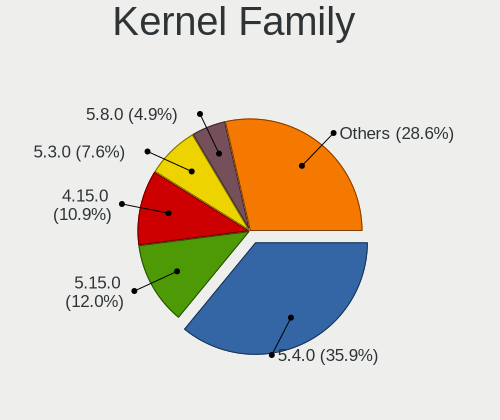

| Version | Desktops | Percent |
|---------|----------|---------|
| 5.4.0   | 739      | 37.96%  |
| 5.15.0  | 230      | 11.81%  |
| 4.15.0  | 222      | 11.4%   |
| 5.3.0   | 157      | 8.06%   |
| 5.8.0   | 102      | 5.24%   |
| 5.11.0  | 90       | 4.62%   |
| 5.13.0  | 78       | 4.01%   |
| 6.2.0   | 65       | 3.34%   |
| 6.5.0   | 57       | 2.93%   |
| 5.19.0  | 49       | 2.52%   |
| 5.0.0   | 45       | 2.31%   |
| 4.4.0   | 22       | 1.13%   |
| 4.18.0  | 11       | 0.56%   |
| 6.8.0   | 4        | 0.21%   |
| 4.10.0  | 4        | 0.21%   |
| 6.1.0   | 3        | 0.15%   |
| 6.5.1   | 2        | 0.1%    |
| 6.2.7   | 2        | 0.1%    |
| 6.0.0   | 2        | 0.1%    |
| 5.9.8   | 2        | 0.1%    |
| 5.9.16  | 2        | 0.1%    |
| 5.6.0   | 2        | 0.1%    |
| 5.4.217 | 2        | 0.1%    |
| 5.17.0  | 2        | 0.1%    |
| 5.15.1  | 2        | 0.1%    |
| 5.11.16 | 2        | 0.1%    |
| 4.13.0  | 2        | 0.1%    |
| 6.7.1   | 1        | 0.05%   |
| 6.7.0   | 1        | 0.05%   |
| 6.6.4   | 1        | 0.05%   |
| 6.6.11  | 1        | 0.05%   |
| 6.6.0   | 1        | 0.05%   |
| 6.4.8   | 1        | 0.05%   |
| 6.4.7   | 1        | 0.05%   |
| 6.4.1   | 1        | 0.05%   |
| 6.3.5   | 1        | 0.05%   |
| 6.3.3   | 1        | 0.05%   |
| 6.3.12  | 1        | 0.05%   |
| 6.3.1   | 1        | 0.05%   |
| 6.3.0   | 1        | 0.05%   |

Kernel Major Ver.
-----------------

Linux kernel major version

| Version | Desktops | Percent |
|---------|----------|---------|
| 5.4     | 742      | 38.17%  |
| 5.15    | 232      | 11.93%  |
| 4.15    | 223      | 11.47%  |
| 5.3     | 157      | 8.08%   |
| 5.8     | 104      | 5.35%   |
| 5.11    | 91       | 4.68%   |
| 5.13    | 80       | 4.12%   |
| 6.2     | 69       | 3.55%   |
| 6.5     | 59       | 3.03%   |
| 5.19    | 51       | 2.62%   |
| 5.0     | 46       | 2.37%   |
| 4.4     | 22       | 1.13%   |
| 4.18    | 11       | 0.57%   |
| 6.3     | 5        | 0.26%   |
| 6.1     | 5        | 0.26%   |
| 5.9     | 5        | 0.26%   |
| 6.8     | 4        | 0.21%   |
| 4.10    | 4        | 0.21%   |
| 6.6     | 3        | 0.15%   |
| 6.4     | 3        | 0.15%   |
| 5.6     | 3        | 0.15%   |
| 5.17    | 3        | 0.15%   |
| 5.12    | 3        | 0.15%   |
| 5.10    | 3        | 0.15%   |
| 6.7     | 2        | 0.1%    |
| 6.0     | 2        | 0.1%    |
| 5.7     | 2        | 0.1%    |
| 5.16    | 2        | 0.1%    |
| 4.13    | 2        | 0.1%    |
| 5.5     | 1        | 0.05%   |
| 5.2     | 1        | 0.05%   |
| 5.18    | 1        | 0.05%   |
| 5.14    | 1        | 0.05%   |
| 4.8     | 1        | 0.05%   |
| 4.14    | 1        | 0.05%   |

Arch
----

OS architecture (x86_64, i586, etc.)

| Name   | Desktops | Percent |
|--------|----------|---------|
| x86_64 | 1645     | 90.73%  |
| i686   | 167      | 9.21%   |
| armv7l | 1        | 0.06%   |

DE
--

Desktop Environment

| Name            | Desktops | Percent |
|-----------------|----------|---------|
| XFCE            | 1746     | 96.2%   |
| GNOME           | 46       | 2.53%   |
| KDE5            | 5        | 0.28%   |
| X-Cinnamon      | 4        | 0.22%   |
| GNOME Flashback | 3        | 0.17%   |
| Cinnamon        | 3        | 0.17%   |
| Unicorn:XFCE    | 2        | 0.11%   |
| i3              | 2        | 0.11%   |
| MATE            | 1        | 0.06%   |
| LXQt            | 1        | 0.06%   |
| GNUstep         | 1        | 0.06%   |
| Unknown         | 1        | 0.06%   |

Display Server
--------------

X11 or Wayland

| Name    | Desktops | Percent |
|---------|----------|---------|
| X11     | 1765     | 97.25%  |
| Tty     | 39       | 2.15%   |
| Wayland | 7        | 0.39%   |
| Web     | 3        | 0.17%   |
| Unknown | 1        | 0.06%   |

Display Manager
---------------

SDDM, LightDM, etc.

| Name    | Desktops | Percent |
|---------|----------|---------|
| Unknown | 904      | 48.19%  |
| LightDM | 714      | 38.06%  |
| TDM     | 197      | 10.5%   |
| GDM3    | 35       | 1.87%   |
| GDM     | 17       | 0.91%   |
| SDDM    | 5        | 0.27%   |
| XDM     | 3        | 0.16%   |
| SLiM    | 1        | 0.05%   |

OS Lang
-------

Language

| Lang    | Desktops | Percent |
|---------|----------|---------|
| en_US   | 567      | 31.1%   |
| de_DE   | 185      | 10.15%  |
| fr_FR   | 172      | 9.43%   |
| ru_RU   | 118      | 6.47%   |
| it_IT   | 105      | 5.76%   |
| pt_BR   | 102      | 5.6%    |
| en_GB   | 66       | 3.62%   |
| en_CA   | 62       | 3.4%    |
| es_ES   | 40       | 2.19%   |
| en_AU   | 40       | 2.19%   |
| C       | 39       | 2.14%   |
| Unknown | 33       | 1.81%   |
| pl_PL   | 24       | 1.32%   |
| ja_JP   | 24       | 1.32%   |
| es_AR   | 24       | 1.32%   |
| nl_NL   | 21       | 1.15%   |
| hu_HU   | 20       | 1.1%    |
| zh_TW   | 10       | 0.55%   |
| es_MX   | 10       | 0.55%   |
| fr_BE   | 9        | 0.49%   |
| sv_SE   | 8        | 0.44%   |
| fr_CA   | 8        | 0.44%   |
| fi_FI   | 8        | 0.44%   |
| cs_CZ   | 8        | 0.44%   |
| ru_UA   | 7        | 0.38%   |
| en_ZA   | 7        | 0.38%   |
| en_IN   | 7        | 0.38%   |
| de_AT   | 7        | 0.38%   |
| sk_SK   | 6        | 0.33%   |
| pt_PT   | 6        | 0.33%   |
| es_CO   | 6        | 0.33%   |
| nl_BE   | 5        | 0.27%   |
| es_VE   | 5        | 0.27%   |
| es_UY   | 5        | 0.27%   |
| zh_CN   | 4        | 0.22%   |
| ro_RO   | 4        | 0.22%   |
| fr_CH   | 4        | 0.22%   |
| de_CH   | 4        | 0.22%   |
| tr_TR   | 3        | 0.16%   |
| en_NZ   | 3        | 0.16%   |

Boot Mode
---------

EFI or BIOS

| Mode | Desktops | Percent |
|------|----------|---------|
| BIOS | 1326     | 72.22%  |
| EFI  | 510      | 27.78%  |

Filesystem
----------

Type of filesystem

| Type    | Desktops | Percent |
|---------|----------|---------|
| Ext4    | 1629     | 88.63%  |
| Tmpfs   | 82       | 4.46%   |
| Overlay | 43       | 2.34%   |
| Btrfs   | 34       | 1.85%   |
| Zfs     | 18       | 0.98%   |
| Xfs     | 11       | 0.6%    |
| Unknown | 11       | 0.6%    |
| Ext2    | 5        | 0.27%   |
| Ext3    | 4        | 0.22%   |
| Aufs    | 1        | 0.05%   |

Part. scheme
------------

Scheme of partitioning

| Type    | Desktops | Percent |
|---------|----------|---------|
| Unknown | 1054     | 57.13%  |
| GPT     | 493      | 26.72%  |
| MBR     | 298      | 16.15%  |

Dual Boot with Linux/BSD
------------------------

Hosting more than one Linux/BSD

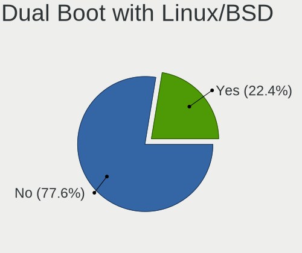

| Dual boot | Desktops | Percent |
|-----------|----------|---------|
| No        | 1440     | 77.38%  |
| Yes       | 421      | 22.62%  |

Dual Boot (Win)
---------------

Hosting Linux and Windows

| Dual boot | Desktops | Percent |
|-----------|----------|---------|
| No        | 1136     | 61.37%  |
| Yes       | 715      | 38.63%  |

Board
-----

Vendor
------

Motherboard manufacturer

| Name                                 | Desktops | Percent |
|--------------------------------------|----------|---------|
| ASUSTek Computer                     | 410      | 22.66%  |
| Gigabyte Technology                  | 265      | 14.65%  |
| Dell                                 | 194      | 10.72%  |
| MSI                                  | 172      | 9.51%   |
| ASRock                               | 168      | 9.29%   |
| Hewlett-Packard                      | 157      | 8.68%   |
| Lenovo                               | 68       | 3.76%   |
| Intel                                | 53       | 2.93%   |
| Acer                                 | 43       | 2.38%   |
| Unknown                              | 31       | 1.71%   |
| ECS                                  | 28       | 1.55%   |
| Foxconn                              | 24       | 1.33%   |
| Fujitsu                              | 21       | 1.16%   |
| Pegatron                             | 19       | 1.05%   |
| Medion                               | 18       | 1%      |
| Biostar                              | 10       | 0.55%   |
| eMachines                            | 9        | 0.5%    |
| Packard Bell                         | 8        | 0.44%   |
| Fujitsu Siemens                      | 7        | 0.39%   |
| Positivo                             | 6        | 0.33%   |
| Apple                                | 6        | 0.33%   |
| Shuttle                              | 5        | 0.28%   |
| AOpen                                | 5        | 0.28%   |
| NEC Computers                        | 4        | 0.22%   |
| AAEON                                | 4        | 0.22%   |
| Semp Toshiba                         | 3        | 0.17%   |
| PCWare                               | 3        | 0.17%   |
| OEM                                  | 3        | 0.17%   |
| MACHINIST                            | 3        | 0.17%   |
| Itautec                              | 3        | 0.17%   |
| IBM                                  | 3        | 0.17%   |
| EVGA                                 | 3        | 0.17%   |
| AMI                                  | 3        | 0.17%   |
| ZOTAC                                | 2        | 0.11%   |
| WinFast                              | 2        | 0.11%   |
| VIA Technologies                     | 2        | 0.11%   |
| Shenzhen Meigao Electronic Equipment | 2        | 0.11%   |
| Quanta                               | 2        | 0.11%   |
| PCChips                              | 2        | 0.11%   |
| NCR                                  | 2        | 0.11%   |

Model
-----

Motherboard model

| Name                               | Desktops | Percent |
|------------------------------------|----------|---------|
| ASUS All Series                    | 38       | 2.1%    |
| Unknown                            | 36       | 1.99%   |
| Dell OptiPlex 7010                 | 16       | 0.88%   |
| Gigabyte H410M S2H                 | 15       | 0.83%   |
| Dell OptiPlex 755                  | 11       | 0.61%   |
| Gigabyte H81M-S2V                  | 9        | 0.5%    |
| ECS G31T-M9                        | 9        | 0.5%    |
| Dell OptiPlex 390                  | 9        | 0.5%    |
| ASRock N68C-S UCC                  | 9        | 0.5%    |
| Dell OptiPlex 780                  | 8        | 0.44%   |
| Dell OptiPlex 760                  | 8        | 0.44%   |
| MSI MS-7C56                        | 7        | 0.39%   |
| MSI MS-7C37                        | 7        | 0.39%   |
| MSI MS-7721                        | 7        | 0.39%   |
| HP EliteDesk 800 G1 SFF            | 7        | 0.39%   |
| Dell OptiPlex 3020                 | 7        | 0.39%   |
| ASUS TUF Gaming X570-PLUS          | 7        | 0.39%   |
| ASUS M5A78L-M/USB3                 | 7        | 0.39%   |
| MSI MS-7817                        | 6        | 0.33%   |
| HP Compaq Elite 8300 SFF           | 6        | 0.33%   |
| ASUS PRIME A320M-K                 | 6        | 0.33%   |
| MSI MS-7C02                        | 5        | 0.28%   |
| MSI MS-7B89                        | 5        | 0.28%   |
| MSI MS-7B79                        | 5        | 0.28%   |
| MSI MS-7A38                        | 5        | 0.28%   |
| Intel H61                          | 5        | 0.28%   |
| HP Compaq Pro 6300 SFF             | 5        | 0.28%   |
| HP Compaq dc7600 Small Form Factor | 5        | 0.28%   |
| Gigabyte B450M DS3H                | 5        | 0.28%   |
| Gigabyte 945GZM-S2                 | 5        | 0.28%   |
| Dell OptiPlex GX620                | 5        | 0.28%   |
| Dell OptiPlex 990                  | 5        | 0.28%   |
| Dell OptiPlex 9020                 | 5        | 0.28%   |
| ASUS TUF Gaming B550M-PLUS         | 5        | 0.28%   |
| Apple MacPro5,1                    | 5        | 0.28%   |
| MSI MS-7C52                        | 4        | 0.22%   |
| MSI MS-7816                        | 4        | 0.22%   |
| MSI MS-7693                        | 4        | 0.22%   |
| HP Z420 Workstation                | 4        | 0.22%   |
| HP t620 Quad Core TC               | 4        | 0.22%   |

Model Family
------------

Motherboard model prefix

| Name                | Desktops | Percent |
|---------------------|----------|---------|
| Dell OptiPlex       | 110      | 6.08%   |
| HP Compaq           | 66       | 3.65%   |
| ASUS PRIME          | 60       | 3.32%   |
| Lenovo ThinkCentre  | 44       | 2.43%   |
| ASUS All            | 38       | 2.1%    |
| Unknown             | 36       | 1.99%   |
| Dell Inspiron       | 29       | 1.6%    |
| ASUS TUF            | 24       | 1.33%   |
| Dell Precision      | 20       | 1.11%   |
| ASUS ROG            | 20       | 1.11%   |
| Acer Veriton        | 19       | 1.05%   |
| Acer Aspire         | 19       | 1.05%   |
| HP ProDesk          | 16       | 0.88%   |
| Gigabyte H410M      | 16       | 0.88%   |
| Fujitsu ESPRIMO     | 15       | 0.83%   |
| HP EliteDesk        | 14       | 0.77%   |
| ASUS M5A78L-M       | 14       | 0.77%   |
| ASUS P8H61-M        | 11       | 0.61%   |
| Lenovo ThinkStation | 9        | 0.5%    |
| Gigabyte H81M-S2V   | 9        | 0.5%    |
| ECS G31T-M9         | 9        | 0.5%    |
| ASUS P5KPL-AM       | 9        | 0.5%    |
| ASRock N68C-S       | 9        | 0.5%    |
| Lenovo IdeaCentre   | 8        | 0.44%   |
| Gigabyte X570       | 8        | 0.44%   |
| Gigabyte B450M      | 8        | 0.44%   |
| Packard Bell IMEDIA | 7        | 0.39%   |
| MSI MS-7C56         | 7        | 0.39%   |
| MSI MS-7C37         | 7        | 0.39%   |
| MSI MS-7721         | 7        | 0.39%   |
| ASUS P9X79          | 7        | 0.39%   |
| ASUS P5K            | 7        | 0.39%   |
| MSI MS-7817         | 6        | 0.33%   |
| Dell Studio         | 6        | 0.33%   |
| ASUS P8Z77-V        | 6        | 0.33%   |
| ASRock B450M        | 6        | 0.33%   |
| MSI MS-7C02         | 5        | 0.28%   |
| MSI MS-7B89         | 5        | 0.28%   |
| MSI MS-7B79         | 5        | 0.28%   |
| MSI MS-7A38         | 5        | 0.28%   |

MFG Year
--------

Motherboard manufacture year

| Year    | Desktops | Percent |
|---------|----------|---------|
| 2012    | 166      | 9.18%   |
| 2009    | 162      | 8.96%   |
| 2011    | 153      | 8.46%   |
| 2013    | 149      | 8.24%   |
| 2014    | 126      | 6.97%   |
| 2010    | 125      | 6.91%   |
| 2008    | 114      | 6.3%    |
| 2007    | 111      | 6.14%   |
| 2018    | 108      | 5.97%   |
| 2019    | 92       | 5.09%   |
| 2017    | 81       | 4.48%   |
| 2020    | 78       | 4.31%   |
| 2015    | 73       | 4.04%   |
| 2006    | 64       | 3.54%   |
| 2016    | 59       | 3.26%   |
| 2021    | 46       | 2.54%   |
| 2005    | 37       | 2.05%   |
| 2022    | 23       | 1.27%   |
| 2023    | 14       | 0.77%   |
| 2004    | 10       | 0.55%   |
| 2003    | 8        | 0.44%   |
| 2001    | 4        | 0.22%   |
| 2002    | 3        | 0.17%   |
| Unknown | 3        | 0.17%   |

Form Factor
-----------

Physical design of the computer

| Name    | Desktops | Percent |
|---------|----------|---------|
| Desktop | 1809     | 100%    |

Secure Boot
-----------

Enabled or disabled

| State    | Desktops | Percent |
|----------|----------|---------|
| Disabled | 1765     | 97.19%  |
| Enabled  | 51       | 2.81%   |

Coreboot
--------

Have coreboot on board

| Used | Desktops | Percent |
|------|----------|---------|
| No   | 1808     | 99.94%  |
| Yes  | 1        | 0.06%   |

RAM Size
--------

Total RAM memory

| Size in GB      | Desktops | Percent |
|-----------------|----------|---------|
| 3.01-4.0        | 403      | 21.76%  |
| 16.01-24.0      | 330      | 17.82%  |
| 8.01-16.0       | 313      | 16.9%   |
| 4.01-8.0        | 296      | 15.98%  |
| 32.01-64.0      | 156      | 8.42%   |
| 1.01-2.0        | 147      | 7.94%   |
| 64.01-256.0     | 79       | 4.27%   |
| 2.01-3.0        | 54       | 2.92%   |
| 24.01-32.0      | 36       | 1.94%   |
| 0.51-1.0        | 32       | 1.73%   |
| 0.01-0.5        | 5        | 0.27%   |
| More than 256.0 | 1        | 0.05%   |

RAM Used
--------

Used RAM memory

| Used GB     | Desktops | Percent |
|-------------|----------|---------|
| 1.01-2.0    | 817      | 39.89%  |
| 2.01-3.0    | 364      | 17.77%  |
| 0.51-1.0    | 346      | 16.89%  |
| 4.01-8.0    | 213      | 10.4%   |
| 3.01-4.0    | 178      | 8.69%   |
| 8.01-16.0   | 65       | 3.17%   |
| 0.01-0.5    | 41       | 2%      |
| 16.01-24.0  | 12       | 0.59%   |
| 24.01-32.0  | 7        | 0.34%   |
| 32.01-64.0  | 4        | 0.2%    |
| 64.01-256.0 | 1        | 0.05%   |

Total Drives
------------

Number of drives on board

| Drives | Desktops | Percent |
|--------|----------|---------|
| 1      | 838      | 44.32%  |
| 2      | 533      | 28.19%  |
| 3      | 276      | 14.6%   |
| 4      | 117      | 6.19%   |
| 5      | 62       | 3.28%   |
| 6      | 24       | 1.27%   |
| 7      | 15       | 0.79%   |
| 0      | 12       | 0.63%   |
| 10     | 5        | 0.26%   |
| 8      | 4        | 0.21%   |
| 9      | 3        | 0.16%   |
| 11     | 2        | 0.11%   |

Has CD-ROM
----------

Has CD-ROM on board

| Presented | Desktops | Percent |
|-----------|----------|---------|
| Yes       | 1020     | 55.62%  |
| No        | 814      | 44.38%  |

Has Ethernet
------------

Has Ethernet on board

| Presented | Desktops | Percent |
|-----------|----------|---------|
| Yes       | 1789     | 98.89%  |
| No        | 20       | 1.11%   |

Has WiFi
--------

Has WiFi module

| Presented | Desktops | Percent |
|-----------|----------|---------|
| No        | 1109     | 60.4%   |
| Yes       | 727      | 39.6%   |

Has Bluetooth
-------------

Has Bluetooth module

| Presented | Desktops | Percent |
|-----------|----------|---------|
| No        | 1459     | 79.47%  |
| Yes       | 377      | 20.53%  |

Location
--------

Country
-------

Geographic location (country)

| Country      | Desktops | Percent |
|--------------|----------|---------|
| USA          | 307      | 16.92%  |
| Germany      | 210      | 11.58%  |
| France       | 169      | 9.32%   |
| Russia       | 137      | 7.55%   |
| Italy        | 116      | 6.39%   |
| Brazil       | 115      | 6.34%   |
| Canada       | 82       | 4.52%   |
| UK           | 64       | 3.53%   |
| Spain        | 48       | 2.65%   |
| Netherlands  | 45       | 2.48%   |
| Australia    | 44       | 2.43%   |
| Argentina    | 31       | 1.71%   |
| Japan        | 27       | 1.49%   |
| Ukraine      | 26       | 1.43%   |
| Poland       | 26       | 1.43%   |
| Hungary      | 25       | 1.38%   |
| Belgium      | 25       | 1.38%   |
| Sweden       | 22       | 1.21%   |
| Finland      | 19       | 1.05%   |
| Mexico       | 16       | 0.88%   |
| Austria      | 14       | 0.77%   |
| Taiwan       | 13       | 0.72%   |
| Greece       | 13       | 0.72%   |
| Bulgaria     | 12       | 0.66%   |
| Portugal     | 11       | 0.61%   |
| Switzerland  | 10       | 0.55%   |
| Czechia      | 10       | 0.55%   |
| Iran         | 9        | 0.5%    |
| South Africa | 8        | 0.44%   |
| Slovakia     | 8        | 0.44%   |
| Romania      | 8        | 0.44%   |
| Colombia     | 8        | 0.44%   |
| Thailand     | 7        | 0.39%   |
| India        | 7        | 0.39%   |
| Venezuela    | 6        | 0.33%   |
| Uruguay      | 6        | 0.33%   |
| Norway       | 6        | 0.33%   |
| Israel       | 6        | 0.33%   |
| Indonesia    | 6        | 0.33%   |
| Turkey       | 5        | 0.28%   |

City
----

Geographic location (city)

| City           | Desktops | Percent |
|----------------|----------|---------|
| Voronezh       | 46       | 2.39%   |
| Berlin         | 22       | 1.14%   |
| Paris          | 21       | 1.09%   |
| Sydney         | 18       | 0.93%   |
| Moscow         | 17       | 0.88%   |
| Sao Paulo      | 14       | 0.73%   |
| Milan          | 13       | 0.67%   |
| Amsterdam      | 13       | 0.67%   |
| Rome           | 11       | 0.57%   |
| Madrid         | 11       | 0.57%   |
| Budapest       | 11       | 0.57%   |
| Rio de Janeiro | 10       | 0.52%   |
| Hamburg        | 10       | 0.52%   |
| Buenos Aires   | 10       | 0.52%   |
| Vancouver      | 9        | 0.47%   |
| Montreal       | 9        | 0.47%   |
| Tehran         | 8        | 0.42%   |
| Oryol          | 8        | 0.42%   |
| Munich         | 8        | 0.42%   |
| Helsinki       | 8        | 0.42%   |
| Genoa          | 8        | 0.42%   |
| Sofia          | 7        | 0.36%   |
| Melbourne      | 7        | 0.36%   |
| Warsaw         | 6        | 0.31%   |
| Turin          | 6        | 0.31%   |
| Toronto        | 6        | 0.31%   |
| Springfield    | 6        | 0.31%   |
| Perth          | 6        | 0.31%   |
| Hanover        | 6        | 0.31%   |
| Denver         | 6        | 0.31%   |
| Cologne        | 6        | 0.31%   |
| Athens         | 6        | 0.31%   |
| Tampere        | 5        | 0.26%   |
| Seattle        | 5        | 0.26%   |
| New Taipei     | 5        | 0.26%   |
| Montevideo     | 5        | 0.26%   |
| Kyiv           | 5        | 0.26%   |
| Harrisonburg   | 5        | 0.26%   |
| Dresden        | 5        | 0.26%   |
| Campinas       | 5        | 0.26%   |

Drives
------

Drive Vendor
------------

Hard drive vendors

| Vendor                      | Desktops | Drives | Percent |
|-----------------------------|----------|--------|---------|
| Seagate                     | 655      | 1077   | 21.33%  |
| WDC                         | 651      | 1056   | 21.2%   |
| Samsung Electronics         | 402      | 651    | 13.09%  |
| Hitachi                     | 168      | 249    | 5.47%   |
| Kingston                    | 163      | 213    | 5.31%   |
| Toshiba                     | 153      | 222    | 4.98%   |
| Crucial                     | 106      | 150    | 3.45%   |
| SanDisk                     | 103      | 141    | 3.35%   |
| Maxtor                      | 62       | 87     | 2.02%   |
| A-DATA Technology           | 46       | 57     | 1.5%    |
| Intel                       | 45       | 68     | 1.47%   |
| China                       | 38       | 45     | 1.24%   |
| Unknown                     | 37       | 52     | 1.2%    |
| PNY                         | 28       | 44     | 0.91%   |
| HGST                        | 28       | 39     | 0.91%   |
| Patriot                     | 25       | 30     | 0.81%   |
| Intenso                     | 19       | 26     | 0.62%   |
| OCZ                         | 17       | 24     | 0.55%   |
| Transcend                   | 15       | 17     | 0.49%   |
| Phison                      | 14       | 36     | 0.46%   |
| SPCC                        | 13       | 25     | 0.42%   |
| Fujitsu                     | 11       | 13     | 0.36%   |
| ASMT                        | 11       | 15     | 0.36%   |
| Lexar                       | 10       | 10     | 0.33%   |
| Hewlett-Packard             | 10       | 19     | 0.33%   |
| SK hynix                    | 9        | 9      | 0.29%   |
| Silicon Motion              | 9        | 10     | 0.29%   |
| Micron Technology           | 9        | 12     | 0.29%   |
| Kingston Technology Company | 9        | 13     | 0.29%   |
| Realtek Semiconductor       | 8        | 10     | 0.26%   |
| Corsair                     | 8        | 9      | 0.26%   |
| Phison Electronics          | 7        | 11     | 0.23%   |
| KingDian                    | 6        | 10     | 0.2%    |
| Gigabyte Technology         | 6        | 9      | 0.2%    |
| Apacer                      | 6        | 9      | 0.2%    |
| XPG                         | 5        | 11     | 0.16%   |
| Team                        | 5        | 7      | 0.16%   |
| Mushkin                     | 5        | 5      | 0.16%   |
| KIOXIA                      | 5        | 12     | 0.16%   |
| JMicron Technology          | 5        | 6      | 0.16%   |

Drive Model
-----------

Hard drive models

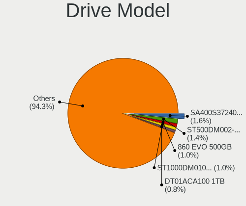

| Model                            | Desktops | Percent |
|----------------------------------|----------|---------|
| Kingston SA400S37240G 240GB SSD  | 58       | 1.63%   |
| Seagate ST500DM002-1BD142 500GB  | 52       | 1.46%   |
| Seagate ST1000DM010-2EP102 1TB   | 34       | 0.96%   |
| Samsung SSD 860 EVO 500GB        | 34       | 0.96%   |
| Toshiba DT01ACA100 1TB           | 28       | 0.79%   |
| Seagate ST2000DM008-2FR102 2TB   | 25       | 0.7%    |
| Seagate ST1000DM003-1ER162 1TB   | 25       | 0.7%    |
| Seagate ST1000DM003-1CH162 1TB   | 25       | 0.7%    |
| Seagate ST2000DM001-1CH164 2TB   | 22       | 0.62%   |
| Seagate ST3500418AS 500GB        | 21       | 0.59%   |
| Samsung SSD 850 EVO 250GB        | 21       | 0.59%   |
| Seagate ST4000DM004-2CV104 4TB   | 19       | 0.53%   |
| Toshiba DT01ACA050 500GB         | 18       | 0.51%   |
| Seagate ST31000528AS 1TB         | 18       | 0.51%   |
| Kingston SA400S37480G 480GB SSD  | 18       | 0.51%   |
| Hitachi HDS721010CLA332 1TB      | 18       | 0.51%   |
| Crucial CT1000MX500SSD1 1TB      | 16       | 0.45%   |
| Toshiba HDWD110 1TB              | 15       | 0.42%   |
| Seagate Expansion 2TB            | 15       | 0.42%   |
| Samsung SSD 850 EVO 500GB        | 15       | 0.42%   |
| Kingston SV300S37A120G 120GB SSD | 15       | 0.42%   |
| Toshiba DT01ACA200 2TB           | 14       | 0.39%   |
| Seagate ST3250310AS 250GB        | 14       | 0.39%   |
| WDC WD10EZEX-08WN4A0 1TB         | 13       | 0.37%   |
| Unknown SD/MMC/MS PRO 128GB      | 13       | 0.37%   |
| Seagate ST380815AS 80GB          | 13       | 0.37%   |
| Seagate ST3500413AS 500GB        | 13       | 0.37%   |
| Seagate ST3160815AS 160GB        | 13       | 0.37%   |
| Kingston SA400S37120G 120GB SSD  | 13       | 0.37%   |
| Hitachi HDS721050CLA362 500GB    | 13       | 0.37%   |
| WDC WD800JD-75MSA3 80GB          | 12       | 0.34%   |
| Seagate ST31000524AS 1TB         | 12       | 0.34%   |
| Samsung SSD 840 EVO 250GB        | 12       | 0.34%   |
| Patriot Burst 120GB SSD          | 12       | 0.34%   |
| Seagate ST1000DM003-1SB102 1TB   | 11       | 0.31%   |
| Samsung SSD 860 EVO 250GB        | 11       | 0.31%   |
| Samsung SSD 860 EVO 1TB          | 11       | 0.31%   |
| Samsung HD103SJ 1TB              | 11       | 0.31%   |
| Crucial CT480BX500SSD1 480GB     | 11       | 0.31%   |
| WDC WD20EARX-00PASB0 2TB         | 10       | 0.28%   |

HDD Vendor
----------

Hard disk drive vendors

| Vendor              | Desktops | Drives | Percent |
|---------------------|----------|--------|---------|
| Seagate             | 643      | 1052   | 34.79%  |
| WDC                 | 605      | 963    | 32.74%  |
| Hitachi             | 168      | 249    | 9.09%   |
| Toshiba             | 138      | 200    | 7.47%   |
| Samsung Electronics | 136      | 204    | 7.36%   |
| Maxtor              | 60       | 85     | 3.25%   |
| HGST                | 28       | 39     | 1.52%   |
| Unknown             | 14       | 19     | 0.76%   |
| Fujitsu             | 11       | 13     | 0.6%    |
| Hewlett-Packard     | 6        | 12     | 0.32%   |
| ASMT                | 6        | 10     | 0.32%   |
| Intenso             | 5        | 6      | 0.27%   |
| TO Exter            | 4        | 6      | 0.22%   |
| Apple               | 4        | 5      | 0.22%   |
| WD MediaMax         | 2        | 2      | 0.11%   |
| USB3.0              | 2        | 4      | 0.11%   |
| SABRENT             | 2        | 2      | 0.11%   |
| HPE                 | 2        | 5      | 0.11%   |
| ExcelStor           | 2        | 2      | 0.11%   |
| SAGE                | 1        | 1      | 0.05%   |
| MaxDigital          | 1        | 1      | 0.05%   |
| MARVELL             | 1        | 1      | 0.05%   |
| LaCie               | 1        | 5      | 0.05%   |
| JMicron Technology  | 1        | 1      | 0.05%   |
| Inateck             | 1        | 1      | 0.05%   |
| ICY BOX             | 1        | 2      | 0.05%   |
| IBM/Hitachi         | 1        | 1      | 0.05%   |
| External            | 1        | 2      | 0.05%   |
| ASMedia             | 1        | 1      | 0.05%   |

SSD Vendor
----------

Solid state drive vendors

| Vendor              | Desktops | Drives | Percent |
|---------------------|----------|--------|---------|
| Samsung Electronics | 211      | 308    | 22.16%  |
| Kingston            | 144      | 180    | 15.13%  |
| Crucial             | 91       | 135    | 9.56%   |
| SanDisk             | 84       | 119    | 8.82%   |
| WDC                 | 57       | 81     | 5.99%   |
| China               | 38       | 45     | 3.99%   |
| A-DATA Technology   | 38       | 48     | 3.99%   |
| Intel               | 31       | 46     | 3.26%   |
| PNY                 | 27       | 42     | 2.84%   |
| Patriot             | 25       | 30     | 2.63%   |
| OCZ                 | 16       | 22     | 1.68%   |
| Transcend           | 13       | 14     | 1.37%   |
| SPCC                | 13       | 25     | 1.37%   |
| Intenso             | 12       | 14     | 1.26%   |
| Toshiba             | 10       | 16     | 1.05%   |
| Lexar               | 9        | 9      | 0.95%   |
| Micron Technology   | 8        | 11     | 0.84%   |
| KingDian            | 6        | 10     | 0.63%   |
| Corsair             | 6        | 7      | 0.63%   |
| Apacer              | 6        | 9      | 0.63%   |
| Team                | 5        | 7      | 0.53%   |
| ASMT                | 5        | 5      | 0.53%   |
| SK hynix            | 4        | 4      | 0.42%   |
| Plextor             | 4        | 4      | 0.42%   |
| LITEONIT            | 4        | 4      | 0.42%   |
| Hewlett-Packard     | 4        | 7      | 0.42%   |
| GOODRAM             | 4        | 6      | 0.42%   |
| Smartbuy            | 3        | 3      | 0.32%   |
| PHD 3.0             | 3        | 4      | 0.32%   |
| Mushkin             | 3        | 3      | 0.32%   |
| LITEON              | 3        | 3      | 0.32%   |
| Dogfish             | 3        | 3      | 0.32%   |
| WALRAM              | 2        | 6      | 0.21%   |
| Vaseky              | 2        | 2      | 0.21%   |
| TEXTORM             | 2        | 2      | 0.21%   |
| Seagate             | 2        | 5      | 0.21%   |
| OCZ-VERTEX3         | 2        | 2      | 0.21%   |
| Maxtor              | 2        | 2      | 0.21%   |
| KIOXIA-EXCERIA      | 2        | 4      | 0.21%   |
| KingSpec            | 2        | 2      | 0.21%   |

Drive Kind
----------

HDD or SSD

| Kind    | Desktops | Drives | Percent |
|---------|----------|--------|---------|
| HDD     | 1391     | 2894   | 55.24%  |
| SSD     | 820      | 1301   | 32.57%  |
| NVMe    | 243      | 404    | 9.65%   |
| Unknown | 50       | 68     | 1.99%   |
| MMC     | 14       | 17     | 0.56%   |

Drive Connector
---------------

SATA, SAS, NVMe, etc.

| Type | Desktops | Drives | Percent |
|------|----------|--------|---------|
| SATA | 1732     | 4046   | 81.43%  |
| NVMe | 243      | 404    | 11.42%  |
| SAS  | 138      | 217    | 6.49%   |
| MMC  | 14       | 17     | 0.66%   |

Drive Size
----------

Size of hard drive

| Size in TB      | Desktops | Drives | Percent |
|-----------------|----------|--------|---------|
| 0.01-0.5        | 1414     | 2503   | 58.14%  |
| 0.51-1.0        | 569      | 949    | 23.4%   |
| 1.01-2.0        | 235      | 387    | 9.66%   |
| 3.01-4.0        | 87       | 147    | 3.58%   |
| 2.01-3.0        | 66       | 113    | 2.71%   |
| 4.01-10.0       | 51       | 82     | 2.1%    |
| 10.01-20.0      | 9        | 13     | 0.37%   |
| More than 100.0 | 1        | 1      | 0.04%   |

Space Total
-----------

Amount of disk space available on the file system

| Size in GB     | Desktops | Percent |
|----------------|----------|---------|
| 101-250        | 517      | 27.12%  |
| 251-500        | 355      | 18.63%  |
| 501-1000       | 283      | 14.85%  |
| 1001-2000      | 204      | 10.7%   |
| More than 3000 | 151      | 7.92%   |
| 51-100         | 140      | 7.35%   |
| 21-50          | 96       | 5.04%   |
| 2001-3000      | 86       | 4.51%   |
| 1-20           | 62       | 3.25%   |
| Unknown        | 12       | 0.63%   |

Space Used
----------

Amount of used disk space

| Used GB        | Desktops | Percent |
|----------------|----------|---------|
| 1-20           | 624      | 31.39%  |
| 21-50          | 316      | 15.9%   |
| 101-250        | 259      | 13.03%  |
| 51-100         | 247      | 12.42%  |
| 251-500        | 175      | 8.8%    |
| 501-1000       | 142      | 7.14%   |
| 1001-2000      | 103      | 5.18%   |
| More than 3000 | 64       | 3.22%   |
| 2001-3000      | 46       | 2.31%   |
| Unknown        | 12       | 0.6%    |

Malfunc. Drives
---------------

Drive models with a malfunction

| Model                             | Desktops | Drives | Percent |
|-----------------------------------|----------|--------|---------|
| Seagate ST500DM002-1BD142 500GB   | 6        | 6      | 3.02%   |
| Seagate ST2000DM001-1CH164 2TB    | 4        | 6      | 2.01%   |
| Toshiba DT01ACA100 1TB            | 3        | 3      | 1.51%   |
| Seagate ST3500418AS 500GB         | 3        | 4      | 1.51%   |
| Seagate ST1000DM010-2EP102 1TB    | 3        | 3      | 1.51%   |
| Maxtor STM3160215AS 160GB         | 3        | 3      | 1.51%   |
| Hitachi HDS721050CLA362 500GB     | 3        | 3      | 1.51%   |
| WDC WD5000AAKX-60U6AA0 500GB      | 2        | 2      | 1.01%   |
| WDC WD4000FYYZ-01UL1B1 4TB        | 2        | 3      | 1.01%   |
| WDC WD3200AAKS-00L9A0 320GB       | 2        | 2      | 1.01%   |
| WDC WD1002FAEX-00Z3A0 1TB         | 2        | 2      | 1.01%   |
| Seagate ST3250318AS 250GB         | 2        | 4      | 1.01%   |
| Seagate ST3250310AS 250GB         | 2        | 2      | 1.01%   |
| Seagate ST31000528AS 1TB          | 2        | 2      | 1.01%   |
| Seagate ST2000DM001-1ER164 2TB    | 2        | 2      | 1.01%   |
| Seagate ST1000DM003-1ER162 1TB    | 2        | 2      | 1.01%   |
| Seagate ST1000DL002-9TT153 1TB    | 2        | 2      | 1.01%   |
| Samsung Electronics HM321HI 320GB | 2        | 3      | 1.01%   |
| Samsung Electronics HD753LJ 752GB | 2        | 3      | 1.01%   |
| Samsung Electronics HD103SJ 1TB   | 2        | 3      | 1.01%   |
| Samsung Electronics HD103SI 1TB   | 2        | 2      | 1.01%   |
| Samsung Electronics HD081GJ 80GB  | 2        | 2      | 1.01%   |
| Kingston SV300S37A120G 120GB SSD  | 2        | 2      | 1.01%   |
| Kingston SA400S37240G 240GB SSD   | 2        | 2      | 1.01%   |
| Intel SSDSC2BW120A4 120GB         | 2        | 3      | 1.01%   |
| Hitachi HDS721010CLA332 1TB       | 2        | 2      | 1.01%   |
| WDC WDS480G2G0A-00JH30 480GB SSD  | 1        | 1      | 0.5%    |
| WDC WDS240G2G0B-00EPW0 240GB SSD  | 1        | 1      | 0.5%    |
| WDC WD8003FRYZ-01JPDB1 8TB        | 1        | 1      | 0.5%    |
| WDC WD6400AAKS-22A7B2 640GB       | 1        | 1      | 0.5%    |
| WDC WD6400AAKS-22A7B0 640GB       | 1        | 1      | 0.5%    |
| WDC WD5000LPVX-08V0TT5 500GB      | 1        | 1      | 0.5%    |
| WDC WD5000LPLX-75ZNTT1 500GB      | 1        | 1      | 0.5%    |
| WDC WD5000LPCX-00VHAT0 500GB      | 1        | 1      | 0.5%    |
| WDC WD5000BEVT-22ZAT0 500GB       | 1        | 1      | 0.5%    |
| WDC WD5000BEVT-22A0RT0 500GB      | 1        | 1      | 0.5%    |
| WDC WD5000AAKX-08U6AA0 500GB      | 1        | 1      | 0.5%    |
| WDC WD5000AAKX-08ERMA0 500GB      | 1        | 1      | 0.5%    |
| WDC WD5000AAKX-00ERMA0 500GB      | 1        | 1      | 0.5%    |
| WDC WD5000AAKS-22V1A0 500GB       | 1        | 1      | 0.5%    |

Malfunc. Drive Vendor
---------------------

Vendors of faulty drives

| Vendor              | Desktops | Drives | Percent |
|---------------------|----------|--------|---------|
| Seagate             | 59       | 69     | 31.05%  |
| WDC                 | 51       | 61     | 26.84%  |
| Samsung Electronics | 18       | 25     | 9.47%   |
| Hitachi             | 15       | 20     | 7.89%   |
| Toshiba             | 12       | 13     | 6.32%   |
| Maxtor              | 8        | 8      | 4.21%   |
| Kingston            | 6        | 6      | 3.16%   |
| Intel               | 2        | 3      | 1.05%   |
| HGST                | 2        | 4      | 1.05%   |
| Hewlett-Packard     | 2        | 3      | 1.05%   |
| Crucial             | 2        | 2      | 1.05%   |
| A-DATA Technology   | 2        | 2      | 1.05%   |
| SPCC                | 1        | 1      | 0.53%   |
| SK hynix            | 1        | 1      | 0.53%   |
| PNY                 | 1        | 1      | 0.53%   |
| KingDian            | 1        | 1      | 0.53%   |
| KEEPDATA            | 1        | 1      | 0.53%   |
| ICY BOX             | 1        | 2      | 0.53%   |
| FORESEE             | 1        | 1      | 0.53%   |
| Corsair             | 1        | 1      | 0.53%   |
| China               | 1        | 1      | 0.53%   |
| Avant               | 1        | 1      | 0.53%   |
| ASMT                | 1        | 4      | 0.53%   |

Malfunc. HDD Vendor
-------------------

Vendors of faulty HDD drives

| Vendor              | Desktops | Drives | Percent |
|---------------------|----------|--------|---------|
| Seagate             | 59       | 69     | 36.42%  |
| WDC                 | 49       | 59     | 30.25%  |
| Hitachi             | 15       | 20     | 9.26%   |
| Samsung Electronics | 14       | 20     | 8.64%   |
| Toshiba             | 11       | 12     | 6.79%   |
| Maxtor              | 8        | 8      | 4.94%   |
| HGST                | 2        | 4      | 1.23%   |
| Hewlett-Packard     | 2        | 3      | 1.23%   |
| ICY BOX             | 1        | 2      | 0.62%   |
| ASMT                | 1        | 4      | 0.62%   |

Malfunc. Drive Kind
-------------------

Kinds of faulty drives

| Kind | Desktops | Drives | Percent |
|------|----------|--------|---------|
| HDD  | 146      | 201    | 84.88%  |
| SSD  | 24       | 28     | 13.95%  |
| NVMe | 2        | 2      | 1.16%   |

Failed Drives
-------------

Failed drive models

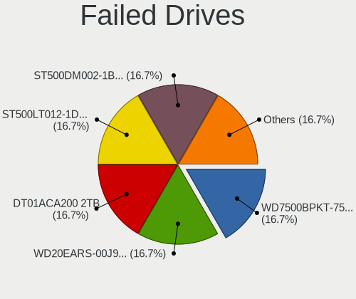

| Model                            | Desktops | Drives | Percent |
|----------------------------------|----------|--------|---------|
| WDC WD7500BPKT-75PK4T0 752GB     | 1        | 1      | 16.67%  |
| WDC WD20EARS-00J99B0 2TB         | 1        | 2      | 16.67%  |
| Toshiba DT01ACA200 2TB           | 1        | 1      | 16.67%  |
| Seagate ST500LT012-1DG142 500GB  | 1        | 3      | 16.67%  |
| Seagate ST500DM002-1BC142 500GB  | 1        | 1      | 16.67%  |
| A-DATA Technology SP800 32GB SSD | 1        | 1      | 16.67%  |

Failed Drive Vendor
-------------------

Failed drive vendors

| Vendor            | Desktops | Drives | Percent |
|-------------------|----------|--------|---------|
| WDC               | 2        | 3      | 33.33%  |
| Seagate           | 2        | 4      | 33.33%  |
| Toshiba           | 1        | 1      | 16.67%  |
| A-DATA Technology | 1        | 1      | 16.67%  |

Drive Status
------------

Number of failed and malfunc. drives

| Status   | Desktops | Drives | Percent |
|----------|----------|--------|---------|
| Detected | 1202     | 3072   | 60.62%  |
| Works    | 607      | 1372   | 30.61%  |
| Malfunc  | 168      | 231    | 8.47%   |
| Failed   | 6        | 9      | 0.3%    |

Storage controller
------------------

Storage Vendor
--------------

Storage controller vendors

| Vendor                           | Desktops | Percent |
|----------------------------------|----------|---------|
| Intel                            | 1195     | 51.71%  |
| AMD                              | 454      | 19.65%  |
| Nvidia                           | 107      | 4.63%   |
| Samsung Electronics              | 94       | 4.07%   |
| JMicron Technology               | 75       | 3.25%   |
| ASMedia Technology               | 74       | 3.2%    |
| Marvell Technology Group         | 56       | 2.42%   |
| VIA Technologies                 | 41       | 1.77%   |
| Kingston Technology Company      | 31       | 1.34%   |
| Phison Electronics               | 25       | 1.08%   |
| SanDisk                          | 23       | 1%      |
| Micron/Crucial Technology        | 17       | 0.74%   |
| Silicon Motion                   | 13       | 0.56%   |
| Realtek Semiconductor            | 12       | 0.52%   |
| ADATA Technology                 | 12       | 0.52%   |
| Broadcom / LSI                   | 10       | 0.43%   |
| Silicon Integrated Systems [SiS] | 9        | 0.39%   |
| Silicon Image                    | 8        | 0.35%   |
| Toshiba America Info Systems     | 6        | 0.26%   |
| LSI Logic / Symbios Logic        | 6        | 0.26%   |
| Integrated Technology Express    | 5        | 0.22%   |
| Adaptec                          | 5        | 0.22%   |
| SK hynix                         | 4        | 0.17%   |
| Promise Technology               | 4        | 0.17%   |
| MAXIO Technology (Hangzhou)      | 4        | 0.17%   |
| Seagate Technology               | 3        | 0.13%   |
| Micron Technology                | 3        | 0.13%   |
| KIOXIA                           | 3        | 0.13%   |
| ULi Electronics                  | 2        | 0.09%   |
| Shenzhen Longsys Electronics     | 2        | 0.09%   |
| Yangtze Memory Technologies      | 1        | 0.04%   |
| TenaFe                           | 1        | 0.04%   |
| OCZ Technology Group             | 1        | 0.04%   |
| Lite-On Technology               | 1        | 0.04%   |
| INNOGRIT                         | 1        | 0.04%   |
| Hosin Global Electronics         | 1        | 0.04%   |
| HighPoint Technologies           | 1        | 0.04%   |
| Hewlett-Packard                  | 1        | 0.04%   |

Storage Model
-------------

Storage controller models

| Model                                                                                   | Desktops | Percent |
|-----------------------------------------------------------------------------------------|----------|---------|
| AMD FCH SATA Controller [AHCI mode]                                                     | 230      | 7.29%   |
| Intel NM10/ICH7 Family SATA Controller [IDE mode]                                       | 153      | 4.85%   |
| Intel 8 Series/C220 Series Chipset Family 6-port SATA Controller 1 [AHCI mode]          | 134      | 4.25%   |
| Intel 82801G (ICH7 Family) IDE Controller                                               | 117      | 3.71%   |
| Intel 6 Series/C200 Series Chipset Family 6 port Desktop SATA AHCI Controller           | 106      | 3.36%   |
| AMD SB7x0/SB8x0/SB9x0 IDE Controller                                                    | 98       | 3.11%   |
| Intel 7 Series/C210 Series Chipset Family 6-port SATA Controller [AHCI mode]            | 81       | 2.57%   |
| Intel SATA Controller [RAID mode]                                                       | 70       | 2.22%   |
| ASMedia ASM1061/ASM1062 Serial ATA Controller                                           | 69       | 2.19%   |
| AMD 400 Series Chipset SATA Controller                                                  | 68       | 2.16%   |
| Nvidia MCP61 SATA Controller                                                            | 65       | 2.06%   |
| AMD SB7x0/SB8x0/SB9x0 SATA Controller [IDE mode]                                        | 65       | 2.06%   |
| Intel Q170/Q150/B150/H170/H110/Z170/CM236 Chipset SATA Controller [AHCI Mode]           | 62       | 1.97%   |
| AMD SB7x0/SB8x0/SB9x0 SATA Controller [AHCI mode]                                       | 61       | 1.93%   |
| Samsung NVMe SSD Controller SM981/PM981/PM983                                           | 55       | 1.74%   |
| Nvidia MCP61 IDE                                                                        | 52       | 1.65%   |
| JMicron JMB363 SATA/IDE Controller                                                      | 50       | 1.59%   |
| Intel 200 Series PCH SATA controller [AHCI mode]                                        | 49       | 1.55%   |
| Intel 6 Series/C200 Series Chipset Family Desktop SATA Controller (IDE mode, ports 4-5) | 47       | 1.49%   |
| Intel 6 Series/C200 Series Chipset Family Desktop SATA Controller (IDE mode, ports 0-3) | 47       | 1.49%   |
| Intel 82801I (ICH9 Family) 2 port SATA Controller [IDE mode]                            | 41       | 1.3%    |
| AMD 500 Series Chipset SATA Controller                                                  | 41       | 1.3%    |
| Intel 4 Series Chipset PT IDER Controller                                               | 35       | 1.11%   |
| Intel 82801IR/IO/IH (ICH9R/DO/DH) 4 port SATA Controller [IDE mode]                     | 32       | 1.01%   |
| Intel Cannon Lake PCH SATA AHCI Controller                                              | 31       | 0.98%   |
| VIA VT82C586A/B/VT82C686/A/B/VT823x/A/C PIPC Bus Master IDE                             | 29       | 0.92%   |
| Intel 5 Series/3400 Series Chipset 4 port SATA IDE Controller                           | 29       | 0.92%   |
| Intel 82801JI (ICH10 Family) 4 port SATA IDE Controller #1                              | 28       | 0.89%   |
| AMD FCH SATA Controller D                                                               | 27       | 0.86%   |
| Intel 82801JI (ICH10 Family) 2 port SATA IDE Controller #2                              | 26       | 0.82%   |
| Intel 5 Series/3400 Series Chipset 2 port SATA IDE Controller                           | 26       | 0.82%   |
| Intel 9 Series Chipset Family SATA Controller [AHCI Mode]                               | 25       | 0.79%   |
| Intel 82801JD/DO (ICH10 Family) SATA AHCI Controller                                    | 24       | 0.76%   |
| Intel 82Q35 Express PT IDER Controller                                                  | 22       | 0.7%    |
| Intel 82801JI (ICH10 Family) SATA AHCI Controller                                       | 22       | 0.7%    |
| AMD FCH IDE Controller                                                                  | 22       | 0.7%    |
| Intel Atom Processor E3800 Series SATA AHCI Controller                                  | 21       | 0.67%   |
| Intel C600/X79 series chipset 6-Port SATA AHCI Controller                               | 19       | 0.6%    |
| Intel 5 Series/3400 Series Chipset 6 port SATA AHCI Controller                          | 19       | 0.6%    |
| AMD 300 Series Chipset SATA Controller                                                  | 19       | 0.6%    |

Storage Kind
------------

Kind of storage controller (IDE, SATA, NVMe, SAS, ...)

| Kind | Desktops | Percent |
|------|----------|---------|
| SATA | 1215     | 51.27%  |
| IDE  | 763      | 32.19%  |
| NVMe | 244      | 10.3%   |
| RAID | 122      | 5.15%   |
| SAS  | 15       | 0.63%   |
| SCSI | 11       | 0.46%   |

Processor
---------

CPU Vendor
----------

Processor vendors

| Vendor       | Desktops | Percent |
|--------------|----------|---------|
| Intel        | 1250     | 69.1%   |
| AMD          | 557      | 30.79%  |
| CentaurHauls | 1        | 0.06%   |
| ARM          | 1        | 0.06%   |

CPU Model
---------

Processor models

| Model                                       | Desktops | Percent |
|---------------------------------------------|----------|---------|
| Intel Core 2 Duo CPU E8400 @ 3.00GHz        | 28       | 1.54%   |
| Intel Core i5-2400 CPU @ 3.10GHz            | 25       | 1.37%   |
| Intel Pentium 4 CPU 3.00GHz                 | 23       | 1.26%   |
| Intel Core i5-3470 CPU @ 3.20GHz            | 21       | 1.15%   |
| Intel Core i3-4130 CPU @ 3.40GHz            | 21       | 1.15%   |
| Intel Core 2 Duo CPU E7500 @ 2.93GHz        | 19       | 1.04%   |
| Intel Core i7-3770 CPU @ 3.40GHz            | 18       | 0.99%   |
| Intel Core i3-10100 CPU @ 3.60GHz           | 18       | 0.99%   |
| AMD Ryzen 5 3600 6-Core Processor           | 18       | 0.99%   |
| Intel Core i7-4790 CPU @ 3.60GHz            | 17       | 0.93%   |
| Intel Core i3-2100 CPU @ 3.10GHz            | 17       | 0.93%   |
| Intel Core 2 Quad CPU Q6600 @ 2.40GHz       | 17       | 0.93%   |
| Intel Core i5-4570 CPU @ 3.20GHz            | 16       | 0.88%   |
| Intel Core i3-2120 CPU @ 3.30GHz            | 16       | 0.88%   |
| Intel Core i7-2600 CPU @ 3.40GHz            | 15       | 0.82%   |
| Intel Celeron CPU J1800 @ 2.41GHz           | 15       | 0.82%   |
| AMD Ryzen 5 2600 Six-Core Processor         | 14       | 0.77%   |
| Intel Pentium Dual-Core CPU E5300 @ 2.60GHz | 13       | 0.71%   |
| Intel Core i5-4460 CPU @ 3.20GHz            | 13       | 0.71%   |
| Intel Core i7-2600K CPU @ 3.40GHz           | 12       | 0.66%   |
| Intel Core i5-4590 CPU @ 3.30GHz            | 12       | 0.66%   |
| Intel Core i3-3220 CPU @ 3.30GHz            | 12       | 0.66%   |
| AMD Ryzen 7 3700X 8-Core Processor          | 12       | 0.66%   |
| AMD Ryzen 7 2700X Eight-Core Processor      | 12       | 0.66%   |
| AMD Phenom II X4 955 Processor              | 12       | 0.66%   |
| AMD FX-8350 Eight-Core Processor            | 12       | 0.66%   |
| Intel Core i7-4770 CPU @ 3.40GHz            | 11       | 0.6%    |
| AMD Ryzen 5 3400G with Radeon Vega Graphics | 11       | 0.6%    |
| Intel Pentium 4 CPU 2.80GHz                 | 10       | 0.55%   |
| Intel Core i7-6700 CPU @ 3.40GHz            | 10       | 0.55%   |
| Intel Core i5-3570 CPU @ 3.40GHz            | 10       | 0.55%   |
| Intel Core i5 CPU 750 @ 2.67GHz             | 10       | 0.55%   |
| Intel Core 2 Duo CPU E6550 @ 2.33GHz        | 10       | 0.55%   |
| AMD Ryzen 9 3900X 12-Core Processor         | 10       | 0.55%   |
| Intel Pentium Dual CPU E2180 @ 2.00GHz      | 9        | 0.49%   |
| Intel Pentium 4 CPU 3.20GHz                 | 9        | 0.49%   |
| Intel Core i7-3770K CPU @ 3.50GHz           | 9        | 0.49%   |
| Intel Core i5-6500 CPU @ 3.20GHz            | 9        | 0.49%   |
| Intel Core i5-6400 CPU @ 2.70GHz            | 9        | 0.49%   |
| Intel Core i3-3240 CPU @ 3.40GHz            | 9        | 0.49%   |

CPU Model Family
----------------

Processor model prefix

| Model                   | Desktops | Percent |
|-------------------------|----------|---------|
| Intel Core i5           | 272      | 14.95%  |
| Intel Core i7           | 188      | 10.34%  |
| Intel Core i3           | 151      | 8.3%    |
| Intel Core 2 Duo        | 109      | 5.99%   |
| AMD Ryzen 5             | 92       | 5.06%   |
| Intel Celeron           | 89       | 4.89%   |
| Intel Xeon              | 87       | 4.78%   |
| AMD Ryzen 7             | 62       | 3.41%   |
| Intel Core 2 Quad       | 60       | 3.3%    |
| Intel Pentium 4         | 59       | 3.24%   |
| AMD FX                  | 55       | 3.02%   |
| Intel Pentium Dual-Core | 50       | 2.75%   |
| Intel Pentium           | 49       | 2.69%   |
| AMD Ryzen 9             | 37       | 2.03%   |
| AMD Athlon 64 X2        | 36       | 1.98%   |
| Other                   | 31       | 1.7%    |
| AMD Phenom II X4        | 31       | 1.7%    |
| AMD Athlon II X2        | 31       | 1.7%    |
| Intel Atom              | 26       | 1.43%   |
| Intel Pentium Dual      | 25       | 1.37%   |
| Intel Core 2            | 24       | 1.32%   |
| AMD A8                  | 23       | 1.26%   |
| AMD Ryzen 3             | 21       | 1.15%   |
| Intel Pentium D         | 18       | 0.99%   |
| AMD Sempron             | 16       | 0.88%   |
| AMD Athlon 64           | 16       | 0.88%   |
| AMD A10                 | 16       | 0.88%   |
| AMD Athlon II X4        | 13       | 0.71%   |
| Intel Core i9           | 12       | 0.66%   |
| AMD Phenom II X6        | 11       | 0.6%    |
| AMD Phenom              | 11       | 0.6%    |
| AMD Athlon              | 11       | 0.6%    |
| AMD A6                  | 9        | 0.49%   |
| AMD A4                  | 9        | 0.49%   |
| AMD Ryzen Threadripper  | 7        | 0.38%   |
| AMD Athlon Dual Core    | 6        | 0.33%   |
| AMD Ryzen 5 PRO         | 5        | 0.27%   |
| AMD E1                  | 5        | 0.27%   |
| AMD E                   | 5        | 0.27%   |
| AMD Athlon II X3        | 5        | 0.27%   |

CPU Cores
---------

Number of processor cores

| Number  | Desktops | Percent |
|---------|----------|---------|
| 4       | 704      | 38.72%  |
| 2       | 625      | 34.38%  |
| 6       | 147      | 8.09%   |
| 1       | 130      | 7.15%   |
| 8       | 109      | 6%      |
| 12      | 34       | 1.87%   |
| 16      | 25       | 1.38%   |
| 3       | 21       | 1.16%   |
| 10      | 7        | 0.39%   |
| 24      | 4        | 0.22%   |
| 20      | 4        | 0.22%   |
| 14      | 3        | 0.17%   |
| 18      | 2        | 0.11%   |
| 5       | 2        | 0.11%   |
| Unknown | 1        | 0.06%   |

CPU Sockets
-----------

Number of sockets

| Number | Desktops | Percent |
|--------|----------|---------|
| 1      | 1780     | 98.4%   |
| 2      | 29       | 1.6%    |

CPU Threads
-----------

Threads per core (Hyper-Threading)

| Number  | Desktops | Percent |
|---------|----------|---------|
| 1       | 1004     | 55.38%  |
| 2       | 807      | 44.51%  |
| 4       | 1        | 0.06%   |
| Unknown | 1        | 0.06%   |

CPU Op-Modes
------------

CPU Operation Modes (32-bit, 64-bit)

| Op mode        | Desktops | Percent |
|----------------|----------|---------|
| 32-bit, 64-bit | 1781     | 98.45%  |
| 32-bit         | 27       | 1.49%   |
| Unknown        | 1        | 0.06%   |

CPU Microcode
-------------

Microcode number

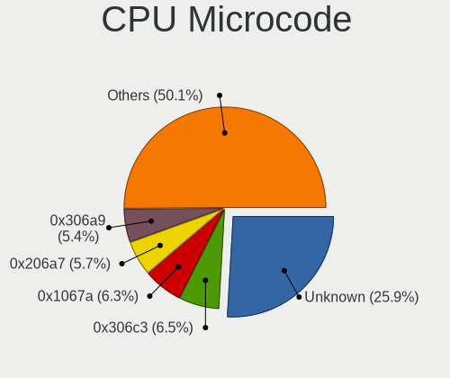

| Number     | Desktops | Percent |
|------------|----------|---------|
| Unknown    | 429      | 22.78%  |
| 0x306c3    | 128      | 6.8%    |
| 0x1067a    | 126      | 6.69%   |
| 0x206a7    | 113      | 6%      |
| 0x306a9    | 106      | 5.63%   |
| 0x506e3    | 54       | 2.87%   |
| 0x010000c8 | 51       | 2.71%   |
| 0x06000852 | 41       | 2.18%   |
| 0x6fd      | 36       | 1.91%   |
| 0x08701021 | 36       | 1.91%   |
| 0x0800820d | 33       | 1.75%   |
| 0x10676    | 32       | 1.7%    |
| 0x6fb      | 31       | 1.65%   |
| 0x906e9    | 28       | 1.49%   |
| 0x906ea    | 26       | 1.38%   |
| 0x106e5    | 26       | 1.38%   |
| 0xa0653    | 21       | 1.12%   |
| 0x6f6      | 20       | 1.06%   |
| 0x08108109 | 20       | 1.06%   |
| 0xf43      | 18       | 0.96%   |
| 0x06001119 | 17       | 0.9%    |
| 0x206d7    | 14       | 0.74%   |
| 0x106a5    | 14       | 0.74%   |
| 0x08701013 | 14       | 0.74%   |
| 0x010000db | 14       | 0.74%   |
| 0x20655    | 13       | 0.69%   |
| 0x03000027 | 13       | 0.69%   |
| 0x306e4    | 12       | 0.64%   |
| 0x10677    | 12       | 0.64%   |
| 0x010000dc | 12       | 0.64%   |
| 0xf64      | 11       | 0.58%   |
| 0x306f2    | 11       | 0.58%   |
| 0x30679    | 11       | 0.58%   |
| 0xf65      | 10       | 0.53%   |
| 0xf49      | 10       | 0.53%   |
| 0x906ed    | 10       | 0.53%   |
| 0x0700010f | 10       | 0.53%   |
| 0x0600063e | 10       | 0.53%   |
| 0x010000c7 | 10       | 0.53%   |
| 0xf41      | 9        | 0.48%   |

CPU Microarch
-------------

Microarchitecture

| Name             | Desktops | Percent |
|------------------|----------|---------|
| Haswell          | 189      | 10.4%   |
| Penryn           | 188      | 10.35%  |
| SandyBridge      | 151      | 8.31%   |
| IvyBridge        | 138      | 7.59%   |
| K10              | 115      | 6.33%   |
| Core             | 114      | 6.27%   |
| KabyLake         | 98       | 5.39%   |
| NetBurst         | 84       | 4.62%   |
| Zen 2            | 77       | 4.24%   |
| K8 Hammer        | 75       | 4.13%   |
| Piledriver       | 66       | 3.63%   |
| Skylake          | 65       | 3.58%   |
| Zen+             | 59       | 3.25%   |
| Nehalem          | 48       | 2.64%   |
| Zen 3            | 44       | 2.42%   |
| Zen              | 42       | 2.31%   |
| Silvermont       | 42       | 2.31%   |
| Westmere         | 34       | 1.87%   |
| CometLake        | 31       | 1.71%   |
| Unknown          | 28       | 1.54%   |
| Bonnell          | 20       | 1.1%    |
| K10 Llano        | 15       | 0.83%   |
| Excavator        | 13       | 0.72%   |
| Alderlake Hybrid | 12       | 0.66%   |
| Jaguar           | 11       | 0.61%   |
| Bulldozer        | 11       | 0.61%   |
| Steamroller      | 10       | 0.55%   |
| Goldmont         | 8        | 0.44%   |
| Bobcat           | 8        | 0.44%   |
| Broadwell        | 7        | 0.39%   |
| K6               | 4        | 0.22%   |
| Icelake          | 4        | 0.22%   |
| Puma             | 2        | 0.11%   |
| Goldmont plus    | 2        | 0.11%   |
| Tremont          | 1        | 0.06%   |
| TigerLake        | 1        | 0.06%   |

Graphics
--------

GPU Vendor
----------

Vendors of graphics cards

| Vendor                           | Desktops | Percent |
|----------------------------------|----------|---------|
| Nvidia                           | 716      | 37.18%  |
| Intel                            | 676      | 35.1%   |
| AMD                              | 519      | 26.95%  |
| VIA Technologies                 | 6        | 0.31%   |
| Silicon Integrated Systems [SiS] | 6        | 0.31%   |
| Matrox Electronics Systems       | 2        | 0.1%    |
| Alliance Semiconductor           | 1        | 0.05%   |

GPU Model
---------

Graphics card models

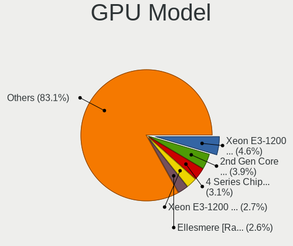

| Model                                                                                    | Desktops | Percent |
|------------------------------------------------------------------------------------------|----------|---------|
| Intel Xeon E3-1200 v3/4th Gen Core Processor Integrated Graphics Controller              | 95       | 4.7%    |
| Intel 2nd Generation Core Processor Family Integrated Graphics Controller                | 81       | 4%      |
| Intel 4 Series Chipset Integrated Graphics Controller                                    | 66       | 3.26%   |
| Intel Xeon E3-1200 v2/3rd Gen Core processor Graphics Controller                         | 55       | 2.72%   |
| AMD Ellesmere [Radeon RX 470/480/570/570X/580/580X/590]                                  | 55       | 2.72%   |
| Nvidia GK208B [GeForce GT 710]                                                           | 51       | 2.52%   |
| Intel 82G33/G31 Express Integrated Graphics Controller                                   | 44       | 2.17%   |
| Nvidia GP107 [GeForce GTX 1050 Ti]                                                       | 38       | 1.88%   |
| Nvidia GT218 [GeForce 210]                                                               | 33       | 1.63%   |
| Intel HD Graphics 530                                                                    | 33       | 1.63%   |
| Intel CoffeeLake-S GT2 [UHD Graphics 630]                                                | 28       | 1.38%   |
| Intel Atom Processor Z36xxx/Z37xxx Series Graphics & Display                             | 25       | 1.24%   |
| Intel 82945G/GZ Integrated Graphics Controller                                           | 25       | 1.24%   |
| Intel CometLake-S GT2 [UHD Graphics 630]                                                 | 24       | 1.19%   |
| Intel 4th Generation Core Processor Family Integrated Graphics Controller                | 24       | 1.19%   |
| AMD Cedar [Radeon HD 5000/6000/7350/8350 Series]                                         | 24       | 1.19%   |
| Nvidia C61 [GeForce 6150SE nForce 430]                                                   | 20       | 0.99%   |
| Nvidia GP108 [GeForce GT 1030]                                                           | 19       | 0.94%   |
| AMD Caicos [Radeon HD 6450/7450/8450 / R5 230 OEM]                                       | 19       | 0.94%   |
| Nvidia GM107 [GeForce GTX 750 Ti]                                                        | 18       | 0.89%   |
| Intel IvyBridge GT2 [HD Graphics 4000]                                                   | 18       | 0.89%   |
| AMD Raven Ridge [Radeon Vega Series / Radeon Vega Mobile Series]                         | 18       | 0.89%   |
| AMD Picasso/Raven 2 [Radeon Vega Series / Radeon Vega Mobile Series]                     | 18       | 0.89%   |
| Intel Atom/Celeron/Pentium Processor x5-E8000/J3xxx/N3xxx Integrated Graphics Controller | 17       | 0.84%   |
| Nvidia GP106 [GeForce GTX 1060 6GB]                                                      | 16       | 0.79%   |
| Nvidia GP104 [GeForce GTX 1070]                                                          | 16       | 0.79%   |
| Nvidia GF119 [GeForce GT 610]                                                            | 16       | 0.79%   |
| Intel 82Q35 Express Integrated Graphics Controller                                       | 16       | 0.79%   |
| Nvidia GF108 [GeForce GT 730]                                                            | 15       | 0.74%   |
| Intel HD Graphics 630                                                                    | 15       | 0.74%   |
| Nvidia GK208B [GeForce GT 730]                                                           | 14       | 0.69%   |
| Nvidia GM204 [GeForce GTX 970]                                                           | 12       | 0.59%   |
| Nvidia GF108 [GeForce GT 630]                                                            | 12       | 0.59%   |
| AMD Cezanne [Radeon Vega Series / Radeon Vega Mobile Series]                             | 12       | 0.59%   |
| Nvidia GM206 [GeForce GTX 960]                                                           | 11       | 0.54%   |
| Nvidia C61 [GeForce 7025 / nForce 630a]                                                  | 11       | 0.54%   |
| AMD RS780L [Radeon 3000]                                                                 | 11       | 0.54%   |
| Nvidia GK107 [GeForce GTX 650]                                                           | 10       | 0.49%   |
| Nvidia GF116 [GeForce GTX 550 Ti]                                                        | 10       | 0.49%   |
| Nvidia G96C [GeForce 9500 GT]                                                            | 10       | 0.49%   |

GPU Combo
---------

Combinations of graphics cards

| Name                                 | Desktops | Percent |
|--------------------------------------|----------|---------|
| 1 x Nvidia                           | 665      | 36.24%  |
| 1 x Intel                            | 600      | 32.7%   |
| 1 x AMD                              | 440      | 23.98%  |
| 2 x AMD                              | 49       | 2.67%   |
| Intel + Nvidia                       | 27       | 1.47%   |
| Intel + AMD                          | 13       | 0.71%   |
| AMD + Nvidia                         | 11       | 0.6%    |
| 2 x Nvidia                           | 6        | 0.33%   |
| 1 x VIA                              | 6        | 0.33%   |
| 1 x SiS                              | 6        | 0.33%   |
| Other                                | 3        | 0.16%   |
| 2 x AMD + 1 x Nvidia                 | 2        | 0.11%   |
| 1 x Matrox                           | 2        | 0.11%   |
| 3 x AMD                              | 1        | 0.05%   |
| 2 x Intel                            | 1        | 0.05%   |
| 2 x AMD + 1 x Alliance Semiconductor | 1        | 0.05%   |
| Intel + 2 x AMD                      | 1        | 0.05%   |
| Intel + AMD + 1 x Nvidia             | 1        | 0.05%   |

GPU Driver
----------

Free vs proprietary

| Driver      | Desktops | Percent |
|-------------|----------|---------|
| Free        | 1328     | 72.41%  |
| Proprietary | 429      | 23.39%  |
| Unknown     | 77       | 4.2%    |

GPU Memory
----------

Total video memory

| Size in GB | Desktops | Percent |
|------------|----------|---------|
| Unknown    | 757      | 40.44%  |
| 0.01-0.5   | 340      | 18.16%  |
| 1.01-2.0   | 255      | 13.62%  |
| 0.51-1.0   | 246      | 13.14%  |
| 3.01-4.0   | 120      | 6.41%   |
| 7.01-8.0   | 80       | 4.27%   |
| 5.01-6.0   | 35       | 1.87%   |
| 8.01-16.0  | 24       | 1.28%   |
| 2.01-3.0   | 13       | 0.69%   |
| 4.01-5.0   | 2        | 0.11%   |

Monitor
-------

Monitor Vendor
--------------

Monitor vendors

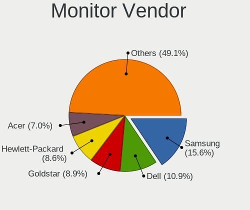

| Vendor                  | Desktops | Percent |
|-------------------------|----------|---------|
| Samsung Electronics     | 296      | 15.76%  |
| Dell                    | 199      | 10.6%   |
| Goldstar                | 168      | 8.95%   |
| Hewlett-Packard         | 157      | 8.36%   |
| Acer                    | 131      | 6.98%   |
| AOC                     | 112      | 5.96%   |
| Philips                 | 95       | 5.06%   |
| Ancor Communications    | 76       | 4.05%   |
| BenQ                    | 64       | 3.41%   |
| ViewSonic               | 44       | 2.34%   |
| LG Electronics          | 38       | 2.02%   |
| Unknown                 | 37       | 1.97%   |
| Iiyama                  | 34       | 1.81%   |
| Sony                    | 27       | 1.44%   |
| Fujitsu Siemens         | 26       | 1.38%   |
| NEC Computers           | 24       | 1.28%   |
| Lenovo                  | 22       | 1.17%   |
| HannStar                | 18       | 0.96%   |
| ASUSTek Computer        | 16       | 0.85%   |
| Panasonic               | 15       | 0.8%    |
| Eizo                    | 15       | 0.8%    |
| PKB                     | 11       | 0.59%   |
| Packard Bell            | 11       | 0.59%   |
| Medion                  | 11       | 0.59%   |
| Vestel Elektronik       | 9        | 0.48%   |
| Vizio                   | 8        | 0.43%   |
| Idek Iiyama             | 6        | 0.32%   |
| Gateway                 | 6        | 0.32%   |
| Sharp                   | 5        | 0.27%   |
| Sceptre Tech            | 5        | 0.27%   |
| Lenovo Group Limited    | 5        | 0.27%   |
| Hitachi                 | 5        | 0.27%   |
| Haier                   | 5        | 0.27%   |
| ___                     | 4        | 0.21%   |
| RTK                     | 4        | 0.21%   |
| Mitsubishi              | 4        | 0.21%   |
| IBM                     | 4        | 0.21%   |
| DENON                   | 4        | 0.21%   |
| Chi Mei Optoelectronics | 4        | 0.21%   |
| Belinea                 | 4        | 0.21%   |

Monitor Model
-------------

Monitor models

| Model                                                                | Desktops | Percent |
|----------------------------------------------------------------------|----------|---------|
| AOC 24B2W1 AOC2402 1920x1080 527x296mm 23.8-inch                     | 17       | 0.84%   |
| Goldstar W1943 GSM4BAD 1360x768 406x229mm 18.4-inch                  | 10       | 0.5%    |
| Vestel Elektronik 22W_LCD_TV VES3700 1920x540                        | 9        | 0.45%   |
| PKB LCD Monitor Viseo223DX 1920x1080                                 | 9        | 0.45%   |
| Panasonic TV MEIA296 1920x1080 698x392mm 31.5-inch                   | 9        | 0.45%   |
| Ancor Communications ASUS VS197 ACI19F2 1366x768 410x230mm 18.5-inch | 9        | 0.45%   |
| Packard Bell Viseo223DX PKB0385 1920x1080 477x268mm 21.5-inch        | 8        | 0.4%    |
| Goldstar ULTRAWIDE GSM59F1 2560x1080 673x284mm 28.8-inch             | 7        | 0.35%   |
| Unknown LCD Monitor SAMSUNG 1920x1080                                | 6        | 0.3%    |
| Samsung Electronics LCD Monitor SyncMaster 1280x1024                 | 6        | 0.3%    |
| Philips PHL 243V5 PHLC0D1 1920x1080 521x293mm 23.5-inch              | 6        | 0.3%    |
| Goldstar W1942 GSM4B6F 1440x900 408x255mm 18.9-inch                  | 6        | 0.3%    |
| Goldstar HD GSM5ACB 1366x768 410x230mm 18.5-inch                     | 6        | 0.3%    |
| Dell E176FP DELA014 1280x1024 338x270mm 17.0-inch                    | 6        | 0.3%    |
| AOC 1950W AOC1950 1366x768 410x230mm 18.5-inch                       | 6        | 0.3%    |
| Samsung Electronics U28E590 SAM0C4D 3840x2160 607x345mm 27.5-inch    | 5        | 0.25%   |
| Samsung Electronics SyncMaster SAM03C2 1680x1050 459x296mm 21.5-inch | 5        | 0.25%   |
| Samsung Electronics S22F350 SAM0D1A 1920x1080 477x268mm 21.5-inch    | 5        | 0.25%   |
| Philips PHL 223V5 PHLC0CF 1920x1080 477x268mm 21.5-inch              | 5        | 0.25%   |
| LG Electronics LCD Monitor LG TV 1920x1080                           | 5        | 0.25%   |
| Unknown LCD Monitor FFFF 2288x1287 2550x2550mm 142.0-inch            | 4        | 0.2%    |
| Samsung Electronics S24F350 SAM0D20 1920x1080 521x293mm 23.5-inch    | 4        | 0.2%    |
| Samsung Electronics S24D330 SAM0D92 1920x1080 531x299mm 24.0-inch    | 4        | 0.2%    |
| Samsung Electronics LCD Monitor SyncMaster 1920x1080                 | 4        | 0.2%    |
| Samsung Electronics C27F390 SAM0D32 1920x1080 598x336mm 27.0-inch    | 4        | 0.2%    |
| Philips PHL 193V5 PHLC0CD 1366x768 410x230mm 18.5-inch               | 4        | 0.2%    |
| Philips 196VL PHLC07F 1366x768 409x230mm 18.5-inch                   | 4        | 0.2%    |
| Philips 170S PHL0839 1280x1024 338x270mm 17.0-inch                   | 4        | 0.2%    |
| Iiyama PL2278H IVM5624 1920x1080 477x268mm 21.5-inch                 | 4        | 0.2%    |
| Hewlett-Packard P19A HWP3087 1280x1024 338x270mm 17.0-inch           | 4        | 0.2%    |
| Goldstar ULTRAWIDE GSM76E4 3440x1440 800x335mm 34.1-inch             | 4        | 0.2%    |
| Goldstar FULL HD GSM5B55 1920x1080 480x270mm 21.7-inch               | 4        | 0.2%    |
| Dell U2718Q DELA0EC 3840x2160 609x349mm 27.6-inch                    | 4        | 0.2%    |
| Dell U2412M DELA07A 1920x1200 518x324mm 24.1-inch                    | 4        | 0.2%    |
| Dell SE198WFP DELF003 1440x900 408x255mm 18.9-inch                   | 4        | 0.2%    |
| Dell S199WFP DELF00A 1440x900 408x255mm 18.9-inch                    | 4        | 0.2%    |
| Dell 1908FP DEL4026 1280x1024 376x301mm 19.0-inch                    | 4        | 0.2%    |
| BenQ GL2460 BNQ78CE 1920x1080 531x299mm 24.0-inch                    | 4        | 0.2%    |
| BenQ GL2450H BNQ78A7 1920x1080 531x298mm 24.0-inch                   | 4        | 0.2%    |
| AOC 2270W AOC2270 1920x1080 477x268mm 21.5-inch                      | 4        | 0.2%    |

Monitor Resolution
------------------

Monitor screen resolution

| Resolution         | Desktops | Percent |
|--------------------|----------|---------|
| 1920x1080 (FHD)    | 720      | 38.77%  |
| 1280x1024 (SXGA)   | 213      | 11.47%  |
| 1680x1050 (WSXGA+) | 120      | 6.46%   |
| 3840x2160 (4K)     | 109      | 5.87%   |
| 1366x768 (WXGA)    | 109      | 5.87%   |
| 1440x900 (WXGA+)   | 103      | 5.55%   |
| 2560x1440 (QHD)    | 90       | 4.85%   |
| 1600x900 (HD+)     | 60       | 3.23%   |
| 1920x1200 (WUXGA)  | 59       | 3.18%   |
| Unknown            | 56       | 3.02%   |
| 1360x768           | 39       | 2.1%    |
| 1024x768 (XGA)     | 31       | 1.67%   |
| 3840x1080          | 20       | 1.08%   |
| 3440x1440          | 15       | 0.81%   |
| 2560x1080          | 15       | 0.81%   |
| 1600x1200          | 13       | 0.7%    |
| 1920x540           | 10       | 0.54%   |
| 1280x720 (HD)      | 9        | 0.48%   |
| 3200x1080          | 6        | 0.32%   |
| 2288x1287          | 6        | 0.32%   |
| 2560x1600          | 5        | 0.27%   |
| 5120x1440          | 4        | 0.22%   |
| 2048x1152          | 4        | 0.22%   |
| 3840x1200          | 3        | 0.16%   |
| 4480x1440          | 2        | 0.11%   |
| 3840x1600          | 2        | 0.11%   |
| 3286x1080          | 2        | 0.11%   |
| 3200x900           | 2        | 0.11%   |
| 2960x1050          | 2        | 0.11%   |
| 2048x1536          | 2        | 0.11%   |
| 1280x960           | 2        | 0.11%   |
| 1280x800 (WXGA)    | 2        | 0.11%   |
| 800x600            | 1        | 0.05%   |
| 7680x2164          | 1        | 0.05%   |
| 7680x1080          | 1        | 0.05%   |
| 7360x1200          | 1        | 0.05%   |
| 6400x1440          | 1        | 0.05%   |
| 5760x2160          | 1        | 0.05%   |
| 5760x1200          | 1        | 0.05%   |
| 5760x1080          | 1        | 0.05%   |

Monitor Diagonal
----------------

Diagonal size in inches

| Inches  | Desktops | Percent |
|---------|----------|---------|
| Unknown | 255      | 13.69%  |
| 24      | 205      | 11%     |
| 21      | 188      | 10.09%  |
| 23      | 187      | 10.04%  |
| 19      | 178      | 9.55%   |
| 27      | 137      | 7.35%   |
| 18      | 119      | 6.39%   |
| 17      | 117      | 6.28%   |
| 20      | 86       | 4.62%   |
| 22      | 72       | 3.86%   |
| 31      | 64       | 3.44%   |
| 15      | 43       | 2.31%   |
| 84      | 26       | 1.4%    |
| 34      | 23       | 1.23%   |
| 72      | 18       | 0.97%   |
| 40      | 16       | 0.86%   |
| 32      | 16       | 0.86%   |
| 28      | 12       | 0.64%   |
| 25      | 11       | 0.59%   |
| 54      | 10       | 0.54%   |
| 26      | 9        | 0.48%   |
| 52      | 7        | 0.38%   |
| 14      | 7        | 0.38%   |
| 37      | 6        | 0.32%   |
| 46      | 5        | 0.27%   |
| 12      | 5        | 0.27%   |
| 142     | 4        | 0.21%   |
| 48      | 4        | 0.21%   |
| 29      | 4        | 0.21%   |
| 49      | 3        | 0.16%   |
| 16      | 3        | 0.16%   |
| 13      | 3        | 0.16%   |
| 65      | 2        | 0.11%   |
| 60      | 2        | 0.11%   |
| 42      | 2        | 0.11%   |
| 39      | 2        | 0.11%   |
| 10      | 2        | 0.11%   |
| 69      | 1        | 0.05%   |
| 63      | 1        | 0.05%   |
| 57      | 1        | 0.05%   |

Monitor Width
-------------

Physical width

| Width in mm    | Desktops | Percent |
|----------------|----------|---------|
| 401-500        | 537      | 29.39%  |
| 501-600        | 504      | 27.59%  |
| Unknown        | 255      | 13.96%  |
| 301-350        | 162      | 8.87%   |
| 351-400        | 103      | 5.64%   |
| 601-700        | 97       | 5.31%   |
| 1501-2000      | 45       | 2.46%   |
| 701-800        | 41       | 2.24%   |
| 1001-1500      | 33       | 1.81%   |
| 801-900        | 24       | 1.31%   |
| 201-300        | 17       | 0.93%   |
| More than 2000 | 4        | 0.22%   |
| 901-1000       | 4        | 0.22%   |
| 101-200        | 1        | 0.05%   |

Aspect Ratio
------------

Proportional relationship between the width and the height

| Ratio   | Desktops | Percent |
|---------|----------|---------|
| 16/9    | 947      | 53.65%  |
| 16/10   | 265      | 15.01%  |
| Unknown | 238      | 13.48%  |
| 5/4     | 201      | 11.39%  |
| 4/3     | 56       | 3.17%   |
| 21/9    | 29       | 1.64%   |
| 3/2     | 10       | 0.57%   |
| 6/5     | 9        | 0.51%   |
| 1.00    | 5        | 0.28%   |
| 32/9    | 3        | 0.17%   |
| 1.96    | 1        | 0.06%   |
| 0.75    | 1        | 0.06%   |

Monitor Area
------------

Area in inch

| Area in inch | Desktops | Percent |
|----------------|----------|---------|
| 201-250        | 518      | 28.17%  |
| 151-200        | 324      | 17.62%  |
| Unknown        | 255      | 13.87%  |
| 141-150        | 207      | 11.26%  |
| 301-350        | 140      | 7.61%   |
| 351-500        | 115      | 6.25%   |
| 251-300        | 101      | 5.49%   |
| More than 1000 | 75       | 4.08%   |
| 101-110        | 45       | 2.45%   |
| 501-1000       | 36       | 1.96%   |
| 71-80          | 5        | 0.27%   |
| 131-140        | 5        | 0.27%   |
| 81-90          | 3        | 0.16%   |
| 91-100         | 3        | 0.16%   |
| 51-60          | 2        | 0.11%   |
| 61-70          | 1        | 0.05%   |
| 41-50          | 1        | 0.05%   |
| 1-40           | 1        | 0.05%   |
| 121-130        | 1        | 0.05%   |
| 111-120        | 1        | 0.05%   |

Pixel Density
-------------

Pixels per inch

| Density       | Desktops | Percent |
|---------------|----------|---------|
| 51-100        | 1096     | 62.59%  |
| 101-120       | 266      | 15.19%  |
| Unknown       | 255      | 14.56%  |
| 1-50          | 65       | 3.71%   |
| 121-160       | 60       | 3.43%   |
| 161-240       | 8        | 0.46%   |
| More than 240 | 1        | 0.06%   |

Multiple Monitors
-----------------

Total monitors connected

| Total | Desktops | Percent |
|-------|----------|---------|
| 1     | 1480     | 80.04%  |
| 2     | 253      | 13.68%  |
| 0     | 92       | 4.98%   |
| 3     | 21       | 1.14%   |
| 4     | 3        | 0.16%   |

Network
-------

Net Controller Vendor
---------------------

Controller vendors

| Vendor                           | Desktops | Percent |
|----------------------------------|----------|---------|
| Realtek Semiconductor            | 1090     | 42.41%  |
| Intel                            | 623      | 24.24%  |
| Qualcomm Atheros                 | 167      | 6.5%    |
| Nvidia                           | 90       | 3.5%    |
| Broadcom                         | 89       | 3.46%   |
| Ralink Technology                | 70       | 2.72%   |
| TP-Link                          | 42       | 1.63%   |
| Ralink                           | 38       | 1.48%   |
| Marvell Technology Group         | 34       | 1.32%   |
| VIA Technologies                 | 31       | 1.21%   |
| Qualcomm Atheros Communications  | 30       | 1.17%   |
| Broadcom Limited                 | 26       | 1.01%   |
| D-Link System                    | 24       | 0.93%   |
| NetGear                          | 22       | 0.86%   |
| MediaTek                         | 22       | 0.86%   |
| D-Link                           | 22       | 0.86%   |
| Huawei Technologies              | 12       | 0.47%   |
| Samsung Electronics              | 11       | 0.43%   |
| Belkin Components                | 10       | 0.39%   |
| ASUSTek Computer                 | 9        | 0.35%   |
| Edimax Technology                | 7        | 0.27%   |
| Aquantia                         | 7        | 0.27%   |
| ASIX Electronics                 | 6        | 0.23%   |
| Xiaomi                           | 5        | 0.19%   |
| Microsoft                        | 5        | 0.19%   |
| Linksys                          | 5        | 0.19%   |
| Silicon Integrated Systems [SiS] | 4        | 0.16%   |
| IMC Networks                     | 4        | 0.16%   |
| HTC (High Tech Computer)         | 4        | 0.16%   |
| DisplayLink                      | 4        | 0.16%   |
| Sitecom Europe                   | 3        | 0.12%   |
| Qualcomm                         | 3        | 0.12%   |
| AVM                              | 3        | 0.12%   |
| 3Com                             | 3        | 0.12%   |
| ZTE WCDMA Technologies MSM       | 2        | 0.08%   |
| TRENDnet                         | 2        | 0.08%   |
| Motorola                         | 2        | 0.08%   |
| Mellanox Technologies            | 2        | 0.08%   |
| LG Electronics                   | 2        | 0.08%   |
| JMicron Technology               | 2        | 0.08%   |

Net Controller Model
--------------------

Controller models

| Model                                                                  | Desktops | Percent |
|------------------------------------------------------------------------|----------|---------|
| Realtek RTL8111/8168/8211/8411 PCI Express Gigabit Ethernet Controller | 823      | 29.31%  |
| Intel 82579LM Gigabit Network Connection (Lewisville)                  | 91       | 3.24%   |
| Realtek RTL810xE PCI Express Fast Ethernet controller                  | 61       | 2.17%   |
| Nvidia MCP61 Ethernet                                                  | 58       | 2.07%   |
| Intel I211 Gigabit Network Connection                                  | 55       | 1.96%   |
| Realtek RTL8125 2.5GbE Controller                                      | 53       | 1.89%   |
| Intel Ethernet Connection I217-LM                                      | 46       | 1.64%   |
| Intel Wi-Fi 6 AX200                                                    | 44       | 1.57%   |
| Realtek RTL-8100/8101L/8139 PCI Fast Ethernet Adapter                  | 40       | 1.42%   |
| Intel Ethernet Connection (2) I219-V                                   | 40       | 1.42%   |
| Intel 82567LM-3 Gigabit Network Connection                             | 38       | 1.35%   |
| Ralink MT7601U Wireless Adapter                                        | 37       | 1.32%   |
| Intel 82579V Gigabit Network Connection                                | 35       | 1.25%   |
| Realtek RTL8188EUS 802.11n Wireless Network Adapter                    | 32       | 1.14%   |
| Qualcomm Atheros AR9271 802.11n                                        | 27       | 0.96%   |
| Intel 82566DM-2 Gigabit Network Connection                             | 27       | 0.96%   |
| VIA VT6102/VT6103 [Rhine-II]                                           | 23       | 0.82%   |
| Intel Ethernet Connection I217-V                                       | 21       | 0.75%   |
| Realtek RTL8192CU 802.11n WLAN Adapter                                 | 20       | 0.71%   |
| Intel Ethernet Connection (7) I219-V                                   | 19       | 0.68%   |
| Intel 82574L Gigabit Network Connection                                | 19       | 0.68%   |
| Intel Ethernet Controller I225-V                                       | 18       | 0.64%   |
| Realtek RTL8188CUS 802.11n WLAN Adapter                                | 17       | 0.61%   |
| Intel Dual Band Wireless-AC 3168NGW [Stone Peak]                       | 17       | 0.61%   |
| Realtek RTL88x2bu [AC1200 Techkey]                                     | 16       | 0.57%   |
| Qualcomm Atheros Attansic L1 Gigabit Ethernet                          | 15       | 0.53%   |
| Qualcomm Atheros AR9485 Wireless Network Adapter                       | 15       | 0.53%   |
| Marvell Group 88E8056 PCI-E Gigabit Ethernet Controller                | 15       | 0.53%   |
| Realtek RTL8153 Gigabit Ethernet Adapter                               | 14       | 0.5%    |
| Qualcomm Atheros AR8151 v2.0 Gigabit Ethernet                          | 14       | 0.5%    |
| Intel Ethernet Connection (2) I219-LM                                  | 14       | 0.5%    |
| Intel Wi-Fi 6E(802.11ax) AX210/AX1675* 2x2 [Typhoon Peak]              | 13       | 0.46%   |
| Qualcomm Atheros AR9287 Wireless Network Adapter (PCI-Express)         | 12       | 0.43%   |
| Qualcomm Atheros AR9227 Wireless Network Adapter                       | 12       | 0.43%   |
| Qualcomm Atheros AR8121/AR8113/AR8114 Gigabit or Fast Ethernet         | 12       | 0.43%   |
| Intel Ethernet Connection (2) I218-V                                   | 12       | 0.43%   |
| TP-Link TL-WN722N v2/v3 [Realtek RTL8188EUS]                           | 11       | 0.39%   |
| Realtek RTL8169 PCI Gigabit Ethernet Controller                        | 11       | 0.39%   |
| Realtek RTL-8110SC/8169SC Gigabit Ethernet                             | 11       | 0.39%   |
| Realtek 802.11ac NIC                                                   | 11       | 0.39%   |

Wireless Vendor
---------------

Wireless vendors

| Vendor                                | Desktops | Percent |
|---------------------------------------|----------|---------|
| Realtek Semiconductor                 | 195      | 25%     |
| Intel                                 | 142      | 18.21%  |
| Qualcomm Atheros                      | 97       | 12.44%  |
| Ralink Technology                     | 70       | 8.97%   |
| TP-Link                               | 42       | 5.38%   |
| Ralink                                | 38       | 4.87%   |
| Qualcomm Atheros Communications       | 30       | 3.85%   |
| Broadcom                              | 28       | 3.59%   |
| NetGear                               | 22       | 2.82%   |
| D-Link                                | 21       | 2.69%   |
| MediaTek                              | 15       | 1.92%   |
| D-Link System                         | 15       | 1.92%   |
| Belkin Components                     | 10       | 1.28%   |
| ASUSTek Computer                      | 9        | 1.15%   |
| Edimax Technology                     | 7        | 0.9%    |
| Microsoft                             | 5        | 0.64%   |
| Broadcom Limited                      | 5        | 0.64%   |
| Linksys                               | 4        | 0.51%   |
| IMC Networks                          | 4        | 0.51%   |
| Sitecom Europe                        | 3        | 0.38%   |
| Marvell Technology Group              | 3        | 0.38%   |
| AVM                                   | 3        | 0.38%   |
| TRENDnet                              | 2        | 0.26%   |
| Gemtek                                | 2        | 0.26%   |
| ZyXEL Communications                  | 1        | 0.13%   |
| ZyDAS                                 | 1        | 0.13%   |
| Xiaomi                                | 1        | 0.13%   |
| Philips (or NXP)                      | 1        | 0.13%   |
| Dell                                  | 1        | 0.13%   |
| AboCom Systems                        | 1        | 0.13%   |
| 802.11g Adapter [Linksys WUSB54GC v3] | 1        | 0.13%   |
| 3Com                                  | 1        | 0.13%   |

Wireless Model
--------------

Wireless models

| Model                                                          | Desktops | Percent |
|----------------------------------------------------------------|----------|---------|
| Intel Wi-Fi 6 AX200                                            | 44       | 5.6%    |
| Ralink MT7601U Wireless Adapter                                | 37       | 4.71%   |
| Realtek RTL8188EUS 802.11n Wireless Network Adapter            | 32       | 4.07%   |
| Qualcomm Atheros AR9271 802.11n                                | 27       | 3.44%   |
| Realtek RTL8192CU 802.11n WLAN Adapter                         | 20       | 2.54%   |
| Realtek RTL8188CUS 802.11n WLAN Adapter                        | 17       | 2.16%   |
| Intel Dual Band Wireless-AC 3168NGW [Stone Peak]               | 17       | 2.16%   |
| Realtek RTL88x2bu [AC1200 Techkey]                             | 16       | 2.04%   |
| Qualcomm Atheros AR9485 Wireless Network Adapter               | 15       | 1.91%   |
| Intel Wi-Fi 6E(802.11ax) AX210/AX1675* 2x2 [Typhoon Peak]      | 13       | 1.65%   |
| Qualcomm Atheros AR9287 Wireless Network Adapter (PCI-Express) | 12       | 1.53%   |
| Qualcomm Atheros AR9227 Wireless Network Adapter               | 12       | 1.53%   |
| TP-Link TL-WN722N v2/v3 [Realtek RTL8188EUS]                   | 11       | 1.4%    |
| Realtek 802.11ac NIC                                           | 11       | 1.4%    |
| Ralink RT2870/RT3070 Wireless Adapter                          | 11       | 1.4%    |
| Realtek RTL8188FTV 802.11b/g/n 1T1R 2.4G WLAN Adapter          | 10       | 1.27%   |
| Qualcomm Atheros AR9462 Wireless Network Adapter               | 10       | 1.27%   |
| Intel Wireless 7260                                            | 10       | 1.27%   |
| TP-Link TL-WN823N v2/v3 [Realtek RTL8192EU]                    | 9        | 1.15%   |
| Realtek RTL8821CE 802.11ac PCIe Wireless Network Adapter       | 9        | 1.15%   |
| Qualcomm Atheros AR93xx Wireless Network Adapter               | 9        | 1.15%   |
| Realtek RTL8821AE 802.11ac PCIe Wireless Network Adapter       | 8        | 1.02%   |
| Realtek RTL8192EU 802.11b/g/n WLAN Adapter                     | 8        | 1.02%   |
| Qualcomm Atheros AR9285 Wireless Network Adapter (PCI-Express) | 8        | 1.02%   |
| Intel Wi-Fi 5(802.11ac) Wireless-AC 9x6x [Thunder Peak]        | 8        | 1.02%   |
| Realtek RTL8192EE PCIe Wireless Network Adapter                | 7        | 0.89%   |
| Intel Wireless 8260                                            | 7        | 0.89%   |
| Intel Wireless 3160                                            | 7        | 0.89%   |
| Broadcom BCM4360 802.11ac Dual Band Wireless Network Adapter   | 7        | 0.89%   |
| Broadcom BCM4352 802.11ac Dual Band Wireless Network Adapter   | 7        | 0.89%   |
| Realtek RTL8812AE 802.11ac PCIe Wireless Network Adapter       | 6        | 0.76%   |
| Realtek RTL8187 Wireless Adapter                               | 6        | 0.76%   |
| Ralink RT5390 Wireless 802.11n 1T/1R PCIe                      | 6        | 0.76%   |
| Ralink RT2790 Wireless 802.11n 1T/2R PCIe                      | 6        | 0.76%   |
| Ralink RT2561/RT61 802.11g PCI                                 | 6        | 0.76%   |
| Qualcomm Atheros AR5212/5213/2414 Wireless Network Adapter     | 6        | 0.76%   |
| NetGear A6210                                                  | 6        | 0.76%   |
| Intel Wireless 7265                                            | 6        | 0.76%   |
| TP-Link TL-WN821N v5/v6 [RTL8192EU]                            | 5        | 0.64%   |
| Realtek RTL8188EE Wireless Network Adapter                     | 5        | 0.64%   |

Ethernet Vendor
---------------

Ethernet vendors

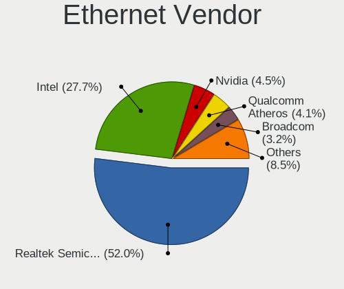

| Vendor                           | Desktops | Percent |
|----------------------------------|----------|---------|
| Realtek Semiconductor            | 999      | 51.36%  |
| Intel                            | 541      | 27.81%  |
| Nvidia                           | 90       | 4.63%   |
| Qualcomm Atheros                 | 82       | 4.22%   |
| Broadcom                         | 62       | 3.19%   |
| VIA Technologies                 | 31       | 1.59%   |
| Marvell Technology Group         | 31       | 1.59%   |
| Broadcom Limited                 | 21       | 1.08%   |
| Samsung Electronics              | 11       | 0.57%   |
| D-Link System                    | 9        | 0.46%   |
| Huawei Technologies              | 8        | 0.41%   |
| MediaTek                         | 7        | 0.36%   |
| Aquantia                         | 7        | 0.36%   |
| ASIX Electronics                 | 6        | 0.31%   |
| Xiaomi                           | 4        | 0.21%   |
| Silicon Integrated Systems [SiS] | 4        | 0.21%   |
| HTC (High Tech Computer)         | 4        | 0.21%   |
| DisplayLink                      | 4        | 0.21%   |
| Qualcomm                         | 3        | 0.15%   |
| ZTE WCDMA Technologies MSM       | 2        | 0.1%    |
| LG Electronics                   | 2        | 0.1%    |
| JMicron Technology               | 2        | 0.1%    |
| Accton Technology                | 2        | 0.1%    |
| 3Com                             | 2        | 0.1%    |
| T & A Mobile Phones              | 1        | 0.05%   |
| OPPO Electronics                 | 1        | 0.05%   |
| National Semiconductor           | 1        | 0.05%   |
| Mellanox Technologies            | 1        | 0.05%   |
| Linksys                          | 1        | 0.05%   |
| Lenovo                           | 1        | 0.05%   |
| ICS Advent                       | 1        | 0.05%   |
| Hangzhou Silan Microelectronics  | 1        | 0.05%   |
| D-Link                           | 1        | 0.05%   |
| Apple                            | 1        | 0.05%   |
| ADMtek                           | 1        | 0.05%   |

Ethernet Model
--------------

Ethernet models

| Model                                                                  | Desktops | Percent |
|------------------------------------------------------------------------|----------|---------|
| Realtek RTL8111/8168/8211/8411 PCI Express Gigabit Ethernet Controller | 823      | 41.25%  |
| Intel 82579LM Gigabit Network Connection (Lewisville)                  | 91       | 4.56%   |
| Realtek RTL810xE PCI Express Fast Ethernet controller                  | 61       | 3.06%   |
| Nvidia MCP61 Ethernet                                                  | 58       | 2.91%   |
| Intel I211 Gigabit Network Connection                                  | 55       | 2.76%   |
| Realtek RTL8125 2.5GbE Controller                                      | 53       | 2.66%   |
| Intel Ethernet Connection I217-LM                                      | 46       | 2.31%   |
| Realtek RTL-8100/8101L/8139 PCI Fast Ethernet Adapter                  | 40       | 2.01%   |
| Intel Ethernet Connection (2) I219-V                                   | 40       | 2.01%   |
| Intel 82567LM-3 Gigabit Network Connection                             | 38       | 1.9%    |
| Intel 82579V Gigabit Network Connection                                | 35       | 1.75%   |
| Intel 82566DM-2 Gigabit Network Connection                             | 27       | 1.35%   |
| VIA VT6102/VT6103 [Rhine-II]                                           | 23       | 1.15%   |
| Intel Ethernet Connection I217-V                                       | 21       | 1.05%   |
| Intel Ethernet Connection (7) I219-V                                   | 19       | 0.95%   |
| Intel 82574L Gigabit Network Connection                                | 19       | 0.95%   |
| Intel Ethernet Controller I225-V                                       | 18       | 0.9%    |
| Qualcomm Atheros Attansic L1 Gigabit Ethernet                          | 15       | 0.75%   |
| Marvell Group 88E8056 PCI-E Gigabit Ethernet Controller                | 15       | 0.75%   |
| Realtek RTL8153 Gigabit Ethernet Adapter                               | 14       | 0.7%    |
| Qualcomm Atheros AR8151 v2.0 Gigabit Ethernet                          | 14       | 0.7%    |
| Intel Ethernet Connection (2) I219-LM                                  | 14       | 0.7%    |
| Qualcomm Atheros AR8121/AR8113/AR8114 Gigabit or Fast Ethernet         | 12       | 0.6%    |
| Intel Ethernet Connection (2) I218-V                                   | 12       | 0.6%    |
| Realtek RTL8169 PCI Gigabit Ethernet Controller                        | 11       | 0.55%   |
| Realtek RTL-8110SC/8169SC Gigabit Ethernet                             | 11       | 0.55%   |
| Qualcomm Atheros Killer E220x Gigabit Ethernet Controller              | 11       | 0.55%   |
| Nvidia MCP77 Ethernet                                                  | 9        | 0.45%   |
| Intel 82578DC Gigabit Network Connection                               | 9        | 0.45%   |
| Broadcom NetXtreme BCM5751 Gigabit Ethernet PCI Express                | 9        | 0.45%   |
| Broadcom NetXtreme BCM5754 Gigabit Ethernet PCI Express                | 8        | 0.4%    |
| VIA VT6105/VT6106S [Rhine-III]                                         | 7        | 0.35%   |
| Samsung Galaxy series, misc. (tethering mode)                          | 7        | 0.35%   |
| Intel I210 Gigabit Network Connection                                  | 7        | 0.35%   |
| Intel 82562V-2 10/100 Network Connection                               | 7        | 0.35%   |
| Broadcom NetLink BCM57780 Gigabit Ethernet PCIe                        | 7        | 0.35%   |
| Qualcomm Atheros QCA8171 Gigabit Ethernet                              | 6        | 0.3%    |
| Qualcomm Atheros AR8152 v2.0 Fast Ethernet                             | 6        | 0.3%    |
| Qualcomm Atheros AR8131 Gigabit Ethernet                               | 6        | 0.3%    |
| Nvidia MCP73 Ethernet                                                  | 6        | 0.3%    |

Net Controller Kind
-------------------

Ethernet, WiFi or modem

| Kind     | Desktops | Percent |
|----------|----------|---------|
| Ethernet | 1788     | 70.5%   |
| WiFi     | 721      | 28.43%  |
| Modem    | 21       | 0.83%   |
| Unknown  | 6        | 0.24%   |

Used Controller
---------------

Currently used network controller

| Kind     | Desktops | Percent |
|----------|----------|---------|
| Ethernet | 1409     | 74.87%  |
| WiFi     | 473      | 25.13%  |

NICs
----

Total network controllers on board

| Total | Desktops | Percent |
|-------|----------|---------|
| 1     | 1301     | 71.48%  |
| 2     | 429      | 23.57%  |
| 3     | 58       | 3.19%   |
| 0     | 21       | 1.15%   |
| 4     | 7        | 0.38%   |
| 5     | 3        | 0.16%   |
| 10    | 1        | 0.05%   |

IPv6
----

IPv6 vs IPv4

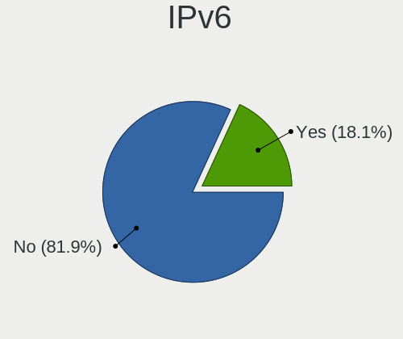

| Used | Desktops | Percent |
|------|----------|---------|
| No   | 1513     | 82.5%   |
| Yes  | 321      | 17.5%   |

Bluetooth
---------

Bluetooth Vendor
----------------

Controller vendors

| Vendor                          | Desktops | Percent |
|---------------------------------|----------|---------|
| Intel                           | 129      | 32.99%  |
| Cambridge Silicon Radio         | 101      | 25.83%  |
| Broadcom                        | 32       | 8.18%   |
| Realtek Semiconductor           | 28       | 7.16%   |
| Qualcomm Atheros Communications | 24       | 6.14%   |
| ASUSTek Computer                | 15       | 3.84%   |
| IMC Networks                    | 13       | 3.32%   |
| MediaTek                        | 11       | 2.81%   |
| Integrated System Solution      | 7        | 1.79%   |
| TP-Link                         | 5        | 1.28%   |
| Apple                           | 5        | 1.28%   |
| Lite-On Technology              | 4        | 1.02%   |
| SiW                             | 2        | 0.51%   |
| Fujitsu                         | 2        | 0.51%   |
| Edimax Technology               | 2        | 0.51%   |
| Unknown                         | 2        | 0.51%   |
| Sitecom Europe                  | 1        | 0.26%   |
| Ralink                          | 1        | 0.26%   |
| Logitech                        | 1        | 0.26%   |
| Hewlett-Packard                 | 1        | 0.26%   |
| Foxconn / Hon Hai               | 1        | 0.26%   |
| Dynex                           | 1        | 0.26%   |
| Dell                            | 1        | 0.26%   |
| Conwise Technology              | 1        | 0.26%   |
| Actions                         | 1        | 0.26%   |

Bluetooth Model
---------------

Controller models

| Model                                                     | Desktops | Percent |
|-----------------------------------------------------------|----------|---------|
| Cambridge Silicon Radio Bluetooth Dongle (HCI mode)       | 101      | 25.83%  |
| Intel AX200 Bluetooth                                     | 45       | 11.51%  |
| Intel Bluetooth wireless interface                        | 25       | 6.39%   |
| Realtek Bluetooth Radio                                   | 20       | 5.12%   |
| Broadcom BCM20702A0 Bluetooth 4.0                         | 17       | 4.35%   |
| Intel Wireless-AC 3168 Bluetooth                          | 16       | 4.09%   |
| Intel Bluetooth Device                                    | 12       | 3.07%   |
| MediaTek Wireless_Device                                  | 11       | 2.81%   |
| Qualcomm Atheros AR3011 Bluetooth                         | 10       | 2.56%   |
| Intel AX210 Bluetooth                                     | 10       | 2.56%   |
| Qualcomm Atheros  Bluetooth Device                        | 8        | 2.05%   |
| Intel Bluetooth 9460/9560 Jefferson Peak (JfP)            | 7        | 1.79%   |
| Integrated System Solution Bluetooth Device               | 7        | 1.79%   |
| IMC Networks Bluetooth Radio                              | 7        | 1.79%   |
| Intel Wireless-AC 9260 Bluetooth Adapter                  | 6        | 1.53%   |
| Intel AX201 Bluetooth                                     | 6        | 1.53%   |
| TP-Link UB500 Adapter                                     | 5        | 1.28%   |
| Realtek RTL8821A Bluetooth                                | 4        | 1.02%   |
| Realtek  Bluetooth 4.2 Adapter                            | 4        | 1.02%   |
| Lite-On Bluetooth Device                                  | 4        | 1.02%   |
| ASUS Broadcom BCM20702A0 Bluetooth                        | 4        | 1.02%   |
| ASUS ASUS USB-BT500                                       | 4        | 1.02%   |
| Apple Built-in Bluetooth 2.0+EDR HCI                      | 4        | 1.02%   |
| Qualcomm Atheros Bluetooth USB Host Controller            | 3        | 0.77%   |
| IMC Networks BCM20702A0                                   | 3        | 0.77%   |
| Broadcom BCM2045 Bluetooth                                | 3        | 0.77%   |
| Broadcom ANYCOM Blue USB-UHE 200/250                      | 3        | 0.77%   |
| SiW SiW                                                   | 2        | 0.51%   |
| Qualcomm Atheros AR9462 Bluetooth                         | 2        | 0.51%   |
| Intel AX211 Bluetooth                                     | 2        | 0.51%   |
| IMC Networks Bluetooth Device                             | 2        | 0.51%   |
| Fujitsu Bluetooth Device                                  | 2        | 0.51%   |
| Broadcom BCM20702A0                                       | 2        | 0.51%   |
| Broadcom BCM2035 Bluetooth dongle                         | 2        | 0.51%   |
| ASUS Broadcom BCM20702 Single-Chip Bluetooth 4.0 + LE     | 2        | 0.51%   |
| ASUS BCM20702A0                                           | 2        | 0.51%   |
| Unknown                                                   | 2        | 0.51%   |
| Sitecom Europe Sitecom bluetooth2.0 class 2 dongle CN-512 | 1        | 0.26%   |
| Ralink RT3290 Bluetooth                                   | 1        | 0.26%   |
| Qualcomm Atheros QCA61x4 Bluetooth 4.0                    | 1        | 0.26%   |

Sound
-----

Sound Vendor
------------

Sound card vendors

| Vendor                               | Desktops | Percent |
|--------------------------------------|----------|---------|
| Intel                                | 1167     | 41.16%  |
| Nvidia                               | 631      | 22.26%  |
| AMD                                  | 615      | 21.69%  |
| Creative Labs                        | 60       | 2.12%   |
| C-Media Electronics                  | 58       | 2.05%   |
| VIA Technologies                     | 39       | 1.38%   |
| Texas Instruments                    | 27       | 0.95%   |
| Logitech                             | 17       | 0.6%    |
| Focusrite-Novation                   | 14       | 0.49%   |
| Yamaha                               | 11       | 0.39%   |
| Creative Technology                  | 11       | 0.39%   |
| M-Audio                              | 10       | 0.35%   |
| Silicon Integrated Systems [SiS]     | 9        | 0.32%   |
| JMTek                                | 9        | 0.32%   |
| GN Netcom                            | 9        | 0.32%   |
| Generalplus Technology               | 7        | 0.25%   |
| ASUSTek Computer                     | 7        | 0.25%   |
| Micro Star International             | 6        | 0.21%   |
| BEHRINGER International              | 5        | 0.18%   |
| Tenx Technology                      | 4        | 0.14%   |
| SAVITECH                             | 4        | 0.14%   |
| Razer USA                            | 4        | 0.14%   |
| Plantronics                          | 4        | 0.14%   |
| Ensoniq                              | 4        | 0.14%   |
| DigiTech                             | 4        | 0.14%   |
| Sennheiser Communications            | 3        | 0.11%   |
| Kingston Technology                  | 3        | 0.11%   |
| EGO SYStems                          | 3        | 0.11%   |
| DSEA A/S                             | 3        | 0.11%   |
| Corsair                              | 3        | 0.11%   |
| AKAI Professional M.I.               | 3        | 0.11%   |
| XMOS                                 | 2        | 0.07%   |
| Xilinx                               | 2        | 0.07%   |
| ULi Electronics                      | 2        | 0.07%   |
| Thesycon Systemsoftware & Consulting | 2        | 0.07%   |
| TerraTec Electronic                  | 2        | 0.07%   |
| TEAC                                 | 2        | 0.07%   |
| Samson Technologies                  | 2        | 0.07%   |
| Roland                               | 2        | 0.07%   |
| RODE Microphones                     | 2        | 0.07%   |

Sound Model
-----------

Sound card models

| Model                                                                             | Desktops | Percent |
|-----------------------------------------------------------------------------------|----------|---------|
| Intel NM10/ICH7 Family High Definition Audio Controller                           | 162      | 4.98%   |
| Intel 6 Series/C200 Series Chipset Family High Definition Audio Controller        | 151      | 4.65%   |
| Intel 8 Series/C220 Series Chipset High Definition Audio Controller               | 142      | 4.37%   |
| AMD SBx00 Azalia (Intel HDA)                                                      | 134      | 4.12%   |
| Intel Xeon E3-1200 v3/4th Gen Core Processor HD Audio Controller                  | 108      | 3.32%   |
| Intel 7 Series/C216 Chipset Family High Definition Audio Controller               | 104      | 3.2%    |
| AMD Starship/Matisse HD Audio Controller                                          | 88       | 2.71%   |
| Nvidia GK208 HDMI/DP Audio Controller                                             | 76       | 2.34%   |
| AMD Family 17h/19h HD Audio Controller                                            | 71       | 2.18%   |
| AMD FCH Azalia Controller                                                         | 66       | 2.03%   |
| Intel 100 Series/C230 Series Chipset Family HD Audio Controller                   | 64       | 1.97%   |
| Intel 82801I (ICH9 Family) HD Audio Controller                                    | 63       | 1.94%   |
| Nvidia MCP61 High Definition Audio                                                | 61       | 1.88%   |
| AMD Ellesmere HDMI Audio [Radeon RX 470/480 / 570/580/590]                        | 59       | 1.82%   |
| AMD Family 17h (Models 00h-0fh) HD Audio Controller                               | 56       | 1.72%   |
| Intel 82801JI (ICH10 Family) HD Audio Controller                                  | 53       | 1.63%   |
| Intel 200 Series PCH HD Audio                                                     | 53       | 1.63%   |
| Nvidia High Definition Audio Controller                                           | 52       | 1.6%    |
| Intel 5 Series/3400 Series Chipset High Definition Audio                          | 51       | 1.57%   |
| Nvidia GF108 High Definition Audio Controller                                     | 48       | 1.48%   |
| AMD Oland/Hainan/Cape Verde/Pitcairn HDMI Audio [Radeon HD 7000 Series]           | 48       | 1.48%   |
| Nvidia GP107GL High Definition Audio Controller                                   | 43       | 1.32%   |
| Intel 82801JD/DO (ICH10 Family) HD Audio Controller                               | 41       | 1.26%   |
| AMD Raven/Raven2/Fenghuang HDMI/DP Audio Controller                               | 36       | 1.11%   |
| Intel Cannon Lake PCH cAVS                                                        | 35       | 1.08%   |
| Nvidia GM107 High Definition Audio Controller [GeForce 940MX]                     | 30       | 0.92%   |
| Nvidia GK107 HDMI Audio Controller                                                | 29       | 0.89%   |
| AMD Caicos HDMI Audio [Radeon HD 6450 / 7450/8450/8490 OEM / R5 230/235/235X OEM] | 29       | 0.89%   |
| Intel 9 Series Chipset Family HD Audio Controller                                 | 27       | 0.83%   |
| Nvidia GP104 High Definition Audio Controller                                     | 26       | 0.8%    |
| Intel C600/X79 series chipset High Definition Audio Controller                    | 26       | 0.8%    |
| AMD Renoir Radeon High Definition Audio Controller                                | 26       | 0.8%    |
| Intel Atom Processor Z36xxx/Z37xxx Series High Definition Audio Controller        | 25       | 0.77%   |
| Nvidia GP106 High Definition Audio Controller                                     | 24       | 0.74%   |
| Nvidia GF119 HDMI Audio Controller                                                | 24       | 0.74%   |
| AMD Cedar HDMI Audio [Radeon HD 5400/6300/7300 Series]                            | 24       | 0.74%   |
| AMD Baffin HDMI/DP Audio [Radeon RX 550 640SP / RX 560/560X]                      | 24       | 0.74%   |
| Nvidia GP108 High Definition Audio Controller                                     | 19       | 0.58%   |
| AMD Kabini HDMI/DP Audio                                                          | 19       | 0.58%   |
| Nvidia TU106 High Definition Audio Controller                                     | 18       | 0.55%   |

Memory
------

Memory Vendor
-------------

Memory module vendors

| Vendor                       | Desktops | Percent |
|------------------------------|----------|---------|
| Unknown                      | 175      | 18.54%  |
| Kingston                     | 154      | 16.31%  |
| SK hynix                     | 104      | 11.02%  |
| Samsung Electronics          | 102      | 10.81%  |
| Corsair                      | 91       | 9.64%   |
| Crucial                      | 80       | 8.47%   |
| G.Skill                      | 50       | 5.3%    |
| Micron Technology            | 39       | 4.13%   |
| Nanya Technology             | 20       | 2.12%   |
| Elpida                       | 16       | 1.69%   |
| A-DATA Technology            | 14       | 1.48%   |
| Transcend                    | 10       | 1.06%   |
| Patriot                      | 9        | 0.95%   |
| Ramaxel Technology           | 8        | 0.85%   |
| Unknown                      | 8        | 0.85%   |
| Team                         | 7        | 0.74%   |
| Smart                        | 4        | 0.42%   |
| GeIL                         | 4        | 0.42%   |
| Qimonda                      | 3        | 0.32%   |
| GOODRAM                      | 3        | 0.32%   |
| Unknown (ABCD)               | 2        | 0.21%   |
| Unifosa                      | 2        | 0.21%   |
| Avant                        | 2        | 0.21%   |
| Apacer                       | 2        | 0.21%   |
| Walton Chaintech             | 1        | 0.11%   |
| V-Color                      | 1        | 0.11%   |
| Unknown (AB)                 | 1        | 0.11%   |
| Unknown (0x7FA8000000000000) | 1        | 0.11%   |
| Unknown (0x7F7FB5FFFFFFFFFF) | 1        | 0.11%   |
| Unknown (0x0E25)             | 1        | 0.11%   |
| Unknown (0x0B15)             | 1        | 0.11%   |
| Unknown (0x053E)             | 1        | 0.11%   |
| Toshiba                      | 1        | 0.11%   |
| Timetec                      | 1        | 0.11%   |
| Silicon Power                | 1        | 0.11%   |
| Sesame                       | 1        | 0.11%   |
| Reboto                       | 1        | 0.11%   |
| Ramos Technology             | 1        | 0.11%   |
| Qumo                         | 1        | 0.11%   |
| Positivo                     | 1        | 0.11%   |

Memory Model
------------

Memory module models

| Model                                                    | Desktops | Percent |
|----------------------------------------------------------|----------|---------|
| SK hynix RAM HMA82GU6JJR8N-VK 16GB DIMM DDR4 2667MT/s    | 15       | 1.44%   |
| Unknown RAM Module 2GB DIMM SDRAM                        | 14       | 1.34%   |
| Unknown RAM Module 2048MB DIMM SDRAM                     | 11       | 1.06%   |
| Unknown RAM Module 2GB DIMM DDR2 800MT/s                 | 8        | 0.77%   |
| Unknown RAM Module 2048MB DIMM DDR2 800MT/s              | 8        | 0.77%   |
| Unknown                                                  | 8        | 0.77%   |
| Unknown RAM Module 4096MB DIMM 1333MT/s                  | 7        | 0.67%   |
| Corsair RAM CMK16GX4M2B3200C16 8GB DIMM DDR4 3600MT/s    | 7        | 0.67%   |
| Unknown RAM Module 2048MB DIMM DDR3 1333MT/s             | 6        | 0.58%   |
| Samsung RAM M378B5173DB0-CK0 4GB DIMM DDR3 1600MT/s      | 6        | 0.58%   |
| Micron RAM 8JTF51264AZ-1G6E1 4GB DIMM DDR3 1600MT/s      | 6        | 0.58%   |
| Kingston RAM KHX1600C10D3/8G 8GB DIMM DDR3 1648MT/s      | 6        | 0.58%   |
| Unknown RAM Module 4096MB DIMM DDR3 1333MT/s             | 5        | 0.48%   |
| Unknown RAM Module 2048MB DIMM 1333MT/s                  | 5        | 0.48%   |
| SK hynix RAM HMT351U6CFR8C-PB 4GB DIMM DDR3 1800MT/s     | 5        | 0.48%   |
| Kingston RAM 99U5469-045.A00LF 4GB DIMM DDR3 1600MT/s    | 5        | 0.48%   |
| Crucial RAM CT51264BA160BJ.C8F 4GB DIMM DDR3 1600MT/s    | 5        | 0.48%   |
| Unknown RAM Module 4GB DIMM DDR3 1333MT/s                | 4        | 0.38%   |
| Unknown RAM Module 2GB DIMM 800MT/s                      | 4        | 0.38%   |
| Unknown RAM Module 2048MB DIMM DDR 800MT/s               | 4        | 0.38%   |
| Unknown RAM Module 2048MB DIMM 800MT/s                   | 4        | 0.38%   |
| Unknown RAM Module 1GB DIMM 800MT/s                      | 4        | 0.38%   |
| SK hynix RAM HYMP125U64CP8-S6 2GB DIMM DDR2 49926MT/s    | 4        | 0.38%   |
| SK hynix RAM HYMP112U64CP8-S6 1GB DIMM DDR2 800MT/s      | 4        | 0.38%   |
| SK hynix RAM HMT41GU6BFR8A-PB 8GB DIMM DDR3 2000MT/s     | 4        | 0.38%   |
| SK hynix RAM HMT351U6EFR8C-PB 4GB DIMM DDR3 1600MT/s     | 4        | 0.38%   |
| SK hynix RAM HMA81GU6AFR8N-UH 8GB DIMM DDR4 2400MT/s     | 4        | 0.38%   |
| Samsung RAM M378B5673FH0-CH9 2GB DIMM DDR3 1600MT/s      | 4        | 0.38%   |
| Samsung RAM M378B5273DH0-CK0 4GB DIMM DDR3 2200MT/s      | 4        | 0.38%   |
| Samsung RAM M378B5273CH0-CK0 4GB DIMM DDR3 2000MT/s      | 4        | 0.38%   |
| Samsung RAM M378A1K43CB2-CTD 8GB DIMM DDR4 3266MT/s      | 4        | 0.38%   |
| Patriot RAM PSD38G13332 8GB DIMM DDR3 1333MT/s           | 4        | 0.38%   |
| Nanya RAM NT4GC64B8HG0NF-DI 4GB DIMM DDR3 1600MT/s       | 4        | 0.38%   |
| Kingston RAM KHX3200C16D4/8GX 8GB DIMM DDR4 3733MT/s     | 4        | 0.38%   |
| Kingston RAM 99U5584-010.A00LF 4096MB DIMM DDR3 1866MT/s | 4        | 0.38%   |
| Kingston RAM 99U5469-069.A00LF 4GB DIMM DDR3 1600MT/s    | 4        | 0.38%   |
| Corsair RAM CMZ8GX3M2A1600C9 4GB DIMM DDR3 1800MT/s      | 4        | 0.38%   |
| Corsair RAM CMK32GX4M2B3200C16 16GB DIMM DDR4 3800MT/s   | 4        | 0.38%   |
| Unknown RAM Module 8GB DIMM DDR3 1333MT/s                | 3        | 0.29%   |
| Unknown RAM Module 8GB DIMM 1600MT/s                     | 3        | 0.29%   |

Memory Kind
-----------

Memory module kinds

| Kind    | Desktops | Percent |
|---------|----------|---------|
| DDR3    | 317      | 38.06%  |
| DDR4    | 287      | 34.45%  |
| DDR2    | 73       | 8.76%   |
| SDRAM   | 63       | 7.56%   |
| Unknown | 58       | 6.96%   |
| DDR     | 17       | 2.04%   |
| DDR5    | 9        | 1.08%   |
| LPDDR4  | 5        | 0.6%    |
| DRAM    | 3        | 0.36%   |
| LPDDR3  | 1        | 0.12%   |

Memory Form Factor
------------------

Physical design of the memory module

| Name         | Desktops | Percent |
|--------------|----------|---------|
| DIMM         | 751      | 92.83%  |
| SODIMM       | 54       | 6.67%   |
| FB-DIMM      | 3        | 0.37%   |
| Row Of Chips | 1        | 0.12%   |

Memory Size
-----------

Memory module size

| Size  | Desktops | Percent |
|-------|----------|---------|
| 4096  | 264      | 29.56%  |
| 8192  | 238      | 26.65%  |
| 2048  | 175      | 19.6%   |
| 16384 | 125      | 14%     |
| 1024  | 55       | 6.16%   |
| 32768 | 26       | 2.91%   |
| 512   | 10       | 1.12%   |

Memory Speed
------------

Memory module speed

| Speed   | Desktops | Percent |
|---------|----------|---------|
| 1600    | 193      | 21.07%  |
| 1333    | 109      | 11.9%   |
| 2667    | 64       | 6.99%   |
| 800     | 61       | 6.66%   |
| 3200    | 55       | 6%      |
| 2400    | 49       | 5.35%   |
| Unknown | 43       | 4.69%   |
| 3600    | 39       | 4.26%   |
| 2133    | 30       | 3.28%   |
| 667     | 24       | 2.62%   |
| 1866    | 21       | 2.29%   |
| 1867    | 20       | 2.18%   |
| 1800    | 19       | 2.07%   |
| 3000    | 16       | 1.75%   |
| 2666    | 15       | 1.64%   |
| 1066    | 15       | 1.64%   |
| 3800    | 13       | 1.42%   |
| 2000    | 10       | 1.09%   |
| 533     | 8        | 0.87%   |
| 3733    | 7        | 0.76%   |
| 3266    | 6        | 0.66%   |
| 2733    | 6        | 0.66%   |
| 2048    | 6        | 0.66%   |
| 400     | 6        | 0.66%   |
| 49926   | 5        | 0.55%   |
| 1067    | 5        | 0.55%   |
| 4800    | 4        | 0.44%   |
| 3466    | 4        | 0.44%   |
| 3400    | 4        | 0.44%   |
| 2200    | 4        | 0.44%   |
| 1334    | 4        | 0.44%   |
| 3866    | 3        | 0.33%   |
| 3066    | 3        | 0.33%   |
| 2448    | 3        | 0.33%   |
| 1639    | 3        | 0.33%   |
| 6000    | 2        | 0.22%   |
| 5600    | 2        | 0.22%   |
| 5354    | 2        | 0.22%   |
| 3933    | 2        | 0.22%   |
| 3666    | 2        | 0.22%   |

Printers & scanners
-------------------

Printer Vendor
--------------

Printer device vendors

| Vendor              | Desktops | Percent |
|---------------------|----------|---------|
| Hewlett-Packard     | 49       | 42.24%  |
| Brother Industries  | 24       | 20.69%  |
| Canon               | 15       | 12.93%  |
| Samsung Electronics | 11       | 9.48%   |
| Zebra               | 5        | 4.31%   |
| Seiko Epson         | 5        | 4.31%   |
| QinHeng Electronics | 3        | 2.59%   |
| Pantum              | 1        | 0.86%   |
| Kyocera             | 1        | 0.86%   |
| Dymo-CoStar         | 1        | 0.86%   |
| Belkin Components   | 1        | 0.86%   |

Printer Model
-------------

Printer device models

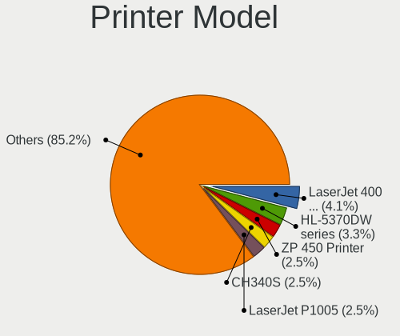

| Model                                                                 | Desktops | Percent |
|-----------------------------------------------------------------------|----------|---------|
| HP LaserJet 400 M401dne                                               | 5        | 4.31%   |
| Zebra ZP 450 Printer                                                  | 3        | 2.59%   |
| QinHeng CH340S                                                        | 3        | 2.59%   |
| HP LaserJet P1005                                                     | 3        | 2.59%   |
| HP ENVY 4520 series                                                   | 3        | 2.59%   |
| Brother HL-5370DW series                                              | 3        | 2.59%   |
| Zebra ZTC ZP 500 (ZPL)                                                | 2        | 1.72%   |
| HP OfficeJet Pro 7730 series                                          | 2        | 1.72%   |
| HP LaserJet P2055 series                                              | 2        | 1.72%   |
| HP LaserJet P1006                                                     | 2        | 1.72%   |
| HP DeskJet 3700 series                                                | 2        | 1.72%   |
| HP Deskjet 3050A                                                      | 2        | 1.72%   |
| Canon PIXMA MX530 Series                                              | 2        | 1.72%   |
| Brother HL-5340 series                                                | 2        | 1.72%   |
| Brother HL-2270DW Laser Printer                                       | 2        | 1.72%   |
| Seiko Epson ME OFFICE 620F Series/Stylus Office BX305F/BX305FW/TX320F | 1        | 0.86%   |
| Seiko Epson L395 Series                                               | 1        | 0.86%   |
| Seiko Epson L360 Series                                               | 1        | 0.86%   |
| Seiko Epson L120 Series                                               | 1        | 0.86%   |
| Seiko Epson ET-2720 Series                                            | 1        | 0.86%   |
| Samsung Xerox Phaser 3117 Laser Printer                               | 1        | 0.86%   |
| Samsung SF-760 Series                                                 | 1        | 0.86%   |
| Samsung SCX-4200 series                                               | 1        | 0.86%   |
| Samsung SCX-4100 Scanner                                              | 1        | 0.86%   |
| Samsung SCX-3400 Series                                               | 1        | 0.86%   |
| Samsung ML-2525W Series                                               | 1        | 0.86%   |
| Samsung ML-1865                                                       | 1        | 0.86%   |
| Samsung ML-1740 Printer                                               | 1        | 0.86%   |
| Samsung M2070 Series                                                  | 1        | 0.86%   |
| Samsung M2020 Series                                                  | 1        | 0.86%   |
| Samsung C48x Series Color Laser Multifunction Printer                 | 1        | 0.86%   |
| Pantum P2000                                                          | 1        | 0.86%   |
| Kyocera FS-1300D                                                      | 1        | 0.86%   |
| HP OfficeJet Pro 9010 series                                          | 1        | 0.86%   |
| HP Officejet Pro 6230                                                 | 1        | 0.86%   |
| HP Officejet 6600                                                     | 1        | 0.86%   |
| HP Officejet 2620 series                                              | 1        | 0.86%   |
| HP LaserJet P2015 series                                              | 1        | 0.86%   |
| HP LaserJet P1102                                                     | 1        | 0.86%   |
| HP LaserJet M101-M106                                                 | 1        | 0.86%   |

Scanner Vendor
--------------

Scanner device vendors

| Vendor          | Desktops | Percent |
|-----------------|----------|---------|
| Canon           | 23       | 71.88%  |
| Hewlett-Packard | 5        | 15.63%  |
| Seiko Epson     | 4        | 12.5%   |

Scanner Model
-------------

Scanner device models

| Model                                                       | Desktops | Percent |
|-------------------------------------------------------------|----------|---------|
| Canon CanoScan LiDE 110                                     | 5        | 15.63%  |
| Canon CanoScan LiDE 50/LiDE 35/LiDE 40                      | 3        | 9.38%   |
| Canon CanoScan LIDE 25                                      | 3        | 9.38%   |
| Canon CanoScan LiDE 220                                     | 2        | 6.25%   |
| Canon CanoScan LiDE 210                                     | 2        | 6.25%   |
| Canon CanoScan LiDE 120                                     | 2        | 6.25%   |
| Canon CanoScan LiDE 100                                     | 2        | 6.25%   |
| Seiko Epson GT-X770 [Perfection V500]                       | 1        | 3.13%   |
| Seiko Epson GT-9800F [Perfection 3200]                      | 1        | 3.13%   |
| Seiko Epson GT-8200U/GT-8200UF [Perfection 1650/1650 PHOTO] | 1        | 3.13%   |
| Seiko Epson GT-7700U [Perfection 1240U]                     | 1        | 3.13%   |
| HP ScanJet 82x0C                                            | 1        | 3.13%   |
| HP ScanJet 7400c                                            | 1        | 3.13%   |
| HP ScanJet 5590                                             | 1        | 3.13%   |
| HP Scanjet 200                                              | 1        | 3.13%   |
| HP PSC 1200                                                 | 1        | 3.13%   |
| Canon CanoScan N670U/N676U/LiDE 20                          | 1        | 3.13%   |
| Canon CanoScan N650U/N656U                                  | 1        | 3.13%   |
| Canon CanoScan LiDE 90                                      | 1        | 3.13%   |
| Canon CanoScan LiDE 200                                     | 1        | 3.13%   |

Camera
------

Camera Vendor
-------------

Camera device vendors

| Vendor                        | Desktops | Percent |
|-------------------------------|----------|---------|
| Logitech                      | 101      | 36.2%   |
| Microdia                      | 28       | 10.04%  |
| Microsoft                     | 17       | 6.09%   |
| Chicony Electronics           | 10       | 3.58%   |
| Samsung Electronics           | 9        | 3.23%   |
| Z-Star Microelectronics       | 8        | 2.87%   |
| Sunplus Innovation Technology | 7        | 2.51%   |
| Realtek Semiconductor         | 7        | 2.51%   |
| Jieli Technology              | 7        | 2.51%   |
| Generalplus Technology        | 7        | 2.51%   |
| KYE Systems (Mouse Systems)   | 6        | 2.15%   |
| MacroSilicon                  | 5        | 1.79%   |
| GEMBIRD                       | 5        | 1.79%   |
| Apple                         | 5        | 1.79%   |
| Razer USA                     | 4        | 1.43%   |
| Cubeternet                    | 4        | 1.43%   |
| Creative Technology           | 4        | 1.43%   |
| Trust                         | 3        | 1.08%   |
| OPPO Electronics              | 3        | 1.08%   |
| Aveo Technology               | 3        | 1.08%   |
| ARC International             | 3        | 1.08%   |
| Sunplus IT                    | 2        | 0.72%   |
| Linux Foundation              | 2        | 0.72%   |
| Huawei Technologies           | 2        | 0.72%   |
| Hewlett-Packard               | 2        | 0.72%   |
| Guillemot                     | 2        | 0.72%   |
| Arkmicro Technologies         | 2        | 0.72%   |
| 2M UVC CAMERA                 | 2        | 0.72%   |
| Xiaomi                        | 1        | 0.36%   |
| USB3.0 HD Audio Capture       | 1        | 0.36%   |
| Silicon Motion                | 1        | 0.36%   |
| Ruision                       | 1        | 0.36%   |
| Quanta                        | 1        | 0.36%   |
| PrehKeyTec                    | 1        | 0.36%   |
| Pixart Imaging                | 1        | 0.36%   |
| OmniVision Technologies       | 1        | 0.36%   |
| Omnivision                    | 1        | 0.36%   |
| Nintendo                      | 1        | 0.36%   |
| Mimaki Engineering            | 1        | 0.36%   |
| IMC Networks                  | 1        | 0.36%   |

Camera Model
------------

Camera device models

| Model                                       | Desktops | Percent |
|---------------------------------------------|----------|---------|
| Logitech Webcam C270                        | 27       | 9.68%   |
| Logitech HD Pro Webcam C920                 | 15       | 5.38%   |
| Logitech C922 Pro Stream Webcam             | 10       | 3.58%   |
| Samsung Galaxy series, misc. (MTP mode)     | 9        | 3.23%   |
| Microdia Webcam Vitade AF                   | 7        | 2.51%   |
| Logitech HD Webcam C525                     | 6        | 2.15%   |
| Microdia USB 2.0 Camera                     | 5        | 1.79%   |
| Microdia Sonix USB 2.0 Camera               | 5        | 1.79%   |
| Logitech Webcam C170                        | 5        | 1.79%   |
| Jieli USB PHY 2.0                           | 5        | 1.79%   |
| Apple iPhone 5/5C/5S/6/SE/7/8/X             | 5        | 1.79%   |
| Sunplus Full HD webcam                      | 4        | 1.43%   |
| Realtek FULL HD 1080P Webcam                | 4        | 1.43%   |
| Microdia Camera                             | 4        | 1.43%   |
| MacroSilicon MiraBox Capture                | 4        | 1.43%   |
| Logitech QuickCam Pro 9000                  | 4        | 1.43%   |
| Generalplus 808 Camera                      | 4        | 1.43%   |
| Z-Star Vimicro USB Camera (Altair)          | 3        | 1.08%   |
| Z-Star Venus USB2.0 Camera                  | 3        | 1.08%   |
| Trust USB Camera                            | 3        | 1.08%   |
| Logitech Webcam Pro 9000                    | 3        | 1.08%   |
| Logitech Webcam B500                        | 3        | 1.08%   |
| Logitech QuickCam Pro 5000                  | 3        | 1.08%   |
| Logitech HD Webcam B910                     | 3        | 1.08%   |
| Logitech BRIO Ultra HD Webcam               | 3        | 1.08%   |
| Generalplus CAMERA - UVC                    | 3        | 1.08%   |
| GEMBIRD USB2.0 PC CAMERA                    | 3        | 1.08%   |
| ARC International Camera                    | 3        | 1.08%   |
| Razer USA Razer Kiyo Pro                    | 2        | 0.72%   |
| Razer USA Gaming Webcam [Kiyo]              | 2        | 0.72%   |
| OPPO SM6375-QRD _SN:EA0028BC                | 2        | 0.72%   |
| Microsoft Microsoft LifeCam Studio        | 2        | 0.72%   |
| Microsoft Microsoft LifeCam Cinema        | 2        | 0.72%   |
| Microsoft LifeCam VX-5000                   | 2        | 0.72%   |
| Microsoft LifeCam VX-2000                   | 2        | 0.72%   |
| Microsoft LifeCam HD-3000                   | 2        | 0.72%   |
| Microsoft LifeCam Cinema                    | 2        | 0.72%   |
| Microdia PC Microscope camera               | 2        | 0.72%   |
| Microdia Defender G-Lens 2577 HD720p Camera | 2        | 0.72%   |
| Logitech Webcam C300                        | 2        | 0.72%   |

Security
--------

Fingerprint Vendor
------------------

Fingerprint sensor vendors

| Vendor                     | Desktops | Percent |
|----------------------------|----------|---------|
| Synaptics                  | 1        | 25%     |
| STMicroelectronics         | 1        | 25%     |
| Shenzhen Goodix Technology | 1        | 25%     |
| DigitalPersona             | 1        | 25%     |

Fingerprint Model
-----------------

Fingerprint sensor models

| Model                                        | Desktops | Percent |
|----------------------------------------------|----------|---------|
| Synaptics  WBDI Fingerprint Reader - USB 052 | 1        | 25%     |
| STMicroelectronics Fingerprint Reader        | 1        | 25%     |
| Shenzhen Goodix  Fingerprint Device          | 1        | 25%     |
| DigitalPersona Fingerprint Reader            | 1        | 25%     |

Chipcard Vendor
---------------

Chipcard module vendors

| Vendor                            | Desktops | Percent |
|-----------------------------------|----------|---------|
| OmniKey                           | 2        | 16.67%  |
| Gemalto (was Gemplus)             | 2        | 16.67%  |
| VASCO Data Security International | 1        | 8.33%   |
| Reiner SCT Kartensysteme          | 1        | 8.33%   |
| Lenovo                            | 1        | 8.33%   |
| In Focus Systems                  | 1        | 8.33%   |
| Fujitsu Siemens Computers         | 1        | 8.33%   |
| Chicony Electronics               | 1        | 8.33%   |
| Cherry                            | 1        | 8.33%   |
| Alcor Micro                       | 1        | 8.33%   |

Chipcard Model
--------------

Chipcard module models

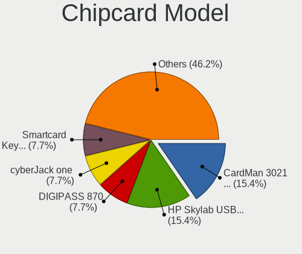

| Model                                                | Desktops | Percent |
|------------------------------------------------------|----------|---------|
| OmniKey CardMan 3021 / 3121                          | 2        | 16.67%  |
| VASCO Data Security International DIGIPASS 870       | 1        | 8.33%   |
| Reiner SCT Kartensysteme cyberJack one               | 1        | 8.33%   |
| Lenovo Smartcard Keyboard                            | 1        | 8.33%   |
| In Focus Systems EMV Smartcard Reader                | 1        | 8.33%   |
| Gemalto (was Gemplus) GemPC Twin SmartCard Reader    | 1        | 8.33%   |
| Gemalto (was Gemplus) GemPC Key SmartCard Reader     | 1        | 8.33%   |
| Fujitsu Siemens Computers SmartCard Reader 2A        | 1        | 8.33%   |
| Chicony Electronics HP Skylab USB Smartcard Keyboard | 1        | 8.33%   |
| Cherry SmartTerminal XX44                            | 1        | 8.33%   |
| Alcor Micro AU9540 Smartcard Reader                  | 1        | 8.33%   |

Unsupported
-----------

Unsupported Devices
-------------------

Total unsupported devices on board

| Total | Desktops | Percent |
|-------|----------|---------|
| 0     | 1554     | 84.32%  |
| 1     | 238      | 12.91%  |
| 2     | 36       | 1.95%   |
| 3     | 9        | 0.49%   |
| 4     | 5        | 0.27%   |
| 5     | 1        | 0.05%   |

Unsupported Device Types
------------------------

Types of unsupported devices

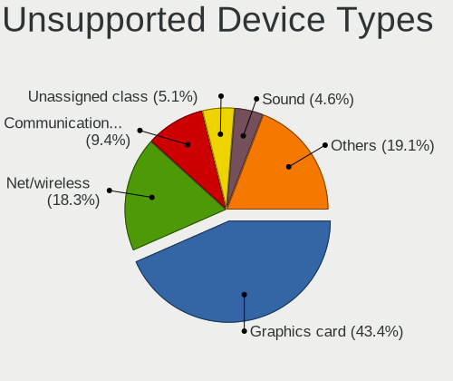

| Type                     | Desktops | Percent |
|--------------------------|----------|---------|
| Graphics card            | 130      | 40.5%   |
| Net/wireless             | 61       | 19%     |
| Communication controller | 33       | 10.28%  |
| Unassigned class         | 18       | 5.61%   |
| Sound                    | 15       | 4.67%   |
| Multimedia controller    | 12       | 3.74%   |
| Camera                   | 11       | 3.43%   |
| Chipcard                 | 9        | 2.8%    |
| Network                  | 6        | 1.87%   |
| Net/ethernet             | 6        | 1.87%   |
| Modem                    | 4        | 1.25%   |
| Card reader              | 4        | 1.25%   |
| Fingerprint reader       | 3        | 0.93%   |
| Storage/raid             | 2        | 0.62%   |
| Dvb card                 | 2        | 0.62%   |
| Bluetooth                | 2        | 0.62%   |
| Video                    | 1        | 0.31%   |
| Storage/ide              | 1        | 0.31%   |
| Storage                  | 1        | 0.31%   |

