Xubuntu - Tested Hardware & Statistics (Desktops)
-------------------------------------------------

A project to collect tested hardware configurations for Xubuntu.

Anyone can contribute to this report by the [hw-probe](https://github.com/linuxhw/hw-probe) tool:

    sudo -E hw-probe -all -upload

Please contribute! Especially if your hardware is rare.

Contents
--------

* [ Test Cases ](#test-cases)

* [ System ](#system)
  - [ OS                       ](#os)
  - [ OS Family                ](#os-family)
  - [ Kernel                   ](#kernel)
  - [ Kernel Family            ](#kernel-family)
  - [ Kernel Major Ver.        ](#kernel-major-ver)
  - [ Arch                     ](#arch)
  - [ DE                       ](#de)
  - [ Display Server           ](#display-server)
  - [ Display Manager          ](#display-manager)
  - [ OS Lang                  ](#os-lang)
  - [ Boot Mode                ](#boot-mode)
  - [ Filesystem               ](#filesystem)
  - [ Part. scheme             ](#part-scheme)
  - [ Dual Boot with Linux/BSD ](#dual-boot-with-linuxbsd)
  - [ Dual Boot (Win)          ](#dual-boot-win)

* [ Board ](#board)
  - [ Vendor                   ](#vendor)
  - [ Model                    ](#model)
  - [ Model Family             ](#model-family)
  - [ MFG Year                 ](#mfg-year)
  - [ Form Factor              ](#form-factor)
  - [ Secure Boot              ](#secure-boot)
  - [ Coreboot                 ](#coreboot)
  - [ RAM Size                 ](#ram-size)
  - [ RAM Used                 ](#ram-used)
  - [ Total Drives             ](#total-drives)
  - [ Has CD-ROM               ](#has-cd-rom)
  - [ Has Ethernet             ](#has-ethernet)
  - [ Has WiFi                 ](#has-wifi)
  - [ Has Bluetooth            ](#has-bluetooth)

* [ Location ](#location)
  - [ Country                  ](#country)
  - [ City                     ](#city)

* [ Drives ](#drives)
  - [ Drive Vendor             ](#drive-vendor)
  - [ Drive Model              ](#drive-model)
  - [ HDD Vendor               ](#hdd-vendor)
  - [ SSD Vendor               ](#ssd-vendor)
  - [ Drive Kind               ](#drive-kind)
  - [ Drive Connector          ](#drive-connector)
  - [ Drive Size               ](#drive-size)
  - [ Space Total              ](#space-total)
  - [ Space Used               ](#space-used)
  - [ Malfunc. Drives          ](#malfunc-drives)
  - [ Malfunc. Drive Vendor    ](#malfunc-drive-vendor)
  - [ Malfunc. HDD Vendor      ](#malfunc-hdd-vendor)
  - [ Malfunc. Drive Kind      ](#malfunc-drive-kind)
  - [ Failed Drives            ](#failed-drives)
  - [ Failed Drive Vendor      ](#failed-drive-vendor)
  - [ Drive Status             ](#drive-status)

* [ Storage controller ](#storage-controller)
  - [ Storage Vendor           ](#storage-vendor)
  - [ Storage Model            ](#storage-model)
  - [ Storage Kind             ](#storage-kind)

* [ Processor ](#processor)
  - [ CPU Vendor               ](#cpu-vendor)
  - [ CPU Model                ](#cpu-model)
  - [ CPU Model Family         ](#cpu-model-family)
  - [ CPU Cores                ](#cpu-cores)
  - [ CPU Sockets              ](#cpu-sockets)
  - [ CPU Threads              ](#cpu-threads)
  - [ CPU Op-Modes             ](#cpu-op-modes)
  - [ CPU Microcode            ](#cpu-microcode)
  - [ CPU Microarch            ](#cpu-microarch)

* [ Graphics ](#graphics)
  - [ GPU Vendor               ](#gpu-vendor)
  - [ GPU Model                ](#gpu-model)
  - [ GPU Combo                ](#gpu-combo)
  - [ GPU Driver               ](#gpu-driver)
  - [ GPU Memory               ](#gpu-memory)

* [ Monitor ](#monitor)
  - [ Monitor Vendor           ](#monitor-vendor)
  - [ Monitor Model            ](#monitor-model)
  - [ Monitor Resolution       ](#monitor-resolution)
  - [ Monitor Diagonal         ](#monitor-diagonal)
  - [ Monitor Width            ](#monitor-width)
  - [ Aspect Ratio             ](#aspect-ratio)
  - [ Monitor Area             ](#monitor-area)
  - [ Pixel Density            ](#pixel-density)
  - [ Multiple Monitors        ](#multiple-monitors)

* [ Network ](#network)
  - [ Net Controller Vendor    ](#net-controller-vendor)
  - [ Net Controller Model     ](#net-controller-model)
  - [ Wireless Vendor          ](#wireless-vendor)
  - [ Wireless Model           ](#wireless-model)
  - [ Ethernet Vendor          ](#ethernet-vendor)
  - [ Ethernet Model           ](#ethernet-model)
  - [ Net Controller Kind      ](#net-controller-kind)
  - [ Used Controller          ](#used-controller)
  - [ NICs                     ](#nics)
  - [ IPv6                     ](#ipv6)

* [ Bluetooth ](#bluetooth)
  - [ Bluetooth Vendor         ](#bluetooth-vendor)
  - [ Bluetooth Model          ](#bluetooth-model)

* [ Sound ](#sound)
  - [ Sound Vendor             ](#sound-vendor)
  - [ Sound Model              ](#sound-model)

* [ Memory ](#memory)
  - [ Memory Vendor            ](#memory-vendor)
  - [ Memory Model             ](#memory-model)
  - [ Memory Kind              ](#memory-kind)
  - [ Memory Form Factor       ](#memory-form-factor)
  - [ Memory Size              ](#memory-size)
  - [ Memory Speed             ](#memory-speed)

* [ Printers & scanners ](#printers--scanners)
  - [ Printer Vendor           ](#printer-vendor)
  - [ Printer Model            ](#printer-model)
  - [ Scanner Vendor           ](#scanner-vendor)
  - [ Scanner Model            ](#scanner-model)

* [ Camera ](#camera)
  - [ Camera Vendor            ](#camera-vendor)
  - [ Camera Model             ](#camera-model)

* [ Security ](#security)
  - [ Fingerprint Vendor       ](#fingerprint-vendor)
  - [ Fingerprint Model        ](#fingerprint-model)
  - [ Chipcard Vendor          ](#chipcard-vendor)
  - [ Chipcard Model           ](#chipcard-model)

* [ Unsupported ](#unsupported)
  - [ Unsupported Devices      ](#unsupported-devices)
  - [ Unsupported Device Types ](#unsupported-device-types)

Test Cases
----------

Total: 2137

| Vendor        | Model                       | Probe                                                      | Date         |
|---------------|-----------------------------|------------------------------------------------------------|--------------|
| ASUSTek       | P5P43TD PRO                 | [7325fb8135](https://linux-hardware.org/?probe=7325fb8135) | Jul 30, 2022 |
| ASUSTek       | TUF Gaming B550M-E WIFI     | [01bcafef3c](https://linux-hardware.org/?probe=01bcafef3c) | Jul 30, 2022 |
| Intel         | SHARKBAY                    | [bd5b812271](https://linux-hardware.org/?probe=bd5b812271) | Jul 29, 2022 |
| ASUSTek       | PRIME A320M-K               | [9a97caa028](https://linux-hardware.org/?probe=9a97caa028) | Jul 28, 2022 |
| ASUSTek       | PRIME A320M-K               | [d00325cd68](https://linux-hardware.org/?probe=d00325cd68) | Jul 28, 2022 |
| ASUSTek       | P5QL/EPU                    | [797c3b1dc2](https://linux-hardware.org/?probe=797c3b1dc2) | Jul 28, 2022 |
| Lenovo        | SHARKBAY SDK0E50510 WIN     | [da54317b9a](https://linux-hardware.org/?probe=da54317b9a) | Jul 27, 2022 |
| ASUSTek       | M5A78L-M PLUS/USB3          | [611f1d79e3](https://linux-hardware.org/?probe=611f1d79e3) | Jul 26, 2022 |
| ASUSTek       | M51BC                       | [4d6af73032](https://linux-hardware.org/?probe=4d6af73032) | Jul 26, 2022 |
| ASUSTek       | P8H67-M LE                  | [a27a0707b8](https://linux-hardware.org/?probe=a27a0707b8) | Jul 25, 2022 |
| PCWare        | IPX1800E2                   | [4426727633](https://linux-hardware.org/?probe=4426727633) | Jul 24, 2022 |
| ASUSTek       | P4B-M                       | [a193b562fa](https://linux-hardware.org/?probe=a193b562fa) | Jul 22, 2022 |
| ASUSTek       | P4B-M                       | [5128fcd55d](https://linux-hardware.org/?probe=5128fcd55d) | Jul 22, 2022 |
| MSI           | PRO B660M-A DDR4            | [ba0058e96e](https://linux-hardware.org/?probe=ba0058e96e) | Jul 20, 2022 |
| ASUSTek       | TUF Gaming X570-PLUS        | [e2cd5c8d4b](https://linux-hardware.org/?probe=e2cd5c8d4b) | Jul 20, 2022 |
| ASUSTek       | PRIME B450M-A               | [d5a64d7baa](https://linux-hardware.org/?probe=d5a64d7baa) | Jul 16, 2022 |
| Dell          | 0F6X5P A00                  | [528f781464](https://linux-hardware.org/?probe=528f781464) | Jul 16, 2022 |
| HP            | 1496                        | [7797b2d6dd](https://linux-hardware.org/?probe=7797b2d6dd) | Jul 14, 2022 |
| ASUSTek       | P8Z77-M PRO                 | [0c70241041](https://linux-hardware.org/?probe=0c70241041) | Jul 13, 2022 |
| Gigabyte      | GA-MA785GM-US2H             | [8a5a5a0987](https://linux-hardware.org/?probe=8a5a5a0987) | Jul 12, 2022 |
| ASUSTek       | P8Z77-M PRO                 | [4929b942aa](https://linux-hardware.org/?probe=4929b942aa) | Jul 12, 2022 |
| MSI           | A320M PRO-E                 | [d16a812a12](https://linux-hardware.org/?probe=d16a812a12) | Jul 10, 2022 |
| Gigabyte      | GA-MA78GM-S2H               | [6ed805403a](https://linux-hardware.org/?probe=6ed805403a) | Jul 10, 2022 |
| HP            | 158A                        | [e1bec79951](https://linux-hardware.org/?probe=e1bec79951) | Jul 10, 2022 |
| ASUSTek       | P5KC                        | [0ce9dd5cee](https://linux-hardware.org/?probe=0ce9dd5cee) | Jul 08, 2022 |
| Dell          | 07T4MC A02                  | [88de707c31](https://linux-hardware.org/?probe=88de707c31) | Jul 08, 2022 |
| Gigabyte      | G41M-ES2L                   | [d1aa8fe23d](https://linux-hardware.org/?probe=d1aa8fe23d) | Jul 05, 2022 |
| Dell          | 0GY6Y8 A03                  | [5703355b59](https://linux-hardware.org/?probe=5703355b59) | Jul 04, 2022 |
| MSI           | PRO B660M-A DDR4            | [7b470f27d3](https://linux-hardware.org/?probe=7b470f27d3) | Jul 03, 2022 |
| Gigabyte      | X470 AORUS ULTRA GAMING-... | [3633eb51d4](https://linux-hardware.org/?probe=3633eb51d4) | Jul 01, 2022 |
| ASUSTek       | PRIME H670-PLUS D4          | [8f90bed577](https://linux-hardware.org/?probe=8f90bed577) | Jul 01, 2022 |
| Dell          | 0GXM1W A00                  | [d48eb55102](https://linux-hardware.org/?probe=d48eb55102) | Jul 01, 2022 |
| ASUSTek       | M5A97 R2.0                  | [05e7378ad8](https://linux-hardware.org/?probe=05e7378ad8) | Jun 29, 2022 |
| Dell          | 0WMJ54 A01                  | [a55837dc17](https://linux-hardware.org/?probe=a55837dc17) | Jun 29, 2022 |
| ASUSTek       | TUF Gaming X570-PLUS        | [87b9ce1db1](https://linux-hardware.org/?probe=87b9ce1db1) | Jun 28, 2022 |
| ASUSTek       | M2N-E                       | [47cddfb141](https://linux-hardware.org/?probe=47cddfb141) | Jun 25, 2022 |
| ASUSTek       | M2N-E                       | [ad5514340b](https://linux-hardware.org/?probe=ad5514340b) | Jun 25, 2022 |
| Dell          | 0HN7XN A00                  | [4562c09862](https://linux-hardware.org/?probe=4562c09862) | Jun 24, 2022 |
| Lenovo        | ThinkCentre A70 7844H9G     | [8cf9d783a3](https://linux-hardware.org/?probe=8cf9d783a3) | Jun 23, 2022 |
| MSI           | B450M-A PRO MAX             | [db4763808b](https://linux-hardware.org/?probe=db4763808b) | Jun 22, 2022 |
| ASRock        | N68-S3 UCC                  | [5e9cdd75c7](https://linux-hardware.org/?probe=5e9cdd75c7) | Jun 22, 2022 |
| Intel         | D102GGC2 AAD42789-204       | [3ed07edb6a](https://linux-hardware.org/?probe=3ed07edb6a) | Jun 21, 2022 |
| ASUSTek       | P8Z77-V                     | [e32a4e0214](https://linux-hardware.org/?probe=e32a4e0214) | Jun 20, 2022 |
| ASUSTek       | M5A78L-M/USB3               | [515b063f08](https://linux-hardware.org/?probe=515b063f08) | Jun 18, 2022 |
| MSI           | X570-A PRO                  | [fc761acd97](https://linux-hardware.org/?probe=fc761acd97) | Jun 18, 2022 |
| Lenovo        | ThinkCentre M71e 5033AR1    | [dd0f797f78](https://linux-hardware.org/?probe=dd0f797f78) | Jun 17, 2022 |
| ASUSTek       | P8H67-M LE                  | [f340c1d172](https://linux-hardware.org/?probe=f340c1d172) | Jun 17, 2022 |
| ASUSTek       | M5A97 R2.0                  | [384aa1f6c2](https://linux-hardware.org/?probe=384aa1f6c2) | Jun 17, 2022 |
| MSI           | G31TM-P21                   | [824dc8a1c9](https://linux-hardware.org/?probe=824dc8a1c9) | Jun 11, 2022 |
| Intel         | DG33BU AAD79951-407         | [5df0f93da9](https://linux-hardware.org/?probe=5df0f93da9) | Jun 10, 2022 |
| ASRock        | N68-S3 UCC                  | [535126df2b](https://linux-hardware.org/?probe=535126df2b) | Jun 09, 2022 |
| Gigabyte      | H97-HD3                     | [7f48bb6a8a](https://linux-hardware.org/?probe=7f48bb6a8a) | Jun 08, 2022 |
| ASUSTek       | ROG STRIX B450-F GAMING ... | [33dbe3e5db](https://linux-hardware.org/?probe=33dbe3e5db) | Jun 08, 2022 |
| ASUSTek       | Maximus VII HERO            | [064492c64d](https://linux-hardware.org/?probe=064492c64d) | Jun 07, 2022 |
| ASRockRack    | ROMED8-2T                   | [3ee16e0227](https://linux-hardware.org/?probe=3ee16e0227) | Jun 07, 2022 |
| Gigabyte      | H61M-S2PV                   | [63b4cd5c56](https://linux-hardware.org/?probe=63b4cd5c56) | Jun 05, 2022 |
| HP            | 3397                        | [775c6990fd](https://linux-hardware.org/?probe=775c6990fd) | Jun 03, 2022 |
| ASUSTek       | VM60                        | [57bea34864](https://linux-hardware.org/?probe=57bea34864) | May 30, 2022 |
| ASUSTek       | VM60                        | [bf1dcb2901](https://linux-hardware.org/?probe=bf1dcb2901) | May 30, 2022 |
| HP            | 2B29                        | [d2ab16d631](https://linux-hardware.org/?probe=d2ab16d631) | May 28, 2022 |
| Pegatron      | Benicia                     | [64aa376623](https://linux-hardware.org/?probe=64aa376623) | May 28, 2022 |
| ASUSTek       | PRIME X470-PRO              | [496399846f](https://linux-hardware.org/?probe=496399846f) | May 26, 2022 |
| Lenovo        | MAHOBAY NOK                 | [aa8d9cb3b9](https://linux-hardware.org/?probe=aa8d9cb3b9) | May 25, 2022 |
| ASUSTek       | ROG CROSSHAIR VIII DARK ... | [a22a5ebbff](https://linux-hardware.org/?probe=a22a5ebbff) | May 25, 2022 |
| Gigabyte      | 970A-DS3P                   | [23d890ffc6](https://linux-hardware.org/?probe=23d890ffc6) | May 23, 2022 |
| HP            | 1497                        | [4b9a65b621](https://linux-hardware.org/?probe=4b9a65b621) | May 23, 2022 |
| Gigabyte      | Z97X-UD3H-CF                | [a1315854db](https://linux-hardware.org/?probe=a1315854db) | May 23, 2022 |
| ASUSTek       | X99-A II                    | [288a6b3b20](https://linux-hardware.org/?probe=288a6b3b20) | May 23, 2022 |
| MSI           | MPG B550 GAMING EDGE WIF... | [3e34ce179d](https://linux-hardware.org/?probe=3e34ce179d) | May 22, 2022 |
| Acer          | Aspire G7750                | [28f3018ecc](https://linux-hardware.org/?probe=28f3018ecc) | May 18, 2022 |
| HP            | 158A                        | [dd67e1f8d2](https://linux-hardware.org/?probe=dd67e1f8d2) | May 17, 2022 |
| Dell          | 0T656F A01                  | [2df08f807d](https://linux-hardware.org/?probe=2df08f807d) | May 15, 2022 |
| MSI           | AM1I                        | [f22b398676](https://linux-hardware.org/?probe=f22b398676) | May 15, 2022 |
| ECS           | Asterope                    | [a0c032d6f6](https://linux-hardware.org/?probe=a0c032d6f6) | May 14, 2022 |
| HP            | 82B4                        | [3a1723a2ee](https://linux-hardware.org/?probe=3a1723a2ee) | May 13, 2022 |
| Fujitsu       | D2917-A1 S26361-D2917-A1    | [6f58937bed](https://linux-hardware.org/?probe=6f58937bed) | May 13, 2022 |
| ASUSTek       | P5KC                        | [bf7fdb19c8](https://linux-hardware.org/?probe=bf7fdb19c8) | May 12, 2022 |
| ASUSTek       | TUF Gaming B550-PLUS        | [bf4afe4481](https://linux-hardware.org/?probe=bf4afe4481) | May 12, 2022 |
| ASUSTek       | B150-PLUS                   | [eb2447cec6](https://linux-hardware.org/?probe=eb2447cec6) | May 11, 2022 |
| ASUSTek       | TUF B450M-PRO GAMING        | [bd94a8145a](https://linux-hardware.org/?probe=bd94a8145a) | May 08, 2022 |
| Gigabyte      | Z68A-D3-B3                  | [573e425cb6](https://linux-hardware.org/?probe=573e425cb6) | May 08, 2022 |
| ASRock        | X570 Phantom Gaming 4       | [e7ad5ed098](https://linux-hardware.org/?probe=e7ad5ed098) | May 06, 2022 |
| HP            | 3397                        | [157ef440d8](https://linux-hardware.org/?probe=157ef440d8) | May 06, 2022 |
| Gigabyte      | X48-DS5                     | [72a1aaf67d](https://linux-hardware.org/?probe=72a1aaf67d) | May 05, 2022 |
| Acer          | Veriton M490G               | [f55983d536](https://linux-hardware.org/?probe=f55983d536) | May 04, 2022 |
| Gigabyte      | G33M-DS2R                   | [d4dff7f002](https://linux-hardware.org/?probe=d4dff7f002) | May 04, 2022 |
| HP            | 158A                        | [cb763d6fab](https://linux-hardware.org/?probe=cb763d6fab) | May 04, 2022 |
| Gigabyte      | X570S AORUS MASTER          | [c6da7b776e](https://linux-hardware.org/?probe=c6da7b776e) | May 03, 2022 |
| ASRock        | P55 Pro                     | [e626676348](https://linux-hardware.org/?probe=e626676348) | May 02, 2022 |
| ASUSTek       | B150-PLUS                   | [e2f5eb0a39](https://linux-hardware.org/?probe=e2f5eb0a39) | May 02, 2022 |
| Unknown       | Intel X79                   | [95d09d79ca](https://linux-hardware.org/?probe=95d09d79ca) | Apr 29, 2022 |
| HP            | 09F8h                       | [8605181df9](https://linux-hardware.org/?probe=8605181df9) | Apr 26, 2022 |
| MSI           | Z390-A PRO                  | [6c64775a71](https://linux-hardware.org/?probe=6c64775a71) | Apr 24, 2022 |
| HP            | 09F8h                       | [5042a34dcd](https://linux-hardware.org/?probe=5042a34dcd) | Apr 23, 2022 |
| Gigabyte      | G33M-DS2R                   | [d2cd51f72d](https://linux-hardware.org/?probe=d2cd51f72d) | Apr 22, 2022 |
| Gigabyte      | H310M S2H x.x               | [bde3fa1f37](https://linux-hardware.org/?probe=bde3fa1f37) | Apr 22, 2022 |
| eMachines     | MCP61PM-GM                  | [16c4522843](https://linux-hardware.org/?probe=16c4522843) | Apr 20, 2022 |
| ASUSTek       | P8Z77-V                     | [40e958c5e1](https://linux-hardware.org/?probe=40e958c5e1) | Apr 19, 2022 |
| Dell          | 0WR7PY A01                  | [6fa162f829](https://linux-hardware.org/?probe=6fa162f829) | Apr 19, 2022 |
| ASUSTek       | P8Z68 DELUXE                | [4df90e6250](https://linux-hardware.org/?probe=4df90e6250) | Apr 18, 2022 |
| HP            | 18E5                        | [211d35a24b](https://linux-hardware.org/?probe=211d35a24b) | Apr 17, 2022 |
| Fujitsu       | D3091-A1 S26361-D3091-A1    | [d2559a2f19](https://linux-hardware.org/?probe=d2559a2f19) | Apr 17, 2022 |
| Apple         | Mac-F221BEC8                | [32bdb05198](https://linux-hardware.org/?probe=32bdb05198) | Apr 16, 2022 |
| HP            | 21B4 A01                    | [ddd3a601b3](https://linux-hardware.org/?probe=ddd3a601b3) | Apr 15, 2022 |
| Lenovo        | SHARKBAY 0B98401 PRO        | [0e7314b7c9](https://linux-hardware.org/?probe=0e7314b7c9) | Apr 14, 2022 |
| MSI           | B450M MORTAR TITANIUM       | [6b11750e41](https://linux-hardware.org/?probe=6b11750e41) | Apr 13, 2022 |
| MSI           | MPG B550 GAMING PLUS        | [fe40f7c199](https://linux-hardware.org/?probe=fe40f7c199) | Apr 13, 2022 |
| Acer          | Nitro N50-610               | [f3581a0d9d](https://linux-hardware.org/?probe=f3581a0d9d) | Apr 11, 2022 |
| Dell          | 0GY6Y8 A03                  | [1fb7e31b37](https://linux-hardware.org/?probe=1fb7e31b37) | Apr 10, 2022 |
| Gigabyte      | P55A-UD3                    | [9c6781cf90](https://linux-hardware.org/?probe=9c6781cf90) | Apr 10, 2022 |
| Dell          | 00V62H A01                  | [6d0445b848](https://linux-hardware.org/?probe=6d0445b848) | Apr 09, 2022 |
| ASUSTek       | P5G41T-M LX                 | [db8350499d](https://linux-hardware.org/?probe=db8350499d) | Apr 09, 2022 |
| MSI           | Z77A-G45 GAMING             | [622ecbb225](https://linux-hardware.org/?probe=622ecbb225) | Apr 09, 2022 |
| ASUSTek       | TUF Gaming X570-PRO         | [14ae36ec3e](https://linux-hardware.org/?probe=14ae36ec3e) | Apr 09, 2022 |
| ASUSTek       | Maximus V EXTREME           | [3718d92d8a](https://linux-hardware.org/?probe=3718d92d8a) | Apr 08, 2022 |
| ASUSTek       | Maximus V EXTREME           | [f6d9a139de](https://linux-hardware.org/?probe=f6d9a139de) | Apr 08, 2022 |
| Fujitsu       | D3161-A1 S26361-D3161-A1    | [b43ffa5ce5](https://linux-hardware.org/?probe=b43ffa5ce5) | Apr 07, 2022 |
| ASUSTek       | M51BC                       | [e205187536](https://linux-hardware.org/?probe=e205187536) | Apr 07, 2022 |
| Apple         | Mac-F221BEC8                | [e092f62bc4](https://linux-hardware.org/?probe=e092f62bc4) | Apr 07, 2022 |
| Dell          | 0GY6Y8 A03                  | [a971341576](https://linux-hardware.org/?probe=a971341576) | Apr 05, 2022 |
| Dell          | OptiPlex 760                | [fa3babeea9](https://linux-hardware.org/?probe=fa3babeea9) | Apr 04, 2022 |
| Dell          | OptiPlex 760                | [ca42b9f058](https://linux-hardware.org/?probe=ca42b9f058) | Apr 03, 2022 |
| Gigabyte      | H97-D3H-CF                  | [e7b9989223](https://linux-hardware.org/?probe=e7b9989223) | Apr 02, 2022 |
| HP            | 18E5                        | [3474ce6335](https://linux-hardware.org/?probe=3474ce6335) | Apr 02, 2022 |
| Shuttle       | FH61V                       | [05c1b046da](https://linux-hardware.org/?probe=05c1b046da) | Apr 01, 2022 |
| Shuttle       | FH61V                       | [b89bd4d737](https://linux-hardware.org/?probe=b89bd4d737) | Apr 01, 2022 |
| Shuttle       | FH61V                       | [65009176b4](https://linux-hardware.org/?probe=65009176b4) | Apr 01, 2022 |
| MSI           | B550-A PRO[CEC]             | [d3f3139ac2](https://linux-hardware.org/?probe=d3f3139ac2) | Apr 01, 2022 |
| MSI           | B550-A PRO[CEC]             | [647fd89862](https://linux-hardware.org/?probe=647fd89862) | Apr 01, 2022 |
| ASUSTek       | ROG STRIX B450-F GAMING ... | [521a29d065](https://linux-hardware.org/?probe=521a29d065) | Mar 31, 2022 |
| Acer          | Veriton M4610G              | [34ac41051e](https://linux-hardware.org/?probe=34ac41051e) | Mar 30, 2022 |
| Gigabyte      | E350N WIN8                  | [a56241f1a8](https://linux-hardware.org/?probe=a56241f1a8) | Mar 30, 2022 |
| Dell          | OptiPlex 760                | [1ecb9c1cf3](https://linux-hardware.org/?probe=1ecb9c1cf3) | Mar 29, 2022 |
| HP            | 21B4 A01                    | [963752fd6f](https://linux-hardware.org/?probe=963752fd6f) | Mar 28, 2022 |
| Unknown       | T3 MRD                      | [3e12cb02f8](https://linux-hardware.org/?probe=3e12cb02f8) | Mar 26, 2022 |
| ASUSTek       | P8H61/USB3 R2.0             | [d5a1c13ab1](https://linux-hardware.org/?probe=d5a1c13ab1) | Mar 25, 2022 |
| Pegatron      | Benicia                     | [cb852b48fb](https://linux-hardware.org/?probe=cb852b48fb) | Mar 25, 2022 |
| ASUSTek       | PRIME H270M-PLUS            | [b27c4a7fe4](https://linux-hardware.org/?probe=b27c4a7fe4) | Mar 24, 2022 |
| ASRock        | B550 Phantom Gaming 4       | [39dc1025e9](https://linux-hardware.org/?probe=39dc1025e9) | Mar 24, 2022 |
| Gigabyte      | H310M H x.x                 | [5adb4614c4](https://linux-hardware.org/?probe=5adb4614c4) | Mar 23, 2022 |
| Gigabyte      | H310M H x.x                 | [d277e5c6bc](https://linux-hardware.org/?probe=d277e5c6bc) | Mar 23, 2022 |
| Unknown       | T3 MRD                      | [3ec2149915](https://linux-hardware.org/?probe=3ec2149915) | Mar 23, 2022 |
| ASRock        | B550 Phantom Gaming 4       | [2f0764ceb3](https://linux-hardware.org/?probe=2f0764ceb3) | Mar 23, 2022 |
| ASUSTek       | PRIME X370-PRO              | [d755a1a962](https://linux-hardware.org/?probe=d755a1a962) | Mar 22, 2022 |
| ASUSTek       | PRIME X370-PRO              | [2cfe733664](https://linux-hardware.org/?probe=2cfe733664) | Mar 22, 2022 |
| ECS           | H87H3-M                     | [f15990212f](https://linux-hardware.org/?probe=f15990212f) | Mar 20, 2022 |
| ASUSTek       | ROG STRIX B450-F GAMING ... | [a226a58819](https://linux-hardware.org/?probe=a226a58819) | Mar 19, 2022 |
| ASRock        | B450 Steel Legend           | [db613d4f60](https://linux-hardware.org/?probe=db613d4f60) | Mar 16, 2022 |
| ASUSTek       | A68HM-K                     | [4491d23e02](https://linux-hardware.org/?probe=4491d23e02) | Mar 16, 2022 |
| Acer          | Aspire X1920                | [2b3d54ec4a](https://linux-hardware.org/?probe=2b3d54ec4a) | Mar 14, 2022 |
| Gigabyte      | GA-MA78GM-S2H               | [dfef2d9492](https://linux-hardware.org/?probe=dfef2d9492) | Mar 13, 2022 |
| Gigabyte      | 8IPE775/-G                  | [7888ddbc2b](https://linux-hardware.org/?probe=7888ddbc2b) | Mar 13, 2022 |
| Dell          | 0RW199                      | [2298b1db14](https://linux-hardware.org/?probe=2298b1db14) | Mar 13, 2022 |
| ASUSTek       | Z170I PRO GAMING            | [2c17897902](https://linux-hardware.org/?probe=2c17897902) | Mar 10, 2022 |
| ASUSTek       | TUF Gaming X570-PRO         | [54c4f70c98](https://linux-hardware.org/?probe=54c4f70c98) | Mar 08, 2022 |
| Acer          | TPDS05 R3700                | [48fc5c9d8b](https://linux-hardware.org/?probe=48fc5c9d8b) | Mar 08, 2022 |
| Dell          | 00V62H A00                  | [b9ca0e3bde](https://linux-hardware.org/?probe=b9ca0e3bde) | Mar 07, 2022 |
| Dell          | 00V62H A00                  | [6f5adc1704](https://linux-hardware.org/?probe=6f5adc1704) | Mar 07, 2022 |
| MSI           | B350 TOMAHAWK               | [2525f81966](https://linux-hardware.org/?probe=2525f81966) | Mar 06, 2022 |
| Gigabyte      | X570 AORUS MASTER           | [2623cf5090](https://linux-hardware.org/?probe=2623cf5090) | Feb 28, 2022 |
| Lenovo        | NO DPK                      | [a720d5bcaf](https://linux-hardware.org/?probe=a720d5bcaf) | Feb 27, 2022 |
| Dell          | 0Y958C A00                  | [e2abde1282](https://linux-hardware.org/?probe=e2abde1282) | Feb 27, 2022 |
| ASUSTek       | Z170-K                      | [cfdffcf6ab](https://linux-hardware.org/?probe=cfdffcf6ab) | Feb 26, 2022 |
| Dell          | 042P49 A02                  | [9efbb51081](https://linux-hardware.org/?probe=9efbb51081) | Feb 25, 2022 |
| Acer          | TPDS05 R3700                | [df877f2b77](https://linux-hardware.org/?probe=df877f2b77) | Feb 24, 2022 |
| MSI           | G41M-P25                    | [c8ebea2807](https://linux-hardware.org/?probe=c8ebea2807) | Feb 23, 2022 |
| Pegatron      | 2AB5                        | [f2ee067b5f](https://linux-hardware.org/?probe=f2ee067b5f) | Feb 23, 2022 |
| ASRock        | K10N78M                     | [f8a578c070](https://linux-hardware.org/?probe=f8a578c070) | Feb 21, 2022 |
| MSI           | Z97 PC Mate                 | [e7013b772d](https://linux-hardware.org/?probe=e7013b772d) | Feb 21, 2022 |
| MSI           | A55M-P33                    | [d891e34be9](https://linux-hardware.org/?probe=d891e34be9) | Feb 20, 2022 |
| Fujitsu Si... | D1784 S26361-D1784          | [2734c5a939](https://linux-hardware.org/?probe=2734c5a939) | Feb 19, 2022 |
| Fujitsu Si... | D1784 S26361-D1784          | [7baecb9fce](https://linux-hardware.org/?probe=7baecb9fce) | Feb 19, 2022 |
| ASUSTek       | ROG STRIX X570-E GAMING     | [8f1ce82db7](https://linux-hardware.org/?probe=8f1ce82db7) | Feb 15, 2022 |
| MSI           | MEG X570 ACE                | [4cb6628353](https://linux-hardware.org/?probe=4cb6628353) | Feb 14, 2022 |
| MSI           | MEG X570 ACE                | [43ac6b6d18](https://linux-hardware.org/?probe=43ac6b6d18) | Feb 14, 2022 |
| ASUSTek       | TUF Gaming X570-PRO         | [6f11ea4988](https://linux-hardware.org/?probe=6f11ea4988) | Feb 14, 2022 |
| Dell          | 0FH884                      | [bd2aa894cc](https://linux-hardware.org/?probe=bd2aa894cc) | Feb 13, 2022 |
| HP            | 3031h                       | [1475e006cd](https://linux-hardware.org/?probe=1475e006cd) | Feb 13, 2022 |
| ASUSTek       | PRIME H570M-PLUS            | [adc14fca30](https://linux-hardware.org/?probe=adc14fca30) | Feb 12, 2022 |
| Unknown       | Intel X79                   | [f0dd6357fe](https://linux-hardware.org/?probe=f0dd6357fe) | Feb 12, 2022 |
| ASUSTek       | P5Q-PRO                     | [d455b09330](https://linux-hardware.org/?probe=d455b09330) | Feb 10, 2022 |
| ASUSTek       | M5A97 R2.0                  | [0301e86e1b](https://linux-hardware.org/?probe=0301e86e1b) | Feb 09, 2022 |
| ASRock        | 960GM-GS3 FX                | [005f4b4afc](https://linux-hardware.org/?probe=005f4b4afc) | Feb 08, 2022 |
| ASUSTek       | PRIME B550M-K               | [b4fe3a7a24](https://linux-hardware.org/?probe=b4fe3a7a24) | Feb 07, 2022 |
| HP            | 1497                        | [2a41e081da](https://linux-hardware.org/?probe=2a41e081da) | Feb 06, 2022 |
| Unknown       | Intel X79                   | [089b663f84](https://linux-hardware.org/?probe=089b663f84) | Feb 06, 2022 |
| Fujitsu Si... | D1784 S26361-D1784          | [843210cfb0](https://linux-hardware.org/?probe=843210cfb0) | Feb 06, 2022 |
| Dell          | 0WR7PY A02                  | [2b3c148135](https://linux-hardware.org/?probe=2b3c148135) | Feb 06, 2022 |
| ASUSTek       | TUF Gaming X570-PRO         | [1feae56050](https://linux-hardware.org/?probe=1feae56050) | Feb 06, 2022 |
| Gigabyte      | GA-870A-UD3                 | [e4b5396bf7](https://linux-hardware.org/?probe=e4b5396bf7) | Feb 04, 2022 |
| Dell          | 0XCR8D A01                  | [a68034b1e8](https://linux-hardware.org/?probe=a68034b1e8) | Feb 03, 2022 |
| Dell          | 051FJ8 A00                  | [da74a4ea79](https://linux-hardware.org/?probe=da74a4ea79) | Feb 01, 2022 |
| ASUSTek       | M4A87TD EVO                 | [8eab19298c](https://linux-hardware.org/?probe=8eab19298c) | Feb 01, 2022 |
| Dell          | 05XGC8 A01                  | [346195c820](https://linux-hardware.org/?probe=346195c820) | Feb 01, 2022 |
| Fujitsu       | D3613-A1 S26361-D3613-A1    | [27b9e98a16](https://linux-hardware.org/?probe=27b9e98a16) | Feb 01, 2022 |
| Gigabyte      | Z170-HD3P-CF                | [901d568e70](https://linux-hardware.org/?probe=901d568e70) | Jan 31, 2022 |
| Gigabyte      | Z170-HD3P-CF                | [621d099786](https://linux-hardware.org/?probe=621d099786) | Jan 31, 2022 |
| Chuwi         | RZBOX                       | [bea5e134d8](https://linux-hardware.org/?probe=bea5e134d8) | Jan 30, 2022 |
| ASRock        | N68-S3 UCC                  | [7b47741e03](https://linux-hardware.org/?probe=7b47741e03) | Jan 30, 2022 |
| ASRock        | M3A UCC                     | [8ca7699b4c](https://linux-hardware.org/?probe=8ca7699b4c) | Jan 28, 2022 |
| HP            | 1497                        | [3a3b4fe530](https://linux-hardware.org/?probe=3a3b4fe530) | Jan 27, 2022 |
| Pegatron      | Benicia                     | [8d1af3f3af](https://linux-hardware.org/?probe=8d1af3f3af) | Jan 27, 2022 |
| VIA Techno... | VT8366-8233/5               | [e285c87c48](https://linux-hardware.org/?probe=e285c87c48) | Jan 27, 2022 |
| Gigabyte      | M68MT-S2P                   | [8a951a4419](https://linux-hardware.org/?probe=8a951a4419) | Jan 26, 2022 |
| Unknown       | Unknown                     | [018c871f94](https://linux-hardware.org/?probe=018c871f94) | Jan 25, 2022 |
| VIA Techno... | VT8366-8233/5               | [54ce61fa7e](https://linux-hardware.org/?probe=54ce61fa7e) | Jan 25, 2022 |
| Lenovo        | 3100 SDK0J40700 WIN 3258... | [d914fce08c](https://linux-hardware.org/?probe=d914fce08c) | Jan 24, 2022 |
| Lenovo        | 3642 SDK0J40700 WIN 3258... | [db13a3f215](https://linux-hardware.org/?probe=db13a3f215) | Jan 24, 2022 |
| Gigabyte      | M68MT-S2P                   | [9a38c32175](https://linux-hardware.org/?probe=9a38c32175) | Jan 24, 2022 |
| Intel         | DG965MQ AAD37419-302        | [0c7117815f](https://linux-hardware.org/?probe=0c7117815f) | Jan 23, 2022 |
| ASUSTek       | K8V-MXG                     | [504cbc919c](https://linux-hardware.org/?probe=504cbc919c) | Jan 21, 2022 |
| ASUSTek       | H87M-PLUS                   | [986b65d292](https://linux-hardware.org/?probe=986b65d292) | Jan 21, 2022 |
| ASUSTek       | K8V-MXG                     | [d4138da396](https://linux-hardware.org/?probe=d4138da396) | Jan 21, 2022 |
| Lenovo        | Myrtle CRB SDK0J40700 WI... | [44b718700d](https://linux-hardware.org/?probe=44b718700d) | Jan 19, 2022 |
| Gigabyte      | MZBSWBP-00                  | [a8699a0a00](https://linux-hardware.org/?probe=a8699a0a00) | Jan 18, 2022 |
| Foxconn       | 2ABF                        | [54a4320a98](https://linux-hardware.org/?probe=54a4320a98) | Jan 16, 2022 |
| ASUSTek       | P9X79                       | [2afe3ef5cc](https://linux-hardware.org/?probe=2afe3ef5cc) | Jan 16, 2022 |
| Dell          | 0PP150 A00                  | [554774c3c8](https://linux-hardware.org/?probe=554774c3c8) | Jan 16, 2022 |
| Gigabyte      | EX58-UD4P                   | [368d168909](https://linux-hardware.org/?probe=368d168909) | Jan 15, 2022 |
| ASRock        | N68-S3 UCC                  | [1414842f81](https://linux-hardware.org/?probe=1414842f81) | Jan 14, 2022 |
| Lenovo        | ThinkCentre A70 7099A5G     | [78902354bb](https://linux-hardware.org/?probe=78902354bb) | Jan 14, 2022 |
| ASUSTek       | M4A78L-M                    | [dfb87ada40](https://linux-hardware.org/?probe=dfb87ada40) | Jan 13, 2022 |
| HP            | 3031h                       | [46b02ff904](https://linux-hardware.org/?probe=46b02ff904) | Jan 11, 2022 |
| HP            | 3031h                       | [2e78e6c7f8](https://linux-hardware.org/?probe=2e78e6c7f8) | Jan 10, 2022 |
| HP            | 09F8h                       | [b17a2aef1b](https://linux-hardware.org/?probe=b17a2aef1b) | Jan 10, 2022 |
| ASRock        | ALiveNF6G-GLAN              | [004087e9c8](https://linux-hardware.org/?probe=004087e9c8) | Jan 09, 2022 |
| ASUSTek       | H87M-PLUS                   | [eb70946711](https://linux-hardware.org/?probe=eb70946711) | Jan 09, 2022 |
| ASUSTek       | M4A88T-M                    | [7f20d8ac9a](https://linux-hardware.org/?probe=7f20d8ac9a) | Jan 09, 2022 |
| Gigabyte      | MJPLNAB-00                  | [79d90bf440](https://linux-hardware.org/?probe=79d90bf440) | Jan 08, 2022 |
| MSI           | H61M-P23                    | [14690b4128](https://linux-hardware.org/?probe=14690b4128) | Jan 08, 2022 |
| ASRock        | N68-VS3 UCC                 | [0ea3f1d6fa](https://linux-hardware.org/?probe=0ea3f1d6fa) | Jan 08, 2022 |
| Dell          | 073MMW A03                  | [65c164f304](https://linux-hardware.org/?probe=65c164f304) | Jan 07, 2022 |
| Gigabyte      | GA-970A-D3                  | [0fe418c7b1](https://linux-hardware.org/?probe=0fe418c7b1) | Jan 07, 2022 |
| Gigabyte      | Z97X-UD3H-BK-CF             | [ef69bbfd12](https://linux-hardware.org/?probe=ef69bbfd12) | Jan 07, 2022 |
| Lenovo        | ThinkCentre M91p 4518A13    | [8e163d26ab](https://linux-hardware.org/?probe=8e163d26ab) | Jan 06, 2022 |
| HP            | 0AA8h                       | [9abf55a71f](https://linux-hardware.org/?probe=9abf55a71f) | Jan 05, 2022 |
| HP            | 0AA8h                       | [44c9ba4231](https://linux-hardware.org/?probe=44c9ba4231) | Jan 03, 2022 |
| Intel         | DP35DP AAD81073-209         | [f6ec40d0f8](https://linux-hardware.org/?probe=f6ec40d0f8) | Jan 01, 2022 |
| ASUSTek       | P5K-E                       | [f1c3532217](https://linux-hardware.org/?probe=f1c3532217) | Dec 31, 2021 |
| ASUSTek       | P8H61-M LX3 PLUS R2.0       | [02881d7e37](https://linux-hardware.org/?probe=02881d7e37) | Dec 30, 2021 |
| ECS           | G41T-M2                     | [6b4159a357](https://linux-hardware.org/?probe=6b4159a357) | Dec 29, 2021 |
| Gigabyte      | H110M-H-CF                  | [d8a2a90482](https://linux-hardware.org/?probe=d8a2a90482) | Dec 27, 2021 |
| MSI           | B450M MORTAR MAX            | [82cd3a640e](https://linux-hardware.org/?probe=82cd3a640e) | Dec 26, 2021 |
| Gigabyte      | H110M-H-CF                  | [63b3337725](https://linux-hardware.org/?probe=63b3337725) | Dec 26, 2021 |
| ASRock        | A75M-ITX                    | [1070ea74d9](https://linux-hardware.org/?probe=1070ea74d9) | Dec 25, 2021 |
| MSI           | B450M MORTAR MAX            | [bcfc2dd514](https://linux-hardware.org/?probe=bcfc2dd514) | Dec 25, 2021 |
| MSI           | MS-7255                     | [8bb001fa61](https://linux-hardware.org/?probe=8bb001fa61) | Dec 25, 2021 |
| ASRock        | X570M Pro4                  | [602d3e0afd](https://linux-hardware.org/?probe=602d3e0afd) | Dec 23, 2021 |
| HP            | 3398                        | [759e3821b8](https://linux-hardware.org/?probe=759e3821b8) | Dec 22, 2021 |
| Dell          | 0M5DCD A00                  | [d29b59a855](https://linux-hardware.org/?probe=d29b59a855) | Dec 21, 2021 |
| Gigabyte      | B150M-D3H-CF                | [22f2f5c84b](https://linux-hardware.org/?probe=22f2f5c84b) | Dec 21, 2021 |
| HP            | 18E7                        | [b233eb9f3e](https://linux-hardware.org/?probe=b233eb9f3e) | Dec 20, 2021 |
| ASUSTek       | PRIME H310M-R R2.0          | [32340d057e](https://linux-hardware.org/?probe=32340d057e) | Dec 20, 2021 |
| ASUSTek       | P8H61-M LX3 PLUS R2.0       | [8986819d3f](https://linux-hardware.org/?probe=8986819d3f) | Dec 19, 2021 |
| HP            | 8169                        | [4c7533e842](https://linux-hardware.org/?probe=4c7533e842) | Dec 19, 2021 |
| ASUSTek       | TUF Gaming B550M-PLUS       | [a94bf3ef84](https://linux-hardware.org/?probe=a94bf3ef84) | Dec 19, 2021 |
| Dell          | 0VD5HY A04                  | [2aaa0df82d](https://linux-hardware.org/?probe=2aaa0df82d) | Dec 18, 2021 |
| ASUSTek       | P5GC-MX                     | [499a024e97](https://linux-hardware.org/?probe=499a024e97) | Dec 18, 2021 |
| Biostar       | H110MHC                     | [bb74f304fd](https://linux-hardware.org/?probe=bb74f304fd) | Dec 16, 2021 |
| MSI           | Boston                      | [760fa25b63](https://linux-hardware.org/?probe=760fa25b63) | Dec 15, 2021 |
| MSI           | Boston                      | [bc4405aa85](https://linux-hardware.org/?probe=bc4405aa85) | Dec 15, 2021 |
| MSI           | MS-B0501 100                | [ca4048db98](https://linux-hardware.org/?probe=ca4048db98) | Dec 14, 2021 |
| Gigabyte      | EX58-UD4P                   | [aa8da2e23c](https://linux-hardware.org/?probe=aa8da2e23c) | Dec 14, 2021 |
| Dell          | 0T656F A02                  | [c6fcad51e9](https://linux-hardware.org/?probe=c6fcad51e9) | Dec 13, 2021 |
| Gigabyte      | GA-MA78LMT-US2H             | [45a5dc5b06](https://linux-hardware.org/?probe=45a5dc5b06) | Dec 13, 2021 |
| Dell          | 073MMW A00                  | [c5c064c84f](https://linux-hardware.org/?probe=c5c064c84f) | Dec 13, 2021 |
| ASUSTek       | P8H61-M LX3 PLUS R2.0       | [1f799f28c2](https://linux-hardware.org/?probe=1f799f28c2) | Dec 12, 2021 |
| ASUSTek       | M51BC                       | [11ff47f723](https://linux-hardware.org/?probe=11ff47f723) | Dec 12, 2021 |
| ASUSTek       | M51BC                       | [0dd637c0b8](https://linux-hardware.org/?probe=0dd637c0b8) | Dec 12, 2021 |
| ASUSTek       | P5G41T-M LX                 | [8b03acc524](https://linux-hardware.org/?probe=8b03acc524) | Dec 11, 2021 |
| Lenovo        | ThinkCentre A70 7844H9G     | [1b7f8b1fb9](https://linux-hardware.org/?probe=1b7f8b1fb9) | Dec 11, 2021 |
| ASUSTek       | M5A97 PLUS                  | [8684f34a9e](https://linux-hardware.org/?probe=8684f34a9e) | Dec 10, 2021 |
| ASUSTek       | PRIME A320M-K               | [43602a8079](https://linux-hardware.org/?probe=43602a8079) | Dec 10, 2021 |
| Quanta        | 2AC5                        | [0e0fcca430](https://linux-hardware.org/?probe=0e0fcca430) | Dec 10, 2021 |
| Quanta        | 2AC5                        | [d0c9fba2a4](https://linux-hardware.org/?probe=d0c9fba2a4) | Dec 10, 2021 |
| Dell          | 06D7TR A00                  | [a4f61b0f15](https://linux-hardware.org/?probe=a4f61b0f15) | Dec 09, 2021 |
| HP            | 8307                        | [488c2db91c](https://linux-hardware.org/?probe=488c2db91c) | Dec 08, 2021 |
| Dell          | 08WKV3 A00                  | [1bb7cb432f](https://linux-hardware.org/?probe=1bb7cb432f) | Dec 08, 2021 |
| Acer          | Veriton E430 v1.0           | [5c857f1bb6](https://linux-hardware.org/?probe=5c857f1bb6) | Dec 08, 2021 |
| ECS           | Nettle2                     | [bb67b27e67](https://linux-hardware.org/?probe=bb67b27e67) | Dec 07, 2021 |
| Dell          | 01W26N A00                  | [7c3e61ec94](https://linux-hardware.org/?probe=7c3e61ec94) | Dec 06, 2021 |
| Gigabyte      | EP35-DS4                    | [570104ad1e](https://linux-hardware.org/?probe=570104ad1e) | Dec 04, 2021 |
| Gigabyte      | B450M DS3H-CF               | [2e34a3a698](https://linux-hardware.org/?probe=2e34a3a698) | Dec 04, 2021 |
| Medion        | H81M-P33                    | [29b3a27675](https://linux-hardware.org/?probe=29b3a27675) | Dec 02, 2021 |
| MSI           | MPG B550 GAMING CARBON W... | [8bf8004930](https://linux-hardware.org/?probe=8bf8004930) | Dec 02, 2021 |
| HP            | 0AA4h                       | [f7438f59ac](https://linux-hardware.org/?probe=f7438f59ac) | Dec 01, 2021 |
| Gigabyte      | X99-UD4-CF                  | [190d1b6a29](https://linux-hardware.org/?probe=190d1b6a29) | Dec 01, 2021 |
| Shuttle       | NC03U                       | [2453ada3ba](https://linux-hardware.org/?probe=2453ada3ba) | Nov 30, 2021 |
| ASUSTek       | H81M-PLUS                   | [6d6caad964](https://linux-hardware.org/?probe=6d6caad964) | Nov 29, 2021 |
| ASUSTek       | A68HM-K                     | [29e9d64420](https://linux-hardware.org/?probe=29e9d64420) | Nov 29, 2021 |
| ASUSTek       | P7P55D                      | [85f288d39b](https://linux-hardware.org/?probe=85f288d39b) | Nov 29, 2021 |
| Acer          | EG43LMK                     | [28e31230a4](https://linux-hardware.org/?probe=28e31230a4) | Nov 28, 2021 |
| HP            | 0AA8h                       | [1d80d6636e](https://linux-hardware.org/?probe=1d80d6636e) | Nov 26, 2021 |
| ECS           | H81H3-M4                    | [4215fcadd9](https://linux-hardware.org/?probe=4215fcadd9) | Nov 25, 2021 |
| Medion        | H110H4-EM                   | [8b1485f27d](https://linux-hardware.org/?probe=8b1485f27d) | Nov 25, 2021 |
| Gateway       | DX4840                      | [6c540749cd](https://linux-hardware.org/?probe=6c540749cd) | Nov 24, 2021 |
| ASRock        | B450M Pro4                  | [76361c26c6](https://linux-hardware.org/?probe=76361c26c6) | Nov 24, 2021 |
| Dell          | 0RY007                      | [b4bfb93212](https://linux-hardware.org/?probe=b4bfb93212) | Nov 24, 2021 |
| Dell          | 0RY007                      | [74a23ca55d](https://linux-hardware.org/?probe=74a23ca55d) | Nov 24, 2021 |
| ASRock        | N68-GS4 FX R2.0             | [d61128f6f4](https://linux-hardware.org/?probe=d61128f6f4) | Nov 24, 2021 |
| Gigabyte      | Z97X-UD3H-CF                | [fe8ad04ad3](https://linux-hardware.org/?probe=fe8ad04ad3) | Nov 23, 2021 |
| ASUSTek       | M3N78-EM                    | [b358f07f1d](https://linux-hardware.org/?probe=b358f07f1d) | Nov 21, 2021 |
| Dell          | 0WMJ54 A01                  | [b1f845a48f](https://linux-hardware.org/?probe=b1f845a48f) | Nov 20, 2021 |
| ASUSTek       | M3N78-EM                    | [930c018424](https://linux-hardware.org/?probe=930c018424) | Nov 20, 2021 |
| Dell          | 014GRG A02                  | [c23455dd49](https://linux-hardware.org/?probe=c23455dd49) | Nov 20, 2021 |
| ASUSTek       | PRIME Z590M-PLUS            | [ad117f68b3](https://linux-hardware.org/?probe=ad117f68b3) | Nov 20, 2021 |
| ASUSTek       | B150-PLUS                   | [3c4c353831](https://linux-hardware.org/?probe=3c4c353831) | Nov 19, 2021 |
| MSI           | 3666h                       | [21f11d2850](https://linux-hardware.org/?probe=21f11d2850) | Nov 19, 2021 |
| ASRock        | Z97 Extreme4                | [fc86b0fc2e](https://linux-hardware.org/?probe=fc86b0fc2e) | Nov 18, 2021 |
| MSI           | 3666h                       | [aad8cfbf76](https://linux-hardware.org/?probe=aad8cfbf76) | Nov 18, 2021 |
| ASUSTek       | P5LD2-VM                    | [befbf7345c](https://linux-hardware.org/?probe=befbf7345c) | Nov 17, 2021 |
| HP            | 0AA8h                       | [5cd5f5de04](https://linux-hardware.org/?probe=5cd5f5de04) | Nov 16, 2021 |
| ASUSTek       | Acacia                      | [acb0ed7655](https://linux-hardware.org/?probe=acb0ed7655) | Nov 16, 2021 |
| ASRock        | H470 Phantom Gaming 4       | [07ef26c830](https://linux-hardware.org/?probe=07ef26c830) | Nov 16, 2021 |
| HP            | 0AACh                       | [31db25eee2](https://linux-hardware.org/?probe=31db25eee2) | Nov 13, 2021 |
| HP            | 0AACh                       | [490587bfd6](https://linux-hardware.org/?probe=490587bfd6) | Nov 13, 2021 |
| Lenovo        | ThinkCentre A58e 0841A2U    | [a8398f9036](https://linux-hardware.org/?probe=a8398f9036) | Nov 13, 2021 |
| ASRock        | N68C-S UCC                  | [245cf1e8e7](https://linux-hardware.org/?probe=245cf1e8e7) | Nov 13, 2021 |
| ASUSTek       | PRIME B550M-A               | [269b146e10](https://linux-hardware.org/?probe=269b146e10) | Nov 10, 2021 |
| Fujitsu       | D3417-B2 S26361-D3417-B2    | [ab14080e40](https://linux-hardware.org/?probe=ab14080e40) | Nov 09, 2021 |
| Medion        | H110H4-EM                   | [3ecf7775d6](https://linux-hardware.org/?probe=3ecf7775d6) | Nov 09, 2021 |
| ASUSTek       | PRIME B550M-A               | [9456930b53](https://linux-hardware.org/?probe=9456930b53) | Nov 08, 2021 |
| MSI           | X470 GAMING PLUS            | [ac741fe858](https://linux-hardware.org/?probe=ac741fe858) | Nov 08, 2021 |
| ASUSTek       | ROG STRIX B450-F GAMING     | [425b956614](https://linux-hardware.org/?probe=425b956614) | Nov 07, 2021 |
| NCR           | Pocono BIOS.3.1             | [985620ce15](https://linux-hardware.org/?probe=985620ce15) | Nov 07, 2021 |
| ASUSTek       | A8N32-SLI-Deluxe            | [d3f60c7a58](https://linux-hardware.org/?probe=d3f60c7a58) | Nov 06, 2021 |
| ASUSTek       | M4A89GTD-PRO                | [4964ad307b](https://linux-hardware.org/?probe=4964ad307b) | Nov 06, 2021 |
| Dell          | 0XPDFK A01                  | [6ba2adb529](https://linux-hardware.org/?probe=6ba2adb529) | Nov 05, 2021 |
| Gigabyte      | 945GZM-S2                   | [df920d0ad1](https://linux-hardware.org/?probe=df920d0ad1) | Nov 04, 2021 |
| Medion        | MS-7366                     | [da9961f1ee](https://linux-hardware.org/?probe=da9961f1ee) | Nov 04, 2021 |
| ABIT          | AI7                         | [75f77dabe1](https://linux-hardware.org/?probe=75f77dabe1) | Nov 03, 2021 |
| Gigabyte      | H370 HD3-CF                 | [c4bd2daf84](https://linux-hardware.org/?probe=c4bd2daf84) | Nov 03, 2021 |
| Dell          | 0XPDFK A01                  | [1df464dbfe](https://linux-hardware.org/?probe=1df464dbfe) | Nov 03, 2021 |
| EVGA          | 111-CS-E371                 | [0f95a7356a](https://linux-hardware.org/?probe=0f95a7356a) | Nov 02, 2021 |
| ASUSTek       | M2N-E SLI                   | [f9bff20c4d](https://linux-hardware.org/?probe=f9bff20c4d) | Oct 31, 2021 |
| ASUSTek       | M2N-E SLI                   | [03db91ce41](https://linux-hardware.org/?probe=03db91ce41) | Oct 31, 2021 |
| ASUSTek       | ROG CROSSHAIR VIII EXTRE... | [29e8bce644](https://linux-hardware.org/?probe=29e8bce644) | Oct 30, 2021 |
| Acer          | Aspire X3990                | [967427d98c](https://linux-hardware.org/?probe=967427d98c) | Oct 29, 2021 |
| Acer          | Aspire X3990                | [7ccc4b3004](https://linux-hardware.org/?probe=7ccc4b3004) | Oct 29, 2021 |
| HP            | 8433 11                     | [6183f8775b](https://linux-hardware.org/?probe=6183f8775b) | Oct 29, 2021 |
| Gigabyte      | X470 AORUS ULTRA GAMING-... | [164b215164](https://linux-hardware.org/?probe=164b215164) | Oct 29, 2021 |
| Dell          | 0478VN A00                  | [f90352c29f](https://linux-hardware.org/?probe=f90352c29f) | Oct 28, 2021 |
| ASUSTek       | P5KC                        | [109cb750a6](https://linux-hardware.org/?probe=109cb750a6) | Oct 25, 2021 |
| ASUSTek       | TUF Gaming X570-PLUS        | [2b52b81540](https://linux-hardware.org/?probe=2b52b81540) | Oct 24, 2021 |
| Dell          | 042P49 A00                  | [7bb7c6c3cb](https://linux-hardware.org/?probe=7bb7c6c3cb) | Oct 23, 2021 |
| MSI           | Z97 GAMING 5                | [0273030434](https://linux-hardware.org/?probe=0273030434) | Oct 22, 2021 |
| MSI           | X570-A PRO                  | [357ea9ab5d](https://linux-hardware.org/?probe=357ea9ab5d) | Oct 22, 2021 |
| Gigabyte      | GA-990FXA-D3                | [166334966a](https://linux-hardware.org/?probe=166334966a) | Oct 21, 2021 |
| HP            | 1998                        | [db3a3fbce2](https://linux-hardware.org/?probe=db3a3fbce2) | Oct 21, 2021 |
| Dell          | 0PU052                      | [7e7d0bc489](https://linux-hardware.org/?probe=7e7d0bc489) | Oct 21, 2021 |
| ASUSTek       | PRIME H310T                 | [b0e10a4766](https://linux-hardware.org/?probe=b0e10a4766) | Oct 20, 2021 |
| MSI           | B350 TOMAHAWK               | [a119d97189](https://linux-hardware.org/?probe=a119d97189) | Oct 20, 2021 |
| Acer          | Aspire XC-603G              | [943617d620](https://linux-hardware.org/?probe=943617d620) | Oct 20, 2021 |
| ASRock        | G31M-VS2                    | [555bb7179c](https://linux-hardware.org/?probe=555bb7179c) | Oct 19, 2021 |
| MSI           | H170M PRO-VDH               | [63cab5e07f](https://linux-hardware.org/?probe=63cab5e07f) | Oct 19, 2021 |
| MSI           | H170M PRO-VDH               | [355e464f7f](https://linux-hardware.org/?probe=355e464f7f) | Oct 19, 2021 |
| Dell          | 0RY007                      | [b1095c5887](https://linux-hardware.org/?probe=b1095c5887) | Oct 18, 2021 |
| HP            | 8717                        | [23f7ea44ce](https://linux-hardware.org/?probe=23f7ea44ce) | Oct 18, 2021 |
| ASUSTek       | A8N32-SLI-Deluxe            | [1b7f4401be](https://linux-hardware.org/?probe=1b7f4401be) | Oct 17, 2021 |
| Gigabyte      | M68MT-D3P                   | [0d3c131ddf](https://linux-hardware.org/?probe=0d3c131ddf) | Oct 16, 2021 |
| Gigabyte      | M68MT-D3P                   | [9debdd654c](https://linux-hardware.org/?probe=9debdd654c) | Oct 15, 2021 |
| NCR           | Pocono BIOS.3.1             | [53cafab8f3](https://linux-hardware.org/?probe=53cafab8f3) | Oct 15, 2021 |
| ASUSTek       | P8H61-I R2.0                | [7f199df3a7](https://linux-hardware.org/?probe=7f199df3a7) | Oct 14, 2021 |
| ASUSTek       | Z170-P                      | [b7907647ce](https://linux-hardware.org/?probe=b7907647ce) | Oct 14, 2021 |
| Lenovo        | MAHOBAY                     | [2529e14d59](https://linux-hardware.org/?probe=2529e14d59) | Oct 14, 2021 |
| Clientron     | Pineview-D                  | [59bf0b789c](https://linux-hardware.org/?probe=59bf0b789c) | Oct 13, 2021 |
| ASUSTek       | PRIME B450-PLUS             | [c02c412d87](https://linux-hardware.org/?probe=c02c412d87) | Oct 13, 2021 |
| ASUSTek       | PRIME B450-PLUS             | [83e53328a7](https://linux-hardware.org/?probe=83e53328a7) | Oct 13, 2021 |
| ASUSTek       | TUF Gaming B550M-PLUS       | [e922eda008](https://linux-hardware.org/?probe=e922eda008) | Oct 12, 2021 |
| Foxconn       | 2AB1h                       | [6216ce3f5c](https://linux-hardware.org/?probe=6216ce3f5c) | Oct 12, 2021 |
| Dell          | 0215PR A02                  | [d9e5820db2](https://linux-hardware.org/?probe=d9e5820db2) | Oct 11, 2021 |
| PCChips       | P49G                        | [381061a980](https://linux-hardware.org/?probe=381061a980) | Oct 11, 2021 |
| ASRock        | G31M-VS                     | [0c8b706839](https://linux-hardware.org/?probe=0c8b706839) | Oct 11, 2021 |
| MSI           | H170M PRO-VDH               | [56135a7fa6](https://linux-hardware.org/?probe=56135a7fa6) | Oct 11, 2021 |
| MSI           | H170M PRO-VDH               | [d7676eeb32](https://linux-hardware.org/?probe=d7676eeb32) | Oct 11, 2021 |
| Gigabyte      | B450 AORUS ELITE V2         | [c49cbf2f7a](https://linux-hardware.org/?probe=c49cbf2f7a) | Oct 11, 2021 |
| Medion        | B360H4-EM V1.0              | [6d2f43a452](https://linux-hardware.org/?probe=6d2f43a452) | Oct 09, 2021 |
| Gigabyte      | GA-78LMT-USB3 SEx           | [6beb9ddceb](https://linux-hardware.org/?probe=6beb9ddceb) | Oct 09, 2021 |
| Gigabyte      | H510M S2H                   | [77205a87c4](https://linux-hardware.org/?probe=77205a87c4) | Oct 09, 2021 |
| Dell          | 0YC523                      | [cf8d063deb](https://linux-hardware.org/?probe=cf8d063deb) | Oct 09, 2021 |
| ASUSTek       | PRIME H410M-K               | [a4da124d05](https://linux-hardware.org/?probe=a4da124d05) | Oct 08, 2021 |
| ASRock        | G31M-VS                     | [17021380ec](https://linux-hardware.org/?probe=17021380ec) | Oct 08, 2021 |
| Gigabyte      | X38-DS4                     | [5e06d3cb35](https://linux-hardware.org/?probe=5e06d3cb35) | Oct 08, 2021 |
| Dell          | 05DN3X A00                  | [248c508eb0](https://linux-hardware.org/?probe=248c508eb0) | Oct 07, 2021 |
| Gigabyte      | H61M-S2PV                   | [c78f82b137](https://linux-hardware.org/?probe=c78f82b137) | Oct 07, 2021 |
| Dell          | 05DN3X A00                  | [0735063fbe](https://linux-hardware.org/?probe=0735063fbe) | Oct 07, 2021 |
| Gigabyte      | H370 HD3-CF                 | [bc2d1e8c10](https://linux-hardware.org/?probe=bc2d1e8c10) | Oct 06, 2021 |
| ASRock        | 775Dual-VSTA                | [6df28d7ea1](https://linux-hardware.org/?probe=6df28d7ea1) | Oct 06, 2021 |
| Lenovo        | ThinkCentre A55 92658HG     | [edc1f2768d](https://linux-hardware.org/?probe=edc1f2768d) | Oct 05, 2021 |
| Acer          | Aspire X1430                | [0864e39368](https://linux-hardware.org/?probe=0864e39368) | Oct 05, 2021 |
| HP            | ProLiant ML350 G6           | [2645539128](https://linux-hardware.org/?probe=2645539128) | Oct 03, 2021 |
| MiTAC         | PD14RI                      | [04ec92a4b9](https://linux-hardware.org/?probe=04ec92a4b9) | Oct 02, 2021 |
| MSI           | MPG Z390 GAMING EDGE AC     | [37caf69047](https://linux-hardware.org/?probe=37caf69047) | Oct 02, 2021 |
| ASRock        | N68C-S UCC                  | [14def316c8](https://linux-hardware.org/?probe=14def316c8) | Oct 01, 2021 |
| ASRock        | Z170 Gaming K4              | [f107c84c00](https://linux-hardware.org/?probe=f107c84c00) | Sep 30, 2021 |
| Insyde        | Harrisonville               | [2b7a8ba5fc](https://linux-hardware.org/?probe=2b7a8ba5fc) | Sep 30, 2021 |
| HP            | 2175                        | [856907ec52](https://linux-hardware.org/?probe=856907ec52) | Sep 28, 2021 |
| ASUSTek       | PRIME H310T                 | [58721f0765](https://linux-hardware.org/?probe=58721f0765) | Sep 28, 2021 |
| Dell          | 0N826N A03                  | [fc1d74c246](https://linux-hardware.org/?probe=fc1d74c246) | Sep 27, 2021 |
| HP            | 1905                        | [5c8416c157](https://linux-hardware.org/?probe=5c8416c157) | Sep 27, 2021 |
| ASUSTek       | P5L-MX                      | [6b722285dd](https://linux-hardware.org/?probe=6b722285dd) | Sep 26, 2021 |
| Acer          | Aspire XC-603G              | [ec0efc1b42](https://linux-hardware.org/?probe=ec0efc1b42) | Sep 25, 2021 |
| ASUSTek       | P5Q-PRO                     | [84016450a8](https://linux-hardware.org/?probe=84016450a8) | Sep 25, 2021 |
| ASUSTek       | P5Q-PRO                     | [6802376ebe](https://linux-hardware.org/?probe=6802376ebe) | Sep 25, 2021 |
| ASUSTek       | PRIME H510M-K               | [c11c48b5d6](https://linux-hardware.org/?probe=c11c48b5d6) | Sep 24, 2021 |
| ASUSTek       | PRIME H510M-K               | [66900d1009](https://linux-hardware.org/?probe=66900d1009) | Sep 24, 2021 |
| HP            | 1905                        | [1c85499a51](https://linux-hardware.org/?probe=1c85499a51) | Sep 22, 2021 |
| HP            | 21F5                        | [d6613e1901](https://linux-hardware.org/?probe=d6613e1901) | Sep 22, 2021 |
| AAEON         | GENE-APL5 V1.0              | [7abd7a20df](https://linux-hardware.org/?probe=7abd7a20df) | Sep 21, 2021 |
| NCR           | Pocono                      | [bbd821ad81](https://linux-hardware.org/?probe=bbd821ad81) | Sep 18, 2021 |
| MSI           | B350M PRO-VDH               | [fd8290e92f](https://linux-hardware.org/?probe=fd8290e92f) | Sep 17, 2021 |
| ASUSTek       | P8H67                       | [ad597e71b6](https://linux-hardware.org/?probe=ad597e71b6) | Sep 16, 2021 |
| Gigabyte      | GA-970A-UD3                 | [009afad721](https://linux-hardware.org/?probe=009afad721) | Sep 16, 2021 |
| Gigabyte      | B550 AORUS PRO AC           | [ea9fbdbba6](https://linux-hardware.org/?probe=ea9fbdbba6) | Sep 14, 2021 |
| Dell          | 0XHGV1 A00                  | [c7f133cbb9](https://linux-hardware.org/?probe=c7f133cbb9) | Sep 14, 2021 |
| Foxconn       | M61PMV FAB                  | [290d3e0fd5](https://linux-hardware.org/?probe=290d3e0fd5) | Sep 14, 2021 |
| Gigabyte      | F2A88XM-D3H                 | [6a8c881d1b](https://linux-hardware.org/?probe=6a8c881d1b) | Sep 13, 2021 |
| Foxconn       | 2ABF                        | [b86d7ca102](https://linux-hardware.org/?probe=b86d7ca102) | Sep 12, 2021 |
| Foxconn       | 2A8C                        | [f7b2ed152f](https://linux-hardware.org/?probe=f7b2ed152f) | Sep 12, 2021 |
| ASUSTek       | V-M3N8200                   | [4ee51bb086](https://linux-hardware.org/?probe=4ee51bb086) | Sep 11, 2021 |
| ASRock        | X570 Taichi                 | [d40b2f831e](https://linux-hardware.org/?probe=d40b2f831e) | Sep 11, 2021 |
| ASRock        | HM55-MXM                    | [0d500a3661](https://linux-hardware.org/?probe=0d500a3661) | Sep 11, 2021 |
| ASUSTek       | P8Z68 DELUXE                | [4e38c7976d](https://linux-hardware.org/?probe=4e38c7976d) | Sep 11, 2021 |
| ASUSTek       | M3N18L T-M3N8200            | [bd8410bceb](https://linux-hardware.org/?probe=bd8410bceb) | Sep 09, 2021 |
| Biostar       | G41D3C                      | [fc87e33227](https://linux-hardware.org/?probe=fc87e33227) | Sep 07, 2021 |
| ASUSTek       | H170M-PLUS                  | [7b81d32161](https://linux-hardware.org/?probe=7b81d32161) | Sep 07, 2021 |
| OEM           | BayTrail JHS365             | [e82d82c85b](https://linux-hardware.org/?probe=e82d82c85b) | Sep 03, 2021 |
| ASUSTek       | P8Z68-V LX                  | [899954b326](https://linux-hardware.org/?probe=899954b326) | Sep 02, 2021 |
| Acer          | Aspire XC-603G              | [888a6f7244](https://linux-hardware.org/?probe=888a6f7244) | Sep 02, 2021 |
| HP            | 3032h                       | [4b261dcd37](https://linux-hardware.org/?probe=4b261dcd37) | Sep 02, 2021 |
| Gigabyte      | G41M-ES2L                   | [b9fdcaf2f7](https://linux-hardware.org/?probe=b9fdcaf2f7) | Sep 02, 2021 |
| HP            | 3396                        | [a22cfaf69e](https://linux-hardware.org/?probe=a22cfaf69e) | Sep 02, 2021 |
| Biostar       | G41D3C                      | [985970ad93](https://linux-hardware.org/?probe=985970ad93) | Sep 01, 2021 |
| Biostar       | G41D3C                      | [a94c446d8d](https://linux-hardware.org/?probe=a94c446d8d) | Sep 01, 2021 |
| MSI           | Z97-G43                     | [364baf5248](https://linux-hardware.org/?probe=364baf5248) | Aug 31, 2021 |
| ASRock        | Q1900M                      | [bdb4eba3e4](https://linux-hardware.org/?probe=bdb4eba3e4) | Aug 31, 2021 |
| Foxconn       | 2ABF                        | [967db93155](https://linux-hardware.org/?probe=967db93155) | Aug 30, 2021 |
| Gigabyte      | B450 I AORUS PRO WIFI-CF    | [89c397b882](https://linux-hardware.org/?probe=89c397b882) | Aug 29, 2021 |
| MSI           | 2A78h                       | [2fbe95f312](https://linux-hardware.org/?probe=2fbe95f312) | Aug 29, 2021 |
| MSI           | 2A78h                       | [b39690d456](https://linux-hardware.org/?probe=b39690d456) | Aug 29, 2021 |
| Lenovo        | ThinkCentre M58 7627AA9     | [e5bedff47d](https://linux-hardware.org/?probe=e5bedff47d) | Aug 29, 2021 |
| ASUSTek       | Z170-A                      | [2d0a7ed28d](https://linux-hardware.org/?probe=2d0a7ed28d) | Aug 28, 2021 |
| ASUSTek       | Z170-A                      | [fc294326ce](https://linux-hardware.org/?probe=fc294326ce) | Aug 28, 2021 |
| Intel         | DH67BL AAG10189-206         | [cf6543044c](https://linux-hardware.org/?probe=cf6543044c) | Aug 25, 2021 |
| Lenovo        | SHARKBAY SDK0E50512 STD     | [aa1a98a9d6](https://linux-hardware.org/?probe=aa1a98a9d6) | Aug 25, 2021 |
| Intel         | DH67BL AAG10189-206         | [67f7ee5fde](https://linux-hardware.org/?probe=67f7ee5fde) | Aug 25, 2021 |
| Lenovo        | SHARKBAY 0B98401 PRO        | [fae18649fd](https://linux-hardware.org/?probe=fae18649fd) | Aug 24, 2021 |
| Lenovo        | SHARKBAY 0B98401 PRO        | [f0824b7193](https://linux-hardware.org/?probe=f0824b7193) | Aug 24, 2021 |
| Acer          | Aspire TC-885 V:1.1         | [8d43ff5f35](https://linux-hardware.org/?probe=8d43ff5f35) | Aug 23, 2021 |
| Acer          | Aspire TC-885 V:1.1         | [23fcf2122e](https://linux-hardware.org/?probe=23fcf2122e) | Aug 23, 2021 |
| Gigabyte      | B450M DS3H-CF               | [f128b4ee5a](https://linux-hardware.org/?probe=f128b4ee5a) | Aug 23, 2021 |
| Acer          | Aspire XC-603G              | [3aca23ef5f](https://linux-hardware.org/?probe=3aca23ef5f) | Aug 22, 2021 |
| Foxconn       | 2A8C                        | [f3ae3bb84c](https://linux-hardware.org/?probe=f3ae3bb84c) | Aug 21, 2021 |
| ASRock        | X399M Taichi                | [7387be39e6](https://linux-hardware.org/?probe=7387be39e6) | Aug 21, 2021 |
| Alienware     | 0N4R4N A00                  | [bf5947b943](https://linux-hardware.org/?probe=bf5947b943) | Aug 20, 2021 |
| ASRock        | B450 Steel Legend           | [4819fabe04](https://linux-hardware.org/?probe=4819fabe04) | Aug 20, 2021 |
| Lenovo        | 1046 SDK0T08861 WIN 3305... | [de1fa2ccc0](https://linux-hardware.org/?probe=de1fa2ccc0) | Aug 20, 2021 |
| ASRock        | A320M-HDV                   | [42ab0a8ca5](https://linux-hardware.org/?probe=42ab0a8ca5) | Aug 20, 2021 |
| Acer          | Aspire X1470                | [79d5cfd4fd](https://linux-hardware.org/?probe=79d5cfd4fd) | Aug 20, 2021 |
| ASUSTek       | P6T                         | [ec64baf8fc](https://linux-hardware.org/?probe=ec64baf8fc) | Aug 20, 2021 |
| NEC Comput... | GA-8TRC410M-NF              | [e2215fc750](https://linux-hardware.org/?probe=e2215fc750) | Aug 18, 2021 |
| NEC Comput... | GA-8TRC410M-NF              | [552abea580](https://linux-hardware.org/?probe=552abea580) | Aug 18, 2021 |
| ASUSTek       | ROG STRIX B450-F GAMING     | [dbb548b728](https://linux-hardware.org/?probe=dbb548b728) | Aug 18, 2021 |
| ASUSTek       | ROG STRIX B450-F GAMING     | [4740529a1f](https://linux-hardware.org/?probe=4740529a1f) | Aug 17, 2021 |
| MSI           | Boston                      | [eb189f6da8](https://linux-hardware.org/?probe=eb189f6da8) | Aug 17, 2021 |
| HP            | 0B54h D                     | [f68a448d75](https://linux-hardware.org/?probe=f68a448d75) | Aug 17, 2021 |
| Gateway       | SX2185                      | [6e9745ae09](https://linux-hardware.org/?probe=6e9745ae09) | Aug 17, 2021 |
| HP            | 0B54h D                     | [9fd9d289f2](https://linux-hardware.org/?probe=9fd9d289f2) | Aug 17, 2021 |
| Dell          | 0X9680                      | [1b15ec58a9](https://linux-hardware.org/?probe=1b15ec58a9) | Aug 16, 2021 |
| Gigabyte      | F2A88XM-HD3                 | [b178612e9f](https://linux-hardware.org/?probe=b178612e9f) | Aug 14, 2021 |
| Gigabyte      | F2A88XM-HD3                 | [28b07ead33](https://linux-hardware.org/?probe=28b07ead33) | Aug 14, 2021 |
| ASUSTek       | B85-PLUS                    | [10fd5746f0](https://linux-hardware.org/?probe=10fd5746f0) | Aug 14, 2021 |
| ASUSTek       | M5A99X EVO R2.0             | [81a83c41a2](https://linux-hardware.org/?probe=81a83c41a2) | Aug 14, 2021 |
| ASRock        | A300M-STX                   | [3ff1b8f6dc](https://linux-hardware.org/?probe=3ff1b8f6dc) | Aug 14, 2021 |
| Dell          | 0478VN A00                  | [c8aed0954a](https://linux-hardware.org/?probe=c8aed0954a) | Aug 13, 2021 |
| Dell          | 0YJPT1 A00                  | [38822c9ed8](https://linux-hardware.org/?probe=38822c9ed8) | Aug 12, 2021 |
| HP            | 0B54h D                     | [49eb423362](https://linux-hardware.org/?probe=49eb423362) | Aug 11, 2021 |
| Fujitsu       | D3162-A1 S26361-D3162-A1    | [c69570237c](https://linux-hardware.org/?probe=c69570237c) | Aug 10, 2021 |
| ASRock        | Q1900M                      | [14a67edffe](https://linux-hardware.org/?probe=14a67edffe) | Aug 09, 2021 |
| Gigabyte      | X99-UD4-CF                  | [0b019ac936](https://linux-hardware.org/?probe=0b019ac936) | Aug 09, 2021 |
| ASUSTek       | H87M-PLUS                   | [c2ed04ce87](https://linux-hardware.org/?probe=c2ed04ce87) | Aug 09, 2021 |
| Intel         | D945GNT AAC96315-402        | [a2d256eee3](https://linux-hardware.org/?probe=a2d256eee3) | Aug 08, 2021 |
| Dell          | 0WMJ54 A00                  | [d577241d35](https://linux-hardware.org/?probe=d577241d35) | Aug 08, 2021 |
| Gigabyte      | H81M-H                      | [a54ce42dd4](https://linux-hardware.org/?probe=a54ce42dd4) | Aug 07, 2021 |
| Gigabyte      | B450 I AORUS PRO WIFI-CF    | [c45499e754](https://linux-hardware.org/?probe=c45499e754) | Aug 07, 2021 |
| Gigabyte      | B450 I AORUS PRO WIFI-CF    | [c3ac112d1b](https://linux-hardware.org/?probe=c3ac112d1b) | Aug 06, 2021 |
| HP            | 1998                        | [e6d0744e85](https://linux-hardware.org/?probe=e6d0744e85) | Aug 04, 2021 |
| HP            | 1998                        | [b3b909d152](https://linux-hardware.org/?probe=b3b909d152) | Aug 04, 2021 |
| ASUSTek       | Lancaster                   | [7c955ee689](https://linux-hardware.org/?probe=7c955ee689) | Aug 02, 2021 |
| HP            | 3646h                       | [60fb363058](https://linux-hardware.org/?probe=60fb363058) | Aug 02, 2021 |
| HP            | 2B29                        | [06babd8c13](https://linux-hardware.org/?probe=06babd8c13) | Aug 01, 2021 |
| HP            | 0B54h D                     | [a7f0b16b1f](https://linux-hardware.org/?probe=a7f0b16b1f) | Jul 31, 2021 |
| ASUSTek       | PRIME B350-PLUS             | [0aae2dd454](https://linux-hardware.org/?probe=0aae2dd454) | Jul 30, 2021 |
| Lenovo        | 4518-a12                    | [8574df0f54](https://linux-hardware.org/?probe=8574df0f54) | Jul 27, 2021 |
| ASUSTek       | Lancaster                   | [03d7312da2](https://linux-hardware.org/?probe=03d7312da2) | Jul 27, 2021 |
| MSI           | MS-7181                     | [f2c624a258](https://linux-hardware.org/?probe=f2c624a258) | Jul 26, 2021 |
| WinFast       | 6100M2MA FAB1.0             | [f994eb2a66](https://linux-hardware.org/?probe=f994eb2a66) | Jul 26, 2021 |
| Intel         | DQ67SW AAG12527-310         | [36a4037b9d](https://linux-hardware.org/?probe=36a4037b9d) | Jul 26, 2021 |
| ASRock        | B450 Pro4                   | [73d6127953](https://linux-hardware.org/?probe=73d6127953) | Jul 26, 2021 |
| Apple         | Mac-F4208DC8 PVT            | [c17c4c65d5](https://linux-hardware.org/?probe=c17c4c65d5) | Jul 26, 2021 |
| Gigabyte      | GA-MA74GM-S2H               | [69bc249119](https://linux-hardware.org/?probe=69bc249119) | Jul 25, 2021 |
| Gigabyte      | B450 I AORUS PRO WIFI-CF    | [d6e4e7f445](https://linux-hardware.org/?probe=d6e4e7f445) | Jul 25, 2021 |
| Gigabyte      | B450 I AORUS PRO WIFI-CF    | [7d7ebd3f1e](https://linux-hardware.org/?probe=7d7ebd3f1e) | Jul 25, 2021 |
| Gigabyte      | GA-MA74GM-S2H               | [56198fa6c1](https://linux-hardware.org/?probe=56198fa6c1) | Jul 24, 2021 |
| Unknown       | 775i65G                     | [5d536ea682](https://linux-hardware.org/?probe=5d536ea682) | Jul 24, 2021 |
| Dell          | 03KWTV A02                  | [b292aa69b5](https://linux-hardware.org/?probe=b292aa69b5) | Jul 24, 2021 |
| Unknown       | 775i65G                     | [0eefee7dfd](https://linux-hardware.org/?probe=0eefee7dfd) | Jul 24, 2021 |
| HP            | 1589                        | [2885bdaad2](https://linux-hardware.org/?probe=2885bdaad2) | Jul 23, 2021 |
| MSI           | Z370-A PRO                  | [b125a65313](https://linux-hardware.org/?probe=b125a65313) | Jul 22, 2021 |
| ASUSTek       | M4A89GTD-PRO                | [a556f90b28](https://linux-hardware.org/?probe=a556f90b28) | Jul 20, 2021 |
| ASRock        | B85M-HDS                    | [9104b94412](https://linux-hardware.org/?probe=9104b94412) | Jul 19, 2021 |
| ASRock        | B85M-HDS                    | [cafe2c46f1](https://linux-hardware.org/?probe=cafe2c46f1) | Jul 19, 2021 |
| Gigabyte      | B250M-DS3H-CF               | [689b83e978](https://linux-hardware.org/?probe=689b83e978) | Jul 18, 2021 |
| ASUSTek       | PRIME Z390-A                | [f8767723e4](https://linux-hardware.org/?probe=f8767723e4) | Jul 18, 2021 |
| ASRock        | 880GM-LE                    | [4808dde963](https://linux-hardware.org/?probe=4808dde963) | Jul 18, 2021 |
| Gigabyte      | AB350-Gaming 3-CF           | [8026da144d](https://linux-hardware.org/?probe=8026da144d) | Jul 18, 2021 |
| Dell          | 0VNP2H A00                  | [167ec81986](https://linux-hardware.org/?probe=167ec81986) | Jul 17, 2021 |
| Gigabyte      | Z77X-D3H                    | [8263a1f725](https://linux-hardware.org/?probe=8263a1f725) | Jul 17, 2021 |
| ASUSTek       | M4A89GTD-PRO                | [6b1b434e27](https://linux-hardware.org/?probe=6b1b434e27) | Jul 17, 2021 |
| ASRock        | X300M-STX                   | [3a35cafb7f](https://linux-hardware.org/?probe=3a35cafb7f) | Jul 17, 2021 |
| ASUSTek       | M3A-H/HDMI                  | [6c97b09b3f](https://linux-hardware.org/?probe=6c97b09b3f) | Jul 14, 2021 |
| Gigabyte      | H55M-UD2H                   | [d871a17735](https://linux-hardware.org/?probe=d871a17735) | Jul 14, 2021 |
| ASRock        | Z490 Phantom Gaming 4       | [ee2fa49a14](https://linux-hardware.org/?probe=ee2fa49a14) | Jul 13, 2021 |
| Gigabyte      | F2A88XN-WIFI                | [62577e9673](https://linux-hardware.org/?probe=62577e9673) | Jul 13, 2021 |
| HP            | 0A64h                       | [317c62b0b9](https://linux-hardware.org/?probe=317c62b0b9) | Jul 13, 2021 |
| HP            | 0A64h                       | [7495976a12](https://linux-hardware.org/?probe=7495976a12) | Jul 13, 2021 |
| ASUSTek       | A68HM-K                     | [03c69f44e3](https://linux-hardware.org/?probe=03c69f44e3) | Jul 12, 2021 |
| ASRock        | H81M-HDS R2.0               | [e46886ce2d](https://linux-hardware.org/?probe=e46886ce2d) | Jul 12, 2021 |
| ASRock        | H81M-HDS R2.0               | [f51a4f44b2](https://linux-hardware.org/?probe=f51a4f44b2) | Jul 12, 2021 |
| ASUSTek       | M5A99X EVO R2.0             | [2e9f511032](https://linux-hardware.org/?probe=2e9f511032) | Jul 11, 2021 |
| Gigabyte      | Z77X-D3H                    | [5416b8d0da](https://linux-hardware.org/?probe=5416b8d0da) | Jul 10, 2021 |
| ASUSTek       | ROG STRIX Z590-A GAMING ... | [252d84e173](https://linux-hardware.org/?probe=252d84e173) | Jul 05, 2021 |
| MSI           | Boston                      | [72f1bfa2f0](https://linux-hardware.org/?probe=72f1bfa2f0) | Jul 05, 2021 |
| MSI           | Boston                      | [ff82275c70](https://linux-hardware.org/?probe=ff82275c70) | Jul 04, 2021 |
| ASRock        | J4105M                      | [b732da09a3](https://linux-hardware.org/?probe=b732da09a3) | Jul 04, 2021 |
| ASRock        | J4105M                      | [a2d5afa1d6](https://linux-hardware.org/?probe=a2d5afa1d6) | Jul 04, 2021 |
| Gigabyte      | F2A78M-HD2                  | [7974efd1a4](https://linux-hardware.org/?probe=7974efd1a4) | Jul 03, 2021 |
| HP            | 0A54h                       | [c8d8757784](https://linux-hardware.org/?probe=c8d8757784) | Jul 02, 2021 |
| HP            | 3397                        | [85b6ea31ba](https://linux-hardware.org/?probe=85b6ea31ba) | Jun 30, 2021 |
| ASUSTek       | P8H61/USB3 R2.0             | [a2398ab2d4](https://linux-hardware.org/?probe=a2398ab2d4) | Jun 29, 2021 |
| Dell          | 0M863N A00                  | [a505e284ec](https://linux-hardware.org/?probe=a505e284ec) | Jun 27, 2021 |
| ASUSTek       | TUF Gaming B550M-PLUS       | [1e4e8c8638](https://linux-hardware.org/?probe=1e4e8c8638) | Jun 27, 2021 |
| Gigabyte      | P31-DS3L                    | [9e8b678a15](https://linux-hardware.org/?probe=9e8b678a15) | Jun 26, 2021 |
| Lenovo        | ThinkStation D20 4158CM1    | [004bd0bb8e](https://linux-hardware.org/?probe=004bd0bb8e) | Jun 26, 2021 |
| Gigabyte      | B450M DS3H-CF               | [c40b02d888](https://linux-hardware.org/?probe=c40b02d888) | Jun 24, 2021 |
| HP            | 0AA8h                       | [8de391044c](https://linux-hardware.org/?probe=8de391044c) | Jun 24, 2021 |
| HP            | 0AA8h                       | [a477bc402f](https://linux-hardware.org/?probe=a477bc402f) | Jun 24, 2021 |
| MSI           | MPG X570 GAMING PRO CARB... | [f697fb056b](https://linux-hardware.org/?probe=f697fb056b) | Jun 24, 2021 |
| MSI           | X470 GAMING PLUS            | [6e3bc83381](https://linux-hardware.org/?probe=6e3bc83381) | Jun 23, 2021 |
| MSI           | B350M PRO-VDH               | [c1009474e9](https://linux-hardware.org/?probe=c1009474e9) | Jun 21, 2021 |
| Gigabyte      | A320M-S2H V2-CF             | [d2519fe6fd](https://linux-hardware.org/?probe=d2519fe6fd) | Jun 21, 2021 |
| ASUSTek       | ROG STRIX X570-E GAMING     | [d5ebc8bdc6](https://linux-hardware.org/?probe=d5ebc8bdc6) | Jun 18, 2021 |
| Dell          | 0WG855                      | [02b09ef628](https://linux-hardware.org/?probe=02b09ef628) | Jun 17, 2021 |
| Dell          | 0WR7PY A02                  | [fb27aaebe4](https://linux-hardware.org/?probe=fb27aaebe4) | Jun 15, 2021 |
| MSI           | B350M PRO-VDH               | [b2d3b7546a](https://linux-hardware.org/?probe=b2d3b7546a) | Jun 15, 2021 |
| Gigabyte      | H55M-USB3                   | [3372e4c0ab](https://linux-hardware.org/?probe=3372e4c0ab) | Jun 14, 2021 |
| HP            | 1589                        | [531fd7a206](https://linux-hardware.org/?probe=531fd7a206) | Jun 12, 2021 |
| ASRock        | X300M-STX                   | [fd6970af13](https://linux-hardware.org/?probe=fd6970af13) | Jun 12, 2021 |
| Gigabyte      | B450M DS3H-CF               | [28cc50b8af](https://linux-hardware.org/?probe=28cc50b8af) | Jun 11, 2021 |
| Gigabyte      | H81M-D2W                    | [a5cf29d3fa](https://linux-hardware.org/?probe=a5cf29d3fa) | Jun 11, 2021 |
| ASUSTek       | Z170 PRO GAMING/AURA        | [6b3ad983d3](https://linux-hardware.org/?probe=6b3ad983d3) | Jun 11, 2021 |
| Packard Be... | WMCP78M                     | [c267385b22](https://linux-hardware.org/?probe=c267385b22) | Jun 11, 2021 |
| Dell          | 0M863N A01                  | [0e646737b0](https://linux-hardware.org/?probe=0e646737b0) | Jun 11, 2021 |
| Dell          | 0X75JG A01                  | [42bf6b208e](https://linux-hardware.org/?probe=42bf6b208e) | Jun 09, 2021 |
| Dell          | 0MWYPT A01                  | [fb7b10919d](https://linux-hardware.org/?probe=fb7b10919d) | Jun 09, 2021 |
| Gigabyte      | 945PL-S3                    | [885dc78ef1](https://linux-hardware.org/?probe=885dc78ef1) | Jun 08, 2021 |
| HP            | 3397                        | [883f6f07e7](https://linux-hardware.org/?probe=883f6f07e7) | Jun 08, 2021 |
| MSI           | MAG B550M MORTAR WIFI       | [7b6170422b](https://linux-hardware.org/?probe=7b6170422b) | Jun 08, 2021 |
| Gateway       | SX2185                      | [541a86ceb1](https://linux-hardware.org/?probe=541a86ceb1) | Jun 08, 2021 |
| Intel         | H61                         | [50b0503c3c](https://linux-hardware.org/?probe=50b0503c3c) | Jun 07, 2021 |
| Gigabyte      | X58A-UD3R                   | [216d963387](https://linux-hardware.org/?probe=216d963387) | Jun 05, 2021 |
| MSI           | X99A SLI Krait Edition      | [f9626d011c](https://linux-hardware.org/?probe=f9626d011c) | Jun 05, 2021 |
| Foxconn       | 2ABF                        | [11b7eb9f82](https://linux-hardware.org/?probe=11b7eb9f82) | Jun 05, 2021 |
| ASRock        | A320M-DVS R4.0              | [4ce3673d2d](https://linux-hardware.org/?probe=4ce3673d2d) | Jun 04, 2021 |
| Lenovo        | ThinkCentre A70 7844H9G     | [8684efd5c9](https://linux-hardware.org/?probe=8684efd5c9) | Jun 04, 2021 |
| ASUSTek       | TUF Gaming X570-PLUS        | [5dbe42cf75](https://linux-hardware.org/?probe=5dbe42cf75) | Jun 03, 2021 |
| ASUSTek       | TUF Gaming X570-PLUS        | [07eb1feeb4](https://linux-hardware.org/?probe=07eb1feeb4) | Jun 03, 2021 |
| HP            | 3032h                       | [dade0cb1d6](https://linux-hardware.org/?probe=dade0cb1d6) | Jun 03, 2021 |
| Packard Be... | IMEDIA S2110A               | [34a921fd71](https://linux-hardware.org/?probe=34a921fd71) | Jun 03, 2021 |
| QTQD          | Unknown                     | [f7d66120da](https://linux-hardware.org/?probe=f7d66120da) | Jun 01, 2021 |
| Intel         | DH61WW AAG23116-204         | [5b590117dd](https://linux-hardware.org/?probe=5b590117dd) | Jun 01, 2021 |
| MSI           | B250M PRO-VD                | [c90bb6eca1](https://linux-hardware.org/?probe=c90bb6eca1) | May 31, 2021 |
| HP            | 3032h                       | [ea009f77d1](https://linux-hardware.org/?probe=ea009f77d1) | May 31, 2021 |
| NCR           | Pocono                      | [73bfada83a](https://linux-hardware.org/?probe=73bfada83a) | May 30, 2021 |
| Acer          | Veriton X270                | [d6cb41706d](https://linux-hardware.org/?probe=d6cb41706d) | May 30, 2021 |
| Intel         | DH61WW AAG23116-204         | [f109707413](https://linux-hardware.org/?probe=f109707413) | May 29, 2021 |
| Dell          | 0RY206                      | [f02982ff12](https://linux-hardware.org/?probe=f02982ff12) | May 29, 2021 |
| MSI           | A68HM-E33 V2                | [a9971ed939](https://linux-hardware.org/?probe=a9971ed939) | May 29, 2021 |
| Intel         | D945GCPE AAD97209-201       | [101800e413](https://linux-hardware.org/?probe=101800e413) | May 29, 2021 |
| Intel         | D945GNT AAC96315-402        | [36fb4e2aba](https://linux-hardware.org/?probe=36fb4e2aba) | May 29, 2021 |
| ASUSTek       | P8Z77-V LK                  | [adeef0fa37](https://linux-hardware.org/?probe=adeef0fa37) | May 27, 2021 |
| HP            | 18E7                        | [dbb0731dd9](https://linux-hardware.org/?probe=dbb0731dd9) | May 27, 2021 |
| HP            | 3397                        | [de611cdb9f](https://linux-hardware.org/?probe=de611cdb9f) | May 26, 2021 |
| Medion        | H110H4-EM                   | [09ca813f06](https://linux-hardware.org/?probe=09ca813f06) | May 25, 2021 |
| ASRock        | H110M-ITX/ac                | [f03f0287f4](https://linux-hardware.org/?probe=f03f0287f4) | May 24, 2021 |
| HP            | 0AA8h                       | [c0e9143e13](https://linux-hardware.org/?probe=c0e9143e13) | May 23, 2021 |
| ECS           | H61H2-M2                    | [a6e86907bf](https://linux-hardware.org/?probe=a6e86907bf) | May 22, 2021 |
| ASUSTek       | A68HM-K                     | [d62c1cc4aa](https://linux-hardware.org/?probe=d62c1cc4aa) | May 22, 2021 |
| MSI           | B450M PRO-M2 MAX            | [7dbdabf49b](https://linux-hardware.org/?probe=7dbdabf49b) | May 22, 2021 |
| MSI           | MAG B550 TOMAHAWK           | [c4a7a4682b](https://linux-hardware.org/?probe=c4a7a4682b) | May 21, 2021 |
| Medion        | MS-7366                     | [903b29e77e](https://linux-hardware.org/?probe=903b29e77e) | May 20, 2021 |
| Dell          | 0M863N A01                  | [8f0c6ed152](https://linux-hardware.org/?probe=8f0c6ed152) | May 20, 2021 |
| Gigabyte      | AB350-Gaming 3-CF           | [4a87825add](https://linux-hardware.org/?probe=4a87825add) | May 20, 2021 |
| Gigabyte      | AB350-Gaming 3-CF           | [74172b19b1](https://linux-hardware.org/?probe=74172b19b1) | May 20, 2021 |
| Acer          | H57M01                      | [8b9e2fb5f2](https://linux-hardware.org/?probe=8b9e2fb5f2) | May 19, 2021 |
| MSI           | B450M MORTAR MAX            | [22e4c37309](https://linux-hardware.org/?probe=22e4c37309) | May 19, 2021 |
| Fujitsu       | D3091-A1 S26361-D3091-A1    | [21bb7408e3](https://linux-hardware.org/?probe=21bb7408e3) | May 18, 2021 |
| Gigabyte      | C847N                       | [7a17d8efef](https://linux-hardware.org/?probe=7a17d8efef) | May 17, 2021 |
| Gigabyte      | C847N                       | [deb3c6a79f](https://linux-hardware.org/?probe=deb3c6a79f) | May 17, 2021 |
| ASUSTek       | P8Z77-V LK                  | [4b3a2f512f](https://linux-hardware.org/?probe=4b3a2f512f) | May 17, 2021 |
| Acer          | H57M01                      | [a80686767d](https://linux-hardware.org/?probe=a80686767d) | May 16, 2021 |
| Gigabyte      | B150M-D3H-CF                | [1fc64a9567](https://linux-hardware.org/?probe=1fc64a9567) | May 16, 2021 |
| Intel         | BTC-T37                     | [dcfc697c0a](https://linux-hardware.org/?probe=dcfc697c0a) | May 16, 2021 |
| ASUSTek       | M4A78-VM                    | [3313d34c41](https://linux-hardware.org/?probe=3313d34c41) | May 15, 2021 |
| Dell          | 0PJ149                      | [132993403b](https://linux-hardware.org/?probe=132993403b) | May 15, 2021 |
| Dell          | 0PJ149                      | [6c5a768962](https://linux-hardware.org/?probe=6c5a768962) | May 15, 2021 |
| Lenovo        | MAHOBAY                     | [0299025f98](https://linux-hardware.org/?probe=0299025f98) | May 15, 2021 |
| Acer          | TPDS05 R3700                | [9abf1ed283](https://linux-hardware.org/?probe=9abf1ed283) | May 15, 2021 |
| Gigabyte      | A320M-S2H-CF                | [48f873b6de](https://linux-hardware.org/?probe=48f873b6de) | May 14, 2021 |
| MSI           | B450-A PRO MAX              | [7b40989bc7](https://linux-hardware.org/?probe=7b40989bc7) | May 13, 2021 |
| MSI           | B450-A PRO MAX              | [acff281d6b](https://linux-hardware.org/?probe=acff281d6b) | May 12, 2021 |
| Gigabyte      | EP45-UD3R                   | [25abeee3ef](https://linux-hardware.org/?probe=25abeee3ef) | May 12, 2021 |
| Dell          | 0WF810                      | [8939e63ade](https://linux-hardware.org/?probe=8939e63ade) | May 11, 2021 |
| Gigabyte      | A320M-S2H-CF                | [a3f9e2334a](https://linux-hardware.org/?probe=a3f9e2334a) | May 11, 2021 |
| Dell          | 0CU409                      | [151b11acfc](https://linux-hardware.org/?probe=151b11acfc) | May 11, 2021 |
| Dell          | 0CU409                      | [3ea181ca1b](https://linux-hardware.org/?probe=3ea181ca1b) | May 10, 2021 |
| ASUSTek       | P8Z77-V LK                  | [70b78860ae](https://linux-hardware.org/?probe=70b78860ae) | May 10, 2021 |
| Medion        | H110H4-CM2                  | [c622bcf1bb](https://linux-hardware.org/?probe=c622bcf1bb) | May 09, 2021 |
| MSI           | AM1I                        | [4c05e00484](https://linux-hardware.org/?probe=4c05e00484) | May 09, 2021 |
| Acer          | H57M01                      | [ec79128c45](https://linux-hardware.org/?probe=ec79128c45) | May 09, 2021 |
| ASRock        | A75M-HVS                    | [17d284ce82](https://linux-hardware.org/?probe=17d284ce82) | May 09, 2021 |
| Gigabyte      | A520I AC                    | [eb32404ebf](https://linux-hardware.org/?probe=eb32404ebf) | May 07, 2021 |
| Lenovo        | ThinkStation D30 4223B35    | [e3c6a7b793](https://linux-hardware.org/?probe=e3c6a7b793) | May 06, 2021 |
| Gigabyte      | H110N-CF                    | [d03c007deb](https://linux-hardware.org/?probe=d03c007deb) | May 06, 2021 |
| HP            | 2B05                        | [0bfbf859ca](https://linux-hardware.org/?probe=0bfbf859ca) | May 05, 2021 |
| Huanan        | X58-RX3.0 V111              | [5181d65714](https://linux-hardware.org/?probe=5181d65714) | May 04, 2021 |
| ASUSTek       | PRIME X570-PRO              | [e1b742d511](https://linux-hardware.org/?probe=e1b742d511) | May 04, 2021 |
| HP            | 198E                        | [396de7f15d](https://linux-hardware.org/?probe=396de7f15d) | May 03, 2021 |
| Gigabyte      | H81M-DS2                    | [747c5516a4](https://linux-hardware.org/?probe=747c5516a4) | May 03, 2021 |
| Gigabyte      | X570 AORUS MASTER           | [05bc374383](https://linux-hardware.org/?probe=05bc374383) | May 02, 2021 |
| Dell          | 02YRK5 A02                  | [0ff2e7f046](https://linux-hardware.org/?probe=0ff2e7f046) | May 02, 2021 |
| ASUSTek       | Z170-P                      | [036adc9920](https://linux-hardware.org/?probe=036adc9920) | May 02, 2021 |
| MSI           | Z490M-S01                   | [b2de3af507](https://linux-hardware.org/?probe=b2de3af507) | May 02, 2021 |
| Foxconn       | H67M-S/H67M-V/H67           | [f22a2df347](https://linux-hardware.org/?probe=f22a2df347) | May 01, 2021 |
| Gigabyte      | X570 AORUS MASTER           | [f2e3521766](https://linux-hardware.org/?probe=f2e3521766) | Apr 30, 2021 |
| Lenovo        | ThinkCentre M57 6071ADF     | [aeb8467831](https://linux-hardware.org/?probe=aeb8467831) | Apr 30, 2021 |
| Gigabyte      | A320M-S2H-CF                | [0deafa542c](https://linux-hardware.org/?probe=0deafa542c) | Apr 29, 2021 |
| Gigabyte      | A320M-S2H-CF                | [04d81bb2f6](https://linux-hardware.org/?probe=04d81bb2f6) | Apr 29, 2021 |
| Acer          | FC51GM                      | [ace5e495f5](https://linux-hardware.org/?probe=ace5e495f5) | Apr 26, 2021 |
| ASRock        | X300M-STX                   | [0f15e44442](https://linux-hardware.org/?probe=0f15e44442) | Apr 26, 2021 |
| HP            | 21B4 A01                    | [9193163279](https://linux-hardware.org/?probe=9193163279) | Apr 26, 2021 |
| ASRock        | B550 Taichi                 | [cbb2ac50e7](https://linux-hardware.org/?probe=cbb2ac50e7) | Apr 25, 2021 |
| ASUSTek       | H87M-PLUS                   | [7ecfe05882](https://linux-hardware.org/?probe=7ecfe05882) | Apr 25, 2021 |
| Gigabyte      | Z68MA-D2H-B3                | [f6e266a897](https://linux-hardware.org/?probe=f6e266a897) | Apr 25, 2021 |
| ASRock        | Z170 Gaming K4              | [69ec5d246b](https://linux-hardware.org/?probe=69ec5d246b) | Apr 25, 2021 |
| ASRock        | N68-VS3 FX                  | [b92a431094](https://linux-hardware.org/?probe=b92a431094) | Apr 24, 2021 |
| Toshiba       | STI 001213 ECS              | [f3b44173de](https://linux-hardware.org/?probe=f3b44173de) | Apr 24, 2021 |
| Intel         | DH61WW AAG23116-203         | [32aae9ea9a](https://linux-hardware.org/?probe=32aae9ea9a) | Apr 24, 2021 |
| HP            | 339A                        | [ed44deea1a](https://linux-hardware.org/?probe=ed44deea1a) | Apr 21, 2021 |
| Lenovo        | ThinkCentre A70 7844H9G     | [2517cbf080](https://linux-hardware.org/?probe=2517cbf080) | Apr 20, 2021 |
| Dell          | 06D7TR A00                  | [907d14ed71](https://linux-hardware.org/?probe=907d14ed71) | Apr 20, 2021 |
| MSI           | 770-G45                     | [85ebceeb24](https://linux-hardware.org/?probe=85ebceeb24) | Apr 20, 2021 |
| Dell          | 0M5DCD A02                  | [ef0ddc38ce](https://linux-hardware.org/?probe=ef0ddc38ce) | Apr 19, 2021 |
| ASUSTek       | P8B75-V                     | [57d0c51af4](https://linux-hardware.org/?probe=57d0c51af4) | Apr 18, 2021 |
| Dell          | 0KRC95 A03                  | [61da77da82](https://linux-hardware.org/?probe=61da77da82) | Apr 18, 2021 |
| HP            | 3047h                       | [c426bd5393](https://linux-hardware.org/?probe=c426bd5393) | Apr 18, 2021 |
| Gigabyte      | G31M-ES2C                   | [1b5a4441c9](https://linux-hardware.org/?probe=1b5a4441c9) | Apr 18, 2021 |
| Huanan        | X58-RX3.0 V111              | [52841d2dbf](https://linux-hardware.org/?probe=52841d2dbf) | Apr 17, 2021 |
| HP            | ML110 G4                    | [443a299302](https://linux-hardware.org/?probe=443a299302) | Apr 17, 2021 |
| Dell          | 0M5DCD A02                  | [91f1b586b4](https://linux-hardware.org/?probe=91f1b586b4) | Apr 16, 2021 |
| Lenovo        | ThinkCentre M57 6071ADF     | [d997531604](https://linux-hardware.org/?probe=d997531604) | Apr 16, 2021 |
| Acer          | TPDS05 R3700                | [4c7b9482f3](https://linux-hardware.org/?probe=4c7b9482f3) | Apr 15, 2021 |
| Pegatron      | 2AC2A                       | [87fa4f3888](https://linux-hardware.org/?probe=87fa4f3888) | Apr 13, 2021 |
| ASUSTek       | AM1I-A                      | [6c2469b32a](https://linux-hardware.org/?probe=6c2469b32a) | Apr 11, 2021 |
| MSI           | B450M MORTAR MAX            | [aa0ca44bd4](https://linux-hardware.org/?probe=aa0ca44bd4) | Apr 11, 2021 |
| MSI           | B450M MORTAR MAX            | [fb354a97da](https://linux-hardware.org/?probe=fb354a97da) | Apr 11, 2021 |
| Acer          | Aspire X1430                | [b3b59b7e37](https://linux-hardware.org/?probe=b3b59b7e37) | Apr 11, 2021 |
| ASUSTek       | AM1I-A                      | [56f187f014](https://linux-hardware.org/?probe=56f187f014) | Apr 11, 2021 |
| ASRock        | H270M-ITX/ac                | [071ce283c1](https://linux-hardware.org/?probe=071ce283c1) | Apr 11, 2021 |
| ASRock        | H270M-ITX/ac                | [73cf10f10a](https://linux-hardware.org/?probe=73cf10f10a) | Apr 11, 2021 |
| ASRock        | B450M/ac                    | [ef79828d94](https://linux-hardware.org/?probe=ef79828d94) | Apr 11, 2021 |
| Dell          | 0GM819                      | [95f4b4a653](https://linux-hardware.org/?probe=95f4b4a653) | Apr 10, 2021 |
| Gigabyte      | X99-UD4-CF                  | [2189f9be68](https://linux-hardware.org/?probe=2189f9be68) | Apr 10, 2021 |
| ASRock        | B450 Pro4                   | [e97c041e12](https://linux-hardware.org/?probe=e97c041e12) | Apr 10, 2021 |
| MSI           | 970A-G43                    | [4618a9eef4](https://linux-hardware.org/?probe=4618a9eef4) | Apr 09, 2021 |
| Fujitsu       | D3221-A1 S26361-D3221-A1    | [cb6c7d5ecb](https://linux-hardware.org/?probe=cb6c7d5ecb) | Apr 09, 2021 |
| ASUSTek       | P5VD2-VM SE                 | [922a324d57](https://linux-hardware.org/?probe=922a324d57) | Apr 09, 2021 |
| HP            | EG157AA-ABF m1260.fr        | [cf4f87aefd](https://linux-hardware.org/?probe=cf4f87aefd) | Apr 08, 2021 |
| Gigabyte      | B450M DS3H-CF               | [a66003eab5](https://linux-hardware.org/?probe=a66003eab5) | Apr 05, 2021 |
| Gigabyte      | H270-HD3-CF                 | [987824d49a](https://linux-hardware.org/?probe=987824d49a) | Apr 05, 2021 |
| Biostar       | TB250-BTC                   | [a1b3b845a7](https://linux-hardware.org/?probe=a1b3b845a7) | Apr 05, 2021 |
| Biostar       | TB250-BTC                   | [908171f266](https://linux-hardware.org/?probe=908171f266) | Apr 05, 2021 |
| ASUSTek       | P5LD2EB2-DHS                | [4089d0f836](https://linux-hardware.org/?probe=4089d0f836) | Apr 04, 2021 |
| MSI           | P45-C51                     | [fd6b5e81cc](https://linux-hardware.org/?probe=fd6b5e81cc) | Apr 04, 2021 |
| Intel         | DG31PR AAD97573-302         | [330f034c61](https://linux-hardware.org/?probe=330f034c61) | Apr 04, 2021 |
| Intel         | DG31PR AAD97573-302         | [4cf71fac35](https://linux-hardware.org/?probe=4cf71fac35) | Apr 04, 2021 |
| ASUSTek       | B150I PRO GAMING/AURA       | [b33866b71b](https://linux-hardware.org/?probe=b33866b71b) | Apr 03, 2021 |
| Fujitsu Si... | D2824-A1 S26361-D2824-A1    | [817d1bb360](https://linux-hardware.org/?probe=817d1bb360) | Apr 03, 2021 |
| Fujitsu Si... | D2824-A1 S26361-D2824-A1    | [ca1692012f](https://linux-hardware.org/?probe=ca1692012f) | Apr 03, 2021 |
| Gigabyte      | 990FXA-UD3                  | [327a4888d5](https://linux-hardware.org/?probe=327a4888d5) | Apr 03, 2021 |
| Acer          | RS780DV                     | [42ed33d902](https://linux-hardware.org/?probe=42ed33d902) | Apr 03, 2021 |
| ASUSTek       | PRIME Z390-A                | [d17ca5581f](https://linux-hardware.org/?probe=d17ca5581f) | Apr 01, 2021 |
| MSI           | MS-7061                     | [ff8b934f8d](https://linux-hardware.org/?probe=ff8b934f8d) | Mar 31, 2021 |
| ASUSTek       | P8H61                       | [cb9797346b](https://linux-hardware.org/?probe=cb9797346b) | Mar 30, 2021 |
| Huanan        | X58-RX3.0 V111              | [c18bd3abe8](https://linux-hardware.org/?probe=c18bd3abe8) | Mar 30, 2021 |
| ASRock        | K10N78D                     | [500f4c7c38](https://linux-hardware.org/?probe=500f4c7c38) | Mar 29, 2021 |
| ASRock        | ALiveNF6G-GLAN              | [1f409f9bf1](https://linux-hardware.org/?probe=1f409f9bf1) | Mar 28, 2021 |
| ASUSTek       | A68HM-K                     | [ef5acde9af](https://linux-hardware.org/?probe=ef5acde9af) | Mar 28, 2021 |
| eMachines     | EL1850                      | [7c2d95778c](https://linux-hardware.org/?probe=7c2d95778c) | Mar 27, 2021 |
| Gigabyte      | Z97X-Gaming 5               | [ab9c020fbf](https://linux-hardware.org/?probe=ab9c020fbf) | Mar 26, 2021 |
| MSI           | MAG X570 TOMAHAWK WIFI      | [47323e14e8](https://linux-hardware.org/?probe=47323e14e8) | Mar 26, 2021 |
| ASUSTek       | P8Z68 DELUXE                | [8ce30ac5a9](https://linux-hardware.org/?probe=8ce30ac5a9) | Mar 26, 2021 |
| HP            | 3646h                       | [b529769ddc](https://linux-hardware.org/?probe=b529769ddc) | Mar 25, 2021 |
| ASUSTek       | P5KC                        | [0d1ffacb54](https://linux-hardware.org/?probe=0d1ffacb54) | Mar 24, 2021 |
| Foxconn       | G31MXP FAB:1.1              | [e1e70c62da](https://linux-hardware.org/?probe=e1e70c62da) | Mar 23, 2021 |
| Gigabyte      | Z97X-Gaming 3               | [56e94aaad4](https://linux-hardware.org/?probe=56e94aaad4) | Mar 23, 2021 |
| Fujitsu       | D2990-A2 S26361-D2990-A2    | [ca09a97564](https://linux-hardware.org/?probe=ca09a97564) | Mar 23, 2021 |
| Gigabyte      | 945GZM-S2                   | [3da6cb6a08](https://linux-hardware.org/?probe=3da6cb6a08) | Mar 22, 2021 |
| Gigabyte      | Z97X-Gaming 5               | [5d83038560](https://linux-hardware.org/?probe=5d83038560) | Mar 22, 2021 |
| AAEON         | GENE-APL5 V1.0              | [ee93b490f0](https://linux-hardware.org/?probe=ee93b490f0) | Mar 22, 2021 |
| ASRock        | X300M-STX                   | [d5722fd82b](https://linux-hardware.org/?probe=d5722fd82b) | Mar 22, 2021 |
| Lenovo        | ThinkCentre A70 7844H9G     | [070c4000e1](https://linux-hardware.org/?probe=070c4000e1) | Mar 22, 2021 |
| Foxconn       | nT-i1000 Series PCB         | [05ae766e7f](https://linux-hardware.org/?probe=05ae766e7f) | Mar 20, 2021 |
| Gigabyte      | Z97X-Gaming 5               | [3795b5e3a6](https://linux-hardware.org/?probe=3795b5e3a6) | Mar 19, 2021 |
| ECS           | J1800NH3                    | [69c12914ce](https://linux-hardware.org/?probe=69c12914ce) | Mar 19, 2021 |
| Gigabyte      | B450M S2H                   | [deb06f914c](https://linux-hardware.org/?probe=deb06f914c) | Mar 19, 2021 |
| ASRock        | A320M-HDV R3.0              | [05f64afe14](https://linux-hardware.org/?probe=05f64afe14) | Mar 18, 2021 |
| HP            | 3031h                       | [b30170a46c](https://linux-hardware.org/?probe=b30170a46c) | Mar 18, 2021 |
| MSI           | Z97-G43                     | [984145ba36](https://linux-hardware.org/?probe=984145ba36) | Mar 18, 2021 |
| ASRock        | AB350M Pro4 R2.0            | [d5ddb563ac](https://linux-hardware.org/?probe=d5ddb563ac) | Mar 18, 2021 |
| ASRock        | AB350M Pro4 R2.0            | [af9b948ec2](https://linux-hardware.org/?probe=af9b948ec2) | Mar 17, 2021 |
| Intel         | X99                         | [eff3e65d6d](https://linux-hardware.org/?probe=eff3e65d6d) | Mar 17, 2021 |
| MSI           | H310M PRO-VH PLUS           | [b952795165](https://linux-hardware.org/?probe=b952795165) | Mar 17, 2021 |
| ASUSTek       | M4A78 PRO                   | [0d75059dc8](https://linux-hardware.org/?probe=0d75059dc8) | Mar 17, 2021 |
| ASUSTek       | TUF B450M-PLUS GAMING       | [7cc0dfac27](https://linux-hardware.org/?probe=7cc0dfac27) | Mar 17, 2021 |
| MSI           | MPG X570 GAMING PLUS        | [b26a3ac620](https://linux-hardware.org/?probe=b26a3ac620) | Mar 17, 2021 |
| Intel         | X99                         | [1f84949851](https://linux-hardware.org/?probe=1f84949851) | Mar 17, 2021 |
| MSI           | A88XM-E45                   | [96048dac39](https://linux-hardware.org/?probe=96048dac39) | Mar 17, 2021 |
| HP            | 2B17                        | [753cbbeb9e](https://linux-hardware.org/?probe=753cbbeb9e) | Mar 16, 2021 |
| ASRock        | X300M-STX                   | [b36b41329b](https://linux-hardware.org/?probe=b36b41329b) | Mar 14, 2021 |
| ASUSTek       | P4C800-E                    | [e4d5f651e2](https://linux-hardware.org/?probe=e4d5f651e2) | Mar 14, 2021 |
| ASRock        | FM2A88X-ITX+                | [7a38886add](https://linux-hardware.org/?probe=7a38886add) | Mar 14, 2021 |
| Dell          | 0T656F A02                  | [708eb1bf51](https://linux-hardware.org/?probe=708eb1bf51) | Mar 13, 2021 |
| HP            | 339A                        | [355b85c060](https://linux-hardware.org/?probe=355b85c060) | Mar 13, 2021 |
| Medion        | H110H4-EM                   | [c0f324b6aa](https://linux-hardware.org/?probe=c0f324b6aa) | Mar 13, 2021 |
| HP            | 18E7                        | [c0793d8023](https://linux-hardware.org/?probe=c0793d8023) | Mar 13, 2021 |
| HP            | 339A                        | [a24b4dd571](https://linux-hardware.org/?probe=a24b4dd571) | Mar 13, 2021 |
| ASUSTek       | P5KC                        | [d20831473f](https://linux-hardware.org/?probe=d20831473f) | Mar 12, 2021 |
| HP            | 212B                        | [6afcf12073](https://linux-hardware.org/?probe=6afcf12073) | Mar 12, 2021 |
| Dell          | 0T656F A02                  | [cc36a18a02](https://linux-hardware.org/?probe=cc36a18a02) | Mar 12, 2021 |
| Lenovo        | ThinkCentre M91p 4518A13    | [85a5abb007](https://linux-hardware.org/?probe=85a5abb007) | Mar 12, 2021 |
| Acer          | Aspire TC-780               | [5ac5e5625a](https://linux-hardware.org/?probe=5ac5e5625a) | Mar 12, 2021 |
| Intel         | DG965MQ AAD37419-302        | [2c5b191c86](https://linux-hardware.org/?probe=2c5b191c86) | Mar 11, 2021 |
| MSI           | B450M MORTAR MAX            | [a4da5e59df](https://linux-hardware.org/?probe=a4da5e59df) | Mar 11, 2021 |
| ASUSTek       | PRIME H310M-D R2.0          | [5f4e258cd5](https://linux-hardware.org/?probe=5f4e258cd5) | Mar 11, 2021 |
| Gigabyte      | B450M DS3H-CF               | [0d5694c1b3](https://linux-hardware.org/?probe=0d5694c1b3) | Mar 10, 2021 |
| ASUSTek       | PRIME A320M-K               | [0dc7c8f9dc](https://linux-hardware.org/?probe=0dc7c8f9dc) | Mar 10, 2021 |
| ASUSTek       | P5K Premium                 | [868aaae2fd](https://linux-hardware.org/?probe=868aaae2fd) | Mar 09, 2021 |
| Foxconn       | 2ADA                        | [2540cc492a](https://linux-hardware.org/?probe=2540cc492a) | Mar 09, 2021 |
| Dell          | 0GM819                      | [395dee4e1f](https://linux-hardware.org/?probe=395dee4e1f) | Mar 08, 2021 |
| HP            | 21B4 A01                    | [1b6837c321](https://linux-hardware.org/?probe=1b6837c321) | Mar 08, 2021 |
| HP            | 339A                        | [dd14e6b8f8](https://linux-hardware.org/?probe=dd14e6b8f8) | Mar 08, 2021 |
| Gigabyte      | 970-GAMING                  | [f05a49c047](https://linux-hardware.org/?probe=f05a49c047) | Mar 08, 2021 |
| Intel         | DG965MQ AAD37419-302        | [e444e349b6](https://linux-hardware.org/?probe=e444e349b6) | Mar 08, 2021 |
| ASUSTek       | P5K Premium                 | [551f3363c1](https://linux-hardware.org/?probe=551f3363c1) | Mar 07, 2021 |
| HP            | 212B                        | [acee068006](https://linux-hardware.org/?probe=acee068006) | Mar 06, 2021 |
| ASRock        | FM2A68M-HD+                 | [a9a3d7da6f](https://linux-hardware.org/?probe=a9a3d7da6f) | Mar 05, 2021 |
| ASUSTek       | P5KPL-AM/PS                 | [32e4837219](https://linux-hardware.org/?probe=32e4837219) | Mar 05, 2021 |
| ASUSTek       | M2N68-AM Plus               | [18268633d9](https://linux-hardware.org/?probe=18268633d9) | Mar 03, 2021 |
| ASUSTek       | M2N68-AM Plus               | [c4e5bc819d](https://linux-hardware.org/?probe=c4e5bc819d) | Mar 02, 2021 |
| Gigabyte      | A320M-H-CF                  | [bfa3a17409](https://linux-hardware.org/?probe=bfa3a17409) | Mar 02, 2021 |
| Gigabyte      | A320M-H-CF                  | [4b9649e87e](https://linux-hardware.org/?probe=4b9649e87e) | Mar 02, 2021 |
| Gigabyte      | M61PME-S2P                  | [39f661106f](https://linux-hardware.org/?probe=39f661106f) | Mar 01, 2021 |
| Unknown       | Intel X79                   | [85e2bda5cc](https://linux-hardware.org/?probe=85e2bda5cc) | Feb 28, 2021 |
| Unknown       | Intel X79                   | [cbe66f456c](https://linux-hardware.org/?probe=cbe66f456c) | Feb 28, 2021 |
| Acer          | Veriton X2611G V1.0         | [0f52aff29d](https://linux-hardware.org/?probe=0f52aff29d) | Feb 27, 2021 |
| ASRock        | A320M-HDV R4.0              | [9057e2fabf](https://linux-hardware.org/?probe=9057e2fabf) | Feb 27, 2021 |
| Acer          | Veriton X2611G V1.0         | [ba907b59a6](https://linux-hardware.org/?probe=ba907b59a6) | Feb 27, 2021 |
| Gigabyte      | 8I915PL-G                   | [e9ed9c7fdf](https://linux-hardware.org/?probe=e9ed9c7fdf) | Feb 27, 2021 |
| MSI           | H87-G43 GAMING              | [84a36237d0](https://linux-hardware.org/?probe=84a36237d0) | Feb 24, 2021 |
| MSI           | B450M PRO-VDH MAX           | [be1a115b55](https://linux-hardware.org/?probe=be1a115b55) | Feb 23, 2021 |
| ASUSTek       | Rampage V EXTREME           | [8912ddde77](https://linux-hardware.org/?probe=8912ddde77) | Feb 23, 2021 |
| Shuttle       | B10IE01                     | [33f0017dbd](https://linux-hardware.org/?probe=33f0017dbd) | Feb 22, 2021 |
| Shuttle       | B10IE01                     | [33babdfb03](https://linux-hardware.org/?probe=33babdfb03) | Feb 22, 2021 |
| Dell          | 0YC523                      | [d805d39715](https://linux-hardware.org/?probe=d805d39715) | Feb 22, 2021 |
| ASUSTek       | P5K                         | [26b7e4d025](https://linux-hardware.org/?probe=26b7e4d025) | Feb 22, 2021 |
| Pegatron      | NARRA5                      | [294b1c19fb](https://linux-hardware.org/?probe=294b1c19fb) | Feb 20, 2021 |
| Intel         | DP55WB AAE64798-204         | [6e9ac2a13d](https://linux-hardware.org/?probe=6e9ac2a13d) | Feb 20, 2021 |
| ASRock        | X300M-STX                   | [826dd058e1](https://linux-hardware.org/?probe=826dd058e1) | Feb 20, 2021 |
| ASUSTek       | A4110                       | [26905e1ebd](https://linux-hardware.org/?probe=26905e1ebd) | Feb 19, 2021 |
| eMachines     | WMCP61M                     | [087382e171](https://linux-hardware.org/?probe=087382e171) | Feb 18, 2021 |
| eMachines     | WMCP61M                     | [a1a77aa715](https://linux-hardware.org/?probe=a1a77aa715) | Feb 18, 2021 |
| ASUSTek       | M5A78L/USB3                 | [10ee841597](https://linux-hardware.org/?probe=10ee841597) | Feb 17, 2021 |
| Biostar       | H61MLC                      | [be5a5130e5](https://linux-hardware.org/?probe=be5a5130e5) | Feb 17, 2021 |
| Dell          | 0JP3NX A01                  | [5072bb4508](https://linux-hardware.org/?probe=5072bb4508) | Feb 15, 2021 |
| Gigabyte      | M68MT-S2P                   | [74f31779a2](https://linux-hardware.org/?probe=74f31779a2) | Feb 15, 2021 |
| Biostar       | G41D3+                      | [b184b1bd6e](https://linux-hardware.org/?probe=b184b1bd6e) | Feb 15, 2021 |
| Seco          | C40 C                       | [1d98beaf5d](https://linux-hardware.org/?probe=1d98beaf5d) | Feb 14, 2021 |
| ASUSTek       | M2N68-AM SE2                | [4679546f16](https://linux-hardware.org/?probe=4679546f16) | Feb 14, 2021 |
| Dell          | 0C27VV A01                  | [bd2590461c](https://linux-hardware.org/?probe=bd2590461c) | Feb 13, 2021 |
| MSI           | H87-G43 GAMING              | [1de518df69](https://linux-hardware.org/?probe=1de518df69) | Feb 13, 2021 |
| Gateway       | SX2185                      | [650152fe14](https://linux-hardware.org/?probe=650152fe14) | Feb 12, 2021 |
| MSI           | P55M-GD45                   | [51241a24a1](https://linux-hardware.org/?probe=51241a24a1) | Feb 11, 2021 |
| Gigabyte      | G31M-ES2L                   | [556d565291](https://linux-hardware.org/?probe=556d565291) | Feb 10, 2021 |
| MSI           | A68HM-E33 V2                | [b74bbac7ff](https://linux-hardware.org/?probe=b74bbac7ff) | Feb 10, 2021 |
| MSI           | Z87-G45 GAMING              | [232dc2ff7f](https://linux-hardware.org/?probe=232dc2ff7f) | Feb 09, 2021 |
| Lenovo        | ThinkCentre M58 8910B4U     | [1ac9efa4af](https://linux-hardware.org/?probe=1ac9efa4af) | Feb 08, 2021 |
| ASRock        | N68C-S UCC                  | [c35f0c5e8f](https://linux-hardware.org/?probe=c35f0c5e8f) | Feb 08, 2021 |
| Dell          | 06D7TR A00                  | [c4f7207a30](https://linux-hardware.org/?probe=c4f7207a30) | Feb 08, 2021 |
| Gigabyte      | B85M-HD3                    | [d4efd5185b](https://linux-hardware.org/?probe=d4efd5185b) | Feb 08, 2021 |
| MSI           | X470 GAMING PLUS            | [5e431277e8](https://linux-hardware.org/?probe=5e431277e8) | Feb 08, 2021 |
| MSI           | H87-G43 GAMING              | [c87c06fa30](https://linux-hardware.org/?probe=c87c06fa30) | Feb 07, 2021 |
| MSI           | X470 GAMING PLUS            | [f487bd28cd](https://linux-hardware.org/?probe=f487bd28cd) | Feb 07, 2021 |
| ASUSTek       | P5G41-M LE                  | [760db7896e](https://linux-hardware.org/?probe=760db7896e) | Feb 07, 2021 |
| ASUSTek       | P5KPL-AM/PS                 | [da10acb66c](https://linux-hardware.org/?probe=da10acb66c) | Feb 07, 2021 |
| Gigabyte      | GA-78LMT-USB3 R2 sex        | [67b240fcfb](https://linux-hardware.org/?probe=67b240fcfb) | Feb 06, 2021 |
| Dell          | 0C2KJT A00                  | [cf78c04cc2](https://linux-hardware.org/?probe=cf78c04cc2) | Feb 06, 2021 |
| Dell          | 0C2KJT A00                  | [aeb4ab8839](https://linux-hardware.org/?probe=aeb4ab8839) | Feb 06, 2021 |
| ASRock        | N3150-ITX                   | [8e2f08771e](https://linux-hardware.org/?probe=8e2f08771e) | Feb 05, 2021 |
| ASUSTek       | P5VD2-MX                    | [f0f594baaf](https://linux-hardware.org/?probe=f0f594baaf) | Feb 04, 2021 |
| Medion        | H61H2-LM3                   | [580a224664](https://linux-hardware.org/?probe=580a224664) | Feb 04, 2021 |
| ASRock        | HM87-MXM                    | [95efd1e9a2](https://linux-hardware.org/?probe=95efd1e9a2) | Feb 04, 2021 |
| Apple         | Mac-F221BEC8                | [04273ebc86](https://linux-hardware.org/?probe=04273ebc86) | Feb 04, 2021 |
| ASUSTek       | P5GC-MX/1333                | [f91c641523](https://linux-hardware.org/?probe=f91c641523) | Feb 03, 2021 |
| Gigabyte      | EP45-UD3LR                  | [a3dadb268d](https://linux-hardware.org/?probe=a3dadb268d) | Feb 03, 2021 |
| MSI           | 09AC                        | [aeccfacb66](https://linux-hardware.org/?probe=aeccfacb66) | Feb 03, 2021 |
| AMI           | Cherry Trail CR             | [61c97edba3](https://linux-hardware.org/?probe=61c97edba3) | Feb 03, 2021 |
| MSI           | Z97-GD65 GAMING             | [f093b8cb38](https://linux-hardware.org/?probe=f093b8cb38) | Feb 03, 2021 |
| ASUSTek       | M4A89GTD-PRO                | [4625d62a82](https://linux-hardware.org/?probe=4625d62a82) | Feb 02, 2021 |
| Biostar       | A68N-5000                   | [548a4540cf](https://linux-hardware.org/?probe=548a4540cf) | Feb 02, 2021 |
| MSI           | H87-G43 GAMING              | [45072c8d06](https://linux-hardware.org/?probe=45072c8d06) | Feb 01, 2021 |
| HP            | 1589                        | [9f0f12f814](https://linux-hardware.org/?probe=9f0f12f814) | Jan 31, 2021 |
| MSI           | H87-G43 GAMING              | [d725b3aeb9](https://linux-hardware.org/?probe=d725b3aeb9) | Jan 31, 2021 |
| MSI           | H87-G43 GAMING              | [26b37cbedb](https://linux-hardware.org/?probe=26b37cbedb) | Jan 31, 2021 |
| Packard Be... | IMEDIA S3840                | [c0a7dff96d](https://linux-hardware.org/?probe=c0a7dff96d) | Jan 31, 2021 |
| Wistron       | J361Y                       | [347eb6b747](https://linux-hardware.org/?probe=347eb6b747) | Jan 31, 2021 |
| Dell          | 0GXM1W A01                  | [720c314129](https://linux-hardware.org/?probe=720c314129) | Jan 30, 2021 |
| ASRock        | FM2A85X Extreme4            | [2f1725cb23](https://linux-hardware.org/?probe=2f1725cb23) | Jan 30, 2021 |
| HP            | 1905                        | [09ac94e4b2](https://linux-hardware.org/?probe=09ac94e4b2) | Jan 29, 2021 |
| Gigabyte      | GA-780T-D3L                 | [e745405951](https://linux-hardware.org/?probe=e745405951) | Jan 29, 2021 |
| Lenovo        | SKYBAY SDK0J40705 WIN 34... | [193f9e8bab](https://linux-hardware.org/?probe=193f9e8bab) | Jan 28, 2021 |
| Lenovo        | SKYBAY SDK0J40705 WIN 34... | [c0dd8179cd](https://linux-hardware.org/?probe=c0dd8179cd) | Jan 28, 2021 |
| Gigabyte      | GA-78LMT-USB3 R2 sex        | [54c0113616](https://linux-hardware.org/?probe=54c0113616) | Jan 28, 2021 |
| HP            | 18E5                        | [2a72f13e4c](https://linux-hardware.org/?probe=2a72f13e4c) | Jan 27, 2021 |
| Gigabyte      | F2A75M-HD2                  | [66c8d532cc](https://linux-hardware.org/?probe=66c8d532cc) | Jan 26, 2021 |
| Gigabyte      | F2A75M-HD2                  | [068a50df4d](https://linux-hardware.org/?probe=068a50df4d) | Jan 26, 2021 |
| ASRock        | B450 Pro4                   | [b78244d995](https://linux-hardware.org/?probe=b78244d995) | Jan 26, 2021 |
| ASUSTek       | P5L-MX                      | [63cabb6bf4](https://linux-hardware.org/?probe=63cabb6bf4) | Jan 25, 2021 |
| NEC Comput... | IS8XM                       | [5ef77bc965](https://linux-hardware.org/?probe=5ef77bc965) | Jan 25, 2021 |
| NCR           | Pocono                      | [8bd94573e3](https://linux-hardware.org/?probe=8bd94573e3) | Jan 25, 2021 |
| ASUSTek       | P9X79                       | [b96b88613a](https://linux-hardware.org/?probe=b96b88613a) | Jan 24, 2021 |
| Gigabyte      | X99-UD4-CF                  | [27d1050290](https://linux-hardware.org/?probe=27d1050290) | Jan 24, 2021 |
| HP            | 2AFE                        | [f9e753f06a](https://linux-hardware.org/?probe=f9e753f06a) | Jan 23, 2021 |
| MSI           | B85-G43                     | [4955170f6b](https://linux-hardware.org/?probe=4955170f6b) | Jan 23, 2021 |
| ASUSTek       | CROSSHAIR V FORMULA-Z       | [a16e38020e](https://linux-hardware.org/?probe=a16e38020e) | Jan 23, 2021 |
| ASUSTek       | PRIME X470-PRO              | [bf6fd8e5ac](https://linux-hardware.org/?probe=bf6fd8e5ac) | Jan 22, 2021 |
| ASUSTek       | CROSSHAIR V FORMULA-Z       | [2f3b56a94e](https://linux-hardware.org/?probe=2f3b56a94e) | Jan 22, 2021 |
| ASUSTek       | P5GD1-VM                    | [863b2fd0bf](https://linux-hardware.org/?probe=863b2fd0bf) | Jan 22, 2021 |
| MSI           | G41TM-E43                   | [2d830938bf](https://linux-hardware.org/?probe=2d830938bf) | Jan 21, 2021 |
| ASUSTek       | Z97-PRO GAMER               | [79ea9e0ea5](https://linux-hardware.org/?probe=79ea9e0ea5) | Jan 21, 2021 |
| ASUSTek       | P8Z77-V LX                  | [8d943aea44](https://linux-hardware.org/?probe=8d943aea44) | Jan 21, 2021 |
| ASRock        | Z370 Killer SLI/ac          | [039d18029d](https://linux-hardware.org/?probe=039d18029d) | Jan 20, 2021 |
| ASUSTek       | P8H61-MX USB3               | [5f6d7de9fe](https://linux-hardware.org/?probe=5f6d7de9fe) | Jan 20, 2021 |
| Dell          | 033FF6 A00                  | [37d767af07](https://linux-hardware.org/?probe=37d767af07) | Jan 20, 2021 |
| Intel         | DG31GL AAE33912-200         | [14491b53d7](https://linux-hardware.org/?probe=14491b53d7) | Jan 20, 2021 |
| Lenovo        | 30BE SDK0J40697 WIN 3305... | [cd75d76c4a](https://linux-hardware.org/?probe=cd75d76c4a) | Jan 19, 2021 |
| Dell          | 0M863N A01                  | [1a1c082e4c](https://linux-hardware.org/?probe=1a1c082e4c) | Jan 19, 2021 |
| ASUSTek       | M2N-MX SE                   | [7eb3673e0d](https://linux-hardware.org/?probe=7eb3673e0d) | Jan 17, 2021 |
| Acer          | G31                         | [981b782758](https://linux-hardware.org/?probe=981b782758) | Jan 17, 2021 |
| MSI           | P45-C51                     | [5b67bdfc19](https://linux-hardware.org/?probe=5b67bdfc19) | Jan 17, 2021 |
| HP            | 18E5                        | [5af2f3397e](https://linux-hardware.org/?probe=5af2f3397e) | Jan 17, 2021 |
| ASL           | Fusion JHS652               | [446053ce45](https://linux-hardware.org/?probe=446053ce45) | Jan 17, 2021 |
| Google        | Zako                        | [dec016baf8](https://linux-hardware.org/?probe=dec016baf8) | Jan 17, 2021 |
| Dell          | 07PR60 A01                  | [c28e9c99eb](https://linux-hardware.org/?probe=c28e9c99eb) | Jan 17, 2021 |
| Dell          | 07PR60 A01                  | [d97f00549e](https://linux-hardware.org/?probe=d97f00549e) | Jan 17, 2021 |
| ASUSTek       | P5GC-MX/1333                | [ff318577f3](https://linux-hardware.org/?probe=ff318577f3) | Jan 17, 2021 |
| ASUSTek       | P8H61-M LX2                 | [81d37f44c6](https://linux-hardware.org/?probe=81d37f44c6) | Jan 16, 2021 |
| Acer          | Aspire XC-602 V1.0          | [f9111a7765](https://linux-hardware.org/?probe=f9111a7765) | Jan 16, 2021 |
| HP            | 2129                        | [449a9223a3](https://linux-hardware.org/?probe=449a9223a3) | Jan 15, 2021 |
| ASRock        | FM2A88X Extreme4+           | [2ee541928a](https://linux-hardware.org/?probe=2ee541928a) | Jan 14, 2021 |
| MSI           | H81M-E33                    | [531fd99a38](https://linux-hardware.org/?probe=531fd99a38) | Jan 13, 2021 |
| Gigabyte      | GA-MA770T-UD3P              | [1a3f30ee59](https://linux-hardware.org/?probe=1a3f30ee59) | Jan 12, 2021 |
| ASRock        | 880GM-LE                    | [21afeee128](https://linux-hardware.org/?probe=21afeee128) | Jan 11, 2021 |
| MSI           | H81M-E33                    | [680f4eac8d](https://linux-hardware.org/?probe=680f4eac8d) | Jan 10, 2021 |
| ASUSTek       | PRIME B350-PLUS             | [0265add193](https://linux-hardware.org/?probe=0265add193) | Jan 10, 2021 |
| Gigabyte      | B450M DS3H-CF               | [8b0a9a71b3](https://linux-hardware.org/?probe=8b0a9a71b3) | Jan 10, 2021 |
| ASRock        | 970 Extreme3 R2.0           | [58014b2267](https://linux-hardware.org/?probe=58014b2267) | Jan 10, 2021 |
| ASUSTek       | PRIME B350-PLUS             | [497bf4005e](https://linux-hardware.org/?probe=497bf4005e) | Jan 10, 2021 |
| ASUSTek       | P8Z77-V DELUXE              | [18722316d8](https://linux-hardware.org/?probe=18722316d8) | Jan 10, 2021 |
| ASRock        | X399 Professional Gaming    | [cc3cbc6c76](https://linux-hardware.org/?probe=cc3cbc6c76) | Jan 10, 2021 |
| MSI           | MAG B550M MORTAR WIFI       | [d2e7afe72d](https://linux-hardware.org/?probe=d2e7afe72d) | Jan 10, 2021 |
| Foxconn       | 2A92                        | [88f28ae2bf](https://linux-hardware.org/?probe=88f28ae2bf) | Jan 09, 2021 |
| HP            | 3648h                       | [95ce8ac6d8](https://linux-hardware.org/?probe=95ce8ac6d8) | Jan 09, 2021 |
| Foxconn       | 2A92                        | [4b75fd00b3](https://linux-hardware.org/?probe=4b75fd00b3) | Jan 09, 2021 |
| MSI           | MAG B550M MORTAR WIFI       | [5f70979d18](https://linux-hardware.org/?probe=5f70979d18) | Jan 09, 2021 |
| MSI           | MAG B550M MORTAR WIFI       | [e5a628c858](https://linux-hardware.org/?probe=e5a628c858) | Jan 09, 2021 |
| HP            | 2B46                        | [9fc7425e3d](https://linux-hardware.org/?probe=9fc7425e3d) | Jan 09, 2021 |
| Fujitsu       | D3643-H1 S26361-D3643-H1    | [f09e35f12c](https://linux-hardware.org/?probe=f09e35f12c) | Jan 08, 2021 |
| Acer          | Aspire XC-602 V1.0          | [0e8be5137f](https://linux-hardware.org/?probe=0e8be5137f) | Jan 08, 2021 |
| Lenovo        | ThinkCentre M57p 6073BA4    | [00d0709e3d](https://linux-hardware.org/?probe=00d0709e3d) | Jan 07, 2021 |
| Lenovo        | ThinkCentre M57p 6073BA4    | [208dc61a99](https://linux-hardware.org/?probe=208dc61a99) | Jan 07, 2021 |
| ASUSTek       | P5LD2-VM SE                 | [71eec0354c](https://linux-hardware.org/?probe=71eec0354c) | Jan 07, 2021 |
| HP            | 158A                        | [0539eeeeb8](https://linux-hardware.org/?probe=0539eeeeb8) | Jan 07, 2021 |
| MSI           | B450 TOMAHAWK               | [f27c124f98](https://linux-hardware.org/?probe=f27c124f98) | Jan 06, 2021 |
| ASUSTek       | SABERTOOTH 990FX R2.0       | [4a237e25c2](https://linux-hardware.org/?probe=4a237e25c2) | Jan 06, 2021 |
| Gigabyte      | EX58-UD4P                   | [391d558985](https://linux-hardware.org/?probe=391d558985) | Jan 06, 2021 |
| Dell          | 0RY007                      | [91aeb1441d](https://linux-hardware.org/?probe=91aeb1441d) | Jan 05, 2021 |
| Dell          | 0X501H A03                  | [64a89d74d6](https://linux-hardware.org/?probe=64a89d74d6) | Jan 05, 2021 |
| Acer          | WMCP78M                     | [c5a4dd4ee4](https://linux-hardware.org/?probe=c5a4dd4ee4) | Jan 04, 2021 |
| MSI           | B150M MORTAR                | [467cca1579](https://linux-hardware.org/?probe=467cca1579) | Jan 04, 2021 |
| Dell          | 0YC523                      | [ef04db7b3d](https://linux-hardware.org/?probe=ef04db7b3d) | Jan 04, 2021 |
| MSI           | MS-7061                     | [5701f637e7](https://linux-hardware.org/?probe=5701f637e7) | Jan 04, 2021 |
| MSI           | H81M-E33                    | [583b415d68](https://linux-hardware.org/?probe=583b415d68) | Jan 03, 2021 |
| ASUSTek       | F2A85-M LE                  | [1eb4ed61d6](https://linux-hardware.org/?probe=1eb4ed61d6) | Jan 03, 2021 |
| HP            | 1905                        | [125b128cd1](https://linux-hardware.org/?probe=125b128cd1) | Jan 03, 2021 |
| Acer          | Aspire XC-602 V1.0          | [bb166b2faa](https://linux-hardware.org/?probe=bb166b2faa) | Jan 03, 2021 |
| Gigabyte      | F2A88XM-D3H                 | [ea032e8f96](https://linux-hardware.org/?probe=ea032e8f96) | Jan 03, 2021 |
| Unknown       | Intel X79                   | [6184467f17](https://linux-hardware.org/?probe=6184467f17) | Jan 02, 2021 |
| ASUSTek       | H81M-P                      | [8357877ce0](https://linux-hardware.org/?probe=8357877ce0) | Jan 02, 2021 |
| PCChips       | A33G                        | [ec9962b7f0](https://linux-hardware.org/?probe=ec9962b7f0) | Jan 02, 2021 |
| MSI           | P55-CD53                    | [4d4128c3a2](https://linux-hardware.org/?probe=4d4128c3a2) | Jan 01, 2021 |
| ASUSTek       | PRIME H370M-PLUS            | [403e79415b](https://linux-hardware.org/?probe=403e79415b) | Jan 01, 2021 |
| Biostar       | P4M900-M7 FE Ver:1.0        | [4d96f1db71](https://linux-hardware.org/?probe=4d96f1db71) | Dec 31, 2020 |
| ASUSTek       | PRIME H370M-PLUS            | [120cc88a70](https://linux-hardware.org/?probe=120cc88a70) | Dec 31, 2020 |
| Dell          | 0K83V0 A00                  | [3bcb7a7dc7](https://linux-hardware.org/?probe=3bcb7a7dc7) | Dec 31, 2020 |
| Dell          | 07PR60 A01                  | [de6e7ceac7](https://linux-hardware.org/?probe=de6e7ceac7) | Dec 31, 2020 |
| ASUSTek       | TUF Gaming B550M-PLUS       | [db7addea20](https://linux-hardware.org/?probe=db7addea20) | Dec 30, 2020 |
| ASUSTek       | H81M-P                      | [e532649d15](https://linux-hardware.org/?probe=e532649d15) | Dec 30, 2020 |
| Medion        | MS-7728                     | [1c026dd4cb](https://linux-hardware.org/?probe=1c026dd4cb) | Dec 29, 2020 |
| HP            | 2B29                        | [3161742f5a](https://linux-hardware.org/?probe=3161742f5a) | Dec 28, 2020 |
| ASRock        | J3455B-ITX                  | [188b19422f](https://linux-hardware.org/?probe=188b19422f) | Dec 28, 2020 |
| Lenovo        | ThinkServer TS140           | [41ce3f2b0a](https://linux-hardware.org/?probe=41ce3f2b0a) | Dec 28, 2020 |
| ASUSTek       | P6T SE                      | [2a4138bb29](https://linux-hardware.org/?probe=2a4138bb29) | Dec 27, 2020 |
| MSI           | MS-B1831                    | [8aeb261956](https://linux-hardware.org/?probe=8aeb261956) | Dec 27, 2020 |
| ASUSTek       | A68HM-K                     | [759f17e2d4](https://linux-hardware.org/?probe=759f17e2d4) | Dec 27, 2020 |
| Gigabyte      | H61M-S2PV                   | [9f886b4496](https://linux-hardware.org/?probe=9f886b4496) | Dec 27, 2020 |
| Lenovo        | ThinkServer TS140           | [96b3895113](https://linux-hardware.org/?probe=96b3895113) | Dec 26, 2020 |
| ASRock        | X570M Pro4                  | [6c57972a71](https://linux-hardware.org/?probe=6c57972a71) | Dec 26, 2020 |
| ASUSTek       | P8P67 LE                    | [627ed8e703](https://linux-hardware.org/?probe=627ed8e703) | Dec 25, 2020 |
| Acer          | RS780DV                     | [78c1d5a37b](https://linux-hardware.org/?probe=78c1d5a37b) | Dec 25, 2020 |
| Dell          | 0HN7XN A01                  | [4056bb2a7a](https://linux-hardware.org/?probe=4056bb2a7a) | Dec 25, 2020 |
| ASUSTek       | M4A88T-M                    | [67714f54b0](https://linux-hardware.org/?probe=67714f54b0) | Dec 25, 2020 |
| Foxconn       | 2ABF                        | [9f73be02e9](https://linux-hardware.org/?probe=9f73be02e9) | Dec 24, 2020 |
| Acer          | RS780DV                     | [f5547eeb84](https://linux-hardware.org/?probe=f5547eeb84) | Dec 24, 2020 |
| ASUSTek       | P5KPL-AM SE                 | [e7dc329cf3](https://linux-hardware.org/?probe=e7dc329cf3) | Dec 24, 2020 |
| MSI           | MS-B1831                    | [2ece565439](https://linux-hardware.org/?probe=2ece565439) | Dec 23, 2020 |
| ECS           | H110M-C3D/C3V               | [aa44a6674f](https://linux-hardware.org/?probe=aa44a6674f) | Dec 23, 2020 |
| Dell          | 0Y958C A00                  | [1a60b18b20](https://linux-hardware.org/?probe=1a60b18b20) | Dec 23, 2020 |
| HP            | 18E4                        | [2c5cdbbd62](https://linux-hardware.org/?probe=2c5cdbbd62) | Dec 23, 2020 |
| ASRock        | 990FX Professional          | [3d2c0caaaf](https://linux-hardware.org/?probe=3d2c0caaaf) | Dec 22, 2020 |
| HP            | 2B34                        | [e0d288fe64](https://linux-hardware.org/?probe=e0d288fe64) | Dec 22, 2020 |
| Dell          | 0Y958C A00                  | [edd17e8864](https://linux-hardware.org/?probe=edd17e8864) | Dec 22, 2020 |
| Gigabyte      | M61PME-S2P                  | [51114c4b75](https://linux-hardware.org/?probe=51114c4b75) | Dec 22, 2020 |
| ASUSTek       | Z170-P                      | [53291d247a](https://linux-hardware.org/?probe=53291d247a) | Dec 21, 2020 |
| ECS           | nForce3-A                   | [0150835d63](https://linux-hardware.org/?probe=0150835d63) | Dec 21, 2020 |
| ECS           | nForce3-A                   | [c08a9c2d3a](https://linux-hardware.org/?probe=c08a9c2d3a) | Dec 21, 2020 |
| Unknown       | mqmaker MiQi                | [7113abee46](https://linux-hardware.org/?probe=7113abee46) | Dec 21, 2020 |
| HP            | 158A                        | [d48f153026](https://linux-hardware.org/?probe=d48f153026) | Dec 21, 2020 |
| Gigabyte      | F2A78M-HD2                  | [e30f78c281](https://linux-hardware.org/?probe=e30f78c281) | Dec 20, 2020 |
| ASUSTek       | M3N78-EMH HDMI              | [72db0d0125](https://linux-hardware.org/?probe=72db0d0125) | Dec 20, 2020 |
| ASUSTek       | M4A88T-M                    | [ee7d610e8e](https://linux-hardware.org/?probe=ee7d610e8e) | Dec 20, 2020 |
| Intel         | DG33BU AAD79951-407         | [c0e2f63e04](https://linux-hardware.org/?probe=c0e2f63e04) | Dec 20, 2020 |
| ASUSTek       | TUF Gaming X570-PLUS_BR     | [a129449d5f](https://linux-hardware.org/?probe=a129449d5f) | Dec 19, 2020 |
| Gigabyte      | M720-US3                    | [5a23275111](https://linux-hardware.org/?probe=5a23275111) | Dec 18, 2020 |
| Gigabyte      | GA-770T-D3L                 | [f819b316d4](https://linux-hardware.org/?probe=f819b316d4) | Dec 17, 2020 |
| ASUSTek       | Z170-P                      | [d99338778f](https://linux-hardware.org/?probe=d99338778f) | Dec 16, 2020 |
| Gigabyte      | X470 AORUS ULTRA GAMING-... | [94b7599bed](https://linux-hardware.org/?probe=94b7599bed) | Dec 16, 2020 |
| Dell          | 0FH884                      | [060bb668ae](https://linux-hardware.org/?probe=060bb668ae) | Dec 16, 2020 |
| Intel         | DP55WB AAE64798-206         | [86ac31c5bc](https://linux-hardware.org/?probe=86ac31c5bc) | Dec 15, 2020 |
| Dell          | 03NVJ6 A01                  | [8226cd7051](https://linux-hardware.org/?probe=8226cd7051) | Dec 15, 2020 |
| Gigabyte      | GA-MA770T-UD3P              | [d70485fe77](https://linux-hardware.org/?probe=d70485fe77) | Dec 14, 2020 |
| Gigabyte      | GA-MA770T-UD3P              | [2d7b706368](https://linux-hardware.org/?probe=2d7b706368) | Dec 14, 2020 |
| ASUSTek       | Z170-P                      | [c70d8ca3f9](https://linux-hardware.org/?probe=c70d8ca3f9) | Dec 14, 2020 |
| Gigabyte      | GA-970A-UD3                 | [057cbe5156](https://linux-hardware.org/?probe=057cbe5156) | Dec 14, 2020 |
| Gigabyte      | GA-78LMT-USB3 R2 sex        | [e34dec3dcb](https://linux-hardware.org/?probe=e34dec3dcb) | Dec 14, 2020 |
| Intel         | DH61BE AAG14062-204         | [2b13931740](https://linux-hardware.org/?probe=2b13931740) | Dec 14, 2020 |
| Gigabyte      | GA-78LMT-USB3 R2 sex        | [0a70b1601e](https://linux-hardware.org/?probe=0a70b1601e) | Dec 13, 2020 |
| ASUSTek       | H81M-K                      | [fb9204c5ef](https://linux-hardware.org/?probe=fb9204c5ef) | Dec 13, 2020 |
| ASRock        | A320M Pro4 R2.0             | [28891e7360](https://linux-hardware.org/?probe=28891e7360) | Dec 13, 2020 |
| Gigabyte      | J3455N-D3H                  | [a9a1ba9727](https://linux-hardware.org/?probe=a9a1ba9727) | Dec 13, 2020 |
| Dell          | 0GDG8Y A00                  | [a829a2256d](https://linux-hardware.org/?probe=a829a2256d) | Dec 12, 2020 |
| Foxconn       | 2ADA                        | [0b3c20a9d9](https://linux-hardware.org/?probe=0b3c20a9d9) | Dec 12, 2020 |
| Foxconn       | 2ADA                        | [1aedfd747c](https://linux-hardware.org/?probe=1aedfd747c) | Dec 12, 2020 |
| Gigabyte      | H110M-H-CF                  | [168e6322d7](https://linux-hardware.org/?probe=168e6322d7) | Dec 12, 2020 |
| Intel         | D945GNT AAC96315-402        | [bf27b4bfee](https://linux-hardware.org/?probe=bf27b4bfee) | Dec 12, 2020 |
| ASUSTek       | P9X79 WS                    | [5a4110ac7b](https://linux-hardware.org/?probe=5a4110ac7b) | Dec 11, 2020 |
| ASUSTek       | A68HM-K                     | [60ff39db0c](https://linux-hardware.org/?probe=60ff39db0c) | Dec 10, 2020 |
| ASUSTek       | TUF Gaming X570-PLUS        | [e4dc25a528](https://linux-hardware.org/?probe=e4dc25a528) | Dec 09, 2020 |
| ASRock        | H55M Pro                    | [ddbb1b1bfc](https://linux-hardware.org/?probe=ddbb1b1bfc) | Dec 08, 2020 |
| Medion        | MS-7728                     | [e1af3f1d3c](https://linux-hardware.org/?probe=e1af3f1d3c) | Dec 08, 2020 |
| ASUSTek       | A68HM-K                     | [5e804c56ae](https://linux-hardware.org/?probe=5e804c56ae) | Dec 07, 2020 |
| Gigabyte      | GA-MA785GM-US2H             | [f9f42752ca](https://linux-hardware.org/?probe=f9f42752ca) | Dec 07, 2020 |
| Dell          | 0Y958C A00                  | [8a8d020fab](https://linux-hardware.org/?probe=8a8d020fab) | Dec 07, 2020 |
| HP            | 2B29                        | [7a5d8033c4](https://linux-hardware.org/?probe=7a5d8033c4) | Dec 06, 2020 |
| Gigabyte      | G31M-ES2L                   | [898bc4b97a](https://linux-hardware.org/?probe=898bc4b97a) | Dec 06, 2020 |
| ECS           | G31T-M7                     | [da86a0de6d](https://linux-hardware.org/?probe=da86a0de6d) | Dec 06, 2020 |
| ASRock        | 775Dual-VSTA                | [b226a3533a](https://linux-hardware.org/?probe=b226a3533a) | Dec 04, 2020 |
| HP            | 2B29                        | [0de16218a6](https://linux-hardware.org/?probe=0de16218a6) | Dec 04, 2020 |
| Dell          | 0CT103 A03                  | [26833c0a59](https://linux-hardware.org/?probe=26833c0a59) | Dec 04, 2020 |
| Gigabyte      | Z87X-UD3H-CF                | [189a9d33dc](https://linux-hardware.org/?probe=189a9d33dc) | Dec 02, 2020 |
| Dell          | 0Y958C A00                  | [8dc6bd07d9](https://linux-hardware.org/?probe=8dc6bd07d9) | Dec 02, 2020 |
| HP            | 304Ah                       | [e0127b5745](https://linux-hardware.org/?probe=e0127b5745) | Dec 02, 2020 |
| ASUSTek       | STRIX B250G GAMING          | [442ae34c4c](https://linux-hardware.org/?probe=442ae34c4c) | Dec 02, 2020 |
| ASRock        | B450M Pro4-F                | [1e395f258f](https://linux-hardware.org/?probe=1e395f258f) | Dec 01, 2020 |
| ASUSTek       | M4N68T-M LE                 | [f500a90ee5](https://linux-hardware.org/?probe=f500a90ee5) | Dec 01, 2020 |
| ASUSTek       | M4N68T-M LE                 | [edda2cb008](https://linux-hardware.org/?probe=edda2cb008) | Dec 01, 2020 |
| Intel         | DP55WB AAE64798-206         | [72330be67d](https://linux-hardware.org/?probe=72330be67d) | Nov 30, 2020 |
| Intel         | DP55WB AAE64798-206         | [3fbfbe0a79](https://linux-hardware.org/?probe=3fbfbe0a79) | Nov 29, 2020 |
| HP            | 2B29                        | [0f5898cf39](https://linux-hardware.org/?probe=0f5898cf39) | Nov 29, 2020 |
| MSI           | MS-7387                     | [c0b3272c7c](https://linux-hardware.org/?probe=c0b3272c7c) | Nov 29, 2020 |
| ASUSTek       | P5QL-ASUS-SE                | [e2e1a617e3](https://linux-hardware.org/?probe=e2e1a617e3) | Nov 29, 2020 |
| HP            | ProLiant ML370 G6           | [0c4b40cafd](https://linux-hardware.org/?probe=0c4b40cafd) | Nov 29, 2020 |
| ASRock        | 990FX Extreme4              | [2168e642ab](https://linux-hardware.org/?probe=2168e642ab) | Nov 29, 2020 |
| eMachines     | EL1352                      | [b7646b7bf3](https://linux-hardware.org/?probe=b7646b7bf3) | Nov 29, 2020 |
| Gigabyte      | H61M-D2H-USB3               | [5de3c42e69](https://linux-hardware.org/?probe=5de3c42e69) | Nov 28, 2020 |
| Gigabyte      | X570 AORUS ELITE            | [294c2bf2e7](https://linux-hardware.org/?probe=294c2bf2e7) | Nov 28, 2020 |
| ASRock        | 990FX Professional          | [fb773aef22](https://linux-hardware.org/?probe=fb773aef22) | Nov 27, 2020 |
| Lenovo        | ThinkCentre M58 7360A24     | [44fbb2b2f8](https://linux-hardware.org/?probe=44fbb2b2f8) | Nov 27, 2020 |
| Lenovo        | ThinkCentre M58 7360A24     | [d45b996432](https://linux-hardware.org/?probe=d45b996432) | Nov 27, 2020 |
| Unknown       | Unknown                     | [8184bf3cea](https://linux-hardware.org/?probe=8184bf3cea) | Nov 26, 2020 |
| Lenovo        | 36EB SDK0J40700 WIN 3258... | [2ff8c7a3f8](https://linux-hardware.org/?probe=2ff8c7a3f8) | Nov 26, 2020 |
| Dell          | 0GXM1W A02                  | [baca597036](https://linux-hardware.org/?probe=baca597036) | Nov 26, 2020 |
| HP            | 1495                        | [962c9714de](https://linux-hardware.org/?probe=962c9714de) | Nov 25, 2020 |
| Dell          | 0GXM1W A02                  | [06de0c3923](https://linux-hardware.org/?probe=06de0c3923) | Nov 25, 2020 |
| Intel         | DB85FL AAG89861-201         | [936daa5428](https://linux-hardware.org/?probe=936daa5428) | Nov 25, 2020 |
| Quanta        | 2AC5                        | [18d1d03193](https://linux-hardware.org/?probe=18d1d03193) | Nov 24, 2020 |
| ASRock        | 990FX Extreme4              | [deffb50091](https://linux-hardware.org/?probe=deffb50091) | Nov 23, 2020 |
| ASRock        | FM2A88X Extreme6+           | [0ddc71518c](https://linux-hardware.org/?probe=0ddc71518c) | Nov 22, 2020 |
| Gigabyte      | X470 AORUS ULTRA GAMING-... | [7e1033e8f3](https://linux-hardware.org/?probe=7e1033e8f3) | Nov 22, 2020 |
| ASUSTek       | M4A78L-M                    | [2c715cff4c](https://linux-hardware.org/?probe=2c715cff4c) | Nov 22, 2020 |
| ASUSTek       | PRIME Z390-A                | [c5b35954b5](https://linux-hardware.org/?probe=c5b35954b5) | Nov 22, 2020 |
| Apple         | Mac-F4208DC8 PVT            | [16c8c272a5](https://linux-hardware.org/?probe=16c8c272a5) | Nov 22, 2020 |
| HP            | 1495                        | [1af1357ec5](https://linux-hardware.org/?probe=1af1357ec5) | Nov 22, 2020 |
| ASUSTek       | M4A77T                      | [8f463afca3](https://linux-hardware.org/?probe=8f463afca3) | Nov 22, 2020 |
| ASUSTek       | M4A77T                      | [8e1b9c4d71](https://linux-hardware.org/?probe=8e1b9c4d71) | Nov 22, 2020 |
| Foxconn       | 2ABF                        | [fa95d7cd22](https://linux-hardware.org/?probe=fa95d7cd22) | Nov 21, 2020 |
| HP            | 3397                        | [8c4414f5e6](https://linux-hardware.org/?probe=8c4414f5e6) | Nov 20, 2020 |
| Foxconn       | 2ADA                        | [4735a99b91](https://linux-hardware.org/?probe=4735a99b91) | Nov 20, 2020 |
| Foxconn       | 2ADA                        | [52b337443a](https://linux-hardware.org/?probe=52b337443a) | Nov 20, 2020 |
| ASRock        | Q1900M                      | [2d0b876209](https://linux-hardware.org/?probe=2d0b876209) | Nov 20, 2020 |
| HP            | 198E                        | [1c885683dc](https://linux-hardware.org/?probe=1c885683dc) | Nov 19, 2020 |
| ASUSTek       | M5A78L-M/USB3               | [90e2e642cf](https://linux-hardware.org/?probe=90e2e642cf) | Nov 18, 2020 |
| ASUSTek       | P9X79 LE                    | [1674d3318e](https://linux-hardware.org/?probe=1674d3318e) | Nov 18, 2020 |
| Gigabyte      | G41M-Combo                  | [34ac1118fc](https://linux-hardware.org/?probe=34ac1118fc) | Nov 18, 2020 |
| ASUSTek       | P9X79 LE                    | [0ae9d90f3f](https://linux-hardware.org/?probe=0ae9d90f3f) | Nov 18, 2020 |
| ASRock        | B450 Gaming K4              | [f900377694](https://linux-hardware.org/?probe=f900377694) | Nov 18, 2020 |
| ASUSTek       | H81M-P                      | [32ccf4d815](https://linux-hardware.org/?probe=32ccf4d815) | Nov 18, 2020 |
| Gigabyte      | G41M-Combo                  | [43fc3c5473](https://linux-hardware.org/?probe=43fc3c5473) | Nov 17, 2020 |
| Lenovo        | ThinkServer TS140           | [303ae16f51](https://linux-hardware.org/?probe=303ae16f51) | Nov 17, 2020 |
| MSI           | MS-7012                     | [a35b309960](https://linux-hardware.org/?probe=a35b309960) | Nov 16, 2020 |
| Dell          | 0F6X5P A00                  | [c5ed241b08](https://linux-hardware.org/?probe=c5ed241b08) | Nov 16, 2020 |
| Dell          | 088DT1 A01                  | [ac8f81ddbc](https://linux-hardware.org/?probe=ac8f81ddbc) | Nov 15, 2020 |
| ASUSTek       | NCCH-DL                     | [ed6ebd1f7d](https://linux-hardware.org/?probe=ed6ebd1f7d) | Nov 15, 2020 |
| HP            | 18E5                        | [9da8cd466f](https://linux-hardware.org/?probe=9da8cd466f) | Nov 15, 2020 |
| NEC Comput... | G1BJN A                     | [300e280e8c](https://linux-hardware.org/?probe=300e280e8c) | Nov 15, 2020 |
| Lenovo        | MAHOBAY NO DPK              | [be10f2c608](https://linux-hardware.org/?probe=be10f2c608) | Nov 13, 2020 |
| ASRock        | A320M Pro4                  | [b2a79c11d8](https://linux-hardware.org/?probe=b2a79c11d8) | Nov 13, 2020 |
| MSI           | Z77A-G45                    | [f3741b744f](https://linux-hardware.org/?probe=f3741b744f) | Nov 13, 2020 |
| Dell          | 088DT1 A01                  | [6fe876bc14](https://linux-hardware.org/?probe=6fe876bc14) | Nov 13, 2020 |
| Lenovo        | MAHOBAY NO DPK              | [c79b58ba5b](https://linux-hardware.org/?probe=c79b58ba5b) | Nov 13, 2020 |
| Gigabyte      | F2A88XM-D3H                 | [bfec91d4a8](https://linux-hardware.org/?probe=bfec91d4a8) | Nov 13, 2020 |
| HP            | 18E4                        | [83617bf0d8](https://linux-hardware.org/?probe=83617bf0d8) | Nov 12, 2020 |
| ASUSTek       | PRIME X370-A                | [6618ea7285](https://linux-hardware.org/?probe=6618ea7285) | Nov 12, 2020 |
| ASUSTek       | PRIME B250-PLUS             | [e4b0348a15](https://linux-hardware.org/?probe=e4b0348a15) | Nov 12, 2020 |
| NEC Comput... | G1BJN A                     | [7344b2e1a1](https://linux-hardware.org/?probe=7344b2e1a1) | Nov 12, 2020 |
| Gigabyte      | GA-MA785GM-US2H             | [79ba5e5e77](https://linux-hardware.org/?probe=79ba5e5e77) | Nov 11, 2020 |
| Packard Be... | MCP73VT-PM                  | [cbc5eb625b](https://linux-hardware.org/?probe=cbc5eb625b) | Nov 11, 2020 |
| Gigabyte      | P85-D3                      | [3c7676cec2](https://linux-hardware.org/?probe=3c7676cec2) | Nov 11, 2020 |
| Gigabyte      | EX58-UD4P                   | [d5dfd8ab5b](https://linux-hardware.org/?probe=d5dfd8ab5b) | Nov 10, 2020 |
| HP            | 0A00h                       | [5515bf006a](https://linux-hardware.org/?probe=5515bf006a) | Nov 08, 2020 |
| Fujitsu Si... | D2587-A1 S26361-D2587-A1    | [d584773eee](https://linux-hardware.org/?probe=d584773eee) | Nov 08, 2020 |
| Dell          | 0ND237                      | [b03fba236c](https://linux-hardware.org/?probe=b03fba236c) | Nov 08, 2020 |
| ASUSTek       | P5KPL-CM                    | [983136dd6f](https://linux-hardware.org/?probe=983136dd6f) | Nov 08, 2020 |
| ASUSTek       | P5KPL-CM                    | [d86c3fd251](https://linux-hardware.org/?probe=d86c3fd251) | Nov 08, 2020 |
| Gigabyte      | GA-970A-DS3                 | [58a8f1077b](https://linux-hardware.org/?probe=58a8f1077b) | Nov 06, 2020 |
| Medion        | MS-7797                     | [7e6563d31c](https://linux-hardware.org/?probe=7e6563d31c) | Nov 06, 2020 |
| ASUSTek       | SABERTOOTH 990FX R2.0       | [424e7b661d](https://linux-hardware.org/?probe=424e7b661d) | Nov 06, 2020 |
| Apple         | Mac-F221BEC8                | [ac6556242f](https://linux-hardware.org/?probe=ac6556242f) | Nov 06, 2020 |
| Apple         | Mac-F221BEC8                | [56d223bda7](https://linux-hardware.org/?probe=56d223bda7) | Nov 06, 2020 |
| Dell          | 0ND237                      | [2ee8528114](https://linux-hardware.org/?probe=2ee8528114) | Nov 05, 2020 |
| Gigabyte      | X470 AORUS ULTRA GAMING-... | [233cd75348](https://linux-hardware.org/?probe=233cd75348) | Nov 05, 2020 |
| Intel         | H61                         | [071d57e367](https://linux-hardware.org/?probe=071d57e367) | Nov 05, 2020 |
| NEC Comput... | IS8XM                       | [ca22c03b0e](https://linux-hardware.org/?probe=ca22c03b0e) | Nov 04, 2020 |
| ASUSTek       | ROG STRIX B350-F GAMING     | [f27791145e](https://linux-hardware.org/?probe=f27791145e) | Nov 03, 2020 |
| ASRock        | HM87-MXM                    | [d47723e369](https://linux-hardware.org/?probe=d47723e369) | Nov 03, 2020 |
| Gigabyte      | B150M-D3H-CF                | [97130cbbc4](https://linux-hardware.org/?probe=97130cbbc4) | Nov 03, 2020 |
| Gigabyte      | 945GZM-S2                   | [b2df27738c](https://linux-hardware.org/?probe=b2df27738c) | Nov 03, 2020 |
| ASRock        | A300M-STX                   | [d16cbe4e3e](https://linux-hardware.org/?probe=d16cbe4e3e) | Nov 03, 2020 |
| ASRock        | G31M-S                      | [2c12aea39c](https://linux-hardware.org/?probe=2c12aea39c) | Nov 02, 2020 |
| Gigabyte      | X570 UD                     | [607e02b996](https://linux-hardware.org/?probe=607e02b996) | Nov 02, 2020 |
| HP            | 0A58h                       | [796cd4ef09](https://linux-hardware.org/?probe=796cd4ef09) | Nov 02, 2020 |
| ASUSTek       | M5A99FX PRO R2.0            | [55c65411a0](https://linux-hardware.org/?probe=55c65411a0) | Nov 01, 2020 |
| ASUSTek       | M5A99FX PRO R2.0            | [9f09e4b2e0](https://linux-hardware.org/?probe=9f09e4b2e0) | Nov 01, 2020 |
| Dell          | 0DR845                      | [c59e7b1e56](https://linux-hardware.org/?probe=c59e7b1e56) | Nov 01, 2020 |
| ASUSTek       | M5A99FX PRO R2.0            | [8e7396c5f2](https://linux-hardware.org/?probe=8e7396c5f2) | Nov 01, 2020 |
| ASUSTek       | P5K PRO                     | [6067c97f8f](https://linux-hardware.org/?probe=6067c97f8f) | Nov 01, 2020 |
| Gigabyte      | B150M-D3H-CF                | [57d7a8f5f7](https://linux-hardware.org/?probe=57d7a8f5f7) | Oct 31, 2020 |
| ASUSTek       | P5VDC-MX/2.x                | [f426e06ee9](https://linux-hardware.org/?probe=f426e06ee9) | Oct 31, 2020 |
| HP            | 3397                        | [cf461d2903](https://linux-hardware.org/?probe=cf461d2903) | Oct 31, 2020 |
| ASUSTek       | M4A785-M                    | [af85b28568](https://linux-hardware.org/?probe=af85b28568) | Oct 31, 2020 |
| HP            | 304Ah                       | [ebc4ca37d5](https://linux-hardware.org/?probe=ebc4ca37d5) | Oct 30, 2020 |
| Dell          | 04GJJT A00                  | [fc31c33025](https://linux-hardware.org/?probe=fc31c33025) | Oct 30, 2020 |
| ASUSTek       | P5KPL-AM SE                 | [b916a2471b](https://linux-hardware.org/?probe=b916a2471b) | Oct 29, 2020 |
| Foxconn       | 2AB1h                       | [dd42a7e94c](https://linux-hardware.org/?probe=dd42a7e94c) | Oct 29, 2020 |
| Dell          | 0PU052                      | [990c95aeaf](https://linux-hardware.org/?probe=990c95aeaf) | Oct 29, 2020 |
| Dell          | 0PU052                      | [3eb9b51dc2](https://linux-hardware.org/?probe=3eb9b51dc2) | Oct 28, 2020 |
| ASUSTek       | H87M-PLUS                   | [7df4485d80](https://linux-hardware.org/?probe=7df4485d80) | Oct 28, 2020 |
| Foxconn       | 2ABF                        | [98e0846229](https://linux-hardware.org/?probe=98e0846229) | Oct 28, 2020 |
| Dell          | 0KY237 A01                  | [e42c21b44c](https://linux-hardware.org/?probe=e42c21b44c) | Oct 27, 2020 |
| Dell          | 0K83V0 A00                  | [caa3f7d5c2](https://linux-hardware.org/?probe=caa3f7d5c2) | Oct 27, 2020 |
| Dell          | 0K83V0 A00                  | [8fc67df632](https://linux-hardware.org/?probe=8fc67df632) | Oct 27, 2020 |
| ASUSTek       | PRIME B360M-A               | [f52d2d566a](https://linux-hardware.org/?probe=f52d2d566a) | Oct 27, 2020 |
| ASUSTek       | V-P5G31                     | [4fa33541b4](https://linux-hardware.org/?probe=4fa33541b4) | Oct 26, 2020 |
| HP            | 3397                        | [0c7f93cb53](https://linux-hardware.org/?probe=0c7f93cb53) | Oct 26, 2020 |
| Dell          | 0Y5DDC A00                  | [4a6901b354](https://linux-hardware.org/?probe=4a6901b354) | Oct 25, 2020 |
| ASRock        | Q1900M                      | [72cddfd9ae](https://linux-hardware.org/?probe=72cddfd9ae) | Oct 24, 2020 |
| Gigabyte      | Z170-HD3P-CF                | [e3920e0ddd](https://linux-hardware.org/?probe=e3920e0ddd) | Oct 24, 2020 |
| ASRock        | H110M-ITX                   | [c6e251789a](https://linux-hardware.org/?probe=c6e251789a) | Oct 24, 2020 |
| Dell          | 0X9M3X A03                  | [0fbdc774f7](https://linux-hardware.org/?probe=0fbdc774f7) | Oct 23, 2020 |
| ASRock        | N68C-S UCC                  | [e8b5a5c6c1](https://linux-hardware.org/?probe=e8b5a5c6c1) | Oct 22, 2020 |
| ASRock        | 970 Extreme3 R2.0           | [e9eab6369f](https://linux-hardware.org/?probe=e9eab6369f) | Oct 22, 2020 |
| ASRock        | 970 Extreme3 R2.0           | [ee3c78e7f9](https://linux-hardware.org/?probe=ee3c78e7f9) | Oct 22, 2020 |
| HP            | 18E7                        | [9b75d72659](https://linux-hardware.org/?probe=9b75d72659) | Oct 21, 2020 |
| MSI           | B85M-E45                    | [7d562c5a0b](https://linux-hardware.org/?probe=7d562c5a0b) | Oct 21, 2020 |
| HP            | 1589                        | [97e2a8328c](https://linux-hardware.org/?probe=97e2a8328c) | Oct 21, 2020 |
| HP            | 1589                        | [c01a481fe5](https://linux-hardware.org/?probe=c01a481fe5) | Oct 21, 2020 |
| Intel         | DH55HC AAE70933-501         | [6542fc1f81](https://linux-hardware.org/?probe=6542fc1f81) | Oct 20, 2020 |
| Lenovo        | ThinkServer TS140           | [cc871fe1eb](https://linux-hardware.org/?probe=cc871fe1eb) | Oct 20, 2020 |
| ASUSTek       | TUF Gaming X570-PLUS        | [8892c91b74](https://linux-hardware.org/?probe=8892c91b74) | Oct 19, 2020 |
| Apple         | Mac-F221BEC8                | [80e12bbdd7](https://linux-hardware.org/?probe=80e12bbdd7) | Oct 19, 2020 |
| ASRock        | N68C-S UCC                  | [2c05125698](https://linux-hardware.org/?probe=2c05125698) | Oct 19, 2020 |
| Gigabyte      | H370 HD3-CF                 | [7ec632322d](https://linux-hardware.org/?probe=7ec632322d) | Oct 18, 2020 |
| Gigabyte      | H370 HD3-CF                 | [d118950dad](https://linux-hardware.org/?probe=d118950dad) | Oct 18, 2020 |
| Intel         | DH67CF AAG10215-207         | [bdad9ec53e](https://linux-hardware.org/?probe=bdad9ec53e) | Oct 18, 2020 |
| ASRock        | N68C-GS FX                  | [9e5b81cf31](https://linux-hardware.org/?probe=9e5b81cf31) | Oct 17, 2020 |
| HP            | 82F2 A01                    | [9f775578b2](https://linux-hardware.org/?probe=9f775578b2) | Oct 17, 2020 |
| ASUSTek       | M4A78LT-M                   | [05d6ef0ede](https://linux-hardware.org/?probe=05d6ef0ede) | Oct 17, 2020 |
| Acer          | G31                         | [5eb228cd87](https://linux-hardware.org/?probe=5eb228cd87) | Oct 17, 2020 |
| ASRock        | X570 Phantom Gaming-ITX/... | [877be0d702](https://linux-hardware.org/?probe=877be0d702) | Oct 16, 2020 |
| ASRock        | X570 Phantom Gaming-ITX/... | [10afcab1dd](https://linux-hardware.org/?probe=10afcab1dd) | Oct 16, 2020 |
| HP            | 805F                        | [253d13c796](https://linux-hardware.org/?probe=253d13c796) | Oct 16, 2020 |
| Itautec       | ST 4265 ST-4265 Padrao 0... | [4c66a9acab](https://linux-hardware.org/?probe=4c66a9acab) | Oct 16, 2020 |
| Gigabyte      | X570 I AORUS PRO WIFI       | [cacf226be4](https://linux-hardware.org/?probe=cacf226be4) | Oct 16, 2020 |
| HP            | 3397                        | [33fdc768a1](https://linux-hardware.org/?probe=33fdc768a1) | Oct 15, 2020 |
| ASRock        | 970 Extreme4                | [da013f2159](https://linux-hardware.org/?probe=da013f2159) | Oct 15, 2020 |
| Huanan        | X79 VAA1                    | [4bfc91ed55](https://linux-hardware.org/?probe=4bfc91ed55) | Oct 15, 2020 |
| ASRock        | ALiveNF6G-GLAN              | [8c04dd6ae3](https://linux-hardware.org/?probe=8c04dd6ae3) | Oct 15, 2020 |
| ASRock        | A320M-HDV R4.0              | [753273ae7d](https://linux-hardware.org/?probe=753273ae7d) | Oct 14, 2020 |
| Gigabyte      | B450 AORUS ELITE            | [aea7dc9a63](https://linux-hardware.org/?probe=aea7dc9a63) | Oct 14, 2020 |
| ASRock        | 990FX Professional          | [97ce7ab2bc](https://linux-hardware.org/?probe=97ce7ab2bc) | Oct 12, 2020 |
| Unknown       | Intel X79                   | [e72fc308d4](https://linux-hardware.org/?probe=e72fc308d4) | Oct 12, 2020 |
| Pegatron      | IPM41G                      | [fa3b72447f](https://linux-hardware.org/?probe=fa3b72447f) | Oct 12, 2020 |
| Pegatron      | IPM41G                      | [4d26fb41ea](https://linux-hardware.org/?probe=4d26fb41ea) | Oct 12, 2020 |
| ASUSTek       | P7P55D-E                    | [53d11e2f7e](https://linux-hardware.org/?probe=53d11e2f7e) | Oct 12, 2020 |
| ASUSTek       | P8H61-M LX2                 | [ec63552e89](https://linux-hardware.org/?probe=ec63552e89) | Oct 11, 2020 |
| Gigabyte      | 8S648FX-RZ                  | [c00289e6ed](https://linux-hardware.org/?probe=c00289e6ed) | Oct 11, 2020 |
| ASUSTek       | M5A78L-M/USB3               | [964d90f42f](https://linux-hardware.org/?probe=964d90f42f) | Oct 11, 2020 |
| Lenovo        | MAHOBAY                     | [6427fb47dd](https://linux-hardware.org/?probe=6427fb47dd) | Oct 10, 2020 |
| Dell          | 096JG8 A01                  | [1c591aa639](https://linux-hardware.org/?probe=1c591aa639) | Oct 10, 2020 |
| HP            | 1495                        | [95e7609af2](https://linux-hardware.org/?probe=95e7609af2) | Oct 10, 2020 |
| Gigabyte      | GA-78LMT-USB3 SEx           | [19ef25af06](https://linux-hardware.org/?probe=19ef25af06) | Oct 09, 2020 |
| MSI           | B450M-A PRO MAX             | [3712afebf5](https://linux-hardware.org/?probe=3712afebf5) | Oct 09, 2020 |
| HP            | 304Ah                       | [c05b24bee0](https://linux-hardware.org/?probe=c05b24bee0) | Oct 09, 2020 |
| Intel         | D865PERL AAC27648-207       | [387171a87d](https://linux-hardware.org/?probe=387171a87d) | Oct 08, 2020 |
| HP            | 0A64h                       | [83fa351a56](https://linux-hardware.org/?probe=83fa351a56) | Oct 07, 2020 |
| MSI           | 970A-G46                    | [299e4a7770](https://linux-hardware.org/?probe=299e4a7770) | Oct 07, 2020 |
| ASRock        | H61M-DG3/USB3               | [40a60b6eb5](https://linux-hardware.org/?probe=40a60b6eb5) | Oct 05, 2020 |
| ASRock        | N68C-S UCC                  | [9e0087b3ce](https://linux-hardware.org/?probe=9e0087b3ce) | Oct 05, 2020 |
| Gigabyte      | P55M-UD2                    | [cf07ea3801](https://linux-hardware.org/?probe=cf07ea3801) | Oct 05, 2020 |
| MSI           | A68HM-E33 V2                | [a88be898c1](https://linux-hardware.org/?probe=a88be898c1) | Oct 05, 2020 |
| MSI           | MEG X570 ACE                | [707d8920a5](https://linux-hardware.org/?probe=707d8920a5) | Oct 04, 2020 |
| HP            | 0A64h                       | [212a85da51](https://linux-hardware.org/?probe=212a85da51) | Oct 04, 2020 |
| Intel         | D865PERL AAC27648-207       | [7d3672caff](https://linux-hardware.org/?probe=7d3672caff) | Oct 04, 2020 |
| Intel         | D865PERL AAC27648-207       | [2a18eaa0ab](https://linux-hardware.org/?probe=2a18eaa0ab) | Oct 04, 2020 |
| Dell          | 0TP406                      | [b9e8cd1651](https://linux-hardware.org/?probe=b9e8cd1651) | Oct 04, 2020 |
| ASUSTek       | M5A78L-M LX V2              | [8174433592](https://linux-hardware.org/?probe=8174433592) | Oct 04, 2020 |
| ASUSTek       | Z170 PRO GAMING             | [3c907dd84e](https://linux-hardware.org/?probe=3c907dd84e) | Oct 03, 2020 |
| ASUSTek       | M5A99X EVO R2.0             | [24de1ec982](https://linux-hardware.org/?probe=24de1ec982) | Oct 03, 2020 |
| Gigabyte      | Z97X-Gaming 3               | [b1aeaa645b](https://linux-hardware.org/?probe=b1aeaa645b) | Oct 03, 2020 |
| Gigabyte      | Z97X-Gaming 3               | [45bfa5eb3c](https://linux-hardware.org/?probe=45bfa5eb3c) | Oct 03, 2020 |
| ASUSTek       | F1A75-V PRO                 | [e8b974939e](https://linux-hardware.org/?probe=e8b974939e) | Oct 02, 2020 |
| HP            | 82F2 A01                    | [624aa6976f](https://linux-hardware.org/?probe=624aa6976f) | Oct 02, 2020 |
| Dell          | 0PU052                      | [e2e65a1fa7](https://linux-hardware.org/?probe=e2e65a1fa7) | Oct 02, 2020 |
| ASRock        | N68C-S UCC                  | [b82b064a51](https://linux-hardware.org/?probe=b82b064a51) | Oct 02, 2020 |
| ASUSTek       | P5K                         | [c1c290f102](https://linux-hardware.org/?probe=c1c290f102) | Oct 02, 2020 |
| Dell          | 0M863N A00                  | [4ffc77e348](https://linux-hardware.org/?probe=4ffc77e348) | Oct 02, 2020 |
| Dell          | 0M863N A00                  | [3719f7c699](https://linux-hardware.org/?probe=3719f7c699) | Oct 02, 2020 |
| ASUSTek       | Z87-A                       | [63e9e30049](https://linux-hardware.org/?probe=63e9e30049) | Oct 02, 2020 |
| Intel         | DG41TX AAE78178-303         | [2ba4c11c35](https://linux-hardware.org/?probe=2ba4c11c35) | Oct 02, 2020 |
| ASUSTek       | P5VD2-VM/SI                 | [6238bafc54](https://linux-hardware.org/?probe=6238bafc54) | Oct 01, 2020 |
| Dell          | 0WR7PY A02                  | [44ffa409aa](https://linux-hardware.org/?probe=44ffa409aa) | Oct 01, 2020 |
| Gigabyte      | G41MT-S2PT                  | [cfddb029a9](https://linux-hardware.org/?probe=cfddb029a9) | Oct 01, 2020 |
| HP            | 09F8h                       | [a05c147755](https://linux-hardware.org/?probe=a05c147755) | Oct 01, 2020 |
| ASUSTek       | H87M-PLUS                   | [07387013eb](https://linux-hardware.org/?probe=07387013eb) | Sep 30, 2020 |
| Acer          | G31                         | [57f21d51f3](https://linux-hardware.org/?probe=57f21d51f3) | Sep 30, 2020 |
| HP            | 1495                        | [0b848e88ef](https://linux-hardware.org/?probe=0b848e88ef) | Sep 30, 2020 |
| Unknown       | Unknown                     | [4ebc73788d](https://linux-hardware.org/?probe=4ebc73788d) | Sep 29, 2020 |
| MSI           | X470 GAMING PLUS            | [cfb285ef78](https://linux-hardware.org/?probe=cfb285ef78) | Sep 29, 2020 |
| ASUSTek       | PRIME B450M-A               | [0f6dc81b18](https://linux-hardware.org/?probe=0f6dc81b18) | Sep 29, 2020 |
| MSI           | X570-A PRO                  | [601b9c7dcf](https://linux-hardware.org/?probe=601b9c7dcf) | Sep 29, 2020 |
| Gigabyte      | H61M-D2H-USB3               | [2f1a9e6f27](https://linux-hardware.org/?probe=2f1a9e6f27) | Sep 28, 2020 |
| Gigabyte      | H61M-S2PV                   | [97d6fcdf95](https://linux-hardware.org/?probe=97d6fcdf95) | Sep 28, 2020 |
| MSI           | B350M BAZOOKA               | [bc99ab4879](https://linux-hardware.org/?probe=bc99ab4879) | Sep 28, 2020 |
| Intel         | D946GZIS AAD66165-301       | [f8df50faeb](https://linux-hardware.org/?probe=f8df50faeb) | Sep 27, 2020 |
| ASUSTek       | P5KPL-AM                    | [d42399006f](https://linux-hardware.org/?probe=d42399006f) | Sep 27, 2020 |
| Fujitsu       | D3091-A1 S26361-D3091-A1    | [30a2037cce](https://linux-hardware.org/?probe=30a2037cce) | Sep 26, 2020 |
| Intel         | H61                         | [0ddeefc2fc](https://linux-hardware.org/?probe=0ddeefc2fc) | Sep 26, 2020 |
| HP            | 0AA8h                       | [244549772f](https://linux-hardware.org/?probe=244549772f) | Sep 25, 2020 |
| Intel         | H61                         | [87b485d42f](https://linux-hardware.org/?probe=87b485d42f) | Sep 25, 2020 |
| Lenovo        | MAHOBAY NOK                 | [052bf49b84](https://linux-hardware.org/?probe=052bf49b84) | Sep 25, 2020 |
| HP            | 0AA8h                       | [80cbff87bd](https://linux-hardware.org/?probe=80cbff87bd) | Sep 24, 2020 |
| ASUSTek       | M5A78L-M LX V2              | [918e747daf](https://linux-hardware.org/?probe=918e747daf) | Sep 24, 2020 |
| Gigabyte      | B450M DS3H-CF               | [c52887d7df](https://linux-hardware.org/?probe=c52887d7df) | Sep 24, 2020 |
| Dell          | 02K9CR A01                  | [c2e31c7ce8](https://linux-hardware.org/?probe=c2e31c7ce8) | Sep 24, 2020 |
| Dell          | 0D517D A00                  | [6eab500eb9](https://linux-hardware.org/?probe=6eab500eb9) | Sep 24, 2020 |
| Positivo      | POS-AG31AP                  | [9dc1ba771f](https://linux-hardware.org/?probe=9dc1ba771f) | Sep 23, 2020 |
| Dell          | 0F6X5P A00                  | [a1cbd8f918](https://linux-hardware.org/?probe=a1cbd8f918) | Sep 23, 2020 |
| MSI           | MPG X570 GAMING PLUS        | [118729faeb](https://linux-hardware.org/?probe=118729faeb) | Sep 23, 2020 |
| Dell          | 0KWVT8 A00                  | [bbda677807](https://linux-hardware.org/?probe=bbda677807) | Sep 23, 2020 |
| Dell          | 0X501H A03                  | [ebeee4544c](https://linux-hardware.org/?probe=ebeee4544c) | Sep 22, 2020 |
| Dell          | 0F6X5P A00                  | [0b548f3a3f](https://linux-hardware.org/?probe=0b548f3a3f) | Sep 22, 2020 |
| Dell          | 0T656F A01                  | [f733804cb4](https://linux-hardware.org/?probe=f733804cb4) | Sep 21, 2020 |
| Dell          | 0X501H A03                  | [4a8ba3857a](https://linux-hardware.org/?probe=4a8ba3857a) | Sep 21, 2020 |
| Acer          | Aspire X3400G               | [80fdbf7a1b](https://linux-hardware.org/?probe=80fdbf7a1b) | Sep 20, 2020 |
| ASUSTek       | P6T                         | [6faaaa2819](https://linux-hardware.org/?probe=6faaaa2819) | Sep 19, 2020 |
| Intel         | DH55HC AAE70933-501         | [c9aba3f147](https://linux-hardware.org/?probe=c9aba3f147) | Sep 19, 2020 |
| ASUSTek       | A88XM-PLUS                  | [bdae1a68a5](https://linux-hardware.org/?probe=bdae1a68a5) | Sep 18, 2020 |
| Dell          | 0HJ054                      | [e25047a3fa](https://linux-hardware.org/?probe=e25047a3fa) | Sep 18, 2020 |
| ASRock        | N68C-S UCC                  | [e5b022a186](https://linux-hardware.org/?probe=e5b022a186) | Sep 18, 2020 |
| ASRock        | X99 WS-E/10G                | [cd3238583f](https://linux-hardware.org/?probe=cd3238583f) | Sep 17, 2020 |
| ASRock        | X99 WS-E/10G                | [bf1047170e](https://linux-hardware.org/?probe=bf1047170e) | Sep 16, 2020 |
| HP            | 1495                        | [94de1a6e23](https://linux-hardware.org/?probe=94de1a6e23) | Sep 16, 2020 |
| Gigabyte      | H81M-S2PH                   | [b5438c62fc](https://linux-hardware.org/?probe=b5438c62fc) | Sep 16, 2020 |
| PCWare        | IPMH310G                    | [7231f076bd](https://linux-hardware.org/?probe=7231f076bd) | Sep 15, 2020 |
| ASRock        | 960GM-VGS3 FX               | [7650a7b8d7](https://linux-hardware.org/?probe=7650a7b8d7) | Sep 15, 2020 |
| ASRock        | 960GM-VGS3 FX               | [0921930152](https://linux-hardware.org/?probe=0921930152) | Sep 15, 2020 |
| PCWare        | IPMH310G                    | [181e5467d9](https://linux-hardware.org/?probe=181e5467d9) | Sep 15, 2020 |
| HP            | 86FB MVB A                  | [71e7c31b65](https://linux-hardware.org/?probe=71e7c31b65) | Sep 15, 2020 |
| Gigabyte      | X470 AORUS ULTRA GAMING-... | [2399ed18fd](https://linux-hardware.org/?probe=2399ed18fd) | Sep 14, 2020 |
| ASUSTek       | P6X58D-E                    | [09428a86cd](https://linux-hardware.org/?probe=09428a86cd) | Sep 14, 2020 |
| ASUSTek       | P5KPL-AM                    | [3f22ea2e15](https://linux-hardware.org/?probe=3f22ea2e15) | Sep 13, 2020 |
| ECS           | G31T-M7                     | [70c5208ec6](https://linux-hardware.org/?probe=70c5208ec6) | Sep 13, 2020 |
| Lenovo        | ThinkCentre M58p 6234DK6    | [f8dc9acb3f](https://linux-hardware.org/?probe=f8dc9acb3f) | Sep 13, 2020 |
| Lenovo        | ThinkCentre M58p 6234DK6    | [9f4325cb06](https://linux-hardware.org/?probe=9f4325cb06) | Sep 13, 2020 |
| Lenovo        | MAHOBAY                     | [a88213657d](https://linux-hardware.org/?probe=a88213657d) | Sep 13, 2020 |
| Dell          | 0WG864                      | [fa12f9413f](https://linux-hardware.org/?probe=fa12f9413f) | Sep 12, 2020 |
| ASUSTek       | P5Q DELUXE                  | [960c7e17db](https://linux-hardware.org/?probe=960c7e17db) | Sep 12, 2020 |
| Dell          | 0WG864                      | [456382938e](https://linux-hardware.org/?probe=456382938e) | Sep 12, 2020 |
| Gigabyte      | 970A-DS3P FX                | [e32f5aeccb](https://linux-hardware.org/?probe=e32f5aeccb) | Sep 11, 2020 |
| ASRock        | N68-S                       | [8e5e5e7e21](https://linux-hardware.org/?probe=8e5e5e7e21) | Sep 11, 2020 |
| Intel         | D946GZIS AAD66165-301       | [517c09218d](https://linux-hardware.org/?probe=517c09218d) | Sep 10, 2020 |
| MSI           | B250M BAZOOKA               | [7094b10098](https://linux-hardware.org/?probe=7094b10098) | Sep 10, 2020 |
| MSI           | B250M BAZOOKA               | [1e577c0a90](https://linux-hardware.org/?probe=1e577c0a90) | Sep 10, 2020 |
| MSI           | H87-G43                     | [bcd6069578](https://linux-hardware.org/?probe=bcd6069578) | Sep 10, 2020 |
| MSI           | H87-G43                     | [ff51c7842d](https://linux-hardware.org/?probe=ff51c7842d) | Sep 10, 2020 |
| ASRock        | X79 Extreme4                | [7cd6a3625c](https://linux-hardware.org/?probe=7cd6a3625c) | Sep 10, 2020 |
| Foxconn       | 8657MF-series               | [de8bc81155](https://linux-hardware.org/?probe=de8bc81155) | Sep 09, 2020 |
| ECS           | G31T-M                      | [5b10fa37b2](https://linux-hardware.org/?probe=5b10fa37b2) | Sep 09, 2020 |
| ASUSTek       | P8H61-M LE                  | [4fdffb335a](https://linux-hardware.org/?probe=4fdffb335a) | Sep 08, 2020 |
| ASUSTek       | P8H61-M LE                  | [7c9c74b288](https://linux-hardware.org/?probe=7c9c74b288) | Sep 08, 2020 |
| Lenovo        | ThinkStation D20 4158CM1    | [a6077c212e](https://linux-hardware.org/?probe=a6077c212e) | Sep 08, 2020 |
| ASUSTek       | H87-PLUS                    | [ad2897518b](https://linux-hardware.org/?probe=ad2897518b) | Sep 08, 2020 |
| Intel         | D945GCNL AAD97184-104       | [7fcd9aa9b9](https://linux-hardware.org/?probe=7fcd9aa9b9) | Sep 08, 2020 |
| ASRock        | ALiveNF6P-VSTA              | [dd876ba784](https://linux-hardware.org/?probe=dd876ba784) | Sep 08, 2020 |
| ASRock        | ALiveNF6P-VSTA              | [42997fd9bd](https://linux-hardware.org/?probe=42997fd9bd) | Sep 08, 2020 |
| HP            | 339A                        | [109949681c](https://linux-hardware.org/?probe=109949681c) | Sep 06, 2020 |
| ASUSTek       | P7P55D-E                    | [aea812777f](https://linux-hardware.org/?probe=aea812777f) | Sep 06, 2020 |
| Dell          | 0200DY A02                  | [cfe26c9023](https://linux-hardware.org/?probe=cfe26c9023) | Sep 05, 2020 |
| ASRock        | Z87E-ITX                    | [d1095a7a24](https://linux-hardware.org/?probe=d1095a7a24) | Sep 05, 2020 |
| Dell          | 0RY206                      | [40e7b0cafb](https://linux-hardware.org/?probe=40e7b0cafb) | Sep 05, 2020 |
| Unknown       | Unknown                     | [02307ef780](https://linux-hardware.org/?probe=02307ef780) | Sep 05, 2020 |
| ASUSTek       | PRIME B450M-A               | [d4d40f1808](https://linux-hardware.org/?probe=d4d40f1808) | Sep 04, 2020 |
| ASUSTek       | H87-PLUS                    | [1602fc1f70](https://linux-hardware.org/?probe=1602fc1f70) | Sep 04, 2020 |
| MSI           | Z77A-G45                    | [278850fdd4](https://linux-hardware.org/?probe=278850fdd4) | Sep 04, 2020 |
| Medion        | MS-7797                     | [cae7e7f201](https://linux-hardware.org/?probe=cae7e7f201) | Sep 04, 2020 |
| ASRock        | Q2900-ITX                   | [1707f849a6](https://linux-hardware.org/?probe=1707f849a6) | Sep 04, 2020 |
| Dell          | 0Y5DDC A00                  | [beef376967](https://linux-hardware.org/?probe=beef376967) | Sep 04, 2020 |
| Medion        | MS-7708                     | [c58e461f9d](https://linux-hardware.org/?probe=c58e461f9d) | Sep 03, 2020 |
| MSI           | MS-B1831                    | [3c1185be29](https://linux-hardware.org/?probe=3c1185be29) | Sep 03, 2020 |
| ASRock        | 970 Extreme4                | [18ee353c55](https://linux-hardware.org/?probe=18ee353c55) | Sep 03, 2020 |
| MSI           | X570-A PRO                  | [18e8b1b893](https://linux-hardware.org/?probe=18e8b1b893) | Sep 03, 2020 |
| ASRock        | B450 Pro4                   | [4b4eb09724](https://linux-hardware.org/?probe=4b4eb09724) | Sep 03, 2020 |
| Acer          | Batman A01                  | [e9d0e3d9d4](https://linux-hardware.org/?probe=e9d0e3d9d4) | Sep 02, 2020 |
| HP            | 09F8h                       | [c7f5e3ea08](https://linux-hardware.org/?probe=c7f5e3ea08) | Sep 02, 2020 |
| ASRock        | TRX40 Creator               | [e8bbe1674e](https://linux-hardware.org/?probe=e8bbe1674e) | Sep 01, 2020 |
| Fujitsu Si... | D2587-A1 S26361-D2587-A1    | [89e7ddc6ec](https://linux-hardware.org/?probe=89e7ddc6ec) | Sep 01, 2020 |
| Medion        | MS-7857                     | [9ab3e2ae3f](https://linux-hardware.org/?probe=9ab3e2ae3f) | Aug 31, 2020 |
| MSI           | 09AC                        | [7821db3244](https://linux-hardware.org/?probe=7821db3244) | Aug 31, 2020 |
| MSI           | 09AC                        | [d8cf9f6b2a](https://linux-hardware.org/?probe=d8cf9f6b2a) | Aug 31, 2020 |
| Intel         | D946GZIS AAD66165-301       | [10e5c82714](https://linux-hardware.org/?probe=10e5c82714) | Aug 31, 2020 |
| Gigabyte      | G41M-Combo                  | [9fee372236](https://linux-hardware.org/?probe=9fee372236) | Aug 31, 2020 |
| Shuttle       | FH87                        | [087c5627a0](https://linux-hardware.org/?probe=087c5627a0) | Aug 30, 2020 |
| Medion        | MS-7857                     | [311d3d4895](https://linux-hardware.org/?probe=311d3d4895) | Aug 30, 2020 |
| Dell          | 0JC474                      | [0f799b70a5](https://linux-hardware.org/?probe=0f799b70a5) | Aug 29, 2020 |
| ASRock        | H170M Pro4                  | [10d84618d9](https://linux-hardware.org/?probe=10d84618d9) | Aug 29, 2020 |
| MSI           | B450M-A PRO MAX             | [e46d6617a9](https://linux-hardware.org/?probe=e46d6617a9) | Aug 28, 2020 |
| ASRock        | H61M-DG3/USB3               | [ba82f0606c](https://linux-hardware.org/?probe=ba82f0606c) | Aug 28, 2020 |
| ASUSTek       | M4A78LT-M                   | [cae2109038](https://linux-hardware.org/?probe=cae2109038) | Aug 27, 2020 |
| ASUSTek       | P8H61-M LX R2.0             | [56afe1e282](https://linux-hardware.org/?probe=56afe1e282) | Aug 27, 2020 |
| ASUSTek       | ET1612I                     | [9cc05b2a9e](https://linux-hardware.org/?probe=9cc05b2a9e) | Aug 27, 2020 |
| ASRock        | B85 Pro4                    | [b75833748d](https://linux-hardware.org/?probe=b75833748d) | Aug 26, 2020 |
| Foxconn       | 8657MF-series               | [bf0bb0b5e2](https://linux-hardware.org/?probe=bf0bb0b5e2) | Aug 26, 2020 |
| Lenovo        | MAHOBAY                     | [4b9e8315b6](https://linux-hardware.org/?probe=4b9e8315b6) | Aug 26, 2020 |
| ASUSTek       | X99-E                       | [c3e2a36b7e](https://linux-hardware.org/?probe=c3e2a36b7e) | Aug 25, 2020 |
| NCR           | Pocono                      | [96fac7c428](https://linux-hardware.org/?probe=96fac7c428) | Aug 25, 2020 |
| ASUSTek       | ET1612I                     | [a69dacee1d](https://linux-hardware.org/?probe=a69dacee1d) | Aug 24, 2020 |
| Gigabyte      | P61-USB3-B3                 | [9ecd34fe2e](https://linux-hardware.org/?probe=9ecd34fe2e) | Aug 24, 2020 |
| ECS           | nForce3-A                   | [749e54bb87](https://linux-hardware.org/?probe=749e54bb87) | Aug 24, 2020 |
| Fujitsu       | D3222-A1 S26361-D3222-A1    | [00834d5b62](https://linux-hardware.org/?probe=00834d5b62) | Aug 23, 2020 |
| MSI           | MS-B0501 100                | [12c7b9ccc6](https://linux-hardware.org/?probe=12c7b9ccc6) | Aug 22, 2020 |
| ECS           | G41T-M2                     | [f8fcdc3fc6](https://linux-hardware.org/?probe=f8fcdc3fc6) | Aug 22, 2020 |
| ASRock        | FM2A88M Extreme4+           | [bc5631611b](https://linux-hardware.org/?probe=bc5631611b) | Aug 21, 2020 |
| Gigabyte      | M68MT-S2                    | [da3fea7987](https://linux-hardware.org/?probe=da3fea7987) | Aug 21, 2020 |
| Dell          | 0PU052                      | [ad5edd5c3c](https://linux-hardware.org/?probe=ad5edd5c3c) | Aug 21, 2020 |
| MSI           | B450 TOMAHAWK MAX           | [532be87782](https://linux-hardware.org/?probe=532be87782) | Aug 20, 2020 |
| MSI           | MS-B1831                    | [4d2bd943ce](https://linux-hardware.org/?probe=4d2bd943ce) | Aug 20, 2020 |
| Dell          | 096JG8 A01                  | [76d74f26bd](https://linux-hardware.org/?probe=76d74f26bd) | Aug 20, 2020 |
| HP            | 3397                        | [fcdcfc7812](https://linux-hardware.org/?probe=fcdcfc7812) | Aug 20, 2020 |
| MSI           | B350 TOMAHAWK               | [d4c9b039ff](https://linux-hardware.org/?probe=d4c9b039ff) | Aug 20, 2020 |
| Dell          | 096JG8 A01                  | [083a1b24a2](https://linux-hardware.org/?probe=083a1b24a2) | Aug 20, 2020 |
| HP            | 1998                        | [68715edff9](https://linux-hardware.org/?probe=68715edff9) | Aug 19, 2020 |
| Dell          | 096JG8 A01                  | [b2e7162b8f](https://linux-hardware.org/?probe=b2e7162b8f) | Aug 19, 2020 |
| ASRock        | B450M Pro4                  | [49081ef429](https://linux-hardware.org/?probe=49081ef429) | Aug 19, 2020 |
| Biostar       | G41-M7                      | [dc33e9b8b5](https://linux-hardware.org/?probe=dc33e9b8b5) | Aug 18, 2020 |
| Biostar       | G41-M7                      | [c9bd27ee3c](https://linux-hardware.org/?probe=c9bd27ee3c) | Aug 18, 2020 |
| ASUSTek       | M4A78T-E                    | [8345dd66f0](https://linux-hardware.org/?probe=8345dd66f0) | Aug 17, 2020 |
| Fujitsu       | D3091-A1 S26361-D3091-A1    | [ea5ade72ff](https://linux-hardware.org/?probe=ea5ade72ff) | Aug 17, 2020 |
| Unknown       | NF-MCP61                    | [3a4c58927d](https://linux-hardware.org/?probe=3a4c58927d) | Aug 17, 2020 |
| MSI           | MS-7030                     | [078a4e11bd](https://linux-hardware.org/?probe=078a4e11bd) | Aug 17, 2020 |
| MSI           | MS-B1831                    | [b40b440d71](https://linux-hardware.org/?probe=b40b440d71) | Aug 17, 2020 |
| Gigabyte      | 945GZM-S2                   | [08706b8787](https://linux-hardware.org/?probe=08706b8787) | Aug 17, 2020 |
| Foxconn       | 2ABF                        | [24c499fe18](https://linux-hardware.org/?probe=24c499fe18) | Aug 17, 2020 |
| Foxconn       | 2ABF                        | [1fbfbf3d96](https://linux-hardware.org/?probe=1fbfbf3d96) | Aug 17, 2020 |
| Lenovo        | SHARKBAY SDK0E50510 WIN     | [dfd46d88c4](https://linux-hardware.org/?probe=dfd46d88c4) | Aug 16, 2020 |
| MSI           | E350DM-E33                  | [67f718b80b](https://linux-hardware.org/?probe=67f718b80b) | Aug 16, 2020 |
| MSI           | E350DM-E33                  | [df8f51adcb](https://linux-hardware.org/?probe=df8f51adcb) | Aug 16, 2020 |
| Gigabyte      | M68MT-S2                    | [064e495c95](https://linux-hardware.org/?probe=064e495c95) | Aug 16, 2020 |
| Gigabyte      | M68MT-S2                    | [cdeea77503](https://linux-hardware.org/?probe=cdeea77503) | Aug 16, 2020 |
| Dell          | 0PU052                      | [f7616a2cae](https://linux-hardware.org/?probe=f7616a2cae) | Aug 16, 2020 |
| MSI           | B450 TOMAHAWK MAX           | [893228f4e6](https://linux-hardware.org/?probe=893228f4e6) | Aug 16, 2020 |
| ASUSTek       | M5A78L-M PLUS/USB3          | [a3f7afffdb](https://linux-hardware.org/?probe=a3f7afffdb) | Aug 16, 2020 |
| Gigabyte      | G41MT-S2PT                  | [2c424580ec](https://linux-hardware.org/?probe=2c424580ec) | Aug 15, 2020 |
| Gigabyte      | G41MT-S2PT                  | [8b2bb78e5e](https://linux-hardware.org/?probe=8b2bb78e5e) | Aug 15, 2020 |
| Gigabyte      | P35T-DQ6                    | [5a25041427](https://linux-hardware.org/?probe=5a25041427) | Aug 15, 2020 |
| Pegatron      | IPM41-D3                    | [e51377d34f](https://linux-hardware.org/?probe=e51377d34f) | Aug 14, 2020 |
| ASUSTek       | P8H61-M LX3                 | [c9351e0d9a](https://linux-hardware.org/?probe=c9351e0d9a) | Aug 13, 2020 |
| ASUSTek       | P8H61-M LX3                 | [d56cc5288f](https://linux-hardware.org/?probe=d56cc5288f) | Aug 13, 2020 |
| ASRock        | N3000-NUC                   | [ab1cfbb701](https://linux-hardware.org/?probe=ab1cfbb701) | Aug 12, 2020 |
| Pegatron      | IPM41-D3                    | [6fb99ec9f4](https://linux-hardware.org/?probe=6fb99ec9f4) | Aug 12, 2020 |
| HP            | 0B4Ch D                     | [fe39d25754](https://linux-hardware.org/?probe=fe39d25754) | Aug 11, 2020 |
| ASUSTek       | P7P55 LX                    | [c40dc64451](https://linux-hardware.org/?probe=c40dc64451) | Aug 11, 2020 |
| ASUSTek       | PRIME A320M-K/BR            | [09d2e03b31](https://linux-hardware.org/?probe=09d2e03b31) | Aug 11, 2020 |
| ASUSTek       | TUF Gaming X570-PLUS        | [437b159ba3](https://linux-hardware.org/?probe=437b159ba3) | Aug 10, 2020 |
| NEC Comput... | P5S800-VM                   | [4fb33093fc](https://linux-hardware.org/?probe=4fb33093fc) | Aug 09, 2020 |
| HP            | 1998                        | [98779de9f0](https://linux-hardware.org/?probe=98779de9f0) | Aug 09, 2020 |
| Dell          | 0RW199                      | [5d2cb2e44b](https://linux-hardware.org/?probe=5d2cb2e44b) | Aug 09, 2020 |
| Intel         | D945GNT AAC96315-402        | [58a4a2906c](https://linux-hardware.org/?probe=58a4a2906c) | Aug 09, 2020 |
| Dell          | 0JC474                      | [f7f2128996](https://linux-hardware.org/?probe=f7f2128996) | Aug 08, 2020 |
| ASRock        | N68C-S UCC                  | [0c80b9688e](https://linux-hardware.org/?probe=0c80b9688e) | Aug 08, 2020 |
| Gigabyte      | P55A-UD3P                   | [151977c053](https://linux-hardware.org/?probe=151977c053) | Aug 07, 2020 |
| Gigabyte      | P55A-UD3P                   | [dd1d144fc4](https://linux-hardware.org/?probe=dd1d144fc4) | Aug 07, 2020 |
| ASRock        | N68C-S UCC                  | [28a4ff7761](https://linux-hardware.org/?probe=28a4ff7761) | Aug 07, 2020 |
| MSI           | X470 GAMING PLUS            | [9708e21a27](https://linux-hardware.org/?probe=9708e21a27) | Aug 07, 2020 |
| NEC Comput... | P5S800-VM                   | [76e5bb924a](https://linux-hardware.org/?probe=76e5bb924a) | Aug 06, 2020 |
| Intel         | MAHOBAY                     | [c0dde75b94](https://linux-hardware.org/?probe=c0dde75b94) | Aug 06, 2020 |
| HP            | 198E                        | [321cdddb29](https://linux-hardware.org/?probe=321cdddb29) | Aug 05, 2020 |
| ASRock        | Z68 Extreme3 Gen3           | [ab2cdb31ec](https://linux-hardware.org/?probe=ab2cdb31ec) | Aug 05, 2020 |
| Dell          | 0RY206                      | [52b96832f5](https://linux-hardware.org/?probe=52b96832f5) | Aug 05, 2020 |
| Dell          | 0RY206                      | [fea85531ff](https://linux-hardware.org/?probe=fea85531ff) | Aug 05, 2020 |
| ASRock        | G31M-GS                     | [ff59b38131](https://linux-hardware.org/?probe=ff59b38131) | Aug 04, 2020 |
| OEM           | H81 JHS359                  | [06901f0034](https://linux-hardware.org/?probe=06901f0034) | Aug 04, 2020 |
| OEM           | H81 JHS359                  | [55f127868e](https://linux-hardware.org/?probe=55f127868e) | Aug 04, 2020 |
| Intel         | D946GZIS AAD66165-301       | [0f40a312c4](https://linux-hardware.org/?probe=0f40a312c4) | Aug 03, 2020 |
| Dell          | 0200DY A02                  | [88fc41cab0](https://linux-hardware.org/?probe=88fc41cab0) | Aug 01, 2020 |
| Dell          | 0200DY A02                  | [6ce85894b6](https://linux-hardware.org/?probe=6ce85894b6) | Aug 01, 2020 |
| Dell          | 0PU052                      | [05fd0cfa67](https://linux-hardware.org/?probe=05fd0cfa67) | Aug 01, 2020 |
| ASUSTek       | P8P67 PRO                   | [2a5cd28ee2](https://linux-hardware.org/?probe=2a5cd28ee2) | Aug 01, 2020 |
| MSI           | A75MA-G55                   | [f6e27145ee](https://linux-hardware.org/?probe=f6e27145ee) | Aug 01, 2020 |
| Dell          | 0RW199                      | [336760aa9b](https://linux-hardware.org/?probe=336760aa9b) | Jul 31, 2020 |
| Intel         | MAHOBAY                     | [f79f3b002e](https://linux-hardware.org/?probe=f79f3b002e) | Jul 31, 2020 |
| Intel         | D915GAG AAC77881-303        | [e574290e66](https://linux-hardware.org/?probe=e574290e66) | Jul 31, 2020 |
| Dell          | 0VNP2H A02                  | [def480a828](https://linux-hardware.org/?probe=def480a828) | Jul 29, 2020 |
| Dell          | 0M863N A00                  | [0359c45784](https://linux-hardware.org/?probe=0359c45784) | Jul 29, 2020 |
| Dell          | 0M863N A00                  | [6b435bdcb8](https://linux-hardware.org/?probe=6b435bdcb8) | Jul 29, 2020 |
| Acer          | EQ35M                       | [0a38bdbb37](https://linux-hardware.org/?probe=0a38bdbb37) | Jul 29, 2020 |
| ASRock        | G41M-VS3                    | [bfa97b70c7](https://linux-hardware.org/?probe=bfa97b70c7) | Jul 29, 2020 |
| Intel         | DG31PR AAD97573-302         | [56ad5a6a22](https://linux-hardware.org/?probe=56ad5a6a22) | Jul 29, 2020 |
| Foxconn       | 45CMV-K/45CMV               | [d9b3e5e3cd](https://linux-hardware.org/?probe=d9b3e5e3cd) | Jul 28, 2020 |
| ASUSTek       | P4PE                        | [513bd68fd1](https://linux-hardware.org/?probe=513bd68fd1) | Jul 28, 2020 |
| ASRock        | FM2A88M Extreme4+           | [94a586edcd](https://linux-hardware.org/?probe=94a586edcd) | Jul 28, 2020 |
| Gigabyte      | P35-DS3                     | [fe985e523a](https://linux-hardware.org/?probe=fe985e523a) | Jul 27, 2020 |
| Positivo      | POS-PIG41BO POSITIVO        | [c815c1ad30](https://linux-hardware.org/?probe=c815c1ad30) | Jul 27, 2020 |
| Medion        | B360H4-EM V1.0              | [26e62910da](https://linux-hardware.org/?probe=26e62910da) | Jul 26, 2020 |
| Lenovo        | ThinkServer TS140           | [fa8b87c28b](https://linux-hardware.org/?probe=fa8b87c28b) | Jul 26, 2020 |
| Gigabyte      | GA-78LMT-USB3 SEx           | [5e834a1db4](https://linux-hardware.org/?probe=5e834a1db4) | Jul 26, 2020 |
| Gigabyte      | B365M D3H-CF                | [d573d41540](https://linux-hardware.org/?probe=d573d41540) | Jul 25, 2020 |
| Intel         | DG31PR AAD97573-302         | [8081f20c91](https://linux-hardware.org/?probe=8081f20c91) | Jul 25, 2020 |
| HP            | 1497                        | [ef31cca294](https://linux-hardware.org/?probe=ef31cca294) | Jul 25, 2020 |
| Dell          | 0PU052                      | [b28494ae7a](https://linux-hardware.org/?probe=b28494ae7a) | Jul 25, 2020 |
| ASRock        | H81M-HG4 R4.0               | [c09e764cdb](https://linux-hardware.org/?probe=c09e764cdb) | Jul 25, 2020 |
| Positivo      | POS-MI945AA                 | [70488a83b5](https://linux-hardware.org/?probe=70488a83b5) | Jul 25, 2020 |
| Gigabyte      | GA-78LMT-S2                 | [71c07410ee](https://linux-hardware.org/?probe=71c07410ee) | Jul 25, 2020 |
| ASUSTek       | P7P55 LX                    | [194fc2a6bd](https://linux-hardware.org/?probe=194fc2a6bd) | Jul 25, 2020 |
| Gigabyte      | F2A78M-HD2                  | [25ca74bc56](https://linux-hardware.org/?probe=25ca74bc56) | Jul 24, 2020 |
| MSI           | G31TM-P35                   | [956c575a24](https://linux-hardware.org/?probe=956c575a24) | Jul 24, 2020 |
| Toshiba       | STI 910133                  | [21c7264a49](https://linux-hardware.org/?probe=21c7264a49) | Jul 24, 2020 |
| ASUSTek       | PRIME B250M-PLUS/BR         | [974995c15c](https://linux-hardware.org/?probe=974995c15c) | Jul 24, 2020 |
| ASRock        | A320M-HD                    | [2a85bda9fa](https://linux-hardware.org/?probe=2a85bda9fa) | Jul 24, 2020 |
| ASUSTek       | B150M-C D3/BR               | [b46f40c38a](https://linux-hardware.org/?probe=b46f40c38a) | Jul 24, 2020 |
| HP            | 1790                        | [7e30cf0101](https://linux-hardware.org/?probe=7e30cf0101) | Jul 23, 2020 |
| Dell          | 0PU052                      | [acb1617c30](https://linux-hardware.org/?probe=acb1617c30) | Jul 23, 2020 |
| Gigabyte      | F2A68HM-H                   | [9390a20bcb](https://linux-hardware.org/?probe=9390a20bcb) | Jul 23, 2020 |
| Acer          | RS740DVF                    | [11888150e7](https://linux-hardware.org/?probe=11888150e7) | Jul 23, 2020 |
| Gigabyte      | H110M-H-CF                  | [c96a8407b9](https://linux-hardware.org/?probe=c96a8407b9) | Jul 22, 2020 |
| HP            | 2AF7                        | [fadc92035e](https://linux-hardware.org/?probe=fadc92035e) | Jul 22, 2020 |
| Gigabyte      | G31M-ES2L                   | [cbad09cb89](https://linux-hardware.org/?probe=cbad09cb89) | Jul 21, 2020 |
| Unknown       | SKYBAY                      | [eae408aac8](https://linux-hardware.org/?probe=eae408aac8) | Jul 21, 2020 |
| HP            | ProLiant ML10 v2            | [84badf8a6a](https://linux-hardware.org/?probe=84badf8a6a) | Jul 21, 2020 |
| MSI           | A75MA-G55                   | [9061f7d6fb](https://linux-hardware.org/?probe=9061f7d6fb) | Jul 20, 2020 |
| HP            | 158A                        | [68f61abed8](https://linux-hardware.org/?probe=68f61abed8) | Jul 20, 2020 |
| Lenovo        | ThinkStation S30 0606CW2    | [f25b0e7108](https://linux-hardware.org/?probe=f25b0e7108) | Jul 19, 2020 |
| Positivo      | POS-MI945AA                 | [e96c694ccb](https://linux-hardware.org/?probe=e96c694ccb) | Jul 19, 2020 |
| ASRock        | FM2A88M Extreme4+           | [a51dee5095](https://linux-hardware.org/?probe=a51dee5095) | Jul 19, 2020 |
| AOpen         | AX4SG-N 918AT10202          | [44e42d5468](https://linux-hardware.org/?probe=44e42d5468) | Jul 19, 2020 |
| Foxconn       | 2AB1                        | [532563957b](https://linux-hardware.org/?probe=532563957b) | Jul 18, 2020 |
| Gigabyte      | H110M-H-CF                  | [f076c0e711](https://linux-hardware.org/?probe=f076c0e711) | Jul 18, 2020 |
| Gigabyte      | 970A-DS3P FX                | [2943021e0f](https://linux-hardware.org/?probe=2943021e0f) | Jul 17, 2020 |
| Pegatron      | 2AC2                        | [a7985ac6dc](https://linux-hardware.org/?probe=a7985ac6dc) | Jul 17, 2020 |
| Dell          | 0GM819                      | [b1fc765931](https://linux-hardware.org/?probe=b1fc765931) | Jul 15, 2020 |
| MSI           | MPG X570 GAMING PLUS        | [43684f5ded](https://linux-hardware.org/?probe=43684f5ded) | Jul 15, 2020 |
| ASUSTek       | PRIME Z270-P                | [a50c792692](https://linux-hardware.org/?probe=a50c792692) | Jul 14, 2020 |
| ASUSTek       | SABERTOOTH 990FX            | [6afbd4537c](https://linux-hardware.org/?probe=6afbd4537c) | Jul 14, 2020 |
| Gigabyte      | B365M D3H-CF                | [019ca65c62](https://linux-hardware.org/?probe=019ca65c62) | Jul 14, 2020 |
| Gigabyte      | B365M D3H-CF                | [6458f60483](https://linux-hardware.org/?probe=6458f60483) | Jul 14, 2020 |
| Pegatron      | 2AC2A                       | [a6fc685f88](https://linux-hardware.org/?probe=a6fc685f88) | Jul 14, 2020 |
| Dell          | 0FJ030                      | [b5fe0df11e](https://linux-hardware.org/?probe=b5fe0df11e) | Jul 14, 2020 |
| HP            | 304Ah                       | [5e67b190e0](https://linux-hardware.org/?probe=5e67b190e0) | Jul 13, 2020 |
| HP            | 0A54h                       | [944573af57](https://linux-hardware.org/?probe=944573af57) | Jul 13, 2020 |
| Unknown       | A6VMX                       | [c1db401dad](https://linux-hardware.org/?probe=c1db401dad) | Jul 13, 2020 |
| HP            | 158A                        | [f5c2d58594](https://linux-hardware.org/?probe=f5c2d58594) | Jul 13, 2020 |
| Gigabyte      | F2A78M-HD2                  | [478381d890](https://linux-hardware.org/?probe=478381d890) | Jul 12, 2020 |
| Medion        | MS-7616                     | [c0bca959eb](https://linux-hardware.org/?probe=c0bca959eb) | Jul 12, 2020 |
| eMachines     | EL1352                      | [95bca495a4](https://linux-hardware.org/?probe=95bca495a4) | Jul 11, 2020 |
| Gigabyte      | X48-DS5                     | [186a5f354f](https://linux-hardware.org/?probe=186a5f354f) | Jul 11, 2020 |
| Foxconn       | 8657MF-series               | [3c9a2f5db5](https://linux-hardware.org/?probe=3c9a2f5db5) | Jul 11, 2020 |
| Dell          | 0RW199                      | [d3a2cbaa35](https://linux-hardware.org/?probe=d3a2cbaa35) | Jul 11, 2020 |
| Acer          | Extensa X2610G              | [12b9c02a39](https://linux-hardware.org/?probe=12b9c02a39) | Jul 11, 2020 |
| Dell          | 0M859N A00                  | [c06edb9796](https://linux-hardware.org/?probe=c06edb9796) | Jul 11, 2020 |
| MSI           | MS-7061                     | [ec0257fb90](https://linux-hardware.org/?probe=ec0257fb90) | Jul 11, 2020 |
| MSI           | MS-7061                     | [5c76906c4c](https://linux-hardware.org/?probe=5c76906c4c) | Jul 11, 2020 |
| HP            | 0B4Ch D                     | [8a1cc0ea02](https://linux-hardware.org/?probe=8a1cc0ea02) | Jul 11, 2020 |
| HP            | 158A                        | [52e8f357cc](https://linux-hardware.org/?probe=52e8f357cc) | Jul 10, 2020 |
| HP            | 0B4Ch D                     | [33ab28c151](https://linux-hardware.org/?probe=33ab28c151) | Jul 10, 2020 |
| Dell          | 0F6X5P A00                  | [39f78be0f7](https://linux-hardware.org/?probe=39f78be0f7) | Jul 08, 2020 |
| ASUSTek       | P7P55D PRO                  | [f7a924c070](https://linux-hardware.org/?probe=f7a924c070) | Jul 08, 2020 |
| Dell          | 0N2828                      | [3d21875e82](https://linux-hardware.org/?probe=3d21875e82) | Jul 07, 2020 |
| HP            | 1790                        | [2cef9e73a0](https://linux-hardware.org/?probe=2cef9e73a0) | Jul 07, 2020 |
| HP            | 1790                        | [01fcef55ed](https://linux-hardware.org/?probe=01fcef55ed) | Jul 07, 2020 |
| ASUSTek       | K8V-X SE                    | [3348cccfcf](https://linux-hardware.org/?probe=3348cccfcf) | Jul 07, 2020 |
| Intel         | DX38BT AAD85848-503         | [6884fbae7e](https://linux-hardware.org/?probe=6884fbae7e) | Jul 07, 2020 |
| Unknown       | Unknown                     | [84ef219ac1](https://linux-hardware.org/?probe=84ef219ac1) | Jul 07, 2020 |
| Intel         | DP55WG AAE57269-406         | [2207d5fce7](https://linux-hardware.org/?probe=2207d5fce7) | Jul 06, 2020 |
| ASUSTek       | M4A89GTD-PRO                | [b066fd06df](https://linux-hardware.org/?probe=b066fd06df) | Jul 06, 2020 |
| ASRock        | G41M-VS3                    | [39510acc74](https://linux-hardware.org/?probe=39510acc74) | Jul 06, 2020 |
| ASUSTek       | SABERTOOTH X58              | [dc448a83c5](https://linux-hardware.org/?probe=dc448a83c5) | Jul 06, 2020 |
| ASUSTek       | SABERTOOTH X58              | [a4a160f8f5](https://linux-hardware.org/?probe=a4a160f8f5) | Jul 06, 2020 |
| Dell          | 0PTTT9 A01                  | [9f5a7645a2](https://linux-hardware.org/?probe=9f5a7645a2) | Jul 06, 2020 |
| ASRock        | G41M-VS3                    | [eff9ad2c7d](https://linux-hardware.org/?probe=eff9ad2c7d) | Jul 05, 2020 |
| Unknown       | Unknown                     | [b47a2fdc9f](https://linux-hardware.org/?probe=b47a2fdc9f) | Jul 05, 2020 |
| Lenovo        | MAHOBAY                     | [df86134e88](https://linux-hardware.org/?probe=df86134e88) | Jul 05, 2020 |
| ASUSTek       | M4N78-AM V2                 | [f19b8c2801](https://linux-hardware.org/?probe=f19b8c2801) | Jul 05, 2020 |
| Dell          | 0200DY A02                  | [ebe0e51b56](https://linux-hardware.org/?probe=ebe0e51b56) | Jul 05, 2020 |
| Dell          | 0VNP2H A02                  | [4a6497b51d](https://linux-hardware.org/?probe=4a6497b51d) | Jul 04, 2020 |
| MSI           | B450M MORTAR MAX            | [533dc578d2](https://linux-hardware.org/?probe=533dc578d2) | Jul 04, 2020 |
| Dell          | 0200DY A02                  | [51ecc177d5](https://linux-hardware.org/?probe=51ecc177d5) | Jul 04, 2020 |
| Dell          | 0WMJ54 A01                  | [d2eccacd0c](https://linux-hardware.org/?probe=d2eccacd0c) | Jul 03, 2020 |
| Gigabyte      | H77M-D3H                    | [7809ab5fe3](https://linux-hardware.org/?probe=7809ab5fe3) | Jul 02, 2020 |
| Dell          | 0CR984 A01                  | [e7c68c86df](https://linux-hardware.org/?probe=e7c68c86df) | Jun 30, 2020 |
| ASUSTek       | PRIME X399-A                | [bb6d6e1681](https://linux-hardware.org/?probe=bb6d6e1681) | Jun 30, 2020 |
| ASRock        | AM2NF6G-VSTA                | [81cb2b3479](https://linux-hardware.org/?probe=81cb2b3479) | Jun 30, 2020 |
| ASUSTek       | P8H61-I LX R2.0/RM/SI       | [a5f5e5572b](https://linux-hardware.org/?probe=a5f5e5572b) | Jun 30, 2020 |
| Acer          | Veriton X4630G              | [504ec0d230](https://linux-hardware.org/?probe=504ec0d230) | Jun 30, 2020 |
| MSI           | D2415 S26361-D2415-A10      | [cdeb87380b](https://linux-hardware.org/?probe=cdeb87380b) | Jun 30, 2020 |
| Dell          | 084J0R A00                  | [1d98c0ae1e](https://linux-hardware.org/?probe=1d98c0ae1e) | Jun 30, 2020 |
| langchao      | IPM41-D3                    | [a1e610807e](https://linux-hardware.org/?probe=a1e610807e) | Jun 30, 2020 |
| Medion        | E1210 Ver.001               | [c7bd16ca06](https://linux-hardware.org/?probe=c7bd16ca06) | Jun 29, 2020 |
| Dell          | 0RW199                      | [eb2e75e011](https://linux-hardware.org/?probe=eb2e75e011) | Jun 29, 2020 |
| ASUSTek       | CM6330_CM6630_CM6730_CM6... | [dece2951c4](https://linux-hardware.org/?probe=dece2951c4) | Jun 29, 2020 |
| ASRock        | J3455M                      | [0fc2987e1c](https://linux-hardware.org/?probe=0fc2987e1c) | Jun 29, 2020 |
| MSI           | MS-6712                     | [afd7ea22ff](https://linux-hardware.org/?probe=afd7ea22ff) | Jun 29, 2020 |
| MSI           | MS-6712                     | [ed6f338500](https://linux-hardware.org/?probe=ed6f338500) | Jun 29, 2020 |
| MSI           | H77MA-G43                   | [84ab9dbe99](https://linux-hardware.org/?probe=84ab9dbe99) | Jun 28, 2020 |
| Acer          | Aspire X3400G               | [8ecd5df128](https://linux-hardware.org/?probe=8ecd5df128) | Jun 27, 2020 |
| MSI           | MS-7030                     | [1a75b913ae](https://linux-hardware.org/?probe=1a75b913ae) | Jun 27, 2020 |
| ASRock        | N68C-S UCC                  | [19c8257ed1](https://linux-hardware.org/?probe=19c8257ed1) | Jun 26, 2020 |
| Dell          | 0RY206                      | [fed5493d7d](https://linux-hardware.org/?probe=fed5493d7d) | Jun 26, 2020 |
| ASRock        | N68C-S UCC                  | [a56bd9dd64](https://linux-hardware.org/?probe=a56bd9dd64) | Jun 26, 2020 |
| ASUSTek       | X99-DELUXE                  | [1adcab5b3c](https://linux-hardware.org/?probe=1adcab5b3c) | Jun 26, 2020 |
| Gigabyte      | X48-DS5                     | [a2d6a8c38a](https://linux-hardware.org/?probe=a2d6a8c38a) | Jun 26, 2020 |
| ASUSTek       | M5A78L-M PLUS/USB3          | [5f75d137ed](https://linux-hardware.org/?probe=5f75d137ed) | Jun 26, 2020 |
| Dell          | 0RW203                      | [8ba004d478](https://linux-hardware.org/?probe=8ba004d478) | Jun 25, 2020 |
| langchao      | IPM41-D3                    | [e8c521f7e8](https://linux-hardware.org/?probe=e8c521f7e8) | Jun 25, 2020 |
| Gigabyte      | H110M-S2-CF                 | [063d50afa1](https://linux-hardware.org/?probe=063d50afa1) | Jun 25, 2020 |
| Packard Be... | MCP73VT-PM                  | [1af9bd68bf](https://linux-hardware.org/?probe=1af9bd68bf) | Jun 24, 2020 |
| Gigabyte      | B360 AORUS GAMING 3 WIFI... | [176c1bcb0a](https://linux-hardware.org/?probe=176c1bcb0a) | Jun 24, 2020 |
| Lenovo        | 36EB SDK0J40700 WIN 3258... | [22b31e99cc](https://linux-hardware.org/?probe=22b31e99cc) | Jun 24, 2020 |
| Dell          | 0RW203                      | [7e50eb34dc](https://linux-hardware.org/?probe=7e50eb34dc) | Jun 24, 2020 |
| Dell          | 0RW203                      | [b853674a1a](https://linux-hardware.org/?probe=b853674a1a) | Jun 24, 2020 |
| Dell          | 0RW199                      | [c74695aacf](https://linux-hardware.org/?probe=c74695aacf) | Jun 24, 2020 |
| Nvidia        | NF-MCP68                    | [6b42b5244e](https://linux-hardware.org/?probe=6b42b5244e) | Jun 23, 2020 |
| Gigabyte      | B85M-D3H                    | [48f5b587fe](https://linux-hardware.org/?probe=48f5b587fe) | Jun 23, 2020 |
| HP            | 1497                        | [8084707141](https://linux-hardware.org/?probe=8084707141) | Jun 22, 2020 |
| Lenovo        | ThinkStation D20 4158CM1    | [59660a488b](https://linux-hardware.org/?probe=59660a488b) | Jun 22, 2020 |
| Acer          | RS740DVF                    | [e150e5cca6](https://linux-hardware.org/?probe=e150e5cca6) | Jun 22, 2020 |
| Acer          | RS740DVF                    | [93781def5a](https://linux-hardware.org/?probe=93781def5a) | Jun 22, 2020 |
| Lenovo        | ThinkStation D20 4158CM1    | [d1ef95aafa](https://linux-hardware.org/?probe=d1ef95aafa) | Jun 22, 2020 |
| ASRock        | ALiveNF7G-GLAN              | [747c29d2f3](https://linux-hardware.org/?probe=747c29d2f3) | Jun 21, 2020 |
| Acer          | Aspire XC600 v1.0           | [99ff555015](https://linux-hardware.org/?probe=99ff555015) | Jun 21, 2020 |
| ASRock        | A75M-HVS                    | [729f379298](https://linux-hardware.org/?probe=729f379298) | Jun 20, 2020 |
| Dell          | 0RW199                      | [afdc1b6a20](https://linux-hardware.org/?probe=afdc1b6a20) | Jun 20, 2020 |
| HP            | 3032h                       | [b95914d3ef](https://linux-hardware.org/?probe=b95914d3ef) | Jun 20, 2020 |
| Foxconn       | 45CMX/45GMX/45CMX-K         | [9ab9da5b9a](https://linux-hardware.org/?probe=9ab9da5b9a) | Jun 20, 2020 |
| Gigabyte      | Z370 HD3-CF                 | [b22002ee7d](https://linux-hardware.org/?probe=b22002ee7d) | Jun 20, 2020 |
| ASUSTek       | P8Z77-V LK                  | [a486f62b51](https://linux-hardware.org/?probe=a486f62b51) | Jun 20, 2020 |
| ASRock        | H97M Pro4                   | [31f3732dc9](https://linux-hardware.org/?probe=31f3732dc9) | Jun 19, 2020 |
| HP            | 3032h                       | [7daea29a60](https://linux-hardware.org/?probe=7daea29a60) | Jun 19, 2020 |
| ASUSTek       | PRIME X399-A                | [48e5b1d9fe](https://linux-hardware.org/?probe=48e5b1d9fe) | Jun 19, 2020 |
| Gigabyte      | Z97X-UD3H-BK-CF             | [a6ddc0239c](https://linux-hardware.org/?probe=a6ddc0239c) | Jun 19, 2020 |
| Unknown       | Unknown                     | [3d5806d53e](https://linux-hardware.org/?probe=3d5806d53e) | Jun 19, 2020 |
| Dell          | 0D517D A00                  | [429c737fe9](https://linux-hardware.org/?probe=429c737fe9) | Jun 18, 2020 |
| Gigabyte      | MZBSWBP-00                  | [02c5eb9954](https://linux-hardware.org/?probe=02c5eb9954) | Jun 18, 2020 |
| Dell          | 0WG233                      | [a830ee5f45](https://linux-hardware.org/?probe=a830ee5f45) | Jun 18, 2020 |
| Dell          | 0WG233                      | [29530016f6](https://linux-hardware.org/?probe=29530016f6) | Jun 18, 2020 |
| Dell          | 084J0R A00                  | [bb9b6a638d](https://linux-hardware.org/?probe=bb9b6a638d) | Jun 17, 2020 |
| Dell          | 06D7TR A00                  | [d13b915d47](https://linux-hardware.org/?probe=d13b915d47) | Jun 17, 2020 |
| Lenovo        | ThinkCentre M57e 9481AD3    | [ae781ca529](https://linux-hardware.org/?probe=ae781ca529) | Jun 17, 2020 |
| Dell          | 084J0R A00                  | [b5ed051f73](https://linux-hardware.org/?probe=b5ed051f73) | Jun 17, 2020 |
| Dell          | 0200DY A03                  | [28fa360e16](https://linux-hardware.org/?probe=28fa360e16) | Jun 17, 2020 |
| MSI           | D2415 S26361-D2415-A10      | [047a92b8b5](https://linux-hardware.org/?probe=047a92b8b5) | Jun 17, 2020 |
| HP            | 1497                        | [7e8347d308](https://linux-hardware.org/?probe=7e8347d308) | Jun 17, 2020 |
| Acer          | Aspire XC600 v1.0           | [eac1260628](https://linux-hardware.org/?probe=eac1260628) | Jun 17, 2020 |
| Gigabyte      | Z77X-UD5H                   | [3eb4ddf38a](https://linux-hardware.org/?probe=3eb4ddf38a) | Jun 17, 2020 |
| Lenovo        | ThinkCentre M57e 9481BA3    | [048e381b11](https://linux-hardware.org/?probe=048e381b11) | Jun 17, 2020 |
| Dell          | 03NVJ6 A00                  | [a129d8050e](https://linux-hardware.org/?probe=a129d8050e) | Jun 16, 2020 |
| Qbex          | H61H2-M2                    | [41819671fb](https://linux-hardware.org/?probe=41819671fb) | Jun 15, 2020 |
| ASUSTek       | M4N78-AM V2                 | [388c7aac3a](https://linux-hardware.org/?probe=388c7aac3a) | Jun 15, 2020 |
| NCR           | Pocono                      | [a44ee61726](https://linux-hardware.org/?probe=a44ee61726) | Jun 15, 2020 |
| Unknown       | P4M800CE-8237               | [1e85cb931c](https://linux-hardware.org/?probe=1e85cb931c) | Jun 14, 2020 |
| ASUSTek       | Basswood                    | [57d0efb326](https://linux-hardware.org/?probe=57d0efb326) | Jun 14, 2020 |
| ASRock        | 870 Extreme3                | [6fd6b24f09](https://linux-hardware.org/?probe=6fd6b24f09) | Jun 14, 2020 |
| ASRock        | 870 Extreme3                | [cff93a50da](https://linux-hardware.org/?probe=cff93a50da) | Jun 14, 2020 |
| Gigabyte      | B360 AORUS GAMING 3 WIFI... | [a3681caed5](https://linux-hardware.org/?probe=a3681caed5) | Jun 14, 2020 |
| ECS           | Z77H2-A2X Deluxe            | [5bb6af2e45](https://linux-hardware.org/?probe=5bb6af2e45) | Jun 14, 2020 |
| ECS           | Z77H2-A2X Deluxe            | [c06f108477](https://linux-hardware.org/?probe=c06f108477) | Jun 14, 2020 |
| Dell          | 0KP561                      | [0a700a55b8](https://linux-hardware.org/?probe=0a700a55b8) | Jun 13, 2020 |
| Packard Be... | IMEDIA S3720                | [3a26598f2e](https://linux-hardware.org/?probe=3a26598f2e) | Jun 13, 2020 |
| ASRock        | P67 Pro3                    | [deaf1b5c77](https://linux-hardware.org/?probe=deaf1b5c77) | Jun 13, 2020 |
| Gigabyte      | Z170MX-Gaming 5             | [2680b47951](https://linux-hardware.org/?probe=2680b47951) | Jun 13, 2020 |
| Gigabyte      | 990FXA-UD3                  | [64d6c75aac](https://linux-hardware.org/?probe=64d6c75aac) | Jun 13, 2020 |
| Gigabyte      | Z77-DS3H                    | [dd673cbe6b](https://linux-hardware.org/?probe=dd673cbe6b) | Jun 12, 2020 |
| Lenovo        | Unknown                     | [686b0d4b5f](https://linux-hardware.org/?probe=686b0d4b5f) | Jun 12, 2020 |
| Lenovo        | ThinkCentre M55e 9632CK7    | [7c95bfaf25](https://linux-hardware.org/?probe=7c95bfaf25) | Jun 12, 2020 |
| Lenovo        | ThinkCentre M55e 9632CK7    | [142f3c7676](https://linux-hardware.org/?probe=142f3c7676) | Jun 12, 2020 |
| Gigabyte      | Z170MX-Gaming 5             | [46f3f502e7](https://linux-hardware.org/?probe=46f3f502e7) | Jun 12, 2020 |
| Gigabyte      | H61M-USB3V                  | [4765048ec9](https://linux-hardware.org/?probe=4765048ec9) | Jun 12, 2020 |
| ASUSTek       | H87M-PLUS                   | [ab4e5215f2](https://linux-hardware.org/?probe=ab4e5215f2) | Jun 11, 2020 |
| MSI           | MS-7387                     | [672076e304](https://linux-hardware.org/?probe=672076e304) | Jun 11, 2020 |
| ASUSTek       | D820MT_D820SF_BM3CE         | [e30aeca065](https://linux-hardware.org/?probe=e30aeca065) | Jun 11, 2020 |
| HP            | 3646h                       | [67d6e3de13](https://linux-hardware.org/?probe=67d6e3de13) | Jun 11, 2020 |
| MSI           | 970 GAMING                  | [053fd50552](https://linux-hardware.org/?probe=053fd50552) | Jun 11, 2020 |
| Lenovo        | MAHOBAY                     | [6fbf0e8ae0](https://linux-hardware.org/?probe=6fbf0e8ae0) | Jun 10, 2020 |
| ASUSTek       | PRIME Z490-P                | [a3e534b4f8](https://linux-hardware.org/?probe=a3e534b4f8) | Jun 10, 2020 |
| Gigabyte      | G31M-S2L                    | [fdc5d79731](https://linux-hardware.org/?probe=fdc5d79731) | Jun 08, 2020 |
| Intel         | D54250WYK H13922-304        | [3447a97b5f](https://linux-hardware.org/?probe=3447a97b5f) | Jun 07, 2020 |
| Gigabyte      | AB350N-Gaming WIFI-CF       | [b35f2a71dd](https://linux-hardware.org/?probe=b35f2a71dd) | Jun 07, 2020 |
| MSI           | MS-7367                     | [903853f0e0](https://linux-hardware.org/?probe=903853f0e0) | Jun 06, 2020 |
| MSI           | MS-7367                     | [ff291d3d82](https://linux-hardware.org/?probe=ff291d3d82) | Jun 06, 2020 |
| ASRock        | B85 Pro4                    | [a24fcca14f](https://linux-hardware.org/?probe=a24fcca14f) | Jun 06, 2020 |
| ASRock        | N68C-GS FX                  | [a59a5c001f](https://linux-hardware.org/?probe=a59a5c001f) | Jun 06, 2020 |
| ASUSTek       | K8V-X SE                    | [8480b7d838](https://linux-hardware.org/?probe=8480b7d838) | Jun 06, 2020 |
| ASUSTek       | P8H67-M PRO                 | [c60bd8dd4d](https://linux-hardware.org/?probe=c60bd8dd4d) | Jun 06, 2020 |
| Acer          | EG43M                       | [52485c6237](https://linux-hardware.org/?probe=52485c6237) | Jun 06, 2020 |
| Gigabyte      | H61M-USB3V                  | [747637fba1](https://linux-hardware.org/?probe=747637fba1) | Jun 05, 2020 |
| Qbex          | H61H2-M2                    | [77201fbc96](https://linux-hardware.org/?probe=77201fbc96) | Jun 05, 2020 |
| ASUSTek       | P8B75-M                     | [c2d585b9a7](https://linux-hardware.org/?probe=c2d585b9a7) | Jun 05, 2020 |
| Acer          | Predator G3620              | [2b5cf13491](https://linux-hardware.org/?probe=2b5cf13491) | Jun 05, 2020 |
| Acer          | Predator G3620              | [6120afc333](https://linux-hardware.org/?probe=6120afc333) | Jun 05, 2020 |
| HP            | ProLiant ML110 G7           | [8c079b6ce1](https://linux-hardware.org/?probe=8c079b6ce1) | Jun 04, 2020 |
| Gigabyte      | B360 AORUS GAMING 3 WIFI... | [546a8d0043](https://linux-hardware.org/?probe=546a8d0043) | Jun 04, 2020 |
| Dell          | 0CT017                      | [7a9a09ec49](https://linux-hardware.org/?probe=7a9a09ec49) | Jun 03, 2020 |
| Gigabyte      | 970A-DS3P FX                | [128a99ffc0](https://linux-hardware.org/?probe=128a99ffc0) | Jun 03, 2020 |
| Gigabyte      | H110N-CF                    | [3e9da1e0fc](https://linux-hardware.org/?probe=3e9da1e0fc) | Jun 02, 2020 |
| ASUSTek       | PRIME X570-PRO              | [c9f4ab0214](https://linux-hardware.org/?probe=c9f4ab0214) | Jun 02, 2020 |
| Gigabyte      | H61M-USB3V                  | [de39075832](https://linux-hardware.org/?probe=de39075832) | Jun 02, 2020 |
| ASUSTek       | M5A88-M                     | [afcc06eda5](https://linux-hardware.org/?probe=afcc06eda5) | May 31, 2020 |
| HP            | 1497                        | [5d74a91abd](https://linux-hardware.org/?probe=5d74a91abd) | May 31, 2020 |
| Gigabyte      | GA-990XA-UD3                | [094d6b2a96](https://linux-hardware.org/?probe=094d6b2a96) | May 31, 2020 |
| Gigabyte      | GA-990XA-UD3                | [4a3a6d06c5](https://linux-hardware.org/?probe=4a3a6d06c5) | May 31, 2020 |
| Dell          | 0GXM1W A02                  | [dcfdf5c797](https://linux-hardware.org/?probe=dcfdf5c797) | May 30, 2020 |
| ASUSTek       | P8H61-M LE/BR               | [dac2f55c48](https://linux-hardware.org/?probe=dac2f55c48) | May 30, 2020 |
| Gigabyte      | Z97X-UD3H-BK-CF             | [76940b525a](https://linux-hardware.org/?probe=76940b525a) | May 29, 2020 |
| MSI           | 970 GAMING                  | [458224380d](https://linux-hardware.org/?probe=458224380d) | May 29, 2020 |
| ASUSTek       | P5G41T-M LX3                | [e07f3a61e2](https://linux-hardware.org/?probe=e07f3a61e2) | May 29, 2020 |
| ASUSTek       | PRIME B450-PLUS             | [315a06e722](https://linux-hardware.org/?probe=315a06e722) | May 29, 2020 |
| Dell          | 0RY206                      | [648bdee6ec](https://linux-hardware.org/?probe=648bdee6ec) | May 29, 2020 |
| Braview       | A68F2P-M2                   | [9d69618f17](https://linux-hardware.org/?probe=9d69618f17) | May 29, 2020 |
| HP            | 1497                        | [0260e1cca8](https://linux-hardware.org/?probe=0260e1cca8) | May 28, 2020 |
| MSI           | 970 GAMING                  | [95565ae92d](https://linux-hardware.org/?probe=95565ae92d) | May 27, 2020 |
| MSI           | Z97 MPOWER                  | [526e3a4646](https://linux-hardware.org/?probe=526e3a4646) | May 27, 2020 |
| Fujitsu       | D3162-C1 S26361-D3162-C1    | [0315d9c9c4](https://linux-hardware.org/?probe=0315d9c9c4) | May 27, 2020 |
| ASUSTek       | B150M-A                     | [6e5665e630](https://linux-hardware.org/?probe=6e5665e630) | May 27, 2020 |
| ASUSTek       | B150M-A                     | [b56e76e2e2](https://linux-hardware.org/?probe=b56e76e2e2) | May 27, 2020 |
| ASRock        | 985GM-GS3 FX                | [bde47e7839](https://linux-hardware.org/?probe=bde47e7839) | May 27, 2020 |
| ASUSTek       | H87M-PLUS                   | [814a77a446](https://linux-hardware.org/?probe=814a77a446) | May 27, 2020 |
| ASUSTek       | M2A-MX                      | [9a548e9997](https://linux-hardware.org/?probe=9a548e9997) | May 26, 2020 |
| Dell          | 0M858N A01                  | [1f0f11722b](https://linux-hardware.org/?probe=1f0f11722b) | May 26, 2020 |
| Gigabyte      | Z97X-UD5H                   | [19610eb160](https://linux-hardware.org/?probe=19610eb160) | May 25, 2020 |
| ASUSTek       | P7H55                       | [4533b1206a](https://linux-hardware.org/?probe=4533b1206a) | May 25, 2020 |
| MSI           | A88X-G45 GAMING             | [5321862a29](https://linux-hardware.org/?probe=5321862a29) | May 25, 2020 |
| ASUSTek       | PRIME Z270-K                | [e8253aea47](https://linux-hardware.org/?probe=e8253aea47) | May 25, 2020 |
| Gigabyte      | H81M-S1                     | [a498548a5c](https://linux-hardware.org/?probe=a498548a5c) | May 25, 2020 |
| ASUSTek       | X79-DELUXE                  | [c41528bf74](https://linux-hardware.org/?probe=c41528bf74) | May 25, 2020 |
| ASUSTek       | X79-DELUXE                  | [122ff2be33](https://linux-hardware.org/?probe=122ff2be33) | May 25, 2020 |
| Intel         | DH55TC AAE70932-206         | [3669d5130a](https://linux-hardware.org/?probe=3669d5130a) | May 24, 2020 |
| Fujitsu       | D3162-C1 S26361-D3162-C1    | [66e358b202](https://linux-hardware.org/?probe=66e358b202) | May 24, 2020 |
| ASUSTek       | M5A78L-M PLUS/USB3          | [63e6a5472b](https://linux-hardware.org/?probe=63e6a5472b) | May 24, 2020 |
| ASUSTek       | TUF B450-PLUS GAMING        | [c993e8d96e](https://linux-hardware.org/?probe=c993e8d96e) | May 24, 2020 |
| AOpen         | D1001 C26361-D1001          | [1c0ca9ced6](https://linux-hardware.org/?probe=1c0ca9ced6) | May 24, 2020 |
| MSI           | MS-7387                     | [b85703d1e4](https://linux-hardware.org/?probe=b85703d1e4) | May 21, 2020 |
| Gigabyte      | P55M-UD2                    | [6898645243](https://linux-hardware.org/?probe=6898645243) | May 20, 2020 |
| ASUSTek       | P5N-E SLI                   | [12debfc74d](https://linux-hardware.org/?probe=12debfc74d) | May 20, 2020 |
| MSI           | MS-7387                     | [f50637ba15](https://linux-hardware.org/?probe=f50637ba15) | May 19, 2020 |
| MSI           | MS-7387                     | [3696c34bef](https://linux-hardware.org/?probe=3696c34bef) | May 19, 2020 |
| Gigabyte      | GA-MA78GM-S2H               | [f88515ee3b](https://linux-hardware.org/?probe=f88515ee3b) | May 19, 2020 |
| ASUSTek       | Z87-PRO                     | [a623e40ce4](https://linux-hardware.org/?probe=a623e40ce4) | May 18, 2020 |
| ASUSTek       | Z87-PRO                     | [986ae187fd](https://linux-hardware.org/?probe=986ae187fd) | May 18, 2020 |
| ASUSTek       | Z87-PRO                     | [a36de5e4f8](https://linux-hardware.org/?probe=a36de5e4f8) | May 18, 2020 |
| ASRock        | N68-GS4 FX                  | [93091cc8d8](https://linux-hardware.org/?probe=93091cc8d8) | May 17, 2020 |
| Fujitsu       | D2950-A1 S26361-D2950-A1    | [8a0cfc27c5](https://linux-hardware.org/?probe=8a0cfc27c5) | May 17, 2020 |
| Gigabyte      | P31-DS3L                    | [8532521b87](https://linux-hardware.org/?probe=8532521b87) | May 17, 2020 |
| Acer          | Aspire XC-230               | [20a5ed6ba5](https://linux-hardware.org/?probe=20a5ed6ba5) | May 17, 2020 |
| Acer          | Aspire XC-230               | [848203d79a](https://linux-hardware.org/?probe=848203d79a) | May 16, 2020 |
| ASUSTek       | PRIME B450-PLUS             | [0c373b0975](https://linux-hardware.org/?probe=0c373b0975) | May 16, 2020 |
| Fujitsu       | D3091-A1 S26361-D3091-A1    | [9a52c07d15](https://linux-hardware.org/?probe=9a52c07d15) | May 16, 2020 |
| Gigabyte      | X470 AORUS ULTRA GAMING-... | [96677ee210](https://linux-hardware.org/?probe=96677ee210) | May 16, 2020 |
| Dell          | 0T568R A00                  | [067d6bd987](https://linux-hardware.org/?probe=067d6bd987) | May 16, 2020 |
| Gigabyte      | X470 AORUS ULTRA GAMING-... | [15d0451825](https://linux-hardware.org/?probe=15d0451825) | May 16, 2020 |
| ASUSTek       | K8V-X SE                    | [154224ff78](https://linux-hardware.org/?probe=154224ff78) | May 16, 2020 |
| ASUSTek       | K8V-X SE                    | [173008c9ff](https://linux-hardware.org/?probe=173008c9ff) | May 16, 2020 |
| ASUSTek       | P5KC                        | [430457f5ee](https://linux-hardware.org/?probe=430457f5ee) | May 15, 2020 |
| ASUSTek       | M5A78L-M/USB3               | [0086bd4a1b](https://linux-hardware.org/?probe=0086bd4a1b) | May 15, 2020 |
| HP            | 3396                        | [8613bab75a](https://linux-hardware.org/?probe=8613bab75a) | May 14, 2020 |
| ASUSTek       | PRIME B450-PLUS             | [4d70fb1cea](https://linux-hardware.org/?probe=4d70fb1cea) | May 14, 2020 |
| MSI           | B450 TOMAHAWK               | [d8691a0cb1](https://linux-hardware.org/?probe=d8691a0cb1) | May 14, 2020 |
| Fujitsu Si... | D2841-A1 S26361-D2841-A1    | [ee6d2fec1c](https://linux-hardware.org/?probe=ee6d2fec1c) | May 14, 2020 |
| Gigabyte      | X299X AORUS MASTER          | [e9d37a665e](https://linux-hardware.org/?probe=e9d37a665e) | May 14, 2020 |
| HP            | 339A                        | [ab1afaacc9](https://linux-hardware.org/?probe=ab1afaacc9) | May 14, 2020 |
| ASUSTek       | K30BF_M32BF_A_F_K31BF_6     | [9903839a03](https://linux-hardware.org/?probe=9903839a03) | May 14, 2020 |
| HP            | 3029h                       | [c8dee4a6c8](https://linux-hardware.org/?probe=c8dee4a6c8) | May 13, 2020 |
| HP            | 3029h                       | [72efd9aab3](https://linux-hardware.org/?probe=72efd9aab3) | May 13, 2020 |
| AOpen         | i45GMt-HR R1.02 Dec.21.2... | [d81fb81e70](https://linux-hardware.org/?probe=d81fb81e70) | May 12, 2020 |
| Gigabyte      | H81M-S2V                    | [735da03dae](https://linux-hardware.org/?probe=735da03dae) | May 12, 2020 |
| Maxtang       | FP30 V1.0                   | [01c05df031](https://linux-hardware.org/?probe=01c05df031) | May 12, 2020 |
| Dell          | 0M5DCD A00                  | [fedf72db4b](https://linux-hardware.org/?probe=fedf72db4b) | May 12, 2020 |
| ASUSTek       | TUF B450-PLUS GAMING        | [b511620a0f](https://linux-hardware.org/?probe=b511620a0f) | May 11, 2020 |
| ASUSTek       | TUF B450-PLUS GAMING        | [26b8c415b9](https://linux-hardware.org/?probe=26b8c415b9) | May 11, 2020 |
| Fujitsu Si... | D1931 S26361-D1931          | [2fe7775c8f](https://linux-hardware.org/?probe=2fe7775c8f) | May 11, 2020 |
| Fujitsu Si... | D2584-A1 S26361-D2584-A1    | [4951f4a759](https://linux-hardware.org/?probe=4951f4a759) | May 11, 2020 |
| Fujitsu Si... | D2584-A1 S26361-D2584-A1    | [1b9e4e9933](https://linux-hardware.org/?probe=1b9e4e9933) | May 11, 2020 |
| ASUSTek       | H87M-PLUS                   | [f53d1298ed](https://linux-hardware.org/?probe=f53d1298ed) | May 11, 2020 |
| Gigabyte      | GA-880GM-UD2H               | [6e911b9178](https://linux-hardware.org/?probe=6e911b9178) | May 11, 2020 |
| MSI           | X470 GAMING PLUS MAX        | [350782a4b1](https://linux-hardware.org/?probe=350782a4b1) | May 11, 2020 |
| MSI           | X299 GAMING M7 ACK          | [98aab5531b](https://linux-hardware.org/?probe=98aab5531b) | May 11, 2020 |
| ASUSTek       | P8H61-M LX2 R2.0            | [2530a04fef](https://linux-hardware.org/?probe=2530a04fef) | May 10, 2020 |
| Gigabyte      | GA-970A-UD3                 | [efad785981](https://linux-hardware.org/?probe=efad785981) | May 09, 2020 |
| ASRock        | N68-GS4 FX                  | [8a18014920](https://linux-hardware.org/?probe=8a18014920) | May 09, 2020 |
| ASUSTek       | P9X79 WS                    | [78e4f8dc9f](https://linux-hardware.org/?probe=78e4f8dc9f) | May 09, 2020 |
| HP            | 2820h                       | [ae270576c2](https://linux-hardware.org/?probe=ae270576c2) | May 09, 2020 |
| MSI           | X99S SLI PLUS               | [a48b719552](https://linux-hardware.org/?probe=a48b719552) | May 08, 2020 |
| ASRock        | N68-GS4 FX                  | [f70ba23054](https://linux-hardware.org/?probe=f70ba23054) | May 08, 2020 |
| Fujitsu       | D3091-A1 S26361-D3091-A1    | [3b00d6e44c](https://linux-hardware.org/?probe=3b00d6e44c) | May 08, 2020 |
| Positivo      | POS-MIH61CF                 | [ae5ad24482](https://linux-hardware.org/?probe=ae5ad24482) | May 08, 2020 |
| ASUSTek       | PRIME B450-PLUS             | [ea2ce81ec6](https://linux-hardware.org/?probe=ea2ce81ec6) | May 07, 2020 |
| HP            | 805D                        | [16daf16986](https://linux-hardware.org/?probe=16daf16986) | May 07, 2020 |
| ASUSTek       | P5N-D                       | [d77f4b93e4](https://linux-hardware.org/?probe=d77f4b93e4) | May 07, 2020 |
| ASUSTek       | M3A                         | [24f9d7025c](https://linux-hardware.org/?probe=24f9d7025c) | May 07, 2020 |
| Gigabyte      | GA-970A-UD3                 | [d90e41885b](https://linux-hardware.org/?probe=d90e41885b) | May 07, 2020 |
| Gigabyte      | GA-970A-UD3                 | [951bd6a6d5](https://linux-hardware.org/?probe=951bd6a6d5) | May 07, 2020 |
| Gigabyte      | GA-970A-UD3                 | [3d1ad29abf](https://linux-hardware.org/?probe=3d1ad29abf) | May 07, 2020 |
| Dell          | 0GU083 A00                  | [5f05efe407](https://linux-hardware.org/?probe=5f05efe407) | May 06, 2020 |
| BCM           | MX280NI                     | [69678caf19](https://linux-hardware.org/?probe=69678caf19) | May 06, 2020 |
| BCM           | MX280NI                     | [f8a9460c9e](https://linux-hardware.org/?probe=f8a9460c9e) | May 06, 2020 |
| ASUSTek       | P8H61-I LX R2.0             | [0ac9cd75b4](https://linux-hardware.org/?probe=0ac9cd75b4) | May 06, 2020 |
| ASUSTek       | A68HM-PLUS                  | [e7912d8ef0](https://linux-hardware.org/?probe=e7912d8ef0) | May 06, 2020 |
| Dell          | 0T568R A00                  | [b2771ebd93](https://linux-hardware.org/?probe=b2771ebd93) | May 06, 2020 |
| Lenovo        | ThinkStation S30 0569B38    | [21286af23b](https://linux-hardware.org/?probe=21286af23b) | May 06, 2020 |
| EVGA          | P55 SLI LE E653 Ibex Pea... | [251ae449b6](https://linux-hardware.org/?probe=251ae449b6) | May 06, 2020 |
| HP            | 085Ch                       | [0c68ce7e9e](https://linux-hardware.org/?probe=0c68ce7e9e) | May 05, 2020 |
| Gigabyte      | 945GCM-S2C                  | [3441487596](https://linux-hardware.org/?probe=3441487596) | May 04, 2020 |
| Dell          | 0Y958C A00                  | [3ffe16de27](https://linux-hardware.org/?probe=3ffe16de27) | May 04, 2020 |
| HP            | 085Ch                       | [1438d61dd9](https://linux-hardware.org/?probe=1438d61dd9) | May 04, 2020 |
| MSI           | Z68A-G45                    | [6a2075dd33](https://linux-hardware.org/?probe=6a2075dd33) | May 04, 2020 |
| Gigabyte      | GA-78LMT-USB3 SEx           | [28c7267fc9](https://linux-hardware.org/?probe=28c7267fc9) | May 04, 2020 |
| Dell          | 0RY007                      | [4d44e2723d](https://linux-hardware.org/?probe=4d44e2723d) | May 04, 2020 |
| ASUSTek       | H81M-C/BR                   | [07ca6e636a](https://linux-hardware.org/?probe=07ca6e636a) | May 03, 2020 |
| Lenovo        | ThinkCentre M91p 4524CB9    | [94dc4b06b1](https://linux-hardware.org/?probe=94dc4b06b1) | May 03, 2020 |
| ASUSTek       | M4A785TD-M EVO              | [fb5bc9acce](https://linux-hardware.org/?probe=fb5bc9acce) | May 02, 2020 |
| Dell          | 0M5DCD A00                  | [2610e684ca](https://linux-hardware.org/?probe=2610e684ca) | May 02, 2020 |
| Dell          | 0M5DCD A00                  | [82028061d7](https://linux-hardware.org/?probe=82028061d7) | May 02, 2020 |
| HP            | 843B                        | [2b62828b22](https://linux-hardware.org/?probe=2b62828b22) | May 01, 2020 |
| ASRock        | FM2A78M-HD+                 | [0aadf1cbf0](https://linux-hardware.org/?probe=0aadf1cbf0) | May 01, 2020 |
| ASRock        | B450M-HDV R4.0              | [95aefb5e5e](https://linux-hardware.org/?probe=95aefb5e5e) | May 01, 2020 |
| Foxconn       | 2A8C                        | [3c05c5e77f](https://linux-hardware.org/?probe=3c05c5e77f) | May 01, 2020 |
| Gigabyte      | GA-970A-UD3                 | [8d521f5162](https://linux-hardware.org/?probe=8d521f5162) | May 01, 2020 |
| ASUSTek       | NODUSM3                     | [2b47717a54](https://linux-hardware.org/?probe=2b47717a54) | Apr 30, 2020 |
| ASUSTek       | P5KPL-AM SE                 | [1862a67c79](https://linux-hardware.org/?probe=1862a67c79) | Apr 30, 2020 |
| ASUSTek       | P5KPL-AM SE                 | [1e4c905191](https://linux-hardware.org/?probe=1e4c905191) | Apr 30, 2020 |
| ASRock        | AMCP7AION-HT                | [b68d01f3ae](https://linux-hardware.org/?probe=b68d01f3ae) | Apr 29, 2020 |
| Dell          | 0FJ030                      | [8cae3f8b96](https://linux-hardware.org/?probe=8cae3f8b96) | Apr 29, 2020 |
| Dell          | 0200DY A01                  | [2f338e9ea2](https://linux-hardware.org/?probe=2f338e9ea2) | Apr 29, 2020 |
| ASRock        | AOD790GX/128M               | [8ba6b55d11](https://linux-hardware.org/?probe=8ba6b55d11) | Apr 28, 2020 |
| ASUSTek       | ROG STRIX Z390-F GAMING     | [5cae2ee3d0](https://linux-hardware.org/?probe=5cae2ee3d0) | Apr 28, 2020 |
| ASUSTek       | ROG STRIX Z390-F GAMING     | [a5bf0d9b6b](https://linux-hardware.org/?probe=a5bf0d9b6b) | Apr 28, 2020 |
| ASUSTek       | ROG STRIX Z390-F GAMING     | [4e2748672a](https://linux-hardware.org/?probe=4e2748672a) | Apr 28, 2020 |
| ASUSTek       | P5K                         | [c77f4d5237](https://linux-hardware.org/?probe=c77f4d5237) | Apr 28, 2020 |
| Gigabyte      | GA-880GM-UD2H               | [b98a1c50e8](https://linux-hardware.org/?probe=b98a1c50e8) | Apr 28, 2020 |
| Medion        | B350A4-EM                   | [3163f6a0fa](https://linux-hardware.org/?probe=3163f6a0fa) | Apr 28, 2020 |
| Positivo      | POS-MI945AA                 | [cf6dec8c1c](https://linux-hardware.org/?probe=cf6dec8c1c) | Apr 28, 2020 |
| Gigabyte      | P55A-UD4P                   | [494f3583b3](https://linux-hardware.org/?probe=494f3583b3) | Apr 28, 2020 |
| HP            | 3397                        | [bdcea30c27](https://linux-hardware.org/?probe=bdcea30c27) | Apr 27, 2020 |
| ASUSTek       | M2N-CM DVI                  | [723d371342](https://linux-hardware.org/?probe=723d371342) | Apr 27, 2020 |
| Gigabyte      | P55A-UD4P                   | [ba8d38b27b](https://linux-hardware.org/?probe=ba8d38b27b) | Apr 26, 2020 |
| Gigabyte      | GA-880GM-UD2H               | [1c46568976](https://linux-hardware.org/?probe=1c46568976) | Apr 26, 2020 |
| EVGA          | 120-LF-E650                 | [b79bcdee65](https://linux-hardware.org/?probe=b79bcdee65) | Apr 26, 2020 |
| Lenovo        | MAHOBAY                     | [90b21482b9](https://linux-hardware.org/?probe=90b21482b9) | Apr 26, 2020 |
| ASUSTek       | P8Z68-V                     | [a5d4bc9b8a](https://linux-hardware.org/?probe=a5d4bc9b8a) | Apr 25, 2020 |
| ASRock        | G31M-GS                     | [2c7362b9cb](https://linux-hardware.org/?probe=2c7362b9cb) | Apr 25, 2020 |
| ECS           | P4VMM2                      | [3cd0309124](https://linux-hardware.org/?probe=3cd0309124) | Apr 25, 2020 |
| Gigabyte      | Z370 HD3-CF                 | [4672efc222](https://linux-hardware.org/?probe=4672efc222) | Apr 25, 2020 |
| Gigabyte      | Z370 HD3-CF                 | [aed74d2030](https://linux-hardware.org/?probe=aed74d2030) | Apr 25, 2020 |
| ZOTAC         | NM10                        | [4f7edaf8ff](https://linux-hardware.org/?probe=4f7edaf8ff) | Apr 25, 2020 |
| ASUSTek       | PRIME H310M-R R2.0          | [f7f694103d](https://linux-hardware.org/?probe=f7f694103d) | Apr 25, 2020 |
| Gigabyte      | H87M-D3H                    | [8693b0f054](https://linux-hardware.org/?probe=8693b0f054) | Apr 24, 2020 |
| MSI           | GF615M-P33                  | [52332385fb](https://linux-hardware.org/?probe=52332385fb) | Apr 24, 2020 |
| MSI           | GF615M-P33                  | [2e21b2870e](https://linux-hardware.org/?probe=2e21b2870e) | Apr 24, 2020 |
| MSI           | B450 TOMAHAWK               | [047b4bf38a](https://linux-hardware.org/?probe=047b4bf38a) | Apr 24, 2020 |
| Gigabyte      | X470 AORUS ULTRA GAMING-... | [87b901a1b9](https://linux-hardware.org/?probe=87b901a1b9) | Apr 23, 2020 |
| MSI           | X470 GAMING PLUS MAX        | [aa2b7bb461](https://linux-hardware.org/?probe=aa2b7bb461) | Apr 22, 2020 |
| Unknown       | NF-MCP61                    | [055aa20dee](https://linux-hardware.org/?probe=055aa20dee) | Apr 22, 2020 |
| IBM           | 8113YDA                     | [bcbf4f1456](https://linux-hardware.org/?probe=bcbf4f1456) | Apr 21, 2020 |
| Acer          | EC51GM                      | [381d5f4d15](https://linux-hardware.org/?probe=381d5f4d15) | Apr 21, 2020 |
| Lenovo        | ThinkCentre M58e 7303WW4    | [981421d4ed](https://linux-hardware.org/?probe=981421d4ed) | Apr 21, 2020 |
| VIA Techno... | P4M266A-8235                | [8682571d06](https://linux-hardware.org/?probe=8682571d06) | Apr 21, 2020 |
| VIA Techno... | P4M266A-8235                | [1a7a43ddbe](https://linux-hardware.org/?probe=1a7a43ddbe) | Apr 21, 2020 |
| Dell          | 0DN075                      | [895ee492cf](https://linux-hardware.org/?probe=895ee492cf) | Apr 21, 2020 |
| MSI           | X470 GAMING PLUS MAX        | [33eaa2c08f](https://linux-hardware.org/?probe=33eaa2c08f) | Apr 20, 2020 |
| Fujitsu       | D3091-A1 S26361-D3091-A1    | [091eb6e85a](https://linux-hardware.org/?probe=091eb6e85a) | Apr 20, 2020 |
| ASUSTek       | P5KPL-AM EPU                | [908176d872](https://linux-hardware.org/?probe=908176d872) | Apr 20, 2020 |
| ASUSTek       | P5V-VM SE DH                | [ae60d767a3](https://linux-hardware.org/?probe=ae60d767a3) | Apr 20, 2020 |
| ASRock        | D1800M                      | [42e51a3ff4](https://linux-hardware.org/?probe=42e51a3ff4) | Apr 20, 2020 |
| Dell          | 0RY007                      | [5f066a7bb5](https://linux-hardware.org/?probe=5f066a7bb5) | Apr 20, 2020 |
| HP            | 3397                        | [f9141c1b9d](https://linux-hardware.org/?probe=f9141c1b9d) | Apr 20, 2020 |
| IBM           | 8113YDA                     | [5419a52872](https://linux-hardware.org/?probe=5419a52872) | Apr 19, 2020 |
| ASUSTek       | LOCKTITE                    | [53e1852894](https://linux-hardware.org/?probe=53e1852894) | Apr 19, 2020 |
| ASRock        | 990FX Extreme3              | [b908753a77](https://linux-hardware.org/?probe=b908753a77) | Apr 19, 2020 |
| Gigabyte      | GA-78LMT-USB3 SEx           | [17e98b3ef5](https://linux-hardware.org/?probe=17e98b3ef5) | Apr 18, 2020 |
| HP            | 1998                        | [f9ac7999a1](https://linux-hardware.org/?probe=f9ac7999a1) | Apr 17, 2020 |
| HP            | 1998                        | [3b299d3624](https://linux-hardware.org/?probe=3b299d3624) | Apr 17, 2020 |
| Foxconn       | G31MX Series                | [c42610d663](https://linux-hardware.org/?probe=c42610d663) | Apr 16, 2020 |
| Gigabyte      | G41MT-D3V                   | [b2295a56b0](https://linux-hardware.org/?probe=b2295a56b0) | Apr 16, 2020 |
| ASUSTek       | P5L-MX                      | [49911a9121](https://linux-hardware.org/?probe=49911a9121) | Apr 16, 2020 |
| ASUSTek       | P5L-MX                      | [841cd60b8e](https://linux-hardware.org/?probe=841cd60b8e) | Apr 16, 2020 |
| HP            | 09F8h                       | [705cb8bd10](https://linux-hardware.org/?probe=705cb8bd10) | Apr 15, 2020 |
| Gigabyte      | EP41-UD3L                   | [ad6a707b6c](https://linux-hardware.org/?probe=ad6a707b6c) | Apr 15, 2020 |
| ASRock        | 990FX Extreme4              | [475d8f168d](https://linux-hardware.org/?probe=475d8f168d) | Apr 15, 2020 |
| ASRock        | 990FX Extreme4              | [8411bec197](https://linux-hardware.org/?probe=8411bec197) | Apr 15, 2020 |
| ASRock        | Z270 Killer SLI/ac          | [dc3658e096](https://linux-hardware.org/?probe=dc3658e096) | Apr 15, 2020 |
| Gigabyte      | EP41-UD3L                   | [66588762d9](https://linux-hardware.org/?probe=66588762d9) | Apr 15, 2020 |
| Intel         | DQ45CB AAE30148-205         | [8af3470b88](https://linux-hardware.org/?probe=8af3470b88) | Apr 15, 2020 |
| Dell          | 0FH884                      | [d031e11e9b](https://linux-hardware.org/?probe=d031e11e9b) | Apr 14, 2020 |
| Intel         | DQ45CB AAE30148-205         | [eb4adb4285](https://linux-hardware.org/?probe=eb4adb4285) | Apr 13, 2020 |
| ASUSTek       | P8P67 PRO                   | [2cc556bdd9](https://linux-hardware.org/?probe=2cc556bdd9) | Apr 13, 2020 |
| ASUSTek       | ROG STRIX B350-F GAMING     | [eb57124022](https://linux-hardware.org/?probe=eb57124022) | Apr 13, 2020 |
| ASUSTek       | M4A78LT-M-LE                | [110384440b](https://linux-hardware.org/?probe=110384440b) | Apr 11, 2020 |
| ASRock        | D1800M                      | [9122005dbe](https://linux-hardware.org/?probe=9122005dbe) | Apr 10, 2020 |
| Gigabyte      | H55M-UD2H                   | [13a890b7bc](https://linux-hardware.org/?probe=13a890b7bc) | Apr 09, 2020 |
| Google        | Panther                     | [c89967a3af](https://linux-hardware.org/?probe=c89967a3af) | Apr 09, 2020 |
| Point of V... | 1.00                        | [2582663f1e](https://linux-hardware.org/?probe=2582663f1e) | Apr 08, 2020 |
| HP            | 2820h                       | [f54e16098f](https://linux-hardware.org/?probe=f54e16098f) | Apr 08, 2020 |
| MSI           | MPG Z390 GAMING PLUS        | [e42a1e57a6](https://linux-hardware.org/?probe=e42a1e57a6) | Apr 07, 2020 |
| Dell          | 0F6X5P A00                  | [d17bc33004](https://linux-hardware.org/?probe=d17bc33004) | Apr 07, 2020 |
| Dell          | 0F6X5P A00                  | [a276082fef](https://linux-hardware.org/?probe=a276082fef) | Apr 07, 2020 |
| Gigabyte      | X470 AORUS ULTRA GAMING-... | [64f6604a82](https://linux-hardware.org/?probe=64f6604a82) | Apr 06, 2020 |
| Gigabyte      | GA-A75M-UD2H                | [64f0b4bbb2](https://linux-hardware.org/?probe=64f0b4bbb2) | Apr 05, 2020 |
| Gigabyte      | X470 AORUS GAMING 5 WIFI... | [c723c263f4](https://linux-hardware.org/?probe=c723c263f4) | Apr 05, 2020 |
| Gigabyte      | X470 AORUS GAMING 5 WIFI... | [b0b1701ffc](https://linux-hardware.org/?probe=b0b1701ffc) | Apr 05, 2020 |
| HP            | 0A64h                       | [79aa6d6301](https://linux-hardware.org/?probe=79aa6d6301) | Apr 05, 2020 |
| MSI           | MPG Z390 GAMING PLUS        | [27dca0b99c](https://linux-hardware.org/?probe=27dca0b99c) | Apr 05, 2020 |
| ASUSTek       | P5G41T-M LX                 | [535709081b](https://linux-hardware.org/?probe=535709081b) | Apr 05, 2020 |
| ASUSTek       | P5G41T-M LX                 | [6ecc71ff86](https://linux-hardware.org/?probe=6ecc71ff86) | Apr 05, 2020 |
| Packard Be... | IMEDIA S3850                | [c7fcff3554](https://linux-hardware.org/?probe=c7fcff3554) | Apr 05, 2020 |
| Packard Be... | IMEDIA S3850                | [3fd14e61c0](https://linux-hardware.org/?probe=3fd14e61c0) | Apr 05, 2020 |
| ASRock        | B75M DASH G/A               | [fdc8bc5879](https://linux-hardware.org/?probe=fdc8bc5879) | Apr 04, 2020 |
| Pegatron      | Narra6                      | [3020d5712e](https://linux-hardware.org/?probe=3020d5712e) | Apr 04, 2020 |
| Acer          | Veriton X270                | [54a698a4fe](https://linux-hardware.org/?probe=54a698a4fe) | Apr 03, 2020 |
| HP            | 0B4Ch D                     | [8f4de66f8e](https://linux-hardware.org/?probe=8f4de66f8e) | Apr 03, 2020 |
| Biostar       | G41D3+                      | [63d7a92feb](https://linux-hardware.org/?probe=63d7a92feb) | Apr 03, 2020 |
| HP            | 86FB MVB A                  | [91e5642800](https://linux-hardware.org/?probe=91e5642800) | Apr 02, 2020 |
| HP            | 86FB MVB A                  | [95ece68ba4](https://linux-hardware.org/?probe=95ece68ba4) | Apr 02, 2020 |
| AAEON         | GENE-BT05 V1.1              | [c376a8e8b3](https://linux-hardware.org/?probe=c376a8e8b3) | Apr 02, 2020 |
| Dell          | 0KJCC5 A00                  | [239fd64eb7](https://linux-hardware.org/?probe=239fd64eb7) | Apr 01, 2020 |
| Gigabyte      | H310M H x.x                 | [b162dadd40](https://linux-hardware.org/?probe=b162dadd40) | Apr 01, 2020 |
| Dell          | 0DR845                      | [c1582b3202](https://linux-hardware.org/?probe=c1582b3202) | Apr 01, 2020 |
| langchao      | IPM41-D3                    | [841ded939f](https://linux-hardware.org/?probe=841ded939f) | Mar 31, 2020 |
| MSI           | B450 TOMAHAWK               | [1b2cd7c929](https://linux-hardware.org/?probe=1b2cd7c929) | Mar 31, 2020 |
| Intel         | D915GAG AAC64259-501        | [5bf017321b](https://linux-hardware.org/?probe=5bf017321b) | Mar 31, 2020 |
| Dell          | 0RW199                      | [04980fad83](https://linux-hardware.org/?probe=04980fad83) | Mar 30, 2020 |
| ASUSTek       | A88XM-E                     | [41a8e1212b](https://linux-hardware.org/?probe=41a8e1212b) | Mar 30, 2020 |
| Dell          | 0RW199                      | [18c0019a9a](https://linux-hardware.org/?probe=18c0019a9a) | Mar 30, 2020 |
| Gigabyte      | B450M GAMING                | [781e5a8e82](https://linux-hardware.org/?probe=781e5a8e82) | Mar 30, 2020 |
| HP            | 0914h                       | [d575bb8da8](https://linux-hardware.org/?probe=d575bb8da8) | Mar 28, 2020 |
| MSI           | MS-7046                     | [8d4b7c902b](https://linux-hardware.org/?probe=8d4b7c902b) | Mar 28, 2020 |
| IBM           | 8215ZCL                     | [c68ad22834](https://linux-hardware.org/?probe=c68ad22834) | Mar 28, 2020 |
| ASUSTek       | M2N8-VMX                    | [7c5ab211d6](https://linux-hardware.org/?probe=7c5ab211d6) | Mar 28, 2020 |
| Dell          | 0PY423                      | [b3f7a02273](https://linux-hardware.org/?probe=b3f7a02273) | Mar 27, 2020 |
| ASUSTek       | H81M-K                      | [8805131c92](https://linux-hardware.org/?probe=8805131c92) | Mar 27, 2020 |
| Unknown       | NF-MCP61                    | [4b829e4019](https://linux-hardware.org/?probe=4b829e4019) | Mar 26, 2020 |
| ASUSTek       | P5GC-VM                     | [d530b57d1a](https://linux-hardware.org/?probe=d530b57d1a) | Mar 25, 2020 |
| ASUSTek       | P5P800-VM                   | [e1df205347](https://linux-hardware.org/?probe=e1df205347) | Mar 25, 2020 |
| ASRock        | G41M-S3                     | [19c0625a28](https://linux-hardware.org/?probe=19c0625a28) | Mar 24, 2020 |
| Unknown       | NF-MCP61                    | [fc27146ff4](https://linux-hardware.org/?probe=fc27146ff4) | Mar 23, 2020 |
| Dell          | 0JC474                      | [dd0439f5fd](https://linux-hardware.org/?probe=dd0439f5fd) | Mar 23, 2020 |
| ASUSTek       | K8V-MX                      | [cf2b767974](https://linux-hardware.org/?probe=cf2b767974) | Mar 22, 2020 |
| Dell          | 018D1Y A00                  | [aa3b3c1e8c](https://linux-hardware.org/?probe=aa3b3c1e8c) | Mar 22, 2020 |
| Dell          | 0XR1GT A00                  | [2c593f8d92](https://linux-hardware.org/?probe=2c593f8d92) | Mar 22, 2020 |
| Gigabyte      | Z77X-UD5H                   | [92e778ba2a](https://linux-hardware.org/?probe=92e778ba2a) | Mar 21, 2020 |
| ASUSTek       | P5K Premium                 | [3ca3cf9fa6](https://linux-hardware.org/?probe=3ca3cf9fa6) | Mar 21, 2020 |
| MSI           | B450M BAZOOKA               | [a97b201643](https://linux-hardware.org/?probe=a97b201643) | Mar 19, 2020 |
| MSI           | 970A-G46                    | [b4bc30bf7c](https://linux-hardware.org/?probe=b4bc30bf7c) | Mar 19, 2020 |
| MSI           | H77MA-G43                   | [2c148831b4](https://linux-hardware.org/?probe=2c148831b4) | Mar 18, 2020 |
| Dell          | Dimension 8250              | [5ebc7f9958](https://linux-hardware.org/?probe=5ebc7f9958) | Mar 18, 2020 |
| ASRock        | D1800M                      | [3cb25c805b](https://linux-hardware.org/?probe=3cb25c805b) | Mar 16, 2020 |
| Gigabyte      | P55-UD5                     | [7d9c198d05](https://linux-hardware.org/?probe=7d9c198d05) | Mar 16, 2020 |
| HP            | 09F8h                       | [98cd0e0f9f](https://linux-hardware.org/?probe=98cd0e0f9f) | Mar 15, 2020 |
| Unknown       | 4Core1333-FullHD            | [955ebffe14](https://linux-hardware.org/?probe=955ebffe14) | Mar 15, 2020 |
| MSI           | B450-A PRO MAX              | [a364db7d43](https://linux-hardware.org/?probe=a364db7d43) | Mar 15, 2020 |
| ASUSTek       | 970 PRO GAMING/AURA         | [3d0e736ce4](https://linux-hardware.org/?probe=3d0e736ce4) | Mar 15, 2020 |
| Unknown       | Unknown                     | [348768fb60](https://linux-hardware.org/?probe=348768fb60) | Mar 14, 2020 |
| Unknown       | Unknown                     | [2ff700406e](https://linux-hardware.org/?probe=2ff700406e) | Mar 14, 2020 |
| AAEON         | MF-001 V1.0                 | [c989136522](https://linux-hardware.org/?probe=c989136522) | Mar 13, 2020 |
| ASRock        | N68C-S UCC                  | [ca7ea98c2d](https://linux-hardware.org/?probe=ca7ea98c2d) | Mar 13, 2020 |
| Gigabyte      | M61SME-S2L                  | [cfb13efc60](https://linux-hardware.org/?probe=cfb13efc60) | Mar 12, 2020 |
| MSI           | H81M-P33                    | [6727ba0937](https://linux-hardware.org/?probe=6727ba0937) | Mar 12, 2020 |
| Gigabyte      | X470 AORUS ULTRA GAMING-... | [6f3950f01a](https://linux-hardware.org/?probe=6f3950f01a) | Mar 11, 2020 |
| Gigabyte      | X470 AORUS ULTRA GAMING-... | [5aad033c6b](https://linux-hardware.org/?probe=5aad033c6b) | Mar 11, 2020 |
| Gigabyte      | N3050ND3H                   | [531eedbf04](https://linux-hardware.org/?probe=531eedbf04) | Mar 11, 2020 |
| MSI           | H81M-P33                    | [4fd88fa0cd](https://linux-hardware.org/?probe=4fd88fa0cd) | Mar 11, 2020 |
| Gigabyte      | X470 AORUS ULTRA GAMING-... | [601a1539ce](https://linux-hardware.org/?probe=601a1539ce) | Mar 11, 2020 |
| Foxconn       | G31MX Series                | [86f954ff26](https://linux-hardware.org/?probe=86f954ff26) | Mar 11, 2020 |
| HP            | 1495                        | [40acd6774b](https://linux-hardware.org/?probe=40acd6774b) | Mar 10, 2020 |
| ASRock        | ConRoe1333-D667             | [ea02c8028b](https://linux-hardware.org/?probe=ea02c8028b) | Mar 10, 2020 |
| ASRock        | X570 Steel Legend           | [a2d6143d95](https://linux-hardware.org/?probe=a2d6143d95) | Mar 10, 2020 |
| ABIT          | IL8                         | [957ca551b0](https://linux-hardware.org/?probe=957ca551b0) | Mar 10, 2020 |
| ASRock        | ConRoe1333-D667             | [a86a07dabe](https://linux-hardware.org/?probe=a86a07dabe) | Mar 08, 2020 |
| Gigabyte      | G31M-ES2L                   | [fd3e654c44](https://linux-hardware.org/?probe=fd3e654c44) | Mar 08, 2020 |
| Acer          | Extensa X2610G              | [cc0dd1d856](https://linux-hardware.org/?probe=cc0dd1d856) | Mar 08, 2020 |
| ECS           | 945GCT-M                    | [069450c325](https://linux-hardware.org/?probe=069450c325) | Mar 08, 2020 |
| Fujitsu Si... | D2168-A1 S26361-D2168-A1    | [cca0170cc9](https://linux-hardware.org/?probe=cca0170cc9) | Mar 07, 2020 |
| ASUSTek       | 970 PRO GAMING/AURA         | [f12aed9879](https://linux-hardware.org/?probe=f12aed9879) | Mar 07, 2020 |
| Gigabyte      | M1689D                      | [9f48604ff2](https://linux-hardware.org/?probe=9f48604ff2) | Mar 07, 2020 |
| Gigabyte      | M1689D                      | [43f9f0167a](https://linux-hardware.org/?probe=43f9f0167a) | Mar 07, 2020 |
| HP            | 2215                        | [0f99807179](https://linux-hardware.org/?probe=0f99807179) | Mar 07, 2020 |
| ASRock        | HM65-MXM                    | [562432b5af](https://linux-hardware.org/?probe=562432b5af) | Mar 07, 2020 |
| ASUSTek       | M4A785TD-M EVO              | [b5e6c4ca51](https://linux-hardware.org/?probe=b5e6c4ca51) | Mar 06, 2020 |
| HP            | 3085B                       | [46e47f957d](https://linux-hardware.org/?probe=46e47f957d) | Mar 06, 2020 |
| MSI           | A75A-G55                    | [502c4eb91b](https://linux-hardware.org/?probe=502c4eb91b) | Mar 06, 2020 |
| Gigabyte      | F2A68HM-H                   | [6e99663a02](https://linux-hardware.org/?probe=6e99663a02) | Mar 06, 2020 |
| Pegatron      | E60                         | [f66aed779f](https://linux-hardware.org/?probe=f66aed779f) | Mar 06, 2020 |
| MSI           | A75A-G55                    | [53562d07f5](https://linux-hardware.org/?probe=53562d07f5) | Mar 06, 2020 |
| Intel         | D945GCF AAD73937-203        | [037208d461](https://linux-hardware.org/?probe=037208d461) | Mar 06, 2020 |
| Gigabyte      | B75M-D3H                    | [03ceb9a232](https://linux-hardware.org/?probe=03ceb9a232) | Mar 05, 2020 |
| Gigabyte      | H310M H x.x                 | [e5d85d26dd](https://linux-hardware.org/?probe=e5d85d26dd) | Mar 05, 2020 |
| ABIT          | IL8                         | [e8fa6fa32c](https://linux-hardware.org/?probe=e8fa6fa32c) | Mar 05, 2020 |
| ASRock        | B450M-HDV R4.0              | [e302ca148e](https://linux-hardware.org/?probe=e302ca148e) | Mar 05, 2020 |
| Acer          | RS880M05                    | [6a62d0375d](https://linux-hardware.org/?probe=6a62d0375d) | Mar 05, 2020 |
| Dell          | 0C2XKD A00                  | [b848b86357](https://linux-hardware.org/?probe=b848b86357) | Mar 05, 2020 |
| ABIT          | IL8                         | [00cf41e3de](https://linux-hardware.org/?probe=00cf41e3de) | Mar 04, 2020 |
| Acer          | Aspire T3-715A              | [f3009026f9](https://linux-hardware.org/?probe=f3009026f9) | Mar 03, 2020 |
| ASUSTek       | P7P55 LX                    | [c3b12bdae7](https://linux-hardware.org/?probe=c3b12bdae7) | Mar 03, 2020 |
| Lenovo        | Board                       | [81650f1328](https://linux-hardware.org/?probe=81650f1328) | Mar 03, 2020 |
| ASRock        | N68C-S UCC                  | [15922b7027](https://linux-hardware.org/?probe=15922b7027) | Mar 03, 2020 |
| ASUSTek       | P5VDC-X                     | [bfa978def2](https://linux-hardware.org/?probe=bfa978def2) | Mar 02, 2020 |
| Positivo      | POS-MIH61CF                 | [3af10bb98a](https://linux-hardware.org/?probe=3af10bb98a) | Mar 01, 2020 |
| ASUSTek       | P5VDC-X                     | [e925327947](https://linux-hardware.org/?probe=e925327947) | Feb 28, 2020 |
| ASUSTek       | LEONITE                     | [86eade1f6a](https://linux-hardware.org/?probe=86eade1f6a) | Feb 28, 2020 |
| ASUSTek       | LEONITE                     | [dd59e76640](https://linux-hardware.org/?probe=dd59e76640) | Feb 28, 2020 |
| Gigabyte      | Z270X-UD5-CF                | [e680e0057e](https://linux-hardware.org/?probe=e680e0057e) | Feb 28, 2020 |
| ASUSTek       | P7P55D-E PRO                | [11405de424](https://linux-hardware.org/?probe=11405de424) | Feb 27, 2020 |
| Positivo      | POS-MIH61CF                 | [e226c57928](https://linux-hardware.org/?probe=e226c57928) | Feb 26, 2020 |
| ASUSTek       | AT3N7A-I                    | [c60298bd54](https://linux-hardware.org/?probe=c60298bd54) | Feb 26, 2020 |
| WinFast       | 760GXK8MC                   | [a02c3c6122](https://linux-hardware.org/?probe=a02c3c6122) | Feb 25, 2020 |
| MSI           | H55M-P31                    | [e48b4f26c0](https://linux-hardware.org/?probe=e48b4f26c0) | Feb 25, 2020 |
| MSI           | H55M-P31                    | [cef94da096](https://linux-hardware.org/?probe=cef94da096) | Feb 25, 2020 |
| HP            | 0AA4h                       | [06097f464f](https://linux-hardware.org/?probe=06097f464f) | Feb 23, 2020 |
| HP            | 304Bh                       | [cd5bea4da6](https://linux-hardware.org/?probe=cd5bea4da6) | Feb 23, 2020 |
| Gigabyte      | H110M-H-CF                  | [9c0bfab258](https://linux-hardware.org/?probe=9c0bfab258) | Feb 23, 2020 |
| ASUSTek       | P8H61-M LX                  | [b09f7bb137](https://linux-hardware.org/?probe=b09f7bb137) | Feb 22, 2020 |
| HP            | 0AA4h                       | [051dcf0882](https://linux-hardware.org/?probe=051dcf0882) | Feb 21, 2020 |
| Intel         | D525MW AAE93082-401         | [ada46283d6](https://linux-hardware.org/?probe=ada46283d6) | Feb 21, 2020 |
| ASUSTek       | P5KPL-AM                    | [f5c0ac8c3c](https://linux-hardware.org/?probe=f5c0ac8c3c) | Feb 21, 2020 |
| MSI           | MS-7502 Fab D               | [466edad9c0](https://linux-hardware.org/?probe=466edad9c0) | Feb 20, 2020 |
| HP            | 0B54h D                     | [263e9a7269](https://linux-hardware.org/?probe=263e9a7269) | Feb 20, 2020 |
| Gigabyte      | Z68MA-D2H-B3                | [0afba6d7aa](https://linux-hardware.org/?probe=0afba6d7aa) | Feb 20, 2020 |
| ASUSTek       | M5A88-M                     | [294484f3b2](https://linux-hardware.org/?probe=294484f3b2) | Feb 19, 2020 |
| MSI           | MS-7502 Fab D               | [63cb4a2dfb](https://linux-hardware.org/?probe=63cb4a2dfb) | Feb 19, 2020 |
| ASUSTek       | P5KPL-AM                    | [bc146b8d34](https://linux-hardware.org/?probe=bc146b8d34) | Feb 19, 2020 |
| ASUSTek       | M5A88-M                     | [491c4d7735](https://linux-hardware.org/?probe=491c4d7735) | Feb 18, 2020 |
| HP            | 0AA4h                       | [52d47bc652](https://linux-hardware.org/?probe=52d47bc652) | Feb 16, 2020 |
| HP            | 1495                        | [ce0ebaa644](https://linux-hardware.org/?probe=ce0ebaa644) | Feb 16, 2020 |
| HP            | 1495                        | [e07a108e6f](https://linux-hardware.org/?probe=e07a108e6f) | Feb 16, 2020 |
| ASUSTek       | P8B75-M                     | [fc6edfb7c1](https://linux-hardware.org/?probe=fc6edfb7c1) | Feb 16, 2020 |
| MSI           | MS-7502 Fab D               | [ddd908dae7](https://linux-hardware.org/?probe=ddd908dae7) | Feb 15, 2020 |
| ASRock        | AM2NF6G-VSTA                | [454cf66a27](https://linux-hardware.org/?probe=454cf66a27) | Feb 15, 2020 |
| ASUSTek       | M2N-CM DVI                  | [e808fea491](https://linux-hardware.org/?probe=e808fea491) | Feb 14, 2020 |
| Lenovo        | MAHOBAY                     | [f4695737da](https://linux-hardware.org/?probe=f4695737da) | Feb 13, 2020 |
| Apple         | Mac-F4208DC8 PVT            | [18c254338b](https://linux-hardware.org/?probe=18c254338b) | Feb 13, 2020 |
| ASUSTek       | P5VDC-X                     | [1f6194ab88](https://linux-hardware.org/?probe=1f6194ab88) | Feb 12, 2020 |
| ASUSTek       | P5VDC-X                     | [0156213909](https://linux-hardware.org/?probe=0156213909) | Feb 11, 2020 |
| Gigabyte      | X570 AORUS MASTER           | [df8ee1aeb2](https://linux-hardware.org/?probe=df8ee1aeb2) | Feb 10, 2020 |
| HP            | 83E2                        | [28e7f3ad10](https://linux-hardware.org/?probe=28e7f3ad10) | Feb 10, 2020 |
| ECS           | P4M800-M7                   | [ee0a059ddd](https://linux-hardware.org/?probe=ee0a059ddd) | Feb 08, 2020 |
| ECS           | P4M800-M7                   | [34afb35e30](https://linux-hardware.org/?probe=34afb35e30) | Feb 08, 2020 |
| MSI           | MS-6702                     | [86b96afa86](https://linux-hardware.org/?probe=86b96afa86) | Feb 07, 2020 |
| ASUSTek       | P5S533-TVM SE               | [199135df50](https://linux-hardware.org/?probe=199135df50) | Feb 06, 2020 |
| ASUSTek       | P5KPL-C/1600                | [3054120eee](https://linux-hardware.org/?probe=3054120eee) | Feb 06, 2020 |
| ASUSTek       | P5KPL-C/1600                | [733547325a](https://linux-hardware.org/?probe=733547325a) | Feb 06, 2020 |
| Dell          | 0M863N A01                  | [95c968ac96](https://linux-hardware.org/?probe=95c968ac96) | Feb 06, 2020 |
| Dell          | 0M863N A01                  | [619459bb15](https://linux-hardware.org/?probe=619459bb15) | Feb 06, 2020 |
| Intel         | D945GCNL AAD97184-104       | [b318fc38bd](https://linux-hardware.org/?probe=b318fc38bd) | Feb 04, 2020 |
| ASUSTek       | P5GC-MX                     | [5f72e50014](https://linux-hardware.org/?probe=5f72e50014) | Feb 03, 2020 |
| ASUSTek       | P5GC-MX                     | [f7e8e91afc](https://linux-hardware.org/?probe=f7e8e91afc) | Feb 03, 2020 |
| Unknown       | Unknown                     | [6fb0f3e3f5](https://linux-hardware.org/?probe=6fb0f3e3f5) | Feb 02, 2020 |
| ASUSTek       | P5VDC-MX/2.x                | [1a3f6db756](https://linux-hardware.org/?probe=1a3f6db756) | Feb 02, 2020 |
| ASUSTek       | M3N-H/HDMI                  | [deb14b51aa](https://linux-hardware.org/?probe=deb14b51aa) | Feb 01, 2020 |
| ASUSTek       | M3N-H/HDMI                  | [20f4971c10](https://linux-hardware.org/?probe=20f4971c10) | Feb 01, 2020 |
| IBM           | 8215ZCL                     | [1f4268af1f](https://linux-hardware.org/?probe=1f4268af1f) | Feb 01, 2020 |
| Dell          | 0M863N A01                  | [5da52d8eb2](https://linux-hardware.org/?probe=5da52d8eb2) | Jan 30, 2020 |
| Dell          | 0GY6Y8 A02                  | [b7112f32e5](https://linux-hardware.org/?probe=b7112f32e5) | Jan 29, 2020 |
| HP            | 2B00 A01                    | [1b58865743](https://linux-hardware.org/?probe=1b58865743) | Jan 29, 2020 |
| ASUSTek       | M51AC                       | [85b3ac3f5f](https://linux-hardware.org/?probe=85b3ac3f5f) | Jan 29, 2020 |
| MSI           | MS-6702                     | [16256584cd](https://linux-hardware.org/?probe=16256584cd) | Jan 29, 2020 |
| ASUSTek       | M4A78T-E                    | [6059173c99](https://linux-hardware.org/?probe=6059173c99) | Jan 28, 2020 |
| HP            | 0A54h                       | [356168fec6](https://linux-hardware.org/?probe=356168fec6) | Jan 28, 2020 |
| Gigabyte      | H55M-UD2H                   | [610eb308ac](https://linux-hardware.org/?probe=610eb308ac) | Jan 27, 2020 |
| Pegatron      | Narra6                      | [2d9505b5e6](https://linux-hardware.org/?probe=2d9505b5e6) | Jan 27, 2020 |
| ASUSTek       | P8Z77-V LK                  | [cad0116074](https://linux-hardware.org/?probe=cad0116074) | Jan 26, 2020 |
| ASRock        | X399M Taichi                | [aace5f0624](https://linux-hardware.org/?probe=aace5f0624) | Jan 24, 2020 |
| ASUSTek       | P5S533-TVM SE               | [321b162f85](https://linux-hardware.org/?probe=321b162f85) | Jan 23, 2020 |
| Lenovo        | ThinkCentre A70 7099C2U     | [ef30babc0e](https://linux-hardware.org/?probe=ef30babc0e) | Jan 23, 2020 |
| ASUSTek       | Maximus IX FORMULA          | [b67bbc7e71](https://linux-hardware.org/?probe=b67bbc7e71) | Jan 22, 2020 |
| Gigabyte      | H55M-UD2H                   | [a1e90ebe83](https://linux-hardware.org/?probe=a1e90ebe83) | Jan 22, 2020 |
| Gigabyte      | M61PME-S2                   | [023ed602e4](https://linux-hardware.org/?probe=023ed602e4) | Jan 21, 2020 |
| WinFast       | 760GXK8MC                   | [cedfd0fd8e](https://linux-hardware.org/?probe=cedfd0fd8e) | Jan 21, 2020 |
| Gigabyte      | M61PME-S2                   | [b0bd78b4ea](https://linux-hardware.org/?probe=b0bd78b4ea) | Jan 19, 2020 |
| AOpen         | i945GMm-HL 918EM10I4F0      | [8b319cd8a8](https://linux-hardware.org/?probe=8b319cd8a8) | Jan 18, 2020 |
| Dell          | 0HN7XN A01                  | [397cc11015](https://linux-hardware.org/?probe=397cc11015) | Jan 18, 2020 |
| HP            | 3031h                       | [2b0f42037b](https://linux-hardware.org/?probe=2b0f42037b) | Jan 17, 2020 |
| Dell          | 0C2XKD A00                  | [83c5dc9bef](https://linux-hardware.org/?probe=83c5dc9bef) | Jan 17, 2020 |
| ASRock        | N68C-GS FX                  | [ed869b8762](https://linux-hardware.org/?probe=ed869b8762) | Jan 16, 2020 |
| Dell          | 0GU083 A00                  | [d7341fdb94](https://linux-hardware.org/?probe=d7341fdb94) | Jan 15, 2020 |
| Gigabyte      | Z77-HD4                     | [df9cbaa879](https://linux-hardware.org/?probe=df9cbaa879) | Jan 14, 2020 |
| Lenovo        | ThinkCentre M57 6071W1Q     | [f6ede534ef](https://linux-hardware.org/?probe=f6ede534ef) | Jan 14, 2020 |
| ASUSTek       | Z97-P                       | [0152e847db](https://linux-hardware.org/?probe=0152e847db) | Jan 13, 2020 |
| ASUSTek       | Z97-P                       | [72807aca5b](https://linux-hardware.org/?probe=72807aca5b) | Jan 13, 2020 |
| HP            | 339A                        | [2f6f769ea5](https://linux-hardware.org/?probe=2f6f769ea5) | Jan 13, 2020 |
| Lenovo        | ThinkCentre M57 6071W1Q     | [9093b3c3b8](https://linux-hardware.org/?probe=9093b3c3b8) | Jan 12, 2020 |
| ASUSTek       | P5KPL-AM IN/GB              | [00a3244ceb](https://linux-hardware.org/?probe=00a3244ceb) | Jan 10, 2020 |
| ASUSTek       | P5KPL-AM IN/GB              | [b2da843a44](https://linux-hardware.org/?probe=b2da843a44) | Jan 10, 2020 |
| Dell          | 0GU083 A00                  | [f0711f3888](https://linux-hardware.org/?probe=f0711f3888) | Jan 10, 2020 |
| ASUSTek       | P4S8L                       | [9fe6163ca2](https://linux-hardware.org/?probe=9fe6163ca2) | Jan 10, 2020 |
| Gigabyte      | H170M-DS3H-CF               | [28730747e6](https://linux-hardware.org/?probe=28730747e6) | Jan 07, 2020 |
| Dell          | 0GM819                      | [d99391a30c](https://linux-hardware.org/?probe=d99391a30c) | Jan 06, 2020 |
| HP            | 18E7                        | [cf404a8ab3](https://linux-hardware.org/?probe=cf404a8ab3) | Jan 05, 2020 |
| Dell          | 0200DY A01                  | [82b24d85eb](https://linux-hardware.org/?probe=82b24d85eb) | Jan 05, 2020 |
| ASUSTek       | H87M-PLUS                   | [8d4fecc4d4](https://linux-hardware.org/?probe=8d4fecc4d4) | Jan 04, 2020 |
| Gigabyte      | Z77-HD4                     | [30cbeaadf0](https://linux-hardware.org/?probe=30cbeaadf0) | Jan 03, 2020 |
| Gigabyte      | Z77-HD4                     | [04b16f9da8](https://linux-hardware.org/?probe=04b16f9da8) | Jan 03, 2020 |
| ZOTAC         | NM10                        | [98446ce837](https://linux-hardware.org/?probe=98446ce837) | Jan 02, 2020 |
| eMachines     | MCP61PM-GM                  | [431077b08a](https://linux-hardware.org/?probe=431077b08a) | Jan 02, 2020 |
| Gigabyte      | GA-A75M-DS2                 | [c95f0332cc](https://linux-hardware.org/?probe=c95f0332cc) | Jan 02, 2020 |
| ASUSTek       | M2A-VM HDMI                 | [ad44824354](https://linux-hardware.org/?probe=ad44824354) | Jan 02, 2020 |
| ASUSTek       | M2A-VM HDMI                 | [a853544a4d](https://linux-hardware.org/?probe=a853544a4d) | Jan 02, 2020 |
| MSI           | P45 Neo-F                   | [2b6d4f6a74](https://linux-hardware.org/?probe=2b6d4f6a74) | Jan 01, 2020 |
| MSI           | H55M-E21                    | [a586112d3f](https://linux-hardware.org/?probe=a586112d3f) | Jan 01, 2020 |
| Dell          | 0C2XKD A00                  | [72ee6cdb70](https://linux-hardware.org/?probe=72ee6cdb70) | Dec 31, 2019 |
| Gigabyte      | GA-MA785GM-US2H             | [7b674cc53a](https://linux-hardware.org/?probe=7b674cc53a) | Dec 29, 2019 |
| HP            | 0A9Ch                       | [51d516ff60](https://linux-hardware.org/?probe=51d516ff60) | Dec 29, 2019 |
| ASRock        | H71M-DGS                    | [ba7dc88831](https://linux-hardware.org/?probe=ba7dc88831) | Dec 29, 2019 |
| ASUSTek       | M5A78L-M/USB3               | [2267d9d489](https://linux-hardware.org/?probe=2267d9d489) | Dec 28, 2019 |
| Dell          | 0G919G A00                  | [91fd789e18](https://linux-hardware.org/?probe=91fd789e18) | Dec 27, 2019 |
| Lenovo        | 3100 SDK0J40700 WIN 3258... | [2f126b4841](https://linux-hardware.org/?probe=2f126b4841) | Dec 27, 2019 |
| HP            | 0A9Ch                       | [8b9c430888](https://linux-hardware.org/?probe=8b9c430888) | Dec 27, 2019 |
| Unknown       | TIGD-CI4                    | [073ee0d8bc](https://linux-hardware.org/?probe=073ee0d8bc) | Dec 25, 2019 |
| Foxconn       | 2AB1h                       | [35862adad1](https://linux-hardware.org/?probe=35862adad1) | Dec 23, 2019 |
| Dell          | 0200DY A01                  | [5151cb704b](https://linux-hardware.org/?probe=5151cb704b) | Dec 23, 2019 |
| Unknown       | Unknown                     | [655547b351](https://linux-hardware.org/?probe=655547b351) | Dec 21, 2019 |
| Alienware     | 026CD3 A00                  | [7855843846](https://linux-hardware.org/?probe=7855843846) | Dec 19, 2019 |
| ECS           | G31T-M                      | [7052a98f3b](https://linux-hardware.org/?probe=7052a98f3b) | Dec 19, 2019 |
| ASUSTek       | A7V333-X                    | [46c391f2b4](https://linux-hardware.org/?probe=46c391f2b4) | Dec 17, 2019 |
| Positivo      | POS-EIH61CE POSITIVO        | [0709e8111b](https://linux-hardware.org/?probe=0709e8111b) | Dec 17, 2019 |
| HP            | 339A                        | [2962b36d7e](https://linux-hardware.org/?probe=2962b36d7e) | Dec 17, 2019 |
| Positivo      | POS-EIH61CE POSITIVO        | [143dbd8af6](https://linux-hardware.org/?probe=143dbd8af6) | Dec 17, 2019 |
| Dell          | 0VD5HY A01                  | [1f32728dc2](https://linux-hardware.org/?probe=1f32728dc2) | Dec 17, 2019 |
| Dell          | 0VD5HY A01                  | [eaa013548d](https://linux-hardware.org/?probe=eaa013548d) | Dec 17, 2019 |
| ASUSTek       | M2A-MX                      | [487090e1b2](https://linux-hardware.org/?probe=487090e1b2) | Dec 17, 2019 |
| Lenovo        | ThinkCentre M91p 7033W9N    | [3eb7eb388c](https://linux-hardware.org/?probe=3eb7eb388c) | Dec 17, 2019 |
| Lenovo        | ThinkCentre M91p 7033W9N    | [aaa8d34fff](https://linux-hardware.org/?probe=aaa8d34fff) | Dec 17, 2019 |
| ECS           | 680IT-GB                    | [73a71c6887](https://linux-hardware.org/?probe=73a71c6887) | Dec 16, 2019 |
| ASRock        | H81M-HDS                    | [754ce872b9](https://linux-hardware.org/?probe=754ce872b9) | Dec 15, 2019 |
| Gigabyte      | M61PME-S2                   | [b1d7110d4d](https://linux-hardware.org/?probe=b1d7110d4d) | Dec 15, 2019 |
| Gigabyte      | 945GZM-S2                   | [f0ee63090a](https://linux-hardware.org/?probe=f0ee63090a) | Dec 14, 2019 |
| Dell          | 0C2KJT A01                  | [3ed88526c2](https://linux-hardware.org/?probe=3ed88526c2) | Dec 14, 2019 |
| Gigabyte      | 945GZM-S2                   | [b945ceecb8](https://linux-hardware.org/?probe=b945ceecb8) | Dec 14, 2019 |
| Alienware     | 026CD3 A00                  | [e869efec41](https://linux-hardware.org/?probe=e869efec41) | Dec 13, 2019 |
| HP            | 1494                        | [90441a9248](https://linux-hardware.org/?probe=90441a9248) | Dec 12, 2019 |
| Gigabyte      | H310M S2H x.x               | [11b311e1ee](https://linux-hardware.org/?probe=11b311e1ee) | Dec 11, 2019 |
| Dell          | 0F8096                      | [29da7c857b](https://linux-hardware.org/?probe=29da7c857b) | Dec 10, 2019 |
| Dell          | 0F8096                      | [cb859045ee](https://linux-hardware.org/?probe=cb859045ee) | Dec 10, 2019 |
| MSI           | Z170A GAMING PRO CARBON     | [889987de67](https://linux-hardware.org/?probe=889987de67) | Dec 09, 2019 |
| HP            | 1998                        | [01ac5d53d2](https://linux-hardware.org/?probe=01ac5d53d2) | Dec 07, 2019 |
| Pegatron      | 1.03                        | [97064d9748](https://linux-hardware.org/?probe=97064d9748) | Dec 07, 2019 |
| Gigabyte      | Z97M-D3H                    | [4612211f4d](https://linux-hardware.org/?probe=4612211f4d) | Dec 06, 2019 |
| MSI           | G41TM-E43                   | [5c68c53984](https://linux-hardware.org/?probe=5c68c53984) | Dec 04, 2019 |
| MSI           | X470 GAMING PLUS            | [326e45e1ef](https://linux-hardware.org/?probe=326e45e1ef) | Dec 04, 2019 |
| ASUSTek       | PRIME Z390-A                | [91947835b4](https://linux-hardware.org/?probe=91947835b4) | Dec 04, 2019 |
| Pegatron      | NARRA5                      | [961f173b92](https://linux-hardware.org/?probe=961f173b92) | Dec 02, 2019 |
| Gigabyte      | 970A-DS3P FX                | [af0164260d](https://linux-hardware.org/?probe=af0164260d) | Dec 02, 2019 |
| Intel         | D525MW AAE93082-401         | [2698d2b236](https://linux-hardware.org/?probe=2698d2b236) | Dec 02, 2019 |
| ASRock        | 970 Extreme3 R2.0           | [01eb44dd37](https://linux-hardware.org/?probe=01eb44dd37) | Nov 30, 2019 |
| ASRock        | 970 Extreme3 R2.0           | [f1a7bbb174](https://linux-hardware.org/?probe=f1a7bbb174) | Nov 30, 2019 |
| ASUSTek       | P6T SE                      | [387a567683](https://linux-hardware.org/?probe=387a567683) | Nov 30, 2019 |
| Positivo      | POS-EIH61CE POSITIVO        | [bc46f76936](https://linux-hardware.org/?probe=bc46f76936) | Nov 30, 2019 |
| Positivo      | POS-EIH61CE POSITIVO        | [293eb63c5d](https://linux-hardware.org/?probe=293eb63c5d) | Nov 29, 2019 |
| ASRock        | A320M-HD                    | [7cccf8ae74](https://linux-hardware.org/?probe=7cccf8ae74) | Nov 29, 2019 |
| ECS           | 945GCT-M                    | [a68627d7eb](https://linux-hardware.org/?probe=a68627d7eb) | Nov 28, 2019 |
| ASUSTek       | H87M-PLUS                   | [e560c080e6](https://linux-hardware.org/?probe=e560c080e6) | Nov 27, 2019 |
| Pegatron      | NARRA5                      | [89e72bab68](https://linux-hardware.org/?probe=89e72bab68) | Nov 27, 2019 |
| MSI           | MS-6702                     | [792cf869f8](https://linux-hardware.org/?probe=792cf869f8) | Nov 26, 2019 |
| ASRock        | 970 Extreme3 R2.0           | [a4a6c357ee](https://linux-hardware.org/?probe=a4a6c357ee) | Nov 26, 2019 |
| MSI           | Z170A GAMING PRO CARBON     | [22f8af96ff](https://linux-hardware.org/?probe=22f8af96ff) | Nov 26, 2019 |
| ASUSTek       | F1A75-M LE                  | [db5b3dc5c8](https://linux-hardware.org/?probe=db5b3dc5c8) | Nov 25, 2019 |
| Intel         | D525MW AAE93082-401         | [2ad1e7b45b](https://linux-hardware.org/?probe=2ad1e7b45b) | Nov 25, 2019 |
| Intel         | D525MW AAE93082-401         | [d67a714094](https://linux-hardware.org/?probe=d67a714094) | Nov 25, 2019 |
| Acer          | TPDS03                      | [1ad083b8cf](https://linux-hardware.org/?probe=1ad083b8cf) | Nov 24, 2019 |
| ASUSTek       | A7V333-X                    | [806796f01e](https://linux-hardware.org/?probe=806796f01e) | Nov 24, 2019 |
| IBM           | 8307GG6                     | [4ebf1fea5a](https://linux-hardware.org/?probe=4ebf1fea5a) | Nov 24, 2019 |
| ASUSTek       | H87M-PLUS                   | [d2df11edcf](https://linux-hardware.org/?probe=d2df11edcf) | Nov 23, 2019 |
| ASUSTek       | A7V333-X                    | [39494a5b7b](https://linux-hardware.org/?probe=39494a5b7b) | Nov 22, 2019 |
| ECS           | GeForce 8000 series         | [d9abaf941a](https://linux-hardware.org/?probe=d9abaf941a) | Nov 22, 2019 |
| ECS           | 680IT-GB                    | [2c6ff756fb](https://linux-hardware.org/?probe=2c6ff756fb) | Nov 22, 2019 |
| ASUSTek       | P8Z77-V LX                  | [9f10e816c5](https://linux-hardware.org/?probe=9f10e816c5) | Nov 21, 2019 |
| Foxconn       | 2AB1h                       | [f00a312a97](https://linux-hardware.org/?probe=f00a312a97) | Nov 21, 2019 |
| ASUSTek       | P8Z77-V LX                  | [ad60feb203](https://linux-hardware.org/?probe=ad60feb203) | Nov 21, 2019 |
| Foxconn       | 2AB1h                       | [44de546ba0](https://linux-hardware.org/?probe=44de546ba0) | Nov 21, 2019 |
| ASUSTek       | A7V333-X                    | [b52214c5ed](https://linux-hardware.org/?probe=b52214c5ed) | Nov 20, 2019 |
| ASUSTek       | P8Q77-M                     | [9afbfd107a](https://linux-hardware.org/?probe=9afbfd107a) | Nov 19, 2019 |
| ASRock        | Z390 Taichi                 | [8ca0345f95](https://linux-hardware.org/?probe=8ca0345f95) | Nov 17, 2019 |
| ASUSTek       | P4S800                      | [9c2f7c51ba](https://linux-hardware.org/?probe=9c2f7c51ba) | Nov 16, 2019 |
| Dell          | 0M017G A00                  | [fb3eb652bf](https://linux-hardware.org/?probe=fb3eb652bf) | Nov 15, 2019 |
| ASUSTek       | M2N-E                       | [bb3948f168](https://linux-hardware.org/?probe=bb3948f168) | Nov 15, 2019 |
| ASUSTek       | M2N-E                       | [dc0d15703c](https://linux-hardware.org/?probe=dc0d15703c) | Nov 15, 2019 |
| ASUSTek       | M2N-E                       | [6522851ca9](https://linux-hardware.org/?probe=6522851ca9) | Nov 14, 2019 |
| HP            | 2820h                       | [1ea37abd73](https://linux-hardware.org/?probe=1ea37abd73) | Nov 13, 2019 |
| MSI           | MS-6702                     | [05aa9bf00f](https://linux-hardware.org/?probe=05aa9bf00f) | Nov 13, 2019 |
| ASUSTek       | P5Q SE PLUS                 | [4edf9cc762](https://linux-hardware.org/?probe=4edf9cc762) | Nov 13, 2019 |
| HP            | 2820h                       | [275e43d39f](https://linux-hardware.org/?probe=275e43d39f) | Nov 13, 2019 |
| Dell          | 042P49 A01                  | [7b0806b049](https://linux-hardware.org/?probe=7b0806b049) | Nov 13, 2019 |
| ASUSTek       | P5Q SE PLUS                 | [c6f604105f](https://linux-hardware.org/?probe=c6f604105f) | Nov 11, 2019 |
| Biostar       | B75MU3B                     | [425333dd35](https://linux-hardware.org/?probe=425333dd35) | Nov 11, 2019 |
| ASRock        | FM2A75M-DGS                 | [fb8d17d634](https://linux-hardware.org/?probe=fb8d17d634) | Oct 25, 2019 |
| Gigabyte      | B150M-D2V-CF                | [67e549e97f](https://linux-hardware.org/?probe=67e549e97f) | Oct 20, 2019 |
| ASUSTek       | PRIME A320M-K/BR            | [0a9da7550f](https://linux-hardware.org/?probe=0a9da7550f) | Sep 02, 2019 |
| Biostar       | H61MLC                      | [b3473173da](https://linux-hardware.org/?probe=b3473173da) | Aug 21, 2019 |
| Gigabyte      | GA-A75M-DS2                 | [8226b90793](https://linux-hardware.org/?probe=8226b90793) | Jul 28, 2019 |
| Gigabyte      | GA-A75M-DS2                 | [61a75470f4](https://linux-hardware.org/?probe=61a75470f4) | Jun 28, 2019 |
| MSI           | H81M-E33                    | [9091bbddd1](https://linux-hardware.org/?probe=9091bbddd1) | Jun 12, 2019 |
| ASUSTek       | AM1I-A                      | [b10cc3940c](https://linux-hardware.org/?probe=b10cc3940c) | Apr 14, 2019 |
| Dell          | 0YXT71 A02                  | [037d884cc6](https://linux-hardware.org/?probe=037d884cc6) | Apr 03, 2019 |
| Dell          | 0RF703                      | [bbc6b47eed](https://linux-hardware.org/?probe=bbc6b47eed) | Mar 23, 2019 |
| Dell          | 0DFRFW A01                  | [845f57712a](https://linux-hardware.org/?probe=845f57712a) | Mar 23, 2019 |
| ASUSTek       | AM1I-A                      | [c0d81ed74a](https://linux-hardware.org/?probe=c0d81ed74a) | Mar 21, 2019 |
| Biostar       | H61MLC                      | [f2610b97a3](https://linux-hardware.org/?probe=f2610b97a3) | Mar 06, 2019 |
| ASUSTek       | AM1I-A                      | [ffeb86ca5d](https://linux-hardware.org/?probe=ffeb86ca5d) | Mar 05, 2019 |
| Gigabyte      | GA-A75M-DS2                 | [cec7cf0a60](https://linux-hardware.org/?probe=cec7cf0a60) | Mar 05, 2019 |
| ASUSTek       | AM1I-A                      | [7a36da6aec](https://linux-hardware.org/?probe=7a36da6aec) | Feb 01, 2019 |
| Dell          | 0RW203                      | [d546ed0d57](https://linux-hardware.org/?probe=d546ed0d57) | Jan 03, 2019 |
| ECS           | G41T-M2                     | [990360abae](https://linux-hardware.org/?probe=990360abae) | Jan 02, 2019 |
| ASRock        | D1800M                      | [6f5179e6a7](https://linux-hardware.org/?probe=6f5179e6a7) | Jan 02, 2019 |
| ECS           | G41T-M2                     | [d45e4a07c6](https://linux-hardware.org/?probe=d45e4a07c6) | Jan 01, 2019 |
| ASUSTek       | AM1I-A                      | [c2862e9133](https://linux-hardware.org/?probe=c2862e9133) | Dec 24, 2018 |
| ASUSTek       | AM1I-A                      | [3892f51e2c](https://linux-hardware.org/?probe=3892f51e2c) | Dec 21, 2018 |
| ASUSTek       | H87M-PLUS                   | [0e6e8c5fc5](https://linux-hardware.org/?probe=0e6e8c5fc5) | Dec 10, 2018 |
| ASUSTek       | M2A-MX                      | [fdad667dde](https://linux-hardware.org/?probe=fdad667dde) | Nov 29, 2018 |
| Gigabyte      | GA-A75M-DS2                 | [e383614be4](https://linux-hardware.org/?probe=e383614be4) | Nov 29, 2018 |
| Gigabyte      | H77M-D3H                    | [d739025768](https://linux-hardware.org/?probe=d739025768) | Nov 29, 2018 |
| ECS           | G41T-M2                     | [165eee6be5](https://linux-hardware.org/?probe=165eee6be5) | Nov 29, 2018 |
| ASUSTek       | M2A-MX                      | [fff3a85f28](https://linux-hardware.org/?probe=fff3a85f28) | Nov 26, 2018 |
| ASUSTek       | AM1I-A                      | [5de334d205](https://linux-hardware.org/?probe=5de334d205) | Nov 22, 2018 |
| ASUSTek       | AM1I-A                      | [5d2d3daf61](https://linux-hardware.org/?probe=5d2d3daf61) | Nov 22, 2018 |
| Biostar       | G41D3C                      | [96fef3b530](https://linux-hardware.org/?probe=96fef3b530) | Oct 25, 2018 |
| ASUSTek       | AM1I-A                      | [626df4d458](https://linux-hardware.org/?probe=626df4d458) | Oct 22, 2018 |
| HP            | 3048h                       | [ab8f89fdcc](https://linux-hardware.org/?probe=ab8f89fdcc) | Oct 07, 2018 |
| ASUSTek       | P8H67                       | [821e6f68ce](https://linux-hardware.org/?probe=821e6f68ce) | Sep 17, 2018 |
| ASUSTek       | AM1I-A                      | [ed97955004](https://linux-hardware.org/?probe=ed97955004) | Sep 02, 2018 |
| Gigabyte      | H77M-D3H                    | [38951758e0](https://linux-hardware.org/?probe=38951758e0) | Aug 21, 2018 |
| Gigabyte      | H77M-D3H                    | [db0feec539](https://linux-hardware.org/?probe=db0feec539) | Aug 21, 2018 |
| Gigabyte      | GA-A75M-DS2                 | [19afaee29d](https://linux-hardware.org/?probe=19afaee29d) | Aug 14, 2018 |
| ASRock        | D1800M                      | [02bfec8fa3](https://linux-hardware.org/?probe=02bfec8fa3) | Aug 12, 2018 |
| Gigabyte      | GA-78LMT-S2 sex             | [97671e3243](https://linux-hardware.org/?probe=97671e3243) | Jul 19, 2018 |
| Gigabyte      | GA-78LMT-S2 sex             | [b6861d937f](https://linux-hardware.org/?probe=b6861d937f) | Jul 19, 2018 |
| ASRock        | D1800M                      | [930ef83056](https://linux-hardware.org/?probe=930ef83056) | Jul 07, 2018 |
| ASUSTek       | AM1I-A                      | [f930759c52](https://linux-hardware.org/?probe=f930759c52) | Jul 01, 2018 |
| ASUSTek       | AM1I-A                      | [e073f7892a](https://linux-hardware.org/?probe=e073f7892a) | Jun 27, 2018 |
| ASRock        | D1800M                      | [a199274855](https://linux-hardware.org/?probe=a199274855) | Jun 27, 2018 |
| ASUSTek       | AM1I-A                      | [86e42efb0b](https://linux-hardware.org/?probe=86e42efb0b) | Jun 18, 2018 |
| AMI           | Cherry Trail CR             | [87ba24f6bb](https://linux-hardware.org/?probe=87ba24f6bb) | Jun 14, 2018 |
| Fujitsu       | D2990-A2 S26361-D2990-A2    | [d7ce3e314f](https://linux-hardware.org/?probe=d7ce3e314f) | May 31, 2018 |
| ECS           | H61H2-M2                    | [bfd126d86d](https://linux-hardware.org/?probe=bfd126d86d) | May 26, 2018 |
| ASUSTek       | P5P800-MX                   | [060a56de61](https://linux-hardware.org/?probe=060a56de61) | May 15, 2018 |
| ECS           | H61H2-M2                    | [cc3d990c2f](https://linux-hardware.org/?probe=cc3d990c2f) | May 08, 2018 |
| ECS           | G41T-M2                     | [1fc3e09d7c](https://linux-hardware.org/?probe=1fc3e09d7c) | Mar 14, 2018 |
| ASUSTek       | AM1I-A                      | [2faa979e4c](https://linux-hardware.org/?probe=2faa979e4c) | Feb 16, 2018 |
| ASUSTek       | P6T SE                      | [024c52caec](https://linux-hardware.org/?probe=024c52caec) | Dec 16, 2017 |
| ASUSTek       | P6T SE                      | [0cc8ecd726](https://linux-hardware.org/?probe=0cc8ecd726) | Dec 14, 2017 |
| ASUSTek       | H81M-E                      | [42d79de351](https://linux-hardware.org/?probe=42d79de351) | Oct 18, 2017 |
| Gigabyte      | M68M-S2P                    | [118117239d](https://linux-hardware.org/?probe=118117239d) | Jun 02, 2017 |
| Gigabyte      | M68M-S2P                    | [037ac51dad](https://linux-hardware.org/?probe=037ac51dad) | Feb 20, 2017 |

...

See full list of test cases in the file [Test_Cases.md](</Dist/Xubuntu/Desktop/Test_Cases.md>).

System
------

OS
--

Installed operating systems

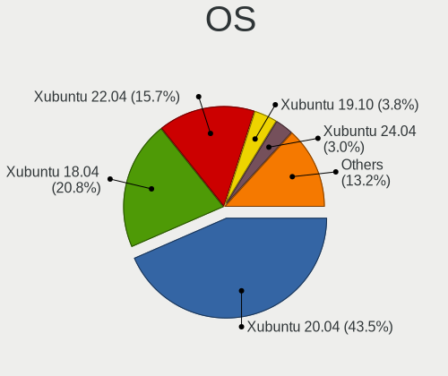

| Name          | Desktops | Percent |
|---------------|----------|---------|
| Xubuntu 20.04 | 732      | 52.78%  |
| Xubuntu 18.04 | 383      | 27.61%  |
| Xubuntu 19.10 | 77       | 5.55%   |
| Xubuntu 16.04 | 48       | 3.46%   |
| Xubuntu 20.10 | 43       | 3.1%    |
| Xubuntu 21.10 | 33       | 2.38%   |
| Xubuntu 21.04 | 29       | 2.09%   |
| Xubuntu 22.04 | 24       | 1.73%   |
| Xubuntu 19.04 | 11       | 0.79%   |
| Xubuntu 18.10 | 5        | 0.36%   |
| Xubuntu       | 2        | 0.14%   |

OS Family
---------

OS without a version

| Name    | Desktops | Percent |
|---------|----------|---------|
| Xubuntu | 1339     | 100%    |

Kernel
------

Version of the Linux kernel

| Version             | Desktops | Percent |
|---------------------|----------|---------|
| 5.4.0-42-generic    | 62       | 3.82%   |
| 5.4.0-48-generic    | 33       | 2.03%   |
| 5.4.0-52-generic    | 28       | 1.72%   |
| 5.4.0-58-generic    | 26       | 1.6%    |
| 5.4.0-42-lowlatency | 21       | 1.29%   |
| 5.3.0-40-generic    | 20       | 1.23%   |
| 5.4.0-65-generic    | 19       | 1.17%   |
| 5.4.0-54-generic    | 19       | 1.17%   |
| 5.4.0-37-generic    | 17       | 1.05%   |
| 5.4.0-26-generic    | 17       | 1.05%   |
| 5.3.0-46-generic    | 17       | 1.05%   |
| 5.4.0-29-generic    | 16       | 0.99%   |
| 5.3.0-28-generic    | 15       | 0.92%   |
| 5.4.0-66-generic    | 14       | 0.86%   |
| 5.4.0-40-lowlatency | 14       | 0.86%   |
| 5.4.0-40-generic    | 14       | 0.86%   |
| 5.4.0-29-lowlatency | 14       | 0.86%   |
| 5.4.0-72-generic    | 13       | 0.8%    |
| 5.0.0-37-generic    | 13       | 0.8%    |
| 4.15.0-72-generic   | 13       | 0.8%    |
| 5.4.0-89-generic    | 12       | 0.74%   |
| 5.4.0-81-generic    | 12       | 0.74%   |
| 5.4.0-91-generic    | 11       | 0.68%   |
| 5.4.0-73-generic    | 11       | 0.68%   |
| 5.4.0-52-lowlatency | 11       | 0.68%   |
| 5.4.0-47-generic    | 11       | 0.68%   |
| 5.4.0-45-generic    | 11       | 0.68%   |
| 5.4.0-37-lowlatency | 11       | 0.68%   |
| 5.0.0-36-generic    | 11       | 0.68%   |
| 4.15.0-99-generic   | 11       | 0.68%   |
| 5.4.0-80-generic    | 10       | 0.62%   |
| 5.4.0-77-generic    | 10       | 0.62%   |
| 5.4.0-74-generic    | 10       | 0.62%   |
| 5.4.0-70-generic    | 10       | 0.62%   |
| 5.4.0-47-lowlatency | 10       | 0.62%   |
| 5.4.0-33-generic    | 10       | 0.62%   |
| 5.3.0-42-generic    | 10       | 0.62%   |
| 5.11.0-37-generic   | 10       | 0.62%   |
| 4.15.0-88-generic   | 10       | 0.62%   |
| 4.15.0-112-generic  | 10       | 0.62%   |
| 5.8.0-43-generic    | 9        | 0.55%   |
| 5.4.0-62-generic    | 9        | 0.55%   |
| 5.4.0-56-generic    | 9        | 0.55%   |
| 5.4.0-48-lowlatency | 9        | 0.55%   |
| 5.3.0-51-generic    | 9        | 0.55%   |
| 5.15.0-41-generic   | 9        | 0.55%   |
| 4.15.0-91-generic   | 9        | 0.55%   |
| 5.8.0-50-generic    | 8        | 0.49%   |
| 5.8.0-44-generic    | 8        | 0.49%   |
| 5.4.0-58-lowlatency | 8        | 0.49%   |
| 5.4.0-51-generic    | 8        | 0.49%   |
| 5.4.0-31-generic    | 8        | 0.49%   |
| 5.3.0-53-generic    | 8        | 0.49%   |
| 5.3.0-40-lowlatency | 8        | 0.49%   |
| 5.13.0-39-generic   | 8        | 0.49%   |
| 5.13.0-30-generic   | 8        | 0.49%   |
| 5.13.0-27-generic   | 8        | 0.49%   |
| 4.15.0-96-generic   | 8        | 0.49%   |
| 5.8.0-63-generic    | 7        | 0.43%   |
| 5.4.0-88-generic    | 7        | 0.43%   |

Kernel Family
-------------

Linux kernel without a distro release

| Version | Desktops | Percent |
|---------|----------|---------|
| 5.4.0   | 635      | 44.88%  |
| 4.15.0  | 208      | 14.7%   |
| 5.3.0   | 157      | 11.1%   |
| 5.8.0   | 101      | 7.14%   |
| 5.11.0  | 90       | 6.36%   |
| 5.13.0  | 76       | 5.37%   |
| 5.0.0   | 45       | 3.18%   |
| 5.15.0  | 28       | 1.98%   |
| 4.4.0   | 22       | 1.55%   |
| 4.18.0  | 10       | 0.71%   |
| 4.10.0  | 4        | 0.28%   |
| 5.9.8   | 2        | 0.14%   |
| 5.9.16  | 2        | 0.14%   |
| 5.6.0   | 2        | 0.14%   |
| 5.15.1  | 2        | 0.14%   |
| 5.11.16 | 2        | 0.14%   |
| 4.13.0  | 2        | 0.14%   |
| 5.9.14  | 1        | 0.07%   |
| 5.8.5   | 1        | 0.07%   |
| 5.8.1   | 1        | 0.07%   |
| 5.7.17  | 1        | 0.07%   |
| 5.7.1   | 1        | 0.07%   |
| 5.6.6   | 1        | 0.07%   |
| 5.5.13  | 1        | 0.07%   |
| 5.4.64  | 1        | 0.07%   |
| 5.2.3   | 1        | 0.07%   |
| 5.18.0  | 1        | 0.07%   |
| 5.17.0  | 1        | 0.07%   |
| 5.16.9  | 1        | 0.07%   |
| 5.16.0  | 1        | 0.07%   |
| 5.14.7  | 1        | 0.07%   |
| 5.13.7  | 1        | 0.07%   |
| 5.13.4  | 1        | 0.07%   |
| 5.12.2  | 1        | 0.07%   |
| 5.12.17 | 1        | 0.07%   |
| 5.12.12 | 1        | 0.07%   |
| 5.12.10 | 1        | 0.07%   |
| 5.11.6  | 1        | 0.07%   |
| 5.10.27 | 1        | 0.07%   |
| 5.10.25 | 1        | 0.07%   |
| 5.10.13 | 1        | 0.07%   |
| 5.0.21  | 1        | 0.07%   |
| 4.8.0   | 1        | 0.07%   |
| 4.14.5  | 1        | 0.07%   |

Kernel Major Ver.
-----------------

Linux kernel major version

| Version | Desktops | Percent |
|---------|----------|---------|
| 5.4     | 636      | 45.04%  |
| 4.15    | 208      | 14.73%  |
| 5.3     | 157      | 11.12%  |
| 5.8     | 103      | 7.29%   |
| 5.11    | 91       | 6.44%   |
| 5.13    | 78       | 5.52%   |
| 5.0     | 46       | 3.26%   |
| 5.15    | 30       | 2.12%   |
| 4.4     | 22       | 1.56%   |
| 4.18    | 10       | 0.71%   |
| 5.9     | 5        | 0.35%   |
| 4.10    | 4        | 0.28%   |
| 5.6     | 3        | 0.21%   |
| 5.12    | 3        | 0.21%   |
| 5.10    | 3        | 0.21%   |
| 5.7     | 2        | 0.14%   |
| 5.16    | 2        | 0.14%   |
| 4.13    | 2        | 0.14%   |
| 5.5     | 1        | 0.07%   |
| 5.2     | 1        | 0.07%   |
| 5.18    | 1        | 0.07%   |
| 5.17    | 1        | 0.07%   |
| 5.14    | 1        | 0.07%   |
| 4.8     | 1        | 0.07%   |
| 4.14    | 1        | 0.07%   |

Arch
----

OS architecture (x86_64, i586, etc.)

| Name   | Desktops | Percent |
|--------|----------|---------|
| x86_64 | 1188     | 88.46%  |
| i686   | 154      | 11.47%  |
| armv7l | 1        | 0.07%   |

DE
--

Desktop Environment

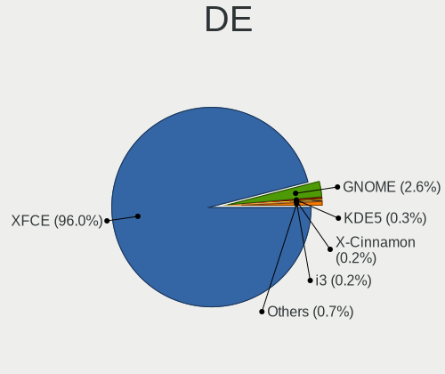

| Name            | Desktops | Percent |
|-----------------|----------|---------|
| XFCE            | 1296     | 96.57%  |
| GNOME           | 32       | 2.38%   |
| KDE5            | 4        | 0.3%    |
| X-Cinnamon      | 2        | 0.15%   |
| GNOME Flashback | 2        | 0.15%   |
| Cinnamon        | 2        | 0.15%   |
| LXQt            | 1        | 0.07%   |
| i3              | 1        | 0.07%   |
| GNUstep         | 1        | 0.07%   |
| Unknown         | 1        | 0.07%   |

Display Server
--------------

X11 or Wayland

| Name    | Desktops | Percent |
|---------|----------|---------|
| X11     | 1309     | 97.76%  |
| Tty     | 22       | 1.64%   |
| Wayland | 4        | 0.3%    |
| Web     | 3        | 0.22%   |
| Unknown | 1        | 0.07%   |

Display Manager
---------------

SDDM, LightDM, etc.

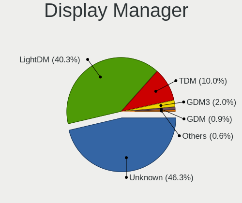

| Name    | Desktops | Percent |
|---------|----------|---------|
| Unknown | 866      | 62.66%  |
| LightDM | 294      | 21.27%  |
| TDM     | 197      | 14.25%  |
| GDM     | 14       | 1.01%   |
| GDM3    | 7        | 0.51%   |
| XDM     | 3        | 0.22%   |
| SDDM    | 1        | 0.07%   |

OS Lang
-------

Language

| Lang    | Desktops | Percent |
|---------|----------|---------|
| en_US   | 413      | 30.59%  |
| de_DE   | 145      | 10.74%  |
| fr_FR   | 117      | 8.67%   |
| it_IT   | 80       | 5.93%   |
| pt_BR   | 78       | 5.78%   |
| ru_RU   | 61       | 4.52%   |
| en_CA   | 50       | 3.7%    |
| en_GB   | 48       | 3.56%   |
| es_ES   | 34       | 2.52%   |
| en_AU   | 34       | 2.52%   |
| Unknown | 32       | 2.37%   |
| C       | 28       | 2.07%   |
| pl_PL   | 20       | 1.48%   |
| ja_JP   | 20       | 1.48%   |
| es_AR   | 20       | 1.48%   |
| nl_NL   | 19       | 1.41%   |
| hu_HU   | 17       | 1.26%   |
| zh_TW   | 9        | 0.67%   |
| sv_SE   | 7        | 0.52%   |
| es_MX   | 7        | 0.52%   |
| ru_UA   | 6        | 0.44%   |
| pt_PT   | 6        | 0.44%   |
| fr_CA   | 6        | 0.44%   |
| fr_BE   | 6        | 0.44%   |
| cs_CZ   | 6        | 0.44%   |
| sk_SK   | 5        | 0.37%   |
| fi_FI   | 5        | 0.37%   |
| es_CO   | 5        | 0.37%   |
| de_AT   | 5        | 0.37%   |
| ro_RO   | 4        | 0.3%    |
| es_UY   | 4        | 0.3%    |
| en_ZA   | 4        | 0.3%    |
| en_IN   | 4        | 0.3%    |
| de_CH   | 4        | 0.3%    |
| nl_BE   | 3        | 0.22%   |
| es_VE   | 3        | 0.22%   |
| en_IL   | 3        | 0.22%   |
| zh_CN   | 2        | 0.15%   |
| tr_TR   | 2        | 0.15%   |
| sl_SI   | 2        | 0.15%   |
| fr_CH   | 2        | 0.15%   |
| fa_IR   | 2        | 0.15%   |
| en_NZ   | 2        | 0.15%   |
| el_GR   | 2        | 0.15%   |
| ca_ES   | 2        | 0.15%   |
| bg_BG   | 2        | 0.15%   |
| uk_UA   | 1        | 0.07%   |
| th_TH   | 1        | 0.07%   |
| sv_FI   | 1        | 0.07%   |
| lv_LV   | 1        | 0.07%   |
| lt_LT   | 1        | 0.07%   |
| id_ID   | 1        | 0.07%   |
| hr_HR   | 1        | 0.07%   |
| es_PE   | 1        | 0.07%   |
| es_NI   | 1        | 0.07%   |
| es_EC   | 1        | 0.07%   |
| en_PH   | 1        | 0.07%   |
| en_HK   | 1        | 0.07%   |
| da_DK   | 1        | 0.07%   |
| bs_BA   | 1        | 0.07%   |

Boot Mode
---------

EFI or BIOS

| Mode | Desktops | Percent |
|------|----------|---------|
| BIOS | 1026     | 75.72%  |
| EFI  | 329      | 24.28%  |

Filesystem
----------

Type of filesystem

| Type    | Desktops | Percent |
|---------|----------|---------|
| Ext4    | 1243     | 92.21%  |
| Overlay | 34       | 2.52%   |
| Btrfs   | 26       | 1.93%   |
| Zfs     | 15       | 1.11%   |
| Unknown | 11       | 0.82%   |
| Xfs     | 10       | 0.74%   |
| Ext2    | 5        | 0.37%   |
| Ext3    | 3        | 0.22%   |
| Aufs    | 1        | 0.07%   |

Part. scheme
------------

Scheme of partitioning

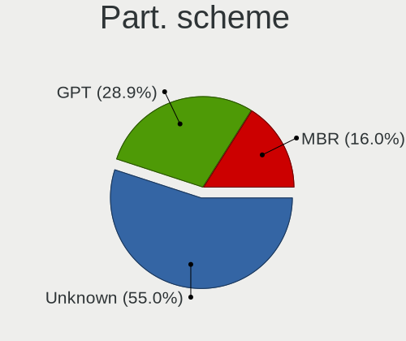

| Type    | Desktops | Percent |
|---------|----------|---------|
| Unknown | 996      | 74.16%  |
| GPT     | 193      | 14.37%  |
| MBR     | 154      | 11.47%  |

Dual Boot with Linux/BSD
------------------------

Hosting more than one Linux/BSD

| Dual boot | Desktops | Percent |
|-----------|----------|---------|
| No        | 1053     | 76.81%  |
| Yes       | 318      | 23.19%  |

Dual Boot (Win)
---------------

Hosting Linux and Windows

| Dual boot | Desktops | Percent |
|-----------|----------|---------|
| No        | 813      | 59.17%  |
| Yes       | 561      | 40.83%  |

Board
-----

Vendor
------

Motherboard manufacturer

| Name                | Desktops | Percent |
|---------------------|----------|---------|
| ASUSTek Computer    | 295      | 22.03%  |
| Gigabyte Technology | 181      | 13.52%  |
| Dell                | 151      | 11.28%  |
| ASRock              | 133      | 9.93%   |
| Hewlett-Packard     | 124      | 9.26%   |
| MSI                 | 121      | 9.04%   |
| Lenovo              | 48       | 3.58%   |
| Intel               | 38       | 2.84%   |
| Acer                | 38       | 2.84%   |
| Unknown             | 24       | 1.79%   |
| Foxconn             | 19       | 1.42%   |
| ECS                 | 19       | 1.42%   |
| Medion              | 15       | 1.12%   |
| Fujitsu             | 15       | 1.12%   |
| Pegatron            | 13       | 0.97%   |
| Biostar             | 8        | 0.6%    |
| Fujitsu Siemens     | 7        | 0.52%   |
| Positivo            | 6        | 0.45%   |
| Packard Bell        | 6        | 0.45%   |
| eMachines           | 5        | 0.37%   |
| Apple               | 5        | 0.37%   |
| Shuttle             | 4        | 0.3%    |
| NEC Computers       | 4        | 0.3%    |
| AOpen               | 4        | 0.3%    |
| AAEON               | 4        | 0.3%    |
| IBM                 | 3        | 0.22%   |
| EVGA                | 3        | 0.22%   |
| ZOTAC               | 2        | 0.15%   |
| WinFast             | 2        | 0.15%   |
| VIA Technologies    | 2        | 0.15%   |
| Semp Toshiba        | 2        | 0.15%   |
| Quanta              | 2        | 0.15%   |
| PCWare              | 2        | 0.15%   |
| PCChips             | 2        | 0.15%   |
| OEM                 | 2        | 0.15%   |
| NCR                 | 2        | 0.15%   |
| Huanan              | 2        | 0.15%   |
| Gateway             | 2        | 0.15%   |
| AMI                 | 2        | 0.15%   |
| Alienware           | 2        | 0.15%   |
| ABIT                | 2        | 0.15%   |
| Wistron             | 1        | 0.07%   |
| Seco                | 1        | 0.07%   |
| QTQD                | 1        | 0.07%   |
| Qbex                | 1        | 0.07%   |
| Point of View       | 1        | 0.07%   |
| Nvidia              | 1        | 0.07%   |
| MiTAC               | 1        | 0.07%   |
| Maxtang             | 1        | 0.07%   |
| langchao            | 1        | 0.07%   |
| Itautec             | 1        | 0.07%   |
| Insyde              | 1        | 0.07%   |
| Google              | 1        | 0.07%   |
| Clientron           | 1        | 0.07%   |
| Chuwi               | 1        | 0.07%   |
| Braview             | 1        | 0.07%   |
| BCM                 | 1        | 0.07%   |
| ASRockRack          | 1        | 0.07%   |
| ASL                 | 1        | 0.07%   |

Model
-----

Motherboard model

| Name                                   | Desktops | Percent |
|----------------------------------------|----------|---------|
| Unknown                                | 26       | 1.94%   |
| ASUS All Series                        | 21       | 1.57%   |
| Dell OptiPlex 7010                     | 12       | 0.9%    |
| Dell OptiPlex 755                      | 9        | 0.67%   |
| Dell OptiPlex 760                      | 8        | 0.6%    |
| ASRock N68C-S UCC                      | 8        | 0.6%    |
| Dell OptiPlex 780                      | 7        | 0.52%   |
| Dell OptiPlex 390                      | 7        | 0.52%   |
| ASUS TUF Gaming X570-PLUS              | 6        | 0.45%   |
| MSI MS-7C37                            | 5        | 0.37%   |
| MSI MS-7B89                            | 5        | 0.37%   |
| MSI MS-7B79                            | 5        | 0.37%   |
| MSI MS-7A38                            | 5        | 0.37%   |
| HP EliteDesk 800 G1 SFF                | 5        | 0.37%   |
| HP Compaq Elite 8300 SFF               | 5        | 0.37%   |
| HP Compaq dc7600 Small Form Factor     | 5        | 0.37%   |
| Dell OptiPlex GX620                    | 5        | 0.37%   |
| ASUS M5A78L-M/USB3                     | 5        | 0.37%   |
| MSI MS-7C02                            | 4        | 0.3%    |
| MSI MS-7817                            | 4        | 0.3%    |
| MSI MS-7816                            | 4        | 0.3%    |
| MSI MS-7721                            | 4        | 0.3%    |
| MSI MS-7693                            | 4        | 0.3%    |
| HP Compaq Pro 6300 SFF                 | 4        | 0.3%    |
| HP Compaq dc7900 Small Form Factor     | 4        | 0.3%    |
| HP Compaq 6200 Pro MT PC               | 4        | 0.3%    |
| Gigabyte X570 AORUS MASTER             | 4        | 0.3%    |
| Gigabyte GA-MA785GM-US2H               | 4        | 0.3%    |
| Gigabyte B450M DS3H                    | 4        | 0.3%    |
| Gigabyte 945GZM-S2                     | 4        | 0.3%    |
| Dell Precision WorkStation T7400       | 4        | 0.3%    |
| Dell OptiPlex 990                      | 4        | 0.3%    |
| Dell OptiPlex 9020                     | 4        | 0.3%    |
| Dell OptiPlex 3020                     | 4        | 0.3%    |
| Dell Inspiron 531s                     | 4        | 0.3%    |
| ASUS PRIME Z390-A                      | 4        | 0.3%    |
| Apple MacPro5,1                        | 4        | 0.3%    |
| MSI MS-7A34                            | 3        | 0.22%   |
| Intel H61                              | 3        | 0.22%   |
| HP Z420 Workstation                    | 3        | 0.22%   |
| HP ProDesk 600 G1 SFF                  | 3        | 0.22%   |
| HP Compaq dc7900 Convertible Minitower | 3        | 0.22%   |
| HP Compaq 8200 Elite SFF PC            | 3        | 0.22%   |
| HP Compaq 8100 Elite SFF PC            | 3        | 0.22%   |
| HP Compaq 8000 Elite SFF PC            | 3        | 0.22%   |
| Gigabyte H61M-USB3V                    | 3        | 0.22%   |
| Gigabyte H55M-UD2H                     | 3        | 0.22%   |
| Fujitsu ESPRIMO E705                   | 3        | 0.22%   |
| Dell OptiPlex 960                      | 3        | 0.22%   |
| Dell OptiPlex 3010                     | 3        | 0.22%   |
| Dell Inspiron 530                      | 3        | 0.22%   |
| Dell DXP051                            | 3        | 0.22%   |
| ASUS Z170-P                            | 3        | 0.22%   |
| ASUS TUF Gaming B550M-PLUS             | 3        | 0.22%   |
| ASUS PRIME A320M-K                     | 3        | 0.22%   |
| ASUS P5KPL-AM SE                       | 3        | 0.22%   |
| ASUS P5KPL-AM                          | 3        | 0.22%   |
| ASUS P5K                               | 3        | 0.22%   |
| ASUS M5A78L-M PLUS/USB3                | 3        | 0.22%   |
| ASUS M4A89GTD-PRO                      | 3        | 0.22%   |

Model Family
------------

Motherboard model prefix

| Name                     | Desktops | Percent |
|--------------------------|----------|---------|
| Dell OptiPlex            | 82       | 6.12%   |
| HP Compaq                | 61       | 4.56%   |
| ASUS PRIME               | 37       | 2.76%   |
| Lenovo ThinkCentre       | 32       | 2.39%   |
| Unknown                  | 26       | 1.94%   |
| Dell Inspiron            | 25       | 1.87%   |
| ASUS All                 | 21       | 1.57%   |
| Acer Aspire              | 19       | 1.42%   |
| Dell Precision           | 18       | 1.34%   |
| ASUS TUF                 | 16       | 1.19%   |
| Acer Veriton             | 14       | 1.05%   |
| HP ProDesk               | 12       | 0.9%    |
| Fujitsu ESPRIMO          | 11       | 0.82%   |
| ASUS ROG                 | 11       | 0.82%   |
| HP EliteDesk             | 10       | 0.75%   |
| ASUS P5KPL-AM            | 9        | 0.67%   |
| ASUS M5A78L-M            | 9        | 0.67%   |
| ASUS P8H61-M             | 8        | 0.6%    |
| ASRock N68C-S            | 8        | 0.6%    |
| Gigabyte X570            | 7        | 0.52%   |
| Packard Bell IMEDIA      | 6        | 0.45%   |
| Lenovo ThinkStation      | 6        | 0.45%   |
| Lenovo IdeaCentre        | 6        | 0.45%   |
| Gigabyte B450M           | 6        | 0.45%   |
| ASUS P8Z77-V             | 6        | 0.45%   |
| ASUS P5K                 | 6        | 0.45%   |
| MSI MS-7C37              | 5        | 0.37%   |
| MSI MS-7B89              | 5        | 0.37%   |
| MSI MS-7B79              | 5        | 0.37%   |
| MSI MS-7A38              | 5        | 0.37%   |
| Dell Studio              | 5        | 0.37%   |
| ASUS P9X79               | 5        | 0.37%   |
| MSI MS-7C02              | 4        | 0.3%    |
| MSI MS-7817              | 4        | 0.3%    |
| MSI MS-7816              | 4        | 0.3%    |
| MSI MS-7721              | 4        | 0.3%    |
| MSI MS-7693              | 4        | 0.3%    |
| HP ProLiant              | 4        | 0.3%    |
| Gigabyte H310M           | 4        | 0.3%    |
| Gigabyte GA-MA785GM-US2H | 4        | 0.3%    |
| Gigabyte 945GZM-S2       | 4        | 0.3%    |
| ASUS SABERTOOTH          | 4        | 0.3%    |
| ASRock X570              | 4        | 0.3%    |
| ASRock B450M             | 4        | 0.3%    |
| ASRock B450              | 4        | 0.3%    |
| ASRock A320M-HDV         | 4        | 0.3%    |
| ASRock 970               | 4        | 0.3%    |
| Apple MacPro5            | 4        | 0.3%    |
| MSI MS-7A34              | 3        | 0.22%   |
| Intel H61                | 3        | 0.22%   |
| HP Z420                  | 3        | 0.22%   |
| HP Pavilion              | 3        | 0.22%   |
| Gigabyte Z97X-Gaming     | 3        | 0.22%   |
| Gigabyte X470            | 3        | 0.22%   |
| Gigabyte H61M-USB3V      | 3        | 0.22%   |
| Gigabyte H55M-UD2H       | 3        | 0.22%   |
| Gigabyte GA-78LMT-USB3   | 3        | 0.22%   |
| Gigabyte 970A-DS3P       | 3        | 0.22%   |
| Fujitsu Siemens ESPRIMO  | 3        | 0.22%   |
| Foxconn Pro              | 3        | 0.22%   |

MFG Year
--------

Motherboard manufacture year

| Year    | Desktops | Percent |
|---------|----------|---------|
| 2012    | 128      | 9.56%   |
| 2009    | 124      | 9.26%   |
| 2013    | 116      | 8.66%   |
| 2011    | 116      | 8.66%   |
| 2010    | 107      | 7.99%   |
| 2007    | 102      | 7.62%   |
| 2008    | 96       | 7.17%   |
| 2018    | 83       | 6.2%    |
| 2019    | 73       | 5.45%   |
| 2014    | 69       | 5.15%   |
| 2017    | 58       | 4.33%   |
| 2006    | 56       | 4.18%   |
| 2015    | 51       | 3.81%   |
| 2020    | 41       | 3.06%   |
| 2016    | 41       | 3.06%   |
| 2005    | 34       | 2.54%   |
| 2021    | 19       | 1.42%   |
| 2004    | 9        | 0.67%   |
| 2003    | 7        | 0.52%   |
| 2001    | 4        | 0.3%    |
| Unknown | 3        | 0.22%   |
| 2002    | 2        | 0.15%   |

Form Factor
-----------

Physical design of the computer

| Name    | Desktops | Percent |
|---------|----------|---------|
| Desktop | 1339     | 100%    |

Secure Boot
-----------

Enabled or disabled

| State    | Desktops | Percent |
|----------|----------|---------|
| Disabled | 1316     | 97.99%  |
| Enabled  | 27       | 2.01%   |

Coreboot
--------

Have coreboot on board

| Used | Desktops | Percent |
|------|----------|---------|
| No   | 1338     | 99.93%  |
| Yes  | 1        | 0.07%   |

RAM Size
--------

Total RAM memory

| Size in GB      | Desktops | Percent |
|-----------------|----------|---------|
| 3.01-4.0        | 317      | 23.22%  |
| 8.01-16.0       | 247      | 18.1%   |
| 16.01-24.0      | 221      | 16.19%  |
| 4.01-8.0        | 203      | 14.87%  |
| 1.01-2.0        | 126      | 9.23%   |
| 32.01-64.0      | 104      | 7.62%   |
| 2.01-3.0        | 45       | 3.3%    |
| 64.01-256.0     | 44       | 3.22%   |
| 0.51-1.0        | 30       | 2.2%    |
| 24.01-32.0      | 22       | 1.61%   |
| 0.01-0.5        | 5        | 0.37%   |
| More than 256.0 | 1        | 0.07%   |

RAM Used
--------

Used RAM memory

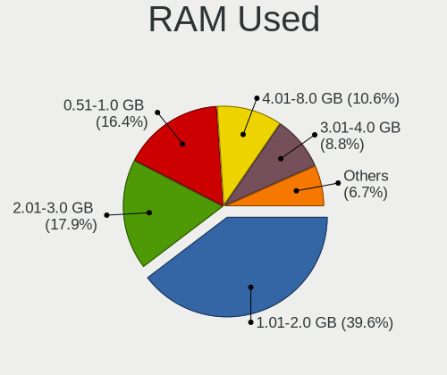

| Used GB    | Desktops | Percent |
|------------|----------|---------|
| 1.01-2.0   | 639      | 42.35%  |
| 0.51-1.0   | 295      | 19.55%  |
| 2.01-3.0   | 250      | 16.57%  |
| 4.01-8.0   | 133      | 8.81%   |
| 3.01-4.0   | 107      | 7.09%   |
| 8.01-16.0  | 36       | 2.39%   |
| 0.01-0.5   | 34       | 2.25%   |
| 16.01-24.0 | 7        | 0.46%   |
| 24.01-32.0 | 6        | 0.4%    |
| 32.01-64.0 | 2        | 0.13%   |

Total Drives
------------

Number of drives on board

| Drives | Desktops | Percent |
|--------|----------|---------|
| 1      | 613      | 43.91%  |
| 2      | 402      | 28.8%   |
| 3      | 214      | 15.33%  |
| 4      | 85       | 6.09%   |
| 5      | 42       | 3.01%   |
| 6      | 16       | 1.15%   |
| 7      | 9        | 0.64%   |
| 0      | 9        | 0.64%   |
| 10     | 2        | 0.14%   |
| 9      | 2        | 0.14%   |
| 8      | 2        | 0.14%   |

Has CD-ROM
----------

Has CD-ROM on board

| Presented | Desktops | Percent |
|-----------|----------|---------|
| Yes       | 811      | 59.63%  |
| No        | 549      | 40.37%  |

Has Ethernet
------------

Has Ethernet on board

| Presented | Desktops | Percent |
|-----------|----------|---------|
| Yes       | 1320     | 98.58%  |
| No        | 19       | 1.42%   |

Has WiFi
--------

Has WiFi module

| Presented | Desktops | Percent |
|-----------|----------|---------|
| No        | 827      | 60.67%  |
| Yes       | 536      | 39.33%  |

Has Bluetooth
-------------

Has Bluetooth module

| Presented | Desktops | Percent |
|-----------|----------|---------|
| No        | 1110     | 81.8%   |
| Yes       | 247      | 18.2%   |

Location
--------

Country
-------

Geographic location (country)

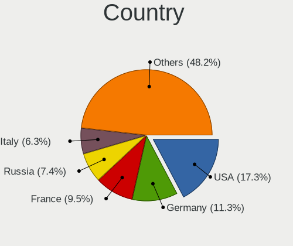

| Country                | Desktops | Percent |
|------------------------|----------|---------|
| USA                    | 233      | 17.36%  |
| Germany                | 165      | 12.3%   |
| France                 | 115      | 8.57%   |
| Italy                  | 93       | 6.93%   |
| Brazil                 | 86       | 6.41%   |
| Russia                 | 72       | 5.37%   |
| Canada                 | 63       | 4.69%   |
| UK                     | 49       | 3.65%   |
| Spain                  | 40       | 2.98%   |
| Netherlands            | 37       | 2.76%   |
| Australia              | 37       | 2.76%   |
| Ukraine                | 26       | 1.94%   |
| Argentina              | 25       | 1.86%   |
| Japan                  | 23       | 1.71%   |
| Hungary                | 20       | 1.49%   |
| Poland                 | 19       | 1.42%   |
| Sweden                 | 17       | 1.27%   |
| Finland                | 16       | 1.19%   |
| Belgium                | 15       | 1.12%   |
| Mexico                 | 11       | 0.82%   |
| Greece                 | 11       | 0.82%   |
| Taiwan                 | 10       | 0.75%   |
| Bulgaria               | 10       | 0.75%   |
| Portugal               | 9        | 0.67%   |
| Austria                | 9        | 0.67%   |
| Romania                | 7        | 0.52%   |
| Czechia                | 7        | 0.52%   |
| Thailand               | 6        | 0.45%   |
| Switzerland            | 6        | 0.45%   |
| Slovakia               | 6        | 0.45%   |
| Israel                 | 6        | 0.45%   |
| Venezuela              | 5        | 0.37%   |
| Uruguay                | 5        | 0.37%   |
| Indonesia              | 5        | 0.37%   |
| Colombia               | 5        | 0.37%   |
| South Africa           | 4        | 0.3%    |
| Slovenia               | 4        | 0.3%    |
| Iran                   | 4        | 0.3%    |
| India                  | 4        | 0.3%    |
| Turkey                 | 3        | 0.22%   |
| Norway                 | 3        | 0.22%   |
| Malaysia               | 3        | 0.22%   |
| Latvia                 | 3        | 0.22%   |
| Egypt                  | 3        | 0.22%   |
| Croatia                | 3        | 0.22%   |
| Puerto Rico            | 2        | 0.15%   |
| Philippines            | 2        | 0.15%   |
| New Zealand            | 2        | 0.15%   |
| Bosnia and Herzegovina | 2        | 0.15%   |
| Vietnam                | 1        | 0.07%   |
| UAE                    | 1        | 0.07%   |
| Singapore              | 1        | 0.07%   |
| Serbia                 | 1        | 0.07%   |
| Runion               | 1        | 0.07%   |
| Peru                   | 1        | 0.07%   |
| Panama                 | 1        | 0.07%   |
| Nicaragua              | 1        | 0.07%   |
| Morocco                | 1        | 0.07%   |
| Malta                  | 1        | 0.07%   |
| Madagascar             | 1        | 0.07%   |

City
----

Geographic location (city)

| City              | Desktops | Percent |
|-------------------|----------|---------|
| Berlin            | 16       | 1.13%   |
| Paris             | 14       | 0.99%   |
| Sydney            | 12       | 0.85%   |
| Sao Paulo         | 12       | 0.85%   |
| Moscow            | 12       | 0.85%   |
| Rome              | 10       | 0.71%   |
| Montreal          | 9        | 0.64%   |
| Milan             | 9        | 0.64%   |
| Madrid            | 9        | 0.64%   |
| Hamburg           | 9        | 0.64%   |
| Amsterdam         | 9        | 0.64%   |
| Vancouver         | 8        | 0.57%   |
| Oryol             | 8        | 0.57%   |
| Budapest          | 8        | 0.57%   |
| Genoa             | 7        | 0.49%   |
| Turin             | 6        | 0.42%   |
| Melbourne         | 6        | 0.42%   |
| Cologne           | 6        | 0.42%   |
| Buenos Aires      | 6        | 0.42%   |
| Tampere           | 5        | 0.35%   |
| Sofia             | 5        | 0.35%   |
| Rio de Janeiro    | 5        | 0.35%   |
| Perth             | 5        | 0.35%   |
| Munich            | 5        | 0.35%   |
| Kyiv              | 5        | 0.35%   |
| Helsinki          | 5        | 0.35%   |
| Athens            | 5        | 0.35%   |
| Warsaw            | 4        | 0.28%   |
| Tehran            | 4        | 0.28%   |
| Taipei            | 4        | 0.28%   |
| Ottawa            | 4        | 0.28%   |
| Odessa            | 4        | 0.28%   |
| Montevideo        | 4        | 0.28%   |
| Lund              | 4        | 0.28%   |
| Londrina          | 4        | 0.28%   |
| Helmond           | 4        | 0.28%   |
| Hanover           | 4        | 0.28%   |
| Frankfurt am Main | 4        | 0.28%   |
| Dresden           | 4        | 0.28%   |
| Denver            | 4        | 0.28%   |
| Chicago           | 4        | 0.28%   |
| Brisbane          | 4        | 0.28%   |
| Bologna           | 4        | 0.28%   |
| Belo Horizonte    | 4        | 0.28%   |
| Yokohama          | 3        | 0.21%   |
| Waterford         | 3        | 0.21%   |
| Vienna            | 3        | 0.21%   |
| Toronto           | 3        | 0.21%   |
| The Hague         | 3        | 0.21%   |
| Tel Aviv          | 3        | 0.21%   |
| Suwanee           | 3        | 0.21%   |
| Springfield       | 3        | 0.21%   |
| Seattle           | 3        | 0.21%   |
| Salvador          | 3        | 0.21%   |
| Saint Paul        | 3        | 0.21%   |
| Rostov-on-Don     | 3        | 0.21%   |
| Roseburg          | 3        | 0.21%   |
| Riga              | 3        | 0.21%   |
| Reno              | 3        | 0.21%   |
| New Taipei        | 3        | 0.21%   |

Drives
------

Drive Vendor
------------

Hard drive vendors

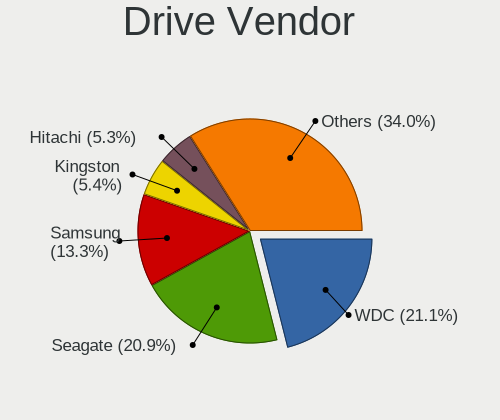

| Vendor                    | Desktops | Drives | Percent |
|---------------------------|----------|--------|---------|
| Seagate                   | 506      | 812    | 22.66%  |
| WDC                       | 499      | 774    | 22.35%  |
| Samsung Electronics       | 300      | 462    | 13.43%  |
| Hitachi                   | 132      | 187    | 5.91%   |
| Toshiba                   | 107      | 154    | 4.79%   |
| Kingston                  | 93       | 117    | 4.16%   |
| SanDisk                   | 71       | 91     | 3.18%   |
| Crucial                   | 65       | 92     | 2.91%   |
| Maxtor                    | 56       | 80     | 2.51%   |
| Intel                     | 35       | 53     | 1.57%   |
| A-DATA Technology         | 34       | 43     | 1.52%   |
| Unknown                   | 24       | 30     | 1.07%   |
| China                     | 24       | 31     | 1.07%   |
| Patriot                   | 22       | 27     | 0.99%   |
| HGST                      | 17       | 21     | 0.76%   |
| PNY                       | 14       | 21     | 0.63%   |
| Intenso                   | 14       | 21     | 0.63%   |
| OCZ                       | 13       | 19     | 0.58%   |
| Phison                    | 12       | 14     | 0.54%   |
| Transcend                 | 11       | 12     | 0.49%   |
| Fujitsu                   | 10       | 12     | 0.45%   |
| SPCC                      | 8        | 11     | 0.36%   |
| Silicon Motion            | 7        | 8      | 0.31%   |
| Micron Technology         | 7        | 9      | 0.31%   |
| Lexar                     | 7        | 7      | 0.31%   |
| ASMT                      | 7        | 8      | 0.31%   |
| SK hynix                  | 6        | 6      | 0.27%   |
| KingDian                  | 5        | 9      | 0.22%   |
| Apacer                    | 5        | 8      | 0.22%   |
| Team                      | 4        | 6      | 0.18%   |
| Plextor                   | 4        | 4      | 0.18%   |
| Mushkin                   | 4        | 4      | 0.18%   |
| Hewlett-Packard           | 4        | 6      | 0.18%   |
| GOODRAM                   | 4        | 6      | 0.18%   |
| Corsair                   | 4        | 4      | 0.18%   |
| Apple                     | 4        | 4      | 0.18%   |
| XPG                       | 3        | 9      | 0.13%   |
| Smartbuy                  | 3        | 3      | 0.13%   |
| SABRENT                   | 3        | 3      | 0.13%   |
| Realtek Semiconductor     | 3        | 5      | 0.13%   |
| Micron/Crucial Technology | 3        | 5      | 0.13%   |
| LITEONIT                  | 3        | 3      | 0.13%   |
| KIOXIA                    | 3        | 4      | 0.13%   |
| JMicron Technology        | 3        | 4      | 0.13%   |
| WD MediaMax               | 2        | 2      | 0.09%   |
| USB3.0                    | 2        | 3      | 0.09%   |
| TO Exter                  | 2        | 3      | 0.09%   |
| TEXTORM                   | 2        | 2      | 0.09%   |
| OCZ-VERTEX3               | 2        | 2      | 0.09%   |
| Kingmax                   | 2        | 3      | 0.09%   |
| KingFast                  | 2        | 2      | 0.09%   |
| Integral                  | 2        | 2      | 0.09%   |
| HPE                       | 2        | 5      | 0.09%   |
| Gigabyte Technology       | 2        | 2      | 0.09%   |
| ExcelStor                 | 2        | 2      | 0.09%   |
| Unknown                   | 2        | 2      | 0.09%   |
| ZTE                       | 1        | 1      | 0.04%   |
| XrayDisk                  | 1        | 1      | 0.04%   |
| WDC WDS                   | 1        | 1      | 0.04%   |
| Verbatim                  | 1        | 1      | 0.04%   |

Drive Model
-----------

Hard drive models

| Model                            | Desktops | Percent |
|----------------------------------|----------|---------|
| Seagate ST500DM002-1BD142 500GB  | 42       | 1.63%   |
| Seagate ST1000DM010-2EP102 1TB   | 27       | 1.04%   |
| Kingston SA400S37240G 240GB SSD  | 26       | 1.01%   |
| Samsung SSD 860 EVO 500GB        | 24       | 0.93%   |
| Toshiba DT01ACA100 1TB           | 20       | 0.77%   |
| Seagate ST2000DM008-2FR102 2TB   | 19       | 0.74%   |
| Seagate ST3500418AS 500GB        | 17       | 0.66%   |
| Seagate ST1000DM003-1CH162 1TB   | 17       | 0.66%   |
| Seagate ST31000528AS 1TB         | 16       | 0.62%   |
| Seagate ST2000DM001-1CH164 2TB   | 16       | 0.62%   |
| Samsung SSD 850 EVO 250GB        | 15       | 0.58%   |
| Hitachi HDS721010CLA332 1TB      | 14       | 0.54%   |
| Seagate ST380815AS 80GB          | 13       | 0.5%    |
| Seagate ST3250310AS 250GB        | 13       | 0.5%    |
| Seagate ST3160815AS 160GB        | 13       | 0.5%    |
| Seagate Expansion 1TB            | 13       | 0.5%    |
| Kingston SA400S37480G 480GB SSD  | 13       | 0.5%    |
| Patriot Burst 120GB SSD          | 12       | 0.46%   |
| WDC WD800JD-75MSA3 80GB          | 11       | 0.43%   |
| WDC WD10EZEX-08WN4A0 1TB         | 11       | 0.43%   |
| Toshiba HDWD110 1TB              | 11       | 0.43%   |
| Seagate ST31000524AS 1TB         | 11       | 0.43%   |
| Samsung SSD 850 EVO 500GB        | 11       | 0.43%   |
| WDC WD10EZEX-00BN5A0 1TB         | 10       | 0.39%   |
| Unknown SD/MMC/MS PRO 64GB       | 10       | 0.39%   |
| Seagate ST4000DM004-2CV104 4TB   | 10       | 0.39%   |
| Seagate ST3500413AS 500GB        | 10       | 0.39%   |
| Kingston SA400S37120G 120GB SSD  | 10       | 0.39%   |
| WDC WD20EARX-00PASB0 2TB         | 9        | 0.35%   |
| Toshiba DT01ACA200 2TB           | 9        | 0.35%   |
| Seagate ST3250820AS 250GB        | 9        | 0.35%   |
| Seagate ST1000DM003-1ER162 1TB   | 9        | 0.35%   |
| Samsung SSD 860 EVO 1TB          | 9        | 0.35%   |
| Samsung NVMe SSD Drive 1TB       | 9        | 0.35%   |
| Samsung HD160JJ/ 160GB           | 9        | 0.35%   |
| Hitachi HDS721616PLA380 160GB    | 9        | 0.35%   |
| Hitachi HDP725025GLA380 250GB    | 9        | 0.35%   |
| Crucial CT120BX500SSD1 120GB     | 9        | 0.35%   |
| Crucial CT1000MX500SSD1 1TB      | 9        | 0.35%   |
| Toshiba DT01ACA050 500GB         | 8        | 0.31%   |
| Samsung SSD 860 EVO 250GB        | 8        | 0.31%   |
| Samsung SSD 850 PRO 256GB        | 8        | 0.31%   |
| Samsung SSD 840 EVO 250GB        | 8        | 0.31%   |
| Samsung HD502HJ 500GB            | 8        | 0.31%   |
| Samsung HD501LJ 500GB            | 8        | 0.31%   |
| Samsung HD322HJ 320GB            | 8        | 0.31%   |
| Samsung HD103SJ 1TB              | 8        | 0.31%   |
| Kingston SV300S37A120G 120GB SSD | 8        | 0.31%   |
| Seagate ST3160318AS 160GB        | 7        | 0.27%   |
| Seagate ST2000DM006-2DM164 2TB   | 7        | 0.27%   |
| Seagate ST2000DM001-9YN164 2TB   | 7        | 0.27%   |
| Seagate ST2000DM001-1ER164 2TB   | 7        | 0.27%   |
| Seagate Expansion Desk 4TB       | 7        | 0.27%   |
| Samsung SSD 840 Series 120GB     | 7        | 0.27%   |
| Samsung NVMe SSD Drive 500GB     | 7        | 0.27%   |
| Samsung HD161HJ 160GB            | 7        | 0.27%   |
| Crucial CT500MX500SSD1 500GB     | 7        | 0.27%   |
| WDC WDS240G2G0A-00JH30 240GB SSD | 6        | 0.23%   |
| WDC WDS120G2G0A-00JH30 120GB SSD | 6        | 0.23%   |
| WDC WD5000AAKX-60U6AA0 500GB     | 6        | 0.23%   |

HDD Vendor
----------

Hard disk drive vendors

| Vendor              | Desktops | Drives | Percent |
|---------------------|----------|--------|---------|
| Seagate             | 498      | 799    | 34.97%  |
| WDC                 | 462      | 700    | 32.44%  |
| Hitachi             | 132      | 187    | 9.27%   |
| Samsung Electronics | 122      | 176    | 8.57%   |
| Toshiba             | 94       | 136    | 6.6%    |
| Maxtor              | 54       | 78     | 3.79%   |
| HGST                | 17       | 21     | 1.19%   |
| Unknown             | 11       | 13     | 0.77%   |
| Fujitsu             | 10       | 12     | 0.7%    |
| Intenso             | 4        | 5      | 0.28%   |
| ASMT                | 4        | 4      | 0.28%   |
| Apple               | 3        | 3      | 0.21%   |
| WD MediaMax         | 2        | 2      | 0.14%   |
| SABRENT             | 2        | 2      | 0.14%   |
| Hewlett-Packard     | 2        | 2      | 0.14%   |
| ExcelStor           | 2        | 2      | 0.14%   |
| USB3.0              | 1        | 2      | 0.07%   |
| LaCie               | 1        | 4      | 0.07%   |
| ICY BOX             | 1        | 1      | 0.07%   |
| IBM/Hitachi         | 1        | 1      | 0.07%   |
| HPE                 | 1        | 4      | 0.07%   |

SSD Vendor
----------

Solid state drive vendors

| Vendor              | Desktops | Drives | Percent |
|---------------------|----------|--------|---------|
| Samsung Electronics | 152      | 212    | 22.93%  |
| Kingston            | 82       | 101    | 12.37%  |
| SanDisk             | 64       | 83     | 9.65%   |
| Crucial             | 58       | 85     | 8.75%   |
| WDC                 | 45       | 64     | 6.79%   |
| Intel               | 27       | 41     | 4.07%   |
| A-DATA Technology   | 27       | 35     | 4.07%   |
| China               | 24       | 31     | 3.62%   |
| Patriot             | 22       | 27     | 3.32%   |
| PNY                 | 14       | 21     | 2.11%   |
| OCZ                 | 12       | 17     | 1.81%   |
| Transcend           | 9        | 9      | 1.36%   |
| Toshiba             | 8        | 12     | 1.21%   |
| SPCC                | 8        | 11     | 1.21%   |
| Intenso             | 8        | 10     | 1.21%   |
| Micron Technology   | 7        | 9      | 1.06%   |
| Lexar               | 7        | 7      | 1.06%   |
| KingDian            | 5        | 9      | 0.75%   |
| Apacer              | 5        | 8      | 0.75%   |
| Team                | 4        | 6      | 0.6%    |
| SK hynix            | 4        | 4      | 0.6%    |
| Plextor             | 4        | 4      | 0.6%    |
| GOODRAM             | 4        | 6      | 0.6%    |
| Corsair             | 4        | 4      | 0.6%    |
| Smartbuy            | 3        | 3      | 0.45%   |
| Mushkin             | 3        | 3      | 0.45%   |
| LITEONIT            | 3        | 3      | 0.45%   |
| ASMT                | 3        | 4      | 0.45%   |
| TO Exter            | 2        | 3      | 0.3%    |
| TEXTORM             | 2        | 2      | 0.3%    |
| OCZ-VERTEX3         | 2        | 2      | 0.3%    |
| Maxtor              | 2        | 2      | 0.3%    |
| Kingmax             | 2        | 3      | 0.3%    |
| Integral            | 2        | 2      | 0.3%    |
| Hewlett-Packard     | 2        | 4      | 0.3%    |
| Unknown             | 2        | 2      | 0.3%    |
| WDC WDS             | 1        | 1      | 0.15%   |
| Verbatim            | 1        | 1      | 0.15%   |
| Vaseky              | 1        | 1      | 0.15%   |
| USB3.0              | 1        | 1      | 0.15%   |
| Unknown             | 1        | 1      | 0.15%   |
| Super Talent        | 1        | 1      | 0.15%   |
| SUNEAST             | 1        | 1      | 0.15%   |
| Seagate             | 1        | 1      | 0.15%   |
| SABRENT             | 1        | 1      | 0.15%   |
| S3+                 | 1        | 2      | 0.15%   |
| QUMOX               | 1        | 1      | 0.15%   |
| Phison              | 1        | 2      | 0.15%   |
| OCZ-VERTEX2         | 1        | 1      | 0.15%   |
| MX                  | 1        | 1      | 0.15%   |
| Mercury             | 1        | 1      | 0.15%   |
| MAXIO               | 1        | 1      | 0.15%   |
| LITEON              | 1        | 1      | 0.15%   |
| KIOXIA-EXCERIA      | 1        | 2      | 0.15%   |
| KingFast            | 1        | 1      | 0.15%   |
| INTEL SS            | 1        | 1      | 0.15%   |
| Innodisk            | 1        | 1      | 0.15%   |
| Inateck             | 1        | 1      | 0.15%   |
| HS-SSD-E100N        | 1        | 1      | 0.15%   |
| FREEBSD             | 1        | 2      | 0.15%   |

Drive Kind
----------

HDD or SSD

| Kind    | Desktops | Drives | Percent |
|---------|----------|--------|---------|
| HDD     | 1067     | 2154   | 58.72%  |
| SSD     | 571      | 884    | 31.43%  |
| NVMe    | 137      | 199    | 7.54%   |
| Unknown | 34       | 49     | 1.87%   |
| MMC     | 8        | 9      | 0.44%   |

Drive Connector
---------------

SATA, SAS, NVMe, etc.

| Type | Desktops | Drives | Percent |
|------|----------|--------|---------|
| SATA | 1293     | 2955   | 84.29%  |
| NVMe | 136      | 197    | 8.87%   |
| SAS  | 97       | 134    | 6.32%   |
| MMC  | 8        | 9      | 0.52%   |

Drive Size
----------

Size of hard drive

| Size in TB | Desktops | Drives | Percent |
|------------|----------|--------|---------|
| 0.01-0.5   | 1059     | 1882   | 59.33%  |
| 0.51-1.0   | 436      | 674    | 24.43%  |
| 1.01-2.0   | 161      | 265    | 9.02%   |
| 3.01-4.0   | 54       | 92     | 3.03%   |
| 2.01-3.0   | 43       | 78     | 2.41%   |
| 4.01-10.0  | 30       | 45     | 1.68%   |
| 10.01-20.0 | 2        | 2      | 0.11%   |

Space Total
-----------

Amount of disk space available on the file system

| Size in GB     | Desktops | Percent |
|----------------|----------|---------|
| 101-250        | 393      | 27.85%  |
| 251-500        | 250      | 17.72%  |
| 501-1000       | 201      | 14.25%  |
| 1001-2000      | 148      | 10.49%  |
| 51-100         | 115      | 8.15%   |
| More than 3000 | 99       | 7.02%   |
| 21-50          | 84       | 5.95%   |
| 2001-3000      | 58       | 4.11%   |
| 1-20           | 51       | 3.61%   |
| Unknown        | 12       | 0.85%   |

Space Used
----------

Amount of used disk space

| Used GB        | Desktops | Percent |
|----------------|----------|---------|
| 1-20           | 512      | 34.81%  |
| 21-50          | 236      | 16.04%  |
| 101-250        | 194      | 13.19%  |
| 51-100         | 158      | 10.74%  |
| 251-500        | 114      | 7.75%   |
| 501-1000       | 106      | 7.21%   |
| 1001-2000      | 68       | 4.62%   |
| More than 3000 | 41       | 2.79%   |
| 2001-3000      | 30       | 2.04%   |
| Unknown        | 12       | 0.82%   |

Malfunc. Drives
---------------

Drive models with a malfunction

| Model                                 | Desktops | Drives | Percent |
|---------------------------------------|----------|--------|---------|
| Seagate ST500DM002-1BD142 500GB       | 4        | 4      | 3.45%   |
| Seagate ST3500418AS 500GB             | 3        | 4      | 2.59%   |
| Maxtor STM3160215AS 160GB             | 3        | 3      | 2.59%   |
| WDC WD4000FYYZ-01UL1B1 4TB            | 2        | 3      | 1.72%   |
| WDC WD1002FAEX-00Z3A0 1TB             | 2        | 2      | 1.72%   |
| Seagate ST3250318AS 250GB             | 2        | 3      | 1.72%   |
| Seagate ST31000528AS 1TB              | 2        | 2      | 1.72%   |
| Seagate ST2000DM001-1CH164 2TB        | 2        | 3      | 1.72%   |
| Seagate ST1000DL002-9TT153 1TB        | 2        | 2      | 1.72%   |
| Samsung Electronics HD103SI 1TB       | 2        | 2      | 1.72%   |
| Kingston SA400S37240G 240GB SSD       | 2        | 2      | 1.72%   |
| WDC WDS480G2G0A-00JH30 480GB SSD      | 1        | 1      | 0.86%   |
| WDC WDS240G2G0B-00EPW0 240GB SSD      | 1        | 1      | 0.86%   |
| WDC WD6400AAKS-22A7B2 640GB           | 1        | 1      | 0.86%   |
| WDC WD6400AAKS-22A7B0 640GB           | 1        | 1      | 0.86%   |
| WDC WD5000LPVX-08V0TT5 500GB          | 1        | 1      | 0.86%   |
| WDC WD5000LPCX-00VHAT0 500GB          | 1        | 1      | 0.86%   |
| WDC WD5000BEVT-22ZAT0 500GB           | 1        | 1      | 0.86%   |
| WDC WD5000AAKX-08U6AA0 500GB          | 1        | 1      | 0.86%   |
| WDC WD5000AAKX-08ERMA0 500GB          | 1        | 1      | 0.86%   |
| WDC WD5000AAKS-22V1A0 500GB           | 1        | 1      | 0.86%   |
| WDC WD5000AAKS-00A7B0 500GB           | 1        | 1      | 0.86%   |
| WDC WD5000AADS-00S9B0 500GB           | 1        | 1      | 0.86%   |
| WDC WD400EB-00CPF0 40GB               | 1        | 1      | 0.86%   |
| WDC WD3200BEVT-75ZCT1 320GB           | 1        | 1      | 0.86%   |
| WDC WD3200AVJS-63TBA0 320GB           | 1        | 1      | 0.86%   |
| WDC WD3200AAKS-00L9A0 320GB           | 1        | 1      | 0.86%   |
| WDC WD3200AAJS-08L7A0 320GB           | 1        | 1      | 0.86%   |
| WDC WD20EZRX-00D8PB0 2TB              | 1        | 2      | 0.86%   |
| WDC WD20EFRX-68EUZN0 2TB              | 1        | 1      | 0.86%   |
| WDC WD1600AAJS-00L7A0 160GB           | 1        | 1      | 0.86%   |
| WDC WD1600AABS-00H4A0 160GB           | 1        | 1      | 0.86%   |
| WDC WD10EZRX-00A8LB0 1TB              | 1        | 1      | 0.86%   |
| WDC WD10EZEX-00RKKA0 1TB              | 1        | 1      | 0.86%   |
| WDC WD10EFRX-68PJCN0 1TB              | 1        | 1      | 0.86%   |
| WDC WD10EFRX-68JCSN0 1TB              | 1        | 1      | 0.86%   |
| WDC WD10EAVS-22D7B0 1TB               | 1        | 1      | 0.86%   |
| WDC WD10EAVS-00D7B1 1TB               | 1        | 1      | 0.86%   |
| WDC WD10EARS-00MVWB0 1TB              | 1        | 1      | 0.86%   |
| WDC WD10EADX-22TDHB0 1TB              | 1        | 1      | 0.86%   |
| WDC WD10EADS-22M2B0 1TB               | 1        | 1      | 0.86%   |
| Toshiba Q300. 240GB SSD               | 1        | 1      | 0.86%   |
| Toshiba MQ01ABF050 500GB              | 1        | 1      | 0.86%   |
| Toshiba MK3263GSX 320GB               | 1        | 1      | 0.86%   |
| Toshiba MK2552GSX 250GB               | 1        | 1      | 0.86%   |
| Toshiba HDWD110 1TB                   | 1        | 1      | 0.86%   |
| Toshiba DT01ACA100 1TB                | 1        | 1      | 0.86%   |
| Toshiba DT01ACA050 500GB              | 1        | 1      | 0.86%   |
| SPCC Solid State DiskB28 128GB        | 1        | 1      | 0.86%   |
| SK hynix SH920 2.5 7MM 256GB SSD      | 1        | 1      | 0.86%   |
| SK hynix HFS128G39MNC-2300A 128GB SSD | 1        | 1      | 0.86%   |
| Seagate ST980310AS 80GB               | 1        | 1      | 0.86%   |
| Seagate ST9320423AS 320GB             | 1        | 1      | 0.86%   |
| Seagate ST500LM012 HN-M500MBB 500GB   | 1        | 1      | 0.86%   |
| Seagate ST500LM000-SSHD-8GB           | 1        | 1      | 0.86%   |
| Seagate ST500DM005 HD502HJ 500GB      | 1        | 1      | 0.86%   |
| Seagate ST5000DM000-1FK178 5TB        | 1        | 1      | 0.86%   |
| Seagate ST380815AS 80GB               | 1        | 1      | 0.86%   |
| Seagate ST380811AS 80GB               | 1        | 1      | 0.86%   |
| Seagate ST380215AS 80GB               | 1        | 1      | 0.86%   |

Malfunc. Drive Vendor
---------------------

Vendors of faulty drives

| Vendor              | Desktops | Drives | Percent |
|---------------------|----------|--------|---------|
| Seagate             | 36       | 44     | 32.73%  |
| WDC                 | 31       | 36     | 28.18%  |
| Samsung Electronics | 10       | 13     | 9.09%   |
| Toshiba             | 7        | 7      | 6.36%   |
| Hitachi             | 6        | 10     | 5.45%   |
| Maxtor              | 4        | 4      | 3.64%   |
| Kingston            | 4        | 4      | 3.64%   |
| SK hynix            | 2        | 2      | 1.82%   |
| Crucial             | 2        | 2      | 1.82%   |
| SPCC                | 1        | 1      | 0.91%   |
| KingDian            | 1        | 1      | 0.91%   |
| Intel               | 1        | 2      | 0.91%   |
| ICY BOX             | 1        | 1      | 0.91%   |
| HGST                | 1        | 1      | 0.91%   |
| FORESEE             | 1        | 1      | 0.91%   |
| Corsair             | 1        | 1      | 0.91%   |
| A-DATA Technology   | 1        | 1      | 0.91%   |

Malfunc. HDD Vendor
-------------------

Vendors of faulty HDD drives

| Vendor              | Desktops | Drives | Percent |
|---------------------|----------|--------|---------|
| Seagate             | 36       | 44     | 39.13%  |
| WDC                 | 29       | 34     | 31.52%  |
| Samsung Electronics | 9        | 11     | 9.78%   |
| Toshiba             | 6        | 6      | 6.52%   |
| Hitachi             | 6        | 10     | 6.52%   |
| Maxtor              | 4        | 4      | 4.35%   |
| ICY BOX             | 1        | 1      | 1.09%   |
| HGST                | 1        | 1      | 1.09%   |

Malfunc. Drive Kind
-------------------

Kinds of faulty drives

| Kind | Desktops | Drives | Percent |
|------|----------|--------|---------|
| HDD  | 82       | 111    | 83.67%  |
| SSD  | 16       | 20     | 16.33%  |

Failed Drives
-------------

Failed drive models

| Model                            | Desktops | Drives | Percent |
|----------------------------------|----------|--------|---------|
| WDC WD20EARS-00J99B0 2TB         | 1        | 1      | 25%     |
| Toshiba DT01ACA200 2TB           | 1        | 1      | 25%     |
| Seagate ST500DM002-1BC142 500GB  | 1        | 1      | 25%     |
| A-DATA Technology SP800 32GB SSD | 1        | 1      | 25%     |

Failed Drive Vendor
-------------------

Failed drive vendors

| Vendor            | Desktops | Drives | Percent |
|-------------------|----------|--------|---------|
| WDC               | 1        | 1      | 25%     |
| Toshiba           | 1        | 1      | 25%     |
| Seagate           | 1        | 1      | 25%     |
| A-DATA Technology | 1        | 1      | 25%     |

Drive Status
------------

Number of failed and malfunc. drives

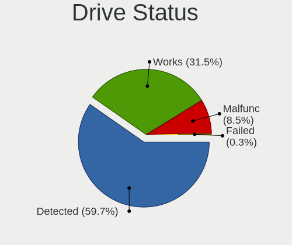

| Status   | Desktops | Drives | Percent |
|----------|----------|--------|---------|
| Detected | 1006     | 2434   | 70.15%  |
| Works    | 331      | 726    | 23.08%  |
| Malfunc  | 93       | 131    | 6.49%   |
| Failed   | 4        | 4      | 0.28%   |

Storage controller
------------------

Storage Vendor
--------------

Storage controller vendors

| Vendor                           | Desktops | Percent |
|----------------------------------|----------|---------|
| Intel                            | 871      | 52.31%  |
| AMD                              | 335      | 20.12%  |
| Nvidia                           | 93       | 5.59%   |
| Samsung Electronics              | 56       | 3.36%   |
| JMicron Technology               | 55       | 3.3%    |
| ASMedia Technology               | 53       | 3.18%   |
| Marvell Technology Group         | 42       | 2.52%   |
| VIA Technologies                 | 37       | 2.22%   |
| Phison Electronics               | 13       | 0.78%   |
| Kingston Technology Company      | 13       | 0.78%   |
| ADATA Technology                 | 11       | 0.66%   |
| Silicon Motion                   | 10       | 0.6%    |
| SanDisk                          | 10       | 0.6%    |
| Micron/Crucial Technology        | 8        | 0.48%   |
| Silicon Integrated Systems [SiS] | 7        | 0.42%   |
| Broadcom / LSI                   | 6        | 0.36%   |
| Toshiba America Info Systems     | 5        | 0.3%    |
| Silicon Image                    | 5        | 0.3%    |
| LSI Logic / Symbios Logic        | 5        | 0.3%    |
| Realtek Semiconductor            | 4        | 0.24%   |
| Promise Technology               | 4        | 0.24%   |
| Integrated Technology Express    | 4        | 0.24%   |
| Adaptec                          | 4        | 0.24%   |
| ULi Electronics                  | 2        | 0.12%   |
| Micron Technology                | 2        | 0.12%   |
| KIOXIA                           | 2        | 0.12%   |
| SK hynix                         | 1        | 0.06%   |
| Shenzhen Longsys Electronics     | 1        | 0.06%   |
| Seagate Technology               | 1        | 0.06%   |
| OCZ Technology Group             | 1        | 0.06%   |
| MAXIO Technology (Hangzhou)      | 1        | 0.06%   |
| Lite-On Technology               | 1        | 0.06%   |
| HighPoint Technologies           | 1        | 0.06%   |
| Hewlett-Packard                  | 1        | 0.06%   |

Storage Model
-------------

Storage controller models

| Model                                                                                   | Desktops | Percent |
|-----------------------------------------------------------------------------------------|----------|---------|
| AMD FCH SATA Controller [AHCI mode]                                                     | 175      | 7.5%    |
| Intel NM10/ICH7 Family SATA Controller [IDE mode]                                       | 132      | 5.66%   |
| Intel 82801G (ICH7 Family) IDE Controller                                               | 98       | 4.2%    |
| Intel 6 Series/C200 Series Chipset Family 6 port Desktop SATA AHCI Controller           | 83       | 3.56%   |
| Intel 8 Series/C220 Series Chipset Family 6-port SATA Controller 1 [AHCI mode]          | 80       | 3.43%   |
| AMD SB7x0/SB8x0/SB9x0 IDE Controller                                                    | 76       | 3.26%   |
| Intel 7 Series/C210 Series Chipset Family 6-port SATA Controller [AHCI mode]            | 62       | 2.66%   |
| Nvidia MCP61 SATA Controller                                                            | 53       | 2.27%   |
| AMD SB7x0/SB8x0/SB9x0 SATA Controller [IDE mode]                                        | 53       | 2.27%   |
| AMD 400 Series Chipset SATA Controller                                                  | 53       | 2.27%   |
| ASMedia ASM1062 Serial ATA Controller                                                   | 51       | 2.19%   |
| AMD SB7x0/SB8x0/SB9x0 SATA Controller [AHCI mode]                                       | 48       | 2.06%   |
| Intel SATA Controller [RAID mode]                                                       | 45       | 1.93%   |
| Intel Q170/Q150/B150/H170/H110/Z170/CM236 Chipset SATA Controller [AHCI Mode]           | 45       | 1.93%   |
| Nvidia MCP61 IDE                                                                        | 44       | 1.89%   |
| Samsung NVMe SSD Controller SM981/PM981/PM983                                           | 37       | 1.59%   |
| Intel 6 Series/C200 Series Chipset Family Desktop SATA Controller (IDE mode, ports 4-5) | 36       | 1.54%   |
| Intel 6 Series/C200 Series Chipset Family Desktop SATA Controller (IDE mode, ports 0-3) | 36       | 1.54%   |
| Intel 82801I (ICH9 Family) 2 port SATA Controller [IDE mode]                            | 35       | 1.5%    |
| JMicron JMB363 SATA/IDE Controller                                                      | 34       | 1.46%   |
| Intel 200 Series PCH SATA controller [AHCI mode]                                        | 33       | 1.41%   |
| Intel 4 Series Chipset PT IDER Controller                                               | 32       | 1.37%   |
| Intel 82801IR/IO/IH (ICH9R/DO/DH) 4 port SATA Controller [IDE mode]                     | 27       | 1.16%   |
| VIA VT82C586A/B/VT82C686/A/B/VT823x/A/C PIPC Bus Master IDE                             | 26       | 1.11%   |
| Intel 5 Series/3400 Series Chipset 4 port SATA IDE Controller                           | 24       | 1.03%   |
| Intel 82801JD/DO (ICH10 Family) SATA AHCI Controller                                    | 22       | 0.94%   |
| Intel 5 Series/3400 Series Chipset 2 port SATA IDE Controller                           | 21       | 0.9%    |
| AMD FCH IDE Controller                                                                  | 21       | 0.9%    |
| Intel Cannon Lake PCH SATA AHCI Controller                                              | 19       | 0.81%   |
| Intel 9 Series Chipset Family SATA Controller [AHCI Mode]                               | 19       | 0.81%   |
| Intel 82Q35 Express PT IDER Controller                                                  | 19       | 0.81%   |
| Intel 82801JI (ICH10 Family) SATA AHCI Controller                                       | 18       | 0.77%   |
| AMD 500 Series Chipset SATA Controller                                                  | 18       | 0.77%   |
| Intel 82801JI (ICH10 Family) 4 port SATA IDE Controller #1                              | 17       | 0.73%   |
| Intel 5 Series/3400 Series Chipset 6 port SATA AHCI Controller                          | 17       | 0.73%   |
| AMD FCH SATA Controller D                                                               | 17       | 0.73%   |
| Intel 82801JI (ICH10 Family) 2 port SATA IDE Controller #2                              | 16       | 0.69%   |
| AMD 300 Series Chipset SATA Controller                                                  | 16       | 0.69%   |
| Intel 82801IR/IO/IH (ICH9R/DO/DH) 6 port SATA Controller [AHCI mode]                    | 15       | 0.64%   |
| AMD SB600 Non-Raid-5 SATA                                                               | 14       | 0.6%    |
| AMD SB600 IDE                                                                           | 14       | 0.6%    |
| Nvidia MCP78S [GeForce 8200] IDE                                                        | 13       | 0.56%   |
| Intel C600/X79 series chipset 6-Port SATA AHCI Controller                               | 13       | 0.56%   |
| AMD FCH SATA Controller [IDE mode]                                                      | 13       | 0.56%   |
| Intel 82801JD/DO (ICH10 Family) 4-port SATA IDE Controller                              | 12       | 0.51%   |
| Intel 82801JD/DO (ICH10 Family) 2-port SATA IDE Controller                              | 12       | 0.51%   |
| JMicron JMB368 IDE controller                                                           | 11       | 0.47%   |
| ADATA XPG SX8200 Pro PCIe Gen3x4 M.2 2280 Solid State Drive                             | 11       | 0.47%   |
| VIA VIA VT6420 SATA RAID Controller                                                     | 10       | 0.43%   |
| Marvell Group 88SE9172 SATA 6Gb/s Controller                                            | 10       | 0.43%   |
| Samsung NVMe SSD Controller SM961/PM961/SM963                                           | 9        | 0.39%   |
| Nvidia MCP78S [GeForce 8200] SATA Controller (non-AHCI mode)                            | 9        | 0.39%   |
| Intel NM10/ICH7 Family SATA Controller [AHCI mode]                                      | 9        | 0.39%   |
| Intel C610/X99 series chipset 6-Port SATA Controller [AHCI mode]                        | 9        | 0.39%   |
| Intel Atom Processor E3800 Series SATA AHCI Controller                                  | 9        | 0.39%   |
| Intel 82801FB/FBM/FR/FW/FRW (ICH6 Family) IDE Controller                                | 9        | 0.39%   |
| Intel 631xESB/632xESB IDE Controller                                                    | 9        | 0.39%   |
| Phison E12 NVMe Controller                                                              | 8        | 0.34%   |
| Nvidia MCP51 Serial ATA Controller                                                      | 8        | 0.34%   |
| Kingston Company A2000 NVMe SSD                                                         | 8        | 0.34%   |

Storage Kind
------------

Kind of storage controller (IDE, SATA, NVMe, SAS, ...)

| Kind | Desktops | Percent |
|------|----------|---------|
| SATA | 850      | 49.05%  |
| IDE  | 638      | 36.81%  |
| NVMe | 137      | 7.91%   |
| RAID | 90       | 5.19%   |
| SAS  | 9        | 0.52%   |
| SCSI | 9        | 0.52%   |

Processor
---------

CPU Vendor
----------

Processor vendors

| Vendor       | Desktops | Percent |
|--------------|----------|---------|
| Intel        | 914      | 68.26%  |
| AMD          | 423      | 31.59%  |
| CentaurHauls | 1        | 0.07%   |
| ARM          | 1        | 0.07%   |

CPU Model
---------

Processor models

| Model                                       | Desktops | Percent |
|---------------------------------------------|----------|---------|
| Intel Core 2 Duo CPU E8400 @ 3.00GHz        | 24       | 1.78%   |
| Intel Pentium 4 CPU 3.00GHz                 | 21       | 1.56%   |
| Intel Core i5-2400 CPU @ 3.10GHz            | 21       | 1.56%   |
| Intel Core i5-3470 CPU @ 3.20GHz            | 17       | 1.26%   |
| Intel Core 2 Duo CPU E7500 @ 2.93GHz        | 17       | 1.26%   |
| Intel Core i7-3770 CPU @ 3.40GHz            | 16       | 1.19%   |
| Intel Core i3-2100 CPU @ 3.10GHz            | 16       | 1.19%   |
| Intel Core i5-4570 CPU @ 3.20GHz            | 14       | 1.04%   |
| AMD Ryzen 5 3600 6-Core Processor           | 14       | 1.04%   |
| Intel Core i7-2600 CPU @ 3.40GHz            | 13       | 0.96%   |
| AMD Ryzen 5 2600 Six-Core Processor         | 13       | 0.96%   |
| Intel Core i3-4130 CPU @ 3.40GHz            | 12       | 0.89%   |
| Intel Core i3-2120 CPU @ 3.30GHz            | 12       | 0.89%   |
| Intel Core 2 Quad CPU Q6600 @ 2.40GHz       | 12       | 0.89%   |
| Intel Pentium Dual-Core CPU E5300 @ 2.60GHz | 11       | 0.82%   |
| AMD Ryzen 7 2700X Eight-Core Processor      | 11       | 0.82%   |
| AMD FX-8350 Eight-Core Processor            | 11       | 0.82%   |
| Intel Core i3-3220 CPU @ 3.30GHz            | 10       | 0.74%   |
| AMD Ryzen 7 3700X 8-Core Processor          | 10       | 0.74%   |
| Intel Pentium 4 CPU 3.20GHz                 | 9        | 0.67%   |
| Intel Pentium 4 CPU 2.80GHz                 | 9        | 0.67%   |
| Intel Core i7-4790 CPU @ 3.60GHz            | 9        | 0.67%   |
| Intel Core i7-4770 CPU @ 3.40GHz            | 9        | 0.67%   |
| Intel Core i7-3770K CPU @ 3.50GHz           | 9        | 0.67%   |
| Intel Core i5-6400 CPU @ 2.70GHz            | 9        | 0.67%   |
| Intel Core 2 Duo CPU E6550 @ 2.33GHz        | 9        | 0.67%   |
| AMD Ryzen 5 3400G with Radeon Vega Graphics | 9        | 0.67%   |
| AMD Phenom II X4 955 Processor              | 9        | 0.67%   |
| Intel Pentium Dual CPU E2180 @ 2.00GHz      | 8        | 0.59%   |
| Intel Core i7-2600K CPU @ 3.40GHz           | 8        | 0.59%   |
| Intel Core i5 CPU 750 @ 2.67GHz             | 8        | 0.59%   |
| Intel Core 2 Quad CPU Q9550 @ 2.83GHz       | 8        | 0.59%   |
| AMD Ryzen 9 3900X 12-Core Processor         | 8        | 0.59%   |
| AMD Ryzen 3 2200G with Radeon Vega Graphics | 8        | 0.59%   |
| Intel Pentium Dual-Core CPU E5200 @ 2.50GHz | 7        | 0.52%   |
| Intel Pentium D CPU 3.40GHz                 | 7        | 0.52%   |
| Intel Core i7-6700 CPU @ 3.40GHz            | 7        | 0.52%   |
| Intel Core i7 CPU 860 @ 2.80GHz             | 7        | 0.52%   |
| Intel Core i5-3570 CPU @ 3.40GHz            | 7        | 0.52%   |
| Intel Core 2 Duo CPU E7300 @ 2.66GHz        | 7        | 0.52%   |
| Intel Core 2 CPU 6600 @ 2.40GHz             | 7        | 0.52%   |
| Intel Pentium Dual CPU E2200 @ 2.20GHz      | 6        | 0.44%   |
| Intel Pentium 4 CPU 3.06GHz                 | 6        | 0.44%   |
| Intel Core i7-7700K CPU @ 4.20GHz           | 6        | 0.44%   |
| Intel Core i5-6500 CPU @ 3.20GHz            | 6        | 0.44%   |
| Intel Core i5-4690K CPU @ 3.50GHz           | 6        | 0.44%   |
| Intel Core i5-4590 CPU @ 3.30GHz            | 6        | 0.44%   |
| Intel Core i5-4460 CPU @ 3.20GHz            | 6        | 0.44%   |
| Intel Core i5 CPU 760 @ 2.80GHz             | 6        | 0.44%   |
| Intel Core 2 Duo CPU E8500 @ 3.16GHz        | 6        | 0.44%   |
| Intel Core 2 Duo CPU E4500 @ 2.20GHz        | 6        | 0.44%   |
| Intel Celeron CPU J1900 @ 1.99GHz           | 6        | 0.44%   |
| Intel Atom CPU D525 @ 1.80GHz               | 6        | 0.44%   |
| AMD FX-8300 Eight-Core Processor            | 6        | 0.44%   |
| AMD Athlon II X4 640 Processor              | 6        | 0.44%   |
| AMD Athlon 64 X2 Dual Core Processor 5200+  | 6        | 0.44%   |
| AMD Athlon 64 Processor 3200+               | 6        | 0.44%   |
| Intel Pentium Dual-Core CPU E5700 @ 3.00GHz | 5        | 0.37%   |
| Intel Pentium Dual-Core CPU E5400 @ 2.70GHz | 5        | 0.37%   |
| Intel Pentium Dual CPU E2160 @ 1.80GHz      | 5        | 0.37%   |

CPU Model Family
----------------

Processor model prefix

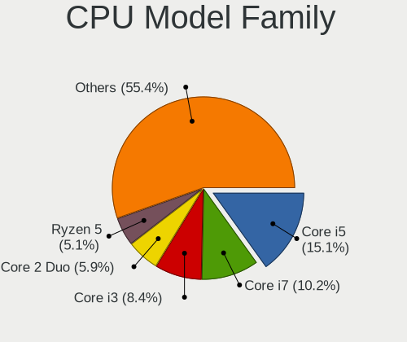

| Model                   | Desktops | Percent |
|-------------------------|----------|---------|
| Intel Core i5           | 189      | 14.02%  |
| Intel Core i7           | 138      | 10.24%  |
| Intel Core 2 Duo        | 94       | 6.97%   |
| Intel Core i3           | 93       | 6.9%    |
| Intel Xeon              | 62       | 4.6%    |
| AMD Ryzen 5             | 59       | 4.38%   |
| Intel Pentium 4         | 55       | 4.08%   |
| Intel Celeron           | 54       | 4.01%   |
| Intel Core 2 Quad       | 47       | 3.49%   |
| AMD FX                  | 47       | 3.49%   |
| AMD Ryzen 7             | 43       | 3.19%   |
| Intel Pentium           | 40       | 2.97%   |
| Intel Pentium Dual-Core | 37       | 2.74%   |
| AMD Athlon 64 X2        | 32       | 2.37%   |
| AMD Phenom II X4        | 25       | 1.85%   |
| Intel Pentium Dual      | 24       | 1.78%   |
| Intel Atom              | 22       | 1.63%   |
| AMD Athlon II X2        | 22       | 1.63%   |
| Intel Core 2            | 20       | 1.48%   |
| AMD Ryzen 9             | 20       | 1.48%   |
| Intel Pentium D         | 17       | 1.26%   |
| AMD Ryzen 3             | 17       | 1.26%   |
| AMD A8                  | 17       | 1.26%   |
| AMD Athlon 64           | 16       | 1.19%   |
| AMD A10                 | 15       | 1.11%   |
| AMD Sempron             | 14       | 1.04%   |
| Intel Core i9           | 12       | 0.89%   |
| AMD Phenom              | 11       | 0.82%   |
| AMD Athlon II X4        | 11       | 0.82%   |
| Other                   | 9        | 0.67%   |
| AMD Athlon              | 9        | 0.67%   |
| AMD A4                  | 8        | 0.59%   |
| AMD Ryzen Threadripper  | 6        | 0.45%   |
| AMD Phenom II X6        | 6        | 0.45%   |
| AMD Athlon Dual Core    | 6        | 0.45%   |
| AMD A6                  | 6        | 0.45%   |
| AMD Phenom II X2        | 4        | 0.3%    |
| AMD E1                  | 4        | 0.3%    |
| AMD E                   | 4        | 0.3%    |
| AMD Athlon XP           | 4        | 0.3%    |
| AMD Athlon II X3        | 4        | 0.3%    |
| Intel Pentium Gold      | 3        | 0.22%   |
| AMD Ryzen 5 PRO         | 3        | 0.22%   |
| AMD Athlon X4           | 3        | 0.22%   |
| Intel Core 2 Extreme    | 2        | 0.15%   |
| AMD Ryzen Embedded      | 2        | 0.15%   |
| AMD Ryzen 7 PRO         | 2        | 0.15%   |
| AMD GX                  | 2        | 0.15%   |
| AMD Athlon II           | 2        | 0.15%   |
| Intel Pentium Silver    | 1        | 0.07%   |
| Intel Genuine           | 1        | 0.07%   |
| CentaurHauls VIA Nano   | 1        | 0.07%   |
| AMD EPYC                | 1        | 0.07%   |
| AMD Athlon X2           | 1        | 0.07%   |
| AMD A12                 | 1        | 0.07%   |

CPU Cores
---------

Number of processor cores

| Number  | Desktops | Percent |
|---------|----------|---------|
| 4       | 508      | 37.77%  |
| 2       | 491      | 36.51%  |
| 1       | 117      | 8.7%    |
| 6       | 92       | 6.84%   |
| 8       | 77       | 5.72%   |
| 12      | 23       | 1.71%   |
| 16      | 15       | 1.12%   |
| 3       | 15       | 1.12%   |
| 10      | 4        | 0.3%    |
| 24      | 1        | 0.07%   |
| 20      | 1        | 0.07%   |
| Unknown | 1        | 0.07%   |

CPU Sockets
-----------

Number of sockets

| Number | Desktops | Percent |
|--------|----------|---------|
| 1      | 1315     | 98.21%  |
| 2      | 24       | 1.79%   |

CPU Threads
-----------

Threads per core (Hyper-Threading)

| Number  | Desktops | Percent |
|---------|----------|---------|
| 1       | 773      | 57.56%  |
| 2       | 569      | 42.37%  |
| Unknown | 1        | 0.07%   |

CPU Op-Modes
------------

CPU Operation Modes (32-bit, 64-bit)

| Op mode        | Desktops | Percent |
|----------------|----------|---------|
| 32-bit, 64-bit | 1314     | 98.13%  |
| 32-bit         | 24       | 1.79%   |
| Unknown        | 1        | 0.07%   |

CPU Microcode
-------------

Microcode number

| Number     | Desktops | Percent |
|------------|----------|---------|
| Unknown    | 233      | 16.91%  |
| 0x1067a    | 108      | 7.84%   |
| 0x306c3    | 95       | 6.89%   |
| 0x206a7    | 93       | 6.75%   |
| 0x306a9    | 85       | 6.17%   |
| 0x506e3    | 41       | 2.98%   |
| 0x010000c8 | 38       | 2.76%   |
| 0x06000852 | 35       | 2.54%   |
| 0x6fd      | 34       | 2.47%   |
| 0x10676    | 29       | 2.1%    |
| 0x08701021 | 28       | 2.03%   |
| 0x6fb      | 27       | 1.96%   |
| 0x0800820d | 27       | 1.96%   |
| 0x106e5    | 23       | 1.67%   |
| 0x906e9    | 21       | 1.52%   |
| 0xf43      | 17       | 1.23%   |
| 0x906ea    | 17       | 1.23%   |
| 0x6f6      | 16       | 1.16%   |
| 0x06001119 | 16       | 1.16%   |
| 0x08108109 | 15       | 1.09%   |
| 0x20655    | 13       | 0.94%   |
| 0x08701013 | 12       | 0.87%   |
| 0x010000db | 12       | 0.87%   |
| 0xf64      | 11       | 0.8%    |
| 0x206d7    | 11       | 0.8%    |
| 0x106a5    | 11       | 0.8%    |
| 0x03000027 | 11       | 0.8%    |
| 0xf65      | 10       | 0.73%   |
| 0xf49      | 10       | 0.73%   |
| 0xf41      | 9        | 0.65%   |
| 0x906ed    | 9        | 0.65%   |
| 0x306f2    | 9        | 0.65%   |
| 0x10677    | 9        | 0.65%   |
| 0x0600063e | 9        | 0.65%   |
| 0x010000dc | 9        | 0.65%   |
| 0x106ca    | 8        | 0.58%   |
| 0x08001137 | 8        | 0.58%   |
| 0x0700010f | 8        | 0.58%   |
| 0x010000c7 | 8        | 0.58%   |
| 0x406c3    | 7        | 0.51%   |
| 0x306e4    | 7        | 0.51%   |
| 0x30678    | 7        | 0.51%   |
| 0x206c2    | 7        | 0.51%   |
| 0xf29      | 6        | 0.44%   |
| 0x6f2      | 6        | 0.44%   |
| 0x20652    | 6        | 0.44%   |
| 0x106c2    | 6        | 0.44%   |
| 0x10661    | 6        | 0.44%   |
| 0x0a201016 | 6        | 0.44%   |
| 0x0a201009 | 6        | 0.44%   |
| 0x01000083 | 6        | 0.44%   |
| 0x406c4    | 5        | 0.36%   |
| 0x0a50000c | 5        | 0.36%   |
| 0x08001138 | 5        | 0.36%   |
| 0x06003106 | 5        | 0.36%   |
| 0x01000095 | 5        | 0.36%   |
| 0xf27      | 4        | 0.29%   |
| 0xa0653    | 4        | 0.29%   |
| 0x906eb    | 4        | 0.29%   |
| 0x08101016 | 4        | 0.29%   |

CPU Microarch
-------------

Microarchitecture

| Name             | Desktops | Percent |
|------------------|----------|---------|
| Penryn           | 155      | 11.53%  |
| Haswell          | 122      | 9.08%   |
| SandyBridge      | 115      | 8.56%   |
| IvyBridge        | 103      | 7.66%   |
| Core             | 97       | 7.22%   |
| K10              | 88       | 6.55%   |
| NetBurst         | 78       | 5.8%    |
| K8 Hammer        | 70       | 5.21%   |
| KabyLake         | 64       | 4.76%   |
| Zen 2            | 56       | 4.17%   |
| Piledriver       | 55       | 4.09%   |
| Zen+             | 47       | 3.5%    |
| Skylake          | 47       | 3.5%    |
| Nehalem          | 37       | 2.75%   |
| Zen              | 33       | 2.46%   |
| Westmere         | 30       | 2.23%   |
| Silvermont       | 24       | 1.79%   |
| Zen 3            | 19       | 1.41%   |
| Bonnell          | 17       | 1.26%   |
| K10 Llano        | 12       | 0.89%   |
| Bulldozer        | 10       | 0.74%   |
| Excavator        | 9        | 0.67%   |
| Steamroller      | 8        | 0.6%    |
| Jaguar           | 8        | 0.6%    |
| CometLake        | 8        | 0.6%    |
| Goldmont         | 6        | 0.45%   |
| Bobcat           | 6        | 0.45%   |
| Unknown          | 5        | 0.37%   |
| K6               | 4        | 0.3%    |
| Broadwell        | 3        | 0.22%   |
| Alderlake Hybrid | 3        | 0.22%   |
| Puma             | 2        | 0.15%   |
| Tremont          | 1        | 0.07%   |
| Icelake          | 1        | 0.07%   |
| Goldmont plus    | 1        | 0.07%   |

Graphics
--------

GPU Vendor
----------

Vendors of graphics cards

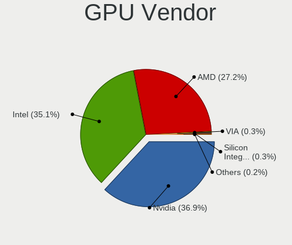

| Vendor                           | Desktops | Percent |
|----------------------------------|----------|---------|
| Nvidia                           | 556      | 39.46%  |
| Intel                            | 457      | 32.43%  |
| AMD                              | 383      | 27.18%  |
| VIA Technologies                 | 5        | 0.35%   |
| Silicon Integrated Systems [SiS] | 4        | 0.28%   |
| Matrox Electronics Systems       | 2        | 0.14%   |
| ASPEED Technology                | 1        | 0.07%   |
| Alliance Semiconductor           | 1        | 0.07%   |

GPU Model
---------

Graphics card models

| Model                                                                                    | Desktops | Percent |
|------------------------------------------------------------------------------------------|----------|---------|
| Intel Xeon E3-1200 v3/4th Gen Core Processor Integrated Graphics Controller              | 61       | 4.12%   |
| Intel 2nd Generation Core Processor Family Integrated Graphics Controller                | 58       | 3.91%   |
| Intel 4 Series Chipset Integrated Graphics Controller                                    | 54       | 3.64%   |
| AMD Ellesmere [Radeon RX 470/480/570/570X/580/580X/590]                                  | 43       | 2.9%    |
| Intel Xeon E3-1200 v2/3rd Gen Core processor Graphics Controller                         | 40       | 2.7%    |
| Nvidia GK208B [GeForce GT 710]                                                           | 39       | 2.63%   |
| Intel 82G33/G31 Express Integrated Graphics Controller                                   | 35       | 2.36%   |
| Nvidia GP107 [GeForce GTX 1050 Ti]                                                       | 31       | 2.09%   |
| Nvidia GT218 [GeForce 210]                                                               | 28       | 1.89%   |
| Intel 82945G/GZ Integrated Graphics Controller                                           | 24       | 1.62%   |
| Intel HD Graphics 530                                                                    | 21       | 1.42%   |
| AMD Cedar [Radeon HD 5000/6000/7350/8350 Series]                                         | 21       | 1.42%   |
| Nvidia C61 [GeForce 6150SE nForce 430]                                                   | 17       | 1.15%   |
| Nvidia GP108 [GeForce GT 1030]                                                           | 15       | 1.01%   |
| Intel CoffeeLake-S GT2 [UHD Graphics 630]                                                | 15       | 1.01%   |
| AMD Caicos [Radeon HD 6450/7450/8450 / R5 230 OEM]                                       | 15       | 1.01%   |
| Nvidia GM107 [GeForce GTX 750 Ti]                                                        | 14       | 0.94%   |
| Intel IvyBridge GT2 [HD Graphics 4000]                                                   | 14       | 0.94%   |
| AMD Picasso/Raven 2 [Radeon Vega Series / Radeon Vega Mobile Series]                     | 14       | 0.94%   |
| Nvidia GP104 [GeForce GTX 1070]                                                          | 13       | 0.88%   |
| Intel Atom/Celeron/Pentium Processor x5-E8000/J3xxx/N3xxx Integrated Graphics Controller | 13       | 0.88%   |
| Intel 82Q35 Express Integrated Graphics Controller                                       | 13       | 0.88%   |
| AMD Raven Ridge [Radeon Vega Series / Radeon Vega Mobile Series]                         | 13       | 0.88%   |
| Nvidia GF119 [GeForce GT 610]                                                            | 12       | 0.81%   |
| Nvidia GF108 [GeForce GT 630]                                                            | 12       | 0.81%   |
| Intel 4th Generation Core Processor Family Integrated Graphics Controller                | 12       | 0.81%   |
| Nvidia GM206 [GeForce GTX 960]                                                           | 11       | 0.74%   |
| Intel Atom Processor Z36xxx/Z37xxx Series Graphics & Display                             | 11       | 0.74%   |
| Nvidia GP106 [GeForce GTX 1060 6GB]                                                      | 10       | 0.67%   |
| Nvidia GM204 [GeForce GTX 970]                                                           | 10       | 0.67%   |
| Nvidia G96C [GeForce 9500 GT]                                                            | 10       | 0.67%   |
| Nvidia GF116 [GeForce GTX 550 Ti]                                                        | 9        | 0.61%   |
| Nvidia GT216 [GeForce GT 220]                                                            | 8        | 0.54%   |
| Nvidia C61 [GeForce 7025 / nForce 630a]                                                  | 8        | 0.54%   |
| AMD RS880 [Radeon HD 4250]                                                               | 8        | 0.54%   |
| Nvidia TU106 [GeForce RTX 2060 Rev. A]                                                   | 7        | 0.47%   |
| Nvidia GK107 [GeForce GTX 650]                                                           | 7        | 0.47%   |
| Nvidia G84 [GeForce 8600 GT]                                                             | 7        | 0.47%   |
| Intel HD Graphics 630                                                                    | 7        | 0.47%   |
| Intel Core Processor Integrated Graphics Controller                                      | 7        | 0.47%   |
| AMD RV710 [Radeon HD 4350/4550]                                                          | 7        | 0.47%   |
| AMD RS880 [Radeon HD 4200]                                                               | 7        | 0.47%   |
| AMD RS780L [Radeon 3000]                                                                 | 7        | 0.47%   |
| AMD Juniper XT [Radeon HD 5770]                                                          | 7        | 0.47%   |
| Nvidia TU117 [GeForce GTX 1650]                                                          | 6        | 0.4%    |
| Nvidia GP104 [GeForce GTX 1080]                                                          | 6        | 0.4%    |
| Nvidia GP104 [GeForce GTX 1070 Ti]                                                       | 6        | 0.4%    |
| Nvidia GK208B [GeForce GT 730]                                                           | 6        | 0.4%    |
| Nvidia GF119 [GeForce GT 520]                                                            | 6        | 0.4%    |
| Nvidia G92 [GeForce GTS 250]                                                             | 6        | 0.4%    |
| Nvidia G86 [GeForce 8500 GT]                                                             | 6        | 0.4%    |
| Intel Atom Processor D4xx/D5xx/N4xx/N5xx Integrated Graphics Controller                  | 6        | 0.4%    |
| Intel 82915G/GV/910GL Integrated Graphics Controller                                     | 6        | 0.4%    |
| AMD Turks XT [Radeon HD 6670/7670]                                                       | 6        | 0.4%    |
| AMD RS690 [Radeon X1200]                                                                 | 6        | 0.4%    |
| AMD Oland XT [Radeon HD 8670 / R5 340X OEM / R7 250/350/350X OEM]                        | 6        | 0.4%    |
| AMD Navi 10 [Radeon RX 5600 OEM/5600 XT / 5700/5700 XT]                                  | 6        | 0.4%    |
| AMD Baffin [Radeon RX 550 640SP / RX 560/560X]                                           | 6        | 0.4%    |
| Nvidia TU104 [GeForce RTX 2070 SUPER]                                                    | 5        | 0.34%   |
| Nvidia GT218 [GeForce 8400 GS Rev. 3]                                                    | 5        | 0.34%   |

GPU Combo
---------

Combinations of graphics cards

| Name                                 | Desktops | Percent |
|--------------------------------------|----------|---------|
| 1 x Nvidia                           | 530      | 38.97%  |
| 1 x Intel                            | 420      | 30.88%  |
| 1 x AMD                              | 328      | 24.12%  |
| 2 x AMD                              | 38       | 2.79%   |
| Intel + Nvidia                       | 8        | 0.59%   |
| Intel + AMD                          | 6        | 0.44%   |
| AMD + Nvidia                         | 6        | 0.44%   |
| 2 x Nvidia                           | 5        | 0.37%   |
| 1 x VIA                              | 5        | 0.37%   |
| 1 x SiS                              | 4        | 0.29%   |
| Other                                | 2        | 0.15%   |
| 1 x Matrox                           | 2        | 0.15%   |
| 3 x AMD                              | 1        | 0.07%   |
| 2 x AMD + 1 x Nvidia                 | 1        | 0.07%   |
| 2 x AMD + 1 x Alliance Semiconductor | 1        | 0.07%   |
| Nvidia + ASPEED                      | 1        | 0.07%   |
| Intel + 2 x AMD                      | 1        | 0.07%   |
| Intel + AMD + 1 x Nvidia             | 1        | 0.07%   |

GPU Driver
----------

Free vs proprietary

| Driver      | Desktops | Percent |
|-------------|----------|---------|
| Free        | 976      | 71.98%  |
| Proprietary | 322      | 23.75%  |
| Unknown     | 58       | 4.28%   |

GPU Memory
----------

Total video memory

| Size in GB | Desktops | Percent |
|------------|----------|---------|
| Unknown    | 477      | 34.59%  |
| 0.01-0.5   | 296      | 21.46%  |
| 0.51-1.0   | 210      | 15.23%  |
| 1.01-2.0   | 194      | 14.07%  |
| 3.01-4.0   | 99       | 7.18%   |
| 7.01-8.0   | 59       | 4.28%   |
| 5.01-6.0   | 21       | 1.52%   |
| 8.01-16.0  | 12       | 0.87%   |
| 2.01-3.0   | 9        | 0.65%   |
| 4.01-5.0   | 1        | 0.07%   |
| 16.01-24.0 | 1        | 0.07%   |

Monitor
-------

Monitor Vendor
--------------

Monitor vendors

| Vendor                  | Desktops | Percent |
|-------------------------|----------|---------|
| Samsung Electronics     | 233      | 17.02%  |
| Dell                    | 141      | 10.3%   |
| Goldstar                | 122      | 8.91%   |
| Hewlett-Packard         | 110      | 8.04%   |
| Acer                    | 99       | 7.23%   |
| Philips                 | 77       | 5.62%   |
| AOC                     | 58       | 4.24%   |
| Ancor Communications    | 50       | 3.65%   |
| BenQ                    | 48       | 3.51%   |
| Unknown                 | 34       | 2.48%   |
| ViewSonic               | 33       | 2.41%   |
| LG Electronics          | 31       | 2.26%   |
| Sony                    | 24       | 1.75%   |
| Iiyama                  | 22       | 1.61%   |
| NEC Computers           | 19       | 1.39%   |
| Fujitsu Siemens         | 19       | 1.39%   |
| Lenovo                  | 15       | 1.1%    |
| HannStar                | 15       | 1.1%    |
| Panasonic               | 14       | 1.02%   |
| Eizo                    | 11       | 0.8%    |
| Medion                  | 10       | 0.73%   |
| ASUSTek Computer        | 10       | 0.73%   |
| Vizio                   | 8        | 0.58%   |
| Vestel Elektronik       | 7        | 0.51%   |
| Idek Iiyama             | 6        | 0.44%   |
| Lenovo Group Limited    | 5        | 0.37%   |
| Haier                   | 5        | 0.37%   |
| Sharp                   | 4        | 0.29%   |
| Mitsubishi              | 4        | 0.29%   |
| Gateway                 | 4        | 0.29%   |
| DENON                   | 4        | 0.29%   |
| Chi Mei Optoelectronics | 4        | 0.29%   |
| ___                     | 3        | 0.22%   |
| Toshiba                 | 3        | 0.22%   |
| Packard Bell            | 3        | 0.22%   |
| MSI                     | 3        | 0.22%   |
| IOD                     | 3        | 0.22%   |
| Hitachi                 | 3        | 0.22%   |
| FUS                     | 3        | 0.22%   |
| CVT                     | 3        | 0.22%   |
| Belinea                 | 3        | 0.22%   |
| Westinghouse            | 2        | 0.15%   |
| Vestel                  | 2        | 0.15%   |
| Tech Concepts           | 2        | 0.15%   |
| Plain Tree Systems      | 2        | 0.15%   |
| PKB                     | 2        | 0.15%   |
| ONN                     | 2        | 0.15%   |
| OEM                     | 2        | 0.15%   |
| MStar                   | 2        | 0.15%   |
| Insignia                | 2        | 0.15%   |
| IBM                     | 2        | 0.15%   |
| HPN                     | 2        | 0.15%   |
| HKC                     | 2        | 0.15%   |
| Compaq Computer         | 2        | 0.15%   |
| CHR                     | 2        | 0.15%   |
| AU Optronics            | 2        | 0.15%   |
| Apple                   | 2        | 0.15%   |
| AGO                     | 2        | 0.15%   |
| Unknown                 | 2        | 0.15%   |
| Yuraku                  | 1        | 0.07%   |

Monitor Model
-------------

Monitor models

| Model                                                                 | Desktops | Percent |
|-----------------------------------------------------------------------|----------|---------|
| Panasonic TV MEIA296 1280x1024 698x392mm 31.5-inch                    | 8        | 0.55%   |
| Vestel Elektronik 39FHD_LCD_TV VES3700 1920x1080 1280x720mm 57.8-inch | 7        | 0.48%   |
| Philips PHL 243V5 PHLC0D1 1920x1080 521x293mm 23.5-inch               | 6        | 0.41%   |
| Goldstar W1942 GSM4B6F 1440x900 408x255mm 18.9-inch                   | 6        | 0.41%   |
| Unknown LCD Monitor SAMSUNG 1920x1080                                 | 5        | 0.34%   |
| Samsung Electronics U28E590 SAM0C4D 3840x2160 607x345mm 27.5-inch     | 5        | 0.34%   |
| Samsung Electronics SyncMaster SAM03C2 1680x1050 459x296mm 21.5-inch  | 5        | 0.34%   |
| LG Electronics LCD Monitor LG TV 1920x1080                            | 5        | 0.34%   |
| Goldstar HD GSM5ACB 1366x768 410x230mm 18.5-inch                      | 5        | 0.34%   |
| Dell E176FP DELA014 1280x1024 338x270mm 17.0-inch                     | 5        | 0.34%   |
| Samsung Electronics S22F350 SAM0D1A 1920x1080 477x268mm 21.5-inch     | 4        | 0.27%   |
| Samsung Electronics LCD Monitor SyncMaster 1920x1080                  | 4        | 0.27%   |
| Samsung Electronics LCD Monitor SyncMaster 1280x1024                  | 4        | 0.27%   |
| Philips PHL 223V5 PHLC0CF 1920x1080 477x268mm 21.5-inch               | 4        | 0.27%   |
| Philips 196VL PHLC07F 1366x768 409x230mm 18.5-inch                    | 4        | 0.27%   |
| Philips 170S PHL0839 1280x1024 338x270mm 17.0-inch                    | 4        | 0.27%   |
| Iiyama PL2278H IVM5624 1920x1080 477x268mm 21.5-inch                  | 4        | 0.27%   |
| Dell 1908FP DEL4026 1280x1024 376x301mm 19.0-inch                     | 4        | 0.27%   |
| Vizio D32x-D1 VIZ1005 1920x1080 700x390mm 31.5-inch                   | 3        | 0.21%   |
| Samsung Electronics LCD Monitor SAM0A7D 1920x1080 890x500mm 40.2-inch | 3        | 0.21%   |
| Samsung Electronics C32F391 SAM0D34 1920x1080 698x393mm 31.5-inch     | 3        | 0.21%   |
| Hewlett-Packard w2007 HWP26A7 1680x1050 433x271mm 20.1-inch           | 3        | 0.21%   |
| Hewlett-Packard P19A HWP3087 1280x1024 338x270mm 17.0-inch            | 3        | 0.21%   |
| Hewlett-Packard LA1951 HWP285A 1280x1024 380x300mm 19.1-inch          | 3        | 0.21%   |
| Hewlett-Packard L1740 HWP2648 1280x1024 337x270mm 17.0-inch           | 3        | 0.21%   |
| Hewlett-Packard 24es HWP3320 1920x1080 527x296mm 23.8-inch            | 3        | 0.21%   |
| Haier HL24XD2 HAR2410 1920x1080 520x290mm 23.4-inch                   | 3        | 0.21%   |
| Goldstar W2241 GSM56B3 1680x1050 474x296mm 22.0-inch                  | 3        | 0.21%   |
| Goldstar W1943 GSM4BAD 1360x768 406x229mm 18.4-inch                   | 3        | 0.21%   |
| Goldstar IPS FULLHD GSM5AB8 1920x1080 480x270mm 21.7-inch             | 3        | 0.21%   |
| Goldstar 2D HD TV GSM59C8 1366x768 509x286mm 23.0-inch                | 3        | 0.21%   |
| Dell U2718Q DELA0EC 3840x2160 609x349mm 27.6-inch                     | 3        | 0.21%   |
| Dell SE198WFP DELF003 1440x900 408x255mm 18.9-inch                    | 3        | 0.21%   |
| Dell P2217H DELA0D9 1920x1080 476x267mm 21.5-inch                     | 3        | 0.21%   |
| Dell E177FP DELA023 1280x1024 338x270mm 17.0-inch                     | 3        | 0.21%   |
| BenQ RL2455 BNQ7F1C 1920x1080 531x298mm 24.0-inch                     | 3        | 0.21%   |
| BenQ GL2460 BNQ78CE 1920x1080 531x299mm 24.0-inch                     | 3        | 0.21%   |
| ASUSTek Computer VP278 AUS27AE 1920x1080 598x336mm 27.0-inch          | 3        | 0.21%   |
| AOC 2436 AOC2436 1920x1080 521x293mm 23.5-inch                        | 3        | 0.21%   |
| Ancor Communications ASUS VS247 ACI249A 1920x1080 520x290mm 23.4-inch | 3        | 0.21%   |
| Ancor Communications ASUS VS228 ACI22FD 1920x1080 476x268mm 21.5-inch | 3        | 0.21%   |
| Acer G236HL ACR02EB 1920x1080 509x286mm 23.0-inch                     | 3        | 0.21%   |
| Acer AL1716 ACRAD46 1280x1024 338x270mm 17.0-inch                     | 3        | 0.21%   |
| Acer AL1711 ACRAD12 1280x1024 338x270mm 17.0-inch                     | 3        | 0.21%   |
| ___ LCD TV ___0101 1360x768                                           | 2        | 0.14%   |
| ViewSonic VX3276-UHD VSC5138 3840x2160 697x392mm 31.5-inch            | 2        | 0.14%   |
| ViewSonic VX2250 SERIES VSCCB25 1920x1080 477x268mm 21.5-inch         | 2        | 0.14%   |
| ViewSonic VA2448 SERIES VSC3828 1920x1080 521x293mm 23.5-inch         | 2        | 0.14%   |
| ViewSonic LCD Monitor VX2452 Series                                   | 2        | 0.14%   |
| Unknown LCD Monitor SAMSUNG 3840x1080                                 | 2        | 0.14%   |
| Unknown LCD Monitor FFFF 2288x1287 2550x2550mm 142.0-inch             | 2        | 0.14%   |
| Sony TV SNYEE01 1920x1080                                             | 2        | 0.14%   |
| Sony TV SNYE903 1920x1080                                             | 2        | 0.14%   |
| Sony SDM-S51R SNY2150 1024x768 304x228mm 15.0-inch                    | 2        | 0.14%   |
| Samsung Electronics U32J59x SAM0F33 3840x2160 697x392mm 31.5-inch     | 2        | 0.14%   |
| Samsung Electronics U28E590 SAM0C4C 3840x2160 608x345mm 27.5-inch     | 2        | 0.14%   |
| Samsung Electronics SyncMaster SAM0598 1360x768 410x230mm 18.5-inch   | 2        | 0.14%   |
| Samsung Electronics SyncMaster SAM043F 1920x1200 520x320mm 24.0-inch  | 2        | 0.14%   |
| Samsung Electronics SyncMaster SAM0226 1440x900 410x257mm 19.1-inch   | 2        | 0.14%   |
| Samsung Electronics SyncMaster SAM0214 1680x1050 408x306mm 20.1-inch  | 2        | 0.14%   |

Monitor Resolution
------------------

Monitor screen resolution

| Resolution         | Desktops | Percent |
|--------------------|----------|---------|
| 1920x1080 (FHD)    | 523      | 38.32%  |
| 1280x1024 (SXGA)   | 176      | 12.89%  |
| 1680x1050 (WSXGA+) | 103      | 7.55%   |
| 1440x900 (WXGA+)   | 82       | 6.01%   |
| 1366x768 (WXGA)    | 76       | 5.57%   |
| 3840x2160 (4K)     | 71       | 5.2%    |
| Unknown            | 49       | 3.59%   |
| 1920x1200 (WUXGA)  | 47       | 3.44%   |
| 1600x900 (HD+)     | 43       | 3.15%   |
| 2560x1440 (QHD)    | 42       | 3.08%   |
| 1024x768 (XGA)     | 25       | 1.83%   |
| 1360x768           | 24       | 1.76%   |
| 3840x1080          | 17       | 1.25%   |
| 1920x540           | 8        | 0.59%   |
| 1600x1200          | 8        | 0.59%   |
| 2560x1080          | 7        | 0.51%   |
| 3200x1080          | 6        | 0.44%   |
| 1280x720 (HD)      | 6        | 0.44%   |
| 3440x1440          | 5        | 0.37%   |
| 2288x1287          | 4        | 0.29%   |
| 5120x1440          | 3        | 0.22%   |
| 3840x1200          | 3        | 0.22%   |
| 2560x1600          | 3        | 0.22%   |
| 2048x1152          | 3        | 0.22%   |
| 4480x1440          | 2        | 0.15%   |
| 3286x1080          | 2        | 0.15%   |
| 3200x900           | 2        | 0.15%   |
| 2960x1050          | 2        | 0.15%   |
| 2048x1536          | 2        | 0.15%   |
| 1280x960           | 2        | 0.15%   |
| 1280x800 (WXGA)    | 2        | 0.15%   |
| 800x600            | 1        | 0.07%   |
| 7680x2164          | 1        | 0.07%   |
| 5760x2160          | 1        | 0.07%   |
| 5760x1200          | 1        | 0.07%   |
| 5760x1080          | 1        | 0.07%   |
| 5520x2160          | 1        | 0.07%   |
| 5360x1440          | 1        | 0.07%   |
| 5280x2160          | 1        | 0.07%   |
| 4480x1441          | 1        | 0.07%   |
| 4480x1200          | 1        | 0.07%   |
| 3840x1600          | 1        | 0.07%   |
| 3600x1080          | 1        | 0.07%   |
| 3360x1080          | 1        | 0.07%   |
| 3280x1080          | 1        | 0.07%   |
| 3200x1024          | 1        | 0.07%   |
| 2640x768           | 1        | 0.07%   |
| 1024x600           | 1        | 0.07%   |

Monitor Diagonal
----------------

Diagonal size in inches

| Inches  | Desktops | Percent |
|---------|----------|---------|
| Unknown | 216      | 15.94%  |
| 19      | 145      | 10.7%   |
| 23      | 134      | 9.89%   |
| 21      | 128      | 9.45%   |
| 24      | 124      | 9.15%   |
| 17      | 95       | 7.01%   |
| 27      | 90       | 6.64%   |
| 18      | 74       | 5.46%   |
| 22      | 64       | 4.72%   |
| 20      | 64       | 4.72%   |
| 31      | 45       | 3.32%   |
| 15      | 31       | 2.29%   |
| 84      | 20       | 1.48%   |
| 72      | 16       | 1.18%   |
| 32      | 11       | 0.81%   |
| 40      | 10       | 0.74%   |
| 28      | 8        | 0.59%   |
| 25      | 8        | 0.59%   |
| 54      | 7        | 0.52%   |
| 34      | 7        | 0.52%   |
| 26      | 7        | 0.52%   |
| 52      | 6        | 0.44%   |
| 48      | 5        | 0.37%   |
| 14      | 5        | 0.37%   |
| 37      | 4        | 0.3%    |
| 12      | 4        | 0.3%    |
| 142     | 2        | 0.15%   |
| 65      | 2        | 0.15%   |
| 60      | 2        | 0.15%   |
| 47      | 2        | 0.15%   |
| 46      | 2        | 0.15%   |
| 29      | 2        | 0.15%   |
| 16      | 2        | 0.15%   |
| 13      | 2        | 0.15%   |
| 10      | 2        | 0.15%   |
| 69      | 1        | 0.07%   |
| 57      | 1        | 0.07%   |
| 49      | 1        | 0.07%   |
| 41      | 1        | 0.07%   |
| 39      | 1        | 0.07%   |
| 38      | 1        | 0.07%   |
| 33      | 1        | 0.07%   |
| 30      | 1        | 0.07%   |
| 11      | 1        | 0.07%   |

Monitor Width
-------------

Physical width

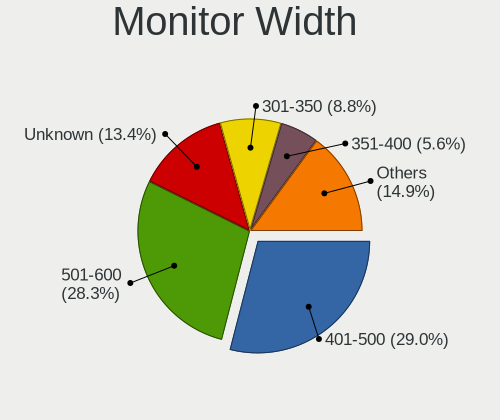

| Width in mm    | Desktops | Percent |
|----------------|----------|---------|
| 401-500        | 379      | 28.45%  |
| 501-600        | 333      | 25%     |
| Unknown        | 216      | 16.22%  |
| 301-350        | 124      | 9.31%   |
| 351-400        | 94       | 7.06%   |
| 601-700        | 71       | 5.33%   |
| 1501-2000      | 37       | 2.78%   |
| 1001-1500      | 26       | 1.95%   |
| 701-800        | 19       | 1.43%   |
| 801-900        | 16       | 1.2%    |
| 201-300        | 14       | 1.05%   |
| More than 2000 | 2        | 0.15%   |
| 901-1000       | 1        | 0.08%   |

Aspect Ratio
------------

Proportional relationship between the width and the height

| Ratio   | Desktops | Percent |
|---------|----------|---------|
| 16/9    | 643      | 49.54%  |
| 16/10   | 212      | 16.33%  |
| Unknown | 202      | 15.56%  |
| 5/4     | 170      | 13.1%   |
| 4/3     | 41       | 3.16%   |
| 21/9    | 11       | 0.85%   |
| 6/5     | 7        | 0.54%   |
| 3/2     | 7        | 0.54%   |
| 32/9    | 2        | 0.15%   |
| 1.00    | 2        | 0.15%   |
| 1.96    | 1        | 0.08%   |

Monitor Area
------------

Area in inch

| Area in inch | Desktops | Percent |
|----------------|----------|---------|
| 201-250        | 367      | 27.37%  |
| 151-200        | 259      | 19.31%  |
| Unknown        | 216      | 16.11%  |
| 141-150        | 142      | 10.59%  |
| 301-350        | 92       | 6.86%   |
| 351-500        | 69       | 5.15%   |
| 251-300        | 63       | 4.7%    |
| More than 1000 | 60       | 4.47%   |
| 101-110        | 33       | 2.46%   |
| 501-1000       | 23       | 1.72%   |
| 131-140        | 4        | 0.3%    |
| 71-80          | 3        | 0.22%   |
| 81-90          | 2        | 0.15%   |
| 51-60          | 2        | 0.15%   |
| 91-100         | 2        | 0.15%   |
| 61-70          | 1        | 0.07%   |
| 41-50          | 1        | 0.07%   |
| 121-130        | 1        | 0.07%   |
| 111-120        | 1        | 0.07%   |

Pixel Density
-------------

Pixels per inch

| Density | Desktops | Percent |
|---------|----------|---------|
| 51-100  | 797      | 62.31%  |
| Unknown | 216      | 16.89%  |
| 101-120 | 169      | 13.21%  |
| 1-50    | 52       | 4.07%   |
| 121-160 | 41       | 3.21%   |
| 161-240 | 4        | 0.31%   |

Multiple Monitors
-----------------

Total monitors connected

| Total | Desktops | Percent |
|-------|----------|---------|
| 1     | 1106     | 81.14%  |
| 2     | 175      | 12.84%  |
| 0     | 71       | 5.21%   |
| 3     | 9        | 0.66%   |
| 4     | 2        | 0.15%   |

Network
-------

Net Controller Vendor
---------------------

Controller vendors

| Vendor                            | Desktops | Percent |
|-----------------------------------|----------|---------|
| Realtek Semiconductor             | 765      | 40.12%  |
| Intel                             | 460      | 24.12%  |
| Qualcomm Atheros                  | 136      | 7.13%   |
| Broadcom                          | 77       | 4.04%   |
| Nvidia                            | 76       | 3.99%   |
| Ralink Technology                 | 53       | 2.78%   |
| TP-Link                           | 33       | 1.73%   |
| Ralink                            | 29       | 1.52%   |
| VIA Technologies                  | 28       | 1.47%   |
| Qualcomm Atheros Communications   | 26       | 1.36%   |
| Marvell Technology Group          | 24       | 1.26%   |
| Broadcom Limited                  | 22       | 1.15%   |
| D-Link System                     | 21       | 1.1%    |
| NetGear                           | 17       | 0.89%   |
| D-Link                            | 14       | 0.73%   |
| Huawei Technologies               | 11       | 0.58%   |
| MediaTek                          | 10       | 0.52%   |
| Samsung Electronics               | 9        | 0.47%   |
| ASUSTek Computer                  | 8        | 0.42%   |
| Edimax Technology                 | 6        | 0.31%   |
| Belkin Components                 | 6        | 0.31%   |
| Aquantia                          | 6        | 0.31%   |
| Silicon Integrated Systems [SiS]  | 4        | 0.21%   |
| Microsoft                         | 4        | 0.21%   |
| IMC Networks                      | 4        | 0.21%   |
| HTC (High Tech Computer)          | 4        | 0.21%   |
| Xiaomi                            | 3        | 0.16%   |
| Sitecom Europe                    | 3        | 0.16%   |
| Qualcomm                          | 3        | 0.16%   |
| Linksys                           | 3        | 0.16%   |
| DisplayLink                       | 3        | 0.16%   |
| AVM                               | 3        | 0.16%   |
| ASIX Electronics                  | 3        | 0.16%   |
| 3Com                              | 3        | 0.16%   |
| TRENDnet                          | 2        | 0.1%    |
| LG Electronics                    | 2        | 0.1%    |
| Arduino SA                        | 2        | 0.1%    |
| ZyXEL Communications              | 1        | 0.05%   |
| ZTE WCDMA Technologies MSM        | 1        | 0.05%   |
| Van Ooijen Technische Informatica | 1        | 0.05%   |
| Unknown                           | 1        | 0.05%   |
| ULi Electronics                   | 1        | 0.05%   |
| T & A Mobile Phones               | 1        | 0.05%   |
| STMicroelectronics                | 1        | 0.05%   |
| Philips (or NXP)                  | 1        | 0.05%   |
| National Semiconductor            | 1        | 0.05%   |
| Motorola                          | 1        | 0.05%   |
| Mellanox Technologies             | 1        | 0.05%   |
| Manta                             | 1        | 0.05%   |
| LSI                               | 1        | 0.05%   |
| Lenovo                            | 1        | 0.05%   |
| JMicron Technology                | 1        | 0.05%   |
| Intersil                          | 1        | 0.05%   |
| Hangzhou Silan Microelectronics   | 1        | 0.05%   |
| Gemtek                            | 1        | 0.05%   |
| Apple                             | 1        | 0.05%   |
| AMD                               | 1        | 0.05%   |
| ADMtek                            | 1        | 0.05%   |
| Accton Technology                 | 1        | 0.05%   |
| AboCom Systems                    | 1        | 0.05%   |

Net Controller Model
--------------------

Controller models

| Model                                                             | Desktops | Percent |
|-------------------------------------------------------------------|----------|---------|
| Realtek RTL8111/8168/8411 PCI Express Gigabit Ethernet Controller | 574      | 27.73%  |
| Intel 82579LM Gigabit Network Connection (Lewisville)             | 69       | 3.33%   |
| Nvidia MCP61 Ethernet                                             | 46       | 2.22%   |
| Realtek RTL810xE PCI Express Fast Ethernet controller             | 45       | 2.17%   |
| Intel I211 Gigabit Network Connection                             | 41       | 1.98%   |
| Realtek RTL-8100/8101L/8139 PCI Fast Ethernet Adapter             | 35       | 1.69%   |
| Intel Wi-Fi 6 AX200                                               | 35       | 1.69%   |
| Intel 82567LM-3 Gigabit Network Connection                        | 35       | 1.69%   |
| Intel Ethernet Connection I217-LM                                 | 34       | 1.64%   |
| Intel 82579V Gigabit Network Connection                           | 27       | 1.3%    |
| Intel Ethernet Connection (2) I219-V                              | 26       | 1.26%   |
| Realtek RTL8125 2.5GbE Controller                                 | 24       | 1.16%   |
| Ralink MT7601U Wireless Adapter                                   | 24       | 1.16%   |
| Intel 82566DM-2 Gigabit Network Connection                        | 24       | 1.16%   |
| Qualcomm Atheros AR9271 802.11n                                   | 23       | 1.11%   |
| VIA VT6102/VT6103 [Rhine-II]                                      | 21       | 1.01%   |
| Realtek RTL8188EUS 802.11n Wireless Network Adapter               | 21       | 1.01%   |
| Realtek RTL8192CU 802.11n WLAN Adapter                            | 16       | 0.77%   |
| Realtek RTL8188CUS 802.11n WLAN Adapter                           | 16       | 0.77%   |
| Intel 82574L Gigabit Network Connection                           | 15       | 0.72%   |
| Qualcomm Atheros Attansic L1 Gigabit Ethernet                     | 14       | 0.68%   |
| Realtek RTL88x2bu [AC1200 Techkey]                                | 13       | 0.63%   |
| Intel Ethernet Connection I217-V                                  | 13       | 0.63%   |
| Intel Ethernet Connection (7) I219-V                              | 13       | 0.63%   |
| Qualcomm Atheros AR9485 Wireless Network Adapter                  | 12       | 0.58%   |
| Qualcomm Atheros AR8151 v2.0 Gigabit Ethernet                     | 12       | 0.58%   |
| Marvell Group 88E8056 PCI-E Gigabit Ethernet Controller           | 12       | 0.58%   |
| Intel Dual Band Wireless-AC 3168NGW [Stone Peak]                  | 12       | 0.58%   |
| TP-Link TL-WN722N v2/v3 [Realtek RTL8188EUS]                      | 11       | 0.53%   |
| Qualcomm Atheros Killer E220x Gigabit Ethernet Controller         | 11       | 0.53%   |
| Intel Ethernet Connection (2) I218-V                              | 11       | 0.53%   |
| Realtek RTL8169 PCI Gigabit Ethernet Controller                   | 10       | 0.48%   |
| Realtek RTL8153 Gigabit Ethernet Adapter                          | 10       | 0.48%   |
| Realtek RTL-8110SC/8169SC Gigabit Ethernet                        | 10       | 0.48%   |
| Ralink RT2870/RT3070 Wireless Adapter                             | 10       | 0.48%   |
| Qualcomm Atheros AR9227 Wireless Network Adapter                  | 10       | 0.48%   |
| Qualcomm Atheros AR9287 Wireless Network Adapter (PCI-Express)    | 9        | 0.43%   |
| Nvidia MCP77 Ethernet                                             | 9        | 0.43%   |
| Broadcom NetXtreme BCM5751 Gigabit Ethernet PCI Express           | 9        | 0.43%   |
| Qualcomm Atheros AR9285 Wireless Network Adapter (PCI-Express)    | 8        | 0.39%   |
| Qualcomm Atheros AR8121/AR8113/AR8114 Gigabit or Fast Ethernet    | 8        | 0.39%   |
| Intel Wireless-AC 9260                                            | 8        | 0.39%   |
| Intel Ethernet Connection (2) I219-LM                             | 8        | 0.39%   |
| Intel 82578DC Gigabit Network Connection                          | 8        | 0.39%   |
| Broadcom NetXtreme BCM5754 Gigabit Ethernet PCI Express           | 8        | 0.39%   |
| Realtek RTL8192EU 802.11b/g/n WLAN Adapter                        | 7        | 0.34%   |
| Qualcomm Atheros AR9462 Wireless Network Adapter                  | 7        | 0.34%   |
| Qualcomm Atheros AR93xx Wireless Network Adapter                  | 7        | 0.34%   |
| Broadcom NetLink BCM57780 Gigabit Ethernet PCIe                   | 7        | 0.34%   |
| Broadcom BCM4360 802.11ac Wireless Network Adapter                | 7        | 0.34%   |
| Broadcom BCM4352 802.11ac Wireless Network Adapter                | 7        | 0.34%   |
| VIA VT6105/VT6106S [Rhine-III]                                    | 6        | 0.29%   |
| Samsung Galaxy series, misc. (tethering mode)                     | 6        | 0.29%   |
| Realtek RTL8192EE PCIe Wireless Network Adapter                   | 6        | 0.29%   |
| Qualcomm Atheros AR8152 v2.0 Fast Ethernet                        | 6        | 0.29%   |
| Nvidia MCP51 Ethernet Controller                                  | 6        | 0.29%   |
| Intel Wireless 7260                                               | 6        | 0.29%   |
| Intel 82573L Gigabit Ethernet Controller                          | 6        | 0.29%   |
| Intel 82562V-2 10/100 Network Connection                          | 6        | 0.29%   |
| TP-Link TL-WN823N v2/v3 [Realtek RTL8192EU]                       | 5        | 0.24%   |

Wireless Vendor
---------------

Wireless vendors

| Vendor                                | Desktops | Percent |
|---------------------------------------|----------|---------|
| Realtek Semiconductor                 | 141      | 24.44%  |
| Intel                                 | 96       | 16.64%  |
| Qualcomm Atheros                      | 76       | 13.17%  |
| Ralink Technology                     | 53       | 9.19%   |
| TP-Link                               | 33       | 5.72%   |
| Ralink                                | 29       | 5.03%   |
| Qualcomm Atheros Communications       | 26       | 4.51%   |
| Broadcom                              | 24       | 4.16%   |
| NetGear                               | 17       | 2.95%   |
| D-Link System                         | 13       | 2.25%   |
| D-Link                                | 13       | 2.25%   |
| ASUSTek Computer                      | 8        | 1.39%   |
| Edimax Technology                     | 6        | 1.04%   |
| Belkin Components                     | 6        | 1.04%   |
| Microsoft                             | 4        | 0.69%   |
| MediaTek                              | 4        | 0.69%   |
| IMC Networks                          | 4        | 0.69%   |
| Sitecom Europe                        | 3        | 0.52%   |
| Marvell Technology Group              | 3        | 0.52%   |
| Linksys                               | 3        | 0.52%   |
| Broadcom Limited                      | 3        | 0.52%   |
| AVM                                   | 3        | 0.52%   |
| TRENDnet                              | 2        | 0.35%   |
| ZyXEL Communications                  | 1        | 0.17%   |
| Xiaomi                                | 1        | 0.17%   |
| Philips (or NXP)                      | 1        | 0.17%   |
| Gemtek                                | 1        | 0.17%   |
| AboCom Systems                        | 1        | 0.17%   |
| 802.11g Adapter [Linksys WUSB54GC v3] | 1        | 0.17%   |
| 3Com                                  | 1        | 0.17%   |

Wireless Model
--------------

Wireless models

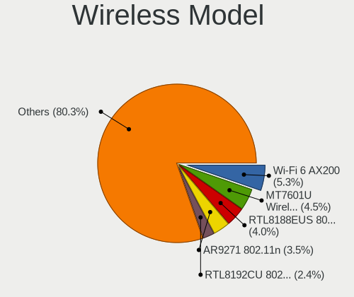

| Model                                                                                         | Desktops | Percent |
|-----------------------------------------------------------------------------------------------|----------|---------|
| Intel Wi-Fi 6 AX200                                                                           | 35       | 6%      |
| Ralink MT7601U Wireless Adapter                                                               | 24       | 4.12%   |
| Qualcomm Atheros AR9271 802.11n                                                               | 23       | 3.95%   |
| Realtek RTL8188EUS 802.11n Wireless Network Adapter                                           | 21       | 3.6%    |
| Realtek RTL8192CU 802.11n WLAN Adapter                                                        | 16       | 2.74%   |
| Realtek RTL8188CUS 802.11n WLAN Adapter                                                       | 16       | 2.74%   |
| Realtek RTL88x2bu [AC1200 Techkey]                                                            | 13       | 2.23%   |
| Qualcomm Atheros AR9485 Wireless Network Adapter                                              | 12       | 2.06%   |
| Intel Dual Band Wireless-AC 3168NGW [Stone Peak]                                              | 12       | 2.06%   |
| TP-Link TL-WN722N v2/v3 [Realtek RTL8188EUS]                                                  | 11       | 1.89%   |
| Ralink RT2870/RT3070 Wireless Adapter                                                         | 10       | 1.72%   |
| Qualcomm Atheros AR9227 Wireless Network Adapter                                              | 10       | 1.72%   |
| Qualcomm Atheros AR9287 Wireless Network Adapter (PCI-Express)                                | 9        | 1.54%   |
| Qualcomm Atheros AR9285 Wireless Network Adapter (PCI-Express)                                | 8        | 1.37%   |
| Intel Wireless-AC 9260                                                                        | 8        | 1.37%   |
| Realtek RTL8192EU 802.11b/g/n WLAN Adapter                                                    | 7        | 1.2%    |
| Qualcomm Atheros AR9462 Wireless Network Adapter                                              | 7        | 1.2%    |
| Qualcomm Atheros AR93xx Wireless Network Adapter                                              | 7        | 1.2%    |
| Broadcom BCM4360 802.11ac Wireless Network Adapter                                            | 7        | 1.2%    |
| Broadcom BCM4352 802.11ac Wireless Network Adapter                                            | 7        | 1.2%    |
| Realtek RTL8192EE PCIe Wireless Network Adapter                                               | 6        | 1.03%   |
| Intel Wireless 7260                                                                           | 6        | 1.03%   |
| TP-Link TL-WN823N v2/v3 [Realtek RTL8192EU]                                                   | 5        | 0.86%   |
| Realtek RTL8812AE 802.11ac PCIe Wireless Network Adapter                                      | 5        | 0.86%   |
| Realtek RTL8188FTV 802.11b/g/n 1T1R 2.4G WLAN Adapter                                         | 5        | 0.86%   |
| Realtek 802.11ac NIC                                                                          | 5        | 0.86%   |
| Ralink RT5390 Wireless 802.11n 1T/1R PCIe                                                     | 5        | 0.86%   |
| Ralink RT3090 Wireless 802.11n 1T/1R PCIe                                                     | 5        | 0.86%   |
| Ralink RT2561/RT61 802.11g PCI                                                                | 5        | 0.86%   |
| NetGear A6210                                                                                 | 5        | 0.86%   |
| Intel Wireless 3165                                                                           | 5        | 0.86%   |
| Intel Cannon Lake PCH CNVi WiFi                                                               | 5        | 0.86%   |
| TP-Link TL-WN821N v5/v6 [RTL8192EU]                                                           | 4        | 0.69%   |
| Realtek RTL8821AE 802.11ac PCIe Wireless Network Adapter                                      | 4        | 0.69%   |
| Realtek RTL8188SU 802.11n WLAN Adapter                                                        | 4        | 0.69%   |
| Realtek RTL8187 Wireless Adapter                                                              | 4        | 0.69%   |
| Realtek Realtek 8812AU/8821AU 802.11ac WLAN Adapter [USB Wireless Dual-Band Adapter 2.4/5Ghz] | 4        | 0.69%   |
| Ralink RT5370 Wireless Adapter                                                                | 4        | 0.69%   |
| Qualcomm Atheros QCA6174 802.11ac Wireless Network Adapter                                    | 4        | 0.69%   |
| Qualcomm Atheros AR928X Wireless Network Adapter (PCI-Express)                                | 4        | 0.69%   |
| Qualcomm Atheros AR5413/AR5414 Wireless Network Adapter [AR5006X(S) 802.11abg]                | 4        | 0.69%   |
| Qualcomm Atheros AR5212/5213/2414 Wireless Network Adapter                                    | 4        | 0.69%   |
| Intel Wireless 7265                                                                           | 4        | 0.69%   |
| Intel Wireless 3160                                                                           | 4        | 0.69%   |
| TP-Link Archer T4U v2 [Realtek RTL8812AU]                                                     | 3        | 0.51%   |
| Realtek RTL8821CE 802.11ac PCIe Wireless Network Adapter                                      | 3        | 0.51%   |
| Realtek RTL8191SU 802.11n WLAN Adapter                                                        | 3        | 0.51%   |
| Realtek RTL8188EE Wireless Network Adapter                                                    | 3        | 0.51%   |
| Realtek RTL-8185 IEEE 802.11a/b/g Wireless LAN Controller                                     | 3        | 0.51%   |
| Ralink RT5372 Wireless Adapter                                                                | 3        | 0.51%   |
| Ralink RT2501/RT2573 Wireless Adapter                                                         | 3        | 0.51%   |
| Ralink MT7610U ("Archer T2U" 2.4G+5G WLAN Adapter                                             | 3        | 0.51%   |
| Ralink RT2790 Wireless 802.11n 1T/2R PCIe                                                     | 3        | 0.51%   |
| Qualcomm Atheros QCA9565 / AR9565 Wireless Network Adapter                                    | 3        | 0.51%   |
| NetGear WNA1100 Wireless-N 150 [Atheros AR9271]                                               | 3        | 0.51%   |
| Intel Wireless 8265 / 8275                                                                    | 3        | 0.51%   |
| Intel Wireless 8260                                                                           | 3        | 0.51%   |
| Intel Wi-Fi 6 AX210/AX211/AX411 160MHz                                                        | 3        | 0.51%   |
| D-Link System DWA-140 RangeBooster N Adapter(rev.B2) [Ralink RT3072]                          | 3        | 0.51%   |
| D-Link System AirPlus G DWL-G122 Wireless Adapter(rev.C1) [Ralink RT2571W]                    | 3        | 0.51%   |

Ethernet Vendor
---------------

Ethernet vendors

| Vendor                           | Desktops | Percent |
|----------------------------------|----------|---------|
| Realtek Semiconductor            | 696      | 48.54%  |
| Intel                            | 403      | 28.1%   |
| Nvidia                           | 76       | 5.3%    |
| Qualcomm Atheros                 | 70       | 4.88%   |
| Broadcom                         | 54       | 3.77%   |
| VIA Technologies                 | 28       | 1.95%   |
| Marvell Technology Group         | 21       | 1.46%   |
| Broadcom Limited                 | 19       | 1.32%   |
| Samsung Electronics              | 9        | 0.63%   |
| Huawei Technologies              | 8        | 0.56%   |
| D-Link System                    | 8        | 0.56%   |
| MediaTek                         | 6        | 0.42%   |
| Aquantia                         | 6        | 0.42%   |
| Silicon Integrated Systems [SiS] | 4        | 0.28%   |
| Qualcomm                         | 3        | 0.21%   |
| DisplayLink                      | 3        | 0.21%   |
| ASIX Electronics                 | 3        | 0.21%   |
| Xiaomi                           | 2        | 0.14%   |
| LG Electronics                   | 2        | 0.14%   |
| 3Com                             | 2        | 0.14%   |
| ZTE WCDMA Technologies MSM       | 1        | 0.07%   |
| T & A Mobile Phones              | 1        | 0.07%   |
| National Semiconductor           | 1        | 0.07%   |
| Mellanox Technologies            | 1        | 0.07%   |
| Lenovo                           | 1        | 0.07%   |
| JMicron Technology               | 1        | 0.07%   |
| Hangzhou Silan Microelectronics  | 1        | 0.07%   |
| D-Link                           | 1        | 0.07%   |
| Apple                            | 1        | 0.07%   |
| ADMtek                           | 1        | 0.07%   |
| Accton Technology                | 1        | 0.07%   |

Ethernet Model
--------------

Ethernet models

| Model                                                                         | Desktops | Percent |
|-------------------------------------------------------------------------------|----------|---------|
| Realtek RTL8111/8168/8411 PCI Express Gigabit Ethernet Controller             | 574      | 39.21%  |
| Intel 82579LM Gigabit Network Connection (Lewisville)                         | 69       | 4.71%   |
| Nvidia MCP61 Ethernet                                                         | 46       | 3.14%   |
| Realtek RTL810xE PCI Express Fast Ethernet controller                         | 45       | 3.07%   |
| Intel I211 Gigabit Network Connection                                         | 41       | 2.8%    |
| Realtek RTL-8100/8101L/8139 PCI Fast Ethernet Adapter                         | 35       | 2.39%   |
| Intel 82567LM-3 Gigabit Network Connection                                    | 35       | 2.39%   |
| Intel Ethernet Connection I217-LM                                             | 34       | 2.32%   |
| Intel 82579V Gigabit Network Connection                                       | 27       | 1.84%   |
| Intel Ethernet Connection (2) I219-V                                          | 26       | 1.78%   |
| Realtek RTL8125 2.5GbE Controller                                             | 24       | 1.64%   |
| Intel 82566DM-2 Gigabit Network Connection                                    | 24       | 1.64%   |
| VIA VT6102/VT6103 [Rhine-II]                                                  | 21       | 1.43%   |
| Intel 82574L Gigabit Network Connection                                       | 15       | 1.02%   |
| Qualcomm Atheros Attansic L1 Gigabit Ethernet                                 | 14       | 0.96%   |
| Intel Ethernet Connection I217-V                                              | 13       | 0.89%   |
| Intel Ethernet Connection (7) I219-V                                          | 13       | 0.89%   |
| Qualcomm Atheros AR8151 v2.0 Gigabit Ethernet                                 | 12       | 0.82%   |
| Marvell Group 88E8056 PCI-E Gigabit Ethernet Controller                       | 12       | 0.82%   |
| Qualcomm Atheros Killer E220x Gigabit Ethernet Controller                     | 11       | 0.75%   |
| Intel Ethernet Connection (2) I218-V                                          | 11       | 0.75%   |
| Realtek RTL8169 PCI Gigabit Ethernet Controller                               | 10       | 0.68%   |
| Realtek RTL8153 Gigabit Ethernet Adapter                                      | 10       | 0.68%   |
| Realtek RTL-8110SC/8169SC Gigabit Ethernet                                    | 10       | 0.68%   |
| Nvidia MCP77 Ethernet                                                         | 9        | 0.61%   |
| Broadcom NetXtreme BCM5751 Gigabit Ethernet PCI Express                       | 9        | 0.61%   |
| Qualcomm Atheros AR8121/AR8113/AR8114 Gigabit or Fast Ethernet                | 8        | 0.55%   |
| Intel Ethernet Connection (2) I219-LM                                         | 8        | 0.55%   |
| Intel 82578DC Gigabit Network Connection                                      | 8        | 0.55%   |
| Broadcom NetXtreme BCM5754 Gigabit Ethernet PCI Express                       | 8        | 0.55%   |
| Broadcom NetLink BCM57780 Gigabit Ethernet PCIe                               | 7        | 0.48%   |
| VIA VT6105/VT6106S [Rhine-III]                                                | 6        | 0.41%   |
| Samsung Galaxy series, misc. (tethering mode)                                 | 6        | 0.41%   |
| Qualcomm Atheros AR8152 v2.0 Fast Ethernet                                    | 6        | 0.41%   |
| Nvidia MCP51 Ethernet Controller                                              | 6        | 0.41%   |
| Intel 82573L Gigabit Ethernet Controller                                      | 6        | 0.41%   |
| Intel 82562V-2 10/100 Network Connection                                      | 6        | 0.41%   |
| Qualcomm Atheros QCA8171 Gigabit Ethernet                                     | 5        | 0.34%   |
| Qualcomm Atheros AR8131 Gigabit Ethernet                                      | 5        | 0.34%   |
| Nvidia MCP73 Ethernet                                                         | 5        | 0.34%   |
| MediaTek moto e(6) plus                                                       | 5        | 0.34%   |
| Intel Ethernet Controller I225-V                                              | 5        | 0.34%   |
| Intel 82578DM Gigabit Network Connection                                      | 5        | 0.34%   |
| Intel 82566DC-2 Gigabit Network Connection                                    | 5        | 0.34%   |
| Intel 82562ET/EZ/GT/GZ - PRO/100 VE (LOM) Ethernet Controller                 | 5        | 0.34%   |
| Broadcom Limited NetXtreme BCM5752 Gigabit Ethernet PCI Express               | 5        | 0.34%   |
| Qualcomm Atheros Attansic L2 Fast Ethernet                                    | 4        | 0.27%   |
| Intel NM10/ICH7 Family LAN Controller                                         | 4        | 0.27%   |
| Intel I210 Gigabit Network Connection                                         | 4        | 0.27%   |
| Intel 82571EB/82571GB Gigabit Ethernet Controller D0/D1 (copper applications) | 4        | 0.27%   |
| Intel 82566DM Gigabit Network Connection                                      | 4        | 0.27%   |
| Huawei LYA-L09                                                                | 4        | 0.27%   |
| D-Link System DGE-528T Gigabit Ethernet Adapter                               | 4        | 0.27%   |
| Broadcom NetXtreme BCM5764M Gigabit Ethernet PCIe                             | 4        | 0.27%   |
| Broadcom NetLink BCM57788 Gigabit Ethernet PCIe                               | 4        | 0.27%   |
| Broadcom Limited NetXtreme BCM5755 Gigabit Ethernet PCI Express               | 4        | 0.27%   |
| Aquantia AQC107 NBase-T/IEEE 802.3bz Ethernet Controller [AQtion]             | 4        | 0.27%   |
| Silicon Integrated Systems [SiS] SiS900 PCI Fast Ethernet                     | 3        | 0.2%    |
| Samsung GT-I9070 (network tethering, USB debugging enabled)                   | 3        | 0.2%    |
| Qualcomm BENGAL-QRD _SN:C5464635                                              | 3        | 0.2%    |

Net Controller Kind
-------------------

Ethernet, WiFi or modem

| Kind     | Desktops | Percent |
|----------|----------|---------|
| Ethernet | 1319     | 70.35%  |
| WiFi     | 533      | 28.43%  |
| Modem    | 19       | 1.01%   |
| Unknown  | 4        | 0.21%   |

Used Controller
---------------

Currently used network controller

| Kind     | Desktops | Percent |
|----------|----------|---------|
| Ethernet | 1033     | 74.53%  |
| WiFi     | 351      | 25.32%  |
| Modem    | 2        | 0.14%   |

NICs
----

Total network controllers on board

| Total | Desktops | Percent |
|-------|----------|---------|
| 1     | 977      | 72.48%  |
| 2     | 306      | 22.7%   |
| 3     | 40       | 2.97%   |
| 0     | 19       | 1.41%   |
| 4     | 5        | 0.37%   |
| 5     | 1        | 0.07%   |

IPv6
----

IPv6 vs IPv4

| Used | Desktops | Percent |
|------|----------|---------|
| No   | 1173     | 86.63%  |
| Yes  | 181      | 13.37%  |

Bluetooth
---------

Bluetooth Vendor
----------------

Controller vendors

| Vendor                          | Desktops | Percent |
|---------------------------------|----------|---------|
| Intel                           | 86       | 33.86%  |
| Cambridge Silicon Radio         | 72       | 28.35%  |
| Broadcom                        | 28       | 11.02%  |
| Qualcomm Atheros Communications | 17       | 6.69%   |
| Realtek Semiconductor           | 10       | 3.94%   |
| ASUSTek Computer                | 10       | 3.94%   |
| IMC Networks                    | 8        | 3.15%   |
| Integrated System Solution      | 5        | 1.97%   |
| Apple                           | 4        | 1.57%   |
| Lite-On Technology              | 3        | 1.18%   |
| Edimax Technology               | 2        | 0.79%   |
| TP-Link                         | 1        | 0.39%   |
| Sitecom Europe                  | 1        | 0.39%   |
| Ralink                          | 1        | 0.39%   |
| MediaTek                        | 1        | 0.39%   |
| Logitech                        | 1        | 0.39%   |
| Fujitsu                         | 1        | 0.39%   |
| Dell                            | 1        | 0.39%   |
| Conwise Technology              | 1        | 0.39%   |
| Unknown                         | 1        | 0.39%   |

Bluetooth Model
---------------

Controller models

| Model                                                     | Desktops | Percent |
|-----------------------------------------------------------|----------|---------|
| Cambridge Silicon Radio Bluetooth Dongle (HCI mode)       | 72       | 28.35%  |
| Intel AX200 Bluetooth                                     | 37       | 14.57%  |
| Intel Bluetooth wireless interface                        | 21       | 8.27%   |
| Broadcom BCM20702A0 Bluetooth 4.0                         | 15       | 5.91%   |
| Intel Wireless-AC 3168 Bluetooth                          | 11       | 4.33%   |
| Qualcomm Atheros AR3011 Bluetooth                         | 8        | 3.15%   |
| Qualcomm Atheros  Bluetooth Device                        | 7        | 2.76%   |
| Intel Bluetooth Device                                    | 6        | 2.36%   |
| Intel Bluetooth 9460/9560 Jefferson Peak (JfP)            | 6        | 2.36%   |
| Integrated System Solution Bluetooth Device               | 5        | 1.97%   |
| Realtek Bluetooth Radio                                   | 4        | 1.57%   |
| Apple Built-in Bluetooth 2.0+EDR HCI                      | 4        | 1.57%   |
| Realtek RTL8821A Bluetooth                                | 3        | 1.18%   |
| Realtek  Bluetooth 4.2 Adapter                            | 3        | 1.18%   |
| Lite-On Bluetooth Device                                  | 3        | 1.18%   |
| Intel AX210 Bluetooth                                     | 3        | 1.18%   |
| IMC Networks Bluetooth Radio                              | 3        | 1.18%   |
| IMC Networks BCM20702A0                                   | 3        | 1.18%   |
| Broadcom BCM2045 Bluetooth                                | 3        | 1.18%   |
| Broadcom ANYCOM Blue USB-UHE 200/250                      | 3        | 1.18%   |
| ASUS Broadcom BCM20702A0 Bluetooth                        | 3        | 1.18%   |
| Intel AX201 Bluetooth                                     | 2        | 0.79%   |
| IMC Networks Bluetooth Device                             | 2        | 0.79%   |
| Broadcom BCM2035 Bluetooth dongle                         | 2        | 0.79%   |
| ASUS Broadcom BCM20702 Single-Chip Bluetooth 4.0 + LE     | 2        | 0.79%   |
| ASUS BCM20702A0                                           | 2        | 0.79%   |
| TP-Link TP-hink UB500 Adapter                             | 1        | 0.39%   |
| Sitecom Europe Sitecom bluetooth2.0 class 2 dongle CN-512 | 1        | 0.39%   |
| Ralink RT3290 Bluetooth                                   | 1        | 0.39%   |
| Qualcomm Atheros Bluetooth USB Host Controller            | 1        | 0.39%   |
| Qualcomm Atheros AR9462 Bluetooth                         | 1        | 0.39%   |
| MediaTek Wireless_Device                                  | 1        | 0.39%   |
| Logitech BT Mini-Receiver (HCI mode)                      | 1        | 0.39%   |
| Fujitsu Bluetooth Device                                  | 1        | 0.39%   |
| Edimax Wi-Fi N150 Bluetooth4.0 USB Adapter                | 1        | 0.39%   |
| Edimax Bluetooth Adapter                                  | 1        | 0.39%   |
| Dell Wireless 365 Bluetooth                               | 1        | 0.39%   |
| Conwise CW6622                                            | 1        | 0.39%   |
| Broadcom HP Bluetooth Module                              | 1        | 0.39%   |
| Broadcom Bluetooth 3.0+HS USB Adapter                     | 1        | 0.39%   |
| Broadcom BCM92045B3 ROM                                   | 1        | 0.39%   |
| Broadcom BCM43142A0 Bluetooth Device                      | 1        | 0.39%   |
| Broadcom BCM20702A0                                       | 1        | 0.39%   |
| ASUS Qualcomm Bluetooth 4.1                               | 1        | 0.39%   |
| ASUS Bluetooth Adapter                                    | 1        | 0.39%   |
| ASUS ASUS USB-BT500                                       | 1        | 0.39%   |
| Unknown                                                   | 1        | 0.39%   |

Sound
-----

Sound Vendor
------------

Sound card vendors

| Vendor                               | Desktops | Percent |
|--------------------------------------|----------|---------|
| Intel                                | 845      | 40.24%  |
| Nvidia                               | 489      | 23.29%  |
| AMD                                  | 457      | 21.76%  |
| Creative Labs                        | 47       | 2.24%   |
| C-Media Electronics                  | 43       | 2.05%   |
| VIA Technologies                     | 33       | 1.57%   |
| Texas Instruments                    | 19       | 0.9%    |
| Logitech                             | 12       | 0.57%   |
| Yamaha                               | 9        | 0.43%   |
| M-Audio                              | 9        | 0.43%   |
| Focusrite-Novation                   | 8        | 0.38%   |
| Creative Technology                  | 8        | 0.38%   |
| Silicon Integrated Systems [SiS]     | 7        | 0.33%   |
| JMTek                                | 6        | 0.29%   |
| GN Netcom                            | 6        | 0.29%   |
| Sennheiser Communications            | 4        | 0.19%   |
| Plantronics                          | 4        | 0.19%   |
| Generalplus Technology               | 4        | 0.19%   |
| Ensoniq                              | 4        | 0.19%   |
| EGO SYStems                          | 3        | 0.14%   |
| DigiTech                             | 3        | 0.14%   |
| BEHRINGER International              | 3        | 0.14%   |
| AKAI Professional M.I.               | 3        | 0.14%   |
| Xilinx                               | 2        | 0.1%    |
| Unknown                              | 2        | 0.1%    |
| ULi Electronics                      | 2        | 0.1%    |
| Thesycon Systemsoftware & Consulting | 2        | 0.1%    |
| TerraTec Electronic                  | 2        | 0.1%    |
| Tenx Technology                      | 2        | 0.1%    |
| TEAC                                 | 2        | 0.1%    |
| SAVITECH                             | 2        | 0.1%    |
| Lenovo                               | 2        | 0.1%    |
| Kingston Technology                  | 2        | 0.1%    |
| FiiO Electronics Technology          | 2        | 0.1%    |
| ESI Audiotechnik                     | 2        | 0.1%    |
| Elite Silicon                        | 2        | 0.1%    |
| Digidesign                           | 2        | 0.1%    |
| Corsair                              | 2        | 0.1%    |
| ASUSTek Computer                     | 2        | 0.1%    |
| Alesis                               | 2        | 0.1%    |
| ZOOM                                 | 1        | 0.05%   |
| XMOS                                 | 1        | 0.05%   |
| ThrustMaster                         | 1        | 0.05%   |
| Syntek                               | 1        | 0.05%   |
| SteelSeries ApS                      | 1        | 0.05%   |
| Sony                                 | 1        | 0.05%   |
| Samson Technologies                  | 1        | 0.05%   |
| Roland                               | 1        | 0.05%   |
| RODE Microphones                     | 1        | 0.05%   |
| Realtek Semiconductor                | 1        | 0.05%   |
| Razer USA                            | 1        | 0.05%   |
| Pioneer DJ                           | 1        | 0.05%   |
| Philips (or NXP)                     | 1        | 0.05%   |
| ONN                                  | 1        | 0.05%   |
| Onkyo                                | 1        | 0.05%   |
| Nordic Semiconductor ASA             | 1        | 0.05%   |
| Microchip Technology                 | 1        | 0.05%   |
| Mark of the Unicorn                  | 1        | 0.05%   |
| MAG Technology                       | 1        | 0.05%   |
| Line6                                | 1        | 0.05%   |

Sound Model
-----------

Sound card models

| Model                                                                             | Desktops | Percent |
|-----------------------------------------------------------------------------------|----------|---------|
| Intel NM10/ICH7 Family High Definition Audio Controller                           | 139      | 5.85%   |
| Intel 6 Series/C200 Series Chipset Family High Definition Audio Controller        | 119      | 5%      |
| AMD SBx00 Azalia (Intel HDA)                                                      | 108      | 4.54%   |
| Intel 8 Series/C220 Series Chipset High Definition Audio Controller               | 85       | 3.57%   |
| Intel 7 Series/C216 Chipset Family High Definition Audio Controller               | 76       | 3.2%    |
| Intel Xeon E3-1200 v3/4th Gen Core Processor HD Audio Controller                  | 66       | 2.78%   |
| AMD Starship/Matisse HD Audio Controller                                          | 58       | 2.44%   |
| Nvidia GK208 HDMI/DP Audio Controller                                             | 55       | 2.31%   |
| Intel 82801I (ICH9 Family) HD Audio Controller                                    | 53       | 2.23%   |
| AMD FCH Azalia Controller                                                         | 51       | 2.14%   |
| Nvidia MCP61 High Definition Audio                                                | 50       | 2.1%    |
| Intel 100 Series/C230 Series Chipset Family HD Audio Controller                   | 47       | 1.98%   |
| AMD Family 17h (Models 00h-0fh) HD Audio Controller                               | 47       | 1.98%   |
| Nvidia High Definition Audio Controller                                           | 45       | 1.89%   |
| AMD Ellesmere HDMI Audio [Radeon RX 470/480 / 570/580/590]                        | 45       | 1.89%   |
| Intel 5 Series/3400 Series Chipset High Definition Audio                          | 44       | 1.85%   |
| AMD Family 17h/19h HD Audio Controller                                            | 39       | 1.64%   |
| Intel 82801JI (ICH10 Family) HD Audio Controller                                  | 38       | 1.6%    |
| Intel 82801JD/DO (ICH10 Family) HD Audio Controller                               | 38       | 1.6%    |
| Intel 200 Series PCH HD Audio                                                     | 36       | 1.51%   |
| Nvidia GP107GL High Definition Audio Controller                                   | 34       | 1.43%   |
| Nvidia GF108 High Definition Audio Controller                                     | 34       | 1.43%   |
| AMD Oland/Hainan/Cape Verde/Pitcairn HDMI Audio [Radeon HD 7000 Series]           | 33       | 1.39%   |
| AMD Raven/Raven2/Fenghuang HDMI/DP Audio Controller                               | 27       | 1.14%   |
| Nvidia GP104 High Definition Audio Controller                                     | 23       | 0.97%   |
| Nvidia GM107 High Definition Audio Controller [GeForce 940MX]                     | 22       | 0.93%   |
| Nvidia GK107 HDMI Audio Controller                                                | 22       | 0.93%   |
| AMD Caicos HDMI Audio [Radeon HD 6450 / 7450/8450/8490 OEM / R5 230/235/235X OEM] | 22       | 0.93%   |
| Nvidia GF119 HDMI Audio Controller                                                | 21       | 0.88%   |
| Intel Cannon Lake PCH cAVS                                                        | 21       | 0.88%   |
| Intel 9 Series Chipset Family HD Audio Controller                                 | 21       | 0.88%   |
| AMD Cedar HDMI Audio [Radeon HD 5400/6300/7300 Series]                            | 21       | 0.88%   |
| Intel C600/X79 series chipset High Definition Audio Controller                    | 18       | 0.76%   |
| Nvidia GP108 High Definition Audio Controller                                     | 15       | 0.63%   |
| C-Media Electronics CMI8738/CMI8768 PCI Audio                                     | 15       | 0.63%   |
| Texas Instruments PCM2902 Audio Codec                                             | 14       | 0.59%   |
| Nvidia GP106 High Definition Audio Controller                                     | 14       | 0.59%   |
| Nvidia GM206 High Definition Audio Controller                                     | 14       | 0.59%   |
| VIA Technologies VT8233/A/8235/8237 AC97 Audio Controller                         | 13       | 0.55%   |
| Nvidia MCP72XE/MCP72P/MCP78U/MCP78S High Definition Audio                         | 13       | 0.55%   |
| Nvidia GF116 High Definition Audio Controller                                     | 13       | 0.55%   |
| AMD RS880 HDMI Audio [Radeon HD 4200 Series]                                      | 13       | 0.55%   |
| AMD Kabini HDMI/DP Audio                                                          | 13       | 0.55%   |
| AMD Baffin HDMI/DP Audio [Radeon RX 550 640SP / RX 560/560X]                      | 13       | 0.55%   |
| Nvidia TU106 High Definition Audio Controller                                     | 12       | 0.5%    |
| Intel C610/X99 series chipset HD Audio Controller                                 | 12       | 0.5%    |
| Nvidia GK104 HDMI Audio Controller                                                | 11       | 0.46%   |
| Intel Atom Processor Z36xxx/Z37xxx Series High Definition Audio Controller        | 11       | 0.46%   |
| Intel 82801H (ICH8 Family) HD Audio Controller                                    | 11       | 0.46%   |
| AMD RV710/730 HDMI Audio [Radeon HD 4000 series]                                  | 11       | 0.46%   |
| AMD Renoir Radeon High Definition Audio Controller                                | 11       | 0.46%   |
| Nvidia TU104 HD Audio Controller                                                  | 10       | 0.42%   |
| Creative Labs EMU20k1 [Sound Blaster X-Fi Series]                                 | 10       | 0.42%   |
| Creative Labs EMU10k1 [Sound Blaster Live! Series]                                | 10       | 0.42%   |
| AMD Turks HDMI Audio [Radeon HD 6500/6600 / 6700M Series]                         | 10       | 0.42%   |
| AMD Navi 10 HDMI Audio                                                            | 10       | 0.42%   |
| VIA Technologies VX900/VT8xxx High Definition Audio Controller                    | 9        | 0.38%   |
| Nvidia GT216 HDMI Audio Controller                                                | 9        | 0.38%   |
| Nvidia GM204 High Definition Audio Controller                                     | 9        | 0.38%   |
| Nvidia GK106 HDMI Audio Controller                                                | 9        | 0.38%   |

Memory
------

Memory Vendor
-------------

Memory module vendors

| Vendor                       | Desktops | Percent |
|------------------------------|----------|---------|
| Unknown                      | 116      | 21.44%  |
| Kingston                     | 83       | 15.34%  |
| Samsung Electronics          | 58       | 10.72%  |
| SK hynix                     | 50       | 9.24%   |
| Corsair                      | 49       | 9.06%   |
| Crucial                      | 44       | 8.13%   |
| G.Skill                      | 36       | 6.65%   |
| Micron Technology            | 23       | 4.25%   |
| Nanya Technology             | 12       | 2.22%   |
| A-DATA Technology            | 10       | 1.85%   |
| Elpida                       | 9        | 1.66%   |
| Transcend                    | 8        | 1.48%   |
| Team                         | 7        | 1.29%   |
| Ramaxel Technology           | 3        | 0.55%   |
| Goodram                      | 3        | 0.55%   |
| Unifosa                      | 2        | 0.37%   |
| Patriot                      | 2        | 0.37%   |
| GeIL                         | 2        | 0.37%   |
| Avant                        | 2        | 0.37%   |
| Apacer                       | 2        | 0.37%   |
| Walton Chaintech             | 1        | 0.18%   |
| Unknown (0x7FA8000000000000) | 1        | 0.18%   |
| Unknown (0x7F7FB5FFFFFFFFFF) | 1        | 0.18%   |
| Toshiba                      | 1        | 0.18%   |
| Smart                        | 1        | 0.18%   |
| Sesame                       | 1        | 0.18%   |
| Reboto                       | 1        | 0.18%   |
| Qimonda                      | 1        | 0.18%   |
| Positivo                     | 1        | 0.18%   |
| PNY                          | 1        | 0.18%   |
| Netac                        | 1        | 0.18%   |
| Neo Forza                    | 1        | 0.18%   |
| Hikvision                    | 1        | 0.18%   |
| HBS                          | 1        | 0.18%   |
| GLOWAY                       | 1        | 0.18%   |
| G-Alantic                    | 1        | 0.18%   |
| EVGA                         | 1        | 0.18%   |
| CSX                          | 1        | 0.18%   |
| Axiom                        | 1        | 0.18%   |
| AMD                          | 1        | 0.18%   |

Memory Model
------------

Memory module models

| Model                                                   | Desktops | Percent |
|---------------------------------------------------------|----------|---------|
| Unknown RAM Module 2048MB DIMM SDRAM                    | 11       | 1.82%   |
| Unknown RAM Module 2048MB DIMM DDR2 800MT/s             | 7        | 1.16%   |
| Unknown RAM Module 4096MB DIMM 1333MT/s                 | 6        | 0.99%   |
| Unknown RAM Module 2048MB DIMM DDR3 1333MT/s            | 6        | 0.99%   |
| Unknown RAM Module 4096MB DIMM DDR3 1333MT/s            | 5        | 0.83%   |
| Unknown RAM Module 2048MB DIMM 1333MT/s                 | 5        | 0.83%   |
| Micron RAM 8JTF51264AZ-1G6E1 4096MB DIMM DDR3 1600MT/s  | 5        | 0.83%   |
| Kingston RAM KHX1600C10D3/8G 4096MB DIMM DDR3 1600MT/s  | 5        | 0.83%   |
| Corsair RAM CMK16GX4M2B3200C16 8GB DIMM DDR4 3600MT/s   | 5        | 0.83%   |
| Unknown RAM Module 2GB DIMM DDR2 800MT/s                | 4        | 0.66%   |
| Unknown RAM Module 2048MB DIMM DDR 800MT/s              | 4        | 0.66%   |
| Unknown RAM Module 2048MB DIMM 800MT/s                  | 4        | 0.66%   |
| SK hynix RAM HMT351U6EFR8C-PB 4GB DIMM DDR3 1800MT/s    | 4        | 0.66%   |
| SK hynix RAM HMT351U6CFR8C-PB 4096MB DIMM DDR3 1800MT/s | 4        | 0.66%   |
| Samsung RAM M378B5273DH0-CK0 4GB DIMM DDR3 2200MT/s     | 4        | 0.66%   |
| Samsung RAM M378B5173DB0-CK0 4GB DIMM DDR3 1600MT/s     | 4        | 0.66%   |
| Crucial RAM CT51264BA160BJ.C8F 4GB DIMM DDR3 1600MT/s   | 4        | 0.66%   |
| Unknown RAM Module 2GB DIMM SDRAM                       | 3        | 0.5%    |
| Unknown RAM Module 1024MB DIMM DDR2 800MT/s             | 3        | 0.5%    |
| Unknown RAM Module 1024MB DIMM DDR2                     | 3        | 0.5%    |
| SK hynix RAM HYMP125U64CP8-S6 2GB DIMM DDR2 49926MT/s   | 3        | 0.5%    |
| SK hynix RAM HYMP112U64CP8-S6 1024MB DIMM DDR 800MT/s   | 3        | 0.5%    |
| Samsung RAM M378B5773DH0-CH9 2GB DIMM DDR3 1333MT/s     | 3        | 0.5%    |
| Samsung RAM M378B5673FH0-CH9 2GB DIMM DDR3 1600MT/s     | 3        | 0.5%    |
| Samsung RAM M378A1K43CB2-CTD 8GB DIMM DDR4 3200MT/s     | 3        | 0.5%    |
| Micron RAM 16JTF1G64AZ-1G6E1 8192MB DIMM DDR3 1600MT/s  | 3        | 0.5%    |
| Kingston RAM KHX3200C16D4/8GX 8GB DIMM DDR4 3600MT/s    | 3        | 0.5%    |
| Kingston RAM 99U5584-003.A00LF 4GB DIMM DDR3 1600MT/s   | 3        | 0.5%    |
| Corsair RAM CMK32GX4M2B3200C16 16GB DIMM DDR4 3400MT/s  | 3        | 0.5%    |
| Unknown RAM Module 8192MB DIMM DDR3 1333MT/s            | 2        | 0.33%   |
| Unknown RAM Module 8192MB DIMM 1600MT/s                 | 2        | 0.33%   |
| Unknown RAM Module 512MB DIMM DDR 400MT/s               | 2        | 0.33%   |
| Unknown RAM Module 4096MB DIMM SDRAM                    | 2        | 0.33%   |
| Unknown RAM Module 4096MB DIMM DDR3 667MT/s             | 2        | 0.33%   |
| Unknown RAM Module 4096MB DIMM DDR2 800MT/s             | 2        | 0.33%   |
| Unknown RAM Module 4096MB DIMM DDR2                     | 2        | 0.33%   |
| Unknown RAM Module 4096MB DIMM DDR 1333MT/s             | 2        | 0.33%   |
| Unknown RAM Module 4096MB DIMM 1600MT/s                 | 2        | 0.33%   |
| Unknown RAM Module 2GB DIMM 800MT/s                     | 2        | 0.33%   |
| Unknown RAM Module 2048MB DIMM DDR2 667MT/s             | 2        | 0.33%   |
| Unknown RAM Module 2048MB DIMM DDR2 400MT/s             | 2        | 0.33%   |
| Unknown RAM Module 2048MB DIMM DDR2                     | 2        | 0.33%   |
| Unknown RAM Module 2048MB DIMM DDR 1333MT/s             | 2        | 0.33%   |
| Unknown RAM Module 2048MB DIMM 1600MT/s                 | 2        | 0.33%   |
| Unknown RAM Module 1024MB DIMM DDR2 400MT/s             | 2        | 0.33%   |
| Unknown RAM Module 1024MB DIMM                          | 2        | 0.33%   |
| Transcend RAM TS256MSK64W8N 2GB SODIMM DDR3 1866MT/s    | 2        | 0.33%   |
| SK hynix RAM HYMP512U64CP8-Y5 1GB DIMM DDR 667MT/s      | 2        | 0.33%   |
| SK hynix RAM HMT451U6BFR8A-PB 4GB DIMM DDR3 1600MT/s    | 2        | 0.33%   |
| SK hynix RAM HMT112U6BFR8C-H9 1GB DIMM DDR3 1333MT/s    | 2        | 0.33%   |
| SK hynix RAM HMA851S6AFR6N-UH 4GB SODIMM DDR4 2667MT/s  | 2        | 0.33%   |
| Samsung RAM M378B5773CH0-CH9 2GB DIMM DDR3 1867MT/s     | 2        | 0.33%   |
| Samsung RAM M378B5273DH0-CH9 4096MB DIMM DDR3 2133MT/s  | 2        | 0.33%   |
| Samsung RAM M378B5173EB0-CK0 4GB DIMM DDR3 1600MT/s     | 2        | 0.33%   |
| Samsung RAM M378B1G73DB0-CK0 8GB DIMM DDR3 2133MT/s     | 2        | 0.33%   |
| Samsung RAM M3 78T5663QZ3-CF7 2GB DIMM DDR2 1639MT/s    | 2        | 0.33%   |
| Nanya RAM NT2GT64U8HD0BY-AD 2GB DIMM DDR2 2048MT/s      | 2        | 0.33%   |
| Micron RAM 8ATF1G64AZ-2G3H1 8GB DIMM DDR4 2400MT/s      | 2        | 0.33%   |
| Kingston RAM KHX3200C16D4/16GX 16GB DIMM DDR4 3600MT/s  | 2        | 0.33%   |
| Kingston RAM KHX2133C14/8G 8GB DIMM DDR4 2400MT/s       | 2        | 0.33%   |

Memory Kind
-----------

Memory module kinds

| Kind    | Desktops | Percent |
|---------|----------|---------|
| DDR3    | 182      | 37.6%   |
| DDR4    | 159      | 32.85%  |
| DDR2    | 54       | 11.16%  |
| Unknown | 37       | 7.64%   |
| SDRAM   | 36       | 7.44%   |
| DDR     | 14       | 2.89%   |
| LPDDR4  | 2        | 0.41%   |

Memory Form Factor
------------------

Physical design of the memory module

| Name    | Desktops | Percent |
|---------|----------|---------|
| DIMM    | 438      | 93.19%  |
| SODIMM  | 30       | 6.38%   |
| FB-DIMM | 2        | 0.43%   |

Memory Size
-----------

Memory module size

| Size  | Desktops | Percent |
|-------|----------|---------|
| 4096  | 154      | 29.67%  |
| 8192  | 134      | 25.82%  |
| 2048  | 117      | 22.54%  |
| 16384 | 59       | 11.37%  |
| 1024  | 39       | 7.51%   |
| 32768 | 8        | 1.54%   |
| 512   | 8        | 1.54%   |

Memory Speed
------------

Memory module speed

| Speed   | Desktops | Percent |
|---------|----------|---------|
| 1600    | 103      | 19.69%  |
| 1333    | 65       | 12.43%  |
| 800     | 48       | 9.18%   |
| 2400    | 35       | 6.69%   |
| 3200    | 28       | 5.35%   |
| 3600    | 27       | 5.16%   |
| Unknown | 25       | 4.78%   |
| 2667    | 24       | 4.59%   |
| 2133    | 23       | 4.4%    |
| 667     | 19       | 3.63%   |
| 1867    | 16       | 3.06%   |
| 1866    | 11       | 2.1%    |
| 3000    | 10       | 1.91%   |
| 2666    | 10       | 1.91%   |
| 1800    | 9        | 1.72%   |
| 1066    | 9        | 1.72%   |
| 533     | 7        | 1.34%   |
| 400     | 5        | 0.96%   |
| 49926   | 4        | 0.76%   |
| 3400    | 4        | 0.76%   |
| 2200    | 4        | 0.76%   |
| 2048    | 4        | 0.76%   |
| 3800    | 3        | 0.57%   |
| 2733    | 3        | 0.57%   |
| 2000    | 3        | 0.57%   |
| 1334    | 3        | 0.57%   |
| 3466    | 2        | 0.38%   |
| 3266    | 2        | 0.38%   |
| 2800    | 2        | 0.38%   |
| 1639    | 2        | 0.38%   |
| 1067    | 2        | 0.38%   |
| 333     | 2        | 0.38%   |
| 5354    | 1        | 0.19%   |
| 4333    | 1        | 0.19%   |
| 3100    | 1        | 0.19%   |
| 2933    | 1        | 0.19%   |
| 2866    | 1        | 0.19%   |
| 2465    | 1        | 0.19%   |
| 2187    | 1        | 0.19%   |
| 2134    | 1        | 0.19%   |
| 200     | 1        | 0.19%   |

Printers & scanners
-------------------

Printer Vendor
--------------

Printer device vendors

| Vendor              | Desktops | Percent |
|---------------------|----------|---------|
| Hewlett-Packard     | 38       | 41.3%   |
| Brother Industries  | 20       | 21.74%  |
| Canon               | 13       | 14.13%  |
| Samsung Electronics | 10       | 10.87%  |
| Zebra               | 4        | 4.35%   |
| Seiko Epson         | 4        | 4.35%   |
| QinHeng Electronics | 1        | 1.09%   |
| Pantum              | 1        | 1.09%   |
| Dymo-CoStar         | 1        | 1.09%   |

Printer Model
-------------

Printer device models

| Model                                                                 | Desktops | Percent |
|-----------------------------------------------------------------------|----------|---------|
| HP LaserJet 400 M401dne                                               | 4        | 4.35%   |
| Zebra ZP 450 Printer                                                  | 3        | 3.26%   |
| HP LaserJet P1005                                                     | 3        | 3.26%   |
| Brother HL-5370DW series                                              | 3        | 3.26%   |
| HP OfficeJet Pro 7730 series                                          | 2        | 2.17%   |
| HP LaserJet P1006                                                     | 2        | 2.17%   |
| HP ENVY 4520 series                                                   | 2        | 2.17%   |
| HP Deskjet 3050A                                                      | 2        | 2.17%   |
| Canon PIXMA MX530 Series                                              | 2        | 2.17%   |
| Brother HL-5340 series                                                | 2        | 2.17%   |
| Brother HL-2270DW Laser Printer                                       | 2        | 2.17%   |
| Zebra ZTC ZP 500 (ZPL)                                                | 1        | 1.09%   |
| Seiko Epson ME OFFICE 620F Series/Stylus Office BX305F/BX305FW/TX320F | 1        | 1.09%   |
| Seiko Epson L395 Series                                               | 1        | 1.09%   |
| Seiko Epson L220 Series                                               | 1        | 1.09%   |
| Seiko Epson ET-2720 Series                                            | 1        | 1.09%   |
| Samsung Xerox Phaser 3117 Laser Printer                               | 1        | 1.09%   |
| Samsung SF-760 Series                                                 | 1        | 1.09%   |
| Samsung SCX-4200 series                                               | 1        | 1.09%   |
| Samsung SCX-4100 Scanner                                              | 1        | 1.09%   |
| Samsung SCX-3400 Series                                               | 1        | 1.09%   |
| Samsung ML-2525W Series                                               | 1        | 1.09%   |
| Samsung ML-1740 Printer                                               | 1        | 1.09%   |
| Samsung M2070 Series                                                  | 1        | 1.09%   |
| Samsung M2020 Series                                                  | 1        | 1.09%   |
| Samsung C48x Series Color Laser Multifunction Printer                 | 1        | 1.09%   |
| QinHeng CH340S                                                        | 1        | 1.09%   |
| Pantum P2000 Series                                                   | 1        | 1.09%   |
| HP OfficeJet Pro 9010 series                                          | 1        | 1.09%   |
| HP Officejet Pro 6230                                                 | 1        | 1.09%   |
| HP Officejet 6600                                                     | 1        | 1.09%   |
| HP Officejet 2620 series                                              | 1        | 1.09%   |
| HP LaserJet P2055 series                                              | 1        | 1.09%   |
| HP LaserJet P2015 series                                              | 1        | 1.09%   |
| HP LaserJet M14-M17                                                   | 1        | 1.09%   |
| HP LaserJet M101-M106                                                 | 1        | 1.09%   |
| HP LaserJet CP 1025                                                   | 1        | 1.09%   |
| HP LaserJet 1320                                                      | 1        | 1.09%   |
| HP LaserJet 1150                                                      | 1        | 1.09%   |
| HP LaserJet 1018                                                      | 1        | 1.09%   |
| HP Deskjet F4400 series                                               | 1        | 1.09%   |
| HP DeskJet F300 series                                                | 1        | 1.09%   |
| HP DeskJet F2492 All-in-One                                           | 1        | 1.09%   |
| HP DeskJet D1360                                                      | 1        | 1.09%   |
| HP DeskJet 920c                                                       | 1        | 1.09%   |
| HP DeskJet 840c                                                       | 1        | 1.09%   |
| HP DeskJet 6940 series                                                | 1        | 1.09%   |
| HP DeskJet 5850c                                                      | 1        | 1.09%   |
| HP DeskJet 3700 series                                                | 1        | 1.09%   |
| HP DeskJet 3630 series                                                | 1        | 1.09%   |
| HP Color LaserJet CP1215                                              | 1        | 1.09%   |
| Dymo-CoStar DYMO LabelWriter 450 Turbo                                | 1        | 1.09%   |
| Canon TS3100 series                                                   | 1        | 1.09%   |
| Canon TR8500 series                                                   | 1        | 1.09%   |
| Canon PIXMA MP190                                                     | 1        | 1.09%   |
| Canon PIXMA MG3600 Series                                             | 1        | 1.09%   |
| Canon MG2400 series                                                   | 1        | 1.09%   |
| Canon LBP810                                                          | 1        | 1.09%   |
| Canon LBP6000                                                         | 1        | 1.09%   |
| Canon LBP3010/LBP3018/LBP3050                                         | 1        | 1.09%   |

Scanner Vendor
--------------

Scanner device vendors

| Vendor          | Desktops | Percent |
|-----------------|----------|---------|
| Canon           | 15       | 68.18%  |
| Hewlett-Packard | 4        | 18.18%  |
| Seiko Epson     | 3        | 13.64%  |

Scanner Model
-------------

Scanner device models

| Model                                                       | Desktops | Percent |
|-------------------------------------------------------------|----------|---------|
| Canon CanoScan LiDE 50/LiDE 35/LiDE 40                      | 2        | 9.09%   |
| Canon CanoScan LIDE 25                                      | 2        | 9.09%   |
| Canon CanoScan LiDE 210                                     | 2        | 9.09%   |
| Canon CanoScan LiDE 120                                     | 2        | 9.09%   |
| Canon CanoScan LiDE 110                                     | 2        | 9.09%   |
| Seiko Epson GT-X770 [Perfection V500]                       | 1        | 4.55%   |
| Seiko Epson GT-8200U/GT-8200UF [Perfection 1650/1650 PHOTO] | 1        | 4.55%   |
| Seiko Epson GT-7700U [Perfection 1240U]                     | 1        | 4.55%   |
| HP ScanJet 82x0C                                            | 1        | 4.55%   |
| HP ScanJet 5590                                             | 1        | 4.55%   |
| HP Scanjet 200                                              | 1        | 4.55%   |
| HP PSC 1200                                                 | 1        | 4.55%   |
| Canon CanoScan N670U/N676U/LiDE 20                          | 1        | 4.55%   |
| Canon CanoScan N650U/N656U                                  | 1        | 4.55%   |
| Canon CanoScan LiDE 90                                      | 1        | 4.55%   |
| Canon CanoScan LiDE 220                                     | 1        | 4.55%   |
| Canon CanoScan LiDE 200                                     | 1        | 4.55%   |

Camera
------

Camera Vendor
-------------

Camera device vendors

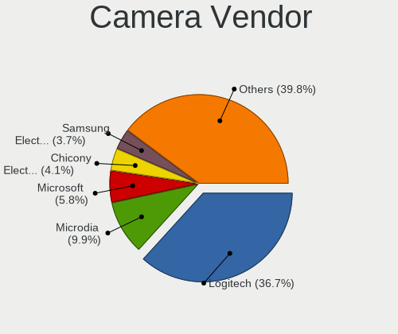

| Vendor                        | Desktops | Percent |
|-------------------------------|----------|---------|
| Logitech                      | 75       | 38.46%  |
| Microdia                      | 20       | 10.26%  |
| Microsoft                     | 13       | 6.67%   |
| Z-Star Microelectronics       | 6        | 3.08%   |
| Sunplus Innovation Technology | 6        | 3.08%   |
| Realtek Semiconductor         | 6        | 3.08%   |
| Chicony Electronics           | 6        | 3.08%   |
| Samsung Electronics           | 5        | 2.56%   |
| MacroSilicon                  | 4        | 2.05%   |
| KYE Systems (Mouse Systems)   | 4        | 2.05%   |
| Jieli Technology              | 4        | 2.05%   |
| Generalplus Technology        | 4        | 2.05%   |
| Cubeternet                    | 4        | 2.05%   |
| Creative Technology           | 4        | 2.05%   |
| Trust                         | 3        | 1.54%   |
| GEMBIRD                       | 3        | 1.54%   |
| ARC International             | 3        | 1.54%   |
| Apple                         | 3        | 1.54%   |
| Razer USA                     | 2        | 1.03%   |
| Hewlett-Packard               | 2        | 1.03%   |
| Aveo Technology               | 2        | 1.03%   |
| Arkmicro Technologies         | 2        | 1.03%   |
| USB3.0 HD Audio Capture       | 1        | 0.51%   |
| Sunplus IT                    | 1        | 0.51%   |
| PrehKeyTec                    | 1        | 0.51%   |
| Pixart Imaging                | 1        | 0.51%   |
| OPPO Electronics              | 1        | 0.51%   |
| OmniVision Technologies       | 1        | 0.51%   |
| Omnivision                    | 1        | 0.51%   |
| Nintendo                      | 1        | 0.51%   |
| Mimaki Engineering            | 1        | 0.51%   |
| Linux Foundation              | 1        | 0.51%   |
| IMC Networks                  | 1        | 0.51%   |
| Huawei Technologies           | 1        | 0.51%   |
| Genesys Logic                 | 1        | 0.51%   |
| A4Tech                        | 1        | 0.51%   |

Camera Model
------------

Camera device models

| Model                                           | Desktops | Percent |
|-------------------------------------------------|----------|---------|
| Logitech Webcam C270                            | 21       | 10.77%  |
| Logitech HD Pro Webcam C920                     | 14       | 7.18%   |
| Samsung Galaxy A5 (MTP)                         | 5        | 2.56%   |
| Microdia Amcrest AWC2198 USB Webcam             | 5        | 2.56%   |
| Microdia Sonix USB 2.0 Camera                   | 4        | 2.05%   |
| MacroSilicon USB3.0 HD VIDEO                    | 4        | 2.05%   |
| Logitech HD Webcam C525                         | 4        | 2.05%   |
| Logitech C922 Pro Stream Webcam                 | 4        | 2.05%   |
| Jieli USB PHY 2.0                               | 4        | 2.05%   |
| Z-Star Venus USB2.0 Camera                      | 3        | 1.54%   |
| Trust USB Camera                                | 3        | 1.54%   |
| Sunplus Full HD webcam                          | 3        | 1.54%   |
| Realtek FULL HD 1080P Webcam                    | 3        | 1.54%   |
| Logitech Webcam Pro 9000                        | 3        | 1.54%   |
| Logitech QuickCam Pro 9000                      | 3        | 1.54%   |
| Logitech HD Webcam B910                         | 3        | 1.54%   |
| ARC International Camera                        | 3        | 1.54%   |
| Apple iPhone 5/5C/5S/6/SE                       | 3        | 1.54%   |
| Z-Star Vimicro USB Camera (Altair)              | 2        | 1.03%   |
| Microsoft LifeCam VX-5000                       | 2        | 1.03%   |
| Microsoft LifeCam VX-2000                       | 2        | 1.03%   |
| Microsoft LifeCam HD-3000                       | 2        | 1.03%   |
| Microsoft LifeCam Cinema                        | 2        | 1.03%   |
| Microdia Rapoo camera                           | 2        | 1.03%   |
| Microdia Defender G-Lens 2577 HD720p Camera     | 2        | 1.03%   |
| Microdia Camera                                 | 2        | 1.03%   |
| Logitech Webcam C170                            | 2        | 1.03%   |
| Logitech Webcam B500                            | 2        | 1.03%   |
| Logitech QuickCam Pro 5000                      | 2        | 1.03%   |
| Logitech Logitech Webcam C160                   | 2        | 1.03%   |
| Logitech HD Webcam C615                         | 2        | 1.03%   |
| Logitech BRIO Ultra HD Webcam                   | 2        | 1.03%   |
| Logitech B525 HD Webcam                         | 2        | 1.03%   |
| Generalplus WEB CAM                             | 2        | 1.03%   |
| Generalplus 808 Camera                          | 2        | 1.03%   |
| GEMBIRD USB2.0 PC CAMERA                        | 2        | 1.03%   |
| Cubeternet GL-UPC822 UVC WebCam                 | 2        | 1.03%   |
| Creative VF0610 Live! Cam Socialize HD          | 2        | 1.03%   |
| Chicony HP 0.3MP Webcam                         | 2        | 1.03%   |
| Arkmicro USB2.0 PC CAMERA                       | 2        | 1.03%   |
| Z-Star A4 TECH HD PC Camera                     | 1        | 0.51%   |
| USB3.0 HD Audio Capture USB3.0 HD Video Capture | 1        | 0.51%   |
| Sunplus IT AUKEY PC-LM1 USB Camera              | 1        | 0.51%   |
| Sunplus HP HD Camera                            | 1        | 0.51%   |
| Sunplus HD 720P webcam                          | 1        | 0.51%   |
| Sunplus Aukey-PC-LM1E Camera                    | 1        | 0.51%   |
| Realtek USB CAMERA                              | 1        | 0.51%   |
| Realtek Integrated_Webcam_HD                    | 1        | 0.51%   |
| Realtek HP 1.0MP High Definition Webcam         | 1        | 0.51%   |
| Razer USA Razer Kiyo Pro                        | 1        | 0.51%   |
| Razer USA Gaming Webcam [Kiyo]                  | 1        | 0.51%   |
| PrehKeyTec TA-0120-AS                           | 1        | 0.51%   |
| Pixart Imaging GE 1.3 MP MiniCam Pro            | 1        | 0.51%   |
| OPPO Reno4 5G                                   | 1        | 0.51%   |
| OmniVision OV511+ Webcam                        | 1        | 0.51%   |
| Omnivision Scanner Mouse                        | 1        | 0.51%   |
| Nintendo USB Camera                             | 1        | 0.51%   |
| Mimaki Engineering HD WEB CAMERA                | 1        | 0.51%   |
| Microsoft Xbox NUI Camera                       | 1        | 0.51%   |
| Microsoft Microsoft LifeCam HD-5001        | 1        | 0.51%   |

Security
--------

Fingerprint Vendor
------------------

Fingerprint sensor vendors

| Vendor         | Desktops | Percent |
|----------------|----------|---------|
| DigitalPersona | 1        | 100%    |

Fingerprint Model
-----------------

Fingerprint sensor models

| Model                             | Desktops | Percent |
|-----------------------------------|----------|---------|
| DigitalPersona Fingerprint Reader | 1        | 100%    |

Chipcard Vendor
---------------

Chipcard module vendors

| Vendor                    | Desktops | Percent |
|---------------------------|----------|---------|
| OmniKey                   | 2        | 22.22%  |
| Reiner SCT Kartensysteme  | 1        | 11.11%  |
| Lenovo                    | 1        | 11.11%  |
| Gemalto (was Gemplus)     | 1        | 11.11%  |
| Fujitsu Siemens Computers | 1        | 11.11%  |
| Chicony Electronics       | 1        | 11.11%  |
| Cherry                    | 1        | 11.11%  |
| Alcor Micro               | 1        | 11.11%  |

Chipcard Model
--------------

Chipcard module models

| Model                                                | Desktops | Percent |
|------------------------------------------------------|----------|---------|
| OmniKey CardMan 3021 / 3121                          | 2        | 22.22%  |
| Reiner SCT Kartensysteme cyberJack one               | 1        | 11.11%  |
| Lenovo Smartcard Keyboard                            | 1        | 11.11%  |
| Gemalto (was Gemplus) GemPC Twin SmartCard Reader    | 1        | 11.11%  |
| Fujitsu Siemens Computers SmartCard Reader 2A        | 1        | 11.11%  |
| Chicony Electronics HP Skylab USB Smartcard Keyboard | 1        | 11.11%  |
| Cherry SmartTerminal XX44                            | 1        | 11.11%  |
| Alcor Micro AU9540 Smartcard Reader                  | 1        | 11.11%  |

Unsupported
-----------

Unsupported Devices
-------------------

Total unsupported devices on board

| Total | Desktops | Percent |
|-------|----------|---------|
| 0     | 1175     | 86.08%  |
| 1     | 152      | 11.14%  |
| 2     | 27       | 1.98%   |
| 3     | 6        | 0.44%   |
| 4     | 4        | 0.29%   |
| 5     | 1        | 0.07%   |

Unsupported Device Types
------------------------

Types of unsupported devices

| Type                     | Desktops | Percent |
|--------------------------|----------|---------|
| Graphics card            | 82       | 37.61%  |
| Net/wireless             | 49       | 22.48%  |
| Communication controller | 24       | 11.01%  |
| Unassigned class         | 12       | 5.5%    |
| Sound                    | 11       | 5.05%   |
| Multimedia controller    | 10       | 4.59%   |
| Chipcard                 | 6        | 2.75%   |
| Camera                   | 6        | 2.75%   |
| Network                  | 3        | 1.38%   |
| Modem                    | 3        | 1.38%   |
| Card reader              | 3        | 1.38%   |
| Storage/raid             | 2        | 0.92%   |
| Net/ethernet             | 2        | 0.92%   |
| Video                    | 1        | 0.46%   |
| Storage/ide              | 1        | 0.46%   |
| Fingerprint reader       | 1        | 0.46%   |
| Dvb card                 | 1        | 0.46%   |
| Bluetooth                | 1        | 0.46%   |

