Xubuntu - Tested Hardware & Statistics (Notebooks)
--------------------------------------------------

A project to collect tested hardware configurations for Xubuntu.

Anyone can contribute to this report by the [hw-probe](https://github.com/linuxhw/hw-probe) tool:

    sudo -E hw-probe -all -upload

Please contribute! Especially if your hardware is rare.

Contents
--------

* [ Test Cases ](#test-cases)

* [ System ](#system)
  - [ OS                       ](#os)
  - [ OS Family                ](#os-family)
  - [ Kernel                   ](#kernel)
  - [ Kernel Family            ](#kernel-family)
  - [ Kernel Major Ver.        ](#kernel-major-ver)
  - [ Arch                     ](#arch)
  - [ DE                       ](#de)
  - [ Display Server           ](#display-server)
  - [ Display Manager          ](#display-manager)
  - [ OS Lang                  ](#os-lang)
  - [ Boot Mode                ](#boot-mode)
  - [ Filesystem               ](#filesystem)
  - [ Part. scheme             ](#part-scheme)
  - [ Dual Boot with Linux/BSD ](#dual-boot-with-linuxbsd)
  - [ Dual Boot (Win)          ](#dual-boot-win)

* [ Board ](#board)
  - [ Vendor                   ](#vendor)
  - [ Model                    ](#model)
  - [ Model Family             ](#model-family)
  - [ MFG Year                 ](#mfg-year)
  - [ Form Factor              ](#form-factor)
  - [ Secure Boot              ](#secure-boot)
  - [ Coreboot                 ](#coreboot)
  - [ RAM Size                 ](#ram-size)
  - [ RAM Used                 ](#ram-used)
  - [ Total Drives             ](#total-drives)
  - [ Has CD-ROM               ](#has-cd-rom)
  - [ Has Ethernet             ](#has-ethernet)
  - [ Has WiFi                 ](#has-wifi)
  - [ Has Bluetooth            ](#has-bluetooth)

* [ Location ](#location)
  - [ Country                  ](#country)
  - [ City                     ](#city)

* [ Drives ](#drives)
  - [ Drive Vendor             ](#drive-vendor)
  - [ Drive Model              ](#drive-model)
  - [ HDD Vendor               ](#hdd-vendor)
  - [ SSD Vendor               ](#ssd-vendor)
  - [ Drive Kind               ](#drive-kind)
  - [ Drive Connector          ](#drive-connector)
  - [ Drive Size               ](#drive-size)
  - [ Space Total              ](#space-total)
  - [ Space Used               ](#space-used)
  - [ Malfunc. Drives          ](#malfunc-drives)
  - [ Malfunc. Drive Vendor    ](#malfunc-drive-vendor)
  - [ Malfunc. HDD Vendor      ](#malfunc-hdd-vendor)
  - [ Malfunc. Drive Kind      ](#malfunc-drive-kind)
  - [ Failed Drives            ](#failed-drives)
  - [ Failed Drive Vendor      ](#failed-drive-vendor)
  - [ Drive Status             ](#drive-status)

* [ Storage controller ](#storage-controller)
  - [ Storage Vendor           ](#storage-vendor)
  - [ Storage Model            ](#storage-model)
  - [ Storage Kind             ](#storage-kind)

* [ Processor ](#processor)
  - [ CPU Vendor               ](#cpu-vendor)
  - [ CPU Model                ](#cpu-model)
  - [ CPU Model Family         ](#cpu-model-family)
  - [ CPU Cores                ](#cpu-cores)
  - [ CPU Sockets              ](#cpu-sockets)
  - [ CPU Threads              ](#cpu-threads)
  - [ CPU Op-Modes             ](#cpu-op-modes)
  - [ CPU Microcode            ](#cpu-microcode)
  - [ CPU Microarch            ](#cpu-microarch)

* [ Graphics ](#graphics)
  - [ GPU Vendor               ](#gpu-vendor)
  - [ GPU Model                ](#gpu-model)
  - [ GPU Combo                ](#gpu-combo)
  - [ GPU Driver               ](#gpu-driver)
  - [ GPU Memory               ](#gpu-memory)

* [ Monitor ](#monitor)
  - [ Monitor Vendor           ](#monitor-vendor)
  - [ Monitor Model            ](#monitor-model)
  - [ Monitor Resolution       ](#monitor-resolution)
  - [ Monitor Diagonal         ](#monitor-diagonal)
  - [ Monitor Width            ](#monitor-width)
  - [ Aspect Ratio             ](#aspect-ratio)
  - [ Monitor Area             ](#monitor-area)
  - [ Pixel Density            ](#pixel-density)
  - [ Multiple Monitors        ](#multiple-monitors)

* [ Network ](#network)
  - [ Net Controller Vendor    ](#net-controller-vendor)
  - [ Net Controller Model     ](#net-controller-model)
  - [ Wireless Vendor          ](#wireless-vendor)
  - [ Wireless Model           ](#wireless-model)
  - [ Ethernet Vendor          ](#ethernet-vendor)
  - [ Ethernet Model           ](#ethernet-model)
  - [ Net Controller Kind      ](#net-controller-kind)
  - [ Used Controller          ](#used-controller)
  - [ NICs                     ](#nics)
  - [ IPv6                     ](#ipv6)

* [ Bluetooth ](#bluetooth)
  - [ Bluetooth Vendor         ](#bluetooth-vendor)
  - [ Bluetooth Model          ](#bluetooth-model)

* [ Sound ](#sound)
  - [ Sound Vendor             ](#sound-vendor)
  - [ Sound Model              ](#sound-model)

* [ Memory ](#memory)
  - [ Memory Vendor            ](#memory-vendor)
  - [ Memory Model             ](#memory-model)
  - [ Memory Kind              ](#memory-kind)
  - [ Memory Form Factor       ](#memory-form-factor)
  - [ Memory Size              ](#memory-size)
  - [ Memory Speed             ](#memory-speed)

* [ Printers & scanners ](#printers--scanners)
  - [ Printer Vendor           ](#printer-vendor)
  - [ Printer Model            ](#printer-model)
  - [ Scanner Vendor           ](#scanner-vendor)
  - [ Scanner Model            ](#scanner-model)

* [ Camera ](#camera)
  - [ Camera Vendor            ](#camera-vendor)
  - [ Camera Model             ](#camera-model)

* [ Security ](#security)
  - [ Fingerprint Vendor       ](#fingerprint-vendor)
  - [ Fingerprint Model        ](#fingerprint-model)
  - [ Chipcard Vendor          ](#chipcard-vendor)
  - [ Chipcard Model           ](#chipcard-model)

* [ Unsupported ](#unsupported)
  - [ Unsupported Devices      ](#unsupported-devices)
  - [ Unsupported Device Types ](#unsupported-device-types)

Test Cases
----------

Total: 4308

| Vendor        | Model                       | Probe                                                      | Date         |
|---------------|-----------------------------|------------------------------------------------------------|--------------|
| ASUSTek       | T100HAN                     | [c7df26701e](https://linux-hardware.org/?probe=c7df26701e) | Jan 03, 2026 |
| Lenovo        | ThinkPad X390 20Q0003PAD    | [62ff220533](https://linux-hardware.org/?probe=62ff220533) | Jan 02, 2026 |
| Lenovo        | ThinkBook 14 G6 ABP 21KJ    | [de19a93522](https://linux-hardware.org/?probe=de19a93522) | Dec 31, 2025 |
| Lenovo        | ThinkPad X220 42912WG       | [e43164c78c](https://linux-hardware.org/?probe=e43164c78c) | Dec 29, 2025 |
| Chuwi         | CoreBook X                  | [12c493c4da](https://linux-hardware.org/?probe=12c493c4da) | Dec 29, 2025 |
| MSI           | GF63 Thin 11UC              | [8e34722e5b](https://linux-hardware.org/?probe=8e34722e5b) | Dec 28, 2025 |
| Lenovo        | ThinkPad P16 Gen 3 21RQC... | [55b55a6f86](https://linux-hardware.org/?probe=55b55a6f86) | Dec 25, 2025 |
| Dell          | Precision M6500             | [8a883b6743](https://linux-hardware.org/?probe=8a883b6743) | Dec 24, 2025 |
| TongFang      | GM7IX0N                     | [71dfa6c4aa](https://linux-hardware.org/?probe=71dfa6c4aa) | Dec 24, 2025 |
| TongFang      | GM7IX0N                     | [0ec8cd8588](https://linux-hardware.org/?probe=0ec8cd8588) | Dec 24, 2025 |
| Acer          | Aspire E5-771G              | [35d04177f4](https://linux-hardware.org/?probe=35d04177f4) | Dec 23, 2025 |
| Toshiba       | Satellite L300              | [2ad94c4385](https://linux-hardware.org/?probe=2ad94c4385) | Dec 20, 2025 |
| Lenovo        | IdeaPad Slim 3 15ABR8 82... | [3dc3f50112](https://linux-hardware.org/?probe=3dc3f50112) | Dec 18, 2025 |
| Lenovo        | IdeaPad Slim 3 15ABR8 82... | [87cc6bf203](https://linux-hardware.org/?probe=87cc6bf203) | Dec 18, 2025 |
| Framework     | Laptop 13 (AMD Ryzen AI ... | [6248e5282a](https://linux-hardware.org/?probe=6248e5282a) | Dec 16, 2025 |
| Framework     | Laptop 13 (AMD Ryzen AI ... | [d4384698d2](https://linux-hardware.org/?probe=d4384698d2) | Dec 16, 2025 |
| Dell          | Latitude 5431               | [3653ed7c47](https://linux-hardware.org/?probe=3653ed7c47) | Dec 16, 2025 |
| Toshiba       | Satellite C855-2DG          | [87346741d9](https://linux-hardware.org/?probe=87346741d9) | Dec 15, 2025 |
| Toshiba       | Satellite C855-2DG          | [7444bc0e10](https://linux-hardware.org/?probe=7444bc0e10) | Dec 14, 2025 |
| Lenovo        | IdeaPad 100-15IBD 80QQ      | [76c49f6157](https://linux-hardware.org/?probe=76c49f6157) | Dec 12, 2025 |
| HP            | ProBook 6570b               | [32b3d52588](https://linux-hardware.org/?probe=32b3d52588) | Dec 07, 2025 |
| Acer          | Swift SF114-32              | [7d71b0b7fe](https://linux-hardware.org/?probe=7d71b0b7fe) | Dec 07, 2025 |
| HP            | EliteBook 8570p             | [ab79a68a19](https://linux-hardware.org/?probe=ab79a68a19) | Dec 06, 2025 |
| HP            | OmniBook 5 Laptop 16-af1... | [56d9d4d650](https://linux-hardware.org/?probe=56d9d4d650) | Dec 05, 2025 |
| HP            | ProBook 4520s               | [8343c8860b](https://linux-hardware.org/?probe=8343c8860b) | Dec 05, 2025 |
| HP            | EliteBook 640 14 inch G9... | [0f27f1eaa4](https://linux-hardware.org/?probe=0f27f1eaa4) | Dec 05, 2025 |
| ASUSTek       | TUF Gaming FX505DT_FX505... | [cf9d6e8a2b](https://linux-hardware.org/?probe=cf9d6e8a2b) | Dec 05, 2025 |
| Toshiba       | Satellite L55-C             | [c75067cbec](https://linux-hardware.org/?probe=c75067cbec) | Dec 04, 2025 |
| Lenovo        | ThinkPad P15 Gen 1 20SUS... | [363dea3e0e](https://linux-hardware.org/?probe=363dea3e0e) | Dec 04, 2025 |
| Lenovo        | IdeaPad 3 17ADA05 81W2      | [89ee23c92b](https://linux-hardware.org/?probe=89ee23c92b) | Dec 03, 2025 |
| Chuwi         | CoreBook X                  | [47b5d9490f](https://linux-hardware.org/?probe=47b5d9490f) | Dec 03, 2025 |
| Lenovo        | ThinkPad T480 20L6SE5A00    | [5a6395dfbd](https://linux-hardware.org/?probe=5a6395dfbd) | Dec 02, 2025 |
| Google        | Swanky                      | [0efb08651e](https://linux-hardware.org/?probe=0efb08651e) | Dec 01, 2025 |
| ASUSTek       | ASUS TUF Gaming A15 FA50... | [3fe3c09aae](https://linux-hardware.org/?probe=3fe3c09aae) | Nov 29, 2025 |
| Acer          | Aspire V3-571G              | [5bf19ee308](https://linux-hardware.org/?probe=5bf19ee308) | Nov 29, 2025 |
| Acer          | Aspire V3-571G              | [e5464d1add](https://linux-hardware.org/?probe=e5464d1add) | Nov 29, 2025 |
| ASUSTek       | K75VM                       | [c59d54d799](https://linux-hardware.org/?probe=c59d54d799) | Nov 26, 2025 |
| Dell          | Precision 7750              | [4961e891de](https://linux-hardware.org/?probe=4961e891de) | Nov 25, 2025 |
| MSI           | GE73VR 7RF                  | [178da2c413](https://linux-hardware.org/?probe=178da2c413) | Nov 23, 2025 |
| Lenovo        | ThinkPad X131e 336735U      | [dc7d2aa500](https://linux-hardware.org/?probe=dc7d2aa500) | Nov 22, 2025 |
| Lenovo        | Legion Y530-15ICH 81FV      | [43cb991203](https://linux-hardware.org/?probe=43cb991203) | Nov 22, 2025 |
| Apple         | MacBookPro11,4              | [2f3c0a72a7](https://linux-hardware.org/?probe=2f3c0a72a7) | Nov 21, 2025 |
| Lenovo        | ThinkPad X201 3323A3G       | [1e2045a193](https://linux-hardware.org/?probe=1e2045a193) | Nov 18, 2025 |
| Lenovo        | IdeaPad 320-15ISK 80XH      | [3ca7bf1a68](https://linux-hardware.org/?probe=3ca7bf1a68) | Nov 16, 2025 |
| Lenovo        | IdeaPad 320-15ISK 80XH      | [1bdbfd82d8](https://linux-hardware.org/?probe=1bdbfd82d8) | Nov 16, 2025 |
| HP            | EliteBook 830 G6            | [2756765643](https://linux-hardware.org/?probe=2756765643) | Nov 16, 2025 |
| Acer          | Aspire E5-571G              | [eea479806b](https://linux-hardware.org/?probe=eea479806b) | Nov 15, 2025 |
| ASUSTek       | X58C                        | [acfc2f6c86](https://linux-hardware.org/?probe=acfc2f6c86) | Nov 10, 2025 |
| Dell          | Latitude E5470              | [82a483c87b](https://linux-hardware.org/?probe=82a483c87b) | Nov 09, 2025 |
| ASUSTek       | 1215B                       | [d9e6ee0eb7](https://linux-hardware.org/?probe=d9e6ee0eb7) | Nov 09, 2025 |
| ASUSTek       | X202EP                      | [2770896fa7](https://linux-hardware.org/?probe=2770896fa7) | Nov 08, 2025 |
| ASUSTek       | P751JA                      | [11675d931e](https://linux-hardware.org/?probe=11675d931e) | Nov 08, 2025 |
| Lenovo        | ThinkPad L480 20LS0017GE    | [d517d6efda](https://linux-hardware.org/?probe=d517d6efda) | Nov 08, 2025 |
| Acer          | Aspire A315-34              | [5982922c98](https://linux-hardware.org/?probe=5982922c98) | Nov 08, 2025 |
| Lenovo        | IdeaPad 3 15ITL6 82H8       | [f2bb76ea3e](https://linux-hardware.org/?probe=f2bb76ea3e) | Nov 06, 2025 |
| Samsung       | Q210/P210                   | [f7635041fe](https://linux-hardware.org/?probe=f7635041fe) | Nov 06, 2025 |
| Samsung       | Q210/P210                   | [b6090f0b48](https://linux-hardware.org/?probe=b6090f0b48) | Nov 06, 2025 |
| Lenovo        | IdeaPad S340-15IWL 81N8     | [0e1f1d4129](https://linux-hardware.org/?probe=0e1f1d4129) | Nov 02, 2025 |
| Dell          | Inspiron N5030              | [89141076b5](https://linux-hardware.org/?probe=89141076b5) | Nov 02, 2025 |
| Apple         | MacBookAir3,1               | [c1a98f2c11](https://linux-hardware.org/?probe=c1a98f2c11) | Oct 27, 2025 |
| Lenovo        | Flex 2-14 20404             | [f7283cc94e](https://linux-hardware.org/?probe=f7283cc94e) | Oct 27, 2025 |
| Apple         | MacBookAir3,1               | [d4df2a5c13](https://linux-hardware.org/?probe=d4df2a5c13) | Oct 27, 2025 |
| ASUSTek       | N76VB                       | [909189b355](https://linux-hardware.org/?probe=909189b355) | Oct 25, 2025 |
| Dell          | Latitude D531               | [1d0865a60f](https://linux-hardware.org/?probe=1d0865a60f) | Oct 24, 2025 |
| Acer          | Aspire A15-61M              | [8f551f4ea6](https://linux-hardware.org/?probe=8f551f4ea6) | Oct 24, 2025 |
| Alienware     | Area-51m                    | [61b695d0d3](https://linux-hardware.org/?probe=61b695d0d3) | Oct 24, 2025 |
| Fujitsu Si... | AMILO Xi 3650               | [eb320d6a4d](https://linux-hardware.org/?probe=eb320d6a4d) | Oct 24, 2025 |
| Dell          | Latitude D531               | [072c6e8cd9](https://linux-hardware.org/?probe=072c6e8cd9) | Oct 21, 2025 |
| HP            | EliteBook 855 G8 Noteboo... | [db50da4444](https://linux-hardware.org/?probe=db50da4444) | Oct 21, 2025 |
| Lenovo        | IdeaPad S340-15IWL 81N8     | [5ec78f225c](https://linux-hardware.org/?probe=5ec78f225c) | Oct 19, 2025 |
| Apple         | MacBookPro9,2               | [29419a0c7d](https://linux-hardware.org/?probe=29419a0c7d) | Oct 16, 2025 |
| HP            | ProBook 6570b               | [409035bd46](https://linux-hardware.org/?probe=409035bd46) | Oct 15, 2025 |
| Lenovo        | ThinkPad T400 2768W3A       | [5bf365f4a6](https://linux-hardware.org/?probe=5bf365f4a6) | Oct 10, 2025 |
| Lenovo        | ThinkPad L14 Gen 1 20U6S... | [1bc0dcdbc1](https://linux-hardware.org/?probe=1bc0dcdbc1) | Oct 09, 2025 |
| Dell          | Latitude E4300              | [c5e0ea5ed3](https://linux-hardware.org/?probe=c5e0ea5ed3) | Oct 07, 2025 |
| Haier         | Y11C                        | [a6e697f34a](https://linux-hardware.org/?probe=a6e697f34a) | Oct 04, 2025 |
| ASUSTek       | VivoBook_ASUSLaptop MJ40... | [af1660b718](https://linux-hardware.org/?probe=af1660b718) | Oct 04, 2025 |
| PC Special... | Recoil VIII 17              | [f70fb10ba2](https://linux-hardware.org/?probe=f70fb10ba2) | Sep 29, 2025 |
| Wortmann      | 1220695_1470205             | [3fa470346b](https://linux-hardware.org/?probe=3fa470346b) | Sep 29, 2025 |
| Dell          | Vostro 5568                 | [b8a13c4feb](https://linux-hardware.org/?probe=b8a13c4feb) | Sep 26, 2025 |
| Apple         | MacBook6,1                  | [b2d237ff99](https://linux-hardware.org/?probe=b2d237ff99) | Sep 26, 2025 |
| Acer          | Aspire A515-43              | [e5e983737f](https://linux-hardware.org/?probe=e5e983737f) | Sep 24, 2025 |
| Apple         | MacBookAir7,1               | [d6ee5c408b](https://linux-hardware.org/?probe=d6ee5c408b) | Sep 23, 2025 |
| HP            | Pavilion dv6                | [b5a872ca89](https://linux-hardware.org/?probe=b5a872ca89) | Sep 23, 2025 |
| Apple         | MacBookAir7,1               | [269ea74f92](https://linux-hardware.org/?probe=269ea74f92) | Sep 23, 2025 |
| Lenovo        | G550 2958                   | [b97c4fd7f5](https://linux-hardware.org/?probe=b97c4fd7f5) | Sep 21, 2025 |
| Dell          | G3 3579                     | [08f64d0e91](https://linux-hardware.org/?probe=08f64d0e91) | Sep 18, 2025 |
| ASUSTek       | VivoBook_ASUSLaptop E510... | [386ab76f00](https://linux-hardware.org/?probe=386ab76f00) | Sep 17, 2025 |
| Google        | Gallop                      | [7022ee5f6b](https://linux-hardware.org/?probe=7022ee5f6b) | Sep 16, 2025 |
| Haier         | Y11C                        | [2f901b3289](https://linux-hardware.org/?probe=2f901b3289) | Sep 14, 2025 |
| Toshiba       | Satellite P55W-C            | [3269fe9f2c](https://linux-hardware.org/?probe=3269fe9f2c) | Sep 13, 2025 |
| Toshiba       | Satellite P55W-C            | [0841ba965a](https://linux-hardware.org/?probe=0841ba965a) | Sep 13, 2025 |
| Haier         | Y11C                        | [328a9d04e3](https://linux-hardware.org/?probe=328a9d04e3) | Sep 12, 2025 |
| Toshiba       | TECRA A50-A                 | [a4afe1b0c8](https://linux-hardware.org/?probe=a4afe1b0c8) | Sep 12, 2025 |
| Acer          | Swift SF313-52              | [2d85bd9f8f](https://linux-hardware.org/?probe=2d85bd9f8f) | Sep 12, 2025 |
| Medion        | S321X                       | [aea5daa29e](https://linux-hardware.org/?probe=aea5daa29e) | Sep 11, 2025 |
| HP            | ENVY Laptop 17-da0xxx       | [7e2d2fd388](https://linux-hardware.org/?probe=7e2d2fd388) | Sep 09, 2025 |
| MSI           | GX701                       | [72ec6bf202](https://linux-hardware.org/?probe=72ec6bf202) | Sep 09, 2025 |
| HP            | Laptop 15-bw0xx             | [312fc16f0e](https://linux-hardware.org/?probe=312fc16f0e) | Sep 08, 2025 |
| Fujitsu Si... | AMILO Li3710                | [ee11059377](https://linux-hardware.org/?probe=ee11059377) | Sep 07, 2025 |
| HP            | ProBook 6570b               | [5f461df747](https://linux-hardware.org/?probe=5f461df747) | Sep 05, 2025 |
| MCD           | iceBook 7 Pro               | [1f8b4ccfbe](https://linux-hardware.org/?probe=1f8b4ccfbe) | Aug 29, 2025 |
| HP            | ZBook 17 G3                 | [94181a63aa](https://linux-hardware.org/?probe=94181a63aa) | Aug 29, 2025 |
| Lenovo        | Z51-70 80K6                 | [b70fefe4d7](https://linux-hardware.org/?probe=b70fefe4d7) | Aug 27, 2025 |
| Acer          | Aspire A315-21              | [344fb2c6f9](https://linux-hardware.org/?probe=344fb2c6f9) | Aug 27, 2025 |
| ASUSTek       | K55A                        | [d5b5b40327](https://linux-hardware.org/?probe=d5b5b40327) | Aug 27, 2025 |
| Apple         | MacBookPro10,1              | [59911574aa](https://linux-hardware.org/?probe=59911574aa) | Aug 27, 2025 |
| Lenovo        | B50-70 20384                | [1abea8916c](https://linux-hardware.org/?probe=1abea8916c) | Aug 26, 2025 |
| HP            | Pavilion tx1000             | [08c30245ad](https://linux-hardware.org/?probe=08c30245ad) | Aug 24, 2025 |
| ASUSTek       | VivoBook_ASUSLaptop X170... | [33dc5e3306](https://linux-hardware.org/?probe=33dc5e3306) | Aug 22, 2025 |
| Lenovo        | ThinkPad X1 Carbon Gen 1... | [664f78ee87](https://linux-hardware.org/?probe=664f78ee87) | Aug 22, 2025 |
| HP            | ProBook 6570b               | [adba2fc114](https://linux-hardware.org/?probe=adba2fc114) | Aug 21, 2025 |
| ASUSTek       | X553MA                      | [14112305b8](https://linux-hardware.org/?probe=14112305b8) | Aug 20, 2025 |
| ASUSTek       | VivoBook_ASUSLaptop X415... | [22644f085c](https://linux-hardware.org/?probe=22644f085c) | Aug 13, 2025 |
| Acer          | Predator PH317-53           | [4711e25bca](https://linux-hardware.org/?probe=4711e25bca) | Aug 12, 2025 |
| HP            | EliteBook 8460p             | [07cedb882f](https://linux-hardware.org/?probe=07cedb882f) | Aug 11, 2025 |
| Apple         | MacBookPro8,2               | [e0de259449](https://linux-hardware.org/?probe=e0de259449) | Aug 08, 2025 |
| Dell          | Inspiron 1010               | [21501d49aa](https://linux-hardware.org/?probe=21501d49aa) | Aug 05, 2025 |
| Alienware     | 16X Aurora AC16251          | [dbc55136b2](https://linux-hardware.org/?probe=dbc55136b2) | Jul 30, 2025 |
| ASUSTek       | X555LD                      | [3dab8e4bf3](https://linux-hardware.org/?probe=3dab8e4bf3) | Jul 30, 2025 |
| ASUSTek       | X555LD                      | [0386ea7dc0](https://linux-hardware.org/?probe=0386ea7dc0) | Jul 30, 2025 |
| Fujitsu Si... | ESPRIMO Mobile V5535        | [0775eca339](https://linux-hardware.org/?probe=0775eca339) | Jul 30, 2025 |
| Acer          | Aspire one 1-431            | [f7c14c5561](https://linux-hardware.org/?probe=f7c14c5561) | Jul 28, 2025 |
| Dell          | Latitude 2120               | [68e5266d42](https://linux-hardware.org/?probe=68e5266d42) | Jul 27, 2025 |
| Sony          | SVT13115FHS                 | [9ad4885d61](https://linux-hardware.org/?probe=9ad4885d61) | Jul 27, 2025 |
| Lenovo        | ThinkPad X13 Gen 1 20T20... | [05afacf28b](https://linux-hardware.org/?probe=05afacf28b) | Jul 24, 2025 |
| Lenovo        | ThinkPad T14 Gen 1 20S1S... | [9f1d85ab15](https://linux-hardware.org/?probe=9f1d85ab15) | Jul 22, 2025 |
| Acer          | Aspire 7739ZG               | [56a56c8810](https://linux-hardware.org/?probe=56a56c8810) | Jul 21, 2025 |
| Lenovo        | ThinkPad A485 20MVS05B00    | [6b8822f84c](https://linux-hardware.org/?probe=6b8822f84c) | Jul 19, 2025 |
| ASUSTek       | VivoBook_ASUSLaptop X170... | [7879460329](https://linux-hardware.org/?probe=7879460329) | Jul 17, 2025 |
| Samsung       | RV411/RV511/E3511/S3511/... | [03b8a6b9d1](https://linux-hardware.org/?probe=03b8a6b9d1) | Jul 16, 2025 |
| HP            | Laptop 17-cp0xxx            | [45b2527fac](https://linux-hardware.org/?probe=45b2527fac) | Jul 16, 2025 |
| HP            | Pavilion dv4                | [c353ef9842](https://linux-hardware.org/?probe=c353ef9842) | Jul 15, 2025 |
| HP            | ZBook 15 G6                 | [b192e07ca0](https://linux-hardware.org/?probe=b192e07ca0) | Jul 11, 2025 |
| Lenovo        | ThinkPad X220 Tablet 429... | [a67a7af07b](https://linux-hardware.org/?probe=a67a7af07b) | Jul 10, 2025 |
| Acer          | Aspire 5935                 | [7e4c1eee07](https://linux-hardware.org/?probe=7e4c1eee07) | Jul 09, 2025 |
| Lenovo        | B50-70 20384                | [0f4359783b](https://linux-hardware.org/?probe=0f4359783b) | Jul 09, 2025 |
| Samsung       | SR700                       | [e49218c134](https://linux-hardware.org/?probe=e49218c134) | Jul 07, 2025 |
| Google        | Fleex                       | [f3ec4d36fa](https://linux-hardware.org/?probe=f3ec4d36fa) | Jul 05, 2025 |
| Dell          | Precision 7550              | [ad80287448](https://linux-hardware.org/?probe=ad80287448) | Jul 04, 2025 |
| Dell          | Latitude E6440              | [dc3b1c1c1e](https://linux-hardware.org/?probe=dc3b1c1c1e) | Jul 04, 2025 |
| ASUSTek       | S500CA                      | [a4fd316702](https://linux-hardware.org/?probe=a4fd316702) | Jul 04, 2025 |
| ASUSTek       | S500CA                      | [8211bf9cdd](https://linux-hardware.org/?probe=8211bf9cdd) | Jul 04, 2025 |
| ASUSTek       | S500CA                      | [dd03a5b011](https://linux-hardware.org/?probe=dd03a5b011) | Jul 04, 2025 |
| Fujitsu Si... | AMILO Xi 3650               | [89eba71be3](https://linux-hardware.org/?probe=89eba71be3) | Jul 04, 2025 |
| ASUSTek       | VivoBook_ASUSLaptop X170... | [c1ac3fa0a2](https://linux-hardware.org/?probe=c1ac3fa0a2) | Jul 01, 2025 |
| ASUSTek       | VivoBook_ASUSLaptop X170... | [38a76ac6bd](https://linux-hardware.org/?probe=38a76ac6bd) | Jul 01, 2025 |
| HP            | ProBook 450 G1              | [3b2047bcdb](https://linux-hardware.org/?probe=3b2047bcdb) | Jun 29, 2025 |
| Dell          | Latitude E6540              | [4db632383b](https://linux-hardware.org/?probe=4db632383b) | Jun 28, 2025 |
| Toshiba       | TECRA A10                   | [f60bcfccec](https://linux-hardware.org/?probe=f60bcfccec) | Jun 28, 2025 |
| ASUSTek       | X751MA                      | [4086e4cc1d](https://linux-hardware.org/?probe=4086e4cc1d) | Jun 25, 2025 |
| HP            | Pavilion 15                 | [1344d4308e](https://linux-hardware.org/?probe=1344d4308e) | Jun 25, 2025 |
| Lenovo        | G470 20078                  | [b55ab35643](https://linux-hardware.org/?probe=b55ab35643) | Jun 22, 2025 |
| GPD           | MicroPC                     | [c5100e4d38](https://linux-hardware.org/?probe=c5100e4d38) | Jun 17, 2025 |
| Lenovo        | IdeaPad Pro 5 16AKP10 83... | [24654ecad3](https://linux-hardware.org/?probe=24654ecad3) | Jun 17, 2025 |
| Lenovo        | ThinkPad T61p 64577WM       | [3d2b5117eb](https://linux-hardware.org/?probe=3d2b5117eb) | Jun 14, 2025 |
| Lenovo        | ThinkPad X1 Carbon Gen 9... | [c8c0de98d1](https://linux-hardware.org/?probe=c8c0de98d1) | Jun 12, 2025 |
| Lenovo        | Legion Pro 7 16IAX10H 83... | [00920646e3](https://linux-hardware.org/?probe=00920646e3) | Jun 10, 2025 |
| HP            | ProBook 4515s               | [8e6f687795](https://linux-hardware.org/?probe=8e6f687795) | Jun 10, 2025 |
| Lenovo        | Legion Pro 7 16IAX10H 83... | [57d996afdc](https://linux-hardware.org/?probe=57d996afdc) | Jun 10, 2025 |
| HP            | Pavilion Notebook           | [9a32ea36d2](https://linux-hardware.org/?probe=9a32ea36d2) | Jun 10, 2025 |
| Clevo         | E512xQ/E4129                | [9522c2d793](https://linux-hardware.org/?probe=9522c2d793) | Jun 10, 2025 |
| Acer          | NC-ES1-512-C162             | [55444ed159](https://linux-hardware.org/?probe=55444ed159) | Jun 07, 2025 |
| HP            | EliteBook 2540p             | [31ec162bc4](https://linux-hardware.org/?probe=31ec162bc4) | Jun 05, 2025 |
| Sony          | VGN-NS31M_W                 | [9d83015b9b](https://linux-hardware.org/?probe=9d83015b9b) | Jun 04, 2025 |
| Acer          | Aspire 5935                 | [a7426c964c](https://linux-hardware.org/?probe=a7426c964c) | Jun 02, 2025 |
| Clevo         | E512xQ/E4129                | [7efc6be571](https://linux-hardware.org/?probe=7efc6be571) | Jun 02, 2025 |
| Lenovo        | ThinkPad X270 W10DG 20K5... | [077a2c7eb7](https://linux-hardware.org/?probe=077a2c7eb7) | May 27, 2025 |
| HP            | Pavilion dv6                | [46f3f3db57](https://linux-hardware.org/?probe=46f3f3db57) | May 27, 2025 |
| Lenovo        | Z50-75 80EC                 | [0d5826b497](https://linux-hardware.org/?probe=0d5826b497) | May 25, 2025 |
| ASUSTek       | VivoBook_ASUSLaptop X350... | [199d667db4](https://linux-hardware.org/?probe=199d667db4) | May 24, 2025 |
| Lenovo        | ThinkPad P52 20M9S1GQ01     | [94ddaca6cb](https://linux-hardware.org/?probe=94ddaca6cb) | May 24, 2025 |
| HP            | Victus by Laptop 16-e0xx... | [2acb7680de](https://linux-hardware.org/?probe=2acb7680de) | May 23, 2025 |
| Dell          | Latitude E5500              | [0001579d1a](https://linux-hardware.org/?probe=0001579d1a) | May 22, 2025 |
| Dell          | Precision 5530              | [940acf3f36](https://linux-hardware.org/?probe=940acf3f36) | May 21, 2025 |
| Dell          | Latitude E6440              | [49f3dbdd2c](https://linux-hardware.org/?probe=49f3dbdd2c) | May 19, 2025 |
| Dell          | Latitude E6440              | [eb6691d7d9](https://linux-hardware.org/?probe=eb6691d7d9) | May 18, 2025 |
| Lenovo        | ThinkPad T580 20LAS02K0A    | [9ef1d51c50](https://linux-hardware.org/?probe=9ef1d51c50) | May 18, 2025 |
| HP            | Pavilion dv6                | [b5543651a1](https://linux-hardware.org/?probe=b5543651a1) | May 17, 2025 |
| Haier         | Y11C                        | [f053f785fd](https://linux-hardware.org/?probe=f053f785fd) | May 17, 2025 |
| Dell          | Inspiron 3541               | [cc1a5f0d16](https://linux-hardware.org/?probe=cc1a5f0d16) | May 17, 2025 |
| HP            | Pavilion 17                 | [c7ab04e9fc](https://linux-hardware.org/?probe=c7ab04e9fc) | May 16, 2025 |
| HP            | Pavilion 17                 | [3c12b63bf2](https://linux-hardware.org/?probe=3c12b63bf2) | May 16, 2025 |
| HP            | ProBook 430 G5              | [f0d6b68e6e](https://linux-hardware.org/?probe=f0d6b68e6e) | May 16, 2025 |
| HP            | ProBook 430 G5              | [db1782751e](https://linux-hardware.org/?probe=db1782751e) | May 16, 2025 |
| HP            | G72                         | [2e8729d24c](https://linux-hardware.org/?probe=2e8729d24c) | May 15, 2025 |
| HP            | G72                         | [757e3d7211](https://linux-hardware.org/?probe=757e3d7211) | May 14, 2025 |
| Toshiba       | Satellite L645              | [76b40554cf](https://linux-hardware.org/?probe=76b40554cf) | May 11, 2025 |
| Unknown       | Unknown                     | [b733dfcdb9](https://linux-hardware.org/?probe=b733dfcdb9) | May 11, 2025 |
| Toshiba       | TECRA S3                    | [546e4fac4c](https://linux-hardware.org/?probe=546e4fac4c) | May 10, 2025 |
| Dell          | Inspiron N5110              | [14a0ca2091](https://linux-hardware.org/?probe=14a0ca2091) | May 10, 2025 |
| Toshiba       | TECRA S3                    | [f7cdd63d80](https://linux-hardware.org/?probe=f7cdd63d80) | May 10, 2025 |
| Haier         | Y11C                        | [37d34163ab](https://linux-hardware.org/?probe=37d34163ab) | May 09, 2025 |
| Samsung       | SR700                       | [9e59d26a3b](https://linux-hardware.org/?probe=9e59d26a3b) | May 07, 2025 |
| MSI           | GF63 Thin 11UC              | [0307b55704](https://linux-hardware.org/?probe=0307b55704) | May 07, 2025 |
| Toshiba       | Satellite L645              | [d80cdaf6bd](https://linux-hardware.org/?probe=d80cdaf6bd) | May 06, 2025 |
| Acer          | Aspire V3-772               | [a7bf66b45c](https://linux-hardware.org/?probe=a7bf66b45c) | May 05, 2025 |
| Acer          | Aspire A515-55              | [452915d4db](https://linux-hardware.org/?probe=452915d4db) | May 03, 2025 |
| Dell          | Inspiron 7520               | [59a05dbbfe](https://linux-hardware.org/?probe=59a05dbbfe) | May 02, 2025 |
| Acer          | Aspire E5-532T              | [304217d829](https://linux-hardware.org/?probe=304217d829) | May 02, 2025 |
| Lenovo        | IdeaPad Gaming 3 15IMH05... | [b5cb63275a](https://linux-hardware.org/?probe=b5cb63275a) | May 02, 2025 |
| HP            | Laptop 15-dw3xxx            | [9f999e2d74](https://linux-hardware.org/?probe=9f999e2d74) | May 01, 2025 |
| ASUSTek       | K50IJ                       | [851e65659a](https://linux-hardware.org/?probe=851e65659a) | Apr 29, 2025 |
| Lenovo        | ThinkPad E14 Gen 2 20TA0... | [e1069e2dee](https://linux-hardware.org/?probe=e1069e2dee) | Apr 28, 2025 |
| Dell          | Precision M6700             | [8edfe246b7](https://linux-hardware.org/?probe=8edfe246b7) | Apr 27, 2025 |
| Lenovo        | ThinkPad X9-14 Gen 1 21Q... | [c6836e3133](https://linux-hardware.org/?probe=c6836e3133) | Apr 27, 2025 |
| Lenovo        | ThinkPad X9-14 Gen 1 21Q... | [fe9dc102cc](https://linux-hardware.org/?probe=fe9dc102cc) | Apr 27, 2025 |
| Fujitsu Si... | AMILO Xi 3650               | [ad0a1225d3](https://linux-hardware.org/?probe=ad0a1225d3) | Apr 27, 2025 |
| Packard Be... | EasyNote LV11HC             | [2c6b03ea46](https://linux-hardware.org/?probe=2c6b03ea46) | Apr 25, 2025 |
| Toshiba       | Satellite M305D             | [5660aec242](https://linux-hardware.org/?probe=5660aec242) | Apr 24, 2025 |
| HP            | Pavilion Notebook           | [887721225a](https://linux-hardware.org/?probe=887721225a) | Apr 24, 2025 |
| Dell          | Inspiron 1010               | [fb3ef91159](https://linux-hardware.org/?probe=fb3ef91159) | Apr 23, 2025 |
| Dell          | Inspiron 1010               | [92dd37e3cf](https://linux-hardware.org/?probe=92dd37e3cf) | Apr 22, 2025 |
| Apple         | MacBookPro3,1               | [1cb904b528](https://linux-hardware.org/?probe=1cb904b528) | Apr 22, 2025 |
| Lenovo        | ThinkBook 16 G5+ APH 21K... | [3e10ae4c6d](https://linux-hardware.org/?probe=3e10ae4c6d) | Apr 22, 2025 |
| Toshiba       | Satellite L645              | [ddc93cf56f](https://linux-hardware.org/?probe=ddc93cf56f) | Apr 22, 2025 |
| ASUSTek       | A6R                         | [9f28563322](https://linux-hardware.org/?probe=9f28563322) | Apr 17, 2025 |
| HP            | Pavilion Laptop 14-bk0xx    | [7721b6732c](https://linux-hardware.org/?probe=7721b6732c) | Apr 16, 2025 |
| Acer          | Aspire A315-31              | [4382fc4ee6](https://linux-hardware.org/?probe=4382fc4ee6) | Apr 14, 2025 |
| Google        | Link                        | [8ab01fd094](https://linux-hardware.org/?probe=8ab01fd094) | Apr 10, 2025 |
| HP            | Pavilion dv6700             | [25e2425679](https://linux-hardware.org/?probe=25e2425679) | Apr 10, 2025 |
| HP            | Pavilion dv6700             | [ea0be0b1a9](https://linux-hardware.org/?probe=ea0be0b1a9) | Apr 10, 2025 |
| Lenovo        | ThinkPad P16v Gen 1 21FE... | [aea006a546](https://linux-hardware.org/?probe=aea006a546) | Apr 08, 2025 |
| Lenovo        | ThinkPad P16v Gen 1 21FE... | [e6778c5cbf](https://linux-hardware.org/?probe=e6778c5cbf) | Apr 08, 2025 |
| Dell          | Latitude 5411               | [50e44370d5](https://linux-hardware.org/?probe=50e44370d5) | Apr 05, 2025 |
| Lenovo        | IdeaPad Slim 5 16AHP9 83... | [3214721b43](https://linux-hardware.org/?probe=3214721b43) | Apr 01, 2025 |
| Samsung       | 750XED                      | [5bd169f4bf](https://linux-hardware.org/?probe=5bd169f4bf) | Mar 31, 2025 |
| Positivo      | W940TU-TV                   | [71bb267a7d](https://linux-hardware.org/?probe=71bb267a7d) | Mar 31, 2025 |
| Dell          | Studio 1558                 | [8b8f7cfe7f](https://linux-hardware.org/?probe=8b8f7cfe7f) | Mar 31, 2025 |
| Gateway       | EC14 Series                 | [1d07145715](https://linux-hardware.org/?probe=1d07145715) | Mar 30, 2025 |
| Gateway       | EC14 Series                 | [58229cc4f4](https://linux-hardware.org/?probe=58229cc4f4) | Mar 30, 2025 |
| Acer          | Aspire A315-21              | [c697c88302](https://linux-hardware.org/?probe=c697c88302) | Mar 24, 2025 |
| Lenovo        | ThinkPad T510 43495KG       | [405b8ea879](https://linux-hardware.org/?probe=405b8ea879) | Mar 24, 2025 |
| Sony          | VPCEH3S1E                   | [554a1d424c](https://linux-hardware.org/?probe=554a1d424c) | Mar 23, 2025 |
| Acer          | Aspire 2920                 | [7f38a3b1e8](https://linux-hardware.org/?probe=7f38a3b1e8) | Mar 22, 2025 |
| Intel         | H81U                        | [d04b5fb57d](https://linux-hardware.org/?probe=d04b5fb57d) | Mar 21, 2025 |
| MSI           | Modern 15 A5M               | [8e70dd34ba](https://linux-hardware.org/?probe=8e70dd34ba) | Mar 21, 2025 |
| Lenovo        | ThinkBook 13s G3 ACN 20Y... | [b6f9d430de](https://linux-hardware.org/?probe=b6f9d430de) | Mar 19, 2025 |
| TUXEDO        | InfinityBook Pro 15 v5      | [4ebfda5697](https://linux-hardware.org/?probe=4ebfda5697) | Mar 17, 2025 |
| Lenovo        | ThinkPad T430 2347G4U       | [ce9c81b769](https://linux-hardware.org/?probe=ce9c81b769) | Mar 17, 2025 |
| Lenovo        | ThinkPad T14 Gen 5 21MCC... | [dbc8df9aa8](https://linux-hardware.org/?probe=dbc8df9aa8) | Mar 17, 2025 |
| Samsung       | 905S3G/906S3G/915S3G/930... | [befa9fae1d](https://linux-hardware.org/?probe=befa9fae1d) | Mar 16, 2025 |
| Samsung       | 905S3G/906S3G/915S3G/930... | [3517ecbc86](https://linux-hardware.org/?probe=3517ecbc86) | Mar 16, 2025 |
| Sony          | VPCEH3S1E                   | [0fc988e0f5](https://linux-hardware.org/?probe=0fc988e0f5) | Mar 15, 2025 |
| Acer          | Aspire E1-571G              | [7a075e9da0](https://linux-hardware.org/?probe=7a075e9da0) | Mar 15, 2025 |
| Acer          | Aspire E1-571G              | [b377004716](https://linux-hardware.org/?probe=b377004716) | Mar 15, 2025 |
| HP            | EliteBook Revolve 810 G2    | [1cb15049c7](https://linux-hardware.org/?probe=1cb15049c7) | Mar 15, 2025 |
| Acer          | TravelMate 5335             | [d4cffbdbfa](https://linux-hardware.org/?probe=d4cffbdbfa) | Mar 14, 2025 |
| Acer          | TravelMate 5335             | [5cbc16c0e7](https://linux-hardware.org/?probe=5cbc16c0e7) | Mar 14, 2025 |
| Acer          | Aspire ES1-523              | [59dd73b46e](https://linux-hardware.org/?probe=59dd73b46e) | Mar 12, 2025 |
| Acer          | Aspire V3-771               | [728e486f10](https://linux-hardware.org/?probe=728e486f10) | Mar 12, 2025 |
| Lenovo        | ThinkPad P14s Gen 4 21HG... | [6684b9ee3c](https://linux-hardware.org/?probe=6684b9ee3c) | Mar 12, 2025 |
| Acer          | Aspire 4752                 | [51068a585b](https://linux-hardware.org/?probe=51068a585b) | Mar 10, 2025 |
| Toshiba       | Satellite L300              | [e810ce14ab](https://linux-hardware.org/?probe=e810ce14ab) | Mar 09, 2025 |
| Acer          | Aspire E5-573G              | [15588152d6](https://linux-hardware.org/?probe=15588152d6) | Mar 07, 2025 |
| Acer          | Aspire 4752                 | [0663065782](https://linux-hardware.org/?probe=0663065782) | Mar 07, 2025 |
| PC Special... | NH5x_7xDPx                  | [46ac90a9c2](https://linux-hardware.org/?probe=46ac90a9c2) | Mar 07, 2025 |
| Dell          | Vostro 7580                 | [3130f9d593](https://linux-hardware.org/?probe=3130f9d593) | Mar 06, 2025 |
| Lenovo        | ThinkPad T16 Gen 1 21BV0... | [ca5632d51c](https://linux-hardware.org/?probe=ca5632d51c) | Mar 06, 2025 |
| Lenovo        | G580 20157                  | [159fc90a60](https://linux-hardware.org/?probe=159fc90a60) | Mar 06, 2025 |
| Dell          | Inspiron 5767               | [e6dea300a2](https://linux-hardware.org/?probe=e6dea300a2) | Mar 05, 2025 |
| HP            | OMEN by Laptop 15-ce0xx     | [c4cc932e01](https://linux-hardware.org/?probe=c4cc932e01) | Mar 04, 2025 |
| Lenovo        | IdeaPad Slim 5 16AHP9 83... | [d736356dac](https://linux-hardware.org/?probe=d736356dac) | Mar 02, 2025 |
| Apple         | MacBookAir5,2               | [595e94acc5](https://linux-hardware.org/?probe=595e94acc5) | Mar 02, 2025 |
| Lenovo        | IdeaPad Slim 5 16AHP9 83... | [409f28efa3](https://linux-hardware.org/?probe=409f28efa3) | Mar 02, 2025 |
| Lenovo        | ThinkPad A285 20MXS05R00    | [7f3bfb696b](https://linux-hardware.org/?probe=7f3bfb696b) | Mar 02, 2025 |
| HP            | Pavilion dv5                | [de40ca7081](https://linux-hardware.org/?probe=de40ca7081) | Feb 28, 2025 |
| HP            | Pavilion dv5                | [e0172b341b](https://linux-hardware.org/?probe=e0172b341b) | Feb 28, 2025 |
| Apple         | MacBookPro9,2               | [1557db135a](https://linux-hardware.org/?probe=1557db135a) | Feb 26, 2025 |
| ASUSTek       | GL502VM                     | [82f8d204e4](https://linux-hardware.org/?probe=82f8d204e4) | Feb 23, 2025 |
| Notebook      | NJ50_70CU                   | [47852bad5b](https://linux-hardware.org/?probe=47852bad5b) | Feb 22, 2025 |
| Google        | Blipper                     | [abfb3ec222](https://linux-hardware.org/?probe=abfb3ec222) | Feb 22, 2025 |
| Dell          | Latitude 5450               | [fbe26da58c](https://linux-hardware.org/?probe=fbe26da58c) | Feb 20, 2025 |
| Lenovo        | G550 20023                  | [f9f8de8a01](https://linux-hardware.org/?probe=f9f8de8a01) | Feb 19, 2025 |
| Lenovo        | ThinkPad A275 20KCS08300    | [5ac7159c57](https://linux-hardware.org/?probe=5ac7159c57) | Feb 18, 2025 |
| Dell          | Inspiron 5748               | [f030dd0264](https://linux-hardware.org/?probe=f030dd0264) | Feb 17, 2025 |
| ASUSTek       | X556UQK                     | [56ddda07d2](https://linux-hardware.org/?probe=56ddda07d2) | Feb 16, 2025 |
| ASUSTek       | X556UQK                     | [ed065d5b1f](https://linux-hardware.org/?probe=ed065d5b1f) | Feb 15, 2025 |
| ASUSTek       | VivoBook_ASUSLaptop X509... | [fa6c030313](https://linux-hardware.org/?probe=fa6c030313) | Feb 15, 2025 |
| HP            | Pavilion Laptop 14-bk0xx    | [6432ee069f](https://linux-hardware.org/?probe=6432ee069f) | Feb 14, 2025 |
| HP            | Laptop 15-dw3xxx            | [37f94d2bde](https://linux-hardware.org/?probe=37f94d2bde) | Feb 13, 2025 |
| Acer          | Aspire E5-575               | [a8b8a6c78b](https://linux-hardware.org/?probe=a8b8a6c78b) | Feb 13, 2025 |
| Haier         | Y11C                        | [ab2e4174f8](https://linux-hardware.org/?probe=ab2e4174f8) | Feb 13, 2025 |
| Lenovo        | ThinkPad P50s 20FKS02C00    | [2491c4a00f](https://linux-hardware.org/?probe=2491c4a00f) | Feb 12, 2025 |
| Samsung       | RV420/RV520/RV720/E3530/... | [f623b92396](https://linux-hardware.org/?probe=f623b92396) | Feb 12, 2025 |
| Haier         | Y11C                        | [d4ac7d573c](https://linux-hardware.org/?probe=d4ac7d573c) | Feb 11, 2025 |
| HP            | Pavilion 11 x360 PC         | [fb8d0702e6](https://linux-hardware.org/?probe=fb8d0702e6) | Feb 09, 2025 |
| Dell          | Inspiron 15 3520            | [77b4da5e12](https://linux-hardware.org/?probe=77b4da5e12) | Feb 07, 2025 |
| HP            | Laptop 15-fd0xxx            | [75516c8226](https://linux-hardware.org/?probe=75516c8226) | Feb 07, 2025 |
| HP            | Pavilion 17                 | [04d69a7333](https://linux-hardware.org/?probe=04d69a7333) | Feb 06, 2025 |
| Acer          | Aspire E5-772               | [7954b6e3a1](https://linux-hardware.org/?probe=7954b6e3a1) | Feb 06, 2025 |
| Fujitsu Si... | AMILO La1703                | [30d37a66f4](https://linux-hardware.org/?probe=30d37a66f4) | Feb 05, 2025 |
| ASUSTek       | VivoBook_ASUSLaptop E210... | [3f616261cf](https://linux-hardware.org/?probe=3f616261cf) | Feb 04, 2025 |
| Toshiba       | Satellite L670D             | [e4af12ac33](https://linux-hardware.org/?probe=e4af12ac33) | Feb 03, 2025 |
| Dell          | Inspiron 1525               | [ed4916ff6c](https://linux-hardware.org/?probe=ed4916ff6c) | Feb 02, 2025 |
| Dell          | Inspiron 15-3552            | [4a33cfa48c](https://linux-hardware.org/?probe=4a33cfa48c) | Feb 01, 2025 |
| Lenovo        | ThinkPad P50 20EQS20D00     | [9cb74fbf3d](https://linux-hardware.org/?probe=9cb74fbf3d) | Jan 31, 2025 |
| Lenovo        | ThinkPad P50 20EQS20D00     | [9eb93c4f69](https://linux-hardware.org/?probe=9eb93c4f69) | Jan 31, 2025 |
| Lenovo        | ThinkPad T450s 20BWS1U60... | [b7c2061856](https://linux-hardware.org/?probe=b7c2061856) | Jan 31, 2025 |
| ASUSTek       | 1201N                       | [3ab2d10f2e](https://linux-hardware.org/?probe=3ab2d10f2e) | Jan 29, 2025 |
| ASUSTek       | 1201N                       | [2514318ed9](https://linux-hardware.org/?probe=2514318ed9) | Jan 29, 2025 |
| Acer          | Aspire A315-33              | [5e8c75e023](https://linux-hardware.org/?probe=5e8c75e023) | Jan 29, 2025 |
| Acer          | Aspire A315-33              | [c4f546783c](https://linux-hardware.org/?probe=c4f546783c) | Jan 29, 2025 |
| HP            | Pavilion 17                 | [37fbdecd11](https://linux-hardware.org/?probe=37fbdecd11) | Jan 28, 2025 |
| Lenovo        | Legion 5 15ACH6 82JW        | [2e071d128c](https://linux-hardware.org/?probe=2e071d128c) | Jan 26, 2025 |
| Dell          | Inspiron 15-3552            | [ccec276851](https://linux-hardware.org/?probe=ccec276851) | Jan 26, 2025 |
| Sony          | VPCS13L9E                   | [5cbe2b53cf](https://linux-hardware.org/?probe=5cbe2b53cf) | Jan 25, 2025 |
| HP            | Pavilion 17                 | [9305fd8085](https://linux-hardware.org/?probe=9305fd8085) | Jan 24, 2025 |
| HP            | EliteBook 1050 G1           | [0e824d086a](https://linux-hardware.org/?probe=0e824d086a) | Jan 24, 2025 |
| Acer          | Aspire A315-59              | [a53d704491](https://linux-hardware.org/?probe=a53d704491) | Jan 17, 2025 |
| Acer          | Aspire A315-59              | [699c9e20a8](https://linux-hardware.org/?probe=699c9e20a8) | Jan 17, 2025 |
| ASUSTek       | 1005HA                      | [41eaef6420](https://linux-hardware.org/?probe=41eaef6420) | Jan 16, 2025 |
| ASUSTek       | X751NA                      | [97c4a058a6](https://linux-hardware.org/?probe=97c4a058a6) | Jan 16, 2025 |
| ASUSTek       | K53SC                       | [75489f348d](https://linux-hardware.org/?probe=75489f348d) | Jan 14, 2025 |
| HP            | ProBook 440 14 inch G10 ... | [26258a6b39](https://linux-hardware.org/?probe=26258a6b39) | Jan 14, 2025 |
| Acer          | Aspire E5-575               | [76ff1d98ca](https://linux-hardware.org/?probe=76ff1d98ca) | Jan 14, 2025 |
| ASUSTek       | 1005HA                      | [51de85b46e](https://linux-hardware.org/?probe=51de85b46e) | Jan 13, 2025 |
| Acer          | Aspire E5-575               | [c1da83d3c3](https://linux-hardware.org/?probe=c1da83d3c3) | Jan 12, 2025 |
| Lenovo        | IdeaPad 330S-15IKB 81F5     | [e27afefb0e](https://linux-hardware.org/?probe=e27afefb0e) | Jan 12, 2025 |
| HP            | Compaq 6720s                | [ca109978d6](https://linux-hardware.org/?probe=ca109978d6) | Jan 11, 2025 |
| HP            | Notebook                    | [69cbfaad97](https://linux-hardware.org/?probe=69cbfaad97) | Jan 10, 2025 |
| Lenovo        | ThinkBook 15 G4 ABA 21DL    | [8591f7eb34](https://linux-hardware.org/?probe=8591f7eb34) | Jan 10, 2025 |
| ASUSTek       | ROG Zephyrus G16 GU605MV... | [b360a75763](https://linux-hardware.org/?probe=b360a75763) | Jan 05, 2025 |
| Lenovo        | ThinkPad X1 Carbon 6th 2... | [437234b838](https://linux-hardware.org/?probe=437234b838) | Jan 04, 2025 |
| Lenovo        | ThinkPad X1 Carbon 6th 2... | [3df95b02eb](https://linux-hardware.org/?probe=3df95b02eb) | Jan 02, 2025 |
| Dell          | Inspiron 15 3515            | [ca2cc3e4ae](https://linux-hardware.org/?probe=ca2cc3e4ae) | Jan 02, 2025 |
| ASUSTek       | 1002HA                      | [c1ab481b80](https://linux-hardware.org/?probe=c1ab481b80) | Jan 02, 2025 |
| ASUSTek       | 1002HA                      | [6720866a96](https://linux-hardware.org/?probe=6720866a96) | Jan 02, 2025 |
| Lenovo        | ThinkPad SL410 2842EVC      | [344aabb4c4](https://linux-hardware.org/?probe=344aabb4c4) | Jan 01, 2025 |
| ASUSTek       | 1005HA                      | [334101d338](https://linux-hardware.org/?probe=334101d338) | Dec 31, 2024 |
| Lenovo        | G400s VILG1                 | [5363dba88d](https://linux-hardware.org/?probe=5363dba88d) | Dec 31, 2024 |
| Lenovo        | G510 20238                  | [d970da31bf](https://linux-hardware.org/?probe=d970da31bf) | Dec 31, 2024 |
| Dell          | Inspiron 1011               | [d0c3eef6f6](https://linux-hardware.org/?probe=d0c3eef6f6) | Dec 31, 2024 |
| Toshiba       | Satellite C55-C             | [709c9b508d](https://linux-hardware.org/?probe=709c9b508d) | Dec 30, 2024 |
| Toshiba       | Satellite C55-C             | [dc3315e8ad](https://linux-hardware.org/?probe=dc3315e8ad) | Dec 29, 2024 |
| HP            | Laptop 15-bs1xx             | [39fde8f5ca](https://linux-hardware.org/?probe=39fde8f5ca) | Dec 29, 2024 |
| Dell          | Vostro 3558                 | [b480d52ec1](https://linux-hardware.org/?probe=b480d52ec1) | Dec 29, 2024 |
| ASUSTek       | Vivobook Go E1404FA_E140... | [5b91ae868c](https://linux-hardware.org/?probe=5b91ae868c) | Dec 29, 2024 |
| Lenovo        | ThinkPad R61 8918DFG        | [a7030c8afc](https://linux-hardware.org/?probe=a7030c8afc) | Dec 29, 2024 |
| ASUSTek       | X541UVK                     | [e84d6fc1f1](https://linux-hardware.org/?probe=e84d6fc1f1) | Dec 26, 2024 |
| ASUSTek       | X510UQR                     | [84503b8cca](https://linux-hardware.org/?probe=84503b8cca) | Dec 26, 2024 |
| Google        | Cave                        | [bd961db2f9](https://linux-hardware.org/?probe=bd961db2f9) | Dec 25, 2024 |
| HP            | EliteBook 2540p             | [1f59b3e296](https://linux-hardware.org/?probe=1f59b3e296) | Dec 24, 2024 |
| HP            | EliteBook 2540p             | [2729bde753](https://linux-hardware.org/?probe=2729bde753) | Dec 24, 2024 |
| HP            | Pavilion g7                 | [349ddf33a4](https://linux-hardware.org/?probe=349ddf33a4) | Dec 23, 2024 |
| Acer          | Aspire A515-57              | [1e6b1c0777](https://linux-hardware.org/?probe=1e6b1c0777) | Dec 23, 2024 |
| Lenovo        | ThinkPad S1 Yoga 20C0A0C... | [013dec6bfc](https://linux-hardware.org/?probe=013dec6bfc) | Dec 19, 2024 |
| Lenovo        | ThinkPad T400 6473D2G       | [2c03096475](https://linux-hardware.org/?probe=2c03096475) | Dec 18, 2024 |
| ASUSTek       | X540UA                      | [6d11bceba5](https://linux-hardware.org/?probe=6d11bceba5) | Dec 17, 2024 |
| ASUSTek       | VivoBook_ASUSLaptop X140... | [7833f87105](https://linux-hardware.org/?probe=7833f87105) | Dec 16, 2024 |
| ASUSTek       | VivoBook_ASUSLaptop X140... | [a3a58e38ac](https://linux-hardware.org/?probe=a3a58e38ac) | Dec 16, 2024 |
| Fujitsu Si... | AMILO Xi 3650               | [62988b3cd2](https://linux-hardware.org/?probe=62988b3cd2) | Dec 15, 2024 |
| Lenovo        | ThinkPad T14 Gen 3 21CF0... | [02772198f0](https://linux-hardware.org/?probe=02772198f0) | Dec 15, 2024 |
| Lenovo        | ThinkPad T14 Gen 3 21CF0... | [7684d15138](https://linux-hardware.org/?probe=7684d15138) | Dec 15, 2024 |
| Lenovo        | V145-15AST 81MT             | [65a80c8ae1](https://linux-hardware.org/?probe=65a80c8ae1) | Dec 15, 2024 |
| ASUSTek       | X45C                        | [4d8d6df206](https://linux-hardware.org/?probe=4d8d6df206) | Dec 12, 2024 |
| Lenovo        | ThinkPad X250 20CLS35P00    | [1e756b4f02](https://linux-hardware.org/?probe=1e756b4f02) | Dec 12, 2024 |
| Lenovo        | ThinkPad X250 20CLS35P00    | [f07bee115e](https://linux-hardware.org/?probe=f07bee115e) | Dec 12, 2024 |
| Packard Be... | EasyNote MH36               | [f7069c0d8b](https://linux-hardware.org/?probe=f7069c0d8b) | Dec 09, 2024 |
| Lenovo        | ThinkPad T14 Gen 3 21AJS... | [372950613f](https://linux-hardware.org/?probe=372950613f) | Dec 07, 2024 |
| Lenovo        | IdeaPad 3 14ALC6 82KT       | [4b0d54bc10](https://linux-hardware.org/?probe=4b0d54bc10) | Dec 06, 2024 |
| Medion        | Akoya P2214T                | [0c9f9d15b7](https://linux-hardware.org/?probe=0c9f9d15b7) | Dec 04, 2024 |
| Lenovo        | ThinkPad T590 20N40033GE    | [4c47ccfa06](https://linux-hardware.org/?probe=4c47ccfa06) | Dec 02, 2024 |
| Lenovo        | ThinkPad T590 20N40033GE    | [618f8af0fb](https://linux-hardware.org/?probe=618f8af0fb) | Dec 02, 2024 |
| ASUSTek       | X555LAB                     | [78dd2bd80f](https://linux-hardware.org/?probe=78dd2bd80f) | Nov 30, 2024 |
| Lenovo        | Legion Slim 5 16AHP9 83D... | [7454798a5c](https://linux-hardware.org/?probe=7454798a5c) | Nov 30, 2024 |
| HP            | Notebook                    | [f6aaab07ba](https://linux-hardware.org/?probe=f6aaab07ba) | Nov 29, 2024 |
| HP            | 15                          | [9abcf874e9](https://linux-hardware.org/?probe=9abcf874e9) | Nov 28, 2024 |
| HP            | ProBook 4330s               | [a2218163e8](https://linux-hardware.org/?probe=a2218163e8) | Nov 27, 2024 |
| Toshiba       | Satellite L870-120          | [44263921b6](https://linux-hardware.org/?probe=44263921b6) | Nov 26, 2024 |
| Acer          | Aspire F5-572G              | [0968b801ff](https://linux-hardware.org/?probe=0968b801ff) | Nov 25, 2024 |
| HP            | Notebook                    | [b00a743ec2](https://linux-hardware.org/?probe=b00a743ec2) | Nov 24, 2024 |
| Lenovo        | V330-15IKB 81AX             | [9b1d667645](https://linux-hardware.org/?probe=9b1d667645) | Nov 23, 2024 |
| Packard Be... | EasyNote TS11HR             | [416650beef](https://linux-hardware.org/?probe=416650beef) | Nov 23, 2024 |
| Acer          | Aspire ES1-523              | [a0b86901ed](https://linux-hardware.org/?probe=a0b86901ed) | Nov 22, 2024 |
| ASUSTek       | X751MA                      | [1b27d931c8](https://linux-hardware.org/?probe=1b27d931c8) | Nov 22, 2024 |
| ASUSTek       | X51L                        | [69d6dda7a9](https://linux-hardware.org/?probe=69d6dda7a9) | Nov 22, 2024 |
| ASUSTek       | K53SC                       | [40d3302bb4](https://linux-hardware.org/?probe=40d3302bb4) | Nov 22, 2024 |
| ASUSTek       | K53SC                       | [15401fc9c4](https://linux-hardware.org/?probe=15401fc9c4) | Nov 22, 2024 |
| Sony          | VGN-FS315M                  | [4619d1639e](https://linux-hardware.org/?probe=4619d1639e) | Nov 20, 2024 |
| Sony          | VGN-FS315M                  | [1e6166f9c8](https://linux-hardware.org/?probe=1e6166f9c8) | Nov 20, 2024 |
| HP            | ProBook 455 G2              | [a739af0867](https://linux-hardware.org/?probe=a739af0867) | Nov 19, 2024 |
| Dell          | Inspiron 5570               | [f000fe5bb8](https://linux-hardware.org/?probe=f000fe5bb8) | Nov 19, 2024 |
| HP            | 15                          | [ae229ea058](https://linux-hardware.org/?probe=ae229ea058) | Nov 19, 2024 |
| Lenovo        | ThinkPad A475 20KMS0MR00    | [57d3147d55](https://linux-hardware.org/?probe=57d3147d55) | Nov 18, 2024 |
| Lenovo        | ThinkPad A475 20KMS0MR00    | [54c2687b9b](https://linux-hardware.org/?probe=54c2687b9b) | Nov 16, 2024 |
| Lenovo        | ThinkPad L14 Gen 5 21L1C... | [4c48ff54de](https://linux-hardware.org/?probe=4c48ff54de) | Nov 16, 2024 |
| HP            | EliteBook 840 G5            | [7beeeb1653](https://linux-hardware.org/?probe=7beeeb1653) | Nov 15, 2024 |
| HP            | EliteBook 840 G5            | [70cca43b11](https://linux-hardware.org/?probe=70cca43b11) | Nov 14, 2024 |
| HP            | ProBook 650 G1              | [556af0bd7a](https://linux-hardware.org/?probe=556af0bd7a) | Nov 14, 2024 |
| Dell          | Latitude 7340               | [ad73fedd66](https://linux-hardware.org/?probe=ad73fedd66) | Nov 13, 2024 |
| Fujitsu Si... | AMILO Xa 2528               | [6391255449](https://linux-hardware.org/?probe=6391255449) | Nov 13, 2024 |
| Dell          | Inspiron 1525               | [96262de2eb](https://linux-hardware.org/?probe=96262de2eb) | Nov 10, 2024 |
| HP            | ProBook 455 G2              | [6fe664f991](https://linux-hardware.org/?probe=6fe664f991) | Nov 09, 2024 |
| Acer          | Swift SF314-512             | [78edb25f37](https://linux-hardware.org/?probe=78edb25f37) | Nov 09, 2024 |
| HP            | EliteBook 2540p             | [0b808f5fdb](https://linux-hardware.org/?probe=0b808f5fdb) | Nov 04, 2024 |
| HP            | EliteBook 2540p             | [ef768f0f93](https://linux-hardware.org/?probe=ef768f0f93) | Nov 04, 2024 |
| Dell          | Inspiron 3593               | [ce28048d27](https://linux-hardware.org/?probe=ce28048d27) | Nov 02, 2024 |
| Dell          | Inspiron 5567               | [cff441fb06](https://linux-hardware.org/?probe=cff441fb06) | Oct 30, 2024 |
| Lenovo        | ThinkPad T530 2429A94       | [65b19adb3c](https://linux-hardware.org/?probe=65b19adb3c) | Oct 30, 2024 |
| HP            | 250 15.6 inch G9 Noteboo... | [6c33a69b77](https://linux-hardware.org/?probe=6c33a69b77) | Oct 29, 2024 |
| Toshiba       | Satellite Pro C50-A-1C9     | [09c875c667](https://linux-hardware.org/?probe=09c875c667) | Oct 28, 2024 |
| HP            | 246 G3                      | [f79febabc0](https://linux-hardware.org/?probe=f79febabc0) | Oct 26, 2024 |
| HP            | 246 G3                      | [9a44312e8d](https://linux-hardware.org/?probe=9a44312e8d) | Oct 26, 2024 |
| Lenovo        | G470 20078                  | [f2b0a607fe](https://linux-hardware.org/?probe=f2b0a607fe) | Oct 25, 2024 |
| HP            | EliteBook 830 G8 Noteboo... | [7c3872493b](https://linux-hardware.org/?probe=7c3872493b) | Oct 24, 2024 |
| Apple         | MacBookPro8,1               | [9a9ae9d765](https://linux-hardware.org/?probe=9a9ae9d765) | Oct 24, 2024 |
| Lenovo        | ThinkPad X240 20AMS00100    | [96ae96801f](https://linux-hardware.org/?probe=96ae96801f) | Oct 24, 2024 |
| HP            | Pavilion g7                 | [1d62587da9](https://linux-hardware.org/?probe=1d62587da9) | Oct 24, 2024 |
| Lenovo        | ThinkPad X220 42918F6       | [73dfa63259](https://linux-hardware.org/?probe=73dfa63259) | Oct 23, 2024 |
| HP            | 250 15.6 inch G9 Noteboo... | [80e86c27ad](https://linux-hardware.org/?probe=80e86c27ad) | Oct 23, 2024 |
| GMKtec        | NucBox5                     | [3d6b2c6fe2](https://linux-hardware.org/?probe=3d6b2c6fe2) | Oct 23, 2024 |
| Lenovo        | IdeaPad Pro 5 14IMH9 83D... | [45055f8225](https://linux-hardware.org/?probe=45055f8225) | Oct 22, 2024 |
| Google        | Candy                       | [0657332520](https://linux-hardware.org/?probe=0657332520) | Oct 17, 2024 |
| HP            | Compaq CQ58                 | [745f176ea5](https://linux-hardware.org/?probe=745f176ea5) | Oct 16, 2024 |
| Toshiba       | Satellite Pro C50-A-1C9     | [18b2fad0cc](https://linux-hardware.org/?probe=18b2fad0cc) | Oct 16, 2024 |
| ASUSTek       | VivoBook_ASUSLaptop X150... | [6062104c08](https://linux-hardware.org/?probe=6062104c08) | Oct 16, 2024 |
| Dell          | Latitude 3540               | [5ab18fa675](https://linux-hardware.org/?probe=5ab18fa675) | Oct 15, 2024 |
| HP            | ENVY 14                     | [d5f1ec9d65](https://linux-hardware.org/?probe=d5f1ec9d65) | Oct 14, 2024 |
| Google        | Reks                        | [7654a0cc4c](https://linux-hardware.org/?probe=7654a0cc4c) | Oct 12, 2024 |
| Apple         | MacBookPro6,2               | [967ef3aa22](https://linux-hardware.org/?probe=967ef3aa22) | Oct 12, 2024 |
| Apple         | MacBookPro9,1               | [b98264ba07](https://linux-hardware.org/?probe=b98264ba07) | Oct 12, 2024 |
| HP            | Pavilion g6                 | [bec0b24e36](https://linux-hardware.org/?probe=bec0b24e36) | Oct 11, 2024 |
| ASUSTek       | X751LD                      | [4dd82e5a32](https://linux-hardware.org/?probe=4dd82e5a32) | Oct 06, 2024 |
| Lenovo        | ThinkPad L13 Gen 2 20VH0... | [c7823c9fd3](https://linux-hardware.org/?probe=c7823c9fd3) | Oct 05, 2024 |
| Dell          | Vostro 3560                 | [e156004a52](https://linux-hardware.org/?probe=e156004a52) | Oct 01, 2024 |
| MSI           | GL73 8RE                    | [f8ea57ec02](https://linux-hardware.org/?probe=f8ea57ec02) | Oct 01, 2024 |
| HP            | ProBook 470 G0              | [850a898da0](https://linux-hardware.org/?probe=850a898da0) | Oct 01, 2024 |
| Lenovo        | ThinkPad T440s 20AQ009DG... | [b60d9ddc7c](https://linux-hardware.org/?probe=b60d9ddc7c) | Oct 01, 2024 |
| Acer          | Aspire A315-58              | [50a08b9a0d](https://linux-hardware.org/?probe=50a08b9a0d) | Oct 01, 2024 |
| Lenovo        | G470 20078                  | [6c70ad2067](https://linux-hardware.org/?probe=6c70ad2067) | Oct 01, 2024 |
| Notebook      | NJx0MU                      | [292a3746c0](https://linux-hardware.org/?probe=292a3746c0) | Sep 29, 2024 |
| Lenovo        | Yoga Pro 9 16IRP8 83BY      | [eb1917ce7b](https://linux-hardware.org/?probe=eb1917ce7b) | Sep 28, 2024 |
| Dell          | Latitude 7480               | [d3d014ada7](https://linux-hardware.org/?probe=d3d014ada7) | Sep 27, 2024 |
| GPU Compan... | GWTN141-4                   | [23a59baf4c](https://linux-hardware.org/?probe=23a59baf4c) | Sep 26, 2024 |
| Alienware     | M11xR3                      | [640a59c53a](https://linux-hardware.org/?probe=640a59c53a) | Sep 25, 2024 |
| System76      | Pangolin                    | [95c7382d2b](https://linux-hardware.org/?probe=95c7382d2b) | Sep 24, 2024 |
| ASUSTek       | ZenBook UX534FTC_UX533FT... | [18e8157e5c](https://linux-hardware.org/?probe=18e8157e5c) | Sep 22, 2024 |
| Lenovo        | ThinkPad X240 20AMS00100    | [2cd69a8fee](https://linux-hardware.org/?probe=2cd69a8fee) | Sep 21, 2024 |
| Unknown       | Unknown                     | [556cdc2448](https://linux-hardware.org/?probe=556cdc2448) | Sep 21, 2024 |
| Unknown       | Unknown                     | [7e13c15a7b](https://linux-hardware.org/?probe=7e13c15a7b) | Sep 21, 2024 |
| Lenovo        | ThinkPad X240 20AMS00100    | [afa733200b](https://linux-hardware.org/?probe=afa733200b) | Sep 21, 2024 |
| Lenovo        | ThinkPad E14 Gen 4 21EBC... | [f412eebcbc](https://linux-hardware.org/?probe=f412eebcbc) | Sep 17, 2024 |
| Lenovo        | 4068A15                     | [7b17fc2403](https://linux-hardware.org/?probe=7b17fc2403) | Sep 16, 2024 |
| Google        | Snappy                      | [4dc99ec7c5](https://linux-hardware.org/?probe=4dc99ec7c5) | Sep 14, 2024 |
| HP            | EliteBook 745 G5            | [49efe4433a](https://linux-hardware.org/?probe=49efe4433a) | Sep 13, 2024 |
| Dell          | Inspiron 3458               | [79c31f85e1](https://linux-hardware.org/?probe=79c31f85e1) | Sep 13, 2024 |
| MSI           | Cyborg 15 A13VE             | [6271d79a8a](https://linux-hardware.org/?probe=6271d79a8a) | Sep 12, 2024 |
| Lenovo        | G50-30 80G0                 | [ee69b44d21](https://linux-hardware.org/?probe=ee69b44d21) | Sep 09, 2024 |
| HP            | EliteBook 2540p             | [7c9759b951](https://linux-hardware.org/?probe=7c9759b951) | Sep 08, 2024 |
| Dell          | Precision M4600             | [1301902f3b](https://linux-hardware.org/?probe=1301902f3b) | Sep 06, 2024 |
| HP            | EliteBook 840 G1            | [744d4d925a](https://linux-hardware.org/?probe=744d4d925a) | Sep 05, 2024 |
| Lenovo        | G50-30 80G0                 | [eaa7e8d7c1](https://linux-hardware.org/?probe=eaa7e8d7c1) | Sep 04, 2024 |
| Dell          | Latitude 5300               | [2bb6cd074d](https://linux-hardware.org/?probe=2bb6cd074d) | Sep 04, 2024 |
| HP            | Pavilion dm4                | [cadd83c1c1](https://linux-hardware.org/?probe=cadd83c1c1) | Sep 04, 2024 |
| HP            | ProBook 645 G3              | [49013f7886](https://linux-hardware.org/?probe=49013f7886) | Sep 03, 2024 |
| Lenovo        | ThinkPad X240 20AMS00100    | [ac446ca7d3](https://linux-hardware.org/?probe=ac446ca7d3) | Aug 31, 2024 |
| Lenovo        | ThinkPad X240 20AMS00100    | [1a3c5dec3d](https://linux-hardware.org/?probe=1a3c5dec3d) | Aug 30, 2024 |
| Lenovo        | ThinkPad T400 6473D2G       | [dc1863924d](https://linux-hardware.org/?probe=dc1863924d) | Aug 29, 2024 |
| Packard Be... | EasyNote TK85               | [a13d7cb9c3](https://linux-hardware.org/?probe=a13d7cb9c3) | Aug 29, 2024 |
| Lenovo        | ThinkPad L460 20FVS1BC0S    | [37cbd62ca6](https://linux-hardware.org/?probe=37cbd62ca6) | Aug 28, 2024 |
| ASUSTek       | VivoBook_ASUSLaptop X150... | [75931341d7](https://linux-hardware.org/?probe=75931341d7) | Aug 25, 2024 |
| Lenovo        | ThinkPad T400 6473D2G       | [a3f3ab59d7](https://linux-hardware.org/?probe=a3f3ab59d7) | Aug 24, 2024 |
| Positivo      | Q4128C-S                    | [85bbf83b0b](https://linux-hardware.org/?probe=85bbf83b0b) | Aug 23, 2024 |
| Lenovo        | IdeaPad 3 15IIL05 81WE      | [fda381da20](https://linux-hardware.org/?probe=fda381da20) | Aug 22, 2024 |
| Lenovo        | IdeaPad 330-15AST 81D6      | [91adaea4ea](https://linux-hardware.org/?probe=91adaea4ea) | Aug 22, 2024 |
| Google        | Sand                        | [46ff8107da](https://linux-hardware.org/?probe=46ff8107da) | Aug 21, 2024 |
| Acer          | Aspire E1-571               | [3d7216a60a](https://linux-hardware.org/?probe=3d7216a60a) | Aug 21, 2024 |
| Lenovo        | B50-30 80ES                 | [e0122960d3](https://linux-hardware.org/?probe=e0122960d3) | Aug 20, 2024 |
| HP            | Pavilion dv6                | [d66efbf40c](https://linux-hardware.org/?probe=d66efbf40c) | Aug 20, 2024 |
| HP            | 255 15.6 inch G9 Noteboo... | [ff742887ee](https://linux-hardware.org/?probe=ff742887ee) | Aug 17, 2024 |
| Lenovo        | IdeaPad 5 15ITL05 82FG      | [f4350e4e44](https://linux-hardware.org/?probe=f4350e4e44) | Aug 17, 2024 |
| Lenovo        | ThinkPad E485 20KU000CCD    | [86d2276d54](https://linux-hardware.org/?probe=86d2276d54) | Aug 16, 2024 |
| Lenovo        | ThinkPad T470s 20HGS0US0... | [84337f8394](https://linux-hardware.org/?probe=84337f8394) | Aug 13, 2024 |
| ASUSTek       | X705UAR                     | [7120b40e86](https://linux-hardware.org/?probe=7120b40e86) | Aug 13, 2024 |
| Lenovo        | Legion 5 15ACH6 82JW        | [c81f8dd4de](https://linux-hardware.org/?probe=c81f8dd4de) | Aug 11, 2024 |
| Dell          | Latitude E4300              | [5e3477a1b2](https://linux-hardware.org/?probe=5e3477a1b2) | Aug 11, 2024 |
| Acer          | Aspire A317-53              | [0697fd4b7d](https://linux-hardware.org/?probe=0697fd4b7d) | Aug 08, 2024 |
| Acer          | Aspire A317-53              | [7275c379a9](https://linux-hardware.org/?probe=7275c379a9) | Aug 08, 2024 |
| Dell          | Latitude 3540               | [c211e993f2](https://linux-hardware.org/?probe=c211e993f2) | Aug 07, 2024 |
| Dell          | Latitude 3540               | [5694031221](https://linux-hardware.org/?probe=5694031221) | Aug 07, 2024 |
| Lenovo        | ThinkPad T440s 20AQ009DG... | [b208c323dd](https://linux-hardware.org/?probe=b208c323dd) | Aug 07, 2024 |
| Lenovo        | Legion 5 15IAH7H 82RB       | [1d7ea5d209](https://linux-hardware.org/?probe=1d7ea5d209) | Aug 06, 2024 |
| Chuwi         | CoreBook X                  | [bcdc21a44e](https://linux-hardware.org/?probe=bcdc21a44e) | Aug 05, 2024 |
| ASUSTek       | N53SV                       | [f8b8da7d99](https://linux-hardware.org/?probe=f8b8da7d99) | Aug 01, 2024 |
| Dell          | Inspiron 3542               | [5914942e68](https://linux-hardware.org/?probe=5914942e68) | Jul 31, 2024 |
| Lenovo        | IdeaPad N585 20179          | [701e0f9aa6](https://linux-hardware.org/?probe=701e0f9aa6) | Jul 30, 2024 |
| System76      | Pangolin                    | [39af172bfc](https://linux-hardware.org/?probe=39af172bfc) | Jul 29, 2024 |
| HUAWEI        | BOHK-WAX9X                  | [7c2e75f1ab](https://linux-hardware.org/?probe=7c2e75f1ab) | Jul 29, 2024 |
| HP            | EliteBook 2540p             | [1d1515aa10](https://linux-hardware.org/?probe=1d1515aa10) | Jul 28, 2024 |
| Lenovo        | IdeaPad N585 20179          | [7be453f1ba](https://linux-hardware.org/?probe=7be453f1ba) | Jul 27, 2024 |
| Dell          | Inspiron 3542               | [7dbae4d4d0](https://linux-hardware.org/?probe=7dbae4d4d0) | Jul 26, 2024 |
| Dell          | Latitude E6400              | [af51717ce3](https://linux-hardware.org/?probe=af51717ce3) | Jul 21, 2024 |
| Dell          | Latitude E6400              | [ddd0058ebc](https://linux-hardware.org/?probe=ddd0058ebc) | Jul 20, 2024 |
| Apple         | MacBookPro9,1               | [42cf0b2779](https://linux-hardware.org/?probe=42cf0b2779) | Jul 19, 2024 |
| ASUSTek       | X555YI                      | [5b525693e5](https://linux-hardware.org/?probe=5b525693e5) | Jul 17, 2024 |
| ASUSTek       | VivoBook_ASUSLaptop E410... | [fc3bff82fa](https://linux-hardware.org/?probe=fc3bff82fa) | Jul 12, 2024 |
| ASUSTek       | VivoBook_ASUSLaptop E410... | [7bea648431](https://linux-hardware.org/?probe=7bea648431) | Jul 12, 2024 |
| Acer          | Aspire ES1-533              | [2486b4cc11](https://linux-hardware.org/?probe=2486b4cc11) | Jul 12, 2024 |
| Acer          | Aspire ES1-533              | [c96e97f04c](https://linux-hardware.org/?probe=c96e97f04c) | Jul 11, 2024 |
| MSI           | GF63 Thin 9RCX              | [c9e9bfbbef](https://linux-hardware.org/?probe=c9e9bfbbef) | Jul 11, 2024 |
| Lenovo        | IdeaPad 700-17ISK 80RV      | [679136a996](https://linux-hardware.org/?probe=679136a996) | Jul 09, 2024 |
| HP            | Laptop 15-fc0xxx            | [af064811c4](https://linux-hardware.org/?probe=af064811c4) | Jul 07, 2024 |
| ASUSTek       | 1215N                       | [2f21b9e533](https://linux-hardware.org/?probe=2f21b9e533) | Jul 06, 2024 |
| Acer          | Aspire 5251                 | [ee4236aa4b](https://linux-hardware.org/?probe=ee4236aa4b) | Jul 05, 2024 |
| Acer          | Aspire 5251                 | [738fcb5042](https://linux-hardware.org/?probe=738fcb5042) | Jul 04, 2024 |
| Notebook      | PE60RNE_RND_RNC             | [82b61a10fa](https://linux-hardware.org/?probe=82b61a10fa) | Jul 03, 2024 |
| Dell          | Latitude 5411               | [de4b92c6d7](https://linux-hardware.org/?probe=de4b92c6d7) | Jul 02, 2024 |
| Lenovo        | G50-70 20351                | [0a8491e8c6](https://linux-hardware.org/?probe=0a8491e8c6) | Jul 02, 2024 |
| HP            | Pavilion x2 Detachable      | [3f4813d1b6](https://linux-hardware.org/?probe=3f4813d1b6) | Jul 01, 2024 |
| HP            | ProBook 430 G1              | [979d9c3cba](https://linux-hardware.org/?probe=979d9c3cba) | Jun 30, 2024 |
| Dell          | Inspiron 7501               | [e3de7681b2](https://linux-hardware.org/?probe=e3de7681b2) | Jun 30, 2024 |
| HP            | Laptop 14-bw0xx             | [9ac841dacf](https://linux-hardware.org/?probe=9ac841dacf) | Jun 29, 2024 |
| ASUSTek       | 1215N                       | [5c51d39b47](https://linux-hardware.org/?probe=5c51d39b47) | Jun 27, 2024 |
| HP            | Laptop 15-da0xxx            | [f44a6b32d8](https://linux-hardware.org/?probe=f44a6b32d8) | Jun 27, 2024 |
| ASUSTek       | VivoBook_ASUSLaptop X513... | [4ace4ec7d7](https://linux-hardware.org/?probe=4ace4ec7d7) | Jun 26, 2024 |
| Google        | Candy                       | [df8341aeba](https://linux-hardware.org/?probe=df8341aeba) | Jun 26, 2024 |
| Maibenben     | MaiBook M                   | [1e0a97a5f1](https://linux-hardware.org/?probe=1e0a97a5f1) | Jun 24, 2024 |
| Dell          | Inspiron 3542               | [6c9ebe6ce2](https://linux-hardware.org/?probe=6c9ebe6ce2) | Jun 22, 2024 |
| Lenovo        | IdeaPad 700-17ISK 80RV      | [ccdf03b592](https://linux-hardware.org/?probe=ccdf03b592) | Jun 19, 2024 |
| ASUSTek       | P55VA                       | [d29924ad3f](https://linux-hardware.org/?probe=d29924ad3f) | Jun 18, 2024 |
| Lenovo        | IdeaPad Pro 5 16ARP8 83A... | [a40ce4c093](https://linux-hardware.org/?probe=a40ce4c093) | Jun 18, 2024 |
| Sony          | VPCCW2S8E                   | [0020b32401](https://linux-hardware.org/?probe=0020b32401) | Jun 17, 2024 |
| Lenovo        | IdeaPad N585 20179          | [04002fe8fb](https://linux-hardware.org/?probe=04002fe8fb) | Jun 17, 2024 |
| MOXA          | V2400A                      | [90eb7f3d35](https://linux-hardware.org/?probe=90eb7f3d35) | Jun 13, 2024 |
| Dell          | Inspiron 5570               | [f5c26979ee](https://linux-hardware.org/?probe=f5c26979ee) | Jun 13, 2024 |
| HP            | EliteBook 745 G6            | [5e9d948603](https://linux-hardware.org/?probe=5e9d948603) | Jun 12, 2024 |
| Apple         | MacBookPro11,4              | [edd1f3a769](https://linux-hardware.org/?probe=edd1f3a769) | Jun 10, 2024 |
| Positivo      | Mobile                      | [7057552808](https://linux-hardware.org/?probe=7057552808) | Jun 09, 2024 |
| Notebook      | N85_N87HCHNHZ               | [2094539dff](https://linux-hardware.org/?probe=2094539dff) | Jun 09, 2024 |
| Lenovo        | IdeaPad 100-15IBY 80MJ      | [258aafdc3f](https://linux-hardware.org/?probe=258aafdc3f) | Jun 07, 2024 |
| Google        | Lindar                      | [27c9d1d626](https://linux-hardware.org/?probe=27c9d1d626) | Jun 06, 2024 |
| Lenovo        | IdeaPad 3 15IML05 81WB      | [055665c491](https://linux-hardware.org/?probe=055665c491) | Jun 05, 2024 |
| Lenovo        | ThinkPad E14 Gen 5 21JRC... | [5f45e3b98b](https://linux-hardware.org/?probe=5f45e3b98b) | Jun 04, 2024 |
| Unknown       | Unknown                     | [6bfe624c55](https://linux-hardware.org/?probe=6bfe624c55) | Jun 03, 2024 |
| Unknown       | E142                        | [631c390a54](https://linux-hardware.org/?probe=631c390a54) | Jun 02, 2024 |
| HP            | Pavilion dv7                | [826b443536](https://linux-hardware.org/?probe=826b443536) | May 31, 2024 |
| Acer          | Aspire SW5-012              | [39dbf768d7](https://linux-hardware.org/?probe=39dbf768d7) | May 30, 2024 |
| Dell          | XPS 15 9510                 | [7362f68c8c](https://linux-hardware.org/?probe=7362f68c8c) | May 29, 2024 |
| Dell          | Inspiron 3421               | [26c6e28f8c](https://linux-hardware.org/?probe=26c6e28f8c) | May 28, 2024 |
| ASUSTek       | E200HA                      | [528fdeaaba](https://linux-hardware.org/?probe=528fdeaaba) | May 28, 2024 |
| ASUSTek       | K54C                        | [a7e501420d](https://linux-hardware.org/?probe=a7e501420d) | May 27, 2024 |
| Medion        | E15309                      | [b095da9dbd](https://linux-hardware.org/?probe=b095da9dbd) | May 26, 2024 |
| Dell          | Latitude E6440              | [d63cfa2ec5](https://linux-hardware.org/?probe=d63cfa2ec5) | May 26, 2024 |
| Lenovo        | ThinkPad W540 20BHS22200    | [4e16082fc6](https://linux-hardware.org/?probe=4e16082fc6) | May 24, 2024 |
| HP            | Presario CQ57               | [a0f691866b](https://linux-hardware.org/?probe=a0f691866b) | May 23, 2024 |
| Lenovo        | ThinkPad X270 20HMS25S00    | [253d2e5692](https://linux-hardware.org/?probe=253d2e5692) | May 23, 2024 |
| Notebook      | W35xSTQ_370ST               | [2df5ac1a6b](https://linux-hardware.org/?probe=2df5ac1a6b) | May 22, 2024 |
| ASUSTek       | ASUS TUF Gaming F15 FX50... | [533a0b51a1](https://linux-hardware.org/?probe=533a0b51a1) | May 18, 2024 |
| Lenovo        | ThinkPad T16 Gen 2 21K7C... | [d166908bab](https://linux-hardware.org/?probe=d166908bab) | May 18, 2024 |
| Dell          | XPS 13 9360                 | [7c13ab5271](https://linux-hardware.org/?probe=7c13ab5271) | May 16, 2024 |
| HP            | 3115m                       | [45bdc53959](https://linux-hardware.org/?probe=45bdc53959) | May 14, 2024 |
| Apple         | MacBookPro11,4              | [bf55c6b8fb](https://linux-hardware.org/?probe=bf55c6b8fb) | May 13, 2024 |
| HP            | ProBook 450 G4              | [a9f67a3312](https://linux-hardware.org/?probe=a9f67a3312) | May 12, 2024 |
| Sony          | VPCEH3S1E                   | [5bef66930b](https://linux-hardware.org/?probe=5bef66930b) | May 12, 2024 |
| HP            | Presario CQ57               | [ad22f013d2](https://linux-hardware.org/?probe=ad22f013d2) | May 11, 2024 |
| ASUSTek       | K53E                        | [833222ba86](https://linux-hardware.org/?probe=833222ba86) | May 11, 2024 |
| ASUSTek       | K53E                        | [a8a82db112](https://linux-hardware.org/?probe=a8a82db112) | May 10, 2024 |
| ASUSTek       | ASUS TUF Gaming F15 FX50... | [07215d5104](https://linux-hardware.org/?probe=07215d5104) | May 10, 2024 |
| Acer          | Extensa 7630EZ              | [7c14697b75](https://linux-hardware.org/?probe=7c14697b75) | May 09, 2024 |
| Acer          | P7YE0                       | [21da78891a](https://linux-hardware.org/?probe=21da78891a) | May 08, 2024 |
| HP            | ProBook 430 G6              | [696c3f2a72](https://linux-hardware.org/?probe=696c3f2a72) | May 07, 2024 |
| Dell          | Precision 7710              | [c89fe612a1](https://linux-hardware.org/?probe=c89fe612a1) | May 06, 2024 |
| Dell          | Precision 7710              | [52c6c4a64a](https://linux-hardware.org/?probe=52c6c4a64a) | May 06, 2024 |
| HP            | Presario CQ56               | [6df22495ed](https://linux-hardware.org/?probe=6df22495ed) | May 04, 2024 |
| Toshiba       | Satellite A200              | [47b52c0fce](https://linux-hardware.org/?probe=47b52c0fce) | May 02, 2024 |
| ASUSTek       | K53E                        | [2c14a21fe8](https://linux-hardware.org/?probe=2c14a21fe8) | May 02, 2024 |
| HP            | Compaq 6720s                | [fc9309f2a1](https://linux-hardware.org/?probe=fc9309f2a1) | Apr 30, 2024 |
| Acer          | Aspire A515-44              | [d580243e57](https://linux-hardware.org/?probe=d580243e57) | Apr 30, 2024 |
| Acer          | Aspire E5-521G              | [0236376455](https://linux-hardware.org/?probe=0236376455) | Apr 30, 2024 |
| Acer          | Aspire A515-51              | [083965d3db](https://linux-hardware.org/?probe=083965d3db) | Apr 30, 2024 |
| Dell          | Inspiron 1011               | [3952627b7f](https://linux-hardware.org/?probe=3952627b7f) | Apr 29, 2024 |
| HP            | Notebook                    | [0f3465e86c](https://linux-hardware.org/?probe=0f3465e86c) | Apr 28, 2024 |
| Apple         | MacBookPro7,1               | [b83cef7cdd](https://linux-hardware.org/?probe=b83cef7cdd) | Apr 27, 2024 |
| Lenovo        | ThinkPad W541 20EGS03W15    | [32ac46c0a5](https://linux-hardware.org/?probe=32ac46c0a5) | Apr 27, 2024 |
| HP            | Mini 210-1000               | [26d3ef8d19](https://linux-hardware.org/?probe=26d3ef8d19) | Apr 27, 2024 |
| ASUSTek       | VivoBook_ASUSLaptop M370... | [fdd97ab603](https://linux-hardware.org/?probe=fdd97ab603) | Apr 27, 2024 |
| HP            | Notebook                    | [98ad243a7d](https://linux-hardware.org/?probe=98ad243a7d) | Apr 26, 2024 |
| HP            | ProBook 4340s               | [a33e5a73ef](https://linux-hardware.org/?probe=a33e5a73ef) | Apr 25, 2024 |
| HP            | Laptop 14-dq0xxx            | [4652a98a00](https://linux-hardware.org/?probe=4652a98a00) | Apr 24, 2024 |
| HP            | Laptop 14-dq0xxx            | [3feeb1bdac](https://linux-hardware.org/?probe=3feeb1bdac) | Apr 24, 2024 |
| Lenovo        | ThinkPad Twist 33474HU      | [98b9979ec3](https://linux-hardware.org/?probe=98b9979ec3) | Apr 23, 2024 |
| Apple         | MacBookPro5,2               | [a5052885f7](https://linux-hardware.org/?probe=a5052885f7) | Apr 22, 2024 |
| ASUSTek       | ASUS TUF Gaming F15 FX50... | [a399c9a39f](https://linux-hardware.org/?probe=a399c9a39f) | Apr 22, 2024 |
| Apple         | MacBookAir6,2               | [37c91e715a](https://linux-hardware.org/?probe=37c91e715a) | Apr 22, 2024 |
| ASUSTek       | X751MA                      | [e8b836dd14](https://linux-hardware.org/?probe=e8b836dd14) | Apr 22, 2024 |
| HP            | Compaq 6730b (GW687AV)      | [42dd367de3](https://linux-hardware.org/?probe=42dd367de3) | Apr 16, 2024 |
| Acer          | Aspire E5-521G              | [27ed8e5b6e](https://linux-hardware.org/?probe=27ed8e5b6e) | Apr 16, 2024 |
| Dell          | XPS 13 9370                 | [2ff2120005](https://linux-hardware.org/?probe=2ff2120005) | Apr 15, 2024 |
| Sony          | VPCF12M1E                   | [a07e465b04](https://linux-hardware.org/?probe=a07e465b04) | Apr 15, 2024 |
| Sony          | VPCF12M1E                   | [b4adc4cd67](https://linux-hardware.org/?probe=b4adc4cd67) | Apr 13, 2024 |
| Lenovo        | ThinkPad X131e 3367AH5      | [5f3d3b0a74](https://linux-hardware.org/?probe=5f3d3b0a74) | Apr 13, 2024 |
| Philco        | 14I                         | [c7ac543990](https://linux-hardware.org/?probe=c7ac543990) | Apr 09, 2024 |
| HP            | EliteBook 2540p             | [ac69abc7f8](https://linux-hardware.org/?probe=ac69abc7f8) | Apr 08, 2024 |
| Dell          | XPS 13 9370                 | [a49c3b9526](https://linux-hardware.org/?probe=a49c3b9526) | Apr 08, 2024 |
| HP            | 15                          | [81bbe62a62](https://linux-hardware.org/?probe=81bbe62a62) | Apr 08, 2024 |
| Lenovo        | ThinkPad T60 1951FDG        | [3baacd7e39](https://linux-hardware.org/?probe=3baacd7e39) | Apr 07, 2024 |
| Lenovo        | ThinkPad T60 1951FDG        | [48ffb129cb](https://linux-hardware.org/?probe=48ffb129cb) | Apr 06, 2024 |
| Dell          | Latitude 5330               | [3327ec32e4](https://linux-hardware.org/?probe=3327ec32e4) | Apr 06, 2024 |
| ASUSTek       | K53E                        | [0564fa09ec](https://linux-hardware.org/?probe=0564fa09ec) | Apr 05, 2024 |
| Lenovo        | ThinkPad T60 1951FDG        | [690d2ee78f](https://linux-hardware.org/?probe=690d2ee78f) | Apr 05, 2024 |
| HP            | EliteBook 2540p             | [f3587d854e](https://linux-hardware.org/?probe=f3587d854e) | Apr 05, 2024 |
| Clevo         | W240EU/W250EUQ/W270EUQ      | [1479db147d](https://linux-hardware.org/?probe=1479db147d) | Apr 04, 2024 |
| Acer          | Aspire A515-44              | [4b51c98fb6](https://linux-hardware.org/?probe=4b51c98fb6) | Apr 04, 2024 |
| Lenovo        | Legion S7 15IMH5 82BC       | [b57ab21576](https://linux-hardware.org/?probe=b57ab21576) | Apr 03, 2024 |
| Samsung       | 300E4C/300E5C/300E7C        | [dfef032d35](https://linux-hardware.org/?probe=dfef032d35) | Apr 03, 2024 |
| Lenovo        | IdeaPad 1 15AMN7 82VG       | [0df7a90dcd](https://linux-hardware.org/?probe=0df7a90dcd) | Apr 01, 2024 |
| Acer          | Aspire V3-331               | [0b74c17835](https://linux-hardware.org/?probe=0b74c17835) | Apr 01, 2024 |
| Lenovo        | ThinkPad E485 20KUS0DW00    | [350231f567](https://linux-hardware.org/?probe=350231f567) | Mar 31, 2024 |
| Lenovo        | ThinkPad E485 20KUS0DW00    | [89c1c85f43](https://linux-hardware.org/?probe=89c1c85f43) | Mar 31, 2024 |
| HP            | EliteBook 820 G1            | [d89f9b8de7](https://linux-hardware.org/?probe=d89f9b8de7) | Mar 30, 2024 |
| Lenovo        | IdeaPad 3 15IAU7 82RK       | [015f6a28b2](https://linux-hardware.org/?probe=015f6a28b2) | Mar 30, 2024 |
| HP            | EliteBook 2540p             | [1115e42390](https://linux-hardware.org/?probe=1115e42390) | Mar 30, 2024 |
| HP            | Elite x2 1012 G1            | [5e19a7d027](https://linux-hardware.org/?probe=5e19a7d027) | Mar 29, 2024 |
| HP            | Elite x2 1012 G1            | [2d13f6d55a](https://linux-hardware.org/?probe=2d13f6d55a) | Mar 29, 2024 |
| Apple         | MacBookPro8,1               | [48eae7912e](https://linux-hardware.org/?probe=48eae7912e) | Mar 27, 2024 |
| Dell          | Latitude E6520              | [b0934dd20e](https://linux-hardware.org/?probe=b0934dd20e) | Mar 27, 2024 |
| Toshiba       | Satellite C70D-B            | [6800119330](https://linux-hardware.org/?probe=6800119330) | Mar 27, 2024 |
| Lenovo        | Yoga Pro 9 16IRP8 83BY      | [eadf31071a](https://linux-hardware.org/?probe=eadf31071a) | Mar 26, 2024 |
| Dell          | Latitude E5510              | [3f05300c5e](https://linux-hardware.org/?probe=3f05300c5e) | Mar 26, 2024 |
| Maibenben     | Perfectum Series            | [083055f303](https://linux-hardware.org/?probe=083055f303) | Mar 26, 2024 |
| ASUSTek       | ROG Zephyrus G14 GA403UI... | [eb09797dad](https://linux-hardware.org/?probe=eb09797dad) | Mar 25, 2024 |
| Lenovo        | ThinkPad L512 2598W2P       | [29d9529699](https://linux-hardware.org/?probe=29d9529699) | Mar 24, 2024 |
| Apple         | MacBookPro1,1               | [4046c97819](https://linux-hardware.org/?probe=4046c97819) | Mar 24, 2024 |
| Timi          | TM1701                      | [fb85b5c0df](https://linux-hardware.org/?probe=fb85b5c0df) | Mar 23, 2024 |
| Apple         | MacBookPro1,1               | [ca5449cab6](https://linux-hardware.org/?probe=ca5449cab6) | Mar 23, 2024 |
| Toshiba       | Satellite C70D-B            | [85a82b979c](https://linux-hardware.org/?probe=85a82b979c) | Mar 23, 2024 |
| Dell          | Latitude E7240              | [ccabe8257d](https://linux-hardware.org/?probe=ccabe8257d) | Mar 23, 2024 |
| ASUSTek       | ROG Zephyrus G14 GA403UI... | [4d1bc02be0](https://linux-hardware.org/?probe=4d1bc02be0) | Mar 23, 2024 |
| ASUSTek       | ROG Zephyrus G14 GA403UI... | [0f6120fef2](https://linux-hardware.org/?probe=0f6120fef2) | Mar 23, 2024 |
| HP            | Laptop 15-bs0xx             | [1398cdcdf9](https://linux-hardware.org/?probe=1398cdcdf9) | Mar 22, 2024 |
| Dell          | Latitude E7240              | [cce23d2d34](https://linux-hardware.org/?probe=cce23d2d34) | Mar 22, 2024 |
| Acer          | Aspire E5-774G              | [0de719fa5b](https://linux-hardware.org/?probe=0de719fa5b) | Mar 21, 2024 |
| ASUSTek       | VivoBook_ASUSLaptop X515... | [2f1279e5f4](https://linux-hardware.org/?probe=2f1279e5f4) | Mar 21, 2024 |
| ASUSTek       | VivoBook_ASUSLaptop X515... | [96e93279ce](https://linux-hardware.org/?probe=96e93279ce) | Mar 21, 2024 |
| HP            | Laptop 14s-dq3xxx           | [bb6d61cb47](https://linux-hardware.org/?probe=bb6d61cb47) | Mar 21, 2024 |
| eMachines     | eME642G                     | [8759a11aca](https://linux-hardware.org/?probe=8759a11aca) | Mar 20, 2024 |
| HP            | Stream Laptop 14-ds0xxx     | [e003a1215d](https://linux-hardware.org/?probe=e003a1215d) | Mar 19, 2024 |
| Lenovo        | G70-70 80HW0014FR           | [8fd24b2766](https://linux-hardware.org/?probe=8fd24b2766) | Mar 17, 2024 |
| Lenovo        | G70-70 80HW0014FR           | [ebb00d0246](https://linux-hardware.org/?probe=ebb00d0246) | Mar 17, 2024 |
| ASUSTek       | ROG Strix G513QE_G513QE     | [98300bace9](https://linux-hardware.org/?probe=98300bace9) | Mar 16, 2024 |
| eMachines     | eME642G                     | [7d7230a747](https://linux-hardware.org/?probe=7d7230a747) | Mar 16, 2024 |
| Lenovo        | ThinkPad T14s Gen 1 20UJ... | [2d1ccd0458](https://linux-hardware.org/?probe=2d1ccd0458) | Mar 15, 2024 |
| Fujitsu       | FARQ10003                   | [85d8b675fc](https://linux-hardware.org/?probe=85d8b675fc) | Mar 14, 2024 |
| HP            | 250 G6 Notebook PC          | [6b050fbf71](https://linux-hardware.org/?probe=6b050fbf71) | Mar 12, 2024 |
| Lenovo        | ThinkPad T440s 20AQ009DG... | [dd2cc3d3df](https://linux-hardware.org/?probe=dd2cc3d3df) | Mar 11, 2024 |
| Dell          | Inspiron 5452               | [d81294ea2d](https://linux-hardware.org/?probe=d81294ea2d) | Mar 10, 2024 |
| Toshiba       | Satellite A200              | [7197835980](https://linux-hardware.org/?probe=7197835980) | Mar 08, 2024 |
| Lenovo        | V17 G4 IRU 83A2             | [36ac6f0e6b](https://linux-hardware.org/?probe=36ac6f0e6b) | Mar 08, 2024 |
| Dell          | Latitude 5280               | [59fcb83d4a](https://linux-hardware.org/?probe=59fcb83d4a) | Mar 07, 2024 |
| Dell          | Latitude 5280               | [eca7be25aa](https://linux-hardware.org/?probe=eca7be25aa) | Mar 07, 2024 |
| Notebook      | W54_55_94_95_97AU,AUQ       | [b16fb5307b](https://linux-hardware.org/?probe=b16fb5307b) | Mar 07, 2024 |
| ASUSTek       | TUF Gaming FX505DT_FX505... | [23a8bcc014](https://linux-hardware.org/?probe=23a8bcc014) | Mar 06, 2024 |
| Lenovo        | ThinkPad T470p 20J6S00UH... | [b35deb0a8c](https://linux-hardware.org/?probe=b35deb0a8c) | Mar 06, 2024 |
| Lenovo        | ThinkPad A475 20KMS0MR00    | [0351009764](https://linux-hardware.org/?probe=0351009764) | Mar 05, 2024 |
| Positivo      | Q4128C                      | [0e62c41fff](https://linux-hardware.org/?probe=0e62c41fff) | Mar 05, 2024 |
| Lenovo        | IdeaPad 5 15ITL05 82FG      | [1c340dbb25](https://linux-hardware.org/?probe=1c340dbb25) | Mar 04, 2024 |
| Dell          | Inspiron 3521               | [9552e898d6](https://linux-hardware.org/?probe=9552e898d6) | Mar 04, 2024 |
| ASUSTek       | VivoBook_ASUSLaptop X160... | [2bbb7923b9](https://linux-hardware.org/?probe=2bbb7923b9) | Mar 04, 2024 |
| Lenovo        | ThinkPad A475 20KMS0MR00    | [eead5309ca](https://linux-hardware.org/?probe=eead5309ca) | Mar 04, 2024 |
| HP            | 240 G7 Notebook PC          | [7556bb7dcb](https://linux-hardware.org/?probe=7556bb7dcb) | Mar 04, 2024 |
| Lenovo        | ThinkPad X260 20F5S4BY00    | [efea91c506](https://linux-hardware.org/?probe=efea91c506) | Mar 03, 2024 |
| Acer          | Extensa 5620                | [184149092e](https://linux-hardware.org/?probe=184149092e) | Mar 02, 2024 |
| AIO           | DynaBook e5                 | [733a714da6](https://linux-hardware.org/?probe=733a714da6) | Mar 02, 2024 |
| ASUSTek       | 1002HA                      | [f6540ea84c](https://linux-hardware.org/?probe=f6540ea84c) | Feb 29, 2024 |
| Dell          | Inspiron 15 3520            | [22b06310de](https://linux-hardware.org/?probe=22b06310de) | Feb 29, 2024 |
| Acer          | Aspire 5742G                | [ec33f6391f](https://linux-hardware.org/?probe=ec33f6391f) | Feb 27, 2024 |
| Dell          | Latitude 3590               | [cfd80ed606](https://linux-hardware.org/?probe=cfd80ed606) | Feb 25, 2024 |
| Acer          | Aspire 5742G                | [4ab95b25ed](https://linux-hardware.org/?probe=4ab95b25ed) | Feb 24, 2024 |
| HP            | 255 15.6 inch G10           | [122d6aa5c9](https://linux-hardware.org/?probe=122d6aa5c9) | Feb 23, 2024 |
| Lenovo        | IdeaPad 330S-15IKB 81F5     | [9cc44f0ff5](https://linux-hardware.org/?probe=9cc44f0ff5) | Feb 22, 2024 |
| HP            | ZBook 15u G3                | [3da083192b](https://linux-hardware.org/?probe=3da083192b) | Feb 22, 2024 |
| Lenovo        | ThinkPad T480 20L6S9UL00    | [c72bd35164](https://linux-hardware.org/?probe=c72bd35164) | Feb 22, 2024 |
| HONOR         | NBR-WAX9                    | [6fa625a010](https://linux-hardware.org/?probe=6fa625a010) | Feb 21, 2024 |
| ASUSTek       | K53U                        | [6a9381dfac](https://linux-hardware.org/?probe=6a9381dfac) | Feb 19, 2024 |
| Acer          | Aspire one                  | [39289d9272](https://linux-hardware.org/?probe=39289d9272) | Feb 19, 2024 |
| Dell          | Inspiron 7520               | [ea9b1047db](https://linux-hardware.org/?probe=ea9b1047db) | Feb 19, 2024 |
| HP            | ProBook 6570b               | [2b5fa57120](https://linux-hardware.org/?probe=2b5fa57120) | Feb 18, 2024 |
| ASUSTek       | K53U                        | [63de783cfc](https://linux-hardware.org/?probe=63de783cfc) | Feb 17, 2024 |
| Lenovo        | Legion S7 15IMH5 82BC       | [0495f0384b](https://linux-hardware.org/?probe=0495f0384b) | Feb 17, 2024 |
| HP            | Compaq nx9600 (PZ516UA#A... | [423dee7ce8](https://linux-hardware.org/?probe=423dee7ce8) | Feb 14, 2024 |
| Toshiba       | dynabook EX/45CW            | [15397b8cd4](https://linux-hardware.org/?probe=15397b8cd4) | Feb 14, 2024 |
| HP            | Compaq nx9600 (PZ516UA#A... | [aaf8082c54](https://linux-hardware.org/?probe=aaf8082c54) | Feb 13, 2024 |
| Dell          | Latitude 3330               | [b692ba42e7](https://linux-hardware.org/?probe=b692ba42e7) | Feb 11, 2024 |
| Lenovo        | ThinkBook 16p Gen 2 20YM    | [3f7984a7cb](https://linux-hardware.org/?probe=3f7984a7cb) | Feb 10, 2024 |
| Toshiba       | Satellite S55-A             | [b8c672ccc5](https://linux-hardware.org/?probe=b8c672ccc5) | Feb 10, 2024 |
| Dell          | Latitude 5590               | [684246246f](https://linux-hardware.org/?probe=684246246f) | Feb 09, 2024 |
| HP            | EliteBook 840 G1            | [35a11cec77](https://linux-hardware.org/?probe=35a11cec77) | Feb 09, 2024 |
| Acer          | Aspire A515-52K             | [08c3bcf367](https://linux-hardware.org/?probe=08c3bcf367) | Feb 07, 2024 |
| Lenovo        | G50-70 20351                | [eebc3497e7](https://linux-hardware.org/?probe=eebc3497e7) | Feb 06, 2024 |
| Acer          | Aspire S5-371T              | [d4d625e0b7](https://linux-hardware.org/?probe=d4d625e0b7) | Feb 06, 2024 |
| LG Electro... | X110-L.B7BLP1               | [26f739e197](https://linux-hardware.org/?probe=26f739e197) | Feb 04, 2024 |
| LG Electro... | X110-L.B7BLP1               | [8f020d4f16](https://linux-hardware.org/?probe=8f020d4f16) | Feb 04, 2024 |
| Acer          | Aspire one                  | [b123478f39](https://linux-hardware.org/?probe=b123478f39) | Feb 04, 2024 |
| ASUSTek       | ROG Zephyrus G14 GA402XV... | [33e55cd5c5](https://linux-hardware.org/?probe=33e55cd5c5) | Feb 03, 2024 |
| MSI           | Modern 15 A10M              | [22f3c2e58e](https://linux-hardware.org/?probe=22f3c2e58e) | Feb 02, 2024 |
| Acer          | NC-F5-771G-72XY             | [2f4c6fbadb](https://linux-hardware.org/?probe=2f4c6fbadb) | Feb 02, 2024 |
| Apple         | MacBookPro5,4               | [c22226fe6f](https://linux-hardware.org/?probe=c22226fe6f) | Feb 01, 2024 |
| HP            | EliteBook 840 G1            | [920b1ecb34](https://linux-hardware.org/?probe=920b1ecb34) | Jan 31, 2024 |
| Acer          | Aspire 5735                 | [365fd9fe4d](https://linux-hardware.org/?probe=365fd9fe4d) | Jan 31, 2024 |
| Acer          | Aspire 5735                 | [bed38c72c8](https://linux-hardware.org/?probe=bed38c72c8) | Jan 31, 2024 |
| HP            | Pavilion g6                 | [7f9863aaa2](https://linux-hardware.org/?probe=7f9863aaa2) | Jan 31, 2024 |
| Lenovo        | ThinkPad T570 20HAS0NU00    | [39f3b9fb56](https://linux-hardware.org/?probe=39f3b9fb56) | Jan 30, 2024 |
| Dell          | Inspiron 1525               | [ad26dae776](https://linux-hardware.org/?probe=ad26dae776) | Jan 30, 2024 |
| Dell          | Inspiron 1525               | [bc4394a85f](https://linux-hardware.org/?probe=bc4394a85f) | Jan 30, 2024 |
| Dell          | Latitude 5510               | [4abbee3451](https://linux-hardware.org/?probe=4abbee3451) | Jan 30, 2024 |
| HP            | EliteBook 860 16 inch G1... | [737d54004b](https://linux-hardware.org/?probe=737d54004b) | Jan 29, 2024 |
| Dell          | Latitude 5511               | [40fad497db](https://linux-hardware.org/?probe=40fad497db) | Jan 29, 2024 |
| Lenovo        | V560                        | [a0dbd66d53](https://linux-hardware.org/?probe=a0dbd66d53) | Jan 28, 2024 |
| ASUSTek       | X205TA                      | [83899dcb83](https://linux-hardware.org/?probe=83899dcb83) | Jan 27, 2024 |
| Lenovo        | ThinkPad T400 6474AW6       | [0ddfcaf599](https://linux-hardware.org/?probe=0ddfcaf599) | Jan 27, 2024 |
| Acer          | Aspire A315-58              | [c85674acbd](https://linux-hardware.org/?probe=c85674acbd) | Jan 26, 2024 |
| Toshiba       | Satellite L300              | [127697d4f1](https://linux-hardware.org/?probe=127697d4f1) | Jan 26, 2024 |
| Toshiba       | Satellite L300              | [63be13a245](https://linux-hardware.org/?probe=63be13a245) | Jan 26, 2024 |
| PC Special... | NH5x_7xDPx                  | [0f28a5d513](https://linux-hardware.org/?probe=0f28a5d513) | Jan 26, 2024 |
| Apple         | MacBook5,1                  | [51346a4084](https://linux-hardware.org/?probe=51346a4084) | Jan 25, 2024 |
| Dell          | Latitude 7340               | [880054b099](https://linux-hardware.org/?probe=880054b099) | Jan 25, 2024 |
| ASUSTek       | ROG Strix G733PZ_G733PZ     | [5a5ec0016f](https://linux-hardware.org/?probe=5a5ec0016f) | Jan 24, 2024 |
| Dell          | Inspiron 5567               | [dc061193f2](https://linux-hardware.org/?probe=dc061193f2) | Jan 22, 2024 |
| HP            | Pavilion dv6                | [ac628c20c7](https://linux-hardware.org/?probe=ac628c20c7) | Jan 22, 2024 |
| HP            | Pavilion dv6                | [6d29e8c44e](https://linux-hardware.org/?probe=6d29e8c44e) | Jan 22, 2024 |
| MSI           | GF63 Thin 11UC              | [b6fa224856](https://linux-hardware.org/?probe=b6fa224856) | Jan 21, 2024 |
| ASUSTek       | T100HAN                     | [02f115dc2a](https://linux-hardware.org/?probe=02f115dc2a) | Jan 21, 2024 |
| ASUSTek       | K55VM                       | [a684c7f5fc](https://linux-hardware.org/?probe=a684c7f5fc) | Jan 19, 2024 |
| Lenovo        | ThinkPad X240 20AMS00100    | [4b39b1cbe0](https://linux-hardware.org/?probe=4b39b1cbe0) | Jan 17, 2024 |
| HP            | Compaq Presario CQ60        | [fd48d4e0d2](https://linux-hardware.org/?probe=fd48d4e0d2) | Jan 15, 2024 |
| MSI           | GF63 Thin 11UC              | [6d2801d1d8](https://linux-hardware.org/?probe=6d2801d1d8) | Jan 14, 2024 |
| Lenovo        | G500 20236                  | [5dacf75c7d](https://linux-hardware.org/?probe=5dacf75c7d) | Jan 12, 2024 |
| ASUSTek       | K55VM                       | [99003258ce](https://linux-hardware.org/?probe=99003258ce) | Jan 11, 2024 |
| Gigazone      | X107(B-B)                   | [a72cbb0097](https://linux-hardware.org/?probe=a72cbb0097) | Jan 10, 2024 |
| Lenovo        | ThinkPad P53 20QNS00X00     | [ce397f675e](https://linux-hardware.org/?probe=ce397f675e) | Jan 10, 2024 |
| Acer          | Swift SF314-43              | [60423ae46b](https://linux-hardware.org/?probe=60423ae46b) | Jan 10, 2024 |
| Dell          | Inspiron 14-3452            | [0e47261be0](https://linux-hardware.org/?probe=0e47261be0) | Jan 09, 2024 |
| Gigazone      | X107(B-B)                   | [54085fcb32](https://linux-hardware.org/?probe=54085fcb32) | Jan 09, 2024 |
| Dell          | Inspiron 14-3452            | [1834cfc875](https://linux-hardware.org/?probe=1834cfc875) | Jan 09, 2024 |
| Apple         | MacBook5,2                  | [2ed16f6a80](https://linux-hardware.org/?probe=2ed16f6a80) | Jan 07, 2024 |
| Lenovo        | IdeaPad 510S-13ISK 80SJ     | [90fe273da6](https://linux-hardware.org/?probe=90fe273da6) | Jan 06, 2024 |
| Dell          | Latitude E5530 non-vPro     | [40b853c9b9](https://linux-hardware.org/?probe=40b853c9b9) | Jan 06, 2024 |
| Dell          | Inspiron 1501               | [65d521ef7c](https://linux-hardware.org/?probe=65d521ef7c) | Jan 06, 2024 |
| Dell          | Latitude E5530 non-vPro     | [d138fd288d](https://linux-hardware.org/?probe=d138fd288d) | Jan 06, 2024 |
| Acer          | Aspire A315-51              | [753ed1e625](https://linux-hardware.org/?probe=753ed1e625) | Jan 05, 2024 |
| Acer          | Aspire A517-52              | [610817c6c9](https://linux-hardware.org/?probe=610817c6c9) | Jan 05, 2024 |
| HP            | Pavilion dv7                | [dc31f854de](https://linux-hardware.org/?probe=dc31f854de) | Jan 04, 2024 |
| Dell          | Precision M6800             | [5049c54004](https://linux-hardware.org/?probe=5049c54004) | Jan 04, 2024 |
| ASUSTek       | X540SAA                     | [179249edef](https://linux-hardware.org/?probe=179249edef) | Jan 03, 2024 |
| Lenovo        | ThinkPad X260 20F5S0KE00    | [08d2a7a982](https://linux-hardware.org/?probe=08d2a7a982) | Jan 01, 2024 |
| Packard Be... | EasyNote MH35               | [2b8b39d335](https://linux-hardware.org/?probe=2b8b39d335) | Dec 27, 2023 |
| Dell          | Latitude 7390               | [8c74383dab](https://linux-hardware.org/?probe=8c74383dab) | Dec 27, 2023 |
| Dell          | Latitude 7390               | [889337bb1c](https://linux-hardware.org/?probe=889337bb1c) | Dec 27, 2023 |
| HP            | ProBook 6570b               | [61f91864e5](https://linux-hardware.org/?probe=61f91864e5) | Dec 27, 2023 |
| Lenovo        | ThinkPad T14 Gen 1 20UDC... | [38b1c283b4](https://linux-hardware.org/?probe=38b1c283b4) | Dec 26, 2023 |
| Acer          | Aspire 5739G                | [6b4237a1ea](https://linux-hardware.org/?probe=6b4237a1ea) | Dec 26, 2023 |
| Acer          | Aspire 5739G                | [408e19e1f2](https://linux-hardware.org/?probe=408e19e1f2) | Dec 26, 2023 |
| HP            | Compaq nx7400 (RH609ES#A... | [6a6b1d3722](https://linux-hardware.org/?probe=6a6b1d3722) | Dec 26, 2023 |
| Acer          | Aspire V5-123               | [1a5a81980b](https://linux-hardware.org/?probe=1a5a81980b) | Dec 26, 2023 |
| Lenovo        | ThinkPad T14 Gen 3 21AH0... | [14d453985d](https://linux-hardware.org/?probe=14d453985d) | Dec 25, 2023 |
| ASUSTek       | X201EP                      | [944a54b7f4](https://linux-hardware.org/?probe=944a54b7f4) | Dec 25, 2023 |
| eMachines     | E527                        | [cf5b096be7](https://linux-hardware.org/?probe=cf5b096be7) | Dec 22, 2023 |
| Dell          | Latitude E5510              | [92074a5231](https://linux-hardware.org/?probe=92074a5231) | Dec 22, 2023 |
| Lenovo        | Yoga 2 11 20332             | [16a8e6f875](https://linux-hardware.org/?probe=16a8e6f875) | Dec 21, 2023 |
| Sony          | VGN-NW270F                  | [eee640a54d](https://linux-hardware.org/?probe=eee640a54d) | Dec 20, 2023 |
| HP            | Pavilion dv6                | [4cc379dfbd](https://linux-hardware.org/?probe=4cc379dfbd) | Dec 19, 2023 |
| HP            | Notebook                    | [31d6fc4280](https://linux-hardware.org/?probe=31d6fc4280) | Dec 19, 2023 |
| ASUSTek       | X541UVK                     | [a6ae535887](https://linux-hardware.org/?probe=a6ae535887) | Dec 18, 2023 |
| MSI           | GF63 Thin 11UC              | [06556bd61a](https://linux-hardware.org/?probe=06556bd61a) | Dec 17, 2023 |
| HP            | ZBook Fury 16 G9 Mobile ... | [ce0e0e1bc1](https://linux-hardware.org/?probe=ce0e0e1bc1) | Dec 17, 2023 |
| Apple         | MacBookPro8,1               | [f0ed04c975](https://linux-hardware.org/?probe=f0ed04c975) | Dec 16, 2023 |
| Lenovo        | IdeaPad 1 15AMN7 82VG       | [6a2633018c](https://linux-hardware.org/?probe=6a2633018c) | Dec 15, 2023 |
| Lenovo        | ThinkPad X1 Carbon Gen 1... | [e7ca2f3a6e](https://linux-hardware.org/?probe=e7ca2f3a6e) | Dec 14, 2023 |
| HUAWEI        | MACHD-WXX9                  | [35a6370b07](https://linux-hardware.org/?probe=35a6370b07) | Dec 14, 2023 |
| Toshiba       | Satellite Pro C660          | [63cf57fa53](https://linux-hardware.org/?probe=63cf57fa53) | Dec 12, 2023 |
| Dell          | Inspiron 7591               | [10a266d0ff](https://linux-hardware.org/?probe=10a266d0ff) | Dec 12, 2023 |
| Lenovo        | ThinkPad T530 2429W1E       | [02a4811e8d](https://linux-hardware.org/?probe=02a4811e8d) | Dec 10, 2023 |
| HP            | ProBook 4535s               | [9005c587a8](https://linux-hardware.org/?probe=9005c587a8) | Dec 10, 2023 |
| Dell          | Inspiron 7591               | [7907f73ee0](https://linux-hardware.org/?probe=7907f73ee0) | Dec 09, 2023 |
| Lenovo        | IdeaPad 3 17ADA05 81W2      | [beaa75c727](https://linux-hardware.org/?probe=beaa75c727) | Dec 06, 2023 |
| Fujitsu       | LIFEBOOK AH531/GFO          | [dfc6e4c96b](https://linux-hardware.org/?probe=dfc6e4c96b) | Dec 05, 2023 |
| ASUSTek       | ASUSLaptop_Q540VJ           | [0c680c33ec](https://linux-hardware.org/?probe=0c680c33ec) | Dec 05, 2023 |
| Dell          | Latitude 7370               | [30fc1de681](https://linux-hardware.org/?probe=30fc1de681) | Dec 03, 2023 |
| ASUSTek       | VivoBook_ASUSLaptop X515... | [203357a4dd](https://linux-hardware.org/?probe=203357a4dd) | Dec 03, 2023 |
| Dell          | Latitude 7370               | [356b2e9e31](https://linux-hardware.org/?probe=356b2e9e31) | Nov 30, 2023 |
| HP            | ProBook 450 G1              | [7c7825a9c9](https://linux-hardware.org/?probe=7c7825a9c9) | Nov 30, 2023 |
| Sony          | VGN-NS12M_W                 | [c1400d8699](https://linux-hardware.org/?probe=c1400d8699) | Nov 27, 2023 |
| Lenovo        | ThinkPad P72 20MBCTO1WW     | [25fd880050](https://linux-hardware.org/?probe=25fd880050) | Nov 26, 2023 |
| ASUSTek       | GL753VD                     | [214c1cc15b](https://linux-hardware.org/?probe=214c1cc15b) | Nov 25, 2023 |
| Dell          | System XPS L502X            | [a59b920838](https://linux-hardware.org/?probe=a59b920838) | Nov 24, 2023 |
| Lenovo        | ThinkPad T440p 20AN0069U... | [8edef55308](https://linux-hardware.org/?probe=8edef55308) | Nov 24, 2023 |
| HP            | EliteBook 725 G2            | [b6cfe558cb](https://linux-hardware.org/?probe=b6cfe558cb) | Nov 21, 2023 |
| ASUSTek       | VivoBook_ASUSLaptop K350... | [2b84d65d1a](https://linux-hardware.org/?probe=2b84d65d1a) | Nov 20, 2023 |
| Lenovo        | Yoga Creator 7 15IMH05 8... | [d5ccc9cfc9](https://linux-hardware.org/?probe=d5ccc9cfc9) | Nov 20, 2023 |
| HP            | Pavilion g6                 | [b81902d8d5](https://linux-hardware.org/?probe=b81902d8d5) | Nov 20, 2023 |
| HP            | ProBook 6570b               | [39ba398a11](https://linux-hardware.org/?probe=39ba398a11) | Nov 20, 2023 |
| Dell          | Latitude E6330              | [078f4227bd](https://linux-hardware.org/?probe=078f4227bd) | Nov 19, 2023 |
| Thomson       | N15C8BK2T                   | [e5a62b2035](https://linux-hardware.org/?probe=e5a62b2035) | Nov 18, 2023 |
| Lenovo        | IdeaPad N585 20179          | [b8bca4e3cd](https://linux-hardware.org/?probe=b8bca4e3cd) | Nov 18, 2023 |
| SiComputer    | Nauta 01E                   | [1631e065bd](https://linux-hardware.org/?probe=1631e065bd) | Nov 17, 2023 |
| Lenovo        | IdeaPad S340-15IIL 81VW     | [6806c7c828](https://linux-hardware.org/?probe=6806c7c828) | Nov 15, 2023 |
| Lenovo        | IdeaPad S300 9803           | [21f7433934](https://linux-hardware.org/?probe=21f7433934) | Nov 15, 2023 |
| ASUSTek       | GL753VD                     | [a05c294e1e](https://linux-hardware.org/?probe=a05c294e1e) | Nov 15, 2023 |
| Lenovo        | ThinkPad X250 20CLS2P703    | [b15506a2b9](https://linux-hardware.org/?probe=b15506a2b9) | Nov 14, 2023 |
| Acer          | Aspire A114-33              | [e592b6bf5d](https://linux-hardware.org/?probe=e592b6bf5d) | Nov 13, 2023 |
| Dell          | Inspiron 15 3511            | [79b891b4df](https://linux-hardware.org/?probe=79b891b4df) | Nov 13, 2023 |
| Dell          | Latitude E5420              | [dc67f70b3b](https://linux-hardware.org/?probe=dc67f70b3b) | Nov 13, 2023 |
| Acer          | Aspire 5740                 | [7deb21f5d9](https://linux-hardware.org/?probe=7deb21f5d9) | Nov 13, 2023 |
| Apple         | MacBookAir4,2               | [aefe53a7b6](https://linux-hardware.org/?probe=aefe53a7b6) | Nov 13, 2023 |
| Acer          | Aspire A114-33              | [6c532c337f](https://linux-hardware.org/?probe=6c532c337f) | Nov 12, 2023 |
| HP            | Pavilion g6                 | [450bb23de1](https://linux-hardware.org/?probe=450bb23de1) | Nov 10, 2023 |
| Lenovo        | ThinkPad E470 20H1006NHV    | [a43db58ab7](https://linux-hardware.org/?probe=a43db58ab7) | Nov 10, 2023 |
| HP            | ProBook 650 G2              | [4caad7b0d1](https://linux-hardware.org/?probe=4caad7b0d1) | Nov 07, 2023 |
| HP            | ProBook 650 G2              | [1d0638865e](https://linux-hardware.org/?probe=1d0638865e) | Nov 07, 2023 |
| Medion        | Crawler E25                 | [945026c1b8](https://linux-hardware.org/?probe=945026c1b8) | Nov 07, 2023 |
| Lenovo        | G505 20240                  | [ef019ff242](https://linux-hardware.org/?probe=ef019ff242) | Nov 06, 2023 |
| MECHREVO      | Code 01 Series PF5NU1G      | [767c3ff7fa](https://linux-hardware.org/?probe=767c3ff7fa) | Nov 05, 2023 |
| Dell          | Inspiron 7501               | [0926c7cdad](https://linux-hardware.org/?probe=0926c7cdad) | Nov 05, 2023 |
| HP            | Presario C500 (GF849EA#A... | [a4965dff09](https://linux-hardware.org/?probe=a4965dff09) | Nov 04, 2023 |
| Thomson       | N14C4WH64                   | [51c94bc00f](https://linux-hardware.org/?probe=51c94bc00f) | Nov 03, 2023 |
| Acer          | Predator PH717-71           | [a72ab29450](https://linux-hardware.org/?probe=a72ab29450) | Nov 02, 2023 |
| HP            | Presario CQ57               | [4874030c75](https://linux-hardware.org/?probe=4874030c75) | Nov 01, 2023 |
| Lenovo        | ThinkPad T14 Gen 3 21AJS... | [a2a8295797](https://linux-hardware.org/?probe=a2a8295797) | Nov 01, 2023 |
| Lenovo        | ThinkPad T14 Gen 3 21AJS... | [0d49a75fe1](https://linux-hardware.org/?probe=0d49a75fe1) | Nov 01, 2023 |
| Lenovo        | ThinkPad T14 Gen 3 21AH0... | [cbe947aefc](https://linux-hardware.org/?probe=cbe947aefc) | Nov 01, 2023 |
| Lenovo        | Legion Y740-17IRHg 81UJ     | [cd9e941307](https://linux-hardware.org/?probe=cd9e941307) | Nov 01, 2023 |
| Lenovo        | IdeaPad S300 9803           | [543dfc0b4e](https://linux-hardware.org/?probe=543dfc0b4e) | Oct 31, 2023 |
| HP            | Presario C500 (GF849EA#A... | [580f4bdb18](https://linux-hardware.org/?probe=580f4bdb18) | Oct 31, 2023 |
| AMI           | Intel                       | [98d35ad708](https://linux-hardware.org/?probe=98d35ad708) | Oct 31, 2023 |
| ASUSTek       | K53E                        | [8b7c83e9d7](https://linux-hardware.org/?probe=8b7c83e9d7) | Oct 31, 2023 |
| Lenovo        | ThinkBook 16p Gen 2 20YM    | [6273e445bd](https://linux-hardware.org/?probe=6273e445bd) | Oct 30, 2023 |
| Lenovo        | IdeaPad L340-15API 81LW     | [a718d2e0ba](https://linux-hardware.org/?probe=a718d2e0ba) | Oct 28, 2023 |
| Lenovo        | IdeaPad L340-15API 81LW     | [c866e0068b](https://linux-hardware.org/?probe=c866e0068b) | Oct 28, 2023 |
| ASUSTek       | VivoBook_ASUSLaptop M150... | [6a8554304e](https://linux-hardware.org/?probe=6a8554304e) | Oct 27, 2023 |
| Dell          | Inspiron 1501               | [2c88e089bb](https://linux-hardware.org/?probe=2c88e089bb) | Oct 27, 2023 |
| Lenovo        | ThinkPad T61 64607EU        | [413cefff03](https://linux-hardware.org/?probe=413cefff03) | Oct 26, 2023 |
| HP            | Presario CQ57               | [a3f31b427e](https://linux-hardware.org/?probe=a3f31b427e) | Oct 26, 2023 |
| Acer          | Aspire 5740                 | [78702b9deb](https://linux-hardware.org/?probe=78702b9deb) | Oct 23, 2023 |
| Dell          | Latitude 3490               | [174ee1b12e](https://linux-hardware.org/?probe=174ee1b12e) | Oct 20, 2023 |
| Lenovo        | ThinkPad T61 64607EU        | [7be90734f6](https://linux-hardware.org/?probe=7be90734f6) | Oct 19, 2023 |
| HUAWEI        | RLEF-XX                     | [4a5c5417b7](https://linux-hardware.org/?probe=4a5c5417b7) | Oct 17, 2023 |
| Lenovo        | 15ARE05 81W4                | [dcb09acd04](https://linux-hardware.org/?probe=dcb09acd04) | Oct 17, 2023 |
| HP            | 250 G8 Notebook PC          | [949b939768](https://linux-hardware.org/?probe=949b939768) | Oct 16, 2023 |
| Acer          | Aspire A317-51K             | [b342c56fc5](https://linux-hardware.org/?probe=b342c56fc5) | Oct 15, 2023 |
| Dell          | Latitude 7330               | [8632b84be8](https://linux-hardware.org/?probe=8632b84be8) | Oct 14, 2023 |
| Apple         | MacBook8,1                  | [edb8f551bf](https://linux-hardware.org/?probe=edb8f551bf) | Oct 14, 2023 |
| HP            | Laptop 15-dw0xxx            | [b7a193296f](https://linux-hardware.org/?probe=b7a193296f) | Oct 14, 2023 |
| Dynabook      | B65/ER                      | [2bda5e79a4](https://linux-hardware.org/?probe=2bda5e79a4) | Oct 14, 2023 |
| Lenovo        | ThinkPad X1 Carbon Gen 1... | [41ca042a36](https://linux-hardware.org/?probe=41ca042a36) | Oct 14, 2023 |
| Dynabook      | B65/ER                      | [4bc1c4e1b6](https://linux-hardware.org/?probe=4bc1c4e1b6) | Oct 14, 2023 |
| Lenovo        | ThinkPad T430u 3352A83      | [c5a829d842](https://linux-hardware.org/?probe=c5a829d842) | Oct 14, 2023 |
| Apple         | MacBook8,1                  | [1a8e527488](https://linux-hardware.org/?probe=1a8e527488) | Oct 13, 2023 |
| HP            | EliteBook 830 G8 Noteboo... | [ef43db2db3](https://linux-hardware.org/?probe=ef43db2db3) | Oct 12, 2023 |
| Dell          | Latitude 5411               | [48ecb46d24](https://linux-hardware.org/?probe=48ecb46d24) | Oct 09, 2023 |
| Dell          | MXG061                      | [61763acf36](https://linux-hardware.org/?probe=61763acf36) | Oct 08, 2023 |
| Dell          | MXG061                      | [93939082fa](https://linux-hardware.org/?probe=93939082fa) | Oct 08, 2023 |
| MSI           | GP65 Leopard 10SDK          | [6b02c3ce0f](https://linux-hardware.org/?probe=6b02c3ce0f) | Oct 08, 2023 |
| HP            | Pavilion g4                 | [3e5383da88](https://linux-hardware.org/?probe=3e5383da88) | Oct 08, 2023 |
| HP            | Pavilion g4                 | [cab160aff3](https://linux-hardware.org/?probe=cab160aff3) | Oct 08, 2023 |
| Fujitsu Si... | LIFEBOOK T4215              | [392481b855](https://linux-hardware.org/?probe=392481b855) | Oct 04, 2023 |
| ASUSTek       | ROG Strix G814JU_G814JU     | [45be832065](https://linux-hardware.org/?probe=45be832065) | Oct 04, 2023 |
| ASUSTek       | ROG Strix G814JU_G814JU     | [2dc93ff736](https://linux-hardware.org/?probe=2dc93ff736) | Oct 04, 2023 |
| Toshiba       | Satellite C55-C             | [e9ce3eada7](https://linux-hardware.org/?probe=e9ce3eada7) | Oct 02, 2023 |
| Google        | Swanky                      | [599959ccbe](https://linux-hardware.org/?probe=599959ccbe) | Sep 28, 2023 |
| Lenovo        | ThinkPad T14 Gen 3 21AH0... | [39fd38bc98](https://linux-hardware.org/?probe=39fd38bc98) | Sep 28, 2023 |
| ASUSTek       | N550JV                      | [ac27d821ae](https://linux-hardware.org/?probe=ac27d821ae) | Sep 27, 2023 |
| Fujitsu       | LIFEBOOK E734               | [61f61b1b63](https://linux-hardware.org/?probe=61f61b1b63) | Sep 25, 2023 |
| Fujitsu       | LIFEBOOK E734               | [ffb5ff9359](https://linux-hardware.org/?probe=ffb5ff9359) | Sep 25, 2023 |
| Toshiba       | Satellite C50D-A-10E        | [46f0ec000d](https://linux-hardware.org/?probe=46f0ec000d) | Sep 24, 2023 |
| Google        | Magpie                      | [3da6f69ed3](https://linux-hardware.org/?probe=3da6f69ed3) | Sep 24, 2023 |
| MSI           | GS75 Stealth 10SGS          | [9a310dd76b](https://linux-hardware.org/?probe=9a310dd76b) | Sep 24, 2023 |
| Dell          | XPS 15 9570                 | [fe5f9ad018](https://linux-hardware.org/?probe=fe5f9ad018) | Sep 23, 2023 |
| ASUSTek       | X510UQR                     | [364ee59aef](https://linux-hardware.org/?probe=364ee59aef) | Sep 23, 2023 |
| Dell          | Latitude D500               | [1861582ebd](https://linux-hardware.org/?probe=1861582ebd) | Sep 21, 2023 |
| Dell          | Latitude D500               | [19ccfd47c6](https://linux-hardware.org/?probe=19ccfd47c6) | Sep 20, 2023 |
| Lenovo        | ThinkPad T14 Gen 3 21AH0... | [a6fd72ec9a](https://linux-hardware.org/?probe=a6fd72ec9a) | Sep 20, 2023 |
| Lenovo        | ThinkPad T430 2349BG6       | [dbd8f7715f](https://linux-hardware.org/?probe=dbd8f7715f) | Sep 19, 2023 |
| Apple         | MacBookPro5,4               | [f2d4f47a8e](https://linux-hardware.org/?probe=f2d4f47a8e) | Sep 18, 2023 |
| Dell          | Latitude 3520               | [c74d2293dd](https://linux-hardware.org/?probe=c74d2293dd) | Sep 18, 2023 |
| Acer          | Aspire E5-473G              | [936a48fb5a](https://linux-hardware.org/?probe=936a48fb5a) | Sep 16, 2023 |
| Lenovo        | ThinkPad T450 20BVA01QHV    | [4f0a2bdfdc](https://linux-hardware.org/?probe=4f0a2bdfdc) | Sep 15, 2023 |
| ASUSTek       | K72Dr                       | [46edd6eb72](https://linux-hardware.org/?probe=46edd6eb72) | Sep 15, 2023 |
| Lenovo        | ThinkPad E14 Gen 2 20T60... | [cf69e328c4](https://linux-hardware.org/?probe=cf69e328c4) | Sep 14, 2023 |
| HUAWEI        | BOHK-WAX9X                  | [b6a4327a8b](https://linux-hardware.org/?probe=b6a4327a8b) | Sep 12, 2023 |
| ASUSTek       | ROG Zephyrus G14 GA402XV... | [a51361ebb2](https://linux-hardware.org/?probe=a51361ebb2) | Sep 12, 2023 |
| ASUSTek       | ROG Zephyrus G14 GA402XV... | [00cbde2fb9](https://linux-hardware.org/?probe=00cbde2fb9) | Sep 12, 2023 |
| Medion        | Akoya P2213T                | [7d201de7d6](https://linux-hardware.org/?probe=7d201de7d6) | Sep 11, 2023 |
| ASUSTek       | ASUS TUF Gaming A15 FA50... | [5b93cd5b36](https://linux-hardware.org/?probe=5b93cd5b36) | Sep 11, 2023 |
| Dell          | Vostro 3501                 | [7caa16d219](https://linux-hardware.org/?probe=7caa16d219) | Sep 11, 2023 |
| Olivetti      | OLIBOOK PX5-XXXAES          | [70225c18e1](https://linux-hardware.org/?probe=70225c18e1) | Sep 10, 2023 |
| Google        | Rabbid                      | [c55be85343](https://linux-hardware.org/?probe=c55be85343) | Sep 09, 2023 |
| Lenovo        | ThinkPad X250 20CLA1YJUK    | [a068fec56f](https://linux-hardware.org/?probe=a068fec56f) | Sep 09, 2023 |
| Dell          | XPS 13 9305                 | [b3756f752a](https://linux-hardware.org/?probe=b3756f752a) | Sep 08, 2023 |
| Medion        | Akoya P2213T                | [2464869ce2](https://linux-hardware.org/?probe=2464869ce2) | Sep 06, 2023 |
| Acer          | Aspire 5349                 | [62f941ff29](https://linux-hardware.org/?probe=62f941ff29) | Sep 03, 2023 |
| HP            | ZBook 17 G3                 | [43c2d13a44](https://linux-hardware.org/?probe=43c2d13a44) | Aug 31, 2023 |
| HP            | EliteBook 820 G3            | [5ef4c889a4](https://linux-hardware.org/?probe=5ef4c889a4) | Aug 31, 2023 |
| Dell          | Latitude E5510              | [61f6df7426](https://linux-hardware.org/?probe=61f6df7426) | Aug 29, 2023 |
| HP            | Pavilion 17                 | [ba077d7ea1](https://linux-hardware.org/?probe=ba077d7ea1) | Aug 29, 2023 |
| Dell          | XPS 15 9500                 | [74ad31c9de](https://linux-hardware.org/?probe=74ad31c9de) | Aug 29, 2023 |
| Apple         | MacBookPro7,1               | [f520b2dd72](https://linux-hardware.org/?probe=f520b2dd72) | Aug 28, 2023 |
| ASUSTek       | ROG Strix G733PY_G733PY     | [b886de0613](https://linux-hardware.org/?probe=b886de0613) | Aug 28, 2023 |
| Google        | Banjo                       | [fcac9f460e](https://linux-hardware.org/?probe=fcac9f460e) | Aug 28, 2023 |
| HP            | Pavilion 17                 | [1d04c114d6](https://linux-hardware.org/?probe=1d04c114d6) | Aug 26, 2023 |
| Toshiba       | Satellite C55D-B            | [b7dce1f6e0](https://linux-hardware.org/?probe=b7dce1f6e0) | Aug 25, 2023 |
| Lenovo        | ThinkPad T14 Gen 3 21AH0... | [add8b61fa2](https://linux-hardware.org/?probe=add8b61fa2) | Aug 24, 2023 |
| Lenovo        | ThinkPad T460s 20F9003VM... | [e6e076d380](https://linux-hardware.org/?probe=e6e076d380) | Aug 23, 2023 |
| Acer          | AOD255                      | [06c6346db1](https://linux-hardware.org/?probe=06c6346db1) | Aug 23, 2023 |
| Acer          | TMP255-M                    | [4d5632e2d0](https://linux-hardware.org/?probe=4d5632e2d0) | Aug 22, 2023 |
| GPU Compan... | GWTN156-5                   | [22efc40cfd](https://linux-hardware.org/?probe=22efc40cfd) | Aug 21, 2023 |
| HP            | Presario CQ42               | [183f035603](https://linux-hardware.org/?probe=183f035603) | Aug 20, 2023 |
| Lenovo        | G50-70 20351                | [a8a0c22567](https://linux-hardware.org/?probe=a8a0c22567) | Aug 20, 2023 |
| HP            | 250 G4 Notebook PC          | [ea6fdc81ab](https://linux-hardware.org/?probe=ea6fdc81ab) | Aug 18, 2023 |
| Acer          | Aspire E1-571G              | [6aec4cb61e](https://linux-hardware.org/?probe=6aec4cb61e) | Aug 17, 2023 |
| ASUSTek       | VivoBook_ASUSLaptop X515... | [f626ffa833](https://linux-hardware.org/?probe=f626ffa833) | Aug 17, 2023 |
| Sony          | VGN-SR19VN                  | [013756c475](https://linux-hardware.org/?probe=013756c475) | Aug 16, 2023 |
| Lenovo        | IdeaPad 5 15ABA7 82SG       | [48af3e541c](https://linux-hardware.org/?probe=48af3e541c) | Aug 16, 2023 |
| Lenovo        | IdeaPad 5 15ABA7 82SG       | [5b482b674c](https://linux-hardware.org/?probe=5b482b674c) | Aug 16, 2023 |
| MSI           | U90/U100                    | [e8ae0fbcfb](https://linux-hardware.org/?probe=e8ae0fbcfb) | Aug 14, 2023 |
| Lenovo        | ThinkPad X250 20CM001RMC    | [618a7e3e29](https://linux-hardware.org/?probe=618a7e3e29) | Aug 14, 2023 |
| Lenovo        | B50-50 80S2                 | [6c897e0c63](https://linux-hardware.org/?probe=6c897e0c63) | Aug 14, 2023 |
| Daten Tecn... | DT02-M4                     | [39acd7fbd5](https://linux-hardware.org/?probe=39acd7fbd5) | Aug 13, 2023 |
| Lenovo        | IdeaPad Y570 0862           | [0ea140ff49](https://linux-hardware.org/?probe=0ea140ff49) | Aug 12, 2023 |
| Dell          | Latitude 3540               | [496e3ab340](https://linux-hardware.org/?probe=496e3ab340) | Aug 10, 2023 |
| HP            | Laptop 17-cp0xxx            | [c5a255abcb](https://linux-hardware.org/?probe=c5a255abcb) | Aug 10, 2023 |
| Unknown       | Unknown                     | [5f186cbc4d](https://linux-hardware.org/?probe=5f186cbc4d) | Aug 09, 2023 |
| ASUSTek       | X541UVK                     | [77ec1f7364](https://linux-hardware.org/?probe=77ec1f7364) | Aug 09, 2023 |
| Acer          | Aspire 5732Z                | [5a0ee0b4c0](https://linux-hardware.org/?probe=5a0ee0b4c0) | Aug 08, 2023 |
| Acer          | Aspire A515-54G             | [cc5ec06f60](https://linux-hardware.org/?probe=cc5ec06f60) | Aug 08, 2023 |
| Acer          | Aspire A515-54G             | [14e4cbffd4](https://linux-hardware.org/?probe=14e4cbffd4) | Aug 08, 2023 |
| Dell          | Latitude 5411               | [2d69739196](https://linux-hardware.org/?probe=2d69739196) | Aug 07, 2023 |
| Lenovo        | G500 20236                  | [88a569c8ee](https://linux-hardware.org/?probe=88a569c8ee) | Aug 03, 2023 |
| Acer          | Aspire A517-52              | [aa9fd10def](https://linux-hardware.org/?probe=aa9fd10def) | Aug 01, 2023 |
| Acer          | AOD255                      | [bdaffcb2ef](https://linux-hardware.org/?probe=bdaffcb2ef) | Jul 31, 2023 |
| Samsung       | 305E4A/305E5A/305E7A        | [67fbb84480](https://linux-hardware.org/?probe=67fbb84480) | Jul 31, 2023 |
| SiComputer    | NL40_50CU                   | [95afbe5674](https://linux-hardware.org/?probe=95afbe5674) | Jul 30, 2023 |
| Acer          | Aspire A517-52              | [1df8f3a3ed](https://linux-hardware.org/?probe=1df8f3a3ed) | Jul 29, 2023 |
| Medion        | Akoya P2213T                | [740da3bf14](https://linux-hardware.org/?probe=740da3bf14) | Jul 29, 2023 |
| Acer          | AOD255                      | [53c73b6ad3](https://linux-hardware.org/?probe=53c73b6ad3) | Jul 29, 2023 |
| HP            | ProBook 4525s               | [f1f6309860](https://linux-hardware.org/?probe=f1f6309860) | Jul 29, 2023 |
| Gateway       | NV57H                       | [efc311477f](https://linux-hardware.org/?probe=efc311477f) | Jul 28, 2023 |
| Samsung       | N250P/N145P                 | [6b6e675a4c](https://linux-hardware.org/?probe=6b6e675a4c) | Jul 28, 2023 |
| Acer          | Extensa 2510                | [b276a715eb](https://linux-hardware.org/?probe=b276a715eb) | Jul 27, 2023 |
| Acer          | AOD255                      | [4f96dbf750](https://linux-hardware.org/?probe=4f96dbf750) | Jul 25, 2023 |
| Acer          | AOD255                      | [3543f0800e](https://linux-hardware.org/?probe=3543f0800e) | Jul 24, 2023 |
| MSI           | MEGA BOOK GX620             | [184ec8dfc2](https://linux-hardware.org/?probe=184ec8dfc2) | Jul 22, 2023 |
| Fujitsu Si... | ESPRIMO Mobile U9200        | [ff6179199d](https://linux-hardware.org/?probe=ff6179199d) | Jul 22, 2023 |
| HP            | ProBook 445 14 inch G9 N... | [1c28b8d159](https://linux-hardware.org/?probe=1c28b8d159) | Jul 22, 2023 |
| MSI           | PR601/VR603                 | [b982476d84](https://linux-hardware.org/?probe=b982476d84) | Jul 21, 2023 |
| Lenovo        | IdeaPad 3 15ALC6 82KU       | [38856f8131](https://linux-hardware.org/?probe=38856f8131) | Jul 21, 2023 |
| HP            | Laptop 15s-fq2xxx           | [977443386e](https://linux-hardware.org/?probe=977443386e) | Jul 21, 2023 |
| Itautec       | Infoway w7535               | [bde95c0c99](https://linux-hardware.org/?probe=bde95c0c99) | Jul 21, 2023 |
| Thomson       | N15C8BK2T                   | [2e04333da5](https://linux-hardware.org/?probe=2e04333da5) | Jul 19, 2023 |
| Dell          | Latitude 5590               | [93857a3b66](https://linux-hardware.org/?probe=93857a3b66) | Jul 18, 2023 |
| TUXEDO        | N85_N87HCHNHZ               | [f0f2c5a6a7](https://linux-hardware.org/?probe=f0f2c5a6a7) | Jul 17, 2023 |
| TUXEDO        | N85_N87HCHNHZ               | [6070a533c5](https://linux-hardware.org/?probe=6070a533c5) | Jul 17, 2023 |
| MSI           | GF65 Thin 10SER             | [27966135e2](https://linux-hardware.org/?probe=27966135e2) | Jul 16, 2023 |
| Dell          | Inspiron 1501               | [a79d62db7c](https://linux-hardware.org/?probe=a79d62db7c) | Jul 16, 2023 |
| Lenovo        | IdeaPad 330S-15AST 81F9     | [c9a443767b](https://linux-hardware.org/?probe=c9a443767b) | Jul 16, 2023 |
| MSI           | Modern 15 A10RBS            | [fde24c2a13](https://linux-hardware.org/?probe=fde24c2a13) | Jul 15, 2023 |
| Lenovo        | G50-70 20351                | [d18c64af74](https://linux-hardware.org/?probe=d18c64af74) | Jul 14, 2023 |
| GPU Compan... | GWNC21524                   | [e3e2452c10](https://linux-hardware.org/?probe=e3e2452c10) | Jul 14, 2023 |
| Lenovo        | ThinkPad T480 20L6S01Q3U    | [f6a1f94437](https://linux-hardware.org/?probe=f6a1f94437) | Jul 13, 2023 |
| HP            | ProBook 4525s               | [6bae89bb98](https://linux-hardware.org/?probe=6bae89bb98) | Jul 13, 2023 |
| HP            | Laptop 15s-fq2xxx           | [5aacfb69aa](https://linux-hardware.org/?probe=5aacfb69aa) | Jul 12, 2023 |
| HP            | Stream Laptop 14-ds0xxx     | [d4bc86a90a](https://linux-hardware.org/?probe=d4bc86a90a) | Jul 12, 2023 |
| Lenovo        | ThinkPad T460s 20FAS42W0... | [add1dac3cb](https://linux-hardware.org/?probe=add1dac3cb) | Jul 11, 2023 |
| HP            | ProBook 11 G2               | [db2ec8adc8](https://linux-hardware.org/?probe=db2ec8adc8) | Jul 08, 2023 |
| Acer          | Aspire A315-54              | [4aba66ddfb](https://linux-hardware.org/?probe=4aba66ddfb) | Jul 07, 2023 |
| Olidata       | Stainer 8050                | [beb3c029a6](https://linux-hardware.org/?probe=beb3c029a6) | Jul 07, 2023 |
| Dell          | Latitude 3540               | [4ebbd2913f](https://linux-hardware.org/?probe=4ebbd2913f) | Jul 06, 2023 |
| HP            | Compaq Presario CQ60        | [983745a0d2](https://linux-hardware.org/?probe=983745a0d2) | Jul 03, 2023 |
| HP            | Compaq Presario CQ60        | [a5bd493e91](https://linux-hardware.org/?probe=a5bd493e91) | Jul 03, 2023 |
| Google        | Snappy                      | [683d8bf80a](https://linux-hardware.org/?probe=683d8bf80a) | Jul 02, 2023 |
| Google        | Snappy                      | [d3502a53cc](https://linux-hardware.org/?probe=d3502a53cc) | Jul 02, 2023 |
| HP            | Pavilion 17                 | [e6daccb5b9](https://linux-hardware.org/?probe=e6daccb5b9) | Jul 02, 2023 |
| Acer          | Aspire A517-52              | [7c14851b62](https://linux-hardware.org/?probe=7c14851b62) | Jul 02, 2023 |
| Lenovo        | ThinkPad X260 20F5S4BY00    | [f252a559f2](https://linux-hardware.org/?probe=f252a559f2) | Jul 02, 2023 |
| Fujitsu Si... | ESPRIMO Mobile V6535        | [b9d71582c0](https://linux-hardware.org/?probe=b9d71582c0) | Jul 01, 2023 |
| MSI           | GF63 Thin 11UC              | [5270a5ddc7](https://linux-hardware.org/?probe=5270a5ddc7) | Jul 01, 2023 |
| Dynabook      | B65/ER                      | [8f6f243e98](https://linux-hardware.org/?probe=8f6f243e98) | Jul 01, 2023 |
| Lenovo        | IdeaPad 100S-14IBR 80R9     | [3f2c5d0eb2](https://linux-hardware.org/?probe=3f2c5d0eb2) | Jul 01, 2023 |
| Acer          | Aspire A517-52              | [79f2cae4d6](https://linux-hardware.org/?probe=79f2cae4d6) | Jun 30, 2023 |
| Google        | Fleex                       | [7e3eb2d4f9](https://linux-hardware.org/?probe=7e3eb2d4f9) | Jun 30, 2023 |
| HP            | Unknown                     | [0f4ae63ce0](https://linux-hardware.org/?probe=0f4ae63ce0) | Jun 30, 2023 |
| Acer          | Aspire A517-52              | [06d27800c2](https://linux-hardware.org/?probe=06d27800c2) | Jun 29, 2023 |
| Apple         | MacBookPro7,1               | [5a82f91882](https://linux-hardware.org/?probe=5a82f91882) | Jun 28, 2023 |
| Lenovo        | IdeaPad 100S-14IBR 80R9     | [ff919014cd](https://linux-hardware.org/?probe=ff919014cd) | Jun 28, 2023 |
| HP            | Unknown                     | [d681765bb7](https://linux-hardware.org/?probe=d681765bb7) | Jun 26, 2023 |
| Dell          | Inspiron MM061              | [8152698df7](https://linux-hardware.org/?probe=8152698df7) | Jun 25, 2023 |
| Lenovo        | V15 G4 AMN 82YU             | [338b2e7db3](https://linux-hardware.org/?probe=338b2e7db3) | Jun 25, 2023 |
| Acer          | Aspire 5600                 | [82fd23bd36](https://linux-hardware.org/?probe=82fd23bd36) | Jun 25, 2023 |
| Dell          | Latitude E6410              | [7d1989fd84](https://linux-hardware.org/?probe=7d1989fd84) | Jun 24, 2023 |
| Dell          | Inspiron N4030              | [89116ab6be](https://linux-hardware.org/?probe=89116ab6be) | Jun 24, 2023 |
| Alienware     | 18                          | [047bc74541](https://linux-hardware.org/?probe=047bc74541) | Jun 24, 2023 |
| ASUSTek       | N53SV                       | [0908f99494](https://linux-hardware.org/?probe=0908f99494) | Jun 23, 2023 |
| ASUSTek       | N53SV                       | [1999834725](https://linux-hardware.org/?probe=1999834725) | Jun 23, 2023 |
| Google        | Link                        | [b8284753ca](https://linux-hardware.org/?probe=b8284753ca) | Jun 22, 2023 |
| HP            | Unknown                     | [4f27a83f9e](https://linux-hardware.org/?probe=4f27a83f9e) | Jun 21, 2023 |
| TUXEDO        | P65xRP                      | [cfefc9c13a](https://linux-hardware.org/?probe=cfefc9c13a) | Jun 20, 2023 |
| Dell          | Inspiron 5415               | [ade4d4c90c](https://linux-hardware.org/?probe=ade4d4c90c) | Jun 19, 2023 |
| Acer          | Aspire 5600                 | [af924230a1](https://linux-hardware.org/?probe=af924230a1) | Jun 18, 2023 |
| GPU Compan... | GWNC21524                   | [5a31ac8b21](https://linux-hardware.org/?probe=5a31ac8b21) | Jun 15, 2023 |
| HP            | Unknown                     | [00c49ad567](https://linux-hardware.org/?probe=00c49ad567) | Jun 14, 2023 |
| Samsung       | 760XDA                      | [f0decf4dbe](https://linux-hardware.org/?probe=f0decf4dbe) | Jun 14, 2023 |

...

See full list of test cases in the file [Test_Cases.md](</Dist/Xubuntu/Notebook/Test_Cases.md>).

System
------

OS
--

Installed operating systems

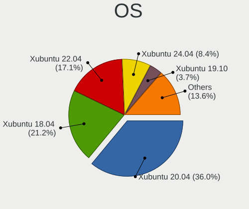

| Name                 | Notebooks | Percent |
|----------------------|-----------|---------|
| Xubuntu 20.04        | 1070      | 36%     |
| Xubuntu 18.04        | 629       | 21.16%  |
| Xubuntu 22.04        | 509       | 17.13%  |
| Xubuntu 24.04        | 249       | 8.38%   |
| Xubuntu 19.10        | 110       | 3.7%    |
| Xubuntu 21.10        | 57        | 1.92%   |
| Xubuntu 23.10        | 53        | 1.78%   |
| Xubuntu 16.04        | 53        | 1.78%   |
| Xubuntu 21.04        | 42        | 1.41%   |
| Xubuntu 20.10        | 42        | 1.41%   |
| Xubuntu 23.04        | 39        | 1.31%   |
| Xubuntu 22.10        | 32        | 1.08%   |
| Xubuntu 25.04        | 17        | 0.57%   |
| Xubuntu 24.10        | 16        | 0.54%   |
| Xubuntu 19.04        | 14        | 0.47%   |
| Xubuntu 25.10        | 10        | 0.34%   |
| Xubuntu 18.10        | 6         | 0.2%    |
| Xubuntu 17.10        | 6         | 0.2%    |
| Xubuntu              | 4         | 0.13%   |
| Xubuntu 14.04        | 3         | 0.1%    |
| Xubuntu 2023.4~rc    | 2         | 0.07%   |
| Xubuntu 2023.2       | 2         | 0.07%   |
| Xubuntu 17.04        | 2         | 0.07%   |
| Xubuntu 2025.3       | 1         | 0.03%   |
| Xubuntu 2024.3       | 1         | 0.03%   |
| Xubuntu 2024.2       | 1         | 0.03%   |
| Xubuntu 2024.1~rc    | 1         | 0.03%   |
| Xubuntu 2023.1-beta5 | 1         | 0.03%   |

OS Family
---------

OS without a version

| Name    | Notebooks | Percent |
|---------|-----------|---------|
| Xubuntu | 2866      | 100%    |

Kernel
------

Version of the Linux kernel

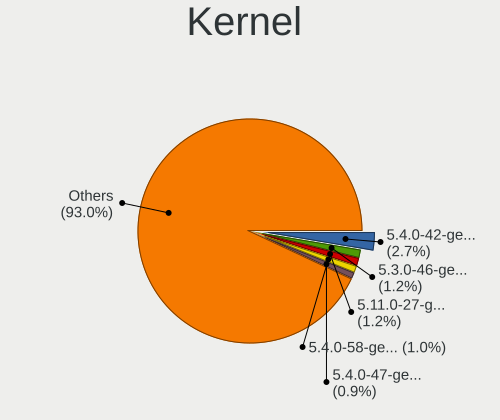

| Version             | Notebooks | Percent |
|---------------------|-----------|---------|
| 5.4.0-42-generic    | 89        | 2.65%   |
| 5.3.0-46-generic    | 41        | 1.22%   |
| 5.11.0-27-generic   | 39        | 1.16%   |
| 5.4.0-58-generic    | 34        | 1.01%   |
| 5.4.0-47-generic    | 31        | 0.92%   |
| 5.4.0-52-generic    | 30        | 0.89%   |
| 5.4.0-29-generic    | 30        | 0.89%   |
| 5.4.0-48-generic    | 28        | 0.83%   |
| 5.4.0-65-generic    | 27        | 0.8%    |
| 5.3.0-40-generic    | 27        | 0.8%    |
| 5.15.0-56-generic   | 27        | 0.8%    |
| 5.3.0-42-generic    | 26        | 0.77%   |
| 5.4.0-54-generic    | 25        | 0.74%   |
| 6.2.0-26-generic    | 23        | 0.69%   |
| 5.3.0-51-generic    | 22        | 0.66%   |
| 5.4.0-31-generic    | 21        | 0.63%   |
| 5.0.0-37-generic    | 21        | 0.63%   |
| 5.4.0-40-generic    | 20        | 0.6%    |
| 5.15.0-58-generic   | 20        | 0.6%    |
| 5.4.0-150-generic   | 19        | 0.57%   |
| 5.3.0-28-generic    | 19        | 0.57%   |
| 5.15.0-52-generic   | 19        | 0.57%   |
| 5.15.0-47-generic   | 19        | 0.57%   |
| 4.15.0-99-generic   | 19        | 0.57%   |
| 6.8.0-41-generic    | 18        | 0.54%   |
| 5.4.0-42-lowlatency | 18        | 0.54%   |
| 5.4.0-26-generic    | 18        | 0.54%   |
| 5.3.0-53-generic    | 18        | 0.54%   |
| 5.15.0-48-generic   | 18        | 0.54%   |
| 5.4.0-89-generic    | 17        | 0.51%   |
| 5.4.0-66-generic    | 17        | 0.51%   |
| 6.8.0-51-generic    | 16        | 0.48%   |
| 5.4.0-67-generic    | 16        | 0.48%   |
| 5.4.0-53-generic    | 16        | 0.48%   |
| 5.4.0-37-generic    | 16        | 0.48%   |
| 5.13.0-39-generic   | 16        | 0.48%   |
| 5.13.0-30-generic   | 16        | 0.48%   |
| 6.5.0-26-generic    | 15        | 0.45%   |
| 5.8.0-43-generic    | 15        | 0.45%   |
| 5.4.0-56-generic    | 15        | 0.45%   |

Kernel Family
-------------

Linux kernel without a distro release

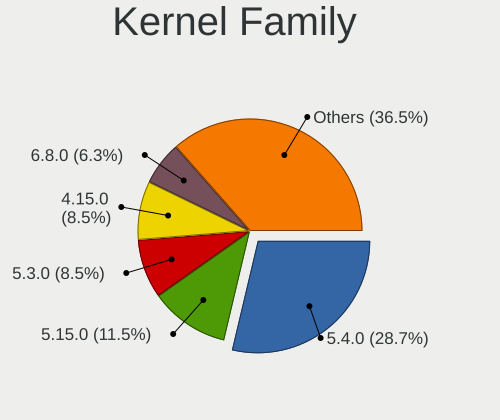

| Version  | Notebooks | Percent |
|----------|-----------|---------|
| 5.4.0    | 870       | 28.7%   |
| 5.15.0   | 349       | 11.51%  |
| 5.3.0    | 258       | 8.51%   |
| 4.15.0   | 257       | 8.48%   |
| 6.8.0    | 191       | 6.3%    |
| 5.11.0   | 166       | 5.48%   |
| 5.13.0   | 134       | 4.42%   |
| 5.8.0    | 132       | 4.35%   |
| 6.5.0    | 113       | 3.73%   |
| 6.2.0    | 110       | 3.63%   |
| 5.19.0   | 89        | 2.94%   |
| 5.0.0    | 58        | 1.91%   |
| 6.14.0   | 53        | 1.75%   |
| 6.11.0   | 53        | 1.75%   |
| 4.4.0    | 29        | 0.96%   |
| 4.18.0   | 14        | 0.46%   |
| 6.17.0   | 10        | 0.33%   |
| 5.17.0   | 10        | 0.33%   |
| 4.13.0   | 7         | 0.23%   |
| 6.1.0    | 6         | 0.2%    |
| 5.10.0   | 5         | 0.16%   |
| 5.14.0   | 4         | 0.13%   |
| 5.6.0    | 3         | 0.1%    |
| 5.4.217  | 3         | 0.1%    |
| 5.18.0   | 3         | 0.1%    |
| 6.9.1    | 2         | 0.07%   |
| 6.13.0   | 2         | 0.07%   |
| 6.12.3   | 2         | 0.07%   |
| 6.0.9    | 2         | 0.07%   |
| 6.0.0    | 2         | 0.07%   |
| 5.6.19   | 2         | 0.07%   |
| 5.5.19   | 2         | 0.07%   |
| 5.11.11  | 2         | 0.07%   |
| 4.8.0    | 2         | 0.07%   |
| 4.4.254  | 2         | 0.07%   |
| 4.19.241 | 2         | 0.07%   |
| 4.11.0   | 2         | 0.07%   |
| 4.10.0   | 2         | 0.07%   |
| 6.8.7    | 1         | 0.03%   |
| 6.8.1    | 1         | 0.03%   |

Kernel Major Ver.
-----------------

Linux kernel major version

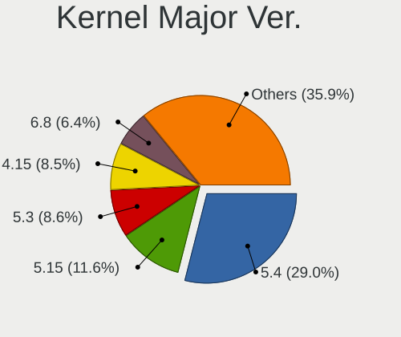

| Version | Notebooks | Percent |
|---------|-----------|---------|
| 5.4     | 878       | 28.98%  |
| 5.15    | 352       | 11.62%  |
| 5.3     | 260       | 8.58%   |
| 4.15    | 258       | 8.51%   |
| 6.8     | 193       | 6.37%   |
| 5.11    | 172       | 5.68%   |
| 5.13    | 135       | 4.46%   |
| 5.8     | 133       | 4.39%   |
| 6.5     | 115       | 3.8%    |
| 6.2     | 111       | 3.66%   |
| 5.19    | 91        | 3%      |
| 5.0     | 59        | 1.95%   |
| 6.14    | 55        | 1.82%   |
| 6.11    | 53        | 1.75%   |
| 4.4     | 31        | 1.02%   |
| 4.18    | 14        | 0.46%   |
| 6.17    | 11        | 0.36%   |
| 5.17    | 11        | 0.36%   |
| 5.10    | 11        | 0.36%   |
| 5.14    | 8         | 0.26%   |
| 6.1     | 7         | 0.23%   |
| 5.6     | 7         | 0.23%   |
| 4.13    | 7         | 0.23%   |
| 4.19    | 6         | 0.2%    |
| 6.0     | 5         | 0.17%   |
| 5.7     | 5         | 0.17%   |
| 5.9     | 4         | 0.13%   |
| 5.12    | 4         | 0.13%   |
| 6.4     | 3         | 0.1%    |
| 5.18    | 3         | 0.1%    |
| 6.9     | 2         | 0.07%   |
| 6.6     | 2         | 0.07%   |
| 6.3     | 2         | 0.07%   |
| 6.13    | 2         | 0.07%   |
| 6.12    | 2         | 0.07%   |
| 6.10    | 2         | 0.07%   |
| 5.5     | 2         | 0.07%   |
| 5.16    | 2         | 0.07%   |
| 4.8     | 2         | 0.07%   |
| 4.11    | 2         | 0.07%   |

Arch
----

OS architecture (x86_64, i586, etc.)

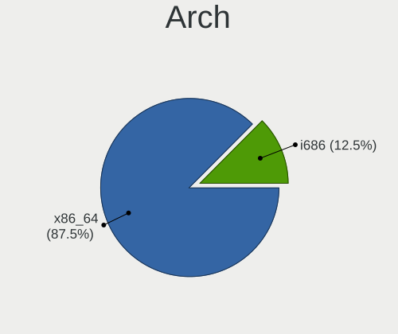

| Name   | Notebooks | Percent |
|--------|-----------|---------|
| x86_64 | 2509      | 87.45%  |
| i686   | 360       | 12.55%  |

DE
--

Desktop Environment

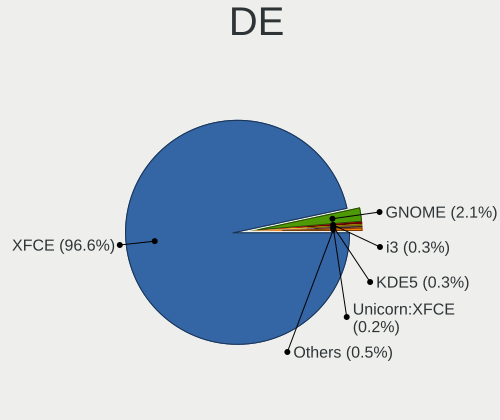

| Name            | Notebooks | Percent |
|-----------------|-----------|---------|
| XFCE            | 2775      | 96.62%  |
| GNOME           | 59        | 2.05%   |
| i3              | 9         | 0.31%   |
| KDE5            | 8         | 0.28%   |
| Unicorn:XFCE    | 7         | 0.24%   |
| Unity           | 3         | 0.1%    |
| MATE            | 2         | 0.07%   |
| GNOME Flashback | 2         | 0.07%   |
| Cinnamon        | 2         | 0.07%   |
| xmonad          | 1         | 0.03%   |
| LXDE            | 1         | 0.03%   |
| ICEWM           | 1         | 0.03%   |
| GNUstep         | 1         | 0.03%   |
| awesome         | 1         | 0.03%   |

Display Server
--------------

X11 or Wayland

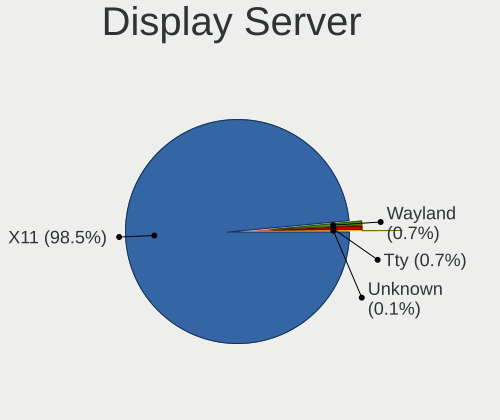

| Name    | Notebooks | Percent |
|---------|-----------|---------|
| X11     | 2825      | 98.5%   |
| Wayland | 21        | 0.73%   |
| Tty     | 19        | 0.66%   |
| Unknown | 3         | 0.1%    |

Display Manager
---------------

SDDM, LightDM, etc.

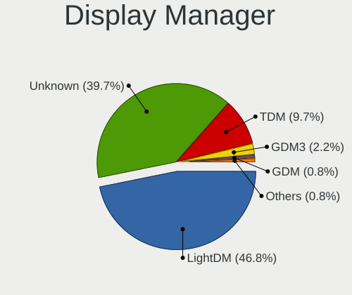

| Name    | Notebooks | Percent |
|---------|-----------|---------|
| LightDM | 1381      | 46.81%  |
| Unknown | 1171      | 39.69%  |
| TDM     | 285       | 9.66%   |
| GDM3    | 66        | 2.24%   |
| GDM     | 23        | 0.78%   |
| SDDM    | 20        | 0.68%   |
| SLiM    | 2         | 0.07%   |
| XDM     | 1         | 0.03%   |
| LXDM    | 1         | 0.03%   |

OS Lang
-------

Language

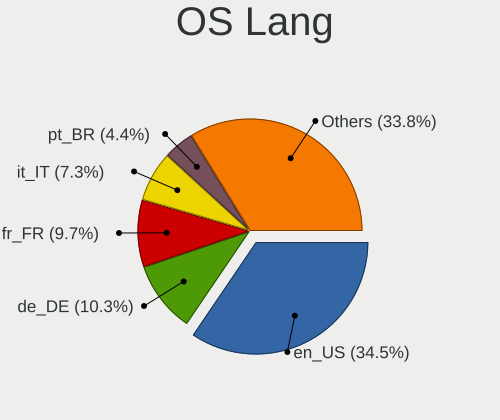

| Lang    | Notebooks | Percent |
|---------|-----------|---------|
| en_US   | 993       | 34.49%  |
| de_DE   | 297       | 10.32%  |
| fr_FR   | 279       | 9.69%   |
| it_IT   | 210       | 7.29%   |
| pt_BR   | 127       | 4.41%   |
| C       | 115       | 3.99%   |
| ru_RU   | 113       | 3.92%   |
| en_GB   | 111       | 3.86%   |
| es_ES   | 83        | 2.88%   |
| pl_PL   | 54        | 1.88%   |
| en_CA   | 45        | 1.56%   |
| Unknown | 44        | 1.53%   |
| en_AU   | 32        | 1.11%   |
| cs_CZ   | 28        | 0.97%   |
| hu_HU   | 24        | 0.83%   |
| es_AR   | 21        | 0.73%   |
| en_IN   | 21        | 0.73%   |
| nl_NL   | 20        | 0.69%   |
| es_MX   | 16        | 0.56%   |
| ja_JP   | 15        | 0.52%   |
| tr_TR   | 12        | 0.42%   |
| pt_PT   | 12        | 0.42%   |
| de_CH   | 11        | 0.38%   |
| ru_UA   | 10        | 0.35%   |
| fr_BE   | 10        | 0.35%   |
| en_ZA   | 10        | 0.35%   |
| el_GR   | 10        | 0.35%   |
| zh_CN   | 9         | 0.31%   |
| sk_SK   | 9         | 0.31%   |
| fi_FI   | 9         | 0.31%   |
| es_CO   | 9         | 0.31%   |
| sv_SE   | 7         | 0.24%   |
| es_CL   | 7         | 0.24%   |
| nl_BE   | 6         | 0.21%   |
| es_VE   | 6         | 0.21%   |
| de_AT   | 6         | 0.21%   |
| nb_NO   | 5         | 0.17%   |
| en_IE   | 5         | 0.17%   |
| da_DK   | 5         | 0.17%   |
| ca_ES   | 5         | 0.17%   |

Boot Mode
---------

EFI or BIOS

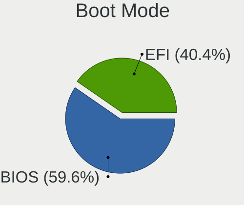

| Mode | Notebooks | Percent |
|------|-----------|---------|
| BIOS | 1725      | 59.63%  |
| EFI  | 1168      | 40.37%  |

Filesystem
----------

Type of filesystem

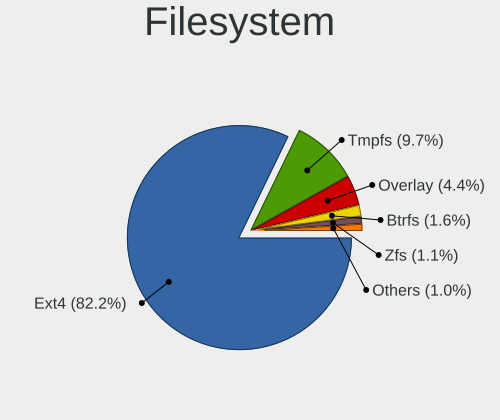

| Type    | Notebooks | Percent |
|---------|-----------|---------|
| Ext4    | 2396      | 82.2%   |
| Tmpfs   | 283       | 9.71%   |
| Overlay | 127       | 4.36%   |
| Btrfs   | 48        | 1.65%   |
| Zfs     | 31        | 1.06%   |
| Unknown | 12        | 0.41%   |
| Xfs     | 7         | 0.24%   |
| Ext3    | 6         | 0.21%   |
| Ext2    | 4         | 0.14%   |
| Ufs     | 1         | 0.03%   |

Part. scheme
------------

Scheme of partitioning

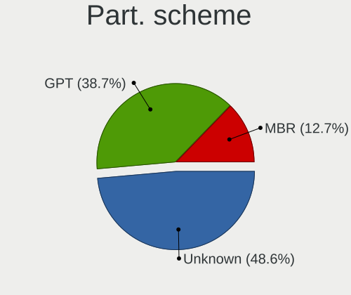

| Type    | Notebooks | Percent |
|---------|-----------|---------|
| Unknown | 1419      | 48.6%   |
| GPT     | 1129      | 38.66%  |
| MBR     | 372       | 12.74%  |

Dual Boot with Linux/BSD
------------------------

Hosting more than one Linux/BSD

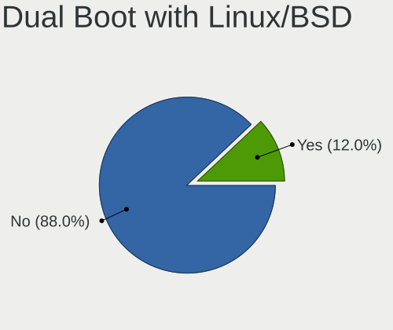

| Dual boot | Notebooks | Percent |
|-----------|-----------|---------|
| No        | 2567      | 87.97%  |
| Yes       | 351       | 12.03%  |

Dual Boot (Win)
---------------

Hosting Linux and Windows

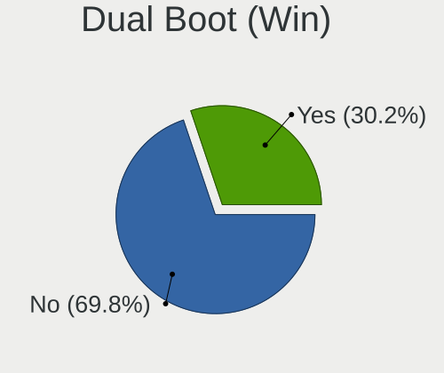

| Dual boot | Notebooks | Percent |
|-----------|-----------|---------|
| No        | 2031      | 69.84%  |
| Yes       | 877       | 30.16%  |

Board
-----

Vendor
------

Motherboard manufacturer

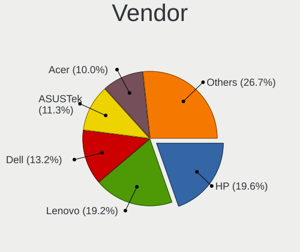

| Name                | Notebooks | Percent |
|---------------------|-----------|---------|
| Hewlett-Packard     | 563       | 19.64%  |
| Lenovo              | 549       | 19.16%  |
| Dell                | 379       | 13.22%  |
| ASUSTek Computer    | 323       | 11.27%  |
| Acer                | 286       | 9.98%   |
| Toshiba             | 121       | 4.22%   |
| Samsung Electronics | 66        | 2.3%    |
| Apple               | 65        | 2.27%   |
| Sony                | 59        | 2.06%   |
| MSI                 | 43        | 1.5%    |
| Google              | 36        | 1.26%   |
| Fujitsu Siemens     | 30        | 1.05%   |
| Medion              | 29        | 1.01%   |
| Packard Bell        | 23        | 0.8%    |
| Notebook            | 23        | 0.8%    |
| Fujitsu             | 18        | 0.63%   |
| Unknown             | 17        | 0.59%   |
| Clevo               | 16        | 0.56%   |
| HUAWEI              | 15        | 0.52%   |
| Positivo            | 14        | 0.49%   |
| GPU Company         | 10        | 0.35%   |
| Intel               | 9         | 0.31%   |
| Gateway             | 9         | 0.31%   |
| TUXEDO              | 7         | 0.24%   |
| IBM                 | 7         | 0.24%   |
| eMachines           | 7         | 0.24%   |
| Alienware           | 7         | 0.24%   |
| LG Electronics      | 6         | 0.21%   |
| Dynabook            | 5         | 0.17%   |
| Schenker            | 4         | 0.14%   |
| Itautec             | 4         | 0.14%   |
| AMI                 | 4         | 0.14%   |
| System76            | 3         | 0.1%    |
| Semp Toshiba        | 3         | 0.1%    |
| OEM                 | 3         | 0.1%    |
| HONOR               | 3         | 0.1%    |
| Haier               | 3         | 0.1%    |
| Gigabyte Technology | 3         | 0.1%    |
| Dixonsxp            | 3         | 0.1%    |
| Thomson             | 2         | 0.07%   |

Model
-----

Motherboard model

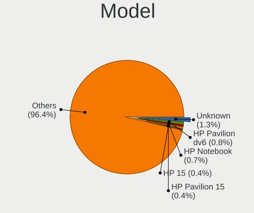

| Name                                   | Notebooks | Percent |
|----------------------------------------|-----------|---------|
| Unknown                                | 37        | 1.29%   |
| HP Pavilion dv6                        | 24        | 0.84%   |
| HP Notebook                            | 20        | 0.7%    |
| HP 15                                  | 12        | 0.42%   |
| HP Pavilion 15                         | 11        | 0.38%   |
| Dell Latitude D630                     | 11        | 0.38%   |
| HP Pavilion g6                         | 10        | 0.35%   |
| HP Pavilion dv7                        | 9         | 0.31%   |
| Dell Latitude E6430                    | 9         | 0.31%   |
| HP Pavilion dv6500                     | 7         | 0.24%   |
| HP Pavilion 17                         | 7         | 0.24%   |
| HP Pavilion g7                         | 6         | 0.21%   |
| Dell Latitude E6520                    | 6         | 0.21%   |
| Dell Latitude E6400                    | 6         | 0.21%   |
| Dell Inspiron 1525                     | 6         | 0.21%   |
| ASUS VivoBook_ASUSLaptop X571LH_K571LH | 6         | 0.21%   |
| ASUS T100HAN                           | 6         | 0.21%   |
| Acer Aspire one                        | 6         | 0.21%   |
| Positivo Mobile                        | 5         | 0.17%   |
| HP Pavilion Notebook                   | 5         | 0.17%   |
| HP Laptop 15-bw0xx                     | 5         | 0.17%   |
| HP G72                                 | 5         | 0.17%   |
| HP EliteBook 840 G3                    | 5         | 0.17%   |
| Google Snappy                          | 5         | 0.17%   |
| Dell Latitude E6330                    | 5         | 0.17%   |
| Dell Inspiron 7520                     | 5         | 0.17%   |
| Dell Inspiron 15-3567                  | 5         | 0.17%   |
| ASUS X553MA                            | 5         | 0.17%   |
| ASUS 1005HA                            | 5         | 0.17%   |
| Apple MacBookPro8,1                    | 5         | 0.17%   |
| Acer AO751h                            | 5         | 0.17%   |
| Toshiba Satellite L300                 | 4         | 0.14%   |
| Toshiba Satellite A200                 | 4         | 0.14%   |
| Samsung 300E4C/300E5C/300E7C           | 4         | 0.14%   |
| Lenovo IdeaPad 100-15IBY 80MJ          | 4         | 0.14%   |
| Lenovo G50-30 80G0                     | 4         | 0.14%   |
| HP ProBook 6570b                       | 4         | 0.14%   |
| HP Laptop 17-cp0xxx                    | 4         | 0.14%   |
| HP G62                                 | 4         | 0.14%   |
| HP G42                                 | 4         | 0.14%   |

Model Family
------------

Motherboard model prefix

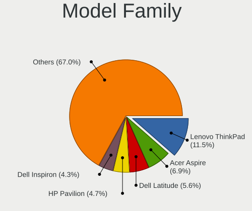

| Name                    | Notebooks | Percent |
|-------------------------|-----------|---------|
| Lenovo ThinkPad         | 329       | 11.48%  |
| Acer Aspire             | 197       | 6.87%   |
| Dell Latitude           | 161       | 5.62%   |
| HP Pavilion             | 135       | 4.71%   |
| Dell Inspiron           | 123       | 4.29%   |
| Toshiba Satellite       | 101       | 3.52%   |
| Lenovo IdeaPad          | 100       | 3.49%   |
| HP EliteBook            | 75        | 2.62%   |
| HP ProBook              | 62        | 2.16%   |
| ASUS VivoBook           | 58        | 2.02%   |
| HP Laptop               | 54        | 1.88%   |
| HP Compaq               | 53        | 1.85%   |
| Unknown                 | 37        | 1.29%   |
| Dell XPS                | 24        | 0.84%   |
| Dell Vostro             | 24        | 0.84%   |
| Dell Precision          | 23        | 0.8%    |
| HP Notebook             | 21        | 0.73%   |
| Acer Extensa            | 20        | 0.7%    |
| Packard Bell EasyNote   | 18        | 0.63%   |
| Fujitsu Siemens AMILO   | 17        | 0.59%   |
| Fujitsu LIFEBOOK        | 15        | 0.52%   |
| HP Presario             | 14        | 0.49%   |
| HP ZBook                | 13        | 0.45%   |
| HP 255                  | 13        | 0.45%   |
| HP 15                   | 13        | 0.45%   |
| ASUS ROG                | 13        | 0.45%   |
| HP Mini                 | 12        | 0.42%   |
| HP 250                  | 12        | 0.42%   |
| Acer TravelMate         | 12        | 0.42%   |
| Acer Swift              | 12        | 0.42%   |
| Lenovo Legion           | 11        | 0.38%   |
| HP Stream               | 11        | 0.38%   |
| ASUS ASUS               | 11        | 0.38%   |
| Lenovo ThinkBook        | 10        | 0.35%   |
| HP ENVY                 | 10        | 0.35%   |
| Dell Studio             | 8         | 0.28%   |
| Fujitsu Siemens ESPRIMO | 7         | 0.24%   |
| Apple MacBookPro8       | 7         | 0.24%   |
| Acer Nitro              | 7         | 0.24%   |
| Toshiba PORTEGE         | 6         | 0.21%   |

MFG Year
--------

Motherboard manufacture year

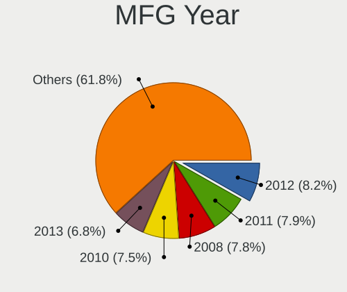

| Year    | Notebooks | Percent |
|---------|-----------|---------|
| 2012    | 235       | 8.2%    |
| 2011    | 226       | 7.89%   |
| 2008    | 223       | 7.78%   |
| 2010    | 216       | 7.54%   |
| 2013    | 196       | 6.84%   |
| 2007    | 173       | 6.04%   |
| 2019    | 170       | 5.93%   |
| 2020    | 155       | 5.41%   |
| 2009    | 152       | 5.3%    |
| 2018    | 150       | 5.23%   |
| 2014    | 146       | 5.09%   |
| 2017    | 145       | 5.06%   |
| 2021    | 140       | 4.88%   |
| 2016    | 134       | 4.68%   |
| 2015    | 123       | 4.29%   |
| 2006    | 88        | 3.07%   |
| 2022    | 70        | 2.44%   |
| 2023    | 40        | 1.4%    |
| 2005    | 36        | 1.26%   |
| 2024    | 19        | 0.66%   |
| 2025    | 9         | 0.31%   |
| 2003    | 8         | 0.28%   |
| 2004    | 7         | 0.24%   |
| Unknown | 4         | 0.14%   |
| 2002    | 1         | 0.03%   |

Form Factor
-----------

Physical design of the computer

| Name     | Notebooks | Percent |
|----------|-----------|---------|
| Notebook | 2866      | 100%    |

Secure Boot
-----------

Enabled or disabled

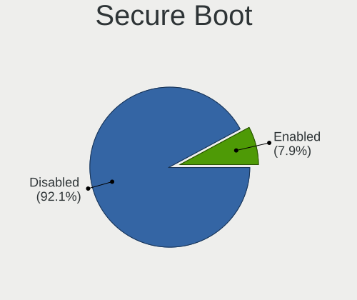

| State    | Notebooks | Percent |
|----------|-----------|---------|
| Disabled | 2662      | 92.14%  |
| Enabled  | 227       | 7.86%   |

Coreboot
--------

Have coreboot on board

| Used | Notebooks | Percent |
|------|-----------|---------|
| No   | 2828      | 98.67%  |
| Yes  | 38        | 1.33%   |

RAM Size
--------

Total RAM memory

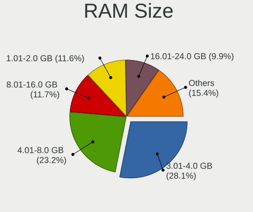

| Size in GB  | Notebooks | Percent |
|-------------|-----------|---------|
| 3.01-4.0    | 815       | 28.12%  |
| 4.01-8.0    | 673       | 23.22%  |
| 8.01-16.0   | 340       | 11.73%  |
| 1.01-2.0    | 337       | 11.63%  |
| 16.01-24.0  | 288       | 9.94%   |
| 32.01-64.0  | 134       | 4.62%   |
| 2.01-3.0    | 120       | 4.14%   |
| 0.51-1.0    | 118       | 4.07%   |
| 64.01-256.0 | 37        | 1.28%   |
| 24.01-32.0  | 29        | 1%      |
| 0.01-0.5    | 7         | 0.24%   |

RAM Used
--------

Used RAM memory

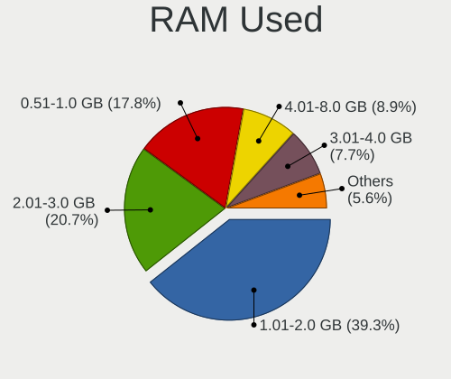

| Used GB    | Notebooks | Percent |
|------------|-----------|---------|
| 1.01-2.0   | 1231      | 39.34%  |
| 2.01-3.0   | 648       | 20.71%  |
| 0.51-1.0   | 557       | 17.8%   |
| 4.01-8.0   | 277       | 8.85%   |
| 3.01-4.0   | 240       | 7.67%   |
| 8.01-16.0  | 82        | 2.62%   |
| 0.01-0.5   | 78        | 2.49%   |
| 16.01-24.0 | 13        | 0.42%   |
| 24.01-32.0 | 2         | 0.06%   |
| Unknown    | 1         | 0.03%   |

Total Drives
------------

Number of drives on board

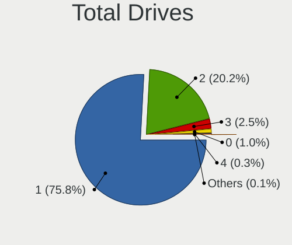

| Drives | Notebooks | Percent |
|--------|-----------|---------|
| 1      | 2210      | 75.84%  |
| 2      | 589       | 20.21%  |
| 3      | 72        | 2.47%   |
| 0      | 30        | 1.03%   |
| 4      | 10        | 0.34%   |
| 5      | 2         | 0.07%   |
| 7      | 1         | 0.03%   |

Has CD-ROM
----------

Has CD-ROM on board

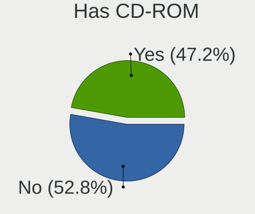

| Presented | Notebooks | Percent |
|-----------|-----------|---------|
| No        | 1519      | 52.8%   |
| Yes       | 1358      | 47.2%   |

Has Ethernet
------------

Has Ethernet on board

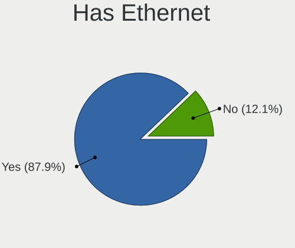

| Presented | Notebooks | Percent |
|-----------|-----------|---------|
| Yes       | 2460      | 85.71%  |
| No        | 410       | 14.29%  |

Has WiFi
--------

Has WiFi module

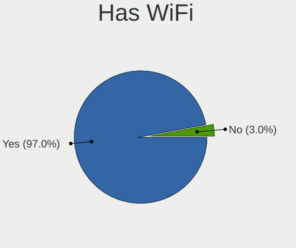

| Presented | Notebooks | Percent |
|-----------|-----------|---------|
| Yes       | 2785      | 97.04%  |
| No        | 85        | 2.96%   |

Has Bluetooth
-------------

Has Bluetooth module

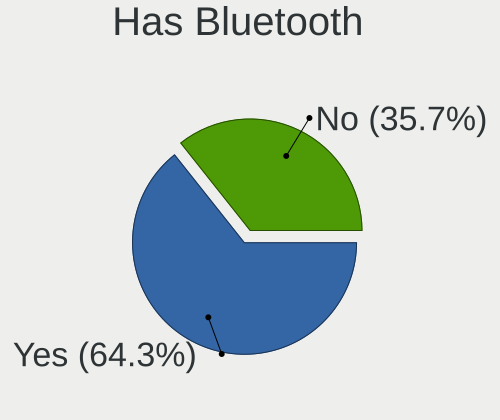

| Presented | Notebooks | Percent |
|-----------|-----------|---------|
| Yes       | 1864      | 64.32%  |
| No        | 1034      | 35.68%  |

Location
--------

Country
-------

Geographic location (country)

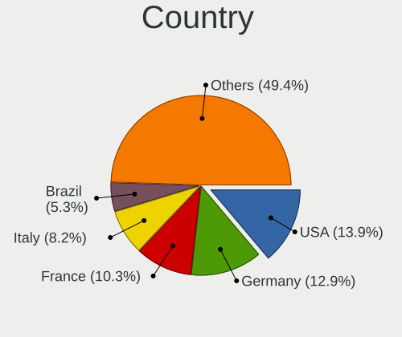

| Country      | Notebooks | Percent |
|--------------|-----------|---------|
| USA          | 401       | 13.88%  |
| Germany      | 373       | 12.91%  |
| France       | 297       | 10.28%  |
| Italy        | 238       | 8.24%   |
| Brazil       | 152       | 5.26%   |
| Russia       | 151       | 5.22%   |
| UK           | 110       | 3.81%   |
| Spain        | 100       | 3.46%   |
| Canada       | 88        | 3.04%   |
| Poland       | 75        | 2.6%    |
| Netherlands  | 53        | 1.83%   |
| Czechia      | 44        | 1.52%   |
| Australia    | 42        | 1.45%   |
| Belgium      | 37        | 1.28%   |
| Mexico       | 35        | 1.21%   |
| India        | 34        | 1.18%   |
| Argentina    | 34        | 1.18%   |
| Ukraine      | 32        | 1.11%   |
| Sweden       | 32        | 1.11%   |
| Hungary      | 27        | 0.93%   |
| Portugal     | 25        | 0.87%   |
| Finland      | 24        | 0.83%   |
| Indonesia    | 23        | 0.8%    |
| Greece       | 23        | 0.8%    |
| Bulgaria     | 22        | 0.76%   |
| Switzerland  | 21        | 0.73%   |
| Austria      | 21        | 0.73%   |
| Turkey       | 20        | 0.69%   |
| Japan        | 20        | 0.69%   |
| Romania      | 19        | 0.66%   |
| Slovakia     | 14        | 0.48%   |
| Norway       | 13        | 0.45%   |
| Denmark      | 13        | 0.45%   |
| Colombia     | 13        | 0.45%   |
| Iran         | 12        | 0.42%   |
| Chile        | 12        | 0.42%   |
| Belarus      | 12        | 0.42%   |
| Venezuela    | 10        | 0.35%   |
| South Africa | 10        | 0.35%   |
| Israel       | 10        | 0.35%   |

City
----

Geographic location (city)

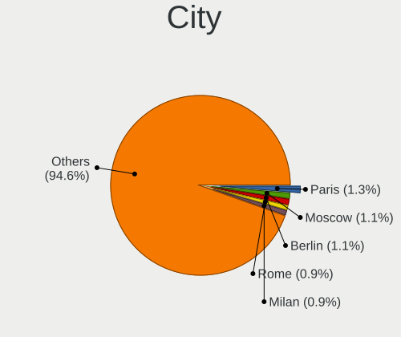

| City              | Notebooks | Percent |
|-------------------|-----------|---------|
| Paris             | 40        | 1.31%   |
| Moscow            | 34        | 1.11%   |
| Berlin            | 34        | 1.11%   |
| Rome              | 29        | 0.95%   |
| Milan             | 29        | 0.95%   |
| Warsaw            | 26        | 0.85%   |
| St Petersburg     | 22        | 0.72%   |
| Prague            | 19        | 0.62%   |
| Athens            | 19        | 0.62%   |
| Québec           | 18        | 0.59%   |
| Munich            | 17        | 0.56%   |
| Hamburg           | 17        | 0.56%   |
| Sao Paulo         | 15        | 0.49%   |
| Budapest          | 15        | 0.49%   |
| Madrid            | 14        | 0.46%   |
| Helsinki          | 13        | 0.43%   |
| Amsterdam         | 13        | 0.43%   |
| Stuttgart         | 12        | 0.39%   |
| Rio de Janeiro    | 12        | 0.39%   |
| Barcelona         | 12        | 0.39%   |
| Sydney            | 11        | 0.36%   |
| Turin             | 10        | 0.33%   |
| Sofia             | 10        | 0.33%   |
| Kyiv              | 10        | 0.33%   |
| Frankfurt am Main | 10        | 0.33%   |
| Bucharest         | 10        | 0.33%   |
| Melbourne         | 9         | 0.29%   |
| Leipzig           | 9         | 0.29%   |
| Genoa             | 9         | 0.29%   |
| Ankara            | 9         | 0.29%   |
| Vienna            | 8         | 0.26%   |
| Tehran            | 8         | 0.26%   |
| Minsk             | 8         | 0.26%   |
| Karlsruhe         | 8         | 0.26%   |
| Bogotá           | 8         | 0.26%   |
| Yokohama          | 7         | 0.23%   |
| Uppsala           | 7         | 0.23%   |
| Toronto           | 7         | 0.23%   |
| London            | 7         | 0.23%   |
| Lisbon            | 7         | 0.23%   |

Drives
------

Drive Vendor
------------

Hard drive vendors

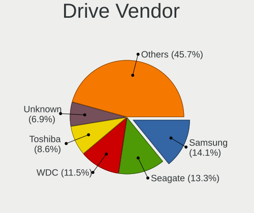

| Vendor                      | Notebooks | Drives | Percent |
|-----------------------------|-----------|--------|---------|
| Samsung Electronics         | 481       | 596    | 14.13%  |
| Seagate                     | 451       | 551    | 13.25%  |
| WDC                         | 391       | 491    | 11.49%  |
| Toshiba                     | 291       | 339    | 8.55%   |
| Unknown                     | 234       | 303    | 6.88%   |
| Hitachi                     | 193       | 230    | 5.67%   |
| Kingston                    | 158       | 196    | 4.64%   |
| SanDisk                     | 149       | 179    | 4.38%   |
| SK hynix                    | 104       | 127    | 3.06%   |
| HGST                        | 98        | 113    | 2.88%   |
| Crucial                     | 96        | 108    | 2.82%   |
| Intel                       | 74        | 101    | 2.17%   |
| Fujitsu                     | 67        | 88     | 1.97%   |
| Micron Technology           | 63        | 74     | 1.85%   |
| A-DATA Technology           | 39        | 56     | 1.15%   |
| China                       | 36        | 43     | 1.06%   |
| KIOXIA                      | 27        | 30     | 0.79%   |
| Apple                       | 23        | 32     | 0.68%   |
| Intenso                     | 18        | 20     | 0.53%   |
| Transcend                   | 17        | 18     | 0.5%    |
| SPCC                        | 16        | 21     | 0.47%   |
| PNY                         | 16        | 20     | 0.47%   |
| LITEON                      | 16        | 19     | 0.47%   |
| LITEONIT                    | 15        | 18     | 0.44%   |
| Patriot                     | 13        | 13     | 0.38%   |
| Unknown                     | 13        | 14     | 0.38%   |
| Phison                      | 12        | 16     | 0.35%   |
| OCZ                         | 12        | 13     | 0.35%   |
| KingSpec                    | 11        | 15     | 0.32%   |
| JMicron Technology          | 11        | 10     | 0.32%   |
| Kingston Technology Company | 10        | 12     | 0.29%   |
| Lexar                       | 9         | 10     | 0.26%   |
| Apacer                      | 9         | 11     | 0.26%   |
| Silicon Motion              | 8         | 8      | 0.24%   |
| Netac                       | 8         | 12     | 0.24%   |
| GOODRAM                     | 8         | 8      | 0.24%   |
| Phison Electronics          | 7         | 10     | 0.21%   |
| KingDian                    | 7         | 10     | 0.21%   |
| IBM/Hitachi                 | 6         | 6      | 0.18%   |
| ASMT                        | 6         | 11     | 0.18%   |

Drive Model
-----------

Hard drive models

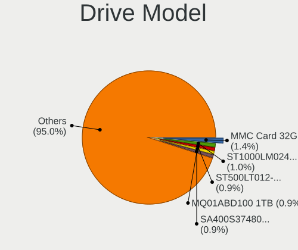

| Model                                             | Notebooks | Percent |
|---------------------------------------------------|-----------|---------|
| Unknown MMC Card  32GB                            | 48        | 1.37%   |
| Seagate ST1000LM024 HN-M101MBB 1TB                | 36        | 1.03%   |
| Seagate ST500LT012-1DG142 500GB                   | 31        | 0.88%   |
| Toshiba MQ01ABD100 1TB                            | 30        | 0.85%   |
| Kingston SA400S37480G 480GB SSD                   | 30        | 0.85%   |
| Toshiba MQ01ABF050 500GB                          | 29        | 0.83%   |
| Seagate ST1000LM035-1RK172 1TB                    | 29        | 0.83%   |
| Seagate ST500LM012 HN-M500MBB 500GB               | 27        | 0.77%   |
| Kingston SA400S37240G 240GB SSD                   | 27        | 0.77%   |
| Unknown MMC Card  64GB                            | 24        | 0.68%   |
| Unknown MMC Card  128GB                           | 23        | 0.65%   |
| Seagate ST9320325AS 320GB                         | 22        | 0.63%   |
| HGST HTS721010A9E630 1TB                          | 21        | 0.6%    |
| HGST HTS541010A9E680 1TB                          | 21        | 0.6%    |
| Seagate ST9500325AS 500GB                         | 19        | 0.54%   |
| Samsung SSD 850 EVO 250GB                         | 19        | 0.54%   |
| Unknown MMC Card  16GB                            | 17        | 0.48%   |
| Seagate ST500LT012-9WS142 500GB                   | 17        | 0.48%   |
| Samsung SSD 860 EVO 500GB                         | 17        | 0.48%   |
| Samsung SSD 850 EVO 500GB                         | 17        | 0.48%   |
| Kingston SA400S37120G 120GB SSD                   | 17        | 0.48%   |
| Crucial CT500MX500SSD1 500GB                      | 17        | 0.48%   |
| WDC WD10JPVX-22JC3T0 1TB                          | 16        | 0.46%   |
| Toshiba MQ04ABF100 1TB                            | 15        | 0.43%   |
| Samsung NVMe SSD Controller SM981/PM981/PM983 1TB | 15        | 0.43%   |
| Crucial CT240BX500SSD1 240GB                      | 15        | 0.43%   |
| WDC WD1600BEVT-22ZCT0 160GB                       | 13        | 0.37%   |
| Seagate ST1000LM048-2E7172 1TB                    | 13        | 0.37%   |
| Hitachi HTS543232A7A384 320GB                     | 13        | 0.37%   |
| HGST HTS725050A7E630 500GB                        | 13        | 0.37%   |
| Unknown                                           | 13        | 0.37%   |
| Unknown SD/MMC/MS PRO 2GB                         | 12        | 0.34%   |
| Toshiba MQ01ABD050 500GB                          | 12        | 0.34%   |
| Samsung HM321HI 320GB                             | 12        | 0.34%   |
| HGST HTS545050A7E680 500GB                        | 12        | 0.34%   |
| SK hynix NVMe SSD Drive 256GB                     | 11        | 0.31%   |
| Seagate ST9250315AS 250GB                         | 11        | 0.31%   |
| Seagate ST9160310AS 160GB                         | 11        | 0.31%   |
| Seagate Expansion 2TB                             | 11        | 0.31%   |
| Samsung SSD 860 EVO 1TB                           | 11        | 0.31%   |

HDD Vendor
----------

Hard disk drive vendors

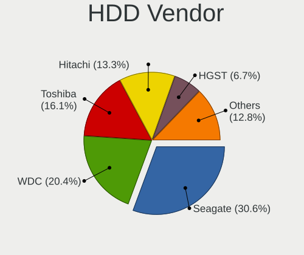

| Vendor              | Notebooks | Drives | Percent |
|---------------------|-----------|--------|---------|
| Seagate             | 445       | 542    | 30.63%  |
| WDC                 | 297       | 379    | 20.44%  |
| Toshiba             | 234       | 276    | 16.1%   |
| Hitachi             | 193       | 230    | 13.28%  |
| HGST                | 98        | 113    | 6.74%   |
| Fujitsu             | 65        | 85     | 4.47%   |
| Samsung Electronics | 64        | 74     | 4.4%    |
| Unknown             | 12        | 14     | 0.83%   |
| JMicron Technology  | 6         | 6      | 0.41%   |
| IBM/Hitachi         | 6         | 6      | 0.41%   |
| USB3.0              | 5         | 6      | 0.34%   |
| TO Exter            | 4         | 4      | 0.28%   |
| SSK                 | 4         | 5      | 0.28%   |
| HGST HTS            | 3         | 4      | 0.21%   |
| External            | 3         | 4      | 0.21%   |
| Intenso             | 2         | 2      | 0.14%   |
| Inateck             | 2         | 2      | 0.14%   |
| ASMT                | 2         | 4      | 0.14%   |
| Apple               | 2         | 2      | 0.14%   |
| SABRENT             | 1         | 1      | 0.07%   |
| CLOVER              | 1         | 1      | 0.07%   |
| ASMedia             | 1         | 1      | 0.07%   |
| Apricorn            | 1         | 2      | 0.07%   |
| ACASIS              | 1         | 1      | 0.07%   |
| Unknown             | 1         | 1      | 0.07%   |

SSD Vendor
----------

Solid state drive vendors

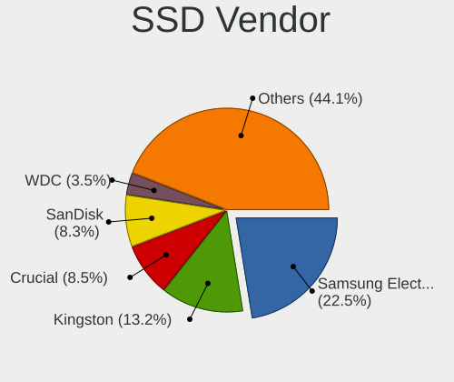

| Vendor              | Notebooks | Drives | Percent |
|---------------------|-----------|--------|---------|
| Samsung Electronics | 236       | 301    | 22.45%  |
| Kingston            | 139       | 172    | 13.23%  |
| Crucial             | 89        | 101    | 8.47%   |
| SanDisk             | 87        | 109    | 8.28%   |
| WDC                 | 37        | 38     | 3.52%   |
| China               | 35        | 42     | 3.33%   |
| A-DATA Technology   | 34        | 51     | 3.24%   |
| Micron Technology   | 32        | 36     | 3.04%   |
| Toshiba             | 26        | 28     | 2.47%   |
| Intel               | 25        | 41     | 2.38%   |
| SK hynix            | 23        | 24     | 2.19%   |
| Transcend           | 17        | 17     | 1.62%   |
| PNY                 | 16        | 19     | 1.52%   |
| LITEON              | 16        | 19     | 1.52%   |
| SPCC                | 15        | 18     | 1.43%   |
| LITEONIT            | 15        | 18     | 1.43%   |
| Intenso             | 15        | 17     | 1.43%   |
| Apple               | 15        | 20     | 1.43%   |
| Patriot             | 13        | 13     | 1.24%   |
| OCZ                 | 12        | 13     | 1.14%   |
| KingSpec            | 10        | 14     | 0.95%   |
| Lexar               | 8         | 9      | 0.76%   |
| GOODRAM             | 8         | 8      | 0.76%   |
| Apacer              | 8         | 10     | 0.76%   |
| KingDian            | 7         | 10     | 0.67%   |
| Unknown             | 6         | 7      | 0.57%   |
| Netac               | 6         | 10     | 0.57%   |
| Smartbuy            | 4         | 4      | 0.38%   |
| Pioneer             | 4         | 5      | 0.38%   |
| Hewlett-Packard     | 4         | 5      | 0.38%   |
| ASMT                | 4         | 7      | 0.38%   |
| Zheino              | 3         | 3      | 0.29%   |
| Team                | 3         | 8      | 0.29%   |
| Plextor             | 3         | 9      | 0.29%   |
| LDLC                | 3         | 3      | 0.29%   |
| INNOVATION IT       | 3         | 3      | 0.29%   |
| FORESEE             | 3         | 6      | 0.29%   |
| Drevo               | 3         | 3      | 0.29%   |
| Dogfish             | 3         | 6      | 0.29%   |
| BHT                 | 3         | 3      | 0.29%   |

Drive Kind
----------

HDD or SSD

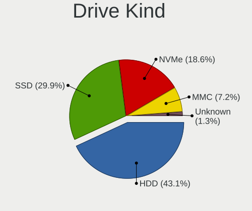

| Kind    | Notebooks | Drives | Percent |
|---------|-----------|--------|---------|
| HDD     | 1406      | 1765   | 43.09%  |
| SSD     | 975       | 1299   | 29.88%  |
| NVMe    | 606       | 762    | 18.57%  |
| MMC     | 235       | 301    | 7.2%    |
| Unknown | 41        | 45     | 1.26%   |

Drive Connector
---------------

SATA, SAS, NVMe, etc.

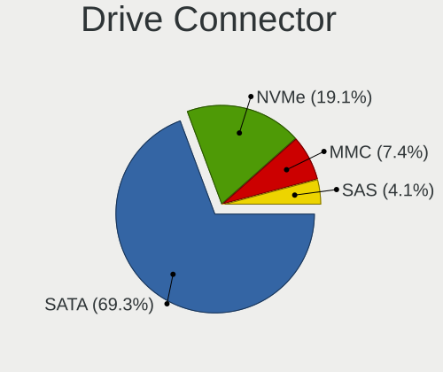

| Type | Notebooks | Drives | Percent |
|------|-----------|--------|---------|
| SATA | 2191      | 2950   | 69.34%  |
| NVMe | 604       | 756    | 19.11%  |
| MMC  | 235       | 301    | 7.44%   |
| SAS  | 130       | 165    | 4.11%   |

Drive Size
----------

Size of hard drive

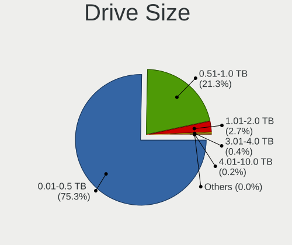

| Size in TB | Notebooks | Drives | Percent |
|------------|-----------|--------|---------|
| 0.01-0.5   | 1783      | 2337   | 75.3%   |
| 0.51-1.0   | 505       | 621    | 21.33%  |
| 1.01-2.0   | 65        | 84     | 2.74%   |
| 3.01-4.0   | 9         | 10     | 0.38%   |
| 4.01-10.0  | 5         | 11     | 0.21%   |
| 0          | 1         | 1      | 0.04%   |

Space Total
-----------

Amount of disk space available on the file system

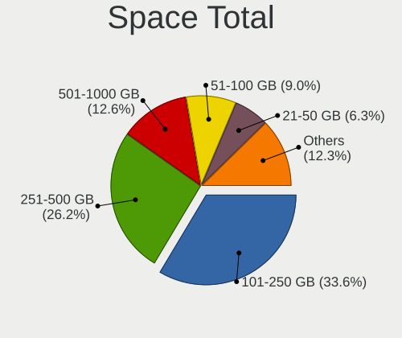

| Size in GB     | Notebooks | Percent |
|----------------|-----------|---------|
| 101-250        | 1000      | 33.59%  |
| 251-500        | 779       | 26.17%  |
| 501-1000       | 374       | 12.56%  |
| 51-100         | 269       | 9.04%   |
| 21-50          | 188       | 6.32%   |
| 1-20           | 164       | 5.51%   |
| 1001-2000      | 133       | 4.47%   |
| More than 3000 | 28        | 0.94%   |
| 2001-3000      | 28        | 0.94%   |
| Unknown        | 14        | 0.47%   |

Space Used
----------

Amount of used disk space

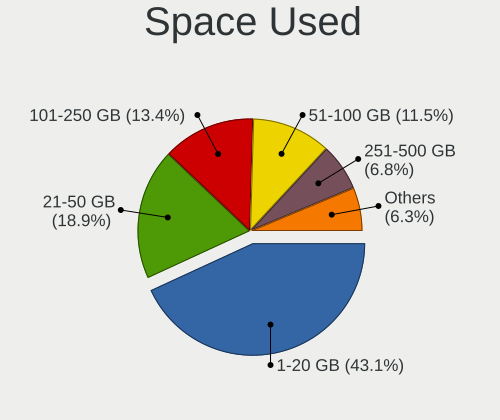

| Used GB        | Notebooks | Percent |
|----------------|-----------|---------|
| 1-20           | 1337      | 43.13%  |
| 21-50          | 587       | 18.94%  |
| 101-250        | 415       | 13.39%  |
| 51-100         | 355       | 11.45%  |
| 251-500        | 211       | 6.81%   |
| 501-1000       | 127       | 4.1%    |
| 1001-2000      | 38        | 1.23%   |
| Unknown        | 14        | 0.45%   |
| 2001-3000      | 9         | 0.29%   |
| More than 3000 | 7         | 0.23%   |

Malfunc. Drives
---------------

Drive models with a malfunction

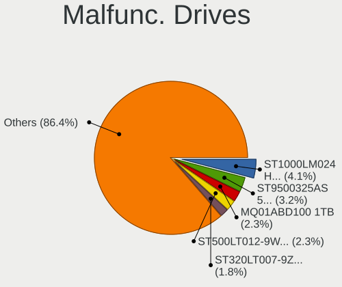

| Model                              | Notebooks | Drives | Percent |
|------------------------------------|-----------|--------|---------|
| Seagate ST1000LM024 HN-M101MBB 1TB | 9         | 9      | 4.09%   |
| Seagate ST9500325AS 500GB          | 7         | 9      | 3.18%   |
| Toshiba MQ01ABD100 1TB             | 5         | 6      | 2.27%   |
| Seagate ST500LT012-9WS142 500GB    | 5         | 5      | 2.27%   |
| Seagate ST320LT007-9ZV142 320GB    | 4         | 4      | 1.82%   |
| Hitachi HTS543232A7A384 320GB      | 4         | 5      | 1.82%   |
| HGST HTS545050A7E680 500GB         | 4         | 4      | 1.82%   |
| WDC WD10JPVX-22JC3T0 1TB           | 3         | 4      | 1.36%   |
| Toshiba MQ01ABD050 500GB           | 3         | 3      | 1.36%   |
| Seagate ST9500423AS 500GB          | 3         | 3      | 1.36%   |
| Seagate ST500LT012-1DG142 500GB    | 3         | 3      | 1.36%   |
| Seagate ST1000LM035-1RK172 1TB     | 3         | 3      | 1.36%   |
| Hitachi HTS725050A9A364 500GB      | 3         | 4      | 1.36%   |
| Hitachi HTS545050A7E380 500GB      | 3         | 3      | 1.36%   |
| HGST HTS541010A9E680 1TB           | 3         | 3      | 1.36%   |
| WDC WD5000LPVX-22V0TT0 500GB       | 2         | 2      | 0.91%   |
| Toshiba MK5065GSXN 500GB           | 2         | 4      | 0.91%   |
| Seagate ST9320325AS 320GB          | 2         | 2      | 0.91%   |
| Seagate ST9250410AS 250GB          | 2         | 2      | 0.91%   |
| Samsung Electronics HM321HI 320GB  | 2         | 2      | 0.91%   |
| LDLC F6+M.2 480 480GB SSD          | 2         | 2      | 0.91%   |
| Hitachi HTS725032A9A364 320GB      | 2         | 2      | 0.91%   |
| Hitachi HTS543225L9A300 250GB      | 2         | 2      | 0.91%   |
| Hitachi HTS543216L9A300 160GB      | 2         | 2      | 0.91%   |
| HGST HTS725050A7E630 500GB         | 2         | 2      | 0.91%   |
| HGST HTS721010A9E630 1TB           | 2         | 3      | 0.91%   |
| Fujitsu MHZ2160BJ FFS G2 160GB     | 2         | 3      | 0.91%   |
| WDC WDS480G2G0A-00JH30 480GB SSD   | 1         | 1      | 0.45%   |
| WDC WD7500BPVT-80HXZT3 752GB       | 1         | 2      | 0.45%   |
| WDC WD7500BPVT-24HXZT1 752GB       | 1         | 2      | 0.45%   |
| WDC WD7500BPKX-00HPJT0 752GB       | 1         | 1      | 0.45%   |
| WDC WD5000LPVT-08G33T1 500GB       | 1         | 1      | 0.45%   |
| WDC WD5000BEVT-60ZAT1 500GB        | 1         | 1      | 0.45%   |
| WDC WD5000BEKT-75KA9T0 500GB       | 1         | 1      | 0.45%   |
| WDC WD3200BPVT-80ZEST0 320GB       | 1         | 2      | 0.45%   |
| WDC WD3200BPVT-35ZEST0 320GB       | 1         | 1      | 0.45%   |
| WDC WD3200BEVT-60ZCT1 320GB        | 1         | 1      | 0.45%   |
| WDC WD3200BEKT-75PVMT0 320GB       | 1         | 1      | 0.45%   |
| WDC WD3200BEKT-60PVMT0 320GB       | 1         | 1      | 0.45%   |
| WDC WD1600BJKT-75F4T0 160GB        | 1         | 1      | 0.45%   |

Malfunc. Drive Vendor
---------------------

Vendors of faulty drives

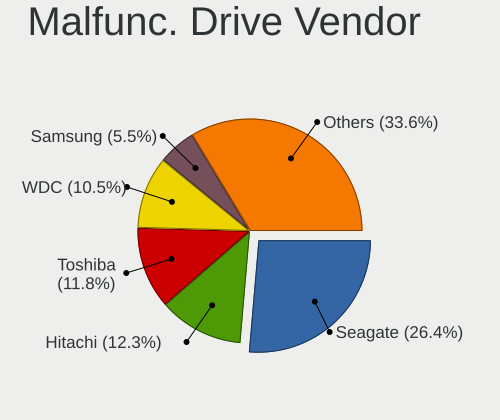

| Vendor              | Notebooks | Drives | Percent |
|---------------------|-----------|--------|---------|
| Seagate             | 58        | 62     | 26.36%  |
| Hitachi             | 27        | 30     | 12.27%  |
| Toshiba             | 26        | 32     | 11.82%  |
| WDC                 | 23        | 27     | 10.45%  |
| Samsung Electronics | 12        | 12     | 5.45%   |
| HGST                | 12        | 14     | 5.45%   |
| Fujitsu             | 8         | 9      | 3.64%   |
| Kingston            | 7         | 9      | 3.18%   |
| SanDisk             | 6         | 7      | 2.73%   |
| SK hynix            | 5         | 6      | 2.27%   |
| Micron Technology   | 5         | 6      | 2.27%   |
| LDLC                | 3         | 3      | 1.36%   |
| Intel               | 3         | 3      | 1.36%   |
| China               | 3         | 3      | 1.36%   |
| A-DATA Technology   | 3         | 4      | 1.36%   |
| OCZ                 | 2         | 2      | 0.91%   |
| Netac               | 2         | 2      | 0.91%   |
| LITEON              | 2         | 2      | 0.91%   |
| Apple               | 2         | 3      | 0.91%   |
| SSSTC               | 1         | 1      | 0.45%   |
| Neo Forza           | 1         | 1      | 0.45%   |
| Mushkin             | 1         | 1      | 0.45%   |
| KingDian            | 1         | 3      | 0.45%   |
| JMicron Technology  | 1         | 1      | 0.45%   |
| Intenso             | 1         | 2      | 0.45%   |
| Drevo               | 1         | 1      | 0.45%   |
| Crucial             | 1         | 1      | 0.45%   |
| ADATA Technology    | 1         | 1      | 0.45%   |
| Acer                | 1         | 1      | 0.45%   |
| Unknown             | 1         | 1      | 0.45%   |

Malfunc. HDD Vendor
-------------------

Vendors of faulty HDD drives

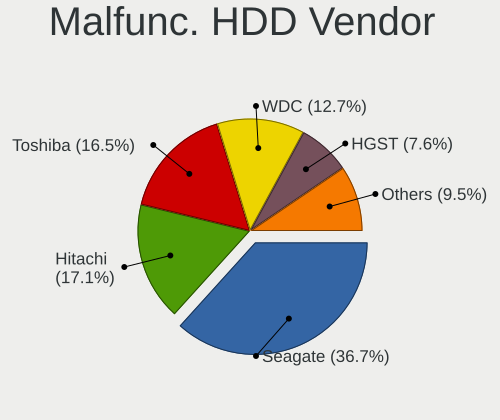

| Vendor              | Notebooks | Drives | Percent |
|---------------------|-----------|--------|---------|
| Seagate             | 58        | 62     | 36.71%  |
| Hitachi             | 27        | 30     | 17.09%  |
| Toshiba             | 26        | 32     | 16.46%  |
| WDC                 | 20        | 24     | 12.66%  |
| HGST                | 12        | 14     | 7.59%   |
| Fujitsu             | 8         | 9      | 5.06%   |
| Samsung Electronics | 6         | 6      | 3.8%    |
| JMicron Technology  | 1         | 1      | 0.63%   |

Malfunc. Drive Kind
-------------------

Kinds of faulty drives

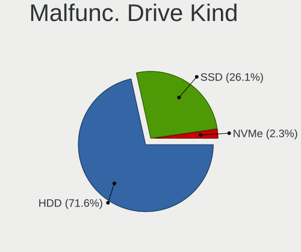

| Kind | Notebooks | Drives | Percent |
|------|-----------|--------|---------|
| HDD  | 156       | 178    | 71.56%  |
| SSD  | 57        | 67     | 26.15%  |
| NVMe | 5         | 5      | 2.29%   |

Failed Drives
-------------

Failed drive models

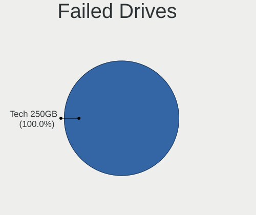

| Model                         | Notebooks | Drives | Percent |
|-------------------------------|-----------|--------|---------|
| JMicron Technology Tech 250GB | 1         | 1      | 100%    |

Failed Drive Vendor
-------------------

Failed drive vendors

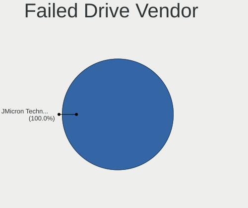

| Vendor             | Notebooks | Drives | Percent |
|--------------------|-----------|--------|---------|
| JMicron Technology | 1         | 1      | 100%    |

Drive Status
------------

Number of failed and malfunc. drives

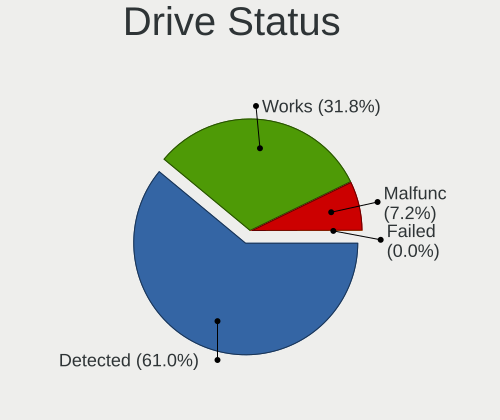

| Status   | Notebooks | Drives | Percent |
|----------|-----------|--------|---------|
| Detected | 1831      | 2670   | 61.01%  |
| Works    | 954       | 1251   | 31.79%  |
| Malfunc  | 215       | 250    | 7.16%   |
| Failed   | 1         | 1      | 0.03%   |

Storage controller
------------------

Storage Vendor
--------------

Storage controller vendors

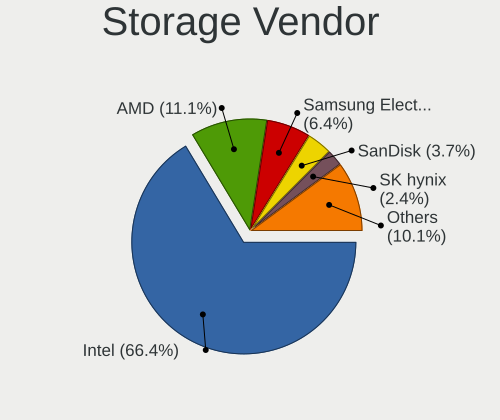

| Vendor                                  | Notebooks | Percent |
|-----------------------------------------|-----------|---------|
| Intel                                   | 2043      | 66.37%  |
| AMD                                     | 341       | 11.08%  |
| Samsung Electronics                     | 196       | 6.37%   |
| SanDisk                                 | 113       | 3.67%   |
| SK hynix                                | 73        | 2.37%   |
| Nvidia                                  | 42        | 1.36%   |
| Silicon Integrated Systems [SiS]        | 36        | 1.17%   |
| Kingston Technology Company             | 31        | 1.01%   |
| Toshiba America Info Systems            | 30        | 0.97%   |
| Micron Technology                       | 30        | 0.97%   |
| KIOXIA                                  | 30        | 0.97%   |
| Phison Electronics                      | 22        | 0.71%   |
| VIA Technologies                        | 13        | 0.42%   |
| Silicon Motion                          | 11        | 0.36%   |
| Micron/Crucial Technology               | 9         | 0.29%   |
| Realtek Semiconductor                   | 6         | 0.19%   |
| MAXIO Technology (Hangzhou)             | 6         | 0.19%   |
| Apple                                   | 6         | 0.19%   |
| Union Memory (Shenzhen)                 | 5         | 0.16%   |
| Lenovo                                  | 5         | 0.16%   |
| ADATA Technology                        | 5         | 0.16%   |
| ULi Electronics                         | 4         | 0.13%   |
| JMicron Technology                      | 4         | 0.13%   |
| Silicon Image                           | 3         | 0.1%    |
| Seagate Technology                      | 2         | 0.06%   |
| Marvell Technology Group                | 2         | 0.06%   |
| Lite-On Technology                      | 2         | 0.06%   |
| Transcend                               | 1         | 0.03%   |
| Solidigm                                | 1         | 0.03%   |
| Shenzhen Unionmemory Information System | 1         | 0.03%   |
| Shenzhen Longsys Electronics            | 1         | 0.03%   |
| Netac Technology                        | 1         | 0.03%   |
| INNOGRIT                                | 1         | 0.03%   |
| Hosin Global Electronics                | 1         | 0.03%   |
| Biwin Storage Technology                | 1         | 0.03%   |

Storage Model
-------------

Storage controller models

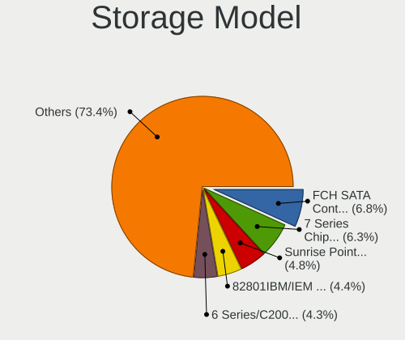

| Model                                                                            | Notebooks | Percent |
|----------------------------------------------------------------------------------|-----------|---------|
| AMD FCH SATA Controller [AHCI mode]                                              | 237       | 6.8%    |
| Intel 7 Series Chipset Family 6-port SATA Controller [AHCI mode]                 | 221       | 6.34%   |
| Intel Sunrise Point-LP SATA Controller [AHCI mode]                               | 167       | 4.79%   |
| Intel 82801IBM/IEM (ICH9M/ICH9M-E) 4 port SATA Controller [AHCI mode]            | 153       | 4.39%   |
| Intel 6 Series/C200 Series Chipset Family 6 port Mobile SATA AHCI Controller     | 149       | 4.27%   |
| Intel 82801HM/HEM (ICH8M/ICH8M-E) IDE Controller                                 | 142       | 4.07%   |
| Intel 82801 Mobile SATA Controller [RAID mode]                                   | 124       | 3.56%   |
| Intel 82801HM/HEM (ICH8M/ICH8M-E) SATA Controller [AHCI mode]                    | 119       | 3.41%   |
| Intel 5 Series/3400 Series Chipset 4 port SATA AHCI Controller                   | 97        | 2.78%   |
| Intel 8 Series SATA Controller 1 [AHCI mode]                                     | 94        | 2.7%    |
| Samsung NVMe SSD Controller SM981/PM981/PM983                                    | 92        | 2.64%   |
| Intel 82801G (ICH7 Family) IDE Controller                                        | 62        | 1.78%   |
| Intel 8 Series/C220 Series Chipset Family 6-port SATA Controller 1 [AHCI mode]   | 62        | 1.78%   |
| Intel Wildcat Point-LP SATA Controller [AHCI Mode]                               | 60        | 1.72%   |
| Intel NM10/ICH7 Family SATA Controller [AHCI mode]                               | 58        | 1.66%   |
| Intel 82801GBM/GHM (ICH7-M Family) SATA Controller [IDE mode]                    | 58        | 1.66%   |
| Intel 82801GBM/GHM (ICH7-M Family) SATA Controller [AHCI mode]                   | 58        | 1.66%   |
| Intel Volume Management Device NVMe RAID Controller                              | 56        | 1.61%   |
| Intel 5 Series/3400 Series Chipset 6 port SATA AHCI Controller                   | 53        | 1.52%   |
| AMD SB7x0/SB8x0/SB9x0 SATA Controller [AHCI mode]                                | 49        | 1.41%   |
| Intel Cannon Lake Mobile PCH SATA AHCI Controller                                | 48        | 1.38%   |
| Samsung NVMe SSD Controller 980 (DRAM-less)                                      | 46        | 1.32%   |
| Intel Celeron/Pentium Silver Processor SATA Controller                           | 46        | 1.32%   |
| Intel Atom Processor E3800 Series SATA AHCI Controller                           | 45        | 1.29%   |
| Intel Atom/Celeron/Pentium Processor x5-E8000/J3xxx/N3xxx Series SATA Controller | 37        | 1.06%   |
| Intel 82801HM/HEM (ICH8M/ICH8M-E) SATA Controller [IDE mode]                     | 34        | 0.98%   |
| Silicon Integrated Systems [SiS] 5513 IDE Controller                             | 31        | 0.89%   |
| Intel HM170/QM170 Chipset SATA Controller [AHCI Mode]                            | 29        | 0.83%   |
| SanDisk Extreme Pro / WD Black SN750 / PC SN730 / Red SN700 NVMe SSD             | 26        | 0.75%   |
| Intel 82801IBM/IEM (ICH9M/ICH9M-E) 2 port SATA Controller [IDE mode]             | 26        | 0.75%   |
| SK hynix Gold P31/BC711/PC711 NVMe Solid State Drive                             | 24        | 0.69%   |
| Intel Tiger Lake-LP SATA Controller                                              | 23        | 0.66%   |
| Silicon Integrated Systems [SiS] SATA Controller / IDE mode                      | 22        | 0.63%   |
| Intel Comet Lake SATA AHCI Controller                                            | 22        | 0.63%   |
| AMD IXP SB4x0 IDE Controller                                                     | 22        | 0.63%   |
| AMD SB600 Non-Raid-5 SATA                                                        | 21        | 0.6%    |
| AMD SB600 IDE                                                                    | 21        | 0.6%    |
| SanDisk Ultra 3D / WD PC SN530, IX SN530, Blue SN550 NVMe SSD (DRAM-less)        | 20        | 0.57%   |
| Samsung NVMe SSD Controller SM961/PM961/SM963                                    | 20        | 0.57%   |
| KIOXIA NVMe SSD Controller BG4 (DRAM-less)                                       | 20        | 0.57%   |

Storage Kind
------------

Kind of storage controller (IDE, SATA, NVMe, SAS, ...)

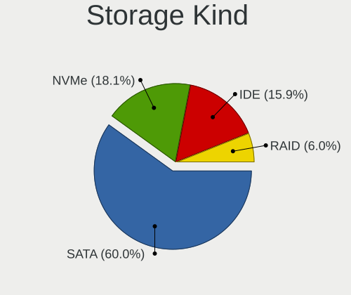

| Kind | Notebooks | Percent |
|------|-----------|---------|
| SATA | 1987      | 59.96%  |
| NVMe | 599       | 18.07%  |
| IDE  | 528       | 15.93%  |
| RAID | 200       | 6.04%   |

Processor
---------

CPU Vendor
----------

Processor vendors

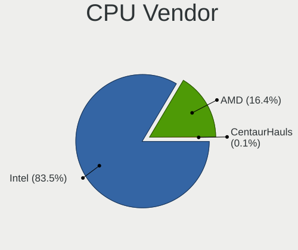

| Vendor       | Notebooks | Percent |
|--------------|-----------|---------|
| Intel        | 2394      | 83.53%  |
| AMD          | 470       | 16.4%   |
| CentaurHauls | 2         | 0.07%   |

CPU Model
---------

Processor models

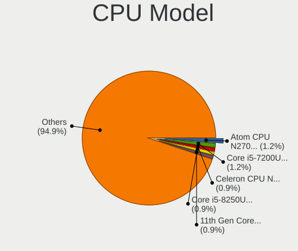

| Model                                   | Notebooks | Percent |
|-----------------------------------------|-----------|---------|
| Intel Atom CPU N270 @ 1.60GHz           | 34        | 1.19%   |
| Intel Core i5-7200U CPU @ 2.50GHz       | 33        | 1.15%   |
| Intel Celeron CPU N2840 @ 2.16GHz       | 27        | 0.94%   |
| Intel Core i5-8250U CPU @ 1.60GHz       | 26        | 0.91%   |
| Intel 11th Gen Core i7-1165G7 @ 2.80GHz | 26        | 0.91%   |
| Intel Core i7-8550U CPU @ 1.80GHz       | 25        | 0.87%   |
| Intel Core i5-6300U CPU @ 2.40GHz       | 25        | 0.87%   |
| Intel Core i5-3320M CPU @ 2.60GHz       | 25        | 0.87%   |
| Intel Celeron CPU N3060 @ 1.60GHz       | 25        | 0.87%   |
| Intel Core i5-2520M CPU @ 2.50GHz       | 23        | 0.8%    |
| Intel Core i3 CPU M 370 @ 2.40GHz       | 23        | 0.8%    |
| Intel Core 2 Duo CPU P8600 @ 2.40GHz    | 23        | 0.8%    |
| Intel Atom CPU N450 @ 1.66GHz           | 23        | 0.8%    |
| Intel Core i5-6200U CPU @ 2.30GHz       | 22        | 0.77%   |
| Intel Core i7-2670QM CPU @ 2.20GHz      | 20        | 0.7%    |
| Intel Core i7-9750H CPU @ 2.60GHz       | 19        | 0.66%   |
| Intel Core i5-4210U CPU @ 1.70GHz       | 19        | 0.66%   |
| Intel Core i5-1035G1 CPU @ 1.00GHz      | 19        | 0.66%   |
| Intel Core i5 CPU M 520 @ 2.40GHz       | 19        | 0.66%   |
| Intel Core 2 Duo CPU P8400 @ 2.26GHz    | 19        | 0.66%   |
| Intel Celeron CPU N3350 @ 1.10GHz       | 19        | 0.66%   |
| Intel Core i5-10210U CPU @ 1.60GHz      | 18        | 0.63%   |
| Intel Core 2 Duo CPU T7500 @ 2.20GHz    | 18        | 0.63%   |
| Intel Core i7-8750H CPU @ 2.20GHz       | 17        | 0.59%   |
| Intel Core i7-10510U CPU @ 1.80GHz      | 17        | 0.59%   |
| Intel Celeron N4020 CPU @ 1.10GHz       | 17        | 0.59%   |
| Intel Celeron CPU N3050 @ 1.60GHz       | 17        | 0.59%   |
| Intel 11th Gen Core i5-1135G7 @ 2.40GHz | 17        | 0.59%   |
| Intel Core i7-8565U CPU @ 1.80GHz       | 16        | 0.56%   |
| Intel Core i7-7700HQ CPU @ 2.80GHz      | 16        | 0.56%   |
| Intel Core i5-4200U CPU @ 1.60GHz       | 16        | 0.56%   |
| Intel Core i3-6006U CPU @ 2.00GHz       | 16        | 0.56%   |
| Intel Pentium M processor 1.73GHz       | 15        | 0.52%   |
| Intel Pentium Dual CPU T3400 @ 2.16GHz  | 15        | 0.52%   |
| Intel Core i7-3630QM CPU @ 2.40GHz      | 15        | 0.52%   |
| Intel Core i7-10750H CPU @ 2.60GHz      | 15        | 0.52%   |
| Intel Core i5-2450M CPU @ 2.50GHz       | 15        | 0.52%   |
| Intel Core i5-2410M CPU @ 2.30GHz       | 15        | 0.52%   |
| Intel Core i3-3110M CPU @ 2.40GHz       | 15        | 0.52%   |
| Intel Core i3 CPU M 330 @ 2.13GHz       | 15        | 0.52%   |

CPU Model Family
----------------

Processor model prefix

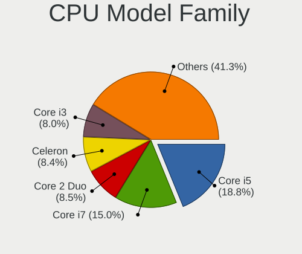

| Model                   | Notebooks | Percent |
|-------------------------|-----------|---------|
| Intel Core i5           | 540       | 18.82%  |
| Intel Core i7           | 429       | 14.95%  |
| Intel Core 2 Duo        | 243       | 8.47%   |
| Intel Celeron           | 242       | 8.43%   |
| Intel Core i3           | 230       | 8.02%   |
| Intel Atom              | 164       | 5.72%   |
| Other                   | 150       | 5.23%   |
| Intel Pentium           | 89        | 3.1%    |
| AMD Ryzen 5             | 71        | 2.47%   |
| Intel Genuine           | 56        | 1.95%   |
| AMD Ryzen 7             | 54        | 1.88%   |
| Intel Pentium Dual      | 51        | 1.78%   |
| Intel Pentium Dual-Core | 48        | 1.67%   |
| Intel Core 2            | 36        | 1.25%   |
| AMD A8                  | 34        | 1.19%   |
| Intel Pentium M         | 31        | 1.08%   |
| AMD E1                  | 29        | 1.01%   |
| AMD A6                  | 29        | 1.01%   |
| Intel Celeron M         | 26        | 0.91%   |
| AMD A4                  | 23        | 0.8%    |
| AMD Turion 64 X2 Mobile | 22        | 0.77%   |
| AMD Ryzen 7 PRO         | 21        | 0.73%   |
| AMD E                   | 18        | 0.63%   |
| AMD E2                  | 16        | 0.56%   |
| AMD Ryzen 3             | 15        | 0.52%   |
| Intel Pentium Silver    | 11        | 0.38%   |
| AMD Turion 64 Mobile    | 11        | 0.38%   |
| AMD Athlon              | 11        | 0.38%   |
| Intel Core i9           | 10        | 0.35%   |
| Intel Celeron Dual-Core | 9         | 0.31%   |
| AMD Ryzen 9             | 9         | 0.31%   |
| AMD Ryzen 5 PRO         | 9         | 0.31%   |
| AMD A10                 | 9         | 0.31%   |
| Intel Pentium 4         | 8         | 0.28%   |
| Intel Core              | 8         | 0.28%   |
| AMD Mobile Sempron      | 8         | 0.28%   |
| Intel Core m3           | 7         | 0.24%   |
| Intel Core Duo          | 7         | 0.24%   |
| AMD C-60                | 7         | 0.24%   |
| AMD Athlon 64 X2        | 7         | 0.24%   |

CPU Cores
---------

Number of processor cores

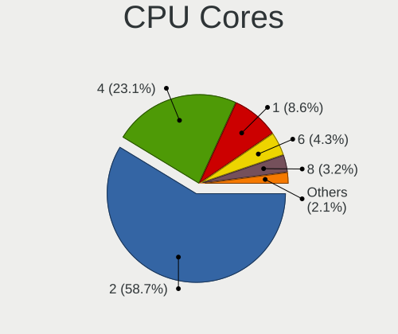

| Number | Notebooks | Percent |
|--------|-----------|---------|
| 2      | 1684      | 58.7%   |
| 4      | 663       | 23.11%  |
| 1      | 248       | 8.64%   |
| 6      | 124       | 4.32%   |
| 8      | 91        | 3.17%   |
| 10     | 22        | 0.77%   |
| 14     | 13        | 0.45%   |
| 12     | 12        | 0.42%   |
| 16     | 6         | 0.21%   |
| 24     | 4         | 0.14%   |
| 5      | 1         | 0.03%   |
| 3      | 1         | 0.03%   |

CPU Sockets
-----------

Number of sockets

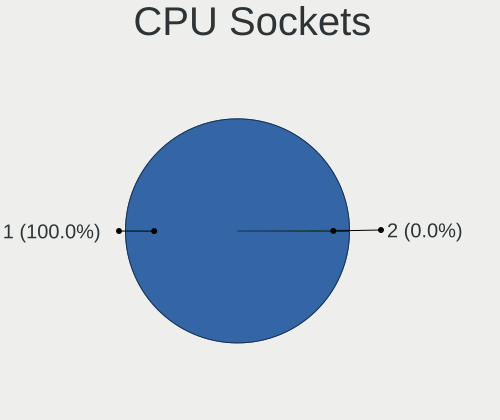

| Number | Notebooks | Percent |
|--------|-----------|---------|
| 1      | 2865      | 99.97%  |
| 2      | 1         | 0.03%   |

CPU Threads
-----------

Threads per core (Hyper-Threading)

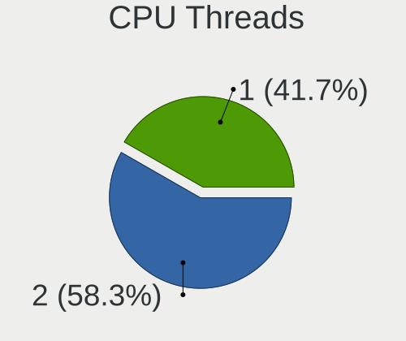

| Number | Notebooks | Percent |
|--------|-----------|---------|
| 2      | 1671      | 58.28%  |
| 1      | 1196      | 41.72%  |

CPU Op-Modes
------------

CPU Operation Modes (32-bit, 64-bit)

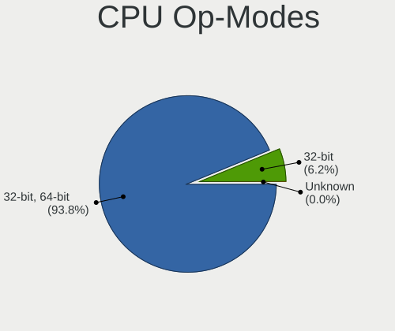

| Op mode        | Notebooks | Percent |
|----------------|-----------|---------|
| 32-bit, 64-bit | 2689      | 93.79%  |
| 32-bit         | 177       | 6.17%   |
| Unknown        | 1         | 0.03%   |

CPU Microcode
-------------

Microcode number

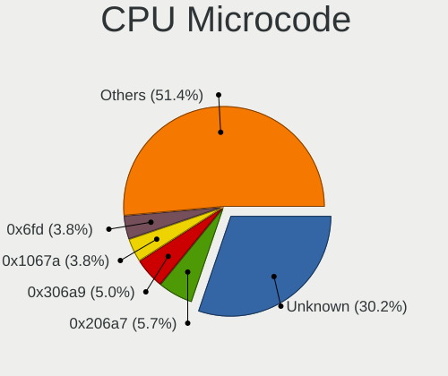

| Number     | Notebooks | Percent |
|------------|-----------|---------|
| Unknown    | 888       | 30.21%  |
| 0x206a7    | 168       | 5.72%   |
| 0x306a9    | 147       | 5%      |
| 0x1067a    | 113       | 3.84%   |
| 0x6fd      | 112       | 3.81%   |
| 0x20655    | 80        | 2.72%   |
| 0x40651    | 72        | 2.45%   |
| 0x406e3    | 60        | 2.04%   |
| 0x10676    | 52        | 1.77%   |
| 0x106ca    | 48        | 1.63%   |
| 0x806ec    | 47        | 1.6%    |
| 0x806ea    | 47        | 1.6%    |
| 0x30678    | 47        | 1.6%    |
| 0x106c2    | 46        | 1.57%   |
| 0x306c3    | 45        | 1.53%   |
| 0x806c1    | 43        | 1.46%   |
| 0x406c4    | 43        | 1.46%   |
| 0x306d4    | 42        | 1.43%   |
| 0x20652    | 42        | 1.43%   |
| 0x806e9    | 39        | 1.33%   |
| 0x906ea    | 36        | 1.22%   |
| 0x6d8      | 36        | 1.22%   |
| 0x6e8      | 35        | 1.19%   |
| 0x6f6      | 31        | 1.05%   |
| 0x05000119 | 30        | 1.02%   |
| 0x406c3    | 28        | 0.95%   |
| 0xa0652    | 26        | 0.88%   |
| 0x07030105 | 26        | 0.88%   |
| 0x6fb      | 24        | 0.82%   |
| 0x6ec      | 24        | 0.82%   |
| 0x0700010f | 20        | 0.68%   |
| 0x706a1    | 19        | 0.65%   |
| 0x10661    | 18        | 0.61%   |
| 0x08108109 | 18        | 0.61%   |
| 0x08108102 | 18        | 0.61%   |
| 0x906e9    | 17        | 0.58%   |
| 0x08608103 | 17        | 0.58%   |
| 0x03000027 | 16        | 0.54%   |
| 0x706e5    | 15        | 0.51%   |
| 0x706a8    | 15        | 0.51%   |

CPU Microarch
-------------

Microarchitecture

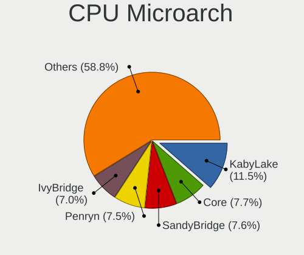

| Name              | Notebooks | Percent |
|-------------------|-----------|---------|
| KabyLake          | 329       | 11.45%  |
| Core              | 220       | 7.66%   |
| SandyBridge       | 218       | 7.59%   |
| Penryn            | 216       | 7.52%   |
| IvyBridge         | 200       | 6.96%   |
| Haswell           | 169       | 5.88%   |
| Westmere          | 162       | 5.64%   |
| Silvermont        | 162       | 5.64%   |
| Bonnell           | 121       | 4.21%   |
| Skylake           | 110       | 3.83%   |
| P6                | 103       | 3.59%   |
| Unknown           | 84        | 2.92%   |
| TigerLake         | 70        | 2.44%   |
| Broadwell         | 66        | 2.3%    |
| K8 Hammer         | 55        | 1.91%   |
| Goldmont plus     | 51        | 1.78%   |
| Bobcat            | 47        | 1.64%   |
| Zen+              | 45        | 1.57%   |
| CometLake         | 43        | 1.5%    |
| Puma              | 40        | 1.39%   |
| IceLake           | 38        | 1.32%   |
| Excavator         | 38        | 1.32%   |
| Alderlake Hybrid  | 38        | 1.32%   |
| Zen 2             | 37        | 1.29%   |
| Zen 3             | 36        | 1.25%   |
| Goldmont          | 26        | 0.9%    |
| Jaguar            | 25        | 0.87%   |
| Zen               | 19        | 0.66%   |
| K10 Llano         | 19        | 0.66%   |
| K10               | 17        | 0.59%   |
| Piledriver        | 15        | 0.52%   |
| K8 & K10 hybrid   | 13        | 0.45%   |
| NetBurst          | 11        | 0.38%   |
| Tremont           | 8         | 0.28%   |
| Steamroller       | 7         | 0.24%   |
| Nehalem           | 7         | 0.24%   |
| Meteorlake Hybrid | 4         | 0.14%   |
| Lunarlake Hybrid  | 2         | 0.07%   |
| K6                | 2         | 0.07%   |

Graphics
--------

GPU Vendor
----------

Vendors of graphics cards

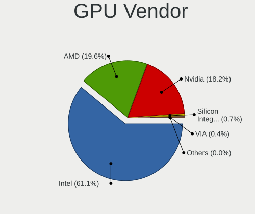

| Vendor                           | Notebooks | Percent |
|----------------------------------|-----------|---------|
| Intel                            | 2059      | 61.06%  |
| AMD                              | 660       | 19.57%  |
| Nvidia                           | 615       | 18.24%  |
| Silicon Integrated Systems [SiS] | 25        | 0.74%   |
| VIA Technologies                 | 12        | 0.36%   |
| S3 Graphics                      | 1         | 0.03%   |

GPU Model
---------

Graphics card models

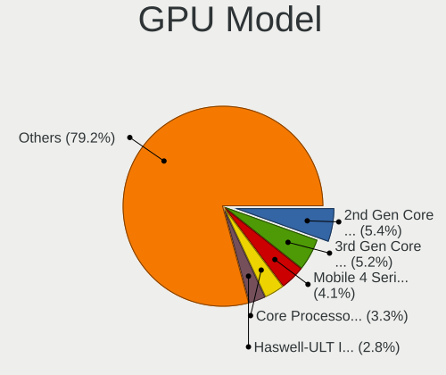

| Model                                                                                    | Notebooks | Percent |
|------------------------------------------------------------------------------------------|-----------|---------|
| Intel 2nd Generation Core Processor Family Integrated Graphics Controller                | 196       | 5.44%   |
| Intel 3rd Gen Core processor Graphics Controller                                         | 188       | 5.22%   |
| Intel Mobile 4 Series Chipset Integrated Graphics Controller                             | 147       | 4.08%   |
| Intel Core Processor Integrated Graphics Controller                                      | 119       | 3.31%   |
| Intel Haswell-ULT Integrated Graphics Controller                                         | 99        | 2.75%   |
| Intel Mobile 945GM/GMS/GME, 943/940GML Express Integrated Graphics Controller            | 98        | 2.72%   |
| Intel Mobile GM965/GL960 Integrated Graphics Controller (secondary)                      | 94        | 2.61%   |
| Intel Mobile GM965/GL960 Integrated Graphics Controller (primary)                        | 94        | 2.61%   |
| Intel Atom/Celeron/Pentium Processor x5-E8000/J3xxx/N3xxx Integrated Graphics Controller | 90        | 2.5%    |
| Intel Skylake-U GT2 [HD Graphics 520]                                                    | 74        | 2.06%   |
| Intel Atom Processor Z36xxx/Z37xxx Series Graphics & Display                             | 72        | 2%      |
| Intel Kaby Lake-R GT2 [UHD Graphics 620]                                                 | 69        | 1.92%   |
| Intel Kaby Lake-U GT2 [HD Graphics 620]                                                  | 65        | 1.81%   |
| Intel Mobile 945GM/GMS, 943/940GML Express Integrated Graphics Controller                | 61        | 1.69%   |
| Intel 4th Gen Core Processor Integrated Graphics Controller                              | 60        | 1.67%   |
| Intel TigerLake-LP GT2 [Iris Xe Graphics]                                                | 59        | 1.64%   |
| Intel CoffeeLake-H GT2 [UHD Graphics 630]                                                | 54        | 1.5%    |
| Intel Broadwell-U GT2 [HD Graphics 5500]                                                 | 54        | 1.5%    |
| Intel Atom Processor D4xx/D5xx/N4xx/N5xx Integrated Graphics Controller                  | 53        | 1.47%   |
| AMD Picasso/Raven 2 [Radeon Vega Series / Radeon Vega Mobile Series]                     | 46        | 1.28%   |
| Intel GeminiLake [UHD Graphics 600]                                                      | 42        | 1.17%   |
| Intel CometLake-U GT2 [UHD Graphics]                                                     | 41        | 1.14%   |
| Intel WhiskeyLake-U GT2 [UHD Graphics 620]                                               | 38        | 1.06%   |
| Intel Mobile 945GSE Express Integrated Graphics Controller                               | 37        | 1.03%   |
| AMD Renoir [Radeon Vega Series / Radeon Vega Mobile Series]                              | 37        | 1.03%   |
| Intel CometLake-H GT2 [UHD Graphics]                                                     | 34        | 0.94%   |
| Nvidia TU117M [GeForce GTX 1650 Mobile / Max-Q]                                          | 31        | 0.86%   |
| Nvidia GF117M [GeForce 610M/710M/810M/820M / GT 620M/625M/630M/720M]                     | 29        | 0.81%   |
| AMD Stoney [Radeon R2/R3/R4/R5 Graphics]                                                 | 27        | 0.75%   |
| AMD Mullins [Radeon R4/R5 Graphics]                                                      | 25        | 0.69%   |
| Intel Apollo Lake GT1 [HD Graphics 500]                                                  | 24        | 0.67%   |
| AMD Lucienne                                                                             | 24        | 0.67%   |
| Intel Kaby Lake-H GT2 [HD Graphics 630]                                                  | 22        | 0.61%   |
| Intel Iris Plus Graphics G1 (Ice Lake)                                                   | 22        | 0.61%   |
| AMD Cezanne [Radeon Vega Series / Radeon Vega Mobile Series]                             | 22        | 0.61%   |
| Nvidia GP107M [GeForce GTX 1050 Mobile]                                                  | 21        | 0.58%   |
| AMD Seymour [Radeon HD 6400M/7400M Series]                                               | 20        | 0.56%   |
| AMD Park [Mobility Radeon HD 5430/5450/5470]                                             | 20        | 0.56%   |
| Silicon Integrated Systems [SiS] 771/671 PCIE VGA Display Adapter                        | 19        | 0.53%   |
| AMD Topaz XT [Radeon R7 M260/M265 / M340/M360 / M440/M445 / 530/535 / 620/625 Mobile]    | 19        | 0.53%   |

GPU Combo
---------

Combinations of graphics cards

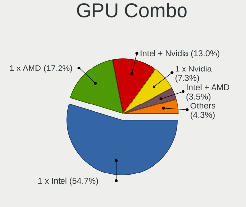

| Name            | Notebooks | Percent |
|-----------------|-----------|---------|
| 1 x Intel       | 1568      | 54.69%  |
| 1 x AMD         | 494       | 17.23%  |
| Intel + Nvidia  | 374       | 13.04%  |
| 1 x Nvidia      | 209       | 7.29%   |
| Intel + AMD     | 99        | 3.45%   |
| 2 x AMD         | 34        | 1.19%   |
| AMD + Nvidia    | 33        | 1.15%   |
| 1 x SiS         | 25        | 0.87%   |
| 1 x VIA         | 12        | 0.42%   |
| Other           | 10        | 0.35%   |
| 2 x Intel       | 7         | 0.24%   |
| 2 x Nvidia      | 1         | 0.03%   |
| 1 x S3 Graphics | 1         | 0.03%   |

GPU Driver
----------

Free vs proprietary

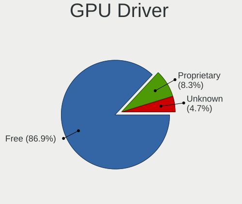

| Driver      | Notebooks | Percent |
|-------------|-----------|---------|
| Free        | 2511      | 86.95%  |
| Proprietary | 240       | 8.31%   |
| Unknown     | 137       | 4.74%   |

GPU Memory
----------

Total video memory

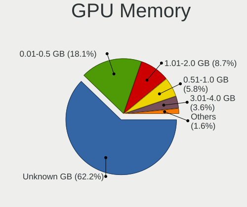

| Size in GB | Notebooks | Percent |
|------------|-----------|---------|
| Unknown    | 1809      | 62.23%  |
| 0.01-0.5   | 525       | 18.06%  |
| 1.01-2.0   | 254       | 8.74%   |
| 0.51-1.0   | 168       | 5.78%   |
| 3.01-4.0   | 104       | 3.58%   |
| 5.01-6.0   | 25        | 0.86%   |
| 7.01-8.0   | 14        | 0.48%   |
| 2.01-3.0   | 5         | 0.17%   |
| 8.01-16.0  | 3         | 0.1%    |

Monitor
-------

Monitor Vendor
--------------

Monitor vendors

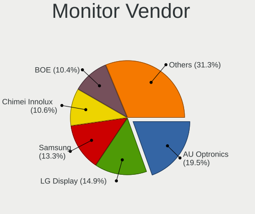

| Vendor                  | Notebooks | Percent |
|-------------------------|-----------|---------|
| AU Optronics            | 593       | 19.53%  |
| LG Display              | 451       | 14.86%  |
| Samsung Electronics     | 405       | 13.34%  |
| Chimei Innolux          | 322       | 10.61%  |
| BOE                     | 316       | 10.41%  |
| Chi Mei Optoelectronics | 111       | 3.66%   |
| Lenovo                  | 92        | 3.03%   |
| LG Philips              | 76        | 2.5%    |
| Dell                    | 63        | 2.08%   |
| Apple                   | 63        | 2.08%   |
| Goldstar                | 44        | 1.45%   |
| HannStar                | 39        | 1.28%   |
| Sharp                   | 37        | 1.22%   |
| InfoVision              | 35        | 1.15%   |
| Acer                    | 30        | 0.99%   |
| Hewlett-Packard         | 25        | 0.82%   |
| CPT                     | 24        | 0.79%   |
| PANDA                   | 23        | 0.76%   |
| BenQ                    | 21        | 0.69%   |
| Philips                 | 20        | 0.66%   |
| Sony                    | 17        | 0.56%   |
| Ancor Communications    | 16        | 0.53%   |
| Toshiba                 | 13        | 0.43%   |
| ViewSonic               | 12        | 0.4%    |
| Iiyama                  | 12        | 0.4%    |
| Quanta Display          | 11        | 0.36%   |
| CSO                     | 11        | 0.36%   |
| AOC                     | 9         | 0.3%    |
| Seiko/Epson             | 7         | 0.23%   |
| KDC                     | 7         | 0.23%   |
| InnoLux Display         | 7         | 0.23%   |
| Fujitsu Siemens         | 6         | 0.2%    |
| Vizio                   | 5         | 0.16%   |
| Panasonic               | 5         | 0.16%   |
| Nvidia                  | 5         | 0.16%   |
| LPL                     | 5         | 0.16%   |
| IBM                     | 5         | 0.16%   |
| NEC Computers           | 4         | 0.13%   |
| LGD                     | 4         | 0.13%   |
| Unknown                 | 3         | 0.1%    |

Monitor Model
-------------

Monitor models

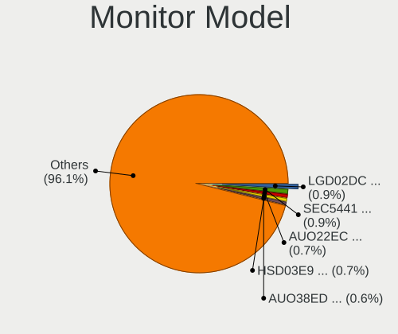

| Model                                                                     | Notebooks | Percent |
|---------------------------------------------------------------------------|-----------|---------|
| LG Display LCD Monitor LGD02DC 1366x768 344x194mm 15.5-inch               | 29        | 0.95%   |
| Samsung Electronics LCD Monitor SEC5441 1280x800 331x207mm 15.4-inch      | 28        | 0.91%   |
| AU Optronics LCD Monitor AUO22EC 1366x768 344x193mm 15.5-inch             | 22        | 0.72%   |
| HannStar LCD Monitor HSD03E9 1024x600 220x129mm 10.0-inch                 | 21        | 0.68%   |
| AU Optronics LCD Monitor AUO38ED 1920x1080 344x193mm 15.5-inch            | 19        | 0.62%   |
| Chi Mei Optoelectronics LCD Monitor CMO15A7 1366x768 344x193mm 15.5-inch  | 18        | 0.59%   |
| Chimei Innolux LCD Monitor CMN14D4 1920x1080 309x173mm 13.9-inch          | 17        | 0.55%   |
| AU Optronics LCD Monitor AUO21ED 1920x1080 344x193mm 15.5-inch            | 16        | 0.52%   |
| AU Optronics LCD Monitor AUO26EC 1366x768 344x193mm 15.5-inch             | 15        | 0.49%   |
| AU Optronics LCD Monitor AUO8174 1280x800 331x207mm 15.4-inch             | 14        | 0.46%   |
| AU Optronics LCD Monitor AUO235C 1366x768 256x144mm 11.6-inch             | 13        | 0.42%   |
| Chimei Innolux LCD Monitor CMN15E7 1920x1080 344x193mm 15.5-inch          | 12        | 0.39%   |
| LG Display LCD Monitor LGD0563 1920x1080 344x194mm 15.5-inch              | 11        | 0.36%   |
| BOE LCD Monitor BOE0687 1920x1080 344x193mm 15.5-inch                     | 11        | 0.36%   |
| AU Optronics LCD Monitor AUO21EC 1366x768 344x193mm 15.5-inch             | 11        | 0.36%   |
| AU Optronics LCD Monitor AUO106C 1366x768 276x155mm 12.5-inch             | 11        | 0.36%   |
| LG Display LCD Monitor LGD033A 1366x768 344x194mm 15.5-inch               | 10        | 0.33%   |
| Chimei Innolux LCD Monitor CMN15F5 1920x1080 344x193mm 15.5-inch          | 10        | 0.33%   |
| Chimei Innolux LCD Monitor CMN15DB 1366x768 344x193mm 15.5-inch           | 10        | 0.33%   |
| Chimei Innolux LCD Monitor CMN14C9 1920x1080 309x173mm 13.9-inch          | 10        | 0.33%   |
| Chi Mei Optoelectronics LCD Monitor CMO1526 1280x800 331x207mm 15.4-inch  | 10        | 0.33%   |
| PANDA LCD Monitor NCP004D 1920x1080 344x194mm 15.5-inch                   | 9         | 0.29%   |
| HannStar HSD121PHW1 HSD04B6 1366x768 270x150mm 12.2-inch                  | 9         | 0.29%   |
| AU Optronics LCD Monitor AUO61D2 1024x600 222x125mm 10.0-inch             | 9         | 0.29%   |
| AU Optronics LCD Monitor AUO45EC 1366x768 344x193mm 15.5-inch             | 9         | 0.29%   |
| AU Optronics LCD Monitor AUO403D 1920x1080 309x174mm 14.0-inch            | 9         | 0.29%   |
| AU Optronics LCD Monitor AUO213E 1600x900 309x174mm 14.0-inch             | 9         | 0.29%   |
| AU Optronics LCD Monitor AUO139E 1600x900 382x214mm 17.2-inch             | 9         | 0.29%   |
| AU Optronics LCD Monitor AUO10EC 1366x768 344x193mm 15.5-inch             | 9         | 0.29%   |
| Samsung Electronics LCD Monitor SEC4251 1366x768 344x194mm 15.5-inch      | 8         | 0.26%   |
| Samsung Electronics LCD Monitor SEC3345 1280x800 331x207mm 15.4-inch      | 8         | 0.26%   |
| Samsung Electronics LCD Monitor SEC325A 1366x768 344x194mm 15.5-inch      | 8         | 0.26%   |
| LG Display LCD Monitor LGD02E3 1366x768 344x194mm 15.5-inch               | 8         | 0.26%   |
| Chimei Innolux LCD Monitor CMN15DC 1366x768 344x193mm 15.5-inch           | 8         | 0.26%   |
| Chi Mei Optoelectronics LCD Monitor CMO1720 1920x1080 382x215mm 17.3-inch | 8         | 0.26%   |
| Chi Mei Optoelectronics LCD Monitor CMO1592 1366x768 344x193mm 15.5-inch  | 8         | 0.26%   |
| BOE LCD Monitor BOE084E 1920x1080 382x215mm 17.3-inch                     | 8         | 0.26%   |
| BOE LCD Monitor BOE06A5 1366x768 344x194mm 15.5-inch                      | 8         | 0.26%   |
| BOE LCD Monitor BOE06A4 1366x768 344x194mm 15.5-inch                      | 8         | 0.26%   |
| AU Optronics LCD Monitor AUO313C 1366x768 309x173mm 13.9-inch             | 8         | 0.26%   |

Monitor Resolution
------------------

Monitor screen resolution

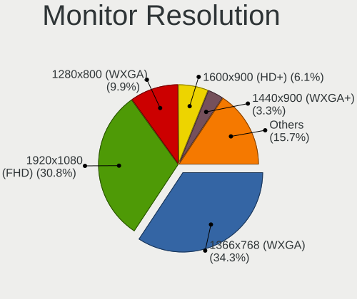

| Resolution         | Notebooks | Percent |
|--------------------|-----------|---------|
| 1366x768 (WXGA)    | 1001      | 34.27%  |
| 1920x1080 (FHD)    | 900       | 30.81%  |
| 1280x800 (WXGA)    | 288       | 9.86%   |
| 1600x900 (HD+)     | 179       | 6.13%   |
| 1440x900 (WXGA+)   | 95        | 3.25%   |
| 1024x600           | 76        | 2.6%    |
| 3840x2160 (4K)     | 69        | 2.36%   |
| 1920x1200 (WUXGA)  | 69        | 2.36%   |
| 1680x1050 (WSXGA+) | 44        | 1.51%   |
| 2560x1440 (QHD)    | 39        | 1.34%   |
| 1280x1024 (SXGA)   | 30        | 1.03%   |
| 1024x768 (XGA)     | 22        | 0.75%   |
| 2560x1600          | 15        | 0.51%   |
| 2880x1800          | 10        | 0.34%   |
| Unknown            | 8         | 0.27%   |
| 1920x540           | 7         | 0.24%   |
| 1360x768           | 7         | 0.24%   |
| 3200x1800 (QHD+)   | 6         | 0.21%   |
| 1400x1050          | 5         | 0.17%   |
| 3840x2400          | 4         | 0.14%   |
| 3840x1080          | 4         | 0.14%   |
| 2288x1287          | 4         | 0.14%   |
| 2160x1440          | 4         | 0.14%   |
| 3440x1440          | 3         | 0.1%    |
| 2560x1080          | 3         | 0.1%    |
| 1600x1200          | 3         | 0.1%    |
| 3000x2000          | 2         | 0.07%   |
| 2304x1440          | 2         | 0.07%   |
| 1920x1280          | 2         | 0.07%   |
| 1280x720 (HD)      | 2         | 0.07%   |
| 3840x1600          | 1         | 0.03%   |
| 3840x1200          | 1         | 0.03%   |
| 3600x1080          | 1         | 0.03%   |
| 3456x2160          | 1         | 0.03%   |
| 3200x2000          | 1         | 0.03%   |
| 3120x1050          | 1         | 0.03%   |
| 3072x1920          | 1         | 0.03%   |
| 2880x1920          | 1         | 0.03%   |
| 2880x1620          | 1         | 0.03%   |
| 2560x1700          | 1         | 0.03%   |

Monitor Diagonal
----------------

Diagonal size in inches

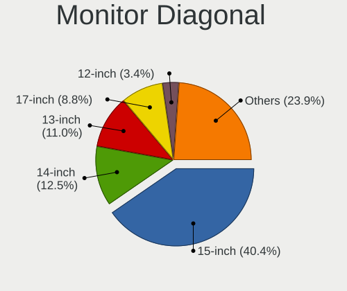

| Inches  | Notebooks | Percent |
|---------|-----------|---------|
| 15      | 1230      | 40.39%  |
| 14      | 380       | 12.48%  |
| 13      | 335       | 11%     |
| 17      | 269       | 8.83%   |
| 12      | 104       | 3.42%   |
| 11      | 92        | 3.02%   |
| 24      | 88        | 2.89%   |
| 10      | 81        | 2.66%   |
| 27      | 75        | 2.46%   |
| 21      | 71        | 2.33%   |
| Unknown | 55        | 1.81%   |
| 23      | 51        | 1.67%   |
| 16      | 35        | 1.15%   |
| 18      | 32        | 1.05%   |
| 19      | 26        | 0.85%   |
| 31      | 22        | 0.72%   |
| 22      | 18        | 0.59%   |
| 54      | 12        | 0.39%   |
| 20      | 9         | 0.3%    |
| 40      | 6         | 0.2%    |
| 84      | 5         | 0.16%   |
| 32      | 5         | 0.16%   |
| 72      | 4         | 0.13%   |
| 34      | 4         | 0.13%   |
| 26      | 4         | 0.13%   |
| 25      | 4         | 0.13%   |
| 8       | 4         | 0.13%   |
| 37      | 3         | 0.1%    |
| 86      | 2         | 0.07%   |
| 63      | 2         | 0.07%   |
| 52      | 2         | 0.07%   |
| 48      | 2         | 0.07%   |
| 46      | 2         | 0.07%   |
| 42      | 2         | 0.07%   |
| 29      | 2         | 0.07%   |
| 142     | 1         | 0.03%   |
| 74      | 1         | 0.03%   |
| 58      | 1         | 0.03%   |
| 57      | 1         | 0.03%   |
| 49      | 1         | 0.03%   |

Monitor Width
-------------

Physical width

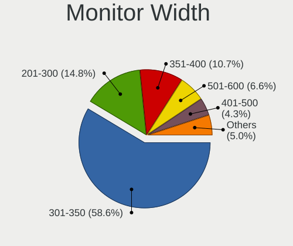

| Width in mm    | Notebooks | Percent |
|----------------|-----------|---------|
| 301-350        | 1770      | 58.59%  |
| 201-300        | 447       | 14.8%   |
| 351-400        | 322       | 10.66%  |
| 501-600        | 199       | 6.59%   |
| 401-500        | 131       | 4.34%   |
| Unknown        | 55        | 1.82%   |
| 601-700        | 35        | 1.16%   |
| 1001-1500      | 26        | 0.86%   |
| 801-900        | 10        | 0.33%   |
| 1501-2000      | 10        | 0.33%   |
| 701-800        | 9         | 0.3%    |
| 101-200        | 4         | 0.13%   |
| 901-1000       | 2         | 0.07%   |
| More than 2000 | 1         | 0.03%   |

Aspect Ratio
------------

Proportional relationship between the width and the height

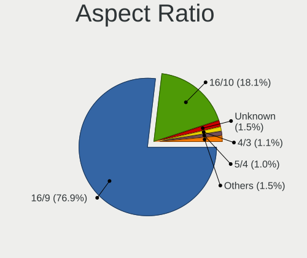

| Ratio   | Notebooks | Percent |
|---------|-----------|---------|
| 16/9    | 2127      | 76.87%  |
| 16/10   | 500       | 18.07%  |
| Unknown | 41        | 1.48%   |
| 4/3     | 30        | 1.08%   |
| 5/4     | 28        | 1.01%   |
| 3/2     | 23        | 0.83%   |
| 21/9    | 5         | 0.18%   |
| 32/9    | 4         | 0.14%   |
| 1.00    | 3         | 0.11%   |
| 6/5     | 2         | 0.07%   |
| 0.56    | 2         | 0.07%   |
| 3.73    | 1         | 0.04%   |
| 0.62    | 1         | 0.04%   |

Monitor Area
------------

Area in inch²

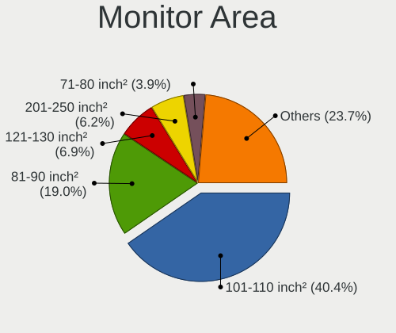

| Area in inch² | Notebooks | Percent |
|----------------|-----------|---------|
| 101-110        | 1228      | 40.39%  |
| 81-90          | 577       | 18.98%  |
| 121-130        | 209       | 6.88%   |
| 201-250        | 187       | 6.15%   |
| 71-80          | 120       | 3.95%   |
| 61-70          | 102       | 3.36%   |
| 51-60          | 92        | 3.03%   |
| 41-50          | 81        | 2.66%   |
| 301-350        | 77        | 2.53%   |
| 151-200        | 59        | 1.94%   |
| Unknown        | 55        | 1.81%   |
| 131-140        | 54        | 1.78%   |
| 141-150        | 36        | 1.18%   |
| 351-500        | 33        | 1.09%   |
| More than 1000 | 32        | 1.05%   |
| 111-120        | 28        | 0.92%   |
| 251-300        | 25        | 0.82%   |
| 91-100         | 24        | 0.79%   |
| 501-1000       | 17        | 0.56%   |
| 1-40           | 4         | 0.13%   |

Pixel Density
-------------

Pixels per inch

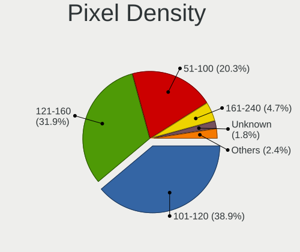

| Density       | Notebooks | Percent |
|---------------|-----------|---------|
| 101-120       | 1158      | 38.9%   |
| 121-160       | 949       | 31.88%  |
| 51-100        | 604       | 20.29%  |
| 161-240       | 139       | 4.67%   |
| Unknown       | 55        | 1.85%   |
| More than 240 | 38        | 1.28%   |
| 1-50          | 34        | 1.14%   |

Multiple Monitors
-----------------

Total monitors connected

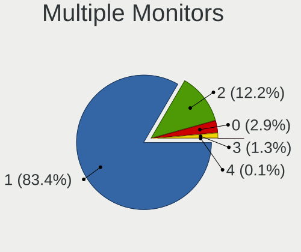

| Total | Notebooks | Percent |
|-------|-----------|---------|
| 1     | 2440      | 83.42%  |
| 2     | 358       | 12.24%  |
| 0     | 86        | 2.94%   |
| 3     | 38        | 1.3%    |
| 4     | 3         | 0.1%    |

Network
-------

Net Controller Vendor
---------------------

Controller vendors

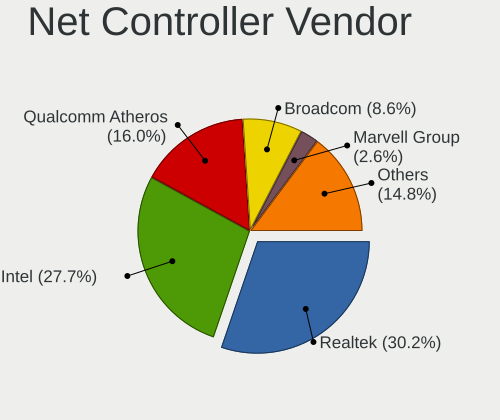

| Vendor                            | Notebooks | Percent |
|-----------------------------------|-----------|---------|
| Realtek Semiconductor             | 1424      | 30.23%  |
| Intel                             | 1306      | 27.73%  |
| Qualcomm Atheros                  | 753       | 15.99%  |
| Broadcom                          | 407       | 8.64%   |
| Marvell Technology Group          | 124       | 2.63%   |
| Broadcom Limited                  | 108       | 2.29%   |
| Ralink                            | 57        | 1.21%   |
| MediaTek                          | 56        | 1.19%   |
| TP-Link                           | 41        | 0.87%   |
| Silicon Integrated Systems [SiS]  | 33        | 0.7%    |
| Nvidia                            | 33        | 0.7%    |
| Ralink Technology                 | 32        | 0.68%   |
| Samsung Electronics               | 30        | 0.64%   |
| Sierra Wireless                   | 25        | 0.53%   |
| JMicron Technology                | 23        | 0.49%   |
| ASIX Electronics                  | 21        | 0.45%   |
| Ericsson Business Mobile Networks | 19        | 0.4%    |
| Attansic Technology               | 18        | 0.38%   |
| Huawei Technologies               | 16        | 0.34%   |
| Dell                              | 14        | 0.3%    |
| Xiaomi                            | 11        | 0.23%   |
| VIA Technologies                  | 11        | 0.23%   |
| Qualcomm Atheros Communications   | 11        | 0.23%   |
| Shenzhen Goodix Technology        | 10        | 0.21%   |
| Qualcomm                          | 10        | 0.21%   |
| Lenovo                            | 9         | 0.19%   |
| DisplayLink                       | 9         | 0.19%   |
| Fibocom                           | 8         | 0.17%   |
| Hewlett-Packard                   | 7         | 0.15%   |
| AMD                               | 7         | 0.15%   |
| D-Link System                     | 6         | 0.13%   |
| ZyDAS                             | 4         | 0.08%   |
| ULi Electronics                   | 4         | 0.08%   |
| OPPO Electronics                  | 4         | 0.08%   |
| Motorola PCS                      | 4         | 0.08%   |
| D-Link                            | 4         | 0.08%   |
| ZTE WCDMA Technologies MSM        | 3         | 0.06%   |
| Toshiba                           | 3         | 0.06%   |
| NetGear                           | 3         | 0.06%   |
| Linksys                           | 3         | 0.06%   |

Net Controller Model
--------------------

Controller models

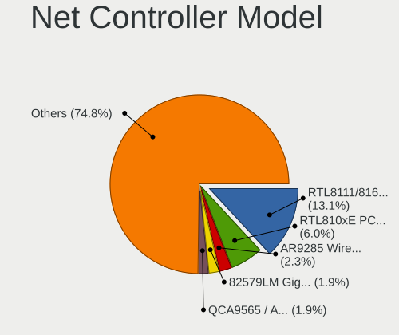

| Model                                                                   | Notebooks | Percent |
|-------------------------------------------------------------------------|-----------|---------|
| Realtek RTL8111/8168/8211/8411 PCI Express Gigabit Ethernet Controller  | 748       | 13.11%  |
| Realtek RTL810xE PCI Express Fast Ethernet controller                   | 343       | 6.01%   |
| Qualcomm Atheros AR9285 Wireless Network Adapter (PCI-Express)          | 130       | 2.28%   |
| Intel 82579LM Gigabit Network Connection (Lewisville)                   | 111       | 1.95%   |
| Qualcomm Atheros QCA9565 / AR9565 Wireless Network Adapter              | 106       | 1.86%   |
| Intel PRO/Wireless 3945ABG [Golan] Network Connection                   | 105       | 1.84%   |
| Qualcomm Atheros AR9485 Wireless Network Adapter                        | 98        | 1.72%   |
| Intel Wireless 7260                                                     | 89        | 1.56%   |
| Qualcomm Atheros QCA9377 802.11ac Wireless Network Adapter              | 88        | 1.54%   |
| Broadcom BCM4313 802.11bgn Wireless Network Adapter                     | 81        | 1.42%   |
| Qualcomm Atheros AR242x / AR542x Wireless Network Adapter (PCI-Express) | 77        | 1.35%   |
| Intel Wireless 8265 / 8275                                              | 75        | 1.31%   |
| Intel Centrino Advanced-N 6205 [Taylor Peak]                            | 74        | 1.3%    |
| Realtek RTL8821CE 802.11ac PCIe Wireless Network Adapter                | 68        | 1.19%   |
| Intel Wireless 7265                                                     | 67        | 1.17%   |
| Realtek RTL8723BE PCIe Wireless Network Adapter                         | 64        | 1.12%   |
| Intel Wi-Fi 6 AX200                                                     | 62        | 1.09%   |
| Intel Wireless 8260                                                     | 59        | 1.03%   |
| Realtek RTL8153 Gigabit Ethernet Adapter                                | 57        | 1%      |
| Realtek RTL-8100/8101L/8139 PCI Fast Ethernet Adapter                   | 56        | 0.98%   |
| Intel Wi-Fi 6 AX201                                                     | 48        | 0.84%   |
| Realtek RTL8188CE 802.11b/g/n WiFi Adapter                              | 45        | 0.79%   |
| Qualcomm Atheros QCA6174 802.11ac Wireless Network Adapter              | 44        | 0.77%   |
| Realtek RTL8822CE 802.11ac PCIe Wireless Network Adapter                | 43        | 0.75%   |
| Qualcomm Atheros AR928X Wireless Network Adapter (PCI-Express)          | 40        | 0.7%    |
| Broadcom BCM43142 802.11b/g/n                                           | 40        | 0.7%    |
| Intel Comet Lake PCH-LP CNVi WiFi                                       | 39        | 0.68%   |
| Intel Wireless 3165                                                     | 38        | 0.67%   |
| Broadcom BCM4312 802.11b/g LP-PHY                                       | 37        | 0.65%   |
| Intel PRO/Wireless 4965 AG or AGN [Kedron] Network Connection           | 36        | 0.63%   |
| Intel Centrino Advanced-N 6200                                          | 35        | 0.61%   |
| Intel 82567LM Gigabit Network Connection                                | 35        | 0.61%   |
| Qualcomm Atheros AR8132 Fast Ethernet                                   | 34        | 0.6%    |
| Intel Comet Lake PCH CNVi WiFi                                          | 34        | 0.6%    |
| Intel 82577LM Gigabit Network Connection                                | 34        | 0.6%    |
| Intel Ethernet Connection I219-LM                                       | 33        | 0.58%   |
| Intel WiFi Link 5100                                                    | 32        | 0.56%   |
| Intel Centrino Ultimate-N 6300                                          | 32        | 0.56%   |
| Marvell Group 88E8040 PCI-E Fast Ethernet Controller                    | 31        | 0.54%   |
| Intel PRO/Wireless 5100 AGN [Shiloh] Network Connection                 | 31        | 0.54%   |

Wireless Vendor
---------------

Wireless vendors

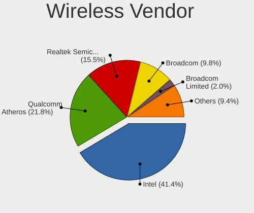

| Vendor                                | Notebooks | Percent |
|---------------------------------------|-----------|---------|
| Intel                                 | 1231      | 41.42%  |
| Qualcomm Atheros                      | 649       | 21.84%  |
| Realtek Semiconductor                 | 462       | 15.55%  |
| Broadcom                              | 291       | 9.79%   |
| Broadcom Limited                      | 59        | 1.99%   |
| Ralink                                | 57        | 1.92%   |
| MediaTek                              | 51        | 1.72%   |
| TP-Link                               | 36        | 1.21%   |
| Ralink Technology                     | 32        | 1.08%   |
| Sierra Wireless                       | 25        | 0.84%   |
| Qualcomm Atheros Communications       | 11        | 0.37%   |
| Qualcomm                              | 10        | 0.34%   |
| Dell                                  | 9         | 0.3%    |
| Fibocom                               | 8         | 0.27%   |
| D-Link System                         | 6         | 0.2%    |
| ZyDAS                                 | 4         | 0.13%   |
| D-Link                                | 4         | 0.13%   |
| NetGear                               | 3         | 0.1%    |
| Linksys                               | 3         | 0.1%    |
| Edimax Technology                     | 3         | 0.1%    |
| Sitecom Europe                        | 2         | 0.07%   |
| Hewlett-Packard                       | 2         | 0.07%   |
| AVM                                   | 2         | 0.07%   |
| ASUSTek Computer                      | 2         | 0.07%   |
| Winbond Electronics                   | 1         | 0.03%   |
| TRENDnet                              | 1         | 0.03%   |
| Toshiba                               | 1         | 0.03%   |
| Texas Instruments                     | 1         | 0.03%   |
| Qcom                                  | 1         | 0.03%   |
| Micro Star International              | 1         | 0.03%   |
| Fujitsu Siemens Computers             | 1         | 0.03%   |
| BUFFALO                               | 1         | 0.03%   |
| Belkin Components                     | 1         | 0.03%   |
| 802.11g Adapter [Linksys WUSB54GC v3] | 1         | 0.03%   |

Wireless Model
--------------

Wireless models

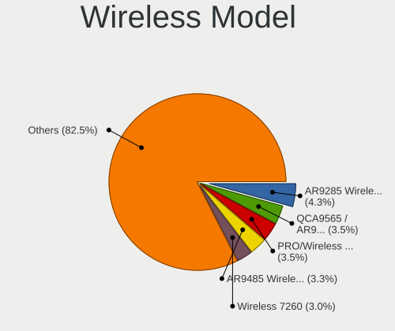

| Model                                                                         | Notebooks | Percent |
|-------------------------------------------------------------------------------|-----------|---------|
| Qualcomm Atheros AR9285 Wireless Network Adapter (PCI-Express)                | 130       | 4.32%   |
| Qualcomm Atheros QCA9565 / AR9565 Wireless Network Adapter                    | 106       | 3.52%   |
| Intel PRO/Wireless 3945ABG [Golan] Network Connection                         | 105       | 3.49%   |
| Qualcomm Atheros AR9485 Wireless Network Adapter                              | 98        | 3.25%   |
| Intel Wireless 7260                                                           | 89        | 2.96%   |
| Qualcomm Atheros QCA9377 802.11ac Wireless Network Adapter                    | 88        | 2.92%   |
| Broadcom BCM4313 802.11bgn Wireless Network Adapter                           | 81        | 2.69%   |
| Qualcomm Atheros AR242x / AR542x Wireless Network Adapter (PCI-Express)       | 77        | 2.56%   |
| Intel Wireless 8265 / 8275                                                    | 75        | 2.49%   |
| Intel Centrino Advanced-N 6205 [Taylor Peak]                                  | 74        | 2.46%   |
| Realtek RTL8821CE 802.11ac PCIe Wireless Network Adapter                      | 68        | 2.26%   |
| Intel Wireless 7265                                                           | 67        | 2.23%   |
| Realtek RTL8723BE PCIe Wireless Network Adapter                               | 64        | 2.13%   |
| Intel Wi-Fi 6 AX200                                                           | 62        | 2.06%   |
| Intel Wireless 8260                                                           | 59        | 1.96%   |
| Intel Wi-Fi 6 AX201                                                           | 48        | 1.59%   |
| Realtek RTL8188CE 802.11b/g/n WiFi Adapter                                    | 45        | 1.49%   |
| Qualcomm Atheros QCA6174 802.11ac Wireless Network Adapter                    | 44        | 1.46%   |
| Realtek RTL8822CE 802.11ac PCIe Wireless Network Adapter                      | 43        | 1.43%   |
| Qualcomm Atheros AR928X Wireless Network Adapter (PCI-Express)                | 40        | 1.33%   |
| Broadcom BCM43142 802.11b/g/n                                                 | 40        | 1.33%   |
| Intel Comet Lake PCH-LP CNVi WiFi                                             | 39        | 1.3%    |
| Intel Wireless 3165                                                           | 38        | 1.26%   |
| Broadcom BCM4312 802.11b/g LP-PHY                                             | 37        | 1.23%   |
| Intel PRO/Wireless 4965 AG or AGN [Kedron] Network Connection                 | 36        | 1.2%    |
| Intel Centrino Advanced-N 6200                                                | 35        | 1.16%   |
| Intel Comet Lake PCH CNVi WiFi                                                | 34        | 1.13%   |
| Intel WiFi Link 5100                                                          | 32        | 1.06%   |
| Intel Centrino Ultimate-N 6300                                                | 32        | 1.06%   |
| Intel PRO/Wireless 5100 AGN [Shiloh] Network Connection                       | 31        | 1.03%   |
| Realtek RTL8188EE Wireless Network Adapter                                    | 28        | 0.93%   |
| Intel Cannon Lake PCH CNVi WiFi                                               | 28        | 0.93%   |
| Intel Centrino Wireless-N 1000 [Condor Peak]                                  | 27        | 0.9%    |
| Broadcom BCM4311 802.11b/g WLAN                                               | 26        | 0.86%   |
| Intel Centrino Advanced-N 6235                                                | 25        | 0.83%   |
| Intel Wi-Fi 5(802.11ac) Wireless-AC 9x6x [Thunder Peak]                       | 24        | 0.8%    |
| Intel Wireless 3160                                                           | 23        | 0.76%   |
| Intel PRO/Wireless 2200BG [Calexico2] Network Connection                      | 22        | 0.73%   |
| Qualcomm Atheros AR2413/AR2414 Wireless Network Adapter [AR5005G(S) 802.11bg] | 20        | 0.66%   |
| Intel Dual Band Wireless-AC 3165 Plus Bluetooth                               | 20        | 0.66%   |

Ethernet Vendor
---------------

Ethernet vendors

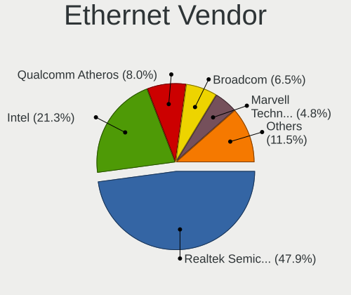

| Vendor                                 | Notebooks | Percent |
|----------------------------------------|-----------|---------|
| Realtek Semiconductor                  | 1226      | 47.87%  |
| Intel                                  | 545       | 21.28%  |
| Qualcomm Atheros                       | 205       | 8%      |
| Broadcom                               | 167       | 6.52%   |
| Marvell Technology Group               | 124       | 4.84%   |
| Broadcom Limited                       | 51        | 1.99%   |
| Nvidia                                 | 32        | 1.25%   |
| Silicon Integrated Systems [SiS]       | 31        | 1.21%   |
| Samsung Electronics                    | 28        | 1.09%   |
| JMicron Technology                     | 23        | 0.9%    |
| ASIX Electronics                       | 21        | 0.82%   |
| Attansic Technology                    | 18        | 0.7%    |
| Xiaomi                                 | 11        | 0.43%   |
| VIA Technologies                       | 11        | 0.43%   |
| Lenovo                                 | 9         | 0.35%   |
| Huawei Technologies                    | 9         | 0.35%   |
| DisplayLink                            | 9         | 0.35%   |
| MediaTek                               | 6         | 0.23%   |
| TP-Link                                | 5         | 0.2%    |
| OPPO Electronics                       | 4         | 0.16%   |
| Motorola PCS                           | 4         | 0.16%   |
| Hewlett-Packard                        | 4         | 0.16%   |
| Suzhou Motorcomm Electronic Technology | 2         | 0.08%   |
| Spreadtrum Communications              | 2         | 0.08%   |
| LG Electronics                         | 2         | 0.08%   |
| Apple                                  | 2         | 0.08%   |
| ZTE WCDMA Technologies MSM             | 1         | 0.04%   |
| ULi Electronics                        | 1         | 0.04%   |
| National Semiconductor                 | 1         | 0.04%   |
| Microchip Technology                   | 1         | 0.04%   |
| ICS Advent                             | 1         | 0.04%   |
| HTC (High Tech Computer)               | 1         | 0.04%   |
| Google                                 | 1         | 0.04%   |
| Foxconn / Hon Hai                      | 1         | 0.04%   |
| ASUSTek Computer                       | 1         | 0.04%   |
| Aquantia                               | 1         | 0.04%   |

Ethernet Model
--------------

Ethernet models

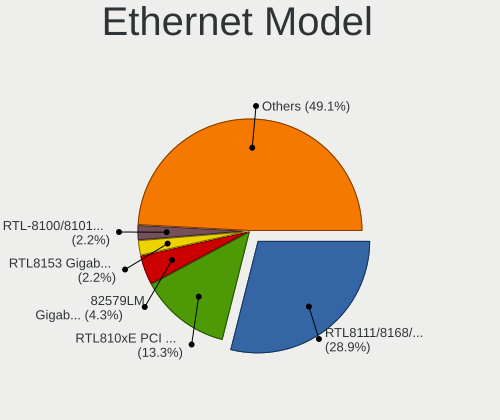

| Model                                                                  | Notebooks | Percent |
|------------------------------------------------------------------------|-----------|---------|
| Realtek RTL8111/8168/8211/8411 PCI Express Gigabit Ethernet Controller | 748       | 28.92%  |
| Realtek RTL810xE PCI Express Fast Ethernet controller                  | 343       | 13.26%  |
| Intel 82579LM Gigabit Network Connection (Lewisville)                  | 111       | 4.29%   |
| Realtek RTL8153 Gigabit Ethernet Adapter                               | 57        | 2.2%    |
| Realtek RTL-8100/8101L/8139 PCI Fast Ethernet Adapter                  | 56        | 2.17%   |
| Intel 82567LM Gigabit Network Connection                               | 35        | 1.35%   |
| Qualcomm Atheros AR8132 Fast Ethernet                                  | 34        | 1.31%   |
| Intel 82577LM Gigabit Network Connection                               | 34        | 1.31%   |
| Intel Ethernet Connection I219-LM                                      | 33        | 1.28%   |
| Marvell Group 88E8040 PCI-E Fast Ethernet Controller                   | 31        | 1.2%    |
| Intel Ethernet Connection I217-LM                                      | 30        | 1.16%   |
| Intel Ethernet Connection (4) I219-LM                                  | 30        | 1.16%   |
| Qualcomm Atheros AR8131 Gigabit Ethernet                               | 26        | 1.01%   |
| Intel Ethernet Connection I218-LM                                      | 25        | 0.97%   |
| Qualcomm Atheros AR8151 v2.0 Gigabit Ethernet                          | 24        | 0.93%   |
| Broadcom NetLink BCM5787M Gigabit Ethernet PCI Express                 | 24        | 0.93%   |
| Silicon Integrated Systems [SiS] 191 Gigabit Ethernet Adapter          | 23        | 0.89%   |
| Marvell Group 88E8055 PCI-E Gigabit Ethernet Controller                | 22        | 0.85%   |
| Broadcom NetLink BCM57780 Gigabit Ethernet PCIe                        | 22        | 0.85%   |
| Samsung Galaxy series, misc. (tethering mode)                          | 21        | 0.81%   |
| Intel 82566MM Gigabit Network Connection                               | 21        | 0.81%   |
| Qualcomm Atheros QCA8172 Fast Ethernet                                 | 18        | 0.7%    |
| Qualcomm Atheros AR8152 v2.0 Fast Ethernet                             | 18        | 0.7%    |
| Attansic AR8152 v2.0 Fast Ethernet                                     | 18        | 0.7%    |
| Intel Ethernet Connection (3) I218-LM                                  | 17        | 0.66%   |
| ASIX AX88179 Gigabit Ethernet                                          | 17        | 0.66%   |
| Qualcomm Atheros QCA8171 Gigabit Ethernet                              | 16        | 0.62%   |
| Intel Ethernet Connection (4) I219-V                                   | 16        | 0.62%   |
| Broadcom NetLink BCM57785 Gigabit Ethernet PCIe                        | 16        | 0.62%   |
| Qualcomm Atheros AR8162 Fast Ethernet                                  | 15        | 0.58%   |
| Intel PRO/100 VE Network Connection                                    | 15        | 0.58%   |
| Broadcom NetXtreme BCM5764M Gigabit Ethernet PCIe                      | 15        | 0.58%   |
| Broadcom BCM4401-B0 100Base-TX                                         | 15        | 0.58%   |
| Nvidia MCP79 Ethernet                                                  | 14        | 0.54%   |
| JMicron JMC250 PCI Express Gigabit Ethernet Controller                 | 14        | 0.54%   |
| Qualcomm Atheros AR8161 Gigabit Ethernet                               | 13        | 0.5%    |
| Intel Ethernet Connection (10) I219-V                                  | 13        | 0.5%    |
| Qualcomm Atheros AR8152 v1.1 Fast Ethernet                             | 12        | 0.46%   |
| Intel Alder Lake-P PCH CNVi WiFi                                       | 12        | 0.46%   |
| Intel 82573L Gigabit Ethernet Controller                               | 12        | 0.46%   |

Net Controller Kind
-------------------

Ethernet, WiFi or modem

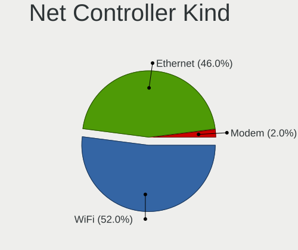

| Kind     | Notebooks | Percent |
|----------|-----------|---------|
| WiFi     | 2781      | 52.04%  |
| Ethernet | 2456      | 45.96%  |
| Modem    | 107       | 2%      |

Used Controller
---------------

Currently used network controller

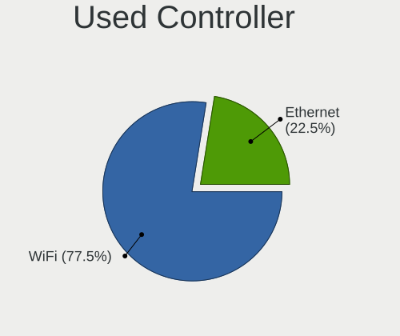

| Kind     | Notebooks | Percent |
|----------|-----------|---------|
| WiFi     | 2345      | 77.52%  |
| Ethernet | 680       | 22.48%  |

NICs
----

Total network controllers on board

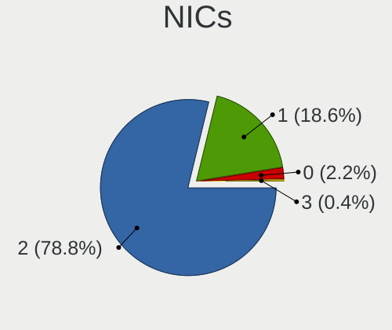

| Total | Notebooks | Percent |
|-------|-----------|---------|
| 2     | 2265      | 78.81%  |
| 1     | 535       | 18.62%  |
| 0     | 62        | 2.16%   |
| 3     | 12        | 0.42%   |

IPv6
----

IPv6 vs IPv4

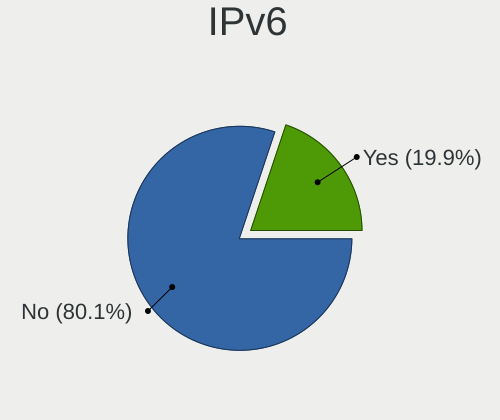

| Used | Notebooks | Percent |
|------|-----------|---------|
| No   | 2338      | 80.12%  |
| Yes  | 580       | 19.88%  |

Bluetooth
---------

Bluetooth Vendor
----------------

Controller vendors

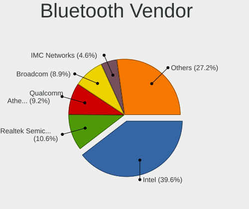

| Vendor                          | Notebooks | Percent |
|---------------------------------|-----------|---------|
| Intel                           | 746       | 39.58%  |
| Realtek Semiconductor           | 199       | 10.56%  |
| Qualcomm Atheros Communications | 173       | 9.18%   |
| Broadcom                        | 167       | 8.86%   |
| IMC Networks                    | 87        | 4.62%   |
| Lite-On Technology              | 85        | 4.51%   |
| Foxconn / Hon Hai               | 80        | 4.24%   |
| Dell                            | 63        | 3.34%   |
| Apple                           | 57        | 3.02%   |
| Hewlett-Packard                 | 54        | 2.86%   |
| Cambridge Silicon Radio         | 40        | 2.12%   |
| Toshiba                         | 26        | 1.38%   |
| Ralink                          | 19        | 1.01%   |
| ASUSTek Computer                | 19        | 1.01%   |
| Alps Electric                   | 14        | 0.74%   |
| Realtek                         | 9         | 0.48%   |
| MediaTek                        | 9         | 0.48%   |
| Ralink Technology               | 8         | 0.42%   |
| Foxconn International           | 8         | 0.42%   |
| USI                             | 4         | 0.21%   |
| Micro Star International        | 4         | 0.21%   |
| Chicony Electronics             | 4         | 0.21%   |
| Taiyo Yuden                     | 3         | 0.16%   |
| Qcom                            | 2         | 0.11%   |
| Integrated System Solution      | 2         | 0.11%   |
| Syntek                          | 1         | 0.05%   |
| Edimax Technology               | 1         | 0.05%   |
| Askey Computer                  | 1         | 0.05%   |

Bluetooth Model
---------------

Controller models

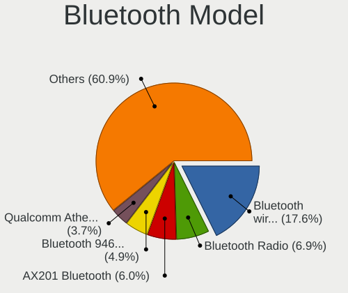

| Model                                                                               | Notebooks | Percent |
|-------------------------------------------------------------------------------------|-----------|---------|
| Intel Bluetooth wireless interface                                                  | 333       | 17.64%  |
| Realtek Bluetooth Radio                                                             | 130       | 6.89%   |
| Intel AX201 Bluetooth                                                               | 114       | 6.04%   |
| Intel Bluetooth 9460/9560 Jefferson Peak (JfP)                                      | 92        | 4.87%   |
| Qualcomm Atheros  Bluetooth Device                                                  | 70        | 3.71%   |
| Intel AX200 Bluetooth                                                               | 58        | 3.07%   |
| Realtek  Bluetooth 4.2 Adapter                                                      | 47        | 2.49%   |
| Intel Centrino Bluetooth Wireless Transceiver                                       | 44        | 2.33%   |
| Cambridge Silicon Radio Bluetooth Dongle (HCI mode)                                 | 40        | 2.12%   |
| Intel Bluetooth Device                                                              | 36        | 1.91%   |
| Lite-On Qualcomm Atheros QCA9377 Bluetooth                                          | 32        | 1.69%   |
| HP Bluetooth 2.0 Interface [Broadcom BCM2045]                                       | 32        | 1.69%   |
| Broadcom BCM2045B (BDC-2.1)                                                         | 31        | 1.64%   |
| Qualcomm Atheros AR3012 Bluetooth 4.0                                               | 29        | 1.54%   |
| Qualcomm Atheros AR3011 Bluetooth                                                   | 27        | 1.43%   |
| Apple Bluetooth Host Controller                                                     | 26        | 1.38%   |
| Foxconn / Hon Hai Bluetooth Device                                                  | 24        | 1.27%   |
| Intel Wireless-AC 9260 Bluetooth Adapter                                            | 23        | 1.22%   |
| Broadcom BCM20702 Bluetooth 4.0 [ThinkPad]                                          | 23        | 1.22%   |
| IMC Networks Bluetooth Device                                                       | 22        | 1.17%   |
| IMC Networks Wireless_Device                                                        | 20        | 1.06%   |
| IMC Networks Bluetooth Radio                                                        | 20        | 1.06%   |
| Ralink RT3290 Bluetooth                                                             | 19        | 1.01%   |
| Qualcomm Atheros QCA61x4 Bluetooth 4.0                                              | 19        | 1.01%   |
| Lite-On Bluetooth Device                                                            | 18        | 0.95%   |
| Lite-On Atheros AR3012 Bluetooth                                                    | 18        | 0.95%   |
| Intel Wireless-AC 3168 Bluetooth                                                    | 18        | 0.95%   |
| HP Broadcom 2070 Bluetooth Combo                                                    | 18        | 0.95%   |
| Qualcomm Atheros AR9462 Bluetooth                                                   | 17        | 0.9%    |
| Dell DW375 Bluetooth Module                                                         | 17        | 0.9%    |
| Intel Centrino Advanced-N 6230 Bluetooth adapter                                    | 16        | 0.85%   |
| Broadcom BCM2045B (BDC-2) [Bluetooth Controller]                                    | 15        | 0.79%   |
| Intel AX210 Bluetooth                                                               | 14        | 0.74%   |
| Foxconn / Hon Hai Foxconn T77H114 BCM2070 [Single-Chip Bluetooth 2.1 + EDR Adapter] | 14        | 0.74%   |
| Broadcom BCM2045 Bluetooth                                                          | 14        | 0.74%   |
| Realtek RTL8723B Bluetooth                                                          | 13        | 0.69%   |
| Apple Bluetooth USB Host Controller                                                 | 13        | 0.69%   |
| Apple Bluetooth HCI                                                                 | 12        | 0.64%   |
| Toshiba Integrated Bluetooth HCI                                                    | 11        | 0.58%   |
| Broadcom BCM2070 Bluetooth Device                                                   | 11        | 0.58%   |

Sound
-----

Sound Vendor
------------

Sound card vendors

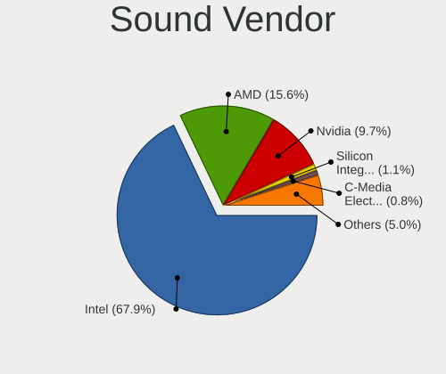

| Vendor                                       | Notebooks | Percent |
|----------------------------------------------|-----------|---------|
| Intel                                        | 2271      | 67.91%  |
| AMD                                          | 520       | 15.55%  |
| Nvidia                                       | 324       | 9.69%   |
| Silicon Integrated Systems [SiS]             | 36        | 1.08%   |
| C-Media Electronics                          | 26        | 0.78%   |
| Logitech                                     | 16        | 0.48%   |
| VIA Technologies                             | 14        | 0.42%   |
| GN Netcom                                    | 12        | 0.36%   |
| Lenovo                                       | 10        | 0.3%    |
| Plantronics                                  | 9         | 0.27%   |
| Texas Instruments                            | 6         | 0.18%   |
| Realtek Semiconductor                        | 6         | 0.18%   |
| Generalplus Technology                       | 6         | 0.18%   |
| Focusrite-Novation                           | 6         | 0.18%   |
| M-Audio                                      | 5         | 0.15%   |
| JMTek                                        | 5         | 0.15%   |
| ULi Electronics                              | 4         | 0.12%   |
| DSEA A/S                                     | 4         | 0.12%   |
| Textech International                        | 3         | 0.09%   |
| Hewlett-Packard                              | 3         | 0.09%   |
| BEHRINGER International                      | 3         | 0.09%   |
| ASUSTek Computer                             | 3         | 0.09%   |
| Tenx Technology                              | 2         | 0.06%   |
| TEAC                                         | 2         | 0.06%   |
| Razer USA                                    | 2         | 0.06%   |
| GYROCOM C&C                                  | 2         | 0.06%   |
| Creative Technology                          | 2         | 0.06%   |
| Conexant Systems                             | 2         | 0.06%   |
| Avid Technology                              | 2         | 0.06%   |
| Audio-Technica                               | 2         | 0.06%   |
| Apple                                        | 2         | 0.06%   |
| Zoran Co. Personal Media Division (Nogatech) | 1         | 0.03%   |
| ZOOM                                         | 1         | 0.03%   |
| XMOS                                         | 1         | 0.03%   |
| TC Electronic                                | 1         | 0.03%   |
| Syntek                                       | 1         | 0.03%   |
| Sennheiser Communications                    | 1         | 0.03%   |
| Samsung Electronics                          | 1         | 0.03%   |
| Roland                                       | 1         | 0.03%   |
| RODE Microphones                             | 1         | 0.03%   |

Sound Model
-----------

Sound card models

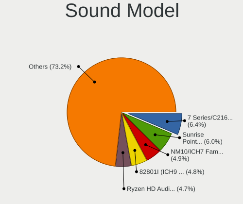

| Model                                                                                             | Notebooks | Percent |
|---------------------------------------------------------------------------------------------------|-----------|---------|
| Intel 7 Series/C216 Chipset Family High Definition Audio Controller                               | 253       | 6.4%    |
| Intel Sunrise Point-LP HD Audio                                                                   | 238       | 6.02%   |
| Intel NM10/ICH7 Family High Definition Audio Controller                                           | 192       | 4.85%   |
| Intel 82801I (ICH9 Family) HD Audio Controller                                                    | 191       | 4.83%   |
| AMD Ryzen HD Audio Controller                                                                     | 186       | 4.7%    |
| Intel 5 Series/3400 Series Chipset High Definition Audio                                          | 169       | 4.27%   |
| Intel 6 Series/C200 Series Chipset Family High Definition Audio Controller                        | 164       | 4.15%   |
| Intel 82801H (ICH8 Family) HD Audio Controller                                                    | 154       | 3.89%   |
| AMD FCH Azalia Controller                                                                         | 125       | 3.16%   |
| Intel Haswell-ULT HD Audio Controller                                                             | 100       | 2.53%   |
| Intel 8 Series HD Audio Controller                                                                | 100       | 2.53%   |
| AMD Renoir/Cezanne HDMI/DP Audio Controller                                                       | 89        | 2.25%   |
| AMD SBx00 Azalia (Intel HDA)                                                                      | 78        | 1.97%   |
| AMD Kabini HDMI/DP Audio                                                                          | 76        | 1.92%   |
| Intel Tiger Lake-LP Smart Sound Technology Audio Controller                                       | 70        | 1.77%   |
| Intel 8 Series/C220 Series Chipset High Definition Audio Controller                               | 69        | 1.74%   |
| Intel Wildcat Point-LP High Definition Audio Controller                                           | 66        | 1.67%   |
| Intel Broadwell-U Audio Controller                                                                | 66        | 1.67%   |
| Intel Cannon Lake PCH cAVS                                                                        | 65        | 1.64%   |
| Intel Xeon E3-1200 v3/4th Gen Core Processor HD Audio Controller                                  | 60        | 1.52%   |
| Intel Atom/Celeron/Pentium Processor x5-E8000/J3xxx/N3xxx Series High Definition Audio Controller | 60        | 1.52%   |
| Intel Atom Processor Z36xxx/Z37xxx Series High Definition Audio Controller                        | 60        | 1.52%   |
| AMD Raven/Raven2/Fenghuang HDMI/DP Audio Controller                                               | 59        | 1.49%   |
| Intel Celeron/Pentium Silver Processor High Definition Audio                                      | 51        | 1.29%   |
| Intel Comet Lake PCH-LP cAVS                                                                      | 48        | 1.21%   |
| Nvidia GF108 High Definition Audio Controller                                                     | 45        | 1.14%   |
| Intel Cannon Point-LP High Definition Audio Controller                                            | 41        | 1.04%   |
| Intel Comet Lake PCH cAVS                                                                         | 38        | 0.96%   |
| AMD Wrestler HDMI Audio                                                                           | 38        | 0.96%   |
| AMD Family 15h (Models 60h-6fh) Audio Controller                                                  | 37        | 0.94%   |
| Intel Alder Lake PCH-P High Definition Audio Controller                                           | 32        | 0.81%   |
| Intel Ice Lake-LP Smart Sound Technology Audio Controller                                         | 29        | 0.73%   |
| Nvidia High Definition Audio Controller                                                           | 27        | 0.68%   |
| AMD Radeon High Definition Audio Controller                                                       | 27        | 0.68%   |
| AMD High Definition Audio Controller                                                              | 27        | 0.68%   |
| Silicon Integrated Systems [SiS] Azalia Audio Controller                                          | 26        | 0.66%   |
| Nvidia TU107 GeForce GTX 1650 High Definition Audio Controller                                    | 26        | 0.66%   |
| Intel CM238 HD Audio Controller                                                                   | 26        | 0.66%   |
| Intel Celeron N3350/Pentium N4200/Atom E3900 Series Audio Cluster                                 | 26        | 0.66%   |
| Intel 100 Series/C230 Series Chipset Family HD Audio Controller                                   | 23        | 0.58%   |

Memory
------

Memory Vendor
-------------

Memory module vendors

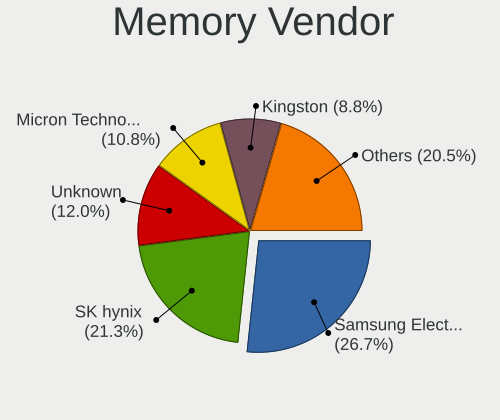

| Vendor                                           | Notebooks | Percent |
|--------------------------------------------------|-----------|---------|
| Samsung Electronics                              | 463       | 26.67%  |
| SK hynix                                         | 369       | 21.26%  |
| Unknown                                          | 208       | 11.98%  |
| Micron Technology                                | 188       | 10.83%  |
| Kingston                                         | 152       | 8.76%   |
| Crucial                                          | 75        | 4.32%   |
| Ramaxel Technology                               | 44        | 2.53%   |
| Elpida                                           | 36        | 2.07%   |
| Unknown (ABCD)                                   | 29        | 1.67%   |
| A-DATA Technology                                | 24        | 1.38%   |
| Nanya Technology                                 | 21        | 1.21%   |
| Corsair                                          | 18        | 1.04%   |
| G.Skill                                          | 16        | 0.92%   |
| Smart                                            | 14        | 0.81%   |
| Unknown                                          | 10        | 0.58%   |
| Goodram                                          | 6         | 0.35%   |
| Transcend                                        | 5         | 0.29%   |
| Team                                             | 4         | 0.23%   |
| fef5                                             | 4         | 0.23%   |
| 48spaces                                         | 4         | 0.23%   |
| Spectek                                          | 3         | 0.17%   |
| Unifosa                                          | 2         | 0.12%   |
| Timetec                                          | 2         | 0.12%   |
| Teikon                                           | 2         | 0.12%   |
| Super Talent                                     | 2         | 0.12%   |
| Qimonda                                          | 2         | 0.12%   |
| High Bridge                                      | 2         | 0.12%   |
| Avant                                            | 2         | 0.12%   |
| Apacer                                           | 2         | 0.12%   |
| V-GeN                                            | 1         | 0.06%   |
| V-Color                                          | 1         | 0.06%   |
| Unknown (7F7F7F7F7F7F6B00)                       | 1         | 0.06%   |
| Unknown (0x36345431323830323145444C335342322020) | 1         | 0.06%   |
| Unknown (0x0043415455000000)                     | 1         | 0.06%   |
| Smart Brazil                                     | 1         | 0.06%   |
| Silicon Power Computer & Communications          | 1         | 0.06%   |
| Silicon Power                                    | 1         | 0.06%   |
| SHARETRONIC                                      | 1         | 0.06%   |
| PKI                                              | 1         | 0.06%   |
| Patriot                                          | 1         | 0.06%   |

Memory Model
------------

Memory module models

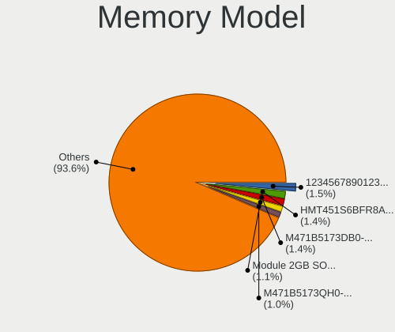

| Model                                                            | Notebooks | Percent |
|------------------------------------------------------------------|-----------|---------|
| Unknown (ABCD) RAM 123456789012345678 2GB SODIMM LPDDR4 2400MT/s | 28        | 1.52%   |
| SK hynix RAM HMT451S6BFR8A-PB 4GB SODIMM DDR3 1600MT/s           | 26        | 1.41%   |
| Samsung RAM M471B5173DB0-YK0 4GB SODIMM DDR3 1600MT/s            | 25        | 1.35%   |
| Unknown RAM Module 2GB SODIMM DDR2 667MT/s                       | 21        | 1.14%   |
| Samsung RAM M471B5173QH0-YK0 4GB SODIMM DDR3 1600MT/s            | 19        | 1.03%   |
| SK hynix RAM HMA81GS6JJR8N-VK 8GB SODIMM DDR4 2667MT/s           | 18        | 0.97%   |
| SK hynix RAM HMA81GS6AFR8N-UH 8GB SODIMM DDR4 2667MT/s           | 18        | 0.97%   |
| Samsung RAM M471A5244CB0-CTD 4GB SODIMM DDR4 3266MT/s            | 18        | 0.97%   |
| Unknown RAM Module 1GB SODIMM DDR2 667MT/s                       | 15        | 0.81%   |
| SK hynix RAM HMT351S6CFR8C-PB 4GB SODIMM DDR3 1600MT/s           | 13        | 0.7%    |
| Samsung RAM M471B5273DH0-CH9 4GB SODIMM DDR3 1600MT/s            | 13        | 0.7%    |
| Samsung RAM M471B5273CH0-CH9 4GB SODIMM DDR3 1334MT/s            | 13        | 0.7%    |
| Samsung RAM M471B1G73EB0-YK0 8192MB SODIMM DDR3 1600MT/s         | 12        | 0.65%   |
| Samsung RAM M471B1G73DB0-YK0 8GB SODIMM DDR3 1600MT/s            | 12        | 0.65%   |
| Samsung RAM M471B5773CHS-CH9 2GB SODIMM DDR3 4199MT/s            | 11        | 0.6%    |
| Samsung RAM M471B5173EB0-YK0 4GB SODIMM DDR3 1600MT/s            | 11        | 0.6%    |
| Unknown RAM Module 2048MB SODIMM DDR2                            | 10        | 0.54%   |
| SK hynix RAM HMT41GS6AFR8A-PB 8GiB SODIMM DDR3 2667MT/s          | 10        | 0.54%   |
| Samsung RAM M471B5773DH0-CH9 2GB SODIMM DDR3 1600MT/s            | 10        | 0.54%   |
| Samsung RAM M471B1G73QH0-YK0 8GB SODIMM DDR3 1600MT/s            | 10        | 0.54%   |
| Samsung RAM M471A5244CB0-CWE 4GB SODIMM DDR4 3200MT/s            | 10        | 0.54%   |
| Samsung RAM M471A5244CB0-CRC 4GB SODIMM DDR4 2667MT/s            | 10        | 0.54%   |
| Samsung RAM M471A1K43DB1-CWE 8GB SODIMM DDR4 3200MT/s            | 10        | 0.54%   |
| Samsung RAM M471A1K43BB1-CRC 8GB SODIMM DDR4 2667MT/s            | 10        | 0.54%   |
| Micron RAM 8KTF51264HZ-1G6E1 4GB SODIMM DDR3 1600MT/s            | 10        | 0.54%   |
| Unknown                                                          | 10        | 0.54%   |
| Unknown RAM Module 2048MB SODIMM DDR2 667MT/s                    | 9         | 0.49%   |
| SK hynix RAM HMT41GS6BFR8A-PB 8GB SODIMM DDR3 2667MT/s           | 9         | 0.49%   |
| Samsung RAM M471A1K43EB1-CWE 8GB SODIMM DDR4 3200MT/s            | 9         | 0.49%   |
| Samsung RAM M471A1G44BB0-CWE 8GB SODIMM DDR4 3200MT/s            | 9         | 0.49%   |
| Samsung RAM M471A1G44AB0-CWE 8GiB SODIMM DDR4 3200MT/s           | 9         | 0.49%   |
| Micron RAM 4ATF51264HZ-2G6E1 4GB SODIMM DDR4 2667MT/s            | 9         | 0.49%   |
| Crucial RAM CT102464BF160B.M16 8GB SODIMM DDR3 1600MT/s          | 9         | 0.49%   |
| Crucial RAM CT102464BF160B.C16 8GB SODIMM DDR3 1600MT/s          | 9         | 0.49%   |
| Unknown RAM Module 2GB SODIMM DDR2                               | 8         | 0.43%   |
| SK hynix RAM HMT351S6EFR8A-PB 4GB SODIMM DDR3 1600MT/s           | 8         | 0.43%   |
| SK hynix RAM HMAA1GS6CJR6N-XN 8GB SODIMM DDR4 3200MT/s           | 8         | 0.43%   |
| SK hynix RAM HMA851S6DJR6N-XN 4GB SODIMM DDR4 3200MT/s           | 8         | 0.43%   |
| SK hynix RAM HMA81GS6DJR8N-XN 8GB SODIMM DDR4 3200MT/s           | 8         | 0.43%   |
| Samsung RAM M471A1K43DB1-CTD 8GB SODIMM DDR4 2667MT/s            | 8         | 0.43%   |

Memory Kind
-----------

Memory module kinds

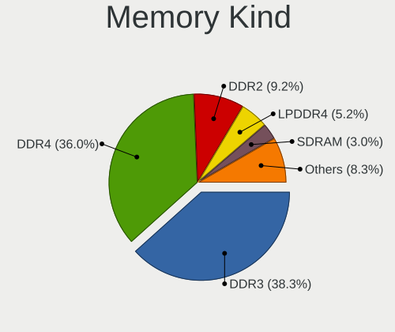

| Kind    | Notebooks | Percent |
|---------|-----------|---------|
| DDR3    | 571       | 38.35%  |
| DDR4    | 536       | 36%     |
| DDR2    | 137       | 9.2%    |
| LPDDR4  | 77        | 5.17%   |
| SDRAM   | 44        | 2.96%   |
| LPDDR3  | 37        | 2.48%   |
| DDR5    | 25        | 1.68%   |
| LPDDR5  | 24        | 1.61%   |
| Unknown | 18        | 1.21%   |
| DDR     | 11        | 0.74%   |
| DRAM    | 9         | 0.6%    |

Memory Form Factor
------------------

Physical design of the memory module

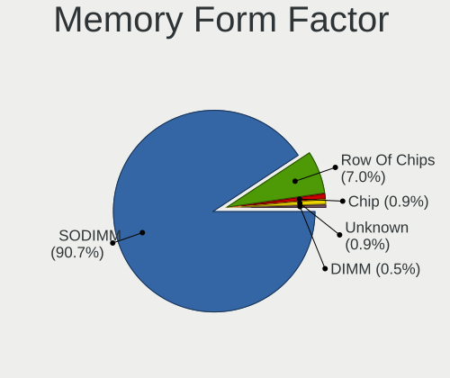

| Name         | Notebooks | Percent |
|--------------|-----------|---------|
| SODIMM       | 1340      | 90.72%  |
| Row Of Chips | 103       | 6.97%   |
| Chip         | 13        | 0.88%   |
| Unknown      | 13        | 0.88%   |
| DIMM         | 8         | 0.54%   |

Memory Size
-----------

Memory module size

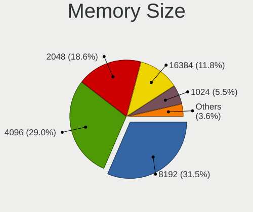

| Size    | Notebooks | Percent |
|---------|-----------|---------|
| 8192    | 514       | 31.5%   |
| 4096    | 473       | 28.98%  |
| 2048    | 304       | 18.63%  |
| 16384   | 192       | 11.76%  |
| 1024    | 90        | 5.51%   |
| 32768   | 48        | 2.94%   |
| 512     | 6         | 0.37%   |
| Unknown | 2         | 0.12%   |
| 49152   | 1         | 0.06%   |
| 1536    | 1         | 0.06%   |
| 256     | 1         | 0.06%   |

Memory Speed
------------

Memory module speed

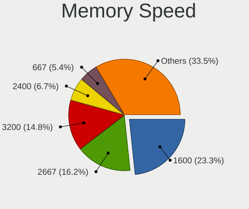

| Speed   | Notebooks | Percent |
|---------|-----------|---------|
| 1600    | 370       | 23.33%  |
| 2667    | 257       | 16.2%   |
| 3200    | 234       | 14.75%  |
| 2400    | 107       | 6.75%   |
| 667     | 86        | 5.42%   |
| 1334    | 81        | 5.11%   |
| 1333    | 73        | 4.6%    |
| 2133    | 53        | 3.34%   |
| Unknown | 52        | 3.28%   |
| 800     | 30        | 1.89%   |
| 1067    | 28        | 1.77%   |
| 4199    | 27        | 1.7%    |
| 4267    | 18        | 1.13%   |
| 3266    | 18        | 1.13%   |
| 1066    | 14        | 0.88%   |
| 5600    | 13        | 0.82%   |
| 4800    | 13        | 0.82%   |
| 1867    | 13        | 0.82%   |
| 533     | 13        | 0.82%   |
| 2048    | 12        | 0.76%   |
| 6400    | 10        | 0.63%   |
| 8400    | 9         | 0.57%   |
| 7500    | 9         | 0.57%   |
| 975     | 9         | 0.57%   |
| 3733    | 7         | 0.44%   |
| 4266    | 5         | 0.32%   |
| 333     | 4         | 0.25%   |
| 1866    | 3         | 0.19%   |
| 8533    | 2         | 0.13%   |
| 5500    | 2         | 0.13%   |
| 2933    | 2         | 0.13%   |
| 1776    | 2         | 0.13%   |
| 1639    | 2         | 0.13%   |
| 400     | 2         | 0.13%   |
| 7467    | 1         | 0.06%   |
| 3000    | 1         | 0.06%   |
| 2134    | 1         | 0.06%   |
| 1800    | 1         | 0.06%   |
| 266     | 1         | 0.06%   |
| 133     | 1         | 0.06%   |

Printers & scanners
-------------------

Printer Vendor
--------------

Printer device vendors

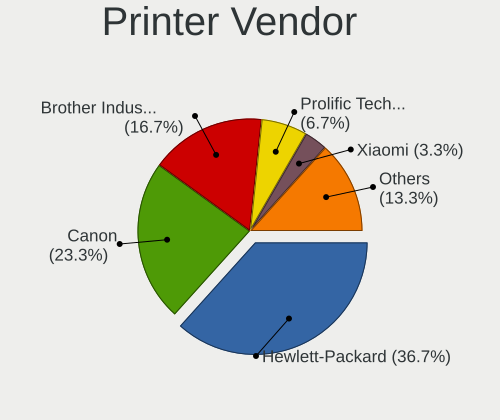

| Vendor                | Notebooks | Percent |
|-----------------------|-----------|---------|
| Hewlett-Packard       | 11        | 36.67%  |
| Canon                 | 7         | 23.33%  |
| Brother Industries    | 5         | 16.67%  |
| Prolific Technology   | 2         | 6.67%   |
| Xiaomi                | 1         | 3.33%   |
| Seiko Epson           | 1         | 3.33%   |
| QinHeng Electronics   | 1         | 3.33%   |
| Lexmark International | 1         | 3.33%   |
| Kyocera               | 1         | 3.33%   |

Printer Model
-------------

Printer device models

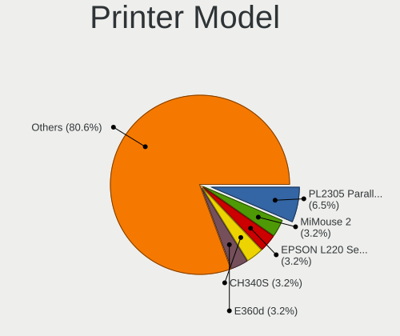

| Model                           | Notebooks | Percent |
|---------------------------------|-----------|---------|
| Prolific PL2305 Parallel Port   | 2         | 6.45%   |
| Xiaomi MiMouse 2                | 1         | 3.23%   |
| Seiko Epson EPSON L220 Series   | 1         | 3.23%   |
| QinHeng CH340S                  | 1         | 3.23%   |
| Lexmark International E360d     | 1         | 3.23%   |
| Kyocera Mita FS-920             | 1         | 3.23%   |
| HP PSC 750xi                    | 1         | 3.23%   |
| HP OfficeJet Reflash            | 1         | 3.23%   |
| HP Officejet 4500 G510n-z       | 1         | 3.23%   |
| HP LaserJet P1005               | 1         | 3.23%   |
| HP LaserJet 1320                | 1         | 3.23%   |
| HP LaserJet 1020                | 1         | 3.23%   |
| HP LaserJet 1018                | 1         | 3.23%   |
| HP LaserJet 1015                | 1         | 3.23%   |
| HP LaserJet 1012                | 1         | 3.23%   |
| HP DeskJet F2100 Printer series | 1         | 3.23%   |
| HP DeskJet 3700 series          | 1         | 3.23%   |
| HP DeskJet 2800 series          | 1         | 3.23%   |
| Canon TS5100 series             | 1         | 3.23%   |
| Canon TS3300 series             | 1         | 3.23%   |
| Canon TS3100 series             | 1         | 3.23%   |
| Canon PIXMA MX320 series        | 1         | 3.23%   |
| Canon MF3200 series             | 1         | 3.23%   |
| Canon LBP6230/6240              | 1         | 3.23%   |
| Canon LBP6000                   | 1         | 3.23%   |
| Brother MFC-L2710DW series      | 1         | 3.23%   |
| Brother MFC-J200                | 1         | 3.23%   |
| Brother HL-L2320D series        | 1         | 3.23%   |
| Brother HL-2140 series          | 1         | 3.23%   |
| Brother HL-1110 series          | 1         | 3.23%   |

Scanner Vendor
--------------

Scanner device vendors

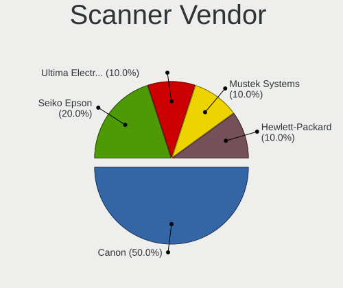

| Vendor             | Notebooks | Percent |
|--------------------|-----------|---------|
| Canon              | 5         | 50%     |
| Seiko Epson        | 2         | 20%     |
| Ultima Electronics | 1         | 10%     |
| Mustek Systems     | 1         | 10%     |
| Hewlett-Packard    | 1         | 10%     |

Scanner Model
-------------

Scanner device models

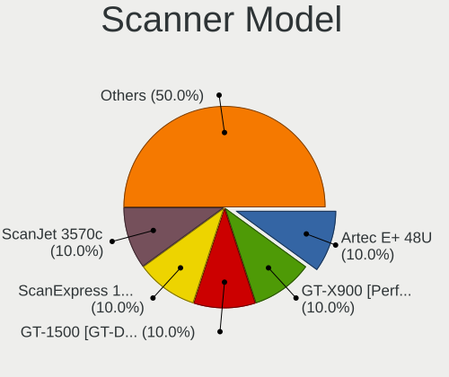

| Model                                            | Notebooks | Percent |
|--------------------------------------------------|-----------|---------|
| Ultima Artec E+ 48U                              | 1         | 10%     |
| Seiko Epson GT-X900 [Perfection V700/V750 Photo] | 1         | 10%     |
| Seiko Epson GT-1500 [GT-D1000]                   | 1         | 10%     |
| Mustek Systems ScanExpress 1200 UB               | 1         | 10%     |
| HP ScanJet 3570c                                 | 1         | 10%     |
| Canon CanoScan N650U/N656U                       | 1         | 10%     |
| Canon CanoScan LIDE 25                           | 1         | 10%     |
| Canon CanoScan LiDE 220                          | 1         | 10%     |
| Canon CanoScan LiDE 100                          | 1         | 10%     |
| Canon CanoScan 4400F                             | 1         | 10%     |

Camera
------

Camera Vendor
-------------

Camera device vendors

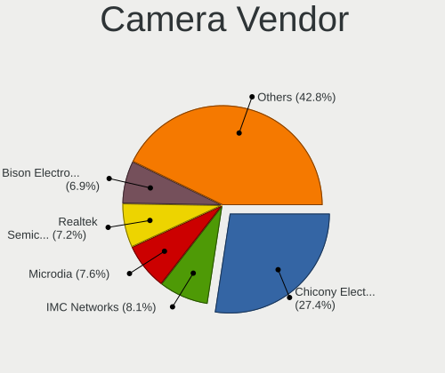

| Vendor                                 | Notebooks | Percent |
|----------------------------------------|-----------|---------|
| Chicony Electronics                    | 649       | 27.4%   |
| IMC Networks                           | 192       | 8.1%    |
| Microdia                               | 180       | 7.6%    |
| Realtek Semiconductor                  | 170       | 7.18%   |
| Bison Electronics                      | 164       | 6.92%   |
| Suyin                                  | 145       | 6.12%   |
| Sunplus Innovation Technology          | 115       | 4.85%   |
| Quanta                                 | 96        | 4.05%   |
| Cheng Uei Precision Industry (Foxlink) | 86        | 3.63%   |
| Syntek                                 | 59        | 2.49%   |
| Apple                                  | 51        | 2.15%   |
| Silicon Motion                         | 50        | 2.11%   |
| Lite-On Technology                     | 48        | 2.03%   |
| Ricoh                                  | 47        | 1.98%   |
| Alcor Micro                            | 44        | 1.86%   |
| Luxvisions Innotech Limited            | 33        | 1.39%   |
| Logitech                               | 25        | 1.06%   |
| Samsung Electronics                    | 20        | 0.84%   |
| Lenovo                                 | 20        | 0.84%   |
| ALi                                    | 17        | 0.72%   |
| Z-Star Microelectronics                | 16        | 0.68%   |
| Sonix Technology                       | 13        | 0.55%   |
| Primax Electronics                     | 13        | 0.55%   |
| Acer                                   | 12        | 0.51%   |
| Importek                               | 11        | 0.46%   |
| icSpring                               | 9         | 0.38%   |
| DigiTech                               | 7         | 0.3%    |
| Shinetech                              | 6         | 0.25%   |
| OmniVision Technologies                | 6         | 0.25%   |
| GEMBIRD                                | 5         | 0.21%   |
| Genesys Logic                          | 4         | 0.17%   |
| Generalplus Technology                 | 4         | 0.17%   |
| Cubeternet                             | 4         | 0.17%   |
| USB Camera CS                          | 3         | 0.13%   |
| SunplusIT                              | 3         | 0.13%   |
| ARC International                      | 3         | 0.13%   |
| Y Media                                | 2         | 0.08%   |
| Unknown                                | 2         | 0.08%   |
| Trust                                  | 2         | 0.08%   |
| Sunplus Technology                     | 2         | 0.08%   |

Camera Model
------------

Camera device models

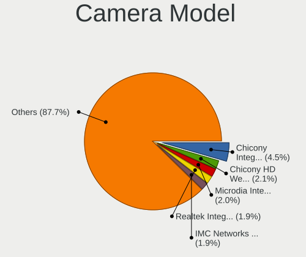

| Model                                            | Notebooks | Percent |
|--------------------------------------------------|-----------|---------|
| Chicony Integrated Camera                        | 107       | 4.5%    |
| Chicony HD WebCam                                | 50        | 2.1%    |
| Microdia Integrated_Webcam_HD                    | 47        | 1.98%   |
| Realtek Integrated_Webcam_HD                     | 45        | 1.89%   |
| IMC Networks USB2.0 HD UVC WebCam                | 44        | 1.85%   |
| IMC Networks Integrated Camera                   | 39        | 1.64%   |
| Chicony TOSHIBA Web Camera - HD                  | 33        | 1.39%   |
| Bison Integrated Camera                          | 32        | 1.35%   |
| Sunplus Integrated_Webcam_HD                     | 29        | 1.22%   |
| Bison Lenovo EasyCamera                          | 26        | 1.09%   |
| Chicony USB 2.0 Camera                           | 25        | 1.05%   |
| Syntek Integrated Camera                         | 24        | 1.01%   |
| IMC Networks USB2.0 VGA UVC WebCam               | 24        | 1.01%   |
| Microdia Integrated Webcam                       | 23        | 0.97%   |
| Chicony HP Truevision HD                         | 23        | 0.97%   |
| Lite-On Integrated Camera                        | 21        | 0.88%   |
| Sunplus HD WebCam                                | 20        | 0.84%   |
| Cheng Uei Precision Industry (Foxlink) HP Webcam | 20        | 0.84%   |
| Suyin HP Truevision HD                           | 19        | 0.8%    |
| Samsung Galaxy series, misc. (MTP mode)          | 19        | 0.8%    |
| IMC Networks UVC VGA Webcam                      | 19        | 0.8%    |
| Chicony Lenovo EasyCamera                        | 19        | 0.8%    |
| Realtek USB Camera                               | 18        | 0.76%   |
| Chicony USB2.0 VGA UVC WebCam                    | 18        | 0.76%   |
| Chicony HP TrueVision HD Camera                  | 18        | 0.76%   |
| Bison SunplusIT Integrated Camera                | 18        | 0.76%   |
| Bison HD Webcam                                  | 18        | 0.76%   |
| Alcor Micro USB 2.0 Camera                       | 18        | 0.76%   |
| Quanta HD User Facing                            | 17        | 0.72%   |
| Apple Built-in iSight                            | 17        | 0.72%   |
| Microdia Sonix USB 2.0 Camera                    | 16        | 0.67%   |
| Syntek Lenovo EasyCamera                         | 15        | 0.63%   |
| Suyin Acer CrystalEye Webcam                     | 15        | 0.63%   |
| Quanta HP Webcam                                 | 15        | 0.63%   |
| Lite-On HP HD Camera                             | 15        | 0.63%   |
| Chicony HP HD Camera                             | 15        | 0.63%   |
| Realtek Lenovo EasyCamera                        | 13        | 0.55%   |
| Quanta HP TrueVision HD Camera                   | 13        | 0.55%   |
| Chicony Integrated Camera (1280x720@30)          | 13        | 0.55%   |
| Chicony HP HD Webcam                             | 13        | 0.55%   |

Security
--------

Fingerprint Vendor
------------------

Fingerprint sensor vendors

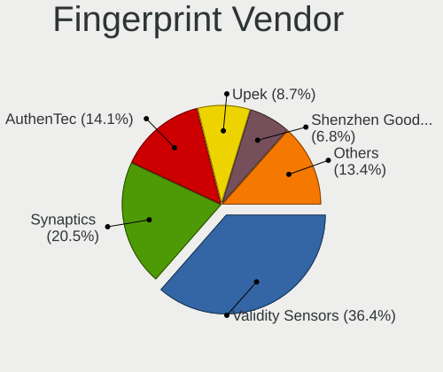

| Vendor                             | Notebooks | Percent |
|------------------------------------|-----------|---------|
| Validity Sensors                   | 160       | 36.45%  |
| Synaptics                          | 90        | 20.5%   |
| AuthenTec                          | 62        | 14.12%  |
| Upek                               | 38        | 8.66%   |
| Shenzhen Goodix Technology         | 30        | 6.83%   |
| STMicroelectronics                 | 23        | 5.24%   |
| LighTuning Technology              | 16        | 3.64%   |
| Elan Microelectronics              | 15        | 3.42%   |
| Realtek USB2.0 Finger Print Bridge | 2         | 0.46%   |
| Focal-systems.Corp                 | 2         | 0.46%   |
| Samsung Electronics                | 1         | 0.23%   |

Fingerprint Model
-----------------

Fingerprint sensor models

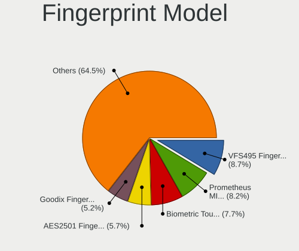

| Model                                                                      | Notebooks | Percent |
|----------------------------------------------------------------------------|-----------|---------|
| Validity Sensors VFS495 Fingerprint Reader                                 | 38        | 8.66%   |
| Synaptics Prometheus MIS Touch Fingerprint Reader                          | 36        | 8.2%    |
| Upek Biometric Touchchip/Touchstrip Fingerprint Sensor                     | 34        | 7.74%   |
| AuthenTec AES2501 Fingerprint Sensor                                       | 25        | 5.69%   |
| STMicroelectronics Fingerprint Reader                                      | 23        | 5.24%   |
| Shenzhen Goodix  FingerPrint Device                                        | 23        | 5.24%   |
| Validity Sensors VFS 5011 fingerprint sensor                               | 19        | 4.33%   |
| AuthenTec AES2810                                                          | 19        | 4.33%   |
| Validity Sensors VFS5011 Fingerprint Reader                                | 15        | 3.42%   |
| Synaptics Metallica MIS Touch Fingerprint Reader                           | 15        | 3.42%   |
| Validity Sensors Fingerprint scanner                                       | 14        | 3.19%   |
| Validity Sensors VFS491                                                    | 12        | 2.73%   |
| Validity Sensors VFS451 Fingerprint Reader                                 | 12        | 2.73%   |
| Validity Sensors VFS471 Fingerprint Reader                                 | 10        | 2.28%   |
| Validity Sensors Synaptics WBDI                                            | 10        | 2.28%   |
| Validity Sensors VFS7500 Touch Fingerprint Sensor                          | 9         | 2.05%   |
| Synaptics UWP WBDI Device                                                  | 8         | 1.82%   |
| Elan ELAN:Fingerprint                                                      | 8         | 1.82%   |
| AuthenTec Fingerprint Sensor                                               | 8         | 1.82%   |
| AuthenTec AES1600                                                          | 8         | 1.82%   |
| LighTuning EgisTec Touch Fingerprint Sensor                                | 7         | 1.59%   |
| Elan ELAN:ARM-M4                                                           | 7         | 1.59%   |
| Validity Sensors VFS301 Fingerprint Reader                                 | 6         | 1.37%   |
| Synaptics Prometheus Fingerprint Reader                                    | 6         | 1.37%   |
| Synaptics Metallica MOH Touch Fingerprint Reader                           | 6         | 1.37%   |
| Shenzhen Goodix Fingerprint Reader                                         | 5         | 1.14%   |
| LighTuning ES603 Swipe Fingerprint Sensor                                  | 5         | 1.14%   |
| Validity Sensors VFS Fingerprint sensor                                    | 4         | 0.91%   |
| Validity Sensors Synaptics VFS7552 Touch Fingerprint Sensor with PurePrint | 4         | 0.91%   |
| Validity Sensors Swipe Fingerprint Sensor                                  | 4         | 0.91%   |
| Upek TCS5B Fingerprint sensor                                              | 4         | 0.91%   |
| Synaptics  WBDI                                                            | 4         | 0.91%   |
| Synaptics Fingerprint reader [HP G6]                                       | 4         | 0.91%   |
| LighTuning Fingerprint Reader                                              | 4         | 0.91%   |
| Synaptics  FS7604 Touch Fingerprint Sensor with PurePrint                  | 3         | 0.68%   |
| Unknown                                                                    | 3         | 0.68%   |
| Validity Sensors VFS101 Fingerprint Reader                                 | 2         | 0.46%   |
| Synaptics WBDI Device                                                      | 2         | 0.46%   |
| Shenzhen Goodix FingerPrint                                                | 2         | 0.46%   |
| Realtek USB2.0 Finger Print Bridge FocalTech Fingerprint Device            | 2         | 0.46%   |

Chipcard Vendor
---------------

Chipcard module vendors

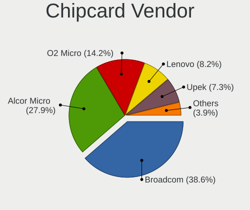

| Vendor                   | Notebooks | Percent |
|--------------------------|-----------|---------|
| Broadcom                 | 90        | 38.63%  |
| Alcor Micro              | 65        | 27.9%   |
| O2 Micro                 | 33        | 14.16%  |
| Lenovo                   | 19        | 8.15%   |
| Upek                     | 17        | 7.3%    |
| Yubico.com               | 2         | 0.86%   |
| Reiner SCT Kartensysteme | 1         | 0.43%   |
| OmniKey                  | 1         | 0.43%   |
| Gemalto (was Gemplus)    | 1         | 0.43%   |
| Clay Logic               | 1         | 0.43%   |
| C3PO                     | 1         | 0.43%   |
| Aktiv                    | 1         | 0.43%   |
| Advanced Card Systems    | 1         | 0.43%   |

Chipcard Model
--------------

Chipcard module models

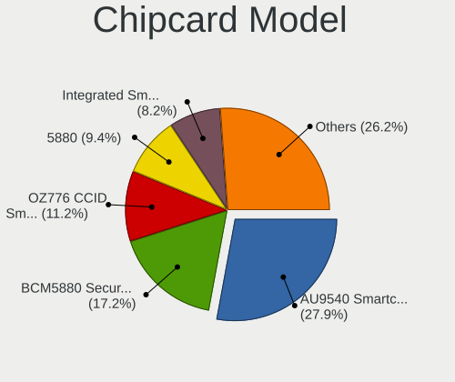

| Model                                                                        | Notebooks | Percent |
|------------------------------------------------------------------------------|-----------|---------|
| Alcor Micro AU9540 Smartcard Reader                                          | 65        | 27.9%   |
| Broadcom BCM5880 Secure Applications Processor                               | 40        | 17.17%  |
| O2 Micro OZ776 CCID Smartcard Reader                                         | 26        | 11.16%  |
| Broadcom 5880                                                                | 22        | 9.44%   |
| Lenovo Integrated Smart Card Reader                                          | 19        | 8.15%   |
| Upek TouchChip Fingerprint Coprocessor (WBF advanced mode)                   | 17        | 7.3%    |
| Broadcom BCM5880 Secure Applications Processor with fingerprint swipe sensor | 11        | 4.72%   |
| Broadcom 58200                                                               | 9         | 3.86%   |
| O2 Micro Oz776 SmartCard Reader                                              | 7         | 3%      |
| Broadcom BCM58200 ControlVault 3 (FingerPrint sensor + Contacted SmartCard)  | 7         | 3%      |
| Yubico.com Yubikey NEO(-N) OTP+CCID                                          | 1         | 0.43%   |
| Yubico.com Yubikey 4/5 U2F+CCID                                              | 1         | 0.43%   |
| Reiner SCT Kartensysteme cyberJack RFID basis contactless smartcard reader   | 1         | 0.43%   |
| OmniKey CardMan Smart@Link                                                   | 1         | 0.43%   |
| Gemalto (was Gemplus) GemPC Twin SmartCard Reader                            | 1         | 0.43%   |
| Clay Logic Nitrokey Pro                                                      | 1         | 0.43%   |
| C3PO USB SMART CARD READER                                                   | 1         | 0.43%   |
| Broadcom BCM5880 Secure Applications Processor with fingerprint touch sensor | 1         | 0.43%   |
| Aktiv Rutoken lite                                                           | 1         | 0.43%   |
| Advanced Card Systems ACR38 SmartCard Reader                                 | 1         | 0.43%   |

Unsupported
-----------

Unsupported Devices
-------------------

Total unsupported devices on board

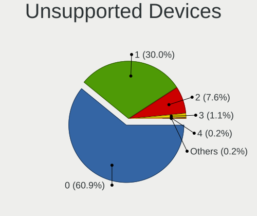

| Total | Notebooks | Percent |
|-------|-----------|---------|
| 0     | 1776      | 60.88%  |
| 1     | 874       | 29.96%  |
| 2     | 222       | 7.61%   |
| 3     | 33        | 1.13%   |
| 4     | 5         | 0.17%   |
| 5     | 3         | 0.1%    |
| 10    | 1         | 0.03%   |
| 8     | 1         | 0.03%   |
| 7     | 1         | 0.03%   |
| 6     | 1         | 0.03%   |

Unsupported Device Types
------------------------

Types of unsupported devices

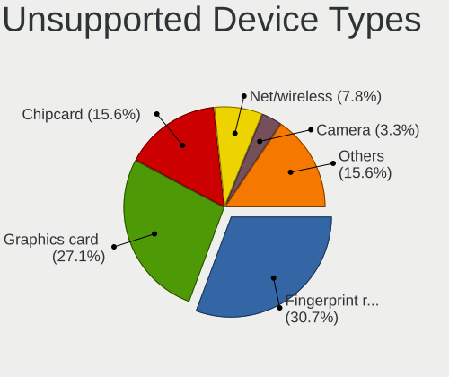

| Type                     | Notebooks | Percent |
|--------------------------|-----------|---------|
| Fingerprint reader       | 436       | 30.68%  |
| Graphics card            | 385       | 27.09%  |
| Chipcard                 | 221       | 15.55%  |
| Net/wireless             | 111       | 7.81%   |
| Camera                   | 47        | 3.31%   |
| Modem                    | 46        | 3.24%   |
| Bluetooth                | 32        | 2.25%   |
| Storage                  | 30        | 2.11%   |
| Communication controller | 23        | 1.62%   |
| Card reader              | 22        | 1.55%   |
| Multimedia controller    | 21        | 1.48%   |
| Flash memory             | 16        | 1.13%   |
| Sound                    | 10        | 0.7%    |
| Net/ethernet             | 8         | 0.56%   |
| Network                  | 5         | 0.35%   |
| Unassigned class         | 2         | 0.14%   |
| Dvb card                 | 2         | 0.14%   |
| Storage/nvme             | 1         | 0.07%   |
| Storage/ide              | 1         | 0.07%   |
| Storage/ata              | 1         | 0.07%   |
| Firewire controller      | 1         | 0.07%   |

