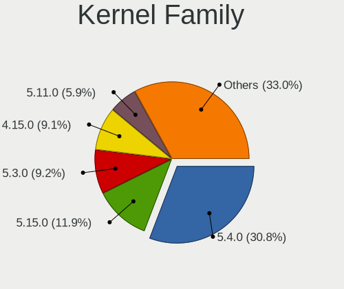
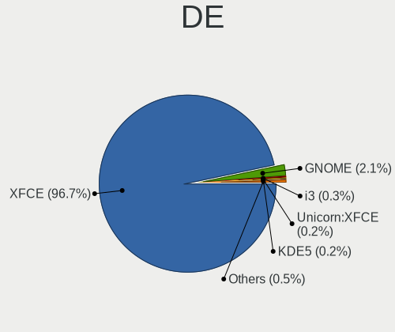
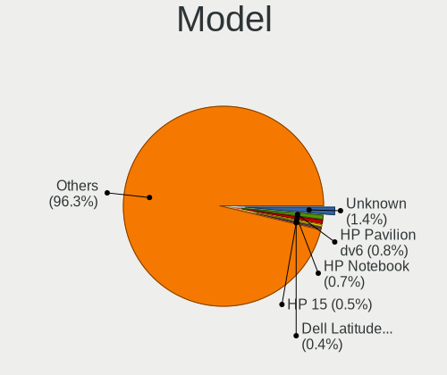
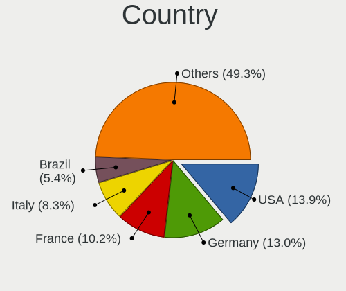
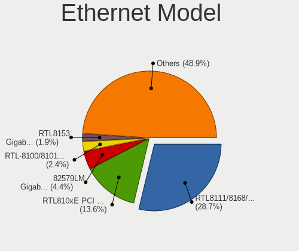
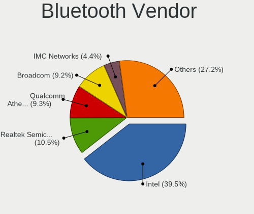
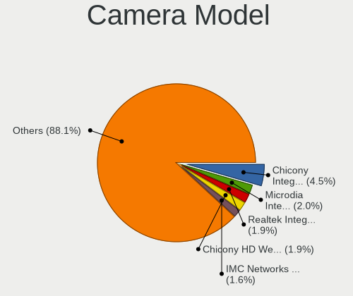
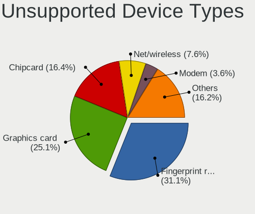

Xubuntu - Tested Hardware & Statistics (Notebooks)
--------------------------------------------------

A project to collect tested hardware configurations for Xubuntu.

Anyone can contribute to this report by the [hw-probe](https://github.com/linuxhw/hw-probe) tool:

    sudo -E hw-probe -all -upload

Please contribute! Especially if your hardware is rare.

Contents
--------

* [ Test Cases ](#test-cases)

* [ System ](#system)
  - [ OS                       ](#os)
  - [ OS Family                ](#os-family)
  - [ Kernel                   ](#kernel)
  - [ Kernel Family            ](#kernel-family)
  - [ Kernel Major Ver.        ](#kernel-major-ver)
  - [ Arch                     ](#arch)
  - [ DE                       ](#de)
  - [ Display Server           ](#display-server)
  - [ Display Manager          ](#display-manager)
  - [ OS Lang                  ](#os-lang)
  - [ Boot Mode                ](#boot-mode)
  - [ Filesystem               ](#filesystem)
  - [ Part. scheme             ](#part-scheme)
  - [ Dual Boot with Linux/BSD ](#dual-boot-with-linuxbsd)
  - [ Dual Boot (Win)          ](#dual-boot-win)

* [ Board ](#board)
  - [ Vendor                   ](#vendor)
  - [ Model                    ](#model)
  - [ Model Family             ](#model-family)
  - [ MFG Year                 ](#mfg-year)
  - [ Form Factor              ](#form-factor)
  - [ Secure Boot              ](#secure-boot)
  - [ Coreboot                 ](#coreboot)
  - [ RAM Size                 ](#ram-size)
  - [ RAM Used                 ](#ram-used)
  - [ Total Drives             ](#total-drives)
  - [ Has CD-ROM               ](#has-cd-rom)
  - [ Has Ethernet             ](#has-ethernet)
  - [ Has WiFi                 ](#has-wifi)
  - [ Has Bluetooth            ](#has-bluetooth)

* [ Location ](#location)
  - [ Country                  ](#country)
  - [ City                     ](#city)

* [ Drives ](#drives)
  - [ Drive Vendor             ](#drive-vendor)
  - [ Drive Model              ](#drive-model)
  - [ HDD Vendor               ](#hdd-vendor)
  - [ SSD Vendor               ](#ssd-vendor)
  - [ Drive Kind               ](#drive-kind)
  - [ Drive Connector          ](#drive-connector)
  - [ Drive Size               ](#drive-size)
  - [ Space Total              ](#space-total)
  - [ Space Used               ](#space-used)
  - [ Malfunc. Drives          ](#malfunc-drives)
  - [ Malfunc. Drive Vendor    ](#malfunc-drive-vendor)
  - [ Malfunc. HDD Vendor      ](#malfunc-hdd-vendor)
  - [ Malfunc. Drive Kind      ](#malfunc-drive-kind)
  - [ Failed Drives            ](#failed-drives)
  - [ Failed Drive Vendor      ](#failed-drive-vendor)
  - [ Drive Status             ](#drive-status)

* [ Storage controller ](#storage-controller)
  - [ Storage Vendor           ](#storage-vendor)
  - [ Storage Model            ](#storage-model)
  - [ Storage Kind             ](#storage-kind)

* [ Processor ](#processor)
  - [ CPU Vendor               ](#cpu-vendor)
  - [ CPU Model                ](#cpu-model)
  - [ CPU Model Family         ](#cpu-model-family)
  - [ CPU Cores                ](#cpu-cores)
  - [ CPU Sockets              ](#cpu-sockets)
  - [ CPU Threads              ](#cpu-threads)
  - [ CPU Op-Modes             ](#cpu-op-modes)
  - [ CPU Microcode            ](#cpu-microcode)
  - [ CPU Microarch            ](#cpu-microarch)

* [ Graphics ](#graphics)
  - [ GPU Vendor               ](#gpu-vendor)
  - [ GPU Model                ](#gpu-model)
  - [ GPU Combo                ](#gpu-combo)
  - [ GPU Driver               ](#gpu-driver)
  - [ GPU Memory               ](#gpu-memory)

* [ Monitor ](#monitor)
  - [ Monitor Vendor           ](#monitor-vendor)
  - [ Monitor Model            ](#monitor-model)
  - [ Monitor Resolution       ](#monitor-resolution)
  - [ Monitor Diagonal         ](#monitor-diagonal)
  - [ Monitor Width            ](#monitor-width)
  - [ Aspect Ratio             ](#aspect-ratio)
  - [ Monitor Area             ](#monitor-area)
  - [ Pixel Density            ](#pixel-density)
  - [ Multiple Monitors        ](#multiple-monitors)

* [ Network ](#network)
  - [ Net Controller Vendor    ](#net-controller-vendor)
  - [ Net Controller Model     ](#net-controller-model)
  - [ Wireless Vendor          ](#wireless-vendor)
  - [ Wireless Model           ](#wireless-model)
  - [ Ethernet Vendor          ](#ethernet-vendor)
  - [ Ethernet Model           ](#ethernet-model)
  - [ Net Controller Kind      ](#net-controller-kind)
  - [ Used Controller          ](#used-controller)
  - [ NICs                     ](#nics)
  - [ IPv6                     ](#ipv6)

* [ Bluetooth ](#bluetooth)
  - [ Bluetooth Vendor         ](#bluetooth-vendor)
  - [ Bluetooth Model          ](#bluetooth-model)

* [ Sound ](#sound)
  - [ Sound Vendor             ](#sound-vendor)
  - [ Sound Model              ](#sound-model)

* [ Memory ](#memory)
  - [ Memory Vendor            ](#memory-vendor)
  - [ Memory Model             ](#memory-model)
  - [ Memory Kind              ](#memory-kind)
  - [ Memory Form Factor       ](#memory-form-factor)
  - [ Memory Size              ](#memory-size)
  - [ Memory Speed             ](#memory-speed)

* [ Printers & scanners ](#printers--scanners)
  - [ Printer Vendor           ](#printer-vendor)
  - [ Printer Model            ](#printer-model)
  - [ Scanner Vendor           ](#scanner-vendor)
  - [ Scanner Model            ](#scanner-model)

* [ Camera ](#camera)
  - [ Camera Vendor            ](#camera-vendor)
  - [ Camera Model             ](#camera-model)

* [ Security ](#security)
  - [ Fingerprint Vendor       ](#fingerprint-vendor)
  - [ Fingerprint Model        ](#fingerprint-model)
  - [ Chipcard Vendor          ](#chipcard-vendor)
  - [ Chipcard Model           ](#chipcard-model)

* [ Unsupported ](#unsupported)
  - [ Unsupported Devices      ](#unsupported-devices)
  - [ Unsupported Device Types ](#unsupported-device-types)

Test Cases
----------

Total: 3749

| Vendor        | Model                       | Probe                                                      | Date         |
|---------------|-----------------------------|------------------------------------------------------------|--------------|
| Acer          | P7YE0                       | [21da78891a](https://linux-hardware.org/?probe=21da78891a) | May 08, 2024 |
| HP            | ProBook 430 G6              | [696c3f2a72](https://linux-hardware.org/?probe=696c3f2a72) | May 07, 2024 |
| Dell          | Precision 7710              | [c89fe612a1](https://linux-hardware.org/?probe=c89fe612a1) | May 06, 2024 |
| Dell          | Precision 7710              | [52c6c4a64a](https://linux-hardware.org/?probe=52c6c4a64a) | May 06, 2024 |
| HP            | Presario CQ56               | [6df22495ed](https://linux-hardware.org/?probe=6df22495ed) | May 04, 2024 |
| Toshiba       | Satellite A200              | [47b52c0fce](https://linux-hardware.org/?probe=47b52c0fce) | May 02, 2024 |
| ASUSTek       | K53E                        | [2c14a21fe8](https://linux-hardware.org/?probe=2c14a21fe8) | May 02, 2024 |
| HP            | Compaq 6720s                | [fc9309f2a1](https://linux-hardware.org/?probe=fc9309f2a1) | Apr 30, 2024 |
| Acer          | Aspire A515-44              | [d580243e57](https://linux-hardware.org/?probe=d580243e57) | Apr 30, 2024 |
| Acer          | Aspire E5-521G              | [0236376455](https://linux-hardware.org/?probe=0236376455) | Apr 30, 2024 |
| Acer          | Aspire A515-51              | [083965d3db](https://linux-hardware.org/?probe=083965d3db) | Apr 30, 2024 |
| Dell          | Inspiron 1011               | [3952627b7f](https://linux-hardware.org/?probe=3952627b7f) | Apr 29, 2024 |
| HP            | Notebook                    | [0f3465e86c](https://linux-hardware.org/?probe=0f3465e86c) | Apr 28, 2024 |
| Apple         | MacBookPro7,1               | [b83cef7cdd](https://linux-hardware.org/?probe=b83cef7cdd) | Apr 27, 2024 |
| Lenovo        | ThinkPad W541 20EGS03W15    | [32ac46c0a5](https://linux-hardware.org/?probe=32ac46c0a5) | Apr 27, 2024 |
| HP            | Mini 210-1000               | [26d3ef8d19](https://linux-hardware.org/?probe=26d3ef8d19) | Apr 27, 2024 |
| ASUSTek       | VivoBook_ASUSLaptop M370... | [fdd97ab603](https://linux-hardware.org/?probe=fdd97ab603) | Apr 27, 2024 |
| HP            | Notebook                    | [98ad243a7d](https://linux-hardware.org/?probe=98ad243a7d) | Apr 26, 2024 |
| HP            | ProBook 4340s               | [a33e5a73ef](https://linux-hardware.org/?probe=a33e5a73ef) | Apr 25, 2024 |
| HP            | Laptop 14-dq0xxx            | [4652a98a00](https://linux-hardware.org/?probe=4652a98a00) | Apr 24, 2024 |
| HP            | Laptop 14-dq0xxx            | [3feeb1bdac](https://linux-hardware.org/?probe=3feeb1bdac) | Apr 24, 2024 |
| Lenovo        | ThinkPad Twist 33474HU      | [98b9979ec3](https://linux-hardware.org/?probe=98b9979ec3) | Apr 23, 2024 |
| Apple         | MacBookPro5,2               | [a5052885f7](https://linux-hardware.org/?probe=a5052885f7) | Apr 22, 2024 |
| ASUSTek       | ASUS TUF Gaming F15 FX50... | [a399c9a39f](https://linux-hardware.org/?probe=a399c9a39f) | Apr 22, 2024 |
| Apple         | MacBookAir6,2               | [37c91e715a](https://linux-hardware.org/?probe=37c91e715a) | Apr 22, 2024 |
| ASUSTek       | X751MA                      | [e8b836dd14](https://linux-hardware.org/?probe=e8b836dd14) | Apr 22, 2024 |
| HP            | Compaq 6730b (GW687AV)      | [42dd367de3](https://linux-hardware.org/?probe=42dd367de3) | Apr 16, 2024 |
| Acer          | Aspire E5-521G              | [27ed8e5b6e](https://linux-hardware.org/?probe=27ed8e5b6e) | Apr 16, 2024 |
| Dell          | XPS 13 9370                 | [2ff2120005](https://linux-hardware.org/?probe=2ff2120005) | Apr 15, 2024 |
| Sony          | VPCF12M1E                   | [a07e465b04](https://linux-hardware.org/?probe=a07e465b04) | Apr 15, 2024 |
| Sony          | VPCF12M1E                   | [b4adc4cd67](https://linux-hardware.org/?probe=b4adc4cd67) | Apr 13, 2024 |
| Lenovo        | ThinkPad X131e 3367AH5      | [5f3d3b0a74](https://linux-hardware.org/?probe=5f3d3b0a74) | Apr 13, 2024 |
| Philco        | 14I                         | [c7ac543990](https://linux-hardware.org/?probe=c7ac543990) | Apr 09, 2024 |
| HP            | EliteBook 2540p             | [ac69abc7f8](https://linux-hardware.org/?probe=ac69abc7f8) | Apr 08, 2024 |
| Dell          | XPS 13 9370                 | [a49c3b9526](https://linux-hardware.org/?probe=a49c3b9526) | Apr 08, 2024 |
| HP            | 15                          | [81bbe62a62](https://linux-hardware.org/?probe=81bbe62a62) | Apr 08, 2024 |
| Lenovo        | ThinkPad T60 1951FDG        | [3baacd7e39](https://linux-hardware.org/?probe=3baacd7e39) | Apr 07, 2024 |
| Lenovo        | ThinkPad T60 1951FDG        | [48ffb129cb](https://linux-hardware.org/?probe=48ffb129cb) | Apr 06, 2024 |
| Dell          | Latitude 5330               | [3327ec32e4](https://linux-hardware.org/?probe=3327ec32e4) | Apr 06, 2024 |
| ASUSTek       | K53E                        | [0564fa09ec](https://linux-hardware.org/?probe=0564fa09ec) | Apr 05, 2024 |
| Lenovo        | ThinkPad T60 1951FDG        | [690d2ee78f](https://linux-hardware.org/?probe=690d2ee78f) | Apr 05, 2024 |
| HP            | EliteBook 2540p             | [f3587d854e](https://linux-hardware.org/?probe=f3587d854e) | Apr 05, 2024 |
| Clevo         | W240EU/W250EUQ/W270EUQ      | [1479db147d](https://linux-hardware.org/?probe=1479db147d) | Apr 04, 2024 |
| Acer          | Aspire A515-44              | [4b51c98fb6](https://linux-hardware.org/?probe=4b51c98fb6) | Apr 04, 2024 |
| Lenovo        | Legion S7 15IMH5 82BC       | [b57ab21576](https://linux-hardware.org/?probe=b57ab21576) | Apr 03, 2024 |
| Samsung       | 300E4C/300E5C/300E7C        | [dfef032d35](https://linux-hardware.org/?probe=dfef032d35) | Apr 03, 2024 |
| Lenovo        | IdeaPad 1 15AMN7 82VG       | [0df7a90dcd](https://linux-hardware.org/?probe=0df7a90dcd) | Apr 01, 2024 |
| Acer          | Aspire V3-331               | [0b74c17835](https://linux-hardware.org/?probe=0b74c17835) | Apr 01, 2024 |
| Lenovo        | ThinkPad E485 20KUS0DW00    | [350231f567](https://linux-hardware.org/?probe=350231f567) | Mar 31, 2024 |
| Lenovo        | ThinkPad E485 20KUS0DW00    | [89c1c85f43](https://linux-hardware.org/?probe=89c1c85f43) | Mar 31, 2024 |
| HP            | EliteBook 820 G1            | [d89f9b8de7](https://linux-hardware.org/?probe=d89f9b8de7) | Mar 30, 2024 |
| Lenovo        | IdeaPad 3 15IAU7 82RK       | [015f6a28b2](https://linux-hardware.org/?probe=015f6a28b2) | Mar 30, 2024 |
| HP            | EliteBook 2540p             | [1115e42390](https://linux-hardware.org/?probe=1115e42390) | Mar 30, 2024 |
| HP            | Elite x2 1012 G1            | [5e19a7d027](https://linux-hardware.org/?probe=5e19a7d027) | Mar 29, 2024 |
| HP            | Elite x2 1012 G1            | [2d13f6d55a](https://linux-hardware.org/?probe=2d13f6d55a) | Mar 29, 2024 |
| Apple         | MacBookPro8,1               | [48eae7912e](https://linux-hardware.org/?probe=48eae7912e) | Mar 27, 2024 |
| Dell          | Latitude E6520              | [b0934dd20e](https://linux-hardware.org/?probe=b0934dd20e) | Mar 27, 2024 |
| Toshiba       | Satellite C70D-B            | [6800119330](https://linux-hardware.org/?probe=6800119330) | Mar 27, 2024 |
| Lenovo        | Yoga Pro 9 16IRP8 83BY      | [eadf31071a](https://linux-hardware.org/?probe=eadf31071a) | Mar 26, 2024 |
| Dell          | Latitude E5510              | [3f05300c5e](https://linux-hardware.org/?probe=3f05300c5e) | Mar 26, 2024 |
| Maibenben     | Perfectum Series            | [083055f303](https://linux-hardware.org/?probe=083055f303) | Mar 26, 2024 |
| ASUSTek       | ROG Zephyrus G14 GA403UI... | [eb09797dad](https://linux-hardware.org/?probe=eb09797dad) | Mar 25, 2024 |
| Lenovo        | ThinkPad L512 2598W2P       | [29d9529699](https://linux-hardware.org/?probe=29d9529699) | Mar 24, 2024 |
| Apple         | MacBookPro1,1               | [4046c97819](https://linux-hardware.org/?probe=4046c97819) | Mar 24, 2024 |
| Timi          | TM1701                      | [fb85b5c0df](https://linux-hardware.org/?probe=fb85b5c0df) | Mar 23, 2024 |
| Apple         | MacBookPro1,1               | [ca5449cab6](https://linux-hardware.org/?probe=ca5449cab6) | Mar 23, 2024 |
| Toshiba       | Satellite C70D-B            | [85a82b979c](https://linux-hardware.org/?probe=85a82b979c) | Mar 23, 2024 |
| Dell          | Latitude E7240              | [ccabe8257d](https://linux-hardware.org/?probe=ccabe8257d) | Mar 23, 2024 |
| ASUSTek       | ROG Zephyrus G14 GA403UI... | [4d1bc02be0](https://linux-hardware.org/?probe=4d1bc02be0) | Mar 23, 2024 |
| ASUSTek       | ROG Zephyrus G14 GA403UI... | [0f6120fef2](https://linux-hardware.org/?probe=0f6120fef2) | Mar 23, 2024 |
| HP            | Laptop 15-bs0xx             | [1398cdcdf9](https://linux-hardware.org/?probe=1398cdcdf9) | Mar 22, 2024 |
| Dell          | Latitude E7240              | [cce23d2d34](https://linux-hardware.org/?probe=cce23d2d34) | Mar 22, 2024 |
| Acer          | Aspire E5-774G              | [0de719fa5b](https://linux-hardware.org/?probe=0de719fa5b) | Mar 21, 2024 |
| ASUSTek       | VivoBook_ASUSLaptop X515... | [2f1279e5f4](https://linux-hardware.org/?probe=2f1279e5f4) | Mar 21, 2024 |
| ASUSTek       | VivoBook_ASUSLaptop X515... | [96e93279ce](https://linux-hardware.org/?probe=96e93279ce) | Mar 21, 2024 |
| HP            | Laptop 14s-dq3xxx           | [bb6d61cb47](https://linux-hardware.org/?probe=bb6d61cb47) | Mar 21, 2024 |
| eMachines     | eME642G                     | [8759a11aca](https://linux-hardware.org/?probe=8759a11aca) | Mar 20, 2024 |
| HP            | Stream Laptop 14-ds0xxx     | [e003a1215d](https://linux-hardware.org/?probe=e003a1215d) | Mar 19, 2024 |
| Lenovo        | G70-70 80HW0014FR           | [8fd24b2766](https://linux-hardware.org/?probe=8fd24b2766) | Mar 17, 2024 |
| Lenovo        | G70-70 80HW0014FR           | [ebb00d0246](https://linux-hardware.org/?probe=ebb00d0246) | Mar 17, 2024 |
| ASUSTek       | ROG Strix G513QE_G513QE     | [98300bace9](https://linux-hardware.org/?probe=98300bace9) | Mar 16, 2024 |
| eMachines     | eME642G                     | [7d7230a747](https://linux-hardware.org/?probe=7d7230a747) | Mar 16, 2024 |
| Lenovo        | ThinkPad T14s Gen 1 20UJ... | [2d1ccd0458](https://linux-hardware.org/?probe=2d1ccd0458) | Mar 15, 2024 |
| Fujitsu       | FARQ10003                   | [85d8b675fc](https://linux-hardware.org/?probe=85d8b675fc) | Mar 14, 2024 |
| HP            | 250 G6 Notebook PC          | [6b050fbf71](https://linux-hardware.org/?probe=6b050fbf71) | Mar 12, 2024 |
| Lenovo        | ThinkPad T440s 20AQ009DG... | [dd2cc3d3df](https://linux-hardware.org/?probe=dd2cc3d3df) | Mar 11, 2024 |
| Dell          | Inspiron 5452               | [d81294ea2d](https://linux-hardware.org/?probe=d81294ea2d) | Mar 10, 2024 |
| Toshiba       | Satellite A200              | [7197835980](https://linux-hardware.org/?probe=7197835980) | Mar 08, 2024 |
| Lenovo        | V17 G4 IRU 83A2             | [36ac6f0e6b](https://linux-hardware.org/?probe=36ac6f0e6b) | Mar 08, 2024 |
| Dell          | Latitude 5280               | [59fcb83d4a](https://linux-hardware.org/?probe=59fcb83d4a) | Mar 07, 2024 |
| Dell          | Latitude 5280               | [eca7be25aa](https://linux-hardware.org/?probe=eca7be25aa) | Mar 07, 2024 |
| Notebook      | W54_55_94_95_97AU,AUQ       | [b16fb5307b](https://linux-hardware.org/?probe=b16fb5307b) | Mar 07, 2024 |
| ASUSTek       | TUF Gaming FX505DT_FX505... | [23a8bcc014](https://linux-hardware.org/?probe=23a8bcc014) | Mar 06, 2024 |
| Lenovo        | ThinkPad T470p 20J6S00UH... | [b35deb0a8c](https://linux-hardware.org/?probe=b35deb0a8c) | Mar 06, 2024 |
| Lenovo        | ThinkPad A475 20KMS0MR00    | [0351009764](https://linux-hardware.org/?probe=0351009764) | Mar 05, 2024 |
| Positivo      | Q4128C                      | [0e62c41fff](https://linux-hardware.org/?probe=0e62c41fff) | Mar 05, 2024 |
| Lenovo        | IdeaPad 5 15ITL05 82FG      | [1c340dbb25](https://linux-hardware.org/?probe=1c340dbb25) | Mar 04, 2024 |
| Dell          | Inspiron 3521               | [9552e898d6](https://linux-hardware.org/?probe=9552e898d6) | Mar 04, 2024 |
| ASUSTek       | VivoBook_ASUSLaptop X160... | [2bbb7923b9](https://linux-hardware.org/?probe=2bbb7923b9) | Mar 04, 2024 |
| Lenovo        | ThinkPad A475 20KMS0MR00    | [eead5309ca](https://linux-hardware.org/?probe=eead5309ca) | Mar 04, 2024 |
| HP            | 240 G7 Notebook PC          | [7556bb7dcb](https://linux-hardware.org/?probe=7556bb7dcb) | Mar 04, 2024 |
| Lenovo        | ThinkPad X260 20F5S4BY00    | [efea91c506](https://linux-hardware.org/?probe=efea91c506) | Mar 03, 2024 |
| Acer          | Extensa 5620                | [184149092e](https://linux-hardware.org/?probe=184149092e) | Mar 02, 2024 |
| AIO           | DynaBook e5                 | [733a714da6](https://linux-hardware.org/?probe=733a714da6) | Mar 02, 2024 |
| ASUSTek       | 1002HA                      | [f6540ea84c](https://linux-hardware.org/?probe=f6540ea84c) | Feb 29, 2024 |
| Dell          | Inspiron 15 3520            | [22b06310de](https://linux-hardware.org/?probe=22b06310de) | Feb 29, 2024 |
| Acer          | Aspire 5742G                | [ec33f6391f](https://linux-hardware.org/?probe=ec33f6391f) | Feb 27, 2024 |
| Dell          | Latitude 3590               | [cfd80ed606](https://linux-hardware.org/?probe=cfd80ed606) | Feb 25, 2024 |
| Acer          | Aspire 5742G                | [4ab95b25ed](https://linux-hardware.org/?probe=4ab95b25ed) | Feb 24, 2024 |
| HP            | 255 15.6 inch G10           | [122d6aa5c9](https://linux-hardware.org/?probe=122d6aa5c9) | Feb 23, 2024 |
| Lenovo        | IdeaPad 330S-15IKB 81F5     | [9cc44f0ff5](https://linux-hardware.org/?probe=9cc44f0ff5) | Feb 22, 2024 |
| HP            | ZBook 15u G3                | [3da083192b](https://linux-hardware.org/?probe=3da083192b) | Feb 22, 2024 |
| Lenovo        | ThinkPad T480 20L6S9UL00    | [c72bd35164](https://linux-hardware.org/?probe=c72bd35164) | Feb 22, 2024 |
| HONOR         | NBR-WAX9                    | [6fa625a010](https://linux-hardware.org/?probe=6fa625a010) | Feb 21, 2024 |
| ASUSTek       | K53U                        | [6a9381dfac](https://linux-hardware.org/?probe=6a9381dfac) | Feb 19, 2024 |
| Acer          | Aspire one                  | [39289d9272](https://linux-hardware.org/?probe=39289d9272) | Feb 19, 2024 |
| Dell          | Inspiron 7520               | [ea9b1047db](https://linux-hardware.org/?probe=ea9b1047db) | Feb 19, 2024 |
| HP            | ProBook 6570b               | [2b5fa57120](https://linux-hardware.org/?probe=2b5fa57120) | Feb 18, 2024 |
| ASUSTek       | K53U                        | [63de783cfc](https://linux-hardware.org/?probe=63de783cfc) | Feb 17, 2024 |
| Lenovo        | Legion S7 15IMH5 82BC       | [0495f0384b](https://linux-hardware.org/?probe=0495f0384b) | Feb 17, 2024 |
| HP            | Compaq nx9600 (PZ516UA#A... | [423dee7ce8](https://linux-hardware.org/?probe=423dee7ce8) | Feb 14, 2024 |
| Toshiba       | dynabook EX/45CW            | [15397b8cd4](https://linux-hardware.org/?probe=15397b8cd4) | Feb 14, 2024 |
| HP            | Compaq nx9600 (PZ516UA#A... | [aaf8082c54](https://linux-hardware.org/?probe=aaf8082c54) | Feb 13, 2024 |
| Dell          | Latitude 3330               | [b692ba42e7](https://linux-hardware.org/?probe=b692ba42e7) | Feb 11, 2024 |
| Lenovo        | ThinkBook 16p Gen 2 20YM    | [3f7984a7cb](https://linux-hardware.org/?probe=3f7984a7cb) | Feb 10, 2024 |
| Toshiba       | Satellite S55-A             | [b8c672ccc5](https://linux-hardware.org/?probe=b8c672ccc5) | Feb 10, 2024 |
| Dell          | Latitude 5590               | [684246246f](https://linux-hardware.org/?probe=684246246f) | Feb 09, 2024 |
| HP            | EliteBook 840 G1            | [35a11cec77](https://linux-hardware.org/?probe=35a11cec77) | Feb 09, 2024 |
| Acer          | Aspire A515-52K             | [08c3bcf367](https://linux-hardware.org/?probe=08c3bcf367) | Feb 07, 2024 |
| Lenovo        | G50-70 20351                | [eebc3497e7](https://linux-hardware.org/?probe=eebc3497e7) | Feb 06, 2024 |
| Acer          | Aspire S5-371T              | [d4d625e0b7](https://linux-hardware.org/?probe=d4d625e0b7) | Feb 06, 2024 |
| LG Electro... | X110-L.B7BLP1               | [26f739e197](https://linux-hardware.org/?probe=26f739e197) | Feb 04, 2024 |
| LG Electro... | X110-L.B7BLP1               | [8f020d4f16](https://linux-hardware.org/?probe=8f020d4f16) | Feb 04, 2024 |
| Acer          | Aspire one                  | [b123478f39](https://linux-hardware.org/?probe=b123478f39) | Feb 04, 2024 |
| ASUSTek       | ROG Zephyrus G14 GA402XV... | [33e55cd5c5](https://linux-hardware.org/?probe=33e55cd5c5) | Feb 03, 2024 |
| MSI           | Modern 15 A10M              | [22f3c2e58e](https://linux-hardware.org/?probe=22f3c2e58e) | Feb 02, 2024 |
| Acer          | NC-F5-771G-72XY             | [2f4c6fbadb](https://linux-hardware.org/?probe=2f4c6fbadb) | Feb 02, 2024 |
| Apple         | MacBookPro5,4               | [c22226fe6f](https://linux-hardware.org/?probe=c22226fe6f) | Feb 01, 2024 |
| HP            | EliteBook 840 G1            | [920b1ecb34](https://linux-hardware.org/?probe=920b1ecb34) | Jan 31, 2024 |
| Acer          | Aspire 5735                 | [365fd9fe4d](https://linux-hardware.org/?probe=365fd9fe4d) | Jan 31, 2024 |
| Acer          | Aspire 5735                 | [bed38c72c8](https://linux-hardware.org/?probe=bed38c72c8) | Jan 31, 2024 |
| HP            | Pavilion g6                 | [7f9863aaa2](https://linux-hardware.org/?probe=7f9863aaa2) | Jan 31, 2024 |
| Lenovo        | ThinkPad T570 20HAS0NU00    | [39f3b9fb56](https://linux-hardware.org/?probe=39f3b9fb56) | Jan 30, 2024 |
| Dell          | Inspiron 1525               | [ad26dae776](https://linux-hardware.org/?probe=ad26dae776) | Jan 30, 2024 |
| Dell          | Inspiron 1525               | [bc4394a85f](https://linux-hardware.org/?probe=bc4394a85f) | Jan 30, 2024 |
| Dell          | Latitude 5510               | [4abbee3451](https://linux-hardware.org/?probe=4abbee3451) | Jan 30, 2024 |
| HP            | EliteBook 860 16 inch G1... | [737d54004b](https://linux-hardware.org/?probe=737d54004b) | Jan 29, 2024 |
| Dell          | Latitude 5511               | [40fad497db](https://linux-hardware.org/?probe=40fad497db) | Jan 29, 2024 |
| Lenovo        | V560                        | [a0dbd66d53](https://linux-hardware.org/?probe=a0dbd66d53) | Jan 28, 2024 |
| ASUSTek       | X205TA                      | [83899dcb83](https://linux-hardware.org/?probe=83899dcb83) | Jan 27, 2024 |
| Lenovo        | ThinkPad T400 6474AW6       | [0ddfcaf599](https://linux-hardware.org/?probe=0ddfcaf599) | Jan 27, 2024 |
| Acer          | Aspire A315-58              | [c85674acbd](https://linux-hardware.org/?probe=c85674acbd) | Jan 26, 2024 |
| Toshiba       | Satellite L300              | [127697d4f1](https://linux-hardware.org/?probe=127697d4f1) | Jan 26, 2024 |
| Toshiba       | Satellite L300              | [63be13a245](https://linux-hardware.org/?probe=63be13a245) | Jan 26, 2024 |
| PC Special... | NH5x_7xDPx                  | [0f28a5d513](https://linux-hardware.org/?probe=0f28a5d513) | Jan 26, 2024 |
| Apple         | MacBook5,1                  | [51346a4084](https://linux-hardware.org/?probe=51346a4084) | Jan 25, 2024 |
| Dell          | Latitude 7340               | [880054b099](https://linux-hardware.org/?probe=880054b099) | Jan 25, 2024 |
| ASUSTek       | ROG Strix G733PZ_G733PZ     | [5a5ec0016f](https://linux-hardware.org/?probe=5a5ec0016f) | Jan 24, 2024 |
| Dell          | Inspiron 5567               | [dc061193f2](https://linux-hardware.org/?probe=dc061193f2) | Jan 22, 2024 |
| HP            | Pavilion dv6                | [ac628c20c7](https://linux-hardware.org/?probe=ac628c20c7) | Jan 22, 2024 |
| HP            | Pavilion dv6                | [6d29e8c44e](https://linux-hardware.org/?probe=6d29e8c44e) | Jan 22, 2024 |
| MSI           | GF63 Thin 11UC              | [b6fa224856](https://linux-hardware.org/?probe=b6fa224856) | Jan 21, 2024 |
| ASUSTek       | T100HAN                     | [02f115dc2a](https://linux-hardware.org/?probe=02f115dc2a) | Jan 21, 2024 |
| ASUSTek       | K55VM                       | [a684c7f5fc](https://linux-hardware.org/?probe=a684c7f5fc) | Jan 19, 2024 |
| Lenovo        | ThinkPad X240 20AMS00100    | [4b39b1cbe0](https://linux-hardware.org/?probe=4b39b1cbe0) | Jan 17, 2024 |
| HP            | Compaq Presario CQ60        | [fd48d4e0d2](https://linux-hardware.org/?probe=fd48d4e0d2) | Jan 15, 2024 |
| MSI           | GF63 Thin 11UC              | [6d2801d1d8](https://linux-hardware.org/?probe=6d2801d1d8) | Jan 14, 2024 |
| Lenovo        | G500 20236                  | [5dacf75c7d](https://linux-hardware.org/?probe=5dacf75c7d) | Jan 12, 2024 |
| ASUSTek       | K55VM                       | [99003258ce](https://linux-hardware.org/?probe=99003258ce) | Jan 11, 2024 |
| Gigazone      | X107(B-B)                   | [a72cbb0097](https://linux-hardware.org/?probe=a72cbb0097) | Jan 10, 2024 |
| Lenovo        | ThinkPad P53 20QNS00X00     | [ce397f675e](https://linux-hardware.org/?probe=ce397f675e) | Jan 10, 2024 |
| Acer          | Swift SF314-43              | [60423ae46b](https://linux-hardware.org/?probe=60423ae46b) | Jan 10, 2024 |
| Dell          | Inspiron 14-3452            | [0e47261be0](https://linux-hardware.org/?probe=0e47261be0) | Jan 09, 2024 |
| Gigazone      | X107(B-B)                   | [54085fcb32](https://linux-hardware.org/?probe=54085fcb32) | Jan 09, 2024 |
| Dell          | Inspiron 14-3452            | [1834cfc875](https://linux-hardware.org/?probe=1834cfc875) | Jan 09, 2024 |
| Apple         | MacBook5,2                  | [2ed16f6a80](https://linux-hardware.org/?probe=2ed16f6a80) | Jan 07, 2024 |
| Lenovo        | IdeaPad 510S-13ISK 80SJ     | [90fe273da6](https://linux-hardware.org/?probe=90fe273da6) | Jan 06, 2024 |
| Dell          | Latitude E5530 non-vPro     | [40b853c9b9](https://linux-hardware.org/?probe=40b853c9b9) | Jan 06, 2024 |
| Dell          | Inspiron 1501               | [65d521ef7c](https://linux-hardware.org/?probe=65d521ef7c) | Jan 06, 2024 |
| Dell          | Latitude E5530 non-vPro     | [d138fd288d](https://linux-hardware.org/?probe=d138fd288d) | Jan 06, 2024 |
| Acer          | Aspire A315-51              | [753ed1e625](https://linux-hardware.org/?probe=753ed1e625) | Jan 05, 2024 |
| Acer          | Aspire A517-52              | [610817c6c9](https://linux-hardware.org/?probe=610817c6c9) | Jan 05, 2024 |
| HP            | Pavilion dv7                | [dc31f854de](https://linux-hardware.org/?probe=dc31f854de) | Jan 04, 2024 |
| Dell          | Precision M6800             | [5049c54004](https://linux-hardware.org/?probe=5049c54004) | Jan 04, 2024 |
| ASUSTek       | X540SAA                     | [179249edef](https://linux-hardware.org/?probe=179249edef) | Jan 03, 2024 |
| Lenovo        | ThinkPad X260 20F5S0KE00    | [08d2a7a982](https://linux-hardware.org/?probe=08d2a7a982) | Jan 01, 2024 |
| Packard Be... | EasyNote MH35               | [2b8b39d335](https://linux-hardware.org/?probe=2b8b39d335) | Dec 27, 2023 |
| Dell          | Latitude 7390               | [8c74383dab](https://linux-hardware.org/?probe=8c74383dab) | Dec 27, 2023 |
| Dell          | Latitude 7390               | [889337bb1c](https://linux-hardware.org/?probe=889337bb1c) | Dec 27, 2023 |
| HP            | ProBook 6570b               | [61f91864e5](https://linux-hardware.org/?probe=61f91864e5) | Dec 27, 2023 |
| Lenovo        | ThinkPad T14 Gen 1 20UDC... | [38b1c283b4](https://linux-hardware.org/?probe=38b1c283b4) | Dec 26, 2023 |
| Acer          | Aspire 5739G                | [6b4237a1ea](https://linux-hardware.org/?probe=6b4237a1ea) | Dec 26, 2023 |
| Acer          | Aspire 5739G                | [408e19e1f2](https://linux-hardware.org/?probe=408e19e1f2) | Dec 26, 2023 |
| HP            | Compaq nx7400 (RH609ES#A... | [6a6b1d3722](https://linux-hardware.org/?probe=6a6b1d3722) | Dec 26, 2023 |
| Acer          | Aspire V5-123               | [1a5a81980b](https://linux-hardware.org/?probe=1a5a81980b) | Dec 26, 2023 |
| Lenovo        | ThinkPad T14 Gen 3 21AH0... | [14d453985d](https://linux-hardware.org/?probe=14d453985d) | Dec 25, 2023 |
| ASUSTek       | X201EP                      | [944a54b7f4](https://linux-hardware.org/?probe=944a54b7f4) | Dec 25, 2023 |
| eMachines     | E527                        | [cf5b096be7](https://linux-hardware.org/?probe=cf5b096be7) | Dec 22, 2023 |
| Dell          | Latitude E5510              | [92074a5231](https://linux-hardware.org/?probe=92074a5231) | Dec 22, 2023 |
| Lenovo        | Yoga 2 11 20332             | [16a8e6f875](https://linux-hardware.org/?probe=16a8e6f875) | Dec 21, 2023 |
| Sony          | VGN-NW270F                  | [eee640a54d](https://linux-hardware.org/?probe=eee640a54d) | Dec 20, 2023 |
| HP            | Pavilion dv6                | [4cc379dfbd](https://linux-hardware.org/?probe=4cc379dfbd) | Dec 19, 2023 |
| HP            | Notebook                    | [31d6fc4280](https://linux-hardware.org/?probe=31d6fc4280) | Dec 19, 2023 |
| ASUSTek       | X541UVK                     | [a6ae535887](https://linux-hardware.org/?probe=a6ae535887) | Dec 18, 2023 |
| MSI           | GF63 Thin 11UC              | [06556bd61a](https://linux-hardware.org/?probe=06556bd61a) | Dec 17, 2023 |
| HP            | ZBook Fury 16 G9 Mobile ... | [ce0e0e1bc1](https://linux-hardware.org/?probe=ce0e0e1bc1) | Dec 17, 2023 |
| Apple         | MacBookPro8,1               | [f0ed04c975](https://linux-hardware.org/?probe=f0ed04c975) | Dec 16, 2023 |
| Lenovo        | IdeaPad 1 15AMN7 82VG       | [6a2633018c](https://linux-hardware.org/?probe=6a2633018c) | Dec 15, 2023 |
| Lenovo        | ThinkPad X1 Carbon Gen 1... | [e7ca2f3a6e](https://linux-hardware.org/?probe=e7ca2f3a6e) | Dec 14, 2023 |
| HUAWEI        | MACHD-WXX9                  | [35a6370b07](https://linux-hardware.org/?probe=35a6370b07) | Dec 14, 2023 |
| Toshiba       | Satellite Pro C660          | [63cf57fa53](https://linux-hardware.org/?probe=63cf57fa53) | Dec 12, 2023 |
| Dell          | Inspiron 7591               | [10a266d0ff](https://linux-hardware.org/?probe=10a266d0ff) | Dec 12, 2023 |
| Lenovo        | ThinkPad T530 2429W1E       | [02a4811e8d](https://linux-hardware.org/?probe=02a4811e8d) | Dec 10, 2023 |
| HP            | ProBook 4535s               | [9005c587a8](https://linux-hardware.org/?probe=9005c587a8) | Dec 10, 2023 |
| Dell          | Inspiron 7591               | [7907f73ee0](https://linux-hardware.org/?probe=7907f73ee0) | Dec 09, 2023 |
| Lenovo        | IdeaPad 3 17ADA05 81W2      | [beaa75c727](https://linux-hardware.org/?probe=beaa75c727) | Dec 06, 2023 |
| Fujitsu       | LIFEBOOK AH531/GFO          | [dfc6e4c96b](https://linux-hardware.org/?probe=dfc6e4c96b) | Dec 05, 2023 |
| ASUSTek       | ASUSLaptop_Q540VJ           | [0c680c33ec](https://linux-hardware.org/?probe=0c680c33ec) | Dec 05, 2023 |
| Dell          | Latitude 7370               | [30fc1de681](https://linux-hardware.org/?probe=30fc1de681) | Dec 03, 2023 |
| ASUSTek       | VivoBook_ASUSLaptop X515... | [203357a4dd](https://linux-hardware.org/?probe=203357a4dd) | Dec 03, 2023 |
| Dell          | Latitude 7370               | [356b2e9e31](https://linux-hardware.org/?probe=356b2e9e31) | Nov 30, 2023 |
| HP            | ProBook 450 G1              | [7c7825a9c9](https://linux-hardware.org/?probe=7c7825a9c9) | Nov 30, 2023 |
| Sony          | VGN-NS12M_W                 | [c1400d8699](https://linux-hardware.org/?probe=c1400d8699) | Nov 27, 2023 |
| Lenovo        | ThinkPad P72 20MBCTO1WW     | [25fd880050](https://linux-hardware.org/?probe=25fd880050) | Nov 26, 2023 |
| ASUSTek       | GL753VD                     | [214c1cc15b](https://linux-hardware.org/?probe=214c1cc15b) | Nov 25, 2023 |
| Dell          | System XPS L502X            | [a59b920838](https://linux-hardware.org/?probe=a59b920838) | Nov 24, 2023 |
| Lenovo        | ThinkPad T440p 20AN0069U... | [8edef55308](https://linux-hardware.org/?probe=8edef55308) | Nov 24, 2023 |
| HP            | EliteBook 725 G2            | [b6cfe558cb](https://linux-hardware.org/?probe=b6cfe558cb) | Nov 21, 2023 |
| ASUSTek       | VivoBook_ASUSLaptop K350... | [2b84d65d1a](https://linux-hardware.org/?probe=2b84d65d1a) | Nov 20, 2023 |
| Lenovo        | Yoga Creator 7 15IMH05 8... | [d5ccc9cfc9](https://linux-hardware.org/?probe=d5ccc9cfc9) | Nov 20, 2023 |
| HP            | Pavilion g6                 | [b81902d8d5](https://linux-hardware.org/?probe=b81902d8d5) | Nov 20, 2023 |
| HP            | ProBook 6570b               | [39ba398a11](https://linux-hardware.org/?probe=39ba398a11) | Nov 20, 2023 |
| Dell          | Latitude E6330              | [078f4227bd](https://linux-hardware.org/?probe=078f4227bd) | Nov 19, 2023 |
| Thomson       | N15C8BK2T                   | [e5a62b2035](https://linux-hardware.org/?probe=e5a62b2035) | Nov 18, 2023 |
| Lenovo        | IdeaPad N585 20179          | [b8bca4e3cd](https://linux-hardware.org/?probe=b8bca4e3cd) | Nov 18, 2023 |
| SiComputer    | Nauta 01E                   | [1631e065bd](https://linux-hardware.org/?probe=1631e065bd) | Nov 17, 2023 |
| Lenovo        | IdeaPad S340-15IIL 81VW     | [6806c7c828](https://linux-hardware.org/?probe=6806c7c828) | Nov 15, 2023 |
| Lenovo        | IdeaPad S300 9803           | [21f7433934](https://linux-hardware.org/?probe=21f7433934) | Nov 15, 2023 |
| ASUSTek       | GL753VD                     | [a05c294e1e](https://linux-hardware.org/?probe=a05c294e1e) | Nov 15, 2023 |
| Lenovo        | ThinkPad X250 20CLS2P703    | [b15506a2b9](https://linux-hardware.org/?probe=b15506a2b9) | Nov 14, 2023 |
| Acer          | Aspire A114-33              | [e592b6bf5d](https://linux-hardware.org/?probe=e592b6bf5d) | Nov 13, 2023 |
| Dell          | Inspiron 15 3511            | [79b891b4df](https://linux-hardware.org/?probe=79b891b4df) | Nov 13, 2023 |
| Dell          | Latitude E5420              | [dc67f70b3b](https://linux-hardware.org/?probe=dc67f70b3b) | Nov 13, 2023 |
| Acer          | Aspire 5740                 | [7deb21f5d9](https://linux-hardware.org/?probe=7deb21f5d9) | Nov 13, 2023 |
| Apple         | MacBookAir4,2               | [aefe53a7b6](https://linux-hardware.org/?probe=aefe53a7b6) | Nov 13, 2023 |
| Acer          | Aspire A114-33              | [6c532c337f](https://linux-hardware.org/?probe=6c532c337f) | Nov 12, 2023 |
| HP            | Pavilion g6                 | [450bb23de1](https://linux-hardware.org/?probe=450bb23de1) | Nov 10, 2023 |
| Lenovo        | ThinkPad E470 20H1006NHV    | [a43db58ab7](https://linux-hardware.org/?probe=a43db58ab7) | Nov 10, 2023 |
| HP            | ProBook 650 G2              | [4caad7b0d1](https://linux-hardware.org/?probe=4caad7b0d1) | Nov 07, 2023 |
| HP            | ProBook 650 G2              | [1d0638865e](https://linux-hardware.org/?probe=1d0638865e) | Nov 07, 2023 |
| Medion        | Crawler E25                 | [945026c1b8](https://linux-hardware.org/?probe=945026c1b8) | Nov 07, 2023 |
| Lenovo        | G505 20240                  | [ef019ff242](https://linux-hardware.org/?probe=ef019ff242) | Nov 06, 2023 |
| MECHREVO      | Code 01 Series PF5NU1G      | [767c3ff7fa](https://linux-hardware.org/?probe=767c3ff7fa) | Nov 05, 2023 |
| Dell          | Inspiron 7501               | [0926c7cdad](https://linux-hardware.org/?probe=0926c7cdad) | Nov 05, 2023 |
| HP            | Presario C500 (GF849EA#A... | [a4965dff09](https://linux-hardware.org/?probe=a4965dff09) | Nov 04, 2023 |
| Thomson       | N14C4WH64                   | [51c94bc00f](https://linux-hardware.org/?probe=51c94bc00f) | Nov 03, 2023 |
| Acer          | Predator PH717-71           | [a72ab29450](https://linux-hardware.org/?probe=a72ab29450) | Nov 02, 2023 |
| HP            | Presario CQ57               | [4874030c75](https://linux-hardware.org/?probe=4874030c75) | Nov 01, 2023 |
| Lenovo        | ThinkPad T14 Gen 3 21AJS... | [a2a8295797](https://linux-hardware.org/?probe=a2a8295797) | Nov 01, 2023 |
| Lenovo        | ThinkPad T14 Gen 3 21AJS... | [0d49a75fe1](https://linux-hardware.org/?probe=0d49a75fe1) | Nov 01, 2023 |
| Lenovo        | ThinkPad T14 Gen 3 21AH0... | [cbe947aefc](https://linux-hardware.org/?probe=cbe947aefc) | Nov 01, 2023 |
| Lenovo        | Legion Y740-17IRHg 81UJ     | [cd9e941307](https://linux-hardware.org/?probe=cd9e941307) | Nov 01, 2023 |
| Lenovo        | IdeaPad S300 9803           | [543dfc0b4e](https://linux-hardware.org/?probe=543dfc0b4e) | Oct 31, 2023 |
| HP            | Presario C500 (GF849EA#A... | [580f4bdb18](https://linux-hardware.org/?probe=580f4bdb18) | Oct 31, 2023 |
| AMI           | Intel                       | [98d35ad708](https://linux-hardware.org/?probe=98d35ad708) | Oct 31, 2023 |
| ASUSTek       | K53E                        | [8b7c83e9d7](https://linux-hardware.org/?probe=8b7c83e9d7) | Oct 31, 2023 |
| Lenovo        | ThinkBook 16p Gen 2 20YM    | [6273e445bd](https://linux-hardware.org/?probe=6273e445bd) | Oct 30, 2023 |
| Lenovo        | IdeaPad L340-15API 81LW     | [a718d2e0ba](https://linux-hardware.org/?probe=a718d2e0ba) | Oct 28, 2023 |
| Lenovo        | IdeaPad L340-15API 81LW     | [c866e0068b](https://linux-hardware.org/?probe=c866e0068b) | Oct 28, 2023 |
| ASUSTek       | VivoBook_ASUSLaptop M150... | [6a8554304e](https://linux-hardware.org/?probe=6a8554304e) | Oct 27, 2023 |
| Dell          | Inspiron 1501               | [2c88e089bb](https://linux-hardware.org/?probe=2c88e089bb) | Oct 27, 2023 |
| Lenovo        | ThinkPad T61 64607EU        | [413cefff03](https://linux-hardware.org/?probe=413cefff03) | Oct 26, 2023 |
| HP            | Presario CQ57               | [a3f31b427e](https://linux-hardware.org/?probe=a3f31b427e) | Oct 26, 2023 |
| Acer          | Aspire 5740                 | [78702b9deb](https://linux-hardware.org/?probe=78702b9deb) | Oct 23, 2023 |
| Dell          | Latitude 3490               | [174ee1b12e](https://linux-hardware.org/?probe=174ee1b12e) | Oct 20, 2023 |
| Lenovo        | ThinkPad T61 64607EU        | [7be90734f6](https://linux-hardware.org/?probe=7be90734f6) | Oct 19, 2023 |
| HUAWEI        | RLEF-XX                     | [4a5c5417b7](https://linux-hardware.org/?probe=4a5c5417b7) | Oct 17, 2023 |
| Lenovo        | 15ARE05 81W4                | [dcb09acd04](https://linux-hardware.org/?probe=dcb09acd04) | Oct 17, 2023 |
| HP            | 250 G8 Notebook PC          | [949b939768](https://linux-hardware.org/?probe=949b939768) | Oct 16, 2023 |
| Acer          | Aspire A317-51K             | [b342c56fc5](https://linux-hardware.org/?probe=b342c56fc5) | Oct 15, 2023 |
| Dell          | Latitude 7330               | [8632b84be8](https://linux-hardware.org/?probe=8632b84be8) | Oct 14, 2023 |
| Apple         | MacBook8,1                  | [edb8f551bf](https://linux-hardware.org/?probe=edb8f551bf) | Oct 14, 2023 |
| HP            | Laptop 15-dw0xxx            | [b7a193296f](https://linux-hardware.org/?probe=b7a193296f) | Oct 14, 2023 |
| Dynabook      | B65/ER                      | [2bda5e79a4](https://linux-hardware.org/?probe=2bda5e79a4) | Oct 14, 2023 |
| Lenovo        | ThinkPad X1 Carbon Gen 1... | [41ca042a36](https://linux-hardware.org/?probe=41ca042a36) | Oct 14, 2023 |
| Dynabook      | B65/ER                      | [4bc1c4e1b6](https://linux-hardware.org/?probe=4bc1c4e1b6) | Oct 14, 2023 |
| Lenovo        | ThinkPad T430u 3352A83      | [c5a829d842](https://linux-hardware.org/?probe=c5a829d842) | Oct 14, 2023 |
| Apple         | MacBook8,1                  | [1a8e527488](https://linux-hardware.org/?probe=1a8e527488) | Oct 13, 2023 |
| HP            | EliteBook 830 G8 Noteboo... | [ef43db2db3](https://linux-hardware.org/?probe=ef43db2db3) | Oct 12, 2023 |
| Dell          | Latitude 5411               | [48ecb46d24](https://linux-hardware.org/?probe=48ecb46d24) | Oct 09, 2023 |
| Dell          | MXG061                      | [61763acf36](https://linux-hardware.org/?probe=61763acf36) | Oct 08, 2023 |
| Dell          | MXG061                      | [93939082fa](https://linux-hardware.org/?probe=93939082fa) | Oct 08, 2023 |
| MSI           | GP65 Leopard 10SDK          | [6b02c3ce0f](https://linux-hardware.org/?probe=6b02c3ce0f) | Oct 08, 2023 |
| HP            | Pavilion g4                 | [3e5383da88](https://linux-hardware.org/?probe=3e5383da88) | Oct 08, 2023 |
| HP            | Pavilion g4                 | [cab160aff3](https://linux-hardware.org/?probe=cab160aff3) | Oct 08, 2023 |
| Fujitsu Si... | LIFEBOOK T4215              | [392481b855](https://linux-hardware.org/?probe=392481b855) | Oct 04, 2023 |
| ASUSTek       | ROG Strix G814JU_G814JU     | [45be832065](https://linux-hardware.org/?probe=45be832065) | Oct 04, 2023 |
| ASUSTek       | ROG Strix G814JU_G814JU     | [2dc93ff736](https://linux-hardware.org/?probe=2dc93ff736) | Oct 04, 2023 |
| Toshiba       | Satellite C55-C             | [e9ce3eada7](https://linux-hardware.org/?probe=e9ce3eada7) | Oct 02, 2023 |
| Google        | Swanky                      | [599959ccbe](https://linux-hardware.org/?probe=599959ccbe) | Sep 28, 2023 |
| Lenovo        | ThinkPad T14 Gen 3 21AH0... | [39fd38bc98](https://linux-hardware.org/?probe=39fd38bc98) | Sep 28, 2023 |
| ASUSTek       | N550JV                      | [ac27d821ae](https://linux-hardware.org/?probe=ac27d821ae) | Sep 27, 2023 |
| Fujitsu       | LIFEBOOK E734               | [61f61b1b63](https://linux-hardware.org/?probe=61f61b1b63) | Sep 25, 2023 |
| Fujitsu       | LIFEBOOK E734               | [ffb5ff9359](https://linux-hardware.org/?probe=ffb5ff9359) | Sep 25, 2023 |
| Toshiba       | Satellite C50D-A-10E        | [46f0ec000d](https://linux-hardware.org/?probe=46f0ec000d) | Sep 24, 2023 |
| Google        | Magpie                      | [3da6f69ed3](https://linux-hardware.org/?probe=3da6f69ed3) | Sep 24, 2023 |
| MSI           | GS75 Stealth 10SGS          | [9a310dd76b](https://linux-hardware.org/?probe=9a310dd76b) | Sep 24, 2023 |
| Dell          | XPS 15 9570                 | [fe5f9ad018](https://linux-hardware.org/?probe=fe5f9ad018) | Sep 23, 2023 |
| ASUSTek       | X510UQR                     | [364ee59aef](https://linux-hardware.org/?probe=364ee59aef) | Sep 23, 2023 |
| Dell          | Latitude D500               | [1861582ebd](https://linux-hardware.org/?probe=1861582ebd) | Sep 21, 2023 |
| Dell          | Latitude D500               | [19ccfd47c6](https://linux-hardware.org/?probe=19ccfd47c6) | Sep 20, 2023 |
| Lenovo        | ThinkPad T14 Gen 3 21AH0... | [a6fd72ec9a](https://linux-hardware.org/?probe=a6fd72ec9a) | Sep 20, 2023 |
| Lenovo        | ThinkPad T430 2349BG6       | [dbd8f7715f](https://linux-hardware.org/?probe=dbd8f7715f) | Sep 19, 2023 |
| Apple         | MacBookPro5,4               | [f2d4f47a8e](https://linux-hardware.org/?probe=f2d4f47a8e) | Sep 18, 2023 |
| Dell          | Latitude 3520               | [c74d2293dd](https://linux-hardware.org/?probe=c74d2293dd) | Sep 18, 2023 |
| Acer          | Aspire E5-473G              | [936a48fb5a](https://linux-hardware.org/?probe=936a48fb5a) | Sep 16, 2023 |
| Lenovo        | ThinkPad T450 20BVA01QHV    | [4f0a2bdfdc](https://linux-hardware.org/?probe=4f0a2bdfdc) | Sep 15, 2023 |
| ASUSTek       | K72Dr                       | [46edd6eb72](https://linux-hardware.org/?probe=46edd6eb72) | Sep 15, 2023 |
| Lenovo        | ThinkPad E14 Gen 2 20T60... | [cf69e328c4](https://linux-hardware.org/?probe=cf69e328c4) | Sep 14, 2023 |
| HUAWEI        | BOHK-WAX9X                  | [b6a4327a8b](https://linux-hardware.org/?probe=b6a4327a8b) | Sep 12, 2023 |
| ASUSTek       | ROG Zephyrus G14 GA402XV... | [a51361ebb2](https://linux-hardware.org/?probe=a51361ebb2) | Sep 12, 2023 |
| ASUSTek       | ROG Zephyrus G14 GA402XV... | [00cbde2fb9](https://linux-hardware.org/?probe=00cbde2fb9) | Sep 12, 2023 |
| Medion        | Akoya P2213T                | [7d201de7d6](https://linux-hardware.org/?probe=7d201de7d6) | Sep 11, 2023 |
| ASUSTek       | ASUS TUF Gaming A15 FA50... | [5b93cd5b36](https://linux-hardware.org/?probe=5b93cd5b36) | Sep 11, 2023 |
| Dell          | Vostro 3501                 | [7caa16d219](https://linux-hardware.org/?probe=7caa16d219) | Sep 11, 2023 |
| Olivetti      | OLIBOOK PX5-XXXAES          | [70225c18e1](https://linux-hardware.org/?probe=70225c18e1) | Sep 10, 2023 |
| Google        | Rabbid                      | [c55be85343](https://linux-hardware.org/?probe=c55be85343) | Sep 09, 2023 |
| Lenovo        | ThinkPad X250 20CLA1YJUK    | [a068fec56f](https://linux-hardware.org/?probe=a068fec56f) | Sep 09, 2023 |
| Dell          | XPS 13 9305                 | [b3756f752a](https://linux-hardware.org/?probe=b3756f752a) | Sep 08, 2023 |
| Medion        | Akoya P2213T                | [2464869ce2](https://linux-hardware.org/?probe=2464869ce2) | Sep 06, 2023 |
| Acer          | Aspire 5349                 | [62f941ff29](https://linux-hardware.org/?probe=62f941ff29) | Sep 03, 2023 |
| HP            | ZBook 17 G3                 | [43c2d13a44](https://linux-hardware.org/?probe=43c2d13a44) | Aug 31, 2023 |
| HP            | EliteBook 820 G3            | [5ef4c889a4](https://linux-hardware.org/?probe=5ef4c889a4) | Aug 31, 2023 |
| Dell          | Latitude E5510              | [61f6df7426](https://linux-hardware.org/?probe=61f6df7426) | Aug 29, 2023 |
| HP            | Pavilion 17                 | [ba077d7ea1](https://linux-hardware.org/?probe=ba077d7ea1) | Aug 29, 2023 |
| Dell          | XPS 15 9500                 | [74ad31c9de](https://linux-hardware.org/?probe=74ad31c9de) | Aug 29, 2023 |
| Apple         | MacBookPro7,1               | [f520b2dd72](https://linux-hardware.org/?probe=f520b2dd72) | Aug 28, 2023 |
| ASUSTek       | ROG Strix G733PY_G733PY     | [b886de0613](https://linux-hardware.org/?probe=b886de0613) | Aug 28, 2023 |
| Google        | Banjo                       | [fcac9f460e](https://linux-hardware.org/?probe=fcac9f460e) | Aug 28, 2023 |
| HP            | Pavilion 17                 | [1d04c114d6](https://linux-hardware.org/?probe=1d04c114d6) | Aug 26, 2023 |
| Toshiba       | Satellite C55D-B            | [b7dce1f6e0](https://linux-hardware.org/?probe=b7dce1f6e0) | Aug 25, 2023 |
| Lenovo        | ThinkPad T14 Gen 3 21AH0... | [add8b61fa2](https://linux-hardware.org/?probe=add8b61fa2) | Aug 24, 2023 |
| Lenovo        | ThinkPad T460s 20F9003VM... | [e6e076d380](https://linux-hardware.org/?probe=e6e076d380) | Aug 23, 2023 |
| Acer          | AOD255                      | [06c6346db1](https://linux-hardware.org/?probe=06c6346db1) | Aug 23, 2023 |
| Acer          | TMP255-M                    | [4d5632e2d0](https://linux-hardware.org/?probe=4d5632e2d0) | Aug 22, 2023 |
| GPU Compan... | GWTN156-5                   | [22efc40cfd](https://linux-hardware.org/?probe=22efc40cfd) | Aug 21, 2023 |
| HP            | Presario CQ42               | [183f035603](https://linux-hardware.org/?probe=183f035603) | Aug 20, 2023 |
| Lenovo        | G50-70 20351                | [a8a0c22567](https://linux-hardware.org/?probe=a8a0c22567) | Aug 20, 2023 |
| HP            | 250 G4 Notebook PC          | [ea6fdc81ab](https://linux-hardware.org/?probe=ea6fdc81ab) | Aug 18, 2023 |
| Acer          | Aspire E1-571G              | [6aec4cb61e](https://linux-hardware.org/?probe=6aec4cb61e) | Aug 17, 2023 |
| ASUSTek       | VivoBook_ASUSLaptop X515... | [f626ffa833](https://linux-hardware.org/?probe=f626ffa833) | Aug 17, 2023 |
| Sony          | VGN-SR19VN                  | [013756c475](https://linux-hardware.org/?probe=013756c475) | Aug 16, 2023 |
| Lenovo        | IdeaPad 5 15ABA7 82SG       | [48af3e541c](https://linux-hardware.org/?probe=48af3e541c) | Aug 16, 2023 |
| Lenovo        | IdeaPad 5 15ABA7 82SG       | [5b482b674c](https://linux-hardware.org/?probe=5b482b674c) | Aug 16, 2023 |
| MSI           | U90/U100                    | [e8ae0fbcfb](https://linux-hardware.org/?probe=e8ae0fbcfb) | Aug 14, 2023 |
| Lenovo        | ThinkPad X250 20CM001RMC    | [618a7e3e29](https://linux-hardware.org/?probe=618a7e3e29) | Aug 14, 2023 |
| Lenovo        | B50-50 80S2                 | [6c897e0c63](https://linux-hardware.org/?probe=6c897e0c63) | Aug 14, 2023 |
| Daten Tecn... | DT02-M4                     | [39acd7fbd5](https://linux-hardware.org/?probe=39acd7fbd5) | Aug 13, 2023 |
| Lenovo        | IdeaPad Y570 0862           | [0ea140ff49](https://linux-hardware.org/?probe=0ea140ff49) | Aug 12, 2023 |
| Dell          | Latitude 3540               | [496e3ab340](https://linux-hardware.org/?probe=496e3ab340) | Aug 10, 2023 |
| HP            | Laptop 17-cp0xxx            | [c5a255abcb](https://linux-hardware.org/?probe=c5a255abcb) | Aug 10, 2023 |
| Unknown       | Unknown                     | [5f186cbc4d](https://linux-hardware.org/?probe=5f186cbc4d) | Aug 09, 2023 |
| ASUSTek       | X541UVK                     | [77ec1f7364](https://linux-hardware.org/?probe=77ec1f7364) | Aug 09, 2023 |
| Acer          | Aspire 5732Z                | [5a0ee0b4c0](https://linux-hardware.org/?probe=5a0ee0b4c0) | Aug 08, 2023 |
| Acer          | Aspire A515-54G             | [cc5ec06f60](https://linux-hardware.org/?probe=cc5ec06f60) | Aug 08, 2023 |
| Acer          | Aspire A515-54G             | [14e4cbffd4](https://linux-hardware.org/?probe=14e4cbffd4) | Aug 08, 2023 |
| Dell          | Latitude 5411               | [2d69739196](https://linux-hardware.org/?probe=2d69739196) | Aug 07, 2023 |
| Lenovo        | G500 20236                  | [88a569c8ee](https://linux-hardware.org/?probe=88a569c8ee) | Aug 03, 2023 |
| Acer          | Aspire A517-52              | [aa9fd10def](https://linux-hardware.org/?probe=aa9fd10def) | Aug 01, 2023 |
| Acer          | AOD255                      | [bdaffcb2ef](https://linux-hardware.org/?probe=bdaffcb2ef) | Jul 31, 2023 |
| Samsung       | 305E4A/305E5A/305E7A        | [67fbb84480](https://linux-hardware.org/?probe=67fbb84480) | Jul 31, 2023 |
| SiComputer    | NL40_50CU                   | [95afbe5674](https://linux-hardware.org/?probe=95afbe5674) | Jul 30, 2023 |
| Acer          | Aspire A517-52              | [1df8f3a3ed](https://linux-hardware.org/?probe=1df8f3a3ed) | Jul 29, 2023 |
| Medion        | Akoya P2213T                | [740da3bf14](https://linux-hardware.org/?probe=740da3bf14) | Jul 29, 2023 |
| Acer          | AOD255                      | [53c73b6ad3](https://linux-hardware.org/?probe=53c73b6ad3) | Jul 29, 2023 |
| HP            | ProBook 4525s               | [f1f6309860](https://linux-hardware.org/?probe=f1f6309860) | Jul 29, 2023 |
| Gateway       | NV57H                       | [efc311477f](https://linux-hardware.org/?probe=efc311477f) | Jul 28, 2023 |
| Samsung       | N250P/N145P                 | [6b6e675a4c](https://linux-hardware.org/?probe=6b6e675a4c) | Jul 28, 2023 |
| Acer          | Extensa 2510                | [b276a715eb](https://linux-hardware.org/?probe=b276a715eb) | Jul 27, 2023 |
| Acer          | AOD255                      | [4f96dbf750](https://linux-hardware.org/?probe=4f96dbf750) | Jul 25, 2023 |
| Acer          | AOD255                      | [3543f0800e](https://linux-hardware.org/?probe=3543f0800e) | Jul 24, 2023 |
| MSI           | MEGA BOOK GX620             | [184ec8dfc2](https://linux-hardware.org/?probe=184ec8dfc2) | Jul 22, 2023 |
| Fujitsu Si... | ESPRIMO Mobile U9200        | [ff6179199d](https://linux-hardware.org/?probe=ff6179199d) | Jul 22, 2023 |
| HP            | ProBook 445 14 inch G9 N... | [1c28b8d159](https://linux-hardware.org/?probe=1c28b8d159) | Jul 22, 2023 |
| MSI           | PR601/VR603                 | [b982476d84](https://linux-hardware.org/?probe=b982476d84) | Jul 21, 2023 |
| Lenovo        | IdeaPad 3 15ALC6 82KU       | [38856f8131](https://linux-hardware.org/?probe=38856f8131) | Jul 21, 2023 |
| HP            | Laptop 15s-fq2xxx           | [977443386e](https://linux-hardware.org/?probe=977443386e) | Jul 21, 2023 |
| Itautec       | Infoway w7535               | [bde95c0c99](https://linux-hardware.org/?probe=bde95c0c99) | Jul 21, 2023 |
| Thomson       | N15C8BK2T                   | [2e04333da5](https://linux-hardware.org/?probe=2e04333da5) | Jul 19, 2023 |
| Dell          | Latitude 5590               | [93857a3b66](https://linux-hardware.org/?probe=93857a3b66) | Jul 18, 2023 |
| TUXEDO        | N85_N87HCHNHZ               | [f0f2c5a6a7](https://linux-hardware.org/?probe=f0f2c5a6a7) | Jul 17, 2023 |
| TUXEDO        | N85_N87HCHNHZ               | [6070a533c5](https://linux-hardware.org/?probe=6070a533c5) | Jul 17, 2023 |
| MSI           | GF65 Thin 10SER             | [27966135e2](https://linux-hardware.org/?probe=27966135e2) | Jul 16, 2023 |
| Dell          | Inspiron 1501               | [a79d62db7c](https://linux-hardware.org/?probe=a79d62db7c) | Jul 16, 2023 |
| Lenovo        | IdeaPad 330S-15AST 81F9     | [c9a443767b](https://linux-hardware.org/?probe=c9a443767b) | Jul 16, 2023 |
| MSI           | Modern 15 A10RBS            | [fde24c2a13](https://linux-hardware.org/?probe=fde24c2a13) | Jul 15, 2023 |
| Lenovo        | G50-70 20351                | [d18c64af74](https://linux-hardware.org/?probe=d18c64af74) | Jul 14, 2023 |
| GPU Compan... | GWNC21524                   | [e3e2452c10](https://linux-hardware.org/?probe=e3e2452c10) | Jul 14, 2023 |
| Lenovo        | ThinkPad T480 20L6S01Q3U    | [f6a1f94437](https://linux-hardware.org/?probe=f6a1f94437) | Jul 13, 2023 |
| HP            | ProBook 4525s               | [6bae89bb98](https://linux-hardware.org/?probe=6bae89bb98) | Jul 13, 2023 |
| HP            | Laptop 15s-fq2xxx           | [5aacfb69aa](https://linux-hardware.org/?probe=5aacfb69aa) | Jul 12, 2023 |
| HP            | Stream Laptop 14-ds0xxx     | [d4bc86a90a](https://linux-hardware.org/?probe=d4bc86a90a) | Jul 12, 2023 |
| Lenovo        | ThinkPad T460s 20FAS42W0... | [add1dac3cb](https://linux-hardware.org/?probe=add1dac3cb) | Jul 11, 2023 |
| HP            | ProBook 11 G2               | [db2ec8adc8](https://linux-hardware.org/?probe=db2ec8adc8) | Jul 08, 2023 |
| Acer          | Aspire A315-54              | [4aba66ddfb](https://linux-hardware.org/?probe=4aba66ddfb) | Jul 07, 2023 |
| Olidata       | Stainer 8050                | [beb3c029a6](https://linux-hardware.org/?probe=beb3c029a6) | Jul 07, 2023 |
| Dell          | Latitude 3540               | [4ebbd2913f](https://linux-hardware.org/?probe=4ebbd2913f) | Jul 06, 2023 |
| HP            | Compaq Presario CQ60        | [983745a0d2](https://linux-hardware.org/?probe=983745a0d2) | Jul 03, 2023 |
| HP            | Compaq Presario CQ60        | [a5bd493e91](https://linux-hardware.org/?probe=a5bd493e91) | Jul 03, 2023 |
| Google        | Snappy                      | [683d8bf80a](https://linux-hardware.org/?probe=683d8bf80a) | Jul 02, 2023 |
| Google        | Snappy                      | [d3502a53cc](https://linux-hardware.org/?probe=d3502a53cc) | Jul 02, 2023 |
| HP            | Pavilion 17                 | [e6daccb5b9](https://linux-hardware.org/?probe=e6daccb5b9) | Jul 02, 2023 |
| Acer          | Aspire A517-52              | [7c14851b62](https://linux-hardware.org/?probe=7c14851b62) | Jul 02, 2023 |
| Lenovo        | ThinkPad X260 20F5S4BY00    | [f252a559f2](https://linux-hardware.org/?probe=f252a559f2) | Jul 02, 2023 |
| Fujitsu Si... | ESPRIMO Mobile V6535        | [b9d71582c0](https://linux-hardware.org/?probe=b9d71582c0) | Jul 01, 2023 |
| MSI           | GF63 Thin 11UC              | [5270a5ddc7](https://linux-hardware.org/?probe=5270a5ddc7) | Jul 01, 2023 |
| Dynabook      | B65/ER                      | [8f6f243e98](https://linux-hardware.org/?probe=8f6f243e98) | Jul 01, 2023 |
| Lenovo        | IdeaPad 100S-14IBR 80R9     | [3f2c5d0eb2](https://linux-hardware.org/?probe=3f2c5d0eb2) | Jul 01, 2023 |
| Acer          | Aspire A517-52              | [79f2cae4d6](https://linux-hardware.org/?probe=79f2cae4d6) | Jun 30, 2023 |
| Google        | Fleex                       | [7e3eb2d4f9](https://linux-hardware.org/?probe=7e3eb2d4f9) | Jun 30, 2023 |
| HP            | Unknown                     | [0f4ae63ce0](https://linux-hardware.org/?probe=0f4ae63ce0) | Jun 30, 2023 |
| Acer          | Aspire A517-52              | [06d27800c2](https://linux-hardware.org/?probe=06d27800c2) | Jun 29, 2023 |
| Apple         | MacBookPro7,1               | [5a82f91882](https://linux-hardware.org/?probe=5a82f91882) | Jun 28, 2023 |
| Lenovo        | IdeaPad 100S-14IBR 80R9     | [ff919014cd](https://linux-hardware.org/?probe=ff919014cd) | Jun 28, 2023 |
| HP            | Unknown                     | [d681765bb7](https://linux-hardware.org/?probe=d681765bb7) | Jun 26, 2023 |
| Dell          | Inspiron MM061              | [8152698df7](https://linux-hardware.org/?probe=8152698df7) | Jun 25, 2023 |
| Lenovo        | V15 G4 AMN 82YU             | [338b2e7db3](https://linux-hardware.org/?probe=338b2e7db3) | Jun 25, 2023 |
| Acer          | Aspire 5600                 | [82fd23bd36](https://linux-hardware.org/?probe=82fd23bd36) | Jun 25, 2023 |
| Dell          | Latitude E6410              | [7d1989fd84](https://linux-hardware.org/?probe=7d1989fd84) | Jun 24, 2023 |
| Dell          | Inspiron N4030              | [89116ab6be](https://linux-hardware.org/?probe=89116ab6be) | Jun 24, 2023 |
| Alienware     | 18                          | [047bc74541](https://linux-hardware.org/?probe=047bc74541) | Jun 24, 2023 |
| ASUSTek       | N53SV                       | [0908f99494](https://linux-hardware.org/?probe=0908f99494) | Jun 23, 2023 |
| ASUSTek       | N53SV                       | [1999834725](https://linux-hardware.org/?probe=1999834725) | Jun 23, 2023 |
| Google        | Link                        | [b8284753ca](https://linux-hardware.org/?probe=b8284753ca) | Jun 22, 2023 |
| HP            | Unknown                     | [4f27a83f9e](https://linux-hardware.org/?probe=4f27a83f9e) | Jun 21, 2023 |
| TUXEDO        | P65xRP                      | [cfefc9c13a](https://linux-hardware.org/?probe=cfefc9c13a) | Jun 20, 2023 |
| Dell          | Inspiron 5415               | [ade4d4c90c](https://linux-hardware.org/?probe=ade4d4c90c) | Jun 19, 2023 |
| Acer          | Aspire 5600                 | [af924230a1](https://linux-hardware.org/?probe=af924230a1) | Jun 18, 2023 |
| GPU Compan... | GWNC21524                   | [5a31ac8b21](https://linux-hardware.org/?probe=5a31ac8b21) | Jun 15, 2023 |
| HP            | Unknown                     | [00c49ad567](https://linux-hardware.org/?probe=00c49ad567) | Jun 14, 2023 |
| Samsung       | 760XDA                      | [f0decf4dbe](https://linux-hardware.org/?probe=f0decf4dbe) | Jun 14, 2023 |
| Dell          | Latitude E5270              | [49f184b9e9](https://linux-hardware.org/?probe=49f184b9e9) | Jun 13, 2023 |
| GPU Compan... | GWTN156-5                   | [b0afd2fa7b](https://linux-hardware.org/?probe=b0afd2fa7b) | Jun 13, 2023 |
| Dell          | Latitude 5411               | [c0292655dd](https://linux-hardware.org/?probe=c0292655dd) | Jun 13, 2023 |
| HP            | EliteBook 640 14 inch G9... | [69f20a331c](https://linux-hardware.org/?probe=69f20a331c) | Jun 12, 2023 |
| Fujitsu Si... | ESPRIMO Mobile U9200        | [1cfac1228c](https://linux-hardware.org/?probe=1cfac1228c) | Jun 10, 2023 |
| Fujitsu Si... | ESPRIMO Mobile U9200        | [427db0e78b](https://linux-hardware.org/?probe=427db0e78b) | Jun 10, 2023 |
| Toshiba       | Satellite C650              | [162f690841](https://linux-hardware.org/?probe=162f690841) | Jun 09, 2023 |
| Acer          | AO722                       | [a57b6cf2ff](https://linux-hardware.org/?probe=a57b6cf2ff) | Jun 08, 2023 |
| HP            | Stream Laptop 11-ah0XX      | [2f5adf59a3](https://linux-hardware.org/?probe=2f5adf59a3) | Jun 07, 2023 |
| Dell          | Vostro 15 3510              | [b661a14644](https://linux-hardware.org/?probe=b661a14644) | Jun 07, 2023 |
| Acer          | AO722                       | [8840b1284b](https://linux-hardware.org/?probe=8840b1284b) | Jun 06, 2023 |
| Dell          | Precision 5510              | [9888f3aedd](https://linux-hardware.org/?probe=9888f3aedd) | Jun 06, 2023 |
| Lenovo        | ThinkPad X1 Carbon 7th 2... | [46751741ef](https://linux-hardware.org/?probe=46751741ef) | Jun 05, 2023 |
| Fujitsu Si... | LIFEBOOK S7110              | [9161ac00ce](https://linux-hardware.org/?probe=9161ac00ce) | Jun 04, 2023 |
| Lenovo        | V560                        | [b2564e07cc](https://linux-hardware.org/?probe=b2564e07cc) | Jun 03, 2023 |
| SK hynix      | HyBook                      | [c25f19e040](https://linux-hardware.org/?probe=c25f19e040) | Jun 03, 2023 |
| HP            | Laptop 14s-dq0xxx           | [0017659aa2](https://linux-hardware.org/?probe=0017659aa2) | Jun 01, 2023 |
| Dell          | Latitude 7390               | [caa2968187](https://linux-hardware.org/?probe=caa2968187) | May 30, 2023 |
| Unknown       | Unknown                     | [9390923473](https://linux-hardware.org/?probe=9390923473) | May 30, 2023 |
| Chuwi         | CoreBook X                  | [f9a2c23bfa](https://linux-hardware.org/?probe=f9a2c23bfa) | May 30, 2023 |
| Acer          | Aspire E5-772G              | [ae0b46c29f](https://linux-hardware.org/?probe=ae0b46c29f) | May 28, 2023 |
| Unknown       | Unknown                     | [9051961e40](https://linux-hardware.org/?probe=9051961e40) | May 28, 2023 |
| Lenovo        | Legion 5 Pro 16ACH6H 82J... | [3715c09ad3](https://linux-hardware.org/?probe=3715c09ad3) | May 27, 2023 |
| Lenovo        | Legion 5 Pro 16ACH6H 82J... | [df5ea78282](https://linux-hardware.org/?probe=df5ea78282) | May 25, 2023 |
| Dell          | Latitude 7390               | [21653cfe83](https://linux-hardware.org/?probe=21653cfe83) | May 25, 2023 |
| Toshiba       | Satellite L300              | [10adda3362](https://linux-hardware.org/?probe=10adda3362) | May 25, 2023 |
| Samsung       | 730QCJ/730QCR               | [7788147663](https://linux-hardware.org/?probe=7788147663) | May 24, 2023 |
| Dell          | Inspiron 15-3552            | [b2ade78a38](https://linux-hardware.org/?probe=b2ade78a38) | May 24, 2023 |
| Lenovo        | ThinkPad W500 40626NG       | [9466f83af8](https://linux-hardware.org/?probe=9466f83af8) | May 22, 2023 |
| Dell          | Latitude E4200              | [f352cc3ee4](https://linux-hardware.org/?probe=f352cc3ee4) | May 22, 2023 |
| Dell          | Vostro 5620                 | [6e87c1ac87](https://linux-hardware.org/?probe=6e87c1ac87) | May 21, 2023 |
| Fujitsu Si... | ESPRIMO Mobile V6535        | [bfaa8e099f](https://linux-hardware.org/?probe=bfaa8e099f) | May 21, 2023 |
| Dell          | G3 3500                     | [cbe9c2f010](https://linux-hardware.org/?probe=cbe9c2f010) | May 21, 2023 |
| Google        | Snappy                      | [d13d8adaf4](https://linux-hardware.org/?probe=d13d8adaf4) | May 17, 2023 |
| Acer          | TravelMate P215-41-G2       | [84d5e196da](https://linux-hardware.org/?probe=84d5e196da) | May 15, 2023 |
| Lenovo        | ThinkPad T61 7661V3L        | [5714171d2a](https://linux-hardware.org/?probe=5714171d2a) | May 14, 2023 |
| Acer          | Aspire V5-552G              | [4384294484](https://linux-hardware.org/?probe=4384294484) | May 14, 2023 |
| Digma         | EVE 15 P417 NP3158CXW01     | [7e178a2a32](https://linux-hardware.org/?probe=7e178a2a32) | May 13, 2023 |
| Lenovo        | ThinkPad P50 20EN0013US     | [0b0b5e02cc](https://linux-hardware.org/?probe=0b0b5e02cc) | May 13, 2023 |
| Fujitsu       | LIFEBOOK P702               | [b1460b51ac](https://linux-hardware.org/?probe=b1460b51ac) | May 12, 2023 |
| HP            | ProBook 640 G1              | [23cff0250a](https://linux-hardware.org/?probe=23cff0250a) | May 12, 2023 |
| Dell          | Vostro 5620                 | [5248735c71](https://linux-hardware.org/?probe=5248735c71) | May 12, 2023 |
| Dell          | Vostro 5620                 | [daa5b232fc](https://linux-hardware.org/?probe=daa5b232fc) | May 12, 2023 |
| ASUSTek       | VivoBook_ASUSLaptop X515... | [7b53d1c3dc](https://linux-hardware.org/?probe=7b53d1c3dc) | May 11, 2023 |
| Dell          | Latitude E4310              | [84d1a3fda9](https://linux-hardware.org/?probe=84d1a3fda9) | May 11, 2023 |
| Samsung       | RV410/RV510/S3510/E3510     | [d6a837c94d](https://linux-hardware.org/?probe=d6a837c94d) | May 11, 2023 |
| Google        | Edgar                       | [372d5c177f](https://linux-hardware.org/?probe=372d5c177f) | May 10, 2023 |
| Gigabyte      | A7 K1                       | [1c37df2d10](https://linux-hardware.org/?probe=1c37df2d10) | May 09, 2023 |
| Google        | Snappy                      | [52836871bb](https://linux-hardware.org/?probe=52836871bb) | May 09, 2023 |
| Google        | Snappy                      | [a026aff306](https://linux-hardware.org/?probe=a026aff306) | May 09, 2023 |
| Lenovo        | ThinkPad P50 20EN0013US     | [0f322b6e3f](https://linux-hardware.org/?probe=0f322b6e3f) | May 08, 2023 |
| GPU Compan... | GWTC116-2                   | [a915e84a9a](https://linux-hardware.org/?probe=a915e84a9a) | May 08, 2023 |
| Google        | Auron_Yuna                  | [cbd0938f3c](https://linux-hardware.org/?probe=cbd0938f3c) | May 07, 2023 |
| HP            | Pavilion dv6                | [a4425e0654](https://linux-hardware.org/?probe=a4425e0654) | May 07, 2023 |
| Dell          | Inspiron 15-3567            | [fccfcd375f](https://linux-hardware.org/?probe=fccfcd375f) | May 06, 2023 |
| Lenovo        | ThinkPad P50 20EN0013US     | [c693555567](https://linux-hardware.org/?probe=c693555567) | May 05, 2023 |
| HP            | ENVY 4                      | [20395a1739](https://linux-hardware.org/?probe=20395a1739) | May 04, 2023 |
| MSI           | Modern 15 A5M               | [d8b2bfb82c](https://linux-hardware.org/?probe=d8b2bfb82c) | May 03, 2023 |
| Lenovo        | ThinkPad X201 3680MG1       | [3e433a7cfa](https://linux-hardware.org/?probe=3e433a7cfa) | May 03, 2023 |
| HP            | 15                          | [17817f5320](https://linux-hardware.org/?probe=17817f5320) | May 02, 2023 |
| Dell          | Latitude E7270              | [62c1cdc600](https://linux-hardware.org/?probe=62c1cdc600) | May 02, 2023 |
| Dell          | Latitude E7270              | [96e1a00bae](https://linux-hardware.org/?probe=96e1a00bae) | May 02, 2023 |
| Toshiba       | EQUIUM P200                 | [812a164a8a](https://linux-hardware.org/?probe=812a164a8a) | Apr 30, 2023 |
| Acer          | Peppy                       | [dcac703c46](https://linux-hardware.org/?probe=dcac703c46) | Apr 30, 2023 |
| Acer          | Extensa 5620                | [415396fa78](https://linux-hardware.org/?probe=415396fa78) | Apr 30, 2023 |
| Sony          | VPCZ13M9E                   | [caf336efc3](https://linux-hardware.org/?probe=caf336efc3) | Apr 28, 2023 |
| Lenovo        | ThinkPad P50 20EN0013US     | [95d59e1bc3](https://linux-hardware.org/?probe=95d59e1bc3) | Apr 28, 2023 |
| ASUSTek       | ASUS TUF Gaming A15 FA50... | [dfd3d8a5c5](https://linux-hardware.org/?probe=dfd3d8a5c5) | Apr 27, 2023 |
| MSI           | GP65 Leopard 10SDK          | [fc66ccccde](https://linux-hardware.org/?probe=fc66ccccde) | Apr 27, 2023 |
| Lenovo        | ThinkPad P50 20EN0013US     | [09f98983fd](https://linux-hardware.org/?probe=09f98983fd) | Apr 27, 2023 |
| SGIN          | M15                         | [ac5d947f22](https://linux-hardware.org/?probe=ac5d947f22) | Apr 27, 2023 |
| Dell          | Vostro 1520                 | [ef4bb434d9](https://linux-hardware.org/?probe=ef4bb434d9) | Apr 26, 2023 |
| HP            | 470 17 inch G9 Notebook ... | [6b73c4cb65](https://linux-hardware.org/?probe=6b73c4cb65) | Apr 24, 2023 |
| Lenovo        | ThinkPad T420 4236PA8       | [f45e2448aa](https://linux-hardware.org/?probe=f45e2448aa) | Apr 24, 2023 |
| HP            | ProBook 11 G2               | [43f6a6180a](https://linux-hardware.org/?probe=43f6a6180a) | Apr 24, 2023 |
| ASUSTek       | VivoBook_ASUSLaptop X415... | [76c4edb7f3](https://linux-hardware.org/?probe=76c4edb7f3) | Apr 23, 2023 |
| Dell          | XPS 13 9333                 | [0fedfa2911](https://linux-hardware.org/?probe=0fedfa2911) | Apr 22, 2023 |
| GPU Compan... | GWTN156-5                   | [4611a1d998](https://linux-hardware.org/?probe=4611a1d998) | Apr 22, 2023 |
| Lenovo        | ThinkPad L14 Gen 3 21C50... | [77cfc9d5b2](https://linux-hardware.org/?probe=77cfc9d5b2) | Apr 22, 2023 |
| Acer          | Aspire E1-571G              | [e062ca363c](https://linux-hardware.org/?probe=e062ca363c) | Apr 20, 2023 |
| HP            | ProBook 650 G3              | [704778a577](https://linux-hardware.org/?probe=704778a577) | Apr 19, 2023 |
| HP            | ZBook Firefly 16 inch G9... | [194535b314](https://linux-hardware.org/?probe=194535b314) | Apr 19, 2023 |
| HP            | ProBook 11 G2               | [222f45e8c6](https://linux-hardware.org/?probe=222f45e8c6) | Apr 18, 2023 |
| HP            | Pavilion g6                 | [4c6934e946](https://linux-hardware.org/?probe=4c6934e946) | Apr 17, 2023 |
| HP            | Pavilion g6                 | [5fc4a56d59](https://linux-hardware.org/?probe=5fc4a56d59) | Apr 17, 2023 |
| HP            | Laptop 17-cp2xxx            | [b901ff7e98](https://linux-hardware.org/?probe=b901ff7e98) | Apr 14, 2023 |
| HP            | Laptop 15s-fq2xxx           | [7f4ed3cfde](https://linux-hardware.org/?probe=7f4ed3cfde) | Apr 13, 2023 |
| Lenovo        | ThinkPad X200s 74664SJ      | [54088fa2e9](https://linux-hardware.org/?probe=54088fa2e9) | Apr 13, 2023 |
| Lenovo        | ThinkPad X270 W10DG 20K5... | [fcbc0b286f](https://linux-hardware.org/?probe=fcbc0b286f) | Apr 12, 2023 |
| Dell          | XPS 13 9305                 | [48b143cc2f](https://linux-hardware.org/?probe=48b143cc2f) | Apr 12, 2023 |
| Toshiba       | Satellite L750D             | [d510eabb78](https://linux-hardware.org/?probe=d510eabb78) | Apr 08, 2023 |
| Toshiba       | Satellite L750D             | [3c8c0e7455](https://linux-hardware.org/?probe=3c8c0e7455) | Apr 08, 2023 |
| Lenovo        | ThinkPad X1 Carbon Gen 1... | [93cb5f66a1](https://linux-hardware.org/?probe=93cb5f66a1) | Apr 06, 2023 |
| Fujitsu       | LIFEBOOK U759               | [08e8eb7cea](https://linux-hardware.org/?probe=08e8eb7cea) | Apr 05, 2023 |
| ASUSTek       | X58C                        | [ff580ffa57](https://linux-hardware.org/?probe=ff580ffa57) | Apr 05, 2023 |
| Lenovo        | ThinkPad T14 Gen 3 21AH0... | [2ac5f02bb5](https://linux-hardware.org/?probe=2ac5f02bb5) | Apr 05, 2023 |
| ASUSTek       | X58C                        | [ae9888c407](https://linux-hardware.org/?probe=ae9888c407) | Apr 05, 2023 |
| Apple         | MacBookPro8,1               | [c80b7018f6](https://linux-hardware.org/?probe=c80b7018f6) | Apr 05, 2023 |
| Dell          | Latitude E6400              | [5aa68e620c](https://linux-hardware.org/?probe=5aa68e620c) | Apr 04, 2023 |
| Acer          | NU-SF314-42-R3S0            | [6f56806ef1](https://linux-hardware.org/?probe=6f56806ef1) | Apr 04, 2023 |
| Fujitsu Si... | ESPRIMO Mobile V6535        | [86de0a83c3](https://linux-hardware.org/?probe=86de0a83c3) | Apr 04, 2023 |
| ASUSTek       | VivoBook_ASUSLaptop E210... | [3a225208fd](https://linux-hardware.org/?probe=3a225208fd) | Apr 02, 2023 |
| Lenovo        | ThinkPad E14 Gen 2 20TA0... | [2a881cc01e](https://linux-hardware.org/?probe=2a881cc01e) | Apr 01, 2023 |
| Fujitsu Si... | ESPRIMO Mobile V6535        | [81c43aeb0d](https://linux-hardware.org/?probe=81c43aeb0d) | Mar 30, 2023 |
| Medion        | S321X                       | [4c02136dda](https://linux-hardware.org/?probe=4c02136dda) | Mar 30, 2023 |
| Gateway       | LT27                        | [4697cead5f](https://linux-hardware.org/?probe=4697cead5f) | Mar 28, 2023 |
| HP            | Victus by Laptop 16-e0xx... | [a7ff24abc4](https://linux-hardware.org/?probe=a7ff24abc4) | Mar 26, 2023 |
| HP            | Victus by Laptop 16-e0xx... | [8d5a135264](https://linux-hardware.org/?probe=8d5a135264) | Mar 26, 2023 |
| Samsung       | RV408/RV508                 | [5f5efa7edc](https://linux-hardware.org/?probe=5f5efa7edc) | Mar 25, 2023 |
| Samsung       | RV408/RV508                 | [cce3fdd054](https://linux-hardware.org/?probe=cce3fdd054) | Mar 25, 2023 |
| HP            | EliteBook 6930p             | [da0d90d69f](https://linux-hardware.org/?probe=da0d90d69f) | Mar 25, 2023 |
| Unknown       | Unknown                     | [fb97269a4d](https://linux-hardware.org/?probe=fb97269a4d) | Mar 24, 2023 |
| Gigabyte      | AERO 15WV8                  | [379c88860a](https://linux-hardware.org/?probe=379c88860a) | Mar 23, 2023 |
| Lenovo        | IdeaPad 330S-14AST 81F8     | [f97f90f7ce](https://linux-hardware.org/?probe=f97f90f7ce) | Mar 22, 2023 |
| TrekStor      | Notebook Slim S130          | [6c3a6e7e53](https://linux-hardware.org/?probe=6c3a6e7e53) | Mar 22, 2023 |
| Gateway       | EC14 Series                 | [fdeb2e4e3b](https://linux-hardware.org/?probe=fdeb2e4e3b) | Mar 22, 2023 |
| Getac         | F110G3                      | [792ac98040](https://linux-hardware.org/?probe=792ac98040) | Mar 22, 2023 |
| HP            | EliteBook 725 G2            | [5112f86dde](https://linux-hardware.org/?probe=5112f86dde) | Mar 21, 2023 |
| Lenovo        | ThinkPad T530 2429LT7       | [ebb127610b](https://linux-hardware.org/?probe=ebb127610b) | Mar 20, 2023 |
| Chuwi         | CoreBook X                  | [fd4d05d961](https://linux-hardware.org/?probe=fd4d05d961) | Mar 20, 2023 |
| Gateway       | EC14 Series                 | [c6ea9d7f10](https://linux-hardware.org/?probe=c6ea9d7f10) | Mar 18, 2023 |
| Lenovo        | ThinkBook 13s-IML 20RR      | [a174d9ea53](https://linux-hardware.org/?probe=a174d9ea53) | Mar 17, 2023 |
| Lenovo        | IdeaPad 5 15ABA7 82SG       | [182bd8cca1](https://linux-hardware.org/?probe=182bd8cca1) | Mar 16, 2023 |
| Lenovo        | ThinkPad E15 20RES05U00     | [7047c529ef](https://linux-hardware.org/?probe=7047c529ef) | Mar 13, 2023 |
| Google        | Kefka                       | [58abcf00e9](https://linux-hardware.org/?probe=58abcf00e9) | Mar 12, 2023 |
| Clevo         | W240EU/W250EUQ/W270EUQ      | [728697bff3](https://linux-hardware.org/?probe=728697bff3) | Mar 11, 2023 |
| Lenovo        | G50-45 80E3                 | [e2b7d998d8](https://linux-hardware.org/?probe=e2b7d998d8) | Mar 11, 2023 |
| Lenovo        | ThinkPad T510 4384VJZ       | [d9c87b4795](https://linux-hardware.org/?probe=d9c87b4795) | Mar 11, 2023 |
| Apple         | MacBookPro1,1               | [105d39532f](https://linux-hardware.org/?probe=105d39532f) | Mar 10, 2023 |
| Toshiba       | Satellite L300              | [a35bb278ba](https://linux-hardware.org/?probe=a35bb278ba) | Mar 09, 2023 |
| Toshiba       | Satellite L300              | [13418c9605](https://linux-hardware.org/?probe=13418c9605) | Mar 08, 2023 |
| GPU Compan... | GWTN156-5                   | [2d093cc3ef](https://linux-hardware.org/?probe=2d093cc3ef) | Mar 08, 2023 |
| GPU Compan... | GWTN156-5                   | [57d690358f](https://linux-hardware.org/?probe=57d690358f) | Mar 08, 2023 |
| HP            | Pavilion x2 Detachable      | [04ef76ee4a](https://linux-hardware.org/?probe=04ef76ee4a) | Mar 07, 2023 |
| Toshiba       | Satellite C55D-B            | [963b41587c](https://linux-hardware.org/?probe=963b41587c) | Mar 07, 2023 |
| Acer          | Aspire ES1-572              | [a3dbc9b45e](https://linux-hardware.org/?probe=a3dbc9b45e) | Mar 07, 2023 |
| Toshiba       | Satellite L775              | [75a1948a64](https://linux-hardware.org/?probe=75a1948a64) | Mar 07, 2023 |
| Lenovo        | G50-45 80E3                 | [ade979391f](https://linux-hardware.org/?probe=ade979391f) | Mar 07, 2023 |
| Lenovo        | IdeaPad 5 15ABA7 82SG       | [9404cddcdf](https://linux-hardware.org/?probe=9404cddcdf) | Mar 07, 2023 |
| HP            | Compaq Presario C700        | [fe1c136403](https://linux-hardware.org/?probe=fe1c136403) | Mar 06, 2023 |
| HP            | Compaq Presario C700        | [0b29805ec8](https://linux-hardware.org/?probe=0b29805ec8) | Mar 06, 2023 |
| Microtech     | ebookPro                    | [cac30f03b1](https://linux-hardware.org/?probe=cac30f03b1) | Mar 06, 2023 |
| HP            | Pavilion Gaming Laptop 1... | [64c40ef1a4](https://linux-hardware.org/?probe=64c40ef1a4) | Mar 06, 2023 |
| Acer          | Aspire A315-43              | [c9efc71e60](https://linux-hardware.org/?probe=c9efc71e60) | Mar 04, 2023 |
| Acer          | Aspire 5740                 | [de0d12baa4](https://linux-hardware.org/?probe=de0d12baa4) | Feb 27, 2023 |
| HP            | 655                         | [e6b694526e](https://linux-hardware.org/?probe=e6b694526e) | Feb 26, 2023 |
| Lenovo        | ThinkPad T430u 3353A11      | [3f35f45bf0](https://linux-hardware.org/?probe=3f35f45bf0) | Feb 26, 2023 |
| Alienware     | 17 R4                       | [bfeccbf9f3](https://linux-hardware.org/?probe=bfeccbf9f3) | Feb 25, 2023 |
| HP            | EliteBook 820 G3            | [75a0fcca48](https://linux-hardware.org/?probe=75a0fcca48) | Feb 25, 2023 |
| HONOR         | BMH-WCX9                    | [634b80ac90](https://linux-hardware.org/?probe=634b80ac90) | Feb 24, 2023 |
| Dell          | Latitude E5470              | [d7c8a049c4](https://linux-hardware.org/?probe=d7c8a049c4) | Feb 24, 2023 |
| Dell          | Studio 1450                 | [c26228f66f](https://linux-hardware.org/?probe=c26228f66f) | Feb 22, 2023 |
| Lenovo        | ThinkPad X131e 3367AH5      | [3c1cec4c1c](https://linux-hardware.org/?probe=3c1cec4c1c) | Feb 22, 2023 |
| Acer          | Aspire 7736                 | [479496a645](https://linux-hardware.org/?probe=479496a645) | Feb 21, 2023 |
| Fujitsu Si... | ESPRIMO Mobile V6535        | [751f76b561](https://linux-hardware.org/?probe=751f76b561) | Feb 21, 2023 |
| HP            | Pavilion 15                 | [c33178dcdc](https://linux-hardware.org/?probe=c33178dcdc) | Feb 21, 2023 |
| Lenovo        | IdeaPad 320-15IKB 80YH      | [7ac4bb7d51](https://linux-hardware.org/?probe=7ac4bb7d51) | Feb 20, 2023 |
| Lenovo        | IdeaPad 320-15IKB 80YH      | [19e03ac7b2](https://linux-hardware.org/?probe=19e03ac7b2) | Feb 20, 2023 |
| Lenovo        | IdeaPad S12 20021,2959      | [4a9dcac308](https://linux-hardware.org/?probe=4a9dcac308) | Feb 19, 2023 |
| Lenovo        | IdeaPad S12 20021,2959      | [d808827823](https://linux-hardware.org/?probe=d808827823) | Feb 19, 2023 |
| Sony          | VPCEA3S1E                   | [45d0b9a823](https://linux-hardware.org/?probe=45d0b9a823) | Feb 18, 2023 |
| Sony          | VPCZ13M9E                   | [b3db404e91](https://linux-hardware.org/?probe=b3db404e91) | Feb 17, 2023 |
| HP            | Pavilion g6                 | [8a53743bd0](https://linux-hardware.org/?probe=8a53743bd0) | Feb 15, 2023 |
| ASUSTek       | ASUS TUF Gaming A17 FA70... | [0b622220d7](https://linux-hardware.org/?probe=0b622220d7) | Feb 15, 2023 |
| Daten Tecn... | DCM4D-4 v4                  | [d576d16c25](https://linux-hardware.org/?probe=d576d16c25) | Feb 14, 2023 |
| Fujitsu Si... | STYLISTIC ST5112            | [2334fc688f](https://linux-hardware.org/?probe=2334fc688f) | Feb 14, 2023 |
| Fujitsu Si... | STYLISTIC ST5112            | [e2f49b2fe4](https://linux-hardware.org/?probe=e2f49b2fe4) | Feb 14, 2023 |
| Lenovo        | ThinkPad P16s Gen 1 21CK... | [25dbf25c62](https://linux-hardware.org/?probe=25dbf25c62) | Feb 14, 2023 |
| HP            | Compaq nc6400 (RM741PA#A... | [d556bf453d](https://linux-hardware.org/?probe=d556bf453d) | Feb 13, 2023 |
| Toshiba       | Satellite Pro R50-B         | [0634db3367](https://linux-hardware.org/?probe=0634db3367) | Feb 13, 2023 |
| Dell          | Inspiron 5490               | [f840248d22](https://linux-hardware.org/?probe=f840248d22) | Feb 13, 2023 |
| Sony          | VPCX11Z6R                   | [ad87a45a26](https://linux-hardware.org/?probe=ad87a45a26) | Feb 12, 2023 |
| Packard Be... | DOT S                       | [1f57142ffd](https://linux-hardware.org/?probe=1f57142ffd) | Feb 12, 2023 |
| Dell          | Latitude E5450              | [693f8c9c36](https://linux-hardware.org/?probe=693f8c9c36) | Feb 11, 2023 |
| HP            | Compaq Presario A900        | [d3c4a9e1e6](https://linux-hardware.org/?probe=d3c4a9e1e6) | Feb 09, 2023 |
| Lenovo        | ThinkPad T430s 23562Z3      | [7338d8375a](https://linux-hardware.org/?probe=7338d8375a) | Feb 09, 2023 |
| Acer          | Extensa 5635ZG              | [dd22b216a9](https://linux-hardware.org/?probe=dd22b216a9) | Feb 08, 2023 |
| HONOR         | NMH-WCX9                    | [d5bb6335d4](https://linux-hardware.org/?probe=d5bb6335d4) | Feb 08, 2023 |
| Acer          | Aspire E5-572G              | [f44e9ce856](https://linux-hardware.org/?probe=f44e9ce856) | Feb 08, 2023 |
| Lenovo        | ThinkPad T440p 20AN006NU... | [e3bd76eeaf](https://linux-hardware.org/?probe=e3bd76eeaf) | Feb 07, 2023 |
| Dell          | Latitude D430               | [0c1ad39f32](https://linux-hardware.org/?probe=0c1ad39f32) | Feb 06, 2023 |
| Insyde        | CherryTrail                 | [cb02cfc77c](https://linux-hardware.org/?probe=cb02cfc77c) | Feb 05, 2023 |
| Lenovo        | ThinkPad T15 Gen 1 20S6C... | [262dfe3aa9](https://linux-hardware.org/?probe=262dfe3aa9) | Feb 05, 2023 |
| Intel         | Unknown                     | [f12482330f](https://linux-hardware.org/?probe=f12482330f) | Feb 05, 2023 |
| Lenovo        | ThinkPad R500 2716W2K       | [a645368e82](https://linux-hardware.org/?probe=a645368e82) | Feb 04, 2023 |
| HP            | 250 G7 Notebook PC          | [9c9aa5e0e0](https://linux-hardware.org/?probe=9c9aa5e0e0) | Feb 03, 2023 |
| HP            | 240 G3                      | [43e56d3ae5](https://linux-hardware.org/?probe=43e56d3ae5) | Feb 03, 2023 |
| HP            | 250 G7 Notebook PC          | [ccf7f4d126](https://linux-hardware.org/?probe=ccf7f4d126) | Feb 03, 2023 |
| HP            | Compaq Presario CQ60        | [c6d48c9847](https://linux-hardware.org/?probe=c6d48c9847) | Feb 03, 2023 |
| HP            | 250 G7 Notebook PC          | [fafb999b1a](https://linux-hardware.org/?probe=fafb999b1a) | Feb 03, 2023 |
| HP            | 250 G7 Notebook PC          | [50076364b8](https://linux-hardware.org/?probe=50076364b8) | Feb 03, 2023 |
| HP            | Pavilion Laptop 15-cc5xx    | [0211cbb448](https://linux-hardware.org/?probe=0211cbb448) | Feb 03, 2023 |
| HUAWEI        | NBD-WXX9                    | [17b77b89e5](https://linux-hardware.org/?probe=17b77b89e5) | Feb 03, 2023 |
| ECS           | SF20PA2                     | [30df19ca2e](https://linux-hardware.org/?probe=30df19ca2e) | Feb 02, 2023 |
| ASUSTek       | ROG Zephyrus G14 GA402RK... | [0d500d9d33](https://linux-hardware.org/?probe=0d500d9d33) | Jan 31, 2023 |
| Dell          | Latitude D630               | [d8ac695aa3](https://linux-hardware.org/?probe=d8ac695aa3) | Jan 31, 2023 |
| HP            | 240 G8 Notebook PC          | [00a3607d18](https://linux-hardware.org/?probe=00a3607d18) | Jan 30, 2023 |
| Lenovo        | ThinkPad T430u 3353A11      | [c93d5da3f1](https://linux-hardware.org/?probe=c93d5da3f1) | Jan 28, 2023 |
| Lenovo        | IdeaPad 330-17AST 81D7      | [f409b1df0b](https://linux-hardware.org/?probe=f409b1df0b) | Jan 27, 2023 |
| Philco        | 14E                         | [1c069ed627](https://linux-hardware.org/?probe=1c069ed627) | Jan 27, 2023 |
| Philco        | 14E                         | [cfb283e599](https://linux-hardware.org/?probe=cfb283e599) | Jan 27, 2023 |
| Lenovo        | ThinkPad T430u 3353A11      | [cf42b2f763](https://linux-hardware.org/?probe=cf42b2f763) | Jan 26, 2023 |
| Lenovo        | ThinkPad P14s Gen 3 21AK... | [e4970ed713](https://linux-hardware.org/?probe=e4970ed713) | Jan 26, 2023 |
| ASUSTek       | X541UVK                     | [64810b20c3](https://linux-hardware.org/?probe=64810b20c3) | Jan 26, 2023 |
| Lenovo        | E41-25 81FS                 | [6de2ea7d90](https://linux-hardware.org/?probe=6de2ea7d90) | Jan 26, 2023 |
| Packard Be... | EasyNote TK87               | [82ce911f26](https://linux-hardware.org/?probe=82ce911f26) | Jan 25, 2023 |
| Lenovo        | ThinkPad T430u 3353A11      | [34e69693d1](https://linux-hardware.org/?probe=34e69693d1) | Jan 25, 2023 |
| Acer          | Aspire 5920G                | [89a2c7dc0f](https://linux-hardware.org/?probe=89a2c7dc0f) | Jan 24, 2023 |
| Dell          | Inspiron 3541               | [12d8081c29](https://linux-hardware.org/?probe=12d8081c29) | Jan 23, 2023 |
| Notebook      | W65_67SZ                    | [74d788dccb](https://linux-hardware.org/?probe=74d788dccb) | Jan 23, 2023 |
| Apple         | MacBook4,1                  | [8d876754f3](https://linux-hardware.org/?probe=8d876754f3) | Jan 23, 2023 |
| Apple         | MacBook4,1                  | [f1f61785e5](https://linux-hardware.org/?probe=f1f61785e5) | Jan 23, 2023 |
| Lenovo        | ThinkPad X260 20F5S4BY00    | [873bf3c874](https://linux-hardware.org/?probe=873bf3c874) | Jan 22, 2023 |
| Lenovo        | ThinkPad E480 20KNCTO1WW    | [68ff3c02cb](https://linux-hardware.org/?probe=68ff3c02cb) | Jan 22, 2023 |
| Lenovo        | V15 G2 ALC 82KD             | [82c74e5cca](https://linux-hardware.org/?probe=82c74e5cca) | Jan 21, 2023 |
| Acer          | Aspire 1640                 | [fb70812654](https://linux-hardware.org/?probe=fb70812654) | Jan 21, 2023 |
| ASUSTek       | N53SN                       | [bc8c82ca9a](https://linux-hardware.org/?probe=bc8c82ca9a) | Jan 21, 2023 |
| Dell          | Inspiron 5391               | [050e28c342](https://linux-hardware.org/?probe=050e28c342) | Jan 20, 2023 |
| Dell          | Venue 11 Pro 7139           | [6c3528d4c0](https://linux-hardware.org/?probe=6c3528d4c0) | Jan 20, 2023 |
| ASUSTek       | VivoBook_ASUSLaptop X515... | [76ab21d17b](https://linux-hardware.org/?probe=76ab21d17b) | Jan 20, 2023 |
| HP            | Stream Laptop 11-ah0XX      | [6c83597890](https://linux-hardware.org/?probe=6c83597890) | Jan 19, 2023 |
| Dell          | Inspiron N5110              | [fd8b8416ea](https://linux-hardware.org/?probe=fd8b8416ea) | Jan 19, 2023 |
| Acer          | Aspire A517-51G             | [80712a04ec](https://linux-hardware.org/?probe=80712a04ec) | Jan 18, 2023 |
| Dell          | Latitude E6440              | [f2b34c7c46](https://linux-hardware.org/?probe=f2b34c7c46) | Jan 17, 2023 |
| Dell          | Inspiron N4010              | [7d03111ac0](https://linux-hardware.org/?probe=7d03111ac0) | Jan 16, 2023 |
| ASUSTek       | UX305CA                     | [b831308d6c](https://linux-hardware.org/?probe=b831308d6c) | Jan 16, 2023 |
| Dell          | Latitude E6420              | [3594f88292](https://linux-hardware.org/?probe=3594f88292) | Jan 15, 2023 |
| Lenovo        | ThinkPad L14 Gen 2a 20X5... | [251a926c19](https://linux-hardware.org/?probe=251a926c19) | Jan 14, 2023 |
| Lenovo        | ThinkPad X61 Tablet 7767... | [558f3d0d93](https://linux-hardware.org/?probe=558f3d0d93) | Jan 14, 2023 |
| ASUSTek       | A7K                         | [1303f158ab](https://linux-hardware.org/?probe=1303f158ab) | Jan 13, 2023 |
| Notebook      | NJx0MU                      | [b3711a9adc](https://linux-hardware.org/?probe=b3711a9adc) | Jan 13, 2023 |
| Sony          | VPCEB3L9E                   | [5a7ea474fd](https://linux-hardware.org/?probe=5a7ea474fd) | Jan 11, 2023 |
| ASUSTek       | X555YI                      | [4968e51e0b](https://linux-hardware.org/?probe=4968e51e0b) | Jan 10, 2023 |
| Acer          | Aspire E5-771               | [dc397ff7f7](https://linux-hardware.org/?probe=dc397ff7f7) | Jan 09, 2023 |
| HP            | Pavilion dv2000 (RX554LA... | [2f9ff5256a](https://linux-hardware.org/?probe=2f9ff5256a) | Jan 08, 2023 |
| HP            | Pavilion dv2000 (RX554LA... | [b952438f2c](https://linux-hardware.org/?probe=b952438f2c) | Jan 08, 2023 |
| Toshiba       | NB205                       | [3d6ba0d0b3](https://linux-hardware.org/?probe=3d6ba0d0b3) | Jan 07, 2023 |
| Samsung       | 350V5C/350V5X/350V4C/350... | [daca90b2bb](https://linux-hardware.org/?probe=daca90b2bb) | Jan 05, 2023 |
| Samsung       | 350V5C/350V5X/350V4C/350... | [74bacb92f5](https://linux-hardware.org/?probe=74bacb92f5) | Jan 05, 2023 |
| Dell          | Latitude 5590               | [f32e1efdef](https://linux-hardware.org/?probe=f32e1efdef) | Jan 05, 2023 |
| Samsung       | R530/R730                   | [dd26df5f4f](https://linux-hardware.org/?probe=dd26df5f4f) | Jan 05, 2023 |
| Dell          | Latitude E6420              | [0ac727d853](https://linux-hardware.org/?probe=0ac727d853) | Jan 03, 2023 |
| Dell          | Inspiron 5423               | [14aa07b144](https://linux-hardware.org/?probe=14aa07b144) | Jan 02, 2023 |
| Dell          | Inspiron 5423               | [0c30f220cb](https://linux-hardware.org/?probe=0c30f220cb) | Jan 02, 2023 |
| HP            | Laptop 17-bs0xx             | [f1494f113b](https://linux-hardware.org/?probe=f1494f113b) | Jan 01, 2023 |
| Acer          | Aspire ES1-131              | [79d4fe0592](https://linux-hardware.org/?probe=79d4fe0592) | Jan 01, 2023 |
| Acer          | Aspire ES1-131              | [aeb6ecee74](https://linux-hardware.org/?probe=aeb6ecee74) | Jan 01, 2023 |
| Dell          | Latitude E5440              | [9578ad1ea3](https://linux-hardware.org/?probe=9578ad1ea3) | Dec 31, 2022 |
| HP            | Pavilion 17                 | [4a8c3f4014](https://linux-hardware.org/?probe=4a8c3f4014) | Dec 29, 2022 |
| Acer          | Nitro AN515-55              | [79f628b951](https://linux-hardware.org/?probe=79f628b951) | Dec 29, 2022 |
| HP            | Pavilion 15                 | [15ec0001c5](https://linux-hardware.org/?probe=15ec0001c5) | Dec 29, 2022 |
| HP            | Pavilion 15                 | [e84551a6eb](https://linux-hardware.org/?probe=e84551a6eb) | Dec 29, 2022 |
| HP            | Compaq Presario C700        | [20a055c383](https://linux-hardware.org/?probe=20a055c383) | Dec 29, 2022 |
| Lenovo        | ThinkPad X230 23252S4       | [667dcc287e](https://linux-hardware.org/?probe=667dcc287e) | Dec 28, 2022 |
| HP            | Compaq Presario C700        | [a4d55d44ed](https://linux-hardware.org/?probe=a4d55d44ed) | Dec 28, 2022 |
| HIGRADED      | W651UI                      | [66d9d484cd](https://linux-hardware.org/?probe=66d9d484cd) | Dec 27, 2022 |
| Toshiba       | Satellite C650              | [89b85889f9](https://linux-hardware.org/?probe=89b85889f9) | Dec 25, 2022 |
| HP            | Laptop 15-bw0xx             | [3bf8001e85](https://linux-hardware.org/?probe=3bf8001e85) | Dec 24, 2022 |
| HP            | Laptop 15-bw0xx             | [8a5bfa5e66](https://linux-hardware.org/?probe=8a5bfa5e66) | Dec 24, 2022 |
| Unknown       | OA Q-ONE BRAND_V2.0         | [e554aa3d11](https://linux-hardware.org/?probe=e554aa3d11) | Dec 24, 2022 |
| Lenovo        | ThinkBook 14 G2 ITL 20VD    | [af18889189](https://linux-hardware.org/?probe=af18889189) | Dec 23, 2022 |
| ASUSTek       | G60JX                       | [5e9b0bb890](https://linux-hardware.org/?probe=5e9b0bb890) | Dec 23, 2022 |
| Clevo         | P170EM                      | [3c8b8bd784](https://linux-hardware.org/?probe=3c8b8bd784) | Dec 22, 2022 |
| ASUSTek       | X555LF                      | [bed000b293](https://linux-hardware.org/?probe=bed000b293) | Dec 22, 2022 |
| Acer          | Aspire A114-31              | [850c0c4a65](https://linux-hardware.org/?probe=850c0c4a65) | Dec 22, 2022 |
| ASUSTek       | 1215P                       | [a39ca1c22f](https://linux-hardware.org/?probe=a39ca1c22f) | Dec 21, 2022 |
| ASUSTek       | 1215P                       | [ed3dc80f1b](https://linux-hardware.org/?probe=ed3dc80f1b) | Dec 21, 2022 |
| Dell          | Latitude E5450              | [652099945b](https://linux-hardware.org/?probe=652099945b) | Dec 21, 2022 |
| HP            | Pavilion dv7                | [075b40bb9e](https://linux-hardware.org/?probe=075b40bb9e) | Dec 21, 2022 |
| Google        | Auron_Yuna                  | [827696b95a](https://linux-hardware.org/?probe=827696b95a) | Dec 21, 2022 |
| Acer          | Aspire 7730ZG               | [bf9325456e](https://linux-hardware.org/?probe=bf9325456e) | Dec 20, 2022 |
| Dell          | Latitude E6430              | [643c90d5e1](https://linux-hardware.org/?probe=643c90d5e1) | Dec 20, 2022 |
| Dell          | Latitude E6430              | [ba280c7787](https://linux-hardware.org/?probe=ba280c7787) | Dec 20, 2022 |
| Lenovo        | ThinkPad Edge E545 20B20... | [0293f9b7c3](https://linux-hardware.org/?probe=0293f9b7c3) | Dec 20, 2022 |
| Sony          | VPCS12V9E                   | [a353c5ef57](https://linux-hardware.org/?probe=a353c5ef57) | Dec 19, 2022 |
| ASUSTek       | ZenBook UX482EA_UX482EA     | [224bdb435d](https://linux-hardware.org/?probe=224bdb435d) | Dec 19, 2022 |
| ASUSTek       | K75VJ                       | [a1b40660b5](https://linux-hardware.org/?probe=a1b40660b5) | Dec 18, 2022 |
| Acer          | Aspire A317-51K             | [b02c6dccc2](https://linux-hardware.org/?probe=b02c6dccc2) | Dec 17, 2022 |
| Toshiba       | Satellite M70               | [9415a97254](https://linux-hardware.org/?probe=9415a97254) | Dec 16, 2022 |
| HUAWEI        | HVY-WXX9                    | [5c6f8cd52d](https://linux-hardware.org/?probe=5c6f8cd52d) | Dec 16, 2022 |
| Toshiba       | Satellite M70               | [79506873c1](https://linux-hardware.org/?probe=79506873c1) | Dec 15, 2022 |
| HUAWEI        | HVY-WXX9                    | [87603a034e](https://linux-hardware.org/?probe=87603a034e) | Dec 15, 2022 |
| ECS           | CMPC                        | [53d853228f](https://linux-hardware.org/?probe=53d853228f) | Dec 14, 2022 |
| Lenovo        | ThinkPad X1 Carbon Gen 8... | [a9505fa3e4](https://linux-hardware.org/?probe=a9505fa3e4) | Dec 12, 2022 |
| HP            | Pavilion Laptop 15-cc5xx    | [0cc39aa03c](https://linux-hardware.org/?probe=0cc39aa03c) | Dec 12, 2022 |
| HP            | 350 G1                      | [c15f80a386](https://linux-hardware.org/?probe=c15f80a386) | Dec 12, 2022 |
| Fusion5       | Lapbook T90B                | [73a67d82fd](https://linux-hardware.org/?probe=73a67d82fd) | Dec 10, 2022 |
| HP            | 250 G5 Notebook PC          | [aca71547f1](https://linux-hardware.org/?probe=aca71547f1) | Dec 08, 2022 |
| Acer          | Aspire 5935                 | [01da97dae6](https://linux-hardware.org/?probe=01da97dae6) | Dec 07, 2022 |
| ASUSTek       | UX31E                       | [e0de9de530](https://linux-hardware.org/?probe=e0de9de530) | Dec 07, 2022 |
| Acer          | Aspire 5935                 | [44895b82f9](https://linux-hardware.org/?probe=44895b82f9) | Dec 05, 2022 |
| ASUSTek       | K53SC                       | [57e7bb2427](https://linux-hardware.org/?probe=57e7bb2427) | Dec 05, 2022 |
| Apple         | MacBookPro8,1               | [af40c4e286](https://linux-hardware.org/?probe=af40c4e286) | Dec 03, 2022 |
| Dell          | XPS 15 9560                 | [3ee313dd51](https://linux-hardware.org/?probe=3ee313dd51) | Dec 01, 2022 |
| Dell          | XPS 15 9560                 | [fde8194d5c](https://linux-hardware.org/?probe=fde8194d5c) | Dec 01, 2022 |
| ASUSTek       | K53SC                       | [6d21dd6cea](https://linux-hardware.org/?probe=6d21dd6cea) | Nov 30, 2022 |
| HP            | Pavilion dv9000 (RP919EA... | [dcdd31c3d5](https://linux-hardware.org/?probe=dcdd31c3d5) | Nov 30, 2022 |
| Lenovo        | IdeaPad Gaming 3 15ARH05... | [89e340c4ec](https://linux-hardware.org/?probe=89e340c4ec) | Nov 30, 2022 |
| Lenovo        | ThinkPad T14s Gen 2a 20X... | [762b81c49e](https://linux-hardware.org/?probe=762b81c49e) | Nov 29, 2022 |
| Lenovo        | ThinkPad T14s Gen 2a 20X... | [01543655e9](https://linux-hardware.org/?probe=01543655e9) | Nov 29, 2022 |
| Lenovo        | G50-80 80E5                 | [1387bf11ea](https://linux-hardware.org/?probe=1387bf11ea) | Nov 28, 2022 |
| Google        | Akemi                       | [89c466ffd4](https://linux-hardware.org/?probe=89c466ffd4) | Nov 28, 2022 |
| HP            | 255 G8 Notebook PC          | [97cf5008bb](https://linux-hardware.org/?probe=97cf5008bb) | Nov 27, 2022 |
| Acer          | Aspire E5-571G              | [7d6eeaf95c](https://linux-hardware.org/?probe=7d6eeaf95c) | Nov 26, 2022 |
| ASUSTek       | 1002HA                      | [15d5eb998d](https://linux-hardware.org/?probe=15d5eb998d) | Nov 26, 2022 |
| Dell          | Latitude D610               | [437f7630fd](https://linux-hardware.org/?probe=437f7630fd) | Nov 26, 2022 |
| HUAWEI        | BOM-WXX9                    | [59a39475dd](https://linux-hardware.org/?probe=59a39475dd) | Nov 26, 2022 |
| ASUSTek       | 1015CX                      | [89ec4e86f7](https://linux-hardware.org/?probe=89ec4e86f7) | Nov 26, 2022 |
| Lenovo        | ThinkBook 15 G2 ITL 20VE    | [bc3563401b](https://linux-hardware.org/?probe=bc3563401b) | Nov 26, 2022 |
| Lenovo        | ThinkPad T430 23501K1       | [46ec8527f5](https://linux-hardware.org/?probe=46ec8527f5) | Nov 25, 2022 |
| Positivo      | Mobile                      | [609b7ff8c9](https://linux-hardware.org/?probe=609b7ff8c9) | Nov 22, 2022 |
| Positivo      | Mobile                      | [5e1d512269](https://linux-hardware.org/?probe=5e1d512269) | Nov 22, 2022 |
| Unknown       | Unknown                     | [c119fbb804](https://linux-hardware.org/?probe=c119fbb804) | Nov 22, 2022 |
| HP            | 8540w                       | [3712bfe3cb](https://linux-hardware.org/?probe=3712bfe3cb) | Nov 21, 2022 |
| Lenovo        | ThinkPad L380 20M6S4E000    | [4f65299a92](https://linux-hardware.org/?probe=4f65299a92) | Nov 20, 2022 |
| Sony          | VPCEH25EN                   | [d9136e5b75](https://linux-hardware.org/?probe=d9136e5b75) | Nov 20, 2022 |
| Dell          | Latitude 5490               | [70b8fb5e89](https://linux-hardware.org/?probe=70b8fb5e89) | Nov 18, 2022 |
| HP            | 245 G8 Notebook PC          | [4d4f9a0e10](https://linux-hardware.org/?probe=4d4f9a0e10) | Nov 17, 2022 |
| Acer          | Aspire A315-21              | [288b53c471](https://linux-hardware.org/?probe=288b53c471) | Nov 16, 2022 |
| Acer          | Aspire A315-21              | [23ec67e81b](https://linux-hardware.org/?probe=23ec67e81b) | Nov 16, 2022 |
| ASUSTek       | K53U                        | [e947ac0aab](https://linux-hardware.org/?probe=e947ac0aab) | Nov 14, 2022 |
| HP            | ProBook 6450b               | [ee3a2a2ef8](https://linux-hardware.org/?probe=ee3a2a2ef8) | Nov 14, 2022 |
| HP            | ProBook 640 G4              | [c120112085](https://linux-hardware.org/?probe=c120112085) | Nov 13, 2022 |
| HP            | Laptop 17-cp0xxx            | [a5575e0c9d](https://linux-hardware.org/?probe=a5575e0c9d) | Nov 12, 2022 |
| HP            | Laptop 17-cp0xxx            | [2e6b12e93d](https://linux-hardware.org/?probe=2e6b12e93d) | Nov 12, 2022 |
| HP            | Pavilion g6                 | [dc20b80b34](https://linux-hardware.org/?probe=dc20b80b34) | Nov 12, 2022 |
| HP            | EliteBook 840 G3            | [161b81845e](https://linux-hardware.org/?probe=161b81845e) | Nov 11, 2022 |
| Lenovo        | ThinkPad T450s 20BWS33U0... | [ce3e5599ad](https://linux-hardware.org/?probe=ce3e5599ad) | Nov 10, 2022 |
| HP            | Pavilion g6                 | [9fa4176934](https://linux-hardware.org/?probe=9fa4176934) | Nov 09, 2022 |
| Lenovo        | IdeaPad 110-17ACL 80UM      | [0a1efcf166](https://linux-hardware.org/?probe=0a1efcf166) | Nov 08, 2022 |
| Fujitsu Si... | ESPRIMO Mobile V5535        | [a39cc50a9a](https://linux-hardware.org/?probe=a39cc50a9a) | Nov 07, 2022 |
| Lenovo        | ThinkPad T440p 20AN0033R... | [7ca892ad44](https://linux-hardware.org/?probe=7ca892ad44) | Nov 06, 2022 |
| Lenovo        | ThinkPad Edge E431 6277C... | [0eef83e969](https://linux-hardware.org/?probe=0eef83e969) | Nov 06, 2022 |
| Lenovo        | ThinkPad Edge E431 6277C... | [3268b6af5f](https://linux-hardware.org/?probe=3268b6af5f) | Nov 06, 2022 |
| HP            | EliteBook Folio 1040 G1     | [f2d6eec645](https://linux-hardware.org/?probe=f2d6eec645) | Nov 06, 2022 |
| Lenovo        | IdeaPad 3 15ADA6 82KR       | [f1117abc19](https://linux-hardware.org/?probe=f1117abc19) | Nov 05, 2022 |
| Lenovo        | ThinkPad P51 20HH0014IX     | [e519495581](https://linux-hardware.org/?probe=e519495581) | Nov 04, 2022 |
| Dell          | Inspiron 15-3567            | [dab31889f1](https://linux-hardware.org/?probe=dab31889f1) | Nov 04, 2022 |
| Apple         | MacBookAir6,2               | [fa6ec2e89c](https://linux-hardware.org/?probe=fa6ec2e89c) | Nov 03, 2022 |
| Dell          | Inspiron 7501               | [3eae1f74ca](https://linux-hardware.org/?probe=3eae1f74ca) | Nov 03, 2022 |
| Dell          | Precision M6400             | [b98b318067](https://linux-hardware.org/?probe=b98b318067) | Nov 02, 2022 |
| Acer          | Aspire one 1-431            | [09aeb9ec38](https://linux-hardware.org/?probe=09aeb9ec38) | Nov 02, 2022 |
| HP            | Pavilion Notebook           | [411f4cbf40](https://linux-hardware.org/?probe=411f4cbf40) | Oct 30, 2022 |
| Lenovo        | ThinkPad W530 2438CTO       | [1915c9d3b0](https://linux-hardware.org/?probe=1915c9d3b0) | Oct 28, 2022 |
| Dell          | Inspiron 5490               | [bbea359211](https://linux-hardware.org/?probe=bbea359211) | Oct 28, 2022 |
| Dell          | Latitude E6510              | [2cb824b444](https://linux-hardware.org/?probe=2cb824b444) | Oct 27, 2022 |
| Lenovo        | ThinkPad E14 Gen 2 20TA0... | [73d5bfb13a](https://linux-hardware.org/?probe=73d5bfb13a) | Oct 27, 2022 |
| Lenovo        | ThinkPad E14 Gen 2 20TA0... | [7290786792](https://linux-hardware.org/?probe=7290786792) | Oct 26, 2022 |
| Dell          | Latitude E6510              | [ddb0a31443](https://linux-hardware.org/?probe=ddb0a31443) | Oct 26, 2022 |
| Dell          | Inspiron 3421               | [6ebaad0374](https://linux-hardware.org/?probe=6ebaad0374) | Oct 25, 2022 |
| Lenovo        | ThinkPad T460 20FMS08H00    | [13422369f7](https://linux-hardware.org/?probe=13422369f7) | Oct 25, 2022 |
| ASUSTek       | X555YI                      | [5d6562117a](https://linux-hardware.org/?probe=5d6562117a) | Oct 25, 2022 |
| Dell          | Inspiron N5030              | [dbc717a299](https://linux-hardware.org/?probe=dbc717a299) | Oct 25, 2022 |
| Dell          | Inspiron 3421               | [d10106fb33](https://linux-hardware.org/?probe=d10106fb33) | Oct 24, 2022 |
| Apple         | MacBookPro6,2               | [927bfd543c](https://linux-hardware.org/?probe=927bfd543c) | Oct 24, 2022 |
| Toshiba       | Satellite C75D-B            | [3e39042f59](https://linux-hardware.org/?probe=3e39042f59) | Oct 23, 2022 |
| Toshiba       | Satellite C75D-B            | [b7412d4350](https://linux-hardware.org/?probe=b7412d4350) | Oct 23, 2022 |
| HP            | 15                          | [2831771472](https://linux-hardware.org/?probe=2831771472) | Oct 22, 2022 |
| ASUSTek       | VivoBook_ASUSLaptop X571... | [66418dda52](https://linux-hardware.org/?probe=66418dda52) | Oct 22, 2022 |
| ASUSTek       | N551ZU                      | [090ebd8eee](https://linux-hardware.org/?probe=090ebd8eee) | Oct 20, 2022 |
| Acer          | Predator PH517-61           | [6f191c90c1](https://linux-hardware.org/?probe=6f191c90c1) | Oct 20, 2022 |
| Acer          | Aspire ES1-331              | [f5ace96d5d](https://linux-hardware.org/?probe=f5ace96d5d) | Oct 19, 2022 |
| Lenovo        | IdeaPad 330S-15ARR 81FB     | [4de39d4a1c](https://linux-hardware.org/?probe=4de39d4a1c) | Oct 19, 2022 |
| HP            | Pavilion Notebook           | [e09755f495](https://linux-hardware.org/?probe=e09755f495) | Oct 18, 2022 |
| Dell          | 500                         | [91b78b800a](https://linux-hardware.org/?probe=91b78b800a) | Oct 17, 2022 |
| Dell          | Latitude E5270              | [6f07cdee36](https://linux-hardware.org/?probe=6f07cdee36) | Oct 17, 2022 |
| Samsung       | NC10                        | [1ea93f5095](https://linux-hardware.org/?probe=1ea93f5095) | Oct 16, 2022 |
| MSI           | GS40 6QE Phantom            | [76a55aa9f5](https://linux-hardware.org/?probe=76a55aa9f5) | Oct 14, 2022 |
| Lenovo        | ThinkPad T490 20N20046US    | [a698e6de4d](https://linux-hardware.org/?probe=a698e6de4d) | Oct 13, 2022 |
| eMachines     | eME528                      | [502802d50d](https://linux-hardware.org/?probe=502802d50d) | Oct 13, 2022 |
| ASUSTek       | VivoBook_ASUSLaptop X509... | [d844ce4115](https://linux-hardware.org/?probe=d844ce4115) | Oct 13, 2022 |
| HP            | Stream Notebook PC 13       | [173cd34bf9](https://linux-hardware.org/?probe=173cd34bf9) | Oct 12, 2022 |
| Dell          | Latitude E5470              | [eee260b733](https://linux-hardware.org/?probe=eee260b733) | Oct 12, 2022 |
| Dell          | Latitude E5470              | [3bbb87ee1b](https://linux-hardware.org/?probe=3bbb87ee1b) | Oct 12, 2022 |
| Unknown       | Unknown                     | [a098b893f4](https://linux-hardware.org/?probe=a098b893f4) | Oct 11, 2022 |
| ASUSTek       | VivoBook_ASUSLaptop X513... | [e2deb8e15e](https://linux-hardware.org/?probe=e2deb8e15e) | Oct 11, 2022 |
| Lenovo        | ThinkPad L520 5017AL3       | [2e43bb8a31](https://linux-hardware.org/?probe=2e43bb8a31) | Oct 10, 2022 |
| ASUSTek       | VivoBook 15_ASUS Laptop ... | [65039e3fdd](https://linux-hardware.org/?probe=65039e3fdd) | Oct 09, 2022 |
| Lenovo        | ThinkPad T440 20B7A0S200    | [1be1f8f36e](https://linux-hardware.org/?probe=1be1f8f36e) | Oct 09, 2022 |
| HP            | 255 G1                      | [fc9f63bfb6](https://linux-hardware.org/?probe=fc9f63bfb6) | Oct 08, 2022 |
| ASUSTek       | K50ID                       | [05e82f0dd5](https://linux-hardware.org/?probe=05e82f0dd5) | Oct 08, 2022 |
| GPU Compan... | GWTN116-3                   | [caf9a63020](https://linux-hardware.org/?probe=caf9a63020) | Oct 08, 2022 |
| Acer          | Aspire 5739G                | [9a380f66ea](https://linux-hardware.org/?probe=9a380f66ea) | Oct 08, 2022 |
| Lenovo        | ThinkPad T410 2537AF8       | [06dd00b171](https://linux-hardware.org/?probe=06dd00b171) | Oct 08, 2022 |
| Dell          | Latitude 5411               | [4bb05d639f](https://linux-hardware.org/?probe=4bb05d639f) | Oct 08, 2022 |
| Lenovo        | ThinkPad T460s 20FAS30L0... | [ea6a5c970c](https://linux-hardware.org/?probe=ea6a5c970c) | Oct 07, 2022 |
| Lenovo        | ThinkPad P17 Gen 2i 20YU... | [b67d9b67e4](https://linux-hardware.org/?probe=b67d9b67e4) | Oct 06, 2022 |
| Lenovo        | IdeaPad S510p 20298         | [20fb15fcbf](https://linux-hardware.org/?probe=20fb15fcbf) | Oct 06, 2022 |
| GPU Compan... | GWTN116-3                   | [b838d87a4b](https://linux-hardware.org/?probe=b838d87a4b) | Oct 05, 2022 |
| Lenovo        | ThinkPad T14s Gen 2a 20X... | [0e52b51f87](https://linux-hardware.org/?probe=0e52b51f87) | Oct 05, 2022 |
| Lenovo        | IdeaPad N585 20179          | [dd6693ffa9](https://linux-hardware.org/?probe=dd6693ffa9) | Oct 05, 2022 |
| Lenovo        | IdeaPad 3 14IML05 81WA      | [986b3c962e](https://linux-hardware.org/?probe=986b3c962e) | Oct 04, 2022 |
| Dell          | Precision 7560              | [877583cc90](https://linux-hardware.org/?probe=877583cc90) | Oct 04, 2022 |
| Dell          | Inspiron 3521               | [50615f4621](https://linux-hardware.org/?probe=50615f4621) | Oct 04, 2022 |
| Acer          | Extensa 5230                | [8154485976](https://linux-hardware.org/?probe=8154485976) | Oct 04, 2022 |
| Dell          | Inspiron 7520               | [8125b49bea](https://linux-hardware.org/?probe=8125b49bea) | Oct 03, 2022 |
| Dell          | 500                         | [83c01aa11f](https://linux-hardware.org/?probe=83c01aa11f) | Oct 01, 2022 |
| Lenovo        | B70-80 80MR                 | [69aec9e100](https://linux-hardware.org/?probe=69aec9e100) | Oct 01, 2022 |
| HP            | Notebook                    | [fec2594d37](https://linux-hardware.org/?probe=fec2594d37) | Oct 01, 2022 |
| HP            | EliteBook 840 G3            | [ddf1904011](https://linux-hardware.org/?probe=ddf1904011) | Oct 01, 2022 |
| Acer          | Aspire A315-55G             | [77605e313d](https://linux-hardware.org/?probe=77605e313d) | Oct 01, 2022 |
| Lenovo        | ThinkPad E14 Gen 2 20TA0... | [025a55eab7](https://linux-hardware.org/?probe=025a55eab7) | Sep 30, 2022 |
| Lenovo        | ThinkPad E14 Gen 2 20TA0... | [875b1df312](https://linux-hardware.org/?probe=875b1df312) | Sep 30, 2022 |
| Sony          | SVE1512C6EB                 | [c47a3a5bd7](https://linux-hardware.org/?probe=c47a3a5bd7) | Sep 30, 2022 |
| Lenovo        | ThinkPad T420 42361L0       | [abe6563e67](https://linux-hardware.org/?probe=abe6563e67) | Sep 30, 2022 |
| Dell          | Latitude 5420               | [36ddd1d6d7](https://linux-hardware.org/?probe=36ddd1d6d7) | Sep 30, 2022 |
| Lenovo        | IdeaPad N585 20179          | [dcdafbbd9b](https://linux-hardware.org/?probe=dcdafbbd9b) | Sep 28, 2022 |
| HP            | Pavilion dv7                | [5479c35130](https://linux-hardware.org/?probe=5479c35130) | Sep 28, 2022 |
| Lenovo        | IdeaPad N585 20179          | [0a8aed635a](https://linux-hardware.org/?probe=0a8aed635a) | Sep 28, 2022 |
| Toshiba       | Satellite Pro R50-C         | [834ef0ec59](https://linux-hardware.org/?probe=834ef0ec59) | Sep 27, 2022 |
| Toshiba       | Satellite Pro R50-C         | [564d385b61](https://linux-hardware.org/?probe=564d385b61) | Sep 27, 2022 |
| Toshiba       | Satellite C650              | [c7920c2e68](https://linux-hardware.org/?probe=c7920c2e68) | Sep 24, 2022 |
| Packard Be... | EasyNote MH45               | [c312580997](https://linux-hardware.org/?probe=c312580997) | Sep 24, 2022 |
| Unknown       | Unknown                     | [63b1596d63](https://linux-hardware.org/?probe=63b1596d63) | Sep 24, 2022 |
| Toshiba       | Satellite C55D-B            | [5b2029b4d3](https://linux-hardware.org/?probe=5b2029b4d3) | Sep 24, 2022 |
| Toshiba       | Satellite A300              | [3f6203e550](https://linux-hardware.org/?probe=3f6203e550) | Sep 24, 2022 |
| Tactus        | GeoBook 140                 | [7d8700d0e1](https://linux-hardware.org/?probe=7d8700d0e1) | Sep 23, 2022 |
| Dell          | Latitude 5411               | [018a9c569a](https://linux-hardware.org/?probe=018a9c569a) | Sep 23, 2022 |
| HP            | EliteBook 840 G3            | [c3a88ed62d](https://linux-hardware.org/?probe=c3a88ed62d) | Sep 22, 2022 |
| Lenovo        | ThinkPad P51s 20HCS00F00    | [5f0dc19f55](https://linux-hardware.org/?probe=5f0dc19f55) | Sep 22, 2022 |
| Lenovo        | ThinkPad T61 7659AB7        | [aa07f9c271](https://linux-hardware.org/?probe=aa07f9c271) | Sep 20, 2022 |
| Lenovo        | ThinkPad T61p 6457A24       | [d98e9a64bd](https://linux-hardware.org/?probe=d98e9a64bd) | Sep 20, 2022 |
| HP            | ProBook 450 G2              | [73c35ad64a](https://linux-hardware.org/?probe=73c35ad64a) | Sep 20, 2022 |
| Dell          | Precision 7750              | [ced8b5a7b2](https://linux-hardware.org/?probe=ced8b5a7b2) | Sep 19, 2022 |
| Lenovo        | ThinkPad X220 42918F6       | [69dda668fc](https://linux-hardware.org/?probe=69dda668fc) | Sep 18, 2022 |
| Acer          | Swift SF314-511             | [914d532c78](https://linux-hardware.org/?probe=914d532c78) | Sep 17, 2022 |
| Dell          | Latitude 7490               | [ce54bcd741](https://linux-hardware.org/?probe=ce54bcd741) | Sep 15, 2022 |
| Dell          | Inspiron 3576               | [02023473b8](https://linux-hardware.org/?probe=02023473b8) | Sep 15, 2022 |
| HP            | Laptop 15-ef1xxx            | [dd55f6960d](https://linux-hardware.org/?probe=dd55f6960d) | Sep 15, 2022 |
| Dell          | Precision 5540              | [229337f709](https://linux-hardware.org/?probe=229337f709) | Sep 13, 2022 |
| HP            | 1000                        | [65024f3d7a](https://linux-hardware.org/?probe=65024f3d7a) | Sep 13, 2022 |
| Dell          | Inspiron 3537               | [afd2b6555e](https://linux-hardware.org/?probe=afd2b6555e) | Sep 12, 2022 |
| ASUSTek       | X453SA                      | [1446eda5e9](https://linux-hardware.org/?probe=1446eda5e9) | Sep 12, 2022 |
| ASUSTek       | ASUS TUF Gaming A15 FA50... | [1f2be56ed4](https://linux-hardware.org/?probe=1f2be56ed4) | Sep 09, 2022 |
| ASUSTek       | ASUS TUF Gaming A15 FA50... | [31717bdcb1](https://linux-hardware.org/?probe=31717bdcb1) | Sep 09, 2022 |
| Dell          | Latitude 9520               | [04188fb6c2](https://linux-hardware.org/?probe=04188fb6c2) | Sep 06, 2022 |
| ASUSTek       | K55VD                       | [c1ca471555](https://linux-hardware.org/?probe=c1ca471555) | Sep 06, 2022 |
| Panasonic     | CF-D1DVA06F3                | [e3cc43135a](https://linux-hardware.org/?probe=e3cc43135a) | Sep 05, 2022 |
| HP            | 255 G7 Notebook PC          | [dd775ffe8f](https://linux-hardware.org/?probe=dd775ffe8f) | Sep 05, 2022 |
| HP            | Laptop 15-dw0xxx            | [1bd6f2ba6f](https://linux-hardware.org/?probe=1bd6f2ba6f) | Sep 04, 2022 |
| Google        | Kip                         | [e92d971d5e](https://linux-hardware.org/?probe=e92d971d5e) | Sep 04, 2022 |
| Lenovo        | IdeaPad 120S-14IAP 81A5     | [059bb72ff2](https://linux-hardware.org/?probe=059bb72ff2) | Sep 03, 2022 |
| Google        | Reks                        | [d88eecb32d](https://linux-hardware.org/?probe=d88eecb32d) | Sep 03, 2022 |
| HP            | EliteBook 2570p             | [506f9da93b](https://linux-hardware.org/?probe=506f9da93b) | Sep 03, 2022 |
| Apple         | MacBookPro16,1              | [8add31fdfe](https://linux-hardware.org/?probe=8add31fdfe) | Sep 02, 2022 |
| Acer          | Aspire A315-31              | [21d3a4bd56](https://linux-hardware.org/?probe=21d3a4bd56) | Sep 02, 2022 |
| Dell          | Latitude E5530 non-vPro     | [7e839a0ef4](https://linux-hardware.org/?probe=7e839a0ef4) | Aug 30, 2022 |
| Acer          | Aspire E5-771G              | [76803c2532](https://linux-hardware.org/?probe=76803c2532) | Aug 30, 2022 |
| Sony          | VPCSB1V9R                   | [b54e74887f](https://linux-hardware.org/?probe=b54e74887f) | Aug 29, 2022 |
| Acer          | Aspire E5-771G              | [52cc79c6d9](https://linux-hardware.org/?probe=52cc79c6d9) | Aug 29, 2022 |
| Dell          | Inspiron N5010              | [b9953ab67e](https://linux-hardware.org/?probe=b9953ab67e) | Aug 27, 2022 |
| Lenovo        | V340-17IWL 81RG             | [f725a87544](https://linux-hardware.org/?probe=f725a87544) | Aug 27, 2022 |
| Lenovo        | 14w 81MQ000JUS              | [d71f12bede](https://linux-hardware.org/?probe=d71f12bede) | Aug 27, 2022 |
| Lenovo        | V340-17IWL 81RG             | [8a689fc0fd](https://linux-hardware.org/?probe=8a689fc0fd) | Aug 27, 2022 |
| Dell          | XPS 13 9380                 | [5bb7561235](https://linux-hardware.org/?probe=5bb7561235) | Aug 25, 2022 |
| Lenovo        | ThinkPad P70 20ERCTO1WW     | [d269aaa456](https://linux-hardware.org/?probe=d269aaa456) | Aug 25, 2022 |
| ASUSTek       | ASUS TUF Gaming A15 FA50... | [92be7f3368](https://linux-hardware.org/?probe=92be7f3368) | Aug 24, 2022 |
| Acer          | Aspire 5740                 | [5652f2c73d](https://linux-hardware.org/?probe=5652f2c73d) | Aug 24, 2022 |
| Lenovo        | 14w 81MQ000JUS              | [1ff769c6ef](https://linux-hardware.org/?probe=1ff769c6ef) | Aug 23, 2022 |
| Acer          | Unknown                     | [c35afdde00](https://linux-hardware.org/?probe=c35afdde00) | Aug 21, 2022 |
| Lenovo        | ThinkPad X220 4291V1C       | [8ab56e33c4](https://linux-hardware.org/?probe=8ab56e33c4) | Aug 21, 2022 |
| Lenovo        | ThinkPad T480 20L5000BGE    | [dd53f23249](https://linux-hardware.org/?probe=dd53f23249) | Aug 20, 2022 |
| HP            | EliteBook 8540p             | [cdd3dd9925](https://linux-hardware.org/?probe=cdd3dd9925) | Aug 19, 2022 |
| Packard Be... | EasyNote TJ66               | [96c3144e93](https://linux-hardware.org/?probe=96c3144e93) | Aug 19, 2022 |
| ASUSTek       | K53TA                       | [db6525efb3](https://linux-hardware.org/?probe=db6525efb3) | Aug 15, 2022 |
| ASUSTek       | K84C                        | [c19b238bcf](https://linux-hardware.org/?probe=c19b238bcf) | Aug 15, 2022 |
| Lenovo        | ThinkPad T460s 20FAS0Q90... | [644c7518e9](https://linux-hardware.org/?probe=644c7518e9) | Aug 14, 2022 |
| ASUSTek       | X101CH                      | [174bc50211](https://linux-hardware.org/?probe=174bc50211) | Aug 14, 2022 |
| Panasonic     | CF-31XEUAXMF                | [914e54f984](https://linux-hardware.org/?probe=914e54f984) | Aug 13, 2022 |
| Toshiba       | PT10F                       | [08b7dc52a2](https://linux-hardware.org/?probe=08b7dc52a2) | Aug 12, 2022 |
| Mediacom      | SmartBook 14 FullHD - SB... | [5bb07e1a28](https://linux-hardware.org/?probe=5bb07e1a28) | Aug 11, 2022 |
| Dell          | System XPS L502X            | [1453afc507](https://linux-hardware.org/?probe=1453afc507) | Aug 09, 2022 |
| Lenovo        | ThinkPad E590 20NB002AMH    | [aed42791cd](https://linux-hardware.org/?probe=aed42791cd) | Aug 09, 2022 |
| ASUSTek       | K53SC                       | [15522c32d7](https://linux-hardware.org/?probe=15522c32d7) | Aug 06, 2022 |
| Lenovo        | ThinkPad T460s 20FAS6JY0... | [7d85d4f00b](https://linux-hardware.org/?probe=7d85d4f00b) | Aug 06, 2022 |
| Render        | NOTEBOOK Revision A         | [90a540652f](https://linux-hardware.org/?probe=90a540652f) | Aug 06, 2022 |
| ASUSTek       | 1015CX                      | [f8d358f521](https://linux-hardware.org/?probe=f8d358f521) | Aug 05, 2022 |
| Lenovo        | IdeaPad 120S-14IAP 81A5     | [eeff2bac06](https://linux-hardware.org/?probe=eeff2bac06) | Aug 05, 2022 |
| Lenovo        | IdeaPad 330-15IKB 81FE      | [32a99db93e](https://linux-hardware.org/?probe=32a99db93e) | Aug 04, 2022 |
| Acer          | Aspire V3-551G              | [8b0237ee5e](https://linux-hardware.org/?probe=8b0237ee5e) | Aug 03, 2022 |
| Lenovo        | ThinkPad T430 23501K1       | [fdd30ffa23](https://linux-hardware.org/?probe=fdd30ffa23) | Aug 03, 2022 |
| Acer          | Aspire V3-551G              | [4b8ed45c90](https://linux-hardware.org/?probe=4b8ed45c90) | Aug 03, 2022 |
| HP            | Pavilion Laptop 14-dv0xx... | [8aa899fe67](https://linux-hardware.org/?probe=8aa899fe67) | Aug 02, 2022 |
| GMKtec        | NucBox5                     | [5023bc1773](https://linux-hardware.org/?probe=5023bc1773) | Aug 02, 2022 |
| Lenovo        | IdeaPad 330S-15IKB 81F5     | [e512f0884d](https://linux-hardware.org/?probe=e512f0884d) | Aug 01, 2022 |
| Dell          | Inspiron 5748               | [9113ee6d54](https://linux-hardware.org/?probe=9113ee6d54) | Aug 01, 2022 |
| Unknown       | Unknown                     | [50153bd9ff](https://linux-hardware.org/?probe=50153bd9ff) | Aug 01, 2022 |
| HP            | Pavilion dv2600             | [87651d6efc](https://linux-hardware.org/?probe=87651d6efc) | Jul 31, 2022 |
| Unknown       | Unknown                     | [aa0c007709](https://linux-hardware.org/?probe=aa0c007709) | Jul 31, 2022 |
| HUAWEI        | BOHK-WAX9X                  | [745f6815cb](https://linux-hardware.org/?probe=745f6815cb) | Jul 30, 2022 |
| Alienware     | 17 R4                       | [ae2cd7095b](https://linux-hardware.org/?probe=ae2cd7095b) | Jul 29, 2022 |
| Dell          | Vostro 3700                 | [0a4b552d69](https://linux-hardware.org/?probe=0a4b552d69) | Jul 28, 2022 |
| Samsung       | R59P/R60P/R61P              | [d435057109](https://linux-hardware.org/?probe=d435057109) | Jul 28, 2022 |
| Schenker      | WORK (Early 2021)           | [8666cc396a](https://linux-hardware.org/?probe=8666cc396a) | Jul 28, 2022 |
| ASUSTek       | X450CP                      | [dceda2fe9d](https://linux-hardware.org/?probe=dceda2fe9d) | Jul 27, 2022 |
| LG Electro... | LE50-5BC6H1                 | [010123b7d5](https://linux-hardware.org/?probe=010123b7d5) | Jul 26, 2022 |
| Lenovo        | G50-30 80G0                 | [c380d02bbf](https://linux-hardware.org/?probe=c380d02bbf) | Jul 25, 2022 |
| Apple         | MacBookPro12,1              | [4db419918b](https://linux-hardware.org/?probe=4db419918b) | Jul 25, 2022 |
| Toshiba       | NB205                       | [2dd373f150](https://linux-hardware.org/?probe=2dd373f150) | Jul 23, 2022 |
| ASUSTek       | N56VZ                       | [3813cc04d1](https://linux-hardware.org/?probe=3813cc04d1) | Jul 22, 2022 |
| Dell          | Inspiron N5030              | [3ae520c245](https://linux-hardware.org/?probe=3ae520c245) | Jul 22, 2022 |
| HP            | ProBook 640 G8 Notebook ... | [75f71928fe](https://linux-hardware.org/?probe=75f71928fe) | Jul 21, 2022 |
| MSI           | U-100 Ver.001               | [b5b7407958](https://linux-hardware.org/?probe=b5b7407958) | Jul 20, 2022 |
| MSI           | U-100 Ver.001               | [819488216f](https://linux-hardware.org/?probe=819488216f) | Jul 20, 2022 |
| ASUSTek       | VivoBook_ASUSLaptop X513... | [75b4088788](https://linux-hardware.org/?probe=75b4088788) | Jul 20, 2022 |
| ASUSTek       | VivoBook_ASUSLaptop X513... | [3c2afd2b5e](https://linux-hardware.org/?probe=3c2afd2b5e) | Jul 20, 2022 |
| HP            | EliteBook 845 G8 Noteboo... | [2a10c24690](https://linux-hardware.org/?probe=2a10c24690) | Jul 20, 2022 |
| ASUSTek       | FX503VM                     | [47c70e3628](https://linux-hardware.org/?probe=47c70e3628) | Jul 19, 2022 |
| Dell          | Latitude D430               | [7ae462d6f7](https://linux-hardware.org/?probe=7ae462d6f7) | Jul 18, 2022 |
| Lenovo        | ThinkPad W540 20BG001CMN    | [117f9a585b](https://linux-hardware.org/?probe=117f9a585b) | Jul 17, 2022 |
| ASUSTek       | U30Jc                       | [3a6a0ec169](https://linux-hardware.org/?probe=3a6a0ec169) | Jul 17, 2022 |
| Lenovo        | ThinkPad W540 20BG001CMN    | [e408c1236c](https://linux-hardware.org/?probe=e408c1236c) | Jul 17, 2022 |
| Acer          | Aspire E1-532               | [13d38a6632](https://linux-hardware.org/?probe=13d38a6632) | Jul 16, 2022 |
| ASUSTek       | ROG Zephyrus G14 GA401QM... | [a6ae556389](https://linux-hardware.org/?probe=a6ae556389) | Jul 16, 2022 |
| Samsung       | R59P/R60P/R61P              | [4773de66cf](https://linux-hardware.org/?probe=4773de66cf) | Jul 15, 2022 |
| ASUSTek       | K53SC                       | [dd45175b9d](https://linux-hardware.org/?probe=dd45175b9d) | Jul 15, 2022 |
| HP            | Stream Laptop 14-ax0XX      | [daf43ce57a](https://linux-hardware.org/?probe=daf43ce57a) | Jul 13, 2022 |
| HP            | Stream Laptop 14-ax0XX      | [4a587952db](https://linux-hardware.org/?probe=4a587952db) | Jul 13, 2022 |
| Apple         | MacBookPro15,3              | [a8f8224853](https://linux-hardware.org/?probe=a8f8224853) | Jul 11, 2022 |
| ASUSTek       | X453MA                      | [da05c4539d](https://linux-hardware.org/?probe=da05c4539d) | Jul 11, 2022 |
| MSI           | GF63 Thin 9RCX              | [f2f3db370a](https://linux-hardware.org/?probe=f2f3db370a) | Jul 10, 2022 |
| HP            | Laptop 14-bw0xx             | [17b90f7a4b](https://linux-hardware.org/?probe=17b90f7a4b) | Jul 10, 2022 |
| HP            | Laptop 14-bw0xx             | [3b8444274b](https://linux-hardware.org/?probe=3b8444274b) | Jul 10, 2022 |
| Lenovo        | ThinkPad W540 20BG001KGE    | [434091ba07](https://linux-hardware.org/?probe=434091ba07) | Jul 10, 2022 |
| Toshiba       | NB205                       | [f4046cb02f](https://linux-hardware.org/?probe=f4046cb02f) | Jul 10, 2022 |
| Acer          | Aspire E5-521               | [7becd2f2df](https://linux-hardware.org/?probe=7becd2f2df) | Jul 10, 2022 |
| Lenovo        | IdeaPad 520-15IKB 81BF      | [bb736b4d03](https://linux-hardware.org/?probe=bb736b4d03) | Jul 08, 2022 |
| Lenovo        | ThinkPad P14s Gen 2a 21A... | [b2d4e91300](https://linux-hardware.org/?probe=b2d4e91300) | Jul 07, 2022 |
| HP            | Notebook                    | [0c64a91465](https://linux-hardware.org/?probe=0c64a91465) | Jul 07, 2022 |
| HP            | EliteBook 845 G8 Noteboo... | [5cff36844a](https://linux-hardware.org/?probe=5cff36844a) | Jul 07, 2022 |
| Lenovo        | G50-70 20351                | [68efa303fa](https://linux-hardware.org/?probe=68efa303fa) | Jul 07, 2022 |
| Chuwi         | FreeBook                    | [3e0b057e38](https://linux-hardware.org/?probe=3e0b057e38) | Jul 07, 2022 |
| Samsung       | 350V5C/351V5C/3540VC/344... | [e5bf9b72d0](https://linux-hardware.org/?probe=e5bf9b72d0) | Jul 07, 2022 |
| Acer          | Aspire E5-571               | [2225f70ee7](https://linux-hardware.org/?probe=2225f70ee7) | Jul 06, 2022 |
| Dell          | Inspiron 5593               | [542470182e](https://linux-hardware.org/?probe=542470182e) | Jul 05, 2022 |
| ASUSTek       | ZenBook UX435EG_UX435EG     | [51b138f349](https://linux-hardware.org/?probe=51b138f349) | Jul 04, 2022 |
| Lenovo        | V330-15IKB 81AX             | [2f915d68e5](https://linux-hardware.org/?probe=2f915d68e5) | Jul 04, 2022 |
| ASUSTek       | K53SC                       | [ef75149636](https://linux-hardware.org/?probe=ef75149636) | Jul 03, 2022 |
| Samsung       | 370E4K                      | [a6512c1606](https://linux-hardware.org/?probe=a6512c1606) | Jul 03, 2022 |
| HP            | Mini 210-1100               | [72289b7641](https://linux-hardware.org/?probe=72289b7641) | Jul 03, 2022 |
| HP            | Mini 210-1100               | [aaa9b86216](https://linux-hardware.org/?probe=aaa9b86216) | Jul 02, 2022 |
| Dell          | 500                         | [040e3cb12c](https://linux-hardware.org/?probe=040e3cb12c) | Jun 30, 2022 |
| HP            | EliteBook 840 G3            | [9ce5b9c45c](https://linux-hardware.org/?probe=9ce5b9c45c) | Jun 30, 2022 |
| Acer          | Aspire E5-521               | [f532d90f38](https://linux-hardware.org/?probe=f532d90f38) | Jun 29, 2022 |
| Standard      | Unknown                     | [1a94acbc05](https://linux-hardware.org/?probe=1a94acbc05) | Jun 29, 2022 |
| HP            | ProBook 455 G8 Notebook ... | [e08493100f](https://linux-hardware.org/?probe=e08493100f) | Jun 29, 2022 |
| Lenovo        | IdeaPad 330-17IKB 81DK      | [2fa204d33e](https://linux-hardware.org/?probe=2fa204d33e) | Jun 29, 2022 |
| Lenovo        | ThinkPad T14s Gen 1 20UH... | [bd4018ed46](https://linux-hardware.org/?probe=bd4018ed46) | Jun 29, 2022 |
| Lenovo        | IdeaPad 330S-15IKB 81F5     | [372d361276](https://linux-hardware.org/?probe=372d361276) | Jun 28, 2022 |
| ASUSTek       | X551MA                      | [9bdb2a5577](https://linux-hardware.org/?probe=9bdb2a5577) | Jun 28, 2022 |
| Lenovo        | ThinkPad P17 Gen 1 20SQS... | [ac9a35e85e](https://linux-hardware.org/?probe=ac9a35e85e) | Jun 27, 2022 |
| HP            | Laptop 15-ef1xxx            | [d0200625ac](https://linux-hardware.org/?probe=d0200625ac) | Jun 27, 2022 |
| Dell          | Inspiron 15-3567            | [e6d22a4d34](https://linux-hardware.org/?probe=e6d22a4d34) | Jun 27, 2022 |
| Standard      | Unknown                     | [93ac825a25](https://linux-hardware.org/?probe=93ac825a25) | Jun 27, 2022 |
| Apple         | MacBookPro1,1               | [feddac03b9](https://linux-hardware.org/?probe=feddac03b9) | Jun 26, 2022 |
| Lenovo        | ThinkPad T420s 417152U      | [cc52ed5e41](https://linux-hardware.org/?probe=cc52ed5e41) | Jun 26, 2022 |
| HP            | Pavilion dv5                | [4009a4fd8c](https://linux-hardware.org/?probe=4009a4fd8c) | Jun 24, 2022 |
| HP            | Laptop 15-ef1xxx            | [1d18aab349](https://linux-hardware.org/?probe=1d18aab349) | Jun 23, 2022 |
| Dell          | Inspiron 5570               | [4a61f83195](https://linux-hardware.org/?probe=4a61f83195) | Jun 23, 2022 |
| MSI           | Modern 15 A5M               | [b648b81eca](https://linux-hardware.org/?probe=b648b81eca) | Jun 23, 2022 |

...

See full list of test cases in the file [Test_Cases.md](</Dist/Xubuntu/Notebook/Test_Cases.md>).

System
------

OS
--

Installed operating systems

| Name                 | Notebooks | Percent |
|----------------------|-----------|---------|
| Xubuntu 20.04        | 1047      | 40.82%  |
| Xubuntu 18.04        | 615       | 23.98%  |
| Xubuntu 22.04        | 444       | 17.31%  |
| Xubuntu 19.10        | 110       | 4.29%   |
| Xubuntu 21.10        | 57        | 2.22%   |
| Xubuntu 16.04        | 52        | 2.03%   |
| Xubuntu 23.10        | 45        | 1.75%   |
| Xubuntu 21.04        | 42        | 1.64%   |
| Xubuntu 20.10        | 42        | 1.64%   |
| Xubuntu 23.04        | 37        | 1.44%   |
| Xubuntu 22.10        | 30        | 1.17%   |
| Xubuntu 19.04        | 14        | 0.55%   |
| Xubuntu 18.10        | 6         | 0.23%   |
| Xubuntu 17.10        | 6         | 0.23%   |
| Xubuntu 24.04        | 4         | 0.16%   |
| Xubuntu              | 4         | 0.16%   |
| Xubuntu 14.04        | 3         | 0.12%   |
| Xubuntu 2023.4~rc    | 2         | 0.08%   |
| Xubuntu 2023.2       | 2         | 0.08%   |
| Xubuntu 17.04        | 2         | 0.08%   |
| Xubuntu 2023.1-beta5 | 1         | 0.04%   |

OS Family
---------

OS without a version

| Name    | Notebooks | Percent |
|---------|-----------|---------|
| Xubuntu | 2486      | 100%    |

Kernel
------

Version of the Linux kernel

| Version             | Notebooks | Percent |
|---------------------|-----------|---------|
| 5.4.0-42-generic    | 87        | 3%      |
| 5.3.0-46-generic    | 41        | 1.41%   |
| 5.11.0-27-generic   | 39        | 1.34%   |
| 5.4.0-58-generic    | 34        | 1.17%   |
| 5.4.0-47-generic    | 31        | 1.07%   |
| 5.4.0-52-generic    | 30        | 1.03%   |
| 5.4.0-29-generic    | 30        | 1.03%   |
| 5.4.0-48-generic    | 28        | 0.96%   |
| 5.4.0-65-generic    | 27        | 0.93%   |
| 5.3.0-40-generic    | 27        | 0.93%   |
| 5.15.0-56-generic   | 27        | 0.93%   |
| 5.3.0-42-generic    | 26        | 0.9%    |
| 5.4.0-54-generic    | 25        | 0.86%   |
| 5.3.0-51-generic    | 22        | 0.76%   |
| 6.2.0-26-generic    | 21        | 0.72%   |
| 5.4.0-31-generic    | 21        | 0.72%   |
| 5.0.0-37-generic    | 21        | 0.72%   |
| 5.4.0-40-generic    | 20        | 0.69%   |
| 5.15.0-58-generic   | 20        | 0.69%   |
| 5.3.0-28-generic    | 19        | 0.65%   |
| 5.15.0-52-generic   | 19        | 0.65%   |
| 5.15.0-47-generic   | 19        | 0.65%   |
| 4.15.0-99-generic   | 19        | 0.65%   |
| 5.4.0-42-lowlatency | 18        | 0.62%   |
| 5.4.0-26-generic    | 18        | 0.62%   |
| 5.3.0-53-generic    | 18        | 0.62%   |
| 5.15.0-48-generic   | 18        | 0.62%   |
| 5.4.0-89-generic    | 17        | 0.59%   |
| 5.4.0-66-generic    | 17        | 0.59%   |
| 5.4.0-67-generic    | 16        | 0.55%   |
| 5.4.0-53-generic    | 16        | 0.55%   |
| 5.4.0-37-generic    | 16        | 0.55%   |
| 5.13.0-39-generic   | 16        | 0.55%   |
| 5.13.0-30-generic   | 16        | 0.55%   |
| 5.8.0-43-generic    | 15        | 0.52%   |
| 5.4.0-56-generic    | 15        | 0.52%   |
| 6.5.0-26-generic    | 14        | 0.48%   |
| 5.8.0-53-generic    | 14        | 0.48%   |
| 5.4.0-72-generic    | 14        | 0.48%   |
| 5.4.0-60-generic    | 14        | 0.48%   |

Kernel Family
-------------

Linux kernel without a distro release

| Version | Notebooks | Percent |
|---------|-----------|---------|
| 5.4.0   | 854       | 32.63%  |
| 5.15.0  | 315       | 12.04%  |
| 5.3.0   | 258       | 9.86%   |
| 4.15.0  | 252       | 9.63%   |
| 5.11.0  | 166       | 6.34%   |
| 5.13.0  | 134       | 5.12%   |
| 5.8.0   | 132       | 5.04%   |
| 6.2.0   | 103       | 3.94%   |
| 5.19.0  | 87        | 3.32%   |
| 6.5.0   | 84        | 3.21%   |
| 5.0.0   | 58        | 2.22%   |
| 4.4.0   | 28        | 1.07%   |
| 4.18.0  | 14        | 0.53%   |
| 5.17.0  | 10        | 0.38%   |
| 4.13.0  | 7         | 0.27%   |
| 6.1.0   | 6         | 0.23%   |
| 5.10.0  | 5         | 0.19%   |
| 5.14.0  | 4         | 0.15%   |
| 6.8.0   | 3         | 0.11%   |
| 5.6.0   | 3         | 0.11%   |
| 5.4.217 | 3         | 0.11%   |
| 5.18.0  | 3         | 0.11%   |
| 6.0.9   | 2         | 0.08%   |
| 6.0.0   | 2         | 0.08%   |
| 5.6.19  | 2         | 0.08%   |
| 5.5.19  | 2         | 0.08%   |
| 5.11.11 | 2         | 0.08%   |
| 4.8.0   | 2         | 0.08%   |
| 4.4.254 | 2         | 0.08%   |
| 4.11.0  | 2         | 0.08%   |
| 4.10.0  | 2         | 0.08%   |
| 6.8.1   | 1         | 0.04%   |
| 6.7.5   | 1         | 0.04%   |
| 6.6.7   | 1         | 0.04%   |
| 6.6.0   | 1         | 0.04%   |
| 6.5.5   | 1         | 0.04%   |
| 6.5.1   | 1         | 0.04%   |
| 6.4.2   | 1         | 0.04%   |
| 6.4.15  | 1         | 0.04%   |
| 6.4.0   | 1         | 0.04%   |

Kernel Major Ver.
-----------------

Linux kernel major version

| Version | Notebooks | Percent |
|---------|-----------|---------|
| 5.4     | 861       | 32.91%  |
| 5.15    | 318       | 12.16%  |
| 5.3     | 260       | 9.94%   |
| 4.15    | 253       | 9.67%   |
| 5.11    | 172       | 6.57%   |
| 5.13    | 135       | 5.16%   |
| 5.8     | 133       | 5.08%   |
| 6.2     | 104       | 3.98%   |
| 5.19    | 89        | 3.4%    |
| 6.5     | 86        | 3.29%   |
| 5.0     | 59        | 2.26%   |
| 4.4     | 30        | 1.15%   |
| 4.18    | 14        | 0.54%   |
| 5.17    | 11        | 0.42%   |
| 5.10    | 11        | 0.42%   |
| 5.14    | 8         | 0.31%   |
| 6.1     | 7         | 0.27%   |
| 5.6     | 7         | 0.27%   |
| 4.13    | 7         | 0.27%   |
| 6.0     | 5         | 0.19%   |
| 5.7     | 5         | 0.19%   |
| 4.19    | 5         | 0.19%   |
| 6.8     | 4         | 0.15%   |
| 5.9     | 4         | 0.15%   |
| 5.12    | 4         | 0.15%   |
| 6.4     | 3         | 0.11%   |
| 5.18    | 3         | 0.11%   |
| 6.6     | 2         | 0.08%   |
| 5.5     | 2         | 0.08%   |
| 5.16    | 2         | 0.08%   |
| 4.8     | 2         | 0.08%   |
| 4.11    | 2         | 0.08%   |
| 4.10    | 2         | 0.08%   |
| 6.7     | 1         | 0.04%   |
| 6.3     | 1         | 0.04%   |
| 4.20    | 1         | 0.04%   |
| 4.14    | 1         | 0.04%   |
| 4.12    | 1         | 0.04%   |
| 3.13    | 1         | 0.04%   |

Arch
----

OS architecture (x86_64, i586, etc.)

| Name   | Notebooks | Percent |
|--------|-----------|---------|
| x86_64 | 2135      | 85.78%  |
| i686   | 354       | 14.22%  |

DE
--

Desktop Environment

| Name            | Notebooks | Percent |
|-----------------|-----------|---------|
| XFCE            | 2406      | 96.63%  |
| GNOME           | 54        | 2.17%   |
| i3              | 8         | 0.32%   |
| Unicorn:XFCE    | 4         | 0.16%   |
| KDE5            | 4         | 0.16%   |
| Unity           | 3         | 0.12%   |
| MATE            | 2         | 0.08%   |
| GNOME Flashback | 2         | 0.08%   |
| Cinnamon        | 2         | 0.08%   |
| xmonad          | 1         | 0.04%   |
| LXDE            | 1         | 0.04%   |
| ICEWM           | 1         | 0.04%   |
| GNUstep         | 1         | 0.04%   |
| awesome         | 1         | 0.04%   |

Display Server
--------------

X11 or Wayland

| Name    | Notebooks | Percent |
|---------|-----------|---------|
| X11     | 2457      | 98.79%  |
| Tty     | 15        | 0.6%    |
| Wayland | 13        | 0.52%   |
| Unknown | 2         | 0.08%   |

Display Manager
---------------

SDDM, LightDM, etc.

| Name    | Notebooks | Percent |
|---------|-----------|---------|
| Unknown | 1149      | 44.85%  |
| LightDM | 1041      | 40.63%  |
| TDM     | 284       | 11.09%  |
| GDM3    | 47        | 1.83%   |
| GDM     | 22        | 0.86%   |
| SDDM    | 15        | 0.59%   |
| SLiM    | 2         | 0.08%   |
| XDM     | 1         | 0.04%   |
| LXDM    | 1         | 0.04%   |

OS Lang
-------

Language

| Lang    | Notebooks | Percent |
|---------|-----------|---------|
| en_US   | 856       | 34.29%  |
| de_DE   | 252       | 10.1%   |
| fr_FR   | 233       | 9.33%   |
| it_IT   | 191       | 7.65%   |
| pt_BR   | 115       | 4.61%   |
| ru_RU   | 101       | 4.05%   |
| en_GB   | 99        | 3.97%   |
| C       | 85        | 3.41%   |
| es_ES   | 71        | 2.84%   |
| Unknown | 43        | 1.72%   |
| pl_PL   | 42        | 1.68%   |
| en_CA   | 38        | 1.52%   |
| en_AU   | 31        | 1.24%   |
| cs_CZ   | 24        | 0.96%   |
| hu_HU   | 21        | 0.84%   |
| en_IN   | 20        | 0.8%    |
| es_AR   | 19        | 0.76%   |
| nl_NL   | 18        | 0.72%   |
| es_MX   | 16        | 0.64%   |
| ja_JP   | 14        | 0.56%   |
| pt_PT   | 11        | 0.44%   |
| tr_TR   | 10        | 0.4%    |
| ru_UA   | 10        | 0.4%    |
| fr_BE   | 10        | 0.4%    |
| el_GR   | 10        | 0.4%    |
| fi_FI   | 9         | 0.36%   |
| de_CH   | 9         | 0.36%   |
| sk_SK   | 8         | 0.32%   |
| es_CO   | 8         | 0.32%   |
| en_ZA   | 8         | 0.32%   |
| sv_SE   | 7         | 0.28%   |
| es_CL   | 7         | 0.28%   |
| zh_CN   | 6         | 0.24%   |
| nl_BE   | 6         | 0.24%   |
| es_VE   | 5         | 0.2%    |
| de_AT   | 5         | 0.2%    |
| ca_ES   | 5         | 0.2%    |
| bg_BG   | 5         | 0.2%    |
| uk_UA   | 4         | 0.16%   |
| nb_NO   | 4         | 0.16%   |

Boot Mode
---------

EFI or BIOS

| Mode | Notebooks | Percent |
|------|-----------|---------|
| BIOS | 1514      | 60.37%  |
| EFI  | 994       | 39.63%  |

Filesystem
----------

Type of filesystem

| Type    | Notebooks | Percent |
|---------|-----------|---------|
| Ext4    | 2182      | 86.59%  |
| Tmpfs   | 132       | 5.24%   |
| Overlay | 115       | 4.56%   |
| Btrfs   | 39        | 1.55%   |
| Zfs     | 24        | 0.95%   |
| Unknown | 12        | 0.48%   |
| Xfs     | 6         | 0.24%   |
| Ext3    | 5         | 0.2%    |
| Ext2    | 4         | 0.16%   |
| Ufs     | 1         | 0.04%   |

Part. scheme
------------

Scheme of partitioning

| Type    | Notebooks | Percent |
|---------|-----------|---------|
| Unknown | 1390      | 54.98%  |
| GPT     | 813       | 32.16%  |
| MBR     | 325       | 12.86%  |

Dual Boot with Linux/BSD
------------------------

Hosting more than one Linux/BSD

| Dual boot | Notebooks | Percent |
|-----------|-----------|---------|
| No        | 2228      | 87.96%  |
| Yes       | 305       | 12.04%  |

Dual Boot (Win)
---------------

Hosting Linux and Windows

| Dual boot | Notebooks | Percent |
|-----------|-----------|---------|
| No        | 1749      | 69.46%  |
| Yes       | 769       | 30.54%  |

Board
-----

Vendor
------

Motherboard manufacturer

| Name                | Notebooks | Percent |
|---------------------|-----------|---------|
| Hewlett-Packard     | 497       | 19.99%  |
| Lenovo              | 454       | 18.26%  |
| Dell                | 336       | 13.52%  |
| ASUSTek Computer    | 277       | 11.14%  |
| Acer                | 249       | 10.02%  |
| Toshiba             | 109       | 4.38%   |
| Samsung Electronics | 60        | 2.41%   |
| Sony                | 53        | 2.13%   |
| Apple               | 49        | 1.97%   |
| MSI                 | 39        | 1.57%   |
| Medion              | 27        | 1.09%   |
| Fujitsu Siemens     | 27        | 1.09%   |
| Google              | 26        | 1.05%   |
| Packard Bell        | 20        | 0.8%    |
| Notebook            | 18        | 0.72%   |
| Fujitsu             | 18        | 0.72%   |
| Clevo               | 15        | 0.6%    |
| HUAWEI              | 14        | 0.56%   |
| Unknown             | 13        | 0.52%   |
| Positivo            | 11        | 0.44%   |
| GPU Company         | 9         | 0.36%   |
| Gateway             | 9         | 0.36%   |
| Intel               | 8         | 0.32%   |
| IBM                 | 7         | 0.28%   |
| eMachines           | 7         | 0.28%   |
| TUXEDO              | 6         | 0.24%   |
| LG Electronics      | 6         | 0.24%   |
| Dynabook            | 5         | 0.2%    |
| Alienware           | 5         | 0.2%    |
| Schenker            | 4         | 0.16%   |
| Itautec             | 4         | 0.16%   |
| AMI                 | 4         | 0.16%   |
| Semp Toshiba        | 3         | 0.12%   |
| OEM                 | 3         | 0.12%   |
| HONOR               | 3         | 0.12%   |
| Gigabyte Technology | 3         | 0.12%   |
| Dixonsxp            | 3         | 0.12%   |
| Chuwi               | 3         | 0.12%   |
| Thomson             | 2         | 0.08%   |
| System76            | 2         | 0.08%   |

Model
-----

Motherboard model

| Name                                   | Notebooks | Percent |
|----------------------------------------|-----------|---------|
| Unknown                                | 33        | 1.33%   |
| HP Pavilion dv6                        | 20        | 0.8%    |
| HP Notebook                            | 18        | 0.72%   |
| HP 15                                  | 11        | 0.44%   |
| Dell Latitude D630                     | 11        | 0.44%   |
| HP Pavilion 15                         | 10        | 0.4%    |
| HP Pavilion g6                         | 9         | 0.36%   |
| Dell Latitude E6430                    | 9         | 0.36%   |
| HP Pavilion dv7                        | 8         | 0.32%   |
| HP Pavilion dv6500                     | 7         | 0.28%   |
| Dell Latitude E6520                    | 6         | 0.24%   |
| ASUS VivoBook_ASUSLaptop X571LH_K571LH | 6         | 0.24%   |
| Acer Aspire one                        | 6         | 0.24%   |
| HP Pavilion 17                         | 5         | 0.2%    |
| HP EliteBook 840 G3                    | 5         | 0.2%    |
| Dell Latitude E6400                    | 5         | 0.2%    |
| Dell Latitude E6330                    | 5         | 0.2%    |
| Dell Inspiron 1525                     | 5         | 0.2%    |
| Dell Inspiron 15-3567                  | 5         | 0.2%    |
| ASUS T100HAN                           | 5         | 0.2%    |
| ASUS 1005HA                            | 5         | 0.2%    |
| Acer AO751h                            | 5         | 0.2%    |
| Toshiba Satellite A200                 | 4         | 0.16%   |
| Samsung 300E4C/300E5C/300E7C           | 4         | 0.16%   |
| Positivo Mobile                        | 4         | 0.16%   |
| HP ProBook 6570b                       | 4         | 0.16%   |
| HP Pavilion g7                         | 4         | 0.16%   |
| HP Laptop 15-bw0xx                     | 4         | 0.16%   |
| HP G62                                 | 4         | 0.16%   |
| HP G42                                 | 4         | 0.16%   |
| HP EliteBook 8560p                     | 4         | 0.16%   |
| HP EliteBook 820 G3                    | 4         | 0.16%   |
| HP Compaq Presario CQ60                | 4         | 0.16%   |
| HP Compaq Presario C700                | 4         | 0.16%   |
| HP Compaq 6730s                        | 4         | 0.16%   |
| HP 255 G7 Notebook PC                  | 4         | 0.16%   |
| HP 250 G6 Notebook PC                  | 4         | 0.16%   |
| Google Snappy                          | 4         | 0.16%   |
| Dell System XPS L502X                  | 4         | 0.16%   |
| Dell Studio 1535                       | 4         | 0.16%   |

Model Family
------------

Motherboard model prefix

| Name                    | Notebooks | Percent |
|-------------------------|-----------|---------|
| Lenovo ThinkPad         | 275       | 11.06%  |
| Acer Aspire             | 167       | 6.72%   |
| Dell Latitude           | 147       | 5.91%   |
| HP Pavilion             | 116       | 4.67%   |
| Dell Inspiron           | 108       | 4.34%   |
| Toshiba Satellite       | 92        | 3.7%    |
| Lenovo IdeaPad          | 83        | 3.34%   |
| HP EliteBook            | 63        | 2.53%   |
| HP Compaq               | 52        | 2.09%   |
| HP ProBook              | 51        | 2.05%   |
| HP Laptop               | 46        | 1.85%   |
| ASUS VivoBook           | 43        | 1.73%   |
| Unknown                 | 33        | 1.33%   |
| Dell XPS                | 22        | 0.88%   |
| Dell Vostro             | 20        | 0.8%    |
| HP Notebook             | 19        | 0.76%   |
| Acer Extensa            | 19        | 0.76%   |
| Dell Precision          | 17        | 0.68%   |
| Packard Bell EasyNote   | 15        | 0.6%    |
| Fujitsu Siemens AMILO   | 15        | 0.6%    |
| Fujitsu LIFEBOOK        | 15        | 0.6%    |
| HP Presario             | 14        | 0.56%   |
| HP Mini                 | 12        | 0.48%   |
| HP 255                  | 12        | 0.48%   |
| HP 15                   | 12        | 0.48%   |
| ASUS ROG                | 12        | 0.48%   |
| HP ZBook                | 11        | 0.44%   |
| HP Stream               | 11        | 0.44%   |
| HP 250                  | 11        | 0.44%   |
| Acer TravelMate         | 11        | 0.44%   |
| ASUS ASUS               | 10        | 0.4%    |
| Acer Swift              | 9         | 0.36%   |
| HP ENVY                 | 8         | 0.32%   |
| Dell Studio             | 7         | 0.28%   |
| Acer Nitro              | 7         | 0.28%   |
| Toshiba PORTEGE         | 6         | 0.24%   |
| Lenovo Yoga             | 6         | 0.24%   |
| Lenovo ThinkBook        | 6         | 0.24%   |
| IBM ThinkPad            | 6         | 0.24%   |
| Fujitsu Siemens ESPRIMO | 6         | 0.24%   |

MFG Year
--------

Motherboard manufacture year

| Year    | Notebooks | Percent |
|---------|-----------|---------|
| 2011    | 210       | 8.45%   |
| 2012    | 203       | 8.17%   |
| 2008    | 199       | 8%      |
| 2010    | 191       | 7.68%   |
| 2013    | 173       | 6.96%   |
| 2007    | 165       | 6.64%   |
| 2019    | 148       | 5.95%   |
| 2009    | 140       | 5.63%   |
| 2020    | 136       | 5.47%   |
| 2017    | 125       | 5.03%   |
| 2018    | 124       | 4.99%   |
| 2021    | 122       | 4.91%   |
| 2014    | 121       | 4.87%   |
| 2016    | 113       | 4.55%   |
| 2015    | 102       | 4.1%    |
| 2006    | 85        | 3.42%   |
| 2022    | 49        | 1.97%   |
| 2005    | 36        | 1.45%   |
| 2023    | 23        | 0.93%   |
| 2003    | 8         | 0.32%   |
| 2004    | 7         | 0.28%   |
| Unknown | 3         | 0.12%   |
| 2024    | 2         | 0.08%   |
| 2002    | 1         | 0.04%   |

Form Factor
-----------

Physical design of the computer

| Name     | Notebooks | Percent |
|----------|-----------|---------|
| Notebook | 2486      | 100%    |

Secure Boot
-----------

Enabled or disabled

| State    | Notebooks | Percent |
|----------|-----------|---------|
| Disabled | 2312      | 92.33%  |
| Enabled  | 192       | 7.67%   |

Coreboot
--------

Have coreboot on board

| Used | Notebooks | Percent |
|------|-----------|---------|
| No   | 2458      | 98.87%  |
| Yes  | 28        | 1.13%   |

RAM Size
--------

Total RAM memory

| Size in GB      | Notebooks | Percent |
|-----------------|-----------|---------|
| 3.01-4.0        | 728       | 29%     |
| 4.01-8.0        | 546       | 21.75%  |
| 1.01-2.0        | 323       | 12.87%  |
| 8.01-16.0       | 292       | 11.63%  |
| 16.01-24.0      | 240       | 9.56%   |
| 0.51-1.0        | 116       | 4.62%   |
| 2.01-3.0        | 108       | 4.3%    |
| 32.01-64.0      | 100       | 3.98%   |
| 64.01-256.0     | 27        | 1.08%   |
| 24.01-32.0      | 22        | 0.88%   |
| 0.01-0.5        | 7         | 0.28%   |
| More than 256.0 | 1         | 0.04%   |

RAM Used
--------

Used RAM memory

| Used GB    | Notebooks | Percent |
|------------|-----------|---------|
| 1.01-2.0   | 1094      | 40.32%  |
| 0.51-1.0   | 534       | 19.68%  |
| 2.01-3.0   | 528       | 19.46%  |
| 4.01-8.0   | 221       | 8.15%   |
| 3.01-4.0   | 182       | 6.71%   |
| 0.01-0.5   | 77        | 2.84%   |
| 8.01-16.0  | 65        | 2.4%    |
| 16.01-24.0 | 9         | 0.33%   |
| 24.01-32.0 | 2         | 0.07%   |
| Unknown    | 1         | 0.04%   |

Total Drives
------------

Number of drives on board

| Drives | Notebooks | Percent |
|--------|-----------|---------|
| 1      | 1917      | 75.89%  |
| 2      | 510       | 20.19%  |
| 3      | 59        | 2.34%   |
| 0      | 28        | 1.11%   |
| 4      | 9         | 0.36%   |
| 5      | 2         | 0.08%   |
| 7      | 1         | 0.04%   |

Has CD-ROM
----------

Has CD-ROM on board

| Presented | Notebooks | Percent |
|-----------|-----------|---------|
| No        | 1281      | 51.43%  |
| Yes       | 1210      | 48.57%  |

Has Ethernet
------------

Has Ethernet on board

| Presented | Notebooks | Percent |
|-----------|-----------|---------|
| Yes       | 2140      | 85.98%  |
| No        | 349       | 14.02%  |

Has WiFi
--------

Has WiFi module

| Presented | Notebooks | Percent |
|-----------|-----------|---------|
| Yes       | 2425      | 97.39%  |
| No        | 65        | 2.61%   |

Has Bluetooth
-------------

Has Bluetooth module

| Presented | Notebooks | Percent |
|-----------|-----------|---------|
| Yes       | 1576      | 62.66%  |
| No        | 939       | 37.34%  |

Location
--------

Country
-------

Geographic location (country)

| Country     | Notebooks | Percent |
|-------------|-----------|---------|
| USA         | 350       | 13.98%  |
| Germany     | 319       | 12.74%  |
| France      | 251       | 10.02%  |
| Italy       | 210       | 8.39%   |
| Russia      | 137       | 5.47%   |
| Brazil      | 137       | 5.47%   |
| UK          | 98        | 3.91%   |
| Spain       | 85        | 3.39%   |
| Canada      | 77        | 3.08%   |
| Poland      | 55        | 2.2%    |
| Netherlands | 53        | 2.12%   |
| Czechia     | 38        | 1.52%   |
| Australia   | 37        | 1.48%   |
| Belgium     | 33        | 1.32%   |
| Mexico      | 32        | 1.28%   |
| Ukraine     | 30        | 1.2%    |
| India       | 29        | 1.16%   |
| Argentina   | 27        | 1.08%   |
| Sweden      | 25        | 1%      |
| Portugal    | 24        | 0.96%   |
| Hungary     | 24        | 0.96%   |
| Finland     | 23        | 0.92%   |
| Greece      | 22        | 0.88%   |
| Japan       | 20        | 0.8%    |
| Indonesia   | 20        | 0.8%    |
| Turkey      | 18        | 0.72%   |
| Romania     | 17        | 0.68%   |
| Austria     | 17        | 0.68%   |
| Switzerland | 16        | 0.64%   |
| Bulgaria    | 16        | 0.64%   |
| Slovakia    | 12        | 0.48%   |
| Iran        | 12        | 0.48%   |
| Colombia    | 12        | 0.48%   |
| Chile       | 12        | 0.48%   |
| Norway      | 11        | 0.44%   |
| Denmark     | 11        | 0.44%   |
| Belarus     | 11        | 0.44%   |
| Israel      | 9         | 0.36%   |
| Venezuela   | 8         | 0.32%   |
| Serbia      | 8         | 0.32%   |

City
----

Geographic location (city)

| City              | Notebooks | Percent |
|-------------------|-----------|---------|
| Paris             | 36        | 1.36%   |
| Berlin            | 30        | 1.14%   |
| Moscow            | 29        | 1.1%    |
| Rome              | 27        | 1.02%   |
| Milan             | 26        | 0.98%   |
| St Petersburg     | 21        | 0.8%    |
| Warsaw            | 20        | 0.76%   |
| Athens            | 19        | 0.72%   |
| Qubec           | 17        | 0.64%   |
| Prague            | 15        | 0.57%   |
| Munich            | 15        | 0.57%   |
| Sao Paulo         | 14        | 0.53%   |
| Budapest          | 14        | 0.53%   |
| Hamburg           | 13        | 0.49%   |
| Amsterdam         | 13        | 0.49%   |
| Madrid            | 12        | 0.45%   |
| Helsinki          | 12        | 0.45%   |
| Barcelona         | 11        | 0.42%   |
| Stuttgart         | 10        | 0.38%   |
| Rio de Janeiro    | 10        | 0.38%   |
| Kyiv              | 10        | 0.38%   |
| Bucharest         | 10        | 0.38%   |
| Turin             | 9         | 0.34%   |
| Sydney            | 9         | 0.34%   |
| Frankfurt am Main | 9         | 0.34%   |
| Ankara            | 9         | 0.34%   |
| Tehran            | 8         | 0.3%    |
| Melbourne         | 8         | 0.3%    |
| Leipzig           | 8         | 0.3%    |
| Karlsruhe         | 8         | 0.3%    |
| Genoa             | 8         | 0.3%    |
| Yokohama          | 7         | 0.27%   |
| Vienna            | 7         | 0.27%   |
| Toronto           | 7         | 0.27%   |
| Sofia             | 7         | 0.27%   |
| Minsk             | 7         | 0.27%   |
| Lisbon            | 7         | 0.27%   |
| Bogot           | 7         | 0.27%   |
| Yekaterinburg     | 6         | 0.23%   |
| Vilnius           | 6         | 0.23%   |

Drives
------

Drive Vendor
------------

Hard drive vendors

| Vendor              | Notebooks | Drives | Percent |
|---------------------|-----------|--------|---------|
| Seagate             | 414       | 508    | 14.13%  |
| Samsung Electronics | 413       | 505    | 14.1%   |
| WDC                 | 360       | 448    | 12.29%  |
| Toshiba             | 261       | 299    | 8.91%   |
| Unknown             | 207       | 269    | 7.06%   |
| Hitachi             | 178       | 209    | 6.08%   |
| Kingston            | 125       | 159    | 4.27%   |
| SanDisk             | 117       | 138    | 3.99%   |
| HGST                | 86        | 99     | 2.94%   |
| SK hynix            | 80        | 100    | 2.73%   |
| Crucial             | 67        | 79     | 2.29%   |
| Intel               | 65        | 85     | 2.22%   |
| Fujitsu             | 63        | 79     | 2.15%   |
| Micron Technology   | 50        | 57     | 1.71%   |
| A-DATA Technology   | 36        | 51     | 1.23%   |
| China               | 32        | 35     | 1.09%   |
| KIOXIA              | 20        | 22     | 0.68%   |
| Transcend           | 16        | 17     | 0.55%   |
| Apple               | 16        | 25     | 0.55%   |
| LITEON              | 15        | 17     | 0.51%   |
| SPCC                | 14        | 18     | 0.48%   |
| LITEONIT            | 14        | 17     | 0.48%   |
| PNY                 | 13        | 15     | 0.44%   |
| Intenso             | 13        | 14     | 0.44%   |
| Unknown             | 13        | 14     | 0.44%   |
| Phison              | 12        | 16     | 0.41%   |
| OCZ                 | 12        | 13     | 0.41%   |
| JMicron Technology  | 10        | 9      | 0.34%   |
| Patriot             | 8         | 8      | 0.27%   |
| KingSpec            | 8         | 10     | 0.27%   |
| Apacer              | 8         | 10     | 0.27%   |
| Netac               | 7         | 11     | 0.24%   |
| KingDian            | 7         | 10     | 0.24%   |
| Silicon Motion      | 6         | 6      | 0.2%    |
| IBM/Hitachi         | 6         | 6      | 0.2%    |
| GOODRAM             | 6         | 6      | 0.2%    |
| USB3.0              | 5         | 6      | 0.17%   |
| HUAWEI              | 5         | 5      | 0.17%   |
| Hewlett-Packard     | 5         | 5      | 0.17%   |
| ASMT                | 5         | 10     | 0.17%   |

Drive Model
-----------

Hard drive models

| Model                                             | Notebooks | Percent |
|---------------------------------------------------|-----------|---------|
| Unknown MMC Card  32GB                            | 47        | 1.56%   |
| Seagate ST1000LM024 HN-M101MBB 1TB                | 32        | 1.06%   |
| Toshiba MQ01ABF050 500GB                          | 27        | 0.89%   |
| Seagate ST500LT012-1DG142 500GB                   | 27        | 0.89%   |
| Toshiba MQ01ABD100 1TB                            | 25        | 0.83%   |
| Seagate ST1000LM035-1RK172 1TB                    | 24        | 0.79%   |
| Seagate ST500LM012 HN-M500MBB 500GB               | 23        | 0.76%   |
| Kingston SA400S37480G 480GB SSD                   | 22        | 0.73%   |
| Kingston SA400S37240G 240GB SSD                   | 21        | 0.7%    |
| Unknown MMC Card  64GB                            | 20        | 0.66%   |
| Seagate ST9320325AS 320GB                         | 20        | 0.66%   |
| Seagate ST9500325AS 500GB                         | 19        | 0.63%   |
| HGST HTS541010A9E680 1TB                          | 19        | 0.63%   |
| Unknown MMC Card  128GB                           | 18        | 0.6%    |
| HGST HTS721010A9E630 1TB                          | 18        | 0.6%    |
| Samsung SSD 850 EVO 250GB                         | 17        | 0.56%   |
| Seagate ST500LT012-9WS142 500GB                   | 16        | 0.53%   |
| Samsung SSD 860 EVO 500GB                         | 16        | 0.53%   |
| Samsung SSD 850 EVO 500GB                         | 15        | 0.5%    |
| WDC WD10JPVX-22JC3T0 1TB                          | 14        | 0.46%   |
| Unknown MMC Card  16GB                            | 14        | 0.46%   |
| Toshiba MQ04ABF100 1TB                            | 14        | 0.46%   |
| Kingston SA400S37120G 120GB SSD                   | 14        | 0.46%   |
| Crucial CT240BX500SSD1 240GB                      | 14        | 0.46%   |
| Unknown                                           | 13        | 0.43%   |
| WDC WD1600BEVT-22ZCT0 160GB                       | 12        | 0.4%    |
| Unknown SD/MMC/MS PRO 128GB                       | 12        | 0.4%    |
| HGST HTS725050A7E630 500GB                        | 12        | 0.4%    |
| SK hynix NVMe SSD Drive 256GB                     | 11        | 0.36%   |
| Seagate ST9250315AS 250GB                         | 11        | 0.36%   |
| Seagate ST9160310AS 160GB                         | 11        | 0.36%   |
| Seagate Expansion 2TB                             | 11        | 0.36%   |
| Hitachi HTS543232A7A384 320GB                     | 11        | 0.36%   |
| HGST HTS545050A7E680 500GB                        | 11        | 0.36%   |
| WDC WD3200BEVT-22ZCT0 320GB                       | 10        | 0.33%   |
| Seagate ST1000LM048-2E7172 1TB                    | 10        | 0.33%   |
| Samsung SSD 860 EVO 1TB                           | 10        | 0.33%   |
| Samsung NVMe SSD Drive 512GB                      | 10        | 0.33%   |
| Samsung NVMe SSD Controller SM981/PM981/PM983 1TB | 10        | 0.33%   |
| Samsung HM321HI 320GB                             | 10        | 0.33%   |

HDD Vendor
----------

Hard disk drive vendors

| Vendor              | Notebooks | Drives | Percent |
|---------------------|-----------|--------|---------|
| Seagate             | 408       | 499    | 30.89%  |
| WDC                 | 274       | 347    | 20.74%  |
| Toshiba             | 213       | 247    | 16.12%  |
| Hitachi             | 178       | 209    | 13.47%  |
| HGST                | 86        | 99     | 6.51%   |
| Samsung Electronics | 61        | 70     | 4.62%   |
| Fujitsu             | 61        | 77     | 4.62%   |
| Unknown             | 12        | 14     | 0.91%   |
| IBM/Hitachi         | 6         | 6      | 0.45%   |
| JMicron Technology  | 5         | 5      | 0.38%   |
| TO Exter            | 4         | 4      | 0.3%    |
| HGST HTS            | 3         | 3      | 0.23%   |
| ASMT                | 2         | 4      | 0.15%   |
| USB3.0              | 1         | 1      | 0.08%   |
| SABRENT             | 1         | 1      | 0.08%   |
| Intenso             | 1         | 1      | 0.08%   |
| Inateck             | 1         | 1      | 0.08%   |
| CLOVER              | 1         | 1      | 0.08%   |
| Apricorn            | 1         | 2      | 0.08%   |
| ACASIS              | 1         | 1      | 0.08%   |
| Unknown             | 1         | 1      | 0.08%   |

SSD Vendor
----------

Solid state drive vendors

| Vendor              | Notebooks | Drives | Percent |
|---------------------|-----------|--------|---------|
| Samsung Electronics | 210       | 265    | 23.62%  |
| Kingston            | 110       | 141    | 12.37%  |
| SanDisk             | 76        | 93     | 8.55%   |
| Crucial             | 64        | 76     | 7.2%    |
| China               | 32        | 35     | 3.6%    |
| A-DATA Technology   | 31        | 46     | 3.49%   |
| WDC                 | 30        | 31     | 3.37%   |
| Micron Technology   | 26        | 29     | 2.92%   |
| Intel               | 24        | 34     | 2.7%    |
| Toshiba             | 22        | 23     | 2.47%   |
| SK hynix            | 21        | 22     | 2.36%   |
| Transcend           | 16        | 16     | 1.8%    |
| LITEON              | 15        | 17     | 1.69%   |
| LITEONIT            | 14        | 17     | 1.57%   |
| SPCC                | 13        | 15     | 1.46%   |
| PNY                 | 13        | 15     | 1.46%   |
| OCZ                 | 12        | 13     | 1.35%   |
| Intenso             | 12        | 13     | 1.35%   |
| Apple               | 10        | 15     | 1.12%   |
| Patriot             | 8         | 8      | 0.9%    |
| KingSpec            | 7         | 9      | 0.79%   |
| KingDian            | 7         | 10     | 0.79%   |
| Apacer              | 7         | 9      | 0.79%   |
| Unknown             | 6         | 7      | 0.67%   |
| GOODRAM             | 6         | 6      | 0.67%   |
| Netac               | 5         | 9      | 0.56%   |
| USB3.0              | 4         | 5      | 0.45%   |
| SSK                 | 4         | 4      | 0.45%   |
| Smartbuy            | 4         | 4      | 0.45%   |
| Pioneer             | 4         | 5      | 0.45%   |
| Hewlett-Packard     | 4         | 5      | 0.45%   |
| Plextor             | 3         | 9      | 0.34%   |
| Drevo               | 3         | 3      | 0.34%   |
| Dogfish             | 3         | 6      | 0.34%   |
| BHT                 | 3         | 3      | 0.34%   |
| ASMT                | 3         | 6      | 0.34%   |
| Zheino              | 2         | 2      | 0.22%   |
| Team                | 2         | 7      | 0.22%   |
| TCSUNBOW            | 2         | 2      | 0.22%   |
| SSSTC               | 2         | 2      | 0.22%   |

Drive Kind
----------

HDD or SSD

| Kind    | Notebooks | Drives | Percent |
|---------|-----------|--------|---------|
| HDD     | 1280      | 1593   | 45.37%  |
| SSD     | 824       | 1098   | 29.21%  |
| NVMe    | 477       | 583    | 16.91%  |
| MMC     | 206       | 265    | 7.3%    |
| Unknown | 34        | 37     | 1.21%   |

Drive Connector
---------------

SATA, SAS, NVMe, etc.

| Type | Notebooks | Drives | Percent |
|------|-----------|--------|---------|
| SATA | 1938      | 2592   | 70.94%  |
| NVMe | 476       | 581    | 17.42%  |
| MMC  | 206       | 265    | 7.54%   |
| SAS  | 112       | 138    | 4.1%    |

Drive Size
----------

Size of hard drive

| Size in TB | Notebooks | Drives | Percent |
|------------|-----------|--------|---------|
| 0.01-0.5   | 1597      | 2084   | 76.48%  |
| 0.51-1.0   | 426       | 523    | 20.4%   |
| 1.01-2.0   | 56        | 69     | 2.68%   |
| 3.01-4.0   | 5         | 6      | 0.24%   |
| 4.01-10.0  | 2         | 7      | 0.1%    |
| 2.01-3.0   | 1         | 1      | 0.05%   |
| 0          | 1         | 1      | 0.05%   |

Space Total
-----------

Amount of disk space available on the file system

| Size in GB     | Notebooks | Percent |
|----------------|-----------|---------|
| 101-250        | 882       | 34.24%  |
| 251-500        | 671       | 26.05%  |
| 501-1000       | 313       | 12.15%  |
| 51-100         | 247       | 9.59%   |
| 21-50          | 172       | 6.68%   |
| 1-20           | 133       | 5.16%   |
| 1001-2000      | 100       | 3.88%   |
| 2001-3000      | 23        | 0.89%   |
| More than 3000 | 22        | 0.85%   |
| Unknown        | 13        | 0.5%    |

Space Used
----------

Amount of used disk space

| Used GB        | Notebooks | Percent |
|----------------|-----------|---------|
| 1-20           | 1192      | 44.46%  |
| 21-50          | 502       | 18.72%  |
| 101-250        | 347       | 12.94%  |
| 51-100         | 309       | 11.53%  |
| 251-500        | 170       | 6.34%   |
| 501-1000       | 106       | 3.95%   |
| 1001-2000      | 30        | 1.12%   |
| Unknown        | 13        | 0.48%   |
| 2001-3000      | 7         | 0.26%   |
| More than 3000 | 5         | 0.19%   |

Malfunc. Drives
---------------

Drive models with a malfunction

| Model                              | Notebooks | Drives | Percent |
|------------------------------------|-----------|--------|---------|
| Seagate ST1000LM024 HN-M101MBB 1TB | 9         | 9      | 5.03%   |
| Seagate ST9500325AS 500GB          | 7         | 9      | 3.91%   |
| Toshiba MQ01ABD100 1TB             | 5         | 6      | 2.79%   |
| Seagate ST500LT012-9WS142 500GB    | 5         | 5      | 2.79%   |
| Seagate ST500LT012-1DG142 500GB    | 3         | 3      | 1.68%   |
| HGST HTS545050A7E680 500GB         | 3         | 3      | 1.68%   |
| HGST HTS541010A9E680 1TB           | 3         | 3      | 1.68%   |
| WDC WD5000LPVX-22V0TT0 500GB       | 2         | 2      | 1.12%   |
| WDC WD10JPVX-22JC3T0 1TB           | 2         | 3      | 1.12%   |
| Toshiba MQ01ABD050 500GB           | 2         | 2      | 1.12%   |
| Toshiba MK5065GSXN 500GB           | 2         | 4      | 1.12%   |
| Seagate ST9500423AS 500GB          | 2         | 2      | 1.12%   |
| Seagate ST9320325AS 320GB          | 2         | 2      | 1.12%   |
| Seagate ST320LT007-9ZV142 320GB    | 2         | 2      | 1.12%   |
| Samsung Electronics HM321HI 320GB  | 2         | 2      | 1.12%   |
| Hitachi HTS725050A9A364 500GB      | 2         | 3      | 1.12%   |
| Hitachi HTS545050A7E380 500GB      | 2         | 2      | 1.12%   |
| Hitachi HTS543232A7A384 320GB      | 2         | 3      | 1.12%   |
| Hitachi HTS543216L9A300 160GB      | 2         | 2      | 1.12%   |
| Fujitsu MHZ2160BJ FFS G2 160GB     | 2         | 3      | 1.12%   |
| WDC WDS480G2G0A-00JH30 480GB SSD   | 1         | 1      | 0.56%   |
| WDC WD7500BPVT-80HXZT3 752GB       | 1         | 2      | 0.56%   |
| WDC WD7500BPVT-24HXZT1 752GB       | 1         | 2      | 0.56%   |
| WDC WD7500BPKX-00HPJT0 752GB       | 1         | 1      | 0.56%   |
| WDC WD5000LPVT-08G33T1 500GB       | 1         | 1      | 0.56%   |
| WDC WD5000BEVT-60ZAT1 500GB        | 1         | 1      | 0.56%   |
| WDC WD5000BEKT-75KA9T0 500GB       | 1         | 1      | 0.56%   |
| WDC WD3200BPVT-80ZEST0 320GB       | 1         | 1      | 0.56%   |
| WDC WD3200BPVT-35ZEST0 320GB       | 1         | 1      | 0.56%   |
| WDC WD3200BEVT-60ZCT1 320GB        | 1         | 1      | 0.56%   |
| WDC WD3200BEKT-75PVMT0 320GB       | 1         | 1      | 0.56%   |
| WDC WD3200BEKT-60PVMT0 320GB       | 1         | 1      | 0.56%   |
| WDC WD1600BJKT-75F4T0 160GB        | 1         | 1      | 0.56%   |
| WDC WD1200BEVS-60UST0 120GB        | 1         | 1      | 0.56%   |
| WDC WD10SPCX-24HWST1 1TB           | 1         | 1      | 0.56%   |
| WDC WD10JPVT-08A1YT2 1TB           | 1         | 1      | 0.56%   |
| Toshiba MQ04ABF100 1TB             | 1         | 1      | 0.56%   |
| Toshiba MQ01ACF050 500GB           | 1         | 1      | 0.56%   |
| Toshiba MQ01ABD032 320GB           | 1         | 1      | 0.56%   |
| Toshiba MK7575GSX 752GB            | 1         | 1      | 0.56%   |

Malfunc. Drive Vendor
---------------------

Vendors of faulty drives

| Vendor              | Notebooks | Drives | Percent |
|---------------------|-----------|--------|---------|
| Seagate             | 47        | 51     | 26.26%  |
| Toshiba             | 24        | 30     | 13.41%  |
| WDC                 | 20        | 23     | 11.17%  |
| Hitachi             | 20        | 23     | 11.17%  |
| Samsung Electronics | 10        | 10     | 5.59%   |
| HGST                | 8         | 9      | 4.47%   |
| Fujitsu             | 8         | 9      | 4.47%   |
| SanDisk             | 5         | 5      | 2.79%   |
| Kingston            | 5         | 7      | 2.79%   |
| SK hynix            | 4         | 5      | 2.23%   |
| Micron Technology   | 4         | 4      | 2.23%   |
| Intel               | 3         | 3      | 1.68%   |
| OCZ                 | 2         | 2      | 1.12%   |
| LITEON              | 2         | 2      | 1.12%   |
| China               | 2         | 2      | 1.12%   |
| Apple               | 2         | 3      | 1.12%   |
| A-DATA Technology   | 2         | 3      | 1.12%   |
| SSSTC               | 1         | 1      | 0.56%   |
| Netac               | 1         | 1      | 0.56%   |
| Neo Forza           | 1         | 1      | 0.56%   |
| Mushkin             | 1         | 1      | 0.56%   |
| LDLC                | 1         | 1      | 0.56%   |
| KingDian            | 1         | 3      | 0.56%   |
| JMicron Technology  | 1         | 1      | 0.56%   |
| Intenso             | 1         | 2      | 0.56%   |
| Drevo               | 1         | 1      | 0.56%   |
| Crucial             | 1         | 1      | 0.56%   |
| Unknown             | 1         | 1      | 0.56%   |

Malfunc. HDD Vendor
-------------------

Vendors of faulty HDD drives

| Vendor              | Notebooks | Drives | Percent |
|---------------------|-----------|--------|---------|
| Seagate             | 47        | 51     | 35.34%  |
| Toshiba             | 24        | 30     | 18.05%  |
| Hitachi             | 20        | 23     | 15.04%  |
| WDC                 | 19        | 22     | 14.29%  |
| HGST                | 8         | 9      | 6.02%   |
| Fujitsu             | 8         | 9      | 6.02%   |
| Samsung Electronics | 6         | 6      | 4.51%   |
| JMicron Technology  | 1         | 1      | 0.75%   |

Malfunc. Drive Kind
-------------------

Kinds of faulty drives

| Kind | Notebooks | Drives | Percent |
|------|-----------|--------|---------|
| HDD  | 132       | 151    | 74.16%  |
| SSD  | 43        | 51     | 24.16%  |
| NVMe | 3         | 3      | 1.69%   |

Failed Drives
-------------

Failed drive models

| Model                         | Notebooks | Drives | Percent |
|-------------------------------|-----------|--------|---------|
| JMicron Technology Tech 250GB | 1         | 1      | 100%    |

Failed Drive Vendor
-------------------

Failed drive vendors

| Vendor             | Notebooks | Drives | Percent |
|--------------------|-----------|--------|---------|
| JMicron Technology | 1         | 1      | 100%    |

Drive Status
------------

Number of failed and malfunc. drives

| Status   | Notebooks | Drives | Percent |
|----------|-----------|--------|---------|
| Detected | 1646      | 2383   | 63.55%  |
| Works    | 767       | 987    | 29.61%  |
| Malfunc  | 176       | 205    | 6.8%    |
| Failed   | 1         | 1      | 0.04%   |

Storage controller
------------------

Storage Vendor
--------------

Storage controller vendors

| Vendor                           | Notebooks | Percent |
|----------------------------------|-----------|---------|
| Intel                            | 1791      | 67.64%  |
| AMD                              | 307       | 11.59%  |
| Samsung Electronics              | 155       | 5.85%   |
| SanDisk                          | 93        | 3.51%   |
| SK hynix                         | 53        | 2%      |
| Nvidia                           | 38        | 1.44%   |
| Silicon Integrated Systems [SiS] | 33        | 1.25%   |
| Toshiba America Info Systems     | 25        | 0.94%   |
| Micron Technology                | 23        | 0.87%   |
| KIOXIA                           | 23        | 0.87%   |
| Kingston Technology Company      | 20        | 0.76%   |
| Phison Electronics               | 17        | 0.64%   |
| VIA Technologies                 | 13        | 0.49%   |
| Silicon Motion                   | 9         | 0.34%   |
| Realtek Semiconductor            | 6         | 0.23%   |
| Apple                            | 6         | 0.23%   |
| Micron/Crucial Technology        | 5         | 0.19%   |
| ULi Electronics                  | 4         | 0.15%   |
| Lenovo                           | 4         | 0.15%   |
| JMicron Technology               | 4         | 0.15%   |
| Union Memory (Shenzhen)          | 3         | 0.11%   |
| Silicon Image                    | 3         | 0.11%   |
| ADATA Technology                 | 3         | 0.11%   |
| Seagate Technology               | 2         | 0.08%   |
| MAXIO Technology (Hangzhou)      | 2         | 0.08%   |
| Lite-On Technology               | 2         | 0.08%   |
| Netac Technology                 | 1         | 0.04%   |
| Marvell Technology Group         | 1         | 0.04%   |
| INNOGRIT                         | 1         | 0.04%   |
| Hosin Global Electronics         | 1         | 0.04%   |

Storage Model
-------------

Storage controller models

| Model                                                                            | Notebooks | Percent |
|----------------------------------------------------------------------------------|-----------|---------|
| AMD FCH SATA Controller [AHCI mode]                                              | 211       | 6.97%   |
| Intel 7 Series Chipset Family 6-port SATA Controller [AHCI mode]                 | 189       | 6.24%   |
| Intel Sunrise Point-LP SATA Controller [AHCI mode]                               | 145       | 4.79%   |
| Intel 82801IBM/IEM (ICH9M/ICH9M-E) 4 port SATA Controller [AHCI mode]            | 136       | 4.49%   |
| Intel 6 Series/C200 Series Chipset Family 6 port Mobile SATA AHCI Controller     | 135       | 4.46%   |
| Intel 82801HM/HEM (ICH8M/ICH8M-E) IDE Controller                                 | 134       | 4.43%   |
| Intel 82801HM/HEM (ICH8M/ICH8M-E) SATA Controller [AHCI mode]                    | 112       | 3.7%    |
| Intel 82801 Mobile SATA Controller [RAID mode]                                   | 109       | 3.6%    |
| Intel 5 Series/3400 Series Chipset 4 port SATA AHCI Controller                   | 85        | 2.81%   |
| Samsung NVMe SSD Controller SM981/PM981/PM983                                    | 77        | 2.54%   |
| Intel 8 Series SATA Controller 1 [AHCI mode]                                     | 77        | 2.54%   |
| Intel 82801G (ICH7 Family) IDE Controller                                        | 62        | 2.05%   |
| Intel 82801GBM/GHM (ICH7-M Family) SATA Controller [IDE mode]                    | 58        | 1.92%   |
| Intel 82801GBM/GHM (ICH7-M Family) SATA Controller [AHCI mode]                   | 58        | 1.92%   |
| Intel NM10/ICH7 Family SATA Controller [AHCI mode]                               | 55        | 1.82%   |
| Intel 8 Series/C220 Series Chipset Family 6-port SATA Controller 1 [AHCI mode]   | 53        | 1.75%   |
| Intel Wildcat Point-LP SATA Controller [AHCI Mode]                               | 50        | 1.65%   |
| Intel 5 Series/3400 Series Chipset 6 port SATA AHCI Controller                   | 45        | 1.49%   |
| AMD SB7x0/SB8x0/SB9x0 SATA Controller [AHCI mode]                                | 43        | 1.42%   |
| Intel Celeron/Pentium Silver Processor SATA Controller                           | 42        | 1.39%   |
| Intel Volume Management Device NVMe RAID Controller                              | 40        | 1.32%   |
| Intel Cannon Lake Mobile PCH SATA AHCI Controller                                | 40        | 1.32%   |
| Samsung NVMe SSD Controller 980 (DRAM-less)                                      | 38        | 1.26%   |
| Intel Atom Processor E3800 Series SATA AHCI Controller                           | 36        | 1.19%   |
| Intel Atom/Celeron/Pentium Processor x5-E8000/J3xxx/N3xxx Series SATA Controller | 33        | 1.09%   |
| Intel 82801HM/HEM (ICH8M/ICH8M-E) SATA Controller [IDE mode]                     | 31        | 1.02%   |
| Silicon Integrated Systems [SiS] 5513 IDE Controller                             | 30        | 0.99%   |
| SanDisk Extreme Pro / WD Black SN750 / PC SN730 / Red SN700 NVMe SSD             | 25        | 0.83%   |
| Intel HM170/QM170 Chipset SATA Controller [AHCI Mode]                            | 24        | 0.79%   |
| Intel 82801IBM/IEM (ICH9M/ICH9M-E) 2 port SATA Controller [IDE mode]             | 24        | 0.79%   |
| AMD IXP SB4x0 IDE Controller                                                     | 22        | 0.73%   |
| AMD SB600 Non-Raid-5 SATA                                                        | 20        | 0.66%   |
| AMD SB600 IDE                                                                    | 20        | 0.66%   |
| Silicon Integrated Systems [SiS] SATA Controller / IDE mode                      | 19        | 0.63%   |
| SanDisk Ultra 3D / WD Blue SN550 NVMe SSD                                        | 19        | 0.63%   |
| KIOXIA NVMe SSD Controller BG4 (DRAM-less)                                       | 19        | 0.63%   |
| Intel 82801FB/FBM/FR/FW/FRW (ICH6 Family) IDE Controller                         | 18        | 0.59%   |
| SK hynix Gold P31/BC711/PC711 NVMe Solid State Drive                             | 17        | 0.56%   |
| Samsung NVMe SSD Controller SM961/PM961/SM963                                    | 17        | 0.56%   |
| Intel Comet Lake SATA AHCI Controller                                            | 17        | 0.56%   |

Storage Kind
------------

Kind of storage controller (IDE, SATA, NVMe, SAS, ...)

| Kind | Notebooks | Percent |
|------|-----------|---------|
| SATA | 1741      | 60.51%  |
| IDE  | 502       | 17.45%  |
| NVMe | 471       | 16.37%  |
| RAID | 163       | 5.67%   |

Processor
---------

CPU Vendor
----------

Processor vendors

| Vendor       | Notebooks | Percent |
|--------------|-----------|---------|
| Intel        | 2082      | 83.75%  |
| AMD          | 402       | 16.17%  |
| CentaurHauls | 2         | 0.08%   |

CPU Model
---------

Processor models

| Model                                   | Notebooks | Percent |
|-----------------------------------------|-----------|---------|
| Intel Atom CPU N270 @ 1.60GHz           | 34        | 1.37%   |
| Intel Core i5-7200U CPU @ 2.50GHz       | 27        | 1.08%   |
| Intel Celeron CPU N3060 @ 1.60GHz       | 24        | 0.96%   |
| Intel 11th Gen Core i7-1165G7 @ 2.80GHz | 24        | 0.96%   |
| Intel Core i5-6300U CPU @ 2.40GHz       | 23        | 0.92%   |
| Intel Core i5-3320M CPU @ 2.60GHz       | 23        | 0.92%   |
| Intel Atom CPU N450 @ 1.66GHz           | 23        | 0.92%   |
| Intel Core i7-8550U CPU @ 1.80GHz       | 22        | 0.88%   |
| Intel Core i5-8250U CPU @ 1.60GHz       | 22        | 0.88%   |
| Intel Core i5-2520M CPU @ 2.50GHz       | 22        | 0.88%   |
| Intel Core 2 Duo CPU P8600 @ 2.40GHz    | 21        | 0.84%   |
| Intel Celeron CPU N2840 @ 2.16GHz       | 21        | 0.84%   |
| Intel Core i7-2670QM CPU @ 2.20GHz      | 19        | 0.76%   |
| Intel Core i5-6200U CPU @ 2.30GHz       | 19        | 0.76%   |
| Intel Core 2 Duo CPU P8400 @ 2.26GHz    | 19        | 0.76%   |
| Intel Core i7-9750H CPU @ 2.60GHz       | 18        | 0.72%   |
| Intel Core i5 CPU M 520 @ 2.40GHz       | 18        | 0.72%   |
| Intel Core i3 CPU M 370 @ 2.40GHz       | 18        | 0.72%   |
| Intel Core 2 Duo CPU T7500 @ 2.20GHz    | 17        | 0.68%   |
| Intel Core i5-1035G1 CPU @ 1.00GHz      | 16        | 0.64%   |
| Intel Celeron CPU N3350 @ 1.10GHz       | 16        | 0.64%   |
| Intel Core i7-8750H CPU @ 2.20GHz       | 15        | 0.6%    |
| Intel Core i7-8565U CPU @ 1.80GHz       | 15        | 0.6%    |
| Intel Core i7-10750H CPU @ 2.60GHz      | 15        | 0.6%    |
| Intel Core i7-10510U CPU @ 1.80GHz      | 15        | 0.6%    |
| Intel Core i5-4210U CPU @ 1.70GHz       | 15        | 0.6%    |
| Intel Core i5-2410M CPU @ 2.30GHz       | 15        | 0.6%    |
| Intel Core i5-10210U CPU @ 1.60GHz      | 15        | 0.6%    |
| Intel Core i3-6006U CPU @ 2.00GHz       | 15        | 0.6%    |
| Intel Core 2 Duo CPU T7250 @ 2.00GHz    | 15        | 0.6%    |
| Intel Celeron CPU N3050 @ 1.60GHz       | 15        | 0.6%    |
| Intel Core i7-7700HQ CPU @ 2.80GHz      | 14        | 0.56%   |
| Intel Core i7-3630QM CPU @ 2.40GHz      | 14        | 0.56%   |
| Intel Core i3 CPU M 380 @ 2.53GHz       | 14        | 0.56%   |
| Intel Core 2 Duo CPU T7100 @ 1.80GHz    | 14        | 0.56%   |
| Intel Celeron N4020 CPU @ 1.10GHz       | 14        | 0.56%   |
| Intel Atom x5-Z8350 CPU @ 1.44GHz       | 14        | 0.56%   |
| Intel Atom CPU N455 @ 1.66GHz           | 14        | 0.56%   |
| Intel Pentium M processor 1.73GHz       | 13        | 0.52%   |
| Intel Pentium Dual CPU T3400 @ 2.16GHz  | 13        | 0.52%   |

CPU Model Family
----------------

Processor model prefix

| Model                   | Notebooks | Percent |
|-------------------------|-----------|---------|
| Intel Core i5           | 469       | 18.84%  |
| Intel Core i7           | 372       | 14.95%  |
| Intel Core 2 Duo        | 223       | 8.96%   |
| Intel Celeron           | 212       | 8.52%   |
| Intel Core i3           | 193       | 7.75%   |
| Intel Atom              | 154       | 6.19%   |
| Other                   | 109       | 4.38%   |
| Intel Pentium           | 75        | 3.01%   |
| Intel Genuine           | 56        | 2.25%   |
| AMD Ryzen 5             | 56        | 2.25%   |
| Intel Pentium Dual      | 44        | 1.77%   |
| AMD Ryzen 7             | 43        | 1.73%   |
| Intel Pentium Dual-Core | 42        | 1.69%   |
| Intel Core 2            | 36        | 1.45%   |
| AMD A8                  | 31        | 1.25%   |
| Intel Pentium M         | 29        | 1.17%   |
| AMD E1                  | 28        | 1.12%   |
| Intel Celeron M         | 26        | 1.04%   |
| AMD A6                  | 25        | 1%      |
| AMD A4                  | 22        | 0.88%   |
| AMD Turion 64 X2 Mobile | 20        | 0.8%    |
| AMD Ryzen 7 PRO         | 17        | 0.68%   |
| AMD E                   | 17        | 0.68%   |
| AMD E2                  | 15        | 0.6%    |
| AMD Ryzen 3             | 12        | 0.48%   |
| AMD Turion 64 Mobile    | 11        | 0.44%   |
| Intel Pentium Silver    | 9         | 0.36%   |
| AMD Ryzen 9             | 9         | 0.36%   |
| AMD Athlon              | 9         | 0.36%   |
| Intel Pentium 4         | 8         | 0.32%   |
| Intel Celeron Dual-Core | 8         | 0.32%   |
| AMD Mobile Sempron      | 8         | 0.32%   |
| AMD A10                 | 8         | 0.32%   |
| Intel Core Duo          | 7         | 0.28%   |
| AMD Athlon 64 X2        | 7         | 0.28%   |
| Intel Core i9           | 6         | 0.24%   |
| AMD C-60                | 6         | 0.24%   |
| AMD Athlon II           | 6         | 0.24%   |
| AMD Sempron             | 4         | 0.16%   |
| AMD Ryzen 5 PRO         | 4         | 0.16%   |

CPU Cores
---------

Number of processor cores

| Number | Notebooks | Percent |
|--------|-----------|---------|
| 2      | 1486      | 59.73%  |
| 4      | 564       | 22.67%  |
| 1      | 239       | 9.61%   |
| 6      | 96        | 3.86%   |
| 8      | 71        | 2.85%   |
| 10     | 12        | 0.48%   |
| 14     | 8         | 0.32%   |
| 12     | 7         | 0.28%   |
| 16     | 4         | 0.16%   |
| 5      | 1         | 0.04%   |

CPU Sockets
-----------

Number of sockets

| Number | Notebooks | Percent |
|--------|-----------|---------|
| 1      | 2486      | 100%    |

CPU Threads
-----------

Threads per core (Hyper-Threading)

| Number | Notebooks | Percent |
|--------|-----------|---------|
| 2      | 1418      | 57.04%  |
| 1      | 1068      | 42.96%  |

CPU Op-Modes
------------

CPU Operation Modes (32-bit, 64-bit)

| Op mode        | Notebooks | Percent |
|----------------|-----------|---------|
| 32-bit, 64-bit | 2313      | 93%     |
| 32-bit         | 174       | 7%      |

CPU Microcode
-------------

Microcode number

| Number     | Notebooks | Percent |
|------------|-----------|---------|
| Unknown    | 552       | 21.68%  |
| 0x206a7    | 164       | 6.44%   |
| 0x306a9    | 145       | 5.7%    |
| 0x6fd      | 111       | 4.36%   |
| 0x1067a    | 109       | 4.28%   |
| 0x20655    | 79        | 3.1%    |
| 0x40651    | 68        | 2.67%   |
| 0x406e3    | 59        | 2.32%   |
| 0x10676    | 51        | 2%      |
| 0x30678    | 47        | 1.85%   |
| 0x106ca    | 47        | 1.85%   |
| 0x806ec    | 46        | 1.81%   |
| 0x806ea    | 46        | 1.81%   |
| 0x306c3    | 45        | 1.77%   |
| 0x106c2    | 44        | 1.73%   |
| 0x806c1    | 42        | 1.65%   |
| 0x406c4    | 42        | 1.65%   |
| 0x306d4    | 41        | 1.61%   |
| 0x20652    | 41        | 1.61%   |
| 0x806e9    | 38        | 1.49%   |
| 0x906ea    | 35        | 1.37%   |
| 0x6e8      | 35        | 1.37%   |
| 0x6d8      | 34        | 1.34%   |
| 0x6f6      | 31        | 1.22%   |
| 0x05000119 | 29        | 1.14%   |
| 0x406c3    | 27        | 1.06%   |
| 0xa0652    | 26        | 1.02%   |
| 0x07030105 | 26        | 1.02%   |
| 0x6ec      | 24        | 0.94%   |
| 0x6fb      | 23        | 0.9%    |
| 0x0700010f | 20        | 0.79%   |
| 0x706a1    | 19        | 0.75%   |
| 0x10661    | 18        | 0.71%   |
| 0x08108102 | 18        | 0.71%   |
| 0x08108109 | 17        | 0.67%   |
| 0x906e9    | 16        | 0.63%   |
| 0x706e5    | 15        | 0.59%   |
| 0x706a8    | 15        | 0.59%   |
| 0x08608103 | 15        | 0.59%   |
| 0x03000027 | 15        | 0.59%   |

CPU Microarch
-------------

Microarchitecture

| Name             | Notebooks | Percent |
|------------------|-----------|---------|
| KabyLake         | 278       | 11.16%  |
| Core             | 207       | 8.31%   |
| SandyBridge      | 194       | 7.79%   |
| Penryn           | 193       | 7.75%   |
| IvyBridge        | 173       | 6.95%   |
| Westmere         | 143       | 5.74%   |
| Haswell          | 140       | 5.62%   |
| Silvermont       | 139       | 5.58%   |
| Bonnell          | 116       | 4.66%   |
| P6               | 101       | 4.05%   |
| Skylake          | 98        | 3.93%   |
| TigerLake        | 58        | 2.33%   |
| Broadwell        | 55        | 2.21%   |
| K8 Hammer        | 53        | 2.13%   |
| Unknown          | 48        | 1.93%   |
| Goldmont plus    | 46        | 1.85%   |
| Bobcat           | 44        | 1.77%   |
| Zen+             | 39        | 1.57%   |
| CometLake        | 38        | 1.53%   |
| Zen 2            | 36        | 1.45%   |
| Puma             | 36        | 1.45%   |
| IceLake          | 32        | 1.28%   |
| Excavator        | 31        | 1.24%   |
| Zen 3            | 26        | 1.04%   |
| Jaguar           | 24        | 0.96%   |
| Alderlake Hybrid | 22        | 0.88%   |
| Goldmont         | 21        | 0.84%   |
| K10 Llano        | 17        | 0.68%   |
| Zen              | 15        | 0.6%    |
| Piledriver       | 14        | 0.56%   |
| K10              | 14        | 0.56%   |
| K8 & K10 hybrid  | 12        | 0.48%   |
| NetBurst         | 11        | 0.44%   |
| Tremont          | 5         | 0.2%    |
| Steamroller      | 5         | 0.2%    |
| Nehalem          | 5         | 0.2%    |
| K6               | 2         | 0.08%   |

Graphics
--------

GPU Vendor
----------

Vendors of graphics cards

| Vendor                           | Notebooks | Percent |
|----------------------------------|-----------|---------|
| Intel                            | 1785      | 61.17%  |
| AMD                              | 574       | 19.67%  |
| Nvidia                           | 523       | 17.92%  |
| Silicon Integrated Systems [SiS] | 22        | 0.75%   |
| VIA Technologies                 | 12        | 0.41%   |
| S3 Graphics                      | 1         | 0.03%   |
| ASPEED Technology                | 1         | 0.03%   |

GPU Model
---------

Graphics card models

| Model                                                                                    | Notebooks | Percent |
|------------------------------------------------------------------------------------------|-----------|---------|
| Intel 2nd Generation Core Processor Family Integrated Graphics Controller                | 177       | 5.64%   |
| Intel 3rd Gen Core processor Graphics Controller                                         | 163       | 5.19%   |
| Intel Mobile 4 Series Chipset Integrated Graphics Controller                             | 131       | 4.17%   |
| Intel Core Processor Integrated Graphics Controller                                      | 106       | 3.38%   |
| Intel Mobile 945GM/GMS/GME, 943/940GML Express Integrated Graphics Controller            | 98        | 3.12%   |
| Intel Mobile GM965/GL960 Integrated Graphics Controller (secondary)                      | 89        | 2.84%   |
| Intel Mobile GM965/GL960 Integrated Graphics Controller (primary)                        | 89        | 2.84%   |
| Intel Haswell-ULT Integrated Graphics Controller                                         | 82        | 2.61%   |
| Intel Atom/Celeron/Pentium Processor x5-E8000/J3xxx/N3xxx Integrated Graphics Controller | 81        | 2.58%   |
| Intel Skylake GT2 [HD Graphics 520]                                                      | 69        | 2.2%    |
| Intel Mobile 945GM/GMS, 943/940GML Express Integrated Graphics Controller                | 61        | 1.94%   |
| Intel UHD Graphics 620                                                                   | 60        | 1.91%   |
| Intel HD Graphics 620                                                                    | 58        | 1.85%   |
| Intel Atom Processor Z36xxx/Z37xxx Series Graphics & Display                             | 58        | 1.85%   |
| Intel TigerLake-LP GT2 [Iris Xe Graphics]                                                | 51        | 1.62%   |
| Intel Atom Processor D4xx/D5xx/N4xx/N5xx Integrated Graphics Controller                  | 50        | 1.59%   |
| Intel 4th Gen Core Processor Integrated Graphics Controller                              | 50        | 1.59%   |
| Intel CoffeeLake-H GT2 [UHD Graphics 630]                                                | 45        | 1.43%   |
| Intel HD Graphics 5500                                                                   | 44        | 1.4%    |
| AMD Picasso/Raven 2 [Radeon Vega Series / Radeon Vega Mobile Series]                     | 40        | 1.27%   |
| Intel GeminiLake [UHD Graphics 600]                                                      | 38        | 1.21%   |
| Intel Mobile 945GSE Express Integrated Graphics Controller                               | 37        | 1.18%   |
| Intel CometLake-U GT2 [UHD Graphics]                                                     | 35        | 1.12%   |
| AMD Renoir [Radeon RX Vega 6 (Ryzen 4000/5000 Mobile Series)]                            | 35        | 1.12%   |
| Intel WhiskeyLake-U GT2 [UHD Graphics 620]                                               | 33        | 1.05%   |
| Intel CometLake-H GT2 [UHD Graphics]                                                     | 33        | 1.05%   |
| Nvidia TU117M [GeForce GTX 1650 Mobile / Max-Q]                                          | 29        | 0.92%   |
| AMD Stoney [Radeon R2/R3/R4/R5 Graphics]                                                 | 22        | 0.7%    |
| Nvidia GF117M [GeForce 610M/710M/810M/820M / GT 620M/625M/630M/720M]                     | 21        | 0.67%   |
| Intel HD Graphics 500                                                                    | 21        | 0.67%   |
| AMD Mullins [Radeon R4/R5 Graphics]                                                      | 21        | 0.67%   |
| AMD Lucienne                                                                             | 20        | 0.64%   |
| Intel Iris Plus Graphics G1 (Ice Lake)                                                   | 19        | 0.61%   |
| Intel HD Graphics 630                                                                    | 19        | 0.61%   |
| AMD Seymour [Radeon HD 6400M/7400M Series]                                               | 19        | 0.61%   |
| AMD Cezanne [Radeon Vega Series / Radeon Vega Mobile Series]                             | 19        | 0.61%   |
| Intel Mobile 915GM/GMS/910GML Express Graphics Controller                                | 17        | 0.54%   |
| Silicon Integrated Systems [SiS] 771/671 PCIE VGA Display Adapter                        | 16        | 0.51%   |
| Nvidia GP107M [GeForce GTX 1050 Mobile]                                                  | 16        | 0.51%   |
| AMD Park [Mobility Radeon HD 5430/5450/5470]                                             | 16        | 0.51%   |

GPU Combo
---------

Combinations of graphics cards

| Name            | Notebooks | Percent |
|-----------------|-----------|---------|
| 1 x Intel       | 1371      | 55.13%  |
| 1 x AMD         | 424       | 17.05%  |
| Intel + Nvidia  | 313       | 12.59%  |
| 1 x Nvidia      | 180       | 7.24%   |
| Intel + AMD     | 88        | 3.54%   |
| 2 x AMD         | 32        | 1.29%   |
| AMD + Nvidia    | 30        | 1.21%   |
| 1 x SiS         | 22        | 0.88%   |
| 1 x VIA         | 12        | 0.48%   |
| Other           | 10        | 0.4%    |
| 2 x Intel       | 2         | 0.08%   |
| 2 x Nvidia      | 1         | 0.04%   |
| 1 x S3 Graphics | 1         | 0.04%   |
| Nvidia + ASPEED | 1         | 0.04%   |

GPU Driver
----------

Free vs proprietary

| Driver      | Notebooks | Percent |
|-------------|-----------|---------|
| Free        | 2176      | 86.97%  |
| Proprietary | 239       | 9.55%   |
| Unknown     | 87        | 3.48%   |

GPU Memory
----------

Total video memory

| Size in GB | Notebooks | Percent |
|------------|-----------|---------|
| Unknown    | 1507      | 59.8%   |
| 0.01-0.5   | 492       | 19.52%  |
| 1.01-2.0   | 237       | 9.4%    |
| 0.51-1.0   | 147       | 5.83%   |
| 3.01-4.0   | 93        | 3.69%   |
| 5.01-6.0   | 25        | 0.99%   |
| 7.01-8.0   | 10        | 0.4%    |
| 2.01-3.0   | 5         | 0.2%    |
| 8.01-16.0  | 3         | 0.12%   |
| 16.01-24.0 | 1         | 0.04%   |

Monitor
-------

Monitor Vendor
--------------

Monitor vendors

| Vendor                  | Notebooks | Percent |
|-------------------------|-----------|---------|
| AU Optronics            | 514       | 19.71%  |
| LG Display              | 401       | 15.38%  |
| Samsung Electronics     | 353       | 13.54%  |
| BOE                     | 260       | 9.97%   |
| Chimei Innolux          | 259       | 9.93%   |
| Chi Mei Optoelectronics | 99        | 3.8%    |
| Lenovo                  | 78        | 2.99%   |
| LG Philips              | 75        | 2.88%   |
| Dell                    | 49        | 1.88%   |
| Apple                   | 48        | 1.84%   |
| Goldstar                | 39        | 1.5%    |
| HannStar                | 35        | 1.34%   |
| Sharp                   | 33        | 1.27%   |
| InfoVision              | 33        | 1.27%   |
| CPT                     | 24        | 0.92%   |
| PANDA                   | 22        | 0.84%   |
| Acer                    | 22        | 0.84%   |
| Philips                 | 18        | 0.69%   |
| Hewlett-Packard         | 18        | 0.69%   |
| BenQ                    | 18        | 0.69%   |
| Sony                    | 15        | 0.58%   |
| Ancor Communications    | 14        | 0.54%   |
| ViewSonic               | 11        | 0.42%   |
| Toshiba                 | 11        | 0.42%   |
| Quanta Display          | 11        | 0.42%   |
| Iiyama                  | 10        | 0.38%   |
| CSO                     | 10        | 0.38%   |
| AOC                     | 9         | 0.35%   |
| Seiko/Epson             | 7         | 0.27%   |
| InnoLux Display         | 7         | 0.27%   |
| Panasonic               | 5         | 0.19%   |
| Nvidia                  | 5         | 0.19%   |
| LPL                     | 5         | 0.19%   |
| Vizio                   | 4         | 0.15%   |
| LGD                     | 4         | 0.15%   |
| IBM                     | 4         | 0.15%   |
| Fujitsu Siemens         | 4         | 0.15%   |
| SLD                     | 3         | 0.12%   |
| Lenovo Group Limited    | 3         | 0.12%   |
| KDC                     | 3         | 0.12%   |

Monitor Model
-------------

Monitor models

| Model                                                                    | Notebooks | Percent |
|--------------------------------------------------------------------------|-----------|---------|
| LG Display LCD Monitor LGD02DC 1366x768 344x194mm 15.5-inch              | 29        | 1.1%    |
| Samsung Electronics LCD Monitor SEC5441 1366x768 344x194mm 15.5-inch     | 25        | 0.95%   |
| HannStar LCD Monitor HSD03E9 1024x600 220x129mm 10.0-inch                | 21        | 0.8%    |
| AU Optronics LCD Monitor AUO22EC 1366x768 344x193mm 15.5-inch            | 19        | 0.72%   |
| Chi Mei Optoelectronics LCD Monitor CMO15A7 1366x768 344x193mm 15.5-inch | 16        | 0.61%   |
| AU Optronics LCD Monitor AUO21ED 1920x1080 344x193mm 15.5-inch           | 15        | 0.57%   |
| Chimei Innolux LCD Monitor CMN14D4 1920x1080 309x173mm 13.9-inch         | 13        | 0.49%   |
| AU Optronics LCD Monitor AUO8174 1280x800 331x207mm 15.4-inch            | 13        | 0.49%   |
| AU Optronics LCD Monitor AUO38ED 1920x1080 344x193mm 15.5-inch           | 13        | 0.49%   |
| AU Optronics LCD Monitor AUO26EC 1366x768 344x193mm 15.5-inch            | 13        | 0.49%   |
| LG Display LCD Monitor LGD0563 1920x1080 344x194mm 15.5-inch             | 11        | 0.42%   |
| BOE LCD Monitor BOE0687 1920x1080 344x193mm 15.5-inch                    | 11        | 0.42%   |
| AU Optronics LCD Monitor AUO235C 1366x768 256x144mm 11.6-inch            | 11        | 0.42%   |
| Chi Mei Optoelectronics LCD Monitor CMO1526 1280x800 331x207mm 15.4-inch | 10        | 0.38%   |
| AU Optronics LCD Monitor AUO21EC 1366x768 344x193mm 15.5-inch            | 10        | 0.38%   |
| PANDA LCD Monitor NCP004D 1920x1080 344x194mm 15.5-inch                  | 9         | 0.34%   |
| LG Display LCD Monitor LGD033A 1366x768 344x194mm 15.5-inch              | 9         | 0.34%   |
| Chimei Innolux LCD Monitor CMN15DB 1366x768 344x193mm 15.5-inch          | 9         | 0.34%   |
| Chimei Innolux LCD Monitor CMN14C9 1920x1080 309x173mm 13.9-inch         | 9         | 0.34%   |
| AU Optronics LCD Monitor AUO61D2 1024x600 222x125mm 10.0-inch            | 9         | 0.34%   |
| AU Optronics LCD Monitor AUO106C 1366x768 277x156mm 12.5-inch            | 9         | 0.34%   |
| Samsung Electronics LCD Monitor SEC3345 1280x800 331x207mm 15.4-inch     | 8         | 0.3%    |
| Samsung Electronics LCD Monitor SEC325A 1366x768 344x194mm 15.5-inch     | 8         | 0.3%    |
| Chimei Innolux LCD Monitor CMN15F5 1920x1080 344x193mm 15.5-inch         | 8         | 0.3%    |
| AU Optronics LCD Monitor AUO45EC 1366x768 344x193mm 15.5-inch            | 8         | 0.3%    |
| AU Optronics LCD Monitor AUO403D 1920x1080 309x174mm 14.0-inch           | 8         | 0.3%    |
| AU Optronics LCD Monitor AUO313C 1366x768 309x173mm 13.9-inch            | 8         | 0.3%    |
| AU Optronics LCD Monitor AUO312C 1366x768 293x164mm 13.2-inch            | 8         | 0.3%    |
| AU Optronics LCD Monitor AUO213E 1600x900 309x174mm 14.0-inch            | 8         | 0.3%    |
| AU Optronics LCD Monitor AUO10EC 1366x768 344x193mm 15.5-inch            | 8         | 0.3%    |
| Apple LCD Monitor APP9C5F 1280x800 286x179mm 13.3-inch                   | 8         | 0.3%    |
| Samsung Electronics LCD Monitor SEC4251 1366x768 344x194mm 15.5-inch     | 7         | 0.27%   |
| Samsung Electronics LCD Monitor SEC3030 1024x600 223x125mm 10.1-inch     | 7         | 0.27%   |
| LG Display LCD Monitor LGD033B 1366x768 344x194mm 15.5-inch              | 7         | 0.27%   |
| LG Display LCD Monitor LGD02E3 1366x768 344x194mm 15.5-inch              | 7         | 0.27%   |
| Lenovo LCD Monitor LEN4020 1024x768 285x214mm 14.0-inch                  | 7         | 0.27%   |
| InfoVision LCD Monitor IVO03F4 1920x1080 309x173mm 13.9-inch             | 7         | 0.27%   |
| Chimei Innolux LCD Monitor CMN15BE 1366x768 344x193mm 15.5-inch          | 7         | 0.27%   |
| Chimei Innolux LCD Monitor CMN15AB 1366x768 344x193mm 15.5-inch          | 7         | 0.27%   |
| BOE LCD Monitor BOE06A4 1366x768 344x194mm 15.5-inch                     | 7         | 0.27%   |

Monitor Resolution
------------------

Monitor screen resolution

| Resolution         | Notebooks | Percent |
|--------------------|-----------|---------|
| 1366x768 (WXGA)    | 878       | 34.9%   |
| 1920x1080 (FHD)    | 753       | 29.93%  |
| 1280x800 (WXGA)    | 269       | 10.69%  |
| 1600x900 (HD+)     | 151       | 6%      |
| 1440x900 (WXGA+)   | 83        | 3.3%    |
| 1024x600           | 75        | 2.98%   |
| 3840x2160 (4K)     | 62        | 2.46%   |
| 1920x1200 (WUXGA)  | 48        | 1.91%   |
| 1680x1050 (WSXGA+) | 34        | 1.35%   |
| 2560x1440 (QHD)    | 32        | 1.27%   |
| 1280x1024 (SXGA)   | 24        | 0.95%   |
| 1024x768 (XGA)     | 22        | 0.87%   |
| 2560x1600          | 9         | 0.36%   |
| 1360x768           | 7         | 0.28%   |
| 1920x540           | 6         | 0.24%   |
| 3200x1800 (QHD+)   | 5         | 0.2%    |
| 2880x1800          | 5         | 0.2%    |
| 1400x1050          | 5         | 0.2%    |
| 3840x1080          | 4         | 0.16%   |
| 2160x1440          | 4         | 0.16%   |
| Unknown            | 4         | 0.16%   |
| 3840x2400          | 3         | 0.12%   |
| 2560x1080          | 3         | 0.12%   |
| 2288x1287          | 3         | 0.12%   |
| 3440x1440          | 2         | 0.08%   |
| 3000x2000          | 2         | 0.08%   |
| 2304x1440          | 2         | 0.08%   |
| 1920x1280          | 2         | 0.08%   |
| 1600x1200          | 2         | 0.08%   |
| 800x480            | 1         | 0.04%   |
| 3840x1600          | 1         | 0.04%   |
| 3840x1200          | 1         | 0.04%   |
| 3600x1080          | 1         | 0.04%   |
| 3200x2000          | 1         | 0.04%   |
| 3120x1050          | 1         | 0.04%   |
| 3072x1920          | 1         | 0.04%   |
| 2880x1620          | 1         | 0.04%   |
| 2560x1700          | 1         | 0.04%   |
| 2520x1680          | 1         | 0.04%   |
| 2240x1400          | 1         | 0.04%   |

Monitor Diagonal
----------------

Diagonal size in inches

| Inches  | Notebooks | Percent |
|---------|-----------|---------|
| 15      | 1077      | 41.22%  |
| 14      | 339       | 12.97%  |
| 13      | 291       | 11.14%  |
| 17      | 222       | 8.5%    |
| 12      | 88        | 3.37%   |
| 10      | 78        | 2.99%   |
| 11      | 74        | 2.83%   |
| 24      | 68        | 2.6%    |
| 27      | 56        | 2.14%   |
| 21      | 56        | 2.14%   |
| Unknown | 50        | 1.91%   |
| 23      | 43        | 1.65%   |
| 18      | 29        | 1.11%   |
| 16      | 24        | 0.92%   |
| 19      | 18        | 0.69%   |
| 22      | 13        | 0.5%    |
| 31      | 12        | 0.46%   |
| 54      | 11        | 0.42%   |
| 20      | 8         | 0.31%   |
| 84      | 5         | 0.19%   |
| 40      | 5         | 0.19%   |
| 34      | 5         | 0.19%   |
| 32      | 5         | 0.19%   |
| 26      | 4         | 0.15%   |
| 25      | 4         | 0.15%   |
| 8       | 4         | 0.15%   |
| 72      | 3         | 0.11%   |
| 37      | 3         | 0.11%   |
| 86      | 2         | 0.08%   |
| 52      | 2         | 0.08%   |
| 48      | 2         | 0.08%   |
| 46      | 2         | 0.08%   |
| 42      | 2         | 0.08%   |
| 74      | 1         | 0.04%   |
| 58      | 1         | 0.04%   |
| 57      | 1         | 0.04%   |
| 49      | 1         | 0.04%   |
| 47      | 1         | 0.04%   |
| 39      | 1         | 0.04%   |
| 38      | 1         | 0.04%   |

Monitor Width
-------------

Physical width

| Width in mm | Notebooks | Percent |
|-------------|-----------|---------|
| 301-350     | 1548      | 59.63%  |
| 201-300     | 386       | 14.87%  |
| 351-400     | 269       | 10.36%  |
| 501-600     | 162       | 6.24%   |
| 401-500     | 102       | 3.93%   |
| Unknown     | 50        | 1.93%   |
| 1001-1500   | 23        | 0.89%   |
| 601-700     | 21        | 0.81%   |
| 801-900     | 10        | 0.39%   |
| 701-800     | 10        | 0.39%   |
| 1501-2000   | 9         | 0.35%   |
| 101-200     | 4         | 0.15%   |
| 901-1000    | 2         | 0.08%   |

Aspect Ratio
------------

Proportional relationship between the width and the height

| Ratio   | Notebooks | Percent |
|---------|-----------|---------|
| 16/9    | 1824      | 76.64%  |
| 16/10   | 431       | 18.11%  |
| Unknown | 37        | 1.55%   |
| 4/3     | 29        | 1.22%   |
| 5/4     | 22        | 0.92%   |
| 3/2     | 20        | 0.84%   |
| 21/9    | 6         | 0.25%   |
| 32/9    | 3         | 0.13%   |
| 6/5     | 2         | 0.08%   |
| 0.56    | 2         | 0.08%   |
| 3.73    | 1         | 0.04%   |
| 3.20    | 1         | 0.04%   |
| 1.00    | 1         | 0.04%   |
| 0.62    | 1         | 0.04%   |

Monitor Area
------------

Area in inch

| Area in inch | Notebooks | Percent |
|----------------|-----------|---------|
| 101-110        | 1074      | 41.17%  |
| 81-90          | 510       | 19.55%  |
| 121-130        | 171       | 6.55%   |
| 201-250        | 145       | 5.56%   |
| 71-80          | 103       | 3.95%   |
| 61-70          | 86        | 3.3%    |
| 41-50          | 78        | 2.99%   |
| 51-60          | 74        | 2.84%   |
| 301-350        | 58        | 2.22%   |
| 151-200        | 51        | 1.95%   |
| Unknown        | 50        | 1.92%   |
| 131-140        | 47        | 1.8%    |
| 141-150        | 30        | 1.15%   |
| More than 1000 | 27        | 1.03%   |
| 351-500        | 23        | 0.88%   |
| 91-100         | 23        | 0.88%   |
| 251-300        | 20        | 0.77%   |
| 111-120        | 18        | 0.69%   |
| 501-1000       | 17        | 0.65%   |
| 1-40           | 4         | 0.15%   |

Pixel Density
-------------

Pixels per inch

| Density       | Notebooks | Percent |
|---------------|-----------|---------|
| 101-120       | 1011      | 39.52%  |
| 121-160       | 800       | 31.27%  |
| 51-100        | 527       | 20.6%   |
| 161-240       | 108       | 4.22%   |
| Unknown       | 50        | 1.95%   |
| More than 240 | 33        | 1.29%   |
| 1-50          | 29        | 1.13%   |

Multiple Monitors
-----------------

Total monitors connected

| Total | Notebooks | Percent |
|-------|-----------|---------|
| 1     | 2121      | 83.6%   |
| 2     | 311       | 12.26%  |
| 0     | 80        | 3.15%   |
| 3     | 23        | 0.91%   |
| 4     | 2         | 0.08%   |

Network
-------

Net Controller Vendor
---------------------

Controller vendors

| Vendor                            | Notebooks | Percent |
|-----------------------------------|-----------|---------|
| Realtek Semiconductor             | 1219      | 29.84%  |
| Intel                             | 1135      | 27.78%  |
| Qualcomm Atheros                  | 670       | 16.4%   |
| Broadcom                          | 364       | 8.91%   |
| Marvell Technology Group          | 115       | 2.82%   |
| Broadcom Limited                  | 98        | 2.4%    |
| Ralink                            | 51        | 1.25%   |
| MediaTek                          | 35        | 0.86%   |
| TP-Link                           | 34        | 0.83%   |
| Nvidia                            | 31        | 0.76%   |
| Silicon Integrated Systems [SiS]  | 30        | 0.73%   |
| Ralink Technology                 | 28        | 0.69%   |
| Samsung Electronics               | 26        | 0.64%   |
| JMicron Technology                | 22        | 0.54%   |
| Sierra Wireless                   | 19        | 0.47%   |
| Ericsson Business Mobile Networks | 17        | 0.42%   |
| Huawei Technologies               | 16        | 0.39%   |
| Attansic Technology               | 15        | 0.37%   |
| Dell                              | 12        | 0.29%   |
| ASIX Electronics                  | 12        | 0.29%   |
| VIA Technologies                  | 11        | 0.27%   |
| Xiaomi                            | 9         | 0.22%   |
| Qualcomm Atheros Communications   | 8         | 0.2%    |
| Qualcomm                          | 7         | 0.17%   |
| Lenovo                            | 7         | 0.17%   |
| Hewlett-Packard                   | 7         | 0.17%   |
| DisplayLink                       | 7         | 0.17%   |
| AMD                               | 7         | 0.17%   |
| FIBOCOM                           | 6         | 0.15%   |
| D-Link System                     | 5         | 0.12%   |
| ZyDAS                             | 4         | 0.1%    |
| ULi Electronics                   | 4         | 0.1%    |
| Motorola PCS                      | 4         | 0.1%    |
| ZTE WCDMA Technologies MSM        | 3         | 0.07%   |
| Toshiba                           | 3         | 0.07%   |
| NetGear                           | 3         | 0.07%   |
| Edimax Technology                 | 3         | 0.07%   |
| D-Link                            | 3         | 0.07%   |
| ASUSTek Computer                  | 3         | 0.07%   |
| Spreadtrum Communications         | 2         | 0.05%   |

Net Controller Model
--------------------

Controller models

| Model                                                                   | Notebooks | Percent |
|-------------------------------------------------------------------------|-----------|---------|
| Realtek RTL8111/8168/8211/8411 PCI Express Gigabit Ethernet Controller  | 628       | 12.73%  |
| Realtek RTL810xE PCI Express Fast Ethernet controller                   | 304       | 6.16%   |
| Qualcomm Atheros AR9285 Wireless Network Adapter (PCI-Express)          | 119       | 2.41%   |
| Intel 82579LM Gigabit Network Connection (Lewisville)                   | 103       | 2.09%   |
| Intel PRO/Wireless 3945ABG [Golan] Network Connection                   | 102       | 2.07%   |
| Qualcomm Atheros QCA9565 / AR9565 Wireless Network Adapter              | 92        | 1.86%   |
| Qualcomm Atheros AR9485 Wireless Network Adapter                        | 88        | 1.78%   |
| Intel Wireless 7260                                                     | 80        | 1.62%   |
| Qualcomm Atheros AR242x / AR542x Wireless Network Adapter (PCI-Express) | 75        | 1.52%   |
| Broadcom BCM4313 802.11bgn Wireless Network Adapter                     | 72        | 1.46%   |
| Qualcomm Atheros QCA9377 802.11ac Wireless Network Adapter              | 70        | 1.42%   |
| Intel Centrino Advanced-N 6205 [Taylor Peak]                            | 68        | 1.38%   |
| Intel Wireless 8265 / 8275                                              | 63        | 1.28%   |
| Realtek RTL8821CE 802.11ac PCIe Wireless Network Adapter                | 59        | 1.2%    |
| Intel Wireless 7265                                                     | 58        | 1.18%   |
| Intel Wi-Fi 6 AX200                                                     | 57        | 1.16%   |
| Realtek RTL-8100/8101L/8139 PCI Fast Ethernet Adapter                   | 55        | 1.11%   |
| Realtek RTL8723BE PCIe Wireless Network Adapter                         | 53        | 1.07%   |
| Intel Wireless 8260                                                     | 52        | 1.05%   |
| Realtek RTL8188CE 802.11b/g/n WiFi Adapter                              | 42        | 0.85%   |
| Realtek RTL8153 Gigabit Ethernet Adapter                                | 40        | 0.81%   |
| Qualcomm Atheros QCA6174 802.11ac Wireless Network Adapter              | 39        | 0.79%   |
| Intel Wi-Fi 6 AX201                                                     | 39        | 0.79%   |
| Realtek RTL8822CE 802.11ac PCIe Wireless Network Adapter                | 38        | 0.77%   |
| Qualcomm Atheros AR928X Wireless Network Adapter (PCI-Express)          | 36        | 0.73%   |
| Broadcom BCM43142 802.11b/g/n                                           | 35        | 0.71%   |
| Broadcom BCM4312 802.11b/g LP-PHY                                       | 35        | 0.71%   |
| Qualcomm Atheros AR8132 Fast Ethernet                                   | 33        | 0.67%   |
| Intel PRO/Wireless 4965 AG or AGN [Kedron] Network Connection           | 33        | 0.67%   |
| Intel Centrino Advanced-N 6200                                          | 33        | 0.67%   |
| Intel Comet Lake PCH-LP CNVi WiFi                                       | 32        | 0.65%   |
| Intel Wireless 3165                                                     | 31        | 0.63%   |
| Intel Comet Lake PCH CNVi WiFi                                          | 31        | 0.63%   |
| Intel 82577LM Gigabit Network Connection                                | 31        | 0.63%   |
| Marvell Group 88E8040 PCI-E Fast Ethernet Controller                    | 30        | 0.61%   |
| Intel Ethernet Connection I219-LM                                       | 30        | 0.61%   |
| Intel PRO/Wireless 5100 AGN [Shiloh] Network Connection                 | 29        | 0.59%   |
| Intel 82567LM Gigabit Network Connection                                | 29        | 0.59%   |
| Intel Centrino Ultimate-N 6300                                          | 28        | 0.57%   |
| Intel WiFi Link 5100                                                    | 26        | 0.53%   |

Wireless Vendor
---------------

Wireless vendors

| Vendor                                | Notebooks | Percent |
|---------------------------------------|-----------|---------|
| Intel                                 | 1074      | 41.63%  |
| Qualcomm Atheros                      | 579       | 22.44%  |
| Realtek Semiconductor                 | 392       | 15.19%  |
| Broadcom                              | 258       | 10%     |
| Broadcom Limited                      | 53        | 2.05%   |
| Ralink                                | 51        | 1.98%   |
| MediaTek                              | 31        | 1.2%    |
| TP-Link                               | 29        | 1.12%   |
| Ralink Technology                     | 28        | 1.09%   |
| Sierra Wireless                       | 19        | 0.74%   |
| Qualcomm Atheros Communications       | 8         | 0.31%   |
| Dell                                  | 8         | 0.31%   |
| Qualcomm                              | 7         | 0.27%   |
| FIBOCOM                               | 6         | 0.23%   |
| D-Link System                         | 5         | 0.19%   |
| ZyDAS                                 | 4         | 0.16%   |
| NetGear                               | 3         | 0.12%   |
| Edimax Technology                     | 3         | 0.12%   |
| D-Link                                | 3         | 0.12%   |
| Sitecom Europe                        | 2         | 0.08%   |
| Linksys                               | 2         | 0.08%   |
| Hewlett-Packard                       | 2         | 0.08%   |
| AVM                                   | 2         | 0.08%   |
| ASUSTek Computer                      | 2         | 0.08%   |
| Winbond Electronics                   | 1         | 0.04%   |
| TRENDnet                              | 1         | 0.04%   |
| Toshiba                               | 1         | 0.04%   |
| Texas Instruments                     | 1         | 0.04%   |
| Qcom                                  | 1         | 0.04%   |
| Micro Star International              | 1         | 0.04%   |
| BUFFALO                               | 1         | 0.04%   |
| Belkin Components                     | 1         | 0.04%   |
| 802.11g Adapter [Linksys WUSB54GC v3] | 1         | 0.04%   |

Wireless Model
--------------

Wireless models

| Model                                                                         | Notebooks | Percent |
|-------------------------------------------------------------------------------|-----------|---------|
| Qualcomm Atheros AR9285 Wireless Network Adapter (PCI-Express)                | 119       | 4.56%   |
| Intel PRO/Wireless 3945ABG [Golan] Network Connection                         | 102       | 3.91%   |
| Qualcomm Atheros QCA9565 / AR9565 Wireless Network Adapter                    | 92        | 3.52%   |
| Qualcomm Atheros AR9485 Wireless Network Adapter                              | 88        | 3.37%   |
| Intel Wireless 7260                                                           | 80        | 3.06%   |
| Qualcomm Atheros AR242x / AR542x Wireless Network Adapter (PCI-Express)       | 75        | 2.87%   |
| Broadcom BCM4313 802.11bgn Wireless Network Adapter                           | 72        | 2.76%   |
| Qualcomm Atheros QCA9377 802.11ac Wireless Network Adapter                    | 70        | 2.68%   |
| Intel Centrino Advanced-N 6205 [Taylor Peak]                                  | 68        | 2.6%    |
| Intel Wireless 8265 / 8275                                                    | 63        | 2.41%   |
| Realtek RTL8821CE 802.11ac PCIe Wireless Network Adapter                      | 59        | 2.26%   |
| Intel Wireless 7265                                                           | 58        | 2.22%   |
| Intel Wi-Fi 6 AX200                                                           | 57        | 2.18%   |
| Realtek RTL8723BE PCIe Wireless Network Adapter                               | 53        | 2.03%   |
| Intel Wireless 8260                                                           | 52        | 1.99%   |
| Realtek RTL8188CE 802.11b/g/n WiFi Adapter                                    | 42        | 1.61%   |
| Qualcomm Atheros QCA6174 802.11ac Wireless Network Adapter                    | 39        | 1.49%   |
| Intel Wi-Fi 6 AX201                                                           | 39        | 1.49%   |
| Realtek RTL8822CE 802.11ac PCIe Wireless Network Adapter                      | 38        | 1.46%   |
| Qualcomm Atheros AR928X Wireless Network Adapter (PCI-Express)                | 36        | 1.38%   |
| Broadcom BCM43142 802.11b/g/n                                                 | 35        | 1.34%   |
| Broadcom BCM4312 802.11b/g LP-PHY                                             | 35        | 1.34%   |
| Intel PRO/Wireless 4965 AG or AGN [Kedron] Network Connection                 | 33        | 1.26%   |
| Intel Centrino Advanced-N 6200                                                | 33        | 1.26%   |
| Intel Comet Lake PCH-LP CNVi WiFi                                             | 32        | 1.23%   |
| Intel Wireless 3165                                                           | 31        | 1.19%   |
| Intel Comet Lake PCH CNVi WiFi                                                | 31        | 1.19%   |
| Intel PRO/Wireless 5100 AGN [Shiloh] Network Connection                       | 29        | 1.11%   |
| Intel Centrino Ultimate-N 6300                                                | 28        | 1.07%   |
| Intel WiFi Link 5100                                                          | 26        | 1%      |
| Broadcom BCM4311 802.11b/g WLAN                                               | 25        | 0.96%   |
| Realtek RTL8188EE Wireless Network Adapter                                    | 24        | 0.92%   |
| Intel Cannon Lake PCH CNVi WiFi                                               | 24        | 0.92%   |
| Intel Centrino Wireless-N 1000 [Condor Peak]                                  | 22        | 0.84%   |
| Intel Centrino Advanced-N 6235                                                | 21        | 0.8%    |
| Qualcomm Atheros AR2413/AR2414 Wireless Network Adapter [AR5005G(S) 802.11bg] | 20        | 0.77%   |
| Intel Wi-Fi 5(802.11ac) Wireless-AC 9x6x [Thunder Peak]                       | 20        | 0.77%   |
| Intel PRO/Wireless 2200BG [Calexico2] Network Connection                      | 20        | 0.77%   |
| Intel Wireless 3160                                                           | 18        | 0.69%   |
| Realtek RTL8191SEvB Wireless LAN Controller                                   | 17        | 0.65%   |

Ethernet Vendor
---------------

Ethernet vendors

| Vendor                           | Notebooks | Percent |
|----------------------------------|-----------|---------|
| Realtek Semiconductor            | 1046      | 47.07%  |
| Intel                            | 476       | 21.42%  |
| Qualcomm Atheros                 | 182       | 8.19%   |
| Broadcom                         | 147       | 6.62%   |
| Marvell Technology Group         | 115       | 5.18%   |
| Broadcom Limited                 | 46        | 2.07%   |
| Nvidia                           | 30        | 1.35%   |
| Silicon Integrated Systems [SiS] | 28        | 1.26%   |
| Samsung Electronics              | 25        | 1.13%   |
| JMicron Technology               | 22        | 0.99%   |
| Attansic Technology              | 15        | 0.68%   |
| ASIX Electronics                 | 12        | 0.54%   |
| VIA Technologies                 | 11        | 0.5%    |
| Xiaomi                           | 9         | 0.41%   |
| Huawei Technologies              | 8         | 0.36%   |
| Lenovo                           | 7         | 0.32%   |
| DisplayLink                      | 7         | 0.32%   |
| TP-Link                          | 5         | 0.23%   |
| MediaTek                         | 5         | 0.23%   |
| Hewlett-Packard                  | 4         | 0.18%   |
| Motorola PCS                     | 3         | 0.14%   |
| ZTE WCDMA Technologies MSM       | 2         | 0.09%   |
| Spreadtrum Communications        | 2         | 0.09%   |
| OPPO Electronics                 | 2         | 0.09%   |
| LG Electronics                   | 2         | 0.09%   |
| Apple                            | 2         | 0.09%   |
| ULi Electronics                  | 1         | 0.05%   |
| National Semiconductor           | 1         | 0.05%   |
| Microchip Technology             | 1         | 0.05%   |
| ICS Advent                       | 1         | 0.05%   |
| HTC (High Tech Computer)         | 1         | 0.05%   |
| Google                           | 1         | 0.05%   |
| Foxconn / Hon Hai                | 1         | 0.05%   |
| ASUSTek Computer                 | 1         | 0.05%   |
| Aquantia                         | 1         | 0.05%   |

Ethernet Model
--------------

Ethernet models

| Model                                                                  | Notebooks | Percent |
|------------------------------------------------------------------------|-----------|---------|
| Realtek RTL8111/8168/8211/8411 PCI Express Gigabit Ethernet Controller | 628       | 28.15%  |
| Realtek RTL810xE PCI Express Fast Ethernet controller                  | 304       | 13.63%  |
| Intel 82579LM Gigabit Network Connection (Lewisville)                  | 103       | 4.62%   |
| Realtek RTL-8100/8101L/8139 PCI Fast Ethernet Adapter                  | 55        | 2.47%   |
| Realtek RTL8153 Gigabit Ethernet Adapter                               | 40        | 1.79%   |
| Qualcomm Atheros AR8132 Fast Ethernet                                  | 33        | 1.48%   |
| Intel 82577LM Gigabit Network Connection                               | 31        | 1.39%   |
| Marvell Group 88E8040 PCI-E Fast Ethernet Controller                   | 30        | 1.34%   |
| Intel Ethernet Connection I219-LM                                      | 30        | 1.34%   |
| Intel 82567LM Gigabit Network Connection                               | 29        | 1.3%    |
| Intel Ethernet Connection I217-LM                                      | 26        | 1.17%   |
| Qualcomm Atheros AR8131 Gigabit Ethernet                               | 25        | 1.12%   |
| Intel Ethernet Connection (4) I219-LM                                  | 25        | 1.12%   |
| Broadcom NetLink BCM5787M Gigabit Ethernet PCI Express                 | 23        | 1.03%   |
| Intel Ethernet Connection I218-LM                                      | 21        | 0.94%   |
| Broadcom NetLink BCM57780 Gigabit Ethernet PCIe                        | 21        | 0.94%   |
| Silicon Integrated Systems [SiS] 191 Gigabit Ethernet Adapter          | 20        | 0.9%    |
| Intel 82566MM Gigabit Network Connection                               | 20        | 0.9%    |
| Qualcomm Atheros AR8151 v2.0 Gigabit Ethernet                          | 19        | 0.85%   |
| Marvell Group 88E8055 PCI-E Gigabit Ethernet Controller                | 19        | 0.85%   |
| Samsung Galaxy series, misc. (tethering mode)                          | 18        | 0.81%   |
| Qualcomm Atheros QCA8172 Fast Ethernet                                 | 16        | 0.72%   |
| Intel Ethernet Connection (3) I218-LM                                  | 16        | 0.72%   |
| Qualcomm Atheros AR8152 v2.0 Fast Ethernet                             | 15        | 0.67%   |
| Intel PRO/100 VE Network Connection                                    | 15        | 0.67%   |
| Broadcom BCM4401-B0 100Base-TX                                         | 15        | 0.67%   |
| Attansic AR8152 v2.0 Fast Ethernet                                     | 15        | 0.67%   |
| Qualcomm Atheros QCA8171 Gigabit Ethernet                              | 14        | 0.63%   |
| Qualcomm Atheros AR8162 Fast Ethernet                                  | 13        | 0.58%   |
| Nvidia MCP79 Ethernet                                                  | 13        | 0.58%   |
| JMicron JMC250 PCI Express Gigabit Ethernet Controller                 | 13        | 0.58%   |
| Intel Ethernet Connection (4) I219-V                                   | 13        | 0.58%   |
| Intel Ethernet Connection (10) I219-V                                  | 12        | 0.54%   |
| Intel 82573L Gigabit Ethernet Controller                               | 12        | 0.54%   |
| Broadcom NetXtreme BCM5764M Gigabit Ethernet PCIe                      | 12        | 0.54%   |
| Broadcom NetXtreme BCM5755M Gigabit Ethernet PCI Express               | 12        | 0.54%   |
| Broadcom NetLink BCM57785 Gigabit Ethernet PCIe                        | 12        | 0.54%   |
| VIA VT6102/VT6103 [Rhine-II]                                           | 11        | 0.49%   |
| Qualcomm Atheros AR8161 Gigabit Ethernet                               | 11        | 0.49%   |
| Qualcomm Atheros AR8152 v1.1 Fast Ethernet                             | 11        | 0.49%   |

Net Controller Kind
-------------------

Ethernet, WiFi or modem

| Kind     | Notebooks | Percent |
|----------|-----------|---------|
| WiFi     | 2424      | 52.12%  |
| Ethernet | 2136      | 45.93%  |
| Modem    | 90        | 1.94%   |
| Unknown  | 1         | 0.02%   |

Used Controller
---------------

Currently used network controller

| Kind     | Notebooks | Percent |
|----------|-----------|---------|
| WiFi     | 2043      | 78.34%  |
| Ethernet | 565       | 21.66%  |

NICs
----

Total network controllers on board

| Total | Notebooks | Percent |
|-------|-----------|---------|
| 2     | 1985      | 79.59%  |
| 1     | 442       | 17.72%  |
| 0     | 57        | 2.29%   |
| 3     | 10        | 0.4%    |

IPv6
----

IPv6 vs IPv4

| Used | Notebooks | Percent |
|------|-----------|---------|
| No   | 2090      | 82.64%  |
| Yes  | 439       | 17.36%  |

Bluetooth
---------

Bluetooth Vendor
----------------

Controller vendors

| Vendor                          | Notebooks | Percent |
|---------------------------------|-----------|---------|
| Intel                           | 620       | 38.99%  |
| Realtek Semiconductor           | 163       | 10.25%  |
| Broadcom                        | 155       | 9.75%   |
| Qualcomm Atheros Communications | 151       | 9.5%    |
| Lite-On Technology              | 69        | 4.34%   |
| Foxconn / Hon Hai               | 69        | 4.34%   |
| IMC Networks                    | 64        | 4.03%   |
| Dell                            | 56        | 3.52%   |
| Hewlett-Packard                 | 52        | 3.27%   |
| Apple                           | 42        | 2.64%   |
| Cambridge Silicon Radio         | 35        | 2.2%    |
| Toshiba                         | 22        | 1.38%   |
| ASUSTek Computer                | 17        | 1.07%   |
| Ralink                          | 16        | 1.01%   |
| Alps Electric                   | 14        | 0.88%   |
| Realtek                         | 8         | 0.5%    |
| Foxconn International           | 8         | 0.5%    |
| Ralink Technology               | 7         | 0.44%   |
| MediaTek                        | 4         | 0.25%   |
| Chicony Electronics             | 4         | 0.25%   |
| Taiyo Yuden                     | 3         | 0.19%   |
| Micro Star International        | 3         | 0.19%   |
| Qcom                            | 2         | 0.13%   |
| Integrated System Solution      | 2         | 0.13%   |
| USI                             | 1         | 0.06%   |
| Syntek                          | 1         | 0.06%   |
| Edimax Technology               | 1         | 0.06%   |
| Askey Computer                  | 1         | 0.06%   |

Bluetooth Model
---------------

Controller models

| Model                                                                               | Notebooks | Percent |
|-------------------------------------------------------------------------------------|-----------|---------|
| Intel Bluetooth wireless interface                                                  | 186       | 11.68%  |
| Intel Bluetooth Device                                                              | 98        | 6.15%   |
| Intel AX201 Bluetooth                                                               | 94        | 5.9%    |
| Realtek Bluetooth Radio                                                             | 93        | 5.84%   |
| Intel Bluetooth 9460/9560 Jefferson Peak (JfP)                                      | 74        | 4.65%   |
| Qualcomm Atheros  Bluetooth Device                                                  | 62        | 3.89%   |
| Intel AX200 Bluetooth                                                               | 54        | 3.39%   |
| Intel Centrino Bluetooth Wireless Transceiver                                       | 37        | 2.32%   |
| Realtek  Bluetooth 4.2 Adapter                                                      | 35        | 2.2%    |
| Cambridge Silicon Radio Bluetooth Dongle (HCI mode)                                 | 35        | 2.2%    |
| HP Bluetooth 2.0 Interface [Broadcom BCM2045]                                       | 32        | 2.01%   |
| Broadcom BCM2045B (BDC-2.1)                                                         | 27        | 1.69%   |
| Qualcomm Atheros AR3012 Bluetooth 4.0                                               | 26        | 1.63%   |
| Qualcomm Atheros AR3011 Bluetooth                                                   | 25        | 1.57%   |
| Lite-On Qualcomm Atheros QCA9377 Bluetooth                                          | 25        | 1.57%   |
| Foxconn / Hon Hai Bluetooth Device                                                  | 22        | 1.38%   |
| Broadcom BCM20702 Bluetooth 4.0 [ThinkPad]                                          | 22        | 1.38%   |
| Intel AX211 Bluetooth                                                               | 21        | 1.32%   |
| Intel Wireless-AC 9260 Bluetooth Adapter                                            | 19        | 1.19%   |
| Apple Bluetooth Host Controller                                                     | 19        | 1.19%   |
| Realtek 802.11ac WLAN Adapter                                                       | 18        | 1.13%   |
| IMC Networks Bluetooth Device                                                       | 18        | 1.13%   |
| Ralink RT3290 Bluetooth                                                             | 16        | 1%      |
| Lite-On Bluetooth Device                                                            | 16        | 1%      |
| HP Broadcom 2070 Bluetooth Combo                                                    | 16        | 1%      |
| Qualcomm Atheros QCA61x4 Bluetooth 4.0                                              | 15        | 0.94%   |
| Qualcomm Atheros AR9462 Bluetooth                                                   | 15        | 0.94%   |
| Lite-On Atheros AR3012 Bluetooth                                                    | 15        | 0.94%   |
| IMC Networks Bluetooth Radio                                                        | 15        | 0.94%   |
| Intel Wireless-AC 3168 Bluetooth                                                    | 14        | 0.88%   |
| Intel Centrino Advanced-N 6230 Bluetooth adapter                                    | 14        | 0.88%   |
| Dell DW375 Bluetooth Module                                                         | 14        | 0.88%   |
| Broadcom BCM2045 Bluetooth                                                          | 14        | 0.88%   |
| Foxconn / Hon Hai Foxconn T77H114 BCM2070 [Single-Chip Bluetooth 2.1 + EDR Adapter] | 13        | 0.82%   |
| Broadcom BCM2045B (BDC-2) [Bluetooth Controller]                                    | 13        | 0.82%   |
| Intel AX210 Bluetooth                                                               | 12        | 0.75%   |
| Toshiba Integrated Bluetooth HCI                                                    | 11        | 0.69%   |
| Realtek RTL8723B Bluetooth                                                          | 11        | 0.69%   |
| IMC Networks Wireless_Device                                                        | 11        | 0.69%   |
| Broadcom BCM2070 Bluetooth 2.1 + EDR                                                | 11        | 0.69%   |

Sound
-----

Sound Vendor
------------

Sound card vendors

| Vendor                           | Notebooks | Percent |
|----------------------------------|-----------|---------|
| Intel                            | 1970      | 68.52%  |
| AMD                              | 444       | 15.44%  |
| Nvidia                           | 268       | 9.32%   |
| Silicon Integrated Systems [SiS] | 33        | 1.15%   |
| C-Media Electronics              | 24        | 0.83%   |
| Logitech                         | 15        | 0.52%   |
| VIA Technologies                 | 14        | 0.49%   |
| GN Netcom                        | 9         | 0.31%   |
| Plantronics                      | 7         | 0.24%   |
| Lenovo                           | 7         | 0.24%   |
| Generalplus Technology           | 6         | 0.21%   |
| Texas Instruments                | 5         | 0.17%   |
| Realtek Semiconductor            | 5         | 0.17%   |
| ULi Electronics                  | 4         | 0.14%   |
| M-Audio                          | 4         | 0.14%   |
| JMTek                            | 4         | 0.14%   |
| Focusrite-Novation               | 4         | 0.14%   |
| Textech International            | 3         | 0.1%    |
| ASUSTek Computer                 | 3         | 0.1%    |
| DSEA A/S                         | 2         | 0.07%   |
| Creative Technology              | 2         | 0.07%   |
| BEHRINGER International          | 2         | 0.07%   |
| Avid Technology                  | 2         | 0.07%   |
| Audio-Technica                   | 2         | 0.07%   |
| Apple                            | 2         | 0.07%   |
| ZOOM                             | 1         | 0.03%   |
| XMOS                             | 1         | 0.03%   |
| Tenx Technology                  | 1         | 0.03%   |
| TEAC                             | 1         | 0.03%   |
| TC Electronic                    | 1         | 0.03%   |
| Syntek                           | 1         | 0.03%   |
| Sennheiser Communications        | 1         | 0.03%   |
| Roland                           | 1         | 0.03%   |
| RODE Microphones                 | 1         | 0.03%   |
| Razer USA                        | 1         | 0.03%   |
| QinHeng Electronics              | 1         | 0.03%   |
| PreSonus Audio Electronics       | 1         | 0.03%   |
| Numark                           | 1         | 0.03%   |
| Native Instruments               | 1         | 0.03%   |
| Microsoft                        | 1         | 0.03%   |

Sound Model
-----------

Sound card models

| Model                                                                                             | Notebooks | Percent |
|---------------------------------------------------------------------------------------------------|-----------|---------|
| Intel 7 Series/C216 Chipset Family High Definition Audio Controller                               | 218       | 6.44%   |
| Intel Sunrise Point-LP HD Audio                                                                   | 204       | 6.03%   |
| Intel NM10/ICH7 Family High Definition Audio Controller                                           | 189       | 5.59%   |
| Intel 82801I (ICH9 Family) HD Audio Controller                                                    | 170       | 5.03%   |
| Intel 6 Series/C200 Series Chipset Family High Definition Audio Controller                        | 148       | 4.37%   |
| Intel 5 Series/3400 Series Chipset High Definition Audio                                          | 148       | 4.37%   |
| Intel 82801H (ICH8 Family) HD Audio Controller                                                    | 144       | 4.26%   |
| AMD Family 17h/19h HD Audio Controller                                                            | 143       | 4.23%   |
| AMD FCH Azalia Controller                                                                         | 114       | 3.37%   |
| Intel Haswell-ULT HD Audio Controller                                                             | 83        | 2.45%   |
| Intel 8 Series HD Audio Controller                                                                | 83        | 2.45%   |
| AMD Renoir Radeon High Definition Audio Controller                                                | 75        | 2.22%   |
| AMD SBx00 Azalia (Intel HDA)                                                                      | 71        | 2.1%    |
| AMD Kabini HDMI/DP Audio                                                                          | 69        | 2.04%   |
| Intel Tiger Lake-LP Smart Sound Technology Audio Controller                                       | 58        | 1.71%   |
| Intel 8 Series/C220 Series Chipset High Definition Audio Controller                               | 57        | 1.68%   |
| Intel Wildcat Point-LP High Definition Audio Controller                                           | 55        | 1.63%   |
| Intel Broadwell-U Audio Controller                                                                | 55        | 1.63%   |
| Intel Atom/Celeron/Pentium Processor x5-E8000/J3xxx/N3xxx Series High Definition Audio Controller | 55        | 1.63%   |
| Intel Cannon Lake PCH cAVS                                                                        | 54        | 1.6%    |
| Intel Xeon E3-1200 v3/4th Gen Core Processor HD Audio Controller                                  | 50        | 1.48%   |
| AMD Raven/Raven2/Fenghuang HDMI/DP Audio Controller                                               | 49        | 1.45%   |
| Intel Atom Processor Z36xxx/Z37xxx Series High Definition Audio Controller                        | 47        | 1.39%   |
| Intel Celeron/Pentium Silver Processor High Definition Audio                                      | 46        | 1.36%   |
| Intel Comet Lake PCH-LP cAVS                                                                      | 40        | 1.18%   |
| Nvidia GF108 High Definition Audio Controller                                                     | 39        | 1.15%   |
| Intel Cannon Point-LP High Definition Audio Controller                                            | 36        | 1.06%   |
| Intel Comet Lake PCH cAVS                                                                         | 35        | 1.03%   |
| AMD Wrestler HDMI Audio                                                                           | 35        | 1.03%   |
| AMD Family 15h (Models 60h-6fh) Audio Controller                                                  | 30        | 0.89%   |
| Intel Ice Lake-LP Smart Sound Technology Audio Controller                                         | 24        | 0.71%   |
| Silicon Integrated Systems [SiS] Azalia Audio Controller                                          | 23        | 0.68%   |
| Intel CM238 HD Audio Controller                                                                   | 23        | 0.68%   |
| Intel 82801FB/FBM/FR/FW/FRW (ICH6 Family) AC'97 Audio Controller                                  | 22        | 0.65%   |
| AMD High Definition Audio Controller                                                              | 22        | 0.65%   |
| Nvidia TU107 GeForce GTX 1650 High Definition Audio Controller                                    | 21        | 0.62%   |
| Nvidia High Definition Audio Controller                                                           | 21        | 0.62%   |
| Intel Celeron N3350/Pentium N4200/Atom E3900 Series Audio Cluster                                 | 21        | 0.62%   |
| Intel 100 Series/C230 Series Chipset Family HD Audio Controller                                   | 19        | 0.56%   |
| Nvidia Audio device                                                                               | 18        | 0.53%   |

Memory
------

Memory Vendor
-------------

Memory module vendors

| Vendor                                           | Notebooks | Percent |
|--------------------------------------------------|-----------|---------|
| Samsung Electronics                              | 384       | 26.67%  |
| SK hynix                                         | 301       | 20.9%   |
| Unknown                                          | 185       | 12.85%  |
| Micron Technology                                | 147       | 10.21%  |
| Kingston                                         | 121       | 8.4%    |
| Crucial                                          | 64        | 4.44%   |
| Ramaxel Technology                               | 34        | 2.36%   |
| Elpida                                           | 31        | 2.15%   |
| Unknown (ABCD)                                   | 28        | 1.94%   |
| A-DATA Technology                                | 20        | 1.39%   |
| Nanya Technology                                 | 19        | 1.32%   |
| Corsair                                          | 16        | 1.11%   |
| Smart                                            | 14        | 0.97%   |
| G.Skill                                          | 13        | 0.9%    |
| Unknown                                          | 7         | 0.49%   |
| Goodram                                          | 6         | 0.42%   |
| Transcend                                        | 4         | 0.28%   |
| 48spaces                                         | 4         | 0.28%   |
| fef5                                             | 3         | 0.21%   |
| Unifosa                                          | 2         | 0.14%   |
| Teikon                                           | 2         | 0.14%   |
| Team                                             | 2         | 0.14%   |
| Super Talent                                     | 2         | 0.14%   |
| Qimonda                                          | 2         | 0.14%   |
| High Bridge                                      | 2         | 0.14%   |
| Avant                                            | 2         | 0.14%   |
| Apacer                                           | 2         | 0.14%   |
| V-GeN                                            | 1         | 0.07%   |
| V-Color                                          | 1         | 0.07%   |
| Unknown (7F7F7F7F7F7F6B00)                       | 1         | 0.07%   |
| Unknown (0x36345431323830323145444C335342322020) | 1         | 0.07%   |
| Unknown (0x0043415455000000)                     | 1         | 0.07%   |
| Timetec                                          | 1         | 0.07%   |
| Smart Brazil                                     | 1         | 0.07%   |
| Silicon Power                                    | 1         | 0.07%   |
| SHARETRONIC                                      | 1         | 0.07%   |
| Patriot                                          | 1         | 0.07%   |
| Neo Forza                                        | 1         | 0.07%   |
| Micron/Elpida                                    | 1         | 0.07%   |
| Memox                                            | 1         | 0.07%   |

Memory Model
------------

Memory module models

| Model                                                            | Notebooks | Percent |
|------------------------------------------------------------------|-----------|---------|
| Unknown (ABCD) RAM 123456789012345678 2GB SODIMM LPDDR4 2400MT/s | 27        | 1.76%   |
| SK hynix RAM HMT451S6BFR8A-PB 4GB SODIMM DDR3 1600MT/s           | 22        | 1.43%   |
| Samsung RAM M471B5173DB0-YK0 4GB SODIMM DDR3 1600MT/s            | 21        | 1.37%   |
| Unknown RAM Module 2GB SODIMM DDR2 667MT/s                       | 18        | 1.17%   |
| SK hynix RAM HMA81GS6JJR8N-VK 8GB SODIMM DDR4 2667MT/s           | 17        | 1.11%   |
| SK hynix RAM HMA81GS6AFR8N-UH 8GB SODIMM DDR4 2667MT/s           | 17        | 1.11%   |
| Samsung RAM M471B5173QH0-YK0 4GB SODIMM DDR3 1600MT/s            | 17        | 1.11%   |
| Samsung RAM M471A5244CB0-CTD 4GB SODIMM DDR4 3266MT/s            | 16        | 1.04%   |
| SK hynix RAM HMT351S6CFR8C-PB 4GB SODIMM DDR3 1600MT/s           | 14        | 0.91%   |
| Unknown RAM Module 1GB SODIMM DDR2 667MT/s                       | 12        | 0.78%   |
| Samsung RAM M471B5273DH0-CH9 4GB SODIMM DDR3 1334MT/s            | 12        | 0.78%   |
| Samsung RAM M471B5273CH0-CH9 4GB SODIMM DDR3 1334MT/s            | 11        | 0.72%   |
| SK hynix RAM HMT41GS6AFR8A-PB 8GB SODIMM DDR3 1600MT/s           | 10        | 0.65%   |
| Samsung RAM M471B5773CHS-CH9 2048MB SODIMM DDR3 4199MT/s         | 10        | 0.65%   |
| Samsung RAM M471B5173EB0-YK0 4GB SODIMM DDR3 1600MT/s            | 10        | 0.65%   |
| Samsung RAM M471B1G73EB0-YK0 8GB SODIMM DDR3 1600MT/s            | 10        | 0.65%   |
| Samsung RAM M471B1G73DB0-YK0 8GB SODIMM DDR3 1600MT/s            | 10        | 0.65%   |
| Samsung RAM M471A1K43DB1-CWE 8GB SODIMM DDR4 3200MT/s            | 10        | 0.65%   |
| Unknown RAM Module 2048MB SODIMM DDR2 667MT/s                    | 9         | 0.59%   |
| Unknown RAM Module 2048MB SODIMM DDR2                            | 9         | 0.59%   |
| SK hynix RAM HMT41GS6BFR8A-PB 8GB SODIMM DDR3 1600MT/s           | 9         | 0.59%   |
| Samsung RAM M471B1G73QH0-YK0 8GB SODIMM DDR3 1600MT/s            | 9         | 0.59%   |
| Samsung RAM M471A5244CB0-CRC 4GB SODIMM DDR4 2667MT/s            | 9         | 0.59%   |
| Samsung RAM M471A1K43BB1-CRC 8192MB SODIMM DDR4 2667MT/s         | 9         | 0.59%   |
| Unknown RAM Module 2GB SODIMM DDR2                               | 8         | 0.52%   |
| Samsung RAM M471B5773DH0-CH9 2GB SODIMM DDR3 1600MT/s            | 8         | 0.52%   |
| Samsung RAM M471A5244CB0-CWE 4GB SODIMM DDR4 3200MT/s            | 8         | 0.52%   |
| Micron RAM 8KTF51264HZ-1G6E1 4GB SODIMM DDR3 1600MT/s            | 8         | 0.52%   |
| Unknown RAM Module 2048MB SODIMM DDR3 1333MT/s                   | 7         | 0.46%   |
| SK hynix RAM HMA851S6DJR6N-XN 4GB SODIMM DDR4 3200MT/s           | 7         | 0.46%   |
| SK hynix RAM HMA81GS6DJR8N-XN 8192MB SODIMM DDR4 3200MT/s        | 7         | 0.46%   |
| Samsung RAM M471A1K43DB1-CTD 8GB SODIMM DDR4 2667MT/s            | 7         | 0.46%   |
| Samsung RAM M471A1G44AB0-CWE 8192MB SODIMM DDR4 3200MT/s         | 7         | 0.46%   |
| Micron RAM 4ATF51264HZ-2G6E1 4GB SODIMM DDR4 2667MT/s            | 7         | 0.46%   |
| Micron RAM 16KTF1G64HZ-1G6E1 8GB SODIMM DDR3 1600MT/s            | 7         | 0.46%   |
| Crucial RAM CT102464BF160B.M16 8GB SODIMM DDR3 1600MT/s          | 7         | 0.46%   |
| Crucial RAM CT102464BF160B.C16 8GB SODIMM DDR3 1600MT/s          | 7         | 0.46%   |
| Unknown                                                          | 7         | 0.46%   |
| Unknown RAM Module 8192MB SODIMM DDR4 2667MT/s                   | 6         | 0.39%   |
| Unknown RAM Module 4GB Chip DDR4 2133MT/s                        | 6         | 0.39%   |

Memory Kind
-----------

Memory module kinds

| Kind    | Notebooks | Percent |
|---------|-----------|---------|
| DDR3    | 487       | 39.15%  |
| DDR4    | 442       | 35.53%  |
| DDR2    | 127       | 10.21%  |
| LPDDR4  | 66        | 5.31%   |
| SDRAM   | 35        | 2.81%   |
| LPDDR3  | 31        | 2.49%   |
| Unknown | 15        | 1.21%   |
| LPDDR5  | 11        | 0.88%   |
| DDR5    | 11        | 0.88%   |
| DDR     | 11        | 0.88%   |
| DRAM    | 8         | 0.64%   |

Memory Form Factor
------------------

Physical design of the memory module

| Name         | Notebooks | Percent |
|--------------|-----------|---------|
| SODIMM       | 1126      | 91.47%  |
| Row Of Chips | 77        | 6.26%   |
| Chip         | 11        | 0.89%   |
| Unknown      | 9         | 0.73%   |
| DIMM         | 8         | 0.65%   |

Memory Size
-----------

Memory module size

| Size    | Notebooks | Percent |
|---------|-----------|---------|
| 8192    | 418       | 30.78%  |
| 4096    | 390       | 28.72%  |
| 2048    | 269       | 19.81%  |
| 16384   | 154       | 11.34%  |
| 1024    | 84        | 6.19%   |
| 32768   | 33        | 2.43%   |
| 512     | 6         | 0.44%   |
| Unknown | 2         | 0.15%   |
| 1536    | 1         | 0.07%   |
| 256     | 1         | 0.07%   |

Memory Speed
------------

Memory module speed

| Speed   | Notebooks | Percent |
|---------|-----------|---------|
| 1600    | 310       | 23.57%  |
| 2667    | 213       | 16.2%   |
| 3200    | 180       | 13.69%  |
| 2400    | 91        | 6.92%   |
| 667     | 80        | 6.08%   |
| 1334    | 76        | 5.78%   |
| 1333    | 66        | 5.02%   |
| Unknown | 47        | 3.57%   |
| 2133    | 44        | 3.35%   |
| 800     | 25        | 1.9%    |
| 1067    | 22        | 1.67%   |
| 4199    | 21        | 1.6%    |
| 4267    | 16        | 1.22%   |
| 3266    | 16        | 1.22%   |
| 1066    | 14        | 1.06%   |
| 1867    | 12        | 0.91%   |
| 533     | 12        | 0.91%   |
| 2048    | 11        | 0.84%   |
| 4800    | 10        | 0.76%   |
| 975     | 10        | 0.76%   |
| 6400    | 7         | 0.53%   |
| 4266    | 5         | 0.38%   |
| 333     | 4         | 0.3%    |
| 3733    | 3         | 0.23%   |
| 1866    | 3         | 0.23%   |
| 8400    | 2         | 0.15%   |
| 7500    | 2         | 0.15%   |
| 5600    | 2         | 0.15%   |
| 400     | 2         | 0.15%   |
| 7467    | 1         | 0.08%   |
| 5500    | 1         | 0.08%   |
| 3000    | 1         | 0.08%   |
| 2933    | 1         | 0.08%   |
| 2134    | 1         | 0.08%   |
| 1800    | 1         | 0.08%   |
| 1776    | 1         | 0.08%   |
| 266     | 1         | 0.08%   |
| 133     | 1         | 0.08%   |

Printers & scanners
-------------------

Printer Vendor
--------------

Printer device vendors

| Vendor                | Notebooks | Percent |
|-----------------------|-----------|---------|
| Hewlett-Packard       | 9         | 34.62%  |
| Canon                 | 7         | 26.92%  |
| Brother Industries    | 3         | 11.54%  |
| Prolific Technology   | 2         | 7.69%   |
| Xiaomi                | 1         | 3.85%   |
| Seiko Epson           | 1         | 3.85%   |
| QinHeng Electronics   | 1         | 3.85%   |
| Lexmark International | 1         | 3.85%   |
| Kyocera               | 1         | 3.85%   |

Printer Model
-------------

Printer device models

| Model                           | Notebooks | Percent |
|---------------------------------|-----------|---------|
| Prolific PL2305 Parallel Port   | 2         | 7.41%   |
| Xiaomi MiMouse 2                | 1         | 3.7%    |
| Seiko Epson L360 Series         | 1         | 3.7%    |
| QinHeng CH340S                  | 1         | 3.7%    |
| Lexmark International E360d     | 1         | 3.7%    |
| Kyocera Mita FS-920             | 1         | 3.7%    |
| HP PSC 750xi                    | 1         | 3.7%    |
| HP OfficeJet Reflash            | 1         | 3.7%    |
| HP LaserJet P1005               | 1         | 3.7%    |
| HP LaserJet 1320                | 1         | 3.7%    |
| HP LaserJet 1020                | 1         | 3.7%    |
| HP LaserJet 1018                | 1         | 3.7%    |
| HP LaserJet 1015                | 1         | 3.7%    |
| HP LaserJet 1012                | 1         | 3.7%    |
| HP DeskJet F2100 Printer series | 1         | 3.7%    |
| HP DeskJet 3700 series          | 1         | 3.7%    |
| Canon TS5100 series             | 1         | 3.7%    |
| Canon TS3300 series             | 1         | 3.7%    |
| Canon TS3100 series             | 1         | 3.7%    |
| Canon PIXMA MX320 series        | 1         | 3.7%    |
| Canon MF3200 series             | 1         | 3.7%    |
| Canon LBP6230/6240              | 1         | 3.7%    |
| Canon LBP6000                   | 1         | 3.7%    |
| Brother MFC-L2710DW series      | 1         | 3.7%    |
| Brother HL-L2320D series        | 1         | 3.7%    |
| Brother HL-2140 series          | 1         | 3.7%    |

Scanner Vendor
--------------

Scanner device vendors

| Vendor             | Notebooks | Percent |
|--------------------|-----------|---------|
| Canon              | 5         | 62.5%   |
| Ultima Electronics | 1         | 12.5%   |
| Seiko Epson        | 1         | 12.5%   |
| Hewlett-Packard    | 1         | 12.5%   |

Scanner Model
-------------

Scanner device models

| Model                                            | Notebooks | Percent |
|--------------------------------------------------|-----------|---------|
| Ultima Artec E+ 48U                              | 1         | 12.5%   |
| Seiko Epson GT-X900 [Perfection V700/V750 Photo] | 1         | 12.5%   |
| HP ScanJet 3570c                                 | 1         | 12.5%   |
| Canon CanoScan N650U/N656U                       | 1         | 12.5%   |
| Canon CanoScan LIDE 25                           | 1         | 12.5%   |
| Canon CanoScan LiDE 220                          | 1         | 12.5%   |
| Canon CanoScan LiDE 100                          | 1         | 12.5%   |
| Canon CanoScan 4400F                             | 1         | 12.5%   |

Camera
------

Camera Vendor
-------------

Camera device vendors

| Vendor                                 | Notebooks | Percent |
|----------------------------------------|-----------|---------|
| Chicony Electronics                    | 565       | 27.86%  |
| Microdia                               | 157       | 7.74%   |
| IMC Networks                           | 157       | 7.74%   |
| Realtek Semiconductor                  | 143       | 7.05%   |
| Suyin                                  | 126       | 6.21%   |
| Sunplus Innovation Technology          | 99        | 4.88%   |
| Bison Electronics                      | 91        | 4.49%   |
| Quanta                                 | 82        | 4.04%   |
| Cheng Uei Precision Industry (Foxlink) | 76        | 3.75%   |
| Acer                                   | 60        | 2.96%   |
| Silicon Motion                         | 46        | 2.27%   |
| Ricoh                                  | 43        | 2.12%   |
| Syntek                                 | 42        | 2.07%   |
| Alcor Micro                            | 42        | 2.07%   |
| Lite-On Technology                     | 41        | 2.02%   |
| Apple                                  | 39        | 1.92%   |
| Luxvisions Innotech Limited            | 23        | 1.13%   |
| Logitech                               | 22        | 1.08%   |
| Samsung Electronics                    | 18        | 0.89%   |
| Lenovo                                 | 17        | 0.84%   |
| ALi                                    | 17        | 0.84%   |
| Z-Star Microelectronics                | 15        | 0.74%   |
| Sonix Technology                       | 11        | 0.54%   |
| Primax Electronics                     | 11        | 0.54%   |
| Importek                               | 10        | 0.49%   |
| icSpring                               | 9         | 0.44%   |
| DigiTech                               | 7         | 0.35%   |
| OmniVision Technologies                | 6         | 0.3%    |
| GEMBIRD                                | 5         | 0.25%   |
| USB Camera CS                          | 3         | 0.15%   |
| Y Media                                | 2         | 0.1%    |
| Unknown                                | 2         | 0.1%    |
| Trust                                  | 2         | 0.1%    |
| SunplusIT                              | 2         | 0.1%    |
| Sunplus Technology                     | 2         | 0.1%    |
| Shinetech                              | 2         | 0.1%    |
| OYT Tech                               | 2         | 0.1%    |
| Microsoft                              | 2         | 0.1%    |
| MacroSilicon                           | 2         | 0.1%    |
| Genesys Logic                          | 2         | 0.1%    |

Camera Model
------------

Camera device models

| Model                                            | Notebooks | Percent |
|--------------------------------------------------|-----------|---------|
| Chicony Integrated Camera                        | 92        | 4.52%   |
| Microdia Integrated_Webcam_HD                    | 41        | 2.01%   |
| Chicony HD WebCam                                | 40        | 1.96%   |
| Realtek Integrated_Webcam_HD                     | 38        | 1.87%   |
| IMC Networks USB2.0 HD UVC WebCam                | 34        | 1.67%   |
| IMC Networks Integrated Camera                   | 28        | 1.38%   |
| Sunplus Integrated_Webcam_HD                     | 27        | 1.33%   |
| Chicony TOSHIBA Web Camera - HD                  | 27        | 1.33%   |
| Chicony USB 2.0 Camera                           | 25        | 1.23%   |
| Realtek USB Camera                               | 21        | 1.03%   |
| Lite-On Integrated Camera                        | 20        | 0.98%   |
| IMC Networks USB2.0 VGA UVC WebCam               | 20        | 0.98%   |
| Chicony HP TrueVision HD                         | 19        | 0.93%   |
| Cheng Uei Precision Industry (Foxlink) HP Webcam | 19        | 0.93%   |
| Chicony Lenovo EasyCamera                        | 18        | 0.88%   |
| Suyin HP TrueVision HD                           | 17        | 0.83%   |
| Samsung Galaxy series, misc. (MTP mode)          | 17        | 0.83%   |
| Microdia Integrated Webcam                       | 17        | 0.83%   |
| Microdia Sonix USB 2.0 Camera                    | 16        | 0.79%   |
| IMC Networks UVC VGA Webcam                      | 16        | 0.79%   |
| Chicony USB2.0 VGA UVC WebCam                    | 16        | 0.79%   |
| Bison Integrated Camera                          | 15        | 0.74%   |
| Bison HD Webcam                                  | 15        | 0.74%   |
| Alcor Micro USB 2.0 PC cam                       | 15        | 0.74%   |
| Suyin Acer CrystalEye Webcam                     | 14        | 0.69%   |
| Sunplus HD WebCam                                | 14        | 0.69%   |
| Quanta HP Webcam                                 | 14        | 0.69%   |
| Quanta HD User Facing                            | 14        | 0.69%   |
| Bison SunplusIT Integrated Camera                | 14        | 0.69%   |
| Apple Built-in iSight                            | 14        | 0.69%   |
| Syntek Integrated Camera                         | 13        | 0.64%   |
| Quanta HP TrueVision HD Camera                   | 13        | 0.64%   |
| Chicony HP Truevision HD camera                  | 13        | 0.64%   |
| Chicony HP HD Camera                             | 13        | 0.64%   |
| Acer Integrated Camera                           | 13        | 0.64%   |
| Syntek Lenovo EasyCamera                         | 12        | 0.59%   |
| Realtek Lenovo EasyCamera                        | 12        | 0.59%   |
| Chicony Webcam                                   | 12        | 0.59%   |
| Chicony USB2.0 Camera                            | 12        | 0.59%   |
| Apple iPhone 5/5C/5S/6/SE/7/8/X                  | 12        | 0.59%   |

Security
--------

Fingerprint Vendor
------------------

Fingerprint sensor vendors

| Vendor                             | Notebooks | Percent |
|------------------------------------|-----------|---------|
| Validity Sensors                   | 140       | 37.23%  |
| Synaptics                          | 68        | 18.09%  |
| AuthenTec                          | 57        | 15.16%  |
| Upek                               | 34        | 9.04%   |
| Shenzhen Goodix Technology         | 25        | 6.65%   |
| STMicroelectronics                 | 22        | 5.85%   |
| LighTuning Technology              | 14        | 3.72%   |
| Elan Microelectronics              | 12        | 3.19%   |
| Realtek USB2.0 Finger Print Bridge | 2         | 0.53%   |
| Samsung Electronics                | 1         | 0.27%   |
| Focal-systems.Corp                 | 1         | 0.27%   |

Fingerprint Model
-----------------

Fingerprint sensor models

| Model                                                                      | Notebooks | Percent |
|----------------------------------------------------------------------------|-----------|---------|
| Synaptics Prometheus MIS Touch Fingerprint Reader                          | 32        | 8.51%   |
| Validity Sensors VFS495 Fingerprint Reader                                 | 31        | 8.24%   |
| Upek Biometric Touchchip/Touchstrip Fingerprint Sensor                     | 30        | 7.98%   |
| AuthenTec AES2501 Fingerprint Sensor                                       | 24        | 6.38%   |
| STMicroelectronics Fingerprint Reader                                      | 22        | 5.85%   |
| Shenzhen Goodix  Fingerprint Device                                        | 19        | 5.05%   |
| Validity Sensors VFS 5011 fingerprint sensor                               | 18        | 4.79%   |
| AuthenTec AES2810                                                          | 16        | 4.26%   |
| Validity Sensors Fingerprint scanner                                       | 14        | 3.72%   |
| Validity Sensors VFS5011 Fingerprint Reader                                | 12        | 3.19%   |
| Validity Sensors VFS491                                                    | 12        | 3.19%   |
| Validity Sensors VFS451 Fingerprint Reader                                 | 12        | 3.19%   |
| Synaptics Metallica MIS Touch Fingerprint Reader                           | 11        | 2.93%   |
| Validity Sensors Synaptics WBDI                                            | 10        | 2.66%   |
| Validity Sensors VFS471 Fingerprint Reader                                 | 9         | 2.39%   |
| Validity Sensors VFS7500 Touch Fingerprint Sensor                          | 8         | 2.13%   |
| AuthenTec Fingerprint Sensor                                               | 8         | 2.13%   |
| Elan ELAN:Fingerprint                                                      | 7         | 1.86%   |
| AuthenTec AES1600                                                          | 7         | 1.86%   |
| Synaptics Metallica MOH Touch Fingerprint Reader                           | 6         | 1.6%    |
| LighTuning ES603 Swipe Fingerprint Sensor                                  | 5         | 1.33%   |
| LighTuning EgisTec Touch Fingerprint Sensor                                | 5         | 1.33%   |
| Elan ELAN:ARM-M4                                                           | 5         | 1.33%   |
| Validity Sensors Swipe Fingerprint Sensor                                  | 4         | 1.06%   |
| Upek TCS5B Fingerprint sensor                                              | 4         | 1.06%   |
| Synaptics UWP WBDI Device                                                  | 4         | 1.06%   |
| Synaptics  WBDI                                                            | 4         | 1.06%   |
| Shenzhen Goodix Fingerprint Reader                                         | 4         | 1.06%   |
| LighTuning Fingerprint Reader                                              | 4         | 1.06%   |
| Validity Sensors VFS301 Fingerprint Reader                                 | 3         | 0.8%    |
| Validity Sensors VFS Fingerprint sensor                                    | 3         | 0.8%    |
| Validity Sensors VFS101 Fingerprint Reader                                 | 2         | 0.53%   |
| Validity Sensors Synaptics VFS7552 Touch Fingerprint Sensor with PurePrint | 2         | 0.53%   |
| Synaptics WBDI Device                                                      | 2         | 0.53%   |
| Synaptics  FS7604 Touch Fingerprint Sensor with PurePrint                  | 2         | 0.53%   |
| Synaptics Fingerprint reader [HP G6]                                       | 2         | 0.53%   |
| Shenzhen Goodix FingerPrint                                                | 2         | 0.53%   |
| Realtek USB2.0 Finger Print Bridge FocalTech Fingerprint Device            | 2         | 0.53%   |
| Unknown                                                                    | 2         | 0.53%   |
| Synaptics WBDI Fingerprint Reader USB 086                                  | 1         | 0.27%   |

Chipcard Vendor
---------------

Chipcard module vendors

| Vendor                   | Notebooks | Percent |
|--------------------------|-----------|---------|
| Broadcom                 | 82        | 38.5%   |
| Alcor Micro              | 58        | 27.23%  |
| O2 Micro                 | 31        | 14.55%  |
| Upek                     | 17        | 7.98%   |
| Lenovo                   | 17        | 7.98%   |
| Yubico.com               | 1         | 0.47%   |
| Reiner SCT Kartensysteme | 1         | 0.47%   |
| OmniKey                  | 1         | 0.47%   |
| Gemalto (was Gemplus)    | 1         | 0.47%   |
| Clay Logic               | 1         | 0.47%   |
| C3PO                     | 1         | 0.47%   |
| Aktiv                    | 1         | 0.47%   |
| Advanced Card Systems    | 1         | 0.47%   |

Chipcard Model
--------------

Chipcard module models

| Model                                                                        | Notebooks | Percent |
|------------------------------------------------------------------------------|-----------|---------|
| Alcor Micro AU9540 Smartcard Reader                                          | 58        | 27.23%  |
| Broadcom BCM5880 Secure Applications Processor                               | 35        | 16.43%  |
| O2 Micro OZ776 CCID Smartcard Reader                                         | 24        | 11.27%  |
| Broadcom 5880                                                                | 22        | 10.33%  |
| Upek TouchChip Fingerprint Coprocessor (WBF advanced mode)                   | 17        | 7.98%   |
| Lenovo Integrated Smart Card Reader                                          | 17        | 7.98%   |
| Broadcom 58200                                                               | 13        | 6.1%    |
| Broadcom BCM5880 Secure Applications Processor with fingerprint swipe sensor | 11        | 5.16%   |
| O2 Micro Oz776 SmartCard Reader                                              | 7         | 3.29%   |
| Yubico.com Yubikey NEO(-N) OTP+CCID                                          | 1         | 0.47%   |
| Reiner SCT Kartensysteme cyberJack RFID basis contactless smartcard reader   | 1         | 0.47%   |
| OmniKey CardMan Smart@Link                                                   | 1         | 0.47%   |
| Gemalto (was Gemplus) GemPC Twin SmartCard Reader                            | 1         | 0.47%   |
| Clay Logic Nitrokey Pro                                                      | 1         | 0.47%   |
| C3PO USB SMART CARD READER                                                   | 1         | 0.47%   |
| Broadcom BCM5880 Secure Applications Processor with fingerprint touch sensor | 1         | 0.47%   |
| Aktiv Rutoken lite                                                           | 1         | 0.47%   |
| Advanced Card Systems ACR38 SmartCard Reader                                 | 1         | 0.47%   |

Unsupported
-----------

Unsupported Devices
-------------------

Total unsupported devices on board

| Total | Notebooks | Percent |
|-------|-----------|---------|
| 0     | 1597      | 63.2%   |
| 1     | 721       | 28.53%  |
| 2     | 171       | 6.77%   |
| 3     | 28        | 1.11%   |
| 4     | 6         | 0.24%   |
| 10    | 1         | 0.04%   |
| 8     | 1         | 0.04%   |
| 6     | 1         | 0.04%   |
| 5     | 1         | 0.04%   |

Unsupported Device Types
------------------------

Types of unsupported devices

| Type                     | Notebooks | Percent |
|--------------------------|-----------|---------|
| Fingerprint reader       | 373       | 32.35%  |
| Graphics card            | 250       | 21.68%  |
| Chipcard                 | 203       | 17.61%  |
| Net/wireless             | 89        | 7.72%   |
| Modem                    | 46        | 3.99%   |
| Camera                   | 40        | 3.47%   |
| Bluetooth                | 29        | 2.52%   |
| Storage                  | 27        | 2.34%   |
| Communication controller | 20        | 1.73%   |
| Card reader              | 20        | 1.73%   |
| Multimedia controller    | 16        | 1.39%   |
| Flash memory             | 16        | 1.39%   |
| Sound                    | 8         | 0.69%   |
| Network                  | 5         | 0.43%   |
| Net/ethernet             | 5         | 0.43%   |
| Unassigned class         | 2         | 0.17%   |
| Dvb card                 | 2         | 0.17%   |
| Storage/ide              | 1         | 0.09%   |
| Firewire controller      | 1         | 0.09%   |

