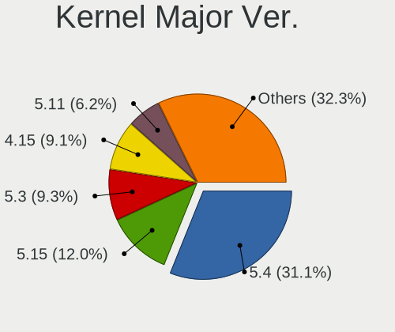
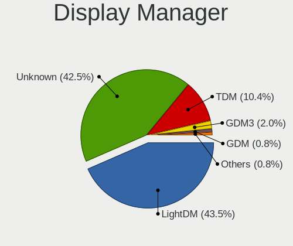
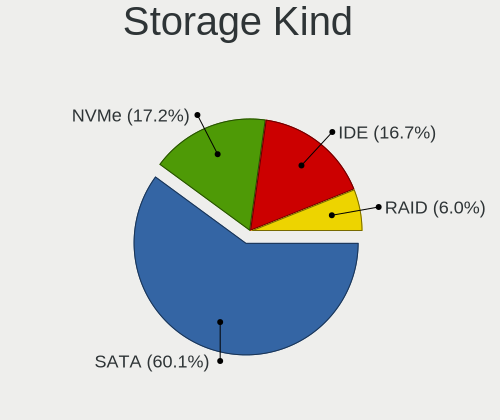
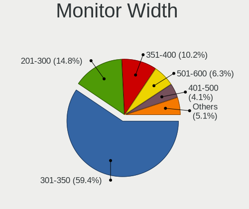
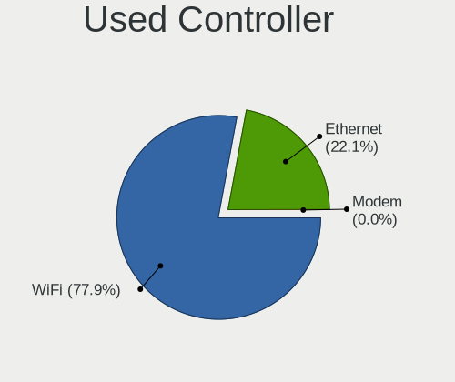
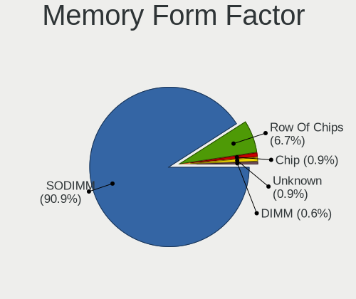
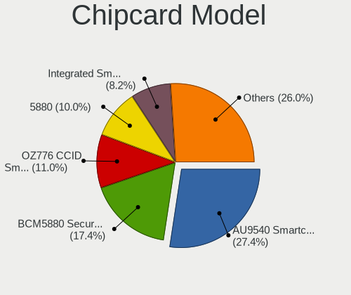

Xubuntu - Tested Hardware & Statistics (Notebooks)
--------------------------------------------------

A project to collect tested hardware configurations for Xubuntu.

Anyone can contribute to this report by the [hw-probe](https://github.com/linuxhw/hw-probe) tool:

    sudo -E hw-probe -all -upload

Please contribute! Especially if your hardware is rare.

Contents
--------

* [ Test Cases ](#test-cases)

* [ System ](#system)
  - [ OS                       ](#os)
  - [ OS Family                ](#os-family)
  - [ Kernel                   ](#kernel)
  - [ Kernel Family            ](#kernel-family)
  - [ Kernel Major Ver.        ](#kernel-major-ver)
  - [ Arch                     ](#arch)
  - [ DE                       ](#de)
  - [ Display Server           ](#display-server)
  - [ Display Manager          ](#display-manager)
  - [ OS Lang                  ](#os-lang)
  - [ Boot Mode                ](#boot-mode)
  - [ Filesystem               ](#filesystem)
  - [ Part. scheme             ](#part-scheme)
  - [ Dual Boot with Linux/BSD ](#dual-boot-with-linuxbsd)
  - [ Dual Boot (Win)          ](#dual-boot-win)

* [ Board ](#board)
  - [ Vendor                   ](#vendor)
  - [ Model                    ](#model)
  - [ Model Family             ](#model-family)
  - [ MFG Year                 ](#mfg-year)
  - [ Form Factor              ](#form-factor)
  - [ Secure Boot              ](#secure-boot)
  - [ Coreboot                 ](#coreboot)
  - [ RAM Size                 ](#ram-size)
  - [ RAM Used                 ](#ram-used)
  - [ Total Drives             ](#total-drives)
  - [ Has CD-ROM               ](#has-cd-rom)
  - [ Has Ethernet             ](#has-ethernet)
  - [ Has WiFi                 ](#has-wifi)
  - [ Has Bluetooth            ](#has-bluetooth)

* [ Location ](#location)
  - [ Country                  ](#country)
  - [ City                     ](#city)

* [ Drives ](#drives)
  - [ Drive Vendor             ](#drive-vendor)
  - [ Drive Model              ](#drive-model)
  - [ HDD Vendor               ](#hdd-vendor)
  - [ SSD Vendor               ](#ssd-vendor)
  - [ Drive Kind               ](#drive-kind)
  - [ Drive Connector          ](#drive-connector)
  - [ Drive Size               ](#drive-size)
  - [ Space Total              ](#space-total)
  - [ Space Used               ](#space-used)
  - [ Malfunc. Drives          ](#malfunc-drives)
  - [ Malfunc. Drive Vendor    ](#malfunc-drive-vendor)
  - [ Malfunc. HDD Vendor      ](#malfunc-hdd-vendor)
  - [ Malfunc. Drive Kind      ](#malfunc-drive-kind)
  - [ Failed Drives            ](#failed-drives)
  - [ Failed Drive Vendor      ](#failed-drive-vendor)
  - [ Drive Status             ](#drive-status)

* [ Storage controller ](#storage-controller)
  - [ Storage Vendor           ](#storage-vendor)
  - [ Storage Model            ](#storage-model)
  - [ Storage Kind             ](#storage-kind)

* [ Processor ](#processor)
  - [ CPU Vendor               ](#cpu-vendor)
  - [ CPU Model                ](#cpu-model)
  - [ CPU Model Family         ](#cpu-model-family)
  - [ CPU Cores                ](#cpu-cores)
  - [ CPU Sockets              ](#cpu-sockets)
  - [ CPU Threads              ](#cpu-threads)
  - [ CPU Op-Modes             ](#cpu-op-modes)
  - [ CPU Microcode            ](#cpu-microcode)
  - [ CPU Microarch            ](#cpu-microarch)

* [ Graphics ](#graphics)
  - [ GPU Vendor               ](#gpu-vendor)
  - [ GPU Model                ](#gpu-model)
  - [ GPU Combo                ](#gpu-combo)
  - [ GPU Driver               ](#gpu-driver)
  - [ GPU Memory               ](#gpu-memory)

* [ Monitor ](#monitor)
  - [ Monitor Vendor           ](#monitor-vendor)
  - [ Monitor Model            ](#monitor-model)
  - [ Monitor Resolution       ](#monitor-resolution)
  - [ Monitor Diagonal         ](#monitor-diagonal)
  - [ Monitor Width            ](#monitor-width)
  - [ Aspect Ratio             ](#aspect-ratio)
  - [ Monitor Area             ](#monitor-area)
  - [ Pixel Density            ](#pixel-density)
  - [ Multiple Monitors        ](#multiple-monitors)

* [ Network ](#network)
  - [ Net Controller Vendor    ](#net-controller-vendor)
  - [ Net Controller Model     ](#net-controller-model)
  - [ Wireless Vendor          ](#wireless-vendor)
  - [ Wireless Model           ](#wireless-model)
  - [ Ethernet Vendor          ](#ethernet-vendor)
  - [ Ethernet Model           ](#ethernet-model)
  - [ Net Controller Kind      ](#net-controller-kind)
  - [ Used Controller          ](#used-controller)
  - [ NICs                     ](#nics)
  - [ IPv6                     ](#ipv6)

* [ Bluetooth ](#bluetooth)
  - [ Bluetooth Vendor         ](#bluetooth-vendor)
  - [ Bluetooth Model          ](#bluetooth-model)

* [ Sound ](#sound)
  - [ Sound Vendor             ](#sound-vendor)
  - [ Sound Model              ](#sound-model)

* [ Memory ](#memory)
  - [ Memory Vendor            ](#memory-vendor)
  - [ Memory Model             ](#memory-model)
  - [ Memory Kind              ](#memory-kind)
  - [ Memory Form Factor       ](#memory-form-factor)
  - [ Memory Size              ](#memory-size)
  - [ Memory Speed             ](#memory-speed)

* [ Printers & scanners ](#printers--scanners)
  - [ Printer Vendor           ](#printer-vendor)
  - [ Printer Model            ](#printer-model)
  - [ Scanner Vendor           ](#scanner-vendor)
  - [ Scanner Model            ](#scanner-model)

* [ Camera ](#camera)
  - [ Camera Vendor            ](#camera-vendor)
  - [ Camera Model             ](#camera-model)

* [ Security ](#security)
  - [ Fingerprint Vendor       ](#fingerprint-vendor)
  - [ Fingerprint Model        ](#fingerprint-model)
  - [ Chipcard Vendor          ](#chipcard-vendor)
  - [ Chipcard Model           ](#chipcard-model)

* [ Unsupported ](#unsupported)
  - [ Unsupported Devices      ](#unsupported-devices)
  - [ Unsupported Device Types ](#unsupported-device-types)

Test Cases
----------

Total: 2916

| Vendor        | Model                       | Probe                                                      | Date         |
|---------------|-----------------------------|------------------------------------------------------------|--------------|
| Dell          | 500                         | [83c01aa11f](https://linux-hardware.org/?probe=83c01aa11f) | Oct 01, 2022 |
| Lenovo        | B70-80 80MR                 | [69aec9e100](https://linux-hardware.org/?probe=69aec9e100) | Oct 01, 2022 |
| HP            | Notebook                    | [fec2594d37](https://linux-hardware.org/?probe=fec2594d37) | Oct 01, 2022 |
| HP            | EliteBook 840 G3            | [ddf1904011](https://linux-hardware.org/?probe=ddf1904011) | Oct 01, 2022 |
| Acer          | Aspire A315-55G             | [77605e313d](https://linux-hardware.org/?probe=77605e313d) | Oct 01, 2022 |
| Lenovo        | ThinkPad E14 Gen 2 20TA0... | [025a55eab7](https://linux-hardware.org/?probe=025a55eab7) | Sep 30, 2022 |
| Lenovo        | ThinkPad E14 Gen 2 20TA0... | [875b1df312](https://linux-hardware.org/?probe=875b1df312) | Sep 30, 2022 |
| Sony          | SVE1512C6EB                 | [c47a3a5bd7](https://linux-hardware.org/?probe=c47a3a5bd7) | Sep 30, 2022 |
| Lenovo        | ThinkPad T420 42361L0       | [abe6563e67](https://linux-hardware.org/?probe=abe6563e67) | Sep 30, 2022 |
| Dell          | Latitude 5420               | [36ddd1d6d7](https://linux-hardware.org/?probe=36ddd1d6d7) | Sep 30, 2022 |
| Lenovo        | IdeaPad N585 20179          | [dcdafbbd9b](https://linux-hardware.org/?probe=dcdafbbd9b) | Sep 28, 2022 |
| HP            | Pavilion dv7                | [5479c35130](https://linux-hardware.org/?probe=5479c35130) | Sep 28, 2022 |
| Lenovo        | IdeaPad N585 20179          | [0a8aed635a](https://linux-hardware.org/?probe=0a8aed635a) | Sep 28, 2022 |
| Toshiba       | Satellite Pro R50-C         | [834ef0ec59](https://linux-hardware.org/?probe=834ef0ec59) | Sep 27, 2022 |
| Toshiba       | Satellite Pro R50-C         | [564d385b61](https://linux-hardware.org/?probe=564d385b61) | Sep 27, 2022 |
| Toshiba       | Satellite C650              | [c7920c2e68](https://linux-hardware.org/?probe=c7920c2e68) | Sep 24, 2022 |
| Packard Be... | EasyNote MH45               | [c312580997](https://linux-hardware.org/?probe=c312580997) | Sep 24, 2022 |
| Unknown       | Unknown                     | [63b1596d63](https://linux-hardware.org/?probe=63b1596d63) | Sep 24, 2022 |
| Toshiba       | Satellite C55D-B            | [5b2029b4d3](https://linux-hardware.org/?probe=5b2029b4d3) | Sep 24, 2022 |
| Toshiba       | Satellite A300              | [3f6203e550](https://linux-hardware.org/?probe=3f6203e550) | Sep 24, 2022 |
| Tactus        | GeoBook 140                 | [7d8700d0e1](https://linux-hardware.org/?probe=7d8700d0e1) | Sep 23, 2022 |
| Dell          | Latitude 5411               | [018a9c569a](https://linux-hardware.org/?probe=018a9c569a) | Sep 23, 2022 |
| HP            | EliteBook 840 G3            | [c3a88ed62d](https://linux-hardware.org/?probe=c3a88ed62d) | Sep 22, 2022 |
| Lenovo        | ThinkPad P51s 20HCS00F00    | [5f0dc19f55](https://linux-hardware.org/?probe=5f0dc19f55) | Sep 22, 2022 |
| Lenovo        | ThinkPad T61 7659AB7        | [aa07f9c271](https://linux-hardware.org/?probe=aa07f9c271) | Sep 20, 2022 |
| Lenovo        | ThinkPad T61p 6457A24       | [d98e9a64bd](https://linux-hardware.org/?probe=d98e9a64bd) | Sep 20, 2022 |
| HP            | ProBook 450 G2              | [73c35ad64a](https://linux-hardware.org/?probe=73c35ad64a) | Sep 20, 2022 |
| Dell          | Precision 7750              | [ced8b5a7b2](https://linux-hardware.org/?probe=ced8b5a7b2) | Sep 19, 2022 |
| Lenovo        | ThinkPad X220 42918F6       | [69dda668fc](https://linux-hardware.org/?probe=69dda668fc) | Sep 18, 2022 |
| Acer          | Swift SF314-511             | [914d532c78](https://linux-hardware.org/?probe=914d532c78) | Sep 17, 2022 |
| Dell          | Latitude 7490               | [ce54bcd741](https://linux-hardware.org/?probe=ce54bcd741) | Sep 15, 2022 |
| Dell          | Inspiron 3576               | [02023473b8](https://linux-hardware.org/?probe=02023473b8) | Sep 15, 2022 |
| HP            | Laptop 15-ef1xxx            | [dd55f6960d](https://linux-hardware.org/?probe=dd55f6960d) | Sep 15, 2022 |
| Dell          | Precision 5540              | [229337f709](https://linux-hardware.org/?probe=229337f709) | Sep 13, 2022 |
| HP            | 1000                        | [65024f3d7a](https://linux-hardware.org/?probe=65024f3d7a) | Sep 13, 2022 |
| Dell          | Inspiron 3537               | [afd2b6555e](https://linux-hardware.org/?probe=afd2b6555e) | Sep 12, 2022 |
| ASUSTek       | X453SA                      | [1446eda5e9](https://linux-hardware.org/?probe=1446eda5e9) | Sep 12, 2022 |
| ASUSTek       | ASUS TUF Gaming A15 FA50... | [1f2be56ed4](https://linux-hardware.org/?probe=1f2be56ed4) | Sep 09, 2022 |
| ASUSTek       | ASUS TUF Gaming A15 FA50... | [31717bdcb1](https://linux-hardware.org/?probe=31717bdcb1) | Sep 09, 2022 |
| Dell          | Latitude 9520               | [04188fb6c2](https://linux-hardware.org/?probe=04188fb6c2) | Sep 06, 2022 |
| ASUSTek       | K55VD                       | [c1ca471555](https://linux-hardware.org/?probe=c1ca471555) | Sep 06, 2022 |
| Panasonic     | CF-D1DVA06F3                | [e3cc43135a](https://linux-hardware.org/?probe=e3cc43135a) | Sep 05, 2022 |
| HP            | 255 G7 Notebook PC          | [dd775ffe8f](https://linux-hardware.org/?probe=dd775ffe8f) | Sep 05, 2022 |
| HP            | Laptop 15-dw0xxx            | [1bd6f2ba6f](https://linux-hardware.org/?probe=1bd6f2ba6f) | Sep 04, 2022 |
| Google        | Kip                         | [e92d971d5e](https://linux-hardware.org/?probe=e92d971d5e) | Sep 04, 2022 |
| Lenovo        | IdeaPad 120S-14IAP 81A5     | [059bb72ff2](https://linux-hardware.org/?probe=059bb72ff2) | Sep 03, 2022 |
| Google        | Reks                        | [d88eecb32d](https://linux-hardware.org/?probe=d88eecb32d) | Sep 03, 2022 |
| HP            | EliteBook 2570p             | [506f9da93b](https://linux-hardware.org/?probe=506f9da93b) | Sep 03, 2022 |
| Apple         | MacBookPro16,1              | [8add31fdfe](https://linux-hardware.org/?probe=8add31fdfe) | Sep 02, 2022 |
| Acer          | Aspire A315-31              | [21d3a4bd56](https://linux-hardware.org/?probe=21d3a4bd56) | Sep 02, 2022 |
| Dell          | Latitude E5530 non-vPro     | [7e839a0ef4](https://linux-hardware.org/?probe=7e839a0ef4) | Aug 30, 2022 |
| Acer          | Aspire E5-771G              | [76803c2532](https://linux-hardware.org/?probe=76803c2532) | Aug 30, 2022 |
| Sony          | VPCSB1V9R                   | [b54e74887f](https://linux-hardware.org/?probe=b54e74887f) | Aug 29, 2022 |
| Acer          | Aspire E5-771G              | [52cc79c6d9](https://linux-hardware.org/?probe=52cc79c6d9) | Aug 29, 2022 |
| Dell          | Inspiron N5010              | [b9953ab67e](https://linux-hardware.org/?probe=b9953ab67e) | Aug 27, 2022 |
| Lenovo        | V340-17IWL 81RG             | [f725a87544](https://linux-hardware.org/?probe=f725a87544) | Aug 27, 2022 |
| Lenovo        | 14w 81MQ000JUS              | [d71f12bede](https://linux-hardware.org/?probe=d71f12bede) | Aug 27, 2022 |
| Lenovo        | V340-17IWL 81RG             | [8a689fc0fd](https://linux-hardware.org/?probe=8a689fc0fd) | Aug 27, 2022 |
| Dell          | XPS 13 9380                 | [5bb7561235](https://linux-hardware.org/?probe=5bb7561235) | Aug 25, 2022 |
| Lenovo        | ThinkPad P70 20ERCTO1WW     | [d269aaa456](https://linux-hardware.org/?probe=d269aaa456) | Aug 25, 2022 |
| ASUSTek       | ASUS TUF Gaming A15 FA50... | [92be7f3368](https://linux-hardware.org/?probe=92be7f3368) | Aug 24, 2022 |
| Acer          | Aspire 5740                 | [5652f2c73d](https://linux-hardware.org/?probe=5652f2c73d) | Aug 24, 2022 |
| Lenovo        | 14w 81MQ000JUS              | [1ff769c6ef](https://linux-hardware.org/?probe=1ff769c6ef) | Aug 23, 2022 |
| Acer          | Unknown                     | [c35afdde00](https://linux-hardware.org/?probe=c35afdde00) | Aug 21, 2022 |
| Lenovo        | ThinkPad X220 4291V1C       | [8ab56e33c4](https://linux-hardware.org/?probe=8ab56e33c4) | Aug 21, 2022 |
| Lenovo        | ThinkPad T480 20L5000BGE    | [dd53f23249](https://linux-hardware.org/?probe=dd53f23249) | Aug 20, 2022 |
| HP            | EliteBook 8540p             | [cdd3dd9925](https://linux-hardware.org/?probe=cdd3dd9925) | Aug 19, 2022 |
| Packard Be... | EasyNote TJ66               | [96c3144e93](https://linux-hardware.org/?probe=96c3144e93) | Aug 19, 2022 |
| ASUSTek       | K53TA                       | [db6525efb3](https://linux-hardware.org/?probe=db6525efb3) | Aug 15, 2022 |
| ASUSTek       | K84C                        | [c19b238bcf](https://linux-hardware.org/?probe=c19b238bcf) | Aug 15, 2022 |
| Lenovo        | ThinkPad T460s 20FAS0Q90... | [644c7518e9](https://linux-hardware.org/?probe=644c7518e9) | Aug 14, 2022 |
| ASUSTek       | X101CH                      | [174bc50211](https://linux-hardware.org/?probe=174bc50211) | Aug 14, 2022 |
| Panasonic     | CF-31XEUAXMF                | [914e54f984](https://linux-hardware.org/?probe=914e54f984) | Aug 13, 2022 |
| Toshiba       | PT10F                       | [08b7dc52a2](https://linux-hardware.org/?probe=08b7dc52a2) | Aug 12, 2022 |
| Mediacom      | SmartBook 14 FullHD - SB... | [5bb07e1a28](https://linux-hardware.org/?probe=5bb07e1a28) | Aug 11, 2022 |
| Dell          | System XPS L502X            | [1453afc507](https://linux-hardware.org/?probe=1453afc507) | Aug 09, 2022 |
| Lenovo        | ThinkPad E590 20NB002AMH    | [aed42791cd](https://linux-hardware.org/?probe=aed42791cd) | Aug 09, 2022 |
| ASUSTek       | K53SC                       | [15522c32d7](https://linux-hardware.org/?probe=15522c32d7) | Aug 06, 2022 |
| Lenovo        | ThinkPad T460s 20FAS6JY0... | [7d85d4f00b](https://linux-hardware.org/?probe=7d85d4f00b) | Aug 06, 2022 |
| Render        | NOTEBOOK Revision A         | [90a540652f](https://linux-hardware.org/?probe=90a540652f) | Aug 06, 2022 |
| ASUSTek       | 1015CX                      | [f8d358f521](https://linux-hardware.org/?probe=f8d358f521) | Aug 05, 2022 |
| Lenovo        | IdeaPad 120S-14IAP 81A5     | [eeff2bac06](https://linux-hardware.org/?probe=eeff2bac06) | Aug 05, 2022 |
| Lenovo        | IdeaPad 330-15IKB 81FE      | [32a99db93e](https://linux-hardware.org/?probe=32a99db93e) | Aug 04, 2022 |
| Acer          | Aspire V3-551G              | [8b0237ee5e](https://linux-hardware.org/?probe=8b0237ee5e) | Aug 03, 2022 |
| Lenovo        | ThinkPad T430 23501K1       | [fdd30ffa23](https://linux-hardware.org/?probe=fdd30ffa23) | Aug 03, 2022 |
| Acer          | Aspire V3-551G              | [4b8ed45c90](https://linux-hardware.org/?probe=4b8ed45c90) | Aug 03, 2022 |
| HP            | Pavilion Laptop 14-dv0xx... | [8aa899fe67](https://linux-hardware.org/?probe=8aa899fe67) | Aug 02, 2022 |
| GMKtec        | NucBox5                     | [5023bc1773](https://linux-hardware.org/?probe=5023bc1773) | Aug 02, 2022 |
| Lenovo        | IdeaPad 330S-15IKB 81F5     | [e512f0884d](https://linux-hardware.org/?probe=e512f0884d) | Aug 01, 2022 |
| Dell          | Inspiron 5748               | [9113ee6d54](https://linux-hardware.org/?probe=9113ee6d54) | Aug 01, 2022 |
| Unknown       | Unknown                     | [50153bd9ff](https://linux-hardware.org/?probe=50153bd9ff) | Aug 01, 2022 |
| HP            | Pavilion dv2600             | [87651d6efc](https://linux-hardware.org/?probe=87651d6efc) | Jul 31, 2022 |
| Unknown       | Unknown                     | [aa0c007709](https://linux-hardware.org/?probe=aa0c007709) | Jul 31, 2022 |
| HUAWEI        | BOHK-WAX9X                  | [745f6815cb](https://linux-hardware.org/?probe=745f6815cb) | Jul 30, 2022 |
| Alienware     | 17 R4                       | [ae2cd7095b](https://linux-hardware.org/?probe=ae2cd7095b) | Jul 29, 2022 |
| Dell          | Vostro 3700                 | [0a4b552d69](https://linux-hardware.org/?probe=0a4b552d69) | Jul 28, 2022 |
| Samsung       | R59P/R60P/R61P              | [d435057109](https://linux-hardware.org/?probe=d435057109) | Jul 28, 2022 |
| Schenker      | WORK (Early 2021)           | [8666cc396a](https://linux-hardware.org/?probe=8666cc396a) | Jul 28, 2022 |
| ASUSTek       | X450CP                      | [dceda2fe9d](https://linux-hardware.org/?probe=dceda2fe9d) | Jul 27, 2022 |
| LG Electro... | LE50-5BC6H1                 | [010123b7d5](https://linux-hardware.org/?probe=010123b7d5) | Jul 26, 2022 |
| Lenovo        | G50-30 80G0                 | [c380d02bbf](https://linux-hardware.org/?probe=c380d02bbf) | Jul 25, 2022 |
| Apple         | MacBookPro12,1              | [4db419918b](https://linux-hardware.org/?probe=4db419918b) | Jul 25, 2022 |
| Toshiba       | NB205                       | [2dd373f150](https://linux-hardware.org/?probe=2dd373f150) | Jul 23, 2022 |
| ASUSTek       | N56VZ                       | [3813cc04d1](https://linux-hardware.org/?probe=3813cc04d1) | Jul 22, 2022 |
| Dell          | Inspiron N5030              | [3ae520c245](https://linux-hardware.org/?probe=3ae520c245) | Jul 22, 2022 |
| HP            | ProBook 640 G8 Notebook ... | [75f71928fe](https://linux-hardware.org/?probe=75f71928fe) | Jul 21, 2022 |
| MSI           | U-100 Ver.001               | [b5b7407958](https://linux-hardware.org/?probe=b5b7407958) | Jul 20, 2022 |
| MSI           | U-100 Ver.001               | [819488216f](https://linux-hardware.org/?probe=819488216f) | Jul 20, 2022 |
| ASUSTek       | VivoBook_ASUSLaptop X513... | [75b4088788](https://linux-hardware.org/?probe=75b4088788) | Jul 20, 2022 |
| ASUSTek       | VivoBook_ASUSLaptop X513... | [3c2afd2b5e](https://linux-hardware.org/?probe=3c2afd2b5e) | Jul 20, 2022 |
| HP            | EliteBook 845 G8 Noteboo... | [2a10c24690](https://linux-hardware.org/?probe=2a10c24690) | Jul 20, 2022 |
| ASUSTek       | FX503VM                     | [47c70e3628](https://linux-hardware.org/?probe=47c70e3628) | Jul 19, 2022 |
| Dell          | Latitude D430               | [7ae462d6f7](https://linux-hardware.org/?probe=7ae462d6f7) | Jul 18, 2022 |
| Lenovo        | ThinkPad W540 20BG001CMN    | [117f9a585b](https://linux-hardware.org/?probe=117f9a585b) | Jul 17, 2022 |
| ASUSTek       | U30Jc                       | [3a6a0ec169](https://linux-hardware.org/?probe=3a6a0ec169) | Jul 17, 2022 |
| Lenovo        | ThinkPad W540 20BG001CMN    | [e408c1236c](https://linux-hardware.org/?probe=e408c1236c) | Jul 17, 2022 |
| Acer          | Aspire E1-532               | [13d38a6632](https://linux-hardware.org/?probe=13d38a6632) | Jul 16, 2022 |
| ASUSTek       | ROG Zephyrus G14 GA401QM... | [a6ae556389](https://linux-hardware.org/?probe=a6ae556389) | Jul 16, 2022 |
| Samsung       | R59P/R60P/R61P              | [4773de66cf](https://linux-hardware.org/?probe=4773de66cf) | Jul 15, 2022 |
| ASUSTek       | K53SC                       | [dd45175b9d](https://linux-hardware.org/?probe=dd45175b9d) | Jul 15, 2022 |
| HP            | Stream Laptop 14-ax0XX      | [daf43ce57a](https://linux-hardware.org/?probe=daf43ce57a) | Jul 13, 2022 |
| HP            | Stream Laptop 14-ax0XX      | [4a587952db](https://linux-hardware.org/?probe=4a587952db) | Jul 13, 2022 |
| Apple         | MacBookPro15,3              | [a8f8224853](https://linux-hardware.org/?probe=a8f8224853) | Jul 11, 2022 |
| ASUSTek       | X453MA                      | [da05c4539d](https://linux-hardware.org/?probe=da05c4539d) | Jul 11, 2022 |
| MSI           | GF63 Thin 9RCX              | [f2f3db370a](https://linux-hardware.org/?probe=f2f3db370a) | Jul 10, 2022 |
| HP            | Laptop 14-bw0xx             | [17b90f7a4b](https://linux-hardware.org/?probe=17b90f7a4b) | Jul 10, 2022 |
| HP            | Laptop 14-bw0xx             | [3b8444274b](https://linux-hardware.org/?probe=3b8444274b) | Jul 10, 2022 |
| Lenovo        | ThinkPad W540 20BG001KGE    | [434091ba07](https://linux-hardware.org/?probe=434091ba07) | Jul 10, 2022 |
| Toshiba       | NB205                       | [f4046cb02f](https://linux-hardware.org/?probe=f4046cb02f) | Jul 10, 2022 |
| Acer          | Aspire E5-521               | [7becd2f2df](https://linux-hardware.org/?probe=7becd2f2df) | Jul 10, 2022 |
| Lenovo        | IdeaPad 520-15IKB 81BF      | [bb736b4d03](https://linux-hardware.org/?probe=bb736b4d03) | Jul 08, 2022 |
| Lenovo        | ThinkPad P14s Gen 2a 21A... | [b2d4e91300](https://linux-hardware.org/?probe=b2d4e91300) | Jul 07, 2022 |
| HP            | Notebook                    | [0c64a91465](https://linux-hardware.org/?probe=0c64a91465) | Jul 07, 2022 |
| HP            | EliteBook 845 G8 Noteboo... | [5cff36844a](https://linux-hardware.org/?probe=5cff36844a) | Jul 07, 2022 |
| Lenovo        | G50-70 20351                | [68efa303fa](https://linux-hardware.org/?probe=68efa303fa) | Jul 07, 2022 |
| Acer          | Aspire E5-521               | [f27a09f9eb](https://linux-hardware.org/?probe=f27a09f9eb) | Jul 07, 2022 |
| Chuwi         | FreeBook                    | [3e0b057e38](https://linux-hardware.org/?probe=3e0b057e38) | Jul 07, 2022 |
| Samsung       | 350V5C/351V5C/3540VC/344... | [e5bf9b72d0](https://linux-hardware.org/?probe=e5bf9b72d0) | Jul 07, 2022 |
| Acer          | Aspire E5-571               | [2225f70ee7](https://linux-hardware.org/?probe=2225f70ee7) | Jul 06, 2022 |
| Dell          | Inspiron 5593               | [542470182e](https://linux-hardware.org/?probe=542470182e) | Jul 05, 2022 |
| ASUSTek       | ZenBook UX435EG_UX435EG     | [51b138f349](https://linux-hardware.org/?probe=51b138f349) | Jul 04, 2022 |
| Lenovo        | V330-15IKB 81AX             | [2f915d68e5](https://linux-hardware.org/?probe=2f915d68e5) | Jul 04, 2022 |
| ASUSTek       | K53SC                       | [ef75149636](https://linux-hardware.org/?probe=ef75149636) | Jul 03, 2022 |
| Samsung       | 370E4K                      | [a6512c1606](https://linux-hardware.org/?probe=a6512c1606) | Jul 03, 2022 |
| HP            | Mini 210-1100               | [72289b7641](https://linux-hardware.org/?probe=72289b7641) | Jul 03, 2022 |
| HP            | Mini 210-1100               | [aaa9b86216](https://linux-hardware.org/?probe=aaa9b86216) | Jul 02, 2022 |
| Dell          | 500                         | [040e3cb12c](https://linux-hardware.org/?probe=040e3cb12c) | Jun 30, 2022 |
| HP            | EliteBook 840 G3            | [9ce5b9c45c](https://linux-hardware.org/?probe=9ce5b9c45c) | Jun 30, 2022 |
| Acer          | Aspire E5-521               | [717281a3f9](https://linux-hardware.org/?probe=717281a3f9) | Jun 29, 2022 |
| Acer          | Aspire E5-521               | [f532d90f38](https://linux-hardware.org/?probe=f532d90f38) | Jun 29, 2022 |
| Standard      | Unknown                     | [1a94acbc05](https://linux-hardware.org/?probe=1a94acbc05) | Jun 29, 2022 |
| HP            | ProBook 455 G8 Notebook ... | [e08493100f](https://linux-hardware.org/?probe=e08493100f) | Jun 29, 2022 |
| Lenovo        | IdeaPad 330-17IKB 81DK      | [2fa204d33e](https://linux-hardware.org/?probe=2fa204d33e) | Jun 29, 2022 |
| Lenovo        | ThinkPad T14s Gen 1 20UH... | [bd4018ed46](https://linux-hardware.org/?probe=bd4018ed46) | Jun 29, 2022 |
| Lenovo        | IdeaPad 330S-15IKB 81F5     | [372d361276](https://linux-hardware.org/?probe=372d361276) | Jun 28, 2022 |
| ASUSTek       | X551MA                      | [9bdb2a5577](https://linux-hardware.org/?probe=9bdb2a5577) | Jun 28, 2022 |
| Lenovo        | ThinkPad P17 Gen 1 20SQS... | [ac9a35e85e](https://linux-hardware.org/?probe=ac9a35e85e) | Jun 27, 2022 |
| HP            | Laptop 15-ef1xxx            | [d0200625ac](https://linux-hardware.org/?probe=d0200625ac) | Jun 27, 2022 |
| Dell          | Inspiron 15-3567            | [e6d22a4d34](https://linux-hardware.org/?probe=e6d22a4d34) | Jun 27, 2022 |
| Standard      | Unknown                     | [93ac825a25](https://linux-hardware.org/?probe=93ac825a25) | Jun 27, 2022 |
| Apple         | MacBookPro1,1               | [feddac03b9](https://linux-hardware.org/?probe=feddac03b9) | Jun 26, 2022 |
| Lenovo        | ThinkPad T420s 417152U      | [cc52ed5e41](https://linux-hardware.org/?probe=cc52ed5e41) | Jun 26, 2022 |
| HP            | Pavilion dv5                | [4009a4fd8c](https://linux-hardware.org/?probe=4009a4fd8c) | Jun 24, 2022 |
| HP            | Laptop 15-ef1xxx            | [1d18aab349](https://linux-hardware.org/?probe=1d18aab349) | Jun 23, 2022 |
| Dell          | Inspiron 5570               | [4a61f83195](https://linux-hardware.org/?probe=4a61f83195) | Jun 23, 2022 |
| MSI           | Modern 15 A5M               | [b648b81eca](https://linux-hardware.org/?probe=b648b81eca) | Jun 23, 2022 |
| Apple         | MacBookPro14,1              | [e9d8c28a34](https://linux-hardware.org/?probe=e9d8c28a34) | Jun 22, 2022 |
| Alienware     | 17 R4                       | [74b66aebc5](https://linux-hardware.org/?probe=74b66aebc5) | Jun 21, 2022 |
| Dell          | Inspiron 15-3567            | [9538654245](https://linux-hardware.org/?probe=9538654245) | Jun 21, 2022 |
| HP            | 15                          | [61e6eddc93](https://linux-hardware.org/?probe=61e6eddc93) | Jun 20, 2022 |
| Google        | Kindred                     | [c12b15c596](https://linux-hardware.org/?probe=c12b15c596) | Jun 17, 2022 |
| Acer          | Aspire 7720                 | [3f098cc493](https://linux-hardware.org/?probe=3f098cc493) | Jun 15, 2022 |
| Acer          | Aspire 7720                 | [d60aee8a9c](https://linux-hardware.org/?probe=d60aee8a9c) | Jun 15, 2022 |
| Dynabook      | TECRA A50-J                 | [3f4449202f](https://linux-hardware.org/?probe=3f4449202f) | Jun 14, 2022 |
| Sony          | VPCSB1V9R                   | [c1490b2a1c](https://linux-hardware.org/?probe=c1490b2a1c) | Jun 14, 2022 |
| HP            | ProBook 445 G7              | [f41d413820](https://linux-hardware.org/?probe=f41d413820) | Jun 13, 2022 |
| Lenovo        | ThinkPad T530 23923MG       | [cf21c4e831](https://linux-hardware.org/?probe=cf21c4e831) | Jun 12, 2022 |
| HP            | 255 G7 Notebook PC          | [0ebaae147d](https://linux-hardware.org/?probe=0ebaae147d) | Jun 12, 2022 |
| GPU Compan... | GWTN141-4                   | [ba579cb383](https://linux-hardware.org/?probe=ba579cb383) | Jun 11, 2022 |
| Matsushita... | CF-W5LWEZZBM                | [380c6df037](https://linux-hardware.org/?probe=380c6df037) | Jun 11, 2022 |
| Packard Be... | EasyNote TK11BZ             | [f9c69ea1c6](https://linux-hardware.org/?probe=f9c69ea1c6) | Jun 11, 2022 |
| Lenovo        | G505 20240                  | [0b0d5e5252](https://linux-hardware.org/?probe=0b0d5e5252) | Jun 11, 2022 |
| Dell          | Latitude 7280               | [7900c8009a](https://linux-hardware.org/?probe=7900c8009a) | Jun 10, 2022 |
| Lenovo        | ThinkPad X200 7459V2R       | [565722f81e](https://linux-hardware.org/?probe=565722f81e) | Jun 09, 2022 |
| Lenovo        | ThinkPad X200 7459V2R       | [c36b6d8e2c](https://linux-hardware.org/?probe=c36b6d8e2c) | Jun 09, 2022 |
| GPU Compan... | GWTN116-3                   | [bd0f56a43c](https://linux-hardware.org/?probe=bd0f56a43c) | Jun 09, 2022 |
| Chuwi         | GemiBook Pro                | [7bd963dd56](https://linux-hardware.org/?probe=7bd963dd56) | Jun 09, 2022 |
| Acer          | Aspire 7720                 | [640b757bc8](https://linux-hardware.org/?probe=640b757bc8) | Jun 08, 2022 |
| ASUSTek       | VivoBook_ASUSLaptop X760... | [674cab9d61](https://linux-hardware.org/?probe=674cab9d61) | Jun 08, 2022 |
| Lenovo        | ThinkPad L380 20M6S4J400    | [dc1bcd1532](https://linux-hardware.org/?probe=dc1bcd1532) | Jun 08, 2022 |
| Acer          | Aspire E5-573               | [bb17805ada](https://linux-hardware.org/?probe=bb17805ada) | Jun 08, 2022 |
| HP            | Pavilion Laptop 15-eh1xx... | [77a5e1c6f9](https://linux-hardware.org/?probe=77a5e1c6f9) | Jun 08, 2022 |
| Acer          | Aspire 7720                 | [ac4362743a](https://linux-hardware.org/?probe=ac4362743a) | Jun 07, 2022 |
| AMI           | Intel                       | [79b1f29bc4](https://linux-hardware.org/?probe=79b1f29bc4) | Jun 07, 2022 |
| AMI           | Intel                       | [d7746ec6d5](https://linux-hardware.org/?probe=d7746ec6d5) | Jun 07, 2022 |
| Chuwi         | GemiBook Pro                | [2d31db0d12](https://linux-hardware.org/?probe=2d31db0d12) | Jun 07, 2022 |
| Lenovo        | ThinkPad T440s 20AQ009DG... | [c4250d2ee2](https://linux-hardware.org/?probe=c4250d2ee2) | Jun 07, 2022 |
| Fujitsu       | LIFEBOOK U772               | [8dcf195f94](https://linux-hardware.org/?probe=8dcf195f94) | Jun 07, 2022 |
| Digma         | EVE 15 C413 ES5059EW        | [26eb7d39e1](https://linux-hardware.org/?probe=26eb7d39e1) | Jun 06, 2022 |
| HP            | Pavilion g7                 | [b31de17368](https://linux-hardware.org/?probe=b31de17368) | Jun 06, 2022 |
| Chuwi         | GemiBook Pro                | [48738fc474](https://linux-hardware.org/?probe=48738fc474) | Jun 06, 2022 |
| MSI           | PR601/VR603                 | [9763977184](https://linux-hardware.org/?probe=9763977184) | Jun 05, 2022 |
| Chuwi         | GemiBook Pro                | [e8dd7b95a6](https://linux-hardware.org/?probe=e8dd7b95a6) | Jun 03, 2022 |
| Dell          | Inspiron N4010              | [49e472d67e](https://linux-hardware.org/?probe=49e472d67e) | Jun 02, 2022 |
| Lenovo        | ThinkPad W510 431963G       | [dfe3e4b66b](https://linux-hardware.org/?probe=dfe3e4b66b) | Jun 02, 2022 |
| Lenovo        | ThinkPad W510 431963G       | [d620bac2cb](https://linux-hardware.org/?probe=d620bac2cb) | Jun 02, 2022 |
| Dell          | Latitude D820               | [8c2336469f](https://linux-hardware.org/?probe=8c2336469f) | Jun 01, 2022 |
| Acer          | Aspire 5740                 | [db6d025d69](https://linux-hardware.org/?probe=db6d025d69) | Jun 01, 2022 |
| Lenovo        | ThinkPad L13 20R4S4WG00     | [14100804b6](https://linux-hardware.org/?probe=14100804b6) | May 31, 2022 |
| Lenovo        | ThinkPad W510 431963G       | [e46a1497d8](https://linux-hardware.org/?probe=e46a1497d8) | May 31, 2022 |
| Dell          | Latitude 5511               | [bc6fd9e79d](https://linux-hardware.org/?probe=bc6fd9e79d) | May 30, 2022 |
| Medion        | E15407                      | [6e457b6abb](https://linux-hardware.org/?probe=6e457b6abb) | May 29, 2022 |
| Medion        | E15407                      | [a0d6c795e7](https://linux-hardware.org/?probe=a0d6c795e7) | May 29, 2022 |
| TUXEDO        | N14xWU                      | [c20d682e14](https://linux-hardware.org/?probe=c20d682e14) | May 29, 2022 |
| TUXEDO        | N14xWU                      | [8711ac9989](https://linux-hardware.org/?probe=8711ac9989) | May 26, 2022 |
| Acer          | Aspire 5740                 | [2c541b20f6](https://linux-hardware.org/?probe=2c541b20f6) | May 26, 2022 |
| HP            | Laptop 15-bw0xx             | [f71c048a96](https://linux-hardware.org/?probe=f71c048a96) | May 25, 2022 |
| HP            | Mini 5103                   | [aa7f4e957e](https://linux-hardware.org/?probe=aa7f4e957e) | May 23, 2022 |
| ASUSTek       | X510UA                      | [51d57b9e53](https://linux-hardware.org/?probe=51d57b9e53) | May 22, 2022 |
| Sony          | VGN-NS21S_S                 | [0c972ad98b](https://linux-hardware.org/?probe=0c972ad98b) | May 21, 2022 |
| HP            | Pavilion dv6000 (RR374EA... | [926749e311](https://linux-hardware.org/?probe=926749e311) | May 21, 2022 |
| Google        | Snappy                      | [c88d27b24a](https://linux-hardware.org/?probe=c88d27b24a) | May 20, 2022 |
| Google        | Snappy                      | [9fc85cd49a](https://linux-hardware.org/?probe=9fc85cd49a) | May 20, 2022 |
| Google        | Snappy                      | [cb9e7730ad](https://linux-hardware.org/?probe=cb9e7730ad) | May 20, 2022 |
| HP            | Compaq nc6320 (RH374EA#A... | [baed2325d7](https://linux-hardware.org/?probe=baed2325d7) | May 20, 2022 |
| Lenovo        | Legion Y540-17IRH-PG0 81... | [086fceea4f](https://linux-hardware.org/?probe=086fceea4f) | May 19, 2022 |
| Lenovo        | ThinkPad E580 20KS001JGE    | [724c06c08c](https://linux-hardware.org/?probe=724c06c08c) | May 19, 2022 |
| Lenovo        | ThinkPad T410 2516CTO       | [e4150ff93b](https://linux-hardware.org/?probe=e4150ff93b) | May 19, 2022 |
| IBM           | ThinkPad T43 2668F5G        | [af59841e31](https://linux-hardware.org/?probe=af59841e31) | May 18, 2022 |
| Dell          | Latitude D610               | [2e945626d4](https://linux-hardware.org/?probe=2e945626d4) | May 17, 2022 |
| Dell          | Latitude D610               | [9ee1df5d0e](https://linux-hardware.org/?probe=9ee1df5d0e) | May 17, 2022 |
| Dell          | Latitude E6410              | [ae757ea3a4](https://linux-hardware.org/?probe=ae757ea3a4) | May 16, 2022 |
| ASUSTek       | UL30A                       | [c121dd37ba](https://linux-hardware.org/?probe=c121dd37ba) | May 16, 2022 |
| ASUSTek       | X101CH                      | [544536b2d8](https://linux-hardware.org/?probe=544536b2d8) | May 16, 2022 |
| ASUSTek       | X101CH                      | [fbcf200ed5](https://linux-hardware.org/?probe=fbcf200ed5) | May 16, 2022 |
| HP            | Mini 110-1100               | [b93ac7c302](https://linux-hardware.org/?probe=b93ac7c302) | May 16, 2022 |
| HP            | Mini 110-1100               | [4a5f85e53d](https://linux-hardware.org/?probe=4a5f85e53d) | May 16, 2022 |
| Dell          | Latitude 5580               | [c2f15d647a](https://linux-hardware.org/?probe=c2f15d647a) | May 15, 2022 |
| Google        | Droid                       | [e938864c93](https://linux-hardware.org/?probe=e938864c93) | May 15, 2022 |
| Lenovo        | ThinkPad X200s 74664SJ      | [65728fda7a](https://linux-hardware.org/?probe=65728fda7a) | May 14, 2022 |
| Lenovo        | IdeaPad L340-17IRH Gamin... | [a3b1829dec](https://linux-hardware.org/?probe=a3b1829dec) | May 13, 2022 |
| AMI           | Cherry Trail CR             | [62744ba7e3](https://linux-hardware.org/?probe=62744ba7e3) | May 12, 2022 |
| ASUSTek       | A7K                         | [29ca1c7e33](https://linux-hardware.org/?probe=29ca1c7e33) | May 11, 2022 |
| Dell          | Latitude E6410              | [a14c28c93f](https://linux-hardware.org/?probe=a14c28c93f) | May 11, 2022 |
| ASUSTek       | ASUS TUF Dash F15 FX516P... | [bb4a27a023](https://linux-hardware.org/?probe=bb4a27a023) | May 10, 2022 |
| Dell          | Latitude 7400               | [a0600c38f3](https://linux-hardware.org/?probe=a0600c38f3) | May 09, 2022 |
| Unknown       | Unknown                     | [f802e84b8e](https://linux-hardware.org/?probe=f802e84b8e) | May 08, 2022 |
| Lenovo        | ThinkPad X240 20AMS6FF00    | [3e3da41a35](https://linux-hardware.org/?probe=3e3da41a35) | May 08, 2022 |
| Dell          | Latitude E6410              | [361bcaa4cc](https://linux-hardware.org/?probe=361bcaa4cc) | May 07, 2022 |
| Dell          | Inspiron 7501               | [a8a1e1e3a2](https://linux-hardware.org/?probe=a8a1e1e3a2) | May 07, 2022 |
| HP            | Compaq 6820s                | [1ba74fc299](https://linux-hardware.org/?probe=1ba74fc299) | May 07, 2022 |
| HP            | Compaq 6820s                | [5b027deec0](https://linux-hardware.org/?probe=5b027deec0) | May 07, 2022 |
| Toshiba       | Satellite C70D-B            | [fa4a4b7ffc](https://linux-hardware.org/?probe=fa4a4b7ffc) | May 06, 2022 |
| Acer          | Aspire 5740                 | [e754b48e71](https://linux-hardware.org/?probe=e754b48e71) | May 06, 2022 |
| Dell          | Latitude 7420               | [384325350c](https://linux-hardware.org/?probe=384325350c) | May 05, 2022 |
| Google        | Auron_Yuna                  | [795d9af5a7](https://linux-hardware.org/?probe=795d9af5a7) | May 05, 2022 |
| Dell          | XPS M1530                   | [760cae00c1](https://linux-hardware.org/?probe=760cae00c1) | May 03, 2022 |
| ASUSTek       | K53SC                       | [1533323fbf](https://linux-hardware.org/?probe=1533323fbf) | May 02, 2022 |
| Lenovo        | ThinkPad X1 Carbon Gen 9... | [981f468940](https://linux-hardware.org/?probe=981f468940) | May 02, 2022 |
| Acer          | Aspire 5740                 | [6e1a9ce167](https://linux-hardware.org/?probe=6e1a9ce167) | May 01, 2022 |
| Razer         | Blade Stealth 13 Late 20... | [ba8fa66c1c](https://linux-hardware.org/?probe=ba8fa66c1c) | May 01, 2022 |
| Acer          | Aspire 5740                 | [f9e5dd9719](https://linux-hardware.org/?probe=f9e5dd9719) | May 01, 2022 |
| Dell          | XPS M1530                   | [757d1b099e](https://linux-hardware.org/?probe=757d1b099e) | Apr 30, 2022 |
| ASUSTek       | T100HAN                     | [5ee200cfbe](https://linux-hardware.org/?probe=5ee200cfbe) | Apr 30, 2022 |
| ASUSTek       | K53SC                       | [f2605ba739](https://linux-hardware.org/?probe=f2605ba739) | Apr 29, 2022 |
| Acer          | Aspire ES1-311              | [aa4612575b](https://linux-hardware.org/?probe=aa4612575b) | Apr 29, 2022 |
| HP            | Compaq 6730b (GW687AV)      | [96ee86a3c6](https://linux-hardware.org/?probe=96ee86a3c6) | Apr 28, 2022 |
| Dell          | Inspiron 3135               | [6ca6980f06](https://linux-hardware.org/?probe=6ca6980f06) | Apr 28, 2022 |
| HP            | ProBook 455 G8 Notebook ... | [fc0cea6830](https://linux-hardware.org/?probe=fc0cea6830) | Apr 27, 2022 |
| Acer          | Aspire ES1-512              | [f0ed67e309](https://linux-hardware.org/?probe=f0ed67e309) | Apr 26, 2022 |
| Dell          | Latitude 7480               | [7e85baf2f4](https://linux-hardware.org/?probe=7e85baf2f4) | Apr 26, 2022 |
| Lenovo        | IdeaPad 100-15IBY 80MJ      | [bd286b124a](https://linux-hardware.org/?probe=bd286b124a) | Apr 25, 2022 |
| HP            | 255 G8 Notebook PC          | [c16cb4e0d6](https://linux-hardware.org/?probe=c16cb4e0d6) | Apr 24, 2022 |
| Lenovo        | ThinkPad T440 20B7A0S200    | [0ef99a6615](https://linux-hardware.org/?probe=0ef99a6615) | Apr 24, 2022 |
| ASUSTek       | 1215N                       | [93ad513620](https://linux-hardware.org/?probe=93ad513620) | Apr 24, 2022 |
| Lenovo        | B590 20206                  | [80befa3088](https://linux-hardware.org/?probe=80befa3088) | Apr 23, 2022 |
| Lenovo        | ThinkPad T470s 20HF004MM... | [69a5e98a04](https://linux-hardware.org/?probe=69a5e98a04) | Apr 22, 2022 |
| Lenovo        | ThinkPad T14s Gen 2i 20W... | [3e1029ed36](https://linux-hardware.org/?probe=3e1029ed36) | Apr 22, 2022 |
| Dell          | XPS M1530                   | [f22a6a2c55](https://linux-hardware.org/?probe=f22a6a2c55) | Apr 21, 2022 |
| Lenovo        | ThinkBook 14 G2 ARE 20VF    | [e87dfd05bc](https://linux-hardware.org/?probe=e87dfd05bc) | Apr 20, 2022 |
| Lenovo        | ThinkBook 14 G2 ARE 20VF    | [fae46ae55c](https://linux-hardware.org/?probe=fae46ae55c) | Apr 20, 2022 |
| HP            | OMEN by Laptop 16-c0xxx     | [d277143404](https://linux-hardware.org/?probe=d277143404) | Apr 20, 2022 |
| HP            | 255 G8 Notebook PC          | [d88db86125](https://linux-hardware.org/?probe=d88db86125) | Apr 20, 2022 |
| Dell          | XPS M1530                   | [60d3e4f97f](https://linux-hardware.org/?probe=60d3e4f97f) | Apr 20, 2022 |
| HP            | Compaq 6730s                | [4902d2bf25](https://linux-hardware.org/?probe=4902d2bf25) | Apr 16, 2022 |
| Positivo B... | VJC141F11X-B0111L           | [5ea499eca7](https://linux-hardware.org/?probe=5ea499eca7) | Apr 16, 2022 |
| Dell          | Latitude E6540              | [94fbc5408f](https://linux-hardware.org/?probe=94fbc5408f) | Apr 15, 2022 |
| HP            | Compaq 6730s                | [755dcc7629](https://linux-hardware.org/?probe=755dcc7629) | Apr 15, 2022 |
| Lenovo        | ThinkPad X280 20KE001MMX    | [fb0da9def7](https://linux-hardware.org/?probe=fb0da9def7) | Apr 15, 2022 |
| ASUSTek       | ASUS TUF Dash F15 FX516P... | [554040d7b4](https://linux-hardware.org/?probe=554040d7b4) | Apr 14, 2022 |
| Lenovo        | ThinkPad P53 20QNS01C00     | [b320a8cca8](https://linux-hardware.org/?probe=b320a8cca8) | Apr 14, 2022 |
| Lenovo        | ThinkPad E590 20NB0029GE    | [1f9cb1427a](https://linux-hardware.org/?probe=1f9cb1427a) | Apr 13, 2022 |
| Lenovo        | ThinkPad T480s 20L7001PI... | [53c7e12994](https://linux-hardware.org/?probe=53c7e12994) | Apr 13, 2022 |
| Dynabook      | TECRA X40-F                 | [6d6f37f70e](https://linux-hardware.org/?probe=6d6f37f70e) | Apr 13, 2022 |
| Dell          | Precision 7550              | [624c231f19](https://linux-hardware.org/?probe=624c231f19) | Apr 13, 2022 |
| Lenovo        | IdeaPad Y550 4186           | [0ba7d3b80a](https://linux-hardware.org/?probe=0ba7d3b80a) | Apr 13, 2022 |
| HP            | Laptop 15-bw0xx             | [1c15e67e64](https://linux-hardware.org/?probe=1c15e67e64) | Apr 11, 2022 |
| ASUSTek       | K53SC                       | [8b6bb16303](https://linux-hardware.org/?probe=8b6bb16303) | Apr 08, 2022 |
| Toshiba       | NB505                       | [55f9f70b0b](https://linux-hardware.org/?probe=55f9f70b0b) | Apr 08, 2022 |
| HP            | ENVY Sleekbook 6 PC         | [2e5d15f716](https://linux-hardware.org/?probe=2e5d15f716) | Apr 08, 2022 |
| HP            | Laptop 15s-fq2xxx           | [b073554afc](https://linux-hardware.org/?probe=b073554afc) | Apr 08, 2022 |
| Dell          | Latitude 5521               | [ce1e3c5551](https://linux-hardware.org/?probe=ce1e3c5551) | Apr 07, 2022 |
| Dell          | MXG061                      | [3ff1cc3367](https://linux-hardware.org/?probe=3ff1cc3367) | Apr 07, 2022 |
| Dell          | Inspiron 11-3162            | [8c348f2f1a](https://linux-hardware.org/?probe=8c348f2f1a) | Apr 07, 2022 |
| HP            | Pavilion dv6500             | [2f18112668](https://linux-hardware.org/?probe=2f18112668) | Apr 04, 2022 |
| Wortmann      | M7x0S                       | [364f9cbe89](https://linux-hardware.org/?probe=364f9cbe89) | Apr 03, 2022 |
| MSI           | GX70 3CC                    | [0b706f83d3](https://linux-hardware.org/?probe=0b706f83d3) | Apr 02, 2022 |
| HP            | Pavilion 15                 | [98be421e4c](https://linux-hardware.org/?probe=98be421e4c) | Apr 02, 2022 |
| HP            | Laptop 15s-fq2xxx           | [c3dcb61dd5](https://linux-hardware.org/?probe=c3dcb61dd5) | Apr 02, 2022 |
| HP            | Laptop 15-ef2xxx            | [a245ae2e74](https://linux-hardware.org/?probe=a245ae2e74) | Mar 29, 2022 |
| Acer          | Aspire one                  | [2b0b231b1a](https://linux-hardware.org/?probe=2b0b231b1a) | Mar 29, 2022 |
| Medion        | Crawler E25                 | [6093396d8a](https://linux-hardware.org/?probe=6093396d8a) | Mar 28, 2022 |
| Dell          | Studio 1450                 | [1b7df0163d](https://linux-hardware.org/?probe=1b7df0163d) | Mar 28, 2022 |
| ASUSTek       | K55VD                       | [5c65461fe1](https://linux-hardware.org/?probe=5c65461fe1) | Mar 28, 2022 |
| Dell          | Vostro 3458                 | [a3cb323822](https://linux-hardware.org/?probe=a3cb323822) | Mar 27, 2022 |
| Dell          | Vostro 3458                 | [9e9df1f902](https://linux-hardware.org/?probe=9e9df1f902) | Mar 27, 2022 |
| Toshiba       | NB505                       | [cab0ce252d](https://linux-hardware.org/?probe=cab0ce252d) | Mar 27, 2022 |
| Lenovo        | Legion 7 16ACHg6 82N6       | [5b371c14a6](https://linux-hardware.org/?probe=5b371c14a6) | Mar 25, 2022 |
| GPU Compan... | GWTC116-2                   | [2e6f1e1946](https://linux-hardware.org/?probe=2e6f1e1946) | Mar 25, 2022 |
| GPU Compan... | GWTC116-2                   | [897adf54cc](https://linux-hardware.org/?probe=897adf54cc) | Mar 24, 2022 |
| HP            | Stream 11 Pro G2 Noteboo... | [879788ce4f](https://linux-hardware.org/?probe=879788ce4f) | Mar 24, 2022 |
| ASUSTek       | U31SD                       | [00cff36d3f](https://linux-hardware.org/?probe=00cff36d3f) | Mar 24, 2022 |
| Dell          | Latitude E6400              | [49b4e17d7a](https://linux-hardware.org/?probe=49b4e17d7a) | Mar 22, 2022 |
| ASUSTek       | X501A                       | [5c8c010850](https://linux-hardware.org/?probe=5c8c010850) | Mar 22, 2022 |
| Dell          | Latitude 5510               | [d83be08c5d](https://linux-hardware.org/?probe=d83be08c5d) | Mar 21, 2022 |
| HP            | ZBook 15                    | [303748aa9e](https://linux-hardware.org/?probe=303748aa9e) | Mar 21, 2022 |
| HUAWEI        | KPL-W0X                     | [fbe7d7c6b0](https://linux-hardware.org/?probe=fbe7d7c6b0) | Mar 21, 2022 |
| Dell          | Latitude 7490               | [0799e0955b](https://linux-hardware.org/?probe=0799e0955b) | Mar 20, 2022 |
| Lenovo        | ThinkPad T450 20BUS06B00    | [dd40ec296a](https://linux-hardware.org/?probe=dd40ec296a) | Mar 20, 2022 |
| Lenovo        | ThinkPad T450 20BUS06B00    | [fb3591c2f8](https://linux-hardware.org/?probe=fb3591c2f8) | Mar 20, 2022 |
| Dell          | Latitude E6430              | [6503f89ca1](https://linux-hardware.org/?probe=6503f89ca1) | Mar 20, 2022 |
| Samsung       | R510/P510                   | [5ec1b197a4](https://linux-hardware.org/?probe=5ec1b197a4) | Mar 19, 2022 |
| Samsung       | R530/R730/R540              | [17c8c47d7b](https://linux-hardware.org/?probe=17c8c47d7b) | Mar 18, 2022 |
| ASUSTek       | U31SD                       | [63c0093cea](https://linux-hardware.org/?probe=63c0093cea) | Mar 18, 2022 |
| HP            | ZBook 15                    | [c5d326781a](https://linux-hardware.org/?probe=c5d326781a) | Mar 17, 2022 |
| Packard Be... | EasyNote TM85               | [ec7dd9aba3](https://linux-hardware.org/?probe=ec7dd9aba3) | Mar 17, 2022 |
| Toshiba       | NB205                       | [ffef19b228](https://linux-hardware.org/?probe=ffef19b228) | Mar 17, 2022 |
| Acer          | Nitro AN515-42              | [97ebb0ca74](https://linux-hardware.org/?probe=97ebb0ca74) | Mar 16, 2022 |
| Teclast       | F15 Plus                    | [9d3b8151f2](https://linux-hardware.org/?probe=9d3b8151f2) | Mar 16, 2022 |
| Acer          | Aspire 5935                 | [69cae65bf4](https://linux-hardware.org/?probe=69cae65bf4) | Mar 16, 2022 |
| Acer          | Aspire 5935                 | [67a1970f50](https://linux-hardware.org/?probe=67a1970f50) | Mar 16, 2022 |
| Dell          | Inspiron 7437               | [83eed6eaef](https://linux-hardware.org/?probe=83eed6eaef) | Mar 14, 2022 |
| Fujitsu Si... | AMILO Xi 3650               | [6f416ff93b](https://linux-hardware.org/?probe=6f416ff93b) | Mar 13, 2022 |
| HP            | Pavilion dv7                | [7cc5311803](https://linux-hardware.org/?probe=7cc5311803) | Mar 13, 2022 |
| HP            | EliteBook 2540p             | [d07352bf9a](https://linux-hardware.org/?probe=d07352bf9a) | Mar 12, 2022 |
| Dell          | Inspiron 7520               | [2e4bdb96fa](https://linux-hardware.org/?probe=2e4bdb96fa) | Mar 10, 2022 |
| Lenovo        | ThinkPad T14s Gen 1 20T1... | [4f65353f3e](https://linux-hardware.org/?probe=4f65353f3e) | Mar 10, 2022 |
| Acer          | TP-SW5-012-16UW             | [1558c31a17](https://linux-hardware.org/?probe=1558c31a17) | Mar 09, 2022 |
| Dell          | Latitude E6400              | [bcacefe427](https://linux-hardware.org/?probe=bcacefe427) | Mar 08, 2022 |
| Packard Be... | EasyNote TM85               | [10c87bed94](https://linux-hardware.org/?probe=10c87bed94) | Mar 07, 2022 |
| Packard Be... | EasyNote TM85               | [2b3ba9a762](https://linux-hardware.org/?probe=2b3ba9a762) | Mar 07, 2022 |
| Dell          | Latitude E6400              | [4e626b238b](https://linux-hardware.org/?probe=4e626b238b) | Mar 07, 2022 |
| Acer          | Aspire VN7-572              | [952fd83515](https://linux-hardware.org/?probe=952fd83515) | Mar 06, 2022 |
| HP            | Pavilion dv7                | [97b2a4a508](https://linux-hardware.org/?probe=97b2a4a508) | Mar 05, 2022 |
| ASUSTek       | X555LAB                     | [80be8910f4](https://linux-hardware.org/?probe=80be8910f4) | Mar 05, 2022 |
| ASUSTek       | X450CC                      | [835313a116](https://linux-hardware.org/?probe=835313a116) | Mar 03, 2022 |
| HP            | Pavilion dv7                | [b32286ecad](https://linux-hardware.org/?probe=b32286ecad) | Mar 03, 2022 |
| Lenovo        | B590 20208                  | [4a4fd37e32](https://linux-hardware.org/?probe=4a4fd37e32) | Mar 02, 2022 |
| HP            | Notebook PC                 | [2297e2813f](https://linux-hardware.org/?probe=2297e2813f) | Mar 02, 2022 |
| HP            | Pavilion dv7                | [d3a9235dcb](https://linux-hardware.org/?probe=d3a9235dcb) | Mar 02, 2022 |
| ASUSTek       | VivoBook_ASUSLaptop E210... | [4fe25f775d](https://linux-hardware.org/?probe=4fe25f775d) | Mar 01, 2022 |
| Notebook      | PC5x_7xHP_HR_HS             | [d88405b0dc](https://linux-hardware.org/?probe=d88405b0dc) | Mar 01, 2022 |
| Lenovo        | ThinkPad X270 20HNS0LW00    | [c781fc668f](https://linux-hardware.org/?probe=c781fc668f) | Mar 01, 2022 |
| ASUSTek       | ASUS TUF Gaming F15 FX50... | [1b5df98df2](https://linux-hardware.org/?probe=1b5df98df2) | Feb 28, 2022 |
| VIT           | P3400                       | [6075d8d8b2](https://linux-hardware.org/?probe=6075d8d8b2) | Feb 28, 2022 |
| Medion        | E16402                      | [1622ca8570](https://linux-hardware.org/?probe=1622ca8570) | Feb 27, 2022 |
| Lenovo        | ThinkPad T510 4384VJM       | [19e8d8425e](https://linux-hardware.org/?probe=19e8d8425e) | Feb 26, 2022 |
| HP            | EliteBook 8560p             | [d440e21050](https://linux-hardware.org/?probe=d440e21050) | Feb 26, 2022 |
| Lenovo        | Unknown                     | [8a5df3c23e](https://linux-hardware.org/?probe=8a5df3c23e) | Feb 25, 2022 |
| HP            | 15                          | [fa8d20b53f](https://linux-hardware.org/?probe=fa8d20b53f) | Feb 23, 2022 |
| Dell          | Vostro V130                 | [75b7360134](https://linux-hardware.org/?probe=75b7360134) | Feb 22, 2022 |
| Dell          | Precision 3561              | [d46fbe1d5f](https://linux-hardware.org/?probe=d46fbe1d5f) | Feb 21, 2022 |
| Lenovo        | ThinkPad T410 2522W6G       | [d2b007cb44](https://linux-hardware.org/?probe=d2b007cb44) | Feb 20, 2022 |
| Gateway       | M-6307                      | [7cda83b770](https://linux-hardware.org/?probe=7cda83b770) | Feb 20, 2022 |
| ASUSTek       | X542URR                     | [ee334867a0](https://linux-hardware.org/?probe=ee334867a0) | Feb 19, 2022 |
| Dell          | Inspiron 5593               | [f4bce4423f](https://linux-hardware.org/?probe=f4bce4423f) | Feb 19, 2022 |
| ASUSTek       | A2D                         | [6fbba6195d](https://linux-hardware.org/?probe=6fbba6195d) | Feb 17, 2022 |
| Lenovo        | ThinkPad R500 2716A54       | [9aa87e9270](https://linux-hardware.org/?probe=9aa87e9270) | Feb 17, 2022 |
| Lenovo        | XiaoXinPro 16ACH 2021 82... | [354434e81d](https://linux-hardware.org/?probe=354434e81d) | Feb 16, 2022 |
| Dell          | Inspiron 1764               | [475df3f2af](https://linux-hardware.org/?probe=475df3f2af) | Feb 16, 2022 |
| Dell          | Inspiron 1764               | [177f5aac6c](https://linux-hardware.org/?probe=177f5aac6c) | Feb 16, 2022 |
| Sony          | VPCEB3E1E                   | [a0be8de519](https://linux-hardware.org/?probe=a0be8de519) | Feb 13, 2022 |
| HP            | Stream Notebook PC 13       | [33d5b7046b](https://linux-hardware.org/?probe=33d5b7046b) | Feb 13, 2022 |
| Samsung       | 900X1B                      | [c609dfc310](https://linux-hardware.org/?probe=c609dfc310) | Feb 13, 2022 |
| HP            | ProBook 655 G1              | [1c6a5c6e55](https://linux-hardware.org/?probe=1c6a5c6e55) | Feb 11, 2022 |
| Lenovo        | ThinkPad T14s Gen 1 20UH... | [935de1698b](https://linux-hardware.org/?probe=935de1698b) | Feb 08, 2022 |
| HP            | ProBook 650 G3              | [54a5c321be](https://linux-hardware.org/?probe=54a5c321be) | Feb 08, 2022 |
| Acer          | TravelMate 8172             | [76e402e3d6](https://linux-hardware.org/?probe=76e402e3d6) | Feb 07, 2022 |
| Lenovo        | ThinkPad W510 431963G       | [a2e027fa38](https://linux-hardware.org/?probe=a2e027fa38) | Feb 07, 2022 |
| ASUSTek       | K73SV                       | [d02cd235da](https://linux-hardware.org/?probe=d02cd235da) | Feb 06, 2022 |
| Acer          | Aspire 5100                 | [191eb6224a](https://linux-hardware.org/?probe=191eb6224a) | Feb 06, 2022 |
| IBM           | ThinkPad T43 2668BU7        | [2586bf5e87](https://linux-hardware.org/?probe=2586bf5e87) | Feb 06, 2022 |
| Lenovo        | ThinkPad L480 20LS001AMD    | [801aa8fb1e](https://linux-hardware.org/?probe=801aa8fb1e) | Feb 05, 2022 |
| HP            | EliteBook 8530p             | [a2fc96b3dc](https://linux-hardware.org/?probe=a2fc96b3dc) | Feb 05, 2022 |
| Dell          | Latitude E5450              | [84845ef09c](https://linux-hardware.org/?probe=84845ef09c) | Feb 04, 2022 |
| HP            | Pavilion 17                 | [f0d4a99870](https://linux-hardware.org/?probe=f0d4a99870) | Feb 04, 2022 |
| Dell          | Latitude E5450              | [fc7d07dba8](https://linux-hardware.org/?probe=fc7d07dba8) | Feb 04, 2022 |
| HP            | Compaq nc6320 (RH374EA#A... | [9359d0a8af](https://linux-hardware.org/?probe=9359d0a8af) | Feb 04, 2022 |
| Lenovo        | ThinkPad Edge 0301FAG       | [44efd2d456](https://linux-hardware.org/?probe=44efd2d456) | Feb 03, 2022 |
| Lenovo        | ThinkPad Edge 0301FAG       | [2e33681926](https://linux-hardware.org/?probe=2e33681926) | Feb 03, 2022 |
| Fujitsu       | LIFEBOOK E734               | [28280d252b](https://linux-hardware.org/?probe=28280d252b) | Feb 02, 2022 |
| ASUSTek       | VivoBook_ASUSLaptop X515... | [bba0be98c7](https://linux-hardware.org/?probe=bba0be98c7) | Feb 01, 2022 |
| HP            | EliteBook 725 G2            | [d49dd26324](https://linux-hardware.org/?probe=d49dd26324) | Feb 01, 2022 |
| Fujitsu Si... | ESPRIMO Mobile V6535        | [460a295f83](https://linux-hardware.org/?probe=460a295f83) | Jan 30, 2022 |
| Gateway       | MT6831                      | [36947a389a](https://linux-hardware.org/?probe=36947a389a) | Jan 30, 2022 |
| HP            | EliteBook 745 G3            | [20e43b8b53](https://linux-hardware.org/?probe=20e43b8b53) | Jan 29, 2022 |
| Acer          | AOD257                      | [4d8476adb1](https://linux-hardware.org/?probe=4d8476adb1) | Jan 29, 2022 |
| ASUSTek       | TP500LA                     | [e18b673cd3](https://linux-hardware.org/?probe=e18b673cd3) | Jan 28, 2022 |
| Dell          | Latitude E6510              | [a571bdc501](https://linux-hardware.org/?probe=a571bdc501) | Jan 28, 2022 |
| Fujitsu       | LIFEBOOK E734               | [c969e228f3](https://linux-hardware.org/?probe=c969e228f3) | Jan 28, 2022 |
| Dell          | Studio 1450                 | [9c2bf5854d](https://linux-hardware.org/?probe=9c2bf5854d) | Jan 28, 2022 |
| Fujitsu       | LIFEBOOK E734               | [3e66e21a1e](https://linux-hardware.org/?probe=3e66e21a1e) | Jan 28, 2022 |
| Dell          | Latitude D630               | [8a0a5b89dd](https://linux-hardware.org/?probe=8a0a5b89dd) | Jan 27, 2022 |
| Dell          | Latitude D630               | [321264426f](https://linux-hardware.org/?probe=321264426f) | Jan 26, 2022 |
| ASUSTek       | N56VZ                       | [6f1b0cf9e0](https://linux-hardware.org/?probe=6f1b0cf9e0) | Jan 26, 2022 |
| HP            | G42                         | [3d3f5f2d07](https://linux-hardware.org/?probe=3d3f5f2d07) | Jan 25, 2022 |
| HP            | ENVY Laptop 17-ch1xxx       | [e932911cde](https://linux-hardware.org/?probe=e932911cde) | Jan 25, 2022 |
| Lenovo        | ThinkPad E590 20NB002AMH    | [a97c44b274](https://linux-hardware.org/?probe=a97c44b274) | Jan 25, 2022 |
| MSI           | Prestige 15 A11SC           | [71a31ddfac](https://linux-hardware.org/?probe=71a31ddfac) | Jan 25, 2022 |
| Acer          | Aspire E5-575G              | [2c42aa1caf](https://linux-hardware.org/?probe=2c42aa1caf) | Jan 24, 2022 |
| TUXEDO        | Pulse 15 Gen1               | [e0197893fc](https://linux-hardware.org/?probe=e0197893fc) | Jan 24, 2022 |
| HP            | G60                         | [acd0e22a1a](https://linux-hardware.org/?probe=acd0e22a1a) | Jan 23, 2022 |
| MSI           | U90/U100                    | [a87163f5ea](https://linux-hardware.org/?probe=a87163f5ea) | Jan 23, 2022 |
| Kogan         | KAL11C250SB                 | [ba3fd61313](https://linux-hardware.org/?probe=ba3fd61313) | Jan 23, 2022 |
| MSI           | MS-163B Ver                 | [2e2d0c47bd](https://linux-hardware.org/?probe=2e2d0c47bd) | Jan 23, 2022 |
| HP            | ProBook 440 G6              | [b7fb25920a](https://linux-hardware.org/?probe=b7fb25920a) | Jan 23, 2022 |
| MSI           | U90/U100                    | [a005adaf94](https://linux-hardware.org/?probe=a005adaf94) | Jan 23, 2022 |
| Dell          | XPS 13 9310                 | [75d4eef3ba](https://linux-hardware.org/?probe=75d4eef3ba) | Jan 22, 2022 |
| HP            | Laptop 17-ca1xxx            | [77545529dc](https://linux-hardware.org/?probe=77545529dc) | Jan 21, 2022 |
| Lenovo        | B590 37612MG                | [cc8d1271b0](https://linux-hardware.org/?probe=cc8d1271b0) | Jan 21, 2022 |
| Lenovo        | ThinkPad P17 Gen 1 20SNC... | [0b0ddf4175](https://linux-hardware.org/?probe=0b0ddf4175) | Jan 21, 2022 |
| Lenovo        | ThinkPad W510 431963G       | [6906b181eb](https://linux-hardware.org/?probe=6906b181eb) | Jan 20, 2022 |
| Dell          | Latitude E6330              | [c7b076f945](https://linux-hardware.org/?probe=c7b076f945) | Jan 20, 2022 |
| ASUSTek       | K50IJ                       | [262dcaf21e](https://linux-hardware.org/?probe=262dcaf21e) | Jan 18, 2022 |
| ASUSTek       | K50IJ                       | [5187874180](https://linux-hardware.org/?probe=5187874180) | Jan 18, 2022 |
| HP            | 255 G8 Notebook PC          | [c1f8df4bbd](https://linux-hardware.org/?probe=c1f8df4bbd) | Jan 18, 2022 |
| Dell          | Latitude D630               | [6327eec09e](https://linux-hardware.org/?probe=6327eec09e) | Jan 18, 2022 |
| Fujitsu       | LIFEBOOK AH531/GFO          | [3b8acf9181](https://linux-hardware.org/?probe=3b8acf9181) | Jan 17, 2022 |
| Lenovo        | ThinkPad W520 42844MG       | [cf460c52bb](https://linux-hardware.org/?probe=cf460c52bb) | Jan 16, 2022 |
| Lenovo        | ThinkPad X260 20F5S22K0Z    | [e83aec04ca](https://linux-hardware.org/?probe=e83aec04ca) | Jan 16, 2022 |
| Lenovo        | IdeaPad 120S-14IAP 81A5     | [d735255913](https://linux-hardware.org/?probe=d735255913) | Jan 15, 2022 |
| Lenovo        | IdeaPad S145-15IWL 81MV     | [7edf924514](https://linux-hardware.org/?probe=7edf924514) | Jan 15, 2022 |
| Lenovo        | IdeaPad Yoga 13 20175       | [347317645d](https://linux-hardware.org/?probe=347317645d) | Jan 15, 2022 |
| Insyde        | Braswell                    | [a5bca1e5e8](https://linux-hardware.org/?probe=a5bca1e5e8) | Jan 14, 2022 |
| Dell          | Latitude 5480               | [d95c781c2e](https://linux-hardware.org/?probe=d95c781c2e) | Jan 14, 2022 |
| Dell          | Latitude 5480               | [d58108295c](https://linux-hardware.org/?probe=d58108295c) | Jan 14, 2022 |
| HP            | EliteBook 830 G8 Noteboo... | [e293ddf5fc](https://linux-hardware.org/?probe=e293ddf5fc) | Jan 14, 2022 |
| Dell          | Latitude D620               | [a43c35d2fa](https://linux-hardware.org/?probe=a43c35d2fa) | Jan 14, 2022 |
| ASUSTek       | 1015CX                      | [e682cee335](https://linux-hardware.org/?probe=e682cee335) | Jan 13, 2022 |
| Lenovo        | ThinkPad T470s W10DG 20J... | [6892ab87e1](https://linux-hardware.org/?probe=6892ab87e1) | Jan 13, 2022 |
| Medion        | Akoya THE TOUCH 10          | [7606a573d6](https://linux-hardware.org/?probe=7606a573d6) | Jan 12, 2022 |
| Dell          | Inspiron 7520               | [e433dbb39d](https://linux-hardware.org/?probe=e433dbb39d) | Jan 12, 2022 |
| Google        | Auron_Yuna                  | [9ccb52f9b4](https://linux-hardware.org/?probe=9ccb52f9b4) | Jan 11, 2022 |
| Lenovo        | IdeaPad S415 Touch 20319    | [d59706fc52](https://linux-hardware.org/?probe=d59706fc52) | Jan 11, 2022 |
| Fujitsu       | LIFEBOOK A3510              | [b673072fbb](https://linux-hardware.org/?probe=b673072fbb) | Jan 11, 2022 |
| ASUSTek       | K53SC                       | [b01004055c](https://linux-hardware.org/?probe=b01004055c) | Jan 11, 2022 |
| MOTION        | KEX00                       | [8e36590e72](https://linux-hardware.org/?probe=8e36590e72) | Jan 10, 2022 |
| HP            | ENVY Laptop 14-eb0xxx       | [bbcda99dab](https://linux-hardware.org/?probe=bbcda99dab) | Jan 10, 2022 |
| Fujitsu Si... | AMILO PRO V3515             | [d537e0bc35](https://linux-hardware.org/?probe=d537e0bc35) | Jan 09, 2022 |
| Fujitsu Si... | AMILO PRO V3515             | [4bfe339a98](https://linux-hardware.org/?probe=4bfe339a98) | Jan 09, 2022 |
| Alienware     | m15 R3                      | [8cff8c6d3f](https://linux-hardware.org/?probe=8cff8c6d3f) | Jan 09, 2022 |
| Acer          | Extensa 5620                | [41a1c7001c](https://linux-hardware.org/?probe=41a1c7001c) | Jan 08, 2022 |
| Sony          | SVF15A190X                  | [6d729a76af](https://linux-hardware.org/?probe=6d729a76af) | Jan 08, 2022 |
| Dell          | Latitude E6500              | [8355df56a3](https://linux-hardware.org/?probe=8355df56a3) | Jan 07, 2022 |
| Gateway       | NV53A                       | [2e67e3a86e](https://linux-hardware.org/?probe=2e67e3a86e) | Jan 05, 2022 |
| HP            | ProBook 640 G1              | [a7f4591b40](https://linux-hardware.org/?probe=a7f4591b40) | Jan 05, 2022 |
| ASUSTek       | N550JV                      | [aefb321446](https://linux-hardware.org/?probe=aefb321446) | Jan 04, 2022 |
| Dell          | Latitude E5440              | [16fbe4c9c0](https://linux-hardware.org/?probe=16fbe4c9c0) | Jan 03, 2022 |
| HP            | Pavilion dv6000 (GH912EA... | [a41f8d2d74](https://linux-hardware.org/?probe=a41f8d2d74) | Jan 03, 2022 |
| Packard Be... | EasyNote TK87               | [a551958cb8](https://linux-hardware.org/?probe=a551958cb8) | Jan 01, 2022 |
| Dell          | Inspiron N5030              | [127df37eab](https://linux-hardware.org/?probe=127df37eab) | Jan 01, 2022 |
| HP            | G60                         | [08350a2b75](https://linux-hardware.org/?probe=08350a2b75) | Jan 01, 2022 |
| Dell          | Inspiron N5030              | [fc6d58d758](https://linux-hardware.org/?probe=fc6d58d758) | Jan 01, 2022 |
| Dell          | Inspiron 5765               | [c3a91857b3](https://linux-hardware.org/?probe=c3a91857b3) | Jan 01, 2022 |
| ASUSTek       | 1001PX                      | [a175657549](https://linux-hardware.org/?probe=a175657549) | Dec 31, 2021 |
| Intel         | Crestline & ICH8M Chipse... | [286566a874](https://linux-hardware.org/?probe=286566a874) | Dec 31, 2021 |
| ASUSTek       | 1001PX                      | [48423d0bef](https://linux-hardware.org/?probe=48423d0bef) | Dec 31, 2021 |
| HP            | Laptop 17-cp0xxx            | [596bdeff81](https://linux-hardware.org/?probe=596bdeff81) | Dec 27, 2021 |
| HP            | EliteBook 8440p (VD484AV... | [ba4cf422e7](https://linux-hardware.org/?probe=ba4cf422e7) | Dec 27, 2021 |
| Toshiba       | Satellite C50-A-19U         | [6a61931dde](https://linux-hardware.org/?probe=6a61931dde) | Dec 26, 2021 |
| Acer          | Aspire A515-54G             | [00c1f1b6df](https://linux-hardware.org/?probe=00c1f1b6df) | Dec 26, 2021 |
| Lenovo        | ThinkPad X61 7674CT0        | [25a59e69c1](https://linux-hardware.org/?probe=25a59e69c1) | Dec 25, 2021 |
| Lenovo        | ThinkPad X61 7674CT0        | [a5b0d0a06a](https://linux-hardware.org/?probe=a5b0d0a06a) | Dec 25, 2021 |
| MSI           | GP76 Leopard 11UG           | [a14e38d07e](https://linux-hardware.org/?probe=a14e38d07e) | Dec 24, 2021 |
| GPU Compan... | GWTN156-11                  | [2ef30c62b5](https://linux-hardware.org/?probe=2ef30c62b5) | Dec 24, 2021 |
| Google        | Swanky                      | [7c19406756](https://linux-hardware.org/?probe=7c19406756) | Dec 24, 2021 |
| Samsung       | RV411/RV511/E3511/S3511/... | [6eec25d058](https://linux-hardware.org/?probe=6eec25d058) | Dec 24, 2021 |
| HP            | Pavilion dv7                | [3b47550de1](https://linux-hardware.org/?probe=3b47550de1) | Dec 23, 2021 |
| Acer          | Swift SF114-34              | [7178bccf8f](https://linux-hardware.org/?probe=7178bccf8f) | Dec 22, 2021 |
| HP            | Laptop 17-cn1xxx            | [c26a2c5c03](https://linux-hardware.org/?probe=c26a2c5c03) | Dec 22, 2021 |
| Samsung       | RC410/RC510/RC710           | [123bdbfa71](https://linux-hardware.org/?probe=123bdbfa71) | Dec 22, 2021 |
| Google        | Nami                        | [045f17f15d](https://linux-hardware.org/?probe=045f17f15d) | Dec 22, 2021 |
| HP            | Compaq Mini 311-1100        | [d1aaa6b464](https://linux-hardware.org/?probe=d1aaa6b464) | Dec 21, 2021 |
| Google        | Kefka                       | [4bd83691fd](https://linux-hardware.org/?probe=4bd83691fd) | Dec 20, 2021 |
| HP            | Laptop 17-cn1xxx            | [e3c5530718](https://linux-hardware.org/?probe=e3c5530718) | Dec 19, 2021 |
| Acer          | Swift SF314-43              | [1f0d544a85](https://linux-hardware.org/?probe=1f0d544a85) | Dec 18, 2021 |
| ASUSTek       | E200HA                      | [bcd4913896](https://linux-hardware.org/?probe=bcd4913896) | Dec 17, 2021 |
| Gateway       | MT6831                      | [3df425d68b](https://linux-hardware.org/?probe=3df425d68b) | Dec 17, 2021 |
| Lenovo        | B50-30 20382                | [7c3c9b5cdd](https://linux-hardware.org/?probe=7c3c9b5cdd) | Dec 17, 2021 |
| Dell          | System XPS L502X            | [4588c107ed](https://linux-hardware.org/?probe=4588c107ed) | Dec 16, 2021 |
| Packard Be... | EasyNote TK13BZ             | [e08d4e940c](https://linux-hardware.org/?probe=e08d4e940c) | Dec 15, 2021 |
| Toshiba       | Satellite A105              | [4bddc587d8](https://linux-hardware.org/?probe=4bddc587d8) | Dec 15, 2021 |
| Lenovo        | ThinkPad T530 24296JG       | [e8d6ff471a](https://linux-hardware.org/?probe=e8d6ff471a) | Dec 15, 2021 |
| Acer          | Aspire one                  | [32fd744f46](https://linux-hardware.org/?probe=32fd744f46) | Dec 14, 2021 |
| Gateway       | NV53A                       | [1912b6b8c5](https://linux-hardware.org/?probe=1912b6b8c5) | Dec 14, 2021 |
| ASUSTek       | X55U                        | [6260fe5ca9](https://linux-hardware.org/?probe=6260fe5ca9) | Dec 13, 2021 |
| Sony          | VGN-SZ2HP_B                 | [a5d51adfab](https://linux-hardware.org/?probe=a5d51adfab) | Dec 13, 2021 |
| HP            | Pavilion TS 11              | [1617abd2f4](https://linux-hardware.org/?probe=1617abd2f4) | Dec 12, 2021 |
| Dell          | Inspiron 13-5378            | [22b04adc28](https://linux-hardware.org/?probe=22b04adc28) | Dec 12, 2021 |
| Dell          | Inspiron 7501               | [25566e4f44](https://linux-hardware.org/?probe=25566e4f44) | Dec 11, 2021 |
| Lenovo        | ThinkPad T14s Gen 1 20UJ... | [9e861e7f7d](https://linux-hardware.org/?probe=9e861e7f7d) | Dec 11, 2021 |
| Lenovo        | ThinkPad T495s 20QKS0SD0... | [615e44dbe8](https://linux-hardware.org/?probe=615e44dbe8) | Dec 11, 2021 |
| Dell          | Inspiron 7501               | [9d9b833c3a](https://linux-hardware.org/?probe=9d9b833c3a) | Dec 11, 2021 |
| ASUSTek       | VivoBook_ASUSLaptop X509... | [204f77ca68](https://linux-hardware.org/?probe=204f77ca68) | Dec 10, 2021 |
| Lenovo        | ThinkPad T61 64669YG        | [f0c57ccd03](https://linux-hardware.org/?probe=f0c57ccd03) | Dec 10, 2021 |
| HP            | ProBook 450 G4              | [9fb3716320](https://linux-hardware.org/?probe=9fb3716320) | Dec 10, 2021 |
| HP            | EliteBook Folio 9470m       | [c505dc1521](https://linux-hardware.org/?probe=c505dc1521) | Dec 09, 2021 |
| HUAWEI        | HKD-WXX                     | [2e235ec353](https://linux-hardware.org/?probe=2e235ec353) | Dec 09, 2021 |
| Lenovo        | ThinkPad T510 4384A78       | [2c5d450c67](https://linux-hardware.org/?probe=2c5d450c67) | Dec 08, 2021 |
| ASUSTek       | TUF Gaming FX504GD_FX80G... | [269cb5f1c1](https://linux-hardware.org/?probe=269cb5f1c1) | Dec 08, 2021 |
| HP            | Pavilion dv6                | [479a9e57d5](https://linux-hardware.org/?probe=479a9e57d5) | Dec 07, 2021 |
| HP            | Pavilion dv6                | [98ad56ddcc](https://linux-hardware.org/?probe=98ad56ddcc) | Dec 07, 2021 |
| Toshiba       | Satellite A105              | [25a235745d](https://linux-hardware.org/?probe=25a235745d) | Dec 07, 2021 |
| Toshiba       | Satellite A105              | [8b638d983f](https://linux-hardware.org/?probe=8b638d983f) | Dec 07, 2021 |
| Acer          | Aspire 5336                 | [ce9d41eb2f](https://linux-hardware.org/?probe=ce9d41eb2f) | Dec 06, 2021 |
| Lenovo        | IdeaPad 110S-11IBR 80WG     | [c4263a27a5](https://linux-hardware.org/?probe=c4263a27a5) | Dec 05, 2021 |
| Acer          | Aspire A315-34              | [b4382c3b38](https://linux-hardware.org/?probe=b4382c3b38) | Dec 04, 2021 |
| Acer          | Aspire A315-34              | [bc211e09fd](https://linux-hardware.org/?probe=bc211e09fd) | Dec 04, 2021 |
| Dixonsxp      | Unknown                     | [9f1502866b](https://linux-hardware.org/?probe=9f1502866b) | Dec 03, 2021 |
| Dixonsxp      | Unknown                     | [093fef7eaa](https://linux-hardware.org/?probe=093fef7eaa) | Dec 03, 2021 |
| TUXEDO        | InfinityBook Pro 14 Gen6    | [674712f2a1](https://linux-hardware.org/?probe=674712f2a1) | Dec 03, 2021 |
| Toshiba       | Satellite L870-196          | [15ed850b16](https://linux-hardware.org/?probe=15ed850b16) | Dec 02, 2021 |
| Dell          | Latitude 5401               | [796c461b16](https://linux-hardware.org/?probe=796c461b16) | Dec 01, 2021 |
| HP            | 2000                        | [f16b490828](https://linux-hardware.org/?probe=f16b490828) | Dec 01, 2021 |
| Acer          | Aspire 5630                 | [90453b887a](https://linux-hardware.org/?probe=90453b887a) | Dec 01, 2021 |
| ASUSTek       | E203NAS                     | [c400f4df81](https://linux-hardware.org/?probe=c400f4df81) | Nov 30, 2021 |
| MSI           | Alpha 17 A4DEK              | [6a72e44cf5](https://linux-hardware.org/?probe=6a72e44cf5) | Nov 29, 2021 |
| ASUSTek       | 1015CX                      | [d1c7a213b8](https://linux-hardware.org/?probe=d1c7a213b8) | Nov 29, 2021 |
| Samsung       | R530/R730/P590              | [0bbf67316b](https://linux-hardware.org/?probe=0bbf67316b) | Nov 28, 2021 |
| Acer          | Swift SF114-34              | [d0170808b3](https://linux-hardware.org/?probe=d0170808b3) | Nov 27, 2021 |
| HP            | ProBook 4310s               | [6d339b7843](https://linux-hardware.org/?probe=6d339b7843) | Nov 27, 2021 |
| Dell          | Inspiron N5030              | [6ddb7fee36](https://linux-hardware.org/?probe=6ddb7fee36) | Nov 26, 2021 |
| Lenovo        | IdeaPad 100-15IBY 80MJ      | [71d58a102c](https://linux-hardware.org/?probe=71d58a102c) | Nov 26, 2021 |
| Lenovo        | IdeaPad 100-15IBY 80MJ      | [d9b3bd7851](https://linux-hardware.org/?probe=d9b3bd7851) | Nov 26, 2021 |
| MSI           | MS-1034                     | [bbf051d81a](https://linux-hardware.org/?probe=bbf051d81a) | Nov 26, 2021 |
| Lenovo        | IdeaPad Y570 0862           | [c795d5132c](https://linux-hardware.org/?probe=c795d5132c) | Nov 26, 2021 |
| HP            | Laptop 17-ak0xx             | [176f69ab48](https://linux-hardware.org/?probe=176f69ab48) | Nov 25, 2021 |
| HP            | ProBook 640 G1              | [311cb04cc5](https://linux-hardware.org/?probe=311cb04cc5) | Nov 25, 2021 |
| HP            | Pavilion 17                 | [43944b4f78](https://linux-hardware.org/?probe=43944b4f78) | Nov 24, 2021 |
| HP            | Pavilion dv9700             | [5a583ec569](https://linux-hardware.org/?probe=5a583ec569) | Nov 24, 2021 |
| Lenovo        | ThinkPad R61 77331CU        | [28380a5079](https://linux-hardware.org/?probe=28380a5079) | Nov 23, 2021 |
| ASUSTek       | X51RL                       | [4ec59d2453](https://linux-hardware.org/?probe=4ec59d2453) | Nov 22, 2021 |
| Dell          | XPS 13 9333                 | [faf93e292c](https://linux-hardware.org/?probe=faf93e292c) | Nov 22, 2021 |
| Lenovo        | Legion Y540-17IRH-PG0 81... | [898f3db0ed](https://linux-hardware.org/?probe=898f3db0ed) | Nov 22, 2021 |
| ASUSTek       | VivoBook_ASUSLaptop X571... | [39d84bdde8](https://linux-hardware.org/?probe=39d84bdde8) | Nov 22, 2021 |
| Alienware     | M17x                        | [13acf7a3f9](https://linux-hardware.org/?probe=13acf7a3f9) | Nov 22, 2021 |
| Lenovo        | Edge 15 80K9                | [65a59cf71c](https://linux-hardware.org/?probe=65a59cf71c) | Nov 22, 2021 |
| Lenovo        | Edge 15 80K9                | [55d87b9d59](https://linux-hardware.org/?probe=55d87b9d59) | Nov 22, 2021 |
| HP            | EliteBook 835 G7 Noteboo... | [cdf3297bef](https://linux-hardware.org/?probe=cdf3297bef) | Nov 21, 2021 |
| Unknown       | Unknown                     | [81e2289408](https://linux-hardware.org/?probe=81e2289408) | Nov 21, 2021 |
| HP            | ProBook 640 G1              | [b75a64f96a](https://linux-hardware.org/?probe=b75a64f96a) | Nov 19, 2021 |
| Lenovo        | ThinkPad T61 766511G        | [e1c74cc580](https://linux-hardware.org/?probe=e1c74cc580) | Nov 19, 2021 |
| HP            | ProBook 650 G3              | [def83e3614](https://linux-hardware.org/?probe=def83e3614) | Nov 19, 2021 |
| MSI           | GT75VR 7RE                  | [02a0e2b5c8](https://linux-hardware.org/?probe=02a0e2b5c8) | Nov 19, 2021 |
| ONE-NETBOO... | A1                          | [aff2f60770](https://linux-hardware.org/?probe=aff2f60770) | Nov 19, 2021 |
| ASUSTek       | ASUS TUF Dash F15 FX516P... | [dfba89a8f0](https://linux-hardware.org/?probe=dfba89a8f0) | Nov 17, 2021 |
| HP            | Pavilion dv9700             | [2d4636d0ee](https://linux-hardware.org/?probe=2d4636d0ee) | Nov 17, 2021 |
| HP            | Pavilion dv9700             | [e5da3884b4](https://linux-hardware.org/?probe=e5da3884b4) | Nov 17, 2021 |
| Dell          | Latitude 7370               | [b43fadb11c](https://linux-hardware.org/?probe=b43fadb11c) | Nov 16, 2021 |
| Dell          | XPS 13 9370                 | [343fdf2e23](https://linux-hardware.org/?probe=343fdf2e23) | Nov 16, 2021 |
| HP            | Compaq 6710b (RM405UT#AB... | [f758717e6b](https://linux-hardware.org/?probe=f758717e6b) | Nov 14, 2021 |
| Apple         | MacBookPro8,1               | [ea402fa75e](https://linux-hardware.org/?probe=ea402fa75e) | Nov 14, 2021 |
| HP            | Compaq 6710b (RM405UT#AB... | [547c6f47b2](https://linux-hardware.org/?probe=547c6f47b2) | Nov 13, 2021 |
| Dell          | Latitude E6430              | [16f005fd2b](https://linux-hardware.org/?probe=16f005fd2b) | Nov 13, 2021 |
| ASUSTek       | VivoBook_ASUSLaptop X571... | [78651b05bb](https://linux-hardware.org/?probe=78651b05bb) | Nov 13, 2021 |
| ASUSTek       | 1002HA                      | [2eb3d438b2](https://linux-hardware.org/?probe=2eb3d438b2) | Nov 12, 2021 |
| HP            | Pavilion TS 11              | [746f0808f4](https://linux-hardware.org/?probe=746f0808f4) | Nov 12, 2021 |
| Dell          | G15 5510                    | [178497a15b](https://linux-hardware.org/?probe=178497a15b) | Nov 12, 2021 |
| Dell          | Inspiron N5030              | [04def67913](https://linux-hardware.org/?probe=04def67913) | Nov 12, 2021 |
| Google        | Terra                       | [d80b98949e](https://linux-hardware.org/?probe=d80b98949e) | Nov 12, 2021 |
| ASUSTek       | X501A                       | [f1eb057027](https://linux-hardware.org/?probe=f1eb057027) | Nov 11, 2021 |
| Fujitsu Si... | AMILO Pro Edition V3505     | [f168acafa4](https://linux-hardware.org/?probe=f168acafa4) | Nov 10, 2021 |
| HP            | ZBook 15 G3                 | [3e94ac7df1](https://linux-hardware.org/?probe=3e94ac7df1) | Nov 09, 2021 |
| Lenovo        | ThinkPad T410 2537MT3       | [76965c829b](https://linux-hardware.org/?probe=76965c829b) | Nov 09, 2021 |
| Lenovo        | ThinkPad P15s Gen 1 20T4... | [6d3d2766f2](https://linux-hardware.org/?probe=6d3d2766f2) | Nov 09, 2021 |
| Sony          | VPCF13M1E                   | [9858905cc2](https://linux-hardware.org/?probe=9858905cc2) | Nov 09, 2021 |
| ASUSTek       | ROG Strix G531GT_GL531GT    | [685c3c0f3f](https://linux-hardware.org/?probe=685c3c0f3f) | Nov 08, 2021 |
| HP            | Compaq nc6320 (RH374EA#A... | [a67ec35b48](https://linux-hardware.org/?probe=a67ec35b48) | Nov 08, 2021 |
| ASUSTek       | ASUS TUF Gaming A15 FA50... | [81237c05f7](https://linux-hardware.org/?probe=81237c05f7) | Nov 08, 2021 |
| ASUSTek       | VivoBook_ASUSLaptop X571... | [d7a0b05df7](https://linux-hardware.org/?probe=d7a0b05df7) | Nov 07, 2021 |
| Lenovo        | ThinkPad E15 Gen 2 20TD0... | [cd1647c038](https://linux-hardware.org/?probe=cd1647c038) | Nov 07, 2021 |
| Dell          | XPS 15 7590                 | [53cfd83c43](https://linux-hardware.org/?probe=53cfd83c43) | Nov 07, 2021 |
| System76      | Oryx Pro                    | [39d1d14e62](https://linux-hardware.org/?probe=39d1d14e62) | Nov 07, 2021 |
| HP            | Pavilion g6                 | [ed14748445](https://linux-hardware.org/?probe=ed14748445) | Nov 07, 2021 |
| ASUSTek       | VivoBook_ASUSLaptop X571... | [b4c93f107b](https://linux-hardware.org/?probe=b4c93f107b) | Nov 07, 2021 |
| HP            | Notebook                    | [9334c94844](https://linux-hardware.org/?probe=9334c94844) | Nov 07, 2021 |
| Dell          | G3 3500                     | [acc14d7efc](https://linux-hardware.org/?probe=acc14d7efc) | Nov 07, 2021 |
| Dell          | Precision M4600             | [acd5115099](https://linux-hardware.org/?probe=acd5115099) | Nov 06, 2021 |
| MSI           | GL63 8RC                    | [068ed7518b](https://linux-hardware.org/?probe=068ed7518b) | Nov 06, 2021 |
| Dell          | G3 3500                     | [ea3cdd3cc4](https://linux-hardware.org/?probe=ea3cdd3cc4) | Nov 06, 2021 |
| ASUSTek       | VivoBook_ASUSLaptop X512... | [617d2f5444](https://linux-hardware.org/?probe=617d2f5444) | Nov 06, 2021 |
| Lenovo        | ThinkPad T495s 20QJCTO1W... | [305cca4bc8](https://linux-hardware.org/?probe=305cca4bc8) | Nov 06, 2021 |
| MAXDATA       | ECO4000IW                   | [090bbdeb4a](https://linux-hardware.org/?probe=090bbdeb4a) | Nov 06, 2021 |
| ASUSTek       | E402SA                      | [345438c3cd](https://linux-hardware.org/?probe=345438c3cd) | Nov 06, 2021 |
| ASUSTek       | VivoBook_ASUSLaptop X509... | [0c1490178d](https://linux-hardware.org/?probe=0c1490178d) | Nov 06, 2021 |
| Acer          | Nitro AN715-52              | [d7fe8595a3](https://linux-hardware.org/?probe=d7fe8595a3) | Nov 05, 2021 |
| HP            | Compaq nc6320 (RH374EA#A... | [91c9beef79](https://linux-hardware.org/?probe=91c9beef79) | Nov 05, 2021 |
| Lenovo        | ThinkPad X1 Extreme Gen ... | [9d85113feb](https://linux-hardware.org/?probe=9d85113feb) | Nov 05, 2021 |
| Dell          | Inspiron 7501               | [3690315342](https://linux-hardware.org/?probe=3690315342) | Nov 05, 2021 |
| HP            | Pavilion dv6                | [dcd2956978](https://linux-hardware.org/?probe=dcd2956978) | Nov 05, 2021 |
| HP            | Pavilion dv6                | [a509e62c95](https://linux-hardware.org/?probe=a509e62c95) | Nov 05, 2021 |
| Acer          | Nitro AN515-54              | [8859c97474](https://linux-hardware.org/?probe=8859c97474) | Nov 05, 2021 |
| Toshiba       | Satellite P745              | [59b3468fb9](https://linux-hardware.org/?probe=59b3468fb9) | Nov 04, 2021 |
| HP            | ProBook 6450b               | [603fac0b2e](https://linux-hardware.org/?probe=603fac0b2e) | Nov 04, 2021 |
| Dell          | Latitude D630               | [f212896c99](https://linux-hardware.org/?probe=f212896c99) | Nov 04, 2021 |
| Dell          | Precision M4600             | [155f9ec4f4](https://linux-hardware.org/?probe=155f9ec4f4) | Nov 04, 2021 |
| Toshiba       | Satellite C70D-B            | [9fd353eaff](https://linux-hardware.org/?probe=9fd353eaff) | Nov 04, 2021 |
| ASUSTek       | T100TA                      | [fa6b87b50d](https://linux-hardware.org/?probe=fa6b87b50d) | Nov 03, 2021 |
| ASUSTek       | VivoBook_ASUSLaptop X412... | [070b533b05](https://linux-hardware.org/?probe=070b533b05) | Nov 02, 2021 |
| HP            | Compaq Presario CQ61        | [86dd6331fc](https://linux-hardware.org/?probe=86dd6331fc) | Nov 02, 2021 |
| HP            | Pavilion TS 11              | [29af280c0e](https://linux-hardware.org/?probe=29af280c0e) | Nov 01, 2021 |
| ASUSTek       | P2540UA                     | [f10ce209c4](https://linux-hardware.org/?probe=f10ce209c4) | Nov 01, 2021 |
| ASUSTek       | GL553VE                     | [22b5b29b32](https://linux-hardware.org/?probe=22b5b29b32) | Nov 01, 2021 |
| ASUSTek       | VivoBook_ASUSLaptop X571... | [c1965ee087](https://linux-hardware.org/?probe=c1965ee087) | Nov 01, 2021 |
| MSI           | GL63 8RC                    | [ad6c3506c1](https://linux-hardware.org/?probe=ad6c3506c1) | Nov 01, 2021 |
| ASUSTek       | VivoBook_ASUSLaptop X571... | [22728e37fe](https://linux-hardware.org/?probe=22728e37fe) | Oct 31, 2021 |
| ASUSTek       | VivoBook_ASUSLaptop X571... | [68a5bdc18a](https://linux-hardware.org/?probe=68a5bdc18a) | Oct 31, 2021 |
| Dell          | Precision M4600             | [f442df91a1](https://linux-hardware.org/?probe=f442df91a1) | Oct 31, 2021 |
| ASUSTek       | X756UX                      | [2f027fcbc2](https://linux-hardware.org/?probe=2f027fcbc2) | Oct 30, 2021 |
| VIT           | P3400                       | [58cc91aba3](https://linux-hardware.org/?probe=58cc91aba3) | Oct 30, 2021 |
| Toshiba       | Satellite P55W-C            | [8d16328dfd](https://linux-hardware.org/?probe=8d16328dfd) | Oct 29, 2021 |
| ASUSTek       | VivoBook_ASUSLaptop X571... | [48434e75fb](https://linux-hardware.org/?probe=48434e75fb) | Oct 28, 2021 |
| ASUSTek       | VivoBook_ASUSLaptop X571... | [13addb7994](https://linux-hardware.org/?probe=13addb7994) | Oct 28, 2021 |
| Lenovo        | ThinkPad W510 431963G       | [5ce9661292](https://linux-hardware.org/?probe=5ce9661292) | Oct 28, 2021 |
| MSI           | MS-1034                     | [f1770353a3](https://linux-hardware.org/?probe=f1770353a3) | Oct 28, 2021 |
| HP            | Compaq 6730s                | [8bc4483616](https://linux-hardware.org/?probe=8bc4483616) | Oct 27, 2021 |
| HP            | Pavilion g4                 | [90f6743fbd](https://linux-hardware.org/?probe=90f6743fbd) | Oct 27, 2021 |
| ASUSTek       | X501A                       | [2e47dd4121](https://linux-hardware.org/?probe=2e47dd4121) | Oct 27, 2021 |
| ASUSTek       | ROG Strix G712LV_G712LV     | [2c2443341f](https://linux-hardware.org/?probe=2c2443341f) | Oct 27, 2021 |
| HP            | Pavilion Laptop 15-cw1xx... | [406fcb6975](https://linux-hardware.org/?probe=406fcb6975) | Oct 27, 2021 |
| ASUSTek       | ROG Strix G713QM_G713QM     | [16306ffb37](https://linux-hardware.org/?probe=16306ffb37) | Oct 25, 2021 |
| HUAWEI        | KLVL-WXX9                   | [336d9d575f](https://linux-hardware.org/?probe=336d9d575f) | Oct 25, 2021 |
| Toshiba       | Satellite L850              | [066f99ecbc](https://linux-hardware.org/?probe=066f99ecbc) | Oct 25, 2021 |
| Alienware     | m17 R4                      | [5c569c3982](https://linux-hardware.org/?probe=5c569c3982) | Oct 24, 2021 |
| HP            | Compaq 6730s                | [587b440ce4](https://linux-hardware.org/?probe=587b440ce4) | Oct 24, 2021 |
| Lenovo        | IdeaPad 500S-13ISK 80Q2     | [68f1525bef](https://linux-hardware.org/?probe=68f1525bef) | Oct 23, 2021 |
| Lenovo        | IdeaPad 500S-13ISK 80Q2     | [1146299277](https://linux-hardware.org/?probe=1146299277) | Oct 23, 2021 |
| HP            | Compaq Presario CQ61        | [cb8b850048](https://linux-hardware.org/?probe=cb8b850048) | Oct 23, 2021 |
| Sony          | VGN-NR11Z_T                 | [f76ae4b159](https://linux-hardware.org/?probe=f76ae4b159) | Oct 22, 2021 |
| HP            | kip                         | [18f48f3a5b](https://linux-hardware.org/?probe=18f48f3a5b) | Oct 22, 2021 |
| Lenovo        | ThinkPad W510 431963G       | [ba467258aa](https://linux-hardware.org/?probe=ba467258aa) | Oct 21, 2021 |
| HP            | Notebook                    | [fb90bf9dc7](https://linux-hardware.org/?probe=fb90bf9dc7) | Oct 21, 2021 |
| Lenovo        | ThinkPad T420 4180AP3       | [6be3808b94](https://linux-hardware.org/?probe=6be3808b94) | Oct 21, 2021 |
| Lenovo        | IdeaPad U550 20034,3749     | [3bbec8b8fd](https://linux-hardware.org/?probe=3bbec8b8fd) | Oct 21, 2021 |
| Toshiba       | Satellite Pro C850-1G8      | [8ad9f2f898](https://linux-hardware.org/?probe=8ad9f2f898) | Oct 20, 2021 |
| Apple         | MacBookPro11,1              | [7fb2681427](https://linux-hardware.org/?probe=7fb2681427) | Oct 20, 2021 |
| Lenovo        | B5400 s20278Q               | [c71ca98310](https://linux-hardware.org/?probe=c71ca98310) | Oct 19, 2021 |
| Lenovo        | ThinkPad T510 4384A78       | [a2aee507a3](https://linux-hardware.org/?probe=a2aee507a3) | Oct 19, 2021 |
| Lenovo        | ThinkPad T510 4384A78       | [5a3e03b67e](https://linux-hardware.org/?probe=5a3e03b67e) | Oct 19, 2021 |
| Samsung       | R530/R730/P590              | [e76e147759](https://linux-hardware.org/?probe=e76e147759) | Oct 19, 2021 |
| Lenovo        | B50-30 20382                | [235b6e8d1a](https://linux-hardware.org/?probe=235b6e8d1a) | Oct 18, 2021 |
| Acer          | Extensa 5630                | [4823b348aa](https://linux-hardware.org/?probe=4823b348aa) | Oct 18, 2021 |
| Dell          | Inspiron 3537               | [255aca010b](https://linux-hardware.org/?probe=255aca010b) | Oct 18, 2021 |
| Dell          | Latitude E6440              | [640d2341de](https://linux-hardware.org/?probe=640d2341de) | Oct 17, 2021 |
| HP            | 255 G7 Notebook PC          | [28930b356e](https://linux-hardware.org/?probe=28930b356e) | Oct 16, 2021 |
| Acer          | Aspire 4738Z                | [8962990035](https://linux-hardware.org/?probe=8962990035) | Oct 16, 2021 |
| HUAWEI        | NBLK-WAX9X                  | [b9218a0347](https://linux-hardware.org/?probe=b9218a0347) | Oct 15, 2021 |
| Acer          | Aspire 5750                 | [ff12aa7481](https://linux-hardware.org/?probe=ff12aa7481) | Oct 15, 2021 |
| Dell          | XPS L521X                   | [5026df6496](https://linux-hardware.org/?probe=5026df6496) | Oct 15, 2021 |
| HP            | Mini 110-3000               | [ee2ce4e3b9](https://linux-hardware.org/?probe=ee2ce4e3b9) | Oct 14, 2021 |
| Toshiba       | Satellite A100              | [ef126ad790](https://linux-hardware.org/?probe=ef126ad790) | Oct 13, 2021 |
| Samsung       | 550XCJ/550XCR               | [125473d905](https://linux-hardware.org/?probe=125473d905) | Oct 13, 2021 |
| Dell          | Latitude D630               | [f931dcd89d](https://linux-hardware.org/?probe=f931dcd89d) | Oct 13, 2021 |
| Dell          | Latitude D630               | [328ae0eccc](https://linux-hardware.org/?probe=328ae0eccc) | Oct 13, 2021 |
| HP            | OMEN by Laptop              | [6163de66f1](https://linux-hardware.org/?probe=6163de66f1) | Oct 12, 2021 |
| eMachines     | G730                        | [b24afe5dc2](https://linux-hardware.org/?probe=b24afe5dc2) | Oct 12, 2021 |
| HP            | ProBook 650 G4              | [ea1c62ead1](https://linux-hardware.org/?probe=ea1c62ead1) | Oct 12, 2021 |
| Dell          | Latitude 7370               | [348b718b2b](https://linux-hardware.org/?probe=348b718b2b) | Oct 11, 2021 |
| HP            | Notebook                    | [732cc33a53](https://linux-hardware.org/?probe=732cc33a53) | Oct 11, 2021 |
| Lenovo        | ThinkPad T60 1952W97        | [17678957ea](https://linux-hardware.org/?probe=17678957ea) | Oct 11, 2021 |
| HP            | Compaq 6730s                | [9b21d843cd](https://linux-hardware.org/?probe=9b21d843cd) | Oct 10, 2021 |
| LG Electro... | R710-S.APSAG                | [07b311caef](https://linux-hardware.org/?probe=07b311caef) | Oct 09, 2021 |
| Sony          | VGN-N11M_W                  | [7a0e2dfd11](https://linux-hardware.org/?probe=7a0e2dfd11) | Oct 09, 2021 |
| Dell          | Precision 5540              | [b59369e8e7](https://linux-hardware.org/?probe=b59369e8e7) | Oct 08, 2021 |
| Multilaser    | UB32X                       | [e5e22df913](https://linux-hardware.org/?probe=e5e22df913) | Oct 08, 2021 |
| HP            | Compaq 6720s                | [36a9fc9a39](https://linux-hardware.org/?probe=36a9fc9a39) | Oct 07, 2021 |
| Lenovo        | ThinkPad T60 1952W97        | [babe5f02f0](https://linux-hardware.org/?probe=babe5f02f0) | Oct 07, 2021 |
| Lenovo        | ThinkBook 14 G2 ITL 20VD    | [399430cdbe](https://linux-hardware.org/?probe=399430cdbe) | Oct 06, 2021 |
| HUAWEI        | NBLB-WAX9N                  | [9638a69b00](https://linux-hardware.org/?probe=9638a69b00) | Oct 06, 2021 |
| Lenovo        | ThinkPad E14 20RA0016RT     | [d09fddd2b5](https://linux-hardware.org/?probe=d09fddd2b5) | Oct 06, 2021 |
| ASUSTek       | 1005HA                      | [c420fc556e](https://linux-hardware.org/?probe=c420fc556e) | Oct 05, 2021 |
| Sony          | VPCSB1V9R                   | [2d0b219a36](https://linux-hardware.org/?probe=2d0b219a36) | Oct 05, 2021 |
| Lenovo        | ThinkPad T440s 20AQ009DG... | [697843fefc](https://linux-hardware.org/?probe=697843fefc) | Oct 05, 2021 |
| Lenovo        | ThinkPad T14s Gen 1 20UH... | [9ba5143844](https://linux-hardware.org/?probe=9ba5143844) | Oct 04, 2021 |
| Alienware     | 17 R4                       | [564dd05308](https://linux-hardware.org/?probe=564dd05308) | Oct 04, 2021 |
| Alienware     | 17 R4                       | [01f8341213](https://linux-hardware.org/?probe=01f8341213) | Oct 04, 2021 |
| ASUSTek       | X455LD                      | [70b6961d1d](https://linux-hardware.org/?probe=70b6961d1d) | Oct 03, 2021 |
| ASUSTek       | X455LD                      | [7587f9b825](https://linux-hardware.org/?probe=7587f9b825) | Oct 03, 2021 |
| Dell          | Vostro 3550                 | [e8fd995776](https://linux-hardware.org/?probe=e8fd995776) | Oct 03, 2021 |
| Medion        | E14303                      | [0fa72b5193](https://linux-hardware.org/?probe=0fa72b5193) | Oct 02, 2021 |
| Sony          | VGN-NR38E_S                 | [8cb5fc39c1](https://linux-hardware.org/?probe=8cb5fc39c1) | Oct 01, 2021 |
| Fujitsu       | LIFEBOOK E752               | [5cccf30dd4](https://linux-hardware.org/?probe=5cccf30dd4) | Oct 01, 2021 |
| ASUSTek       | K53E                        | [c98e6e26ce](https://linux-hardware.org/?probe=c98e6e26ce) | Oct 01, 2021 |
| HP            | Compaq 6730b (GW687AV)      | [ae3ecaef4f](https://linux-hardware.org/?probe=ae3ecaef4f) | Sep 29, 2021 |
| Fujitsu Si... | AMILO Pa 1510               | [73a0747f86](https://linux-hardware.org/?probe=73a0747f86) | Sep 29, 2021 |
| HP            | Notebook                    | [bdf314b662](https://linux-hardware.org/?probe=bdf314b662) | Sep 29, 2021 |
| Toshiba       | Satellite C55-A             | [97872be09f](https://linux-hardware.org/?probe=97872be09f) | Sep 28, 2021 |
| Toshiba       | Satellite C55-A             | [c79d4daf0a](https://linux-hardware.org/?probe=c79d4daf0a) | Sep 28, 2021 |
| Lenovo        | ThinkPad T14 Gen 2i 20W0... | [4850590ac5](https://linux-hardware.org/?probe=4850590ac5) | Sep 27, 2021 |
| Lenovo        | ThinkPad T14 Gen 2i 20W0... | [e7f361c688](https://linux-hardware.org/?probe=e7f361c688) | Sep 27, 2021 |
| Lenovo        | ThinkPad T14 Gen 2i 20W0... | [17bef7f4cf](https://linux-hardware.org/?probe=17bef7f4cf) | Sep 27, 2021 |
| Dell          | Latitude E5530 non-vPro     | [7e710da685](https://linux-hardware.org/?probe=7e710da685) | Sep 27, 2021 |
| Lenovo        | IdeaPad 110S-11IBR 80WG     | [d3fcb6ade8](https://linux-hardware.org/?probe=d3fcb6ade8) | Sep 27, 2021 |
| Dell          | Latitude E5530 non-vPro     | [87dd9f48a9](https://linux-hardware.org/?probe=87dd9f48a9) | Sep 26, 2021 |
| HP            | EliteBook 850 G2            | [d4635dacdd](https://linux-hardware.org/?probe=d4635dacdd) | Sep 26, 2021 |
| Dell          | Studio 1558                 | [05f781c843](https://linux-hardware.org/?probe=05f781c843) | Sep 25, 2021 |
| HP            | Compaq 6710b (GB889ET#AB... | [2fcbe348d6](https://linux-hardware.org/?probe=2fcbe348d6) | Sep 24, 2021 |
| Lenovo        | IdeaPad 500-15ACZ 80K4      | [df7ff85482](https://linux-hardware.org/?probe=df7ff85482) | Sep 23, 2021 |
| Lenovo        | IdeaPad 500-15ACZ 80K4      | [36c78f1667](https://linux-hardware.org/?probe=36c78f1667) | Sep 23, 2021 |
| Dell          | XPS 15 9560                 | [cc4ac84959](https://linux-hardware.org/?probe=cc4ac84959) | Sep 22, 2021 |
| HP            | Notebook                    | [0253eca654](https://linux-hardware.org/?probe=0253eca654) | Sep 22, 2021 |
| HP            | Notebook                    | [9afc140a7e](https://linux-hardware.org/?probe=9afc140a7e) | Sep 22, 2021 |
| ASUSTek       | T100HAN                     | [aabfa3e289](https://linux-hardware.org/?probe=aabfa3e289) | Sep 22, 2021 |
| Fujitsu Si... | AMILO PRO V3515             | [f770a4f41f](https://linux-hardware.org/?probe=f770a4f41f) | Sep 20, 2021 |
| HP            | Stream Notebook PC 13       | [193b294617](https://linux-hardware.org/?probe=193b294617) | Sep 20, 2021 |
| HP            | Compaq CQ45                 | [87a47d3bc8](https://linux-hardware.org/?probe=87a47d3bc8) | Sep 20, 2021 |
| Clevo         | W760SUB                     | [8ae1ea1d6b](https://linux-hardware.org/?probe=8ae1ea1d6b) | Sep 20, 2021 |
| HP            | ProBook 4510s               | [721b35cbcb](https://linux-hardware.org/?probe=721b35cbcb) | Sep 19, 2021 |
| ASUSTek       | A6JC                        | [71da82e880](https://linux-hardware.org/?probe=71da82e880) | Sep 18, 2021 |
| HP            | 550                         | [19817702a0](https://linux-hardware.org/?probe=19817702a0) | Sep 17, 2021 |
| Lenovo        | G460 0677                   | [6f23b54ef5](https://linux-hardware.org/?probe=6f23b54ef5) | Sep 17, 2021 |
| Lenovo        | ThinkPad X1 Carbon 3rd 2... | [5cd5dd7086](https://linux-hardware.org/?probe=5cd5dd7086) | Sep 17, 2021 |
| Dell          | Latitude D630               | [260bb1528f](https://linux-hardware.org/?probe=260bb1528f) | Sep 15, 2021 |
| Dell          | Inspiron 3437               | [67069e48f0](https://linux-hardware.org/?probe=67069e48f0) | Sep 15, 2021 |
| Lenovo        | G480 20150                  | [d7d8be3a08](https://linux-hardware.org/?probe=d7d8be3a08) | Sep 15, 2021 |
| HP            | 550                         | [5b79123b1c](https://linux-hardware.org/?probe=5b79123b1c) | Sep 14, 2021 |
| HP            | 620                         | [1ab2cc4e02](https://linux-hardware.org/?probe=1ab2cc4e02) | Sep 14, 2021 |
| HP            | Pavilion dv2500             | [0b9636c64b](https://linux-hardware.org/?probe=0b9636c64b) | Sep 14, 2021 |
| HP            | 15                          | [d88dbb5aa3](https://linux-hardware.org/?probe=d88dbb5aa3) | Sep 12, 2021 |
| HP            | Pavilion dm4                | [a10c76835b](https://linux-hardware.org/?probe=a10c76835b) | Sep 11, 2021 |
| ASUSTek       | VivoBook_ASUSLaptop X521... | [bced59049e](https://linux-hardware.org/?probe=bced59049e) | Sep 11, 2021 |
| HP            | Compaq nx8220 (PG801ET#A... | [bf69b6646d](https://linux-hardware.org/?probe=bf69b6646d) | Sep 11, 2021 |
| HP            | Compaq nx8220 (PG801ET#A... | [796e5b8b43](https://linux-hardware.org/?probe=796e5b8b43) | Sep 11, 2021 |
| HP            | Pavilion dv6                | [e2ad40d8c1](https://linux-hardware.org/?probe=e2ad40d8c1) | Sep 10, 2021 |
| Lenovo        | ThinkPad T520 4243AP1       | [3abbaccc90](https://linux-hardware.org/?probe=3abbaccc90) | Sep 09, 2021 |
| ASUSTek       | VivoBook_ASUSLaptop X521... | [a3e329ff30](https://linux-hardware.org/?probe=a3e329ff30) | Sep 09, 2021 |
| MSI           | GF75 Thin 9SD               | [e70d1b33e1](https://linux-hardware.org/?probe=e70d1b33e1) | Sep 09, 2021 |
| HP            | ProBook 4510s               | [b2e4641005](https://linux-hardware.org/?probe=b2e4641005) | Sep 09, 2021 |
| Dell          | Vostro 1700                 | [3ca698d670](https://linux-hardware.org/?probe=3ca698d670) | Sep 09, 2021 |
| Dell          | Vostro 1700                 | [37bd4db385](https://linux-hardware.org/?probe=37bd4db385) | Sep 09, 2021 |
| Itautec       | Infoway a7420               | [282046f0c0](https://linux-hardware.org/?probe=282046f0c0) | Sep 09, 2021 |
| HP            | G60                         | [065e03350f](https://linux-hardware.org/?probe=065e03350f) | Sep 09, 2021 |
| HP            | G60                         | [4d35031cdf](https://linux-hardware.org/?probe=4d35031cdf) | Sep 09, 2021 |
| Acer          | Aspire F5-573G              | [527f58e3a8](https://linux-hardware.org/?probe=527f58e3a8) | Sep 08, 2021 |
| ASUSTek       | K70AB                       | [09d17038e7](https://linux-hardware.org/?probe=09d17038e7) | Sep 07, 2021 |
| HP            | ProBook 4520s               | [7deeda6273](https://linux-hardware.org/?probe=7deeda6273) | Sep 07, 2021 |
| Dell          | Inspiron 5577               | [d7b97d1fff](https://linux-hardware.org/?probe=d7b97d1fff) | Sep 07, 2021 |
| Samsung       | 300E4C/300E5C/300E7C        | [7ff32b60eb](https://linux-hardware.org/?probe=7ff32b60eb) | Sep 05, 2021 |
| Dell          | Latitude E4310              | [5e7233f129](https://linux-hardware.org/?probe=5e7233f129) | Sep 05, 2021 |
| Samsung       | 300E4C/300E5C/300E7C        | [631ee4fd97](https://linux-hardware.org/?probe=631ee4fd97) | Sep 05, 2021 |
| Google        | Nautilus                    | [83c28c6fb1](https://linux-hardware.org/?probe=83c28c6fb1) | Sep 05, 2021 |
| ASUSTek       | 1215P                       | [dd6345e640](https://linux-hardware.org/?probe=dd6345e640) | Sep 04, 2021 |
| Apple         | MacBook9,1                  | [888ca9b5de](https://linux-hardware.org/?probe=888ca9b5de) | Sep 04, 2021 |
| Apple         | MacBook9,1                  | [69119d1952](https://linux-hardware.org/?probe=69119d1952) | Sep 04, 2021 |
| Lenovo        | IdeaPad 5 Pro 16ACH6 82L... | [441840f603](https://linux-hardware.org/?probe=441840f603) | Sep 04, 2021 |
| HP            | 14                          | [9f574ea069](https://linux-hardware.org/?probe=9f574ea069) | Sep 04, 2021 |
| Gateway       | NV57H                       | [5ccb66dc7c](https://linux-hardware.org/?probe=5ccb66dc7c) | Sep 03, 2021 |
| Acer          | TravelMate 5310             | [ac6597929a](https://linux-hardware.org/?probe=ac6597929a) | Sep 03, 2021 |
| HP            | Pavilion Gaming Laptop 1... | [e47d2dc721](https://linux-hardware.org/?probe=e47d2dc721) | Sep 02, 2021 |
| Samsung       | 300E5EV/300E4EV/270E5EV/... | [d6397ce0e3](https://linux-hardware.org/?probe=d6397ce0e3) | Sep 02, 2021 |
| Acer          | Aspire E1-772               | [2b6d07434a](https://linux-hardware.org/?probe=2b6d07434a) | Sep 01, 2021 |
| HP            | Pavilion Gaming Laptop 1... | [ee916ec895](https://linux-hardware.org/?probe=ee916ec895) | Sep 01, 2021 |
| Acer          | Aspire E1-772               | [4c1d560351](https://linux-hardware.org/?probe=4c1d560351) | Sep 01, 2021 |
| HP            | Notebook                    | [6afc243dea](https://linux-hardware.org/?probe=6afc243dea) | Sep 01, 2021 |
| Lenovo        | ThinkPad X395 20NLS0J400    | [cd2fa55d01](https://linux-hardware.org/?probe=cd2fa55d01) | Sep 01, 2021 |
| Toshiba       | Satellite A200              | [ce4010bf4f](https://linux-hardware.org/?probe=ce4010bf4f) | Aug 31, 2021 |
| Toshiba       | Satellite A200              | [2f2e0ec5bf](https://linux-hardware.org/?probe=2f2e0ec5bf) | Aug 31, 2021 |
| Toshiba       | Satellite A215              | [3140742cd5](https://linux-hardware.org/?probe=3140742cd5) | Aug 31, 2021 |
| HP            | OMEN by Laptop              | [0631958800](https://linux-hardware.org/?probe=0631958800) | Aug 29, 2021 |
| Dell          | XPS L412Z                   | [e2cb7e745e](https://linux-hardware.org/?probe=e2cb7e745e) | Aug 29, 2021 |
| Lenovo        | QIWG5                       | [7287242b4c](https://linux-hardware.org/?probe=7287242b4c) | Aug 28, 2021 |
| Lenovo        | QIWG5                       | [b9edb3e2ab](https://linux-hardware.org/?probe=b9edb3e2ab) | Aug 28, 2021 |
| MSI           | CR61 2M/CX61 2OC/CX61 2O... | [c5bbffbd8f](https://linux-hardware.org/?probe=c5bbffbd8f) | Aug 28, 2021 |
| HP            | Pavilion Laptop 15-cc1xx    | [a7cc7fb98c](https://linux-hardware.org/?probe=a7cc7fb98c) | Aug 27, 2021 |
| HP            | 15                          | [8e64e4a38f](https://linux-hardware.org/?probe=8e64e4a38f) | Aug 26, 2021 |
| Toshiba       | PORTEGE R30-A               | [c639ec81b0](https://linux-hardware.org/?probe=c639ec81b0) | Aug 26, 2021 |
| Lenovo        | ThinkPad T460s 20FAS12E0... | [932fb79537](https://linux-hardware.org/?probe=932fb79537) | Aug 26, 2021 |
| HP            | Mini 311-1000               | [50468df6ed](https://linux-hardware.org/?probe=50468df6ed) | Aug 25, 2021 |
| MSI           | PR601/VR603                 | [836a501df0](https://linux-hardware.org/?probe=836a501df0) | Aug 25, 2021 |
| HP            | Pavilion Laptop 15-cc1xx    | [6972dfc45b](https://linux-hardware.org/?probe=6972dfc45b) | Aug 25, 2021 |
| Lenovo        | B40-45 20394                | [551749a1af](https://linux-hardware.org/?probe=551749a1af) | Aug 25, 2021 |
| Notebook      | W970SUW                     | [231346d40a](https://linux-hardware.org/?probe=231346d40a) | Aug 24, 2021 |
| Lenovo        | ThinkPad T460s 20FAS12E0... | [74c2a834e7](https://linux-hardware.org/?probe=74c2a834e7) | Aug 23, 2021 |
| Toshiba       | Satellite P300              | [03ec6b77ae](https://linux-hardware.org/?probe=03ec6b77ae) | Aug 23, 2021 |
| Dell          | Studio 1569                 | [600cbb330c](https://linux-hardware.org/?probe=600cbb330c) | Aug 23, 2021 |
| Lenovo        | IdeaPad 100S-14IBR 80R9     | [08e78aa61d](https://linux-hardware.org/?probe=08e78aa61d) | Aug 23, 2021 |
| ASUSTek       | X501A                       | [e9784e8db3](https://linux-hardware.org/?probe=e9784e8db3) | Aug 21, 2021 |
| Lenovo        | ThinkPad T460s 20FAS12E0... | [fb7ab1b2d1](https://linux-hardware.org/?probe=fb7ab1b2d1) | Aug 20, 2021 |
| Lenovo        | ThinkPad E15 Gen 3 20YHS... | [df5f5f1ab4](https://linux-hardware.org/?probe=df5f5f1ab4) | Aug 20, 2021 |
| HP            | 255 G7 Notebook PC          | [1639c4e352](https://linux-hardware.org/?probe=1639c4e352) | Aug 20, 2021 |
| HP            | 255 G7 Notebook PC          | [a7c72d0be5](https://linux-hardware.org/?probe=a7c72d0be5) | Aug 20, 2021 |
| HP            | Laptop 15s-fq1xxx           | [6651af56b1](https://linux-hardware.org/?probe=6651af56b1) | Aug 19, 2021 |
| Lenovo        | ThinkPad 20AY001DMH         | [d3f7b62a42](https://linux-hardware.org/?probe=d3f7b62a42) | Aug 19, 2021 |
| Apple         | MacBookPro8,1               | [a0e952ee9c](https://linux-hardware.org/?probe=a0e952ee9c) | Aug 19, 2021 |
| Google        | Kip                         | [11ba4592bc](https://linux-hardware.org/?probe=11ba4592bc) | Aug 19, 2021 |
| HP            | ProBook 450 G3              | [37a5e6b984](https://linux-hardware.org/?probe=37a5e6b984) | Aug 18, 2021 |
| HP            | 255 G1                      | [4998946adc](https://linux-hardware.org/?probe=4998946adc) | Aug 18, 2021 |
| Dell          | Vostro 3500                 | [a5b305d6f5](https://linux-hardware.org/?probe=a5b305d6f5) | Aug 18, 2021 |
| HP            | EliteBook 8470p             | [ce21a853bc](https://linux-hardware.org/?probe=ce21a853bc) | Aug 18, 2021 |
| Dell          | Latitude E5520              | [9e4e9c3dea](https://linux-hardware.org/?probe=9e4e9c3dea) | Aug 17, 2021 |
| Lenovo        | B5400 s20278Q               | [24ebde0d00](https://linux-hardware.org/?probe=24ebde0d00) | Aug 17, 2021 |
| Dell          | Latitude E4310              | [489bf81791](https://linux-hardware.org/?probe=489bf81791) | Aug 17, 2021 |
| Acer          | Swift SF314-57G             | [a5f10ae10b](https://linux-hardware.org/?probe=a5f10ae10b) | Aug 17, 2021 |
| Lenovo        | V130-15IKB 81HN             | [0f274985d5](https://linux-hardware.org/?probe=0f274985d5) | Aug 17, 2021 |
| Lenovo        | ThinkPad W540 20BHS0KY08    | [6ba4712f8d](https://linux-hardware.org/?probe=6ba4712f8d) | Aug 16, 2021 |
| Dell          | Vostro 3491                 | [0f23db87f7](https://linux-hardware.org/?probe=0f23db87f7) | Aug 16, 2021 |
| HP            | Unknown                     | [11a771b463](https://linux-hardware.org/?probe=11a771b463) | Aug 15, 2021 |
| HP            | ProBook 6470b               | [f42e212309](https://linux-hardware.org/?probe=f42e212309) | Aug 14, 2021 |
| HP            | Compaq 8710w                | [1e1d518b29](https://linux-hardware.org/?probe=1e1d518b29) | Aug 14, 2021 |
| Lenovo        | ThinkPad W540 20BHS1HR00    | [514e20d875](https://linux-hardware.org/?probe=514e20d875) | Aug 14, 2021 |
| HP            | Compaq CQ58                 | [23b1aab5c3](https://linux-hardware.org/?probe=23b1aab5c3) | Aug 13, 2021 |
| Acer          | Predator PH315-52           | [35a01be443](https://linux-hardware.org/?probe=35a01be443) | Aug 13, 2021 |
| Toshiba       | Satellite P205D             | [95f23ff5ec](https://linux-hardware.org/?probe=95f23ff5ec) | Aug 13, 2021 |
| Dell          | Vostro 3491                 | [125085e464](https://linux-hardware.org/?probe=125085e464) | Aug 12, 2021 |
| ASUSTek       | N550JV                      | [a0023fa7d2](https://linux-hardware.org/?probe=a0023fa7d2) | Aug 12, 2021 |
| Digibras      | NH4CU53                     | [815877fb99](https://linux-hardware.org/?probe=815877fb99) | Aug 11, 2021 |
| HP            | EliteBook 840 G3            | [4a660bcb77](https://linux-hardware.org/?probe=4a660bcb77) | Aug 11, 2021 |
| Acer          | Swift SF314-54G             | [0cf6373ba8](https://linux-hardware.org/?probe=0cf6373ba8) | Aug 10, 2021 |
| ASUSTek       | 1002HA                      | [f94a12bb94](https://linux-hardware.org/?probe=f94a12bb94) | Aug 10, 2021 |
| Lenovo        | ThinkPad X1 Carbon Gen 8... | [adee49adad](https://linux-hardware.org/?probe=adee49adad) | Aug 10, 2021 |
| Clevo         | W240HU/W250HUQ              | [24fa19e6a1](https://linux-hardware.org/?probe=24fa19e6a1) | Aug 09, 2021 |
| Toshiba       | Satellite P205D             | [827f451413](https://linux-hardware.org/?probe=827f451413) | Aug 07, 2021 |
| Toshiba       | Satellite P205D             | [a39bd5d78b](https://linux-hardware.org/?probe=a39bd5d78b) | Aug 07, 2021 |
| Lenovo        | ThinkPad L580 20LW0010GE    | [36bdd2c814](https://linux-hardware.org/?probe=36bdd2c814) | Aug 07, 2021 |
| Toshiba       | Satellite A100              | [7d3f237f02](https://linux-hardware.org/?probe=7d3f237f02) | Aug 07, 2021 |
| UNOWHY        | Y13G010S4EI                 | [a642818617](https://linux-hardware.org/?probe=a642818617) | Aug 06, 2021 |
| Notebook      | P65_P67RGRERA               | [07d63d9efc](https://linux-hardware.org/?probe=07d63d9efc) | Aug 06, 2021 |
| Sony          | VPCF236FM                   | [01a2971d58](https://linux-hardware.org/?probe=01a2971d58) | Aug 06, 2021 |
| Acer          | Aspire ES1-111              | [5f5802297c](https://linux-hardware.org/?probe=5f5802297c) | Aug 05, 2021 |
| ASUSTek       | X455YA                      | [7ceff8b834](https://linux-hardware.org/?probe=7ceff8b834) | Aug 05, 2021 |
| Lenovo        | G460 0677                   | [18dd5bf1b0](https://linux-hardware.org/?probe=18dd5bf1b0) | Aug 05, 2021 |
| ASUSTek       | 1002HA                      | [3b3ec4d071](https://linux-hardware.org/?probe=3b3ec4d071) | Aug 04, 2021 |
| Lenovo        | ThinkPad T61 6468AE2        | [4dd4d240c2](https://linux-hardware.org/?probe=4dd4d240c2) | Aug 04, 2021 |
| Acer          | Swift SF314-54G             | [3bca4552ab](https://linux-hardware.org/?probe=3bca4552ab) | Aug 04, 2021 |
| Dell          | G5 5590                     | [946f31a6ac](https://linux-hardware.org/?probe=946f31a6ac) | Aug 04, 2021 |
| Lenovo        | ThinkPad T61 6468AE2        | [939fbd8a09](https://linux-hardware.org/?probe=939fbd8a09) | Aug 04, 2021 |
| HP            | 2000                        | [27633bfd4b](https://linux-hardware.org/?probe=27633bfd4b) | Aug 03, 2021 |
| Acer          | Swift SF314-54G             | [8076357ae9](https://linux-hardware.org/?probe=8076357ae9) | Aug 03, 2021 |
| Toshiba       | Satellite C665D             | [d59b8d5f1d](https://linux-hardware.org/?probe=d59b8d5f1d) | Aug 03, 2021 |
| Lenovo        | G460 0677                   | [1563cdbde9](https://linux-hardware.org/?probe=1563cdbde9) | Aug 02, 2021 |
| Sony          | SVE1512C6EB                 | [e6e8da123e](https://linux-hardware.org/?probe=e6e8da123e) | Aug 02, 2021 |
| Lenovo        | ThinkPad E15 Gen 3 20YHS... | [fb919a9b90](https://linux-hardware.org/?probe=fb919a9b90) | Jul 30, 2021 |
| Acer          | Aspire E5-521               | [c901cb9abb](https://linux-hardware.org/?probe=c901cb9abb) | Jul 30, 2021 |
| Dell          | Inspiron 15-3567            | [fb839f1401](https://linux-hardware.org/?probe=fb839f1401) | Jul 30, 2021 |
| Lenovo        | ThinkPad T500 2241CG9       | [912d324ee3](https://linux-hardware.org/?probe=912d324ee3) | Jul 29, 2021 |
| Lenovo        | G50-70 20351                | [90e216200b](https://linux-hardware.org/?probe=90e216200b) | Jul 29, 2021 |
| Lenovo        | IdeaPad 330S-15ARR 81FB     | [4e46cf5851](https://linux-hardware.org/?probe=4e46cf5851) | Jul 29, 2021 |
| Packard Be... | EasyNote MB65               | [f659f0645c](https://linux-hardware.org/?probe=f659f0645c) | Jul 28, 2021 |
| Sony          | SVE1512C6EB                 | [e1ce6add06](https://linux-hardware.org/?probe=e1ce6add06) | Jul 28, 2021 |
| HP            | 255 G2                      | [04b5be2a91](https://linux-hardware.org/?probe=04b5be2a91) | Jul 28, 2021 |
| Dell          | XPS 13 9310                 | [0a30fad96c](https://linux-hardware.org/?probe=0a30fad96c) | Jul 27, 2021 |
| HP            | 15                          | [6b1274ba87](https://linux-hardware.org/?probe=6b1274ba87) | Jul 27, 2021 |
| HP            | 15                          | [28f688d410](https://linux-hardware.org/?probe=28f688d410) | Jul 27, 2021 |
| Lenovo        | IdeaPad 330S-15ARR 81FB     | [9a8bc84b14](https://linux-hardware.org/?probe=9a8bc84b14) | Jul 26, 2021 |
| Lenovo        | ThinkPad X220 429137G       | [ab41516068](https://linux-hardware.org/?probe=ab41516068) | Jul 25, 2021 |
| HP            | Notebook                    | [75e72e2359](https://linux-hardware.org/?probe=75e72e2359) | Jul 24, 2021 |
| Lenovo        | IdeaPad 710S-13ISK 80SW     | [1d0f458592](https://linux-hardware.org/?probe=1d0f458592) | Jul 23, 2021 |
| Dell          | XPS 13 9310                 | [a81a047059](https://linux-hardware.org/?probe=a81a047059) | Jul 23, 2021 |
| Dell          | Inspiron 7560               | [3cc56271ad](https://linux-hardware.org/?probe=3cc56271ad) | Jul 23, 2021 |
| Dell          | Inspiron 7560               | [46032a26c5](https://linux-hardware.org/?probe=46032a26c5) | Jul 23, 2021 |
| Samsung       | 530U3C/530U4C/532U3C        | [9c29a484d0](https://linux-hardware.org/?probe=9c29a484d0) | Jul 23, 2021 |
| Samsung       | 530U3C/530U4C/532U3C        | [a23035dfca](https://linux-hardware.org/?probe=a23035dfca) | Jul 23, 2021 |
| Lenovo        | ThinkPad T440s 20AQ009DG... | [a76718434c](https://linux-hardware.org/?probe=a76718434c) | Jul 23, 2021 |
| Lenovo        | ThinkPad T430 2347G4U       | [d7524fb2d0](https://linux-hardware.org/?probe=d7524fb2d0) | Jul 22, 2021 |
| Toshiba       | PORTEGE R930                | [6141314610](https://linux-hardware.org/?probe=6141314610) | Jul 22, 2021 |
| Acer          | Aspire E1-522               | [f5c443572c](https://linux-hardware.org/?probe=f5c443572c) | Jul 21, 2021 |
| Apple         | MacBook3,1                  | [c2c7b7b147](https://linux-hardware.org/?probe=c2c7b7b147) | Jul 21, 2021 |
| Dell          | Latitude E6330              | [772c8f269b](https://linux-hardware.org/?probe=772c8f269b) | Jul 21, 2021 |
| System76      | Gazelle                     | [a6df2bb1a8](https://linux-hardware.org/?probe=a6df2bb1a8) | Jul 21, 2021 |
| Toshiba       | Satellite L500              | [8a51f94bcc](https://linux-hardware.org/?probe=8a51f94bcc) | Jul 21, 2021 |
| HP            | Unknown                     | [3f71deefd5](https://linux-hardware.org/?probe=3f71deefd5) | Jul 20, 2021 |
| Lenovo        | IdeaPad 710S-13ISK 80SW     | [0d3be70373](https://linux-hardware.org/?probe=0d3be70373) | Jul 20, 2021 |
| HP            | Laptop 17-by4xxx            | [d66405d958](https://linux-hardware.org/?probe=d66405d958) | Jul 19, 2021 |
| Dell          | XPS 13 9310                 | [29e1b14111](https://linux-hardware.org/?probe=29e1b14111) | Jul 18, 2021 |
| Fujitsu Si... | AMILO Xi 3650               | [561ed2dd58](https://linux-hardware.org/?probe=561ed2dd58) | Jul 18, 2021 |
| Google        | Kip                         | [4239289cf3](https://linux-hardware.org/?probe=4239289cf3) | Jul 17, 2021 |
| HP            | Laptop 17-ca0xxx            | [838188303a](https://linux-hardware.org/?probe=838188303a) | Jul 17, 2021 |
| HP            | Compaq nx7300 (RU389ES#A... | [d678be8583](https://linux-hardware.org/?probe=d678be8583) | Jul 17, 2021 |
| Samsung       | R530/R730/P530              | [f95d4bb8f5](https://linux-hardware.org/?probe=f95d4bb8f5) | Jul 17, 2021 |
| Lenovo        | ThinkPad E485 20KU001CGE    | [4a42a910a2](https://linux-hardware.org/?probe=4a42a910a2) | Jul 15, 2021 |
| Samsung       | RV415/RV515/E3415           | [ebbe4a088d](https://linux-hardware.org/?probe=ebbe4a088d) | Jul 15, 2021 |
| HP            | Laptop 17-ca0xxx            | [3f9fb487ad](https://linux-hardware.org/?probe=3f9fb487ad) | Jul 15, 2021 |
| Medion        | WAM2070                     | [e8ba4fafa0](https://linux-hardware.org/?probe=e8ba4fafa0) | Jul 14, 2021 |
| HP            | ProBook 450 G8 Notebook ... | [46fb536e9d](https://linux-hardware.org/?probe=46fb536e9d) | Jul 13, 2021 |
| Lenovo        | G40-30 80FY                 | [226ba6125f](https://linux-hardware.org/?probe=226ba6125f) | Jul 13, 2021 |
| Lenovo        | ThinkPad W530 24479Q7       | [1feeb254be](https://linux-hardware.org/?probe=1feeb254be) | Jul 12, 2021 |
| Acer          | Aspire 1810TZ               | [9b650cfab3](https://linux-hardware.org/?probe=9b650cfab3) | Jul 11, 2021 |
| Dell          | Inspiron 5485               | [d97549e586](https://linux-hardware.org/?probe=d97549e586) | Jul 11, 2021 |
| Toshiba       | Satellite L300              | [6103626346](https://linux-hardware.org/?probe=6103626346) | Jul 11, 2021 |
| HP            | Pavilion dv6                | [bb0f20f7a9](https://linux-hardware.org/?probe=bb0f20f7a9) | Jul 10, 2021 |
| HP            | ProBook 4330s               | [a0f2b87a43](https://linux-hardware.org/?probe=a0f2b87a43) | Jul 08, 2021 |
| Lenovo        | ThinkPad T430 2349SU6       | [9cd74fc6d1](https://linux-hardware.org/?probe=9cd74fc6d1) | Jul 08, 2021 |
| HP            | ZBook 17 G5                 | [9f1b7a37f2](https://linux-hardware.org/?probe=9f1b7a37f2) | Jul 07, 2021 |
| HP            | Laptop 17-by4xxx            | [bd9ce451e8](https://linux-hardware.org/?probe=bd9ce451e8) | Jul 07, 2021 |
| ASUSTek       | N53SV                       | [e36e6ba4b8](https://linux-hardware.org/?probe=e36e6ba4b8) | Jul 06, 2021 |
| Dell          | Precision M4400             | [684c6ee1c0](https://linux-hardware.org/?probe=684c6ee1c0) | Jul 06, 2021 |
| Acer          | Predator PH317-53           | [1e5cb90c22](https://linux-hardware.org/?probe=1e5cb90c22) | Jul 06, 2021 |
| Acer          | AOD270                      | [c829f9921a](https://linux-hardware.org/?probe=c829f9921a) | Jul 05, 2021 |
| Acer          | AO751h                      | [bdc360e4e1](https://linux-hardware.org/?probe=bdc360e4e1) | Jul 04, 2021 |
| HP            | ProBook 6570b               | [7b0d0e900b](https://linux-hardware.org/?probe=7b0d0e900b) | Jul 03, 2021 |
| Lenovo        | IdeaPad 110S-11IBR 80WG     | [d14f09dc2d](https://linux-hardware.org/?probe=d14f09dc2d) | Jul 03, 2021 |
| HP            | EliteBook 845 G7 Noteboo... | [6e5f031c7a](https://linux-hardware.org/?probe=6e5f031c7a) | Jul 03, 2021 |
| ASUSTek       | S551LN                      | [dc682f3aa6](https://linux-hardware.org/?probe=dc682f3aa6) | Jul 02, 2021 |
| ASUSTek       | S551LN                      | [fca2998afc](https://linux-hardware.org/?probe=fca2998afc) | Jul 02, 2021 |
| Apple         | MacBookAir6,2               | [2684f65b51](https://linux-hardware.org/?probe=2684f65b51) | Jul 02, 2021 |
| Sony          | SVE1512C6EB                 | [76ce4f7188](https://linux-hardware.org/?probe=76ce4f7188) | Jul 01, 2021 |
| Timi          | TM1701                      | [23c1b6206e](https://linux-hardware.org/?probe=23c1b6206e) | Jul 01, 2021 |
| Lenovo        | ThinkBook 14 G2 ITL 20VD    | [0854799759](https://linux-hardware.org/?probe=0854799759) | Jul 01, 2021 |
| Lenovo        | ThinkPad T61 7661V9Z        | [ca7c8358f6](https://linux-hardware.org/?probe=ca7c8358f6) | Jul 01, 2021 |
| Packard Be... | DOTS E2                     | [0414f513ca](https://linux-hardware.org/?probe=0414f513ca) | Jun 30, 2021 |
| HP            | EliteBook 8470p             | [e0e0307e93](https://linux-hardware.org/?probe=e0e0307e93) | Jun 30, 2021 |
| ASUSTek       | X501A                       | [0a17576c5f](https://linux-hardware.org/?probe=0a17576c5f) | Jun 30, 2021 |
| HP            | Notebook                    | [998cae7006](https://linux-hardware.org/?probe=998cae7006) | Jun 30, 2021 |
| HP            | Laptop 15-dw0xxx            | [d5ed944b9b](https://linux-hardware.org/?probe=d5ed944b9b) | Jun 29, 2021 |
| Login Info... | LOG-MB47II7                 | [a4a339a28c](https://linux-hardware.org/?probe=a4a339a28c) | Jun 29, 2021 |
| Login Info... | LOG-MB47II7                 | [ad2829b254](https://linux-hardware.org/?probe=ad2829b254) | Jun 29, 2021 |
| Dell          | Inspiron 7773               | [fb0644646a](https://linux-hardware.org/?probe=fb0644646a) | Jun 28, 2021 |
| Dell          | Inspiron 5485               | [6b66b2cf07](https://linux-hardware.org/?probe=6b66b2cf07) | Jun 27, 2021 |
| Dell          | Latitude E6400              | [8d3183f3b8](https://linux-hardware.org/?probe=8d3183f3b8) | Jun 27, 2021 |
| Unknown       | Unknown                     | [4d4040c7bd](https://linux-hardware.org/?probe=4d4040c7bd) | Jun 27, 2021 |
| ASUSTek       | 1005HA                      | [e3bbe8cc57](https://linux-hardware.org/?probe=e3bbe8cc57) | Jun 26, 2021 |
| ASUSTek       | K53SD                       | [6e8a57b8cf](https://linux-hardware.org/?probe=6e8a57b8cf) | Jun 26, 2021 |
| HP            | G72                         | [1d1f4771a9](https://linux-hardware.org/?probe=1d1f4771a9) | Jun 26, 2021 |
| Dell          | Latitude E5410              | [b047bdb721](https://linux-hardware.org/?probe=b047bdb721) | Jun 25, 2021 |
| HP            | Pavilion dv6700             | [c72481003a](https://linux-hardware.org/?probe=c72481003a) | Jun 24, 2021 |
| HP            | EliteBook 845 G7 Noteboo... | [e966d318da](https://linux-hardware.org/?probe=e966d318da) | Jun 23, 2021 |
| MSI           | GL63 8RD                    | [f1f7f36853](https://linux-hardware.org/?probe=f1f7f36853) | Jun 23, 2021 |
| Acer          | Aspire 7250                 | [e0311af549](https://linux-hardware.org/?probe=e0311af549) | Jun 23, 2021 |
| Medion        | P17609                      | [663f74686e](https://linux-hardware.org/?probe=663f74686e) | Jun 22, 2021 |
| Medion        | P17609                      | [268469bcbb](https://linux-hardware.org/?probe=268469bcbb) | Jun 22, 2021 |
| Lenovo        | ThinkPad L412 44034KG       | [5834d217ea](https://linux-hardware.org/?probe=5834d217ea) | Jun 21, 2021 |
| HP            | EliteBook 850 G1            | [e93b924262](https://linux-hardware.org/?probe=e93b924262) | Jun 20, 2021 |
| Sony          | VPCEB12FD                   | [2baf31f862](https://linux-hardware.org/?probe=2baf31f862) | Jun 19, 2021 |
| Sony          | VPCEB12FD                   | [09ec19dcce](https://linux-hardware.org/?probe=09ec19dcce) | Jun 19, 2021 |
| HP            | Pavilion dv5000 (EZ149EA... | [54e16f7626](https://linux-hardware.org/?probe=54e16f7626) | Jun 19, 2021 |
| Lenovo        | ThinkPad X230 23255JU       | [0a92a62b0e](https://linux-hardware.org/?probe=0a92a62b0e) | Jun 19, 2021 |
| Acer          | Aspire VN7-791              | [ec33c41167](https://linux-hardware.org/?probe=ec33c41167) | Jun 17, 2021 |
| Lenovo        | ThinkPad X270 W10DG 20K5... | [7729db091d](https://linux-hardware.org/?probe=7729db091d) | Jun 17, 2021 |
| Apple         | MacBookAir1,1               | [8492ea1603](https://linux-hardware.org/?probe=8492ea1603) | Jun 15, 2021 |
| Apple         | MacBookAir1,1               | [79b77baeb0](https://linux-hardware.org/?probe=79b77baeb0) | Jun 15, 2021 |
| TUXEDO        | Unknown                     | [bb04e3d7e3](https://linux-hardware.org/?probe=bb04e3d7e3) | Jun 13, 2021 |
| Lenovo        | ThinkPad X270 W10DG 20K5... | [aea22f2fcb](https://linux-hardware.org/?probe=aea22f2fcb) | Jun 13, 2021 |
| Lenovo        | IdeaPad Gaming 3 15IMH05... | [821204c4fa](https://linux-hardware.org/?probe=821204c4fa) | Jun 13, 2021 |
| Dell          | Latitude 7390               | [38724f6fd8](https://linux-hardware.org/?probe=38724f6fd8) | Jun 11, 2021 |
| HP            | Compaq 6730s                | [c2207a656d](https://linux-hardware.org/?probe=c2207a656d) | Jun 10, 2021 |
| HP            | Slate 2                     | [0d820f363e](https://linux-hardware.org/?probe=0d820f363e) | Jun 10, 2021 |
| HP            | Slate 2                     | [ecb6d7d96f](https://linux-hardware.org/?probe=ecb6d7d96f) | Jun 10, 2021 |
| Lenovo        | ThinkPad X270 W10DG 20K5... | [f14555d2b6](https://linux-hardware.org/?probe=f14555d2b6) | Jun 09, 2021 |
| ASUSTek       | X510UQ                      | [78ae37cf88](https://linux-hardware.org/?probe=78ae37cf88) | Jun 09, 2021 |
| Quanta        | QL3 TBD                     | [bdb6375793](https://linux-hardware.org/?probe=bdb6375793) | Jun 08, 2021 |
| Fujitsu Si... | AMILO Xi 3650               | [7dd86b4c8f](https://linux-hardware.org/?probe=7dd86b4c8f) | Jun 07, 2021 |
| Sony          | VPCF236FM                   | [91ec4b799a](https://linux-hardware.org/?probe=91ec4b799a) | Jun 07, 2021 |
| HP            | EliteBook 840 G3            | [b16595a449](https://linux-hardware.org/?probe=b16595a449) | Jun 07, 2021 |
| Samsung       | 300E5K/300E5Q               | [5319df9212](https://linux-hardware.org/?probe=5319df9212) | Jun 06, 2021 |
| Dell          | XPS 13 9310                 | [64d9cfa382](https://linux-hardware.org/?probe=64d9cfa382) | Jun 06, 2021 |
| Dell          | XPS 13 9310                 | [b3d1e1b346](https://linux-hardware.org/?probe=b3d1e1b346) | Jun 06, 2021 |
| PLAISIO CO... | TURBO-X                     | [44f5d57c9d](https://linux-hardware.org/?probe=44f5d57c9d) | Jun 06, 2021 |
| PLAISIO CO... | TURBO-X                     | [47473943ab](https://linux-hardware.org/?probe=47473943ab) | Jun 06, 2021 |
| HP            | Laptop 15-dw0xxx            | [4760acae27](https://linux-hardware.org/?probe=4760acae27) | Jun 06, 2021 |
| Acer          | AOD270                      | [bf1409a0a6](https://linux-hardware.org/?probe=bf1409a0a6) | Jun 06, 2021 |
| HP            | Laptop 15-dw0xxx            | [94cafae76b](https://linux-hardware.org/?probe=94cafae76b) | Jun 06, 2021 |
| ASUSTek       | X55U                        | [4a44c680de](https://linux-hardware.org/?probe=4a44c680de) | Jun 05, 2021 |
| Apple         | MacBookAir5,2               | [f0b2632ba4](https://linux-hardware.org/?probe=f0b2632ba4) | Jun 05, 2021 |
| Apple         | MacBookAir5,2               | [5b087dd571](https://linux-hardware.org/?probe=5b087dd571) | Jun 05, 2021 |
| HP            | G72                         | [dfae1b630a](https://linux-hardware.org/?probe=dfae1b630a) | Jun 05, 2021 |
| Sony          | VPCSB1V9R                   | [69b4ed5191](https://linux-hardware.org/?probe=69b4ed5191) | Jun 04, 2021 |
| Positivo      | Mobile                      | [03cafdec17](https://linux-hardware.org/?probe=03cafdec17) | Jun 04, 2021 |
| Lenovo        | IdeaPad 330S-15ARR 81FB     | [6710e0bf1c](https://linux-hardware.org/?probe=6710e0bf1c) | Jun 03, 2021 |
| HP            | Pavilion dv1000 (PN626EA... | [47ff7370cc](https://linux-hardware.org/?probe=47ff7370cc) | Jun 03, 2021 |
| HP            | Pavilion dv1000 (PN626EA... | [ce345c2ca3](https://linux-hardware.org/?probe=ce345c2ca3) | Jun 03, 2021 |
| Lenovo        | IdeaPad L340-17IRH Gamin... | [94cc1922de](https://linux-hardware.org/?probe=94cc1922de) | Jun 03, 2021 |
| Acer          | Aspire 5333                 | [23c27a1bad](https://linux-hardware.org/?probe=23c27a1bad) | Jun 03, 2021 |
| Acer          | Aspire 5333                 | [26231d3977](https://linux-hardware.org/?probe=26231d3977) | Jun 03, 2021 |
| Dell          | Inspiron 1545               | [56dc35f6b4](https://linux-hardware.org/?probe=56dc35f6b4) | Jun 03, 2021 |
| Lenovo        | ThinkPad T430s 2356H9G      | [1c45dc94ec](https://linux-hardware.org/?probe=1c45dc94ec) | Jun 02, 2021 |
| HP            | Laptop 15-da0xxx            | [7fea036197](https://linux-hardware.org/?probe=7fea036197) | Jun 01, 2021 |
| ASUSTek       | F5SR                        | [29dba33d3c](https://linux-hardware.org/?probe=29dba33d3c) | May 31, 2021 |
| HP            | Pavilion dv7                | [e2cabcdb94](https://linux-hardware.org/?probe=e2cabcdb94) | May 31, 2021 |
| Acer          | Aspire E5-772G              | [fdb63cb152](https://linux-hardware.org/?probe=fdb63cb152) | May 31, 2021 |
| Dell          | Inspiron 1545               | [f0d0f92fd9](https://linux-hardware.org/?probe=f0d0f92fd9) | May 31, 2021 |
| Acer          | Aspire E5-575               | [9756ce58fc](https://linux-hardware.org/?probe=9756ce58fc) | May 31, 2021 |
| Notebook      | N85_87HP6                   | [241e2fc9bd](https://linux-hardware.org/?probe=241e2fc9bd) | May 30, 2021 |
| Lenovo        | ThinkPad W510 431963G       | [4ff6dae64c](https://linux-hardware.org/?probe=4ff6dae64c) | May 29, 2021 |
| ASUSTek       | E200HA                      | [c323a8132a](https://linux-hardware.org/?probe=c323a8132a) | May 29, 2021 |
| Lenovo        | ThinkPad T470 20HES0FX00    | [5adbf6a949](https://linux-hardware.org/?probe=5adbf6a949) | May 28, 2021 |
| HP            | Laptop 15-gw0xxx            | [756904bec1](https://linux-hardware.org/?probe=756904bec1) | May 27, 2021 |
| HP            | EliteBook Folio 9470m       | [3e6a2f7b59](https://linux-hardware.org/?probe=3e6a2f7b59) | May 27, 2021 |
| Acer          | Aspire E5-573               | [2427d069a8](https://linux-hardware.org/?probe=2427d069a8) | May 27, 2021 |
| HP            | Pavilion dv2700             | [d6dadc467d](https://linux-hardware.org/?probe=d6dadc467d) | May 26, 2021 |
| Dell          | Latitude E6330              | [7f740d929f](https://linux-hardware.org/?probe=7f740d929f) | May 25, 2021 |
| ASUSTek       | 1015PX                      | [2117f02a4f](https://linux-hardware.org/?probe=2117f02a4f) | May 25, 2021 |

...

See full list of test cases in the file [Test_Cases.md](</Dist/Xubuntu/Notebook/Test_Cases.md>).

System
------

OS
--

Installed operating systems

| Name          | Notebooks | Percent |
|---------------|-----------|---------|
| Xubuntu 20.04 | 966       | 49.16%  |
| Xubuntu 18.04 | 579       | 29.47%  |
| Xubuntu 19.10 | 110       | 5.6%    |
| Xubuntu 22.04 | 91        | 4.63%   |
| Xubuntu 21.10 | 57        | 2.9%    |
| Xubuntu 16.04 | 45        | 2.29%   |
| Xubuntu 21.04 | 41        | 2.09%   |
| Xubuntu 20.10 | 41        | 2.09%   |
| Xubuntu 19.04 | 13        | 0.66%   |
| Xubuntu 18.10 | 6         | 0.31%   |
| Xubuntu 17.10 | 6         | 0.31%   |
| Xubuntu       | 4         | 0.2%    |
| Xubuntu 14.04 | 3         | 0.15%   |
| Xubuntu 17.04 | 2         | 0.1%    |
| Xubuntu 22.10 | 1         | 0.05%   |

OS Family
---------

OS without a version

| Name    | Notebooks | Percent |
|---------|-----------|---------|
| Xubuntu | 1920      | 100%    |

Kernel
------

Version of the Linux kernel

| Version             | Notebooks | Percent |
|---------------------|-----------|---------|
| 5.4.0-42-generic    | 87        | 3.91%   |
| 5.3.0-46-generic    | 41        | 1.84%   |
| 5.11.0-27-generic   | 39        | 1.75%   |
| 5.4.0-58-generic    | 34        | 1.53%   |
| 5.4.0-47-generic    | 31        | 1.39%   |
| 5.4.0-52-generic    | 30        | 1.35%   |
| 5.4.0-29-generic    | 30        | 1.35%   |
| 5.4.0-48-generic    | 28        | 1.26%   |
| 5.4.0-65-generic    | 27        | 1.21%   |
| 5.3.0-40-generic    | 27        | 1.21%   |
| 5.3.0-42-generic    | 26        | 1.17%   |
| 5.4.0-54-generic    | 25        | 1.12%   |
| 5.3.0-51-generic    | 22        | 0.99%   |
| 5.4.0-31-generic    | 21        | 0.94%   |
| 5.0.0-37-generic    | 21        | 0.94%   |
| 5.4.0-40-generic    | 20        | 0.9%    |
| 5.3.0-28-generic    | 19        | 0.85%   |
| 4.15.0-99-generic   | 19        | 0.85%   |
| 5.4.0-42-lowlatency | 18        | 0.81%   |
| 5.3.0-53-generic    | 18        | 0.81%   |
| 5.4.0-89-generic    | 17        | 0.76%   |
| 5.4.0-66-generic    | 17        | 0.76%   |
| 5.4.0-26-generic    | 17        | 0.76%   |
| 5.15.0-47-generic   | 17        | 0.76%   |
| 5.4.0-67-generic    | 16        | 0.72%   |
| 5.4.0-53-generic    | 16        | 0.72%   |
| 5.4.0-37-generic    | 16        | 0.72%   |
| 5.8.0-53-generic    | 15        | 0.67%   |
| 5.8.0-43-generic    | 15        | 0.67%   |
| 5.4.0-56-generic    | 15        | 0.67%   |
| 5.4.0-72-generic    | 14        | 0.63%   |
| 5.4.0-60-generic    | 14        | 0.63%   |
| 5.4.0-33-generic    | 14        | 0.63%   |
| 5.13.0-30-generic   | 14        | 0.63%   |
| 5.11.0-25-generic   | 14        | 0.63%   |
| 5.4.0-91-generic    | 13        | 0.58%   |
| 5.4.0-81-generic    | 13        | 0.58%   |
| 5.4.0-77-generic    | 13        | 0.58%   |
| 5.13.0-39-generic   | 13        | 0.58%   |
| 5.13.0-35-generic   | 13        | 0.58%   |

Kernel Family
-------------

Linux kernel without a distro release

| Version | Notebooks | Percent |
|---------|-----------|---------|
| 5.4.0   | 801       | 39.97%  |
| 5.3.0   | 258       | 12.87%  |
| 4.15.0  | 239       | 11.93%  |
| 5.11.0  | 165       | 8.23%   |
| 5.8.0   | 131       | 6.54%   |
| 5.13.0  | 126       | 6.29%   |
| 5.15.0  | 99        | 4.94%   |
| 5.0.0   | 57        | 2.84%   |
| 4.4.0   | 23        | 1.15%   |
| 4.18.0  | 14        | 0.7%    |
| 4.13.0  | 7         | 0.35%   |
| 5.17.0  | 5         | 0.25%   |
| 5.10.0  | 5         | 0.25%   |
| 5.14.0  | 4         | 0.2%    |
| 5.6.0   | 3         | 0.15%   |
| 5.6.19  | 2         | 0.1%    |
| 5.5.19  | 2         | 0.1%    |
| 5.18.0  | 2         | 0.1%    |
| 5.11.11 | 2         | 0.1%    |
| 4.8.0   | 2         | 0.1%    |
| 4.4.254 | 2         | 0.1%    |
| 4.11.0  | 2         | 0.1%    |
| 4.10.0  | 2         | 0.1%    |
| 5.9.6   | 1         | 0.05%   |
| 5.9.16  | 1         | 0.05%   |
| 5.9.0   | 1         | 0.05%   |
| 5.8.18  | 1         | 0.05%   |
| 5.7.7   | 1         | 0.05%   |
| 5.7.6   | 1         | 0.05%   |
| 5.7.19  | 1         | 0.05%   |
| 5.7.1   | 1         | 0.05%   |
| 5.7.0   | 1         | 0.05%   |
| 5.6.3   | 1         | 0.05%   |
| 5.4.67  | 1         | 0.05%   |
| 5.4.189 | 1         | 0.05%   |
| 5.4.107 | 1         | 0.05%   |
| 5.3.6   | 1         | 0.05%   |
| 5.3.13  | 1         | 0.05%   |
| 5.19.5  | 1         | 0.05%   |
| 5.19.0  | 1         | 0.05%   |

Kernel Major Ver.
-----------------

Linux kernel major version

| Version | Notebooks | Percent |
|---------|-----------|---------|
| 5.4     | 804       | 40.14%  |
| 5.3     | 260       | 12.98%  |
| 4.15    | 239       | 11.93%  |
| 5.11    | 171       | 8.54%   |
| 5.8     | 132       | 6.59%   |
| 5.13    | 127       | 6.34%   |
| 5.15    | 101       | 5.04%   |
| 5.0     | 58        | 2.9%    |
| 4.4     | 25        | 1.25%   |
| 4.18    | 14        | 0.7%    |
| 5.10    | 11        | 0.55%   |
| 5.14    | 8         | 0.4%    |
| 4.13    | 7         | 0.35%   |
| 5.6     | 6         | 0.3%    |
| 5.17    | 6         | 0.3%    |
| 5.7     | 5         | 0.25%   |
| 4.19    | 5         | 0.25%   |
| 5.12    | 4         | 0.2%    |
| 5.9     | 3         | 0.15%   |
| 5.5     | 2         | 0.1%    |
| 5.19    | 2         | 0.1%    |
| 5.18    | 2         | 0.1%    |
| 4.8     | 2         | 0.1%    |
| 4.11    | 2         | 0.1%    |
| 4.10    | 2         | 0.1%    |
| 5.16    | 1         | 0.05%   |
| 4.20    | 1         | 0.05%   |
| 4.14    | 1         | 0.05%   |
| 4.12    | 1         | 0.05%   |
| 3.13    | 1         | 0.05%   |

Arch
----

OS architecture (x86_64, i586, etc.)

| Name   | Notebooks | Percent |
|--------|-----------|---------|
| x86_64 | 1596      | 83.04%  |
| i686   | 326       | 16.96%  |

DE
--

Desktop Environment

| Name            | Notebooks | Percent |
|-----------------|-----------|---------|
| XFCE            | 1861      | 96.78%  |
| GNOME           | 44        | 2.29%   |
| i3              | 7         | 0.36%   |
| Unity           | 3         | 0.16%   |
| KDE5            | 2         | 0.1%    |
| Cinnamon        | 2         | 0.1%    |
| MATE            | 1         | 0.05%   |
| ICEWM           | 1         | 0.05%   |
| GNOME Flashback | 1         | 0.05%   |
| awesome         | 1         | 0.05%   |

Display Server
--------------

X11 or Wayland

| Name    | Notebooks | Percent |
|---------|-----------|---------|
| X11     | 1901      | 99.01%  |
| Tty     | 10        | 0.52%   |
| Wayland | 8         | 0.42%   |
| Unknown | 1         | 0.05%   |

Display Manager
---------------

SDDM, LightDM, etc.

| Name    | Notebooks | Percent |
|---------|-----------|---------|
| Unknown | 1111      | 56.11%  |
| LightDM | 538       | 27.17%  |
| TDM     | 284       | 14.34%  |
| GDM     | 22        | 1.11%   |
| GDM3    | 18        | 0.91%   |
| SDDM    | 5         | 0.25%   |
| XDM     | 1         | 0.05%   |
| SLiM    | 1         | 0.05%   |

OS Lang
-------

Language

| Lang    | Notebooks | Percent |
|---------|-----------|---------|
| en_US   | 620       | 32.21%  |
| de_DE   | 192       | 9.97%   |
| fr_FR   | 164       | 8.52%   |
| it_IT   | 148       | 7.69%   |
| pt_BR   | 100       | 5.19%   |
| ru_RU   | 77        | 4%      |
| C       | 76        | 3.95%   |
| en_GB   | 74        | 3.84%   |
| es_ES   | 60        | 3.12%   |
| Unknown | 43        | 2.23%   |
| pl_PL   | 34        | 1.77%   |
| en_CA   | 28        | 1.45%   |
| en_AU   | 26        | 1.35%   |
| cs_CZ   | 20        | 1.04%   |
| es_AR   | 18        | 0.94%   |
| nl_NL   | 17        | 0.88%   |
| hu_HU   | 17        | 0.88%   |
| ja_JP   | 14        | 0.73%   |
| en_IN   | 14        | 0.73%   |
| es_MX   | 13        | 0.68%   |
| pt_PT   | 10        | 0.52%   |
| tr_TR   | 9         | 0.47%   |
| fi_FI   | 9         | 0.47%   |
| el_GR   | 9         | 0.47%   |
| sk_SK   | 8         | 0.42%   |
| ru_UA   | 8         | 0.42%   |
| en_ZA   | 8         | 0.42%   |
| sv_SE   | 7         | 0.36%   |
| fr_BE   | 7         | 0.36%   |
| nl_BE   | 6         | 0.31%   |
| es_CO   | 5         | 0.26%   |
| es_CL   | 5         | 0.26%   |
| de_CH   | 5         | 0.26%   |
| ca_ES   | 5         | 0.26%   |
| bg_BG   | 5         | 0.26%   |
| zh_CN   | 4         | 0.21%   |
| uk_UA   | 4         | 0.21%   |
| nb_NO   | 4         | 0.21%   |
| es_VE   | 4         | 0.21%   |
| es_PE   | 4         | 0.21%   |

Boot Mode
---------

EFI or BIOS

| Mode | Notebooks | Percent |
|------|-----------|---------|
| BIOS | 1213      | 62.85%  |
| EFI  | 717       | 37.15%  |

Filesystem
----------

Type of filesystem

| Type    | Notebooks | Percent |
|---------|-----------|---------|
| Ext4    | 1761      | 91.62%  |
| Overlay | 92        | 4.79%   |
| Btrfs   | 31        | 1.61%   |
| Zfs     | 14        | 0.73%   |
| Unknown | 12        | 0.62%   |
| Xfs     | 4         | 0.21%   |
| Ext2    | 4         | 0.21%   |
| Ext3    | 3         | 0.16%   |
| Ufs     | 1         | 0.05%   |

Part. scheme
------------

Scheme of partitioning

| Type    | Notebooks | Percent |
|---------|-----------|---------|
| Unknown | 1329      | 68.9%   |
| GPT     | 396       | 20.53%  |
| MBR     | 204       | 10.58%  |

Dual Boot with Linux/BSD
------------------------

Hosting more than one Linux/BSD

| Dual boot | Notebooks | Percent |
|-----------|-----------|---------|
| No        | 1713      | 87.58%  |
| Yes       | 243       | 12.42%  |

Dual Boot (Win)
---------------

Hosting Linux and Windows

| Dual boot | Notebooks | Percent |
|-----------|-----------|---------|
| No        | 1352      | 69.51%  |
| Yes       | 593       | 30.49%  |

Board
-----

Vendor
------

Motherboard manufacturer

| Name                | Notebooks | Percent |
|---------------------|-----------|---------|
| Hewlett-Packard     | 406       | 21.15%  |
| Lenovo              | 329       | 17.14%  |
| Dell                | 252       | 13.13%  |
| ASUSTek Computer    | 219       | 11.41%  |
| Acer                | 192       | 10%     |
| Toshiba             | 94        | 4.9%    |
| Samsung Electronics | 51        | 2.66%   |
| Sony                | 43        | 2.24%   |
| Apple               | 34        | 1.77%   |
| MSI                 | 30        | 1.56%   |
| Medion              | 24        | 1.25%   |
| Fujitsu Siemens     | 22        | 1.15%   |
| Packard Bell        | 18        | 0.94%   |
| Notebook            | 15        | 0.78%   |
| Google              | 13        | 0.68%   |
| Fujitsu             | 13        | 0.68%   |
| Clevo               | 13        | 0.68%   |
| Positivo            | 9         | 0.47%   |
| HUAWEI              | 9         | 0.47%   |
| Unknown             | 8         | 0.42%   |
| Intel               | 7         | 0.36%   |
| IBM                 | 7         | 0.36%   |
| Gateway             | 6         | 0.31%   |
| LG Electronics      | 5         | 0.26%   |
| TUXEDO              | 4         | 0.21%   |
| Schenker            | 4         | 0.21%   |
| GPU Company         | 4         | 0.21%   |
| eMachines           | 4         | 0.21%   |
| Dynabook            | 4         | 0.21%   |
| Alienware           | 4         | 0.21%   |
| Semp Toshiba        | 3         | 0.16%   |
| OEM                 | 3         | 0.16%   |
| Itautec             | 3         | 0.16%   |
| Dixonsxp            | 3         | 0.16%   |
| AMI                 | 3         | 0.16%   |
| System76            | 2         | 0.1%    |
| Razer               | 2         | 0.1%    |
| Quanta              | 2         | 0.1%    |
| Panasonic           | 2         | 0.1%    |
| NEC Computers       | 2         | 0.1%    |

Model
-----

Motherboard model

| Name                                   | Notebooks | Percent |
|----------------------------------------|-----------|---------|
| Unknown                                | 26        | 1.35%   |
| HP Pavilion dv6                        | 17        | 0.89%   |
| HP Notebook                            | 17        | 0.89%   |
| Dell Latitude D630                     | 11        | 0.57%   |
| HP 15                                  | 10        | 0.52%   |
| HP Pavilion 15                         | 8         | 0.42%   |
| HP Pavilion dv6500                     | 7         | 0.36%   |
| Dell Latitude E6430                    | 7         | 0.36%   |
| HP Pavilion dv7                        | 6         | 0.31%   |
| ASUS VivoBook_ASUSLaptop X571LH_K571LH | 6         | 0.31%   |
| HP Pavilion g6                         | 5         | 0.26%   |
| Dell Latitude E6520                    | 5         | 0.26%   |
| ASUS 1005HA                            | 5         | 0.26%   |
| Acer Aspire one                        | 5         | 0.26%   |
| Acer AO751h                            | 5         | 0.26%   |
| HP Pavilion g7                         | 4         | 0.21%   |
| HP G62                                 | 4         | 0.21%   |
| HP G42                                 | 4         | 0.21%   |
| HP EliteBook 8560p                     | 4         | 0.21%   |
| HP EliteBook 840 G3                    | 4         | 0.21%   |
| HP Compaq 6730s                        | 4         | 0.21%   |
| HP 255 G7 Notebook PC                  | 4         | 0.21%   |
| Dell Studio 1535                       | 4         | 0.21%   |
| Dell Latitude E6400                    | 4         | 0.21%   |
| Dell Latitude E6330                    | 4         | 0.21%   |
| Dell Inspiron 1545                     | 4         | 0.21%   |
| Dell Inspiron 1525                     | 4         | 0.21%   |
| ASUS X553MA                            | 4         | 0.21%   |
| ASUS T100HAN                           | 4         | 0.21%   |
| ASUS K53SC                             | 4         | 0.21%   |
| Acer Aspire 9300                       | 4         | 0.21%   |
| Acer Aspire 7720                       | 4         | 0.21%   |
| Toshiba Satellite C650                 | 3         | 0.16%   |
| Toshiba Satellite A100                 | 3         | 0.16%   |
| Toshiba PORTEGE R930                   | 3         | 0.16%   |
| Samsung N150P/N210P/N220P              | 3         | 0.16%   |
| Samsung 300E4C/300E5C/300E7C           | 3         | 0.16%   |
| Positivo Mobile                        | 3         | 0.16%   |
| Lenovo IdeaPad 330S-15IKB 81F5         | 3         | 0.16%   |
| Lenovo IdeaPad 100-15IBY 80MJ          | 3         | 0.16%   |

Model Family
------------

Motherboard model prefix

| Name                  | Notebooks | Percent |
|-----------------------|-----------|---------|
| Lenovo ThinkPad       | 195       | 10.16%  |
| Acer Aspire           | 127       | 6.61%   |
| Dell Latitude         | 104       | 5.42%   |
| HP Pavilion           | 96        | 5%      |
| Dell Inspiron         | 88        | 4.58%   |
| Toshiba Satellite     | 79        | 4.11%   |
| Lenovo IdeaPad        | 60        | 3.13%   |
| HP EliteBook          | 52        | 2.71%   |
| HP Compaq             | 44        | 2.29%   |
| HP ProBook            | 42        | 2.19%   |
| HP Laptop             | 35        | 1.82%   |
| ASUS VivoBook         | 28        | 1.46%   |
| Unknown               | 26        | 1.35%   |
| HP Notebook           | 18        | 0.94%   |
| Dell XPS              | 16        | 0.83%   |
| Dell Vostro           | 16        | 0.83%   |
| Fujitsu Siemens AMILO | 15        | 0.78%   |
| Packard Bell EasyNote | 14        | 0.73%   |
| Acer Extensa          | 14        | 0.73%   |
| Dell Precision        | 12        | 0.63%   |
| HP Mini               | 11        | 0.57%   |
| HP 15                 | 11        | 0.57%   |
| Fujitsu LIFEBOOK      | 11        | 0.57%   |
| HP Presario           | 10        | 0.52%   |
| Acer TravelMate       | 10        | 0.52%   |
| HP 255                | 9         | 0.47%   |
| HP Stream             | 8         | 0.42%   |
| Acer Swift            | 8         | 0.42%   |
| HP ZBook              | 7         | 0.36%   |
| HP ENVY               | 7         | 0.36%   |
| HP 250                | 7         | 0.36%   |
| Dell Studio           | 7         | 0.36%   |
| Toshiba PORTEGE       | 6         | 0.31%   |
| IBM ThinkPad          | 6         | 0.31%   |
| ASUS ASUS             | 6         | 0.31%   |
| Acer Nitro            | 6         | 0.31%   |
| ASUS 1005HA           | 5         | 0.26%   |
| Acer AO751h           | 5         | 0.26%   |
| Samsung R530          | 4         | 0.21%   |
| Samsung N150P         | 4         | 0.21%   |

MFG Year
--------

Motherboard manufacture year

| Year    | Notebooks | Percent |
|---------|-----------|---------|
| 2011    | 174       | 9.06%   |
| 2008    | 167       | 8.7%    |
| 2012    | 166       | 8.65%   |
| 2010    | 155       | 8.07%   |
| 2007    | 144       | 7.5%    |
| 2013    | 132       | 6.88%   |
| 2019    | 123       | 6.41%   |
| 2009    | 112       | 5.83%   |
| 2014    | 100       | 5.21%   |
| 2017    | 97        | 5.05%   |
| 2018    | 94        | 4.9%    |
| 2020    | 93        | 4.84%   |
| 2016    | 83        | 4.32%   |
| 2006    | 79        | 4.11%   |
| 2015    | 75        | 3.91%   |
| 2021    | 68        | 3.54%   |
| 2005    | 32        | 1.67%   |
| 2022    | 8         | 0.42%   |
| 2003    | 8         | 0.42%   |
| 2004    | 7         | 0.36%   |
| Unknown | 2         | 0.1%    |
| 2002    | 1         | 0.05%   |

Form Factor
-----------

Physical design of the computer

| Name     | Notebooks | Percent |
|----------|-----------|---------|
| Notebook | 1920      | 100%    |

Secure Boot
-----------

Enabled or disabled

| State    | Notebooks | Percent |
|----------|-----------|---------|
| Disabled | 1785      | 92.53%  |
| Enabled  | 144       | 7.47%   |

Coreboot
--------

Have coreboot on board

| Used | Notebooks | Percent |
|------|-----------|---------|
| No   | 1906      | 99.27%  |
| Yes  | 14        | 0.73%   |

RAM Size
--------

Total RAM memory

| Size in GB  | Notebooks | Percent |
|-------------|-----------|---------|
| 3.01-4.0    | 571       | 29.4%   |
| 4.01-8.0    | 411       | 21.16%  |
| 1.01-2.0    | 291       | 14.98%  |
| 8.01-16.0   | 202       | 10.4%   |
| 16.01-24.0  | 175       | 9.01%   |
| 0.51-1.0    | 106       | 5.46%   |
| 2.01-3.0    | 90        | 4.63%   |
| 32.01-64.0  | 62        | 3.19%   |
| 24.01-32.0  | 14        | 0.72%   |
| 64.01-256.0 | 13        | 0.67%   |
| 0.01-0.5    | 7         | 0.36%   |

RAM Used
--------

Used RAM memory

| Used GB    | Notebooks | Percent |
|------------|-----------|---------|
| 1.01-2.0   | 879       | 41.98%  |
| 0.51-1.0   | 471       | 22.49%  |
| 2.01-3.0   | 371       | 17.72%  |
| 4.01-8.0   | 144       | 6.88%   |
| 3.01-4.0   | 122       | 5.83%   |
| 0.01-0.5   | 70        | 3.34%   |
| 8.01-16.0  | 33        | 1.58%   |
| 16.01-24.0 | 2         | 0.1%    |
| 24.01-32.0 | 1         | 0.05%   |
| Unknown    | 1         | 0.05%   |

Total Drives
------------

Number of drives on board

| Drives | Notebooks | Percent |
|--------|-----------|---------|
| 1      | 1482      | 75.96%  |
| 2      | 395       | 20.25%  |
| 3      | 43        | 2.2%    |
| 0      | 24        | 1.23%   |
| 4      | 4         | 0.21%   |
| 5      | 2         | 0.1%    |
| 7      | 1         | 0.05%   |

Has CD-ROM
----------

Has CD-ROM on board

| Presented | Notebooks | Percent |
|-----------|-----------|---------|
| Yes       | 1005      | 52.26%  |
| No        | 918       | 47.74%  |

Has Ethernet
------------

Has Ethernet on board

| Presented | Notebooks | Percent |
|-----------|-----------|---------|
| Yes       | 1690      | 87.98%  |
| No        | 231       | 12.02%  |

Has WiFi
--------

Has WiFi module

| Presented | Notebooks | Percent |
|-----------|-----------|---------|
| Yes       | 1869      | 97.14%  |
| No        | 55        | 2.86%   |

Has Bluetooth
-------------

Has Bluetooth module

| Presented | Notebooks | Percent |
|-----------|-----------|---------|
| Yes       | 1147      | 58.97%  |
| No        | 798       | 41.03%  |

Location
--------

Country
-------

Geographic location (country)

| Country      | Notebooks | Percent |
|--------------|-----------|---------|
| USA          | 270       | 13.98%  |
| Germany      | 241       | 12.47%  |
| France       | 178       | 9.21%   |
| Italy        | 159       | 8.23%   |
| Brazil       | 114       | 5.9%    |
| Russia       | 107       | 5.54%   |
| UK           | 75        | 3.88%   |
| Spain        | 71        | 3.67%   |
| Canada       | 64        | 3.31%   |
| Netherlands  | 44        | 2.28%   |
| Poland       | 41        | 2.12%   |
| Australia    | 31        | 1.6%    |
| Czechia      | 30        | 1.55%   |
| Ukraine      | 28        | 1.45%   |
| Mexico       | 28        | 1.45%   |
| Belgium      | 26        | 1.35%   |
| Argentina    | 24        | 1.24%   |
| Portugal     | 23        | 1.19%   |
| India        | 22        | 1.14%   |
| Finland      | 22        | 1.14%   |
| Indonesia    | 19        | 0.98%   |
| Hungary      | 18        | 0.93%   |
| Greece       | 18        | 0.93%   |
| Sweden       | 17        | 0.88%   |
| Japan        | 16        | 0.83%   |
| Bulgaria     | 15        | 0.78%   |
| Turkey       | 14        | 0.72%   |
| Romania      | 12        | 0.62%   |
| Slovakia     | 11        | 0.57%   |
| Norway       | 11        | 0.57%   |
| Austria      | 11        | 0.57%   |
| Chile        | 9         | 0.47%   |
| Iran         | 8         | 0.41%   |
| Denmark      | 8         | 0.41%   |
| Colombia     | 8         | 0.41%   |
| Switzerland  | 7         | 0.36%   |
| South Africa | 7         | 0.36%   |
| Serbia       | 6         | 0.31%   |
| Lithuania    | 6         | 0.31%   |
| Venezuela    | 5         | 0.26%   |

City
----

Geographic location (city)

| City              | Notebooks | Percent |
|-------------------|-----------|---------|
| Paris             | 29        | 1.43%   |
| Moscow            | 23        | 1.13%   |
| Berlin            | 23        | 1.13%   |
| Rome              | 19        | 0.93%   |
| Qubec           | 17        | 0.84%   |
| St Petersburg     | 16        | 0.79%   |
| Milan             | 16        | 0.79%   |
| Athens            | 15        | 0.74%   |
| Warsaw            | 14        | 0.69%   |
| Sao Paulo         | 11        | 0.54%   |
| Prague            | 11        | 0.54%   |
| Helsinki          | 11        | 0.54%   |
| Hamburg           | 11        | 0.54%   |
| Munich            | 10        | 0.49%   |
| Madrid            | 10        | 0.49%   |
| Kyiv              | 10        | 0.49%   |
| Budapest          | 10        | 0.49%   |
| Barcelona         | 10        | 0.49%   |
| Amsterdam         | 10        | 0.49%   |
| Rio de Janeiro    | 9         | 0.44%   |
| Sydney            | 8         | 0.39%   |
| Leipzig           | 8         | 0.39%   |
| Karlsruhe         | 8         | 0.39%   |
| Genoa             | 8         | 0.39%   |
| Yokohama          | 7         | 0.34%   |
| Turin             | 7         | 0.34%   |
| Sofia             | 7         | 0.34%   |
| Lisbon            | 7         | 0.34%   |
| Frankfurt am Main | 7         | 0.34%   |
| Ankara            | 7         | 0.34%   |
| Vienna            | 6         | 0.3%    |
| Toronto           | 6         | 0.3%    |
| Stuttgart         | 6         | 0.3%    |
| Rostov-on-Don     | 6         | 0.3%    |
| Oryol             | 6         | 0.3%    |
| Melbourne         | 6         | 0.3%    |
| Clichy-sous-Bois  | 6         | 0.3%    |
| Bucharest         | 6         | 0.3%    |
| Bogot           | 6         | 0.3%    |
| Uppsala           | 5         | 0.25%   |

Drives
------

Drive Vendor
------------

Hard drive vendors

| Vendor              | Notebooks | Drives | Percent |
|---------------------|-----------|--------|---------|
| Seagate             | 352       | 429    | 15.71%  |
| Samsung Electronics | 303       | 371    | 13.53%  |
| WDC                 | 290       | 352    | 12.95%  |
| Toshiba             | 218       | 249    | 9.73%   |
| Hitachi             | 149       | 174    | 6.65%   |
| Unknown             | 147       | 192    | 6.56%   |
| Kingston            | 93        | 121    | 4.15%   |
| SanDisk             | 76        | 92     | 3.39%   |
| HGST                | 74        | 85     | 3.3%    |
| SK hynix            | 56        | 64     | 2.5%    |
| Fujitsu             | 54        | 69     | 2.41%   |
| Crucial             | 50        | 60     | 2.23%   |
| Intel               | 45        | 63     | 2.01%   |
| Micron Technology   | 29        | 31     | 1.29%   |
| A-DATA Technology   | 26        | 36     | 1.16%   |
| China               | 24        | 25     | 1.07%   |
| Apple               | 13        | 20     | 0.58%   |
| Transcend           | 12        | 12     | 0.54%   |
| OCZ                 | 12        | 13     | 0.54%   |
| LITEONIT            | 11        | 14     | 0.49%   |
| LITEON              | 11        | 13     | 0.49%   |
| KIOXIA              | 11        | 13     | 0.49%   |
| PNY                 | 10        | 12     | 0.45%   |
| Intenso             | 9         | 9      | 0.4%    |
| Phison              | 8         | 12     | 0.36%   |
| Unknown             | 8         | 8      | 0.36%   |
| KingSpec            | 7         | 9      | 0.31%   |
| JMicron Technology  | 7         | 6      | 0.31%   |
| SPCC                | 6         | 8      | 0.27%   |
| Patriot             | 6         | 6      | 0.27%   |
| IBM/Hitachi         | 6         | 6      | 0.27%   |
| Apacer              | 6         | 8      | 0.27%   |
| Netac               | 5         | 7      | 0.22%   |
| KingDian            | 5         | 7      | 0.22%   |
| HUAWEI              | 5         | 5      | 0.22%   |
| USB3.0              | 4         | 5      | 0.18%   |
| Smartbuy            | 4         | 4      | 0.18%   |
| Silicon Motion      | 4         | 4      | 0.18%   |
| Pioneer             | 4         | 4      | 0.18%   |
| Hewlett-Packard     | 4         | 4      | 0.18%   |

Drive Model
-----------

Hard drive models

| Model                               | Notebooks | Percent |
|-------------------------------------|-----------|---------|
| Unknown MMC Card  32GB              | 38        | 1.65%   |
| Seagate ST1000LM024 HN-M101MBB 1TB  | 27        | 1.17%   |
| Seagate ST500LM012 HN-M500MBB 500GB | 23        | 1%      |
| Toshiba MQ01ABF050 500GB            | 22        | 0.95%   |
| Seagate ST500LT012-1DG142 500GB     | 22        | 0.95%   |
| Toshiba MQ01ABD100 1TB              | 21        | 0.91%   |
| Seagate ST1000LM035-1RK172 1TB      | 20        | 0.87%   |
| Kingston SA400S37480G 480GB SSD     | 20        | 0.87%   |
| Unknown MMC Card  64GB              | 18        | 0.78%   |
| HGST HTS721010A9E630 1TB            | 18        | 0.78%   |
| Seagate ST9500325AS 500GB           | 17        | 0.74%   |
| Seagate ST9320325AS 320GB           | 16        | 0.69%   |
| Kingston SA400S37240G 240GB SSD     | 16        | 0.69%   |
| HGST HTS541010A9E680 1TB            | 16        | 0.69%   |
| Seagate ST500LT012-9WS142 500GB     | 15        | 0.65%   |
| Samsung SSD 850 EVO 250GB           | 14        | 0.61%   |
| Samsung SSD 860 EVO 500GB           | 13        | 0.56%   |
| Kingston SA400S37120G 120GB SSD     | 13        | 0.56%   |
| WDC WD10JPVX-22JC3T0 1TB            | 12        | 0.52%   |
| Unknown MMC Card  16GB              | 12        | 0.52%   |
| Unknown MMC Card  128GB             | 12        | 0.52%   |
| WDC WD1600BEVT-22ZCT0 160GB         | 11        | 0.48%   |
| SK hynix NVMe SSD Drive 256GB       | 11        | 0.48%   |
| Seagate ST9250315AS 250GB           | 11        | 0.48%   |
| Seagate ST9160310AS 160GB           | 11        | 0.48%   |
| HGST HTS545050A7E680 500GB          | 11        | 0.48%   |
| Samsung SSD 850 EVO 500GB           | 10        | 0.43%   |
| Samsung NVMe SSD Drive 512GB        | 10        | 0.43%   |
| Crucial CT240BX500SSD1 240GB        | 10        | 0.43%   |
| WDC WD5000LPVX-22V0TT0 500GB        | 9         | 0.39%   |
| Toshiba MQ04ABF100 1TB              | 9         | 0.39%   |
| Samsung SSD 860 EVO 1TB             | 9         | 0.39%   |
| Samsung NVMe SSD Drive 256GB        | 9         | 0.39%   |
| Hitachi HTS543232A7A384 320GB       | 9         | 0.39%   |
| Seagate ST980811AS 80GB             | 8         | 0.35%   |
| Seagate ST9160314AS 160GB           | 8         | 0.35%   |
| Samsung SSD 860 EVO 250GB           | 8         | 0.35%   |
| Samsung HM321HI 320GB               | 8         | 0.35%   |
| Kingston SV300S37A120G 120GB SSD    | 8         | 0.35%   |
| HGST HTS725050A7E630 500GB          | 8         | 0.35%   |

HDD Vendor
----------

Hard disk drive vendors

| Vendor              | Notebooks | Drives | Percent |
|---------------------|-----------|--------|---------|
| Seagate             | 346       | 420    | 31.09%  |
| WDC                 | 230       | 282    | 20.66%  |
| Toshiba             | 181       | 209    | 16.26%  |
| Hitachi             | 149       | 174    | 13.39%  |
| HGST                | 74        | 85     | 6.65%   |
| Samsung Electronics | 54        | 63     | 4.85%   |
| Fujitsu             | 52        | 67     | 4.67%   |
| Unknown             | 7         | 7      | 0.63%   |
| IBM/Hitachi         | 6         | 6      | 0.54%   |
| USB3.0              | 4         | 5      | 0.36%   |
| HGST HTS            | 2         | 2      | 0.18%   |
| ASMT                | 2         | 4      | 0.18%   |
| Intenso             | 1         | 1      | 0.09%   |
| Inateck             | 1         | 1      | 0.09%   |
| CLOVER              | 1         | 1      | 0.09%   |
| ASMedia             | 1         | 1      | 0.09%   |
| Apricorn            | 1         | 2      | 0.09%   |
| ACASIS              | 1         | 1      | 0.09%   |

SSD Vendor
----------

Solid state drive vendors

| Vendor              | Notebooks | Drives | Percent |
|---------------------|-----------|--------|---------|
| Samsung Electronics | 157       | 195    | 24.23%  |
| Kingston            | 83        | 109    | 12.81%  |
| SanDisk             | 56        | 69     | 8.64%   |
| Crucial             | 49        | 59     | 7.56%   |
| China               | 24        | 25     | 3.7%    |
| A-DATA Technology   | 23        | 33     | 3.55%   |
| WDC                 | 20        | 21     | 3.09%   |
| Micron Technology   | 20        | 21     | 3.09%   |
| Toshiba             | 17        | 18     | 2.62%   |
| Intel               | 17        | 26     | 2.62%   |
| SK hynix            | 15        | 15     | 2.31%   |
| Transcend           | 12        | 12     | 1.85%   |
| OCZ                 | 12        | 13     | 1.85%   |
| LITEONIT            | 11        | 14     | 1.7%    |
| LITEON              | 11        | 13     | 1.7%    |
| PNY                 | 10        | 12     | 1.54%   |
| Intenso             | 8         | 8      | 1.23%   |
| Apple               | 8         | 12     | 1.23%   |
| SPCC                | 6         | 8      | 0.93%   |
| Patriot             | 6         | 6      | 0.93%   |
| KingSpec            | 6         | 8      | 0.93%   |
| Unknown             | 5         | 6      | 0.77%   |
| KingDian            | 5         | 7      | 0.77%   |
| Apacer              | 5         | 7      | 0.77%   |
| Smartbuy            | 4         | 4      | 0.62%   |
| Pioneer             | 4         | 4      | 0.62%   |
| Netac               | 4         | 6      | 0.62%   |
| Plextor             | 3         | 4      | 0.46%   |
| Hewlett-Packard     | 3         | 4      | 0.46%   |
| Drevo               | 3         | 3      | 0.46%   |
| Zheino              | 2         | 2      | 0.31%   |
| TCSUNBOW            | 2         | 2      | 0.31%   |
| Mushkin             | 2         | 2      | 0.31%   |
| INNOVATION IT       | 2         | 2      | 0.31%   |
| GOODRAM             | 2         | 2      | 0.31%   |
| Dogfish             | 2         | 5      | 0.31%   |
| WANGCHU             | 1         | 1      | 0.15%   |
| Vaseky              | 1         | 2      | 0.15%   |
| TO Exter            | 1         | 1      | 0.15%   |
| Teclast             | 1         | 1      | 0.15%   |

Drive Kind
----------

HDD or SSD

| Kind    | Notebooks | Drives | Percent |
|---------|-----------|--------|---------|
| HDD     | 1080      | 1331   | 49.82%  |
| SSD     | 607       | 794    | 28%     |
| NVMe    | 304       | 367    | 14.02%  |
| MMC     | 145       | 188    | 6.69%   |
| Unknown | 32        | 35     | 1.48%   |

Drive Connector
---------------

SATA, SAS, NVMe, etc.

| Type | Notebooks | Drives | Percent |
|------|-----------|--------|---------|
| SATA | 1572      | 2070   | 75.07%  |
| NVMe | 298       | 360    | 14.23%  |
| MMC  | 145       | 188    | 6.92%   |
| SAS  | 79        | 97     | 3.77%   |

Drive Size
----------

Size of hard drive

| Size in TB | Notebooks | Drives | Percent |
|------------|-----------|--------|---------|
| 0.01-0.5   | 1307      | 1676   | 78.17%  |
| 0.51-1.0   | 327       | 397    | 19.56%  |
| 1.01-2.0   | 30        | 37     | 1.79%   |
| 3.01-4.0   | 4         | 5      | 0.24%   |
| 4.01-10.0  | 3         | 9      | 0.18%   |
| 0          | 1         | 1      | 0.06%   |

Space Total
-----------

Amount of disk space available on the file system

| Size in GB     | Notebooks | Percent |
|----------------|-----------|---------|
| 101-250        | 690       | 34.73%  |
| 251-500        | 511       | 25.72%  |
| 501-1000       | 231       | 11.63%  |
| 51-100         | 201       | 10.12%  |
| 21-50          | 148       | 7.45%   |
| 1-20           | 93        | 4.68%   |
| 1001-2000      | 70        | 3.52%   |
| 2001-3000      | 17        | 0.86%   |
| More than 3000 | 14        | 0.7%    |
| Unknown        | 12        | 0.6%    |

Space Used
----------

Amount of used disk space

| Used GB        | Notebooks | Percent |
|----------------|-----------|---------|
| 1-20           | 963       | 46.68%  |
| 21-50          | 371       | 17.98%  |
| 101-250        | 256       | 12.41%  |
| 51-100         | 234       | 11.34%  |
| 251-500        | 127       | 6.16%   |
| 501-1000       | 70        | 3.39%   |
| 1001-2000      | 21        | 1.02%   |
| Unknown        | 12        | 0.58%   |
| 2001-3000      | 5         | 0.24%   |
| More than 3000 | 4         | 0.19%   |

Malfunc. Drives
---------------

Drive models with a malfunction

| Model                              | Notebooks | Drives | Percent |
|------------------------------------|-----------|--------|---------|
| Seagate ST1000LM024 HN-M101MBB 1TB | 7         | 7      | 5.98%   |
| Toshiba MQ01ABD100 1TB             | 5         | 6      | 4.27%   |
| Seagate ST9500325AS 500GB          | 5         | 7      | 4.27%   |
| Seagate ST500LT012-9WS142 500GB    | 4         | 4      | 3.42%   |
| HGST HTS545050A7E680 500GB         | 3         | 3      | 2.56%   |
| WDC WD5000LPVX-22V0TT0 500GB       | 2         | 2      | 1.71%   |
| Seagate ST9500423AS 500GB          | 2         | 2      | 1.71%   |
| Seagate ST9320325AS 320GB          | 2         | 2      | 1.71%   |
| Hitachi HTS725050A9A364 500GB      | 2         | 2      | 1.71%   |
| Hitachi HTS545050A7E380 500GB      | 2         | 2      | 1.71%   |
| Hitachi HTS543232A7A384 320GB      | 2         | 3      | 1.71%   |
| HGST HTS541010A9E680 1TB           | 2         | 2      | 1.71%   |
| WDC WD7500BPVT-80HXZT3 752GB       | 1         | 2      | 0.85%   |
| WDC WD7500BPVT-24HXZT1 752GB       | 1         | 2      | 0.85%   |
| WDC WD7500BPKX-00HPJT0 752GB       | 1         | 1      | 0.85%   |
| WDC WD5000BEVT-60ZAT1 500GB        | 1         | 1      | 0.85%   |
| WDC WD5000BEKT-75KA9T0 500GB       | 1         | 1      | 0.85%   |
| WDC WD3200BPVT-35ZEST0 320GB       | 1         | 1      | 0.85%   |
| WDC WD3200BEVT-60ZCT1 320GB        | 1         | 1      | 0.85%   |
| WDC WD3200BEKT-75PVMT0 320GB       | 1         | 1      | 0.85%   |
| WDC WD1600BJKT-75F4T0 160GB        | 1         | 1      | 0.85%   |
| WDC WD10SPCX-24HWST1 1TB           | 1         | 1      | 0.85%   |
| WDC WD10JPVX-22JC3T0 1TB           | 1         | 2      | 0.85%   |
| WDC WD10JPVT-08A1YT2 1TB           | 1         | 1      | 0.85%   |
| Toshiba MQ04ABF100 1TB             | 1         | 1      | 0.85%   |
| Toshiba MQ01ACF050 500GB           | 1         | 1      | 0.85%   |
| Toshiba MQ01ABD032 320GB           | 1         | 1      | 0.85%   |
| Toshiba MK7575GSX 752GB            | 1         | 1      | 0.85%   |
| Toshiba MK7559GSXP 752GB           | 1         | 2      | 0.85%   |
| Toshiba MK5076GSX 500GB            | 1         | 1      | 0.85%   |
| Toshiba MK5065GSXN 500GB           | 1         | 3      | 0.85%   |
| Toshiba MK5065GSX 500GB            | 1         | 1      | 0.85%   |
| Toshiba MK5059GSXP 500GB           | 1         | 1      | 0.85%   |
| Toshiba MK3276GSX -63 320GB        | 1         | 2      | 0.85%   |
| Toshiba MK3259GSXP 320GB           | 1         | 1      | 0.85%   |
| Toshiba MK2552GSX 250GB            | 1         | 1      | 0.85%   |
| Toshiba MK2546GSX 250GB            | 1         | 1      | 0.85%   |
| SSSTC CVB-8D128-HP 128GB SSD       | 1         | 1      | 0.85%   |
| SK hynix SC401 SATA 512GB SSD      | 1         | 1      | 0.85%   |
| SK hynix SC308 SATA 512GB SSD      | 1         | 1      | 0.85%   |

Malfunc. Drive Vendor
---------------------

Vendors of faulty drives

| Vendor              | Notebooks | Drives | Percent |
|---------------------|-----------|--------|---------|
| Seagate             | 34        | 37     | 29.06%  |
| Toshiba             | 18        | 23     | 15.38%  |
| WDC                 | 14        | 17     | 11.97%  |
| Hitachi             | 14        | 15     | 11.97%  |
| HGST                | 6         | 7      | 5.13%   |
| Samsung Electronics | 5         | 5      | 4.27%   |
| Fujitsu             | 4         | 5      | 3.42%   |
| SK hynix            | 3         | 3      | 2.56%   |
| OCZ                 | 2         | 2      | 1.71%   |
| Micron Technology   | 2         | 2      | 1.71%   |
| Kingston            | 2         | 3      | 1.71%   |
| A-DATA Technology   | 2         | 3      | 1.71%   |
| SSSTC               | 1         | 1      | 0.85%   |
| SanDisk             | 1         | 1      | 0.85%   |
| Neo Forza           | 1         | 1      | 0.85%   |
| Mushkin             | 1         | 1      | 0.85%   |
| LDLC                | 1         | 1      | 0.85%   |
| KingDian            | 1         | 3      | 0.85%   |
| Intel               | 1         | 1      | 0.85%   |
| Drevo               | 1         | 1      | 0.85%   |
| Crucial             | 1         | 1      | 0.85%   |
| China               | 1         | 1      | 0.85%   |
| Apple               | 1         | 1      | 0.85%   |

Malfunc. HDD Vendor
-------------------

Vendors of faulty HDD drives

| Vendor              | Notebooks | Drives | Percent |
|---------------------|-----------|--------|---------|
| Seagate             | 34        | 37     | 36.56%  |
| Toshiba             | 18        | 23     | 19.35%  |
| WDC                 | 14        | 17     | 15.05%  |
| Hitachi             | 14        | 15     | 15.05%  |
| HGST                | 6         | 7      | 6.45%   |
| Fujitsu             | 4         | 5      | 4.3%    |
| Samsung Electronics | 3         | 3      | 3.23%   |

Malfunc. Drive Kind
-------------------

Kinds of faulty drives

| Kind | Notebooks | Drives | Percent |
|------|-----------|--------|---------|
| HDD  | 93        | 107    | 79.49%  |
| SSD  | 22        | 26     | 18.8%   |
| NVMe | 2         | 2      | 1.71%   |

Failed Drives
-------------

Failed drive models

Zero info for selected period =(

Failed Drive Vendor
-------------------

Failed drive vendors

Zero info for selected period =(

Drive Status
------------

Number of failed and malfunc. drives

| Status   | Notebooks | Drives | Percent |
|----------|-----------|--------|---------|
| Detected | 1377      | 1953   | 69.58%  |
| Works    | 486       | 627    | 24.56%  |
| Malfunc  | 116       | 135    | 5.86%   |

Storage controller
------------------

Storage Vendor
--------------

Storage controller vendors

| Vendor                           | Notebooks | Percent |
|----------------------------------|-----------|---------|
| Intel                            | 1408      | 69.91%  |
| AMD                              | 243       | 12.07%  |
| Samsung Electronics              | 102       | 5.06%   |
| SanDisk                          | 59        | 2.93%   |
| SK hynix                         | 36        | 1.79%   |
| Silicon Integrated Systems [SiS] | 29        | 1.44%   |
| Nvidia                           | 29        | 1.44%   |
| Toshiba America Info Systems     | 18        | 0.89%   |
| KIOXIA                           | 14        | 0.7%    |
| VIA Technologies                 | 13        | 0.65%   |
| Kingston Technology Company      | 11        | 0.55%   |
| Phison Electronics               | 10        | 0.5%    |
| Micron Technology                | 8         | 0.4%    |
| Silicon Motion                   | 5         | 0.25%   |
| Apple                            | 5         | 0.25%   |
| ULi Electronics                  | 4         | 0.2%    |
| JMicron Technology               | 4         | 0.2%    |
| Silicon Image                    | 3         | 0.15%   |
| Realtek Semiconductor            | 3         | 0.15%   |
| Union Memory (Shenzhen)          | 2         | 0.1%    |
| Seagate Technology               | 2         | 0.1%    |
| Lenovo                           | 2         | 0.1%    |
| Unknown                          | 1         | 0.05%   |
| Micron/Crucial Technology        | 1         | 0.05%   |
| Lite-On Technology               | 1         | 0.05%   |
| ADATA Technology                 | 1         | 0.05%   |

Storage Model
-------------

Storage controller models

| Model                                                                            | Notebooks | Percent |
|----------------------------------------------------------------------------------|-----------|---------|
| AMD FCH SATA Controller [AHCI mode]                                              | 159       | 6.84%   |
| Intel 7 Series Chipset Family 6-port SATA Controller [AHCI mode]                 | 152       | 6.53%   |
| Intel 82801HM/HEM (ICH8M/ICH8M-E) IDE Controller                                 | 116       | 4.99%   |
| Intel 82801IBM/IEM (ICH9M/ICH9M-E) 4 port SATA Controller [AHCI mode]            | 110       | 4.73%   |
| Intel 6 Series/C200 Series Chipset Family 6 port Mobile SATA AHCI Controller     | 106       | 4.56%   |
| Intel Sunrise Point-LP SATA Controller [AHCI mode]                               | 103       | 4.43%   |
| Intel 82801HM/HEM (ICH8M/ICH8M-E) SATA Controller [AHCI mode]                    | 96        | 4.13%   |
| Intel 82801 Mobile SATA Controller [RAID mode]                                   | 83        | 3.57%   |
| Intel 5 Series/3400 Series Chipset 4 port SATA AHCI Controller                   | 72        | 3.1%    |
| Intel 8 Series SATA Controller 1 [AHCI mode]                                     | 58        | 2.49%   |
| Samsung NVMe SSD Controller SM981/PM981/PM983                                    | 53        | 2.28%   |
| Intel 82801G (ICH7 Family) IDE Controller                                        | 53        | 2.28%   |
| Intel NM10/ICH7 Family SATA Controller [AHCI mode]                               | 50        | 2.15%   |
| Intel 82801GBM/GHM (ICH7-M Family) SATA Controller [IDE mode]                    | 50        | 2.15%   |
| Intel 82801GBM/GHM (ICH7-M Family) SATA Controller [AHCI mode]                   | 50        | 2.15%   |
| Intel 8 Series/C220 Series Chipset Family 6-port SATA Controller 1 [AHCI mode]   | 42        | 1.81%   |
| Intel 5 Series/3400 Series Chipset 6 port SATA AHCI Controller                   | 38        | 1.63%   |
| Intel Wildcat Point-LP SATA Controller [AHCI Mode]                               | 37        | 1.59%   |
| Intel Cannon Lake Mobile PCH SATA AHCI Controller                                | 35        | 1.5%    |
| AMD SB7x0/SB8x0/SB9x0 SATA Controller [AHCI mode]                                | 34        | 1.46%   |
| Intel Atom Processor E3800 Series SATA AHCI Controller                           | 33        | 1.42%   |
| Intel 82801HM/HEM (ICH8M/ICH8M-E) SATA Controller [IDE mode]                     | 29        | 1.25%   |
| Silicon Integrated Systems [SiS] 5513 IDE Controller                             | 27        | 1.16%   |
| Intel Celeron/Pentium Silver Processor SATA Controller                           | 24        | 1.03%   |
| Samsung NVMe SSD Controller 980                                                  | 23        | 0.99%   |
| Intel Atom/Celeron/Pentium Processor x5-E8000/J3xxx/N3xxx Series SATA Controller | 23        | 0.99%   |
| Intel 82801IBM/IEM (ICH9M/ICH9M-E) 2 port SATA Controller [IDE mode]             | 22        | 0.95%   |
| AMD IXP SB4x0 IDE Controller                                                     | 22        | 0.95%   |
| Intel HM170/QM170 Chipset SATA Controller [AHCI Mode]                            | 20        | 0.86%   |
| AMD SB600 Non-Raid-5 SATA                                                        | 20        | 0.86%   |
| AMD SB600 IDE                                                                    | 20        | 0.86%   |
| Intel Volume Management Device NVMe RAID Controller                              | 19        | 0.82%   |
| SanDisk WD Black SN750 / PC SN730 NVMe SSD                                       | 17        | 0.73%   |
| Silicon Integrated Systems [SiS] SATA Controller / IDE mode                      | 16        | 0.69%   |
| Intel 82801FB/FBM/FR/FW/FRW (ICH6 Family) IDE Controller                         | 16        | 0.69%   |
| Samsung NVMe SSD Controller SM961/PM961/SM963                                    | 14        | 0.6%    |
| KIOXIA NVMe SSD Controller BG4                                                   | 14        | 0.6%    |
| SanDisk WD Blue SN550 NVMe SSD                                                   | 13        | 0.56%   |
| Intel 7 Series Chipset Family 4-port SATA Controller [IDE mode]                  | 13        | 0.56%   |
| Intel 7 Series Chipset Family 2-port SATA Controller [IDE mode]                  | 13        | 0.56%   |

Storage Kind
------------

Kind of storage controller (IDE, SATA, NVMe, SAS, ...)

| Kind | Notebooks | Percent |
|------|-----------|---------|
| SATA | 1348      | 61.36%  |
| IDE  | 447       | 20.35%  |
| NVMe | 293       | 13.34%  |
| RAID | 109       | 4.96%   |

Processor
---------

CPU Vendor
----------

Processor vendors

| Vendor       | Notebooks | Percent |
|--------------|-----------|---------|
| Intel        | 1617      | 84.22%  |
| AMD          | 301       | 15.68%  |
| CentaurHauls | 2         | 0.1%    |

CPU Model
---------

Processor models

| Model                                       | Notebooks | Percent |
|---------------------------------------------|-----------|---------|
| Intel Atom CPU N270 @ 1.60GHz               | 28        | 1.46%   |
| Intel Core i5-3320M CPU @ 2.60GHz           | 21        | 1.09%   |
| Intel Atom CPU N450 @ 1.66GHz               | 21        | 1.09%   |
| Intel Core i5-8250U CPU @ 1.60GHz           | 19        | 0.99%   |
| Intel Celeron CPU N2840 @ 2.16GHz           | 19        | 0.99%   |
| Intel Core i7-8550U CPU @ 1.80GHz           | 18        | 0.94%   |
| Intel Core i7-2670QM CPU @ 2.20GHz          | 17        | 0.88%   |
| Intel Core i5-2520M CPU @ 2.50GHz           | 17        | 0.88%   |
| Intel Core 2 Duo CPU P8400 @ 2.26GHz        | 17        | 0.88%   |
| Intel Celeron CPU N3060 @ 1.60GHz           | 17        | 0.88%   |
| Intel Core i5-7200U CPU @ 2.50GHz           | 16        | 0.83%   |
| Intel Core i7-9750H CPU @ 2.60GHz           | 15        | 0.78%   |
| Intel Core 2 Duo CPU T7500 @ 2.20GHz        | 15        | 0.78%   |
| Intel Core 2 Duo CPU P8600 @ 2.40GHz        | 15        | 0.78%   |
| Intel Core i5-6300U CPU @ 2.40GHz           | 14        | 0.73%   |
| Intel Core i5 CPU M 520 @ 2.40GHz           | 14        | 0.73%   |
| Intel Core i3 CPU M 370 @ 2.40GHz           | 14        | 0.73%   |
| Intel Core i7-8750H CPU @ 2.20GHz           | 13        | 0.68%   |
| Intel Core i7-8565U CPU @ 1.80GHz           | 13        | 0.68%   |
| Intel Core i7-3630QM CPU @ 2.40GHz          | 13        | 0.68%   |
| Intel Core i5-6200U CPU @ 2.30GHz           | 13        | 0.68%   |
| Intel Core i5-1035G1 CPU @ 1.00GHz          | 13        | 0.68%   |
| Intel Core i3-6006U CPU @ 2.00GHz           | 13        | 0.68%   |
| Intel Core i3 CPU M 380 @ 2.53GHz           | 13        | 0.68%   |
| Intel Core 2 Duo CPU T7250 @ 2.00GHz        | 13        | 0.68%   |
| Intel Core 2 Duo CPU T7100 @ 1.80GHz        | 13        | 0.68%   |
| Intel 11th Gen Core i7-1165G7 @ 2.80GHz     | 13        | 0.68%   |
| Intel Pentium M processor 1.73GHz           | 12        | 0.62%   |
| Intel Core i7-7700HQ CPU @ 2.80GHz          | 12        | 0.62%   |
| Intel Core i5-2410M CPU @ 2.30GHz           | 12        | 0.62%   |
| Intel Core i3 CPU M 330 @ 2.13GHz           | 12        | 0.62%   |
| Intel Atom x5-Z8350 CPU @ 1.44GHz           | 12        | 0.62%   |
| Intel Atom CPU N2600 @ 1.60GHz              | 12        | 0.62%   |
| Intel Pentium Dual-Core CPU T4300 @ 2.10GHz | 11        | 0.57%   |
| Intel Pentium Dual CPU T3400 @ 2.16GHz      | 11        | 0.57%   |
| Intel Pentium CPU N3540 @ 2.16GHz           | 11        | 0.57%   |
| Intel Core i7-10750H CPU @ 2.60GHz          | 11        | 0.57%   |
| Intel Core i7-10510U CPU @ 1.80GHz          | 11        | 0.57%   |
| Intel Core i5-4210U CPU @ 1.70GHz           | 11        | 0.57%   |
| Intel Core i5-4200U CPU @ 1.60GHz           | 11        | 0.57%   |

CPU Model Family
----------------

Processor model prefix

| Model                   | Notebooks | Percent |
|-------------------------|-----------|---------|
| Intel Core i5           | 353       | 18.36%  |
| Intel Core i7           | 291       | 15.13%  |
| Intel Core 2 Duo        | 186       | 9.67%   |
| Intel Core i3           | 152       | 7.9%    |
| Intel Celeron           | 148       | 7.7%    |
| Intel Atom              | 136       | 7.07%   |
| Intel Pentium           | 63        | 3.28%   |
| Other                   | 53        | 2.76%   |
| Intel Genuine           | 52        | 2.7%    |
| Intel Pentium Dual-Core | 39        | 2.03%   |
| Intel Pentium Dual      | 35        | 1.82%   |
| AMD Ryzen 5             | 33        | 1.72%   |
| Intel Core 2            | 29        | 1.51%   |
| Intel Pentium M         | 26        | 1.35%   |
| AMD Ryzen 7             | 25        | 1.3%    |
| AMD E1                  | 25        | 1.3%    |
| AMD A8                  | 25        | 1.3%    |
| Intel Celeron M         | 24        | 1.25%   |
| AMD A6                  | 22        | 1.14%   |
| AMD Turion 64 X2 Mobile | 20        | 1.04%   |
| AMD E2                  | 14        | 0.73%   |
| AMD E                   | 14        | 0.73%   |
| AMD A4                  | 13        | 0.68%   |
| AMD Turion 64 Mobile    | 11        | 0.57%   |
| AMD Ryzen 7 PRO         | 11        | 0.57%   |
| AMD Ryzen 3             | 8         | 0.42%   |
| AMD Mobile Sempron      | 8         | 0.42%   |
| Intel Pentium Silver    | 7         | 0.36%   |
| Intel Pentium 4         | 7         | 0.36%   |
| AMD Athlon 64 X2        | 7         | 0.36%   |
| AMD Athlon              | 7         | 0.36%   |
| Intel Core Duo          | 6         | 0.31%   |
| Intel Celeron Dual-Core | 5         | 0.26%   |
| AMD C-60                | 5         | 0.26%   |
| AMD A10                 | 5         | 0.26%   |
| AMD Sempron             | 4         | 0.21%   |
| AMD Athlon X2           | 4         | 0.21%   |
| Intel Xeon              | 3         | 0.16%   |
| Intel Mobile Pentium 4  | 3         | 0.16%   |
| Intel Core i9           | 3         | 0.16%   |

CPU Cores
---------

Number of processor cores

| Number | Notebooks | Percent |
|--------|-----------|---------|
| 2      | 1177      | 61.27%  |
| 4      | 432       | 22.49%  |
| 1      | 211       | 10.98%  |
| 6      | 62        | 3.23%   |
| 8      | 38        | 1.98%   |
| 14     | 1         | 0.05%   |

CPU Sockets
-----------

Number of sockets

| Number | Notebooks | Percent |
|--------|-----------|---------|
| 1      | 1920      | 100%    |

CPU Threads
-----------

Threads per core (Hyper-Threading)

| Number | Notebooks | Percent |
|--------|-----------|---------|
| 2      | 1052      | 54.79%  |
| 1      | 868       | 45.21%  |

CPU Op-Modes
------------

CPU Operation Modes (32-bit, 64-bit)

| Op mode        | Notebooks | Percent |
|----------------|-----------|---------|
| 32-bit, 64-bit | 1762      | 91.72%  |
| 32-bit         | 159       | 8.28%   |

CPU Microcode
-------------

Microcode number

| Number     | Notebooks | Percent |
|------------|-----------|---------|
| Unknown    | 270       | 13.81%  |
| 0x206a7    | 147       | 7.52%   |
| 0x306a9    | 128       | 6.55%   |
| 0x6fd      | 99        | 5.06%   |
| 0x1067a    | 96        | 4.91%   |
| 0x20655    | 67        | 3.43%   |
| 0x40651    | 57        | 2.92%   |
| 0x30678    | 46        | 2.35%   |
| 0x10676    | 46        | 2.35%   |
| 0x406e3    | 44        | 2.25%   |
| 0x106ca    | 42        | 2.15%   |
| 0x806ea    | 40        | 2.05%   |
| 0x306c3    | 40        | 2.05%   |
| 0x406c4    | 38        | 1.94%   |
| 0x106c2    | 38        | 1.94%   |
| 0x20652    | 37        | 1.89%   |
| 0x306d4    | 36        | 1.84%   |
| 0x806ec    | 35        | 1.79%   |
| 0x6e8      | 33        | 1.69%   |
| 0x906ea    | 32        | 1.64%   |
| 0x806e9    | 32        | 1.64%   |
| 0x6d8      | 32        | 1.64%   |
| 0x806c1    | 31        | 1.59%   |
| 0x6f6      | 27        | 1.38%   |
| 0x406c3    | 24        | 1.23%   |
| 0x05000119 | 24        | 1.23%   |
| 0xa0652    | 22        | 1.13%   |
| 0x6fb      | 21        | 1.07%   |
| 0x6ec      | 21        | 1.07%   |
| 0x07030105 | 20        | 1.02%   |
| 0x10661    | 17        | 0.87%   |
| 0x0700010f | 17        | 0.87%   |
| 0x08108102 | 16        | 0.82%   |
| 0x706a1    | 15        | 0.77%   |
| 0x706e5    | 14        | 0.72%   |
| 0x08108109 | 14        | 0.72%   |
| 0x906e9    | 13        | 0.66%   |
| 0x30661    | 13        | 0.66%   |
| 0x03000027 | 13        | 0.66%   |
| 0x506e3    | 10        | 0.51%   |

CPU Microarch
-------------

Microarchitecture

| Name             | Notebooks | Percent |
|------------------|-----------|---------|
| KabyLake         | 210       | 10.93%  |
| Core             | 177       | 9.21%   |
| Penryn           | 156       | 8.12%   |
| SandyBridge      | 155       | 8.06%   |
| IvyBridge        | 140       | 7.28%   |
| Westmere         | 120       | 6.24%   |
| Silvermont       | 113       | 5.88%   |
| Haswell          | 107       | 5.57%   |
| Bonnell          | 103       | 5.36%   |
| P6               | 93        | 4.84%   |
| Skylake          | 65        | 3.38%   |
| K8 Hammer        | 53        | 2.76%   |
| Broadwell        | 40        | 2.08%   |
| TigerLake        | 38        | 1.98%   |
| Bobcat           | 36        | 1.87%   |
| Zen+             | 32        | 1.66%   |
| Puma             | 29        | 1.51%   |
| Goldmont plus    | 25        | 1.3%    |
| CometLake        | 24        | 1.25%   |
| Zen 2            | 23        | 1.2%    |
| IceLake          | 22        | 1.14%   |
| Jaguar           | 21        | 1.09%   |
| Excavator        | 21        | 1.09%   |
| Zen              | 14        | 0.73%   |
| K10 Llano        | 14        | 0.73%   |
| Goldmont         | 13        | 0.68%   |
| Unknown          | 12        | 0.62%   |
| Zen 3            | 11        | 0.57%   |
| Piledriver       | 11        | 0.57%   |
| K8 & K10 hybrid  | 11        | 0.57%   |
| NetBurst         | 10        | 0.52%   |
| K10              | 10        | 0.52%   |
| Steamroller      | 4         | 0.21%   |
| Nehalem          | 4         | 0.21%   |
| Tremont          | 2         | 0.1%    |
| K6               | 2         | 0.1%    |
| Alderlake Hybrid | 1         | 0.05%   |

Graphics
--------

GPU Vendor
----------

Vendors of graphics cards

| Vendor                           | Notebooks | Percent |
|----------------------------------|-----------|---------|
| Intel                            | 1372      | 61.17%  |
| AMD                              | 444       | 19.79%  |
| Nvidia                           | 396       | 17.65%  |
| Silicon Integrated Systems [SiS] | 18        | 0.8%    |
| VIA Technologies                 | 12        | 0.53%   |
| S3 Graphics                      | 1         | 0.04%   |

GPU Model
---------

Graphics card models

| Model                                                                                    | Notebooks | Percent |
|------------------------------------------------------------------------------------------|-----------|---------|
| Intel 2nd Generation Core Processor Family Integrated Graphics Controller                | 142       | 5.85%   |
| Intel 3rd Gen Core processor Graphics Controller                                         | 131       | 5.4%    |
| Intel Mobile 4 Series Chipset Integrated Graphics Controller                             | 112       | 4.62%   |
| Intel Core Processor Integrated Graphics Controller                                      | 89        | 3.67%   |
| Intel Mobile 945GM/GMS/GME, 943/940GML Express Integrated Graphics Controller            | 83        | 3.42%   |
| Intel Mobile GM965/GL960 Integrated Graphics Controller (secondary)                      | 77        | 3.17%   |
| Intel Mobile GM965/GL960 Integrated Graphics Controller (primary)                        | 77        | 3.17%   |
| Intel Haswell-ULT Integrated Graphics Controller                                         | 62        | 2.56%   |
| Intel Atom/Celeron/Pentium Processor x5-E8000/J3xxx/N3xxx Integrated Graphics Controller | 62        | 2.56%   |
| Intel Mobile 945GM/GMS, 943/940GML Express Integrated Graphics Controller                | 51        | 2.1%    |
| Intel Atom Processor Z36xxx/Z37xxx Series Graphics & Display                             | 51        | 2.1%    |
| Intel Skylake GT2 [HD Graphics 520]                                                      | 48        | 1.98%   |
| Intel UHD Graphics 620                                                                   | 46        | 1.9%    |
| Intel Atom Processor D4xx/D5xx/N4xx/N5xx Integrated Graphics Controller                  | 44        | 1.81%   |
| Intel CoffeeLake-H GT2 [UHD Graphics 630]                                                | 40        | 1.65%   |
| Intel 4th Gen Core Processor Integrated Graphics Controller                              | 40        | 1.65%   |
| Intel HD Graphics 620                                                                    | 36        | 1.48%   |
| Intel TigerLake-LP GT2 [Iris Xe Graphics]                                                | 34        | 1.4%    |
| AMD Picasso/Raven 2 [Radeon Vega Series / Radeon Vega Mobile Series]                     | 34        | 1.4%    |
| Intel Mobile 945GSE Express Integrated Graphics Controller                               | 32        | 1.32%   |
| Intel HD Graphics 5500                                                                   | 31        | 1.28%   |
| Intel WhiskeyLake-U GT2 [UHD Graphics 620]                                               | 26        | 1.07%   |
| AMD Renoir                                                                               | 23        | 0.95%   |
| Intel CometLake-U GT2 [UHD Graphics]                                                     | 22        | 0.91%   |
| Intel CometLake-H GT2 [UHD Graphics]                                                     | 22        | 0.91%   |
| Intel GeminiLake [UHD Graphics 600]                                                      | 19        | 0.78%   |
| Nvidia GF117M [GeForce 610M/710M/810M/820M / GT 620M/625M/630M/720M]                     | 17        | 0.7%    |
| AMD Mullins [Radeon R4/R5 Graphics]                                                      | 17        | 0.7%    |
| Intel Mobile 915GM/GMS/910GML Express Graphics Controller                                | 16        | 0.66%   |
| Intel HD Graphics 630                                                                    | 16        | 0.66%   |
| Nvidia GP107M [GeForce GTX 1050 Mobile]                                                  | 15        | 0.62%   |
| Intel Iris Plus Graphics G1 (Ice Lake)                                                   | 15        | 0.62%   |
| AMD Stoney [Radeon R2/R3/R4/R5 Graphics]                                                 | 15        | 0.62%   |
| Intel Atom Processor D2xxx/N2xxx Integrated Graphics Controller                          | 14        | 0.58%   |
| AMD Seymour [Radeon HD 6400M/7400M Series]                                               | 14        | 0.58%   |
| Nvidia TU117M [GeForce GTX 1650 Mobile / Max-Q]                                          | 13        | 0.54%   |
| Intel HD Graphics 500                                                                    | 13        | 0.54%   |
| AMD Topaz XT [Radeon R7 M260/M265 / M340/M360 / M440/M445 / 530/535 / 620/625 Mobile]    | 13        | 0.54%   |
| AMD RV620/M82 [Mobility Radeon HD 3450/3470]                                             | 13        | 0.54%   |
| Silicon Integrated Systems [SiS] 771/671 PCIE VGA Display Adapter                        | 12        | 0.49%   |

GPU Combo
---------

Combinations of graphics cards

| Name            | Notebooks | Percent |
|-----------------|-----------|---------|
| 1 x Intel       | 1059      | 55.16%  |
| 1 x AMD         | 337       | 17.55%  |
| Intel + Nvidia  | 236       | 12.29%  |
| 1 x Nvidia      | 145       | 7.55%   |
| Intel + AMD     | 70        | 3.65%   |
| 2 x AMD         | 22        | 1.15%   |
| 1 x SiS         | 18        | 0.94%   |
| AMD + Nvidia    | 15        | 0.78%   |
| 1 x VIA         | 12        | 0.63%   |
| Other           | 5         | 0.26%   |
| 1 x S3 Graphics | 1         | 0.05%   |

GPU Driver
----------

Free vs proprietary

| Driver      | Notebooks | Percent |
|-------------|-----------|---------|
| Free        | 1673      | 86.77%  |
| Proprietary | 183       | 9.49%   |
| Unknown     | 72        | 3.73%   |

GPU Memory
----------

Total video memory

| Size in GB | Notebooks | Percent |
|------------|-----------|---------|
| Unknown    | 1101      | 56.72%  |
| 0.01-0.5   | 413       | 21.28%  |
| 1.01-2.0   | 208       | 10.72%  |
| 0.51-1.0   | 110       | 5.67%   |
| 3.01-4.0   | 76        | 3.92%   |
| 5.01-6.0   | 20        | 1.03%   |
| 7.01-8.0   | 7         | 0.36%   |
| 2.01-3.0   | 4         | 0.21%   |
| 8.01-16.0  | 2         | 0.1%    |

Monitor
-------

Monitor Vendor
--------------

Monitor vendors

| Vendor                  | Notebooks | Percent |
|-------------------------|-----------|---------|
| AU Optronics            | 383       | 19.18%  |
| LG Display              | 302       | 15.12%  |
| Samsung Electronics     | 290       | 14.52%  |
| Chimei Innolux          | 196       | 9.81%   |
| BOE                     | 166       | 8.31%   |
| Chi Mei Optoelectronics | 92        | 4.61%   |
| LG Philips              | 66        | 3.3%    |
| Lenovo                  | 63        | 3.15%   |
| Apple                   | 34        | 1.7%    |
| HannStar                | 33        | 1.65%   |
| Dell                    | 30        | 1.5%    |
| Goldstar                | 29        | 1.45%   |
| Sharp                   | 25        | 1.25%   |
| InfoVision              | 24        | 1.2%    |
| CPT                     | 21        | 1.05%   |
| Acer                    | 17        | 0.85%   |
| PANDA                   | 15        | 0.75%   |
| Hewlett-Packard         | 15        | 0.75%   |
| BenQ                    | 15        | 0.75%   |
| Philips                 | 14        | 0.7%    |
| Ancor Communications    | 13        | 0.65%   |
| Toshiba                 | 11        | 0.55%   |
| Sony                    | 10        | 0.5%    |
| Quanta Display          | 10        | 0.5%    |
| ViewSonic               | 9         | 0.45%   |
| Seiko/Epson             | 7         | 0.35%   |
| InnoLux Display         | 7         | 0.35%   |
| Iiyama                  | 7         | 0.35%   |
| CSO                     | 7         | 0.35%   |
| AOC                     | 7         | 0.35%   |
| Panasonic               | 5         | 0.25%   |
| Nvidia                  | 5         | 0.25%   |
| LPL                     | 5         | 0.25%   |
| LGD                     | 4         | 0.2%    |
| Fujitsu Siemens         | 4         | 0.2%    |
| Lenovo Group Limited    | 3         | 0.15%   |
| IBM                     | 3         | 0.15%   |
| Eizo                    | 3         | 0.15%   |
| Vizio                   | 2         | 0.1%    |
| Sceptre Tech            | 2         | 0.1%    |

Monitor Model
-------------

Monitor models

| Model                                                                    | Notebooks | Percent |
|--------------------------------------------------------------------------|-----------|---------|
| LG Display LCD Monitor LGD02DC 1366x768 344x194mm 15.5-inch              | 22        | 1.09%   |
| HannStar LCD Monitor HSD03E9 1024x600 220x129mm 10.0-inch                | 20        | 0.99%   |
| Samsung Electronics LCD Monitor SEC5441 1366x768 353x198mm 15.9-inch     | 17        | 0.84%   |
| AU Optronics LCD Monitor AUO22EC 1366x768 344x193mm 15.5-inch            | 16        | 0.79%   |
| Chi Mei Optoelectronics LCD Monitor CMO15A7 1366x768 344x193mm 15.5-inch | 15        | 0.75%   |
| AU Optronics LCD Monitor AUO8174 1280x800 331x207mm 15.4-inch            | 12        | 0.6%    |
| AU Optronics LCD Monitor AUO38ED 1920x1080 344x193mm 15.5-inch           | 12        | 0.6%    |
| Chimei Innolux LCD Monitor CMN14D4 1920x1080 309x173mm 13.9-inch         | 11        | 0.55%   |
| AU Optronics LCD Monitor AUO26EC 1366x768 344x193mm 15.5-inch            | 11        | 0.55%   |
| AU Optronics LCD Monitor AUO21ED 1920x1080 344x193mm 15.5-inch           | 10        | 0.5%    |
| LG Display LCD Monitor LGD0563 1920x1080 344x194mm 15.5-inch             | 9         | 0.45%   |
| Chimei Innolux LCD Monitor CMN15DB 1366x768 344x193mm 15.5-inch          | 9         | 0.45%   |
| Chi Mei Optoelectronics LCD Monitor CMO1526 1280x800 331x207mm 15.4-inch | 9         | 0.45%   |
| AU Optronics LCD Monitor AUO21EC 1366x768 344x193mm 15.5-inch            | 9         | 0.45%   |
| Samsung Electronics LCD Monitor SEC3345 1280x800 331x207mm 15.4-inch     | 8         | 0.4%    |
| BOE LCD Monitor BOE0687 1920x1080 344x193mm 15.5-inch                    | 8         | 0.4%    |
| AU Optronics LCD Monitor AUO61ED 1920x1080 344x194mm 15.5-inch           | 8         | 0.4%    |
| AU Optronics LCD Monitor AUO213E 1600x900 309x174mm 14.0-inch            | 8         | 0.4%    |
| Samsung Electronics LCD Monitor SEC3030 1024x600 223x125mm 10.1-inch     | 7         | 0.35%   |
| LG Display LCD Monitor LGD033A 1366x768 344x194mm 15.5-inch              | 7         | 0.35%   |
| LG Display LCD Monitor LGD02E3 1366x768 344x194mm 15.5-inch              | 7         | 0.35%   |
| Chimei Innolux LCD Monitor CMN15AB 1366x768 344x193mm 15.5-inch          | 7         | 0.35%   |
| Chimei Innolux LCD Monitor CMN14C9 1920x1080 309x173mm 13.9-inch         | 7         | 0.35%   |
| AU Optronics LCD Monitor AUO45EC 1366x768 344x193mm 15.5-inch            | 7         | 0.35%   |
| AU Optronics LCD Monitor AUO235C 1366x768 256x144mm 11.6-inch            | 7         | 0.35%   |
| AU Optronics LCD Monitor AUO205C 1366x768 256x144mm 11.6-inch            | 7         | 0.35%   |
| Apple LCD Monitor APP9C5F 1280x800 286x179mm 13.3-inch                   | 7         | 0.35%   |
| Samsung Electronics LCD Monitor SEC5541 1366x768 340x190mm 15.3-inch     | 6         | 0.3%    |
| Samsung Electronics LCD Monitor SEC4251 1366x768 344x194mm 15.5-inch     | 6         | 0.3%    |
| Samsung Electronics LCD Monitor SEC325A 1366x768 344x194mm 15.5-inch     | 6         | 0.3%    |
| PANDA LCD Monitor NCP004D 1920x1080 344x194mm 15.5-inch                  | 6         | 0.3%    |
| LG Display LP156WH2-TLAA LGD0230 1366x768 344x194mm 15.5-inch            | 6         | 0.3%    |
| LG Display LCD Monitor LGD033B 1366x768 344x194mm 15.5-inch              | 6         | 0.3%    |
| Lenovo LCD Monitor LEN4020 1024x768 285x214mm 14.0-inch                  | 6         | 0.3%    |
| InfoVision LCD Monitor IVO03F4 1024x600 223x125mm 10.1-inch              | 6         | 0.3%    |
| Chimei Innolux LCD Monitor CMN15F5 1920x1080 344x193mm 15.5-inch         | 6         | 0.3%    |
| Chimei Innolux LCD Monitor CMN15CA 1366x768 344x193mm 15.5-inch          | 6         | 0.3%    |
| Chi Mei Optoelectronics LCD Monitor CMO15A3 1366x768 344x193mm 15.5-inch | 6         | 0.3%    |
| Chi Mei Optoelectronics LCD Monitor CMO1592 1366x768 344x193mm 15.5-inch | 6         | 0.3%    |
| BOE LCD Monitor BOE0700 1920x1080 344x194mm 15.5-inch                    | 6         | 0.3%    |

Monitor Resolution
------------------

Monitor screen resolution

| Resolution         | Notebooks | Percent |
|--------------------|-----------|---------|
| 1366x768 (WXGA)    | 703       | 36.46%  |
| 1920x1080 (FHD)    | 529       | 27.44%  |
| 1280x800 (WXGA)    | 233       | 12.09%  |
| 1600x900 (HD+)     | 115       | 5.96%   |
| 1440x900 (WXGA+)   | 73        | 3.79%   |
| 1024x600           | 64        | 3.32%   |
| 3840x2160 (4K)     | 44        | 2.28%   |
| 1680x1050 (WSXGA+) | 28        | 1.45%   |
| 1280x1024 (SXGA)   | 23        | 1.19%   |
| 1920x1200 (WUXGA)  | 20        | 1.04%   |
| 2560x1440 (QHD)    | 19        | 0.99%   |
| 1024x768 (XGA)     | 16        | 0.83%   |
| 1360x768           | 7         | 0.36%   |
| 2560x1600          | 6         | 0.31%   |
| 3840x1080          | 4         | 0.21%   |
| 3200x1800 (QHD+)   | 4         | 0.21%   |
| 2880x1800          | 4         | 0.21%   |
| 1400x1050          | 4         | 0.21%   |
| Unknown            | 4         | 0.21%   |
| 2288x1287          | 3         | 0.16%   |
| 2160x1440          | 3         | 0.16%   |
| 1920x540           | 3         | 0.16%   |
| 3840x2400          | 2         | 0.1%    |
| 2560x1080          | 2         | 0.1%    |
| 1600x1200          | 2         | 0.1%    |
| 800x480            | 1         | 0.05%   |
| 3840x1200          | 1         | 0.05%   |
| 3120x1050          | 1         | 0.05%   |
| 3072x1920          | 1         | 0.05%   |
| 3000x2000          | 1         | 0.05%   |
| 2520x1680          | 1         | 0.05%   |
| 2304x1440          | 1         | 0.05%   |
| 1920x1280          | 1         | 0.05%   |
| 1680x945           | 1         | 0.05%   |
| 1366x912           | 1         | 0.05%   |
| 1280x768           | 1         | 0.05%   |
| 1280x720 (HD)      | 1         | 0.05%   |
| 1024x576           | 1         | 0.05%   |

Monitor Diagonal
----------------

Diagonal size in inches

| Inches  | Notebooks | Percent |
|---------|-----------|---------|
| 15      | 844       | 42.22%  |
| 14      | 259       | 12.96%  |
| 13      | 217       | 10.86%  |
| 17      | 164       | 8.2%    |
| 10      | 68        | 3.4%    |
| 12      | 63        | 3.15%   |
| 11      | 56        | 2.8%    |
| Unknown | 45        | 2.25%   |
| 24      | 44        | 2.2%    |
| 21      | 41        | 2.05%   |
| 27      | 37        | 1.85%   |
| 23      | 35        | 1.75%   |
| 18      | 24        | 1.2%    |
| 19      | 18        | 0.9%    |
| 22      | 12        | 0.6%    |
| 54      | 10        | 0.5%    |
| 16      | 10        | 0.5%    |
| 31      | 7         | 0.35%   |
| 20      | 7         | 0.35%   |
| 40      | 5         | 0.25%   |
| 26      | 4         | 0.2%    |
| 8       | 4         | 0.2%    |
| 84      | 3         | 0.15%   |
| 72      | 3         | 0.15%   |
| 25      | 3         | 0.15%   |
| 52      | 2         | 0.1%    |
| 48      | 2         | 0.1%    |
| 34      | 2         | 0.1%    |
| 32      | 2         | 0.1%    |
| 74      | 1         | 0.05%   |
| 57      | 1         | 0.05%   |
| 49      | 1         | 0.05%   |
| 47      | 1         | 0.05%   |
| 42      | 1         | 0.05%   |
| 38      | 1         | 0.05%   |
| 37      | 1         | 0.05%   |
| 29      | 1         | 0.05%   |

Monitor Width
-------------

Physical width

| Width in mm | Notebooks | Percent |
|-------------|-----------|---------|
| 301-350     | 1198      | 60.32%  |
| 201-300     | 293       | 14.75%  |
| 351-400     | 200       | 10.07%  |
| 501-600     | 115       | 5.79%   |
| 401-500     | 83        | 4.18%   |
| Unknown     | 45        | 2.27%   |
| 1001-1500   | 17        | 0.86%   |
| 601-700     | 12        | 0.6%    |
| 801-900     | 7         | 0.35%   |
| 1501-2000   | 7         | 0.35%   |
| 701-800     | 4         | 0.2%    |
| 101-200     | 4         | 0.2%    |
| 901-1000    | 1         | 0.05%   |

Aspect Ratio
------------

Proportional relationship between the width and the height

| Ratio   | Notebooks | Percent |
|---------|-----------|---------|
| 16/9    | 1375      | 75.55%  |
| 16/10   | 344       | 18.9%   |
| Unknown | 35        | 1.92%   |
| 4/3     | 24        | 1.32%   |
| 5/4     | 20        | 1.1%    |
| 3/2     | 14        | 0.77%   |
| 32/9    | 2         | 0.11%   |
| 21/9    | 2         | 0.11%   |
| 6/5     | 1         | 0.05%   |
| 3.20    | 1         | 0.05%   |
| 1.00    | 1         | 0.05%   |
| 0.62    | 1         | 0.05%   |

Monitor Area
------------

Area in inch

| Area in inch | Notebooks | Percent |
|----------------|-----------|---------|
| 101-110        | 841       | 42.13%  |
| 81-90          | 386       | 19.34%  |
| 121-130        | 121       | 6.06%   |
| 201-250        | 109       | 5.46%   |
| 71-80          | 76        | 3.81%   |
| 41-50          | 68        | 3.41%   |
| 61-70          | 62        | 3.11%   |
| 51-60          | 56        | 2.81%   |
| Unknown        | 45        | 2.25%   |
| 151-200        | 43        | 2.15%   |
| 301-350        | 39        | 1.95%   |
| 131-140        | 37        | 1.85%   |
| 141-150        | 25        | 1.25%   |
| More than 1000 | 21        | 1.05%   |
| 91-100         | 18        | 0.9%    |
| 251-300        | 13        | 0.65%   |
| 351-500        | 12        | 0.6%    |
| 501-1000       | 11        | 0.55%   |
| 111-120        | 9         | 0.45%   |
| 1-40           | 4         | 0.2%    |

Pixel Density
-------------

Pixels per inch

| Density       | Notebooks | Percent |
|---------------|-----------|---------|
| 101-120       | 794       | 40.57%  |
| 121-160       | 564       | 28.82%  |
| 51-100        | 435       | 22.23%  |
| 161-240       | 69        | 3.53%   |
| Unknown       | 45        | 2.3%    |
| More than 240 | 28        | 1.43%   |
| 1-50          | 22        | 1.12%   |

Multiple Monitors
-----------------

Total monitors connected

| Total | Notebooks | Percent |
|-------|-----------|---------|
| 1     | 1650      | 84.27%  |
| 2     | 227       | 11.59%  |
| 0     | 64        | 3.27%   |
| 3     | 15        | 0.77%   |
| 4     | 2         | 0.1%    |

Network
-------

Net Controller Vendor
---------------------

Controller vendors

| Vendor                            | Notebooks | Percent |
|-----------------------------------|-----------|---------|
| Realtek Semiconductor             | 938       | 29.4%   |
| Intel                             | 855       | 26.79%  |
| Qualcomm Atheros                  | 548       | 17.17%  |
| Broadcom                          | 303       | 9.5%    |
| Marvell Technology Group          | 97        | 3.04%   |
| Broadcom Limited                  | 82        | 2.57%   |
| Ralink                            | 46        | 1.44%   |
| Silicon Integrated Systems [SiS]  | 26        | 0.81%   |
| Nvidia                            | 26        | 0.81%   |
| Ralink Technology                 | 25        | 0.78%   |
| TP-Link                           | 24        | 0.75%   |
| Samsung Electronics               | 19        | 0.6%    |
| JMicron Technology                | 19        | 0.6%    |
| MediaTek                          | 15        | 0.47%   |
| Huawei Technologies               | 14        | 0.44%   |
| Ericsson Business Mobile Networks | 14        | 0.44%   |
| Attansic Technology               | 14        | 0.44%   |
| Sierra Wireless                   | 13        | 0.41%   |
| VIA Technologies                  | 11        | 0.34%   |
| Xiaomi                            | 7         | 0.22%   |
| Qualcomm Atheros Communications   | 7         | 0.22%   |
| AMD                               | 7         | 0.22%   |
| Lenovo                            | 6         | 0.19%   |
| FIBOCOM                           | 6         | 0.19%   |
| ASIX Electronics                  | 6         | 0.19%   |
| D-Link System                     | 5         | 0.16%   |
| ZyDAS                             | 4         | 0.13%   |
| ULi Electronics                   | 4         | 0.13%   |
| DisplayLink                       | 4         | 0.13%   |
| Dell                              | 4         | 0.13%   |
| ZTE WCDMA Technologies MSM        | 3         | 0.09%   |
| Motorola PCS                      | 3         | 0.09%   |
| Edimax Technology                 | 3         | 0.09%   |
| ASUSTek Computer                  | 3         | 0.09%   |
| Toshiba                           | 2         | 0.06%   |
| Sitecom Europe                    | 2         | 0.06%   |
| Qualcomm                          | 2         | 0.06%   |
| NetGear                           | 2         | 0.06%   |
| Linksys                           | 2         | 0.06%   |
| Hewlett-Packard                   | 2         | 0.06%   |

Net Controller Model
--------------------

Controller models

| Model                                                                         | Notebooks | Percent |
|-------------------------------------------------------------------------------|-----------|---------|
| Realtek RTL8111/8168/8411 PCI Express Gigabit Ethernet Controller             | 482       | 12.55%  |
| Realtek RTL810xE PCI Express Fast Ethernet controller                         | 258       | 6.72%   |
| Qualcomm Atheros AR9285 Wireless Network Adapter (PCI-Express)                | 97        | 2.53%   |
| Intel PRO/Wireless 3945ABG [Golan] Network Connection                         | 89        | 2.32%   |
| Intel 82579LM Gigabit Network Connection (Lewisville)                         | 87        | 2.27%   |
| Qualcomm Atheros QCA9565 / AR9565 Wireless Network Adapter                    | 79        | 2.06%   |
| Qualcomm Atheros AR9485 Wireless Network Adapter                              | 73        | 1.9%    |
| Qualcomm Atheros AR242x / AR542x Wireless Network Adapter (PCI-Express)       | 64        | 1.67%   |
| Broadcom BCM4313 802.11bgn Wireless Network Adapter                           | 64        | 1.67%   |
| Intel Wireless 7260                                                           | 57        | 1.48%   |
| Intel Centrino Advanced-N 6205 [Taylor Peak]                                  | 57        | 1.48%   |
| Qualcomm Atheros QCA9377 802.11ac Wireless Network Adapter                    | 50        | 1.3%    |
| Realtek RTL-8100/8101L/8139 PCI Fast Ethernet Adapter                         | 49        | 1.28%   |
| Intel Wireless 8265 / 8275                                                    | 45        | 1.17%   |
| Realtek RTL8723BE PCIe Wireless Network Adapter                               | 44        | 1.15%   |
| Intel Wireless 7265                                                           | 41        | 1.07%   |
| Realtek RTL8188CE 802.11b/g/n WiFi Adapter                                    | 39        | 1.02%   |
| Intel Wi-Fi 6 AX200                                                           | 39        | 1.02%   |
| Realtek RTL8821CE 802.11ac PCIe Wireless Network Adapter                      | 34        | 0.89%   |
| Broadcom BCM4312 802.11b/g LP-PHY                                             | 33        | 0.86%   |
| Qualcomm Atheros AR8132 Fast Ethernet                                         | 30        | 0.78%   |
| Qualcomm Atheros QCA6174 802.11ac Wireless Network Adapter                    | 29        | 0.76%   |
| Qualcomm Atheros AR928X Wireless Network Adapter (PCI-Express)                | 29        | 0.76%   |
| Intel Wireless 8260                                                           | 28        | 0.73%   |
| Intel Wi-Fi 6 AX201                                                           | 28        | 0.73%   |
| Intel PRO/Wireless 4965 AG or AGN [Kedron] Network Connection                 | 28        | 0.73%   |
| Intel PRO/Wireless 5100 AGN [Shiloh] Network Connection                       | 27        | 0.7%    |
| Intel Wireless 3165                                                           | 25        | 0.65%   |
| Intel Centrino Advanced-N 6200                                                | 25        | 0.65%   |
| Intel 82567LM Gigabit Network Connection                                      | 25        | 0.65%   |
| Marvell Group 88E8040 PCI-E Fast Ethernet Controller                          | 24        | 0.62%   |
| Realtek RTL8822CE 802.11ac PCIe Wireless Network Adapter                      | 23        | 0.6%    |
| Intel 82577LM Gigabit Network Connection                                      | 23        | 0.6%    |
| Broadcom BCM43142 802.11b/g/n                                                 | 23        | 0.6%    |
| Broadcom BCM4311 802.11b/g WLAN                                               | 23        | 0.6%    |
| Intel Comet Lake PCH CNVi WiFi                                                | 22        | 0.57%   |
| Realtek RTL8188EE Wireless Network Adapter                                    | 21        | 0.55%   |
| Realtek RTL8153 Gigabit Ethernet Adapter                                      | 21        | 0.55%   |
| Intel Cannon Lake PCH CNVi WiFi                                               | 21        | 0.55%   |
| Qualcomm Atheros AR2413/AR2414 Wireless Network Adapter [AR5005G(S) 802.11bg] | 20        | 0.52%   |

Wireless Vendor
---------------

Wireless vendors

| Vendor                                | Notebooks | Percent |
|---------------------------------------|-----------|---------|
| Intel                                 | 801       | 40.25%  |
| Qualcomm Atheros                      | 473       | 23.77%  |
| Realtek Semiconductor                 | 293       | 14.72%  |
| Broadcom                              | 213       | 10.7%   |
| Ralink                                | 46        | 2.31%   |
| Broadcom Limited                      | 45        | 2.26%   |
| Ralink Technology                     | 25        | 1.26%   |
| TP-Link                               | 20        | 1.01%   |
| Sierra Wireless                       | 13        | 0.65%   |
| MediaTek                              | 12        | 0.6%    |
| Qualcomm Atheros Communications       | 7         | 0.35%   |
| FIBOCOM                               | 6         | 0.3%    |
| D-Link System                         | 5         | 0.25%   |
| ZyDAS                                 | 4         | 0.2%    |
| Ericsson Business Mobile Networks     | 3         | 0.15%   |
| Edimax Technology                     | 3         | 0.15%   |
| Sitecom Europe                        | 2         | 0.1%    |
| Qualcomm                              | 2         | 0.1%    |
| NetGear                               | 2         | 0.1%    |
| Linksys                               | 2         | 0.1%    |
| Dell                                  | 2         | 0.1%    |
| ASUSTek Computer                      | 2         | 0.1%    |
| Winbond Electronics                   | 1         | 0.05%   |
| TRENDnet                              | 1         | 0.05%   |
| Texas Instruments                     | 1         | 0.05%   |
| Micro Star International              | 1         | 0.05%   |
| Hewlett-Packard                       | 1         | 0.05%   |
| D-Link                                | 1         | 0.05%   |
| BUFFALO                               | 1         | 0.05%   |
| AVM                                   | 1         | 0.05%   |
| 802.11g Adapter [Linksys WUSB54GC v3] | 1         | 0.05%   |

Wireless Model
--------------

Wireless models

| Model                                                                         | Notebooks | Percent |
|-------------------------------------------------------------------------------|-----------|---------|
| Qualcomm Atheros AR9285 Wireless Network Adapter (PCI-Express)                | 97        | 4.82%   |
| Intel PRO/Wireless 3945ABG [Golan] Network Connection                         | 89        | 4.43%   |
| Qualcomm Atheros QCA9565 / AR9565 Wireless Network Adapter                    | 79        | 3.93%   |
| Qualcomm Atheros AR9485 Wireless Network Adapter                              | 73        | 3.63%   |
| Qualcomm Atheros AR242x / AR542x Wireless Network Adapter (PCI-Express)       | 64        | 3.18%   |
| Broadcom BCM4313 802.11bgn Wireless Network Adapter                           | 64        | 3.18%   |
| Intel Wireless 7260                                                           | 57        | 2.83%   |
| Intel Centrino Advanced-N 6205 [Taylor Peak]                                  | 57        | 2.83%   |
| Qualcomm Atheros QCA9377 802.11ac Wireless Network Adapter                    | 50        | 2.49%   |
| Intel Wireless 8265 / 8275                                                    | 45        | 2.24%   |
| Realtek RTL8723BE PCIe Wireless Network Adapter                               | 44        | 2.19%   |
| Intel Wireless 7265                                                           | 41        | 2.04%   |
| Realtek RTL8188CE 802.11b/g/n WiFi Adapter                                    | 39        | 1.94%   |
| Intel Wi-Fi 6 AX200                                                           | 39        | 1.94%   |
| Realtek RTL8821CE 802.11ac PCIe Wireless Network Adapter                      | 34        | 1.69%   |
| Broadcom BCM4312 802.11b/g LP-PHY                                             | 33        | 1.64%   |
| Qualcomm Atheros QCA6174 802.11ac Wireless Network Adapter                    | 29        | 1.44%   |
| Qualcomm Atheros AR928X Wireless Network Adapter (PCI-Express)                | 29        | 1.44%   |
| Intel Wireless 8260                                                           | 28        | 1.39%   |
| Intel Wi-Fi 6 AX201                                                           | 28        | 1.39%   |
| Intel PRO/Wireless 4965 AG or AGN [Kedron] Network Connection                 | 28        | 1.39%   |
| Intel PRO/Wireless 5100 AGN [Shiloh] Network Connection                       | 27        | 1.34%   |
| Intel Wireless 3165                                                           | 25        | 1.24%   |
| Intel Centrino Advanced-N 6200                                                | 25        | 1.24%   |
| Realtek RTL8822CE 802.11ac PCIe Wireless Network Adapter                      | 23        | 1.14%   |
| Broadcom BCM43142 802.11b/g/n                                                 | 23        | 1.14%   |
| Broadcom BCM4311 802.11b/g WLAN                                               | 23        | 1.14%   |
| Intel Comet Lake PCH CNVi WiFi                                                | 22        | 1.09%   |
| Realtek RTL8188EE Wireless Network Adapter                                    | 21        | 1.04%   |
| Intel Cannon Lake PCH CNVi WiFi                                               | 21        | 1.04%   |
| Qualcomm Atheros AR2413/AR2414 Wireless Network Adapter [AR5005G(S) 802.11bg] | 20        | 0.99%   |
| Intel WiFi Link 5100                                                          | 20        | 0.99%   |
| Realtek 802.11ac NIC                                                          | 19        | 0.94%   |
| Intel Centrino Ultimate-N 6300                                                | 19        | 0.94%   |
| Intel Centrino Advanced-N 6235                                                | 19        | 0.94%   |
| Intel PRO/Wireless 2200BG [Calexico2] Network Connection                      | 18        | 0.9%    |
| Intel Comet Lake PCH-LP CNVi WiFi                                             | 18        | 0.9%    |
| Intel Centrino Wireless-N 1000 [Condor Peak]                                  | 18        | 0.9%    |
| Intel Wireless-AC 9260                                                        | 17        | 0.85%   |
| Realtek RTL8191SEvB Wireless LAN Controller                                   | 15        | 0.75%   |

Ethernet Vendor
---------------

Ethernet vendors

| Vendor                           | Notebooks | Percent |
|----------------------------------|-----------|---------|
| Realtek Semiconductor            | 821       | 46.97%  |
| Intel                            | 356       | 20.37%  |
| Qualcomm Atheros                 | 149       | 8.52%   |
| Broadcom                         | 123       | 7.04%   |
| Marvell Technology Group         | 97        | 5.55%   |
| Broadcom Limited                 | 38        | 2.17%   |
| Nvidia                           | 25        | 1.43%   |
| Silicon Integrated Systems [SiS] | 24        | 1.37%   |
| Samsung Electronics              | 19        | 1.09%   |
| JMicron Technology               | 19        | 1.09%   |
| Attansic Technology              | 14        | 0.8%    |
| VIA Technologies                 | 11        | 0.63%   |
| Xiaomi                           | 7         | 0.4%    |
| Huawei Technologies              | 7         | 0.4%    |
| Lenovo                           | 6         | 0.34%   |
| ASIX Electronics                 | 6         | 0.34%   |
| TP-Link                          | 4         | 0.23%   |
| MediaTek                         | 4         | 0.23%   |
| DisplayLink                      | 4         | 0.23%   |
| ZTE WCDMA Technologies MSM       | 2         | 0.11%   |
| Motorola PCS                     | 2         | 0.11%   |
| ULi Electronics                  | 1         | 0.06%   |
| Spreadtrum Communications        | 1         | 0.06%   |
| National Semiconductor           | 1         | 0.06%   |
| LG Electronics                   | 1         | 0.06%   |
| ICS Advent                       | 1         | 0.06%   |
| Hewlett-Packard                  | 1         | 0.06%   |
| Foxconn / Hon Hai                | 1         | 0.06%   |
| ASUSTek Computer                 | 1         | 0.06%   |
| Aquantia                         | 1         | 0.06%   |
| Apple                            | 1         | 0.06%   |

Ethernet Model
--------------

Ethernet models

| Model                                                                          | Notebooks | Percent |
|--------------------------------------------------------------------------------|-----------|---------|
| Realtek RTL8111/8168/8411 PCI Express Gigabit Ethernet Controller              | 482       | 27.5%   |
| Realtek RTL810xE PCI Express Fast Ethernet controller                          | 258       | 14.72%  |
| Intel 82579LM Gigabit Network Connection (Lewisville)                          | 87        | 4.96%   |
| Realtek RTL-8100/8101L/8139 PCI Fast Ethernet Adapter                          | 49        | 2.8%    |
| Qualcomm Atheros AR8132 Fast Ethernet                                          | 30        | 1.71%   |
| Intel 82567LM Gigabit Network Connection                                       | 25        | 1.43%   |
| Marvell Group 88E8040 PCI-E Fast Ethernet Controller                           | 24        | 1.37%   |
| Intel 82577LM Gigabit Network Connection                                       | 23        | 1.31%   |
| Realtek RTL8153 Gigabit Ethernet Adapter                                       | 21        | 1.2%    |
| Intel Ethernet Connection I219-LM                                              | 19        | 1.08%   |
| Intel Ethernet Connection I217-LM                                              | 19        | 1.08%   |
| Broadcom NetLink BCM5787M Gigabit Ethernet PCI Express                         | 19        | 1.08%   |
| Broadcom NetLink BCM57780 Gigabit Ethernet PCIe                                | 19        | 1.08%   |
| Intel 82566MM Gigabit Network Connection                                       | 17        | 0.97%   |
| Silicon Integrated Systems [SiS] 191 Gigabit Ethernet Adapter                  | 16        | 0.91%   |
| Qualcomm Atheros AR8151 v2.0 Gigabit Ethernet                                  | 16        | 0.91%   |
| Qualcomm Atheros AR8131 Gigabit Ethernet                                       | 16        | 0.91%   |
| Intel Ethernet Connection I218-LM                                              | 16        | 0.91%   |
| Intel Ethernet Connection (4) I219-LM                                          | 15        | 0.86%   |
| Marvell Group 88E8055 PCI-E Gigabit Ethernet Controller                        | 14        | 0.8%    |
| Intel PRO/100 VE Network Connection                                            | 14        | 0.8%    |
| Attansic AR8152 v2.0 Fast Ethernet                                             | 14        | 0.8%    |
| Broadcom BCM4401-B0 100Base-TX                                                 | 13        | 0.74%   |
| Samsung Galaxy series, misc. (tethering mode)                                  | 12        | 0.68%   |
| Qualcomm Atheros QCA8172 Fast Ethernet                                         | 12        | 0.68%   |
| Qualcomm Atheros AR8152 v2.0 Fast Ethernet                                     | 12        | 0.68%   |
| Broadcom NetXtreme BCM5755M Gigabit Ethernet PCI Express                       | 12        | 0.68%   |
| VIA VT6102/VT6103 [Rhine-II]                                                   | 11        | 0.63%   |
| Qualcomm Atheros QCA8171 Gigabit Ethernet                                      | 11        | 0.63%   |
| Qualcomm Atheros AR8161 Gigabit Ethernet                                       | 11        | 0.63%   |
| Marvell Group 88E8039 PCI-E Fast Ethernet Controller                           | 11        | 0.63%   |
| Intel Ethernet Connection (4) I219-V                                           | 11        | 0.63%   |
| Qualcomm Atheros AR8162 Fast Ethernet                                          | 10        | 0.57%   |
| JMicron JMC250 PCI Express Gigabit Ethernet Controller                         | 10        | 0.57%   |
| Intel Ethernet Connection (3) I218-LM                                          | 10        | 0.57%   |
| Intel 82573L Gigabit Ethernet Controller                                       | 10        | 0.57%   |
| Broadcom NetLink BCM57785 Gigabit Ethernet PCIe                                | 10        | 0.57%   |
| Qualcomm Atheros AR8152 v1.1 Fast Ethernet                                     | 9         | 0.51%   |
| Marvell Group Yukon Optima 88E8059 [PCIe Gigabit Ethernet Controller with AVB] | 9         | 0.51%   |
| JMicron JMC260 PCI Express Fast Ethernet Controller                            | 9         | 0.51%   |

Net Controller Kind
-------------------

Ethernet, WiFi or modem

| Kind     | Notebooks | Percent |
|----------|-----------|---------|
| WiFi     | 1870      | 51.44%  |
| Ethernet | 1688      | 46.44%  |
| Modem    | 76        | 2.09%   |
| Unknown  | 1         | 0.03%   |

Used Controller
---------------

Currently used network controller

| Kind     | Notebooks | Percent |
|----------|-----------|---------|
| WiFi     | 1562      | 78.02%  |
| Ethernet | 440       | 21.98%  |

NICs
----

Total network controllers on board

| Total | Notebooks | Percent |
|-------|-----------|---------|
| 2     | 1577      | 81.84%  |
| 1     | 298       | 15.46%  |
| 0     | 43        | 2.23%   |
| 3     | 9         | 0.47%   |

IPv6
----

IPv6 vs IPv4

| Used | Notebooks | Percent |
|------|-----------|---------|
| No   | 1697      | 87.11%  |
| Yes  | 251       | 12.89%  |

Bluetooth
---------

Bluetooth Vendor
----------------

Controller vendors

| Vendor                          | Notebooks | Percent |
|---------------------------------|-----------|---------|
| Intel                           | 425       | 36.67%  |
| Broadcom                        | 129       | 11.13%  |
| Qualcomm Atheros Communications | 122       | 10.53%  |
| Realtek Semiconductor           | 108       | 9.32%   |
| Dell                            | 49        | 4.23%   |
| Lite-On Technology              | 48        | 4.14%   |
| Foxconn / Hon Hai               | 48        | 4.14%   |
| Hewlett-Packard                 | 46        | 3.97%   |
| IMC Networks                    | 40        | 3.45%   |
| Cambridge Silicon Radio         | 28        | 2.42%   |
| Apple                           | 28        | 2.42%   |
| Toshiba                         | 18        | 1.55%   |
| Ralink                          | 13        | 1.12%   |
| ASUSTek Computer                | 13        | 1.12%   |
| Alps Electric                   | 12        | 1.04%   |
| Ralink Technology               | 6         | 0.52%   |
| Realtek                         | 5         | 0.43%   |
| Foxconn International           | 5         | 0.43%   |
| Chicony Electronics             | 4         | 0.35%   |
| MediaTek                        | 3         | 0.26%   |
| Qcom                            | 2         | 0.17%   |
| Integrated System Solution      | 2         | 0.17%   |
| Taiyo Yuden                     | 1         | 0.09%   |
| Syntek                          | 1         | 0.09%   |
| Micro Star International        | 1         | 0.09%   |
| Edimax Technology               | 1         | 0.09%   |
| Askey Computer                  | 1         | 0.09%   |

Bluetooth Model
---------------

Controller models

| Model                                                                               | Notebooks | Percent |
|-------------------------------------------------------------------------------------|-----------|---------|
| Intel Bluetooth wireless interface                                                  | 199       | 17.16%  |
| Intel AX201 Bluetooth                                                               | 65        | 5.6%    |
| Realtek Bluetooth Radio                                                             | 63        | 5.43%   |
| Intel Bluetooth 9460/9560 Jefferson Peak (JfP)                                      | 53        | 4.57%   |
| Qualcomm Atheros  Bluetooth Device                                                  | 52        | 4.48%   |
| Intel AX200 Bluetooth                                                               | 38        | 3.28%   |
| Realtek  Bluetooth 4.2 Adapter                                                      | 34        | 2.93%   |
| Intel Centrino Bluetooth Wireless Transceiver                                       | 32        | 2.76%   |
| HP Bluetooth 2.0 Interface [Broadcom BCM2045]                                       | 29        | 2.5%    |
| Cambridge Silicon Radio Bluetooth Dongle (HCI mode)                                 | 28        | 2.41%   |
| Broadcom BCM2045B (BDC-2.1)                                                         | 23        | 1.98%   |
| Qualcomm Atheros AR3012 Bluetooth 4.0                                               | 20        | 1.72%   |
| Qualcomm Atheros AR3011 Bluetooth                                                   | 19        | 1.64%   |
| Broadcom BCM20702 Bluetooth 4.0 [ThinkPad]                                          | 19        | 1.64%   |
| Intel Wireless-AC 9260 Bluetooth Adapter                                            | 16        | 1.38%   |
| Lite-On Qualcomm Atheros QCA9377 Bluetooth                                          | 15        | 1.29%   |
| Qualcomm Atheros AR9462 Bluetooth                                                   | 14        | 1.21%   |
| Lite-On Atheros AR3012 Bluetooth                                                    | 14        | 1.21%   |
| IMC Networks Bluetooth Device                                                       | 14        | 1.21%   |
| Ralink RT3290 Bluetooth                                                             | 13        | 1.12%   |
| HP Broadcom 2070 Bluetooth Combo                                                    | 13        | 1.12%   |
| Foxconn / Hon Hai Bluetooth Device                                                  | 13        | 1.12%   |
| Lite-On Bluetooth Device                                                            | 12        | 1.03%   |
| Qualcomm Atheros QCA61x4 Bluetooth 4.0                                              | 11        | 0.95%   |
| Intel Centrino Advanced-N 6230 Bluetooth adapter                                    | 11        | 0.95%   |
| Broadcom BCM2045B (BDC-2.1) [Bluetooth Controller]                                  | 11        | 0.95%   |
| Broadcom BCM2045B (BDC-2) [Bluetooth Controller]                                    | 11        | 0.95%   |
| Broadcom BCM2045 Bluetooth                                                          | 11        | 0.95%   |
| Toshiba Integrated Bluetooth HCI                                                    | 10        | 0.86%   |
| Realtek RTL8723B Bluetooth                                                          | 10        | 0.86%   |
| Foxconn / Hon Hai Foxconn T77H114 BCM2070 [Single-Chip Bluetooth 2.1 + EDR Adapter] | 10        | 0.86%   |
| Dell Wireless 360 Bluetooth                                                         | 10        | 0.86%   |
| Broadcom BCM2070 Bluetooth 2.1 + EDR                                                | 10        | 0.86%   |
| Apple Bluetooth Host Controller                                                     | 10        | 0.86%   |
| Apple Bluetooth HCI                                                                 | 10        | 0.86%   |
| Dell DW375 Bluetooth Module                                                         | 9         | 0.78%   |
| Broadcom HP Portable SoftSailing                                                    | 9         | 0.78%   |
| Broadcom BCM2070 Bluetooth Device                                                   | 9         | 0.78%   |
| Intel Wireless-AC 3168 Bluetooth                                                    | 8         | 0.69%   |
| Dell Wireless 370 Bluetooth Mini-card                                               | 8         | 0.69%   |

Sound
-----

Sound Vendor
------------

Sound card vendors

| Vendor                           | Notebooks | Percent |
|----------------------------------|-----------|---------|
| Intel                            | 1524      | 69.49%  |
| AMD                              | 337       | 15.37%  |
| Nvidia                           | 187       | 8.53%   |
| Silicon Integrated Systems [SiS] | 29        | 1.32%   |
| C-Media Electronics              | 17        | 0.78%   |
| VIA Technologies                 | 13        | 0.59%   |
| Logitech                         | 10        | 0.46%   |
| GN Netcom                        | 6         | 0.27%   |
| Plantronics                      | 5         | 0.23%   |
| Lenovo                           | 5         | 0.23%   |
| ULi Electronics                  | 4         | 0.18%   |
| Realtek Semiconductor            | 4         | 0.18%   |
| Generalplus Technology           | 4         | 0.18%   |
| Texas Instruments                | 3         | 0.14%   |
| M-Audio                          | 3         | 0.14%   |
| JMTek                            | 3         | 0.14%   |
| Focusrite-Novation               | 3         | 0.14%   |
| Sennheiser Communications        | 2         | 0.09%   |
| Avid Technology                  | 2         | 0.09%   |
| Audio-Technica                   | 2         | 0.09%   |
| ASUSTek Computer                 | 2         | 0.09%   |
| Apple                            | 2         | 0.09%   |
| ZOOM                             | 1         | 0.05%   |
| XMOS                             | 1         | 0.05%   |
| Textech International            | 1         | 0.05%   |
| Tenx Technology                  | 1         | 0.05%   |
| TEAC                             | 1         | 0.05%   |
| TC Electronic                    | 1         | 0.05%   |
| Syntek                           | 1         | 0.05%   |
| Roland                           | 1         | 0.05%   |
| RODE Microphones                 | 1         | 0.05%   |
| QinHeng Electronics              | 1         | 0.05%   |
| PreSonus Audio Electronics       | 1         | 0.05%   |
| Numark                           | 1         | 0.05%   |
| Native Instruments               | 1         | 0.05%   |
| Microsoft                        | 1         | 0.05%   |
| KORG                             | 1         | 0.05%   |
| eMPIA Technology                 | 1         | 0.05%   |
| Elite Silicon                    | 1         | 0.05%   |
| Earth Computer Technologies      | 1         | 0.05%   |

Sound Model
-----------

Sound card models

| Model                                                                                             | Notebooks | Percent |
|---------------------------------------------------------------------------------------------------|-----------|---------|
| Intel 7 Series/C216 Chipset Family High Definition Audio Controller                               | 177       | 6.91%   |
| Intel NM10/ICH7 Family High Definition Audio Controller                                           | 166       | 6.48%   |
| Intel Sunrise Point-LP HD Audio                                                                   | 145       | 5.66%   |
| Intel 82801I (ICH9 Family) HD Audio Controller                                                    | 140       | 5.47%   |
| Intel 82801H (ICH8 Family) HD Audio Controller                                                    | 126       | 4.92%   |
| Intel 5 Series/3400 Series Chipset High Definition Audio                                          | 124       | 4.84%   |
| Intel 6 Series/C200 Series Chipset Family High Definition Audio Controller                        | 118       | 4.61%   |
| AMD FCH Azalia Controller                                                                         | 94        | 3.67%   |
| AMD Family 17h/19h HD Audio Controller                                                            | 87        | 3.4%    |
| Intel Haswell-ULT HD Audio Controller                                                             | 62        | 2.42%   |
| Intel 8 Series HD Audio Controller                                                                | 62        | 2.42%   |
| AMD SBx00 Azalia (Intel HDA)                                                                      | 61        | 2.38%   |
| AMD Kabini HDMI/DP Audio                                                                          | 56        | 2.19%   |
| Intel Cannon Lake PCH cAVS                                                                        | 46        | 1.8%    |
| Intel 8 Series/C220 Series Chipset High Definition Audio Controller                               | 45        | 1.76%   |
| AMD Raven/Raven2/Fenghuang HDMI/DP Audio Controller                                               | 43        | 1.68%   |
| Intel Atom Processor Z36xxx/Z37xxx Series High Definition Audio Controller                        | 41        | 1.6%    |
| Intel Wildcat Point-LP High Definition Audio Controller                                           | 40        | 1.56%   |
| Intel Broadwell-U Audio Controller                                                                | 40        | 1.56%   |
| Intel Atom/Celeron/Pentium Processor x5-E8000/J3xxx/N3xxx Series High Definition Audio Controller | 40        | 1.56%   |
| Intel Xeon E3-1200 v3/4th Gen Core Processor HD Audio Controller                                  | 39        | 1.52%   |
| Intel Tiger Lake-LP Smart Sound Technology Audio Controller                                       | 38        | 1.48%   |
| AMD Renoir Radeon High Definition Audio Controller                                                | 38        | 1.48%   |
| Nvidia GF108 High Definition Audio Controller                                                     | 29        | 1.13%   |
| Intel Cannon Point-LP High Definition Audio Controller                                            | 28        | 1.09%   |
| AMD Wrestler HDMI Audio                                                                           | 27        | 1.05%   |
| Intel Celeron/Pentium Silver Processor High Definition Audio                                      | 25        | 0.98%   |
| Intel Comet Lake PCH-LP cAVS                                                                      | 24        | 0.94%   |
| Intel Comet Lake PCH cAVS                                                                         | 24        | 0.94%   |
| AMD Family 15h (Models 60h-6fh) Audio Controller                                                  | 20        | 0.78%   |
| Silicon Integrated Systems [SiS] Azalia Audio Controller                                          | 19        | 0.74%   |
| Intel CM238 HD Audio Controller                                                                   | 19        | 0.74%   |
| Intel 82801FB/FBM/FR/FW/FRW (ICH6 Family) AC'97 Audio Controller                                  | 19        | 0.74%   |
| Intel Ice Lake-LP Smart Sound Technology Audio Controller                                         | 18        | 0.7%    |
| Nvidia High Definition Audio Controller                                                           | 16        | 0.63%   |
| AMD IXP SB4x0 High Definition Audio Controller                                                    | 15        | 0.59%   |
| AMD High Definition Audio Controller                                                              | 15        | 0.59%   |
| AMD BeaverCreek HDMI Audio [Radeon HD 6500D and 6400G-6600G series]                               | 14        | 0.55%   |
| Intel Celeron N3350/Pentium N4200/Atom E3900 Series Audio Cluster                                 | 13        | 0.51%   |
| AMD Cedar HDMI Audio [Radeon HD 5400/6300/7300 Series]                                            | 13        | 0.51%   |

Memory
------

Memory Vendor
-------------

Memory module vendors

| Vendor                                           | Notebooks | Percent |
|--------------------------------------------------|-----------|---------|
| Samsung Electronics                              | 255       | 26.29%  |
| SK hynix                                         | 205       | 21.13%  |
| Unknown                                          | 134       | 13.81%  |
| Micron Technology                                | 101       | 10.41%  |
| Kingston                                         | 83        | 8.56%   |
| Crucial                                          | 35        | 3.61%   |
| Elpida                                           | 27        | 2.78%   |
| Ramaxel Technology                               | 20        | 2.06%   |
| A-DATA Technology                                | 15        | 1.55%   |
| Unknown (ABCD)                                   | 13        | 1.34%   |
| Nanya Technology                                 | 13        | 1.34%   |
| Smart                                            | 10        | 1.03%   |
| Corsair                                          | 10        | 1.03%   |
| G.Skill                                          | 7         | 0.72%   |
| GOODRAM                                          | 6         | 0.62%   |
| 48spaces                                         | 3         | 0.31%   |
| Transcend                                        | 2         | 0.21%   |
| Teikon                                           | 2         | 0.21%   |
| Team                                             | 2         | 0.21%   |
| Super Talent                                     | 2         | 0.21%   |
| High Bridge                                      | 2         | 0.21%   |
| Apacer                                           | 2         | 0.21%   |
| V-GeN                                            | 1         | 0.1%    |
| Unknown (7F7F7F7F7F7F6B00)                       | 1         | 0.1%    |
| Unknown (0x36345431323830323145444C335342322020) | 1         | 0.1%    |
| Unknown (0x0043415455000000)                     | 1         | 0.1%    |
| Unifosa                                          | 1         | 0.1%    |
| Smart Brazil                                     | 1         | 0.1%    |
| SHARETRONIC                                      | 1         | 0.1%    |
| Qimonda                                          | 1         | 0.1%    |
| Patriot                                          | 1         | 0.1%    |
| Neo Forza                                        | 1         | 0.1%    |
| Memox                                            | 1         | 0.1%    |
| Foxline                                          | 1         | 0.1%    |
| fef5                                             | 1         | 0.1%    |
| Essencore                                        | 1         | 0.1%    |
| ChangXin Memory                                  | 1         | 0.1%    |
| B50711390119F885                                 | 1         | 0.1%    |
| Avant                                            | 1         | 0.1%    |
| Atermiter                                        | 1         | 0.1%    |

Memory Model
------------

Memory module models

| Model                                                            | Notebooks | Percent |
|------------------------------------------------------------------|-----------|---------|
| SK hynix RAM HMA81GS6JJR8N-VK 8GB SODIMM DDR4 2667MT/s           | 15        | 1.46%   |
| SK hynix RAM HMT351S6CFR8C-PB 4GB SODIMM DDR3 1600MT/s           | 13        | 1.26%   |
| Samsung RAM M471B5173DB0-YK0 4GB SODIMM DDR3 1600MT/s            | 13        | 1.26%   |
| Unknown (ABCD) RAM 123456789012345678 1GB SODIMM LPDDR4 2400MT/s | 12        | 1.17%   |
| SK hynix RAM HMA81GS6AFR8N-UH 8192MB SODIMM DDR4 2667MT/s        | 12        | 1.17%   |
| Samsung RAM M471B5173QH0-YK0 4GB SODIMM DDR3 1600MT/s            | 12        | 1.17%   |
| Samsung RAM M471A5244CB0-CTD 4GB SODIMM DDR4 3266MT/s            | 12        | 1.17%   |
| Unknown RAM Module 2GB SODIMM DDR2 667MT/s                       | 11        | 1.07%   |
| SK hynix RAM HMT451S6BFR8A-PB 4096MB SODIMM DDR3 1600MT/s        | 10        | 0.97%   |
| Samsung RAM M471B5273DH0-CH9 4GB SODIMM DDR3 1334MT/s            | 10        | 0.97%   |
| Unknown RAM Module 1GB SODIMM DDR2 667MT/s                       | 9         | 0.87%   |
| SK hynix RAM HMT41GS6AFR8A-PB 8GB SODIMM DDR3 1600MT/s           | 9         | 0.87%   |
| Unknown RAM Module 2048MB SODIMM DDR2                            | 8         | 0.78%   |
| Samsung RAM M471B1G73DB0-YK0 8GB SODIMM DDR3 1600MT/s            | 8         | 0.78%   |
| Samsung RAM M471A1K43DB1-CWE 8192MB SODIMM DDR4 3200MT/s         | 8         | 0.78%   |
| Unknown RAM Module 2048MB SODIMM DDR3 1333MT/s                   | 7         | 0.68%   |
| SK hynix RAM HMT41GS6BFR8A-PB 8GB SODIMM DDR3 1600MT/s           | 7         | 0.68%   |
| Samsung RAM M471B5273CH0-CH9 4GB SODIMM DDR3 1334MT/s            | 7         | 0.68%   |
| Samsung RAM M471B5173EB0-YK0 4GB SODIMM DDR3 1600MT/s            | 7         | 0.68%   |
| Samsung RAM M471B1G73QH0-YK0 8192MB SODIMM DDR3 1600MT/s         | 7         | 0.68%   |
| Samsung RAM M471B1G73EB0-YK0 8GB SODIMM DDR3 1600MT/s            | 7         | 0.68%   |
| Samsung RAM M471A5244CB0-CRC 4GB SODIMM DDR4 2667MT/s            | 7         | 0.68%   |
| Samsung RAM M471A1K43BB1-CRC 8GB SODIMM DDR4 2667MT/s            | 7         | 0.68%   |
| Micron RAM 4ATF51264HZ-2G6E1 4GB SODIMM DDR4 2667MT/s            | 7         | 0.68%   |
| Unknown RAM Module 8192MB SODIMM DDR4 2667MT/s                   | 6         | 0.58%   |
| Unknown RAM Module 4096MB SODIMM DDR3 1333MT/s                   | 6         | 0.58%   |
| Unknown RAM Module 2048MB SODIMM DDR2 667MT/s                    | 6         | 0.58%   |
| Samsung RAM M471A2K43DB1-CTD 16GB SODIMM DDR4 2667MT/s           | 6         | 0.58%   |
| Micron RAM 8KTF51264HZ-1G6E1 4096MB SODIMM DDR3 1600MT/s         | 6         | 0.58%   |
| SK hynix RAM HMT451S6BFR8A-PB 4GB SODIMM DDR3 1600MT/s           | 5         | 0.49%   |
| SK hynix RAM HMT351S6EFR8A-PB 4GB SODIMM DDR3 1600MT/s           | 5         | 0.49%   |
| SK hynix RAM HMT351S6BFR8C-H9 4GB SODIMM DDR3 1333MT/s           | 5         | 0.49%   |
| SK hynix RAM HMA851S6JJR6N-VK 4GB SODIMM DDR4 2667MT/s           | 5         | 0.49%   |
| Samsung RAM M471B5773CHS-CH9 2GB SODIMM DDR3 4199MT/s            | 5         | 0.49%   |
| Samsung RAM M471A1G44AB0-CWE 8GB SODIMM DDR4 3200MT/s            | 5         | 0.49%   |
| Ramaxel RAM RMSA3260ME78HAF-2666 8GB SODIMM DDR4 2667MT/s        | 5         | 0.49%   |
| Nanya RAM NT4GC64B8HB0NS-CG 4GB SODIMM DDR3 1334MT/s             | 5         | 0.49%   |
| Micron RAM 4ATS1G64HZ-2G6E1 8192MB SODIMM DDR4 2667MT/s          | 5         | 0.49%   |
| Micron RAM 4ATF1G64HZ-3G2E2 8GB SODIMM DDR4 3200MT/s             | 5         | 0.49%   |
| Micron RAM 16KTF51264HZ-1G6M1 4GB SODIMM DDR3 1600MT/s           | 5         | 0.49%   |

Memory Kind
-----------

Memory module kinds

| Kind    | Notebooks | Percent |
|---------|-----------|---------|
| DDR3    | 354       | 42.29%  |
| DDR4    | 285       | 34.05%  |
| DDR2    | 92        | 10.99%  |
| LPDDR4  | 37        | 4.42%   |
| LPDDR3  | 23        | 2.75%   |
| SDRAM   | 21        | 2.51%   |
| DDR     | 10        | 1.19%   |
| Unknown | 8         | 0.96%   |
| DRAM    | 6         | 0.72%   |
| DDR5    | 1         | 0.12%   |

Memory Form Factor
------------------

Physical design of the memory module

| Name         | Notebooks | Percent |
|--------------|-----------|---------|
| SODIMM       | 763       | 92.48%  |
| Row Of Chips | 44        | 5.33%   |
| Chip         | 8         | 0.97%   |
| DIMM         | 5         | 0.61%   |
| Unknown      | 5         | 0.61%   |

Memory Size
-----------

Memory module size

| Size    | Notebooks | Percent |
|---------|-----------|---------|
| 4096    | 303       | 33.41%  |
| 8192    | 250       | 27.56%  |
| 2048    | 188       | 20.73%  |
| 16384   | 83        | 9.15%   |
| 1024    | 59        | 6.5%    |
| 32768   | 16        | 1.76%   |
| 512     | 5         | 0.55%   |
| 1536    | 1         | 0.11%   |
| 256     | 1         | 0.11%   |
| Unknown | 1         | 0.11%   |

Memory Speed
------------

Memory module speed

| Speed   | Notebooks | Percent |
|---------|-----------|---------|
| 1600    | 226       | 25.65%  |
| 2667    | 159       | 18.05%  |
| 3200    | 84        | 9.53%   |
| 667     | 62        | 7.04%   |
| 2400    | 56        | 6.36%   |
| 1334    | 56        | 6.36%   |
| 1333    | 49        | 5.56%   |
| Unknown | 33        | 3.75%   |
| 2133    | 30        | 3.41%   |
| 800     | 17        | 1.93%   |
| 1067    | 15        | 1.7%    |
| 4199    | 12        | 1.36%   |
| 3266    | 12        | 1.36%   |
| 4267    | 11        | 1.25%   |
| 1066    | 11        | 1.25%   |
| 2048    | 8         | 0.91%   |
| 1867    | 8         | 0.91%   |
| 975     | 8         | 0.91%   |
| 533     | 8         | 0.91%   |
| 3733    | 3         | 0.34%   |
| 1866    | 3         | 0.34%   |
| 4800    | 2         | 0.23%   |
| 400     | 2         | 0.23%   |
| 333     | 2         | 0.23%   |
| 8400    | 1         | 0.11%   |
| 4266    | 1         | 0.11%   |
| 1776    | 1         | 0.11%   |
| 133     | 1         | 0.11%   |

Printers & scanners
-------------------

Printer Vendor
--------------

Printer device vendors

| Vendor                | Notebooks | Percent |
|-----------------------|-----------|---------|
| Hewlett-Packard       | 8         | 36.36%  |
| Canon                 | 6         | 27.27%  |
| Brother Industries    | 3         | 13.64%  |
| Prolific Technology   | 2         | 9.09%   |
| Seiko Epson           | 1         | 4.55%   |
| Lexmark International | 1         | 4.55%   |
| Kyocera               | 1         | 4.55%   |

Printer Model
-------------

Printer device models

| Model                           | Notebooks | Percent |
|---------------------------------|-----------|---------|
| Prolific PL2305 Parallel Port   | 2         | 8.7%    |
| Seiko Epson L222 Series         | 1         | 4.35%   |
| Lexmark International E360d     | 1         | 4.35%   |
| Kyocera Mita FS-920             | 1         | 4.35%   |
| HP PSC 750xi                    | 1         | 4.35%   |
| HP OfficeJet Reflash            | 1         | 4.35%   |
| HP LaserJet P1005               | 1         | 4.35%   |
| HP LaserJet 1320                | 1         | 4.35%   |
| HP LaserJet 1020                | 1         | 4.35%   |
| HP LaserJet 1015                | 1         | 4.35%   |
| HP LaserJet 1012                | 1         | 4.35%   |
| HP DeskJet F2100 Printer series | 1         | 4.35%   |
| HP DeskJet 3700 series          | 1         | 4.35%   |
| Canon TS5100 series             | 1         | 4.35%   |
| Canon TS3300 series             | 1         | 4.35%   |
| Canon PIXMA MX320 series        | 1         | 4.35%   |
| Canon MF3200 series             | 1         | 4.35%   |
| Canon LBP6230/6240              | 1         | 4.35%   |
| Canon LBP6000                   | 1         | 4.35%   |
| Brother MFC-L2710DW series      | 1         | 4.35%   |
| Brother HL-L2320D series        | 1         | 4.35%   |
| Brother HL-2140 series          | 1         | 4.35%   |

Scanner Vendor
--------------

Scanner device vendors

| Vendor          | Notebooks | Percent |
|-----------------|-----------|---------|
| Canon           | 4         | 66.67%  |
| Seiko Epson     | 1         | 16.67%  |
| Hewlett-Packard | 1         | 16.67%  |

Scanner Model
-------------

Scanner device models

| Model                                            | Notebooks | Percent |
|--------------------------------------------------|-----------|---------|
| Seiko Epson GT-X900 [Perfection V700/V750 Photo] | 1         | 16.67%  |
| HP ScanJet 3570c                                 | 1         | 16.67%  |
| Canon CanoScan N650U/N656U                       | 1         | 16.67%  |
| Canon CanoScan LIDE 25                           | 1         | 16.67%  |
| Canon CanoScan LiDE 220                          | 1         | 16.67%  |
| Canon CanoScan LiDE 100                          | 1         | 16.67%  |

Camera
------

Camera Vendor
-------------

Camera device vendors

| Vendor                                 | Notebooks | Percent |
|----------------------------------------|-----------|---------|
| Chicony Electronics                    | 436       | 28.57%  |
| Microdia                               | 120       | 7.86%   |
| IMC Networks                           | 112       | 7.34%   |
| Acer                                   | 112       | 7.34%   |
| Realtek Semiconductor                  | 109       | 7.14%   |
| Suyin                                  | 105       | 6.88%   |
| Sunplus Innovation Technology          | 74        | 4.85%   |
| Quanta                                 | 55        | 3.6%    |
| Cheng Uei Precision Industry (Foxlink) | 54        | 3.54%   |
| Silicon Motion                         | 40        | 2.62%   |
| Alcor Micro                            | 39        | 2.56%   |
| Ricoh                                  | 34        | 2.23%   |
| Lite-On Technology                     | 34        | 2.23%   |
| Syntek                                 | 29        | 1.9%    |
| Apple                                  | 29        | 1.9%    |
| Samsung Electronics                    | 16        | 1.05%   |
| Logitech                               | 14        | 0.92%   |
| Lenovo                                 | 13        | 0.85%   |
| ALi                                    | 13        | 0.85%   |
| Luxvisions Innotech Limited            | 12        | 0.79%   |
| Z-Star Microelectronics                | 11        | 0.72%   |
| Importek                               | 10        | 0.66%   |
| Primax Electronics                     | 9         | 0.59%   |
| OmniVision Technologies                | 6         | 0.39%   |
| DigiTech                               | 6         | 0.39%   |
| GEMBIRD                                | 4         | 0.26%   |
| icSpring                               | 3         | 0.2%    |
| Unknown                                | 2         | 0.13%   |
| Sunplus Technology                     | 2         | 0.13%   |
| Sonix Technology                       | 2         | 0.13%   |
| Microsoft                              | 2         | 0.13%   |
| Genesys Logic                          | 2         | 0.13%   |
| YGTek                                  | 1         | 0.07%   |
| USB Camera CS                          | 1         | 0.07%   |
| Tobii AB                               | 1         | 0.07%   |
| SunplusIT                              | 1         | 0.07%   |
| Spreadtrum Communications              | 1         | 0.07%   |
| Pixart Imaging                         | 1         | 0.07%   |
| Novatek Microelectronics               | 1         | 0.07%   |
| Magic Control Technology               | 1         | 0.07%   |

Camera Model
------------

Camera device models

| Model                                            | Notebooks | Percent |
|--------------------------------------------------|-----------|---------|
| Chicony integrated camera                        | 59        | 3.85%   |
| Microdia Integrated_Webcam_HD                    | 33        | 2.16%   |
| Chicony USB 2.0 Camera                           | 29        | 1.89%   |
| Realtek Integrated_Webcam_HD                     | 28        | 1.83%   |
| Chicony HD WebCam                                | 24        | 1.57%   |
| IMC Networks USB2.0 HD UVC WebCam                | 21        | 1.37%   |
| Realtek USB Camera                               | 19        | 1.24%   |
| Chicony TOSHIBA Web Camera - HD                  | 19        | 1.24%   |
| IMC Networks Integrated Camera                   | 18        | 1.18%   |
| Chicony Lenovo EasyCamera                        | 18        | 1.18%   |
| Suyin HP TrueVision HD                           | 17        | 1.11%   |
| Sunplus Integrated_Webcam_HD                     | 17        | 1.11%   |
| Acer Lenovo EasyCamera                           | 17        | 1.11%   |
| Acer Integrated Camera                           | 17        | 1.11%   |
| Samsung Galaxy A5 (MTP)                          | 15        | 0.98%   |
| Chicony HP TrueVision HD                         | 15        | 0.98%   |
| Cheng Uei Precision Industry (Foxlink) HP Webcam | 15        | 0.98%   |
| Lite-On Integrated Camera                        | 14        | 0.91%   |
| Chicony USB2.0 VGA UVC WebCam                    | 14        | 0.91%   |
| Acer HD Webcam                                   | 14        | 0.91%   |
| Microdia Sonix USB 2.0 Camera                    | 13        | 0.85%   |
| IMC Networks USB2.0 VGA UVC WebCam               | 13        | 0.85%   |
| Alcor Micro SHUNCCM2MP                           | 13        | 0.85%   |
| Suyin Acer CrystalEye Webcam                     | 12        | 0.78%   |
| Microdia Integrated Webcam                       | 12        | 0.78%   |
| IMC Networks UVC VGA Webcam                      | 12        | 0.78%   |
| Syntek Lenovo EasyCamera                         | 11        | 0.72%   |
| Sunplus HD WebCam                                | 11        | 0.72%   |
| Quanta HP Webcam                                 | 11        | 0.72%   |
| Lite-On HP HD Camera                             | 11        | 0.72%   |
| Chicony HP HD Camera                             | 11        | 0.72%   |
| Apple iPhone5/5C/5S/6                            | 11        | 0.72%   |
| Acer SunplusIT Integrated Camera                 | 11        | 0.72%   |
| Acer BisonCam, NB Pro                            | 11        | 0.72%   |
| Suyin 1.3M HD WebCam                             | 10        | 0.65%   |
| Chicony WebCam                                   | 10        | 0.65%   |
| Chicony HP Truevision HD camera                  | 10        | 0.65%   |
| Chicony USB2.0 HD UVC WebCam                     | 9         | 0.59%   |
| Chicony USB2.0 Camera                            | 9         | 0.59%   |
| Chicony HP HD Webcam                             | 9         | 0.59%   |

Security
--------

Fingerprint Vendor
------------------

Fingerprint sensor vendors

| Vendor                     | Notebooks | Percent |
|----------------------------|-----------|---------|
| Validity Sensors           | 112       | 38.36%  |
| Synaptics                  | 53        | 18.15%  |
| AuthenTec                  | 52        | 17.81%  |
| Upek                       | 24        | 8.22%   |
| STMicroelectronics         | 18        | 6.16%   |
| Shenzhen Goodix Technology | 15        | 5.14%   |
| LighTuning Technology      | 11        | 3.77%   |
| Elan Microelectronics      | 7         | 2.4%    |

Fingerprint Model
-----------------

Fingerprint sensor models

| Model                                                                      | Notebooks | Percent |
|----------------------------------------------------------------------------|-----------|---------|
| Validity Sensors VFS495 Fingerprint Reader                                 | 26        | 8.9%    |
| Synaptics Prometheus MIS Touch Fingerprint Reader                          | 25        | 8.56%   |
| Upek Biometric Touchchip/Touchstrip Fingerprint Sensor                     | 22        | 7.53%   |
| AuthenTec AES2501 Fingerprint Sensor                                       | 21        | 7.19%   |
| STMicroelectronics Fingerprint Reader                                      | 18        | 6.16%   |
| AuthenTec AES2810                                                          | 14        | 4.79%   |
| Validity Sensors VFS 5011 fingerprint sensor                               | 13        | 4.45%   |
| Validity Sensors Fingerprint scanner                                       | 12        | 4.11%   |
| Validity Sensors VFS5011 Fingerprint Reader                                | 11        | 3.77%   |
| Validity Sensors VFS491                                                    | 11        | 3.77%   |
| Shenzhen Goodix  Fingerprint Device                                        | 10        | 3.42%   |
| Validity Sensors VFS451 Fingerprint Reader                                 | 9         | 3.08%   |
| Validity Sensors VFS471 Fingerprint Reader                                 | 8         | 2.74%   |
| Synaptics Metallica MIS Touch Fingerprint Reader                           | 8         | 2.74%   |
| AuthenTec Fingerprint Sensor                                               | 8         | 2.74%   |
| AuthenTec AES1600                                                          | 7         | 2.4%    |
| Synaptics Metallica MOH Touch Fingerprint Reader                           | 6         | 2.05%   |
| Validity Sensors Synaptics WBDI                                            | 5         | 1.71%   |
| LighTuning EgisTec Touch Fingerprint Sensor                                | 5         | 1.71%   |
| Elan ELAN:Fingerprint                                                      | 5         | 1.71%   |
| Validity Sensors VFS7500 Touch Fingerprint Sensor                          | 4         | 1.37%   |
| Validity Sensors Swipe Fingerprint Sensor                                  | 4         | 1.37%   |
| Synaptics  WBDI                                                            | 4         | 1.37%   |
| Shenzhen Goodix Fingerprint Reader                                         | 4         | 1.37%   |
| Unknown                                                                    | 4         | 1.37%   |
| Validity Sensors VFS Fingerprint sensor                                    | 3         | 1.03%   |
| LighTuning Fingerprint Reader                                              | 3         | 1.03%   |
| LighTuning ES603 Swipe Fingerprint Sensor                                  | 3         | 1.03%   |
| Validity Sensors VFS301 Fingerprint Reader                                 | 2         | 0.68%   |
| Validity Sensors VFS101 Fingerprint Reader                                 | 2         | 0.68%   |
| Validity Sensors Synaptics VFS7552 Touch Fingerprint Sensor with PurePrint | 2         | 0.68%   |
| Upek TCS5B Fingerprint sensor                                              | 2         | 0.68%   |
| Synaptics WBDI Device                                                      | 2         | 0.68%   |
| Synaptics  VFS7552 Touch Fingerprint Sensor with PurePrint                 | 2         | 0.68%   |
| Synaptics  FS7604 Touch Fingerprint Sensor with PurePrint                  | 2         | 0.68%   |
| Elan ELAN:ARM-M4                                                           | 2         | 0.68%   |
| Shenzhen Goodix FingerPrint                                                | 1         | 0.34%   |
| AuthenTec AES2550 Fingerprint Sensor                                       | 1         | 0.34%   |
| AuthenTec AES1660 Fingerprint Sensor                                       | 1         | 0.34%   |

Chipcard Vendor
---------------

Chipcard module vendors

| Vendor                   | Notebooks | Percent |
|--------------------------|-----------|---------|
| Broadcom                 | 54        | 34.84%  |
| Alcor Micro              | 41        | 26.45%  |
| O2 Micro                 | 27        | 17.42%  |
| Upek                     | 15        | 9.68%   |
| Lenovo                   | 13        | 8.39%   |
| Reiner SCT Kartensysteme | 1         | 0.65%   |
| OmniKey                  | 1         | 0.65%   |
| C3PO                     | 1         | 0.65%   |
| Aktiv                    | 1         | 0.65%   |
| Advanced Card Systems    | 1         | 0.65%   |

Chipcard Model
--------------

Chipcard module models

| Model                                                                        | Notebooks | Percent |
|------------------------------------------------------------------------------|-----------|---------|
| Alcor Micro AU9540 Smartcard Reader                                          | 41        | 26.45%  |
| Broadcom BCM5880 Secure Applications Processor                               | 25        | 16.13%  |
| O2 Micro OZ776 CCID Smartcard Reader                                         | 21        | 13.55%  |
| Upek TouchChip Fingerprint Coprocessor (WBF advanced mode)                   | 15        | 9.68%   |
| Lenovo Integrated Smart Card Reader                                          | 13        | 8.39%   |
| Broadcom 5880                                                                | 11        | 7.1%    |
| Broadcom BCM5880 Secure Applications Processor with fingerprint swipe sensor | 9         | 5.81%   |
| Broadcom 58200                                                               | 8         | 5.16%   |
| O2 Micro Oz776 SmartCard Reader                                              | 6         | 3.87%   |
| Reiner SCT Kartensysteme cyberJack RFID basis contactless smartcard reader   | 1         | 0.65%   |
| OmniKey CardMan Smart@Link                                                   | 1         | 0.65%   |
| C3PO USB SMART CARD READER                                                   | 1         | 0.65%   |
| Broadcom BCM5880 Secure Applications Processor with fingerprint touch sensor | 1         | 0.65%   |
| Aktiv Rutoken lite                                                           | 1         | 0.65%   |
| Advanced Card Systems ACR38 SmartCard Reader                                 | 1         | 0.65%   |

Unsupported
-----------

Unsupported Devices
-------------------

Total unsupported devices on board

| Total | Notebooks | Percent |
|-------|-----------|---------|
| 0     | 1256      | 64.64%  |
| 1     | 542       | 27.9%   |
| 2     | 123       | 6.33%   |
| 3     | 14        | 0.72%   |
| 4     | 5         | 0.26%   |
| 10    | 1         | 0.05%   |
| 6     | 1         | 0.05%   |
| 5     | 1         | 0.05%   |

Unsupported Device Types
------------------------

Types of unsupported devices

| Type                     | Notebooks | Percent |
|--------------------------|-----------|---------|
| Fingerprint reader       | 291       | 34.81%  |
| Chipcard                 | 150       | 17.94%  |
| Graphics card            | 139       | 16.63%  |
| Net/wireless             | 74        | 8.85%   |
| Modem                    | 43        | 5.14%   |
| Camera                   | 23        | 2.75%   |
| Storage                  | 21        | 2.51%   |
| Bluetooth                | 19        | 2.27%   |
| Flash memory             | 16        | 1.91%   |
| Communication controller | 16        | 1.91%   |
| Card reader              | 16        | 1.91%   |
| Multimedia controller    | 11        | 1.32%   |
| Sound                    | 6         | 0.72%   |
| Net/ethernet             | 4         | 0.48%   |
| Unassigned class         | 2         | 0.24%   |
| Network                  | 2         | 0.24%   |
| Dvb card                 | 2         | 0.24%   |
| Firewire controller      | 1         | 0.12%   |

